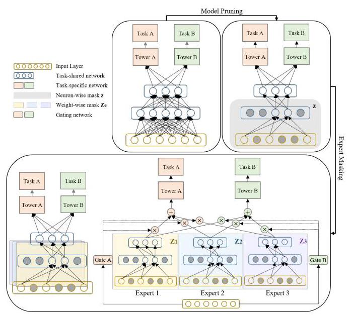
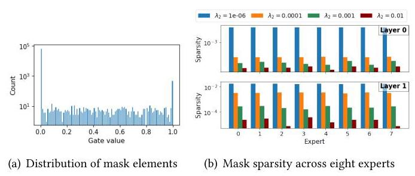
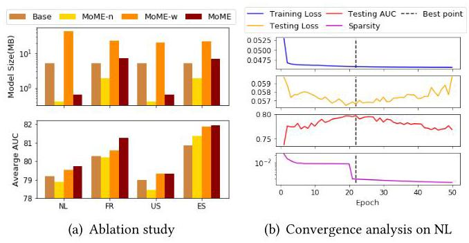

# MoME: Mixture-of-Masked-Experts for Efficient Multi-Task Recommendation

Jiahui Xu*

xujh2022@shanghaitech.edu.cn

ShanghaiTech University

Shanghai, China

Lu Sun

sunlu1@shanghaitech.edu.cn

ShanghaiTech University

Shanghai, China

Dengji Zhao

zhaodj@shanghaitech.edu.cn

ShanghaiTech University

Shanghai, China

## ABSTRACT

Multi-task learning techniques have attracted great attention in recommendation systems because they can meet the needs of modeling multiple perspectives simultaneously and improve recommendation performance. As promising multi-task recommendation system models, Mixture-of-Experts (MoE) and related methods use an ensemble of expert sub-networks to improve generalization and have achieved significant success in practical applications. However, they still face key challenges in efficient parameter sharing and resource utilization, especially when they are applied to real-world datasets and resource-constrained devices. In this paper, we propose a novel framework called Mixture-of-Masked-Experts (MoME) to address the challenges. Unlike MoE, expert sub-networks in MoME are extracted from an identical over-parameterized base network by learning binary masks. It utilizes a binary mask learning mechanism composed of neuron-level model masking and weight-level expert masking to achieve coarse-grained base model pruning and fine-grained expert pruning, respectively. Compared to existing MoE-based models, MoME achieves efficient parameter sharing and requires significantly less sub-network storage since it actually only trains a base network and a mixture of partially overlapped binary expert masks. Experimental results on real-world datasets demonstrate the superior performance of MoME in terms of recommendation accuracy and computational efficiency. Our code is available at https://https://github.com/Xjh0327/MoME.

## CCS CONCEPTS

- Computing methodologies \( \rightarrow \) Multi-task learning; - Information systems \( \rightarrow \) Recommender systems.

## KEYWORDS

Multi-Task Recommendation; Mixture-of-Experts; Binary Masks

## ACM Reference Format:

Jiahui Xu, Lu Sun, and Dengji Zhao. 2024. MoME: Mixture-of-Masked-Experts for Efficient Multi-Task Recommendation. In Proceedings of the 47th International ACM SIGIR Conference on Research and Development in Information Retrieval (SIGIR '24), July 14-18, 2024, Washington, DC, USA. ACM, New York, NY, USA, 5 pages. https://doi.org/10.1145/3626772.3657922

## 1 INTRODUCTION

The rapid development of the Internet and mobile applications highlights the critical importance of providing personalized information to users. For instance, e-commerce platforms need to recommend products that are more in line with user preferences to enhance users' purchasing intentions and encourage them to purchase. In recommendation systems, users often perform multiple behaviors on items, such as clicking, collecting, sharing, and purchasing. It is challenging to rely on a single metric to evaluate the user's level of interest in items and make recommendations that better match their preferences. Multi-task learning techniques have attracted great attention in recommendation systems because they can model multiple tasks simultaneously, which helps enhance recommendation performance by leveraging shared knowledge among tasks.

Current Multi-Task Recommendation System (MTRS) models mainly focus on different parameter sharing mechanisms, which can be roughly divided into two categories: hard sharing and soft sharing. Hard sharing \( \left\lbrack  {1,8,{17}}\right\rbrack \) forces all tasks to share the same bottom network and therefore is highly efficient yet does not work well when tasks are weakly or even negatively correlated, while soft sharing \( \left\lbrack  {3,{14},{16}}\right\rbrack \) avoids negative transfer by building task-specific networks and therefore has more parameters and is less computationally efficient. To better control the trade-off between performance and efficiency, expert sharing models based on Mixture-of-Experts (MoE) [6], such as MMoE [11], PLE [19] and AESM \( {}^{2} \) [23], have received widespread attention recently. They treat multi-layer networks as experts and use the gating network to combine the ensembles of experts. Although they provide greater flexibility than hard or soft sharing models, multiple experts with the same network structure may lead to inefficient utilization of model parameters and resources. It becomes especially severe when dealing with large-scale datasets and complex models. To solve this problem, SNR [10] learns binary coding variables to achieve sparse connections between sub-networks, while MSSM [2] uses two different types of sparse masks applied to feature fields and connections between model sub-networks to achieve feature selection and cell-level sparse sharing. However, they only sparsify the connections between sub-networks, which is coarse-grained and still requires many parameters in learning. Furthermore, their mask learning algorithms suffer from high gradient variance [22], which often leads to unstable training and low convergence rate. Dselect-k [4] selects \( k \) experts through binary encoding by a continuously differentiable and sparse gate. Compared to these methods, MoME is based on a stable gradient-based masking learning algorithm and applies fine-grained multi-level masks to extract a mixture of experts, enabling to learn more flexible model sharing structure among experts using fewer parameters.

---

*Corresponding author.

---

To address these challenges, in this paper, we propose a novel and efficient MTRS method, namely Mixture-of-Masked-Experts (MoME), based on a multi-level binary mask learning mechanism consisting of coarse-grained neuron-level model masking and fine-grained weight-level expert masking. To improve computational efficiency, MoME starts from an over-parameterized base network and applies neuron-level model masking to roughly filter out unimportant neurons. Then, weight-level expert masking is employed on the masked base network to dynamically learn expert-specific binary masks. as relevant experts, allowing personalized and fine-grained sparse sharing among experts. Unlike existing MoE-based methods that train different sub-networks for different experts, MoME treats the learned binary masks as experts, enabling efficient parameter sharing with low computational overhead. To avoid combinatorial optimization and high gradient variance in mask learning, we use a probabilistic formulation based on approximate Bernoulli distribution to enforce sparsity on masks by \( {L}_{0} \) regularization, which can be solved by scalable and stable gradient-based algorithm. Experimental results on multiple datasets show that MoME outperforms state-of-the-art models with significantly reduced number of model parameters. Fig. 1 illustrates the framework of the proposed MoME model. The contributions of this work can be summarized as follows:

- We propose a novel MTRS method, namely MoME, which learns a mixture of experts by applying different fine-grained binary masks on the same base network, enabling efficient and flexible parameter sharing across multiple tasks with low computational overhead.

- Based on approximate Bernoulli gate and probabilistic \( {L}_{0} \) regularization, we develop a stable and scalable gradient-based optimizer for MoME.

- Comprehensive experiments on real-world datasets demonstrate that MoME has superior performance in recommendation accuracy and computational efficiency compared to cutting-edge methods.

## 2 MIXTURE-OF-MASKED-EXPERTS (MOME)

Existing MoE-based methods for MTRS train a separate network for each expert, resulting in computational inefficiency and high memory consumption. To improve model efficiency, some methods \( \left\lbrack  {2,{10},{23}}\right\rbrack \) enforce sparsity in model parameters by binary encoding, but the encouraged sparsity is typically coarse-grained, which poses challenges in effectively leveraging shared knowledge and flexibly exploiting task dependencies. Furthermore, the mask learning algorithms used in prior works [12, 13] suffer from the high variance issue, leading to unstable model training. To overcome these limitations, we propose a novel MTRS method named Mixture-of-Masked-Experts (MoME), which employs a single backbone network in conjunction with a set of binary expert masks, to achieve computational efficiency and low memory consumption.

### 2.1 Framework

MoME is constructed based on the multi-gate MoE model [11]. Given \( T \) tasks and \( E \) experts, it combines expert outputs \( {\left\{  {f}_{e}\left( \cdot \right) \right\}  }_{e = 1}^{E} \) on the data matrix \( \mathbf{X} \in  {\mathbb{R}}^{N \times  D} \) through the gating network \( {g}_{t}\left( \cdot \right) \) and uses task-specific tower network \( {h}_{t}\left( \cdot \right) \) to estimate the ground truth output \( {\mathbf{y}}_{t} \in  {\mathbb{R}}^{N} \) of the \( t \) -th task. Thus, the basic framework can be formulated as:

\[
\mathop{\min }\limits_{\mathbf{W}}\frac{1}{T}\mathop{\sum }\limits_{{t = 1}}^{T}\mathcal{L}\left( {{h}_{t}\left( {{f}_{t}\left( \mathbf{X}\right) }\right) ,{\mathbf{y}}_{t}}\right) \text{ , s.t. }{f}_{t}\left( \mathbf{X}\right)  = \mathop{\sum }\limits_{{e = 1}}^{E}{g}_{t, e}\left( \mathbf{X}\right) {f}_{e}\left( \mathbf{X}\right) ,\forall t\text{ , }
\]

(1)

Figure 1: Illustration of the proposed MoME model. Based on an over-parameterized base neural network, a mixture of experts is learned through model pruning (z) and expert masking \( \left( {\left\{  {Z}_{e}\right\}  }_{e = 1}^{E}\right) \) . The prediction is made by an ensemble of experts weighted by task-specific gating networks.

where \( {f}_{e},{g}_{t} \) and \( {h}_{t} \) are parameterized by \( {\mathbf{W}}_{e},{\mathbf{W}}_{g, t} \) and \( {\mathbf{W}}_{h, t} \) , respectively, \( {g}_{t} \) is the softmax function with outputs \( {\left\{  {g}_{t, e}\right\}  }_{e = 1}^{E} \) and \( \mathcal{L} \) is the loss function.

### 2.2 Expert Masking and Model Pruning

Inspired by previous works \( \left\lbrack  {{12},{13},{18}}\right\rbrack \) that build task-specific models by covering separate binary masks on a shared model, we propose to achieve efficient and flexible sparse parameter sharing by learning an ensemble of binary masks of the base network. Instead of using \( E \) independent sub-networks \( {f}_{e} \) ’s as experts in (1), MoME learns \( E \) weight-level binary masks \( \left\{  {\mathbf{Z}}_{e}\right\} \) acting on the same backbone network \( {}^{1} \) parameterized by \( \mathbf{W} \in  {\mathbb{R}}^{{d}_{i} \times  {d}_{o}} \) , leading to \( {\mathbf{W}}_{e} = \mathbf{W} \odot  {\mathbf{Z}}_{e} \) , and treats \( f\left( {\mathbf{X},\mathbf{W} \odot  {\mathbf{Z}}_{e}}\right) \) as the \( e \) -th expert. Here we use \( \odot \) to denote the element-wise product. These binary masks can be stored using only 1 bit per parameter; in contrast, each expert in the MoE-based models typically requires 32 bits per parameter. Therefore, it allows MoME to significantly save storage space \( \left( {{32} \times  }\right) \) while improving the inference speed of the model.

To further eliminate unnecessary model parameters of the over-parameterized backbone network \( f \) , coarse-grained pruning is introduced by applying neuron-level binary mask \( \mathbf{z} \in  {\mathbb{R}}^{{d}_{i}} \) on \( \mathbf{W} \) before performing the weight-level expert masking, leading to \( {\mathbf{W}}_{e} = \mathbf{W} \odot  \left( {\mathbf{z} \otimes  {\mathbf{1}}_{{d}_{o}}}\right)  \odot  {\mathbf{Z}}_{e} \) , where \( \otimes \) denotes the outer product and \( {\mathbf{1}}_{{d}_{o}} \) is an all-one vector in size of \( {d}_{o} \) . Note that \( \mathbf{z} \) is shared across \( E \) experts and is aimed at eliminating useless neurons for all the experts. Therefore, if \( {z}_{i} \) is zero, it will prune the weights belonging to the \( i \) -th neuron for all the \( E \) experts. In this way, neuron-level model pruning further improves computational efficiency and reduces memory consumption by removing unnecessary neurons before fine-grained weight-level masking.

---

\( {}^{1} \) For brevity, we consider a single-layer base network with \( {d}_{i} \) input neurons and \( {d}_{o} \) output neurons. It can be easily extended to handle multi-layer network.

---

Motivated by \( {L}_{0} \) -regularized sparse learning \( \left\lbrack  {9,{22}}\right\rbrack \) , we propose to learn the binary masks by penalizing the \( {L}_{0} \) -norm (the number of non-zero elements in an arbitrary vector or matrix) of \( \mathbf{z} \) and \( \left\{  {\mathbf{Z}}_{e}\right\} \) , and then develop the following optimization problem:

(2)

\[
\mathop{\min }\limits_{{\mathbf{W},\mathbf{z},\left\{  {\mathbf{Z}}_{e}\right\}  }}\frac{1}{T}\mathop{\sum }\limits_{{t = 1}}^{T}\mathcal{L}\left( {{h}_{t}\left( {{f}_{t}\left( \mathbf{X}\right) }\right) ,{\mathbf{y}}_{t}}\right)  + {\lambda }_{1}\parallel \mathbf{z}{\parallel }_{0} + {\lambda }_{2}\mathop{\sum }\limits_{{e = 1}}^{E}{\begin{Vmatrix}{\mathbf{Z}}_{e}\end{Vmatrix}}_{0}
\]

\[
\text{ s.t. }{f}_{t}\left( \mathbf{X}\right)  = \mathop{\sum }\limits_{{e = 1}}^{E}{g}_{t, e}\left( \mathbf{X}\right) f\left( {\mathbf{X},{\mathbf{W}}_{e}}\right) ,{\mathbf{W}}_{e} = \mathbf{W} \odot  \left( {\mathbf{z} \otimes  {\mathbf{1}}_{{d}_{o}}}\right)  \odot  {\mathbf{Z}}_{e}\text{ . }
\]

Compared with (1), the proposed model in (2) essentially trains a pruned base network \( \mathbf{W} \odot  \left( {\mathbf{z} \otimes  {\mathbf{1}}_{{d}_{o}}}\right) \) and a set of binary masks \( \left\{  {\mathbf{Z}}_{e}\right\} \) , making task dependencies efficiently shared through \( \mathbf{z} \) and overlapped \( {\mathbf{Z}}_{e} \) ’s with significantly reduced memory consumption \( \left( {{32} \times  }\right) \) in inference.

### 2.3 MoME with Approximate Binary Mask

The proposed model in (2) learns a mixture of binary masks rather than a mixture of sub-networks in MoE-related methods, in order to maintain the strong generalization ability of MoE with significantly reduced computational resources. However, the \( {L}_{0} \) regularization used in (2) is non-convex and non-differentiable, making the optimization problem NP-hard. To overcome these limitations, we introduce a probabilistic formulation by treating each entry of \( \mathbf{z} \) or \( {\mathbf{Z}}_{e} \) as an independent Bernoulli variable, i.e.,

\[
{z}_{i} \sim  \operatorname{Bern}\left( {\pi }_{i}\right) ,\;{z}_{e,{ij}} \sim  \operatorname{Bern}\left( {\pi }_{e,{ij}}\right) ,\;\forall e, i, j, \tag{3}
\]

where \( \operatorname{Bern}\left( \pi \right) \) is the Bernoulli distribution that takes the value 1 with probability \( \pi \) . In this sense, the \( {L}_{0} \) regularization in (2) can be represented as:

\[
\mathbb{E}\left\lbrack  {\parallel \mathbf{z}{\parallel }_{0}}\right\rbrack   = \mathop{\sum }\limits_{{i = 1}}^{{d}_{i}}{\pi }_{i},\;\mathbb{E}\left\lbrack  {\parallel {\mathbf{Z}}_{e}{\parallel }_{0}}\right\rbrack   = \mathop{\sum }\limits_{{i = 1}}^{{d}_{i}}\mathop{\sum }\limits_{{j = 1}}^{{d}_{o}}{\pi }_{e,{ij}}, \tag{4}
\]

where \( \mathbb{E}\left\lbrack  X\right\rbrack \) denotes the expectation of a random variable \( X \) . Note that the optimization of the probabilistically formulated problem is still difficult to solve since its loss function involves discrete Bernoulli random variable \( \mathbf{z} \) and \( \left\{  {\mathbf{Z}}_{e}\right\} \) . Although some optimization algorithms such as REINFORCE [20] and approximation techniques [9] can be used to solve the problem, they usually suffer from high variance [9, 15]. Inspired by [22], we introduce Gaussian based continuous relaxation to approximate Bernoulli masks \( \mathbf{z} \) and \( \left\{  {\mathbf{Z}}_{e}\right\} \) :

(5)

\[
{z}_{i} = \max \left( {0,\min \left( {1,{\mu }_{i} + {\epsilon }_{i}}\right) }\right) ,\;{\epsilon }_{i} \sim  \mathcal{N}\left( {0,{\sigma }^{2}}\right) ,
\]

\[
{z}_{e,{ij}} = \max \left( {0,\min \left( {1,{\mu }_{e,{ij}} + {\epsilon }_{e,{ij}}}\right) }\right) ,\;{\epsilon }_{e,{ij}} \sim  \mathcal{N}\left( {0,{\sigma }_{e}^{2}}\right) ,
\]

where \( \mathcal{N}\left( {\mu ,{\sigma }^{2}}\right) \) denotes the Gaussian distribution with expectation \( \mu \) and standard deviation \( \sigma \) . In experiments, \( \sigma \) and \( {\sigma }_{e} \) are fixed as 0.5 throughout training. The approximate Bernoulli distribution for binary masking in (5) makes the gradient w.r.t. \( \mu \) and \( {\mu }_{\mathrm{e}} \) computable using standard back-propagation, and thus the \( {L}_{0} \) regularization in (4) can be reformulated by:

\[
\mathbb{E}\left\lbrack  {\parallel \mathbf{z}{\parallel }_{0}}\right\rbrack   = \mathop{\sum }\limits_{{i = 1}}^{{d}_{i}}\mathbb{P}\left( {{z}_{i} \geq  0}\right)  = \Phi \left( \frac{{\mu }_{i}}{\sigma }\right) ,
\]

\[
\mathbb{E}\left\lbrack  {\begin{Vmatrix}{\mathbf{Z}}_{e}\end{Vmatrix}}_{0}\right\rbrack   = \mathop{\sum }\limits_{{i = 1}}^{{d}_{i}}\mathop{\sum }\limits_{{j = 1}}^{{d}_{o}}\mathbb{P}\left( {{z}_{e,{ij}} \geq  0}\right)  = \mathop{\sum }\limits_{{i = 1}}^{{d}_{i}}\mathop{\sum }\limits_{{j = 1}}^{{d}_{o}}\Phi \left( \frac{{\mu }_{e,{ij}}}{{\sigma }_{e}}\right) , \tag{6}
\]

where \( \Phi \) denotes the CDF of the standard Gaussian distribution. Based on (2) and (6), we have the optimization problem of MoME:

\[
\mathop{\min }\limits_{{\mathbf{W},\mathbf{\mu },\left\{  {\mathbf{\mu }}_{e}\right\}  }}{\mathbb{E}}_{\mathbf{z},\left\{  {\mathbf{Z}}_{e}\right\}  }\left\lbrack  {\frac{1}{T}\mathop{\sum }\limits_{{t = 1}}^{T}\mathcal{L}\left( {{h}_{t}\left( {{f}_{t}\left( \mathbf{X}\right) }\right) ,{\mathbf{y}}_{t}}\right) }\right\rbrack   + {\lambda }_{1}\mathop{\sum }\limits_{{i = 1}}^{{d}_{i}}\Phi \left( \frac{{\mu }_{i}}{\sigma }\right)  +
\]

\[
{\lambda }_{2}\mathop{\sum }\limits_{{e = 1}}^{E}\mathop{\sum }\limits_{{i = 1}}^{{d}_{i}}\mathop{\sum }\limits_{{j = 1}}^{{d}_{o}}\Phi \left( \frac{{\mu }_{e,{ij}}}{{\sigma }_{e}}\right) \tag{7}
\]

\[
\text{ s.t. }{f}_{t}\left( \mathrm{X}\right)  = \mathop{\sum }\limits_{{e = 1}}^{E}{g}_{t, e}\left( \mathrm{X}\right) f\left( {\mathrm{X},{\mathrm{W}}_{e}}\right) ,{\mathrm{W}}_{e} = \mathrm{W} \odot  \left( {\mathrm{z} \otimes  {1}_{{d}_{o}}}\right)  \odot  {\mathrm{Z}}_{e},
\]

where \( \mathbf{z} \) and \( {\mathbf{Z}}_{e} \) are calculated according to (5). In (7), the expectation \( \mathbb{E}\left\lbrack  \cdot \right\rbrack \) over \( \mathbf{z} \) and \( \left\{  {\mathbf{Z}}_{e}\right\} \) can be approximated by Monte Carlo (MC) sampling. By introducing fine-grained sparsity through multi-level binary masks, MoME enables personalized and efficient parameter sharing across multiple tasks with a significantly reduced number of parameters in inference. Moreover, we employ a stable surrogate of probabilistic \( {L}_{0} \) -norm for mask learning, thereby mitigating the high variance problem and ensuring its robustness.

### 2.4 Implementation

MoME uses Kaiming initialization [5] to set up an over-parameterized backbone network and tower networks. Neuron-level model pruning on the backbone network is initialized with \( \mathbf{\mu } = {0.5} \) and applied for \( M \) epochs. After \( M \) epochs, the stochasticity part of \( \mathbf{z} \) is removed by \( {\widehat{z}}_{i} = \max \left( {0,\min \left( {1,{\mu }_{i}}\right) }\right) \) and keep \( \widehat{\mathbf{z}} \) unchanged throughout the following training, implying that only the pruned network parameterized by \( \mathbf{W} \odot  \left( {\widehat{\mathbf{z}} \otimes  {\mathbf{1}}_{{d}_{o}}}\right) \) is adopted in expert mask learning. Besides, the weights belonging to neuron \( i \) if \( {\widehat{z}}_{i} = 0 \) are also removed to reduce the number of trainable parameters. In expert masking, we use \( E \) masks \( \left\{  {\mathbf{Z}}_{e}\right\} \) and adopt the gating network \( {g}_{t} \) to flexibly combine the outputs of masked experts. After training, we abandon the stochasticity of \( {\mathbf{Z}}_{e} \) through \( {\widehat{z}}_{e,{ij}} = \max \left( {0,\min \left( {1,{\mu }_{e,{ij}}}\right) }\right) \) and remove the corresponding parameter once \( {\widehat{z}}_{e,{ij}} = 0,\forall e, i, j \) . In these two phases, we update masks \( z \) and \( {Z}_{e} \) using gradient descent by calculating the gradient w.r.t \( {\mu }_{i} \) and \( {\mathbf{\mu }}_{e} \) , respectively.

## 3 EXPERIMENTS

### 3.1 Experimental Setting

We conduct experiments on four real-world datasets to evaluate the performance of MoME. The used four datasets are extracted from the AliExpress dataset \( {}^{2} \) collected from traffic logs on AliEx-press \( {}^{3} \) running in more than 200 countries. We choose the subsets from four countries: Spain (ES), French (FR), Netherlands (NL), and America (US). All of them contain 80 features and their number of training & testing samples are: 22.3M & 9.3M (ES), 18.2M & 9.2M (FR), 12.2M & 5.6M (NL), and 20.0M & 7.4M (US), respectively. They have two prediction tasks: CTR (click-through rate) and CVR (conversion rate). In experiments, MoME is compared with seven models including Single Task, Shared-Bottom [1], MoE [6], MMoE [11], CGC [19], PLE [19], and AITM [21]. We conduct experiments of these comparison models using a public MTRS library \( {}^{4} \) .

---

\( {}^{2} \) https://tianchi.aliyun.com/dataset/74690

\( {}^{3} \) https://www.aliexpress.com/

---

Table 1: Experimental results on four real-world datasets.

<table><tr><td rowspan="2">Model</td><td colspan="4">AliExpress_NL</td><td colspan="4">AliExpress_FR</td></tr><tr><td>AUC1</td><td>AUC2</td><td>Logloss</td><td>Size(MB)</td><td>AUC1</td><td>AUC2</td><td>Logloss</td><td>Size(MB)</td></tr><tr><td>Single Task</td><td>72.51</td><td>85.75</td><td>0.05709</td><td>10.18</td><td>72.60</td><td>87.48</td><td>0.05238</td><td>10.18</td></tr><tr><td>Shared-Bottom</td><td>72.39</td><td>86.01</td><td>0.05713</td><td>5.26</td><td>72.50</td><td>87.96</td><td>0.05250</td><td>5.26</td></tr><tr><td>MoE</td><td>72.53</td><td>85.77</td><td>0.05715</td><td>39.32</td><td>72.50</td><td>86.67</td><td>0.05248</td><td>39.32</td></tr><tr><td>MMoE</td><td>72.54</td><td>85.49</td><td>0.05710</td><td>39.39</td><td>72.35</td><td>87.89</td><td>0.05266</td><td>39.39</td></tr><tr><td>CGC</td><td>72.33</td><td>85.83</td><td>0.05710</td><td>39.35</td><td>72.46</td><td>87.61</td><td>0.05251</td><td>39.35</td></tr><tr><td>PLE</td><td>72.37</td><td>85.78</td><td>0.05726</td><td>47.90</td><td>72.62</td><td>87.56</td><td>0.05238</td><td>47.90</td></tr><tr><td>AITM</td><td>72.58</td><td>86.03</td><td>0.05695</td><td>11.17</td><td>72.58</td><td>87.88</td><td>0.05243</td><td>11.17</td></tr><tr><td>MoME</td><td>72.66</td><td>86.80</td><td>0.05656</td><td>0.64</td><td>74.04</td><td>88.53</td><td>0.05218</td><td>7.38</td></tr><tr><td>Model</td><td colspan="4">AliExpress_US   AUC1 AUC2 Logloss Size(MB)</td><td colspan="4">AliExpress_ES   AUC1 AUC2 Logloss Size(MB)</td></tr><tr><td>Single Task</td><td>70.51</td><td>86.63</td><td>0.05211</td><td>10.18</td><td>73.07</td><td>88.76</td><td>0.06238</td><td>10.18</td></tr><tr><td>Shared-Bottom</td><td>70.50</td><td>87.55</td><td>0.05214</td><td>5.26</td><td>73.08</td><td>88.67</td><td>0.06234</td><td>5.26</td></tr><tr><td>MoE</td><td>70.40</td><td>86.90</td><td>0.05228</td><td>39.32</td><td>72.97</td><td>88.93</td><td>0.06238</td><td>39.32</td></tr><tr><td>MMoE</td><td>70.74</td><td>86.97</td><td>0.05219</td><td>39.39</td><td>72.77</td><td>88.54</td><td>0.06258</td><td>39.39</td></tr><tr><td>CGC</td><td>70.63</td><td>87.16</td><td>0.05209</td><td>39.35</td><td>72.98</td><td>88.78</td><td>0.06243</td><td>39.35</td></tr><tr><td>PLE</td><td>70.73</td><td>87.06</td><td>0.05201</td><td>47.90</td><td>73.07</td><td>88.70</td><td>0.06243</td><td>47.90</td></tr><tr><td>AITM</td><td>70.56</td><td>87.17</td><td>0.05235</td><td>11.17</td><td>73.02</td><td>88.78</td><td>0.06239</td><td>11.17</td></tr><tr><td>MoME</td><td>70.87</td><td>87.82</td><td>0.05209</td><td>0.64</td><td>74.35</td><td>89.54</td><td>0.06355</td><td>6.91</td></tr></table>

We evaluate the models using average binary cross-entropy loss (Logloss) and the Area Under the Curve (AUC) score. For fair comparisons, all the models are trained for 50 epochs using Adam optimizer [7] with learning rate 0.001 . We tune hyper-parameters of MoME according to \( {\lambda }_{1},{\lambda }_{2} \in  \left\lbrack  {{10}^{-2},{10}^{-3},{10}^{-4},{10}^{-6}}\right\rbrack \) , and set hyperparameters of comparing models as recommended by corresponding papers. The best performance in average AUC is reported in experiments. We set the number of experts as 8 for the MoE-based models and adopt MLP with two hidden layers and ReLU activation as the experts. The input embedding dimension is fixed to 128 for all models. We set the hidden layer sizes to [512, 256] for the bottom network and expert network, and set the size to [128, 64] for the tower network. Batch normalization and dropout with rate 0.2 are employed, and the batch size is set as 2,048 .

### 3.2 Experimental Results

Table 1 shows the experimental results of comparison models in terms of AUC, Logloss and model size (MB) on four datasets, where the best results are highlighted in boldface. We can see that MoME achieves the best result in AUC on all the four datasets with significantly reduced model size compared to other MoE-based models and AITM, and works the best or the second best in Logloss on all datasets except ES. The performance advantage of MoME may come from its ability to mimic a mixture of experts through an ensemble of fine-grained binary masks, thereby mitigating negative transfer by enabling flexible parameter sharing at low computational overload. Fig. 2 illustrates the sparsity in expert masks \( \left\{  {\mathbf{Z}}_{e}\right\} \) on NL. We can see that only a small subset of mask elements are in the range of \( \left( {0,1}\right) \) (Fig. 2(a)), and therefore the mask we use can effectively approximate binary mask. Besides, expert masks exhibit strong sparsity once a proper value of \( \lambda \) is selected (Fig. 2(b)). In most cases, MoE-based models slightly outperform the single-task model, but at the cost of much larger model sizes. Shared-Bottom learns smaller model sizes than MoME on the FR and ES datasets, but it performs worse than MoME in prediction accuracy.

Figure 2: Illustration of mask sparsity on AliExpress_NL.

Figure 3: Quantitative analysis of MoME.

An ablation study is conducted by comparing MoME with its three degraded variants: Base (without masking), MoME-n (neuron-level pruning), and MoME-w (weight-level masking). Fig.3(a) shows the results on four datasets in average AUC. Compared to Base, MoME-n prunes the backbone network to a large extent while still achieving comparable performance. MoME-w performs better than Base and MoME-n in AUC, revealing the efficacy of learning an ensemble of binary expert masks. By combining two types of masking, MoME consistently outperforms its variants. In addition, convergence analysis of MoME \( \left( {{\lambda }_{1} = {0.01},{\lambda }_{2} = {10}^{-6}}\right) \) on NL is shown in Fig. 3(b). It shows that the objective can stably converge to the local minimum while the sparsity gradually increases.

## 4 CONCLUSION

In this paper, we propose a novel MoME model for efficient MTRS. MoME uses an ensemble of binary marks and an over-parameterized base network to improve generalization and computational efficiency. Experiments show that MoME outperforms state-of-the-art MTRS models with significantly reduced model size. For future work, it would be interesting to combine MoME with transformer and evaluate its efficacy on large-scale multi-modal datasets.

## ACKNOWLEDGMENTS

This work is partially supported by Science and Technology Commission of Shanghai Municipality (No. 23010503000).

---

\( {}^{4} \) https://github.com/easezyc/Multitask-Recommendation-Library

---

## REFERENCES

[1] Rich Caruana. 1997. Multitask learning. Machine learning 28 (1997), 41-75.

[2] Ke Ding, Xin Dong, Yong He, Lei Cheng, Chilin Fu, Zhaoxin Huan, Hai Li, Tan Yan, Liang Zhang, Xiaolu Zhang, et al. 2021. MSSM: a multiple-level sparse sharing model for efficient multi-task learning. In Proceedings of the 44th International ACM SIGIR Conference on Research and Development in Information Retrieval. 2237-2241.

[3] Long Duong, Trevor Cohn, Steven Bird, and Paul Cook. 2015. Low resource dependency parsing: Cross-lingual parameter sharing in a neural network parser. In Proceedings of the 53rd annual meeting of the Association for Computational Linguistics and the 7th international joint conference on natural language processing (volume 2: short papers). 845-850.

[4] Hussein Hazimeh, Zhe Zhao, Aakanksha Chowdhery, Maheswaran Sathiamoor-thy, Yihua Chen, Rahul Mazumder, Lichan Hong, and Ed Chi. 2021. Dselect-k: Differentiable selection in the mixture of experts with applications to multi-task learning. Advances in Neural Information Processing Systems 34 (2021), 29335- 29347.

[5] Kaiming He, Xiangyu Zhang, Shaoqing Ren, and Jian Sun. 2015. Delving deep into rectifiers: Surpassing human-level performance on imagenet classification. In Proceedings of the IEEE international conference on computer vision. 1026-1034.

[6] Robert A Jacobs, Michael I Jordan, Steven J Nowlan, and Geoffrey E Hinton. 1991. Adaptive mixtures of local experts. Neural computation 3, 1 (1991), 79-87.

[7] Diederik P Kingma and Jimmy Ba. 2014. Adam: A method for stochastic optimization. arXiv preprint arXiv:1412.6980 (2014).

[8] Iasonas Kokkinos. 2017. Ubernet: Training a universal convolutional neural network for low-, mid-, and high-level vision using diverse datasets and limited memory. In Proceedings of the IEEE conference on computer vision and pattern recognition. 6129-6138.

[9] Christos Louizos, Max Welling, and Diederik P Kingma. 2018. Learning Sparse Neural Networks through L_0 Regularization. In International Conference on Learning Representations.

[10] Jiaqi Ma, Zhe Zhao, Jilin Chen, Ang Li, Lichan Hong, and Ed H Chi. 2019. Snr: Sub-network routing for flexible parameter sharing in multi-task learning. In Proceedings of the AAAI Conference on Artificial Intelligence, Vol. 33. 216-223.

[11] Jiaqi Ma, Zhe Zhao, Xinyang Yi, Jilin Chen, Lichan Hong, and Ed H Chi. 2018. Modeling task relationships in multi-task learning with multi-gate mixture-of-experts. In Proceedings of the 24th ACM SIGKDD international conference on knowledge discovery & data mining. 1930-1939.

[12] Arun Mallya, Dillon Davis, and Svetlana Lazebnik. 2018. Piggyback: Adapting a single network to multiple tasks by learning to mask weights. In Proceedings of the European conference on computer vision (ECCV). 67-82.

[13] Arun Mallya and Svetlana Lazebnik. 2018. Packnet: Adding multiple tasks to a single network by iterative pruning. In Proceedings of the IEEE conference on Computer Vision and Pattern Recognition. 7765-7773.

[14] Ishan Misra, Abhinav Shrivastava, Abhinav Gupta, and Martial Hebert. 2016. Cross-stitch networks for multi-task learning. In Proceedings of the IEEE conference on computer vision and pattern recognition. 3994-4003.

[15] Andriy Mnih and Danilo Rezende. 2016. Variational inference for monte carlo objectives. In International Conference on Machine Learning. PMLR, 2188-2196.

[16] Sebastian Ruder, Joachim Bingel, Isabelle Augenstein, and Anders Søgaard. 2019. Latent multi-task architecture learning. In Proceedings of the AAAI Conference on Artificial Intelligence, Vol. 33. 4822-4829.

[17] Ozan Sener and Vladlen Koltun. 2018. Multi-task learning as multi-objective optimization. Advances in neural information processing systems 31 (2018).

[18] Tianxiang Sun, Yunfan Shao, Xiaonan Li, Pengfei Liu, Hang Yan, Xipeng Qiu, and Xuanjing Huang. 2020. Learning sparse sharing architectures for multiple tasks. In Proceedings of the AAAI conference on artificial intelligence, Vol. 34. 8936-8943.

[19] Hongyan Tang, Junning Liu, Ming Zhao, and Xudong Gong. 2020. Progressive layered extraction (ple): A novel multi-task learning (mtl) model for personalized recommendations. In Proceedings of the 14th ACM Conference on Recommender Systems. 269-278.

[20] Ronald J Williams. 1992. Simple statistical gradient-following algorithms for connectionist reinforcement learning. Machine learning 8 (1992), 229-256.

[21] Dongbo Xi, Zhen Chen, Peng Yan, Yinger Zhang, Yongchun Zhu, Fuzhen Zhuang, and Yu Chen. 2021. Modeling the sequential dependence among audience multistep conversions with multi-task learning in targeted display advertising. In Proceedings of the 27th ACM SIGKDD Conference on Knowledge Discovery & Data Mining. 3745-3755.

[22] Yutaro Yamada, Ofir Lindenbaum, Sahand Negahban, and Yuval Kluger. 2020. Feature selection using stochastic gates. In International Conference on Machine Learning. PMLR, 10648-10659.

[23] Xinyu Zou, Zhi Hu, Yiming Zhao, Xuchu Ding, Zhongyi Liu, Chenliang Li, and Aixin Sun. 2022. Automatic expert selection for multi-scenario and multi-task search. In Proceedings of the 45th International ACM SIGIR Conference on Research and Development in Information Retrieval. 1535-1544.