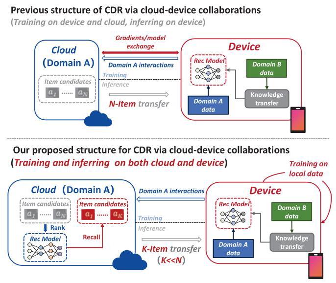
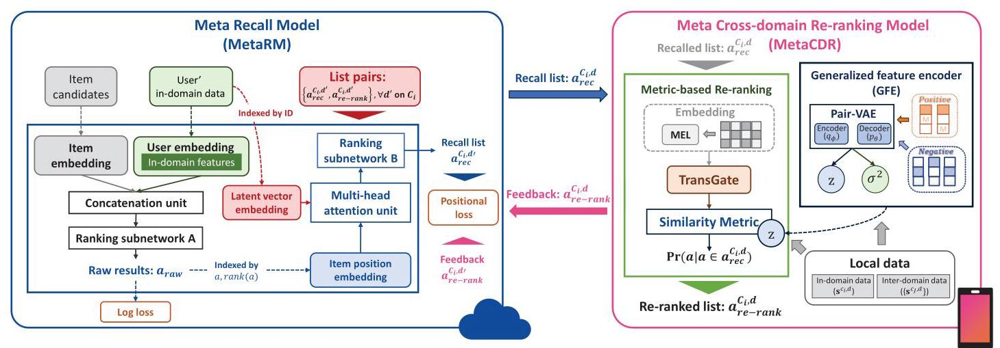
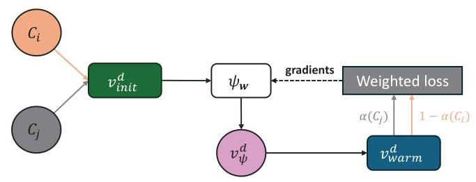
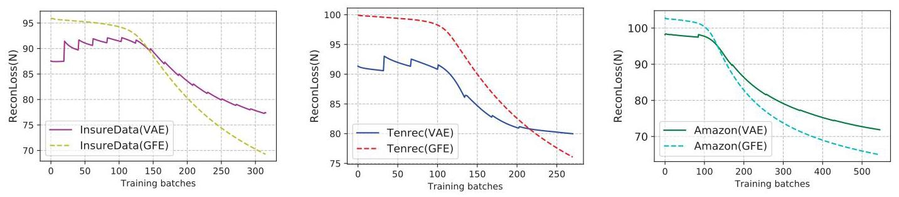
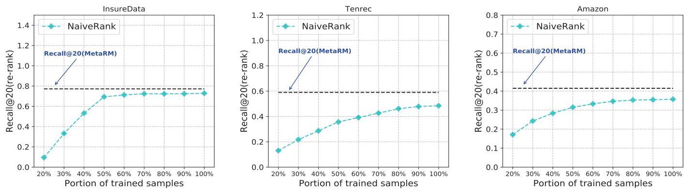
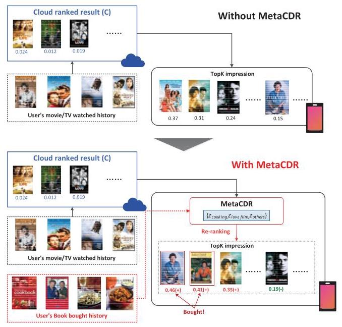
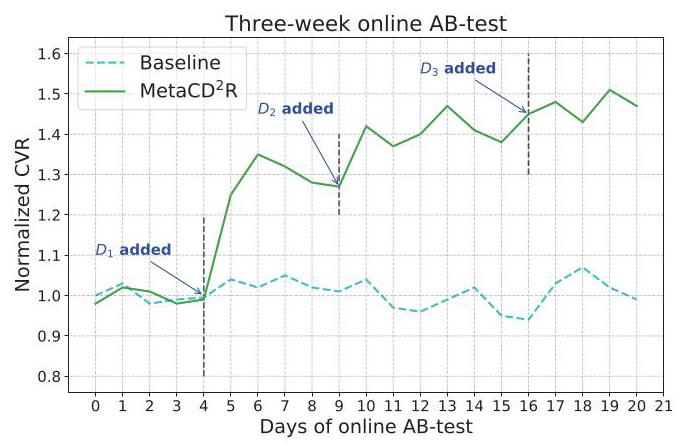
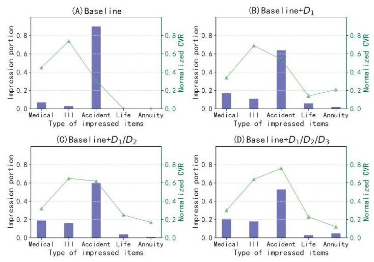

# DeCoCDR: Deployable Cloud-Device Collaboration for Cross-Domain Recommendation

Yu Li

College of Computer

Science and Technology

Jilin University

yuli19@mails.jlu.edu.cn

Yi Zhang

Algorithm team

Wesure Inc.

jamesyzhang@wesure.cn

Zimu Zhou

School of Data Science

City University of

Hong Kong

zimuzhou@cityu.edu.hk

Qiang Li*

College of Computer

Science and Technology

Jilin University

li_qiang@jlu.edu.cn

## ABSTRACT

Cross-domain recommendation (CDR) is a widely used methodology in recommender systems to combat data sparsity. It leverages user data across different domains or platforms for providing personalized recommendations. Traditional CDR assumes user preferences and behavior data can be shared freely among cloud and users, which is now impractical due to strict restrictions of data privacy. In this paper, we propose a Deployment-friendly Cloud-Device Collaboration framework for Cross-Domain Recommendation (De-CoCDR). It splits CDR into a two-stage recommendation model through cloud-device collaborations, i.e., item-recall on cloud and item re-ranking on device. This design enables effective CDR while preserving data privacy for both the cloud and the device. Extensive offline and online experiments are conducted to validate the effectiveness of DeCoCDR. In offline experiments, DeCoCDR outperformed the state-of-the-arts in three large datasets. While in real-world deployment, DeCoCDR improved the conversion rate by 45.3% compared with the baseline.

## CCS CONCEPTS

- Information systems \( \rightarrow \) Recommender systems; Online advertising.

## KEYWORDS

Cloud-Device Collaboration; Cross-domain Recommendation; On-device Inference; Privacy Presevation

## ACM Reference Format:

Yu Li, Yi Zhang, Zimu Zhou, and Qiang Li. 2024. DeCoCDR: Deployable Cloud-Device Collaboration for Cross-Domain Recommendation. In Proceedings of the 47th International ACM SIGIR Conference on Research and Development in Information Retrieval (SIGIR '24), July 14-18, 2024, Washington, DC, USA. ACM, New York, NY, USA, 10 pages. https://doi.org/10.1145/ 3626772.3657786

Figure 1: Cloud-device collaboration paradigms for cross-domain recommendation.

## 1 INTRODUCTION

The digital commerce is experiencing rapid growth, resulting in large numbers of new or less explored user groups. Such sparse user data imposes a major challenge for recommender systems, and has stimulated the emergence of cross-domain recommendation (CDR) [39]. By leveraging information from other domains e.g., search engine [29], short-video [13], online shopping [12], cross-domain recommendation can offer relevant suggestions for new or less explored areas of interest for users. This approach has already been successfully implemented in various applications, including news [11], e-shopping [20], online video streaming[13], among others.

Traditional CDR relies on a cloud server to facilitate data sharing across domains \( \left\lbrack  {5,{21},{39}}\right\rbrack \) , which is challenged by the increasing concerns on data privacy [5, 14]. Since data from multiple domains of the same user is often accessible on edge devices e.g., different apps on one's smartphone, a promising alternative is to harness these edge devices for cross-domain data sharing, known as cloud-device collaboration [18, 21, 24, 27, 36, 37]. In these solutions, the cloud and devices collaboratively learn cross-domain knowledge without accessing the raw data via federated learning \( \left\lbrack  {{18},{21},{27}}\right\rbrack \) or model distillation [33, 34, 36], where the trained model is then deployed to the devices for inference (upper figure in Fig. 1). Despite its effectiveness in training, such collaborative-training-local-inference paradigm is unfavorable for practical deployment of recommender systems. (i) Since a recommender system e.g., e-shopping, may rank millions of items during inference [6], such overhead would easily overwhelm the memory and computation of edge devices. (ii) Local inference implicitly assumes the item pool is also deployed to edge devices, which may be forbidden since the item pool is sometimes considered as the asset of the cloud [19, 30].

---

*Corresponding author.

---

In this paper, we propose a Deployment-friendly Cloud-Device Collaboration framework for Cross-Domain Recommendation (De-CoCDR). As shown in the bottom figure of Fig. 1, the major distinction from previous efforts is that the cloud and the device also collaborate in inference, where the recommender system is split into two parts: on-cloud item recall and on-device re-ranking. Specifically, the on-cloud recall model extracts user's potentially interested items. These recalled items are then sent to device for personalized re-ranking based on local data from other domains. Such a model-split deployment has the following advantages. (i) The large item pool remains on the cloud, which aligns with the business logic in practice. (ii) Compared with the million-scale item candidates, the recalled item candidates are often at hundred scale [8, 35], which is more manageable for re-ranking on resource-limited devices. (iii) The subsequent on-device re-ranking can naturally utilize the cross-domain data from the same user to improve recommendation accuracy without compromising privacy.

While being more practical for inference, the two-stage model is more difficult to train since the inter-user knowledge (of the same domain) and inter-domain knowledge (of the same user) no longer interact freely, but via the highly compressed item recall list. This constraint exaggerates the data sparsity problem in model training. (i) To train the on-device re-ranking model, only the user's own local (intra- and inter-domain) data can be utilized. Even worse, most items in the recalled item list are new to the user due to limited interactions with the cloud. (ii) To train the on-cloud item recall model, the cloud has to rely on the limited historical interactions with the user. More importantly, the cloud cannot easily obtain other effective features due to inaccessibility of the local inter-domain data. These restrictions prohibit effective learning of user preferences on the cloud.

To this end, private data constraints lead to the design of separate learning strategies for the device and the cloud side.

- On-device re-ranking: To combat the data sparsity on device, we propose a metric-based meta-learning re-ranking model. It first adopts a generalized feature encoder to learn robust user preferences from limited cross-domain data from a single user. The key is to learn from both the positive and negative samples via a pair-wise variational autoencoder. We also utilize metric-based meta learning to further improve the model generalization to unseen items.

- On-cloud recall: Exploiting overlaps in the recalled and re-ranked lists as the bridge, a meta recall model is designed to determine accurate item recall list. First, users are encoded with recommended items upon generalized feature embeddings. Then a latent vector is placed to fine-tune the previous results based on positional differences between recalled and re-ranked lists. Through this design, the impact of the inaccessible inter-domain data on item re-ranking can be captured on cloud.

We evaluate DeCoCDR via extensive offline and online experiments. In offline experiments, DeCoCDR achieves the best performance compared with the state-of-the-arts [11, 16, 21, 25, 27] on three large datasets. We also deployed DeCoCDR for a three-week online A/B test. Compared with the baseline without utilizing local inter-domain data, DeCoCDR achieves 45.3% improvement in conversion rate (CVR) of product advertising.

The contributions of this work are summarized as follows:

- To the best of our knowledge, we are one of first attempts on a cross-domain recommendation framework that complies with commercially practical data privacy constraints.

- We propose DeCoCDR, a new two-staged cross-domain recommender system into via cloud-device collaborations. Its design effectively tackles the data sparsity problem in on-device re-ranking and on-cloud item-recall.

- In offline experiments, DeCoCDR outperforms the state-of-the-arts [11, 16, 21, 25, 27] in three large datasets. DeCoCDR is also deployed in real-world applications. In online product advertising test, DeCoCDR improves CVR by 45.3% compared with the baseline.

## 2 RELATED WORK

Cloud-based CDR. In cloud-based CDR, data from different domains are gathered and utilized at the central server [3, 5, 11, 15- 17, 20, 29, 40, 41]. For example, Hu et al. [11] propose a collaborative cross-network for effective knowledge transfer across domains. Ouyang et al. [29] design a mixed neural network to model long-term and short-term user interest in different domains for click-through rate prediction. Zhu et al. [41] adopt meta learning to construct a personalized knowledge transfer module for each user for interest prediction. However, sharing cross-domain data with the central server is challenged by the data privacy regulations.

Collaborative CDR. Collaborative CDR avoids direct data access to other domains during the training of cross-domain recommendation models [21-23, 27, 36]. For instance, Liu et al. [21] adopt federated transfer learning to extract knowledge from other domains. Wu et al. [27] introduce personal and transfer modules to adapt to the heterogeneous data for rate prediction. Yao et al. [36] utilize model distillation to realize cross-domain recommendation. Although collaborative CDR enables privacy-preserving model training, existing solutions assume the trained model is entirely deployed to the edge device. Consequently, the whole (million-scale) item pool should be either transmitted or ported to the device for model inference, which is impractical due to commercial reasons and the limited resources on edge devices. To address this drawback, we formulate a new collaborative CDR framework, as explained below.

## 3 DECOCDR FORMULATION

This section introduces a new cloud-device collaboration formulation for cross-domain recommendation. For ease of presentation, we assume a single cloud \( {C}_{i} \) and a single device \( d \) .

- Cloud \( {C}_{i} \) : It is a public service provider, e.g., online shopping App, that stores data from large numbers of users (devices) in the same domain, i.e., public data such as browsing logs, item clicks, bought history, etc. within the same App. Let these collected samples be \( {S}^{{C}_{i}} = \left\{  {\left\{  {s}^{{C}_{i},0}\right\}  ,\ldots ,\left\{  {s}^{{C}_{i}, n}\right\}  }\right\} \) , where \( \left\{  {s}^{{C}_{i}, d}\right\} \) denotes the sample set collected from device \( d \) , which contains features of user’s and items’. \( {C}_{i} \) leverages these samples to train models to recommend items for each user, where total item candidates \( {\mathbf{a}}_{\text{ total }}^{{C}_{i}} = {\left\{  {a}_{i}\right\}  }_{i = 1}^{N} \) are stored at the cloud. Only a few top items of recommendation can be impressed due to limited impression space on edge devices. As business practices, the item candidates \( {\mathbf{a}}_{\text{ total }}^{{C}_{i}} \) cannot be shared with other clouds or devices [19, 30].

Figure 2: The design of DeCoCDR, which consists of a meta recall model (MetaRM) on cloud and a meta cross-domain re-ranking model (MetaCDR) on device. On cloud, MetaRM determines the item candidates sent to the device by learning from in-domain data on cloud and feedback from device. The recalled items are further re-ranked by MetaCDR based on local data on device.

- Device \( d \) : Following the typical CDR setup [39], there are limited interactions between device \( d \) and \( {C}_{i} \) , i.e., \( \left| {s}^{{C}_{i}, d}\right| \) is small. However, there are other Apps (domains) installed on device \( d \) . Let the corresponding clouds of these Apps be \( \left\{  {C}_{j}\right\} \) , and the interactions between \( d \) and \( \left\{  {C}_{j}\right\} \) as \( \left\{  {s}^{{C}_{j}, d}\right\} \) . Device \( d \) has access to the all \( \left\{  {s}^{{C}_{j}, d}\right\} \) across Apps, but \( {s}^{{C}_{j}, d} \) is inaccessible by \( {C}_{i} \) for \( i \neq  j \) due to privacy regulations [14]. Cloud \( {C}_{i} \) cannot retrieve \( {s}^{{C}_{j}, d} \) from cloud \( {C}_{j} \) either [21,41].

DeCoCDR Workflow. DeCoCDR is a two-stage recommender system deployed to cloud \( {C}_{i} \) and device \( d \) , which consists of an on-device re-ranking model and an on-cloud item recall model (see Fig. 2). It operates as follows. First, item candidates for \( d \) are selected by cloud \( {C}_{i} \) , as indicated by the blue arrow in Fig. 2. At most a few hundreds items are selected from the million-scale item pool \( \left\lbrack  {8,{35}}\right\rbrack \) . This complies with the privacy of \( {C}_{i} \) and decreases the computation overhead for on-device re-ranking. On the device side, inter-domain data are used to re-ranked the recalled items to user preferences. Then the interacted re-ranked list is returned to \( {C}_{i} \) , which corresponds to the orange arrow in Fig. 2. This closes the loop of the workflow. The concrete formulations of the on-device and on-cloud models are as follows.

- On-cloud Item Recall Model \( {M}^{{C}_{i}} \) : Given the previous definitions, the output of \( {M}^{{C}_{i}} \) can be expressed as:

\[
\mathop{\Pr }\limits^{{C}_{i}}\left( {{a}_{k} \mid  d}\right)  = {M}^{{C}_{i}}\left( {{f}_{a}^{{C}_{i}}\left( {a}_{k}\right) ,{f}_{u}^{{C}_{i}}\left( d\right) }\right) \tag{1}
\]

where \( \mathop{\Pr }\limits^{{C}_{i}}\left( {{a}_{k} \mid  d}\right) \) is the predicted CTR/CVR of item \( {a}_{k} \) for device \( d.{f}_{a}^{{C}_{i}} \) and \( {f}_{u}^{{C}_{i}} \) denote the embeddings for items and users separately. Typically, \( {C}_{i} \) performs Eq. (1) on all item candidates. Given limited resources on edge devices, typically only several hundreds of top items are sent to the devices [8, 35]. We define the number of selected items as K. The objective is to rank item candidates such that users' preferred ones appear in top K as many as possible, i.e.,

\[
\max \mathop{\sum }\limits_{{\forall a \in  {a}_{rec}^{{C}_{i}, d}}}{y}^{d}\left( a\right) \;\text{ s.t. }\left| {a}_{rec}^{{C}_{i}, d}\right|  = K \tag{2}
\]

where \( {y}^{d}\left( a\right) \) is the label of item \( a \) for \( d \) and \( {\mathbf{a}}_{rec}^{{C}_{i}, d} \) denotes the recalled items.

- On-device Re-ranking Model \( {M}^{d} \) : Similar to \( {M}^{{C}_{i}} \) , its output is also the predicted probability of items, i.e.,

\[
\mathop{\Pr }\limits^{d}\left( {a}_{k}\right)  = {M}^{d}\left( {{f}_{a}^{d}\left( {a}_{k}\right) ,{F}_{u}^{d}\left( {{s}^{{C}_{i}, d},\left\{  {s}^{{C}_{j}, d}\right\}  }\right) }\right) \tag{3}
\]

where \( {f}_{a}^{d}\left( \cdot \right) \) is the encoded feature embeddings for items. \( {F}_{u}^{d} \) is the feature learning function to transfer knowledge from inter-domain data on device \( d \) . Let the re-ranked list be \( {\mathbf{a}}_{\text{ re-rank }}^{{C}_{i}, d} = \left\{  {{a}_{k}^{\prime } \in  {\mathbf{a}}_{\text{ rec }}^{{C}_{i}, d} \mid  P{r}^{d}\left( {a}_{k}^{\prime }\right)  \geq  P{r}^{d}\left( {a}_{{k}^{\prime } + 1}\right) \} }\right. \) . The objective is to re-rank the recalled list \( {\mathbf{a}}_{rec}^{{C}_{i}, d} \) such that future clicked/converted ones are ranked as top as possible, i.e.,

\[
\min \mathop{\sum }\limits_{{\forall a \in  {\mathbf{a}}_{rec}^{{C}_{i}, d}}}\operatorname{Rank}\left( {a \mid  P{r}^{d}\left( a\right) }\right)  \cdot  {y}^{d}\left( a\right) , \tag{4}
\]

\[
\text{ s.t. }{x}_{{F}_{u}^{d}} \in  \left\{  {s}^{C, d}\right\}  , a \in  {a}_{\text{ total }}^{{C}_{i}}
\]

where Rank is the impressed position and \( {x}_{{F}_{u}^{d}} \) denotes the input of \( {F}_{u}^{d} \) .

Challenges. Realizing such a two-stage CDR framework involves optimizing Eq. (2) and Eq. (4), which faces two challenges.

- On-cloud: It is difficult to learn \( {f}_{u}^{{C}_{i}}\left( d\right) \) from a few historical in-domain samples \( {s}^{{C}_{i}, d} \) . Even worse, we must update \( {f}_{u}^{{C}_{i}}\left( d\right) \) given \( {\mathbf{a}}_{\text{ re-rank }}^{{C}_{i}, d} \) without access to inter-domain data \( \left\{  {s}^{{C}_{j}, d}\right\} \) . The sub-optimal \( {f}_{u}^{{C}_{i}}\left( d\right) \) restricts the optimization of Eq. (2).

- On-device: Since most recalled items are new, the feature embeddings \( {f}_{a}^{d} \) for these items cannot be directly obtained from historical data. In addition, the sparsity and complex distributions of local inter-domain data makes it difficult to derive the feature learning function \( {F}_{u}^{d} \) . Without two these parameters, solving Eq. (4) becomes non-trivial.

As next, we propose separate model designs to address the two challenges to realize DeCoCDR. For ease of presentation, we start with the on-device model.

## 4 ON-DEVICE RE-RANKING MODEL

We propose a meta-learning based cross-domain recommendation network (MetaCDR) for on-device item re-ranking (right part of Fig. 2) given the recalled items from the cloud. As mentioned in Sec. 3, the on-device model should (i) learn from (inter-domain) data of a single user, and (ii) rank the recall list with unseen items. Accordingly, we design a generalized feature encoder (Sec. 4.1) to learn robust inter-domain feature representations, and adopt a metric-based meta re-ranking model (Sec. 4.2) for few-shot adaptation to unseen items.

### 4.1 Generalized Feature Encoder (GFE)

Basic Idea. To learn user feature embeddings \( {f}^{d} \) from inter-domain data, we leverage variational autoencoder (VAE) for its ability to extract feature representations from different distributions [31]. As the inter-domain data contain limited positive samples, it is crucial to also exploit the negative samples. Therefore, unlike the vanilla VAE, we design a pairwise variational autoencoder (Pair-VAE) as the core of the encoder. A new pairwise loss is used to harness both positive and negative samples.

Learn User Feature Embeddings via VAE. Recall the working process of VAE, it contains an encoder to compress the raw input and a decoder for reconstruction.

- Encoder \( {q}_{\phi }\left( {z \mid  v}\right) \) : We first use an identical embedding dict to get the embedded vector of sample \( {s}_{k}^{{C}_{i}, d} \) , i.e., \( {v}_{G}^{d}\left( {s}_{k}^{{C}_{i}, d}\right) \) . Following [7], we also use generalized features as the entries of embedding dict, e.g., categories, visit times, tags etc., as in the recalled items from cloud. We will use \( v \) in the following for simplicity. Each \( v \) is a sample from a Gaussian \( N\left( {z,{\sigma }^{2}}\right) \) , with mean \( z \) and variance \( \sigma \) . As in \( \left\lbrack  {1,{31}}\right\rbrack  , z \) is also treated as the feature embedding of user preferences.

- Decoder \( {p}_{\theta }\left( {v \mid  z}\right) \) : It reconstructs the input \( v \) from the encoded vector \( z \) . Instead of directly building \( v \) from \( z \) , it aims to build \( z \) from \( N\left( {z,{\sigma }^{2}}\right) \) .

The VAE can be trained via the Evidence Lower BOund (ELBO):

\[
{\mathcal{L}}_{\theta ,\phi }\left( v\right)  = {\mathbb{E}}_{z \sim  {q}_{\phi }}\left\lbrack  {\ln {p}_{\theta }\left( {v \mid  z}\right) }\right\rbrack   - {\beta KL}\left( {{q}_{\phi } \mid  {p}_{\theta }}\right) \tag{5}
\]

where \( {KL}\left( {{q}_{\phi } \mid  {p}_{\theta }}\right) \) is the KL-divergence and \( \beta \) is the weight factor.

Harness Both Positive and Negative Samples via Pair-VAE. Directly training the vanilla VAE following Eq. (5) is ineffective due to the sparse positive samples on device. Hence, we improve the vanilla VAE in two aspects.

Algorithm 1: Training MetaCDR

---

Input: Historical samples on device \( d \) , initial parameters

Output: Trained MetaCDR

Step 1: Training Generalized Feature Encoder

while Eq. (6) is not converged do

	Sample positive samples: \( \left\{  {s}_{k}^{C, d}\right\} \) ;

	Sample negative samples: \( \left\{  {\widehat{s}}_{{k}^{\prime }}^{C, d}\right\} \) ;

	foreach each masked pair \( \left\{  {{s}_{k, i}^{C, d},{\widehat{s}}_{{k}^{\prime }}^{C, d}}\right\} \) in the batch do

		Calculate \( {\mathcal{L}}_{GFE} \) ;

		Update network parameters \( \theta ,\phi \) etc.

	end

end

Step 1 output: trained GFE and \( z \) ;

Step 2: Training Meta Re-ranking Model

Initialize the model with \( {v}_{\text{ init }}^{d} \) and \( {v}_{\text{ warm }}^{d} \)

Training MRM separately with \( {v}_{\text{ init }}^{d} \) and \( {v}_{\text{ warm }}^{d} \)

while Not converged do

	Update \( {\psi }_{\mathbf{w}} \) through Eq. (8)

end

Insert \( {\psi }_{w} \) for \( {v}_{\text{ init }}^{d} \) in MRM

while Eq. (11) is not converged do

	Sample \( \left\{  {{s}^{C, d}, y\left( a\right)  \mid  a \in  {s}^{C, d}}\right\} \) from local data

	Derive \( \Pr \left( a\right) \) based on \( z \) and MRM

	Calculate \( {\mathcal{L}}_{MRM} \) and update MRM parameters

end

Step 2 output: trained MRM

---

- Sample Masking. By masking some raw features of input, we extend a single sample \( {s}_{k}^{C, d} \) to a set of masked samples \( {s}_{k}^{C, d} \rightarrow  \left\{  {{s}_{k,0}^{C, d},{s}_{k,1}^{C, d},\ldots ,{s}_{k, n}^{C, d}}\right\} \) . This makes the learned feature encoder more robust [9] and achieves higher re-ranking accuracy. We use \( {v}_{i} \) to denote one of \( v \) ’s masked vectors.

- Pair-wise Loss. We utilize the negative samples to help the encoder learn user's preferences more accurately. Let the vector of negative samples be \( \widehat{v} \) . We modify Eq. (5) into a pair-wise loss function as follows.

\[
{\mathcal{L}}_{GFE} =  - \frac{1}{N}\mathop{\sum }\limits_{{\forall \left( {{v}_{i},\widehat{v}}\right) }}{\mathcal{L}}_{\theta ,\phi }\left( {v}_{i}\right)  + {\mathcal{L}}_{\theta ,\phi }\left( \widehat{v}\right)  - \lambda {\left| {z}_{i} - \widehat{z}\right| }^{2} \tag{6}
\]

where \( \left( {{v}_{i},\widehat{v}}\right) \) is a randomly sampled pair and \( \lambda \) is the loss weight for 2-norm between \( {z}_{i} \) and \( \widehat{z} \) . We introduce \( {\left| {z}_{i} - \widehat{z}\right| }^{2} \) to discriminate the reconstructed vectors between positive and negative samples for more accurate feature learning. Solving Eq. (6) gives us the representations of user's preferences, i.e., \( N\left( {z,\sigma }\right) \) . For further utilization in re-ranking, we use \( z = \{ z\} \) to represent user preferences where \( z \) is derived through modeling them as a multi-nominal Gaussian distribution.

### 4.2 Meta Re-ranking Model (MRM)

Basic Idea. To re-rank (unseen) recalled items, we leverage a metric-based meta-learning method. It starts with a meta embedding learner, which encodes recalled items using their generalized

Figure 3: The calculation process of Meta-Embedding Learner. The \( {v}_{\text{ init }}^{d} \) of samples in \( {C}_{i} \) and \( {C}_{j} \) are first updated by \( {\psi }_{w} \) . The updated vectors \( {v}_{\psi }^{d} \) are then passed to calculate weighted loss with \( {v}_{\text{ warm }}^{d} \) . Gradients are backpropagated to update \( {\psi }_{w} \) .

features and then warms up by local samples. Then a metric-based re-ranking mechanism is applied to score the recalled items based on the warmed-up embeddings. Typically, the similarity between the input and the support set is used as the metric [10]. Here we utilize the learned user embeddings from GFE as the support vectors for its effectiveness to represent user preferences.

Meta-Embedding Learner (MEL). It derives the embeddings for recalled items based on existing in-domain and inter-domain samples. We train this module in two steps: (i) initialize the embeddings through their generalized features, and (ii) warm up the initial ones with existing samples.

Step 1: Initialization. We follow [7, 8] to obtain initial embed-dings from two feature types. (i) Statistic Features: They are from the cloud when items are sent to the device, e.g., the item rank in the same category, whether the item is 'hot', the number of watched/clicked/bought users, etc.. (ii) Attribute Features: They are determined by the item attributes which are not affected by users' interactions. Such features are the price, category, brand, tag, etc.. If the entry of aforementioned feature doesn't exist, we leave it blank. We use mini-batch of samples in domain \( \left\{  {C}_{j}\right\} \) with similar size to that of \( {C}_{i} \) to get the initial embeddings. Let \( {v}_{\text{ init }}^{d}\left( \cdot \right) \) be the initial embeddings.

Step 2: Warm-Up. We repeat the same process but add extra features e.g., features from user interactions to train the model. All local samples are included for training. We use \( {v}_{\text{ warm }}^{d}\left( \cdot \right) \) to denote their embeddings. Let the warming-up function be \( {\psi }_{w}\left( \cdot \right) \) , which projects the embedding from \( {v}_{\text{ init }}^{d} \) to \( {v}_{\text{ warm }}^{d} \) . For each step, the updated embeddings can be expressed as:

\[
{v}_{\psi , k}^{d}\left( {a}^{C}\right)  = {\psi }_{w}\left( {{v}_{\text{ init }, k - 1}^{d}\left( {a}^{C}\right) }\right. \tag{7}
\]

where \( {v}_{\text{ init, }k - 1}^{d} \) is the projected embeddings in \( k - 1 \) -th iteration and \( {v}_{\text{ init },0}\left( {a}^{C}\right)  = {v}_{\text{ init }}\left( {a}^{C}\right) \) . For Eq. (7), we denote the loss of projection in \( k \) -th iteration as: \( l\left( {a}^{C}\right)  = {\left| {v}_{\text{ warm }, k}^{d}\left( {a}^{C}\right)  - {v}_{\psi , k}^{d}\left( {a}^{C}\right) \right| }^{2} \) . Then \( {\psi }_{w} \) is updated as follows:

\[
{\psi }_{\mathbf{w}, k} \leftarrow  {\psi }_{\mathbf{w}, k - 1} + \operatorname{lr}\left\lbrack  {\frac{\alpha }{N\left( {C}_{j}\right) }\mathop{\sum }\limits_{{\forall {a}^{{C}_{j}}}}\frac{\partial l\left( {a}^{{C}_{j}}\right) }{\partial \mathbf{w}} + \frac{1 - \alpha }{N\left( {C}_{i}\right) }\mathop{\sum }\limits_{{\forall {a}^{{C}_{i}}}}\frac{\partial l\left( {a}^{{C}_{i}}\right) }{\partial \mathbf{w}}}\right\rbrack
\]

(8)

where \( \operatorname{lr} \) is the learning rate and \( \alpha \) is the weight factor. After training, \( {\psi }_{w} \) gives the embeddings of the recalled item \( {a}_{k}^{{C}_{i}} \) , i.e., \( {v}_{\phi }^{d}\left( {a}_{k}^{{C}_{i}}\right) \) .

Metric-based Re-ranking (MRM). A metric-based re-ranking mechanism is proposed for re-ranking the items. To calculate the similarities with the user’s embeddings, \( {v}_{\phi }^{d}\left( a\right) \) is first passed to a transfer unit, i.e., TransGate, for alignment. To achieve this goal, we use a multi-head attention mechanism, i.e.,

\[
{v}^{d}\left( a\right)  = \operatorname{concat}\left\{  {{v}^{d}{\left( a\right) }_{0},{v}^{d}{\left( a\right) }_{1},\ldots ,{v}^{d}{\left( a\right) }_{n}}\right\}
\]

\[
\operatorname{Att}\left( {{v}^{d}{\left( a\right) }_{j}}\right)  = \operatorname{softmax}\left( \frac{{v}^{d}{\left( a\right) }_{j}{K}_{MRM}^{T}}{\sqrt{{d}_{MRM}}}\right) {V}_{MRM} \tag{9}
\]

\[
{v}^{d}{\left( a\right) }_{Att} = \mathop{\sum }\limits_{{\forall j}}\operatorname{Att}\left( {{v}^{d}{\left( a\right) }_{j}}\right)
\]

\[
{v}^{d}\left( {a \rightarrow  z}\right)  = {v}^{d}{\left( a\right) }_{Att}{W}^{\left| {{v}^{d}{\left( a\right) }_{Att}}\right|  \times  \left| z\right| }
\]

where \( {K}_{MRM},{V}_{MRM} \) are key and value matrix, and \( W \) is the projection matrix to align \( {v}^{d}{\left( a\right) }_{Att} \) with \( z \) . Then the similarity score can be derived as the mean posterior from \( z \) , i.e.,

\[
\mathop{\Pr }\limits^{d}\left( a\right)  = \frac{1}{N}\mathop{\sum }\limits_{{\forall z \in  z}}\frac{\exp \left( {-{\left( {v}^{d}\left( a \rightarrow  z\right)  - z\right) }^{2}/2{\sigma }^{2}}\right) }{\sqrt{2\pi }\sigma } \tag{10}
\]

The loss for the re-ranked items can be derived as:

\[
{L}_{MRM} =  - \frac{1}{N}\mathop{\sum }\limits_{{\forall a}}\left\lbrack  {y\left( a\right) \log P{r}^{d}\left( a\right)  + \left( {1 - y\left( a\right) }\right) \log \left( {1 - P{r}^{d}\left( a\right) }\right) }\right\rbrack
\]

(11)

where \( y\left( \cdot \right) \) is the label. Alg. 1 illustrates the overall training process of MetaCDR. When model is trained, replacing \( a \) in Eq. (10) with \( a \in  {\mathbf{a}}_{\text{ rec }}^{{C}_{i}, d} \) gives the final \( {\mathbf{a}}_{\text{ re-rank }}^{{C}_{i}, d} \) .

## 5 ON-CLOUD RECALL MODEL

We propose a meta recall model (MetaRM) to select \( {\mathbf{a}}_{\text{ rec }}^{{C}_{i}, d} \) on the cloud (see left part of Fig. 2). It learns user preferences with limited historical interactions and without access to inter-domain data by utilizing the public collected list pairs, i.e., recalled list \( {\mathbf{a}}_{\text{ rec }}^{{C}_{i},{d}^{\prime }} \) and re-ranked list \( {\mathbf{a}}_{\text{ re-rank }}^{{C}_{i},{d}^{\prime }} \) as the bridge.

Basic Idea. We leverage the overlapped item lists as the bridge to combat sample sparsity and learn inaccessible inter-domain data. First, raw recalled items for each user are derived through generalized features based on in-domain samples. Then a latent vector is introduced to reorder the raw recalled items based on historical re-ranked lists. In this two-step ranking, clicks/conversions are used as the labels in the first step, while positional differences of items in those two lists are for the second step.

Step 1: get raw ranking results. Its input is \( {s}^{{C}_{i},{d}^{\prime }} = \left( {a,{d}^{\prime }}\right) \) and corresponding \( y\left( {s}^{{C}_{i},{d}^{\prime }}\right)  = y\left( a\right) \) . Here \( {d}^{\prime } \) refers to one of devices covered by \( {C}_{i} \) . Given some of them have limited interactions, we use (general) in-domain features for their embedding dict, such as age, gender, preferred categories, clicked items and etc. collected from interactions. Concatenated with item candidates, the embeddings are passed to the upper ranking subnetwork A for first ranking, i.e.,

\[
\mathop{\Pr }\limits_{A}^{{C}_{i}}\left( {a \mid  {d}^{\prime }}\right)  = {F}_{A}\left( {{v}_{\text{ concat }}^{{C}_{i}}\left( {a,{d}^{\prime }}\right) }\right) \tag{12}
\]

where \( {F}_{A} \) denotes the multi-layer perceptrons with an activation function. We use logloss as the loss function for step 1, i.e.,

\[
{L}_{A}^{{C}_{i}} =  - \frac{1}{N}\mathop{\sum }\limits_{\substack{{\forall a \in  {a}_{total}^{{C}_{i}}} \\  {\forall {cal}} }}\left\lbrack  {y\left( a\right) \log P{r}_{A}^{{C}_{i}}\left( {a \mid  {d}^{\prime }}\right)  + \left( {1 - y\left( a\right) }\right) \log \left( {1 - P{r}_{A}^{{C}_{i}}\left( {a \mid  {d}^{\prime }}\right) }\right) }\right\rbrack
\]

(13)

When trained, step 1 outputs the raw ranked list \( {\mathbf{a}}_{\text{ raw }}^{{C}_{i},{d}^{\prime }} \) for each \( {d}^{\prime } \) . Step 2: learn differences between \( {a}_{raw}^{{C}_{i},{d}^{\prime }} \) and \( {a}_{{re} - {rank}}^{{C}_{i},{d}^{\prime }} \) . At step 2, we device a item position dict to encode the item \( a \) in \( {\mathbf{a}}_{raw}^{{C}_{i},{d}^{\prime }} \) . The dict is indexed by item ID and its ranking position. For item \( a \) in \( {\mathbf{a}}_{raw}^{{C}_{i},{d}^{\prime }} \) , we denote its embedded vector as \( {v}_{a,{pos}}^{{C}_{i}}\left( {a,\operatorname{Rank}\left( a\right) }\right) \) . In addition, a latent vector dict is also placed in the model for learning users' preferences from re-ranked lists. User's latent vector is derived from its ID and used for tune the final ranking positions of \( {\mathbf{a}}_{\text{ raw }}^{{C}_{i},{d}^{\prime }} \) . We use \( {v}_{\text{ lat }}^{{C}_{i}}\left( {d}^{\prime }\right) \) to denote the vector for \( {d}^{\prime } \) . Using those two embeddings as input, a multi-head attention unit is applied to derive the final embeddings for ranking subnetwork B. The calculation process follows Eq. (9) and we use \( {v}_{Att}^{{C}_{i}}\left( {a,{d}^{\prime }}\right) \) to denote the output of the attention unit. In subnetwork B, the prediction result \( \mathop{\Pr }\limits_{B}^{{C}_{i}}\left( {a \mid  a \in  {\mathbf{a}}_{\text{ raw }}^{{C}_{i},{d}^{\prime }}}\right. \) ) is calculated as:

\[
\mathop{\Pr }\limits_{B}^{{C}_{i}}\left( {a \mid  a \in  {\mathbf{a}}_{\text{ raw }}^{{C}_{i},{d}^{\prime }}}\right)  = {F}_{B}\left( {{v}_{\text{ Att }}^{{C}_{i}}\left( {a,{d}^{\prime }}\right) }\right) \tag{14}
\]

where \( {F}_{B} \) denote the multi-layer perceptrons with an activation function used in subnetwork B. Different from step 1, the learning objective in step 2 is to make the top K items of \( a \in  {\mathbf{a}}_{raw}^{{C}_{i},{d}^{\prime }} \) the same as those in \( {\mathbf{a}}_{\text{ re-rank }}^{{C}_{i},{d}^{\prime }} \) . For this objective, we use \( {y}_{\text{ pos }} \) to denote the label of \( a \in  {\mathbf{a}}_{\text{ raw }}^{{C}_{i},{d}^{\prime }} \) , i.e., \( {y}_{\text{ pos }}\left( a\right)  = 1 \) if \( \operatorname{Rank}\left( a\right)  \leq  K \) . Accordingly, the positional loss can be defined as:

\[
{L}_{B}^{{C}_{i}} =  - \frac{1}{N}\mathop{\sum }\limits_{\substack{{\forall a \in  {a}_{raw}^{{C}_{i}}{d}^{\prime }} \\  {\forall a \in  {a}_{raw}} }}\left\lbrack  {{y}_{pos}\left( a\right) \log P{r}_{B}^{{C}_{i}}\left( a\right)  + \left( {1 - {y}_{pos}\left( a\right) }\right) \log \left( {1 - P{r}_{B}^{{C}_{i}}\left( a\right) }\right) }\right\rbrack
\]

(15)

The training process of MetaRM is illustrated in Alg.2. When trained, top-K items of reordered \( {\mathbf{a}}_{\text{ raw }}^{{C}_{i}, d} \) are selected as \( {\mathbf{a}}_{\text{ rec }}^{{C}_{i}, d} \) for device \( d \) .

## 6 EVALUATION

### 6.1 Experiment Setup

6.1.1 Datasets. We experimented with three datasets: Amazon, Tenrec, and InsureData. Both Amazon and Tenrec are publicly accessible, whereas InsureData is a private dataset. Amazon [28], derived from various product reviews on Amazon, includes labeled data where conversion words such as bought indicate a positive interaction (label 1), while other samples are labeled as 0 . Tenrec [38], collected from a Tencent application, comprises 1.32 million users and 220k items. It also contains user-item interactive features to differentiate between positive samples (user clicks) and negative samples (impressions without clicks). InsureData [16], collected from an online insurance platform, is an encrypted dataset containing about 10 million impression-to-conversion samples, along with diverse user behavioral data such as video watch and search.

We configure the target domain (the one accessible to the cloud) and the local domains (those accessible by each device) for the three datasets as follows. In Amazon, we use Movie as the target domain while Books, Digital Music and Clothing, Shoes and Jewelry as the local domains. In Tenrec, we use QK-article as the target domain while other three as the local domains. For InsureData, we use the main page product recommendations as the target domain while the rest as local domains.

Algorithm 2: Training MetaRM

---

Input: Historical interaction samples and ranked list pairs

			\( {\mathbf{a}}_{rec}^{{C}_{i},{d}^{\prime }},{\mathbf{a}}_{{re} - {rank}}^{{C}_{i},{d}^{\prime }} \) for \( {d}^{\prime } \) on cloud

Output: Trained MetaRM

Step 1: Getting \( {\mathbf{a}}_{\text{ raw }}^{{C}_{i},{d}^{\prime }} \)

while Eq. (13) is not converged do

		Get samples \( {s}^{{C}_{i},{d}^{\prime }}\left( {{a}_{k},{d}^{\prime }}\right) , y\left( {s}^{{C}_{i},{d}^{\prime }}\right) \)

		Calculate the logloss and update the left part of

		MetaRM(Fig. 2)

end

Step 1 output: Get \( {\mathbf{a}}_{\text{ raw }}^{{C}_{i},{d}^{\prime }} \) for each \( {d}^{\prime } \)

Step 2: learning from \( {\mathbf{a}}_{\text{ raw }}^{{C}_{i},{d}^{\prime }} \) and \( {\mathbf{a}}_{\text{ re-rank }}^{{C}_{i},{d}^{\prime }} \)

Initialize latent vector embedding dict

Insert \( {\psi }_{w} \) for \( {v}_{\text{ init }}^{d} \) in MRM

while Eq. (15) is not converged do

	Sample batches from \( \left\{  {{d}^{\prime },{\mathbf{a}}_{raw}^{{C}_{i},{d}^{\prime }}}\right\} \)

	foreach \( {d}^{\prime } \) in the batch do

			Get \( {\mathbf{a}}_{\text{ re-rank }}^{{C}_{i},{d}^{\prime }} \) and calculate Eq. (15)

			Update the right part of MetaRM (Fig. 2)

		end

end

Step 2 output: trained MetaRM

---

6.1.2 Baselines and Metrics. We compare DeCoCDR with the methods below.

- LR [26]: logistic regression algorithm, which is widely used in the industry.

- CoNet [11]: a collaborative CDR method where the upper layers are crossed to harness data from other domains.

- MMoE [25]: a multi-task recommendation framework with Mixture-of-Experts (MMoE), where sub-networks capture user preferences from different sub-spaces.

- SAMN [16]: a multi-task recommendation framework for online insurance recommendation, where a selective attentive scheme is used to extract knowledge from the raw data.

- FedCDR [27]: a cloud-device federated CDR scheme built upon across domains. We implemented up to three domains.

- FedCT [21]: a cloud-device federated CDR scheme with decentralized user encoder, where the local feature representation is trained upon the received encoders from different domain servers.

These baselines are categorized into two types: cloud-based and collaborative. For cloud-based methods [11, 16, 25], we use data from the target domain to train the model and make predictions. While for collaborative methods [21, 27], we implement them on Flower [2] with two connected servers, i.e., SeverA and ServerB, to simulate the cloud and client(s). Up to 100 processes are forked on ServerB to simulate the nodes in federated learning, where all nodes share the same portion of data. Since client coverage has a great impact on federated recommendation methods [4], we evaluate them with different portions of participated nodes.

Figure 4: Recontrunction loss comparison between basic VAE and GFE in DeCoCDR. Through sample augmentation and pairwise loss design, GFE outperforms basic VAE in reconstructing the embedding vectors of positive input samples.

Figure 5: Re-ranking performance comparison between MetaRM and NaiveRank. With more effective design, MetaRM outperforms NaiveRank in all three datasets.

We focus on evaluating the performance of selected models in predicting users' favourite items, i.e., clicks or conversions. Accordingly, GAUC, NDCG@N and Recall@N are selected as evaluation metrics. By default, we treat each independent user as a group.

### 6.2 Validation Test

6.2.1 Evaluating the model on device. First we examine the performance of generalized feature encoder on device. For comparison, we select vanilla variantional autoencoder(VAE) as the benchmark, which is trained through point-wise ELBO on positive samples. To validate their performance, we focus on reconstruction loss of positive samples The changing process of loss for those two methods is shown in Fig. 4. Since negative samples are introduced, the loss of GFE is higher at first. But with more sample pairs trained, the normalized reconstruction loss of GFE degrades faster than that of VAE. This is because the negative samples greatly increase the diversity of user features learned by the encoder. Accordingly, the encoder is more powerful in reconstructing \( {v}^{d} \) from learned \( z \) .

Then we evaluate the performance of MRM on device. Compared with KNN used in basic metric-based meta-learning methods [10], the major difference is that vectors \( z \) of GFE is used to classify the target sample instead of randomly selected samples. Different sizes of support set (random samples and \( z \) ) are tested and the results are shown in Table 1. As illustrated, we can see MRM outputformed the benchmark in all three datasets with different sizes of support

Table 1: Peformance comparison between KNN and MRM in DeCoCDR. Acc(n) refers to average accuracy with \( \mathbf{n} \) support samples. Each size is tested with multiple trials.

<table><tr><td rowspan="2">Data</td><td colspan="3">KNN (Metric-based)</td><td colspan="3">MRM</td></tr><tr><td>Acc(10)</td><td>Acc(50)</td><td>Acc(100)</td><td>Acc(10)</td><td>Acc(20)</td><td>Acc(50)</td></tr><tr><td>InsureData</td><td>0.345</td><td>0.675</td><td>0.776</td><td>0.765 (+121.7%)</td><td>0.814 (+20.6%)</td><td>0.831 (+7.1%)</td></tr><tr><td>Tenrec</td><td>0.195</td><td>0.371</td><td>0.504</td><td>0.315 (+61.5%)</td><td>0.497 (+34.0%)</td><td>0.587   (+16.5%)</td></tr><tr><td>Amazon</td><td>0.212</td><td>0.412</td><td>0.574</td><td>0.364 (+71.7%)</td><td>0.529 (+28.4%)</td><td>0.624   (+8.7%)</td></tr></table>

set. Based on the vectors provided by GFE, the results demonstrate the effectiveness of MRM design in ranking unseen items.

6.2.2 Evaluating the model on cloud. For comparison, we only use left part of MetaRM for predicting the final re-ranked lists, where only logloss is utilized. We denote this method as NaiveRank, which is evaluated on different portions of samples. As shown in Fig. 5, we can see that MetaRM outperforms NaiveRank in all three datasets. Though the gap is narrowed when the trained samples are increased, the recall performance of MetaRM is still over NaiveRank. This is because the design of two-step learning process not only enables learning in-domain samples more thoroughly, but also captures more effective representations of inaccessible inter-domain data, which further improve the accuracy in item recall.

6.2.3 Overall performance. Then we also examine the overall performance of DeCoCDR in comparison with baselines in three datasets. The results are shown in Table 2. As illustrated, DeCoCDR achieves the best results among all candidates. In comparison, we also notice that the centralized recommendation methodologies have clear performance bottleneck in the practical scenario with data restrictions. Though GAUC/Recall/NDCG are improved with more complex network architectures, they still fall behind collaborative methodologies. While for federated implementations, we also notice that their performance are closely related to the portions of participated nodes. When the portion of participated nodes is small, e.g., 10%, the overall performance is poor, i.e., the GAUC is very close to 0.5. When it increases to 50%, the performance of both methods is significantly improved since more data can be utilized. However, such requirement is often difficult to be achieved in practice, e.g., nodes may face unstable networks or unwilling to participate in the training due to heavy energy cost of communication [32]. While for DeCoCDR, we also notice that different settings of K have different impacts on its Recall/NDCG. For example, Recall@10 is improved from 0.3671 to 0.5645 for InsureData when K is increased from 10 to 50. This is because the more items recalled, the higher probability the recalled items have for covering users' preferences. But more items also means more communication and computation cost for the device. So for balancing between performance and cost, we set K=50 for online tests.

Table 2: Results of overall performance evaluation. For FedCT [21] and FedCDR [27], different portions of participated nodes are tested. For DeCoCDR, K denotes the number of recalled items on cloud, which are then re-ranked on device.

<table><tr><td rowspan="2">Model</td><td rowspan="2">Type</td><td colspan="3">InsureData</td><td colspan="3">Tenrec</td><td colspan="3">Amazon</td></tr><tr><td>GAUC</td><td>Recall@10</td><td>NDCG@10</td><td>GAUC</td><td>Recall@10</td><td>NDCG@10</td><td>GAUC</td><td>Recall@10</td><td>NDCG@10</td></tr><tr><td>LR</td><td rowspan="4">Cloud-based</td><td>0.5967</td><td>0.2742</td><td>0.3142</td><td>0.5794</td><td>0.1435</td><td>0.1845</td><td>0.5902</td><td>0.1674</td><td>0.1956</td></tr><tr><td>CoNet</td><td>0.6245</td><td>0.2954</td><td>0.3495</td><td>0.5921</td><td>0.1675</td><td>0.2037</td><td>0.6043</td><td>0.1795</td><td>0.2032</td></tr><tr><td>MMoE</td><td>0.6359</td><td>0.3259</td><td>0.3674</td><td>0.6034</td><td>0.1835</td><td>0.2312</td><td>0.6117</td><td>0.1941</td><td>0.2343</td></tr><tr><td>SAMN</td><td>0.6395</td><td>0.3312</td><td>0.3845</td><td>0.6075</td><td>0.1901</td><td>0.2359</td><td>0.6189</td><td>0.1992</td><td>0.2391</td></tr><tr><td>FedCT(10% nodes)</td><td rowspan="6">Collaborative</td><td>0.5134</td><td>0.0459</td><td>0.0842</td><td>0.5002</td><td>0.0245</td><td>0.0579</td><td>0.5075</td><td>0.0532</td><td>0.0842</td></tr><tr><td>FedCT(50% nodes)</td><td>0.6845</td><td>0.3945</td><td>0.4234</td><td>0.6432</td><td>0.2762</td><td>0.3142</td><td>0.6732</td><td>0.3146</td><td>0.3415</td></tr><tr><td>FedCT(100% nodes)</td><td>0.7342</td><td>0.5574</td><td>0.5892</td><td>0.6845</td><td>0.3147</td><td>0.3461</td><td>0.7145</td><td>0.3532</td><td>0.3924</td></tr><tr><td>FedCDR(10% nodes)</td><td>0.5195</td><td>0.0519</td><td>0.0931</td><td>0.5040</td><td>0.0265</td><td>0.0601</td><td>0.5010</td><td>0.0317</td><td>0.0541</td></tr><tr><td>FedCDR(50% nodes)</td><td>0.6749</td><td>0.3765</td><td>0.4095</td><td>0.6217</td><td>0.2431</td><td>0.2841</td><td>0.6631</td><td>0.2931</td><td>0.3256</td></tr><tr><td>FedCDR(100% nodes)</td><td>0.7142</td><td>0.5211</td><td>0.5527</td><td>0.6962</td><td>0.3309</td><td>0.3582</td><td>0.6941</td><td>0.3299</td><td>0.3610</td></tr><tr><td>MetaCD2R(K=10)</td><td rowspan="3">Collaborative</td><td></td><td>0.3671</td><td>0.3961</td><td></td><td>0.2455</td><td>0.2890</td><td></td><td>0.2841</td><td>0.3093</td></tr><tr><td>MetaCD2R(K=20)</td><td>0.7431</td><td>0.5362</td><td>0.5675</td><td>0.7043</td><td>0.3294</td><td>0.3544</td><td>0.7195</td><td>0.3341</td><td>0.3756</td></tr><tr><td>MetaCD2R(K=50)</td><td></td><td>0.5645</td><td>0.5946</td><td></td><td>0.3401</td><td>0.3698</td><td></td><td>0.3702</td><td>0.4013</td></tr></table>

### 6.3 Case Study of Results On-device

For better understanding how DeCoCDR affects the recommendation results, we use a representative user in Amazon dataset as the example. In Fig. 6, we show two re-ranked results, i.e., with and without DeCoCDR. Without utilizing DeCoCDR, the cloud recommendation model can only rely on user's watch history of movie/TV, where love films and feature films take majority and only one is cooking film. Naturally, the types of recommended list from cloud are also love and feature. However, we can see that the user is really interested in cooking based on its bought history of books. Many of them are for cooking, e.g., Braises and Stews: Everyday Slow-Cooked Recipes. By learning from the bought history of books, DeCoCDR is able to learn users' potential interests on cooking and thus, re-ranking the cooking related movies/TV to the first places (bottom part of Fig. 6). In fact, the first two results are finally bought by the user. The re-ranked lists and user's action, i.e., clicks/conversions, will then be returned to the cloud to update the recall strategy. In a word, the case demonstrates that inter-domain data used in DeCoCDR improves the accuracy of recommendation.

Figure 6: A case from Amazon by DeCoCDR. Compared with ranked results from cloud, the re-ranked results capture user preferences from local data more accurately.

### 6.4 Online Test

We also conduct three-week online test to evaluate the performance of DeCoCDR. Apart from the main service provider \( {C}_{1} \) , i.e., the insurance platform, we also cooperate with another large service provider \( {C}_{2} \) to realize DeCoCDR. The service provider \( {C}_{2} \) covers three domains of users' interaction data, i.e., \( {D}_{1} \) (conversion data), \( {D}_{2} \) (clicks/browsing) and \( {D}_{3} \) (static features of \( {C}_{2} \) ). To evaluate the performance of DeCoCDR, we progressively include each of three domains into the on-device model. With the evolved on-device model, the model on cloud is also fine-tuned to be adapted to the model change. In addition, a cloud-based DNN method is preserved as the baseline for comparison. The results are shown in Fig. 7. As shown, the conversion rate (CVR) is significantly increased when the model on device is activated. In addition, CVR of impressed items is further increased when more data from \( {C}_{2} \) is included. The results coincide with the performance of DeCoCDR in offline tests. In addition, we also notice that different inter-domain data have different impacts on the performance of DeCoCDR. Adding \( {D}_{1} \) outputs over 26% of the improvement, while including \( {D}_{2} \) and \( {D}_{3} \) only generates 16.5% and 2.8% extra CVR improvement in average. We guess this is because they have different coverage and quality in terms of TGI, which affect their abilities in representing users' preferences. Due to time limit, we are unable to perform other tests when on-device model starts from \( {D}_{2} \) and \( {D}_{3} \) . But we argue that efforts should be put in analyzing cross-domain data selection for achieving the best results, when not all data can be included given limited resources. We leave this open question in our future work.

Figure 7: Results of three-week online AB-test. By utilizing more inter-domain data, the performance of De-CoCDR is greatly promoted. Compared with the baseline, it achieves 45.3% CVR improvement when \( {D}_{1} \) (conversion data), \( {D}_{2} \) (clicks/browsing) and \( {D}_{3} \) (static features of \( {C}_{2} \) ) are all utilized.

To further reveal how DeCoCDR affects the recommendation results upon the data provided by \( {C}_{2} \) , we conduct fine-grained analysis on the distribution of item impression and conversion. The results are shown in Fig. 8. For comparison, we classify the impressed insurance items into five groups according to their feature, i.e., Medical, Ill, Accident, Life and Annuity. Without the utilization, we can see that over 90 percent of impression is taken by accident items, while the rest goes to medical and ill insurance items. No impression is spared for life and annuity products. This phenomenon indicates that the only utilizing the data in the origin domain is often not enough to realize effective and diverse recommendation when users' interactions are sparse. This could greatly limit the future expansion of the commercial platform. When more data is included, i.e., data from \( {D}_{1} \) to \( {D}_{3} \) is included in the model on device, we can see that the diversity of recommended is greatly increased. In addition, we can also see that the impressed items in Life and Annuity also have acceptable conversions.

In a word, the design of DeCoCDR is a practical solution for realizing CDR with data restrictions. As demonstrated in the real-world tests, the performance of DeCoCDR is validated and the recommended items are more diversified. This is of great importance to the fast expanding commercial platforms.

Figure 8: The diversity of conversed items in online test. Impressed items are classified into five classes: Medical, Ill, Accident, Life and Annuity. By utilizing more inter-domain data, DeCoCDR increases the diversity of conversed items.

## 7 CONCLUSION

In this paper, we propose a Deployment-friendly Cloud-Device Collaboration framework for Cross-Domain Recommendation (De-CoCDR). DeCoCDR addresses the restrictions of data privacy by splitting ideal CDR into a two-stage recommendation model through cloud-device collaborations. On cloud, a novel meta recall model is proposed to combat sample sparsity. The key innovation is we use overlapped item lists as the bridges to share feature representations among different users. Further, the impact of inaccessible inter-domain data can be also captured by learning positional differences from re-ranked lists. On device, we propose a metric-based meta-learning network to realize item re-ranking. To alleviate sample sparsity, our key insight is to utilize both positive and negative samples in learning users' preferences. Upon the learned preferences, a generalized metric-based algorithm is designed for ranking both seen and unseen items. We conduct both offline and online experiments to validate the design of DeCoCDR. DeCoCDR outperformed the-state-of-the-arts in three large datasets. In real-world experiments, DeCoCDR achieved 45.3% CVR improvement compared with the baseline. The effective results offer promising future directions of applying DeCoCDR in other scenarios.

## ACKNOWLEDGEMENTS

This work is supported by the National Natural Science Foundation of China under Grant No. 62072208, Key Research and Development Projects of Jilin Province under Grant No. 20240302090GX, International Science and Technology Cooperation Projects of Jilin Province under Grant No. 20210402082GH, CityU APRC grant (No. 9610633), the Innovation Capability Support Program of Shaanxi (No. 2023-CX-TD-08), and Shaanxi Qinchuangyuan "scientists+engineers" team (No. 2023KXJ-040).

## REFERENCES

[1] Bahare Askari, Jaroslaw Szlichta, and Amirali Salehi-Abari. 2021. Variational autoencoders for top-k recommendation with implicit feedback. In SIGIR. 2061- 2065.

[2] Daniel J Beutel, Taner Topal, Akhil Mathur, Xinchi Qiu, Javier Fernandez-Marques, Yan Gao, Lorenzo Sani, Hei Li Kwing, Titouan Parcollet, Pedro PB de Gusm?o, and Nicholas D Lane. 2020. Flower: A Friendly Federated Learning Research Framework. arXiv preprint arXiv:2007.14390 (2020).

[3] Ye Bi, Liqiang Song, Mengqiu Yao, Zhenyu Wu, Jianming Wang, and Jing Xiao. 2020. DCDIR: a deep cross-domain recommendation system for cold start users in insurance domain. In SIGIR. 1661-1664.

[4] Lei Fu, Huanle Zhang, Ge Gao, Mi Zhang, and Xin Liu. 2023. Client selection in federated learning: Principles, challenges, and opportunities. IEEE Internet of Things Journal (2023).

[5] Chen Gao, Xiangning Chen, Fuli Feng, Kai Zhao, Xiangnan He, Yong Li, and Depeng Jin. 2019. Cross-domain recommendation without sharing user-relevant data. In WWW. 491-502.

[6] Weihao Gao, Xiangjun Fan, Chong Wang, Jiankai Sun, Kai Jia, Wenzi Xiao, Ruofan Ding, Xingyan Bin, Hui Yang, and Xiaobing Liu. 2021. Learning an end-to-end structure for retrieval in large-scale recommendations. In Proceedings of the 30th ACM International Conference on Information & Knowledge Management. 524-533.

[7] Xudong Gong, Qinlin Feng, Yuan Zhang, Jiangling Qin, Weijie Ding, Biao Li, Peng Jiang, and Kun Gai. 2022. Real-time Short Video Recommendation on Mobile Devices. In CIKM. 3103-3112.

[8] Yu Gong, Ziwen Jiang, Yufei Feng, Binbin Hu, Kaiqi Zhao, Qingwen Liu, and Wenwu Ou. 2020. EdgeRec: recommender system on edge in Mobile Taobao. In CIKM. 2477-2484.

[9] Kaiming He, Xinlei Chen, Saining Xie, Yanghao Li, Piotr Dollár, and Ross Girshick. 2022. Masked autoencoders are scalable vision learners. In Proceedings of the IEEE/CVF conference on computer vision and pattern recognition. 16000-16009.

[10] Timothy Hospedales, Antreas Antoniou, Paul Micaelli, and Amos Storkey. 2021. Meta-learning in neural networks: A survey. IEEE transactions on pattern analysis and machine intelligence 44, 9 (2021), 5149-5169.

[11] Guangneng Hu, Yu Zhang, Qiang Yang, and H. U. Guang-Neng. 2018. CoNet: Collaborative Cross Networks for Cross-Domain Recommendation. In CIKM. 667-676.

[12] Yuchen Jiang, Qi Li, Han Zhu, Jinbei Yu, Jin Li, Ziru Xu, Huihui Dong, and Bo Zheng. 2022. Adaptive domain interest network for multi-domain recommendation. In CIKM. 3212-3221.

[13] Chenglin Li, Mingjun Zhao, Huanming Zhang, Chenyun Yu, Lei Cheng, Guoqiang Shu, Beibei Kong, and Di Niu. 2022. RecGURU: Adversarial learning of generalized user representations for cross-domain recommendation. In WSDM. 571-581.

[14] He Li, Lu Yu, and Wu He. 2019. The impact of GDPR on global technology development. , 6 pages.

[15] Pan Li and Alexander Tuzhilin. 2020. Ddtcdr: Deep dual transfer cross domain recommendation. In WSDM. 331-339.

[16] Yu Li, Yi Zhang, Lu Gan, Gengwei Hong, Zimu Zhou, and Qiang Li. 2021. RevMan: Revenue-aware Multi-task Online Insurance Recommendation. In AAAI, Vol. 35. 303-310.

[17] Guogang Liao, Ze Wang, Xiaoxu Wu, Xiaowen Shi, Chuheng Zhang, Yongkang Wang, Xingxing Wang, and Dong Wang. 2022. Cross dqn: Cross deep q network for ads allocation in feed. In WWW. 401-409.

[18] Guanyu Lin, Feng Liang, Weike Pan, and Zhong Ming. 2020. Fedrec: Federated recommendation with explicit feedback. IEEE Intelligent Systems 36, 5 (2020), 21-30.

[19] Fan Liu, Zhiyong Cheng, Huilin Chen, Yinwei Wei, Liqiang Nie, and Mohan Kankanhalli. 2022. Privacy-preserving synthetic data generation for recommendation systems. In SIGIR. 1379-1389.

[20] Lixin Liu, Yanling Wang, Tianming Wang, Dong Guan, Jiawei Wu, Jingxu Chen, Rong Xiao, Wenxiang Zhu, and Fei Fang. 2023. Continual Transfer Learning for Cross-Domain Click-Through Rate Prediction at Taobao. In WWW. 346-350.

[21] Shuchang Liu, Shuyuan Xu, Wenhui Yu, Zuohui Fu, Yongfeng Zhang, and Amelie Marian. 2021. FedCT: Federated collaborative transfer for recommendation. In SIGIR. 716-725.

[22] Weiming Liu, Chaochao Chen, Xinting Liao, Mengling Hu, Jianwei Yin, Yanchao Tan, and Longfei Zheng. 2023. Federated probabilistic preference distribution modelling with compactness co-clustering for privacy-preserving multi-domain recommendation. In IJCAI. 2206-2214.

[23] Zhiwei Liu, Liangwei Yang, Ziwei Fan, Hao Peng, and Philip S Yu. 2022. Federated social recommendation with graph neural network. ACM Transactions on Intelligent Systems and Technology (TIST) 13, 4 (2022), 1-24.

[24] Zheqi Lv, Zhengyu Chen, Shengyu Zhang, Kun Kuang, Wenqiao Zhang, Mengze Li, Beng Chin Ooi, and Fei Wu. 2023. Ideal: Toward high-efficiency device-cloud collaborative and dynamic recommendation system. arXiv preprint arXiv:2302.07335 (2023).

[25] Jiaqi Ma, Zhe Zhao, Xinyang Yi, Jilin Chen, Lichan Hong, and Ed H. Chi. 2018. Modeling Task Relationships in Multi-task Learning with Multi-gate Mixture-of-Experts. In SIGKDD. 1930-1939.

[26] H Brendan Mcmahan, Gary Holt, D Sculley, Michael Young, Dietmar Ebner, Julian Paul Grady, Lan Nie, Todd Phillips, Eugene Davydov, Daniel Golovin, et al. 2013. Ad click prediction: a view from the trenches. In SIGKDD. 1222-1230.

[27] Wu Meihan, Li Li, Chang Tao, Eric Rigall, Wang Xiaodong, and Xu Cheng-Zhong. 2022. Fedcdr: federated cross-domain recommendation for privacy-preserving rating prediction. In CIKM. 2179-2188.

[28] Jianmo Ni, Jiacheng Li, and Julian McAuley. 2019. Justifying recommendations using distantly-labeled reviews and fine-grained aspects. In Proceedings of the 2019 conference on empirical methods in natural language processing and the 9th international joint conference on natural language processing (EMNLP-IJCNLP). 188-197.

[29] Wentao Ouyang, Xiuwu Zhang, Lei Zhao, Jinmei Luo, Yu Zhang, Heng Zou, Zhaojie Liu, and Yanlong Du. 2020. Minet: Mixed interest network for cross-domain click-through rate prediction. In CIKM. 2669-2676.

[30] Yilin Shen and Hongxia Jin. 2014. Privacy-preserving personalized recommendation: An instance-based approach via differential privacy. In ICDM. IEEE, 540-549.

[31] Ilya Shenbin, Anton Alekseev, Elena Tutubalina, Valentin Malykh, and Sergey I Nikolenko. 2020. Recvae: A new variational autoencoder for top-n recommendations with implicit feedback. In WSDM. 528-536.

[32] Zehua Sun, Yonghui Xu, Yong Liu, Wei He, Yali Jiang, Fangzhao Wu, and Lizhen Cui. 2022. A Survey on Federated Recommendation Systems. arXiv preprint arXiv:2301.00767 (2022).

[33] Xin Xia, Hongzhi Yin, Junliang Yu, Qinyong Wang, Guandong Xu, and Quoc Viet Hung Nguyen. 2022. On-device next-item recommendation with self-supervised knowledge distillation. In SIGIR. 546-555.

[34] Yikai Yan, Chaoyue Niu, Renjie Gu, Fan Wu, Shaojie Tang, Lifeng Hua, Chengfei Lyu, and Guihai Chen. 2022. On-Device Learning for Model Personalization with Large-Scale Cloud-Coordinated Domain Adaption. In SIGKDD. 2180-2190.

[35] Jiangchao Yao, Feng Wang, Xichen Ding, Shaohu Chen, Bo Han, Jingren Zhou, and Hongxia Yang. 2022. Device-cloud collaborative recommendation via meta controller. In SIGKDD. 4353-4362.

[36] Jiangchao Yao, Feng Wang, Kunyang Jia, Bo Han, Jingren Zhou, and Hongxia Yang. 2021. Device-cloud collaborative learning for recommendation. In SIGKDD. 3865-3874.

[37] Jiangchao Yao, Shengyu Zhang, Yang Yao, Feng Wang, Jianxin Ma, Jianwei Zhang, Yunfei Chu, Luo Ji, Kunyang Jia, Tao Shen, et al. 2022. Edge-cloud polarization and collaboration: A comprehensive survey for ai. IEEE Transactions on Knowledge and Data Engineering 35, 7 (2022), 6866-6886.

[38] Guanghu Yuan, Fajie Yuan, Yudong Li, Beibei Kong, Shujie Li, Lei Chen, Min Yang, Chenyun YU, Bo Hu, Zang Li, Yu Xu, and Xiaohu Qie. 2022. Tenrec: A Large-scale Multipurpose Benchmark Dataset for Recommender Systems. In Thirty-sixth Conference on Neural Information Processing Systems Datasets and Benchmarks Track. https://openreview.net/forum?id=PfuW84q25y9

[39] Tianzi Zang, Yanmin Zhu, Haobing Liu, Ruohan Zhang, and Jiadi Yu. 2022. A survey on cross-domain recommendation: taxonomies, methods, and future directions. ACM Transactions on Information Systems 41, 2 (2022), 1-39.

[40] Feng Zhu, Yan Wang, Chaochao Chen, Jun Zhou, Longfei Li, and Guanfeng Liu. 2021. Cross-domain recommendation: challenges, progress, and prospects. arXiv preprint arXiv:2103.01696 (2021).

[41] Yongchun Zhu, Zhenwei Tang, Yudan Liu, Fuzhen Zhuang, Ruobing Xie, Xu Zhang, Leyu Lin, and Qing He. 2022. Personalized transfer of user preferences for cross-domain recommendation. In WSDM, 1507-1515.