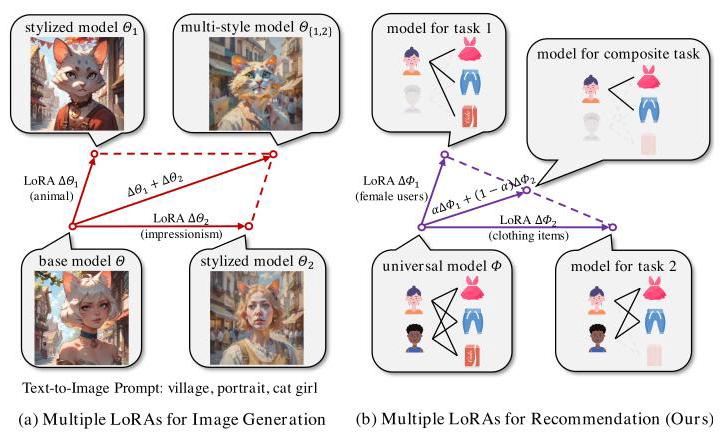
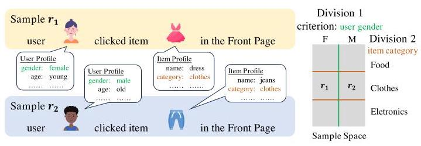
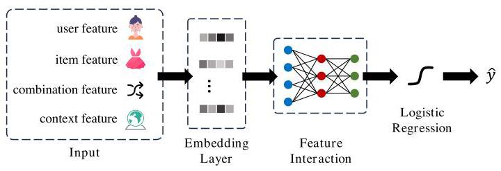
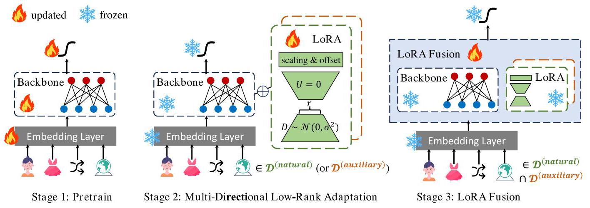
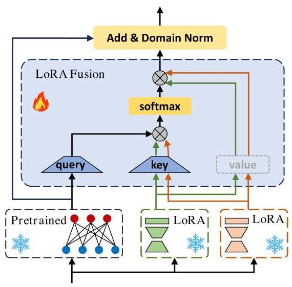

# MultiLoRA: Multi-Directional Low-Rank Adaptation for Multi-Domain Recommendation

Zijian Song

School of CS, Peking University

Beijing, China

2201111590@stu.pku.edu.cn

Wenhan Zhang

School of CS, Peking University

Beijing, China

pku_zwh@pku.edu.cn

Lifang Deng

Lazada Group

Beijing, China

wanmei.dlf@alibaba-inc.com

Jiandong Zhang

Lazada Group

Beijing, China

chensong.zjd@alibaba-inc.com

Kaigui Bian

School of CS, Peking University

Beijing, China

bkg@pku.edu.cn

Bin Cui

School of CS, Peking University

Beijing, China

bin.cui@pku.edu.cn

## Abstract

To address the business needs of industrial recommendation systems, an increasing number of Multi-Domain Recommendation (MDR) methods are designed to improve recommendation performance on multiple domains simultaneously. Most MDR methods follow a multi-task learning paradigm, suffering from poor deploy-ability and negative transfer. Due to the great success of large pre-trained models, the pre-train & fine-tune paradigm is attracting increasing attention. The latest methods introduce parameter-efficient fine-tuning techniques like prompt-tuning, showcasing high efficiency and effectiveness. However, these methods neglect the fundamental differences between recommendation and NLP tasks. The inadequate capacity of recommendation models restricts the effectiveness of prompts and adapters. Worse still, traditional natural domain division may group non-identically distributed samples into the same domain, violating the assumption of independent and identically distributed (i.i.d.) data. In this paper, we propose MultiLoRA, a Multi-directional Low Rank Adaptation paradigm for multi-domain recommendation. First we pre-train a universal model using all data samples. Then we conduct multiple domain divisions on the sample space. Under each division, we fine-tune the pre-trained model to obtain a set of domain-specific LoRAs. Finally, we learn a LoRA fusion module to integrate domain-specific preference patterns across multiple divisions. Experimental results on real-world datasets demonstrate notable advantages of Multi-LoRA: (1) achieving SOTA performance, (2) showcasing remarkable compatibility, and (3) proving highly efficient, featuring only 2% trainable parameters compared to the backbone.

## CCS Concepts

- Information systems \( \rightarrow \) Recommender systems; - Computing methodologies \( \rightarrow \) Transfer learning.

## Keywords

Multi-Domain Recommendation, Click-Through Rate Prediction, Parameter-Efficient Fine-Tuning, Low-Rank Adaptation

## ACM Reference Format:

Zijian Song, Wenhan Zhang, Lifang Deng, Jiandong Zhang, Kaigui Bian, and Bin Cui. 2024. MultiLoRA: Multi-Directional Low-Rank Adaptation for Multi-Domain Recommendation. In Proceedings of the 33rd ACM International Conference on Information and Knowledge Management (CIKM '24), October 21-25, 2024, Boise, ID, USA. ACM, New York, NY, USA, 10 pages. https://doi.org/10.1145/3627673.3679549

## 1 Introduction

Figure 1: Comparison of using multiple LoRAs for image generation and recommendation. For recommendation, We design LoRA fusion module to calculate the combination weights instead of using manually assigned "1".

Click-Through Rate (CTR) prediction is an important problem in recommendation with widespread applications \( \left\lbrack  {2,{13},{25},{30},{31}}\right\rbrack \) . To meet the needs of modern recommendation platforms with multiple domains, Multi-Domain Recommendation (MDR) has gained popularity in recent years to capture domain commonalities and diversities concurrently. However, most existing MDR methods are based on the multi-task learning (MTL) paradigm, where a unified model is trained to serve all domains [35]. These methods are usually tailored for specific business scenarios, resulting in poor compatibility and limited deployability [29]. For example, the star topology based on fully connected networks in STAR [27] may hinder its integration with additional modules like factorization machines. Additionally, MTL-based models receive supervision signals from numerous domains, which inevitably leads to conflicts and negative transfer [37]. Worse still, most of them heavily rely on overlapping users or items [35], which is often unavailable in real-world applications.

---

Zijian Song, Wenhan Zhang, Kaigui Bian, and Bin Cui are affiliated with School of CS, AI Innovation Center, National Engineering Laboratory for Big Data Analysis and Applications, Peking University. Lifang Deng, Jiandong Zhang are affiliated with Lazada Group. Kaigui Bian is also affiliated with State Key Laboratory of Multimedia Information Processing, Peking University.

Permission to make digital or hard copies of all or part of this work for personal or classroom use is granted without fee provided that copies are not made or distributed for profit or commercial advantage and that copies bear this notice and the full citation on the first page. Copyrights for components of this work owned by others than the author(s) must be honored. Abstracting with credit is permitted. To copy otherwise, or republish, to post on servers or to redistribute to lists, requires prior specific permission and/or a fee. Request permissions from permissions@acm.org.

CIKM '24, October 21-25, 2024, Boise, ID, USA

(c) 2024 Copyright held by the owner/author(s). Publication rights licensed to ACM. ACM ISBN 979-8-4007-0436-9/24/10

https://doi.org/10.1145/3627673.3679549

---

On the other hand, the pre-train & fine-tune paradigm is attracting increasing attention, inspired by the great success of large pre-trained models in natural language processing (NLP) and computer vision (CV) areas. Specifically, a universal model is pre-trained using data from all domains, then fine-tuned on the target domain. This paradigm is compatible with almost any modules or structures, and the model receives signals only from the target domain while fine-tuning, mitigating conflicts and overlapping reliance. However, full fine-tuning constructs an entire domain-specific model for each domain, leading to high computation and storage costs. Fine-tuning on a small task may also cause catastrophic forgetting, making the model forget common knowledge learned during pre-training [5, 21]. In contrast, Parameter-Efficient Fine-Tuning (PEFT) methods are more efficient and effective, fine-tuning only a small proportion of parameters. The latest MDR methods introduce prompt-tuning \( \left\lbrack  {{14},{17}}\right\rbrack \) or adapters [10] to adapt the pre-trained model to the target domain. Specifically, PLATE [29] adds prompts before the input to help the model better understand and accomplish domain-specific recommendation, while HAMUR [16] generates a trainable layer (i.e., an adapter) to process hidden states. They subtly prevent catastrophic forgetting and achieve better performance than full fine-tuning.

However, these methods overlook the fundamental differences between recommendation and NLP tasks. Recommendation models heavily rely on ID-based embeddings, which seriously hinders the development of general-purpose large-scale recommendation models [33]. Prompt-tuning only modifies the input, and adapters add just a single layer of domain-specific parameters, making them inadequate for learning new tasks when the pre-trained model's capabilities are insufficient. In contrast, the Low-Rank Adaptation (LoRA) module [11], which updates all parameters, offers greater expressiveness in such cases. This is why LoRA is more commonly used in image generation than prompt-tuning. For example, as shown in Figure 1a, the diffusion model cannot achieve satisfactory output (anthropomorphic animals) through prompt adjustments without the help of LoRA, which is similar in the MDR context.

Furthermore, there is another neglect in previous works that can be addressed by LoRA. The partitioning of domains is customarily based on a natural feature [15], such as the item category [20], or the recommendation scenario [27]. We refer to this partitioning as a Natural Domain Division, which may render samples with different distributions in the same domain, violating the independent and identically distributed (i.i.d.) data assumption. For example, in Figure 2, if we use User Gender as the criterion, samples \( {r}_{1} \) and \( {r}_{2} \) would be assigned to different domains. This intuitively makes sense, as male and female users indeed exhibit distinct preferences. However, if we use Item Category, they would coexist in the same domain, which violates the i.i.d. data assumption and compromises the performance. To alleviate this issue, we can use two criteria simultaneously, dividing the sample space into \( 2 \times  3 = 6 \) domains. However, this leads to a dramatic increase in domain amount, and exacerbates the already existing data sparsity issue.

Figure 2: Depending on the criterion of domain division, non-identically distributed samples may be assigned to the same domain.

Fortunately, prior studies show that integrating multiple LoRAs can help diffusion models generate images with multiple styles [24, 36], as shown in Figure 1a. This is a capability that prompts and adapters do not possess, enabling us to learn composite recommendation tasks. Specifically, we introduce several Auxiliary Domain Divisions based on manually chosen criteria (for simplicity, we introduce only one in this paper). We then learn LoRAs in different directions respectively, and combine them to indirectly achieve a finer-grained domain division, as illustrated in Figure 1b.

To address the challenges mentioned above, this paper proposes MultiLoRA, a Multi-directional Low Rank Adaptation paradigm for multi-domain recommendation. MultiLoRA is a pre-train and fine-tune paradigm compatible with most existing CTR methods, making it easy to deploy. It has three stages. First, we pre-train a unified recommendation model using all data to capture universal preference patterns. Second, we learn a set of domain-specific Lo-RAs under each domain division. Finally, we train a LoRA fusion module to combine multi-directional LoRAs, obtaining preference patterns on a finer-grained domain.

The contribution of this study is summarized as follows.

- We propose MultiLoRA, a plug-and-play training paradigm compatible with most CTR prediction models, transforming them into powerful multi-domain recommendation models.

- To the best of our knowledge, we are the first to introduce LoRA into recommendation systems. We design a novel LoRA module tailored for domain adaptation in MDR. It is computationally efficient, requiring learning only \( 2\% \) of the parameters compared to the pre-trained model. This module addresses catastrophic forgetting, leading to enhanced recommendation performance.

- To the best of our knowledge, we are the first to study the data distribution inconsistency issue in MDR. We devise a LoRA fusion module to combine domain-specific LoRAs trained under different domain divisions, obtaining preference patterns from various perspectives.

- Through extensive experiments conducted on three real-world datasets, we demonstrate that MultiLoRA outperforms state-of-the-art methods in both efficiency and effectiveness.

## 2 Preliminary

### 2.1 Low-Rank Adaptation

Low-Rank Adaptation (LoRA) is a technique that originally appeared in the natural language processing field, used to adapt large language models to downstream tasks. Hu et al. [11] claim that the change of model weights during the fine-tuning has a low intrinsic rank. Thus, it is possible to use low-rank matrix decomposition to approximate this change. Specifically, for a pre-trained weight matrix \( {\mathbf{W}}_{0} \in  {\mathbb{R}}^{d \times  k} \) , its change during fine-tuning can be represented in a low-rank form:

\[
{W}_{0} + {\Delta W} = {W}_{0} + {UD} \tag{1}
\]

where \( \mathbf{D} \in  {\mathbb{R}}^{r \times  k} \) is the downsampling matrix, and \( \mathbf{U} \in  {\mathbb{R}}^{d \times  r} \) is the upsampling matrix, and \( r \ll  \min \left( {d, k}\right) \) . Linear algebra teaches us that the rank of \( \mathbf{{UD}} \) is at most \( r \) . While fine-tuning, we learn matrices \( \mathbf{U} \) and \( \mathbf{D} \) to approximate \( {\Delta W} \) .

Later, LoRA was widely adopted in the field of image generation. By training on only a few images, LoRA can control the output style of diffusion models or help them generate images beyond their original capabilities. For instance, as shown in Figure 1, the base model cannot generate an anthropomorphic animal on its own, regardless of the text-to-image prompt used. However, with the help of a LoRA module trained on a few images, the model gains the ability to draw something it has never seen before.

Our reasons for choosing LoRA are twofold: (1) While employing only low-rank matrices, LoRA is involved in the updates of a large number of parameters. In contrast, adapters and prompt-tuning only affect a small proportion of parameters, and their effectiveness heavily relies on the capabilities of the pre-trained model; (2) In image generation, multiple LoRAs can be combined to generate images that carry multiple styles, providing rich customizability [24, 36]. Hence, we can conduct multiple domain divisions, and two domain-specific LoRAs under different domain divisions can be easily combined to achieve finer-grained domain division.

### 2.2 Multi-Domain CTR Prediction

A traditional CTR prediction model is trained on a single domain, with various features such as user profiles, item attributes, context information, and historical interactions as input \( \mathbf{x} \) . These raw features are then mapped into low-dimensional embedding \( \mathbf{e} \) , fed into the subsequent prediction model to calculate the predicted CTR \( \widehat{y} \) . The ground truth label \( y \) is then used to calculate the value of the loss function. The multi-domain CTR model takes an additional input, the domain indicator \( d \) . The objective is to find a function \( \mathcal{F} \) that can predict CTR \( \widehat{y} \) for every domain:

\[
\mathop{\min }\limits_{\mathbf{\theta }}\frac{1}{D}\mathop{\sum }\limits_{{d = 1}}^{D}\frac{1}{\left| {\mathcal{D}}_{d}\right| }\mathop{\sum }\limits_{{i = 1}}^{\left| {\mathcal{D}}_{d}\right| }{\mathcal{L}}_{CTR}\left( {\mathcal{F}\left( {{\mathbf{x}}_{di}, d;\mathbf{\theta }}\right) ,{y}_{di}}\right) \tag{2}
\]

where \( \mathbf{\theta } \) denotes the parameters of the model, \( D \) is the number of domains, \( {\mathcal{D}}_{d} \) is the sample space of the \( d \) -th domain.

### 2.3 Typical Architecture of CTR Backbones

A typical CTR prediction backbone consists of three components: embedding layer, feature interaction layer, and output layer [29, 34].

Figure 3: Typical Click-Through Rate prediction backbone architecture. We only fine-tune the feature interaction layer to capture domain-specific preference patterns.

2.3.1 Embedding Layer. The raw features in the dataset can be categorized into two types: sparse features, which include categorical information represented by one/multi-hot vectors; and dense features, which contain numerical information represented by scalars. Assuming the dataset contains \( n \) sparse features \( {z}_{i} \) and \( m \) dense features \( {a}_{j} \) , the input is represented as:

\[
\mathbf{x} = \left\{  {{z}_{1},\cdots ,{z}_{n};{a}_{1},\cdots ,{a}_{m}}\right\}  . \tag{3}
\]

Sparse features are often mapped into a low-dimensional embedding by a look-up table: \( {e}_{i} = {E}_{i}{z}_{i} \) , where \( {E}_{i} \in  {\mathbb{R}}^{{u}_{i} \times  k} \) is the mapping matrix of the \( i \) -th feature field, and \( {u}_{i} \) represents the number of categories in the \( i \) -th sparse feature, and \( k \) is the dimensionality of embeddings. As for multi-hot sparse features, we conduct mean-pooling on embeddings of all non-zero feature values. For dense features, we apply normalization to ensure the consistency of the data distribution. The output of the embedding layer is the concatenation of all feature fields' embeddings:

\[
e = \left\lbrack  {{e}_{1},\cdots ,{e}_{n + m}}\right\rbrack  . \tag{4}
\]

2.3.2 Feature Interaction. This part captures the impact of interactions between various feature fields on the click-through rate. Its structure often reflects the fundamental differences among various CTR methods. Depending on the choice of the backbone network, the feature interaction layer can capture interactions between feature fields that are explicit or implicit, low-dimensional or high-dimensional. For instance, Wide&Deep [3] is a widely used model that simultaneously captures linear feature combination and implicit high-dimensional feature interactions; DeepFM [6] captures both explicit second-order feature interactions and implicit high-dimensional interactions; DCN [28] captures both explicit and implicit high-dimensional interactions. Our fine-tuning is conducted on this layer to capture domain preference patterns. It is noteworthy that some backbones contain normalization layers, which are unsatisfactory when dealing with multi-domain data with different distributions. Hence, during the fine-tuning stage, we instead employ the domain normalization layer like STAR [27]. Finally, we denote the output of the feature interaction layer as \( {\mathbf{h}}^{\left( L\right) } \) , where \( L \) is the depth of the feature interaction network.

2.3.3 Output Layer. This layer takes \( {\mathbf{h}}^{\left( L\right) } \) as input and perform logistic regression to predict CTR:

\[
\widehat{y} = \sigma \left( {{\mathbf{W}}_{o}{\mathbf{h}}^{\left( L\right) } + {b}_{o}}\right) , \tag{5}
\]

where \( {\mathbf{W}}_{o},{b}_{o} \) are trainable parameters, \( \sigma \) is sigmoid activation.

Figure 4: Overall architecture of MultiLoRA paradigm. In the pre-train stage, we train the backbone with data from all domains. In the multi-directional low-rank adaptation stage, we fine-tune the model to obtain domain-specific LoRAs under both natural and auxiliary domain divisions. In the fusion stage, we train a LoRA fusion module to integrate multi-directional parameter updates, and obtain the model for the composite task.

At last, we employ Binary Cross Entropy (BCE) as the loss function to train the backbone, with the optimization objective expressed as follows:

\[
\mathop{\min }\limits_{\theta }\mathcal{L} =  - \frac{1}{\left| \mathcal{T}\right| }\mathop{\sum }\limits_{{i = 1}}^{\left| \mathcal{T}\right| }{y}_{i}\log \left( {\widehat{y}}_{i}\right)  + \left( {1 - {y}_{i}}\right) \log \left( {1 - {\widehat{y}}_{i}}\right) , \tag{6}
\]

where \( {y}_{i} \) is the ground truth label, and \( {\widehat{y}}_{i} \) is the predicted CTR of the \( i \) -th sample, respectively, and \( \mathcal{T} \) is the training sample space.

## 3 Method

### 3.1 Overview

To address the limitation of existing multi-domain recommendation methods, we propose MultiLoRA paradigm, as shown in Figure 4. MultiLoRA is a plug-and-play training paradigm that can be applied to most backbone networks that follow the framework in Section 2.3. It consists of following three stages.

- Pretrain: We pre-train the backbone network with all samples in the dataset, capturing common preference patterns shared across domains.

- Multi-Directional Low-Rank Adaptation: We freeze the embedding layer and the output layer, and fine-tune the feature interaction layer. Specifically, we employ parameter-efficient fine-tuning (PEFT) technique to low-rank adapt the pre-trained model to the target domain. Since naturally divided domains may contain non-identically distributed samples, we introduce an additional auxiliary domain division and train another set of LoRAs. The selection of the auxiliary domain division is further discussed in Section 4.5.

- LoRA Fusion: Inspired by the stackability of LoRA observed in the image generation field, we aim to simultaneously utilize two sets of LoRAs for joint prediction. For this purpose, we train a LoRA fusion module.

After the three stages of training, we can use both sets of LoRAs and the LoRA fusion module for joint prediction, or we can use only one set of LoRAs for prediction. We refer to the latter as SingleLoRA.

### 3.2 Multi-Directional Low-Rank Adaptation

To retain the common knowledge learned during pre-training as much as possible, we freeze the embedding layer and the output layers during fine-tuning. We fine-tune only the feature interaction layer because it learns to identify crucial feature interactions, which reflect the preference patterns in that domain. Previous studies indicate that during continuous learning via fine-tuning, a model may forget knowledge acquired in previous tasks, a phenomenon known as catastrophic forgetting [5, 21]. For MDR, this means the model could forget previously acquired domain-shared patterns, thereby impairing its performance in the target domain.

To avoid catastrophic forgetting, we introduce Low-Rank Adaptation (LoRA). Hu et al. [11] claim that the change in weights during fine-tuning has a low intrinsic rank, making it possible to use low-rank matrix decomposition to approximate this change. Building upon their work, we enhanced the form of the low-rank matrix decomposition by adding scaling and offset terms, further boosting the expressiveness of the LoRA module. Specifically, for a pre-trained weight matrix \( {\mathbf{W}}_{0} \in  {\mathbb{R}}^{d \times  k} \) , we assume that its update during fine-tuning can be represented in a simple low-rank form:

\[
{\mathbf{W}}_{0} + \Delta \mathbf{W} = {\mathbf{W}}_{0} + \left( {\mathbf{s} \otimes  \mathbf{{UD}}}\right) , \tag{7}
\]

where \( \mathbf{U} \in  {\mathbb{R}}^{d \times  r},\mathbf{D} \in  {\mathbb{R}}^{r \times  k}, s \in  {\mathbb{R}}^{d} \) , and \( r \ll  \min \left( {d, k}\right) . \otimes \) represents the Hadamard product between \( \mathbf{{UD}} \) and broadcasted coefficient vector \( s \) , such that the \( i \) -th row of \( \mathbf{{UD}} \) gets multiplied with \( i \) -th element of \( s \) . Similarly, for a pre-trained bias \( {\mathbf{b}}_{0} \in  {\mathbb{R}}^{d} \) , we learn its update \( \mathbf{b} \) . For the forward passing \( \mathbf{h} = {\mathbf{W}}_{0}\mathbf{x} + {\mathbf{b}}_{0} \) in the pre-trained model, our modified version is:

\[
{\mathbf{h}}^{\prime } = \left( {{\mathbf{W}}_{0} + \Delta \mathbf{W}}\right) \mathbf{x} + \left( {{\mathbf{b}}_{0} + \mathbf{b}}\right)
\]

\[
= \left( {{\mathbf{W}}_{0}\mathbf{x} + {\mathbf{b}}_{0}}\right)  + \left( {\mathbf{s} \otimes  \mathbf{U}D}\right) \mathbf{x} + \mathbf{b}. \tag{8}
\]

During fine-tuning, \( {\mathbf{W}}_{0},{\mathbf{b}}_{0} \) are frozen, while \( \mathbf{U}, D, s,\mathbf{b} \) are trainable parameters of the LoRA module. We use random Gaussian initialization for \( D, s \) , and zero for \( U,\mathbf{b} \) . In this way, the update value \( \left( {s \otimes  {UD}}\right) x + \mathbf{b} \) is zero at the beginning of fine-tuning.

It is noteworthy that, due to the distribution shifts across domains, traditional normalization is insufficient, and we maintain domain-specific batch normalization layers for each domain (like STAR [27]). Assuming the sample comes from domain \( A \) , we have

\[
{\mathbf{h}}^{\left( l\right) } = \operatorname{DomNorm}\left( {{\mathbf{h}}_{0}^{\left( l\right) } + {\mathbf{h}}_{A}^{\left( l\right) };A, l}\right) ,
\]

\[
\operatorname{DomNorm}\left( {h;A, l}\right)  = {\gamma }_{A}^{\left( l\right) } \otimes  \frac{h - {\mu }_{A}}{\sqrt{{\sigma }_{A}^{2} + \epsilon }} + {\beta }_{A}^{\left( l\right) }, \tag{9}
\]

where \( {\mathbf{h}}_{0}^{\left( l\right) },{\mathbf{h}}_{A}^{\left( l\right) } \) are the \( l \) -th hidden layer outputs of the pre-trained model and the LoRA, and \( {\gamma }_{A}^{\left( l\right) },{\beta }_{A}^{\left( l\right) } \) are learnable parameters.

Since natural domain division may assign non-identically distributed samples to the same domain, and naive finer-grained domain division exacerbates data sparsity, we manually choose a criterion and conduct an auxiliary domain division on the sample space. Under natural and auxiliary domain divisions, we train two sets of LoRAs pointing in different directions.

### 3.3 LoRA Fusion

LoRA, along with diffusion models [9, 22], find extensive applications in the image generation field \( {}^{1} \) . One of the most interesting applications of LoRA is that multiple LoRAs can be weightedly integrated to generate images that carry multiple styles, greatly improving customizability \( \left\lbrack  {{24},{36}}\right\rbrack \) .

Inspired by this, we aim to combine the domain-specific LoRAs obtained under multiple domain divisions to collectively contribute to more accurate recommendation. For image generation, the combination weights are usually manually determined [23]. We instead design a LoRA fusion module to calculate the weights. We suppose a sample \( r \) belongs to domain \( A \) under the natural domain division and domain \( B \) under the auxiliary domain division. Let the LoRA modules corresponding to domain \( A \) and \( B \) be \( {\operatorname{LoRA}}_{A} \) and \( {\operatorname{LoRA}}_{B} \) , containing domain-specific preference patterns from two different perspectives. We design a novel attention module to dynamically generate weights and blend these LoRA modules.

As shown in Figure 5, we learn a LoRA fusion module at each layer of the backbone. The pre-trained model's output serves as the query vector, and the two LoRAs' outputs serve as the key and value vectors. The output of the \( l \) -th layer’s LoRA fusion is:

\[
{\mathbf{h}}_{LoRA}^{\left( l\right) } = \operatorname{softmax}\left( \frac{{\mathbf{q}}^{{\left( l\right) }^{T}}{\mathbf{K}}^{\left( l\right) }}{r}\right) {\mathbf{V}}^{\left( l\right) },
\]

\[
{\mathbf{q}}^{\left( l\right) } = {\mathbf{W}}_{Q}^{\left( l\right) }{\mathbf{h}}_{0}^{\left( l\right) }, \tag{10}
\]

\[
{\mathbf{K}}^{\left( l\right) } = {\mathbf{W}}_{K}^{\left( l\right) }\left\lbrack  {{h}_{A}^{\left( l\right) },{h}_{B}^{\left( l\right) }}\right\rbrack  ,
\]

\[
{\mathbf{V}}^{\left( l\right) } = \left\lbrack  {{h}_{A}^{\left( l\right) },{h}_{B}^{\left( l\right) }}\right\rbrack  ,
\]

where \( {\mathbf{W}}_{O},{\mathbf{W}}_{K} \in  {\mathbb{R}}^{r \times  k} \) are trainable parameters; \( {\mathbf{h}}_{0},{\mathbf{h}}_{A},{\mathbf{h}}_{B} \) are outputs of the pre-trained model, \( {\operatorname{loRA}}_{A} \) , and \( {\operatorname{loRA}}_{B} \) , respectively. It is noteworthy that, to maintain the parameter-efficiency of our method, \( {\mathbf{W}}_{Q},{\mathbf{W}}_{K} \) are down-samplings that \( r \ll  k \) , and we apply identity transformation on the value vector.

Figure 5: Architecture of the LoRA fusion module. The outputs of multiple LoRAs are aggregated through attention mechanism. For parameter-efficiency, we perform down-sampling on \( q \) and \( k \) , while identity transformation on \( v \) .

At last, we sum the results of the pre-trained model and the LoRA fusion module, passing it through a domain batch normalization layer used only by samples \( \in  A \cap  B \) :

\[
{\mathbf{h}}^{\left( l\right) } = \operatorname{DomNorm}\left( {{\mathbf{h}}_{0}^{\left( l\right) } + {\mathbf{h}}_{LoRA}^{\left( l\right) };A \cap  B, l}\right) . \tag{11}
\]

By introducing the LoRA fusion module, we are able to integrate multi-directional domain-specific patterns, indirectly performing finer-grained domain division while avoiding proliferation of domains. This provides the prediction model with more information and alleviates the issue of non-identically distributed samples.

## 4 Experiments

In this section, we conduct experiments on public real-world datasets to demonstrate the effectiveness of our proposed MultiLoRA and answer the following questions.

- RQ1: How does MultiLoRA perform compared with other state-of-the-art baselines, especially PEFT-based methods?

- RQ2: How do the modules of MultiLoRA affect its performance?

- RQ3: Is MultiLoRA paradigm compatible with different recommendation backbones? Does the model performance decline when integrated with MultiLoRA?

- RQ4: How to select a best auxiliary domain division?

- RQ5: Does the MultiLoRA paradigm possess high computation and storage efficiency?

### 4.1 Experimental Settings

4.1.1 Datasets. Our experiments are conducted on three real-world datasets, namely MovieLens [7], Amazon [20], and Ali-CCP [19]. Amazon 5-core is already segmented based on item category. Ali-CCP is divided by recommendation scenarios. Since MovieLens has no explicit domain division, we follow the setting of HAMUR [16] to divide it into three domains based on user age. The statistics of sampled datasets are given in Table 1.

---

\( {}^{1} \) https://civitai.com/

---

Table 1: Statistics of datasets.

<table><tr><td>Dataset</td><td colspan="3">MovieLens</td><td colspan="3">Amazon 5-core</td><td colspan="3">Ali-CCP Train</td><td colspan="3">Ali-CCP Test</td></tr><tr><td>Domain</td><td>#1</td><td>#2</td><td>#3</td><td>Clothing</td><td>Beauty</td><td>Health</td><td>#1</td><td>#2</td><td>#3</td><td>#1</td><td>#2</td><td>#3</td></tr><tr><td>#Users</td><td>1325</td><td>2096</td><td>2619</td><td>39387</td><td>22363</td><td>38609</td><td>80704</td><td>1986</td><td>136406</td><td>47400</td><td>1156</td><td>73924</td></tr><tr><td>#Items</td><td>3429</td><td>3508</td><td>3595</td><td>23033</td><td>12101</td><td>18534</td><td>297046</td><td>109259</td><td>297733</td><td>291213</td><td>103080</td><td>295281</td></tr><tr><td>#Interaction</td><td>210747</td><td>395556</td><td>393906</td><td>278677</td><td>198502</td><td>346355</td><td>15885371</td><td>318873</td><td>26095661</td><td>16351580</td><td>321024</td><td>26344010</td></tr></table>

- MovieLens \( {}^{2} \) is collected from the well-known online movie recommendation platform, MovieLens, encompassing 7 user features and 2 item features. We randomly divided it into training, validation, and test sets with a ratio of 8:1:1.

- Amazon 5-core \( {}^{3} \) is a dense subset from the Amazon 2014 dataset, ensuring each user and item have a minimum of 5 associated records. We choose three related natural domains. The time range of validation set is between March 1, 2014, and April 30, 2014, while the records before 1st March 2014 and after 30th April 2014 are counted as training and test data. Only user ID, item ID, domain indicator, and ratings are used. Records with rating higher than 3 are considered as positive samples.

- Ali-CCP4 is gathered from real-world traffic logs of the recommendation system in Taobao, comprising 13 user features, 5 item features, 4 combination features, 1 context feature, and 2 label features (click and purchase). We employ "click" as the target label. The context feature "301", indicating the recommendation scenario, naturally divides the dataset into three domains. Additionally, we randomly split the original test dataset in half to create the validation and test sets.

The principle of auxiliary domain division is to exhibit maximum domain divergence. In the case of MovieLens and Ali-CCP, we utilize user gender as the criterion for auxiliary domain division. For Amazon 5-core, we choose user activeness, namely whether they have posted more than ten reviews. Further discussion about auxiliary domain division is given in Section 4.5.

4.1.2 Baseline Methods. To showcase the superiority of our proposed MultiLoRA, we compare it with following baseline methods:

- Single is trained only on the target domain.

- Mix is trained on data from all domains, with all parameters shared across these domains.

- Fine-tune is initially trained on data from all domains and subsequently fully fine-tuned on the target domain.

- Shared Bottom [1] is a multi-task model with shared bottom layers. In our implementation, the embedding layer is shared.

- MMoE [18] is a multi-task model built upon the Shared Bottom architecture. It features a set of bottom networks known as experts and trains a gating network to dynamically select experts for each domain.

- STAR [27] is a multi-domain model employing a fully-connected network with a star topology. It consists of shared centralized parameters to capture general patterns and domain-specific parameters to capture domain-specific patterns.

- HAMUR [16] is a PEFT-based multi-domain sota method. It designs a pluggable module that can be seamlessly integrated into various existing multi-domain backbone models. It learns a domain-shared hyper-network to dynamically generate the adapter parameters for each domain.

- PLATE [29] is another PEFT-based multi-domain SOTA method. It conducts prompt tuning with two prompt modules, namely domain prompt and user prompt, to capture domain distinctions and conduct more accurate personalized recommendation.

4.1.3 Evaluation Metrics. We employ two commonly used evaluation metrics, namely Area Under the ROC (AUC) and LogLoss, to assess CTR prediction model performance in our experiments. In general, a higher AUC value or a lower LogLoss at 0.001 level indicates significant better recommendation performance \( \left\lbrack  {6,{29}}\right\rbrack \) .

4.1.4 Implementation Details. All hyper-parameters were tuned on the validation sets. Learning rate is chosen from \{1e-3, 5e-4, 1e-4\}. Weight decay is chosen from \( \{ {1e} - 4,{1e} - 5,0\} \) . Batch size is chosen from \( \{ {512},{2048},{4096}\} \) . We use Adam optimizer with default settings, early stopping when AUC on validation set no longer increases for 5 epochs. The network structure hyper-parameters of all kinds of backbones are consistent, as outlined in Table 2.

Table 2: The network structure hyper-parameters.

<table><tr><td>Dataset</td><td>MovieLens</td><td>Amazon 5-core</td><td>Ali-CCP</td></tr><tr><td>Embedding Size</td><td>16</td><td>16</td><td>-</td></tr><tr><td>Hidden Layer</td><td>[256,128]</td><td>[1024,512,256,64]</td><td>[1024.512.512.256.256.646</td></tr><tr><td>LoRA \( r \)</td><td>[8,8]</td><td>[16,16,8,8]</td><td></td></tr><tr><td>LoRA fusion \( r \)</td><td>[8,8]</td><td>[16,16,8,8]</td><td></td></tr></table>

In the overall performance comparison, for simplicity, we choose MLP as the backbone network for Single, Mix, Fine-tune, HAMUR, PLATE, SingleLoRA, and MultiLoRA. The compatibility experiment of MultiLoRA with more backbone networks are given in Section 4.4.

### 4.2 Performance Comparison (RQ1)

To showcase the effectiveness of our proposed paradigm, we compare MultiLoRA, SingleLoRA and baseline methods on three real-world datasets, where SingleLoRA is the ablation version of Multi-LoRA without auxiliary domain division or LoRA fusion. We choose MLP as the backbone for simplicity. The overall performance is given in Table 3. We summarize the following observations:

---

\( {}^{2} \) https://grouplens.org/datasets/movielens/

\( {}^{3} \) http://jmcauley.ucsd.edu/data/amazon/

\( {}^{4} \) https://tianchi.aliyun.com/dataset/408

---

Table 3: Overall performance of our proposed method and baselines on three real-world datasets. Boldface denotes the best result and underline indicates the best result among baselines. \( \star \) represents significance level \( p \) -value \( < {0.05} \) of comparing MultiLoRA over the best baselines.

<table><tr><td rowspan="2">Model/AUC</td><td colspan="4">MovieLens</td><td colspan="4">Amazon 5-core</td><td colspan="4">Ali-CCP</td></tr><tr><td>#1</td><td>#2</td><td>#3</td><td>Total</td><td>Clothing</td><td>Beauty</td><td>Health</td><td>Total</td><td>#1</td><td>#2</td><td>#3</td><td>Total</td></tr><tr><td>Single</td><td>0.7980</td><td>0.7963</td><td>0.7965</td><td>0.7969</td><td>0.6022</td><td>0.5682</td><td>0.5964</td><td>0.5901</td><td>0.5843</td><td>0.5363</td><td>0.5842</td><td>0.5694</td></tr><tr><td>Mix</td><td>0.8187</td><td>0.8117</td><td>0.8015</td><td>0.8105</td><td>0.6158</td><td>0.6197</td><td>0.6325</td><td>0.6243</td><td>0.6176</td><td>0.5908</td><td>0.6136</td><td>0.6153</td></tr><tr><td>Fine-tune</td><td>0.8147</td><td>0.8135</td><td>0.7979</td><td>0.8077</td><td>0.6195</td><td>0.5946</td><td>0.6244</td><td>0.6150</td><td>0.6208</td><td>0.5901</td><td>0.6194</td><td>0.6178</td></tr><tr><td>Shared Bottom</td><td>0.8077</td><td>0.8182</td><td>0.8025</td><td>0.8102</td><td>0.6059</td><td>0.5891</td><td>0.6078</td><td>0.6025</td><td>0.6202</td><td>0.5870</td><td>0.6174</td><td>0.6170</td></tr><tr><td>MMoE</td><td>0.8088</td><td>0.8120</td><td>0.8045</td><td>0.8097</td><td>0.6080</td><td>0.5867</td><td>0.6213</td><td>0.6089</td><td>0.6255</td><td>0.5822</td><td>0.6203</td><td>0.6173</td></tr><tr><td>STAR</td><td>0.8065</td><td>0.8064</td><td>0.8021</td><td>0.8055</td><td>0.6117</td><td>0.5853</td><td>0.6234</td><td>0.6108</td><td>0.6253</td><td>0.5887</td><td>0.6208</td><td>0.6198</td></tr><tr><td>HAMUR</td><td>0.8130</td><td>0.8159</td><td>0.8067</td><td>0.8121</td><td>0.6120</td><td>0.5861</td><td>0.6311</td><td>0.6148</td><td>0.6210</td><td>0.6062</td><td>0.6216</td><td>0.6210</td></tr><tr><td>PLATE</td><td>0.8134</td><td>0.8178</td><td>0.8063</td><td>0.8124</td><td>0.6182</td><td>0.6223</td><td>0.6426</td><td>0.6296</td><td>0.6229</td><td>0.6055</td><td>0.6234</td><td>0.6220</td></tr><tr><td>SingleLoRA</td><td>0.8212</td><td>0.8189</td><td>0.8061</td><td>0.8160</td><td>0.6134</td><td>0.6134</td><td>0.6290</td><td>0.6198</td><td>0.6225</td><td>0.6065</td><td>0.6224</td><td>0.6212</td></tr><tr><td>MultiLoRA</td><td>0.8223*</td><td>0.8192*</td><td>0.8097*</td><td>0.8170*</td><td>0.6297*</td><td>0.6408*</td><td>0.6542*</td><td>0.6429*</td><td>0.6324*</td><td>0.6065</td><td>\( {\mathbf{{0.6245}}}^{ \star  } \)</td><td>0.6231*</td></tr></table>

<table><tr><td rowspan="2">Model/LogLoss</td><td colspan="4">MovieLens</td><td colspan="4">Amazon 5-core</td><td colspan="4">Ali-CCP</td></tr><tr><td>#1</td><td>#2</td><td>#3</td><td>Total</td><td>Clothing</td><td>Beauty</td><td>Health</td><td>Total</td><td>#1</td><td>#2</td><td>#3</td><td>Total</td></tr><tr><td>Single</td><td>0.5387</td><td>0.5408</td><td>0.5326</td><td>0.6377</td><td>0.5442</td><td>0.5946</td><td>0.4581</td><td>0.5303</td><td>0.1711</td><td>0.2599</td><td>0.1630</td><td>0.1928</td></tr><tr><td>Mix</td><td>0.5188</td><td>0.5215</td><td>0.5215</td><td>0.5207</td><td>0.5202*</td><td>0.4832</td><td>0.4383</td><td>0.4772</td><td>0.1662</td><td>0.1806</td><td>0.1601</td><td>0.1626</td></tr><tr><td>Fine-tune</td><td>0.5198</td><td>0.5179</td><td>0.5296</td><td>0.5229</td><td>0.5320</td><td>0.5132</td><td>0.4403</td><td>0.4912</td><td>0.1660</td><td>0.1837</td><td>0.1597</td><td>0.1629</td></tr><tr><td>Shared Bottom</td><td>0.5294</td><td>0.5139</td><td>0.5237</td><td>0.5210</td><td>0.5563</td><td>0.5310</td><td>0.4615</td><td>0.5114</td><td>0.1677</td><td>0.1833</td><td>0.1595</td><td>0.1628</td></tr><tr><td>MMoE</td><td>0.5244</td><td>0.5148</td><td>0.5209</td><td>0.5207</td><td>0.5498</td><td>0.5351</td><td>0.4583</td><td>0.5105</td><td>0.1671</td><td>0.1856</td><td>0.1592</td><td>0.1632</td></tr><tr><td>STAR</td><td>0.5257</td><td>0.5196</td><td>0.5218</td><td>0.5224</td><td>0.5523</td><td>0.5367</td><td>0.4567</td><td>0.5114</td><td>0.1673</td><td>0.1837</td><td>0.1589</td><td>0.1628</td></tr><tr><td>HAMUR</td><td>0.5281</td><td>0.5185</td><td>0.5199</td><td>0.5212</td><td>0.5507</td><td>0.5227</td><td>0.4481</td><td>0.5019</td><td>0.1653</td><td>0.1779</td><td>0.1653</td><td>0.1617</td></tr><tr><td>PLATE</td><td>0.5201</td><td>0.5155</td><td>0.5223</td><td>0.5198</td><td>0.5338</td><td>0.4833</td><td>0.4391</td><td>0.4806</td><td>0.1661</td><td>0.1786</td><td>0.1579</td><td>0.1615</td></tr><tr><td>SingleLoRA</td><td>0.5246</td><td>0.5167</td><td>0.5210</td><td>0.5201</td><td>0.5475</td><td>0.5105</td><td>0.4444</td><td>0.4948</td><td>0.1665</td><td>0.1781</td><td>0.1568*</td><td>0.1601</td></tr><tr><td>MultiLoRA</td><td>0.5109*</td><td>0.5114*</td><td>0.5187*</td><td>0.5147*</td><td>0.5357</td><td>0.4817*</td><td>0.4336*</td><td>0.4771</td><td>0.1631*</td><td>0.1754*</td><td>0.1575</td><td>0.1587*</td></tr></table>

- Fine-tune shows significant performance decline in most cases compared to Mix, showing obvious catastrophic forgetting. This is particularly evident in the Ali-CCP dataset: Fine-tune significantly outperforms Mix in domains #1 and #3, but its performance regresses on the much smaller domain #2, indicating a potential overfitting and forgetting of the common knowledge acquired during pre-training.

- There are two baselines that employ PEFT techniques: PLATE based on prompt tuning and HAMUR based on adapter. Both methods exhibit inferior performance on the MovieLens dataset compared to the larger-scale Amazon and Ali-CCP datasets. This discrepancy arises because HAMUR's dynamically generated adapter only engages with one layer of the model, limiting the knowledge expression of the hyper-network. Meanwhile, PLATE only fine-tunes the prefix of the input and the linear interaction layer, resulting in limited expressive capacity. Both methods heavily rely on the pre-trained model's knowledge. In contrast, LoRA can be involved in the update of all parameters, making it less dependent on the original model.

- Our proposed MultiLoRA outperforms all baselines across almost all domains. This is because we not only use LoRA for fine-tuning, but also introduce auxiliary domain division. By combining the predictions of two sets of LoRAs, we indirectly yet effectively achieve finer-grained domain division, mitigating the adverse effects of non-identically distributed samples.

### 4.3 Ablation Study (RQ2)

Table 3 have already included several ablation experiments. By comparing Mix, Fine-tune and SingleLoRA, we demonstrate that full fine-tuning leads to catastrophic forgetting in some domains, and employing LoRA alleviates this issue. The fact that MultiLoRA significantly outperforms SingleLoRA in most cases indicates that using multiple domain divisions mitigates data distribution inconsistencies. Here, we conduct additional experiments. Let MultiLoRA-avg represent the variant of MultiLoRA where two LoRAs are averaged, and MultiLoRA-add represent the variant where two LoRAs are simply added. We compare their performance with Mul-tiLoRA to illustrate the effectiveness of the LoRA fusion module. The results are shown in Table 4.

### 4.4 Compatibility with Backbone Models (RQ3)

The MultiLoRA paradigm we propose is a training framework that, theoretically, can be combined with most CTR backbones to derive corresponding multi-domain models. We select three widely used methods, namely Wide&Deep [3], DCN [28], and DeepFM [6]. We integrate MultiLoRA with them and observe the impact on model performance. For each backbone, we compare three methods: Fine-tune, SingleLoRA, and MultiLoRA.

The experimental results are shown in Table 5. We notice that, with our proposed MultiLoRA, the performance of all CTR backbones is significantly improved compared to full fine-tuning. This demonstrates MultiLoRA's outstanding ability to adapt to the target domain, preserving common knowledge acquired in pre-training and preventing catastrophic forgetting. Additionally, MultiLoRA exhibits compatibility with various backbones, making it easier to apply and deploy in various application scenarios.

Table 4: Ablation study of the LoRA fusion module.

<table><tr><td rowspan="2">Model/AUC</td><td colspan="4">MovieLens</td><td colspan="4">Amazon 5-core</td><td colspan="4">Ali-CCP</td></tr><tr><td>#1</td><td>#2</td><td>#3</td><td>Total</td><td>Clothing</td><td>Beauty</td><td>Health</td><td>Total</td><td>#1</td><td>#2</td><td>#3</td><td>Total</td></tr><tr><td>MultiLoRA-add</td><td>0.7972</td><td>0.7992</td><td>0.7890</td><td>0.7958</td><td>0.5987</td><td>0.5678</td><td>0.5924</td><td>0.5870</td><td>0.5844</td><td>0.5467</td><td>0.5795</td><td>0.5713</td></tr><tr><td>MultiLoRA-avg</td><td>0.8156</td><td>0.8134</td><td>0.8019</td><td>0.8105</td><td>0.6113</td><td>0.6068</td><td>0.6271</td><td>0.6150</td><td>0.6235</td><td>0.6012</td><td>0.6178</td><td>0.6134</td></tr><tr><td>MultiLoRA</td><td>0.8223*</td><td>0.8192*</td><td>\( {\mathbf{{0.8097}}}^{ \star  } \)</td><td>0.8170*</td><td>0.6297*</td><td>0.6408*</td><td>0.6542*</td><td>0.6429*</td><td>0.6324*</td><td>0.6065*</td><td>0.6245*</td><td>0.6231*</td></tr><tr><td rowspan="2">Model/LogLoss</td><td colspan="4">MovieLens</td><td colspan="4">Amazon 5-core</td><td colspan="4">Ali-CCP</td></tr><tr><td>#1</td><td>#2</td><td>#3</td><td>Total</td><td>Clothing</td><td>Beauty</td><td>Health</td><td>Total</td><td>#1</td><td>#2</td><td>#3</td><td>Total</td></tr><tr><td>MultiLoRA-add</td><td>0.5408</td><td>0.5477</td><td>0.5308</td><td>0.5697</td><td>0.5470</td><td>0.5947</td><td>0.4596</td><td>0.5339</td><td>0.1709</td><td>0.2606</td><td>0.1620</td><td>0.1938</td></tr><tr><td>MultiLoRA-avg</td><td>0.5265</td><td>0.5217</td><td>0.5230</td><td>0.5238</td><td>0.5466</td><td>0.5104</td><td>0.4470</td><td>0.5007</td><td>0.1688</td><td>0.1810</td><td>0.1593</td><td>0.1677</td></tr><tr><td>MultiLoRA</td><td>0.5109*</td><td>\( {\mathbf{{0.5114}}}^{ \star  } \)</td><td>0.5206*</td><td>0.5153*</td><td>0.5357*</td><td>0.4817*</td><td>0.4336*</td><td>\( {\mathbf{{0.4771}}}^{ \star  } \)</td><td>0.1631*</td><td>0.1754*</td><td>0.1575*</td><td>0.1587*</td></tr></table>

Table 5: The results (AUC) of compatibility experiments on different recommendation backbones.

<table><tr><td rowspan="2">Backbone</td><td rowspan="2">Paradigm</td><td colspan="4">MovieLens</td><td colspan="4">Amazon 5-core</td><td colspan="4">Ali-CCP</td></tr><tr><td>#1</td><td>#2</td><td>#3</td><td>Total</td><td>Clothing</td><td>Beauty</td><td>Health</td><td>Total</td><td>#1</td><td>#2</td><td>#3</td><td>Total</td></tr><tr><td rowspan="3">Wide&Deep</td><td>Fine-tune</td><td>0.8197</td><td>0.8181</td><td>0.7972</td><td>0.8107</td><td>0.6199</td><td>0.5971</td><td>0.6268</td><td>0.6163</td><td>0.6238</td><td>0.5761</td><td>0.6246</td><td>0.6165</td></tr><tr><td>SingleLoRA</td><td>0.8245</td><td>0.8227</td><td>0.8057</td><td>0.8182</td><td>0.6149</td><td>0.6160</td><td>0.6268</td><td>0.6204</td><td>0.6248</td><td>0.6010</td><td>0.6212</td><td>0.6194</td></tr><tr><td>MultiLoRA</td><td>0.8267*</td><td>0.8240*</td><td>0.8092*</td><td>0.8200*</td><td>0.6305*</td><td>0.6401*</td><td>0.6497*</td><td>0.6373*</td><td>0.6356*</td><td>0.6026*</td><td>0.6265*</td><td>\( {\mathbf{{0.6241}}}^{ \star  } \)</td></tr><tr><td rowspan="3">DCN</td><td>Fine-tune</td><td>0.8189</td><td>0.8147</td><td>0.7985</td><td>0.8095</td><td>0.6209</td><td>0.5981</td><td>0.6267</td><td>0.6173</td><td>0.6228</td><td>0.5947</td><td>0.6213</td><td>0.6203</td></tr><tr><td>SingleLoRA</td><td>0.8247</td><td>0.8188</td><td>0.8069</td><td>0.8169</td><td>0.6146</td><td>0.6147</td><td>0.6293</td><td>0.6211</td><td>0.6234</td><td>0.6075</td><td>0.6227</td><td>0.6222</td></tr><tr><td>MultiLoRA</td><td>0.8233*</td><td>0.8201*</td><td>\( \mathbf{{0.8090}^{ \star  }} \)</td><td>0.8182*</td><td>0.6293*</td><td>0.6402*</td><td>0.6548*</td><td>0.6399*</td><td>0.6337*</td><td>0.6085*</td><td>0.6223</td><td>\( {\mathbf{{0.6236}}}^{ \star  } \)</td></tr><tr><td rowspan="3">DeepFM</td><td>Fine-tune</td><td>0.8258</td><td>0.8201</td><td>0.8008</td><td>0.8146</td><td>0.6223</td><td>0.5864</td><td>0.6255</td><td>0.6127</td><td>0.6223</td><td>0.5878</td><td>0.6134</td><td>0.6151</td></tr><tr><td>SingleLoRA</td><td>0.8307</td><td>0.8245*</td><td>0.8067</td><td>0.8214</td><td>0.6176</td><td>0.6104</td><td>0.6280</td><td>0.6199</td><td>0.6242</td><td>0.6021</td><td>0.6238</td><td>0.6196</td></tr><tr><td>MultiLoRA</td><td>0.8333*</td><td>0.8245*</td><td>\( {\mathbf{{0.8110}}}^{ \star  } \)</td><td>0.8229*</td><td>0.6277*</td><td>0.6302*</td><td>0.6382*</td><td>0.6302*</td><td>0.6378*</td><td>0.6022</td><td>0.6316*</td><td>0.6257*</td></tr></table>

Table 6: The performance change (in terms of AUC) of Multi-LoRA when selecting different auxiliary domain divisions. Overall, greater divergence in preference patterns among auxiliary domains, given the natural domain division, leads to better model performance.

<table><tr><td rowspan="2">Criterion</td><td colspan="2" rowspan="2">#domain</td><td colspan="4">Ali-CCP</td></tr><tr><td>#1</td><td>#2</td><td>#3</td><td>Total</td></tr><tr><td rowspan="2">User Gender</td><td rowspan="2">3</td><td>val</td><td>0.6336</td><td>0.6069</td><td>0.6243</td><td>0.6235</td></tr><tr><td>test</td><td>0.6324</td><td>0.6065</td><td>0.6245</td><td>0.6231</td></tr><tr><td rowspan="2">None (SingleLoRA)</td><td rowspan="2">N/A</td><td>val</td><td>-0.0091</td><td>-0.0011</td><td>-0.0029</td><td>-0.0017</td></tr><tr><td>test</td><td>-0.0099</td><td>0</td><td>-0.0021</td><td>-0.0019</td></tr><tr><td rowspan="2">User Occupation</td><td rowspan="2">3</td><td>val</td><td>\( + {0.0007} \)</td><td>-0.0015</td><td>-0.0011</td><td>-0.0001</td></tr><tr><td>test</td><td>\( + {0.0013} \)</td><td>-0.0009</td><td>-0.0005</td><td>-0.0004</td></tr><tr><td rowspan="2">User Age</td><td rowspan="2">4</td><td>val</td><td>-0.0045</td><td>-0.0027</td><td>-0.0013</td><td>-0.0029</td></tr><tr><td>test</td><td>-0.0036</td><td>-0.0023</td><td>\( + {0.0008} \)</td><td>-0.0017</td></tr><tr><td rowspan="2">User Geography</td><td rowspan="2">5</td><td>val</td><td>-0.0054</td><td>-0.0045</td><td>-0.0033</td><td>-0.0041</td></tr><tr><td>test</td><td>-0.0067</td><td>-0.0033</td><td>-0.0028</td><td>-0.0035</td></tr></table>

### 4.5 Choice of Auxiliary Domain Division (RQ4)

One crucial step for MultiLoRA is introducing auxiliary domain division. In this subsection, we examined how different auxiliary domain division criteria affect model performance on the Ali-CCP dataset. The Detailed results are presented in Table 6.

We conduct evaluation on both the validation and test sets. It is noteworthy that, the results on these two sets are highly consistent. This consistency allows us to confidently select the best auxiliary domain division based on offline tests, which is very beneficial for industrial applications.

We also notice that the same auxiliary domain division has distinct effects for different natural domains. For example, when we use User Occupation as the auxiliary division criterion, the performance improves on domain #1, while decreasing for domain #2 and #3. This is possibly due to their different sensitivities to this auxiliary division criterion.

As for the overall performance across the entire sample space, we have observed that an auxiliary domain division that exhibits larger domain divergence given the natural division is better. For instance, while users from different geographical regions show minor preference differences, significant differences exist between employed and unemployed users, given the natural domain division. Thus, the User Occupation criterion is better than User Geography in performance. This is because selecting such a criterion better alleviates the non-identically distributed data issue in naturally divided domains.

### 4.6 Efficiency Analysis (RQ5)

MultiLoRA demonstrates outstanding parameter efficiency. For instance, when using MLP as the backbone, training a LoRA or the LoRA fusion module requires learning significantly fewer parameters compared to full fine-tuning. The details can be found in Table 7, where the numbers in parentheses show the percentage of trainable parameters relative to the whole backbone and the feature interaction layer.

Table 7: Statistics of trainable parameters.

<table><tr><td rowspan="2">Module</td><td colspan="3">#Trainable Parameter</td></tr><tr><td>MovieLens</td><td>Amazon 5-core</td><td>Ali-CCP</td></tr><tr><td>Fully Fine-tune</td><td>275k</td><td>2.9M</td><td>26.4M</td></tr><tr><td>Feature Interaction</td><td>63k</td><td>710k</td><td>1.4M</td></tr><tr><td>LoRA</td><td>6k(2.19%,9.56%)</td><td>54k(1.84%,7.58%)</td><td>152k(0.57%,10.62%)</td></tr><tr><td>LoRA Fusion</td><td>6k(2.15%,9.37%)</td><td>46k(1.57%,6.48%)</td><td>154k(0.58%,10.78%)</td></tr></table>

We observe that the majority of parameters reside in the embedding layer. However, even when compared to the feature interaction layer, our approach only learns and stores one-tenth of the parameters. Furthermore, by introducing auxiliary domain division and learning two sets of LoRAs and the LoRA fusion modules, we indirectly obtain domain-specific models for \( {nm} \) domains, where \( n \) and \( m \) are the numbers of domains under the two domain divisions. This not only surpasses methods like STAR and fully fine-tuning that require 100% more trainable parameters for each domain, but also outperforms typical PEFT methods.

## 5 Related Work

### 5.1 Multi-Domain Recommendation

Multi-domain recommendation is a type of cross-domain recommendation problem where the number of domains is greater than two. The MDR problem discussed in this paper is also known as multi-target cross-domain recommendation, which aims to improve recommendation performance on multiple domains simultaneously.

Li et al. [15] summarized three different types of domains: system domain, data domain, and temporal domain. Specifically, for different system domains, there are different types of items or genres. For the data domain, they referred to user preferences for items stored in various forms of data, such as explicit ratings and implicit binary feedback. For the temporal domain, interaction records are divided into multiple periods based on timestamps, with each period constituting a domain. This domain division theory has been widely cited in subsequent researches [35].

There are various existing MDR methods proposed in recent years. For instance, MMoE [18] utilizes a set of bottom networks called experts, alongside a gating network to dynamically select experts for each domain. STAR [27] adopts a fully-connected network with a star topology, while SAR-Net [26] employs two attention layers to capture user cross-domain interests. However, these approaches adopt a multi-task training paradigm, often featuring complex structures, hindering integration with traditional backbones and impeding deployment in real-world industrial settings.

### 5.2 Parameter-Efficient Fine-Tuning

The concept of Parameter-Efficient Fine-Tuning (PEFT) was initially proposed in natural language processing area [10]. With the significant increase in the scale of pre-trained language models in recent years, full fine-tuning has become cost-prohibitive. PEFT methods attract growing attention as they only require fine-tuning a small portion of parameters. Existing PEFT methods can be primarily categorized into three paradigms: adapter, prompt-tuning, and low-rank adaptation (LoRA) [8]. Adapter-based methods insert small neural modules called adapters into the pre-trained network, and only these adapters are trained during fine-tuning [10, 32]. Prompt tuning [14] and prefix tuning [17], inspired by the success of prompting methods, adds additional \( l \) tunable prefix tokens to the input or hidden layers, and only these soft prompts are trained. In the case of LoRA-based methods, Hu et al. [11] argue that the learned parameters in fine-tuning reside in a low intrinsic dimension. Therefore, they learn low-rank matrices to appropriately update parameters \( \left\lbrack  {4,{12}}\right\rbrack \) .

Some works apply PEFT techniques to recommendation systems, but most aim to leverage large pre-trained models to obtain higher-quality feature vectors, exhibiting fundamental differences from our approach. Recently, HAMUR [16] learns a domain-shared hyper-network to dynamically generate the adapter parameters for each domain. However, it has to learn a backbone network for each domain, resulting in a high computational and storage cost. PLATE [29] employs prompt-tuning with two prompt modules, namely domain prompt and user prompt, to capture domain distinctions and offer more accurate personalized recommendations. However, the prompt tuning technique heavily relies on the generalization capability of the pre-trained model.

## 6 Conclusions

In this paper, we identify the shortcomings of existing multi-domain recommendation methods: MTL-based methods suffer from poor deployability and negative transfer, while PEFT-based methods overlook the fundamental differences between recommendation and NLP tasks, restricting the effectiveness of prompts and adapters. Additionally, we argue that the traditional natural domain division is insufficient, as it violates the independent and identically distributed (i.i.d.) data assumption, leading to suboptimal performance. In response, we propose MultiLoRA, a multi-directional low-rank adaptation paradigm for multi-domain recommendation. We introduce LoRA, which is better suited for MDR tasks, offering efficiency (training only 2% of the parameters) and effectiveness (avoiding catastrophic forgetting). By leveraging the composable nature of LoRA, we combine preference patterns learned under different domain divisions by combining weight updates in different directions, indirectly achieving finer-grained domain division. Through extensive experiments, we demonstrate the superior performance of Multi-LoRA, surpassing state-of-the-art baselines on various backbones while showcasing its versatility and compatibility.

## 7 Acknowledgement

This work is partially sponsored by National Key R&D Program of China under Grant 2022YFB3104200, NSFC (62032003), and research grant No. SH-2024JK29.

## References

[1] Rich Caruana. 1993. Multitask learning: A knowledge-based source of inductive bias1. In Proceedings of the Tenth International Conference on Machine Learning. 41-48.

[2] Xusong Chen, Dong Liu, Zheng-Jun Zha, Wengang Zhou, Zhiwei Xiong, and Yan Li. 2018. Temporal hierarchical attention at category-and item-level for micro-video click-through prediction. In Proceedings of the 26th ACM international conference on Multimedia. 1146-1153.

[3] Heng-Tze Cheng, Levent Koc, Jeremiah Harmsen, Tal Shaked, Tushar Chandra, Hrishi Aradhye, Glen Anderson, Greg Corrado, Wei Chai, Mustafa Ispir, et al. 2016. Wide & deep learning for recommender systems. In Proceedings of the 1st workshop on deep learning for recommender systems. 7-10.

[4] Ali Edalati, Marzieh Tahaei, Ivan Kobyzev, Vahid Partovi Nia, James J Clark, and Mehdi Rezagholizadeh. 2022. Krona: Parameter efficient tuning with kronecker adapter. arXiv preprint arXiv:2212.10650 (2022).

[5] Robert M French. 1999. Catastrophic forgetting in connectionist networks. Trends in cognitive sciences 3, 4 (1999), 128-135.

[6] Huifeng Guo, Ruiming Tang, Yunming Ye, Zhenguo Li, and Xiuqiang He. 2017. DeepFM: a factorization-machine based neural network for CTR prediction. arXiv preprint arXiv:1703.04247 (2017).

[7] F Maxwell Harper and Joseph A Konstan. 2015. The movielens datasets: History and context. Acm transactions on interactive intelligent systems (tiis) 5, 4 (2015), 1-19.

[8] Junxian He, Chunting Zhou, Xuezhe Ma, Taylor Berg-Kirkpatrick, and Graham Neubig. 2021. Towards a unified view of parameter-efficient transfer learning. arXiv preprint arXiv:2110.04366 (2021).

[9] Jonathan Ho, Ajay Jain, and Pieter Abbeel. 2020. Denoising diffusion probabilistic models. Advances in neural information processing systems 33 (2020), 6840-6851.

[10] Neil Houlsby, Andrei Giurgiu, Stanislaw Jastrzebski, Bruna Morrone, Quentin De Laroussilhe, Andrea Gesmundo, Mona Attariyan, and Sylvain Gelly. 2019. Parameter-efficient transfer learning for NLP. In International Conference on Machine Learning. PMLR, 2790-2799.

[11] Edward J Hu, Yelong Shen, Phillip Wallis, Zeyuan Allen-Zhu, Yuanzhi Li, Shean Wang, Lu Wang, and Weizhu Chen. 2021. Lora: Low-rank adaptation of large language models. arXiv preprint arXiv:2106.09685 (2021).

[12] Nam Hyeon-Woo, Moon Ye-Bin, and Tae-Hyun Oh. 2021. Fedpara: Low-rank hadamard product for communication-efficient federated learning. arXiv preprint arXiv:2108.06098 (2021).

[13] Mostafa Kamal, Tarek Aziz Bablu, et al. 2022. Machine Learning Models for Predicting Click-through Rates on social media: Factors and Performance Analysis. International Journal of Applied Machine Learning and Computational Intelligence 12, 4 (2022), 1-14.

[14] Brian Lester, Rami Al-Rfou, and Noah Constant. 2021. The power of scale for parameter-efficient prompt tuning. arXiv preprint arXiv:2104.08691 (2021).

[15] Bin Li. 2011. Cross-domain collaborative filtering: A brief survey. In 2011 IEEE 23rd International Conference on Tools with Artificial Intelligence. IEEE, 1085-1086.

[16] Xiaopeng Li, Fan Yan, Xiangyu Zhao, Yichao Wang, Bo Chen, Huifeng Guo, and Ruiming Tang. 2023. HAMUR: Hyper Adapter for Multi-Domain Recommendation. In Proceedings of the 32nd ACM International Conference on Information and Knowledge Management. 1268-1277.

[17] Xiang Lisa Li and Percy Liang. 2021. Prefix-tuning: Optimizing continuous prompts for generation. arXiv preprint arXiv:2101.00190 (2021).

[18] Jiaqi Ma, Zhe Zhao, Xinyang Yi, Jilin Chen, Lichan Hong, and Ed H Chi. 2018. Modeling task relationships in multi-task learning with multi-gate mixture-of-experts. In Proceedings of the 24th ACM SIGKDD international conference on knowledge discovery & data mining. 1930-1939.

[19] Xiao Ma, Liqin Zhao, Guan Huang, Zhi Wang, Zelin Hu, Xiaoqiang Zhu, and Kun Gai. 2018. Entire space multi-task model: An effective approach for estimating post-click conversion rate. In The 41st International ACM SIGIR Conference on Research & Development in Information Retrieval. 1137-1140.

[20] Julian McAuley, Christopher Targett, Qinfeng Shi, and Anton Van Den Hengel. 2015. Image-based recommendations on styles and substitutes. In Proceedings of the 38th international ACM SIGIR conference on research and development in information retrieval. 43-52.

[21] Michael McCloskey and Neal J Cohen. 1989. Catastrophic interference in con-nectionist networks: The sequential learning problem. In Psychology of learning and motivation. Vol. 24. Elsevier, 109-165.

[22] Robin Rombach, Andreas Blattmann, Dominik Lorenz, Patrick Esser, and Björn Ommer. 2022. High-resolution image synthesis with latent diffusion models. In Proceedings of the IEEE/CVF conference on computer vision and pattern recognition. 10684-10695.

[23] S. Ryu. 2024. Low-rank Adaptation for Fast Text-to-Image Diffusion Fine-tuning. https://github.com/cloneofsimo/lora Accessed: 2024-05-19.

[24] Viraj Shah, Nataniel Ruiz, Forrester Cole, Erika Lu, Svetlana Lazebnik, Yuanzhen Li, and Varun Jampani. 2023. ZipLoRA: Any Subject in Any Style by Effectively Merging LoRAs. arXiv:2311.13600 [cs.CV]

[25] Pengyang Shao, Le Wu, Lei Chen, Kun Zhang, and Meng Wang. 2022. FairCF: Fairness-aware collaborative filtering. Science China Information Sciences 65, 12 (2022), 222102.

[26] Qijie Shen, Wanjie Tao, Jing Zhang, Hong Wen, Zulong Chen, and Quan Lu. 2021. Sar-net: a scenario-aware ranking network for personalized fair recommendation in hundreds of travel scenarios. In Proceedings of the 30th ACM International Conference on Information & Knowledge Management. 4094-4103.

[27] Xiang-Rong Sheng, Liqin Zhao, Guorui Zhou, Xinyao Ding, Binding Dai, Qiang Luo, Siran Yang, Jingshan Lv, Chi Zhang, Hongbo Deng, et al. 2021. One model to serve all: Star topology adaptive recommender for multi-domain ctr prediction. In Proceedings of the 30th ACM International Conference on Information & Knowledge Management. 4104-4113.

[28] Ruoxi Wang, Bin Fu, Gang Fu, and Mingliang Wang. 2017. Deep & cross network for ad click predictions. In Proceedings of the ADKDD'17. 1-7.

[29] Yuhao Wang, Xiangyu Zhao, Bo Chen, Qidong Liu, Huifeng Guo, Huanshuo Liu, Yichao Wang, Rui Zhang, and Ruiming Tang. 2023. PLATE: A Prompt-Enhanced Paradigm for Multi-Scenario Recommendations. In Proceedings of the 46th International ACM SIGIR Conference on Research and Development in Information Retrieval. 1498-1507.

[30] Shitao Xiao, Yingxia Shao, Yawen Li, Hongzhi Yin, Yanyan Shen, and Bin Cui. 2022. LECF: recommendation via learnable edge collaborative filtering. Science China Information Sciences 65, 1 (2022), 112101.

[31] Shuo Xiao, Dongqing Zhu, Chaogang Tang, and Zhenzhen Huang. 2023. Combining graph contrastive embedding and multi-head cross-attention transfer for cross-domain recommendation. Data Science and Engineering 8, 3 (2023), 247-262.

[32] Taojiannan Yang, Yi Zhu, Yusheng Xie, Aston Zhang, Chen Chen, and Mu Li. 2023. Aim: Adapting image models for efficient video action recognition. arXiv preprint arXiv:2302.03024 (2023).

[33] Zheng Yuan, Fajie Yuan, Yu Song, Youhua Li, Junchen Fu, Fei Yang, Yunzhu Pan, and Yongxin Ni. 2023. Where to go next for recommender systems? id-International ACM SIGIR Conference on Research and Development in Information Retrieval. 2639-2649.

[34] Zhiyang Yuan, Wenguang Zheng, Peilin Yang, Qingbo Hao, and Yingyuan Xiao. 2023. Evolving interest with feature co-action network for CTR prediction. Data Science and Engineering 8, 4 (2023), 344-356.

[35] Tianzi Zang, Yanmin Zhu, Haobing Liu, Ruohan Zhang, and Jiadi Yu. 2022. A survey on cross-domain recommendation: taxonomies, methods, and future directions. ACM Transactions on Information Systems 41, 2 (2022), 1-39.

[36] Ming Zhong, Yelong Shen, Shuohang Wang, Yadong Lu, Yizhu Jiao, Siru Ouyang, Donghan Yu, Jiawei Han, and Weizhu Chen. 2024. Multi-LoRA Composition for Image Generation. arXiv:2402.16843 [cs.CV]

[37] Feng Zhu, Yan Wang, Chaochao Chen, Jun Zhou, Longfei Li, and Guanfeng Liu. 2021. Cross-domain recommendation: challenges, progress, and prospects. arXiv preprint arXiv:2103.01696 (2021).