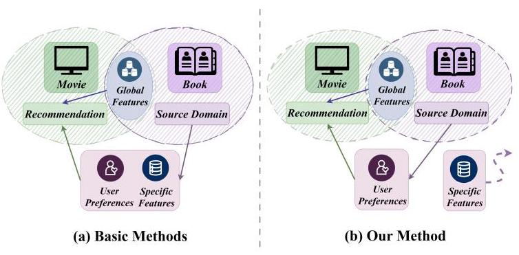
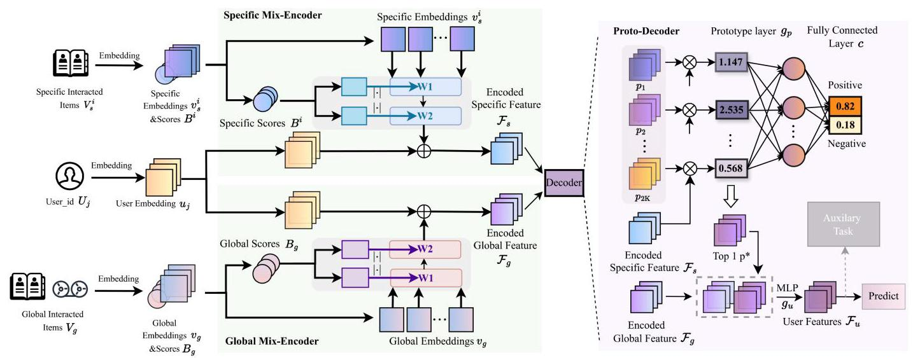
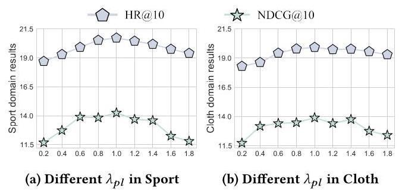
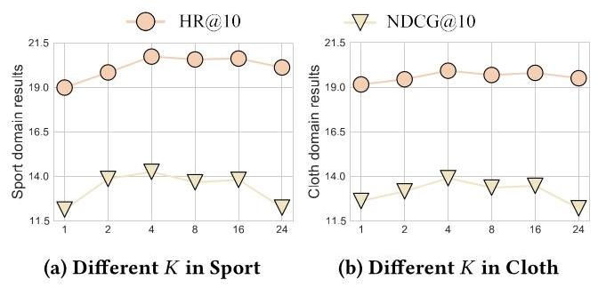
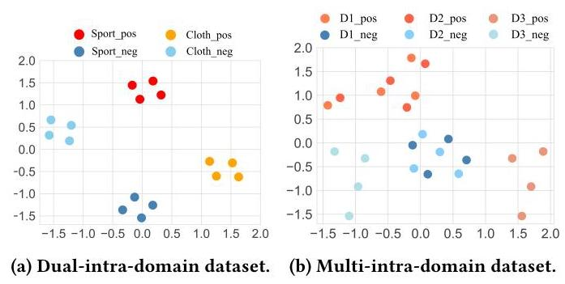

# Preference Prototype-Aware Learning for Universal Cross-Domain Recommendation

Yuxi Zhang*

Ji Zhang*

College of Computer Science and

Technology, Nanjing University of

Aeronautics and Astronautics

Nanjing, China

Feiyang Xu

Polytechnic Institute, Zhejiang

University

Hangzhou, China

xufeiyang@zju.edu.cn

Lvying Chen

College of Computer Science and

Technology, Nanjing University of

Aeronautics and Astronautics

Nanjing, China

cly.ly@nuaa.edu.cn

Bohan \( {\mathrm{{Li}}}^{ \dagger  } \)

College of Artificial Intelligence &

Computer Science and Technology,

Nanjing University of Aeronautics and Astronautics

Lei Guo

College of Computer Science and

Technology, Shandong Normal

University

Jinan, China

Hongzhi Yin

The School of Information

Technology & Electric Engineering,

The University of Queensland

Brisbane, Australia

Key Laboratory of Brain-Machine Intelligence Technology, Ministry of Education

Key Laboratory of Intelligent

Decision and Digital Operations,

Ministry of Industrial and

Information Technology

Nanjing, China

## Abstract

Cross-domain recommendation (CDR) aims to suggest items from new domains that align with potential user preferences, based on their historical interactions. Existing methods primarily focus on acquiring item representations by discovering user preferences under specific, yet possibly redundant, item features. However, user preferences may be more strongly associated with interacted items at higher semantic levels, rather than specific item features. Consequently, this item feature-focused recommendation approach can easily become suboptimal or even obsolete when conducting CDR with disturbances of these redundant features. In this paper, we propose a novel Preference Prototype-Aware (PPA) learning method to quantitatively learn user preferences while minimizing disturbances from the source domain. The PPA framework consists of two complementary components: a mix-encoder and a preference prototype-aware decoder, forming an end-to-end unified framework suitable for various real-world scenarios. The mix-encoder employs a mix-network to learn better general representations of interacted items and capture the intrinsic relationships between

Permission to make digital or hard copies of all or part of this work for personal or classroom use is granted without fee provided that copies are not made or distributed for profit or commercial advantage and that copies bear this notice and the full citation on the first page. Copyrights for components of this work owned by others than the author(s) must be honored. Abstracting with credit is permitted. To copy otherwise, or republish, to post on servers or to redistribute to lists, requires prior specific permission and/or a fee. Request permissions from permissions@acm.org.items across different domains. The preference prototype-aware decoder implements a learnable prototype matching mechanism to quantitatively perceive user preferences, which can accurately capture user preferences at a higher semantic level. This decoder can also avoid disturbances caused by item features from the source domain. The experimental results on public benchmark datasets in different scenarios demonstrate the superiority of the proposed PPA learning method compared to state-of-the-art counterparts. PPA excels not only in providing accurate recommendations but also in offering reliable preference prototypes. Our code is available at https://github.com/zyx-nuaa/PPA-for-CDR.

## CCS Concepts

- Information systems \( \rightarrow \) Recommender systems; - Computing methodologies \( \rightarrow \) Neural networks.

## Keywords

Cross-Domain Recommendation, Prototype Learning, Item Similarity Mining

## ACM Reference Format:

Yuxi Zhang, Ji Zhang, Feiyang Xu, Lvying Chen, Bohan Li, Lei Guo, and Hongzhi Yin. 2024. Preference Prototype-Aware Learning for Universal Cross-Domain Recommendation. In Proceedings of the 33rd ACM International Conference on Information and Knowledge Management (CIKM '24), October 21-25, 2024, Boise, ID, USA. ACM, New York, NY, USA, 10 pages. https://doi.org/10.1145/ 3627673.3679774

---

*Authors contributed equally to this research. E-mail: zyx_xx@nuaa.edu.cn †Corresponding author. E-mail: bhli@nuaa.edu.cn

---

## 1 Introduction

Recommendation systems (RS) have revolutionized the way users discover and engage with content, by focusing on uncovering latent user preferences and suggesting potentially interesting items. This paradigm has witnessed unprecedented success in various domains, such as e-commerce \( \left\lbrack  {2,{25}}\right\rbrack \) and video sharing \( \left\lbrack  {{29},{43}}\right\rbrack \) . Despite the significant progress made in RS, the understanding of user preferences remains shallow due to the absence of dedicated modules for preference extraction. Cross-domain recommendation (CDR) has emerged as a promising approach to enhance the understanding of user preferences by leveraging data from multiple domains, enabling more personalized and accurate recommendations. Several methods, such as \( \left\lbrack  {{12},{13},{45}}\right\rbrack \) , have been proposed as competent alternatives to traditional RS. However, these methods primarily focus on dual-domain studies and lack specialized modules for independent user preference modeling. When attempting to extract user preferences across multiple domains, these methods face challenges in identifying genuine user preferences and filtering out redundant item features, rendering them less effective in such scenarios.

To alleviate these issues, several methods construct a dedicated module that can extract user preferences. These methods are built upon unified frameworks, facilitating their application across dual-domain as well as multi-domain real-world scenarios, thereby sorting them as universal CDR methods. The pioneering work of Cao et al. [4] formulates aggregators to obtain specific features of items, while its aggregators merely consist of simple pooling or attention. Inspired by this general and effective framework, Hao et al. [15] exploit fine-tuning to retransfer user preferences. However, this work requires pre-training, which fails to an end-to-end structure and can not directly extract user preferences. Ju et al. [21] propose to mask the user preferences extracted by item representations, aiming to encourage the model to predict user preferences indirectly. The critical limitation of this approach is that the mask mechanism makes it more challenging for datasets with insufficient data.

Despite the promising results achieved, the above works in CDR primarily focus on extracting both user preferences and specific features from the source domain. However, this approach may not effectively capture the true essence of user preferences, as they are more closely associated with interacted items at a higher semantic level rather than specific item features. Overemphasis on item-specific features can lead to suboptimal recommendations and hinder the transferability of user preferences across domains. For instance, consider users who enjoy comedy books. If all the specific features of the books are taken into account, such as the author, genre, or writing style, it can lead to an overly narrow focus on book-related features. This item feature-focused approach can make it challenging to recommend relevant items from other domains, such as movies or TV shows, that align with the user's preference for comedy. The reliance on specific item features can introduce noise and limit the generalizability of the recommendation system. To address this limitation, we advocate for a preference-centric approach to CDR that prioritizes the discovery of user preferences while minimizing the influence of specific item features from the source domain. As illustrated in Figure 1, our proposed method aims to learn transferable and domain-agnostic user preferences that can effectively bridge the gap between different domains.

Figure 1: (a) Existing methods utilize both user preferences and specific features extracted from the source domain. This approach can easily result in suboptimal or even obsolete recommendations due to disturbances from redundant item features; (b) Our method, in contrast, separates user preferences from irrelevant item-specific features, ensuring more accurate and reliable recommendations.

In this paper, we introduce a novel Preference Prototype-Aware (PPA) learning method for universal CDR that aims to quantitatively learn user preferences while minimizing the impact of source domain disturbances. The proposed PPA consists of two key components: a mix-encoder and a proto-decoder, which work together to form a unified end-to-end structure without the need for any pretraining process. Specifically, the mix-encoder is designed to extract a comprehensive item representation by leveraging both item features and their corresponding scores. This enables the mix-encoder to capture the intrinsic relationships between items accurately and prioritize the most relevant and informative aspects. The proto-decoder, on the other hand, is a learnable component that explicitly models user preferences using representative prototypes. This allows the proto-decoder to effectively capture user preferences while minimizing the influence of redundant or noisy item features. Our main contributions can be summarized as follows:

- We explore the problem of significant disturbances caused by redundant item features resulting from the item feature-focused extraction in source domains. To alleviate this problem, we propose re-considering preference extraction and mining user preferences from quantitative prototypes to minimize the impact of noisy or irrelevant item features and capture the true user preferences more accurately.

- We propose a novel Preference Prototype-Aware (PPA) learning method that learns accurate user preferences while minimizing the influence of item disturbances. By integrating a mix-encoder and a proto-decoder, PPA can effectively capture user preferences across multiple scenarios in a unified end-to-end framework.

- Extensive experiments on Amazon benchmark showcase that the proposed PPA yields results superior to the state-of-the-art CDR methods in four different scenarios. Moreover, the additional prototype visualization demonstrates the reliability and interpretability of the learned preferences, validating the effectiveness of PPA in various contexts.

## 2 Related Works

In this section, we provide an overview of the research topics most closely related to our proposed work. To facilitate a good understanding of the CDR field, we categorize the existing approaches into three main directions: dual-domain CDR, multi-domain CDR, and universal CDR. We also explore the application of prototype learning, particularly in CDR.

### 2.1 Cross-Domain Recommendation

Conventional cross-domain recommendation (CDR) methods can be roughly classified into two categories: intra-domain (IAD) methods [5, 27] and inter-domain (IED) methods [11, 14, 26, 30]. IAD methods mainly focus on addressing data sparsity within the same domain, particularly in unpopular categories where interactions are rare. This challenge leads to difficulties in analyzing the features of these categories. Cao et al. [5] propose decoupling global representations to reinforce user-specific recommendations. Although this method can effectively recommend items to users within the same domain, there is an increasing demand to recommend items from new domains. Recommending items from new domains confronts a more serious challenge known as the cold-start problem. The key limitation of cold-start in IED methods is learning from insufficient historical data about new domains. Man et al. [30] utilize a multi-layer perceptron to capture the cross-domain mapping relationships and select sufficient entities to alleviate the cold-start problem. As the scale of categories and domains increases, it becomes difficult for both of these two types of methods to effectively handle comprehensive scenarios.

Recently, CDR methods have drawn broad attention in addressing multiple target categories, which is a more general and practical problem. Multi-target CDR (MTCDR) aims to concurrently improve recommendations across multiple item categories. These methods primarily employ graph-based approaches and utilize auxiliary information to enhance their recommendations. Cui et al. [9] employ shared graphs and recurrent attention mechanisms to extract multi-target features. Cao et al. [3] incorporate closed-form intra-items and high-order inter-items to describe multiple targets at both fine and coarse levels. However, most of these special MTCDR tricks cannot directly be applied to dual-domain scenarios.

Thus, universal methods have emerged to achieve CDR across various scenarios. UniCDR [4] proposes a unified recommendation framework, which models different scenarios by combining domain-specific and domain-shared features. Inspired by this general and effective framework, Hao et al. [15] utilize motif-based shared embeddings to address the negative transfer problem between domains, effectively improving performance by capturing universal embeddings. Ju et al. [21] randomly mask the user preferences extracted by item representations and train the model to understand them indirectly, thereby reducing the model's reliance on specific item features and enhancing its generalization ability.

However, all of these methods utilize specific item features to roughly represent user preferences while ignoring the significant disturbance from source-domain features and irrelevant specific features. This oversight results in the final suboptimal recommendation over redundant specific features, as the model is unable to effectively distinguish between informative and irrelevant features. Instead, our PPA method can accurately capture user preferences and the generality of interacted items without being disturbed by redundant specific item features. By learning preference prototypes at a higher semantic level, PPA can effectively filter out the noise and focus on the essential aspects of user preferences, which leads to more accurate recommendations across different domains.

### 2.2 Prototype Learning

Prototype-based learning techniques \( \left\lbrack  {7,{33},{40}}\right\rbrack \) enable deep models to generate output based on a few human-understandable instances. These instances, referred to as prototypes, aim to capture essential characteristics of different classes or groups in the feature space. Therefore, it requires prototypes to be distinguished from other classes and be stable in its own class. Prototype learning was first proposed in the field of image recognition. Chen et al. [7] dissect images by identifying prototype components and integrating their evidence to generate classifications. Xu et al. [40] share global attribute prototypes across different categories to better extend intermediate features to unseen images. The success of prototype learning in the field of image recognition has led to its application in more fields.

In the recommendation field, recent studies have introduced prototype learning to further extract effective representations of users or items. Sankar et al. [36] select each prototype to represent a few-shot item in few-shot recommendations. Melchiorre et al. [31] directly match both users and items to user prototypes and item prototypes, providing effective representations. Gan et al. [10] firstly utilize the target item to pre-train an entire prototype space, which integrates certain semantics of the target embedding. Then, they enhance the final prediction with the prototype-guiding attention mechanism in the fine-tuning phase.

Unlike previous methods in CDR that simply represent prototypes as users or items, our work actively considered the importance of user preferences in cross-domain recommendations. By quantifying user preferences using learnable prototypes, we remove the disturbance from the source-domain items.

## 3 Problem Statement

For the dual-domain scenario \( \mathbf{i} \in  \{ X, Y\} \) , the recommendation data consists of users, items and interactions \( {\mathcal{D}}^{i} = \left( {{\mathcal{U}}^{i},{\mathcal{V}}^{i},{\mathcal{E}}^{i}}\right) \) . Given the interaction \( {\mathcal{E}}^{i} \) , we follow the previous work \( \left\lbrack  {4,{38}}\right\rbrack \) to calculate the pre-processed item-item similarity scores \( {B}_{q} = \left( {{B}^{X},{B}^{Y}}\right) \) . \( {B}^{X} \in  {\mathbb{R}}^{\left| {V}^{X}\right|  \times  1} \) represents the personalized item score within the \( \mathrm{X} \) domain and \( {B}^{Y} \) represents ones within the \( \mathrm{Y} \) domain. These similarity scores are used as prior knowledge to enhance item features. We choose \( N \) items from \( {\mathcal{V}}^{i} \) based on \( {\mathcal{E}}^{i} \) , indicating the specific interacted items \( {V}_{s}^{i} \) . We choose \( {2N} \) items from both \( {\mathcal{V}}^{X} \) and \( {\mathcal{V}}^{Y} \) based on \( {\mathcal{E}}^{i} \) , indicating the global interacted item \( {V}_{g} \) . Here, \( {V}_{s}^{i} \) with \( {B}^{i} \) and \( {V}_{g} \) with \( {B}_{g} \) constitute the effective item-related inputs.

Table 1: The data format of four common CDR scenarios.

<table><tr><td rowspan="2">Scenarios</td><td colspan="2">Targets</td><td colspan="2">Overlapping</td><td colspan="2">Recommendation</td></tr><tr><td>Single</td><td>Multi</td><td>User</td><td>Item</td><td>Intra</td><td>Inter</td></tr><tr><td>Scenario 1</td><td>✓</td><td></td><td>✓</td><td></td><td>✓</td><td></td></tr><tr><td>Scenario 2</td><td>✓</td><td></td><td>✓</td><td></td><td></td><td>✓</td></tr><tr><td>Scenario 3</td><td></td><td>✓</td><td></td><td>✓</td><td>✓</td><td></td></tr><tr><td>Scenario 4</td><td></td><td>✓</td><td>✓</td><td></td><td>✓</td><td></td></tr></table>

Figure 2: Illustration of the proposed method PPA. Mix-encoders are employed for extracting the effective specific representation while proto-decoder perceives user preference explicitly and avoids disturbances caused by redundant item features.

To further extract their effective representations, we introduce \( {\mathbf{u}}^{i} \in  {\mathbb{R}}^{\left| {\mathcal{U}}^{i}\right|  \times  h} \) and \( {\mathbf{v}}^{i} \in  {\mathbb{R}}^{\left| {\mathcal{V}}^{i}\right|  \times  h} \) to denote user and item embedding, where \( h \) is the global embedding dimension. After these embedding layers, we get three basic representations for CDR: user embed- \( \operatorname{ding}\mathbf{u} \) , specific item embedding \( {\mathbf{v}}_{s}^{i} \) with scores \( {B}^{i} \) and global item embedding \( {\mathbf{v}}_{g} \) with scores \( {B}_{g} \) .

We have \( \mathbf{u},\left( {{\mathbf{v}}_{s}^{i},{B}^{i}}\right) \) and \( \left( {{\mathbf{v}}_{g},{B}_{g}}\right) \) equally in multi-targets scenario. The data distribution characteristics of four different scenarios are summarized in Table 1, which should be considered simultaneously in our universal CDR method.

## 4 Method

In this section, we further detail the proposed Preference Prototype-Aware learning (PPA) method. As shown in Figure 2, PPA consists of two core modules, namely mix-encoder and prototype-aware decoder. In the former module, we employ a mix-network to learn general representations of interacted items and capture the intrinsic relationships between items across different domains. In the latter module, the encoded item features from the source domain are employed to derive the prototype learning. Subsequently, the highest similarity prototype offers tailed recommendation support to the encoded global features and makes predictions.

### 4.1 Mix-Encoder

The goal of the mix-encoder is to extract the effective specific representation with the guidance of item scores. Unlike previous simple multiplication, we generate the learnable weighted through scores to guide the item embedding.

The potential user \( {u}_{j} \) has interacted in domain \( X \) and remains the histories corresponding to specific item embedding \( {\mathbf{v}}_{s}^{X} \in  {\mathbb{R}}^{N \times  h} \) and scores \( {B}^{X} \in  {\mathbb{R}}^{N \times  1} \) , where \( N \) is the sample number. To capture the domain representation, we design the mix network to compress item embedding and scores. As depicted in the left column of Figure 2, we use mix network \( f\left( {\cdot ;\psi }\right)  : {\mathbb{R}}^{N \times  h} \rightarrow  {\mathbb{R}}^{1 \times  h} \) parameterized by \( \psi \) to encode item embedding following the general mix mechanism as:

\[
{W}_{1},{W}_{2} = \left| {\left\lbrack  {{W}_{{\theta }_{1}},{W}_{{\theta }_{2}}}\right\rbrack   \cdot  B}\right|
\]

\[
E = {W}_{2}^{\top } \cdot  \operatorname{ReLU}\left( {{W}_{1}^{\top } \cdot  \mathbf{v}}\right) , \tag{1}
\]

\[
\mathcal{F} = E + {u}_{j}
\]

where \( {W}_{{\theta }_{1}} \) and \( {W}_{{\theta }_{2}} \) represent learnable parameters. \( \left| \cdot \right| \) takes the absolute value. The mix-weights \( {W}_{1} \in  {\mathbb{R}}^{N \times  h} \) and \( {W}_{2} \in  {\mathbb{R}}^{h \times  1} \) are learned by input scores \( B \) . After running Eq. 1, the final encoded domain features \( \mathcal{F} \in  {\mathbb{R}}^{1 \times  h} \) is generated by the domain representation \( E \) and current user embedding \( {u}_{j} \) . Here we adopt two mix-encoder branches to capture two encoded domain features.

In the specific branch, we feed inputs \( \left\lbrack  {{u}_{j},\left( {{\mathbf{v}}_{s}^{X},{B}^{X}}\right) }\right\rbrack \) to the specific mix-encoder, focusing on capturing latent specific features. The mix-encoder generates specific encoded features as:

\[
{\mathcal{F}}_{s} = f\left( {\left\lbrack  {{u}_{j},\left( {{\mathbf{v}}_{s}^{X},{B}^{X}}\right) }\right\rbrack  ;{\psi }_{s}}\right)  \in  {\mathbb{R}}^{1 \times  h}. \tag{2}
\]

In the global branch, we feed inputs \( \left\lbrack  {{u}_{j},\left( {{\mathbf{v}}_{g},{B}_{g}}\right) }\right\rbrack \) to the mix-encoder to generate global encoded features as:

\[
{\mathcal{F}}_{g} = f\left( {\left\lbrack  {{u}_{j},\left( {{\mathbf{v}}_{g},{B}_{g}}\right) }\right\rbrack  ;{\psi }_{g}}\right)  \in  {\mathbb{R}}^{1 \times  h}. \tag{3}
\]

Here we employ the mix-encoder to learn both specific and global domain representations. The mix-network can capture deeper dependencies between items, further encoding them into highly correlated specific domain features and global domain features. These encoded features \( \left\lbrack  {{\mathcal{F}}_{s},{\mathcal{F}}_{g}}\right\rbrack \) are further employed by the decoder.

### 4.2 Prototype-Aware Decoder

Existing methods suffer from specific feature-focused recommendations that are easily suboptimal or even obsolete when performing CDR under redundant features from the source domain. The recommendation should be separated from irrelevant item features in the source domain, further focusing on potential user preferences in the global domain. Therefore, we use prototypes to represent preferences, rather than directly using item features. At the heart of the prototype-aware decoder are quantitative prototypes of user interests to target items, which enables the decoder to explicitly perceive user preference.

We partitioned positive preferences into \( K \) adaptable prototypes and negative ones into \( K \) prototypes, resulting in \( {2K} \) prototypes to precisely quantify the preference from dislike to like. We denote these prototypes as \( \mathcal{P} = \left\{  {{p}_{1},{p}_{2},\ldots ,{p}_{2\mathrm{\;K}} \mid  {p}_{i} \in  {\mathbb{R}}^{1 \times  h}}\right\} \) . User preferences are extracted from the source domain, so they only interact with \( {\mathcal{F}}_{s} \) . We match the highest similarity prototype \( {p}^{ * } \) to make PPA aware of the preference, following the calculation of similarity:

\[
\operatorname{sim}\left( {{p}_{i},{\mathcal{F}}_{s}}\right)  = \log \left( \frac{{\begin{Vmatrix}{p}_{i} - {\mathcal{F}}_{s}\end{Vmatrix}}_{2}^{2} + 1}{{\begin{Vmatrix}{p}_{i} - {\mathcal{F}}_{s}\end{Vmatrix}}_{2}^{2} + \epsilon }\right) , \tag{4}
\]

where \( \epsilon \) is set as a small value to prevent division by zero. After obtaining the preference prototype \( {p}^{ * } \) , we guide the global encoding features \( {\mathcal{F}}_{g} \) by introducing this preference of the source domain into the shared domain, effectively extracting final user features \( {\mathcal{F}}_{u} \) in the target domain. The linear layer \( {g}_{u} \) with parameters \( \phi \) is employed to dynamically adapt encoded features to evolving preference features, extracting the final user features \( {\mathcal{F}}_{u} = {g}_{u}\left( {{\mathcal{F}}_{g},{p}^{ * };\phi }\right)  \in  {\mathbb{R}}^{1 \times  h} \) . The objective function of prototype learning \( {\mathcal{L}}_{pl} \) is defined as:

\[
{\mathcal{L}}_{pl} = {\mathcal{L}}_{ce}\left( {c \circ  {g}_{p} \circ  {\mathcal{F}}_{s},\ell }\right)  + {\lambda }_{1}{\mathcal{L}}_{clst} + {\lambda }_{2}{\mathcal{L}}_{sep} + {\lambda }_{3}{\mathcal{L}}_{div}, \tag{5}
\]

where \( c \) is a fully connected layer that predicts positive or negative probability, and \( {g}_{p} \) is the prototype layer. \( {\mathcal{L}}_{ce} \) represents the cross-entropy loss for preference classification within the prototype branch. \( \ell \) is an all-one array when inputting normal interacted items. \( {\lambda }_{1},{\lambda }_{2},{\lambda }_{3} \) control the weights of losses and we follow the general value in classification tasks [41].

As shown in Eq. (5), several constraints are proposed to construct the final prototypes [41]. The cluster cost \( {\mathcal{L}}_{\text{ clst }} \) motivates these interacted items from the source domain to exhibit proximity to one prototype corresponding to their preference. The separation cost \( {\mathcal{L}}_{\text{ sep }} \) promotes the distancing of encoded item features from prototypes that do not belong to their preference.

\[
{\mathcal{L}}_{\text{ clst }} = \frac{1}{n}\mathop{\sum }\limits_{{i = 1}}^{{2\mathrm{\;K}}}\mathop{\min }\limits_{{j : {p}_{j} \in  \mathcal{P}{y}_{i}}}{\begin{Vmatrix}{\mathcal{F}}_{s} - {p}_{j}\end{Vmatrix}}_{2}^{2} \tag{6}
\]

\[
{\mathcal{L}}_{\text{ sep }} =  - \frac{1}{n}\mathop{\sum }\limits_{{i = 1}}^{{2K}}\mathop{\min }\limits_{{j : {p}_{j} \notin  {\mathcal{P}}_{{y}_{i}}}}{\begin{Vmatrix}{\mathcal{F}}_{s} - {p}_{j}\end{Vmatrix}}_{2}^{2}.
\]

where \( {\mathcal{P}}_{{y}_{i}} \) is the set of prototypes under \( {y}_{i} \) class. Moreover, the diversity loss \( {\mathcal{L}}_{\text{ div }} \) in Eq. (7) encourages the diversity of the learned prototypes via penalizing prototypes too close.

\[
{\mathcal{L}}_{div} = \mathop{\sum }\limits_{{k = 1}}^{2}\mathop{\sum }\limits_{\substack{{i \neq  j} \\  {{p}_{i},{p}_{j} \in  {\mathcal{P}}_{k}} }}\max \left( {0,\cos \left( {{p}_{i},{p}_{j}}\right)  - \xi }\right) , \tag{7}
\]

where \( k = \{ 1,2\} \) denotes 2 kinds of preferences. \( \xi \) is the threshold of the cosine similarity in the diversity loss.

Finally, the user-item prediction score is calculated by \( {S}_{p} = {\mathcal{F}}_{u} \cdot  {\mathbf{v}}^{i} \) to decide which item should be recommended. We exploit the BCE loss to make a basic prediction loss following previous work [4]: \( {\mathcal{L}}_{\text{ pred }} = \mathop{\sum }\limits_{{\left( {u, v}\right)  \in  \mathcal{E}}}\left\lbrack  {-\log {S}_{p} - \log \left( {1 - {S}_{n}}\right) }\right\rbrack \) , where \( {S}_{n} = {\mathcal{F}}_{u} \cdot  {\overline{\mathbf{v}}}^{i} \) denotes the negative prediction scores by dot product uninterested items \( {\overline{\mathbf{v}}}^{i} \) .

### 4.3 Auxiliary Task

Inspired by previous work \( \left\lbrack  {4,{23}}\right\rbrack \) that applied contrastive learning (CL) [8] in enhancing the model, we select CL as the auxiliary task algorithm to regular the latent space of positive and negative interaction. Suppose on the domain \( X \) , the positive input is the same as specific items \( {V}_{S}^{X} \) on the main branch. The negative input is randomly sampled from uninterested items \( {\bar{V}}_{s}^{X} \) . After the main branch, we get the positive features \( {\mathcal{F}}_{p} = \operatorname{PPA}\left( {V}_{s}^{X}\right) \) and negative features \( {\mathcal{F}}_{n} = \operatorname{PPA}\left( {\bar{V}}_{s}^{X}\right) \) . The auxiliary loss is as follows:

\[
{\mathcal{L}}_{cl}^{X} = \mathop{\sum }\limits_{{u \in  {\mathcal{U}}^{X}}}\left\lbrack  {{\mathcal{L}}_{ce}\left( {{\mathcal{F}}_{p},{Z}_{p}}\right)  + {\mathcal{L}}_{ce}\left( {{\mathcal{F}}_{n},{Z}_{n}}\right) }\right\rbrack  , \tag{8}
\]

where \( {\mathcal{L}}_{ce} \) represents the cross-entropy loss for classification. \( {Z}_{p} \) is the positive label and stands for \( 1.{Z}_{n} \) is the negative label and stands for 0 . Our whole model can be optimized by the total objective function \( {\mathcal{L}}_{\text{ tot }} \) as:

\[
{\mathcal{L}}_{tot} = {\mathcal{L}}_{pred} + {\lambda }_{pl}{\mathcal{L}}_{pl} + {\mathcal{L}}_{cl} \tag{9}
\]

## 5 Experiments

To illustrate the effectiveness of the proposed PPA method, we aim to answer the following questions: (1) Can PPA outperform the state-of-the-art CDR methods in various scenarios? (Section 5.2) (2) How do the different components of PPA contribute to the overall performance? (Section 5.3) (3) How do different hyperparameters affect model performance? (Section 5.4) (4) Can PPA offer prototypes with understandable visualization? (Section 5.5)

### 5.1 Experimental Settings

Tasks and Datasets. We consider four different challenging scenarios under the Amazon benchmark [16]. Specifically, for the dual-intra-domain recommendation in Scenario 1, we employ the Sport&Cloth and Elec&Phone datasets preprocessed by Dis-enCDR [5]. For the dual-inter-domain recommendation in Scenario 2, we utilize the Sport&Cloth and Game&Video datasets preprocessed by CDRIB [6]. For the multi-intra-domain recommendation in Scenario 3, we use the dataset preprocessed by \( {\mathrm{M}}^{3}\mathrm{{rec}} \) [3], which includes interaction data from five anonymous countries in the electronics domain. For the multi-inter-domain recommendation in Scenario 4, we employ the financial dataset created by UniCDR [4], which consists of real-world data from three online banking platforms. The detailed statistics of the datasets in these four scenarios are summarized in Table 2.

Evaluation Metrics. We utilize Hit Ratio (HR) and Normalized Discounted Cumulative Gain (NDCG) to qualitatively evaluate performance, following previous works \( \left\lbrack  {3,4}\right\rbrack \) . HR focuses on whether the recommended list contains items that the user is interested in, while NDCG considers both the user's interest and the relevance ranking of the items in the recommended list. These two metrics are crucial for evaluating recommendation performance. Specifically,

Table 2: Statistics of four CDR scenarios.

<table><tr><td>Scenarios</td><td>Datasets</td><td>\( \left| \mathcal{U}\right| \)</td><td>\( \left| \mathcal{V}\right| \)</td><td>Training</td><td>Valid</td><td>Test</td></tr><tr><td rowspan="4">Scenario1</td><td>Sport</td><td>9928</td><td>30796</td><td>92612</td><td>-</td><td>8326</td></tr><tr><td>Cloth</td><td>9928</td><td>39008</td><td>87829</td><td>-</td><td>7540</td></tr><tr><td>Elec</td><td>3325</td><td>17709</td><td>50407</td><td>-</td><td>2559</td></tr><tr><td>Phone</td><td>3325</td><td>38706</td><td>115554</td><td>-</td><td>2560</td></tr><tr><td rowspan="4">Scenario2</td><td>Sport</td><td>27328</td><td>12655</td><td>163291</td><td>3589</td><td>3546</td></tr><tr><td>Cloth</td><td>41829</td><td>17943</td><td>187880</td><td>3156</td><td>3085</td></tr><tr><td>Game</td><td>25025</td><td>12319</td><td>155036</td><td>1381</td><td>1304</td></tr><tr><td>Video</td><td>19457</td><td>8751</td><td>156091</td><td>1435</td><td>1458</td></tr><tr><td rowspan="5">Scenario3</td><td>M1</td><td>7109</td><td>2198</td><td>48302</td><td>3526</td><td>3558</td></tr><tr><td>M2</td><td>2697</td><td>1357</td><td>19615</td><td>1362</td><td>1310</td></tr><tr><td>M3</td><td>3328</td><td>1245</td><td>23367</td><td>1629</td><td>1678</td></tr><tr><td>M4</td><td>5482</td><td>2917</td><td>41226</td><td>2720</td><td>2727</td></tr><tr><td>M5</td><td>6466</td><td>9762</td><td>77173</td><td>3090</td><td>3154</td></tr><tr><td rowspan="3">Scenario4</td><td>D1</td><td>231444</td><td>2096</td><td>491098</td><td>13435</td><td>13437</td></tr><tr><td>D2</td><td>507715</td><td>595</td><td>1068490</td><td>36013</td><td>35985</td></tr><tr><td>D3</td><td>773188</td><td>1312</td><td>3785720</td><td>92659</td><td>92672</td></tr></table>

we first compute 1000 scores for each validation/test case (including 999 negative items and 1 positive item). Then, we rank the item list and evaluate the Top-10 items using HR and NDCG metrics.

Compared Methods. We compare our methods with the following baselines from four different aspects of CDRs.

- Single-domain baselines. We compare our proposed method with several single-domain baselines, including BPRMF [34], NeuMF [18], CML [19], and \( {\operatorname{EASE}}^{R}\left\lbrack  {38}\right\rbrack \) . These methods are widely used in industrial fields due to their stable performance. We also compare our method with recent graph-based methods: Random Walk[1], NGCF [39], and LightGCN [17]. These methods mainly utilize high-order neighbor information for both users and items.

- Intra-domain CDR baselines. We compare our proposed method with CoNet [20] and DDTCDR [24], which achieve bi-directional transfer through cross-connections. We also compare our method with recent GNN-based models: PPGN [42], Bi-TGCF [27], and DisenCDR [5], which utilize multiple types of neighboring information. Additionally, there have also been some representative efforts in multi-target CDR. GA-MTCDR [43] and HeroGraph [9] effectively utilize multi-target data through graphs and attention mechanisms. FOREC [2] and \( {\mathrm{M}}^{3} \) rec [3] leverage auxiliary rich data. For multi-target CDR, multi-task learning techniques can also be considered as potential approaches. Therefore, our method is also compared with Cross-Stitch [32], MMoE [28], and STAR [37].

- Inter-domain CDR baselines. We compare our proposed method with EMCDR [30] and SSCDR [22], which aim to improve the utility of limited data. TMCDR [44] and SA-VAE [35] achieve domain-specific personalized learning through meta-learning and variational autoencoders, respectively. CDRIB [6] employs the information bottleneck principle.

- Universal CDR baselines. Universal methods are proposed to achieve CDR across various scenarios. UniCDR [4] proposes a unified multi-domain recommendation framework, which models different scenarios by combining domain-specific and domain-shared features. This approach aims to capture both the unique characteristics of each domain and the common patterns shared across domains. For fairness, we do not compare our method with models that require pre-training or fine-tuning [15], as these additional steps may introduce bias into the evaluation.

Implementation Details. Following previous works [4], we train our model for a total of 100 epochs. The learning rate is \( 1{e}^{-3} \) and our batch size is 1024 . The hidden dimension is set to 128 . All experiments are conducted using the same hardware and software configuration to ensure a fair comparison. We choose \( {\lambda }_{pl} = {1.0} \) and \( K = 4 \) for our PPA method to achieve the best performance. The prototype constraint weights \( {\lambda }_{1},{\lambda }_{2},{\lambda }_{3} \) in \( {\mathcal{L}}_{pl} \) are set to0.1,0.05and 0.001 , following the common setting for classification tasks [41].

### 5.2 Performance Comparisons

Dual-domain scenarios. We first compare PPA and other baselines under the dual-intra-domain scenario. Test results of the comparison are shown in Table 3, which showcases that the performance of PPA is superior to other baselines across all metrics on different datasets. In particular, on the sport and cloth datasets, our PPA outperforms state-of-the-art models by 3.27% and 2.69% under the NDCG metric. In this simple scenario, results show that the disturbance caused by source-domain item features greatly deteriorates the perception of preferences in the target domain. We also conduct experiments on PPA in the dual-inter-domain scenario. As shown in Table 4, we find that PPA still outperforms other baselines. Especially on the Game dataset, we exceed the sota method by 2.57% and 1.3% under the HR and NDCG respectively. These results highlight that our preference quantification is crucial in simple scenarios, which can outperform baselines by a large margin.

Multi-domain scenarios. To further evaluate our PPA's performance under complex scenarios, we conducted experiments on multi-domain scenarios. Test results for the item-overlapped scenario are shown in Table 5. PPA achieved the highest NDCG but ranked second in most HR metrics. The HR metric focuses on whether the recommended list contains items of interest, without considering their ranking or relevance. In contrast, the NDCG metric not only considers whether items appear in the recommended list but also evaluates their ranking and relevance. Therefore, the NDCG metric, with its stronger emphasis on preference weights, accurately reflects the effectiveness of our PPA model in preference learning. The \( {\mathrm{M}}^{3} \) rec [3] method, which is specifically designed for multi-target domains, obtained higher HR metrics due to its well-designed multi-domain feature mining. Test results for the user-overlapped scenario are shown in Table 6. PPA outperforms other models in both HR and NDCG. Particularly in the D1 dataset, PPA surpasses the state-of-the-art model by \( {3.47}\% \) and \( {1.7}\% \) in the HR and NDCG. These results underscore PPA as a universal CDR method applicable across various scenarios, excelling not only in dual-domain but also in multi-domain tasks.

Universal Methods. We also conducted extensive comparisons with our universal baseline method (i.e., UniCDR [4]) under these four scenarios. In the dual-intra-domain scenario, PPA significantly outperforms UniCDR across all performance metrics on all datasets. Notably, our PPA surpasses UniCDR by 6.58% and 4.09% in HR and NDCG metrics, respectively, on the Phone dataset. In the dual-inter-domain scenario, PPA exceeds UniCDR by 2.57% and 1.3% in HR and NDCG on the Game dataset. These results demonstrate the excellence of PPA as a universal method in simple dual-domain recommendations, benefiting from more effective user preferences and fewer disturbances from the source domain.

Table 3: Performance comparison (%) on dual-intra-domain recommendations. Bold donotes the best results.

<table><tr><td rowspan="2">Datasets</td><td rowspan="2">Metric@10</td><td colspan="5">Single-Domain Methods</td><td colspan="4">Cross-Domain Methods</td><td colspan="2">Universal Methods</td></tr><tr><td>BPRMF</td><td>NeuMF</td><td>NGCF</td><td>LightGCN</td><td>CoNet</td><td>DDTCDR</td><td>PPGN</td><td>Bi-TGCF</td><td>DisenCDR</td><td>UniCDR</td><td>Ours</td></tr><tr><td rowspan="2">Sport</td><td>HR</td><td>10.43</td><td>10.74</td><td>13.13</td><td>13.19</td><td>12.09</td><td>11.86</td><td>15.10</td><td>14.83</td><td>17.55</td><td>18.37</td><td>20.72</td></tr><tr><td>NDCG</td><td>5.41</td><td>5.46</td><td>6.87</td><td>6.94</td><td>6.41</td><td>6.37</td><td>8.03</td><td>7.95</td><td>9.46</td><td>10.98</td><td>14.25</td></tr><tr><td rowspan="2">Cloth</td><td>HR</td><td>11.53</td><td>11.18</td><td>13.22</td><td>13.58</td><td>12.40</td><td>12.54</td><td>14.23</td><td>14.68</td><td>16.31</td><td>17.85</td><td>19.92</td></tr><tr><td>NDCG</td><td>6.25</td><td>6.02</td><td>6.97</td><td>7.29</td><td>6.62</td><td>7.13</td><td>7.68</td><td>7.93</td><td>9.03</td><td>11.20</td><td>13.89</td></tr><tr><td rowspan="2">Elec</td><td>HR</td><td>15.71</td><td>16.17</td><td>18.55</td><td>19.17</td><td>17.22</td><td>18.47</td><td>21.68</td><td>22.14</td><td>24.57</td><td>22.92</td><td>25.39</td></tr><tr><td>NDCG</td><td>9.19</td><td>9.24</td><td>10.87</td><td>10.28</td><td>9.86</td><td>11.08</td><td>11.63</td><td>12.20</td><td>14.51</td><td>13.83</td><td>15.37</td></tr><tr><td rowspan="2">Phone</td><td>HR</td><td>16.32</td><td>15.84</td><td>22.79</td><td>23.25</td><td>17.66</td><td>17.23</td><td>24.54</td><td>25.71</td><td>28.76</td><td>24.72</td><td>31.30</td></tr><tr><td>NDCG</td><td>8.53</td><td>8.02</td><td>12.38</td><td>12.72</td><td>9.30</td><td>8.58</td><td>13.34</td><td>13.93</td><td>16.13</td><td>13.77</td><td>17.86</td></tr></table>

Table 4: Performance comparison (%) on dual-inter-domain recommendations.

<table><tr><td rowspan="2">Datasets</td><td rowspan="2">Metric@10</td><td colspan="4">Single-Domain Methods</td><td colspan="3">Cross-Domain Methods</td><td colspan="3">Universal methods</td></tr><tr><td>CML</td><td>BPRMF</td><td>NGCF</td><td>EMCDR</td><td>SSCDR(CML)</td><td>TMCDR</td><td>SA-VAE</td><td>CDRIB</td><td>UniCDR</td><td>Ours</td></tr><tr><td rowspan="2">Sport</td><td>HR</td><td>5.82</td><td>5.75</td><td>7.22</td><td>7.44</td><td>7.27</td><td>7.18</td><td>7.51</td><td>12.04</td><td>11.20</td><td>13.81</td></tr><tr><td>NDCG</td><td>3.29</td><td>3.16</td><td>3.63</td><td>3.71</td><td>3.75</td><td>3.84</td><td>3.72</td><td>6.22</td><td>7.04</td><td>7.61</td></tr><tr><td rowspan="2">Cloth</td><td>HR</td><td>6.97</td><td>6.75</td><td>7.07</td><td>7.29</td><td>6.12</td><td>8.11</td><td>7.21</td><td>12.19</td><td>12.48</td><td>12.87</td></tr><tr><td>NDCG</td><td>3.92</td><td>3.26</td><td>3.48</td><td>4.48</td><td>3.06</td><td>5.05</td><td>4.59</td><td>6.81</td><td>7.52</td><td>7.57</td></tr><tr><td rowspan="2">Game</td><td>HR</td><td>2.82</td><td>3.77</td><td>5.14</td><td>4.63</td><td>3.48</td><td>5.36</td><td>5.84</td><td>8.51</td><td>8.78</td><td>11.35</td></tr><tr><td>NDCG</td><td>1.44</td><td>1.89</td><td>2.73</td><td>2.24</td><td>1.59</td><td>2.58</td><td>2.78</td><td>4.58</td><td>4.63</td><td>5.93</td></tr><tr><td rowspan="2">Video</td><td>HR</td><td>3.07</td><td>4.46</td><td>7.41</td><td>7.94</td><td>5.51</td><td>8.85</td><td>7.46</td><td>13.17</td><td>10.74</td><td>12.63</td></tr><tr><td>NDCG</td><td>1.30</td><td>2.36</td><td>3.87</td><td>4.29</td><td>2.61</td><td>4.41</td><td>3.71</td><td>6.49</td><td>5.89</td><td>6.66</td></tr></table>

Table 5: Performance comparison (%) on item-overlapped multi-intra-domain recommendation

<table><tr><td rowspan="2">Datasets</td><td rowspan="2">Metric@10</td><td colspan="4">Single-Domain Methods</td><td colspan="5">Cross-Domain Methods</td><td colspan="3">Universal Methods</td></tr><tr><td>NeuMF</td><td>LightGCN</td><td>Random Walk</td><td>EASER</td><td>Cross-Stitch</td><td>MMoE</td><td>Bi-TGCF</td><td>STAR</td><td>FOREC</td><td>M3Rec</td><td>UniCDR</td><td>Ours</td></tr><tr><td rowspan="2">M1</td><td>HR</td><td>62.73</td><td>64.73</td><td>64.66</td><td>70.80</td><td>64.46</td><td>65.73</td><td>66.86</td><td>62.93</td><td>65.06</td><td>73.13</td><td>69.08</td><td>70.81</td></tr><tr><td>NDCG</td><td>46.31</td><td>48.30</td><td>48.05</td><td>54.95</td><td>49.15</td><td>48.98</td><td>50.46</td><td>46.57</td><td>52.05</td><td>55.83</td><td>59.57</td><td>61.27</td></tr><tr><td rowspan="2">M2</td><td>HR</td><td>55.60</td><td>52.13</td><td>50.20</td><td>57.40</td><td>54.06</td><td>56.26</td><td>53.46</td><td>54.89</td><td>58.42</td><td>60.86</td><td>58.01</td><td>58.76</td></tr><tr><td>NDCG</td><td>34.84</td><td>32.70</td><td>31.10</td><td>37.92</td><td>36.65</td><td>38.71</td><td>33.43</td><td>35.25</td><td>40.03</td><td>40.04</td><td>47.52</td><td>48.74</td></tr><tr><td rowspan="2">M3</td><td>HR</td><td>60.40</td><td>56.26</td><td>57.53</td><td>63.60</td><td>59.46</td><td>61.53</td><td>58.73</td><td>60.80</td><td>64.13</td><td>66.53</td><td>64.60</td><td>66.27</td></tr><tr><td>NDCG</td><td>36.57</td><td>34.22</td><td>34.89</td><td>40.13</td><td>39.13</td><td>41.30</td><td>35.77</td><td>37.09</td><td>41.88</td><td>43.35</td><td>53.24</td><td>53.82</td></tr><tr><td rowspan="2">M4</td><td>HR</td><td>40.33</td><td>41.14</td><td>39.20</td><td>45.13</td><td>38.93</td><td>38.60</td><td>42.26</td><td>40.20</td><td>41.60</td><td>48.46</td><td>47.52</td><td>48.61</td></tr><tr><td>NDCG</td><td>29.83</td><td>31.03</td><td>30.08</td><td>36.63</td><td>29.16</td><td>30.16</td><td>32.76</td><td>29.84</td><td>33.52</td><td>37.98</td><td>42.54</td><td>42.69</td></tr><tr><td rowspan="2">M5</td><td>HR</td><td>12.26</td><td>17.13</td><td>17.73</td><td>19.13</td><td>17.06</td><td>16.66</td><td>17.86</td><td>16.60</td><td>17.46</td><td>22.66</td><td>19.78</td><td>20.92</td></tr><tr><td>NDCG</td><td>9.01</td><td>13.16</td><td>14.07</td><td>16.93</td><td>12.51</td><td>11.79</td><td>14.42</td><td>12.48</td><td>13.19</td><td>18.63</td><td>17.04</td><td>17.38</td></tr></table>

Table 6: Performance comparison (%) on user-overlapped multi-intra-domain recommendation

<table><tr><td rowspan="2">Datasets</td><td rowspan="2">Metric@10</td><td colspan="4">Single-Domain Methods</td><td colspan="5">Cross-Domain Methods</td><td colspan="2">Universal Methods</td></tr><tr><td>BPRMF</td><td>NeuMF</td><td>EASER</td><td>LightGCN</td><td>MMoE</td><td>CoNet</td><td>Bi-TGCF</td><td>GA-MTCDR</td><td>HeroGraph</td><td>UniCDR</td><td>Ours</td></tr><tr><td rowspan="2">D1</td><td>HR</td><td>19.48</td><td>20.57</td><td>9.15</td><td>25.52</td><td>21.22</td><td>20.60</td><td>26.98</td><td>26.13</td><td>29.73</td><td>32.60</td><td>36.07</td></tr><tr><td>NDCG</td><td>7.66</td><td>7.17</td><td>4.04</td><td>10.60</td><td>8.82</td><td>8.46</td><td>10.64</td><td>10.02</td><td>11.74</td><td>13.56</td><td>15.26</td></tr><tr><td rowspan="2">D2</td><td>HR</td><td>50.45</td><td>52.92</td><td>50.07</td><td>56.18</td><td>56.22</td><td>53.53</td><td>60.48</td><td>59.59</td><td>61.49</td><td>64.37</td><td>62.91</td></tr><tr><td>NDCG</td><td>33.50</td><td>35.73</td><td>28.53</td><td>37.09</td><td>38.63</td><td>37.66</td><td>47.19</td><td>47.67</td><td>49.57</td><td>50.48</td><td>50.78</td></tr><tr><td rowspan="2">D3</td><td>HR</td><td>64.87</td><td>64.53</td><td>50.40</td><td>67.13</td><td>65.71</td><td>65.90</td><td>72.88</td><td>73.32</td><td>71.77</td><td>73.89</td><td>74.08</td></tr><tr><td>NDCG</td><td>47.69</td><td>48.44</td><td>29.02</td><td>40.49</td><td>47.08</td><td>47.51</td><td>54.15</td><td>57.00</td><td>56.81</td><td>59.15</td><td>59.61</td></tr></table>

Table 7: Test results of PPA and its ablations on two scenarios.

<table><tr><td>Scenario</td><td>Datasets</td><td>Metrics@10</td><td>w/o decoder</td><td>w/o encoder</td><td>PPA</td></tr><tr><td rowspan="8">Scenario1</td><td rowspan="2">Sport</td><td>HR</td><td>19.21</td><td>20.11</td><td>20.72</td></tr><tr><td>NDCG</td><td>11.49</td><td>13.27</td><td>14.25</td></tr><tr><td rowspan="2">Cloth</td><td>HR</td><td>18.06</td><td>18.65</td><td>19.92</td></tr><tr><td>NDCG</td><td>11.75</td><td>12.03</td><td>13.89</td></tr><tr><td rowspan="2">Elec</td><td>HR</td><td>22.79</td><td>24.33</td><td>25.39</td></tr><tr><td>NDCG</td><td>14.22</td><td>15.05</td><td>15.37</td></tr><tr><td rowspan="2">Phone</td><td>HR</td><td>25.42</td><td>28.48</td><td>31.30</td></tr><tr><td>NDCG</td><td>14.24</td><td>16.82</td><td>17.86</td></tr><tr><td rowspan="8">Scenario2</td><td rowspan="2">Sport</td><td>HR</td><td>11.37</td><td>13.16</td><td>13.81</td></tr><tr><td>NDCG</td><td>6.71</td><td>7.17</td><td>7.61</td></tr><tr><td rowspan="2">Cloth</td><td>HR</td><td>12.32</td><td>12.77</td><td>12.87</td></tr><tr><td>NDCG</td><td>6.98</td><td>7.18</td><td>7.57</td></tr><tr><td rowspan="2">Game</td><td>HR</td><td>9.78</td><td>9.79</td><td>11.35</td></tr><tr><td>NDCG</td><td>4.82</td><td>4.92</td><td>5.93</td></tr><tr><td rowspan="2">Video</td><td>HR</td><td>11.69</td><td>12.28</td><td>12.63</td></tr><tr><td>NDCG</td><td>6.47</td><td>6.34</td><td>6.66</td></tr></table>

To further demonstrate the robustness of PPA in more complex scenarios, we also compared them in multi-domain recommendation scenarios. In the item-overlapped multi-intra-domain scenario, a larger number of users rely on the same item features. Consequently, using item features to represent user preferences can lead to significant errors. Our proposed PPA surpasses UniCDR on every performance metric across all datasets. Moreover, in the user-overlapped scenario, PPA still achieves superior performance results in most cases, especially on the D1 dataset, with improvements of 3.47% and 1.71% on HR and NDCG metrics, respectively.

All experimental results indicate that PPA exhibits excellent user preference awareness under various scenarios, proving the effectiveness of the mix-encoder and prototype-aware decoder. Additionally, this unified end-to-end framework proposed by PPA demonstrates promising potential, showcasing its adaptability and generalization capabilities in universal recommendation tasks.

### 5.3 Ablation Study

To analyze the impact of different components in PPA, we carry out ablation studies to quantitatively evaluate their contribution. The comparison results of various ablations on the dual-intra-domain dataset are shown in Table 7.

PPA w/o prop-decoder. To examine the effectiveness of the preference prototype, we remove prototypes and use a linear layer to predict based on encoded features. The results illustrate that the "w/o decoder" variant only obtained the lowest results. Although the encoder extracts effective domain representations, the performance deteriorates due to the redundant item disturbances, which can be removed by the proto-decoder.

PPA w/o mix-encoder. To assess the impact of the mix-network, we utilize the original dot product to replace it. The results show that the mix architecture has a positive effect on the representation extraction. Although simple multiplication operations can directly guide scores to items, the impact of scores is not entirely the same for different domains and categories. Our mix-network can better consider the prior differences between them, making the guidance of scores more comprehensive.

Figure 3: Impact of the loss weight \( {\lambda }_{pl} \) .

Figure 4: Impact of the prototypes number \( K \) on each class.

### 5.4 Sensitivity Analysis of Hyperparameters

In this section, we explore the hyperparameter influence of the loss factor \( {\lambda }_{pl} \) and the prototype number \( K \) on each class. The comparison results of various settings on the dual-intra-domain dataset are shown in Figure 3 and Figure 4, respectively.

Factor \( {\lambda }_{pl} \) . The total objective function is defined by Eq.(9), where the weight \( {\lambda }_{pl} \) assigned to \( {\mathcal{L}}_{pl} \) balances the constraints in prototype learning. According to the trajectory of the data points in Figure 3, we find that our model shows higher and more robust results when \( {\lambda }_{pl} \in  \left\lbrack  {{0.8},{1.2}}\right\rbrack \) . Setting the prototype constraint as equally important as the classification constraint is crucial for learning user preferences. We suggest that tuning this factor to around 1.0 is a reasonable way to achieve great performance.

Number \( K \) . The number of prototypes, denoted by \( K \) , plays a crucial role in shaping the preference space and capturing user preferences effectively. Figure 4 illustrates the impact of varying \( K \) on the performance. The trajectory of the data points reveals that both excessive sparsity and density of prototypes can be detrimental to forming an optimal preference space. When the number of prototypes is too small, the model's capacity to represent diverse user preferences becomes limited. Conversely, when the number of prototypes is excessively large, it can introduce repetition and redundancy, resulting in inefficient utilization. Moreover, an overly dense prototype space can make it difficult to impose meaningful constraints and regularization. Based on the empirical evidence presented in Figure 4, we suggest choosing 4 prototypes for positive preferences and 4 for negative preferences as a reasonable starting point to achieve a balance between capturing a sufficient range of user preferences and maintaining a manageable prototype space.

Figure 5: Visualization of the learnable prototypes by t-SNE. We set the prototype number \( K = 4 \) in both scenarios.

### 5.5 Visualization Analysis

To further explain the learned preference prototypes from PPA, we conduct a qualitative analysis. The preference prototypes in different scenarios are visualized in Figure 5. We find that positive prototypes and corresponding negative prototypes can maintain their distance and exhibit similar trends in multi-domain situations, suggesting that the proposed method can successfully learn different sparse preferences for different domain classes, which significantly extracts user potential preferences from irrelevant source-domain features. By learning sparse representations, PPA is able to focus on the most informative and discriminative features, thereby reducing the impact of redundant or noisy information. Moreover, PPA also learns the relationship across various scenarios, which enables the generalizable module to handle more multi-domain problems and improve its performance in various scenarios.

## 6 Conclusions

In this paper, we explore the challenge of discovering user preferences under the disturbance of redundant item features. Unlike previous methods that only focus on discovering user preferences under redundant specific item features, we propose a Preference Prototype-Aware (PPA) method to learn user preferences quantitatively while minimizing this disturbance. The proposed method can not only extract general representations of interacted items using the mix-encoder but also infer accurate user preferences by matching them with the preference prototypes. Experimental results show that PPA outperforms other methods in all real-world scenarios considered in this study. Moreover, PPA is a unified end-to-end training framework and demonstrates the reliability of user preferences represented by prototypes across different scenarios.

In our future work, we will consider setting the number of prototypes as an additional learnable parameter in the learning pipeline to achieve a higher degree of automated learning. Additionally, we aim to explore the interpretability of the learned preference prototypes, enabling users to gain insights into their own preferences and the factors influencing them.

## 7 ACKNOWLEDGMENTS

This work is supported in part by the "14th Five-Year Plan" Civil Aerospace Pre-Research Project of China under Grant No. D020101, the Natural Science Foundation of China No. 62302213 and No. 62172372, Innovation Funding of Key Laboratory of Intelligent Decision and Digital Operations No. NJ2023027, Ministry of Industrial and Information Technology Project of Hebei Key Laboratory of Software Engineering, No. 22567637H, the Natural Science Foundation of Jiangsu Province under Grant No. BK20210280.

## References

[1] Oren Barkan and Noam Koenigstein. 2016. Item2vec: neural item embedding for collaborative filtering. In IEEE International Workshop on Machine Learning for Signal Processing (MLSP). IEEE, 1-6.

[2] Hamed Bonab, Mohammad Aliannejadi, Ali Vardasbi, Evangelos Kanoulas, and James Allan. 2021. Cross-market product recommendation. In ACM International Conference on Information and Knowledge Management. 110-119.

[3] Jiangxia Cao, Xin Cong, Tingwen Liu, and Bin Wang. 2022. Item similarity mining for multi-market recommendation. In International ACM SIGIR Conference on Research and Development in Information Retrieval. 2249-2254.

[4] Jiangxia Cao, Shaoshuai Li, Bowen Yu, Xiaobo Guo, Tingwen Liu, and Bin Wang. 2023. Towards universal cross-domain recommendation. In ACM International Conference on Web Search and Data Mining. 78-86.

[5] Jiangxia Cao, Xixun Lin, Xin Cong, Jing Ya, Tingwen Liu, and Bin Wang. 2022. Disencdr: Learning disentangled representations for cross-domain recommendation. In International ACM SIGIR Conference on Research and Development in Information Retrieval. 267-277.

[6] Jiangxia Cao, Jiawei Sheng, Xin Cong, Tingwen Liu, and Bin Wang. 2022. Cross-domain recommendation to cold-start users via variational information bottleneck. In IEEE International Conference on Data Engineering. IEEE, 2209-2223.

[7] Chaofan Chen, Oscar Li, Daniel Tao, Alina Barnett, Cynthia Rudin, and Jonathan K Su. 2019. This looks like that: deep learning for interpretable image recognition. Conference on Neural Information Processing Systems 32 (2019).

[8] Ting Chen, Simon Kornblith, Mohammad Norouzi, and Geoffrey Hinton. 2020. A simple framework for contrastive learning of visual representations. In International conference on machine learning. PMLR, 1597-1607.

[9] Qiang Cui, Tao Wei, Yafeng Zhang, and Qing Zhang. 2020. HeroGRAPH: A Heterogeneous Graph Framework for Multi-Target Cross-Domain Recommendation.. In ACM Conference on Recommender Systems.

[10] Chunjing Gan, Bo Huang, Binbin Hu, Jian Ma, Zhiqiang Zhang, Jun Zhou, Guan-nan Zhang, and Wenliang Zhong. 2024. PEACE: Prototype lEarning Augmented transferable framework for Cross-domain rEcommendation. In ACM International Conference on Web Search and Data Mining. 228-237.

[11] Lei Guo, Ziang Lu, Junliang Yu, Quoc Viet Hung Nguyen, and Hongzhi Yin. 2024. Prompt-enhanced Federated Content Representation Learning for Cross-domain Recommendation. In Proceedings of the ACM on Web Conference 2024. 3139-3149.

[12] Lei Guo, Li Tang, Tong Chen, Lei Zhu, Quoc Viet Hung Nguyen, and Hongzhi Yin. 2021. DA-GCN: A domain-aware attentive graph convolution network for shared-account cross-domain sequential recommendation. arXiv preprint arXiv:2105.03300 (2021).

[13] Lei Guo, Jinyu Zhang, Tong Chen, Xinhua Wang, and Hongzhi Yin. 2022. Reinforcement learning-enhanced shared-account cross-domain sequential recommendation. IEEE Transactions on Knowledge and Data Engineering 35, 7 (2022), 7397-7411.

[14] Lei Guo, Jinyu Zhang, Li Tang, Tong Chen, Lei Zhu, and Hongzhi Yin. 2022. Time interval-enhanced graph neural network for shared-account cross-domain sequential recommendation. IEEE Transactions on Neural Networks and Learning Systems 35, 3 (2022), 4002-4016.

[15] Bowen Hao, Chaoqun Yang, Lei Guo, Junliang Yu, and Hongzhi Yin. 2024. Motif-based prompt learning for universal cross-domain recommendation. In ACM International Conference on Web Search and Data Mining. 257-265.

[16] Ruining He and Julian McAuley. 2016. Ups and downs: Modeling the visual evolution of fashion trends with one-class collaborative filtering. In International World Wide Web Conference. 507-517.

[17] Xiangnan He, Kuan Deng, Xiang Wang, Yan Li, Yongdong Zhang, and Meng Wang. 2020. Lightgen: Simplifying and powering graph convolution network for recommendation. In International ACM SIGIR Conference on Research and Development in Information Retrieval. 639-648.

[18] Xiangnan He, Lizi Liao, Hanwang Zhang, Liqiang Nie, Xia Hu, and Tat-Seng Chua. 2017. Neural collaborative filtering. In World Wide Web. 173-182.

[19] Cheng-Kang Hsieh, Longqi Yang, Yin Cui, Tsung-Yi Lin, Serge Belongie, and Deborah Estrin. 2017. Collaborative metric learning. In World Wide Web. 193-201.

[20] Guangneng Hu, Yu Zhang, and Qiang Yang. 2018. Conet: Collaborative cross networks for cross-domain recommendation. In ACM International Conference on Information and Knowledge Management. 667-676.

[21] Hyunjun Ju, SeongKu Kang, Dongha Lee, Junyoung Hwang, Sanghwan Jang, and Hwanjo Yu. 2024. Multi-Domain Recommendation to Attract Users via Domain Preference Modeling. In AAAI Conference on Artificial Intelligence, Vol. 38. 8582- 8590.

[22] SeongKu Kang, Junyoung Hwang, Dongha Lee, and Hwanjo Yu. 2019. Semi-supervised learning for cross-domain recommendation to cold-start users. In ACM International Conference on Information and Knowledge Management. 1563- 1572.

[23] Chenglin Li, Yuanzhen Xie, Chenyun Yu, Bo Hu, Zang Li, Guoqiang Shu, Xiaohu Qie, and Di Niu. 2023. One for all, all for one: Learning and transferring user embeddings for cross-domain recommendation. In ACM International Conference on Web Search and Data Mining. 366-374.

[24] Pan Li and Alexander Tuzhilin. 2020. Ddtcdr: Deep dual transfer cross domain recommendation. In ACM International Conference on Web Search and Data Mining. 331-339.

[25] Greg Linden, Brent Smith, and Jeremy York. 2003. Amazon. com recommendations: Item-to-item collaborative filtering. IEEE Internet computing 7, 1 (2003), 76-80.

[26] Hao Liu, Lei Guo, Lei Zhu, Yongqiang Jiang, Min Gao, and Hongzhi Yin. 2024. MCRPL: A Pretrain, Prompt, and Fine-tune Paradigm for Non-overlapping Many-to-one Cross-domain Recommendation. ACM Transactions on Information Systems 42, 4 (2024), 1-24.

[27] Meng Liu, Jianjun Li, Guohui Li, and Peng Pan. 2020. Cross domain recommendation via bi-directional transfer graph collaborative filtering networks. In ACM International Conference on Information and Knowledge Management. 885-894.

[28] Jiaqi Ma, Zhe Zhao, Xinyang Yi, Jilin Chen, Lichan Hong, and Ed H Chi. 2018. Modeling task relationships in multi-task learning with multi-gate mixture-of-experts. In ACM SIGKDD Conference on Knowledge Discovery and Data Mining. 1930-1939.

[29] Xiaoqiang Ma, Haiyang Wang, Haitao Li, Jiangchuan Liu, and Hongbo Jiang. 2014. Exploring sharing patterns for video recommendation on YouTube-like social media. Multimedia Systems 20 (2014), 675-691.

[30] Tong Man, Huawei Shen, Xiaolong Jin, and Xueqi Cheng. 2017. Cross-domain recommendation: An embedding and mapping approach.. In International Joint Conference on Artificial Intelligence, Vol. 17. 2464-2470.

[31] Alessandro B Melchiorre, Navid Rekabsaz, Christian Ganhör, and Markus Schedl. 2022. Protomf: Prototype-based matrix factorization for effective and explainable recommendations. In ACM Conference on Recommender Systems. 246-256.

[32] Ishan Misra, Abhinav Shrivastava, Abhinav Gupta, and Martial Hebert. 2016. Cross-stitch networks for multi-task learning. In IEEE/CVF Computer Vision and Pattern Recognition Conference. 3994-4003.

[33] Meike Nauta, Annemarie Jutte, Jesper Provoost, and Christin Seifert. 2021. This looks like that, because... explaining prototypes for interpretable image recognition. In Joint European Conference on Machine Learning and Knowledge Discovery in Databases. Springer, 441-456.

[34] Steffen Rendle, Christoph Freudenthaler, Zeno Gantner, and Lars Schmidt-Thieme. 2012. BPR: Bayesian personalized ranking from implicit feedback. arXiv preprint arXiv:1205.2618 (2012).

[35] Aghiles Salah, Thanh Binh Tran, and Hady Lauw. 2021. Towards source-aligned variational models for cross-domain recommendation. In ACM Conference on Recommender Systems. 176-186.

[36] Aravind Sankar, Junting Wang, Adit Krishnan, and Hari Sundaram. 2021. Pro-tocf: Prototypical collaborative filtering for few-shot recommendation. In ACM Conference on Recommender Systems. 166-175.

[37] Xiang-Rong Sheng, Liqin Zhao, Guorui Zhou, Xinyao Ding, Binding Dai, Qiang Luo, Siran Yang, Jingshan Lv, Chi Zhang, Hongbo Deng, et al. 2021. One model to serve all: Star topology adaptive recommender for multi-domain ctr prediction. In ACM International Conference on Information and Knowledge Management. 4104-4113.

[38] Harald Steck. 2019. Embarrassingly shallow autoencoders for sparse data. In World Wide Web. 3251-3257.

[39] Xiang Wang, Xiangnan He, Meng Wang, Fuli Feng, and Tat-Seng Chua. 2019. Neural graph collaborative filtering. In International ACM SIGIR Conference on Research and Development in nformation Retrieval. 165-174.

[40] Wenjia Xu, Yongqin Xian, Jiuniu Wang, Bernt Schiele, and Zeynep Akata. 2020. Attribute prototype network for zero-shot learning. Advances in Neural Information Processing Systems 33 (2020), 21969-21980.

[41] Zaixi Zhang, Qi Liu, Hao Wang, Chengqiang Lu, and Cheekong Lee. 2022. Protgnn: Towards self-explaining graph neural networks. In AAAI Conference on Artificial Intelligence, Vol. 36. 9127-9135.

[42] Cheng Zhao, Chenliang Li, and Cong Fu. 2019. Cross-domain recommendation via preference propagation graphnet. In ACM International Conference on Information and Knowledge Management. 2165-2168.

[43] Feng Zhu, Yan Wang, Jun Zhou, Chaochao Chen, Longfei Li, and Guanfeng Liu. 2021. A unified framework for cross-domain and cross-system recommendations. IEEE Transactions on Knowledge and Data Engineering (2021).

[44] Yongchun Zhu, Kaikai Ge, Fuzhen Zhuang, Ruobing Xie, Dongbo Xi, Xu Zhang, Leyu Lin, and Qing He. 2021. Transfer-meta framework for cross-domain recommendation to cold-start users. In International ACM SIGIR Conference on Research and Development in Information Retrieval. 1813-1817.

[45] Yongchun Zhu, Zhenwei Tang, Yudan Liu, Fuzhen Zhuang, Ruobing Xie, Xu Zhang, Leyu Lin, and Qing He. 2022. Personalized transfer of user preferences for cross-domain recommendation. In ACM International Conference on Web Search and Data Mining. 1507-1515.