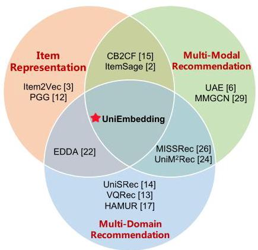
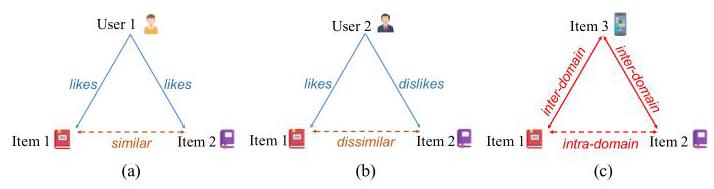
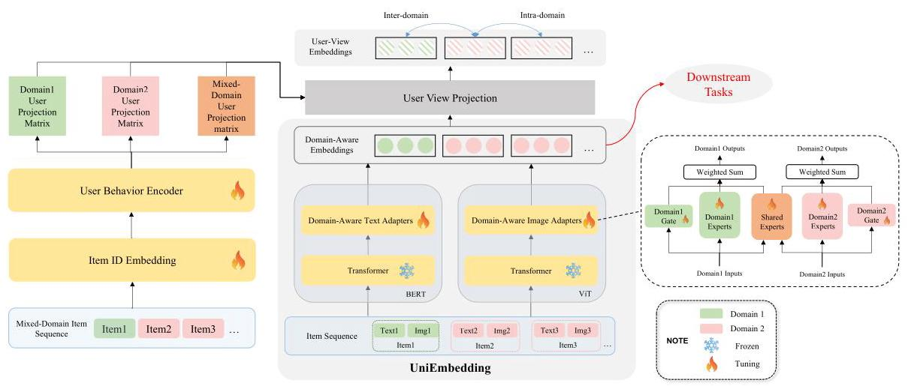
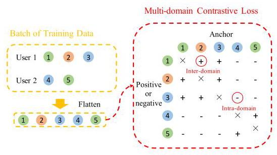
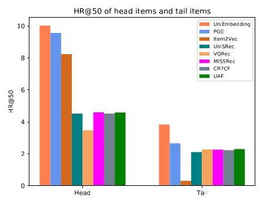
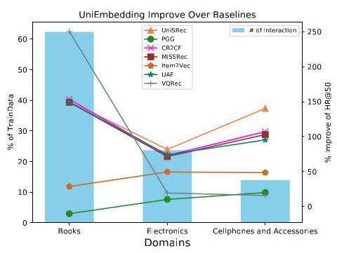

# UniEmbedding: Learning Universal Multi-Modal Multi-Domain Item Embeddings via User-View Contrastive Learning

Boqi Dai*

Shenzhen International Graduate

School, Tsinghua University,

Shenzhen, China

dbq21@mails.tsinghua.edu.cn

Zhaocheng Du*

Huawei Noah's Ark Lab,

Shenzhen, China

zhaochengdu@huawei.com

Jieming Zhu

Huawei Noah's Ark Lab,

Shenzhen, China

jiemingzhu@ieee.org

Jintao Xu

Shenzhen International Graduate

School, Tsinghua University,

Shenzhen, China

xjt22@mails.tsinghua.edu.cn

Deqing Zou

Shenzhen International Graduate

School, Tsinghua University,

Shenzhen, China

zdq23@mails.tsinghua.edu.cn

Quanyu Dai

Huawei Noah's Ark Lab,

Shenzhen, China

quanyu.dai@connect.polyu.hk

Zhenhua Dong

Huawei Noah's Ark Lab,

Shenzhen, China

dongzhenhua@huawei.com

Rui Zhang

Huazhong University of Science

and Technology,

Wuhan, China

rayteam@yeah.net

Hai-Tao Zheng

Shenzhen International Graduate

School, Tsinghua University,

Shenzhen, China

Pengcheng Laboratory,

Shenzhen, China

zheng.haitao@sz.tsinghua.edu.cn

## Abstract

Learning high-quality item embeddings is crucial for recommendation tasks such as matching and ranking. However, existing methods often rely on ID-based item embeddings learned end-to-end with downstream recommendation models, which may suffer from over-fitting and limited generalizability. In this paper, we aim to learn universal item embeddings (dubbed UniEmbedding) that capture multi-modal semantics, generalize across multiple domains, and serve different downstream tasks. To achieve this goal, we introduce the UniEmbedding pretraining framework, which includes three modules: a domain-aware multi-modal adapter, a user-view projection module, and contrastive learning objectives across domains. Compared to naive ID embeddings, UniEmbedding provides rich semantic information that generalizes more effectively across domains. Unlike multi-modal embeddings directly extracted from off-the-shelf pretrained models, UniEmbedding achieves better alignment between content semantics and behaviors. We evaluated UniEmbedding on both public and industrial datasets, demonstrating its effectiveness in matching and ranking tasks. Furthermore, UniEmbedding has been deployed in multiple recommendation applications at Huawei, resulting in significant gains in user engagement metrics.

## CCS Concepts

- Information systems \( \rightarrow \) Recommender systems.

## Keywords

Item representation, Multi-modal recommendation, Multi-domain recommendation, Contrastive learning, Pretraining

## ACM Reference Format:

Boqi Dai, Zhaocheng Du, Jieming Zhu, Jintao Xu, Deqing Zou, Quanyu Dai, Zhenhua Dong, Rui Zhang, and Hai-Tao Zheng. 2024. UniEmbedding: Learning Universal Multi-Modal Multi-Domain Item Embeddings via User-View Contrastive Learning. In Proceedings of the 33rd ACM International Conference on Information and Knowledge Management (CIKM '24), October 21-25, 2024, Boise, ID, USA. ACM, New York, NY, USA, 8 pages. https://doi.org/10.1145/3627673.3680098

## 1 Introduction

In the past decades, ID-based item embedding methods have dominated recommender systems. These methods effectively utilize the co-occurrence relationships between items, leading to the success of numerous classical recommendation models [3, 7, 27]. However, they suffer from overfitting and limited generalizability, particularly when training data is insufficient. Additionally, these methods are highly susceptible to the long-tail effect and struggle to generalize across multi-domain scenarios. As recommendation scenarios become increasingly diverse and complex, ID-based embeddings encounter bottlenecks in scaling across different domains and serving various recommendation tasks. With the rise of powerful pre-trained language models (e.g., BERT [8]) and vision models (e.g., ViT [10]) and their strong generalizability in capturing semantic features, leveraging multi-modal data to enhance the generalizability of recommender systems has become increasingly popular [32].

* Equal contribution.

Corresponding authors.

Figure 1: An example of news feed recommendation: A click on a news article will trigger related recommendations, which may contain both news articles (intra-domain) and short videos (cross-domain).

Researchers have explored multi-modal embeddings to address challenges such as the cold-start problem [11] and cross-domain tasks [13, 14, 26]. Towards this goal, some studies focus on creating better multi-modal item embeddings using domain-specific pretraining tasks, while others investigate integrating pretrained item embeddings to enhance downstream models [19].

In this paper, we mainly target the former, aiming to learn universal item embeddings that capture multi-modal semantics, generalize across multiple domains, and serve different downstream tasks. We introduce the UniEmbedding pretraining framework, which includes three designed modules: a domain-aware multi-modal adapter, a user-view projection module, and contrastive learning objectives across domains.

Firstly, different item domains may be dominated by different modalities. For example, as shown in Figure 1, news articles and videos feature different types of content. To unify item representations across domains, we design domain-aware multi-modal adapters to address both their commonalities and unique characteristics. Secondly, existing models such as Item2Vec [3] and ItemSage [2] capture item co-occurrence relationships from a global perspective. However, in practice, item similarities are often characterized by user-specific views. For example, Chinese users frequently purchase spoons and chopsticks together, whereas European users rarely do. To learn universal item embeddings, we decouple an item's embedding into a global representation and a user-view-specific representation, linked by a user-view projection module. Thirdly, universal item embeddings should generalize across different domains. As the scenario shown in Figure 1, a click on a news article can trigger both intra-domain recommendations for more news articles and cross-domain recommendations for short videos. To achieve this, we need to align item representations across domains. Our work introduces a new multi-domain contrastive loss function that leverages both intra-domain and cross-domain collaborative signals to enhance the pretraining of item embeddings. By leveraging these techniques, UniEmbedding offers significant benefits. Compared to naive ID embeddings, UniEmbedding provides rich semantic information that generalizes more effectively across domains. Unlike multi-modal embeddings extracted from existing pretrained models, UniEmbedding achieves better alignment between content semantics and user behaviors.

We evaluate the performance of our pretrained item embeddings on both public and industrial datasets. UniEmbedding achieves state-of-the-art results in both matching and ranking downstream tasks. We also conducted ablation studies to validate the effectiveness of the user-view projection module and the multi-domain contrastive learning loss. Additionally, UniEmbedding has been deployed in multiple recommendation applications at Huawei, serving the main traffic of users. The contributions of this paper are summarized as follows:

Figure 2: The Venn diagram categorizing different types of recommendation models and pretraining methods.

- We propose UniEmbedding, a universal item embedding pretraining framework that demonstrates strong generalizability across multi-modalities and multi-domains, serving matching and ranking downstream tasks.

- We innovatively introduce the user-view projection module and multi-domain contrastive loss function to enhance the performance of pretrained embeddings.

- We conduct extensive experiments and online A/B tests to validate the effectiveness of UniEmbedding.

## 2 Related Work

Early item embedding pretraining methods are based on item IDs, utilizing the co-occurrence information of items [21] to learn item embeddings, such as Item2Vec [3]. To better leverage the item co-occurrence signals, some ID-based works have built complex item-item graphs [12, 31]. To enable recommendations across multiple domains, some works decouple cross-domain and intra-domain information at the embedding level or model level, thereby enhancing multi-domain knowledge sharing [17, 22].

To align with the emerging trend of multi-modal recommendation, several models for multi-modal item embedding pretraining have been proposed. Due to the semantic gap, directly using multimodal representations of items in downstream recommendation tasks yields poor results. When pretraining with multi-modal representations, the common approach is to first extract item features using a multi-modal pretraining model \( \left\lbrack  {8,{10},{23},{30}}\right\rbrack \) , then fuse the multiple modalities, and finally these item embedding are trained under the supervision of users' collaborative interaction signals. To achieve better recommendation performance, some works use item-item or item-user co-occurrence signals to supervise the adaptation of their multi-modal representations in the recommendation semantic space \( \left\lbrack  {2,6,{15},{29}}\right\rbrack \) . To meet the needs of multi-domain recommendation, many works leverage the excellent transferability of multi-modal representations, designing sophisticated contrastive loss functions to achieve stronger cross-domain performance [1, 13, 14, 24, 26]. Overall, methods based on multi-modal representations outperform ID-based methods in multi-domain recommendations and addressing long-tail problems.

Figure 3: The illustration of the motivation behind UniEm-bedding. Figure (a) and (b) illustrate how different samples interfere with the learning of item embeddings. Figure (c) demonstrates cross-domain and intra-domain collaborative signals coexist during multi-domain pretraining.

Figure 2 illustrates a Venn diagram categorizing some of the mentioned works, here, the multi-modal recommendation category is defined as methods that utilize more than one modality, methods that use only one modality, like UniSRec [14], are not included in this category. It is worth noting that, unlike ZESRec [9] and PreRec [18], which focus more on the transferability of the embed-dings from the source domain to the target domain, our method emphasizes the consistent improvement of recommendation performance over multiple domains. All above methods struggle to achieve consistent performance across various downstream tasks and domains.

## 3 UniEmbedding

Figure 3 illustrates the motivation of UniEmbedding. In Figure 3(a), User 1 likes both Item 1 and Item 2, so the embedding vectors of Item 1 and Item 2 should be learned to be more similar. In contrast, according to User 2, the embedding of Item 1 and Item 2 should be dissimilar. This mutual interference between samples makes embedding learning challenging. Therefore, we propose to incorporate user view into the pretraining process to address this issue. In Figure 3(c), three items were liked by a user. Since these items come from two different domains, both cross-domain and intra-domain collaborative signals coexist. Item embedding learning over multiple domains should consider both types of signals.

Our pretraining framework is shown in Figure 4. The training process primarily involves obtaining a user view projection matrix through mixed-domain item sequences interacted with by users. Subsequently, this projection matrix is combined with the domain-adapted embeddings to obtain user-view embeddings. These embed-dings are used for contrastive learning pretraining, afterwards. After pretraining phase, the domain-adapted embeddings are applied to downstream tasks because of their fine generalization ability.

### 3.1 Mixed-Domain Interacted Item Sequence

To ensure that both cross-domain and intra-domain collaborative signals appear in the training data, we utilize the interacted item sequences from mixed domains for pretraining. Assuming we conduct pretraining on domains A and B, the sequences of user interacted items in these domains are denoted as \( {S}^{A} = \left\{  {{I}_{1}^{A},{I}_{2}^{A},\ldots }\right\}  ,{S}^{B} = \; \left\{  {{I}_{1}^{B},{I}_{2}^{B},\ldots }\right\} \) , where \( {I}_{i}^{j} \) represents the \( {i}^{th} \) interacted item in domain \( j \) . The input of our framework is the mixed-domain sequence \( {S}^{M} = \left\{  {{I}_{1}^{M},{I}_{2}^{M},\ldots }\right\} \) , where \( {I}_{i}^{M} \in  {S}^{A} \cup  {S}^{B} \) , sorted by user-interacted timestamp, M represents unified mixed domain. For each item \( {I}_{i}^{M} = \left\{  {{\mathbf{e}}_{i},{\mathbf{m}}_{i}}\right\} \) , we use its ID embedding \( {\mathbf{e}}_{i} \) to generate user projection matrix and utilize its multi-modal embedding \( {\mathbf{m}}_{i} \) to obtain the domain-adapted item embedding. The shape of the item embed-dings are consistently shaped as \( d \times  1 \) , where the \( d \) is the dimension of UniEmbedding.

### 3.2 Domain-Aware Multi-Modal Adapter

As mentioned in Section 3.1, given item \( i \) , its multi-modal em-beddings of item sequences, \( \left\lbrack  {{\mathbf{m}}_{1};{\mathbf{m}}_{2};\ldots ;{\mathbf{m}}_{L}}\right\rbrack \) , will be fed into the domain-aware multi-modal adapters.

Our adapters adopt the Mixture of Experts (MOE) structure. Each domain has its corresponding experts, and all domains utilize the same shared experts. Domain-specific experts and shared experts are used separately to capture domain-specific information and better leverage shared information of all domains. For each domain, our model has a corresponding gate network, responsible for assigning weights to the outputs of the domain-specific experts and shared experts. Given item \( i \) , its unified domain adapted embedding, \( {\mathbf{E}}_{i}^{\mathcal{A}} \) can be calculated through Eqn 1.

(1)

\[
{\mathbf{E}}_{i}^{\mathcal{A}} = \left\lbrack  {{\mathcal{E}}_{1}^{j}\left( {\mathbf{m}}_{i}\right) ;{\mathcal{E}}_{2}^{j}\left( {\mathbf{m}}_{i}\right) ;\ldots ;{\mathcal{E}}_{{n}_{j}}^{j}\left( {\mathbf{m}}_{i}\right) }\right.
\]

\[
{\mathcal{E}}_{1}^{S}\left( {\mathbf{m}}_{i}\right) ;{\mathcal{E}}_{2}^{S}\left( {\mathbf{m}}_{i}\right) ;\ldots ;{\mathcal{E}}_{{n}_{S}}^{S}\left( {\mathbf{m}}_{i}\right) \rbrack  \cdot  \operatorname{Softmax}\left( {{\mathcal{G}}^{j}\left( {\mathbf{m}}_{i}\right) }\right) ,
\]

In Eqn 1, \( j \) represents the domain of item \( i,{\mathcal{E}}_{k}^{j} \) is the \( {k}^{th} \) expert of domain \( j,{n}_{j} \) is the number of corresponding domain-specific experts. Similarly, \( {\mathcal{E}}_{k}^{S} \) represents the \( {k}^{th} \) shared experts, and \( {n}_{s} \) is the number of shared experts. \( {\mathcal{G}}^{j} \) corresponds the gate network of domain \( j \) . It is worth noting that the L2-normalized \( {\mathbf{E}}_{i}^{\mathcal{A}} \) , \( {\mathbf{E}}_{i}^{\mathcal{A}} \mapsto  {\mathbf{E}}_{i}^{\mathcal{A}}/{\begin{Vmatrix}{\mathbf{E}}_{i}^{\mathcal{A}}\end{Vmatrix}}_{2} \) , will be used in downstream tasks introduced in Section 3.3 and Section 3.4. When an item has multiple modality-specific domain-adapted embeddings, the average of these embed-dings is used as the embedding for the item.

### 3.3 User-View Projection

We model user features to generate user projection matrices, obtaining user-view item embeddings. User projection matrices are shaped as \( d \times  d \) , the calculation method of them is shown in Eqn 2. As denoted in Section 3.1, we input the ID embedding sequence \( \left\{  {{\mathbf{e}}_{1},{\mathbf{e}}_{2},\ldots }\right\} \) into the user behavior encoder to obtain the user behavior representation. Subsequently, the user behavior representation is transformed by the domain-specific multi-head projection layer into the corresponding projection matrix. In Eqn 2, \( {\mathcal{M}}_{j}^{u},{\mathcal{P}}_{j} \) represents the projection matrix of user \( u \) , domain \( j \) and the multi-head projection layer, respectively. \( \mathcal{T} \) is the user behavior encoder. In our experiment, the encoder consists of a two-layer Transformer [25] encoder blocks. \( {\mathbf{E}}_{i} \) can be calculated as \( {\mathbf{E}}_{i} = {\mathbf{E}}_{i}^{p} + {\mathbf{E}}_{i}^{d} + {\mathbf{e}}_{i},{\mathbf{E}}_{i}^{p} \) and \( {\mathbf{E}}_{i}^{d} \) represents position embedding and domain embedding. [; ] denotes the concatenation operation, \( L \) is a hyperparameter denotes max sequence length. Using the same method, we can obtain the projection matrix on the mixed domain \( M,{\mathcal{M}}_{M}^{u}.{\mathcal{M}}_{j}^{u} \) can be viewed as the user’s perspective on domain \( i \) , while \( {\mathcal{M}}_{M}^{u} \) can be regarded as the user's perspective on the mixed domain.

\[
{\mathcal{M}}_{j}^{u} = {\mathcal{P}}_{j}\left( {\mathcal{T}\left( \left\lbrack  {{\mathbf{E}}_{1};\ldots ;{\mathbf{E}}_{L}}\right\rbrack  \right) }\right) ,{\mathcal{M}}_{M}^{u} = {\mathcal{P}}_{M}\left( {\mathcal{T}\left( \left\lbrack  {{\mathbf{E}}_{1};\ldots ;{\mathbf{E}}_{L}}\right\rbrack  \right) }\right) , \tag{2}
\]

Figure 4: The overall pretraining framework of UniEmbedding.

In our experiments, to make the user behavior encoder more lightweight, only the user-interacted item sequences were utilized as input. In practical applications, more user information (i.e., user profiles), can be incorporated as additional inputs.

The user-view item embeddings project the domain-adapted item embeddings into the user space. After obtaining \( {\mathcal{M}}_{j}^{u},{\mathcal{M}}_{M} \) and \( {\mathbf{E}}_{i}^{\mathcal{A}} \) in Section 3.2 and 3.3, we utilize Eqn 3 to calculate the user-view item embedding.

\[
{\mathbf{E}}_{u, i} = \left( {{\mathcal{M}}_{M}^{u} + {\mathcal{M}}_{j}^{u}}\right)  \cdot  {\mathbf{E}}_{i}^{\mathcal{A}} + {\mathbf{E}}_{i}^{\mathcal{A}}, \tag{3}
\]

In Eqn 3, given user \( \mathrm{u} \) and his interacted item i in domain \( \mathrm{j},{\mathbf{E}}_{u, i} \) represents embedding of item \( i \) from the perspective of user \( u \) . We also attempted using user-view item embeddings for downstream tasks, but experimental results demonstrated that using the unified domain adapted embeddings in Section 3.2 yields better performance, highlighting the strong generalization ability of unified domain adapted embeddings.

### 3.4 Multi-Domain Contrastive Loss

Our multi-domain contrastive learning loss is used to simultaneously learn cross-domain and intra-domain collaborative signals within item sequences in the mixed domain. Figure 5 illustrates the positive and negative samples used for our loss function. In a training data batch, positive samples are selected from items within the interaction sequence of the same user, while negative samples are chosen from sequences of different users within the same batch. When item pairs originate from the same domain, their embeddings learn the intra-domain signals. Conversely, their embeddings learn inter-domain signals. In the learning process, the use of user-view embeddings ensures that the model learns robust collaborative information, thereby reducing the differences between samples.

Figure 5: The illustration of multi-domain contrastive loss. The circles of different colors represent items from different domains. The "+" and "-" symbols represent two items belonging to a positive or negative sample pair. The red circles represent how our method implements intra-domain and inter-domain contrastive learning.

The formal definition of the multi-domain contrastive learning loss is given by Eqn 4.

\[
{\mathcal{L}}_{\mathbb{B}} = \mathop{\sum }\limits_{{a \in  \mathbb{B}}}\frac{-1}{\left| {\mathcal{P}}_{a}\right| }\mathop{\sum }\limits_{{p \in  {\mathcal{P}}_{a}}}\log \frac{\exp \left( {{\mathbf{E}}_{u, a}^{T} \cdot  {\mathbf{E}}_{p}^{\mathcal{A}}/\tau }\right) }{\mathop{\sum }\limits_{{n \in  {\mathcal{N}}_{a}}}\exp \left( {{\mathbf{E}}_{u, a}^{T} \cdot  {\mathbf{E}}_{n}^{\mathcal{A}}/\tau }\right) } \tag{4}
\]

The multi-domain contrastive loss of batch \( \mathbb{B} \) is \( {\mathcal{L}}_{\mathbb{B}} \) , \( a \) represents anchor item in \( \mathbb{B}.{\mathcal{P}}_{a} \) and \( {\mathcal{N}}_{a} \) denote the positive item set and the negative item set of \( a \) respectively and \( u \) represents the user of anchor \( a.{\mathbf{E}}_{p}^{\mathcal{A}} \) and \( {\mathbf{E}}_{u, a} \) can be obtained from Section 3.2 and Section 3.3. \( \tau \) is the temperature hyperparameter to tune.

## 4 Experiments

### 4.1 Datasets

Public DatasetXmarket [5] is a large real-world e-commerce dataset crawled from Amazon \( {}^{1} \) . We chose this dataset for experimentation because it contains a substantial number of users who interact with items across multiple domains. We utilize a mixture of "books", "electronics", and "cellphones and accessories" domains from the Xmarket dataset in the US market. We filtered users who had interacted with at least two items for the experiment. After filtering, the total number of items is 0.14 million, and the number of users is 2.65 million. Among all users, 65.90% of users only interacted with items from one domain, 30.35% of users interacted with items from two domains, and 3.75% of users interacted with items from all domains.

---

\( {}^{1} \) https://www.amazon.com/

---

Table 1: Matching task performance comparison of different models on Xmarket dataset. UniEmbrext denotes the UniEmbedding method only utilizing item text modality. The overlapped users appeared in the training set, while the unseen users not. The best performance is denoted in bold. The second-best and the third-best performance are denoted underlined fonts.

<table><tr><td>Test Users</td><td>Metric</td><td>CLIP</td><td>UniSRec</td><td>MISSRec</td><td>VQRec</td><td>Item2Vec</td><td>PGG</td><td>CB2CF</td><td>UAE</td><td>UniEmb \( {}_{\text{ Text }} \)</td><td>UniEmb</td></tr><tr><td rowspan="6">Overlapped</td><td>HR@10</td><td>1.458</td><td>3.182</td><td>3.284</td><td>2.637</td><td>4.541</td><td>4.866</td><td>3.225</td><td>3.312</td><td>6.164</td><td>6.661</td></tr><tr><td>HR@50</td><td>2.258</td><td>3.806</td><td>4.301</td><td>3.247</td><td>7.206</td><td>8.134</td><td>4.228</td><td>4.296</td><td>8.520</td><td>9.249</td></tr><tr><td>MRR@10</td><td>0.824</td><td>1.378</td><td>1.996</td><td>1.623</td><td>2.524</td><td>2.346</td><td>1.984</td><td>2.026</td><td>3.673</td><td>4.248</td></tr><tr><td>MRR@50</td><td>0.854</td><td>1.440</td><td>2.038</td><td>1.625</td><td>2.640</td><td>2.529</td><td>2.025</td><td>2.065</td><td>3.780</td><td>4.366</td></tr><tr><td>NDCG@10</td><td>0.973</td><td>1.802</td><td>2.303</td><td>1.859</td><td>2.998</td><td>2.935</td><td>2.280</td><td>2.332</td><td>4.268</td><td>4.823</td></tr><tr><td>NDCG@50</td><td>1.139</td><td>2.139</td><td>2.518</td><td>1.955</td><td>3.573</td><td>3.851</td><td>2.492</td><td>2.539</td><td>4.781</td><td>5.389</td></tr><tr><td rowspan="6">Unseen</td><td>HR@10</td><td>1.238</td><td>3.357</td><td>3.041</td><td>3.347</td><td>4.197</td><td>5.653</td><td>2.979</td><td>3.085</td><td>6.189</td><td>6.570</td></tr><tr><td>HR@50</td><td>1.846</td><td>4.021</td><td>3.994</td><td>4.041</td><td>6.645</td><td>8.332</td><td>3.933</td><td>4.007</td><td>8.588</td><td>8.709</td></tr><tr><td>MRR@10</td><td>0.595</td><td>1.779</td><td>2.069</td><td>2.560</td><td>2.490</td><td>3.319</td><td>2.006</td><td>2.077</td><td>4.203</td><td>4.679</td></tr><tr><td>MRR@50</td><td>0.606</td><td>1.853</td><td>2.112</td><td>2.579</td><td>2.606</td><td>3.487</td><td>2.049</td><td>2.116</td><td>4.297</td><td>4.782</td></tr><tr><td>NDCG@10</td><td>0.743</td><td>2.153</td><td>2.302</td><td>2.745</td><td>2.894</td><td>3.870</td><td>2.239</td><td>2.317</td><td>4.680</td><td>5.131</td></tr><tr><td>NDCG@50</td><td>0.853</td><td>2.514</td><td>2.510</td><td>2.878</td><td>3.433</td><td>4.672</td><td>2.447</td><td>2.515</td><td>5.121</td><td>5.606</td></tr></table>

Industrial Dataset. We conducted experiments using two domains, news article recommendation and short video recommendation. After filtering, there are a total of 1.2 million users, with 40.8% of users interacting with items from only one domain and 59.2% of users interacting with items from both domains. The dataset comprises 0.25 million items and 13.1 million interactions.

For both datasets, we split the training and testing dataset with a ratio of 9:1. In the evaluation phase, we separately tested the performance on overlapped and unseen users. Overlapped users appeared in the training set, and the last interacted item was extracted for prediction. Unseen users didn't appear in the training set.

### 4.2 Baselines and Metrics

- UniSRec [14] is a cross-domain contrastive pretraining method based on the text modality, where the pretraining tasks include seq-seq and seq-item.

- MISSRec [26] employs pretraining tasks similar to UniSRec but effectively integrates the image modality. Additionally, MISSRec utilizes clustering methods to model user interests effectively.

- VQRec [13] uses a quantization method to map the textual representation of items into a sequence of codes, employing code embeddings to represent items.

- Item2Vec [3] is a pretraining method that uses the skip-gram language model to train item embeddings.

- PGG [12] is a pretraining method that utilizes item co-occurrence graphs to train item embeddings.

- CB2CF [4, 15] is a pretraining method that uses collaborative filtering information to supervise the learning of content-based item embeddings.

- UAE [6] applies user-to-item contrastive learning with siamese networks for pretraining.

### 4.3 Implementation Details and Metrics

For items in Xmarket, we obtain item text by combining the item's domain name, title, categories, and description information with prompt text. Subsequently, we input the text into pretrained CLIP [23] to obtain text embeddings. For the items with images, we input item images into the pretrained CLIP [23] to obtain item image embeddings. For those items without images, we took the item text embedding of CLIP as image embeddings. These embeddings are subsequently fed into the corresponding domain adapters. For the industrial dataset, all items have both text and image information. We input both modality information into the pretraining model FILIP [30] to obtain multi-modal embeddings. Our code was implemented based on RecBole [33] and FuxiCTR [36]. The number of pretraining epochs was set to 300 and the batch size was set to 2048. Our UniEmbedding dimension was 128, and temperature \( \tau \) was set to 0.07. For the matching tasks, we took HR@K, MRR@K, and NDCG@K, \( K \in  \{ {10},{50}\} \) as metric.For ranking tasks, we took AUC and logloss as metrics.

## 5 Results and Discussion

### 5.1 Evaluation on Downstream Matching Task

Results on Xmarket dataset. The matching task performance on Xmarket is shown in Table 1. For the matching task, we use normalized item embeddings for maximum inner product search to recall items, to align with our production use case for item-item matching. For the baseline methods, as mentioned in Section 2, using the CLIP embeddings without pretraining in the recommendation system performs poorly. The methods mainly based on sequence-item pretraining (i.e., UniSRec, MISSRec, VQRec) exhibit significant performance performance degradation. The inconsistency between the pretraining task and matching task, as matching tasks use item-item matching, results in suboptimal model performance. Methods based on item ID co-occurrence information (e.g., Item2Vec, PGG) perform the best, likely because the training data is relatively abundant, allowing the models to capture sufficient item collaboration signals. While CB2CF and UAE utilize both item collaboration signals and multi-modal embeddings, their performance in matching experiments is average. In contrast, our proposed method, UniEmbedding, demonstrates superior performance compared to other baselines for both overlapped and unseen users, even when using only the text modality of items. Moreover, combining the text modality with the image modality further enhances the method's performance.

Table 2: Matching performance comparison of different models on industry dataset. The best and the second-best results are marked in bold and underlined fonts, respectively.

<table><tr><td>Test Users</td><td>Metric</td><td>VQRec</td><td>Item2Vec</td><td>UAE</td><td>UniEmb</td></tr><tr><td rowspan="6">Overlapped</td><td>HR@10</td><td>1.195</td><td>1.181</td><td>0.526</td><td>2.647</td></tr><tr><td>HR@50</td><td>3.257</td><td>4.481</td><td>2.185</td><td>8.765</td></tr><tr><td>MRR@10</td><td>0.424</td><td>0.369</td><td>0.162</td><td>0.723</td></tr><tr><td>MRR@50</td><td>0.512</td><td>0.500</td><td>0.228</td><td>0.983</td></tr><tr><td>NDCG@10</td><td>0.603</td><td>0.555</td><td>0.245</td><td>1.164</td></tr><tr><td>NDCG@50</td><td>1.045</td><td>1.250</td><td>0.594</td><td>2.475</td></tr><tr><td rowspan="6">Unseen</td><td>HR@10</td><td>1.147</td><td>1.171</td><td>0.527</td><td>2.495</td></tr><tr><td>HR@50</td><td>3.136</td><td>4.408</td><td>1.999</td><td>8.369</td></tr><tr><td>MRR@10</td><td>0.401</td><td>0.348</td><td>0.167</td><td>0.666</td></tr><tr><td>MRR@50</td><td>0.483</td><td>0.475</td><td>0.227</td><td>0.906</td></tr><tr><td>NDCG@10</td><td>0.574</td><td>0.536</td><td>0.249</td><td>1.084</td></tr><tr><td>NDCG@50</td><td>0.996</td><td>1.217</td><td>0.560</td><td>2.334</td></tr></table>

Results on industrial dataset. The matching task performance of different baselines on the industrial dataset is shown in Table 2. Due to the significantly high sparsity of the industrial dataset, numerically, all metrics on industrial datasets show a significant decline compared to those on public datasets. However, our approach still maintains a considerable lead over other baselines. Additionally, VQRec performs better on the industrial dataset than on public datasets, indicating thatmodels based on multi-modal embeddings exhibit superior performance when training data is limited.

### 5.2 Further Analysis

5.2.1 Ablation study. Table 3 shows the ablation experiment results of UniEmbedding on the Xmarket dataset.

w/o User-View. We removed the user behavior encoder, and utilized the mixed-domain-adapted embeddings in Section 3.2 for contrastive learning. We conducted matching experiments using these domain adapted embeddings. The experimental results indicate that when not using user-view embeddings, there is a significant decline in performance. Indicate the effectiveness of our user-view embeddings.

w/o cross-domain. In this experiment setup, we stopped using mixed-domain sequence mentioned in Section 3.1 for pretraining. Instead, each user only utilizes item interaction sequences from a single domain. In this scenario, the model cannot leverage the collaborate signals of items from different domains. It can be observed that the model's performance declines, indicating the effectiveness of our multi-domain design.

5.2.2 Performance On Long-tail Items. We label the top 50% of items in terms of frequency of occurrence in the training set as head items, and the remaining 50% as tail items. The interactions of tail items account for 10.9% of the total interactions.

Table 3: Ablation study on Xmarket dataset.

<table><tr><td>Metric</td><td>w/o User-View</td><td>w/o cross-domain</td></tr><tr><td>HR@10</td><td>-1.366</td><td>-0.168</td></tr><tr><td>HR@50</td><td>-2.256</td><td>-0.171</td></tr><tr><td>MRR@10</td><td>-0.451</td><td>-0.139</td></tr><tr><td>MRR@50</td><td>-0.498</td><td>-0.139</td></tr><tr><td>NDCG@10</td><td>-0.671</td><td>-0.146</td></tr><tr><td>NDCG@50</td><td>-0.874</td><td>-0.147</td></tr></table>

Figure 6: The HR@50 results on head items and tail items.

Figure 6 illustrates the performance of different methods on head items and tail items, with the selected metric being HR@50.It can be observed that all methods exhibit a decline in performance on tail items, with PGG and Item2Vec based on only ID information showing the most significant decrease. The other methods utilizing item multi-modal information experience relatively smaller declines. This indicates that utilizing multi-modal information in recommender systems can effectively alleviate the long-tail effect. Our method exhibits superior performance on both head items and tail items, indicating that our approach effectively combines item ID information and multi-modal information.

5.2.3 Performance across multiple domains. We conducted the matching task on items from various domains of public datasets, and the experiment results are shown in Figure 7. The bar chart illustrates the percentage of interactions for each domain out of the total, while the line chart represents the percentage improvement of UniEm-bedding compared to the baselines. It can be observed that the baseline only relying on ID signals (PGG and Item2Vec) performs well in domains with sufficient data. Even PGG outperforms UniEm-bedding in the largest domain. However, these methods perform relatively poorly in domains with less data. Other baselines utilizing multi-modal signals show relatively consistent performance across multiple domains, indicating that multi-modal embeddings can enhance model performance in multi-domain scenarios. Specifically, VQRec performs well in domains with smaller datasets, highlighting the effectiveness of quantization methods in multi-domain learning. Overall, our UniEmbedding method significantly outperforms all baselines in nearly all domains, demonstrating the effectiveness of our multi-domain design.

### 5.3 Evaluation on Downstream Ranking Task

We used three powerful ranking models: DCNv2 [28], FinalMLP [20], and DIN [34] to test the benefits of item embeddings obtained from different pretraining methods on the models. We implemented the models through the open-source code repository FuxiCTR [35, 36]. The input features include the user's historical interacted item sequence and the corresponding domain sequence, the target item and its domain, and the task is to predict the label indicating whether the user interacts with the target. We conducted experiments on Xmarket dataset, selecting items from the user's interaction sequence as positive samples, and randomly choose 5 uninteracted items from the same domain as negative samples for each positive sample. The same processing method is used for both the train, valid and test datasets. We concatenated item ID embedding and pre-trained item embedding as model input. The models are trained using early stopping. The ranking experiment results are shown in Table 4. It can be observed that when combined with the UniEmbed-ding method, all models achieve the best performance. However, when combining UniEmbedding with a stronger ranking backbone (i.e., FinalMLP), the performance is lower than using a less powerful backbone (i.e., DCNv2). It is speculated that the simple concatenation of ID embeddings and pre-trained embeddings may lead to a performance loss. Therefore, when applying UniEmbedding to downstream tasks, it is still necessary to explore better ways of combining pre-trained embeddings to optimize performance. Overall, our method achieved SOTA results in both matching and ranking downstream tasks, indicating the universal applicability of our item embeddings.

Figure 7: The relative improvement (w.r.t. HR@50) of UniEm-bedding compared to all baselines across different domains in the Xmarket dataset.

Table 4: The performance of pretrained embeddings for different ranking models. The best and the second-best performance are shown in bold and underlined fonts, respectively.

<table><tr><td rowspan="2">Pretrained Embeddings</td><td colspan="2">DCN2</td><td colspan="2">FinalMLP</td><td colspan="2">DIN</td></tr><tr><td>AUC</td><td>Logloss</td><td>AUC</td><td>Logloss</td><td>AUC</td><td>Logloss</td></tr><tr><td>w/o Emb.</td><td>0.8835</td><td>0.2842</td><td>0.8870</td><td>0.2834</td><td>0.8896</td><td>0.2750</td></tr><tr><td>VQ-Rec</td><td>0.8985</td><td>0.2665</td><td>0.8973</td><td>0.2673</td><td>0.9003</td><td>0.2623</td></tr><tr><td>UAE</td><td>0.8938</td><td>0.2740</td><td>0.8911</td><td>0.2745</td><td>0.8976</td><td>0.2667</td></tr><tr><td>PGG</td><td>0.8960</td><td>0.2671</td><td>0.8967</td><td>0.2660</td><td>0.8951</td><td>0.2697</td></tr><tr><td>UniEmb</td><td>0.9085</td><td>0.2548</td><td>0.9010</td><td>0.2618</td><td>0.9025</td><td>0.2617</td></tr></table>

### 5.4 Online A/B Tests

To evaluate the effectiveness of UniEmbedding for industrial recommender systems, we conducted online A/B testing for both matching and ranking tasks across multiple recommendation scenarios in our production services. The first scenario is the news feed recommendation in the Huawei mobile browser, which serves tens of millions of users daily. The news feed covers two item domains: news articles and short videos, which differ significantly in both content types and user behaviors (with a 1x vs 7.5x difference in CTR). In this setting, we pretrained the UniEmbedding model using historical data from the recent seven days, comprising over 100 million samples from 20 million users. The pretrained 100-dimensional item embed-dings were deployed for downstream tasks. We performed online A/B testing using 5% of randomly sampled user traffic for each group. For the matching task, we added a new matching channel based on UniEmbedding for real-time item-to-item recommendations while retaining all other matching channels the same as the base group. Over a period of 10 days, we observed a 1.9% increase in average CTR (click-through rate) on news articles and a boost of 13.9 seconds in average watching time per user on short videos. This improvement underscores the effectiveness of UniEmbedding in enhancing item matching performance.

For the ranking task, we conducted an online A/B test in the recommendation scenario of smartphone lock screen wallpapers. Specifically, we added two embedding features for the downstream ranking model, which include users' behavior sequences and target items with the corresponding pretrained embedding vectors. We leveraged the soft retargeting network with similarity binning [16] to aggregate the sequence embeddings and further concatenated them into our ranking model (an MMOE-based multi-task model). A 10-day A/B test showed a 2.2% improvement in CTR and a 3.3% improvement in the "like" rate. Currently, UniEmbedding has been employed as an embedding service, serving the main traffic in multiple applications at Huawei.

## 6 Conclusion

In this work, we propose UniEmbedding, a universal item embedding pretraining framework that demonstrates strong generalizability across multi-modalities and multi-domains, serving both matching and ranking downstream tasks. UniEmbedding innovatively leverages the user-view projection module and multi-domain contrastive loss function to enhance the performance of pretrained embeddings. Experiments on both public and industrial datasets demonstrate the effectiveness of UniEmbedding in both matching and ranking tasks. Additionally, we show the potential of UniEm-bedding in addressing multi-domain challenges and improving the representation learning of long-tail items.

## Acknowledgments

This research is partially supported by National Natural Science Foundation of China (Grant No. 62276154), Research Center for Computer Network (Shenzhen) Ministry of Education, the Natural Science Foundation of Guangdong Province (Grant No. 2023A15150- 12914), Basic Research Fund of Shenzhen City (Grant No. JCYJ20210- 324120012033 and GJHZ202402183000101), the Major Key Project of PCL for Experiments and Applications (PCL2021A06). We gratefully acknowledge the support of MindSpore (https://www.mindspore.cn), which is a new deep learning computing framework.

## References

[1] Xuehan Bai, Yan Li, Yanhua Cheng, Wenjie Yang, Quan Chen, and Han Li. 2023. Cross-Domain Product Representation Learning for Rich-Content E-Commerce. In Proceedings of the IEEE/CVF International Conference on Computer Vision. 5697- 5706.

[2] Paul Baltescu, Haoyu Chen, Nikil Pancha, Andrew Zhai, Jure Leskovec, and Charles Rosenberg. 2022. ItemSage: Learning product embeddings for shopping recommendations at pinterest. In Proceedings of the 28th ACM SIGKDD Conference on Knowledge Discovery and Data Mining. 2703-2711.

[3] Oren Barkan and Noam Koenigstein. 2016. Item2vec: neural item embedding for collaborative filtering. In 2016 IEEE 26th International Workshop on Machine Learning for Signal Processing (MLSP). IEEE, 1-6.

[4] Oren Barkan, Noam Koenigstein, Eylon Yogev, and Ori Katz. 2019. CB2CF: a neural multiview content-to-collaborative filtering model for completely cold item recommendations. In Proceedings of the 13th ACM Conference on Recommender Systems. 228-236.

[5] Hamed Bonab, Mohammad Aliannejadi, Ali Vardasbi, Evangelos Kanoulas, and James Allan. 2021. Cross-Market Product Recommendation. In Proceedings of the 30th ACM International Conference on Information & Knowledge Management. ACM.

[6] Ke Chen, Beici Liang, Xiaoshuan Ma, and Minwei Gu. 2021. Learning audio embeddings with user listening data for content-based music recommendation. In ICASSP 2021-2021 IEEE International Conference on Acoustics, Speech and Signal Processing (ICASSP). IEEE, 3015-3019.

[7] Paul Covington, Jay Adams, and Emre Sargin. 2016. Deep Neural Networks for YouTube Recommendations. In Proceedings of the 10th ACM Conference on Recommender Systems (RecSys). 191-198.

[8] Jacob Devlin, Ming-Wei Chang, Kenton Lee, and Kristina Toutanova. 2018. Bert: Pre-training of deep bidirectional transformers for language understanding. arXiv preprint arXiv:1810.04805 (2018).

[9] Hao Ding, Yifei Ma, Anoop Deoras, Yuyang Wang, and Hao Wang. 2021. Zero-shot recommender systems. arXiv preprint arXiv:2105.08318 (2021).

[10] Alexey Dosovitskiy, Lucas Beyer, Alexander Kolesnikov, Dirk Weissenborn, Xi-aohua Zhai, Thomas Unterthiner, Mostafa Dehghani, Matthias Minderer, Georg Heigold, Sylvain Gelly, et al. 2020. An image is worth 16x16 words: Transformers for image recognition at scale. arXiv preprint arXiv:2010.11929 (2020).

[11] Xiaoyu Du, Xiang Wang, Xiangnan He, Zechao Li, Jinhui Tang, and Tat-Seng Chua. 2020. How to learn item representation for cold-start multimedia recommendation?. In Proceedings of the 28th ACM International Conference on Multimedia. 3469-3477.

[12] Yue He, Yancheng Dong, Peng Cui, Yuhang Jiao, Xiaowei Wang, Ji Liu, and Philip S Yu. 2021. Purify and generate: Learning faithful item-to-item graph from noisy user-item interaction behaviors. In Proceedings of the 27th ACM SIGKDD Conference on Knowledge Discovery & Data Mining. 3002-3010.

[13] Yupeng Hou, Zhankui He, Julian McAuley, and Wayne Xin Zhao. 2023. Learning vector-quantized item representation for transferable sequential recommenders. In Proceedings of the ACM Web Conference 2023. 1162-1171.

[14] Yupeng Hou, Shanlei Mu, Wayne Xin Zhao, Yaliang Li, Bolin Ding, and Ji-Rong Wen. 2022. Towards universal sequence representation learning for recommender systems. In Proceedings of the 28th ACM SIGKDD Conference on Knowledge Discovery and Data Mining. 585-593.

[15] Yanhua Huang, Weikun Wang, Lei Zhang, and Ruiwen Xu. 2021. Sliding spectrum decomposition for diversified recommendation. In Proceedings of the 27th ACM SIGKDD Conference on Knowledge Discovery & Data Mining. 3041-3049.

[16] Xiaochen Li, Xin Song, Pengjia Yuan, Xialong Liu, and Yu Zhang. 2022. Soft Retargeting Network for Click Through Rate Prediction. CoRR abs/2206.01894 (2022).

[17] Xiaopeng Li, Fan Yan, Xiangyu Zhao, Yichao Wang, Bo Chen, Huifeng Guo, and Ruiming Tang. 2023. HAMUR: Hyper Adapter for Multi-Domain Recommendation. In Proceedings of the 32nd ACM International Conference on Information and Knowledge Management. 1268-1277.

[18] Ziqian Lin, Hao Ding, Nghia Trong Hoang, Branislav Kveton, Anoop Deoras, and Hao Wang. 2024. Pre-trained recommender systems: A causal debiasing perspective. In Proceedings of the 17th ACM International Conference on Web Search and Data Mining. 424-433.

[19] Qijiong Liu, Jieming Zhu, Yanting Yang, Quanyu Dai, Zhaocheng Du, Xiao-Ming Wu, Zhou Zhao, Rui Zhang, and Zhenhua Dong. 2024. Multimodal Pretraining, Adaptation, and Generation for Recommendation: A Survey. CoRR abs/2404.00621 (2024).

[20] Kelong Mao, Jieming Zhu, Liangcai Su, Guohao Cai, Yuru Li, and Zhenhua Dong. 2023. FinalMLP: An Enhanced Two-Stream MLP Model for CTR Prediction. arXiv preprint arXiv:2304.00902 (2023).

[21] Tomas Mikolov, Kai Chen, Greg Corrado, and Jeffrey Dean. 2013. Efficient estimation of word representations in vector space. arXiv preprint arXiv:1301.3781 (2013).

[22] Wentao Ning, Xiao Yan, Weiwen Liu, Reynold Cheng, Rui Zhang, and Bo Tang. 2023. Multi-domain Recommendation with Embedding Disentangling and Domain Alignment. In Proceedings of the 32nd ACM International Conference on Information and Knowledge Management. 1917-1927.

[23] Alec Radford, Jong Wook Kim, Chris Hallacy, Aditya Ramesh, Gabriel Goh, Sandhini Agarwal, Girish Sastry, Amanda Askell, Pamela Mishkin, Jack Clark, et al. 2021. Learning transferable visual models from natural language supervision. In International conference on machine learning. PMLR, 8748-8763.

[24] Wenqi Sun, Ruobing Xie, Shuqing Bian, Wayne Xin Zhao, and Jie Zhou. 2023. Universal Multi-modal Multi-domain Pre-trained Recommendation. arXiv preprint arXiv:2311.01831 (2023).

[25] Ashish Vaswani, Noam Shazeer, Niki Parmar, Jakob Uszkoreit, Llion Jones, Aidan N Gomez, Łukasz Kaiser, and Illia Polosukhin. 2017. Attention is all you need. Advances in neural information processing systems 30 (2017).

[26] Jinpeng Wang, Ziyun Zeng, Yunxiao Wang, Yuting Wang, Xingyu Lu, Tianxiang Li, Jun Yuan, Rui Zhang, Hai-Tao Zheng, and Shu-Tao Xia. 2023. MISSRec: Pretraining and Transferring Multi-modal Interest-aware Sequence Representation for Recommendation. In Proceedings of the 31st ACM International Conference on Multimedia. 6548-6557.

[27] Ruoxi Wang, Bin Fu, Gang Fu, and Mingliang Wang. 2017. Deep & cross network for ad click predictions. In Proceedings of the ADKDD'17. 1-7.

[28] Ruoxi Wang, Rakesh Shivanna, Derek Cheng, Sagar Jain, Dong Lin, Lichan Hong, and Ed Chi. 2021. Dcn v2: Improved deep & cross network and practical lessons for web-scale learning to rank systems. In Proceedings of the web conference 2021. 1785-1797.

[29] Yinwei Wei, Xiang Wang, Liqiang Nie, Xiangnan He, Richang Hong, and Tat-Seng Chua. 2019. MMGCN: Multi-modal graph convolution network for personalized recommendation of micro-video. In Proceedings of the 27th ACM international conference on multimedia. 1437-1445.

[30] Lewei Yao, Runhui Huang, Lu Hou, Guansong Lu, Minzhe Niu, Hang Xu, Xiao-dan Liang, Zhenguo Li, Xin Jiang, and Chunjing Xu. 2021. Filip: Fine-grained interactive language-image pre-training. arXiv preprint arXiv:2111.07783 (2021).

[31] Ruilin Yuan, Leya Li, and Yuanzhe Cai. 2023. Item-Graph2vec: a Efficient and Effective Approach using Item Co-occurrence Graph Embedding for Collaborative Filtering. arXiv preprint arXiv:2310.14215 (2023).

[32] Zheng Yuan, Fajie Yuan, Yu Song, Youhua Li, Junchen Fu, Fei Yang, Yunzhu Pan, and Yongxin Ni. 2023. Where to Go Next for Recommender Systems? ID-vs. Modality-based Recommender Models Revisited. In Proceedings of the 46th International ACM SIGIR Conference on Research and Development in Information Retrieval (SIGIR). 2639-2649.

[33] Wayne Xin Zhao, Shanlei Mu, Yupeng Hou, Zihan Lin, Yushuo Chen, Xingyu Pan, Kaiyuan Li, Yujie Lu, Hui Wang, Changxin Tian, et al. 2021. Recbole: Towards a unified, comprehensive and efficient framework for recommendation algorithms. In proceedings of the 30th acm international conference on information & knowledge management. 4653-4664.

[34] Guorui Zhou, Xiaoqiang Zhu, Chenru Song, Ying Fan, Han Zhu, Xiao Ma, Yanghui Yan, Junqi Jin, Han Li, and Kun Gai. 2018. Deep interest network for click-through rate prediction. In Proceedings of the 24th ACM SIGKDD international conference on knowledge discovery & data mining. 1059-1068.

[35] Jieming Zhu, Quanyu Dai, Liangcai Su, Rong Ma, Jinyang Liu, Guohao Cai, Xi Xiao, and Rui Zhang. 2022. Bars: Towards open benchmarking for recommender systems. In Proceedings of the 45th International ACM SIGIR Conference on Research and Development in Information Retrieval. 2912-2923.

[36] Jieming Zhu, Jinyang Liu, Shuai Yang, Qi Zhang, and Xiuqiang He. 2021. Open benchmarking for click-through rate prediction. In Proceedings of the 30th ACM International Conference on Information & Knowledge Management. 2759-2769.