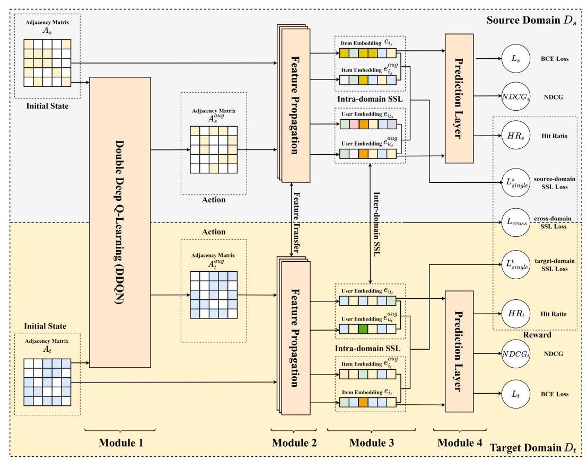
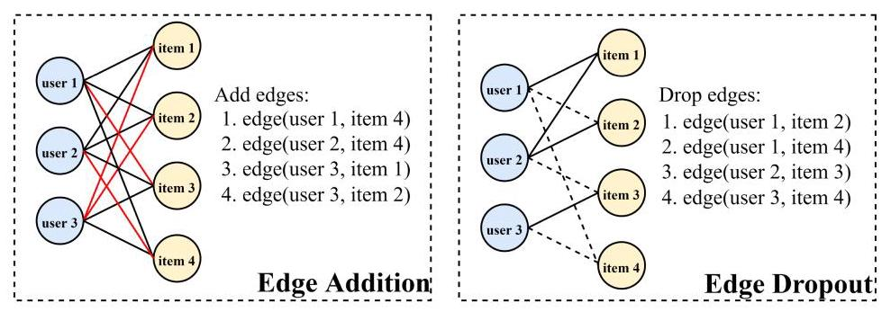
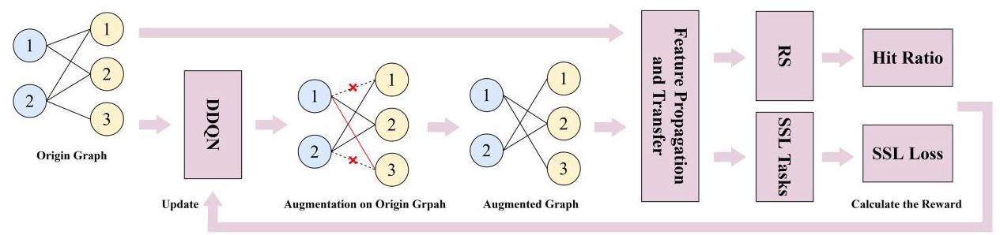
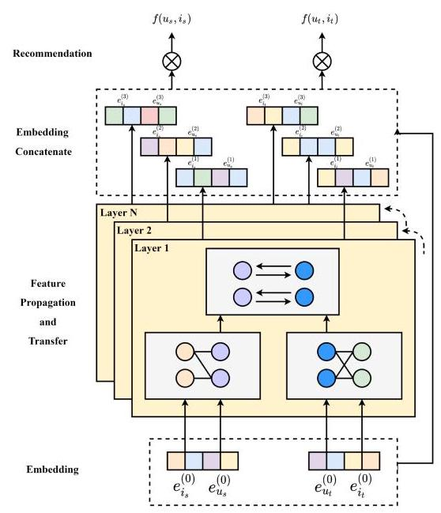
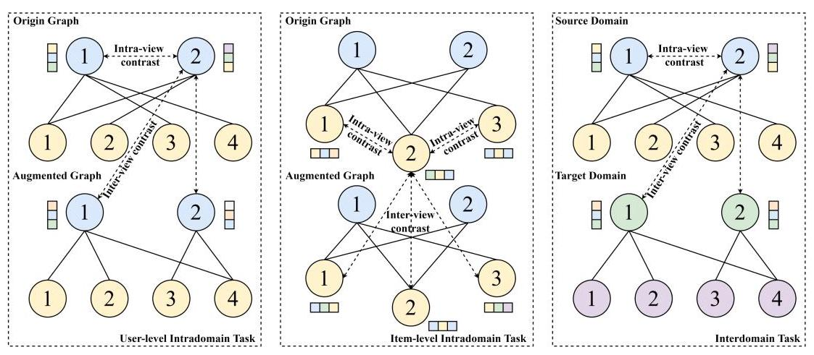
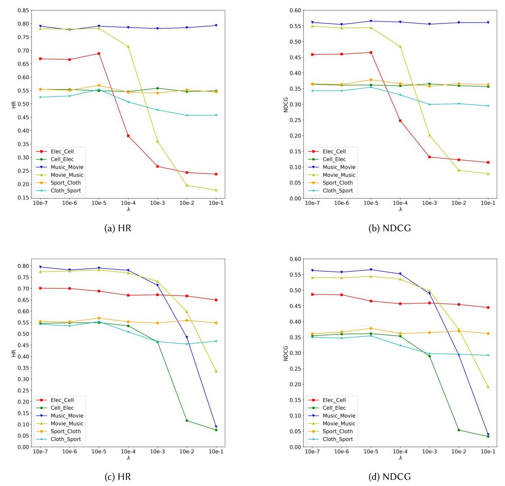

# Adaptive Adversarial Contrastive Learning for Cross-Domain Recommendation

CHI-WEI HSU, Institute of Information Management, National Yang Ming Chiao Tung University, Taiwan CHIAO-TING CHEN, Department of Computer Science, National Yang Ming Chiao Tung University, Taiwan

SZU-HAO HUANG, Department of Information Management and Finance, National Yang Ming Chiao Tung University, Taiwan

Graph-based cross-domain recommendations (CDRs) are useful for suggesting appropriate items because of their promising ability to extract features from user-item interactions and transfer knowledge across domains. Thus, the model can effectively alleviate cold start and data sparsity issues. Although the graph-based CDRs can capture valuable information, they still have some limitations. First, embeddings are highly vulnerable to noisy interactions, because the message aggregation in the graph convolutional network can further enlarge the impact. Second, because of the property of graph-structured data, the influence of high-degree nodes on representation learning is more than that of the long-tail items, and this can cause a poor recommendation performance. In this study, we devised a novel Adaptive Adversarial Contrastive Learning framework for graph-based Cross-Domain Recommendation (ACLCDR). The ACLCDR introduces reinforcement learning to generate adaptive augmented samples for contrastive learning tasks. Then, we leveraged a multitask training strategy to jointly optimize the model with auxiliary tasks. Finally, we verified the effectiveness of the ACLCDR through nine real-world cross-domain tasks adopted from Amazon and Douban. We observed that ACLCDR exceeded the best state-of-the-art baseline by \( {25}\% ,{42.5}\% ,{16.3}\% \) , and 23.8% in terms of HR@10 and NDCG@10 for the Music & Movie task from Amazon.

CCS Concepts: - Information systems \( \rightarrow \) Recommender systems; Top-k retrieval in databases; - Computing methodologies \( \rightarrow \) Adversarial learning;

Additional Key Words and Phrases: Self-supervised learning, contrastive learning, adversarial learning, reinforcement learning, collaborative filtering, cross-domain recommendation

## ACM Reference format:

Chi-Wei Hsu, Chiao-Ting Chen, and Szu-Hao Huang. 2023. Adaptive Adversarial Contrastive Learning for Cross-Domain Recommendation. ACM Trans. Knowl. Discov. Data. 18, 3, Article 57 (December 2023), 34 pages. https://doi.org/10.1145/3630259

---

This work was supported in part by the National Science and Technology Council, Taiwan, under Contract MOST 111- 2221-E-A49-125-MY3 and Contract NSTC 112-2634-F-004-001-MBK; and in part by the Financial Technology (FinTech) Innovation Research Center, National Yang Ming Chiao Tung University.

Authors' addresses: C.-W. Hsu, Institute of Information Management, National Yang Ming Chiao Tung University, No. 1001, Daxue Rd. East Dist., Hsinchu City 300093, Taiwan; e-mail: apple.mg09@nycu.edu.tw; C. -T. Chen, Department of Computer Science, National Yang Ming Chiao Tung University, No. 1001, Daxue Rd. East Dist., Hsinchu City 300093, Taiwan; e-mail: rsps971130.cs09@nycu.edu.tw; S. -H. Huang, Department of Information Management and Finance, National Yang Ming Chiao Tung University, No. 1001, Daxue Rd. East Dist., Hsinchu City 300093, Taiwan; e-mail: szuhaohuang@nycu.edu.tw.Permission to make digital or hard copies of all or part of this work for personal or classroom use is granted without fee provided that copies are not made or distributed for profit or commercial advantage and that copies bear this notice and the full citation on the first page. Copyrights for components of this work owned by others than the author(s) must be honored. Abstracting with credit is permitted. To copy otherwise, or republish, to post on servers or to redistribute to lists, requires prior specific permission and/or a fee. Request permissions from permissions@acm.org.

© 2023 Copyright held by the owner/author(s). Publication rights licensed to ACM.

1556-4681/2023/12-ART57 \$15.00

https://doi.org/10.1145/3630259

---

## 1 INTRODUCTION

Recently, recommendation systems have achieved promising results in capturing user preferences and providing appropriate suggestions for users to purchase items. These recent advances in deep learning technique can help models capture latent information, and as a result, recommendation models, such as sequence- and graph-based recommendations, have attained satisfactory results. Sequential recommendation approaches utilize a large amount of user's previous behavioral data to capture the useful patterns to make a precisely accurate recommendation for the users. Generally, the sequential recommender systems are designed to predict continuous items that users prefer to purchase in the next time period based on the historical behavior of the users [50]. In contrast, graph-based recommender systems [8] incorporate graph structure data to extract implicit information from a high-order connectivity between the user nodes and the item nodes to make desirable suggestions to the users. Despite the powerful ability to capture latent information from the purchase history data of the users, the implementation of these two types of recommendations is limited by data sparsity [29] and cold-start problems [28] that inextricably cause poor recommendation results.

In order to mitigate the impact of the issues mentioned above and enhance recommendation performance, cross-domain recommendation (CDR) is introduced. CDR utilizes shared user information as auxiliary data to facilitate the transfer of knowledge from a relevant domain to the target domain. [18]. With the development of deep learning approaches, some researchers have employed these approaches [19] to jointly train the shared parameters of the recommender system across domains to obtain relevant information, which is beneficial for knowledge transfer. Moreover, Liu et al. [21] introduced a graph collaborative filtering (CF) mechanism to capture latent information from the bipartite graph and enable a bidirectional knowledge transfer between the two domains. Considering the success of current graph-based techniques like the graph convolutional network (GCN), which leverage robust embedding models, we introduce an approach designed to capture enhanced user and item embeddings. This is accomplished by extracting shared features across domains and combining them with domain-specific features to yield effective recommendation outcomes.

Although the graph-based approaches can capture implicit information between the user nodes and the item nodes in the bipartite graph, we believe that these previously reported approaches have some limitations. First, the noisy interactions between users and items significantly influence the embeddings, and the aggregation technique used to integrate the neighborhood message in the GCN can further expand the influence. In the real recommendation scenario, the noise data can be divided into two types of user-item interactions. For example, although the user purchased the items, the e-Commerce software systems did not record the transactions in their database. Moreover, the user may purchase the items from other e-Commerce platforms, so there are no data in the database of this e-Commerce platform. Furthermore, the products on the e-Commerce platforms are vastly diverse. Thus, the user may mistakenly purchase the wrong items or may buy the items for others. Wang et al. [34] claimed that a significant portion of purchases made in e-commerce result in negative feedback, as implicit interactions are heavily influenced by users' initial impressions. These interactions are often regarded as noise, as users may have purchased items for the wrong reasons and may not genuinely like them, despite having interacted with them. Therefore, if the implicit information in the graph data contains bias or noise against the prediction objectives, then the performance of the CDR would be severely deteriorated. Other studies[36, 46] have also identified the limitations of implicit feedback and have proposed reinforced sampling strategies to identify informative and reliable training samples. Sampling techniques have also been employed in [38] to address the issue of noisy interactions in knowledge graphs. In addition, the quality of the generated embedding in graph-based approaches can be affected by the aggregation mechanism used, as higher-degree nodes tend to have a greater impact during representation learning. Consequently, graph-based approaches are more susceptible to the negative effects of noisy interactions [40].

In bipartite graph data, different nodes have varying numbers of edges. High-degree nodes represent more connected edges, while long-tail nodes represent fewer connected edges. In this research, long-tail nodes still have enough connected edges to meet the hypotheses of our method. After the features of these nodes are extracted through the embedding model, since the design of embedding model will make the node with a large number of edges have a greater impact on the overall embedding. As a result, if these High-degree Nodes have wrong information or bias, it would lead to a drastic impact on other node embeddings. For example, in the actual e-commerce situation, some products may have popularity bias, causing many people to rush to buy them, which may be iPhones or certain financial products, popular funds, and so on. This product may not be suitable for everyone, but due to the influence of high-degree nodes, the recommendation system will be affected by this bias, and only such products will be recommended. Therefore, the method we designed hopes to design the self-supervised learning (SSL) method for this point, and find the most suitable neighbor node for each node to reduce the influence of bias. Ultimately, such a result will lead to a reduction in recommendation performance, and will affect other users' recommendation failures, even favor certain types of products. At the same time, in order to emphasize the uniqueness of each user, we hope to reduce the impact of such products and consider the suitability of long-tail products for this user. However, even for long-tail items, they still need to have sufficient training data and are not entirely considered as cold-start items. The difference compared to high-degree nodes is that these long-tail items have fewer edges.

Due to these limitations, recently, Wang et al. [32] proposed an SSL framework to capture the fusion or association between the sequence data and the context data. It leverages the correlations between these data types to generate self-supervision signals that enhance latent embeddings, thus improving the performance of sequential recommender systems. Wu et al. [40] implemented an SSL on a heterogeneous graph to model the latent information between the users and the items to improve the robustness and accuracy of the recommender system. Wang et al. [31]introduced the PCRec framework, which employs contrastive learning for the pretraining of graph neural networks and subsequently fine-tunes the model to achieve improved recommendation results. The results obtained by these authors indicated that the self-supervised method can effectively enhance the quality of the representations as well as improve the CDR performance. However, the previous methods only considered augmentation approaches based on random theory, such as randomly dropping nodes, edges, or the random walk technique [27], to generate multiple graph views from the original graph and enhance the consistency between the views of the same nodes in contrast to those of other nodes. The augmentation samples are randomly generated, resulting in the data potentially containing negative information or bias against SSL. Thus, contrastive learning is unstable and slightly less effective in helping the model refine the representations.

To generate representative augmentation samples for contrastive learning, augmentation methods should be developed taking into account the individual property and topological information of each node in the graph. Inspired by previous researches, we devise a novel Adaptive Adversarial Contrastive Learning framework for graph-based Cross-Domain Recommendation (ACLCDR) that can adaptively learn the graph representations by generating flexible augmentation samples for contrastive learning. Specifically, the ACLCDR framework adopts a multitask training strategy and jointly optimizes the model with the main supervised recommendation task and the auxiliary SSL tasks. First, Double Deep Q-Learning Network (DDQN) was applied to adversarially generate different graph views based on the concept of adversarial learning [5]. Adversarial learning can intuitively produce adversarial samples and train the model with these imperceptible samples to enhance the robustness. Therefore, by applying the idea of adversarial learning to contrastive learning, we devised an intelligent augmentation mechanism that can produce adversarial graph views, which are barely distinguishable by the model, by adaptively adding or removing the links between nodes. Thus, the model treats the views of the original nodes as anchor samples, the adversarial views of the same nodes as positive samples, and the adversarial views of any other nodes as negative samples. Within the SSL tasks, auxiliary supervision of positive samples enhances the coherence among diverse views of the same node. Conversely, supervision of negative samples enforces distinctions between different nodes. This can help capture the implicit and explicit information more precisely in each single domain as well as aid in jointly learning the correlation between two different domains to enhance the model performance and adaptively obtain high-quality embeddings for the CDRs. The contributions of this study are listed below:

- We proposed the ACLCDR framework, which is an adversarial contrastive learning method based on reinforcement learning, to enhance the representation learning for CDR. Unlike previous methods, the ACLCDR introduces adaptive augmentation methods that consider the topological information of the original graph to generate different adversarial graph views across the domains to improve the contrastive learning.

- We devised three types of contrastive learning tasks for CDR, such as intradomain user-level task and intradomain item-level task, which were used to extract the domain-specific features, and interdomain tasks to capture the domain-shared features and fuse them with the domain-specific features that depend on the use of user nodes and item nodes across the domains.

- To the best of our knowledge, we are the pioneering work to unify adversarial learning and contrastive learning for CDR. This novel combined approach helps the model to obtain refined representations and achieve an outstanding performance for nine real-world cross-domain tasks.

## 2 RELATED WORK

In this work, we focused on devising a novel adversarial SSL ACLCDR framework to improve the CDR performance. In this section, we review the existing cross-domain methods (Section 2.1), adversarial learning on graph (Section 2.2), and self-supervised graph learning approaches for recommendation (Section 2.3), which closely correspond to our proposed method.

### 2.1 Cross-Domain Recommendation

Cross-domain recommender systems leverage the information from two related domains to address data sparsity and cold-start problems [18]. For cold-start problems, PTUPCDR [54] employs meta-learning to capture the individual user embeddings and transfer personalized information across the domains with a task-oriented optimization process. CDRIB [1] uses the variational information bottleneck as a regularizer to enforce the representation encoded by the shared features of the domain and derive the unbiased domain-shared information for cold-start users.

Basically, CDR can be formulated into four types based on different recommendation scenarios-single-target CDR, multidomain recommendation, dual-target CDR, and multitarget CDR. Single-target CDR focus on utilizing the auxiliary information extracted from the richer domain and transfer it to the sparser domain to alleviate the data sparsity problem. However, as both implicit and explicit information, such as ratings, reviews, and individual purchase histories, can be seen relatively abundantly in each domain, it is possible to enhance the cross-domain model simultaneously. To address the above problem, dual-target CDR and multitarget CDR are introduced to capture overlapping user preferences from the source domain or more than one relevant domain and employ bidirectional transfer learning approaches to exchange auxiliary information across the domains. Li et al. [20] incorporated adversarial learning to extract domain-shareable features, facilitating the refinement of user and item representations across domains. In addition, they employed an attention mechanism to learn latent item factors through overlapping users to represent all the items in a common space. Gao et al. [11] designed neural networks based on the neural attentive transfer framework to distill item embeddings across the domains. Chen et al. [7] utilized equivalent transformation, which can preserve domain-specific features and model the joint distribution of the user behaviors between the domains to extract the domain-shared features for knowledge transfer between the domains. Guo et al. [12] utilized a disentangled representation learning model to capture both domain-shared and domain-specific information, which enables the model to make recommendations across all domains while remaining unaffected by the number of domains.

Graph learning has been adopted in CDRs to learn the representative embeddings. Zhao et al. [51] integrated the user-item interactions between the domains into a graph and captured high-order user preferences through the feature propagation with multiple GCNs. Liu et al. [21] exploited common users as a two-way transfer bridge to exchange valuable information across the domains. They modeled the domain-shared features in the high-order bipartite graph with multiple feature propagation layers and fused the auxiliary information with the domain-specific features to improve the recommendation results. Wang et al. [37] employed a parallel graph neural network to extract user preferences from corresponding graphs. Subsequently, they applied a mutual learning procedure to integrate the extracted preferences and generate a more comprehensive representation of the user's preferences. Ouyang et al. [25] proposed a DMGE model that can model the high-quality embeddings using multigraph neural networks to capture the high-order user information in the multigraphs obtained from different domains. Although the existing successful applications are based on the graph learning methods to capture the latent implicit information in the graph, they rarely consider the latent associations between the users and the items. Moreover, graph representation learning is severely affected by the noisy interactions between the users and the items, and the message aggregation mechanism in the GCNs can enhance the influence, leading to inferior quality embeddings. Furthermore, the performance of the cross-domain model can be drastically deteriorated when the auxiliary information contains bias or noise against the prediction objectives. In this article, we introduce an adversarial SSL technique to construct a stable multitask training framework to overcome these issues and successfully improve the cross-recommendation performance.

### 2.2 Adversarial Learning

With the prosperous development of deep learning, several applications that apply deep neural networks have achieved better performance. However, previous studies have also shown that the deep learning-based models are vulnerable to sophisticated adversarial samples. Similarly, in the recommendation domain, the recommender systems that use deep learning approaches are also considerably affected by the adversarial attack methods, and the final performance of the recommendations degrades significantly [41]. Zhang et al. [48] devised a reinforcement learning-based user simulator that can effectively generate fake user behavior samples and allows these fake users to interact with a surrogate recommendation model to produce adversarial samples for a poisoning attack on the target recommendation system. Wang et al. [39] developed a gray-box shilling attack framework. This framework employs generative adversarial networks to capture intricate user behaviors from user-item interactions, generating fake user profiles capable of confounding the recommender system. These fake user profiles are closely affiliated with those of real users and lead to poor recommendation results. In addition, when extended to the CDR domain, adversarial attack can even severely degrade the performance of the model. Chen et al. [3] adopted a poisoning attack strategy, which injects malicious user rating behaviors into the training data across the domains, and showed that the promising recommendation performance of the collective matrix factorization technique can be drastically affected by the sophisticated adversarial samples. Fan et al. [10] proposed the CopyAttack framework that adopts reinforcement learning to generate user profiles similar to those of the source and target domains through a black-box attack.

Several researchers [24] reportedly adopted the adversarial learning technique to alleviate the effect of adversarial attack. Yan et al. [43] proposed an adversarial cross-domain network, which uses adversarial learning for dynamically generating adversarial examples to train a robust recommendation model. In addition, in some existing cross-domain works, the strengths of adversarial learning have been explored to capture both domain-specific and domain-shared features from user-item interactions to obtain refined representations. Li et al. [20] combined matrix factorization with adversarial learning to integrate and align the latent factors of the users and items in a unified pattern to capture as well as transfer the robust factors of the users and items. Zhang et al. [49] proposed the DA-CDR, which utilizes shared encoders with a domain discriminator to capture the latent features of the users and items in two domains through a dual adversarial learning.

In addition, in the computer vision domain, Chen et al. [5] introduced adversarial training into SSL to pretrain the models, and demonstrated that self-supervision can save the computation cost and enhance the final model robustness. Because of the impressive capability of adversarial learning to generate well-designed adversarial samples that can help the model refine user and item embeddings, we combined it with the self-supervised paradigm learning to form a multitask training strategy to obtain representative results. More precisely, compared with the existing methods that only consider randomly generated adversarial samples, which are unstable and ineffective, we devised a reinforcement learning-based adversarial learning framework that can adaptively generate several adversarial samples as different augmented views of the original graph for contrastive learning. Moreover, we adopted the multitask training method to train the model with the adversarial samples generated in several SSL tasks to mitigate the effect of the training data, that contain noise or bias against the prediction objectives, and achieved promising recommendation results.

### 2.3 Self-Supervised Learning

Recently, SSL methods [22] have attracted the interest of researchers due to their excellent ability to capture associations and correlations in explicit and implicit information to learn refined latent representations of unlabeled data. Typically, the basic concept of SSL is to capture signals from different forms of raw data, including positive and negative samples, and to use the learned em-beddings to train the model simultaneously. Drawing inspiration from the successful application of contrastive learning techniques in visual representation learning [4] and the field of natural language processing (NLP), self-supervised paradigm is used to extract informative knowledge through predefined relevant tasks. Recently, some existing works have taken advantage of SSL to enhance the performance of recommendation models. Wang et al. [32] have devised multiple contrastive learning tasks that can extract auxiliary information from inherent data patterns to improve the quality of embeddings by pre-training the embedding models and gain promising results of sequential recommendation models. Pan et al. [26] employed gated graph neural networks with SSL tasks to jointly train the model parameters for session-based recommendation and achieve better results on several real-world datasets. Xia et al. [42] employed a hypergraph learning architecture to enhance the graph-based CF approach by incorporating global collaborative effects through low-rank structure learning. Despite the advance development of graph contrastive learning on recommendation, most of the existing methods still implement stochastic augmentation approaches on the original input graph to generate different views of the graph. Moreover, since the uncertainty of random theory, which can probably lead to the instability and imprecisely to capture the representations of users and items, it can affect the strengths of SSL on the enhancement of recommendation results. In addition, some other works have discussed how to deal with noise and bias in recommendation models. The authors in [34] claimed that Amazon data exhibits such a phenomenon, and they manually conducted an experiment to validate the negative impact of noisy data. They subsequently developed an adaptive denoising training strategy to mitigate the effects of false-positive interactions. Zhang et al. [47] address the issue of popularity bias in CF models by introducing bias-aware margins into contrastive loss. They propose a straightforward yet efficient BC Loss, in which the margin is adapted to the degree of bias present in each user-item interaction. Yang et al. [44] proposed a new contrastive loss function that can adaptively optimize hard negative instances without complex training tricks. They also developed an efficient sampling strategy that incorporates item frequency information to explore negative instances without explicit negative sampling. While previous works have achieved promising recommendation performance, some studies focus only on addressing specific biases and neglect noise problems. Furthermore, these previous self-supervised approaches only consider the single-domain recommendation scenario, which cannot be directly applied to CDR since the model should take into consideration the discrepancy of different domain information.

To address these above problems, Wang et al. [31] proposed a pre-train and fine-tune framework for CDR that combined contrasitve SSL technique to initialize to obtain the graph embeddings in the target domain. Therefore, motivated by contemporary works on graph pre-training tasks, we propose a novel adversarial self-supervised framework that introduce multitask training strategy to jointly learn CDR with several auxiliary contrastive learning tasks. In our work, we devise three types of self-supervised tasks that can be implement depends on different training purposes, including two intradomain tasks and one interdomain task. In fact, intradomain tasks are mainly used to extract domain-specific features, and interdomain task is designed for the enhancement of knowledge transfer. Therefore, with the advantage of multitask learning strategy, the model can effectively extract user preferences to get refined representations and improve the effectiveness of cross-domain models.

## 3 PRELIMINARIES

In this section, we first formulate the fundamental definitions of the problem. Then, we introduce the notations used in our study and briefly review the graph neural network and MI maximization.

### 3.1 Problem Definition

In CDR, a typical problem is leveraging the data transferred from the relevant domain to the target domain. Therefore, we consider the graph data \( {G}_{s} \) and \( {G}_{t} \) in the source domain \( {D}_{s} \) and the target domain \( {D}_{t} \) . In domain \( {D}_{s} \) , where \( {u}_{s} \) and \( {i}_{s} \) denote a user and an item, respectively, and \( {U}_{s} \) and \( {I}_{s} \) indicate the number of users and items, respectively, we have an adjacency matrix transformed from graph \( {G}_{s} \) to represent the interactions between users and items \( \left( {{A}_{s} \in  {\mathbb{R}}^{{U}_{s} \times  {I}_{s}}}\right) \) with an entry \( {r}_{ui}^{{D}_{s}} \) . Similarly, in the domain \( {D}_{t} \) , where \( {u}_{t} \) and \( {i}_{t} \) denote a user and an item, respectively, and \( {U}_{t} \) and \( {I}_{t} \) indicate the number of users and items, respectively, we have an adjacency matrix transformed from graph \( {G}_{t} \) to indicate the user-item interactions \( \left( {{A}_{t} \in  {\mathbb{R}}^{{U}_{t} \times  {I}_{t}}}\right) \) with an entry \( {r}_{ui}^{{D}_{t}} \) . Both the entries \( {r}_{ui}^{{D}_{s}} \) and \( {r}_{ui}^{{D}_{t}} \) can be abstracted as follows:

\[
{r}_{ui}^{D} = \left\{  \begin{array}{ll} 1, & \text{ If the interaction exists; } \\  0, & \text{ otherwise. } \end{array}\right. \tag{1}
\]

where \( D \) represents the source domain or the target domain, \( u \) represents a user, and \( i \) represents an item in each domain.

In these two domains, we denote the number of overlapping users by \( {U}_{o} \) and consider the Top- \( N \) recommendations with their implicit feedback across the domains. The recommendation problem can be simplified to a function to predict the scores of the unobserved entries of the overlapping users in the user-item interaction matrices \( {A}_{s} \) and \( {A}_{t} \) , which are later used for ranking. Specifically,

\[
{r}_{ui}^{D} = f\left( {u, i \mid  \Theta }\right) \tag{2}
\]

where \( D \) denotes the source domain or the target domain, \( f \) denotes the score estimated function, \( \Theta \) denotes all the learnable parameters in the model, and the entry \( {r}_{ui}^{D} \) is the predicted score.

### 3.2 GCN-Based CF Models

Extracting satisfactory latent information from the interactions between the users and the items plays an important role in recommendation. Because a GCN can effectively capture the associations and correlations in high-order graph topological information, it has been used in most reported studies [15, 35]. In general, the fundamental paradigm of the GCN layer is defined as follows:

\[
{e}_{u}^{\left( l\right) } = {f}_{agg}\left( {{e}_{u}^{\left( l - 1\right) },{e}_{i}^{\left( l - 1\right) } \mid  i \in  {N}_{u}}\right) , \tag{3}
\]

where \( {f}_{agg} \) denotes an aggregation function, \( {e}_{u}^{l - 1} \) and \( {e}_{i}^{l - 1} \) are the refined embeddings of user \( u \) and item \( i \) , respectively, after propagation of layers \( l - 1 \) , and \( {N}_{u} \) represents the first-hop neighbors of user \( u \) . Analogously, we can derive \( {e}_{i}^{\left( l\right) } \) for the items.

BiTGCF [21] introduced the idea of the GCN-based propagation process and simplified the paradigm of activation function and transformation matrices, resulting in a novel feature propagation module that can effectively extract valuable information from the implicit data and can be abstracted as follows:

(4)

\[
{f}_{p}\left( {e}_{u}^{\left( l\right) }\right)  = {e}_{u}^{\left( l\right) } + \mathop{\sum }\limits_{{i \in  {N}_{u}}}\frac{{e}_{i}^{\left( l\right) } \odot  \left( {1 + {e}_{u}^{\left( l\right) }}\right) }{\sqrt{\left| {N}_{u}\right| \left| {N}_{i}\right| }}
\]

\[
{f}_{p}\left( {e}_{i}^{\left( l\right) }\right)  = {e}_{i}^{\left( l\right) } + \mathop{\sum }\limits_{{u \in  {N}_{i}}}\frac{{e}_{u}^{\left( l\right) } \odot  \left( {1 + {e}_{i}^{\left( l\right) }}\right) }{\sqrt{\left| {N}_{u}\right| \left| {N}_{i}\right| }}
\]

where \( {N}_{u} \) and \( {N}_{i} \) represent the first-hop neighbors of the user \( u \) and item \( i,{e}_{u}^{\left( l\right) } \) and \( {e}_{i}^{\left( l\right) } \) denote the embeddings of the user \( u \) and item \( i \) propagated from layer \( l, \odot \) is the element-wise product, \( \frac{1}{\sqrt{\left| {N}_{u}\right| \left| {N}_{i}\right| }} \) denotes the symmetric normalization term in GCN to reduce the influence of the embedding scale on the propagation process, and \( {f}_{p}\left( \cdot \right) \) is the feature propagation function. Analogously, we can derive \( {f}_{p}\left( {e}_{u}^{\left( l\right) }\right) \) and \( {f}_{p}\left( {e}_{i}^{\left( l\right) }\right) \) for the distinct domain.

Inspired by BiTGCF, in this study, we combined the advantages of the inner product technique to retain user and item information with transformation matrices that can convert the domain-specific features to design a new hybrid feature propagation and transfer module. For the initial embeddings of the user \( u \) and item \( i \) in the two domains, this model maps the user IDs into the embedding vectors \( {e}_{{u}_{s}}^{\left( 0\right) },{e}_{{u}_{t}}^{\left( 0\right) } \in  {\mathbb{R}}^{d} \) and the item IDs into the embedding vectors \( {e}_{{i}_{s}}^{\left( 0\right) },{e}_{{i}_{t}}^{\left( 0\right) } \in  {\mathbb{R}}^{d} \) . More precisely, for the ID embeddings, the model builds an end-to-end optimized embedding look-up table, which is defined as follows:

(5)

\[
{e}_{u}^{\left( 0\right) } = {W}_{1}^{D}{x}_{u}
\]

\[
{e}_{i}^{\left( 0\right) } = {W}_{2}^{D}{x}_{i}
\]

where \( D \) represents each domain; \( {W}_{1}^{D} \) and \( {W}_{2}^{D} \) are the trainable parameter matrices to obtain the initial user embeddings and item embeddings, respectively; and \( {x}_{u} \) and \( {x}_{i} \) are one-hot encodings of the user and item IDs, respectively. According to Equation (5), we can derive \( {e}_{u}^{\left( 0\right) } \) and \( {e}_{i}^{\left( 0\right) } \) for the other distinct domain.

### 3.3 Mutual Information Maximization

MI maximization, a vital contrastive SSL mechanism, calculates the dependences of the two random variables \( A \) and \( B \) . Thus, with MI maximization, the uncertainty in one variable can be significantly reduced by obtaining information about the other dependent random variable. Generally, the MI between two random variables \( A \) and \( B \) is defined as follows:

\[
I\left( {A, B}\right)  = H\left( A\right)  + H\left( B\right)  - H\left( {A, B}\right)  = H\left( A\right)  - H\left( {A \mid  B}\right)  = H\left( B\right)  - H\left( {B \mid  A}\right) . \tag{6}
\]

However, MI maximization is an NP-hard optimization problem, which is difficult to maximize directly. Therefore, in the previous studies [32, 52], the InfoNCE objective function, based on noise contrastive estimation, was incorporated [13] to calculate the lower bound of \( I\left( {A, B}\right) \) . InfoNCE, which is used to maximize the agreement between similar data pairs (positive) and minimize that between different data pairs (negative), is defined as follows:

\[
{\mathcal{L}}_{\text{ InfoNCE }} = {\mathbb{E}}_{P\left( {A, B}\right) }\left\lbrack  {{f}_{\theta }\left( {a, b}\right)  - {\mathbb{E}}_{q\left( \widetilde{B}\right) }\left\lbrack  {\log \mathop{\sum }\limits_{{\widetilde{b} \in  \widetilde{B}}}\exp {f}_{\theta }\left( {a,\widetilde{b}}\right) }\right\rbrack  }\right\rbrack   + \log \left| \widetilde{B}\right| , \tag{7}
\]

where \( a \) and \( b \) are different views of an input, and \( {f}_{\theta } \) is a similarity function (e.g., dot product), and \( \widetilde{B} \) is a dataset sampled from a particular distribution \( q\left( \widetilde{B}\right) \) , containing a similar sample \( b \) as positive sample and \( \left| \widetilde{B}\right|  - 1 \) different samples as negative samples.

Depending on different tasks, InfoNCE can be modified into several contrastive types. GCA [55] employs the contrastive SSL technique to distinguish the embeddings, generated from the original node in these two distinct views, from those of the other nodes. The contrastive objective is established by the intra-view nodes using the node pairs in the same graph and by the inter-view nodes using the node pairs between the same graph and the augmented graph. The objective function can be defined as follows:

\[
L\left( {{u}_{i},{u}_{j}}\right)  = \log \frac{{f}_{\theta }\left( {p\left( {u}_{i}\right) , p\left( {v}_{i}\right) }\right) /\tau }{{f}_{\theta }\left( {p\left( {u}_{i}\right) , p\left( {v}_{i}\right) }\right) /\tau  + \mathop{\sum }\limits_{{i \neq  j}}{f}_{\theta }\left( {p\left( {u}_{i}\right) , p\left( {u}_{j}\right) }\right) /\tau  + \mathop{\sum }\limits_{{i \neq  j}}{f}_{\theta }\left( {p\left( {u}_{i}\right) , p\left( {v}_{j}\right) }\right) /\tau }, \tag{8}
\]

where \( {u}_{i} \) denotes the original node as an anchor, \( {v}_{i} \) denotes the other view of the same original node, \( {u}_{j} \) denotes any other nodes in the same view, \( {v}_{j} \) denotes any other nodes in the other view, \( {f}_{\theta } \) denotes a similarity function, \( p\left( {\cdot , \cdot  }\right) \) denotes a nonlinear projection, and \( \tau \) denotes a temperature parameter.

Inspired by SimCLR [4], SGL [40] has been developed to augment different views of the graph nodes and separate them into positive pairs generated from the original node and into negative pairs, which are the views of the other nodes. Next, SGL adopts contrastive SSL to maximize the MI of the positive and negative samples. The objective function is defined as follows:

\[
{L}_{ssl} =  - \mathop{\sum }\limits_{{u \in  U}}\left( {\log \left( {\exp \left( {{f}_{\theta }\left( {{N}_{u}^{\prime },{N}_{u}^{\prime \prime }}\right) /\tau }\right) }\right)  + \log \mathop{\sum }\limits_{{v \in  U}}\exp \left( {{f}_{\theta }\left( {{N}_{u}^{\prime },{N}_{v}^{\prime \prime }}\right) /\tau }\right) )}\right. \text{ , } \tag{9}
\]

where \( {N}_{u}^{\prime } \) is the view of the original node, \( {N}_{u}^{\prime \prime } \) is the other view of the same node, \( {N}_{v}^{\prime \prime } \) is the view of any other nodes, \( {f}_{\theta } \) is a similarity function, and \( \tau \) is a temperature parameter.

Inspired by the aforementioned approaches, we adopted the multitask training strategy to optimize the model with classical CDR and SSL tasks. Therefore, we combined adversarial and contrastive learning to adaptively generate adversarial samples for each node in the original graph as their positive and negative samples and input to the model for the tasks. With the help of auxiliary SSL tasks, the model can improve the quality of the embeddings to obtain refined user and item representations as well as improve the recommendation performance of cross-domain models.

## 4 PROPOSED METHOD

In this article, we propose the ACLCDR framework, which employs the multitask training strategy to jointly train the cross-domain model with contrastive learning tasks. Specifically, the ACLCDR applies adversarial learning to contrastive learning and presents an adaptive augmentation method to improve the CDR. In Section 4.1, we first introduce the comprehensive architecture of the ACLCDR framework. Then, we elucidate the adaptive graph augmentation method and multiple contrastive tasks in Sections 4.2 and 4.4, respectively. Next, in Section 4.3, we present the feature propagation and transfer mechanism of ACLCDR. Finally, we present the model training in Section 4.5.

### 4.1 System Overview

As shown in Figure 1, the proposed ACLCDR framework mainly consists of the following four modules. Module 1 denotes DDQN, module 2 denotes Feature Propagation and Transfer Layer, module 3 denotes Multitask Contrastive Learning Task, and module 4 denotes Prediction Layer.

- Double Deep Q-learning Network. We employed the reinforcement learning technique, the DDQN, to implement the adversarial learning to contrastive learning. We devised an adaptive augmentation approach that can flexibly generate the customized adversarial samples of each node as different views of the nodes in the original graphs across the domains \( {D}_{s} \) and \( {D}_{t} \) for multiple contrastive learning tasks.

- Feature Propagation and Transfer Layer. To determine the user and item representations in a specific domain and to transfer knowledge across the relevant domains, we used the multiple layer framework to capture the latent associations and correlations in the implicit data of the interactions between the users and the items. Moreover, after the feature propagation and transfer in several layers, the model concatenates the embeddings from each hidden layer for prediction. Specifically, we acquired not only the user and item embeddings from the original graphs but also augmented embeddings from the augmented graphs. These augmented embeddings were employed in conjunction with contrastive learning tasks to aid the model in refining the representations.

- Multitask Contrastive Learning Task. We adopted the multitask training strategy to jointly learn the model parameters with the main CDR tasks and auxiliary tasks. Because the ACLCDR framework was mainly designed for CDR, we devised two kinds of SSL tasks corresponding to the recommendation tasks, including intradomain tasks, which help the model capture the latent information of the users and items to enrich the domain-specific features, and interdomain tasks, which assist the model to enhance the domain-shared information and improve the knowledge transfer.

- Prediction Layer. Our aim was to devise a cross-domain multitask training framework that exploits adversarial contrastive learning to enhance the user and item representations as well as improve the CDR results. Thus, we employed a straightforward inner-product technique as the final predictive layer to estimate the probability of the existence of the given user-item pair.

Fig. 1. The architecture of the proposed ACLCDR framework. First, the graphs \( {G}_{s} \) and \( {G}_{t} \) in two domains are transformed into two adjacency matrices \( {A}_{s} \) and \( {A}_{t} \) , which are taken as inputs to the DDQN model. After the modification on graph structure, the DDQN model generates two augmented adjacency matrices \( {A}_{s}^{aug} \) and \( {A}_{t}^{aug} \) to express different views of the origin graphs in each domain. Then, the model refines user and item embeddings \( {e}_{{u}_{s}},{e}_{{i}_{s}},{e}_{{u}_{s}}^{aug},{e}_{{i}_{s}}^{aug},{e}_{{u}_{t}},{e}_{{i}_{t}},{e}_{{u}_{t}}^{aug} \) , and \( {e}_{{i}_{t}}^{aug} \) to get representative representations with the feature propagation and transfer module. Next, the model uses the learned embeddings to train with multiple auxiliary SSL tasks to enhance quality of the representations. Finally, the model can take the refined embeddings prediction. Specifically, the SSL losses and the performances of recommendation in terms of \( {HR} \) and \( {NDCG} \) on validation data are taken as rewards to update the DDQN model and enhance the augmentation policy.

In the following section, we introduce the details of the four aforementioned modules.

### 4.2 Adaptive Data Augmentation on Graph Structure

Our framework primarily focuses on utilizing the adversarial contrastive learning method to maximize the MI between the view of the nodes in the origin graph and those in the augmented graph to alleviate the effect of noisy data and enhance the quality of the representations for CDR. Therefore, we exploited the adversarial learning mechanism that can generate sophisticated adversarial samples to formulate an adaptive and intelligent augmentation process for contrastive learning tasks. Because adversarial samples have intrinsic properties that are imperceptible to the model, we adopted adversarial learning as an augmentation mechanism that can preserve the important topological information from the origin graph and mitigate the impact of noisy data. Inspired by the recent advances in contrastive learning for graph structure, the ACLCDR framework was developed to adopt DDQN [30], which combines the Q-learning algorithm with deep neural networks, to adaptively generate additional views of each node in the origin graph. Specifically, in the DDQN model, we simply set the discount factor to 0.9 to determine the strengths of the rewards that the

Fig. 2. The adaptive action design of DDQN module. The red lines represent edge addition, the black dotted lines denote edge dropout, and the remaining black lines are no action, after the model performs actions.

DDQN used to update its policy, the batch size to 32 in an episode, the number of replay buffers to 1000 to maintain the experience trajectories when performing a policy in the environment, the number of random seeds to 10 based on the description of Colas et al. [9] to obtain sensible results, and set the number of episodes to 100 to train the DDQN agent and learn a reasonable policy after divergence. In the DDQN model, there are two value functions; one is used to choose the greedy policy and the other to decide its value. The objective of the DDQN can be defined as follows:

\[
{Y}_{t}^{\text{ DoubleQ }} \equiv  {R}_{t + 1} + {\gamma Q}\left( {{S}_{t + 1},\mathop{\operatorname{argmax}}\limits_{a}Q\left( {{S}_{t + 1}, a;{\theta }_{t}}\right) ;{\theta }_{t}^{\prime }}\right) , \tag{10}
\]

where \( {R}_{t + 1} \) and \( {S}_{t + 1} \) are the reward and state at time \( t + 1 \) , respectively, \( a \) is the action and \( \gamma  \in  \left\lbrack  {0,1}\right\rbrack \) is a discount factor to control the impact of immediate rewards versus future rewards.

Because the user-item graph is a bipartite graph, where the links are connected between the user nodes and the item nodes, we focused only on modifying the user nodes, which is equivalent to modifying the item nodes with the actions performed in the augmentation process. Specifically, in this study, we considered the CDR tasks. Thus, two adjacency matrices \( {A}_{s} \) and \( {A}_{t} \) , representing the graphs \( {G}_{s} \) and \( {G}_{t} \) in the domains \( {D}_{s} \) and \( {D}_{t} \) , respectively, were first encoded to the initial embeddings \( {E}_{{s}_{0}} \) and \( {E}_{{t}_{0}} \) , which were taken as the observation states in the input to the ACLCDR model. After the origin graph structures are modified into several different views of the same graphs, the augmented graph views \( {\widetilde{G}}_{s} \) and \( {\widetilde{G}}_{t} \) are used to train with multiple contrastive learning tasks later. Given the initial embeddings \( {E}_{{s}_{0}} \) and \( {E}_{{t}_{0}} \) , the augmentation process based on adversarial learning can be modeled as a Markov Decision Process (MDP). The definition of the model is presented as follows:

- State. The initial embedding \( {E}_{{s}_{0}} \) consists of user embeddings \( {e}_{{u}_{s}}^{\left( 0\right) } \) and item embeddings \( {e}_{{i}_{s}}^{\left( 0\right) } \) in domain \( {D}_{s} \) , and \( {E}_{{t}_{0}} \) contains the representations of users \( {e}_{{u}_{t}}^{0} \) and items \( {e}_{{i}_{t}}^{0} \) in domain \( {D}_{t} \) are taken as the initial state. Therefore, the initial state is defined as \( {S}_{0} = \left\lbrack  {{E}_{{s}_{0}}\left| \right| {E}_{{t}_{0}}}\right\rbrack \) . After the execution of the action \( {a}_{{t}_{0}} \) , the state \( {S}_{t + 1} \) at the next timestamp \( t + 1 \) is denoted \( \left\lbrack  {{E}_{{s}_{t}}\left| \right| {E}_{{t}_{t}}}\right\rbrack \) . The new embeddings \( {E}_{{s}_{t}} \) and \( {E}_{{t}_{t}} \) are refined from SSL tasks using origin graphs \( {G}_{s} \) and \( {G}_{t} \) and augmented graphs \( {G}_{s} \) and \( {G}_{t} \) , which are modified by actions \( {a}_{{s}_{t}} \) and \( {a}_{{t}_{t}} \) defined in the adaptive augmentation strategy under adversarial learning.

- Action. Actions \( {a}_{{s}_{t}} \) and \( {a}_{{t}_{t}} \) at time \( t \) comprise all the actions of the specific number of user nodes in both the domains, which can be defined as \( {a}_{{s}_{t}} = \left\lbrack  {{a}_{{s}_{t}}^{1}\left| \right| {a}_{{s}_{t}}^{2}\ldots {a}_{{s}_{t}}^{{N}_{s}}}\right\rbrack \) and \( {a}_{{t}_{t}} = \left\lbrack  {{a}_{{t}_{t}}^{1}\left| \right| {a}_{{t}_{t}}^{2}\ldots {a}_{{t}_{t}}^{{N}_{t}}}\right\rbrack \) . Action can be organized into three types, including edge addition, edge dropout, and no action, as elaborated in Figure 2. Basically, in the training process, actions \( {a}_{{s}_{0}} \) and \( {a}_{{t}_{0}} \) are predefined, taking into account the specific number of user nodes to be modified in the two domains. Then, the model can use the information from the learned user's preference to generate fake user transaction records, which is seen as an adversarial learning phase, and make the potential links between the user and items that can be added. In contrast, in the edge dropout action, the model simultaneously learns the user's preference and utilizes the knowledge to drop the edge between the user and items that the user may not all like relative to other items or unexpectedly buy the wrong things. In the same way, if the model decides to implement no action on the user node, which means that the user's transaction history satisfies his preference.

- Reward. The reward \( {R}_{{s}_{t}} \) and \( {R}_{{t}_{t}} \) at time \( t \) are obtained after the completion of the multiple contrastive learning tasks and the evaluation of the CDR performance on validation data. After the execution of the actions \( {a}_{{s}_{0}} \) and \( {a}_{{t}_{0}} \) , the origin graphs \( {G}_{s} \) and \( {G}_{t} \) and the modified graphs \( {\widetilde{G}}_{s} \) and \( {\widetilde{G}}_{t} \) in the domains \( {D}_{s} \) and \( {D}_{t} \) are placed in the feature propagation and transfer layers to capture domain-specific features and domain-shared features to obtain refined representations. Then, the model is jointly trained with multiple contrastive learning tasks, including intradomain tasks and interdomain tasks, to maximize the agreements between the two different views of the user and item embeddings. In intradomain tasks, we use the InfoNCE loss function in Equation (7) to minimize the discrepancy across the views of user nodes as well as the views of item nodes in different graph views. Furthermore, in the interdomain tasks, we enhance the capability of the knowledge transfer mechanism by conducting contrastive learning tasks in the same way on overlapping user nodes, who have transaction records in both the domains \( {D}_{s} \) and \( {D}_{t} \) . Moreover, we calculate the changes in the initialized Hit Ratio and that obtained from the evaluation of the recommendation results on validation set in two domains as the other rewards. Therefore, the reward at time \( t \) in domain \( {D}_{s} \) is defined as \( {R}_{{s}_{t}} =  - {W}_{r{s}_{1}}\left( {{L}_{\text{ singleSSL }}^{s} + {L}_{\text{ crossSSL }}}\right)  + {W}_{r{s}_{2}}H{R}_{{s}_{t}} \) , the reward at time \( t \) in domain \( {D}_{t} \) is defined as \( {R}_{{t}_{t}} =  - {W}_{r{t}_{1}}\left( {{L}_{\text{ singleSSL }}^{t} + {L}_{\text{ crossSSL }}}\right)  + {W}_{r{t}_{2}}H{R}_{{t}_{t}} \) , and the total reward at time \( t \) is formulated as \( {R}_{t} = {W}_{r}{R}_{{s}_{t}} + \left( {1 - {W}_{r}}\right) {R}_{{t}_{t}} \) , where \( {W}_{r{s}_{1}},{W}_{r{s}_{2}},{W}_{r{t}_{1}},{W}_{r{t}_{2}} \) and \( {W}_{r} \) are hyperparameters to determine the strengths of the rewards in different domains to update the DDQN model.

- Terminal. For enhancing the representations as well as alleviate the impact of noisy data to achieve a promising CDR performance, ACLCDR adopts the multitask training strategy to refine the user and item representations with multiple contrastive learning tasks. Because contrastive learning helps the model to refine the embeddings by distinguishing the views of the original graph and augmented views, ACLCDR can flexibly generate adversarial samples with the adaptive augmentation method on graph structure after executing previous actions. After the implementation of \( N \) actions, the embeddings \( {E}_{{s}_{t}} \) and \( {E}_{{t}_{t}} \) are reset to the original embeddings \( {E}_{{s}_{0}} \) and \( {E}_{{t}_{0}} \) . Moreover, the framework stores the trajectories experience in the replay buffer, which can enhance edge selection in the augmentation process to make it more effective and adaptive. Finally, the observation state will be reset after \( T \) updates to ensure that our proposed ACLCDR focuses on its objective.

In the settings, a trajectory in this MDP is defined as \( \left( {{S}_{0},{a}_{0},{R}_{0},{S}_{1},{a}_{1},{R}_{1},\ldots ,{S}_{t},{a}_{t},{R}_{t},{S}_{t + 1}}\right) \) , where the initial state \( {S}_{0} = \left\lbrack  {{E}_{s0}\left| \right| {E}_{t0}}\right\rbrack \) , the initial action \( {a}_{0} = {\parallel }_{i = 0}^{N}{a}_{1}^{i}, N \) denotes the number of user nodes to be modified across domains and the next state \( {S}_{t + 1} = \left\lbrack  {{E}_{{s}_{t}}\parallel {E}_{{t}_{t}}}\right\rbrack \) . An action \( {a}_{t} \) in each step has a corresponding reward \( {R}_{t} \) . The aforementioned problem was mainly designed, as stated, by discrete optimization; thus, Q-learning was adopted to learn the MDPs. However, the Q-learning algorithm can cause an overestimation bias in the rewards when the approximation of the reward is higher than the true value of one or more of the correlated actions. To address the problem, the DDQN technique is introduced to learn MDPs in ACLCDR. Initially, to avoid the large state-space problem that directly utilizes the adjacency matrices \( {A}_{s} \) and \( {A}_{t} \) as inputs to the DDQN model, these two adjacency matrices representing the graphs \( {G}_{s} \) and \( {G}_{t} \) in the two domains are used to train the model and transformed into the initial embeddings \( {E}_{s0} \) and \( {E}_{t0} \) , i.e., the user and item embeddings.

Then, the initial state \( {s}_{0} \) contains the embeddings \( {E}_{s0} \) and \( {E}_{t0} \) is taken as the input state of the environment, and the DDQN model outputs the action \( {a}_{0} \) which consists of all modifications to the connections between the user nodes and the item nodes to select which actions to implement in the specific ratio of the user nodes. Inspired by existing work [40], the action \( {a}_{1}^{i} \) of the specific ratio of the nodes can be selected from the three types illustrated in Figure 2. The first action is edge addition, which directly creates the connection between a user node and a potential-interested item node based on his preference. When performing these actions on the user node, it means that the item satisfies the user's interest while he has never seen or purchased the item. Moreover, the second action is the edge dropout, which directly removes the link between two nodes. In fact, many situations are involved, including the user may accidentally buy the wrong things, the user preference may evolve over time, or the user interest may have bias. Therefore, the link between the user and the item should be disconnected to prevent poor recommendations. Furthermore, the last action is no action, which preserves the link information between the user and the item based on his preferences. Such augmentations directly transform the graph structure as a topological augmentation approach that can not only reduce the impact of the potentially noise data but also enhance the representation transfer process to achieve better recommendation performance.

The action of the user nodes in the domains \( {D}_{s} \) and \( {D}_{t} \) can initially be formulated as augmentation of the links between the user nodes and all the existing item nodes in the graph. The action space consists of all actions selected by the DDQN that can be applied only to the user nodes, but the influence can be broader via the connections in the graph. However, if all the connections are considered, then the large action space of the model can cause a computation problem. Therefore, to avoid the problem, we try to reduce the size of the large action space with sampling methods. To formulate the concrete action space, the specific ratio of the user nodes to be modified must first be pre-defined. The action will then be implemented on the given number of user nodes that the model randomly chooses. We believe that the method is more flexible and effective by learning to choose the optimal strategy for each user node according to their preference. Through this process, a superior solution can be discovered and implemented. We assume that the ratio of user nodes to be modified is a hyperparameter, and we further discuss the different sampling approaches and the best ratio to use later in Section 5.2.

The reward \( {R}_{t} \) constructed by the reward \( {R}_{{s}_{t}} \) obtained from the domain \( {D}_{s} \) and the reward \( {R}_{{t}_{t}} \) gained from the domain \( {D}_{t} \) is designed to evaluate the effectiveness of SSL tasks and the performance of the CDR on the validation set. In ACLCDR, we focus primarily on enriching the representations of users and items and alleviating the effect of noisy data both the domains to achieve considerable performance. Thus, we design multiple types of contrastive learning tasks for not only on single-domain (intradomain) learning, but also on cross-domain (interdo-main) learning. After implementation of these tasks, the model can incorporate self-supervised loss as a kind of reward to update the DDQN model. Actually, the paradigm of contrastive learning tends to reduce the disparity between similar samples, which is totally in contrast to the idea of adversarial learning, which generates adversarial samples to confuse the model. Because of the intrinsic property of adversarial samples that are imperceptible to the model, it is more difficult to distinguish them. Therefore, we introduce adversarial learning to generate adversarial samples for SSL and believe that the model can learn more information from the contrastive learning tasks. The reward \( {R}_{{s}_{t}} \) obtained from the domain \( {D}_{s} \) is defined as follows:

\[
{R}_{st} =  - {W}_{r{s}_{1}}\left( {{L}_{\text{ singleSSL }} + {L}_{\text{ crossSSL }}}\right)  + {W}_{r{s}_{2}}H{R}_{{s}_{t}}, \tag{11}
\]

Fig. 3. A toy example of ACLCDR simply presents the concept of ACLCDR.

where \( {W}_{r{s}_{1}} \) and \( {W}_{r{s}_{2}} \) are the hyperparameters, \( {L}_{\text{ single SSL }} \) is the intradomain SSL loss in domain \( {D}_{s},{L}_{\text{ crossSSL }} \) is an SSL loss acquired from the cross-domain SSL task, and \( H{R}_{{s}_{t}} \) is the Hit Ratio at Top-10 used to evaluate the recommendation performance in domain \( {D}_{s} \) .

Furthermore, the other reward \( {R}_{{t}_{t}} \) gained from the domain \( {D}_{t} \) is defined as follows:

\[
{R}_{{t}_{t}} =  - {W}_{r{t}_{1}}\left( {{L}_{\text{ singleSSL }} + {L}_{\text{ crossSSL }}}\right)  + {W}_{r{t}_{2}}H{R}_{{t}_{t}}, \tag{12}
\]

where \( {W}_{r{t}_{1}} \) and \( {W}_{r{t}_{2}} \) are the hyperparameters, \( {L}_{\text{ singleSSL }} \) is the intradomain SSL loss in domain \( {D}_{t},{L}_{\text{ crossSSL }} \) is the SSL loss acquired from the cross-domain SSL task, and \( H{R}_{{t}_{t}} \) is the Hit Ratio at Top-10 used to evaluate the recommendation performance in domain \( {D}_{t} \) .

In summary, the total reward \( {R}_{t} \) used to update the network policy is defined as follows:

\[
{R}_{t} = {W}_{r}{R}_{{s}_{t}} + \left( {1 - {W}_{r}}\right) {R}_{{t}_{t}}, \tag{13}
\]

where \( {W}_{r} \) is the hyperparameter used to control the degree of rewards in domain \( {D}_{s} \) and \( {D}_{t} \) to update the DDQN model.

Unlike explicitly defining the reward as the Hit Ratio in the two domains, we calculate the differences between the initial Hit Ratio at \( {10}{\mathrm{{HR}}}_{0} \) and the Hit Ratio at \( {10}{\mathrm{{HR}}}_{t} \) obtained after the execution of the action \( {a}_{t} \) to obtain a better estimate of performance via action \( {a}_{t} \) . Not only should the Hit Ratio at 10 in domain \( {D}_{s} \) and \( {D}_{t} \) be improved, but also the losses \( {L}_{\text{ singleSSL }} \) and \( {L}_{\text{ crossSSL }} \) acquired from the intradomain SSL tasks and interdomain SSL task must be considered. Thus, we also introduce the losses from multiple self-supervised tasks to the designed reward. With combinations of these two types of rewards, we can evaluate the effectiveness of ACLCDR in a more comprehensive way. In the implementation, taking into account the different range of these two rewards, based on our experience, we simply set the hyperparameters \( {W}_{rs1} \) and \( {W}_{rt1} \) as \( {0.001},{W}_{rs2} \) and \( {W}_{rt2} \) as 100, and \( {W}_{r} \) as 0.5 .

As illustrated in Figure 3, the DDQN model takes the embedding of the graph \( {E}_{0} \) consisting of \( {E}_{s0} \) and \( {E}_{t0} \) , as the initial input state to modify the graph structure to generate an augmented graph. In this augmentation process, we introduce adversarial learning that creates adversarial samples as different views for contrastive learning tasks. After feature propagation and transfer, the model generates embeddings for contrastive learning tasks and CDR tasks. Finally, the Hit Ratio and the losses of contrastive tasks on validation data are combined as the reward \( {R}_{t} \) used to update the DDQN model to learn a better policy. Since the DDQN model considers individual preferences to select the best actions for user nodes, the augmented graph is generated in an adaptive and effective way that preserves important associations and correlations and removes noisy interaction information in the graph structure. The intelligent augmentation method we proposed belongs to the adaptive augmentation method, which will be synthesized according to each node embeddings.

Fig. 4. Illustration of the architecture of the feature propagation and transfer module.

Compared with the random-based method and rule-based method in baselines, random-based depends on the luck of initial, while rule-based is carried out according to the user's group purchase behavior. Finally, our method will generate the best solution according to each node, and then improve the quality of node embeddings, and finally strengthen the recommendation effect. For example, the blue nodes denote the user nodes, and the yellow nodes denote the item nodes. The action of user node 1 is to add an edge connected with item node 3 and drop edges connected with item node 1, and user node 2 drop edges connected with item node 3. Then, the model will transform the origin graph and the augmented graph to embeddings for several contrastive learning tasks and CDR to obtain the self-supervised losses and the Hit Ratio as total rewards. Finally, the model learns to update the policy with these two rewards and starts a new round until the trajectory ends.

### 4.3 Feature Propagation and Transfer

In ACLCDR, the primary objective of feature propagation is to refine node features within the graph by aggregating messages from their local neighborhoods. For user \( {u}_{s} \) and \( {u}_{t} \) and item \( {i}_{s} \) and \( {i}_{t} \) in each domain \( {D}_{s} \) and \( {D}_{t} \) , the model maps the user IDs into embedding vectors \( {e}_{{u}_{s}}^{\left( 0\right) },{e}_{{u}_{t}}^{\left( 0\right) } \in  {\mathbb{R}}^{d} \) and the item IDs into embedding vectors \( {e}_{{i}_{s}}^{\left( 0\right) },{e}_{{i}_{t}}^{\left( 0\right) } \in  {\mathbb{R}}^{d} \) . As evident from Figure 4, the model takes the initial embeddings of the user and item in the two domains to formulate \( \left\lbrack  {{E}_{S},{E}_{t}}\right\rbrack \) where \( {E}_{s} \) is made up of \( \left\lbrack  {{e}_{{u}_{s}}^{0},{e}_{{i}_{s}}^{0}}\right\rbrack \) and \( {E}_{t} \) consists of \( \left\lbrack  {{e}_{{u}_{t}}^{0},{e}_{{i}_{t}}^{0}}\right\rbrack \) as input to the feature propagation and transfer module comprised \( l \) graph convolutional layers. In each layer, the user features and the item features propagate information via the connections between nodes, and then the module transfers the information of overlapping users to the relevant domain. Actually, the module focuses on transferring overlapping user information in a dual way across the domains.

For feature propagation, inspired by BiTGCF [21], we similarly simplify the feature propagation layer by removing the activation function in NGCF [35]. Moreover, we maintain the inner product mechanism to capture information as used in BiTGCF and add hyperparameters to control the strengths of information from neighbor nodes. Furthermore, we employ the same layer fusion method as used in NGCF to capture feature information. Specifically, for a user-item pair \( \left( {u, i}\right) \) within domain \( {D}_{s} \) , we present the propagation functions for user features and item features as follows:

(14)

\[
{f}_{p}^{s}\left( {e}_{{u}_{s}}^{\left( l\right) }\right)  = {e}_{{u}_{s}}^{\left( l\right) } + \alpha \mathop{\sum }\limits_{{{i}_{s} \in  {N}_{{u}_{s}}}}\frac{1}{\sqrt{\left| {N}_{{u}_{s}}\right| \left| {N}_{{i}_{s}}\right| }}\left( {{e}_{{i}_{s}}^{\left( l\right) } + {e}_{{i}_{s}}^{\left( l\right) } \odot  {e}_{{u}_{s}}^{\left( l\right) }}\right)  + \beta \mathop{\sum }\limits_{{{u}_{s} \in  {N}_{{i}_{s}}}}\frac{1}{\sqrt{\left| {N}_{{i}_{s}}\right| \left| {N}_{{u}_{s}}\right| }}\left( {{e}_{{u}_{s}}^{\left( l + 1\right) } + {e}_{{u}_{s}}^{\left( l + 1\right) } \odot  {e}_{{i}_{s}}^{\left( l + 1\right) }}\right)
\]

\[
{f}_{p}^{s}\left( {e}_{{i}_{s}}^{\left( l\right) }\right)  = {e}_{{i}_{s}}^{\left( l\right) } + \alpha \mathop{\sum }\limits_{{{u}_{s} \in  {N}_{{i}_{s}}}}\frac{1}{\sqrt{\left| {N}_{{i}_{s}}\right| \left| {N}_{{u}_{s}}\right| }}\left( {{e}_{{u}_{s}}^{\left( l\right) } + {e}_{{u}_{s}}^{\left( l\right) } \odot  {e}_{{i}_{s}}^{\left( l\right) }}\right)  + \beta \mathop{\sum }\limits_{{{i}_{s} \in  {N}_{{u}_{s}}}}\frac{1}{\sqrt{\left| {N}_{{u}_{s}}\right| \left| {N}_{{i}_{s}}\right| }}\left( {{e}_{{i}_{s}}^{\left( l + 1\right) } + {e}_{{i}_{s}}^{\left( l + 1\right) } \odot  {e}_{{u}_{s}}^{\left( l + 1\right) }}\right)
\]

where \( {N}_{{u}_{s}} \) and \( {N}_{{i}_{s}} \) are the 1-hop neighbors of the user \( {u}_{s} \) and the item \( {i}_{s},{e}_{{u}_{s}}^{\left( l\right) } \) and \( {e}_{{i}_{s}}^{\left( l\right) } \) denote the user embedding of the user \( {u}_{s} \) and item embedding of the item \( {i}_{s} \) , respectively, \( \odot \) is the element-wise product function, \( \alpha \) and \( \beta \) are hyperparameters. Analogously, we obtain the propagation function of the user features and the item features in the domain \( {D}_{t} \) .

For feature transfer, we extract domain-specific features and domain-shared features and take both into consideration for knowledge transfer in the CDR, while the existing cross-domain CF methods only consider utilizing common features that lack the complete information of individual features. Specifically, the module adopts a dual transfer mechanism and can be defined as follows:

(15)

\[
{f}_{t}^{s}\left( {\cdot , \cdot  }\right)  = \frac{1}{2}\left( {\gamma {f}_{p}^{s}\left( {e}_{{u}_{s}}^{\left( l\right) }\right)  + \left( {1 - \gamma }\right) {f}_{p}^{t}\left( {e}_{{u}_{t}}^{\left( l\right) }\right)  + {\lambda }_{s}{f}_{p}^{s}\left( {e}_{{u}_{s}}^{\left( l\right) }\right)  + \left( {1 - {\lambda }_{s}}\right) {f}_{t}^{t}\left( {e}_{{u}_{t}}^{\left( l\right) }\right) }\right)
\]

\[
{f}_{t}^{t}\left( {\cdot , \cdot  }\right)  = \frac{1}{2}\left( {\left( {1 - \gamma }\right) {f}_{p}^{s}\left( {e}_{{u}_{s}}^{\left( l\right) }\right)  + \gamma {f}_{p}^{t}\left( {e}_{{u}_{t}}^{\left( l\right) }\right)  + \left( {1 - {\lambda }_{t}}\right) {f}_{p}^{s}\left( {e}_{{u}_{s}}^{\left( l\right) }\right)  + {\lambda }_{t}{f}_{t}^{t}\left( {e}_{{u}_{t}}^{\left( l\right) }\right) }\right)
\]

where \( \gamma \) is a hyperparameter to control the strengths of the information from the domain \( {D}_{s} \) and the information from the domain \( {D}_{t},{\lambda }_{s} \) and \( {\lambda }_{t} \) are the user-related weight factors to control the retention ratio of the user features of the domain \( {D}_{s} \) and \( {D}_{t} \) .

Furthermore, as mentioned above, we devised several hyperparameters to control the strengths of information in the domain \( {D}_{s} \) or the domain \( {D}_{t} \) . The design of the parameters \( \alpha \) and \( \beta \) is used to control the aggregated information from the neighbor nodes of 1 hop and the neighbor nodes of 2 hops. When \( \alpha \) is set to a higher value, it means that the embeddings consider more information of the 1-hop neighbor nodes. In the same way, when \( \beta \) is set higher, it means that the embeddings consider more features extracted from 2-hop neighbor nodes. Specifically, while \( \alpha \) is set to 1 and \( \beta \) is set to 0 , the setting is similar to that used in BiTGCF. Moreover, the design of the hyperparameter \( \gamma \) controls the extent of information between domains. If \( \gamma \) is set to a value greater than 0.5, it means that more features from domain \( {D}_{s} \) will contribute to the domain-shared features rather than domain \( {D}_{t} \) , and vice versa. In addition, we adopt the hyperparameters \( {\lambda }_{s} \) and \( {\lambda }_{t} \) to control the retention ratio of the user features from domains \( {D}_{s} \) and \( {D}_{t} \) , respectively. Moreover, when \( {\lambda }_{s} \) and \( {\lambda }_{t} \) are set to 1.0, it indicates that all user features in domains \( {D}_{s} \) and \( {D}_{t} \) are retained. When \( {\lambda }_{s} \) and \( {\lambda }_{t} \) are both set to 0.5, the distinctiveness in domain-specific features vanishes, resulting in the same users having identical features in both domain \( {D}_{s} \) and \( {D}_{t} \) . As a consequence, the transfer mechanism aligns with that of existing cross-domain CF works. Finally, in ACLCDR, we simply set \( \alpha \) as 1, which consider all the information of the 1-hop neighbor nodes, \( \beta \) as 0.1, which only consider less information of the 2-hop neighbor nodes, \( \gamma \) as 0.5, which balances the strengths in the propagation and transfer of domain-shared features and domain-specific features, and \( {\lambda }_{s} \) and \( {\lambda }_{t} \) as 0.8, which indicates the domain-specific features consider more information from the corresponding domain rather than the relevant domain.

### 4.4 Multitask Contrastive Learning

Graph contrastive learning has been shown to be useful in learning refined representations and helping to improve recommendation performance [40]. Supplementary supervision of positive samples preserves the consistency between two distinct views of the same node, while the supervision of negative samples enforces disparities between the original node and other dissimilar nodes. Therefore, ACLCDR adopts multitask training strategy to jointly train the model with CDR tasks and contrastive learning tasks to learn representative representations and improve the recommendation results. The embeddings are highly vulnerable to the data containing noise or bias against the prediction objectives, and the negative influence can be enhanced through the message aggregation mechanism GCNs, leading to a poor performance. Thus, we introduced adversarial learning to adaptively generate adversarial samples for contrastive learning tasks. Based on this analysis, we believe that the model can learn to generate high-quality embeddings to alleviate the effect of noisy data and achieve promising recommendation results.

Fig. 5. Multiple contrastive SSL tasks.

Inspired by the existing strategies [14, 55], we designed multiple contrastive learning tasks, including two intradomain tasks and one interdomain task, as indicated in Figure 5. Specifically, before the implementation of multiple contrastive learning tasks, ACLCDR first uses the DDQN model to produce several augmented graphs in the domain \( {D}_{s} \) and \( {D}_{t} \) with the topology augmentation strategy. Moreover, the DDQN model learns and adopts adaptive actions that tend to preserve the important topological graph patterns from an amortized perspective and modify the connections between user nodes and item nodes based on these customized actions. Then, ACLCDR follows the contrastive learning paradigm to maximize the agreement of the embeddings between different views of the origin graph and the augmented graph in the two domains. The intelligent augmentation method we proposed belongs to the adaptive augmentation method, which will be synthesized according to each node embeddings. Compared to the random-based method and rule-based method in the baselines, the random-based method depends on the luck of the initial draw, while the rule-based method carries out augmentation based on the user's group purchase behavior. Finally, our method will generate the best solution according to each node, and then improve the quality of node embeddings, and finally strengthen the recommendation effect. More precisely, ACLCDR incorporates InfoNCE loss, a type of contrastive objective, to enforce the embeddings of the nodes denoted the same user or the nodes denoted the same item in the two graphs, and can be discriminated from the embeddings of other nodes represented in the same type.

Because task 1 and task 2 are intradomain SSL tasks, they can be implemented in each domain. We first define the original graph as \( G \) , which is a bipartite graph consisting only of user nodes and item nodes, with the user embedding \( {E}_{u} \) and the item embedding \( {E}_{i} \) ; and its augmented view as \( \widetilde{G} \) generated by the DDQN model, with the user embedding \( {\widetilde{E}}_{u} \) and the item embedding \( {\widetilde{E}}_{i} \) . Furthermore, we also set the best ratio \( \alpha \) , which we will discuss in Section 5.2 to determine the number of user nodes and item nodes to be modified in the augmentation procedure. Next, we employ the InfoNCE loss to formulate a contrastive objective which helps the model update by distinguishing the difference of the embeddings in the two views of the graph.

In task 1, which is a user-level task, we consider modeling the refined representation of the users. For the embedding of the user node \( {u}_{i} \) sampled from the candidate user nodes, which need to be augmented in the origin graph view \( G \) is treated as an anchor, the embedding of the same user node \( \widetilde{{u}_{i}} \) produced in the modified graph \( \widetilde{G} \) is treated as a positive sample, the embeddings of the other user nodes \( {v}_{i} \) and \( {\widetilde{v}}_{i} \) in these two views are naturally considered as negative samples. Specifically, negative samples were chosen from two sources. One is the intra-view nodes that are with the anchor in the same graph; the other is the inter-view nodes that are in the augmented graph as illustrated in Figure 5. In this way, the SSL method can increase the diversity of positive and negative samples to capture more information from different views of the nodes. Thus, we can formulate the pairwise objective for each positive pair \( \left( {{u}_{i},\widetilde{{u}_{i}}}\right) \) as follows:

\[
L\left( {{u}_{i},\widetilde{{u}_{i}}}\right)  =  - \log \frac{\exp \left( {s\left( {{e}_{{u}_{i}},{e}_{\widetilde{{u}_{i}}}}\right) }\right) /\tau }{\exp \left( {s\left( {{e}_{{u}_{i}},{e}_{\widetilde{{u}_{i}}}}\right) }\right) /\tau  + \exp \left( {s\left( {{e}_{{u}_{i}},{e}_{{v}_{i}}}\right) }\right) /\tau  + \exp \left( {s\left( {{e}_{{u}_{i}},{e}_{\widetilde{{v}_{i}}}}\right) }\right) /\tau }, \tag{16}
\]

where \( s\left( \cdot \right) \) denotes a similarity function measuring the similarity between two embedding vectors, \( \tau \) is a temperature parameter, \( {e}_{{u}_{i}} \) and \( {e}_{{\widetilde{u}}_{i}} \) are the embeddings of the same user obtained from the origin graph and the augmented graph, respectively, and \( {e}_{{v}_{i}} \) are the different embeddings of the user obtained from the origin graph, and \( {e}_{{\overrightarrow{v}}_{i}} \) are the different embeddings of the user obtained from the augmented graph.

To extend the loss into all the potential positive pairs, we can define the intradomain user-level self-supervised loss as follows:

\[
{L}_{\text{ single SSL }}^{\text{ user }} = \sum L\left( {{u}_{i},\widetilde{{u}_{i}}}\right) , \tag{17}
\]

Analogously, in task 2, which is an item-level task, we can obtain contrastive learning loss \( {L}_{\text{ singleSSL }}^{\text{ item }} \) with Equation (17). With the combination of these two objective functions, we can formulate the intradomain SSL loss as follows:

\[
{L}_{\text{ singleSSL }} = {L}_{\text{ singleSSL }}^{\text{ user }} + {L}_{\text{ singleSSL }}^{\text{ item }} \tag{18}
\]

Due to the specific property of CDR, which usually uses overlapping users as an information exchange bridge to transfer knowledge r, we use the embeddings of overlapping users in domains \( {D}_{s} \) and \( {D}_{t} \) where the domains are highly correlated as different views to contrast the differences. Task 3, which is mainly designed for CDR, can not only refine the overlapping user embeddings but also alleviate the negative impact of noisy data. Specifically, for the embedding of the user node \( {u}_{s} \) selected from the domain \( {D}_{s} \) is set as the anchor, the embedding of the same node \( {u}_{t} \) obtained from the domain \( {D}_{t} \) is set as a positive sample, and the embeddings of the other user nodes \( {v}_{s} \) and \( {v}_{t} \) in the two domains are seen as negative samples. As stated above, the contrastive learning technique can help the CDR prevent from the effect of noisy data to obtain refined user representations for knowledge transfer, the pairwise objective function is defined as follows:

\[
L\left( {{u}_{s},{u}_{t}}\right)  =  - \log \frac{\exp \left( {s\left( {{e}_{{u}_{s}},{e}_{{u}_{t}}}\right) }\right) /\tau }{\exp \left( {s\left( {{e}_{{u}_{s}},{e}_{\widetilde{{u}_{t}}}}\right) }\right) /\tau  + \exp \left( {s\left( {{e}_{{u}_{s}},{e}_{{v}_{s}}}\right) }\right) /\tau  + \exp \left( {s\left( {{e}_{{u}_{s}},{e}_{{v}_{t}}}\right) }\right) /\tau }, \tag{19}
\]

where \( s\left( \cdot \right) \) calculates the similarity between two embedding vectors, \( \tau \) denotes a temperature parameter, \( {e}_{{u}_{s}} \) and \( {e}_{{u}_{t}} \) are the embeddings of the same user in domains \( {D}_{s} \) and \( {D}_{t} \) , respectively, and the different embeddings of users \( {e}_{{v}_{s}} \) and \( {e}_{{v}_{t}} \) are obtained from domains \( {D}_{s} \) and \( {D}_{t} \) , respectively.

To extend the loss into all the node pairs, we can define the interdomain SSL loss as follows:

\[
{L}_{\text{ crossSSL }} = \sum L\left( {{u}_{s},{u}_{t}}\right) . \tag{20}
\]

In this way, we believe that the model can learn to refine the representations of users and items from these three tasks to improve the CDR in the contrastive SSL fashion. Moreover, we adopt a multitask training strategy to jointly optimize the CDR model and define the main objective function as follows:

\[
L = {L}_{\text{ main }} + {\lambda }_{1}{L}_{\text{ single SSL }} + {\lambda }_{2}{L}_{\text{ crossSSL }} + {\lambda }_{3}\parallel \Theta {\parallel }_{2}^{2}, \tag{21}
\]

where \( {L}_{\text{ main }} \) is the main supervision loss that will be defined in Section 4.5, \( \Theta \) denote the set of model parameters in the main supervision tasks, since \( {L}_{\text{ singleSSL }} \) and \( {L}_{\text{ crossSSL }} \) do not introduce additional parameters, \( {\lambda }_{1},{\lambda }_{2} \) , and \( {\lambda }_{3} \) denote the hyperparameters used to control the strengths of the different contrastive learning tasks and the \( {L}_{2} \) regularization, respectively. Based on our experience, we simply set \( {\lambda }_{1},{\lambda }_{2} \) , and \( {\lambda }_{3} \) to an appropriate value as 0.00001 to ensure the model can learn the information from contrastive learning tasks and avoid excessive influence of the tasks.

### 4.5 Model Training

In this work, we mainly focus on developing an adversarial contrastive learning cross-domain framework that can enhance user and item embeddings with multiple contrastive learning tasks and achieve considerable recommendation performance in cross-domain tasks. Following the previous work [21], we adopt the binary cross-entropy loss function, a kind of pair-wise loss function, as the main loss function to train the model with the main cross-domain task. Specifically, the objective function is presented as follows:

\[
L\left( {{\widehat{r}}_{ui},{r}_{ui}}\right)  =  - \frac{1}{N}\mathop{\sum }\limits_{{\left( {u, i}\right)  \in  {R}^{ + } \cup  {R}^{ - }}}^{N}{r}_{ui}\log {\widehat{r}}_{ui} + \left( {1 - {r}_{ui}\log \left( {1 - {\widehat{r}}_{ui}}\right) }\right)  + \lambda \parallel \Theta {\parallel }_{2}^{2}, \tag{22}
\]

where \( \mathrm{N} \) is the number of entries comprised a user, an item, and a label, \( {R}^{ + } \) is the set of the observed user-item interaction history, \( {R}^{ - } \) is the set comprised the random samples selected from the unobserved interaction history, and \( \lambda \) is a hyperparameter stated in Equation (21) controls the \( {L}_{2} \) regularization extent to prevent overfitting. In this way, we can regard \( L\left( {{r}_{ui},{r}_{ui}}\right) \) as the main loss of supervised learning tasks derived from both the domains \( {D}_{s} \) and \( {D}_{t} \) .

In this work, we optimize the parameters in the model with the mini-batch Adam technique and adopt the dropout mechanism to prevent overfitting. Moreover, we employ a multitask learning strategy to jointly optimize the model parameters with the contrastive learning loss and the CDR loss. As presented in Equation (21), we transform the final joint loss function and define as follows:

\[
L = L\left( {{\widehat{r}}_{ui}^{s},{r}_{ui}^{s}}\right)  + L\left( {{\widehat{r}}_{ui}^{t},{r}_{ui}^{t}}\right)  + {\lambda }_{1}{L}_{\text{ singleSSL }} + {\lambda }_{2}{L}_{\text{ crossSSL }}. \tag{23}
\]

Since ACLCDR is a bidirectional transfer model, the data from the two domains are used simultaneously to train the recommendation, but are merely evaluated separately for CDR.

## 5 EXPERIMENTS

This section focuses on investigating research questions related to ACLCDR. First, we will introduce detailed experimental settings on benchmark datasets, state-of-the-art baseline methods, and evaluation metrics for CDR. Next, we conduct extensive experiments on nine CDR tasks from Amazon and Douban and present the results to demonstrate that ACLCDR framework can actually improve the effectiveness of CDR.

- RQ1: How does our proposed ACLCDR compare with various adversarial contrastive learning methods for CDRs?

- RQ2: How does the proposed ACLCDR perform in CDR tasks compared with other state-of-the-art methods?

Table 1. Statistics of the Datasets for CDR Tasks

<table><tr><td rowspan="2">CDR Tasks</td><td colspan="2">Domain</td><td colspan="3">#Users</td><td colspan="2">#Items</td><td colspan="2">#Interactions</td><td colspan="2">Density</td></tr><tr><td>Source</td><td>Target</td><td>Source</td><td>Target</td><td>Overlap</td><td>Source</td><td>Target</td><td>Source</td><td>Target</td><td>Source</td><td>Target</td></tr><tr><td>Task 1</td><td>Elec</td><td>Cell</td><td>49,072</td><td>5,730</td><td>2,904</td><td>32,919</td><td>14,571</td><td>105,499</td><td>46,372</td><td>0.1104%</td><td>0.1096%</td></tr><tr><td>Task 2</td><td>Music</td><td>Movie</td><td>26,876</td><td>40,928</td><td>6,495</td><td>58,267</td><td>42,901</td><td>318,577</td><td>379,666</td><td>0.0842%</td><td>0.1363%</td></tr><tr><td>Task 3</td><td>Sport</td><td>Cloth</td><td>10,849</td><td>13,058</td><td>1,284</td><td>14,793</td><td>15,703</td><td>27,043</td><td>23,545</td><td>0.1424%</td><td>0.1168%</td></tr><tr><td>Task 4</td><td>Music</td><td>Cell</td><td>26,876</td><td>5,730</td><td>200</td><td>8,231</td><td>2,525</td><td>9,914</td><td>4,316</td><td>0.6022%</td><td>0.8547%</td></tr><tr><td>Task 5</td><td>Elec</td><td>Cloth</td><td>49,072</td><td>13,058</td><td>2,077</td><td>26,087</td><td>21,436</td><td>63,242</td><td>34,143</td><td>0.1167%</td><td>0.0767%</td></tr><tr><td>Task 6</td><td>Sport</td><td>Movie</td><td>10,849</td><td>40,928</td><td>850</td><td>9913</td><td>17,372</td><td>16,781</td><td>40,446</td><td>0.1992%</td><td>0.2739%</td></tr><tr><td>Task 7</td><td>Book*</td><td>Movie*</td><td>2,071</td><td>2,711</td><td>1,261</td><td>3,222</td><td>9,555</td><td>70,641</td><td>1,133,420</td><td>1.6452%</td><td>5.8956%</td></tr><tr><td>Task 8</td><td>Music*</td><td>Movie*</td><td>1,603</td><td>2,711</td><td>778</td><td>2,546</td><td>9,555</td><td>48,160</td><td>1,133,420</td><td>2.2670%</td><td>6.7628%</td></tr><tr><td>Task 9</td><td>Book*</td><td>Music*</td><td>2,071</td><td>1,603</td><td>616</td><td>3,222</td><td>2,546</td><td>70,641</td><td>48,160</td><td>1.9055%</td><td>2.2906%</td></tr></table>

- RQ3: How does each of the contrastive learning tasks help ACLCDR improve the performance of CDR?

- RQ4: How do different parameters affect the effectiveness of the proposed ACLCDR framework?

### 5.1 Experimental Settings

5.1.1 Datasets. Following most previous works [2, 21, 53], we conducted experiments using nine real-world cross-domain tasks obtained from Amazon and Douban, and the statistics of the datasets used in the tasks are summarized in Table 1.

These nine cross-domain tasks from various domains contain the largest number of implicit interactions that occur in our cross-domain experiment. Moreover, following the previous works, we choose the most commonly used datasets including three coupled datasets from Amazon and three datasets from Douban. Since the experimental data in our study were collected from e-commerce websites, user behavior data on these websites are considered observational rather than experimental, and purchasing behaviors are highly dependent on the exposure mechanisms of the systems. This phenomenon can result in noisy interactions and biases in the data, which means that the data we collected may not fully reflect users' true preferences. Several other studies [45, 56] have also aimed to debias or remove noisy interactions when constructing personalized recommendation systems using the same dataset as ours. Specifically, the coupled datasets from Amazon are highly correlated, including Electronics (Elec) & Cell Phones and Accessories (Cell), and CDs and Vinyl (Music) & Movies and TV (Movie), and Accessories, Sports and Outdoors (Sport) & Clothing, Shoes and Jewelry (Cloth). Furthermore, three datasets from Douban are also have high correlation, such as Book (Book*), Movie (Movie*), and Music (Music*). To demonstrate the outstanding transfer capability of ACLCDR in weak correlation datasets, the cross-coupling of the three pairs, Music & Cell, and Elec & Cloth and Sport & Movie are considered to form the remaining CDR tasks.

In the data preprocessing stage, for these nine paired datasets, we initially convert them into implicit data, where each entry is labeled as 0 or 1, indicating whether the user has interacted with the item or not. Subsequently, we filter the datasets to create 10-core datasets, which require retaining users with more than 10 ratings and items rated by more than 10 users. In addition, we extract overlapping user data in both domains for the evaluation of CDR tasks. Even for longtail items or users, sufficient training data are crucial to fulfill the requirements of our proposed method. This data preprocessing step aimed to mitigate the impact of high-degree nodes on the recommendation results. Our research methodology adopts a similar approach to previous studies. However, our goal is to obtain more representative and effective embeddings, and our hypothesis is that noise bias is prevalent in multi-core data. Therefore, through our research approach, we can effectively solve this problem and enhance the recommendation results. The code is available at https://gitfront.io/r/user-3656521/V3pW4nAooAxG/ACLCDR/.

5.1.2 Baseline Methods. In the first experiment, we compare ACLCDR with the following adversarial SSL methods:

- Random- \( N \) : This method introduces the edge dropout probability to randomly drop the node from the original graph to generate another view of the original graph for contrastive SSL.

- Random- \( E \) : This method stochastically selects an edge to be removed from the original graph, namely, the edge dropout, to obtain an augmented graph view for contrastive SSL.

- Random-G: This method employs random walk [33] based on probability theory to construct a different subgraph and utilize it as a different view of the original graph for contrastive SSL.

- Popular: This method chooses the most popular items based on the number of interactions, indicating that the user has purchased the item, to create connections with users and produce a new view of the original graph. Popular selects the most fashionable items according to user interactions, which assumes that each user may have the same or similar preferences with the most purchased items.

- Preference: This method considers most user preferences with implicit information to calculate the average score of each item based on the rating data. Then, it adds an edge between users and the highest-rating items and discards an edge between users and the lowest-rating items to generate an augmented graph for contrastive SSL. Preference chooses items with the highest rating based on explicit information, which also assumes that user's purchasing behaviors are mainly influenced by the rating information.

Moreover, in the second experiment, we select the following state-of-the-art CDR methods as baselines without comparing with single-domain models since the existing works have proved transfer learning mechanism is powerful to leverage auxiliary information in cross-domain models and achieve better results.

- CoNet [17]: It proposes an effective dual transfer learning technique based on deep neural networks to jointly learn the features and transfer domain knowledge for CDR.

- PPGN [51]: It adopts a unified multitask training strategy to jointly learn user preferences through multiple graph convolution layers by fusing the item-user interaction information across the domains.

- BiTGCF [21]: It is a graph-based CDR model that can extract high-order correlation in user-item interactions through multiple well-designed feature propagation layers and transfer knowledge with common users as the transfer bridge across two domains.

- CDRIB [1]: It utilizes the information bottleneck principle to learn debiased features from domain-specific information with two well-designed regularizers to enforce the representation for recommendation. The work is the first to capture the domain-shared information and utilize it to train unbiased representations for cold-start users.

- ETL [7]: It proposes an equivalent transformation model to learn the joint distribution of overlapping user behaviors in two domains to refine domain-shared features and domain-specific features for CDR.

Furthermore, in the third experiment, we verify the performance of three variants of ACLCDR based on different contrastive learning tasks, namely \( u \) -ACLCDR, \( i \) -ACLCDR, and \( c \) -ACLCDR. These variants are expressed as follows:

- \( u \) -ACLCDR: This variant considers user-level information in single-domain based on the intradomain contrastive learning task. The model learns domain-specific features by distinguishing the different views of user nodes to refine the embeddings.

- \( i \) -ACLCDR: This variant considers item-level information in single-domain based on the intradomain contrastive learning task. The model captures domain-specific features by contrasting the original view and the augmented view of item nodes to obtain refined embeddings.

- \( c \) -ACLCDR: This variant learns the refined representations in consideration of cross-domain information extracted from the views of same user nodes, which are overlapping users, in the source domain and the target domain.

5.1.3 Evaluation Metrics. To evaluate the performance of the CDR tasks, we follow the experimental settings in the previous work [7], which adopts the widely used leave-one-out evaluation method. First, we prepare the validation set and test set by randomly selecting an item from each user's individual historical interactions, and the remaining items are used as the train set. Then, we randomly choose 99 items as negative samples from the items with which the user did not interact before. Therefore, the model would predict each user's preferences with 100 records, including 1 positive sample and 99 negative samples, and output top- \( N \) items. Finally, we introduce two evaluation metrics, the Hit Ratio \( \left( {HR}\right) \) and the Normalized Discounted Cumulative Gain (NDCG), to measure the ranking performance of the recommendation model:

- HR@K: Hit Ratio (HR) evaluates whether the test item is in the top-K item ranking list. ( 1 for hit and 0 for no hit)

- NDCG@K: Normalized Discounted Cumulative Gain (NDCG) evaluates the ranking quality and assigns higher score to the hits at higher positions in the top-K item ranking list.

For both evaluation metrics, we simply set \( K \) to 10 and truncate the length of the ranked list to 10, which is followed by the existing work, to present reasonable results of CDR. Therefore, \( {HR} \) measures whether the test item is in the top-10 item list and NDCG measures whether the test item is present in the higher position in the top-10 item list.

5.1.4 Parameters Settings. For the implementation of all the state-of-the-art baselines we compared with in the experiment, we used the code released by the author and changed the data pipeline. For CoNet with deep structure, we adopt the optimal configuration in their paper; the hidden layer configuration is set as \( \left\lbrack  {{64},{32},{16},8}\right\rbrack \) and the negative sampling ratio is set as 4 . For the implementation of PPGN, to satisfy the states of our paper, we set the negative sampling ratio to 4, and set the number of GCN layers from 3 to 5. For BiTGCF, we use the optimal settings in their paper and set the number of embedding propagation layers to 3, the embedding size to [64, 64, 64], and the negative sampling ratio to 4 . For CDRIB, we set the number of graph encoding layers from 3 to 5, the embedding size as [128, 128, 128], and change the number of negative samples to 99 to meet the states of our paper. For ETL, we use the best configuration according to the paper; the embedding size is set as 200 and the dropout ratio as 0.5 .

Specifically, in our proposed ACLCDR, we implement the method in Tensorflow and set the embedding size to 16 , the number of feature propagation layers to 3 , the layer size to [16, 16, 16], the dropout ratio to 0.1 , the learning rate to 0.001 , the mini batch size to 1024 , the negative sampling ratio to 4 , and the weight of intradomain and interdomain SSL to 0.0001 . Note that we adopt an early stopping method to check the convergence of ACLCDR when HR@10 in both the domains stops increasing for five successive epochs. To avoid the impact on randomness in the experiment and improve the validity and robustness of the results, we simply set 10 random seeds and continue testing 10 times to measure performance and present the average values. Furthermore, for CDR, we simultaneously obtain the results of the two datasets in different tasks.

Table 2. Top-K Performance Comparison in Terms of HR and NDCG on Electronic & Cellphone

<table><tr><td rowspan="2">SSL Ratio</td><td rowspan="2">Dataset</td><td rowspan="2">Metrics</td><td colspan="5">Adversarial Contrastive Learning Methods</td><td>Ours</td></tr><tr><td>Random-N</td><td></td><td>Random- \( G \)</td><td>Popular</td><td>Preference</td><td>ACLCDR</td></tr><tr><td rowspan="4">1%</td><td rowspan="2">Elec</td><td>HR</td><td>0.6057</td><td>0.6112</td><td>0.5926</td><td>0.6030</td><td>0.6043</td><td>0.6746</td></tr><tr><td>NDCG</td><td>0.3956</td><td>0.3994</td><td>0.3717</td><td>0.3907</td><td>0.3911</td><td>0.4641</td></tr><tr><td rowspan="2">Cell</td><td>HR</td><td>0.4948</td><td>0.5059</td><td>0.4463</td><td>0.4236</td><td>0.4180</td><td>0.5496</td></tr><tr><td>NDCG</td><td>0.3106</td><td>0.3150</td><td>0.2743</td><td>0.2593</td><td>0.2544</td><td>0.3573</td></tr><tr><td rowspan="4">10%</td><td rowspan="2">Elec</td><td>HR</td><td>0.6126</td><td>0.6188</td><td>0.6140</td><td>0.6095</td><td>0.6092</td><td>0.6791</td></tr><tr><td>NDCG</td><td>0.3937</td><td>0.3955</td><td>0.3982</td><td>0.3934</td><td>0.3967</td><td>0.4718</td></tr><tr><td rowspan="2">Cell</td><td>HR</td><td>0.4652</td><td>0.4969</td><td>0.4935</td><td>0.4198</td><td>0.4480</td><td>0.5375</td></tr><tr><td>NDCG</td><td>0.2872</td><td>0.3119</td><td>0.3189</td><td>0.2577</td><td>0.2805</td><td>0.3522</td></tr><tr><td rowspan="4">30%</td><td rowspan="2">Elec</td><td>HR</td><td>0.6360</td><td>0.6291</td><td>0.6309</td><td>0.6154</td><td>0.5878</td><td>0.6884</td></tr><tr><td>NDCG</td><td>0.4239</td><td>0.4054</td><td>0.4045</td><td>0.3981</td><td>0.3738</td><td>0.4653</td></tr><tr><td rowspan="2">Cell</td><td>HR</td><td>0.5420</td><td>0.5000</td><td>0.5007</td><td>0.4370</td><td>0.3784</td><td>0.5492</td></tr><tr><td>NDCG</td><td>0.3519</td><td>0.3202</td><td>0.3184</td><td>0.2746</td><td>0.2236</td><td>0.3615</td></tr><tr><td rowspan="4">50%</td><td rowspan="2">Elec</td><td>HR</td><td>0.6649</td><td>0.6405</td><td>0.6646</td><td>0.6098</td><td>0.5975</td><td>0.6832</td></tr><tr><td>NDCG</td><td>0.4515</td><td>0.4336</td><td>0.4625</td><td>0.3924</td><td>0.3852</td><td>0.4728</td></tr><tr><td rowspan="2">Cell</td><td>HR</td><td>0.5451</td><td>0.5513</td><td>0.5430</td><td>0.4360</td><td>0.4084</td><td>0.5324</td></tr><tr><td>NDCG</td><td>0.3600</td><td>0.3579</td><td>0.3543</td><td>0.2743</td><td>0.2520</td><td>0.3418</td></tr><tr><td rowspan="4">70%</td><td rowspan="2">Elec</td><td>HR</td><td>0.6019</td><td>0.6333</td><td>0.6250</td><td>0.6002</td><td>0.6040</td><td>0.6784</td></tr><tr><td>NDCG</td><td>0.3864</td><td>0.4155</td><td>0.4069</td><td>0.3873</td><td>0.3888</td><td>0.4747</td></tr><tr><td rowspan="2">Cell</td><td>HR</td><td>0.4807</td><td>0.5086</td><td>0.5131</td><td>0.3998</td><td>0.4091</td><td>0.5196</td></tr><tr><td>NDCG</td><td>0.3069</td><td>0.3316</td><td>0.3318</td><td>0.2427</td><td>0.2539</td><td>0.3346</td></tr><tr><td rowspan="4">100%</td><td rowspan="2">Elec</td><td>HR</td><td>0.6009</td><td>0.6026</td><td>0.5978</td><td>0.6016</td><td>0.6030</td><td>0.6643</td></tr><tr><td>NDCG</td><td>0.3813</td><td>0.3879</td><td>0.3847</td><td>0.3868</td><td>0.3899</td><td>0.4577</td></tr><tr><td rowspan="2">Cell</td><td>HR</td><td>0.4528</td><td>0.4531</td><td>0.4948</td><td>0.3994</td><td>0.4273</td><td>0.5275</td></tr><tr><td>NDCG</td><td>0.2929</td><td>0.2860</td><td>0.3199</td><td>0.2468</td><td>0.2683</td><td>0.3395</td></tr></table>

The best performance in each row is shown in boldface, and the second highest value in each row is underlined.

### 5.2 Adversarial Contrastive Learning Approach Comparison (RQ1)

ACLCDR introduces adversarial learning to contrastive learning and leverage multitask training strategy to jointly train the model with several contrastive learning tasks to enhance representation learning for CDR. In the ACLCDR framework, the core concept is to generate sensible augmented samples for contrastive learning tasks. Therefore, the number of nodes considered to be modified can greatly affect the enhancement performance of ACLCDR. In fact, since the bipartite graph consists of user nodes and item nodes, the augmentation implemented on the user node is equivalent to the implementation on the item node where there exists an interaction between them. Therefore, ACLCDR only considers the selection of the individual user nodes to be modified, as well as the baselines, such as Popular and Preference. To determine the best ratio of user nodes to be modified and compare with different augmentation methods, we incorporate five contrastive learning approaches based on adversarial learning with our CDR model to prove the applicability of our augmentation module, namely DDQN, in ACLCDR. Note that Random-N, Random-E, Random- \( G \) are devised by random theory that can stochastically choose a specific ratio of user nodes and item nodes to be augmented. Table 2 shows the summarized results of the experiments on Elec & Cell dataset in terms of two metrics HR@10 and NDCG@10.We use the SSL Ratio to denote the number of nodes to be modified. The best performance in each row is shown in boldface, and the second highest value in each row is underlined.

For Random- \( N \) , when the SSL ratio is set as \( {50}\% ,{HR}@{10} \) is 0.6649, and NDCG@10 is 0.4515 on Elec; HR@10 is 0.5451 and NDCG@10 is 0.3600 on Cell, which means that half of the nodes in the graph are considered to be removed. For Random-E, we can also obtain the best results when the SSL ratio is set as 50%, its HR@10 are 0.6405 and 0.5513, and NDCG@10 are 0.4336 and 0.3579 on Elec & Cell, respectively. Moreover, we can obtain the best performance of Random-G, the HR@10 and NDCG@10 are 0.6646 and 0.4625 on Elec, and 0.5430 and 0.3543 on Cell, respectively. Random- \( N \) , Random- \( E \) , and Random- \( G \) all achieve their best results when the SSL ratio is set as 50%. We conclude that the reason might be that half of the nodes are selected to be augmented can not only preserve complete topological information of the original graph, but also alleviate the effect of noise interactions between user nodes and item nodes. For Popular method, the best results of HR@10 and NDCG@10 on Elec & Cell are 0.6154, 0.3981, 0.4370 and 0.2746, respectively, when the SSL ratio is set to 30%. For Preference, when the SSL ratio is set to 10%, the best HR@10 and NDCG@10 are 0.6092 and 0.3967 on Elec and 0.4480, 0.2805 on Cell, respectively. Surprisingly, Popular and Preference only take \( {30}\% \) and \( {10}\% \) on nodes to be modified, which are less than the SSL ratio set in in Random- \( N \) , Random- \( E \) , and Random- \( G \) . The reason might be that since these two methods are devised according to user preferences, the augmentation is more sensible than random methods.

However, Random- \( N \) , Random- \( E \) , and Random- \( G \) outperform Popular and Preference, because the individual preferences across users are completely different and even the personal preference can evolve over time. Thus, preference biases in the augmented samples can deteriorate representation learning and lead to poor recommendation. Furthermore, random theory can comparatively mitigate the effect of preference bias, since it randomly selects nodes to drop. Despite the success result of these five baselines, which all outperform the state-of-the-art baselines we will discuss later in Section 5.3, ACLCDR still achieves superior performance compared with them. In addition, ACLCDR outperforms the best baseline Random- \( G \) by 3.5% and 3.1% on HR@10 and NDCG@10 on Elec dataset; ACLCDR outperforms Random-G by 0.75% and 0.42% on HR@10 and NDCG@10 on Cell dataset. Since ACLCDR can flexibly generate augmented samples based on the individual property of each node and topological information in the graph, it is able to preserve the information from the original graph and mitigate the effect of noise or bias in the user-item interactions.

In addition, according to Table 2, as the SSL ratio increases or decreases, all the baseline results worsen. This was also observed when our proposed ACLCDR framework was implemented. We believe that the number of nodes to be modified should be appropriate. Even if the SSL ratio is too small, which implies that the topological information can be completely preserved, noise or bias interactions still exist and lead to poor performance of contrastive learning. When the SSL ratio is set too high, the augmented samples cannot effectively maintain the structural information of the original graph. In conclusion, ACLCDR achieves the best result among the evaluated baselines on the coupled dataset Elec & Cell, when the SSL ratio is set to 30%, which indicates that the augmentation of \( {30}\% \) of the user nodes in the graph is the best ratio that not only preserves the topological information of the graph but also exploits the potential high-order connections to obtain high-quality representations for enhancing the CDR.

### 5.3 Performance Comparison with State-of-the-Art Models (RQ2)

ACLCDR is mainly devised on the basis of the cross-domain framework, which adopts a dual transfer mechanism to transfer knowledge across the domains. To verify the capability of ACLCDR, we compared the model with several latest state-of-the-art CDR baselines using nine real-world cross-domain tasks obtained from Amazon and Douban. Specifically, these nine tasks can be organized into two types of tasks, such as highly correlated joint datasets and weakly correlated coupled datasets, to show the powerful transfer ability of the ACLCDR. The experimental results were validated using two metrics, viz. HR@10 and NDCG@10, to equitably measure the abilities of the different methods. To provide a comprehensive view, we separate the results into Tables 3 and 4 depending on the correlations between the joint datasets used in the cross-domain tasks. Similarly, the best performance in each row is shown in boldface, and the second highest value in each row is underlined. Based on Tables 3 and 4, we can draw the following key conclusions:

Table 3. Comparison of Top-K Performance in Terms of HR and NDCG in Six Highly Correlated Coupled Datasets from Amazon and Douban

<table><tr><td rowspan="2">Dataset</td><td rowspan="2">Metrics</td><td colspan="5">Cross-domain Methods</td><td>Ours</td></tr><tr><td>CoNet</td><td>PPGN</td><td>BiTGCF</td><td>CDRIB</td><td>ETL</td><td>ACLCDR</td></tr><tr><td rowspan="2">Elec</td><td>HR</td><td>0.4314</td><td>0.4206</td><td>0.5465</td><td>0.4209</td><td>0.4327</td><td>0.6884</td></tr><tr><td>NDCG</td><td>0.2661</td><td>0.1712</td><td>0.3416</td><td>0.2499</td><td>0.2934</td><td>0.4653</td></tr><tr><td rowspan="2">Cell</td><td>HR</td><td>0.4976</td><td>0.5116</td><td>0.5475</td><td>0.4335</td><td>0.4682</td><td>0.5492</td></tr><tr><td>NDCG</td><td>0.2919</td><td>0.2350</td><td>0.3518</td><td>0.2489</td><td>0.2738</td><td>0.3615</td></tr><tr><td rowspan="2">Music</td><td>HR</td><td>0.6110</td><td>0.6271</td><td>0.6308</td><td>0.2197</td><td>0.6231</td><td>0.7886</td></tr><tr><td>NDCG</td><td>0.3745</td><td>0.3466</td><td>0.3885</td><td>0.1041</td><td>0.3944</td><td>0.5619</td></tr><tr><td rowspan="2">Movie</td><td>HR</td><td>0.5490</td><td>0.6355</td><td>0.6693</td><td>0.2413</td><td>0.6660</td><td>0.7781</td></tr><tr><td>NDCG</td><td>0.3280</td><td>0.3926</td><td>0.4319</td><td>0.1160</td><td>0.4364</td><td>0.5404</td></tr><tr><td rowspan="2">Sport</td><td>HR</td><td>0.2780</td><td>0.1816</td><td>0.3886</td><td>0.3204</td><td>0.4424</td><td>0.5467</td></tr><tr><td>NDCG</td><td>0.2705</td><td>0.0925</td><td>0.2071</td><td>0.1749</td><td>0.2890</td><td>0.3732</td></tr><tr><td rowspan="2">Cloth</td><td>HR</td><td>0.3917</td><td>0.1629</td><td>0.3629</td><td>0.3002</td><td>0.3953</td><td>0.5280</td></tr><tr><td>NDCG</td><td>0.2087</td><td>0.0988</td><td>0.1795</td><td>0.1757</td><td>0.2908</td><td>0.3405</td></tr><tr><td rowspan="2">Book*</td><td>HR</td><td>0.3799</td><td>0.4629</td><td>0.4913</td><td>0.2786</td><td>0.4473</td><td>0.5095</td></tr><tr><td>NDCG</td><td>0.2589</td><td>0.3187</td><td>0.2893</td><td>0.1512</td><td>0.2561</td><td>0.3141</td></tr><tr><td rowspan="2">Movie*</td><td>HR</td><td>0.5582</td><td>0.5851</td><td>0.6144</td><td>0.4504</td><td>0.6647</td><td>0.6867</td></tr><tr><td>NDCG</td><td>0.3370</td><td>0.3503</td><td>0.3792</td><td>0.2430</td><td>0.4258</td><td>0.4279</td></tr><tr><td rowspan="2">Music*</td><td>HR</td><td>0.3448</td><td>0.4021</td><td>0.4675</td><td>0.1924</td><td>0.4408</td><td>0.4992</td></tr><tr><td>NDCG</td><td>0.2333</td><td>0.2372</td><td>0.2631</td><td>0.0989</td><td>0.2353</td><td>0.3046</td></tr><tr><td rowspan="2">Movie*</td><td>HR</td><td>0.5443</td><td>0.5662</td><td>0.6004</td><td>0.4332</td><td>0.6206</td><td>0.6809</td></tr><tr><td>NDCG</td><td>0.3302</td><td>0.3285</td><td>0.3628</td><td>0.2293</td><td>0.3830</td><td>0.4273</td></tr><tr><td rowspan="2">Book*</td><td>HR</td><td>0.4208</td><td>0.4263</td><td>0.4766</td><td>0.2790</td><td>0.4171</td><td>0.5021</td></tr><tr><td>NDCG</td><td>0.2598</td><td>0.2348</td><td>0.2757</td><td>0.1497</td><td>0.2438</td><td>0.2960</td></tr><tr><td rowspan="2">Music*</td><td>HR</td><td>0.3702</td><td>0.4591</td><td>0.4617</td><td>0.2308</td><td>0.4029</td><td>0.4790</td></tr><tr><td>NDCG</td><td>0.2230</td><td>0.2537</td><td>0.2646</td><td>0.1161</td><td>0.2316</td><td>0.2808</td></tr></table>

The best performance is in boldface and the second high value is underlined.

- CDRIB performs the worst on most tasks as the model is primarily designed for cold-start issues. CoNet performs better than CDRIB, demonstrating the effectiveness of the dual transfer mechanism in the cross-domain model. Surprisingly, Compared with CoNet, PPGN exhibits a worse performance on Elec & Cell and Sport & Cloth, while achieving better results on Music & Movie, Book* & Movie*, Music* & Movie*, and Book* & Music. Furthermore, Zhao et al. [51] showed that PPGN outperforms CoNet on the Book & Movie and CD & Music datasets. Therefore, we believe that the datasets that exhibit large differences in the data distribution and are more sparse might cause poor recommendations, because PPGN utilizes the joint graph of the two domains using the same feature propagation module to obtain the embeddings. Furthermore, BiTGCF achieves better results than CoNet and PPGN, demonstrating that well-designed graph feature propagation and transfer layers can effectively help the model obtain refined representations. In addition, ETL also has better recommendation performance than CoNet and PPGN, because ETL precisely extracts domain-shared features and domain-specific features by learning of the joint data distribution of the behaviors of overlapping users between domains. Despite the power of the equivalent transformation proposed by ETL, BiTGCF still outperforms ETL in most cross-domain tasks. We guess the reason is that BiTGCF takes advantage of graph data, which are provided with implicit information, with multiple well-designed propagation layers to capture latent information from the topological structure between users and items and transfer knowledge across the domains.

Table 4. Comparison of Top-K Performance in Terms of HR and NDCG in Three Joint Datasets with Low Correlation

<table><tr><td rowspan="2">Dataset</td><td rowspan="2">Metrics</td><td colspan="5">Cross-domain Methods</td><td>Ours</td></tr><tr><td>CoNet</td><td>PPGN</td><td>BiTGCF</td><td>CDRIB</td><td>ETL</td><td>ACLCDR</td></tr><tr><td rowspan="4">Music   Cell</td><td>HR</td><td>0.3950</td><td>0.2060</td><td>0.1911</td><td>0.1818</td><td>0.4506</td><td>0.7350</td></tr><tr><td>NDCG</td><td>0.2522</td><td>0.1547</td><td>0.0822</td><td>0.0769</td><td>0.2957</td><td>0.4967</td></tr><tr><td>HR</td><td>0.2700</td><td>0.1658</td><td>0.4654</td><td>0.1656</td><td>0.5422</td><td>0.6700</td></tr><tr><td>NDCG</td><td>0.1526</td><td>0.0805</td><td>0.2278</td><td>0.0973</td><td>0.3489</td><td>0.4684</td></tr><tr><td rowspan="2">Elec</td><td>HR</td><td>0.5643</td><td>0.3309</td><td>0.4689</td><td>0.1884</td><td>0.5038</td><td>0.6774</td></tr><tr><td>NDCG</td><td>0.2787</td><td>0.1726</td><td>0.2888</td><td>0.0910</td><td>0.3361</td><td>0.4728</td></tr><tr><td rowspan="2">Cloth</td><td>HR</td><td>0.2301</td><td>0.2876</td><td>0.5821</td><td>0.2655</td><td>0.3117</td><td>0.6225</td></tr><tr><td>NDCG</td><td>0.2132</td><td>0.1557</td><td>0.3251</td><td>0.1330</td><td>0.1422</td><td>0.3713</td></tr><tr><td rowspan="2">Sport</td><td>HR</td><td>0.3706</td><td>0.0342</td><td>0.3871</td><td>0.3416</td><td>0.4005</td><td>0.5518</td></tr><tr><td>NDCG</td><td>0.1964</td><td>0.0122</td><td>0.2101</td><td>0.1884</td><td>0.2421</td><td>0.3656</td></tr><tr><td rowspan="2">Movie</td><td>HR</td><td>0.4694</td><td>0.1449</td><td>0.5024</td><td>0.3837</td><td>0.4183</td><td>0.7424</td></tr><tr><td>NDCG</td><td>0.2555</td><td>0.0488</td><td>0.2913</td><td>0.2190</td><td>0.2466</td><td>0.5124</td></tr></table>

The best performance is in boldface and the second high value is underlined.

- Despite the great capability of the state-of-the-art baselines, ACLCDR still achieves the best performance in terms of HR@10 and NDCG@10 among the baselines between domains on all datasets with high correlation, showing that the design of multiple contrastive learning tasks can actually enhance representation learning through the well-designed feature propagation and transfer module. Specifically, ACLCDR outperforms the best baselines by 25%, 42.5%, 16.3%, and 23.8% in terms of HR@10 and NDCG@10 on Music & Movie task from Amazon. In fact, ACLCDR also outperforms the best baselines by 6.8%, 15.8%, 9.7%, and 11.6% in terms of HR@10 and NDCG@10 on Music* & Movie* task from Douban, showing ACLCDR can have a better recommendation result on the datasets that are less sparse. Taking Task 2 as an example, the average number of items purchased per person in the source domain is 11.85. Experimental results have shown that ACLCDR outperforms baselines by 25.02% in HR, and by 44.36% in NDCG. The results are higher than task 1 and task 3 which have lower-degree nodes. As previously mentioned, limitations arising from high-degree nodes can have a greater impact on learning representative embeddings than long-tail items when dealing with this type of dataset pairing. However, our experiment results demonstrate that ACLCDR can effectively alleviate this issue. Moreover, multitasks learning strategy can help the model to enhance the representation learning and alleviate the negative impact of noisy and bias in the user-item interaction to improve the performance of cross-domain model. As proved in the work [40], the model exploits the training strategy with multiple contrastive learning tasks that can empower the ability of representation learning in the GCN-based recommender model. In conclusion, ACLCDR introduces multitasks learning strategy to construct several contrastive learning tasks and train the cross-domain model with them to refine the representations of user and item and effectively promote the performance for CDR.

- Furthermore, Table 4 compares the recommendation performance of the latest state-of-the-art cross-domain models, based on two widely used metrics HR and NDCG, for the tasks comprised three coupled datasets with a weak correlation. Likewise, CDRIB still has the worst performance in most cross-domain scenarios. The result might be caused by the model architecture, since CDRIB is designed mainly to solve cold-start problems. However, PPGN achieves worse performance than CDRIB in some tasks and is even worse than CoNet on most datasets, which shows that the weak correlation datasets can cause poor results, since PPGN trains the model on the joint graph across the domains that might have negative biases. Moreover, CoNet is beaten by the remaining cross-domain baselines because the dual transfer mechanism is not well designed, which can lead to a hard negative information transfer problem. Surprisingly, the performance of BiTGCF and ETL is almost the same, sometimes BiTGCF outperforms ETL, but sometimes vice versa. BiTGCF outperforms other baselines on most datasets, showing the great ability of the well-designed feature propagation and transfer layer to obtain high-quality representations for precise user preferences. In the same way, ETL attains better results than other baselines, since its transformation model can capture domain-share and domain-specific features. Although the powerful propagation and transfer module devised by BiTGCF, and the mechanism to model data distribution in ETL to obtain a good recommendation performance, ACLCDR still outperforms all the state-of-the-art baselines. Specifically, ACLCDR outperforms the best baseline by 37.8%, 51%, 47.8%, and 76% in terms of HR@10 and NDCG@10 on Sport & Movie task from Amazon, which demonstrate the powerful applicability of feature propagation and transfer module and indicates that the multitask training strategy with contrastive learning tasks can actually help CDR to enhance representation learning and effectively alleviate the impact of noise and bias in the item-user interactions to achieve promising recommendation performance.

Regarding the experimental results presented in Tables 3 and 4, we have additionally conducted a hypothesis test (T-test) for performance comparison. When comparing HR and NDCG between our method and the baselines in six highly correlated coupled datasets from Amazon and Douban, our experimental group outperformed the control group, with a p-value of 0.0013 . Similar results were also observed in three joint datasets with low correlation, yielding a p-value of 0.0006 . The p-values for both tests reject the null hypothesis, indicating a significant difference between our method and the baselines.

### 5.4 Comparison of the Improvement on Different Contrastive Learning Tasks (RQ3)

Since ACLCDR adopts multitasks training strategy to jointly update the model parameters, this experiment is to investigate the utility of each contrastive learning tasks. Based on the property of CDR model, we devise multiple contrastive learning tasks, including intradomain tasks and interdomain task. Actually, interdomain task is mainly designed for CDR, which can help the model to enhance the capability of bidirectional transfer module. Table 5 shows the results of the ablation test in terms of HR@10 and NDCG@10, demonstrating that the contrastive learning tasks actually help refine the representations and improve the performance of the cross-domain model. Specifically, \( w/o \) SSL variant, which is a degenerate version of ACLCDR, presents that ACLCDR train without any SSL tasks; \( u \) -ACLCDR variant indicates that ACLCDR train with user-level SSL tasks, which is an intradomain SSL task that implements contrastive learning only on user nodes to help the model to capture user information; \( i \) -ACLCDR variant is a similar version of \( u \) -ACLCDR, which is also an intradomain contrastive learning task but implement contrastive learning only on item nodes to help the model extract item information. Moreover, c-ACLCDR variant is mainly learned with interdomain SSL task, which models the information of the overlapping users in the two domains to help the feature propagation and transfer module refine the embeddings.

Table 5. Performance Comparison of Three Distinct Variants of ACLCDR

<table><tr><td rowspan="2">Dataset</td><td rowspan="2">Metrics</td><td colspan="4">Model Variants</td><td>Ours</td></tr><tr><td>w/oSSL</td><td>u-ACLCDR</td><td>i-ACLCDR</td><td>c-ACLCDR</td><td>ACLCDR</td></tr><tr><td rowspan="4">Elec   Cell</td><td>HR</td><td>0.6174</td><td>0.6825</td><td>0.6419</td><td>0.6508</td><td>0.6884</td></tr><tr><td>NDCG</td><td>0.4075</td><td>0.4722</td><td>0.4315</td><td>0.4338</td><td>0.4653</td></tr><tr><td>HR</td><td>0.4807</td><td>0.5379</td><td>0.5320</td><td>0.5379</td><td>0.5492</td></tr><tr><td>NDCG</td><td>0.2984</td><td>0.3456</td><td>0.3420</td><td>0.3458</td><td>0.3615</td></tr><tr><td rowspan="4">Music   Movie</td><td>HR</td><td>0.5561</td><td>0.5561</td><td>0.5654</td><td>0.5569</td><td>0.5693</td></tr><tr><td>NDCG</td><td>0.3641</td><td>0.3641</td><td>0.3711</td><td>0.3655</td><td>0.3782</td></tr><tr><td>HR</td><td>0.5319</td><td>0.5343</td><td>0.5327</td><td>0.5452</td><td>0.5537</td></tr><tr><td>NDCG</td><td>0.3450</td><td>0.3452</td><td>0.3482</td><td>0.3529</td><td>0.3545</td></tr><tr><td rowspan="4">Sport   Cloth</td><td>HR</td><td>0.7085</td><td>0.7860</td><td>0.7817</td><td>0.7541</td><td>0.7886</td></tr><tr><td>NDCG</td><td>0.4709</td><td>0.5575</td><td>0.5539</td><td>0.5163</td><td>0.5619</td></tr><tr><td>HR</td><td>0.6716</td><td>0.7777</td><td>0.7746</td><td>0.7549</td><td>0.7781</td></tr><tr><td>NDCG</td><td>0.4349</td><td>0.5379</td><td>0.5393</td><td>0.5146</td><td>0.5404</td></tr></table>

As stated in Table 5, the \( u \) -ACLCDR variant outperforms the \( w/o \) SSL variant for all the cross-domain tasks, indicating that the user-level intradomain contrastive learning tasks can help the model focus on the extraction of user information. Specifically, the \( u \) -ACLCDR variant outperforms the \( w/o \) SSL variant by \( {9.5}\% ,{13.7}\% ,{10.6}\% \) , and \( {13.7}\% \) in terms of HR@10 and NDCG@10 on Elec & Cell task. In the same way, \( i \) -ACLCDR variant also outperforms \( w/o \) SSL variant on all tasks, which demonstrate that item-level intradomain task can help the model to enhance representation learning, especially on item nodes. Precisely, \( i \) -ACLCDR variant also outperforms \( w/o \) SSL by \( {9.4}\% ,{15}\% \) , 13.3%, 19.4% on Music & Cell task. Moreover, c-ACLCDR is the model trained with interdomain task, which are mainly devised for CDR that use the views of overlapping user nodes in different domains for contrastive learning tasks to capture the valuable transfer information that is necessary to enhance representation learning and improve the ability of knowledge transfer to achieve better recommendation results of the cross-domain model. In fact, c-ACLCDR variant also outperforms \( w/o \) SSL variant by \( 6\% ,{8.8}\% ,{11}\% \) , and 15.5 \( \% \) in terms of HR@10 and NDCG@10 on Music & Movie task. In conclusion, contrastive learning tasks can help the cross-domain model to obtain refined embeddings for effectively improving the recommendation performance. Surprisingly, the three variants \( u \) -ACLCDR, \( i \) -ACLCDR, and \( c \) -ACLCDR can all outperform the state-of-the-art baselines, proving that contrastive learning can effectively help the cross-domain model refine the representations.

However, from Table 5, we can deduce that compared with \( u \) -ACLCDR and \( i \) -ACLCDR, \( c \) - ACLCDR exhibits significantly degraded performance. This performance degradation was observed because the number of overlapping users only accounts for a small proportion of all the users, and the information extracted from each single domain is more important and informative than that extracted from the interdomain task. Interestingly, we also observe that when the dataset is imbalanced, where the difference between the number of users in the source domain and in the target domain is too large, \( c \) -ACLCDR variant can outperform \( u \) -varint and \( i \) -variant. We conclude that the reason might be that the interactions in each single domain have noise or bias against the predictive objective. When the dataset is more imbalance, the noise data can enlarge the negative influence and dramatically deteriorate the recommendation. ACLCDR takes advantage of user-level and item-level intradomain contrastive learning tasks to help the feature propagation layers refine the representations of users and items, and interdomain contrastive learning tasks to enhance the knowledge transfer mechanism. With the help of these two types of SSL tasks, the

Fig. 6. Top K performance under different \( {\lambda }_{1} \) and \( {\lambda }_{2} \) , the upper figure corresponds to \( {\lambda }_{1} \) , while the lower figure corresponds to \( {\lambda }_{2} \) .

ACLCDR framework can achieve the best performance on all datasets, even if the datasets contain a weak correlation.

### 5.5 Hyperparameter Sensitivity (RQ4)

In ACLCDR, we utilize the hyperparameters \( {\lambda }_{1} \) and \( {\lambda }_{2} \) to augment the recommendation objective with different loss objective weights. To investigate how these hyperparameters affect the performance of ACLCDR, we conduct extensive experiments to examine their sensitivity. Since our proposed ACLCDR leverages multitask training strategy with contrastive learning tasks to jointly optimize the model parameters, we conducted extensive experiments to study the sensitivity of two hyperparameters \( {\lambda }_{1} \) and \( {\lambda }_{2} \) . We devised several contrastive learning tasks, including intradomain tasks and interdomain tasks, and use \( {\lambda }_{1} \) and \( {\lambda }_{2} \) to control the strength of SSL tasks. We analyzed the influence of the hyperparameters \( {\lambda }_{1} \) and \( {\lambda }_{2} \) in the range from 0.000001 to 1.0 , and present the results in Figure 6.

In Figures 6(a) and 6(b), it can be observed that when \( {\lambda }_{1} \) increases and is higher than 0.0001, the performance of ACLCDR gets worse. Specifically, when \( {\lambda }_{1} \) is set to 1.0, ACLCDR achieves the worst performance, indicating that the model is overly focused on intradomain contrastive learning tasks and neglects the main supervision recommendation task. On the other hand, when \( {\lambda }_{1} \) decreases and is less than 0.0001, the performance of ACLCDR slightly degrades. Based on the results presented in Figures 6(a) and 6(b), the best performance of ACLCDR is achieved when \( {\lambda }_{1} \) is set to 0.0001 . Moreover, Figures 6(c) and 6(d) shows that when \( {\lambda }_{2} \) increases and is higher than 0.0001, ACLCDR exhibits the worst performance. However, decreasing \( {\lambda }_{2} \) does not severely affect the ACLCDR results. As demonstrated in the ablation test, the influence of interdomain contrastive learning tasks is less than the impact of intradomain contrastive learning tasks. Therefore, we conclude that the results of ACLCDR are less affected by \( {\lambda }_{2} \) than \( {\lambda }_{1} \) .

In summary, ACLCDR effectively incorporates the information from contrastive learning tasks by appropriately weighting the SSL loss with hyperparameters \( {\lambda }_{1} \) and \( {\lambda }_{2} \) . However, if the model is trained with too much or too little information from SSL tasks, the recommendation performance may be compromised.

## 6 CONCLUSION

We propose the ACLCDR framework that leverages a multitask training strategy to jointly train the model with multiple auxiliary contrastive learning for Top- \( K \) CDR. The embeddings are significantly affected by the implicit noisy interactions, and the effect can be enhanced through the message aggregation mechanism. To address these issues, we combined adversarial learning with contrastive learning. Specifically, adaptive augmentation methods, such as MDPs, are adopted and a reinforcement learning technique, DDQN, is employed to design an adaptive augmentation method, which can flexibly generate adversarial samples as augmented samples with different views of the original graphs in the two domains for contrastive learning tasks. Moreover, inspired by GCA [55] and SGL [40], we devised several contrastive learning tasks to help the model capture domain-specific and domain-shared features, such as intradomain and interdomain tasks, to improve the representation learning and alleviate the negative impact of the noise data. Furthermore, inspired by BiTGCF [21], we designed a novel feature propagation and transfer module, which reasonably simplifies the feature propagation mechanism, to generate representative embeddings and achieve a promising recommendation performance.

In this way, ACLCDR can be used to obtain refined embeddings and achieve a remarkable performance for the cross-domain model. The remarkable performance of the CDR for nine real-world cross-domain tasks adopted from Amazon and Douban proved the effectiveness of the developed ACLCDR framework. Specifically, ACLCDR outperforms the best state-of-the-art baseline by \( {25}\% ,{42.5}\% ,{16.3}\% \) , and \( {23.8}\% \) in terms of HR@10 and NDCG@10 for the Music & Movie dataset obtained from Amazon. In the future, we intend to continue our research on the CDR domain. We believe that our proposed method can be extended to a more realistic situation by considering user privacy and user bias issues for CDR. Furthermore, in the present study, we devised the ACLCDR framework for the Top- \( K \) recommendations. The next-item recommendation that considers the use of multi-interest information [6, 33] and explainable recommendation systems based on knowledge graphs [16, 23] for CDR will be evaluated in our future studies.

## REFERENCES

[1] Jiangxia Cao, Jiawei Sheng, Xin Cong, Tingwen Liu, and Bin Wang. 2022. Cross-domain recommendation to cold-start users via variational information bottleneck. In Proceedings of the IEEE International Conference on Data Engineering.

[2] Chaochao Chen, Huiwen Wu, Jiajie Su, Lingjuan Lyu, Xiaolin Zheng, and Li Wang. 2022. Differential private knowledge transfer for privacy-preserving cross-domain recommendation. In Proceedings of the ACM Web Conference 2022. 1455-1465.

[3] Huiyuan Chen and Jing Li. 2019. Data poisoning attacks on cross-domain recommendation. In Proceedings of the 28th ACM International Conference on Information and Knowledge Management. 2177-2180.

[4] Ting Chen, Simon Kornblith, Mohammad Norouzi, and Geoffrey Hinton. 2020. A simple framework for contrastive learning of visual representations. In Proceedings of the International Conference on Machine Learning. PMLR, 1597-1607.

[5] Tianlong Chen, Sijia Liu, Shiyu Chang, Yu Cheng, Lisa Amini, and Zhangyang Wang. 2020. Adversarial robustness: From self-supervised pre-training to fine-tuning. In Proceedings of the IEEE/CVF Conference on Computer Vision and Pattern Recognition. 699-708.

[6] Wanyu Chen, Pengjie Ren, Fei Cai, Fei Sun, and Maarten De Rijke. 2021. Multi-interest diversification for end-to-end sequential recommendation. ACM Transactions on Information Systems 40, 1 (2021), 1-30.

[7] Xu Chen, Ya Zhang, Ivor W. Tsang, Yuangang Pan, and Jingchao Su. 2023. Toward equivalent transformation of user preferences in cross domain recommendation. ACM Transactions on Information Systems 41, 1 (2023), 1-31.

[8] Yi-Ching Chou, Chiao-Ting Chen, and Szu-Hao Huang. 2022. Modeling behavior sequence for personalized fun recommendation with graphical deep collaborative filtering. Expert Systems with Applications 192 (2022), 116311.

[9] Cédric Colas, Olivier Sigaud, and Pierre-Yves Oudeyer. 2018. How many random seeds? Statistical power analysis in deep reinforcement learning experiments. arXiv:1806.08295 (2018).

[10] Wenqi Fan, Tyler Derr, Xiangyu Zhao, Yao Ma, Hui Liu, Jianping Wang, Jiliang Tang, and Qing Li. 2021. Attacking black-box recommendations via copying cross-domain user profiles. In Proceedings of the 2021 IEEE 37th International Conference on Data Engineering. IEEE, 1583-1594.

[11] Chen Gao, Yong Li, Fuli Feng, Xiangning Chen, Kai Zhao, Xiangnan He, and Depeng Jin. 2021. Cross-domain recommendation with bridge-item embeddings. ACM Transactions on Knowledge Discovery from Data 16, 1 (2021), 1-23.

[12] Xiaobo Guo, Shaoshuai Li, Naicheng Guo, Jiangxia Cao, Xiaolei Liu, Qiongxu Ma, Runsheng Gan, and Yunan Zhao. 2023. Disentangled representations learning for multi-target cross-domain recommendation. ACM Transactions on Information Systems 41, 4 (2023), 1-27.

[13] Michael U. Gutmann and Aapo Hyvärinen. 2012. Noise-contrastive estimation of unnormalized statistical models, with applications to natural image statistics. Journal of Machine Learning Research 13, 2 (2012), 307-361.

[14] Kaveh Hassani and Amir Hosein Khasahmadi. 2020. Contrastive multi-view representation learning on graphs. In Proceedings of the International Conference on Machine Learning. PMLR, 4116-4126.

[15] Xiangnan He, Kuan Deng, Xiang Wang, Yan Li, Yongdong Zhang, and Meng Wang. 2020. LightGCN: Simplifying and powering graph convolution network for recommendation. In Proceedings of the 43rd International ACM SIGIR Conference on Research and Development in Information Retrieval. 639-648.

[16] Pei-Ying Hsu, Chiao-Ting Chen, Chin Chou, and Szu-Hao Huang. 2022. Explainable mutual fund recommendation system developed based on knowledge graph embeddings. Applied Intelligence 52, 9 (2022), 10779-10804.

[17] Guangneng Hu, Yu Zhang, and Qiang Yang. 2018. CoNet: Collaborative cross networks for cross-domain recommendation. In Proceedings of the 27th ACM International Conference on Information and Knowledge Management. 667-676.

[18] Muhammad Murad Khan, Roliana Ibrahim, and Imran Ghani. 2017. Cross domain recommender systems: A systematic literature review. ACM Computing Surveys 50, 3 (2017), 1-34.

[19] Pan Li and Alexander Tuzhilin. 2021. Dual metric learning for effective and efficient cross-domain recommendations. IEEE Transactions on Knowledge and Data Engineering 35, 1 (2021), 321-334.

[20] Yakun Li, Jiadong Ren, Jiaomin Liu, and Yixin Chang. 2021. Deep sparse autoencoder prediction model based on adversarial learning for cross-domain recommendations. Knowledge-Based Systems 220 (2021), 106948.

[21] Meng Liu, Jianjun Li, Guohui Li, and Peng Pan. 2020. Cross domain recommendation via bi-directional transfer graph collaborative filtering networks. In Proceedings of the 29th ACM International Conference on Information & Knowledge Management. 885-894.

[22] Xiao Liu, Fanjin Zhang, Zhenyu Hou, Li Mian, Zhaoyu Wang, Jing Zhang, and Jie Tang. 2021. Self-supervised learning: Generative or contrastive. IEEE Transactions on Knowledge and Data Engineering 35, 1 (2021), 857-876.

[23] Ting Ma, Longtao Huang, Qianqian Lu, and Songlin Hu. 2022. Kr-gcn: Knowledge-aware reasoning with graph convolution network for explainable recommendation. ACM Transactions on Information Systems 41, 1 (2022), 1-27.

[24] Jarana Manotumruksa and Emine Yilmaz. 2020. Sequential-based adversarial optimisation for personalised Top-N item recommendation. In Proceedings of the 43rd International ACM SIGIR Conference on Research and Development in Information Retrieval. 2045-2048.

[25] Yi Ouyang, Bin Guo, Xing Tang, Xiuqiang He, Jian Xiong, and Zhiwen Yu. 2021. Mobile app cross-domain recommendation with multi-graph neural network. ACM Transactions on Knowledge Discovery from Data 15, 4 (2021), 1-21.

[26] Zhiqiang Pan, Fei Cai, Wanyu Chen, Chonghao Chen, and Honghui Chen. 2022. Collaborative graph learning for session-based recommendation. ACM Transactions on Information Systems 40, 4 (2022), 1-26.

[27] Jiezhong Qiu, Qibin Chen, Yuxiao Dong, Jing Zhang, Hongxia Yang, Ming Ding, Kuansan Wang, and Jie Tang. 2020. GCC: Graph contrastive coding for graph neural network pre-training. In Proceedings of the 26th ACM SIGKDD International Conference on Knowledge Discovery & Data Mining. 1150-1160.

[28] Andrew I. Schein, Alexandrin Popescul, Lyle H. Ungar, and David M. Pennock. 2002. Methods and metrics for cold-start recommendations. In Proceedings of the 25th Annual International ACM SIGIR Conference on Research and Development in Information Retrieval. 253-260.

[29] Weiping Song, Chence Shi, Zhiping Xiao, Zhijian Duan, Yewen Xu, Ming Zhang, and Jian Tang. 2019. AutoInt: Automatic feature interaction learning via self-attentive neural networks. In Proceedings of the 28th ACM International Conference on Information and Knowledge Management. 1161-1170.

[30] Hado Van Hasselt, Arthur Guez, and David Silver. 2016. Deep reinforcement learning with double q-learning. In Proceedings of the AAAI Conference on Artificial Intelligence, Vol. 30.

[31] Chen Wang, Yueqing Liang, Zhiwei Liu, Tao Zhang, and S. Yu Philip. 2021. Pre-training graph neural network for cross domain recommendation. In Proceedings of the 2021 IEEE 3rd International Conference on Cognitive Machine Intelligence. IEEE, 140-145.

[32] Chenyang Wang, Weizhi Ma, Chong Chen, Min Zhang, Yiqun Liu, and Shaoping Ma. 2023. Sequential recommendation with multiple contrast signals. ACM Transactions on Information Systems 41, 1 (2023), 1-27.

[33] Ting-Yun Wang, Chiao-Ting Chen, Ju-Chun Huang, and Szu-Hao Huang. 2023. Modeling cross-session information with multi-interest graph neural networks for the next-item recommendation. ACM Transactions on Knowledge Discovery from Data 17, 1 (2023), 1-28.

[34] Wenjie Wang, Fuli Feng, Xiangnan He, Liqiang Nie, and Tat-Seng Chua. 2021. Denoising implicit feedback for recommendation. In Proceedings of the 14th ACM International Conference on Web Search and Data Mining. 373-381.

[35] Xiang Wang, Xiangnan He, Meng Wang, Fuli Feng, and Tat-Seng Chua. 2019. Neural graph collaborative filtering. In Proceedings of the 42nd International ACM SIGIR Conference on Research and Development in Information Retrieval. 165-174.

[36] Xiang Wang, Yaokun Xu, Xiangnan He, Yixin Cao, Meng Wang, and Tat-Seng Chua. 2020. Reinforced negative sam pling over knowledge graph for recommendation. In Proceedings of the Web Conference 2020. 99-109.

[37] Yifan Wang, Yongkang Li, Shuai Li, Weiping Song, Jiangke Fan, Shan Gao, Ling Ma, Bing Cheng, Xunliang Cai, Sheng Wang, and Ming Zhang. 2022. Deep graph mutual learning for cross-domain recommendation. In Proceedings of the 27th International Conference on Database Systems for Advanced Applications. Springer, 298-305.

[38] Yu Wang, Zhiwei Liu, Ziwei Fan, Lichao Sun, and Philip S. Yu. 2021. DSKReG: Differentiable sampling on knowledge graph for recommendation with relational GNN. In Proceedings of the 30th ACM International Conference on Information & Knowledge Management. 3513-3517.

[39] Zongwei Wang, Min Gao, Jundong Li, Junwei Zhang, and Jiang Zhong. 2022. Gray-box shilling attack: an adversarial learning approach. ACM Transactions on Intelligent Systems and Technology 13, 5 (2022), 1-21.

[40] Jiancan Wu, Xiang Wang, Fuli Feng, Xiangnan He, Liang Chen, Jianxun Lian, and Xing Xie. 2021. Self-supervised graph learning for recommendation. In Proceedings of the 44th International ACM SIGIR Conference on Research and Development in Information Retrieval. 726-735.

[41] Zih-Wun Wu, Chiao-Ting Chen, and Szu-Hao Huang. 2022. Poisoning attacks against knowledge graph-based recommendation systems using deep reinforcement learning. Neural Computing and Applications 34, 4 (2022), 3097-3115.

[42] Lianghao Xia, Chao Huang, Yong Xu, Jiashu Zhao, Dawei Yin, and Jimmy Huang. 2022. Hypergraph contrastive collaborative filtering. In Proceedings of the 45th International ACM SIGIR Conference on Research and Development in Information Retrieval. 70-79.

[43] Haoran Yan, Pengpeng Zhao, Fuzhen Zhuang, Deqing Wang, Yanchi Liu, and Victor S. Sheng. 2020. Cross-domain recommendation with adversarial examples. In Proceedings of the International Conference on Database Systems for Advanced Applications. Springer, 573-589.

[44] Chenxiao Yang, Qitian Wu, Jipeng Jin, Xiaofeng Gao, Junwei Pan, and Guihai Chen. 2022. Trading hard negatives and true negatives: A debiased contrastive collaborative filtering approach. In Proceedings of the 31st International Joint Conference on Artificial Intelligence. Lud De Raedt (Ed.), International Joint Conferences on Artificial Intelligence Organization, 2355-2361. DOI:https://doi.org/10.24963/ijcai.2022/327.Main Track.

[45] Mengyue Yang, Guohao Cai, Furui Liu, Jiarui Jin, Zhenhua Dong, Xiuqiang He, Jianye Hao, Weiqi Shao, Jun Wang, and Xu Chen. 2023. Debiased recommendation with user feature balancing. ACM Transactions on Information Systems 41, 4 (2023), 1-25.

[46] Wun-Ting Yang, Chiao-Ting Chen, Chuan-Yun Sang, and Szu-Hao Huang. 2023. Reinforced PU-learning with hybrid negative sampling strategies for recommendation. ACM Transactions on Intelligent Systems and Technology 14, 3 (2023), 1-25.

[47] An Zhang, Wenchang Ma, Xiang Wang, and Tat-Seng Chua. 2022. Incorporating bias-aware margins into contrastive loss for collaborative filtering. In Proceedings of the Advances in Neural Information Processing Systems 2022. 7866-7878.

[48] Hengtong Zhang, Yaliang Li, Bolin Ding, and Jing Gao. 2020. Practical data poisoning attack against next-item recommendation. In Proceedings of the Web Conference 2020. 2458-2464.

[49] Qian Zhang, Wenhui Liao, Guangquan Zhang, Bo Yuan, and Jie Lu. 2023. A deep dual adversarial network for cros domain recommendation. IEEE Transactions on Knowledge and Data Engineering 35, 4 (2023), 3266-3278.

[50] Wei Zhang, Zeyuan Chen, Hongyuan Zha, and Jianyong Wang. 2021. Learning from substitutable and complementary relations for graph-based sequential product recommendation. ACM Transactions on Information Systems 40, 2 (2021), 1-28.

[51] Cheng Zhao, Chenliang Li, and Cong Fu. 2019. Cross-domain recommendation via preference propagation graphnet. In Proceedings of the 28th ACM International Conference on Information and Knowledge Management. 2165-2168.

[52] Kun Zhou, Hui Wang, Wayne Xin Zhao, Yutao Zhu, Sirui Wang, Fuzheng Zhang, Zhongyuan Wang, and Ji-Rong Wen. 2020. S3-Rec: Self-supervised learning for sequential recommendation with mutual information maximization. In Proceedings of the 29th ACM International Conference on Information & Knowledge Management. 1893-1902.

[53] Yongchun Zhu, Kaikai Ge, Fuzhen Zhuang, Ruobing Xie, Dongbo Xi, Xu Zhang, Leyu Lin, and Qing He. 2021. Transfer-meta framework for cross-domain recommendation to cold-start users. In Proceedings of the 44th International ACM SIGIR Conference on Research and Development in Information Retrieval. 1813-1817.

[54] Yongchun Zhu, Zhenwei Tang, Yudan Liu, Fuzhen Zhuang, Ruobing Xie, Xu Zhang, Leyu Lin, and Qing He. 2022. Personalized transfer of user preferences for cross-domain recommendation. In Proceedings of the 15th ACM International Conference on Web Search and Data Mining. 1507-1515.

[55] Yanqiao Zhu, Yichen Xu, Feng Yu, Qiang Liu, Shu Wu, and Liang Wang. 2021. Graph contrastive learning with adaptive augmentation. In Proceedings of the Web Conference 2021. 2069-2080.

[56] Ziwei Zhu, Jianling Wang, and James Caverlee. 2020. Measuring and mitigating item under-recommendation bias in personalized ranking systems. In Proceedings of the 43rd International ACM SIGIR Conference on Research and Development in Information Retrieval. 449-458.