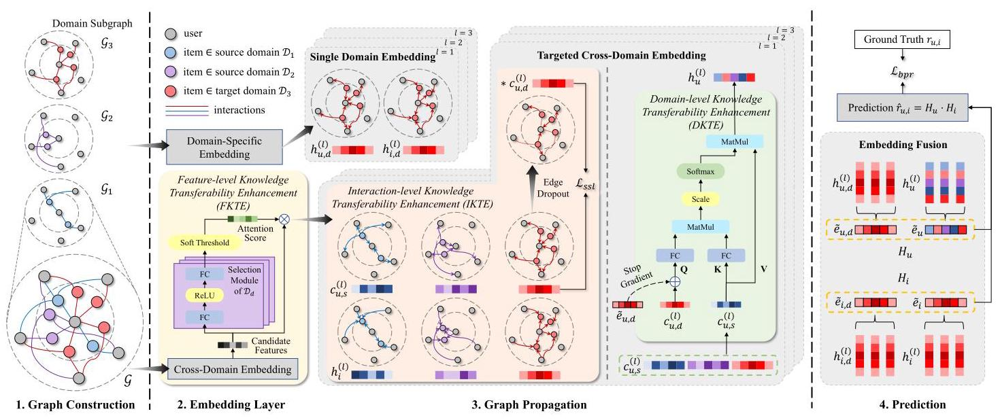
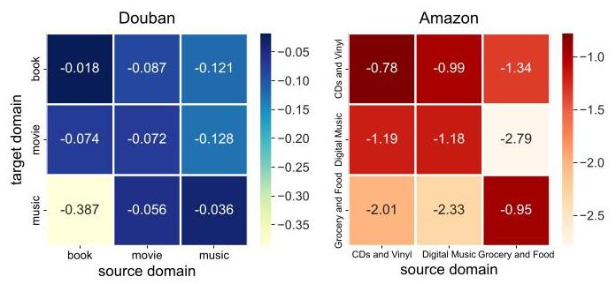
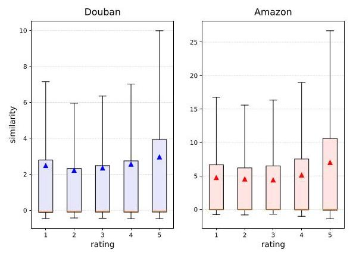
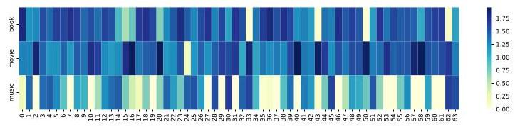

# Mitigating Negative Transfer in Cross-Domain Recommendation via Knowledge Transferability Enhancement

Zijian Song

School of CS, Peking University

Beijing, China

2201111590@stu.pku.edu.cn

Wenhan Zhang

School of CS, Peking University

Beijing, China

pku_zwh@pku.edu.cn

Lifang Deng

Lazada Group

Beijing, China

wanmei.dlf@alibaba-inc.com

Jiandong Zhang

Lazada Group

Beijing, China

chensong.zjd@alibaba-inc.com

Zhihua Wu

Lazada Group

Beijing, China

zhihua.wzh@lazada.com

Kaigui Bian

School of CS, Peking University

Beijing, China

bkg@pku.edu.cn

Bin Cui

School of CS, Peking University

Beijing, China

bin.cui@pku.edu.cn

## ABSTRACT

Cross-Domain Recommendation (CDR) is a promising technique to alleviate data sparsity by transferring knowledge across domains. However, the negative transfer issue in the presence of numerous domains has received limited attention. Most existing methods transfer all information from source domains to the target domain without distinction. This introduces harmful noise and irrelevant features, resulting in suboptimal performance. Although some methods decompose user features into domain-specific and domain-shared components, they fail to consider other causes of negative transfer. Worse still, we argue that simple feature decomposition is insufficient for multi-domain scenarios. To bridge this gap, we propose TrineCDR, the TRIple-level kNowledge transferability Enhanced model for multi-target CDR. Unlike previous methods, TrineCDR captures single domain and targeted cross-domain em-beddings to serve multi-domain recommendation. For the latter, we identify three fundamental causes of negative transfer, ranging from micro to macro perspectives, and correspondingly enhance knowledge transferability at three different levels: the feature level, the interaction level, and the domain level. Through these efforts, TrineCDR effectively filters out noise and irrelevant information from source domains, leading to more comprehensive and accurate representations in the target domain. We extensively evaluate the

proposed model on real-world datasets, sampled from Amazon and Douban, under both dual-target and multi-target scenarios. The experimental results demonstrate the superiority of TrineCDR over state-of-the-art cross-domain recommendation methods.

## CCS CONCEPTS

- Information systems \( \rightarrow \) Recommender systems; - Computing methodologies \( \rightarrow \) Transfer learning.

## KEYWORDS

Cross-Domain Recommendation, Multi-Target CDR, Negative Transfer, Contrastive Learning, Graph Neural Network

## ACM Reference Format:

Zijian Song, Wenhan Zhang, Lifang Deng, Jiandong Zhang, Zhihua Wu, Kaigui Bian, and Bin Cui. 2024. Mitigating Negative Transfer in Cross-Domain Recommendation via Knowledge Transferability Enhancement . In Proceedings of the 30th ACM SIGKDD Conference on Knowledge Discovery and Data Mining (KDD '24), August 25-29, 2024, Barcelona, Spain. ACM, New York, NY, USA, 10 pages. https://doi.org/10.1145/3637528.3671799

## 1 INTRODUCTION

To address data sparsity and cold-start problem in recommendation systems, researchers have proposed various cross-domain recommendation (CDR) methods that adapt information from rich source domains to the sparse target domain [37, 44]. However, in real-world scenarios, all domains may experience sparsity. Therefore, it is desirable to improve the performance of all domains simultaneously by leveraging knowledge from each other. In response to this need, numerous dual-target and multi-target CDR methods have been proposed in recent years.

Unfortunately, the effectiveness of these methods is not always guaranteed. In dual-target or multi-target CDR scenarios, the model performance in some target domains may even decline as auxiliary data from other domains, especially sparse domains, is introduced [44]. This phenomenon is known as negative transfer (NT), where the transferred knowledge negatively affects the recommendation in the target domain. This results in significant model performance degradation, which has been observed not only in our experiments, but also in numerous prior studies [13, 33, 41]. Previous researches in transfer learning have attributed NT to various causes \( \left\lbrack  {3,{23},{27}}\right\rbrack \) . Empirically, there are two primary approaches to address NT: maximizing the transfer of useful information and minimizing the transfer of harmful information. This necessitates a focus on knowledge transferability. Inspired by these facts, we examine every stage of knowledge transfer in CDR, and attribute NT to the following reasons, ranging from micro to macro levels (i.e., feature, instance, domain):

---

Zijian Song, Wenhan Zhang, Kaigui Bian, and Bin Cui are affiliated with School of CS, AI Innovation Center, National Engineering Laboratory for Big Data Analysis and Applications, Peking University. Lifang Deng, Jiandong Zhang, Zhihua Wu are affiliated with Lazada Group. Kaigui Bian is also affiliated with State Key Laboratory of Multimedia Information Processing, Peking University.

Permission to make digital or hard copies of all or part of this work for personal or classroom use is granted without fee provided that copies are not made or distributed for profit or commercial advantage and that copies bear this notice and the full citation on the first page. Copyrights for components of this work owned by others than the author(s) must be honored. Abstracting with credit is permitted. To copy otherwise, or republish, to post on servers or to redistribute to lists, requires prior specific permission and/or a fee. Request permissions from permissions@acm.org.

KDD '24, August 25-29, 2024, Barcelona, Spain

(c) 2024 Copyright held by the owner/author(s). Publication rights licensed to ACM. ACM ISBN 979-8-4007-0490-1/24/08

https://doi.org/10.1145/3637528.3671799

---

- Irrelevant Features. Some features may be useful in specific domains but irrelevant in others. An effective algorithm should possess the ability to select relevant features based on the target domain's requirement.

- Poor Source Domain Data Quality. The quality of transferred knowledge is determined by the quality of source domain data, i.e., the quality of interactions. This is particularly crucial when dealing with sparse source domains, as the transferred knowledge is prone to be severely influenced by noise interactions.

- Large Domain Divergence. The data distribution shift between the target and source domains is the root of NT [38]. Knowledge from less relevant source domains is more likely to cause NT.

Table 1: Compared to TrineCDR, existing methods did not comprehensively address negative transfer from all aspects.

<table><tr><td>Method</td><td>DeepAPF</td><td>GA-DTCDR</td><td>PPGN</td><td>BiTGCF</td><td>RL-ISN</td><td>DisenCDR</td></tr><tr><td>Feature</td><td>✓</td><td></td><td></td><td></td><td></td><td>✓</td></tr><tr><td>Instance</td><td></td><td></td><td></td><td></td><td>✓</td><td></td></tr><tr><td>Domain</td><td></td><td>✓</td><td></td><td></td><td></td><td></td></tr><tr><td colspan="7">Method GA-MTCDR-P HeroGRAPH CAT-ART MSDCR ReCDR TrineCDR</td></tr><tr><td>Feature</td><td></td><td>✓</td><td>✓</td><td>✓</td><td>✓</td><td>✓</td></tr><tr><td>Instance</td><td></td><td></td><td></td><td></td><td></td><td>✓</td></tr><tr><td>Domain</td><td>✓</td><td></td><td>✓</td><td></td><td></td><td>✓</td></tr></table>

As illustrated in Table 1, existing methods either neglect NT or fail to comprehensively consider its causes, which results in suboptimal performance. For instance, BiTGCF [17] introduce cross-connections between two domains for deep dual transfer; PPGN [40] constructs a heterogeneous graph including interactions from all domains to conduct graph propagation. These methods transfer information across domains without distinction between domain-specific and domain-shared factors. Consequently, irrelevant factors can be easily introduced into the target domain, leading to a reduction in model performance. Many methods like DeepAPF [35], Hero-GRAPH [5], MSDCR [41], and ReCDR [33] capture domain-specific and domain-shared representations, while only the domain-shared parts are transferred across domains. However, in a multi-domain scenario, the domain-shared feature selection criteria that can be shared across all domains is too stringent. For example, in Amazon dataset, the feature genre of domain CDs_and_Vinyl is useful for capturing user preferences in domain Digital_Music, but maybe irrelevant in domain Grocery_and_Gourmet_Food. Such features cannot be shared across all domains, and thus cannot be encoded into domain-shared embeddings. Consequently, they cannot be leveraged when Digital_Music is the target domain. Moreover, these methods do not address NT from more perspectives other than feature level. RL-ISN [8] attempts to filter out noise interactions using reinforcement learning but faces challenges in its application to multi-domain scenarios. GA-DTCDR [43] and CAT-ART [13] examine the domain transferability. They learn the weights for combining overlapping users' representations from different domains. However, the aggregation is shallow, and they still do not investigate NT from all aspects.

Previous methods are inadequate to handle a large number of domains. Researchers are facing two primary challenges: 1) the intricate resemblance and exclusion relationships among multiple domains render conventional feature decomposition ineffective; 2) various sources of NT make it hard to prevent. In this paper, we propose TrineCDR, a novel TRIple-level kNowledge transferability Enhanced model for multi-target CDR. First, we decompose em-beddings into single-domain and targeted cross-domain parts. The former captures domain-specific information. The latter captures only relevant information according to the target domain's requirement. In this way, we ingeniously bypass the modeling of complex relationships among numerous domains, and obtain more comprehensive features. Second, when calculating the targeted cross-domain embeddings, TrineCDR rigorously examines the knowledge transferability at every stage of knowledge transfer. From micro to macro levels, the triple-level Knowledge Transferability Enhancement (KTE) modules jointly prevent NT from occurring:

- Feature-Level Selection. We design a selection module to select and weight candidate features based on the target domain. In this way, we distill the most informative features for the subsequent procedures.

- Interaction-Level Filtering and Enhancement. we apply graph attention to filter out noise interactions and improve the quality of source domain data. Additionally, we design a contrastive self-supervised task to enhance the robustness of em-beddings against noise interactions. To be specific, we randomly discard interactions at a rate of \( \rho \) , and align the features before and after this edge dropout.

- Domain-Level Weighted Integration. We design a novel attention module to estimate the user preference transferability between domains. This allows us to conduct a weighted integration based on the transferability, blocking source domains with large divergence from the target domain.

Generally, the three levels of NT are intertwined, so we employ heterogeneous graph to separate them into three stages and optimize them individually. In conclusion, the contributions of this study can be summarized as follows:

- Unlike previous CDR methods, we propose to capture single domain and targeted cross-domain representations. This better feature decomposition acquires more comprehensive and accurate representations for the target domain.

- We identify three root causes of negative transfer in CDR: irrelevant features, noise interactions, and domain divergence. To the best of our knowledge, we are the first to introduce the NT mitigation theory from transfer learning field into CDR problem.

- We design KTE modules at three different levels. The Feature-level KTE (FKTE) module selects relevant features. The Interaction-level KTE (IKTE) module filters interactions and improve the embedding robustness against noise. The Domain-level KTE (DKTE) module estimates domain transferability. These designs effectively alleviate NT and significantly improve recommendation performance.

- We conduct extensive experiments on various real-world datasets, considering both dual-target and multi-target scenarios. The experimental results demonstrate the superiority of TrineCDR over state-of-the-art baselines. Additionally, our study illustrates the universality of NT in CDR.

## 2 PROBLEM DEFINITION

Assuming there exist \( S \) domains \( {\mathcal{D}}_{s}\left( {1 \leq  s \leq  S}\right) \) in the dataset. Each item \( i \) exclusively belongs to only one domain \( {\mathcal{D}}_{s} \) . The set of items in domain \( {\mathcal{D}}_{s} \) is denoted as \( {I}_{s} \) . Each \( i \) is associated with raw features \( {f}_{i} \in  {\mathbb{R}}^{{d}_{s}}.{d}_{s} \) is the dimensionality of raw features of items in \( {\mathcal{D}}_{s} \) , which may differ across domains. The domains share the same pool of users, even though some users may not have interactions in some domains. Each user \( u \in  \mathcal{U} \) is associated with raw features \( {f}_{u} \in  {\mathbb{R}}^{{d}_{U}}.{d}_{U} \) is the dimensionality of raw features of users. For simplicity, in this paper, we use one-hot raw features, but any auxiliary features can be easily introduced. Let \( {\mathcal{N}}_{u, s} = \; \left\{  {{i}_{u,1}^{\left( s\right) },{i}_{u,2}^{\left( s\right) },\cdots ,{i}_{u,{n}_{u, s}}^{\left( s\right) }}\right\} \) represent user \( u \) ’s \( {n}_{u, s} \) interacted items in domain \( {\mathcal{D}}_{s} \) . Then the objective is to find a function \( {F}_{s} \) for each domain \( {\mathcal{D}}_{s} \) to predict the probability \( {\widehat{r}}_{u, i} \) of user \( u \) interacting with item \( i \in  {I}_{s} \) , given all historical interactions.

## 3 METHODOLOGY

### 3.1 Model Overview

Figure 1 presents the overall architecture of TrineCDR. We propose a novel framework to conduct more effective feature decomposition, i.e. capturing single domain and targeted cross-domain embeddings simultaneously. After that, we combine these two embeddings to obtain final user/item embeddings.

- Single Domain Embedding. We calculate domain-specific features only for the target domain \( {\mathcal{D}}_{d} \) . Specifically, We apply graph attention (GAT) on the domain subgraph that contains only the target domain interactions.

- Targeted Cross-Domain Embedding. We construct a heterogeneous graph using interactions from all domains. Then we transfer knowledge with triple-level KTE modules. In the embedding layer, FKTE helps select relevant features. These features are then processed through multiple graph propagation layers. Each layer has an IKTE to filter noisy interactions and a DKTE to evaluate domain transferability for weighted integration.

- Model Training. We employed the multi-task learning paradigm, taking turns treating each domain as the target domain and training the entire model with its data. Alongside the BPR loss, we design an contrastive loss in the IKTE module to bolster feature robustness against noise interactions and further mitigate negative transfer.

### 3.2 Graph Construction

Following the widely adopted graph construction \( \left\lbrack  {{17},{24},{30}}\right\rbrack \) , with interaction data from all domains, we can construct a heterogeneous global graph \( \mathcal{G} = \langle \mathcal{V},\mathcal{E}\rangle \) . The node set \( \mathcal{V} = \mathcal{U} \cup  {I}_{1} \cup  {I}_{2} \cup  \cdots  \cup  {I}_{S} \) includes all users and items. The edge set \( \mathcal{E} = {\mathcal{E}}_{1} \cup  {\mathcal{E}}_{2} \cup  \cdots  \cup  {\mathcal{E}}_{S} \) comprises interactions from all domains, where \( {\mathcal{E}}_{s} \) denotes interactions from domain \( {\mathcal{D}}_{s} \) . Let \( \mathbf{R} \) denote the user-item interaction matrix. For an entry \( {r}_{ui} = 1 \) , which indicated that user \( u \) has interacted with item \( i \) , we establish an interaction edge between the corresponding user node \( u \) and item node \( i \) .

Depending on the domain to which the edges belong, \( \mathcal{G} \) can be decomposed into \( S \) domain subgraphs \( {\mathcal{G}}_{s} = \left\langle  {{\mathcal{V}}_{s},{\mathcal{E}}_{s}}\right\rangle  \left( {1 \leq  s \leq  S}\right) \) , where \( {\mathcal{V}}_{s} = \mathcal{U} \cup  {\mathcal{I}}_{s} \) .

### 3.3 Single Domain Embedding

To capture domain-specific embeddings, and to alleviate the adverse effects of data imbalance across domains, we first calculate the single domain embeddings on the target domain subgraph \( {\mathcal{D}}_{d} \) . We start by mapping the raw features \( {f}_{u} \) and \( {f}_{i} \) to latent embeddings: \( {\mathbf{h}}_{u, d}^{\left( 0\right) } = {\mathbf{E}}_{U, d}{\mathbf{f}}_{u},{\mathbf{h}}_{i, d}^{\left( 0\right) } = {\mathbf{E}}_{I, d}{\mathbf{f}}_{i} \) ; where \( {\mathbf{E}}_{U, d} \) and \( {\mathbf{E}}_{I, d} \) represents the learnable mapping matrix for domain \( {\mathcal{D}}_{d} \) .

To capture high-order relationships within the target domain, we feed these embeddings through GAT layers, denoted by:

\[
\left\{  {{\mathbf{h}}_{u, d}^{\left( l\right) },{\mathbf{h}}_{i, d}^{\left( l\right) }}\right\}   = \operatorname{GAT}\left( {{\mathbf{h}}_{u, d}^{\left( l - 1\right) },{\mathbf{h}}_{i, d}^{\left( l - 1\right) };{\mathcal{G}}_{d}}\right) ,\left( {1 \leq  l \leq  L}\right) ; \tag{1}
\]

where \( L \) is the number of graph propagation layers.

In each GAT layer, we first assign \( {\mathbf{h}}_{u, d}^{\left( l - 1\right) } \) and \( {\mathbf{h}}_{i, d}^{\left( l - 1\right) } \) to corresponding nodes, and conduct graph propagation on \( {\mathcal{G}}_{d} \) . Taking a user node \( u \) as an example, the detailed process is as follows:

\[
{\mathbf{h}}_{u, d}^{\left( l\right) } = \mathop{\sum }\limits_{{i \in  {\mathcal{N}}_{u, d}}}{\alpha }_{u, i}{\mathbf{h}}_{i, d}^{\left( l - 1\right) }
\]

\[
{\alpha }_{u, i} = \frac{\exp \left( {\phi \left( {{\mathbf{h}}_{u, d}^{\left( l - 1\right) },{\mathbf{h}}_{i, d}^{\left( l - 1\right) }}\right) }\right) }{\mathop{\sum }\limits_{{j \in  {\mathcal{N}}_{u, d}}}\exp \left( {\phi \left( {{\mathbf{h}}_{u, d}^{\left( l - 1\right) },{\mathbf{h}}_{j, d}^{\left( l - 1\right) }}\right) }\right) }, \tag{2}
\]

\[
\phi \left( {{\mathbf{h}}_{u, d},{\mathbf{h}}_{i, d}}\right)  = \operatorname{LeakyReLU}\left( {{\mathbf{a}}^{T}\left\lbrack  {\mathbf{W}{\mathbf{h}}_{u, d},\mathbf{W}{\mathbf{h}}_{i, d}}\right\rbrack  }\right) ;
\]

where \( \mathbf{a} \) and \( \mathbf{W} \) are trainable parameters of this layer, and \( {\mathcal{N}}_{u, d} \) is the set of \( u \) ’s interacted items in domain \( {\mathcal{D}}_{d} \) .

The final single domain embeddings are obtained by concatenation:

\[
{\widetilde{\mathbf{e}}}_{u, d} = \left\lbrack  {{\mathbf{h}}_{u, d}^{\left( 0\right) },\cdots ,{\mathbf{h}}_{u, d}^{\left( L\right) }}\right\rbrack  ,{\widetilde{\mathbf{e}}}_{i, d} = \left\lbrack  {{\mathbf{h}}_{i, d}^{\left( 0\right) },\cdots ,{\mathbf{h}}_{i, d}^{\left( L\right) }}\right\rbrack  . \tag{3}
\]

### 3.4 Feature-Level Knowledge Transferability Enhancement (FKTE)

Starting from this subsection, we present the process of targeted cross-domain embedding. The FKTE module is inspired by the intuition that different target domains should focus on different features. To mitigate the NT caused by irrelevant features, we select and weight candidate features.

First, we map the raw features to cross-domain features, which can be transferred to other domains: \( {z}_{u} = {E}_{U}{f}_{u},{z}_{i} = {E}_{I}{f}_{i} \) ; where \( {\mathbf{E}}_{U} \) and \( {\mathbf{E}}_{I} \) are learnable matrices. However, it is important to note that not all of these candidate features are relevant in the target domain. To identify and prioritize the most relevant features, we are inspired by SENet [12] as it has proven to be effective in weighting feature channels. We design a selection module to adaptively generate attention score for each feature dimension. Considering a node \( v \) , we calculate the targeted cross-domain features \( {\mathbf{h}}_{v}^{\left( 0\right) } \) as follows:

\[
{\mathbf{h}}_{v}^{\left( 0\right) } = \tau \left( {\operatorname{MLP}\left( {{\mathbf{z}}_{v};d}\right) }\right)  \odot  {\mathbf{z}}_{v}
\]

\[
\operatorname{MLP}\left( {{\mathbf{z}}_{v};d}\right)  = {\mathbf{M}}_{d1}\operatorname{ReLU}\left( {{\mathbf{M}}_{d2}{\mathbf{z}}_{v} + {\mathbf{b}}_{d2}}\right)  + {\mathbf{b}}_{d1}, \tag{4}
\]

\[
\tau \left( \mathbf{x}\right)  = \operatorname{sgn}\left( \mathbf{x}\right)  \odot  \max \left( {0,\operatorname{abs}\left( \mathbf{x}\right)  - \theta }\right) ;
\]

Figure 1: Overall architecture of TrineCDR. After graph construction, we separately capture single domain embeddings and targeted cross-domain embeddings. The former captures user/item representations within the target domain. The latter leverages data from all domains, incorporating the triple-level knowledge transferability enhancement (KTE) modules to mitigate negative transfer. Note that the target domain is denoted as \( {\mathcal{D}}_{d} \) . While training, we take turns treating each domain as the target domain.

where \( \odot \) denotes Hadamard product, \( {\mathbf{M}}_{d1},{\mathbf{M}}_{d2},{\mathbf{b}}_{d1},{\mathbf{b}}_{d2} \) are trainable parameters. \( \tau \) is the soft threshold widely used to filter out redundant information with hyper-parameter \( \theta \) . It sets dimensions with very small absolute values to 0 , mitigating the effects of noise.

### 3.5 Interaction-Level Knowledge Transferability Enhancement (IKTE)

During the graph propagation of targeted cross-domain embedding, multiple layers are involved, each containing an IKTE and a DKTE module. The \( l \) -th layer’s IKTE takes the output of the \( \left( {l - 1}\right) \) -th layer's DKTE as input.

The IKTE module is designed to mitigate negative transfer at the instance level. We first identify and filter out noise interactions that may severely harm sparse source data by estimating the likelihood of interactions based on node similarities. Specifically, we employ graph attention on the domain subgraphs to measure the similarities between connected nodes. In this process, lower weights are assigned to poorly matched nodes, while higher weights are assigned to confident interactions. After weighting interactions, we aggregate intra-domain information from neighbors:

\[
\left\{  {{\mathbf{c}}_{u, s}^{\left( l\right) },{\mathbf{h}}_{i}^{\left( l\right) }}\right\}   = \operatorname{GAT}\left( {{\mathbf{h}}_{u}^{\left( l - 1\right) },{\mathbf{h}}_{i}^{\left( l - 1\right) };{\mathcal{G}}_{s}}\right) \tag{5}
\]

where \( {c}_{u, s}^{\left( l\right) } \) is the user domain preference in domain \( {\mathcal{D}}_{s} \) . It represents the user's interests in that domain, and will be utilized to generate user embedding \( {\mathbf{h}}_{u}^{\left( l\right) } \) in the subsequent DKTE module.

To further reduce the impact of noise interactions, we conduct contrastive learning to improve representation robustness. We randomly remove edges on the target domain subgraph at a dropout rate \( \rho \) . By bringing the embeddings before and after the edge dropout closer together in the feature space, we extract more general representations which are robust against noise interactions. Intuitively, through this contrastive learning, adding a small amount of noise interactions to the training data will not have much negative impact on the final representations, because the representations before and after the random absence of a few interactions are similar.

Considering a mini-batch \( {\mathcal{T}}_{d} \) from the target domain \( {\mathcal{D}}_{d} \) , the contrastive loss is as follows:

\[
{\mathcal{L}}_{ssl} = \frac{1}{\left| {\mathcal{T}}_{d}\right| }\mathop{\sum }\limits_{{u \in  {\mathcal{T}}_{d}}} - \ln \frac{\exp \left( {\cos \left( {{\mathbf{c}}_{u}, * {\mathbf{c}}_{u}}\right) /t}\right) }{\mathop{\sum }\limits_{{v \in  {\mathcal{T}}_{d}}}\exp \left( {\cos \left( {{\mathbf{c}}_{u},{\mathbf{c}}_{v}}\right) /t}\right) } \tag{6}
\]

\[
- \ln \frac{\exp \left( {\cos \left( {{\mathbf{c}}_{u}, * {\mathbf{c}}_{u}}\right) /t}\right) }{\mathop{\sum }\limits_{{v \in  {\mathcal{T}}_{d}}}\exp \left( {\cos \left( {*{\mathbf{c}}_{u}, * {\mathbf{c}}_{v}}\right) /t}\right) };
\]

where \( t \) is the temperature hyper-parameter, cos is cosine distance. \( * {c}_{u} \) denotes \( * {c}_{u, d}^{\left( l\right) } \) , the user domain preference recalculated after the edge dropout. \( {c}_{u} \) denotes \( {c}_{u, d}^{\left( l\right) } \) .

### 3.6 Domain-Level Knowledge Transferability Enhancement (DKTE)

We claim that domain transferability varies among users. Therefore, we design the DKTE module to aggregate users' domain preference in a personalized manner. In existing transfer learning literature, an effective approach to mitigate negative transfer is selecting and weighting domains [38]. The Maximum Mean Discrepancy (MMD) paradigm is commonly used to assess domain similarity and assign appropriate weights accordingly. To be specific, MMD [7] calculates the mean of the kernel function for samples within each domain, treating it as the domain representation. Then, it measures domain similarity based on the Euclidean distance between domain representations.

Inspired by this, we innovatively regard the user domain preference \( {c}_{u, s}^{\left( l\right) } \) as the domain representation. This is motivated by the fact that, similar to MMD, the user domain preference can be seen as the weighted sum of samples' representations. Furthermore, we design a novel attention module to effectively aggregate these domain representations. Specifically, we incorporate the user domain preference in the target domain \( {\mathbf{c}}_{u, d}^{\left( l\right) } \) with the single domain embedding \( {\widetilde{\mathbf{e}}}_{u, d} \) to obtain the query vector \( {\mathbf{q}}_{u}^{\left( l\right) } \) , because the single domain embedding provides reliable target domain knowledge without threat of NT. The source domain preference \( {\mathbf{c}}_{u, s}^{\left( l\right) } \) is then utilized to obtain both key vectors \( {\mathbf{k}}_{u, s}^{\left( l\right) } \) and value vectors \( {\mathbf{v}}_{u, s}^{\left( l\right) } \) . The detailed process is described as follows:

\[
{\mathbf{h}}_{u}^{\left( l\right) } = \operatorname{softmax}\left( \frac{{\mathbf{q}}_{u}^{{\left( l\right) }^{T}}{\mathbf{K}}_{u}^{\left( l\right) }}{\sqrt{\dim \left( \mathbf{q}\right) }}\right) {\mathbf{V}}_{u}^{\left( l\right) },
\]

\[
{\mathbf{q}}_{u}^{\left( l\right) } = {\mathbf{W}}_{Q}{}^{\left( l\right) }\left( {{\mathbf{c}}_{u, d}^{\left( l\right) } \oplus  {\widetilde{\mathbf{e}}}_{u, d}}\right) , \tag{7}
\]

\[
{K}_{u}^{\left( l\right) } = {W}_{K}{}^{\left( l\right) }{V}_{u}^{\left( l\right) },
\]

\[
{\mathbf{V}}_{u}^{\left( l\right) } = \left\lbrack  {{c}_{u,1}^{\left( l\right) },{c}_{u,2}^{\left( l\right) },\cdots ,{c}_{u, S}^{\left( l\right) }}\right\rbrack  ;
\]

where \( \dim \left( \mathbf{q}\right) \) denotes the dimensionality of query vector \( {\mathbf{q}}_{u}^{\left( l\right) } \) , and \( {W}_{Q}{}^{\left( l\right) },{W}_{K}{}^{\left( l\right) } \) are learnable attention parameters in the \( l \) -th layer. \( \oplus \) can represent various fusion operations. In this paper, we employ vector addition for simplicity.

### 3.7 Objective and Model Optimization

After multiple layers of global graph propagation, the final targeted cross-domain embeddings can be obtained by concatenating outputs from all layers:

\[
{\widetilde{\mathbf{e}}}_{u} = \left\lbrack  {{\mathbf{h}}_{u}^{\left( 0\right) },\cdots ,{\mathbf{h}}_{u}^{\left( L\right) }}\right\rbrack  ,{\widetilde{\mathbf{e}}}_{i} = \left\lbrack  {{\mathbf{h}}_{i}^{\left( 0\right) },\cdots ,{\mathbf{h}}_{i}^{\left( L\right) }}\right\rbrack  . \tag{8}
\]

Now we have two embeddings containing target domain information and cross-domain information respectively for each node. In the embedding fusion layer, we combine these embeddings simply by concatenation:

\[
{\mathbf{H}}_{u} = \left\lbrack  {{\widetilde{\mathbf{e}}}_{u},{\widetilde{\mathbf{e}}}_{u, d}}\right\rbrack  ,{\mathbf{H}}_{i} = \left\lbrack  {{\widetilde{\mathbf{e}}}_{i},{\widetilde{\mathbf{e}}}_{i, d}}\right\rbrack  . \tag{9}
\]

Finally, in the prediction layer, we rank the recommended items using Bayesian Personalized Ranking (BPR). The predicted rating \( {\widehat{r}}_{u, i} \) for user \( u \) on item \( i \) is computed using the inner product \( {\mathbf{H}}_{u}^{T}{\mathbf{H}}_{i} \) .

We employ the BPR loss for model optimization. The final loss function for the target domain \( {\mathcal{D}}_{d} \) is defined as follows:

\[
{\mathcal{L}}_{d}\left( \Theta \right)  = \frac{1}{\left| {\mathcal{T}}_{d}\right| }\mathop{\sum }\limits_{{\left\langle  {u,{i}^{ + },{i}^{ - }}\right\rangle   \in  {\mathcal{T}}_{d}}} - \ln \sigma \left( {{\widehat{r}}_{u,{i}^{ + }} - {\widehat{r}}_{u,{i}^{ - }}}\right)  + {\mathcal{L}}_{ssl} + {\lambda }_{d}\parallel \Theta {\parallel }_{2}
\]

(10)

where \( \sigma \) is sigmoid, and \( {\mathcal{T}}_{d} = \left\{  \left\langle  {u,{i}^{ + },{i}^{ - }}\right\rangle  \right\} \) is a training mini-batch. During training, we sample several negative items for each positive interaction. \( \left\langle  {u,{i}^{ + }}\right\rangle \) is a positive interaction, and \( \left\langle  {u,{i}^{ - }}\right\rangle \) is a non-existing interaction. Essentially, user \( u \) expresses a preference for item \( {i}^{ + } \) over item \( {i}^{ - } \) . To control model complexity, a regularizer \( {\lambda }_{d}\parallel \Theta {\parallel }_{2} \) is applied. The coefficient \( {\lambda }_{d} \) varies across domains due to differences in data density resulting in varying optimal regularization strengths to prevent overfitting.

To serve as a multi-target CDR model, we adopt a multi-task framework where the model is trained alternately using a data batch from each domain. The pseudocode of TrineCDR's training algorithm is presented in Algorithm 1 for better understanding.

Algorithm 1: The Training Algorithm of TrineCDR

---

Data: global graph \( \mathcal{G} \) , domain subgraphs \( {\mathcal{G}}_{s} \) , ground-truth

		labels \( {r}_{ui} \)

Result: well trained model for all domains

while not converge do

	for \( d = 1 \) to \( S \) do

			\( //{\mathcal{D}}_{d} \) as the target domain

			Sample a batch \( {\mathcal{T}}_{d} = \left\{  \left( {u,{i}^{ + },{i}^{ - }}\right) \right\} \) from domain \( {\mathcal{D}}_{d} \) ;

			// Single-Domain Embeddings

			Calculate \( {\widetilde{\mathbf{e}}}_{u, d},{\widetilde{\mathbf{e}}}_{i, d} \) via Eq. (1)-(3);

			// Targeted Cross-Domain Embeddings

			FKTE calculates \( {\mathbf{h}}^{\left( 0\right) } \) via Eq. (4);

			for \( l = 1 \) to \( L \) do

				IKTE calculates item representation \( {\mathbf{h}}_{i}^{\left( l\right) } \) and

				user embedding component \( {\mathbf{c}}_{u, s}^{\left( l\right) } \) via Eq. (5);

				DKTE calculates \( {\mathbf{h}}_{u}^{\left( l\right) } \) via Eq. (7);

				// Contrastive Learning

				Get \( * {\mathcal{G}}_{d} \) via Edge Dropout on \( {\mathcal{G}}_{d} \) ;

				Calculate \( * {c}_{u, d}^{\left( l\right) } \) on \( * \mathcal{G}\left( {\mathcal{D}}_{d}\right) \) ;

				Calculate \( {\mathcal{L}}_{ssl} \) via Eq. (6);

			end

			Calculate \( {\widetilde{\mathbf{e}}}_{u},{\widetilde{\mathbf{e}}}_{i} \) via Eq. (8);

			// Backpropagation

			Calculate final embedding \( H \) via Eq. (9);

			Calculate loss via Eq. (10);

			Gradient calculation and parameter update;

	end

end

---

## 4 EXPERIMENTS

### 4.1 Experimental Settings

4.1.1 Datasets. We conduct extensive and comprehensive experiments under both dual-target and multi-target scenarios drawn from real-world datasets Amazon [19] and Douban [42]. The dataset descriptions are given below, and the detailed statistics of sampled datasets are shown in Table 2.

- Amazon 5-core is a dense subset from Amazon website in which each user and item has at least 5 related records. It has dozens of domains, so we sample 5-domain and 7-domain dataset from it to further investigate negative transfer as the number of domains increases. While sampling domains from Amazon 5-core, the varying degrees of domain correlations are taken into account. These datasets contain several domain groups, where each group contains highly related domains, but domains from different groups are less related. For example, dataset 6 has 4 groups: (CD, Music), (Food), (Phone, Electronics), and (Clothing, Luxury). This conforms to the data distribution in real-world scenarios. Only user ID, item ID, domain ID, and ratings are used.

- Douban is crawled from Douban website and only users are overlapped in three domains. Only user ID, item ID, domain ID, and ratings are used.

We sample two datasets for dual-target CDR. One includes domains CDs_and_Vinyl and Digital_Music from Amazon. The other includes book and movie from Douban. We extract only overlapping users (i.e. users have interactions in every domain), because most dual-target CDR methods are based on the assumption that users fully overlap.

We also sample two datasets for multi-target CDR. One includes CD, Music, and an irrelevant domain Grocery_and_Gourmet_Food from Amazon to evaluate the model performance in the presence of less related domains. One includes book, movie, and music from Douban. Since the assumption of user fully overlapping is hard to satisfy in practice, especially in multi-domain scenarios, we do not extract overlapping users.

Furthermore, we sample datasets with 5 and 7 domains from Amazon to further investigate negative transfer as the number of domains increases. For the same reason, we do not extract overlapping users, either.

To ensure the timeliness of captured user preferences, we extract entries with relatively recent timestamps. Users and items with less than 5 interactions are excluded. This data filtering is widely adopted \( \left\lbrack  {5,{33}}\right\rbrack \) . Interactions rated from 1 to 5 are included as positive samples, because we acknowledge the existence of noise samples that may not accurately reflect users' preferences. Similar to the leave-one-out principle applied in previous studies [33, 41], we use the last one interaction of each user for validation and test, while the others are used for training. Specifically, we randomly select half of users, allocating their last interaction to the validation set, and the other half of users to the test set. For efficiency, We sample only one negative item for each positive interaction in each epoch.

4.1.2 Evaluation Metrics. We utilize Hit Ratio (HR) and Normalized Cumulative Gain (NDCG) as the evaluation metrics, as they are widely adopted by existing studies \( \left\lbrack  {{33},{40},{41}}\right\rbrack \) . Specifically, we rank a positive item among 99 randomly sampled negative items. HR@K measures whether the positive item is in the top- \( K \) items. NDCG@K further considers the position of the hit, assigning higher score to higher rank. In this paper, we set \( K \) to 5 .

Table 2: Statistics of Sampled Datasets.

<table><tr><td>Dataset</td><td>Domain</td><td>#Users</td><td>#Items</td><td>#Ratings</td><td>Density</td></tr><tr><td rowspan="2">1</td><td>CD</td><td>2566</td><td>10758</td><td>35789</td><td>0.130%</td></tr><tr><td>Music</td><td>2566</td><td>4064</td><td>17999</td><td>0.173%</td></tr><tr><td rowspan="2">2</td><td>book</td><td>1919</td><td>6777</td><td>67304</td><td>0.037%</td></tr><tr><td>movie</td><td>1919</td><td>34893</td><td>157965</td><td>0.236%</td></tr><tr><td rowspan="3">3</td><td>CD</td><td>8123</td><td>5535</td><td>64685</td><td>0.145%</td></tr><tr><td>Music</td><td>5550</td><td>4268</td><td>49452</td><td>0.209%</td></tr><tr><td>Food</td><td>10916</td><td>4509</td><td>75350</td><td>0.153%</td></tr><tr><td rowspan="3">4</td><td>book</td><td>2026</td><td>6777</td><td>67398</td><td>0.035%</td></tr><tr><td>movie</td><td>2508</td><td>34893</td><td>207163</td><td>0.237%</td></tr><tr><td>music</td><td>1611</td><td>5567</td><td>51874</td><td>0.040%</td></tr><tr><td rowspan="5">5</td><td>CD</td><td>2408</td><td>1537</td><td>14477</td><td>0.391%</td></tr><tr><td>Music</td><td>2107</td><td>1610</td><td>15613</td><td>0.460%</td></tr><tr><td>Food</td><td>18543</td><td>7342</td><td>127111</td><td>0.093%</td></tr><tr><td>Phone</td><td>6407</td><td>1734</td><td>23581</td><td>0.212%</td></tr><tr><td>Electronics</td><td>11462</td><td>3548</td><td>50164</td><td>0.123%</td></tr><tr><td rowspan="7">6</td><td>CD</td><td>2080</td><td>1265</td><td>11624</td><td>0.442%</td></tr><tr><td>Music</td><td>1876</td><td>1399</td><td>13428</td><td>0.512%</td></tr><tr><td>Food</td><td>14635</td><td>5306</td><td>90079</td><td>0.116%</td></tr><tr><td>Phone</td><td>4875</td><td>1142</td><td>14953</td><td>0.269%</td></tr><tr><td>Electronics</td><td>9914</td><td>2821</td><td>38683</td><td>0.138%</td></tr><tr><td>Clothing</td><td>15141</td><td>3349</td><td>96042</td><td>0.189%</td></tr><tr><td>Luxury</td><td>1231</td><td>443</td><td>9256</td><td>1.697%</td></tr></table>

4.1.3 Baseline Methods. We compare TrineCDR with various baseline models, including single-domain methods, dual-target CDR method, and multi-domain CDR methods.

## Single Domain Methods

- BPRMF [21] factorizes feedback matrix into product of user and item latent embedding matrices.

- NeuMF [10] combines the results from linear matrix factorization and non-linear MLP to improve recommendation performance.

- LightGCN [9] is a GNN-based single domain recommendation method. It is a extension of NGCF [25], devising a linear propagating encoder to learn representations.

## Dual-target CDR Methods

- DeepAPF [35] initializes user embeddings into shared and site-specific parts, and fuses them with attention mechanism. We extend it for multi-target scenarios.

- GA-DTCDR [43] uses Node2Vec to generate embeddings in each domain and employs element-wise attention mechanism to combine these representations of overlapping users.

- BiTGCF [17] is a GNN-based extension of CoNet. It constructs a user-item bipartite graph in each domain and employs GCN layers for deep dual knowledge transfer.

- DisenCDR [4] proposes two mutual-information-based disentanglement regularizers to disentangle the domain-shared and domain-specific information.

## Multi-target CDR Methods

- GA-MTCDR-P [45] is the multi-target extension of GA-DTCDR. It learns attention scores between each pair of domains.

- HeroGRAPH [5] learns local embeddings within each domain, and constructs a heterogeneous graph using interactions from all domains to capture domain-shared embeddings.

- ReCDR [33] is a extension of HeroGRAPH. On the global graph, it introduces additional edges based on the similarity of nodes. Then it leverages a hierarchical attention mechanism to capture domain-shared embeddings.

- CAT-ART [13] initializes domain-specific representations with BPRMF and transfers them with attention mechanism. It uses a contrastive autoencoder for domain-invariant embeddings.

4.1.4 Hyper-parameter Settings. All hyper-parameters were tuned on the validation sets. We set the embedding dimensionality of all models to 64 for fairness. The graph propagation consists of 2 layers, and the dimensionality of all hidden layers is 64 . Soft threshold \( \theta  = {0.1} \) . Learning rate \( {lr} \in  \{ {5e} - 3,{1e} - 3,{5e} - 4\} \) . Regularization coefficient \( \lambda  \in  \{ {0.1},{0.05},{0.01}\} \) . Temperature \( t \in  \{ {0.1},{0.05},{0.01}\} \) . Dropout rate \( \rho  = {0.1} \) . We use Adam optimizer with default settings, early stopping when the average HR@5 and NDCG@5 scores on the validation set no longer increase for 30 epochs. We employ different batch sizes for each domain to ensure an equal batch number per epoch for every domain.

### 4.2 Performance Comparison

We compare the performance of TrineCDR with baselines on real-world datasets Amazon and Douban. The overall results are shown in Table 3 for dual-target CDR and Table 5 for multi-target CDR. Some dual-target methods either necessitate full user overlapping or cannot be adapted to multi-domain scenarios, rendering them unsuitable for participation in multi-domain experiments. As shown in the experimental results, TrineCDR significantly outperforms baselines under all circumstances.

Table 3: Overall performance (in HR@5 and NDCG@5) of TrineCDR and baselines on 2-domain datasets. \( \downarrow \) denotes negative transfer compared with single domain methods. Boldface and underline denotes the best and the second-best results. \( \star \) denotes significance level \( p \) -value \( < {0.05} \) of comparing TrineCDR over the best baselines.

<table><tr><td rowspan="2">Domain</td><td colspan="4">Amazon</td><td colspan="4">Douban</td></tr><tr><td colspan="2">CD</td><td colspan="2">Music</td><td colspan="2">book</td><td colspan="2">movie</td></tr><tr><td>Metric</td><td>HR</td><td>NDCG</td><td>HR</td><td>NDCG</td><td>HR</td><td>NDCG</td><td>HR</td><td>NDCG</td></tr><tr><td>BPRMF</td><td>0.322</td><td>0.245</td><td>0.464</td><td>0.393</td><td>0.258</td><td>0.180</td><td>0.492</td><td>0.350</td></tr><tr><td>NeuMF</td><td>0.285</td><td>0.209</td><td>0.440</td><td>0.353</td><td>0.280</td><td>0.187</td><td>0.516</td><td>0.360</td></tr><tr><td>LightGCN</td><td>0.350</td><td>0.257</td><td>0.494</td><td>0.399</td><td>0.273</td><td>0.188</td><td>0.512</td><td>0.360</td></tr><tr><td>DeepAPF</td><td>0.292</td><td>0.211</td><td>0.443</td><td>0.355</td><td>0.257</td><td>0.177</td><td>0.517</td><td>0.371</td></tr><tr><td>GA-DTCDR</td><td>0.308</td><td>0.204</td><td>0.420</td><td>0.305</td><td>0.247</td><td>0.177</td><td>0.484</td><td>0.344</td></tr><tr><td>BiTGCF</td><td>0.362</td><td>0.264</td><td>0.509</td><td>0.400</td><td>0.262</td><td>0.169↓</td><td>0.483</td><td>0.329↓</td></tr><tr><td>DisenCDR</td><td>0.365</td><td>0.268</td><td>0.512</td><td>0.405</td><td>0.288</td><td>0.186↓</td><td>0.527</td><td>0.352</td></tr><tr><td>HeroGRAPH</td><td>0.345</td><td>0.260</td><td>0.506</td><td>0.424</td><td>0.271</td><td>0.191</td><td>0.518</td><td>0.368</td></tr><tr><td>CAT-ART *</td><td>0.357</td><td>0.264</td><td>0.512</td><td>0.423</td><td>0.278</td><td>0.194</td><td>0.519</td><td>0.366</td></tr><tr><td>ReCDR</td><td>0.361</td><td>0.271</td><td>0.505</td><td>0.415</td><td>0.296</td><td>0.202</td><td>0.532</td><td>0.379</td></tr><tr><td>Ours</td><td>0.374*</td><td>0.287*</td><td>0.523*</td><td>0.437*</td><td>0.302*</td><td>0.218*</td><td>0.550*</td><td>0.397*</td></tr></table>

It is noteworthy that most CDR baselines suffer from negative transfer comparing to the best single domain method. It is not only observed in our experiments, but also raised by many existing studies [33, 41]. However, prior studies do not attribute this to the models' inadequate handling of specific NT causes. Deep-APF, DisenCDR, and HeroGRAPH employ feature decomposition. GA-DTCDR and CAT-ART employ weighted domain aggregation. However, they all do not address NT comprehensively. BiTGCF is one of the top-performing models on the first dataset, but transferring all information indiscriminately results in severe NT on the sparser dataset. ReCDR enhances knowledge transfer by adding extra edges, but does not have a mechanism for knowledge filtering when calculating global embeddings.

By contrast, TrineCDR mitigates NT by employing the triple-level KTE modules to capture comprehensive features and filter irrelevant information. It also conducts a novel feature decomposition for more comprehensive representations. The results demonstrate that existing methods are insufficient in handling NT, and underscore the superiority of our proposed model.

### 4.3 Ablation Study

We conduct ablation experiments on the multi-domain scenario Book-Movie-Music sampled from Douban dataset to check the effectiveness of core components of TrineCDR. As shown in Table 4, We compare the original model with six variants: TrineCDR-w/o-Feat has no FKTE modules; TrineCDR-w/o-Int replaces IKTE modules with mean-pooling GCN layers; TrineCDR-w/o-Dom replaces DKTE modules with mean-pooling; TrineCDR-w/o-CL does not use contrastive loss; TrineCDR-Cross uses only targeted cross-domain embeddings; TrineCDR-Single uses only single domain embeddings.

Table 4: Ablation Study. The first part replaces the knowledge transferability enhancement modules. The second part uses only a part of embeddings. * denotes significance level \( p < \) 0.05 comparing TrineCDR over the variant.

<table><tr><td>Domain</td><td colspan="2">Book</td><td colspan="2">Movie</td><td colspan="2">Music</td></tr><tr><td>Metric</td><td>HR</td><td>NDCG</td><td>HR</td><td>NDCG</td><td>HR</td><td>NDCG</td></tr><tr><td>TrineCDR-w/o-Feat</td><td>0.280</td><td>0.197</td><td>0.571*</td><td>\( {0.402}^{ \star  } \)</td><td>0.299*</td><td>0.210*</td></tr><tr><td>TrineCDR-w/o-Int</td><td>0.269*</td><td>0.185*</td><td>0.528*↓</td><td>\( {0.377}^{ \star  } \)</td><td>0.272*↓</td><td>0.182*↓</td></tr><tr><td>TrineCDR-w/o-Dom</td><td>0.265*</td><td>0.188*</td><td>0.530*↓</td><td>\( {0.396}^{ \star  } \)</td><td>0.263*↓</td><td>0.174*↓</td></tr><tr><td>TrineCDR-w/o-CL</td><td>0.276*</td><td>0.191*</td><td>0.577*</td><td>\( {0.398}^{ \star  } \)</td><td>0.285*</td><td>0.195*</td></tr><tr><td>TrineCDR-Cross</td><td>0.260*↓</td><td>0.183*↓</td><td>\( {0.512}^{ \star  } \downarrow \)</td><td>0.363*↓</td><td>0.261*↓</td><td>0.181*↓</td></tr><tr><td>TrineCDR-Single</td><td>0.255*↓</td><td>0.179*↓</td><td>\( {0.541}^{ \star  } \downarrow \)</td><td>0.386*↓</td><td>0.263*↓</td><td>0.184*</td></tr><tr><td>TrineCDR</td><td>0.281</td><td>0.197</td><td>0.596</td><td>0.430</td><td>0.307</td><td>0.215</td></tr></table>

TrineCDR significantly outperforms TrineCDR-w/o-Int, TrineCDR-w/o-Dom and TrineCDR-w/o-CL in all domains, with average improvements of 11.48%, 11.22%, and 5.71%. Moreover, the variants suffer from NT. These results indicate that both the IKTE and DKTE modules play crucial roles in mitigating NT.

Figure 2 shows the average transferability scores \( {\mathbf{q}}^{T}\mathbf{k}/\sqrt{\dim \left( \mathbf{q}\right) } \) between source and target domains, which are generated by the DKTE module. There is an evident pattern that high scores are assigned to related domains (e.g. book \( \rightarrow \) movie), while low scores are assigned to irrelevant domains (e.g. Grocery_and_Gourmet_Food \( \rightarrow \) Digital_Music).

Table 5: Overall performance of TrineCDR and baseline methods on multi-domain datasets. \( \dagger \) denotes the multi-target adaptation. * denotes the adaptation when users non-fully overlap.

<table><tr><td rowspan="2">Domain</td><td colspan="6">Amazon</td><td colspan="6">Douban</td></tr><tr><td colspan="2">CD</td><td colspan="2">Music</td><td colspan="2">Food</td><td colspan="2">book</td><td colspan="2">movie</td><td colspan="2">music</td></tr><tr><td>Metric</td><td>HR</td><td>NDCG</td><td>HR</td><td>NDCG</td><td>HR</td><td>NDCG</td><td>HR</td><td>NDCG</td><td>HR</td><td>NDCG</td><td>HR</td><td>NDCG</td></tr><tr><td>BPRMF</td><td>0.466</td><td>0.365</td><td>0.528</td><td>0.449</td><td>0.498</td><td>0.426</td><td>0.253</td><td>0.173</td><td>0.553</td><td>0.391</td><td>0.278</td><td>0.183</td></tr><tr><td>NeuMF</td><td>0.457</td><td>0.358</td><td>0.535</td><td>0.450</td><td>0.493</td><td>0.418</td><td>0.261</td><td>0.175</td><td>0.556</td><td>0.394</td><td>0.252</td><td>0.169</td></tr><tr><td>LightGCN</td><td>0.487</td><td>0.390</td><td>0.567</td><td>0.469</td><td>0.512</td><td>0.418</td><td>0.265</td><td>0.185</td><td>0.560</td><td>0.394</td><td>0.276</td><td>0.185</td></tr><tr><td>DeepAPF †</td><td>0.445↓</td><td>0.343</td><td>0.523</td><td>0.431</td><td>0.501</td><td>0.425</td><td>0.262</td><td>0.177</td><td>0.525</td><td>0.379</td><td>0.237</td><td>0.165</td></tr><tr><td>HeroGRAPH</td><td>0.497</td><td>0.381</td><td>0.548</td><td>0.464</td><td>0.514</td><td>0.439</td><td>0.272</td><td>0.186</td><td>0.548</td><td>0.397</td><td>0.255</td><td>0.161</td></tr><tr><td>GA-MTCDR-P</td><td>0.455↓</td><td>0.320</td><td>0.467</td><td>0.333</td><td>0.481</td><td>0.375</td><td>0.243</td><td>0.160</td><td>0.547</td><td>0.385</td><td>0.237</td><td>0.149</td></tr><tr><td>CAT-ART *</td><td>0.510</td><td>0.409</td><td>0.566↓</td><td>0.475</td><td>0.522</td><td>0.441</td><td>0.260</td><td>0.184</td><td>0.562</td><td>0.402</td><td>0.278</td><td>0.187</td></tr><tr><td>ReCDR</td><td>0.507</td><td>0.408</td><td>0.572</td><td>0.481</td><td>0.519</td><td>0.446</td><td>0.267</td><td>0.187</td><td>0.567</td><td>0.400</td><td>0.288</td><td>0.193</td></tr><tr><td>Ours</td><td>0.533*</td><td>0.423*</td><td>0.579*</td><td>0.485</td><td>0.542*</td><td>0.461*</td><td>0.281*</td><td>0.197*</td><td>0.596*</td><td>0.430 *</td><td>0.307*</td><td>0.215*</td></tr></table>

Figure 2: Average transferability scores on the test sets. The visualization results reveal the pattern of higher scores for more relevant domains.

Additionally, Figure 3 shows the relationships between the similarity scores \( \phi \left( {{\mathbf{h}}_{u},{\mathbf{h}}_{i}}\right) \) generated by the IKTE module and the ground-truth ratings. Despite the absence of any rating-related information in the training data, a clear correlation is observed between higher scores and higher ratings. Furthermore, interactions with rating 1 receive slightly more attention as they express strongly negative preferences.

Figure 3: Similarity score distributions of rated interactions. \( \Delta \) is the mean value. There is an obvious pattern that informative ratings are tend to be associated with higher scores.

Regarding the FKTE module, TrineCDR outperforms TrineCDR-w/o-Feat significantly in domains movie and music with average improvement of \( {3.91}\% \) , while their performance is similar in the domain book. Figure 4 shows the average feature weights outputted by the FKTE module. Different domains exhibit distinct selectivity patterns: the domain music has more zero weights to filter out these features; the domain movie assigns more large weights (greater than 1) to emphasize corresponding features; the weights in the domain book are relatively smooth, resulting in less noticeable effects from the FKTE module.

Figure 4: Average feature weights of Book-Movie-Music scenario. Each domain exhibits a distinct selective pattern.

The other two experiments highlight the advantage of proposed novel feature decomposition framework. TrineCDR achieves average improvements of \( {12.51}\% \) and 11.10% over TrineCDR-Cross and TrineCDR-Single. These results indicate that this novel feature decomposition enables the model to obtain more comprehensive and accurate representations, effectively addressing NT.

### 4.4 Negative Transfer

To further showcase TrineCDR's excellence in mitigating NT and reveal the universality of NT, we conduct additional experiments using datasets containing 5 and 7 domains, as presented in Table 6 and Table 7, respectively. As we increase the number of domains from 3 to 5 and then to 7 , CAT-ART exhibits NT in a growing number of domains. Even in domains where NT originally did not occur, such as Digital_Music, as more domains are introduced, negative transfer also occurs. Similarly, ReCDR, which does not initially exhibit negative transfer in 3-domain datasets, encountered increasingly severe negative transfer issues.

In contrast, TrineCDR consistently maintains significantly superior performance compared to single-domain methods and other sota CDR methods. This compelling comparison unequivocally validates the effectiveness of TrineCDR in mitigating NT, particularly in scenarios involving a higher number of domains.

Table 6: Performance comparison in the 5-domain scenario.

<table><tr><td>Domain</td><td colspan="2">CD</td><td colspan="2">Music</td><td colspan="2">Food</td><td colspan="2">Phone</td><td colspan="2">Electronics</td></tr><tr><td>Metric</td><td>HR</td><td>NDCG</td><td>HR</td><td>NDCG</td><td>HR</td><td>NDCG</td><td>HR</td><td>NDCG</td><td>HR</td><td>NDCG</td></tr><tr><td>BPRMF</td><td>0.407</td><td>0.325</td><td>0.504</td><td>0.429</td><td>0.502</td><td>0.428</td><td>0.393</td><td>0.311</td><td>0.332</td><td>0.270</td></tr><tr><td>NeuMF</td><td>0.378</td><td>0.303</td><td>0.487</td><td>0.407</td><td>0.490</td><td>0.399</td><td>0.355</td><td>0.288</td><td>0.374</td><td>0.285</td></tr><tr><td>LightGCN</td><td>0.421</td><td>0.312</td><td>0.517</td><td>0.438</td><td>0.508</td><td>0.428</td><td>0.389</td><td>0.307</td><td>0.381</td><td>0.289</td></tr><tr><td>CAT-ART</td><td>0.398</td><td>0.325</td><td>0.514</td><td>0.440</td><td>0.509</td><td>0.431</td><td>0.393</td><td>0.303</td><td>0.326</td><td>0.268↓</td></tr><tr><td>ReCDR</td><td>0.427</td><td>0.335</td><td>0.523</td><td>0.437</td><td>0.513</td><td>0.434</td><td>0.386↓</td><td>0.307</td><td>0.349↓</td><td>0.283↓</td></tr><tr><td>Ours</td><td>0.436*</td><td>0.347*</td><td>0.519</td><td>0.445</td><td>0.533*</td><td>0.451 *</td><td>0.402*</td><td>0.321*</td><td>0.391*</td><td>0.298*</td></tr></table>

Table 7: Performance comparison in the 7-domain scenario.

<table><tr><td>Domain</td><td colspan="2">CD</td><td colspan="2">Music</td><td colspan="2">Food</td><td colspan="2">Phone</td><td colspan="2">Electronic</td><td colspan="2">Clothing</td><td colspan="2">Luxury</td></tr><tr><td>Metric</td><td>HR</td><td>NDCG</td><td>HR</td><td>NDCG</td><td>HR</td><td>NDCG</td><td>HR</td><td>NDCG</td><td>HR</td><td>NDCG</td><td>HR</td><td>NDCG</td><td>HR</td><td>NDCG</td></tr><tr><td>BPRMF</td><td>0.406</td><td>0.324</td><td>0.499</td><td>0.433</td><td>0.501</td><td>0.431</td><td>0.406</td><td>0.319</td><td>0.308</td><td>0.253</td><td>0.794</td><td>0.760</td><td>0.371</td><td>0.345</td></tr><tr><td>NeuMF</td><td>0.399</td><td>0.294</td><td>0.470</td><td>0.398</td><td>0.497</td><td>0.413</td><td>0.421</td><td>0.330</td><td>0.354</td><td>0.270</td><td>0.772</td><td>0.726</td><td>0.403</td><td>0.358</td></tr><tr><td>LightGCN</td><td>0.419</td><td>0.310</td><td>0.521</td><td>0.440</td><td>0.506</td><td>0.434</td><td>0.404</td><td>0.321</td><td>0.355</td><td>0.263</td><td>0.798</td><td>0.760</td><td>0.418</td><td>0.372</td></tr><tr><td>CAT-ART</td><td>0.403↓</td><td>0.317</td><td>0.496</td><td>0.435</td><td>0.509</td><td>0.436</td><td>0.412</td><td>0.327↓</td><td>0.328</td><td>0.266</td><td>0.794</td><td>0.761</td><td>0.388</td><td>0.348</td></tr><tr><td>ReCDR</td><td>0.420</td><td>0.325</td><td>0.507</td><td>0.432</td><td>0.532</td><td>0.457</td><td>0.418</td><td>0.327↓</td><td>0.347</td><td>0.282</td><td>0.800</td><td>0.767</td><td>0.398</td><td>0.349↓</td></tr><tr><td>Ours</td><td>0.438*</td><td>0.339*</td><td>0.547*</td><td>0.465*</td><td>0.551*</td><td>0.469*</td><td>0.428*</td><td>0.343*</td><td>0.366*</td><td>0.301*</td><td>0.813*</td><td>0.771</td><td>0.446*</td><td>0.398*</td></tr></table>

## 5 RELATED WORK

### 5.1 Cross-Domain Recommendation

Previous methods often model the preferences of overlapping users with bi-directional transfer learning [11, 14, 42]. Recently, graph-based CDR methods using GNN have been proposed to capture higher-order information propagation on the user-item bipartite graph [31], such as PPGN [40] and BiTGCF [17]. They transfer all information across domains without considering transferability. Some methods like DeepAPF [35] and ReCDR [33] consider user's domain-shared/specific preference. Some methods like RL-ISN [8] attempt to filter noisy interactions using reinforcement learning. Limited methods have considered domain transferability. For example, GA-DTCDR [43] and CAT-ART [13]. However, they all do not consider negative transfer from other aspects.

### 5.2 Negative Transfer Mitigation

Negative transfer mitigation can be achieved by enhancing data transferability at various levels [38]. Feature decomposition is a effective method. Instance weighting are also used to mitigate NT. Some studies use active learning to select source samples or query for unlabeled target samples [20, 28]. MCTML [34] assign weights for each sample cluster by iterative optimization. Also, using a weighted aggregation of source domains may yield better performance. Previous studies estimate domain similarity using various indicators, such as MMD [7, 26], KL-divergence [2, 6], and correlation coefficient [16, 39]. The weights can also be determined by optimization. For example, Ahmed et al. [1] learn the weights to minimize the model's loss, while Richard et al. [22] estimate the similarity by adversarial training.

### 5.3 Contrastive Learning for Recommendation

Contrastive learning is one of the most commonly used self-supervised learning technique [15]. CL4SRec [32] uses item masking, item cropping, and item reordering to augment user interaction sequences. Considering data sparsity, CoSeRec [18] substitutes items or insert related items into short sequences. In graph-based recommendation, SGL [29] applies node dropout, edge dropout, and random walk on user-item bipartite graph, while EGLN [36] adds edges into the graph to simulate users' unobserved positive preferences.

## 6 CONCLUSION

In this paper, we focus on the negative transfer issue in multi-target cross-domain recommendation and propose the TrineCDR model. We claim that conventional feature decomposition is insufficient, and propose a novel framework capturing single-domain and targeted cross-domain embeddings. To our knowledge, we are the first to introduce NT mitigation theory from transfer learning to CDR. We consider every stage of knowledge transfer to identify three fundamental causes of NT. Then we devise three KTE modules to overcome these challenges. These designs effectively filter out irrelevant information, leading to more comprehensive and accurate embeddings. The experimental results demonstrate the superiority of TrineCDR, as it outperforms state-of-the-art baselines under all circumstances, showcasing its ability to mitigate NT.

## 7 ACKNOWLEDGEMENT

This work is partially sponsored by National Key R&D Program of China under Grant 2022YFB3104200, NSFC (62032003), and research grant No. SH-2024JK29.

## REFERENCES

[1] Sk Miraj Ahmed, Dripta S Raychaudhuri, Sujoy Paul, Samet Oymak, and Amit K Roy-Chowdhury. 2021. Unsupervised multi-source domain adaptation without access to source data. In Proceedings of the IEEE/CVF conference on computer vision and pattern recognition. 10103-10112.

[2] Ahmed M Azab, Lyudmila Mihaylova, Kai Keng Ang, and Mahnaz Arvaneh. 2019. Weighted transfer learning for improving motor imagery-based brain-computer interface. IEEE Transactions on Neural Systems and Rehabilitation Engineering 27, 7 (2019), 1352-1359.

[3] Shai Ben-David, John Blitzer, Koby Crammer, Alex Kulesza, Fernando Pereira, and Jennifer Wortman Vaughan. 2010. A theory of learning from different domains. Machine learning 79 (2010), 151-175.

[4] Jiangxia Cao, Xixun Lin, Xin Cong, Jing Ya, Tingwen Liu, and Bin Wang. 2022. Disencdr: Learning disentangled representations for cross-domain recommendation. In Proceedings of the 45th International ACM SIGIR Conference on Research and Development in Information Retrieval. 267-277.

[5] Qiang Cui, Tao Wei, Yafeng Zhang, and Qing Zhang. 2020. HeroGRAPH: A Heterogeneous Graph Framework for Multi-Target Cross-Domain Recommendation.. In ORSUM@ RecSys.

[6] Boqing Gong, Yuan Shi, Fei Sha, and Kristen Grauman. 2012. Geodesic flow kernel for unsupervised domain adaptation. In 2012 IEEE conference on computer vision and pattern recognition. IEEE, 2066-2073.

[7] Arthur Gretton, Karsten M Borgwardt, Malte J Rasch, Bernhard Schölkopf, and Alexander Smola. 2012. A kernel two-sample test. The Journal of Machine Learning Research 13, 1 (2012), 723-773.

[8] Lei Guo, Jinyu Zhang, Tong Chen, Xinhua Wang, and Hongzhi Yin. 2022. Reinforcement learning-enhanced shared-account cross-domain sequential recommendation. IEEE Transactions on Knowledge and Data Engineering (2022).

[9] Xiangnan He, Kuan Deng, Xiang Wang, Yan Li, Yongdong Zhang, and Meng Wang. 2020. Lightgcn: Simplifying and powering graph convolution network for recommendation. In Proceedings of the 43rd International ACM SIGIR conference on research and development in Information Retrieval. 639-648.

[10] Xiangnan He, Lizi Liao, Hanwang Zhang, Liqiang Nie, Xia Hu, and Tat-Seng Chua. 2017. Neural collaborative filtering. In Proceedings of the 26th international conference on world wide web. 173-182.

[11] Guangneng Hu, Yu Zhang, and Qiang Yang. 2018. Conet: Collaborative cross networks for cross-domain recommendation. In Proceedings of the 27th ACM international conference on information and knowledge management. 667-676.

[12] Jie Hu, Li Shen, and Gang Sun. 2018. Squeeze-and-excitation networks. In Proceedings of the IEEE conference on computer vision and pattern recognition. 7132-7141.

[13] Chenglin Li, Yuanzhen Xie, Chenyun Yu, Bo Hu, Zang Li, Guoqiang Shu, Xiaohu Qie, and Di Niu. 2023. One for All, All for One: Learning and Transferring User Embeddings for Cross-Domain Recommendation. In Proceedings of the Sixteenth ACM International Conference on Web Search and Data Mining. 366-374.

[14] Pan Li and Alexander Tuzhilin. 2020. Ddtcdr: Deep dual transfer cross domain recommendation. In Proceedings of the 13th International Conference on Web Search and Data Mining. 331-339.

[15] Zhi-Yuan Li, Man-Sheng Chen, Yuefang Gao, and Chang-Dong Wang. 2023. Signal contrastive enhanced graph collaborative filtering for recommendation. Data Science and Engineering 8, 3 (2023), 318-328.

[16] Yuan-Pin Lin and Tzyy-Ping Jung. 2017. Improving EEG-based emotion classification using conditional transfer learning. Frontiers in human neuroscience 11 (2017), 334.

[17] Meng Liu, Jianjun Li, Guohui Li, and Peng Pan. 2020. Cross domain recommendation via bi-directional transfer graph collaborative filtering networks. In Proceedings of the 29th ACM international conference on information & knowledge management. 885-894.

[18] Zhiwei Liu, Yongjun Chen, Jia Li, Philip S Yu, Julian McAuley, and Caiming Xiong. 2021. Contrastive self-supervised sequential recommendation with robust augmentation. arXiv preprint arXiv:2108.06479 (2021).

[19] Jianmo Ni, Jiacheng Li, and Julian McAuley. 2019. Justifying recommendations using distantly-labeled reviews and fine-grained aspects. In Proceedings of the 2019 conference on empirical methods in natural language processing and the 9th international joint conference on natural language processing (EMNLP-IFCNLP). 188-197.

[20] Zhihao Peng, Wei Zhang, Na Han, Xiaozhao Fang, Peipei Kang, and Luyao Teng. 2019. Active transfer learning. IEEE Transactions on Circuits and Systems for Video Technology 30, 4 (2019), 1022-1036.

[21] Steffen Rendle, Christoph Freudenthaler, Zeno Gantner, and Lars Schmidt-Thieme. 2012. BPR: Bayesian personalized ranking from implicit feedback. arXiv preprint arXiv:1205.2618 (2012).

[22] Guillaume Richard, Antoine de Mathelin, Georges Hébrail, Mathilde Mougeot, and Nicolas Vayatis. 2021. Unsupervised multi-source domain adaptation for regression. In Machine Learning and Knowledge Discovery in Databases: European Conference, ECML PKDD 2020, Ghent, Belgium, September 14-18, 2020, Proceedings, Part I. Springer, 395-411.

[23] Michael T Rosenstein, Zvika Marx, Leslie Pack Kaelbling, and Thomas G Diet-terich. 2005. To transfer or not to transfer. In NIPS 2005 workshop on transfer learning, Vol. 898.

[24] Pengyang Shao, Le Wu, Lei Chen, Kun Zhang, and Meng Wang. 2022. FairCF: Fairness-aware collaborative filtering. Science China Information Sciences 65, 12 (2022), 222102.

[25] Xiang Wang, Xiangnan He, Meng Wang, Fuli Feng, and Tat-Seng Chua. 2019. Neural graph collaborative filtering. In Proceedings of the 42nd international ACM SIGIR conference on Research and development in Information Retrieval. 165-174.

[26] Zirui Wang and Jaime Carbonell. 2019. Towards more reliable transfer learning. In Machine Learning and Knowledge Discovery in Databases: European Conference, ECML PKDD 2018, Dublin, Ireland, September 10-14, 2018, Proceedings, Part II 18. Springer, 794-810.

[27] Zirui Wang, Zihang Dai, Barnabás Póczos, and Jaime Carbonell. 2019. Characterizing and avoiding negative transfer. In Proceedings of the IEEE/CVF conference on computer vision and pattern recognition. 11293-11302.

[28] Dongrui Wu, Brent Lance, and Vernon Lawhern. 2014. Transfer learning and active transfer learning for reducing calibration data in single-trial classification of visually-evoked potentials. In 2014 IEEE International Conference on Systems, Man, and Cybernetics (SMC). IEEE, 2801-2807.

[29] Jiancan Wu, Xiang Wang, Fuli Feng, Xiangnan He, Liang Chen, Jianxun Lian, and Xing Xie. 2021. Self-supervised graph learning for recommendation. In Proceedings of the 44th international ACM SIGIR conference on research and development in information retrieval. 726-735.

[30] Shitao Xiao, Yingxia Shao, Yawen Li, Hongzhi Yin, Yanyan Shen, and Bin Cui. 2022. LECF: recommendation via learnable edge collaborative filtering. Science China Information Sciences 65, 1 (2022), 112101.

[31] Shuo Xiao, Dongqing Zhu, Chaogang Tang, and Zhenzhen Huang. 2023. Combining Graph Contrastive Embedding and Multi-head Cross-Attention Transfer for Cross-Domain Recommendation. Data Science and Engineering 8, 3 (2023), 247-262.

[32] Xu Xie, Fei Sun, Zhaoyang Liu, Shiwen Wu, Jinyang Gao, Jiandong Zhang, Bolin Ding, and Bin Cui. 2022. Contrastive learning for sequential recommendation. In 2022 IEEE 38th international conference on data engineering (ICDE). IEEE, 1259- 1273.

[33] Kun Xu, Yuanzhen Xie, Liang Chen, and Zibin Zheng. 2021. Expanding relationship for cross domain recommendation. In Proceedings of the 30th ACM International Conference on Information & Knowledge Management. 2251-2260.

[34] Yonghui Xu, Han Yu, Yuguang Yan, Yang Liu, et al. 2020. Multi-component transfer metric learning for handling unrelated source domain samples. Knowledge-Based Systems 203 (2020), 106132.

[35] Huan Yan, Xiangning Chen, Chen Gao, Yong Li, and Depeng Jin. 2019. Deepapf: Deep attentive probabilistic factorization for multi-site video recommendation.

[36] Yonghui Yang, Le Wu, Richang Hong, Kun Zhang, and Meng Wang. 2021. Enhanced graph learning for collaborative filtering via mutual information maximization. In Proceedings of the 44th International ACM SIGIR Conference on Research and Development in Information Retrieval. 71-80.

[37] Tianzi Zang, Yanmin Zhu, Haobing Liu, Ruohan Zhang, and Jiadi Yu. 2022. A survey on cross-domain recommendation: taxonomies, methods, and future directions. ACM Transactions on Information Systems 41, 2 (2022), 1-39.

[38] Wen Zhang, Lingfei Deng, Lei Zhang, and Dongrui Wu. 2022. A survey on negative transfer. IEEE/CAA Journal of Automatica Sinica (2022).

[39] Wen Zhang and Dongrui Wu. 2020. Manifold embedded knowledge transfer for brain-computer interfaces. IEEE Transactions on Neural Systems and Rehabilitation Engineering 28, 5 (2020), 1117-1127.

[40] Cheng Zhao, Chenliang Li, and Cong Fu. 2019. Cross-domain recommendation via preference propagation graphnet. In Proceedings of the 28th ACM international conference on information and knowledge management. 2165-2168.

[41] Xiaoyun Zhao, Ning Yang, and Philip S Yu. 2022. Multi-sparse-domain collaborative recommendation via enhanced comprehensive aspect preference learning. In Proceedings of the Fifteenth ACM International Conference on Web Search and Data Mining. 1452-1460.

[42] Feng Zhu, Chaochao Chen, Yan Wang, Guanfeng Liu, and Xiaolin Zheng. 2019. Dtcdr: A framework for dual-target cross-domain recommendation. In Proceedings of the 28th ACM International Conference on Information and Knowledge Management. 1533-1542.

[43] Feng Zhu, Yan Wang, Chaochao Chen, Guanfeng Liu, and Xiaolin Zheng. 2020. A Graphical and Attentional Framework for Dual-Target Cross-Domain Recommendation.. In IJCAI. 3001-3008.

[44] Feng Zhu, Yan Wang, Chaochao Chen, Jun Zhou, Longfei Li, and Guanfeng Liu. 2021. Cross-domain recommendation: challenges, progress, and prospects. arXiv preprint arXiv:2103.01696 (2021).

[45] Feng Zhu, Yan Wang, Jun Zhou, Chaochao Chen, Longfei Li, and Guanfeng Liu. 2021. A unified framework for cross-domain and cross-system recommendations. IEEE Transactions on Knowledge and Data Engineering (2021).