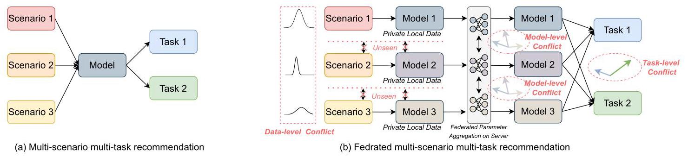
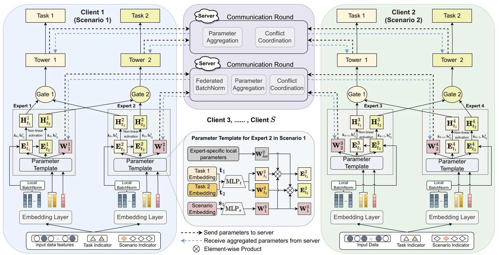
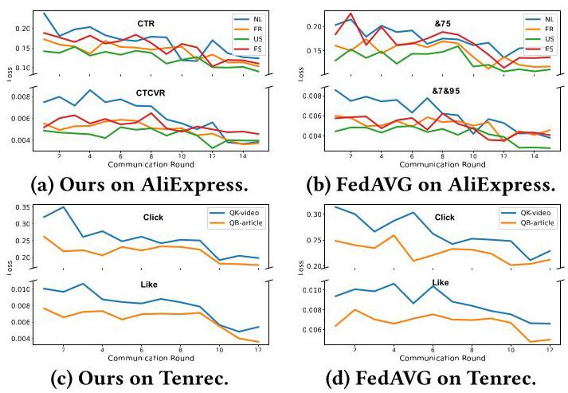

# Towards Personalized Federated Multi-Scenario Multi-Task Recommendation

Yue Ding

dingyue@sjtu.edu.cn

Shanghai Jiao Tong

University

Shanghai, China

Yanbiao Ji

jiyanbiao@sjtu.edu.cn

Shanghai Jiao Tong

University

Shanghai, China

Xun Cai

caixun@sjtu.edu.cn

Shanghai Jiao Tong

University

Shanghai, China

Xin Xin

xinxin@sdu.edu.cn

Shandong University

Qingdao, China

Yuxiang Lu

luyuxiang_2018@sjtu.edu.cn

Shanghai Jiao Tong

University

Shanghai, China

Suizhi Huang

huangsuizhi@sjtu.edu.cn

Shanghai Jiao Tong

University

Shanghai, China

Chang Liu

isonomialiu@sjtu.edu.cn

Shanghai Jiao Tong

University

Shanghai, China

Xiaofeng Gao

gao-xf@cs.sjtu.edu.cn

Shanghai Jiao Tong

University

Shanghai, China

Tsuyoshi Murata

murata@c.titech.ac.jp

Institute of Science Tokyo

Tokyo, Japan

Hongtao Lu*

htlu@sjtu.edu.cn

Shanghai Jiao Tong

University

Shanghai, China

## Abstract

In modern recommender systems, especially in e-commerce, predicting multiple targets such as click-through rate (CTR) and post-view conversion rate (CTCVR) is common. Multi-task recommender systems are increasingly popular in both research and practice, as they leverage shared knowledge across diverse business scenarios to enhance performance. However, emerging real-world scenarios and data privacy concerns complicate the development of a unified multi-task recommendation model.

In this paper, we propose PF-MSMTrec, a novel framework for personalized federated multi-scenario multi-task recommendation. In this framework, each scenario is assigned to a dedicated client utilizing the Multi-gate Mixture-of-Experts (MMoE) structure. To address the unique challenges of multiple optimization conflicts, we introduce a bottom-up joint learning mechanism. First, we design a parameter template to decouple the expert network parameters, distinguishing scenario-specific parameters as shared knowledge for federated parameter aggregation. Second, we implement personalized federated learning for each expert network during a federated communication round, using three modules: federated batch normalization, conflict coordination, and personalized aggregation. Finally, we conduct an additional round of personalized federated

parameter aggregation on the task tower network to obtain prediction results for multiple tasks. Extensive experiments on two public datasets demonstrate that our proposed method outperforms state-of-the-art approaches. The source code and datasets will be released as open-source for public access.

## CCS Concepts

- Information systems \( \rightarrow \) Recommender systems.

## Keywords

Multi-task Recommendation, Federated Learning, Collaborative Filtering

## ACM Reference Format:

Yue Ding, Yanbiao Ji, Xun Cai, Xin Xin, Yuxiang Lu, Suizhi Huang, Chang Liu, Xiaofeng Gao, Tsuyoshi Murata, and Hongtao Lu. 2025. Towards Personalized Federated Multi-Scenario Multi-Task Recommendation. In Proceedings of the Eighteenth ACM International Conference on Web Search and Data Mining (WSDM '25), March 10-14, 2025, Hannover, Germany. ACM, New York, NY, USA, 10 pages. https://doi.org/10.1145/3701551.3703523

## 1 Introduction

Recommender systems leverage users' past behaviors to predict their interests and preferences, thereby delivering tailored recommendations for personalized content. In modern applications of recommender systems, there are often multiple prediction targets. For example, in e-commerce scenarios, it's necessary to estimate both the click-through rate and conversion rate of products. In short video platforms, predictions may involve estimating clicks, playback time, shares, comments, and likes. Therefore, recommender systems should possess the capability to simultaneously perform multiple recommendation tasks to meet the diverse needs of users [42]. Traditional recommendation models usually build separate prediction models for different recommendation tasks and then merge them.

---

*Corresponding author.

---

Figure 1: Illustration of non-federated (a) vs. federated multi-scenario multi-task recommendation (b). In the federated setting, diverse data distributions across scenarios (clients) cause data-level conflicts. Data and model parameters stay private on each client, while the server aggregates parameters, leading to model-level conflicts. Each client also handles multiple tasks, introducing task-level conflicts.

Nevertheless, this model fusion approach has two main drawbacks: (i) Most mainstream recommendation models rely on deep neural networks with many parameters. Trying to optimize and merge multiple models simultaneously requires a lot of computational resources, making it difficult for practical online applications. (ii) There could be connections between different tasks, and optimizing them individually might overlook these relationships. Hence, there's a growing interest in multi-task recommender systems in both research and practical applications.

Conventional multi-task recommender systems primarily focus on business data from a single scenario with the aim of simultaneously improving the prediction performance of multiple tasks. When there are more fine-grained businesses in the system, it is necessary to merge and model different business scenarios to utilize the commonalities between them to enhance the overall performance. Taking the example of food recommendation on Meituan [50], its business may involve various scenarios such as limited-time flash sale recommendation, search result sorting, and discounted meal package recommendation. Users engage in clicking, browsing, and other actions across multiple scenarios, eventually leading to a purchase. Such businesses can be implemented using a unified framework for multi-scenario multi-task recommendation.

As real-world business is evolving rapidly, some new and more intricate recommendation business scenarios have emerged. For example, recommender systems can leverage data from multinational corporations' global branches. This data can be segmented by user location, allowing the system to employ country-specific models that treat users from different nations as distinct scenarios. This approach accounts for potential variations in user preferences across geographical regions. In another real-world application, advertising alliance recommendations involve a mediating platform that aggregates advertising inventory from multiple websites. This platform then connects advertisers with these websites, allowing them to display ads and earn revenue based on factors like ad impressions or clicks. In these two cases, privacy concerns arise because data from each participant is private, and individual prediction models are customized. Consequently, the issue is that training a single, global model becomes very difficult.

Federated learning (FL) [16] is a collaborative learning paradigm that allows joint optimization across multiple clients while preserving all clients' data privacy. However, it is difficult to simply extend multi-scenario and multi-task recommendation to the FL framework. The key challenging issue is that multiple optimization conflicts overlap and intertwine in this situation, which can easily lead to a decline in overall performance. More specifically, (i) Data-level conflict. The data distributions of user-item interactions in multiple scenarios vary. In FL, each client has an independent model to fit the scenario-specific data, and all the clients' models may project data to different feature spaces because each client's data is private and isolated. (ii) Model-level conflict. In FL, models from different clients are typically aggregated using parameter averaging. Differences in data distribution among clients can lead to discrepancies in model parameters, resulting in performance decline on all clients during federated parameter aggregation. (iii) Task-level conflict. Different tasks have different targets which may influence each other. If the model cannot effectively balance these interdependent targets, it can prioritize one task over another, leading to uneven performance, which is recognized as the "task seesaw phenomenon" [38]. Figure 1 illustrates the difference and federated multi-scenario multi-task recommendation and non-federated scenario. To the best of our knowledge, federated learning has not yet been explored for multi-scenario multi-task recommendation.

To address the research gap and tackle this challenging problem, we propose a Personalized Federated learning framework for Multi-Scenario Multi-Task recommendation (PF-MSMTrec). Specifically, we assign each scenario to a distinct client, ensuring that the training data for each client remains independent and private. We utilize a Multi-gate Mixture-of-Experts (MMoE) structure for each client, where each client may have multiple expert networks. We decouple the parameters of each expert network into three categories: global shared parameters, task-specific parameters, and scenario-specific parameters, by designing a parameter template. Federated aggregation is then performed on the scenario-specific parameters, while the other parameters are treated as local personalized parameters. We propose a set of modules for federated parameter aggregation, including federated batch normalization, conflict coordination, and personalized aggregation, all of which are utilized during the federated communication rounds. Finally, after processing through the local gate network, we apply the conflict coordination mechanism to the parameters of the tower networks for personalized aggregation, facilitating multi-task prediction.

The main contributions of this paper are summarized as follows:

- We propose a novel personalized federated recommendation framework for multi-scenario multi-task recommendation. To the best of our knowledge, it is the first work to tackle this challenging problem. Our method broadens the applicability of recommender systems by tackling sophisticated business settings.

- To address the multiple optimization conflicts inherent in federated multi-scenario multi-task recommendation, we propose a meticulously designed bottom-up joint learning mechanism, which incorporates modules for expert network parameter decoupling, federated batch normalization, conflict coordination, and personalized parameter aggregation. The collaborative work of these modules effectively alleviate optimization conflicts and enable personalized learning for local models.

- We conduct extensive experiments on two public datasets, thoroughly comparing the performance of the proposed method with state-of-the-art (SOTA) multi-scenario multi-task recommendation methods and federated learning approaches. Notably, by adapting our method to the federated learning setting, we exceed the performance of SOTA methods originally designed for traditional centralized learning.

## 2 Related Work

### 2.1 Multi-task and Multi-scenario Recommendation

Multi-task learning is widely used in Computer Vision (CV) [40] and Natural Language Processing (NLP) [49]. In recommender systems, deep learning-based multi-task recommendation primarily involves three techniques [42]: optimization, training mechanisms, and parameter sharing. Optimization methods address performance degradation from gradient conflicts during multi-task training [10]. Training mechanisms establish learning strategies for different tasks [3]. Parameter sharing is the most prominent category. The Multi-gate Mixture-of-Expert (MMoE) [25] is a dominant architecture, employing parameter sharing at the expert network level. MMoE predicts multiple tasks by combining expert networks with various gates. PLE [38] uses shared and task-specific experts with a customized gating module. ESMM [26] trains the target task implicitly using auxiliary tasks. AITM [45] enhances inter-task correlation modeling in ESMM by introducing a self-attention sequence dependency propagation module. CSRec [3] employs contrastive learning to adaptively update parameters and mitigate task conflicts. CMoIE [41] refines the mixture policy for expert networks through conflict resolution, expert communication, and mixture calibration. AdaTT [18] utilizes an adaptive fusion mechanism to learn task-specific and shared features.

Multi-scenario recommendation systems enhance understanding of user behaviors and preferences across different domains to provide more personalized recommendations. STAR [34] decouples domain parameters and uses a star topology for multi-domain recommendation. AFT [8] employs generative adversarial networks for feature translation between domains. HAMUR [21] uses adapter layers for multi-domain recommendation. EDDA [32] disentangles embeddings and aligns domains to improve knowledge transfer. MetaDomain [48] uses a domain intent extractor and meta-generator to fuse domain intent representations for predictions. ADIN [14] models commonalities and differences across scenarios with an adaptive domain interest network. Maria [39] injects scene semantics at the network's bottom for adaptive feature learning. PLATE [43] proposes a pre-train and prompt-tuning paradigm to efficiently enhance performance for multiple scenarios. SAMD [11] addresses the multi-scenario heterogeneity problem through knowledge distillation.

Modeling multiple scenarios and tasks simultaneously is currently a topic of growing interest in the field of recommender systems. AESM \( {}^{2} \) [52] proposes an automatic expert search framework for multi-task learning, integrating hierarchical multiple expert layers with different recommendation scenarios. PEPNet [5] is a plug-and-play parameter and embedding personalized network suitable for multi-scenario and multi-task recommendations. HiNet [50] is a multi-scenario multi-task recommendation model based on a hierarchical information extraction network. It achieves information extraction through a knowledge transfer scheme from coarse-grained to fine-grained levels. M3REC [17] is a meta-learning-based framework that realizes unified representations and optimization in multiple scenarios and tasks.

### 2.2 Federated Learning for Recommendation

Federated learning is a distributed machine learning framework for preserving data privacy, mainly passing model parameters to implicitly coordinate the training of participant models. Based on the differences in data and feature dimensions among participants, federated learning can be roughly divided into three categories: horizontal federated learning, vertical federated learning, and federated transfer learning [46]. Typical methods include: FedAvg [29]: It calculates the average of model parameters from all participants as the global model parameters. Personalized Federated Learning (PFL) aims to alleviate the slow convergence and poor performance issues under non-i.i.d. (non-independent and identically distributed) data, making the model personalized for local tasks and datasets [36].

Federated recommender systems are one of the important applications of federated learning. FedRecSys [37] is an open-source federated recommendation system capable of providing online services. Many collaborative filtering algorithms also have corresponding federated learning versions, such as Federated Collaborative Filtering (FCF) [2] and Federated Matrix Factorization [22]. FedFast [31] and FL-MV-DSSM [12] are representative federated deep learning recommender systems. DeepRec [7] proposes federated sequence recommendation. FedGNN [44], PerFedRec [24], and SemiDFEGL [33] are graph neural network-based federated recommendation models. PFedRec [47] is a cross-device personalized federated recommendation framework that learns lightweight models to capture fine-grained user and item features. \( {\mathrm{{RF}}}^{2} \) [27] investigates the fairness problem in federated recommendation, and \( {\mathrm{F}}^{2}\mathrm{{PGNN}} \) [1] further addresses the group bias issue in graph neural networks, aiming for a fair and personalized federated recommendation framework.

### 2.3 Federated Multi-task Learning

Federated multi-task learning has emerged as a research problem in recent years [9, 30]. Approaches such as MOCHA [35] and Fe-dEM [28] have proposed methods for jointly training multiple tasks across multiple participants with diverse data distributions. Fed-bone [6] enhances feature extraction capability by aggregating encoders from gradients uploaded by each client. Addressing the issue of task heterogeneity, MAS [51] allocates different multi-task models to different clients and aggregates models within clients with the same task set. MaT-FL [4] uses dynamic grouping to combine different client models.

## 3 Method

Our proposed PF-MSMTrec method is illustrated in Figure 2. We detail our framework components below.

### 3.1 Problem Definition

Consider \( S \) separate application scenarios, each with a dedicated client limited to local data. We employ the mixture-of-experts structure, allowing each client to utilize multiple expert networks to handle various prediction tasks. Assuming a total of \( T \) tasks and \( S \) clients, where each client comprises \( N \) experts, we define the problem within the \( j \) -th client for predicting the \( i \) -th task as follows:

\[
{\widehat{y}}_{i} = \operatorname{Fed}\left\lbrack  {{\parallel }_{n = 1}^{N}{f}_{i}^{n}\left( {\mathbf{x},{t}_{i},{s}_{j} \mid  {D}_{j}}\right) }\right\rbrack  , \tag{1}
\]

where \( i \in  \{ 1,\ldots , T\} \) and \( j \in  \{ 1,\ldots , S\} \) . Fed \( \left\lbrack  \right\rbrack  {\parallel }_{n = 1}^{N}{f}_{i}^{n}\left( \cdot \right) \rbrack \) is the prediction of the \( i \) -th task, which is made by a combination of \( N \) expert networks within the context of federated learning. Here, \( \mathbf{x} \) denotes the dense feature, \( {D}_{j} \) represents local data in the \( j \) -th scenario, \( {t}_{i} \) and \( {s}_{j} \) denote the task and scenario embeddings, respectively.

### 3.2 Decoupling Expert Parameters

For the \( j \) -th client that has \( N \) experts, we input three types of data into each expert network: dense feature vectors, task feature vectors, and scenario feature vectors. For dense feature vectors, we apply Batch Normalization (BN):

\[
\mu  = \frac{1}{K}\mathop{\sum }\limits_{{k = 1}}^{K}{\mathbf{x}}_{k},{\sigma }^{2} = \frac{1}{K}\mathop{\sum }\limits_{{k = 1}}^{K}{\left( {\mathbf{x}}_{k} - \mu \right) }^{2},{\widehat{\mathbf{x}}}_{k} = \gamma  \cdot  \frac{{\mathbf{x}}_{k} - \mu }{\sqrt{{\sigma }^{2} + \epsilon }} + \beta , \tag{2}
\]

where \( K \) represents the number of data samples in one batch, \( {\mathbf{x}}_{k} \) denotes the \( k \) -th input dense feature vector, \( \gamma \) and \( \beta \) are learnable parameters, and \( \epsilon \) is a small constant. BN normalizes local input data and mitigates discrepancies in data distribution at the input layer, thereby alleviating conflicts arising from data distribution.

To generate task-specific parameters, we employ a parameter template comprising neural networks dedicated to each expert. This design facilitates parameter separation within expert networks, enabling them to extract not only input features but also task-related and scenario-specific features:

\[
{\mathbf{W}}_{{t}_{i}}^{n} = {\operatorname{MLP}}_{t}\left( {\mathbf{t}}_{i}\right) ,{\mathbf{W}}_{j}^{n} = {\operatorname{MLP}}_{s}\left( {\mathbf{s}}_{j}\right) , \tag{3}
\]

where \( n \in  \{ 1,2,\ldots , N\} \) indicates the number of the expert network, \( {\mathrm{{MLP}}}_{t} \) , and \( {\mathrm{{MLP}}}_{s} \) represent multi-layer perceptrons capable of generating parameters based on the input. \( {\mathbf{t}}_{i} \) and \( {\mathbf{s}}_{j} \) are the task and scenario dense embeddings, respectively. By introducing the expert-specific local parameter \( {\mathbf{W}}_{\text{ loc }}^{n} \) , the local task-specific parameters are composed of the following three components:

\[
{\mathbf{E}}_{{t}_{i}}^{n} = {\mathbf{W}}_{\text{ loc }}^{n} \otimes  {\mathbf{W}}_{{t}_{i}}^{n} \otimes  {\mathbf{W}}_{j}^{n}, \tag{4}
\]

where \( \otimes \) denotes element-wise product. Subsequently, task-specific feature outputs can be obtained based on the input embedding:

\[
{\mathrm{H}}_{{t}_{i}}^{n} = \sigma \left( {{\widehat{\mathbf{x}}}_{k} \cdot  {\mathrm{E}}_{{t}_{i}}^{n} + {\mathrm{b}}_{{t}_{i}}^{n}}\right) , \tag{5}
\]

where \( \sigma \) represents the ReLU non-linear activation function, and \( {\mathbf{b}}_{{t}_{i}}^{n} \) is the bias term. For all experts within the \( j \) -th client, the output set for the \( i \) -th task is described as the following set:

\[
{\left\{  {\operatorname{Exp}}_{i}\right\}  }_{j} = {\left\{  {\mathrm{H}}_{{t}_{i}}^{1},{\mathrm{H}}_{{t}_{i}}^{2},\ldots ,{\mathrm{H}}_{{t}_{i}}^{N}\right\}  }_{j}. \tag{6}
\]

Here we use \( \{  \cdot  {\} }_{j} \) to denote the set of outputs for the \( j \) -th client to avoid confusion caused by using superscripts and subscripts. We also emphasize that the parameters \( {\mathbf{W}}_{\text{ loc }}^{n},{\mathbf{W}}_{{t}_{i}}^{n} \) , and \( {\mathbf{W}}_{j}^{n} \) are distinct for each client.

### 3.3 Federated Parameter Aggregation

3.3.1 Fedrated Batch Normalization. Under the federated learning paradigm, we jointly train expert and tower networks using parameter aggregation. To achieve personalization, we designate \( {\mathbf{W}}_{\text{ loc }}^{n} \) and \( {\mathbf{W}}_{{t}_{i}}^{n} \) as local parameters, and \( {\mathbf{W}}_{j}^{n} \) as shared parameter for federated learning. We designed this approach to let each expert understand different tasks in various scenarios. We avoid federated aggregation on whole task parameters due to task commonalities and instead share the scenario-specific parameter \( {\mathbf{W}}_{j}^{n} \) among clients to facilitate mutual learning. Additionally, as shown in Eq. (4), \( {\mathbf{W}}_{j}^{n} \) is integrated into the local parameters, enabling updates to \( {\mathbf{W}}_{j}^{n} \) to influence the learning of personalized local parameters. We employ a straightforward federated batch normalization strategy to mitigate data-level conflicts arising from variations in data distributions across clients. All shared expert network parameters are treated as a batch on the server during each communication round.

\[
{\mu }_{g} = \frac{1}{N \cdot  S}\mathop{\sum }\limits_{{n = 1}}^{N}\mathop{\sum }\limits_{{j = 1}}^{S}{\mathbf{W}}_{j}^{n},{\sigma }_{g}^{2} = \frac{1}{N \cdot  S}\mathop{\sum }\limits_{{n = 1}}^{N}\mathop{\sum }\limits_{{j = 1}}^{S}{\left( {\mathbf{W}}_{j}^{n} - {\mu }_{g}\right) }^{2}, \tag{7}
\]

\[
\operatorname{FedBN}\left( {\mathbf{W}}_{j}^{n}\right)  = {\gamma }_{g} \cdot  \frac{{\mathbf{W}}_{j}^{n} - {\mu }_{g}}{\sqrt{{\sigma }_{g}^{2} + {\epsilon }_{g}}} + {\beta }_{g}, \tag{8}
\]

where the subscript \( g \) represents global. It is important to note that we calculate \( {\gamma }_{g} \) and \( {\beta }_{g} \) by averaging the local \( \gamma \) and \( \beta \) values from all clients, as there are no learnable parameters on the server.

\[
{\gamma }_{g},{\beta }_{g} = \frac{1}{S}\mathop{\sum }\limits_{{j = 1}}^{S}{\gamma }_{j},{\beta }_{j}\text{ . } \tag{9}
\]

The typical federated aggregation approach is parameter averaging:

\[
{\overline{\mathbf{W}}}_{j}^{n} = \frac{1}{N \cdot  S}\mathop{\sum }\limits_{{n = 1}}^{N}\mathop{\sum }\limits_{{j = 1}}^{S}\operatorname{FedBN}\left( {\mathbf{W}}_{j}^{n}\right) . \tag{10}
\]

It's important to note that local normalization operates on data, while federated normalization operates on parameters uploaded by clients. Their unification shows that parameter normalization during federated aggregation effectively leverages client data characteristics, mitigating optimization conflicts from domain differences.

3.3.2 Conflict Coordination. Large parameter differences between clients during federated parameter aggregation are the cause of performance degradation in federated learning. Since parameters are determined by the gradients from local training, alleviating gradient conflict would be a direct and effective approach. Considering the local shared parameter \( {\mathbf{W}}_{j}^{n} \) in the expert network, we update:

\[
{\mathbf{W}}_{j}^{{n}^{\prime }} \leftarrow  {\mathbf{W}}_{j}^{n} - \eta \mathop{\sum }\limits_{{i = 1}}^{T}{\mathbf{g}}_{i} \tag{11}
\]

Figure 2: Framework of PF-MSMTrec for personalized federated multi-scenario multi-task recommendation. Each client handles a unique scenario with private data, using the MMoE structure. Parameter decoupling in expert networks enables federated aggregation of scenario-specific features. Federated batch normalization, conflict coordination, and personalized aggregation are applied in each communication round to address optimization conflicts. For clarity, Expert 3 and Expert 4 are used for Client 2, with \( {\widehat{\mathbf{x}}}_{k} \) and \( {\widehat{\mathbf{x}}}_{k + 1} \) representing different inputs.

where \( \eta \) is the learning rate, \( {\mathbf{g}}_{i} \) denotes the gradient on the \( i \) -th task loss. We define the increment of the parameter update as \( \Delta {\mathbf{W}}_{j}^{n} =  - \eta \mathop{\sum }\limits_{{i = 1}}^{T}{\mathbf{g}}_{i} \) . Similarly, we have the global average increment of aggregated parameters:

\[
\Delta {\overline{\mathbf{W}}}_{j}^{n} =  - \eta \frac{1}{N \cdot  S}\mathop{\sum }\limits_{{n = 1}}^{N}\mathop{\sum }\limits_{{j = 1}}^{S}\mathop{\sum }\limits_{{i = 1}}^{T}{\left\{  {\mathbf{g}}_{i}^{n}\right\}  }_{j}. \tag{12}
\]

Drawing inspiration from CAGrad [23], we identify a set of parameters, denoted as \( \mathbf{U} \) , to mitigate gradient conflicts between \( \Delta {\mathbf{W}}_{j}^{n} \) and \( \Delta {\overline{\mathbf{W}}}_{j}^{n} \) through a simple gradient inner product and gradient constraint. This is achieved by optimizing the following objective:

\[
\mathop{\max }\limits_{\mathbf{U}}\min \left\langle  {\Delta {\mathbf{W}}_{j}^{n},\mathbf{U}}\right\rangle  \;\text{ s.t. }\begin{Vmatrix}{\mathbf{U} - \Delta {\overline{\mathbf{W}}}_{j}^{n}}\end{Vmatrix} \leq  c\begin{Vmatrix}{\Delta {\overline{\mathbf{W}}}_{j}^{n}}\end{Vmatrix}, \tag{13}
\]

where \( \langle  \cdot  , \cdot  \rangle \) denote inner product, \( c \in  \lbrack 0,1) \) is the hyper-parameter. Note that federated learning generally restricts clients from uploading gradients due to privacy and security concerns. Therefore, to approximate the gradient, we calculate the difference between the parameters from two consecutive communication rounds:

\[
\Delta {\widehat{\mathbf{W}}}_{j}^{n} = {\left\lbrack  {\bar{\mathbf{W}}}_{j}^{n}\right\rbrack  }^{r} - {\left\lbrack  {\bar{\mathbf{W}}}_{j}^{n}\right\rbrack  }^{r - 1}, \tag{14}
\]

where \( r \) denotes the communication round. Substitute \( \Delta {\widehat{\mathbf{W}}}_{n, j} \) for \( \Delta {\mathbf{W}}_{n, j} \) in Eq. (13), we can solve the optimization problem by using Lagrangian and adding the constraint of \( \mathop{\sum }\limits_{{n = 1}}^{N}\mathop{\sum }\limits_{{j = 1}}^{S}{w}_{n, j} = \; 1,{w}_{n, j} \geq  0 \) , we turn to the following optimization problem for \( w \) :

\[
\mathop{\min }\limits_{w}F\left( w\right)  = {\mathbf{U}}_{w}^{\top } \cdot  \Delta {\widehat{\mathbf{W}}}_{j}^{n} + \sqrt{\phi } \cdot  \begin{Vmatrix}{\mathbf{U}}_{w}\end{Vmatrix}, \tag{15}
\]

\[
\text{ where }{\mathbf{U}}_{w} = \mathop{\sum }\limits_{{n = 1}}^{N}\mathop{\sum }\limits_{{j = 1}}^{S}{w}_{n, j} \cdot  \Delta {\widehat{\mathbf{W}}}_{j}^{n}\text{ , and }\phi  = {c}^{2}{\begin{Vmatrix}\Delta {\widehat{\mathbf{W}}}_{j}^{n}\end{Vmatrix}}^{2}\text{ . } \tag{16}
\]

We can derive the solution of \( {\mathbf{U}}^{ * } \) after obtaining the optimal \( w \) :

\[
{\mathbf{U}}^{ * } = \Delta {\widehat{\mathbf{W}}}_{j}^{n} + \frac{\sqrt{\phi }}{\begin{Vmatrix}{U}_{w}\end{Vmatrix}}{U}_{w}. \tag{17}
\]

3.3.3 Personalized Parameter Aggregation. To maintain the personalization of local parameters while effectively aggregating federated parameters, we introduce a learnable weight parameter, \( {\psi }_{n} \) for each expert network. The updating process of shared parameter \( {\mathbf{W}}_{j}^{n} \) is:

\[
{\left\lbrack  {\mathbf{W}}_{j}^{n}\right\rbrack  }^{r} = {\left\lbrack  {\mathbf{W}}_{j}^{n}\right\rbrack  }^{r - 1} + {\left\lbrack  \Delta {\bar{\mathbf{W}}}_{j}^{n}\right\rbrack  }^{r} + {\psi }_{n}{\mathbf{U}}^{ * }, \tag{18}
\]

For the gate network that is responsible for aggregating outputs from various experts for the \( i \) -th task in the \( j \) -th scenario, we have:

\[
\operatorname{Gate}\left\lbrack  {\left\{  {\mathrm{{Exp}}}_{i}\right\}  }_{j}\right\rbrack   = {\left( {a}_{1}{\mathrm{H}}_{{t}_{i}}^{1} + {a}_{2}{\mathrm{H}}_{{t}_{i}}^{2}+,\ldots , + {a}_{N}{\mathrm{H}}_{{t}_{i}}^{N}\right) }_{j}, \tag{19}
\]

where \( {a}_{1},\ldots ,{a}_{N} \) are weight parameters learned by a neural network, subject to \( {a}_{n} \geq  0 \) and \( \mathop{\sum }\limits_{{n = 1}}^{N}{a}_{n} = 1 \) . The task tower, responsible for generating predictions for the \( i \) -th task, is defined as follows:

\[
{\widehat{p}}_{i, j} = \operatorname{MLP}\left( {\operatorname{Gate}\left\lbrack  {\left\{  {\operatorname{Exp}}_{i}\right\}  }_{j}\right\rbrack  }\right) . \tag{20}
\]

We conduct a personalized federated aggregation of all parameters within the Tower network.

\[
{\left\lbrack  {\Theta }_{i, j}^{\mathrm{{Tow}}}\right\rbrack  }^{r} = {\left\lbrack  {\Theta }_{i, j}^{\mathrm{{Tow}}}\right\rbrack  }^{r - 1} + {\left\lbrack  \Delta {\Theta }_{i, j}^{\mathrm{{Tow}}}\right\rbrack  }^{r} + {\psi }_{n}^{\prime }{\mathbf{U}}^{ * }, \tag{21}
\]

where \( {\Theta }_{i, j}^{\text{ Tow }} \) denotes the parameters of the \( i \) -th task tower in the \( j \) -th scenario, \( {\psi }_{n}^{\prime } \) represents another learnable weight parameter.

### 3.4 Optimization

We utilize the binary cross-entropy loss as the loss function:

\[
{\mathcal{L}}_{{BC}{E}_{j}} = \frac{1}{\left| {\mathcal{X}}_{j}\right| }\mathop{\sum }\limits_{{\mathbf{x} = 1}}^{\left| {\mathcal{X}}_{j}\right| }\mathop{\sum }\limits_{{i = 1}}^{T} - \mathbf{y}\log \left( {\widehat{\mathbf{p}}}_{i, j}\right)  - \left( {1 - \mathbf{y}}\right) \log \left( {1 - {\widehat{\mathbf{p}}}_{i, j}}\right) , \tag{22}
\]

where \( {\left| \mathcal{X}\right| }_{j} \) represents the number of data samples in \( {D}_{j},\mathbf{y} \) denotes labels. To align local shared parameters with global aggregated parameters and prevent performance degradation, we introduce an additional regularization term:

\[
{\mathcal{L}}_{{d}_{j}} = \mathop{\sum }\limits_{{n = 1}}^{N}{\begin{Vmatrix}{\overline{\mathbf{W}}}_{j}^{n} - {\mathbf{W}}_{j}^{n}\end{Vmatrix}}_{2}^{2} \tag{23}
\]

The total loss for the \( j \) -th scenario is:

\[
{\mathcal{L}}_{j} = {\mathcal{L}}_{{BC}{E}_{j}} + \lambda {\mathcal{L}}_{{d}_{j}} \tag{24}
\]

where \( \lambda \) is a manually set coefficient.

## 4 Experiments

### 4.1 Experimental Settings

Table 1: Statistics of test datasets.

<table><tr><td>Dataset</td><td>Train</td><td>Validation</td><td>Test</td><td>#Features</td></tr><tr><td>AliExpress NL</td><td>12.1M</td><td>5.6M</td><td>5.6M</td><td>79</td></tr><tr><td>AliExpress ES</td><td>22.3M</td><td>9.3M</td><td>9.3M</td><td>79</td></tr><tr><td>AliExpress FR</td><td>18.2M</td><td>8.8M</td><td>8.8M</td><td>79</td></tr><tr><td>AliExpress US</td><td>19.9M</td><td>7.5M</td><td>7.5M</td><td>79</td></tr><tr><td>Tenrec-OK-video</td><td>69.3M</td><td>8.7M</td><td>8.7M</td><td>16</td></tr><tr><td>Tenrec-QB-video</td><td>1.9M</td><td>0.2M</td><td>0.2M</td><td>16</td></tr></table>

4.1.1 Datasets. We conduct experiments on two public datasets: (1) AliExpress Dataset \( {}^{1} \) . It is collected from a real-world search system in AliExpress, we use four scenarios: Netherlands (NL), Spain (ES), France (FR), and the United States (US). (2) Tenrec Bench- \( {\mathbf{{mark}}}^{2} \) . Tenrec is a dataset suite for multiple recommendation tasks, collected from two different recommendation platforms of Tencent, QQ BOW (QB) and QQ KAN (QK). Items in QK/QB can be news articles or videos. We use data from two scenarios, QK-video and QB-video. Table 1 describes the statistics of the datasets.

4.1.2 Baseline Methods. We use two different groups of baseline methods, the first group being SOTA multi-scenario and multi-task recommendation methods: Single-task Model. It employs an MLP to predict the output for a single task. Different tasks are optimized separately in the single-task model. MMoE [25], PLE [38], and ESMM [38] are representative multi-task recommendation baselines. AITM [45] models task dependencies through an attention mechanism. Note that the two prediction tasks in Tenrec (click and like) are unrelated, we did not implement AITM on the Tenrec dataset. STAR [34] is a multi-domain model that includes both center parameters and domain-specific parameters. AESM2 [52] is an advanced multi-scenario and multi-task recommendation model with automatic expert selection. PEPNet [5] is the SOTA method for multi-scenario multi-task recommendation. The second group consists of SOTA federated learning methods. FedAvg [29] averages the parameters of all clients in federated learning and then shares them back to each client. FedProx [20] tackles heterogeneity in federated learning, and can be seen as an extension of FedAvg. Ditto [19] emphasizes fairness and robustness in personalized federated learning. FedAMP [13] improves collaboration among clients with non-i.i.d. data distributions through attentive message passing.

4.1.3 Evaluation Metric. For the AliExpress dataset, all methods perform two tasks: predicting click-through rate (CTR) and post-view click-through and conversion rate (CTCVR). For the Tenrec dataset, the tasks involve predicting user clicks and likes on exposed videos or articles. We adopt the widely used Area Under Curve (AUC) as the evaluation metric in our experiments:

\[
{AUC} = \frac{1}{\left| {D}_{\text{ test }}^{ + }\right| \left| {D}_{\text{ test }}^{ - }\right| }\mathop{\sum }\limits_{{{x}^{ + } \in  {D}_{\text{ test }}^{ + }}}\mathop{\sum }\limits_{{{x}^{ - } \in  {D}_{\text{ test }}^{ - }}}I\left( {f\left( {x}^{ + }\right)  > f\left( {x}^{ - }\right) }\right) , \tag{25}
\]

where \( {D}_{\text{ test }}^{ + } \) and \( {D}_{\text{ test }}^{ - } \) represent the collections of positive and negative samples in the test set, respectively. \( f\left( \cdot \right) \) denotes the prediction function, and \( I\left( \cdot \right) \) denotes the indicator function.

4.1.4 Implementation Details. We use the same experimental setup for all methods, including the same embedding layers, input features, and training hyper-parameters. We employ a three-layer MLP with ReLU activation as the expert network, with hidden layer sizes of \{512, 256, 128\}, and we use a three-layer MLP with sigmoid activation as the tower network, with hidden layer sizes of \{128, 64, 32\}. We train all the methods with the binary cross-entropy loss. All methods are optimized using the Adam Optimizer [15]. The learning rate is set to 0.001 and the dropout rate is set to 0.2 . For our proposed PF-MSMTrec, the conflict-coordinate hyper-parameter \( c \) is set to 0.4 and the coefficient \( \lambda \) in the loss function is set to 0.5 .

In the first group of multi-scenario and multi-task recommendation baseline models, our implementation is as follows: The single-task model is implemented with two separate expert networks and two separate tower networks. For MMoE and PLE, we implement them with four experts, two gate networks, and two towers. MMoE shares all four experts, while PLE shares two of them. For ESMM, we multiply the outputs of the two towers to obtain the CTCVR result. For AITM, we implement the AIT module with three MLPs serving as the query, key, and value of the attention mechanism. Task dependencies are passed through these AIT modules. For STAR, the basic FCN is implemented with center parameters and task-specific parameters. During prediction, the center weight is multiplied by the task-specific weight to generate the output. Additionally, we apply a three-layer MLP as an auxiliary network after shared embedding layers to provide auxiliary information. For \( {\mathrm{{AESM}}}^{2} \) , we employ four experts and select experts using the Kullback-Leibler (KL) divergence. For PEPNet, we replace the gate network with one linear layer and softmax activation by one scale factor and two neural layers with sigmoid and ReLU activation. Additionally, we imitate EPNet by applying an extra element-wise attention network to learn the importance of dimensions in the input embedding. In the second group of federated learning baseline models, to ensure

---

\( {}^{1} \) https://tianchi.aliyun.com/dataset/74690

\( {}^{2} \) https://github.com/yuangh-x/2022-NIPS-Tenrec

---

Table 2: Performance comparison of multi-scenario and multi-task methods on the AliExpress dataset. The best overall result is in bold. The best result among the baselines is underlined. * indicates the improvements over the best baseline are statistically significant (i.e., one-sample t-test with \( p < {0.05} \) ).

<table><tr><td></td><td>AliExpress</td><td>Single-task</td><td>MMoE</td><td>PLE</td><td>ESMM</td><td>AITM</td><td>STAR</td><td>AESM2</td><td>PEPNet</td><td>PF-MSMTrec (Local)</td><td>PF-MSMTrec (Fed)</td></tr><tr><td rowspan="2">NL</td><td>auc_ctr</td><td>0.7203</td><td>0.7195</td><td>0.7268</td><td>0.7202</td><td>0.7256</td><td>0.7263</td><td>0.7260</td><td>0.7310</td><td>0.7330*</td><td>0.7316*</td></tr><tr><td>auc_ctcvr</td><td>0.8556</td><td>0.8574</td><td>0.8571</td><td>0.8606</td><td>0.8586</td><td>0.8624</td><td>0.8638</td><td>0.8687</td><td>0.8690*</td><td>0.8653</td></tr><tr><td rowspan="2">ES</td><td>auc_ctr</td><td>0.7252</td><td>0.7269</td><td>0.7268</td><td>0.7263</td><td>0.7270</td><td>0.7281</td><td>0.7295</td><td>0.7342</td><td>0.7364*</td><td>0.7325</td></tr><tr><td>auc_ctcvr</td><td>0.8832</td><td>0.8899</td><td>0.8861</td><td>0.8891</td><td>0.8829</td><td>0.8891</td><td>0.8949</td><td>0.8915</td><td>0.8927</td><td>0.8925</td></tr><tr><td rowspan="2">FR</td><td>auc_ctr</td><td>0.7174</td><td>0.7226</td><td>0.7252</td><td>0.7222</td><td>0.7216</td><td>0.7269</td><td>0.7241</td><td>0.7296</td><td>0.7320*</td><td>0.7321*</td></tr><tr><td>auc_ctcvr</td><td>0.8702</td><td>0.8748</td><td>0.8679</td><td>0.8684</td><td>0.8710</td><td>0.8803</td><td>0.8808</td><td>0.8813</td><td>0.8817*</td><td>0.8851*</td></tr><tr><td rowspan="2">US</td><td>auc_ctr</td><td>0.7058</td><td>0.7053</td><td>0.7092</td><td>0.7035</td><td>0.7019</td><td>0.7088</td><td>0.7088</td><td>0.7105</td><td>0.7150*</td><td>0.7142*</td></tr><tr><td>auc_ctcvr</td><td>0.8637</td><td>0.8639</td><td>0.8699</td><td>0.8712</td><td>0.8655</td><td>0.8765</td><td>0.8774</td><td>0.8851</td><td>0.8808</td><td>0.8791</td></tr></table>

Table 3: Performance comparison with federated learning methods on the Tenrec dataset. The best overall result is in bold. The best result among the baselines is underlined. * indicates the improvements over the best baseline are statistically significant (i.e., one-sample t-test with \( p < {0.05} \) ).

<table><tr><td rowspan="2">AliExpress</td><td colspan="2">NL</td><td colspan="2">ES</td><td colspan="2">FR</td><td colspan="2">US</td></tr><tr><td>auc_ctr</td><td>auc_ctcvr</td><td>auc_ctr</td><td>auc_ctcvr</td><td>auc_ctr</td><td>auc_ctcvr</td><td>auc_ctr</td><td>auc_ctcvr</td></tr><tr><td>Single-task</td><td>0.7203</td><td>0.8556</td><td>0.7252</td><td>0.8832</td><td>0.7174</td><td>0.8702</td><td>0.7058</td><td>0.8637</td></tr><tr><td>FedAvg</td><td>0.7265</td><td>0.8551</td><td>0.7280</td><td>0.8886</td><td>0.7265</td><td>0.8664</td><td>0.7084</td><td>0.8701</td></tr><tr><td>FedProx</td><td>0.7269</td><td>0.8547</td><td>0.7281</td><td>0.8902</td><td>0.7260</td><td>0.8705</td><td>0.7088</td><td>0.8665</td></tr><tr><td>Ditto</td><td>0.7273</td><td>0.8549</td><td>0.7285</td><td>0.8906</td><td>0.7264</td><td>0.8708</td><td>0.7089</td><td>0.8666</td></tr><tr><td>FedAMP</td><td>0.7270</td><td>0.8552</td><td>0.7282</td><td>0.8905</td><td>0.7266</td><td>0.8708</td><td>0.7089</td><td>0.8665</td></tr><tr><td>PF-MSMTrec (Fed)</td><td>0.7316*</td><td>0.8653*</td><td>0.7325*</td><td>0.8925*</td><td>0.7321*</td><td>0.8851*</td><td>0.7142*</td><td>\( {\mathbf{{0.8791}}}^{ * } \)</td></tr></table>

Table 4: Performance comparison of multi-scenario and multi-task methods on Tenrec dataset. The best overall result is in bold. The best result among the baselines is underlined. * indicates the improvements over best baseline are statistically significant (i.e., one-sample t-test with \( p < {0.05} \) ).

<table><tr><td rowspan="2">Tenrec</td><td colspan="2">QK-video</td><td colspan="2">QB-article</td></tr><tr><td>auc_click</td><td>auc_like</td><td>auc_click</td><td>auc_like</td></tr><tr><td>Single-task</td><td>0.7957</td><td>0.9160</td><td>0.8013</td><td>0.9343</td></tr><tr><td>MMoE</td><td>0.7900</td><td>0.9020</td><td>0.8002</td><td>0.9212</td></tr><tr><td>PLE</td><td>0.7822</td><td>0.9103</td><td>0.8031</td><td>0.9310</td></tr><tr><td>ESMM</td><td>0.7898</td><td>0.9089</td><td>0.8024</td><td>0.9285</td></tr><tr><td>STAR</td><td>0.7920</td><td>0.9188</td><td>0.8055</td><td>0.9314</td></tr><tr><td>AESM2</td><td>0.7942</td><td>0.9219</td><td>0.8047</td><td>0.9297</td></tr><tr><td>PEPNet</td><td>0.7953</td><td>0.9200</td><td>0.8076</td><td>0.9331</td></tr><tr><td>PF-MSMTrec (Local)</td><td>0.7956*</td><td>0.9221*</td><td>0.8080*</td><td>0.9321</td></tr><tr><td>PF-MSMTrec (Fed)</td><td>0.7965*</td><td>0.9202</td><td>0.8083*</td><td>0.9327</td></tr></table>

a fair comparison, we varied only the federated parameter aggregation method when comparing our approach with the baseline methods, while maintaining the local expert network model structure unchanged. For FedProx, the proximal term constant \( \mu \) is set to 0.01 . For Ditto, the coefficient \( \lambda \) that controls the interpolation between the local and global model is set to 0.1. For FedAMP, the hyper-parameter \( {\alpha }_{k} \) is set to 1.0.

4.1.5 Overall Performance. Table 2 and Table 3 compare the performance of our method with two groups of baseline models on the AliExpress dataset. Table 4 and Table 5 compare their performance on the Tenrec dataset. We have the following observations: (1) Our proposed PF-MSMTrec is evaluated in both federated and nonfederated (local) settings. In the non-federated setting, the federated learning module is not required, and all expert networks and tower networks jointly perform predictions. Notably, even under federated settings, our method surpasses SOTA multi-scenario multi-task methods under non-federated settings.. This indicates that our approach effectively mitigates multiple optimization conflicts and supports joint learning across multiple clients while preserving data privacy. (2) Our method also surpasses SOTA federated learning approaches, demonstrating that our designed federated learning paradigm excels in personalized federated parameter aggregation.

Table 5: Performance comparison of federated learning methods on the Tenrec dataset. The best overall result is in bold. The best result among the baselines is underlined. * indicates the improvements over the best baseline are statistically significant (i.e., one-sample \( t \) -test with \( p < {0.05} \) ).

<table><tr><td rowspan="2">Tenrec</td><td colspan="2">QK-video</td><td colspan="2">QB-article</td></tr><tr><td>auc_click</td><td>auc_like</td><td>auc_click</td><td>auc_like</td></tr><tr><td>Single-task</td><td>0.7957</td><td>0.9160</td><td>0.8013</td><td>0.9343</td></tr><tr><td>FedAvg</td><td>0.7960</td><td>0.9155</td><td>0.8025</td><td>0.9351</td></tr><tr><td>FedProx</td><td>0.7964</td><td>0.9158</td><td>0.8029</td><td>0.9351</td></tr><tr><td>Ditto</td><td>0.7962</td><td>0.9165</td><td>0.8026</td><td>0.9345</td></tr><tr><td>FedAMP</td><td>0.7962</td><td>0.9158</td><td>0.8027</td><td>0.9352</td></tr><tr><td>PF-MSMTrec (Fed)</td><td>0.7965*</td><td>0.9202*</td><td>0.8083*</td><td>0.9327</td></tr></table>

Table 6: Ablation study on the AliExpress dataset. Bold text indicates the best performance.

<table><tr><td></td><td>AliExpress</td><td>A1</td><td>A2</td><td>A3</td><td>A4</td></tr><tr><td rowspan="2">NL</td><td>auc_ctr</td><td>0.7274</td><td>0.7289</td><td>0.7316</td><td>0.7268</td></tr><tr><td>auc_ctcvr</td><td>0.8617</td><td>0.8511</td><td>0.8653</td><td>0.8651</td></tr><tr><td rowspan="2">ES</td><td>auc_ctr</td><td>0.7299</td><td>0.7290</td><td>0.7325</td><td>0.7314</td></tr><tr><td>auc_ctcvr</td><td>0.8902</td><td>0.8911</td><td>0.8925</td><td>0.8891</td></tr><tr><td rowspan="2">FR</td><td>auc_ctr</td><td>0.7298</td><td>0.7305</td><td>0.7321</td><td>0.7296</td></tr><tr><td>auc_ctcvr</td><td>0.8849</td><td>0.8849</td><td>0.8851</td><td>0.8890</td></tr><tr><td rowspan="2">US</td><td>auc_ctr</td><td>0.7081</td><td>0.7128</td><td>0.7142</td><td>0.7135</td></tr><tr><td>auc_ctcvr</td><td>0.8799</td><td>0.8792</td><td>0.8791</td><td>0.8740</td></tr></table>

Table 7: Impact of the number of experts on the AliExpress dataset. Bold text indicates the best performance. #E denotes the number of experts.

<table><tr><td></td><td>AliExpress</td><td>#E = 2</td><td>#E = 3</td><td>#E = 4</td><td>#E = 5</td><td>#E = 6</td></tr><tr><td rowspan="2">NL</td><td>auc_ctr</td><td>0.7288</td><td>0.7313</td><td>0.7316</td><td>0.7314</td><td>0.7311</td></tr><tr><td>auc_ctcvr</td><td>0.8625</td><td>0.8638</td><td>0.8653</td><td>0.8644</td><td>0.8649</td></tr><tr><td rowspan="2">FR</td><td>auc_ctr</td><td>0.7297</td><td>0.7316</td><td>0.7325</td><td>0.7300</td><td>0.7313</td></tr><tr><td>auc_ctcvr</td><td>0.8892</td><td>0.8915</td><td>0.8925</td><td>0.8903</td><td>0.8901</td></tr><tr><td rowspan="2">ES</td><td>auc_ctr</td><td>0.7297</td><td>0.7309</td><td>0.7321</td><td>0.7316</td><td>0.7307</td></tr><tr><td>auc_ctcvr</td><td>0.8831</td><td>0.8842</td><td>0.8851</td><td>0.8810</td><td>0.8824</td></tr><tr><td rowspan="2">US</td><td>auc_ctr</td><td>0.7127</td><td>0.7130</td><td>0.7142</td><td>0.7140</td><td>0.7139</td></tr><tr><td>auc_ctcvr</td><td>0.8767</td><td>0.8771</td><td>0.8791</td><td>0.8185</td><td>0.8347</td></tr></table>

Figure 3: Convergence on two datasets.

Table 8: Ablation study on the Tenrec dataset. Bold text indicates the best performance.

<table><tr><td rowspan="2">Tenrec</td><td colspan="2">QK-video</td><td colspan="2">QB-article</td></tr><tr><td>auc_click</td><td>auc_like</td><td>auc_click</td><td>auc_like</td></tr><tr><td>A1</td><td>0.7944</td><td>0.9170</td><td>0.8066</td><td>0.9301</td></tr><tr><td>A2</td><td>0.7939</td><td>0.9192</td><td>0.8062</td><td>0.9310</td></tr><tr><td>A3</td><td>0.7965</td><td>0.9202</td><td>0.8083</td><td>0.9327</td></tr><tr><td>A4</td><td>0.7963</td><td>0.9195</td><td>0.8071</td><td>0.9318</td></tr></table>

Table 9: Impact of the number of experts on the Tenrec dataset. Bold text indicates the best performance. #E denotes the number of experts.

<table><tr><td rowspan="2">Expert</td><td colspan="2">QK-video</td><td colspan="2">QB-article</td></tr><tr><td>auc_click</td><td>auc_like</td><td>auc_click</td><td>auc_like</td></tr><tr><td>#Expert = 2</td><td>0.7938</td><td>0.9178</td><td>0.8055</td><td>0.9317</td></tr><tr><td>#Expert = 3</td><td>0.7950</td><td>0.9194</td><td>0.8071</td><td>0.9318</td></tr><tr><td>#Expert = 4</td><td>0.7965</td><td>0.9202</td><td>0.8083</td><td>0.9327</td></tr><tr><td>#Expert = 5</td><td>0.7961</td><td>0.9204</td><td>0.8081</td><td>0.9317</td></tr><tr><td>#Expert = 6</td><td>0.7942</td><td>0.9195</td><td>0.8077</td><td>0.9320</td></tr></table>

### 4.2 In-depth Analysis

4.2.1 Ablation study. We conduct four sets of experiments to investigate the effects of different modules in our model: (A1) Change the aggregation method for both expert and tower networks to FedAvg. (A2) Apply federated averaging to all parameters of the expert network, while keeping the tower network unchanged. (A3) Apply federated averaging only to the scenario-specific parameters of the expert network, while keeping the tower network unchanged. (A4) Apply federated averaging to the tower network, while keeping the expert network unchanged. Table 6 and Table 8 describe the results. It can be concluded that expert parameter decoupling and conflict coordination in personalized aggregation are crucial for achieving optimal performance. In contrast, the aggregation method for the tower network has a relatively minor impact.

4.2.2 The impact of the number of experts. We test the performance with varying numbers of experts per client, ranging from 2 to 6. Table 7 and Table 9 describe the results. The optimal number of experts is 4, it shows that having too few experts hinders feature extraction, while an excessive number can result in conflicts.

4.2.3 Convergence study. We compare our method with FedAvg as a baseline and analyze convergence trends on the test dataset. As shown in Figure 3, our model demonstrates similar convergence behavior to FedAvg and effectively learns multiple tasks across various scenarios on the setting of federated learning.

## 5 Conclusion

In this paper, we explore a new and challenging problem: federated multi-scenario multi-task recommendation. We propose a novel framework called PF-MSMTrec. Our model incorporates parameter decoupling, federated batch normalization, conflict coordination, and personalized aggregation modules. Our proposed method effectively mitigates the multiple optimization conflict issues that arise in such complex application settings. Extensive experiments demonstrate that our proposed model outperforms SOTA methods. We believe that our proposed method broadens the applicability of recommender systems in sophisticated business settings.

## Acknowledgments

This paper is supported by NSFC (No. 62176155), Shanghai Municipal Science and Technology Major Project, China, under grant No.2021SHZDZX0102.

## References

[1] Nimesh Agrawal, Anuj Kumar Sirohi, Sandeep Kumar, et al. 2024. No Prejudice! Fair Federated Graph Neural Networks for Personalized Recommendation. In Proceedings of the AAAI Conference on Artificial Intelligence, Vol. 38. 10775-10783.

[2] Muhammad Ammad-Ud-Din, Elena Ivannikova, Suleiman A Khan, Were Oyomno, Qiang Fu, Kuan Eeik Tan, and Adrian Flanagan. 2019. Federated collaborative filtering for privacy-preserving personalized recommendation system. arXiv preprint arXiv:1901.09888 (2019).

[3] Ting Bai, Yudong Xiao, Bin Wu, Guojun Yang, Hongyong Yu, and Jian-Yun Nie. 2022. A Contrastive Sharing Model for Multi-Task Recommendation. In Proceedings of the ACM Web Conference 2022. 3239-3247.

[4] Ruisi Cai, Xiaohan Chen, Shiwei Liu, Jayanth Srinivasa, Myungjin Lee, Ramana Kompella, and Zhangyang Wang. 2023. Many-Task Federated Learning: A New Problem Setting and a Simple Baseline. In Proceedings of the IEEE/CVF Conference on Computer Vision and Pattern Recognition. 5036-5044.

[5] Jianxin Chang, Chenbin Zhang, Yiqun Hui, Dewei Leng, Yanan Niu, Yang Song, and Kun Gai. 2023. Pepnet: Parameter and embedding personalized network for infusing with personalized prior information. In Proceedings of the 29th ACM SIGKDD Conference on Knowledge Discovery and Data Mining. 3795-3804.

[6] Yiqiang Chen, Teng Zhang, Xinlong Jiang, Qian Chen, Chenlong Gao, and Wu-liang Huang. 2023. Fedbone: Towards large-scale federated multi-task learning. arXiv preprint arXiv:2306.17465 (2023).

[7] Jialiang Han, Yun Ma, Qiaozhu Mei, and Xuanzhe Liu. 2021. Deeprec: On-device deep learning for privacy-preserving sequential recommendation in mobile commerce. In Proceedings of the Web Conference 2021. 900-911.

[8] Xiaobo Hao, Yudan Liu, Ruobing Xie, Kaikai Ge, Linyao Tang, Xu Zhang, and Leyu Lin. 2021. Adversarial feature translation for multi-domain recommendation. In Proceedings of the 27th ACM SIGKDD Conference on Knowledge Discovery & Data Mining. 2964-2973.

[9] Chaoyang He, Emir Ceyani, Keshav Balasubramanian, Murali Annavaram, and Salman Avestimehr. 2022. Spreadgnn: Decentralized multi-task federated learning for graph neural networks on molecular data. In Proceedings of the AAAI Conference on Artificial Intelligence, Vol. 36. 6865-6873.

[10] Yun He, Xue Feng, Cheng Cheng, Geng Ji, Yunsong Guo, and James Caverlee. 2022. Metabalance: improving multi-task recommendations via adapting gradient magnitudes of auxiliary tasks. In Proceedings of the ACM Web Conference 2022. 2205-2215.

[11] Zhaoxin Huan, Ang Li, Xiaolu Zhang, Xu Min, Jieyu Yang, Yong He, and Jun Zhou. 2023. SAMD: An Industrial Framework for Heterogeneous Multi-Scenario Recommendation. In Proceedings of the 29th ACM SIGKDD Conference on Knowledge Discovery and Data Mining. 4175-4184.

[12] Mingkai Huang, Hao Li, Bing Bai, Chang Wang, Kun Bai, and Fei Wang. 2020. A federated multi-view deep learning framework for privacy-preserving recommendations. arXiv preprint arXiv:2008.10808 (2020).

[13] Yutao Huang, Lingyang Chu, Zirui Zhou, Lanjun Wang, Jiangchuan Liu, Jian Pei, and Yong Zhang. 2021. Personalized cross-silo federated learning on non-iid data, Vol. 35. 7865-7873.

[14] Yuchen Jiang, Qi Li, Han Zhu, Jinbei Yu, Jin Li, Ziru Xu, Huihui Dong, and Bo Zheng. 2022. Adaptive domain interest network for multi-domain recommendation. In Proceedings of the 31st ACM International Conference on Information & Knowledge Management. 3212-3221.

[15] Diederik P. Kingma and Jimmy Ba. 2015. Adam: A Method for Stochastic Optimization. In ICLR 2015.

[16] Jakub Konečnỳ, H Brendan McMahan, Felix X Yu, Peter Richtárik, Ananda Theertha Suresh, and Dave Bacon. 2016. Federated learning: Strategies for improving communication efficiency. arXiv preprint arXiv:1610.05492 (2016).

[17] Zerong Lan, Yingyi Zhang, and Xianneng Li. 2023. M3REC: A Meta-based Multi-scenario Multi-task Recommendation Framework. In Proceedings of the 17th ACM Conference on Recommender Systems. 771-776.

[18] Danwei Li, Zhengyu Zhang, Siyang Yuan, Mingze Gao, Weilin Zhang, Chaofei Yang, Xi Liu, and Jiyan Yang. 2023. AdaTT: Adaptive Task-to-Task Fusion Network for Multitask Learning in Recommendations. arXiv preprint arXiv:2304.04959 (2023).

[19] Tian Li, Shengyuan Hu, Ahmad Beirami, and Virginia Smith. 2021. Ditto: Fair and robust federated learning through personalization. In ICML. 6357-6368.

[20] Tian Li, Anit Kumar Sahu, Manzil Zaheer, Maziar Sanjabi, Ameet Talwalkar, and Virginia Smith. 2020. Federated Optimization in Heterogeneous Networks. In MLSys.

[21] Xiaopeng Li, Fan Yan, Xiangyu Zhao, Yichao Wang, Bo Chen, Huifeng Guo, and Ruiming Tang. 2023. Hamur: Hyper adapter for multi-domain recommendation. In Proceedings of the 32nd ACM International Conference on Information and Knowledge Management. 1268-1277.

[22] Guanyu Lin, Feng Liang, Weike Pan, and Zhong Ming. 2020. Fedrec: Federated recommendation with explicit feedback. IEEE Intelligent Systems 36, 5 (2020), 21-30.

[23] Bo Liu, Xingchao Liu, Xiaojie Jin, Peter Stone, and Qiang Liu. 2021. Conflict-averse gradient descent for multi-task learning. Advances in Neural Information Processing Systems 34 (2021), 18878-18890.

[24] Sichun Luo, Yuanzhang Xiao, and Linqi Song. 2022. Personalized federated recommendation via joint representation learning, user clustering, and model adaptation. In Proceedings of the 31st ACM international conference on information & knowledge management. 4289-4293.

[25] Jiaqi Ma, Zhe Zhao, Xinyang Yi, Jilin Chen, Lichan Hong, and Ed H Chi. 2018. Modeling task relationships in multi-task learning with multi-gate mixture-of-experts. In Proceedings of the 24th ACM SIGKDD international conference on knowledge discovery & data mining. 1930-1939.

[26] Xiao Ma, Liqin Zhao, Guan Huang, Zhi Wang, Zelin Hu, Xiaoqiang Zhu, and Kun Gai. 2018. Entire space multi-task model: An effective approach for estimating post-click conversion rate. In The 41st International ACM SIGIR Conference on Research & Development in Information Retrieval. 1137-1140.

[27] Kiwan Maeng, Haiyu Lu, Luca Melis, John Nguyen, Mike Rabbat, and Carole-Jean Wu. 2022. Towards fair federated recommendation learning: Characterizing the inter-dependence of system and data heterogeneity. In Proceedings of the 16th ACM Conference on Recommender Systems. 156-167.

[28] Othmane Marfoq, Giovanni Neglia, Aurélien Bellet, Laetitia Kameni, and Richard Vidal. 2021. Federated multi-task learning under a mixture of distributions. Advances in Neural Information Processing Systems 34 (2021), 15434-15447.

[29] Brendan McMahan, Eider Moore, Daniel Ramage, Seth Hampson, and Blaise Aguera y Arcas. 2017. Communication-efficient learning of deep networks from decentralized data. In Artificial intelligence and statistics. PMLR,

[30] Jed Mills, Jia Hu, and Geyong Min. 2021. Multi-task federated learning for personalised deep neural networks in edge computing. IEEE Transactions on Parallel and Distributed Systems 33, 3 (2021), 630-641.

[31] Khalil Muhammad, Qinqin Wang, Diarmuid O'Reilly-Morgan, Elias Tragos, Barry Smyth, Neil Hurley, James Geraci, and Aonghus Lawlor. 2020. Fedfast: Going beyond average for faster training of federated recommender systems. In Proceedings of the 26th ACM SIGKDD International Conference on Knowledge Discovery & Data Mining. 1234-1242.

[32] Wentao Ning, Xiao Yan, Weiwen Liu, Reynold Cheng, Rui Zhang, and Bo Tang. 2023. Multi-domain Recommendation with Embedding Disentangling and Domain Alignment. In Proceedings of the 32nd ACM International Conference on Information and Knowledge Management. 1917-1927.

[33] Liang Qu, Ningzhi Tang, Ruiqi Zheng, Quoc Viet Hung Nguyen, Zi Huang, Yuhui Shi, and Hongzhi Yin. 2023. Semi-decentralized federated ego graph learning for recommendation. In Proceedings of the ACM Web Conference 2023. 339-348.

[34] Xiang-Rong Sheng, Liqin Zhao, Guorui Zhou, Xinyao Ding, Binding Dai, Qiang Luo, Siran Yang, Jingshan Lv, Chi Zhang, Hongbo Deng, et al. 2021. One model to serve all: Star topology adaptive recommender for multi-domain ctr prediction. In Proceedings of the 30th ACM International Conference on Information & Knowledge Management. 4104-4113.

[35] Virginia Smith, Chao-Kai Chiang, Maziar Sanjabi, and Ameet S Talwalkar. 2017. Federated multi-task learning. Advances in neural information processing systems 30 (2017).

[36] Alysa Ziying Tan, Han Yu, Lizhen Cui, and Qiang Yang. 2022. Towards personalized federated learning. IEEE Transactions on Neural Networks and Learning Systems (2022).

[37] Ben Tan, Bo Liu, Vincent Zheng, and Qiang Yang. 2020. A federated recommender system for online services. In Proceedings of the 14th ACM Conference on Recommender Systems. 579-581.

[38] Hongyan Tang, Junning Liu, Ming Zhao, and Xudong Gong. 2020. Progressive layered extraction (ple): A novel multi-task learning (mtl) model for personalized recommendations. In Proceedings of the 14th ACM Conference on Recommender Systems. 269-278.

[39] Yu Tian, Bofang Li, Si Chen, Xubin Li, Hongbo Deng, Jian Xu, Bo Zheng, Qian Wang, and Chenliang Li. 2023. Multi-Scenario Ranking with Adaptive Feature Learning. In Proceedings of the 46th International ACM SIGIR Conference on Research and Development in Information Retrieval. 517-526.

[40] Simon Vandenhende, Stamatios Georgoulis, Wouter Van Gansbeke, Marc Proes-mans, Dengxin Dai, and Luc Van Gool. 2021. Multi-task learning for dense prediction tasks: A survey. IEEE transactions on pattern analysis and machine intelligence 44, 7 (2021), 3614-3633.

[41] Sinan Wang, Yumeng Li, Hongyan Li, Tanchao Zhu, Zhao Li, and Wenwu Ou. 2022. Multi-task learning with calibrated mixture of insightful experts. In 2022 IEEE 38th International Conference on Data Engineering (ICDE). IEEE, 3307-3319.

[42] Yuhao Wang, Ha Tsz Lam, Yi Wong, Ziru Liu, Xiangyu Zhao, Yichao Wang, Bo Chen, Huifeng Guo, and Ruiming Tang. 2023. Multi-Task Deep Recommender Systems: A Survey. arXiv preprint arXiv:2302.03525 (2023).

[43] Yuhao Wang, Xiangyu Zhao, Bo Chen, Qidong Liu, Huifeng Guo, Huanshuo Liu, Yichao Wang, Rui Zhang, and Ruiming Tang. 2023. PLATE: A Prompt-Enhanced Paradigm for Multi-Scenario Recommendations. In Proceedings of the 46th International ACM SIGIR Conference on Research and Development in Information Retrieval. 1498-1507.

[44] Chuhan Wu, Fangzhao Wu, Yang Cao, Yongfeng Huang, and Xing Xie. 2021. Fedgnn: Federated graph neural network for privacy-preserving recommendation. arXiv preprint arXiv:2102.04925 (2021).

[45] Dongbo Xi, Zhen Chen, Peng Yan, Yinger Zhang, Yongchun Zhu, Fuzhen Zhuang, and Yu Chen. 2021. Modeling the sequential dependence among audience multistep conversions with multi-task learning in targeted display advertising. In Proceedings of the 27th ACM SIGKDD Conference on Knowledge Discovery & Data Mining. 3745-3755.

[46] Qiang Yang, Yang Liu, Tianjian Chen, and Yongxin Tong. 2019. Federated machine learning: Concept and applications. ACM Transactions on Intelligent Systems and Technology (TIST) 10, 2 (2019), 1-19.

[47] Chunxu Zhang, Guodong Long, Tianyi Zhou, Peng Yan, Zijian Zhang, Chengqi Zhang, and Bo Yang. 2023. Dual personalization on federated recommendation. arXiv preprint arXiv:2301.08143 (2023).

[48] Yingyi Zhang, Xianneng Li, Yahe Yu, Jian Tang, Huanfang Deng, Junya Lu, Yeyin Zhang, Qiancheng Jiang, Yunsen Xian, Liqian Yu, et al. 2023. Meta-generator enhanced multi-domain recommendation. In Companion Proceedings of the ACM Web Conference 2023. 485-489.

[49] Zhihan Zhang, Wenhao Yu, Mengxia Yu, Zhichun Guo, and Meng Jiang. 2023. A Survey of Multi-task Learning in Natural Language Processing: Regarding Task Relatedness and Training Methods. In EACL. 943-956.

[50] Jie Zhou, Xianshuai Cao, Wenhao Li, Lin Bo, Kun Zhang, Chuan Luo, and Qian Yu. 2023. Hinet: Novel multi-scenario & multi-task learning with hierarchical information extraction. In 2023 IEEE 39th International Conference on Data Engineering (ICDE). IEEE, 2969-2975.

[51] Weiming Zhuang, Yonggang Wen, Lingjuan Lyu, and Shuai Zhang. 2023. MAS: Towards Resource-Efficient Federated Multiple-Task Learning. In Proceedings of the IEEE/CVF International Conference on Computer Vision. 23414-23424.

[52] Xinyu Zou, Zhi Hu, Yiming Zhao, Xuchu Ding, Zhongyi Liu, Chenliang Li, and Aixin Sun. 2022. Automatic expert selection for multi-scenario and multi-task search. In Proceedings of the 45th International ACM SIGIR Conference on Research and Development in Information Retrieval. 1535-1544.