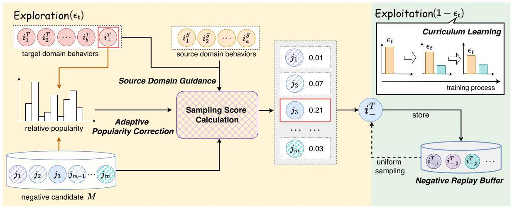
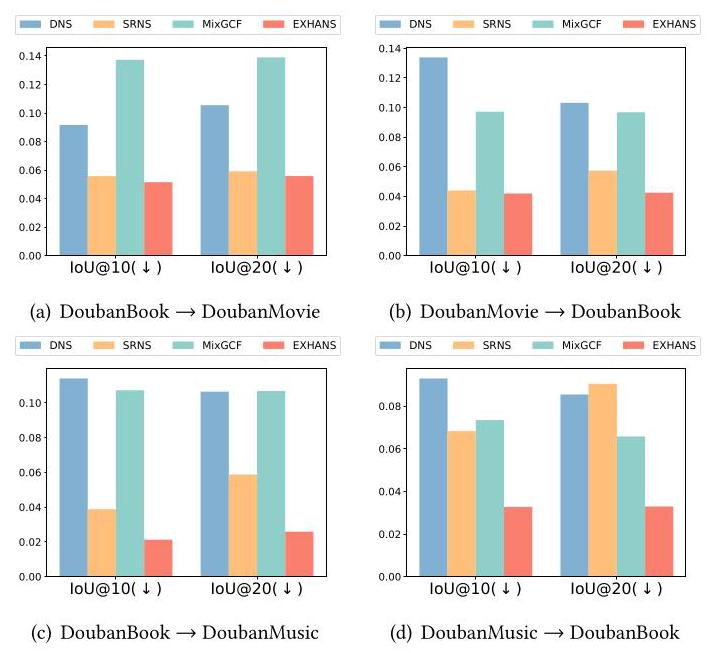

# Exploration and Exploitation of Hard Negative Samples for Cross-Domain Sequential Recommendation

Yidan Wang*

Shandong University

Qingdao, China

yidanwang@mail.sdu.edu.cn

Xuri Ge

Shandong University

Jinan, China

xurigexmu@gmail.com

Xin Chen

WeChat, Tencent

Beijing, China

andrewxchen@tencent.com

Ruobing Xie

Tencent

Beijing, China

xrbsnowing@163.com

Su Yan

WeChat, Tencent

Beijing, China

suyan@tencent.com

Xu Zhang

WeChat, Tencent

Beijing, China

xuonezhang@tencent.com

Zhumin Chen

Shandong University

Qingdao, China

chenzhumin@sdu.edu.cn

Jun Ma

Shandong University

Qingdao, China

majun@sdu.edu.cn

Xin \( {\mathrm{{Xin}}}^{ \dagger  } \)

Shandong University

Qingdao, China

xinxin@sdu.edu.cn

## Abstract

Negative sampling plays a crucial role for cross-domain recommendation as it provides contrastive signals to learn user preference. Existing methods usually select items with high predicted scores or popularity as hard negative samples to improve model training. However, such methods suffer from choosing false negative samples since items with high predicted scores or popularity could also indicate potential positive user preference. Although several studies devoted to discovering true negative samples, few of them leverage user cross-domain behaviors to alleviate the false negative issue. How to effectively mine and utilize hard negative samples to improve cross-domain recommendation remains an open question.

In this work, we propose exploration and exploitation of hard negative samples (EXHANS) for cross-domain sequential recommendation. For better exploration, we utilize the user preference from the source domain to guide negative sampling in the target domain. The key idea is that compared with hard negative samples, false negative samples have higher probability to be consistent with the user preference in both domains. Besides, we propose adaptive popularity-based score correction to account for users' different tastes of popular items. The idea is that for users who favor popular items, such items are more likely to be false negatives rather than hard negatives. For better exploitation, we design a replay buffer to cache the obtained negative samples and further propose a curriculum learning framework to balance exploration and exploitation of

Permission to make digital or hard copies of all or part of this work for personal or classroom use is granted without fee provided that copies are not made or distributed for profit or commercial advantage and that copies bear this notice and the full citation on the first page. Copyrights for components of this work owned by others than the author(s) must be honored. Abstracting with credit is permitted. To copy otherwise, or republish, to post on servers or to redistribute to lists, requires prior specific permission and/or a fee. Request permissions from permissions@acm.org.

WSDM '25, March 10-14, 2025, Hannover, Germany

hard negative samples. Extensive experiments on three real-world datasets show that our method significantly outperforms state-of-the-art negative sampling methods for cross-domain sequential recommendation, which verify the effectiveness of EXHANS.

## CCS Concepts

- Information systems \( \rightarrow \) Recommender systems; Retrieval models and ranking; Novelty in information retrieval.

## Keywords

Recommender System; Sequential Recommendation; Cross Domain Recommendation; Negative Sampling

## ACM Reference Format:

Yidan Wang, Xuri Ge, Xin Chen, Ruobing Xie, Su Yan, Xu Zhang, Zhumin Chen, Jun Ma, and Xin Xin. 2025. Exploration and Exploitation of Hard Negative Samples for Cross-Domain Sequential Recommendation. In Proceedings of the Eighteenth ACM International Conference on Web Search and Data Mining (WSDM '25), March 10-14, 2025, Hannover, Germany. ACM, New York, NY, USA, 9 pages. https://doi.org/10.1145/3701551.3703535

## 1 Introduction

Cross-domain sequential recommendation (CDSR) focuses on modeling dynamic user preference according to users' sequential behaviors from multiple domains, achieving prominence to generate better recommendation in the target domain through leveraging information from source domains [4]. Since CDSR usually learns user preference based on implicit feedback like clicks or purchases, it relies on high-quality positive and negative samples for model training. However, due to the fact that implicit feedback typically contains only positive samples, it is essential to employ negative sampling to provide contrastive signals for better learning of user preference. A naive solution is to select uninteracted items uniformly [29]. However, uniform sampling is ineffective to provide sufficient information and gradient for parameter updating.

Sampling hard negatives. To boost the recommender performance, hard negative samples which are difficult to be distinguished from positive samples are of vital importance to provide more valuable information about the user negative preference. Existing hard negative sampling methods usually assign larger sampling probability to items with high predicted scores [15, 41] or popularity [5, 34] to improve hardness of negative instances. However, such methods suffer from selecting false negative samples and misleading the recommender training, since items with high predicted scores or popularity could also indicate potential positive user preference.

---

*Work done during an internship at Tencent WeChat Group.

†The corresponding author.

---

Recently, several studies have devoted to mitigating the false negative issue. For example, Ding et al. [8] designed a variance-based sampling method to obtain hard negatives with the empirical observation that false negatives tend to have lower variances during training. Shi et al. [30] and Lai et al. [18] proposed to adaptively adjust sampling hardness to reduce the chance of selecting false negative samples. These methods are beneficial in alleviating the false negative issue and improving the recommendation performance.

Limitations of existing methods. However, there are still remaining limitations regarding negative sampling for CDSR.

- For the mining of hard negatives, previous works fail to effectively leverage user cross-domain behaviors to alleviate the false negative issue. Although Hao et al. [13] and Ma et al. [23] proposed two negative sampling frameworks for CDSR, the complicated design of their methods hinders sampling efficiency and increases the risk of overfitting. Besides, different users have different preference over popular items, which should also be considered into the negative sampling process. How to effectively explore hard negative samples to improve CDSR is still an open question.

- For the utilization of hard negatives, existing methods fail to make full use of obtained negative samples. It has been proven that only a few negative samples are valuable for model training and it is essential to sufficiently leverage high-quality hard negative samples [1]. However, it is common for existing methods that the mined high-quality samples are insufficiently utilized during model training. Besides, few works have devoted to studying whether to explore new hard negatives or to utilize the obtained hard negatives for a parameter update step. How to better exploit hard negative samples for CDSR is also an open question.

Motivation. To address the above limitations, the motivation of our methods lies in the following points.

- Users' preference in source domains can help to distinguish between hard negatives and false negatives. Specifically, we argue that in contrast to hard negatives, false negative samples exhibit higher probability to be consistent with the user preference in both domains. For instance, if a user is fond of Harry Potter novels in the book domain, it is more likely that the Harry Potter film would be a false negative in the movie domain, even though there is not any interaction between the user and the Harry Potter film. The information from source domains contributes to modeling more comprehensive user profiles, which plays a crucial role in mining hard negatives for the target domain.

- The relative item popularity should be considered for discovering hard negatives to account for users' different perference over popular items. We argue that if a user tends to visit more popular items, then a popular item is of greater likelihood to be a false negative rather than a hard negative for the user.

- We argue that the training process should focus on mining hard negatives at the initial stage and gradually pay more attention to the exploitation of obtained hard negatives.

Proposed method. In this work, we propose exploration and exploitation of hard negative samples (EXHANS) for CDSR. For better exploration of hard negative samples, we first formulate the negative sampling score based on users' preference in both domains. EXHANS assigns higher negative sampling probability to items which have high preference prediction in the target domain to ensure the hardness and low preference prediction in the source domain to avoid the false negative issue. To account for users' different tastes over popular items, EXHANS further introduces adaptive popularity-based score correction to adjust the negative sampling score. Such the score correction not only mitigates the false negative issue, but also helps to conduct adaptive popularity debiasing, which will be illustrated in the experimental section. For better exploitation, EXHANS utilizes a replay buffer to cache the obtained hard negative samples for effective reuse in the later optimization process. A curriculum learning-based strategy is further proposed to adaptively balance exploration and exploitation, which pays more attention to discovering new hard negatives at the beginning and turns to the reuse of obtained samples gradually.

To verify the effectiveness of the proposed EXHANS, we conduct extensive experiments on three public real-world datasets. Experimental results show that our method achieves significant improvement and outperforms state-of-the-art negative sampling baselines for cross-domain sequential recommendation.

Our main contributions are concluded as follows:

- We propose EXHANS, a negative sampling method that takes into account both the exploration and exploitation of hard negative samples for cross-domain sequential recommendation.

- For better exploration, we propose to leverage user preference from the source domain to assist in recognizing false negatives. Besides, we present adaptive popularity-based score correction to account for users' different preference over popular items.

- For better exploitation, we design a replay buffer to cache the obtained hard negative samples and propose a curriculum learning framework to achieve the balance between exploration and exploitation of hard negative samples.

- Extensive experiments on three cross-domain datasets are conducted to verify the effectiveness of the proposed EXHANS. Experimental results show superior performance of our approach.

## 2 Related Work

### 2.1 Negative Sampling in Recommendation

Negative sampling plays an essential rule to provide negative signals for model training from one-class data [36]. In the field of recommendation systems, negative sampling has evolved from simple static strategies with fixed sampling distribution, like uniform sampling [29] and popularity-based sampling [5, 34], to dynamic methods that select negatives dynamically during model training. DNS [41] is one of the most representative methods which chooses uninteracted instances with the highest preference prediction as negative samples. Besides, some studies introduce Generative Adversarial Networks (GANs) [7, 11] to generate negative items and improve robustness, such as IRGAN [33] and AdvIR [28]. Recently, plenty of research leverages additional information [3, 9, 16, 32, 38] to assist negative sampling. For example, MixGCF [16] designs positive mixing and hop mixing strategies to synthesize hard negative samples. Chen et al. [3], Wang et al. [32] proposed to incorporate social network for negative sampling.

However, those methods that assign higher sampling probabilities to top-ranked items inherently suffer from the false negative issue, since items with higher predicted preference could also be positive. Some research \( \left\lbrack  {8,9,{18},{30}}\right\rbrack \) has been devoted to mitigating the false negative problem. Ding et al. [8] proposed SRNS, a variance-based sampling method with the key idea that false negatives are more stable in the training process. DNS+ [30] controls the sampling hardness through expanding the sampling range of highest-scoring items. GNNO [9] samples negatives on a global weighted item transition graph and filters out false negatives based on neighborhood similarity. Nevertheless, the above strategies are mainly designed for single-domain recommendation and fail to utilize users cross-domain behaviors for better mining negative samples. It is believed that user preference reflected in other domains can help identify hard negative samples in the target domain.

### 2.2 Cross-Domain Sequential Recommendation

Cross-domain recommendation aims to improve the recommendation of the target domain through the use of auxiliary information from other domains [39]. Recently, cross-domain sequential recommendation (CDSR) has gained much attention, which models more comprehensive and stereoscopic user preference based on historical sequential behaviors of users from multiple domains. Early works like \( \pi \) -net [25] and PSJNet [31] adopt elaborate gating units to share and transfer information across multiple domains. Following the wave of neural networks, various attention-based approaches have been proposed [2, 20, 26, 27]. Besides, plenty of methods have emerged to improve CDSR with contrastive learning [2, 24, 37], graph neural network(GNN) [2, 12, 40, 42], and multi-modal information [10, 19, 21]. For instance, Tri-CDR [24] jointly models the source, target, and mixed behavior sequences with contrastive learning to explore the cross-domain correlations. C2DSR [2] leverages the graph neural network and the sequential attentive encoder to capture single-domain and cross-domain user preference simultaneously. Lei et al. [19] proposed SEMI to assist micro-video recommendation with multi-modal features and cross-domain contrastive learning. In comparison with the widespread attention to user preference transfer across different domains, few existing CDSR approaches focus on the design of negative sampling. AFT [13] and RealHNS [23] are two newly negative sampling frameworks for CDSR. However, the complicated design hinders sampling efficiency and increases the risk of overfitting.

To conclude, how to effectively mine and leverage hard negative samples for CDSR are still open questions. In this work, we focus on the exploration and exploitation of hard negative samples to improve the performance of CDSR.

## 3 Notations and Task Definition

In this work, we consider the CDSR scenario involving two domains, i.e., a source domain and a target domain. The item sets in the source domain and the target domain are defined as \( {\mathcal{I}}^{S} \) and \( {\mathcal{I}}^{T} \) , respectively. Let \( \mathcal{U} \) denotes the user set and users in \( \mathcal{U} \) have historical interactions in both domains. For a certain user \( u \in  \mathcal{U} \) , her/his source behavior sequence is defined as \( {S}_{u}^{S} = \left\{  {{i}_{1}^{S},{i}_{2}^{S},\cdots ,{i}_{a}^{S}}\right\} \) and the target behavior sequence is defined as \( {S}_{u}^{T} = \left\{  {{i}_{1}^{T},{i}_{2}^{T},\cdots ,{i}_{b}^{T}}\right\} \) , where \( a, b \) are the lengths of the source and the target sequence. The cross-domain interaction sequence \( {S}_{u} = \left\{  {{i}_{1}^{S},{i}_{2}^{S},{i}_{1}^{T},\cdots ,{i}_{a}^{S}\cdots ,{i}_{b}^{T}}\right\} \) consists of \( {S}_{u}^{S} \) and \( {S}_{u}^{T} \) merged in chronological order with \( {i}^{S} \in  {\mathcal{I}}^{S} \) and \( {i}^{T} \in  {\mathcal{I}}^{T} \) . The subscript \( u \) is omitted to simplify the formulation in later sections. Given the historical interactions of \( u \) as \( \left( {{S}^{S},{S}^{T}, S}\right) \) , the task of CDSR is to predict the next item which the user is likely to interact within the target domain.

The training objective of the recommender is generally achieved via a ranking loss function. Specifically, it is optimized to give higher preference prediction to the interacted positive sample \( {i}_{ + }^{T} \) than the negative \( {i}_{ - }^{T} \) sampled from uninteracted items in the target domain. In this paper, we proposed EXHANS to conduct better exploration and exploitation of \( {i}_{ - }^{T} \) to improve the performance of CDSR.

## 4 Methodology

In this section, we present the detail of the proposed EXHANS. Figure 1 provides the method overview including exploration and exploitation. Exploration intends to mine hard negative samples among plenty of unobserved items. Exploitation refers to fully utilizing the obtained high-quality negatives. For better exploration, we define the negative sampling score based on users' preference in both domains and users' tastes over popular items. For better exploitation, a replay buffer is introduced to store the mined hard negative samples for effective reuse in the later optimization process. The balance between exploration and exploitation is achieved through a curriculum learning-based strategy.

### 4.1 Exploration of Hard Negatives

For more efficient sampling and the balance between hard and easy negatives, we first apply uniform sampling to sample a negative candidate set \( M \) from the target domain. Then the item which has the highest sampling score within \( M \) is selected as the negative sample for parameter updates. For the sampling score calculation, we consider to use source domain user preference as well as relative item popularity to alleviate the false negative issue.

4.1.1 Cross-domain pretraining. To use the source domain user preference to guide negative sampling in the target domain, the item and user preference representations in both domains should lie in the same parameter space. To this end, we adopt a two-stage training strategy, including cross-domain pretraining and target domain fine-tuning for more stable and superior recommendation performance. Specifically, we merge the source domain sequence \( {S}^{S} \) and the target domain sequence \( {S}^{T} \) in chronological order to formulate a cross-domain sequence as \( S \) . Then, the sequential recommender is pretrained based on \( S \) to obtain all item embeddings. The source domain user preference representation can also be obtained by feeding \( {S}^{S} \) to the pretrained recommender. During the pretraining stage, a simple uniform sampling strategy is utilized for negative sampling. In the following target domain fine-tuning stage, the single target domain sequence \( {S}^{T} \) is further used to fine-tune the pretrained recommender. In this work, we employ SASRec [17] as the default sequential recommender. Note that our approach serves as a plug-and-play negative sampling module to enhance the target domain fine-tuning for CDSR. SASRec can be replaced with various recommenders, including both single-domain and cross-domain sequential models, as shown in the experimental section.

Figure 1: Overview of EXHANS. For the \( t \) -th learning step, EXHANS either explores new negative samples with probability \( {\epsilon }_{t} \) or exploits obtained negatives with probability \( 1 - {\epsilon }_{t} \) . For exploration, it uniformly samples a negative candidate set \( M \) , and the item which has the highest sampling score in \( M \) is selected as the negative sample. The sampling score considers user behaviors in both domains as well as the relative item popularity. The explored negative sample is then stored into the negative replay buffer for efficient exploitation reuse. \( {\epsilon }_{t} \) is updated through a curriculum learning method.

4.1.2 Source domain guidance. The motivation to incorporate source domain guidance is that source domain user preference can help to distinguish between hard negatives and false negatives. Specifically, we hold the belief that false negative samples exhibit higher probability to be consistent with the user preference in both domains. For instance, if a user is fond of Harry Potter novels in the book domain, it is more likely that the Harry Potter film would be false negative in the movie domain, even though there is not any observed interaction between the user and the Harry Potter film.

Precisely, we first obtain the user preference representation in the source domain and the target domain through the sequential recommender as \( {\mathbf{h}}^{\mathrm{S}} \) and \( {\mathbf{h}}^{\mathrm{T}} \) :

\[
{\mathbf{h}}^{\mathrm{S}} = {f}_{\text{ rec }}\left( {S}^{S}\right) ,{\mathbf{h}}^{\mathrm{T}} = {f}_{\text{ rec }}\left( {S}^{T}\right) , \tag{1}
\]

where \( {f}_{rec} \) denotes the encoder of the pretrained recommendation model. \( {f}_{rec} \) is initialized through cross-domain pretraining and updated using the target domain data.

For each candidate item \( j \in  M \) , the predicted user interest of \( j \) in the source domain and the target domain is defined as:

\[
r\left( {{S}^{S}, j}\right)  = {\mathbf{h}}^{\mathrm{S}} \cdot  {\mathbf{e}}_{j}, r\left( {{S}^{T}, j}\right)  = {\mathbf{h}}^{\mathrm{T}} \cdot  {\mathbf{e}}_{j}, \tag{2}
\]

where \( {\mathbf{e}}_{j} \) is the item embedding of \( j \) .

Therefore, with the incorporation of users' preference in source domain, the negative sampling score function is initially defined as:

\[
\operatorname{score}\left( {{S}^{S},{S}^{T}, j}\right)  = r\left( {{S}^{T}, j}\right)  - \alpha  \cdot  r\left( {{S}^{S}, j}\right) , \tag{3}
\]

where \( \alpha \) denotes the weight of source domain user preference.

It's obvious that Eq.(3) assigns higher negative sampling scores to items which have high preference prediction in the target domain to ensure the hardness and low preference prediction in the source domain to reduce the risk of sampling false negatives.

4.1.3 Adaptive popularity correction. Item popularity is also an important indicator of sample hardness. Previous approaches assign high negative sampling probabilities to popular items in a static fashion [5, 34]. However, different users have different preference over popular items. If a user tends to visit more popular items, then a popular sample is more likely to be false negative rather than hard negative. From this perspective, we propose adaptive popularity score correction to adjust the influence of item popularity.

Precisely, for each item \( j \in  M \) , we calculate its relative popularity compared with the ground-truth positive instance \( {i}_{ + }^{T} \) as:

\[
\operatorname{rel}\left( {j,{i}_{ + }^{T}}\right)  = \left\{  \begin{array}{ll} \frac{o\left( j\right)  - o\left( {i}_{ + }^{T}\right) }{o\left( {i}_{ + }^{T}\right) }, & \text{ if }o\left( j\right)  > o\left( {i}_{ + }^{T}\right) \\  0, & \text{ otherwise, } \end{array}\right. \tag{4}
\]

where \( o\left( \cdot \right) \) denotes the item frequency.

Then, we introduce a weight coefficient \( {g}_{pop}\left( {j,{i}_{ + }^{T}}\right) \) as

\[
{g}_{\text{ pop }}\left( {j,{i}_{ + }^{T}}\right)  = 1 + \frac{{e}^{\left( \operatorname{rel}\left( j,{i}_{ + }^{T}\right) /\tau \right) }}{\mathop{\sum }\limits_{{{j}^{\prime } \in  M}}{e}^{\left( \operatorname{rel}\left( {j}^{\prime },{i}_{ + }^{T}\right) /\tau \right) }}, \tag{5}
\]

where \( \tau \) is the temperature coefficient. \( {g}_{pop}\left( {j,{i}_{ + }^{T}}\right) \) is used to correct the negative sampling score function as:

\[
{\operatorname{score}}^{\prime }\left( {{S}^{S},{S}^{T}, j,{i}_{ + }^{T}}\right)  = {g}_{\text{ pop }}\left( {j,{i}_{ + }^{T}}\right)  \cdot  r\left( {{S}^{T}, j}\right)  - \alpha  \cdot  r\left( {{S}^{S}, j}\right) . \tag{6}
\]

Finally, the explored negative sample \( {i}_{ - }^{T} \) is identified by selecting the item with the highest \( {\operatorname{score}}^{\prime }\left( {{S}^{\bar{S}},{S}^{T}, j,{i}_{ + }^{T}}\right) \) within \( M \) :

\[
{i}_{ - }^{T} = \arg \mathop{\max }\limits_{{j \in  M}}\left( {{\operatorname{score}}^{\prime }\left( {{S}^{S},{S}^{T}, j,{i}_{ + }^{T}}\right) }\right) . \tag{7}
\]

We can see that if the user tends to visit popular items with high \( o\left( {i}_{ + }^{T}\right) \) , a popular \( j \) would have lower probability to be allocated high \( {g}_{pop} \) , leading to smaller negative sampling score and indicating that the popular item is more likely to be false negative. On the contrast, if the user visits unpopular items with low \( o\left( {i}_{ + }^{T}\right) \) , a popular \( j \) would have higher probability to be allocated large \( {g}_{pop} \) , indicating that the popular item is more likely to be true negative.

Algorithm 1: The training process with EXHANS .

---

Input: Sequences in target domain \( {S}^{T} \) , Sequences in source

		domain \( {S}^{S} \) , Recommender \( {f}_{\text{ rec }} \)

// Cross-domain Pretraining

1 Merge \( {S}^{T} \) and \( {S}^{S} \) in chronological order to formulate \( S \) ;

Pretrain \( {f}_{rec} \) based on \( S \) ;

// Target domain Fine-tuning

Initialize \( {\epsilon }_{1} = 1 \) ;

for \( t = 1 \) to \( {EPOCH} \) do

	for each \( \left( {{S}^{T},{S}^{S},{i}_{ + }^{T}}\right) \) do

		Sample a probability \( x \) ;

		if \( x < {\epsilon }_{t} \) then // Exploration

			Uniformly sample negative candidate \( M \) ;

			Select \( {i}_{ - }^{T} \) based on Eq.(1) \( \sim \) Eq.(7) within \( M \) ;

			Add \( {i}_{ - }^{T} \) into the negative replay buffer ;

		end

		else // Exploitation

			Update the negative replay buffer;

			Uniformly sample \( {i}_{ - }^{T} \) from the replay buffer ;

		end

	end

	Update \( {f}_{\text{ rec }} \) using \( \left( {{S}^{T},{i}_{ + }^{T},{i}_{ - }^{T}}\right) \) ;

	// Curriculum Learning Update

	Compute \( {\epsilon }_{t + 1} \) according to Eq.(8) and Eq.(9) ;

end

---

To summarize, EXHANS utilizes the user cross-domain behaviors and relative item popularity to effectively explore hard negative samples for model training.

### 4.2 Exploitation of Hard Negatives

In order to fully leverage the explored hard negative instances, we design a negative replay buffer to cache the previously sampled \( {i}_{ - }^{T} \) and propose a curriculum learning-based \( \epsilon \) -greedy algorithm to balance exploration and exploitation. In particular, for \( t \) -th training step, there is the probability of \( {\epsilon }_{t} \) to explore new hard negatives from unexplored items. Meanwhile, there is the probability of \( 1 - {\epsilon }_{t} \) to select previously mined hard negatives from the replay buffer.

4.2.1 Negative Replay Buffer. Given a training sequence, a negative replay buffer is introduced to store the explored hard negatives for this sequence. When sampling from the replay buffer, since the samples stored in the buffer are already high-quality hard negatives, a simple and efficient uniformly sampling distribution is used to select instances for exploitation. Besides, as the distribution of hard negative samples evolves with the model training, it is essential to remove out-of-date samples and dynamically update the buffer. Therefore, before sampling instances from the buffer, the cached samples are evaluated according to \( r\left( {{S}^{T}, j}\right) \) and top- \( n \) items with highest scores are retained to construct the new buffer. It is ensured in this way that the items in the replay buffer are all high-quality hard negatives at the current moment.

4.2.2 Curriculum Learning. The trade-off between exploration and exploitation should be adaptively evolved during the training process. Specifically, at the beginning of training, the emphasis lies on exploration, allowing the model to encounter as many unobserved negatives as possible. The probability of exploitation increases gradually with the training progress, focusing more on utilizing explored hard negative samples to refine the model. To this end, we propose to use curriculum learning to update the \( {\epsilon }_{t} \) and control the trade-off.

In particular, the negative samples should all come from exploration at the beginning, so \( {\epsilon }_{1} = 1 \) . Let \( {\epsilon }_{\min } \) denotes the minimum exploration propability and \( t \) denotes the current epoch. \( {\epsilon }_{t} \) should gradually decrease as \( t \) increases, thus growing the proportion of exploitation. \( {\epsilon }_{t} \) of epoch \( t \) is defined as:

\[
{\epsilon }_{t} = \max \left( {{\epsilon }_{t - 1} - {\eta }_{t},{\epsilon }_{\min }}\right) , \tag{8}
\]

where \( {\eta }_{t} \) is the update rate of epoch \( t \) .

To determine \( {\eta }_{t} \) , the belief is that if the loss drops a lot, it means that the sampled negatives provide valuable information and sufficient gradient. In that case, the update rate \( {\eta }_{t} \) should be large to facilitate the exploitation. Otherwise, if the loss does not change a lot, it indicates that the model needs to discover new negatives, suggesting a small \( {\eta }_{t} \) to keep exploring. From this perspective, we cache the most recent \( C \) rounds of loss and \( {\eta }_{t} \) is defined as:

\[
{\eta }_{t} = \eta  \cdot  \frac{\left| {\mathcal{L}}_{t} - {\mathcal{L}}_{t - 1}\right| }{\sqrt{\mathop{\sum }\limits_{{c = 0}}^{{C - 1}}{\left( {\mathcal{L}}_{t - c} - {\mathcal{L}}_{t - c - 1}\right) }^{2} + \lambda }}, \tag{9}
\]

where \( \eta \) and \( \lambda \) are hyperparameters. \( {\mathcal{L}}_{t} \) denotes the loss in the \( t \) -th epoch. Through updating \( {\epsilon }_{t} \) , the recommender is trained to explore more at the beginning and exploit more in the later stage.

In this paper, we use the Bayesian Personalized Ranking (BPR) [29] loss to update the model. The training process with EXHANS is described in Algorithm 1.

## 5 Experiments

In this section, we detail the experimental setup and experimental results for validation of our proposed EXHANS \( {}^{1} \) , where we aim to answer the following research questions:

RQ1: How does EXHANS perform compared to existing negative sampling methods for CDSR?

RQ2: How does EXHANS perform when deployed on different recommendation models?

RQ3: How do components of EXHANS affect the performance?

### 5.1 Experimental Setup

5.1.1 Datasets. Three public real-world cross-domain datasets from two platforms are adopted to evaluate the performance of our methods. Specifically, we select three domains from Douban platform, i.e. "Book", "Movie" and "Music", to build "Book↔Movie" and "Book↔Music" cross-domain datasets \( {}^{2} \) . In addition, we choose "Grocery and Gourmet Food" and "Home and Kitchen" from Amazon \( {}^{3} \) to generate the "Food \( \leftrightarrow \) Kitchen" dataset. We select overlapping users with interactive behaviors in both domains and users who

---

\( {}^{1} \) The code of this work is available at https://github.com/Junewang0614/EXHANS

\( {}^{2} \) https://github.com/RUCAIBox/RecBole-CDR

\( {}^{3} \) https://jmcauley.ucsd.edu/data/amazon/

---

Table 1: Statistics of datasets.

<table><tr><td colspan="2">Dataset</td><td>Users</td><td>Items</td><td>Interactions</td></tr><tr><td rowspan="2">Douban</td><td rowspan="2">Book Movie</td><td rowspan="2">14,024</td><td>17,809</td><td>360,485</td></tr><tr><td>18,967</td><td>1,234,142</td></tr><tr><td rowspan="2">Douban</td><td rowspan="2">Book Music</td><td rowspan="2">11,444</td><td>16,158</td><td>314,507</td></tr><tr><td>22,053</td><td>509,163</td></tr><tr><td rowspan="2">Amazon</td><td rowspan="2">Food Kitchen</td><td rowspan="2">28,807</td><td>10,455</td><td>174,568</td></tr><tr><td>13,502</td><td>204,684</td></tr></table>

have less than three interactions in any single domain are filtered out. Table 1 shows the datasets statistics.

5.1.2 Evaluation Protocols. We use two common metrics, Recall@k [6] and NDCG@ \( k \) [35], to evaluate the recommendation performance. The former measures whether the ground-truth item occurs in the top- \( k \) recommended list and the later focuses on ranking equity. The ranking is conducted among the entire target domain items. We use cross-validation and the user ratio of training, validation, and test set is 8:1:1. Average scores over three experiments are reported.

5.1.3 Baselines. The negative sampling baselines include naive uniform sampling, hard negative-focused methods, false negative-mitigated methods, and methods tailored for CDSR.

- Uniform [29] employs a uniform distribution to select negatives.

- Hard negative-focused methods:

(1) DNS [41] is a representative dynamic hard negative sampling method, selecting negatives with high user preference prediction. (2) MixGCF [16] proposes positive mixing and hop mixing to synthesize hard negatives by injecting positive signals from interaction graph topology to negative candidates.

## False negative-mitigated methods:

(1) GNNO [9] constructs a weighted item transition graph and negatives are mined based on the degree of neighborhood overlap. False negatives are filtered out based on neighborhood similarity. (2) SRNS [8] is an effective and robust sampling approach, utilizing the score-based memory update and the variance-based sampling to obtain high-quality true negative samples.

(3) DNS+ [30] improves DNS by dynamically changing the sampling hardness to alleviate the false negative issue.

- CDSR-tailored method: RealHNS [23] proposes a dynamic item-based filter to avoid sampling false negatives for CDSR.

5.1.4 Implementation Details. The default recommender is SAS-Rec [17] to incorporate baseline methods and EXHANS. Results on other backbones is illustrated on section 5.3. The sequence lengths are 128 on Douban datasets and 20 on Amazon, respectively. The dimension of item embedding is 64 . The size of the candidate set \( M \) and the replay buffer is tuned to \( {100}.\alpha  = {0.3},\tau  = 1 \) and \( \eta  = {0.1} \) for all datasets. \( {\epsilon }_{\min } \) is set to \( \{ {0.2},{0.4}\} \) on "Book \( \leftrightarrow \) Movie", \( \{ {0.5},{0.5}\} \) on "Book \( \leftrightarrow \) Music" and \{0.7,0.7\} on "Food \( \leftrightarrow \) Kitchen", while the most recent \( C = 5 \) rounds of training loss are kept for updating \( {\epsilon }_{t} \) . We optimize the model using AdamW [22] with \( {1e} - 3 \) as the learning rate. The batch size is set as 1024.

### 5.2 Performance Comparison (RQ1)

Table 2 shows the performance comparison of different negative sampling methods on three cross-domain datasets. We can see that the proposed EXHANS consistently outperforms other baselines on all metrics, demonstrating the effectiveness of our method.

Figure 2: Comparison of IoU on different datasets.

When compared with other false negative-mitigated methods like GNNO, SRNS, and DNS+, it's observious that EXHANS significantly outperforms them, which verifies that EXHANS effectively explores true hard negatives and alleviates the false negative issue.

When compared with another CDSR-tailored method RealHNS, the superior performance demonstrates that EXHANS is a simple yet effective approach to conduct better negative sampling for CDSR. The observation also highlights the benefit of the exploitation module of EXHANS, since RealHNS does not include an exploitation mechanism for hard negatives.

Among the baselines, we can see that the false negative-mitigated methods outperform hard negative-focused methods in most cases, demonstrating that there exists the false negative issue for hard negative-focused methods. Besides, we can see that MixGCF which synthesizes hard negatives through infusing positive signals performs even worse than DNS in "Book↔Movie" dataset. This further suggests the prevalence of the false negative issue, which is successfully addressed by EXHANS.

In addition, it's observed in our experiments that EXHANS has better capability to include unpopular items in the recommendation list, which helps to alleviate the popularity bias. To demonstrate the observation, we introduce the Intersection of Union (IoU) [43] metric which is defined as IoU \( = \frac{\left| \{ \text{ recommended items }\} \cap \{ \text{ popular items }\} \right| }{\left| \{ \text{ recommended items }\} \cup \{ \text{ popular items }\} \right| } \) . Figure 2 shows the comparison of IoU between baselines and EX-HANS on Douban datasets. It's obvious that EXHANS achieves the lowest IoU values in all cases, indicating that the recommended items of EXHANS contain more unpopular items. The reason is that the adaptive popularity score correction can successfully account for users different preference over popular items, leading to higher recommendation accuracy and less popularity bias simultaneously.

(Answer to RQ1) EXHANS achieves superior recommendation accuracy over state-of-the-art negative sampling approaches and further provides recommendation with less popularity bias, demonstrating the effectiveness of EXHANS.

Table 2: Performance comparison on the three cross-domain datasets. The best and the second-best scores are marked in bold and underlined fonts, respectively. RC and NG stand for Recall and NDCG. * denotes p-value<0.05 for paired t-tests.

<table><tr><td rowspan="2">Method</td><td colspan="6">DoubanBook \( \rightarrow \) DoubanMovie</td><td colspan="6">DoubanMovie \( \rightarrow \) DoubanBook</td></tr><tr><td>RC@5</td><td>RC@10</td><td>RC@20</td><td>NG@5</td><td>NG@10</td><td>NG@20</td><td>RC@5</td><td>RC@10</td><td>RC@20</td><td>NG@5</td><td>NG@10</td><td>NG@20</td></tr><tr><td>Uniform</td><td>0.0809</td><td>0.1235</td><td>0.1780</td><td>0.0540</td><td>0.0677</td><td>0.0814</td><td>0.0937</td><td>0.1320</td><td>0.1800</td><td>0.0648</td><td>0.0771</td><td>0.0892</td></tr><tr><td>DNS</td><td>0.0810</td><td>0.1184</td><td>0.1629</td><td>0.0550</td><td>0.0670</td><td>0.0782</td><td>0.1183</td><td>0.1564</td><td>0.1995</td><td>0.0854</td><td>0.1086</td><td>0.1205</td></tr><tr><td>MixGCF</td><td>0.0784</td><td>0.1143</td><td>0.1592</td><td>0.0523</td><td>0.0639</td><td>0.0752</td><td>0.1180</td><td>0.1559</td><td>0.2022</td><td>0.0833</td><td>0.0956</td><td>0.1073</td></tr><tr><td>GNNO</td><td>0.0828</td><td>0.1209</td><td>0.1676</td><td>0.0562</td><td>0.0685</td><td>0.0803</td><td>0.1207</td><td>0.1612</td><td>0.2037</td><td>0.0860</td><td>0.0990</td><td>0.1097</td></tr><tr><td>SRNS</td><td>0.1068</td><td>0.1529</td><td>0.2064</td><td>0.0735</td><td>0.0884</td><td>0.1019</td><td>0.1356</td><td>0.1742</td><td>0.2161</td><td>0.0978</td><td>0.1103</td><td>0.1209</td></tr><tr><td>DNS+</td><td>0.1000</td><td>0.1492</td><td>0.2089</td><td>0.0664</td><td>0.0822</td><td>0.0972</td><td>0.1191</td><td>0.1624</td><td>0.2118</td><td>0.0831</td><td>0.0970</td><td>0.1095</td></tr><tr><td>RealHNS</td><td>0.0984</td><td>0.1380</td><td>0.1 907</td><td>0.0644</td><td>0.0771</td><td>0.0810</td><td>0.1090</td><td>0.1574</td><td>0.2010</td><td>0.0787</td><td>0.0852</td><td>0.1082</td></tr><tr><td>EXHANS</td><td>0.1184</td><td>0.1656</td><td>0.2220</td><td>0.0822</td><td>0.0974</td><td>0.1116</td><td>0.1387</td><td>0.1814</td><td>0.2269</td><td>0.1005</td><td>0.1143</td><td>0.1259</td></tr></table>

<table><tr><td rowspan="2">Method</td><td colspan="6">DoubanBook \( \rightarrow \) DoubanMusic</td><td colspan="6">DoubanMusic \( \rightarrow \) DoubanBook</td></tr><tr><td>RC@5</td><td>RC@10</td><td>RC@20</td><td>NG@5</td><td>NG@10</td><td>NG@20</td><td>RC@5</td><td>RC@10</td><td>RC@20</td><td>NG@5</td><td>NG@10</td><td>NG@20</td></tr><tr><td>Uniform</td><td>0.0595</td><td>0.0894</td><td>0.1279</td><td>0.0391</td><td>0.0487</td><td>0.0584</td><td>0.0879</td><td>0.1222</td><td>0.1653</td><td>0.0606</td><td>0.0716</td><td>0.0825</td></tr><tr><td>DNS</td><td>0.0717</td><td>0.1053</td><td>0.1437</td><td>0.0466</td><td>0.0574</td><td>0.0671</td><td>0.1083</td><td>0.1471</td><td>0.1870</td><td>0.0760</td><td>0.0885</td><td>0.0986</td></tr><tr><td>MixGCF</td><td>0.0708</td><td>0.1042</td><td>0.1441</td><td>0.0464</td><td>0.0571</td><td>0.0672</td><td>0.1105</td><td>0.1468</td><td>0.1865</td><td>0.0785</td><td>0.0902</td><td>0.1002</td></tr><tr><td>GNNO</td><td>0.0730</td><td>0.1087</td><td>0.1496</td><td>0.0475</td><td>0.0590</td><td>0.0693</td><td>0.1093</td><td>0.1496</td><td>0.1919</td><td>0.0771</td><td>0.0901</td><td>0.1008</td></tr><tr><td>SRNS</td><td>0.0893</td><td>0.1238</td><td>0.1591</td><td>0.0612</td><td>0.0723</td><td>0.0813</td><td>0.1215</td><td>0.1572</td><td>0.1944</td><td>0.0873</td><td>0.0989</td><td>0.1083</td></tr><tr><td>DNS+</td><td>0.0811</td><td>0.1168</td><td>0.1586</td><td>0.0542</td><td>0.0657</td><td>0.0763</td><td>0.1114</td><td>0.1494</td><td>0.1942</td><td>0.0780</td><td>0.0903</td><td>0.1016</td></tr><tr><td>RealHNS</td><td>0.0823</td><td>0.1177</td><td>0.1532</td><td>0.0578</td><td>0.0660</td><td>0.0745</td><td>0.1056</td><td>0.1432</td><td>0.1879</td><td>0.0751</td><td>0.0889</td><td>0.1004</td></tr><tr><td>EXHANS</td><td>0.0963</td><td>0.1320</td><td>0.1715</td><td>0.0657</td><td>0.0772</td><td>0.0872</td><td>0.1237</td><td>0.1608</td><td>0.2001</td><td>0.0890</td><td>0.1010</td><td>0.1109</td></tr></table>

<table><tr><td rowspan="2">Method</td><td colspan="6">AmazonFood \( \rightarrow \) AmazonKitchen</td><td colspan="6">AmazonKitchen \( \rightarrow \) AmazonFood</td></tr><tr><td>RC@5</td><td>RC@10</td><td>RC@20</td><td>NG@5</td><td>NG@10</td><td>NG@20</td><td>RC@5</td><td>RC@10</td><td>RC@20</td><td>NG@5</td><td>NG@10</td><td>NG@20</td></tr><tr><td>Uniform</td><td>0.0260</td><td>0.0402</td><td>0.0604</td><td>0.0177</td><td>0.0222</td><td>0.0273</td><td>0.0677</td><td>0.1078</td><td>0.1623</td><td>0.0436</td><td>0.0565</td><td>0.0702</td></tr><tr><td>DNS</td><td>0.0290</td><td>0.0414</td><td>0.0644</td><td>0.0192</td><td>0.0232</td><td>0.0290</td><td>0.1052</td><td>0.1547</td><td>0.2058</td><td>0.0701</td><td>0.0861</td><td>0.0990</td></tr><tr><td>MixGCF</td><td>0.0316</td><td>0.0482</td><td>0.0726</td><td>0.0211</td><td>0.0265</td><td>0.0326</td><td>0.1075</td><td>0.1529</td><td>0.2063</td><td>0.0718</td><td>0.0864</td><td>0.0999</td></tr><tr><td>GNNO</td><td>0.0344</td><td>0.0508</td><td>0.0759</td><td>0.0238</td><td>0.0290</td><td>0.0353</td><td>0.1079</td><td>0.1504</td><td>0.2062</td><td>0.0705</td><td>0.0843</td><td>0.0984</td></tr><tr><td>SRNS</td><td>0.0306</td><td>0.0446</td><td>0.0680</td><td>0.0208</td><td>0.0253</td><td>0.0312</td><td>0.1038</td><td>0.1465</td><td>0.1958</td><td>0.0697</td><td>0.0835</td><td>0.0960</td></tr><tr><td>DNS+</td><td>0.0328</td><td>0.0496</td><td>0.0769</td><td>0.0223</td><td>0.0277</td><td>0.0345</td><td>0.0916</td><td>0.1364</td><td>0.1929</td><td>0.0593</td><td>0.0737</td><td>0.0879</td></tr><tr><td>RealHNS</td><td>0.0308</td><td>0.0463</td><td>0.0616</td><td>0.0216</td><td>0.0240</td><td>0.0304</td><td>0.1047</td><td>0.1450</td><td>0.1943</td><td>0.0664</td><td>0.0822</td><td>0.0928</td></tr><tr><td>EXHANS</td><td>0.0367</td><td>0.0539</td><td>0.0795</td><td>0.0256</td><td>0.0313</td><td>0.0378</td><td>0.1085</td><td>0.1566</td><td>0.2092</td><td>0.0736</td><td>0.0890</td><td>0.1023</td></tr></table>

Table 3: Performance comparison with different recommendation backbones. The best and the second-best scores are marked in bold and underlined fonts, respectively. RC and NG stand for Recall and NDCG. * denotes p-value <0.05 for paired t-tests.

<table><tr><td rowspan="2">Domain</td><td rowspan="2">Method</td><td colspan="4">GRU4Recross</td><td colspan="4">\( {\text{ SASRec }}_{\text{ cross }} \)</td><td colspan="4">Tri-CDR</td></tr><tr><td>RC@5</td><td>RC@10</td><td>NG@5</td><td>NG@10</td><td>RC@5</td><td>RC@10</td><td>NG@5</td><td>NG@10</td><td>RC@5</td><td>RC@10</td><td>NG@5</td><td>NG@10</td></tr><tr><td>Book</td><td>Uniform</td><td>0.0671</td><td>0.1053</td><td>0.0435</td><td>0.0558</td><td>0.0809</td><td>0.1235</td><td>0.0540</td><td>0.0677</td><td>0.0517</td><td>0.0843</td><td>0.0332</td><td>0.0437</td></tr><tr><td>↓</td><td>DNS+</td><td>0.0857</td><td>0.1316</td><td>0.0563</td><td>0.0710</td><td>0.0810</td><td>0.1184</td><td>0.0550</td><td>0.0670</td><td>0.0614</td><td>0.0967</td><td>0.0399</td><td>0.0512</td></tr><tr><td>Movie</td><td>EXHANS</td><td>0.0924</td><td>0.1332</td><td>0.0628</td><td>0.0759</td><td>0.1184</td><td>0.1656</td><td>0.0822</td><td>0.0974</td><td>0.0632</td><td>0.0982</td><td>0.0415</td><td>0.0527</td></tr><tr><td>Movie</td><td>Uniform</td><td>0.0498</td><td>0.0798</td><td>0.0323</td><td>0.0419</td><td>0.0937</td><td>0.1320</td><td>0.0648</td><td>0.0771</td><td>0.0378</td><td>0.0626</td><td>0.0240</td><td>0.0320</td></tr><tr><td>↓</td><td>DNS+</td><td>0.0685</td><td>0.1027</td><td>0.0452</td><td>0.0562</td><td>0.1191</td><td>0.1624</td><td>0.0831</td><td>0.0970</td><td>0.0423</td><td>0.0682</td><td>0.0268</td><td>0.0351</td></tr><tr><td>Book</td><td>EXHANS</td><td>0.0871</td><td>0.1232</td><td>0.0588</td><td>0.0704</td><td>0.1387</td><td>0.1814</td><td>0.1005</td><td>0.1143</td><td>0.0482</td><td>0.0751</td><td>0.0321</td><td>0.0408</td></tr><tr><td>Food</td><td>Uniform</td><td>0.0151</td><td>0.0255</td><td>0.0098</td><td>0.0131</td><td>0.0260</td><td>0.0402</td><td>0.0177</td><td>0.0222</td><td>0.0180</td><td>0.0291</td><td>0.0111</td><td>0.0147</td></tr><tr><td>↓</td><td>DNS+</td><td>0.0218</td><td>0.0338</td><td>0.0147</td><td>0.0186</td><td>0.0328</td><td>0.0496</td><td>0.0223</td><td>0.0277</td><td>0.0199</td><td>0.0311</td><td>0.0135</td><td>0.0171</td></tr><tr><td>Kitchen</td><td>EXHANS</td><td>0.0273</td><td>0.0446</td><td>0.0178</td><td>0.0234</td><td>0.0367</td><td>0.0539</td><td>0.0256</td><td>0.0313</td><td>0.0215</td><td>0.0358</td><td>0.0147</td><td>0.0193</td></tr><tr><td>Kitchen</td><td>Uniform</td><td>0.0504</td><td>0.0832</td><td>0.0313</td><td>0.0418</td><td>0.0677</td><td>0.1078</td><td>0.0436</td><td>0.0565</td><td>0.0541</td><td>0.0878</td><td>0.0342</td><td>0.0450</td></tr><tr><td>↓</td><td>DNS+</td><td>0.0713</td><td>0.1130</td><td>0.0458</td><td>0.0592</td><td>0.0916</td><td>0.1364</td><td>0.0593</td><td>0.0737</td><td>0.0622</td><td>0.1021</td><td>0.0392</td><td>0.0520</td></tr><tr><td>Food</td><td>EXHANS</td><td>0.0942</td><td>0.1406</td><td>0.0619</td><td>0.0769</td><td>0.1085</td><td>0.1566</td><td>0.0736</td><td>0.0890</td><td>0.0715</td><td>0.1110</td><td>0.0464</td><td>0.0591</td></tr></table>

### 5.3 Generalization Evaluation (RQ2)

EXHANS serves as a plug-and-play negative sampling method that can be deployed on different recommendation models to enhance target domain fine-tuning for CDSR. To verify its generalization capability, we deploy EXHANS on three recommendation backbones, including two widely used single-domain sequential recommenders GRU4Rec [14], SASRec [17], and a recent CDSR model Tri-CDR [24]. Note that since GRU4Rec and SASRec are single-domain recommendation methods, we use the merged cross-domain sequences to pretrain them as described in section 4.1.1 for better performance, which is represented with a subscript cross. Table 3 shows the results. We observe that EXHANS consistently provides significant improvement based on all the recommendation models compared to other negative sampling methods such as Uniform and DNS+, indicating that EXHANS can be deployed to both single-domain and cross-domain recommenders to further improve the performance.

Table 4: Ablation study for EXHANS on Douban datasets. RC and NG stand for Recall and NDCG.

<table><tr><td rowspan="2">Variant</td><td colspan="6">DoubanBook \( \rightarrow \) DoubanMovie</td><td colspan="6">DoubanMovie \( \rightarrow \) DoubanBook</td></tr><tr><td>RC@5</td><td>RC@10</td><td>RC@20</td><td>NG@5</td><td>NG@10</td><td>NG@20</td><td>RC@5</td><td>RC@10</td><td>RC@20</td><td>NG@5</td><td>NG@10</td><td>NG@20</td></tr><tr><td>EXHANS</td><td>0.1184</td><td>0.1656</td><td>0.2220</td><td>0.0822</td><td>0.0974</td><td>0.1116</td><td>0.1387</td><td>0.1814</td><td>0.2269</td><td>0.1005</td><td>0.1143</td><td>0.1259</td></tr><tr><td>-CL</td><td>0.1176</td><td>0.1644</td><td>0.2210</td><td>0.0818</td><td>0.0969</td><td>0.1111</td><td>0.1365</td><td>0.1790</td><td>0.2253</td><td>0.0990</td><td>0.1128</td><td>0.1245</td></tr><tr><td>-CL-RB</td><td>0.1006</td><td>0.1467</td><td>0.2045</td><td>0.0684</td><td>0.0832</td><td>0.0978</td><td>0.1298</td><td>0.1732</td><td>0.2199</td><td>0.0930</td><td>0.1069</td><td>0.1187</td></tr><tr><td>-CL-RB-AP</td><td>0.0963</td><td>0.1398</td><td>0.1952</td><td>0.0657</td><td>0.0797</td><td>0.0937</td><td>0.1267</td><td>0.1700</td><td>0.2161</td><td>0.0910</td><td>0.1049</td><td>0.1166</td></tr><tr><td>-CL-RB-AP-SD</td><td>0.0810</td><td>0.1184</td><td>0.1629</td><td>0.0550</td><td>0.0670</td><td>0.0782</td><td>0.1183</td><td>0.1564</td><td>0.1995</td><td>0.0854</td><td>0.1086</td><td>0.1205</td></tr><tr><td rowspan="2"></td><td colspan="6">DoubanBook \( \rightarrow \) DoubanMusic</td><td colspan="6">DoubanMusic \( \rightarrow \) DoubanBook</td></tr><tr><td>RC@5</td><td>RC@10</td><td>RC@20</td><td>NG@5</td><td>NG@10</td><td>NG@20</td><td>RC@5</td><td>RC@10</td><td>RC@20</td><td>NG@5</td><td>NG@10</td><td>NG@20</td></tr><tr><td>EXHANS</td><td>0.0963</td><td>0.1320</td><td>0.1715</td><td>0.0657</td><td>0.0772</td><td>0.0872</td><td>0.1237</td><td>0.1608</td><td>0.2001</td><td>0.0890</td><td>0.1010</td><td>0.1109</td></tr><tr><td>-CL</td><td>0.0956</td><td>0.1311</td><td>0.1705</td><td>0.0649</td><td>0.0767</td><td>0.0864</td><td>0.1219</td><td>0.1581</td><td>0.1997</td><td>0.0881</td><td>0.0997</td><td>0.1101</td></tr><tr><td>-CL-RB</td><td>0.0920</td><td>0.1296</td><td>0.1690</td><td>0.0618</td><td>0.0739</td><td>0.0838</td><td>0.1205</td><td>0.1581</td><td>0.1991</td><td>0.0867</td><td>0.0989</td><td>0.1094</td></tr><tr><td>-CL-RB-AP</td><td>0.0845</td><td>0.1184</td><td>0.1581</td><td>0.0557</td><td>0.0667</td><td>0.0767</td><td>0.1189</td><td>0.1596</td><td>0.2039</td><td>0.0851</td><td>0.0983</td><td>0.1095</td></tr><tr><td>-CL-RB-AP-SD</td><td>0.0717</td><td>0.1053</td><td>0.1437</td><td>0.0466</td><td>0.0574</td><td>0.0671</td><td>0.1083</td><td>0.1471</td><td>0.1870</td><td>0.0760</td><td>0.0885</td><td>0.0986</td></tr></table>

(Answer to RQ2) EXHANS is an effective plug-and-play negative sampling method that can be widely applied to various models and maintain its promotion effect.

### 5.4 Ablation Study(RQ3)

In this section, we gradually remove each component of EXHANS to perform extensive ablation studies and verify the effect of EX-HANS components. Table 4 shows the results on two Douban cross-domain datasets. Results on the Amazon dataset leads to the same conclusion and are omitted for the reason of space limitation.

(1) Curriculum learning (CL). CL is introduced to adaptively balance the trade-off between exploration and exploitation during model training. The observed performance drop without CL demonstrates the effectiveness of the proposed CL framework of EXHANS. (2) Negative replay buffer (RB). RB with dynamic updating is designed to exploit the explored high-qualified hard negatives. It is obvious that without RB, the recommendation performance significantly drops, demonstrating that RB of EXHANS effectively facilitate the exploitation of hard negatives for CDSR. (3) Adaptive popularity correction (AP). AP is introduced to adjust the influence of item popularity. It can be observed that recommendation performance decreases after removing AP except for Recall@20 in the Music-Book scenario, indicating the effectiveness of AP. The reason of the exceptional result could be that when the recommendation list is long, AP includes more unpopular items into the list. (4) Source domain guidance (SD). We can see that removing SD leads to significant performance decline. SD aims to sample negatives which have high preference prediction in the target domain to ensure hardness but low preference prediction in the source domain to avoid being false negative. The observation indicates that SD helps to promote better performance.

(Answer to RQ3) Each component of EXHANS is essential to improve negative sampling for the target domain.

## 6 Conclusion and Future Work

In this study, we have proposed EXHANS to address the negative sampling challenge for cross-domain sequential recommendation from two perspectives, i.e. exploration and exploitation of hard negative samples. We have proposed source domain guidance to use source domain information to alleviate the false negative issue. Besides, we have introduced adaptive popularity correction to consider users' different preference over popular items. Then, we have designed a dynamically updated replay buffer to store the explored negative samples for subsequent efficient reuse. A curriculum learning framework has been finally proposed to balance the exploration and exploitation during training. Experimental results with different backbones on three cross-domain recommendation datasets have shown the superiority and robustness of EXHANS.

Future work includes more effective utilization of source domain information and more appropriate cross-domain pretraining. Besides, utilizing the new advanced generative models, e.g., diffusion models, to generate negative samples is also a promising direction.

## Acknowledgments

This work was supported by the Natural Science Foundation of China(62202271), the Tencent WeChat Rhino-Bird Focused Research Program (WXG-FR-2023-07), the Natural Science Foundation of China ( 62372275, 62272274, T2293773, 62102234, 62072279), the National Key R&D Program of China with grant No.2022YFC3303004, the Natural Science Foundation of Shandong Province (ZR2021QF129) and the Young Elite Scientists Sponsorship Program by CAST (2023QNRC001). All content represents the opinion of the authors, which is not necessarily shared or endorsed by their respective employers and/or sponsors.

## References

[1] Tiffany Tianhui Cai, Jonathan Frankle, David J Schwab, and Ari S Morcos. 2020. Are all negatives created equal in contrastive instance discrimination? arXiv preprint arXiv:2010.06682 (2020).

[2] Jiangxia Cao, Xin Cong, Jiawei Sheng, Tingwen Liu, and Bin Wang. 2022. Contrastive cross-domain sequential recommendation. In Proceedings of the 31st ACM International Conference on Information & Knowledge Management. 138-147.

[3] Jiawei Chen, Can Wang, Sheng Zhou, Qihao Shi, Yan Feng, and Chun Chen. 2019. Samwalker: Social recommendation with informative sampling strategy. In The World Wide Web Conference. 228-239.

[4] Shu Chen, Zitao Xu, Weike Pan, Qiang Yang, and Zhong Ming. 2024. A Survey on Cross-Domain Sequential Recommendation. arXiv preprint arXiv:2401.04971 (2024).

[5] Ting Chen, Yizhou Sun, Yue Shi, and Liangjie Hong. 2017. On sampling strategies for neural network-based collaborative filtering. In Proceedings of the 23rd ACM SIGKDD International Conference on Knowledge Discovery and Data Mining. 767- 776.

[6] Mingyue Cheng, Fajie Yuan, Qi Liu, Xin Xin, and Enhong Chen. 2021. Learning transferable user representations with sequential behaviors via contrastive pretraining. In 2021 IEEE International Conf. on Data Mining (ICDM). IEEE, 51-60.

[7] Antonia Creswell, Tom White, Vincent Dumoulin, Kai Arulkumaran, Biswa Sen-gupta, and Anil A Bharath. 2018. Generative adversarial networks: An overview. IEEE signal processing magazine 35, 1 (2018), 53-65.

[8] Jingtao Ding, Yuhan Quan, Quanming Yao, Yong Li, and Depeng Jin. 2020. Simplify and robustify negative sampling for implicit collaborative filtering. Advances in Neural Information Processing Systems 33 (2020), 1094-1105.

[9] Lu Fan, Jiashu Pu, Rongsheng Zhang, and Xiao-Ming Wu. 2023. Neighborhood-based Hard Negative Mining for Sequential Recommendation. In Proceedings of the 46th International ACM SIGIR Conference on Research and Development in Information Retrieval. 2042-2046.

[10] Junchen Fu, Xuri Ge, Xin Xin, Alexandros Karatzoglou, Ioannis Arapakis, Jie Wang, and Joemon M Jose. 2024. IISAN: Efficiently adapting multimodal representation for sequential recommendation with decoupled PEFT. In Proceedings of the 47th International ACM SIGIR Conference on Research and Development in Information Retrieval. 687-697.

[11] Ian J. Goodfellow, Jean Pouget-Abadie, Mehdi Mirza, Bing Xu, David Warde-Farley, Sherjil Ozair, Aaron C. Courville, and Yoshua Bengio. 2014. Generative Adversarial Nets. In Advances in Neural Information Processing Systems 27: Annual Conference on Neural Information Processing Systems 2014, December 8-13 2014, Montreal, Quebec, Canada. 2672-2680.

[12] Lei Guo, Li Tang, Tong Chen, Lei Zhu, Quoc Viet Hung Nguyen, and Hongzhi Yin. 2021. DA-GCN: A domain-aware attentive graph convolution network for shared-account cross-domain sequential recommendation. arXiv preprint arXiv:2105.03300 (2021).

[13] Xiaobo Hao, Yudan Liu, Ruobing Xie, Kaikai Ge, Linyao Tang, Xu Zhang, and Leyu Lin. 2021. Adversarial feature translation for multi-domain recommendation. In Proceedings of the 27th ACM SIGKDD Conference on Knowledge Discovery & Data Mining. 2964-2973.

[14] Balázs Hidasi, Alexandros Karatzoglou, Linas Baltrunas, and Domonkos Tikk. 2015. Session-based recommendations with recurrent neural networks. arXiv preprint arXiv:1511.06939 (2015).

[15] Jui-Ting Huang, Ashish Sharma, Shuying Sun, Li Xia, David Zhang, Philip Pronin, Janani Padmanabhan, Giuseppe Ottaviano, and Linjun Yang. 2020. Embedding-based retrieval in facebook search. In Proceedings of the 26th ACM SIGKDD International Conference on Knowledge Discovery & Data Mining. 2553-2561.

[16] Tinglin Huang, Yuxiao Dong, Ming Ding, Zhen Yang, Wenzheng Feng, Xinyu Wang, and Jie Tang. 2021. Mixgcf: An improved training method for graph neural network-based recommender systems. In Proceedings of the 27th ACM SIGKDD Conference on Knowledge Discovery & Data Mining. 665-674.

[17] Wang-Cheng Kang and Julian McAuley. 2018. Self-attentive sequential recommendation. In 2018 IEEE international conference on data mining (ICDM). IEEE, 197-206.

[18] Riwei Lai, Rui Chen, Qilong Han, Chi Zhang, and Li Chen. 2024. Adaptive hardness negative sampling for collaborative filtering. In Proceedings of the AAAI Conference on Artificial Intelligence, Vol. 38. 8645-8652.

[19] Chenyi Lei, Yong Liu, Lingzi Zhang, Guoxin Wang, Haihong Tang, Houqiang Li, and Chunyan Miao. 2021. Semi: A sequential multi-modal information transfer network for e-commerce micro-video recommendations. In Proceedings of the 27th ACM SIGKDD Conference on Knowledge Discovery & Data Mining. 3161-3171.

[20] Pan Li, Zhichao Jiang, Maofei Que, Yao Hu, and Alexander Tuzhilin. 2021. Dual attentive sequential learning for cross-domain click-through rate prediction. In Proceedings of the 27th ACM SIGKDD conference on knowledge discovery & data mining. 3172-3180.

[21] Weiming Liu, Xiaolin Zheng, Chaochao Chen, Jiajie Su, Xinting Liao, Mengling Hu, and Yanchao Tan. 2023. Joint internal multi-interest exploration and external domain alignment for cross domain sequential recommendation. In Proceedings of the ACM Web Conference 2023. 383-394.

[22] Ilya Loshchilov, Frank Hutter, et al. 2017. Fixing weight decay regularization in adam. arXiv preprint arXiv:1711.051015 (2017).

[23] Haokai Ma, Ruobing Xie, Lei Meng, Xin Chen, Xu Zhang, Leyu Lin, and Jie Zhou. 2023. Exploring false hard negative sample in cross-domain recommendation. In Proceedings of the 17th ACM Conference on Recommender Systems. 502-514.

[24] Haokai Ma, Ruobing Xie, Lei Meng, Xin Chen, Xu Zhang, Leyu Lin, and Jie Zhou. 2024. Triple sequence learning for cross-domain recommendation. ACM Transactions on Information Systems 42, 4 (2024), 1-29.

[25] Muyang Ma, Pengjie Ren, Yujie Lin, Zhumin Chen, Jun Ma, and Maarten de Rijke. 2019. \( \pi \) -net: A parallel information-sharing network for shared-account cross-domain sequential recommendations. In Proceedings of the 42nd international ACM SIGIR conf. on research and development in information retrieval. 685-694.

[26] Wentao Ouyang, Xiuwu Zhang, Lei Zhao, Jinmei Luo, Yu Zhang, Heng Zou, Zhaojie Liu, and Yanlong Du. 2020. Minet: Mixed interest network for cross-domain click-through rate prediction. In Proceedings of the 29th ACM international conference on information & knowledge management. 2669-2676.

[27] Chung Park, Taesan Kim, Taekyoon Choi, Junui Hong, Yelim Yu, Mincheol Cho, Kyunam Lee, Sungil Ryu, Hyungjun Yoon, Minsung Choi, et al. 2023. Cracking the Code of Negative Transfer: A Cooperative Game Theoretic Approach for Cross-Domain Sequential Recommendation. In Proceedings of the 32nd ACM International Conference on Information and Knowledge Management. 2024-2033.

[28] Dae Hoon Park and Yi Chang. 2019. Adversarial sampling and training for semi-supervised information retrieval. In The World Wide Web Conference. 1443-1453.

[29] Steffen Rendle, Christoph Freudenthaler, Zeno Gantner, and Lars Schmidt-Thieme. 2009. BPR: Bayesian Personalized Ranking from Implicit Feedback. In UAI 2009, Proceedings of the Twenty-Fifth Conference on Uncertainty in Artificial Intelligence, Montreal, QC, Canada, June 18-21, 2009. AUAI Press, 452-461.

[30] Wentao Shi, Jiawei Chen, Fuli Feng, Jizhi Zhang, Junkang Wu, Chongming Gao, and Xiangnan He. 2023. On the theories behind hard negative sampling for recommendation. In Proceedings of the ACM Web Conference 2023. 812-822.

[31] Wenchao Sun, Muyang Ma, Pengjie Ren, Yujie Lin, Zhumin Chen, Zhaochun Ren, Jun Ma, and Maarten De Rijke. 2021. Parallel split-join networks for shared account cross-domain sequential recommendations. IEEE Transactions on Knowledge and Data Engineering 35, 4 (2021), 4106-4123.

[32] Can Wang, Jiawei Chen, Sheng Zhou, Qihao Shi, Yan Feng, and Chun Chen. 2021. SamWalker++: Recommendation with informative sampling strategy. IEEE Transactions on Knowledge and Data Engineering (2021).

[33] Jun Wang, Lantao Yu, Weinan Zhang, Yu Gong, Yinghui Xu, Benyou Wang, Peng Zhang, and Dell Zhang. 2017. Irgan: A minimax game for unifying generative and discriminative information retrieval models. In Proceedings of the 40th International ACM SIGIR conference on Research and Development in Information Retrieval. 515-524.

[34] Ga Wu, Maksims Volkovs, Chee Loong Soon, Scott Sanner, and Himanshu Rai. 2019. Noise contrastive estimation for one-class collaborative filtering. In Proceedings of the 42nd International ACM SIGIR Conference on Research and Development in Information Retrieval. 135-144.

[35] Xin Xin, Alexandros Karatzoglou, Ioannis Arapakis, and Joemon M Jose. 2020. Self-supervised reinforcement learning for recommender systems. In Proceedings of the 43rd International ACM SIGIR conference on research and development in Information Retrieval. 931-940.

[36] Lanling Xu, Jianxun Lian, Wayne Xin Zhao, Ming Gong, Linjun Shou, Daxin Jiang, Xing Xie, and Ji-Rong Wen. 2022. Negative sampling for contrastive representation learning: A review. arXiv preprint arXiv:2206.00212 (2022).

[37] Xiaoxin Ye, Yun Li, and Lina Yao. 2023. DREAM: Decoupled Representation via Extraction Attention Module and Supervised Contrastive Learning for Cross-Domain Sequential Recommender. In Proceedings of the 17th ACM Conference on Recommender Systems. 479-490.

[38] Rex Ying, Ruining He, Kaifeng Chen, Pong Eksombatchai, William L Hamilton, and Jure Leskovec. 2018. Graph convolutional neural networks for web-scale recommender systems. In Proceedings of the 24th ACM SIGKDD international conference on knowledge discovery & data mining. 974-983.

[39] Tianzi Zang, Yanmin Zhu, Haobing Liu, Ruohan Zhang, and Jiadi Yu. 2022. A survey on cross-domain recommendation: taxonomies, methods, and future directions. ACM Transactions on Information Systems 41, 2 (2022), 1-39.

[40] Jinyu Zhang, Huichuan Duan, Lei Guo, Liancheng Xu, and Xinhua Wang. 2023. Towards lightweight cross-domain sequential recommendation via external attention-enhanced graph convolution network. In International Conference on Database Systems for Advanced Applications. Springer, 205-220.

[41] Weinan Zhang, Tianqi Chen, Jun Wang, and Yong Yu. 2013. Optimizing top-n collaborative filtering via dynamic negative item sampling. In Proceedings of the 36th international ACM SIGIR conference on Research and development in information retrieval. 785-788.

[42] Xiaolin Zheng, Jiajie Su, Weiming Liu, and Chaochao Chen. 2022. DDGHM: Dual dynamic graph with hybrid metric training for cross-domain sequential recommendation. In Proceedings of the 30th ACM International Conference on Multimedia. 471-481.

[43] Yu Zheng, Chen Gao, Xiang Li, Xiangnan He, Yong Li, and Depeng Jin. 2021. Disentangling user interest and conformity for recommendation with causal embedding. In Proceedings of the Web Conference 2021. 2980-2991.