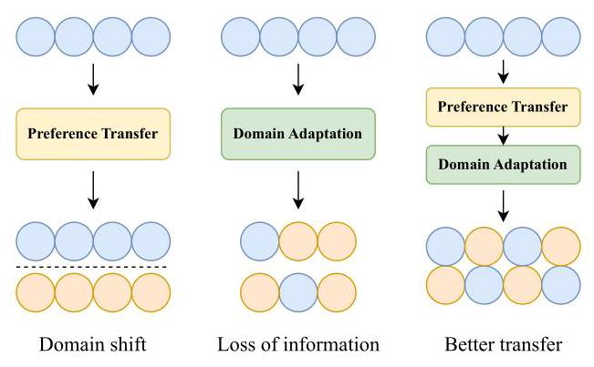
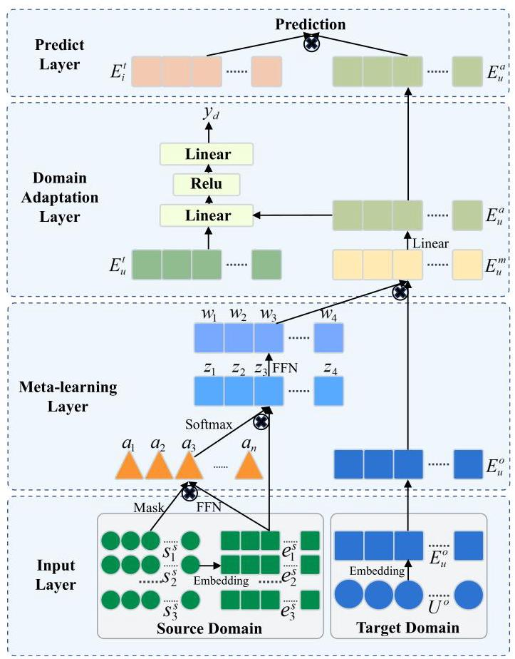
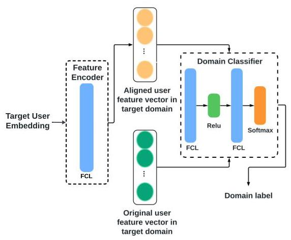
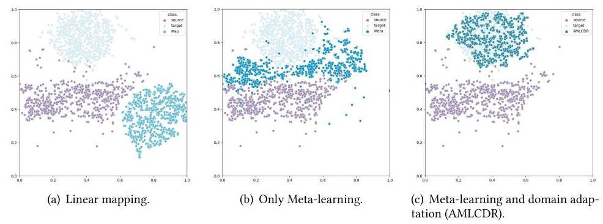

# AMLCDR: An Adaptive Meta-Learning Model for Cross-Domain Recommendation by Aligning Preference Distributions

Fanqi Meng

22140623@bjtu.edu.cn

Beijing Jiaotong University

Beijing, China

Zhiyuan Zhang*

zhangzhiyuan@bjtu.edu.cn

Beijing Jiaotong University

Beijing, China

## Abstract

The issue of data sparsity poses a formidable challenge in the field of recommender systems. Encouragingly, leveraging the interactions among overlapping users in the source domain can enhance item recommendation in the target domain. The transfer of user preferences across domains is a crucial concern in the cross-domain recommendation and represents a hopeful method to address data sparsity. Most existing methods transfer users' preference information by building a preference transfer network. These methods focus on the cross-domain mapping of preference features and ignore the inherent data distribution differences between the source domain and target domain. Consequently, the mapped user embeddings do not align with the item embeddings in the target domain and the recommendation quality decreases. On this basis, we propose a new method called Adaptive Meta-Learning for Cross-Domain Recommendation (AMLCDR). The method includes a meta-learning network for fully extracting user characteristics and generating a transfer network to reduce the user preference loss, as well as a domain adaptation network to align user preference distributions. We perform comprehensive experiments to assess the efficacy of AML-CDR by utilizing a substantial real-world dataset. We validate the effectiveness of data distribution alignment in domain adaptation. For diverse cross-domain recommendation tasks under different start conditions, AMLCDR outperforms state-of-the-art models in multiple evaluation metrics.

## CCS Concepts

- Information systems \( \rightarrow \) Recommender systems.

## Keywords

Cross-Domain Recommendation; Domain Adaptation; Meta-Learning; Recommender Systems

## ACM Reference Format:

Fanqi Meng and Zhiyuan Zhang. 2025. AMLCDR: An Adaptive Meta-Learning Model for Cross-Domain Recommendation by Aligning Preference Distributions. In Proceedings of the Eighteenth ACM International Conference on Web

Permission to make digital or hard copies of all or part of this work for personal or classroom use is granted without fee provided that copies are not made or distributed for profit or commercial advantage and that copies bear this notice and the full citation on the first page. Copyrights for components of this work owned by others than the author(s) must be honored. Abstracting with credit is permitted. To copy otherwise, or republish, to post on servers or to redistribute to lists, requires prior specific permission and/or a fee. Request permissions from permissions@acm.org.

WSDM '25, March 10-14, 2025, Hannover, Germany.

Search and Data Mining (WSDM '25), March 10-14, 2025, Hannover, Germany. ACM, New York, NY, USA, 10 pages. https://doi.org/10.1145/3701551.3703539

## 1 Introduction

Recommender systems have emerged as a crucial means for numerous websites and mobile applications to improve user experience and business benefits. The goal of a recommender system is to furnish users with appropriate information or products based on their historical behavior and preferences. However, in real-world recommender systems, users can rate a very limited number of items, so the rating matrix is always extremely sparse [20]. Due to the sparseness of users' historical interaction data, the system cannot accurately evaluate their characteristics and preferences, and thus cannot provide effective recommendations for them. The data sparsity problem has seriously affected the performance and user satisfaction of recommender systems and has become a major bottleneck of many recommender systems.

Data Sparsity. Although we face the problem of data sparsity, there are currently cross-domain scenarios such as cross-platform and cross-domain recommendation (CDR), which can alleviate the data sparsity issue by leveraging user behavior in multiple domains to help recommendations in the target domain and has attracted much attention in both academia and industry[21]. The core task of cross-domain recommendation is user preference mapping between the two relevant domains[44], which can effectively mitigate the issue of data sparsity in the target domain and improve recommendation quality. However, cross-domain recommendation technology also faces some challenges, such as heterogeneity, mismatch, and imbalance between domains. To address these problems, some existing methods [48, 49] employ meta-learning to assist in the cross-domain mapping of user features. Receiving training on similar tasks, Meta-learning [1, 5] exhibits a strong capacity for generalization to new and unfamiliar tasks, rendering it highly suitable for cross-domain recommendation tasks.

Unaligned Data Distribution. The direct transfer requires the source and target domains to satisfy the assumption of independent and identically distributed (iid) data. This prerequisite cannot be satisfied in many real-world applications, where the data distributions of the source domain and target domain have a domain shift [33]. This problem can cause differences in data distribution between domains. If the user preferences of the source domain transfer directly to the target domain, it will lead to negative transfer because this ignores the differences between domains[29]. One common practice is based on adversarial training, which tends to narrow the gap between source and target domains by confusing the domain discriminators [8]. DARec [41], inspired by the domain adversarial neural network DANN [7], proposes a domain adaptive recommendation model that can learn abstract representations of shared features and transmit them between two domains through DNN; RecSys-DAN [36] proposed a neural network model using an adversarial loss function to learn domain-invariant features of users or items to obtain transferable user preferences or item features; CnGAN [28] introduced a GAN-based network to learn user features from the source domain to target domain, and train the discriminator to distinguish between real and virtual mappings. As a branch of adversarial learning, domain adaptation has been proven to alleviate distribution differences between domains in cross-domain recommendation [41].

---

*Corresponding author.

---

Figure 1: Comparison of different preference transfer layers.

The majority of existing methods, as illustrated on the left and middle of Figure 1, primarily concentrate on user cross-domain feature mapping and ignore the domain shift manifested through differences in data distribution, or have used adversarial learning networks to reduce data distribution differences between domains but easily lose valuable preference information. In view of the shortcomings of existing methods, this paper attempts to study a CDR method based on meta-learning and domain adaptation to achieve high-quality feature mapping and data distribution aligned with the target domain. The method mainly consists of two parts: a user preference transfer network based on meta-learning parameter generation and a data distribution alignment network based on domain adaptation. The primary contributions of this paper can be concisely summarized as follows.

- This work presents a novel perspective to improve cross-domain recommendation (CDR) by enhancing users' source domain feature extraction and aligning target domain data distribution to optimize the transfer of user preferences throughout the process.

- We propose a novel approach, which includes a meta-learning network to extract user characteristics and a domain adaptation network to align user distributions.

- We perform comprehensive experiments in three cross-domain scenarios utilizing the Amazon Review dataset to showcase the efficiency of this model in making recommendations to cross-domain users, improving the overall quality of recommendations compared to state-of-the-art methods.

## 2 Related Work

Our proposed framework involves three research domains: cross-domain recommendation, domain adaptation, and meta-learning. In this section, we summarize their main research paradigms, strengths, and weaknesses, as well as connections with our study respectively.

### 2.1 Cross-domain Recommendation

The principle of transfer learning is to utilize the knowledge of the auxiliary domain for enhancing performance or reduce annotated samples needed in the target domain [38, 52], which has achieved remarkable results in many fields, such as computer vision \( \left\lbrack  {{37},{50},{51}}\right\rbrack \) , natural language processing \( \left\lbrack  {{26},{39}}\right\rbrack \) . Inspired by transfer learning, cross-domain recommendation (CDR) models utilize information and knowledge from the source domain to improve target domain recommendation performance and have become a promising solution.

As an earlier representative model, CMF [31] employs a unified user embedding matrix that is shared across domains and simultaneously decomposes matrices from multiple domains. CBT [20] proposed a cross-domain recommendation algorithm based on matrix factorization, which realizes knowledge transfer between different domains by linearly transforming the implicit feature vectors of users and items in different domains. CST [27] proposed a method called coordinate system transfer for exploiting the latent features of the user-side and item-side, by utilizing the user embed-dings from the source domain for initializing and constraining the embeddings in the target domain.

In the past few years, a large number of cross-domain recommendation methods based on deep learning have emerged. They rely on powerful learning capabilities to provide better recommendation results. EMCDR [23] first learns representations of users and items, followed by the establishment of connections between these representations through a network, thereby facilitating the transfer of information between domains. DDTCDR [22] introduces a novel technique for capturing user preferences across various domains, while maintaining the interconnections between users in distinct latent spaces. CLCDR [3] is a CDR model that utilizes contrastive learning to enhance user and item representations by leveraging knowledge from overlapping users and their interactions. Our study falls into this deep learning-based category.

### 2.2 Domain Adaptation

The domain adaptation (DA) problem is a branch of transfer learning [15], which aims to learn and transfer useful information across domains. Many studies [7, 34] employ adversarial learning to minimize discrepancies in feature distribution across domains when extracting domain-invariant features. DSN [2] developed a network for domain separation to facilitate knowledge transfer across a common network. Some studies \( \left\lbrack  {{13},{53}}\right\rbrack \) deal with data mining problems through self-training/pseudo-labeling strategies. Previous domain adaptation methods mainly focused on addressing challenges in neural language processing and computer vision. In recent years, more and more related research has been done on recommender systems, especially cross-domain recommendations. DARec [41] proposed a domain-adaptive cross-domain recommendation algorithm based on autoencoders and modified DANN networks, which performs knowledge transfer by utilizing domain-adaptive networks to transfer user features from the rating matrix. AFT [9] proposes an adversarial feature transfer framework. The goal of the generator is to generate candidates in all domains that the target user may be interested in, while the goal of the discriminator is to distinguish items actually browsed by the user from those virtually browsed by the generator. STAR [30] achieves adaptive modeling of multi-scenario data distribution through the creation of shared parameter networks and domain-specific parameter networks. Furthermore, ADI [15] enhances the integration process between sharing and parameters specific to a particular domain for domain adaptation at the feature level. The above methods focus on optimizing the network architecture and parameters, while this paper aims to improve the feature extraction part to obtain high-quality front feature vectors.

### 2.3 Meta-Learning

Meta-learning is most commonly understood as learning to learn, which refers to the process of improving a learning algorithm over multiple learning episodes [12]. Multiple meta-learning approaches have been proposed, including parameter-generating based methods [25], gradient-based methods [5], and metric-based methods [32, 35]. Our AMLCDR belongs to the first category, which utilizes a meta-learning layer to generate the preference transfer layer's parameters. The TMCDR [48] method is an extension of EMCDR that leverages the learned representations of BPRMF and learns preference mapping function according to a meta-learning layer [1]. Compared with TMCDR which trains a common mapping function, PTUPCDR's meta network fed with users' characteristic embeddings is learned to generate personalized bridge functions to achieve personalized transfer of preferences for each user [49]. In this paper, meta-learning is used to generate a better cross-domain user feature mapping network.

## 3 Methodology

In this section, we initially present a precise definition of the issue in CDR. Subsequently, as submodels for this work, a meta-learning network and a domain adaptation network for CDR are introduced.

### 3.1 Problem Formulation

Usually, there is a source domain and a target domain (e.g., books and movies) in CDR. Both domains contain a set of users \( U = \; \left\{  {{u}_{1},{u}_{2},\ldots }\right\} \) , a set of items \( I = \left\{  {{i}_{1},{i}_{2},\ldots }\right\} \) , and a record of interactions, such as rating matrix \( R.{r}_{jk} \in  R \) denotes the rating of item \( {i}_{k} \) by user \( {u}_{j} \) . We define the user set, item set, and ratings of the source domain as \( {U}^{s},{I}^{s},{R}^{s} \) while \( {U}^{t},{I}^{t},{R}^{t} \) for the target domain to differentiate different domains. The set of overlapped users between domains is denoted as \( {U}^{o} = {U}^{s} \cap  {U}^{t} \) . Besides, \( {I}^{s} \) and \( {I}^{t} \) have no shared items.

In the embedding layers, the embeddings, which are dense vectors, are converted from the user or item. We denote \( {e}_{{u}_{j}}^{d} \in  {\mathbb{R}}^{K} \) and \( {e}_{{i}_{k}}^{d} \in  {\mathbb{R}}^{K} \) as the embeddings of the user \( {u}_{j}^{d} \) and item \( {i}_{k}^{d} \) individually. The \( K \) represents the number of dimensions in embeddings, while \( d \in  \{ s, t\} \) denotes the domain label. We denote the sequence of interaction items for user \( {u}_{j} \) in source domain by \( {s}_{j}^{s} = \left\{  {{i}_{{t}_{1}},{i}_{{t}_{2}},\ldots ,{i}_{{t}_{n}}}\right\} \) , where \( \mathrm{n} \) represents the length of \( {s}_{j}^{s} \) and \( {t}_{n} \) represents timestamp of the interaction.

Figure 2: The overall framework of the proposed model.

Given \( {u}_{j},{s}_{j}^{s} \) and the corresponding rating matrix, CDR strives to predict the ratings of item \( {i}_{k} \in  {I}^{t} \) by user \( {u}_{j} \) , and then provide a top-N ranking list of items based on the predicted ratings.

### 3.2 Overall Framework

The overall framework of AMLCDR is illustrated in Figure 2. AML-CDR can be divided into the input layer, meta-learning layer, domain adaptation layer, and predict layer in order. The user IDs and interacted item sequences are converted to embeddings within the input layer. The meta-learning layer takes these dense vectors as its input, generates the preference transfer function's parameters, and outputs the user embeddings of the target domain obtained by the transfer. Then the domain adaptation layer aligns user em-beddings produced by the meta-learning layer with original user embeddings in the target domain. Finally, the predict layer dot multiplies and sums the aligned target user embeddings and target item embeddings to obtain the prediction.

### 3.3 Meta-Learning: reduce user preference loss

The meta-learning network is responsible for learning latent preference features based on the user's sequence of interacted items in the source domain and mapping them to the target domain. The meta-learning network includes a parameter generator and a preference transfer layer. The parameter generator obtains the user's transferable features from the interacted items. Specifically, we utilize the interaction sequence \( s \) in the source domain to find transferable preference features that facilitate knowledge transfer.

Various items in a user's interacted sequence contribute differently to preference transfer. The attention mechanism [40, 47] enables various components to have distinct impacts when they are integrated into a unified representation. Consequently, we suggest the utilization of the attention mechanism with item embeddings, executing a weighted summation:

\[
{z}_{{u}_{j}} = \mathop{\sum }\limits_{{{i}_{k} \in  {S}_{{u}_{j}}}}{a}_{k}{e}_{{i}_{k}}^{s} \tag{1}
\]

where \( {z}_{{u}_{j}} \in  {\mathbb{R}}^{k} \) is user \( {u}_{j} \) ’s preference embedding to transfer, \( {a}_{k} \) denotes item \( {i}_{k} \) ’s attention score, which can be understood as the significance of \( {i}_{k} \) for generating mapping function. For the source domain, only some related items are helpful for generating the preference mapping function for a specific user. Thus, we acquire the attention scores through an attention layer that processes the embeddings of the items. Typically, the attention layer is formulated as:

\[
{a}_{k}^{\prime } = \operatorname{att}\left( {{e}_{{i}_{k}}^{s};\theta }\right) \tag{2}
\]

\[
{a}_{k} = \frac{\exp \left( {a}_{k}^{\prime }\right) }{\mathop{\sum }\limits_{{{i}_{l}^{s} \in  {S}_{{u}_{j}}}}\exp \left( {a}_{l}^{\prime }\right) } \tag{3}
\]

where \( \operatorname{att}\left( \cdot \right) \) represents an attention layer, and \( \theta \) is parameters of \( \operatorname{att}\left( \cdot \right) \) . We define \( \operatorname{att}\left( \cdot \right) \) to a two-layer feed-forward network. It should be noted that the normalized attention score \( {a}_{k} \) holds an advantage in discerning the historical interacted items relevant to a particular user. Subsequently, we employ the preferences of users as inputs for generating a preference mapping function.

The preference relationship is inherently linked to the characteristics of the user. Based on this assumption, we introduce a parameter generator that uses the transferable preference of the user as the input to create a bridge function mapping representations of the user from a source domain to a target domain. The proposed parameter generator is defined as:

\[
{w}_{{u}_{j}} = g\left( {{z}_{{u}_{j}};\phi }\right) \tag{4}
\]

where \( g\left( \cdot \right) \) denotes the parameter generator, which is parameterized by \( \phi \) . In the proposed model, the parameter generator is a double-layer feed-forward network. The size of vector \( {w}_{{u}_{j}} \) varies according to the structure of the preference mapping function. This mapping function is defined as:

\[
{f}_{{u}_{j}}\left( {\cdot ;{w}_{{u}_{j}}}\right) \tag{5}
\]

which employs \( {w}_{{u}_{j}} \) as parameters for mapping function \( f\left( \cdot \right) \) . In our study, to ensure simplicity, we set \( f\left( \cdot \right) \) as a linear layer, in line with the approach used in EMCDR [23].

Through the preference mapping function, we can acquire the transferred user embeddings:

\[
{e}_{{u}_{j}}^{m} = {f}_{{u}_{j}}\left( {{e}_{{u}_{j}}^{o};{w}_{{u}_{j}}}\right) \tag{6}
\]

Figure 3: The Domain Adaptation Network.

where \( {e}_{{u}_{j}}^{o} \) is the embedding of overlapped user \( {u}_{j} \) , and \( {e}_{{u}_{j}}^{m} \) denotes the transferred embedding. Subsequently, we utilize the transferred embedding \( {e}_{{u}_{j}}^{m} \) as input to the domain adaptation network.

### 3.4 Domain Adaptation: align user preference distributions

As illustrated in Figure 3, our domain adaptation network(DAN) for CDR is in the third part from the bottom. The DAN module comprises two critical parts: a feature encoder \( \left( E\right) \) and a domain classifier \( \left( D\right) \) .

The feature encoder \( \left( E\right) ) \) takes as input the source domain user latent feature vector \( {e}_{{u}_{j}}^{m} \in  {\mathbb{R}}^{d} \) , where \( d \) is the number of dimensions in the user feature space. It seeks to map \( {e}_{{u}_{j}}^{m} \) into a transformed feature space \( {e}_{{u}_{j}}^{a} \) that aligns with the target domain data distribution, formalized by the transformation function:

\[
{\widehat{e}}_{{u}_{j}}^{a} = E\left( {{e}_{{u}_{j}}^{m};{\theta }_{E}}\right) \tag{7}
\]

where \( {\theta }_{E} \) denotes the feature encoder’s parameters, learned during the training process.

The domain classifier, parameterized by \( {\theta }_{D} \) , assesses whether the transformed features \( {e}_{{u}_{j}}^{a} \) resemble the data distribution in the corresponding target domain, aiming to minimize domain discrepancy. The output \( {y}_{d} \) represents a domain label, with the classification process described by:

\[
{y}_{d} = D\left( {{e}_{{u}_{j}}^{a};{\theta }_{D}}\right) \tag{8}
\]

The training objective for the domain classifier is to accurately distinguish between the source and target domain features, which can be represented by a loss function \( {\mathcal{L}}_{D} \) :

\[
{\mathcal{L}}_{D}\left( {{\theta }_{E},{\theta }_{D}}\right)  =  - \mathop{\sum }\limits_{{i = 1}}^{N}{y}_{i}\log \left( {D\left( {E\left( {{e}_{{u}_{j}}^{m};{\theta }_{E}}\right) ;{\theta }_{D}}\right) }\right) \tag{9}
\]

where \( N \) represents the total count of samples, and \( {y}_{i} \) denotes the true domain label for sample \( i \) .

The overall optimization process involves tuning \( {\theta }_{E} \) and \( {\theta }_{D} \) to minimize \( {\mathcal{L}}_{D} \) , enabling the feature encoder to generate target domain user embeddings that are indistinguishable by the domain classifier from actual target domain embeddings. This process aligns the transferred user features with the target domain, thus facilitating the prediction task in the target domain by leveraging the learned preference transfer function.

Ultimately, the predicted ratings for target domain items by users are obtained by multiplying the aligned target domain user embeddings with the target domain item embeddings. Based on these ratings, the top-K recommendation sequence is generated.

\[
\frac{1}{\left| {R}_{o}^{t}\right| }\mathop{\sum }\limits_{{{r}_{jk} \in  {R}_{o}^{t}}}{\left( {r}_{jk} - {\text{ score }}_{jk}\right) }^{2} \tag{10}
\]

where \( {R}_{o}^{t} = \left\{  {{r}_{jk} \mid  {u}_{j} \in  {U}^{o},{i}_{k} \in  {I}^{t}}\right\} \) is the ratings of overlapping users in the target domain.

## Algorithm 1 Adaptive Meta-Learning for CDR (AMLCDR)

---

Input: Given user and item sets of source and target domains

\( {U}^{s},{U}^{t},{I}^{s},{I}^{t} \) . The rating matrix \( {R}^{s},{R}^{t} \) . The overlapping user set

\( {U}^{o} \) .

## Meta-Learning Stage:

	1. Training an embedding layer for the source domain to

generate \( {E}_{u}^{s},{E}_{i}^{s} \) .

	2. Training an embedding layer for the target domain to

generate \( {E}_{u}^{t},{E}_{i}^{t} \) .

	3. Training a meta-learning network which includes an at-

tention network \( {at}{t}_{\theta } \) and a parameter generator \( {g}_{\phi } \) to generate

preference mapping function.

	4. Obtaining transformed embeddings \( {E}_{u}^{m} \) through preference

transfer networks.

Domain Adaptation Stage:

	5. Training a domain adaptation network to align the data

distribution of user embeddings in the target domain.

	6. Computing predicted scores based on the aligned user pref-

erence embeddings and item embeddings in the target domain.

	7. Optimizing the model by minimizing Equation (11).

---

## 4 Experiments and Analysis

We provide responses to the subsequent research questions through experiments: RQ1: What are enhancements of AMLCDR compared to other baseline models? How does it perform under different start conditions? RQ2: Do both meta-learning and domain adaptation contribute to cross-domain recommendation? RQ3: How do meta-learning and domain adaptation improve cross-domain recommendation effectiveness? RQ4: How does AMLCDR perform in more practical and specific recommendation scenarios?

### 4.1 Datasets

In order to evaluate the real-world recommendation performance of the proposed model and compare it with state-of-the-art baselines, we need to select real-world datasets that are widely used for cross-domain recommendation. Referring to most existing methods[44, \( {46},{48},{49}\rbrack \) , the Amazon review data \( \left\lbrack  {{10},{24}}\right\rbrack \) set was adopted in the experiment. In particular, we choose the Amazon-5cores dataset, where every user possesses a minimum of five ratings.

Table 1: The Statistics of Three Datasets in Amazon.

<table><tr><td>Dataset</td><td>User</td><td>Item</td><td>Rating</td></tr><tr><td>Movie</td><td>113202</td><td>30775</td><td>1531996</td></tr><tr><td>Music</td><td>57959</td><td>29963</td><td>818847</td></tr><tr><td>Book</td><td>512207</td><td>29963</td><td>7465180</td></tr></table>

Table 2: The Cross-domain Tasks.

<table><tr><td>CDR tasks</td><td>Source Domain</td><td>Target domain</td><td>Overlap users</td></tr><tr><td>Task1</td><td>Movie</td><td>Music</td><td>14085</td></tr><tr><td>Task2</td><td>Book</td><td>Music</td><td>11776</td></tr></table>

Within the numerous categories, we adopt three pertinent ones as our focal domains, specifically, Book, Music, and Movie. Then based on the relevance and dataset size, we set up two cross-domain recommendation tasks: in task 1, the source domain is Movie and the target domain is Music, while in task 2, the source domain is Book and the target domain is Music, as shown in Table 2 shown. Referring to the detailed statistics in Table 1, the number of ratings in the source domain far exceeds the number of ratings in the target domain. In each domain, we removed users who interacted less than 10 times and items who interacted less than 10 times based on earlier studies [44].

### 4.2 Baseline Methods

The proposed method is compared against several baselines, including traditional single-domain recommendation, classic cross-domain recommendation, and recent state-of-the-art cross-domain recommendation.

- MF emerged from the Netflix-prize competition, allowing the incorporation of additional information such as implicit feedback, temporal effects, and confidence levels[19].

- GMF [11] allocates different weights to various dimensions within the dot-product prediction function, presenting a generalized form of traditional MF.

- YouTube DNN [4] adopts the classic two-tower structure and promotes the development of recommendation models based on deep learning.

- CMF [31] makes recommendations by sharing user factors and decomposing a cross-domain joint rating matrix.

- EMCDR [23] employs Matrix Factorization for initial embedding learning, followed by leveraging a network to connect users' features between both domains.

- PTUPCDR [49] uses a meta-network that learns user feature embeddings to generate personalized bridging functions to achieve personalized preference transfer for each user.

- CMVCDR [42] employs contrastive learning and multi-view interest modeling, leveraging static and sequential views to capture overall and immediate interests, respectively of users, using representations that are invariant across domains and specific to the domain.

- TransFR [43] is a transferable federated recommendation model with universal textual representations, which delicately incorporates the general capabilities empowered by pre-trained language models and the personalized abilities by fine-tuning local private data.

- ALCDR [45] is proposed to precisely infer the anchor links between users of various domains and deeply aggregate collaborative signals from the perspectives of intra-domain and inter-domain.

### 4.3 Experimental Settings

Implementation Details. Our framework and the baseline models are developed utilizing PyTorch. For each task and method, we apply the Adam [18] optimizer to fine-tune the model. Furthermore, we establish the dimension of embeddings as 10 . The batch size for all methods is set to 512 . The meta-learning layer consists of a double-layer structure. The output size of the meta-learning layer is set to \( k \) , representing the embedding size.

Experimental Procedure. In accordance with [49], to assess the effectiveness of our method in CDR, we perform a random selection process to eliminate all interactions from a portion of overlapping users, considering them for testing. The data from remaining overlapping users are subsequently employed for training purposes. We will conduct CDR experiments in cold start scenarios and hot start scenarios respectively. In our experimental setup, we allocate 20% of the total overlapping users as test (cold-start) users, denoted as \( \beta \) . The entire set of ratings from test users is utilized as the test dataset in the cold-start scenarios. Consequently, there may be instances in the test set where certain items are absent from the training set. Since this experiment is for cold-start users rather than cold-start items, corresponding ratings are removed from our test set. We partition the test users' interactions into two equal sets in the warm-start scenarios. The first part is used to fine-tune the model trained in the cold-start scenario, and the remaining part is used in the warm-start scenario. Our model evaluation procedure can be segmented into three parts: 1) Training the model with the cold-start dataset. 2) Assess its performance under cold-start conditions on the test dataset. 3) Fine-tuning the model on the warm-start training dataset and assessing its performance on the warm-start test dataset.

Evaluation Metrics. Concretely, for a user and ten interacted items in the target domain, AMLCDR predicts 1000 candidates' scores (including 10 ground truth items and 990 negative items) by the trained parameters. Subsequently, we utilize four widely-used metrics PREC (Precision), HR (Hit Ratio), MRR (Mean Reciprocal Rank), and NDCG (Normalized Discounted Cumulative Gain [14]) to evaluate performance on the top-10 ranking result. PREC@N represents the proportion of actual positive samples among those classified as positive. In other words, it is the proportion of items that users have actually interacted with in predicted Top-N ranking lists:

\[
{PREC}@N = \frac{1}{\left| {U}_{t}\right| }\mathop{\sum }\limits_{{i \in  {U}_{t}}}\frac{{h}_{i}}{\left| {r}_{i}\right| } \tag{11}
\]

where \( {U}_{t} \) represents the test sample set. \( {h}_{i} \) denotes the quantity of items interacted by user \( \mathrm{i} \) in the predicted ranking list and \( {r}_{i} \) denotes the length of the ranking list for user i. HR@N measures whether the test item is included in the top-N item ranking list [42]:

\[
{HR}@N = \frac{1}{\left| {U}_{t}\right| }\mathop{\sum }\limits_{{i \in  {U}_{t}}}\delta \left( {{p}_{i} \leq  \operatorname{top}N}\right) \tag{12}
\]

Table 3: The Cold-start Scenario Results.

<table><tr><td>Task</td><td colspan="4">Task1</td><td colspan="4">Task2</td></tr><tr><td>\( {D}_{s} \rightarrow  {D}_{t} \)</td><td colspan="4">Movie \( \rightarrow \) Music</td><td colspan="4">Book \( \rightarrow \) Music</td></tr><tr><td>Metic   Method</td><td>HR</td><td>PREC</td><td>MRR</td><td>NDCG</td><td>HR</td><td>PREC</td><td>MRR</td><td>NDCG</td></tr><tr><td>MF</td><td>8.84</td><td>0.92</td><td>4.28</td><td>4.12</td><td>10.22</td><td>1.07</td><td>4.53</td><td>4.65</td></tr><tr><td>CMF</td><td>10.31</td><td>1.04</td><td>5.00</td><td>5.05</td><td>9.81</td><td>1.08</td><td>4.57</td><td>4.41</td></tr><tr><td>Youtube DNN</td><td>12.22</td><td>1.25</td><td>5.79</td><td>5.81</td><td>13.36</td><td>1.37</td><td>5.89</td><td>6.01</td></tr><tr><td>GMF</td><td>12.31</td><td>1.33</td><td>6.01</td><td>6.07</td><td>11.51</td><td>1.16</td><td>5.09</td><td>5.18</td></tr><tr><td>EMCDR</td><td>13.31</td><td>1.38</td><td>6.19</td><td>6.22</td><td>13.63</td><td>1.42</td><td>6.21</td><td>6.55</td></tr><tr><td>PTUPCDR</td><td>13.47</td><td>1.45</td><td>5.97</td><td>6.36</td><td>14.47</td><td>1.49</td><td>6.50</td><td>6.69</td></tr><tr><td>CMVCDR</td><td>13.72</td><td>1.47</td><td>6.60</td><td>6.82</td><td>15.08</td><td>1.58</td><td>6.69</td><td>6.83</td></tr><tr><td>TransFR</td><td>14.07</td><td>1.46</td><td>6.54</td><td>6.57</td><td>15.94</td><td>1.66</td><td>7.26</td><td>7.66</td></tr><tr><td>ALCDR</td><td>14.48</td><td>1.68</td><td>6.42</td><td>6.84</td><td>16.07</td><td>1.65</td><td>7.22</td><td>7.43</td></tr><tr><td>AMLCDR</td><td>16.34</td><td>1.75</td><td>7.43</td><td>7.87</td><td>17.03</td><td>1.72</td><td>7.85</td><td>8.78</td></tr><tr><td>Improve</td><td>12.85%</td><td>4.17%</td><td>12.58%</td><td>15.06%</td><td>5.97%</td><td>3.61%</td><td>8.13%</td><td>14.62%</td></tr></table>

where \( {p}_{i} \) represents the hit ranking and \( \delta \left( \cdot \right) \) represents the indicator function [17]. MRR considers a reciprocal of the rank of the first relevant item in the recommendation list for each user and then computes the mean value of these reciprocal ranks:

\[
{MRR} = \frac{1}{\left| {U}_{t}\right| }\mathop{\sum }\limits_{{i \in  {U}_{t}}}\frac{1}{{p}_{i}} \tag{13}
\]

NDCG assesses the excellence of rankings by awarding elevated scores to successful outcomes in top positions. NDCG@N pays more attention to the overall ranking ability of the model, whether it can rank more popular items to the front:

\[
{NDCG}@N = \frac{1}{\left| {U}_{t}\right| }\mathop{\sum }\limits_{{i \in  {U}_{t}}}\frac{\log 2}{\log \left( {{p}_{i} + 1}\right) } \tag{14}
\]

For each of these metrics, the higher value signifies enhanced performance.

### 4.4 Results and Analysis (RQ1)

Cold-start Experiments. This section provides the experimental outcomes and comprehensive discussions of AMLCDR involving cold-start situations. We illustrate the efficacy of AMLCDR across two Cross-Domain Recommendation tasks. Our experimental findings, presented in Table 3, highlight the superior performance indicated in boldface. The optimal baseline is underlined. Improve represents relative enhancement achieved over the optimal base method. Based on the findings in experiments, we make several observations: (1) MF is a conventional approach that only relies on target domain data to generate recommendations, and its performance is not ideal. Compared with MF, GMF and YouTube can use DNN to enhance data mining capabilities to achieve better results. Therefore, using nonlinear neural networks can mine more deep information in ratings to improve recommendations. Furthermore, alternative cross-domain techniques can extract features in the source domain, leading to improved outcomes compared to single-domain methods. Therefore, utilizing rich data in the source domain proves to be an effective strategy in mitigating the data sparsity of the target domain and improving recommendation performance. (2) CMF incorporates auxiliary data by merging information from various domains to the unified domain, whereas cross-domain recommendation approaches are explicitly crafted for establishing connections between domains. Our findings indicate that, in the majority of tasks, CDR methods exhibit superior performance compared to CMF. This superiority stems from CMF's oversight of potential domain shifts, as it treats data from both domains as indistinguishable. Conversely, the CDR methods possess the capability to convert source features into the embedding space in the target domain, thereby mitigating the effect of domain differences. Consequently, it is crucial to explore more effective utilization of the auxiliary domain in the study of Cross-Domain Recommendation. (3) Our findings reveal that AMLCDR exhibits significant superiority over the top-performing baseline in two distinct scenarios, underscoring its efficacy in the cold-start recommendation.

Table 4: The Warm-start Scenario Results.

<table><tr><td>Task</td><td colspan="4">Task1</td><td colspan="4">Task2</td></tr><tr><td>\( {D}_{s} \rightarrow  {D}_{t} \)</td><td colspan="4">Movie \( \rightarrow \) Music</td><td colspan="4">Book \( \rightarrow \) Music</td></tr><tr><td>Metic   Method</td><td>HR</td><td>PREC</td><td>MRR</td><td>NDCG</td><td>HR</td><td>PREC</td><td>MRR</td><td>NDCG</td></tr><tr><td>MF</td><td>10.33</td><td>1.13</td><td>4.56</td><td>4.61</td><td>8.51</td><td>0.90</td><td>4.02</td><td>3.95</td></tr><tr><td>CMF</td><td>12.53</td><td>1.26</td><td>5.99</td><td>6.25</td><td>11.69</td><td>1.27</td><td>5.38</td><td>5.45</td></tr><tr><td>Youtube DNN</td><td>11.97</td><td>1.21</td><td>5.40</td><td>5.82</td><td>9.32</td><td>0.98</td><td>4.18</td><td>4.13</td></tr><tr><td>GMF</td><td>14.14</td><td>1.51</td><td>6.07</td><td>6.43</td><td>11.06</td><td>1.15</td><td>5.61</td><td>5.25</td></tr><tr><td>EMCDR</td><td>15.39</td><td>1.57</td><td>6.39</td><td>6.53</td><td>13.41</td><td>1.41</td><td>6.20</td><td>6.43</td></tr><tr><td>PTUPCDR</td><td>15.32</td><td>1.56</td><td>6.37</td><td>6.52</td><td>12.88</td><td>1.34</td><td>6.15</td><td>6.15</td></tr><tr><td>CMVCDR</td><td>15.41</td><td>1.57</td><td>6.43</td><td>6.55</td><td>13.57</td><td>1.43</td><td>6.24</td><td>6.42</td></tr><tr><td>AMLCDR</td><td>15.47</td><td>1.59</td><td>6.85</td><td>7.33</td><td>14.68</td><td>1.51</td><td>7.23</td><td>6.96</td></tr><tr><td>Improve</td><td>0.39%</td><td>1.27%</td><td>6.53%</td><td>11.91%</td><td>8.18%</td><td>5.59%</td><td>15.87%</td><td>8.24%</td></tr></table>

Warm-start Experiments The method proposed in this article is a bridge-based method. The current literature on bridge-based Cross-Domain Recommendation (CDR) [6, 16, 23, 44, 51] primarily focuses on conducting experiments exclusively during the initial stage of extreme cold start. However, it should be noted that bridge-based CDR methods prove to be equally advantageous in the warm-start stage. This is accomplished by leveraging the mapped features for the initialization of users' features in the target domain, facilitating subsequent learning. In practical recommender systems, such warming-start scenarios also hold significant applicability.

Plenty of experiments are performed on both baselines and the proposed AMLCDR, finding that increased user interactions lead to enhanced recommender system performance. Our observations indicate that, during the warm-start phase, the majority of models tend to exhibit superior performance compared to the cold-start stage. This underscores the notion that additional interactions contribute to a better understanding of users by recommendation models. Under the two recommendation tasks in the warm-start scenario, we found that AMLCDR can also significantly outperform the best baseline, which shows that AMLCDR is effective for enhancing hot-start recommendation.

Table 5: The Ablation Study Results.

<table><tr><td>Task</td><td colspan="4">Task1</td><td colspan="4">Task2</td></tr><tr><td>\( {D}_{s} \rightarrow  {D}_{t} \)</td><td colspan="4">Movie \( \rightarrow \) Music</td><td colspan="4">Book \( \rightarrow \) Music</td></tr><tr><td>Metic   Method</td><td>HR</td><td>PREC</td><td>MRR</td><td>NDCG</td><td>HR</td><td>PREC</td><td>MRR</td><td>NDCG</td></tr><tr><td>AMLCDR</td><td>16.34</td><td>1.75</td><td>7.43</td><td>7.87</td><td>17.03</td><td>1.72</td><td>7.85</td><td>8.78</td></tr><tr><td>w/o DA</td><td>15.04</td><td>1.56</td><td>6.81</td><td>6.97</td><td>15.68</td><td>1.70</td><td>7.41</td><td>8.15</td></tr><tr><td>w/o PG</td><td>15.84</td><td>1.72</td><td>7.05</td><td>7.71</td><td>15.53</td><td>1.59</td><td>7.16</td><td>7.17</td></tr><tr><td>w/o ML</td><td>15.65</td><td>1.65</td><td>7.35</td><td>7.43</td><td>13.35</td><td>1.52</td><td>7.72</td><td>7.45</td></tr><tr><td>w/o ML&DA</td><td>13.31</td><td>1.38</td><td>6.19</td><td>6.22</td><td>13.63</td><td>1.42</td><td>6.21</td><td>6.55</td></tr></table>

### 4.5 Ablation Study (RQ2)

We study the impact of meta-learning and domain adaptation on AMLCDR with an ablation study. Variations of AMLCDR are assessed on gathered datasets through ablation studies to demonstrate the influence of individual subcomponents. We systematically eliminate various sub-modules from the proposed model to create different variations of AMLCDR for ablation learning. Specifically, the following models are evaluated:

- AMLCDR which is the full model version of AMLCDR.

- w/o ML which omits the meta-learning block that generates parameters for the preference transfer layer and instead trains based on the traditional parameter update method.

- w/o PG which abolishes the parameter generator and retains the attention mechanism. This variant employs a preference transfer based on the attention mechanism.

- w/o DA which removes the domain adaptation block from AMLCDR and performs recommendations based on unaligned user embeddings.

- w/o ML&DA which eliminates both the meta-learning block and the domain adaptation block and instantly transfers preference by linear mapping layers.

The performance degradation across variations of these two tasks exhibits notably distinct patterns, suggesting divergent contributions of certain components across different tasks. Specifically, in Task 1, the performance decline is more pronounced upon removal of domain adaptation compared to that upon removal of meta-learning, whereas in Task 2, the converse holds true. We compute the average ratio of performance decline across metrics for both tasks to evaluate the influence of every component. Following the removal of domain adaptation, the performance of these two tasks decreases by \( {9.65}\% \) and 5.47 \( \% \) respectively. This suggests a substantial disparity in user feature distributions between the movie and music datasets, emphasizing the significant contribution of aligning data distributions for accurate recommendations in cross-domain recommendation tasks. Comparing the decline in performance between w/o ML and AMLCDR, the degradations are 4.15% and 12.51%, respectively. This indicates that more domain-invariant preference information can be transferred from the Book domain to aid recommendations in the Music domain. Compared with the w/o ML variant, the overall performance of the variant w/o PG without the feature generator has dropped more, especially the hit rate, which shows that most of the improvement in AMLCDR's recommendation performance comes from the meta-learning strategy rather than the attention mechanism. Overall, across various metrics, both tasks demonstrate the most substantial performance decline when both submodules are simultaneously removed. None of the variations outperforms AMLCDR, indicating that each part we designed genuinely contributes to performance improvement.

Figure 4: Data distribution of user embeddings after different preference transfers.

Table 6: The Case Study Results.

<table><tr><td rowspan="2">Task</td><td rowspan="2">User ID</td><td rowspan="2">Item ID</td><td rowspan="2">Rating</td><td colspan="5">Predicted rating</td></tr><tr><td>MF</td><td>EMCDR</td><td>PTUPCDR</td><td>CMVCDR</td><td>AMLCDR</td></tr><tr><td rowspan="4">Movie \( \rightarrow \) Music</td><td>8528</td><td>44222</td><td>5</td><td>3.64</td><td>3.96</td><td>4.10</td><td>4.35</td><td>4.82</td></tr><tr><td>1113</td><td>54028</td><td>4</td><td>3.42</td><td>3.64</td><td>3.81</td><td>4.27</td><td>3.94</td></tr><tr><td>91596</td><td>59138</td><td>3</td><td>2.38</td><td>2.44</td><td>3.91</td><td>3.88</td><td>3.45</td></tr><tr><td>89372</td><td>59559</td><td>5</td><td>3.89</td><td>3.83</td><td>4.09</td><td>4.18</td><td>4.74</td></tr><tr><td rowspan="4">Book \( \rightarrow \) Music</td><td>41794</td><td>218353</td><td>5</td><td>3.70</td><td>3.81</td><td>4.46</td><td>4.37</td><td>4.86</td></tr><tr><td>267417</td><td>218353</td><td>3</td><td>2.31</td><td>2.35</td><td>2.60</td><td>3.57</td><td>3.32</td></tr><tr><td>234143</td><td>220547</td><td>4</td><td>3.39</td><td>4.65</td><td>3.42</td><td>4.37</td><td>3.76</td></tr><tr><td>36139</td><td>212129</td><td>5</td><td>4.01</td><td>3.79</td><td>3.62</td><td>4.48</td><td>4.59</td></tr></table>

### 4.6 Analysis of domain data distribution(RQ3)

Subsequently, we proceed to empirically validate the effectiveness of data distribution alignment in domain adaptation, employing visualizations as a means of elucidation. We utilize t-Distributed Stochastic Neighbor Embedding (t-SNE) [47] to visualize user em-beddings, with the outcomes duly reported in Figure 4. We employ a trichromatic scheme in the graph to differentiate among em-beddings originating from the source domain, target domain, and preference transfer. From Figure 4, it can be observed that there is a significant difference between the source distribution and the original target distribution. (1) Our method demonstrates a distribution that exhibits significantly closer proximity to the original target distribution, as domain adaptation enables adaptive adjustment of the generated embedding data distribution to align with the embedding data distribution of the target domain. (2) Conversely, the data distribution after linear mapping exhibits the most difference from the original target domain. Linear mapping typically transforms data into a space characterized by data with uncontrolled distribution. (3) After applying meta-learning, the data distribution is slightly closer to the original target domain but there are still certain differences. The task-oriented training process of meta-learning indirectly steers the feature embeddings toward the target domain distribution. However, its impact remains constrained. Evidently, our devised approach successfully aligns the data distributions of mapped user embeddings with those inherent to user embeddings within the original target domain, thus substantiating its efficacy.

### 4.7 Case Study (RQ4)

Finally, the effectiveness of the proposed method is validated through the case study. Specific cases are also listed in Table V, where "Ratings" denote the ground truth ratings in the target domain. Our objective is to provide recommendations for CDs to users who have not previously bought CDs based on predicted ratings, leveraging interactions with movies or books. In our experiments, ratings greater than 3 are considered indicative of liking the corresponding item. The cases we selected all have a score of no less than 3. As shown in Table V, MF, EMCDR, and PTUPCDR have prediction scores lower than 3 for some cases, which will significantly weaken the recommendation effect because CDs that should be recommended to users will not be recommended due to low scores. The recommendation prediction scores of CMVCDR and AMLCDR are both greater than 3. However, the prediction score of AMLCDR is closer to the ground truth score, which will lead to better recommendation quality. As demonstrated in Table V, our AMLCDR exhibits superior performance compared to other baseline models in these specific instances across both cross-domain tasks.

## 5 Conclusion

This paper investigates cross-domain recommendation methods, which aim to enhance item recommendation in the target domain with transferable information in the source domain. Many previous CDR methods fail to align with the data distribution of the target domain or fail to adequately transfer preference information. Hence, we put forward a novel framework named Adaptive Meta-Learning for Cross-Domain Recommendation (AMLCDR). Extensive experiments are conducted on real-world data to assess AMLCDR, and the results verify the efficacy of AMLCDR across various recommendation scenarios.

## References

[1] Marcin Andrychowicz, Misha Denil, Sergio Gomez, Matthew W Hoffman, David Pfau, Tom Schaul, Brendan Shillingford, and Nando De Freitas. 2016. Learning to learn by gradient descent by gradient descent. Advances in neural information processing systems 29 (2016).

[2] Konstantinos Bousmalis, George Trigeorgis, Nathan Silberman, Dilip Krishnan, and Dumitru Erhan. 2016. Domain separation networks. Advances in neural information processing systems 29 (2016).

[3] Yanyu Chen, Yao Yao, and Wai Kin Victor Chan. 2022. CLCDR: Contrastive Learning for Cross-Domain Recommendation to Cold-Start Users. In International Conference on Neural Information Processing. Springer, 331-342.

[4] Paul Covington, Jay Adams, and Emre Sargin. 2016. Deep neural networks for youtube recommendations. In Proceedings of the 10th ACM conference on recommender systems. 191-198.

[5] Chelsea Finn, Pieter Abbeel, and Sergey Levine. 2017. Model-agnostic meta-learning for fast adaptation of deep networks. In International conference on machine learning. PMLR, 1126-1135.

[6] Wenjing Fu, Zhaohui Peng, Senzhang Wang, Yang Xu, and Jin Li. 2019. Deeply fusing reviews and contents for cold start users in cross-domain recommendation systems. In Proceedings of the AAAI Conference on Artificial Intelligence, Vol. 33. 94-101.

[7] Yaroslav Ganin and Victor Lempitsky. 2015. Unsupervised domain adaptation by backpropagation. In International conference on machine learning. PMLR, 1180- 1189.

[8] Lei Guo, Chunxiao Wang, Xinhua Wang, Lei Zhu, and Hongzhi Yin. 2023. Automated Prompting for Non-overlapping Cross-domain Sequential Recommendation. arXiv preprint arXiv:2304.04218 (2023).

[9] Xiaobo Hao, Yudan Liu, Ruobing Xie, Kaikai Ge, Linyao Tang, Xu Zhang, and Leyu Lin. 2021. Adversarial feature translation for multi-domain recommendation. In Proceedings of the 27th ACM SIGKDD Conference on Knowledge Discovery & Data Mining. 2964-2973.

[10] Ruining He and Julian McAuley. 2016. Ups and downs: Modeling the visual evolution of fashion trends with one-class collaborative filtering. In proceedings of the 25th international conference on world wide web. 507-517.

[11] Xiangnan He, Lizi Liao, Hanwang Zhang, Liqiang Nie, Xia Hu, and Tat-Seng Chua. 2017. Neural collaborative filtering. In Proceedings of the 26th international conference on world wide web. 173-182.

[12] Timothy Hospedales, Antreas Antoniou, Paul Micaelli, and Amos Storkey. 2021. Meta-learning in neural networks: A survey. IEEE transactions on pattern analysis and machine intelligence 44, 9 (2021), 5149-5169.

[13] Naoto Inoue, Ryosuke Furuta, Toshihiko Yamasaki, and Kiyoharu Aizawa. 2018. Cross-domain weakly-supervised object detection through progressive domain adaptation. In Proceedings of the IEEE conference on computer vision and pattern recognition. 5001-5009.

[14] Kalervo Järvelin and Jaana Kekäläinen. 2002. Cumulated gain-based evaluation of IR techniques. ACM Transactions on Information Systems (TOIS) 20, 4 (2002), 422-446.

[15] Yuchen Jiang, Qi Li, Han Zhu, Jinbei Yu, Jin Li, Ziru Xu, Huihui Dong, and Bo Zheng. 2022. Adaptive domain interest network for multi-domain recommendation. In Proceedings of the 31st ACM International Conference on Information & Knowledge Management. 3212-3221.

[16] SeongKu Kang, Junyoung Hwang, Dongha Lee, and Hwanjo Yu. 2019. Semi-supervised learning for cross-domain recommendation to cold-start users. In Proceedings of the 28th ACM International Conference on Information and Knowledge Management. 1563-1572.

[17] Q Ye Kenny. 2003. Indicator function and its application in two-level factorial designs. The Annals of Statistics 31, 3 (2003), 984-994.

[18] Diederik P Kingma and Jimmy Ba. 2014. Adam: A method for stochastic optimization. arXiv preprint arXiv:1412.6980 (2014).

[19] Yehuda Koren, Robert Bell, and Chris Volinsky. 2009. Matrix factorization techniques for recommender systems. Computer 42, 8 (2009), 30-37.

[20] Bin Li, Qiang Yang, and Xiangyang Xue. 2009. Can movies and books collaborate? cross-domain collaborative filtering for sparsity reduction. In Twenty-First international joint conference on artificial intelligence.

[21] Chenglin Li, Mingjun Zhao, Huanming Zhang, Chenyun Yu, Lei Cheng, Guoqiang Shu, Beibei Kong, and Di Niu. 2022. RecGURU: Adversarial learning of generalized user representations for cross-domain recommendation. In Proceedings of the fifteenth ACM international conference on web search and data mining. 571-581.

[22] Pan Li and Alexander Tuzhilin. 2020. Ddtcdr: Deep dual transfer cross domain recommendation. In Proceedings of the 13th International Conference on Web Search and Data Mining. 331-339.

[23] Tong Man, Huawei Shen, Xiaolong Jin, and Xueqi Cheng. 2017. Cross-domain recommendation: An embedding and mapping approach.. In IJCAI, Vol. 17. 2464- 2470.

[24] Julian McAuley, Christopher Targett, Qinfeng Shi, and Anton Van Den Hengel. 2015. Image-based recommendations on styles and substitutes. In Proceedings of the 38th international ACM SIGIR conference on research and development in information retrieval. 43-52.

[25] Tsendsuren Munkhdalai and Hong Yu. 2017. Meta networks. In International conference on machine learning. PMLR, 2554-2563.

[26] Qiong Nan, Juan Cao, Yongchun Zhu, Yanyan Wang, and Jintao Li. 2021. MD-FEND: Multi-domain fake news detection. In Proceedings of the 30th ACM International Conference on Information & Knowledge Management. 3343-3347.

[27] Weike Pan, Evan Xiang, Nathan Liu, and Qiang Yang. 2010. Transfer learning in collaborative filtering for sparsity reduction. In Proceedings of the AAAI conference on artificial intelligence, Vol. 24. 230-235.

[28] Dilruk Perera and Roger Zimmermann. 2019. CnGAN: Generative Adversarial Networks for Cross-network user preference generation for non-overlapped users. In The World Wide Web Conference. 3144-3150.

[29] Lijun Qu, Jianjian Chen, Jianli Zhao, Liang Li, and Tingting Li. 2021. AGNNGRU-CDR: Attentive graph neural networks and gate recurrent unit for cross-domain recommendation. In 2021 IEEE 3rd International Conference on Frontiers Technology of Information and Computer (ICFTIC). IEEE, 51-56.

[30] Xiang-Rong Sheng, Liqin Zhao, Guorui Zhou, Xinyao Ding, Binding Dai, Qiang Luo, Siran Yang, Jingshan Lv, Chi Zhang, Hongbo Deng, et al. 2021. One model to serve all: Star topology adaptive recommender for multi-domain ctr prediction. In Proceedings of the 30th ACM International Conference on Information & Knowledge Management. 4104-4113.

[31] Ajit P Singh and Geoffrey J Gordon. 2008. Relational learning via collective matrix factorization. In Proceedings of the 14th ACM SIGKDD international conference on Knowledge discovery and data mining. 650-658.

[32] Jake Snell, Kevin Swersky, and Richard Zemel. 2017. Prototypical networks for few-shot learning. Advances in neural information processing systems 30 (2017).

[33] Hongzu Su, Jingjing Li, Zhekai Du, Lei Zhu, Ke Lu, and Heng Tao Shen. 2023. Cross-domain Recommendation via Dual Adversarial Adaptation. ACM Transactions on Information Systems (2023).

[34] Eric Tzeng, Judy Hoffman, Kate Saenko, and Trevor Darrell. 2017. Adversarial discriminative domain adaptation. In Proceedings of the IEEE conference on computer vision and pattern recognition. 7167-7176.

[35] Oriol Vinyals, Charles Blundell, Timothy Lillicrap, Daan Wierstra, et al. 2016. Matching networks for one shot learning. Advances in neural information processing systems 29 (2016).

[36] Cheng Wang, Mathias Niepert, and Hui Li. 2019. Recsys-dan: discriminative adversarial networks for cross-domain recommender systems. IEEE transactions on neural networks and learning systems 31, 8 (2019), 2731-2740.

[37] Jindong Wang, Wenjie Feng, Yiqiang Chen, Han Yu, Meiyu Huang, and Philip S Yu. 2018. Visual domain adaptation with manifold embedded distribution alignment. In Proceedings of the 26th ACM international conference on Multimedia. 402-410.

[38] Jindong Wang, Cuiling Lan, Chang Liu, Yidong Ouyang, Tao Qin, Wang Lu, Yiqiang Chen, Wenjun Zeng, and Philip Yu. 2022. Generalizing to unseen domains: A survey on domain generalization. IEEE Transactions on Knowledge and Data Engineering (2022).

[39] Dongbo Xi, Fuzhen Zhuang, Ganbin Zhou, Xiaohu Cheng, Fen Lin, and Qing He. 2020. Domain adaptation with category attention network for deep sentiment analysis. In Proceedings of The Web Conference 2020. 3133-3139.

[40] Jun Xiao, Hao Ye, Xiangnan He, Hanwang Zhang, Fei Wu, and Tat-Seng Chua. 2017. Attentional factorization machines: Learning the weight of feature interactions via attention networks. arXiv preprint arXiv:1708.04617 (2017).

[41] Feng Yuan, Lina Yao, and Boualem Benatallah. 2019. DARec: Deep domain adaptation for cross-domain recommendation via transferring rating patterns. arXiv preprint arXiv:1905.10760 (2019).

[42] Tianzi Zang, Yanmin Zhu, Ruohan Zhang, Chunyang Wang, Ke Wang, and Jiadi Yu. 2023. Contrastive Multi-View Interest Learning for Cross-Domain Sequential Recommendation. ACM Transactions on Information Systems 42, 3 (2023), 1-30.

[43] Honglei Zhang, He Liu, Haoxuan Li, and Yidong Li. 2024. Transfr: Transferable federated recommendation with pre-trained language models. arXiv preprint arXiv:2402.01124 (2024).

[44] Cheng Zhao, Chenliang Li, Rong Xiao, Hongbo Deng, and Aixin Sun. 2020. CATN: Cross-domain recommendation for cold-start users via aspect transfer network. In Proceedings of the 43rd International ACM SIGIR Conference on Research and Development in Information Retrieval. 229-238.

[45] Yi Zhao, Chaozhuo Li, Jiquan Peng, Xiaohan Fang, Feiran Huang, Senzhang Wang, Xing Xie, and Jibing Gong. 2023. Beyond the overlapping users: Cross-domain recommendation via adaptive anchor link learning. In Proceedings of the 46th international ACM SIGIR conference on research and development in information retrieval. 1488-1497.

[46] Shi-Ting Zhong, Ling Huang, Chang-Dong Wang, Jian-Huang Lai, and S Yu Philip. 2020. An autoencoder framework with attention mechanism for cross-domain recommendation. IEEE Transactions on Cybernetics 52, 6 (2020), 5229-5241.

[47] Guorui Zhou, Xiaoqiang Zhu, Chenru Song, Ying Fan, Han Zhu, Xiao Ma, Yanghui Yan, Junqi Jin, Han Li, and Kun Gai. 2018. Deep interest network for click-through rate prediction. In Proceedings of the 24th ACM SIGKDD international conference on knowledge discovery & data mining. 1059-1068.

[48] Yongchun Zhu, Kaikai Ge, Fuzhen Zhuang, Ruobing Xie, Dongbo Xi, Xu Zhang, Leyu Lin, and Qing He. 2021. Transfer-meta framework for cross-domain recommendation to cold-start users. In Proceedings of the 44th International ACM SIGIR Conference on Research and Development in Information Retrieval. 1813-1817.

[49] Yongchun Zhu, Zhenwei Tang, Yudan Liu, Fuzhen Zhuang, Ruobing Xie, Xu Zhang, Leyu Lin, and Qing He. 2022. Personalized transfer of user preferences for cross-domain recommendation. In Proceedings of the Fifteenth ACM International Conference on Web Search and Data Mining. 1507-1515.

[50] Yongchun Zhu, Fuzhen Zhuang, and Deqing Wang. 2019. Aligning domain-specific distribution and classifier for cross-domain classification from multiple sources. In Proceedings of the AAAI conference on artificial intelligence, Vol. 33. 5989-5996.

[51] Yongchun Zhu, Fuzhen Zhuang, Jindong Wang, Guolin Ke, Jingwu Chen, Jiang Bian, Hui Xiong, and Qing He. 2020. Deep subdomain adaptation network for image classification. IEEE transactions on neural networks and learning systems 32, 4 (2020), 1713-1722.

[52] Fuzhen Zhuang, Zhiyuan Qi, Keyu Duan, Dongbo Xi, Yongchun Zhu, Hengshu Zhu, Hui Xiong, and Qing He. 2020. A comprehensive survey on transfer learning. Proc. IEEE 109, 1 (2020), 43-76.

[53] Yang Zou, Zhiding Yu, BVK Kumar, and Jinsong Wang. 2018. Unsupervised domain adaptation for semantic segmentation via class-balanced self-training. In Proceedings of the European conference on computer vision (ECCV). 289-305.