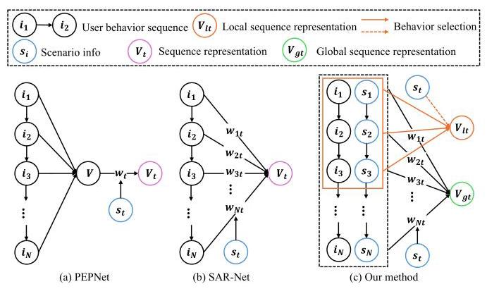
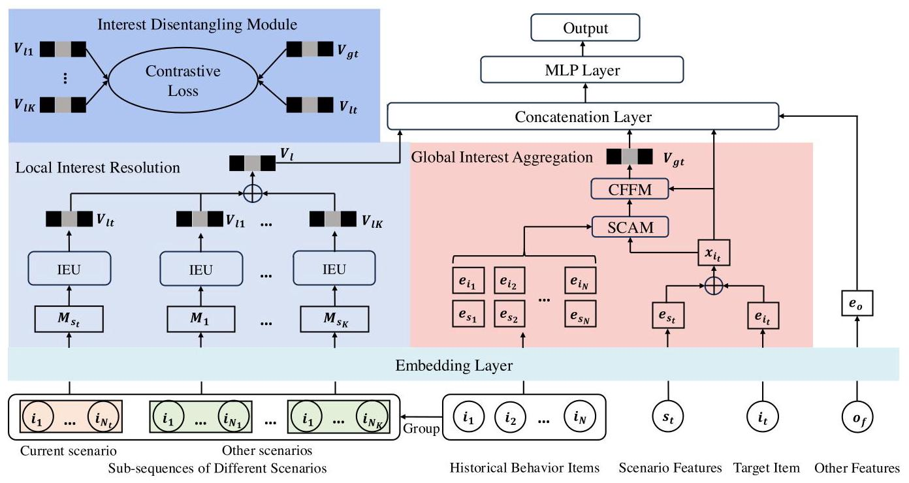
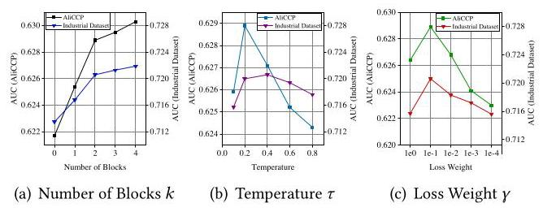
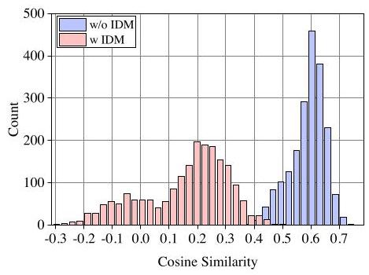
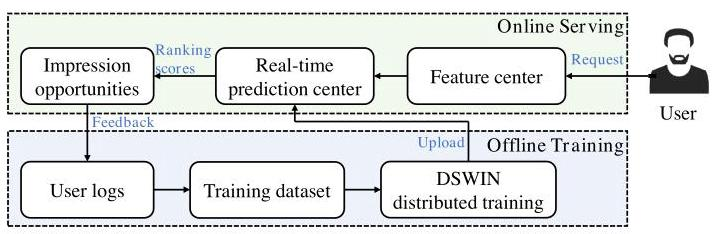
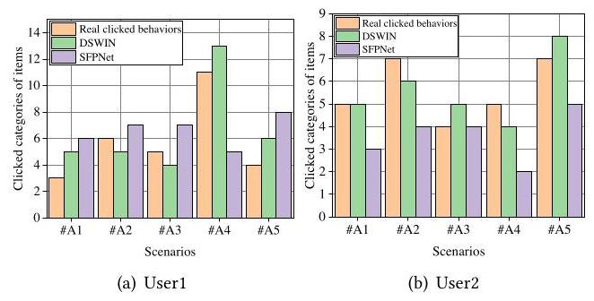

# Disentangling Scenario-wise Interest Network for Multi-scenario Recommendation

Jin Huang*

Dewu

Shanghai, China

huangjin01@shizhuang-inc.com

Yu Qian

Dewu

Shanghai, China

qianyu01@shizhuang-inc.com

Zixu Yang

Dewu

Shanghai, China

yangzixu@shizhuang-inc.com

Zhijun Sun

Dewu

Shanghai, China

zhangliang1@shizhuang-inc.com

## Abstract

With rapid development of the E-commerce platforms, multiple shopping scenarios are rapidly emerged to cater to the diversified needs of users. Currently, numerous models have been proposed to use a unified framework to serve multiple scenarios. However, most of those methods aggregate historical behavior sequences as a whole when modeling users' interests, neglect the discrepancy of user behaviors in different scenarios. To accurately capture the migration of interests across different scenarios, we propose a novel Disentangling Scenario-wise Interest Network, which explicitly incorporates scenario related context into user behavior sequences and learns users' scenario-wise interests. DSWIN consists of three key modules: 1) Global Interest Aggregation (GIA), which fuses users' global behaviors and scenario-aware context information with useful aggregation mechanism; 2) Local Interest Resolution (LIR), which explicitly extracts users' scenario-wise interests in each scenario through self-attention; 3) Interest Disentangling Module (IDM), which disentangles and distinguishes users' interests in different scenarios with self-supervised learning. Extensive experimental results and online \( \mathrm{A}/\mathrm{B} \) testing validate the effectiveness of DSWIN compared with state-of-the-art methods.

## CCS Concepts

- Information systems \( \rightarrow \) Retrieval models and ranking; Recommender systems.

## Keywords

Multi-scenario Recommendation, Click-through Rate Prediction, User Interest Modeling

## ACM Reference Format:

Jin Huang, Yu Qian, Zixu Yang, and Zhijun Sun. 2025. Disentangling Scenario-wise Interest Network for Multi-scenario Recommendation. In Companion Proceedings of the ACM Web Conference 2025 (WWW Companion '25), April 28-May 2, 2025, Sydney, NSW, Australia. ACM, New York, NY, USA, 10 pages. https://doi.org/10.1145/3701716.3715218

## 1 Introduction

In recent years, online shopping platforms (e.g., Amazon, Taobao and TikTok) play an increasingly critical role in user's daily life. To cater to the diversified shopping preferences of users, multiple shopping scenarios are rapidly developed in contemporary E-commerce platforms and offer tailored services to different users. For instance, Figure 1 shows several common scenarios in a shopping app (e.g., Dewu1): (1) Homepage: users can see the recommended items on the homepage as soon as they visit an app. This scenario displays various items attracting users based on their historical behaviors. (2) Cart page or Order page: this scenario suggests items to users after they cart or purchase some specific products and the recommended items depend more on the user's past purchased records. Clearly, these typical scenarios are very different from each other, and the user interests (e.g., user preference for a particular brand, price or category) behind them also vary significantly. To be specific, users in the Homepage have more divergent interests compared to the Cart page or Order page as the items listed in the the latter scenarios are more constrained by users' historical carting and purchasing behaviors. However, existing multi-scenario recommendation (MSR) models neglect the significant interests discrepancy across scenarios and inevitably reduce the accuracy of the recommendation. Traditional methods \( \left\lbrack  {5,7,{10},{18},{19},{39}}\right\rbrack \) typically train separate models for each scenario with scenario-specific data. However, this isolated model training approach usually requires more complex computation and maintenance cost, and may lead to suboptimal performance in long-tail scenarios (some scenarios have smaller and sparser data than others). Also, separate models fail to capture interrelations across scenarios. Currently, state-of-the-art models generally train a unified model with merged data of all scenarios to learn commonalities and specific characteristics among scenarios, simultaneously alleviate the sparsity problem of individual scenarios. There are two mainstream unified multi-scenario approaches to model correlations and interrelations: 1) Scenario-specific network structures \( \left\lbrack  {{11},{23},{27},{37},{40},{41}}\right\rbrack \) , inspired by multi-task learning (MTL) \( \left\lbrack  {9,{13},{20},{26}}\right\rbrack \) . They implement a single model that deals with data in various scenarios and treat each scenario as a specific task. The unified model is usually equipped with scenario-shared network modeling inter-scenario correlations and scenario-specific experts capturing specific characteristics of different scenarios. 2) Parameter adaptive network structures \( \left\lbrack  {3,{33},{35}}\right\rbrack \) , influenced by LHUC [25] algorithm proposed in the field of speech recognition. They propose applying scenario context information as input and dynamically scaling the bottom-level embedding and top-level DNN hidden units through gate mechanisms to learn variety of scenarios. The parameter adaptive approaches are more flexible than MTL based methods as they do not need to introduce multiple sub-networks for different scenarios, just simply add scenario bias information to the input of models.

---

*Corresponding author.

\( {}^{1} \) https://www.poizon.com/

for profit or commercial advantage and that copies bear this notice and the full citation

WWW Companion '25, Sydney, NSW, Australia

© 2025 Copyright held by the owner/author(s). Publication rights licensed to ACM. ACM ISBN 979-8-4007-1331-6/2025/04

https://doi.org/10.1145/3701716.3715218

---

Figure 1: Examples of multiple scenarios for the E-commerce platform

However, all of these state-of-the-art approaches still ignore a crucial issue: they regard user's entire historical behavior sequence as a whole and do not integrate the scenario knowledge into sequence modeling to obtain more effective recommendation results. As illustrated in Figure 2 (a), the coarse-grained weight adjustment methods (e.g., PEPNet[3]) uniformly apply the same weight to the representation aggregated from historical behavior, rather than distinguishing which scenario individual behavior comes from and adopting different adjustment strategies in response to current scenario. However, user behaviors and interests differ greatly among different scenarios. For example, people in Homepage tend to have diverse interests (e.g., users prefer browsing more categories and brands of items, and the price selecting range of them is broader). Conversely, users may show more specific and concentrated preferences in some scenarios. For instance, if a user has recently purchased a new mobile phone in the Order page, he may be more concerned about electronic devices such as phone cases and headphones. User behaviors will also be guided by the items they have purchased. In summary, it is essential to design a model to characterize the user interest discrepancy across scenarios and explicitly disentangle scenario-wise interests from behaviors in different scenarios, meanwhile effectively capture user's preference which is significantly related to current scenario. As shown in Figure 2 (b), although the SAR-Net [21] attempts to fuse current scenario context when calculating weights of each behavior in sequence by target-attention mechanism [39], this approach still neglects further utilizing the scenario information involved in historical behaviors to fully model the discrepancy of user behaviors in different scenarios and ultimately obtain better user interest representations.

Figure 2: Examples of previous methods and ours. In (a) \( {V}_{t} = {w}_{t}V \) , where \( {w}_{t} = g\left( {s}_{t}\right) \) and \( V = f\left( {{i}_{i},\cdots ,{i}_{N}}\right) \) . (b) \( {V}_{t} = f\left( {{w}_{1t}{i}_{1},\cdots ,{w}_{Nt}{i}_{N}}\right) \) , where \( {w}_{nt} = g\left( {s}_{t}\right) \) . (c) \( {V}_{gt} = \; {f}_{1}\left( {{w}_{1t}\left( {{i}_{1},{s}_{1}}\right) ,\cdots ,{w}_{Nt}\left( {{i}_{N},{s}_{N}}\right) }\right) \) and \( {V}_{lt} = {f}_{2}\left( {{i}_{1},\cdots ,{i}_{Nt}}\right) \) , where \( \left\{  {{i}_{1},\cdots ,{i}_{Nt}}\right\} \) is the sub-sequence which contains behaviors interacted in the \( {s}_{t} \) -th scenario.

Therefore, to address the above issue, we propose a novel Disentangling Scenario-wise Interest Network (Figure 2 (c)), which explicitly models the discrepancy of user behaviors in different scenarios and learns users' scenario-wise interests, then finely captures user interest migration across different scenarios enhancing recommendation accuracy coping with multi-scenario problem. Specifically, DSWIN first utilizes a Global Interest Aggregation (GIA) module that dynamically fuses users' global behaviors and scenario-aware context information aiming at acquiring comprehensive and fine-grained user representation. We first design a Scenario-aware Context Aggregation Module (SCAM) in GIA, which performs aggregation of behaviors from different scenarios. Meanwhile, we consider integrating scenario prior informations from historical behaviors and current instance into SCAM. Then, Context Feedback Fusion Module (CFFM) in GIA is proposed to fuse the representation of behaviors and corresponding target items through non-linear feature interaction to further capture users' global interest, which is markedly related to current scenario. GIA adequately captures the intricate relationship between current scenario and user global behaviors. To explicitly distinguish the differences of user interests in different scenarios, we further introduce Local Interest Resolution (LIR) module which explicitly extracts users' scenario-wise interests in each sub-scenario. LIR splits the global behaviors into multiple sub-sequences by scenarios. Considering that user behaviors in the same scenario are more focused and definite, we employ a self-attention mechanism to model each sub-sequence and obtain a user's local interest representations in different scenarios. However, the current supervised modeling approach lacks explicit supervision signals for fully distinguishing interests from various scenarios. Desired by methods \( \left\lbrack  {6,{12},{22},{24},{38}}\right\rbrack \) that introduce a self-supervised framework to disentangle users' long and short-term interests, we construct a contrastive learning paradigm based on users' global interests and local interests and introduce the Interest Disentangling Module (IDM). Different from current sequence recommendation methods[17, 29-32] incorporating contrastive learning that tend to focus on complex data augmentation techniques, we analyse specific domain issues and design contrastive strategies based on raw data. Specifically, we regard global interest representation and local interest representation of current target scenario as positive contrast samples, local interest representations of other scenarios as negative samples. Referring to general contrastive tasks, we perform contrastive learning between the positive and negative samples, i.e., enhancing the similarity score between the two positive samples and weakening the similarity score between the negative sample and the two positive samples. IDM finally supervises the disentanglement of scenario-wise interests with intense self-supervised signals and enhances the model's proficiency in discerning distinctions across scenarios.

The contributions of our paper can be summarized as follows:

(1) To the best of our knowledge, we make the first attempt to explicitly distinguish the interests discrepancy of users' behaviors from different scenarios, thereby advancing the model's capacity to track migration in user interests across various scenarios.

(2) We propose several novel components and contrastive strategy to fully utilize scenario-specific information of each input sample and scenario context from historical behaviors, generating more effective and comprehensive representations of user preference. DSWIN significantly improves the effectiveness of multi-scenario recommendation tasks.

(3) Extensive offline and online experiments show that the proposed DSWIN consistently and significantly outperforms all baselines. Ablation experiments and visualization analysis validate the necessity of each component. DSWIN has already been deployed in our industrial system.

## 2 Related Work

With the continuous development of E-commerce platforms, users' needs for online shopping have become increasingly diverse. Therefore, to better meet the user engagement experience, multiple scenarios appear simultaneously. How to efficiently and elegantly model multiple recommendation scenarios has become crucial. Recent advanced methods tend to adopt a unified ranking model structure to handle all scenarios simultaneously. This paradigm is mainly divided into two categories of methods: 1) Scenario-specific network structures; 2) Parameter adaptive network structures. They both train a single model to serve multiple scenarios.

Specifically, scenario-specific network structures are primarily inspired by Multi-Task Learning (MTL) \( \left\lbrack  {1,2}\right\rbrack \) . Similar to MTL methods, these approaches apply specific networks for each scenario and output several ranking scores corresponding to different scenarios. MoE \( \left\lbrack  {9,{20}}\right\rbrack \) proposes to select sub-expert based on the shared-bottom input. MMoE [13] adapts the MoE structure by sharing the subnets across all tasks, while having a light-weight gating network trained to optimize each task. However, MMoE will suffer from the seesaw phenomenon (i.e., improvement of one task often leads to performance degeneration of the other tasks). In view of this, PLE [26] is presented to address the problem, which separates shared components and task-specific components explicitly and adopts a progressive routing mechanism to extract and separate deeper semantic knowledge gradually, improving efficiency of joint representation learning and information routing across tasks in a general setup. HMoE [11] takes advantage of MMoE to implicitly identify distinctions and commonalities between tasks in the feature space, and improves the performance with a stacked model structure. The limitation of HMoE is that it is difficult to capture the shared and specific information explicitly as multi-scenario datasets are complex. Seeing this, SAML [4] introduces scenario-aware embedding module to learn feature representations both in global and scenario-specific view and proposes a mutual unit to learn similarities between scenarios. M2M [35] utilizes meta expert networks to solve multi-scenario and multi-task problems to leverage the scenario information explicitly. AESM \( {}^{2} \) [41] proposes a novel expert network structure with automatic selection of fine granularity by calculating the KL divergence to select the most suitable sharing and specific experts. Also, STAR [23] devises a star topology framework with one centered network to maintain whole-scenario commonalities and a set of domain-specific networks to distinguish scenario distinctions.

However, scenario-specific network structures ignore the differences among scenarios in the bottom-level representations of the model and are not flexible enough due to the heavy network. Consequently, AdaSparse [33] learns adaptive sparse structure for each scenario, enhancing generalization across domains. HiNet [40] achieves hierarchical extraction based on coarse-to-fine knowledge transfer scheme. DFFM [8] incorporates scenario-related information into the parameters of feature interaction and user behavior modules. 3MN [36] proposes a novel three meta networks-based method to model the complicated task-task, scenario-scenario, and task-scenario interrelations. PEPNet [3] takes scenario related features as input and dynamically scales the bottom-layer embeddings and the top-layer DNN hidden units through a gate mechanism. SF-PNet [34] comprises a series of blocks named as scenario-tailoring block and integrates scenario information at a coarse-grained level by redefining fundamental features. As far as we know, none of them distinguish different behaviors from different scenario and explicitly model the user's preference discrepancy of among scenarios, which limits their performance of recommendation.

## 3 Preliminaries

Let \( I = \left\{  {{i}_{1},\ldots ,{i}_{\left| I\right| }}\right\} \) be a set of \( \left| I\right| \) items, and \( \mathcal{S} = \left\{  {{s}_{1},\ldots ,{s}_{K}}\right\} \) denote a set of \( K \) scenarios. \( {\mathcal{B}}^{u} = \left\{  {{i}_{1},\ldots ,{i}_{N}}\right\} \) represents a chronological sequence of historical behaviors of user \( u \) and \( N \) represents the length of the sequence. \( {\mathcal{B}}_{{s}_{k}}^{u} = \left\{  {{i}_{1},\ldots ,{i}_{{N}_{k}}}\right\} \) represents the user’s sub-sequence which contains behaviors interacted in the \( k \) -th scenario and \( {\mathcal{B}}^{u} = {\left\{  {\mathcal{B}}_{{s}_{k}}^{u}\right\}  }_{k = 1}^{K} \) . Given target item \( {i}_{t} \in  \mathcal{I} \) , target scenario \( {s}_{t} \in  \mathcal{S} \) and other features \( {\mathbf{o}}_{\mathbf{f}} \) , the multi-scenario recommendation task aims to devise a unified ranking model to simultaneously provide accurate and personalized recommendations across \( K \) scenarios. The click-through rate (CTR) prediction task is considered in our work, which can be formulated as:

\[
\widehat{y} = P\left( {y = 1 \mid  {i}_{t},{s}_{t},{o}_{f},{\mathcal{B}}^{u}}\right) \tag{1}
\]

CTR prediction is to predict the probability \( \widehat{y} \) that user \( u \) clicks target item \( {i}_{t} \) in a given scenario \( {s}_{t} \) , utilizing the behavior sequence and other contextual features. We utilize the widely-used embedding technique [15] to transform sparse features into low-dimensional dense vectors. For example, \( {\mathbf{e}}_{{\mathbf{i}}_{\mathbf{t}}} \) and \( {\mathbf{e}}_{\mathbf{o}} \) represent the embedding of target item \( {i}_{t} \) and other features respectively.

## 4 The Approach

The architecture of DSWIN is shown in Figure 3, mainly consisting of three modules.

### 4.1 Global Interest Aggregation

As shown in Figure 2, previous works treat the user's historical behavior sequence as a whole and ignored the scenario information involved in the behavior. Hence, we first design Global Interest Aggregation (GIA) module, which dynamically fuses users' global behaviors and scenario-aware context information aiming at acquiring comprehensive and fine-grained interest representation.

4.1.1 Scenario-aware Context Aggregation Module. We first devise the Scenario-aware Context Aggregation Module (SCAM), which performs aggregation of behaviors from different scenarios with an attention mechanism. Meanwhile, we consider integrating scenario prior informations from historical behaviors and current instance into SCAM for a better understanding of users' scenario-aware global interests. As a result, SCAM can be formulated as follows:

\[
{v}_{g} = \mathop{\sum }\limits_{{j = 1}}^{N}{\mu }_{j}{W}_{V}{e}_{{i}_{j}} \tag{2}
\]

where \( {v}_{g} \) represents the interest representation corresponding to current instance and scenario and is modeled as a weighted sum aggregation of historical interacted items, and \( {\mathbf{W}}_{\mathbf{V}} \) is learning parameters. \( {\mu }_{j} \) is the attention weight, which can be formulated as follows:

\[
{\mu }_{j} = \frac{\exp \left( {\alpha }_{j}\right) }{\mathop{\sum }\limits_{{m = 1}}^{N}\exp \left( {\alpha }_{m}\right) }, \tag{3}
\]

\[
{\alpha }_{j} = {\mathbf{W}}_{Q}{\mathbf{x}}_{{i}_{t}} \cdot  {\mathbf{W}}_{K}{\mathbf{x}}_{{i}_{j}}
\]

where \( {\alpha }_{j} \) is the relevance between the target item \( {i}_{t} \) and user’s \( j \) -th interacted item in behavior sequence. \( {x}_{{i}_{t}} = \operatorname{concat}\left( {{e}_{{i}_{t}},{e}_{{s}_{t}}}\right) \) represents the concatenation of target item embedding \( {e}_{{i}_{t}} \) and scenario embedding \( {\mathbf{e}}_{{s}_{t}} \) . Similarly, \( {\mathbf{x}}_{{i}_{j}} \) denotes the concatenation of \( j \) -th clicked item embedding \( {\mathbf{e}}_{{i}_{j}} \) and corresponding scenario embedding \( {\mathbf{e}}_{{s}_{j}}.{\mathbf{W}}_{\mathbf{Q}} \) and \( {\mathbf{W}}_{\mathbf{K}} \) are learning parameters.

4.1.2 Context Feedback Fusion Module. Although SCAM considers utilizing scenario information when calculating weights, its ability to represent the complex interplay between real-life scenarios and user behaviors is limited. To further capture users'global interest which is markedly related to current target scenario, we propose CFFM to fuse the representation of behaviors and corresponding context (i.e., target item and scenario) through non-linear feature interaction. Concretely, CFFM is composed of MLP with \( k \) blocks:

\[
{\mathbf{f}}^{\left( k + 1\right) } = \operatorname{ReLU}\left( {{\mathbf{W}}^{\left( k\right) }{\mathbf{f}}^{\left( k\right) } + {\mathbf{b}}^{\left( k\right) }}\right) \tag{4}
\]

where \( {\mathbf{f}}^{\left( k\right) } \) is the output of the \( k \) -th layer, and \( {\mathbf{W}}^{\left( k\right) } \) and \( {\mathbf{b}}^{\left( k\right) } \) are learning parameters. The initialization input is formulated as follows:

\[
{\mathbf{f}}^{\left( 0\right) } = \operatorname{concat}\left( {{\mathbf{v}}_{\mathbf{g}},{\mathbf{x}}_{{\mathbf{i}}_{\mathbf{t}}},{\mathbf{v}}_{\mathbf{g}} - {\mathbf{x}}_{{\mathbf{i}}_{\mathbf{t}}},{\mathbf{v}}_{\mathbf{g}} * {\mathbf{x}}_{{\mathbf{i}}_{\mathbf{t}}}}\right) \tag{5}
\]

where \( * \) represents the element-wise product. We obtain global interest \( {V}_{gt} = {f}^{\left( k\right) } \) corresponding to context of target scenario and current instance.

### 4.2 Local Interest Resolution

To explicitly distinguish the discrepancy of user interests in different scenarios, we devise the Local Interest Resolution (LIR) module to extract users' scenario-wise interests in each sub-scenario explicitly. LIR splits the global behaviors into multiple sub-sequences by scenarios and consists of several structurally symmetric Interest Extracting Unit (IEU). Considering that user behaviors in the same scenario are more focused and definite, each IEU employs the modified multi-head self attention (MHA) involved with specific scenario information as a bias term to model each sub-sequence and obtain a user's local interest representations in different scenarios. Also, MHA enables the LIR to model users' preferences from multiple view of interests [28].

4.2.1 Interest Extracting Unit. \( {\mathcal{B}}_{{s}_{k}}^{u} = \left\{  {{i}_{1},\ldots ,{i}_{{N}_{k}}}\right\} \) represents the user's sub-sequence which contains behaviors interacted in the \( k \) -th scenario, and \( {N}_{k} \) denotes the number of interacted items. After transformation with embedding, \( {\mathbf{M}}_{{\mathbf{s}}_{\mathbf{k}}} \in  {\mathbb{R}}^{{N}_{k} \times  d} \) can represent the embedded matrix of behaviors in the scenario \( {s}_{k} \) . Mathematically, The encoded matrix of \( {M}_{{s}_{k}} \) after MHA, denoted by \( {\widehat{M}}_{{s}_{t}} \) , is calculated as:

\[
{\widehat{M}}_{{s}_{k}} = \operatorname{MultiHead}\left( {M}_{{s}_{k}}\right)  = \operatorname{concat}\left( {{\operatorname{head}}_{1},\cdots ,{\operatorname{head}}_{h}}\right) {W}^{O},
\]

\[
{\text{ head }}_{i} = \text{ Attention }\left( {Q, K, V}\right)  = \operatorname{Softmax}\left( \frac{Q{K}^{T}}{\sqrt{{d}_{k}}}\right) V \tag{6}
\]

The \( Q, K, V \) integrate the scenario embedding as bias term into the behaviors embedding matrix to guide the local interest resolution. They are defined as:

\[
Q = {M}_{{s}_{k}}{W}_{i}^{Q} + {W}_{{s}_{k}}{e}_{{s}_{k}}
\]

\[
K = {M}_{{s}_{k}}{W}_{i}^{K} + {W}_{{s}_{k}}{e}_{{s}_{k}} \tag{7}
\]

\[
V = {M}_{{s}_{k}}{W}_{i}^{V} + {W}_{{s}_{k}}{e}_{{s}_{k}}
\]

where \( h \) represents the amount of heads. \( {\mathbf{W}}^{\mathbf{O}} \in  {\mathbb{R}}^{h{d}_{k} \times  d} \) denotes the weight matrix of output linear transformation with \( \mathrm{d} = h \times  {d}_{k} \) . \( {W}_{i}^{Q},{W}_{i}^{K},{W}_{i}^{V} \in  {\mathbb{R}}^{d \times  {d}_{k}} \) are projection matrices for the \( i \) -th head corresponding to query, key, and value respectively. \( {\mathbf{W}}_{{\mathbf{s}}_{\mathbf{k}}} \in  {\mathbb{R}}^{{N}_{k} \times  d} \) is transformation matrix for bias term. Subsequently, the output matrix is processed by an average pooling layer so as to derive a representation vector \( {\mathbf{V}}_{l\mathbf{k}} \in  {\mathbb{R}}^{d} \) , which indicates the user’s local interest in the \( k \) -th scenario. Specially, for current scenario \( {s}_{t} \) , the representation is formulated as \( {\mathbf{V}}_{\mathbf{{lt}}} \) . Finally, the output of LIR is composed of the representations of all \( K \) scenarios:

\[
{V}_{l} = \operatorname{concat}\left( {{V}_{l1},\cdots ,{V}_{lK}}\right) \tag{8}
\]

Figure 3: Overall framework of the DSWIN model.

### 4.3 Interest Disentangling Module

As mentioned before, user interests among scenarios have overlaps and differences. Current supervised modeling approach lacks explicit supervision signals for fully distinguishing interests from various scenarios since there does not exist any annotated label of user interests. So we leverage self-supervised learning to disentangle scenario-wise interests. Different from existing methods [17, 29-32] incorporating contrastive learning that tend to focus on complex data augmentation techniques, we analyse specific domain issues and design contrastive strategies based on raw data. Specifically, we regard global interest representation \( {V}_{gt} \) and local interest representation \( {V}_{lt} \) of current target scenario as positive contrast samples and local interest representations \( {V}_{lk}, k \in  \left\lbrack  {1,\cdots , K}\right\rbrack \) of other scenarios as negative samples. We leverage a contrastive learning loss to teach the model to enhance the similarity score between the two positive samples, weaken the similarity score between the negative samples and the two positive samples. Formally, there are two contrastive tasks as follows:

\[
\operatorname{sim}\left( {{V}_{lt},{V}_{gt}}\right)  > \operatorname{sim}\left( {{V}_{lt},{V}_{lk}}\right) \tag{9}
\]

\[
\operatorname{sim}\left( {{V}_{lt},{V}_{gt}}\right)  > \operatorname{sim}\left( {{V}_{gt},{V}_{lk}}\right) \tag{10}
\]

The optimization objectives of above are calculated via InfoNCE [16] loss likewise as:

\[
{L}_{ssl1} =  - \log \frac{\exp \left( {\phi \left( {{V}_{I\mathbf{t}},{V}_{\mathbf{g}\mathbf{t}}}\right) /\tau }\right) }{\mathop{\sum }\limits_{{k = 1}}^{K}\exp \left( {\phi \left( {{V}_{I\mathbf{t}},{V}_{I\mathbf{k}}}\right) /\tau }\right) } \tag{11}
\]

\[
{L}_{ssl2} =  - \log \frac{\exp \left( {\phi \left( {{\mathbf{V}}_{\mathbf{{It}}},{\mathbf{V}}_{\mathbf{g}\mathbf{t}}}\right) /\tau }\right) }{\mathop{\sum }\limits_{{k = 1}}^{K}\exp \left( {\phi \left( {{\mathbf{V}}_{\mathbf{g}\mathbf{t}},{\mathbf{V}}_{\mathbf{I}\mathbf{k}}}\right) /\tau }\right) } \tag{12}
\]

where \( \phi \left( \cdot \right) \) denotes the similarity function to compute cosine distance between two instances. \( \tau \) is the temperature parameter. LIR finally supervises the disentanglement of scenario-wise interests with intense self-supervised signals and enhances the model's proficiency in discerning distinctions across scenarios.

### 4.4 Prediction and Optimization

We concatenate outputs of GIA and LIR, scenario features, target item features and other features:

\[
\mathbf{H} = \operatorname{cocnat}\left( {{\mathbf{V}}_{\mathbf{g}\mathbf{t}},{\mathbf{V}}_{\mathbf{l}},{\mathbf{e}}_{{\mathbf{i}}_{\mathbf{t}}},{\mathbf{e}}_{{\mathbf{s}}_{\mathbf{t}}},{\mathbf{e}}_{\mathbf{o}}}\right) \tag{13}
\]

Then the multi-layer DNN tower is incorporated to forecast the likelihood of users clicking on the target item:

\[
\widehat{y} = P\left( {y = 1 \mid  {i}_{t},{s}_{t},{o}_{f},{\mathcal{B}}^{u}}\right)  = \sigma \left( {{DNN}\left( \mathbf{H}\right) }\right) \tag{14}
\]

where \( \sigma \) is sigmoid activation function. For supervised tasks such as CTR prediction, we use the widely used cross entropy loss as the objective function:

\[
{L}_{rec} =  - \frac{1}{\left| D\right| }\mathop{\sum }\limits_{{i = 1}}^{\left| D\right| }\left( {{y}_{i}\log \left( {\widehat{y}}_{i}\right)  + \left( {1 - {y}_{i}}\right) \log \left( {1 - {\widehat{y}}_{i}}\right) }\right) \tag{15}
\]

where \( {y}_{i} \) is the ground truth of instance. \( \left| D\right| \) is the cardinality of samples. We train the model in an end-to-end manner on the supervised and self-supervised objectives. Specifically, the joint loss function with a hyper-parameter \( \gamma \) to balance objectives, can be formulated as follows:

\[
L = {L}_{rec} + \gamma \left( {{L}_{ssl1} + {L}_{ssl2}}\right) \tag{16}
\]

## 5 Experiments

In this section, we conduct plenty of experiments to validate the effectiveness of our proposed framework and answer the following questions:

- RQ1. How does DSWIN perform compared with state-of-the-art baselines?

- RQ2. How does each module in DSWIN work?

- RQ3. How the hyper-parameters in the proposed DSWIN affect its performance?

- RQ4. Can DSWIN disentangle user interests by scenarios effectively?

### 5.1 Experiment Settings

5.1.1 Datasets. we conduct our experiments over two real-world datasets as follows. Statistics of them are listed in Table 1.

- AliCCP \( {}^{2} \) . AliCCP is a public dataset released by Taobao with prepared training and testing set, which is widely used in the relevant literature [14] for recommendation area. We split the dataset into three scenarios (abbreviated as #C1 to #C3) according to the context feature value as previous work [11]. The splitting method of the dataset follows the official guidance given in [14].

- Industrial Dataset. It contains user logs covering five scenarios (denoted as #A1 to #A5 for simplicity), randomly sampled at Dewu APP from the date 20/08/2023 to the date 04/09/2023. We use logs of the last day in the dataset as testing set, and the remaining logs are used as training set.

Table 1: Statistics of two datasets. (M-million, K-thousand)

<table><tr><td></td><td>Scenario</td><td>Users</td><td>Items</td><td>Samples</td></tr><tr><td rowspan="5">Industrial Dataset</td><td>#A1</td><td>0.97M</td><td>2.72M</td><td>145.77M</td></tr><tr><td>#A2</td><td>0.93M</td><td>2.4M</td><td>136.73M</td></tr><tr><td>#A3</td><td>0.57M</td><td>1.79M</td><td>52.12M</td></tr><tr><td>#A4</td><td>0.49M</td><td>1.69M</td><td>39.05M</td></tr><tr><td>#A5</td><td>0.37M</td><td>1.22M</td><td>21.09M</td></tr><tr><td rowspan="3">AliCCP</td><td>#C1</td><td>91K</td><td>0.54M</td><td>32M</td></tr><tr><td>#C2</td><td>2.6K</td><td>0.2M</td><td>0.64M</td></tr><tr><td>#C3</td><td>154K</td><td>0.54M</td><td>85M</td></tr></table>

5.1.2 Metrics. We adopt widely-used accuracy metric, i.e, AUC, to evaluate model performance. AUC denotes the area under the ROC curve over the testing set. It is worth mentioning that a small improvement of AUC is likely to lead to a significant increase in CTR at real industrial platform.

5.1.3 Baselines. To demonstrate the effectiveness of our proposed model, we compare DSWIN with three categories of approaches in previous works.

(1) General recommenders. Samples from all scenarios are merged to train a unified ranking model for multi-scenario recommendation.

- DNN: It is a common model with all parameters sharing by a single DNN tower for prediction.

- DeepFM[7]: It combines the factorization machines and DNN components eliminating feature engineering work.

(2) Scenario-specific network structures. Each scenario is treated as a distinct task with multiple scenario-specific networks.

- SharedBottom: It is a model with parameter sharing at bottom level and multiple scenario-specific DNN towers at top level.

- MMoE[13]: It transfers the original multi-task learning to multi-scenario learning. MMoE applies gating networks to adjust the bottom expert representations followed by scenario-specific towers and learns to model scenarios' relationships from data.

- PLE[26]: Scenario-shared experts and scenario-specific experts are introduced based on MMoE to alleviate the seesaw phenomenon effectively.

- STAR[23]: It devises a star topology framework with one centered network to maintain whole-scenario commonalities and a set of scenario-specific networks to distinguish scenario distinctions.

- \( {\mathrm{{AESM}}}^{2} \) [41]: It proposes a novel expert network structure with automatic selection of fine granularity by calculating the KL divergence to select the most suitable sharing and specific experts dynamically.

(3) Parameter adaptive network structures. Scenario information is directly applied to the embedding layer and the DNN's hidden layers, achieves the goal of adjusting model parameters dynamically with considering scenario variations.

- PEPNet[3]: It takes scenario related features as input and dynamically scales the bottom-layer embeddings and the top-layer DNN hidden units in the model through a gate mechanism.

- AdaSparse[33]: It learns adaptively sparse structure for each scenario, enhancing generalization across scenarios by pruning redundant neurons with learned weights.

- SFPNet[34]: It comprises a series of scenario-tailoring blocks and integrates scenario information at a coarse-grained level by redefining fundamental features, simultaneously incorporates scenario context into behaviors to support scenario-aware user interest modeling.

5.1.4 Parameter Setting. We use Adam optimizer with batch size of 4096 and run the experiments with an initial learning rate of 0.001 and a decay rate of 0.8 for all comparison methods. A Gaussian distribution \( \left( {\mu  = 0\text{ and }\sigma  = {0.05}}\right) \) is used to initialize the parameters in DNN. All methods use a four-layer feedforward neural network with hidden sizes of \( \left\lbrack  {{512},{256},{128},{64}}\right\rbrack \) for prediction.

### 5.2 Comparison with Baselines (RQ1)

Table 2 shows the comparison results of all methods on the industrial and public dataset respectively. For each method, we repeat the experiment five times and report the averaged results. The statistical significance test is conducted by using \( t \) -test. Performance of our model against the best baseline is statistically significant at 0.05 level. The following conclusions can be achieved.

All General recommenders methods consistently achieve unsatisfactory performance compared to other solutions on two datasets. DNN utilizes a single DNN tower to deal with all scenarios, which completely ignores the interrelations and differences among scenarios. Although DeepFM attempts to make some optimizations in feature interaction, the effectiveness is not improved significantly when datasets show significant scenario variability.

To address the issues of General recommenders, Scenario-specific network structures are proposed. All of them have resulted in significant performance enhancements than General recommenders.

---

\( {}^{2} \) https://tianchi.aliyun.com/dataset/408

---

Table 2: Comparison of different methods on two datasets (* indicates p-value < 0.05 in the significance test).

<table><tr><td rowspan="2">Method</td><td colspan="6">Industrial dataset</td><td colspan="4">AliCCP</td></tr><tr><td>#A1</td><td>#A2</td><td>#A3</td><td>#A4</td><td>#A5</td><td>Overall</td><td>#C1</td><td>#C2</td><td>#C3</td><td>Overall</td></tr><tr><td>DNN</td><td>0.6878</td><td>0.6918</td><td>0.7272</td><td>0.6944</td><td>0.6805</td><td>0.6965</td><td>0.6054</td><td>0.6016</td><td>0.5527</td><td>0.6034</td></tr><tr><td>DeepFM</td><td>0.6967</td><td>0.6963</td><td>0.7415</td><td>0.6985</td><td>0.6837</td><td>0.7043</td><td>0.6126</td><td>0.6095</td><td>0.5924</td><td>0.6107</td></tr><tr><td>Shared Bottom</td><td>0.6982</td><td>0.6985</td><td>0.7444</td><td>0.6958</td><td>0.6808</td><td>0.7052</td><td>0.6196</td><td>0.6151</td><td>0.5927</td><td>0.6162</td></tr><tr><td>MMoE</td><td>0.6994</td><td>0.6991</td><td>0.7456</td><td>0.6977</td><td>0.6814</td><td>0.7069</td><td>0.6221</td><td>0.6154</td><td>0.593</td><td>0.6171</td></tr><tr><td>PLE</td><td>0.7001</td><td>0.7006</td><td>0.7469</td><td>0.6988</td><td>0.6847</td><td>0.7078</td><td>0.6229</td><td>0.6166</td><td>0.5939</td><td>0.6185</td></tr><tr><td>STAR</td><td>0.7004</td><td>0.7001</td><td>0.7462</td><td>0.6981</td><td>0.6822</td><td>0.7071</td><td>0.6215</td><td>0.6161</td><td>0.5934</td><td>0.6174</td></tr><tr><td>AESM2</td><td>0.7012</td><td>0.7033</td><td>0.7414</td><td>0.7042</td><td>0.6909</td><td>0.7088</td><td>0.6231</td><td>0.6178</td><td>0.5968</td><td>0.6199</td></tr><tr><td>PEPNet</td><td>0.7022</td><td>0.7044</td><td>0.7426</td><td>0.7061</td><td>0.6937</td><td>0.7095</td><td>0.6239</td><td>0.6189</td><td>0.5974</td><td>0.6203</td></tr><tr><td>AdaSparse</td><td>0.7035</td><td>0.7051</td><td>0.7433</td><td>0.7084</td><td>0.6949</td><td>0.7112</td><td>0.6251</td><td>0.6197</td><td>0.5983</td><td>0.6215</td></tr><tr><td>SFPNet</td><td>0.7061</td><td>0.7078</td><td>0.7558</td><td>0.7105</td><td>0.7060</td><td>0.7149</td><td>0.6265</td><td>0.6226</td><td>0.5997</td><td>0.6247</td></tr><tr><td>DSWIN</td><td>0.7144*</td><td>0.7125*</td><td>0.7593*</td><td>0.7168*</td><td>0.7141*</td><td>0.7206*</td><td>0.6323*</td><td>0.6259*</td><td>0.6035*</td><td>0.6289*</td></tr></table>

Table 3: Comparison of different DSWIN variants on two datasets.

<table><tr><td rowspan="2">Models</td><td colspan="6">Industrial dataset</td><td colspan="4">AliCCP</td></tr><tr><td>#A1</td><td>#A2</td><td>#A3</td><td>#A4</td><td>#A5</td><td>Overall</td><td>#C1</td><td>#C2</td><td>#C3</td><td>Overall</td></tr><tr><td>DSWIN</td><td>0.7144</td><td>0.7125</td><td>0.7593</td><td>0.7168</td><td>0.7141</td><td>0.7206</td><td>0.6323</td><td>0.6259</td><td>0.6035</td><td>0.6289</td></tr><tr><td>w/o GIA</td><td>0.7102</td><td>0.7086</td><td>0.7557</td><td>0.7131</td><td>0.7102</td><td>0.7169</td><td>0.6291</td><td>0.6214</td><td>0.5991</td><td>0.6246</td></tr><tr><td>w/o LIR</td><td>0.7115</td><td>0.7098</td><td>0.7564</td><td>0.7143</td><td>0.7118</td><td>0.7183</td><td>0.6305</td><td>0.6229</td><td>0.6008</td><td>0.6268</td></tr><tr><td>w/o IDM</td><td>0.7122</td><td>0.7109</td><td>0.7581</td><td>0.7154</td><td>0.7129</td><td>0.7191</td><td>0.6314</td><td>0.6238</td><td>0.6022</td><td>0.6275</td></tr></table>

The SharedBottom adds several specific DNN towers for each scenario in order to utilize the scenario-specific knowledge, which is inadequate for capturing the complex interplay between scenarios. MMoE uses experts and gating networks to extract more effective information about the scenarios and users, STAR employs shared networks to maintain whole-scenario commonalities. Both MMoE and STAR enhance the model's capacity to learn shared knowledge across scenarios, consequently outperform the SharedBottom. MMoE and STAR also exhibit seesaw phenomenon (i.e., improvement of one scenario often leads to performance degeneration of the other scenarios) across multiple scenarios. For example, MMoE and STAR have inferior performance in scenario #A4 and scenario #A5 of industrial dataset compared with the best General recommenders model. This indicates that MMoE and STAR are insufficient for dealing with scenarios having more different characteristics and uneven data distribution. PLE alleviates the phenomenon and demonstrates significant improvement over MMoE on both datasets by splitting experts into two groups, i.e, scenario-shared and scenario-specific partly. \( {\mathrm{{AESM}}}^{2} \) further introduces expert automatic selection mechanism to obtain better performance than PLE.

However, Scenario-specific network structures merely focus on optimization at the top level of networks, ignore the differences among scenarios in the bottom-level representations, which are vital for achieving optimal performance. PEPNet gets good performance improvement on both datasets by taking scenario related features as input and dynamically scales the bottom-layer embed-dings and the top-layer DNN hidden units in the model through a gate mechanism. AdaSparse's performance is suboptimal compared with PEPNet because the mechanism of sparse hidden units is relatively challenging to learn. The SFPNet shows best performance among all baselines in the experiment as it integrates scenario information redefining fundamental features, simultaneously incorporates scenario context into behaviors to support scenario-aware user interest modeling. However, it is apparent that all of them regard user's entire historical behavior sequence as a whole and neglect modeling of user's interests differences across scenarios. Our proposed DSWIN explicitly models the discrepancy of user behaviors in different scenarios using a fine-grained manner and learns users' scenario-wise interests, which outperforms all baselines across all scenarios on both datasets as shown in Table 2.

### 5.3 Ablation Study (RQ2)

To evaluate the effectiveness of each module in DSWIN, DSWIN is also compared with its variants in the experiment. We have three variants as follows:

- w/o GIA removes the SCAM and CFFM modules in GIA and directly replaces it with the plain DIN network for global sequence modeling.

- w/o LIR removes the LIR module from DSWIN, simultaneously IDM module is also detached. It means that no explicit local interests are extracted in different scenarios.

- w/o IDM simply removes the IDM module from DSWIN, which implies that the interests discrepancy is not emphasized and disentangled.

As indicated by the Table 3, each module makes a considerable contribution to ensure the quality of the predicted results of DSWIN in all scenarios. Specifically, the absence of GIA (w/o GIA) impacts prediction performance across all scenarios, demonstrates that integrating scenario prior informations from historical behaviors and current instance is important when enhancing the capability of scenario-specific customization for user behavior. Additionally, the CFFM in GIA module can also capture users' global interest which is markedly related to current target scenario. Furthermore, the removal of LIR (w/o LIR) also leads to a measurable reduction in the model's prediction performance. This robustly validates our rationale for distinguishing which scenario individual behavior comes and capturing discrepancy of user interests across scenarios explicitly. Meanwhile, LIR effectively learns the intrinsic correlation of user behaviors in the same scenario. Lastly, without the IDM, model performance declines in both dataset significantly. This reflects that self-supervised learning injecting unsupervised signals is very helpful in disentangling scenario-wise interests and ensuring the predictive accuracy.

### 5.4 Hyper-Parameters Study (RQ3)

We conduct extensive experiments to examine the effects of several key hyperparameters, which include the blocks numbers \( k \) in CFFM, temperature \( \tau \) in contrastive losses, the weight \( \gamma \) which balances the supervised loss and unsupervised loss.

5.4.1 Effect of Block Numbers in CFFM. Figure 4 (a) illustrates the impact of different \( k \) . When the numerical value increases, AUC shows a trend of improvement. This is mainly due to the deeper interaction between interest representation and context as \( k \) gets larger, while increasing \( k \) beyond 2 bringing no remarkable benefit.

5.4.2 Effect of Temperature. The temperature is tuned carefully in \( \{ {0.1},{0.2},{0.4},{0.8}\} \) . According to the curves shown in Figure 4 (b), we find that the best selection of \( \tau \) varies by dataset. Both too small value (e.g., 0.1) or too large value (e.g., 0.8) is not proper. A large temperature value will impair the ability to distinguish between negative samples. Conversely, a too small value would excessively exaggerate the effects of some negative samples and lead to poor performance.

5.4.3 Effect of Loss-balanced Weight. We conducted experiments with varying \( \gamma \) from \( \{ 1\mathrm{e}0,1\mathrm{e} - 1,1\mathrm{e} - 2,1\mathrm{e} - 3,1\mathrm{e} - 4\} \) . Specially, when \( \gamma \) is 0, it is equivalent to removing the module IDM. From the results in Figure 4 (c), we found that the performance peaks when \( \gamma \) is 1e-1. With a further increase of the value, the recommendation performances become worse. We attribute it to the fact that the recommendation prediction task becomes less important with larger \( \gamma \) , which verifies the necessity of hyper-parameters to balance different task objectives.

Figure 4: Hyperparameter study of DSWIN

### 5.5 Study on Interest Disentangling (RQ4)

We conduct experiments to explore how the IDM facilitates representation learning and whether the module understands the interest similarity of different scenarios. We calculate the cosine similarity of #A1 and #A2 based on the embeddings given by the module LIR with and without introducing the contrastive loss, meanwhile, plot the distribution of similarity scores in Figure 5. From the results, we can observe that embeddings learned by DSWIN have smaller similarity scores than those learned without IDM. This phenomenon indicates that IDM enables the model to disentangle scenario-wise interests effectively.

Figure 5: The histogram of cosine similarities between the embeddings of scenarios given by LIR, with and without the IDM module

## 6 Online A/B Test

We conduct fair online A/B test based on the real traffic in an online E-commerce platform, i.e., Dewu app. To be specific, we deploy DSWIN and comparison methods in online serving system and execute inference tasks on daily requests of users. Due to industrial constraints, it was not feasible to compare all baseline models in the online system. Therefore, we selected SFPNet as the baseline model for comparison. DSWIN obtains average 3.77% overall CTR gains over SFPNet online in successive seven days. 3.77% is a significant increase in a mature industrial system. DSWIN has already been deployed online and serves main traffic.

## 7 Conclusion

In this paper, we highlight the necessity of distinguishing the discrepancy of user behaviors in different scenarios for interest modeling and devise a novel scenario-wise interest disentangling network named DSWIN. It first introduces GIA module to fuse users' global behaviors and scenario-aware context information aiming at acquiring comprehensive and fine-grained user representation dynamically. Subsequently, LIR module is employed to extract users' scenario-wise interests in each sub-scenario explicitly. Finally, DSWIN utilizes contrastive learning techniques to disentangle interests by scenarios and discern distinctions across scenarios. Additionally, our proposed model can effectively capture the migration of interests in different scenarios. Extensive offline and online experiments demonstrate the superiority of DSWIN in multi-scenario recommendation.

## References

[1] Andreas Argyriou, Massimiliano Pontil, Yiming Ying, and Charles Micchelli. 2007. A spectral regularization framework for multi-task structure learning. Advances in neural information processing systems 20 (2007).

[2] Rich Caruana. 1997. Multitask learning. Machine learning 28 (1997), 41-75.

[3] Jianxin Chang, Chenbin Zhang, Yiqun Hui, Dewei Leng, Yanan Niu, Yang Song, and Kun Gai. 2023. Pepnet: Parameter and embedding personalized network for infusing with personalized prior information. In Proceedings of the 29th ACM SIGKDD Conference on Knowledge Discovery and Data Mining. 3795-3804.

[4] Yuting Chen, Yanshi Wang, Yabo Ni, An-Xiang Zeng, and Lanfen Lin. 2020. Scenario-aware and Mutual-based approach for Multi-scenario Recommendation in E-Commerce. In 2020 International Conference on Data Mining Workshops (ICDMW). IEEE, 127-135.

[5] Heng-Tze Cheng, Levent Koc, Jeremiah Harmsen, Tal Shaked, Tushar Chandra, Hrishi Aradhye, Glen Anderson, Greg Corrado, Wei Chai, Mustafa Ispir, et al. 2016. Wide & deep learning for recommender systems. In Proceedings of the 1st workshop on deep learning for recommender systems. 7-10.

[6] Chenghua Duan, Wei Fan, Wei Zhou, Hu Liu, and Junhao Wen. 2023. Clsprec: Contrastive learning of long and short-term preferences for next poi recommendation. In Proceedings of the 32nd acm international conference on information and knowledge management. 473-482.

[7] Huifeng Guo, Ruiming Tang, Yunming Ye, Zhenguo Li, and Xiuqiang He. 2017. DeepFM: a factorization-machine based neural network for CTR prediction. arXiv preprint arXiv:1703.04247 (2017).

[8] Wei Guo, Chenxu Zhu, Fan Yan, Bo Chen, Weiwen Liu, Huifeng Guo, Hongkun Zheng, Yong Liu, and Ruiming Tang. 2023. DFFM: Domain Facilitated Feature Modeling for CTR Prediction. In Proceedings of the 32nd ACM International Conference on Information and Knowledge Management. 4602-4608.

[9] Robert A Jacobs, Michael I Jordan, Steven J Nowlan, and Geoffrey E Hinton. 1991. Adaptive mixtures of local experts. Neural computation 3, 1 (1991), 79-87.

[10] Yehuda Koren, Robert Bell, and Chris Volinsky. 2009. Matrix factorization techniques for recommender systems. Computer 42, 8 (2009), 30-37.

[11] Pengcheng Li, Runze Li, Qing Da, An-Xiang Zeng, and Lijun Zhang. 2020. Improving multi-scenario learning to rank in e-commerce by exploiting task relationships in the label space. In Proceedings of the 29th ACM International Conference on Information & Knowledge Management. 2605-2612.

[12] Ziru Liu, Shuchang Liu, Zijian Zhang, Qingpeng Cai, Xiangyu Zhao, Kesen Zhao, Lantao Hu, Peng Jiang, and Kun Gai. 2024. Sequential Recommendation for Optimizing Both Immediate Feedback and Long-term Retention. In Proceedings of the 47th International ACM SIGIR Conference on Research and Development in Information Retrieval. 1872-1882.

[13] Jiaqi Ma, Zhe Zhao, Xinyang Yi, Jilin Chen, Lichan Hong, and Ed H Chi. 2018. Modeling task relationships in multi-task learning with multi-gate mixture-of-experts. In Proceedings of the 24th ACM SIGKDD international conference on knowledge discovery & data mining. 1930-1939.

[14] Xiao Ma, Liqin Zhao, Guan Huang, Zhi Wang, Zelin Hu, Xiaoqiang Zhu, and Kun Gai. 2018. Entire space multi-task model: An effective approach for estimating post-click conversion rate. In The 41st International ACM SIGIR Conference on Research & Development in Information Retrieval. 1137-1140.

[15] Tomas Mikolov, Ilya Sutskever, Kai Chen, Greg S Corrado, and Jeff Dean. 2013. Distributed representations of words and phrases and their compositionality. Advances in neural information processing systems 26 (2013).

[16] Aaron van den Oord, Yazhe Li, and Oriol Vinyals. 2018. Representation learning with contrastive predictive coding. arXiv preprint arXiv:1807.03748 (2018).

[17] Ruihong Qiu, Zi Huang, Hongzhi Yin, and Zijian Wang. 2022. Contrastive learning for representation degeneration problem in sequential recommendation. In Proceedings of the fifteenth ACM international conference on web search and data mining. 813-823.

[18] Badrul Sarwar, George Karypis, Joseph Konstan, and John Riedl. 2001. Item-based collaborative filtering recommendation algorithms. In Proceedings of the 10th international conference on World Wide Web. 285-295.

[19] J Ben Schafer, Dan Frankowski, Jon Herlocker, and Shilad Sen. 2007. Collaborative filtering recommender systems. In The adaptive web: methods and strategies of web personalization. Springer, 291-324.

[20] Noam Shazeer, Azalia Mirhoseini, Krzysztof Maziarz, Andy Davis, Quoc Le, Geoffrey Hinton, and Jeff Dean. 2017. Outrageously large neural networks: The sparsely-gated mixture-of-experts layer. arXiv preprint arXiv:1701.06538 (2017).

[21] Qijie Shen, Wanjie Tao, Jing Zhang, Hong Wen, Zulong Chen, and Quan Lu. 2021. SAR-Net: A scenario-aware ranking network for personalized fair recommendation in hundreds of travel scenarios. In Proceedings of the 30th ACM International Conference on Information & Knowledge Management. 4094-4103.

[22] Qijie Shen, Hong Wen, Jing Zhang, and Qi Rao. 2022. Hierarchically fusing long and short-term user interests for click-through rate prediction in product search. In Proceedings of the 31st ACM International Conference on Information & Knowledge Management. 1767-1776.

[23] Xiang-Rong Sheng, Liqin Zhao, Guorui Zhou, Xinyao Ding, Binding Dai, Qiang Luo, Siran Yang, Jingshan Lv, Chi Zhang, Hongbo Deng, et al. 2021. One model to Proceedings of the 30th ACM International Conference on Information & Knowledge Management. 4104-4113.

[24] Zihua Si, Zhongxiang Sun, Xiao Zhang, Jun Xu, Xiaoxue Zang, Yang Song, Kun Gai, and Ji-Rong Wen. 2023. When search meets recommendation: Learning disentangled search representation for recommendation. In Proceedings of the 46th International ACM SIGIR Conference on Research and Development in Information Retrieval. 1313-1323.

[25] Pawel Swietojanski, Jinyu Li, and Steve Renals. 2016. Learning hidden unit contributions for unsupervised acoustic model adaptation. IEEE/ACM Transactions on Audio, Speech, and Language Processing 24, 8 (2016), 1450-1463.

[26] Hongyan Tang, Junning Liu, Ming Zhao, and Xudong Gong. 2020. Progressive layered extraction (ple): A novel multi-task learning (mtl) model for personalized recommendations. In Proceedings of the 14th ACM Conference on Recommender Systems. 269-278.

[27] Yu Tian, Bofang Li, Si Chen, Xubin Li, Hongbo Deng, Jian Xu, Bo Zheng, Qian Wang, and Chenliang Li. 2023. Multi-Scenario Ranking with Adaptive Feature Learning. In Proceedings of the 46th International ACM SIGIR Conference on Research and Development in Information Retrieval. 517-526.

[28] A Vaswani. 2017. Attention is all you need. Advances in Neural Information Processing Systems (2017).

[29] Chenyang Wang, Weizhi Ma, Chong Chen, Min Zhang, Yiqun Liu, and Shaoping Ma. 2023. Sequential recommendation with multiple contrast signals. ACM Transactions on Information Systems 41, 1 (2023), 1-27.

[30] Chenyang Wang, Yuanqing Yu, Weizhi Ma, Min Zhang, Chong Chen, Yiqun Liu, and Shaoping Ma. 2022. Towards representation alignment and uniformity in collaborative filtering. In Proceedings of the 28th ACM SIGKDD conference on knowledge discovery and data mining. 1816-1825.

[31] Tongzhou Wang and Phillip Isola. 2020. Understanding contrastive representation learning through alignment and uniformity on the hypersphere. In International conference on machine learning. PMLR, 9929-9939.

[32] Jingcao Xu, Chaokun Wang, Cheng Wu, Yang Song, Kai Zheng, Xiaowei Wang, Changping Wang, Guorui Zhou, and Kun Gai. 2023. Multi-behavior self-supervised learning for recommendation. In Proceedings of the 46th International ACM SIGIR Conference on Research and Development in Information Retrieval. 496-505.

[33] Xuanhua Yang, Xiaoyu Peng, Penghui Wei, Shaoguo Liu, Liang Wang, and Bo Zheng. 2022. Adasparse: Learning adaptively sparse structures for multi-domain click-through rate prediction. In Proceedings of the 31st ACM International Conference on Information & Knowledge Management. 4635-4639.

[34] Moyu Zhang, Yongxiang Tang, Jinxin Hu, and Yu Zhang. 2024. Scenario-Adaptive Fine-Grained Personalization Network: Tailoring User Behavior Representation to the Scenario Context. In Proceedings of the 47th International ACM SIGIR Conference on Research and Development in Information Retrieval. 1557-1566.

[35] Qianqian Zhang, Xinru Liao, Quan Liu, Jian Xu, and Bo Zheng. 2022. Leaving no one behind: A multi-scenario multi-task meta learning approach for advertiser modeling. In Proceedings of the Fifteenth ACM International Conference on Web Search and Data Mining. 1368-1376.

[36] Yifei Zhang, Hua Hua, Hui Guo, Shuangyang Wang, Chongyu Zhong, and Shijie Zhang. 2023. 3MN: Three Meta Networks for Multi-Scenario and Multi-Task Learning in Online Advertising Recommender Systems. In Proceedings of the 32nd ACM International Conference on Information and Knowledge Management. 4945-4951.

[37] Pengyu Zhao, Xin Gao, Chunxu Xu, and Liang Chen. 2023. M5: Multi-Modal Multi-Interest Multi-Scenario Matching for Over-the-Top Recommendation. In Proceedings of the 29th ACM SIGKDD Conference on Knowledge Discovery and Data Mining. 5650-5659.

[38] Yu Zheng, Chen Gao, Jianxin Chang, Yanan Niu, Yang Song, Depeng Jin, and Yong Li. 2022. Disentangling long and short-term interests for recommendation. In Proceedings of the ACM Web Conference 2022. 2256-2267.

[39] Guorui Zhou, Xiaoqiang Zhu, Chenru Song, Ying Fan, Han Zhu, Xiao Ma, Yanghui Yan, Junqi Jin, Han Li, and Kun Gai. 2018. Deep interest network for click-through rate prediction. In Proceedings of the 24th ACM SIGKDD international conference on knowledge discovery & data mining. 1059-1068.

[40] Jie Zhou, Xianshuai Cao, Wenhao Li, Lin Bo, Kun Zhang, Chuan Luo, and Qian Yu. 2023. Hinet: Novel multi-scenario & multi-task learning with hierarchical information extraction. In 2023 IEEE 39th International Conference on Data Engineering (ICDE). IEEE, 2969-2975.

[41] Xinyu Zou, Zhi Hu, Yiming Zhao, Xuchu Ding, Zhongyi Liu, Chenliang Li, and Aixin Sun. 2022. Automatic expert selection for multi-scenario and multi-task search. In Proceedings of the 45th International ACM SIGIR Conference on Research and Development in Information Retrieval. 1535-1544.

Table 4: Description of Frequently-used Notations

<table><tr><td>Notations</td><td>Descriptions</td></tr><tr><td>\( I = \left\{  {{i}_{1},\ldots ,{i}_{\left| I\right| }}\right\} \)</td><td>A set of \( \left| I\right| \) items. \( {i}_{n} \) is the \( n \) -th item in the set.</td></tr><tr><td>\( \mathcal{S} = \left\{  {{s}_{1},\ldots ,{s}_{K}}\right\} \)</td><td>A set of \( K \) scenarios. \( {s}_{k} \) is the \( k \) -th scenario in the set.</td></tr><tr><td>\( {\mathcal{B}}^{u} = \left\{  {{i}_{1},\ldots ,{i}_{N}}\right\} \)</td><td>A sequence of historical behaviors (e.g., clicking or purchasing) of user \( u \) .</td></tr><tr><td>\( {\mathcal{B}}_{{s}_{k}}^{u} = \left\{  {{i}_{1},\ldots ,{i}_{{N}_{k}}}\right\} \)</td><td>The sub-sequence which contains behaviors interacted in the \( k \) -th scenario.</td></tr><tr><td>\( {i}_{t},{s}_{t} \)</td><td>The target item and target scenario.</td></tr><tr><td>\( {e}_{{s}_{t}},{e}_{{i}_{t}} \)</td><td>Embedding vectors of the target scenario, target item.</td></tr><tr><td>\( {e}_{{s}_{j}},{e}_{{i}_{j}} \)</td><td>Embedding vectors of the \( j \) -th interacted item in behavior sequence and corresponding scenario.</td></tr><tr><td>\( {v}_{g} \)</td><td>The interest representation corresponding to current instance and scenario.</td></tr><tr><td>\( {V}_{gt} \)</td><td>The global interest corresponding to context of current scenario and instance.</td></tr><tr><td>\( {M}_{{s}_{k}} \)</td><td>The embedded matrix of sub-sequence containing behaviors generated in the \( k \) -th scenario.</td></tr><tr><td>\( {\widehat{M}}_{{s}_{t}} \)</td><td>The encoded matrix of \( {M}_{sk} \) after MHA.</td></tr><tr><td>\( {V}_{lk},{V}_{lt} \)</td><td>The user’s local interest in the \( k \) -th scenario and target scenario.</td></tr><tr><td>\( {V}_{l} \)</td><td>The final output of the module LIR.</td></tr></table>

## SUPPLEMENTARY MATERIALS

## A Deployment Details

All experiments are implemented in PAI (Platform of Artificial Intelligence). Specifically, 6 parameter servers and 30 workers are used in this architecture. Every parameter server owns 3 CPU cores with 8GB RAM, being responsible for storing part of the parameters. Each worker has 6 CPU cores and 16GB memory, which fetches a portion of training samples, computes and delivers the computed results (e.g., gradients of parameters) to parameter servers. Then, the trained DSWIN model is uploaded to the real-time prediction (RTP) center to serve online traffic and DSWIN performs daily parameter updating process based on the latest collected training data, as illustrated in Figure 6.

Figure 6: Illustration of deployment of DSWIN.

## B Case Study

After the successful online deployment of DSWIN, We collect enough user feedback logs to help better explaining the effectiveness of the proposed model in coping with the before-mentioned challenges, representative cases for two real-world users are illustrated in Figure 7 (a) and Figure 7 (b) respectively. Three histograms represent the average clicked categories of the items that users clicked in the past seven days by scenarios, the average categories of the items that DSWIN and SFPNet recommend in recent three requests by scenarios, respectively. It is obvious that the number of items' categories recommended by DSWIN is closer to users' historical preferences than SFPNet in all scenarios of the two users, which proves that DSWIN can more effectively capture and distinguish user interest discrepancy across scenarios.

Figure 7: Case study of DSWIN for real-world users

## C Frequently-used of Notations

Table 4 summarizes the frequently-used notations and their descriptions.