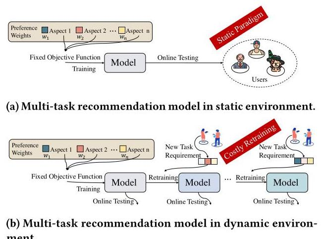
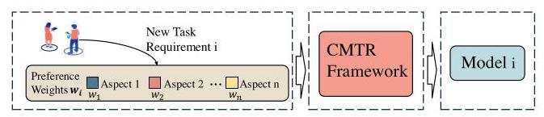
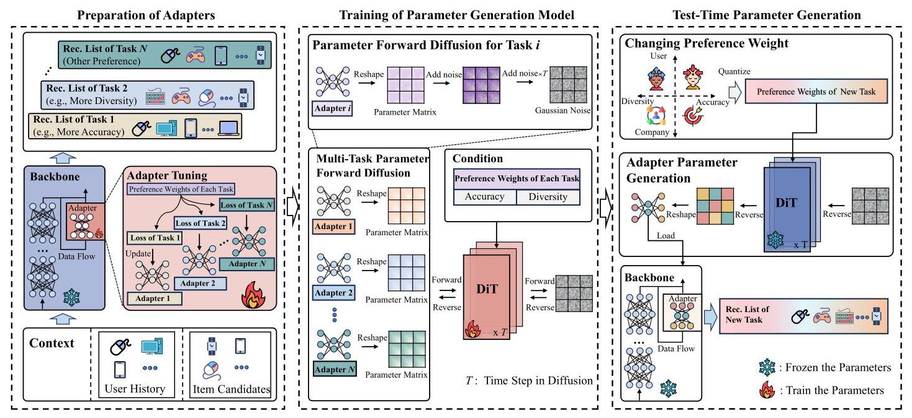
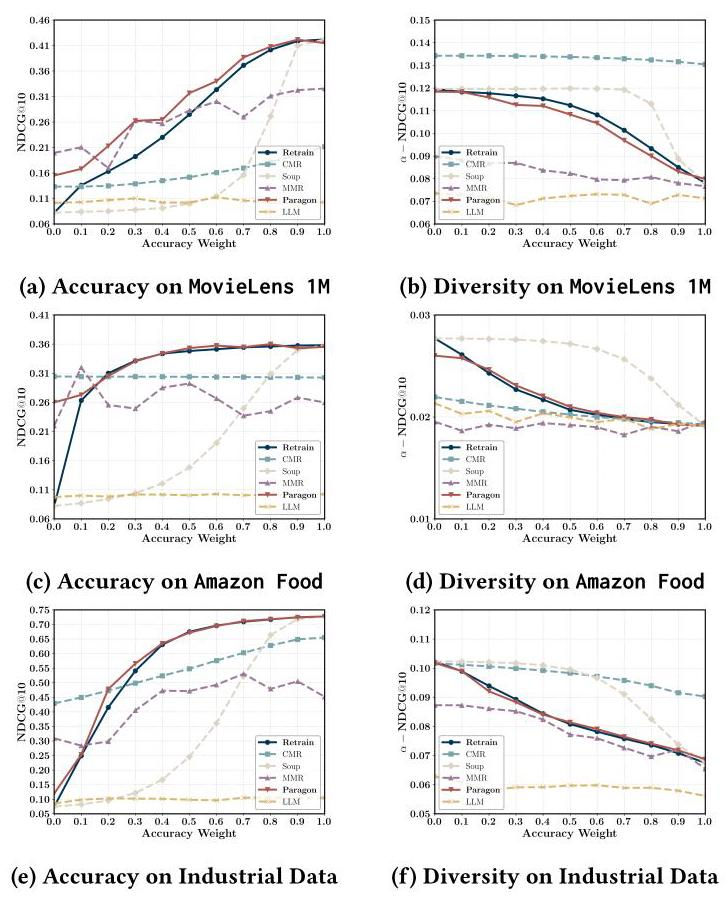
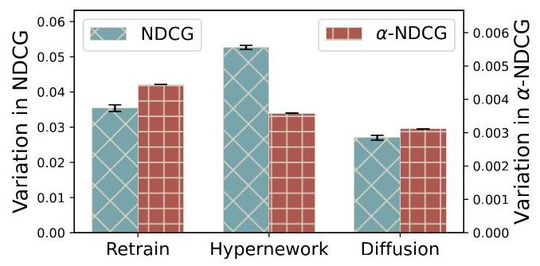
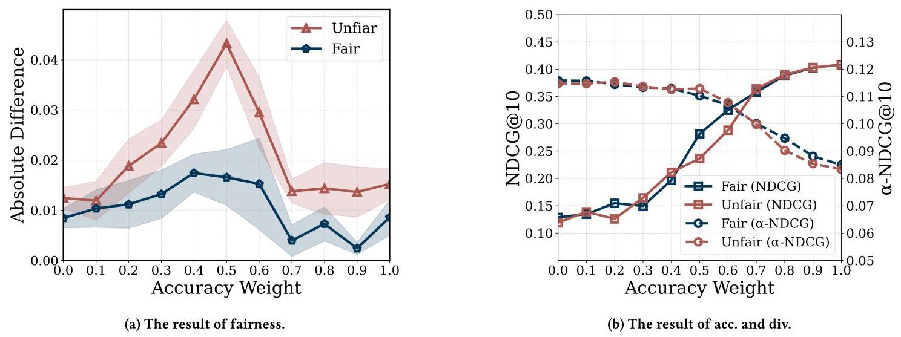
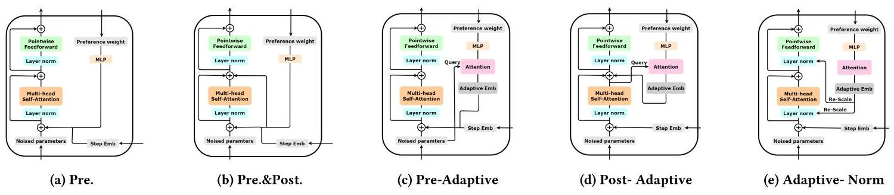
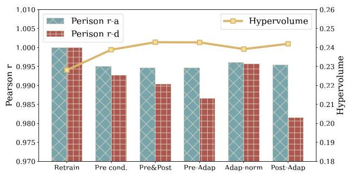

# Paragon: Parameter Generation for Controllable Multi-Task Recommendation

Chenglei Shen*

Gaoling School of Artificial

Intelligence

RenminUniversity of China

Beijing, China

chengleishen9@ruc.edu.cn

Jiahao Zhao*

Gaoling School of Artificial

Intelligence

Renmin University of China

Beijing, China

zhaojiahao2202@ruc.edu.cn

Xiao Zhang \( {}^{ \dagger  } \)

Gaoling School of Artificial

Intelligence

Renmin University of China

Beijing, China

zhangx89@ruc.edu.cn

Weijie Yu

School of Information Technology

and Management

University of International Business

and Economics

Beijing, China

yu@uibe.edu.cn

Ming He

AI Lab at Lenovo Research

Beijing, China

heming01@foxmail.com

Jianping Fan

AI Lab at Lenovo Research

Beijing, China

jfan1@lenovo.com

## Abstract

Commercial recommender systems face the challenge that task requirements from platforms or users often change dynamically (e.g., varying preferences for accuracy or diversity). Ideally, the model should be re-trained after resetting a new objective function, adapting to these changes in task requirements. However, in practice, the high computational costs associated with retraining make this process impractical for models already deployed to online environments. This raises a new challenging problem: how to efficiently adapt the learned model to different task requirements by controlling the model parameters after deployment, without the need for retraining. To address this issue, we propose a novel controllable learning approach via parameter generation for controllable multitask recommendation (Paragon), which allows the customization and adaptation of recommendation model parameters to new task requirements without retraining. Specifically, we first obtain the optimized model parameters through adapter tunning based on the feasible task requirements. Then, we utilize the generative model as a parameter generator, employing classifier-free guidance in conditional training to learn the distribution of optimized model parameters under various task requirements. Finally, the parameter generator is applied to effectively generate model parameters in a test-time adaptation manner given task requirements. Moreover, Paragon seamlessly integrates with various existing recommendation models to enhance their controllability. Extensive experiments

Permission to make digital or hard copies of all or part of this work for personal or classroom use is granted without fee provided that copies are not made or distributed for profit or commercial advantage and that copies bear this notice and the full citation on the first page. Copyrights for components of this work owned by others than the author(s) must be honored. Abstracting with credit is permitted. To copy otherwise, or on two public datasets and one commercial dataset demonstrate that Paragon can efficiently generate model parameters instead of retraining, reducing computational time by at least 94.6%. The code is released at https://anonymous.4open.science/r/Paragon-C726.

## CCS Concepts

## Information systems \( \rightarrow \) Recommender systems.

## ACM Reference Format:

Chenglei Shen, Jiahao Zhao, Xiao Zhang, Weijie Yu, Ming He, and Jianping Fan. 2025. Paragon: Parameter Generation for Controllable Multi-Task Recommendation. In Proceedings of the Nineteenth ACM Conference on Recommender Systems (RecSys '25), September 22-26, 2025, Prague, Czech Republic. ACM, New York, NY, USA, 11 pages. https://doi.org/10.1145/3705328.3748069

ment.

Figure 1: Illustration of multi-task recommendation in static and dynamic environments. "Aspects" represents the aspects of recommended results such as diversity, fairness, etc. "Preference weights" is a vector of preferences across different aspects. Each new task requirement can be represented by a vector of novel preference weights (maybe different).

---

*Both authors contributed equally to this research.

†Corresponding author: Xiao Zhang (e-mail: zhangx89@ruc.edu.cn).

---

Figure 2: Illustration of controllable multi- task recommendation (CMTR) given task requirement \( i \) at testing time.

## 1 Introduction

Traditional recommender systems focus on improving accuracy through analyzing user behaviors and contextual data [11, 17, 60- 65]. Nowadays, recommendation, especially multi-task recommendation (MTR), places greater emphasis on multiple aspects like diversity and fairness [29, 53]. They simultaneously optimize multiple aspects based on the task requirements (i.e., preference weights for each aspect). This has made MTR a research hotspot by leveraging unified models to learn interrelated aspects for mutual improvement \( \left\lbrack  {9,{46},{50},{57}}\right\rbrack \) .

Nonetheless, in the online stage of recommendation, there is often a need for sudden, instantaneous changes in task requirements, where the preference weights for each aspect can change unexpectedly. From a commercial perspective, businesses often need real-time adjustments to their recommendation strategies, especially during live events like Black Friday, where user interests can shift drastically in a matter of hours. From a user's perspective, preferences can change unexpectedly as well. For instance, a user might initially prioritize highly accurate recommendations when searching for a product, but after several similar items, they may start preferring more diverse suggestions to explore new options. These changes are sudden and instantaneous during the online testing stage, making it impossible to predict them in a data-driven manner, highlighting the importance of considering sudden changes in task requirements in MTR to avoid sub-optimal recommendations.

Traditional MTR algorithms face challenges in addressing this issue (i.e., the sudden changing preference weights on each aspect). Most existing MTR algorithms focus on achieving mutual improvement in static environment. As shown in Figure 1 (a), the task requirement (the preference weights on each aspect such as accuracy and diversity) are predefined and fixed during both training and testing [40, 66]. When traditional MTR algorithms are deployed in the dynamic environment, they require reconstructing the objective function, retraining the model, and redeploying it to the online system whenever a new task requirement arises, as depicted in Figure 1 (b). Obviously, when faced with a sudden change in task requirements, it cannot respond immediately due to the highly time-and resource-intensive nature of retraining. Overall, the central issue is that task requirements are sudden changing and manually specified at test time, resulting in unavoidable retraining overhead for new demands. Consequently, developing efficient methods to adjust models to real-time task requirements is crucial, which we term controllable multi-task recommendation (CMTR).

CMTR aims to develop an efficient test-time model control mechanism that eliminates the need for retraining, as illustrated in Figure 2. In fact, retraining essentially involves adjustments to the model parameters. To capture these global parameter changes, we innovatively use a generative model to generate recommendation model parameters instead of relying on the time-consuming retraining process. Additionally, to preserve the foundational capabilities of the recommendation model and reduce the learning complexity and inference time of the generative model, we generate only task-specific adapters. Moreover, treating the dynamically changing task requirements as conditioning signals further confers test-time controllability on CMTR, thereby eliminating the need to retrain the recommendation model during inference. Specifically, we proposed Paragon, begins by constructing an objective function aligned with task-specific preference weights, and through advanced optimization techniques, we fine-tune recommendation model parameters using adapter tuning. We then train a generative model (e.g., diffusion model) to learn the conditional distribution of these optimized adapter parameters under various task requirements, where the classifier-free guidance training strategy is employed to perform conditional training. Once trained, during online testing, the generative model can rapidly generate task-specific adapter parameters conditioned on the task requirements, which are then integrated with the backbone to produce recommendation lists that meet the specified requirements. Extensive experiments demonstrate that: (1) Paragon can rapidly and instantly generate high-performance model parameters without retraining. (2) The parameters generated by Paragon exhibit strong robustness. (3) Paragon performs well in controlling multiple aspects beyond accuracy and diversity.

We summarize our contributions as follows:

- We reveal the impact of sudden changes in task requirements during online testing on MTR and define the CMTR task, which emphasizes the model's adaptability to sudden changing task requirements in online scenarios.

- We introduce Paragon, which generates recommendation model parameters based on task requirements, eliminating costly retraining.

- Extensive experiments show that Paragon cuts computational time by at least 94.6% while preserving virtually the same recommendation performance as retraining.

## 2 Related Work

Multi-task learning (MTL) aims to develop unified models that tackle multiple learning tasks simultaneously while facilitating information sharing [37, 41, 43, 44, 66]. Recent advancements in MTL include deep networks with various parameter sharing mechanisms [24, 26, 58] and approaches treating MTL as a multi-objective optimization problem [22, 25, 54]. These latter methods focus on identifying Pareto-efficient solutions across tasks, with significant applications in recommender systems [16, 19, 67]. Researchers have explored different strategies, from alternating optimization of joint loss and individual task weights to framing the process as a reinforcement learning problem [54]. The emphasis has shifted from optimizing specific preference weights to finding weights that achieve Pareto efficiency across objectives [22, 23, 40]. Recently approaches, such as the CMR [4], utilize hypernetworks to learn the trade-off curve for MTL problems. However, our novel approach diverges from these existing methods by employing diffusion models to control model parameters at test time, potentially offering greater flexibility and adaptability in handling multi-task learning problems. Recently, some studies have utilized large language models (LLMs) to influence recommendation systems [32, 34] or act as recommenders [33, 55]. However, these methods are unable to provide flexible parameter control and instead depend on semantic understanding, a characteristic that fundamentally differentiates them from our approach. Moreover, there has been a growing body of research focusing on dynamic model adaptation at test time \( \left\lbrack  {4,{41},{42}}\right\rbrack \) .

Diffusion models. Diffusion probabilistic models [13, 27, 45]have not only achieved significant success in the field of image generation but have also found wide applications in various other areas in recent years, such as video generation [15], text generation [7, 21], etc. Moreover, diffusion models have shown the ability to generate high-quality neural network parameters, achieving comparable or even superior performance to traditionally trained models [18, 39, 48, 59]. These models have also been applied to enhance the accuracy of recommender systems by addressing challenges such as noisy interactions and temporal shifts in user preferences [49]. In our work, we utilize diffusion models to generate parameters for controllable multi-task recommender systems. Notably, we use generative models to generate high-quality parameters for recommendation models. The parameter generation paradigm differs from generative retrieval [31, 35], which directly generates item identifiers. Our approach dynamically reconfigures models, maintaining efficiency and enabling control.

## 3 Problem Formulation and Analyses

Given a user \( u \in  \mathcal{U} \) and a set of candidate items \( C = {\left\{  {c}_{k}\right\}  }_{k = 1}^{\left| C\right| } \) where \( \left| C\right| \) denotes the total number of candidate items. The historical interaction sequence of user \( u \) of length \( h \) is denoted by \( {S}_{u} = \left\{  {{c}_{1}^{u},{c}_{2}^{u},\ldots ,{c}_{h}^{u}}\right\} \) (also called user history), where \( {c}_{k}^{u} \in  \mathcal{C}, k \in \; \{ 1,2,\ldots , h\} \) . For a recommendation task \( i \in  \{ 1,2,\ldots , N\} \) , a recommender system aims to find the following item list \( {L}_{i}^{ * } \) among all possible lists \( \{ L\} \) composed by candidate items from \( C \) :

\[
{L}_{i}^{ * } = \underset{L}{\arg \max }{R}_{i}\left( {L \mid  {S}^{u}, C}\right) \tag{1}
\]

where \( {R}_{i} \) denotes the reward function corresponding to task \( i \) , which evaluates the recommender system's performance with respect to task \( i \) . More specifically, modern recommender systems often evaluate performance from multiple perspectives, the reward function in Eq. (1) for task \( i \) can be expressed as the following linear combination of \( p \) utility functions \( {\left\{  {U}_{j}\right\}  }_{j = 1}^{p} \) :

\[
{R}_{i}\left( {L\left( {{S}_{u}, C}\right) }\right)  = \mathop{\sum }\limits_{{j = 1}}^{p}{w}_{i}^{j}{U}_{j}\left( {L \mid  {S}_{u}, C}\right) , \tag{2}
\]

which allows task \( i \) to be quantified by a set of preference weights \( {w}_{i} = {\left\{  {w}_{i}^{j}\right\}  }_{j = 1}^{p} \in  \mathcal{W} \) for the various utilities, where \( \mathcal{W} \) denotes the preference weight space that is a simplex.

Then, we can provide the definition of controllable multi-task recommendation (CMTR). The goal of CMTR is to find a recommendation model \( {f}_{\theta } \) , parameterized by \( \theta  \in  \Theta \) , such that the item lists output during test time, \( L = {f}_{\theta }\left( {{S}_{u}, C}\right) \) , can adapt to changes in tasks (i.e., adapt to variations in the corresponding preference weights in Eq. (2)). As an example, after the recommendation model \( {f}_{\theta } \) is deployed, when the preference weights for different utilities (e.g., accuracy and diversity) need to shift from \( {\mathbf{w}}_{i} = {\left\{  {w}_{i}^{j}\right\}  }_{j = 1}^{p} \) (i.e., task \( i \) ) to \( {w}_{k} = {\left\{  {w}_{k}^{j}\right\}  }_{j = 1}^{p} \) (i.e., task \( k \) ) based on user or platform requirements, we say that the recommendation model \( {f}_{\theta } \) is controllable if it can ensure that its reward remains at a high level regardless of how the preference weights change. Ideally, to accommodate changes in tasks, we could retrain the recommendation model after receiving new preference weights to update its parameters, resulting in \( {f}_{\widehat{\theta }} \) that maintains a high reward. However, for an already deployed model, the time required for retraining is impractical and unacceptable. Another straightforward method would be to store \( N \) sets of task-specific parameters corresponding to the preference weights for \( N \) tasks at the time of deployment, and load them when a new task arises at test time. However, when considering a continuous preference weight space where the number of tasks \( N \) tends to infinity (i.e., a continuous task space), this discrete method becomes impractical due to storage limitations and cannot accommodate fine-grained or continuous task variations.

To efficiently and effectively adapt to changes in tasks, this paper focuses on controlling the model parameters \( \mathbf{\theta } \) of the recommendation model \( {f}_{\theta } \) to accommodate the varying preference weights of new tasks. Specifically, we treat the preference weights as variables and model the relationship between the preference weight space \( \mathcal{W} \) and the model parameter space \( \Theta \) during training, transforming the time- and resource-intensive retraining problem at test time into an efficient inference problem. Formally, we aim to find a function \( {g}_{\xi } : \mathcal{W} \rightarrow  \Theta \) (where \( \xi \) denotes the parameter of \( g \) ) that generates model parameters capable of achieving a high reward given the new preference weights \( {\mathbf{w}}_{k} \) for any task \( k \) at test time:

\[
{R}_{k}\left( {L\left( {{S}_{u}, C}\right) }\right)  = \mathop{\sum }\limits_{{j = 1}}^{p}{w}_{k}^{j}{U}_{j}\left( {{f}_{{\theta }_{k}}\left( {{S}_{u}, C}\right)  \mid  {\theta }_{k} = {g}_{\xi }\left( {w}_{k}\right) }\right) . \tag{3}
\]

In contrast to traditional multi-task recommendation (MTR), which focuses only on fixed preference weights for different utilities, our defined CMTR emphasizes how the model adapts to dynamic changes in preference weights after deployment. This shift means that in traditional MTR, each task corresponds to a single utility, whereas in CMTR, each task is associated with multiple utilities combined through a linear weighting, with combination coefficients determined by a set of task-specific preference weights. As a result, CMTR places greater emphasis on test-time adaption to handle dynamic task requirements, introducing new challenges for CMTR model training and construction compared to MTR.

## 4 Paragon: The Proposed Approach

In this section, we provide a detailed description of the proposed approach, Paragon. As shown in Figure 3, we provide an illustrative overview of the proposed Paragon, which contains the following three phases. (1) Preparation of adapters: the left part in Figure 3 shows the training process of the recommendation model, from which we can obtain a collection of optimized adapter parameters for feasible specific task by sampling the preference weights. We focus on two utilities: accuracy and diversity. As defined in Eq. (3), each task is represented by a set of preference weights for these two utilities.(2) Parameter diffusion model training: the middle part in Figure 3 illustrates the conditional training procedure of the generative model \( {g}_{\xi } \) (i.e., DiT) with the optimized adapter parameters as initial data and the corresponding preference weights as condition, thus generating meaningful adapter parameters from Gaussian noise given preference weights. (3) Test-time parameter generation: the right part in Figure 3 shows how we utilize the trained DiT model at test time to adapt to dynamically changing task requirements (i.e., preference weights for diversity and accuracy). First, we quantify these task requirements as preference weights. Next, we employ the trained DiT model to generate adapter parameters at test time, using these preference weights as inputs, which are then combined with the backbone to directly support the recommendation task.

Figure 3: An overview of the proposed Paragon.

### 4.1 Preparation of Adapters

Our goal is to construct the parameters of optimized recommendation models under different preference weights to prepare data for the generative model. Thus, this section is organized into three parts: the structure of the recommendation model, the construction of task-specific objective functions, and the tuning process for the recommendation model parameters.

Model structure. As shown in the left module of Figure 3, sequential recommendation models take user history and candidate items as input. Guided by the objective function (i.e., loss function), the model learns the underlying relationships within the user history, ultimately generating a recommendation list (i.e., Rec. List) from the candidate items. To preserve the foundational capabilities of the recommendation model and reduce the learning complexity and inference time of the generative model. we adopt a backbone recommendation model and task-specific adapters framework, where the backbone is trained to preserve the accurate recommendation by BPR loss while the adapters are trained under various task requirements for generative model to learn. Specifically, we incorporate the adapter using a residual connection, attaching it to the last layer of the backbone model. Based on this structure, the backbone is fixed after training, and on this foundation, the task-specific adapters are independently trained under the guidance of their respective objective functions.

Objective function construction. To obtain the optimized task-specific adapter parameters under CMTR setting (as shown in Sec. 3 ), we first focus on the construction of loss functions based on different preference weights of each task. Specifically, we directly convert the reward maximization problem (reward defined in Eq. (2)) into a loss minimization problem. Given a specific set of preference weights \( {\mathbf{w}}_{i} = {\left\{  {w}_{i}^{j}\right\}  }_{j = 1}^{p} \in  \mathcal{W} \) , which represent preference weight for the \( j \) -th utility in the requirement of task \( i \) . Here, we focus on two utilities including diversity loss \( {\ell }_{\text{ diversity }} \) and accuracy loss \( {\ell }_{\text{ accuracy }} \) in each task (i.e., \( p = 2 \) ). Thus, the total loss function for task \( i \) is

\[
{\ell }_{i} = {w}_{i}^{1}{\ell }_{\text{ accuracy }} + {w}_{i}^{2}{\ell }_{\text{ diversity }}, \tag{4}
\]

where \( {\ell }_{\text{ accuracy }} \) employs the BPR loss [36], and the formulation of \( {\ell }_{\text{ diversity }} \) is detailed in the next section.

Adapter tuning. Based on above total loss function, we decompose the recommendation model parameters \( \mathbf{\theta } \) into two components: task-specific adapter parameters, denoted as \( {\mathbf{\theta }}_{\mathrm{a}} \) and task-independent backbone parameters, denoted as \( {\mathbf{\theta }}_{\mathrm{b}} \) . Accordingly, optimizing the model is divided into two phases. The first phase focuses on optimizing the backbone parameters \( {\mathbf{\theta }}_{\mathrm{b}} \) , which uses the standard BPR loss to train the backbone model thus preserving the original recommendation accuracy. The second phase is about the optimization of the task-specific adapter parameters \( {\mathbf{\theta }}_{\mathrm{a}} \) , which aims at improving the system's adaptability to different tasks. During the second phase, the backbone parameters are frozen to prevent them from being tailored to any specific task, whereas the adapter is trainable. More specifically, in the second phase, we train the task-specific adapter parameters based on two loss functions as in Eq. (4), one for accuracy and one for diversity. For the accuracy loss \( {\ell }_{\text{ accuracy }} \) , we continue to use BPR as the loss function to guide the model toward accuracy. For the diversity loss \( {\ell }_{\text{ diversity }} \) , inspired by Yan et al. [56], we apply a differentiable smoothing of the \( \alpha \) -DCG metric and adapt it to the recommendation setting. Consider \( \left| C\right| \) candidate items and \( \left| \mathcal{M}\right| \) categories, where each item may cover 0 to \( \left| \mathcal{M}\right| \) categories. The category labels are denoted as \( {y}_{k, l} \) : \( {y}_{k, l} = 1 \) if item \( k \) covers category \( m \) , and \( {y}_{k, l} = 0 \) otherwise, where \( k \in  \{ 0,\ldots ,\left| C\right|  - 1\} , l \in  \{ 0,\ldots ,\left| \mathcal{M}\right|  - 1\} \) . Based on the \( \alpha \) -DCG, we design a differentiable diversity loss function:

\[
{\ell }_{\text{ diversity }} =  - \mathop{\sum }\limits_{{k = 1}}^{\left| \mathcal{C}\right| }\mathop{\sum }\limits_{{l = 1}}^{\left| \mathcal{M}\right| }\frac{{y}_{k, l}\left( {1 - \alpha }\right) {C}_{k, l}}{{\log }_{2}\left( {1 + {\operatorname{Rank}}_{k}}\right) }, \tag{5}
\]

where \( \alpha \) is a hyper parameter between 0 and 1, \( {\operatorname{Rank}}_{k} \) is the soft rank of the item \( k \) , and \( {C}_{k, l} \) is the number of times the category \( l \) being covered by items prior to the soft rank \( {\operatorname{Rank}}_{k} \) . That is:

(6)

\[
{\operatorname{Rank}}_{k} = 1 + \mathop{\sum }\limits_{{j \neq  k}}\operatorname{sigmoid}\left( {\left( {{s}_{j} - {s}_{k}}\right) /T}\right)
\]

\[
{C}_{k, l} = \mathop{\sum }\limits_{{j \neq  k}}{y}_{j, l} \cdot  \operatorname{sigmoid}\left( {\left( {{s}_{j} - {s}_{k}}\right) /T}\right) ,
\]

where \( {s}_{k} \) denotes the relevance score of the \( k \) -th candidate item output by the model. For task \( i \) , we denote \( {\mathbf{\theta }}_{i} \) as the model parameters including task-specific adapter parameters \( {\mathbf{\theta }}_{i}^{\mathrm{a}} \) and fixed backbone parameters \( {\mathbf{\theta }}_{i}^{\mathrm{b}} \) . Based on the total loss in Eq. (4), the task-specific optimization process of \( {\mathbf{\theta }}_{i}^{\mathrm{a}} \) for task \( i \) can be formulated as follows:

\[
{\theta }_{i}^{\mathrm{a}} = \underset{{\theta }_{i}^{\mathrm{a}}}{\arg \min }{w}_{i}^{1}{\ell }_{\text{ accuracy }} + {w}_{i}^{2}{\ell }_{\text{ diversity }}, \tag{7}
\]

where \( {\mathbf{w}}_{i} = \left\{  {{w}_{i}^{1},{w}_{i}^{2}}\right\}   \in  \mathcal{W} \) is sampled from \( \left\lbrack  {0,1}\right\rbrack \) . We employ the standard Adam optimizer to optimize these parameters. Then we transform the parameters of each task-specific adapter into a matrix-based format and these optimized parameters serve as the ground truth for the subsequent generative model training process.

### 4.2 Training of Parameter Generation Model

The optimized adapter parameters and corresponding preference weights obtained from Sec. 4.1 are used as the training data for the diffusion model. We employ a generative model \( {g}_{\xi } \) parameterized by \( \xi \) to learn the process of generating model parameters. Specifically, \( {g}_{\xi } \) is applied to predict the conditional distribution of the adapter parameter matrices \( {p}_{{g}_{\xi }}\left( {{\theta }_{i}^{\mathrm{a}} \mid  {w}_{i}}\right) \) given the preference weights \( {\mathbf{w}}_{i} \) , where \( i \) corresponds to the task \( i \) . We adopt diffusion models [13] as our generative model due to its efficacy in various generation tasks [12, 21, 47] and its superior performance on multimodal conditional generation [1, 28, 38]. We train the diffusion model to sample parameters by gradually denoising the optimized adapter parameter matrix from the Gaussian noise. This process is intuitively reasonable as it intriguingly mirrors the optimization journey from random initialization which is a well-established practice in existing optimizers like Adam. For task \( i \) , our denois-ing model takes two parts as the input: a noise-corrupted adapter parameter matrix \( {\mathbf{\theta }}_{i, t}^{\mathrm{a}} \) , and a set of preference weights \( {\mathbf{w}}_{i} \) , with \( t \) representing the step in the forward diffusion process. The training objective is as follows:

\[
{\ell }_{\text{ diff }} = {\mathbb{E}}_{{\mathbf{\theta }}_{i,0}^{\mathrm{a}},\epsilon  \sim  \mathcal{N}\left( {0,1}\right) , t}\left\lbrack  {\begin{Vmatrix}\epsilon  - {\epsilon }_{\mathbf{\xi }}\left( {\mathbf{\theta }}_{i, t}^{\mathrm{a}},{\mathbf{w}}_{i}, t\right) \end{Vmatrix}}^{2}\right\rbrack  , \tag{8}
\]

where \( \epsilon \) denotes the noise to obtain \( {\mathbf{\theta }}_{i, t}^{\mathrm{a}} \) from \( {\mathbf{\theta }}_{i,0}^{\mathrm{a}} \) , and the denoising model \( \epsilon \left( \cdot \right) \) is the main part of the generative model \( {g}_{\xi } \) . We assume that the parameters of \( {g}_{\xi } \) primarily originate from the denoising model. For simplicity, we denote the denoising model as \( {\epsilon }_{\xi } \) . To conduct condition training in a classifier-free guidance manner [14], we use the denoising model to serve as both the conditional and unconditional model by simply inputting a null token \( \varnothing \) as the condition (i.e., preference weights \( {\mathbf{w}}_{i} \) ) for the unconditional model, i.e. \( {\epsilon }_{\mathbf{\xi }}\left( {{\mathbf{\theta }}_{i, t}^{\mathrm{a}}, t}\right)  = {\epsilon }_{\mathbf{\xi }}\left( {{\mathbf{\theta }}_{i, t}^{\mathrm{a}},{\mathbf{w}}_{i} = \varnothing , t}\right) \) . The probability of setting \( {\mathbf{w}}_{i} \) to \( \varnothing \) is denoted as \( {p}_{\text{ uncond }} \) and is configured as a hyperparameter.

### 4.3 Test-Time Parameter Generation

After the diffusion is trained, we can generate the parameters \( {\mathbf{\theta }}_{n,0}^{\mathrm{a}} \) by querying \( {g}_{\xi } \) with a new set of preference weights \( {\mathbf{w}}_{n} \) , specifying the desired preference weights for accuracy and diversity of new task \( n \) . Then the generated adapter parameter \( {\mathbf{\theta }}_{n,0}^{\mathrm{a}} \) for that new task is directly loaded into the adapter, which is connected to the backbone. This forms a new customized recommendation model that responds to the preference weights of the new task. The generation is an iterative sampling process from step \( t = T \) to \( t = 0 \) , which denoises the Gaussian noise into meaningful parameters taking specific preference weights as the condition. The generation process is formulated as follows:

\[
{\widetilde{\epsilon }}_{\xi }\left( {{\mathbf{\theta }}_{n, t}^{\mathrm{a}},{\mathbf{w}}_{n}, t}\right)  = \left( {1 + \gamma }\right) {\epsilon }_{\xi }\left( {{\mathbf{\theta }}_{n, t}^{\mathrm{a}},{\mathbf{w}}_{n}, t}\right)  - \gamma {\epsilon }_{\xi }\left( {{\mathbf{\theta }}_{n, t}^{\mathrm{a}}, t}\right) ,
\]

\[
{\theta }_{n, t - 1}^{\mathrm{a}} = \frac{1}{\sqrt{{\alpha }_{t}}}\left\lbrack  {{\theta }_{n, t}^{\mathrm{a}} - \frac{{\beta }_{t}}{\sqrt{1 - {\widetilde{\alpha }}_{t}}}{\widetilde{\epsilon }}_{\xi }\left( {{\theta }_{n, t}^{\mathrm{a}},{w}_{n}, t}\right) }\right\rbrack   + {\sigma }_{t}{z}_{t}, \tag{9}
\]

where \( {z}_{t} \sim  \mathcal{N}\left( {\mathbf{0},\mathbf{I}}\right) \) for \( t > 1 \) and \( {z}_{t} = \mathbf{0} \) for \( t = 1,{\beta }_{t} = 1 - {\alpha }_{t} \) , \( \gamma  \in  \left\lbrack  {0,1}\right\rbrack \) .

Specifically, after generating the adapter parameter matrix, we reshape it to obtain the adapter parameters (for simplicity, we do not distinguish between the notations used before and after the reshaping). The generated adapter parameter is directly load into the adapter architecture. Then keeping the backbone parameters \( {\mathbf{\theta }}_{n}^{\mathrm{b}} \) and the adapter parameters \( {\mathbf{\theta }}_{n,0}^{\mathrm{a}} \) fixed, the recommendation model is directly applied to extract features from the user history interactions and score candidate items to generate a recommendation list that aligns with the preference weights of the new task.

Table 1: Statistical information of Datasets

<table><tr><td>Dataset</td><td>#user</td><td>#item</td><td>#category</td><td>#inter.</td><td>density</td></tr><tr><td>MovieLens 1M</td><td>6,034</td><td>3,125</td><td>18</td><td>994,338</td><td>7.805%</td></tr><tr><td>Amazon Food</td><td>4,905</td><td>2,420</td><td>156</td><td>53,258</td><td>0.448%</td></tr><tr><td>Industrial Data</td><td>3,628</td><td>3,181</td><td>27</td><td>72,391</td><td>0.627%</td></tr></table>

## 5 Experiments

We conducted experiments to evaluate the performance of Paragon.

### 5.1 Experiment Settings

#### 5.1.1 Dataset. The datasets are processed as follows:

MovieLens-1M \( {}^{1} \) is an website dataset of MovieLens in 2000. We sorted each user's browsing history chronologically and filtered out users with fewer than 5 interactions. Each interaction is formatted to include user ID, item ID, timestamp, Categories of items (may be multiple categories).

---

\( {}^{1} \) https://grouplens.org/datasets/movielens/

---

Table 2: Performance comparison between the proposed method and baseline models. The best results are highlighted in bold, while the second-best results are underlined. "/" represents the absence of a relevant value.

<table><tr><td rowspan="2">Backbone</td><td rowspan="2">Algorithm</td><td colspan="3">MovieLens</td><td colspan="3">Amazon Food</td><td colspan="3">Industrial Dataset</td></tr><tr><td>Avg.HV</td><td>pearson r-a</td><td>pearson r-d</td><td>Avg.HV</td><td>pearson r-a</td><td>pearson r-d</td><td>Avg.HV</td><td>pearson r-a</td><td>pearson r-d</td></tr><tr><td rowspan="5">SASRec</td><td>Retrain</td><td>0.2281</td><td>/</td><td>/</td><td>0.2251</td><td>/</td><td>/</td><td>0.2779</td><td>/</td><td>/</td></tr><tr><td>CMR</td><td>0.1920</td><td>0.8901</td><td>0.9150</td><td>0.1955</td><td>-0.7039</td><td>0.9932</td><td>0.2476</td><td>0.8750</td><td>0.9237</td></tr><tr><td>Soup</td><td>0.1441</td><td>0.7861</td><td>0.9133</td><td>0.1561</td><td>0.5317</td><td>0.6693</td><td>0.1825</td><td>0.7306</td><td>0.8188</td></tr><tr><td>MMR</td><td>0.1808</td><td>0.9575</td><td>0.8803</td><td>0.1707</td><td>0.1320</td><td>-0.3087</td><td>0.2034</td><td>0.9077</td><td>0.9655</td></tr><tr><td>Paragon</td><td>0.2138</td><td>0.9905</td><td>0.9903</td><td>0.2420</td><td>0.8857</td><td>0.9816</td><td>0.2812</td><td>0.9976</td><td>0.9986</td></tr><tr><td>/</td><td>LLM-CMTR</td><td>0.0625</td><td>-0.0600</td><td>0.0994</td><td>0.1017</td><td>0.7296</td><td>0.8558</td><td>0.0372</td><td>0.7279</td><td>0.7132</td></tr><tr><td rowspan="5">GRU4Rec</td><td>Retrain</td><td>0.1823</td><td>/</td><td>/</td><td>0.1556</td><td>/</td><td>/</td><td>0.1735</td><td>/</td><td>/</td></tr><tr><td>CMR</td><td>0.1760</td><td>0.9068</td><td>0.8813</td><td>0.3617</td><td>0.8287</td><td>0.9059</td><td>0.1230</td><td>0.6514</td><td>0.5985</td></tr><tr><td>Soup</td><td>0.1197</td><td>0.8061</td><td>0.6694</td><td>0.0604</td><td>0.3850</td><td>0.8005</td><td>0.1226</td><td>0.7099</td><td>0.8200</td></tr><tr><td>MMR</td><td>0.1609</td><td>0.8692</td><td>0.7257</td><td>0.1354</td><td>-0.3497</td><td>-0.3748</td><td>0.1287</td><td>0.7916</td><td>0.7553</td></tr><tr><td>Paragon</td><td>0.2009</td><td>0.9929</td><td>0.9786</td><td>0.1623</td><td>0.8470</td><td>0.9685</td><td>0.1871</td><td>0.9760</td><td>0.9236</td></tr><tr><td>/</td><td>LLM-CMTR</td><td>0.0625</td><td>-0.0716</td><td>0.0119</td><td>0.0667</td><td>0.7484</td><td>0.7904</td><td>0.0372</td><td>0.8088</td><td>0.7722</td></tr><tr><td rowspan="5">TiSASRec</td><td>Retrain</td><td>0.2301</td><td>/</td><td>/</td><td>0.2232</td><td>/</td><td>/</td><td>0.2777</td><td>/</td><td>/</td></tr><tr><td>CMR</td><td>0.1769</td><td>0.9286</td><td>0.9903</td><td>0.2064</td><td>-0.6279</td><td>0.9828</td><td>0.3315</td><td>0.8855</td><td>0.9300</td></tr><tr><td>Soup</td><td>0.1483</td><td>0.8033</td><td>0.8858</td><td>0.1533</td><td>0.5342</td><td>0.6525</td><td>0.1811</td><td>0.7310</td><td>0.8248</td></tr><tr><td>MMR</td><td>0.1815</td><td>0.8946</td><td>0.8684</td><td>0.1672</td><td>0.3057</td><td>0.2037</td><td>0.2060</td><td>0.9004</td><td>0.9565</td></tr><tr><td>Paragon</td><td>0.2532</td><td>0.9923</td><td>0.9914</td><td>0.2394</td><td>0.8759</td><td>0.9851</td><td>0.2862</td><td>0.9968</td><td>0.9984</td></tr><tr><td>/</td><td>LLM-CMTR</td><td>0.0625</td><td>-0.0663</td><td>0.0999</td><td>0.0667</td><td>0.7213</td><td>0.8499</td><td>0.0372</td><td>0.7373</td><td>0.7451</td></tr></table>

Amazon Grocery and Gourmet Food \( {}^{2} \) is the food data from Amazon website, spanning from August 09, 2000 to July 23, 2014. Since the items belong to 156 categories, we used the GloVe [30] to generate embeddings for each category. We then applied K-means clustering to group them into 30 broader categories. The interaction format is the same as MovieLens 1M.

The industrial dataset is the user click dataset from an electronics commercial store, spanning from July 24, 2024, to August 24, 2024. We randomly sample 10000 user, then filtering out users with fewer than 10 interactions to obtain 3628 users. Each interaction was formatted to match the structure used in MovieLens 1M. The specific statistical information of the three datasets is in Table 1.

5.1.2 Baselines. To validate its effectiveness, we compare our model against several baseline methods adapted for CMTR.

Retraining is performed using Linear Scalarization [2] based on task requirements, representing the optimal solution without considering the associated costs.

Soup [52] trains separate models for each aspect of the task requirement and merges them linearly during the testing stage.

MMR [3] is a heuristic post-processing approach with the item selected sequentially according to maximal marginal relevance.

CMR [5] dynamically adjusts models based on preference weights using policy hypernetworks to generate model parameters.

LLM-CMTR [6] is a prompt-based method but specifically customized for CMTR. It inputs prompts containing specific preference weights to guide the LLM's generation in the form of list-wise recommendations. In our experiments, we selected the llama3-7B-Instruct model.

5.1.3 Implement Details. We first filtered for 5-core user IDs and adopted a leave-one-out data splitting strategy to divide the dataset into training, validation, and test sets. Additionally, we limited the length of the target item's interaction history to no more than 20. For the three recommendation model backbones, we follow the settings used in RecChorus, where the Adam optimizer is applied with a learning rate of 1e-3, embedding size of 64, and hidden size of 64. The number of negative samples in the training set is set to 9, and 99 for both the validation and test sets.

5.1.4 Metrics. We evaluate the algorithms from two dimensions. Specifically, we use Hypervolume (HV) [8] to measure the performance of the algorithm on each task, particularly in terms of the trade-offs between accuracy and diversity. The average HV (denoted as Avg.HV) across multiple tasks is used to assess the overall performance of the algorithm in balancing both objectives (accuracy and diversity). To eliminate the differences in scale between the two objectives, we normalize the performance on each objective. Additionally, we utilize the Pearson correlation coefficient to evaluate the alignment between the algorithm's performance across different tasks and the optimal model, providing insight into the algorithm's controllability. Pearson r-a, Pearson r-d measure the correlation between the algorithm and the optimal in terms of accuracy and diversity. Notably, the accuracy and diversity is measured by NDCG@10 and \( \alpha \) -NDCG@10). The fairness in analysis experiment is measured by Absolute Difference (AD) [51].

### 5.2 Experimental Results

We conducted experiments to address the following two questions: i) How transferable is Paragon, specifically in terms of its ability to adapt to different backbone algorithms? ii) How does Paragon perform compared to other baselines? The results are presented in Table 2.

---

\( {}^{2} \) http://jmcauley.ucsd.edu/data/amazon/links.html

---

Figure 4: The accuracy and diversity curve of Paragon and other baselines in NDCG@10 and \( \alpha \) -NDCG@10 across accuracy weights ranging from 0 to 1 , with intervals of 0.1 . The backbone is TiSASRec.

To answer the first question, we used commonly adopted sequential recommendation models as backbones (e.g., SASRec [17], GRU4Rec [10], and TiSASRec [20]) and conducted extensive experiments across three datasets. Specifically, we evaluated Paragon's performance under various task descriptions by measuring NDCG@10 and \( \alpha \) -NDCG@10.The accuracy weight \( {w}_{\text{ acc. }} \) varies from 0 to 1 in intervals of 0.1 , with the corresponding diversity weight set as \( {w}_{\text{ div. }} = 1 - {w}_{\text{ acc. }} \) . We then post-processed NDCG@10 and \( \alpha \) - NDCG@10 across different tasks to compute Avg.HV, Pearson r-a, and Pearson r-d. These metrics respectively evaluate the quality of multi-objective optimization on individual tasks and the controllability across multiple tasks.

Overall, across the three backbones and three datasets, Paragon consistently ranked among the top two performers across all three evaluation metrics. Notably, in most cases, the top two of Avg.HV are Retrain and Paragon, indicating that Paragon's performance in multi-objective trade-offs is on par with, or even superior to, Retrain. Specific exceptions occurred, such as on the Amazon Food dataset with GRU4Rec as the backbone and the Industrial Data with TiSASRec as the backbone, where CMR achieved the best Avg.HV. This is because CMR is not influenced by task descriptions and thus maintains consistently high NDCG@10 scores (as shown in Figure 4 and further explained in response to question ii). For

Figure 5: The variation of performance before and after disturbance in MovieLens 1M based on SASRec. The blue bars represent the variation in NDCG@10, while the red represent the variation in \( \alpha \) -NDCG@10

Pearson r-a and Pearson r-d, Paragon demonstrated strong correlations with the Retrain method, indicating that Paragon closely aligns with Retrain (which we assume to be optima) in terms of accuracy (NDCG@10) and diversity ( \( \alpha \) -NDCG@10) across different tasks. On the Amazon Food dataset with SASRec as the backbone, CMR achieved the highest Pearson r-d. However, its Pearson r-a was negative, indicating a lack of control and a collapse in accuracy. To address the second question, we presented the specific performance of Paragon under each task description using TiSASRec as the backbone across three datasets, as shown in Figure 4. It is observed that in all three datasets, Paragon's NDCG@10 progressively increases with higher accuracy weights, while \( \alpha \) -NDCG@10 decreases correspondingly due to the simultaneous reduction in diversity weight. These trends demonstrate the effectiveness of our algorithm in controllability. Notably, assuming that Retrain is optimal, Paragon exhibits strong consistency with the Retrain method. In contrast, MMR, as a post-processing algorithm, shows variability because varying degrees of diversity manipulation can disrupt the original recommendation list, uncontrollably affecting its accuracy. The Soup method merges the parameters of accuracy and diversity models based on their weights, aligning closely with the Retrain model when accuracy weights are extreme but showing significant deviations in other tasks. This indicates that tasks do not follow a simple linear relationship with different preference weights, and Soup makes overly strong assumptions about this relationship. CMR demonstrates inconsistent performance across different datasets. On the MovieLens 1M dataset, CMR aligns well with the original descriptions by exhibiting high diversity. However, on the other two datasets, it shows a stable yet uncontrollable state; for instance, on the Amazon Food dataset, CMR maintains high accuracy even with low accuracy weights, and on the Industrial Data, it retains high diversity despite low diversity weights.

### 5.3 Analyses

We conducted our analysis experiments based on three key research questions:

5.3.1 RQ1: What are the advantages of Diffusion over Hyper-network in parameter generation? We conducted experiments to validate the robustness of the parameters generated by Paragon. Specifically, we designed three sets of experiments to constructed adapter parameters: "Retrain", "Diffusion" and "Hypernetwork", where "Hypernetwork" utilizes the MLP to learn the relationship between the preference weight and the optimized adapter parameters. First, we add Gaussian noise of the same magnitude to all three sets of adapter parameters and measured the resulting fluctuations in NDCG@10 and \( \alpha \) -NDCG@10.We observed that the parameters generated by Paragon exhibited the lowest performance fluctuations than others, both in terms of accuracy (NDCG@10) and diversity ( \( \alpha \) -NDCG@10) as depicted in Figure 5. We could draw the following conclusions: 1) the Diffusion approach demonstrates superior robustness in parameter generation across both accuracy and diversity metrics compared to alternative methodologies. Second, Hypernetwork-based methods exhibit inferior robustness in parameter generation, a phenomenon likely attributable to the inherent limitations of discriminative models in achieving optimal generative capacity.

Figure 6: The result of control under accuracy, diversity and fairness. The accuracy weight ranges from 0 to 1 , with intervals of 0.1. The diversity weight is set to 1- accuracy weight. The fairness weight is \( \{ 1,0\} \) corresponding to ’fair’ and ’unfair’. The experiment is conducted on the MovieLens 1M, uti-lizing SASRec as the backbone.

Table 3: Response time comparison between proposed Paragon and the "Retrain" approach across three datasets using three different backbones. Note that the unit is seconds (sec.).

<table><tr><td>Approach</td><td>Backbone</td><td>MovieLens 1M (sec.)</td><td>Amazon Food (sec.)</td><td>Industrial Data (sec.)</td></tr><tr><td rowspan="3">Retrain</td><td>SASRec</td><td>293.10 ± 11.61</td><td>91.01±2.34</td><td>\( {46.82} \pm  {3.25} \)</td></tr><tr><td>GRU4Rec</td><td>\( {281.60} \pm  {17.36} \)</td><td>92.39±4.28</td><td>\( {49.54} \pm  {2.38} \)</td></tr><tr><td>TiSASRec</td><td>303.80 ± 9.09</td><td>105.40±7.66</td><td>52.47 ± 4.64</td></tr><tr><td rowspan="3">Paragon</td><td>SASRec</td><td>\( {2.68} \pm  {0.36}^{-{99.1}\% } \)</td><td>\( {2.64} \pm  {0.36}^{-{97.1}\% } \)</td><td>\( {2.55} \pm  {0.25}^{-{94.6}\% } \)</td></tr><tr><td>GRU4Rec</td><td>\( {{2.56} \pm  {0.27}}^{-{99.1}\% } \)</td><td>\( {2.54} \pm  {0.24}^{-{97.3}\% } \)</td><td>\( {2.51} \pm  {0.23}^{-{94.9}\% } \)</td></tr><tr><td>TiSASRec</td><td>\( {2.55} \pm  {0.23}^{-{99.2}\% } \)</td><td>\( {2.52} \pm  {0.24}^{-{97.6}\% } \)</td><td>\( {2.58} \pm  {0.26} \) -95.1%</td></tr></table>

#### 5.3.2 RQ2: Is Paragon efficient enough to handle real-time changes in preference weights compared to Retrain? Paragon

is designed to adaptively adjust model parameters in an online environment without retraining, enabling it to quickly respond to new task requirements. This places a strong emphasis on the model's response time. We compared the response times of Paragon and "Retrain" across various backbones and datasets, with the results shown in Table 3. As observed, in all experiments using three different backbones across three datasets, Paragon's response time was significantly faster than that of "Retrain". Notably, the response time of "Retrain" correlated with the size of the dataset, whereas Paragon exhibited minimal variation across different datasets. This highlights Paragon's data-agnostic nature indicating its potential for handling large-scale datasets efficiently.

5.3.3 RQ3: What about the scalability to more utilities such as fairness. We examined the performance of Paragon under various metric controls, including the widely used fairness metric in recommendation systems, where fairness is defined as the absolute difference (AD) of NDCG@10 between male and female groups. We set the value of fairness dimension in preference weight to \( \{ 0,1\} \) , corresponding to unfair and fair settings. As shown in Figure 6 (a), under different levels of control over accuracy and diversity, there is a clear and consistent difference in the models' AD. when set control signal to fair versus unfair. A smaller AD for the fair setting indicates better inter-group fairness. Meanwhile, as shown in Figure 6 (b), we divided the control signals into two groups: fair and unfair. Within each group, accuracy and diversity remain stably negatively correlated, while the differences in accuracy and diversity between the groups are minimal. This experiment demonstrates that Paragon can effectively achieve control over multiple objectives.

5.3.4 RQ4: How do different conditioning strategies impact the model's performance? We investigate the influence of different conditioning strategies aimed at improving the integration of conditions into the denoising model. The detailed structure is shown in Figure 7. Each strategy emphasizes different performance dimensions as depicted in Figure 8. In terms of Hypervolume, all five strategies outperform the "Retrain" approach, with the "Pre&Post" strategy achieving the best results. For Pearson r-a and Pearson r-d, the "Adap-norm" strategy demonstrates the best overall performance, indicating strong consistency with the "Retrain" approach, i.e., high controllability. Additionally, the Hypervolume remains within an acceptable range, suggesting that adding conditions aggregated by an attention mechanism to the layer norm is a promising approach for controllability.

Figure 7: Illustration of the structural diagram for five conditioning strategies.

Figure 8: Performances of different conditioning strategies on MovieLens 1M using SASRec as backbone. The results of the "Retrain" algorithm are used as a reference.

## 6 Case Study

To better illustrate the utility of Paragon, we present the top-10 recommendation lists under two sets of preference weights. We compared the top-10 recommendation lists between an accuracy weight of 0.1(diversity weight is 0.9) and an accuracy weight of 0.9(diversity weight is 0.1). Notably, when the accuracy weight is 0.1 (indicating a high preference for diversity), items covering more categories are ranked higher, but the list does not include the target item, indicating poor accuracy. Conversely, with an accuracy weight of 0.9 , the target item is ranked in the top 1 position within the recommendation list, but the top items cover fewer categories.

## 7 Conclusions

This paper proposed Paragon to address the critical challenge of adapting recommendation models to dynamic task requirements in real-world applications, where frequent retraining is impractical due to high computational costs. As a novel controllable learning approach, Paragon conditionally generate parameters instead of retraining. Overall, Paragon provides a practical solution for real-time, customizable recommendations, which provide a feasible approach for controllable learning.

Table 4: The top-10 recommendation lists under accuracy weights (abbreviated as Acc.) of 0.1 and 0.9 . The item order in the table reflects the order in recommendation list. This experiment is conducted on the MovieLens 1M dataset, utilizing SASRec as the backbone.

<table><tr><td>Acc.</td><td>Category</td><td>Item</td><td>Is Target Item</td></tr><tr><td>0.1</td><td>Animation, Children's, Comedy, Musical, Romance</td><td>Little Mermaid</td><td>No</td></tr><tr><td>0.1</td><td>Action, Comedy, Crime, Horror, Thriller</td><td>From Dusk Till Dawn</td><td>No</td></tr><tr><td>0.1</td><td>Adventure, Fantasy, Sci-Fi</td><td>Time Bandits</td><td>No</td></tr><tr><td>0.1</td><td>Animation, Children's</td><td>Sword in the Stone</td><td>No</td></tr><tr><td>0.1</td><td>Action, Romance, Thriller</td><td>Desperado</td><td>No</td></tr><tr><td>0.1</td><td>Adventure, Children's, Fantasy</td><td>Santa Claus</td><td>No</td></tr><tr><td>0.1</td><td>Horror. Sci-Fi</td><td>Invasion of the Body Snatchers</td><td>No</td></tr><tr><td>0.1</td><td>Film-Noir, Mystery, Thriller</td><td>Palmetto</td><td>No</td></tr><tr><td>0.1</td><td>Action. Comedy</td><td>Twin Dragons</td><td>No</td></tr><tr><td>0.1</td><td>Film-Noir</td><td>Sunset Blvd.</td><td>No</td></tr><tr><td>0.9</td><td>Horror</td><td>Birds</td><td>Yes</td></tr><tr><td>0.9</td><td>Drama</td><td>Cider House Rules</td><td>No</td></tr><tr><td>0.9</td><td>Comedy, Romance</td><td>Annie Hall</td><td>No</td></tr><tr><td>0.9</td><td>Action, Comedy, Crime, Horror, Thriller</td><td>From Dusk Till Dawn</td><td>No</td></tr><tr><td>0.9</td><td>Drama. Romance</td><td>Girl on the Bridge</td><td>No</td></tr><tr><td>0.9</td><td>Animation, Children's, Comedy, Musical, Romance</td><td>Little Mermaid</td><td>No</td></tr><tr><td>0.9</td><td>Comedy</td><td>Road Trip</td><td>No</td></tr><tr><td>0.9</td><td>Comedy, Drama</td><td>Chuck & Buck</td><td>No</td></tr><tr><td>0.9</td><td>Horror. Sci-Fi</td><td>Invasion of the Body Snatchers</td><td>No</td></tr><tr><td>0.9</td><td>Animation, Children's</td><td>Sword in the Stone</td><td>No</td></tr></table>

## Acknowledgments

This work was partially supported by the National Natural Science Foundation of China (No. 62376275, 62472426). Work partially done at Beijing Key Laboratory of Research on Large Models and Intelligent Governance, and Engineering Research Center of Next-Generation Intelligent Search and Recommendation, MOE. Supported by fund for building world-class universities (disciplines) of Renmin University of China. Supported by the Research Funds of Renmin University of China (RUC24QSDL016).

## References

[1] Fan Bao, Shen Nie, Kaiwen Xue, Chongxuan Li, Shi Pu, Yaole Wang, Gang Yue, Yue Cao, Hang Su, and Jun Zhu. 2023. One Transformer Fits All Distributions in Multi-Modal Diffusion at Scale. (2023).

[2] John R Birge and Francois Louveaux. 2011. Introduction to stochastic programming. Springer Science & Business Media.

[3] Jaime Carbonell and Jade Goldstein. 1998. The use of MMR, diversity-based reranking for reordering documents and producing summaries. In Proceedings of the 21st annual international ACM SIGIR conference on Research and development in information retrieval. 335-336.

[4] Sirui Chen, Yuan Wang, Zijing Wen, Zhiyu Li, Changshuo Zhang, Xiao Zhang, Quan Lin, Cheng Zhu, and Jun Xu. 2023. Controllable Multi-Objective Re-ranking with Policy Hypernetworks. 3855-3864.

[5] Sirui Chen, Yuan Wang, Zijing Wen, Zhiyu Li, Changshuo Zhang, Xiao Zhang, Quan Lin, Cheng Zhu, and Jun Xu. 2023. Controllable Multi-Objective Re-ranking with Policy Hypernetworks. In Proceedings of the 29th ACM SIGKDD Conference on Knowledge Discovery and Data Mining. 3855-3864.

[6] Sunhao Dai, Ninglu Shao, Haiyuan Zhao, Weijie Yu, Zihua Si, Chen Xu, Zhongx-iang Sun, Xiao Zhang, and Jun Xu. 2023. Uncovering chatgpt's capabilities in recommender systems. In Proceedings of the 17th ACM Conference on Recommender Systems. 1126-1132.

[7] Shansan Gong, Mukai Li, Jiangtao Feng, Zhiyong Wu, and Lingpeng Kong. 2022. DiffuSeq: Sequence to Sequence Text Generation with Diffusion Models. In The Eleventh International Conference on Learning Representations.

[8] Andreia P Guerreiro, Carlos M Fonseca, and Luís Paquete. 2021. The hypervolume indicator: Computational problems and algorithms. ACM Computing Surveys (CSUR) 54, 6 (2021), 1-42.

[9] Yun He, Xue Feng, Cheng Cheng, Geng Ji, Yunsong Guo, and James Caverlee. 2022. Metabalance: improving multi-task recommendations via adapting gradient magnitudes of auxiliary tasks. In Proceedings of the ACM Web Conference 2022. 2205-2215.

[10] B Hidasi. 2015. Session-based Recommendations with Recurrent Neural Networks. arXiv preprint arXiv:1511.06939 (2015).

[11] Balázs Hidasi, Massimo Quadrana, Alexandros Karatzoglou, and Domonkos Tikk. 2016. Parallel recurrent neural network architectures for feature-rich session-based recommendations. In Proceedings of the 10th ACM conference on recommender systems. 241-248.

[12] Jonathan Ho, William Chan, Chitwan Saharia, Jay Whang, Ruiqi Gao, Alexey Gritsenko, Diederik P Kingma, Ben Poole, Mohammad Norouzi, David J Fleet, et al. 2022. Imagen video: High definition video generation with diffusion models. arXiv preprint arXiv:2210.02303 (2022).

[13] Jonathan Ho, Ajay Jain, and Pieter Abbeel. 2020. Denoising diffusion probabilistic models. Advances in neural information processing systems 33 (2020), 6840-6851.

[14] Jonathan Ho and Tim Salimans. 2022. Classifier-free diffusion guidance. arXiv preprint arXiv:2207.12598 (2022).

[15] Jonathan Ho, Tim Salimans, Alexey Gritsenko, William Chan, Mohammad Norouzi, and David J Fleet. 2022. Video Diffusion Models. In Advances in Neural Information Processing Systems, S. Koyejo, S. Mohamed, A. Agarwal, D. Belgrave, K. Cho, and A. Oh (Eds.). 8633-8646.

[16] Dietmar Jannach. 2022. Multi-objective recommendation: Overview and challenges. In Proceedings of the 2nd Workshop on Multi-Objective Recommender Systems co-located with 16th ACM Conference on Recommender Systems (RecSys 2022), Vol. 3268.

[17] Wang-Cheng Kang and Julian McAuley. 2018. Self-attentive sequential recommendation. In 2018 IEEE international conference on data mining (ICDM). IEEE, 197-206.

[18] Boris Knyazev, Michal Drozdzal, Graham W Taylor, and Adriana Romero Soriano. 2021. Parameter prediction for unseen deep architectures. Advances in Neural Information Processing Systems 34 (2021), 29433-29448.

[19] Dingcheng Li, Xu Li, Jun Wang, and Ping Li. 2020. Video recommendation with multi-gate mixture of experts soft actor critic. In Proceedings of the 43rd International ACM SIGIR Conference on Research and Development in Information Retrieval. 1553-1556.

[20] Jiacheng Li, Yujie Wang, and Julian McAuley. 2020. Time interval aware self-attention for sequential recommendation. In Proceedings of the 13th international conference on web search and data mining. 322-330.

[21] Xiang Li, John Thickstun, Ishaan Gulrajani, Percy S Liang, and Tatsunori B Hashimoto. 2022. Diffusion-lm improves controllable text generation. Advances in Neural Information Processing Systems 35 (2022), 4328-4343.

[22] Xi Lin, Hui-Ling Zhen, Zhenhua Li, Qing-Fu Zhang, and Sam Kwong. 2019. Pareto multi-task learning. Advances in neural information processing systems 32 (2019).

[23] Shikun Liu, Edward Johns, and Andrew J. Davison. 2019. End-To-End Multi-Task Learning With Attention. In Proceedings of the IEEE/CVF Conference on Computer Vision and Pattern Recognition.

[24] Mingsheng Long, Zhangjie Cao, Jianmin Wang, and Philip S Yu. 2017. Learning multiple tasks with multilinear relationship networks. Advances in neural information processing systems 30 (2017).

[25] Debabrata Mahapatra and Vaibhav Rajan. 2020. Multi-task learning with user preferences: Gradient descent with controlled ascent in pareto optimization. In International Conference on Machine Learning. PMLR, 6597-6607.

[26] Ishan Misra, Abhinav Shrivastava, Abhinav Gupta, and Martial Hebert. 2016. Cross-stitch networks for multi-task learning. In Proceedings of the IEEE conference on computer vision and pattern recognition. 3994-4003.

[27] Alexander Quinn Nichol and Prafulla Dhariwal. 2021. Improved denoising diffusion probabilistic models. In International Conference on Machine Learning. PMLR, 8162-8171.

[28] Alexander Quinn Nichol, Prafulla Dhariwal, Aditya Ramesh, Pranav Shyam, Pamela Mishkin, Bob Mcgrew, Ilya Sutskever, and Mark Chen. 2022. GLIDE: Towards Photorealistic Image Generation and Editing with Text-Guided Diffusion Models. In ICML. PMLR, 16784-16804.

[29] Harrie Oosterhuis. 2021. Computationally efficient optimization of plackett-luce ranking models for relevance and fairness. In Proceedings of the 44th International ACM SIGIR Conference on Research and Development in Information Retrieval. 1023-1032.

[30] Jeffrey Pennington, Richard Socher, and Christopher D Manning. 2014. Glove: Global vectors for word representation. In Proceedings of the 2014 conference on empirical methods in natural language processing (EMNLP). 1532-1543.

[31] Weicong Qin, Zelin Cao, Weijie Yu, Zihua Si, Sirui Chen, and Jun Xu. 2024. Explicitly Integrating Judgment Prediction with Legal Document Retrieval: A Law-Guided Generative Approach. In Proceedings of the 47th International ACM SIGIR Conference on Research and Development in Information Retrieval. 2210- 2220.

[32] Weicong Qin, Yi Xu, Weijie Yu, Chenglei Shen, Ming He, Jianping Fan, Xiao Zhang, and Jun Xu. 2025. MAPS: Motivation-Aware Personalized Search via LLM-Driven Consultation Alignment. arXiv preprint arXiv:2503.01711 (2025).

[33] Weicong Qin, Yi Xu, Weijie Yu, Chenglei Shen, Xiao Zhang, Ming He, Jianping Fan, and Jun Xu. 2024. Enhancing Sequential Recommendations through Multi-Perspective Reflections and Iteration. arXiv preprint arXiv:2409.06377 (2024).

[34] Weicong Qin, Yi Xu, Weijie Yu, Teng Shi, Chenglei Shen, Ming He, Jianping Fan, Xiao Zhang, and Jun Xu. 2025. Similarity= Value? Consultation Value Assessment and Alignment for Personalized Search. arXiv preprint arXiv:2506.14437 (2025).

[35] Weicong Qin, Weijie Yu, Kepu Zhang, Haiyuan Zhao, Jun Xu, and Ji-Rong Wen. 2025. Uncertainty-aware evidential learning for legal case retrieval with noisy correspondence. Information Sciences (2025), 121915.

[36] Steffen Rendle, Christoph Freudenthaler, Zeno Gantner, and Lars Schmidt-Thieme. 2012. BPR: Bayesian personalized ranking from implicit feedback. arXiv preprint arXiv:1205.2618 (2012).

[37] Sebastian Ruder. 2017. An overview of multi-task learning in deep neural networks. arXiv preprint arXiv:1706.05098 (2017).

[38] Chitwan Saharia, William Chan, Saurabh Saxena, Lala Li, Jay Whang, Emily L Denton, Kamyar Ghasemipour, Raphael Gontijo Lopes, Burcu Karagol Ayan, Tim Salimans, et al. 2022. Photorealistic text-to-image diffusion models with deep language understanding. Advances in Neural Information Processing Systems 35 (2022), 36479-36494.

[39] Konstantin Schürholt, Boris Knyazev, Xavier Giró-i Nieto, and Damian Borth. 2022. Hyper-representations as generative models: Sampling unseen neural network weights. Advances in Neural Information Processing Systems 35 (2022), 27906-27920.

[40] Ozan Sener and Vladlen Koltun. 2018. Multi-task learning as multi-objective optimization. Advances in neural information processing systems 31 (2018).

[41] Chenglei Shen, Xiao Zhang, Teng Shi, Changshuo Zhang, Guofu Xie, and Jun Xu. 2024. A survey of controllable learning: Methods and applications in information retrieval. arXiv preprint arXiv:2407.06083 (2024).

[42] Chenglei Shen, Xiao Zhang, Wei Wei, and Jun Xu. 2023. Hyperbandit: Contextual bandit with hypernewtork for time-varying user preferences in streaming recommendation. In Proceedings of the 32nd ACM International Conference on Information and Knowledge Management. 2239-2248.

[43] Teng Shi, Zihua Si, Jun Xu, Xiao Zhang, Xiaoxue Zang, Kai Zheng, Dewei Leng, Yanan Niu, and Yang Song. 2024. UniSAR: Modeling User Transition Behaviors between Search and Recommendation. In Proceedings of the 47th International ACM SIGIR Conference on Research and Development in Information Retrieval. 1029-1039.

[44] Teng Shi, Jun Xu, Xiao Zhang, Xiaoxue Zang, Kai Zheng, Yang Song, and Enyun Yu. 2025. Unified Generative Search and Recommendation. arXiv preprint arXiv:2504.05730 (2025).

[45] Jiaming Song, Chenlin Meng, and Stefano Ermon. 2020. Denoising Diffusion Implicit Models. In International Conference on Learning Representations.

[46] Liangcai Su, Junwei Pan, Ximei Wang, Xi Xiao, Shijie Quan, Xihua Chen, and Jie Jiang. 2024. STEM: Unleashing the Power of Embeddings for Multi-task Recommendation. In Proceedings of the AAAI Conference on Artificial Intelligence, Vol. 38. 9002-9010.

[47] Clément Vignac, Igor Krawczuk, Antoine Siraudin, Bohan Wang, Volkan Cevher, and Pascal Frossard. 2023. DiGress: Discrete Denoising diffusion for graph generation. In Proceedings of the 11th International Conference on Learning Representations.

[48] Kai Wang, Zhaopan Xu, Yukun Zhou, Zelin Zang, Trevor Darrell, Zhuang Liu, and Yang You. 2024. Neural network diffusion. arXiv preprint arXiv:2402.13144 (2024).

[49] Wenjie Wang, Yiyan Xu, Fuli Feng, Xinyu Lin, Xiangnan He, and Tat-Seng Chua. 2023. Diffusion Recommender Model. In Proceedings of the 46th International ACM SIGIR Conference on Research and Development in Information Retrieval. 832-841.

[50] Yuhao Wang, Ha Tsz Lam, Yi Wong, Ziru Liu, Xiangyu Zhao, Yichao Wang, Bo Chen, Huifeng Guo, and Ruiming Tang. 2023. Multi-task deep recommender systems: A survey. arXiv preprint arXiv:2302.03525 (2023).

[51] Yifan Wang, Weizhi Ma, Min Zhang, Yiqun Liu, and Shaoping Ma. 2023. A survey on the fairness of recommender systems. ACM Transactions on Information Systems 41, 3 (2023), 1-43.

[52] Mitchell Wortsman, Gabriel Ilharco, Samir Ya Gadre, Rebecca Roelofs, Raphael Gontijo-Lopes, Ari S Morcos, Hongseok Namkoong, Ali Farhadi, Yair Carmon, Simon Kornblith, et al. 2022. Model soups: averaging weights of multiple fine-tuned models improves accuracy without increasing inference time. In International conference on machine learning. PMLR, 23965-23998.

[53] Long Xia, Jun Xu, Yanyan Lan, Jiafeng Guo, Wei Zeng, and Xueqi Cheng. 2017. Adapting Markov decision process for search result diversification. In Proceedings of the 40th International ACM SIGIR Conference on Research and Development in Information Retrieval. 535-544.

[54] Ruobing Xie, Yanlei Liu, Shaoliang Zhang, Rui Wang, Feng Xia, and Leyu Lin. 2021. Personalized approximate pareto-efficient recommendation. In Proceedings of the Web Conference 2021. 3839-3849.

[55] Yi Xu, Weicong Qin, Weijie Yu, Ming He, Jianping Fan, and Jun Xu. 2025. Decoding Recommendation Behaviors of In-Context Learning LLMs Through Gradient Descent. arXiv preprint arXiv:2504.04386 (2025).

[56] Le Yan, Zhen Qin, Rama Kumar Pasumarthi, Xuanhui Wang, and Michael Bender-sky. 2021. Diversification-aware learning to rank using distributed representation. In Proceedings of the Web Conference 2021. 127-136.

[57] Enneng Yang, Junwei Pan, Ximei Wang, Haibin Yu, Li Shen, Xihua Chen, Lei Xiao, Jie Jiang, and Guibing Guo. 2023. Adatask: A task-aware adaptive learning rate approach to multi-task learning. In Proceedings of the AAAI conference on artificial intelligence, Vol. 37. 10745-10753.

[58] Yongxin Yang and Timothy Hospedales. 2016. Deep multi-task representation learning: A tensor factorisation approach. arXiv preprint arXiv:1605.06391 (2016).

[59] Yuan Yuan, Chenyang Shao, Jingtao Ding, Depeng Jin, and Yong Li. 2024. SpatioTemporal Few-Shot Learning via Diffusive Neural Network Generation. In The Twelfth International Conference on Learning Representations.

[60] Changshuo Zhang, Sirui Chen, Xiao Zhang, Sunhao Dai, Weijie Yu, and Jun Xu. 2024. Reinforcing Long-Term Performance in Recommender Systems with User-Oriented Exploration Policy. In Proceedings of the 47th International ACM SIGIR Conference on Research and Development in Information Retrieval. 1850-1860.

[61] Changshuo Zhang, Zihan Lin, Shukai Liu, Yongqi Liu, and Han Li. 2025. Comment Staytime Prediction with LLM-enhanced Comment Understanding. In Companion Proceedings of the ACM on Web Conference 2025. 586-595.

[62] Changshuo Zhang, Teng Shi, Xiao Zhang, Qi Liu, Ruobing Xie, Jun Xu, and Ji-Rong Wen. 2024. Modeling Domain and Feedback Transitions for Cross-Domain Sequential Recommendation. arXiv preprint arXiv:2408.08209 (2024).

[63] Changshuo Zhang, Xiao Zhang, Teng Shi, Jun Xu, and Ji-Rong Wen. 2025. Test-Time Alignment for Tracking User Interest Shifts in Sequential Recommendation. arXiv preprint arXiv:2504.01489 (2025).

[64] Kepu Zhang, Teng Shi, Sunhao Dai, Xiao Zhang, Yinfeng Li, Jing Lu, Xiaoxue Zang, Yang Song, and Jun Xu. 2024. SAQRec: Aligning Recommender Systems to User Satisfaction via Questionnaire Feedback. In Proceedings of the 33rd ACM International Conference on Information and Knowledge Management. 3165-3175.

[65] Xiao Zhang, Teng Shi, Jun Xu, Zhenhua Dong, and Ji-Rong Wen. 2024. Model-Agnostic Causal Embedding Learning for Counterfactually Group-Fair Recommendation. IEEE Transactions on Knowledge and Data Engineering (2024).

[66] Yu Zhang and Qiang Yang. 2021. A survey on multi-task learning. IEEE Transactions on Knowledge and Data Engineering (2021).

[67] Yong Zheng and David Xuejun Wang. 2022. A survey of recommender systems with multi-objective optimization. Neurocomputing 474 (2022), 141-153.