# TCKT: Tree-Based Cross-domain Knowledge Transfer for Next POI Cold-Start Recommendation

XI HE, School of Computer Science and Technology, Chongqing University of Posts and Telecommunications, Chongqing, China

YILIN LIU, State Key Laboratory of Networking and Switching Technology, Beijing University of Posts and Telecommunications, Beijing, China

WEIKANG HE, School of Communications and Information Engineering, Chongqing University of Posts and Telecommunications, Chongqing, China

XIN XING and XINGYU LU, School of Computer Science and Technology, Chongqing University of Posts and Telecommunications, Chongqing, China

YANBING LIU, Chongqing Medical University, Chongqing, China and School of Computer Science and Technology, Chongqing University of Posts and Telecommunications, Chongqing, China

The next point of interest (POI) recommendation task recommends POIs to users that they may be interested in next time based on their historical trajectories. This task holds value for both users and businesses. However, it has consistently faced the issue of cold-start caused by sparse user check-in data. Existing research mainly focuses on knowledge transfer among cities within the same data source, but these data are very rare. The abundance of available third-party data presents opportunities to improve cold-start performance, but it is not easy. This third-party data contain numerous entities, such as POIs and users, which have different representations and distributions across different data domains, making knowledge transfer difficult. To address these challenges, we propose the Tree-Based Cross-domain Knowledge Transfer (TCKT) model. First, we construct a multi-granularity Geographical Frequency Tree (GF-Tree), transforming the POI recommendation problem into a path generation problem. Second, we design a pre-training model to mine general user behavior patterns and spatio-temporal features among POIs from large-scale third-party data. Finally, we propose a dual-channel domain adaptation model to facilitate cross-domain knowledge transfer and improve cold-start performance. Experimental results on three public datasets demonstrate that our method outperforms state-of-the-art (SOTA) baseline methods.

## CCS Concepts: - Information systems \( \rightarrow \) Recommender systems;

This article is partially supported by the National Natural Science Foundation of China (Grant No. 62272074) and the Chongqing Postgraduate Research and Innovation Project (Grant No. CYB23235).

Authors' Contact Information: Xi He, School of Computer Science and Technology, Chongqing University of Posts and Telecommunications, Chongqing, China; e-mail: simplehx@outlook.com; Yilin Liu, State Key Laboratory of Networking and Switching Technology, Beijing University of Posts and Telecommunications, Beijing, China; e-mail: liuyilin10@bupt.edu.cn; Weikang He, School of Communications and Information Engineering, Chongqing University of Posts and Telecommunications, Chongqing, China; e-mail: heywecome@gmail.com; Xin Xing, School of Computer Science and Technology, Chongqing University of Posts and Telecommunications, Chongqing, China; e-mail: s230201129@stu.cqupt.edu.cn; Xingyu Lu, School of Computer Science and Technology, Chongqing University of Posts and Telecommunications, Chongqing, China; e-mail: luxy@cqupt.edu.cn; Yanbing Liu (corresponding author), Chongqing Medical University, Chongqing, China and School of Computer Science and Technology, Chongqing University of Posts and Telecommunications, Chongqing, China; e-mail: liuyb@cqupt.edu.cn.

Permission to make digital or hard copies of all or part of this work for personal or classroom use is granted without fee provided that copies are not made or distributed for profit or commercial advantage and that copies bear this notice and the full citation on the first page. Copyrights for components of this work owned by others than the author(s) must be honored. Abstracting with credit is permitted. To copy otherwise, or republish, to post on servers or to redistribute to lists, requires prior specific permission and/or a fee. Request permissions from permissions@acm.org.

© 2025 Copyright held by the owner/author(s). Publication rights licensed to ACM.

ACM 1558-2868/2025/7-ART119

https://doi.org/10.1145/3709137

Additional Key Words and Phrases: Next POI Recommendation, Pre-training, Cold-start, Domain Adaptation, Knowledge Transfer

## ACM Reference format:

Xi He, Yilin Liu, Weikang He, Xin Xing, Xingyu Lu, and Yanbing Liu. 2025. TCKT: Tree-Based Cross-domain Knowledge Transfer for Next POI Cold-Start Recommendation. ACM Trans. Inf. Syst. 43, 5, Article 119 (July 2025), 31 pages.

https://doi.org/10.1145/3709137

## 1 Introduction

With the popularity of Location-Based Social Networks (LBSN), more and more applications have been offering LBSN services. The task of next Point of Interest (POI) recommendation, which predicts the next POI that a user may be interested in by modeling their historical behavior, holds immense commercial value. Consequently, an increasing number of businesses have integrated next POI recommendation into their LBSN services. Recently, this topic has gained popularity in research [1, 20, 35, 57]. However, this task faces two major challenges: the large number of POIs and sparse user check-in data lead to high model complexity and low cold-start performance. In recent years, knowledge transfer has demonstrated great potential in various fields. It enables learning from large-scale datasets to improve model performance, providing an opportunity to alleviate the cold-start problem. Existing research has mainly focused on knowledge transfer between different cities within the same data domain. However, for cold-start systems, data from different cities are rare. Therefore, utilizing pre-collected third-party data to enhance cold-start performance is a very promising area of research.

Using large-scale, third-party cross-domain data to learn general behavior patterns and alleviate the cold-start problem in next POI recommendation presents the following challenges:

- The number of POIs is enormous, and their representations differ across various domains. In large-scale third-party datasets, the number of POIs usually reaches millions or even tens of millions. This results in a huge number of parameters in the model to represent these POIs, requiring significant computational and storage resources. Additionally, POIs may possess distinct identifiers in various domains.

- The general behavior patterns of users are hidden in large-scale third-party data. Users' behavior is influenced by their current spatio-temporal context and personal preferences. The geographical location and check-in frequency to some extent indicate the functionality and influence range of a POI, and the hidden relationships among POIs affect user behavior. Therefore, learning general behavioral patterns from large-scale third-party data is challenging.

- Cross-domain knowledge transfer and scalability. The data for pre-training and cold-start phases originate from distinct domains, with different data distributions. Consequently, it is challenging to transfer learned general behavioral patterns to cold-start data. Moreover, during the cold-start phase, the system may add or remove POIs, thus requiring the model to be scalable without undergoing structural changes.

In response to the aforementioned challenges, we propose the Tree-Based Cross-domain Knowledge Transfer (TCKT) model. First, we construct a POI tree based on geographical information and check-in frequency. Second, we design a pre-training model to capture users' general behavior patterns and the implicit associations among POIs. Lastly, we design cross-domain entity alignment and domain adaptation methods for knowledge transfer across different domains.

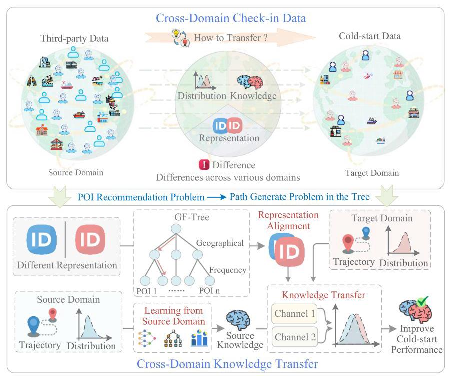

Fig. 1. The motivation of this article. Third-party and cold-start data originate from various domains, exhibiting disparities in distribution, knowledge, and entity representation. We propose GF-Tree to align entity representations across domains and reduce the complexity of the model. We design a dual-channel domain adaptive model to reduce the distribution differences between domains and achieve cross-domain knowledge transfer. GF-Tree, Geographical Frequency Tree.

The motivation for this article is illustrated in Figure 1. The main contributions of this article are as follows:

-We propose the Geographical Frequency Tree (GF-Tree), which constructs POIs with similar features into the same sub-tree based on geographical location and check-in frequency. We transform the POI recommendation task into a path generation task within the tree. Furthermore, we design a tree-based weight-sharing mechanism, to further reduce the complexity of the model.

-We construct a pre-training task to simultaneously learn the general transition patterns within the check-in sequence, user preferences, and spatial relationships among POIs. Based on GF-Tree, we design a cross-level random negative sampling method for contrastive learning, enabling the model to learn the latent spatial associations among POIs.

- In the cold-start phase, we propose a dual-channel domain adaptation model to minimize distribution differences across domains, facilitating knowledge transfer. Additionally, we design a tree-based path masking mechanism to enhance the model's scalability. This mechanism allows us to add or remove POI entities without modifying the model's structure.

## 2 Related Work

### 2.1 Next POI Recommendation

In recent years, with the rise of LBSN services, the task of next POI recommendation has gained significant attention. Compared to POI recommendation, next POI recommendation specifically focuses on predicting users' future movements based on their current spatio-temporal context. In the early stages, Markov chains were widely used for next POI recommendations [3, 14, 48, 52], as they can calculate the transition probability among POIs, but their capability is limited for sparse sequence data. Subsequently, with the rise of neural networks, a large number of researchers started applying Recurrent Neural Networks (RNNs) and attention mechanisms [17, 29, 37, 42] in this field. RNN-based methods are less efficient as they rely on the computation results of the previous step and struggle to capture long-term sequence dependencies. In contrast, methods based on the attention mechanism have higher computational efficiency and can capture the long-term dependencies of sequential data well. Therefore, attention-based methods have been widely applied to next POI recommendations in recent years. Graphs have certain advantages in expressing POIs, social relationships, and other topological relationships. Recently, Graph Neural Networks (GNNs) and Knowledge Graphs (KG) have received increasing attention in the field of next POI recommendations [39-41, 47, 51]. In addition, some hybrid-structured models attempt to integrate multiple features of LBSN for modeling [5, 18, 19, 23]. For example, Kong et al. [18] use KGs to model the interaction between users, POIs, and POI categories, mining general user behavior patterns and personalized preferences. Meanwhile, they use Transformer structures to fuse various features and achieve the prediction of the next POI. Large Language Models (LLMs), with their semantic understanding and reasoning capabilities, demonstrate significant potential in natural language processing and sequence data modeling tasks. Consequently, researchers are attempting to apply LLMs to the next POI recommendation task [11, 22]. However, the aforementioned methods are not optimized for cold-start scenarios. In addition to improving the accuracy of POI recommendation models, data augmentation [6, 57], multi-modal data [7, 43], and privacy protection [25, 49, 53] issues have also become hot research topics.

### 2.2 Transfer Learning for POI Recommendation

Transfer learning is a machine learning method that aims to improve the performance of a target task by applying knowledge learned from a source task [56]. Recently, researchers have explored the application of transfer learning in POI recommendations. Yin et al. [50] first observed the phenomenon of cross-regional interest drift in users, which means that users have different interests when traveling in different regions. Therefore, the authors proposed a latent class probability generation model called spatial-temporal LDA, which learns personalized preferences related to regions based on the POIs checked-in by users in each region. Li et al. [21] first applied deep transfer learning to cross-city POI recommendation. The authors proposed a common-topic transfer learning model, which separates city-specific topics from common topics shared across all cities, transferring users' real interests in the source city to the target city through common topics. Chen et al. [2] proposed the Curriculum Hardness Aware Meta-Learning framework, considering difficulties at city and user levels to improve conditional sampling in meta-training. Their approach progresses from easier to more difficult tasks, following a curriculum-based method. Gupta and Bedathur [13] proposed the Automated cross-Location-network Transfer Learning method, which focuses on location recommendation and social prediction for meta-learning. It employs unsupervised clustering for knowledge transfer between users and locations with similar preferences, using a twin graph-attention neural network to capture conditional influences in user-mobility graphs within each region. To tackle the issue of shared entity scarcity across different cities, Sun et al. [34] proposed the CATUS pre-training model. This model mitigates the cold-start problem by transferring universal knowledge based on category-level transitions between different cities. The method utilizes two self-supervised objectives: next category and next POI prediction, facilitating universal knowledge transfer between cities and POIs. Sun et al. [32] pointed out that cities are very important for POI recommendations, and urban characteristics can improve the performance of cross-city POI recommendations. The authors propose a dual-target cross-city sequential POI recommendation model for the dual-city scenario, which explores the geographical and cultural features of each city and shares these features between cities through knowledge transfer. However, existing research primarily focuses on transfer learning between cities using same-domain data; thus, transferring learning through pre-collected third-party data for cold-start systems remains an unresolved challenge.

### 2.3 Tree-Based Deep Model (TDM)

The TDM refers to the construction of deep neural networks for regression or classification using tree-based methods. A tree is a hierarchical structure in which every node, except the root node, depends on its parent node from the previous layer. In certain tree-based machine learning algorithms, nodes are commonly used to partition the sample space. Morin and Bengio [27] proposed hierarchical softmax for word vector training. By constructing a Huffman tree, they converted the multi-classification problem into a binary classification at each node in the path. This approach enhances computational efficiency in classification tasks. However, building a binary tree for large-scale POI results in a very deep tree, making it difficult to train. Feng et al. [10] proposed the POI2Vec model to predict POI visitors. This method uses geographical coordinates to construct a binary tree and jointly models user preferences and POI check-in sequences. However, this method's constructed tree corresponds to multiple leaf nodes for the same POI, which can lead to instability in pre-training. Additionally, aligning similar entities across different domains during transfer learning poses a challenge. Zhu et al. [55] proposed TDM attention-DNN that uses a tree to construct entities in the dataset and traverses it in a top-down manner, making decisions at each node while learning user's interest distribution from a coarse-to-fine perspective. Huang et al. [16] pointed out that the existing methods lack a mechanism for modeling user behavior patterns in different time periods, so they proposed a tree-based data structure called mobility tree and a multi-task model MTNet. They introduced multi-granularity time slot nodes to learn cross-time preferences of users. The mobility tree is designed to model user behavior patterns in different time periods but cannot be applied to cross-domain knowledge transfer or cold-start problems. The aforementioned studies still need improvement in the following aspects. First, these models require predefining a complete tree structure, which limits scalability. Second, tree-based methods can further reduce model complexity and the number of parameters. Finally, it is challenging to apply these methods to transfer learning scenarios with differing data entity representations across domains.

## 3 Preliminaries and Definition

In this section, we present the relevant notations and formalize the problem definition.

Definition 1 (Next POI Recommendation). We define the user set as \( \mathcal{U} = \left\{  {{u}_{1},{u}_{2},\cdots ,{u}_{n}}\right\} \) and the POI set as \( \mathcal{L} = \left\{  {{l}_{1},{l}_{2},\cdots ,{l}_{n}}\right\} \) , where each \( {l}_{i} = \left( {{id},{lat},{lon}}\right) \) contains three fields: id, latitude, and longitude. The user check-in record \( v = \left( {{u}_{i},{l}_{i}, t}\right) \) indicates user \( {u}_{i} \) visits \( {l}_{i} \) at time \( t \) . The user’s historical check-in sequence \( {C}_{{u}_{i}} = \left\{  {{v}_{1},{v}_{2},\cdots {v}_{n},}\right\} \) represents all check-in records of user \( {u}_{i} \) arranged in chronological order. The next POI recommendation task is defined as follows: For a given user \( {u}_{i} \in  \mathcal{U} \) and their historical check-in sequence \( {C}_{{u}_{i}} \) , the task is to recommend the top-K POIs that the user may be interested in at the next moment.

Definition 2 (GF-Tree). The GF-Tree, denoted as \( \mathcal{T} \) , is an incomplete N-ary tree with a height of \( h \) . The set of nodes in the GF-Tree is denoted by \( \mathcal{V} = \left\{  {{v}_{1},{v}_{2},\cdots {v}_{n}}\right\} \) , where each node \( v = \left( {d, n}\right) \) consists of layer \( d \) and index \( n \) . The set of edges in the GF-Tree is denoted by \( \mathcal{E} = \left\{  {{e}_{1},{e}_{2},\cdots {e}_{n}}\right\} \) . In the GF-Tree, except for the root node \( {v}_{\text{ root }} \) , each node \( {v}_{i} \) has a parent node, denoted as \( p\left( {v}_{i}\right) \) . In the GF-Tree, each leaf node \( {v}_{i}^{l} \) corresponds to a unique POI \( {l}_{i} \) . Therefore, a POI \( {l}_{i} \) can be represented as the path \( \mathcal{P} = \left\{  {{v}_{\text{ root }},{v}_{i},\cdots ,{v}_{i}^{l}}\right\} \) from the root node \( {v}_{\text{ root }} \) to the leaf node \( {v}_{i}^{l} \) .

Table 1. Symbol Definition

<table><tr><td>Symbol</td><td>Definition</td><td>Symbol</td><td>Definition</td></tr><tr><td>\( l \)</td><td>POI</td><td>\( u \)</td><td>User</td></tr><tr><td>L</td><td>POI set</td><td>U</td><td>User set</td></tr><tr><td>\( v \)</td><td>User check-in record</td><td>\( {C}_{{u}_{i}} \)</td><td>Historical check-in sequence</td></tr><tr><td>\( T \)</td><td>GF-Tree</td><td>\( h \)</td><td>GF-Tree height</td></tr><tr><td>Y</td><td>GF-Tree Node set</td><td>E</td><td>GF-Tree edge set</td></tr><tr><td>P</td><td>Path of POI in GF-Tree</td><td>\( {\mathcal{D}}_{s} \)</td><td>Source domain</td></tr><tr><td>\( {\mathcal{D}}_{t} \)</td><td>Target domain</td><td>\( {\mathcal{M}}_{p} \)</td><td>Pre-training model</td></tr></table>

Definition 3 (Cross-domain Knowledge Transfer). The pre-collected third-party dataset is defined as the source domain \( {\mathcal{D}}_{s} \) , and the cold-start dataset as the target domain \( {\mathcal{D}}_{t} \) . Considering that entities are represented differently across domains, we hypothesize an intersection of users \( {\mathcal{U}}_{s} = \; {\mathcal{U}}_{{D}_{s}} \cap  {\mathcal{U}}_{{D}_{t}} \neq  \varnothing \) and POIs \( {\mathcal{L}}_{\mathrm{s}} = {\mathcal{L}}_{{\mathrm{D}}_{\mathrm{s}}} \cap  {\mathcal{L}}_{{\mathrm{D}}_{\mathrm{t}}} \neq  \varnothing \) . Cross-domain knowledge transfer refers to applying knowledge and experience learned in one domain to another domain, aiming to improve a model's performance. Specifically, we construct a pre-training model \( {\mathcal{M}}_{p} \) to learn general user behavioral patterns and feature representations in the source domain, which is then applied to the target domain to enhance cold-start performance.

To improve the clarity of this article, we explain the symbols listed in Table 1.

## 4 Methodology

This section provides a detailed introduction to our proposed model, TCKT. It consists of five components: GF-Tree construction, representation layer, recommendation layer, pre-training, and cross-domain knowledge transfer. The overall structure of the TCKT model is shown in Figure 2.

### 4.1 GF-Tree Construction

As hierarchical structures, trees can effectively depict the hierarchical relationships among data. In tree-based algorithms, such as decision trees and random forests, a node can serve as a decision rule to partition data subsets. Nodes within the same sub-tree possess the same ancestor nodes and share identical features. In the GF-Tree, leaf nodes represent POIs, thus each POI can be represented as a path from the root node to the corresponding leaf node. The GF-Tree is constructed based on multi-granularity geographic locations and check-in frequencies. Consequently, POIs that are close geographically and have similar check-in frequencies will have similar paths in the tree. The reasons for constructing GF-Tree based on geographic locations and frequency are as follows. In LBSN datasets, geographic location and frequency are common attributes. They can represent the location and popularity of POIs and have been widely studied [28, 38, 41]. Longitude, latitude, and frequency are all continuous variables, facilitating the calculation of distance, which has physical significance. Meanwhile, constructing GF-Tree using these attributes can make our method universally applicable.

The GF-Tree has the following advantages: (1) The GF-Tree's construction process explicitly integrates the geographic and frequency information of POIs, allowing the model to capture richer features. (2) In the pre-training phase, POIs with similar features share similar path prefixes in the GF-Tree, which facilitates the model's learning of macro-POI transition patterns. (3) We design tree-based weight-sharing and path masking mechanisms at the tree layer level, reducing the model's complexity and number of parameters, and thus enhancing its training and inference speed. (4) During the cold-start phase, POIs can achieve cross-domain entity alignment with logarithmic complexity along the path of the GF-Tree. Concurrently, these aligned POIs can serve as anchors for knowledge transfer. The construction of the GF-Tree is illustrated in Figure 3.

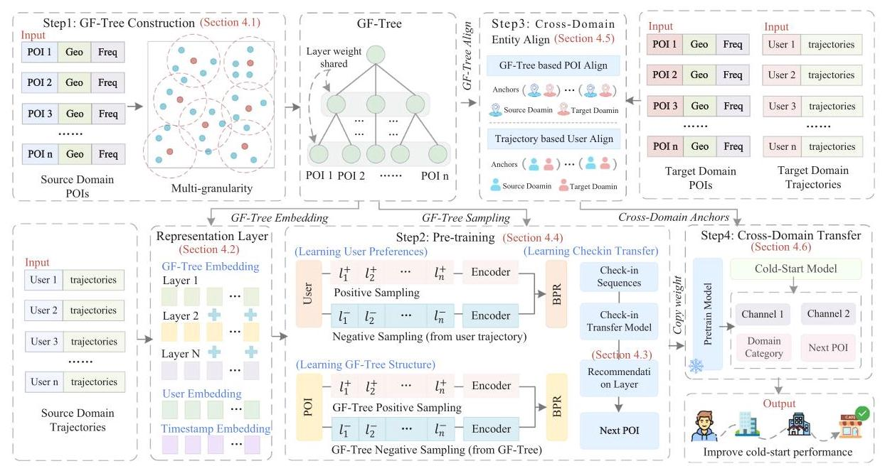

Fig. 2. The overall structure of the TCKT model. First, we use source domain data to construct a GF-Tree and transform the POI recommendation problem into a path generation problem. Second, we use source domain data for pre-training, to learn the general behavioral patterns of users and the hidden correlations among POIs. Subsequently, we align target and source domain entities based on the GF-Tree, treating aligned entity pairs as anchors. Finally, we have designed an anchor-based dual-channel domain adaptive model to achieve cross-domain knowledge transfer.

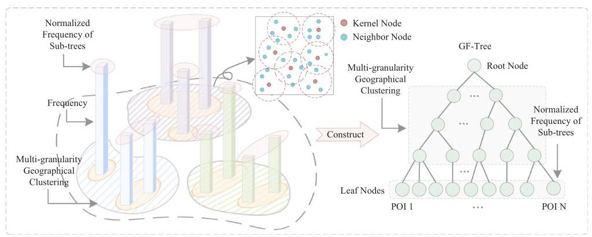

Fig. 3. The GF-Tree construction process. The GF-Tree organizes all POIs into clusters based on their geographical and frequency information, at various granularities. This ensures that nodes within the same sub-tree have similar geographical or frequency characteristics.

The GF-Tree is an N-ary tree with a height of \( h \) , constructed from the top-down. It consists of three stages: coarse-grained geographic clustering, fine-grained geographic clustering, and frequency clustering. (1) Coarse-grained geographic clustering is distance-based clustering, aiming to divide POIs into city-level clusters. Therefore, we need to choose a larger clustering radius \( r \) . Specifically, all POIs are sorted in descending order of frequency and sequentially designated as kernel POI \( {l}_{k} \) . Here, we use a distance-based clustering algorithm to group all POIs whose distance to \( {l}_{k} \) is less than \( r \) into the same cluster. POIs already clustered are excluded from further clustering. (2) Based on the coarse-grained clustering, fine-grained geographical clustering further divides POIs by using density-based clustering algorithms. Its purpose is to divide POIs into clusters at the level of urban functional areas or business districts, so we need to choose a smaller clustering radius \( r \) . Density-based clustering can identify city functional areas regardless of their shape. The above two types of geographic clustering use the haversine metric. (3) Frequency normalization: Within the same functional area, POI check-in frequencies indicate their functionality and coverage. Therefore, we normalize the frequency of POIs in fine-grained geographic clustering results. The Algorithm 1 demonstrates the GF-Tree's construction process.

Algorithm 1: GF-Tree Construction Process

---

Input : Source domain POI set \( {\mathcal{L}}_{s} \)

						geographic cluster radius list \( \mathcal{R} \)

Output: GF-Tree \( \mathcal{T} \)

\( {\mathcal{L}}_{\text{ sort }} = \operatorname{sort}\left( {\mathcal{L}}_{s}\right) \) 																																				// frequency in descending order

Initialize an empty cluster list \( C \) ;

Initialize current cluster \( \pi  = {\mathcal{L}}_{\text{ sort }} \) ;

foreach radius \( r \) in \( \mathcal{R} \) do

			Initialize an empty cluster list \( c \) ;

			if \( r \) is coarse-grained geographic clustering then

					while \( \pi \) is not null do

								kernel node \( l \in  \pi \) ;

								distance set \( H = \) haversineDistance \( \left( {l,\pi  - l}\right) \) ;

								cluster \( t = h < r\left( {h \in  H}\right) \) ;

								add \( t \) to \( c \) and remove \( t \) from \( \pi \) ;

					end

			end

			if \( r \) is fine-grained geographic clustering then

					cluster set \( D = \operatorname{DBSCAN}\left( \pi \right) \) ;

					add \( D \) to \( c \) and remove \( D \) from \( \pi \) ;

			end

			add \( c \) to \( C \) ;

end

foreach cluster \( t \) in \( c \) do

		\( {f}_{t} = \) frequency of all POIs in cluster t;

			\( t = \) normalization \( \left( {f}_{t}\right) \) ;

			replace \( t \) in \( c \) ;

end

\( \mathcal{T} = C \) 																												// construct \( \mathcal{T} \) using clustering results.

return \( \mathcal{T} \)

---

### 4.2 Representation Layer

The representation layer encodes POIs, users, and timestamps into latent vector representations. It primarily consists of four parts.

(1) POI Representation. In the dataset, each POI \( l \subseteq  \mathcal{L} \) is mapped to a vector representation \( {E}_{p} \in  {\mathbb{R}}^{d \times  1} \) by the POI representation. In the GF-Tree, a POI is represented as a path from the root to the leaf node. The POI representation takes the path as input and outputs the POI’s latent representation. The POI representation is calculated as \( {E}_{p} = {W}_{p} \times  p \) , where \( {W}_{p} \in  {\mathbb{R}}^{d \times  h} \) represents the weights that are trained with the model, \( h \) denotes the path length, and \( p \in  {\mathbb{R}}^{h \times  1} \) represents the POI’s path in the GF-Tree.

(2) Tree-Based Weight-Sharing. In the GF-Tree, each node \( N \) is mapped to a vector \( {E}_{n} \in  {\mathbb{R}}^{d \times  1} \) . Given that the GF-Tree is an incomplete N-ary tree, the number of nodes in each sub-tree may vary. Constructing a specific number of hidden units for each sub-tree restricts the model's scalability. Adding or removing POIs necessitates readjusting the model structure. Therefore, we designed tree-based weight-sharing, allowing sub-trees in the same layer to share network weights. For example, if the \( N \) th layer contains \( n \) nodes, then the number of child nodes in the \( N + 1 \) layer can be represented by \( C = \left\{  {{C}_{1},{C}_{2},\cdots ,{C}_{n}}\right\} \) . In the GF-Tree, child nodes within the same layer share weights, and the \( N + 1 \) layer’s number of hidden units is determined by \( {C}_{\max } = \max \left( C\right) \) . The weight-sharing reduces the total number of hidden units at each layer from \( {C1} + {C2} + \cdots  + {Cn} \) to \( {C}_{\max } \) . The tree-based weight-sharing mechanism improves the model's scalability. It enables the addition of new POIs to the GF-Tree without model adjustments until it becomes a complete N-ary tree.

(3) User Representation. For each user \( u \subseteq  \mathcal{U} \) , the user representation takes the user’s ID as input and outputs their feature representation \( {E}_{u} \in  {\mathbb{R}}^{d \times  1} \) . The formula for user representation is \( {E}_{u} = {W}_{u} \times  {u}_{i} \) , where \( {W}_{u} \in  {\mathbb{R}}^{h \times  d} \) represents the weight. Since the user representation is shared across the source domain and target domain, its size is determined by \( \max \left( {\begin{Vmatrix}{\mathcal{U}}_{\text{ source }}\end{Vmatrix},\begin{Vmatrix}{\mathcal{U}}_{\text{ target }}\end{Vmatrix}}\right) \) .

(4) Timestamp Representation. For each check-in timestamp, the timestamp representation converts it into a latent vector \( {E}_{t} \in  {\mathbb{R}}^{d \times  1} \) . Inspired by Informer [54], we split the check-in timestamp into six vectors: year, month, day of week, day, hour, and minute, to generate \( {E}_{t} \) through linear combination for mining the user's check-in period. The formula of timestamp representation is \( {E}_{t} = \left\lbrack  {{W}_{y},{W}_{m},{W}_{w},{W}_{d},{W}_{h},{W}_{\text{ min }}}\right\rbrack   \times  {\left\lbrack  y, m, w, d, h,\text{ min }\right\rbrack  }^{\top } \) , where \( {W}_{ * } \in  {\mathbb{R}}^{d \times  1} \) denotes the corresponding weight.

### 4.3 Recommendation Layer

We first introduce the recommendation layer, which needs to be used in both the pre-training and cold-start stages. The recommendation layer uses the user sequence transition features \( {H}_{t} \) as input. It outputs the top-K POIs that the user may be interested in at the next time. Based on the GF-Tree, we convert the POI recommendation problem into a tree path generation problem. Therefore, the recommendation layer outputs the path corresponding to the POI. It comprises two parts: GF-Tree information transmission layer and path generation layer. The recommendation layer is illustrated in Figure 4.

The GF-Tree information transmission layer is composed of multiple fully connected layers. The output of each layer consists of the hidden layer state \( {H}_{t} \) and node probability \( {p}^{t} \) , while the input of each layer is the output \( {H}_{i - 1} \) from the previous layer. To prevent information loss across multiple layers, we introduce residual connections [15] for transmitting information between adjacent layers. To mitigate error accumulation in autoregressive path generation, we employ the teacher forcing mechanism during the training phase to enhance the model's fitting speed and better control the generation of paths. Specifically, the input for the next layer consists of the previous hidden state and the ground truth.

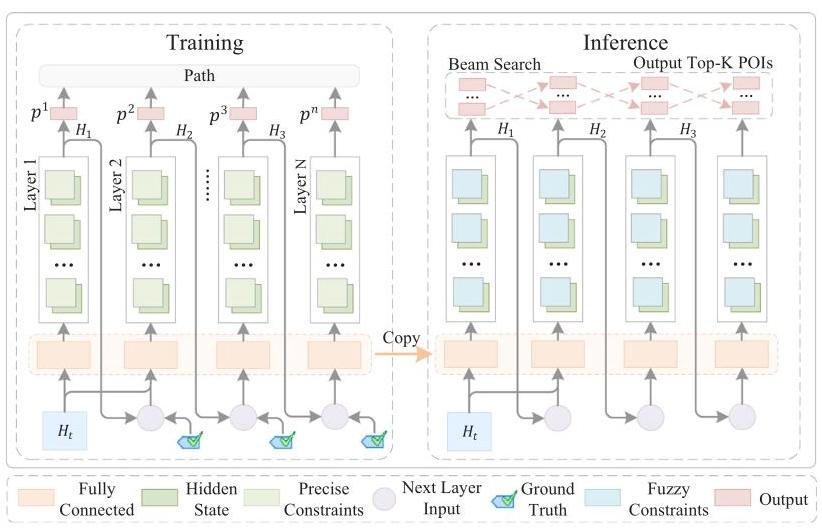

Fig. 4. Illustration of the recommendation layer. This layer inputs the user sequence transition feature \( {H}_{t} \) and outputs the predicted path of POI. To enhance information transmission, we use residual connections between adjacent layers. To avoid error accumulation, during the training phase we employ a teacher forcing mechanism to train the model. During inference stage, we use beam search to find top-K POIs. Additionally, we have designed precise and fuzzy constraints to improve the quality of path generation.

The path generation layer’s input is the node probability \( {p}^{n} \) , where \( n \) represents the layer number. During training, this layer outputs paths of POIs and calculates loss with ground truth. During inference, this layer outputs a recommended ranking list for the next POIs. The large solution space of paths in the GF-Tree means that using greedy search could compromise the model's accuracy. Therefore, we employ beam search to explore the optimal path. Due to the different number of nodes in the sub-trees of GF-Tree, the setting of beam width depends on the number of nodes in the sub-tree and the recommended top-K size. Let nodes be the number of nodes in the sub-tree and \( K \) be the recommended top-K size, then the beam width is \( {B}_{\text{ width }} = \min \left( {\text{ nodes }, K}\right) \) .

Due to the presence of the tree-based weight-sharing mechanism in GF-Tree, the path generation is not constrained by the tree structure and may produce non-existent paths. To address this issue, we have designed two key components to enhance the quality of path generation: precise and fuzzy path constraints. The two constraints are shown in Figure 5. In the training phase, precise path constraints mask incorrect nodes in each layer. Based on ground truth, these constraints guide the model in learning correct path generation patterns. For example, the precise constraint in the training phase on the left side of Figure 5. The path of the target node is \{root, 1, 2\}. Therefore, when we predict the path of the first layer, we mask nodes 2 and 3, with constraints = [True, False, False]. When we predict the path of the second layer, we mask nodes 1 and 3, with constraints = [False, True, False]. Conversely, fuzzy path constraints are used in the inference phase. To prevent data leakage, we only use the valid range of each layer to mask invalid paths. Specifically, if the sub-tree of node \( N \) contains only \( k \) nodes, and the number of hidden units in the weight-sharing layer is \( {C}_{N} \) , we mask out \( {C}_{N} - k \) invalid nodes. For instance, the fuzzy constraints during the inference phase on the right side of Figure 5. The path of the target node is \{root, 1, 2\}. In the first layer, only nodes 1 and 3 are valid, so we mask node 2, with constraints = [True, False, True]. In the second layer, the union of valid nodes in two sub-trees includes nodes 1 and 2, hence we mask node 3, with constraints = [True, True, False].

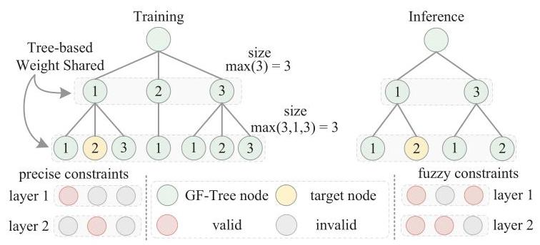

Fig. 5. Illustrations of precise and fuzzy path constraints. Path constraints are used to mask nodes that don't exist in the path, enhancing the quality of path generation. In the training stage, we know the real POI path, so we use precise path constraints to mask incorrect nodes from the tree, aiding model training. In the inference stage, we do not know the real POI path. Thus, to avoid data leakage, we use fuzzy path constraints to count all potential POI paths and mask impossible nodes on each layer.

### 4.4 Pre-Training

Pre-training on third-party data comprises three components: sequence transition patterns learning, GF-Tree contrastive learning, and user preference learning. These modules are trained simultaneously.

The sequence transition patterns learning module inputs the user's check-in sequence to mine general behavioral patterns. The GF-Tree contrastive learning module selects positive and negative samples from sub-trees to help the model discover hidden correlations among POIs and the tree's overall structure. The user preference learning module selects positive samples from POIs that users have interacted with, and negative samples from unvisited POIs, to learn the user's personalized preferences. Figure 2, Step 2 illustrates the overall structure of pre-training.

4.4.1 Sequence Transition Patterns Learning. This module predicts the user's next POI by modeling their check-in trajectory. First, the Transformer encoder [36] is utilized to extract sequence transition features. The input is the user’s check-in sequence, denoted as \( l = \left\{  {{l}_{1},{l}_{2},\cdots ,{l}_{n}}\right\} \) , and the output is the POI feature sequence \( \bar{l} = \left\{  {{\bar{l}}_{1},{\bar{l}}_{2},\cdots ,{\bar{l}}_{n}}\right\} \) , where \( {\bar{l}}_{i} \in  {\mathbb{R}}^{d \times  1} \) represents the feature of integrated context for \( {l}_{i} \) , and \( n \) is the sequence length. The attention mechanism is used to fuse the POI feature sequence into the sequence transition feature \( {H}_{t} \) , calculated as follows:

\[
{H}_{t} = \sum \operatorname{softmax}\left( {W \times  \bar{l}}\right)  \times  \bar{l}, \tag{1}
\]

where \( {H}_{t} \in  {\mathbb{R}}^{1 \times  d} \) , and \( W \in  {\mathbb{R}}^{1 \times  d} \) represents weights. Second, the user representation \( {E}_{u} \) is combined with \( {H}_{t} \) to produce the fused sequence transition feature \( s = {LN}\left( {{E}_{u} + {H}_{t}}\right) \) , where \( {LN}\left( *\right) \) denotes layer normalization. Finally, the recommendation layer proposed in Section 4.3 is used to predict the tree path of the next POI. Calculate the loss between the predicted path and ground truth using the cross-entropy loss function. The loss calculation formula is

\[
{L}_{s} = \frac{1}{n}\mathop{\sum }\limits_{{i = 1}}^{n}{L}_{l} = \frac{1}{n}\mathop{\sum }\limits_{{i = 1}}^{n}\left( {-\mathop{\sum }\limits_{i}p\left( {x}_{li}\right) \log q\left( {x}_{li}\right) }\right) , \tag{2}
\]

where \( {L}_{s} \) denotes the loss of the sequence transition patterns learning, and \( {L}_{l} \) represents the loss of the \( l \) th node in the path.

4.4.2 GF-Tree Contrastive Learning. Contrastive learning is an unsupervised learning method that constructs positive and negative sample pairs to train the model. It aims to maximize similarity within positive pairs while minimizing it within negative pairs [9]. Since POIs with the same parent node in the GF-Tree share similar geographic and frequency characteristics, we generate positive and negative samples based on GF-Tree to learn the hidden relationships among POIs.

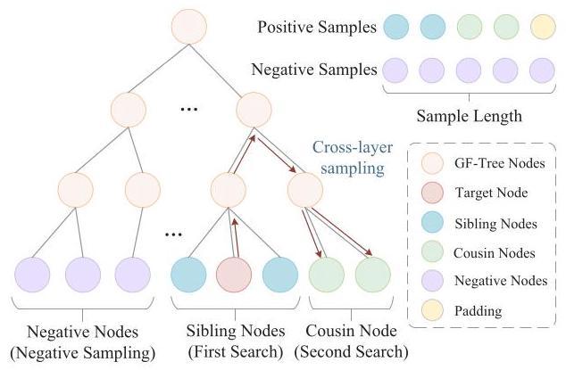

Fig. 6. Illustration of cross-layer random sampling. For positive samples, the sampling order is sequentially determined by sibling nodes and cousin nodes, until the required number of positive samples is reached. If the number is insufficient, padding is added at the end of the positive sample sequence. For negative samples, they are randomly sampled from other nodes except for positive samples.

In the GF-Tree, sibling nodes inherit the features of the parent node. For example, path \( \left\{  {{v}_{\text{ root }},{v}_{1},{v}_{2}}\right\} \) and \( \left\{  {{v}_{\text{ root }},{v}_{1},{v}_{3}}\right\} \) share the subpath \( \left\{  {{v}_{\text{ root }},{v}_{1}}\right\} \) , indicating that \( {v}_{2} \) and \( {v}_{3} \) inherit features from \( {v}_{\text{ root }} \) and \( {v}_{1} \) . Therefore, by using sibling or cousin nodes as positive samples and other samples from the same layer as negative samples for sampling, the model learns the relative positions of POIs within the GF-Tree and its overall structure. To enhance the model's generalization and the diversity of samples, we have designed a cross-layer random sampling mechanism. Specifically, if sibling nodes are insufficient, the mechanism performs random sampling from cousin nodes. This mechanism enables the model to explore varied sample combinations. The construction of positive and negative samples is depicted in Figure 6.

To calculate the difference between positive and negative samples, we use the Bayesian Personalized Ranking (BPR) loss function [31]. The BPR loss is widely used in recommendation systems to maximize the score difference between positive and negative samples. The input for the BPR Loss is a triplet \( \left( {i, p, n}\right) \) , where \( i \) denotes the current item, \( p \) is the positive sample, and \( n \) is the negative sample. The BPR Loss formula is

\[
{L}_{BPR} =  - \mathop{\sum }\limits_{{\left( {i, p, n}\right)  \in  D}}\ln \sigma \left( {{f}_{i}\left( p\right)  - {f}_{i}\left( n\right) }\right) , \tag{3}
\]

where \( D \) denotes all the triplets in the training set, \( \sigma \) is the activation function, \( {f}_{i}\left( p\right) \) is the score of the positive sample, and \( {f}_{i}\left( n\right) \) is the score of the negative sample. Specifically, in GF-Tree contrastive learning, \( i \) represents the target POI, \( p \) is the positive sample from the GF-Tree, and \( n \) is the negative sample.

4.4.3 User Preference Learning. User preference learning captures interaction behavior between users and POIs. In this process, the positive samples are the POIs in the user's check-in trajectory, while the negative samples are randomly sampled from the POIs that the user has never visited. To calculate the difference between positive samples and negative samples, we also use the BPR loss function of formula 3, where \( i \) denotes the user, \( p \) the POIs the user has visited, and \( n \) is the POIs the user never visited.

### 4.5 Cross-Domain Entity Align

For cross-domain knowledge transfer, aligning entity representations across domains is essential. Entity alignment aims to match entities with similar or identical characteristics across domains by leveraging their attributes. Specifically, we use geographical information and frequency to align POIs, and user historical trajectory similarity to align users.

4.5.1 Cross-domain POI Align. For POIs in the target domain, we start from the root node of GF-Tree and recursively allocate them to leaf node based on their geographical frequency information. Compared to the complexity of calculating the similarity between all POIs, \( O\left( {N}^{2}\right) \) , the complexity of POI alignment based on GF-Tree is reduced to \( O\left( {\log N}\right) \) . The method based on GF-Tree requires only comparison with the child nodes at each level, equating the number of comparisons to the tree's depth.

The POI entity alignment based on GF-Tree consists of three steps. The POI in the target domain is denoted as \( {l}_{t} \) . (1) For those layers in the GF-Tree that are clustered based on geographic information, we compute the haversine distance between \( {l}_{t} \) and its sub-tree from top to bottom, selecting the node with the smallest distance as the path for \( {l}_{t} \) . (2) When a leaf node is reached, calculate the normalized frequency of \( {l}_{t} \) and its Euclidean distance from sibling nodes in the GF-Tree and assign the closest \( {l}_{s} \) to \( {l}_{t} \) . (3) If \( {l}_{s} \) is already assigned to other target domain nodes, a bottom-up search is conducted among sibling nodes until a source domain POI is matched. The POI alignment algorithm is detailed in Algorithm 2.

4.5.2 Cross-domain User Align. This approach aims to map users with similar check-in patterns in different domains to a unified representation. We use the Tanimoto coefficient to evaluate the similarity between users' check-in sequences. The Tanimoto coefficient is a metric that measures similarity between two sets of elements, and its formula is as follows:

\[
T = \frac{{N}_{c}}{{N}_{a} + {N}_{b} - {N}_{c}}, \tag{4}
\]

where \( {N}_{a} \) and \( {N}_{b} \) represent the trajectory length of users \( a \) and \( b \) , respectively, and \( {N}_{c} \) represents the total number of POIs that both users have checked-in. The user alignment algorithm is detailed in Algorithm 3.

### 4.6 Cross-domain Knowledge Transfer

The objective of cross-domain knowledge transfer is to transfer knowledge from the source to the target domain. Domain adaptation facilitates this transfer by minimizing distribution discrepancies between domains [12]. Based on the cross-domain entity alignment from Section 4.5, we have obtained two mappings. The POI cross-domain mapping is \( {l}_{t} = {F}_{l}\left( {l}_{s}\right) \) , and the user cross-domain mapping is \( {u}_{t} = {F}_{u}\left( {u}_{s}\right) \) , where \( t \) represents target domain, and \( s \) represents source domain.

Next, our goal is to minimize the difference between the source and the target domain. To achieve this, we designed an anchor-based optimization objective for domain adaptation. The anchor refers to a pair of aligned POIs across the domains \( \left( {{l}_{s},{l}_{t}}\right) \) . Our optimization objective is to make the feature representations of anchor pairs more similar across domains.

To transfer pre-trained knowledge from source domain to the target domain, we designed a dual-channel domain adaptation model, which consists of two feature extractors and two knowledge transfer channels. The two feature extractors, including pre-trained and cold-start, have the same structure as shown in Section 4.4.1. The feature extractors process check-in sequences from both domains, outputting corresponding features, \( {F}_{p} \) and \( {F}_{c} \) . The pre-trained feature extractor, derived from the pre-trained model, freezes weights during the knowledge transfer. The weights of the cold-start feature extractor are randomly initialized and trained along with the domain adaptation model.

Algorithm 2: Cross-domain POI Alignment

---

Input : Target domain POI set \( {\mathcal{L}}_{t} \)

						GF-Tree \( \mathcal{T} \)

Output: POI cross-domain mapping \( {F}_{l} \)

Initialise an empty mapping dict \( {F}_{l} \) ;

foreach \( {l}_{t} \) in \( {\mathcal{L}}_{t} \) do

		Initialise min Haversine distance \( {D}_{h} = \infty \) ;

		Initialise subtree \( v = {\mathcal{T}}_{\text{ root }} \) ;

		while subtree \( v \) is not null do

					foreach node \( p \) in \( v \) do

							if \( v \) is geographical clustering layer then

									hDistance \( = \) haversineDistance \( \left( {{l}_{t}, p}\right) \) ;

									if \( {hD} \) istance \( < {D}_{h} \) then

												\( {D}_{h} = \) hDistance;

												subtree \( v = p \) ;

										end

							end

					end

		end

		if \( v \) reaches leaf node then

					\( {l}_{s} = \min \left( {\text{ euclideanDistance }\left( {{l}_{t}\text{ , sibling nodes }}\right) }\right) \) ;

					if \( {l}_{s} \) not allocated then

							add \( \left( {{l}_{t},{l}_{s}}\right) \) to \( {F}_{l} \) ;

					else

							search for siblings and cousin nodes;

					end

		end

end

return \( {F}_{l} \) ;

---

We use two knowledge transfer channels to reduce the distribution differences between anchors. The first channel's objective is to minimize the distribution discrepancy between the two feature extractors. We utilize Kullback-Leibler divergence as the optimization objective for the two distributions, and its formula is as follows:

\[
{KL}\left( {P\parallel Q}\right)  = \mathop{\sum }\limits_{i}P\left( i\right) \ln \frac{Q\left( i\right) }{P\left( i\right) }, \tag{5}
\]

where \( P \) denotes the probability distribution of \( {F}_{p} \) , and \( Q \) denotes the probability distribution of \( {F}_{c} \) . Since we have fixed the weights of the pre-trained feature extractor, the cold-start feature extractor is trained to learn a similar distribution. It's worth mentioning that we attempted to use the cosine similarity of anchor pairs features as an optimization goal and obtained similar experimental results. Specifically, we use the cosine similarity between \( {F}_{p} \) and \( {F}_{c} \) as the optimization objective to make the feature representations of anchors in both source and target domains closer.

Algorithm 3: Cross-domain User Alignment

---

Input : Source domain user trajectory set \( {C}_{s} \)

						Target domain user trajectory set \( {C}_{t} \)

Output: User cross-domain mapping \( {F}_{u} \)

Initialise an empty mapping dict \( {F}_{u} \) ;

foreach target domain user \( {u}_{t} \) and trajectory \( {c}_{t} \) in \( {C}_{t} \) do

		Initialise max similarity \( s = 0 \) ;

		Initialise bestMatch to null;

		foreach source domain user \( {u}_{s} \) and trajectory \( {c}_{s} \) in \( {C}_{s} \) do

					similarity \( = \operatorname{tanimoto}\left( {{c}_{s},{c}_{t}}\right) \) ;

					if similarity \( > \max \) similarity \( s \) then

							maxSimilarity \( = \) similarity;

							bestMatch \( = {u}_{t} \) ;

							break;

					end

		end

		if bestMatch is not null then

					add \( \left( {{u}_{s},}\right. \) bestMatch) to \( {F}_{u} \) ;

		end

end

return \( {F}_{u} \) ;

---

The second channel uses domain adversarial training to optimize the distribution between the source and target domains. The domain prediction task, which takes \( {F}_{c} \) as input, aims to distinguish between data from the two domains, thereby maximizing the discrepancy. The next POI task also utilizes \( {F}_{c} \) as input to predict the user’s next check-in POI. This adversarial training compels the feature extractors to learn features that are adapted to the target domain, reducing the distribution discrepancy between the two domains. The structure of dual-channel domain adaptation is illustrated in Figure 7, where the blue and red lines represent forward and backward propagation, respectively.

### 4.7 Overall Algorithm

The overall algorithm is illustrated in Algorithm 4. Our algorithm includes four parts: GF-Tree construction, pre-training, cross-domain knowledge transfer, and model inference. First, we use the source domain POIs to construct a GF-Tree. Second, based on the GF-Tree, we model the user trajectories and POIs of the source domain to learn the transition patterns and hidden relationships among POIs. Then, we align entities between target and source domain based on GF-Tree and transfer knowledge using target domain data and pre-trained model weights. Specifically, we freeze the weights of the pre-trained model as pre-trained feature extractor and randomly initialize the weights of cold-start feature extractor. Finally, in the model inference stage, we use cold-start models to recommend POIs that users may be interested in. It should be noted that during the knowledge transfer stage, the next POI prediction module calculates the loss of model output and ground truth. During the inference stage, it uses beam search to output recommendation results.

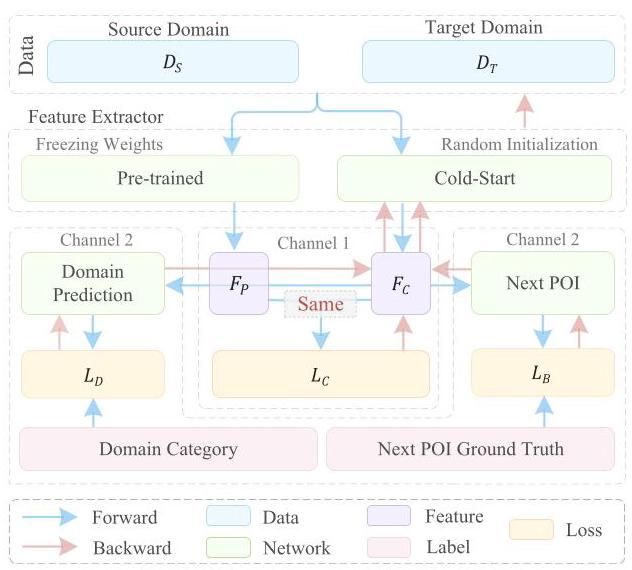

Fig. 7. Illustration of the dual-channel domain adaptation model. Channel 1 aims to minimize the distribution discrepancy between the pre-train feature extractor and the cold-start feature extractor. Channel 2 utilizes domain adversarial training to optimize the distribution between the source domain and the target domain.

### 4.8 Complexity Analysis

To evaluate the efficiency of our proposed model, in this section we analyze the complexity of the TKTC model. Our method employs a Ball-Tree index for all POIs. The computational cost of the TKTC model encompasses five main aspects.

(1) GF-Tree construction complexity is determined by the number of layers \( H \) and clustering complexity. The complexity of the haversine distance based on Ball-Tree and DBSCAN is O(NlogN), where N represents the quantity of POIs. Therefore, total complexity equals O(HNlogN).

(2) Cross-domain POI alignment, similar to decision tree prediction, has its complexity dependent on GF-Tree's layer count \( H \) and distance calculations. Haversine distance complexity is O(NlogN), whereas Euclidean distance is O(N). Consequently, the overall complexity is O(HNlogN).

(3) Cross-domain user alignment, utilizing the Tanimoto coefficient, has a complexity of O(N), with \( \mathrm{N} \) denoting source domain user count. Therefore, the total algorithmic complexity is O(MN), where M indicates the target domain user count.

(4) In the pre-training phase, the complexity of sequence transition patterns learning is \( \mathrm{O}\left( {{N}^{2}{LD}}\right) \) , where \( \mathrm{N} \) represents the sequence length, \( \mathrm{L} \) represents the layers of the transformer encoder, D represents the feature dimension. The complexity of GF-Tree contrastive learning and user preference learning is O(MN), where M and N represent positive and negative sample counts, respectively.

(5) In the knowledge transfer phase, the complexity of feature extraction is \( \mathrm{O}\left( {2{N}^{2}{LD}}\right) \) , where 2 represents two feature extractors, \( \mathrm{N} \) represents sequence length, \( \mathrm{L} \) represents the number of layers in transformer encoder, and D represents feature dimension. The complexity of domain prediction is O(D), where D indicates feature dimension. The complexity of predicting the next POI is \( \mathrm{O}\left( {B}^{K}\right) \) , where \( \mathrm{B} \) denotes the average number of nodes per layer in GF-Tree and \( \mathrm{K} \) denotes beam width.

Algorithm 4: Overall Algorithm

---

Input : Source domain POIs \( {\mathcal{L}}_{s} \)

							Target domain POIs \( {\mathcal{L}}_{t} \)

							Source domain user trajectory set \( {\mathcal{C}}_{s} \)

							Target domain user trajectory set \( {\mathcal{C}}_{t} \)

// GF-Tree Construction;

GF-Tree \( \mathcal{T} = \) GF_Tree_Construction \( \left( {\mathcal{L}}_{s}\right) \) ; 																																																													// Section 4.1

// Pre-training;

foreach epoch in epochs do

			foreach batch \( b \) in \( {C}_{s} \) do

						\( b = \left\{  {\text{ user, traj, tra }{j}_{\text{ pos }},{\text{ traj }}_{\text{ neg }},{\text{ tree }}_{\text{ pos }},{\text{ tree }}_{\text{ neg }}, g}\right\}  ; \) 																																																								// g: ground truth;

						\( {b}^{ * } = \) Representation_Layer \( \left( b\right) ;\;// *  : \) e 																																															// *: embedding; Section 4.2

						\( H = \) Sequence_Transition_Patterns_Learning \( \left( {\text{ traj }}^{ * }\right) \) ; 																																																											// Section 4.4.1

						\( {\operatorname{Loss}}_{1} = \) Recommendation_Layer \( \left( {H, g}\right) \) ; 																																																												// Section 4.3

						\( {\text{ Loss }}_{2} = \) GF_Tree_Contrastive_Learning \( \left( {{g}^{ * },{\text{ tree }}_{\text{ pos }}^{ * },{\text{ tree }}_{\text{ neg }}^{ * }}\right) \) ; 																																																										// Section 4.4.2

						\( {\text{ Loss }}_{3} = \) User_Preference_Learning \( \left( {{g}^{ * },{\text{ traj }}_{\text{ pos }}^{ * },{\text{ traj }}_{\text{ neg }}^{ * }}\right) \) ; 																																																										// Section 4.4.3

			end

end

// Cross-domain Knowledge Transfer;

\( \mathcal{A} = \) Cross-domain_Entity_Align \( \left( {\mathcal{T},{\mathcal{L}}_{t},{\mathcal{C}}_{s},{\mathcal{C}}_{t}}\right) \) 																																																// A: Anchors; Section 4.5

foreach epoch in epochs do

			foreach batch \( b \) in \( \mathcal{A} \) do

						\( {F}_{p} = \) Pre-trained_Feature_Extractor \( \left( b\right) \) ; 																																																												// Section 4.6

						\( {F}_{c} = \) Cold-start_Feature_Extractor \( \left( b\right) \) ; 																																																												// Section 4.6

						\( {\operatorname{Loss}}_{C} = \mathrm{{KL}} \) _____Divergence \( \left( {{F}_{p},{F}_{c}}\right) \) ; 																																																	// Channel 1; Section 4.6

						\( {\operatorname{Loss}}_{D} = \) Domain_Prediction \( \left( {F}_{c}\right) \) ; 																																																	// Channel 2; Section 4.6

						\( {\operatorname{Loss}}_{S} = \) Next_POI_Prediction \( \left( {F}_{c}\right) \) ; 																																																	// Channel 2; Section 4.6

			end

end

// Inference;

\( {F}_{c} = \) Cold-start_Feature_Extractor \( \left( {C}_{t}\right) \) ; 																																																												// Section 4.6

\( O = \) Next_POI_Prediction \( \left( {F}_{C}\right) \) ; 																																																												// Section 4.6

Output = Beam_Search(O)

---

## 5 Experiments

### 5.1 Datasets

We conducted experiments with three LBSN datasets: Foursquare dataset \( {}^{1} \) [46], Gowalla dataset \( {}^{2} \) [4,24], and Brightkite dataset \( {}^{3} \) [4]. The Foursquare dataset includes global-scale check-in dataset, global-scale check-in dataset with user social networks, and New York City (NYC), collected at various times and locations. Specifically, the Foursquare dataset serves as a pre-collected third-party dataset used for pre-training in the source domain. The Gowalla and Brightkite datasets are used as target domain to verify the performance of the model's cold-start. The Foursquare dataset comprises 5,361,138 POIs and 359,824 users, with 56,874,385 global check-in records from April 2012 to January 2014. The Gowalla dataset includes 1,280,969 POIs and 107,092 users, with 6,442,892 global check-in records from February 2009 to October 2010. The Brightkite dataset comprises 772,967 POIs and 51,406 users, with 4,747,287 global check-in records from March 2008 to October 2010. In the experiment, we removed POIs with abnormal longitude and latitude, and only used POIs located in the United States. The statistics of our experimental datasets are shown in Table 2.

---

\( {}^{1} \) https://sites.google.com/site/yangdingqi/home/foursquare-dataset

\( {}^{2} \) https://snap.stanford.edu/data/loc-gowalla.html

\( {}^{3} \) https://snap.stanford.edu/data/loc-brightkite.html

---

Table 2. Datasets Statistics

<table><tr><td>Dataset</td><td>User</td><td>POI</td><td>Check-In</td><td>Density</td></tr><tr><td>Foursquare (source domain)</td><td>72,305</td><td>913,277</td><td>6,840,906</td><td>0.0104%</td></tr><tr><td>Gowalla (target domain)</td><td>42,635</td><td>138,567</td><td>2,498,685</td><td>0.0423%</td></tr><tr><td>Brightkite (target domain)</td><td>19,091</td><td>54,928</td><td>2,150,554</td><td>0.2051%</td></tr></table>

### 5.2 Experimental Setup

5.2.1 Experimental Environment. This section introduces the experimental environment and related settings. This includes the cold-start sampling strategy, hyper-parameters settings, and experimental environment. We utilized Foursquare datasets (global-scale check-in dataset, global-scale check-in dataset with user social networks, and NYC) for pre-training, and the Gowalla and Brightkite datasets for cold-start.

To verify the cold-start performance of the model, we referenced previous work [8] and conducted experiments on cold-start POIs and users, respectively. Specifically, we sorted all check-in records by time, with the first 80% as training set and the remaining 20% as validation and test sets. We define the interaction count between users and POI as \( \alpha \) ; in the training set, POIs with interaction counts equal to \( \alpha \) were designated as cold-start POIs, and users with interaction counts equal to \( \alpha \) were considered cold-start users. In the experiment, we report recommendation performance for both cold-start POIs and users in the test set. Additionally, to verify model performance under different degrees of cold-start situations, we verified model performance at \( \alpha  = \{ 5,{10},{15},{20}\} \) . The implementation of the TCKT model is available at here. \( {}^{4} \)

In our experiment, the user sequence length is set to 5 , and the radius of GF-Tree is set to \( \{ {50},1,{0.05}\} \) . For the pre-training model, we set batch size to 8,000 . The number of positive and negative sample samplings for contrastive learning is set to 20. The AdamW [26] optimizer's initial learning rate was set to 0.0005 , and it was trained for 200 epochs. For the cold-start model, we set the batch size to 500, with an AdamW optimizer's initial learning rate was set to 0.0001 . The experimental setup included an Intel Xeon 4309Y CPU, NVIDIA A40 GPU, and was run on PyTorch 1.8.1, CUDA 11.1, and cuDNN 8.1.1.33.

5.2.2 Evaluation Metrics. To evaluate the performance of the model, this article uses three evaluation metrics, Accuracy@K (Acc@K), Mean Reciprocal Rank (MRR) and Normalized Discounted Cumulative Gain (NDCG), where \( K = \{ 1,5,{10}\} \) .

\( {}^{4} \) https://github.com/simplehx/TCKT

Acc@K: This metric represents the proportion of ground truth appearing in the top-K recommended sequence. A higher Acc@K value indicates higher accuracy of the model. The formula for Acc@K is as follows:

\[
\operatorname{Acc}@K = \frac{1}{\left| \mathcal{U}\right| }\mathop{\sum }\limits_{{u \in  \mathcal{U}}}\frac{\left| {S}_{u}^{K} \cap  {S}_{u}^{L}\right| }{\left| {S}_{u}^{L}\right| } \tag{6}
\]

where \( {S}_{u}^{K} \) represents the top-K POIs sequence recommended to user \( u \) , and \( {S}_{u}^{L} \) represents the ground truth of user \( u \) .

MRR@K: This metric represents the overall recommendation performance of the model, i.e., the position of the ground truth in the recommended sequence. A higher value of MRR@K indicates a better overall recommendation performance of the model. The formula for MRR@K is as follows:

\[
{MRR}@K = \frac{1}{\left| \mathcal{U}\right| }\mathop{\sum }\limits_{{u \in  \mathcal{U}}}\frac{1}{\operatorname{ran}{k}_{u}} \tag{7}
\]

where \( {\operatorname{rank}}_{u} \) represents the position of the user \( u \) ’s \( {S}_{u}^{L} \) in \( {S}_{u}^{K} \) . The length of the candidate list is \( N \) . When \( K = N \) , it indicates evaluating the ranking quality of the entire candidate list.

NDCG@K: NDCG@K is a commonly used evaluation metric in recommendation systems, considering the relevance of the results and their positions in the recommended list, enabling it to more comprehensively evaluate model performance. A higher value of NDCG@K indicates a better recommendation quality of the model. The formula for NDCG@K is as follows:

\[
{NDCG}@K = \frac{1}{\left| \mathcal{U}\right| }\mathop{\sum }\limits_{{u \in  \mathcal{U}}}\frac{\mathop{\sum }\limits_{{i = 1}}^{K}\frac{{2}^{{r}_{i}} - 1}{{\log }_{2}\left( {i + 1}\right) }}{\mathop{\sum }\limits_{{i = 1}}^{\left| REL\right| }\frac{{2}^{{r}_{i}} - 1}{{\log }_{2}\left( {i + 1}\right) }}, \tag{8}
\]

where \( K \) represents the length of the recommended list, \( {r}_{i} \) represents the relevance of the \( i \) th item in the recommended list to the user \( u \) , and REL represents the actual list in descending order of relevance. As mentioned before, when \( K = N \) , it indicates evaluating the ranking quality of the entire candidate list.

5.2.3 Baselines. In our experiments, we use the following State-of-the-Art (SOTA) methods as baselines. The baseline methods we selected are different neural networks designed for next POI recommendation. Specifically, Flashback [45] and LSTPM [33] are RNN-based methods, CLSPRec [9] is an attention mechanism-based methods, and Graph-Flashback [30] and STHGCN [44] are GNN-based methods. The CATUS [34] is a SOTA model specifically designed for cross domain POI recommendations.

-Flashback: \( {}^{5} \) This method models user’s trajectory based on the RNN structure. It employs spatial-temporal context to search hidden state with higher predictive capabilities in RNN to predict the user's next check-in.

-LSTPM: \( {}^{6} \) This method utilizes non-local networks to model long-term preferences and a geo-dilated RNN to learn short-term preferences for the next POI recommendation.

- Graph-Flashback: \( {}^{7} \) This method introduces a spatio-temporal KG for learning representations of users, POIs, and edges and constructs a POI transition graph for the next POI recommendation.

---

\( {}^{5} \) https://github.com/eXascaleInfolab/Flashback_code

\( {}^{6} \) https://github.com/NLPWM-WHU/LSTPM

\( {}^{7} \) https://github.com/kevin-xuan/Graph-Flashback

---

Table 3. Comparison of POI Cold-Start Performance When \( \alpha  = 5 \)

<table><tr><td rowspan="2">Methods</td><td colspan="5">Gowalla</td><td colspan="5">Brightkite</td></tr><tr><td>Acc@1</td><td>Acc@5</td><td>Acc@10</td><td>MRR</td><td>NDCG</td><td>Acc@1</td><td>Acc@5</td><td>Acc@10</td><td>MRR</td><td>NDCG</td></tr><tr><td>Flashback</td><td>0.0033</td><td>0.0096</td><td>0.0145</td><td>0.0076</td><td>0.0772</td><td>0.0218</td><td>0.0299</td><td>0.0386</td><td>0.0301</td><td>0.1227</td></tr><tr><td>LSTPM</td><td>0.0008</td><td>0.0053</td><td>0.0102</td><td>0.0039</td><td>0.0537</td><td>0.0012</td><td>0.0058</td><td>0.0151</td><td>0.0063</td><td>0.0859</td></tr><tr><td>Graph-Flashback</td><td>0.0085</td><td>0.0213</td><td>0.0388</td><td>0.0136</td><td>0.0905</td><td>0.0397</td><td>0.1155</td><td>0.1686</td><td>0.0768</td><td>0.1556</td></tr><tr><td>CLSPrec</td><td>0.0061</td><td>0.0311</td><td>0.0411</td><td>0.0207</td><td>0.1264</td><td>0.0368</td><td>0.1104</td><td>0.1595</td><td>0.0745</td><td>0.1547</td></tr><tr><td>STHGCN</td><td>0.0131</td><td>0.0492</td><td>0.0737</td><td>0.0370</td><td>0.1379</td><td>0.0845</td><td>0.1408</td><td>0.2508</td><td>0.1808</td><td>0.2590</td></tr><tr><td>CATUS</td><td>0.0181</td><td>0.0532</td><td>0.0866</td><td>0.0398</td><td>0.1382</td><td>0.1723</td><td>0.3324</td><td>0.4105</td><td>0.2262</td><td>0.2961</td></tr><tr><td>TCKT (ours)</td><td>0.0283</td><td>0.0772</td><td>0.1159</td><td>0.0570</td><td>0.1643</td><td>0.2421</td><td>0.4424</td><td>0.4828</td><td>0.3275</td><td>0.4164</td></tr><tr><td>Provement (%)</td><td>56.35</td><td>45.11</td><td>33.83</td><td>43.22</td><td>18.89</td><td>40.51</td><td>33.09</td><td>17.61</td><td>44.78</td><td>40.63</td></tr></table>

- CLSPrec: \( {}^{8} \) This method employs contrastive learning to model both long-term and short-term user preferences, using self-attention mechanism to aggregate user trajectory preferences for the next POI recommendation.

-STHGCN: \( {}^{9} \) This method uses a hypergraph to capture the trajectory-grain information and learn from user's historical trajectories as well as collaborative trajectories from other users. By modeling these high-order information, this method can effectively alleviate the cold-start problem and improve the recommendation performance of short-term and long-term trajectories.

-CATUS: \( {}^{10} \) This method is designed for the cross-city knowledge transfer scenario of next POI recommendation. This method learns general transfer patterns through self-supervised tasks of categories and POIs. In our experiments, we treat the source domain and target domain as different cities.

## 6 Experimental Results

### 6.1 Performance Comparison

We conducted experiments on Gowalla and Brightkite datasets to compare the performance of our TCKT model with baseline methods for POI cold-start and user cold-start.

6.1.1 POI Cold-Start Performance. Table 3 presents the experimental results of POI cold-start when the cold-start number \( \alpha  = 5 \) , where the underline indicates the best performance among the baseline methods, and the bold indicates the best performance of all methods.

The experimental results indicate that when \( \alpha  = 5 \) , the TCKT model outperforms the baseline method on both the Gowalla and Brightkite datasets. The most significant improvement of the TCKT model is in Acc@1 metric, with a greater improvement in the Gowalla dataset than in the Brightkite dataset. This indicates that compared to baseline methods, for POI cold-start scenarios, the TCKT method performs better on datasets with lower data density. The CATUS method can improve the cold-start performance of models using cross-domain data and has optimal performance among baseline methods. To further verify the performance of the models at different cold-start degrees, we conducted experiments on \( \alpha  = \{ {10},{15},{20}\} \) . The experimental results of the Gowalla dataset are shown in Figures 8-10. The experimental results of the Brightkite dataset are shown in Figures 11-13.

---

\( {}^{8} \) https://github.com/Wonderdch/CLSPRec

\( {}^{9} \) https://github.com/ant-research/Spatio-Temporal-Hypergraph-Model

\( {}^{10} \) https://github.com/NLPWM-WHU/CATUS

---

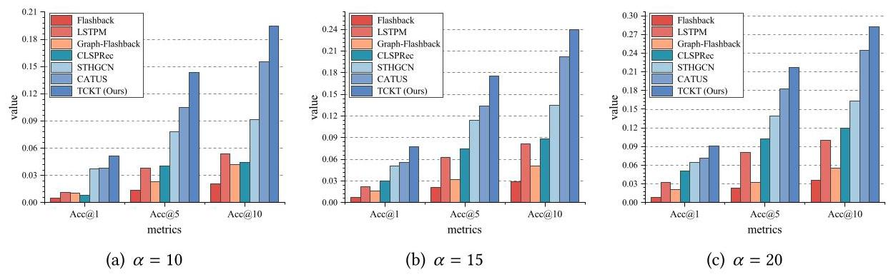

Fig. 8. Gowalla dataset's POI cold-start Acc@K results.

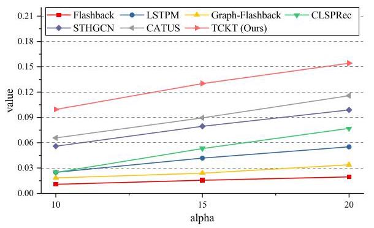

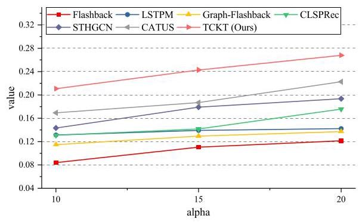

Fig. 10. NDCG metric for the Gowalla dataset.

Fig. 9. MRR metric for the Gowalla dataset.

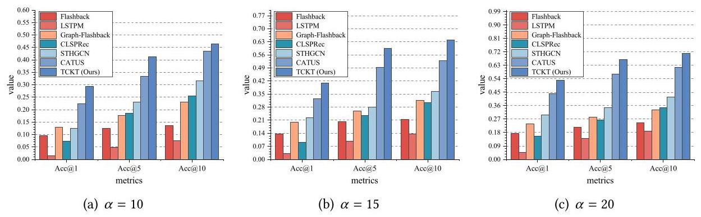

Fig. 11. Brightkite dataset's POI cold-start Acc@K results.

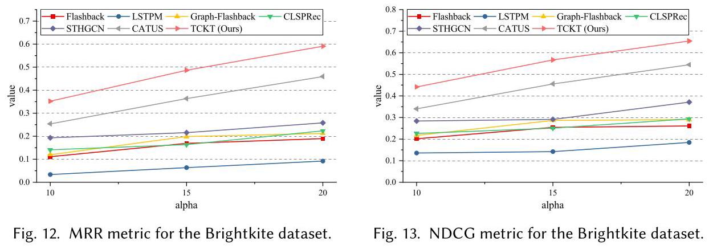

ACM Transactions on Information Systems, Vol. 43, No. 5, Article 119. Publication date: July 2025.

Table 4. Comparison of User Cold-Start Performance When \( \alpha  = 5 \)

<table><tr><td rowspan="2">Methods</td><td colspan="5">Gowalla</td><td colspan="5">Brightkite</td></tr><tr><td>Acc@1</td><td>Acc@5</td><td>Acc@10</td><td>MRR</td><td>NDCG</td><td>Acc@1</td><td>Acc@5</td><td>Acc@10</td><td>MRR</td><td>NDCG</td></tr><tr><td>Flashback</td><td>0.0038</td><td>0.0124</td><td>0.0185</td><td>0.0095</td><td>0.0918</td><td>0.0562</td><td>0.1298</td><td>0.1617</td><td>0.0918</td><td>0.1924</td></tr><tr><td>LSTPM</td><td>0.0179</td><td>0.0586</td><td>0.0811</td><td>0.0437</td><td>0.1276</td><td>0.1342</td><td>0.1981</td><td>0.2475</td><td>0.2652</td><td>0.3471</td></tr><tr><td>Graph-Flashback</td><td>0.0131</td><td>0.0494</td><td>0.0654</td><td>0.0383</td><td>0.1166</td><td>0.1306</td><td>0.1613</td><td>0.1840</td><td>0.1221</td><td>0.2217</td></tr><tr><td>CLSPrec</td><td>0.0145</td><td>0.0488</td><td>0.0834</td><td>0.0443</td><td>0.1361</td><td>0.1836</td><td>0.1935</td><td>0.2181</td><td>0.2582</td><td>0.3344</td></tr><tr><td>STHGCN</td><td>0.0241</td><td>0.0609</td><td>0.0880</td><td>0.0464</td><td>0.1498</td><td>0.2845</td><td>0.3017</td><td>0.3362</td><td>0.2970</td><td>0.3637</td></tr><tr><td>CATUS</td><td>0.0242</td><td>0.0620</td><td>0.0840</td><td>0.0439</td><td>0.1357</td><td>0.2938</td><td>0.4109</td><td>0.4394</td><td>0.3511</td><td>0.4205</td></tr><tr><td>TCKT (ours)</td><td>0.0208</td><td>0.0654</td><td>0.1035</td><td>0.0471</td><td>0.1549</td><td>0.4385</td><td>0.5659</td><td>0.5940</td><td>0.4894</td><td>0.5596</td></tr><tr><td>Improvement (%)</td><td>-14.05</td><td>5.48</td><td>17.61</td><td>1.51</td><td>3.40</td><td>49.25</td><td>37.72</td><td>35.18</td><td>39.39</td><td>33.08</td></tr></table>

The experimental results demonstrate that our proposed model achieved the best recommendation performance for \( \alpha \) values ranging from 10 to 20. This indicates that compared to the baseline method, our proposed TCKT model can effectively enhance the model's POI cold-start performance through cross-domain entity alignment and knowledge transfer. Overall, the model's recommendation performance improves as the cold-start number increases. Compared to baseline methods, the TCKT model shows a greater performance improvement on the Gowalla dataset than on the Foursquare dataset. A possible explanation is that the Foursquare dataset has a higher data density, so it's less affected under the same cold-start number. In the POI cold-start scenario, STHGCN and CATUS outperform other baseline methods. The STHGCN method uses graph structure to model high-order information among POIs, while CATUS utilizes cross-domain data to improve the performance of cold-start POIs. In the Gowalla dataset, the LSTPM method performs better than Flashback, but its performance is poor in the Brightkite dataset. This indicates that the Flashback method performs better on high-density datasets, and a possible reason for this is that its spatiotemporal context search can more effectively capture user behavior patterns and preferences in high-density datasets. In the Gowalla dataset with \( \alpha  = {10} \) , the MRR and NDCG performance of LSTPM and CLSPRec are similar. However, when \( \alpha \) equals 15 and 20, CLSPRec performs better than LSTPM. This indicates that the graph structure of Graph-Flashback can better utilize high-order relationships among POIs, especially when there are more cold-start POIs. In the Brightkite dataset, CLSPRec and Graph-Flashback methods perform similarly in most cases. When \( \alpha \) equals 10 and 20, CLSPRec has better performance in terms of MRR and NDCG metrics; when \( \alpha  = {15} \) , Graph-Flashback has better performance.

6.1.2 User Cold-Start Performance. In this section, we compared the user cold-start performance of TCKT and baseline methods. The experimental results of user cold-start at \( \alpha  = 5 \) are shown in Table 4, where underlined represents the best performance among baseline methods, and bold represents the best performance among all methods. For the user cold-start \( \alpha  = \{ {10},{15},{20}\} \) , the experimental results of Gowalla dataset are shown in Figures 14-16, and the experimental results of Brightkite dataset are shown in Figures 17-19.

The experimental results show that, overall, the performance of the model on the Brightkite dataset is generally better than that on the Gowalla dataset. This may be because the data density in the Brightkite dataset is higher, and the interaction between users and POIs is more balanced, which helps with model learning and predicting user behavior. Our proposed TCKT model outperforms baseline methods in most cases, indicating that our method can effectively improve user cold-start performance through cross-domain entity alignment and knowledge transfer. In Gowalla dataset, when \( \alpha  = 5 \) , CATUS method has the best Acc@1 performance; in other cases, TCKT model performs

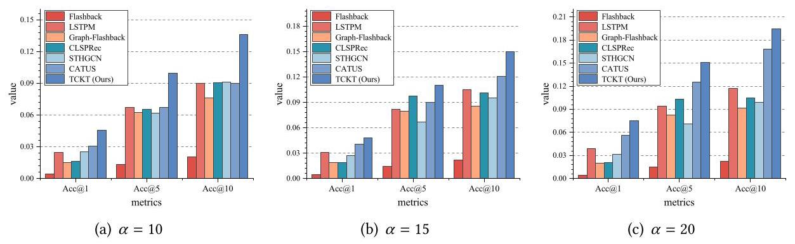

Fig. 14. Gowalla dataset's user cold-start Acc@K results.

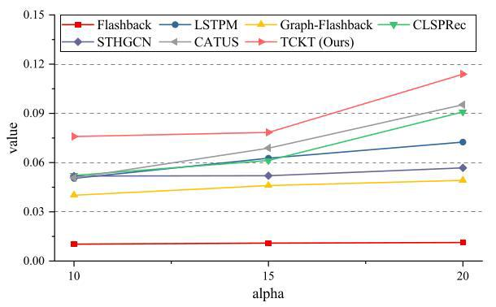

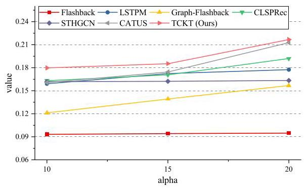

Fig. 16. NDCG metric for the Gowalla dataset.

Fig. 15. MRR metric for the Gowalla dataset. better than other baseline methods. The possible reason is that for datasets with low density and few user interactions, TCKT has difficulty transferring knowledge from source domain. As the number of user check-ins increases, the capability for knowledge transfer is enhanced, thereby achieving better cold-start performance. Compared to POI cold-start scenario, LSTPM, CLSPRec, STHGCN, and CATUS' performances are closer in user cold-start scenario. This may be because there are fewer available features for users in the dataset and these methods are designed for POI recommendation scenarios; therefore, their cold-start recommendation performances are similar. In the Gowalla and Brightkite datasets, Flashback method has the worst performance because it relies on hidden states in user's historical check-ins. In user cold-start scenarios where users have fewer check-ins, these hidden states cannot be utilized. In the baseline methods, CATUS has generally better recommendation performance, especially in the Gowalla dataset with lower data density. This indicates that the transfer learning ability of this method is also applicable to user cold-start scenarios. In the Brightkite dataset, the STHGCN method outperforms TCKT when \( \alpha  = {15} \) and \( \alpha  = {20} \) . This may be because it better utilizes other users' collaborative trajectories when there are more check-ins from cold-start users.

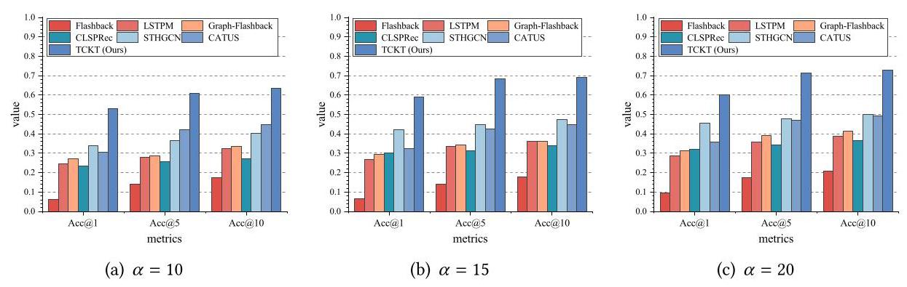

Fig. 17. Brightkite dataset's user cold-start Acc@K results.

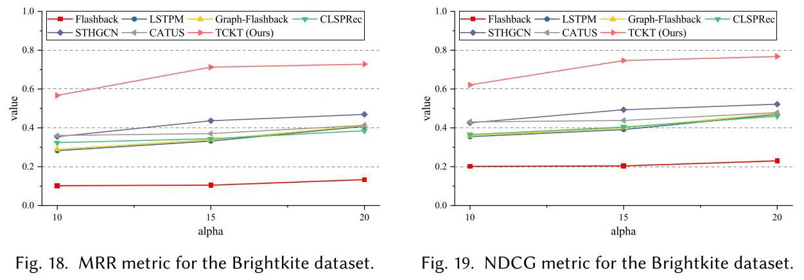

ACM Transactions on Information Systems, Vol. 43, No. 5, Article 119. Publication date: July 2025.

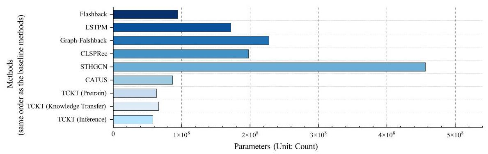

Fig. 20. Comparison of experimental parameter sizes.

6.1.3 Comparison of Model Parameter Sizes. To intuitively compare the complexity and computational efficiency of models, in this section we compared the parameter scale between TCKT and various baseline methods under the same embedding dimension. The TCKT model includes three parts: pre-train, knowledge transfer, and inference. The parameter sizes of each model are shown in Figure 20.

The experimental results indicate that compared to the baseline methods, our proposed TCKT model reduces the model's parameter size through weight-sharing based on GF-Tree. The knowledge transfer model adds two knowledge transfer channels based on pre-train model, thus having more parameters. The inference model only requires partial modules from the knowledge transfer model, thus having the least amount of parameters.

### 6.2 Ablation Study

To investigate the effectiveness of each module in the model, we designed the following ablation study:

- TCKT - (GF-Tree). To validate the effectiveness of GF-Tree in modeling POI transition patterns, we transform GF-Tree into a single branch tree. This ensured that each node had only one child node, thus avoiding feature sharing among POIs.

- TCKT - (STP). To validate the effectiveness of sequence transition patterns learning in the pre-training module on recommendation performance, we removed this module.

Table 5. Results of Ablation Study

<table><tr><td>Methods</td><td>Acc@1</td><td>Acc@5</td><td>Acc@10</td><td>MRR</td><td>NDCG</td></tr><tr><td>TCKT - (GF-Tree)</td><td>0.0245</td><td>0.0755</td><td>0.1110</td><td>0.0529</td><td>0.1509</td></tr><tr><td>TCKT - (STP)</td><td>0.0258</td><td>0.0770</td><td>0.1120</td><td>0.0543</td><td>0.1616</td></tr><tr><td>TCKT - (GC)</td><td>0.0250</td><td>0.0749</td><td>0.1115</td><td>0.0536</td><td>0.1610</td></tr><tr><td>TCKT - (UP)</td><td>0.0259</td><td>0.0789</td><td>0.1120</td><td>0.0553</td><td>0.1623</td></tr><tr><td>TCKT - (PC)</td><td>0.0264</td><td>0.0765</td><td>0.1164</td><td>0.0554</td><td>0.1629</td></tr><tr><td>TCKT - (Pretrain)</td><td>0.0112</td><td>0.0414</td><td>0.0660</td><td>0.0293</td><td>0.1310</td></tr><tr><td>TCKT - (KT)</td><td>0.0083</td><td>0.0296</td><td>0.0489</td><td>0.0223</td><td>0.1221</td></tr><tr><td>TCKT - (Overlap)</td><td>0.0281</td><td>0.0768</td><td>0.1161</td><td>0.0565</td><td>0.1635</td></tr><tr><td>Full</td><td>0.0283</td><td>0.0772</td><td>0.1159</td><td>0.0570</td><td>0.1643</td></tr></table>

- TCKT - (GC). To validate the effectiveness of GF-Tree contrastive learning in the pre-training module on recommendation performance, we removed this module.

- TCKT - (UP). To validate the effectiveness of user preference learning in the pre-training module on recommendation performance, we removed this module.

- TCKT - (PC). To validate the effectiveness of path constraints on recommendation performance, we removed the path constraints during the pre-training and knowledge transfer stages.

- TCKT - (Pre-Train). To validate the impact of the pre-training module on recommendation performance, we removed the pre-training and randomly initialized the pre-training weights during the knowledge transfer phase.

- TCKT - (KT). To validate the impact of knowledge transfer on performance, we removed the dual-channel knowledge transfer module and used the pre-trained sequence transition patterns learning module to fine-tune the cold-start data. Specifically, during the knowledge transfer phase, we loaded and fixed the weights learned from the pre-trained model, and only fine-tuned the recommendation layer of the model.

- TCKT - (Overlap). To validate the impact of cross-domain entity overlap on model performance, we removed the POIs that overlap between source and target domains. Specifically, we removed POIs with identical latitude and longitude in both domains.

- TCKT (Full). This represents the performance of the complete TCKT model.

The ablation experiments are based on the POI cold-start scenario with \( \alpha  = 5 \) and the radius of GF-Tree is \( \{ {50},1,{0.05}\} \) . The experimental results are presented in Table 5, where bold indicates the best performance and underline indicates the maximum improvement in performance. The results showed that the knowledge transfer module had the greatest improvement on the model's performance, indicating that the model successfully transferred the knowledge learned from the source domain to the target domain, effectively improving cold-start recommendation performance. Among the four pre-training modules, GC showed the most significant performance improvement. This suggested that conducting contrastive learning in the GF-Tree helped the model better understand the spatial relationship among POIs and their relative positions in the GF-Tree, leading to more precise recommendations. The performance improvement of Pre-train is only second to KT. This suggested that the considerable data distribution differences between the source and target domains made it difficult to enhance cold-start recommendation performance by directly fine-tuning knowledge from the source domain. However, our designed dual-channel domain adaptation module effectively transferred knowledge from cross-domain data, thus improving cold-start performance. Transforming GF-Tree into a single branch tree makes POIs unable to share features through prefix, which reduces the recommendation performance. The possible reason is that in GF-Tree, POIs in the same sub-tree share prefixes, and the model doesn't treat these POIs as independent entities. This allows the model to better learn macro-transition patterns. Overlap has the least impact on recommendation performance, indicating that the TCKT model is not sensitive to entity overlap. A possible reason is that our entity alignment algorithm uses fuzzy feature matching based on latitude, longitude, and frequency, and does not require identical POIs across domains. In cross-domain scenarios, incomplete entity overlap is a significant challenge; experimental results show that our model can effectively handle this problem demonstrating its robustness and adaptability.

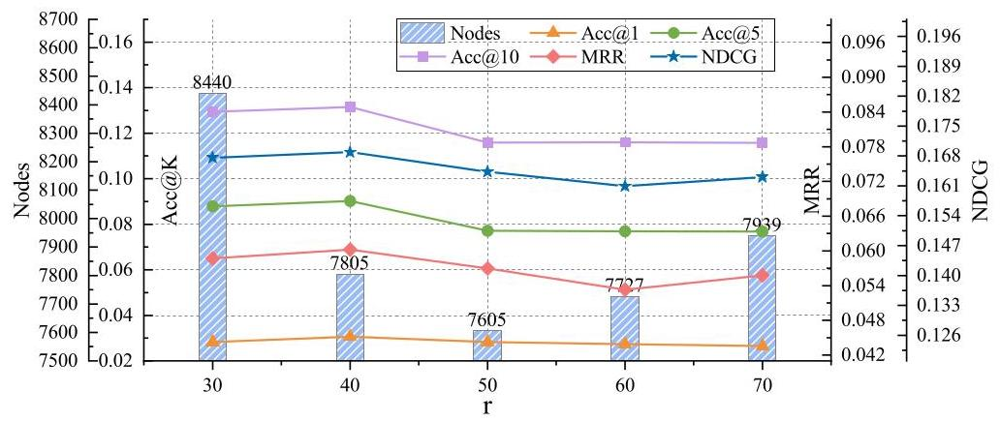

Fig. 21. Experimental results of clustering radius.

### 6.3 Hyper-Parameter Sensitivity Analysis

We performed a hyper-parameter sensitivity analysis on the Gowalla dataset, focusing on three key hyper-parameters' impact on TCKT: (1) the clustering radius of the GF-Tree; (2) the number of layers in the GF-Tree; (3) the number of pre-training epochs. The hyper-parameter sensitivity analysis experiments are based on the POI cold-start scenario with \( \alpha  = 5 \) .

6.3.1 Clustering Radius of GF-Tree. The clustering radius affects the number of clusters. Specifically, in GF-Tree, a larger clustering radius results in more POIs being assigned to the same cluster, meaning there are more child nodes within a sub-tree. To verify the impact of clustering radius on model performance, we conducted experiments with different clustering radius. Specifically, we set the radius of the first layer as the variable \( r \) and fixed the radii of the other layers. The experimental results are shown in Figure 21. The blue bar represents the number of nodes in GF-Tree, while the yellow, green, and purple lines denote the Acc@K performance. The red line represents MRR performance, and the blue line represents NDCG performance.

The experimental results indicate that an increase in the clustering radius leads to a decrease in the number of nodes in the GF-Tree, allowing fewer nodes to represent the same number of POIs. When the radius is greater than 50, the number of nodes increases. This is because when the radius of the first layer is large enough, its influence on the clustering results of subsequent layers decreases. The model performs best when \( r = {40} \) , better than \( r = {30} \) and \( r = {50} \) . This indicates that an appropriate radius can balance the number of nodes and model performance. A possible reason is that a smaller \( r \) expands the solution space for the GF-Tree, increasing the probability of generating incorrect POI paths. On the other hand, a larger \( r \) results in fewer nodes, thereby leading to model overfitting. When \( r = {70} \) , the recommendation performance improves. The reason is that when the cluster radius is large enough, its influence on the clustering results of subsequent layers decreases, thereby alleviating overfitting of the model.

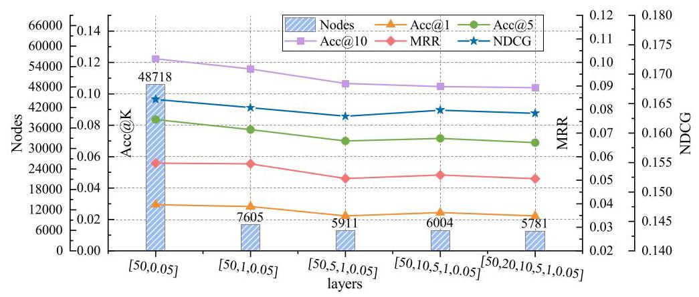

Fig. 22. Experimental results of the GF-Tree layers.

6.3.2 Number of Layers in GF-Tree. The number of layers in the GF-Tree affects the tree's height and the number of nodes. Specifically, more layers lead to a more detailed division of POIs. In our experiment, we fixed the first and last layers of the clustering radius sequence and introduced various parameter combinations between them. The experimental results are illustrated in Figure 22, where the blue bar denotes the number of nodes in the GF-Tree, while the yellow, green, and purple lines indicate Acc@K performance. The red line represents MRR performance, and the blue line represents NDCG performance.

The experimental results show that GF-Tree has the most nodes at two layers. As the number of layers increases, the number of nodes tends to decrease. Overall, the recommendation performance of the model declines as the number of layers increases. The model performs best with two layers and worst with six layers. This is because the difficulty of path prediction is lowest at two layers, and as the number of layers increases, the increasing difficulty of path prediction leads to a decrease in recommendation performance. The performance of the three layers is close to that of the two layers, with the smallest difference in Acc@1 performance. However, the number of nodes in the two layers is only 15.61% of that in the three layers. This indicates that three layers can achieve nearly precision recommendation performances using fewer parameters. Therefore, when selecting the number of layers, one must carefully consideration of computational power and precision needs.

6.3.3 Number of Pre-Training Epochs. The number of pre-training epochs influences both the model's fit and training time on large-scale third-party data. Insufficient pre-training epochs lead to inadequate model learning on third-party data, thereby reducing the effectiveness of knowledge transfer. Excessive epochs may cause overfitting on third-party data and prolong training time. The experimental results are shown in Figure 23, where the red line represents the performance of Acc@1 metric for cold-start, and the green line represents the training loss of the pre-training model's

Experimental results demonstrate that with more pre-training epochs, the pre-training model's loss decreases and the cold-start performance improves. This suggests that with the increase in training epochs, the pre-training model can better fit the pre-collected data and learn valuable features. The knowledge transfer model can effectively transfer knowledge from the pre-training model and improve cold-start performance.

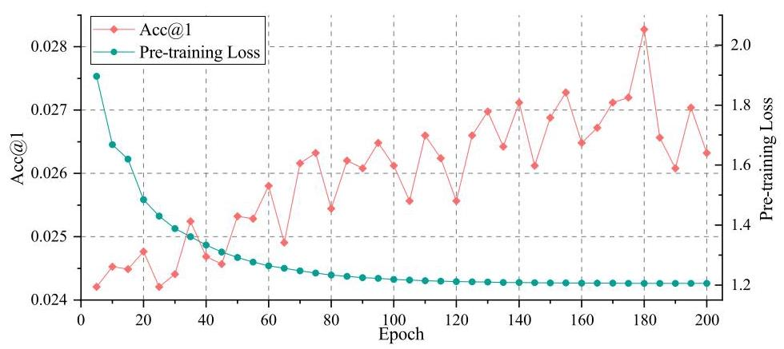

Fig. 23. Experimental results of the pre-training epochs.

## 7 Conclusion

In this article, we attempt to alleviate the cold-start problem in the next POI recommendation task using pre-collected third-party data. First, we constructed a GF-Tree based on the geography and frequency information of POIs, enabling cross-domain POI alignment through this structure. Second, we conducted pre-training in the source domain based on the GF-Tree and user check-in sequences. Finally, we designed a dual-channel domain adaptation model for knowledge transfer. Furthermore, we conducted extensive experiments on three real-world datasets, and the results indicate that our method outperforms SOTA methods.

However, our study still has several limitations that need to be addressed in the future. The category of POI is an important factor affecting user check-ins. However, since category labels are discrete values, exploring how to integrate these labels into the GF-Tree and learning their influence on user behavior during pre-training represents a potential avenue for improvement. Additionally, using more user attributes in the model is a potential direction for improving cold-start performance for users.

## References

[1] Hong-Kyun Bae, Yebeen Kim, Hyunjoon Kim, and Sang-Wook Kim. 2024. Negative sampling in next-POI recommendations: Observation, approach, and evaluation. In Proceedings of the ACM on Web Conference 2024, 3888-3899.

[2] Yudong Chen, Xin Wang, Miao Fan, Jizhou Huang, Shengwen Yang, and Wenwu Zhu. 2021. Curriculum meta-learning for next POI recommendation. In Proceedings of the 27th ACM SIGKDD Conference on Knowledge Discovery & Data Mining, 2692-2702.

[3] Chen Cheng, Haiqin Yang, Michael R. Lyu, and Irwin King. 2013. Where you like to go next: Successive point-of-interest recommendation. In Proceedings of the 23rd International Joint Conference on Artificial Intelligence, 2605-2611.

[4] Eunjoon Cho, Seth A. Myers, and Jure Leskovec. 2011. Friendship and mobility: User movement in location-based social networks. In Proceedings of the 17th ACM SIGKDD International Conference on Knowledge Discovery and Data Mining, 1082-1090.

[5] Yue Cui, Hao Sun, Yan Zhao, Hongzhi Yin, and Kai Zheng. 2021. Sequential-knowledge-aware next POI recommendation: A meta-learning approach. ACM Transactions on Information Systems 40, 2 (2021), 1-22.

[6] Yizhou Dang, Enneng Yang, Guibing Guo, Linying Jiang, Xingwei Wang, Xiaoxiao Xu, Qinghui Sun, and Hong Liu. 2023. Uniform sequence better: Time interval aware data augmentation for sequential recommendation. In Proceedings of the AAAI Conference on Artificial Intelligence, Vol. 37, 4225-4232.

[7] Jiangfeng Du, Silin Zhou, Jie Yu, Peng Han, and Shuo Shang. 2024. Cross-task multimodal reinforcement for long tail next poi recommendation. IEEE Transactions on Multimedia 26 (2024), 1996-2005.

[8] Yuntao Du, Xinjun Zhu, Lu Chen, Ziquan Fang, and Yunjun Gao. 2022. Metakg: Meta-learning on knowledge graph for cold-start recommendation. IEEE Transactions on Knowledge and Data Engineering 35, 10 (2022), 9850-9863.

[9] Chenghua Duan, Wei Fan, Wei Zhou, Hu Liu, and Junhao Wen. 2023. CLSPRec: Contrastive learning of long and short-term preferences for next POI recommendation. In Proceedings of the 32nd ACM International Conference on Information and Knowledge Management, 473-482.

[10] Shanshan Feng, Gao Cong, Bo An, and Yeow Meng Chee. 2017. Poi2vec: Geographical latent representation for predicting future visitors. In Proceedings of the AAAI Conference on Artificial Intelligence, Vol. 31, 102-108.

[11] Shanshan Feng, Haoming Lyu, Caishun Chen, and Yew-Soon Ong. 2024. Where to move next: Zero-shot generalization of LLMs for next POI recommendation. arXiv:2404.01855. Retrieved from https://arxiv.org/abs/2404.01855

[12] Yaroslav Ganin, Evgeniya Ustinova, Hana Ajakan, Pascal Germain, Hugo Larochelle, François Laviolette, Mario March, and Victor Lempitsky. 2016. Domain-adversarial training of neural networks. Journal of Machine Learning Research 17, 59 (2016), 1-35.

[13] Vinayak Gupta and Srikanta Bedathur. 2022. Doing more with less: Overcoming data scarcity for poi recommendation via cross-region transfer. ACM Transactions on Intelligent Systems and Technology 13, 3 (2022), 1-24.

[14] Jing He, Xin Li, Lejian Liao, Dandan Song, and William Cheung. 2016. Inferring a personalized next point-of-interest recommendation model with latent behavior patterns. In Proceedings of the AAAI Conference on Artificial Intelligence, Vol. 30, 137-143.

[15] Kaiming He, Xiangyu Zhang, Shaoqing Ren, and Jian Sun. 2016. Deep residual learning for image recognition. In Proceedings of the IEEE Conference on Computer Vision and Pattern Recognition, 770-778.

[16] Tianhao Huang, Xuan Pan, Xiangrui Cai, Ying Zhang, and Xiaojie Yuan. 2024. Learning time slot preferences via mobility tree for next POI recommendation. In Proceedings of the AAAI Conference on Artificial Intelligence, Vol. 38, 8535-8543.

[17] Shaowei Jiang, Wei He, Lizhen Cui, Yonghui Xu, and Lei Liu. 2023. Modeling long-and short-term user preferences via self-supervised learning for next poi recommendation. ACM Transactions on Knowledge Discovery from Data 17, 9 (2023), 1-20.

[18] Xiangjie Kong, Zhiyu Chen, Jianxin Li, Junhui Bi, and Guojiang Shen. 2024. KGNext: Knowledge-graph-enhanced transformer for next POI recommendation with uncertain check-ins. IEEE Transactions on Computational Social Systems 11, 5 (2024), 6637-6648.

[19] Akshi Kumar, Deepak Kumar Jain, Abhishek Mallik, and Sanjay Kumar. 2024. Modified node2vec and attention based fusion framework for next POI recommendation. Information Fusion 101 (2024), 101998.

[20] Yantong Lai, Yijun Su, Lingwei Wei, Gaode Chen, Tianci Wang, and Daren Zha. 2023. Multi-view spatial-temporal enhanced hypergraph network for next POI recommendation. In Proceedings of the 28th International Conference on Database Systems for Advanced Applications (DASFAA '23). Springer, 237-252.

[21] Dichao Li, Zhiguo Gong, and Defu Zhang. 2018. A common topic transfer learning model for crossing city POI recommendations. IEEE Transactions on Cybernetics 49, 12 (2018), 4282-4295.

[22] Peibo Li, Maarten de Rijke, Hao Xue, Shuang Ao, Yang Song, and Flora D. Salim. 2024. Large language models for next point-of-interest recommendation. arXiv:2404.17591. Retrieved from https://arxiv.org/abs/2404.17591

[23] Shuzhe Li, Wei Chen, Bin Wang, Chao Huang, Yanwei Yu, and Junyu Dong. 2024. MCN4Rec: Multi-level collaborative neural network for next location recommendation. ACM Transactions on Information Systems 42, 4 (2024), 1-26.

[24] Yong Liu, Wei Wei, Aixin Sun, and Chunyan Miao. 2014. Exploiting geographical neighborhood characteristics for location recommendation. In Proceedings of the 23rd ACM International Conference on Conference on Information and Knowledge Management, 739-748.

[25] Jing Long, Tong Chen, Quoc Viet Hung Nguyen, and Hongzhi Yin. 2023. Decentralized collaborative learning framework for next POI recommendation. ACM Transactions on Information Systems 41, 3 (2023), 1-25.

[26] Ilya Loshchilov and Frank Hutter. 2019. Decoupled weight decay regularization. In Proceedings of the International Conference on Learning Representations, 4061-4079.

[27] Frederic Morin and Yoshua Bengio. 2005. Hierarchical probabilistic neural network language model. In Proceedings of the International Workshop on Artificial Intelligence and Statistics. PMLR, 246-252.

[28] Xuan Pan, Xiangrui Cai, Sihan Xu, Ying Zhang, Peng Nie, and Xiaojie Yuan. 2024. GeoCo: Geographical correlation enhanced network for POI recommendation. IEEE Transactions on Knowledge and Data Engineering 36, 12 (2024), 8362-8376.

[29] Yanjun Qin, Yuchen Fang, Haiyong Luo, Fang Zhao, and Chenxing Wang. 2022. Next point-of-interest recommendation with auto-correlation enhanced multi-modal transformer network. In Proceedings of the 45th International ACM SIGIR Conference on Research and Development in Information Retrieval, 2612-2616.

[30] Xuan Rao, Lisi Chen, Yong Liu, Shuo Shang, Bin Yao, and Peng Han. 2022. Graph-flashback network for next location recommendation. In Proceedings of the 28th ACM SIGKDD Conference on Knowledge Discovery and Data Mining, 1463-1471.

[31] Steffen Rendle, Christoph Freudenthaler, Zeno Gantner, and Lars Schmidt-Thieme. 2009. BPR: Bayesian personalized ranking from implicit feedback. In Proceedings of the 25th Conference on Uncertainty in Artificial Intelligence, 452-461.

[32] Ke Sun, Chenliang Li, and Tieyun Qian. 2024. City matters! A dual-target cross-city sequential POI recommendation model. ACM Transactions on Information Systems 42, 6 (2024), 1-27.

[33] Ke Sun, Tieyun Qian, Tong Chen, Yile Liang, Quoc Viet Hung Nguyen, and Hongzhi Yin. 2020. Where to go next: Modeling long-and short-term user preferences for point-of-interest recommendation. In Proceedings of the AAAI Conference on Artificial Intelligence, Vol. 34, 214-221.

[34] Ke Sun, Tieyun Qian, Chenliang Li, Xuan Ma, Qing Li, Ming Zhong, Yuanyuan Zhu, and Mengchi Liu. 2023. Pre-training across different cities for next POI recommendation. ACM Transactions on the Web 17, 4 (2023), 31:1-31:27.

[35] Zhu Sun, Yu Lei, Lu Zhang, Chen Li, Yew-Soon Ong, and Jie Zhang. 2023. A multi-channel next POI recommendation framework with multi-granularity check-in signals. ACM Transactions on Information Systems 42, 1 (2023), 1-28.

[36] Ashish Vaswani, Noam Shazeer, Niki Parmar, Jakob Uszkoreit, Llion Jones, Aidan N. Gomez, Lukasz Kaiser, and Illia Polosukhin. 2017. Attention is all you need. In Advances in Neural Information Processing Systems. I. Guyon, U. Von Luxburg, S. Bengio, H. Wallach, R. Fergus, S. Vishwanathan, and R. Garnett (Eds.), Vol. 30, Curran Associates, Inc., 5998-6008.

[37] Chen Wang, Mengting Yuan, Yang Yang, Kai Peng, and Hongbo Jiang. 2024. Revisiting long-and short-term preference learning for next POI recommendation with hierarchical LSTM. IEEE Transactions on Mobile Computing 23, 12 (2024), 12693-12705.

[38] Hao Wang, Huawei Shen, Wentao Ouyang, and Xueqi Cheng. 2018. Exploiting POI-specific geographical influence for point-of-interest recommendation. In Proceedings of the 27th International Joint Conference on Artificial Intelligence, 3877-3883.

[39] Liang Wang, Shu Wu, Qiang Liu, Yanqiao Zhu, Xiang Tao, and Mengdi Zhang. 2024. Bi-level graph structure learning for next POI recommendation. IEEE Transactions on Knowledge and Data Engineering 36, 11 (2024), 5695-5708.

[40] Zhaobo Wang, Yanmin Zhu, Haobing Liu, and Chunyang Wang. 2022. Learning graph-based disentangled representations for next POI recommendation. In Proceedings of the 45th International ACM SIGIR Conference on Research and Development in Information Retrieval, 1154-1163.

[41] Zhaobo Wang, Yanmin Zhu, Qiaomei Zhang, Haobing Liu, Chunyang Wang, and Tong Liu. 2022. Graph-enhanced spatial-temporal network for next POI recommendation. ACM Transactions on Knowledge Discovery from Data 16, 6 (2022), 1-21.

[42] Yuxia Wu, Ke Li, Guoshuai Zhao, and Xueming Qian. 2020. Personalized long-and short-term preference learning for next POI recommendation. IEEE Transactions on Knowledge and Data Engineering 34, 4 (2020), 1944-1957.

[43] Yang Xu, Gao Cong, Lei Zhu, and Lizhen Cui. 2024. MMPOI: A multi-modal content-aware framework for POI recommendations. In Proceedings of the ACM on Web Conference 2024, 3454-3463.

[44] Xiaodong Yan, Tengwei Song, Yifeng Jiao, Jianshan He, Jiaotuan Wang, Ruopeng Li, and Wei Chu. 2023. Spatiotemporal hypergraph learning for next POI recommendation. In Proceedings of the 46th International ACM SIGIR Conference on Research and Development in Information Retrieval, 403-412.

[45] Dingqi Yang, Benjamin Fankhauser, Paolo Rosso, and Philippe Cudre-Mauroux. 2020. Location prediction over sparse user mobility traces using RNNS. In Proceedings of the 29th International Joint Conference on Artificial Intelligence, 2184-2190.

[46] Dingqi Yang, Bingqing Qu, Jie Yang, and Philippe Cudré-Mauroux. 2020. Lbsn2vec++: Heterogeneous hypergraph embedding for location-based social networks. IEEE Transactions on Knowledge and Data Engineering 34, 4 (2020), 1843-1855.

[47] Song Yang, Jiamou Liu, and Kaiqi Zhao. 2022. GETNext: Trajectory flow map enhanced transformer for next POI recommendation. In Proceedings of the 45th International ACM SIGIR Conference on Research and Development in Information Retrieval, 1144-1153.

[48] Jihang Ye, Zhe Zhu, and Hong Cheng. 2013. What's your next move: User activity prediction in location-based social networks. In Proceedings of the 2013 SIAM International Conference on Data Mining. SIAM, 171-179.

[49] Ziming Ye, Xiao Zhang, Xu Chen, Hui Xiong, and Dongxiao Yu. 2023. Adaptive clustering based personalized federated learning framework for next poi recommendation with location noise. IEEE Transactions on Knowledge and Data Engineering 36, 5 (2023), 1843-1856.

[50] Hongzhi Yin, Xiaofang Zhou, Bin Cui, Hao Wang, Kai Zheng, and Quoc Viet Hung Nguyen. 2016. Adapting to user interest drift for poi recommendation. IEEE Transactions on Knowledge and Data Engineering 28, 10 (2016), 2566-2581.

[51] Hongyu Zang, Dongcheng Han, Xin Li, Zhifeng Wan, and Mingzhong Wang. 2021. Cha: Categorical hierarchy-based attention for next poi recommendation. ACM Transactions on Information Systems 40, 1 (2021), 1-22.

[52] Jia-Dong Zhang, Chi-Yin Chow, and Yanhua Li. 2014. Lore: Exploiting sequential influence for location recommendations. In Proceedings of the 22nd ACM SIGSPATIAL International Conference on Advances in Geographic Information Systems, 103-112.

[53] Xiao Zhang, Ziming Ye, Jianfeng Lu, Fuzhen Zhuang, Yanwei Zheng, and Dongxiao Yu. 2023. Fine-grained preference-aware personalized federated POI recommendation with data sparsity. In Proceedings of the 46th International ACM SIGIR Conference on Research and Development in Information Retrieval, 413-422.

[54] Haoyi Zhou, Shanghang Zhang, Jieqi Peng, Shuai Zhang, Jianxin Li, Hui Xiong, and Wancai Zhang. 2021. Informer: Beyond efficient transformer for long sequence time-series forecasting. In Proceedings of the AAAI Conference on Artificial Intelligence, Vol. 35, 11106-11115.

[55] Han Zhu, Xiang Li, Pengye Zhang, Guozheng Li, Jie He, Han Li, and Kun Gai. 2018. Learning tree-based deep model for recommender systems. In Proceedings of the 24th ACM SIGKDD International Conference on Knowledge Discovery & Data Mining, 1079-1088.

[56] Fuzhen Zhuang, Zhiyuan Qi, Keyu Duan, Dongbo Xi, Yongchun Zhu, Hengshu Zhu, Hui Xiong, and Qing He. 2020. A comprehensive survey on transfer learning. Proceedings of the IEEE 109, 1 (2020), 43-76.

[57] Zhuang Zhuang, Tianxin Wei, Lingbo Liu, Heng Qi, Yanming Shen, and Baocai Yin. 2024. TAU: Trajectory data augmentation with uncertainty for next POI recommendation. In Proceedings of the AAAI Conference on Artificial Intelligence, Vol. 38, 22565-22573.