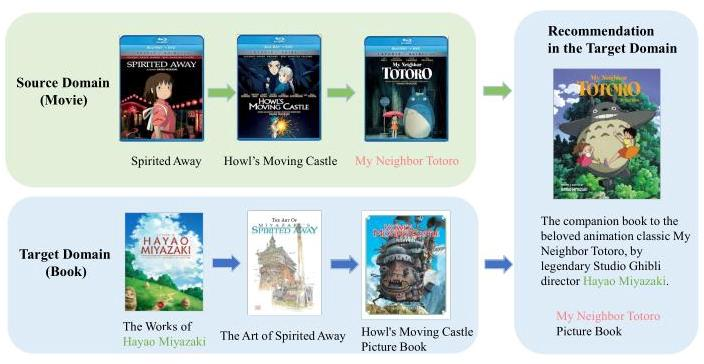
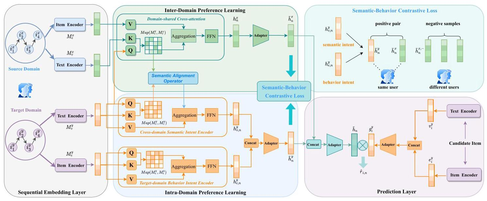
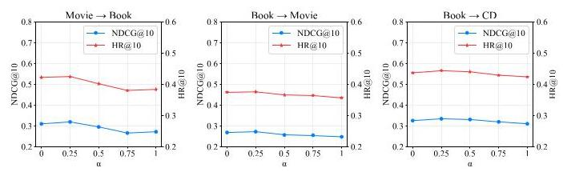
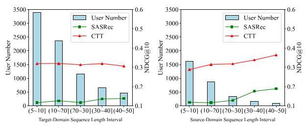
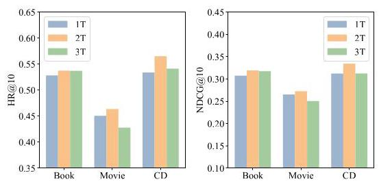

# Contrastive Text-enhanced Transformer for Cross-Domain Sequential Recommendation

Donglin Zhou*

2300271010@email.szu.edu.cn

College of Computer Science and

Software Engineering, Shenzhen

University

Shenzhen, China

Xinbei Cai*

2021110246@email.szu.edu.cn

College of Computer Science and

Software Engineering, Shenzhen

University

Shenzhen, China

Weike Pan

panweike@szu.edu.cn

College of Computer Science and

Software Engineering, Shenzhen

University

Shenzhen, China

## Abstract

Cross-domain sequential recommendation (CDSR) aims to enhance recommendation performance in a target domain by leveraging user sequential preferences from a source domain. As most advanced methods employ various neural networks to model item-ID sequences, they often struggle with a sparse data. Recent text-based CDSR approaches utilize rich text information to facilitate knowledge transfer across domains but still encounter three main challenges: (i) how to capture domain-shared semantic relationships; (ii) how to effectively integrate semantic intents and behavior intents; and (iii) how to design sufficient supervision signals for model training. In this paper, we propose a novel text-enhanced CDSR solution, i.e., contrastive text-enhanced Transformer (CTT), which jointly learns user preferences from semantic and behavioral information. Specifically, our CTT is a dual-view structure, including an inter-domain preference view and an intra-domain preference view. In the former, we design a domain-shared cross-attention mechanism to encode semantic correlations across different domains by an attention map, which is then utilized for cross-domain semantic intent learning. In the latter, we extract fine-grained behavior intents from item-ID sequences and coarse-grained semantic intents from item-text sequences, thereby capturing high-quality intra-domain preferences. Our CTT integrates these two types of preferences to predict the next item for each user. Moreover, we propose a semantic-behavior contrastive learning approach to enhance cross-domain preference learning and knowledge transfer. Extensive experiments on three real-world datasets demonstrate that our CTT outperforms the state-of-the-art models by an average of \( {5.86}\% \) on HR@5.The scripts for data preprocessing and conducting experiments, the parameter configurations, and the source codes of our CTT and all baselines are available at https://github.com/XinbeiCai/CTT.

## CCS Concepts

- Information systems \( \rightarrow \) Recommender systems.

Permission to make digital or hard copies of all or part of this work for personal or classroom use is granted without fee provided that copies are not made or distributed for profit or commercial advantage and that copies bear this notice and the full citation on the first page. Copyrights for components of this work owned by others than the author(s) must be honored. Abstracting with credit is permitted. To copy otherwise, or republish, to post on servers or to redistribute to lists, requires prior specific permission and/or a fee. Request permissions from permissions@acm.org.

© 2025 Copyright held by the owner/author(s). Publication rights licensed to ACM. ACM ISBN 979-8-4007-1454-2/2025/08

https://doi.org/10.1145/3711896.3736893

## Keywords

Cross-domain sequential recommendation, Sequential recommendation, Text-enhanced Transformer, Contrastive learning.

## ACM Reference Format:

Donglin Zhou, Xinbei Cai, and Weike Pan. 2025. Contrastive Text-enhanced Transformer for Cross-Domain Sequential Recommendation. In Proceedings of the 31st ACM SIGKDD Conference on Knowledge Discovery and Data Mining V. 2 (KDD '25), August 3-7, 2025, Toronto, ON, Canada. ACM, New York, NY, USA, 10 pages. https://doi.org/10.1145/3711896.3736893

## 1 Introduction

Sequential recommendation (SR) methods aim to predict the next preferred item for each user by modeling their historical behaviors. Previous studies have employed Markov chains [9, 26], RNNs [10], GNNs [32], MLPs [17, 41] and Transformers [14, 28], to capture users' dynamic preferences. Despite these advancements, most SR methods are still limited by cold-start and data-sparsity issues, often resulting in suboptimal performance.

Cross-domain sequential recommendation (CDSR) methods leverage overlapped users' interaction histories to learn the behavior preference representations in both the source and target domains, and then design a preference transfer network to transfer knowledge of the source domain to enhance user preference learning in the target domain \( \left\lbrack  {3,{24}}\right\rbrack \) , which is illustrated in Fig. 1. However, users may exhibit distinct behavior patterns across different scenarios. For example, a user might frequently buy electronic products on an E-commerce platform while watching sports-related short videos in a video application. Therefore, these CDSR methods are often limited by the different distributions of user behaviors across domains, which may lead to negative transfer.

Inspired by the success of pre-trained language models, recent research has utilized text information existing across various domains as a bridge to extract general semantic preference representations for transferable recommendation systems \( \left\lbrack  {{11},{12},{16}}\right\rbrack \) . Semantic preference representations, being domain-agnostic, can capture transferable knowledge across domains and mitigate negative transfer. This modeling paradigm first extracts universal text representations from multiple domains and then trains a specific preference transfer network for the target domain. However, these methods still face three key challenges.

Firstly, how to capture domain-shared semantic relationships and filter out domain-specific noise by using text information as a bridge? For instance, a user might exhibit an interest in drama across both the Movie and Book domains, where this shared semantic information can significantly enhance cross-domain preference learning.

---

*Both authors contributed equally to this research.

\( {}^{ \dagger  } \) Corresponding author.

---

Figure 1: An example from Movie (source domain) and Book (target domain). Cross-domain semantic correlations, such as content similarity, can enhance user preference learning.

However, the user's preferences for a specific author's writing style in the Book domain (i.e., domain-specific semantic information) may not be relevant to the Movie domain and could potentially lead to negative transfer.

Secondly, how to design an effective preference transfer network that integrates text preferences and behavior preferences for improved user preference learning? Users' sequential behavior patterns (i.e., behavior intents) capture fine-grained item-item collaborative relationships, while text sequential preferences (i.e., semantic intents) provide coarse-grained prior knowledge to enhance recommendations. These two types of preferences may become entangled during the fusion stage, often resulting in suboptimal performance.

Thirdly, how to provide sufficient supervision signals to optimize model training and enhance knowledge transfer across domains? Users have diverse interests across different domains, requiring recommendation models to align user preferences from different domains and achieve more effective knowledge transfer. Previous works only construct supervision signals to optimize models based on behavior intents or semantic intents, but they do not fully exploit the complementary advantages of both.

To address the above issues, we propose a novel text-enhanced cross-domain sequential recommendation method, i.e., contrastive text-enhanced Transformer (CTT). In this paper, we leverage two types of text information, including item reviews and item meta-information (e.g., title, brand, description). For the first challenge, we design a domain-shared cross-attention mechanism. This mechanism first encodes semantic relationships across different domains by a cross-attention map and then transfers these domain-shared relationships to enhance cross-domain semantic intent learning via a semantic alignment operator. For the second challenge, we learn user sequential preferences from an inter-domain view and an intra-domain view. In the former, we derive inter-domain preferences from domain-shared cross-attention, which incorporates user preferences from the source domain. In the latter, we jointly learn the fine-grained behavior intents and the coarse-grained semantic intents, and then aggregate them to obtain the intra-domain preferences. We aggregate these two preferences as the final preferences to predict the next item in the target domain. For the third challenge, we propose a semantic-behavior contrastive learning task on the user side, which aligns overlapped users' diverse preferences across different domains and provides more precise supervision signals for model training.

In experiments, we compare our CTT with fourteen competitive baselines on three Amazon datasets and achieve a significant improvement on two ranking-oriented evaluation metrics. Moreover, we conduct some ablation studies to verify the effectiveness of the components in our CTT. Finally, we study the parameter sensitivity to better understand our model. The contributions are summarized as follows:

(1) We present the CTT framework, a novel text-enhanced solution for cross-domain sequential recommendation, which deeply integrates semantic information and behavioral patterns to learn user preferences.

(2) We model user preferences from both inter-domain and intra-domain preference views. To achieve cross-domain knowledge transfer, we design a semantic-behavior contrastive learning task to exploit comprehensive and precise supervision signals.

(3) Extensive experiments conducted on three Amazon datasets show that our CTT significantly outperforms four types of baseline methods. Additionally, an ablation study highlights the effectiveness of each key component.

## 2 Related Work

In this section, we briefly describe some related works on (i) sequential recommendation, and (ii) cross-domain sequential recommendation.

### 2.1 Sequential Recommendation

Sequential recommendation (SR) aims to predict the next item based on user historical interactions. Early methods like FPMC [26] and Fossil [9] utilize Markov chains to model user-item interactions. So far, various kinds of neural network techniques have been introduced for modeling long-range dependencies, including RNN (e.g., GRU4Rec [32]), CNN (e.g., Caser [30]), Transformer (e.g., SASRec [14], BERT4Rec [28] and Transformer4Rec [5]), MLP (e.g., FMLP-Rec [41] and MMMLP [17]) and GNN (e.g., SR-GNN [32]). These deep-learning methods utilize unique IDs to represent items and learn the item-item transition relationships. Some works utilize self-supervision signals and contrastive learning techniques to enhance user preference learning \( \left\lbrack  {4,{25},{34},{37},{40}}\right\rbrack \) . Further research integrates side information like item category into user preference learning \( \left\lbrack  {{19},{20},{35},{38}}\right\rbrack \) . Text-based sequential recommendation methods utilize rich text information to improve user representation learning \( \left\lbrack  {{13},{15},{39}}\right\rbrack \) . However, most of these methods are often limited by the cold-start and data-sparsity problems.

### 2.2 Cross-Domain Sequential Recommendation

Cross-domain sequential recommendation (CDSR) leverages behavior sequences of a source domain to enhance preference learning in a target domain [3, 21]. Early CDSR methods utilize RNN to model cross-domain preferences. For example, \( \pi \) -Net [24] proposes a shared account filter unit and a cross-domain transfer unit to share user preferences between two domains. PSJNet [29] introduces a split-and-join framework for inter-domain information propagation. Then, CD-SASRec [1] applies Transformer to incorporate preference representations of a source domain into a target domain. The graph convolution network-based methods (e.g., DA-GCN [7], TiDA-GCN [8] and MIFN [23]) model users and items in each domain as a graph, and employ domain-aware graph convolution networks to transfer knowledge across different domains. Contrastive learning has been adapted to enhance preference learning for cross-domain recommendation [22, 33]. For example, MGCL [36] adopts multi-view graph contrastive learning to capture users' preferences from different domains. C2DSR [2] leverages the intra-sequence and inter-sequence item relationships to learn user preferences. However, these methods mainly focus on user behaviors and rarely consider the rich text information. They are also often limited by negative transfer due to the different distributions of user behaviors across domains.

Text-based CDSR methods use text information as a bridge to transfer source-domain knowledge to enhance target-domain preference learning [16, 31]. For example, UniSRec [12] learns universal item representations from multiple domains, and constructs supervision signals from semantic intents to train the network. VQ-Rec [11] maps each item-text embedding to a vector-quantized code representation and adopts a contrastive pre-training approach to achieve transferable recommendation. PRECISE [27] aligns semantic representations with behavioral interests in the pre-training stage, and transfers the entire range of user interests to the target scenarios. This modeling paradigm first extracts text representations from different domains, and then trains a specific preference transfer network for a downstream target domain.

## 3 Methodology

In this section, we first formally define the studied cross-domain sequential recommendation problem and then introduce our proposed CTT in detail. We illustrate the overall framework of our CTT in Fig. 2. For the convenience, we list the important notations used in the paper and their explanations in Table 1.

Table 1: Notations and their explanations.

<table><tr><td>Notation</td><td>Description</td></tr><tr><td>\( U \)</td><td>overlapped user set</td></tr><tr><td>\( x \)</td><td>the source domain</td></tr><tr><td>\( y \)</td><td>the target domain</td></tr><tr><td>\( {I}^{x/y} \)</td><td>the item set</td></tr><tr><td>\( {S}^{x/y} \)</td><td>the item-ID sequence</td></tr><tr><td>\( {T}^{x/y} \)</td><td>the item-text sequence</td></tr><tr><td>\( {M}_{e}^{x/y} \)</td><td>the item-ID embedding matrix</td></tr><tr><td>\( {M}_{v}^{x/y} \)</td><td>the item-text embedding matrix</td></tr><tr><td>\( n \)</td><td>the maximum length of a sequence</td></tr><tr><td>\( d \)</td><td>the latent vector dimension</td></tr></table>

### 3.1 Problem Definition

For cross-domain sequential recommendation, we have an overlapped user set \( U \) , a source-domain item set \( {I}^{x} \) , and a target-domain item set \( {I}^{y} \) . For each user, we define the following sequences, all ordered by time: (i) source-domain item-ID sequence \( {S}^{x} = \; \left\{  {{i}_{1}^{x},{i}_{2}^{x},\ldots ,{i}_{n}^{x}}\right\} \) ,(ii) target-domain item-ID sequence \( {S}^{y} = \left\{  {{i}_{1}^{y},{i}_{2}^{y},\ldots ,{i}_{n}^{y}}\right\} \) , (iii) source-domain item-text sequence \( {T}^{x} = \left\{  {\left( {{t}_{r,1}^{x},{t}_{a,1}^{x}}\right) ,\ldots ,\left( {{t}_{r, n}^{x},{t}_{a, n}^{x}}\right) }\right\} \) , (iv) target-domain item-text sequence \( {T}^{y} = \left\{  {\left( {{t}_{r,1}^{y},{t}_{a,1}^{y}}\right) ,\ldots ,\left( {{t}_{r, n}^{y},{t}_{a, n}^{y}}\right) }\right\} \) .

Notice that \( {i}_{j}^{x} \) and \( {i}_{j}^{y} \) represent the items interacted with by the user at time step \( j \) in the source and target domains, respectively. The item-text sequences \( {T}^{x} \) and \( {T}^{y} \) contain the review text \( {t}_{r, j}^{x/y} \) and meta text \( {t}_{a, j}^{x/y} \) associated with each item \( {i}_{j}^{x/y} \) . Our goal is to exploit these sequences \( \left\{  {{S}^{x},{S}^{y},{T}^{x},{T}^{y}}\right\} \) to predict the user’s next item \( {i}_{n + 1}^{y} \) in the target domain, which can be formulated as,

\[
\arg \mathop{\max }\limits_{\substack{y \\  {{i}_{n + 1}^{y} \in  {I}^{y} \smallsetminus  {S}^{y}} }}P\left( {{i}_{n + 1}^{y} \mid  {S}^{x},{S}^{y},{T}^{x},{T}^{y}}\right) . \tag{1}
\]

### 3.2 Sequential Embedding Layer

We introduce two types of embedding layers in our model, i.e., item-ID embeddings and item-text embeddings.

3.2.1 Item-ID embeddings. We create a source-domain item-ID embedding matrix \( {E}^{x} \in  {R}^{\left| {I}^{x}\right|  \times  d} \) and a target-domain item-ID embedding matrix \( {E}^{y} \in  {R}^{\left| {I}^{y}\right|  \times  d} \) .

Given user behavior sequences \( {S}^{x} \) and \( {S}^{y} \) , we encode them by looking up the item-ID embeddings and add the shared learnable position embeddings \( P \in  {R}^{n \times  d} \) . The input is computed as follows,

\[
{M}_{e}^{x/y} = \operatorname{Embed}\left( {S}^{x/y}\right)  = \left\{  {{e}_{1}^{x/y} + {p}_{1},\ldots ,{e}_{n}^{x/y} + {p}_{n}}\right\}  . \tag{2}
\]

3.2.2 Item-text embeddings. We employ a pre-trained language model (i.e., BERT) to encode each item text, which is formulated as follows,

\[
{r}_{u, i}^{x/y} = \operatorname{BERT}\left( {t}_{r,\left( {u, i}\right) }^{x/y}\right) \tag{3}
\]

\[
{a}_{i}^{x/y} = \operatorname{BERT}\left( {t}_{a, i}^{x/y}\right) \tag{4}
\]

where \( {r}_{u, i}^{x/y} \in  {R}^{1 \times  {d}_{w}} \) represents the review text embedding vector of item \( i \) from user \( u,{a}_{i}^{x/y} \in  {R}^{1 \times  {d}_{w}} \) is the meta text embedding vector of item \( i \) , and \( {d}_{w} \) is the dimension size.

We aggregate the review embedding vectors of all users for item \( i \) to obtain the final review embedding vectors, and then combine the review embedding vector with the meta embedding vector to obtain the item-text embedding vector. We apply a linear projection to align the text embedding vector with the item-ID embedding vector. Specifically, for each item from the source domain or the target domain, we obtain its item-text embedding as follows,

\[
{v}_{i}^{x/y} = \operatorname{Norm}\left( {\operatorname{Projection}\left( {\operatorname{Mean}\left( {{r}_{1, i}^{x/y},\ldots {r}_{\left| U\right| , i}^{x/y}}\right)  + {a}_{i}^{x/y}}\right) }\right) , \tag{5}
\]

Given two item-text sequences \( {T}^{x} \) and \( {T}^{y} \) , we encode them by looking up the item-text embeddings, i.e., \( {V}^{x} = {\left\lbrack  {v}_{i}^{x}\right\rbrack  }^{\left| {I}^{x}\right|  \times  d} \) and \( {V}^{y} = {\left\lbrack  {v}_{i}^{y}\right\rbrack  }^{\left| {I}^{y}\right|  \times  d} \) , and then add the shared learnable position embeddings \( P \in  {R}^{n \times  d} \) ,

\[
{M}_{v}^{x/y} = \operatorname{Embed}\left( {T}^{x/y}\right)  = \left\{  {{v}_{1}^{x/y} + {p}_{1},\ldots ,{v}_{n}^{x/y} + {p}_{n}}\right\}  . \tag{6}
\]

### 3.3 Sequential Preference Learning Layer

To effectively model users' sequential preferences, we design two key submodules in this layer: Inter-Domain Preference Learning and Intra-Domain Preference Learning, which focus on capturing behavior patterns across different domains and in the target domain, respectively. We will provide detailed descriptions of their designs and implementations in the following subsections.

Figure 2: The overall framework of our contrastive text-enhanced Transformer (CTT). Specifically, we first encode the item-ID and item-text sequences through a sequential embedding layer. The sequential preference learning layer learns user preferences from an inter-domain view and an intra-domain view. In the former, our CTT introduces domain-shared cross-attention (Sec. 3.3.2) to capture semantic relationships across domains and obtain inter-domain user preferences. In the latter, we design a cross-domain semantic intent encoder (Sec. 3.3.3) and a target-domain behavior intent encoder (Sec. 3.3.4) to obtain intra-domain preferences. Besides, we propose a semantic-behavior contrastive learning task (Sec. 3.3.5) to enhance cross-domain knowledge transfer. In the prediction layer, our CTT aggregates intra-domain preferences and inter-domain preferences to predict the next item in the training phase, but only the intra-domain preferences in the test phase.

3.3.1 Base sequential encoder. We apply a directional self-attentive model SASRec [14] as our base sequential encoder. For an input embedding matrix \( M \in  {R}^{n \times  d} \) , it is firstly transformed into query \( Q \) , key \( K \) , and value \( V \) by three linear projections. The attention map can be defined as,

\[
\operatorname{Map}\left( {Q, K}\right)  = \operatorname{Softmax}\left( \frac{\left( {Q{W}^{Q}}\right) {\left( K{W}^{K}\right) }^{T}}{\sqrt{d}}\right) , \tag{7}
\]

where \( \sqrt{d} \) is a scaling factor. Notice that \( d \) is the latent dimension and \( {W}^{Q},{W}^{K} \in  {R}^{d \times  d} \) are two learnable projection matrices. Finally, the attention output is obtained by aggregating the attention map with the value \( V \) ,

\[
{H}^{\prime } = \operatorname{Attention}\left( {Q, K, V}\right)  = \operatorname{Map}\left( {Q, K}\right) \left( {V{W}^{V}}\right) , \tag{8}
\]

where \( {H}^{\prime } \) is the output hidden representations and \( {W}^{V} \in  {R}^{d \times  d} \) is a learnable projection matrix. A point-wise feed-forward network (FNN) is introduced to get the hidden behavior matrix,

\[
H = {FFN}\left( {H}^{\prime }\right)  = \operatorname{ReLU}\left( {{H}^{\prime }{W}_{1} + {b}_{1}}\right) {W}_{2} + {b}_{2}, \tag{9}
\]

where \( {W}_{1},{W}_{2} \in  {R}^{d \times  d} \) denote the weight matrices and \( {b}_{1},{b}_{2} \in  {R}^{1 \times  d} \) denote the bias vectors. Notice that \( H = \left\{  {{h}_{1},{h}_{2},\ldots ,{h}_{n}}\right\}   \in  {R}^{n \times  d} \) is the output. We use the last-step vector \( {h}_{n} \in  {R}^{1 \times  d} \) as the user sequential preference representations. The attention mechanism and feed-forward network jointly construct the SeqEncoder module, which is used as our base sequential encoder.

3.3.2 Domain-shared cross-attention. This cross-attention aims to capture domain-shared semantic correlations between the source and target domains' text embeddings, and filter out domain-specific noise. It utilizes these semantic correlations to combine the source-domain behavior information to obtain inter-domain user preferences. Specifically, we employ the target-domain sequential text embeddings \( {M}_{v}^{y} \) calculated in Eq.(6) as the query, the source-domain sequential text embeddings \( {M}_{v}^{x} \) as the key, and the source-domain sequential ID embeddings \( {M}_{e}^{x} \) as the value. We formulate it as follows,

\[
{H}^{x} = \operatorname{SeqEncoder}\left( {{M}_{v}^{y},{M}_{v}^{x},{M}_{e}^{x}}\right)
\]

\[
= {FFN}\left( {\operatorname{Map}\left( {{M}_{o}^{y},{M}_{o}^{x}}\right) \left( {{M}_{e}^{x}{W}_{x}^{V}}\right) }\right) , \tag{10}
\]

where \( {W}_{x}^{V} \in  {R}^{d \times  d} \) is a learnable projection weight. The cross-attention map \( \operatorname{Map}\left( {{M}_{v}^{y},{M}_{v}^{x}}\right)  \in  {R}^{n \times  n} \) contains the domain-shared semantic relationships between the source domain and the target domain. \( {H}^{x} = \left\{  {{h}_{1}^{x},{h}_{2}^{x},\ldots ,{h}_{n}^{x}}\right\} \) is the output of this component. Specifically, we feed the last step output \( {h}_{n}^{x} \in  {R}^{1 \times  d} \) to an adapter (i.e., a linear projection ) and obtain the inter-domain preferences \( {\widetilde{h}}_{n}^{x} \in  {R}^{1 \times  d}, \)

\[
{\widetilde{h}}_{n}^{x} = \operatorname{Projection}\left( {h}_{n}^{x}\right) . \tag{11}
\]

3.3.3 Cross-domain semantic intent encoder. The item-text sequences across different domains contain implicit semantic intents. These coarse-grained intents can provide prior knowledge of user potential preferences. We again use SeqEncoder as the encoder and introduce a re-weighted attention map called semantic alignment operator. This operator incorporates domain-shared semantic relationships as captured in Sec. 3.3.2 to enhance learning of target-domain semantic intents.

We first utilize the target-domain text embeddings \( {M}_{v}^{y} \) to compute the self-attention map, and then linearly combine it with the projected cross-attention \( \operatorname{Map}\left( {{M}_{v}^{y},{M}_{v}^{x}}\right) \) in order to obtain the target-domain intents attention,

\[
{\operatorname{Map}}_{\text{ intent }} = \operatorname{Map}\left( {{M}_{v}^{y},{M}_{v}^{y}}\right)  + \operatorname{Map}\left( {{M}_{v}^{y},{M}_{v}^{x}}\right) {W}_{pro}, \tag{12}
\]

where \( {W}_{\text{ pro }} \in  {R}^{n \times  n} \) is a learnable projection matrix. The cross-domain semantic intent encoder is as follows,

\[
{H}_{v}^{y} = \operatorname{SeqEncoder}\left( {{M}_{v}^{y},{M}_{v}^{y},{M}_{v}^{y}}\right)
\]

\[
= {FFN}\left( {{\operatorname{Map}}_{\text{ intent }}\left( {{M}_{v}^{y}{W}_{y}^{V}}\right) }\right) , \tag{13}
\]

where \( {W}_{y}^{V} \in  {R}^{d \times  d} \) is a learnable weight and \( {H}_{v}^{y} = \left\{  {{h}_{v,1}^{y},{h}_{v,2}^{y},\ldots ,{h}_{v, n}^{y}}\right\} \) . We use the last output \( {h}_{v, n}^{y} \in  {R}^{1 \times  d} \) as the coarse-grained cross-domain semantic intents.

3.3.4 Target-domain behavior intent encoder. The user behavior sequence contains item-item collaborative transition relationships, which provide fine-grained sequential behavior patterns. We use the target-domain ID embeddings \( {M}_{e}^{y} \) as input and employ SeqEncoder as the target-domain behavior intent encoder to obtain the user behavior preferences in the target domain,

\[
{H}_{e}^{y} = \operatorname{SeqEncoder}\left( {{M}_{e}^{y},{M}_{e}^{y},{M}_{e}^{y}}\right) , \tag{14}
\]

where \( {H}_{e}^{y} = \left\{  {{h}_{e,1}^{y},{h}_{e,2}^{y},\ldots ,{h}_{e, n}^{y}}\right\} \) . We use the last output \( {h}_{e, n}^{y} \in  {R}^{1 \times  d} \) as the fine-grained behavior preferences.

Finally, we learn high-quality intra-domain preferences \( {\widetilde{h}}_{n}^{y} \) by considering coarse-grained semantic intents and fine-grained behavior intents,

\[
{\widetilde{h}}_{n}^{y} = \text{ Projection }\left( {\text{ Concat }\left\lbrack  {{h}_{\varepsilon , n}^{y},{h}_{v, n}^{y}}\right\rbrack  }\right) . \tag{15}
\]

3.3.5 Semantic-behavior contrastive learning. Though a user often has distinct patterns across different domains, his or her long-term personal interests are usually similar. For example, a user may be interested in movies and books of Japanese cartoons. To train a preference transfer network, previous works construct supervision signals either based on behavior intents (e.g., MGCL [36] and Tri-CDR [22]) or semantic intents (e.g., UniSRec [12] and VQ-Rec [11]), but not both. In this paper, we combine these two intents to have more abundant supervision signals, which guides model training and enhances knowledge transfer across domains.

Specifically, we use the preference representations of a same user in different domains (i.e., \( {\widetilde{h}}_{n}^{y} \) and \( {\widetilde{h}}_{n}^{x} \) ) as positive pairs, while the preference representations of this user and the other users (i.e., \( {\widetilde{h}}_{n}^{y} \) and \( {\widetilde{h}}_{n}^{x, - } \) ) as negative pairs. We adopt the commonly used InfoNCE loss [34] as follows,

\[
{L}_{\text{ con }} =  - \left( {\log \sigma \left( {\operatorname{sim}\left( {{\widetilde{h}}_{n}^{y},{\widetilde{h}}_{n}^{x}}\right) }\right)  + \log \sigma \left( {1 - \operatorname{sim}\left( {{\widetilde{h}}_{n}^{y},{\widetilde{h}}_{n}^{x, - }}\right) }\right) }\right) , \tag{16}
\]

where \( \sigma \left( \cdot \right) \) represents the sigmoid function, and \( \operatorname{sim}\left( \cdot \right) \) denotes the dot product used to measure the similarity between two vectors.

Table 2: Statistical details of the datasets.

<table><tr><td>Dataset</td><td>User No.</td><td>Item No.</td><td>Interaction No.</td><td>Avg. Length</td><td>Density</td></tr><tr><td>Movie</td><td></td><td>59,513</td><td>460,226</td><td>42.11</td><td>0.07%</td></tr><tr><td>CD</td><td>10,929</td><td>91,169</td><td>344,221</td><td>31.50</td><td>0.03%</td></tr><tr><td>Book</td><td></td><td>236,049</td><td>607,657</td><td>55.60</td><td>0.02%</td></tr></table>

### 3.4 Prediction Layer

We aggregate the intra-domain preferences \( {\widetilde{h}}_{n}^{y} \) and inter-domain preferences \( {\widetilde{h}}_{n}^{x} \) to obtain the final user preferences \( {\widetilde{h}}_{n} \) ,

\[
{\widetilde{h}}_{n} = \text{ Projection }\left( {\text{ Concat }\left\lbrack  {{\widetilde{h}}_{n}^{x},{\widetilde{h}}_{n}^{y}}\right\rbrack  }\right) . \tag{17}
\]

To capture shared information across domains, we employ the aggregated preference vector \( {\widetilde{h}}_{n} \) to calculate the loss in model training. However, to simulate real-world scenarios and accelerate inference, we only utilize the target-domain preferences \( {\widetilde{h}}_{n}^{y} \) as the user preferences during the inference stage.

In the prediction layer, we combine the ID embedding vector \( {e}_{i}^{y} \) and the text embedding vector \( {v}_{i}^{y} \) to obtain the representation \( {g}_{i}^{y} \) of item \( i \) in the target domain,

\[
{g}_{i}^{y} = \operatorname{Projection}\left( {\operatorname{Concat}\left\lbrack  {{e}_{i}^{y},{v}_{i}^{y}}\right\rbrack  }\right) . \tag{18}
\]

We predict the next item in the target domain based on user preferences,

\[
{\widehat{r}}_{i, n} = {\widetilde{h}}_{n}{\left( {g}_{i}^{y}\right) }^{T}, \tag{19}
\]

where \( {\widehat{r}}_{i, n} \) is the preference score of item \( i \) at time step \( n \) . We adopt the binary cross-entropy loss function,

\[
{L}_{rec} =  - \mathop{\sum }\limits_{{u \in  U}}\mathop{\sum }\limits_{{t = 1}}^{{n - 1}}\left\lbrack  {\log \left( {\sigma \left( {\widehat{r}}_{i, t}\right) }\right)  + \mathop{\sum }\limits_{{j \in  {I}^{y} \smallsetminus  {S}^{y}}}\log \left( {1 - \sigma \left( {\widehat{r}}_{j, t}\right) }\right) }\right\rbrack  , \tag{20}
\]

where \( j \in  {I}^{y} \smallsetminus  {S}^{y} \) denotes that the item \( j \) belongs to the set \( {I}^{y} \) but not to the subset \( {S}^{y} \) . Finally, we combine the recommendation loss in Eq.(20) and the contrastive loss Eq.(16) to train the network,

\[
L = {L}_{rec} + \alpha {L}_{con} \tag{21}
\]

where \( \alpha  \in  \left\lbrack  {0,1}\right\rbrack \) is the hyper-parameter.

## 4 Experiments

In this section, we conduct extensive experiments to answer the following six research questions:

- RQ1: Does our CTT outperform the state-of-the-art SR and CDSR methods? (see Sec. 4.4)

- RQ2: What is the influence of various components in our CTT? (see Sec. 4.5)

- RQ3: How does the weight of the contrastive loss affect the performance of our CTT? (see Sec. 4.6)

- RQ4: Is our CTT able to alleviate data sparsity? (see Sec. 4.7)

- RQ5: What is the impact of the shared Transformer layer and individual Transformer layer on the performance of our CTT? (see Sec. 4.8)

- RQ6: How do different text encoders affect the performance of our CTT? (see Sec. 4.9)

Table 3: Recommendation performance comparison between different methods on three datasets. Bold scores represent the best performance, while underlined scores indicate the second-best performance. " \( T \) " and "ID" stand for text and ID features. "Improved" denotes the relative improvement of our CTT compared with the second-best method.

<table><tr><td rowspan="2">method</td><td colspan="4">Book</td><td colspan="4">Movie</td><td colspan="4">CD</td></tr><tr><td></td><td></td><td>NDCG@10</td><td>HR@10</td><td></td><td></td><td></td><td>NDCG@5 HR@5 NDCG@10 HR@10</td><td>NDCG@5</td><td>HR@5</td><td>NDCG@10</td><td>HR@10</td></tr><tr><td colspan="13">Single-Domain Sequential Recommendation</td></tr><tr><td>GRU4Rec</td><td>0.0901</td><td>0.1386</td><td>0.1163</td><td>0.2199</td><td>0.0931</td><td>0.1482</td><td>0.1215</td><td>0.2371</td><td>0.1055</td><td>0.1652</td><td>0.1426</td><td>0.2722</td></tr><tr><td>SASRec</td><td>0.1088</td><td>0.1659</td><td>0.1365</td><td>0.2518</td><td>0.1289</td><td>0.1932</td><td>0.1635</td><td>0.3009</td><td>0.1579</td><td>0.2359</td><td>0.1931</td><td>0.3453</td></tr><tr><td>DIF</td><td>0.1426</td><td>0.1988</td><td>0.1701</td><td>0.2841</td><td>0.1983</td><td>0.2757</td><td>0.2309</td><td>0.3768</td><td>0.1980</td><td>0.2734</td><td>0.2310</td><td>0.3758</td></tr><tr><td>MSSR</td><td>0.1492</td><td>0.2110</td><td>0.1759</td><td>0.2941</td><td>0.2005</td><td>0.2794</td><td>0.2336</td><td>0.3820</td><td>0.2041</td><td>0.2805</td><td>0.2372</td><td>0.3835</td></tr><tr><td>DIF++</td><td>0.1124</td><td>0.1704</td><td>0.1399</td><td>0.2558</td><td>0.1345</td><td>0.2066</td><td>0.1677</td><td>0.3043</td><td>0.1587</td><td>0.2354</td><td>0.1944</td><td>0.3460</td></tr><tr><td>CCA</td><td>0.1521</td><td>0.2371</td><td>0.1999</td><td>0.3858</td><td>0.1461</td><td>0.2179</td><td>0.1828</td><td>0.3322</td><td>0.1661</td><td>0.2551</td><td>0.2133</td><td>0.4020</td></tr><tr><td>SASRec++</td><td>0.2069</td><td>0.3129</td><td>0.2613</td><td>0.4818</td><td>0.1742</td><td>0.2600</td><td>0.2174</td><td>0.3944</td><td>0.2188</td><td>0.3341</td><td>0.2707</td><td>0.4946</td></tr><tr><td colspan="13">Cross-Domain Sequential Recommendation</td></tr><tr><td>CD-SASRec</td><td>0.1136</td><td>0.1706</td><td>0.1420</td><td>0.2590</td><td>0.1384</td><td>0.2045</td><td>0.1713</td><td>0.3070</td><td>0.1573</td><td>0.2336</td><td>0.1940</td><td>0.3471</td></tr><tr><td>MGCL</td><td>0.1161</td><td>0.1770</td><td>0.1489</td><td>0.2781</td><td>0.1695</td><td>0.2540</td><td>0.2077</td><td>0.3708</td><td>0.1805</td><td>0.2667</td><td>0.2189</td><td>0.3820</td></tr><tr><td>Tri-CDR</td><td>0.1381</td><td>0.1935</td><td>0.1652</td><td>0.2780</td><td>0.1532</td><td>0.2202</td><td>0.1862</td><td>0.3225</td><td>0.1554</td><td>0.2159</td><td>0.1847</td><td>0.3073</td></tr><tr><td>C2DSR</td><td>0.1282</td><td>0.1912</td><td>0.1595</td><td>0.2882</td><td>0.1885</td><td>0.2791</td><td>0.2284</td><td>0.4028</td><td>0.1192</td><td>0.1724</td><td>0.1464</td><td>0.2774</td></tr><tr><td>C2DSR++</td><td>0.1062</td><td>0.1641</td><td>0.1390</td><td>0.2906</td><td>0.2031</td><td>0.2926</td><td>0.2436</td><td>0.4193</td><td>0.1588</td><td>0.2279</td><td>0.1881</td><td>0.3196</td></tr><tr><td>VQ-Rec \( {}^{T} \)</td><td>0.2385</td><td>0.3440</td><td>0.2800</td><td>0.4732</td><td>0.1998</td><td>0.2852</td><td>0.2352</td><td>0.3953</td><td>0.2327</td><td>0.3386</td><td>0.2746</td><td>0.4682</td></tr><tr><td>UniSRec \( {}^{T} \)</td><td>0.2589</td><td>0.3705</td><td>0.3008</td><td>0.4998</td><td>0.1599</td><td>0.2428</td><td>0.1994</td><td>0.3654</td><td>0.2114</td><td>0.3168</td><td>0.2620</td><td>0.4736</td></tr><tr><td>UniSRec \( {}^{T + {ID}} \)</td><td>0.2636</td><td>0.3751</td><td>0.3045</td><td>0.5018</td><td>0.2102</td><td>0.3067</td><td>0.2493</td><td>0.4280</td><td>0.2748</td><td>0.3958</td><td>0.3216</td><td>0.5406</td></tr><tr><td>CTT</td><td>0.2711</td><td>0.3914</td><td>0.3195</td><td>0.5375</td><td>0.2306</td><td>0.3330</td><td>0.2727</td><td>0.4638</td><td>0.2857</td><td>0.4142</td><td>0.3345</td><td>0.5653</td></tr><tr><td>Improved</td><td>2.85%</td><td>4.35%</td><td>4.93%</td><td>7.11%</td><td>9.71%</td><td>8.58%</td><td>9.39%</td><td>8.36%</td><td>3.97%</td><td>4.65%</td><td>4.01%</td><td>4.57%</td></tr></table>

### 4.1 Datasets

We employ three Amazon datasets \( {}^{1} \) with different categories, i.e., "Movie", "CD" and "Book". These datasets contain overlapped users in different domains which are suitable for cross-domain recommendation. We follow MGCL [36] and filter these datasets by the following operations: (1) retaining only users and items with a minimum of five interactions; (2) removing duplicated user-item pairs; (3) keeping only users with interactions in all three domains; and (4) ordering each user sequence chronologically. We show the statistical details of the datasets in Table 2. We are interested in studying and extending our CTT to short-video applications in the future.

### 4.2 Baselines

We compare our CTT with the following methods, including ID-only sequential recommenders (i.e., GRU4Rec and SASRec), side-information sequential recommenders (i.e., DIF and MSSR), ID-Text sequential recommenders (i.e., DIF++, CCA and SASRec++), and cross-domain sequential recommenders (i.e., CD-SASRec, MGCL, Tri-CDR, C2DSR, C2DSR++, VQ-Rec and UniSRec).

(1) ID-only sequential recommenders

- GRU4Rec [10]: A classical RNN-based method that models user behavior sessions by a GRU network.

- SASRec [14]: An attention-based method that utilizes left-right Transformers to capture dynamic preferences.

(2) Side-information sequential recommenders

- DIF [35]: A sequential recommender that leverages attention-based decoupling and fusion approach to fuse side information.

- MSSR [19]: A sequential recommender that designs multi-sequence aggregated attention to fuse category information.

(3) ID-Text sequential recommenders

- DIF++: An extended version of DIF [35] that employs both review text and meta information as the side information.

- CCA [13]: A review-based method with a cascaded cross-attention for aggregating review information.

- SASRec++: An extended version of SASRec [14] that employs a same Transformer to model both item sequences and text sequences.

(4) Cross-domain sequential recommenders

- CD-SASRec [1]: A cross-domain method that employs Transformers to integrate source-domain vectors into the target domain.

- MGCL [36]: A GNN-based method that models cross-domain sequences by multi-view graphs and uses different contrastive learning tasks to improve the recommendation performance.

- Tri-CDR [22]: A cross-domain recommendation framework to jointly model the source, target, and mixed behavior sequences.

---

\( {}^{1} \) http://jmcauley.ucsd.edu/data/amazon/

---

- C2DSR [2]: A contrastive learning based cross-domain sequential model that learns both single-domain and cross-domain user preferences.

- C2DSR++: An extended version of C2DSR [2] that integrates both item ID and text information in item representations.

- VQ-Rec [11]: A vector-quantized transferable recommender that maps item-text embeddings into multiple code embeddings.

- UniSRec [12]: A cross-domain method that learns a universal text representation and then fine-tunes it in downstream tasks.

### 4.3 Evaluation Metrics and Implementation Details

We adopt two standard top- \( K \) evaluation metrics, i.e., HR (hit rate) and NDCG (normalized discounted cumulative gain), and use \( K \in \; \{ 5,{10}\} \) . We follow [14,18] and randomly sample 100 negative items for each ground truth based on their popularity to ensure they are both informative and representative. We use the leave-one-out evaluation method, which takes the last item in each sequence as the test data, the penultimate item as the valid data, and the previous items as the training data. We process the data according to their interaction timestamps to ensure that future data from the source domain does not contaminate the validation and test data of the target domain, thereby mitigating potential cross-domain data leakage.

We search the regularization coefficients in the range \( \{ 1\mathrm{e} - 3,1\mathrm{e} - 2\} \) , the latent dimensionality \( d \) from \( \{ {16},{32},{64},{128},{256}\} \) , the batch size from \( \{ {64},{128},{256}\} \) , and the dropout rate from \( \{ {0.3},{0.4},{0.5}\} \) . The maximum sequence length is 50 . The parameter \( \alpha \) for the contrastive learning loss is chosen from \( \{ 0,{0.25},{0.5},{0.75},1\} \) . We employ the pre-trained language model BERT-base-uncased [6] to process the text information, with a text embedding size of 768. We use the Adam optimizer to train all the methods and search the hyper-parameters of all the compared methods. We conduct experiments on a Tesla V100 PCIe GPU with 32GB memory. We adopt the public source code of GRU4Rec \( {}^{2},{\text{ SASRec }}^{3},{\text{ DIF }}^{4},{\text{ MSSR }}^{5} \) , \( {\mathrm{{CCA}}}^{6},{\mathrm{{MGCL}}}^{7} \) , Tri- \( {\mathrm{{CDR}}}^{8},{\mathrm{{C2DSR}}}^{9},\mathrm{{VQ}} \) - \( {\mathrm{{Rec}}}^{10} \) and UniSRec \( {}^{11} \) . We implement our CTT using PyTorch and use early stopping with the patience of 10 epochs to prevent overfitting.

We show the time complexity of our CTT in Table 4, where \( b \) , \( n, d \) , and \( L \) denote the batch size, input sequence length, hidden dimension, and number of layers, respectively.

### 4.4 Overall Performance Comparison (RQ1)

We report the experimental results on the three datasets in Table 3. From the results, we can have the following observations:

- The side-information methods (i.e., DIF and MSSR) outperform the ID-only methods (i.e., SASRec and GRU4Rec). Both SASRec++ and CCA outperform SASRec. DIF++ performs better than SAS-Rec but worse than SASRec++, which indicates that the text information is useful, but DIF++ may not be able to capture semantic intents in text. Though the side information like text improves the learning of user preferences, there is still a need to develop more effective fusion methods.

Table 4: Time complexity of our CTT.

<table><tr><td>Component</td><td>Time Complexity</td></tr><tr><td>Attention</td><td>\( O\left( {b \cdot  {n}^{2} \cdot  d}\right) \)</td></tr><tr><td>Feed-forward network</td><td>\( O\left( {b \cdot  n \cdot  {d}^{2}}\right) \)</td></tr><tr><td>Semantic-behavior CL</td><td>\( O\left( {b \cdot  n \cdot  d}\right) \)</td></tr><tr><td>Training</td><td>\( O\left( {b \cdot  L \cdot  \left( {{n}^{2} \cdot  d + n \cdot  {d}^{2}}\right)  + b \cdot  n \cdot  d}\right) \)</td></tr><tr><td>Inference</td><td>\( O\left( {b \cdot  L \cdot  \left( {{n}^{2} \cdot  d + n \cdot  {d}^{2}}\right) }\right) \)</td></tr></table>

- Text-based cross-domain sequential recommenders (i.e., VQ- \( {\operatorname{Rec}}^{T} \) and UniSRec \( {}^{T} \) ) outperform ID-based cross-domain methods (i.e., Tri-CDR, CD-SASRec and MGCL), which indicates the text information can be a bridge to transfer knowledge across different domains. C2DSR++ outperforms C2DSR on the Movie and CD domains, but underperforms on the Book domain. This suggests that semantic information contributes to the performance while it still needs to explore a well-designed transfer network and learning objective to guide knowledge transfer. UniSRec \( {}^{T + {ID}} \) achieves the second-best performance, indicating that combining item ID is vital for better item representation. UniSRec \( {}^{T + {ID}} \) can learn item-item collaborative information in the fine-tuning stage for a downstream domain.

- Our CTT surpasses all baseline methods on the three datasets, showing average improvement on NDCG@5 (5.51%), HR@5 (5.86%), NDCG@10 (6.11%), and HR@10 (6.68%) compared with the best-performing baseline UniSRec \( {}^{T + {ID}} \) . Our CTT enhances cross-domain user representation by modeling semantic text information and collaborative behavior information simultaneously.

### 4.5 Ablation Study (RQ2)

To assess the effectiveness of the components in our CTT, we conduct an ablation study on the three datasets.

(1) CTT w/o DSCA: Our CTT without the domain-shared cross-attention mechanism, which also removes the inter-domain preferences in the prediction layer.

(2) CTT w/o SAO: Our CTT without the semantic alignment operator in the cross-domain semantic intent encoder, which is replaced by a standard attention map operation.

(3) CTT w/o BIE: Our CTT without the target-domain behavior intent encoder. Notice that it also removes the ID embeddings used to represent each item in the prediction layer.

(4) CTT w/o SIE: Our CTT without the cross-domain semantic intent encoder. Notice that it also removes semantic embeddings used to represent each item in the prediction layer.

(5) CTT w/o SBCL: Our CTT without the semantic-behavior contrastive learning task.

We denote NDCG@10 as N@10 and HR@10 as H@10.From the results in Table 5, we have the following observations:

---

\( {}^{2} \) https://github.com/hidasib/GRU4Rec

\( {}^{3} \) https://github.com/kang205/SASRec

\( {}^{4} \) https://github.com/AIM-SE/DIF-SR

\( {}^{5} \) https://github.com/xiaolLIN/MSSR

\( {}^{6} \) https://github.com/BING303/CCA

\( {}^{7} \) https://csse.szu.edu.cn/staff/panwk/publications/MGCL

\( {}^{8} \) https://github.com/hulkima/Tri-CDR

\( {}^{9} \) https://github.com/cjx96/C2DSR

\( {}^{10} \) https://github.com/RUCAIBox/VQ-Rec

\( {}^{11} \) https://github.com/RUCAIBox/UniSRec

---

Table 5: Recommendation performance in ablation studies of our CTT.

<table><tr><td rowspan="2">Arch.</td><td colspan="2">Movie->Book</td><td colspan="2">Book->Movie</td><td colspan="2">Book->CD</td></tr><tr><td>N@10</td><td>H@10</td><td>N@10</td><td>H@10</td><td>N@10</td><td>H@10</td></tr><tr><td>w/o DSCA</td><td>0.2345</td><td>0.4396</td><td>0.2058</td><td>0.3705</td><td>0.2542</td><td>0.4659</td></tr><tr><td>w/o SAO</td><td>0.3134</td><td>0.5334</td><td>0.2677</td><td>0.4595</td><td>0.3295</td><td>0.5627</td></tr><tr><td>w/o BIE</td><td>0.2540</td><td>0.4405</td><td>0.1738</td><td>0.3176</td><td>0.2089</td><td>0.3895</td></tr><tr><td>w/o SIE</td><td>0.1040</td><td>0.2028</td><td>0.1351</td><td>0.2544</td><td>0.1391</td><td>0.2578</td></tr><tr><td>w/o SBCL</td><td>0.3103</td><td>0.5330</td><td>0.2687</td><td>0.4615</td><td>0.3258</td><td>0.5551</td></tr><tr><td>CTT</td><td>0.3195</td><td>0.5375</td><td>0.2727</td><td>0.4638</td><td>0.3345</td><td>0.5653</td></tr></table>

- Removing any component results in inferior performance compared with the complete CTT, which proves the indispensability of each component.

- Removing the cross-domain semantic intent encoder (SIE) greatly hurts the performance, which shows cross-domain semantic intents from text sequences enhance user preference learning.

- The target-domain behavior intent encoder (BIE) has a second important role in performance because it captures item-item collaborative information.

- Removing the domain-shared cross-attention (DSCA) and semantic alignment operator (SAO) decreases the performance. This is because DSCA captures high-order semantic relationships, and SAO injects it into cross-domain intent learning.

- The semantic-behavior contrastive learning (SBCL) task provides sufficient supervision signals for model training and improves the cross-domain knowledge transfer.

### 4.6 Influence of the Weight on Contrastive Learning (RQ3)

In this subsection, we explore the impact of varying the contrastive loss weight on the recommendation performance. We select the semantic-behavior contrastive learning loss weight \( \alpha \) from \( \{ 0,{0.25} \) , \( {0.5},{0.75},1\} \) and show the corresponding results in Fig. 3.

We can see that the best results are obtained when setting \( \alpha \) to 0.25 on all the three datasets. This suggests that semantic-behavior contrastive learning effectively facilitates cross-domain information learning. However, as \( \alpha \) increases, the performance declines, indicating that contrastive learning serves as a supplementary rather than a dominant factor in the task.

Figure 3: Recommendation performance of our CTT with different weight on the contrastive loss.

Figure 4: Recommendation performance of SASRec and our CTT w.r.t. different sequence lengths.

### 4.7 Performance Analysis w.r.t. Sparsity (RQ4)

In this subsection, we conduct two experiments to verify the effectiveness of introducing text information in mitigating data sparsity. We chose Movie and Book as the source and target domains, respectively. We report the performance on NDCG@10.Notice that the trend on HR@10 is similar.

4.7.1 Performance w.r.t. target-domain sequence length. We categorize users into five groups based on the behavior sequence lengths in the target domain, as shown in Fig. 4. The majority of sequence lengths are between 5 and 10 , with the number of users decreasing as the sequence length increases.

We conduct a comparative analysis of SASRec and our CTT across various user groups. Our CTT exhibits performance improvements, surpassing SASRec, particularly for shorter sequences. Short behavior sequences indicate sparse user interactions, resulting in suboptimal preference learning. Our CTT can leverage abundant text intents from the source domain to enhance user preference learning and mitigate data sparsity.

4.7.2 Performance w.r.t. source-domain sequence length. We select the most sparse data within the target domain, associated with user sequence lengths ranging from 5 to 10 . We categorize the users into five groups based on their behavior sequence lengths in the source domain, as depicted on the right side of Fig. 4.

It shows that longer behavior sequences in the source domain lead to superior performance in the target domain. It is reasonable because longer sequences in the source domain contain richer user interaction information, which can be transferred to the target domain and improve the recommendation accuracy.

### 4.8 Performance Variations with Different Transformer Encoder Settings (RQ5)

We utilize Transformer, i.e., SeqEncoder, in Sec. 3.3.1, to capture users' sequential preferences in our CTT. A direct question is whether a shared Transformer outperforms different Transformers in sequential preference modeling. To explore this question, we devise the following variants:

(1) CTT with 1T (One Transformer): It uses the same Transformer encoder for sequence modeling in both inter-domain and intra-domain preference learning.

(2) CTT with 2T (Two Transformers): It uses a Transformer encoder in inter-domain preference learning and a different one in intra-domain preference learning. (3) CTT with 3T (Three Transformers): It utilizes distinct Transformers to model text and behavior sequences in intra-domain preference learning. Moreover, it employs a separate Transformer for inter-domain preference learning.

Figure 5: Recommendation performance of our CTT with different Transformer architectures.

Table 6: Recommendation performance of our CTT with different text encoders. Bold scores represent the best performance, while underlined scores indicate the second-best performance.

<table><tr><td rowspan="2">Text Encoder</td><td colspan="2">Book</td><td colspan="2">Movie</td><td colspan="2">CD</td></tr><tr><td>N@10 H@10</td><td></td><td>N@10 H@10</td><td></td><td>N@10 H@10</td><td></td></tr><tr><td>BERT</td><td>0.3195 0.5375</td><td></td><td>0.2727 0.4638</td><td></td><td>0.3345 0.5653</td><td></td></tr><tr><td>E5</td><td>0.2928 0.4982</td><td></td><td>0.2843 0.4736</td><td></td><td>0.2979</td><td>0.5163</td></tr><tr><td>Sentence-T5</td><td></td><td>0.3263 0.5441</td><td>0.2628</td><td>0.4484</td><td>0.3301 0.5560</td><td></td></tr><tr><td>ModernBERT</td><td>0.3062 0.5160</td><td></td><td>0.2738</td><td>0.4668</td><td>0.3059 0.5215</td><td></td></tr></table>

We report the results in Fig. 5. Except for the Book->Movie task, CTT with 3T outperforms CTT with 1T on the other two datasets. CTT with 2T achieves the best performance on three datasets. Utilizing a shared Transformer for modeling semantic and behavior intents in the target domain facilitates information integration. However, due to the domain differences, using a dedicated Transformer for each domain is beneficial because it reduces the interference from irrelevant information.

### 4.9 Performance Variations with Different Text Encoder Settings (RQ6)

To study how different text encoders influence the performance of our CTT, in addition to using BERT-base-cased \( {}^{12} \) , we further experiment with \( {\mathrm{{E5}}}^{13} \) , Sentence- \( {\mathrm{{T5}}}^{14} \) , and Modern \( {\mathrm{{BERT}}}^{15} \) . We present the results in Table 6. We find that employing a more advanced text encoder improves performance in some domains. For example, E5 achieves the best performance on Movie. BERT achieves the best performance on CD and the second-best performance on Book. Our CTT does not heavily depend on the text encoder, i.e., using BERT is sufficient to obtain high-quality text representations to be used in the subsequent recommendation task.

## 5 Conclusions and Future work

In this paper, we propose a novel text-enhanced cross-domain sequential recommender, i.e., contrastive text-enhanced Transformer (CTT). Specifically, we introduce domain-shared cross-attention to capture semantic correlations across different domains and filter out domain-specific noise. Then, we learn user preferences from an inter-domain view and an intra-domain view. Finally, we propose a semantic-behavior contrastive learning approach to enhance cross-domain knowledge transfer. Extensive empirical studies on three real-world datasets show that our CTT significantly outperforms fourteen competitive baselines. For future works, we plan to study our CTT on some datasets with rich side information.

## Acknowledgements

We thank anonymous reviewers for their expert and constructive comments, and Mr. Zitao Xu for his helpful discussions and assistance. We thank the support of National Natural Science Foundation of China (Nos. 62461160311, 62172283 and 62272315), and Guangdong Basic and Applied Basic Research Foundation (Grant No. 2024A1515010122).

## References

[1] Nawaf Alharbi and Doina Caragea. 2022. Cross-domain Self-attentive Sequential Recommendations. In Proceedings of International Conference on Data Science and Applications (ICONDATA '22). 601-614.

[2] Jiangxia Cao, Xin Cong, Jiawei Sheng, Tingwen Liu, and Bin Wang. 2022. Contrastive Cross-Domain Sequential Recommendation. In Proceedings of the 31st ACM International Conference on Information and Knowledge Management (CIKM '22). 138-147.

[3] Shu Chen, Zitao Xu, Weike Pan, Qiang Yang, and Zhong Ming. 2024. A Survey on Cross-Domain Sequential Recommendation. In Proceedings of the 33rd International Joint Conference on Artificial Intelligence (IJCAI '24). 7989-7998.

[4] Yongjun Chen, Zhiwei Liu, Jia Li, Julian McAuley, and Caiming Xiong. 2022. Intent Contrastive Learning for Sequential Recommendation. In Proceedings of the ACM Web Conference 2022 (WWW '22). 2172-2182.

[5] Gabriel de Souza Pereira Moreira, Sara Rabhi, Jeong Min Lee, Ronay Ak, and Even Oldridge. 2021. Transformers4Rec: Bridging the Gap between NLP and Sequential / Session-Based Recommendation. In Proceedings of the 15th ACM Conference on Recommender Systems (RecSys '21). 143-153.

[6] Jacob Devlin, Ming-Wei Chang, Kenton Lee, and Kristina Toutanova. 2019. BERT: Pre-training of Deep Bidirectional Transformers for Language Understanding. In Proceedings of the 57th Conference of the North American Chapter of the Association for Computational Linguistics (NAACL '19). 4171-4186.

[7] Lei Guo, Li Tang, Tong Chen, Lei Zhu, Quoc Viet Hung Nguyen, and Hongzhi Yin. 2021. DA-GCN: A Domain-aware Attentive Graph Convolution Network for Shared-account Cross-domain Sequential Recommendation. In Proceedings of the 20th International Joint Conference on Artificial Intelligence (IJCAI '21). 2483-2489.

[8] Lei Guo, Jinyu Zhang, Li Tang, Tong Chen, Lei Zhu, and Hongzhi Yin. 2022. Time Interval-Enhanced Graph Neural Network for Shared-Account Cross-Domain Sequential Recommendation. IEEE Transactions on Neural Networks and Learning Systems (2022), 1-15.

[9] Ruining He and Julian McAuley. 2016. Fusing Similarity Models with Markov Chains for Sparse Sequential Recommendation. In Proceedings of 2016 IEEE 16th

[10] Balázs Hidasi, Alexandros Karatzoglou, Linas Baltrunas, and Domonkos Tikk. 2016. Session-based Recommendations with Recurrent Neural Networks. In Proceedings of 4th International Conference on Learning Representations (ICLR '16).

[11] Yupeng Hou, Zhankui He, Julian McAuley, and Wayne Xin Zhao. 2023. Learning Vector-Quantized Item Representation for Transferable Sequential Recommenders. In Proceedings of the ACM Web Conference 2023 (WWW '23). 1162-1171.

[12] Yupeng Hou, Shanlei Mu, Wayne Xin Zhao, Yaliang Li, Bolin Ding, and Ji-Rong Wen. 2022. Towards Universal Sequence Representation Learning for Recommender Systems. In Proceedings of the 28th ACM SIGKDD Conference on Knowledge Discovery and Data Mining (KDD '22). 585-593.

[13] Bingsen Huang, Jinwei Luo, Weihao Du, Weike Pan, and Zhong Ming. 2023. Cascaded Cross Attention for Review-based Sequential Recommendation. In Proceedings of 2023 IEEE International Conference on Data Mining (ICDM '23). 170-179.

---

\( {}^{12} \) https://huggingface.co/google-bert/bert-base-cased

\( {}^{13} \) https://huggingface.co/intfloat/multilingual-e5-base

\( {}^{14} \) https://huggingface.co/sentence-transformers/sentence-t5-base

\( {}^{15} \) https://huggingface.co/answerdotai/ModernBERT-base

---

[14] Wang-Cheng Kang and Julian J. McAuley. 2018. Self-Attentive Sequential Recommendation. In Proceedings of 2018 IEEE International Conference on Data Mining (ICDM '18). 197-206.

[15] Hyunsoo Kim, Junyoung Kim, Minjin Choi, Sunkyung Lee, and Jongwuk Lee. 2024. MARS: Matching Attribute-aware Representations for Text-based Sequential Recommendation. In Proceedings of the 33rd ACM International Conference on Information and Knowledge Management (CIKM '24). 3822-3826.

[16] Jiacheng Li, Ming Wang, Jin Li, Jinmiao Fu, Xin Shen, Jingbo Shang, and Julian McAuley. 2023. Text Is All You Need: Learning Language Representations for Sequential Recommendation. In Proceedings of the 29th ACM SIGKDD Conference on Knowledge Discovery and Data Mining (KDD '23). 1258-1267.

[17] Jiahao Liang, Xiangyu Zhao, Muyang Li, Zijian Zhang, Wanyu Wang, Haochen Liu, and Zitao Liu. 2023. MMMLP: Multi-modal Multilayer Perceptron for Sequential Recommendations. In Proceedings of the ACM Web Conference 2023 (WWW '23). 1109-1117.

[18] Jing Lin, Weike Pan, and Zhong Ming. 2020. FISSA: Fusing Item Similarity Models with Self-Attention Networks for Sequential Recommendation. In Proceedings of the 14th ACM Conference on Recommender Systems (RecSys '20). 130-139.

[19] Xiaolin Lin, Jinwei Luo, Junwei Pan, Weike Pan, Zhong Ming, Xun Liu, Shudong Huang, and Jie Jiang. 2024. Multi-Sequence Attentive User Representation Learning for Side-information Integrated Sequential Recommendation. In Proceedings of the 17th ACM International Conference on Web Search and Data Mining (WSDM '24). 414-423.

[20] Chang Liu, Xiaoguang Li, Guohao Cai, Zhenhua Dong, Hong Zhu, and Lifeng Shang. 2021. Noninvasive Self-attention for Side Information Fusion in Sequential Recommendation. In Proceedings of the 35th AAAI Conference on Artificial Intelligence (AAAI '21). 4249-4256.

[21] Hao Liu, Lei Guo, Lei Zhu, Yongqiang Jiang, Min Gao, and Hongzhi Yin. 2024. MCRPL: A Pretrain, Prompt, and Fine-tune Paradigm for Non-overlapping Many-to-one Cross-domain Recommendation. ACM Transactions on Information Systems (2024), 1-24.

[22] Haokai Ma, Ruobing Xie, Lei Meng, Xin Chen, Xu Zhang, Leyu Lin, and Jie Zhou. 2024. Triple Sequence Learning for Cross-domain Recommendation. ACM Transactions on Information Systems (2024), 1-29.

[23] Muyang Ma, Pengjie Ren, Zhumin Chen, Zhaochun Ren, Lifan Zhao, Peiyu Liu, Jun Ma, and Maarten de Rijke. 2022. Mixed Information Flow for Cross-Domain Sequential Recommendations. ACM Transactions on Knowledge Discovery from Data (2022), 1-32.

[24] Muyang Ma, Pengjie Ren, Yujie Lin, Zhumin Chen, Jun Ma, and Maarten de Rijke. 2019. π-Net: A Parallel Information-sharing Network for Shared-account Cross-domain Sequential Recommendations. In Proceedings of the 42nd International ACM SIGIR Conference on Research and Development in Information Retrieval (SIGIR '19). 685-694.

[25] Ruihong Qiu, Zi Huang, Hongzhi Yin, and Zijian Wang. 2022. Contrastive Learning for Representation Degeneration Problem in Sequential Recommendation. In Proceedings of the 15th ACM International Conference on Web Search and Data Mining (WSDM '22). 813-823.

[26] Steffen Rendle, Christoph Freudenthaler, and Lars Schmidt-Thieme. 2010. Factorizing personalized Markov chains for next-basket recommendation. In Proceedings of the 19th International Conference on World Wide Web (WWW '10). 811-820.

[27] Chonggang Song, Chunxu Shen, Hao Gu, Yaoming Wu, Lingling Yi, Jie Wen, and Chuan Chen. 2024. PRECISE: Pre-training Sequential Recommenders with Collaborative and Semantic Information. arXiv (2024).

[28] Fei Sun, Jun Liu, Jian Wu, Changhua Pei, Xiao Lin, Wenwu Ou, and Peng Jiang. 2019. BERT4Rec: Sequential Recommendation with Bidirectional Encoder Representations from Transformer. In Proceedings of the 28th ACM International Conference on Information and Knowledge Management (CIKM '19). 1441-1450.

[29] Wenchao Sun, Muyang Ma, Pengjie Ren, Yujie Lin, Zhumin Chen, Zhaochun Ren, Jun Ma, and Maarten de Rijke. 2021. Parallel Split-Join Networks for Shared Account Cross-Domain Sequential Recommendations. IEEE Transactions on Knowledge and Data Engineering (2021), 4106-4123.

[30] Jiaxi Tang and Ke Wang. 2018. Personalized Top-N Sequential Recommendation via Convolutional Sequence Embedding. In Proceedings of the 11th ACM International Conference on Web Search and Data Mining (WSDM '18). 565-573.

[31] Jinpeng Wang, Ziyun Zeng, Yunxiao Wang, Yuting Wang, Xingyu Lu, Tianxiang Li, Jun Yuan, Rui Zhang, Hai-Tao Zheng, and Shu-Tao Xia. 2023. MISSRec: Pretraining and Transferring Multi-modal Interest-aware Sequence Representation for Recommendation. In Proceedings of the 31st ACM International Conference on Multimedia (MM '23). 6548-6557.

[32] Shu Wu, Yuyuan Tang, Yanqiao Zhu, Liang Wang, Xing Xie, and Tieniu Tan. 2019. Session-based Recommendation with Graph Neural Networks. In Proceedings of the 33rd AAAI Conference on Artificial Intelligence (AAAI '19). 346-353.

[33] Ruobing Xie, Qi Liu, Liangdong Wang, Shukai Liu, Bo Zhang, and Leyu Lin. 2022. Contrastive Cross-domain Recommendation in Matching. In Proceedings of the 28th ACM SIGKDD Conference on Knowledge Discovery and Data Mining (KDD '22). 4226-4236.

[34] Xu Xie, Fei Sun, Zhaoyang Liu, Shiwen Wu, Jinyang Gao, Jiandong Zhang, Bolin Ding, and Bin Cui. 2022. Contrastive Learning for Sequential Recommendation. In Proceedings of 2022 IEEE 38th International Conference on Data Engineering (ICDE '22). 1259-1273.

[35] Yueqi Xie, Peilin Zhou, and Sunghun Kim. 2022. Decoupled Side Information Fusion for Sequential Recommendation. In Proceedings of the 45th International ACM SIGIR Conference on Research and Development in Information Retrieval (SIGIR '22). 1611-1621.

[36] Zitao Xu, Weike Pan, and Zhong Ming. 2023. A Multi-view Graph Contrastive Learning Framework for Cross-Domain Sequential Recommendation. In Proceedings of the 17th ACM Conference on Recommender Systems (RecSys '23). 491-501.

[37] Yuhao Yang, Chao Huang, Lianghao Xia, Chunzhen Huang, Da Luo, and Kangyi Lin. 2023. Debiased Contrastive Learning for Sequential Recommendation. In Proceedings of the ACM Web Conference 2023 (WWW '23). 1063-1073.

[38] Tingting Zhang, Pengpeng Zhao, Yanchi Liu, Victor S. Sheng, Jiajie Xu, Deqing Wang, Guanfeng Liu, and Xiaofang Zhou. 2019. Feature-level deeper self-attention network for sequential recommendation. In Proceedings of the 28th International Joint Conference on Artificial Intelligence (IJCAI'19). 4320-4326.

[39] Xiaokun Zhang, Bo Xu, Youlin Wu, Yuan Zhong, Hongfei Lin, and Fenglong Ma. 2024. FineRec: Exploring Fine-grained Sequential Recommendation. In Proceedings of the 47th International ACM SIGIR Conference on Research and Development in Information Retrieval (SIGIR '24). 1599-1608.

[40] Kun Zhou, Hui Wang, Wayne Xin Zhao, Yutao Zhu, Sirui Wang, Fuzheng Zhang, Zhongyuan Wang, and Ji-Rong Wen. 2020. S3-Rec: Self-Supervised Learning for Sequential Recommendation with Mutual Information Maximization. In Proceedings of the 29th ACM International Conference on Information and Knowledge Management (CIKM '20). 1893-1902.

[41] Kun Zhou, Hui Yu, Wayne Xin Zhao, and Ji-Rong Wen. 2022. Filter-enhanced MLP is All You Need for Sequential Recommendation. In Proceedings of the ACM Web Conference 2022 (WWW '22). 2388-2399.