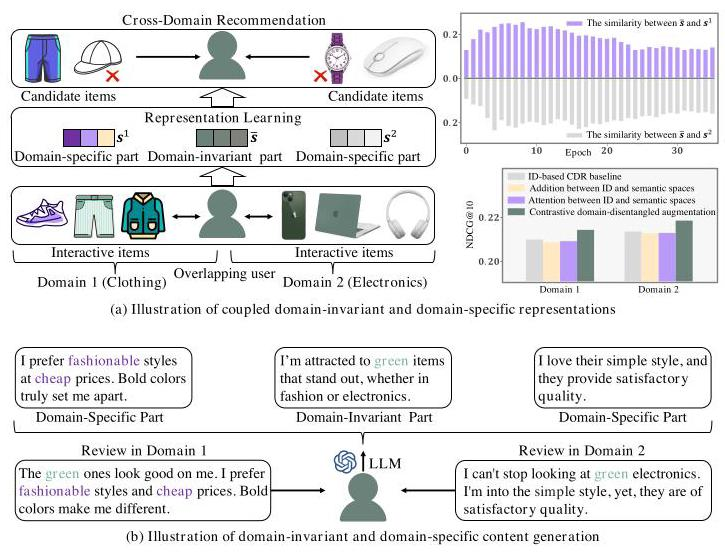
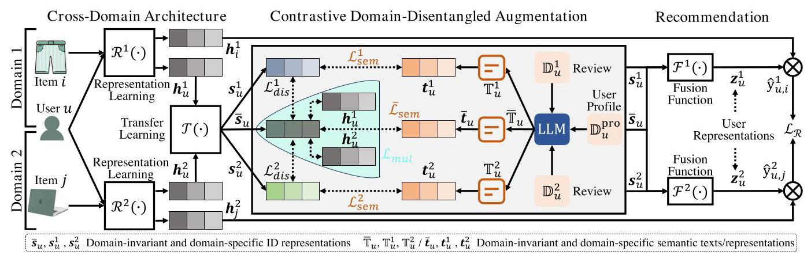
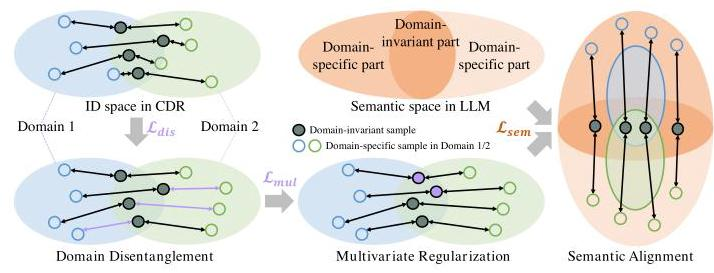
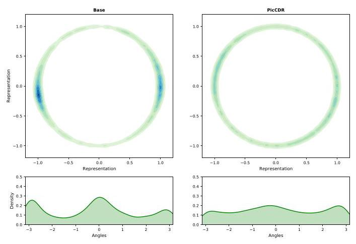
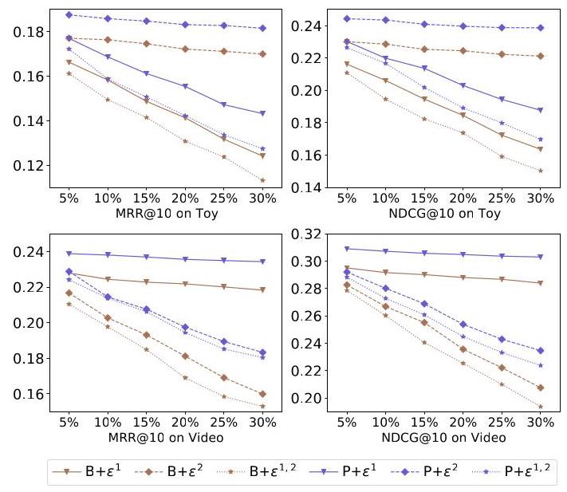

# Enhancing Cross-Domain Recommendation with Plug-In Contrastive Representations from Large Language Models

Ke Wang

one@cqu.edu.cn

Chongqing University

Chongqing, China

Ji Zhang*

j.zhang@nuaa.edu.cn

Nanjing University of Aeronautics

and Astronautics

Nanjing, China

Kuan Liu*

lk_shjd@sjtu.edu.cn

Shanghai Jiaotong University

Shanghai, China

## Abstract

Cross-Domain Recommendation (CDR) leverages auxiliary information from extra domains to enhance performance by learning domain-invariant and domain-specific representations. However, existing methods primarily rely on ID information of users and items, resulting in the entanglement of these two representations and hindering effective knowledge transfer. Therefore, we present a novel plug-in contrastive learning for CDR (PicCDR), which utilizes textual semantics to disentangle and enhance domain-invariant and domain-specific representations via LLMs. First, PicCDR introduces the CoT prompting to generate and encode content-independent domain-invariant and domain-specific texts. Next, a contrastive domain-disentangled augmentation strategy is used to align domain-invariant and domain-specific representations in the semantic space with those of ID space via MI estimation. To further enhance representations, we present contrastive MI lower-bound and upper-bound approximations to optimize MI maximization and minimization terms. We also provide theoretical proof to reveal the superiority of our contrastive strategy. Lastly, we encapsulate PicCDR into a plug-and-play framework. This allows PicCDR to be plugged into any existing CDR model. Extensive experiments show the efficiency, robustness, and generalization of PicCDR.

## CCS Concepts

- Information systems \( \rightarrow \) Data mining.

## Keywords

Cross-domain recommendation; contrastive learning; large language model

## ACM Reference Format:

Ke Wang, Ji Zhang, and Kuan Liu. 2025. Enhancing Cross-Domain Recommendation with Plug-In Contrastive Representations from Large Language Models. In Proceedings of the 48th International ACM SIGIR Conference on Research and Development in Information Retrieval (SIGIR '25), July 13-18, 2025, Padua, Italy. ACM, New York, NY, USA, 11 pages. https: //doi.org/10.1145/3726302.3729967

classroom use is granted without fee provided that copies are not made or distributed for profit or commercial advantage and that copies bear this notice and the full citation on the first page. Copyrights for components of this work owned by others than the author(s) must be honored. Abstracting with credit is permitted. To copy otherwise, or republish, to post on servers or to redistribute to lists, requires prior specific permission and/or a fee. Request permissions from permissions@acm.org.

SIGIR '25, Padua, Italy

© 2025 Copyright held by the owner/author(s). Publication rights licensed to ACM. ACM ISBN 979-8-4007-1592-1/2025/07

https://doi.org/10.1145/3726302.3729967

Figure 1: A toy example for illustration of (a) coupled domain-invariant and domain-specific representations in ID-based CDR and (b) domain content generation.

## 1 Introduction

Nowadays, recommender systems play a pivotal role in many real-life applications such as e-commerce and streaming services [79]. They model historical interactions between users and items (e.g., click and rating) to understand users' intentions. However, the inherent sparsity of user-item interactions poses a challenge, as it limits the ability to capture users' interests from sparse data, thereby constraining representation learning of data-driven models [62]. Consequently, recent endeavors integrate supplementary information from the source domain into the target domain to set up Cross-Domain Recommendation (CDR) [5, 81].

CDR techniques extract sharing knowledge between domains and then transfer them into the target domain [52]. Unlike single-domain recommendations, which capture domain-specific interest from intra-domain interactions, CDR usually learns domain-invariant features to model cross-domain preferences by leveraging overlapping users or items as a bridge \( \left\lbrack  {4,{26},{42},{43},{71}}\right\rbrack \) . However, most works only utilize historical user-item interactions to build the ID-based CDR [35, 38, 47], transforming ID information from two domains into a unified latent space to extract domain-invariant factors, while learning domain-specific features from the same ID information. As a result, domain-invariant and domain-specific parts cannot be effectively distinguished for latent transfer pattern [48]. This may affect the efficiency of knowledge transfer.

---

*Corresponding author.

---

For example in Figure 1(a), the overlapping user has interaction with green commodities in both Domain 1 (Clothing Domain) and Domain 2 (Electronics Domain), where we infer that he has a common color preference. Unluckily, ID-based CDR recommends the purple watch in Domain 2 to him because his specific interest in Domain 1 for purple shoes was mistakenly integrated into the domain-invariant part and migrated to Domain 2. To further illustrate the relatedness of domain representations, we select all overlapping users from Electronics and Clothing datasets and calculate the similarity between their domain-invariant and domain-specific ID embeddings (with 64 dimensions), as shown in Figure 1(a). We observe, in the early stages of training, the average similarity between domain-invariant embeddings and domain-specific embeddings in Domain 1 (purple bar) is more than \( {20}\% \) , which reveals that the two part embeddings derived from the same ID information are coupled to each other. Although the similarity slightly decreases as the training continues, the domain-invariant and domain-specific parts remain highly coupled, as ID-based CDR fails to directly identify effective common and differentiated knowledge via implicit knowledge transfer. Hence, a crucial question is raised: How can we effectively decouple and enhance domain-invariant and domain-specific knowledge to improve CDR?

Fortunately, user-generated texts can be used to capture fine-grained domain knowledge due to rich semantics [60]. In Figure 1(b), user reviews in two domains describe common interests (e.g., green co-occurrence or synonymous words) and specific interests (e.g., fashionable or simple words) from all aspects. More importantly, substantial advancements in Large Language Models (LLMs) have significantly transformed the learning paradigm in recommender systems, exhibiting considerable potential in bridging the divide between ID-based recommendations and real-world knowledge [39, 73]. This inspires us to leverage the comprehension and emergence capabilities of LLMs to recognize domain commonality and discrepancy based on semantic texts, and then output independent domain-invariant and domain-specific representations to enhance ID-based CDR. Along this line, we propose a novel LLM-based Plug-in contrastive Representation learning for CDR (PicCDR). This is the first attempt to merge LLMs into CDR to distill augmented domain-invariant and domain-specific knowledge. However, there are still three challenges.

Challenge 1: How to leverage LLM to extract domain-invariant and domain-specific semantic knowledge? Most existing LLM-based recommendations only exploit semantics in the single-domain pattern \( \left\lbrack  {{17},{25},{40},{52}}\right\rbrack \) and how to incorporate LLM into CDR is still an open problem. Recently, several works \( \left\lbrack  {{20},{21},{65}}\right\rbrack \) seek to generate prompt embeddings and inject them into domain knowledge transfer. Since the generated prompt-based knowledge is still derived from ID information, these studies neglect sufficient semantics and thus fail to recognize fine-grained aspects of existing user-generated content when performing transfer learning.

Solution: CoT prompting domain content generation. To this end, we take user reviews in two domains as input and harness the strong text comprehension abilities of LLM to capture the complicated semantic factors of user interests under the cross-domain pattern, prompting LLM to output independent domain-invariant and domain-specific texts in Figure 1(b). To relieve hallucination, we further propose Chain-of-Thought (CoT) prompting [66] to guide LLM to improve output accuracy and relevance through a context-aware reasoning process. By delving into the user intentions and decision-making behaviors behind reviews, CoT prompting helps guarantee that the domain-invariant output maintains consistency and coherence across domains while two domain-specific outputs retain disparity within each domain's context.

Challenge 2: Can semantic representations enhance ID-based CDR? From the previous discussion, we know that domain-invariant and domain-specific representations in the ID-based CDR have coupled factors, which are likely to be intermingled with redundancy and irrelevant noise. We try to encode three types of output texts to produce domain-invariant and domain-specific semantic representations, respectively, and directly combine them with corresponding ID representations through addition and attention operations. However, these straightforward ways do not achieve improvement or even cause performance degradation, from the table in Figure 1(a). This is largely due to the misalignment between the semantic space of LLM and the ID space of CDR [82].

Solution: Contrastive domain-disentangled augmentation strategy. Motivated by information theory and contrastive learning \( \left\lbrack  {9,{51}}\right\rbrack \) , a contrastive domain-disentangled strategy is designed to align semantic representations with ID representations through Mutual Information (MI) estimation. It maximizes the MI of semantic and ID representations to narrow the gap between LLM and CDR while minimizing the MI of domain-invariant and domain-specific parts to disentangle domain knowledge. To augment domain-invariant and domain-specific representations, we present contrastive MI lower-bound and upper-bound approximations to optimize MI maximization and minimization terms by combining MI estimation with contrastive learning. In this way, augmented representations can acquire informative elements and exhibit statistical independence from one another. We also provided theoretical proof to demonstrate the superiority of our contrastive strategy.

Challenge 3: How scalable is the proposed PicCDR? Most methods focus on designing customized structures to build the recommendation tasks [16]. While these specialized methods lead to optimized performance within handpicked CDR tasks, they limit the generalizability of CDR and face scalability challenges.

Solution: Model-agnostic plug-in framework. For this purpose, we further encapsulate PicCDR into a plug-and-play framework by modularizing the contrastive domain-disentangled augmentation component. This flexible plug-in framework allows us to seamlessly integrate PicCDR into any existing CDR methods and improve performance. We integrate PicCDR with state-of-the-art CDR models to evaluate the efficiency, robustness, and generalization ability. Extensive experiments show the advantages of PicCDR.

## 2 Preliminaries and Related Works

In this section, we give some notations and definitions. Let \( \mathcal{U} = \; \left\{  {{u}_{1},{u}_{2},\ldots ,{u}_{M}}\right\} \) denote the set of overlapping users between domains and \( {\mathcal{I}}^{d} = \left\{  {{i}_{1}^{d},{i}_{2}^{d},\ldots ,{i}_{{N}^{d}}^{d}}\right\} \) represent the set of items in the domain \( d.d \) is a domain indicator with \( d \in  \{ 1,2\} \) . The user-item interaction matrix of domain \( d \) is defined as \( {\mathbf{R}}^{d} \in  {\mathbb{R}}^{\left| M\right|  \times  \left| {N}^{d}\right| } \) , where each entry of \( {\mathbf{R}}^{d} \) is set to 1 if the user has interacted with the item in domain \( d \) , otherwise the entry is set to 0 . The initial embeddings of each user and item in domain \( d \) are initialized to \( {\mathbf{e}}_{u}^{d} \in  {\mathbb{R}}^{l} \) and \( {\mathbf{e}}_{i}^{d} \in  {\mathbb{R}}^{l} \) .

### 2.1 Cross-Domain Recommendation

CDR has emerged as a potent solution for mitigating the data sparsity and cold-start issues \( \left\lbrack  {{11},{70}}\right\rbrack \) . They extracted knowledge derived from the source domain as an auxiliary gain and then conducted transfer learning to achieve the single-target \( \left\lbrack  {{14},{32},{33},{35},{80}}\right\rbrack \) or multi-target \( \left\lbrack  {{10},{45},{48},{81},{81},{84},{85}}\right\rbrack \) recommendation task. For example, EMCDR [47] utilized the abundant information from the source domain to enhance the single-target domain. MAN [38] designed local and global attention modules to learn domain-specific and cross-domain representations for dual-target recommendation. However, most existing CDR methods only rely on single ID-based signals, which is not suitable for developing transferable paradigms [36]. Consequently, some studies extracted modality information to transfer semantic knowledge [59, 83]. For example, JPEDET [44] learned accurate and bidirectional transformation via dynamic embedding transportation by fusing rating and review information for CDR. DASFE [64] constructed the knowledge graph to explore the cross-domain correlation from the perspectives of content se-manticity and structural connectivity. GDCCDR [41] formulated contrastive learning-based constraints to facilitate personalized transfer of domain-invariant features via meta-networks. However, they ignored the coupled context between domain-invariant and domain-specific parts derived from ID-based information [48]. Different from the above methods, our work proposed a prompt generation and contrastive disentanglement for the dual-target recommendation by introducing LLMs.

### 2.2 LLMs for Recommendation

Recent advancements involving LLMs have demonstrated considerable potential in tackling intricate recommendation challenges \( \left\lbrack  {{12},{58}}\right\rbrack \) . According to the role of LLMs, recommender systems can be categorized into two types: LLM-oriented models [2, 19, 28, 37, \( {69},{72},{76}\rbrack \) and LLM-assisted models [13,17,22,49,61,68,75]. LLM-oriented models directly employ LLMs to generate and recommend candidate items. A typical pipeline, such as P5 [18], UP5 [28], and VIP5 [19], fine-tuned LLMs to accomplish zero-shot generalization via personalized prompts. Additionally, TALLRec [2] and In-structRec [76] treated the item recommendation as the instruction-following task. LLM-oriented recommendations produce diverse and creative candidate items, but they pose challenges regarding authenticity and reliability of generated items. LLM-assisted way views LLMs as assistants and controllers to enhance conventional recommender systems with semantic knowledge. By integrating the understanding and reasoning capabilities, LLMs generate or encode augmented text features to improve the produce recommendation \( \left\lbrack  {{22},{24},{27},{57}}\right\rbrack \) , news recommendation \( \left\lbrack  {{67},{77},{78}}\right\rbrack \) , and job recommendation [13]. When acting as controllers, LLMs extend models to other relevant tasks like conversational recommendation \( \left\lbrack  {{15},{29}}\right\rbrack \) , agent \( \left\lbrack  {{63},{75}}\right\rbrack \) , and behavior simulation [74]. Unfortunately, they are mainly used in single-domain recommendation and are not suitable for text generation and feature enhancement in CDR scenarios. In this paper, we utilize LLMs as an assistant to enhance CDR by generating domain-invariant and domain-specific content.

## 3 PicCDR

We first summarize the representation learning and transfer learning in CDR, then present the contrastive domain-disentangled augmentation strategy in detail, together with the theoretical proof and analyses. Finally, we build the CDR recommendation tasks and propose a model-agnostic plug-in paradigm in Figure 2.

### 3.1 Cross-Domain Architecture

3.1.1 Intra-Domain Representation Learning. Given the initial em-beddings \( {\mathbf{e}}^{d} = \left\{  {{\mathbf{e}}_{u}^{d},{\mathbf{e}}_{i}^{d}}\right\} \) and the interaction matrix \( {\mathbf{R}}^{d} \) , the goal of CDR is to first build an intra-domain representation learning module to learn user and item representations in domain \( d \) :

\[
{\mathbf{h}}^{d} = {\mathcal{R}}^{d}\left( {{\mathbf{e}}^{d},{\mathbf{R}}^{d}}\right) \tag{1}
\]

where \( {\mathcal{R}}^{d} \) denotes the representation learning module in domain \( d \) .

3.1.2 Inter-Domain Transfer Learning. To achieve the recommendation of the target domain, CDR fuses domain knowledge from the source domain to achieve inter-domain transfer learning and output domain-invariant and domain-specific representations as follows:

\[
\bar{s},{s}^{d} = \mathcal{T}\left( {{\mathbf{h}}^{1},{\mathbf{h}}^{2}}\right) , \tag{2}
\]

where \( \mathcal{T} \) is the transfer learning module. \( \bar{s} \) is domain-invariant representations. \( {s}^{d} \) is domain-specific representations in domain \( d \) .

### 3.2 Contrastive Domain-Disentangled Augmentation

3.2.1 LLM-based Domain Generation. LLM-based domain generation leverages LLM to generate and encode domain-invariant and domain-specific semantics.

Domain Content Generation. The notable advance of LLMs in a variety of linguistic tasks has boosted an investigation into user behaviors and intentions in recommender systems [46]. In the CDR paradigm, we want to split the semantics of user-generated reviews to separate domain-invariant and domain-specific parts through powerful language comprehension capabilities. In particular, we formulate the generation process of LLM as follows:

\[
{\overline{\mathbb{T}}}_{u},{\mathbb{T}}_{u}^{d} = \operatorname{LLM}\left( {\mathbb{P},{\mathbb{D}}_{u}^{1},{\mathbb{D}}_{u}^{2}}\right) \tag{3}
\]

where \( {\mathbb{D}}_{u}^{1} \) and \( {\mathbb{D}}_{u}^{2} \) are reviews from Domains 1 and 2, respectively. \( u = \{ 1,2,\ldots , M\} \) is the indicator of overlapping users. \( \mathbb{P} \) is the prompt that activates the LLM to generate domain-invariant content \( {\overline{\mathbb{T}}}_{u} \) and domain-specific content \( {\mathbb{T}}_{u}^{d} \) based on \( {\mathbb{D}}_{u}^{1} \) and \( {\mathbb{D}}_{u}^{2} \) . The details are shown in the upper part of Figure 3. However, when directly introducing two domains that are quite different, this simple prompt strategy may limit LLM to understand and generate contextually accurate information across domains.

Chain-of-Thought (CoT) Prompting. To tackle the above challenge, we adopt CoT prompting [66] to synergize user intentions behind reviews in both domains. We further integrate the user profile to perform contextual reasoning and improve the output quality. Specifically, we collect information about the attributes (e.g., product title, description, and category) of items that the user has interacted with to form a user profile \( {\mathbb{D}}_{u}^{pro} \) . We then supplement the profile \( {\mathbb{D}}_{u}^{\text{ pro }} \) to the prompt template \( {\mathbb{P}}^{\text{ pro }} \) by uniformly understanding review semantics and context clues. The details of \( {\mathbb{P}}^{\text{ pro }} \) are shown in the lower part of Figure 3. The process of domain content generation via CoT prompting is modified as follows:

\[
{\overline{\mathbb{T}}}_{u},{\mathbb{T}}_{u}^{d} = \operatorname{LLM}\left( {{\mathbb{P}}^{pro},{\mathbb{D}}_{u}^{1},{\mathbb{D}}_{u}^{2},{\mathbb{D}}_{u}^{pro}}\right) . \tag{4}
\]

Figure 2: Illustration of PicCDR. \( {\mathcal{R}}^{d},\mathcal{T} \) , and \( {\mathcal{F}}^{d} \) are generic CDR modules. \( {\mathcal{L}}_{dis} = \left\{  {{\mathcal{L}}_{dis}^{1},{\mathcal{L}}_{dis}^{2}}\right\}  ,{\mathcal{L}}_{mul},{\mathcal{L}}_{sem} = \left\{  {{\mathcal{L}}_{sem}^{1},{\mathcal{L}}_{sem},{\mathcal{L}}_{sem}^{2}}\right\} \) denote the constraints of domain disentanglement, multivariate regularization, and semantic alignment, respectively.

## User Review Generation Prompt Template

Please summarize the user's common and domain-specific content based on his reviews in both two domains to generate three succinct new reviews by restoring the original content as much as possible, where the common review emphasizes similar aspects between the two domains, and two domain-specific reviews only retain domain-specific aspects. Each review is mutually exclusive and does not contain each other. The user's review in Domain 1 is \( < {\mathbb{D}}_{u}^{1} > \) . The user’s review in Domain 2 is \( < {\mathbb{D}}_{u}^{2} > \) .

## User Review Generation CoT Prompt Template

Please summarize the user's common and domain-specific content based on his reviews in both two domains to generate three succinct new reviews by restoring the original content as much as possible, where the common review emphasizes similar aspects between the two domains, and two domain-specific reviews only retain domain-specific aspects. Each review is mutually exclusive and does not contain each other. The user's review in Domain 1 is \( < {\mathbb{D}}_{u}^{1} > \) . The user’s review in Domain 2 is \( < {\mathbb{D}}_{u}^{2} > \) . Please briefly explain the reasoning for the generated review and append the reasoning to the generated review based on the following user profiles: \( < {\mathbb{D}}_{u}^{\text{ pro }} > \) .

Figure 3: The difference between simple and CoT prompts.

Next, the generated domain-invariant content \( {\overline{\mathbb{T}}}_{u} \) and domain-specific content \( {\mathbb{T}}_{u}^{d} \) are encoded as semantic representations. Here, LLM is used as a language encoder to provide advanced and efficient text embedding capabilities. Formally, the language encoder is defined as:

\[
{\overline{\mathbf{t}}}_{u} = \operatorname{LLM}\left( {\overline{\mathbb{T}}}_{u}\right) ,{\mathbf{t}}_{u}^{d} = \operatorname{LLM}\left( {\mathbb{T}}_{u}^{d}\right) , \tag{5}
\]

where \( {\overline{\mathbf{t}}}_{u},{\mathbf{t}}_{u}^{d} \in  {\mathbb{R}}^{{l}_{t}} \) are semantic representations with the hidden dimension \( {l}_{t} \) . Note that we utilize the embedding capability of \( \operatorname{LLM}\left( \cdot \right) \) to encode textual information, thereby maximizing the preservation of semantic content within the texts \( {\overline{\mathbb{T}}}_{u} \) and \( {\mathbb{T}}_{u}^{d} \) .

3.2.2 Domain-Disentangled Augmentation. Domain-disentangled augmentation seeks to refine decoupled and efficient domain representations, mainly consisting of three components, as shown in Figure 4. (1) To reliably identify domain-invariant and domain-specific factors, we utilize MI minimization \( {\mathcal{L}}_{\text{ dis }} \) to disentangle domain representations. (2) To facilitate the information gain of shared content between two different domains, we introduce multivariate MI maximization regularization \( {\mathcal{L}}_{\text{ mul }} \) to enhance domain-invariant representations. (3) To bridge the differences between the LLM and CDR, we utilize MI maximization \( {\mathcal{L}}_{\text{ sem }} \) to align semantic and ID representations. The details are as follows.

Domain Disentanglement. To effectively distinguish between domain-invariant and domain-specific representations, we introduce disentanglement learning [1] to keep these two types statistically independent of each other. Consequently, the decoupled representations are capable of revealing distinct underlying factors that may be obscured within the observable data. Concretely, we utilize domain disentanglement regularization to minimize the MI between domain-invariant and domain-specific representations:

\[
{\mathcal{L}}_{\text{ dis }} = \mathop{\sum }\limits_{{d = 1}}^{D}I\left( {{\bar{s}}_{u};{s}_{u}^{d}}\right)  = I\left( {{\bar{s}}_{u};{s}_{u}^{1}}\right)  + I\left( {{\bar{s}}_{u};{s}_{u}^{2}}\right) , \tag{6}
\]

where minimizing \( I\left( {{\bar{s}}_{u},{s}_{u}^{1}}\right) \) and \( I\left( {{\bar{s}}_{u},{s}_{u}^{2}}\right) \) guarantees that the domain-invariant part \( \left( {\bar{s}}_{u}\right) \) remains mutually exclusive from the domain-specific parts \( \left( {s}_{u}^{1}\right. \) and \( \left. {s}_{u}^{2}\right) \) .

Multivariate Regularization. However, only maintaining independent domain-invariant representations does not ensure that the learned representations \( {\bar{s}}_{u} \) fully absorb the common knowledge from both domains. To this end, we further introduce the MI term:

\[
{\mathcal{L}}_{\text{ mul }} = I\left( {{\overline{\mathbf{s}}}_{u};{\mathbf{h}}_{u}^{1};{\mathbf{h}}_{u}^{2}}\right) , \tag{7}
\]

where maximizing \( I\left( {{\overline{\mathbf{s}}}_{u};{\mathbf{h}}_{u}^{1};{\mathbf{h}}_{u}^{2}}\right) \) promotes modality-invariant representations to encapsulate the commonalities inherent in both two domains to the greatest extent possible. According to the deduction of multivariate MI with three variables [54], \( I\left( {{\overline{\mathbf{s}}}_{u};{\mathbf{h}}_{u}^{1};{\mathbf{h}}_{u}^{2}}\right) \) can be rewritten in the following form when given \( {\mathbf{h}}_{u}^{2} \) :

\[
{I}_{1}\left( {{\overline{\mathbf{s}}}_{u};{\mathbf{h}}_{u}^{1};{\mathbf{h}}_{u}^{2}}\right)  = I\left( {{\overline{\mathbf{s}}}_{u};{\mathbf{h}}_{u}^{1}}\right)  - I\left( {{\overline{\mathbf{s}}}_{u};{\mathbf{h}}_{u}^{1} \mid  {\mathbf{h}}_{u}^{2}}\right) , \tag{8}
\]

where the conditional MI \( I\left( {{\overline{\mathbf{s}}}_{u};{\mathbf{h}}_{u}^{1} \mid  {\mathbf{h}}_{u}^{2}}\right) \) quantifies the amount of information between \( {\overline{\mathbf{s}}}_{u} \) and \( {\mathbf{h}}_{u}^{1} \) when knowing \( {\mathbf{h}}_{u}^{2} \) . From the deduction, maximizing \( {I}_{1}\left( {{\overline{\mathbf{s}}}_{u};{\mathbf{h}}_{u}^{1};{\mathbf{h}}_{u}^{2}}\right) \) is equivalent to encouraging \( {\overline{\mathbf{s}}}_{u} \) to absorb enough information from \( {\mathbf{h}}_{u}^{1} \) (namely maximizing \( I\left( {{\overline{\mathbf{s}}}_{u};{\mathbf{h}}_{u}^{1}}\right) \) ) while enabling \( {\bar{s}}_{u} \) to be inferred from the \( {\mathbf{h}}_{u}^{2} \) (namely minimizing \( I\left( {{\overline{\mathbf{s}}}_{u};{\mathbf{h}}_{u}^{1} \mid  {\mathbf{h}}_{u}^{2}}\right) \) . Similarity, when \( {\mathbf{h}}_{u}^{1} \) is provided, \( I\left( {{\overline{\mathbf{s}}}_{u};{\mathbf{h}}_{u}^{1};{\mathbf{h}}_{u}^{2}}\right) \) can also be described as follows:

\[
{I}_{2}\left( {{\overline{\mathbf{s}}}_{u};{\mathbf{h}}_{u}^{1};{\mathbf{h}}_{u}^{2}}\right)  = I\left( {{\overline{\mathbf{s}}}_{u};{\mathbf{h}}_{u}^{2}}\right)  - I\left( {{\overline{\mathbf{s}}}_{u};{\mathbf{h}}_{u}^{2} \mid  {\mathbf{h}}_{u}^{1}}\right) . \tag{9}
\]

Figure 4: Illustration of domain-disentangled augmentation.

To optimize the dual-target recommendation simultaneously, we integrate \( {I}_{1}\left( {{\overline{\mathbf{s}}}_{u};{\mathbf{h}}_{u}^{1};{\mathbf{h}}_{u}^{2}}\right) \) and \( {I}_{2}\left( {{\overline{\mathbf{s}}}_{u};{\mathbf{h}}_{u}^{1};{\mathbf{h}}_{u}^{2}}\right) \) into the multivariate regularization:

\[
{\mathcal{L}}_{\text{ mul }} = {I}_{1}\left( {{\overline{\mathbf{s}}}_{u};{\mathbf{h}}_{u}^{1};{\mathbf{h}}_{u}^{2}}\right)  + {I}_{2}\left( {{\overline{\mathbf{s}}}_{u};{\mathbf{h}}_{u}^{1};{\mathbf{h}}_{u}^{2}}\right) . \tag{10}
\]

Semantic Alignment. To align the semantic representations \( \left( {{\overline{\mathbf{t}}}_{u}\text{ , }}\right. \; {\mathbf{t}}_{u}^{1} \) , and \( {\mathbf{t}}_{u}^{2} \) ) in LLM with ID representations \( \left( {{\overline{\mathbf{s}}}_{u},{\mathbf{s}}_{u}^{1}\text{ , and }{\mathbf{s}}_{u}^{2}}\right) \) in CDR, we maximize their MI to reduce the distance between the semantic and ID representations:

\[
{\mathcal{L}}_{\text{ sem }} = I\left( {{\overline{\mathbf{s}}}_{u};{\overline{\mathbf{t}}}_{u}}\right)  + \mathop{\sum }\limits_{{d = 1}}^{D}I\left( {{\mathbf{s}}_{u}^{d};{\mathbf{t}}_{u}^{d}}\right)  = I\left( {{\overline{\mathbf{s}}}_{u};{\overline{\mathbf{t}}}_{u}}\right)  + I\left( {{\mathbf{s}}_{u}^{1};{\mathbf{t}}_{u}^{1}}\right)  + I\left( {{\mathbf{s}}_{u}^{2};{\mathbf{t}}_{u}^{2}}\right) .
\]

(11)

By encoding three types of textual contents into different semantic spaces, semantic representations maintain a certain degree of independence. Therefore, maximizing the MI between semantic representations and their corresponding ID representations not only reconciles the differences between semantic and ID spaces but also brings three types of ID representations closer to their own semantic spaces, further refining disentangled representations.

3.2.3 Contrastive Optimization. After obtaining \( {\mathcal{L}}_{\text{ dis }},{\mathcal{L}}_{\text{ mul }} \) , and \( {\mathcal{L}}_{\text{ sem }} \) , the overall regularization of domain-disentangled augmentation is to maximize the three terms:

\[
{\mathcal{L}}_{\text{ dda }} = {\mathcal{L}}_{\text{ sem }} + {\mathcal{L}}_{\text{ mul }} - {\mathcal{L}}_{\text{ dis }}
\]

MI maximization term

\[
= I\left( {{\overline{\mathbf{s}}}_{u};{\overline{\mathbf{t}}}_{u}}\right)  + \mathop{\sum }\limits_{{d = 1}}^{D}I\left( {{s}_{u}^{d};{\mathbf{t}}_{u}^{d}}\right)  + I\left( {{\overline{\mathbf{s}}}_{u};{\mathbf{h}}_{u}^{1}}\right)  + I\left( {{\overline{\mathbf{s}}}_{u};{\mathbf{h}}_{u}^{2}}\right)  - \tag{12}
\]

MI minimization term

\[
\left( {\mathop{\sum }\limits_{{d = 1}}^{D}I\left( {{\overline{\mathbf{s}}}_{u};{\mathbf{s}}_{u}^{d}}\right)  + I\left( {{\overline{\mathbf{s}}}_{u};{\mathbf{h}}_{u}^{1} \mid  {\mathbf{h}}_{u}^{2}}\right)  + I\left( {{\overline{\mathbf{s}}}_{u};{\mathbf{h}}_{u}^{2} \mid  {\mathbf{h}}_{u}^{1}}\right) }\right) ,
\]

where the overall regularization \( {\mathcal{L}}_{dda} \) jointly optimizes the MI maximization and minimization terms. However, the MI estimation is incredibly complex, especially in high-dimensional vector spaces for representation learning [53]. Motivated by the sample-based estimation approaches \( \left\lbrack  {3,8}\right\rbrack \) , we combine MI estimation with contrastive learning by assessing the disparity in conditional probabilities between positive and negative samples. Next, we propose two contrastive strategies to optimize \( {\mathcal{L}}_{dda} \) .

Lower-Bound Approximation for MI Maximization Term. To encourage the similarities between representations, we introduce the lower-bound estimation InfoNCE [51] to approximate MI (taking the term \( I\left( {{\overline{\mathbf{s}}}_{u};{\overline{\mathbf{t}}}_{u}}\right) \) as an example):

\[
{\mathcal{L}}_{\text{ max }}^{1} =  - \mathbb{E}\left\lbrack  {\frac{1}{M}\mathop{\sum }\limits_{{i = 1}}^{M}\log \frac{c\left( {{\overline{\mathbf{s}}}_{u, i},{\overline{\mathbf{t}}}_{u, i}}\right) }{\mathop{\sum }\limits_{{j = 1}}^{M}c\left( {{\overline{\mathbf{s}}}_{u, i},{\overline{\mathbf{t}}}_{u, j}}\right) }}\right\rbrack  , \tag{13}
\]

where the expectation could be calculated using \( M \) observed samples \( {\left\{  \left( {\overline{\mathbf{s}}}_{u, i},{\overline{\mathbf{t}}}_{u, i}\right) \right\}  }_{i = 1}^{M} \) derived from the joint distribution \( p\left( {{\overline{\mathbf{s}}}_{u},{\overline{\mathbf{t}}}_{u}}\right) \) . \( c\left( {{\bar{s}}_{u},{\bar{t}}_{u}}\right)  \propto  p\left( {{\bar{s}}_{u} \mid  {\bar{t}}_{u}}\right) /p\left( {\bar{s}}_{u}\right) \) and \( c\left( {\cdot , \cdot  }\right) \) is a score function that is defined as \( c\left( {{\bar{s}}_{u, i},{\bar{t}}_{u, i}}\right)  = {e}^{\left( s\left( {\bar{s}}_{u, i},{\sigma }_{ \downarrow  }\left( {\bar{t}}_{u, i}\right) \right) /\tau \right) } \cdot  s\left( {\cdot , \cdot  }\right) \) is the similarity function that computes the cosine similarity between two representation vectors. \( \tau \) is a temperature parameter. \( {\sigma }_{ \downarrow  }\left( \cdot \right) \) is a multi-layer perception that transforms the semantic representations \( {\bar{t}}_{u, i} \) into the vector space of \( {\bar{s}}_{u, i} \) .

Proposition 1. Given \( M \) observed samples \( {\left\{  \left( {\overline{\mathbf{s}}}_{u, i},{\overline{\mathbf{t}}}_{u, i}\right) \right\}  }_{i = 1}^{M} \) drawn from the joint distribution \( p\left( {{\overline{\mathbf{s}}}_{u},{\overline{\mathbf{t}}}_{u}}\right) \) , minimizing the contrastive loss \( {\mathcal{L}}_{\text{ max }}^{1} \) is equivalent to maximizing a lower-bound of the MI term \( I\left( {{\overline{\mathbf{s}}}_{u};{\overline{\mathbf{t}}}_{u}}\right) \) .

Proof. Combining the distribution \( p\left( {{\overline{\mathbf{t}}}_{u},{\overline{\mathbf{s}}}_{u}}\right)  = p\left( {{\overline{\mathbf{t}}}_{u} \mid  {\overline{\mathbf{s}}}_{u}}\right)  \cdot  p\left( {\overline{\mathbf{s}}}_{u}\right) \) , the MI term \( I\left( {{\overline{\mathbf{t}}}_{u, i};{\overline{\mathbf{s}}}_{u, i}}\right) \) is described as:

\[
I\left( {{\bar{t}}_{u, i};{\bar{s}}_{u, i}}\right)  = \mathbb{E}\log \left\lbrack  \frac{p\left( {{\bar{t}}_{u, i},{\bar{s}}_{u, i}}\right) }{p\left( {\bar{t}}_{u, i}\right)  \cdot  p\left( {\bar{s}}_{u, i}\right) }\right\rbrack   = \mathbb{E}\log \left\lbrack  \frac{p\left( {{\bar{t}}_{u, i} \mid  {\bar{s}}_{u, i}}\right) }{p\left( {\bar{t}}_{u, i}\right) }\right\rbrack \tag{14}
\]

\[
=  - \mathbb{E}\log \left\lbrack  \frac{M}{p\left( {{\overline{\mathbf{t}}}_{u, i} \mid  {\bar{s}}_{u, i}}\right) /p\left( {\overline{\mathbf{t}}}_{u, i}\right) }\right\rbrack   + \log M \tag{15}
\]

\[
\geq   - \mathbb{E}\log \left\lbrack  {1 + \frac{M - 1}{p\left( {{\bar{t}}_{u, i} \mid  {\bar{s}}_{u, i}}\right) /p\left( {\bar{t}}_{u, i}\right) }}\right\rbrack   + \log M \tag{16}
\]

\[
=  - \mathbb{E}\log \left\lbrack  {1 + \frac{\left( {M - 1}\right) \mathbb{E}p\left( {{\mathbf{r}}_{u, j} \mid  {s}_{u, i}}\right) /p\left( {\mathbf{r}}_{u, j}\right) }{p\left( {{\overline{\mathbf{t}}}_{u, i} \mid  {\bar{s}}_{u, i}}\right) /p\left( {\overline{\mathbf{t}}}_{u, i}\right) }}\right\rbrack   + \log M
\]

(17)

\[
\approx   - \mathbb{E}\log \left\lbrack  {1 + \frac{{\bar{t}}_{u, j} \in  {S}_{\text{ neg }}p\left( {{\bar{t}}_{u, j} \mid  {\bar{s}}_{u, i}}\right) /p\left( {\bar{t}}_{u, j}\right) }{p\left( {{\bar{t}}_{u, i} \mid  {\bar{s}}_{u, i}}\right) /p\left( {\bar{t}}_{u, i}\right) }}\right\rbrack   + \log M
\]

(18)

\[
= \mathbb{E}\log \left\lbrack  \frac{\frac{p\left( {{\bar{t}}_{u, i} \mid  {\bar{s}}_{u, i}}\right) }{p\left( {\bar{t}}_{u, i}\right) }}{\frac{p\left( {{\bar{t}}_{u, i} \mid  {\bar{s}}_{u, i}}\right) }{p\left( {\bar{t}}_{u, i}\right) } + \frac{\mathbb{E}}{{\bar{t}}_{u, j} \in  {S}_{\text{ neg }}}\frac{p\left( {{\bar{t}}_{u, j} \mid  {\bar{s}}_{u, i}}\right) }{p\left( {\bar{t}}_{u, j}\right) }}\right\rbrack   + \log M \tag{19}
\]

\[
= \mathbb{E}\log \left\lbrack  \frac{c\left( {{\overline{\mathbf{t}}}_{u, i},{\overline{\mathbf{s}}}_{u, i}}\right) }{\mathop{\sum }\limits_{{j = 1}}^{M}c\left( {{\overline{\mathbf{t}}}_{u, j},{\overline{\mathbf{s}}}_{u, i}}\right) }\right\rbrack   + \log M,
\]

(20)

where \( {S}_{\text{ neg }} = S \smallsetminus  {\bar{s}}_{u, i} \) indicates the negative samples when evaluating the \( i \) -th sample. Combining the symmetry of MI, we will get the following inequality:

\[
I\left( {{\bar{s}}_{u};{\bar{t}}_{u}}\right)  = \frac{1}{M}\mathop{\sum }\limits_{{i = 1}}^{M}I\left( {{\bar{s}}_{u, i};{\bar{t}}_{u, i}}\right)  = \frac{1}{M}\mathop{\sum }\limits_{{i = 1}}^{M}I\left( {{\bar{t}}_{u, i};{\bar{s}}_{u, i}}\right) \tag{21}
\]

\[
\geq  \frac{1}{M}\mathop{\sum }\limits_{{i = 1}}^{M}\mathbb{E}\log \left\lbrack  \frac{c\left( {{\overline{\mathbf{s}}}_{u, i},{\overline{\mathbf{t}}}_{u, i}}\right) }{\mathop{\sum }\limits_{{j = 1}}^{M}c\left( {{\overline{\mathbf{s}}}_{u, i},{\overline{\mathbf{t}}}_{u, j}}\right) }\right\rbrack   + \log M \tag{22}
\]

\[
=  - {\mathcal{L}}_{\max }^{1} + \log M \tag{23}
\]

Hence, minimizing the contrastive loss \( {\mathcal{L}}_{\text{ max }}^{1} \) is equivalent to maximizing a lower-bound of the MI term \( I\left( {{\bar{s}}_{u};{\overline{\mathbf{t}}}_{u}}\right) \) . Similarly, we can follow the above process for the remaining three MI terms (i.e., \( \left. {\mathop{\sum }\limits_{{d = 1}}^{D}I\left( {{\mathbf{s}}_{u}^{d};{\mathbf{t}}_{u}^{d}}\right) , I\left( {{\overline{\mathbf{s}}}_{u};{\mathbf{h}}_{u}^{1}}\right) , I\left( {{\overline{\mathbf{s}}}_{u};{\mathbf{h}}_{u}^{2}}\right) }\right) \) and obtain the contrastive losses \( {\mathcal{L}}_{\text{ max }}^{2},{\mathcal{L}}_{\text{ max }}^{3} \) , and \( {\mathcal{L}}_{\text{ max }}^{4} \) .

Upper-Bound Approximation for MI Minimization Term. To minimize the similarities between representations, we introduce the upper-bound estimation CLUB [9] to approximate MI as follows (taking the term \( \mathop{\sum }\limits_{{d = 1}}^{D}I\left( {{\bar{s}}_{u};{s}_{u}^{d}}\right) \) as an example):

\[
{\mathcal{L}}_{\min }^{1} = \frac{1}{M}\mathop{\sum }\limits_{{d = 1}}^{D}\left( {\mathop{\sum }\limits_{{i = 1}}^{M}\left\lbrack  {\log {p}_{\omega }\left( {{\overline{\mathbf{s}}}_{u, i},{s}_{u, i}^{d}}\right)  - \frac{1}{M}\mathop{\sum }\limits_{{j = 1}}^{M}\log {p}_{\omega }\left( {{\overline{\mathbf{s}}}_{u, i},{s}_{u, j}^{d}}\right) }\right\rbrack  }\right) ,
\]

(24)

where \( {\mathcal{L}}_{\text{ min }}^{1} \) is an unbiased estimation of the variational CLUB \( {\mathcal{L}}_{CLUB}^{1} = \mathop{\sum }\limits_{{d = 1}}^{D}\left( {{\mathbb{E}}_{p\left( {{\overline{\mathbf{s}}}_{u},{s}_{u}^{d}}\right) }\left\lbrack  {\log {p}_{\omega }\left( {{\overline{\mathbf{s}}}_{u},{s}_{u}^{d}}\right) }\right\rbrack   - {\mathbb{E}}_{p\left( {\overline{\mathbf{s}}}_{u}\right) }{\mathbb{E}}_{p\left( {s}_{u}^{d}\right) }\left\lbrack  {\log {p}_{\omega }}\right. }\right. \; \left. \left. \left( {{\overline{\mathbf{s}}}_{u},{s}_{u}^{d}}\right) \right\rbrack  \right) \) with sample pairs \( {\left\{  {\left\{  \left( {\overline{\mathbf{s}}}_{u, i},{s}_{u, i}^{d}\right) \right\}  }_{i = 1}^{M}\right\}  }_{d = 1}^{D} \) . The variational distribution probability \( {p}_{\omega }\left( {{\overline{\mathbf{s}}}_{u},{s}_{u}^{d}}\right) \) with parameter \( \omega \) is utilized to approximate \( p\left( {{\overline{\mathbf{s}}}_{u},{s}_{u}^{d}}\right) \) and \( {p}_{\omega }\left( {{\overline{\mathbf{s}}}_{u, i},{s}_{u, i}^{d}}\right)  = {e}^{\left( s\left( {\overline{\mathbf{s}}}_{u, i},{\sigma }_{(}\left( {s}_{u, i}^{d}\right) \right) /\tau \right) } \cdot  s\left( {\cdot , \cdot  }\right) \) is the similarity function and \( {\sigma }_{ \downarrow  }\left( \cdot \right) \) is the multi-layer perception.

Proposition 2. Given the observed samples \( {\left\{  {\left\{  \left( {\overline{\mathbf{s}}}_{u, i},{s}_{u, i}^{d}\right) \right\}  }_{i = 1}^{M}\right\}  }_{d = 1}^{D} \) drawn from the joint distribution probability \( p\left( {{\bar{s}}_{u, i},{s}_{u, i}^{d}}\right) \) , minimizing the contrastive loss \( {\mathcal{L}}_{\text{ min }}^{1} \) is equivalent to minimizing a log-ratio upper-bound \( {\mathcal{L}}_{CLUB}^{1} \) of the MI term \( \mathop{\sum }\limits_{{d = 1}}^{D}I\left( {{\bar{s}}_{u};{s}_{u}^{d}}\right) \) .

Proof. The variational joint distribution \( {p}_{\omega }\left( {{\overline{\mathbf{s}}}_{u},{\mathbf{s}}_{u}^{d}}\right) \) induced by \( {p}_{\omega }\left( {{s}_{u}^{d} \mid  {\overline{\mathbf{s}}}_{u}}\right) \) can be expressed as \( {p}_{\omega }\left( {{\overline{\mathbf{s}}}_{u},{s}_{u}^{d}}\right)  = {p}_{\omega }\left( {{s}_{u}^{d} \mid  {\overline{\mathbf{s}}}_{u}}\right) p\left( {\overline{\mathbf{s}}}_{u}\right) \) . Therefore, the deduction of \( {\mathcal{L}}_{CLUB}^{1} \) is the following:

\[
{\mathcal{L}}_{CLUB}^{1} = \mathop{\sum }\limits_{{d = 1}}^{D}\left\{  {{\mathbb{E}}_{p\left( {{\overline{\mathbf{s}}}_{u},{s}_{u}^{d}}\right) }\left\lbrack  {\log {p}_{\omega }\left( {{s}_{u}^{d} \mid  {\overline{\mathbf{s}}}_{u}}\right) p\left( {\overline{\mathbf{s}}}_{u}\right) }\right\rbrack   - {\mathbb{E}}_{p\left( {\overline{\mathbf{s}}}_{u}\right) }{\mathbb{E}}_{p\left( {s}_{u}^{d}\right) }}\right. \tag{25}
\]

\[
\left\lbrack  {\log {p}_{\omega }\left( {{s}_{u}^{d} \mid  {\bar{s}}_{u}}\right) p\left( {\bar{s}}_{u}\right) }\right\rbrack  \}  = \mathop{\sum }\limits_{{d = 1}}^{D}\left\{  {{\mathbb{E}}_{p\left( {{\bar{s}}_{u},{s}_{u}^{d}}\right) }\left\lbrack  {\log {p}_{\omega }\left( {{s}_{u}^{d} \mid  {\bar{s}}_{u}}\right) }\right\rbrack  \left( {26}\right) }\right. \tag{26}
\]

\[
\left. {-{\mathbb{E}}_{p\left( {\bar{s}}_{u}\right) }{\mathbb{E}}_{p\left( {s}_{u}^{d}\right) }\left\lbrack  {\log {p}_{\omega }\left( {{s}_{u}^{d} \mid  {\bar{s}}_{u}}\right) }\right\rbrack  }\right\}  . \tag{27}
\]

Then, we deduce the gap \( \bigtriangleup \) between \( \mathop{\sum }\limits_{{d = 1}}^{D}I\left( {{\overline{\mathbf{s}}}_{u};{\mathbf{s}}_{u}^{d}}\right) \) and \( {\mathcal{L}}_{CLUB}^{1} \) :

\[
\Delta  = {\mathcal{L}}_{CLUB}^{1} - \mathop{\sum }\limits_{{d = 1}}^{D}I\left( {{\bar{s}}_{u};{s}_{u}^{d}}\right) \tag{28}
\]

\[
= {\mathcal{L}}_{CLUB}^{1} - \mathop{\sum }\limits_{{d = 1}}^{D}\left\{  {{\mathbb{E}}_{p\left( {{\bar{s}}_{u},{s}_{u}^{d}}\right) }\left\lbrack  {\log p\left( {{s}_{u}^{d} \mid  {\bar{s}}_{u}}\right)  - \log p\left( {s}_{u}^{d}\right\rbrack  }\right\}  }\right. \tag{29}
\]

\[
= \mathop{\sum }\limits_{{d = 1}}^{D}\left\{  {{\mathbb{E}}_{p\left( {{\overline{\mathbf{s}}}_{u},{\mathbf{s}}_{u}^{d}}\right) }\left\lbrack  {\log p\left( {s}_{u}^{d}\right) }\right\rbrack   - {\mathbb{E}}_{p\left( {\overline{\mathbf{s}}}_{u}\right) }{\mathbb{E}}_{p\left( {s}_{u}^{d}\right) }\left\lbrack  {\log {p}_{\omega }\left( {{s}_{u}^{d} \mid  {\overline{\mathbf{s}}}_{u}}\right) }\right\rbrack  }\right\} \tag{30}
\]

\[
= \mathop{\sum }\limits_{{d = 1}}^{D}\left\{  {{\mathbb{E}}_{p\left( {s}_{u}^{d}\right) }\left\lbrack  {\log p\left( {s}_{u}^{d}\right) }\right\rbrack   - {\mathbb{E}}_{p\left( {\bar{s}}_{u}\right) }{\mathbb{E}}_{p\left( {s}_{u}^{d}\right) }\left\lbrack  {\log {p}_{\omega }\left( {{s}_{u}^{d} \mid  {\bar{s}}_{u}}\right) }\right\rbrack  }\right\} \tag{31}
\]

\[
= \mathop{\sum }\limits_{{d = 1}}^{D}\left\{  {{\mathbb{E}}_{p\left( {s}_{u}^{d}\right) }\left\lbrack  {\log p\left( {s}_{u}^{d}\right)  - {\mathbb{E}}_{p\left( {\bar{s}}_{u}\right) }\left\lbrack  {\log {p}_{\omega }\left( {{s}_{u}^{d} \mid  {\bar{s}}_{u}}\right) }\right\rbrack  }\right\rbrack  }\right\}  . \tag{32}
\]

According to the definition of the marginal distribution, we know \( p\left( {s}_{u}^{d}\right)  = \int p\left( {{s}_{u}^{d} \mid  {\bar{s}}_{u}}\right) p\left( {\bar{s}}_{u}\right) d{\bar{s}}_{u} = {\mathbb{E}}_{p\left( {\bar{s}}_{u}\right) }\left\lbrack  {p\left( {{s}_{u}^{d} \mid  {\bar{s}}_{u}}\right) }\right\rbrack \) . We will get:

\[
\Delta  = \mathop{\sum }\limits_{{d = 1}}^{D}\left\{  {{\mathbb{E}}_{p\left( {s}_{u}^{d}\right) }\left\lbrack  {\log {\mathbb{E}}_{p\left( {\bar{s}}_{u}\right) }\left\lbrack  {p\left( {{s}_{u}^{d} \mid  {\bar{s}}_{u}}\right) }\right\rbrack   - {\mathbb{E}}_{p\left( {\bar{s}}_{u}\right) }\left\lbrack  {\log {p}_{\omega }\left( {{s}_{u}^{d} \mid  {\bar{s}}_{u}}\right) }\right\rbrack  }\right\rbrack  }\right\}  ,
\]

(33)

where \( \log \left( \cdot \right) \) is a concave function. Combining the Jensen’s Inequality [31], we will get:

\[
\log {\mathbb{E}}_{p\left( {\overline{\mathbf{s}}}_{u}\right) }\left\lbrack  {p\left( {{s}_{u}^{d} \mid  {\overline{\mathbf{s}}}_{u}}\right) }\right\rbrack   \geq  {\mathbb{E}}_{p\left( {\overline{\mathbf{s}}}_{u}\right) }\left\lbrack  {\log {p}_{\omega }\left( {{s}_{u}^{d} \mid  {\overline{\mathbf{s}}}_{u}}\right) }\right\rbrack  . \tag{34}
\]

By employing this inequality to Equation (33), it can be inferred that the gap \( \Delta \) is consistently non-negative. Consequently, \( {\mathcal{L}}_{CLUB}^{1} \) is an upper bound of the MI term \( \mathop{\sum }\limits_{{d = 1}}^{D}I\left( {{\overline{\mathbf{s}}}_{u};{\mathbf{s}}_{u}^{d}}\right) \) . With sample pairs \( {\left\{  {\left\{  \left( {\bar{s}}_{u, i},{s}_{u, i}^{d}\right) \right\}  }_{i = 1}^{M}\right\}  }_{d = 1}^{D},{\mathcal{L}}_{\min }^{1} \) is an unbiased estimation of \( {\mathcal{L}}_{CLUB}^{1} \) . Finally, we can observe that minimizing \( {\mathcal{L}}_{\min }^{1} \) is equivalent to minimizing a log-ratio upper-bound \( {\mathcal{L}}_{CLUB}^{1} \) of the MI term \( \mathop{\sum }\limits_{{d = 1}}^{D}I\left( {{\overline{\mathbf{s}}}_{u};{\mathbf{s}}_{u}^{d}}\right) \) .

For MI term \( I\left( {{\overline{\mathbf{s}}}_{u};{\mathbf{h}}_{u}^{1} \mid  {\mathbf{h}}_{u}^{2}}\right) \) , we define its contrastive loss as \( {\mathcal{L}}_{\text{ min }}^{2} = \; \frac{1}{M}\mathop{\sum }\limits_{{d = 1}}^{D}\left( {\mathop{\sum }\limits_{{i = 1}}^{M}\left\lbrack  {\log {p}_{\omega }\left( {{\overline{\mathbf{s}}}_{u, i},{\mathbf{h}}_{u, i}^{1},{\mathbf{h}}_{u, i}^{2}}\right)  - \frac{1}{M}\mathop{\sum }\limits_{{j = 1}}^{M}\log {p}_{\omega }\left( {{\overline{\mathbf{s}}}_{u, i},{\mathbf{h}}_{u, j}^{1},{\mathbf{h}}_{u, i}^{2}}\right. }\right. }\right. \) )]), where \( {p}_{\omega }\left( {{\overline{\mathbf{s}}}_{u, i},{\mathbf{h}}_{u, i}^{1},{\mathbf{h}}_{u, i}^{2}}\right)  = {e}^{\left( s\left( {\overline{\mathbf{s}}}_{u, i}{W}_{1}{\mathbf{h}}_{u, i}^{2},{\sigma }_{ \downarrow  }\left( {\mathbf{h}}_{u, i}^{1}{W}_{2}{\mathbf{h}}_{u, i}^{2}\right) \right) /\tau \right) } \) . To produce a more accurate approximation, we add transition matrices \( {\mathbf{W}}_{1} \) and \( {\mathbf{W}}_{2} \) to enlarge the contrastive learning capacity. Similarity, we obtain the contrastive loss \( {\mathcal{L}}_{\min }^{3} \) of MI term \( I\left( {{\overline{\mathbf{s}}}_{u};{\mathbf{h}}_{u}^{2} \mid  {\mathbf{h}}_{u}^{1}}\right) \) .

### 3.3 Recommendation

Up until this point, our focus has been on optimizing the domain-invariant representations \( \overline{\mathbf{s}} \) and domain-specific representations \( {\mathbf{s}}^{d} \) by the plug-in component, i.e., contrastive domain-disentangled augmentation. This contrastive mechanism can easily be plugged into any CDR and seamlessly leverage LLM to enhance existing CDR models. To implement CDR tasks, we adopt the fusion function \( {\mathcal{F}}^{d} \) in the CDR to combine domain-invariant and domain-specific parts and obtain the final representation \( {\mathbf{z}}_{\mathbf{u}}^{d} \) of user \( u \) . The predicted value in domain \( d \) is defined as \( {\widehat{y}}_{u, i}^{d} = {z}_{u}^{d}{\mathbf{h}}_{i}^{{d}^{\top }} \) , where \( {\mathbf{h}}_{i}^{d} \) are the item representation of domain \( d \) learned from \( {\mathcal{R}}^{d} \) in Equation (1). Assuming that the optimization objective of the CDR is denoted as \( {\mathcal{L}}_{\mathcal{R}} = \mathop{\sum }\limits_{{d = 1}}^{D}{\mathcal{L}}_{\mathcal{R}}^{d} = \mathop{\sum }\limits_{{d = 1}}^{D}\operatorname{loss}\left( {{y}_{u, i}^{d},{\widehat{y}}_{u, i}^{d}}\right) \) , the overall loss \( \mathcal{L} \) of PicCDR can be formulated as follows:

\[
\mathcal{L} = {\mathcal{L}}_{\mathcal{R}} + {\mathcal{L}}_{dda} \tag{35}
\]

where \( {\mathcal{L}}_{dda} \) focuses on optimizing domain-invariant and domain-specific representations via the contrastive strategies in Proposition 1 and Proposition 2.

### 3.4 Complexity Analysis

PicCDR employs an efficient modular architecture, which enables seamless integration into existing systems with minimal architectural modifications and computational overhead. When compared to prominent graph-based baselines like BiTGCF and COAST, which complexity is \( O\left( {\left( {\left| {R}^{1 + }\right|  + \left| {R}^{2 + }\right| }\right) l}\right) \) (where \( \left| {R}^{1 + }\right| \) and \( \left| {R}^{2 + }\right| \) represent the number of non-zero elements in interaction matrices \( {\mathbf{R}}^{1} \) and \( {\mathbf{R}}^{2} \) , and \( l \) denotes the embedding size), PicCDR reveals superior efficiency with a cost of \( O\left( {MBl}\right) \) (where \( M \) represents the number of overlapping users and \( B \) denotes the training batch size). When compared to other baselines like CoNet and GDCCDR, PicCDR has a similar complexity advantage. Low complexity makes PicCDR particularly advantageous for industrial applications with millions of users and items, as the batch size \( B \) can be adjusted to optimize performance while retaining efficiency \( \left( {B \ll  M}\right) \) .

## 4 Experiments

### 4.1 Experimental Settings

4.1.1 Dataset. To thoroughly evaluate the efficacy of PicCDR, we construct cross-domain datasets under CDR scenarios utilizing the large-scale public Amazon dataset [23]. We develop three paired cross-domain datasets of varying sizes based on overlapping users (i.e., Toys and Games \( \leftrightarrow \) Video Games for Toy \( \leftrightarrow \) Video, Sports and Outdoors \( \leftrightarrow \) Clothing Shoes and Jewelry for Sport \( \leftrightarrow \) Clothing, and Movies and \( {TV} \leftrightarrow  {CDs} \) and Vinyl for Movie \( \leftrightarrow  {CD} \) ) for dual-target CDR tasks. During the data pre-processing stage, we filter out non-overlapping users for paired domains. Moreover, to accurately model real-world scenarios within Amazon, we assume different paired domains share an identical user base following the previous works [7, 21]. For example, a user with an affinity for fairy themes tends to be recommended fairy toys and videos at the same time, if he possesses purchase histories in both Toy and Video domains.

4.1.2 Evaluation Metric. To evaluate the top-N recommendation performance, we employ two widely used metrics: Mean Reciprocal Rank (MRR) and Normalized Discounted Cumulative Gain (NDCG). We ran each experiment five times and reported the average results. Following previous studies \( \left\lbrack  {6,{55}}\right\rbrack \) , we randomly split the user-item pairs into \( {80}\% \) training set,10% validation set, and \( {10}\% \) testing set.

4.1.3 Base Models. We evaluate PicCDR by integrating it with the following state-of-the-art CDR models.

- CoNet [26] establishes a bidirectional transfer learning mechanism through cross-connection networks.

- BiTGCF [43] injects collaborative signals into CDR to learn domain-shared and domain-specific features.

- GA-DTCDR [83] combines rating and review information and learns representations of common users.

- CL-DTCDR [45] introduces contrastive learning to alleviate the data sparsity for dual-target recommendations.

- COAST [81] constructs a cross-domain heterogeneous graph to capture the cross-domain similarity.

- GDCCDR [41] achieves personalized knowledge transfer in the ID-based CDR by meta-learning.

4.1.4 Implementation Details. The embedding dimension is set to 64 for all base models. We utilize GPT-3.5-turbo and text-embedding-ada-002 [50] to generate and encode domain-invariant and domain-specific contents, and output semantic representations \( \left( {{\overline{\mathbf{t}}}_{u}\text{ and }\left. {\mathbf{t}}_{u}^{d}\right) }\right. \) with dimension \( {l}_{t} = {1536} \) . The temperature \( \tau \) is set to 0.5 . For a fair comparison, we select the hyper-parameters for each model via grid search. During training, all models are trained with a fixed batch size of 512 and a learning rate of \( 1\mathrm{e} - 3 \) , utilizing the Adam optimizer. We adopt an early stop criterion by evaluating the CDR performance on the validation set.

Figure 5: Distribution of user representations on the Movie dataset.

### 4.2 Efficiency of PicCDR

4.2.1 Model-agnostic Performance Gain. To validate the effectiveness of PicCDR in improving CDR performance, we incorporate it into SOTA CDR models. The comparison results of our PicCDR method with base models are shown in Table 1 in terms of MRR@10 (M@10) and NDCG@10 (N@10). Through the analysis of the overall experimental results, we present the following observations. Pic-CDR consistently outperforms all the original CDR models on all real-world datasets with average improvements of 4.71% in M@10 and 5.07% in N@10, revealing that our proposed PicCDR is capable of enhancing dual-target CDR tasks. We attribute these improvements to two primary factors: i) LLM generates independent domain-invariant and domain-specific contents to enhance the CDR performance. ii) contrastive domain-disentangled augmentation facilitates precise domain-invariant and domain-specific representation disentangling and aligning between LLM and CDR through contrastive learning. Furthermore, the theoretical proofs also provide an effective guarantee for our contrastive optimization strategy to improve performance.

4.2.2 Ablation Study. We perform ablation studies to evaluate the effect of different contrastive losses and language encoders.

Effect of the Contrastive Optimization. To further evaluate the impacts of the contrastive optimization, we select BiTGCF as the base CDR model. Subsequently, we introduce the domain disentanglement \( + {\mathcal{L}}_{\text{ dis }} \) followed by the multivariate regularization \( + {\mathcal{L}}_{\text{ mul }} \) . Then, we analyze the semantic alignment \( + {\mathcal{L}}_{\text{ sem }} \) . From Table 2, the performance improvements of Base \( + {\mathcal{L}}_{\text{ dis }} \) exhibit variability on three pairs of datasets, ranging from 0.79% (observed in M@10 on the Video-Domain) to 2.34% (observed in M@10 on the Clothing-Domain) and 0.91% (observed in N@10 on the Video-Domain) to 2.76% (observed in N@10 on the Clothing-Domain) compared to the base model, demonstrating that disentangling domain-invariant information and domain-specific features via MI minimization can achieve better performance for dual-target CDR tasks. Similarly, Base \( + {\mathcal{L}}_{\text{ dis }} + {\mathcal{L}}_{\text{ mul }} \) shows superior performance compared to Base \( + {\mathcal{L}}_{\text{ dis }} \) , indicating the importance of utilizing multivariate MI to fully absorb domain-invariant knowledge across domains. Base \( + {\mathcal{L}}_{\text{ dis }} + {\mathcal{L}}_{\text{ mul }} + {\mathcal{L}}_{\text{ sem }} \) exhibits the optimal performance, emphasizing the necessity of alignment between semantic and ID representations based on contrastive learning.

Table 1: Performance results. \( \bigtriangleup \) denotes the improvement of PicCDR (boldface) over the base model. The symbol of * denotes the improvement is statistically significant where \( p < {0.05} \) .

<table><tr><td colspan="2" rowspan="2">Dataset</td><td colspan="4">Toy \( \leftrightarrow \) Video</td><td colspan="4">Sport \( \leftrightarrow \) Clothing</td><td colspan="4">Movie \( \leftrightarrow  \mathrm{{CD}} \)</td></tr><tr><td colspan="2">Toy-Domain</td><td colspan="2">Video-Domain</td><td colspan="2">Sport-Domain</td><td colspan="2">Clothing-Domain</td><td colspan="2">Movie-Domain</td><td colspan="2">CD-Domain</td></tr><tr><td>Backbone</td><td>Variants</td><td>M@10</td><td>N@10</td><td>M@10</td><td>N@10</td><td>M@10</td><td>N@10</td><td>M@10</td><td>N@10</td><td>M@10</td><td>N@10</td><td>M@10</td><td>N@10</td></tr><tr><td rowspan="3">CoNet</td><td>Base</td><td>0.1710</td><td>0.2294</td><td>0.1880</td><td>0.2750</td><td>0.1635</td><td>0.2131</td><td>0.1457</td><td>0.1929</td><td>0.2917</td><td>0.3632</td><td>0.2936</td><td>0.3810</td></tr><tr><td>PicCDR</td><td>0.1817*</td><td>0.2462*</td><td>0.1984*</td><td>0.2928*</td><td>0.1715*</td><td>0.2272*</td><td>0.1520*</td><td>0.2019*</td><td>0.3055*</td><td>0.3836</td><td>0.3069*</td><td>0.4001*</td></tr><tr><td>\( \bigtriangleup \)</td><td>6.26%</td><td>7.32%</td><td>5.53%</td><td>6.47%</td><td>4.89%</td><td>6.61%</td><td>4.32%</td><td>4.67%</td><td>4.73%</td><td>5.62%</td><td>4.53%</td><td>5.01%</td></tr><tr><td rowspan="3">BiTGCF</td><td>Base</td><td>0.1784</td><td>0.2311</td><td>0.2292</td><td>0.2969</td><td>0.1803</td><td>0.2290</td><td>0.1366</td><td>0.1810</td><td>0.3310</td><td>0.4065</td><td>0.3213</td><td>0.3974</td></tr><tr><td>PicCDR</td><td>0.1884*</td><td>0.2451*</td><td>0.2396*</td><td>0.3098*</td><td>0.1890*</td><td>0.2393*</td><td>0.1446*</td><td>0.1921*</td><td>0.3435*</td><td>0.4245*</td><td>0.3348*</td><td>\( {\mathbf{{0.4154}}}^{ * } \)</td></tr><tr><td>\( \bigtriangleup \)</td><td>5.61%</td><td>6.06%</td><td>4.54%</td><td>4.34%</td><td>4.83%</td><td>4.50%</td><td>5.86%</td><td>6.13%</td><td>3.78%</td><td>4.43%</td><td>4.20%</td><td>4.53%</td></tr><tr><td rowspan="3">GA-DTCDR</td><td>Base</td><td>0.1940</td><td>0.2541</td><td>0.2366</td><td>0.3024</td><td>0.1740</td><td>0.2260</td><td>0.1554</td><td>0.2120</td><td>0.3417</td><td>0.4186</td><td>0.3268</td><td>0.3992</td></tr><tr><td>PicCDR</td><td>0.2043*</td><td>0.2659*</td><td>0.2480*</td><td>0.3212*</td><td>0.1824*</td><td>0.2380*</td><td>0.1621*</td><td>0.2246*</td><td>0.3532*</td><td>0.4340*</td><td>0.3437*</td><td>\( {\mathbf{{0.4175}}}^{ * } \)</td></tr><tr><td>\( \bigtriangleup \)</td><td>5.31%</td><td>4.64%</td><td>4.82%</td><td>6.22%</td><td>4.83%</td><td>5.31%</td><td>4.31%</td><td>5.94%</td><td>3.37%</td><td>3.68%</td><td>5.17%</td><td>4.58%</td></tr><tr><td rowspan="3">CL-DTCDR</td><td>Base</td><td>0.2034</td><td>0.2651</td><td>0.2408</td><td>0.3140</td><td>0.1787</td><td>0.2315</td><td>0.1560</td><td>0.2131</td><td>0.3442</td><td>0.4253</td><td>0.3291</td><td>0.4028</td></tr><tr><td>PicCDR</td><td>0.2120*</td><td>0.2781*</td><td>0.2498*</td><td>0.3285*</td><td>0.1857*</td><td>0.2413*</td><td>0.1640*</td><td>0.2256*</td><td>0.3590*</td><td>0.4411*</td><td>0.3424*</td><td>0.4209*</td></tr><tr><td>\( \bigtriangleup \)</td><td>4.23%</td><td>4.90%</td><td>3.74%</td><td>4.62%</td><td>3.92%</td><td>4.23%</td><td>5.13%</td><td>5.87%</td><td>4.30%</td><td>3.72%</td><td>4.04</td><td>4.49%</td></tr><tr><td rowspan="3">COAST</td><td>Base</td><td>0.2113</td><td>0.2775</td><td>0.2490</td><td>0.3185</td><td>0.1852</td><td>0.2371</td><td>0.1575</td><td>0.2174</td><td>0.3463</td><td>0.4314</td><td>0.3345</td><td>0.4087</td></tr><tr><td>PicCDR</td><td>0.2233*</td><td>0.2936*</td><td>0.2581*</td><td>0.3350*</td><td>0.1935*</td><td>0.2499*</td><td>0.1670*</td><td>0.2282*</td><td>0.3597*</td><td>0.4484*</td><td>0.3478*</td><td>0.4273</td></tr><tr><td>\( \bigtriangleup \)</td><td>5.70%</td><td>5.80%</td><td>3.66%</td><td>5.19%</td><td>4.48%</td><td>5.42%</td><td>6.02%</td><td>4.96%</td><td>3.87%</td><td>3.94%</td><td>3.98%</td><td>4.55%</td></tr><tr><td rowspan="3">GDCCDR</td><td>Base</td><td>0.2076</td><td>0.2724</td><td>0.2537</td><td>0.3291</td><td>0.1994</td><td>0.2547</td><td>0.1548</td><td>0.2110</td><td>0.3624</td><td>0.4459</td><td>0.3503</td><td>0.4292</td></tr><tr><td>PicCDR</td><td>0.2186*</td><td>0.2884*</td><td>0.2661*</td><td>0.3490*</td><td>0.2097*</td><td>0.2650*</td><td>0.1642*</td><td>0.2233*</td><td>0.3770*</td><td>0.4602*</td><td>0.3654*</td><td>0.4445</td></tr><tr><td>\( \bigtriangleup \)</td><td>5.30%</td><td>5.87%</td><td>4.89%</td><td>6.05%</td><td>5.17%</td><td>4.05%</td><td>6.07%</td><td>5.83%</td><td>4.03%</td><td>3.21%</td><td>4.31%</td><td>3.56%</td></tr></table>

Table 2: Comparison of different contrastive optimization losses in terms of M@10 and N@10.

<table><tr><td rowspan="2">Dataset</td><td colspan="2">Toy-Domain</td><td colspan="2">Video-Domain</td><td colspan="2">Sport-Domain</td><td colspan="2">Clothing-Domain</td><td colspan="2">Movie-Domain</td><td colspan="2">CD-Domain</td></tr><tr><td>M@10</td><td>N@10</td><td>M@10</td><td>N@10</td><td>M@10</td><td>N@10</td><td>M@10</td><td>N@10</td><td>M@10</td><td>N@10</td><td>M@10</td><td>N@10</td></tr><tr><td>Base</td><td>0.1784</td><td>0.2311</td><td>0.2292</td><td>0.2969</td><td>0.1803</td><td>0.2290</td><td>0.1366</td><td>0.1810</td><td>0.3310</td><td>0.4065</td><td>0.3213</td><td>0.3974</td></tr><tr><td>\( + {\mathcal{L}}_{dis} \)</td><td>0.1815</td><td>0.2358</td><td>0.2310</td><td>0.2996</td><td>0.1834</td><td>0.2323</td><td>0.1398</td><td>0.1860</td><td>0.3347</td><td>0.4111</td><td>0.3257</td><td>0.4013</td></tr><tr><td>\( + {\mathcal{L}}_{mul} \)</td><td>0.1833</td><td>0.2376</td><td>0.2327</td><td>0.3020</td><td>0.1860</td><td>0.2351</td><td>0.1414</td><td>0.1875</td><td>0.3366</td><td>0.4169</td><td>0.3320</td><td>0.4132</td></tr><tr><td>\( + {\mathcal{L}}_{sem} \)</td><td>0.1884</td><td>0.2451</td><td>0.2396</td><td>0.3098</td><td>0.1890</td><td>0.2393</td><td>0.1446</td><td>0.1921</td><td>0.3435</td><td>0.4245</td><td>0.3348</td><td>0.4154</td></tr></table>

To visualize contrastive optimization, we take domain-invariant user representations as an example and map them (randomly sample 1,000 users from Movie dataset) to 2-dimensional normalized vectors on the unit hypersphere \( {\mathcal{S}}^{1} \) (i.e., circle with radius 1) by using t-SNE and plot the representation distributions with the nonparametric Gaussian kernel density estimation in \( {\mathbb{R}}^{2} \) . All the representations are obtained when the base CDR model and the proposed PicCDR achieve their best performance, as shown in Figure 5. The more 2-dimensional points \( \left( {\left( {x, y}\right)  \in  {\mathcal{S}}^{1}}\right) \) , the darker the color. In the left column, the base CDR model displays densely grouped representations that are mostly seen on a few small arcs. This is mainly due to the long-tail distribution of training data [34]. In the right column, PicCDR pushes grouped samples away and thus results in a more uniform distribution. This enables these representations to be distinguishable and enhances their robustness.

Effect of the Language Encoder. In addition to utilizing the default text-embedding-ada-002 [50] (abbreviated as Default), we also test other language encoders like Contriever [30] (abbreviated as Con) and Instructor [56] (abbreviated as Ins) to verify assess the impact of language encoder. We evaluate our approach on the base model BiTGCF and the results are summarized in Table 3(1). We can observe that PicCDR still exhibits significant performance gains compared to the base model when employing variant language encoders, e.g., Contriever and Instructor. This finding suggests that PicCDR can adeptly utilize a suitable text encoder that effectively translates textual semantics into representation vectors, thereby enhancing the efficacy of the base CDR model. Moreover, the excellent performance of these advanced language encoders also reveals that domain content generated by CoT prompting can effectively depict domain-invariant information and domain-specific semantics.

### 4.3 Robustness Analysis

To verify the robustness and stability of PicCDR, we compare the base model BiTGCF with PicCDR, by injecting non-existent user-item interactions into the original interaction data. The levels of noise fluctuate between \( 5\% \) to \( {30}\% \) relative to the scale of training data, encompassing three distinct ways: only injecting noise into Domain \( 1\left( {+{\epsilon }^{1}}\right) \) , only injecting noise into Domain 2 \( \left( {+{\epsilon }^{2}}\right) \) , and injecting noise into both two domains \( \left( {+{\epsilon }^{1,2}}\right) \) . We compare the recommendation performance of BiTGCF (abbreviated as B) with PicCDR (abbreviated as P) and the results are shown in Figure 6. PicCDR consistently demonstrates superior performance compared to the base model across all levels of noise. This observation underscores the benefits of integrating semantic information and utilizing contrastive domain-disentangled augmentation to filter out irrelevant data, thereby increasing robustness against noise. In addition, the magnitude of performance degradation of PicCDR is reduced compared to the base model. This is mainly because we integrate three complementary augmentation strategies to comprehensively enhance the CDR so that PicCDR can maintain better stability from noise interference.

Table 3: Comparison of variants in terms of M@ 10 and N@ 10.

<table><tr><td colspan="2" rowspan="2">Dataset</td><td colspan="2">Toy-Domain</td><td colspan="2">Video-Domain</td><td colspan="2">Sport-Domain</td><td colspan="2">Clothing-Domain</td><td colspan="2">Movie-Domain</td><td colspan="2">CD-Domain</td></tr><tr><td>M@10</td><td>N@10</td><td>M@10</td><td>N@10</td><td>M@10</td><td>N@10</td><td>M@10</td><td>N@10</td><td>M@10</td><td>N@10</td><td>M@10</td><td>N@10</td></tr><tr><td rowspan="4">(1)</td><td>Base</td><td>0.1784</td><td>0.2311</td><td>0.2292</td><td>0.2969</td><td>0.1803</td><td>0.2290</td><td>0.1366</td><td>0.1810</td><td>0.3310</td><td>0.4065</td><td>0.3213</td><td>0.3974</td></tr><tr><td>PicCDR_Con</td><td>0.1869</td><td>0.2426</td><td>0.2377</td><td>0.3060</td><td>0.1855</td><td>0.2359</td><td>0.1422</td><td>0.1890</td><td>0.3388</td><td>0.4181</td><td>0.3305</td><td>0.4173</td></tr><tr><td>PicCDR_Ins</td><td>0.1877</td><td>0.2430</td><td>0.2370</td><td>0.3071</td><td>0.1872</td><td>0.2373</td><td>0.1440</td><td>0.1915</td><td>0.3416</td><td>0.4210</td><td>0.3328</td><td>0.4140</td></tr><tr><td>PicCDR Default</td><td>0.1884</td><td>0.2451</td><td>0.2396</td><td>0.3098</td><td>0.1890</td><td>0.2393</td><td>0.1446</td><td>0.1921</td><td>0.3435</td><td>0.4245</td><td>0.3348</td><td>0.4154</td></tr><tr><td rowspan="4">(2)</td><td>Base</td><td>0.1784</td><td>0.2311</td><td>0.2292</td><td>0.2969</td><td>0.1803</td><td>0.2290</td><td>0.1366</td><td>0.1810</td><td>0.3310</td><td>0.4065</td><td>0.3213</td><td>0.3974</td></tr><tr><td>PicCDR profile</td><td>0.1812</td><td>0.2349</td><td>0.2314</td><td>0.3008</td><td>0.1816</td><td>0.2304</td><td>0.1369</td><td>0.1842</td><td>0.3346</td><td>0.4113</td><td>0.3252</td><td>0.4010</td></tr><tr><td>PicCDR_prompt</td><td>0.1855</td><td>0.2421</td><td>0.2370</td><td>0.3056</td><td>0.1878</td><td>0.2370</td><td>0.1421</td><td>0.1894</td><td>0.3411</td><td>0.4210</td><td>0.3323</td><td>0.4126</td></tr><tr><td>PicCDR_CoT</td><td>0.1884</td><td>0.2451</td><td>0.2396</td><td>0.3098</td><td>0.1890</td><td>0.2393</td><td>0.1446</td><td>0.1921</td><td>0.3435</td><td>0.4245</td><td>0.3348</td><td>0.4154</td></tr></table>

Figure 6: Performance comparison on different noise ratios on the Toy \( \leftrightarrow \) Video dataset in terms of M@ 10 and N@ 10.

### 4.4 Generalization Ability

PicCDR is a plug-in framework and can seamlessly enhance existing CDR methods through review information. However, the effective collection of user-generated reviews may not be feasible in numerous circumstances. To this end, we directly leverage user profiles (including item title, text description, and item category) to generate domain-invariant and domain-specific contents and define the variant as PicCDR_profile. For a more intuitive comparison, we also define PicCDR without the CoT prompting procedure as PicCDR_prompt. The result in Table 3(2) shows that PicCDR_prompt achieves better performance than PicCDR_profile with average improvements of 2.69% in M@10 and 2.60% in N@10.This can be primarily attributed to the fact that reviews contain abundant semantics pertaining to user preferences and interests, surpassing what is typically found in user profiles. Therefore, LLMs can utilize them to better identify domain consistency and discrepancy in cross-domain scenarios. Compared to PicCDR_prompt, PicCDR_CoT further uses the understanding and reasoning abilities of LLMs to improve performance by introducing CoT prompting.

## 5 Conclusion

In this paper, we provided analysis that domain-invariant and domain-specific features in the ID-based CDR are coupled, by their simple transfer strategies. To this end, we proposed PicCDR, a model-agnostic plug-in framework that integrated LLMs into CDR, generating and encoding rich semantics to disentangle domain-invariant and domain-specific representations. PicCDR further aligned domain-invariant and domain-specific representations in the semantic space with those of ID space through contrastive MI estimation. We also proved theoretically that lower-bound and upper-bound approximations for MI terms could optimize contrastive representations under CDR scenarios. PicCDR is the first effort to combine strong understanding capacities of LLMs with generic CDR, supported by robust theoretical guarantees, and is extensively evaluated on real-world datasets. Future enhancements for PicCDR may involve: 1) enriching domain content generation with fine-tuned LLMs, and 2) exploring adaptations of PicCDR for a broader range of CDR tasks, such as sequential and bundle CDR.

## 6 Acknowledgments

This research is supported in part by Natural Science Foundation of China (No. 62172372).

## References

[1] Zhicheng An, Zhexu Gu, Li Yu, Ke Tu, Zhengwei Wu, Binbin Hu, Zhiqiang Zhang, Lihong Gu, and Jinjie Gu. 2024. DDCDR: A Disentangle-based Distillation Framework for Cross-Domain Recommendation. In Proceedings of the 30th ACM SIGKDD Conference on Knowledge Discovery and Data Mining. 4764-4773.

[2] Keqin Bao, Jizhi Zhang, Yang Zhang, Wenjie Wang, Fuli Feng, and Xiangnan He. 2023. Tallrec: An effective and efficient tuning framework to align large language model with recommendation. In Proceedings of the 17th ACM Conference on Recommender Systems. 1007-1014.

[3] Mohamed Ishmael Belghazi, Aristide Baratin, Sai Rajeshwar, Sherjil Ozair, Yoshua Bengio, Aaron Courville, and Devon Hjelm. 2018. Mutual information neural estimation. In International conference on machine learning. PMLR, 531-540.

[4] Jiangxia Cao, Xixun Lin, Xin Cong, Jing Ya, Tingwen Liu, and Bin Wang. 2022. Disencdr: Learning disentangled representations for cross-domain recommendation. In Proceedings of the 45th International ACM SIGIR conference on research and development in information retrieval. 267-277.

[5] Jiangxia Cao, Jiawei Sheng, Xin Cong, Tingwen Liu, and Bin Wang. 2022. Cross-domain recommendation to cold-start users via variational information bottleneck. In 2022 IEEE 38th International Conference on Data Engineering (ICDE). IEEE, 2209-2223.

[6] Chong Chen, Min Zhang, Yiqun Liu, and Shaoping Ma. 2018. Neural attentional rating regression with review-level explanations. In WWW. 1583-1592.

[7] Gaode Chen, Xinghua Zhang, Yijun Su, Yantong Lai, Ji Xiang, Junbo Zhang, and Yu Zheng. 2023. Win-win: a privacy-preserving federated framework for dual-target cross-domain recommendation. In Proceedings of the AAAI Conference on Artificial Intelligence, Vol. 37. 4149-4156.

[8] Xi Chen, Yan Duan, Rein Houthooft, John Schulman, Ilya Sutskever, and Pieter Abbeel. 2016. Infogan: Interpretable representation learning by information maximizing generative adversarial nets. Advances in neural information processing systems 29 (2016).

[9] Pengyu Cheng, Weituo Hao, Shuyang Dai, Jiachang Liu, Zhe Gan, and Lawrence Carin. 2020. Club: A contrastive log-ratio upper bound of mutual information. In International conference on machine learning. PMLR, 1779-1788.

[10] Qiang Cui, Tao Wei, Yafeng Zhang, and Qing Zhang. 2020. HeroGRAPH: A Heterogeneous Graph Framework for Multi-Target Cross-Domain Recommendation.. In ORSUM@ RecSys.

[11] Yujia Ding, Huan Li, Ke Chen, and Lidan Shou. 2023. TPUF: Enhancing Cross-domain Sequential Recommendation via Transferring Pre-trained User Features. In Proceedings of the 32nd ACM International Conference on Information and Knowledge Management. 410-419.

[12] Jing Du, Zesheng Ye, Bin Guo, Zhiwen Yu, and Lina Yao. 2024. Identifiability of cross-domain recommendation via causal subspace disentanglement. In Proceedings of the 47th international ACM SIGIR conference on research and development in information retrieval. 2091-2101.

[13] Yingpeng Du, Di Luo, Rui Yan, Xiaopei Wang, Hongzhi Liu, Hengshu Zhu, Yang Song, and Jie Zhang. 2024. Enhancing job recommendation through llm-based generative adversarial networks. In Proceedings of the AAAI Conference on Artificial Intelligence, Vol. 38. 8363-8371.

[14] Ali Mamdouh Elkahky, Yang Song, and Xiaodong He. 2015. A multi-view deep learning approach for cross domain user modeling in recommendation systems. In Proceedings of the 24th international conference on world wide web. 278-288.

[15] Luke Friedman, Sameer Ahuja, David Allen, Zhenning Tan, Hakim Sidahmed, Changbo Long, Jun Xie, Gabriel Schubiner, Ajay Patel, Harsh Lara, et al. 2023. Leveraging large language models in conversational recommender systems. arXiv preprint arXiv:2305.07961 (2023).

[16] Junchen Fu, Xuri Ge, Xin Xin, Alexandros Karatzoglou, Ioannis Arapakis, Jie Wang, and Joemon M Jose. 2024. IISAN: Efficiently Adapting Multimodal Representation for Sequential Recommendation with Decoupled PEFT. In Proceedings of the 47th International ACM SIGIR Conference on Research and Development in Information Retrieval. 687-697.

[17] Yunfan Gao, Tao Sheng, Youlin Xiang, Yun Xiong, Haofen Wang, and Jiawei Zhang. 2023. Chat-rec: Towards interactive and explainable llms-augmented recommender system. arXiv preprint arXiv:2303.14524 (2023).

[18] Shijie Geng, Shuchang Liu, Zuohui Fu, Yingqiang Ge, and Yongfeng Zhang. 2022. Recommendation as language processing (rlp): A unified pretrain, personalized prompt & predict paradigm (p5). In Proceedings of the 16th ACM Conference on Recommender Systems. 299-315.

[19] Shijie Geng, Juntao Tan, Shuchang Liu, Zuohui Fu, and Yongfeng Zhang. 2023. Vip5: Towards multimodal foundation models for recommendation. arXiv preprint arXiv:2305.14302 (2023).

[20] Lei Guo, Ziang Lu, Junliang Yu, Quoc Viet Hung Nguyen, and Hongzhi Yin. 2024. Prompt-enhanced Federated Content Representation Learning for Cross-domain Recommendation. In Proceedings of the ACM on Web Conference 2024. 3139-3149.

[21] Bowen Hao, Chaoqun Yang, Lei Guo, Junliang Yu, and Hongzhi Yin. 2024. Motif-based prompt learning for universal cross-domain recommendation. In Proceedings of the 17th ACM International Conference on Web Search and Data Mining. 257-265.

[22] Yupeng Hou, Zhankui He, Julian McAuley, and Wayne Xin Zhao. 2023. Learning vector-quantized item representation for transferable sequential recommenders. In Proceedings of the ACM Web Conference 2023. 1162-1171.

[23] Yupeng Hou, Jiacheng Li, Zhankui He, An Yan, Xiusi Chen, and Julian McAuley. 2024. Bridging language and items for retrieval and recommendation. arXiv preprint arXiv:2403.03952 (2024).

[24] Yupeng Hou, Shanlei Mu, Wayne Xin Zhao, Yaliang Li, Bolin Ding, and Ji-Rong Wen. 2022. Towards universal sequence representation learning for recommender systems. In Proceedings of the 28th ACM SIGKDD Conference on Knowledge Discovery and Data Mining. 585-593.

[25] Yupeng Hou, Junjie Zhang, Zihan Lin, Hongyu Lu, Ruobing Xie, Julian McAuley, and Wayne Xin Zhao. 2024. Large language models are zero-shot rankers for recommender systems. In European Conference on Information Retrieval. Springer, 364-381.

[26] Guangneng Hu, Yu Zhang, and Qiang Yang. 2018. Conet: Collaborative cross networks for cross-domain recommendation. In CIKM. 667-676.

[27] Jun Hu, Wenwen Xia, Xiaolu Zhang, Chilin Fu, Weichang Wu, Zhaoxin Huan, Ang Li, Zuoli Tang, and Jun Zhou. 2024. Enhancing sequential recommendation via llm-based semantic embedding learning. In Companion Proceedings of the ACM on Web Conference 2024. 103-111.

[28] Wenyue Hua, Yingqiang Ge, Shuyuan Xu, Jianchao Ji, and Yongfeng Zhang. 2023. Up5: Unbiased foundation model for fairness-aware recommendation. arXiv preprint arXiv:2305.12090 (2023).

[29] Xu Huang, Jianxun Lian, Yuxuan Lei, Jing Yao, Defu Lian, and Xing Xie. 2023. Recommender ai agent: Integrating large language models for interactive recommendations. arXiv preprint arXiv:2308.16505 (2023).

[30] Gautier Izacard, Mathilde Caron, Lucas Hosseini, Sebastian Riedel, Piotr Bo-janowski, Armand Joulin, and Edouard Grave. 2021. Unsupervised dense information retrieval with contrastive learning. arXiv preprint arXiv:2112.09118 (2021).

[31] Michael I Jordan, Zoubin Ghahramani, Tommi S Jaakkola, and Lawrence K Saul. 1999. An introduction to variational methods for graphical models. Machine learning 37 (1999), 183-233.

[32] Heishiro Kanagawa, Hayato Kobayashi, Nobuyuki Shimizu, Yukihiro Tagami, and Taiji Suzuki. 2019. Cross-domain recommendation via deep domain adaptation. In European Conference on Information Retrieval. Springer, 20-29.

[33] SeongKu Kang, Junyoung Hwang, Dongha Lee, and Hwanjo Yu. 2019. Semi-supervised learning for cross-domain recommendation to cold-start users. In Proceedings of the 28th ACM international conference on information and knowledge management. 1563-1572.

[34] Kexin Li, Chengjiang Long, Shengyu Zhang, Xudong Tang, Zhichao Zhai, Kun Kuang, and Jun Xiao. 2024. CoreRec: A Counterfactual Correlation Inference for Next Set Recommendation. In Proceedings of the AAAI Conference on Artificial Intelligence, Vol. 38. 8661-8669.

[35] Xiaodong Li, Jiawei Sheng, Jiangxia Cao, Wenyuan Zhang, Quangang Li, and Tingwen Liu. 2024. CDRNP: Cross-Domain Recommendation to Cold-Start Users via Neural Process. In Proceedings of the 17th ACM International Conference on Web Search and Data Mining. 378-386.

[36] Youhua Li, Hanwen Du, Yongxin Ni, Pengpeng Zhao, Qi Guo, Fajie Yuan, and Xi-aofang Zhou. 2024. Multi-modality is all you need for transferable recommender systems. In 2024 IEEE 40th International Conference on Data Engineering (ICDE). IEEE, 5008-5021.

[37] Jiayi Liao, Sihang Li, Zhengyi Yang, Jiancan Wu, Yancheng Yuan, Xiang Wang, and Xiangnan He. 2024. Llara: Large language-recommendation assistant. In Proceedings of the 47th International ACM SIGIR Conference on Research and Development in Information Retrieval. 1785-1795.

[38] Guanyu Lin, Chen Gao, Yu Zheng, Jianxin Chang, Yanan Niu, Yang Song, Kun Gai, Zhiheng Li, Depeng Jin, Yong Li, et al. 2024. Mixed Attention Network for Cross-domain Sequential Recommendation. In Proceedings of the 17th ACM International Conference on Web Search and Data Mining. 405-413.

[39] Xinyu Lin, Wenjie Wang, Yongqi Li, Shuo Yang, Fuli Feng, Yinwei Wei, and Tat-Seng Chua. 2024. Data-efficient Fine-tuning for LLM-based Recommendation. In Proceedings of the 47th International ACM SIGIR Conference on Research and Development in Information Retrieval. 365-374.

[40] Junling Liu, Chao Liu, Peilin Zhou, Renjie Lv, Kang Zhou, and Yan Zhang. 2023. Is chatgpt a good recommender? a preliminary study. arXiv preprint arXiv:2304.10149 (2023).

[41] Jing Liu, Lele Sun, Weizhi Nie, Peiguang Jing, and Yuting Su. 2024. Graph Disentangled Contrastive Learning with Personalized Transfer for Cross-Domain Recommendation. In Proceedings of the AAAI Conference on Artificial Intelligence, Vol. 38. 8769-8777.

[42] Jian Liu, Pengpeng Zhao, Fuzhen Zhuang, Yanchi Liu, Victor S Sheng, Jiajie Xu, Xiaofang Zhou, and Hui Xiong. 2020. Exploiting aesthetic preference in deep cross networks for cross-domain recommendation. In Proceedings of The Web Conference 2020. 2768-2774.

[43] Meng Liu, Jianjun Li, Guohui Li, and Peng Pan. 2020. Cross Domain Recommendation via Bi-directional Transfer Graph Collaborative Filtering Networks. In CIKM. 885-894.

[44] Weiming Liu, Chaochao Chen, Xinting Liao, Mengling Hu, Yanchao Tan, Fan Wang, Xiaolin Zheng, and Yew Soon Ong. 2024. Learning Accurate and Bidirectional Transformation via Dynamic Embedding Transportation for Cross-Domain Recommendation. In Proceedings of the AAAI Conference on Artificial Intelligence, Vol. 38. 8815-8823.

[45] Jinhu Lu, Guohao Sun, Xiu Fang, Jian Yang, and Wei He. 2023. A Contrastive Learning Framework for Dual-Target Cross-Domain Recommendation. In Proceedings of the 31st ACM International Conference on Multimedia. 6332-6339.

[46] Wensheng Lu, Jianxun Lian, Wei Zhang, Guanghua Li, Mingyang Zhou, Hao Liao, and Xing Xie. 2024. Aligning Large Language Models for Controllable Recommendations. arXiv preprint arXiv:2403.05063 (2024).

[47] Tong Man, Huawei Shen, Xiaolong Jin, and Xueqi Cheng. 2017. Cross-domain recommendation: An embedding and mapping approach.. In IJCAI, Vol. 17. 2464- 2470.

[48] Kong Menglin, Jia Wang, Yushan Pan, Haiyang Zhang, and Muzhou Hou. 2024. \( {\mathrm{C}}^{2}\mathrm{{DR}} \) : Robust Cross-Domain Recommendation based on Causal Disentanglement. In Proceedings of the 17th ACM International Conference on Web Search and Data Mining. 341-349.

[49] Sheshera Mysore, Andrew McCallum, and Hamed Zamani. 2023. Large language model augmented narrative driven recommendations. In Proceedings of the 17th ACM Conference on Recommender Systems. 777-783.

[50] Arvind Neelakantan, Tao Xu, Raul Puri, Alec Radford, Jesse Michael Han, Jerry Tworek, Qiming Yuan, Nikolas Tezak, Jong Wook Kim, Chris Hallacy, et al. 2022. Text and code embeddings by contrastive pre-training. arXiv preprint arXiv:2201.10005 (2022).

[51] Aaron van den Oord, Yazhe Li, and Oriol Vinyals. 2018. Representation learning with contrastive predictive coding. arXiv preprint arXiv:1807.03748 (2018).

[52] Pingjun Pan, Jialu Wang, Tingting Zhou, Wenyu Yang, and Hongxiang Chen. 2024. A User-State Based Interest Transfer Network for Cross-Domain Recommendation. In Companion Proceedings of the ACM on Web Conference 2024. 662-665.

[53] Ben Poole, Sherjil Ozair, Aaron Van Den Oord, Alex Alemi, and George Tucker. 2019. On variational bounds of mutual information. In International Conference on Machine Learning. PMLR, 5171-5180.

[54] Shiyi Qi, Liangjian Wen, Yiduo Li, Yuanhang Yang, Zhe Li, Zhongwen Rao, Lujia Pan, and Zenglin Xu. 2024. Enhancing Multivariate Time Series Forecasting with Mutual Information-driven Cross-Variable and Temporal Modeling. arXiv preprint arXiv:2403.00869 (2024).

[55] Jie Shuai, Kun Zhang, Le Wu, Peijie Sun, Richang Hong, Meng Wang, and Yong Li. 2022. A Review-aware Graph Contrastive Learning Framework for Recommendation. arXiv preprint arXiv:2204.12063 (2022).

[56] Hongjin Su, Weijia Shi, Jungo Kasai, Yizhong Wang, Yushi Hu, Mari Ostendorf, Wen-tau Yih, Noah A Smith, Luke Zettlemoyer, and Tao Yu. 2022. One embedder, any task: Instruction-finetuned text embeddings. arXiv preprint arXiv:2212.09741 (2022).

[57] Fei Sun, Jun Liu, Jian Wu, Changhua Pei, Xiao Lin, Wenwu Ou, and Peng Jiang. 2019. BERT4Rec: Sequential recommendation with bidirectional encoder representations from transformer. In Proceedings of the 28th ACM international conference on information and knowledge management. 1441-1450.

[58] Ke Wang, Jiahui Zhu, Minjie Ren, Zeming Liu, Shiwei Li, Zongye Zhang, Chenkai Zhang, Xiaoyu Wu, Qiqi Zhan, Qingjie Liu, et al. 2024. A survey on data synthesis and augmentation for large language models. arXiv preprint arXiv:2410.12896 (2024).

[59] Ke Wang, Yanmin Zhu, Haobing Liu, Tianzi Zang, Chunyang Wang, and Kuan Liu. 2022. Inter-and intra-domain relation-aware heterogeneous graph convolutional networks for cross-domain recommendation. In International Conference on Database Systems for Advanced Applications. Springer, 53-68.

[60] Ke Wang, Yanmin Zhu, Tianzi Zang, Chunyang Wang, and Mengyuan Jing. 2024. Review-Enhanced Hierarchical Contrastive Learning for Recommendation. In Proceedings of the AAAI Conference on Artificial Intelligence, Vol. 38. 9107-9115.

[61] Lei Wang and Ee-Peng Lim. 2023. Zero-shot next-item recommendation using large pretrained language models. arXiv preprint arXiv:2304.03153 (2023).

[62] Xiang Wang, Xiangnan He, Meng Wang, Fuli Feng, and Tat-Seng Chua. 2019. Neural graph collaborative filtering. In SIGIR. 165-174.

[63] Yancheng Wang, Ziyan Jiang, Zheng Chen, Fan Yang, Yingxue Zhou, Eunah Cho, Xing Fan, Xiaojiang Huang, Yanbin Lu, and Yingzhen Yang. 2023. Rec-mind: Large language model powered agent for recommendation. arXiv preprint arXiv:2308.14296 (2023).

[64] Yuhan Wang, Qing Xie, Mengzi Tang, Lin Li, Jingling Yuan, and Yongjian Liu. 2024. A Dual Perspective Framework of Knowledge-correlation for Cross-domain Recommendation. ACM Transactions on Knowledge Discovery from Data 18, 6 (2024), 1-28.

[65] Yuhao Wang, Xiangyu Zhao, Bo Chen, Qidong Liu, Huifeng Guo, Huanshuo Liu, Yichao Wang, Rui Zhang, and Ruiming Tang. 2023. PLATE: A prompt-enhanced paradigm for multi-scenario recommendations. In Proceedings of the 46th International ACM SIGIR Conference on Research and Development in Information Retrieval. 1498-1507.

[66] Jason Wei, Xuezhi Wang, Dale Schuurmans, Maarten Bosma, Fei Xia, Ed Chi, Quoc V Le, Denny Zhou, et al. 2022. Chain-of-thought prompting elicits reasoning in large language models. Advances in neural information processing systems 35 (2022), 24824-24837.

[67] Chuhan Wu, Fangzhao Wu, Tao Qi, and Yongfeng Huang. 2021. Empowering news recommendation with pre-trained language models. In Proceedings of the 44th international ACM SIGIR conference on research and development in information retrieval. 1652-1656.

[68] Yunjia Xi, Weiwen Liu, Jianghao Lin, Xiaoling Cai, Hong Zhu, Jieming Zhu, Bo Chen, Ruiming Tang, Weinan Zhang, Rui Zhang, et al. 2023. Towards open-world recommendation with knowledge augmentation from large language models. arXiv preprint arXiv:2306.10933 (2023).

[69] Shuyuan Xu, Wenyue Hua, and Yongfeng Zhang. 2023. OpenP5: An Open-Source Platform for Developing, Training, and Evaluating LLM-based Recommender Systems. arXiv preprint arXiv:2306.11134 (2023).

[70] Wujiang Xu, Qitian Wu, Runzhong Wang, Mingming Ha, Qiongxu Ma, Linxun Chen, Bing Han, and Junchi Yan. 2024. Rethinking cross-domain sequential recommendation under open-world assumptions. In Proceedings of the ACM on Web Conference 2024. 3173-3184.

[71] Wei Yang, Jie Yang, and Yuan Liu. 2023. Multimodal Optimal Transport Knowledge Distillation for Cross-domain Recommendation. In Proceedings of the 32nd ACM International Conference on Information and Knowledge Management. 2959-

[72] Zhengyi Yang, Jiancan Wu, Yanchen Luo, Jizhi Zhang, Yancheng Yuan, An Zhang, Xiang Wang, and Xiangnan He. 2023. Large language model can interpret latent space of sequential recommender. arXiv preprint arXiv:2310.20487 (2023).

[73] Zheng Yuan, Fajie Yuan, Yu Song, Youhua Li, Junchen Fu, Fei Yang, Yunzhu Pan, and Yongxin Ni. 2023. Where to go next for recommender systems? id-vs. modality-based recommender models revisited. In Proceedings of the 46th International ACM SIGIR Conference on Research and Development in Information Retrieval. 2639-2649.

[74] An Zhang, Yuxin Chen, Leheng Sheng, Xiang Wang, and Tat-Seng Chua. 2024. On generative agents in recommendation. In Proceedings of the 47th international ACM SIGIR conference on research and development in Information Retrieval. 1807- 1817.

[75] Jizhi Zhang, Keqin Bao, Wenjie Wang, Yang Zhang, Wentao Shi, Wanhong Xu, Fuli Feng, and Tat-Seng Chua. 2024. Prospect Personalized Recommendation on Large Language Model-based Agent Platform. arXiv preprint arXiv:2402.18240 (2024).

[76] Junjie Zhang, Ruobing Xie, Yupeng Hou, Wayne Xin Zhao, Leyu Lin, and Ji-Rong Wen. 2023. Recommendation as instruction following: A large language model empowered recommendation approach. arXiv preprint arXiv:2305.07001 (2023).

[77] Qi Zhang, Jingjie Li, Qinglin Jia, Chuyuan Wang, Jieming Zhu, Zhaowei Wang, and Xiuqiang He. 2021. UNBERT: User-News Matching BERT for News Recommendation.. In IJCAI, Vol. 21. 3356-3362.

[78] Zizhuo Zhang and Bang Wang. 2023. Prompt learning for news recommendation. In Proceedings of the 46th International ACM SIGIR Conference on Research and Development in Information Retrieval. 227-237.

[79] Cheng Zhao, Chenliang Li, and Cong Fu. 2019. Cross-domain recommendation via preference propagation graphnet. In CIKM. 2165-2168.

[80] Cheng Zhao, Chenliang Li, Rong Xiao, Hongbo Deng, and Aixin Sun. 2020. CATN: Cross-domain recommendation for cold-start users via aspect transfer network. arXiv preprint arXiv:2005.10549 (2020).

[81] Chuang Zhao, Hongke Zhao, Ming He, Jian Zhang, and Jianping Fan. 2023. Cross-domain recommendation via user interest alignment. In Proceedings of the ACM Web Conference 2023. 887-896.

[82] Yuyue Zhao, Jiancan Wu, Xiang Wang, Wei Tang, Dingxian Wang, and Maarten de Rijke. 2024. Let Me Do It For You: Towards LLM Empowered Recommendation via Tool Learning. In Proceedings of the 47th International ACM SIGIR Conference on Research and Development in Information Retrieval. 1796-1806.

[83] Feng Zhu, Yan Wang, Chaochao Chen, Guanfeng Liu, and Xiaolin Zheng. 2020. A graphical and attentional framework for dual-target cross-domain recommendation.. In IJCAI, Vol. 21. 39.

[84] Feng Zhu, Yan Wang, Jun Zhou, Chaochao Chen, Longfei Li, and Guanfeng Liu. IEEE Transactions on Knowledge and Data Engineering (2021).

[85] Yongchun Zhu, Zhenwei Tang, Yudan Liu, Fuzhen Zhuang, Ruobing Xie, Xu Zhang, Leyu Lin, and Qing He. 2022. Personalized transfer of user preferences for cross-domain recommendation. In Proceedings of the fifteenth ACM international conference on web search and data mining. 1507-1515.