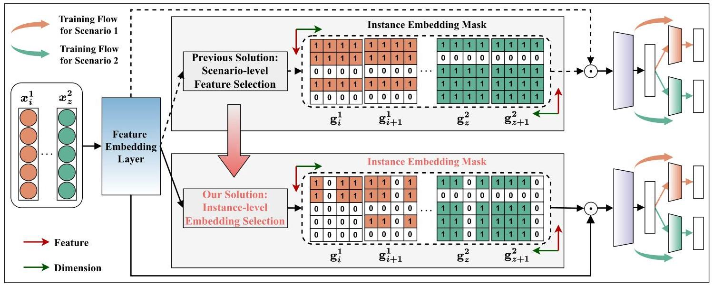
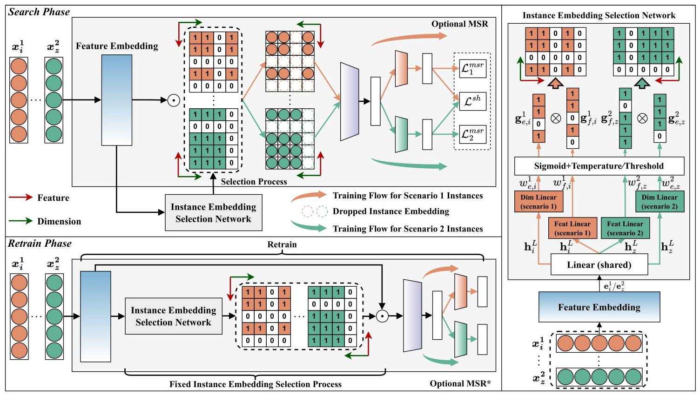
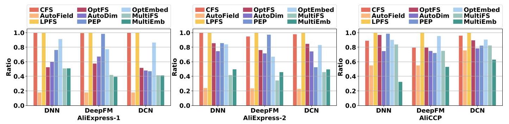
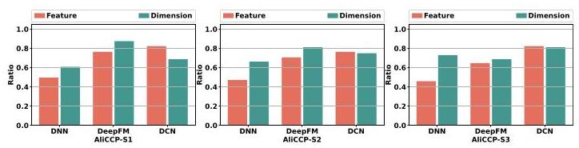

# Multi-scenario Instance Embedding Learning for Deep Recommender Systems

Chaohua Yang

College of Computer Science and

Software Engineering, Shenzhen

University

Shenzhen, China

chaohua.ych@gmail.com

Dugang Liu*

College of Computer Science and

Software Engineering, Shenzhen

University

Shenzhen, China

dugang.ldg@gmail.com

Xing Tang

Yuwen Fu

FiT, Tencent

Shenzhen, China

xing.tang@hotmail.com

evenfu@tencent.com

Xiuqiang He*

Shenzhen Technology University

Shenzhen, China

hexiuqiang@sztu.edu.cn

Xiangyu Zhao

City University of Hong Kong

Hongkong, China

xianzhao@cityu.edu.hk

Zhong Ming

Shenzhen Technology University

Shenzhen, China

mingz@szu.edu.cn

## Abstract

Multi-scenario recommendation (MSR) has become a core component of various online platforms, but its increasing model size has also brought attention to its efficiency optimization. An important effort is to find effective and efficient feature embedding layers for MSR, and existing work focuses on scenario-level feature selection, i.e., all instance embeddings in the same scenario get the same filtering results on the feature set, and the filtering results are different for different scenarios. However, this ignores the information redundancy of the dimension set and the individuality of different instances in the same scenario. To address these limitations, we propose a multi-scenario instance embedding learning (MultiEmb) framework that implements exclusive feature-dimension redundant information removal for different instances within a scenario to obtain the optimal individual embeddings. The core of our Multi-Emb is to introduce an instance embedding selection network to effectively complete the above challenging tasks, in which a set of feature selection and dimension selection adaptive components are equipped for each scenario, and their combination completes the optimal embedding selection for each instance. Finally, we evaluate MultiEmb through extensive experiments on two public multi-scenario benchmarks and demonstrate its effectiveness, compatibility, transferability, etc.

## CCS Concepts

- Information systems \( \rightarrow \) Recommender systems.

## Keywords

Embedding learning, Multi-scenario learning, Deep recommender system, Adaptive selection

## ACM Reference Format:

Chaohua Yang, Dugang Liu, Xing Tang, Yuwen Fu, Xiuqiang He, Xiangyu Zhao, and Zhong Ming. 2025. Multi-scenario Instance Embedding Learning for Deep Recommender Systems. In Proceedings of the 48th International ACM SIGIR Conference on Research and Development in Information Retrieval (SIGIR '25), July 13-18, 2025, Padua, Italy. ACM, New York, NY, USA, 10 pages. https://doi.org/10.1145/3726302.3730045

## 1 Introduction

Deep recommendation systems (DRS) are widely used in various online web platforms to provide users with accurate information and service push notifications \( \left\lbrack  {3,5,{30}}\right\rbrack \) . They aim to summarize users' preferences based on historical feedback and obtain a more matching recommendation list. However, as user demand and the scope of the platform business grow, DRS increasingly needs to handle recommendation tasks for a user in multiple scenarios simultaneously. Instead of maintaining a DRS model in each scenario, which is usually inefficient and costly, the multi-scenario recommendation (MSR) is proposed to effectively utilize users' historical feedback in multiple scenarios in the form of a unified model to enhance user preference modeling in each scenario and provide support for recommendations in all scenarios simultaneously, which has become a more popular training architecture [9, 20, 23, 27, 28, 31].

A typical MSR model usually consists of a feature embedding layer, a scenario-shared layer, and a scenario-specific layer [14, 17, 22]. The feature embedding layer aims to obtain the corresponding embedding of the feature set for instances of different scenarios and is an important cornerstone of the entire MSR model. The scenario-shared and scenario-specific layers are designed to capture the key scenario consensus and difference information required for MSR. Many works have introduced more complex and sophisticated designs for these three key parts to improve MSR performance, but the increasing model size also raises concerns about efficiency optimization [18, 29, 32]. Considering that the parameter size of the feature embedding layer usually dominates the entire model and its key property as the information source of the entire model, an intuitive idea is to alleviate the above problems by finding an effective and efficient feature embedding layer for MSR.

---

*Co-Corresponding authors

classroom use is granted without fee provided that copies are not made or distributed for profit or commercial advantage and that copies bear this notice and the full citation on the first page. Copyrights for components of this work owned by others than the author(s) must be honored. Abstracting with credit is permitted. To copy otherwise, or republish, to post on servers or to redistribute to lists, requires prior specific permission

© 2025 Copyright held by the owner/author(s). Publication rights licensed to ACM.

---

However, although many embedding selection methods for DRS have been proposed previously, showing that removing redundant information in feature embeddings can effectively improve model performance and significantly reduce model overhead, they cannot be generalized to MSR because they do not consider the complex correlations between scenarios, which are crucial to MSR's performance \( \left\lbrack  {4,{11},{26}}\right\rbrack \) . On the other hand, the problem of embedding selection for MSR is still rarely explored. To the best of our knowledge, existing efforts can be viewed as a scenario-level feature selection strategy [12]. This means that although instance embed-dings of different scenarios will obtain different selection results, the information redundancy removal operation only operates on the feature set, and the selection results of all instance embeddings in the same scenario are consistent. In Fig. 1, we provide an example of the instance embedding mask obtained by this scenario-level feature selection strategy at the top for ease of understanding.

We argue that existing efforts ignore the information redundancy of dimension sets and the individuality of different instances in the same scenario to fail to obtain optimal instance embeddings. To alleviate these problems, this paper proposes a novel multi-scenario instance embedding learning (MultiEmb) framework to perform an instance-level embedding selection process for each instance. Specifically, our MultiEmb equips each scenario with a set of feature selection and dimension selection adaptive components to filter valuable information from the feature level and dimension level, respectively, and obtain the optimal embedding for each instance through their combination, where this process is instance-specific. Furthermore, to effectively transfer the selection knowledge of different scenarios for valuable information during the filtering process, we introduce a shared layer as a connection between various scenarios' adaptive components, forming the critical instance embedding selection network in our MultiEmb. Based on this design, our MultiEmb can obtain the optimal embedding in a vast search space across scenarios, features, dimensions, and instances with an acceptable cost. To more intuitively demonstrate the difference from existing efforts, we give examples of instance embedding masks obtained by our MultiEmb at the bottom of Fig. 1. Finally, we conduct extensive experiments on two public MSR benchmark datasets to verify the effectiveness and some valuable properties of our MultiEmb.

## 2 Related Work

This section briefly overviews related work on two key research topics, including multi-scenario recommendations and automated learning in recommendation.

Multi-scenario Recommendations. The prevailing approaches for addressing multi-scenario modeling typically adopt a shared-specific architecture \( \left\lbrack  {9,{19},{20},{25},{27},{28},{31}}\right\rbrack \) . For example, two representative multi-scenario recommendation methods are HMoE [9], which uses a multi-gate mixture-of-experts [17] to capture shared and specific representations across scenarios; STAR [20], which employs a star topology in which all scenarios share a central network and each scenario has its particular network. Some recent works build on these foundational architectures, incorporating new components to capture commonalities and differences across multiple scenarios more effectively. For example, SASS [31] introduces a multi-layer scenario-adaptive transfer component that uses adaptive gate units for fine-grained integration of transfer information. M2M [28] employs a meta-attention component to capture inter-scenario correlations, while SAR-Net [19] designs attention mechanisms for scenario and item features to facilitate cross-scenario information transfer. However, these works only focus on the architecture-level design to enhance multi-scenario learning and rarely explore the optimization of scenario instance embeddings. In contrast, our MultiEmb focuses on optimizing instance embeddings to learn the optimal instance embeddings for multi-scenario modeling, enhancing overall performance across all scenarios. Our MultiEmb can effectively complement these works by providing an effective and efficient feature embedding layer for these models.

Automated Learning in Recommendation. In deep recommendation systems, effectively integrating automated learning for tasks such as feature selection and embedding dimension search to optimize embeddings is a valuable direction, and related research is gradually increasing [34]. Many works focus on selecting a subset of more beneficial features for model training to mitigate the negative impact of redundant features. This involves coarse-grained field-level and fine-grained feature value level selection [11, 15, 26]. For example, AdaFS introduces a novel controller network designed to identify the valuable feature fields for each instance [11]; OptFS employs a feature value-level gating mechanism to efficiently select the feature subset to be retained [15]. To improve the flexibility of embedding dimension settings, many works have focused on the automatic selection of embedding dimensions [13, 14, 33]. Among them, AutoDim automatically searches for the optimal embedding dimensions for different fields within a predefined set of candidate dimensions [33], while PEP dynamically learns a threshold for embedding dimensions to perform pruning [14]. In addition, OptEmbed aims to learn the optimal embedding table by combining field-wise redundant feature pruning and embedding dimension search [16]. However, these works focus on DRS, and extending to MSR is extremely challenging. To our knowledge, only MultiFS [12] incorporates scenario information to perform embedding selection in MSR, but it only considers scenario-level feature selection, which ignores dimension-level selection and is not instance-specific. Unlike these methods, our MultiEmb is instance-specific and aims to learn the optimal instance-level embeddings in multi-scenario settings by combining feature and dimension selection.

## 3 Problem Formulation

In this section, we first formalize multi-scenario learning. For all scenarios, we denote the associated feature space as \( \mathcal{X} \) and the label space as \( \mathcal{Y} \) . The \( \mathcal{X} \) usually consists of user, item, and contextual features, while the \( \mathcal{Y} \) represents user interaction behavior with binary labels like \{click, no-click\}. For \( K \) scenarios \( \mathcal{S} = \left\{  {{s}^{1},\cdots ,{s}^{K}}\right\} \) , the multi-scenario training instances can denote \( \mathcal{D} = {\left\{  \left( {\mathbf{x}}_{i}^{k},{y}_{i}^{k},{s}^{k}\right) \right\}  }_{k = 1}^{K} \) , where \( {s}^{k} \) is the \( k \) -th scenario, \( {\mathbf{x}}_{i}^{k} \in  \mathcal{X} \) is the \( i \) -th instance’s feature vector in \( k \) -th scenario, and \( {y}_{i}^{k} \in  \{ 0,1\} \) is corresponding label. Multi-scenario learning aims to train a model using the above training instances set, consisting of shared and specific components [1],

\[
{\widehat{y}}_{i}^{k} = f\left( {{\mathbf{x}}_{i}^{k} \mid  \theta ,\left\{  {\theta }_{{s}^{k}}\right\}  }\right) , \tag{1}
\]

Figure 1: An example of the difference between our MultiEmb and existing methods in instance embedding selection results, where the feature and dimension set sizes are 5 and 4, respectively. Existing methods focus on scenario-level feature selection, and our MultiEmb dropt instance-level embedding selection.

where \( f\left( \cdot \right) \) is the function that maps features to labels in the model, and \( \theta \) and \( \left\{  {\theta }_{{s}^{k}}\right\} \) are the scenario-shared and scenario-specific parameters, respectively. Then, the model is usually optimized using the cross-entropy loss function,

\[
\mathcal{L} = \mathop{\sum }\limits_{{k = 1}}^{K}\mathop{\sum }\limits_{{i = 1}}^{\left| {s}^{k}\right| }l\left( {{y}_{i}^{k},{\widehat{y}}_{i}^{k}}\right) , \tag{2}
\]

where \( \left| {s}^{k}\right| \) and \( l\left( \cdot \right) \) respectively denote the number of instance in \( k \) -th scenario and cross-entropy loss.

Based on the above formulation, we further define the problem of learning optimal instance embeddings for MSR. Usually, a feature vector \( {\mathbf{x}}_{i}^{k} \) contains \( m \) feature fields, denoted as:

\[
{\mathbf{x}}_{i}^{k} = \left\lbrack  {{x}_{i1}^{k},\cdots ,{x}_{im}^{k}}\right\rbrack \tag{3}
\]

where the \( j \) -th field \( {x}_{ij}^{k} \) contains a set of feature values. To simplify our notation, we will now refer to \( {x}_{ij}^{k} \) as the feature value in the \( j \) -th field. Next, we use an embedding table to convert feature values into low-dimensional, dense, real-valued vectors to represent the features better,

\[
{\mathbf{e}}_{i}^{k} = \mathbf{E} \times  {x}_{i}^{k},\;\mathbf{E} \in  {\mathbb{R}}^{n \times  d} \tag{4}
\]

where \( n \) is the number of feature values, \( d \) is the embedding dimension, \( {\mathbf{e}}_{i}^{k} \in  {\mathbb{R}}^{m \times  d} \) , and \( \mathbf{E} \) is the embedding table shared across scenarios, thus \( \mathbf{E} \in  \theta \) . Hence, the learning optimal instance embedding problem for MSRs can be defined as the assignment of a binary gate \( {\mathbf{G}}_{{ij}, p}^{k} \in  \{ 0,1\} \) to each instance embedding parameter \( {\mathbf{e}}_{{ij}, p}^{k} \) , where \( p \) denotes the \( p \) -th dimension in the embedding vector \( {\mathbf{e}}_{ij}^{k} \) , and \( 1 \leq  p \leq  d \) . The complete gate matrix for instance \( {\mathbf{x}}_{i}^{k} \) is denoted as \( {\mathbf{G}}_{i}^{k} \in  \{ 0,1{\} }^{m \times  d} \) , which determines whether each embedding parameter is retained or discarded. After selection, the embedding parameter can be formulated as follows,

\[
{\widehat{\mathbf{e}}}_{{ij}, p}^{k} = {\mathbf{G}}_{{ij}, p}^{k} \odot  {\mathbf{e}}_{{ij}, p}^{k}, \tag{5}
\]

when \( {\mathbf{G}}_{{ij}, p}^{k} = 1, p \) -th parameter of the embedding of feature \( {x}_{ij}^{k} \) is selected in the scenario \( {s}^{k} \) and vice versa. \( \odot \) denotes element-wise multiplication.

Note that we transform learning the optimal embedding from instance-level granularity into the problem of determining the gate matrices, with a search space of \( {2}^{Nmd} \) , where \( N \) is the total number of instances \( \left| \mathcal{D}\right| \) . However, this huge search space is difficult to optimize. To reduce the complexity of optimization and inspired by the prior work [16], we can actually decompose the problem of learning optimal instance embeddings into two sub-problems: performing field-wise feature selection and embedding dimension selection on the instance embeddings. Specifically, each \( {\mathbf{G}}_{i}^{k} \) can be regarded as a composition of scenario-specific feature gate vector and dimension gate vector,

\[
{\mathbf{G}}_{i}^{k} = {\mathbf{g}}_{f, i}^{k} \otimes  {\mathbf{g}}_{e, i}^{k} \tag{6}
\]

where \( {\mathrm{g}}_{f, i}^{k} \in  \{ 0,1{\} }^{m} \) and \( {\mathrm{g}}_{e, i}^{k} \in  \{ 0,1{\} }^{d} \) are the gate vector for feature and embedding dimensions specific to the \( i \) -th instance in scenario \( {s}^{k} \) , respectively. And \( \otimes \) denotes the outer product operation. Thus, the search space is reduced to \( O\left( {{2}^{Nm} + {2}^{Nd}}\right) \) , while in practical applications, \( m \) and \( d \) are usually much smaller than \( m \times  d \) . Finally, using all the above formulations, we can formalize the problem as follows:

\[
\mathop{\min }\limits_{{\Theta ,\left\{  {\mathrm{G}}_{i}^{k}\right\}  }}\mathcal{L}\left( \mathcal{D}\right) \tag{7}
\]

where \( \Theta  = \left\{  {\theta ,{\left\{  {\theta }_{{s}^{k}}\right\}  }_{k = 1}^{K}}\right\} \) denotes the model parameters.

## 4 The Proposed Framework

In this section, we first present the overall framework of our Mul-tiEmb. Next, we will provide a detailed overview of its two optimization phases and their respective algorithms, i.e., the search and retrain phases, through its key components: the backbone MSR model and instance embedding selection network.

### 4.1 Framework Overview

The overall framework of MultiEmb is shown in Fig. 2, which consists of two phases with distinct objectives, i.e., search phase and retrain stage, as well as two main components, i.e., the backbone MSR model and the instance embedding selection network. In the search stage, MultiEmb will use the backbone MSR model as a synergy to train the instance embedding selection network to learn reasonable instance embedding masks. In the retrain stage, MultiEmb will use the above well-trained instance embedding selection network to generate an instance embedding mask to train the target MSR model. The core motivation behind this framework design is that obtaining \( {\mathrm{G}}_{i}^{k} \) with both generality and efficiency presents two key challenges: (i) the binary gate vector \( {\mathrm{g}}_{f, i}^{k} \) and \( {\mathrm{g}}_{e, i}^{k} \) make gradient computation difficult; (ii) optimizing gate mask \( {\mathbf{G}}_{i}^{k} \) and model parameters \( \Theta \) together may impair the model's performance. To address these challenges, we introduce an instance embedding selection network with the learning-by-continuation training scheme [15]. Note that the search space \( O\left( {{2}^{Nm} + {2}^{Nd}}\right) \) is still very large, as the number of instances \( N \) in real-world datasets is often in the billions, so we introduce a lightweight instance embedding selection network composed of the hypernetwork instead of directly searching in the huge space. Furthermore, since the parameter size of the instance embedding selection network is significantly smaller than that of the MSR backbone model, and it only needs to determine the retention of each embedding parameter based on the input instance embedding without involving complex computations, its additional computational overhead is minimal.

### 4.2 Search Phase

The search phase aims to obtain an instance embedding selection network that can efficiently generate scenario-aware instance embedding masks to learn the optimal instance embedding. To help the instance embedding selection network more reasonably identify embedding parameters conducive to MSR training, we need to introduce a backbone MSR model as a referee of the selection results of the instance embedding selection network. Note that any existing MSR method can implement this backbone MSR model. We will also evaluate the compatibility of our MultiEmb by integrating different MSR models in our experiments. The instance embedding selection network is based on an end-to-end training form. It can continuously optimize the selection of features and dimensions according to the optimization process of the backbone MSR model until the optimal instance embedding mask is generated. Finally, we can obtain a well-trained instance embedding selection network. Next, we describe the details of the search phase according to the training process. A diagram of the search phase is shown at the top of Fig. 2. 4.2.1 Instance Embedding Selection Process. After obtaining each instance's embedding, we expect to use a selection network to identify the key features and dimensions from \( {\mathbf{e}}_{i}^{k} \) , thereby generating a more expressive embedding representation. In short, the network outputs two probability vectors that indicate the retention probability of each feature and its corresponding embedding dimensions, which are then discretized to determine whether they should be retained or discarded in the instance embedding. For the design of an instance embedding selection network, an intuitive approach is to directly use the feedforward neural network shared by all scenario instances to select valuable information, including the scenario-shared feature selection probability output layer and the scenario-shared dimension selection probability output layer [8]. However, the important features and dimensions of instance embeddings in different scenarios are likely to differ, and this direct approach overlooks scenario-specific information, leading to suboptimal selection results. Therefore, we propose an instance embedding selection network with a hyper-network learning structure and aim to combine the knowledge of feature and dimension selection of different scenario instances to generate more reliable feature gate vectors and dimension gate vectors for each instance.

Specifically, we first input the instance embedding \( {\mathbf{e}}_{i}^{k} \) into a shared feedforward neural network (FNN) for shared feature extraction, where the \( l \) -th multi-layer perception (MLP) layer can be expressed as follows,

\[
{\mathbf{h}}_{i}^{l} = \sigma \left( {{\mathbf{W}}^{l}{\mathbf{h}}_{i}^{l - 1} + {\mathbf{b}}^{l}}\right) ,\;l \in  \left\lbrack  {1, L}\right\rbrack \tag{8}
\]

where \( {\mathbf{W}}^{l} \) and \( {\mathbf{b}}^{l} \) denote the learnable weight matric and bias vector, \( \sigma \left( \cdot \right) \) denotes the ReLu activation function, and \( L \) denotes the number of multilayer perception layers. Note that in the first MLP layer, \( {\mathbf{h}}_{i}^{0} = {\mathbf{e}}_{i}^{k} \) . Then, to combine the characteristics of each scenario, we introduce two scenario-specific feedforward neural network components based on the idea of hyper-network learning. These components output the feature weight vector and the dimension weight vector. Each instance will obtain the final output weight through different components based on its own scenario identifier. Hence, the feature weight vector and dimension weight vector of instance embedding can be calculated as follows:

\[
{w}_{f, i}^{k} = {\mathbf{W}}_{f}^{k}{\mathbf{h}}_{i}^{L} + {\mathbf{b}}_{f}^{k}, \tag{9}
\]

\[
{w}_{e, i}^{k} = {\mathbf{W}}_{e}^{k}{\mathbf{h}}_{i}^{L} + {\mathbf{b}}_{e}^{k}, \tag{10}
\]

where \( {w}_{f, i}^{k} \) and \( {w}_{e, i}^{k} \) respectively represent the weight vector of features and embedding dimensions in \( i \) -th instance embedding. In addition, \( {\mathbf{W}}_{f}^{k},{\mathbf{W}}_{e}^{k},{\mathbf{b}}_{f}^{k} \) and \( {\mathbf{b}}_{e}^{k} \) denote the learnable scenario-specific weight matrices and bias vectors for the features and dimensions of the \( k \) -th scenario.

To efficiently optimize the gate mask set \( {\mathbf{G}}^{k} \) with instance-level granularity, we need to normalize and approximately discretize the \( {w}_{f, i}^{k} \) and \( {w}_{e, i}^{k} \) to obtain continual gate vector for features and dimensions. Specifically, the continual gate \( {\mathbf{g}}_{f, i}^{k} \) and \( {\mathbf{g}}_{e, i}^{k} \) are defined as,

\[
{\mathbf{g}}_{f, i}^{k} = \phi \left( {{w}_{f, i}^{k} \times  \tau }\right) ,\;\tau  = {\gamma }^{b/{N}_{B}}, \tag{11}
\]

\[
{\mathrm{g}}_{e, i}^{k} = \phi \left( {{w}_{e, i}^{k} \times  \tau }\right) ,\;\tau  = {\gamma }^{b/{N}_{B}}, \tag{12}
\]

where \( \phi \left( \cdot \right) \) is the sigmoid function, \( b \) is the current training batch index, \( {N}_{B} \) is the total number of batches and \( \gamma \) is the final value of \( \tau \) after training for \( {N}_{B} \) mini-batch. By replacing the mask with the continual gate vectors during training, we could optimize the parameters of the instance embedding selection network and the backbone MSR model in a differentiable manner. For ease of understanding, we give an illustration of the above instance embedding selection process on the right side of Fig. 2.

Figure 2: The architecture of our multi-scenario instance embedding learning (MultiEmb) framework, where two scenarios are used as examples. It is best viewed in color.

4.2.2 Optimization. It is worth noting that multi-scenario datasets often suffer from the problem of unbalanced data distribution, which can affect model performance [21]. Similarly, this will also hurt learning the optimal instance embedding. For instance, too few instances in a scenario can hinder the effective optimization of its instance embedding mask, negatively affecting overall model performance. To resolve this issue and ensure our approach's generality, we introduce a single prediction for each \( {\mathbf{G}}^{k} \) for all instances, whose loss can be expressed as follows:

\[
\widehat{\mathbf{y}} = f\left( {{\mathbf{G}}^{k} \odot  \mathbf{E} \times  \mathbf{x};\Theta }\right) , \tag{13}
\]

\[
{\mathcal{L}}^{sh} = \mathcal{L}\left( {f\left( {{\mathbf{G}}^{k} \odot  \mathbf{E} \times  \mathbf{x};\Theta }\right) ,\mathbf{y}}\right)  = \frac{1}{K}\mathop{\sum }\limits_{{k = 1}}^{K}{\mathcal{L}}_{k}^{sh}\left( {\widehat{y}, y}\right) , \tag{14}
\]

where \( {\mathcal{L}}_{k}^{sh} \) denotes the prediction error loss on scenario \( {s}^{k} \) after selecting embedding parameters using only \( {\mathbf{G}}^{k} \) . Notably, we represent all scenario predictions as a vector \( \widehat{\mathbf{y}} \) in Eq.(13), implementing a transfer learning mechanism to address the optimization challenges caused by extreme imbalances in scenario instances. Finally, by combining Eq.(7) and Eq.(14), we derive the final training objective,

\[
\mathop{\min }\limits_{{\left\{  {\mathrm{G}}^{k}\right\}  ,\Theta }}{\mathcal{L}}_{\text{ MultiEmb }} = \mathcal{L} + \lambda {\mathcal{L}}^{sh}, \tag{15}
\]

where \( \lambda \) is the control weight of \( {\mathcal{L}}^{sh} \) .

### 4.3 Retrain Phase

As mentioned above, all instance embeddings are fed into the model during the search phase to explore the optimal scenario-aware instance embedding gate vector set \( {\mathbf{G}}^{k} \) . Thus, the useless embedding parameters might hurt the model's performance. After obtaining the well-trained instance embedding selection network, we must retrain the backbone MSR model to address this issue. Next, we describe the details of the retrain phase according to the training process. A diagram of the retrain phase is shown at the bottom of Fig. 2.

4.3.1 Instance Embedding Selection Process. After completing the search phase, our MultiEmb obtains a well-trained instance embedding selection network. Therefore, when the backbone MSR model is retrained, we can use this well-trained instance embedding selection network to generate feature gate vectors and dimension gate vectors. After calculations in Eq.(8), Eq.(9) and Eq.(10), the final gating vector \( {\mathbf{g}}_{f, i}^{k} \) and \( {\mathbf{g}}_{e, i}^{k} \) are calculated through a unit-step function as follows:

\[
{\mathrm{g}}_{f, i}^{k} = \left\{  {\begin{array}{ll} 0, & {w}_{f, i}^{k} \leq  0 \\  1, & \text{ otherwise } \end{array},}\right. \tag{16}
\]

\[
{\mathrm{g}}_{e, i}^{k} = \left\{  {\begin{array}{ll} 0, & {w}_{e, i}^{k} \leq  0 \\  1, & \text{ otherwise } \end{array}.}\right. \tag{17}
\]

4.3.2 Optimization. After determining each gating vector \( {\mathbf{g}}_{f, i}^{k} \) and

\( {\mathrm{g}}_{e, i}^{k} \) , the final backbone MSR model parameters \( \Theta \) are trained as follows:

\[
\mathop{\min }\limits_{\Theta }\mathcal{L} + \lambda {\mathcal{L}}^{sh} \tag{18}
\]

## 5 Experiments

In this section, we conduct experiments to answer the following five key questions. Note that the source code can be accessed at https://github.com/ChaohuaYang/MultiEmb.

- RQ1: How does our MultiEmb perform compared to the baselines?

- RQ2: What is the role of some key components in our MultiEmb?

- RQ3: What is the transferability of the instance embedding selection network by our MultiEmb?

- RQ4: How does MultiEmb reduce the model size?

- RQ5: What are the characteristics of MultiEmb compared with existing methods in embedding selection?

### 5.1 Experiment Setup

5.1.1 Datasets and Preprocessing. To assess the effectiveness of our MultiEmb in multi-scenario learning, we conducted experiments using two public benchmark datasets: AliExpress \( {}^{1} \) and AliCCP \( {}^{2} \) . AliExpress contains the user click and purchase records collected from real-world traffic logs of the AliExpress search system, covering five scenarios: Russia, Spain, French, the Netherlands, and America. AliCCP contains user interactions gathered from real-world traffic logs of the recommender system in Mobile Taobao, which has three business scenarios. We refer to them as S1, S2, and S3. To ensure consistency in comparison, we follow the preprocessing procedures of previous works on these two benchmark datasets [12]. Please refer to their original papers for specific details on operations and statistics of the processed dataset.

5.1.2 Metrics. Following the setup of existing works [11, 26], we apply the two primary evaluation metrics for deep recommender systems: area under the ROC curve (AUC) and cross-entropy (log loss). Notely, for the CTR prediction task, an improvement of more than 0.1% in the AUC is considered significant [5]. Furthermore, to evaluate the model's efficiency, we will use the average retention ratio of the instance embedding as a reference. The average retention ratio is calculated as follows:

\[
\text{ Retention } = \frac{\text{ \#Remaining Params }}{N \times  m \times  d}. \tag{19}
\]

5.1.3 Baselines Methods and Backbone Methods. We selected representative methods from the research on embedding selection in DRS. Specifically, we first compare our MultiEmb with the following single-scenario feature selection baselines, including AutoField [26], LPFS [7], and OptFS [15]. Second, we compare our MultiEmb with the two single-scenario embedding dimension selection baselines, i.e., AutoDim [33] and PEP [14]. Third, we compare MultiEmb with the single-scenario embedding table optimization baseline OptEm-bed [16], which combines feature selection and embedding dimension selection. Finally, we also compare our MultiEmb with the multi-task feature selection baseline CFS [2] and the multi-scenario feature selection baseline MultiFS [12]. To assess the generalization ability of all methods, we combined each method with three mainstream skeleton models: DNN, DeepFM [5], and DCN [24]. Furthermore, to verify the importance of learning optimal instance embeddings for multi-scenarios, we use two base models that retain all the embedding parameters: one based on data from each scenario separately (SD-Backbone) and the other based on aggregated data from all scenarios (Backbone). At the same time, we use three representative methods that enhance architectures for multi-scenario recommendation as MSR baselines: STAR [21], HMoE [10], and DFFM [6].

5.1.4 Implementation Details. In this subsection, we detail the implementation of our MultiEmb as well as the baseline methods. For general hyperparameters, we set the embedding dimension and batch size as 16 and 4096, respectively. We select the optimal learning ratio from \{1e-3,3e-4,1e-4,3e-5,1e-5\} and the \( {l}_{2} \) regularization from \{3e-5, 1e-5, 3e-6, 1e-6, 3e-7, 1e-7\}. For the MLP layer in the backbone models, we use a three-layer fully connected network of size [1024, 512, 256]. We use Adam optimizer and Xavier initialization in the experiments. For the hyperparameters of MultiEmb, we select the optimal shared loss weight \( \lambda \) and final value \( \gamma \) from \( \{ 0,1,2,3\} \) and \( \{ {500},{1000},{3000},{10000},{30000}\} \) , respectively. For other baseline methods, we use the open-source implementations for AutoField [26], LPFS [7], OptFS [15], PEP [14], OptEmbed [16], MultiFS [12] and DFFM [6]. Due to the unavailability of implementations for CFS [2], AutoDim [33], STAR [21], and HMoE [10], we have re-implemented them according to the details provided in the original papers. Note that all baselines are tuned for optimal parameter settings within the same range of hyperparameters.

### 5.2 RQ1: Overall Performance

In this subsection, we conduct two studies: one comparing baselines for embedding selection and the other evaluating baselines for a multi-scenario recommendation.

Embedding Selecion. In the upper part of Table 1, we present the overall performance of MultiEmb and other embedding selection baseline methods on three different backbone models using three benchmark datasets. We can make the following observations: 1) A backbone model trained on the data of each individual scenario (i.e., SD-Backbone) usually performs better than one trained on the aggregated data from all scenarios (i.e., Backbone), which underscores the necessity of incorporating scenario-specific information in multi-scenario recommendation; 2) The baseline methods for single-scenario feature selection and dimension selection (e.g., LPFS, OptFS, AutoDim, PEP, OptEmbed) generally outperform the basic baselines (i.e., SD-Backbone and Backbone), which means that feature selection and dimension selection are also effective steps to optimize embeddings to improve model performance in multi-scenario recommendation. 3) The baseline method for the multi-task feature selection method (i.e., CFS) performs slightly better on AliCCP but performs poorly on AliExpress-1 and AliExpress-2. This may be due to stronger scenario consistency in AliCCP, which benefits CFS more. 4) The baseline method for multi-scenario feature selection (i.e., MultiFS) achieves significant performance improvements on all datasets compared to single-scenario baseline methods. This indicates that combining scenario information for feature selection and multi-scenario modeling is the key to multi-scenario learning. 5) Unlike other embedding selection baseline methods, our Multi-Emb consistently achieves significant performance improvements in most cases. This demonstrates that our MultiEmb can combine feature and dimension selection to learn the optimal instance-level embedding.

---

\( {}^{1} \) https://tianchi.aliyun.com/dataset/74690

\( {}^{2} \) https://tianchi.aliyun.com/dataset/408

---

Table 1: Results on all datasets, where the best and second best results are marked in bold and underlined, respectively. Note that * indicates a significance level of \( p \leq  {0.05} \) based on a two-sample t-test between our method and the best baseline.

<table><tr><td rowspan="2"></td><td rowspan="2">Method</td><td colspan="4">AliExpress-1</td><td colspan="4">AliExpress-2</td><td colspan="6">AliCCP</td></tr><tr><td colspan="2">AUC↑</td><td colspan="2">Logloss \( \downarrow \)</td><td colspan="2">AUC↑</td><td colspan="2">Logloss \( \downarrow \)</td><td></td><td>AUC↑</td><td></td><td colspan="3">Logloss \( \downarrow \)</td></tr><tr><td rowspan="11">DNN</td><td>SD-Backbone</td><td>.7326</td><td>.7307</td><td>.0953</td><td>.0901</td><td>.7289</td><td>.7410</td><td>.1125</td><td>.0765</td><td>.6210</td><td>.5717</td><td>.6191</td><td>.1651</td><td>.1803</td><td>.1600</td></tr><tr><td>Backbone</td><td>.7319</td><td>.7282</td><td>.0952</td><td>.0902</td><td>.7297</td><td>.7372</td><td>.1124</td><td>.0767</td><td>.6022</td><td>.5830</td><td>.5996</td><td>.1663</td><td>.1789</td><td>.1603</td></tr><tr><td>CFS</td><td>.7319</td><td>.7274</td><td>.0957</td><td>.0906</td><td>.7280</td><td>.7397</td><td>.1127</td><td>.0765</td><td>.6255</td><td>.5985</td><td>.6225</td><td>.1651</td><td>.1849</td><td>.1593</td></tr><tr><td>AutoField</td><td>.7303</td><td>.7274</td><td>.0951</td><td>.0901</td><td>.7291</td><td>.7353</td><td>.1125</td><td>.0769</td><td>.6247</td><td>.6023</td><td>.6214</td><td>.1668</td><td>.1805</td><td>.1609</td></tr><tr><td>LPFS</td><td>.7344</td><td>.7305</td><td>.0952</td><td>.0902</td><td>.7317</td><td>.7404</td><td>.1122</td><td>.0766</td><td>.6262</td><td>.6014</td><td>.6231</td><td>.1652</td><td>.1784</td><td>.1592</td></tr><tr><td>OptFS</td><td>.7357</td><td>.7320</td><td>.0949</td><td>.0900</td><td>.7318</td><td>.7405</td><td>.1122</td><td>.0765</td><td>.6269</td><td>.6021</td><td>.6239</td><td>.1652</td><td>.1784</td><td>.1592</td></tr><tr><td>AutoDim</td><td>.7359</td><td>.7321</td><td>.0949</td><td>.0899</td><td>.7294</td><td>.7361</td><td>.1125</td><td>.0774</td><td>.6216</td><td>.5982</td><td>.6182</td><td>.1654</td><td>.1792</td><td>.1591</td></tr><tr><td>PEP</td><td>.7374</td><td>.7325</td><td>.0947</td><td>.0898</td><td>.7339</td><td>.7439</td><td>.1120</td><td>.0762</td><td>.6225</td><td>.5991</td><td>.6200</td><td>.1653</td><td>.1788</td><td>.1593</td></tr><tr><td>OptEmbed</td><td>.7361</td><td>.7324</td><td>.0949</td><td>.0899</td><td>.7317</td><td>.7402</td><td>.1122</td><td>.0765</td><td>.6269</td><td>.6019</td><td>.6240</td><td>.1651</td><td>.1783</td><td>.1591</td></tr><tr><td>MultiFS</td><td>.7447</td><td>.7380</td><td>.0944</td><td>.0895</td><td>.7344</td><td>.7497</td><td>.1120</td><td>.0758</td><td>.6276</td><td>.6036</td><td>.6246</td><td>.1654</td><td>.1789</td><td>.1597</td></tr><tr><td>MultiEmb</td><td>.7459</td><td>.7385</td><td>.0945</td><td>.0895</td><td>.7354</td><td>.7545*</td><td>.1120</td><td>.0755</td><td>.6279</td><td>.6045</td><td>.6252*</td><td>.1653</td><td>.1789</td><td>.1597</td></tr><tr><td rowspan="11">DeepFM</td><td>SD-Backbone</td><td>.7335</td><td>.7311</td><td>.0953</td><td>.0900</td><td>.7292</td><td>.7417</td><td>.1125</td><td>.0764</td><td>.6211</td><td>.5721</td><td>.6172</td><td>.1651</td><td>.1806</td><td>.1596</td></tr><tr><td>Backbone</td><td>.7333</td><td>.7299</td><td>.0951</td><td>.0901</td><td>.7292</td><td>.7373</td><td>.1127</td><td>.0766</td><td>.6049</td><td>.5851</td><td>.6025</td><td>.1661</td><td>.1787</td><td>.1600</td></tr><tr><td>CFS</td><td>.7324</td><td>.7277</td><td>.0957</td><td>.0904</td><td>.7290</td><td>.7406</td><td>.1127</td><td>.0765</td><td>.6256</td><td>.5981</td><td>.6231</td><td>.1651</td><td>.1830</td><td>.1596</td></tr><tr><td>AutoField</td><td>.7318</td><td>.7286</td><td>.0954</td><td>.0903</td><td>.7307</td><td>.7378</td><td>.1124</td><td>.0767</td><td>.6250</td><td>.6033</td><td>.6218</td><td>.1666</td><td>.1803</td><td>.1607</td></tr><tr><td>LPFS</td><td>.7352</td><td>.7311</td><td>.0950</td><td>.0900</td><td>.7335</td><td>.7423</td><td>.1120</td><td>.0763</td><td>.6253</td><td>.6031</td><td>.6229</td><td>.1661</td><td>.1795</td><td>.1603</td></tr><tr><td>OptFS</td><td>.7353</td><td>.7318</td><td>.0950</td><td>.0900</td><td>.7343</td><td>.7425</td><td>.1119</td><td>.0762</td><td>.6271</td><td>.6028</td><td>.6240</td><td>.1650</td><td>.1786</td><td>.1590</td></tr><tr><td>AutoDim</td><td>.7379</td><td>.7343</td><td>.0948</td><td>.0897</td><td>.7320</td><td>.7392</td><td>.1123</td><td>.0773</td><td>.6207</td><td>.5975</td><td>.6195</td><td>.1656</td><td>.1793</td><td>.1592</td></tr><tr><td>PEP</td><td>.7397</td><td>.7346</td><td>.0946</td><td>.0897</td><td>.7333</td><td>.7436</td><td>.1121</td><td>.0762</td><td>.6232</td><td>.6013</td><td>.6203</td><td>.1653</td><td>.1785</td><td>.1593</td></tr><tr><td>OptEmbed</td><td>.7367</td><td>.7330</td><td>.0948</td><td>.0899</td><td>.7337</td><td>.7427</td><td>.1120</td><td>.0763</td><td>.6269</td><td>.6021</td><td>.6241</td><td>.1650</td><td>.1783</td><td>.1591</td></tr><tr><td>MultiFS</td><td>.7452</td><td>.7389</td><td>.0943</td><td>.0894</td><td>.7391</td><td>.7510</td><td>.1114</td><td>.0756</td><td>.6273</td><td>.6043</td><td>.6257</td><td>.1652</td><td>.1787</td><td>.1594</td></tr><tr><td>MultiEmb</td><td>.7487*</td><td>.7432</td><td>.0941</td><td>.0890*</td><td>.7409</td><td>.7591*</td><td>.1113</td><td>.0752*</td><td>.6286*</td><td>.6049</td><td>.6263</td><td>.1652</td><td>.1788</td><td>.1596</td></tr><tr><td rowspan="11">DCN</td><td>SD-Backbone</td><td>.7333</td><td>.7312</td><td>.0953</td><td>.0900</td><td>.7286</td><td>.7419</td><td>.1125</td><td>.0764</td><td>.6209</td><td>.5722</td><td>.6187</td><td>.1651</td><td>.1801</td><td>.1591</td></tr><tr><td>Backbone</td><td>.7320</td><td>.7285</td><td>.0952</td><td>.0902</td><td>.7292</td><td>.7377</td><td>.1127</td><td>.0766</td><td>.6023</td><td>.5834</td><td>.5999</td><td>.1659</td><td>.1788</td><td>.1597</td></tr><tr><td>CFS</td><td>.7301</td><td>.7243</td><td>.0956</td><td>.0905</td><td>.7257</td><td>.7358</td><td>.1129</td><td>.0768</td><td>.6251</td><td>.5989</td><td>.6225</td><td>.1649</td><td>.1792</td><td>.1595</td></tr><tr><td>AutoField</td><td>.7301</td><td>.7273</td><td>.0956</td><td>.0905</td><td>.7292</td><td>.7371</td><td>.1127</td><td>.0766</td><td>.6252</td><td>.6025</td><td>.6219</td><td>.1666</td><td>.1803</td><td>.1606</td></tr><tr><td>LPFS</td><td>.7348</td><td>.7309</td><td>.0951</td><td>.0901</td><td>.7312</td><td>.7406</td><td>.1124</td><td>.0764</td><td>.6258</td><td>.6032</td><td>.6232</td><td>.1659</td><td>.1793</td><td>.1600</td></tr><tr><td>OptFS</td><td>.7356</td><td>.7318</td><td>.0950</td><td>.0901</td><td>.7322</td><td>.7410</td><td>.1123</td><td>.0764</td><td>.6257</td><td>.6033</td><td>.6234</td><td>.1658</td><td>.1795</td><td>.1597</td></tr><tr><td>AutoDim</td><td>.7352</td><td>.7325</td><td>.0951</td><td>.0901</td><td>.7317</td><td>.7386</td><td>.1124</td><td>.0774</td><td>.6205</td><td>.5982</td><td>.6200</td><td>.1661</td><td>.1800</td><td>.1595</td></tr><tr><td>PEP</td><td>.7369</td><td>.7328</td><td>.0948</td><td>.0899</td><td>.7326</td><td>.7420</td><td>.1121</td><td>.0763</td><td>.6243</td><td>.6007</td><td>.6217</td><td>.1652</td><td>.1786</td><td>.1591</td></tr><tr><td>OptEmbed</td><td>.7359</td><td>.7323</td><td>.0950</td><td>.0901</td><td>.7316</td><td>.7408</td><td>.1125</td><td>.0764</td><td>.6261</td><td>.6014</td><td>.6232</td><td>.1650</td><td>.1783</td><td>.1591</td></tr><tr><td>MultiFS</td><td>.7416</td><td>.7350</td><td>.0947</td><td>.0898</td><td>.7346</td><td>.7509</td><td>.1120</td><td>.0758</td><td>.6281</td><td>.6045</td><td>.6256</td><td>.1649</td><td>.1785</td><td>.1588</td></tr><tr><td>MultiEmb</td><td>.7442*</td><td>.7389*</td><td>.0945</td><td>.0895</td><td>.7367*</td><td>.7560*</td><td>.1118</td><td>.0755</td><td>.6288</td><td>.6049</td><td>.6262</td><td>.1649</td><td>.1784</td><td>.1590</td></tr><tr><td rowspan="4">MS</td><td>STAR</td><td>.7371</td><td>.7308</td><td>.1181</td><td>.1002</td><td>.7303</td><td>.7473</td><td>.1500</td><td>.1098</td><td>.6228</td><td>.5899</td><td>.6218</td><td>.1698</td><td>.2068</td><td>.1622</td></tr><tr><td>HMoE</td><td>.7414</td><td>.7323</td><td>.0946</td><td>.0899</td><td>.7315</td><td>.7475</td><td>.1124</td><td>.0760</td><td>.6255</td><td>.5826</td><td>.6216</td><td>.1652</td><td>.1843</td><td>.1592</td></tr><tr><td>DFFM</td><td>.7367</td><td>.7340</td><td>.0953</td><td>.0901</td><td>.7299</td><td>.7451</td><td>.1127</td><td>.0764</td><td>.6259</td><td>.6025</td><td>.6228</td><td>.1656</td><td>.1792</td><td>.1596</td></tr><tr><td>MultiEmb (DNN)</td><td>.7459*</td><td>.7385*</td><td>.0945</td><td>.0895</td><td>.7354*</td><td>.7545*</td><td>.1120</td><td>.0755*</td><td>.6279*</td><td>.6045*</td><td>.6252*</td><td>.1653</td><td>.1789</td><td>.1597</td></tr></table>

Multi-scenario Recommendation. In the lower part of Table 1, we present the overall performance of our MultiEmb and multi-scenario recommendation baseline methods. We can observe that using our MultiEmb on the basic backbone model achieves better results in multi-scenario recommendation than the baseline methods designed on the model architecture. This underscores the importance of learning optimal instance embedding in multi-scenario recommendations and is expected to offer a new perspective for research in this area.

### 5.3 RQ2: Ablation Study

In this subsection, we conduct an ablation study to analyze the effects of some key steps and components in MultiEmb. Specifically, we sequentially consider removing the retraining step (denoted 'n.re.'), the discretization operation (denoted 'n.di.'), the scenario-specific hyper-network structure from the instance embedding selection network (denoted 'n.dm.'), the feature selection (denoted 'n.fs.') and the dimension selection (denoted 'n.es.') from our Mul-tiEmb. We report the corresponding results in Table 2. We can observe that removing the retraining step usually leads to a significant performance drop. This means that our MultiEmb needs a retraining step to eliminate the impact of optimizing both the model network and the instance embedding selection network on model performance. Removing the discretization operation or the scenario-specific hyper-network structure also brings a certain degree of performance penalty, which means that it is beneficial to learn the embedding mask to consider discretization and distinguish scenario information. Removing either feature selection or dimension selection significantly impacts performance, which means that both play crucial roles in MultiEmb's ability to learn optimal instance embedding.

Table 2: Ablation Analysis on our MultiEmb, where the best results are marked in bold.

<table><tr><td rowspan="2">Model</td><td rowspan="2">Methods</td><td colspan="4">AliExpress-1</td><td colspan="4">AliExpress-2</td><td colspan="6">AliCCP</td></tr><tr><td colspan="2">AUC↑</td><td colspan="2">Logloss↓</td><td colspan="2">AUC↑</td><td colspan="2">Logloss \( \downarrow \)</td><td colspan="3">AUC↑</td><td colspan="3">Logloss↓</td></tr><tr><td rowspan="6">DNN</td><td>n.re.</td><td>.7366</td><td>.7324</td><td>.0953</td><td>.0900</td><td>.7321</td><td>.7490</td><td>.1123</td><td>.0759</td><td>.6268</td><td>.6018</td><td>.6236</td><td>.1651</td><td>.1787</td><td>.1595</td></tr><tr><td>n.di.</td><td>.7425</td><td>.7358</td><td>.0947</td><td>.0897</td><td>.7345</td><td>.7500</td><td>.1121</td><td>.0760</td><td>.6271</td><td>.6022</td><td>.6242</td><td>.1650</td><td>.1793</td><td>.1599</td></tr><tr><td>n.dm.</td><td>.7412</td><td>.7344</td><td>.0948</td><td>.0898</td><td>.7323</td><td>.7476</td><td>.1121</td><td>.0759</td><td>.6269</td><td>.6036</td><td>.6246</td><td>.1656</td><td>.1790</td><td>.1597</td></tr><tr><td>n.fs.</td><td>.7408</td><td>.7331</td><td>.0947</td><td>.0899</td><td>.7324</td><td>.7479</td><td>.1125</td><td>.0761</td><td>.6272</td><td>.6027</td><td>.6242</td><td>.1651</td><td>.1792</td><td>.1602</td></tr><tr><td>n.es.</td><td>.7416</td><td>.7351</td><td>.0949</td><td>.0898</td><td>.7343</td><td>.7478</td><td>.1121</td><td>.0760</td><td>.6272</td><td>.6031</td><td>.6239</td><td>.1655</td><td>.1789</td><td>.1597</td></tr><tr><td>MultiEmb</td><td>.7459</td><td>.7385</td><td>.0945</td><td>.0895</td><td>.7354</td><td>.7545</td><td>.1120</td><td>.0755</td><td>.6279</td><td>.6045</td><td>.6252</td><td>.1653</td><td>.1789</td><td>.1597</td></tr><tr><td rowspan="6">DeepFM</td><td>n.re.</td><td>.7402</td><td>.7365</td><td>.0950</td><td>.0897</td><td>.7351</td><td>.7501</td><td>.1119</td><td>.0759</td><td>.6260</td><td>.6018</td><td>.6230</td><td>.1652</td><td>.1786</td><td>.1595</td></tr><tr><td>n.di.</td><td>.7439</td><td>.7373</td><td>.0946</td><td>.0896</td><td>.7389</td><td>.7537</td><td>.1115</td><td>.0757</td><td>.6275</td><td>.6026</td><td>.6245</td><td>.1651</td><td>.1789</td><td>.1598</td></tr><tr><td>n.dm.</td><td>.7440</td><td>.7378</td><td>.0944</td><td>.0895</td><td>.7388</td><td>.7504</td><td>.1115</td><td>.0758</td><td>.6277</td><td>.6037</td><td>.6255</td><td>.1653</td><td>.1790</td><td>.1597</td></tr><tr><td>n.fs.</td><td>.7441</td><td>.7354</td><td>.0947</td><td>.0898</td><td>.7356</td><td>.7522</td><td>.1118</td><td>.0756</td><td>.6275</td><td>.6024</td><td>.6243</td><td>.1655</td><td>.1790</td><td>.1601</td></tr><tr><td>n.es.</td><td>.7415</td><td>.7382</td><td>.0947</td><td>.0893</td><td>.7403</td><td>.7495</td><td>.1113</td><td>.0758</td><td>.6279</td><td>.6039</td><td>.6256</td><td>.1655</td><td>.1790</td><td>.1597</td></tr><tr><td>MultiEmb</td><td>.7487</td><td>.7432</td><td>.0941</td><td>.0890</td><td>.7409</td><td>.7591</td><td>.1113</td><td>.0752</td><td>.6286</td><td>.6049</td><td>.6263</td><td>.1652</td><td>.1788</td><td>.1596</td></tr><tr><td rowspan="6">DCN</td><td>n.re.</td><td>.7408</td><td>.7351</td><td>.0948</td><td>.0898</td><td>.7344</td><td>.7515</td><td>.1120</td><td>.0758</td><td>.6264</td><td>.6018</td><td>.6240</td><td>.1647</td><td>.1782</td><td>.1586</td></tr><tr><td>n.di.</td><td>.7430</td><td>.7355</td><td>.0949</td><td>.0898</td><td>.7340</td><td>.7502</td><td>.1121</td><td>.0762</td><td>.6274</td><td>.6033</td><td>.6247</td><td>.1651</td><td>.1787</td><td>.1598</td></tr><tr><td>n.dm.</td><td>.7435</td><td>.7354</td><td>.0946</td><td>.0898</td><td>.7347</td><td>.7497</td><td>.1120</td><td>.0759</td><td>.6279</td><td>.6038</td><td>.6252</td><td>.1649</td><td>.1784</td><td>.1590</td></tr><tr><td>n.fs.</td><td>.7419</td><td>.7360</td><td>.0948</td><td>.0898</td><td>.7330</td><td>.7495</td><td>.1122</td><td>.0760</td><td>.6271</td><td>.6030</td><td>.6251</td><td>.1652</td><td>.1790</td><td>.1596</td></tr><tr><td>n.es.</td><td>.7436</td><td>.7360</td><td>.0947</td><td>.0897</td><td>.7346</td><td>.7506</td><td>.1120</td><td>.0758</td><td>.6279</td><td>.6035</td><td>.6251</td><td>.1649</td><td>.1784</td><td>.1590</td></tr><tr><td>MultiEmb</td><td>.7442</td><td>.7389</td><td>.0945</td><td>.0895</td><td>.7367</td><td>.7560</td><td>.1118</td><td>.0755</td><td>.6288</td><td>.6049</td><td>.6262</td><td>.1649</td><td>.1784</td><td>.1590</td></tr></table>

Table 3: Transferability Analysis on all datasets.

<table><tr><td rowspan="2">Target</td><td rowspan="2">Source</td><td colspan="4">AliExpress-1</td><td colspan="4">AliExpress-2</td><td colspan="6">AliCCP</td></tr><tr><td colspan="2">AUC↑</td><td colspan="2">Logloss \( \downarrow \)</td><td colspan="2">AUC↑</td><td colspan="2">Logloss↓</td><td colspan="3">AUC↑</td><td colspan="3">Logloss</td></tr><tr><td rowspan="3">DNN</td><td>DNN</td><td>.7459</td><td>.7385</td><td>.0945</td><td>.0895</td><td>.7354</td><td>.7545</td><td>.1120</td><td>.0755</td><td>.6279</td><td>.6045</td><td>.6252</td><td>.1653</td><td>.1789</td><td>.1597</td></tr><tr><td>DeepFM</td><td>.7450</td><td>.7389</td><td>.0947</td><td>.0894</td><td>.7348</td><td>.7535</td><td>.1121</td><td>.0756</td><td>.6285</td><td>.6049</td><td>.6266</td><td>.1653</td><td>.1788</td><td>.1595</td></tr><tr><td>DCN</td><td>.7452</td><td>.7396</td><td>.0953</td><td>.0895</td><td>.7359</td><td>.7553</td><td>.1123</td><td>.0755</td><td>.6286</td><td>.6048</td><td>.6263</td><td>.1654</td><td>.1788</td><td>.1597</td></tr><tr><td rowspan="3">DeepFM</td><td>DeepFM</td><td>.7487</td><td>.7432</td><td>.0941</td><td>.0890</td><td>.7409</td><td>.7591</td><td>.1113</td><td>.0752</td><td>.6286</td><td>.6049</td><td>.6263</td><td>.1652</td><td>.1788</td><td>.1596</td></tr><tr><td>DNN</td><td>.7513</td><td>.7440</td><td>.0939</td><td>.0890</td><td>.7398</td><td>.7563</td><td>.1114</td><td>.0753</td><td>.6270</td><td>.6049</td><td>.6251</td><td>.1656</td><td>.1789</td><td>.1598</td></tr><tr><td>DCN</td><td>.7497</td><td>.7437</td><td>.0946</td><td>.0891</td><td>.7399</td><td>.7569</td><td>.1115</td><td>.0753</td><td>.6285</td><td>.6048</td><td>.6265</td><td>.1653</td><td>.1784</td><td>.1596</td></tr><tr><td rowspan="3">DCN</td><td>DCN</td><td>.7442</td><td>.7389</td><td>.0945</td><td>.0895</td><td>.7367</td><td>.7560</td><td>.1118</td><td>.0755</td><td>.6288</td><td>.6049</td><td>.6262</td><td>.1649</td><td>.1784</td><td>.1590</td></tr><tr><td>DNN</td><td>.7433</td><td>.7376</td><td>.0946</td><td>.0896</td><td>.7356</td><td>.7545</td><td>.1119</td><td>.0755</td><td>.6274</td><td>.6046</td><td>.6252</td><td>.1650</td><td>.1785</td><td>.1591</td></tr><tr><td>DeepFM</td><td>.7449</td><td>.7381</td><td>.0945</td><td>.0896</td><td>.7355</td><td>.7542</td><td>.1120</td><td>.0756</td><td>.6286</td><td>.6047</td><td>.6265</td><td>.1652</td><td>.1788</td><td>.1596</td></tr></table>

### 5.4 RQ3: Transferability Analysis

Next, we analyze the transferability of the instance embedding selection network by our MultiEmb. Good transfer performance means that we can easily integrate the method into a more compact and lightweight backbone model to learn the optimal instance embedding in multi-scenario recommendations. This can greatly reduce the additional overhead and better meet the needs of practical applications. Hence, we implemented MultiEmb with three different backbone models. After obtaining the well-trained instance embedding selection network, we integrate them into the three downstream backbone recommendation models. We report the results of the transferability experiments in Table 3. Table 3 shows that the instance embedding selection network generated by our MultiEmb performs similarly across different backbone models when applied to downstream recommendation tasks. In addition, compared with the results in Table 1, we can find that the current downstream models have superior multi-scenario recommendation performance. These results indicate that our MultiEmb can generate an instance embedding selection network with strong transferability for the multi-scenario recommendation.

### 5.5 RQ4: Analysis of Model Reduction

In this subsection, we analyze the model reduction of our MultiEmb compared to other embedding selection baselines. The embedding masks filter out the features or dimensions and reduce the size of embeddings, which is a key part of learning recommendation models. Therefore, we show the results of our MultiEmb and other feature and dimension selection baseline methods on embedding parameter retention ratio in Fig. 3 to indicate the model reduction. We can observe that since AutoField is designed to perform feature selection at the feature field level, it can usually achieve an optimal feature retention ratio. However, based on the results in Table 1, we can find that such an overly coarse-grained choice of AutoField will hurt the model performance. In contrast, our MultiEmb can perform fine-grained feature and dimension selection at the instance level to achieve the best model performance while achieving a sufficiently small embedding parameter retention ratio. This again illustrates the effectiveness of our MultiEmb. In addition, to more intuitively demonstrate the effect of our MultiEmb on feature selection and dimension selection, we counted the average feature retention rate and the dimension retention rate of each scenario instance in the three backbone methods of the AliCCP dataset, and the results are shown in Fig. 4. We can clearly find that MultiEmb effectively filters redundant features and embedding dimensions to varying degrees for the instance embeddings in each scenario across the three backbone methods. Specifically, a more complex skeleton model may be able to utilize more features and dimensionality information, thus having a relatively higher retention ratio.

Figure 3: Embedding parameters retention ratio of our MultiEmb and the baselines with different backbone models, i.e., DNN, DeepFM, and DCN, on the three datasets.

Table 4: Analysis of the characteristics of MultiEmb in embedding selection compared with MultiFS.

<table><tr><td rowspan="3">Model</td><td colspan="4">AliExpress-1</td><td colspan="4">AliExpress-2</td><td colspan="4">AliCCP</td></tr><tr><td colspan="2">MultiEmb & MultiFS</td><td colspan="2">MultiEmb - MultiFS</td><td colspan="2">MultiEmb & MultiFS</td><td colspan="2">MultiEmb - MultiFS</td><td colspan="2">MultiEmb & MultiFS</td><td colspan="2">MultiEmb - MultiFS</td></tr><tr><td>Feat_Ratio</td><td>Avg_Dim</td><td>Feat_Ratio</td><td>Avg_Dim</td><td>Feat_Ratio</td><td>Avg_Dim</td><td>Feat_Ratio</td><td>Avg_Dim</td><td>Feat_Ratio</td><td>Avg_Dim</td><td>Feat_Ratio</td><td>Avg_Dim</td></tr><tr><td>DNN</td><td>0.6130</td><td>13.35</td><td>0.3870</td><td>13.32</td><td>0.6390</td><td>12.57</td><td>0.3610</td><td>12.57</td><td>0.4877</td><td>10.99</td><td>0.5123</td><td>11.13</td></tr><tr><td>DeepFM</td><td>0.6116</td><td>10.33</td><td>0.3884</td><td>10.05</td><td>0.5620</td><td>12.51</td><td>0.4380</td><td>12.51</td><td>0.6721</td><td>12.33</td><td>0.3279</td><td>12.47</td></tr><tr><td>DCN</td><td>0.6583</td><td>14.11</td><td>0.3417</td><td>14.01</td><td>0.6485</td><td>12.48</td><td>0.3515</td><td>12.51</td><td>0.7888</td><td>12.77</td><td>0.2112</td><td>12.44</td></tr></table>

Figure 4: Feature retention ratio and Dimension retention ratio of our MultiEmb with different backbone models, i.e., DNN, DeepFM, and DCN, on the AliCCP dataset.

### 5.6 RQ5: Comparison of embedding selection between MultiEmb and MultiFS

This section compares the subsets obtained from the embedding selection of both methods to analyze the characteristics of Multi-Emb's embedding selection and explore why it outperforms MultiFS. Thus, we counted the overlap ratio of features selected by the two methods on the three backbone models of all datasets, as well as the average dimension obtained by MultiEmb after dimension selection in overlapping features and non-overlapping features. The results are presented in Table 4, where "a & b" denotes the case of overlapping selection, "a - b" denotes the case of differential selection, "Feat_Ratio" denotes the ratio of features contained in each case, "Avg_Dim" indicates the average dimension retained of instance embeddings, and the fixed embedding dimension is set to 16. We can observe that most of the features selected by the two methods are the same, which shows that MultiEmb and MultiFS are somewhat consistent in feature selection. Furthermore, since MultiEmb adopts instance-level feature selection, it can perceive the importance of different features more finely, thereby selecting some key features ignored by MultiFS. Moreover, our MultiEmb can select embedding dimensions to eliminate the impact of redundant dimensions, thereby enhancing the model's performance.

## 6 Conclusions

This paper proposes a multi-scenario instance embedding learning (MultiEmb) framework to improve MSR performance by removing redundant information from the original embeddings of training instances to obtain optimal embeddings. Specifically, our MultiEmb optimizes an instance embedding selection network with a hyper-network structure to adaptively combine selections at the feature and dimension levels to remove redundant information in a more fine-grained manner. Finally, we conduct experiments on two public benchmark datasets to compare MultiEmb with MSR baselines and embedding selection baselines and verify its effectiveness in MSR tasks and shared instance selection.

## Acknowledgments

We thank the support of the National Natural Science Foundation of China (No.62302310, No.62272315).

## References

[1] Rich Caruana. 1997. Multitask learning. Machine Learning 28, 1 (1997), 41-75.

[2] Zhongde Chen, Ruize Wu, Cong Jiang, Honghui Li, Xin Dong, Can Long, Yong He, Lei Cheng, and Linjian Mo. 2022. CFS-MTL: A causal feature selection mechanism for multi-task learning via pseudo-intervention. In Proceedings of the 31st ACM International Conference on Information and Knowledge Management. 3883-3887.

[3] Heng-Tze Cheng, Levent Koc, Jeremiah Harmsen, Tal Shaked, Tushar Chandra, Hrishi Aradhye, Glen Anderson, Greg Corrado, Wei Chai, Mustafa Ispir, et al. 2016. Wide & deep learning for recommender systems. In Proceedings of the 1st Workshop on Deep Learning for Recommender Systems. 7-10.

[4] Jérémie Donà and Patrick Gallinari. 2021. Differentiable feature selection, a reparameterization approach. In Proceedings of the 2021 Joint European Conference on Machine Learning and Knowledge Discovery in Databases. 414-429.

[5] Huifeng Guo, Ruiming Tang, Yunming Ye, Zhenguo Li, and Xiuqiang He. 2017. DeepFM: A factorization-machine based neural network for CTR prediction. In Proceedings of the 26th International Joint Conference on Artificial Intelligence. 1725-1731.

[6] Wei Guo, Chenxu Zhu, Fan Yan, Bo Chen, Weiwen Liu, Huifeng Guo, Hongkun Zheng, Yong Liu, and Ruiming Tang. 2023. DFFM: Domain facilitated feature modeling for CTR prediction. In Proceedings of the 32nd ACM International Conference on Information and Knowledge Management. 4602-4608.

[7] Yi Guo, Zhaocheng Liu, Jianchao Tan, Chao Liao, Daqing Chang, Qiang Liu, Sen Yang, Ji Liu, Dongying Kong, Zhi Chen, and Ji Liu. 2022. LPFS: Learnable polarizing feature selection for click-through rate prediction. arXiv preprint arXiv:2206.00267 (2022).

[8] Sangjae Lee and Joon Yeon Choeh. 2014. Predicting the helpfulness of online reviews using multilayer perceptron neural networks. Expert Systems with Applications 41, 6 (2014), 3041-3046.

[9] Pengcheng Li, Runze Li, Qing Da, An-Xiang Zeng, and Lijun Zhang. 2020. Improving multi-scenario learning to rank in e-commerce by exploiting task relationships in the label space. In Proceedings of the 29th ACM International Conference on Information and Knowledge Management. 2605-2612.

[10] Pengcheng Li, Runze Li, Qing Da, An-Xiang Zeng, and Lijun Zhang. 2020. Improving multi-scenario learning to rank in e-commerce by exploiting task relationships in the label space. In Proceedings of the 29th ACM International Conference on Information and Knowledge Management. 2605-2612.

[11] Weilin Lin, Xiangyu Zhao, Yejing Wang, Tong Xu, and Xian Wu. 2022. AdaFS: Adaptive feature selection in deep recommender system. In Proceedings of the 28th ACM SIGKDD Conference on Knowledge Discovery and Data Mining. 3309-3317.

[12] Dugang Liu, Chaohua Yang, Xing Tang, Yejing Wang, Fuyuan Lyu, Weihong Luo, Xiuqiang He, Zhong Ming, and Xiangyu Zhao. 2024. MultiFS: Automated Multi-Scenario Feature Selection in Deep Recommender Systems. In Proceedings of the 17th ACM International Conference on Web Search and Data Mining. 434-442.

[13] Haochen Liu, Xiangyu Zhao, Chong Wang, Xiaobing Liu, and Jiliang Tang. 2020. Automated embedding size search in deep recommender systems. In Proceedings of the 43rd International ACM SIGIR Conference on Research and Development in Information Retrieval. 2307-2316.

[14] Siyi Liu, Chen Gao, Yihong Chen, Depeng Jin, and Yong Li. 2021. Learnable embedding sizes for recommender systems. In Proceedings of the 9th International Conference on Learning Representations.

[15] Fuyuan Lyu, Xing Tang, Dugang Liu, Liang Chen, Xiuqiang He, and Xue Liu. 2023. Optimizing feature set for click-through rate prediction. In Proceedings of the ACM Web Conference 2023. 3386-3395.

[16] Fuyuan Lyu, Xing Tang, Hong Zhu, Huifeng Guo, Yingxue Zhang, Ruiming Tang, and Xue Liu. 2022. OptEmbed: Learning optimal embedding table for click-through rate prediction. In Proceedings of the 31st ACM International Conference

[17] Jiaqi Ma, Zhe Zhao, Xinyang Yi, Jilin Chen, Lichan Hong, and Ed H Chi. 2018. Modeling task relationships in multi-task learning with multi-gate mixture-of-experts. In Proceedings of the 24th ACM SIGKDD International Conference on Knowledge Discovery and Data Mining. 1930-1939.

[18] Qijie Shen, Wanjie Tao, Jing Zhang, Hong Wen, Zulong Chen, and Quan Lu. 2021. Sar-Net: A scenario-aware ranking network for personalized fair recommendation in hundreds of travel scenarios. In Proceedings of the 30th ACM International Conference on Information and Knowledge Management. 4094-4103.

[19] Qijie Shen, Wanjie Tao, Jing Zhang, Hong Wen, Zulong Chen, and Quan Lu. 2021. SAR-Net: A scenario-aware ranking network for personalized fair recommendation in hundreds of travel scenarios. In Proceedings of the 30th ACM International Conference on Information and Knowledge Management. 4094-4103.

[20] Xiang-Rong Sheng, Liqin Zhao, Guorui Zhou, Xinyao Ding, Binding Dai, Qiang Luo, Siran Yang, Jingshan Lv, Chi Zhang, Hongbo Deng, et al. 2021. One model to serve all: Star topology adaptive recommender for multi-domain CTR prediction. In Proceedings of the 30th ACM International Conference on Information and Knowledge Management. 4104-4113.

[21] Xiang-Rong Sheng, Liqin Zhao, Guorui Zhou, Xinyao Ding, Binding Dai, Qiang Luo, Siran Yang, Jingshan Lv, Chi Zhang, Hongbo Deng, et al. 2021. One model to serve all: Star topology adaptive recommender for multi-domain CTR prediction. In Proceedings of the 30th ACM International Conference on Information and Knowledge Management. 4104-4113.

[22] Hongyan Tang, Junning Liu, Ming Zhao, and Xudong Gong. 2020. Progressive layered extraction (ple): A novel multi-task learning (MTL) model for personalized recommendations. In Proceedings of the 14th ACM Conference on Recommender Systems. 269-278.

[23] Xing Tang, Yang Qiao, Yuwen Fu, Fuyuan Lyu, Dugang Liu, and Xiuqiang He. 2023. OptMSM: Optimizing multi-scenario modeling for click-through rate prediction. In Proceedings of the 2021 Joint European Conference on Machine Learning and Knowledge Discovery in Databases: Applied Data Science and Demo Track. 567-584.

[24] Ruoxi Wang, Bin Fu, Gang Fu, and Mingliang Wang. 2017. Deep & cross network for ad click predictions. In Proceedings of the ADKDD 2017. 1-7.

[25] Yuhao Wang, Xiangyu Zhao, Bo Chen, Qidong Liu, Huifeng Guo, Huanshuo Liu, Yichao Wang, Rui Zhang, and Ruiming Tang. 2023. PLATE: A prompt-enhanced paradigm for multi-scenario recommendations. In Proceedings of the 46th International ACM SIGIR Conference on Research and Development in Information Retrieval. 1498-1507.

[26] Yejing Wang, Xiangyu Zhao, Tong Xu, and Xian Wu. 2022. Autofield: Automating feature selection in deep recommender systems. In Proceedings of the ACM Web Conference 2022. 1977-1986.

[27] Senrong Xu, Liangyue Li, Yuan Yao, Zulong Chen, Han Wu, Quan Lu, and Hang-hang Tong. 2023. MUSENET: Multi-scenario learning for repeat-aware personalized recommendation. In Proceedings of the 16th ACM International Conference on Web Search and Data Mining. 517-525.

[28] Qianqian Zhang, Xinru Liao, Quan Liu, Jian Xu, and Bo Zheng. 2022. Leaving no one behind: A multi-scenario multi-task meta learning approach for advertiser modeling. In Proceedings of the 15th ACM International Conference on Web Search and Data Mining. 1368-1376.

[29] Qianqian Zhang, Xinru Liao, Quan Liu, Jian Xu, and Bo Zheng. 2022. Leaving no one behind: A multi-scenario multi-task meta learning approach for advertiser modeling. In Proceedings of the 15th ACM International Conference on Web Search and Data Mining. 1368-1376.

[30] Shuai Zhang, Lina Yao, Aixin Sun, and Yi Tay. 2019. Deep learning based recommender system: A survey and new perspectives. Comput. Surveys 52, 1 (2019), 5(1)-5(38).

[31] Yuanliang Zhang, Xiaofeng Wang, Jinxin Hu, Ke Gao, Chenyi Lei, and Fei Fang. 2022. Scenario-adaptive and self-supervised model for multi-scenario personalized recommendation. In Proceedings of the 31st ACM International Conference on Information and Knowledge Management. 3674-3683.

[32] Yuanliang Zhang, Xiaofeng Wang, Jinxin Hu, Ke Gao, Chenyi Lei, and Fei Fang. 2022. Scenario-adaptive and self-supervised model for multi-scenario personalized recommendation. In Proceedings of the 31st ACM International Conference on Information and Knowledge Management. 3674-3683.

[33] Xiangyu Zhao, Haochen Liu, Hui Liu, Jiliang Tang, Weiwei Guo, Jun Shi, Sida Wang, Huiji Gao, and Bo Long. 2021. Autodim: Field-aware embedding dimension search in recommender systems. In Proceedings of the Web Conference 2021. 3015- 3022.

[34] Ruiqi Zheng, Liang Qu, Bin Cui, Yuhui Shi, and Hongzhi Yin. 2023. AutoML for deep recommender systems: A survey. ACM Transactions on Information Systems 41, 4 (2023), 1-38.