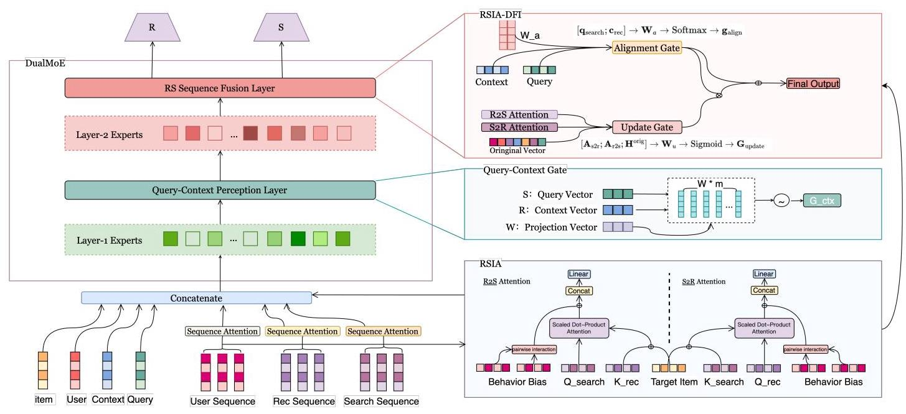

# SuperRS: Multi Scenario Reciprocal-Aware Dual MoE for Unified Recommendation-Search Ranking

Zihan Xia*

xiazihan.xzh@taobao.com

Alibaba Group

Hangzhou, China

Chuanyu Xu

tracy.xcy@taobao.com

Alibaba Group

Hangzhou, China

Tao Zhang*

guyan.zt@taobao.com

Alibaba Group

Hangzhou, China

Chengfu Huo

chengfu.huocf@taobao.com

Alibaba Group

Hangzhou, China

## Abstract

## ACM Reference Format:

Zihan Xia, Chuanyu Xu, Tao Zhang, and Chengfu Huo. 2025. SuperRS: Multi Scenario Reciprocal-Aware Dual MoE for Unified Recommendation-Search Ranking. In Proceedings of the 48th International ACM SIGIR Conference on Research and Development in Information Retrieval (SIGIR '25), July 13-18, 2025, Padua, Italy. ACM, New York, NY, USA, 5 pages. https://doi.org/10.1145/3726302.3731949

In e-commerce, search and recommendation rankings require a deep understanding of user behaviors and personalized scoring of products. While existing systems maintain separate pipelines for search and recommendation, these two scenarios share aligned objectives and exhibit consistent data patterns during ranking. To address this, we propose a joint modeling approach for search-recommendation ranking that enables information gain exchange between the two scenarios, thus facilitating enhanced modeling of users' cross-scenario behaviors. Our proposed SuperRS framework employs a Dual-layer Multi-MoE (DualMoE) architecture to tackle scenario-specific disparities and achieve multi-interest fusion perception. A key aspect is the Search-Recommendation Sequence Fusion Unit, which integrates user interaction sequences from both scenarios. Additionally, we introduce a unified Representation Extraction method utilizing Reciprocal Scenario Interest Attention (RSIA) for feature alignment. Dynamic Feature Integration (DFI) employs a dual gating mechanism for controlled information fusion while preserving scenario identities, combined with multi-objective optimization. On the 1688 App, our framework demonstrates superior performance to baseline models across both offline evaluation metrics and online business indicators.

## CCS Concepts

- Information systems \( \rightarrow \) Retrieval models and ranking.

## Keywords

Recommendation-Search Ranking, Dual MoE, Scenario Disparities, Behavior Fusion, Attention Alignment

## 1 Introduction

Recommendation and Search (RS) functions have emerged as crucial services for online applications, prompting extensive research aimed at improving their effectiveness \( \left\lbrack  {6,8,{11},{16},{17},{23}}\right\rbrack \) . The integration of RS systems has become pivotal for information services, leveraging their symbiotic capture of complementary user intent [20, 22]. While recommendation systems infer latent preferences via historical interactions, search engines address explicit, transient needs. While there are many valid approaches to multi-scenario multi-targeting \( \left\lbrack  {4,7,{15},{19}}\right\rbrack \) , RS unification still mitigates persistent challenges: recommendation cold-start from data sparsity and search degradation due to query ambiguity [12, 13]. Crucially, search behaviors encode real-time intent, whereas recommendations reflect longitudinal interests, forming a causal-complementary dyad [18, 21]. Key to this synergy is disentangling user representations across behavioral domains. Research spans hierarchical embeddings modeling intent transitions [1] to GNNs unifying interactions in heterogeneous graphs [5, 24]. Notable advances include cross-domain decoupling to eliminate search bias [13], counterfactual causal frameworks using search as instrumental variables [12], and unified sequential models integrating temporal attention [20]. Also, pareto-optimization frameworks further balance conflicting objectives [21].

Conventional multi-scenario models face two critical limitations in recommendation and search (RS) scenarios. First, they fail to effectively capture scenario-specific differences and behavioral nuances, leading to a shallow understanding of user interactions and reduced personalization. Second, these models underutilize contextual product features and implicit information from search and recommendation sequences, missing opportunities to improve prediction accuracy and relevance. These issues result in oversimplified user behavior interpretations, neglecting cross-platform complexities and compromising RS integration performance.

---

*Corresponding author

---

To address these challenges, we propose a hierarchical framework combining dual-layer mixture-of-experts (DualMoE) with bidirectional cross-scenario attention. The design features two interdependent modules: context-aware hierarchical experts for progressive feature abstraction and Reciprocal Scenario Interest Attention (RSIA) for synergistic interaction modeling. The first MoE layer employs scenario-specific expert networks to preserve domain characteristics while establishing cross-scenario connections via a compatibility-driven gating mechanism. The second MoE layer processes enhanced behavioral sequences from RSIA, integrating sequence semantics, contextual encodings, and item-specific relevance through target-aware expert selection. The key contributions of this paper are as follows:

- Dual-Layer Mixture-of-Experts (DualMoE): Captures scenario-specific characteristics and complex interactions between search and recommendation tasks at different abstraction levels.

- Reciprocal Scenario Interest Attention (RSIA): Facilitates bidirectional information flow between search and recommendation scenarios, enhancing user intent modeling by integrating cross-scenario interactions, target item relevance, and historical behavior context.

- Dynamic Feature Integration (DFI) and Multi-Objective Optimization: Employs dual gating for controlled information fusion while preserving scenario identities, combined with a multi-objective optimization strategy to balance loss components and enhance model performance.

## 2 Problem Formulation

The joint modeling of search and recommendation scenarios constitutes a multi-faceted learning task defined over a unified interaction space \( \mathcal{D} = \left\{  \left( {{Q}_{s},{C}_{r},\mathrm{t}, y}\right) \right\} \) , where \( {\mathcal{Q}}_{s} = {\left\{  {\mathbf{q}}_{i}\right\}  }_{i = 1}^{{L}_{s}} \) represents search session features with \( {\mathbf{q}}_{i} \in  {\mathbb{R}}^{{d}_{q}} \) denoting \( {d}_{q} \) -dimensional query embeddings, \( {C}_{r} = {\left\{  {\mathrm{c}}_{j}\right\}  }_{j = 1}^{{L}_{r}} \) encapsulates recommendation context features through \( {d}_{c} \) -dimensional item context vectors \( {\mathbf{c}}_{j} \in  {\mathbb{R}}^{{d}_{c}} \) , \( \mathbf{t} \in  {\mathbb{R}}^{{d}_{t}} \) specifies the target item embedding requiring engagement prediction, and \( y \in  \{ 0,1\} \) indicates observed user interaction labels. The learning objective centers on deriving a unified predictive function \( {f}_{\theta } : {\mathcal{Q}}_{s} \times  {\mathcal{C}}_{r} \times  {\mathbb{R}}^{{d}_{t}} \rightarrow  \left\lbrack  {0,1}\right\rbrack \) .

## 3 Method

Our framework introduces a dual-layer mixture-of-experts (MoE) architecture coupled with a novel cross-scenario attention mechanism, designed to jointly model search and recommendation tasks while preserving scenario-specific characteristics.

### 3.1 Hierarchical MoE Architecture

The dual-layer MoE structure processes features at different abstraction levels through specialized expert networks. The first layer focuses on raw scenario-specific feature encoding, while the second layer handles cross-scenario sequence fusion.

3.1.1 Context-Aware Feature Encoding (Layer-1). The primary MoE layer processes raw input features through scenario-specific experts.

Given a search query embedding \( {\mathbf{q}}_{\text{ search }} \in  {\mathbb{R}}^{{d}_{q}} \) and recommendation context vector \( {\mathbf{c}}_{\text{ rec }} \in  {\mathbb{R}}^{{d}_{c}} \) , the context gating mechanism computes expert weights via learnable projection vectors \( {\mathbf{w}}_{m} \in  {\mathbb{R}}^{{d}_{q} + {d}_{c}} \) :

\[
{G}_{m}^{\mathrm{{ctx}}} = \frac{\exp \left( {{\mathbf{w}}_{m}^{\top }\left\lbrack  {{\mathbf{q}}_{\text{ search }};{\mathbf{c}}_{\text{ rec }}}\right\rbrack  }\right) }{\mathop{\sum }\limits_{{{m}^{\prime } = 1}}^{M}\exp \left( {{\mathbf{w}}_{{m}^{\prime }}^{\top }\left\lbrack  {{\mathbf{q}}_{\text{ search }};{\mathbf{c}}_{\text{ rec }}}\right\rbrack  }\right) } \tag{1}
\]

The aggregated context representation \( {\mathbf{h}}^{\text{ ctx }} \in  {\mathbb{R}}^{{d}_{h}} \) combines outputs from \( M \) parallel experts \( \left\{  {E}_{m}^{\text{ ctx }}\right\} \) , each processing the concatenated scenario features:

\[
{\mathbf{h}}^{\mathrm{{ctx}}} = \mathop{\sum }\limits_{{m = 1}}^{M}{G}_{m}^{\mathrm{{ctx}}} \cdot  {E}_{m}^{\mathrm{{ctx}}}\left( \left\lbrack  {{\mathbf{q}}_{\text{ search }};{\mathbf{c}}_{\text{ rec }}}\right\rbrack  \right) \tag{2}
\]

This layer preserves scenario identity through dedicated experts while establishing initial cross-scenario feature interactions. The gating mechanism automatically emphasizes relevant experts based on input feature compatibility.

3.1.2 Cross-Scenario Sequence Fusion (Layer-2). Building upon the context encoding, the secondary MoE layer processes RSIA-enhanced sequence features \( {\mathbf{H}}^{\mathrm{{RSIA}}} \in  {\mathbb{R}}^{L \times  {d}_{h}} \) through adaptive expert selection. The gating network integrates three information sources: processed sequence features, context encoding \( {\mathbf{h}}^{\text{ ctx }} \) , and target item embedding \( {\mathbf{t}}_{\text{ item }} \in  {\mathbb{R}}^{{d}_{t}} \) :

\[
{G}_{n}^{\text{ seq }} = \sigma \left( {{\mathbf{W}}_{g}\left\lbrack  {{\mathbf{H}}^{\mathrm{{RSIA}}};{\mathbf{h}}^{\mathrm{{ctx}}};{\mathbf{t}}_{\text{ item }}}\right\rbrack  }\right) \tag{3}
\]

where \( {\mathbf{W}}_{g} \in  {\mathbb{R}}^{N \times  \left( {{d}_{h} + {d}_{c} + {d}_{t}}\right) } \) projects the concatenated features to \( N \) expert gates. The final sequence encoding \( {\mathbf{h}}^{\text{ seq }} \in  {\mathbb{R}}^{{d}_{h}} \) aggregates outputs from sequence experts \( \left\{  {E}_{n}^{\text{ seq }}\right\} \) :

\[
{\mathbf{h}}^{\text{ seq }} = \mathop{\sum }\limits_{{n = 1}}^{N}{G}_{n}^{\text{ seq }} \cdot  {E}_{n}^{\text{ seq }}\left( {\mathbf{H}}^{\mathrm{{RSIA}}}\right) \tag{4}
\]

This hierarchical design enables gradual feature abstraction, where Layer-1 captures scenario-specific patterns and Layer-2 models complex cross-scenario interactions.

The final prediction integrates multi-level representations through a Dual MoE:

\[
\widehat{y} = {f}_{\text{ MoE }}\left( \left\lbrack  {{\mathbf{h}}^{\text{ com }};{\mathbf{h}}^{\text{ ctx }};{\mathbf{h}}^{\text{ seq }};{\mathbf{H}}^{\text{ RSIA }}}\right\rbrack  \right) \tag{5}
\]

The architecture maintains dimension consistency across components:common features encoding \( {\mathbf{h}}^{\text{ com }} \) , context encoding \( {\mathbf{h}}^{\text{ ctx }} \) and sequence encoding \( {\mathbf{h}}^{\text{ seq }} \) , while RSIA outputs preserve original scenario feature dimensions for residual connection integrity.

### 3.2 Reciprocal Scenario Interest Attention

The Reciprocal Scenario Interest Attention (RSIA) mechanism facilitates bidirectional information flow between search and recommendation scenarios through dual gating.

3.2.1 Target-Aware Composite Attention. The proposed composite attention mechanism integrates three fundamental components to model scenario-specific user intent: (1) cross-scenario interaction patterns, (2) current target item relevance, and (3) historical behavior context. The enhanced attention computation operates through dimension-aware feature transformations:

\[
{\mathrm{A}}_{\mathrm{s}2\mathrm{r}} = \operatorname{Softmax}\left( {\frac{{\mathrm{Q}}_{\text{ search }}{\left\lbrack  {\mathrm{K}}_{\text{ rec }} \oplus  {f}_{\text{ proj }}\left( {\mathrm{t}}_{\text{ item }}\right) \right\rbrack  }^{\top }}{\sqrt{d}} + {\mathrm{B}}_{\text{ hist }}}\right) \tag{6}
\]

\[
{\mathrm{A}}_{\mathrm{r}2\mathrm{\;s}} = \operatorname{Softmax}\left( {\frac{{\mathrm{Q}}_{\mathrm{{rec}}}{\left\lbrack  {\mathrm{K}}_{\text{ search }} \oplus  {f}_{\text{ proj }}\left( {\mathrm{t}}_{\text{ item }}\right) \right\rbrack  }^{\top }}{\sqrt{d}} + {\mathrm{B}}_{\text{ hist }}}\right) \tag{7}
\]

Figure 1: The overall architecture of the proposed model. The figure illustrates the key components, including the Reciprocal Scenario Interest Attention (RSIA) mechanism and the Dual MoE structure.

where \( {\mathrm{t}}_{\text{ item }} \in  {\mathbb{R}}^{{d}_{t}} \) denotes the embedding of the target item being scored, \( {f}_{\text{ proj }} : {\mathbb{R}}^{{d}_{t}} \rightarrow  {\mathbb{R}}^{d} \) represents a learnable linear projection aligning target item features with the attention space, and \( {\mathbf{B}}_{\text{ hist }} \in  {\mathbb{R}}^{L \times  L} \) encodes historical behavior biases through pairwise interaction modeling:

\[
{\mathbf{B}}_{\text{ hist }}\left\lbrack  {i, j}\right\rbrack   = \operatorname{Sigmoid}\left( {{\mathbf{h}}_{i}^{\top }{\mathbf{W}}_{b}{\mathbf{h}}_{j}}\right) \tag{8}
\]

Here \( {\mathbf{h}}_{i} \in  {\mathbb{R}}^{{d}_{h}} \) corresponds to the \( i \) -th historical behavior embedding from the user’s interaction sequence. The \( \oplus \) operator indicates feature-wise addition with dimension broadcasting. where \( {\mathbf{t}}_{\text{ item }} \in  {\mathbb{R}}^{{d}_{t}} \) denotes the embedding of the target item being scored, \( {f}_{\text{ proj }} : {\mathbb{R}}^{{d}_{t}} \rightarrow  {\mathbb{R}}^{d} \) represents a learnable linear projection aligning target item features with the attention space, and \( {\mathbf{B}}_{\text{ hist }} \in  {\mathbb{R}}^{L \times  L} \) encodes historical behavior biases through pairwise interaction modeling. The learnable matrix \( {\mathbf{W}}_{b} \in  {\mathbb{R}}^{{d}_{h} \times  {d}_{h}} \) establishes latent interaction patterns between historical behaviors, the bilinear form \( {\mathbf{h}}_{i}^{\top }{\mathbf{W}}_{b}{\mathbf{h}}_{j} \) measures compatibility between behavior \( i \) and \( j \) in projected space.

3.2.2 Dynamic Feature Integration (DFI). A two-stage gating mechanism controls information fusion. The update gate \( {\mathbf{G}}_{\text{ update }} \in \; {\left\lbrack  0,1\right\rbrack  }^{L \times  d} \) , parameterized by \( {\mathbf{W}}_{u} \in  {\mathbb{R}}^{3d} \) , determines cross-scenario feature injection ratios:

\[
{\mathrm{G}}_{\text{ update }} = \operatorname{Sigmoid}\left( {{\mathrm{W}}_{u}\left\lbrack  {{\mathrm{\;A}}_{\mathrm{s}2\mathrm{r}};{\mathrm{A}}_{\mathrm{r}2\mathrm{\;s}};{\mathrm{H}}^{\text{ orig }}}\right\rbrack  }\right) \tag{9}
\]

where \( {\mathbf{H}}^{\text{ orig }} \in  {\mathbb{R}}^{L \times  d} \) denotes the original scenario-specific feature representations before cross-scenario fusion, serving as the baseline input to prevent over-distortion by attention mechanisms. The alignment gate \( {\mathrm{g}}_{\text{ align }} \in  {\mathbb{R}}^{2} \) preserves scenario identity through direct computation from raw features:

\[
{\mathrm{g}}_{\text{ align }} = \operatorname{Softmax}\left( {{\mathbf{W}}_{a}\left\lbrack  {{\mathbf{q}}_{\text{ search }};{\mathbf{c}}_{\text{ rec }}}\right\rbrack  }\right) \tag{10}
\]

In recommendation scenario, final RSIA outputs combine updated and original features through residual connections:

\[
{\mathrm{H}}^{\mathrm{{RSIA}}} = {\mathrm{g}}_{\text{ align }}\left\lbrack  0\right\rbrack   \cdot  \left( {{\mathrm{G}}_{\text{ update }} \odot  {\mathrm{W}}_{v}{\mathrm{\;A}}_{\mathrm{s}2\mathrm{r}}{\mathrm{V}}_{\mathrm{{rec}}}}\right)  + {\mathrm{g}}_{\text{ align }}\left\lbrack  1\right\rbrack   \cdot  \left\lbrack  {{\mathrm{q}}_{\text{ search }};{\mathrm{c}}_{\text{ rec }}}\right\rbrack
\]

(11)

This dual gating ensures controlled information fusion while maintaining scenario identity, crucial for joint modeling of search and recommendation tasks.

### 3.3 Multi-Objective Optimization

The training objective combines three complementary losses through learnable weights \( {\lambda }_{i} \) :

\[
\mathcal{L} = {\lambda }_{1}{\mathcal{L}}_{\text{ task }} + {\lambda }_{2}{\mathcal{L}}_{\text{ align }} + {\lambda }_{3}{\mathcal{L}}_{\text{ gate }} \tag{12}
\]

The task loss \( {\mathcal{L}}_{\text{ task }} \) employs label smoothing to prevent overconfidence in click-through rate prediction:

\[
{\mathcal{L}}_{\text{ task }} =  - \mathop{\sum }\limits_{{i = 1}}^{N}\left\lbrack  {\left( {1 - \alpha }\right) {y}_{i} + \frac{\alpha }{K}}\right\rbrack  \log \sigma \left( {\widehat{y}}_{i}\right) \tag{13}
\]

where \( \alpha \) controls smoothing intensity and \( K \) denotes binary classes. The alignment loss \( {\mathcal{L}}_{\text{ align }} \) enforces cross-scenario consistency through feature distance minimization and cosine similarity maximization:

\[
{\mathcal{L}}_{\text{ align }} = {\begin{Vmatrix}{\mathbf{H}}^{\text{ search }} - {\mathbf{H}}^{\text{ rec }}\end{Vmatrix}}_{F}^{2} + \left( {1 - \frac{{\mathbf{q}}_{\text{ search }}^{\top }{\mathbf{c}}_{\text{ rec }}}{\begin{Vmatrix}{\mathbf{q}}_{\text{ search }}\end{Vmatrix}\begin{Vmatrix}{\mathbf{c}}_{\text{ rec }}\end{Vmatrix}}}\right) \tag{14}
\]

Gate regularization \( {\mathcal{L}}_{\text{ gate }} \) controls expert activation sparsity to prevent over-specialization:

\[
{\mathcal{L}}_{\text{ gate }} = \frac{1}{M}\mathop{\sum }\limits_{{m = 1}}^{M}{\left( {G}_{m}^{\text{ ctx }} - \tau \right) }^{2} + \frac{1}{N}\mathop{\sum }\limits_{{n = 1}}^{N}{\left( {G}_{n}^{\text{ seq }} - v\right) }^{2} \tag{15}
\]

\( \tau \) and \( v \) defining target activation levels. The adaptive weighting mechanism automatically balances loss components during training.

## 4 Experiment

### 4.1 Experimental Setup

Datasets and Evaluation Metrics. We evaluate our framework on two large-scale industrial datasets from Alibaba's e-commerce platform: (1) Ali_Search containing 158 million search sessions, and (2) Ali_Rec comprising 132 million recommendation sessions. Following industrial practice, we adopt two-level evaluation: Offline Metrics: AUC and Loss evaluated separately on the Ali_Search and Ali_Rec datasets. Online Metrics: Click-Though Rate (CTR%), Conversion Rate (CVR%), Gross Merchandise Value (GMV) and User Average GMV (U-GMV) uplift.

Baselines. We compare against four state-of-the-art approaches:

- ShareBottom [2]: Classic multi-task framework with shared base layers and scenario-specific towers;

- MMoE [9]: Multi-gate MoE with scenario-adaptive gating for soft parameter sharing;

- PLE [14]: Layered expert routing separating shared/specific features to reduce conflicts;

- STAR [10]: Sparse attention with scenario-specific bias for memory-efficient adaptation;

- PEPNet [3]: Dual-gated scenario alignment with expandable module design.

This selection covers spectrum from classical multi-task models to latest multi-scenario approaches, enabling thorough analysis of both architectural evolution and performance boundaries in cross-scenario ranking tasks.

Implementation Details. Our DualMoE architecture employs two-layer expert networks with 8 experts per layer, each implemented as a three-layer MLP (512-256-128 dimensions). The RSIA module utilizes 4 attention heads with 64-dimensional projections. Training leverages the AdamW optimizer (lr=1e-3, \( {\beta }_{1} = {0.9},{\beta }_{2} = {0.95} \) ) for parameter updates.

### 4.2 Results and Discussion

4.2.1 Offline Evaluation. As quantitatively demonstrated in Table 1, SuperRS establishes new state-of-the-art performance across both recommendation and search scenarios. Compared to the best performance baseline, our full model achieves: Recommendation Scenario: +0.431 AUC improvement (0.69401 \( \rightarrow  {0.69832} \) ) with 5.89% loss reduction. Search Scenario: +0.422 AUC gain (0.72109 \( \rightarrow  {0.72531} \) ) accompanied by \( {6.94}\% \) loss decrease. Meanwhile, the incorporation of RSIA yields a measurable improvement in the AUC metric of the baseline model.

4.2.2 Ablation Study. To disentangle component contributions, we conduct surgical ablations on critical modules: There are three critical findings emerge: (1) Dual MoE Contribution: Removing the dual expert structure causes the most severe degradation, validating our core hypothesis about scenario-disparity modeling (2) RSIA Necessity: Disabling reciprocal attention reduces search-to-rec transfer efficiency, disproportionately impacting long-tail queries. (3) DFI Gate Synergy: The unified gating mechanism accounts proving its role in dynamic scenario adaptation.

Table 1: Offline performance comparison (Relative improvement over best baseline)

<table><tr><td>Model</td><td>\( {\mathrm{{AUC}}}_{\mathrm{{rec}}} \)</td><td>Loss</td><td>\( {\mathrm{{AUC}}}_{\mathrm{{search}}} \)</td><td>Loss search</td></tr><tr><td>ShareBottom</td><td>0.68457</td><td>0.00723</td><td>0.71745</td><td>0.00618</td></tr><tr><td>MMoE</td><td>0.69401</td><td>0.00679</td><td>0.72083</td><td>0.00598</td></tr><tr><td>PLE</td><td>0.69084</td><td>0.00693</td><td>0.71862</td><td>0.00634</td></tr><tr><td>STAR</td><td>0.69312</td><td>0.00681</td><td>0.71971</td><td>0.00605</td></tr><tr><td>PEPNet</td><td>0.69345</td><td>0.00684</td><td>0.72109</td><td>0.00576</td></tr><tr><td>ShareBottom+RSIA</td><td>0.69602</td><td>0.00686</td><td>0.72195</td><td>0.00598</td></tr><tr><td>MMoE+RSIA</td><td>0.69645</td><td>0.00688</td><td>0.72363</td><td>0.00568</td></tr><tr><td>PLE+RSIA</td><td>0.69584</td><td>0.00693</td><td>0.72262</td><td>0.00589</td></tr><tr><td>STAR+RSIA</td><td>0.69712</td><td>0.00666</td><td>0.72271</td><td>0.00570</td></tr><tr><td>PEPNet+RSIA</td><td>0.69713</td><td>0.00651</td><td>0.72409</td><td>0.00542</td></tr><tr><td>SuperRS (Ours)</td><td></td><td>0.69832 0.00639</td><td>0.72531</td><td>0.00536</td></tr></table>

Table 2: Component ablation analysis on both scenarios

<table><tr><td>Variants</td><td>\( {\mathrm{{AUC}}}_{\mathrm{{rec}}} \)</td><td>\( \Delta \)</td><td>\( {\mathrm{{AUC}}}_{\text{ search }} \)</td><td>\( \Delta \)</td></tr><tr><td>Full Model</td><td>0.69832</td><td>-</td><td>0.72531</td><td>-</td></tr><tr><td>w/o Dual MoE</td><td>0.69401</td><td>-0.431</td><td>0.71984</td><td>-0.547</td></tr><tr><td>w/o RSIA</td><td>0.69517</td><td>-0.315</td><td>0.72109</td><td>-0.422</td></tr><tr><td>w/o DFI</td><td>0.69688</td><td>-0.144</td><td>0.72315</td><td>-0.216</td></tr></table>

4.2.3 Online \( A/B \) Test. We deploy SuperRS on the 1688 app serving 12 million daily active users. Our framework demonstrates: +0.28% CTR and +0.15% CVR uplift and +3.14% GMV increase. Meanwhile, a +3.48% U-GMV increase has been achieved through deepened insights into user needs.

## 5 Conclusion

This paper proposes SuperRS, a unified framework for integrating e-commerce search and recommendation systems through three core innovations: (1) a Dual-layer Multi-MoE (DualMoE) architecture that models scenario-specific patterns and cross-task interactions via hierarchical feature abstraction, and (2) a Reciprocal Scenario Interest Attention (RSIA) mechanism that enables bidirectional intent alignment by integrating target item relevance, historical behavior biases, and cross-scenario dependencies. (3) The framework employs Dynamic Feature Integration (DFI) gates for scenario-aware fusion and multi-objective optimization to balance expert specialization. The system achieves seamless synergy between search and recommendation functionalities. Both offline and online Experimental validation demonstrates statistically significant improvements.

## References

[1] Qingyao Ai, Yongfeng Zhang, Keping Bi, Xu Chen, and W Bruce Croft. 2017. Learning a hierarchical embedding model for personalized product search. In Proceedings of the 40th International ACM SIGIR Conference on Research and Development in Information Retrieval. 645-654.

[2] Rich Caruana. 1997. Multitask learning. Machine learning 28 (1997), 41-75.

[3] Jianxin Chang, Chenbin Zhang, Yiqun Hui, Dewei Leng, Yanan Niu, Yang Song, and Kun Gai. 2023. Pepnet: Parameter and embedding personalized network for infusing with personalized prior information. In Proceedings of the 29th ACM SIGKDD Conference on Knowledge Discovery and Data Mining. 3795-3804.

[4] Jingtong Gao, Bo Chen, Menghui Zhu, Xiangyu Zhao, Xiaopeng Li, Yuhao Wang, Yichao Wang, Huifeng Guo, and Ruiming Tang. 2024. HierRec: Scenario-Aware Hierarchical Modeling for Multi-scenario Recommendations. In Proceedings of the 33rd ACM International Conference on Information and Knowledge Management.

[5] Yongjing Hao, Fuzhen Zhuang, Deqing Wang, Guanfeng Liu, Victor S Sheng, and Pengpeng Zhao. 2024. A General Strategy Graph Collaborative Filtering for Recommendation Unlearning. In Proceedings of the 33rd ACM International Conference on Information and Knowledge Management. 799-808.

[6] Junyoung Hwang, Hyunjun Ju, SeongKu Kang, Sanghwan Jang, and Hwanjo Yu. 2024. Multi-Domain Sequential Recommendation via Domain Space Learning. In Proceedings of the 47th International ACM SIGIR Conference on Research and Development in Information Retrieval. 2134-2144.

[7] Shen Jiang, Guanghui Zhu, Yue Wang, Chunfeng Yuan, and Yihua Huang. 2024. Automatic Multi-Task Learning Framework with Neural Architecture Search in Recommendations. In Proceedings of the 30th ACM SIGKDD Conference on Knowledge Discovery and Data Mining. 1290-1300.

[8] Guojiao Lin, Meng Zhen, Dongjie Wang, Qingqing Long, Yuanchun Zhou, and Meng Xiao. 2024. GUME: Graphs and User Modalities Enhancement for LongTail Multimodal Recommendation. In Proceedings of the 33rd ACM International Conference on Information and Knowledge Management. 1400-1409.

[9] Jiaqi Ma, Zhe Zhao, Xinyang Yi, Jilin Chen, Lichan Hong, and Ed H Chi. 2018. Modeling task relationships in multi-task learning with multi-gate mixture-of-experts. In Proceedings of the 24th ACM SIGKDD international conference on knowledge discovery & data mining. 1930-1939.

[10] Xiang-Rong Sheng, Liqin Zhao, Guorui Zhou, Xinyao Ding, Binding Dai, Qiang Luo, Siran Yang, Jingshan Lv, Chi Zhang, Hongbo Deng, et al. 2021. One model to serve all: Star topology adaptive recommender for multi-domain ctr prediction. In Proceedings of the 30th ACM International Conference on Information & Knowledge Management. 4104-4113.

[11] Wentao Shi, Xiangnan He, Yang Zhang, Chongming Gao, Xinyue Li, Jizhi Zhang, Qifan Wang, and Fuli Feng. 2024. Large language models are learnable planners for long-term recommendation. In Proceedings of the 47th International ACM SIGIR Conference on Research and Development in Information Retrieval. 1893-1903.

[12] Zihua Si, Xueran Han, Xiao Zhang, Jun Xu, Yue Yin, Yang Song, and Ji-Rong Wen. 2022. A model-agnostic causal learning framework for recommendation using search data. In Proceedings of the ACM web conference 2022. 224-233.

[13] Zihua Si, Zhongxiang Sun, Xiao Zhang, Jun Xu, Xiaoxue Zang, Yang Song, Kun Gai, and Ji-Rong Wen. 2023. When search meets recommendation: Learning disentangled search representation for recommendation. In Proceedings of the 46th international ACM SIGIR conference on research and development in information retrieval. 1313-1323.

[14] Hongyan Tang, Junning Liu, Ming Zhao, and Xudong Gong. 2020. Progressive layered extraction (ple): A novel multi-task learning (mtl) model for personalized recommendations. In Proceedings of the 14th ACM conference on recommender systems. 269-278.

[15] Jie Wang, Alexandros Karatzoglou, Ioannis Arapakis, Xin Xin, Xuri Ge, and Joemon M Jose. 2024. Sparks of Surprise: Multi-objective Recommendations with Hierarchical Decision Transformers for Diversity, Novelty, and Serendipity. In Proceedings of the 33rd ACM International Conference on Information and Knowledge Management. 2358-2368.

[16] Zhefan Wang, Yuanqing Yu, Wendi Zheng, Weizhi Ma, and Min Zhang. 2024. Macrec: A multi-agent collaboration framework for recommendation. In Proceedings of the 47th International ACM SIGIR Conference on Research and Development in Information Retrieval. 2760-2764.

[17] Jing Xiao, Weike Pan, and Zhong Ming. 2024. A generic behavior-aware data augmentation framework for sequential recommendation. In Proceedings of the 47th international ACM SIGIR conference on research and development in information retrieval. 1578-1588.

[18] Jun Xu, Xiangnan He, and Hang Li. 2018. Deep learning for matching in search and recommendation. In The 41st International ACM SIGIR Conference on Research & Development in Information Retrieval. 1365-1368.

[19] Xin Yang, Heng Chang, Zhijian Lai, Jinze Yang, Xingrun Li, Yu Lu, Shuaiqiang Wang, Dawei Yin, and Erxue Min. 2024. Hyperbolic contrastive learning for cross-domain recommendation. In Proceedings of the 33rd ACM International Conference on Information and Knowledge Management. 2920-2929.

[20] Jing Yao, Zhicheng Dou, Ruobing Xie, Yanxiong Lu, Zhiping Wang, and Ji-Rong Wen. 2021. USER: A unified information search and recommendation model based on integrated behavior sequence. In Proceedings of the 30th ACM International Conference on Information & Knowledge Management. 2373-2382.

[21] Hamed Zamani and W Bruce Croft. 2018. Joint modeling and optimization of search and recommendation. arXiv preprint arXiv:1807.05631 (2018).

[22] Hamed Zamani and W Bruce Croft. 2020. Learning a joint search and recommendation model from user-item interactions. In Proceedings of the 13th international conference on web search and data mining. 717-725.

[23] Zijian Zhang, Shuchang Liu, Jiaao Yu, Qingpeng Cai, Xiangyu Zhao, Chunxu Zhang, Ziru Liu, Qidong Liu, Hongwei Zhao, Lantao Hu, et al. 2024. MDMTRec: An Adaptive Multi-Task Multi-Domain Recommendation Framework. In 47th International ACM SIGIR Conference on Research and Development in Information Retrieval (SIGIR 2024).

[24] Kai Zhao, Yukun Zheng, Tao Zhuang, Xiang Li, and Xiaoyi Zeng. 2022. Joint learning of e-commerce search and recommendation with a unified graph neural network. In Proceedings of the Fifteenth ACM International Conference on Web Search and Data Mining. 1461-1469.