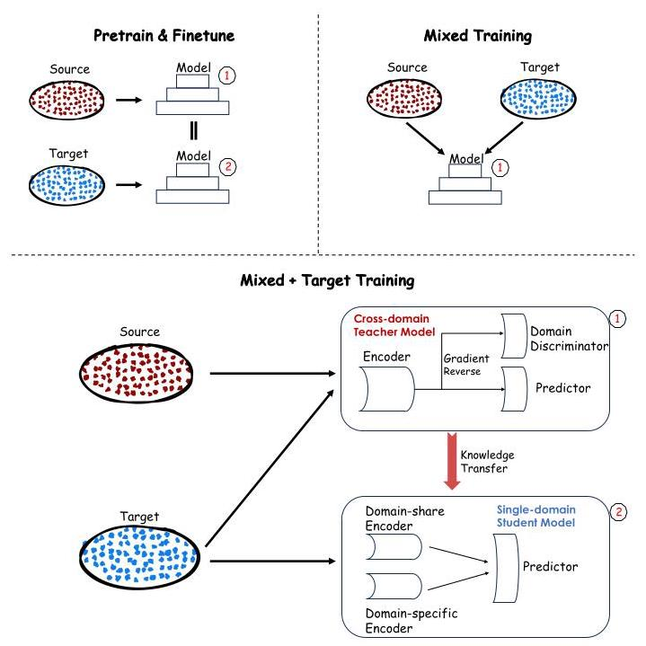
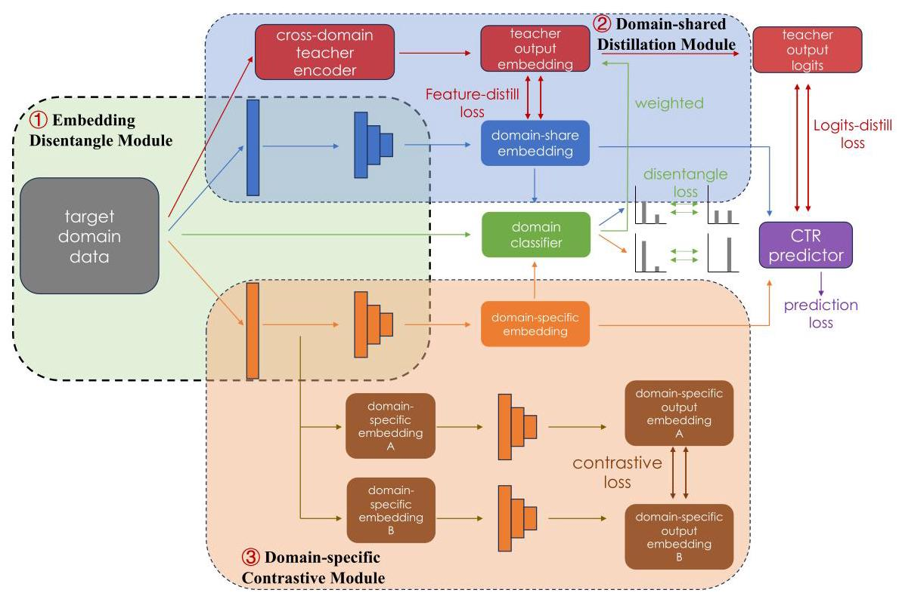
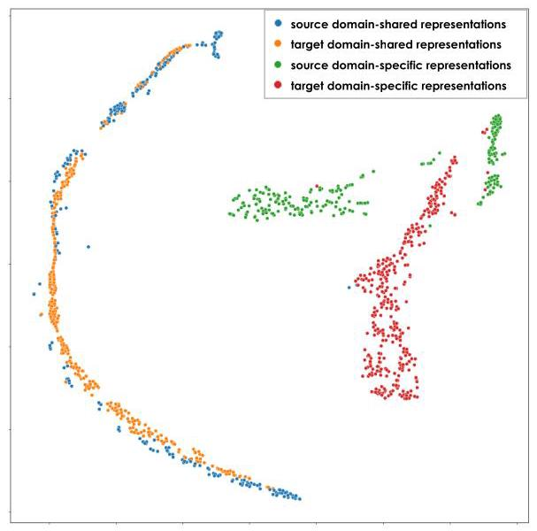
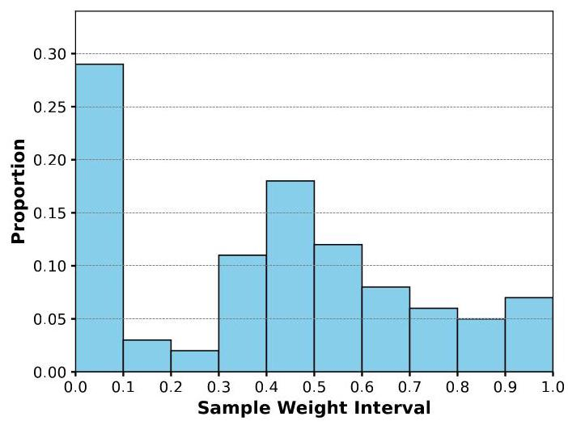
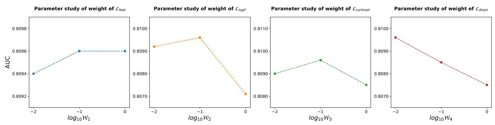

# DDCDR: A Disentangle-based Distillation Framework for Cross-Domain Recommendation

Zhicheng An*

anzhicheng.azc@antgroup.com

Ant Group

Hangzhou, Zhejiang, China

Zhexu Gu*

zhexu.guzhexu@antgroup.com

Ant Group

Hangzhou, Zhejiang, China

Li Yu

jinli.yl@antgroup.com

Ant Group

Hangzhou, Zhejiang, China

Ke Tu

tuke.tk@antgroup.com

Ant Group

Hangzhou, Zhejiang, China

Zhengwei Wu

zejun.wzw@antgroup.com

Ant Group

Hangzhou, Zhejiang, China

Binbin \( {\mathrm{{Hu}}}^{ \dagger  } \)

bin.hbb@antgroup.com

Ant Group

Hangzhou, Zhejiang, China

Zhiqiang Zhang

lingyao.zzq@antgroup.com

Ant Group

Hangzhou, Zhejiang, China

Lihong Gu

lihong.glh@antgroup.com

Ant Group

Hangzhou, Zhejiang, China

Jinjie Gu

jinjie.gujj@antgroup.com

Ant Group

Hangzhou, Zhejiang, China

## Abstract

Modern recommendation platforms frequently encompass multiple domains to cater to the varied preferences of users. Recently, cross-domain learning has gained traction as a significant paradigm within the context of recommendation systems, enabling the leveraging of rich information from a well-endowed source domain to enhance a target domain, often limited by inadequate data resources. A primary concern in cross-domain recommendation is the mitigation of negative transfer-ensuring the selective transference of pertinent knowledge from the source (domain-shared knowledge) while maintaining the integrity of domain-unique insights within the target domain (domain-specific knowledge).

In this paper, we propose a novel Disentangle-based Distillation Framework for Cross-Domain Recommendation (DDCDR), designed to operate at the representational level and rooted in the established teacher-student knowledge distillation paradigm. Our methodology begins with the development of a cross-domain teacher model, trained adversarially alongside a domain discriminator. This is followed by the creation of a target domain-specific student model. By employing the trained domain discriminator, we successfully segregate domain-shared from domain-specific representations. The teacher model guides the learning of domain-shared features, while domain-specific features are enhanced via contrastive learning methods. Experiments conducted on both public datasets and an

industrial dataset demonstrate DDCDR achieves a new state-of-the-art performance. The implementation within Ant Group's platform further confirms its online efficacy, manifesting relative improvements of \( \mathbf{0.{33}\% } \) and \( \mathbf{0.{45}\% } \) in Unique Visitor Click-Through Rate (UVCTR) across two distinct recommendation scenarios, compared to baseline performances.

## CCS Concepts

- Information systems \( \rightarrow \) Data mining.

## Keywords

Cross-Domain Recommendation, Transfer Learning, Knowledge Distillation

## ACM Reference Format:

Zhicheng An, Zhexu Gu, Li Yu, Ke Tu, Zhengwei Wu, Binbin Hu, Zhiqiang Zhang, Lihong Gu, and Jinjie Gu. 2024. DDCDR: A Disentangle-based Distillation Framework for Cross-Domain Recommendation. In Proceedings of the 30th ACM SIGKDD Conference on Knowledge Discovery and Data Mining (KDD '24), August 25-29, 2024, Barcelona, Spain. ACM, New York, NY, USA, 10 pages. https://doi.org/10.1145/3637528.3671605

## 1 Introduction

Contemporary commercial platforms, including e-commerce giants like Alibaba and digital payment platforms such as Alipay, host a diverse array of recommendation scenarios addressing the broad range of user tastes and interests [4, 34, 38, 39]. For instance, Alipay customizes recommendations for users by suggesting products in online malls and curating personalized short video content feeds. However, the challenge of data sparsity is prevalent across many of these domains, undermining the effectiveness of recommendation systems. To mitigate this issue, cross-domain transfer learning emerges as a cogent solution in the industrial sector, enabling the enhancement of recommendation performance in data-impoverished domains by transferring knowledge from domains where data is plentiful [11, 17, 18, 26, 30, 40].

The pursuit of efficacious cross-domain recommendation systems faces the obstacle of negative transfer-when irrelevant or misleading information from one domain degrades the model in another [7, 20, 27, 35, 36]. Despite the presence of overlapping users or items across scenarios, which ostensibly offer a trove of transferrable attributes, not all information is suitable for such cross-transfer. For example, while a user's consumption level could be a feature amenable to transfer, purchasing preferences often vary across different contexts. Indiscriminately transferring all information without discernment can be detrimental.

---

*Both authors contributed equally to this research.

†Corresponding author.

---

Numerous methods for cross-domain recommendation have been devised over time to leverage abundant data while combating negative transfer \( \left\lbrack  {5,{16},{22},{23},{32},{40}}\right\rbrack \) . Early approaches adopt the Pretrain and Finetune paradigm, which train a model on a data-rich source domain and subsequently refining it within the target domain. This, however, might trap the model in a local optimum tailored to the source domain, inducing negative transfer [9, 15]. Subsequent techniques have adopted Mixed Training strategies, simultaneously training source and target domain data, taking various measures to alleviate the issue of negative transfer \( \left\lbrack  {1,{21},{23},{37}}\right\rbrack \) . Alibaba's STAR [23] employs a shared-specific network structure, in which each domain's network comprises a central network utilized by all domains and an individual network customized for each domain. However, expecting the model's architecture to distinguish between similarities and differences accurately may be overly optimistic. This approach risks amalgamating disparate data, potentially importing unique knowledge from the source domain that isn't beneficial for the target domain. Meituan's CCTL [37] tackles negative transfer from the sample dimension, evaluating the potential value of source domain samples by utilizing reinforcement learning techniques [28] to create individual sample weights. Nonetheless, the granularity of this sample selection remains relatively broad. We argue that the transfer of informational content ought to be scrutinized at the representational level. Dis-enCDR [1], another representative, seeks to separate the shared and specific representation for each user. It employs dual regu-larizers to disentangle these information types, transferring only the domain-shared knowledge. However, DisenCDR still operates under a mixed training paradigm, a strategy potentially dominated by the source domain, particularly when the target domain lacks sufficient data. Additionally, this method does not account for the transfer suitability of individual target samples.

Building upon the insights from prior research, the principal challenges in cross-domain recommendation encompass: (1) extracting domain-shared information that transcends individual domains; (2) delineating domain-shared and domain-specific representations; and (3) transferring domain-shared knowledge in a manner that maximizes its applicability and benefit to the target domain.

In response to these challenges, our work introduces a disentangle-based framework that innovatively integrates the strengths of the Pretrain and Finetune, as well as the Mixed Training paradigms, to facilitate the transfer of cross-domain knowledge, illustrated in Figure 1. Our framework emphasizes knowledge transfer by selecting the advantageous aspects of data representations and assessing the pertinence of each sample. At the outset, a teacher model is trained on combined cross-domain data, which integrates a domain discriminator in an adversarial setup, refined by the inclusion of a gradient reversal layer to encourage the extraction of domain-shared representations. Subsequent to the teacher model's synthesis of joint knowledge, a student model is developed with a target domain focus. It comprises three essential components: a Representation Disentangle Module to separate shared and specific representations, with the help of the pre-trained domain discriminator; a Domain-shared Representation Distillation Module, whereby the shared component is fortified through the teacher model's generalized knowledge via feature distillation; and a Domain-specific Representation Contrastive Module, which employs contrastive learning to enhance the target domain's sparse data. Our framework enriches the student model with fine-tuned, domain-adaptive expertise and is further augmented by logit distillation. The efficacy of each distillation is calibrated through the pre-trained discriminator, assessing the transferability of individual samples.

Figure 1: An illustration of different paradigms in cross-domain recommendation. The upper section delineates the two conventional paradigms: the Pretrain & Finetune paradigm, where a model is initially established on the source domain and subsequently refined using the target domain data; and the Mixed Training paradigm, which involves training the model concurrently on both domains. In contrast, the lower section depicts our 'Mixed + Target Training' paradigm. This approach begins with the training of a cross-domain teacher model, followed by the training of a disentangled target student model, which benefits from the transfer of domain-shared knowledge derived from the teacher model.

The main contributions of this work are summarized as follows:

- We introduce an innovative disentangle-based distillation cross-domain framework, DDCDR, to mitigate negative transfer in the cross-domain recommendation. Our method effectively avoids negative transfer which transfers shared knowledge across domains while simultaneously amplifying domain-specific expertise.

- Our approach involves training a cross-domain teacher model that incorporates both source and target domains. This model employs a domain classifier complemented by a gradient reversal layer, which aids in the extraction of joint knowledge from the entirety of the domains involved.

- Our framework develops a decoupled student model tailored for the target domain. The model processes input representations by segregating them into shared and specific components. The shared components draw guidance from the pre-trained teacher model, while the specific components are reinforced through contrastive learning to address data sparsity problem.

- Our evaluation of the proposed method against various baseline approaches on two public datasets and our in-house industrial dataset indicates that our method has reached a new pinnacle of state-of-the-art performance. When implemented within two distinct recommendation scenarios in the Alipay app, the DDCDR secured relative enhancements of 0.33% and 0.45% in Unique Visitor Click-Through Rate (UVCTR).

## 2 Method

### 2.1 Problem Formulation

In this paper, we conceptualize the cross-domain recommendation challenge as leveraging data from one or more source domains to augment the efficacy of a model within a target domain[41, 42]. Our primary emphasis is on the prediction of Click-Through Rate (CTR), which serves as a critical metric for evaluating the performance of recommendation systems in our analysis.

Assume there two distinct domains: a source domain, denoted as \( {\mathcal{D}}_{s} = \left( {{\mathbf{X}}_{s},{\mathbf{y}}_{s}}\right) \) , and a target domain, represented as \( {\mathcal{D}}_{t} = \left( {{\mathbf{X}}_{t},{\mathbf{y}}_{t}}\right) \) . Within these domain definitions, X corresponds to the feature space of the samples, and y signifies the associated labels for prediction tasks. The objective in cross-domain recommendation is to formulate a predictive function \( f\left( \cdot \right) \) that effectively leverages the amalgamation of knowledge from both \( {\mathcal{D}}_{s} \) and \( {\mathcal{D}}_{t} \) . The aspiration is to achieve a state-of-the-art predictor that can generalize well on \( {\mathcal{D}}_{t} \) , while harnessing the potentially rich and diverse informational cues contained in \( {\mathcal{D}}_{s} \) , enabling a more informed estimation of click probabilities. Therefore, the objective function is formulated as:

\[
\mathcal{J} = \operatorname{minimize}\left\{  {\frac{1}{{N}_{t}}\mathop{\sum }\limits_{{{\mathbf{X}}_{i},{\mathbf{y}}_{i} \in  {\mathcal{D}}_{t}}}^{{N}_{t}}{CE}\left( {{\mathbf{y}}_{i}, f\left( {{\mathbf{X}}_{i},\Theta  \mid  {\mathcal{D}}_{s},{\mathcal{D}}_{t}}\right) }\right) }\right\} \tag{1}
\]

where \( {N}_{t} \) is the number of target samples, \( \Theta \) denotes the predictor’s parameters and \( {CE}\left( \cdot \right) \) denotes cross-entropy loss function.

### 2.2 Model Overview

Our framework adheres to the established teacher-student knowledge distillation paradigm shown in Figure 1. In our framework, we initially train a Cross-Domain Teacher Model in conjunction with a domain discriminator, harnessing adversarial training strategies to sharpen their domain-adaptive capabilities. The teacher model's primary role is to extract domain-share knowledge, acting as a conduit for the transfer of domain-invariant features.

Subsequently, we introduce the refined Disentangle-based Student Model dedicated to the target domain. This model adeptly incorporates the domain-general insights rendered by the teacher model while concurrently accentuating the unique characteristics inherent to the target domain. During training, the model bifurcates the input data into two representations: (1) a domain-share representation, designed to internalize the teacher's transferable knowledge while filtering out deleterious biases from the source domain, and (2) a domain-specific representation, engineered to encapsulate the distinctive features of the target domain. The latter representation is strengthened by deploying contrastive learning techniques to mitigate data scarcity challenges. Our deliberate separation of representations and their targeted utilization significantly mitigate the risk of negative transfer, ensuring that only constructive knowledge is imparted to the target domain, and consequently, enhances the predictive accuracy of our model.

### 2.3 Cross-Domain Teacher Model

Our methodology employs a sophisticated cross-domain model to judiciously extract and transfer knowledge across multiple domains. The selection of cross-domain models is diverse, encompassing options like STAR, CCTL, among others, which can serve as viable alternatives. The chosen framework must excel in capturing and utilizing the commonalities across the domains. The generic architecture of such models incorporates two primary components: an encoder and a predictor. The encoder's role is pivotal; it transforms raw input data from various domains into a refined representational format, frequently realized as embeddings. Subsequently, the predictor-often realized as a single-layer neural network layer-utilizes these embeddings to estimate the target outcome, such as click-through probability (CTR), with precision.

We use \( E\left( \cdot \right) \) to denote the encoder and \( {g}_{p}\left( \cdot \right) \) as the predictor. The loss function of the cross-domain model can be formulated as:

\[
{\mathcal{L}}_{\text{ predictor }} = {\mathbb{E}}_{{\mathbf{X}}_{i},{\mathbf{y}}_{i} \in  \left( {{\mathcal{D}}_{s},{\mathcal{D}}_{t}}\right) }\left\lbrack  {{CE}\left( {{g}_{p}\left( {E\left( {\mathbf{X}}_{i}\right) }\right) ,{\mathbf{y}}_{i}}\right) }\right\rbrack \tag{2}
\]

where \( {CE}\left( \cdot \right) \) indicates cross-entropy loss and the cross-domain model is trained on both source and target domains.

To enhance the cross-domain model's ability to extract domain-shared knowledge, we employ adversarial learning, drawing inspiration from the Domain-Adversarial Neural Network (DANN) [8]. We introduce a domain discriminator \( {g}_{d}\left( \cdot \right) \) , a binary classification network designed to determine the domain origin of input samples-specifically, whether they originate from the source domain or the target domain-by analyzing the extracted embeddings. Adjacent to the domain discriminator, a gradient reversal layer (GRL)[6] is integrated. The GRL, devoid of trainable parameters, acts as an identity operator during forward propagation, transmitting data without alteration. Conversely, during backpropagation, it negates the gradient, effectively multiplying it by -1 , and passes it upstream. This inversion is crucial for the adversarial learning process as it encourages the feature encoder to generate domain-invariant features, thereby facilitating the model's ability to learn representations that are shared across the source and target domains. The loss of domain discriminator can be denoted as:

\[
{\mathcal{L}}_{\text{ discriminator }} = {\mathbb{E}}_{{\mathbf{X}}_{i},{\mathbf{d}}_{i} \in  \left( {{\mathcal{D}}_{s},{\mathcal{D}}_{t}}\right) }\left\lbrack  {\operatorname{CE}\left( {{g}_{d}\left( {\operatorname{Grad}\operatorname{Rev}\left( {E\left( {\mathbf{X}}_{i}\right) }\right) }\right) ,{\mathbf{d}}_{i}}\right) }\right\rbrack
\]

(3)where \( {\mathbf{d}}_{i} \) represents which domain sample \( i \) belongs to. The total loss of teacher to be optimized is then the sum of \( {\mathcal{L}}_{\text{ predictor }} \) and \( {\mathcal{L}}_{\text{ discriminator }} \) .

### 2.4 Disentangle-based Student model

After obtaining the teacher model, we train a student model from scratch aiming to the target domain. Figure 2 illustrates the total structure of our proposed student model which is made up of the following three parts.

- Representation Disentangle Module. This module systematically disentangles the domain-shared embeddings from the domain-specific embeddings, operating under the direction of the pre-trained domain discriminator.

- Domain-shared Representation Distillation Module. In this module, the teacher model facilitates the conveyance of domain-joint knowledge into the domain-shared representation by employing feature distillation techniques.

- Domain-specific Representation Contrastive Module. In this module, we harness contrastive learning techniques to forge robust domain-specific representations, thereby offering a beneficial solution to the challenge of data sparsity.

Upon processing, the distinct representations are amalgamated to estimate the ultimate click probability. Additionally, our model is augmented with traditional logit distillation, capitalizing on the comprehensive information encapsulated within the teacher's log-its, which surpasses that of one-hot labels. The rich content, often referred to as 'dark knowledge', is harnessed for enhanced distillation efficacy [10]. Furthermore, the domain discriminator's output is judiciously leveraged as sample weights, appraising the value of each sample for knowledge transfer.

2.4.1 Representation Disentangle Module. Domain shift remains a pivotal obstacle of cross-domain learning, necessitating the discernment between features that are transferable and those that are not across diverse domains. It is essential to identify and segregate domain-shared features, which are conducive to transfer, from domain-specific features that are inherently tied to their original domain. Unselective transfer of features can lead to detrimental effects on the model's efficacy in the target domain.

In the construction of the teacher model, we embraced an adversarial learning strategy aimed at rendering the features derived from different domains as indistinguishable as possible, thereby maximizing the extraction of inter-domain shared information. Nevertheless, in the target domain model, an exclusive reliance on shared information may lead to the neglect of domain-specific features, which could compromise model performance. Therefore, our goal is to disentangle domain-shared information from domain-specific information and to harness them individually, optimizing their respective contributions to the model's efficacy.

During the decoupling process, we employ dual independent Embedding Layers alongside a pair of sub-networks (Subnets) dedicated to encoding features specific to the target domain.

\[
\left\{  \begin{matrix} {\mathbf{E}}_{\text{ share }} = {ML}{P}_{\text{ share }}\left( {{V}_{\text{ share }}\left( \mathbf{X}\right) }\right) , \\  {\mathbf{E}}_{\text{ specific }} = {ML}{P}_{\text{ specific }}\left( {{V}_{\text{ specific }}\left( \mathbf{X}\right) }\right) , \end{matrix}\right. \tag{4}
\]

where \( V\left( \cdot \right) \) denots embedding layer and \( {MLP}\left( \cdot \right) \) indicates subnetworks.

This methodology enables the effective extraction of representations that are either domain-shared or domain-specific. However, the mere segregation of these representation types does not suffice. Our ambition is for the bifurcated representations to be consistent with our foundational hypothesis, in which they embody domain-shared and domain-specific knowledge, respectively. To attain this aim, we propose leveraging the domain discriminator, which has been trained as part of the teacher model's architecture. We posit that embeddings embody a greater degree of domain-specific knowledge if they can be classified by the domain discriminator with high certainty. Conversely, if the classification confidence is lower, it suggests a richer presence of domain-shared information. By freezing the parameters of the pre-trained domain discriminator, we guide the output distribution of the domain-shared embeddings, post-classification, to approximate a uniform distribution of [0.5, 0.5], indicating ambiguity and thus domain-shared characteristics. In contrast, we steer the output distribution of the domain-specific embeddings towards a binary distribution of \( \left\lbrack  {0,1}\right\rbrack \) , reflecting a higher certainty and thus domain-specific traits. The loss function can be formulated as:

\[
{\mathcal{L}}_{\text{ disen }} = {\mathbb{E}}_{x \sim  {\mathcal{D}}_{\text{ tgt }}}\left\lbrack  {{L}_{CE}\left( {{d}_{c}^{t}\left( {\mathbf{E}}_{\text{ share }}\right) ,{0.5}}\right) ) + {L}_{CE}\left( {{d}_{c}^{t}\left( {\mathbf{E}}_{\text{ specific }}\right) ,1)}\right) }\right\rbrack  ,
\]

(5)

where \( {d}_{c}^{t}\left( \cdot \right) \) represents the teacher’s domain discriminator and \( {CE}\left( \cdot \right) \) indicates cross-entropy loss.

#### 2.4.2 Domain-shared Representation Distillation Module.

The representation disentangle module illustrates the method for differentiating between domain-shared and domain-specific information. Once these two forms of representation are acquired, the question arises: how can we utilize them effectively? For the domain-shared embeddings, acknowledging their aptness for cross-domain information transfer, we implement a cross-domain shared knowledge alignment module. This module harnesses knowledge distillation techniques to convey the domain-shared knowledge from the teacher model to the student model, thereby facilitating the transfer of knowledge.

During the distillation process, we concentrate on the interplay between the teacher model's output representation and the domain-shared representation. Recognizing that the characterization layer of neural networks is a reservoir of rich information, we employ a feature distillation technique at this layer, a widely accepted approach within the realm of knowledge distillation. This method aims to capture and transfer the nuanced information contained within the characterization layer to enhance the student model's performance. The objective loss function is defined as:

\[
{\mathcal{L}}_{\text{ feat }} = {L}_{KD}\left( {\operatorname{Softmax}\left( {\mathbf{E}}_{t}\right) ,\operatorname{Softmax}\left( {\mathbf{E}}_{\text{ share }}\right) ,}\right. \tag{6}
\]

where \( {L}_{KD}\left( \cdot \right) \) is the Kullback-Leibler Divergence [19] function that measures the similarity between two embeddings and \( {\mathbf{E}}_{t} \) is the teacher's output embeddings.

After decoupling representations to counter negative transfer, we further introduce a sample-level weighting mechanism to discern the transferability of information to target domain samples. These weights emanate from the teacher discriminator's output. We contend that samples situated near the distribution boundary between source and target domains in the feature space exhibit more generality compared to those that can be confidently classified. Guided by this insight, we have devised a conical function to quantify the classification score form the teacher discriminator,

\[
{w}_{i} = \left( {4 - 2 * b}\right)  * \min {\left( {p}_{0},{p}_{1}\right) }^{2} + b * \min \left( {{p}_{0},{p}_{1}}\right) , \tag{7}
\]

Figure 2: The core model, a disentangle-based student architecture, comprises three distinct sub-modules: The Representation Disentangle Module separates raw inputs into domain-shared and domain-specific components; the Domain-shared Representation Distillation Module facilitates knowledge transfer from the teacher model; and the Domain-specific Representation Contrastive Module refines the specificity of embeddings through contrastive learning.

where \( {p}_{0} \) and \( {p}_{1} \) denote the probabilities estimated by the discriminator that the given sample originates from the source domain and the target domain, respectively and \( b \) is a hyper-parameter. Sample weights should increase with proximity to the source-target domain boundary, with those closest to the boundary receiving higher weights. The weighting function should thus be monotonically increasing with respect to \( \min \left( {{p}_{0},{p}_{1}}\right) \) , peaking at 0.5 and diminishing to its lowest value when \( \min \left( {{p}_{0},{p}_{1}}\right) \) approaches zero. At the apex of the function, the domain discriminator is rendered incapable of discerning the provenance of the samples, signifying an optimal state for domain-shared representation learning. In accordance with this state, the distillation weight is calibrated to its superlative magnitude. We also introduce a hyperparameter \( b \) to shape the weighting function’s curve. With \( b \) set to 2, the function is linear. As \( b \) increases beyond this value, the function becomes concave, giving lower weights to samples far from the boundary. Conversely, with \( b \) less than 2, the function turns convex, emphasizing weights for samples near the boundary.

In our empirical implementation, the hyperparameter \( b \) is calibrated to span the interval from 0.01 to 4 . It is within these bounds that the corresponding weighting function not only retains a monotonically ascending trajectory but also consistently sustains nonnegative values across its entire domain.

Therefore, the weighted distillation loss is updated as:

\[
{\mathcal{L}}_{\text{ feat }} = {\mathbb{E}}_{x \sim  \left( {\mathcal{D}}_{\text{ tgt }}\right) }\left\lbrack  {{w}_{x}{L}_{KD}\left( {\operatorname{Softmax}\left( {\mathbf{E}}_{t, x}\right) ,\operatorname{Softmax}\left( {\mathbf{E}}_{\text{ share }, x}\right) }\right) }\right\rbrack  .
\]

(8)

2.4.3 Domain-specific Representation Contrastive Module. For the domain-specific representations, which encapsulate knowledge intrinsic to the target domain, we aim to extract self-supervised information to address the issue of data sparsity in the target domain and to cultivate a more equitable domain unique insight[33]. To this end, we employ contrastive learning techniques to refine and enhance the domain-specific representations.

Upon traversing the domain-specific pathway of the Embedding Layer, the resulting sample representation undergoes a dual application of Dropout[24] operations. Subsequently, the perturbed sample representation is channeled through the domain-specific subnet, generating two augment representational views.

\[
\left\{  \begin{array}{l} {\mathbf{z}}_{x}^{\prime } = {ML}{P}_{\text{ specific }}\left( {\operatorname{DROPOUT}\left( {\mathbf{v}}_{x}\right) }\right) , \\  {\mathbf{z}}_{x}^{\prime \prime } = {ML}{P}_{\text{ specific }}\left( {\operatorname{DROPOUT}\left( {\mathbf{v}}_{x}\right) }\right) . \end{array}\right. \tag{9}
\]

On the enhanced view of production, we use INFONCE [25] to build contrastive loss.

\[
{\mathcal{L}}_{\text{ contrast }} = {\mathbb{E}}_{x \sim  \left( {\mathcal{D}}_{tgt}\right) }\left\lbrack  {-\log \frac{\exp \left( {{\mathbf{z}}_{x}^{\prime }{\mathbf{z}}_{x}^{\prime \prime }/\tau }\right) }{\mathop{\sum }\limits_{{i \in  \mathcal{B}\& i \neq  x}}\exp \left( {{\mathbf{z}}_{x}^{\prime }{\mathbf{z}}_{i}^{\prime \prime }/{\tau }_{2}}\right) }}\right\rbrack  . \tag{10}
\]

where \( \mathcal{D} \) indicates the samples that belong to the same batch as \( x \) . The InfoNCE loss function is designed to draw representations of similar samples closer while pushing those of dissimilar samples apart, thereby yielding more robust domain-specific representations. This approach enables the model to more effectively discern and leverage the unique attributes of the target domain, thereby enhancing the overall performance.

2.4.4 Joint Optimization Loss. Ultimately, we integrate the disentangled domain-shared embeddings with the domain-specific embeddings, directing them toward the final Predictor, which is responsible for estimating the ultimate click-through probability. The main loss of the student model is also built by calculating the cross-entropy loss between the predicting scores and labels:

\[
{\mathcal{L}}_{\text{ main }} = {\mathbb{E}}_{x \sim  \left( {\mathcal{D}}_{\text{ tgt }}\right) }\left\lbrack  {{L}_{CE}\left( {{d}_{p}^{s}\left( \left\lbrack  {{\mathbf{E}}_{\text{ share }}\parallel {\mathbf{E}}_{\text{ specific }}}\right\rbrack  \right) ,{y}_{x}}\right) }\right\rbrack  , \tag{11}
\]

where \( {d}_{p}^{s}\left( \cdot \right) \) denotes the student’s final predictor.

To enhance the model's performance further, we have incorporated the classical logit distillation technique[10], whereby the student model's training is steered by the teacher model's output logit. Similarly, the weighting factor \( w \) , indicative of a sample’s suitability for transfer, is applied to the logit distillation loss, ensuring a more targeted and effective knowledge transfer.

\[
{\mathcal{L}}_{\text{ logit }} = {\mathbb{E}}_{x \sim  \left( {\mathcal{D}}_{\text{ tgt }}\right) }\left\lbrack  {{w}_{x}{L}_{KD}\left( {{s}_{x},{s}_{x}^{t}}\right) }\right\rbrack  , \tag{12}
\]

where \( {s}_{x}^{t} \) represents the output score of the current sample in the teacher model.

Taken together, these losses form the final loss of the student model,

\[
\mathcal{L} = {\mathcal{L}}_{\text{ main }} + {\alpha }_{1}{\mathcal{L}}_{\text{ feat }} + {\alpha }_{2}{\mathcal{L}}_{\text{ logit }} + {\alpha }_{3}{\mathcal{L}}_{\text{ contrast }} + {\alpha }_{4}{\mathcal{L}}_{\text{ disen }}, \tag{13}
\]

where \( {\alpha }_{1},{\alpha }_{2},{\alpha }_{3},{\alpha }_{4} \) are the weights of the four additional losses.

## 3 Experiments

To validate the efficacy of our proposed method within the domain of recommendation systems, we conducted a suite of rigorous experiments. These experiments encompassed both offline and online settings, utilizing an industrial-scale dataset from Alipay's recommendation scenes and two publicly accessible benchmark datasets. The primary objective of these investigations was to address five pivotal research questions (RQs):

- RQ1: How does the proposed method, DDCDR compare in performance with existing state-of-the-art methods against CTR prediction task?

- RQ2: What is the individual contribution of each component within the DDCDR to its overall efficacy?

- RQ3: Does the proposed method effectively disentangle the underlying factors in the recommendation process, as intended?

Table 1: Statistics of three datasets.

<table><tr><td colspan="2">Dataset</td><td>User</td><td>Item</td><td>Sample</td></tr><tr><td rowspan="2">Douban</td><td>Source</td><td>2,712</td><td>34,893</td><td>1,278,401</td></tr><tr><td>Target</td><td>2,212</td><td>95,872</td><td>227,251</td></tr><tr><td rowspan="2">Amazon</td><td>Source</td><td>192,403</td><td>63,001</td><td>1,689,188</td></tr><tr><td>Target</td><td>27,879</td><td>10,429</td><td>194,439</td></tr><tr><td rowspan="2">Ant Marketing</td><td>Source</td><td>14,026,301</td><td>463</td><td>30,106,681</td></tr><tr><td>Target</td><td>10,037,052</td><td>522</td><td>10,037,052</td></tr></table>

- RQ4: What is the impact of sample weighting on the performance of the proposed method?

- RQ5: How is the performance of the student model influenced by the tuning of hyperparameters?

- RQ6: How does DDCDR perform in real online scenarios?

### 3.1 Experimental Settings

The subsequent subsections detail the experimental protocols, describe the datasets employed, outline the comparative methods, and present the metrics used for evaluation.

3.1.1 Dataset. Our approach is compared with baseline models on two public datasets and an industrial dataset. The statistical results of the datasets are presented in Table 1.

Douban dataset. This dataset consists of reviews harvested from Douban, a well-known site for user-generated critiques of movies, music, and books. We have selected two categories, Movies and Books, to establish our cross-domain dataset, using movie reviews as the source domain and book reviews as the target domain. We convert the ratings of 4-5 as positive samples.

Amazon dataset. This dataset is a large crawl of product reviews from Amazon. We use the Electronics category as source domain while Cell Phones & Accessories as target domain. Positive samples within this dataset are delineated by ratings exceeding 4.

Ant Marketing dataset. Originating from the Alipay application, this dataset constitutes an industrial-scale marketing recommendation corpus. This dataset consists of four distinct marketing scenarios, with three serving as source domains and the fourth as the target domain for our cross-domain learning investigation. The source domains collectively include data for 14 million users interacting with 463 items, while the target domain comprises 10 million users engaging with 522 items. Noteworthy is the substantial intersection between the domains-60% of users and 90% of items are shared-highlighting the potential for knowledge transfer and the challenges posed by negative transfer.

3.1.2 Baselines. We compare our method with the following strong baselines.

- Target DNN [3]. A simple Deep Neural Network only trained within the target domain. It contains an embedding layer, a fully connected layer, and an output layer.

- Pretrain&Finetue [31]. A typical approach in cross-domain transfer learning involves training a model on the source domain and subsequently finetuning the network parameters within the target domain.

- STAR [23]. An industrial framework that adopts star topology design to model different domains in recommendation system, which consists of a central shared network for general feature learning and distinct satellite networks for each domain to capture domain-specific features.

Table 2: Performance comparison of different methods in terms of AUC. The best and second-best results are highlighted in boldface and underlined respectively.

<table><tr><td></td><td colspan="3">AUC</td></tr><tr><td>Method</td><td>Douban</td><td>Amazon</td><td>Ant Marketing</td></tr><tr><td>Target DNN</td><td>0.6054</td><td>0.6321</td><td>0.7992</td></tr><tr><td>Pretrain&Finetune</td><td>0.6197</td><td>0.6351</td><td>0.8056</td></tr><tr><td>STAR</td><td>0.6240</td><td>0.6430</td><td>0.8042</td></tr><tr><td>Domain-Adversarial STAR</td><td>0.6247</td><td>0.6482</td><td>0.8059</td></tr><tr><td>CCTL</td><td>0.6250</td><td>0.6503</td><td>0.8071</td></tr><tr><td>DisenCDR</td><td>0.6192</td><td>0.6586</td><td>0.8062</td></tr><tr><td>DDCDR</td><td>0.6350</td><td>0.6602</td><td>0.8096</td></tr></table>

- CCTL [37]. An industrial solution that evaluates the information gain of the source domain on the target domain and adjusts the information transfer weight of each source domain sample.

- Domain-Adversarial STAR (Teacher Model) The Domain-Adversarial STAR model serves as our teacher model. It is trained by pitting the STAR model against a domain discriminator in a competitive setting. This adversarial training strategy encourages the extraction of features that are inherently challenging for the domain classifier to discern. Features of this nature are deemed more favorable for cross-domain transfer, enhancing the model's ability to adapt across different domains.

- DisenCDR[1]. A mixed-training model that utilizes two mutual-information-based regularizers to disentangle domain-shared and domain-specific information. To ensure a fair comparison, we replace the Variational Bipartite Graph Encoder in the original DisenCDR method with a basic Variational Autoencoder.

3.1.3 Metrics. In assessing the performance of Click-Through Rate (CTR) prediction, we adopt the Area Under the ROC Curve (AUC)[12] as our primary metric, given its extensive acceptance as a measure of pairwise ranking efficacy between clicked and non-clicked instances. The rationale behind selecting AUC as our evaluation metric is twofold. Firstly, within the context of recommendation tasks, AUC stands as a crucial indicator of a model's performance, underpinned by its widespread application and validation in existing research[2, 22, 23]. Secondly, AUC encapsulates the discriminative ability of a model, aligning closely with the metrics prioritized in actual business operations. This alignment underscores AUC's significance and direct applicability to our domain, justifying our preference for it as the central metric in evaluating our model's effectiveness.

3.1.4 Implementation Details. When setting up both the baseline models and our novel method, we standardized the dimensionality of the embeddings at 32 across all models to maintain consistency. Batch sizes were tailored to the characteristics of each dataset: we utilized a batch size of 1024 for the industrial data and a reduced size of 256 for both the Douban and Amazon datasets, to optimize the learning process. The hyper-parameter \( b \) , integral to the sample weight function, is calibrated to a value of 1 for the public dataset; conversely, it is adjusted to 3 when applied to the industrial dataset, reflecting dataset-specific requirements.

All models were trained utilizing the Adam optimizer [13], a decision predicated on its efficiency and convergence properties. Furthermore, we adapted the learning rate to suit the dataset in question, specifying a rate of 0.001 for the public dataset. For the industrial dataset, with its potentially more complex and heterogeneous structure, a reduced learning rate of 0.0002 was determined as more appropriate to ensure effective and stable training.

### 3.2 Overall Performance (RQ1)

Table 2 illustrates the overall experimental results on three datasets in terms of AUC. From the results, we have the following observations:

- Our proposed method consistently outperforms the other baselines, which validates the efficacy of DD-CDR. The results demonstrate DDCDR achieves the best performance on all three datasets in terms of the AUC metric. Specifically, DDCDR surpassed the foundational DNN model with AUC gains of 4.89%, 4.45%, and 1.30%, respectively, while also achieving advancements over the advanced CCTL baseline by 1.60%, 1.52%, and 0.31%.

- Source domain data provide informative knowledge to the target model. The empirical findings reveal that incorporating data from the source domain confers a distinct advantage to the model tailored for the target domain. We observe that all models employing cross-domain strategies outperform the Target DNN-a model trained in isolation within the target domain-thereby highlighting the value of cross-domain data utilization in enhancing predictive performance.

- Cross-domain models can be detrimentally affected by an over-representation of the source domain, leading to suboptimal performance in the target domain. This effect is evident when comparing the STAR model's performance to that of the Pretrain & Finetune method, where the latter demonstrates greater effectiveness, suggesting that careful calibration is required to prevent source domain dominance from compromising the adaptability of cross-domain models.

Table 3: The ablation study of different additional losses in DDCDR.

<table><tr><td colspan="4">Ablation Module</td><td colspan="3">AUC</td></tr><tr><td>\( {\mathcal{L}}_{\text{ logit }} \)</td><td>Lfeat</td><td>Lcontrast</td><td>\( {\mathcal{L}}_{\text{ disen }} \)</td><td>Douban</td><td>Amazon</td><td>Ant Marketing</td></tr><tr><td colspan="4">Target DNN</td><td>0.6054</td><td>0.6321</td><td>0.7992</td></tr><tr><td colspan="4">Pure Student</td><td>0.6143</td><td>0.6392</td><td>0.8017</td></tr><tr><td>✓</td><td></td><td></td><td></td><td>0.6253</td><td>0.6520</td><td>0.8039</td></tr><tr><td></td><td>✓</td><td></td><td></td><td>0.6158</td><td>0.6401</td><td>0.8060</td></tr><tr><td></td><td></td><td>✓</td><td></td><td>0.6185</td><td>0.6496</td><td>0.8041</td></tr><tr><td></td><td></td><td></td><td>✓</td><td>0.6166</td><td>0.6385</td><td>0.8034</td></tr><tr><td>✓</td><td>✓</td><td>✓</td><td>✓</td><td>0.6350</td><td>0.6602</td><td>0.8096</td></tr></table>

Figure 3: Visualization of disentangled representations.

### 3.3 Ablation Study (RQ2)

In our ablation studies designed to assess the contributions of each component in our DDCDR framework, we meticulously evaluated the impact of each additional loss function. This analysis was aimed at understanding their respective impact on the overall performance of our model, juxtaposed against a baseline pure student model that operates without the inclusion of any auxiliary loss functions.

Experimental outcomes, as detailed in Table 3, confirm that each incorporated loss component contributes positively to the model's efficacy. Initially, we observe that pure student model outperforms the target DNN model. Moreover, the inclusion of additional losses in almost all variants of the student model results in the superior performance compared to the pure student model alone. Notably, on public datasets, the logit distillation loss emerges as a more influential factor, significantly enhancing model performance. Conversely, within the scope of the business datasets, the feature distillation loss assumes a more dominant role in refining the model's predictive capabilities. This differential impact is likely attributable to the greater volume and diversity of features present in industrial datasets, which may necessitate more nuanced feature-level distillation for optimal performance.

Figure 4: Sample weights distribution across proportional intervals.

### 3.4 Analysis of Disentanglement (RQ3)

To provide a tangible illustration of the disentanglement mechanism's effectiveness, we employ the t-Distributed Stochastic Neighbor Embedding (t-SNE) [14] technique to visualize the domain-shared and domain-specific representations of samples from both source and target domains within Ant Marketing dataset, reduced to 2 dimensions for clarity. The resulting graphical depiction, manifested in Figure 3, exhibits distinct patterns: (1) domain-shared representations from both domains exhibit a high degree of agglomeration, (2) domain-specific representations from separate, distinguishable clusters for the source and target domains, and (3) marked spatial segregation is observable between the domain-shared and domain-specific representations. These observations provide concrete empirical support for the disentanglement module's ability to effectively segregate and learn domain-shared and domain-specific features from divergent domains.

### 3.5 Analysis of Sample Weight (RQ4)

To delve into whether our model selects samples apt for transfer at the granular level, we visualized the weight \( w \) distribution assigned to samples in the Ant Marketing dataset, as depicted in Figure 4. We can observe that around \( {30}\% \) of the sample weights fall within the 0-0.1 range. These samples are deemed by our model as less suitable for knowledge transfer, reflecting a discerning approach to transfer learning at a fine-grained sample level.

Figure 5: Performance with different hyper-parameters.

### 3.6 Parameter Study (RQ5)

To ensure the robustness of our model, we conducted an exhaustive series of parameter sensitivity experiments on Ant Marketing dataset. The objective was to elucidate the impact of altering the magnitude of each individual loss component. We employed a methodical approach by incrementally adjusting the weights attributed to each term of the loss function. A predefined set of values 0.01, 0.1, 1 served as potential weights, while we maintained all other weight parameters at a fixed level to isolate effects accurately. The findings from these parameter sensitivity tests are detailed herein. Our analysis indicates that the model attains optimal performance with a specific configuration of weight parameters: \( {\alpha }_{1} = {0.1},{\alpha }_{2} = {0.1} \) , \( {\alpha }_{3} = {0.1} \) , and \( {\alpha }_{4} = {0.01} \) . This particular combination facilitates a balanced contribution of each loss component, thereby enhancing the model's predictive capabilities.

### 3.7 Online Deployment (RQ6)

To assess the real-world efficacy of our DDCDR model, we executed a pair of A/B testing experiments within the Alipay recommendation framework[29], providing a robust evaluation of its online performance. Initially, we carried out A/B testing with 2% of the traffic for one week. Subsequently, we gradually scaled up to 30% and reported the findings from the final week.

The first online experiment, set within the Alipay marketing recommendation scene, utilized the Unique Visitor Conversion Rate (UVCVR) as its evaluation metric. This is defined as the ratio of users who completed a conversion to the total users who received exposure to the recommendations. The experiment demonstrated a 0.33% relative improvement in UVCVR for our model compared to CCTI, under a 30% traffic volume. A t-test was performed to affirm the statistical significance of the results, establishing the confidence intervals at the 95% level. The second experiment took place in the Alipay membership recommendation scenario, with the Unique Visitor Click-Through Rate (UVCTR) serving as the metric for online evaluation - calculated as the proportion of users who clicked to those who were exposed. Here, our model exhibited a substantial increment in UVCTR by 0.45% relative to CCTL, with the 95% confidence interval validated through a t-test.

Table 4: Comparative analysis of group-wise AUC enhancements in the Student Model vs. Teacher Model.

<table><tr><td>User group</td><td>Relative improvement over the teacher model</td></tr><tr><td>High-frequency users</td><td>0.25%</td></tr><tr><td>Medium-high frequency users</td><td>0.24%</td></tr><tr><td>Medium-frequency users</td><td>0.35%</td></tr><tr><td>Low-frequency users</td><td>0.35%</td></tr><tr><td>New users</td><td>0.43%</td></tr></table>

In industry research, analyzing real-world business data is crucial. We performed a demographic analysis on user profiles in the first scenario, summarized in Table 4, highlighting performance gains across different user segments. Notably, our student-focused model shows significant improvement for low-activity users, including both infrequent and new users. This indicates our model's strong ability to tackle data sparsity, benefiting groups typically difficult to analyze due to scarce data.

## 4 Conclusion

This study addresses the issue of negative transfer in cross-domain recommendations, focusing on the separation and selective transfer of shared versus specific domain information. We introduce the Disentangle-based Distillation Framework for Cross-Domain Recommendation (DDCDR), which innovates by integrating elements from the Pretrain & Finetune and Mixed Training paradigms. DD-CDR features a teacher model with a domain discriminator to distill shared knowledge, complemented by a domain-specific student model that comprises: (1) a representation disentangle module to bifurcate shared and specific embeddings; (2) a domain-shared distillation module which accepts the joint knowledge transfer from the teacher; and (3) a domain-specific contrastive module to reinforce unique attributes within the target domain. Logit distillation and a sample weighting mechanism further refine the model's efficacy. Our approach not only filters beneficial information for transfer but also fortifies domain-specific representation and sampling, culminating in superior performance on public and industrial datasets. The deployment in Alipay also manifests relative improvements of 0.33% and 0.45% in UVCTR for two recommendation scenarios.

## References

[1] Jiangxia Cao, Xixun Lin, Xin Cong, Jing Ya, Tingwen Liu, and Bin Wang. 2022. DisenCDR: Learning Disentangled Representations for Cross-Domain Recommendation. In SIGIR '22: The 45th International ACM SIGIR Conference on Research and Development in Information Retrieval. 267-277.

[2] Jianxin Chang, Chenbin Zhang, Yiqun Hui, Dewei Leng, Yanan Niu, Yang Song, and Kun Gai. 2023. PEPNet: Parameter and Embedding Personalized Network for Infusing with Personalized Prior Information. In Proceedings of the 29th ACM SIGKDD Conference on Knowledge Discovery and Data Mining, KDD 2023. 3795- 3804.

[3] Heng-Tze Cheng, Levent Koc, Jeremiah Harmsen, Tal Shaked, Tushar Chandra, Hrishi Aradhye, Glen Anderson, Greg Corrado, Wei Chai, Mustafa Ispir, Rohan Anil, Zakaria Haque, Lichan Hong, Vihan Jain, Xiaobing Liu, and Hemal Shah. 2016. Wide & Deep Learning for Recommender Systems. In Proceedings of the 1st Workshop on Deep Learning for Recommender Systems, DLRS@RecSys 2016. 7-10.

[4] Paul Covington, Jay Adams, and Emre Sargin. 2016. Deep Neural Networks for YouTube Recommendations. In Proceedings of the 10th ACM Conference on Recommender Systems. 191-198.

[5] Chunjing Gan, Bo Huang, Binbin Hu, Jian Ma, Zhiqiang Zhang, Jun Zhou, Guan-nan Zhang, and Wenliang Zhong. 2024. PEACE: Prototype lEarning Augmented transferable framework for Cross-domain rEcommendation. In WSDM. 228-237.

[6] Yaroslav Ganin and Victor S. Lempitsky. 2015. Unsupervised Domain Adaptation by Backpropagation. In Proceedings of the 32nd International Conference on Machine Learning, ICML 2015. 1180-1189.

[7] Yaroslav Ganin, Evgeniya Ustinova, Hana Ajakan, Pascal Germain, Hugo Larochelle, François Laviolette, Mario March, and Victor Lempitsky. 2016. Domain-adversarial training of neural networks. Journal of Machine Learning Research 17, 59 (2016), 1-35.

[8] Yaroslav Ganin, Evgeniya Ustinova, Hana Ajakan, Pascal Germain, Hugo Larochelle, François Laviolette, Mario Marchand, and Victor S. Lempitsky. 2016. Domain-Adversarial Training of Neural Networks. J. Mach. Learn. Res. 17 (2016), 59:1-59:35.

[9] Tianxing He, Jun Liu, Kyunghyun Cho, Myle Ott, Bing Liu, James R. Glass, and Fuchun Peng. 2021. Analyzing the Forgetting Problem in Pretrain-Finetuning of Open-domain Dialogue Response Models. In Proceedings of the 16th Conference of the European Chapter of the Association for Computational Linguistics: Main Volume, EACL 2021. 1121-1133.

[10] Geoffrey E. Hinton, Oriol Vinyals, and Jeffrey Dean. 2015. Distilling the Knowledge in a Neural Network. CoRR abs/1503.02531 (2015). arXiv:1503.02531

[11] Guangneng Hu, Yu Zhang, and Qiang Yang. 2018. CoNet: Collaborative Cross Networks for Cross-Domain Recommendation. In Proceedings of the 27th ACM International Conference on Information and Knowledge Management, CIKM 2018. 667-676.

[12] Jin Huang and Charles X. Ling. 2005. Using AUC and Accuracy in Evaluating Learning Algorithms. IEEE Trans. Knowl. Data Eng. 17, 3 (2005), 299-310.

[13] Diederik P. Kingma and Jimmy Ba. 2015. Adam: A Method for Stochastic Optimization. In 3rd International Conference on Learning Representations, ICLR 2015.

[14] Jun Kitazono, Nistor Grozavu, Nicoleta Rogovschi, Toshiaki Omori, and Seiichi Ozawa. 2016. t-Distributed Stochastic Neighbor Embedding with Inhomogeneous Degrees of Freedom. In Neural Information Processing - 23rd International Conference, ICONIP 2016. 119-128.

[15] Ananya Kumar, Aditi Raghunathan, Robbie Matthew Jones, Tengyu Ma, and Percy Liang. 2022. Fine-Tuning can Distort Pretrained Features and Underperform Out-of-Distribution. In The Tenth International Conference on Learning Representations, ICLR 2022.

[16] Pan Li, Zhichao Jiang, Maofei Que, Yao Hu, and Alexander Tuzhilin. 2021. Dual Attentive Sequential Learning for Cross-Domain Click-Through Rate Prediction. In KDD '21: The 27th ACM SIGKDD Conference on Knowledge Discovery and Data Mining. 3172-3180.

[17] Pan Li and Alexander Tuzhilin. 2020. DDTCDR: Deep Dual Transfer Cross Domain Recommendation. In WSDM '20: The Thirteenth ACM International Conference on Web Search and Data Mining. 331-339.

[18] Meng Liu, Jianjun Li, Guohui Li, and Peng Pan. 2020. Cross Domain Recommendation via Bi-directional Transfer Graph Collaborative Filtering Networks. In CIKM '20: The 29th ACM International Conference on Information and Knowledge Management. 885-894.

[19] Mingsheng Long, Yue Cao, Jianmin Wang, and Michael I. Jordan. 2015. Learning Transferable Features with Deep Adaptation Networks. In Proceedings of the 32nd International Conference on Machine Learning, ICML 2015. 97-105.

[20] Cuong V. Nguyen, Tal Hassner, Matthias W. Seeger, and Cédric Archambeau. 2020. LEEP: A New Measure to Evaluate Transferability of Learned Representations. In Proceedings of the 37th International Conference on Machine Learning. 7294-7305.

[21] Wentao Ning, Xiao Yan, Weiwen Liu, Reynold Cheng, Rui Zhang, and Bo Tang. 2023. Multi-domain Recommendation with Embedding Disentangling and Domain Alignment. In Proceedings of the 32nd ACM International Conference on Information and Knowledge Management, CIKM 2023. 1917-1927.

[22] Wentao Ouyang, Xiuwu Zhang, Lei Zhao, Jinmei Luo, Yu Zhang, Heng Zou, Zhaojie Liu, and Yanlong Du. 2020. MiNet: Mixed Interest Network for Cross-Domain Click-Through Rate Prediction. In CIKM '20: The 29th ACM International Conference on Information and Knowledge Management. 2669-2676.

[23] Xiang-Rong Sheng, Liqin Zhao, Guorui Zhou, Xinyao Ding, Binding Dai, Qiang Luo, Siran Yang, Jingshan Lv, Chi Zhang, Hongbo Deng, and Xiaoqiang Zhu. 2021. One Model to Serve All: Star Topology Adaptive Recommender for Multi-Domain CTR Prediction. In CIKM '21: The 30th ACM International Conference on Information and Knowledge Management. 4104-4113.

[24] Nitish Srivastava, Geoffrey E. Hinton, Alex Krizhevsky, Ilya Sutskever, and Ruslan Salakhutdinov. 2014. Dropout: a simple way to prevent neural networks from overfitting. J. Mach. Learn. Res. 15, 1 (2014), 1929-1958.

[25] Aäron van den Oord, Yazhe Li, and Oriol Vinyals. 2018. Representation Learning with Contrastive Predictive Coding. CoRR abs/1807.03748 (2018).

[26] Ruoxi Wang, Bin Fu, Gang Fu, and Mingliang Wang. 2017. Deep & Cross Network for Ad Click Predictions. In Proceedings of the ADKDD'17. 12:1-12:7.

[27] Zirui Wang, Zihang Dai, Barnabás Póczos, and Jaime Carbonell. 2019. Characterizing and avoiding negative transfer. In Proceedings of the IEEE/CVF Conference on Computer Vision and Pattern Recognition. 11293-11302.

[28] Ronald J. Williams. 1992. Simple Statistical Gradient-Following Algorithms for Connectionist Reinforcement Learning. Mach. Learn. 8 (1992), 229-256.

[29] Youshao Xiao, Shangchun Zhao, Zhenglei Zhou, Zhaoxin Huan, Lin Ju, Xiaolu Zhang, Lin Wang, and Jun Zhou. 2023. G-meta: Distributed meta learning in GPU clusters for large-scale recommender systems. In Proceedings of the 32nd ACM International Conference on Information and Knowledge Management. 4365-4369.

[30] Kun Xu, Yuanzhen Xie, Liang Chen, and Zibin Zheng. 2021. Expanding Relationship for Cross Domain Recommendation. In CIKM '21: The 30th ACM International Conference on Information and Knowledge Management. 2251-2260.

[31] Xiangli Yang, Qing Liu, Rong Su, Ruiming Tang, Zhirong Liu, Xiuqiang He, and Jianxi Yang. 2022. Click-through rate prediction using transfer learning with fine-tuned parameters. Inf. Sci. 612 (2022), 188-200.

[32] Xuanhua Yang, Xiaoyu Peng, Penghui Wei, Shaoguo Liu, Liang Wang, and Bo Zheng. 2022. AdaSparse: Learning Adaptively Sparse Structures for Multi-Domain Click-Through Rate Prediction. In Proceedings of the 31st ACM International Conference on Information & Knowledge Management. 4635-4639.

[33] Tiansheng Yao, Xinyang Yi, Derek Zhiyuan Cheng, Felix X. Yu, Ting Chen, Aditya Krishna Menon, Lichan Hong, Ed H. Chi, Steve Tjoa, Jieqi Kang, and Evan Ettinger. 2021. Self-supervised Learning for Large-scale Item Recommendations. In CIKM '21: The 30th ACM International Conference on Information and Knowledge Management. 4321-4330.

[34] Xiaoling Zang, Binbin Hu, Jun Chu, Zhiqiang Zhang, Guannan Zhang, Jun Zhou, and Wenliang Zhong. 2023. Commonsense Knowledge Graph towards Super APP and Its Applications in Alipay. In SIGKDD. 5509-5519.

[35] Wen Zhang, Lingfei Deng, Lei Zhang, and Dongrui Wu. 2022. A survey on negative transfer. IEEE/CAA Journal of Automatica Sinica 10, 2 (2022), 305-329.

[36] Wen Zhang, Lingfei Deng, Lei Zhang, and Dongrui Wu. 2023. A Survey on Negative Transfer. IEEE CAA J. Autom. Sinica 10, 2 (2023), 305-329.

[37] Wei Zhang, Pengye Zhang, Bo Zhang, Xingxing Wang, and Dong Wang. 2023. A Collaborative Transfer Learning Framework for Cross-domain Recommendation. In Proceedings of the 29th ACM SIGKDD Conference on Knowledge Discovery and Data Mining, KDD 2023. 5576-5585.

[38] Guorui Zhou, Na Mou, Ying Fan, Qi Pi, Weijie Bian, Chang Zhou, Xiaoqiang Zhu, and Kun Gai. 2019. Deep Interest Evolution Network for Click-Through Rate Prediction. In The Thirty-Third AAAI Conference on Artificial Intelligence. 5941-5948.

[39] Guorui Zhou, Xiaoqiang Zhu, Chengru Song, Ying Fan, Han Zhu, Xiao Ma, Yanghui Yan, Junqi Jin, Han Li, and Kun Gai. 2018. Deep Interest Network for Click-Through Rate Prediction. In Proceedings of the 24th ACM SIGKDD International Conference on Knowledge Discovery & Data Mining. 1059-1068.

[40] Feng Zhu, Chaochao Chen, Yan Wang, Guanfeng Liu, and Xiaolin Zheng. 2019. DTCDR: A Framework for Dual-Target Cross-Domain Recommendation. In Proceedings of the 28th ACM International Conference on Information and Knowledge Management, CIKM 2019. 1533-1542.

[41] Feng Zhu, Yan Wang, Chaochao Chen, Guanfeng Liu, Mehmet A. Orgun, and Jia Wu. 2018. A Deep Framework for Cross-Domain and Cross-System Recommendations. In Proceedings of the Twenty-Seventh International Joint Conference on Artificial Intelligence. 3711-3717.

[42] Feng Zhu, Yan Wang, Chaochao Chen, Jun Zhou, Longfei Li, and Guanfeng Liu. 2021. Cross-Domain Recommendation: Challenges, Progress, and Prospects. In Proceedings of the Thirtieth International Joint Conference on Artificial Intelligence. 4721-4728.