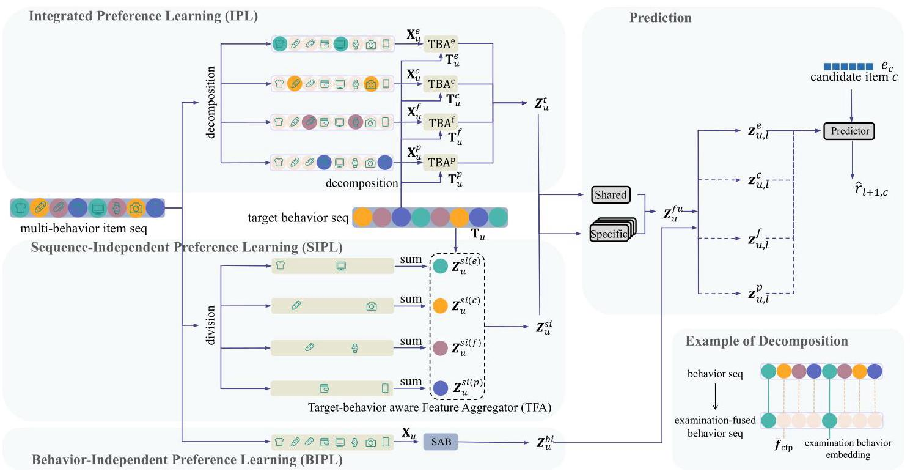
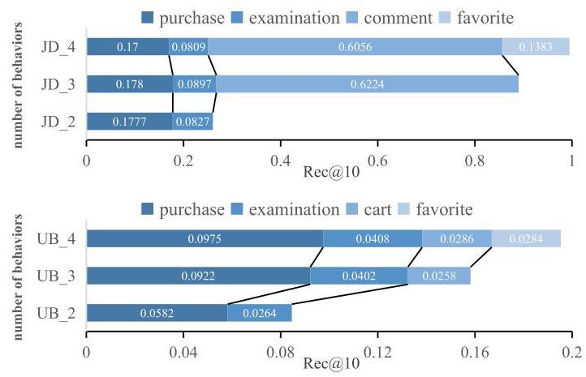
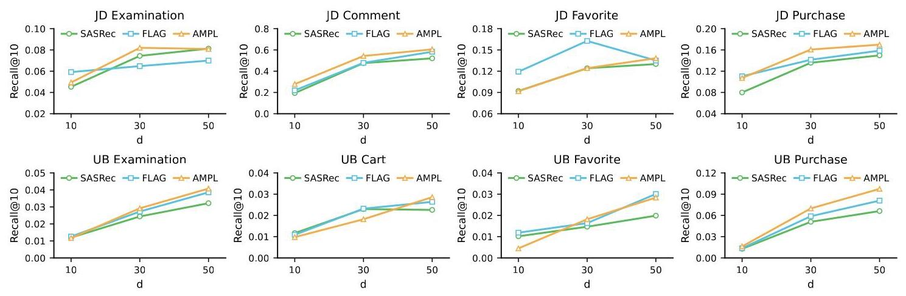

# Multi-Task Multi-Behavior Sequential Recommendation

Weihao Du*

College of Computer Science and Software Engineering,

Shenzhen University

Shenzhen, China

duweihao2022@email.szu.edu.cn

Ziran Deng*

College of Computer Science and Software Engineering,

Shenzhen University

Shenzhen, China

2510105033@mails.szu.edu.cn

Weike Pan \( {}^{ \dagger  } \)

College of Computer Science and Software Engineering, Shenzhen University

Shenzhen, China

panweike@szu.edu.cn

Zhong Ming

Guangdong Laboratory of Artificial Intelligence and

Digital Economy (SZ)

Shenzhen, China

mingz@szu.edu.cn

## Abstract

## Keywords

Multi-Behavior Sequential Recommendation; Sequential Recommendation; Multi-Task Learning

Multi-behavior sequential recommendation (MBSR) has garnered significant interest for its potential to mitigate the information overload problem. Most existing MBSR methods focus on recommending items w.r.t. one single target behavior (e.g., purchase). In fact, accurately predicting items to be interacted by other behaviors (e.g., examination and favorite) is also important for user satisfaction and especially long-term user retention. Hence, in this paper, we study an emerging problem called multi-task MBSR (MT-MBSR), which requires to recommend items w.r.t. each behavior. The main challenge of MT-MBSR is how to exploit the synergistic value of different behaviors. As a response, we propose a novel model called attention-based multi-view preference learning (AMPL). Firstly, we design an integrated preference learning (IPL) module, which learns cross-behavior preferences. Secondly, we design a sequence-independent preference learning (SIPL) module, aiming to allow the target behavior to selectively capture the contextual information. Thirdly, we introduce a shared-specific gating mechanism to adaptively fuse the outputs of the above two fine-grained learning modules (i.e., IPL and SIPL) while resolving their inherent incompatibilities, collectively leveraging the synergetic effects. Finally, we design a behavior-independent preference learning (BIPL) module to capture complex sequential dependencies among the items for improved final prediction. We conduct extensive experiments on two public datasets and demonstrate that our AMPL significantly outperforms the baseline models in recommendation accuracy w.r.t each behavior. The datasets and source code are available at https://github.com/ddEdison/AMPL.

## CCS Concepts

- Information systems \( \rightarrow \) Recommender systems.

## ACM Reference Format:

Weihao Du, Ziran Deng, Weike Pan, and Zhong Ming. 2026. Multi-Task Multi-Behavior Sequential Recommendation. In Proceedings of the ACM Web Conference 2026 (WWW 26), April 13-17, 2026, Dubai, United Arab Emirates. ACM, New York, NY, USA, 10 pages. https://doi.org/10.1145/3774904.3792187

## 1 Introduction

With the rapid growth of online information, recommender systems have become essential tools to alleviate information overload, enhancing user experience and driving the business growth of online platforms. By leveraging users' historical interaction data, these systems learn user preferences and item representations to deliver personalized content [25, 26]. The users' historical interaction data typically contain different behaviors and exhibit sequential characteristics. Traditional sequential recommendation methods, such as SASRec [10], effectively capture sequential dynamics within single-behavior sequences, and model long-term dependencies with attention mechanism. However, their focus on a single behavior overlooks the complementary value of multi-behavior information, thus often limiting further performance gains [37].

In e-commerce, users' behaviors such as examination (i.e., click), add-to-cart, favorite, and purchase provide rich signals for profiling preferences. Multi-behavior sequential recommendation methods leverage these signals to model sequential dynamics across behaviors, improving performance over single-behavior approaches [19]. Existing studies often extend single-behavior frameworks by integrating behavior information via attention [31, 41-43], recurrent networks [14], or graph models [24].

However, multi-behavior sequential recommendation methods most designate purchase as the sole prediction target. This design leaves non-purchase signals underutilized and limits the full value of multi-behavior data. In fact, recommender systems aim not only at short-term revenue but also at long-term enhancement of user satisfaction. Ignoring non-purchase signals may thus compromise performance, as these signals provide crucial cues of engagement, long-term interest, and purchase intention. To address this, it is essential to model multiple user behaviors within a unified multitask framework, which captures richer preferences and yields better overall business performance.

---

*Both authors contributed equally to this work.

\( {}^{ \dagger  } \) Corresponding author.

---

In this paper, we study an emerging and important problem, i.e., multi-task multi-behavior sequential recommendation (MT-MBSR). MT-MBSR integrates MBSR and multi-task learning by extending single-behavior outputs to multi-behavior ones. Existing multi-task recommendation methods mainly focus on two directions: network architecture and loss function. Regarding network architecture, researchers combine shared and task-specific parameters [22, 23, 34, 39]. Regarding loss function, researchers mitigate imbalances and conflicts among tasks [2, 11, 29]. Most of these works target non-sequential scenarios using parallel output architectures with synchronous weighted losses. However, sequential recommendation poses a unique challenge: at each time step, only one behavior is active, making synchronous multi-loss optimization and explicit task weighting infeasible due to the absence of a fused loss.

To address this challenge, we propose a model called attenion-based mulit-view preference learning (AMPL). We follow the principle of balancing shared and task-specific modeling in multi-task learning, but emphasize deeper exploitation of multi-behavior sequences rather than conventional multi-loss optimization. By extracting representations from different views, we jointly leverage multi-behavior information and sequential patterns, enhancing cross-behavior interactions while preserving behavior-specific preferences.

The contributions of this paper are summarized as follows:

- We formally define an emerging and important problem, i.e., multi-task multi-behavior sequential recommendation (MT-MBSR), which is more challenging than single-task MBSR.

- We propose a novel model, i.e., attention-based multi-view preference learning (AMPL), which addresses MT-BMSR from a new perspective with three different views of preference learning (PL), including integrated PL (IPL), sequence-independent PL (SIPL), and behavior-independent PL (BIPL).

- In IPL, We introduce the concept of fused behaviors and decompose each original interaction sequence to effectively promote information transfer across behaviors. In SIPL, we design a mechanism to let each target behavior selectively extract contextual information. In BIPL, we exploit pure-item information to learn item-level sequential dependencies.

- Extensive experiments on two real-world e-commerce datasets demonstrate that our AMPL significantly outperforms the existing sequential recommendation methods across all behaviors.

## 2 Related Work

Research areas that are highly relevant to this study include single-behavior sequential recommendation, multi-behavior sequential recommendation, and multi-task recommendation.

### 2.1 Single-Behavior Sequential Recommendation

Early sequential recommendation methods mainly rely on Markov chains for modeling [8, 28]. With the rapid progress of deep learning, its strength in modeling complex nonlinear dependencies has significantly advanced the development of sequential recommendation algorithms. Architectures such as RNN, CNN and self-attention networks have been introduced into recommender systems. GRU4Rec [9] applies gated recurrent units to capture long-term dependencies, Caser [35] uses convolutional filters for local and global features, and SASRec [10] introduces self-attention for effective dependency modeling, later extended by BERT4Rec [33] with bidirectional transformers. More recently, graph neural networks (GNNs) have also been widely adopted in sequential recommendation. MA-GNN [21] integrates a memory network with GNNs to jointly model users' short- and long-term interests, while DGSR [45] constructs dynamic user-item graphs to capture evolving collaborative signals of interaction sequences.

### 2.2 Multi-Behavior Sequential Recommendation

Sequential recommendation has gradually evolved from modeling single-behavior sequences to multi-behavior ones, aiming to leverage diverse signals for comprehensive preference understanding.

Early models were primarily based on recurrent neural networks (RNNs). MBN [30] splits behavior subsequences to separately extract user preferences, while RIB [46] and BINN [15] incorporate behavior information into the full interaction sequences. DyMus [3] learns the correlations among behaviors through dynamic routing. With the success of self-attention in sequential recommendation, many attention-based methods have been proposed. BAR [7] extends sequential recommendation to multi-behavior settings, while NextIP [20] models both complete multi-behavior sequences and individual subsequences to preserve sequential dependencies. MB-SRec [4] leverages self-attention to model behavior sequences and employs a weighted loss to balance their importance. In addition, several works [31, 41-43] focus on balancing long- and short-term preferences. FLAG [6] designs a target-behavior-oriented attention to capture localized transitions and integrate global information. MISSL [40] captures users' diverse latent interests from multi-behavior sequences.

Graph neural networks have also been applied. MGNN [38] and GPG4HSR [1] construct behavior-specific global graphs for item representations, GHTID [13] combines global and local graphs and leverages target behavior to reduce auxiliary noise, and DSUIL [12] models users' stage-wise dynamic interests. M-GPT [5] models item-behavior semantics and captures multi-grained dynamic preferences.

Although the existing studies leverage multi-behavior data to improve a single target behavior, they generally overlook the value of auxiliary behaviors for recommendation.

### 2.3 Multi-Task Recommendation

In multi-task recommendation, existing studies mainly focus on network architecture and loss function.

Regarding network architecture, existing approaches can be divided into hard parameter sharing and soft parameter sharing. Hard parameter sharing is typically applied to multi-task scenarios with sequential dependencies \( \left\lbrack  {{23},{39}}\right\rbrack \) , while soft parameter sharing is generally adopted in parallel multi-task settings. MMoE [22] combines expert layers with task-specific gates to balance task contributions, and PLE [34] further separates shared and task-specific experts to mitigate negative transfer and seesaw phenomenon. BEnet [44] alleviates MMoE's polarization problem by diversifying expert inputs.

Regarding loss function, MGDA [29] formulates multi-task conflicts as multi-objective optimization by seeking pareto-optimal solutions, UWL [11] assigns task weights based on uncertainty, GradNorm [2] balances training rates across tasks, and DRGrad [17] identifies conflicts between primary and auxiliary gradients and rectifies them to alleviate the seesaw phenomenon.

Despite extensive studies on multi-task recommendation, few address multi-behavior sequential scenarios. BVAE [27] introduces gated networks and uncertainty weighting under a VAE framework [16], but ignores sequential information and thus does not belong to sequential recommendation. MBGen [18] proposes a framework for multi-task multi-behavior sequential recommendation by transforming behaviors and items into tokens. However, its generative paradigm substantially differs from our framework and tends to overlook fine-grained behavioral information.

Overall, while prior studies have made remarkable progress, they rarely address the MT-MBSR problem in a principled way. This gap highlights a strong motivation for our study, which extends multitask learning to the multi-behavior sequential setting and advances comprehensive modeling of user preferences.

## 3 The Studied Problem

### 3.1 Problem Definition

Without loss of generality, in a typical real-world e-commerce platform, we assume there is a user set \( \mathcal{U} = \{ u\} \) and an item set \( \mathcal{I} = \{ i\} \) . The users interact with items through different behaviors, denoted as \( \mathcal{B} = \{ e, c, f, p\} \) , corresponding to examination, add-to-cart, favorite and purchase, respectively. Each user \( u \in  \mathcal{U} \) is associated with an interaction sequence \( {S}_{u} = \left\{  {\left( {{i}_{u}^{1},{b}_{u}^{1}}\right) ,\left( {{i}_{u}^{2},{b}_{u}^{2}}\right) ,\ldots ,\left( {{i}_{u}^{L},{b}_{u}^{L}}\right) }\right\} \) of length \( L \) , where \( {i}_{u}^{l} \in  \mathcal{I} \) denotes the \( l \) -th item interacted by user \( u \) , and \( {b}_{u}^{l} \in  \mathcal{B} \) is the corresponding behavior.

The goal of MT-MBSR is to utilize the multi-behavior interaction sequence \( {S}_{u} \) of each user \( u \) to complete multiple behavior-specific item-prediction tasks. Specifically, for each behavior, the system recommends the next item that the user will interact with under that behavior.

### 3.2 Overall of Our Solution

In this section, we briefly describe our model, i.e., attention-based multi-view preference learning (AMPL), which addresses the MT-MBSR problem by modeling behavioral information through three complementary views. From the first view of inter-behavioral relationships, we define the concept of fused behavior (FB) and then design the integrated preference learning (IPL) module. From the second view of sequence independence, we design a sequence-independent preference learning (SIPL) module, enabling each target behavior to selectively extract contextual information. We then introduce a shared-specific gating mechanism to adaptively balance the outputs of these two behavior-aware modules. From the third view of pure-item transitions, we design a behavior-independent preference learning (BIPL) module to capture item-level sequential dependencies. Finally, we aggregate the preferences extracted from these three different views to obtain enriched representations.

## 4 Our Solution: Attention-based Multi-View Preference Learning

The overall architecture of our AMPL is illustrated in Figure 1. This schematic diagram mainly consists of two parts: the left side includes three views of IPL (top, Section 4.2), SIPL (middle, Section 4.3), and BIPL (bottom, Section 4.4); the right side is a prediction module with a gating network (Section 4.5).

### 4.1 Embedding Layer

We first preprocess the input data and transform the multi-behavior interaction sequence \( {S}_{u} \) of user \( u \) into embedding vectors. We define the item embedding matrix \( \mathbf{H} \in  {\mathbb{R}}^{\left| \mathcal{I}\right|  \times  d} \) , the behavior embedding matrix \( \mathbf{F} \in  {\mathbb{R}}^{\left| \mathcal{B}\right|  \times  d} \) , the item position embedding matrix \( \mathbf{P} \in  {\mathbb{R}}^{L \times  d} \) , and the behavior position embedding matrix \( {\mathbf{P}}^{\prime } \in  {\mathbb{R}}^{L \times  d} \) , where \( d \) is the latent dimension. Based on the sequential order of \( {S}_{u} \) , we construct two embedding matrices for user \( u \) : the item embedding matrix \( {\mathbf{E}}_{u} = \left\lbrack  {{\mathbf{h}}_{{i}_{u}^{1}};{\mathbf{h}}_{{i}_{u}^{2}};\ldots ;{\mathbf{h}}_{{i}_{u}^{L}}}\right\rbrack   \in  {\mathbb{R}}^{L \times  d} \) and the behavior embedding matrix \( {\mathbf{B}}_{u} = \left\lbrack  {{\mathbf{f}}_{{b}_{u}^{1}};{\mathbf{f}}_{{b}_{u}^{2}};\ldots ;{\mathbf{f}}_{{b}_{u}^{L}}}\right\rbrack   \in  {\mathbb{R}}^{L \times  d} \) . Furthermore, we introduce the target behavior at each time step to provide additional supervision, where the target behavior at time step \( l \) is defined as the behavior occurring at \( l + 1 \) . During training, we extract the target behavior embedding matrix as \( {\mathbf{T}}_{u} = \left\lbrack  {{\mathbf{f}}_{{b}_{u}^{2}};{\mathbf{f}}_{{b}_{u}^{3}};\ldots ;{\mathbf{f}}_{{b}_{u}^{L + 1}}}\right\rbrack   \in  {\mathbb{R}}^{L \times  d} \) . In the test phase, we explicitly set the observed behavior of the target item as the target behavior.

### 4.2 Integrated Preference Learning

While self-attention effectively models single-behavior sequences, it has limited capacity to capture subtle preference transfer and commonality across behaviors. To address this, some existing multi-behavior methods use the target behavior as the query in attention networks [6], aiming to guide the extraction of behavior-specific signals. However, such designs mainly suit single-target settings and fall short in a multi-task scenario. In multi-task learning, balanced performance requires careful modeling of cross-behavior interactions to prevent the dominance of certain behaviors (e.g., examination). Therefore, we design an integrated preference learning module built upon a proposed concept of fused behavior (FB), which we term "integrated" because we integrate both behavioral correlations and sequential dependencies in this module.

We define fused behavior as the mean embedding of multiple behaviors, which reflects the commonality among them. Accordingly, we decompose the interaction sequence into four behavior-fused sequences, one for each behavior. In the sequence for a given behavior, its own behavior embedding is retained, while those of the other behaviors are replaced with the corresponding average embedding. Taking the examination \( \left( e\right) \) behavior as an example, we construct the examination-fused behavior embedding matrix \( {\mathbf{B}}_{u}^{e} \in  {\mathbb{R}}^{L \times  d} \) as follows:

\[
{\mathrm{B}}_{u}^{e} = {\mathrm{B}}_{u} \otimes  {\mathrm{M}}_{u}^{e} + {\overline{\mathrm{F}}}_{\mathrm{{cfp}}} \otimes  \left( {{\mathbf{1}}_{L \times  d} - {\mathrm{M}}_{u}^{e}}\right) \tag{1}
\]

\[
{\overline{\mathbf{F}}}_{\text{ cfp }} = {\mathbf{1}}_{L \times  1} \times  {\overline{\mathbf{f}}}_{\text{ cfp }} \tag{2}
\]

\[
{\overline{\mathbf{f}}}_{\mathrm{{cfp}}} = \left( {{\mathbf{f}}_{c} + {\mathbf{f}}_{f} + {\mathbf{f}}_{p}}\right) /3 \tag{3}
\]

where \( {\mathbf{M}}_{u}^{e} = \left\lbrack  {{\mathbf{m}}_{u,1}^{e},{\mathbf{m}}_{u,2}^{e},\ldots ,{\mathbf{m}}_{u, L}^{e}}\right\rbrack   \in  {\mathbb{R}}^{L \times  d} \) is the binary mask matrix for the examination behavior, with each row \( {\mathbf{m}}_{u, l}^{e} \) as an all-one vector if the \( l \) -th action is an examination, and an all-zero vector otherwise; \( {\overline{\mathbf{f}}}_{\text{ cfp }} \in  {\mathbb{R}}^{1 \times  d} \) is the average embedding of all non-examination behaviors; \( {\overline{\mathbf{F}}}_{\text{ cfp }} \) is constructed by repeating this average embedding across all \( L \) time steps; \( \otimes \) denotes element-wise multiplication; and \( {\mathbf{1}}_{L \times  d} \) is an all-ones matrix. We illustrate the process of decomposing the examination sequence in the lower right corner of Figure 1. Then, we repeat this process to obtain the fused embedding matrices for other behaviors, i.e., \( {\mathbf{B}}_{u}^{c},{\mathbf{B}}_{u}^{f} \) , and \( {\mathbf{B}}_{u}^{p} \) . Similarly, we apply it to the target behavior matrix \( {\mathbf{T}}_{u} \) to generate its fused counterparts, i.e., \( {\mathbf{T}}_{u}^{e},{\mathbf{T}}_{u}^{c},{\mathbf{T}}_{u}^{f} \) , and \( {\mathbf{T}}_{u}^{p} \) .

Figure 1: Illustration of our attention-based multi-view preference learning (AMPL) for multi-task multi-behavior sequential recommendation.

After the decomposition process, we feed each decomposed sequence into its corresponding target behavior-aware attention network (TBA). We design TBA with two components: (i) a target attention layer (TAL), which uses the target behavior as the query and the fused-behavior sequence as both key and value to extract relevant information from the interaction sequence; and (ii) a feed-forward layer (FFL), which performs non-linear modeling on the attention outputs. Taking the examination behavior as an example, we combine the item embedding matrix \( {\mathbf{E}}_{u} \) , the decomposed examination-fused behavior embedding matrix \( {\mathbf{B}}_{u}^{e} \) , and the behavior position embedding matrix \( {\mathbf{P}}^{\prime } \) to construct \( {\mathbf{X}}_{u}^{e} \) , which serves as the input for the key and value in the attention network. Subsequently, we feed the decomposed examination-fused target behavior embedding matrix \( {\mathbf{T}}_{u}^{e} \) into the network as the query to obtain the integrated preference representation \( {\mathbf{Z}}_{u}^{{it}\left( e\right) } \) for examination-fused behavior:

\[
{\mathrm{X}}_{u}^{e} = {\mathrm{E}}_{u} + {\mathrm{B}}_{u}^{e} + {\mathrm{P}}^{\prime } \tag{4}
\]

\[
{\mathbf{Z}}_{u}^{{it}\left( e\right) } = {\operatorname{TBA}}^{\mathrm{e}}\left( {{\mathbf{X}}_{u}^{e},{\mathbf{T}}_{u}^{e}}\right)
\]

\[
= \operatorname{FFL}\left( {\operatorname{TAL}\left( {{\mathrm{X}}_{u}^{e},{\mathrm{\;T}}_{u}^{e}}\right) }\right) \tag{5}
\]

\[
{\mathrm{X}}_{u}^{{e}^{\prime }} = \operatorname{TAL}\left( {{\mathrm{X}}_{u}^{e},{\mathrm{\;T}}_{u}^{e}}\right)
\]

\[
= \operatorname{softmax}\left( {\frac{{\mathrm{Q}}^{e}{\mathrm{K}}^{e\top }}{\sqrt{d}} \otimes  \Delta }\right) {\mathrm{V}}^{e} \tag{6}
\]

\[
\operatorname{FFL}\left( {\mathbf{X}}_{u}^{{e}^{\prime }}\right)  = \operatorname{ReLU}\left( {{\mathbf{X}}_{u}^{{e}^{\prime }}{\mathbf{W}}_{1} + {\mathbf{b}}_{1}}\right) {\mathbf{W}}_{2} + {\mathbf{b}}_{2} \tag{7}
\]

where \( {\mathbf{Q}}^{e} = {\mathbf{T}}_{u}^{e}{\mathbf{W}}_{O}^{e},{\mathbf{K}}^{e} = {\mathbf{X}}_{u}^{e}{\mathbf{W}}_{K}^{e} \) , and \( {\mathbf{V}}^{e} = {\mathbf{X}}_{u}^{e}{\mathbf{W}}_{V}^{e} \) denote the query, key, and value matrices in the examination-specific attention network, respectively. \( {\mathbf{W}}_{Q}^{e},{\mathbf{W}}_{K}^{e},{\mathbf{W}}_{V}^{e} \in  {\mathbb{R}}^{d \times  d} \) are learnable linear projection matrices. The term \( \sqrt{d} \) in \( \operatorname{TAL}\left( \cdot \right) \) serves as a scaling factor to prevent excessively large dot-product values. \( \Delta \) represents a causal mask that prevents any leakage from future data. \( {\mathbf{W}}_{1},{\mathbf{W}}_{2} \in \; {\mathbb{R}}^{d \times  d} \) and \( {\mathbf{b}}_{1},{\mathbf{b}}_{2} \in  {\mathbb{R}}^{1 \times  d} \) are learnable weight and bias parameters in the FFL layer.

Similarly, we repeat this process to obtain the integrated preference representations for other fused behavior \( {\mathbf{Z}}_{u}^{{it}\left( c\right) },{\mathbf{Z}}_{u}^{{it}\left( f\right) } \) , and \( {\mathrm{Z}}_{u}^{{it}\left( p\right) } \) . Our decomposition approach simplifies learning by letting each attention network to focus solely on the preference transfer of a single behavior, while simultaneously achieving more fine-grained behavior-specific modeling. Meanwhile, our fused behavior facilitates learning of behavioral commonality and encourages cross-behavior collaboration.

Aggregating the four representation, we obtain the final integrated preference representation \( {\mathbf{Z}}_{u}^{it} \in  {\mathbb{R}}^{L \times  d} \) for user \( u \) :

\[
{\mathbf{Z}}_{u}^{it} = {\mathbf{Z}}_{u}^{{it}\left( e\right) } + {\mathbf{Z}}_{u}^{{it}\left( c\right) } + {\mathbf{Z}}_{u}^{{it}\left( f\right) } + {\mathbf{Z}}_{u}^{{it}\left( p\right) } \tag{8}
\]

### 4.3 Sequence-Independent Preference Learning

Our integrated preference learning module is strictly sequential due to its causal mask, relying only on past interactions. In this subsection, we design a sequence-independent preference learning module for a more holistic perspective. We first obtain representations by aggregating information for each behavior separately. After that, conditioned on the target behavior, we selectively extract the required information from these representations.

Taking the examination behavior as an example, we apply an examination-specific binary mask to the user \( u \) ’s item embedding matrix to filter for the examination-only item sequence:

\[
{\mathrm{E}}_{\mathbf{u}}^{\mathbf{e}} = {\mathrm{E}}_{\mathbf{u}} \otimes  {\mathrm{M}}_{\mathbf{u}}^{\mathbf{e}} \tag{9}
\]

where \( {\mathbf{M}}_{u}^{e} = \left\lbrack  {{\mathbf{m}}_{u,1}^{e},{\mathbf{m}}_{u,2}^{e},\ldots ,{\mathbf{m}}_{u, L}^{e}}\right\rbrack   \in  {\mathbb{R}}^{L \times  d} \) is the binary mask matrix for the examination behavior same in Eq. (1); and \( \otimes \) denotes element-wise multiplication. Then, we aggregate this sequence by summing each item embedding to derive the sequence-independent representation for examination:

\[
{\mathbf{Z}}_{u}^{{si}\left( e\right) } = \mathop{\sum }\limits_{{i = 1}}^{L}{\mathbf{E}}_{u, i}^{e} \tag{10}
\]

where \( {\mathbf{Z}}_{u}^{{si}\left( e\right) } \in  {\mathbb{R}}^{1 \times  d} \) . Similarly, repeating this process, we obtain \( {\mathbf{Z}}_{u}^{{si}\left( c\right) },{\mathbf{Z}}_{u}^{{si}\left( f\right) } \) , and \( {\mathbf{Z}}_{u}^{{si}\left( p\right) } \) for the other behaviors. For attention computation, we broadcast these vectors to length \( L \) and stack them to \( \left\lbrack  {{\mathbf{Z}}_{u}^{{si}\left( e\right) };{\mathbf{Z}}_{u}^{{si}\left( c\right) };{\mathbf{Z}}_{u}^{{si}\left( f\right) };{\mathbf{Z}}_{u}^{{si}\left( p\right) }}\right\rbrack   \in  {\mathbb{R}}^{L \times  4 \times  d} \) . Subsequently, we feed the representation into a target-behavior aware feature aggregator (TFA), which employs an attention mechanism. At each time step, we use the target behavior embedding matrix \( {\mathbf{T}}_{u} \) as the query to adaptively extract information from the stacked representations of all behaviors, which serve as keys and values:

\[
{\mathrm{Q}}^{\prime } = {\mathrm{T}}_{u}{\mathrm{W}}_{{Q}^{\prime }} \tag{11}
\]

\[
{\mathbf{K}}^{\prime } = \left\lbrack  {{\mathbf{Z}}_{u}^{{si}\left( e\right) };{\mathbf{Z}}_{u}^{{si}\left( c\right) };{\mathbf{Z}}_{u}^{{si}\left( f\right) };{\mathbf{Z}}_{u}^{{si}\left( p\right) }}\right\rbrack  {\mathbf{W}}_{{K}^{\prime }} \tag{12}
\]

\[
{\mathbf{V}}^{\prime } = \left\lbrack  {{\mathbf{Z}}_{u}^{{si}\left( e\right) };{\mathbf{Z}}_{u}^{{si}\left( c\right) };{\mathbf{Z}}_{u}^{{si}\left( f\right) };{\mathbf{Z}}_{u}^{{si}\left( p\right) }}\right\rbrack  {\mathbf{W}}_{{V}^{\prime }} \tag{13}
\]

\[
{\mathbf{Z}}_{u}^{si} = \operatorname{softmax}\left( \frac{{\mathbf{Q}}^{\prime }{\mathbf{K}}^{\prime \top }}{\sqrt{d}}\right) {\mathbf{V}}^{\prime } \tag{14}
\]

where \( {\mathbf{Q}}^{\prime } \in  {\mathbb{R}}^{L \times  1 \times  d},{\mathbf{K}}^{\prime } \in  {\mathbb{R}}^{L \times  4 \times  d} \) , and \( {\mathbf{V}}^{\prime } \in  {\mathbb{R}}^{L \times  4 \times  d} \) denote the projected query, key, and value, respectively. \( {\mathbf{W}}_{{Q}^{\prime }},{\mathbf{W}}_{{K}^{\prime }} \) , and \( {\mathbf{W}}_{{V}^{\prime }} \in \; {\mathbb{R}}^{d \times  d} \) are learnable projection matrices. \( {\mathbf{Z}}_{u}^{si} = \left\lbrack  {{\mathbf{Z}}_{u,1}^{si},{\mathbf{Z}}_{u,2}^{si},\ldots ,{\mathbf{Z}}_{u, L}^{si}}\right\rbrack   \in \; {\mathbb{R}}^{L \times  d} \) represents the sequence-independent representation of user \( u \) at each time step.

### 4.4 Behavior-Independent Preference Learning

To complement our multi-view model, we design a module inspired by SASRec [10], called behavior-independent preference learning. In this module, we apply self-attention to capture pure-item sequential dependencies. Formally, we combine the item embedding matrix \( {\mathbf{E}}_{u} \) with the item position embedding matrix \( \mathbf{P} \) to obtain the input of this module:

\[
{\mathrm{X}}_{u} = {\mathrm{E}}_{u} + \mathrm{P} \tag{15}
\]

Then, we feed \( {\mathrm{X}}_{u} \) into a self-attention block (SAB) to obtain the behavior-independent representation \( {\mathbf{Z}}_{u}^{bi} \) . We design SAB with a self-attention layer (SAL) and a feed-forward layer (FFL):

\[
{\mathbf{Z}}_{u}^{bi} = {SAB}\left( {\mathbf{X}}_{u}\right)  = {FFL}\left( {{SAL}\left( {\mathbf{X}}_{u}\right) }\right) \tag{16}
\]

\[
{\mathbf{X}}_{u}^{\prime } = \operatorname{SAL}\left( {\mathbf{X}}_{u}\right)  = \operatorname{softmax}\left( {\frac{{\mathbf{{QK}}}^{\top }}{\sqrt{d}} \otimes  \Delta }\right) \mathbf{V} \tag{17}
\]

\[
\operatorname{FFL}\left( {\mathbf{X}}_{u}^{\prime }\right)  = \operatorname{ReLU}\left( {{\mathbf{X}}_{u}^{\prime }{\mathbf{W}}_{1} + {\mathbf{b}}_{1}}\right) {\mathbf{W}}_{2} + {\mathbf{b}}_{2} \tag{18}
\]

where \( \mathbf{Q} = {\mathbf{X}}_{u}{\mathbf{W}}_{Q},\mathbf{K} = {\mathbf{X}}_{u}{\mathbf{W}}_{K} \) and \( \mathbf{V} = {\mathbf{X}}_{u}{\mathbf{W}}_{V} \) denote the query, key and value in the self-attention network, respectively. \( \Delta \) denotes the causal mask. \( {\mathbf{W}}_{1},{\mathbf{W}}_{2} \in  {\mathbb{R}}^{d \times  d} \) and \( {\mathbf{b}}_{1},{\mathbf{b}}_{2} \in  {\mathbb{R}}^{1 \times  d} \) are learnable weight and bias parameters in the FFL layer.

### 4.5 Prediction and Training

Through the three modules above, we obtain user preference representations from three different views. Specifically, we obtain the integrated preference representation \( {\mathbf{Z}}_{u}^{it} \) , the sequence-independent preference representation \( {\mathbf{Z}}_{u}^{si} \) and the behavior-independent preference representation \( {\mathbf{Z}}_{u}^{bi} \) . The first two representations are behavior-aware preference representations.

To better integrate the two behavior-aware representations and avoid potential information conflicts, we propose a shared-specific gating mechanism. We design the mechanism with a gate, shared across all behaviors, and a set of specific gates, each dedicated to a particular behavior. At each time step, we feed the two representations into both the shared gate and the specific gate associated with the current target behavior. Combining their outputs, we derive their fused representation \( {\mathbf{Z}}_{u}^{fu} \) :

\[
{\mathbf{a}}_{l}^{s} = \sigma \left( {{\mathbf{Z}}_{u, l}^{it}{\mathbf{W}}_{it}^{s} + {\mathbf{Z}}_{u, l}^{si}{\mathbf{W}}_{si}^{s} + {\mathbf{b}}_{a}^{s}}\right) \tag{19}
\]

\[
{\mathbf{a}}_{l}^{p} = \sigma \left( {{\mathbf{Z}}_{u, l}^{it}{\mathbf{W}}_{it}^{p,{tb}} + {\mathbf{Z}}_{u, l}^{si}{\mathbf{W}}_{si}^{p,{tb}} + {\mathbf{b}}_{a}^{p,{tb}}}\right) \tag{20}
\]

\[
{\mathrm{a}}_{l} = \sigma \left( {{\mathrm{a}}_{l}^{s} + {\mathrm{a}}_{l}^{p}}\right) \tag{21}
\]

\[
{\mathbf{Z}}_{u, l}^{fu} = {\mathbf{a}}_{l} \otimes  {\mathbf{Z}}_{u, l}^{it} + \left( {1 - {\mathbf{a}}_{l}}\right)  \otimes  {\mathbf{Z}}_{u, l}^{si} \tag{22}
\]

where \( \otimes \) indicates element-wise multiplication. At each time step \( l,{\mathbf{a}}_{l}^{s} \in  {\mathbb{R}}^{1 \times  d} \) represents the shared gating weight, with learnable weight matrices \( {\mathbf{W}}_{it}^{s},{\mathbf{W}}_{si}^{s} \in  {\mathbb{R}}^{d \times  d} \) and bias terms \( {\mathbf{b}}_{a}^{s} \in  {\mathbb{R}}^{1 \times  d} \) ; \( {\mathbf{a}}_{l}^{p} \in  {\mathbb{R}}^{1 \times  d} \) represents the specific gating weight, with learnable weight matrices \( {\mathbf{W}}_{it}^{p,{tb}},{\mathbf{W}}_{si}^{p,{tb}} \in  {\mathbb{R}}^{d \times  d} \) and bias terms \( {\mathbf{b}}_{a}^{p,{tb}} \in  {\mathbb{R}}^{1 \times  d} \) . The term "tb" indicates the target behavior at time step \( l \) (i.e., \( {b}_{u}^{l + 1} \) ). \( {\mathrm{a}}_{l} \) represents the final gating weight and \( \sigma \left( \cdot \right) \) denotes the sigmoid function.

We design this mechanism in line with the principle of balancing shared and task-specific components in multi-task learning [32, 34], which helps us alleviate information conflicts. In addition, we aim to prevent dominant behaviors (e.g., examination) from overshadowing sparse ones, thereby encouraging more balanced representations.

By further aggregating the fused representation \( {\mathbf{Z}}_{u}^{fu} \) with the behavior-independent preference representation \( {\mathbf{Z}}_{u}^{bi} \) , we obtain the final user preference representation:

\[
{\mathrm{Z}}_{u} = {\mathrm{Z}}_{u}^{fu} + {\mathrm{Z}}_{u}^{bi} \tag{23}
\]

Finally, we predict the preference score \( {\widehat{r}}_{l + 1,{i}_{u}^{l + 1}} \) for the next target item \( {i}_{u}^{l + 1} \) under the target behavior:

\[
{\widehat{r}}_{l + 1,{i}_{u}^{l + 1}} = {\mathbf{Z}}_{u, l}{\left( {\mathbf{h}}_{{i}_{u}^{l + 1}}\right) }^{\top } \tag{24}
\]

We employ the Adam optimizer and adopt a binary cross-entropy loss function to train the model:

\[
\mathcal{L} =  - \mathop{\sum }\limits_{{u \in  \mathcal{U}}}\mathop{\sum }\limits_{{l = 1}}^{{L - 1}}\delta \left( {i}_{u}^{l + 1}\right) \left\lbrack  {\log \left( {\sigma \left( {\widehat{r}}_{l + 1,{i}_{u}^{l + 1}}\right) }\right)  + \log \left( {1 - \sigma \left( {\widehat{r}}_{l + 1, j}\right) }\right) }\right\rbrack \tag{25}
\]

where \( j \) denotes a negative sample randomly drawn from \( I \smallsetminus  {S}_{u} \) . The indicator function \( \delta \left( {i}_{u}^{l + 1}\right) \) equals 1 if \( {i}_{u}^{l + 1} \) is not a padding item, and 0 otherwise.

During training, we use the next behavior in the interaction sequence as the ground truth behavior at each time step. In the test phase, we explicitly set the observed behavior of the target item as the target behavior. Repeating this evaluation process for each behavior, we obtain the next-item prediction results for all tasks. We provide the detailed time complexity analysis in Appendix A.

## 5 Experiments

In this section, we conduct experiments on two real-world datasets to answer the following four research questions:

- RQ1: How does our AMPL perform compared with the baseline models?

- RQ2: How do different components affect the performance of our AMPL?

- RQ3: How does the number of behaviors affect the performance of our AMPL?

- RQ4: How do the hyperparameters affect the performance of our AMPL?

### 5.1 Datasets and Evaluation Metrics

We conduct experiments on two publicly available and anonymized real-world datasets, Jdata 2019 (JD) \( {}^{1} \) and User Behavior (UB) \( {}^{2} \) . The JD dataset was released in a competition organized by the JingDong team in 2019, while the UB dataset was published by the Taobao team on the Alibaba Tianchi platform in 2021. Both datasets are collected from real e-commerce platforms and contain multiple behaviors. We retain only those behaviors with a sufficient number of interactions. Specifically, for the JD dataset we keep examination, comment, favorite, and purchase behaviors, while for the UB dataset we keep examination, add-to-cart, favorite, and purchase behaviors. We evaluate the performance using recall (Rec@10) and normalized discounted cumulative gain (NDCG@10), with Rec@10 serving as the primary metric. The statistical information of the preprocessed datasets is summarized in Table 1, including the complete datasets as well as the training (tr.), validation (val.), and test (te.) sets. We provide the detailed data preprocessing steps and discussion on the dataset selection in Appendix B.

### 5.2 Baselines and Parameter Settings

To evaluate our AMPL, we compare it against five state-of-the-art baselines, including a single-behavior sequential recommendation method and four multi-behavior ones.

- SASRec [10]: A pioneering sequential recommendation model that uses a self-attention mechanism to capture dependencies within single-behavior item sequences.

- BINN [15]: A multi-behavior sequential method that utilizes recurrent neural networks (RNNs) to integrate behavior information into the sequence modeling process.

- FLAG [20]: An attention-based multi-behavior sequential model that leverages the target behavior as a query to learn behavior-guided preferences, captures both local and global information and combines them through a gating mechanism.

- NextIP [7]: A multi-behavior sequential method that employs a two-stage framework to decompose the MBSR task into next-item prediction and purchase prediction, and uses contrastive learning to enhance performance of purchase prediction.

- MBSRec [4]: A multi-behavior sequential model based on multihead self-attention mechanism that introduces a weighted binary cross-entropy loss to better control the learning process of different behaviors.

To ensure a fair and reproducible comparison, we unify the experimental settings for all models. Firstly, we adapt the single-task baselines to a multi-task setting. We implement SASRec and BINN following their original papers, while we implement FLAG, NextIP, and MBSRec following their publicly available code. Since the baseline methods are originally designed for purchase prediction, we modify the output layers of these baselines to generate predictions for all four behaviors simultaneously in test. These modifications do not alter their core architectures and therefore do not affect the process. Secondly, we use the same hyperparameter settings for all models: we fix the embedding dimension as 50 , the maximum sequence length as 50, and the batch size as 128 . We set other key parameters following the recommendations in the original papers and tune the final hyperparameters based on Rec@10 on the validation set. For our AMPL, we use a learning rate of 0.001, a single attention head, and a dropout rate of 0.5.

Table 1: Statistics of the preprocessed datasets.

<table><tr><td rowspan="2"></td><td colspan="4">JD</td><td colspan="4">UB</td></tr><tr><td>All</td><td>Tr.</td><td>Val.</td><td>Te.</td><td>All</td><td>Tr.</td><td>Val.</td><td>Te.</td></tr><tr><td>#Users</td><td>10,690</td><td>10,690</td><td>5,210</td><td>2,857</td><td>20,443</td><td>20,443</td><td>15,850</td><td>12,761</td></tr><tr><td>#Items</td><td>12,820</td><td>12,820</td><td>6,405</td><td>4,738</td><td>30,734</td><td>30,734</td><td>21,845</td><td>20,186</td></tr><tr><td>#Examination</td><td>247,543</td><td>217,977</td><td>18,851</td><td>10,715</td><td>620,380</td><td>511,020</td><td>59,750</td><td>49,610</td></tr><tr><td>#Comment/Cart</td><td>30,156</td><td>24,662</td><td>3,785</td><td>1,709</td><td>82,665</td><td>68,207</td><td>8,143</td><td>6,315</td></tr><tr><td>#Favorite</td><td>8,771</td><td>7,380</td><td>852</td><td>539</td><td>27,201</td><td>22,270</td><td>2,727</td><td>2,204</td></tr><tr><td>#Purchase</td><td>68,402</td><td>60,967</td><td>5,160</td><td>2,275</td><td>130,658</td><td>107,489</td><td>12,925</td><td>10,244</td></tr></table>

### 5.3 Performance Comparison (RQ1)

We report the recommendation performance of all methods on the two datasets in Table 2, where we highlight the best results in bold and the second-best results with underlines.

Several baselines do not perform well due to specific architectural limitations. The LSTM-based BINN model shows the weakest performance, performing worse than SASRec even though SASRec does not utilize multi-behavior information. This result highlights the superiority of attention mechanisms in sequential recommendation. NextIP yields suboptimal performance because its contrastive learning module overemphasizes purchase prediction, disrupting the balance required for multi-task learning. While MBSRec achieves balanced performance on different tasks via its weighted loss, it yields suboptimal results compared with our AMPL. It indicates that a simple weighting strategy is insufficient to capture the complex dependencies among different behaviors. Compared with SASRec, FLAG effectively leverages multi-behavior information, achieving gains on sparse behaviors but showing limited improvement on the dominant behavior (i.e., examination). This results in a seesaw effect: SASRec tends to overfit the dominant examination behavior due to its large interaction frequency, while the incorporation of other behaviors in FLAG disperses this focus, improving accuracy on sparse-behavior prediction at the cost of the performance w.r.t. examination. This trade-off is rooted in the single-target nature of FLAG that lacks a multi-task architecture to effectively balance learning across different behaviors.

---

\( {}^{1} \) https://jdata.jd.com/html/detail.html?id=8

\( {}^{2} \) https://tianchi.aliyun.com/dataset/dataDetail?dataId=649

---

Table 2: Recommendation performance of the baselines and our AMPL on the JD and UB datasets.

<table><tr><td rowspan="2">Behavior</td><td rowspan="2">Model</td><td colspan="2">JD</td><td colspan="2">UB</td></tr><tr><td>Rec@10</td><td>NDCG@10</td><td>Rec@10</td><td>NDCG@10</td></tr><tr><td rowspan="6">Examination</td><td>SASRec</td><td>0.0816</td><td>0.0349</td><td>0.0323</td><td>0.0222</td></tr><tr><td>BINN</td><td>0.0644</td><td>0.0250</td><td>0.0243</td><td>0.0131</td></tr><tr><td>FLAG</td><td>0.0701</td><td>0.0315</td><td>0.0386</td><td>0.0237</td></tr><tr><td>NextIP</td><td>0.0741</td><td>0.0343</td><td>0.0255</td><td>0.0172</td></tr><tr><td>MBSRec</td><td>0.0789</td><td>0.0364</td><td>0.0301</td><td>0.0203</td></tr><tr><td>AMPL</td><td>0.0809</td><td>0.0371</td><td>0.0408</td><td>0.0262</td></tr><tr><td rowspan="6">Comment / Cart</td><td>SASRec</td><td>0.5198</td><td>0.3633</td><td>0.0226</td><td>0.0136</td></tr><tr><td>BINN</td><td>0.5358</td><td>0.3256</td><td>0.0197</td><td>0.0099</td></tr><tr><td>FLAG</td><td>0.5804</td><td>0.3801</td><td>0.0264</td><td>0.0134</td></tr><tr><td>NextIP</td><td>0.5123</td><td>0.3757</td><td>0.0151</td><td>0.0093</td></tr><tr><td>MBSRec</td><td>0.5024</td><td>0.3322</td><td>0.0214</td><td>0.0139</td></tr><tr><td>AMPL</td><td>0.6056</td><td>0.4200</td><td>0.0286</td><td>0.0156</td></tr><tr><td rowspan="6">Favorite</td><td>SASRec</td><td>0.1297</td><td>0.0553</td><td>0.0200</td><td>0.0111</td></tr><tr><td>BINN</td><td>0.0918</td><td>0.0392</td><td>0.0200</td><td>0.0107</td></tr><tr><td>FLAG</td><td>0.1351</td><td>0.0563</td><td>0.0301</td><td>0.0157</td></tr><tr><td>NextIP</td><td>0.1189</td><td>0.0549</td><td>0.0214</td><td>0.0104</td></tr><tr><td>MBSRec</td><td>0.1351</td><td>0.0564</td><td>0.0210</td><td>0.0103</td></tr><tr><td>AMPL</td><td>0.1383</td><td>0.0634</td><td>0.0284</td><td>0.0158</td></tr><tr><td rowspan="6">Purchase</td><td>SASRec</td><td>0.1507</td><td>0.0759</td><td>0.0659</td><td>0.0501</td></tr><tr><td>BINN</td><td>0.1367</td><td>0.0635</td><td>0.0588</td><td>0.0370</td></tr><tr><td>FLAG</td><td>0.1592</td><td>0.0758</td><td>0.0811</td><td>0.0508</td></tr><tr><td>NextIP</td><td>0.1484</td><td>0.0749</td><td>0.0532</td><td>0.0372</td></tr><tr><td>MBSRec</td><td>0.1569</td><td>0.0815</td><td>0.0629</td><td>0.0454</td></tr><tr><td>AMPL</td><td>0.1700</td><td>0.0847</td><td>0.0975</td><td>0.0662</td></tr></table>

Overall, our AMPL adheres to the multi-task learning framework, facilitating information sharing while mitigating behavioral conflicts, thus resulting in balanced improvements across all behaviors.

### 5.4 Ablation Study (RQ2)

To investigate the impact of each component in our AMPL, we conduct ablation studies on both datasets. We test seven ablated variants by removing different components and report the detailed results in Table 3, where we highlight the best results in bold and the second-best results with underlines. The main observations are as follows.

Table 3: Recommendation performance of the variants of our AMPL on the JD and UB datasets (Rec@10).

<table><tr><td rowspan="2">Model</td><td colspan="2">Examination</td><td colspan="2">Comment/Cart</td><td colspan="2">Favorite</td><td colspan="2">Purchase</td></tr><tr><td>JD</td><td>UB</td><td>JD</td><td>UB</td><td>JD</td><td>UB</td><td>JD</td><td>UB</td></tr><tr><td>w/o IPL&SIPL&gating</td><td>0.0882</td><td>0.0298</td><td>0.5099</td><td>0.0191</td><td>0.1351</td><td>0.0136</td><td>0.1491</td><td>0.0634</td></tr><tr><td>w/o IPL&gating</td><td>0.0803</td><td>0.0342</td><td>0.5470</td><td>0.0229</td><td>0.1189</td><td>0.0228</td><td>0.1460</td><td>0.0695</td></tr><tr><td>w/o SIPL&gating</td><td>0.0860</td><td>0.0398</td><td>0.5705</td><td>0.0238</td><td>0.1405</td><td>0.0228</td><td>0.1771</td><td>0.0883</td></tr><tr><td>w/o gating</td><td>0.0803</td><td>0.0401</td><td>0.6089</td><td>0.0270</td><td>0.1405</td><td>0.0219</td><td>0.1623</td><td>0.0922</td></tr><tr><td>w/o specific gating</td><td>0.0792</td><td>0.0423</td><td>0.6032</td><td>0.0286</td><td>0.1145</td><td>0.0231</td><td>0.1684</td><td>0.0972</td></tr><tr><td>w/o fused-beh.&decomposition to IPL</td><td>0.0785</td><td>0.0376</td><td>0.5829</td><td>0.0238</td><td>0.1621</td><td>0.0255</td><td>0.1546</td><td>0.0865</td></tr><tr><td>w/o fused-beh. representation to IPL</td><td>0.0776</td><td>0.0348</td><td>0.5829</td><td>0.0249</td><td>0.1405</td><td>0.0228</td><td>0.1406</td><td>0.0811</td></tr><tr><td>AMPL</td><td>0.0809</td><td>0.0408</td><td>0.6056</td><td>0.0286</td><td>0.1383</td><td>0.0284</td><td>0.1700</td><td>0.0975</td></tr></table>

Figure 2: Recommendation performance of our AMPL w.r.t. different behavior numbers on the JD (top) and UB (bottom) datasets.

When the IPL, SIPL, and gating modules are removed, the model degenerates to SASRec, i.e., w/o IPL&SIPL&gating, which only models pure-item transitions. Adding only the IPL module, i.e., w/o SIPL&gating, it delivers substantial improvements, demonstrating that fine-grained behavior modeling plays a crucial role in enhancing performance. In contrast, adding only the SIPL module, i.e., w/o IPL&gating, a seesaw phenomenon emerges, similar to FLAG: enhancing performance on sparse behaviors while reducing accuracy on dense ones like examination. This suggests that without a structure like IPL to manage inter-behavior relationships, simply sharing behavioral information can lead to negative transfer. In addition, while the variant w/o SIPL&gating performs better on JD, the complete AMPL excels on the sparser UB dataset. It highlights that the SIPL module helps alleviate data sparsity and enables better dependencies learning across items and behaviors.

Removing the gating mechanism, i.e., w/o gating, the performance improves for some behaviors but drops substantially for others. This confirms its role in balancing IPL and SIPL outputs to mitigate conflicts and thus yield stable results. Furthermore, when the shared gate is retained while the set of specific gates is removed, i.e., w/o specific gating, the model performance drops particularly on sparse behaviors. This demonstrates that these specific gates are essential for preventing dense behaviors from dominating the learning process, thereby ensuring balanced multi-task performance.

Figure 3: Recommendation performance of SASRec, FLAG, and our AMPL w.r.t. different hidden dimensions on the four behaviors of the JD (top) and UB (bottom) datasets.

Removing the fused behavior and the decomposition process from IPL, i.e., w/o fused-beh.&decomposition to IPL, it degenerates into a single-sequence target-aware attention structure. The resulting performance gap to the complete AMPL validates the effectiveness of these two components. Subsequently, we apply the decomposition process in IPL, transforming the interaction sequence into multiple behavior-fused sequences. Based on this, if we retain only the representation of the target behavior sequence while discarding those from other fused-behavior sequences, we refer to this variant as w/o fused-beh. representation to IPL. The performance gap with the complete AMPL indicates that these representations capture complementary cross-behavior information, enriching the model with comprehensive interaction patterns.

Overall, the complete AMPL outperforms all ablated variants. Although some variants achieve the best results on certain behaviors, they often do so at the expense of others. In contrast, the complete AMPL maintains strong results across all behaviors, offering the most comprehensive effectiveness.

### 5.5 Multi-Behavior Adaptability Study (RQ3)

We evaluate adaptability of our AMPL in a multi-task scenario by gradually increasing the number of behaviors to investigate if the performance remains stable or improves. Behaviors are added according to the priority: purchase \( \succ \) examination \( \succ \) comment/cart \( \succ \) favorite. We report the results in Figure 2. Expanding from two to three behaviors improves performance on both datasets, with more significant gains on the UB dataset. However, adding the fourth behavior (favorite) yields inconsistent outcomes: performance further improves on the UB dataset but declines on the JD dataset. We conjecture that this is due to the extreme sparsity and low quality of the favorite behavior on the JD dataset, which limits its ability to facilitate preference learning for other behaviors.

Overall, our AMPL maintains stable or improved performance as more behaviors are added, demonstrating its adaptability for multi-task multi-behavior recommendation.

### 5.6 Parameter Sensitivity Study (RQ4)

In this section, we examine the impact of the hidden dimension \( d \) on our AMPL. Specifically, we select two baselines, SASRec and FLAG, for comparison. In the experiments, we fix all other parameters while the hidden dimension is set to \( \{ {10},{30},{50}\} \) . We report the results in Figure 3.

On most behaviors across both datasets, our AMPL achieves better than SASRec and FLAG under all hidden dimension settings, demonstrating its effectiveness and stability.

## 6 Conclusions and Future Work

In this paper, we study an emerging and important problem, i.e., multi-task multi-behavior sequential recommendation (MT-MBSR), for which we propose a novel model called attention-based multiview preference learning (AMPL). Firstly, we define fused behaviors (FB) and design an integrated preference learning (IPL) module, in which we decompose each interaction sequence by fused behavior for cross-behavior information learning. Secondly, we design a sequence-independent preference learning (SIPL) module to selectively extract contextual information for each behavior. Thirdly, we introduce a shared-specific gating mechanism to adaptively fuse the outputs of the above two modules while resolving their inherent incompatibilities. Fourthly, we design a behavior-independent preference learning (BIPL) module to capture pure-item sequential dependencies. Our AMPL addresses the fundamental challenge of how to exploit the synergistic value of different behaviors in a principled way. Extensive experiments on two real-world datasets demonstrate that our AMPL significantly outperforms the baselines.

For future works, we plan to incorporate graph neural networks to further enhance modeling for multi-task multi-behavior sequential recommendation.

## Acknowledgments

We thank the support of National Natural Science Foundation of China (Nos. 62461160311 and 62272315), and Guangdong Basic and Applied Basic Research Foundation (Grant No. 2024A1515010122).

## References

[1] Weixin Chen, Mingkai He, Yongxin Ni, et al. 2022. Global and Personalized Graphs for Heterogeneous Sequential Recommendation by Learning Behavior Transitions and User Intentions. In Proceedings of the 16th ACM Conference on Recommender Systems (RecSys). ACM, New York, 268-277.

[2] Zhao Chen, Vijay Badrinarayanan, Chen-Yu Lee, et al. 2018. GradNorm: Gradient Normalization for Adaptive Loss Balancing in Deep Multitask Networks. In Proceedings of the 35th International Conference on Machine Learning (ICML). ICML Press, New York, 794-802.

[3] J. Cho, D. Hyun, D. W. Lim, et al. 2023. Dynamic Multi-Behavior Sequence Modeling for Next Item Recommendation. In Proceedings of the AAAI Conference on Artificial Intelligence (AAAI). AAAI Press, Menlo Park, CA, 4199-4207.

[4] Schmidt-Thieme L. Elsayed S, Rashed A. 2024. Multi-Behavioral Sequential Recommendation. In Proceedings of the 18th ACM Conference on Recommender Systems (RecSys). ACM, New York, 902-906.

[5] Chuan He, Yongchao Liu, Qiang Li, Weiqiang Wang, Xing Fu, Xinyi Fu, Chuntao Hong, and Xinwei Yao. 2025. Multi-Grained Preference Enhanced Transformer for Multi-Behavior Sequential Recommendation. In Proceedings of the 31st ACM SIGKDD Conference on Knowledge Discovery and Data Mining (KDD). ACM, New York, 872-883.

[6] Mingkai He, Jing Lin, Jinwei Luo, et al. 2022. FLAG: A Feedback-Aware Local and Global Model for Heterogeneous Sequential Recommendation. ACM Transactions on Intelligent Systems and Technology 14, 1 (2022), 1-22.

[7] Mingkai He, Weike Pan, and Zhong Ming. 2022. BAR: Behavior-Aware Recommendation for Sequential Heterogeneous One-Class Collaborative Filtering. Information Sciences 608 (2022), 881-899.

[8] Ruining He and Julian McAuley. 2016. Fusing Similarity Models with Markov Chains for Sparse Sequential Recommendation. In Proceedings of the 16th IEEE International Conference on Data Mining (ICDM). IEEE, Piscataway, NJ, 191-200.

[9] Balazs Hidasi, Alexandros Karatzoglou, Linas Baltrunas, et al. 2016. Session-Based Recommendations with Recurrent Neural Networks. In Proceedings of the 4th International Conference on Learning Representations (ICLR). ICLR Press, Washington, DC.

[10] Wang-Cheng Kang and Julian McAuley. 2018. Self-Attentive Sequential Recommendation. In Proceedings of the 18th IEEE International Conference on Data Mining (ICDM). ACM, New York, 197-206.

[11] Alex Kendall, Yarin Gal, and Roberto Cipolla. 2018. Multi-Task Learning Using Uncertainty to Weigh Losses for Scene Geometry and Semantics. In Proceedings of the IEEE Conference on Computer Vision and Pattern Recognition (CVPR). IEEE, Piscataway, NJ, 7482-7491.

[12] Weixin Li, Xiaolin Lin, Weike Pan, et al. 2024. Dynamic Stage-Aware User Interest Learning for Heterogeneous Sequential Recommendation. In Proceedings of the 18th ACM Conference on Recommender Systems (RecSys). ACM, New York, 465-474.

[13] Xuewei Li, Hongwei Chen, Jian Yu, et al. 2024. Global Heterogeneous Graph and Target Interest Denoising for Multi-Behavior Sequential Recommendation. In Proceedings of the 17th ACM International Conference on Web Search and Data Mining (WSDM). ACM, New York, 387-395.

[14] Zhi Li, Hongke Zhao, Qi Liu, et al. 2018. Learning from History and Present: Next-Item Recommendation via Discriminatively Exploiting User Behaviors. In Proceedings of the 24th ACM SIGKDD International Conference on Knowledge Discovery and Data Mining (KDD). ACM, New York, 1734-1743.

[15] Zhi Li, Hongke Zhao, Qi Liu, et al. 2018. Learning from History and Present: Next-Item Recommendation via Discriminatively Exploiting User Behaviors. In Proceedings of the 24th ACM SIGKDD International Conference on Knowledge Discovery and Data Mining (KDD). ACM, New York, 1734-1743.

[16] Dawen Liang, Rahul G. Krishnan, Matthew D. Hoffman, et al. 2018. Variational Autoencoders for Collaborative Filtering. In Proceedings of the 27th International World Wide Web Conference (WWW). ACM, New York, 689-698.

[17] Yuguang Liu, Yiyun Miao, and Luyao Xia. 2025. Direct Routing Gradient (DR-Grad): A Personalized Information Surgery for Multi-Task Learning (MTL) Recommendations. In Proceedings of the Thirty-Ninth AAAI Conference on Artificial Intelligence (AAAI), Vol. 39. 12238-12245.

[18] Zihan Liu, Yupeng Hou, and Julian McAuley. 2024. Multi-Behavior Generative Recommendation. In Proceedings of the 33rd ACM International Conference on Information and Knowledge Management (CIKM). ACM, New York, 1575-1585.

[19] Xiaokai Lu, Jun Feng, Yongqiang Han, et al. 2024. GraphMLP-Mixer: A Graph-MLP Architecture for Efficient Multi-Behavior Sequential Recommendation. Journal of Computer Research and Development 61, 8 (2024), 1917-1929.

[20] Jinwei Luo, Mingkai He, Xiaolin Lin, et al. 2022. Dual-Task Learning for Multi-Behavior Sequential Recommendation. In Proceedings of the 31st ACM International Conference on Information and Knowledge Management (CIKM). ACM, New York, 1379-1388.

[21] Chen Ma, Liheng Ma, Yingxue Zhang, et al. 2020. Memory Augmented Graph Neural Networks for Sequential Recommendation. In Proceedings of the AAAI Conference on Artificial Intelligence (AAAI). AAAI Press, Menlo Park, CA, 5045- 5052.

[22] Jiaqi Ma, Zhe Zhao, Xinyang Yi, et al. 2018. Modeling Task Relationships in Multi-Task Learning with Multi-Gate Mixture-of-Experts. In Proceedings of the 24th ACM SIGKDD International Conference on Knowledge Discovery and Data Mining (KDD). ACM, New York, 1930-1939.

[23] Xiao Ma, Liqin Zhao, Guan Huang, et al. 2018. Entire Space Multi-Task Model: An Effective Approach for Estimating Post-Click Conversion Rate. In Proceedings of the 41st International ACM SIGIR Conference on Research and Development in Information Retrieval (SIGIR). ACM, New York, 1137-1140.

[24] Wenjing Meng, Deqing Yang, and Yanghua Xiao. 2020. Incorporating User Micro-Behaviors and Item Knowledge into Multi-Task Learning for Session-Based Recommendation. In Proceedings of the 43rd International ACM SIGIR Conference on Research and Development in Information Retrieval (SIGIR). ACM, New York, 1091-1100.

[25] Weike Pan, Jing Lin, and Zhong Ming. 2022. Intelligent Recommendation Technology. Tsinghua University Press, Beijing.

[26] Yingtao Peng, Xiaofeng Meng, and Zhijuan Du. 2025. Survey on Diversified Recommendation. Journal of Computer Research and Development 62, 2 (2025), 285-313.

[27] Qianzheng Rao, Yang Liu, Weike Pan, et al. 2023. BVAE: Behavior-Aware Variational Autoencoder for Multi-Behavior Multi-Task Recommendation. In Proceedings of the 17th ACM Conference on Recommender Systems (RecSys). ACM, New York, 625-636.

[28] Steffen Rendle, Christoph Freudenthaler, and Lars Schmidt-Thieme. 2010. Factorizing Personalized Markov Chains for Next-Basket Recommendation. In Proceedings of the 19th International Conference on World Wide Web (WWW). ACM, New York, 811-820.

[29] Ozan Sener and Vladlen Koltun. 2018. Multi-Task Learning as Multi-Objective Optimization. In Proceedings of the 32nd Conference on Neural Information Processing Systems (NeurIPS). MIT Press, Cambridge, MA, 525-536.

[30] Yanyan Shen, B. Ou, and R. Li. 2022. MBN: Towards Multi-Behavior Sequence Modeling for Next Basket Recommendation. ACM Transactions on Knowledge Discovery from Data 16, 5 (2022), 1-23.

[31] Jiajie Su, Chaochao Chen, Zibin Lin, et al. 2023. Personalized Behavior-Aware Transformer for Multi-Behavior Sequential Recommendation. In Proceedings of the 31st ACM International Conference on Multimedia (MM). ACM, New York, 6321-6331.

[32] Liangcai Su, Junwei Pan, Ximei Wang, Xi Xiao, Shijie Quan, Xihua Chen, and Jie Jiang. 2024. STEM: Unleashing the Power of Embeddings for Multi-Task Recommendation. In Proceedings of the AAAI Conference on Artificial Intelligence, Vol. 38. 9002-9010.

[33] Fei Sun, Jun Liu, Jian Wu, et al. 2019. BERT4Rec: Sequential Recommendation with Bidirectional Encoder Representations from Transformer. In Proceedings of the 28th ACM International Conference on Information and Knowledge Management (CIKM). ACM, New York, 1441-1450.

[34] Hongyan Tang, Junning Liu, Ming Zhao, et al. 2020. Progressive Layered Extraction (PLE): A Novel Multi-Task Learning Model for Personalized Recommendations. In Proceedings of the 14th ACM Conference on Recommender Systems (RecSys). ACM, New York, 269-278.

[35] Jiaxi Tang and Ke Wang. 2018. Personalized Top-N Sequential Recommendation via Convolutional Sequence Embedding. In Proceedings of the 11th ACM International Conference on Web Search and Data Mining (WSDM). ACM, New York, 565-573.

[36] Steffen R. Walid K. 2020. On Sampled Metrics for Item Recommendation. In Proceedings of the 26th ACM SIGKDD International Conference on Knowledge Discovery and Data Mining (KDD). ACM, New York, 1748-1757.

[37] Shoujin Wang, Liang Hu, Yan Wang, et al. 2019. Sequential Recommender Systems: Challenges, Progress and Prospects. In Proceedings of the 28th International Joint Conference on Artificial Intelligence (IJCAI). Morgan Kaufmann, San Francisco, CA, 6332-6338.

[38] Wen Wang, Wei Zhang, Shukai Liu, et al. 2020. Beyond Clicks: Modeling Multi-Relational Item Graph for Session-Based Target Behavior Prediction. In Proceedings of the 29th International World Wide Web Conference (WWW). ACM, New York, 3056-3062.

[39] Hong Wen, Jing Zhang, Yuan Wang, et al. 2020. Entire Space Multi-Task Modeling via Post-Click Behavior Decomposition for Conversion Rate Prediction. In Proceedings of the 43rd International ACM SIGIR Conference on Research and Development in Information Retrieval (SIGIR). ACM, New York, 2377-2386.

[40] Bing Wu, Yuxin Cheng, Haoran Yuan, and Qingyu Ma. 2024. When Multi-Behavior Meets Multi-Interest: Multi-Behavior Sequential Recommendation with Multi-Interest Self-Supervised Learning. In Proceedings of the 40th IEEE International Conference on Data Engineering (ICDE). IEEE, Utrecht, Netherlands, 845-858.

[41] Lianghao Xia, Chao Huang, Yong Xu, et al. 2022. Multi-Behavior Sequential Recommendation with Temporal Graph Transformer. IEEE Transactions on Knowledge and Data Engineering 35, 6 (2022), 6099-6112.

[42] Yuhao Yang, Chao Huang, Lianghao Xia, et al. 2022. Multi-Behavior Hypergraph-Enhanced Transformer for Sequential Recommendation. In Proceedings of the 28th ACM SIGKDD Conference on Knowledge Discovery and Data Mining (KDD). ACM, New York, 2263-2274.

[43] Enming Yuan, Wei Guo, Zhicheng He, et al. 2022. Multi-Behavior Sequential Transformer Recommender. In Proceedings of the 45th International ACM SIGIR Conference on Research and Development in Information Retrieval (SIGIR). ACM, New York, 1642-1652.

[44] Gongduo Zhang, Ruiqing Chen, Qian Zhao, Zhengwei Wu, Fengyu Han, Huanyi Su, Ziqi Liu, Lihong Gu, and Lin Zhou. 2025. Bagging-Expert Network for MultiTask Learning: A Depolarization Solution in Multi-Gate Mixture-of-Experts. In Proceedings of the Thirty-Ninth AAAI Conference on Artificial Intelligence (AAAI), Vol. 39. 22389-22397.

[45] Mengqi Zhang, Shu Wu, Xueli Yu, et al. 2022. Dynamic Graph Neural Networks for Sequential Recommendation. IEEE Transactions on Knowledge and Data Engineering 35, 5 (2022), 4741-4753.

[46] Meizi Zhou, Zhuoye Ding, Jiliang Tang, et al. 2018. Micro Behaviors: A New Perspective in E-Commerce Recommender Systems. In Proceedings of the 11th ACM International Conference on Web Search and Data Mining (WSDM). ACM, New York, 727-735.

## A Time Complexity Analysis

In this appendix, we analyze the time complexity of the main components in our model: IPL, SIPL, gating mechanism and BIPL.

We denote the sequence length by \( L \) , the hidden size by \( d \) , and the number of behaviors by \( m = \left| \mathcal{B}\right| \) (four in our experiments).

For IPL, it first takes \( O\left( {Lmd}\right) \) to decompose the behavior sequence and the target behavior sequence. After that, it feeds each decomposed sequence into a TBA block, which has the same complexity as that of the attention mechanism in SASRec, i.e., \( O\left( {{L}^{2}d + L{d}^{2}}\right) \) . As the process is applied to all \( m \) behavior sequences, the total complexity of IPL is \( O\left( {{L}^{2}{md} + {Lm}{d}^{2}}\right) \) .

For SIPL, it first aggregates the item embeddings of each behavior to obtain \( m \) behavior-specific representations, which costs \( O\left( {Lmd}\right) \) . Then it broadcasts and stacks the aggregated embeddings of all behaviors to construct a unified tensor of shape \( \left\lbrack  {L, m, d}\right\rbrack \) . Subsequently, it transforms the query tensor, key tensor, and value tensor via their respective projection matrices, which costs \( O\left( {{Lm}{d}^{2}}\right) \) . After that, it performs TFA, where each query interacts only with \( m \) behavioral channels within the same time step rather than all time steps as in standard self-attention, resulting in \( O\left( {Lmd}\right) \) cost. So, the total complexity of SIPL is \( O\left( {{Lm}{d}^{2}}\right) \) .

For the gating mechanism, it combines two feed-forward layers to adaptively fuse the outputs of IPL and SIPL, resulting in a complexity of \( O\left( {L{d}^{2}}\right) \) .

For BIPL, it adopts the same architecture as SASRec. Therefore, its complexity is \( O\left( {{L}^{2}d + L{d}^{2}}\right) \) .

By summarizing the complexities of the above four parts, the overall time complexity of our AMPL can be expressed as \( O\left( {{L}^{2}{md} + }\right. \; {Lm}{d}^{2} \) ). We can see that our AMPL enhances multi-behavior sequence modeling capability while achieving a favorable computational complexity.

## B Datasets and Preprocessing

In this appendix, we provide detailed information about data preprocessing used in our experiments.

We describe the preprocessing steps as follows: (i) For duplicate records of (user, item, behavior) within a user sequence, we only keep the earliest occurrence. (ii) We remove all records of items with fewer than a specified number of purchases (fewer than 20 purchases on the JD dataset and fewer than 10 on the UB dataset). (iii) We discard user sequences with fewer than a specified number of purchases (fewer than 5 purchases on both the JD and UB datasets). (iv) We sort all records by timestamp, using the earliest 80% for training, the following 10% for validation, and the final 10% for testing. During validation, we use only the first occurrence of each behavior in the validation set; in evaluation, we use only the first occurrence of each behavior in the test set and concatenate the full validation set with the training set. (v) We remove user sequences that appear in the validation or test sets but contain no purchase records in the training set. (vi) We remove cold-start items from the validation and test sets, i.e., items that do not appear in the training set.

Following the standard full-ranking setting [36], we compute metrics for each user and behavior over the entire item set as candidates. It is worth noting that large-scale datasets containing both timestamps and multiple behaviors are rare. Therefore, we use only these two e-commerce datasets in our experiments. However, our AMPL is domain-agnostic and not limited to e-commerce but is applicable to any scenario with sequential multi-behavior interactions.