# Dynamic Experts Synergy for Multi-Task Recommendation

Haotian Wu

Nanyang Technological University

Singapore

wu.haotian@ntu.edu.sg

Yingpeng Du*

Nanyang Technological University

Singapore

dyp1993@pku.edu.cn

Zhu Sun*

Singapore University of Technology

and Design

Singapore

sunzhuntu@gmail.com

Jie Zhang

Nanyang Technological University

Singapore

zhangj@ntu.edu.sg

Puay Siew Tan

Singapore Institute of Manufacturing

Technology, A*STAR

Singapore

pstan@simtech.a-star.edu.sg

## Abstract

Expert-sharing patterns have emerged as promising paradigms for multi-task learning (MTL) in recommender systems, enabling efficient resource allocation and dynamic modeling of diverse tasks. In this paper, we observe that high-gating (leader) and low-gating (auxiliary) experts play distinct roles in MTL: leader experts dominate task-specific predictions, while auxiliary experts, despite their lower gating scores, often contain complementary knowledge that can enhance model performance. However, critical challenges persist: how to effectively identify and utilize the knowledge of the leader and auxiliary experts in a synergistic manner? To address this, we propose a novel Dynamic Experts Synergy (DES) mechanism that integrates Entropy-driven Experts Classification (EEC) and Multi-view Knowledge Recycle (MVKR). EEC dynamically partitions experts into leader and auxiliary groups by analyzing task-specific prediction and gating entropy, enabling adaptive allocation aligned with real-time task difficulty. MVKR effectively revisits knowledge from auxiliary experts through utility, diversity, and task-relatedness perspectives, ensuring comprehensive knowledge utilization. Extensive experiments on five datasets demonstrate the superiority of our DES against state-of-the-art methods.

## CCS Concepts

- Information systems \( \rightarrow \) Recommender systems; • Computing methodologies \( \rightarrow \) Multi-task learning.

## Keywords

Multi-task Learning; Recommender Systems; Entropy-driven Expert Classification; Multi-view Knowledge Recycle

## ACM Reference Format:

Haotian Wu, Yingpeng Du, Zhu Sun, Jie Zhang, and Puay Siew Tan. 2026. Dynamic Experts Synergy for Multi-Task Recommendation. In Proceedings of the ACM Web Conference 2026 (WWW'26), April 13-17, 2026, Dubai, United

Arab Emirates. ACM, New York, NY, USA, 12 pages. https://doi.org/10.1145/ 3774904.3792593

## 1 Introduction

Recommender systems (RSs) are designed to filter, rank, and deliver personalized information aligned with user preferences reflected by user interactions [53]. In real-world applications, these interactions encompass various behavioral signals, like clicks, purchases, and shares, etc. Efficiently modeling and predicting these behaviors is essential for understanding user preferences and engagement. However, predicting each behavior in isolation can be inefficient. Thus, multi-task learning (MTL) has emerged as a promising approach to model these behaviors simultaneously [37, 38, 45, 50]. However, these signals often reflect different stages of the user engagement funnel and vary significantly in data sparsity and business importance, raising obstacles for MTL implementation. Specifically, dense tasks such as click-through rate (CTR) provide abundant feedback and drive core revenue, whereas sparse tasks such as predicting shares and post-view click-through & conversion rate (CTCVR), though less frequent, are critical to user engagement and long-term retention [38, 51]. This heterogeneity leads to varying optimization dynamics and even conflicts across tasks, introducing the wellknown phenomenon of negative transfer [21, 32, 43, 63]. In this scenario, dominant and dense tasks like CTR overwhelm shared representations and degrade the learning performance of weaker and sparser tasks like sharing [40].

The expert-sharing pattern \( \left\lbrack  {{37},{45},{49},{65}}\right\rbrack \) , inspired by mixture-of-experts (MoE) [19], has emerged as an effective strategy to ease negative transfer by balancing inter-task correlations and differences, which typically appears in two broad forms: dense pattern and sparse pattern. Dense pattern [37] activates all experts and weights their outputs via input-generated gating. Although it may preserve more comprehensive knowledge, dense activation risks redundancy and overfitting [5]. Furthermore, as the distribution of gating scores tends to concentrate, experts with lower gating scores are often underutilized [37, 48, 64]. Sparse pattern engages only the most relevant experts via Top- \( k \) routing [16,73]. Although it reduces redundancy by prioritizing high-gating experts, low-gating ones are directly excluded, potentially exacerbating the loss of valuable embedded information. Additionally, determining an appropriate \( k \) for different tasks poses a challenge due to variations in their complexity. For verification, we conduct experiments on a naïve MMoE [37] with eight experts (dense pattern), combining it with different routing strategies (sparse pattern). Figure 1 presents results on AliExpress-FR and -US. Our observations include:

---

*Corresponding Authors

---

(1) The performance superiority between dense and sparse patterns depends on the selection of \( k \) , which exhibits dataset- and task-specific variability. Sparse patterns can achieve comparable or even better performance in certain cases by focusing on a subset \( \left( k\right) \) of high-gating experts (leader experts). This underscores the importance of identifying leader experts to reduce redundancy. However, the optimal \( k \) varies across tasks and datasets.

(2) data-dense tasks often achieve better performance than data-sparse tasks when fewer experts are activated. For example, when using the Top-1 sparse pattern, the performance decline relative to the dense pattern is substantially larger for the CTCVR task than for the CTR task. This suggests that data-sparse tasks such as CTCVR may require greater expert capacity to effectively leverage knowledge transferred from other tasks. The observation highlights a key limitation of fixed-capacity expert-sharing schemes in recommendation scenarios with pronounced disparities in task-specific data sparsity [33].

(3) Low-gating experts can act as performance enhancers for high-gating experts. The performance gains from incorporating Bottom-1 into Top-2 are even better than those of Top-3 in some cases, indicating that low-gating experts (auxiliary experts) can also retain useful information, which may be overlooked by leader experts.

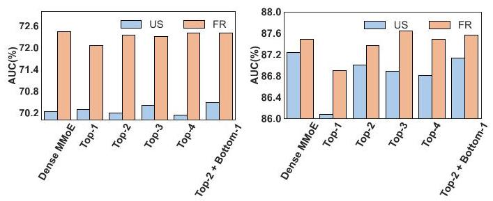

Figure 1: Comparison of dense and sparse patterns regarding CTR (left) and CTCVR (right).

Motivated by these insights, two key questions emerge: (1) how to divide leader and auxiliary experts in a task-personalized manner, and (2) how to revisit the potential value embedded in auxiliary experts. To this end, we propose Dynamic Experts Synergy (DES), which dynamically determines how many experts serve as leaders, making them contribute to specific tasks directly, and effectively revisit the knowledge of auxiliary experts via a multifaceted approach to supplement the leader experts. DES consists of two steps: (1) Entropy-driven Experts Classification (EEC): To dynamically determine the optimal number \( \left( k\right) \) of leader experts for each task, EEC operates on a core principle that is motivated by our empirical findings (as detailed in Section 3.1): aligning \( k \) co-directionally with real-time task difficulty. Specifically, a lower prediction entropy (indicating lower task uncertainty) or a lower gating entropy (reflecting more concentrated expert reliance) signifies a lower task difficulty, which in turn requires a smaller \( k \) .

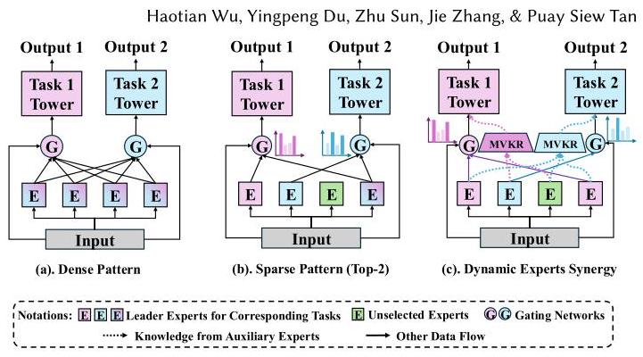

Figure 2: Comparison with dense and sparse expert sharing patterns. "E" represents expert.

To robustly implement this co-directional adjustment, EEC further employs a smooth dual-guard scheduler strategy, ensuring that adjustments to \( k \) occur only in response to statistically significant changes rather than instantaneously. This design not only aligns \( k \) with real-time task difficulty but also accounts for the timing of adjustments, preventing premature or excessive expert reallocation. (2) Multi-view Knowledge Recycle (MVKR): To promote the use of auxiliary experts that can provide richer information, contribute to greater diversity, and better support specific tasks, we propose a multi-faceted approach to assess and mine the potential value of auxiliary experts. Specifically, MVKR revisits these auxiliary experts from three perspectives: (1) Utility: quantifying information abundance within each of them (intra-expert-level), (2) Diversity: assessing divergence of them from the aggregated leader experts (inter-expert-level), and (3) Task-Relatedness: measuring their alignment with a learnable task indicator (task-level). By fusing these views through a lightweight compressor module, MVKR augments leader experts with knowledge from auxiliary experts (Section 3.2).

Figure 2 contrasts DES with purely dense and sparse approaches. DES dynamically selects the appropriate sets of leader and auxiliary experts for each task according to its real-time task difficulty, then allows leader experts to contribute to tasks directly and reuses knowledge from auxiliary experts in a multi-faceted manner rather than eliminating them directly. This synergy strikes a balance: highlighting the dominant roles of leader experts and mitigating information loss of auxiliary experts. Our main contributions lie in three-fold: (1) We identify two critical limitations in existing expert-sharing MTL for RSs: the absence of a dynamic mechanism to partition leader and auxiliary experts and the underutilization of auxiliary experts. (2) We propose a Dynamic Expert Synergy (DES) mechanism, which adaptively partitions leader and auxiliary experts aligned with entropy-driven real-time task difficulty and effectively assesses and utilizes the potential value of auxiliary experts. (3) We conduct extensive experiments on five real-world datasets, showcasing that DES achieves state-of-the-art performance while offering enhanced flexibility and knowledge utilization in MTL.

## 2 Related Work

Multi-task Learning for RSs. MTL has been extensively used to predict diverse user feedback in RSs [58] through efficient data utilization and knowledge transfer, mainly classified into four groups: hard sharing, soft sharing, sparse sharing, and expert sharing [49]. Hard sharing employs shared bottom layers and task-specific top layers \( \left\lbrack  {3,{38},{55},{71}}\right\rbrack \) , benefiting highly correlated tasks but often causing negative transfer due to rigid parameter coupling. In contrast, soft sharing treats tasks separately, sharing information via correlation weights [39, 41] or attention mechanisms [7]. Though flexible, it struggles with efficiency and modeling inter-task correlations. Sparse sharing uses parameter masks to learn task-specific subnetworks within an over-parameterized base model \( \left\lbrack  {2,{10},{56}}\right\rbrack \) , effectively reducing computational costs but often failing to capture fine-grained task nuances. Expert sharing, inspired by MoE [19], balances task correlation and differences by using experts for diverse knowledge and gating networks for customized expert knowledge aggregation [18, 22, 28, 34, 36, 37, 45, 47, 48, 57, 62, 72].

Some recent works [48, 64] have attempted to mitigate the polarization issues, that is the phenomenon of some experts being barely utilized for any tasks. BEnet [64] mitigates gate polarization by using a bagging layer and intra-expert attention to diversify feature usage, and HoME [48] applies expert normalization with Swish and a hierarchical mask to balance experts. Yet both mainly reduce low-gating experts to avoid collapse for MoE systems rather than extracting and utilizing their potentially valuable knowledge. Despite its advantages, dense expert sharing, which activates all experts for different tasks, faces redundancy. Thus, sparse expert sharing has emerged to resolve this with sparse gating strategies, such as top- \( k \) expert selection \( \left\lbrack  {6,{59},{73}}\right\rbrack \) or differentiable binary-encoded sparse gates [16]. However, selecting an optimal \( k \) remains challenging due to varying task- and data-specific needs. Moreover, both dense and sparse expert sharing suffer from the underutilization of low-gating experts. By contrast, our approach explicitly and dynamically separates leader and auxiliary experts and recycles auxiliary knowledge, turning underutilized experts into a complementary source instead of simply reducing them.

Sparse Mixture-of-Experts (SMoE) and Routing. Traditional MoE architectures employ input-dependent conditional computation to densely combine experts, enabling flexible modeling [19]. SMoE [42], pivotal in large language models [9, 20, 35], RSs [16, 73], and other domains [6, 11, 31, 68], improves efficiency by activating only a subset of experts via routing strategies. Typically, two main routing strategies are widely utilized: expert-choice (selecting top- \( k \) experts per token) [69,70] and token-choice (assigning top- \( k \) tokens per expert) \( \left\lbrack  {8,{12},{26},{27}}\right\rbrack \) . However, the fixed \( k \) used in most methods limits the adaptability across tasks. As such, some recent work has explored the adjustable expert capacity by either the heuristic incremental search strategy [5, 67] or probabilistic value accumulation and truncation \( \left\lbrack  {{17},{30},{60}}\right\rbrack \) . However, the former tends to converge to suboptimal solutions and is overly dependent on the initial choice of expert, and the latter encounters a dilemma wherein different tasks necessitate task-specific truncation thresholds. Thus, HyperMoE [66] introduces hypernetworks to utilize unselected experts in generative language models, mitigating performance loss from fixed \( k \) -selection. Despite prior advancements, our work makes distinct contributions by (1) adapting to the dynamic number of low-gating experts and (2) effectively leveraging low-gating experts in the MTL setting for more effective RSs.

## 3 Methodology

We introduce the proposed Dynamic Experts Synergy (DES) method, composed of two core components: Entropy-driven Experts Classification (EEC) and Multi-view Knowledge Recycle (MVKR). EEC dynamically partitions the experts into leader and auxiliary experts, adapting to task-specific difficulty. MVKR further recycles knowledge from auxiliary experts to complement leader experts from three key perspectives: utility, diversity, and task-relatedness, enabling a synergistic knowledge integration mechanism that minimizes the loss of valuable information from auxiliary experts.

Task Definition. Let \( \mathcal{S} = {\left. \left\{  {x}_{a},{y}_{a},{z}_{a}\right\}  \right| }_{a = 1}^{N} \) is the observed dataset with \( N \) samples. \( {x}_{a} \) denotes the \( a \) -th sample with multiple fields (e.g. user field, item field), \( {y}_{a} \) and \( {z}_{a} \) denote the binary labels of click and conversion to the \( a \) -th sample respectively. \( y = 1 \) or \( z = 1 \) means click or conversion occurs respectively. \( {pCTR} \) (post-view click-through rate), pCTCVR (post-view click-through & conversion rate) are defined as follows:

\[
{pCTR} = p\left( {y = 1 \mid  x}\right) ,{pCTCVR} = p\left( {y = 1, z = 1 \mid  x}\right) . \tag{1}
\]

Moreover, in the TenRec (QB-video) dataset [61], the objectives include predicting user interactions, i.e., follow, like, and share, in addition to click. Each of these tasks involves binary classification labels, which are defined in a similar way to the form of \( {pCTR} \) .

### 3.1 Entropy-driven Experts Classification (EEC)

Motivation and Overview. EEC aims to dynamically partition a set of \( M \) experts into leader experts (Top- \( {k}_{j} \) ) and auxiliary experts \( \left( {M - {k}_{j}}\right) \) for each task \( j \) , based on the ranking of gating scores. This dynamic partitioning is driven by task-specific prediction entropy and gating entropy, ensuring adaptive expert allocation aligned with task difficulty and knowledge requirements. Prediction Entropy \( \left( {U}_{j}^{t}\right) \) reflects uncertainty in task predictions at iteration \( t\left\lbrack  {{13},{25}}\right\rbrack \) , where lower \( {U}_{j}^{t} \) implies higher confidence in predictions and requires a small number of experts. Gating Entropy \( \left( {H}_{j}^{t}\right) \) captures the concentration of gating scores [54] at iteration \( t \) , highlighting the reliance on a subset of experts. A higher \( {H}_{j}^{t} \) indicates a broader reliance on multiple experts, while a lower one suggests allowing focusing utilization of a smaller set of experts [17, 52].

To begin, we verify the intuition that \( {k}_{j} \) should vary in the same direction as \( {U}_{j} \) and \( {H}_{j} \) , that is, \( {k}_{j} \) increases when \( {U}_{j} \) and \( {H}_{j} \) rise and vice versa. Specifically, we track and average \( {U}_{j} \) and \( {H}_{j} \) across iterations. When the mean entropy drops below predefined thresholds, the Normal Group (Norm) reduces \( {k}_{j} \) while the Contradiction Group (Con) increases it. Results in Figure 3(a-b) show that Norm consistently outperforms Con, reinforcing the necessity of co-directionally aligning \( {k}_{j} \) with the trends of \( {U}_{j} \) and \( {H}_{j} \) . Furthermore, by introducing an artificial delay in the Norm group, we examine the effect of adjustment timing. Results indicate that a moderate delay in updating \( {k}_{j} \) enhances performance, underscoring the value of timing control over immediate adjustment in response to entropy shifts. Meanwhile, both entropies exhibit pronounced and consistent trends throughout training in Figure 3(c-d), which makes them reliable indicators to dynamically adjust expert allocation to match real-time task difficulty, with \( {U}_{j} \) reflecting task-specific performance and \( {H}_{j} \) capturing the intrinsic property of the MoE system.

Algorithmic Details. The EEC algorithm operates as follows. First, for each task \( j \) , the prediction entropy \( \left( {U}_{j}^{t}\right) \) and gating entropy \( \left( {H}_{j}^{t}\right) \) at \( t \) -th iteration are computed as,

\[
{U}_{j}^{t} =  - \mathop{\sum }\limits_{c}{p}_{j, c}^{t}\log \left( {{p}_{j, c}^{t} + \epsilon }\right) ,{H}_{j}^{t} =  - \mathop{\sum }\limits_{{i = 1}}^{M}{g}_{j, i}^{t}\log \left( {{g}_{j, i}^{t} + \epsilon }\right) \tag{2}
\]

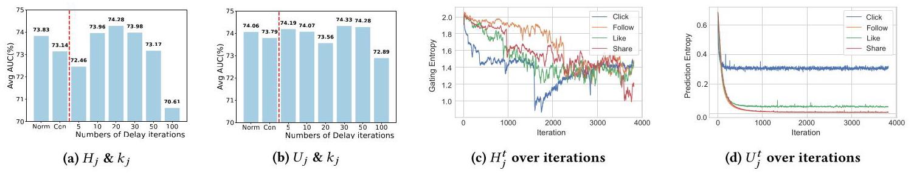

Figure 3: Results on TenRec, and similar trends can be noted on the other datasets.

where \( {p}_{j, c}^{t} \) represents the predicted probability of class \( c \) for task \( j,{g}_{j, i}^{t} \) is the gating probability for the \( i \) -th expert, and \( \epsilon \) is a small constant for numerical stability.

Second, to avoid abrupt changes in \( {k}_{j}^{t} \) , we apply momentum mechanisms via exponential moving averages (EMAs). Specifically, we track \( \Delta {U}_{j}^{t} = {U}_{j}^{t} - {U}_{j}^{t - 1} \) and \( \Delta {H}_{j}^{t} = {H}_{j}^{t} - {H}_{j}^{t - 1} \) , then update:

\[
{M}_{{U}_{j}}^{t} = {\alpha \Delta }{U}_{j}^{t} + \left( {1 - \alpha }\right) {M}_{{U}_{j}}^{t - 1},{M}_{{H}_{j}}^{t} = {\beta \Delta }{H}_{j}^{t} + \left( {1 - \beta }\right) {M}_{{H}_{j}}^{t - 1}, \tag{3}
\]

where \( \alpha ,\beta  \in  \left\lbrack  {0,1}\right\rbrack \) are smoothing parameters. \( {M}_{{U}_{j}}^{t} \) and \( {M}_{{H}_{j}}^{t} \) thus represent smoothed estimates of recent changes in prediction entropy and gating entropy, respectively.

With the smoothed momentum signals \( \left( {M}_{{U}_{j}}^{t}\right. \) and \( \left. {M}_{{H}_{j}}^{t}\right) \) , a core challenge is to decide when to adjust the number of leader experts, \( {k}_{j}^{t} \) . Reacting to every minor fluctuation would introduce instability. To address this, we design a smooth dual-guard scheduler that triggers updates only in response to statistically significant and persistent changes. The first-guard scheduler decides whether the entropy momentum is significant enough to be transformed into a potential adjustment for \( {k}_{j}^{t} \) . We only proceed with an adjustment if the deviation in either entropy momentum is significant enough to exceed a standard deviation-scaled threshold (i.e., \( \left| {{M}_{{U}_{j}}^{t} - {\mu }_{{M}_{{U}_{j}}^{t}}}\right|  > \kappa {\sigma }_{{M}_{{U}_{j}}^{t}} \) or \( \left| {{M}_{{H}_{j}}^{t} - {\mu }_{{M}_{{H}_{j}}^{t}}}\right|  > \kappa {\sigma }_{{M}_{{H}_{j}}^{t}} \) ). Once this condition is met, we first synthesize the two momentum signals into a single, unified metric: the difficulty score, \( {\mathcal{D}}_{j}^{t} \) . This score functions as an intermediate signal that initiates a potential adjustment to \( {k}_{j}^{t} \) : its sign dictates the adjustment's direction (increase or decrease), while its magnitude influences the extent of the proposed potential adjustment. The difficulty score is computed as a weighted sum of the momentum of the changes in entropies:

\[
{\mathcal{D}}_{j}^{t} = {M}_{{U}_{j}}^{t} \times  {w}_{{U}_{j}}^{t} + {M}_{{H}_{j}}^{t} \times  {w}_{{H}_{j}}^{t}. \tag{4}
\]

To adaptively determine the dominant signal at iteration \( t \) , we assign higher weights to the momentum that exhibits greater deviation, ensuring the difficulty score precisely reflects real-time task difficulty. Specifically, the weights \( {w}_{{U}_{j}}^{t} \) and \( {w}_{{H}_{j}}^{t} \) are computed as:

\[
{Q}_{{U}_{j}}^{t} = \frac{\left| {M}_{{U}_{j}}^{t} - {\mu }_{{M}_{{U}_{j}}^{t}}\right| }{{\sigma }_{{M}_{{U}_{j}}^{t}}},{Q}_{{H}_{j}}^{t} = \frac{\left| {M}_{{H}_{j}}^{t} - {\mu }_{{M}_{{H}_{j}}^{t}}\right| }{{\sigma }_{{M}_{{H}_{j}}^{t}}}\text{ , } \tag{5}
\]

\[
{w}_{{U}_{j}}^{t},{w}_{{H}_{j}}^{t} = \operatorname{Softmax}\left( {{Q}_{{U}_{j}}^{t},{Q}_{{H}_{j}}^{t}}\right) \text{ . } \tag{6}
\]

This mechanism ensures that the entropy with a significant deviation exerts greater influence on the difficulty score, aligning it with task dynamics.

To ensure \( {k}_{j}^{t} \) adapts responsively to task difficulty while avoiding unnecessary fluctuations, we design a scaling mechanism that amplifies significant entropy changes while suppressing minor variations. Specifically, the difficulty score \( {\mathcal{D}}_{j}^{t} \) is mapped to the potential adjustment \( {\Delta }_{j}^{t} \) in \( {k}_{j}^{t} \) via:

\[
{\Delta }_{j}^{t} = \operatorname{sign}\left( {\mathcal{D}}_{j}^{t}\right) \left\lbrack  {\exp \left( {\gamma {\left| {\mathcal{D}}_{j}^{t}\right| }^{\delta }}\right)  - 1}\right\rbrack  , \tag{7}
\]

where \( \operatorname{sign}\left( {\mathcal{D}}_{j}^{t}\right) \) determines the direction of adjustment, and \( \gamma ,\delta  > \) 0 control the sensitivity to entropy deviations. When \( \left| {\mathcal{D}}_{j}^{t}\right|  \rightarrow  0 \) , the adjustment remains minimal, preventing unnecessary updates. As it increases, the exponential term grows rapidly, enabling faster adaptation to substantial entropy shifts.

To prevent frequent oscillations in \( {k}_{j}^{t} \) , we accumulate the increment \( {\Delta }_{j}^{t} \) at each iteration into an accumulator \( {\mathcal{A}}_{j}^{t} \) . This process ensures that small, transient potential adjustments do not immediately alter \( {k}_{j}^{t} \) . Once \( \left| {{\mathcal{A}}_{j}^{t} - {\mu }_{{\mathcal{A}}_{j}^{t}}}\right| \) surpasses a standard deviation-scaled bound (second-guard scheduler, \( \left| {{\mathcal{A}}_{j}^{t} - {\mu }_{{\mathcal{A}}_{j}^{t}}}\right|  > \theta {\sigma }_{{\mathcal{A}}_{j}^{t}} \) , which decides whether this accumulated potential adjustment is significant enough to be executed as an actual adjustment to \( {k}_{j}^{t} \) ), indicating a persistent or significant deviation, \( {k}_{j}^{t} \) is updated accordingly:

\[
{k}_{j}^{t} = {k}_{j}^{t - 1} + \operatorname{sign}\left( {\mathcal{A}}_{j}^{t}\right) ,{\mathcal{A}}_{j}^{t} = {\mathcal{A}}_{j}^{t - 1} + {\Delta }_{j}^{t}. \tag{8}
\]

Accordingly, a steady decline in entropy leads to a gradual reduction in leader experts, while rising entropy triggers the reintroduction of additional leaders to meet evolving task difficulties. This mechanism allows \( {k}_{j}^{t} \) to respond more robustly to genuine shifts in task confidence and gating distributions while filtering out minor fluctuations. Finally, the \( {k}_{j}^{t} \) experts with the highest gating scores are designated as leader experts, which directly contribute to specific tasks, while the remaining experts are categorized as auxiliary experts. Then the auxiliary experts can be revisited in subsequent stages. The pseudo-code of EEC is shown in Appendix D.

### 3.2 Multi-view Knowledge Recycle (MVKR)

Unlike conventional Top- \( k \) routing, which discards the knowledge of unselected experts, DES leverages auxiliary experts to enhance task-specific modeling through MVKR. To effectively integrate their knowledge, we assess auxiliary experts from three levels: intra-expert (utility), inter-expert (diversity), and task-level (task-relatedness). These perspectives are fused into a multi-view representation and incorporated into leader experts via a lightweight compression network. As shown in Figure 4, the outputs of auxiliary experts are fused in a multifaceted manner into three fixed-dimensional representations. This setup ensures that the potentially valuable knowledge embedded in them can still be smoothly utilized despite the dynamic number of auxiliary experts.

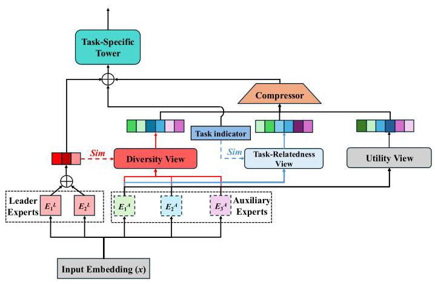

Figure 4: The illustration of MVKR.

Utility View. At the intra-expert level, we quantify the utility of each auxiliary expert by introducing information abundance [14], which measures the uniformity of singular value distribution [23]. A higher value indicates more evenly distributed singular values and reduced dimensional collapse. Given a matrix \( \mathbf{E} \) , its information abundance is defined as [14]:

\[
\phi \left( \mathbf{E}\right)  = \frac{\parallel \mathbf{\sigma }{\parallel }_{1}}{\parallel \mathbf{\sigma }{\parallel }_{\infty }}, \tag{9}
\]

where \( \parallel \mathbf{\sigma }{\parallel }_{1} \) and \( \parallel \mathbf{\sigma }{\parallel }_{\infty } \) are the \( {\mathrm{L}}_{1} \) and \( {\mathrm{L}}_{\infty } \) norm of singular value vector, respectively. For each auxiliary expert, its knowledge can be fused by:

\[
{Q}_{j}^{uti} = \mathop{\sum }\limits_{{i = 1}}^{{M - {k}_{j}}}{\alpha }_{i, j}^{uti}{E}_{i}^{A}\left( x\right) ,{\alpha }_{i, j}^{uti} = \frac{\exp \left( {\phi \left( {{E}_{i}^{A}\left( x\right) }\right) }\right) }{\mathop{\sum }\limits_{{i = 1}}^{{M - {k}_{j}}}\exp \left( {\phi \left( {{E}_{i}^{A}\left( x\right) }\right) }\right) }, \tag{10}
\]

where \( {E}_{i}^{A}\left( x\right) \) is the output of \( i \) -th auxiliary expert and \( x \) is input embedding for current batch. In this way, auxiliary experts with higher information abundance will be promoted.

Diversity View. At the inter-expert level, we encourage diverse knowledge contribution by assigning greater weights to auxiliary experts whose outputs exhibit higher deviation from those of the leader experts. Specifically, we first obtain the aggregated representation of the leader experts \( {g}_{j}^{L} \) by,

\[
{g}_{j}^{L} = \mathop{\sum }\limits_{{i = 1}}^{M}G{\left( x\right) }_{j}{E}_{i}\left( x\right) , G{\left( x\right) }_{j} = \operatorname{Topk}\left( {\operatorname{Softmax}\left( {x{W}_{j}^{g}}\right) }\right) , \tag{11}
\]

where \( G{\left( \cdot \right) }_{j} \) is the routing network for task \( j \) , Topk selects the Top- \( {k}_{j} \) (renormalization) leader experts with highest gating score, \( {k}_{j} \) is dynamically determined by Equation 8 in EEC, and \( {W}_{j}^{g} \) is a trainable parameter matrix. Then, the diversity score \( \left( {\rho }_{i}^{j}\right) \) between outputs of each auxiliary expert \( i \) and \( {g}_{j}^{L} \) is computed, and auxiliary experts' knowledge is fused as below,

\[
{\rho }_{i}^{j} = 1 - \frac{{E}_{i}^{A}\left( x\right)  \cdot  {g}_{j}^{L}}{\begin{Vmatrix}{{E}_{i}^{A}\left( x\right) }\end{Vmatrix}\begin{Vmatrix}{g}_{j}^{L}\end{Vmatrix} + \varepsilon },{Q}_{j}^{div} = \mathop{\sum }\limits_{{i = 1}}^{{M - {k}_{j}}}{\alpha }_{i, j}^{div}{E}_{i}^{A}\left( x\right) , \tag{12}
\]

\[
{\alpha }_{i, j}^{div} = \frac{\exp {\rho }_{i}^{j}}{\mathop{\sum }\limits_{{i = 1}}^{{M - {k}_{j}}}\exp {\rho }_{i}^{j}}. \tag{13}
\]

Task-Relatedness View. At the task level, we aim to ensure that auxiliary expert knowledge is effectively aligned with the specific task requirements. While informativeness and diversity help retain valuable and complementary knowledge, they do not guarantee that the retained knowledge is relevant to the target task. To address this, we measure the alignment of auxiliary expert knowledge with the task by evaluating its similarity to a task indicator \( \zeta \) , which represents task-specific characteristics [46]. Specifically, the task indicator is a randomly initialized learnable vector maintained for each task and is fed into task-specific towers to capture task-specific information. The task-relatedness score \( {\alpha }_{i, j}^{\text{ rel }} \) is computed, and auxiliary experts' knowledge is fused as below,

\[
{Q}_{j}^{rel} = \mathop{\sum }\limits_{{i = 1}}^{{M - {k}_{j}}}{\alpha }_{i, j}^{rel}{E}_{i}^{A}\left( x\right) ,{\alpha }_{i, j}^{rel} = \frac{\exp \left( {{E}_{i}^{A}\left( x\right)  \cdot  {\zeta }_{j}}\right) }{\mathop{\sum }\limits_{{i = 1}}^{{M - {k}_{j}}}\exp \left( {{E}_{i}^{A}\left( x\right)  \cdot  {\zeta }_{j}}\right) }. \tag{14}
\]

This encourages auxiliary experts with higher task-relatedness to contribute more significantly.

Finally, the knowledge from the three views is concatenated and fed to a compression network (MLP) \( {h}_{j}\left( \cdot \right) \) , yielding auxiliary experts’ knowledge \( {g}_{j}^{A} \) , with the same dimensionality as \( {g}_{j}^{L} \) ,

\[
{g}_{j}^{A} = {h}_{j}\left( {Q}_{j}\right) ,{Q}_{j} = \operatorname{Concatenate}\left( {{Q}_{j}^{uti},{Q}_{j}^{div},{Q}_{j}^{rel}}\right) . \tag{15}
\]

Accordingly, \( {g}_{j}^{A} \) and \( {g}_{j}^{L} \) are aggregated and fed into task-specific towers to complete the prediction.

## 4 Experiments

### 4.1 Experimental Setup

Five datasets are adopted in the experiments, whose statistics are shown in Appendix Table 6. Amongst them, AliExpress-NL, AliExpress-ES, AliExpress-US, and AliExpress-FR are collected from real-world traffic logs of the AliExpress search system from the Netherlands, Spain, the US, and France, respectively [29]. The TenRec (QB-Video) dataset is collected from the QQ BOW platform, which contains diverse user interactions, i.e., clicks, likes, shares, and follows [61]. Following the mainstream MTL-based RS research [44, 65], we randomly split TenRec (QB-Video) datasets into training, validation, and test sets with a ratio of 8:1:1. We randomly split all the AliExpress-series datasets into training, validation, and test sets with a ratio of 4:1:1. We adopt AUC as the evaluation metric. To verify the effectiveness of our proposed DES, we compare with 13 competitive baselines: (1) Hard sharing pattern: Shared-Bottom [3], AITM [55]; (2) Soft sharing pattern: Cross-Stitch [39]; (3) Dense expert sharing pattern: OMoE [19], MMoE [37], PLE [45], Meta-Heac [72], AdaTT [28], STEM [44], HoME [48]; and (4) Sparse experts sharing pattern: Naïve Top-k [42], Dselect-k [16], Dynamic-MoE [17]. More details for baselines are shown in Appendix A. Moreover, detailed hyperparameter settings are in Appendix B.

### 4.2 Experimental Results and Analysis

Overall Comparison. The performance of all methods on the five datasets is presented in Tables 1-2, where the best results are in bold, and the runner-up is underlined. Several observations are noted: First, our DES achieves the best average AUC (Avg AUC) across five datasets. Specifically, taking the TenRec (QB-Video) dataset as an example, HoME, a recent state-of-the-art expert-sharing method, achieves about a 0.17% relative improvement in Avg AUC over STEM, while our DES yields about a 0.59% relative improvement over HoME. Compared with PLE, a classical competitive expert-sharing baseline, DES attains about a 1.54% relative improvement in Avg AUC. Furthermore, the performance superiority of DES on the CTR task is more significant on the AliExpress-NL, US, and FR datasets, with larger scales and more features. Second, on the TenRec (QB-Video) dataset, most of the hard-sharing, soft-sharing, and expert-sharing patterns suffer from different degrees of negative transfer phenomena for the task 'Like', which has fewer positive feedback signals. DES effectively improves such a situation, which demonstrates that DES enhances the effectiveness of tasks in utilizing each other's knowledge by facilitating collaboration between leader experts and auxiliary experts, thereby ensuring that data-sparse tasks can still benefit from other tasks. In addition, TenRec (QB-Video) has less user- and item-side information and thus relies more on task-to-task knowledge transfer. The advanced Avg AUC of DES - showing around a 2.05% relative gain over single-task learning - further validates that our DES effectively facilitates mutual benefits among tasks. Third, DES's consistently superior performance over HoME demonstrates that reasonably recycling the knowledge embedded in low-gating experts outperforms simply reducing or suppressing them.

Table 1: AUC (%) comparison on TenRec (QB-Video).

<table><tr><td>Model</td><td>Click</td><td>Follow</td><td>Like</td><td>Share</td><td>Avg</td></tr><tr><td>Single Task</td><td>91.46</td><td>65.32</td><td>70.07</td><td>67.89</td><td>73.69</td></tr><tr><td>Shared Bottom</td><td>89.32</td><td>66.82</td><td>68.33</td><td>67.25</td><td>72.93</td></tr><tr><td>AITM</td><td>89.48</td><td>66.96</td><td>69.45</td><td>68.73</td><td>73.66</td></tr><tr><td>Cross-Stitch</td><td>90.12</td><td>67.58</td><td>69.76</td><td>67.69</td><td>73.79</td></tr><tr><td>OMoE</td><td>90.35</td><td>66.48</td><td>69.54</td><td>68.68</td><td>73.76</td></tr><tr><td>MMoE</td><td>90.08</td><td>67.65</td><td>69.72</td><td>69.03</td><td>74.12</td></tr><tr><td>PLE</td><td>89.98</td><td>68.74</td><td>69.83</td><td>67.70</td><td>74.06</td></tr><tr><td>MetaHeac</td><td>90.26</td><td>66.89</td><td>70.11</td><td>66.84</td><td>73.53</td></tr><tr><td>AdaTT</td><td>91.84</td><td>67.82</td><td>69.73</td><td>67.99</td><td>74.35</td></tr><tr><td>STEM</td><td>91.39</td><td>68.32</td><td>70.17</td><td>68.64</td><td>74.63</td></tr><tr><td>HoME</td><td>91.91</td><td>68.56</td><td>70.05</td><td>68.52</td><td>74.76</td></tr><tr><td>Naïve Top-k</td><td>90.38</td><td>67.88</td><td>69.62</td><td>68.09</td><td>73.99</td></tr><tr><td>DSelect-k</td><td>91.63</td><td>67.61</td><td>70.01</td><td>68.41</td><td>74.42</td></tr><tr><td>Dynamic-MoE</td><td>90.87</td><td>68.26</td><td>69.86</td><td>68.04</td><td>74.26</td></tr><tr><td>DES</td><td>91.96</td><td>69.46</td><td>70.65</td><td>68.74</td><td>75.20</td></tr></table>

In terms of routing strategies, Sparse MoE (Naïve Top-k, Dselect-k, Dynamic-MoE) exhibits comparable performance to Dense MoE (MMoE), where underutilization [48] (i.e., polarization [37, 64]) and overfitting [67] may be the main reasons for such a phenomenon. Such a finding aligns with prior studies [6, 15]. DES illustrates that dynamically adjusting leader experts based on real-time task difficulty (via EEC) is more effective than either fixing \( k \) globally or adjusting expert capacity based on a predefined cumulative gating threshold (Dynamic-MoE) [17]. Meanwhile, auxiliary-expert reuse (through MVKR) provides a crucial advantage in harnessing auxiliary experts' knowledge, an aspect that conventional sparse or dense solutions often overlook.

Ablation Study. We now analyze the effect of essential components of DES, including prediction entropy (PE), gating entropy (GE), and the Accumulator in EEC, as well as MVKR. Specifically, we individually remove each component (i.e., w/o GE, w/o PE, w/o Accumulator and w/o MVKR) and measure how the model's performance changes across the four tasks.

Table 3: AUC (%) comparison on components of DES.

<table><tr><td></td><td>Click</td><td>Follow</td><td>Like</td><td>Share</td><td>Avg</td></tr><tr><td>DES w/o MVKR</td><td>91.46</td><td>68.02</td><td>69.84</td><td>67.98</td><td>74.33</td></tr><tr><td>EEC w/o GE</td><td>90.87</td><td>69.04</td><td>69.91</td><td>67.89</td><td>74.43</td></tr><tr><td>EEC w/o PE</td><td>91.97</td><td>67.85</td><td>70.19</td><td>68.52</td><td>74.63</td></tr><tr><td>EEC w/o Accumulator</td><td>91.31</td><td>68.38</td><td>69.72</td><td>68.47</td><td>74.47</td></tr><tr><td>DES</td><td>91.96</td><td>69.46</td><td>70.65</td><td>68.74</td><td>75.20</td></tr></table>

Table 3 shows the performance (AUC) where three major insights are gained. First, removing MVKR results in the most significant performance drop, highlighting (a) the effectiveness of MVKR in enhancing the knowledge transfer for task-specific modelling and (b) the importance of recycling knowledge from auxiliary experts. Second, excluding gating entropy (GE) or prediction entropy (PE), both lead to performance degradation, indicating that both entropy signals are crucial for dynamic expert division. Notably, removing GE has a greater impact, suggesting that the gating entropy better reflects real-time task difficulty in the TenRec (QB-Video) dataset. Third, eliminating the accumulator reduces performance, underscoring the necessity of long-range momentum accumulation for stabilizing \( k \) -adjustment. Overall, these findings confirm that each component (i.e., MVKR, GE, PE, and the accumulator) plays a critical role in DES's effectiveness, reinforcing its design for dynamic expert division and auxiliary knowledge reuse.

Expert Utilization Analysis. To understand how various expert-sharing patterns (MMoE with Top- \( k \) routing, Top- \( k \) with Gaussian Noise [6, 42], Dynamic-MoE, and our DES) distribute "expert usage" across different tasks, we track and record the frequency with which different tasks activate each expert as a "leader" during training. The results are shown in Figure 5.

In Top- \( k \) , certain experts are heavily activated by a single task while remaining underutilized elsewhere, suggesting that a fixed \( k \) can reinforce high-gating experts at the expense of more balanced utilization. For example, Experts 1, 6, 8 are only activated by "Follow", "Share", "Click" tasks, respectively. In addition, the "Click" task only activated Expert 8 less than \( {20}\% \) of the time, indicating the overall low utilization of Expert 8, namely load imbalance issue [42]. Although the introduction of learnable Gaussian noise mitigates the load imbalance problem to some extent [6], it creates an over-specialization problem that may weaken the modeling of task correlation [6]. For example, the "Click" task, almost exclusively activates Expert 1 or Expert 4, while the "Like" task, almost exclusively activates Expert 2 and Expert 6, which suggests that the correlation between the "Click" and "Like" task is difficult to model adequately.

Table 2: AUC (%) comparison on AliExpress-US, AliExpress-NL, AliExpress-FR, AliExpress-ES.

<table><tr><td rowspan="2">Methods</td><td colspan="2">AliExpress-US</td><td colspan="2">AliExpress-NL</td><td colspan="2">AliExpress-FR</td><td colspan="2">AliExpress-ES</td></tr><tr><td>CTR AUC</td><td>CTCVR AUC</td><td>CTR AUC</td><td>CTCVR AUC</td><td>CTR AUC</td><td>CTCVR AUC</td><td>CTR AUC</td><td>CTCVR AUC</td></tr><tr><td>Single-Task</td><td>70.52</td><td>86.44</td><td>72.58</td><td>85.17</td><td>72.28</td><td>87.36</td><td>72.41</td><td>87.67</td></tr><tr><td>Shared-Bottom</td><td>70.59</td><td>86.90</td><td>72.32</td><td>85.65</td><td>72.44</td><td>87.09</td><td>72.50</td><td>87.24</td></tr><tr><td>AITM</td><td>70.77</td><td>87.36</td><td>72.11</td><td>86.21</td><td>72.30</td><td>87.62</td><td>72.47</td><td>88.02</td></tr><tr><td>Cross-Stitch</td><td>70.71</td><td>86.82</td><td>72.14</td><td>85.37</td><td>72.43</td><td>87.23</td><td>72.33</td><td>87.37</td></tr><tr><td>OMoE</td><td>70.52</td><td>86.60</td><td>72.31</td><td>85.71</td><td>72.51</td><td>87.33</td><td>72.58</td><td>87.81</td></tr><tr><td>MMoE</td><td>70.24</td><td>87.24</td><td>72.61</td><td>86.07</td><td>72.45</td><td>87.48</td><td>72.76</td><td>88.06</td></tr><tr><td>PLE</td><td>70.65</td><td>87.22</td><td>72.42</td><td>85.93</td><td>72.26</td><td>87.65</td><td>72.60</td><td>88.37</td></tr><tr><td>MetaHeac</td><td>70.89</td><td>86.67</td><td>72.41</td><td>85.73</td><td>72.63</td><td>86.95</td><td>72.23</td><td>87.58</td></tr><tr><td>AdaTT</td><td>70.48</td><td>87.41</td><td>72.57</td><td>86.01</td><td>72.48</td><td>87.73</td><td>72.64</td><td>87.75</td></tr><tr><td>STEM</td><td>71.01</td><td>87.54</td><td>72.50</td><td>85.86</td><td>72.46</td><td>87.32</td><td>72.68</td><td>88.13</td></tr><tr><td>HoME</td><td>70.42</td><td>87.46</td><td>72.75</td><td>86.14</td><td>72.61</td><td>87.48</td><td>72.74</td><td>88.48</td></tr><tr><td>Naïve Top-k</td><td>70.20</td><td>87.00</td><td>72.26</td><td>86.10</td><td>72.34</td><td>87.37</td><td>72.59</td><td>88.23</td></tr><tr><td>DSelect-k</td><td>70.70</td><td>87.13</td><td>72.56</td><td>86.23</td><td>72.45</td><td>87.07</td><td>72.78</td><td>88.25</td></tr><tr><td>Dynamic-MoE</td><td>70.57</td><td>87.39</td><td>72.35</td><td>85.54</td><td>72.68</td><td>87.39</td><td>72.45</td><td>88.31</td></tr><tr><td>DES</td><td>72.10</td><td>87.55</td><td>73.47</td><td>86.47</td><td>73.47</td><td>87.77</td><td>73.11</td><td>88.91</td></tr></table>

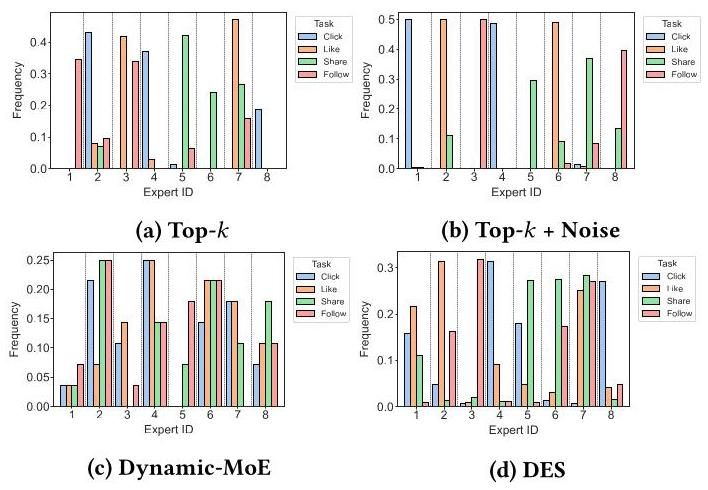

Figure 5: Illustration of the frequency of experts who are selected as leaders for different tasks.

Conversely, Dynamic-MoE yields a more uniform but less specialized distribution-most experts see moderate but shallow engagement across tasks, potentially inhibiting the deep specialization desired in the expert-sharing pattern [5,28]. Compared to Top- \( k \) and Dynamic-MoE, DES achieves a more balanced (no experts are selected as leaders by all tasks with very low frequency) yet selectively focal distribution of expert usage. More importantly, DES largely insulates the model from load imbalance. This is because even if some of the experts are assigned lower gating scores, they are still able to contribute incremental information to a specific task through MVKR and stimulate the full utilization of different experts to a greater extent.

Effect of Thresholds \( \kappa \) and \( \theta \) . To investigate how thresholds \( \kappa \) and \( \theta \) , two core hyperparameters in the smooth dual-guard scheduler, impact the performance of DES, we apply a grid search in the range of \( \left\lbrack  {{0.1},{1.1}}\right\rbrack \) stepped by 0.2 for both thresholds. Figure 6 shows the average AUC across the four tasks on TenRec (QB-Video) regarding different settings of \( \kappa \) and \( \theta \) .

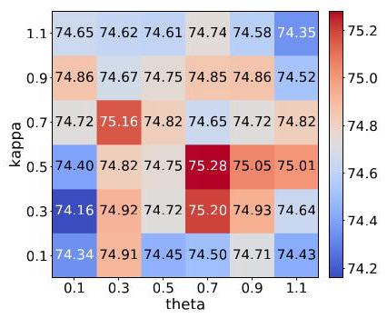

Figure 6: Effect of \( \kappa \) and \( \theta \) on Avg AUC (%) achieved by DES on TenRec (QB-Video).

More figures showing AUC on each individual task are shown in Appendix E. Several observations are noted. First, a clear "high-center, low-edge" structure emerges. Specifically, the region around \( \kappa  \in  \left\lbrack  {{0.3},{0.9}}\right\rbrack \) and \( \theta  \in  \left\lbrack  {{0.3},{0.9}}\right\rbrack \) not only achieves high accuracy (at or above 75.0%) but also exhibits comparatively stable values across neighboring cells, suggesting that moderate thresholds in both momentum-based release and accumulator-based adjustments yield a robust "sweet spot". In comparison, in most cases, notable performance dropping toward 74.2-74.4% appears at extreme value settings for \( \kappa \) and \( \theta \) , suggesting that overly strict or lenient release conditions undermine the model's ability to adaptively select experts. This broad optimal zone makes parameter selection more flexible than precisely tuning a discrete \( k \) in Naïve Top- \( k \) routing.

We also notice that most of the \( \left( {\kappa ,\theta }\right) \) combinations tested outperform the Top- \( k \) baseline in our paper. Second, the hyperparameter \( \kappa \) exhibits overall greater sensitivity compared to \( \theta \) . This is evident from the larger fluctuations in performance values along the vertical axis (i.e., across different \( \kappa \) values) for fixed \( \theta \) .

Effect of Different Views of Knowledge. To examine how each view of auxiliary knowledge, i.e., Utility, Diversity, Task-Relatedness (abbreviated as U, D, R), contributes to the overall performance, we test different combinations of views in MVKR across the four tasks on TenRec (QB-Video), shown in Table 4.

Table 4: Effect of different views of knowledge.

<table><tr><td colspan="3">Knowledge View</td><td rowspan="2">Click</td><td rowspan="2">Follow</td><td rowspan="2">Like</td><td rowspan="2">Share</td><td rowspan="2">Avg</td></tr><tr><td>U</td><td>R</td><td>D</td></tr><tr><td>✓</td><td></td><td></td><td>91.76</td><td>68.33</td><td>70.19</td><td>67.79</td><td>74.52</td></tr><tr><td></td><td>✓</td><td></td><td>90.92</td><td>66.85</td><td>69.68</td><td>68.21</td><td>73.92</td></tr><tr><td></td><td></td><td>✓</td><td>91.69</td><td>68.17</td><td>69.66</td><td>68.02</td><td>74.39</td></tr><tr><td>✓</td><td>✓</td><td></td><td>92.01</td><td>69.09</td><td>69.74</td><td>68.65</td><td>74.87</td></tr><tr><td>✓</td><td></td><td>✓</td><td>91.86</td><td>68.02</td><td>69.83</td><td>67.94</td><td>74.41</td></tr><tr><td></td><td>✓</td><td>✓</td><td>91.92</td><td>68.70</td><td>70.01</td><td>67.78</td><td>74.60</td></tr><tr><td>✓</td><td>✓</td><td>✓</td><td>91.96</td><td>69.46</td><td>70.65</td><td>68.74</td><td>75.20</td></tr></table>

First, the "U" variant outperforms other single-view variants ("R" and "D"), suggesting that it contains the most individually valuable information among the three. Second, "U+D" combination yields the worst performance among all dual-view variants, aligning with the persistently higher similarity among auxiliary experts compared to "U+R" (the best dual-view variant) during training as shown in Figure 7(a). This suggests that auxiliary experts exhibit substantial overlap under the "U+D" view, thereby limiting the completeness of the knowledge they contribute. Third, "U+D+R" combination outperforms all other variants, demonstrating its ability to effectively leverage complementary knowledge from auxiliary experts to enhance the leader experts. This is further supported by the increased similarity gap between leader and auxiliary experts under the "U+D+R" views compared to the variant without any view integration throughout training, as shown in Figure 7(b).

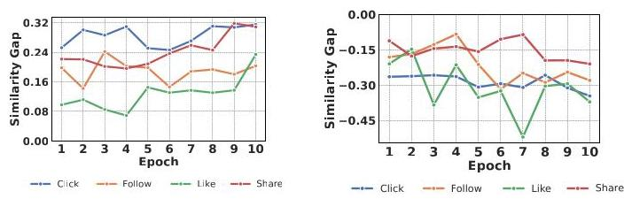

Figure 7: (a) The similarity gaps among auxiliary experts under "U+D" (the worst variant with dual-view) compared to "U+R" (the best variant with dual-view); (b) The similarity gap between leader and auxiliary experts under "U+D+R" compared to the variant without integration of any view.

Generalizability of DES. To further assess the generalizability of DES beyond RSs, we evaluate it on MultiMNIST [4], a widely-used MTL dataset in the computer vision (CV) community. MultiMNIST consists of \( {32} \times  {32} \) pixel images containing two handwritten digits positioned at the top-left and bottom-right corners, requiring simultaneous classification of both digits (Tasks 1 and 2). Across this dataset, DES consistently surpasses all selected baselines, achieving the highest average accuracy while maintaining superior task balance. This result is particularly compelling because CV tasks emphasize spatially hierarchical features and local pattern recognition, which differ fundamentally from the heterogeneous user-item interactions and sparse categorical signals in RSs. The ability of DES's dynamic expert selection mechanism to adapt effectively to both dense visual representations and sparse behavioral data demonstrates its versatility across diverse MTL settings.

Table 5: Accuracy (%) comparison on MultiMNIST dataset.

<table><tr><td>Method</td><td>Task 1 Acc.</td><td>Task 2 Acc.</td><td>Avg. Acc.</td></tr><tr><td>Single-Task</td><td>93.49</td><td>91.98</td><td>92.74</td></tr><tr><td>MMoE</td><td>93.53</td><td>92.25</td><td>92.89</td></tr><tr><td>PLE</td><td>93.39</td><td>91.96</td><td>92.68</td></tr><tr><td>HoME</td><td>93.46</td><td>92.16</td><td>92.81</td></tr><tr><td>DES</td><td>94.33</td><td>92.94</td><td>93.64</td></tr></table>

## 5 Conclusions

We propose Dynamic Experts Synergy (DES), a novel framework that fundamentally addresses the rigid expert allocation and underutilization of auxiliary experts in the MTL setting for RSs. Specifically, DES is equipped with two core components, namely, Entropy-driven Experts Classification (EEC) and Multi-view Knowledge Recycle (MVKR). EEC dynamically adapts leader and auxiliary experts allocation by jointly modeling task-specific prediction entropy and gating entropy, enabling real-time alignment with task complexity; while MVKR pioneers a multi-faceted approach to harness auxiliary experts through utility, diversity, and relatedness views, mitigating knowledge loss in auxiliary experts. Experiments across five real-world datasets validate that DES achieves state-of-the-art performance, particularly enhancing data-sparse tasks by synergizing the knowledge of the leader and auxiliary experts. In addition, DES minimizes the impact of load imbalances as no experts are directly eliminated, and balances comprehensiveness and specialization.

Limitations and Future Directions. While DES introduces computational overhead, with a runtime of 503 s/epoch (compared to AdaTT's 378 s/epoch and STEM's 412 s/epoch) on AliExpress-ES (the largest dataset among the five), its memory usage is lower at 36 MB/batch, compared to 45 MB/batch for both AdaTT and STEM. Such insights yield promising directions for future improvements: more lightweight expert allocation and knowledge recycling strategies to reduce the computational overhead and better adapt to large-scale application scenarios. Meanwhile, when the hidden dimension of the experts is large, approximate SVD can be employed to obtain singular values for information abundance, thereby further reducing computational complexity.

## 6 Acknowledgements

This research is supported by the National Research Foundation, Singapore under its AI Singapore Programme (AISG Award No: AISG3-RP-2022-031), and A*STAR under its MTC Programmatic (Award M23L9b0052). This research is supported in part by the Singapore MOE AcRF Tier 1 funding (RG16/25).

## References

[1] Takuya Akiba, Shotaro Sano, Toshihiko Yanase, Takeru Ohta, and Masanori Koyama. 2019. Optuna: A next-generation hyperparameter optimization framework. In Proceedings of the 25th ACM SIGKDD international conference on knowledge discovery & data mining. 2623-2631.

[2] Ting Bai, Yudong Xiao, Bin Wu, Guojun Yang, Hongyong Yu, and Jian-Yun Nie. 2022. A contrastive sharing model for multi-task recommendation. In Proceedings of the ACM Web Conference 2022. 3239-3247.

[3] Rich Caruana. 1997. Multitask learning. Machine learning 28 (1997), 41-75.

[4] Junyi Chai, Shenyu Lu, and Xiaoqian Wang. 2025. Identifying and Mitigating Spurious Correlation in Multi-Task Learning. In Proceedings of the Computer Vision and Pattern Recognition Conference. 25698-25707.

[5] Tianlong Chen, Xuxi Chen, Xianzhi Du, Abdullah Rashwan, Fan Yang, Huizhong Chen, Zhangyang Wang, and Yeqing Li. 2023. Adamv-moe: Adaptive multi-task vision mixture-of-experts. In Proceedings of the IEEE/CVF International Conference on Computer Vision. 17346-17357.

[6] Zitian Chen, Yikang Shen, Mingyu Ding, Zhenfang Chen, Hengshuang Zhao, Erik G Learned-Miller, and Chuang Gan. 2023. Mod-squad: Designing mixtures of experts as modular multi-task learners. In Proceedings of the IEEE/CVF Conference on Computer Vision and Pattern Recognition. 11828-11837.

[7] Zhongxia Chen, Xiting Wang, Xing Xie, Tong Wu, Guoqing Bu, Yining Wang, and Enhong Chen. 2019. Co-attentive multi-task learning for explainable recommendation.. In IJCAI, Vol. 2019. 2137-2143.

[8] Zewen Chi, Li Dong, Shaohan Huang, Damai Dai, Shuming Ma, Barun Patra, Saksham Singhal, Payal Bajaj, Xia Song, Xian-Ling Mao, et al. 2022. On the representation collapse of sparse mixture of experts. Advances in Neural Information Processing Systems 35 (2022), 34600-34613.

[9] Damai Dai, Chengqi Deng, Chenggang Zhao, RX Xu, Huazuo Gao, Deli Chen, Jiashi Li, Wangding Zeng, Xingkai Yu, Y Wu, et al. 2024. Deepseekmoe: Towards ultimate expert specialization in mixture-of-experts language models. arXiv preprint arXiv:2401.06066 (2024).

[10] Ke Ding, Xin Dong, Yong He, Lei Cheng, Chilin Fu, Zhaoxin Huan, Hai Li, Tan Yan, Liang Zhang, Xiaolu Zhang, et al. 2021. MSSM: a multiple-level sparse sharing model for efficient multi-task learning. In Proceedings of the 44th International ACM SIGIR Conference on Research and Development in Information Retrieval. 2237-2241.

[11] Zhiwen Fan, Rishov Sarkar, Ziyu Jiang, Tianlong Chen, Kai Zou, Yu Cheng, Cong Hao, Zhangyang Wang, et al. 2022. M \( {}^{3} \) vit: Mixture-of-experts vision transformer for efficient multi-task learning with model-accelerator co-design. Advances in Neural Information Processing Systems 35 (2022), 28441-28457.

[12] William Fedus, Barret Zoph, and Noam Shazeer. 2022. Switch transformers: Scaling to trillion parameter models with simple and efficient sparsity. Journal of Machine Learning Research 23, 120 (2022), 1-39.

[13] Wei Feng, Lie Ju, Lin Wang, Kaimin Song, Xin Zhao, and Zongyuan Ge. 2023. Unsupervised domain adaptation for medical image segmentation by selective entropy constraints and adaptive semantic alignment. In Proceedings of the AAAI Conference on Artificial Intelligence, Vol. 37. 623-631.

[14] Xingzhuo Guo, Junwei Pan, Ximei Wang, Baixu Chen, Jie Jiang, and Mingsheng Long. 2024. On the Embedding Collapse when Scaling up Recommendation Models. In Forty-first International Conference on Machine Learning.

[15] Shashank Gupta, Subhabrata Mukherjee, Krishan Subudhi, Eduardo Gonzalez, Damien Jose, Ahmed H Awadallah, and Jianfeng Gao. 2022. Sparsely activated mixture-of-experts are robust multi-task learners. arXiv preprint arXiv:2204.07689 (2022).

[16] Hussein Hazimeh, Zhe Zhao, Aakanksha Chowdhery, Maheswaran Sathiamoor-thy, Yihua Chen, Rahul Mazumder, Lichan Hong, and Ed Chi. 2021. Dselect-k: Differentiable selection in the mixture of experts with applications to multi-task learning. Advances in Neural Information Processing Systems 34 (2021), 29335- 29347.

[17] Quzhe Huang, Zhenwei An, Nan Zhuang, Mingxu Tao, Chen Zhang, Yang Jin, Kun Xu, Liwei Chen, Songfang Huang, and Yansong Feng. 2024. Harder Tasks Need More Experts: Dynamic Routing in MoE Models. In Proceedings of the 62nd Annual Meeting of the Association for Computational Linguistics. 12883-12895.

[18] Xu Huang, Xiaolong Chen, Yichao Wang, Weiwen Liu, Yang Yang, Xingmei Wang, Defu Lian, and Ruiming Tang. 2025. HyperGate: Hierarchical Perceptive Gating Network for Multi-domain Multi-task Recommendation. In Companion Proceedings of the ACM on Web Conference 2025. 257-266.

[19] Robert A Jacobs, Michael I Jordan, Steven J Nowlan, and Geoffrey E Hinton. 1991. Adaptive mixtures of local experts. Neural computation 3, 1 (1991), 79-87.

[20] Albert Q Jiang, Alexandre Sablayrolles, Antoine Roux, Arthur Mensch, Blanche Savary, Chris Bamford, Devendra Singh Chaplot, Diego de las Casas, Emma Bou Hanna, Florian Bressand, et al. 2024. Mixtral of experts. arXiv preprint arXiv:2401.04088 (2024).

[21] Junguang Jiang, Baixu Chen, Junwei Pan, Ximei Wang, Dapeng Liu, Jie Jiang, and Mingsheng Long. 2024. Forkmerge: Mitigating negative transfer in auxiliary-task learning. Advances in Neural Information Processing Systems 36 (2024).

[22] Shen Jiang, Guanghui Zhu, Yue Wang, Chunfeng Yuan, and Yihua Huang. 2024. Automatic Multi-Task Learning Framework with Neural Architecture Search in Recommendations. In Proceedings of the 30th ACM SIGKDD Conference on Knowledge Discovery and Data Mining. 1290-1300.

[23] Li Jing, Pascal Vincent, Yann LeCun, and Yuandong Tian. 2022. UNDERSTANDING DIMENSIONAL COLLAPSE IN CONTRASTIVE SELF-SUPERVISED LEARNING. In 10th International Conference on Learning Representations, ICLR 2022.

[24] Diederik P Kingma. 2014. Adam: A method for stochastic optimization. arXiv preprint arXiv:1412.6980 (2014).

[25] Jonghyun Lee, Dahuin Jung, Junho Yim, and Sungroh Yoon. 2022. Confidence score for source-free unsupervised domain adaptation. In International conference on machine learning. PMLR, 12365-12377.

[26] Dmitry Lepikhin, HyoukJoong Lee, Yuanzhong Xu, Dehao Chen, Orhan Firat, Yanping Huang, Maxim Krikun, Noam Shazeer, and Zhifeng Chen. 2021. GShard: Scaling Giant Models with Conditional Computation and Automatic Sharding. In International Conference on Learning Representations.

[27] Mike Lewis, Shruti Bhosale, Tim Dettmers, Naman Goyal, and Luke Zettlemoyer. 2021. Base layers: Simplifying training of large, sparse models. In International Conference on Machine Learning. PMLR, 6265-6274.

[28] Danwei Li, Zhengyu Zhang, Siyang Yuan, Mingze Gao, Weilin Zhang, Chaofei Yang, Xi Liu, and Jiyan Yang. 2023. AdaTT: Adaptive Task-to-Task Fusion Network for Multitask Learning in Recommendations. In Proceedings of the 29th ACM SIGKDD Conference on Knowledge Discovery and Data Mining. 4370-4379.

[29] Pengcheng Li, Runze Li, Qing Da, An-Xiang Zeng, and Lijun Zhang. 2020. Improving multi-scenario learning to rank in e-commerce by exploiting task relationships in the label space. In Proceedings of the 29th ACM International Conference on Information & Knowledge Management. 2605-2612.

[30] Pingzhi Li, Zhenyu Zhang, Prateek Yadav, Yi-Lin Sung, Yu Cheng, Mohit Bansal, and Tianlong Chen. 2024. Merge, Then Compress: Demystify Efficient SMoE with Hints from Its Routing Policy. In The Twelfth International Conference on Learning Representations.

[31] Yunxin Li, Shenyuan Jiang, Baotian Hu, Longyue Wang, Wanqi Zhong, Wenhan Luo, Lin Ma, and Min Zhang. 2025. Uni-moe: Scaling unified multimodal llms with mixture of experts. IEEE Transactions on Pattern Analysis and Machine Intelligence (2025).

[32] Shengchao Liu, Yingyu Liang, and Anthony Gitter. 2019. Loss-balanced task weighting to reduce negative transfer in multi-task learning. In Proceedings of the AAAI conference on artificial intelligence, Vol. 33. 9977-9978.

[33] Xiaofan Liu, Qinglin Jia, Chuhan Wu, Jingjie Li, Dai Quanyu, Lin Bo, Rui Zhang, and Ruiming Tang. 2023. Task adaptive multi-learner network for joint CTR and CVR estimation. In Companion Proceedings of the ACM Web Conference 2023. 490-494.

[34] Yuguang Liu, Yiyun Miao, and Luyao Xia. 2025. Direct Routing Gradient (DR-Grad): A Personalized Information Surgery for Multi-Task Learning (MTL) Recommendations. In Proceedings of the AAAI Conference on Artificial Intelligence,

[35] Ka Man Lo, Zeyu Huang, Zihan Qiu, Zili Wang, and Jie Fu. 2025. A Closer Look into Mixture-of-Experts in Large Language Models. In Findings of the Association for Computational Linguistics: NAACL 2025. 4427-4447.

[36] Jiaqi Ma, Zhe Zhao, Jilin Chen, Ang Li, Lichan Hong, and Ed H Chi. 2019. Snr: Sub-network routing for flexible parameter sharing in multi-task learning. In Proceedings of the AAAI Conference on Artificial Intelligence, Vol. 33. 216-223.

[37] Jiaqi Ma, Zhe Zhao, Xinyang Yi, Jilin Chen, Lichan Hong, and Ed H Chi. 2018. Modeling task relationships in multi-task learning with multi-gate mixture-of-experts. In Proceedings of the 24th ACM SIGKDD international conference on knowledge discovery & data mining. 1930-1939.

[38] Xiao Ma, Liqin Zhao, Guan Huang, Zhi Wang, Zelin Hu, Xiaoqiang Zhu, and Kun Gai. 2018. Entire space multi-task model: An effective approach for estimating post-click conversion rate. In The 41st International ACM SIGIR Conference on Research & Development in Information Retrieval. 1137-1140.

[39] Ishan Misra, Abhinav Shrivastava, Abhinav Gupta, and Martial Hebert. 2016. Cross-stitch networks for multi-task learning. In Proceedings of the IEEE conference on computer vision and pattern recognition. 3994-4003.

[40] Kai Ouyang, Wenhao Zheng, Chen Tang, Xuanji Xiao, and Hai-Tao Zheng. 2023. Click-aware structure transfer with sample weight assignment for post-click conversion rate estimation. In Joint European Conference on Machine Learning and Knowledge Discovery in Databases. Springer, 426-442.

[41] Sebastian Ruder, Joachim Bingel, Isabelle Augenstein, and Anders Søgaard. 2017. Sluice networks: Learning what to share between loosely related tasks. arXiv preprint arXiv:1705.08142 2 (2017), 1.

[42] Noam Shazeer, Azalia Mirhoseini, Krzysztof Maziarz, Andy Davis, Quoc Le, Geoffrey Hinton, and Jeff Dean. 2017. Outrageously Large Neural Networks: The Sparsely-Gated Mixture-of-Experts Layer. In International Conference on Learning Representations.

[43] Trevor Standley, Amir Zamir, Dawn Chen, Leonidas Guibas, Jitendra Malik, and Silvio Savarese. 2020. Which tasks should be learned together in multi-task learning?. In International conference on machine learning. PMLR, 9120-9132.

[44] Liangcai Su, Junwei Pan, Ximei Wang, Xi Xiao, Shijie Quan, Xihua Chen, and Jie Jiang. 2024. STEM: Unleashing the Power of Embeddings for Multi-task Recommendation. In Proceedings of the AAAI Conference on Artificial Intelligence, Vol. 38. 9002-9010.

[45] Hongyan Tang, Junning Liu, Ming Zhao, and Xudong Gong. 2020. Progressive layered extraction (ple): A novel multi-task learning (mtl) model for personalized recommendations. In Proceedings of the 14th ACM Conference on Recommender Systems. 269-278.

[46] Xuewen Tao, Mingming Ha, Xiaobo Guo, Qiongxu Ma, Hongwei Cheng, and Wenfang Lin. 2023. Adaptive Pattern Extraction Multi-Task Learning for MultiStep Conversion Estimations. arXiv preprint arXiv:2301.02494 (2023).

[47] Sinan Wang, Yumeng Li, Hongyan Li, Tanchao Zhu, Zhao Li, and Wenwu Ou. 2022. Multi-task learning with calibrated mixture of insightful experts. In 2022 IEEE 38th International Conference on Data Engineering (ICDE). IEEE, 3307-3319.

[48] Xu Wang, Jiangxia Cao, Zhiyi Fu, Kun Gai, and Guorui Zhou. 2025. Home: Hierarchy of multi-gate experts for multi-task learning at kuaishou. In Proceedings of the 31st ACM SIGKDD Conference on Knowledge Discovery and Data Mining V. 1. 2638-2647.

[49] Yuhao Wang, Ha Tsz Lam, Yi Wong, Ziru Liu, Xiangyu Zhao, Yichao Wang, Bo Chen, Huifeng Guo, and Ruiming Tang. 2023. Multi-task deep recommender systems: A survey. arXiv preprint arXiv:2302.03525 (2023).

[50] Haotian Wu. 2022. Mncm: multi-level network cascades model for multi-task learning. In Proceedings of the 31st ACM International Conference on Information & Knowledge Management. 4565-4569.

[51] Haotian Wu and Yubo Gao. 2023. MT-BICN: Multi-task Balanced Information Cascade Network for Recommendation. In International Conference on Knowledge Science, Engineering and Management. Springer, 423-435.

[52] Haoze Wu, Zihan Qiu, Zili Wang, Hang Zhao, and Jie Fu. 2024. GW-MoE: Resolving Uncertainty in MoE Router with Global Workspace Theory. arXiv preprint arXiv:2406.12375 (2024).

[53] Haotian Wu, Bowen Xing, and Ivor Tsang. 2023. MTKDN: Multi-Task Knowledge Disentanglement Network for Recommendation. In Proceedings of the 32nd ACM International Conference on Information and Knowledge Management. 4360-4364.

[54] Xun Wu, Shaohan Huang, and Furu Wei. 2024. Mixture of LoRA Experts. In The Twelfth International Conference on Learning Representations.

[55] Dongbo Xi, Zhen Chen, Peng Yan, Yinger Zhang, Yongchun Zhu, Fuzhen Zhuang, and Yu Chen. 2021. Modeling the sequential dependence among audience multistep conversions with multi-task learning in targeted display advertising. In Proceedings of the 27th ACM SIGKDD Conference on Knowledge Discovery & Data Mining. 3745-3755.

[56] Xuanji Xiao, Jimmy Chen, Yuzhen Liu, Xing Yao, Pei Liu, and Chaosheng Fan. 2024. Lottery4CVR: Neuron-Connection Level Sharing for Multi-task Learning in Video Conversion Rate Prediction. In European Conference on Information Retrieval. Springer, 275-280.

[57] Ruiran Yan, Rui Fan, and Defu Lian. 2024. Multi-Task Recommendation with Task Information Decoupling. In Proceedings of the 33rd ACM International Conference on Information and Knowledge Management. 2786-2795.

[58] Chenxiao Yang, Junwei Pan, Xiaofeng Gao, Tingyu Jiang, Dapeng Liu, and Guihai Chen. 2022. Cross-task knowledge distillation in multi-task recommendation. In Proceedings of the AAAI conference on artificial intelligence, Vol. 36. 4318-4326.

[59] Yuqi Yang, Peng-Tao Jiang, Qibin Hou, Hao Zhang, Jinwei Chen, and Bo Li. 2024. Multi-Task Dense Prediction via Mixture of Low-Rank Experts. In Proceedings of the IEEE/CVF Conference on Computer Vision and Pattern Recognition. 27927- 27937.

[60] Yuanhang Yang, Shiyi Qi, Wenchao Gu, Chaozheng Wang, Cuiyun Gao, and Zenglin Xu. 2024. XMoE: Sparse Models with Fine-grained and Adaptive Expert Selection. In Findings of the Association for Computational Linguistics ACL 2024. 11664-11674.

[61] Guanghu Yuan, Fajie Yuan, Yudong Li, Beibei Kong, Shujie Li, Lei Chen, Min Yang, Chenyun Yu, Bo Hu, Zang Li, et al. 2022. Tenrec: A large-scale multipurpose benchmark dataset for recommender systems. Advances in Neural Information Processing Systems 35 (2022), 11480-11493.

[62] Dandan Zhang, Haotian Wu, Guanqi Zeng, Yao Yang, Weijiang Qiu, Yujie Chen, and Haoyuan Hu. 2022. CTnoCVR: A novelty auxiliary task making the lower-CTR-higher-CVR upper. In Proceedings of the 45th International ACM SIGIR Conference on Research and Development in Information Retrieval. 2272-2276.

[63] Dandan Zhang, Guanqi Zeng, Haotian Wu, Hongwen Zhang, Zheng Ye, and Yao Yang. 2025. Hetero-MoE by attention: Three-plus tasks learning solver. Neurocomputing (2025), 131333.

[64] Gong-Duo Zhang, Ruiqing Chen, Qian Zhao, Zhengwei Wu, Fengyu Han, Huan-Yi Su, Ziqi Liu, Lihong Gu, and Lin Zhou. 2025. Bagging-Expert Network for MultiTask Learning: A Depolarization Solution in Multi-Gate Mixture-of-Experts. In Proceedings of the AAAI Conference on Artificial Intelligence, Vol. 39. 22389-22397.

[65] Mingzhu Zhang, Ruiping Yin, Zhen Yang, Yipeng Wang, and Kan Li. 2023. Advances and challenges of multi-task learning method in recommender system: a survey. arXiv preprint arXiv:2305.13843 (2023).

[66] Hao Zhao, Zihan Qiu, Huijia Wu, Zili Wang, Zhaofeng He, and Jie Fu. 2024. HyperMoE: Towards Better Mixture of Experts via Transferring Among Experts. In Proceedings of the 62nd Annual Meeting of the Association for Computational

[67] Xinyu Zhao, Xuxi Chen, Yu Cheng, and Tianlong Chen. 2024. Sparse moe with language guided routing for multilingual machine translation. In The Twelfth International Conference on Learning Representations.

[68] Jianan Zhou, Zhiguang Cao, Yaoxin Wu, Wen Song, Yining Ma, Jie Zhang, and Xu Chi. 2024. MVMoE: Multi-Task Vehicle Routing Solver with Mixture-of-Experts. In Forty-first International Conference on Machine Learning. PMLR, 61804-61824.

[69] Yanqi Zhou, Nan Du, Yanping Huang, Daiyi Peng, Chang Lan, Da Huang, Siamak Shakeri, David So, Andrew M Dai, Yifeng Lu, et al. 2023. Brainformers: Trading simplicity for efficiency. In International Conference on Machine Learning. PMLR, 42531-42542.

[70] Yanqi Zhou, Tao Lei, Hanxiao Liu, Nan Du, Yanping Huang, Vincent Zhao, Andrew M Dai, Quoc V Le, James Laudon, et al. 2022. Mixture-of-experts with expert choice routing. Advances in Neural Information Processing Systems 35 (2022), 7103-7114.

[71] Feng Zhu, Mingjie Zhong, Xinxing Yang, Longfei Li, Lu Yu, Tiehua Zhang, Jun Zhou, Chaochao Chen, Fei Wu, Guanfeng Liu, et al. 2023. DCMT: A Direct Entire-Space Causal Multi-Task Framework for Post-Click Conversion Estimation. In 2023 IEEE 39th International Conference on Data Engineering (ICDE). IEEE, 3113- 3125.

[72] Yongchun Zhu, Yudan Liu, Ruobing Xie, Fuzhen Zhuang, Xiaobo Hao, Kaikai Ge, Xu Zhang, Leyu Lin, and Juan Cao. 2021. Learning to expand audience via meta hybrid experts and critics for recommendation and advertising. In Proceedings of the 27th ACM SIGKDD Conference on Knowledge Discovery & Data Mining. 4005-4013.

[73] Xinyu Zou, Zhi Hu, Yiming Zhao, Xuchu Ding, Zhongyi Liu, Chenliang Li, and Aixin Sun. 2022. Automatic expert selection for multi-scenario and multi-task search. In Proceedings of the 45th International ACM SIGIR Conference on Research and Development in Information Retrieval. 1535-1544.

## A More Details of Adopted Baselines.

Here is a more detailed description of the baseline used in this paper.

(1) Single Task: Trained MLP model for each task individually. In implementation, it is essentially equivalent to a shared bottom model with only one tower.

(2) Shared Bottom [3]: The classic example of hard sharing pattern. All tasks share a feature extractor at the bottom to capture shared knowledge. A task-specific tower is set at the top of each task to extract task-specific knowledge.

(3) AITM [55]: Improved shared bottom model by introducing adaptive information transfer modules between the outputs of different tasks.

(4) Cross-Stitch [39]: The classic example of soft sharing, which uses learnable cross-stitch units to share knowledge between two tasks.

(5) OMoE [19]: dense expert-sharing method, which shares one gate among tasks.

(6) MMoE [37]: The classic example of the dense expert-sharing method, which sets an individual gate for each task to capture differences among tasks.

(7) PLE [45]: The classic example of the dense expert-sharing method, which explicitly divides shared and task-specific experts based on MMoE.

(8) MetaHeac [72]: Dense expert-sharing method, which employs meta-learning to capture the relationship among tasks.

(9) AdaTT [28]: Dense expert-sharing method, which consists of multi-level task-specific and optional shared fusion units.

(10) STEM [44]: MoE-based MTL method, which introduces task-specific and shared input embeddings based on PLE.

(11) HoME [48]: MoE-based MTL method, which employs a hierarchical mask with expert normalization and Swish activation to balance expert outputs and mitigate collapse.

(12) Naïve Top- \( k \) [42]: The classic example of the sparse expert-sharing methods, which selects experts with the largest \( k \) gate values. In this paper, to balance the performance and sparsity, \( k \) is set to 2 .

(13) DSelect-K [16]: A continuously differentiable sparse gating method for the MoE architecture.

(14) Dynamic-MoE [17]: Set a threshold \( P \) to truncate when the gating value accumulates up to \( P \) and select the number of corresponding experts. (The \( P \) is set to 0.5.)

## B Hyper-parameters Setting

To ensure fair comparison, we adopt Adam [24] with the initial learning rate \( 1{e}^{-3} \) to optimize all the models. The embedding size of the input is 128 for AliExpress-ES, US, NL, FR, and 16 for TenRec(QB-Video). We adopt two-layer MLP networks with ReLU activation in the shared bottom, task towers, and experts. The hidden layer sizes are [512,256], [128,64], and [64,32], respectively. The total number of experts is set to 8 for all the expert-sharing models. " \( {k}_{\max } \) " is also set to 8 for DES. We tune other hyperparameters by Optuna [1], with the hyper-parameters search space specified as follows: \( \alpha ,\beta  \in \; \{ {0.1},{0.2},\cdots ,{0.9}\} ,\kappa  \in  \{ {0.1},{0.3},\cdots ,{1.1}\} ,\theta  \in  \{ {0.1},{0.3},\cdots ,{1.3}\} , \; \gamma  \in  \left\{  {1{e}^{-3},3{e}^{-3},5{e}^{-3},7{e}^{-3},9{e}^{-3},1{e}^{-2}}\right\}  ,\delta  \in  \{ {0.1},{0.2},\cdots ,{1.0}\} \) . For TenRec (QB-Video) dataset, \( \alpha \) and \( \beta \) are set to0.7,0.3, respectively, \( \gamma \) and \( \delta \) are set to 0.001 and 0.8, respectively, \( \kappa \) and \( \theta \) are set to 0.3, 0.7, respectively. In terms of the four AliExpress datasets, the \( \alpha ,\beta \) , \( \gamma ,\delta \) are set to0.3,0.6,0.007, and 0.5, respectively. The setting of \( \kappa \) and \( \theta \) , considering their importance in controlling the smooth dual-guard scheduler, varies across four datasets: AliExpress-NL \( \left( {\kappa  = {0.9},\theta  = {0.9}}\right) \) , AliExpress-US \( \left( {\kappa  = {1.1},\theta  = {0.5}}\right) \) , AliExpress-FR \( \left( {\kappa  = {0.9},\theta  = {0.9}}\right) \) , AliExpress-ES \( \left( {\kappa  = {0.3},\theta  = {0.3}}\right) \) . We adopt cross-entropy as the loss function for each task, following prior studies [37, 55], the weights for different tasks' losses are all set to 1, indicating that tasks are treated equally. In addition, to ensure training stability, we add a gating entropy regularization constraint to DES's loss with a weight of 0.001 on the TenRec (QB-Video). All the experiments are run on RTX 4090.

## C Statistics of experimental datasets.

Table 6: Statistics of experimental datasets.

<table><tr><td>Datasets</td><td>#item</td><td>#impression</td><td>#click</td><td>#conversion</td><td>#like</td><td>#share</td><td>#follow</td></tr><tr><td>AliExpress-US</td><td>8M</td><td>27.4M</td><td>450K</td><td>10.9K</td><td>-</td><td>-</td><td>-</td></tr><tr><td>AliExpress-ES</td><td>8.7M</td><td>31.6M</td><td>841K</td><td>19.1K</td><td>-</td><td>-</td><td>-</td></tr><tr><td>AliExpress-NL</td><td>6M</td><td>17.7M</td><td>382K</td><td>13.8K</td><td>-</td><td>-</td><td>-</td></tr><tr><td>AliExpress-FR</td><td>7.4M</td><td>27.4M</td><td>535K</td><td>14.4K</td><td>-</td><td>-</td><td>-</td></tr><tr><td>TenRec(QB-Video)</td><td>130K</td><td>2.0M</td><td>1.7M</td><td>-</td><td>20.7K</td><td>2.5K</td><td>2.5K</td></tr></table>

## D Pseudo-Code of EEC

Algorithm 1 Entropy-driven Experts Classification (EEC)

---

Require: \( M \) experts \( {\left\{  {E}_{i}\right\}  }_{i = 1}^{M} \) , routing networks \( {G}_{j} \) for tasks \( j = 1,\ldots , T \)

Ensure: For each \( j \) , a dynamic \( {k}_{j} \) partitioning experts into Leader (top- \( {k}_{j} \) )

	and Auxiliary \( \left( {M - {k}_{j}}\right) \)

	for \( j \leftarrow  1 \) to \( T \) do

		Init: \( {k}_{j}^{t} \leftarrow  {k}_{\max };{U}_{j}^{t},{H}_{j}^{t} \leftarrow  0;{\mu }_{{M}_{{U}_{j}}^{t}},{\mu }_{{M}_{{H}_{j}}^{t}},{\mu }_{{\mathcal{A}}_{j}^{t}} \leftarrow  0 \) ;

	\( {\sigma }_{{M}_{{U}_{j}}^{t}},{\sigma }_{{M}_{{H}_{j}}^{t}},{\sigma }_{{\mathcal{A}}_{j}^{t}} \leftarrow  1 \)

		for \( t \leftarrow  1 \) to \( N \) do

			Compute \( {U}_{j}^{t},{H}_{j}^{t} \) (Eq. 2); update \( {M}_{{U}_{j}}^{t},{M}_{{H}_{j}}^{t} \) (Eq. 3)

			Update \( {\mu }_{{M}_{{U}_{j}}^{t}},{\mu }_{{M}_{{H}_{j}}^{t}},{\sigma }_{{M}_{{U}_{j}}^{t}},{\sigma }_{{M}_{{U}_{j}}^{t}},{\sigma }_{{M}_{{H}_{j}}^{t}} \) via EMA

			if \( \left| {{M}_{{U}_{j}}^{t} - {\mu }_{{M}_{{U}_{j}}^{t}}}\right|  > \kappa {\sigma }_{{M}_{{U}_{j}}^{t}} \) or \( \left| {{M}_{{H}_{j}}^{t} - {\mu }_{{M}_{{H}_{j}}^{t}}}\right|  > \kappa {\sigma }_{{M}_{{H}_{j}}^{t}} \) then

				Compute difficulty \( {\mathcal{D}}_{j}^{t} \) (Eq. 4); map to \( {\Delta }_{j}^{t} \) (Eq. 7)

				Update accumulator \( {\mathcal{A}}_{j}^{t} \) , then update \( {\mu }_{{\mathcal{A}}_{j}^{t}},{\sigma }_{{\mathcal{A}}_{j}^{t}} \) via EMA

				if \( \left| {{\mathcal{A}}_{j}^{t} - {\mu }_{{\mathcal{A}}_{j}^{t}}}\right|  > \theta {\sigma }_{{\mathcal{A}}_{j}^{t}} \) then

					\( {k}_{j}^{t} \leftarrow \) update rule (Eq. 8)

				else

					\( {k}_{j}^{t} \leftarrow  {k}_{j}^{t - 1} \)

				end if

			end if

			Assign Top- \( {k}_{j}^{t} \) as Leader Experts by routing networks; rest as

	Auxiliary Experts, then processing by MVKR

		end for

	end for

---

(Note: We set upper and lower bounds for \( {k}_{j}^{t} \) (8 and 2, respectively) to prevent over-adjustment).

## E Additional details of ablation study on the thresholds

Figure 8 presents three heatmaps for the tasks Click, Like, and Share. Click (with much higher positive feedback quantity than Like and Share tasks) achieves over 91% AUC across a relatively broad \( \left( {\kappa ,\theta }\right) \) range, implying that a larger volume of positive feedback allows the model to remain robust under various threshold settings. In contrast, Like and Share show more pronounced changes when \( \kappa \) or \( \theta \) becomes too large or too small. This pattern suggests that sparse tasks then rely heavily on multi-task synergy: an appropriately tuned dynamic threshold (particularly near middle values of \( \kappa \) and \( \theta \) ) helps compensate for limited task-specific signals, allowing information to be shared effectively from tasks with richer data. Furthermore, TenRec's smaller feature numbers likely amplify the importance of cross-task knowledge, since each individual task may not have enough features or volume on its own to train a stable model.

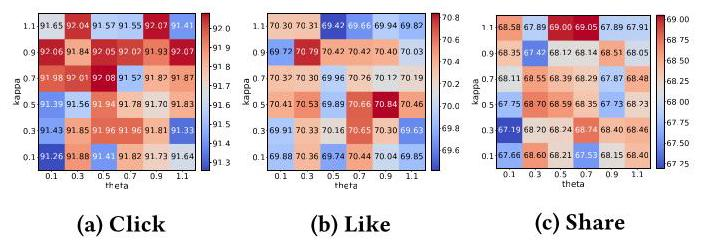

Figure 8: Effect of \( \kappa \) and \( \theta \) on DES’s performance on TenRec (QB-Video) dataset

Figures 9- 12 illustrate two tasks (CTR AUC, and CTCVR AUC, Avg AUC denotes the Average AUC of CTR and CTCVR tasks) evaluated on significantly larger AliExpress datasets. Compared to the smaller-scale TenRec (QB-Video) results, these heatmaps show broader high-performance regions for moderate values of \( \kappa \) and \( \theta \) . This observation suggests that with richer data and more features, the model can better benefit from multi-task synergy and features themselves without requiring extremely narrow threshold settings. However, extreme threshold settings (e.g., very low or very high \( \kappa \) or \( \theta \) ) may still cause notable drops in AUC, indicating that overly frequent or excessively delayed adjustments of \( k \) can degrade the shared representation learned across tasks. Overall, these findings demonstrate that appropriately balancing \( \kappa \) and \( \theta \) remains crucial in large-scale environments, ensuring that the proposed DES can effectively align to both abundant data and cross-task complemen-tarities.

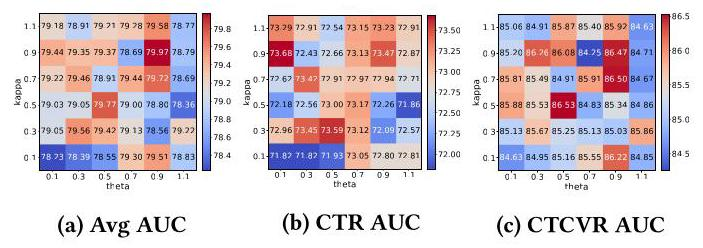

Figure 9: Effect of two thresholds on DES's performance on AliExpress-NL dataset

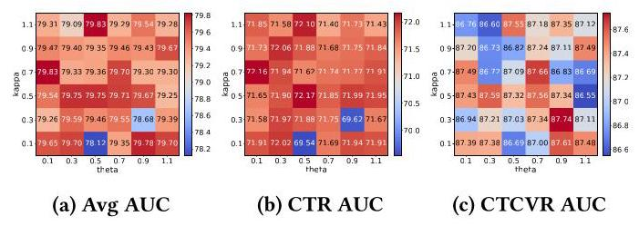

Figure 10: Effect of two thresholds on DES's performance on AliExpress-US dataset

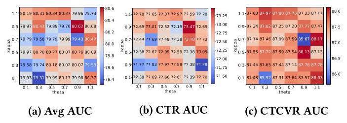

Figure 11: Effect of two thresholds on DES's performance on AliExpress-FR dataset

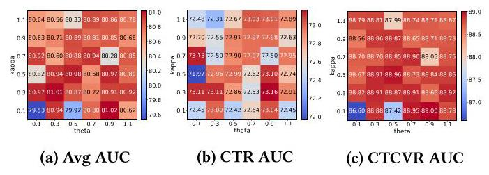

Figure 12: Effect of two thresholds on DES's performance on AliExpress-ES dataset