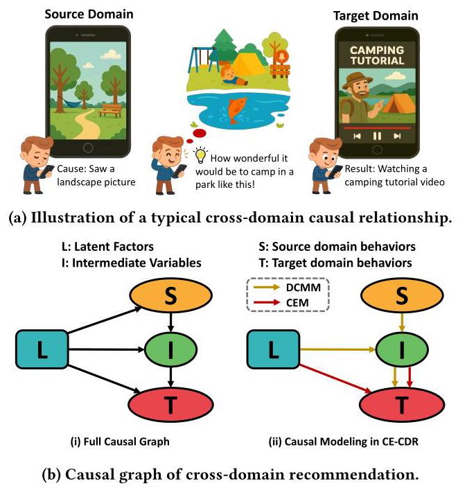
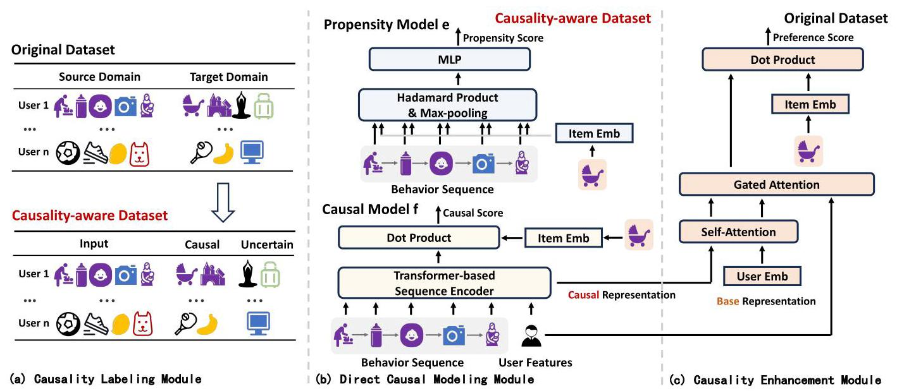
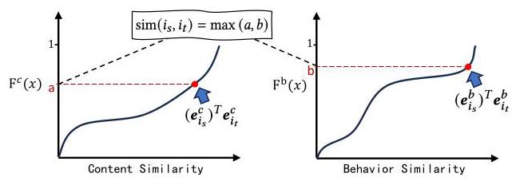
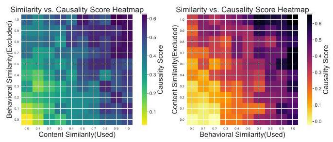
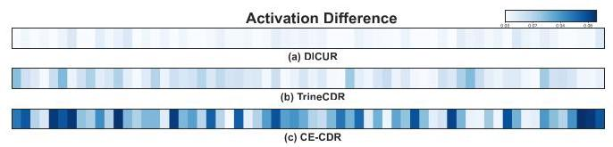
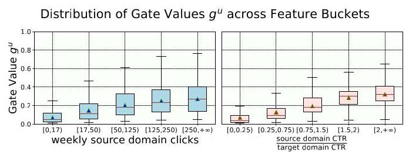
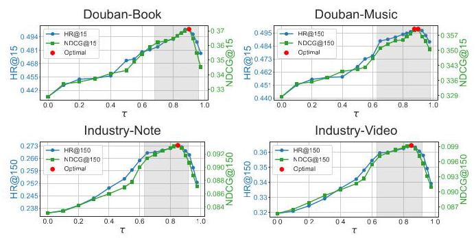

# Causality Enhancement for Cross-Domain Recommendation

Zhibo Wu

Xiaohongshu

Beijing, China

wuzhibo@xiaohongshu.com

Yunfan Wu

Xiaohongshu

Beijing, China

wuyunfan@xiaohongshu.com

Lin Jiang

Xiaohongshu

Beijing, China

jianglin@xiaohongshu.com

Ping Yang

Xiaohongshu

Beijing, China

yechen1@xiaohongshu.com

Yao Hu*

Xiaohongshu

Beijing, China

xiahou@xiaohongshu.com

## Abstract

Cross-domain recommendation forms a crucial component in recommendation systems. It leverages auxiliary information through source domain tasks or features to enhance target domain recommendations. However, incorporating inconsistent source domain tasks may result in insufficient cross-domain modeling or negative transfer. While incorporating source domain features without considering the underlying causal relationships may limit their contribution to final predictions. Thus, a natural idea is to directly train a cross-domain representation on a causality-labeled dataset from the source to target domain. Yet this direction has been rarely explored, as identifying unbiased real causal labels is highly challenging in real-world scenarios. In this work, we attempt to take a first step in this direction by proposing a causality-enhanced framework, named CE-CDR. Specifically, we first reformulate the cross-domain recommendation as a causal graph for principled guidance. We then construct a causality-aware dataset heuristically. Subsequently, we derive a theoretically unbiased Partial Label Causal Loss to generalize beyond the biased causality-aware dataset to unseen cross-domain patterns, yielding an enriched cross-domain representation, which is then fed into the target model to enhance target-domain recommendations. Theoretical and empirical analyses, as well as extensive experiments, demonstrate the rationality and effectiveness of CE-CDR and its general applicability as a model-agnostic plugin. Moreover, it has been deployed in production since April 2025, showing its practical value in real-world applications.

## CCS Concepts

- Information systems \( \rightarrow \) Recommender systems.

## Keywords

Cross-domain Recommendation, Causal inference

## ACM Reference Format:

Zhibo Wu, Yunfan Wu, Lin Jiang, Ping Yang, and Yao Hu. 2026. Causality Enhancement for Cross-Domain Recommendation. In Proceedings of the ACM Web Conference 2026 (WWW '26), April 13-17, 2026, Dubai, United

Figure 1: Cross-domain causal illustration and causal graph.

Arab Emirates. ACM, New York, NY, USA, 10 pages. https://doi.org/10.1145/ 3774904.3792603

## 1 Introduction

Recommender systems have been widely applied [7, 12, 58] to provide personalized recommendations. However, classical recommender systems that rely on interactions within a specific platform or domain often suffer from the data sparsity problem [21], which hinders the comprehensive user preference modeling.

To alleviate this problem, Cross-Domain Recommendation (CDR) has been proposed, leveraging user data from the source domain to assist recommendation in the target domain [25, 64, 76]. A typical example of cross-domain pattern is depicted in Figure 1a, where a user who saw a landscape picture in the note section (source domain), got inspired to camping, and then watched a camping tutorial video in the video section (target domain). Hence, by utilizing behavioral data from the notes domain, recommendation quality in the video domain can be improved.

To better characterize the underlying mechanism of CDR, we reformulate the task as a causal graph in Figure 1b. Latent factors \( \mathbf{L} \) denote user preferences, system-level factors, etc, and intermediate variables \( \mathbf{I} \) denote valuable cross-domain transferable information. The goal of single-domain recommendation is learning a function: \( \mathbf{L} \rightarrow  \mathbf{T} \) , while CDR aims to improve the prediction of \( \mathbf{T} \) by leveraging \( S \) from the source domain. Following this, we then revisit existing CDR methods from a causal perspective.

---

*Corresponding author.

---

CDR methods leverage source domain data in two primary ways. Multi-task learning approaches simultaneously optimize recommendation tasks in both domains, i.e., modeling two functions: \( \mathbf{L} \rightarrow  \mathbf{S} \) and \( \mathbf{L} \rightarrow  \mathbf{T} \) . They facilitate cross-domain knowledge transfer through the use of shared model parameters \( \left\lbrack  {5,{33},{46}}\right\rbrack \) or user representations \( \left\lbrack  {{17},{30},{31},{71}}\right\rbrack \) . However, due to inconsistent domain tasks [63], shared parameters or representations may fail to capture valuable cross-domain information. Especially when domains exhibit different user behavior patterns, the source domain task may even induce negative transfer [28, 35].

Another line of research incorporates users' source domain behaviors as additional input features to make recommendations in target domain \( \left\lbrack  {{19},{36}}\right\rbrack \) , i.e., modeling a function: \( \left( {\mathbf{L},\mathbf{S}}\right)  \rightarrow  \mathbf{T} \) . Typically, attention mechanisms [40] and graph neural networks [47, 70] are employed to integrate user behavior across domains. However, they still struggle to make full use of variables \( S \) , due to the sparsity of causal relationships between source and target domains [6, 66]. Specifically, user preferences in target domain may not necessarily be influenced by source-domain behaviors. Thus, indiscriminately training recommendation models to predict all target domain items from source domain behaviors could hinder the effectiveness of causal learning from source domain to target domain.

To overcome the challenge of task inconsistency and causality sparsity, a natural idea is to directly train a cross-domain representation \( \mathbf{I} \) on a causal dataset from source to target domain. Yet this direction has been rarely explored, as obtaining unbiased real causal labels is highly challenging in real-world scenarios. In this work, we attempt to take a first step in this direction. We propose a causality-enhanced framework, named CE-CDR, that directly models causal relationships from both data and model perspectives. From the data side, Causality Labeling Module (CLM) heuristically constructs similarity-driven causal supervision signals under psychological assumptions for downstream model to extract \( \mathbf{I} \) . From the model side, Direct Causality Modeling Module (DCMM) trains a causal model \( \left( {\mathbf{L},\mathbf{S}}\right)  \rightarrow  \mathbf{I} \rightarrow  \mathbf{T} \) to generalize unseen cross-domain patterns beyond labeling mechanisms under a theoretically unbiased Partial Label Causal Loss (PLCL). It learns a cross-domain representation, which is then fed into the Causality Enhancement Module (CEM) to enhance the target-domain recommendation.

The main contributions of this work are:

- We reformulate the task of cross-domain recommendation as a causal graph for principled guidance and revisit existing CDR methods from a causal perspective.

- To the best of our knowledge, we are the first to propose a framework that directly models cross-domain causality from both data and model perspectives. Specifically, we heuristically construct a causality-aware dataset under psychological assumptions and derive a theoretically unbiased loss for generalized cross-domain pattern learning.

- Both theoretical and empirical analyses, together with experimental results, validate the rationality and effectiveness of the causality-aware dataset construction. It also demonstrates the ability of PLCL to generalize to unseen causal patterns.

- We conduct comprehensive experiments and online A/B tests, demonstrating its effectiveness and its general applicability as a model-agnostic plugin. Furthermore, it has been deployed in production, showing its practical value.

## 2 Related Works

### 2.1 Cross-Domain Recommendation

Cross-domain recommendation (CDR) [2] has been introduced to alleviate the data sparsity problem. Existing approaches can be classified into two main categories. Multi-task learning methods simultaneously optimize recommendation tasks across domains. They facilitate cross-domain knowledge transfer through shared model parameters or representations. Shared model parameters include user embeddings [46], item embeddings [11], group em-beddings [33], aspect embeddings [69], or user preference generators [5]. In contrast, shared representations establish mapping functions \( \left\lbrack  {{10},{17},{30},{74}}\right\rbrack \) or distance constraints \( \left\lbrack  {{31},{71}}\right\rbrack \) between representations across domains to learn shared preferences. However, due to the discrepancies in domain-specific recommendation tasks [28, 35], shared parameters or representations may fail to capture valuable cross-domain information. Alternative CDR methods treat source domain user behaviors as additional input features [19, 36]. Attention [18, 40] or graph networks [34, 47, 68, 70] are typically employed to aggregate information from source domain interactions. However, these methods overlook the causality sparsity during training, hindering their contribution to final predictions [6, 66]. Specifically, user preferences in the target domain are not necessarily influenced by their source-domain behaviors, as users may exhibit distinct interests across domains.

### 2.2 Causal Recommendation

While recommendation systems primarily rely on co-occurrence patterns, such as feature-behavior associations, real-world decision-making is fundamentally governed by causality rather than co-occurrence. As a result, causal inference has been introduced into recommendation [37], addressing three key challenges. The first is data bias, including exposure bias [57, 67], popularity bias [4, 42, 43, 54, 55], and conformity bias [73]. Another challenge pertains to missing data [15, 53, 56, 62], where the available data fails to capture users' comprehensive user preferences, even without bias. In addition, causal inference has also been employed to improve explainability [45, 49, 59], diversity [52, 61], and fairness [20, 44]. Among them, counterfactual inference [41] and inverse propensity weighting (IPW) [16] are most widely adopted for causal inference. As for relatively underexplored causality-based cross-domain recommendation, existing methods mainly focus on enhancing disentangled user representation learning [8, 29, 38] and out-of-distribution generalization [32, 65]. The direct modeling of cross-domain causality has been rarely explored. In this work, we attempt to take a first step in this direction. The causality is considered throughout both the data construction and model learning phases.

Figure 2: Overall architecture of CE-CDR. (a) CLM: constructing causality-aware source-target behavior pairs; (b) DCMM: learning how source domain behaviors influence target domain preferences; (c) CEM: enhancing the target model for comprehensive user preference modeling.

## 3 Methodology

### 3.1 Overview

3.1.1 Problem Formulation. We consider a cross-domain recommendation scenario involving a source domain \( s \) and a target domain \( t \) , both of which share a unified user set \( \mathcal{U} \) . Each domain has its own item set: \( {\mathcal{I}}_{s} \) for the source domain and \( {\mathcal{I}}_{t} \) for the target domain. For clarity, we denote items from each domain as \( {i}_{s} \in  {\mathcal{I}}_{s} \) and \( {i}_{t} \in  {\mathcal{I}}_{t} \) , respectively. Each user \( u \in  \mathcal{U} \) has interaction sequences in either or both domains, represented as \( {\mathcal{S}}_{s}^{u} = \left( {{i}_{s}^{u,1},{i}_{s}^{u,2},\ldots }\right) \) in the source domain and \( {\mathcal{S}}_{t}^{u} = \left( {{i}_{t}^{u,1},{i}_{t}^{u,2},\ldots }\right) \) in the target domain. The goal of cross-domain recommendation is to leverage knowledge from the source domain \( s \) to improve recommendation accuracy in the target domain \( t \) , i.e., recommending items \( {i}_{t} \in  {\mathcal{I}}_{t} \) that best match users' preferences and maximize their engagement.

3.1.2 Overall Architecture. The overall architecture of CE-CDR is depicted in Figure 2, which demonstrates the pipeline comprising Causality Labeling Module (CLM), Direct Causality Modeling Module (DCMM), and Causality Enhancement Module (CEM). CLM is responsible for constructing high-quality, causality-aware behavior pairs. DCMM aims to generalize cross-domain causal patterns from a limited set of causal samples guided by the Partial Label Causal Loss. Finally, CEM incorporates the learned causal representations into the target domain model in an adaptive manner.

### 3.2 Causality Labeling Module

In this section, we describe how CLM finds cross-domain samples with high causality \( S \rightarrow  T \) and constructs a causality-aware dataset under the psychological assumptions for downstream causal model.

Assumption 1. (Similarity-Causality Alignment). For a given user, the preference for an item \( {i}_{s} \) in the source domain causally influences its preference for a similar item \( {i}_{t} \) in the target domain.

Figure 3: Illustration of similarity calibration and fusion.

This assumption is grounded in psychological theories, such as Cognitive Consistency Theory [27], which posits that individuals tend to favor information that aligns with their pre-existing beliefs and behaviors across various domains. In a real-world content-sharing platform, users' interaction with a specific note causes them to be directed toward similar videos, thus maintaining cognitive harmony. This phenomenon is further supported by psychological principles, such as selective exposure [9] and confirmation bias [24].

We use two similarity measures to assess the similarity between items across two domains in practice. The content embedding is learned by a classification task that assigns items to shared categories, entities, etc., across two domains (e.g., music, sports, and beauty) to capture content similarity. In addition, we account for behavioral similarity by utilizing a graph-based encoder [14] on the global user-item interaction graph to generate behavior-driven embeddings. The similarity between an item \( {i}_{s} \) and an item \( {i}_{t} \) in each space is computed as follows:

\[
{\operatorname{sim}}^{\{ c, b\} }\left( {{i}_{s},{i}_{t}}\right)  = {\left( {\mathbf{e}}_{{i}_{s}}^{\{ c, b\} }\right) }^{\top }{\mathbf{e}}_{{i}_{t}}^{\{ c, b\} }, \tag{1}
\]

where \( {\mathbf{e}}_{i}^{c} \) and \( {\mathbf{e}}_{i}^{b} \) represent the content and behavior embeddings.

To ensure a balanced fusion of content and behavioral similarity, we apply a cumulative distribution function (CDF) transformation to calibrate their scales into a comparable range. and a maximum operator to select top-ranked items within each similarity type. The overall similarity score between \( {i}_{s} \) and \( {i}_{t} \) is computed as:

\[
\operatorname{sim}\left( {{i}_{s},{i}_{t}}\right)  = \max \left( {{F}^{c}\left( {{\operatorname{sim}}^{c}\left( {{i}_{s},{i}_{t}}\right) }\right) ,{F}^{b}\left( {{\operatorname{sim}}^{b}\left( {{i}_{s},{i}_{t}}\right) }\right) }\right) . \tag{2}
\]

where \( {\mathbf{F}}^{\mathbf{c}}\left( \cdot \right) \) and \( {\mathbf{F}}^{b}\left( \cdot \right) \) denote the empirical CDFs estimated from content and behavior similarities, respectively. The calibration process is illustrated in Figure 3.

Furthermore, we define the similarity between a behavior sequence \( {\mathcal{S}}_{s} = \left( {{i}_{s}^{1},{i}_{s}^{2},\ldots ,{i}_{s}^{l}}\right) \) in the source domain and a target item \( {i}_{t} \) in the target domain as:

\[
\operatorname{sim}\left( {{\mathcal{S}}_{s},{i}_{t}}\right)  = \max \left\{  {\operatorname{sim}\left( {{i}_{s}^{j},{i}_{t}}\right)  \mid  j = 1,\ldots , l}\right\}  . \tag{3}
\]

Leveraging this similarity measure, CLM can extract causal behavior pairs from observed cross-domain behaviors. Specifically, for each user, we consider target item \( {i}_{t} \) that occurs after the source behavior sequence \( {S}_{s}^{u} \) , and define the causal behavior pairs as:

\[
{\mathcal{D}}_{u}^{ + } = \left\{  {\left( {u,{\mathcal{S}}_{s}^{u},{i}_{t}}\right)  \mid  \operatorname{sim}\left( {{\mathcal{S}}_{s},{i}_{t}}\right)  > \tau ,{i}_{t} \in  {\mathcal{S}}_{t}^{u}}\right\}  , \tag{4}
\]

where \( \tau \) is a hyperparameter used to filter out noisy data.

By aggregating the behavior pairs from all users, we obtain the complete set of causal behavior pairs:

\[
{\mathcal{D}}^{ + } = \mathop{\bigcup }\limits_{{u \in  \mathcal{U}}}{\mathcal{D}}_{u}^{ + } \tag{5}
\]

Thus, CLM constructs a causality-aware dataset \( \mathcal{D} \) by assigning positive labels to behavior pairs in \( {\mathcal{D}}^{ + } \) , and negative labels otherwise. This dataset is then used for downstream causal modeling.

### 3.3 Direct Causality Modeling Module

In this section, we first present the causal model \( f \) trained on causality-aware dataset \( \mathcal{D} \) , capturing how source-domain behaviors influence target-domain preference, i.e., \( \left( {\mathbf{L},\mathbf{S}}\right)  \rightarrow  \mathbf{I} \rightarrow  \mathbf{T} \) . Then we derive the theoretical foundations of optimizing causal model \( f \) and propensity model \( e \) under a Partial Label Causal Loss. The optimization promotes \( f \) to recognize unseen causal patterns beyond \( \mathcal{D} \) , yielding a theoretically unbiased causal modeling.

#### 3.3.1 Backbone model. We employ the classic attention-based model SASRec [23] as our backbone model to learn the causality.

The concatenation of the content and ID embeddings, used in the original implementation of SASRec, forms the initial item em-beddings. Moreover, a user feature encoder is employed to capture the user-specific causal preferences.

The causal model \( f \) predicts the probability of interacting with a target domain item, caused by user's source domain behaviors:

\[
f\left( {u,{\mathcal{S}}_{s}^{u},{i}_{t}}\right)  = \sigma \left( {{\left\lbrack  {f}_{\mathrm{{se}}}\left( {f}_{\mathrm{{fe}}}\left( u\right) ,{f}_{\mathrm{{em}}}\left( {i}_{s}^{u,1}\right) ,{f}_{\mathrm{{em}}}\left( {i}_{s}^{u,2}\right) ,\ldots \right) \right\rbrack  }^{\top }{f}_{\mathrm{{em}}}\left( {i}_{t}\right) }\right) ,
\]

(6)

where \( {f}_{\mathrm{{em}}}\left( \cdot \right)  \in  {\mathbb{R}}^{d} \) is the item embedding function combining the content and ID embeddings. \( {f}_{\mathrm{{fe}}}\left( \cdot \right)  \in  {\mathbb{R}}^{d} \) generates user em-beddings from their source domain features. \( {f}_{\mathrm{{se}}}\left( \cdot \right)  \in  {\mathbb{R}}^{d} \) represents the sequence encoder from SASRec, consisting of multiple self-attention [51] and feed-forward layers, enhanced by residual connections [13], layer normalization [1], and dropout regularization [48]. \( \sigma \left( \cdot \right) \) denotes the sigmoid function.

Binary Cross Entropy (BCE) loss is employed to train the causal model \( f \) on the set of real causal samples \( C \) :

\[
\mathcal{L} =  - {\left\lbrack  \mathop{\sum }\limits_{{\left( {u,{S}_{S}^{u},{i}_{t}}\right)  \in  C}}\log \left( f\left( u,{S}_{s}^{u},{i}_{t}\right) \right)  + \mathop{\sum }\limits_{{\left( {u,{S}_{S}^{u},{i}_{t}}\right)  \notin  C}}\log \left( 1 - f\left( u,{S}_{s}^{u},{i}_{t}\right) \right) \right\rbrack  }_{C},
\]

(7)

3.3.2 Partial Label Causal Loss. While real causal samples \( \mathcal{C} \) are unavailable, we propose the following assumption.

Assumption 2. (Asymmetry of Similarity and Causality). High similarity is not always a necessary condition for causal relationships. Certain causal item pairs may exhibit low similarity, due to latent factors or limitations of learned item embeddings, i.e., there exists pair \( \left( {u,{S}_{s}^{u},{i}_{t}}\right)  \in  C \) such that \( \left( {u,{S}_{s}^{u},{i}_{t}}\right)  \notin  {\mathcal{D}}^{ + } \) .

This assumption aligns with the common intuition in real-world recommender systems. Consequently, directly training on causality-aware dataset \( \mathcal{D} \) labeled from CLM, yields two issues: First, some causal behavior pairs are mistakenly labeled as negative samples. Second, exclusive selection of highly similar samples biases causal model towards capturing labeling strategy rather than causality.

To address these issues, we propose a novel Partial Label Causal Loss, which corrects the training on the partially labeled dataset \( \mathcal{D} \) by employing a causal model \( f\left( x\right) \) and a propensity model \( e\left( x\right) \) .

The propensity score [22] is adopted to quantify the probability of a true causal instance \( x = \left( {u,{S}_{s}^{u},{i}_{t}}\right) \) being selected into the set of causal behavior pairs \( {\mathcal{D}}^{ + } \) , i.e.:

\[
e\left( x\right)  = p\left( {x \in  {\mathcal{D}}^{ + } \mid  x, x \in  C}\right) . \tag{8}
\]

The following two propositions establish the theoretical foundations of how to optimize the causal model \( f\left( x\right) \) and the propensity model \( e\left( x\right) \) on constructed causality-aware dataset \( \mathcal{D} \) .

Proposition 1. (Partial Label Causal Loss). Given \( s \text{ ⫫ } y \mid  x \) and true propensity score \( e\left( x\right) \) , the causal model \( f\left( x\right) \) is optimized by the following loss to learn a theoretically unbiased estimation of the true causal probability \( p\left( {y = 1 \mid  x}\right) \) , with a partially labeled dataset \( \mathcal{D} \) :

\[
\mathcal{L} = \frac{1}{n}\mathop{\sum }\limits_{x}\left\lbrack  {h\left( x\right) {\delta }_{1}^{f}\left( x\right)  + \left( {1 - h\left( x\right) }\right) {\delta }_{0}^{f}\left( x\right) }\right\rbrack \tag{9}
\]

where \( h\left( x\right)  = {sg}\left\lbrack  {s + \left( {1 - s}\right) \frac{f\left( x\right) \left( {1 - e\left( x\right) }\right) }{1 - f\left( x\right) e\left( x\right) }}\right\rbrack  ,{\delta }_{1}^{f}\left( x\right)  =  - \log \left( {f\left( x\right) }\right) \) and \( {\delta }_{0}^{f}\left( x\right)  =  - \log \left( {1 - f\left( x\right) }\right) \) . \( s \) and \( y \) are the binary indicators \( s = \mathbb{I}\left( {x \in  {\mathcal{D}}^{ + }}\right) \) and \( y = \mathbb{I}\left( {x \in  C}\right) .n \) is the number of all samples.

Proof. The ideal unbiased loss for the causal model \( f \) is:

\[
\mathcal{L} =  - {\mathbb{E}}_{x, y}\log p\left( {y \mid  x, f}\right)
\]

\[
=  - {\mathbb{E}}_{x}{\mathbb{E}}_{y \mid  x}\log p\left( {y \mid  x, f}\right)
\]

\[
=  - \frac{1}{n}\mathop{\sum }\limits_{x}{\mathbb{E}}_{y \mid  x}\log p\left( {y \mid  x, f}\right) \tag{10}
\]

\[
= \frac{1}{n}\mathop{\sum }\limits_{x}\left\lbrack  {p\left( {y = 1 \mid  x}\right) {\delta }_{1}^{f}\left( x\right)  + \left( {1 - p\left( {y = 1 \mid  x}\right) }\right) {\delta }_{0}^{f}\left( x\right) }\right\rbrack  ,
\]

Given only observable labels \( s \) from CLM, but without access to the true label distribution \( p\left( {y = 1 \mid  x}\right) \) , the probability of a sample \( x \notin  {\mathcal{D}}^{ + } \) being causal is:

\[
p\left( {y = 1 \mid  x, s = 0}\right)  = \frac{p\left( {y = 1 \mid  x}\right) p\left( {s = 0 \mid  x, y = 1}\right) }{p\left( {s = 0 \mid  x}\right) }
\]

\[
= \frac{p\left( {y = 1 \mid  x}\right) \left( {1 - p\left( {s = 1 \mid  x, y = 1}\right) }\right) }{1 - p\left( {s = 1 \mid  x}\right) } \tag{11}
\]

\[
= \frac{p\left( {y = 1 \mid  x}\right) \left( {1 - p\left( {s = 1 \mid  x, y = 1}\right) }\right) }{1 - p\left( {y = 1 \mid  x}\right) p\left( {s = 1 \mid  x, y = 1}\right) }.
\]

Thus, the causal probability for any sample \( x \) is:

\[
p\left( {y = 1 \mid  x, s}\right)  = {sp}\left( {y = 1 \mid  x, s = 1}\right)  +
\]

\[
\left( {1 - s}\right) p\left( {y = 1 \mid  x, s = 0}\right) \tag{12}
\]

\[
= s + \left( {1 - s}\right) p\left( {y = 1 \mid  x, s = 0}\right) \text{ . }
\]

Leveraging the current estimation \( f\left( x\right) \) for \( p\left( {y = 1 \mid  x}\right) \) and \( e\left( x\right) \) for \( p\left( {s = 1 \mid  x, y = 1}\right) \) , we derive a corrected causal label \( h\left( x\right) \) as:

\[
h\left( x\right)  = p\left( {y = 1 \mid  x, s}\right)  = \operatorname{sg}\left\lbrack  {s + \left( {1 - s}\right) \frac{f\left( x\right) \left( {1 - e\left( x\right) }\right) }{1 - f\left( x\right) e\left( x\right) }}\right\rbrack  , \tag{13}
\]

where \( \operatorname{sg}\left\lbrack  \cdot \right\rbrack \) denotes the stop-gradient operation, preventing the parameter updates on \( f\left( x\right) \) and \( e\left( x\right) \) when computing \( h\left( x\right) \) , since it acts solely as a corrected label.

Accordingly, the loss function is reformulated as:

\[
\mathcal{L} =  - {\mathbb{E}}_{x, y, s}\log p\left( {y \mid  x, f}\right)
\]

\[
=  - {\mathbb{E}}_{x, s}{\mathbb{E}}_{y \mid  x, s}\log p\left( {y \mid  x, f}\right)
\]

\[
=  - \frac{1}{n}\mathop{\sum }\limits_{x}{\mathbb{E}}_{y \mid  x, s}\log p\left( {y \mid  x, f}\right) \tag{14}
\]

\[
= \frac{1}{n}\mathop{\sum }\limits_{x}\left\lbrack  {h\left( x\right) {\delta }_{1}^{f}\left( x\right)  + \left( {1 - h\left( x\right) }\right) {\delta }_{0}^{f}\left( x\right) }\right\rbrack
\]

In practice, the corrected loss is exclusively applied to items interacted with by users in the target domain, as these interactions reflect real user preferences and are more likely to exhibit causal associations with their source domain behaviors. Thus, \( h\left( {u,{S}_{s}^{u},{i}_{t}}\right) \) is set to 0 for items where \( {i}_{t} \notin  {\mathcal{S}}_{t}^{u} \) . The final loss function is:

\[
{\mathcal{L}}_{f} = \mathop{\sum }\limits_{{u \in  \mathcal{U}}}\left\{  {\mathop{\sum }\limits_{{{i}_{t} \in  {\mathcal{S}}_{t}^{u}}}\left\lbrack  {h\left( {i}_{t}\right) {\delta }_{1}^{f}\left( {i}_{t}\right)  + \left( {1 - h\left( {i}_{t}\right) }\right) {\delta }_{0}^{f}\left( {i}_{t}\right) }\right\rbrack   + \mathop{\sum }\limits_{{{i}_{t} \notin  {\mathcal{S}}_{t}^{u}}}{\delta }_{0}^{f}\left( {i}_{t}\right) }\right\}  .
\]

(15)

Here, \( {\mathcal{S}}_{s}^{u} \) and \( u \) as inputs to \( h\left( \cdot \right) \) and \( \delta \left( \cdot \right) \) are omitted for clarity.

In parallel to the causal model \( f \) , a propensity model is employed to learn the label assignment probability \( e\left( x\right) \) . Consistent with the labeling strategy in CLM, we perform max-pooling over item-wise multiplication sequence followed by some feed-forward layers:

\[
e\left( {u,{\mathcal{S}}_{s},{i}_{t}}\right)  = \sigma \left( {{e}_{\mathrm{{mlp}}}\left( {\max  - \operatorname{pooling}\left( {{e}_{\mathrm{{em}}}\left( {i}_{s}^{1}\right)  \odot  {e}_{\mathrm{{em}}}\left( {i}_{t}\right) ,\ldots }\right) }\right) }\right) ,
\]

(16)

where \( {e}_{\mathrm{{em}}} \) represents the item embedding function similar to \( {f}_{\mathrm{{em}}} \) , \( {e}_{\text{ mlp }} \) denotes a multi-layer perceptron, and \( \odot \) indicates the element-wise multiplication.

In fact, if the propensity model can have arbitrary capacity, it's impossible to know if an unlabeled instance is due to low propensity or low causality. Therefore, we design the propensity model to learn only the similarity-driven labeling mechanism, allowing the causal model to focus on the underlying causality.

Proposition 2. (Propensity Score Modeling). Given the estimated causal probability \( h\left( x\right) \) , the propensity model \( e\left( x\right) \) is optimized by the following loss to approximate the label assignment probability \( p\left( {s = 1 \mid  x, y = 1}\right) \) , enabling the correction of selection bias induced by the data labeling process in CLM:

\[
\mathcal{L} = \frac{1}{n}\mathop{\sum }\limits_{x}h\left( x\right) \left\lbrack  {s{\delta }_{1}^{e}\left( x\right)  + \left( {1 - s}\right) {\delta }_{0}^{e}\left( x\right) }\right\rbrack  .
\]

Proof. Similar to the causal model \( f \) , the loss function for the propensity model \( e \) is derived as follows:

\[
\mathcal{L} =  - {\mathbb{E}}_{x, y, s}\log p\left( {s \mid  x, y, e}\right)
\]

\[
=  - \frac{1}{n}\mathop{\sum }\limits_{x}{\mathbb{E}}_{y \mid  x, s}\log p\left( {s \mid  x, y, e}\right)
\]

\[
=  - \frac{1}{n}\mathop{\sum }\limits_{x}\lbrack h\left( x\right) \log p\left( {s \mid  x, y = 1, e}\right) \tag{17}
\]

\[
\left. {+\left( {1 - h\left( x\right) }\right) \log p\left( {s \mid  x, y = 0, e}\right) )}\right\rbrack
\]

\[
= \frac{1}{n}\mathop{\sum }\limits_{x}h\left( x\right) \left\lbrack  {s{\delta }_{1}^{e}\left( x\right)  + \left( {1 - s}\right) {\delta }_{0}^{e}\left( x\right) }\right\rbrack
\]

In practice, the loss used for training the propensity model \( e \) is:

\[
{\mathcal{L}}_{e} = \mathop{\sum }\limits_{{u \in  \mathcal{U}}}\mathop{\sum }\limits_{{{i}_{t} \in  {\mathcal{S}}_{t}^{u}}}h\left( {i}_{t}\right) \left\lbrack  {s{\delta }_{1}^{e}\left( {i}_{t}\right)  + \left( {1 - s}\right) {\delta }_{0}^{e}\left( {i}_{t}\right) }\right\rbrack  . \tag{18}
\]

Intuitively, the corrected causal label \( h\left( {i}_{t}\right) \) serves to down-weight non-causal samples during propensity estimation, as \( e\left( x\right) \) represents the labeling probability for real causal samples.

Finally, due to the specially designed architectures and loss functions, propensity model \( e\left( x\right) \) and the causal model \( f\left( x\right) \) capture complementary aspects from the causal dataset \( \mathcal{D}, e\left( x\right) \) for labeling mechanism and \( f\left( x\right) \) for real causality.

### 3.4 Causality Enhancement Module

In this section, we describe how CEM integrates cross-domain representation learned from DCMM in an adaptive manner to facilitate a more comprehensive modeling of target domain user preferences, i.e., \( \left( {\mathbf{L},\mathbf{I}}\right)  \rightarrow  \mathbf{T} \) .

Cross-Domain Self-Attention. Let the vector representations of user \( u \) learned by DCMM from the source domain behaviors be denoted as \( {\mathbf{r}}_{s}^{u} = {f}_{\mathrm{{se}}}\left( {u,{\mathcal{S}}_{s}^{u}}\right) \) , and those learned from the base recommendation model in the target domain as \( {\mathbf{r}}_{t}^{u} \) , such that \( {\mathbf{r}}_{s}^{u},{\mathbf{r}}_{t}^{u} \in  {\mathbb{R}}^{d} \) . The cross-domain self-attention mechanism treats the representations \( {\mathbf{r}}_{s}^{u} \) and \( {\mathbf{r}}_{t}^{u} \) as a sequence of length two, represented as \( {\mathbf{R}}^{u} = \left\lbrack  {{\mathbf{r}}_{s}^{u},{\mathbf{r}}_{t}^{u}}\right\rbrack   \in  {\mathbb{R}}^{2 \times  d} \) . The self-attention is defined as follows:

\[
\left\lbrack  {{\mathbf{p}}_{s}^{u},{\mathbf{p}}_{t}^{u}}\right\rbrack   = {\mathbf{P}}^{u} = \operatorname{softmax}\left( \frac{\left( {{\mathbf{R}}^{u}{\mathbf{W}}_{q}}\right) {\left( {\mathbf{R}}^{u}{\mathbf{W}}_{k}\right) }^{\top }}{\sqrt{d}}\right) \left( {{\mathbf{R}}^{u}{\mathbf{W}}_{v}}\right) , \tag{19}
\]

where \( {\mathbf{W}}_{q},{\mathbf{W}}_{k},{\mathbf{W}}_{v} \in  {\mathbb{R}}^{d \times  d} \) are learnable weights corresponding to queries, keys, and values.

This self-attention mechanism enables the exchange of information between the source and target domains, resulting in more comprehensive user preference representations \( {\mathbf{p}}_{s}^{u},{\mathbf{p}}_{t}^{u} \in  {\mathbb{R}}^{d} \) .

Cross-Domain Gated Attention. We select specific user features \( {\mathbf{c}}^{u} \in  {\mathbb{R}}^{{d}_{c}} \) , which implicitly describe the user’s behavioral consistency and preference strength across domains, such as indicators of cold-start status or relative click activity. Guided by these features, a gated attention mechanism is introduced to adaptively weight the contributions of \( {\mathbf{p}}_{s}^{u} \) and \( {\mathbf{p}}_{t}^{u} \) . The gating function is defined as:

\[
{g}^{u} = \sigma \left( {\operatorname{LeakyReLU}\left( {{\mathbf{c}}^{u}{\mathbf{W}}_{g,1} + {\mathbf{b}}_{g,1}}\right) {\mathbf{W}}_{g,2} + {\mathbf{b}}_{g,2}}\right) , \tag{20}
\]

Table 1: Statistics of datasets.

<table><tr><td>Datasets</td><td colspan="2">Douban</td><td colspan="2">Amazon</td><td colspan="2">Industry</td></tr><tr><td>Scenarios</td><td colspan="2">Book-Music</td><td colspan="2">Movies-CDs</td><td colspan="2">Note-Video</td></tr><tr><td>Domains</td><td>Book</td><td>Music</td><td>Movies</td><td>CDs</td><td>Note</td><td>Video</td></tr><tr><td>#Users</td><td>2,212</td><td>1,820</td><td>123,960</td><td>112,395</td><td>188,668,764</td><td>186,822,365</td></tr><tr><td>#Shared users</td><td colspan="2">1,736</td><td colspan="2">18,547</td><td colspan="2">167,766,638</td></tr><tr><td>#Items</td><td>95,872</td><td>79,878</td><td>50,052</td><td>73,713</td><td>65,732,897</td><td>35,344,556</td></tr><tr><td>#Interactions</td><td>227,251</td><td>179,847</td><td>1,697,533</td><td>1,443,755</td><td>20,479,556,858</td><td>9,467,087,108</td></tr></table>

where \( {\mathbf{W}}_{g,1} \in  {\mathbb{R}}^{{d}_{c} \times  d},{\mathbf{W}}_{g,2} \in  {\mathbb{R}}^{d \times  1} \) , and \( {\mathbf{b}}_{g,1} \in  {\mathbb{R}}^{d},{\mathbf{b}}_{g,2} \in  \mathbb{R} \) are learnable weights. LeakyReLU function is used for activation.

The gate scalar \( {g}^{u} \) is then used to combine the user preferences \( {\mathbf{p}}_{s}^{u} \) and \( {\mathbf{p}}_{t}^{u} \) obtained from the cross-domain self-attention:

\[
{\mathbf{v}}^{u} = {g}^{u} \odot  {\mathbf{p}}_{s}^{u} + \left( {1 - {g}^{u}}\right) {\mathbf{p}}_{t}^{u}, \tag{21}
\]

The resulting user representation \( {v}^{u} \) is designed to integrates valuable information from both domains.

Finally, the preference scores for recommendations are computed by the dot product between the integrated user representation \( {v}^{u} \) and the representation \( {\mathbf{r}}^{{i}_{t}} \) of the target item \( {i}_{t} \) from the base recommendation model. The recommendation loss function is:

\[
{\mathcal{L}}_{\text{ rec }} =  - \mathop{\sum }\limits_{{u \in  \mathcal{U}}}\left\lbrack  {\mathop{\sum }\limits_{{{i}_{t} \in  {\mathcal{S}}_{t}^{u}}}\log \left( {\sigma \left( {{\mathbf{v}}^{u\top }{\mathbf{r}}^{{i}_{t}}}\right) }\right)  + \mathop{\sum }\limits_{{{i}_{t} \notin  {\mathcal{S}}_{t}^{u}}}\log \left( {1 - \sigma \left( {{\mathbf{v}}^{u\top }{\mathbf{r}}^{{i}_{t}}}\right) }\right) }\right\rbrack  .
\]

(22)

### 3.5 Online Serving

We provide strategies implemented to reduce the increase of online latency without sacrificing model performance in production.

- Two-phase training. We employ a dual-stage training scheme, consisting of daily full-model training, followed by intra-day incremental updates initialized from the previous day's checkpoint.

- Freezing dense parameters. During intra-day incremental updates, we freeze the dense parameters within the DCMM and only update the sparse tables, ensuring that the distribution of the learned causal representation \( {\mathbf{r}}_{s}^{u} \) remains stable.

- Real-time embedding cache. Causal representations \( {\mathbf{r}}_{s}^{u} \) are cached in real-time during incremental updates and served directly for online inference to reduce latency.

These strategies have been deployed in production and proven effective in meeting both latency and performance expectations.

## 4 Experiments

To evaluate our method, we conduct experiments to answer the following research questions (RQs):

- RQ1: How does CE-CDR perform compared to baselines?

- RQ2: Can DCMM generalize beyond observed data and identify unseen causal patterns?

- RQ3: How does the learned causal representation contribute to recommendation?

- RQ4: How does each module in CE-CDR impact performance?

- RQ5: How does similarity threshold \( \tau \) affect performance?

- RQ6: How does CE-CDR perform in real-world production?

### 4.1 Experimental Settings

4.1.1 Datasets. We conduct experiments on three real-world datasets, with their statistics presented in Table 1.

- Douban [75]: A cross-domain recommendation dataset collected from Douban system. We use the Book and Music domains.

- Amazon [39]: A dataset derived from the Amazon Review Dataset. Since most subsets do not share users, we use the "Movies and TV" and "CDs and Vinyl" subsets, which share a portion of common users.

- Industry: A large-scale dataset collected from a real-world content-sharing platform, Rednote (Xiaohongshu), for offline evaluation, containing user-view interactions with notes and videos.

4.1.2 Baselines. We evaluated our proposed CE-CDR, against several baseline approaches: CoNet, MAN, and DICUR enhance cross-domain recommendation by optimizing source domain tasks. In contrast, MINET and TrineCDR emphasize the utilization of source domain features. Descriptions of baselines are provided as follows:

- Base Model is a basic dual tower model, where both towers are implemented as a multi-layer perceptron with ReLU activations.

- CoNet [17] introduces dual cross-connections to enable bidirectional knowledge transfer between latent representations.

- MAN [33] leverages mixed attention mechanisms and shared group embeddings for group transfer learning.

- DiCUR [71] learns domain-shared and domain-specific user representations through canonical correlation analysis [50].

- MiNet [33] jointly models source domain, target domain, and long-term interests via hierarchical attention mechanisms.

- TrineCDR [47] enhances transferability at feature, interaction, and domain level via graph propagation and contrastive learning.

4.1.3 Implementation Settings. For a fair comparison, all methods are trained via distributed computing and optimized using the Adam optimizer with default settings. The embedding size \( d \) is set to 32 for Douban and Amazon datasets, and 64 for Industry dataset. Different batch sizes are employed for each domain, to ensure an equal batch number per epoch. As for the hyper-parameter of CE-CDR, we tuned \( \tau \) to 0.9 for Douban and Amazon datasets, and 0.85 for Industrial dataset. Detailed hyper-parameter analyses are provided in section 4.5. For baseline models, we use the hyper-parameters in the original implementation whenever available; otherwise, we tune them for optimal performance.

4.1.4 Evaluation Protocol. Following the previous studies[3, 26, 34], we adopt the widely used leave-one-out method to evaluate the recommendation performance, which reserves one latest interaction as the test item for each user. Hit Ratio (HR) and Normalized Discounted Cumulative Gain (NDCG) are employed as the evaluation metrics, as in existing studies [60, 70, 72]. Specifically, HR@K measures whether the relevant item is in the top-K recommended items, while NDCG@K further considers the rank of the hit. We set \( K \) to 15 for Douban and Amazon datasets, while 150 for Industrial dataset, as the full-scale industrial dataset has much larger candidate items, approximately 30 million for each recommendation. For each dataset, one domain is designated as the source domain, while the other serves as the target domain alternatively. The recommendation performance on the target domain is reported.

### 4.2 Overall Performance (RQ1)

We evaluated CE-CDR against several baseline cross-domain methods. Additionally, we enhance these methods by incorporating the causal representation learned by CE, which serves as a model-agnostic plugin. A summary of the overall performance is presented in Table 2. Several key findings are observed: First, CE-CDR consistently outperforms all baseline methods across all datasets and evaluation metrics, highlighting its general effectiveness. Among baseline methods, those based on source domain features outperform multi-task learning approaches. The latter may suffer from relatively insufficient utilization of cross-domain knowledge [70, 71] and negative transfer [19, 47]. Second, incorporating CE as a plugin leads to the best performance of DiCUR+CE. Interestingly, combining CE with multi-task learning approaches results in more substantial improvements than when paired with feature based methods. This may be because CE aligns more closely with feature-based methods, while its divergence from multi-task learning could contribute to greater improvements. Moreover, CoNet+CE falls short of CE-CDR alone, underscoring the issue of negative transfer. Finally, cross-domain methods achieve greater improvement on Douban and industrial datasets compared to the Amazon dataset, which may result from the limited overlap of shared users in Amazon.

Table 2: Overall recommendation performance. The best is highlighted in bold, while the second-best is underlined.

<table><tr><td rowspan="2">Domain</td><td colspan="4">Douban</td><td colspan="4">Amazon</td><td colspan="4">Industry</td></tr><tr><td colspan="2">Book</td><td colspan="2">Music</td><td colspan="2">Movies and TV</td><td colspan="2">CDs and Vinyl</td><td colspan="2">Note</td><td colspan="2">Video</td></tr><tr><td>Metric</td><td>HR@15</td><td>NDCG@15</td><td>HR@15</td><td>NDCG@15</td><td>HR@15</td><td>NDCG@15</td><td>HR@15</td><td>NDCG@15</td><td>HR@150</td><td>NDCG@150</td><td>HR@150</td><td>NDCG@150</td></tr><tr><td>Base Model</td><td>0.3052</td><td>0.2303</td><td>0.3196</td><td>0.2248</td><td>0.4959</td><td>0.3084</td><td>0.4514</td><td>0.2796</td><td>0.1848</td><td>0.0633</td><td>0.2238</td><td>0.0659</td></tr><tr><td>CoNet</td><td>0.3961</td><td>0.3082</td><td>0.4142</td><td>0.3018</td><td>0.5437</td><td>0.3459</td><td>0.4909</td><td>0.3201</td><td>0.2265</td><td>0.0811</td><td>0.2807</td><td>0.0712</td></tr><tr><td>MAN</td><td>0.4359</td><td>0.3433</td><td>0.4336</td><td>0.3153</td><td>0.5879</td><td>0.3822</td><td>0.5236</td><td>0.3652</td><td>0.2348</td><td>0.0821</td><td>0.3045</td><td>0.0804</td></tr><tr><td>DiCUR</td><td>0.4475</td><td>0.3430</td><td>0.4468</td><td>0.3261</td><td>0.6337</td><td>0.4147</td><td>0.5337</td><td>0.3749</td><td>0.2446</td><td>0.0843</td><td>0.3310</td><td>0.0851</td></tr><tr><td>MiNet</td><td>0.4166</td><td>0.3209</td><td>0.4367</td><td>0.3208</td><td>0.5692</td><td>0.3666</td><td>0.5123</td><td>0.3469</td><td>0.2373</td><td>0.0866</td><td>0.3025</td><td>0.0846</td></tr><tr><td>TrineCDR</td><td>0.4586</td><td>0.3436</td><td>0.4554</td><td>0.3314</td><td>0.6508</td><td>0.4270</td><td>0.5284</td><td>0.3805</td><td>0.2484</td><td>0.0856</td><td>0.3466</td><td>0.0890</td></tr><tr><td>CE-CDR</td><td>0.5023</td><td>0.3711</td><td>0.4983</td><td>0.3600</td><td>0.6712</td><td>0.4498</td><td>0.5592</td><td>0.3914</td><td>0.2733</td><td>0.0933</td><td>0.3645</td><td>0.0992</td></tr><tr><td>CoNet+CE</td><td>0.4907</td><td>0.3636</td><td>0.4882</td><td>0.3527</td><td>0.6552</td><td>0.4364</td><td>0.5435</td><td>0.3843</td><td>0.2660</td><td>0.0913</td><td>0.3539</td><td>0.0975</td></tr><tr><td>MAN+CE</td><td>0.5094</td><td>0.3763</td><td>0.4990</td><td>0.3605</td><td>0.6689</td><td>0.4483</td><td>0.5587</td><td>0.3910</td><td>0.2780</td><td>0.0962</td><td>0.3671</td><td>0.0999</td></tr><tr><td>DiCUR+CE</td><td>0.5136</td><td>0.3784</td><td>0.5026</td><td>0.3639</td><td>0.6810</td><td>0.4592</td><td>0.5672</td><td>0.4035</td><td>0.2837</td><td>0.0987</td><td>0.3780</td><td>0.1025</td></tr><tr><td>MiNet+CE</td><td>0.5054</td><td>0.3734</td><td>0.4965</td><td>0.3587</td><td>0.6732</td><td>0.4512</td><td>0.5600</td><td>0.3920</td><td>0.2715</td><td>0.0927</td><td>0.3669</td><td>0.0999</td></tr><tr><td>TrineCDR+CE</td><td>0.5025</td><td>0.3712</td><td>0.5031</td><td>0.3648</td><td>0.6786</td><td>0.4548</td><td>0.5657</td><td>0.3960</td><td>0.2744</td><td>0.0937</td><td>0.3627</td><td>0.0987</td></tr></table>

(a) Excluding behavioral similarity from CLM. (b) Excluding content similarity from CLM..

Figure 4: Analyzing how the causality score varies with used and excluded similarities during dataset construction.

### 4.3 Further Analysis (RQ2, RQ3)

4.3.1 Distribution of Learned Causality (RQ2). In this section, we explore whether DCMM captures unseen causal patterns beyond the causality-aware dataset. To investigate this, we conduct an experiment on industry dataset, with video as the target domain. In this setup, since real causal samples \( C \) are unavailable, we construct the causality-aware dataset by excluding one type of similarity, upon which DCMM is trained. The average causality score \( f\left( {u,{\mathcal{S}}_{s}^{u},{i}_{t}}\right) \) , for samples with different similarities \( {\operatorname{sim}}^{\{ c, b\} }\left( {{\mathcal{S}}_{s}^{u},{i}_{t}}\right) \) , is presented as a heatmap in Figure 4.

Figure 5: Activation Difference of Cross-Domain Features.

As shown, in both experimental settings, the predicted causality scores align well with the similarity used in CLM as expected. Notably, the result also demonstrates an evident positive correlation for the excluded similarity measure. Although this correlation is somewhat weaker than the similarity type used for dataset construction, it indicates that DCMM can identify unseen causality patterns. Moreover, several instances exhibit high causality scores, despite low similarity scores across both measures, highlighting the model's capacity to generalize and uncover underlying causal relationships beyond the causality-aware dataset.

#### 4.3.2 Effectiveness of Learned Causal Representation (RQ3).

Activation Difference under Feature Masking. As discussed in Section 1, cross-domain features are often underutilized due to the sparsity of causal relationships. To examine the actual contribution of source domain features, we mask the source-domain behavior features and visualize the activation difference of the user representation (averaged across multiple batches) on the industry dataset, with video as the target domain. Figure 5 illustrates the differences before and after masking for three methods, including two representative baseline approaches when incorporating source domain features. Compared to both DICUR and TrineCDR, our proposed CE-CDR shows a considerable activation difference, indicating that the cross-domain feature captured by CE-CDR has a more significant contribution to final recommendation.

Dynamic Gating Interpretation. CEM is designed based on the intuition that the impact of source-domain causal representations on target-domain recommendations should vary across users. To assess whether the roles of \( {\mathbf{p}}_{s}^{u} \) and \( {\mathbf{p}}_{t}^{u} \) in cross-domain representation fusion align with our expectations, we analyze the gate value distribution \( {g}^{u} \) in CEM using box plots on the industrial dataset, with video as target domain. The analyses, shown in Figure 6, are conditioned on different buckets of two features in \( {\mathbf{c}}^{u} \) . Results reveal that users with richer source domain information tend to have higher gate values \( {g}^{u} \) , confirming the effectiveness of our dynamic gating mechanism in adaptively balancing between leveraging rich source-domain knowledge and maintaining target-domain relevance.

Figure 6: Distributions of gate value \( {g}^{u} \) for cross-domain representation fusion.

Table 3: Ablation Study.

<table><tr><td rowspan="2">Domain</td><td colspan="4">Industry</td></tr><tr><td colspan="2">Note</td><td colspan="2">Video</td></tr><tr><td>Metric@150</td><td>HR</td><td>NDCG</td><td>HR</td><td>NDCG</td></tr><tr><td>-w/o-CLM</td><td>0.2354</td><td>0.0831</td><td>0.3193</td><td>0.0857</td></tr><tr><td>-w/o-Cas</td><td>0.2336</td><td>0.0822</td><td>0.3212</td><td>0.0849</td></tr><tr><td>-w/o-Att</td><td>0.2631</td><td>0.0902</td><td>0.3518</td><td>0.0958</td></tr><tr><td>-w/o-Gate</td><td>0.2536</td><td>0.0866</td><td>0.3382</td><td>0.0920</td></tr><tr><td>-w/-Cache</td><td>0.2722</td><td>0.0923</td><td>0.3634</td><td>0.0983</td></tr><tr><td>CE-CDR</td><td>0.2733</td><td>0.0933</td><td>0.3645</td><td>0.0992</td></tr></table>

### 4.4 Ablation Study (RQ4)

We conduct ablation study on several variants of CE-CDR. -w/o-CLM excludes CLM, treating all target domian interactions as causal positives. -w/o-Cas removes the partial label causal loss in DCMM and directly treats \( {\mathcal{D}}^{ + } \) as the true causal set. -w/o-Att eliminates the cross-domain self-attention in CEM. -w/o-Gate replaces the cross-domain gated attention in CEM with simple concatenation. -w/-Cache enables cache strategies mentioned in section 3.5.

Table 3 shows that the complete CE-CDR consistently outperforms its variants, highlighting the importance of each component: (1) The labeling mechanism in CLM generates high-quality causal positives for downstream causal modeling. (2) DCMM captures generalized cross-domain causal patterns from limited positive causal samples guided by partial label causal loss. (3) Cross-domain self-attention in CEM enables information exchange between domains, improving representation quality. (4) Cross-domain gated attention in CEM personalizes the fusion of cross-domain representations and precisely regulates their contribution to the final recommendation. (5) Cache strategies for online serving eliminate latency increase with negligible performance trade-off.

### 4.5 Hyperparameter Experiment (RQ5)

We investigate the sensitivity of CE-CDR to the threshold parameter \( \tau \) used in CLM. Notably, when \( \tau  = 0 \) , the model corresponds to the ablation variant CE-CDR-w/o-CLM, as discussed in Section 4.4. Results in Figure 7 demonstrate that selecting an optimal value of \( \tau \) enhances model performance, underscoring the importance of balancing the quality and quantity of causal signals. A smaller \( \tau \) may

Figure 7: Hyperparameter experiment on the similarity threshold parameter \( \tau \) used in CLM.

Table 4: Online A/B test on a content-sharing platform, Red-note.

<table><tr><td>Scenario</td><td>Duration</td><td>Click</td><td>CTR</td><td>Diversity</td><td>Next-day Active</td></tr><tr><td>Video</td><td>+0.33%</td><td>+0.37%</td><td>+0.12%</td><td>+0.18%</td><td>+0.06%</td></tr><tr><td>Note</td><td>+0.28%</td><td>+0.43%</td><td>+0.16%</td><td>+0.21%</td><td>+0.07%</td></tr></table>

introduce excessive noise into the causality-aware dataset, while a larger \( \tau \) overly restricts the inclusion of positive samples, limiting the amount of useful causal supervision signals. Furthermore, the model exhibits robustness to \( \tau \) values in the range of 0.65 to 0.9, with minor performance fluctuations, indicating that CE-CDR can withstand moderate hyper-parameter variations.

### 4.6 Online Experiments (RQ6)

4.6.1 Online Performance. As shown in Table 4, a two-week A/B test conducted on a content-sharing platform, Rednote (Xiaohong-shu), which serves hundreds of millions of daily active users, shows statistically significant improvements across multiple recommendation scenarios and metrics at 95% confidence. The proposed CE-CDR has been deployed in production since April 2025.

4.6.2 Computational Cost. The proposed CE-CDR functions as a plugin to the baseline in our production environment. During training, the lightweight DCMM requires an additional 64 CPU cores and 192 GB of memory. Such overhead is far from a bottleneck in industrial systems. For online serving, benefiting from the real-time embedding cache discussed in Section 3.5, the inference resource after incorporating CE-CDR is identical to that of baseline.

## 5 Conclusion

In this paper, we propose Causality Enhancement for Cross-Domain Recommendation (CE-CDR), a novel approach that explicitly models the cross-domain causality from both data and model perspectives. Leveraging principled causality labeling, and theoretically unbiased causal modeling guided by Partial Label Causal Loss, the recommendation performance is enhanced by integrating the causal representation in an adaptive manner. Extensive experiments demonstrate its superiority and its general applicability as a model-agnostic causal enhancement plugin. The well-designed architecture of its modules is also validated. Meanwhile, CE-CDR has been deployed on a real-world platform, Rednote, serving hundreds of millions of users daily. While our current assumption works well in practice, we aim to revisit and refine the core assumptions behind CLM for more effective causal modeling in the future.

## References

[1] Jimmy Lei Ba, Jamie Ryan Kiros, and Geoffrey E Hinton. 2016. Layer normalization. arXiv preprint arXiv:1607.06450 (2016).

[2] Iván Cantador, Ignacio Fernández-Tobías, Shlomo Berkovsky, and Paolo Cre-monesi. 2015. Cross-domain recommender systems. In Recommender systems handbook. Springer, 919-959.

[3] Jiangxia Cao, Xixun Lin, Xin Cong, Jing Ya, Tingwen Liu, and Bin Wang. 2022. Disencdr: Learning disentangled representations for cross-domain recommendation. In Proceedings of the 45th International ACM SIGIR conference on research and development in information retrieval. 267-277.

[4] Jiawei Chen, Hande Dong, Yang Qiu, Xiangnan He, Xin Xin, Liang Chen, Guli Lin, and Keping Yang. 2021. AutoDebias: Learning to debias for recommendation. In Proceedings of the 44th international ACM SIGIR conference on research and development in information retrieval. 21-30.

[5] Jingyu Chen, Lilin Zhang, and Ning Yang. 2024. Improving Adversarial Robustness for Recommendation Model via Cross-Domain Distributional Adversarial Training. In Proceedings of the 18th ACM Conference on Recommender Systems. 278-286.

[6] Shangfeng Dai, Haobin Lin, Zhichen Zhao, Jianying Lin, Honghuan Wu, Zhe Wang, Sen Yang, and Ji Liu. 2021. POSO: personalized cold start modules for large-scale recommender systems. arXiv preprint arXiv:2108.04690 (2021).

[7] Yashar Deldjoo, Fatemeh Nazary, Arnau Ramisa, Julian Mcauley, Giovanni Pellegrini, Alejandro Bellogin, and Tommaso Di Noia. 2023. A review of modern fashion recommender systems. Comput. Surveys 56, 4 (2023), 1-37.

[8] Jing Du, Zesheng Ye, Bin Guo, Zhiwen Yu, and Lina Yao. 2024. Identifiability of cross-domain recommendation via causal subspace disentanglement. In Proceedings of the 47th international ACM SIGIR conference on research and development in information retrieval. 2091-2101.

[9] Peter Fischer, Eva Jonas, Dieter Frey, and Stefan Schulz-Hardt. 2005. Selective exposure to information: The impact of information limits. European Journal of social psychology 35, 4 (2005), 469-492.

[10] Wenjing Fu, Zhaohui Peng, Senzhang Wang, Yang Xu, and Jin Li. 2019. Deeply fusing reviews and contents for cold start users in cross-domain recommendation systems. In Proceedings of the AAAI conference on artificial intelligence, Vol. 33. 94-101.

[11] Chen Gao, Xiangning Chen, Fuli Feng, Kai Zhao, Xiangnan He, Yong Li, and Depeng Jin. 2019. Cross-domain recommendation without sharing user-relevant data. In The world wide web conference. 491-502.

[12] Chongming Gao, Shijun Li, Wenqiang Lei, Jiawei Chen, Biao Li, Peng Jiang, Xiangnan He, Jiaxin Mao, and Tat-Seng Chua. 2022. KuaiRec: A fully-observed dataset and insights for evaluating recommender systems. In Proceedings of the 31st ACM International Conference on Information & Knowledge Management. 540-550.

[13] Kaiming He, Xiangyu Zhang, Shaoqing Ren, and Jian Sun. 2016. Deep residual learning for image recognition. In Proceedings of the IEEE conference on computer vision and pattern recognition. 770-778.

[14] Xiangnan He, Kuan Deng, Xiang Wang, Yan Li, Yongdong Zhang, and Meng Wang. 2020. Lightgcn: Simplifying and powering graph convolution network for recommendation. In Proceedings of the 43rd International ACM SIGIR conference on research and development in Information Retrieval. 639-648.

[15] Yue He, Zimu Wang, Peng Cui, Hao Zou, Yafeng Zhang, Qiang Cui, and Yong Jiang. 2022. Causpref: Causal preference learning for out-of-distribution recommendation. In Proceedings of the ACM web conference 2022. 410-421.

[16] Keisuke Hirano, Guido W Imbens, and Geert Ridder. 2003. Efficient estimation of average treatment effects using the estimated propensity score. Econometrica 71, 4 (2003), 1161-1189.

[17] Guangneng Hu, Yu Zhang, and Qiang Yang. 2018. Conet: Collaborative cross networks for cross-domain recommendation. In Proceedings of the 27th ACM international conference on information and knowledge management. 667-676.

[18] Guangneng Hu, Yu Zhang, and Qiang Yang. 2018. MTNet: a neural approach for cross-domain recommendation with unstructured text. KDD deep learning day (2018), 1-10.

[19] Lei Huang, Weitao Li, Chenrui Zhang, Jinpeng Wang, Xianchun Yi, and Sheng Chen. 2024. EXIT: An EXplicit Interest Transfer Framework for Cross-Domain Recommendation. In Proceedings of the 33rd ACM International Conference on Information and Knowledge Management. 4563-4570.

[20] Wen Huang, Lu Zhang, and Xintao Wu. 2022. Achieving counterfactual fairness for causal bandit. In Proceedings of the AAAI conference on artificial intelligence, Vol. 36. 6952-6959.

[21] Nouhaila Idrissi and Ahmed Zellou. 2020. A systematic literature review of sparsity issues in recommender systems. Social Network Analysis and Mining 10, 1 (2020), 15.

[22] Guido W Imbens and Donald B Rubin. 2015. Causal inference in statistics, social, and biomedical sciences. Cambridge university press.

[23] Wang-Cheng Kang and Julian McAuley. 2018. Self-attentive sequential recommendation. In 2018 IEEE international conference on data mining (ICDM). IEEE, 197-206.

[24] Saul M Kassin, Itiel E Dror, and Jeff Kukucka. 2013. The forensic confirmation bias: Problems, perspectives, and proposed solutions. Journal of applied research in memory and cognition 2, 1 (2013), 42-52.

[25] Muhammad Murad Khan, Roliana Ibrahim, and Imran Ghani. 2017. Cross domain recommender systems: A systematic literature review. ACM Computing Surveys (CSUR) 50, 3 (2017), 1-34.

[26] Walid Krichene and Steffen Rendle. 2020. On sampled metrics for item recommendation. In Proceedings of the 26th ACM SIGKDD international conference on knowledge discovery & data mining. 1748-1757.

[27] Arie W Kruglanski, Katarzyna Jasko, Maxim Milyavsky, Marina Chernikova, David Webber, Antonio Pierro, and Daniela Di Santo. 2018. Cognitive consistency theory in social psychology: A paradigm reconsidered. Psychological Inquiry 29, 2 (2018), 45-59.

[28] Chenglin Li, Yuanzhen Xie, Chenyun Yu, Bo Hu, Zang Li, Guoqiang Shu, Xiaohu Qie, and Di Niu. 2023. One for all, all for one: Learning and transferring user embeddings for cross-domain recommendation. In Proceedings of the sixteenth ACM international conference on web search and data mining. 366-374.

[29] Fengxin Li, Hongyan Liu, Jun He, and Xiaoyong Du. 2024. CausalCDR: Causal Embedding Learning for Cross-domain Recommendation. In Proceedings of the 2024 SIAM International Conference on Data Mining (SDM). SIAM, 553-561.

[30] Pan Li and Alexander Tuzhilin. 2020. Ddtcdr: Deep dual transfer cross domain recommendation. In Proceedings of the 13th international conference on web search and data mining. 331-339.

[31] Pan Li and Alexander Tuzhilin. 2021. Dual metric learning for effective and efficient cross-domain recommendations. IEEE Transactions on Knowledge and Data Engineering 35, 1 (2021), 321-334.

[32] Zhuhang Li and Ning Yang. 2024. Cross-Domain Causal Preference Learning for Out-of-Distribution Recommendation. In International Conference on Database Systems for Advanced Applications. Springer, 245-260.

[33] Guanyu Lin, Chen Gao, Yu Zheng, Jianxin Chang, Yanan Niu, Yang Song, Kun Gai, Zhiheng Li, Depeng Jin, Yong Li, et al. 2024. Mixed attention network for cross-domain sequential recommendation. In Proceedings of the 17th ACM international conference on web search and data mining. 405-413.

[34] Meng Liu, Jianjun Li, Guohui Li, and Peng Pan. 2020. Cross domain recommendation via bi-directional transfer graph collaborative filtering networks. In Proceedings of the 29th ACM international conference on information & knowledge management. 885-894.

[35] Shengchao Liu, Yingyu Liang, and Anthony Gitter. 2019. Loss-balanced task weighting to reduce negative transfer in multi-task learning. In Proceedings of the AAAI conference on artificial intelligence, Vol. 33. 9977-9978.

[36] Babak Loni, Yue Shi, Martha Larson, and Alan Hanjalic. 2014. Cross-domain collaborative filtering with factorization machines. In Advances in Information Retrieval: 36th European Conference on IR Research, ECIR 2014, Amsterdam, The Netherlands, April 13-16, 2014. Proceedings 36. Springer, 656-661.

[37] Huishi Luo, Fuzhen Zhuang, Ruobing Xie, Hengshu Zhu, Deqing Wang, Zhulin An, and Yongjun Xu. 2024. A survey on causal inference for recommendation. The Innovation 5, 2 (2024).

[38] Kong Menglin, Jia Wang, Yushan Pan, Haiyang Zhang, and Muzhou Hou. 2024. \( {\mathrm{C}}^{2}\mathrm{{DR}} \) : Robust Cross-Domain Recommendation based on Causal Disentanglement. In Proceedings of the 17th ACM International Conference on Web Search and Data Mining. 341-349.

[39] Jianmo Ni, Jiacheng Li, and Julian McAuley. 2019. Justifying recommendations using distantly-labeled reviews and fine-grained aspects. In Proceedings of the 2019 conference on empirical methods in natural language processing and the 9th international joint conference on natural language processing (EMNLP-IJCNLP). 188-197.

[40] Wentao Ouyang, Xiuwu Zhang, Lei Zhao, Jinmei Luo, Yu Zhang, Heng Zou, Zhaojie Liu, and Yanlong Du. 2020. Minet: Mixed interest network for cross-domain click-through rate prediction. In Proceedings of the 29th ACM international conference on information & knowledge management. 2669-2676.

[41] Judea Pearl. 2009. Causality. Cambridge university press.

[42] Yuta Saito, Suguru Yaginuma, Yuta Nishino, Hayato Sakata, and Kazuhide Nakata. 2020. Unbiased recommender learning from missing-not-at-random implicit feedback. In Proceedings of the 13th international conference on web search and data mining. 501-509.

[43] Tobias Schnabel, Adith Swaminathan, Ashudeep Singh, Navin Chandak, and Thorsten Joachims. 2016. Recommendations as treatments: Debiasing learning and evaluation. In international conference on machine learning. PMLR, 1670- 1679.

[44] Pengyang Shao, Le Wu, Kun Zhang, Defu Lian, Richang Hong, Yong Li, and Meng Wang. 2024. Average user-side counterfactual fairness for collaborative filtering. ACM Transactions on Information Systems 42, 5 (2024), 1-26.

[45] Zihua Si, Xueran Han, Xiao Zhang, Jun Xu, Yue Yin, Yang Song, and Ji-Rong Wen. 2022. A model-agnostic causal learning framework for recommendation using search data. In Proceedings of the ACM web conference 2022. 224-233.

[46] Ajit P Singh and Geoffrey J Gordon. 2008. Relational learning via collective matrix factorization. In Proceedings of the 14th ACM SIGKDD international conference on Knowledge discovery and data mining. 650-658.

[47] Zijian Song, Wenhan Zhang, Lifang Deng, Jiandong Zhang, Zhihua Wu, Kaigui Bian, and Bin Cui. 2024. Mitigating Negative Transfer in Cross-Domain Recommendation via Knowledge Transferability Enhancement. In Proceedings of the 30th ACM SIGKDD Conference on Knowledge Discovery and Data Mining. 2745-2754.

[48] Nitish Srivastava, Geoffrey Hinton, Alex Krizhevsky, Ilya Sutskever, and Ruslan Salakhutdinov. 2014. Dropout: a simple way to prevent neural networks from overfitting. The journal of machine learning research 15, 1 (2014), 1929-1958.

[49] Juntao Tan, Shuyuan Xu, Yingqiang Ge, Yunqi Li, Xu Chen, and Yongfeng Zhang. 2021. Counterfactual explainable recommendation. In Proceedings of the 30th ACM International Conference on Information & Knowledge Management. 1784-1793.

[50] Michel van de Velden. 2011. On generalized canonical correlation analysis. In Proceedings of the 58th World Statistical Congress. 758-765.

[51] Ashish Vaswani, Noam Shazeer, Niki Parmar, Jakob Uszkoreit, Llion Jones, Aidan N Gomez, Łukasz Kaiser, and Illia Polosukhin. 2017. Attention is all you need. Advances in neural information processing systems 30 (2017).

[52] Wenjie Wang, Fuli Feng, Liqiang Nie, and Tat-Seng Chua. 2022. User-controllable recommendation against filter bubbles. In Proceedings of the 45th international ACM SIGIR conference on research and development in information retrieval. 1251- 1261.

[53] Wenjie Wang, Xinyu Lin, Fuli Feng, Xiangnan He, Min Lin, and Tat-Seng Chua. 2022. Causal representation learning for out-of-distribution recommendation. In Proceedings of the ACM Web Conference 2022. 3562-3571.

[54] Xiaojie Wang, Rui Zhang, Yu Sun, and Jianzhong Qi. 2019. Doubly robust joint learning for recommendation on data missing not at random. In International Conference on Machine Learning. PMLR, 6638-6647.

[55] Zhenlei Wang, Shiqi Shen, Zhipeng Wang, Bo Chen, Xu Chen, and Ji-Rong Wen. 2022. Unbiased sequential recommendation with latent confounders. In Proceedings of the ACM Web Conference 2022. 2195-2204.

[56] Zhenlei Wang, Jingsen Zhang, Hongteng Xu, Xu Chen, Yongfeng Zhang, Wayne Xin Zhao, and Ji-Rong Wen. 2021. Counterfactual data-augmented sequential recommendation. In Proceedings of the 44th international ACM SIGIR conference on research and development in information retrieval. 347-356.

[57] Tianxin Wei, Fuli Feng, Jiawei Chen, Ziwei Wu, Jinfeng Yi, and Xiangnan He. 2021. Model-agnostic counterfactual reasoning for eliminating popularity bias in recommender system. In Proceedings of the 27th ACM SIGKDD conference on knowledge discovery & data mining. 1791-1800.

[58] Chuhan Wu, Fangzhao Wu, Yongfeng Huang, and Xing Xie. 2023. Personalized news recommendation: Methods and challenges. ACM Transactions on Information Systems 41, 1 (2023), 1-50.

[59] Yikun Xian, Zuohui Fu, Shan Muthukrishnan, Gerard De Melo, and Yongfeng Zhang. 2019. Reinforcement knowledge graph reasoning for explainable recommendation. In Proceedings of the 42nd international ACM SIGIR conference on research and development in information retrieval. 285-294.

[60] Kun Xu, Yuanzhen Xie, Liang Chen, and Zibin Zheng. 2021. Expanding relationship for cross domain recommendation. In Proceedings of the 30th ACM international conference on information & knowledge management. 2251-2260.

[61] Shuyuan Xu, Juntao Tan, Zuohui Fu, Jianchao Ji, Shelby Heinecke, and Yongfeng Zhang. 2022. Dynamic causal collaborative filtering. In Proceedings of the 31st ACM international conference on information & knowledge management. 2301- 2310.

[62] Mengyue Yang, Quanyu Dai, Zhenhua Dong, Xu Chen, Xiuqiang He, and Jun Wang. 2021. Top-n recommendation with counterfactual user preference simulation. In Proceedings of the 30th ACM International Conference on Information & Knowledge Management. 2342-2351.

[63] Tianhe Yu, Saurabh Kumar, Abhishek Gupta, Sergey Levine, Karol Hausman, and Chelsea Finn. 2020. Gradient surgery for multi-task learning. Advances in neural information processing systems 33 (2020), 5824-5836.

[64] Tianzi Zang, Yanmin Zhu, Haobing Liu, Ruohan Zhang, and Jiadi Yu. 2022. A survey on cross-domain recommendation: taxonomies, methods, and future directions. ACM Transactions on Information Systems 41, 2 (2022), 1-39.

[65] Shengyu Zhang, Qiaowei Miao, Ping Nie, Mengze Li, Zhengyu Chen, Fuli Feng, Kun Kuang, and Fei Wu. 2024. Transferring causal mechanism over meta-representations for target-unknown cross-domain recommendation. ACM Transactions on Information Systems 42, 4 (2024), 1-27.

[66] Xiangyu Zhang, Zongqiang Kuang, Zehao Zhang, Fan Huang, and Xianfeng Tan. 2023. Cold & warm Net: addressing cold-start users in recommender systems. In International Conference on Database Systems for Advanced Applications. Springer, 532-543.

[67] Yang Zhang, Fuli Feng, Xiangnan He, Tianxin Wei, Chonggang Song, Guohui Ling, and Yongdong Zhang. 2021. Causal intervention for leveraging popularity bias in recommendation. In Proceedings of the 44th international ACM SIGIR conference on research and development in information retrieval. 11-20.

[68] Cheng Zhao, Chenliang Li, and Cong Fu. 2019. Cross-domain recommendation via preference propagation graphnet. In Proceedings of the 28th ACM international conference on information and knowledge management. 2165-2168.

[69] Cheng Zhao, Chenliang Li, Rong Xiao, Hongbo Deng, and Aixin Sun. 2020. CATN: Cross-domain recommendation for cold-start users via aspect transfer network. In Proceedings of the 43rd international ACM SIGIR conference on research and development in information retrieval. 229-238.

[70] Chuang Zhao, Hongke Zhao, Ming He, Jian Zhang, and Jianping Fan. 2023. Cross-domain recommendation via user interest alignment. In Proceedings of the ACM web conference 2023. 887-896.

[71] Siqian Zhao and Sherry Sahebi. 2024. Discerning Canonical User Representation for Cross-Domain Recommendation. In Proceedings of the 18th ACM Conference on Recommender Systems. 318-328.

[72] Xiaoyun Zhao, Ning Yang, and Philip S Yu. 2022. Multi-sparse-domain collaborative recommendation via enhanced comprehensive aspect preference learning. In Proceedings of the Fifteenth ACM International Conference on Web Search and Data Mining. 1452-1460.

[73] Yu Zheng, Chen Gao, Xiang Li, Xiangnan He, Yong Li, and Depeng Jin. 2021. Disentangling user interest and conformity for recommendation with causal embedding. In Proceedings of the Web Conference 2021. 2980-2991.

[74] Feng Zhu, Chaochao Chen, Yan Wang, Guanfeng Liu, and Xiaolin Zheng. 2019. Dtcdr: A framework for dual-target cross-domain recommendation. In Proceedings of the 28th ACM international conference on information and knowledge management. 1533-1542.

[75] Feng Zhu, Yan Wang, Chaochao Chen, Guanfeng Liu, and Xiaolin Zheng. 2020. dation.. In IJCAI, Vol. 21. 39.

[76] Feng Zhu, Yan Wang, Chaochao Chen, Jun Zhou, Longfei Li, and Guanfeng Liu. 2021. Cross-domain recommendation: challenges, progress, and prospects. arXiv preprint arXiv:2103.01696 (2021).