# SimCDR: Preserving Intra-Domain Similarities of Users for Cross-Domain Recommendation

KAI ZHANG, ZHIHONG PAN, LEI YU, and QI LIU, State Key Laboratory of Cognitive Intelligence,

University of Science and Technology of China, Hefei, China

HONGKE ZHAO, Tianjin University, Tianjin, China

CHAOCHAO CHEN, Zhejiang University, Hangzhou, China

ENHONG CHEN, State Key Laboratory of Cognitive Intelligence, University of Science and Technology of China, Hefei, China

Cross-Domain Recommendation (CDR) can effectively alleviate the data sparsity issue in the recommendation system by transferring the source domain knowledge to the target domain. Many CDR methods try to find a mapping of latent embeddings of the overlapping nodes (e.g., the overlapping users) from source domains to target domains. However, due to the randomness of parameter initialization and model training, the embeddings from different domains may differ a lot and the inter-domain mapping can be difficult to learn. To this end, in this work, we propose a novel Similarity-Preserving Cross-Domain Recommendation (SimCDR) framework. Instead of trying to learn the inter-domain mapping, SimCDR aims to preserve the intra-domain similarities of users, such that the users that are close in the source domain are still close in the target domain. Specifically, we first verify that the intra-domain similarities of user embeddings can represent domain knowledge well. Then, based on this finding, we propose the SimCDR framework, which adds the auxiliary task of predicting similar users to preserve the intra-domain similarities of the source domain user embeddings, i.e., the source domain knowledge. Besides being distinct in knowledge transfer, SimCDR also supports multiple source domains and embedding compression, making it more suitable for real-world applications. We conduct thorough experiments that verify the effectiveness of the proposed method.

CCS Concepts: - Information systems \( \rightarrow \) Recommender systems;

---

This work was partially supported by the National Natural Science Foundation of China (62406303, 62525606, U23A20319, and 62441239), the Anhui Provincial Natural Science Foundation (2308085MG226), and Anhui Province Science and Technology Innovation Project (202423k09020010).

Authors' Contact Information: Kai Zhang, State Key Laboratory of Cognitive Intelligence, University of Science and Technology of China, Hefei, China; e-mail: kkzhang08@ustc.edu.cn; Zhihong Pan, State Key Laboratory of Cognitive Intelligence, University of Science and Technology of China, Hefei, China; e-mail: panzh@mail.ustc.edu.cn; Lei Yu, State Key Laboratory of Cognitive Intelligence, University of Science and Technology of China, Hefei, China; e-mail: meet.leiyu@gmail.com; Qi Liu (corresponding author), State Key Laboratory of Cognitive Intelligence, University of Science and Technology of China, Hefei, China; e-mail: qiliuql@ustc.edu.cn; Hongke Zhao, Tianjin University, Tianjin, China; e-mail: hongke@tju.edu.cn; Chaochao Chen, Zhejiang University, Hangzhou, China; e-mail: zjuccc@zju.edu.cn; Enhong Chen, State Key Laboratory of Cognitive Intelligence, University of Science and Technology of China, Hefei, China; e-mail: cheneh@ustc.edu.cn.

Permission to make digital or hard copies of all or part of this work for personal or classroom use is granted without fee provided that copies are not made or distributed for profit or commercial advantage and that copies bear this notice and the full citation on the first page. Copyrights for components of this work owned by others than the author(s) must be honored. Abstracting with credit is permitted. To copy otherwise, or republish, to post on servers or to redistribute to lists, requires prior specific permission and/or a fee. Request permissions from permissions@acm.org.

© 2025 Copyright held by the owner/author(s). Publication rights licensed to ACM.

ACM 1558-2868/2025/12-ART32

https://doi.org/10.1145/3774907

---

Additional Key Words and Phrases: Recommendation System, Cross-Domain Recommendation, Transfer Learning

## ACM Reference format:

Kai Zhang, Zhihong Pan, Lei Yu, Qi Liu, Hongke Zhao, Chaochao Chen, and Enhong Chen. 2025. SimCDR: Preserving Intra-Domain Similarities of Users for Cross-Domain Recommendation. ACM Trans. Inf. Syst. 44, 2, Article 32 (December 2025), 27 pages.

https://doi.org/10.1145/3774907

## 1 Introduction

Real-world recommendation systems often suffer from the data sparsity [49] issue when most users have only a few interactions. Cross-Domain Recommendation (CDR) [51], which enhances target domain recommendation by exploiting knowledge from source domains, has shown great potential in addressing this issue.

Based on the overlap of users and items between the source and target domains, CDR can be roughly divided into four cases [5]: (1) no overlap, (2) only user overlaps, (3) only item overlaps, and (4) both user and item overlap. In this work, we focus on the second case: only user overlaps. This case is quite common in real-world scenarios. For example, a large Internet company may provide multiple services to customers at the same time, with each service corresponding to a recommendation domain. In different domains, the so-called items can mean different things and do not overlap. But there are usually many overlapping users since a user may use multiple services of the same company. Many existing CDR methods are mapping-based as they try to find a mapping of latent embeddings of the overlapping nodes (e.g., the overlapping users) from source domains to target domains \( \left\lbrack  {4,{10},{23},{33},{41},{73},{76}}\right\rbrack \) . For example, EMCDR [41] trains a mapping function for the latent embeddings of the overlapping users. This mapping can later be used to infer the non-overlapping users' embeddings in the target domain. DDTCDR [33] learns a latent orthogonal mapping function to transfer user embeddings across domains through dual transfer learning. PTUPCDR [76] utilizes a meta-network to generate personalized bridge functions for each user, which are used to generate personalized user embeddings for the target domain.

However, these mapping-based methods suffer from the crucial issue that the mapping is inherently difficult to learn since the latent embeddings are in different contexts. Here, the context of latent embeddings is defined as the parameter set of the same model training: embeddings obtained from the same training are in the same context, while embeddings from different trainings, even using the same model and dataset, are in different contexts. Moreover, in different domains, the training of user embeddings for the same user naturally takes place in different contexts. Due to the randomness of parameter initialization and training dynamics, embeddings from different contexts can differ significantly, making the relationship between them hard to learn, as it requires forcibly aligning two distinct contexts. To demonstrate this, we train the Matrix Factorization (MF) [27] model twice on a tiny dataset \( {}^{1} \) under different parameter initializations. We then randomly select several users and plot their embeddings in Figure 1 (the embedding dimension is set to 2 for visualization purposes; Figure 1(a) and (b) presents the same data from different visualization perspectives for better clarity). In Figure 1(a), we observe that the embeddings of the same user learned from two different training runs (i.e., under different contexts) vary drastically in their positions, with no clear or consistent geometric relationship between the embeddings of the same users. This indicates that there is no easily learnable or stable correspondence between embeddings across contexts. This challenge is inherent in CDR scenarios, where the context differences not only include variations in training runs and parameter initializations, but also arise from entirely different domains with distinct data distributions. Also, the colored dashed lines, i.e., the attempted mappings between embeddings, appear to be difficult to model. Despite this, existing methods often try to learn such mappings using complex architectures, e.g., MLPs [4, 10, 23, 41, 73], meta-networks [75, 76], or autoencoders \( \left\lbrack  {1,{11},{47},{50}}\right\rbrack \) . However, these approaches increase the model complexity and often result in suboptimal performance due to the fundamental difficulty of the mapping task.

---

\( {}^{1} \) Sampled from the Tenrec-Article [64] dataset (to be introduced later).

---

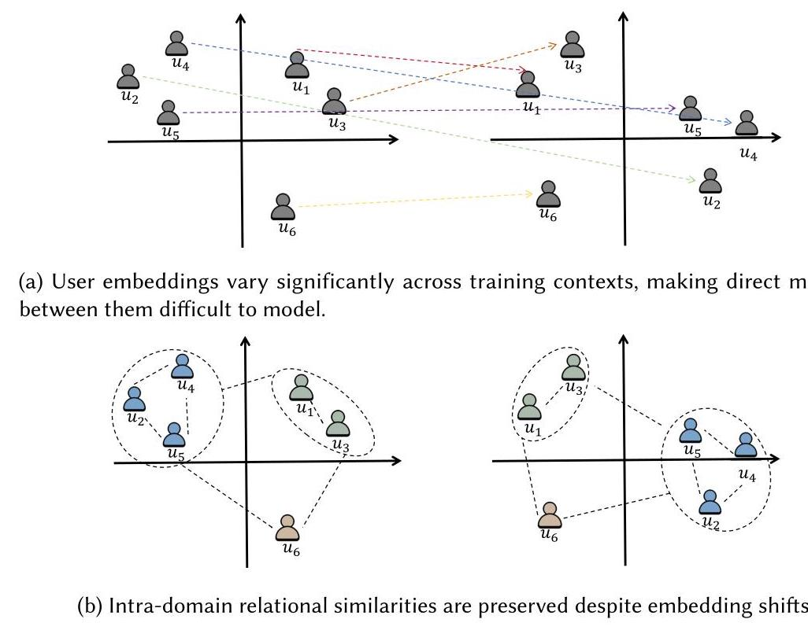

Fig. 1. User embedding distributions under two training contexts. Panel (a) demonstrates the instability of absolute embedding positions and the difficulty of learning explicit mappings. Panel (b) reveals the stability of intra-domain user relationships, suggesting potential for similarity-based knowledge transfer.

Beyond the difficulty of modeling relations across different contexts, we observe an interesting phenomenon: the relative relationships among users are largely preserved under different contexts, as long as they are from the same domain (i.e., trained on the same dataset). As shown in Figure 1(b), although the absolute positions of user embeddings vary significantly, the intra-domain relational structure among users remains stable (illustrated using consistent colors and dashed lines for corresponding users). This indicates that user preference information is, to some extent, relatively stable within the same domain. Inspired by this, we hypothesize that the relative similarity patterns among user embeddings can serve as a carrier of domain knowledge, which can potentially be transferred to other domains. Motivated by this, in this work, we focus on the intra-domain similarities of user embeddings. Specifically, we are first interested in whether these intra-domain similarities can effectively represent domain knowledge. If so, then instead of learning explicit mapping functions which are difficult to model, we may transfer knowledge from the source domain to the target domain by transferring the intra-domain similarity structures. To this end, we design a two-way experiment to verify the hypothesis: (1) Knowledge \( \Rightarrow \) Similarities, which shows that domain knowledge induces consistent intra-domain similarities in user embeddings; and (2) Similarities \( \Rightarrow \) Knowledge, which verifies that these similarities indeed capture meaningful domain knowledge.

Then based on this finding, we propose the Similarity-Preserving Cross-Domain Recommendation (SimCDR) framework that guides the training of the target domain by preserving the intra-domain similarities of the source domain user embeddings, i.e., the source domain knowledge. Specifically, we first learn the source domain user embeddings. The intra-domain similarities of the embeddings are considered as the source domain knowledge to be transferred. Then in the target domain training, we add an auxiliary task, i.e., predicting the user most similar to an anchor user in the target domain embedding space, where the intra-domain similarities of the source domain user embeddings are considered as the ground truth. In this way, the intra-domain similarities of the source domain user embeddings can be transferred to the target domain such that the users that are close in the source domain are still close in the target domain. Intuitively, when the data in the target domain is too sparse to model the mutual relations of the users, the transferred user similarities can enrich the mutual relations in the target domain and thus enhance the recommendation in the target domain.

Furthermore, we extend SimCDR to make it more suitable for real-world applications. First, many existing CDR methods do not support knowledge transfer from multiple source domains. However, as discussed earlier, it is quite common for a large company to have multiple recommendation domains at the same time. And when the company starts a new business, i.e., a potential new recommendation domain, all the existing domains can be used as the source domains for knowledge transfer. Fortunately, due to the way it works, SimCDR can be naturally extended to support multiple source domains by embedding concatenation. Second, in real-world scenarios, the number of users can be large, thus the user embeddings of the source domains, which are usually hundreds in dimension, could mean a huge storage cost. To this end, we implement embedding compression using our Similarity-Preserving Embedding Transformation (SPET) algorithm. This allows the company to store the source domain user embeddings at a much lower cost while still achieving effective knowledge transfer. Our experiments show that even 16-dim user embedding vectors can achieve comparable performance to the original embeddings.

The main contributions of our work are as follows:

- We propose and verify the assumption that the intra-domain similarities of user embeddings could represent the domain knowledge well.

- We propose the SimCDR framework which aims to preserve the intra-domain similarities of the source domain user embeddings, i.e., the source domain knowledge.

-We extend the SimCDR framework to support knowledge transfer from multiple source domains and embedding compression, making it more suitable for real-world use.

-We conduct extensive experiments on two real-world datasets and the experimental results demonstrate the superiority of our SimCDR solution compared with several state-of-the-art baseline methods.

## 2 Related Work

### 2.1 Recommendation Systems

Recommendation system has become an important part of the modern Internet, playing a crucial role in enhancing the user experience and increasing the attractiveness of the online platform. Existing recommendation methods are generally divided into two categories: content-based methods and Collaborative Filtering (CF) methods [9]. Content-based methods recommend items to users based on the features of items that they have previously interacted with or explicitly liked. CF-based methods typically rely on the assumption that similar users will have similar preferences, and similar items will be liked by similar users [1'48'66'67]. MF [27] and its various variants (e.g.,

Generalized Matrix Factorization (GMF) [16]) are widely adopted CF techniques, capturing user similarity information plays a key role in the recommendations of these models.

With the widespread use of Large Language Models (LLMs) in various domains, recent research has also focused on integrating LLMs with recommender systems to enhance performance using the expressive capabilities of LLMs [2, 9, 22, 24, 28, 45, 57, 58, 61, 62]. Liu et al. [34] apply ChatGPT as a recommendation model to various recommendation scenarios by leveraging its extensive corpus, which demonstrates the potential of LLMs in this field. Kim et al. [24] combine collaborative knowledge from state-of-the-art CF model with LLMs capabilities, achieving strong performance in both cold-start and warm-start scenarios without extensive fine-tuning. The proposed TALLRec [2] framework efficiently fine-tunes LLMs for recommendation tasks, significantly improving their performance in domains such as movies and books. To enhance transparency in recommender systems, RecExplainer [28] proposes leveraging LLMs as surrogate models to explain black-box recommendation models, utilizing behavior, intention, and hybrid alignment methods to generate high-fidelity explanations. Additionally, some other LLM-based recommendation systems have been proposed to address specific challenges, such as news [57, 58] and job [13] recommendation. These LLM-based recommendation models combine large models' world knowledge and reasoning abilities to improve recommendation performance.

The models discussed above excel in specific domains but often struggle with sparse data, resulting in mediocre performance. Moreover, their inability to transfer knowledge across different domains further restricts their applicability. To overcome these limitations, we propose SimCDR facilitates the transfer of knowledge from a source domain model to a target domain. Our approach achieves this without requiring any modifications to the original model, effectively addressing the challenge of data sparsity in the target domain. By enabling cross-domain knowledge transfer, SimCDR enhances the model's adaptability and performance across diverse scenarios, making it more versatile and efficient in handling data sparse environments.

### 2.2 CDR

CDR is a promising solution to the data sparsity issue, which works by transferring the source domain knowledge to the target domain [39,42,65]. For example, CMF [51] simultaneously factors multiple interaction matrices and shares parameters among the factors. CDTF [20] proposes the triadic factorization method to learn the triadic relation between nodes. Li and Lin [29] match the users and items in the latent space with a nearest neighbor search algorithm.

Recently, many methods based on deep learning have emerged. A common practice among them is to learn the mapping for the embeddings of the aligned nodes, e.g., the overlapping users \( \left\lbrack  {4,{10},{23},{33},{41},{73},{76}}\right\rbrack \) . EMCDR [41] is the first embedding and mapping method that trains a mapping function for the latent embeddings of the aligned nodes. Following it, some mapping-based methods focus on learning better node embeddings. For example, RC-DFM [10] employs Stacked Denoising Autoencoders [56] to review text and item content, thus learning more semantic embeddings. HCDIR [4] constructs the heterogeneous information network to learn more effective latent embeddings. The other works aim to design more accurate mapping functions. For instance, DDTCDR [33] designs a latent orthogonal mapping function for knowledge transfer through dual transfer learning. SSCDR [23] learns a semi-supervised mapping that exploits both overlapping users as labeled data and all the items as unlabeled data. CATN [68] attentively matches the aspect-level representations of users and items to learn the cross-domain aspect correlations. CCDR [60] employs three contrastive learning tasks for aligned users, taxonomies, and their heterogeneous neighbors, forcing the embeddings for the same node to be similar across domains. PTUPCDR [76] designs a meta-network to generate personalized mapping functions for personalized knowledge transfer. However, these mapping-based methods all try to learn the inter-domain relations of the node embeddings. As discussed before, the embeddings from different domains are in different contexts and the relations between them are difficult to learn. Instead of learning the inter-domain relations, in this work, we focus on the intra-domain relations, i.e., the intra-domain similarities of user embeddings, and try to achieve effective knowledge transfer with them.

More recently, a common approach involves capturing common user preferences and aligning user representations across domains to facilitate knowledge transfer [6, 7, 30-32, 32, 35, 37-40, 59, 69, 70, 74]. COAST [69] constructs a unified cross-domain heterogeneous graph to capture high-order similarity and aligns user interests through user-user and user-item invariance across domains. ETL [6] introduces the concept of equivalent transformation, allowing user preferences to be mutually converted between domains while preserving both domain-specific and shared features. MIMNet [74] leverages a multi-interest meta-network and multi-granularity target-guided attention to effectively transfer user preferences, capturing diverse interests and utilizing rich information from the target domain. CDRCPT [40] addresses the cold-start problem by categorizing user preferences into different clusters and tailoring the bridge function for each user category to achieve recommendations. MUCRP [70] addresses the Unified CDR problem by proposing a robust matching solution using fused Gromov-Wasserstein distribution coclustering optimal transport, and enhances cross-domain performance through embedding-consistent and prediction-consistent losses via a dual autoencoder framework. Li et al. [31] propose the CUT framework to alleviate negative transfer by using target-domain user similarity as a constraint to filter irrelevant collaborative signals from the source domain, achieving more robust and effective user representation transfer. Li et al. [32] propose a graph-based disentangled contrastive learning framework DisCo to capture fine-grained user intents and filter out irrelevant collaborative signals through intent-wise contrastive learning guided by high-order user similarity. Liu et al. [37] propose UEDMCF, an end-to-end framework for Dual-CSCDR, which integrates CF and user embedding alignment, and introduces unbalanced optimal transport with subgroup discovery to align user distributions across domains. Liu et al. [38] propose JPEDET to handle CDR scenarios without overlapped users or items by jointly modeling user preferences from ratings and reviews, and enabling bidirectional knowledge transfer via dynamically guided embedding transportation. Most of these methods focus on transferring the preferences of individual users or specific user groups, overlooking the valuable insights provided by the rich user relationships in the source domain.

Different from the above methods, our approach achieves knowledge transfer by transferring user similarities within the domain, thus capturing and transferring knowledge from the source domain more comprehensively. Furthermore, our approach can utilize knowledge from multiple source domains and is independent of the recommendation algorithms used in the source domain. It can be used as a plug-and-play solution to enable more flexible use in practice.

## 3 Preliminaries

### 3.1 Problem Formulation

The core idea of CDR is to leverage the knowledge in the source domain to facilitate the recommendation in the target domain. Since our framework can be applied to multiple source domains, we assume that we are given \( K \) source domains, denoted as \( {\mathcal{S}}_{1},{\mathcal{S}}_{2},\ldots ,{\mathcal{S}}_{K} \) , and a target domain \( \mathcal{T} \) . Each domain contains a set of users and items. There are overlapping users among the domains but no overlapping items. Denote the users in domain \( {\mathcal{S}}_{i} \) and \( \mathcal{T} \) as \( {\mathcal{U}}_{{\mathcal{S}}_{i}} \) and \( {\mathcal{U}}_{\mathcal{T}} \) , respectively. \( \mathcal{U} = \left( {\mathop{\bigcup }\limits_{{i = 1}}^{K}{\mathcal{U}}_{{\mathcal{S}}_{i}}}\right)  \cup  {\mathcal{U}}_{\mathcal{T}} \) is the union of users in all domains. For convenience, we assume that \( \mathcal{U} \) contains the user indexes from 1 to \( \left| \mathcal{U}\right| \) , and both \( {\mathcal{U}}_{{\mathcal{S}}_{i}} \) and \( {\mathcal{U}}_{\mathcal{T}} \) are subsets of \( \mathcal{U} \) . We also assume that all the user sets are extended to be ordered and support indexing with [ ] notation: \( \left\lbrack  i\right\rbrack \) for the \( i \) th element and \( \left\lbrack  {-i}\right\rbrack \) for the \( i \) th element from the end. \( {\mathcal{U}}^{\prime } = \left( {\mathop{\bigcup }\limits_{{i = 1}}^{K}{\mathcal{U}}_{{\mathcal{S}}_{i}}}\right)  \cap  {\mathcal{U}}_{\mathcal{T}} \) contains the overlapping users between the source and target domains, i.e., the users in the target domain that are also in any of the source domains. In CDR, we will leverage the overlapping users in \( {\mathcal{U}}^{\prime } \) as a bridge to connect the source and target domains.

Table 1. Frequently Used Notations

<table><tr><td>Notation</td><td>Description</td></tr><tr><td>\( {S}_{i} \)</td><td>The \( i \) th source domain.</td></tr><tr><td>\( K \)</td><td>Number of source domains.</td></tr><tr><td>\( \mathcal{T} \)</td><td>Target domain.</td></tr><tr><td>\( {\mathcal{U}}_{{\mathcal{S}}_{i}} \)</td><td>User set of source domain \( {\mathcal{S}}_{i} \) .</td></tr><tr><td>\( {\mathcal{U}}_{\mathcal{T}} \)</td><td>User set of target domain \( \mathcal{T} \) .</td></tr><tr><td>\( \mathcal{U}{}^{\prime } \)</td><td>Union of users in all domains.</td></tr><tr><td>\( {\mathcal{U}}^{\prime } \)</td><td>The overlapping users.</td></tr><tr><td>\( \chi \left\lbrack  i\right\rbrack \)</td><td>The \( i \) th element of set \( \mathcal{X} \) (we assume the set is ordered and supports indexing).</td></tr><tr><td>\( X\left\lbrack  {-i}\right\rbrack \)</td><td>The \( i \) th element of set \( \mathcal{X} \) from the end.</td></tr><tr><td>\( {Y}_{{S}_{i}} \)</td><td>Interaction matrix of source domain \( {\mathcal{S}}_{i} \) .</td></tr><tr><td>\( {Y}_{\mathcal{T}} \)</td><td>Interaction matrix of target domain \( \mathcal{T} \) .</td></tr><tr><td>\( D \)</td><td>Dimension of the embeddings.</td></tr><tr><td>\( {D}^{\prime } \)</td><td>Target dimension of the embedding transformation.</td></tr><tr><td>\( \tau \)</td><td>Temperature for InfoNCE loss.</td></tr><tr><td>\( R \)</td><td>Candidate sampling ratio.</td></tr><tr><td>\( B \)</td><td>Batch size.</td></tr><tr><td>\( \eta \)</td><td>Learning rate.</td></tr><tr><td>\( \operatorname{sim}\left( {\mathbf{u},\mathbf{v}}\right) \)</td><td>Similarity between vector \( \mathbf{u} \) and \( \mathbf{v} \) (we use cosine similarity in this article).</td></tr></table>

As for the type of the recommendation task, in this work, we focus on the classical CF [52] recommendation, where there are no attributes for users or items, only the user-item interaction logs available. Specifically, for each domain, there is a user-item interaction matrix \( Y \) whose \( i \) th row and \( j \) th column element \( {y}_{ij} \) indicates whether user \( i \) has interacted with item \( j \) : 1 for observed interaction, and 0 for other cases. We choose this simplified scenario for clean experimental settings and a fair comparison of different methods. The frequently used notations are summarized in Table 1.

### 3.2 SPET

In this part, we introduce the SPET algorithm that will be used later. First, we define some terminologies.

Definition 3.1 (Embedding Transformation). An embedding transformation is a mapping function \( \phi \) that transforms a set of embedding vectors into another set of vectors:

\[
{\mathbf{u}}_{1}^{\prime },{\mathbf{u}}_{2}^{\prime },\ldots ,{\mathbf{u}}_{M}^{\prime } = \phi \left( {{\mathbf{u}}_{1},{\mathbf{u}}_{2},\ldots ,{\mathbf{u}}_{M}}\right) , \tag{1}
\]

where \( {\mathbf{u}}_{i} \in  {\mathbb{R}}^{D} \) is transformed into \( {\mathbf{u}}_{i}^{\prime } \in  {\mathbb{R}}^{{D}^{\prime }}\left( {1 \leq  i \leq  M}\right) \) in another vector space.

Definition 3.2 (SPET). An embedding transformation \( \phi \) is said to be similarity-preserving if it can preserve the similarities of vectors. Here the term similarity means intra-similarity. In short, if the vectors that are close in the original vector space are still close in the new space, and the vectors that are far away are still far away in the new space, then we say the transformation is similarity-preserving.

To describe the degree of similarity preservation quantitatively, a straightforward way is to measure the difference in pairwise similarities after the transformation:

\[
{\mathcal{E}}_{{\mathbf{u}}_{1},{\mathbf{u}}_{2},\ldots ,{\mathbf{u}}_{M}} = {\left( \frac{2}{M\left( {M - 1}\right) }\mathop{\sum }\limits_{{1 \leq  i < j \leq  M}}{\left| \operatorname{sim}\left( {\mathbf{u}}_{i},{\mathbf{u}}_{j}\right)  - \operatorname{sim}\left( {\mathbf{u}}_{i}^{\prime },{\mathbf{u}}_{j}^{\prime }\right)  - \operatorname{sim}\left( {\mathbf{u}}_{i}^{\prime },{\mathbf{u}}_{j}^{\prime }\right) \right| }^{p}\right) }^{1/p}, \tag{2}
\]

where sim computes the similarity between vectors. \( {}^{2}p \) determines the norm, e.g., \( \mathrm{p} = 2 \) means Root Mean Square Error and \( \mathrm{p} = 1 \) corresponds to Mean Absolute Error.

However, this metric implies that a similarity-preserving transformation should preserve the absolute values of pairwise similarities. This would be too strict for recommendation scenarios where we usually do not care about the specific values of the preference or similarity scores but the ranks of them [36,46,63]. Therefore, inspired by Kendall’s \( \tau ,{}^{3} \) we adopt the rank-based metric \( \Gamma \) to measure the similarity-preserving degree of a transformation:

\[
s\left( {i, j, k}\right)  = \operatorname{sgn}\left( {\operatorname{sim}\left( {{\mathbf{u}}_{i},{\mathbf{u}}_{j}}\right)  - \operatorname{sim}\left( {{\mathbf{u}}_{i},{\mathbf{u}}_{k}}\right) }\right) ,
\]

\[
{s}^{\prime }\left( {i, j, k}\right)  = \operatorname{sgn}\left( {\operatorname{sim}\left( {{\mathbf{u}}_{i}^{\prime },{\mathbf{u}}_{j}^{\prime }}\right)  - \operatorname{sim}\left( {{\mathbf{u}}_{i}^{\prime },{\mathbf{u}}_{k}^{\prime }}\right) }\right)
\]

\[
{\Gamma }_{{u}_{1},{u}_{2},\ldots ,{u}_{M}}^{{u}_{1},{u}_{2},\ldots ,{u}_{M}} = \frac{2}{M\left( {M - 1}\right) \left( {M - 2}\right) }\mathop{\sum }\limits_{{i = 1}}^{M}\mathop{\sum }\limits_{\substack{{1 \leq  j < k \leq  M} \\  {j \neq  i, k \neq  i} }}s\left( {i, j, k}\right) {s}^{\prime }\left( {i, j, k}\right) . \tag{3}
\]

Here, \( i \) denotes the index of the anchor vector, and \( j \) and \( k \) are the indices of the two comparison vectors, all selected from the set \( \{ 1,2,\ldots , M\} \) such that \( j \neq  i, k \neq  i \) . The function \( s\left( {i, j, k}\right) \) indicates whether \( {\mathbf{u}}_{j} \) is more similar to \( {\mathbf{u}}_{i} \) than \( {\mathbf{u}}_{k} \) is. Specifically, \( s\left( {i, j, k}\right)  = 1 \) if \( {\mathbf{u}}_{j} \) is more similar to \( {\mathbf{u}}_{i}, - 1 \) if \( {\mathbf{u}}_{k} \) is more similar. By multiplying \( s \) and \( {s}^{\prime } \) , we evaluate whether the relative similarity order between \( \left( {i, j, k}\right) \) remains unchanged after the transformation: a product of +1 means preserved ranking, and -1 means it is reversed. Finally, \( \Gamma \) is computed as the average score across all valid \( \left( {i, j, k}\right) \) combinations. Obviously, \( \Gamma \) lies in the range \( \left\lbrack  {-1,1}\right\rbrack \) , where 1 indicates perfectly preserved ranking relationships and -1 indicates all rankings are reversed.

With this quantitative definition, we can now redefine SPET as an embedding transformation \( {\phi }^{ * } \) that maximizes the \( \Gamma \) metric:

\[
{\phi }^{ * } = \underset{\phi }{\arg \max }{\Gamma }_{\begin{matrix} {\mathbf{u}}_{1},{\mathbf{u}}_{2},\ldots ,{\mathbf{u}}_{M} \\  \phi \left( {{\mathbf{u}}_{1},{\mathbf{u}}_{2},\ldots ,{\mathbf{u}}_{M}}\right)  \end{matrix}}. \tag{4}
\]

To implement SPET, we develop an algorithm based on backpropagation as shown in Algorithm 1. Specifically, given a set of vectors \( {\mathbf{u}}_{1},{\mathbf{u}}_{2},\ldots ,{\mathbf{u}}_{M} \in  {\mathbb{R}}^{D} \) , we first randomly initialize \( M \) vectors \( {\mathbf{u}}_{1}^{\prime },{\mathbf{u}}_{2}^{\prime },\ldots ,{\mathbf{u}}_{M}^{\prime } \in  {\mathbb{R}}^{{D}^{\prime }} \) (they are essentially the model parameters). Then in each training batch, we sample \( B \) indexes \( {a}_{1},{a}_{2},\ldots ,{a}_{B} \) from \( \{ 1,2,\ldots , M\} \) , named the anchors in current batch. We also sample \( R \) candidate vectors \( {c}_{i1},{c}_{i2},\ldots ,{c}_{iR} \) for each anchor \( i \) inspired by negative sampling [43]. Then our task is to predict the vector most similar to the current anchor vector from the \( R \) candidate vectors. To do this, we define the similarity-preserving loss \( {L}_{\mathrm{{SP}}} \) in the form of InfoNCE [54] loss:

\[
g\left( i\right)  = \underset{1 \leq  k \leq  R}{\arg \max }\operatorname{sim}\left( {{\mathbf{u}}_{{a}_{i}},{\mathbf{u}}_{{c}_{ik}}}\right)
\]

\[
{L}_{\mathrm{{SP}}} =  - \mathop{\sum }\limits_{{i = 1}}^{B}\log \frac{\exp \left( {\operatorname{sim}\left( {{\mathbf{u}}_{{a}_{i}}^{\prime },{\mathbf{u}}_{{c}_{i\mathrm{g}\left( i\right) }}^{\prime }}\right) /\tau }\right) }{\mathop{\sum }\limits_{{j = 1}}^{R}\exp \left( {\operatorname{sim}\left( {{\mathbf{u}}_{{a}_{i}}^{\prime },{\mathbf{u}}_{{c}_{ij}}^{\prime }}\right) /\tau }\right) }, \tag{5}
\]

where \( \tau \) is the temperature hyperparameter. \( g\left( i\right) \) denotes the ground truth for anchor \( i \) , computed as the index of the vector most similar to anchor \( i \) among the \( R \) candidate vectors in the original vector space. After the loss computation, we perform the normal backpropagation and parameter updating process. The batch training is repeated until the \( \Gamma \) metric defined in Equation (3) no longer improves. In the end, SPET outputs a set of embedding vectors such that the intra-similarities are preserved.

---

\( {}^{2} \) In this article, we always use cosine similarity.

\( {}^{3} \) Kendall’s \( \tau \) is a measure of rank correlation defined as \( \frac{{n}_{c} - {n}_{d}}{n\left( {n - 1}\right) /2} \) , where \( {n}_{c} \) and \( {n}_{d} \) denote the number of concordant and discordant pairs, respectively.

---

Algorithm 1: The SPET Algorithm

---

	Input: a set of vectors \( {\mathbf{u}}_{1},{\mathbf{u}}_{2},\ldots ,{\mathbf{u}}_{M} \in  {\mathbb{R}}^{D} \) .

	Output: a set of transformed vectors \( {\mathbf{u}}_{1}^{\prime },{\mathbf{u}}_{2}^{\prime },\ldots ,{\mathbf{u}}_{M}^{\prime } \in  {\mathbb{R}}^{{D}^{\prime }} \) .

\( {\mathbf{u}}_{1}^{\prime },{\mathbf{u}}_{2}^{\prime },\ldots ,{\mathbf{u}}_{M}^{\prime } \leftarrow \) (randomly initialize \( M \) vectors of \( {D}^{\prime } \) -dim)

	while not converged 																																														// Convergence determined by Eq. (3) do

				// Select \( B \) anchor vectors

				\( {a}_{1},{a}_{2},\ldots ,{a}_{B} \leftarrow \) (randomly select \( B \) indexes from \( 1..M \) )

				for \( i \leftarrow  1 \) to \( B \) do

							// Sample \( R \) candidate vectors for each anchor vector

							\( {c}_{i1},{c}_{i2},\ldots ,{c}_{iR} \leftarrow \) (randomly select \( R \) indexes from \( 1..M \) )

				end

				// Compute the similarity-preserving loss

				\( {L}_{\mathrm{{SP}}} \leftarrow \) Eq. (5)

				// Backpropagation and parameter updating (e.g., using SGD)

				\( {\mathbf{u}}_{1}^{\prime },{\mathbf{u}}_{2}^{\prime },\ldots ,{\mathbf{u}}_{M}^{\prime } \leftarrow  {\mathbf{u}}_{1}^{\prime },{\mathbf{u}}_{2}^{\prime },\ldots ,{\mathbf{u}}_{M}^{\prime } - \eta \nabla {L}_{\mathrm{{SP}}} \)

	end

	return \( {\mathbf{u}}_{1}^{\prime },{\mathbf{u}}_{2}^{\prime },\ldots ,{\mathbf{u}}_{M}^{\prime } \)

---

### 3.3 Can Intra-Domain Similarities Represent Domain Knowledge?

In this section, we try to answer an interesting question: Can Intra-Domain Similarities represent Domain Knowledge? More specifically, after the model training within a domain, to what extent can the intra-domain similarities of the user embeddings represent the domain knowledge? This question is crucial for us since SimCDR works by transferring the intra-domain similarities of user embeddings in source domains to target domains. Only if the answer to this question is positive can we confidently claim that SimCDR does guide the training of the target domain with the knowledge of the source domain.

To answer this question, we perform a two-way experiment: Knowledge \( \Rightarrow \) Similarities and Similarities \( \Rightarrow \) Knowledge.

3.3.1 Knowledge \( \Rightarrow \) Similarities. In this experiment, we are interested in whether the domain knowledge could produce consistent intra-domain similarities of user embeddings. The consistency constraint makes sense because if the intra-domain similarities could represent the domain knowledge, then intuitively the consistent domain knowledge should also produce consistent intra-domain similarities in multiple trainings.

Specifically, we choose the MF model and the Tenrec-Article [64] dataset (introduced in Section 5.1.1). We run two trainings in parallel, and after each epoch, we extract the user embeddings and compute the \( \Gamma \) metric defined in Equation (3) to measure the agreement of intra-domain similarities. The experiment is repeated and the results are shown in Figure 2 where the error band represents the standard deviations. From the figure, we can see that as the training progresses, the \( \Gamma \) metric gradually increases and finally reaches a value close to 1 . This indicates that the domain knowledge does produce consistent intra-domain similarities of user embeddings.

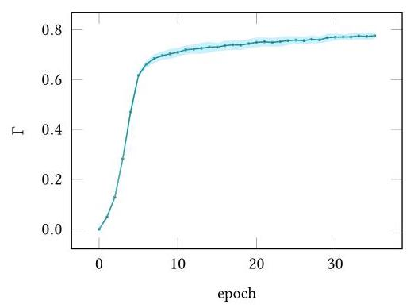

Fig. 2. Knowledge \( \Rightarrow \) Similarities: The intra-domain similarities of user embeddings are consistent.

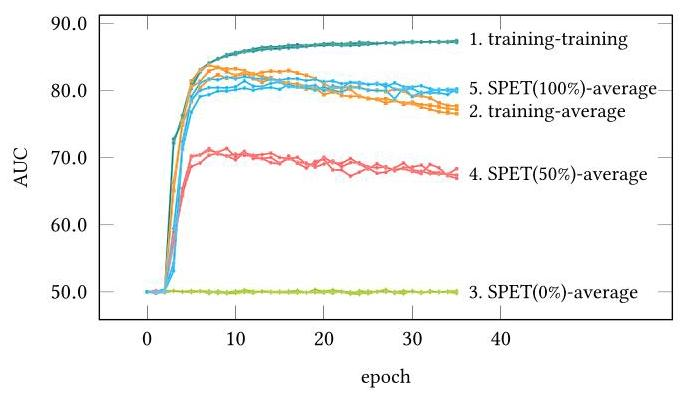

Fig. 3. Similarities \( \Rightarrow \) Knowledge: The intra-domain similarities of user embeddings do contain domain knowledge.

3.3.2 Similarities \( \Rightarrow \) Knowledge. In this experiment we focus on whether the intra-domain similarities of user embeddings might reflect domain knowledge. First, we make the intuitive assumption that if a set of embeddings could perform well on the recommendation task, then the embeddings can be said to contain the domain knowledge. Then, we obtain several sets of user and item embeddings from different sources. We initialize the MF model with them and directly evaluate the model on the Tenrec-Article dataset.

The results are shown in Figure 3. In the figure the text to the right of the lines represents experimental details in the format of "<index>. <user embedding source>-<item embedding source>," where training denotes the user or item embeddings extracted from the MF model (trained with the Tenrec-Article dataset) after a specific epoch. SPET means the output of the SPET algorithm where the input is the user embeddings from training. The percentage following SPET represents the output of SPET in different progress. For example, 0% means the output when SPET is just starting, i.e., actually randomly initialized vectors. 100% means the output when SPET converges. average denotes the item embeddings generated by taking the average of its interacting users' embeddings.

From experiment 3 to 4, and then to 5, we can observe that as SPET progresses, the transformed embeddings from SPET gradually achieve comparable performance to experiment 2. Recall that in SPET, the only supervised information is the intra-similarity (Equation (5)), then we can say that the intra-domain similarities themselves could guide the randomly initialized embeddings to behave as well as the embeddings from training, which naturally carry the domain knowledge. In other words, the intra-domain similarities of user embeddings do contain domain knowledge.

## 4 Methodology

In this section, we present the SimCDR framework. It consists of four stages. First, we learn the user embeddings from the source domains. Second, the learned embeddings are compressed by the SPET algorithm. Third, if multiple source domains are available, we merge these embeddings by concatenation. Finally, we guide the training of the target domain by preserving the intra-domain similarities of the source domain user embeddings. Note that stage 2 and 3 are optional: stage 2 can be skipped if the storage cost of the embeddings is not a problem; stage 3 is not needed if only one source domain is available. The workflow of SimCDR is described in Figure 4 and Algorithm 2.

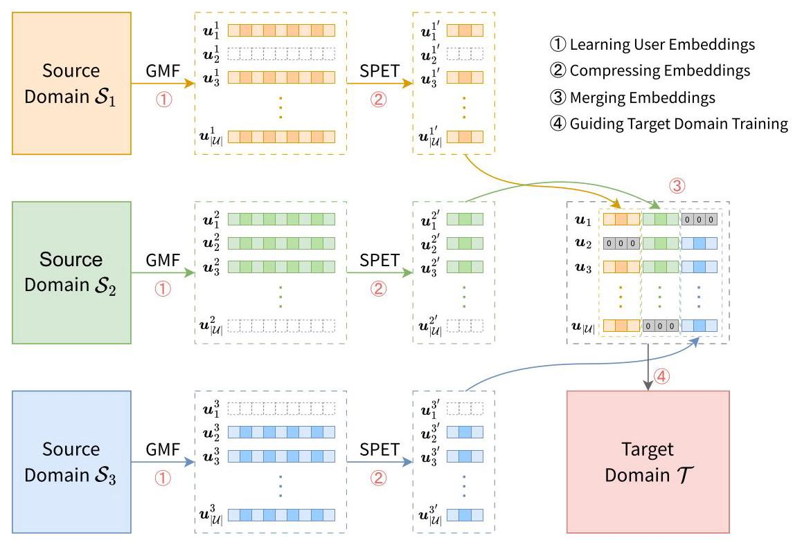

Fig. 4. The workflow of SimCDR framework. For ease of understanding, we make all domains share the same user space (indexed from 1 to \( \left| \mathcal{U}\right| \) ) and the non-existent embeddings for users not in a particular source domain are drawn with dashed borders.

### 4.1 Learning User Embeddings

The first stage of our framework is to learn the user embeddings from the source domain, whose intra-domain similarities are considered as the source domain knowledge to be transferred. Note that in many cases, the recommendation systems may have been deployed in the source domain, such that there are already trained user embeddings. If so, we can use them directly, especially if they are trained with some strong information such as the user attributes. In the following, we will discuss how to learn the user embeddings from scratch in a simplified scenario where only the interaction logs between users and items are available.

To do so, we first build an embedding lookup table for the users. Then we train an embedding-based CF model with the user-item interaction data of the source domain. After model convergence, we could extract the user embeddings from the embedding lookup table.

In designing the user embedding extractor, we face the choice of the CF model and we have summarized two principles of the choice:

- The model should effectively capture user preferences within the source domain.

-The model should minimize reliance on additional parameters outside of the user embeddings to ensure that transferable knowledge is retained.

While models with deeper architectures (e.g., MLP [16], RNN [18]) may achieve higher in-domain accuracy, their learned representations may be entangled with complex, non-transferable parameters (e.g., hidden layer weights). This can obscure the semantics of the embeddings and hinder effective transfer. To satisfy both criteria, we evaluate two representative CF models: LightGCN [15] and GMF [16].

LightGCN [15] is a lightweight graph-based model that learns embeddings by propagating information over the user-item bipartite graph. Since predictions are made via inner products, the embeddings themselves fully encode user preferences, aligning well with our transfer objective.

GMF [16] is a generalization of the classical MF. It replaces the simple dot product with learnable edge weights, allowing varying importance of embedding dimensions. Specifically, for user \( i \) and item \( j \) , the preference between them is estimated as:

\[
{\widehat{y}}_{ij} = \sigma \left( {{\mathbf{h}}^{\top }\left( {{\mathbf{u}}_{i} \odot  {\mathbf{v}}_{j}}\right) }\right)
\]

\[
= \sigma \left( {\mathop{\sum }\limits_{{d = 1}}^{D}{h}_{d}{u}_{id}{v}_{jd}}\right) \tag{6}
\]

where \( {\mathbf{u}}_{i} \) and \( {\mathbf{v}}_{j} \) denote the embedding of user \( i \) and item \( j \) , respectively. \( \mathbf{h} \in  {\mathbb{R}}^{D \times  1} \) is the learnable edge weights. \( \odot \) is the element-wise product of vectors. \( \sigma \) means the activation function (usually chosen as the sigmoid function).

For model optimization, we adopt the simple but effective binary cross-entropy loss, formulated as:

\[
L =  - \mathop{\sum }\limits_{{\left( {i, j}\right)  \in  \mathcal{Y} \cup  {\mathcal{Y}}^{ - }}}{y}_{ij}\log {\widehat{y}}_{ij} + \left( {1 - {y}_{ij}}\right) \log \left( {1 - {\widehat{y}}_{ij}}\right) , \tag{7}
\]

where \( \mathcal{Y} \) contains the observed user-item interactions while \( {\mathcal{Y}}^{ - } \) contains the sampled unobserved user-item pairs.

After model convergence, the user embeddings are meant to reflect the user preferences in the source domain, and the intra-domain similarities of these embeddings can be seen as the knowledge to be transferred. However, simply taking \( {\mathbf{u}}_{1},{\mathbf{u}}_{2},\ldots \) means dropping the useful edge weights in \( \mathbf{h} \) , which is against the motivation of GMF. Instead, we rewrite Equation (6) as:

(8)

\[
{\widehat{y}}_{ij} = \sigma \left( {{\mathbf{h}}^{\top }\left( {{\mathbf{u}}_{i} \odot  {\mathbf{v}}_{j}}\right) }\right)
\]

\[
= \sigma \left( {{\left( \mathbf{h} \odot  {\mathbf{u}}_{i}\right) }^{\top }{\mathbf{v}}_{j}}\right) \text{ . }
\]

Now, if we think of \( \mathbf{h} \odot  {\mathbf{u}}_{i} \) as a whole term, called element-wise scaled user embedding, it will look the same as the classical MF. This inspires us to save the scaled embeddings \( \mathbf{h} \odot  {\mathbf{u}}_{1},\mathbf{h} \odot  {\mathbf{u}}_{2},\ldots \) instead of the original embeddings for later use. In this way, the weights in \( \mathbf{h} \) can be well preserved, thus maintaining the good performance of GMF. In short, we choose GMF and take the element-wise scaled user embeddings for knowledge transfer. It performs well and most of the learned underlying data pattern is preserved in the user embeddings.

Since we might have multiple source domains, we perform the above process in each domain. Finally, for the \( i \) th source domain \( {\mathcal{S}}_{i}\left( {1 \leq  i \leq  K}\right) \) , we obtain the user embeddings \( {\mathbf{u}}_{{\mathcal{U}}_{{\mathcal{S}}_{i}}\left\lbrack  1\right\rbrack  }^{i},{\mathbf{u}}_{{\mathcal{U}}_{{\mathcal{S}}_{i}}\left\lbrack  2\right\rbrack  }^{i},\ldots \) , \( {\mathbf{u}}_{{\mathcal{U}}_{{S}_{i}}}^{i}{}_{\left\lbrack  {}^{-1}\right\rbrack  } \) .

### 4.2 Compressing Embeddings

In real-world recommendation scenarios, there could be millions of users and the embedding dimension could be large. Since our framework needs to store the user embeddings from the source domains for later use in the target domain (e.g., when the company launches a new business which has sparse data), the storage of the embeddings could mean a huge cost. Considering that our framework utilizes the intra-domain similarities of the user embeddings to guide the target domain training, and the similarities can be effectively preserved by the SPET algorithm (Algorithm 1), we leverage SPET to compress the embeddings.

Specifically, for the \( i \) th source domain \( {\mathcal{S}}_{i} \) , we feed the user embeddings \( {\mathbf{u}}_{{\mathcal{U}}_{{\mathcal{S}}_{i}}\left\lbrack  1\right\rbrack  }^{i},{\mathbf{u}}_{{\mathcal{U}}_{{\mathcal{S}}_{i}}\left\lbrack  2\right\rbrack  }^{i},\ldots \) , \( {\mathbf{u}}_{{\mathcal{U}}_{{\mathcal{S}}_{i}}}^{i}{}_{\left\lbrack  -1\right\rbrack  } \) into the SPET algorithm and set the target dimension \( {D}^{\prime } \) to a lower value. The output of SPET, \( {\mathbf{u}}_{{\mathcal{U}}_{{\mathcal{S}}_{i}}\left\lbrack  1\right\rbrack  }^{{i}^{\prime }},{\mathbf{u}}_{{\mathcal{U}}_{{\mathcal{S}}_{i}}\left\lbrack  2\right\rbrack  }^{{i}^{\prime }},\ldots ,{\mathbf{u}}_{{\mathcal{U}}_{{\mathcal{S}}_{i}}\left\lbrack  {-1}\right\rbrack  }^{{i}^{\prime }} \) , will now have lower dimension but still keep the intra-domain similarities, i.e., we achieve the similarity-preserving embedding compression.

Algorithm 2: The SimCDR Algorithm

---

for \( i \leftarrow  1 \) to \( K \) do 																		// For each source domain

	// Stage 1: Learning User Embeddings

	\( {\mathbf{u}}_{{\mathcal{U}}_{{\mathcal{S}}_{s}}\left\lbrack  1\right\rbrack  }^{i},{\mathbf{u}}_{{\mathcal{U}}_{{\mathcal{S}}_{i}}\left\lbrack  2\right\rbrack  }^{i},\ldots ,{\mathbf{u}}_{{\mathcal{U}}_{{\mathcal{S}}_{i}}\left\lbrack  {-1}\right\rbrack  }^{i},{\mathbf{h}}^{i} \leftarrow  \mathbf{{GMF}}\left( {Y}_{{\mathcal{S}}_{i}}\right) \)

	\( {\mathbf{u}}_{{u}_{{\mathcal{C}}_{s}\left\lbrack  1\right\rbrack  }}^{i},{\mathbf{u}}_{{u}_{{\mathcal{C}}_{s}\left\lbrack  2\right\rbrack  }}^{i},\ldots ,{\mathbf{u}}_{{u}_{{\mathcal{C}}_{s}\left\lbrack  {-1}\right\rbrack  }}^{i} \leftarrow  {\mathbf{h}}^{i} \odot  {\mathbf{u}}_{{u}_{{\mathcal{C}}_{s}\left\lbrack  1\right\rbrack  }}^{i},{\mathbf{h}}^{i} \odot  {\mathbf{u}}_{{u}_{{\mathcal{C}}_{s}\left\lbrack  2\right\rbrack  }}^{i},\ldots ,{\mathbf{h}}^{i} \odot  {\mathbf{u}}_{{u}_{{\mathcal{C}}_{s}\left\lbrack  {-1}\right\rbrack  }}^{i} \)

	// Stage 2: Compressing Embeddings

	\( {\mathbf{u}}_{{u}_{{Q}_{s}\left\lbrack  1\right\rbrack  }}^{{i}^{\prime }},{\mathbf{u}}_{{u}_{{Q}_{s}\left\lbrack  2\right\rbrack  }}^{{i}^{\prime }},\ldots ,{\mathbf{u}}_{{u}_{{Q}_{s}\left\lbrack  {-1}\right\rbrack  }}^{{i}^{\prime }}, \leftarrow  \mathbf{{SPET}}\left( {{\mathbf{u}}_{{u}_{{Q}_{s}\left\lbrack  1\right\rbrack  }}^{i},{\mathbf{u}}_{{u}_{{Q}_{s}\left\lbrack  2\right\rbrack  }}^{i},\ldots ,{\mathbf{u}}_{{u}_{{Q}_{s}\left\lbrack  {-1}\right\rbrack  }}^{i}}\right) \)

end

// Stage 3: Merging Embeddings

for \( i \leftarrow  1 \) to \( \left| \mathcal{U}\right| \) do 																				// For each user

	for \( j \leftarrow  1 \) to \( K \) do 																		// For each source domain

		if \( i \notin  {\mathcal{U}}_{{\mathcal{S}}_{i}} \) then

			\( {\mathbf{u}}_{i}^{{j}^{\prime }} \leftarrow  \mathbf{0} \) 															// Assign a \( {D}^{\prime } \) -dim all-zero vector

		end

	end

	\( {\mathbf{u}}_{i} \leftarrow  {\mathbf{u}}_{i}^{{1}^{\prime }}\begin{Vmatrix}{\mathbf{u}}_{i}^{{2}^{\prime }}\end{Vmatrix}\ldots \parallel {\mathbf{u}}_{i}^{{K}^{\prime }} \)

end

// Stage 4: Guiding Target Domain Training

\( w \leftarrow \) (randomly initialize model parameters)

while not converged do

	batch \( \leftarrow \) (sample a mini-batch from \( {Y}_{\mathcal{T}} \) )

	// Select anchor users from current batch

	\( {a}_{1},{a}_{2},\ldots ,{a}_{{B}^{\prime }} \leftarrow  \left( \text{ user indexes in batch }\right)  \cap  {\mathcal{U}}^{\prime } \)

	for \( i \leftarrow  1 \) to \( {B}^{\prime } \) do

		// Sample \( R \) candidate users for each anchor user

		\( {c}_{i1},{c}_{i2},\ldots ,{c}_{iR} \leftarrow \) (randomly select \( R \) indexes from \( {\mathcal{U}}^{\prime } \) )

	end

	// Compute the loss

	\( {L}_{\mathrm{{SP}}} \leftarrow \) Eq. (10)

	\( {L}_{\text{ original }} \leftarrow  f\left( {\mathbf{w},\text{ batch }}\right) \)

	\( {L}_{\text{ final }} \leftarrow  \left( {1 - \alpha }\right)  \cdot  {L}_{\text{ original }} + \alpha  \cdot  {L}_{\mathrm{{SP}}} \)

	// Backpropagation and model updating (take SGD for example)

	\( \mathbf{w} \leftarrow  \mathbf{w} - \eta \nabla {L}_{\text{ final }} \)

end

---

### 4.3 Merging Embeddings

For each source domain, we can obtain a set of user embeddings that reflect user preferences from a unique perspective. Each set of user embeddings would also mean the intra-domain similarities from a new perspective. In this part, we will try to fuse the multi-view intra-domain similarities for better knowledge transfer.

Specifically, we achieve the fusion of multi-view intra-domain similarities by embedding concatenation: for each user, we concatenate the user embeddings from different source domains. In this way, the final embedding for user \( i \) is derived as:

\[
{\mathbf{u}}_{i} = {\mathbf{u}}_{i}^{{1}^{\prime }}\begin{Vmatrix}{\mathbf{u}}_{i}^{{2}^{\prime }}\end{Vmatrix}\ldots \parallel {\mathbf{u}}_{i}^{{K}^{\prime }}. \tag{9}
\]

Note that \( {\mathbf{u}}_{i}^{{j}^{\prime }} \) may not exist for some values of \( j \) because user \( i \) may not appear in some source domains. We handle this by filling zeros: if user \( i \) is not in \( {\mathcal{S}}_{j} \) , we set \( {\mathbf{u}}_{i}^{{j}^{\prime }} \) to a \( {D}^{\prime } \) -dim all-zero vector.

The rationale for the embedding concatenation is that, when we compute the intra-similarities of the merged embeddings later, the embedding from a source domain will only match the corresponding embeddings from the same domain, since the embeddings are all concatenated in the same order. In other words, the concatenation of embeddings can cleanly achieve an effect similar to the average of the intra-domain similarities from different source domains.

Note that if different source domains have distinctly different correlations to target domains, the embeddings from different source domains can also be scaled by different factors before being merged to allow varying importance. And the factors can be set either manually (as hyperpa-rameters) or automatically (via some attentive or adaptive methods). We leave this for future research, as in the datasets we use, different source domains basically do not show much difference in correlations to target domains.

### 4.4 Guiding Target Domain Training

Recall that in Section 3.3, we have verified that the intra-domain similarities of user embeddings can represent domain knowledge well. We will now guide the target domain training with the intra-domain similarities of the source domain user embeddings, i.e., the source domain knowledge.

Here we do not impose any restrictions on the choice of the target domain model, as long as it involves the concept of user embeddings, either directly (e.g., a user embedding lookup table) or indirectly (e.g., by merging the embeddings of interacted items). The process of guiding the target domain training is very similar to the SPET algorithm (Algorithm 1). Specifically, in each batch of the target domain training, we select the users in the batch that are also in any of the source domains. They are called anchor users. Also, we sample \( R \) candidate users for each anchor user from the set of overlapping users \( {\mathcal{U}}^{\prime } \) (if there is only one source domain, the \( R \) candidate users are sampled from \( {\mathcal{U}}^{\prime } \) ; if there are multiple source domains, the \( R \) candidates are sampled from each source domain). Then we add the auxiliary task of predicting the user most similar to the current anchor user from the \( R \) candidate users. In this way, we guide the target domain training to preserve the intra-domain similarities of the source domain embeddings. The similarity-preserving loss \( {L}_{\mathrm{{SP}}} \) , in the form of InfoNCE [54] loss, is formulated as:

\[
g\left( i\right)  = \underset{1 \leq  k \leq  R}{\arg \max }\operatorname{sim}\left( {{\mathbf{u}}_{{a}_{i}},{\mathbf{u}}_{{c}_{ik}}}\right)
\]

\[
{L}_{\mathrm{{SP}}} =  - \mathop{\sum }\limits_{{i = 1}}^{{B}^{\prime }}\log \frac{\exp \left( {\operatorname{sim}\left( {{\mathbf{u}}_{{a}_{i}}^{ * },{\mathbf{u}}_{{c}_{{ig}\left( i\right) }}^{ * }}\right) /\tau }\right) }{\mathop{\sum }\limits_{{j = 1}}^{R}\exp \left( {\operatorname{sim}\left( {{\mathbf{u}}_{{a}_{i}}^{ * },{\mathbf{u}}_{{c}_{ij}}^{ * }}\right) /\tau }\right) } \tag{10}
\]

where \( {a}_{i} \) represents the \( i \) th anchor user and \( {c}_{i1},{c}_{i2},\ldots ,{c}_{iR} \) denote the sampled \( R \) candidate users for this anchor user. \( g\left( i\right) \) acts like the ground truth for \( {a}_{i} \) , i.e., the user most similar to \( {a}_{i} \) among the candidate users in the source domain embedding space. \( {\mathbf{u}}_{i}^{ * } \) is the embedding for user \( i \) in the target domain.

We compute the loss of the original recommendation task in the target domain normally and the final loss is the linear combination of the original loss and the similarity-preserving loss:

\[
{L}_{\text{ final }} = \left( {1 - \alpha }\right)  \cdot  {L}_{\text{ original }} + \alpha  \cdot  {L}_{\mathrm{{SP}}}, \tag{11}
\]

where \( \alpha \) is a hyperparameter controlling the weight of the similarity-preserving task. The later part is the normal model updating process and we omit it for brevity.

## 5 Experiments

In this section, we first describe the experimental setup, including the datasets, evaluation protocols, and the comparative methods. We then perform a series of detailed analyses to answer the following Research Questions (RQs):

- RQ1: How does the SimCDR framework perform in CDR compared with existing baselines? (See Section 5.2.)

- RQ2: How does the number of different source domains affect the effectiveness of CDRs? (See Section 5.3.)

- RQ3: What is the effect of the target embedding dimension in SPET? (See Section 5.4.)

- RQ4: How does the performance of SimCDR vary with different values of the hyper-parameters? (See Section 5.5.)

- RQ5: Can the proposed model effectively transfer user similarity? (See Section 5.6.)

-RQ6: Can SimCDR effectively realize knowledge transfer in CDR tasks? (See Section 5.7.)

### 5.1 Experimental Settings

5.1.1 Datasets. We conduct thorough experiments on two public datasets, namely Tenre \( {}^{4} \) and MovieLens. \( {}^{5} \) Tenrec [64] is a recommendation dataset collected from two feeds platforms (videos and articles) of Tencent. \( {}^{6} \) There are overlapping users between the platforms, i.e., domains, which makes it a good choice for CDR. We use Tenrec-Video and Tenrec-Article to represent the two domains. MovieLens [14] is a popular movie recommendation dataset. Following the previous works [21, 53, 71], we divide the dataset into multiple domains based on the movie genres and select the domains with the most data. In this way, we construct a CDR dataset with four domains: MovieLens-Action, MovieLens-Comedy, MovieLens-Drama and MovieLens-Thriller. We run the CDR experiments in a cross-transfer manner: each domain is treated as the target domain with other domains in the same dataset as the source domains. Following [41, 60, 72, 76], when a domain is used as a target domain, we randomly drop 70% of the data in it to simulate data sparsity.

5.1.2 Evaluation Protocols. We adopt the leave-one-out strategy following \( \left\lbrack  {3,{17},{46}}\right\rbrack \) : for each user, we hold out its two most recent interactions for validation and testing, respectively, and utilize the remaining items for training. All the items that are not interacted with by the user are treated as negative samples. These evaluation metrics are selected: AUC, MRR, nDCG@10, and nDCG@50.We repeat each experiment five times and report the average results.

5.1.3 Compared Methods. We compare the following methods:

- Base denotes the method without knowledge transfer, i.e., using only the target domain data.

- Load means to load the user embeddings learned in the source domain to initialize the target domain embeddings. The embeddings of the users who are not in the source domain are initialized randomly.

- EMCDR [41] trains a mapping function for the embeddings of the aligned nodes. It contains both linear and non-linear mappings and we choose the latter for better performance.

- SSCDR [23] learns a semi-supervised mapping that exploits both overlapping users as labeled data and all the items as unlabeled data.

- DDTCDR [33] designs a latent orthogonal mapping function for knowledge transfer through dual transfer learning.

---

\( {}^{4} \) https://github.com/yuangh-x/2022-NIPS-Tenrec.

\( {}^{5} \) https://grouplens.org/datasets/movielens/25m/.

\( {}^{6} \) https://www.tencent.com/.

---

- PTUPCDR [76] utilizes a meta-network to generate a personalized preference bridging function to achieve personalized migration of user preferences from the source domain to the target domain.

- CCDR [60] designs a huge diversified preference network to capture multiple information, and employs three contrastive learning tasks for aligned users, taxonomies, and their neighbors.

- CUT [31] filters irrelevant source information by constraining user transformation with target-domain similarity and contrastive loss, mitigating negative transfer.

-SimCDR is our method. In later tables, \( \operatorname{SimCDR}\left( {{D}^{\prime } = {16}}\right) \) means that the embeddings are compressed to 16-dim, and SimCDR denotes the version without embedding compression. Since most baseline methods only support single source domain, for a fair comparison, we also add the single source domain version SimCDR (single) for the MovieLens dataset.

Note that for those methods not supporting multiple source domains, we try different source domains and select the one with the best performance. To be fair, we always use the same underlying recommendation model when comparing different CDR methods. Considering that different CDR methods usually have different ways of handling the side information (e.g., the user and item attributes), which introduces extraneous variables, we focus on the classical CF without side information following \( \left\lbrack  {{19},{23},{41},{51},{76}}\right\rbrack \) and choose these two recommendation models for instantiation:

- GMF [16] is a representative of the traditional recommendation methods. It improves the classical MF by replacing the dot product with learnable edge weights.

-LightGCN [15] is one of the modern recommendation approaches based on graph neural network [12]. It simplifies graph convolutional network [26] by including only the most essential components for recommendation tasks.

5.1.4 Hyperparameter Settings. We use the Adam [25] optimizer and the learning rate is searched separately for each experiment in \( \{ {0.0001},{0.0003},{0.001},\ldots ,{0.3}\} \) . The batch size is set to 2,048 . The dimension of the user and item embeddings is 128. We sample 16 candidates for an anchor, i.e., \( R = {16} \) . The temperature \( \tau \) for InfoNCE loss is 0.01 . The weight for the similarity-preserving task \( \alpha \) is searched in \( \{ {0.05},{0.1},\ldots ,{0.95}\} \) and was finally set to 0.1 .

### 5.2 Performance Comparison

The results are shown in Tables 2 and 3, from which we can have the following observations:

-All the CDR methods achieve a better performance than the Base method without knowledge transfer. This implies the effectiveness of CDR in transferring the source domain knowledge to the target domain. Specifically, due to the Base method's lack of utilization of source domain information, it fails to fully capture the user preferences, resulting in limited performance. In contrast, CDR methods, by leveraging knowledge transfer, can better recommend to users in the target domain by introducing information from other domains, especially when the target domain data is sparse.

-SimCDR outperforms all the baseline methods and the improvement is significant \( \left( {\mathrm{p} < {0.05}}\right) \) . This improvement over the other CDR methods can be attributed to the effective knowledge transfer of SimCDR by preserving the intra-domain similarities of user embeddings in the source domain. The other methods, however, generally attempt to model the complex mapping between domains, resulting in suboptimal performance due to the inherent difficulty. In the meantime, SimCDR consistently maintains strong performance across different base models, which demonstrates its ability to effectively utilize user similarities extracted from the source domain model with excellent adaptability to various base models.

Table 2. Results on the Tenrec Dataset (in Percent)

<table><tr><td colspan="2" rowspan="2"></td><td colspan="4">Tenrec-Video</td><td colspan="4">Tenrec-Article</td></tr><tr><td>AUC</td><td>MRR</td><td>nDCG@10</td><td>nDCG@50</td><td>AUC</td><td>MRR</td><td>nDCG@10</td><td>nDCG@50</td></tr><tr><td rowspan="10">GMF</td><td>Base</td><td>58.44 (0.00)</td><td>3.43 (0.00)</td><td>3.39 (0.03)</td><td>6.19 (0.00)</td><td>62.29 (0.00)</td><td>3.67 (0.00)</td><td>3.64 (0.00)</td><td>7.02 (0.00)</td></tr><tr><td>Load</td><td>62.75 (0.00)</td><td>4.02 (0.02)</td><td>4.38 (0.03)</td><td>7.68 (0.01)</td><td>65.72 (0.00)</td><td>4.26 (0.00)</td><td>4.70 (0.03)</td><td>8.65 (0.00)</td></tr><tr><td>EMCDR</td><td>65.79 (0.00)</td><td>4.41 (0.01)</td><td>4.82 (0.01)</td><td>8.65 (0.03)</td><td>69.50 (0.00)</td><td>4.75 (0.04)</td><td>4.85 (0.04)</td><td>9.52 (0.01)</td></tr><tr><td>SSCDR</td><td>65.05 (0.01)</td><td>3.95 (0.03)</td><td>4.04 (0.04)</td><td>7.91 (0.04)</td><td>69.22 (0.00)</td><td>4.68 (0.02)</td><td>4.89 (0.03)</td><td>9.45 (0.01)</td></tr><tr><td>DDTCDR</td><td>65.43 (0.02)</td><td>4.13 (0.03)</td><td>4.49 (0.04)</td><td>8.12 (0.00)</td><td>69.68 (0.00)</td><td>4.51 (0.05)</td><td>4.91 (0.05)</td><td>9.62 (0.05)</td></tr><tr><td>PTUPCDR</td><td>66.62 (0.03)</td><td>4.37 (0.05)</td><td>4.74 (0.03)</td><td>8.36 (0.01)</td><td>71.20 (0.01)</td><td>4.85 (0.04)</td><td>4.92 (0.03)</td><td>9.94 (0.04)</td></tr><tr><td>CCDR</td><td>66.79 (0.02)</td><td>4.64 (0.04)</td><td>4.81 (0.05)</td><td>8.75 (0.04)</td><td>70.85 (0.01)</td><td>4.82 (0.05)</td><td>4.84 (0.05)</td><td>9.73 (0.04)</td></tr><tr><td>CUT</td><td>67.05 (0.03)</td><td>4.69 (0.05)</td><td>4.97 (0.04)</td><td>9.32 (0.04)</td><td>71.65 (0.04)</td><td>4.96 (0.05)</td><td>5.24 (0.04)</td><td>10.06 (0.04)</td></tr><tr><td>\( \operatorname{SimCDR}\left( {{D}^{\prime } = {16}}\right) \)</td><td>68.26</td><td>4.86</td><td>5.00</td><td>9.34</td><td>72.05</td><td>5.24</td><td>5.57</td><td>10.20</td></tr><tr><td>SimCDR</td><td>68.42</td><td>4.92</td><td>5.15</td><td>9.43</td><td>72.35</td><td>5.34</td><td>5.55</td><td>10.66</td></tr><tr><td rowspan="10">LightGCN</td><td>Base</td><td>60.73 (0.00)</td><td>5.27 (0.00)</td><td>5.63 (0.00)</td><td>8.79 (0.00)</td><td>66.75 (0.00)</td><td>6.07 (0.03)</td><td>6.60 (0.00)</td><td>10.78 (0.00)</td></tr><tr><td>Load</td><td>64.15 (0.00)</td><td>6.17 (0.03)</td><td>6.72 (0.00)</td><td>10.40 (0.00)</td><td>67.20 (0.00)</td><td>6.07 (0.03)</td><td>6.63 (0.03)</td><td>10.82 (0.03)</td></tr><tr><td>EMCDR</td><td>65.77 (0.01)</td><td>5.97 (0.02)</td><td>6.08 (0.01)</td><td>10.02 (0.03)</td><td>69.96 (0.00)</td><td>6.11 (0.00)</td><td>6.73 (0.03)</td><td>10.96 (0.02)</td></tr><tr><td>SSCDR</td><td>66.33 (0.01)</td><td>6.46 (0.03)</td><td>7.02 (0.04)</td><td>10.70 (0.03)</td><td>70.02 (0.01)</td><td>6.13 (0.04)</td><td>6.64 (0.04)</td><td>10.73 (0.03)</td></tr><tr><td>DDTCDR</td><td>66.48 (0.00)</td><td>6.37 (0.04)</td><td>6.93 (0.02)</td><td>10.57 (0.02)</td><td>71.23 (0.02)</td><td>6.44 (0.03)</td><td>6.90 (0.05)</td><td>10.89 (0.04)</td></tr><tr><td>PTUPCDR</td><td>67.99 (0.03)</td><td>6.14 (0.05)</td><td>6.64 (0.05)</td><td>10.27 (0.05)</td><td>72.62 (0.01)</td><td>6.42 (0.04)</td><td>6.94 (0.02)</td><td>11.31 (0.05)</td></tr><tr><td>CCDR</td><td>68.28 (0.02)</td><td>6.46 (0.05)</td><td>6.98 (0.02)</td><td>10.76 (0.04)</td><td>72.42 (0.03)</td><td>6.32 (0.05)</td><td>6.84 (0.03)</td><td>11.02 (0.03)</td></tr><tr><td>CUT</td><td>68.97 (0.04)</td><td>6.55 (0.05)</td><td>7.10 (0.04)</td><td>11.20 (0.04)</td><td>73.10 (0.03)</td><td>6.68 (0.05)</td><td>7.33 (0.04)</td><td>11.82 (0.04)</td></tr><tr><td>\( \operatorname{SimCDR}\left( {{D}^{\prime } = {16}}\right) \)</td><td>69.60</td><td>6.63</td><td>7.19</td><td>11.44</td><td>73.70</td><td>6.94</td><td>7.52</td><td>12.39</td></tr><tr><td>SimCDR</td><td>69.67</td><td>6.70</td><td>7.23</td><td>11.60</td><td>73.80</td><td>7.06</td><td>7.71</td><td>12.68</td></tr></table>

The numbers in the parentheses are the p values of the \( t \) -test, where the alternative hypothesis is that SimCDR outperforms the corresponding baseline. Bold values denote the best performance.

Table 3. Results on the MovieLens Dataset

<table><tr><td colspan="2" rowspan="2"></td><td colspan="2">MovieLens-Action</td><td colspan="2">MovieLens-Comedy</td><td colspan="2">MovieLens-Drama</td><td colspan="2">MovieLens-Thriller</td></tr><tr><td>AUC</td><td>nDCG@10</td><td>AUC</td><td>nDCG@10</td><td>AUC</td><td>nDCG@10</td><td>AUC</td><td>nDCG@10</td></tr><tr><td rowspan="11">GMF</td><td>Base</td><td>74.78 (0.00)</td><td>5.53 (0.00)</td><td>73.87 (0.01)</td><td>6.51 (0.00)</td><td>72.38 (0.00)</td><td>8.04 (0.00)</td><td>69.11 (0.00)</td><td>6.65 (0.00)</td></tr><tr><td>Load</td><td>81.60 (0.00)</td><td>9.13 (0.00)</td><td>81.50 (0.01)</td><td>11.40 (0.00)</td><td>81.75 (0.02)</td><td>13.53 (0.00)</td><td>80.03 (0.00)</td><td>10.15 (0.00)</td></tr><tr><td>EMCDR</td><td>85.59 (0.02)</td><td>11.17 (0.04)</td><td>85.43 (0.02)</td><td>12.86 (0.01)</td><td>85.99 (0.00)</td><td>18.47 (0.01)</td><td>85.39 (0.02)</td><td>13.77 (0.00)</td></tr><tr><td>SSCDR</td><td>85.78 (0.01)</td><td>11.19 (0.02)</td><td>85.50 (0.03)</td><td>14.02 (0.01)</td><td>87.17 (0.05)</td><td>19.34 (0.01)</td><td>86.26 (0.00)</td><td>14.21 (0.04)</td></tr><tr><td>DDTCDR</td><td>84.90 (0.01)</td><td>10.88 (0.01)</td><td>85.03 (0.02)</td><td>14.73 (0.00)</td><td>86.64 (0.03)</td><td>20.65 (0.01)</td><td>86.15 (0.03)</td><td>14.12 (0.02)</td></tr><tr><td>PTUPCDR</td><td>85.68 (0.02)</td><td>11.05 (0.04)</td><td>86.48 (0.02)</td><td>14.93 (0.02)</td><td>87.54 (0.04)</td><td>20.98 (0.02)</td><td>86.24 (0.05)</td><td>14.86 (0.03)</td></tr><tr><td>CCDR</td><td>85.58 (0.03)</td><td>10.72 (0.02)</td><td>85.78 (0.03)</td><td>14.27 (0.02)</td><td>87.46 (0.03)</td><td>20.97 (0.03)</td><td>85.51 (0.03)</td><td>13.59 (0.02)</td></tr><tr><td>CUT</td><td>85.95 (0.02)</td><td>11.74 (0.03)</td><td>86.20 (0.02)</td><td>14.77 (0.02)</td><td>88.10 (0.02)</td><td>21.15 (0.02)</td><td>86.95 (0.01)</td><td>15.41 (0.03)</td></tr><tr><td>SimCDR (single)</td><td>86.36</td><td>11.83</td><td>86.94</td><td>15.57</td><td>88.77</td><td>21.43</td><td>87.07</td><td>15.26</td></tr><tr><td>SimCDR \( \left( {{D}^{\prime } = {16}}\right) \)</td><td>89.79</td><td>14.25</td><td>91.41</td><td>19.56</td><td>92.12</td><td>23.41</td><td>90.95</td><td>18.82</td></tr><tr><td>SimCDR</td><td>90.03</td><td>14.42</td><td>91.42</td><td>20.02</td><td>92.25</td><td>23.84</td><td>91.30</td><td>19.05</td></tr><tr><td rowspan="11">LightGCN</td><td>Base</td><td>80.60 (0.00)</td><td>9.90 (0.00)</td><td>79.26 (0.00)</td><td>12.81 (0.00)</td><td>81.03 (0.02)</td><td>17.03 (0.00)</td><td>81.36 (0.00)</td><td>13.76 (0.00)</td></tr><tr><td>Load</td><td>81.40 (0.01)</td><td>10.94 (0.01)</td><td>81.98 (0.01)</td><td>14.34 (0.01)</td><td>83.38 (0.00)</td><td>18.85 (0.00)</td><td>82.29 (0.00)</td><td>14.94 (0.00)</td></tr><tr><td>EMCDR</td><td>87.42 (0.00)</td><td>17.14 (0.00)</td><td>87.76 (0.00)</td><td>23.47 (0.03)</td><td>89.60 (0.02)</td><td>27.05 (0.03)</td><td>88.05 (0.01)</td><td>20.96 (0.01)</td></tr><tr><td>SSCDR</td><td>87.06 (0.00)</td><td>17.15 (0.02)</td><td>87.48 (0.04)</td><td>23.58 (0.00)</td><td>89.36 (0.03)</td><td>27.03 (0.00)</td><td>87.73 (0.03)</td><td>21.05 (0.02)</td></tr><tr><td>DDTCDR</td><td>86.53 (0.02)</td><td>16.34 (0.02)</td><td>86.87 (0.01)</td><td>22.43 (0.02)</td><td>89.83 (0.04)</td><td>27.67 (0.01)</td><td>88.16 (0.02)</td><td>21.48 (0.04)</td></tr><tr><td>PTUPCDR</td><td>87.92 (0.04)</td><td>18.15 (0.04)</td><td>87.33 (0.04)</td><td>22.70 (0.04)</td><td>89.47 (0.05)</td><td>26.90 (0.01)</td><td>88.52 (0.04)</td><td>20.94 (0.05)</td></tr><tr><td>CCDR</td><td>88.06 (0.02)</td><td>17.67 (0.03)</td><td>88.47 (0.03)</td><td>23.87 (0.03)</td><td>90.07 (0.02)</td><td>28.06 (0.01)</td><td>88.71 (0.04)</td><td>20.95 (0.02)</td></tr><tr><td>CUT</td><td>88.91 (0.03)</td><td>18.35 (0.02)</td><td>89.68 (0.02)</td><td>24.02 (0.02)</td><td>90.56 (0.03)</td><td>28.17 (0.02)</td><td>89.97 (0.01)</td><td>21.33 (0.03)</td></tr><tr><td>SimCDR (single)</td><td>89.63</td><td>18.51</td><td>90.40</td><td>24.17</td><td>91.25</td><td>28.38</td><td>90.40</td><td>21.91</td></tr><tr><td>SimCDR \( \left( {{D}^{\prime } = {16}}\right) \)</td><td>91.91</td><td>20.11</td><td>93.17</td><td>25.62</td><td>94.05</td><td>30.76</td><td>93.10</td><td>24.64</td></tr><tr><td>SimCDR</td><td>92.13</td><td>20.48</td><td>93.31</td><td>26.05</td><td>94.26</td><td>31.15</td><td>93.25</td><td>25.00</td></tr></table>

The notations are the same as in Table 2. Some metrics are hidden to fit the page. Bold values denote the best performance.

-Even when reduced to just 16 dimensions, SimCDR retains performance levels comparable to the original 128-dimensional embeddings, highlighting the SPET algorithm's effectiveness in preserving user similarities across different domains. This dimensionality reduction can greatly enhance the efficiency of industrial recommender systems by significantly lowering storage costs while incurring minimal performance loss. SimCDR's ability to maintain high performance despite compression, combined with its novel focus on preserving intra-domain user similarities rather than relying on inter-domain mappings, distinguishes it from traditional CDR methods.

- We can find that the performance improvement of SimCDR on the MovieLens dataset is more significant compared to the Tenrec dataset. This is due to the fact that SimCDR can better utilize information from multiple source domains, thus providing a more comprehensive picture of users' interests and similarity relationships. We can also see that in the case of using only a single source domain (for the MovieLens dataset), SimCDR also outperforms other methods. This also indicates that our model can better model the user relationships in the target domain compared to mapping-based models.

-We also observe that LightGCN consistently outperforms GMF across different domains and datasets. While GMF was originally chosen in our framework for its simplicity and transferability, the superior performance of LightGCN demonstrates that leveraging higher-order neighborhood information leads to more expressive and transferable user embeddings. This result indicates that the learned user embeddings, rather than the backbone complexity itself, are the key to successful knowledge transfer. Which aligns with our principle of the choice of backbone model.

### 5.3 Knowledge Transfer Comparison

Since SimCDR supports knowledge transfer from multiple source domains, in this part, we investigate how the number of source domains affects the effect of knowledge transfer. Specifically, we use GMF to instantiate our SimCDR method \( {}^{7} \) and choose the MovieLens dataset since it has four domains. We treat each domain in it as a target domain and select a subset of the other domains as source domains. The size of the subset, i.e., the number of source domains \( K \) , is in \( \{ 0,1,2,3\} .K = 0 \) means that there is no knowledge transfer. If \( K = 1 \) or \( K = 2 \) , we choose all possible combinations of source domains and use the average experimental results.

The results are shown in Figure 5, where we can see that as the number of source domains increases, the model performance gradually improves. This indicates that different source domains contain domain knowledge from different perspectives and SimCDR can effectively integrate them to achieve better knowledge transfer. In addition, we observe that the performance gain by increasing \( K \) is more significant when \( K \) has a smaller value. There are two possible reasons for this: first, as \( K \) becomes larger, the data sparsity issue in the target domain has been largely mitigated, so the performance gain from increasing \( K \) becomes smaller. Second, the knowledge from different source domains, although being from different perspectives, may still have some overlap. Thus the new knowledge introduced by a new source domain becomes less when \( K \) is large.

### 5.4 Ablation Study on the Effect of Target Embedding Dimension in SPET

Since the SPET algorithm (Step 2 in SimCDR) is optional, we conduct an ablation study to examine its effectiveness and how different compression dimensions affect performance. Specifically, We use the Tenrec dataset, with Tenrec-Article as the source domain and Tenrec-Video as the target domain. We compare the model performance using the original user embeddings from the source domain (i.e., without applying SPET) and embeddings compressed to various dimensions by SPET. The original embeddings have 128 dimensions, and SPET compresses them to lower dimensions. The results are shown in Figure 6, where the teal solid line shows AUC on Tenrec-Video and the orange dashed line indicates the similarity preservation score \( \Gamma \) .

---

\( {}^{7} \) We will also use GMF for instantiation in other auxiliary experiments.

---

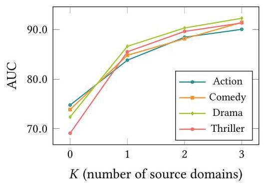

Fig. 5. The model performance with different number of source domains.

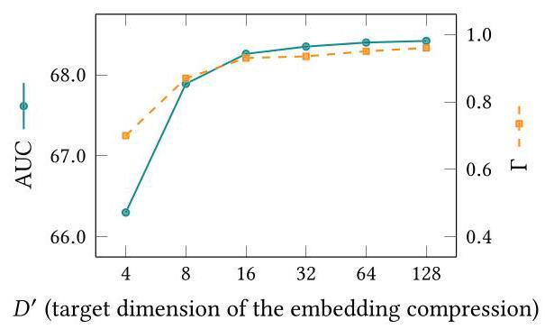

Fig. 6. Impact of the target dimension of the compression.

As the embedding dimension increases, both AUC and \( \Gamma \) improve, which aligns with expectations: lower dimensions have reduced capacity \( \left\lbrack  {8,{44}}\right\rbrack \) , making it harder to preserve intra-domain similarities. This leads to a loss of source domain knowledge and degraded performance in the target domain. The rightmost point in the figure \( \left( {{D}^{\prime } = {128}}\right) \) corresponds to not applying SPET, achieving the best performance. We find that setting the target dimension to \( {D}^{\prime } = {16} \) provides a good tradeoff between performance and efficiency, reducing storage to 1/8 of the original while incurring negligible performance loss. Therefore, we adopt \( {D}^{\prime } = {16} \) as the default in all previous experiments.

### 5.5 Impact of Hyperparameter Settings

We perform a comprehensive analysis to assess the impact of key hyperparameters on model performance. Specifically, we investigate three main hyperparameters: the InfoNCE loss temperature \( \tau \) , the number of candidate users \( R \) , and the weight of similarity-preserving loss \( \alpha \) . All experiments in this section are conducted on the MovieLens dataset. In each experiment, we vary one hyperparameter while keeping the others fixed at their optimal values.

5.5.1 Impact of the InfoNCE Loss Temperature \( \tau \) . In the InfoNCE Loss Equation (5), the temperature parameter \( \tau \) plays a key role in regulating the smoothness of the similarity distribution and the sensitivity of the model to the distinction between positive and negative samples. To assess the impact of different values of \( \tau \) on model performance, we conduct experiments using the MovieLens dataset, treating each domain as the target domain while using all other domains as source domains. The results are presented in Figure 7, indicate that both AUC and NDCG@10 are optimized when \( \tau \) is set to 0.01 . When \( \tau \) is too small, the exponential function applied to the similarity value becomes sharper, causing the model to overly emphasize hard-to-distinguish positive and negative samples, which ultimately degrades performance. Conversely, a large \( \tau \) value results in a smoother similarity distribution, making it difficult to capture the nuanced differences between positive and negative samples. The value of 0.01 strikes a good balance and improves the model's performance.

5.5.2 Impact of the Number of Candidate Users R. In this section, we analyze the influence of the number of candidate vectors \( R \) assigned to each anchor vector on model performance. Candidate vectors refer to a subset of vectors selected based on their potential similarity to anchor vectors during training, and the size of this subset plays a crucial role in the model's learning dynamics.

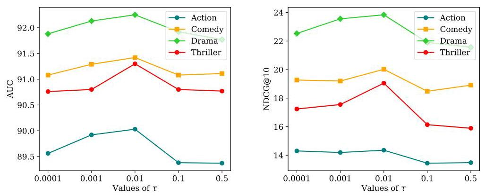

Fig. 7. Impact of the InfoNCE loss temperature \( \tau \) .

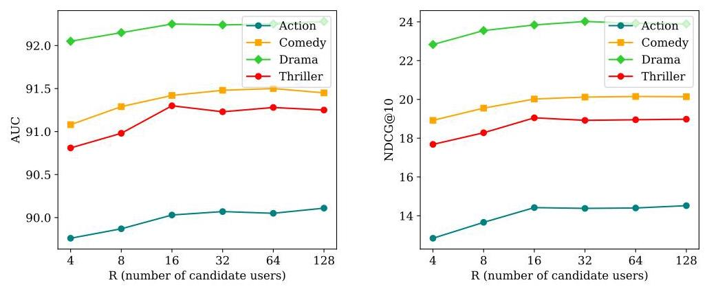

Fig. 8. Impact of the number of candidate users \( R \) .

We performed a series of experiments on the MovieLens dataset, assessing \( R \) values of4,8,16,32, 64, 128 to examine their impact on the model's effectiveness. As illustrated in Figure 8, our findings indicate that increasing the number of candidate vectors generally enhances model performance. However, when \( R \) exceeds 16, the performance gains become marginal while the associated training time increases. Conversely, setting \( R \) too low prolongs the convergence process, necessitating more training epochs. Based on the observations, we selected 16 candidate vectors as optimal value for experiments, and we recommend considering \( R = {16} \) or \( R = {32} \) as effective choices for this parameter.

5.5.3 Impact of the Weight of Similarity-Preserving Loss \( \alpha \) . The weight assigned to preserving the similarity loss is a vital parameter in the final loss function, as it controls the balance between the two losses in the training process. To determine the optimal weight parameter, we conducted experiments with various values, as shown in Figure 9. The results indicate that the performance of the four datasets, measured in terms of AUC and NDCG@10, reaches an optimal value at 0.01 . When smaller values (e.g., 0.005) are used, the contribution of the similarity loss from the source domain becomes negligible, leading to suboptimal performance due to insufficient incorporation of transferred knowledge. Conversely, when the weight exceeds 0.01 , most evaluation metrics begin to decline, suggesting that the model overemphasizes external knowledge at the expense of the current training loss, negatively impacting recommendations in the target domain. Through extensive experimentation, we determined that 0.01 is an appropriate weight parameter, striking a balance between incorporating external knowledge and maintaining effective model training.

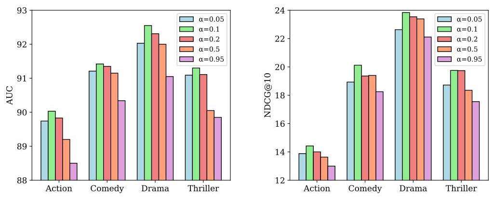

Fig. 9. Impact of the weight of similarity-preserving loss \( \alpha \) .

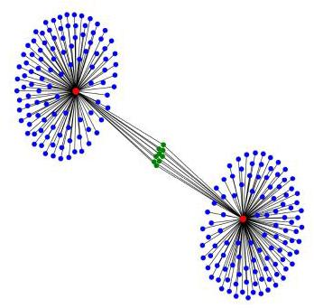

Fig. 10. Training without SimCDR.

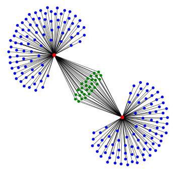

Fig. 11. Training with SimCDR.

### 5.6 Case Study

To validate the effectiveness of our algorithm in preserving user similarity, we conducted a case study using the MovieLens dataset. We specifically train the action domain model both with and without guidance from the comedy domain. We then extract embeddings from both scenarios and select \( {u}_{100023} \) as a sample. For each training setup, we identify the 100 most similar users to \( {u}_{100023} \) in both action and comedy domains by computing similarity scores. Figures 10 and 11 illustrate the results; the red dots represent \( {u}_{100023} \) in both domains and the blue and green dots represent the most similar users to \( {u}_{100023} \) in each domain. The blue dots indicate non-overlapping similar users and the green dots indicate overlapping similar users. Training without the SimCDR algorithm results in minimal overlap of similar users between the two domains. In contrast, the overlap of similar users increases significantly after training with SimCDR. These findings suggest that the SimCDR algorithm effectively preserves user similarity across domains and enhances the utilization of knowledge from source domains, leading to improved recommendations in the target domain.

### 5.7 Visualization of User Embeddings

To illustrate how SimCDR achieves knowledge transfer by preserving the intra-domain similarities of users, we utilize the t-SNE algorithm [55] to visualize the user embeddings after model training in the target domain. Tenrec-Article and Tenrec-Video are chosen as the source and target domains, respectively. We compare the embeddings of these methods: Base (no knowledge transfer), EMCDR (the classical mapping-based method), CCDR (for its good performance), and SimCDR.

The results are shown in Figure 12(d), where we have some observations. First, from Figure 12(a) we find that the embeddings of Base are poorly clustered, this may be because the data in the target domain is too sparse to learn good embeddings, so the embeddings cannot be well clustered based on user preferences. Second, in Figure 12(b) and (c), the clustering results have been improved to some extent, possibly because the additional knowledge from the source domain can improve the quality of the embeddings. However, both the clustering results are not as obvious as that of SimCDR in Figure 12(d). This suggests the superiority of SimCDR over other CDR methods in knowledge transfer: SimCDR can effectively transfer the intra-domain similarities of users in the source domain to the target domain, enriching the mutual relations of users in the target domain and achieving better clustering results.

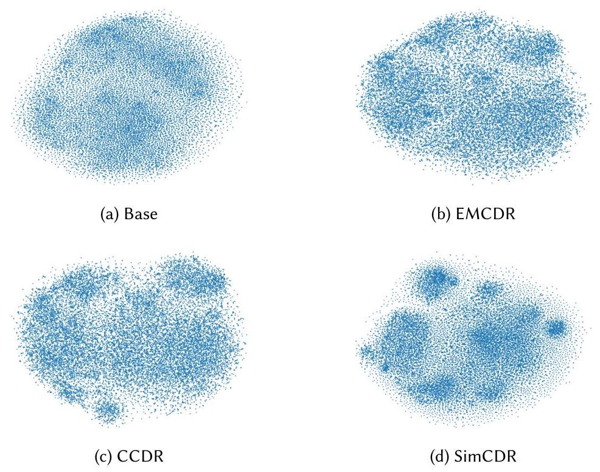

Fig. 12. Visualization of user embeddings with t-SNE.

## 6 Conclusions and Future Work

In this work, we investigated the problem of how to achieve effective knowledge transfer for CDR. First, we proposed and verified an assumption that the intra-domain similarities of user embeddings can represent the domain knowledge well. Then based on this finding, we proposed SimCDR, a novel CDR framework. Unlike the existing methods that attempt to learn the inter-domain mapping, SimCDR aims to preserve the intra-domain similarities of the source domain user embeddings, i.e., the source domain knowledge. We also extended the SimCDR framework to support knowledge transfer from multiple source domains and embedding compression, making it more suitable for real-world applications. We conducted extensive experiments that verified the effectiveness of our approach.

While our model shows significant advancements over existing approaches, there are several directions for future improvement. First, the current model is designed for overlapping users, which limits its effectiveness in scenarios involving non-overlapping users. Future work will explore methods to model similarity relationships between non-overlapping users by more fully leveraging source domain information. Moreover, as LLMs show strong capabilities in the field of recommendation, their powerful semantic understanding and representation capabilities offer promise for further enhancing our model. LLMs can be leveraged to extract and utilize fine-grained semantic information from auxiliary text data (e.g., user reviews, product descriptions), enabling

SimCDR to better capture the nuances of user preference relationships and item attributes, thus further mitigating the negative transfer problem and improving recommendation performance.

## References

[1] Sapumal Ahangama and Danny Chiang Choon Poo. 2019. Latent user linking for collaborative cross domain recommendation. arXiv:1908.06583. Retrieved from http://arxiv.org/abs/1908.06583

[2] Keqin Bao, Jizhi Zhang, Yang Zhang, Wenjie Wang, Fuli Feng, and Xiangnan He. 2023. TALLRec: An effective and efficient tuning framework to align large language model with recommendation. In Proceedings of the 17th ACM Conference on Recommender Systems (RecSys '23). ACM. DOI : https://doi.org/10.1145/3604915.3608857

[3] Immanuel Bayer, Xiangnan He, Bhargav Kanagal, and Steffen Rendle. 2017. A generic coordinate descent framework for learning from implicit feedback. In Proceedings of the 26th International Conference on World Wide Web (WWW '17). Rick Barrett, Rick Cummings, Eugene Agichtein, and Evgeniy Gabrilovich (Eds.), ACM, 1341-1350. DOI: https: //doi.org/10.1145/3038912.3052694

[4] Ye Bi, Liqiang Song, Mengqiu Yao, Zhenyu Wu, Jianming Wang, and Jing Xiao. 2020. A heterogeneous information network based cross domain insurance recommendation system for cold start users. In Proceedings of the 43rd International ACM SIGIR Conference on Research and Development in Information Retrieval (SIGIR '20), Virtual Event. Jimmy X. Huang, Yi Chang, Xueqi Cheng, Jaap Kamps, Vanessa Murdock, Ji-Rong Wen, and Yiqun Liu (Eds.), ACM, 2211-2220. DOI : https://doi.org/10.1145/3397271.3401426

[5] Iván Cantador, Ignacio Fernández-Tobías, Shlomo Berkovsky, and Paolo Cremonesi. 2015. Cross-domain recommender systems. In Recommender Systems Handbook. Francesco Ricci, Lior Rokach, and Bracha Shapira (Eds.), Springer, 919-959. DOI : https://doi.org/10.1007/978-1-4899-7637-6_27

[6] Xu Chen, Ya Zhang, Ivor W. Tsang, Yuangang Pan, and Jingchao Su. 2023. Toward equivalent transformation of user preferences in cross domain recommendation. ACM Transactions on Information Systems 41, 1, Article 14 (Jan. 2023), 31 pages https://doi.org/10.1145/3522762

[7] Yi-Cheng Chen and Wang-Chien Lee. 2024. A novel cross-domain recommendation with evolution learning. ACM Transactions on Internet Technology 24, 1 (2024), 1-23.

[8] Hyung Won Chung, Thibault Févry, Henry Tsai, Melvin Johnson, and Sebastian Ruder. 2021. Rethinking embedding coupling in pre-trained language models. In Proceedings of the 9th International Conference on Learning Representations (ICLR '21), Virtual Event. OpenReview.net. Retrieved from https://openreview.net/forum?id=xpFFI_NtgpW

[9] Wenqi Fan, Zihuai Zhao, Jiatong Li, Yunqing Liu, Xiaowei Mei, Yiqi Wang, Jiliang Tang, and Qing Li. 2023. Recommender systems in the era of large language models (LLMs). arXiv:2307.02046. Retrieved from https: //arxiv.org/abs/2307.02046

[10] Wenjing Fu, Zhaohui Peng, Senzhang Wang, Yang Xu, and Jin Li. 2019. Deeply fusing reviews and contents for cold start users in cross-domain recommendation systems. In Proceedings of the 33rd AAAI Conference on Artificial Intelligence (AAAI '19), the 31st Innovative Applications of Artificial Intelligence Conference (IAAI '19), and the 9th AAAI Symposium on Educational Advances in Artificial Intelligence (EAAI '19). AAAI Press, 94-101. DOI: https: //doi.org/10.1609/aaai.v33i01.330194

[11] Alexandros Gkillas and Dimitrios Kosmopoulos. 2021. A cross-domain recommender system using deep coupled autoencoders. arXiv:2112.07617. Retrieved from https://arxiv.org/abs/2112.07617

[12] Marco Gori, Garbiele Monfardini, and Franco Scarselli. 2005. A new model for learning in graph domains. In Proceedings of the 2005 IEEE International Joint Conference on Neural Networks, Vol. 2. IEEE, 729-734.

[13] Xiao Han, Chen Zhu, Xiao Hu, Chuan Qin, Xiangyu Zhao, and Hengshu Zhu. 2024. Adapting job recommendations to user preference drift with behavioral-semantic fusion learning. In Proceedings of the 30th ACM SIGKDD Conference on Knowledge Discovery and Data Mining (KDD '24). ACM, 1004-1015. DOI: https://doi.org/10.1145/3637528.3671759

[14] F. Maxwell Harper and Joseph A. Konstan. 2016. The MovieLens datasets: History and context. ACM Transactions on Interactive Intelligent Systems 5, 4 (2016), Article 19, 11-19. DOI: https://doi.org/10.1145/2827872

[15] Xiangnan He, Kuan Deng, Xiang Wang, Yan Li, Yong-Dong Zhang, and Meng Wang. 2020. LightGCN: Simplifying and powering graph convolution network for recommendation. In Proceedings of the 43rd International ACM SIGIR Conference on Research and Development in Information Retrieval (SIGIR '20), Virtual Event. Jimmy X. Huang, Yi Chang, Xueqi Cheng, Jaap Kamps, Vanessa Murdock, Ji-Rong Wen, and Yiqun Liu (Eds.), ACM, 639-648. DOI: https://doi.org/10.1145/3397271.3401063

[16] Xiangnan He, Lizi Liao, Hanwang Zhang, Liqiang Nie, Xia Hu, and Tat-Seng Chua. 2017. Neural collaborative filtering. In Proceedings of the 26th International Conference on World Wide Web (WWW '17). Rick Barrett, Rick Cummings, Eugene Agichtein, and Evgenyi Gabrilovich (Eds.), ACM, 173-182. DOI : https://doi.org/10.1145/3038912.3052569

[17] Xiangnan He, Hanwang Zhang, Min-Yen Kan, and Tat-Seng Chua. 2016. Fast matrix factorization for online recommendation with implicit feedback. In Proceedings of the 39th International ACM SIGIR Conference on Research and Development in Information Retrieval (SIGIR '16). Raffaele Perego, Fabrizio Sebastiani, Javed A. Aslam, Ian Ruthven, and Justin Zobel (Eds.), ACM, 549-558. DOI : https://doi.org/10.1145/2911451.2911489

[18] Balázs Hidasi, Alexandros Karatzoglou, Linas Baltrunas, and Domonkos Tikk. 2016. Session-based recommendations with recurrent neural networks. In Proceedings of the 4th International Conference on Learning Representations (ICLR ’16), Conference Track Proceedings. Yoshua Bengio and Yann LeCun (Eds.). Retrieved from http://arxiv.org/abs/1511.06939

[19] Guangneng Hu, Yu Zhang, and Qiang Yang. 2018. CoNet: Collaborative cross networks for cross-domain recommendation. In Proceedings of the 27th ACM International Conference on Information and Knowledge Management (CIKM ’18). Alfredo Cuzzocrea, James Allan, Norman W. Paton, Divesh Srivastava, Rakesh Agrawal, Andrei Z. Broder, Mohammed J. Zaki, K. Selçuk Candan, Alexandros Labrinidis, Assaf Schuster, and Haixun Wang (Eds.), ACM, 667-676. DOI: https://doi.org/10.1145/3269206.3271684

[20] Liang Hu, Jian Cao, Guandong Xu, Longbing Cao, Zhiping Gu, and Can Zhu. 2013. Personalized recommendation via cross-domain triadic factorization. In Proceedings of the 22nd International World Wide Web Conference (WWW'13). Daniel Schwabe, Virgílio A. F. Almeida, Hartmut Glaser, Ricardo Baeza-Yates, and Sue B. Moon (Eds.), International World Wide Web Conferences Steering Committee/ACM, 595-606. DOI : https://doi.org/10.1145/2488388.2488441

[21] Ling Huang, Zhi-Lin Zhao, Chang-Dong Wang, Dong Huang, and Hong-Yang Chao. 2019. LSCD: Low-rank and sparse cross-domain recommendation. Neurocomputing 366 (2019), 86-96. DOI: https://doi.org/10.1016/j.neucom.2019.07.091

[22] Junzhe Jiang, Kai Zhang, Junfeng Kang, Yucong Luo, and Min Gao. 2025. GEAR: Generalized alternating regressor for multi-behavior sequential recommendation. In Proceedings of the 48th International ACM SIGIR Conference on Research and Development in Information Retrieval, 2870-2874.

[23] SeongKu Kang, Junyoung Hwang, Dongha Lee, and Hwanjo Yu. 2019. Semi-supervised learning for cross-domain recommendation to cold-start users. In Proceedings of the 28th ACM International Conference on Information and Knowledge Management (CIKM '19). Wenwu Zhu, Dacheng Tao, Xueqi Cheng, Peng Cui, Elke A. Rundensteiner, David Carmel, Qi He, and Jeffrey Xu Yu (Eds.), ACM, 1563-1572. DOI: https://doi.org/10.1145/3357384.3357914

[24] Sein Kim, Hongseok Kang, Seungyoon Choi, Donghyun Kim, Min-Chul Yang, and Chanyoung Park. 2024. Large language models meet collaborative filtering: An efficient all-round LLM-based recommender system. In Proceedings of the 30th ACM SIGKDD Conference on Knowledge Discovery and Data Mining (KDD '24). Ricardo Baeza-Yates and Francesco Bonchi (Eds.), ACM, 1395-1406. DOI : https://doi.org/10.1145/3637528.3671931

[25] Diederik P. Kingma and Jimmy Ba. 2015. Adam: A method for stochastic optimization. In Proceedings of the 3rd International Conference on Learning Representations (ICLR '15), Conference Track Proceedings. Yoshua Bengio and Yann LeCun (Eds.). Retrieved from http://arxiv.org/abs/1412.6980

[26] Thomas N. Kipf and Max Welling. 2017. Semi-supervised classification with graph convolutional networks. In Proceedings of the 5th International Conference on Learning Representations (ICLR '17), Conference Track Proceedings. OpenReview.net. Retrieved from https://openreview.net/forum?id=SJU4ayYgl

[27] Yehuda Koren, Robert M. Bell, and Chris Volinsky. 2009. Matrix factorization techniques for recommender systems. Computer 42, 8 (2009), 30-37. DOI: https://doi.org/10.1109/MC.2009.263

[28] Yuxuan Lei, Jianxun Lian, Jing Yao, Xu Huang, Defu Lian, and Xing Xie. 2024. RecExplainer: Aligning large language models for explaining recommendation models. In Proceedings of the 30th ACM SIGKDD Conference on Knowledge Discovery and Data Mining (KDD '24), Vol. 1341, ACM, 1530-1541. DOI: https://doi.org/10.1145/3637528.3671802

[29] Chung-Yi Li and Shou-De Lin. 2014. Matching users and items across domains to improve the recommendation quality. In Proceedings of the 20th ACM SIGKDD International Conference on Knowledge Discovery and Data Mining (KDD '14). Sofus A. Macskassy, Claudia Perlich, Jure Leskovec, Wei Wang, and Rayid Ghani (Eds.), ACM, 801-810. DOI : https://doi.org/10.1145/2623330.2623657

[30] Chenglin Li, Yuanzhen Xie, Chenyun Yu, Bo Hu, Zang Li, Guoqiang Shu, Xiaohu Qie, and Di Niu. 2023. One for all, all for one: Learning and transferring user embeddings for cross-domain recommendation. In Proceedings of the 16th ACM International Conference on Web Search and Data Mining, 366-374.

[31] Hanyu Li, Weizhi Ma, Peijie Sun, Jiayu Li, Cunxiang Yin, Yancheng He, Guoqiang Xu, Min Zhang, and Shaoping Ma. 2024. Aming at the target: Filter collaborative information for cross-domain recommendation. In Proceedings of the 47th International ACM SIGIR Conference on Research and Development in Information Retrieval, 2081-2090.

[32] Hourun Li, Yifan Wang, Zhiping Xiao, Jia Yang, Changling Zhou, Ming Zhang, and Wei Ju. 2025. DisCo: Graph-based disentangled contrastive learning for cold-start cross-domain recommendation. In Proceedings of the AAAI Conference on Artificial Intelligence, Vol. 39, 12049-12057.

[33] Pan Li and Alexander Tuzhilin. 2020. DDTCDR: Deep dual transfer cross domain recommendation. In Proceedings of the 13th ACM International Conference on Web Search and Data Mining (WSDM '20). James Caverlee, Xia (Ben) Hu, Mounia Lalmas, and Wei Wang (Eds.), ACM, 331-339. DOI : https://doi.org/10.1145/3336191.3371793

[34] Junling Liu, Chao Liu, Renjie Lv, Kang Zhou, and Yan Zhang. 2023. Is ChatGPT a good recommender? A preliminary study. arXiv:2304.10149. Retrieved from https://arxiv.org/abs/2304.10149

[35] Jing Liu, Lele Sun, Weizhi Nie, Yuting Su, Yongdong Zhang, and Anan Liu. 2024. Inter-and intra-domain potential user preferences for cross-domain recommendation. IEEE Transactions on Multimedia 26 (2024), 8014-8025.

[36] Tie-Yan Liu. 2009. Learning to rank for information retrieval. Foundations and Trends in Information Retrieval 3, 3 (2009), 225-331. DOI: https://doi.org/10.1561/1500000016

[37] Weiming Liu, Chaochao Chen, Xinting Liao, Mengling Hu, Jiajie Su, Yanchao Tan, and Fan Wang. 2024. User distribution mapping modelling with collaborative filtering for cross domain recommendation. In Proceedings of the ACM Web Conference 2024, 334-343.

[38] Weiming Liu, Chaochao Chen, Xinting Liao, Mengling Hu, Yanchao Tan, Fan Wang, Xiaolin Zheng, and Yew Soon Ong. 2024. Learning accurate and bidirectional transformation via dynamic embedding transportation for cross-domain recommendation. In Proceedings of the AAAI Conference on Artificial Intelligence, Vol. 38, 8815-8823.

[39] Weiming Liu, Chaochao Chen, Jiahe Xu, Xinting Liao, Fan Wang, Xiaolin Zheng, Zhihui Fu, Ruiguang Pei, and Jun Wang. 2025. Joint similarity item exploration and overlapped user guidance for multi-modal cross-domain recommendation. In Proceedings of the ACM on Web Conference 2025, 2882-2893.

[40] Xiaoyang Liu, Xiaoyang Fu, Pasquale De Meo, and Giacomo Fiumara. 2024. Cross-domain recommendation to cold-start users via categorized preference transfer. The Computer Journal 67, 8 (2024), bxae029.

[41] Tong Man, Huawei Shen, Xiaolong Jin, and Xueqi Cheng. 2017. Cross-domain recommendation: An embedding and mapping approach. In Proceedings of the 26th International Joint Conference on Artificial Intelligence (IJCAI '17). Carles Sierra (Ed.), ijcai.org, 2464-2470. DOI: https://doi.org/10.24963/ijcai.2017/343

[42] Qingyang Mao, Qi Liu, Zhi Li, Likang Wu, Bing Lv, and Zheng Zhang. 2024. Cross-reconstructed augmentation for dual-target cross-domain recommendation. In Proceedings of the 47th International ACM SIGIR Conference on Research and Development in Information Retrieval, 2352-2356.

[43] Tomás Mikolov, Ilya Sutskever, Kai Chen, Gregory S. Corrado, and Jeffrey Dean. 2013. Distributed representations of words and phrases and their compositionality. In Proceedings of the Advances in Neural Information Processing Systems 26: 27th Annual Conference on Neural Information Processing Systems 2013. Christopher J. C. Burges, Léon Bottou, Zoubin Ghahramani, and Kilian Q. Weinberger (Eds.), 3111-3119. Retrieved from https://proceedings.neurips.cc/ paper/2013/hash/9aa42b31882ec039965f3c4923ce901b-Abstract.html

[44] Maximilian Nickel and Douwe Kiela. 2017. Poincaré embeddings for learning hierarchical representations. In Proceedings of the Advances in Neural Information Processing Systems 30: Annual Conference on Neural Information Processing Systems 2017. Isabelle Guyon, Ulrike von Luxburg, Samy Bengio, Hannah M. Wallach, Rob Fergus, S. V. N. Vishwanathan, and Roman Garnett (Eds.), 6338-6347. Retrieved from https://proceedings.neurips.cc/paper/2017/ hash/59dfa2df42d9e3d41f5b02bfc32229dd-Abstract.html

[45] Alessandro Petruzzelli, Cataldo Musto, Lucrezia Laraspata, Ivan Rinaldi, Marco de Gemmis, Pasquale Lops, and Giovanni Semeraro. 2024. Instructing and prompting large language models for explainable cross-domain recommendations. In Proceedings of the 18th ACM Conference on Recommender Systems, 298-308.

[46] Steffen Rendle, Christoph Freudenthaler, Zeno Gantner, and Lars Schmidt-Thieme. 2009. BPR: Bayesian personalized ranking from implicit feedback. In Proceedings of the 25th Conference on Uncertainty in Artificial Intelligence (UAI '09). Jeff A. Bilmes and Andrew Y. Ng (Eds.), AUAI Press, 452-461. Retrieved from https://www.auai.org/uai2009/papers/ UAI2009_0139_48141db02b9f0b02bc7158819ebfa2c7.pdf

[47] Aghiles Salah, Thanh-Binh Tran, and Hady W. Lauw. 2021. Towards source-aligned variational models for cross-domain recommendation. In Proceedings of the 15th ACM Conference on Recommender Systems (RecSys '21). Humberto Jesús Corona Pampin, Martha A. Larson, Martijn C. Willemsen, Joseph A. Konstan, Julian J. McAuley, Jean Garcia-Gathright, Bouke Huurnink, and Even Oldridge (Eds.), ACM, 176-186. DOI: https://doi.org/10.1145/3460231.3474265

[48] Badrul Sarwar, George Karypis, Joseph Konstan, and John Riedl. 2001. Item-based collaborative filtering recommendation algorithms. In Proceedings of the 10th International Conference on World Wide Web, 285-295.

[49] Lalita Sharma and Anju Gera. 2013. A survey of recommendation system: Research challenges. International Journal of Engineering Trends and Technology 4, 5 (2013), 1989-1992.

[50] Jiarui Shi and Quanmin Wang. 2019. Cross-domain variational autoencoder for recommender systems. In Proceedings of the 11th IEEE International Conference on Advanced Infocomm Technology (ICAIT '19). IEEE, 67-72. DOI: https: //doi.org/10.1109/ICAIT.2019.8935901

[51] Ajit Paul Singh and Geoffrey J. Gordon. 2008. Relational learning via collective matrix factorization. In Proceedings of the 14th ACM SIGKDD International Conference on Knowledge Discovery and Data Mining. Ying Li, Bing Liu, and Sunita Sarawagi (Eds.), ACM, 650-658. DOI: https://doi.org/10.1145/1401890.1401969

[52] Xiaoyuan Su and Taghi M. Khoshgoftaar. 2009. A survey of collaborative filtering techniques. Advances in Artificial Intelligence 2009, Article 421425 (2009), 1-19. DOI: https://doi.org/10.1155/2009/421425

[53] Shulong Tan, Jiajun Bu, Xuzhen Qin, Chun Chen, and Deng Cai. 2014. Cross domain recommendation based on multi-type media fusion. Neurocomputing 127 (2014), 124-134. DOI: https://doi.org/10.1016/j.neucom.2013.08.034

[54] Aäron van den Oord, Yazhe Li, and Oriol Vinyals. 2018. Representation learning with contrastive predictive coding. arXiv:1807.03748. Retrieved from http://arxiv.org/abs/1807.03748

[55] Laurens Van der Maaten and Geoffrey Hinton. 2008. Visualizing data using t-SNE. Journal of Machine Learning Research 9, 11 (2008), 2579-2605.

[56] Pascal Vincent, Hugo Larochelle, Isabelle Lajoie, Yoshua Bengio, and Pierre-Antoine Manzagol. 2010. Stacked denoising autoencoders: Learning useful representations in a deep network with a local denoising criterion. Journal of Machine Learning Research 11 (2010), 3371-3408. DOI : https://doi.org/10.5555/1756006.1953039

[57] Shaohuang Wang, Lun Wang, Yunhan Bu, and Tianwei Huang. 2024. CherryRec: Enhancing news recommendation quality via LLM-driven framework. arXiv:2406.12243. Retrieved from https://arxiv.org/abs/2406.12243

[58] Chuhan Wu, Fangzhao Wu, Yongfeng Huang, and Xing Xie. 2023. Personalized news recommendation: Methods and challenges. ACM Transactions on Information Systems 41, 1, Article 24 (Jan. 2023), 50 pages. DOI : https://doi.org/10.1145/3530257

[59] Zongyi Xiang, Yan Zhang, Lixin Duan, Hongzhi Yin, and Ivor W. Tsang. 2025. Coherence-guided preference disentanglement for cross-domain recommendations. ACM Transactions on Information Systems 43, 4, Article 109 (Jul. 2025), 28 pages. DOI: https://doi.org/10.1145/3742855

[60] Ruobing Xie, Qi Liu, Liangdong Wang, Shukai Liu, Bo Zhang, and Leyu Lin. 2022. Contrastive cross-domain recommendation in matching. In Proceedings of the 28th ACM SIGKDD Conference on Knowledge Discovery and Data Mining (KDD '22). Aidong Zhang and Huzefa Rangwala (Eds.), ACM, 4226-4236. DOI : https://doi.org/10.1145/3534678.3539125

[61] Haoran Xin, Ying Sun, Chao Wang, and Hui Xiong. 2025. LLMCDSR: Enhancing cross-domain sequential recommendation with large language models. ACM Transactions on Information Systems 43, 5, Article 120 (Jul. 2025), 33 pages. DOI: https://doi.org/10.1145/3715099

[62] Yuyang Ye, Zhi Zheng, Yishan Shen, Tianshu Wang, Hengruo Zhang, Peijun Zhu, Runlong Yu, Kai Zhang, and Hui Xiong. 2025. Harnessing multimodal large language models for multimodal sequential recommendation. In Proceedings of the AAAI Conference on Artificial Intelligence, Vol. 39, 13069-13077.

[63] Runlong Yu, Qi Liu, Yuyang Ye, Mingyue Cheng, Enhong Chen, and Jianhui Ma. 2022. Collaborative list-and-pairwise filtering from implicit feedback. IEEE Transactions on Knowledge and Data Engineering 34, 6 (2022), 2667-2680. DOI : https://doi.org/10.1109/TKDE.2020.3016732

[64] Guanghu Yuan, Fajie Yuan, Yudong Li, Beibei Kong, Shujie Li, Lei Chen, Min Yang, Chenyun Yu, Bo Hu, Zang Li, Yu Xu, and Xiaohu Qie. 2022. Tenrec: A large-scale multipurpose benchmark dataset for recommender systems. In Proceedings of the 36th Conference on Neural Information Processing Systems Datasets and Benchmarks Track. Retrieved from https://openreview.net/forum?id=PfuW84q25y9

[65] Hao Zhang, Mingyue Cheng, Qi Liu, Junzhe Jiang, Xianquan Wang, Rujiao Zhang, Chenyi Lei, and Enhong Chen. 2025. A comprehensive survey on cross-domain recommendation: Taxonomy, progress, and prospects. arXiv:2503.14110. Retrieved from https://arxiv.org/abs/2503.14110

[66] Kai Zhang, Hao Qian, Qing Cui, Qi Liu, Longfei Li, Jun Zhou, Jianhui Ma, and Enhong Chen. 2021. Multi-interactive attention network for fine-grained feature learning in CTR prediction. In Proceedings of the 14th ACM International Conference on Web Search and Data Mining, 984-992.

[67] Kai Zhang, Hao Qian, Qi Liu, Zhiqiang Zhang, Jun Zhou, Jianhui Ma, and Enhong Chen. 2021. SIFN: A sentiment-aware interactive fusion network for review-based item recommendation. In Proceedings of the 30th ACM International Conference on Information and Knowledge Management, 3627-3631.

[68] Cheng Zhao, Chenliang Li, Rong Xiao, Hongbo Deng, and Aixin Sun. 2020. CATN: Cross-domain recommendation for cold-start users via aspect transfer network. In Proceedings of the 43rd International ACM SIGIR Conference on Research and Development in Information Retrieval (SIGIR '20), Virtual Event. Jimmy X. Huang, Yi Chang, Xueqi Cheng, Jaap Kamps, Vanessa Murdock, Ji-Rong Wen, and Yiqun Liu (Eds.), ACM, 229-238. DOI : https://doi.org/10.1145/3397271.3401169

[69] Chuang Zhao, Hongke Zhao, Ming He, Jian Zhang, and Jianping Fan. 2023. Cross-domain recommendation via user interest alignment. In Proceedings of the ACM Web Conference 2023 (WWW '23). ACM, New York, NY, 887-896. DOI : https://doi.org/10.1145/3543507.3583263

[70] Xiaolin Zheng, Weiming Liu, Chaochao Chen, Jiajie Su, Xinting Liao, Mengling Hu, and Yanchao Tan. 2024. Mining user consistent and robust preference for unified cross domain recommendation. IEEE Transactions on Knowledge & Data Engineering 36, 12 (Dec. 2024), 8758-8772. DOI: https://doi.org/10.1109/TKDE.2024.3446581

[71] Shi-Ting Zhong, Ling Huang, Chang-Dong Wang, Jian-Huang Lai, and Philip S. Yu. 2022. An autoencoder framework with attention mechanism for cross-domain recommendation. IEEE Transactions on Cybernetics 52, 6 (2022), 5229-5241. DOI : https://doi.org/10.1109/TCYB.2020.3029002

[72] Kun Zhou, Hui Wang, Wayne Xin Zhao, Yutao Zhu, Sirui Wang, Fuzheng Zhang, Zhongyuan Wang, and Ji-Rong Wen. 2020. S3-Rec: Self-supervised learning for sequential recommendation with mutual information maximization. In Proceedings of the 29th ACM International Conference on Information and Knowledge Management (CIKM '20), Virtual Event. Mathieu d'Aquin, Stefan Dietze, Claudia Hauff, Edward Curry, and Philippe Cudré-Mauroux (Eds.), ACM, 1893-1902. DOI : https://doi.org/10.1145/3340531.3411954

[73] Feng Zhu, Yan Wang, Chaochao Chen, Guanfeng Liu, Mehmet A. Orgun, and Jia Wu. 2018. A deep framework for cross-domain and cross-system recommendations. In Proceedings of the 27th International Joint Conference on Artificial Intelligence (IJCAI '18). Jérôme Lang (Ed.), ificai.org, 3711-3717. DOI: https://doi.org/10.24963/ijcai.2018/516

[74] Xiaofei Zhu, Yabo Yin, and Li Wang. 2024. MIMNet: Multi-interest meta network with multi-granularity target-guided attention for cross-domain recommendation.arXiv:2408.00038. Retrieved from https://arxiv.org/abs/2408.00038

[75] Yongchun Zhu, Kaikai Ge, Fuzhen Zhuang, Ruobing Xie, Dongbo Xi, Xu Zhang, Leyu Lin, and Qing He. 2021. Transfer-meta framework for cross-domain recommendation to cold-start users. In Proceedings of the 44th International ACM SIGIR Conference on Research and Development in Information Retrieval (SIGIR '21), Virtual Event. Fernando Diaz, Chirag Shah, Torsten Suel, Pablo Castells, Rosie Jones, and Tetsuya Sakai (Eds.), ACM, 1813-1817. DOI: https://doi.org/10.1145/3404835.3463010

[76] Yongchun Zhu, Zhenwei Tang, Yudan Liu, Fuzhen Zhuang, Ruobing Xie, Xu Zhang, Leyu Lin, and Qing He. 2022. Personalized transfer of user preferences for cross-domain recommendation. In Proceedings of the 15th ACM International Conference on Web Search and Data Mining (WSDM '22), Virtual Event. K. Selcuk Candan, Huan Liu, Leman Akoglu, Xin Luna Dong, and Jiliang Tang (Eds.), ACM, 1507-1515. DOI: https://doi.org/10.1145/3488560.3498392