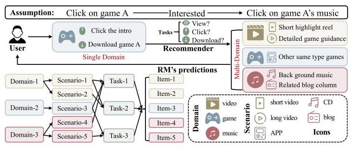
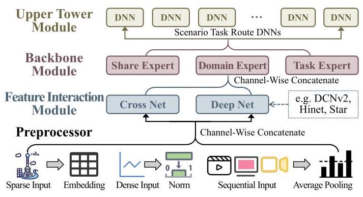
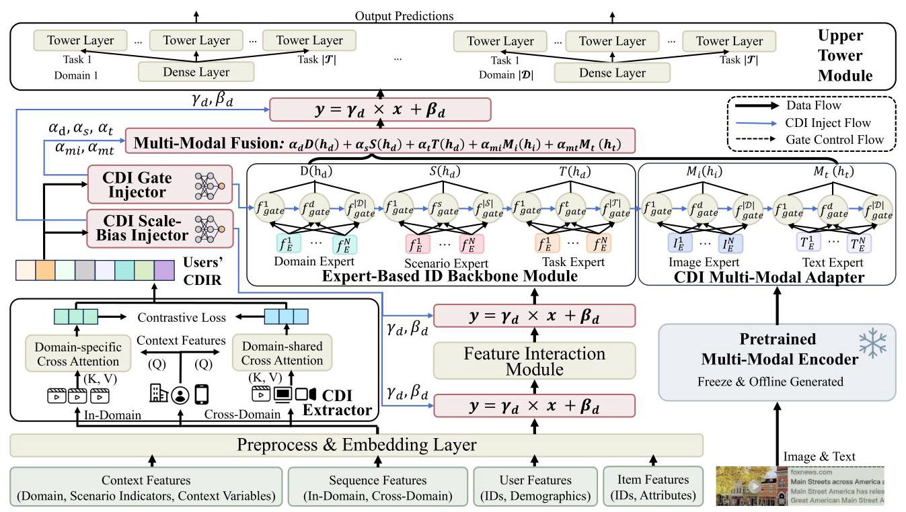
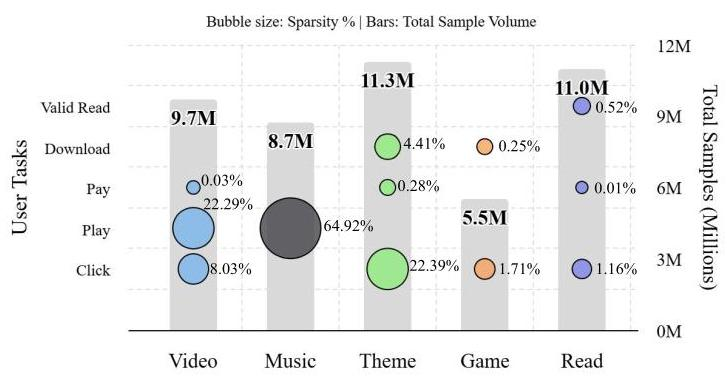
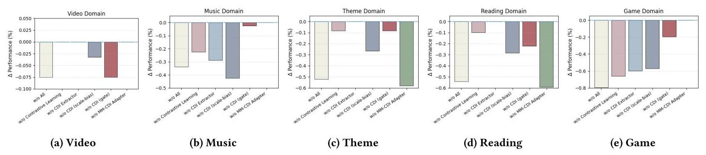
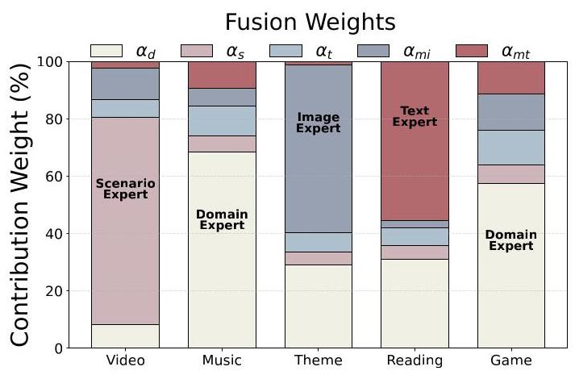
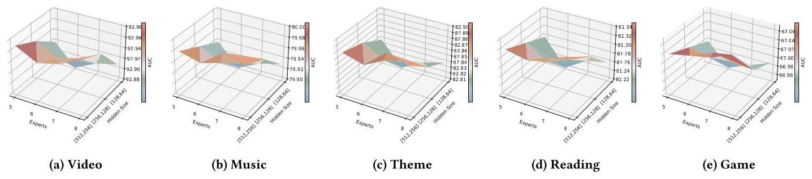

# Cross-Domain Interest Representation Learning for Scenario- and Task-Aware Recommendation

Bokai Lin

Shanghai Jiao Tong University

Shanghai, China

19821172068@sjtu.edu.cn

Naijun Gao

Shanghai Jiao Tong University

Shanghai, China

gaonaijun@sjtu.edu.cn

Yucen Gao

Northeastern University

Shenyang, China

gaoyucen@neu.edu.cn

Heng Chang

Tsinghua University

Beijing, China

changh17@tsinghua.org.cn

Cheng Hu

Independent Researcher

Shanghai, China

guyuecanhui@hotmail.com

Zhinan Zhang

Independent Researcher

Shanghai, China

znzhang2017@gmail.com

Xiaofeng Gao*

Shanghai Jiao Tong University

Shanghai, China

gao-xf@cs.sjtu.edu.cn

## Abstract

Many internet companies operate multiple flagship applications, each of which can be regarded as a distinct business domain, covering areas such as video, reading, and gaming. Within each domain, diverse recommendation scenarios coexist, and users engage in various tasks with heterogeneous behaviors. In our industrial setting, we observe three key phenomena that existing methods rarely address: (i) users' Cross-Domain Interests (CDI) are weakly exploited, since behavior sequences are often pooled for efficiency, losing transferable cross-domain dependencies; (ii) multi-domain, scenario, and task variations are under-modeled, making it difficult to capture fine-grained complementarities; and (iii) multimodal features remain misaligned with ID features, especially when different domains emphasize different modalities. These gaps hinder cross-product collaboration.

We propose STAR-CDR, a Scenario- and Task-Aware Cross-Domain Recommendation architecture. Following the modular decomposition of industrial recommenders, STAR-CDR introduces three innovations: (i) a CDI Extractor that enhances sequential modeling with domain indicators and other key features; (ii) a CDI Injector that recalibrates activations and enables domain- /scenario-/task-aware expert routing; and (iii) a CDI Multimodal Adapter that aligns image, text, and ID features under CDI-guided gating. Compared to the strongest baseline in our setting, STAR-CDR improves offline AUC 3.5% across five domains and yields +3.17% to +9.24% relative KPI gains in online A/B tests. The system now supports multiple domains (flagship applications), scenarios (recommendation scenarios), and tasks (user behaviors) at scale, serving over 280 million daily active users. We provide a GitHub

repository \( {}^{1} \) with STAR-CDR’s code, training scripts, and a synthetic data construction pipeline.

## CCS Concepts

- Information systems \( \rightarrow \) Collaborative filtering;

## Keywords

Recommendation System; Cross-domain Recommendation; multimodal Representations

## ACM Reference Format:

Bokai Lin, Naijun Gao, Yucen Gao, Heng Chang, Cheng Hu, Zhinan Zhang, and Xiaofeng Gao. 2026. Cross-Domain Interest Representation Learning for Scenario- and Task-Aware Recommendation. In Proceedings of the 49th International ACM SIGIR Conference on Research and Development in Information Retrieval (SIGIR '26), July 20-24, 2026, Melbourne, VIC, Australia. ACM, New York, NY, USA, 12 pages. https://doi.org/10.1145/3805712.3809545

## 1 Introduction

In large Internet platforms, users are globally shared across multiple applications, where a single user interacts with different domains under diverse recommendation scenarios and tasks, such as browsing short highlight reels, clicking detailed guides, downloading content, or consuming related background media. As illustrated in Figure 1, these interactions form a coherent behavioral trajectory, in which user actions in one domain, scenario, or task can naturally influence intent and engagement in others. This shared-user, multi-domain, multi-scenario, and multi-task setting gives rise to several practical requirements for industrial recommender systems. User representations should fully leverage signals aggregated from multiple applications to capture complementary characteristics of the same user [13, 16, 17, 21]. Cross-domain modeling is also essential for alleviating data imbalance and sparsity, allowing data-rich domains to provide auxiliary signals for low-resource domains [32, 40]. Finally, these heterogeneous behaviors and multimodal contents should be jointly learned within a unified modeling framework \( \left\lbrack  {9,{46}}\right\rbrack \) , so that image, text, and ID features can be coherently integrated, thereby reducing system complexity and long-term maintenance cost.

---

*Corresponding author.

\( {}^{1} \) https://github.com/Rescomk/STAR-CDR

---

Figure 1: Scenario complexities and recommendation tasks across domains.

Recent advances in cross-domain \( \left\lbrack  {{10},{14},{22},{37}}\right\rbrack \) and multi-task recommendation \( \left\lbrack  {1,{36}}\right\rbrack \) have demonstrated the effectiveness of leveraging shared behavioral signals to alleviate data sparsity and improve user modeling across services. However, existing cross-domain methods are largely designed without explicitly considering several critical issues in industrial shared-user settings:

- Limited cross-domain interest (CDI) exploitation. In industrial recommender systems, discrete user behavior sequences (e.g., clicks, plays) are typically embedded and then aggregated through simple pooling to meet latency requirements. However, such simplification weakens the modeling of dynamic user preferences and obscures transferable signals that reflect a user's cross-domain interest-the latent intent linking behaviors across domains. For instance, a user who has just played a game may be more likely to watch game-related videos in the next session; yet this type of sequential, cross-domain dependency is easily diluted by naïve pooling.

- Lack of multi-domain, scenario, and task modeling. Most cross-domain recommenders handle heterogeneity only at the coarse domain or task level, overlooking scenario-specific variations. In practice, behaviors differ substantially not only across domains but also between scenarios within the same domain (e.g., short- vs. long-form videos) and across tasks with distinct objectives. Without explicit mechanisms, models fail to leverage complementary interests across these granular dimensions.

- Cross-domain multimodal-interest misalignment. Existing solutions either rely on collaborative filtering, which becomes difficult to maintain with massive user-item spaces, or require large foundation models for online inference, whose latency is often unacceptable in industrial systems. In large-scale content-based recommendation, multimodal features (e.g., images and text) and ID features are rarely aligned within a unified representation space. This issue is further amplified in cross-domain settings: theme-oriented domains depend more on visual cues, while reading-oriented domains rely primarily on textual semantics, making effective alignment and knowledge transfer particularly challenging.

To tackle these issues, we propose STAR-CDR - a Scenario-and Task-Aware Cross-Domain Recommendation architecture. We first conduct a comprehensive analysis of industrial cross-domain recommender systems \( \left\lbrack  {2,{20},{27},{45},{47},{49}}\right\rbrack \) and observe that their pipelines consistently decompose into four standard modules: (1) Feature Preprocessing, (2) Feature Interaction, (3) Expert-Based Backbone, and (4) Upper Towers. This modular perspective clarifies where key bottlenecks emerge and provides a principled foundation for targeted enhancement. STAR-CDR inherits this decomposition, adopting the strongest existing design for each module as its baseline. On top of this foundation, we introduce three novel components that directly address the challenges identified earlier: the CDI Extractor, CDI Injector, and CDI Multimodal Adapter:

- CDI Extractor. To address the weak exploitation of users' cross-domain interests, we design a CDI Extractor that jointly incorporates user profiles with behavioral sequences. This module employs an attention mechanism to highlight domain indicators, IDs, and cross-domain sequence features. It produces temporally consistent and cross-domain enriched user representations.

- CDI Injector. To overcome the lack of multi-domain, scenario, and task modeling, we design a CDI Injector that enhances both module transitions and expert routing. Based on the extracted cross-domain interests, the injector generates domain-conditioned scale and bias to modulate representations at module handoffs. Within the backbone and towers, CDI-aware gates enable fine-grained expert selection. This dual mechanism improves domain, scenario, and task specialization.

- CDI multimodal Adapter. To mitigate the difficulty of aligning multimodal and ID features under our setting, we design a CDI-guided adapter under an MMoE framework [19]. Image and text experts are further decomposed into sub-experts, and CDI-conditioned gating dynamically balances modality contributions across multi-domain, scenario, and task.

STAR-CDR has been deployed in a large-scale industrial ecosystem spanning multiple products (domains), recommendation scenarios, and user tasks. Extensive offline and online evaluations against strong baselines demonstrate its consistent advantages: a +3.5%。offline AUC gain across five domains, and online KPI lifts of +3.17%-9.24% across three major products (video, music, and theme). These results highlight STAR-CDR's effectiveness in capturing cross-domain interests (CDI) and its practical robustness in real-world production traffic.

## 2 Related Work

### 2.1 Cross-domain Recommendation

Research on cross-domain and multi-task recommendation has progressed rapidly in recent years. A central strategy is joint embedding learning through feature interaction, which captures transferable signals across heterogeneous services. Early studies such as STEM [29] showed that shared embeddings can support unified multi-task optimization, motivating subsequent efforts to enhance cross-domain transfer via hierarchical interaction and adaptive gating [8, 15, 41]. For instance, HiNet [49] employs a hierarchical structure to extract shared and scenario-specific signals, while PEP-Net [2] incorporates personalized priors into gating to dynamically adapt parameters across users and domains.

More recent work shifts toward expert-network architectures that specialize in cross-domain feature routing [4, 25]. M3oE [45] extends the mixture-of-experts paradigm by decomposing knowledge into shared, domain-specific, and task-specific experts, coordinated through adaptive gating for fine-grained control. Collectively, these studies outline a clear evolution-from early embedding sharing to hierarchical and expert-driven modularization-that enhances cross-domain knowledge transfer while retaining task specificity. However, most prior methods still focus on either cross-product transfer or intra-product scenario modeling, rarely achieving unified modeling across both levels. Building upon the expert-based gating paradigm, our work introduces multiple gated expert networks equipped with a cross-domain interest (CDI)-aware gating mechanism to enable joint learning across domains, scenarios, and tasks within a single industrial framework.

### 2.2 Multimodal Recommendation

Recent breakthroughs in large language models (LLMs) and computer vision (CV) have greatly advanced multimodal representation learning [24, 50]. These techniques are increasingly applied to recommendation, enabling richer semantic understanding beyond traditional ID-only signals. LLM-based methods either fine-tune LLMs to generate recommendations end-to-end [3, 11, 33, 44, 48]-achieving strong results but with high computational and deployment costs-or employ LLMs as semantic encoders whose embeddings are consumed by lightweight recommenders [5, 7]. However, directly injecting LLM-derived embeddings often fails to align with ID-based collaborative filtering features [42]. Representative solutions such as LLMRec [38], RLMRec [23], and KAR [39] attempt to mitigate this through graph augmentation, contrastive objectives, or feature enrichment, yet none fully resolve this alignment challenge.

In cross-domain content-based recommendation, most systems simply concatenate ID features with image or text embeddings [6, 31], which likewise suffer from the modality gap and lack adaptive architectural support. Moreover, real industrial platforms show that different domains and scenarios exploit multimodal signals to varying degrees [18, 28], making uniform fusion strategies inadequate. These observations motivate our work: we leverage LLM and CV representations jointly while designing a cross-domain architecture that adapts to heterogeneous domain- and scenario-specific use of multimodal content.

## 3 Methodology

### 3.1 Problem Formulation

We consider a multi-domain, multi-scenario, multi-task recommendation problem. Let \( \mathcal{U} \) be the user set, \( \mathcal{I} \) the item set, \( \mathcal{D} \) (e.g., video, read, music) be the domain set, \( \mathcal{S} \) be the scenario set (e.g., home-page, feed, search), and \( \mathcal{T} \) the set of tasks (e.g., play, download, pay). Each training instance \( i \) is represented by a tuple

\[
{x}_{i} = {\left( {U}_{i},{I}_{i},{C}_{i}^{\left( d, s\right) },{A}_{i}\right) }_{d \in  \mathcal{D}, s \in  \mathcal{S}}\;{\left\{  {y}_{i}^{\left( t\right) }\right\}  }_{t \in  \mathcal{T}}, \tag{1}
\]

- \( {U}_{i} \) (user features): user ID embedding and user-side attributes (e.g., demographics, statistics, histories after encoding);

- \( {I}_{i} \) (item features): item ID embedding and item-side attributes (e.g., category, popularity, numeric descriptors);

- \( {C}_{i}^{\left( d, s\right) } \) (context features): includes a domain indicator \( {d}_{i} \in  \mathcal{D} \) and a scenario indicator \( {s}_{i} \in  \mathcal{S} \) , together with other contextual variables \( {x}_{i}^{\text{ ctx }} \) (time, device, region). We denote their embeddings by \( {e}_{{d}_{i}} \) and \( {e}_{{s}_{i}} \) and write \( {C}_{i}^{\left( d, s\right) } = \left\lbrack  {{e}_{{d}_{i}};{e}_{{s}_{i}};{x}_{i}^{\text{ ctx }}}\right\rbrack \) ;

- \( {A}_{i} \) (auxiliary multimodal features): image/text representations aligned to the item, e.g., \( {v}_{i} = {f}_{\text{ img }}\left( {\mathrm{{img}}}_{i}\right) \) and \( {w}_{i} = \; {f}_{\mathrm{{txt}}}\left( {\mathrm{{txt}}}_{i}\right) \) from pretrained encoders, so \( {A}_{i} = \left\lbrack  {{v}_{i};{w}_{i}}\right\rbrack \) .

Given \( {x}_{i} \) , the recommender \( {f}_{\theta }\left( \cdot \right) \) produces task-wise scores:

\[
{\widehat{y}}_{i}^{\left( d, s, t\right) } = {f}_{\theta }\left( {{U}_{i},{I}_{i},{C}_{i}^{\left( d, s\right) },{A}_{i}}\right) ,\;d \in  \mathcal{D}, s \in  \mathcal{S}, t \in  \mathcal{T}, \tag{2}
\]

and is trained by a weighted multi-task objective

\[
\mathcal{L}\left( \theta \right)  = \mathop{\sum }\limits_{{d \in  \mathcal{D}}}\mathop{\sum }\limits_{{s \in  \mathcal{S}}}\mathop{\sum }\limits_{{t \in  \mathcal{T}}}{\mathbb{E}}_{i}\left\lbrack  {{\ell }_{t}\left( {{\widehat{y}}_{i}^{\left( d, s, t\right) },{y}_{i}^{\left( d, s, t\right) }}\right) }\right\rbrack  , \tag{3}
\]

where \( {\ell }_{t} \) is the task-appropriate loss (e.g., logistic for CTR/CVR, pairwise for ranking). At inference time, \( {\widehat{y}}_{i}^{\left( d, s, t\right) } \) is used for ranking or decision-making per scenario/domain.

### 3.2 Cross-Domain Interest Modeling

In large Internet companies (e.g., Meta, Alibaba, Amazon), a single corporate group often operates multiple applications under a unified user identity system. These applications differ in business goals and user behaviors. For example, short-form video consumption, e-commerce browsing, and news reading-each with distinct interaction patterns and optimization objectives.

Although user purposes in each app can vary-e.g., entertainment in mobile gaming versus information acquisition in news reading-there exist consistent underlying preferences that influence item selection across domains. For example, a user who frequently plays strategy or history-themed games may also prefer long-form analytical or history-related news content. Similarly, users with a stronger willingness to pay in games often show higher acceptance of paid or premium content in news-reading services. These latent and persistent preference signals across heterogeneous tasks reflect a user's cross-domain interest (CDI).

We denote by \( {\mathcal{D}}_{u} \subseteq  \mathcal{D} \) the set of domains in which user \( u \) interacts. Let \( {I}_{u}^{\left( d\right) } \) be the set of items that user \( u \) has interacted with in domain \( d \) , and \( {p}_{u}^{\left( d\right) }\left( i\right) \) be the propensity (e.g., frequency or normalized score) of interest for item \( i \) in domain \( d \) . Then the *cross-domain interest representation* for user \( u \) can be viewed as a function of the intersection and co-occurrence patterns of interest across domains:

\[
\operatorname{CDI}\left( u\right)  = g\left( \left\{  {{p}_{u}^{\left( d\right) }\left( i\right)  : d \in  {\mathcal{D}}_{u}, i \in  {I}_{u}^{\left( d\right) }}\right\}  \right) , \tag{4}
\]

where \( g\left( \cdot \right) \) is a domain aggregation function that captures stable preference components shared across domains (e.g., common topic interests or latent factor alignment).

A more general and practical form of \( g\left( \cdot \right) \) is to learn a parameterized fusion network that integrates multiple domain-specific preference representations into a unified cross-domain interest embedding:

\[
{z}_{u}^{\left( d\right) } = h\left( {{U}_{u},,{I}_{u}^{\left( d\right) },,\phi \left( d\right) }\right) ,\;\operatorname{CDI}\left( u\right)  = g\left( {{z}_{u}^{\left( d\right) } \mid  d \in  {\mathcal{D}}_{u}}\right) , \tag{5}
\]

where \( {z}_{u}^{\left( d\right) } \) denotes the latent representation of user \( u \) ’s domain-specific preferences extracted by \( h\left( \cdot \right) \) , which is conditioned on the domain indicator \( \phi \left( d\right) \) . The fusion function \( g\left( \cdot \right) \) is implemented as a parameterized aggregation network (e.g., attention-based fusion).

### 3.3 Network Architecture

Figure 2: Illustration of the modular decomposition strategy for industrial recommendation, highlighting how multi-domain, multi-scenario, and multi-task learning are integrated within a unified architecture.

3.3.1 Overall Architecture. Industrial cross-domain recommender systems \( \left\lbrack  {2,{45}}\right\rbrack \) are highly complex, combining heterogeneous inputs, intricate feature dependencies, and multi-task objectives. To make them tractable, we decompose the pipeline into four standard modules: Feature Preprocessing, Feature Interaction, Expert-Based Backbone, and Upper Towers (Figure 2). This modularization clarifies responsibilities, localizes pain points, and provides a principled framework for both industrial deployment and academic research:

- Feature Preprocessing. This module ingests heterogeneous signals. Sparse IDs are encoded through embeddings, dense features are normalized, and sequential behaviors are aggregated through pooling. All representations are then concatenated into a unified base vector.

- Feature Interaction. To capture high-order relations, we apply explicit cross-feature modeling (e.g., CrossNet [34], DCNv2 [35], HINet [49], Star [26]). These layers capture high-order feature interactions while retaining essential low-order features.

- Expert-Based Backbone. A mixture-of-experts backbone balances parameter sharing and specialization across domains, scenarios, and tasks. Dynamic gating (as in M3oE [45]) adaptively routes inputs to relevant experts.

- Upper Towers. Parallel Deep Neural Networks (DNN) towers consume the gated representation, each aligned to a specific task within a given scenario of each domain. These towers produce the final task-specific predictions.

This decomposition isolates key functions: data unification, interaction learning, expert routing, and task realization. Figure 2 illustrates the standard modular decomposition strategy commonly adopted in industrial recommender systems. Building on this decomposition, we enhance each module to better capture users' CDI and enable personalized recommendations across diverse scenarios and tasks. To this end, we introduce three components: CDI Extractor, CDI Injector, and CDI multimodal Adapter, each improving a specific stage of the pipeline.

- CDI Extractor. The CDI Extractor is placed at the Feature Preprocessing stage to model user behavior sequences across domains. It is motivated by the observation that naïve pooling fails to preserve temporal and cross-domain interests.

- CDI Injector. The CDI Injector operates at the connections between the decomposed modules in the recommendation pipeline. Its motivation is to propagate cross-domain interest signals throughout the system, enabling domain-, scenario-, and task-aware modulation beyond a single backbone.

- CDI multimodal Adapter. The CDI multimodal Adapter is applied when integrating multimodal content features with ID-based representations. It is motivated by the domain-dependent utility of different modalities in cross-domain settings, which requires adaptive and interest-aware alignment.

Together, CDI Extractor, CDI Injector, and CDI multimodal Adapter provide complementary enhancements that strengthen signal representation, propagate cross-domain guidance throughout the pipeline, and align multimodal semantics with ID-based features. This unified design equips the model with adaptive mechanisms to capture user interests across domains, scenarios, and tasks, forming a robust foundation for cross-domain recommendation. Figure 3 illustrates the overall STAR-CDR framework, which follows the modular decomposition strategy and incorporates our three enhancements: CDI Extractor, CDI Injector, and CDI multimodal Adapter. The details of these modules are presented in Sec. 3.3.2, 3.3.3, and 3.3.4.

3.3.2 CDI Extractor. Existing CDR systems often pool user behavior sequences for efficiency, but this discards temporal dependencies and weakens the contribution of high-value cues such as cross-domain click histories. In addition, domain and scenario em-beddings are usually concatenated with other features at the input stage, where their signal strength is diluted before reaching the backbone. Consequently, expert towers fail to capture sequential transfer patterns of user interests across domains.

To overcome these limitations, we design a CDI Extractor Module that explicitly captures cross-domain sequential dependencies and preserves domain-scenario signals. The module takes four inputs: user embeddings \( u \) , domain-scenario context \( {C}^{d, s}, d \in  \mathcal{D}, s \in  \mathcal{S} \) , intra-domain interaction sequences \( {H}_{\text{ intra }}^{d}, d \in  \mathcal{D} \) , and a shared cross-domain interaction sequence \( {H}_{\text{ share }} \) . These inputs are fused through a multi-head cross-attention mechanism (MCA), allowing high-value temporal cues and contextual indicators to reinforce one another instead of being diluted by pooling or simple concatenation. We merge all task-specific sequences within each domain into a single sequence, so only one \( \mathcal{O}\left( {N}^{2}\right) \) attention computation per domain is required, ensuring production-scale latency is unaffected. Task identity is still retained through the attached task/scenario/domain indicators in the encoded behavior features before merging. The output is a Cross-Domain Interest Representation (CDIR), which serves as a compact yet expressive feature vector that guides subsequent modules. Formally, we compute:

\[
{h}_{\text{ intra }}^{d} = \operatorname{MCA}\left( {\operatorname{concat}\left( {u,{C}^{\left( d, s\right) }}\right) {W}^{Q},{H}_{\text{ intra }}^{d}{W}^{K},{H}_{\text{ intra }}^{d}{W}^{V}}\right) , \tag{6}
\]

\[
{h}_{\text{ share }} = \operatorname{MCA}\left( {\operatorname{concat}\left( {u,{C}^{\left( d, s\right) }}\right) {W}^{Q},{H}_{\text{ share }}{W}^{K},{H}_{\text{ share }}{W}^{V}}\right) , \tag{7}
\]

where \( \operatorname{MCA}\left( {Q, K, V}\right)  = \operatorname{softmax}\left( \frac{Q{K}^{\top }}{\sqrt{d}}\right) V \) .

Figure 3: Overall architecture of STAR-CDR, built upon modular decomposition strategy. The model integrates four standard components- Feature Preprocess, Feature Interaction, Expert-based Backbone, and Upper Towers, and augments them with CDI Extractor, CDI Injector, and CDI multimodal Adapter to support multi-domain, multi-scenario, and multi-task recommendation.

To further refine the extracted representations, we introduce a contrastive objective. For each user, we split the historical interaction sequence into \( \left| \mathcal{D}\right| \) domain-specific sequences, pad them to the same length, and compute \( {\left\{  {h}_{\text{ intra }}^{d}\right\}  }_{d \in  \mathcal{D}} \) in parallel. For a sample whose target item belongs to domain \( d \) , we treat \( \left( {{h}_{\text{ intra }}^{d},{h}_{\text{ share }}}\right) \) as the positive pair, and use \( \left\{  {{h}_{\text{ intra }}^{{d}^{\prime }} \mid  {d}^{\prime } \neq  d}\right\} \) from the same user as negatives. Negatives are therefore constructed across domains for the same user, rather than across different users in the mini-batch. This design encourages \( {h}_{\text{ intra }}^{d} \) to preserve domain-specific signals, while \( {h}_{\text{ share }} \) captures transferable cross-domain interests:

\[
{\mathcal{L}}_{\text{ con }} =  - \mathop{\sum }\limits_{{d \in  \mathcal{D}}}\log \frac{\exp \left( {\operatorname{sim}\left( {{h}_{\text{ intra }}^{d},{h}_{\text{ share }}}\right) }\right) }{\mathop{\sum }\limits_{{{d}^{\prime } \in  \mathcal{D}}}\exp \left( {\operatorname{sim}\left( {{h}_{\text{ intra }}^{d},{h}_{\text{ intra }}^{{d}^{\prime }}}\right) }\right) }. \tag{8}
\]

This encourages each domain's key feature to stay close to the global cross-domain embedding, while remaining distinguishable from other domains. Together, cross-attention fusion, efficient intra-domain sequence merging, and contrastive alignment yield compact yet expressive features that significantly enhance multi-domain, multi-scenario, multi-task modeling without sacrificing latency. Algorithm 1 summarizes the procedure of the proposed CDI Extractor.

3.3.3 CDI Injector. While the CDI Extractor captures cross-domain interests, effectively injecting these signals into the model pipeline is non-trivial. Simply normalizing features globally or routing only within the backbone is insufficient, as domain-specific variations persist across all four decomposed modules as mentioned in Section 3.3.1. To address this, we design a CDI Injector that propagates users’ cross-domain interest representation \( \left( {h}_{\mathrm{{CDIR}}}\right) \) extracted by the two complementary strategies: scale-bias injection at module handoff points and gating injection within Expert-Based Backbone and Upper Towers components.

Algorithm 1: Implementation of CDI Extractor.

---

Input: User embedding \( u \) ; domain-scenario context \( {C}^{\left( d, s\right) } \) ,

		\( d \in  \mathcal{D}, s \in  \mathcal{S} \) ; intra-domain sequences \( {\left\{  {H}_{\text{ intra }}^{d}\right\}  }_{d \in  \mathcal{D}} \) ; shared

		cross-domain sequence \( {H}_{\text{ share }} \)

Output: Cross-Domain Interest Representation (CDIR) \( {\left\{  {\mathrm{z}}^{d}\right\}  }_{d \in  \mathcal{D}} \) ;

			contrastive loss \( {\mathcal{L}}_{\text{ con }} \)

Merge task-specific sequences within each domain

for \( d \in  \mathcal{D} \) do

	\( {Q}^{d} \leftarrow  \operatorname{concat}\left( {u,{C}^{\left( d, s\right) }}\right) {W}^{Q} \)

	\( {K}_{\text{ intra }}^{d} \leftarrow  {H}_{\text{ intra }}^{d}{W}^{K},\;{V}_{\text{ intra }}^{d} \leftarrow  {H}_{\text{ intra }}^{d}{W}^{V} \)

	domain-specific cross attention (in-domain sequential cues)

	\( {h}_{\text{ intra }}^{d} \leftarrow  \operatorname{MCA}\left( {{Q}^{d},{K}_{\text{ intra }}^{d},{V}_{\text{ intra }}^{d}}\right) \)

	domain-shared cross attention (cross-domain sequential cues)

	\( {K}_{\text{ share }} \leftarrow  {H}_{\text{ share }}{W}^{K},\;{V}_{\text{ share }} \leftarrow  {H}_{\text{ share }}{W}^{V} \)

	\( {h}_{\text{ share }} \leftarrow  \operatorname{MCA}\left( {{Q}^{d},{K}_{\text{ share }},{V}_{\text{ share }}}\right) \)

	fuse two streams into a compact CDIR for domain \( d \)

	\( {\mathbf{z}}^{d} \leftarrow  \operatorname{FFN}\left( \left\lbrack  {{h}_{\text{ intra }}^{d};{h}_{\text{ share }}}\right\rbrack  \right) \)

Pull \( \left( {{h}_{\text{ intra }}^{d},{h}_{\text{ share }}}\right) \) together; push away other domains

\( {\mathcal{L}}_{\text{ con }} \leftarrow   - \mathop{\sum }\limits_{{d \in  \mathcal{D}}}\log \frac{\exp \left( {\operatorname{sim}\left( {{h}_{\text{ intra }}^{d},{h}_{\text{ share }}}\right) }\right) }{\mathop{\sum }\limits_{{{d}^{\prime } \in  \mathcal{D}}}\exp \left( {\operatorname{sim}\left( {{h}_{\text{ intra }}^{d},{h}_{\text{ intra }}^{{d}^{\prime }}}\right) }\right) } \)

return \( {\left\{  {\mathbf{z}}^{d}\right\}  }_{d \in  \mathcal{D}},{\mathcal{L}}_{\text{ con }} \)

Notes: Complexity is \( O\left( {\left| {H}_{\text{ intra }}^{d}\right| }^{2}\right) \) due to sequence merging.

---

---

CDI extractor mentioned in Section 3.3.2 into the system through

---

Scale-bias injection. At the connection points between modules, CDI features recalibrate intermediate activations through domain-conditioned scale and bias, enabling each domain to preserve its statistical distinctiveness rather than being smoothed away by global normalization. Formally, for an input feature vector \( z \) :

\[
{z}_{\text{ norm }} = \left( {\gamma  \cdot  {\gamma }_{d}}\right) \frac{z - {\mu }_{d}}{\sqrt{{\sigma }_{d}^{2} + \epsilon }} + \left( {\beta  + {\beta }_{d}}\right) , \tag{9}
\]

where \( \left( {{\mu }_{d},{\sigma }_{d}^{2}}\right) \) are domain-specific statistics, and \( {\gamma }_{d},{\beta }_{d} \) are learnable parameters conditioned on \( {h}_{\text{ CDIR }} \) . This design balances global consistency with local specialization, ensuring discriminative representations for each domain.

Gating injection. Beyond normalization, we integrate CDI signals directly into expert routing. For each expert pool, a gate conditioned on \( {h}_{\text{ CDIR }} \) generates adaptive mixture weights:

\[
{h}_{\text{ output }} = \mathop{\sum }\limits_{{i = 1}}^{N}{f}_{\text{ gate }}\left( {h}_{\mathrm{{CDIR}}}\right)  \cdot  {f}_{E}^{i}\left( {h}_{\text{ input }}\right) , \tag{10}
\]

where \( {f}_{E}^{i} \) can denote domain/scenario/task experts in the Expert-based Backbone or DNNs in the Upper Towers. This mechanism ensures that routing decisions reflect cross-domain interests, dynamically allocating capacity to the most relevant experts.

Together, scale-bias and gating injection propagate CDI throughout the pipeline, amplifying inter-domain cues, stabilizing optimization, and reducing reliance on backbone experts alone.

3.3.4 CDI multimodal Adapter. A well-documented modality gap [42] separates discrete ID features from image/text representations, so a learnable alignment module is required. In addition, cold-start severity varies across items, implying that reliance on multimodal signals should adapt at the instance level; domains and scenarios also differ in how much they benefit from images vs. text. To better model domain-wise and instance-wise alignment and utilization, we adopt an MMoE-based adapter [19] in which each modality expert (Image, Text) comprises multiple sub-experts, and all gating is CDI-conditioned.

Formally, let \( {h}_{d} \) denote the ID representation, \( {h}_{i} \) and \( {h}_{t} \) the image/text embeddings from pretrained encoders, and \( {h}_{\text{ CDIR }} \) the cross-domain interest representation produced by the CDI Extractor. For each modality, within-pool gating selects sub-experts and yields aligned outputs:

\[
{M}_{i}\left( {h}_{i}\right)  = {f}_{\text{ gate }}\left( {h}_{\mathrm{{CDIR}}}\right) {E}_{i}\left( {h}_{i}\right) \;{M}_{t}\left( {h}_{t}\right)  = {f}_{\text{ gate }}\left( {h}_{\mathrm{{CDIR}}}\right) {E}_{t}\left( {h}_{t}\right) . \tag{11}
\]

Fusion then uses across-pool gates to adapt contributions from ID and modality pools:

\[
z = {\alpha }_{d}D\left( {h}_{d}\right)  + {\alpha }_{s}S\left( {h}_{d}\right)  + {\alpha }_{t}T\left( {h}_{d}\right)  + {\alpha }_{mi}{M}_{i}\left( {h}_{i}\right)  + {\alpha }_{mt}{M}_{t}\left( {h}_{t}\right) , \tag{12}
\]

where \( D\left( \cdot \right) , S\left( \cdot \right) , T\left( \cdot \right) \) are domain-/scenario-/task-specific towers following M3oE [45]; \( {f}_{\text{ gate }}\left( \cdot \right) \) is the CDI-conditioned within-pool gate over sub-experts; and \( {\alpha }_{d},{\alpha }_{s},{\alpha }_{t},{\alpha }_{mi},{\alpha }_{mt} \) are CDI-conditioned across-pool gates normalized by a sigmoid function to perform dynamic fusion.

This two-level gating mechanism (within-pool + across-pool) aligns modality hidden states to the ID space and adapts modality usage per domain, scenario, and cold-start severity. In practice, it emphasizes image signals in theme-oriented domains and textual signals in reading-oriented domains, while maintaining a consistent, CDI-aware integration with \( {h}_{d} \) .

## 4 Experiments

Table 1: Dataset statistics across domains.

<table><tr><td>Domain</td><td>#Samples</td><td>#Users</td><td>#Items</td><td>#Features</td><td>\( \left| \mathcal{S}\right| \)</td></tr><tr><td>Video</td><td>66,008,983</td><td>6,929,886</td><td>1,039,813</td><td>139</td><td>3</td></tr><tr><td>Music</td><td>65,559,179</td><td>2,752,780</td><td>93,084</td><td>52</td><td>1</td></tr><tr><td>Theme</td><td>91,757,871</td><td>5,690,399</td><td>590,603</td><td>71</td><td>1</td></tr><tr><td>Game</td><td>40,116,045</td><td>11,995,369</td><td>1,205</td><td>54</td><td>1</td></tr><tr><td>Read</td><td>81,371,836</td><td>4,341,774</td><td>223,557</td><td>69</td><td>1</td></tr></table>

Due to the lack of public datasets that jointly cover multi-domain, multi-scenario, and multi-task settings, we evaluate STAR-CDR on a large-scale industrial dataset from our platform. Both offline experiments and online A/B tests are conducted to assess effectiveness and practicality in real-world environments. Our study addresses six research questions:

- RQ1. Offline effectiveness. How does STAR-CDR perform compared to a comprehensive set of baselines, including single-model approaches (e.g., MMoE (2018) [19], DCNv2 (2021) [35], Wukong (2025) [43]) as well as advanced multi-domain frameworks (e.g., HiNet (2023) [49], PEPNet (2024) [2], M3oE (2024) [45]), and their combinations under offline evaluation?

- RQ2. Ablation analysis. How do the CDI Extractor, CDI Injector, and CDI multimodal Adapter each contribute to STAR-CDR?

- RQ3. Expert contribution analysis. How does STAR-CDR allocate importance across different expert modules, and how do these learned fusion weights vary across domains?

- RQ4. Online effectiveness. Can STAR-CDR deliver consistent improvements on industrial KPIs in online A/B testing?

- RQ5. Model efficiency. What is the impact of our design on training efficiency and inference latency, and can the model meet strict production-level requirements.

- RQ6. Hyper-parameter sensitivity. How robust is STAR-CDR to different numbers of experts and hidden sizes in expert towers?

### 4.1 Setup

4.1.1 Datasets. We conduct experiments on a large-scale industrial dataset collected from our enterprise platform. The dataset spans 7 consecutive days of user interactions across five domains: video, music, theme, game, and reading. Each record contains user features, item features, domain-scenario context, and multimodal signals (text and image) as shown in Section 3.1. Table 1 summarizes the statistics of each domain, including the number of samples, users, features, and scenario numbers \( \left| \mathcal{S}\right| \) .

To further analyze task-level sparsity, we select a representative day and report the distribution of positive samples for each task. Figure 4 reports total sample volume and label sparsity for Click, Play, Pay, Download, and Valid-Read.

Table 2: Offline results on five domains, evaluated by LogLoss and AUC. Lower LogLoss and higher AUC indicate better performance. The best and second-best results for each metric and domain are highlighted in bold and underline, respectively. Red numbers in the Gains row indicate the improvements of STAR-CDR over the best competing baseline. Gray-shaded rows denote models that are further evaluated across multiple scenarios.

<table><tr><td rowspan="2">Method</td><td rowspan="2">Model</td><td colspan="2">Video</td><td colspan="2">Music</td><td colspan="2">Theme</td><td colspan="2">Reading</td><td colspan="2">Game</td><td rowspan="2">Avg.</td></tr><tr><td>LogLoss</td><td>AUC</td><td>LogLoss</td><td>AUC</td><td>LogLoss</td><td>AUC</td><td>LogLoss</td><td>AUC</td><td>LogLoss</td><td>AUC</td></tr><tr><td rowspan="4">Feature interaction models</td><td>DeepFM</td><td>0.4240</td><td>92.20</td><td>0.5225</td><td>79.20</td><td>0.6460</td><td>81.00</td><td>0.0850</td><td>79.90</td><td>0.0679</td><td>64.00</td><td>79.42</td></tr><tr><td>DCN</td><td>0.4195</td><td>92.30</td><td>0.5160</td><td>79.10</td><td>0.6450</td><td>81.10</td><td>0.0840</td><td>80.10</td><td>0.0673</td><td>64.80</td><td>79.62</td></tr><tr><td>DCNv2</td><td>0.4080</td><td>92.32</td><td>0.5125</td><td>79.25</td><td>0.6415</td><td>81.20</td><td>0.0841</td><td>80.00</td><td>0.0672</td><td>64.95</td><td>79.70</td></tr><tr><td>Wukong</td><td>0.4105</td><td>92.28</td><td>0.5280</td><td>79.00</td><td>0.6430</td><td>81.00</td><td>0.0845</td><td>80.05</td><td>0.0677</td><td>65.10</td><td>79.68</td></tr><tr><td rowspan="4">Multi   tower   models</td><td>HiNet</td><td>0.4258</td><td>92.49</td><td>0.5053</td><td>79.47</td><td>0.6483</td><td>81.40</td><td>0.0858</td><td>80.29</td><td>0.0682</td><td>64.51</td><td>79.63</td></tr><tr><td>MMoE</td><td>0.4210</td><td>92.55</td><td>0.5188</td><td>79.56</td><td>0.6473</td><td>81.52</td><td>0.0843</td><td>80.54</td><td>0.0676</td><td>65.24</td><td>79.88</td></tr><tr><td>PLE</td><td>0.4117</td><td>92.57</td><td>0.5295</td><td>79.45</td><td>0.6454</td><td>81.36</td><td>0.0847</td><td>80.54</td><td>0.0680</td><td>65.51</td><td>79.89</td></tr><tr><td>M3oE</td><td>0.4094</td><td>92.59</td><td>0.5146</td><td>79.60</td><td>0.6429</td><td>81.69</td><td>0.0843</td><td>80.48</td><td>0.0674</td><td>65.18</td><td>79.91</td></tr><tr><td rowspan="2"></td><td>PEPNet</td><td>0.4075</td><td>92.69</td><td>0.5141</td><td>79.75</td><td>0.6406</td><td>81.77</td><td>0.0843</td><td>80.29</td><td>0.0672</td><td>65.61</td><td>80.02</td></tr><tr><td>EPNet-M3oE</td><td>0.4048</td><td>92.80</td><td>0.5146</td><td>79.73</td><td>0.6353</td><td>82.28</td><td>0.0844</td><td>80.80</td><td>0.0670</td><td>65.85</td><td>80.29</td></tr><tr><td rowspan="6">Cross domain variants</td><td>HiNet-MMoE</td><td>0.4154</td><td>92.42</td><td>0.5234</td><td>79.53</td><td>0.6439</td><td>81.40</td><td>0.0844</td><td>80.32</td><td>0.0680</td><td>65.04</td><td>79.74</td></tr><tr><td>HiNet-M3oE</td><td>0.4122</td><td>92.52</td><td>0.5137</td><td>79.65</td><td>0.6442</td><td>81.54</td><td>0.0846</td><td>80.09</td><td>0.0672</td><td>64.71</td><td>79.70</td></tr><tr><td>HiNet-PPNet</td><td>0.4074</td><td>92.68</td><td>0.5136</td><td>79.70</td><td>0.6408</td><td>81.80</td><td>0.0846</td><td>80.06</td><td>0.0674</td><td>65.04</td><td>79.86</td></tr><tr><td>DCNv2-MMoE</td><td>0.4031</td><td>92.84</td><td>0.5112</td><td>79.65</td><td>0.6365</td><td>82.24</td><td>0.0843</td><td>80.83</td><td>0.0672</td><td>66.10</td><td>80.33</td></tr><tr><td>DCNv2-M3oE</td><td>0.4021</td><td>92.90</td><td>0.5187</td><td>79.75</td><td>0.6349</td><td>82.42</td><td>0.0840</td><td>80.83</td><td>0.0669</td><td>66.53</td><td>80.49</td></tr><tr><td>DCNv2-PPNet</td><td>0.4037</td><td>92.87</td><td>0.5205</td><td>79.62</td><td>0.6368</td><td>82.11</td><td>0.0841</td><td>80.64</td><td>0.0669</td><td>66.24</td><td>80.30</td></tr><tr><td rowspan="2">Ours</td><td>STAR-CDR</td><td>0.4018</td><td>92.97</td><td>0.5101</td><td>79.98</td><td>0.6358</td><td>82.88</td><td>0.0840</td><td>81.32</td><td>0.0662</td><td>67.04</td><td>80.84</td></tr><tr><td>Gains</td><td>-</td><td>+0.07</td><td>-</td><td>+0.23</td><td>-</td><td>+0.46</td><td>-</td><td>+0.49</td><td>-</td><td>+0.49</td><td>+0.35</td></tr></table>

Table 3: AUC results of representative models with scenario-level Video evaluation and task-level results for other domains. The best and second-best results for each column are highlighted in bold and underline, respectively.

<table><tr><td rowspan="2">Model</td><td colspan="2">Video Scn1</td><td colspan="2">Video Scn2</td><td colspan="2">Video Scn3</td><td>Music</td><td colspan="3">Theme</td><td colspan="2">Reading</td><td colspan="2">Game</td></tr><tr><td>Click</td><td>Play</td><td>Click</td><td>Play</td><td>Click</td><td>Play</td><td>Play</td><td>Click</td><td>Pay</td><td>Downlo</td><td>Click</td><td>Read</td><td>Click</td><td>Downlo</td></tr><tr><td>EPNet-M3oE</td><td>88.42</td><td>93.45</td><td>90.31</td><td>95.36</td><td>92.71</td><td>96.53</td><td>79.73</td><td>75.63</td><td>91.22</td><td>79.99</td><td>79.27</td><td>82.33</td><td>63.45</td><td>68.25</td></tr><tr><td>DCNv2-M3oE</td><td>89.25</td><td>93.68</td><td>91.40</td><td>94.70</td><td>92.32</td><td>96.05</td><td>79.75</td><td>75.81</td><td>91.57</td><td>79.88</td><td>79.22</td><td>82.44</td><td>63.96</td><td>69.10</td></tr><tr><td>DCNv2-PPNet</td><td>88.97</td><td>93.89</td><td>90.66</td><td>95.34</td><td>92.14</td><td>96.21</td><td>79.62</td><td>75.55</td><td>91.36</td><td>79.42</td><td>79.08</td><td>82.20</td><td>63.72</td><td>68.76</td></tr><tr><td>Ours</td><td>89.52</td><td>93.77</td><td>91.80</td><td>95.32</td><td>92.45</td><td>95.97</td><td>79.98</td><td>76.24</td><td>92.10</td><td>80.30</td><td>79.79</td><td>82.85</td><td>64.28</td><td>69.80</td></tr></table>

We use the first six days of logs for training and the last day for testing. This split reflects the real-world production workflow, where models are trained on historical data and evaluated on the most recent traffic.

4.1.2 Evaluation Metrics. We evaluate performance on ten tasks spanning five domains: video (click, play), music (play), theme (click, pay, download), reading (click, pay, valid read), and game (click, download). For each domain, we compute the average Logloss and AUC over its tasks on the held-out test set.

For online A/B testing, we expand evaluation to three domains: video, music, and theme, and monitor seven business Key Performance Indicators (KPIs). In the video domain, we track fine-grained conversion metrics: impression-to-click ratio (ITC), impression-to-click unique users (ICU), and impression-user-to-click-user conversion (UCU). In the music domain, we monitor song play count (SPC), song play duration in seconds (SPD), and number of unique devices playing songs (SUD). In the theme domain, we track Average Revenue per User (ARPU). These KPIs jointly provide a comprehensive view of STAR-CDR's industrial impact.

4.1.3 Baseline Models. We compare STAR-CDR with three families of representative methods. (1) Feature interaction models: including DeepFM [12], DCN [34], DCNv2 [35], and Wukong [43], which capture low-and high-order feature interactions through explicit crossing or deep networks. (2) Multi-tower architectures: including HiNet [49], MMoE [19], PLE [30], and M3oE [45], which introduce expert-based or hierarchical designs to support multi-scenario and multi-task learning. (3) Cross-domain variants: Based on the modular framework described in Section 3.3.1, we construct hybrid baselines by combining feature preprocessors, expert backbones, and personalized priors. Specifically, we evaluate PEPNet (EPNet+PPNet) [2], EPNet-M3oE (EPNet+M3oE), HiNet-MMoE (HiNet+MMoE), HiNet-M3oE (HiNet+M3oE), HiNet-PPNet (HiNet+PPNet), DCNv2-MMoE (DCNv2+MMoE), DCNv2-M3oE (DCNv2 +M3oE), DCNv2-PPNet (DCNv2+PPNet).

Figure 4: Data sparsity and sample volume distribution across domains and tasks. Bar heights indicate total sample volume per domain, bubble sizes represent task-level sparsity ratios.

4.1.4 Implementation Details. All categorical (discrete) features are embedded into vectors of size 16, while multimodal features (image and text) are represented as 64-dimensional embeddings. The image and text encoders are kept frozen during training, and their embeddings are pre-extracted offline. Each expert pool of the backbone module consists of 5 experts. Each expert is implemented as an MLP with hidden layer sizes of [512, 256]. We train the model with a learning rate of \( 1 \times  {10}^{-5} \) , using a batch size of 10,240 . Training and evaluation are conducted on a single NVIDIA Tesla V100 GPU with \( {32}\mathrm{{GB}} \) of memory.

4.1.5 Evaluation Protocols. For fair comparison, all methods use the same data split and the same raw feature sources, including user, item, context, and multimodal features. The main differences are the sequence aggregation strategy and the model architecture. In particular, STAR-CDR preserves sequence-level information in the CDI Extractor, while conventional baselines leverage average pooling for sequence aggregation. In addition, the hybrid cross-domain baselines are constructed under the same modular framework to provide comparisons between different feature interaction modules and expert backbones.

### 4.2 Overall Performance (RQ1)

Following the experimental setup in Sec. 4.1, we evaluate all baselines and STAR-CDR on the collected industrial dataset. We report two views of offline performance. Table 2 summarizes domain-level results, where each domain score is averaged over its scenarios and tasks. Table 3 further reports scenario-level AUC for the Video domain (three scenarios), while keeping other domains at the task level. Paired t-tests confirm statistical significance at \( p < {0.05} \) .

From Table 2, we draw the following conclusions. (1) Overall gains of STAR-CDR. STAR-CDR achieves the best average AUC (80.84), surpassing the strongest baseline (DCNv2-M3oE, 80.49) by +0.35 absolute AUC (+0.43%). The gains are most pronounced in the Theme (+0.46 AUC) and Game (+0.51 AUC) domains, indicating stronger modeling of heterogeneous signals across domains. (2) STAR-CDR consistently achieves the best performance across multiple scenarios and tasks. As shown in Table 3, STAR-CDR achieves the best AUC on all Video Click tasks and obtains competitive Play performance across Video scenarios. It also achieves strong task-level performance in Music, Theme, Reading, and Game. It confirms that STAR-CDR are robust across multi-domain, multi-scenario, and multi-task settings. (3) Best combinations align with best components. Within cross-domain variants, DCNv2-M3oE is the best baseline, pairing the best feature interaction model with the best expert backbone. This validates the modular decomposition strategy (Sec. 3.3.1), showing that combining strong components yields competitive systems. STAR-CDR further improves by explicit CDI modeling.

### 4.3 Ablation Studies (RQ2)

4.3.1 Component-wise Ablation Analysis. To understand the contribution of each major component in STAR-CDR, we conduct component-wise ablations by progressively removing individual modules. For each ablation, we replace the corresponding component with a simplified alternative: (i) w/o CDI Extractor: user CDI is computed by averaging sequence embeddings and concatenating them with other features, instead of using the proposed extractor; (ii) w/o CDI Injector: we remove the injection mechanisms, and further evaluate two variants by disabling scale-bias injection and gating injection separately; (iii) w/o CDI multimodal Adapter: multimodal features (image and text) are directly concatenated with ID features at the input layer without CDI-guided alignment. We also construct a variant that removes all three modules (w/o All). Figure 5 reports the AUC changes across five domains.

From the ablation results, four observations can be made. First, removing the CDI Extractor causes larger drops in domains where sequential transfer signals are more important, especially in music and game. Second, removing the CDI Injector (scale-bias) reduces stability across domains, while removing the CDI Injector (gate) leads to the largest degradation in video. This is consistent with the expert analysis in Figure 6, where the scenario expert dominates in the video domain, indicating that routing specialization is particularly important there. Third, removing the CDI multimodal Adapter mainly hurts theme and reading, which is also consistent with Figure 6: the image expert is dominant in theme, while the text expert contributes most in reading. Finally, the w/o All variant drops close to the DCNv2-M3oE baseline, showing that the three modules jointly account for most of the gain of STAR-CDR.

Table 4: Ablation study of CDI Extractor across five domains (AUC).

<table><tr><td>Method</td><td>Video</td><td>Music</td><td>Theme</td><td>Read</td><td>Game</td><td>Avg.</td></tr><tr><td>STAR-CDR (full)</td><td>92.97</td><td>79.98</td><td>82.88</td><td>81.32</td><td>67.04</td><td>80.84</td></tr><tr><td>Average Pooling</td><td>92.95</td><td>79.76</td><td>82.89</td><td>81.36</td><td>66.45</td><td>80.68</td></tr><tr><td>w/o \( {h}_{\text{ intra }} \)</td><td>92.95</td><td>79.88</td><td>82.66</td><td>81.13</td><td>66.98</td><td>80.72</td></tr><tr><td>w/o \( {h}_{\text{ share }} \)</td><td>92.97</td><td>79.94</td><td>82.84</td><td>81.26</td><td>66.29</td><td>80.66</td></tr></table>

Figure 5: Ablation study of STAR-CDR across five domains. Each subfigure reports averaged AUC normalized to the full model.

Figure 6: Visualization of learned expert contribution weights across domains. We report the normalized expected fusion weights \( {\overline{\alpha }}_{k} \) (Eq. 12) for five expert modules: domain expert \( \left( {\alpha }_{d}\right) \) , scenario expert \( \left( {\alpha }_{s}\right) \) , task expert \( \left( {\alpha }_{t}\right) \) , image expert \( \left( {\alpha }_{mi}\right) \) , and text expert \( \left( {\alpha }_{mt}\right) \) .

4.3.2 CDI Extractor Design Analysis. To further isolate the effect of the CDI Extractor, we conduct a finer-grained ablation on its internal design. We compare four variants: Average Pooling, which replaces the extractor with mean pooling over behavior sequences; w/o \( {h}_{\text{ intra }} \) , which keeps only the shared cross-domain branch; w/o \( {h}_{\text{ share }} \) , which keeps only the domain-specific branch; and STAR-CDR (full), which uses both branches. As shown in Table 4, the full model achieves the best average AUC of 80.84, outperforming Average Pooling (80.68) by +0.16, which suggests that the gain is not only from stronger sequence aggregation but also from explicitly modeling domain-specific and cross-domain cues. Removing either branch degrades performance: \( \mathbf{w}/\mathbf{o}{h}_{\text{ intra }} \) drops to 80.72, while w/o \( {h}_{\text{ share }} \) further drops to 80.66, indicating that both branches are useful and that the shared cross-domain branch contributes more overall. The effect also varies across domains. In video, removing \( {h}_{\text{ share }} \) has almost no effect (92.97 \( \rightarrow \) 92.97), likely because video has abundant in-domain interaction data and relies more on scenario-aware routing, which is also consistent with Figure 6. In contrast, game is much more sensitive to the shared branch: removing \( {h}_{\text{ share }} \) reduces AUC from 67.04 to 66.29 (-0.75), suggesting that this low-resource domain benefits more from transferable cross-domain signals.

### 4.4 Expert Contribution Analysis (RQ3)

To better understand how different expert modules contribute to the final prediction across domains, we analyze the learned expert importance weights in the fusion layer defined in Equation 12:

For each expert module, we quantify its contribution by computing the normalized expectation of its learned fusion weight over all samples within a domain:

\[
{\overline{\alpha }}_{k} = {\mathbb{E}}_{x \in  \mathcal{D}}\left\lbrack  \frac{{\alpha }_{k}\left( x\right) }{\mathop{\sum }\limits_{{j \in  \mathcal{K}}}{\alpha }_{j}\left( x\right) }\right\rbrack  ,\;k \in  \mathcal{K} = \{ d, s, t,{mi},{mt}\} , \tag{13}
\]

where \( \mathcal{D} \) denotes the evaluation data of a given domain, and \( \mathcal{K} \) indexes the five expert modules. This metric reflects the relative importance of each expert in the final prediction and allows fair comparison across domains.

Figure 6 visualizes the averaged expert importance across different domains. Several clear patterns can be observed. First, in theme domain, the image modality expert \( {M}_{i}\left( {h}_{i}\right) \) dominates the fusion, indicating that visual signals play a primary role in capturing user interests in theme-oriented recommendation scenarios. Second, in reading domain, the text modality expert \( {M}_{t}\left( {h}_{t}\right) \) exhibits significantly higher importance than other experts. This aligns with the content consumption characteristics of reading-oriented services, where textual semantics are the key driver of user engagement. Third, in video domain, the scenario expert \( S\left( {h}_{d}\right) \) is strongly activated, accounting for 72.1% of the total fusion weight. Overall, these results demonstrate that STAR-CDR can adaptively allocate expert capacity according to domain characteristics, validating the effectiveness of proposed expert fusion mechanism.

### 4.5 Online A/B Tests (RQ4)

We deployed STAR-CDR in production across three major business domains: video, music, and theme, covering a total of over 210K active users (42.9K in video, 77.4K in music, and 96.8K in theme). The online experiment initially started with \( {20}\% \) traffic for safety evaluation and was gradually ramped up to 100% traffic over the course of one week. The incumbent production model, DCNv2-M3oE, served as the control. The domain-specific KPIs follow standard business metrics widely adopted in large-scale industrial recommendation systems, as detailed in Section 4.1.

Across all domains, STAR-CDR consistently outperformed the production baseline. In video, conversion-related metrics improved by about \( 4\% \) ; in music, engagement deepened with +3.17%longer play duration and +2-3% broader reach. In theme, ARPU rose by +9.24%, showing strong monetization benefits from CDI Extractor, CDI Injector, and CDI multimodal Adapter.

Figure 7: Hyperparameter sensitivity of STAR-CDR under different expert numbers and hidden sizes across five domains. Each subfigure reports the averaged AUC normalized to the default configuration.

Table 5: Online A/B test results on video, music, and theme domains (STAR-CDR vs. DCNv2-M3oE). Lift denotes STAR-CDR's relative improvement over the control. Bold values indicate the core KPI for each domain.

<table><tr><td>Metric</td><td>DCNv2-M3oE</td><td>STAR-CDR</td><td>Lift</td></tr><tr><td>Video UCU (%)</td><td>11.85</td><td>12.33</td><td>+4.09%</td></tr><tr><td>Video ITC (%)</td><td>4.05</td><td>4.23</td><td>+4.39%</td></tr><tr><td>Video ICU (%)</td><td>16.55</td><td>16.80</td><td>+1.50%</td></tr><tr><td>Music SPC</td><td>30,241</td><td>31,123</td><td>+2.92%</td></tr><tr><td>Music SPD (s)</td><td>1,659,724</td><td>1,712,289</td><td>+3.17%</td></tr><tr><td>Music SUD</td><td>4,974</td><td>5,080</td><td>+2.13%</td></tr><tr><td>Theme ARPU</td><td>0.03407</td><td>0.03722</td><td>+9.24%</td></tr></table>

These online A/B test results demonstrate the practicality of STAR-CDR in real-world production deployment, with consistent gains under full traffic. Even single-digit KPI improvements are considered highly impactful in large-scale industrial recommendation systems, underscoring STAR-CDR's practicality and robustness in real-world deployment.

### 4.6 Efficiency Analysis (RQ5)

In Section 3.3.2, we noted that cross-attention is essential for capturing temporal and contextual dependencies but incurs quadratic cost. To balance accuracy and efficiency, STAR-CDR applies cross-attention selectively to interaction sequences and a few user-level features, avoiding the heavy overhead of full multi-sequence attention. We benchmark efficiency on the same hardware environment as in the offline experiments, using a single NVIDIA Tesla V100 GPU (32 GB memory). As shown in Table 6, STAR-CDR incurs only a modest increase in inference time compared with DCNv2- M3oE, while yielding significant performance gains-an overhead acceptable for production deployment.

### 4.7 Hyperparameters Sensitivity

To examine the robustness of STAR-CDR under different architectural capacities, we conduct sensitivity studies by varying the number of experts and the hidden layer size in expert towers. We evaluate expert numbers of 5, 6, 7, 8 and hidden sizes of [512, 256], [256, 128], and [128, 64], resulting in twelve configurations. The default setting in the main paper is 5 experts with hidden sizes [512, 256]. Fig. 7(a)-(e) reports the AUC across five domains and the averaged score for all configurations. STAR-CDR shows strong robustness across all settings, while its performance exhibits a mild and consistent improvement as model capacity increases with more experts and larger hidden dimensions.

Table 6: Training cost and inference latency per sample.

<table><tr><td>Model</td><td>Training Cost (1 epoch)</td><td>Inference Latency</td></tr><tr><td>DCNv2-M3oE</td><td>7h 21min</td><td>\( {2.45} \times  {10}^{-3}\mathrm{\;s} \)</td></tr><tr><td>STAR-CDR</td><td>8h 44min</td><td>\( {3.21} \times  {10}^{-3}\mathrm{\;s} \)</td></tr></table>

## 5 Conclusion

In this paper, we tackled the challenge of cross-domain recommendation in large-scale industrial ecosystems spanning heterogeneous domains, diverse scenarios, and concurrent tasks. We identified that existing methods often fail to effectively capture users' cross-domain interests (CDI) and struggle to unify domain-, scenario-, and task-level modeling within a single framework. To address these issues, we proposed STAR-CDR-a Scenario- and Task-Aware Cross-Domain Recommendation framework that modularizes industrial recommender architectures through three key components: a CDI Extractor, a CDI Injector, and a CDI multimodal Adapter. Deployed at scale in a real-world industrial ecosystem, STAR-CDR achieves a +3.5%o offline AUC gain across five domains and delivers consistent online KPI lifts of +3.17%-9.24% across three major products (video, music, and theme). These results demonstrate the effectiveness of modeling latent cross-domain interests for cross-product collaboration, and highlight STAR-CDR as a robust framework for production-scale recommender systems.

## Acknowledgments

This work was supported by the National Key R&D Program of China [2024YFF0617700], the National Natural Science Foundation of China [U23A20309, 62272302, 62372296].

## References

[1] Huajun Bai, David C. Liu, Thomas Hirtz, and Alexandre Boulenger. 2023. Expressive user embedding from churn and recommendation multi-task learning. Companion Proceedings of the ACM Web Conference 2023 (2023). https: //api.semanticscholar.org/CorpusID:258377540

[2] Jianxin Chang, Chenbin Zhang, Yiqun Hui, Dewei Leng, Yanan Niu, Yang Song, and Kun Gai. 2023. PEPNet: Parameter and Embedding Personalized Network for Infusing with Personalized Prior Information. arXiv:2302.01115 [cs.IR] https: //arxiv.org/abs/2302.01115

[3] Junyi Chen, Lu Chi, Bingyue Peng, and Zehuan Yuan. 2024. HLLM: Enhancing Sequential Recommendations via Hierarchical Large Language Models for Item and User Modeling. arXiv:2409.12740 [cs.IR] https://arxiv.org/abs/2409.12740

[4] Yue Ding, Yanbiao Ji, Xun Cai, Xin Xin, Yuxiang Lu, Suizhi Huang, Chang Liu, Xiaofeng Gao, Tsuyoshi Murata, and Hongtao Lu. 2025. Towards Personalized Federated Multi-Scenario Multi-Task Recommendation. In Proceedings of the Eighteenth ACM International Conference on Web Search and Data Mining (Hannover, Germany) (WSDM '25). Association for Computing Machinery, New York, NY, USA, 429-438. doi:10.1145/3701551.3703523

[5] Zichuan Fu, Xiangyang Li, Chuhan Wu, Yichao Wang, Kuicai Dong, Xiangyu Zhao, Mengchen Zhao, Huifeng Guo, and Ruiming Tang. 2023. A Unified Framework for Multi-Domain CTR Prediction via Large Language Models. ACM Transactions on Information Systems (2023). https://api.semanticscholar.org/CorpusID: 266359534

[6] Ruining He and Julian McAuley. 2015. VBPR: Visual Bayesian Personalized Ranking from Implicit Feedback. In AAAI Conference on Artificial Intelligence. https://api.semanticscholar.org/CorpusID:3099285

[7] Yupeng Hou, Zhankui He, Julian McAuley, and Wayne Xin Zhao. 2022. Learning Vector-Quantized Item Representation for Transferable Sequential Recommenders. Proceedings of the ACM Web Conference 2023 (2022). https: //api.semanticscholar.org/CorpusID:253098091

[8] Xu Huang, Xiaolong Chen, Yichao Wang, Weiwen Liu, Yang Yang, Xingmei Wang, Defu Lian, and Ruiming Tang. 2025. HyperGate: Hierarchical Perceptive Gating Network for Multi-domain Multi-task Recommendation. In Companion Proceedings of the ACM on Web Conference 2025 (Sydney NSW, Australia) (WWW '25). Association for Computing Machinery, New York, NY, USA, 257-266. doi:10. 1145/3701716.3715236

[9] Hyunjun Ju, SeongKu Kang, Dongha Lee, Junyoung Hwang, Sanghwan Jang, and Hwanjo Yu. 2024. Multi-domain recommendation to attract users via domain preference modeling. In Proceedings of the AAAI Conference on Artificial Intelligence, Vol. 38. 8582-8590.

[10] Xiaopeng Li, Fan Yan, Xiangyu Zhao, Yichao Wang, Bo Chen, Huifeng Guo, and Ruiming Tang. 2023. HAMUR: Hyper Adapter for Multi-Domain Recommendation. Proceedings of the 32nd ACM International Conference on Information and Knowledge Management (2023). https://api.semanticscholar.org/CorpusID: 261697411

[11] Yaoyiran Li, Xiang Zhai, Moustafa Farid Alzantot, Keyi Yu, Ivan Vuli'c, Anna Korhonen, and Mohamed Hammad. 2024. CALRec: Contrastive Alignment of Generative LLMs for Sequential Recommendation. Proceedings of the 18th ACM Conference on Recommender Systems (2024). https://api.semanticscholar.org/ CorpusID:269605103

[12] Jianxun Lian, Xiaohuan Zhou, Fuzheng Zhang, Zhongxia Chen, Xing Xie, and Guangzhong Sun. 2018. xDeepFM: Combining Explicit and Implicit Feature Interactions for Recommender Systems. In Proceedings of the 24th ACM SIGKDD International Conference on Knowledge Discovery Data Mining (KDD '18). ACM, 1754-1763. doi:10.1145/3219819.3220023

[13] Dugang Liu, Mingkai He, Jinwei Luo, Jiangxu Lin, Meng Wang, Xiaolian Zhang, for Context-Aware Recommendation. In Proceedings of the 28th ACM SIGKDD Conference on Knowledge Discovery and Data Mining (Washington DC, USA) (KDD '22). Association for Computing Machinery, New York, NY, USA, 1051-1059. doi:10.1145/3534678.3539458

[14] Dugang Liu, Chaohua Yang, Yuwen Fu, Xing Tang, Gongfu Li, Fuyuan Lyu, Xiuqiang He, and Zhong Ming. 2025. Scenario Shared Instance Modeling for Click-through Rate Prediction. Proceedings of the 31st ACM SIGKDD Conference on Knowledge Discovery and Data Mining V.1 (2025). https://api.semanticscholar.org/CorpusID:277586156

[15] Dugang Liu, Chaohua Yang, Xing Tang, Yejing Wang, Fuyuan Lyu, Weihong Luo, Xiuqiang He, Zhong Ming, and Xiangyu Zhao. 2024. MultiFS: Automated Multi-Scenario Feature Selection in Deep Recommender Systems. In Proceedings of the 17th ACM International Conference on Web Search and Data Mining (Merida, Mexico) (WSDM '24). Association for Computing Machinery, New York, NY, USA, 434-442. doi:10.1145/3616855.3635859

[16] Jinhan Liu, Qiyu Chen, Junjie Xu, Junjie Li, Baoli Li, and Sulong Xu. 2024. A Unified Search and Recommendation Framework Based on Multi-Scenario Learning for Ranking in E-commerce. In Proceedings of the 47th International ACM SIGIR Conference on Research and Development in Information Retrieval (Washington DC, USA) (SIGIR '24). Association for Computing Machinery, New York, NY, USA, 2890-2894. doi:10.1145/3626772.3661356

[17] Qi Liu, Zhilong Zhou, Gangwei Jiang, Tiezheng Ge, and Defu Lian. 2023. Deep Task-specific Bottom Representation Network for Multi-Task Recommendation. In Proceedings of the 32nd ACM International Conference on Information and Knowledge Management (Birmingham, United Kingdom) (CIKM '23). Association for Computing Machinery, New York, NY, USA, 1637-1646. doi:10.1145/3583780. 3614837

[18] Sebastian Lubos, Alexander Felfernig, and Markus Tautschnig. 2023. An overview of video recommender systems: state-of-the-art and research issues. Frontiers in Big Data 6 (2023). https://api.semanticscholar.org/CorpusID:264809683

[19] Jiaqi Ma, Zhe Zhao, Xinyang Yi, Jilin Chen, Lichan Hong, and Ed H. Chi. 2018. Modeling Task Relationships in Multi-task Learning with Multi-gate Mixture-of-Experts. In Proceedings of the 24th ACM SIGKDD International Conference on Knowledge Discovery Data Mining (London, United Kingdom) (KDD '18). Association for Computing Machinery, New York, NY, USA, 1930-1939. doi:10.1145/3219819.3220007

[20] Jiaqi W. Ma, Zhe Zhao, Xinyang Yi, Jilin Chen, Lichan Hong, and Ed H. Chi. 2018. Modeling Task Relationships in Multi-task Learning with Multi-gate Mixture-of-Experts. Proceedings of the 24th ACM SIGKDD International Conference on Knowledge Discovery & Data Mining (2018). https://api.semanticscholar.org/ CorpusID:50770252

[21] Wentao Ning, Xiao Yan, Weiwen Liu, Reynold Cheng, Rui Zhang, and Bo Tang. 2023. Multi-domain Recommendation with Embedding Disentangling and Domain Alignment. In Proceedings of the 32nd ACM International Conference on Information and Knowledge Management (Birmingham, United Kingdom) (CIKM '23). Association for Computing Machinery, New York, NY, USA, 1917-1927. doi:10.1145/3583780.3614977

[22] Wentao Ning, Xiao Yan, Weiwen Liu, Reynold Cheng, Rui Zhang, and Bo Tang. 2023. Multi-domain Recommendation with Embedding Disentangling and Domain Alignment. Proceedings of the 32nd ACM International Conference on Information and Knowledge Management (2023). https://api.semanticscholar.org/ CorpusID:260775647

[23] Xubin Ren, Wei Wei, Lianghao Xia, Lixin Su, Suqi Cheng, Junfeng Wang, Dawei Yin, and Chao Huang. 2024. Representation Learning with Large Language Models for Recommendation. In Proceedings of the ACM Web Conference 2024 (WWW '24). ACM, 3464-3475. doi:10.1145/3589334.3645458

[24] Christoph Schuhmann, Romain Beaumont, Richard Vencu, Cade Gordon, Ross Wightman, Mehdi Cherti, Theo Coombes, Aarush Katta, Clayton Mullis, Mitchell Wortsman, Patrick Schramowski, Srivatsa Kundurthy, Katherine Crowson, Ludwig Schmidt, Robert Kaczmarczyk, and Jenia Jitsev. 2022. LAION-5B: An open large-scale dataset for training next generation image-text models. ArXiv abs/2210.08402 (2022). https://api.semanticscholar.org/CorpusID:252917726

[25] Qijie Shen, Wanjie Tao, Jing Zhang, Hong Wen, Zulong Chen, and Quan Lu. 2021. SAR-Net: A Scenario-Aware Ranking Network for Personalized Fair Recommendation in Hundreds of Travel Scenarios. In Proceedings of the 30th ACM International Conference on Information & Knowledge Management (Virtual Event, Queensland, Australia) (CIKM '21). Association for Computing Machinery, New York, NY, USA, 4094-4103. doi:10.1145/3459637.3481948

[26] Xiang-Rong Sheng, Liqin Zhao, Guorui Zhou, Xinyao Ding, Binding Dai, Qiang Luo, Siran Yang, Jingshan Lv, Chi Zhang, Hongbo Deng, and Xiaoqiang Zhu. 2021. One Model to Serve All: Star Topology Adaptive Recommender for Multi-Domain CTR Prediction. arXiv:2101.11427 [cs.IR] https://arxiv.org/abs/2101.11427

[27] Xiang-Rong Sheng, Liqin Zhao, Guorui Zhou, Xinyao Ding, Binding Dai, Qiang Luo, Siran Yang, Jingshan Lv, Chi Zhang, and Xiaoqiang Zhu. 2021. One Model to Serve All: Star Topology Adaptive Recommender for Multi-Domain CTR Prediction. Proceedings of the 30th ACM International Conference on Information & Knowledge Management (2021). https://api.semanticscholar.org/CorpusID: 231718725

[28] Shaghayegh Shirkhani, Hamam Mokayed, Rajkumar Saini, and Hum Yan Chai. 2023. Study of AI-Driven Fashion Recommender Systems. SN Computer Science 4 (2023). https://api.semanticscholar.org/CorpusID:259336713

[29] Liangcai Su, Junwei Pan, Ximei Wang, Xi Xiao, Shijie Quan, Xihua Chen, and Jie Jiang. 2024. STEM: Unleashing the Power of Embeddings for Multi-task Recommendation. arXiv:2308.13537 [cs.IR] https://arxiv.org/abs/2308.13537

[30] Hongyan Tang, Junning Liu, Ming Zhao, and Xudong Gong. 2020. Progressive Layered Extraction (PLE): A Novel Multi-Task Learning (MTL) Model for Personalized Recommendations. In Proceedings of the 14th ACM Conference on Recommender Systems (Virtual Event, Brazil) (RecSys '20). Association for Computing Machinery, New York, NY, USA, 269-278. doi:10.1145/3383313.3412236

[31] Jinhui Tang, Xiaoyu Du, Xiangnan He, Fajie Yuan, Qi Tian, and Tat-Seng Chua. 2018. Adversarial Training Towards Robust Multimedia Recommender System. IEEE Transactions on Knowledge and Data Engineering 32 (2018), 855-867. https: //api.semanticscholar.org/CorpusID:52304061

[32] Cheng Wang, Mathias Niepert, and Hui Li. 2019. Recsys-dan: discriminative adversarial networks for cross-domain recommender systems. IEEE transactions on neural networks and learning systems 31, 8 (2019), 2731-2740.

[33] Hanbing Wang, Xiaorui Liu, Wenqi Fan, Xiangyu Zhao, Venkataramana B. Kini, Devendra Yadav, Fei Wang, Zhen Wen, Jiliang Tang, and Hui Liu. 2024. Rethinking Large Language Model Architectures for Sequential Recommendations. ArXiv abs/2402.09543 (2024). https://api.semanticscholar.org/CorpusID:267682048

[34] Ruoxi Wang, Bin Fu, Gang Fu, and Mingliang Wang. 2017. Deep Cross Network for Ad Click Predictions. arXiv:1708.05123 [cs.LG] https://arxiv.org/abs/1708.05123

[35] Ruoxi Wang, Rakesh Shivanna, Derek Cheng, Sagar Jain, Dong Lin, Lichan Hong, and Ed Chi. 2021. DCN V2: Improved Deep & Cross Network and Practical Lessons for Web-scale Learning to Rank Systems. In Proceedings of the Web Conference 2021 (WWW '21). ACM, 1785-1797. doi:10.1145/3442381.3450078

[36] Yuhao Wang, Ha T. Lam, Yi Jie Wong, Ziru Liu, Xiang Zhao, Yichao Wang, Bo Chen, Huifeng Guo, and Ruiming Tang. 2023. Multi-Task Deep Recommender Systems: A Survey. ArXiv abs/2302.03525 (2023). https://api.semanticscholar.org/CorpusID:256627449

[37] Yuhao Wang, Xiangyu Zhao, Bo Chen, Qidong Liu, Huifeng Guo, Huanshuo Liu, Yichao Wang, Rui Zhang, and Ruiming Tang. 2023. PLATE: A Prompt-Enhanced Paradigm for Multi-Scenario Recommendations. Proceedings of the 46th International ACM SIGIR Conference on Research and Development in Information Retrieval (2023). https://api.semanticscholar.org/CorpusID:259950003

[38] Wei Wei, Xubin Ren, Jiabin Tang, Qinyong Wang, Lixin Su, Suqi Cheng, Junfeng Wang, Dawei Yin, and Chao Huang. 2024. LLMRec: Large Language Models with Graph Augmentation for Recommendation. arXiv:2311.00423 [cs.IR] https: //arxiv.org/abs/2311.00423

[39] Yunjia Xi, Weiwen Liu, Jianghao Lin, Xiaoling Cai, Hong Zhu, Jieming Zhu, Bo Chen, Ruiming Tang, Weinan Zhang, Rui Zhang, and Yong Yu. 2023. Towards Open-World Recommendation with Knowledge Augmentation from Large Language Models. arXiv:2306.10933 [cs.IR] https://arxiv.org/abs/2306.10933

[40] Wenhao Yang, Yingchun Jian, Yibo Wang, Shiyin Lu, Lei Shen, Bing Wang, Hai-hong Tang, and Lijun Zhang. 2024. Not all embeddings are created equal: towards robust cross-domain recommendation via contrastive learning. In Proceedings of the ACM Web Conference 2024. 3195-3206.

[41] Qingqing Yi, Lunwen Wu, Jingjing Tang, Yujian Zeng, and Zengchun Song. 2025. Hybrid contrastive multi-scenario learning for multi-task sequential-dependence recommendation. Neural Networks 183 (2025), 106953. doi:10.1016/j.neunet.2024. 106953

[42] Zheng Yuan, Fajie Yuan, Yu Song, Youhua Li, Junchen Fu, Fei Yang, Yunzhu Pan, and Yongxin Ni. 2023. Where to Go Next for Recommender Systems? ID-vs. Modality-based Recommender Models Revisited. arXiv:2303.13835 [cs.IR] https://arxiv.org/abs/2303.13835

[43] Buyun Zhang, Liang Luo, Yuxin Chen, Jade Nie, Xi Liu, Daifeng Guo, Yanli Zhao, Shen Li, Yuchen Hao, Yantao Yao, Guna Lakshminarayanan, Ellie Dingqiao Wen, Jongsoo Park, Maxim Naumov, and Wenlin Chen. 2024. Wukong: Towards a Scaling Law for Large-Scale Recommendation. arXiv:2403.02545 [cs.LG] https: //arxiv.org/abs/2403.02545

[44] Chao Zhang, Shiwei Wu, Haoxin Zhang, Tong Xu, Yan Gao, Yao Hu, Di Wu, and Enhong Chen. 2024. NoteLLM: A Retrievable Large Language Model for Note Recommendation. arXiv:2403.01744 [cs.IR] https://arxiv.org/abs/2403.01744

[45] Zijian Zhang, Shuchang Liu, Jiaao Yu, Qingpeng Cai, Xiangyu Zhao, Chunxu Zhang, Ziru Liu, Qidong Liu, Hongwei Zhao, Lantao Hu, Peng Jiang, and Kun Gai. 2024. M30E: Multi-Domain Multi-Task Mixture-of Experts Recommendation Framework. In Proceedings of the 47th International ACM SIGIR Conference on Research and Development in Information Retrieval (SIGIR 2024). ACM, 893-902. doi:10.1145/3626772.3657686

[46] Chuang Zhao, Hongke Zhao, Ming He, Jian Zhang, and Jianping Fan. 2023. Cross-domain recommendation via user interest alignment. In Proceedings of the ACM web conference 2023. 887-896.

[47] Pengyu Zhao, Xin Gao, Chunxu Xu, and Liang Chen. 2023. M5: Multi-Modal Multi-Interest Multi-Scenario Matching for Over-the-Top Recommendation. Proceedings of the 29th ACM SIGKDD Conference on Knowledge Discovery and Data Mining (2023). https://api.semanticscholar.org/CorpusID:260499908

[48] Bowen Zheng, Zihan Lin, Enze Liu, Chen Yang, Enyang Bai, Cheng Ling, Wayne Xin Zhao, and Ji-Rong Wen. 2024. A Large Language Model Enhanced Sequential Recommender for Joint Video and Comment Recommendation. ArXiv abs/2403.13574 (2024). https://api.semanticscholar.org/CorpusID:268537112

[49] Jie Zhou, Xianshuai Cao, Wenhao Li, Lin Bo, Kun Zhang, Chuan Luo, and Qian Yu. 2024. HiNet: Novel Multi-Scenario Multi-Task Learning with Hierarchical Information Extraction. arXiv:2303.06095 [cs.IR] https://arxiv.org/abs/2303.06095

[50] Deyao Zhu, Jun Chen, Xiaoqian Shen, Xiang Li, and Mohamed Elhoseiny. 2023. MiniGPT-4: Enhancing Vision-Language Understanding with Advanced Large Language Models. ArXiv abs/2304.10592 (2023). https://api.semanticscholar.org/ CorpusID:258291930