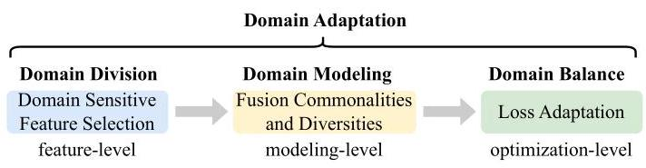
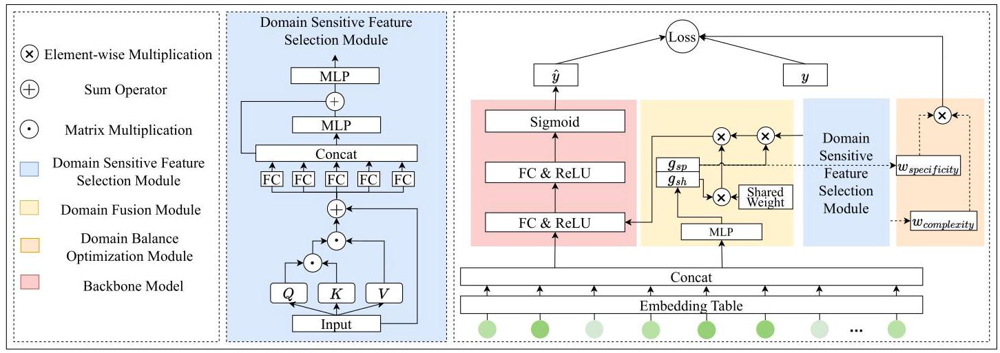
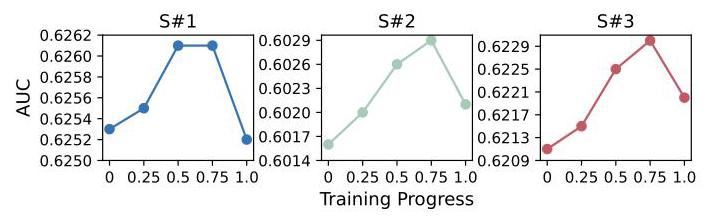
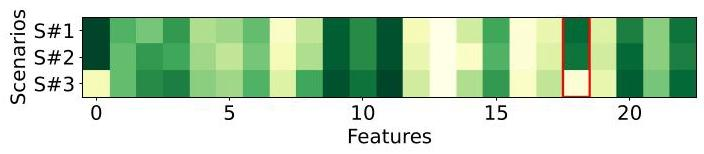

# D3: A Methodological Exploration of Domain Division, Modeling, and Balance in Multi-Domain Recommendations

Pengyue Jia \( {}^{1} \) , Yichao Wang \( {}^{2} \) , Shanru Lin \( {}^{1} \) , Xiaopeng Li \( {}^{1} \) , Xiangyu Zhao \( {}^{1 * } \) , Huifeng Guo \( {}^{2} \) , Ruiming Tang \( {}^{2 * } \)

\( {}^{1} \) City University of Hong Kong

\( {}^{2} \) Huawei Noah’s Ark Lab

\{jia.pengyue, xiaopli2-c\}@my.cityu.edu.hk, lllam32316@gmail.com,

xianzhao@cityu.edu.hk,\{wangyichao5, huifeng.guo, tangruiming\}@huawei.com

## Abstract

To enhance the efficacy of multi-scenario services in industrial recommendation systems, the emergence of multi-domain recommendation has become prominent, which entails simultaneous modeling of all domains through a unified model, effectively capturing commonalities and differences among them. However, current methods rely on manual domain partitioning, which overlook the intricate domain relationships and the heterogeneity of different domains during joint optimization, hindering the integration of domain commonalities and differences. To address these challenges, this paper proposes a universal and flexible framework D3 aimed at optimizing the multi-domain recommendation pipeline from three key aspects. Firstly, an attention-based domain adaptation module is introduced to automatically identify and incorporate domain sensitive features during training. Secondly, we propose a fusion gate module that enables the seamless integration of commonalities and diversities among domains, allowing for implicit characterization of intricate domain relationships. Lastly, we tackle the issue of joint optimization by deriving loss weights from two complementary viewpoints: domain complexity and domain specificity, alleviating inconsistencies among different domains during the training phase. Experiments on three public datasets demonstrate the effectiveness and superiority of our proposed framework. In addition, D3 has been implemented on a real-life, high-traffic internet platform catering to millions of users daily.

## Introduction

To cater to diverse user interests and business needs, modern recommendation systems are designed to handle multiple scenarios concurrently (Wang et al. 2023b), such as the homepage and the item detail page on e-commerce platforms. Data from these scenarios exhibit both commonalities and diversities. On one hand, users and items overlap across different scenarios, resulting in similar data distributions. On the other hand, users exhibit inconsistent behavioral patterns when facing different scenarios, leading to distinct data distributions. Traditional approaches can be categorized into two types (Sheng et al. 2021): (1) constructing separate models for each scenario, significantly increasing maintenance and training costs, and (2) simply training a single model using data from all scenarios, thereby failing to capture the commonalities and diversities, resulting in a notable loss of effectiveness.

Figure 1: Three aspects on domain adaptation.

To address these challenges, multi-domain recommendation (MDR) has been proposed and has garnered significant attention. MDR offers a solution to reduce maintenance and training costs by employing a unified model while effectively handling domain adaptation through specifically designed network structures. As depicted in Figure 1, three crucial aspects should be considered in domain adaptation:

- Domain Division. Domain division significantly influences the data distribution across different domains, thus impacting the efficacy of MDR modeling. Existing research typically uses business scenario IDs as a direct means of dividing domains, without considering more nuanced approaches (Sheng et al. 2021; Jiang et al. 2022; Shen et al. 2021). Alternatively, some studies (Zhang et al. 2022a; Chang et al. 2023) employ manually selected domain sensitive features for domain division. However, these approaches require high experiential expertise and lack dynamic updating mechanisms to adapt to novel data.

- Domain Modeling. Capturing commonalities and diversities across domains presents core challenges in domain modeling. Some works adopt the shared-specific network paradigm (Sheng et al. 2021; Jiang et al. 2022; Shen et al. 2021), where shared networks capture commonalities, while different domains possess independent specific structures to capture their respective diversities. Another approach utilizes the dynamic weight paradigm (Zhang et al. 2022a; Chang et al. 2023; Li et al. 2023b), where weights generated from domain sensitive features are directly applied to the backbone network. While these methodologies have achieved promising results, they overlook modeling the interconnections between domains and the intricate mechanism of integrating commonalities and diversities.

---

*Corresponding authors.

Copyright © 2024, Association for the Advancement of Artificial Intelligence (www.aaai.org). All rights reserved.

---

- Domain Balance. During the training process, the difficulty and progress of training differ across different domains, and this inconsistency greatly hinders achieving the optimal state of joint optimization. Presently, specific research on domain adaptation in the joint optimization process of MDR is lacking. Although some efforts in multi-task learning (Wang et al. 2023a; Liu et al. 2023; Li et al. 2023a) offer reference value (Chen et al. 2018; Liu, Johns, and Davison 2019; Guo et al. 2018; Kendall, Gal, and Cipolla 2018), they have not directly addressed the complexity and specificity of domains due to different research settings.

To tackle the aforementioned challenges related to multi-domain recommendation, we present a unified framework D3, focusing on three crucial aspects - Domain Division, Domain Modeling, and Domain Balance - in domain adaptation in the multi-domain recommendation. Specifically, we introduce three key components in our proposed framework. First, a domain sensitive feature selection (DSFS) module is designed based on the attention mechanism to automatically select domain sensitive features and perform domain division accordingly. Second, a domain fusion (DF) module generates fusion weights for shared and specific parts, implicitly capturing complex relationships among multiple domains. Third, a domain balance optimization (DBO) module calculates the loss weights of each sample based on the domain's complexity and specificity, effectively addressing the inconsistency in the joint optimization process. Experimental evaluations are performed on three public datasets, demonstrating the consistent improvement of our proposed framework across multiple backbones. Comparative experiments with other similar methods further showcase the superiority of our approach. Importantly, this framework is designed as a plug-and-play plugin, offering high extensibility and convenience. The key contributions of our work can be summarized as follows:

- We present a generic and easily applicable plug-in for domain adaptation in multi-domain recommendation. To the best of our knowledge, this is the first work that jointly considers domain division, domain modeling, and domain balance in multi-domain recommendation, making it a novel contribution to the field.

- Our framework includes a domain sensitive feature selection module for domain division, and a domain fusion module to integrate shared and specific parts and implicitly capture complex relationships between domains. Additionally, we introduce a domain balance optimization method to alleviate training inconsistency across domains during the joint optimization.

- Evaluation experiments conducted on three public datasets demonstrate the effectiveness of our proposed method. Moreover, D3 has been deployed on a real-world, large-scale internet platform, serving millions of users daily. These results highlight the practicality and scalabil-ity of our approach.

## Preliminaries

## Problem Definition

Traditional Click-through Rate (CTR) prediction models take \( \mathbf{x} \) including user features, item features, and context features as inputs and predict the probability \( \widehat{y} \) of the user clicking on the item. The process can be formalized as \( \widehat{y} = f\left( x\right) \) . In MDR, a unified model is trained to serve multiple scenarios simultaneously. We distinguish between the meanings of scenario and domain in this paper for ease of understanding:

Definition 1 Scenario. Let \( \mathcal{S} \) denote the set of senarios. Scenarios are the criterion for partitioning when evaluating model performance, such as the commonly used slotID in the commercial advertising platform.

Definition 2 Domain Sensitive Features. \( \mathcal{F} \) denotes all features in model inputs \( \mathbf{x} \) and \( \mathcal{{DF}} \) denotes domain sensitive features, where \( \mathcal{{DF}} \subseteq  \mathcal{F} \) . Domain sensitive features are selected for domain division.

Definition 3 Domain. Let \( \mathcal{D} \) denote the set of domains. Domains are the criterion for partitioning in the modeling process and are divided based on domain sensitive features \( \mathcal{{DF}} \) . Domains can be equal to scenarios or more complicated than scenarios. For example, if only the scenario IDs (Sheng et al. 2021) used for model evaluation are selected as domain sensitive features, the division between domain and scenario remains consistent. If more domain sensitive features are chosen for domain partition, the domain will become far more complex than the scenario (Zhang et al. 2022a).

With the above definitions, multi-domain CTR estimation can be represented as the following equation:

\[
{\widehat{y}}_{i} = f\left( {{x}_{i}, d{f}_{i}}\right) \tag{1}
\]

where \( {\widehat{y}}_{i} \) is the predicted CTR of the \( {i}^{\text{ th }} \) sample, \( {x}_{i} \) is the \( {i}^{\text{ th }} \) model input, and \( d{f}_{i} \) is the domain sensitive features for \( {i}^{\text{ th }} \) sample. Please note that in this paper, the domain sensitive features vary for different data samples, whereas in previous studies, the domain sensitive features \( {df} \) remain consistent across all data samples.

## Methodology

In this section, we will detail the architecture of our proposed framework. An introduction to framework overview is given in Section and we introduce the backbone network in Section . The specific demonstration of the framework modules is from Section to Section, and the optimization is illustrated in Section .

## Framework Overview

Figure 2 showcases the framework's overall architecture. There are three modules proposed in this paper: the domain sensitive feature selection module, the domain fusion module, and the domain balance optimization module. The domain sensitive feature selection module adaptively selects domain sensitive features for different data samples and generates a weight matrix containing domain information, which is then utilized in the backbone network. The domain fusion module aims to capture implicit correlations between divergent domains, assigning weights to the shared and specific parts in the fusion process. The domain balance optimization module utilizes the attention matrix and fusion weights from the first two modules to generate loss weights on domain complexity and specificity, alleviating inconsistencies during optimization.

Figure 2: Framework Architecture.

## Backbone Network

To ensure the universality of our framework, we adopt a simple backbone network structure consisting of two main parts: the embedding layer, and the transformation layer.

Embedding Layer. The embedding layer is a commonly used component in recommender systems. It improves the stability and efficiency of network operation by discretiz-ing input features into high-dimensional sparse vectors and mapping them to low-dimensional dense vectors:

\[
{\mathbf{f}}_{j}^{\prime } = \operatorname{onehot}\left( {\mathbf{f}}_{j}\right) \tag{2}
\]

\[
{\mathbf{e}}_{j} = \mathbf{M} \cdot  {\mathbf{f}}_{j}^{\prime } \tag{3}
\]

\[
\mathbf{x} = \operatorname{concat}\left( {{\mathbf{e}}_{1}\left| {\mathbf{e}}_{2}\right| \ldots  \mid  {\mathbf{e}}_{n}}\right) \tag{4}
\]

where \( {\mathbf{f}}_{j} \) is the \( {j}^{\text{ th }} \) feature of \( \mathcal{F},{\mathbf{f}}_{j}^{\prime } \) is the discretized vector, \( {\mathbf{e}}_{j} \) is the embedding of the \( {j}^{\text{ th }} \) feature, and \( \mathbf{x} \) is the model inputs. \( \mathbf{M} \) is the trainable embedding matrix.

Transformation Layer. Transformation layer consists of a feed-forward network enhancing the expressive ability and one sigmoid function mapping the output value to CTR. The procedures are formalized as below:

\[
\widehat{y} = \operatorname{sigmoid}\left( {\sigma \left( {\mathbf{x} \cdot  {\mathbf{W}}_{tr}^{1} + {\mathbf{b}}_{tr}^{1}}\right)  \cdot  {\mathbf{W}}_{tr}^{2} + {\mathbf{b}}_{tr}^{2}}\right) \tag{5}
\]

where \( \widehat{y} \) is the predicted CTR, \( \sigma \) is the activation function, and \( \mathbf{x} \) is the model inputs.

## Domain Sensitive Feature Selection Module

Domain sensitive features are essential in multi-domain recommendations because they dominate how domains are divided. Former works mainly depend on experimental knowledge to select these features, which require high expertise and lots of labor cost. Furthermore, preset feature combinations cannot be dynamically updated to adapt to the latest data, which is important in modern recommendation systems. To address the above challenges, we design the domain sensitive feature selection module (DSFS). This module is adept at selecting domain sensitive features dynamically at the instance level through end-to-end training. These features are then utilized to generate weight and bias for the backbone network to introduce domain information.

To select the domain sensitive features adaptively, we use the following attention mechanism (Fu et al. 2019) at the feature-level, and the selection is processed by multiplying the attention matrix with all model inputs.:

\[
\mathcal{Q},\mathcal{K},\mathcal{V} = {\mathbf{W}}^{Q} \cdot  \mathbf{x},{\mathbf{W}}^{K} \cdot  \mathbf{x},{\mathbf{W}}^{V} \cdot  \mathbf{x} \tag{6}
\]

\[
\mathbf{A} = \operatorname{softmax}\left( {\mathbf{Q} \cdot  {\mathbf{\mathcal{K}}}^{\top }}\right) \tag{7}
\]

\[
{\mathbf{x}}^{\prime } = \mathbf{A} \cdot  \mathbf{x} + \mathbf{x} \tag{8}
\]

where \( \mathcal{Q},\mathcal{K},\mathcal{V} \) are the query, key, and value, and \( {\mathbf{W}}^{Q},{\mathbf{W}}^{K},{\mathbf{W}}^{V} \) are the corresponding weights. \( \mathbf{A} \) is the attention matrix, and it is multiplied with the model inputs \( x \) to process feature selection. A residual connection is further applied to generate the attention mechanism’s output \( {\mathbf{x}}^{\prime } \) .

The remain parts are designed to capture diversities based on the domain divided by the selected domain sensitive features. For ease of understanding, we only describe the process of weight generation in this subsection, and the generation process of bias is the same as weight. Equation (9) shows independent linear transformations of each feature to reduce the mutual influence. To generate finer-grained representations related to domain specific information, we choose nonlinear transformations and residual connections to learn domain diversities, as shown in Equation (10).

\[
\mathbf{H} = \operatorname{concat}\left( {F{C}_{1}\left( {\mathbf{x}}_{1}^{\prime }\right) \left| {F{C}_{2}\left( {\mathbf{x}}_{2}^{\prime }\right) }\right| \ldots  \mid  F{C}_{n}\left( {\mathbf{x}}_{n}^{\prime }\right) }\right) \tag{9}
\]

\[
{\mathbf{W}}_{\text{ spec }} = \sigma \left( {\mathbf{H} + \sigma \left( {\mathbf{H} \cdot  {\mathbf{W}}_{\text{ dfs }}^{1} + {\mathbf{b}}_{\text{ dfs }}^{1}}\right) }\right)  \cdot  {\mathbf{W}}_{\text{ dfs }}^{2} + {\mathbf{b}}_{\text{ dfs }}^{2} \tag{10}
\]

where \( {\mathbf{x}}_{j}^{\prime } \) is the \( {j}^{\text{ th }} \) feature representation of transformed inputs \( {\mathbf{x}}^{\prime }.{\mathbf{W}}_{dfs} \) and \( {\mathbf{b}}_{dfs} \) are the parameters of linear transformation, \( \sigma \) is the activation function, and \( {\mathbf{W}}_{\text{ spec }} \) denotes the specific weight matrix.

## Domain Fusion Module

To implicitly model the complex relationships between domains overlooked in previous work (Sheng et al. 2021; Zhang et al. 2022a; Chang et al. 2023), we introduce a gate mechanism to fuse the shared and specific information in a finer-grained perspective. Traditional fusion methods (Sheng et al. 2021) typically aggregate shared and specific information through simple addition or multiplication. However, we argue that different domains may overlap with shared information to varying degrees. Specifically, shared information tends to be closer to major scenarios, and simply fusing shared and specific information will impair the performance of other scenarios. Therefore, dynamic fusion weights should be proposed to incorporate shared and specific information, implicitly modeling the specificity of the current domain alongside the relationship with other domains. To achieve the above objectives, we propose the domain fusion module (DF) to derive a vector of length two that learns the proportional relationship between the shared part and the specific part of the current domain in fusion. The processes are shown below:

\[
\mathbf{v} = {MLP}\left( {\mathbf{x}}^{\prime }\right) \tag{11}
\]

\[
{\mathbf{g}}_{i} = \frac{\exp \left( {\mathbf{v}}_{i}\right) }{\mathop{\sum }\limits_{{j = 0}}^{1}\exp \left( {\mathbf{v}}_{j}\right) },\mathbf{g} = \left\lbrack  {{\mathbf{g}}_{sp},{\mathbf{g}}_{sh}}\right\rbrack \tag{12}
\]

where \( \mathbf{g} \) is the gate vector, \( {\mathbf{g}}_{sp} \) is the gate value for specific part and \( {\mathbf{g}}_{sh} \) is the gate value for shared part. \( {\mathbf{x}}^{\prime } \in  {\mathbb{R}}^{n \times  \dim } \) is the attention mechanism's output.

The output of the DSFS represents the specific part, and we introduce a random initialized matrix \( {\mathbf{W}}_{\text{ glob }} \) that represents the shared part. They are fused according to the weights vector \( \mathbf{g} \) , indicating different proportions of the shared and specific information involved in the current domain.

\[
\mathbf{W} = \left( {{\mathbf{g}}_{sp} \cdot  {\mathbf{W}}_{spec}}\right)  \otimes  \left( {{\mathbf{g}}_{sh} \cdot  {\mathbf{W}}_{glob}}\right) \tag{13}
\]

where \( {\mathbf{W}}_{\text{ spec }} \) is the output of DSFS and \( {\mathbf{W}}_{\text{ glob }} \) is the global weight matrix. \( \mathbf{W} \) is the weight matrix after fusion, \( {\mathbf{g}}_{sp} \) and \( {\mathbf{g}}_{sh} \) are the gate scalars. \( \otimes \) is the element-wise multiplication.

To integrate domain information into the backbone, the fused weight \( \mathbf{W} \) and bias \( \mathbf{b} \) will be employed in the transformation layer of the backbone model, which is illustrated in Section . The process can be formulized as follows:

\[
\widehat{y} = \operatorname{sigmoid}\left( {\sigma \left( {\mathbf{x} \cdot  \mathbf{W} + \mathbf{b}}\right)  \cdot  {\mathbf{W}}_{tr}^{2} + {\mathbf{b}}_{tr}^{2}}\right) \tag{14}
\]

## Domain Balance Optimization Module

The complexity of the difference in data volume and data distribution of different domains leads to inconsistency in the training process, reflected in the difference in training difficulty and training progress. In the domain balance optimization module (DBO), we model this inconsistency from two perspectives: domain complexity and domain specificity. These two parts are associated with the domain sensitive feature selection module and the domain fusion module.

Domain Complexity. The complexity of a domain is determined by the domain sensitive features selected. The more complex domain is usually more challenging to train. We utilize the entropy of the attention matrix for each data sample in the domain sensitive feature selection module to express the degree of intricacy of domains. Higher entropy of the attention matrix means the present domain focuses on more domain sensitive features, effectively characterizing the complexity. We derive the degree of domain complexity \( c \) with the attention matrix \( \mathbf{A} \) in DSFS:

\[
{c}_{i} = \frac{1}{n}\mathop{\sum }\limits_{{m = 1}}^{n}\mathop{\sum }\limits_{{k = 1}}^{n}{\mathbf{A}}_{i, m, k}\log \left( {\mathbf{A}}_{i, m, k}\right) \tag{15}
\]

where \( {\mathbf{A}}_{i, m, k} \) denotes the element in the attention matrix in \( m \) row, \( k \) column for \( {i}^{\text{ th }} \) data sample.

To achieve a discriminative weight distribution, we first normalize the entropies and then filter the weights to enhance training stability. The weights corresponding to domain complexity are derived as follows:

\[
{c}^{\prime } = F\left( {\frac{c - \bar{c}}{2 \cdot  {\sigma }_{c}} + \frac{1}{2}}\right) , F\left( x\right)  = \left\{  \begin{array}{ll} l & , x < l \\  x & , l \leq  x \leq  u \\  u & , x > u \end{array}\right. \tag{16}
\]

\[
{\mathbf{w}}^{cpl} = {\lambda }_{1} + {\alpha }_{1} \cdot  {\mathbf{c}}^{\prime } \tag{17}
\]

where \( {\mathbf{c}}^{\prime } \) denotes the vector of normalized entropies, \( \overline{\mathbf{c}} \) is the mean value, \( {\sigma }_{c} \) is the standard deviation of \( \mathbf{c}, l \) and \( u \) are the lowerbound and upperbound for the output of function \( F\left( x\right) \) , \( {\lambda }_{1} \) and \( {\alpha }_{1} \) are the shift and scale hyperparameters, and \( {\mathbf{w}}^{cpl} \) is the loss weight related to domain complexity.

Domain specificity. Domain specificity expresses the degree of irrelevance between the current domain and shared information. Domains with a higher specificity often possess less data, requiring more attention during training. According to the domain fusion module in Section, \( {\mathbf{g}}_{sp} \) and \( {\mathbf{g}}_{sh} \) represent the ratios of the specific and shared parts during fusion. We argue that a higher \( {\mathbf{g}}_{sp} \) indicates less overlap with the shared information, so there is a necessity to emphasize the specificity of these data.

\[
{\mathbf{w}}^{spf} = {\lambda }_{2} + {\alpha }_{2} \cdot  {\mathbf{g}}_{sp} \tag{18}
\]

where \( {\mathbf{w}}^{spf} \) is the loss weight related to domain specificity, \( {\lambda }_{2} \) and \( {\alpha }_{2} \) are the shift and scale hyperparameters tuning the range of weights, and \( {\mathbf{g}}_{sp} \) is the gate scalar for specific parts in the fusion module.

## Optimization

We regard the entire task as a binary classification task, utilizing the following formula as the optimization objective.

\[
{\mathcal{L}}_{CTR} = {w}_{i}^{cpl} \cdot  {w}_{i}^{spf} \cdot  \left\lbrack  {-\left( {{y}_{i} \cdot  \log \left( {\widehat{y}}_{i}\right)  + \left( {1 - {y}_{i}}\right)  \cdot  \log \left( {1 - {\widehat{y}}_{i}}\right) }\right) }\right\rbrack \tag{19}
\]

The objective function is the weighted cross entropy loss function. \( y \) and \( \widehat{y} \) are the ground truth and prediction CTR, and the loss function is weighted by the weight related to domain complexity \( {\mathbf{w}}^{cpl} \) and domain specificity \( {\mathbf{w}}^{spf} \) .

## Experiments

In this section, we will answer the following research questions with a series of experiments:

RQ1: how does the proposed structure perform with different backbone networks?

RQ2: how do the components perform compared to other state-of-the-art methods?

RQ3: what are the specific effects of each component?

## Experimental Settings

Dataset. We conduct experiments on three public datasets: Aliccp (Ma et al. 2018b), Movielens-1M, and ADC (Zhou et al. 2018). Aliccp has 3 scenarios divided by the feature of categorical expression of goods position. For Movielens- \( 1\mathrm{M} \) , we use the age feature to divide the whole dataset into three different domains. ADC has 2 scenarios according to the ads scenario. We utilize Aliccp's standard partitioning ratio of 5:5 for dividing the dataset into training and testing sets. Moreover, an 8:2 split ratio is adopted for splitting training and testing sets in Movielens-1M and ADC.

Backbone models and Compared Methods. To validate the efficacy of our proposed framework, we conducted experiments on two fronts. 1) we examine the compatibility of our framework by incorporating it into various backbone models. 2) we compare the components of our framework to other available optional methods within the same backbone model to demonstrate its superiority. We select the following backbone models for the first experiment: Shared-Bottom, MMOE (Ma et al. 2018a), M2M (Zhang et al. 2022a), ADI (Jiang et al. 2022), STAR (Sheng et al. 2021), SAR-Net (Shen et al. 2021); Other methods with functionalities similar to the components for the second experiment: M2M-WG (weight generation method in M2M) and PEPNet-WG (weight generation method in PEPNet (Chang et al. 2023) for weight generation; DWA (Liu, Johns, and Davison 2019) and DT (Guo et al. 2018) for loss adaptation.

Evaluation Metrics. We assess the performance of models with AUC (Cheng et al. 2016; Guo et al. 2017) and Logloss metrics in CTR prediction. According to previous studies (Lian et al. 2018; Wang et al. 2021; Song et al. 2019), even a small numerical improvement of \( \underline{\mathbf{0.{001}}} \) in AUC can also produce significant positive benefits online.

Implementation Details. In the training phase, we use the AdamW (Loshchilov and Hutter 2017) optimizer with \( {\beta }_{1} = \; {0.9},{\beta }_{2} = {0.999} \) , and \( \epsilon  = 1 \times  {10}^{-8} \) . The learning rate is set to 0.001 , the batch size to 2048 , and the embedding size dim to 16. ReLU is chosen as the activation function. We set the lower bound \( l \) as 0.1 and the upper bound \( u \) as 1 . We tune \( {\lambda }_{1},{\lambda }_{2},{\alpha }_{1} \) , and \( {\alpha }_{2} \) from \( \{ 0,1\mathrm{e} - 1,\ldots ,1\} \) , and the ratio of introducing loss adaptation during training from \( \{ 0,{0.25} \) , \( {0.5},{0.75}\} \) .

## Overall Performance

Compatiable experiment performance with different backbone models (RQ1). In this subsection, we will answer the RQ1 by comparing the performance of different backbone models with and without our proposed framework. For Shared-Bottom and MMOE, we replace their towers with a feed-forward network equipped with D3. For M2M and ADI, we replace their modules related to learning scenario knowledge (i.e., meta unit, domain-specific networks and shared networks) with a feed-forward network equipped with D3. STAR and SAR-Net incorporate the partial components we proposed (i.e., domain fusion module and the domain balance optimization method related to domain specificity). According to Table 1, we can observe the following information: 1) Incorporating our framework, all backbones demonstrated substantial improvements in performance on both public datasets. This highlights the effectiveness of our framework in terms of domain sensitive feature selection, integration of commonality and diversity, and alleviating domain inconsistency during the training stage. Additionally, it underscores the flexibility and universality of our framework, which can be directly applied to most backbone models to enhance their performance. 2) For scenarios with limited data, such as Scenario 2 in the Aliccp dataset, the benefits from our proposed framework are more pronounced compared to other scenarios, resulting in greater performance improvements. This can be attributed to (i) the more granular exploration of the domain through the domain sensitive feature selection module and the domain fusion module and (ii) the domain balance optimization module emphasizes data samples with high domain complexity and specificity, alleviating the data sparsity problem.

Overall performance against different weight generation and loss adaptation methods (RQ2). This subsection answers RQ2 by comparing our proposed components to other weight generation (M2M-WG, PEPNet-WG) and loss adaptation (DWA, DT) methods. In Table 2, we take ADI as the backbone model (BM). BM+D2 is the BM with domain sensitive feature selection module and domain fusion module, and BM+D3 is the BM with all our proposed components.

Weight Generation. In the weight generation aspect, the backbone model equipped with the domain sensitive feature selection module and domain fusion module outperforms BM+M2M-WG and BM+PEPNet-WG. There are two reasons: (1) the attention mechanism is utilized to automatically select domain sensitive features in our framework, thus avoiding the bias of manually selecting features (i.e., missing informative features or selecting ineffective features), and (2) the proposed gate module implicitly captures the relationships between different domains by adaptively fusing shared and specific part with discriminative weight.

Loss Adaptation. In the loss adaptation aspect, BM+D3 is superior to BM2+DWA and BM2+DT. There are three reasons: (1) our method considers both domain complexity and domain specificity, mitigating training inconsistencies in joint modeling from more dimensions and perspectives that are more in line with multi-scenario modeling settings. (2) Previous studies do not focus on the task's attributes but derive loss weights based on the magnitude of loss and metric values. (3) The method we propose operates at the domain-level, and compared to other scenario-level methods, it focuses on finer-grained domain differences.

<table><tr><td rowspan="2">Datasets</td><td rowspan="2" colspan="2">Metrics</td><td colspan="2">Shared-Bottom</td><td colspan="2">MMOE</td><td colspan="2">M2M</td><td colspan="2">ADI</td><td colspan="2">STAR</td><td colspan="2">SAR-Net</td></tr><tr><td>w/o</td><td>W</td><td>w/o</td><td>W</td><td>w/o</td><td>W</td><td>w/o</td><td>W</td><td>w/o</td><td>w*</td><td>w/o</td><td>w*</td></tr><tr><td rowspan="6">Aliccp</td><td rowspan="4">AUC</td><td>S#1</td><td>0.6234</td><td>0.6237</td><td>0.6236</td><td>0.6246</td><td>0.6223</td><td>0.6240</td><td>0.6214</td><td>0.6261</td><td>0.6222</td><td>0.6233</td><td>0.6237</td><td>0.6248</td></tr><tr><td>S#2</td><td>0.6006</td><td>0.6011</td><td>0.5921</td><td>0.6021</td><td>0.5923</td><td>0.5975</td><td>0.5995</td><td>0.6029</td><td>0.5980</td><td>0.6005</td><td>0.5905</td><td>0.5942</td></tr><tr><td>S#3</td><td>0.6180</td><td>0.6211</td><td>0.6185</td><td>0.6211</td><td>0.6176</td><td>0.6206</td><td>0.6175</td><td>0.6230</td><td>0.6180</td><td>0.6191</td><td>0.6196</td><td>0.6210</td></tr><tr><td>S#1</td><td>0.1652</td><td>0.1649</td><td>0.1656</td><td>0.1654</td><td>0.1651</td><td>0.1650</td><td>0.1655</td><td>0.1651</td><td>0.1653</td><td>0.1651</td><td>0.1653</td><td>0.1650</td></tr><tr><td rowspan="2">Logloss</td><td>S#2</td><td>0.1785</td><td>0.1781</td><td>0.1792</td><td>0.1790</td><td>0.1787</td><td>0.1786</td><td>0.1789</td><td>0.1784</td><td>0.1793</td><td>0.1781</td><td>0.1810</td><td>0.1795</td></tr><tr><td>S#3</td><td>0.1593</td><td>0.1588</td><td>0.1598</td><td>0.1596</td><td>0.1597</td><td>0.1591</td><td>0.1598</td><td>0.1594</td><td>0.1600</td><td>0.1600</td><td>0.1598</td><td>0.1595</td></tr><tr><td rowspan="6">Movie lens-1M</td><td rowspan="6">AUC   Logloss</td><td>S#1</td><td>0.7693</td><td>0.7772</td><td>0.7773</td><td>0.7845</td><td>0.7543</td><td>0.7757</td><td>0.7741</td><td>0.7830</td><td>0.7693</td><td>0.7806</td><td>0.7677</td><td>0.7744</td></tr><tr><td>S#2</td><td>0.7958</td><td>0.7967</td><td>0.7967</td><td>0.7977</td><td>0.7899</td><td>0.7928</td><td>0.7939</td><td>0.7992</td><td>0.7961</td><td>0.7981</td><td>0.7922</td><td>0.7971</td></tr><tr><td>S#3</td><td>0.7877</td><td>0.7890</td><td>0.7845</td><td>0.7879</td><td>0.7814</td><td>0.7816</td><td>0.7791</td><td>0.7909</td><td>0.7876</td><td>0.7876</td><td>0.7873</td><td>0.7924</td></tr><tr><td>S#1</td><td>0.5652</td><td>0.5544</td><td>0.5548</td><td>0.5472</td><td>0.5904</td><td>0.5589</td><td>0.5589</td><td>0.5510</td><td>0.5630</td><td>0.5570</td><td>0.5732</td><td>0.5612</td></tr><tr><td>S#2</td><td>0.5367</td><td>0.5352</td><td>0.5358</td><td>0.5346</td><td>0.5443</td><td>0.5387</td><td>0.5387</td><td>0.5331</td><td>0.5372</td><td>0.5349</td><td>0.5418</td><td>0.5353</td></tr><tr><td>S#3</td><td>0.5265</td><td>0.5243</td><td>0.5302</td><td>0.5261</td><td>0.5360</td><td>0.5350</td><td>0.5350</td><td>0.5232</td><td>0.5249</td><td>0.5271</td><td>0.5273</td><td>0.5235</td></tr><tr><td rowspan="4">ADC</td><td rowspan="2">AUC</td><td>S#1</td><td>0.5822</td><td>0.5836</td><td>0.5822</td><td>0.5838</td><td>0.5768</td><td>0.5826</td><td>0.5775</td><td>0.5840</td><td>0.5806</td><td>0.5836</td><td>0.5826</td><td>0.5847</td></tr><tr><td>S#2</td><td>0.5864</td><td>0.5890</td><td>0.5861</td><td>0.5884</td><td>0.5835</td><td>0.5869</td><td>0.5831</td><td>0.5888</td><td>0.5856</td><td>0.5859</td><td>0.5878</td><td>0.5893</td></tr><tr><td rowspan="2">Logloss</td><td>S#1</td><td>0.2662</td><td>0.2644</td><td>0.2653</td><td>0.2657</td><td>0.2642</td><td>0.2586</td><td>0.2696</td><td>0.2676</td><td>0.2686</td><td>0.2620</td><td>0.2669</td><td>0.2616</td></tr><tr><td>S#2</td><td>0.2504</td><td>0.2477</td><td>0.2500</td><td>0.2495</td><td>0.2481</td><td>0.2413</td><td>0.2570</td><td>0.2511</td><td>0.2556</td><td>0.2448</td><td>0.2502</td><td>0.2484</td></tr></table>

Table 1: Experimental results for different multi-domain models without (w/o) or with (w) our framework on three public datasets. w* denotes the backbone model can only incorporate the partial components we proposed (i.e., domain fusion module and the domain balance optimization method related to domain specificity). The best results are highlighted with bold fonts. All improvements are statistically significant (i.e., two-sided t-tests with \( p < {0.05} \) ).

<table><tr><td>AUC</td><td>S#1</td><td>S#2</td><td>S#3</td></tr><tr><td>BM</td><td>0.6214</td><td>0.5995</td><td>0.6175</td></tr><tr><td>BM+M2M-WG</td><td>0.6230</td><td>0.5978</td><td>0.6204</td></tr><tr><td>BM+PEPNet-WG</td><td>0.6233</td><td>0.5996</td><td>0.6203</td></tr><tr><td>BM+D2</td><td>0.6248 *</td><td>0.6018 *</td><td>0.6221 *</td></tr><tr><td>BM+D2+DWA</td><td>0.6156</td><td>0.5942</td><td>0.6124</td></tr><tr><td>BM+D2+DT</td><td>0.6229</td><td>0.5952</td><td>0.6122</td></tr><tr><td>BM+D3</td><td>0.6261 *</td><td>0.6029 *</td><td>0.6230 *</td></tr></table>

Table 2: Experimental results for our proposed components compared to other similar methods on Alicep. The best results are bolded. "*" indicates the statistically significant improvements (i.e., two-sided t-test with \( p < {0.05} \) ) over the best baseline.

## Ablation Study (RQ3)

In this subsection, we conduct experiments to verify the effectiveness of each component in our proposed framework. The variants are listed below:

- BM We select ADI as the backbone model.

- BM+D1 Backbone model with DSFS (domain division). Replace the shared-specific networks with a transformation layer equipped with the DSFS module.

- BM+D2 Backbone model with DSFS (domain division) and DF (domain modeling).

- BM+D3 Backbone model with all proposed components (domain division, domain modeling, domain balance).

Through Table 3, it can be concluded that each component has a positive effect on the backbone model, and more importantly, their contributions to the prediction performance can be accumulated. By comparing BM with BM+D1, it can be concluded that the domain sensitive feature selection module can automatically select domain sensitive features at the instance level, assisting in domain division. The experimental results comparing BM+D1 and BM+D2 validate the effectiveness of the domain fusion module. It can more accurately fuse shared and specific parts and implicitly model the complex relationships between domains. The comparison between BM+D2 and BM+D3 confirms the validity of the domain balance optimization module. By calculating loss weight based on both domain complexity and specificity, it alleviates training inconsistencies in the joint optimization process of different domains.

<table><tr><td colspan="2">Metrics</td><td>BM</td><td>BM+D1</td><td>BM+D2</td><td>BM+D3</td></tr><tr><td rowspan="3">AUC</td><td>S#1</td><td>0.6214</td><td>0.6240</td><td>0.6248</td><td>0.6261</td></tr><tr><td>S#2</td><td>0.5995</td><td>0.6000</td><td>0.6018</td><td>0.6029</td></tr><tr><td>S#3</td><td>0.6175</td><td>0.6209</td><td>0.6221</td><td>0.6230</td></tr><tr><td rowspan="3">Logloss</td><td>S#1</td><td>0.1655</td><td>0.1654</td><td>0.1653</td><td>0.1651</td></tr><tr><td>S#2</td><td>0.1789</td><td>0.1788</td><td>0.1785</td><td>0.1784</td></tr><tr><td>S#3</td><td>0.1598</td><td>0.1596</td><td>0.1595</td><td>0.1594</td></tr></table>

Table 3: Ablation study on Aliccp.

## Hyperparameter Analysis

In this subsection, we visualize the effects of introducing loss adaptation in different training processes across different scenarios. The x-axis represents the training process to introduce loss adaptation (e.g., 0 means introduce loss adaptation from the start of training, and 1.0 means do not introduce loss adaptation during training), and the y-axis represents the AUC score. Figure 3 demonstrates the considerable influence of the timing of loss adaptation introduction into the training process on the overall performance. The key factor behind this could be that the loss weight is contingent upon both the attention mechanism and the gate mechanism. However, these mechanisms are incapable of effectively capturing intricate domain patterns during the initial phases of training, let alone representing the complexity and specificity of the domains. As depicted in Figure 3, implementing loss adaptation between 50% and 75% of the entire training duration proves to be the most productive. This is attributable to the relative stability of both the attention and gate mechanisms at this stage, which in turn provides crucial data for expressing domain complexity and specificity.

Figure 3: Effects of introducing loss adaptation in different training processes across different scenarios on Alicep.

Figure 4: Attention vector across different scenarios.

## Visualization

In the following subsection, we seek to exemplify the proficiency of the Domain Sensitive Feature Selection (DSFS) module via the visualization of attention mechanisms across a range of scenarios. As visualized in Figure 4, we present attention mechanism heatmaps across three distinct scenarios within the Alicep dataset. The x-axis represents different features, while the y-axis illustrates the three scenarios present within the dataset. A significantly darker square within the graph illustrates a higher attention weight. Upon evaluation of the figure, it becomes apparent that domain sensitive features display significant alterations across diverse scenarios, affirming the DSFS module's precision in effectually capturing these discrepancies. Furthermore, it is important to note that Feature 18, represented by the red box, acts as the scenario indicator, assigned a high attention weight. This noteworthy assignment further underpins DSFS's efficacy in selecting domain-sensitive features.

## Related Work

## Multi-Domain Recommendation

Multi-Domain Recommendation (Tan et al. 2021; Xu et al. 2023; Wang et al. 2022; Zhang et al. 2022b; Luo et al. 2022; Gao et al. 2023) aims to capture the commonalities and diversities of various scenarios with a unified model. In recent times, a multitude of relevant endeavors has emerged, propelling the advancement of this field. STAR (Sheng et al. 2021) proposes a star topology that divided commonalities and diversities into shared networks and specific networks and a partitioned normalization method transforming data distributions according to their domains. SAR-Net (Shen et al. 2021) introduces multiple experts networks and a multi-scenario gate structure to model capture the commonalities and diversities. ADI (Jiang et al. 2022) applies domain-specific batch normalization, domain interest adaptation layers, and a self training strategy to capture relationships between scenarios. On the other hand, M2M (Zhang et al. 2022a) introduces the meta units, to incorporate scenario knowledge by producing the weights for the backbone model. PEPNet (Chang et al. 2023) proposes a Gate Neural Unit to personalized network parameters.

## Loss Adaptation

In the realm of multi-domain recommendation, limited attention has been given to loss adaptation. While SAR-Net (Shen et al. 2021) introduces weighted loss for different samples, the focus was on addressing intervention bias rather than mitigating the inconsistencies across different domains during the training process. However, in other fields, such as multi-task learning, numerous relevant studies have been conducted. Adatask (Yang et al. 2023) approaches the issue from a task-centric perspective, separating the accumulated gradients of tasks within shared parameters. Autoloss (Zhao et al. 2021) employs a controller structure to generate weights for multiple losses, selecting the optimal one through a hard selection process. Gradnorm (Chen et al. 2018) addresses the issue by recognizing the imbalance in gradients during backpropagation, considering both the dominance of gradients and the ratio of loss reduction. DWA (Liu, Johns, and Davison 2019) aims to facilitate equal learning rates across tasks by calculating the relationship between loss reduction differences among tasks at adjacent time steps. DT (Guo et al. 2018) combines example-level and task-level strategies with focal loss to alleviate task imbalance, assigning greater weight to more challenging tasks.

## Conclusion

In this paper, we proposed a universal and flexible framework D3 to optimize the multi-domain recommendations from domain division, modeling, and balance. Specifically, we introduce an attention-based domain adaptation module to divide domains automatically and capture diversities across different domains. The fusion gate module is proposed for integrating commonalities and diversities of domains and implicitly characterizing the intricate relationships between domains. In addition, we embarked upon an exploration into loss adaptation, a seldom-explored area in multi-domain recommendations, crafting weights based on the domain complexity and specificity and helping balance domains in the training process. Experiments on three public datasets showcase the effectiveness and superiority of our proposed framework. In addition, D3 has been implemented on a real-life, high-traffic internet platform catering to millions of users daily.

## Acknowledgments

This research was partially supported by Huawei (Huawei Innovation Research Program), APRC - CityU New Research Initiatives (No.9610565, Start-up Grant for New Faculty of City University of Hong Kong), CityU - HKIDS Early Career Research Grant (No.9360163), Hong Kong ITC Innovation and Technology Fund Midstream Research Programme for Universities Project (No.ITS/034/22MS), Hong Kong Environmental and Conservation Fund (No. 88/2022), and SIRG - CityU Strategic Interdisciplinary Research Grant (No.7020046, No.7020074).

## References

Chang, J.; Zhang, C.; Hui, Y.; Leng, D.; Niu, Y.; and Song, Y. 2023. PEPNet: Parameter and Embedding Personalized Network for Infusing with Personalized Prior Information. arXiv preprint arXiv:2302.01115.

Chen, Z.; Badrinarayanan, V.; Lee, C.-Y.; and Rabinovich, A. 2018. Gradnorm: Gradient normalization for adaptive loss balancing in deep multitask networks. In International conference on machine learning, 794-803. PMLR.

Cheng, H.-T.; Koc, L.; Harmsen, J.; Shaked, T.; Chandra, T.; Aradhye, H.; Anderson, G.; Corrado, G.; Chai, W.; Ispir, M.; et al. 2016. Wide & deep learning for recommender systems. In Proceedings of the 1st workshop on deep learning for recommender systems, 7-10.

Fu, J.; Liu, J.; Tian, H.; Li, Y.; Bao, Y.; Fang, Z.; and Lu, H. 2019. Dual attention network for scene segmentation. In Proceedings of the IEEE/CVF conference on computer vision and pattern recognition, 3146-3154.

Gao, J.; Zhao, X.; Chen, B.; Yan, F.; Guo, H.; and Tang, R. 2023. AutoTransfer: Instance Transfer for Cross-Domain Recommendations. In Proceedings of the 46th International ACM SIGIR Conference on Research and Development in Information Retrieval, 1478-1487.

Guo, H.; Tang, R.; Ye, Y.; Li, Z.; and He, X. 2017. DeepFM: a factorization-machine based neural network for CTR prediction. arXiv preprint arXiv:1703.04247.

Guo, M.; Haque, A.; Huang, D.-A.; Yeung, S.; and Fei-Fei, L. 2018. Dynamic task prioritization for multitask learning. In Proceedings of the European conference on computer vision (ECCV), 270-287.

Jiang, Y.; Li, Q.; Zhu, H.; Yu, J.; Li, J.; Xu, Z.; Dong, H.; and Zheng, B. 2022. Adaptive domain interest network for multi-domain recommendation. In Proceedings of the 31st ACM International Conference on Information & Knowledge Management, 3212-3221.

Kendall, A.; Gal, Y.; and Cipolla, R. 2018. Multi-task learning using uncertainty to weigh losses for scene geometry and semantics. In Proceedings of the IEEE conference on computer vision and pattern recognition, 7482-7491.

Li, X.; Qiu, Z.; Zhao, X.; Zhang, Y.; Xing, C.; and Wu, X. 2023a. REST: Drug-Drug Interaction Prediction via Reinforced Student-Teacher Curriculum Learning. In Proceedings of the 32nd ACM International Conference on Information and Knowledge Management, 1278-1287.

Li, X.; Yan, F.; Zhao, X.; Wang, Y.; Chen, B.; Guo, H.; and Tang, R. 2023b. HAMUR: Hyper Adapter for Multi-Domain Recommendation. In Proceedings of the 32nd ACM International Conference on Information and Knowledge Management, 1268-1277.

Lian, J.; Zhou, X.; Zhang, F.; Chen, Z.; Xie, X.; and Sun, G. 2018. xdeepfm: Combining explicit and implicit feature interactions for recommender systems. In Proceedings of the 24th ACM SIGKDD international conference on knowledge discovery & data mining, 1754-1763.

Liu, S.; Johns, E.; and Davison, A. J. 2019. End-to-end multi-task learning with attention. In Proceedings of the IEEE/CVF conference on computer vision and pattern recognition, 1871-1880.

Liu, Z.; Tian, J.; Cai, Q.; Zhao, X.; Gao, J.; Liu, S.; Chen, D.; He, T.; Zheng, D.; Jiang, P.; et al. 2023. Multi-Task Recommendations with Reinforcement Learning. In Proceedings of the ACM Web Conference 2023, 1273-1282.

Loshchilov, I.; and Hutter, F. 2017. Decoupled weight decay regularization. arXiv preprint arXiv:1711.05101.

Luo, L.; Li, Y.; Gao, B.; Tang, S.; Wang, S.; Li, J.; Zhu, T.; Liu, J.; Li, Z.; and Pan, S. 2022. MAMDR: a model agnostic learning method for multi-domain recommendation. arXiv preprint arXiv:2202.12524.

Ma, J.; Zhao, Z.; Yi, X.; Chen, J.; Hong, L.; and Chi, E. H. 2018a. Modeling task relationships in multi-task learning with multi-gate mixture-of-experts. In Proceedings of the 24th ACM SIGKDD international conference on knowledge discovery & data mining, 1930-1939.

Ma, X.; Zhao, L.; Huang, G.; Wang, Z.; Hu, Z.; Zhu, X.; and Gai, K. 2018b. Entire space multi-task model: An effective approach for estimating post-click conversion rate. In The 41st International ACM SIGIR Conference on Research & Development in Information Retrieval, 1137-1140.

Shen, Q.; Tao, W.; Zhang, J.; Wen, H.; Chen, Z.; and Lu, Q. 2021. Sar-net: a scenario-aware ranking network for personalized fair recommendation in hundreds of travel scenarios. In Proceedings of the 30th ACM International Conference on Information & Knowledge Management, 4094-4103.

Sheng, X.-R.; Zhao, L.; Zhou, G.; Ding, X.; Dai, B.; Luo, Q.; Yang, S.; Lv, J.; Zhang, C.; Deng, H.; et al. 2021. One model to serve all: Star topology adaptive recommender for multi-domain ctr prediction. In Proceedings of the 30th ACM International Conference on Information & Knowledge Management, 4104-4113.

Song, W.; Shi, C.; Xiao, Z.; Duan, Z.; Xu, Y.; Zhang, M.; and Tang, J. 2019. Autoint: Automatic feature interaction learning via self-attentive neural networks. In Proceedings of the 28th ACM international conference on information and knowledge management, 1161-1170.

Tan, S.; Li, M.; Zhao, W.; Zheng, Y.; Pei, X.; and Li, P. 2021. Multi-Task and Multi-Scene Unified Ranking Model for Online Advertising. In 2021 IEEE International Conference on Big Data (Big Data), 2046-2051. IEEE.

Wang, R.; Shivanna, R.; Cheng, D.; Jain, S.; Lin, D.; Hong, L.; and Chi, E. 2021. Dcn v2: Improved deep & cross network and practical lessons for web-scale learning to rank systems. In Proceedings of the web conference 2021, 1785- 1797.

Wang, Y.; Du, Z.; Zhao, X.; Chen, B.; Guo, H.; Tang, R.; and Dong, Z. 2023a. Single-shot Feature Selection for Multitask Recommendations. In Proceedings of the 46th International ACM SIGIR Conference on Research and Development in Information Retrieval, 341-351.

Wang, Y.; Guo, H.; Chen, B.; Liu, W.; Liu, Z.; Zhang, Q.; He, Z.; Zheng, H.; Yao, W.; Zhang, M.; et al. 2022. Causalint: Causal inspired intervention for multi-scenario recommendation. In Proceedings of the 28th ACM SIGKDD Conference on Knowledge Discovery and Data Mining, 4090-4099.

Wang, Y.; Zhao, X.; Chen, B.; Liu, Q.; Guo, H.; Liu, H.; Wang, Y.; Zhang, R.; and Tang, R. 2023b. PLATE: A Prompt-Enhanced Paradigm for Multi-Scenario Recommendations. In Proceedings of the 46th International ACM SI-GIR Conference on Research and Development in Information Retrieval, 1498-1507.

Xu, S.; Li, L.; Yao, Y.; Chen, Z.; Wu, H.; Lu, Q.; and Tong, H. 2023. MUSENET: Multi-Scenario Learning for Repeat-Aware Personalized Recommendation. In Proceedings of the Sixteenth ACM International Conference on Web Search and Data Mining, 517-525.

Yang, E.; Pan, J.; Wang, X.; Yu, H.; Shen, L.; Chen, X.; Xiao, L.; Jiang, J.; and Guo, G. 2023. Adatask: A task-aware adaptive learning rate approach to multi-task learning. In Proceedings of the AAAI Conference on Artificial Intelligence, volume 37, 10745-10753.

Zhang, Q.; Liao, X.; Liu, Q.; Xu, J.; and Zheng, B. 2022a. Leaving no one behind: A multi-scenario multi-task meta learning approach for advertiser modeling. In Proceedings of the Fifteenth ACM International Conference on Web Search and Data Mining, 1368-1376.

Zhang, Y.; Wang, X.; Hu, J.; Gao, K.; Lei, C.; and Fang, F. 2022b. Scenario-Adaptive and Self-Supervised Model for Multi-Scenario Personalized Recommendation. In Proceedings of the 31st ACM International Conference on Information & Knowledge Management, 3674-3683.

Zhao, X.; Liu, H.; Fan, W.; Liu, H.; Tang, J.; and Wang, C. 2021. Autoloss: Automated loss function search in recommendations. In Proceedings of the 27th ACM SIGKDD Conference on Knowledge Discovery & Data Mining, 3959- 3967.

Zhou, G.; Zhu, X.; Song, C.; Fan, Y.; Zhu, H.; Ma, X.; Yan, Y.; Jin, J.; Li, H.; and Gai, K. 2018. Deep interest network for click-through rate prediction. In Proceedings of the 24th ACM SIGKDD international conference on knowledge discovery & data mining, 1059-1068.