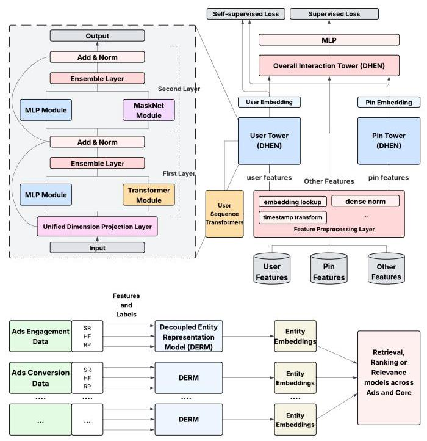

# Decoupled Entity Representation Learning for Pinterest Ads Ranking

Jie Liu*

jieliu@pinterest.com

Pinterest, Inc

San Francisco, USA

Yinrui Li*

yinruili@pinterest.com

Pinterest, Inc

San Francisco, USA

Jiankai Sun*

jiankaisun@pinterest.com

Pinterest, Inc

San Francisco, USA

Kungang Li

kungangli@pinterest.com

Pinterest, Inc

San Francisco, USA

Han Sun

hsun@pinterest.com

Pinterest, Inc

San Francisco, USA

Sihan Wang

sihanwang@pinterest.com

Pinterest, Inc

San Francisco, USA

Huasen Wu

huasenwu@pinterest.com

Pinterest, Inc

San Francisco, USA

Siyuan Gao

siyuangao@pinterest.com

Pinterest, Inc

San Francisco, USA

Paulo Soares

pdasilvasoares@pinterest.com

Pinterest, Inc

San Francisco, USA

Nan Li

nanli@pinterest.com

Pinterest, Inc

San Francisco, USA

Zhifang Liu

zhifangliu@pinterest.com

Pinterest, Inc

San Francisco, USA

Haoyang Li

haoyangli@pinterest.com

Pinterest, Inc

San Francisco, USA

Siping Ji

siping@pinterest.com

Pinterest, Inc

San Francisco, USA

Ling Leng

lleng@pinterest.com

Pinterest, Inc

San Francisco, USA

Prathibha Deshikachar

pdeshikachar@pinterest.com

Pinterest, Inc

San Francisco, USA

## Abstract

In this paper, we introduce a novel framework following an upstream-downstream paradigm to construct user and item (Pin) embeddings from diverse data sources, which are essential for Pinterest to deliver personalized Pins and ads effectively. Our upstream models are trained on extensive data sources featuring varied signals, utilizing complex architectures to capture intricate relationships between users and Pins on Pinterest. To ensure scalability of the upstream models, entity embeddings are learned, and regularly refreshed, rather than real-time computation, allowing for asynchronous interaction between the upstream and downstream models. These embeddings are then integrated as input features in numerous downstream tasks, including ad retrieval and ranking models for CTR and CVR predictions. We demonstrate that our framework achieves notable performance improvements in both offline and online settings across various downstream tasks. This framework

Permission to make digital or hard copies of all or part of this work for personal or classroom use is granted without fee provided that copies are not made or distributed for profit or commercial advantage and that copies bear this notice and the full citation on the first page. Copyrights for components of this work owned by others than the author(s) must be honored. Abstracting with credit is permitted. To copy otherwise, or republish, to post on servers or to redistribute to lists, requires prior specific permission and/or a fee. Request permissions from permissions@acm.org.

Conference'17, Washington, DC, USA

(c) 2025 Copyright held by the owner/author(s). Publication rights licensed to ACM. ACM ISBN 978-x-xxxx-xxxx-x/YYYY/MM

https://doi.org/10.1145/nnnnnnn.nnnnnnn

has been deployed in Pinterest's production ad ranking systems, resulting in significant gains in online metrics.

## CCS Concepts

- Information systems \( \rightarrow \) Recommender systems.

## Keywords

Entity representation, embedding, cross domain, knowledge transfer, ads recommendation

## ACM Reference Format:

Jie Liu, Yinrui Li, Jiankai Sun, Kungang Li, Han Sun, Sihan Wang, Huasen Wu, Siyuan Gao, Paulo Soares, Nan Li, Zhifang Liu, Haoyang Li, Siping Ji, Ling Leng, and Prathibha Deshikachar. 2025. Decoupled Entity Representation Learning for Pinterest Ads Ranking. In . ACM, New York, NY, USA, 7 pages. https://doi.org/10.1145/nnnnnnn.nnnnnnn

## 1 Introduction

Modern recommender systems depend extensively on different entity representations, such as those for users, items, and queries. These representations map entities into low-dimensional dense vector spaces for efficient processing by deep neural networks. In Pinterest's ads recommender system, these embeddings are extensively utilized throughout the ranking pipeline, serving key roles in candidate retrieval through Approximate Nearest Neighbor (ANN) searches [7]-and in ranking as important features.

---

*All three authors contributed equally to this research.

---

Pinterest offers a variety of surfaces, such as Home Feed, RePin, and Search, to support various user-interaction scenarios. Users and advertisers also interact with ads in multiple optimization types, including clicks and conversions. Ideally, leveraging data across all these domains and ad types would yield richer, more effective entity representations. However, this is challenging: each surface and ad type comes with unique optimization objectives, separate datasets, and specialized models, resulting in fragmented representations and limited information sharing. Infrastructure limitations further exacerbate this by restricting models to a subset of features, limiting a holistic view of user behavior. Performing efficient knowledge transfer across these domains remains a significant hurdle.

To address these challenges, we introduce a decoupled upstream-downstream framework that learns the embedding of user and Pin (item) from various data sources, critical for delivering personalized content and ads on Pinterest. Building on the approach outlined in [19], our upstream models are trained on large-scale datasets with rich user interaction signals, utilizing advanced architectures to capture the deep relationships between users and Pins. For scalabil-ity, entity embeddings are pre-computed and regularly refreshed, rather than calculated in real time, which allows asynchronous serving between upstream and downstream models. These embeddings are then integrated as key features in a wide range of downstream models, including those that handle ad retrieval, CTR, and CVR predictions for ranking tasks. These embeddings have shown significant improvements in offline performance and have also been successfully deployed in production for CTR prediction.

Compared with previous work [18], our work offers several key innovations.

- We propose a new model architecture featuring multiple towers that produce distinct embeddings for entities such as users, Pins and others. Interaction features are provided to a specialized overtower, preventing contextual information from contaminating the core embeddings and thereby enhancing their stability.

- In addition to multi-task supervised learning, we leverage self-supervised learning on the outputs of the entity towers using a contrastive loss technique.

- To incorporate smooth and performing embedding shift, we use a weighted moving average to combine current and historical embeddings. We find that assigning greater weight to past embeddings delivers the best performance improvement among other aggregation approaches in our setup.

## 2 Related Work

Unlike the classic two-tower model that trains on similarity measures (e.g., dot product) of user and item embeddings [5], our model employs a complex overtower to process both tower outputs and interaction features. A similar overtower design is present in [18], although that work only focuses on user representation learning. Beyond tower architectures, technologies like graph-based algorithms \( \left\lbrack  {4,{16}}\right\rbrack \) and noise contrastive loss [3] enhance representation learning by exploring item-item relationships. Recently, transformers have been widely used to generate embeddings from user sequences \( \left\lbrack  {1,2}\right\rbrack \) . Additionally, users can be characterized through the aggregation of item embeddings [9]. In contrast to methods that concentrate on a single technology, our work aims to develop a versatile framework that integrates diverse and rich signals, utilizing various supervised and unsupervised loss functions for training.

## 3 Our Methods

In this section, we present our methods for developing Decoupled Entity Representation Model (DERM), and the utilization of DERM embeddings in downstream tasks.

### 3.1 Upstream Model Architecture

DERM adopts a multi-tower architecture to generate embeddings for various entities (Figure 1). Each tower uses a multi-layer Deep Hierarchical Ensemble Network (DHEN) backbone [17, 19], with each layer consisting of two feature interaction modules chosen from Masknet [15], Transformer[13] and MLP.

We primarily utilize Pinterest's two extensive ad production datasets (CTR and CVR prediction) as data sources to create DERM embeddings. For each dataset, we develop a specific upstream model. Each model comprises three towers: 1) User Tower, which is crafted to process a diverse array of user features, including user activity sequences, demographics, curated interests, counting features, and pretrained representations. 2) Pin Tower, which ingests all features related to ad Pins, such as content metadata, aggregated counting features, pretrained representations, and additional relevant insights into the ad content. 3) Overall Interaction Tower, which processes the interactions between the outputs of the above two towers along with additional contextual and interaction features.

To improve the learning of entity embeddings and the effectiveness of the upstream models, we add an additional self-supervised learning task between the user and ad Pin towers. When a training sample is linked to a positive click or conversion label, we consider the associated user and target Pin pair \( \left( {{u}_{i},{p}_{i}}\right) \) as positive. Drawing inspiration from previous research on pre-trained em-beddings [10][12], for each positive user and target Pin pair, we generate a set of randomly sampled in-batch negative examples and employ the following sampled softmax loss

\[
{L}_{{u}_{i},{p}_{i}} =  - \log \left( \frac{{e}^{{\mathbf{u}}_{i}^{\top }{\mathbf{p}}_{i}/\tau  - \log \left( {Q\left( {p}_{i}\right) }\right) }}{{e}^{{\mathbf{u}}_{i}^{\top }{\mathbf{p}}_{i}/\tau  - \log \left( {Q\left( {p}_{i}\right) }\right) } + \mathop{\sum }\limits_{{{p}_{j} \in  {N}_{i}^{ - }}}{e}^{{\mathbf{u}}_{i}^{\top }{\mathbf{p}}_{j}/\tau  - \log \left( {Q\left( {p}_{j}\right) }\right) }}\right) ,
\]

where \( {\mathbf{u}}_{i} \) denotes the user embedding, \( {\mathbf{p}}_{i} \) denotes the target Pin embedding, \( {N}_{i}^{ - } \) denotes a set of randomly sampled negative Pins from a batch per user and target Pin pair \( \left( {{u}_{i},{p}_{i}}\right) \) , and \( \tau \) is a trainable temperature. We apply a sampling bias correction term \( Q \) to each logit as an estimate of the frequency of the corresponding \( \operatorname{Pin}\left( {p}_{i}\right. \) or \( {p}_{j} \) ) is seen in a batch. The final loss is a combination of this sampled softmax loss with the losses of supervised learning tasks such as CVR or CTR prediction.

The DERM embeddings produced by the User and Pin towers serve as user and Pin embeddings for downstream applications, respectively. These entity embeddings are generated daily from their respective data sources in an offline process. To maintain coverage and stability, we apply a moving average technique that computes a weighted sum of the previous day's embedding and the newly generated embedding. This is represented by \( {E}_{\text{ agg }}\left( t\right)  = \; w{E}_{\text{ agg }}\left( {t - 1}\right)  + \left( {1 - w}\right) {E}_{\text{ daily }}\left( t\right) \) where \( t \) denotes the \( t \) -th day and the weight \( w \) is tuned as 0.8 . The aggregated embeddings are subsequently uploaded to a key-value feature store for online serving and downstream tasks.

Figure 1: (top) DERM model architecture and (bottom) upstream-downstream framework. The upstream model adopts a three-tower multi-task learning architecture. The user and Pin towers utilize a multi-layer DHEN backbone and processes the corresponding entity (user or ad Pin) features. Tower outputs along with other features are fed into the overall interaction tower for final crossing. To enhance model performance, we add a self-supervised learning task between the outputs of the two towers. The pre-trained em-beddings are consumed by various downstream domains

### 3.2 Downstream Tasks

In this section, we will explore the utilization of the DERM embed-dings generated by the upstream models for Pinterest's downstream tasks. Specifically, we have two downstream tasks: (1) CTR predictions and (2) CVR predictions.

Our CTR model is built as a multitask learning framework that integrates multiple objectives within a single unified model. Each task is linked to its own tower to make specific predictions. The core of the model is a Mixture of Experts (MoE) \( \left\lbrack  {6,8}\right\rbrack \) module, which utilizes DCNv2 [14] to perform feature interactions. Prior to the MoE, there is a concatenation layer that merges embeddings from various sources, such as users' categorical and continuous features. A transformer encoder [19] handles user sequential information, generating embeddings that are then concatenated with others to be placed in the concatenation layer. Additionally, DERM embeddings are combined with existing embeddings before being fed into the concatenation layer. Our CVR model has a similar architecture as the upstream model based on DHEN, as detailed in [19][11]. We employ the same strategy as described above for utilizing the DERM embeddings in the CVR model.

## 4 Experimental Results

In this section, we present the results of our experiments, which were conducted in both offline and online settings.

### 4.1 Results in Offline Experiments

4.1.1 Aggregation Heuristics. We experimented with various aggregation heuristics: 1) Accumulation (ACC), which retains the most recent embedding. 2) Moving Average (MA), as outlined in Section 3.1, with varying \( w \) . 3) Average Pooling (AP), which averages the two most recent daily embeddings. We illustrate the impact of these strategies by applying them to CVR user embeddings and evaluating the results on downstream CVR tasks. As depicted in Table 1, we can see that the MA with \( w = {0.8} \) performs the best. Similar trends can be observed with other DERM embeddings in different downstream tasks.

Table 1: Offline AUC Lift from Aggregation Heuristics

<table><tr><td>ACC</td><td>MA \( w = {0.2} \)</td><td>MA \( w = {0.5} \)</td><td>MA \( w = {0.8} \)</td><td>AP</td></tr><tr><td>0.02%</td><td>0.03%</td><td>0.06%</td><td>0.09%</td><td>0.03%</td></tr></table>

4.1.2 Number of DERM Embeddings. In this section, we conducted experiments to evaluate the impact of different DERM embeddings on the CTR task by testing four types of embeddings: user and item embeddings from the upstream CTR model, and user and item em-beddings from the upstream CVR model. The results, presented in Table 2, demonstrate that the combination of user and item embed-dings from both models yields the best performance on Pinterest's Home Feed surface \( {}^{1} \) . We noticed a similar pattern with our CVR tasks. The corresponding results are included in Appendix E. 1 due to space constraints.

Table 2: Sensitivity of Number of DERM Embeddings on Downstream Task (CTR Prediction) evaluated by ROC-AUC and PR-AUC Lift. A checkmark \( \left( \checkmark \right) \) indicates that the corresponding embedding is used in the model.

<table><tr><td colspan="4">Upstream Models</td><td colspan="2">Downstream Task: CTR AUC</td></tr><tr><td colspan="2">CTR</td><td colspan="2">CVR</td><td>ROC-AUC Lift (%)</td><td>PR-AUC Lift (%)</td></tr><tr><td>User</td><td>Item</td><td>User</td><td>Item</td><td></td><td></td></tr><tr><td>✓</td><td>X</td><td>X</td><td>X</td><td>0.095</td><td>0.2</td></tr><tr><td>X</td><td>X</td><td>✓</td><td>X</td><td>0.059</td><td>0.14</td></tr><tr><td>✓</td><td>✓</td><td>X</td><td>X</td><td>0.160</td><td>0.4</td></tr><tr><td>✓</td><td>X</td><td>✓</td><td>X</td><td>0.120</td><td>0.25</td></tr><tr><td>X</td><td>X</td><td>✓</td><td>✓</td><td>0.083</td><td>0.19</td></tr><tr><td>✓</td><td>✓</td><td>✓</td><td>✓</td><td>0.190</td><td>0.46</td></tr></table>

---

\( {}^{1} \) https://www.pinterest.com/

---

### 4.2 Results in Online Experiments

We conducted online A/B tests to evaluate the impact of DERM em-beddings on the downstream CTR and CVR prediction tasks. Each experiment included a control group representing the production model and a treatment group using the DERM embeddings.

4.2.1 CTR Prediction. Each group of CTR prediction accounted for \( {10}\% \) of the total traffic on Pinterest’s Related Pins Surface. As shown in Table 3, we observe that the treatment group achieved significantly larger CTR and \( {\mathrm{{gCTR}}}^{2} \) lift compared to the control group.

Table 3: Online CTR and gCTR lift (all stats-sig)

<table><tr><td></td><td>Platform-wise</td><td>RP Surface Only</td><td>Shopping Ads</td><td>Non-Shopping Ads</td></tr><tr><td>CTR (%)</td><td>1.38</td><td>2.83</td><td>1.31</td><td>1.14</td></tr><tr><td>gCTR (%)</td><td>1.96</td><td>3.74</td><td>1.83</td><td>1.83</td></tr></table>

4.2.2 CVR Prediction. Similarly, we conducted online \( \mathrm{A}/\mathrm{B} \) testing experiments to evaluate the impact of DERM embeddings on the downstream CVR task. Each group accounted for 9% of the total traffic on Pinterest's traffic for web conversion optimization ads campaign. On all surfaces, we see -1.61% CPA \( {}^{3} \) reduction. The click conversion rate \( {\left( \mathrm{{cCVR}}\right) }^{4} \) increased by \( {2.75}\% \) and the view conversion rate (vCVR) \( {}^{5} \) increased by \( {2.8}\% \) .

## 5 Conclusion and Future Work

In this paper, we have proposed a framework that enables the learning of DERM embeddings (including both user and item) from multiple data sources. Extensive experiments were conducted on Pinterest's data, both offline and online, to demonstrate the effectiveness of the learned DERM embeddings. Moving forward, our future work will focus on updating the upstream model to incorporate additional data sources and improve the efficiency of DERM embedding learning, such as through the use of a single upstream model to learn the DERM embeddings in a unified space. Additionally, we aim to develop content-based embeddings by feeding only non-ID features into the entity towers, thereby further enhancing the capability for cross-domain transfer learning.

## SPEAKER BIO

Jie Liu is currently a machine learning engineer at Pinterest where he works on using latest ML technologies to improve recommendation models. Previously, he worked as a data scientist at Oracle Inc, focusing on integrating machine learning technologies with autonomous data warehouse development cycles. He received Ph.D. from University of Notre Dame, with a focus on networked control and information theory.

Yinrui Li is currently a machine learning engineer at Pinterest where she works on using latest ML technologies to improve recommendation models. Previously, she worked as a research professional at the University of Chicago Booth School of Business. She received her M.S. from University of Illinois Urbana-Champaign, with a research focus on simulations of particles dynamics in the atmosphere.

Jiankai Sun is currently a machine learning engineer at Pinterest where he works on using latest ML technologies to improve recommendation models. Previously, he worked as a research scientist at Bytedance Inc. Seattle, focusing on large language models and privacy-preserving techniques such as federated learning. He received Ph.D. from the Ohio State University with a focus on graph embedding and recommender systems.

Kungang Li is currently a senior technical leader at Pinterest SMLE (Science & ML Engineering), where he leads multiple ML areas for ads delivery. Prior to Pinterest, he has worked at Meta Ads Core ML and led data-centric AI. He received Ph.D. from Georgia Tech, with research focus on modeling and simulating particle dynamics in nano-scale.

## Acknowledgments

We gratefully thank Youngjin Yun, Randy Carlson, Liangzhe Chen, Qifei Shen and Dongtao Liu's contributions to this work.

## References

[1] Prabhat Agarwal, Minhazul Islam SK, Nikil Pancha, Kurchi Subhra Hazra, Jiajing Xu, and Chuck Rosenberg. 2024. OmniSearchSage: Multi-Task Multi-Entity Embeddings for Pinterest Search. In Companion Proceedings of the ACM Web Conference 2024 (WWW '24). ACM, 121-130. doi:10.1145/3589335.3648309

[2] Paul Baltescu, Haoyu Chen, Nikil Pancha, Andrew Zhai, Jure Leskovec, and Charles Rosenberg. 2022. ItemSage: Learning Product Embeddings for Shopping Recommendations at Pinterest. arXiv:2205.11728 [cs.IR] https://arxiv.org/abs/

[3] Ahmed El-Kishky, Thomas Markovich, Serim Park, Chetan Verma, Baekjin Kim, Ramy Eskander, Yury Malkov, Frank Portman, Sofia Samaniego, Ying Xiao, and Aria Haghighi. 2022. TwHIN: Embedding the Twitter Heterogeneous Information Network for Personalized Recommendation. In Proceedings of the 28th ACM SIGKDD Conference on Knowledge Discovery and Data Mining (KDD '22). ACM, 2842-2850. doi:10.1145/3534678.3539080

[4] William L. Hamilton, Rex Ying, and Jure Leskovec. 2018. Inductive Representation Learning on Large Graphs. arXiv:1706.02216 [cs.SI] https://arxiv.org/abs/1706.02216

[5] Jui-Ting Huang, Ashish Sharma, Shuying Sun, Li Xia, David Zhang, Philip Pronin, Janani Padmanabhan, Giuseppe Ottaviano, and Linjun Yang. 2020. Embedding-based Retrieval in Facebook Search. In Proceedings of the 26th ACM SIGKDD International Conference on Knowledge Discovery & Data Mining (KDD '20). ACM. doi:10.1145/3394486.3403305

[6] Robert A. Jacobs, Michael I. Jordan, Steven J. Nowlan, and Geoffrey E. Hinton. 1991. Adaptive Mixtures of Local Experts. Neural Computation 3, 1 (1991), 79-87. doi:10.1162/neco.1991.3.1.79

[7] Jeff Johnson, Matthijs Douze, and Hervé Jégou. 2017. Billion-scale similarity search with GPUs. arXiv:1702.08734 [cs.CV] https://arxiv.org/abs/1702.08734

[8] M.I. Jordan and R.A. Jacobs. 1993. Hierarchical mixtures of experts and the EM (IJCNN-93-Nagoya, Japan), Vol. 2. 1339-1344 vol.2. doi:10.1109/IJCNN.1993. 716791

[9] Aditya Pal, Chantat Eksombatchai, Yitong Zhou, Bo Zhao, Charles Rosenberg, and Jure Leskovec. 2020. PinnerSage: Multi-Modal User Embedding Framework for Recommendations at Pinterest. In Proceedings of the 26th ACM SIGKDD International Conference on Knowledge Discovery & Data Mining (KDD '20). ACM. doi:10.1145/3394486.3403280

[10] Nikil Pancha, Andrew Zhai, Jure Leskovec, and Charles Rosenberg. 2022. Pinner-Former: Sequence Modeling for User Representation at Pinterest. In KDD. ACM, 3702-3712.

[11] Andrew Qiu, Shubham Barhate, Hin Wai Lui, Runze Su, Rafael Rios Müller, Kungang Li, Ling Leng, Han Sun, Shayan Ehsani, and Zhifang Liu. 2025. The Evolution of Embedding Table Optimization and Multi-Epoch Training in Pinterest Ads Conversion. arXiv:2505.05605 [cs.LG] https://arxiv.org/abs/2505.05605

---

\( {}^{2} \) gCTR is good click through rate \( = \# \) good clicks (i.e. clicks with an event duration of larger than 30 seconds / # impressions

\( {}^{3} \) total ads spend divided by total conversions driven by the conversion model. The less the better.

\( {}^{4} \) total conversions attributed to ads click divided by number of clicks

\( {}^{5} \) total conversions attributed to ads viewing divided by number of impressions

---

[12] Alec Radford, Jong Wook Kim, Chris Hallacy, Aditya Ramesh, Gabriel Goh, Sandhini Agarwal, Girish Sastry, Amanda Askell, Pamela Mishkin, Jack Clark, Gretchen Krueger, and Ilya Sutskever. 2021. Learning Transferable Visual Models From Natural Language Supervision. arXiv:2103.00020 [cs.CV] https://arxiv.org/ abs/2103.00020

[13] Ashish Vaswani, Noam Shazeer, Niki Parmar, Jakob Uszkoreit, Llion Jones, Aidan N. Gomez, Lukasz Kaiser, and Illia Polosukhin. 2023. Attention Is All You Need. arXiv:1706.03762 [cs.CL] https://arxiv.org/abs/1706.03762

[14] Ruoxi Wang, Rakesh Shivanna, Derek Cheng, Sagar Jain, Dong Lin, Lichan Hong, and Ed Chi. 2021. DCN V2: Improved Deep & Cross Network and Practical Lessons for Web-scale Learning to Rank Systems. In Proceedings of the Web Conference 2021 (Ljubljana, Slovenia) (WWW '21). Association for Computing Machinery, New York, NY, USA, 1785-1797. doi:10.1145/3442381.3450078

[15] Zhiqiang Wang, Qingyun She, and Junlin Zhang. 2021. MaskNet: Introducing Feature-Wise Multiplication to CTR Ranking Models by Instance-Guided Mask. arXiv:2102.07619 [cs.IR] https://arxiv.org/abs/2102.07619

[16] Rex Ying, Ruining He, Kaifeng Chen, Pong Eksombatchai, William L. Hamilton, and Jure Leskovec. 2018. Graph Convolutional Neural Networks for Web-Scale Recommender Systems. In Proceedings of the 24th ACM SIGKDD International Conference on Knowledge Discovery & Data Mining (KDD '18). ACM, 974-983. doi:10.1145/3219819.3219890

[17] Buyun Zhang, Liang Luo, Xi Liu, Jay Li, Zeliang Chen, Weilin Zhang, Xiaohan Wei, Yuchen Hao, Michael Tsang, Wenjun Wang, Yang Liu, Huayu Li, Yasmine Badr, Jongsoo Park, Jiyan Yang, Dheevatsa Mudigere, and Ellie Wen. 2022. DHEN: A Deep and Hierarchical Ensemble Network for Large-Scale Click-Through Rate Prediction. arXiv:2203.11014 [cs.IR] https://arxiv.org/abs/2203.11014

[18] Wei Zhang, Dai Li, Chen Liang, Fang Zhou, Zhongke Zhang, Xuewei Wang, Ru Li, Yi Zhou, Yaning Huang, Dong Liang, Kai Wang, Zhangyuan Wang, Zhengxing Chen, Fenggang Wu, Minghai Chen, Huayu Li, Yunnan Wu, Zhan Shu, Mindi Yuan, and Sri Reddy. 2024. Scaling User Modeling: Large-scale Online User Representations for Ads Personalization in Meta. In Companion Proceedings of the ACM Web Conference 2024 (WWW '24). ACM, 47-55. doi:10.1145/3589335.3648301

[19] Jinfeng Zhuang, Yinrui Li, Runze Su, Ke Xu, Zhixuan Shao, Kungang Li, Ling Leng, Han Sun, Meng Qi, Yixiong Meng, Yang Tang, Zhifang Liu, Qifei Shen, and Aayush Mudgal. 2025. On the Practice of Deep Hierarchical Ensemble Network for Ad Conversion Rate Prediction. arXiv:2504.08169 [cs.LG] https: //arxiv.org/abs/2504.08169

## A Upstream Model Architecture

### A.1 User Tower

The user tower is designed to ingest a wide range of user features, including sequences of user activities, user demographics, curated user interests, user counting features and pretrained representations, etc. The user tower output is a set of user embedding tokens with the same dimension. We further flatten them into one embedding followed by \( {\ell }_{2} \) normalization.

embedding \( = \operatorname{Norm}\left( {\operatorname{Concat}\left( {{\text{ token }}_{1},}\right. }\right. \) token \( \left. {{}_{2},\ldots ,{\text{ token }}_{n}}\right) \)

### A.2 Pin Tower

Similarly, the Pin tower ingests all ad Pin related features. This includes content metadata, aggregated counting features, pretrained representations and other relevant features that provide insights into ad content. The output dimension is set to be the same as user embeddings to facilitate the inner product computation in the self supervised learning stage.

### A.3 Overall Interaction Tower

The overall interaction tower captures interactions among tower outputs and other features such as context features and interaction features.

## B Training and Inference

### B.1 Dataset

We develop DERM embeddings from Pinterest's ad large-scale production datasets:

- Ad Engagement Dataset: This training dataset is designed for click-through rate (CTR) prediction tasks in ad ranking, comprising ad events like impressions and clicks across various platforms, including Home Feed, RePin, and Search.

- Ad Conversion Dataset: This training dataset is intended for ads conversion rate (CVR) prediction tasks, comprising ad events such as impressions, clicks, and conversions.

- Features: The feature set consists of features representing various aspects of user and item. They can be roughly categorized into aggregated counting features, categorical features, interaction features, sequences and embeddings. Of particular importance are the user sequence features, which include both onsite engagement sequences and offsite conversion sequences.

### B.2 Training

The upstream model is initially trained from scratch using data from an extended time window. Subsequently, on a daily basis, the model is incrementally trained with newly arrived data by loading the weights from the last model snapshot. This approach allows for the daily updating of entity representations.

### B.3 Inference

Each day, the model snapshot from the incremental training is used to generate entity embeddings from the same training data in an offline manner. To extend the availability of trained embeddings over more days, we can perform back inference on the days within the batch training window using the latest model snapshot. While this approach may appear to introduce 'leakage,' it actually enriches the entity representations and has proven effective in enhancing downstream model performance.

## C Feature Processing and Serving

Our feature processing pipeline addresses two key concerns with pre-trained entity representations: stability and coverage.

### C.1 Raw Feature Deduplication

The same user or ad may appear multiple times in a day, resulting in multiple embeddings. Analysis of their cosine similarities demonstrates minimal daily variations, so we retain the last embedding of the day.

### C.2 Feature Aggregation

To ensure coverage and stability, we merge new daily embeddings into the existing pool following aggregation heuristics. If a user or ad doesn't have a new embedding, we carry over the existing one.

- Heuristic 1 - Accumulation: keep the latest embedding

- Heuristic 2 - Moving Average: weighted sum of the existing embedding and the newly inferred embedding \( {E}_{\text{ agg }}\left( t\right)  = w{E}_{\text{ agg }}\left( {t - 1}\right)  + \left( {1 - w}\right) {E}_{\text{ daily }}\left( t\right) \)

- Heuristic 3 - Average Pooling: average of the latest two daily embeddings

We select the heuristics based on results from offline experiments. The moving average with \( w = {0.8} \) yields the best result. More details are in Section 4.1.1.

We upload the aggregated embeddings to a key-value feature store for online serving. To save cost, we keep embedding from users and ads that are active in the past three months. It achieves both good user and Pin coverage, and a high average day to day cosine similarity.

### C.3 Online Serving

User embeddings are served through an online key-value feature store, while Pin embeddings are built into Pin indexing for ranking and retrieval.

## D Downstream Model

### D.1 Effects of Projection Layer

Given that the time complexity of DCNv2 [14] is \( O\left( {{d}^{2}l}\right) \) , where \( d \) is the input dimension and \( l \) is the number of layers, we introduce a projection layer to reduce the dimensionality of the DERM em-beddings. This step helps to reduce infrastructure costs associated with the increased dimensions. However, it should be noted that reducing the dimensionality may result in a performance drop.

We conducted experiments to evaluate the impact of the projection layer on Pinterest’s Related Pins (RP) Surface \( {}^{6} \) model. A model with a projection layer of 512 dimensions achieved the best tradeoff between performance and infrastructure cost, with a 0.18% ROC-AUC lift compared to a model without the projection layer, which had a 0.19% ROC-AUC lift. Additionally, the model with the projection layer demonstrated a \( {5.68}\% \) increase in offline training throughput, leading to significant cost savings in online inference infrastructure (approximately 212K US dollars in annual savings).

---

\( {}^{6} \) An example page of Related Pins (RP) Surface: https://www.pinterest.com/pin/ 68748667546/. RP surface has the largest traffic among all other surfaces in Pinterest.

---

## E Results in Offline Experiments in CVR Downstream Task

We also conducted offline experiments to evaluate the impact of DERM embeddings on the downstream CVR task.

### E.1 Number of DERM Embeddings

Similarly, in this section, we conducted experiments to evaluate the impact of different DERM embeddings on the CVR task by testing four types of embeddings: user and item embeddings from the upstream CTR model, and user and item embeddings from the upstream CVR model. The results, presented in Table 4, demonstrate that the combination of user and item embeddings from both models yields the best performance on Pinterest's CVR prediction. We can

see that even with embeddings trained with the CVR dataset, there is significant offline AUC gain achieved for CVR task. The gain increased by \( {50}\% \) combined with CTR embeddings, which comes from the cross domain transfer of CTR domain.

Table 4: Sensitivity of Number of DERM Embeddings on Downstream Task (CVR Prediction) evaluated by ROC-AUC and PR-AUC Lift. A checkmark \( \left( \checkmark \right) \) indicates that the corresponding embedding is used in the model. An offline 0.05% ROC-AUC lift is considered significant in Pinterest.

<table><tr><td colspan="4">Upstream Models</td><td colspan="2">Downstream Task: CVR AUC</td></tr><tr><td colspan="2">CTR</td><td colspan="2">CVR</td><td>ROC-AUC Lift (%)</td><td>PR-AUC Lift (%)</td></tr><tr><td>User</td><td>Item</td><td>User</td><td>Item</td><td></td><td></td></tr><tr><td>X</td><td>X</td><td>✓</td><td>✓</td><td>0.15</td><td>1.1</td></tr><tr><td>✓</td><td>✓</td><td>✓</td><td>X</td><td>0.17</td><td>1.79</td></tr><tr><td>✓</td><td>✓</td><td>✓</td><td>✓</td><td>0.22</td><td>1.92</td></tr></table>