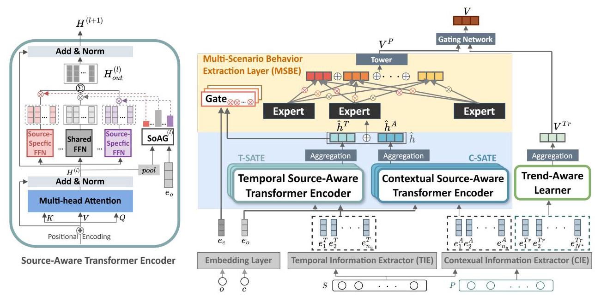

# MM4Rec: Multi-Source and Multi-Scenario Recommender for Unified User Preference

Chu-Chun Yu \( {}^{1 * } \) , Ming-Yi Hong \( {}^{1,2 *  \dagger  } \) , Miao-Chen Chiang \( {}^{1,2 \dagger  } \) , Min Chen Hsieh \( {}^{1} \) , Che Lin \( {}^{1 \dagger   \ddagger  } \)

\( {}^{1} \) National Taiwan University

\( {}^{2} \) Academia Sinica

## Abstract

As online ecosystems grow increasingly complex, personalized recommendation systems must integrate user preferences across heterogeneous content sources and interaction scenarios. However, conventional methods typically model each source and scenario in isolation, hindering their ability to capture shared and complementary signals across contexts. In this work, we propose MM4Rec, a unified framework for multi-source and multi-scenario recommendation. MM4Rec introduces a Source-Aware Transformer Encoder to jointly model heterogeneous inputs, a Multi-Scenario Behavior Extraction Layer based on a multi-mixture-of-experts architecture to capture scenario-specific dynamics, and a Trend-Aware Learner to enhance temporal representation learning. Extensive experiments on three real-world datasets demonstrate that MM4Rec consistently outperforms strong baselines across standard recommendation metrics. To facilitate future research, we also release two large-scale datasets encompassing diverse sources and scenarios.

## Code, Datasets, and Appendix -

https://github.com/idssplab/MM4Rec

## 1 Introduction

In the digital era, online platforms engage users through diverse scenarios: active browsing (Browse), where users explore content at their own pace, and push notifications (Push), which deliver timely and targeted re-engagement messages. These platforms also operate over multiple content sources—such as news for engagement, ads for profitability, and reviews for decision-making. Crucially, interactions in one scenario influence behavior in another; for instance, news engagement may increase ad responsiveness. While integrating cross-source and cross-scenario signals enables richer and more context-aware preference modeling, progress remains constrained by the scarcity of public datasets that capture such interactions. To advance research in this direction, we release two real-world datasets featuring News and Ads interactions on media platforms and further utilize a public dataset that encompasses video and article behaviors. These datasets reveal that sources and scenarios differ in content style and temporal density-for example, ad interactions are sparse and profit-driven, while news interactions are frequent and interest-oriented. This heterogeneity motivates our focus on unified multi-source and multi-scenario recommendation, where complementary information across contexts is jointly modeled to enhance personalization.

Traditional recommendation systems (Hidasi and Karat-zoglou 2018; Kang and McAuley 2018; Sun et al. 2019) typically employ separate subsystems for distinct scenarios and sources, limiting their ability to provide integrated recommendations. Multi-Task Learning (MTL) (Caruana 1997; Ma et al. 2018; Tang et al. 2020) approaches primarily optimize multiple objectives (e.g., click-through and conversion rates) within a single scenario. In contrast, Multi-Scenario Learning (MSL) (Li et al. 2020; Sheng et al. 2021; Shen et al. 2021; Tian et al. 2023; Wang et al. 2023) integrates user behaviors across scenarios by aligning representations and capturing complementary patterns. For example, browsing technology articles might correlate with engagement in related push notifications - an insight overlooked by MTL due to its scenario isolation.

However, existing MSL frameworks often neglect cross-source relationships, highlighting the need for a unified approach bridging scenarios and sources. Such integration is essential for several reasons. First, overlapping users and items across scenarios may enrich recommendation quality. For example, behaviors in news browsing can inform push notification content, and integrating News and Ads sources can leverage browsing behaviors to recommend relevant advertisements. Second, unified modeling must address the seesaw effect (Weiss, Khoshgoftaar, and Wang 2016; Tang et al. 2020; Zhou et al. 2023), carefully balancing performance across different scenarios and sources. Lastly, integrating multi-source and multi-scenario information mitigates data imbalance issues, such as sparse advertisement clicks, providing a more comprehensive understanding of user preferences.

To this end, we propose MM4Rec, a unified framework for Multi-source and Multi-scenario Recommendation that jointly models complex user behaviors across heterogeneous data. To the best of our knowledge, MM4Rec is the first framework to simultaneously address both multi-source and multi-scenario settings in a unified architecture. Addressing a critical gap in current research infrastructure, we also release two new large-scale real-world datasets-AviviD_DatasetA and AviviD_DatasetB—which span both scenarios and sources and include push interaction data. MM4Rec features three core components:

---

*These authors contributed equally.

\( {}^{ \dagger  } \) Data Science Degree Program, National Taiwan University and Academia Sinica.

*Corresponding author. (Email: chelin@ntu.edu.tw)

Copyright © 2026, Association for the Advancement of Artificial Intelligence (www.aaai.org). All rights reserved.

---

- Source-Aware Transformer Encoder (SATE): Captures both shared and source-specific semantics through a source-adaptive gating mechanism, enabling effective cross-source representation learning.

- Multi-Scenario Behavior Extraction Layer (MSBE): Based on the Multi-Mixture-of-Experts (MMoE) framework (Ma et al. 2018), it disentangles scenario-specific behaviors and supports information sharing across interaction contexts.

- Trend-Aware Learner (Yu et al. 2024): Refines the final user representation by capturing temporal evolution in user behavior.

We conduct extensive experiments on a public benchmark dataset and the two AviviD datasets. Results show that MM4Rec consistently outperforms state-of-the-art baselines in sequential recommendation across diverse scenarios and content sources.

Our main contributions are summarized as follows:

- We propose MM4Rec, a novel unified framework for modeling multi-source and multi-scenario user behaviors, advancing the design of next-generation recommendation systems.

- We introduce key architectural components-SATE and MSBE-to enable end-to-end cross-source and cross-scenario integration while effectively mitigating the seesaw effect.

- We release two real-world datasets from two different media platforms, that cover both content sources and interaction scenarios, including push notification data, filling a critical gap in public resources and enabling future research on integrated recommendation tasks.

Additional visual motivation, detailed analysis, and real-world data statistics are provided in Appendix A.1.

## 2 Related Work

### 2.1 Sequential Recommender Systems

Sequential Recommender Systems (SRSs) predict the next item users will interact with based on their historical behaviors. Early works such as GRU4Rec (Hidasi and Karat-zoglou 2018) employ gated recurrent units to capture temporal dynamics, while SASRec (Kang and McAuley 2018) leverages self-attention (Vaswani et al. 2017) to model item dependencies. BERT4Rec (Sun et al. 2019) further employs a bidirectional transformer to learn representations from both directions. Despite these advances, most SRSs operate within a single scenario and source, limiting their ability to capture cross-context preferences.

### 2.2 Multi-task Learning

MTL focuses on simultaneously learning multiple related tasks by leveraging shared information across them to enhance overall performance. The primary objective of MTL is to exploit task relationships, enabling the model to learn shared patterns while maintaining task-specific representations. Shared Bottom (Caruana 1997) is a basic multi-task learning model that shares underlying feature information across tasks. However, its hard parameter sharing limits its ability to learn distinct tasks effectively. To overcome the limitation, MMoE (Ma et al. 2018) introduces multiple expert networks and ensemble learning to enhance representation capabilities, using a flexible gating network to create task-specific representations for prediction. Despite its progress, MMoE suffers from the seesaw phenomenon, where improvements in one task or scenario lead to performance declines in others. This issue is symptomatic of the negative transfer problem (Pan and Yang 2010; Weiss, Khoshgoftaar, and Wang 2016). PLE (Tang et al. 2020) addresses this issue by explicitly separating shared and task-specific components and using a progressive routing mechanism to gradually extract and differentiate semantic knowledge, improving joint representation learning and information routing across tasks.

### 2.3 Multi-Scenario Learning

MSL is designed to address distinct learning challenges across various scenarios by capturing both shared and scenario-specific information, often with the help of transfer learning techniques (Pan and Yang 2010). In recent years, it has been applied to multi-scenario recommendation (Chen et al. 2020; Cheng et al. 2023; Gao et al. 2023; Hao et al. 2021; Huan et al. 2023; Lan, Zhang, and Li 2023; Li et al. 2020; Shen et al. 2021; Sheng et al. 2021; Tian et al. 2023; Wang et al. 2023; Xu et al. 2023). Inspired by MTL, HMoE (Li et al. 2020) leverages the MMoE framework to implicitly capture distinctions and commonalities across domains. SAR-Net (Shen et al. 2021) utilizes attention modules to transfer user interests across domains and applies a mixture of experts to extract relevant information. STAR (Sheng et al. 2021) employs a star topology with shared central parameters and domain-specific parameters, enabling a single model to serve multiple domains. Recently, unified frameworks have emerged for multi-scenario and multi-task recommendation: Liu et al. (Liu et al. 2024b) leverage ranking signals from heterogeneous scenarios; MultiFS (Liu et al. 2024a) automates feature selection for scenario-specific modeling; and M3oE (Zhang et al. 2024) applies mixture-of-experts for multi-domain and multi-task learning. Similarly, PEPNet (Chang et al. 2023) and HiNet (Zhou et al. 2023) focus on multi-task personalization and cross-domain transfer through advanced parameter sharing and hierarchical MOE structures. Despite advancements, MSL research in SRSs remains limited. Most work focuses on click-through rate predictions, rather than sequential recommendations.

### 2.4 Cross-Domain Recommendation

Recent studies have explored transferable sequential recommenders to improve generalization across domains. In particular, VQRec (Hou et al. 2023) proposes learning vector-quantized item representations that decouple textual semantics from item embeddings, enabling cross-domain adaptation without overlapping users or items. Unlike VQRec, which focuses on transferable item representations across domains, MM4Rec addresses multi-source and multi-scenario integration within a unified architecture. Thus, while both aim to enhance generalization, our work complements cross-domain transfer by focusing on in-platform multi-context modeling.

Existing works mainly address either multi-task, multi-scenario, or cross-domain challenges in isolation. However, real-world systems require unified modeling of heterogeneous sources and interaction contexts. Effectively leveraging both multi-source and multi-scenario information is crucial for building adaptive and accurate recommendation systems that capture the richness of real-world user behavior.

## 3 Proposed Method: MM4Rec

### 3.1 Preliminaries

The problem formulation and notations for our study are formally defined as follows. Let \( U = \left\{  {{u}_{1},{u}_{2},\ldots ,{u}_{\left| U\right| }}\right\} \) denote a set of users, \( O = \{ 1,2,\ldots , q\} \) and \( C = \{ 1,2,\ldots , m\} \) be a set of source and scenario, where \( q \) and \( m \) are the number of unique sources and scenarios, respectively. Let \( {S}_{o, c}^{\left( u\right) } = \left\lbrack  {{v}_{o, c,1}^{\left( u\right) },\ldots ,{v}_{o, c, t}^{\left( u\right) },\ldots ,{v}_{o, c,{n}_{u}}^{\left( u\right) }}\right\rbrack \) denote the history interaction sequence, where \( {v}_{o, c, t}^{\left( u\right) } \in  {\mathcal{V}}_{o} \) is the item from the \( o \) -th source that user \( u \) has interacted with in the \( c \) -th scenario at time step \( t \) . The set \( {\mathcal{V}}_{o} \) contains all items available in source \( o \) , and \( {n}_{u} \) is the length of the interaction sequence. Given the user's interaction sequence in a specific source and scenario, the objective is to predict the next item \( {v}_{{n}_{u} + 1}^{\left( u\right) } \) that user \( u \) will interact with, across all possible sources and scenarios, denoted as follows:

\[
\Pr \left( {{v}_{{n}_{u} + 1}^{\left( u\right) } \mid  \left\{  {S}_{o, c}^{\left( u\right) }\right\}  , o, c}\right) . \tag{1}
\]

In this way, the model can differentiate and process information based on the content source and the scenario in which the user interaction occurs.

### 3.2 Feature Representation

Our model incorporates two specialized extractors inspired by (Yu et al. 2024) to capture and utilize information from user interactions and content: Temporal Information Extractor (TIE) extracts features such as weekday, hour, and click time intervals, which are normalized and embedded into a vector \( {e}_{t}^{T} \in  {\mathbb{R}}^{{d}_{\text{ model }}} \) , capturing comprehensive temporal information. Contextual Information Extractor (CIE) uses pre-trained language models to extract contextual embedding from news articles and advertisement titles. Each item's title is processed using the TAIDE (NARLab 2024), a model that represents the SOTA in the Traditional Chinese language processing, based on Llama 2 (Touvron et al. 2023). The model parameters are frozen during training to leverage its pre-trained knowledge effectively. The output is a unified contextual embedding \( {e}_{t}^{A} \in  {\mathbb{R}}^{{d}_{\text{ model }}} \) . Further details are provided in Appendices A. 2 and A.3.

Embedding Layer. The embedding layer converts the source (o) and scenario (c) into embeddings of dimension \( {d}_{\text{ model }} \) . These values are mapped to their corresponding learnable embeddings \( {e}_{o},{e}_{c} \in  {\mathbb{R}}^{{d}_{\text{ model }}} \) , which are randomly initialized at the start of training. These embeddings are then used throughout the model to identify the nuances of different sources and scenarios, effectively differentiating how the model processes content based on where it originates and in what context it is being consumed.

### 3.3 Source-Aware Transformer Encoder (SATE)

The SATE tackles the challenges of multi-source data integration in sequential recommendation tasks by combining shared and source-specific feed-forward networks inspired by Switch Transformers (Fedus, Zoph, and Shazeer 2022). Unlike existing models that treat content sources either uniformly or in isolation, SATE strikes a balance between generalization and source-specific modeling through a source-adaptive gating mechanism that dynamically modulates the contribution of shared versus source-specific representations. This design enables effective cross-source information sharing while preserving critical distinctions across content types. By capturing nuanced sequential dependencies and uncovering richer behavioral patterns, SATE achieves substantial improvements over traditional source-agnostic or source-separated approaches.

Multi-head Self-attention Layers. To allow the model to jointly attend to information from different representation subspaces at various positions, we employ multi-head self-attention in SATE as shown in Figure 1. After applying layer normalization and the residual connection, the output of the multi-head attention layer is denoted as \( {H}^{\left( l\right) } \in  {\mathbb{R}}^{{n}_{u} \times  {d}_{\text{ model }}} \) . This output serves as the foundational representation of the \( l \) -th layer in SATE. For more detailed information, refer to Appendix A.4.

Feed-forward Networks in SATE. Point-wise Feed-forward Networks (PFFN) enhance representation capacity by applying fully connected layers to the output of multihead attention. For details, see Appendix A.5. However, using a single PFFN across all data sources, as in many existing transformer-based models, can obscure source-specific nuances, limiting the model's ability to differentiate the unique characteristics of each source. To address this, we introduce a novel design that incorporates both Shared FFNs and Source-Specific FFNs, as shown in Figure 1 and will be discussed below.

Source-Specific FFNs. For each source \( i \) , a dedicated FFN is applied to sequences originating from that specific source. The operation of the Source-Specific FFNs can be generalized as:

\[
{\operatorname{PFFN}}_{i}\left( {H}^{\left( l\right) }\right)  = {\left\lbrack  {\operatorname{FFN}}_{i}{\left( {h}_{1}^{l}\right) }^{T};\ldots ;{\operatorname{FFN}}_{i}{\left( {h}_{{n}_{u}}^{l}\right) }^{T}\right\rbrack  }^{T}, \tag{2}
\]

\[
\forall i \in  \{ 1,2,\ldots , q\} .
\]

Shared FFN processes sequences from all sources collectively, learning common features that are applicable across different content types. This shared layer generates a uniform representation that serves as a foundational input for further processing in the network. The operation of the Shared FFN can be expressed as:

\[
{\operatorname{PFFN}}_{sh}\left( {H}^{\left( l\right) }\right)  = {\left\lbrack  {\operatorname{FFN}}_{sh}{\left( {h}_{1}^{l}\right) }^{T};\ldots ;{\operatorname{FFN}}_{sh}{\left( {h}_{{n}_{u}}^{l}\right) }^{T}\right\rbrack  }^{T}.
\]

(3)

Figure 1: Overall architecture of MM4Rec. \( S \) denotes the user’s historical interaction sequence, and \( P \) is the top \( {N}^{ * } \) popular items list clicked by all users within an hour. Sequence \( S \) passes through the TIE and CIE for temporal and contextual representations, while \( P \) uses CIE only. These embeddings \( \left( {{e}^{T},{e}^{A}}\right) \) and source embeddings \( {e}_{o} \) are fed into T-SATE and C-SATE for information sharing. The outputs are concatenated, processed in the MSBE, then combined with the Trend-Aware Learner output to form the final representation \( V \) .

Source Adaptive Gate (SoAG). In each SATE block, SoAG first dynamically computes gating weights based on the mean-pooled output from the multi-head self-attention layer \( {H}^{\left( l\right) } \) . This output is then concatenated with the source embedding \( {e}_{s} \) , as illustrated in Figure 1. This process enables the model to balance shared and source-specific information at each encoder block. The gating weights for the \( l \) -th encoder block are computed as follows:

\[
{SoA}{G}^{\left( l\right) } \mathrel{\text{ := }} \operatorname{softmax}\left( {{W}_{2}^{l}\operatorname{ReLU}\left( {{W}_{1}^{l}\left\lbrack  {{\bar{H}}^{\left( l\right) };{e}_{o}}\right\rbrack  }\right) }\right) , \tag{4}
\]

\[
= \left\lbrack  {{g}_{sh}^{l},{g}_{1}^{l},\ldots ,{g}_{q}^{l}}\right\rbrack  \text{ . }
\]

where \( {\bar{H}}^{\left( l\right) } \) is the mean-pooled output of \( {H}^{\left( l\right) },\left\lbrack  {\cdot ; \cdot  }\right\rbrack \) denotes concatenation, and \( {W}_{1}^{l} \) and \( {W}_{2}^{l} \) are learnable matrices. The softmax \( \left( \cdot \right) \) function ensures that the gating weights sum up to one, enabling effective integration of shared and source-specific features. Here, \( {g}_{sh}^{l} \) represents the weight for the shared FFN, and \( {g}_{i}^{l} \) represents the weight for the \( i \) -th source-specific FFN in the \( l \) -th block. These weights are used to combine the outputs from the Shared FFN and the Source-Specific FFNs, formulated as follows:

\[
{H}_{\text{ out }}^{\left( l\right) } = {g}_{sh}^{l} \cdot  {\operatorname{PFFN}}_{sh}\left( {H}^{\left( l\right) }\right)  + \mathop{\sum }\limits_{{i = 1}}^{q}{g}_{i}^{l} \cdot  {\operatorname{PFFN}}_{i}\left( {H}^{\left( l\right) }\right) . \tag{5}
\]

The adaptive gating mechanism dynamically integrates shared and source-specific features at each encoder block, improving the model's ability to capture complex user interaction patterns across various content sources.

Stacking SATE. We incorporate residual connections and layer normalization across SATE blocks. The output of each SATE block is computed as follows:

\[
{H}^{\left( l + 1\right) } = \operatorname{LayerNorm}\left( {{H}^{\left( l\right) } + {H}_{\text{ out }}^{\left( l\right) }}\right) , \tag{6}
\]

where \( {H}^{\left( l\right) } \) is the input to the \( l \) -th block, and \( {H}^{\left( l + 1\right) } \) is the input to the subsequent block. This stacking allows for the efficient integration of learned features across multiple blocks, enhancing the model's representation capabilities.

Integration of Temporal and Contextual Features. We introduce Temporal Source-Aware Transformer Encoder (T-SATE) and Contextual Source-Aware Transformer Encoder (C-SATE) to learn temporal and contextual embedding sequences, respectively, as shown in Figure 1. These two modules consist of stacked SATE blocks to enhance representation learning. Let \( {e}^{T} = \left\lbrack  {{e}_{1}^{T},\ldots ,{e}_{t}^{T},\ldots ,{e}_{{n}_{u}}^{T}}\right\rbrack \) and \( {e}^{A} = \left\lbrack  {{e}_{1}^{A},\ldots ,{e}_{t}^{A},\ldots ,{e}_{{n}_{u}}^{A}}\right\rbrack \) be the temporal and contextual embedding input sequences. We apply learnable positional embeddings \( {PE} = \left\lbrack  {{p}_{1},\ldots ,{p}_{t},\ldots ,{p}_{{n}_{u}}}\right\rbrack \) to each input sequence to incorporate position information. The outputs, \( {H}^{T} \) and \( {H}^{A} \) , undergo mean pooling to yield \( {\widehat{h}}^{T} = \; \operatorname{mean}\left( {H}^{T}\right) \) and \( {\widehat{h}}^{A} = \operatorname{mean}\left( {H}^{A}\right) \) . The final representation, \( \widehat{h} \) , is obtained by concatenating \( {\widehat{h}}^{T} \) and \( {\widehat{h}}^{A} \) , capturing both temporal and contextual information.

### 3.4 Multi-Scenario Behavior Extraction Layer (MSBE)

The MSBE is designed to capture and model user behavior patterns across diverse interaction scenarios, such as browsing and push notifications. By leveraging the MMoE framework (Ma et al. 2018) in Figure 1, MSBE captures scenario-specific nuances while enabling effective information sharing across scenarios. Each Expert is an independent, fully connected network, with the integrated representation \( \widehat{h} \) serving as input. Multiple gates aggregate the outputs of these experts, learning scenario-specific representations and capturing diverse scenario characteristics. The gating weights are computed from the concatenation of \( \widehat{h} \) and the scenario embedding \( {e}_{c} \) :

\[
{\mathcal{G}}_{c} \mathrel{\text{ := }} \operatorname{softmax}\left( {{W}_{2c} \cdot  \operatorname{ReLU}\left( {{W}_{1c} \cdot  \left\lbrack  {\widehat{h};{e}_{c}}\right\rbrack  }\right) }\right) , \tag{7}
\]

\[
\forall c \in  \{ 1,2,\ldots , m\}
\]

where \( {\mathcal{G}}_{c} = \left\lbrack  {{w}_{c,1},{w}_{c,2},\ldots ,{w}_{c, n}}\right\rbrack \) represents the vector of gating weights for scenario \( c \) , and each element \( {w}_{c, i} \) is the weight for expert \( i \) in scenario \( c \) . The number of experts, \( n \) , can be regarded as a hyperparameter. For each scenario, \( c \) , the output \( {V}_{c} \) is a weighted sum of the expert outputs. These outputs are then concatenated and refined by the tower network to encapsulate multi-scenario behavior and enhance predictive performance:

\[
{V}^{P} = \operatorname{Tower}\left( {\left\lbrack  \mathop{\sum }\limits_{{i = 1}}^{n}{w}_{c, i} \cdot  {\operatorname{Expert}}_{i}\left( \widehat{h}\right) \right\rbrack  }_{c}\right) , \tag{8}
\]

where each \( {\operatorname{Expert}}_{i}\left( \right) \) is an independent fully-connected network, and \( {\left\lbrack  \cdot \right\rbrack  }_{c} \) denotes the concatenation of the weighted sums of expert outputs for all scenarios. The tower network consists of two fully connected layers, each followed by a ReLU activation, which processes the concatenated outputs to produce the final prediction.

### 3.5 Trend-Aware Learner (TAL)

The user's click preference is influenced by historical preferences and current trends. We build a trend-aware learner to capture dynamic trends inspired by Push4Rec (Yu et al. 2024) in Figure 1. To realize a trend-aware representation, we retrieve the top- \( {N}^{ * } \) items based on recent overall clicks as a popular item list. We then obtain their contextual em-beddings \( \left( {{e}^{Tr} = \left\lbrack  {{e}_{1}^{Tr},{e}_{2}^{Tr},\ldots ,{e}_{{N}^{ * }}^{Tr}}\right\rbrack  }\right) \) using the CIE module. These embeddings serve as the queries, keys, and values in the self-attention mechanism. The resulting output \( \left( {H}^{Tr}\right) \) is then mean-pooled to aggregate the trend-aware representation \( \left( {V}^{Tr}\right) \) . TAL uses a gating network to dynamically balance personalized interest \( \left( {V}^{\bar{P}}\right) \) and trend-aware representation \( \left( {V}^{Tr}\right) \) . This ensures the final representation \( \left( V\right) \) reflects the influence of different information sources for each sequence. See Appendix A. 6 for details.

### 3.6 Loss Function

For each sequence, we generate a user representation \( V \) and candidate item embeddings \( \left\{  {{e}_{1},{e}_{2},\ldots ,{e}_{N + 1}}\right\} \) , including one ground-truth item and \( N \) negative samples. Cosine similarity scores between the user and item embeddings are scaled into probabilities \( \left\{  {{p}_{1},{p}_{2},\ldots ,{p}_{N + 1}}\right\} \) . The binary cross-entropy loss for training is computed as:

\[
\mathcal{L} =  - \frac{1}{M}\mathop{\sum }\limits_{{j = 1}}^{M}\frac{1}{N + 1}\mathop{\sum }\limits_{{i = 1}}^{{N + 1}}\left\lbrack  {{y}_{ji}\log \left( {p}_{ji}\right) }\right. \tag{9}
\]

\[
\left. {+\left( {1 - {y}_{ji}}\right) \log \left( {1 - {p}_{ji}}\right) }\right\rbrack  \text{ , }
\]

where \( {y}_{ji} \in  \{ 0,1\} \) indicates whether the \( i \) -th item is the ground truth, and \( M \) is the total number of sequences. Further details are provided in Appendix A.7.

## 4 Experiments

### 4.1 Experimental Settings

Datasets. Our experiments were conducted on two newly released datasets, AviviD_DatasetA and AviviD_DatasetB, collected from two media platforms featuring user interactions in two distinct scenarios: push notifications and web browsing, with content from two sources: News and Ads. Additionally, we utilized the public dataset from Ten-cent (Yuan et al. 2022), which includes two interaction scenarios (QB and QK) and two content sources (articles and videos) spanning those scenarios. Users with fewer than three interactions were excluded, and the most recent 20 interactions were used as input for training. User sequences were segmented for training, validation, and testing. Similar performance trends were observed on AviviD_DatasetB; detailed results are provided in Appendices A. 8 and A. 12 (Tables A.4-A.6).

Baselines. To evaluate MM4Rec, we compare it to state-of-the-art methods in three categories: (i) Single model: Models like SASRec (Kang and McAuley 2018) (self-attention for sequential patterns) and Push4Rec (Yu et al. 2024) (adapted from CTR to sequential tasks) are trained separately for each source and scenario. (ii) Multi-scenario model: Models such as Shared Bottom, MMoE (Ma et al. 2018), PLE (Tang et al. 2020), and STAR (Sheng et al. 2021) are trained per source but across multiple scenarios, using various mechanisms (shared experts, multi-gate sharing, or star topology) to balance shared and scenario-specific knowledge. (iii) Multi-source and Multi-scenario model: To address the limited research in this area, we introduce STAR-MM (late fusion of separate STAR topologies for sources and scenarios) and Push4Rec-MM (Push4Rec backbone with dual MMoE modules for both dimensions). Detailed model descriptions are provided in Appendix A.9.

Evaluation and Implementation Details. The performances are evaluated by Hit Ratio@10 (HR@10) and Normalized Discounted Cumulative Gain@10 (NDCG@10). To reduce the computational burden of evaluating all user-item pairs, we adopted the training strategy from (Koren 2008; He et al. 2017; Kang and McAuley 2018) and tuned hyperpa-rameters based on validation NDCG@10.Detailed configurations are provided in Appendices A.10-A.13, along with the parameter analysis. Each experiment was conducted five times, and the results were averaged to ensure reliable and consistent performance metrics.

<table><tr><td rowspan="2">Model</td><td colspan="2">Push Ads</td><td colspan="2">Browse Ads</td><td colspan="2">Push News</td><td colspan="2">Browse News</td></tr><tr><td>NDCG@10</td><td>HR@10</td><td>NDCG@10</td><td>HR@10</td><td>NDCG@10</td><td>HR@10</td><td>NDCG@10</td><td>HR@10</td></tr><tr><td>SASRec</td><td>0.414</td><td>0.744</td><td>0.164</td><td>0.274</td><td>0.075</td><td>0.172</td><td>0.369</td><td>0.564</td></tr><tr><td>Push4Rec</td><td>0.425</td><td>0.753</td><td>0.456</td><td>0.744</td><td>0.092</td><td>0.206</td><td>0.380</td><td>0.590</td></tr><tr><td></td><td colspan="4">Source: Ads</td><td colspan="4">Source: News</td></tr><tr><td>Shared_Bottom</td><td>0.285 (↓)</td><td>0.654 (↓)</td><td>0.464 (↑)</td><td>0.772 (↑)</td><td>0.047 (↓)</td><td>0.111 (↓)</td><td>0.417 (↑)</td><td>0.661 (↑)</td></tr><tr><td>MMOE</td><td>0.354 (↓)</td><td>0.694 (↓)</td><td>0.464 (↑)</td><td>0.758 (↑)</td><td>0.057 (↓)</td><td>0.137 (↓)</td><td>0.423 (↑)</td><td>0.669 (↑)</td></tr><tr><td>PLE</td><td>0.352 (↓)</td><td>0.689 (↓)</td><td>0.467 (↑)</td><td>0.757 (↑)</td><td>0.056 (↓)</td><td>0.136 (↓)</td><td>0.419 (↑)</td><td>0.664 (↑)</td></tr><tr><td>STAR</td><td>0.337 (↓)</td><td>0.688 (↓)</td><td>0.468 (↑)</td><td>0.759 (↑)</td><td>0.057 (↓)</td><td>0.136 (↓)</td><td>0.431 (↑)</td><td>0.675 (↑)</td></tr><tr><td>STAR-MM</td><td>0.448 (↑)</td><td>0.767 (↑)</td><td>0.427 (↓)</td><td>0.716 (↓)</td><td>0.068 (↓)</td><td>0.165 (↓)</td><td>0.433 (↑)</td><td>0.690 (↑)</td></tr><tr><td>Push4Rec-MM</td><td>0.455 (↑)</td><td>0.773 (↑)</td><td>0.460 (↑)</td><td>0.733 (↓)</td><td>0.091 (↓)</td><td>0.226 (↑)</td><td>0.434 (↑)</td><td>0.690 (↑)</td></tr><tr><td>MM4Rec</td><td>0.473 (*)</td><td>0.776 (↑)</td><td>0.469 (↑)</td><td>0.735 (↓)</td><td>0.093 (↑)</td><td>0.230 (↑)</td><td>0.441 (↑)</td><td>0.701 (**)</td></tr></table>

Table 1: Performance on AviviD_DatasetA. Results are averaged over five runs, with standard deviations provided in Appendix Table A.4. The best and second-best results are highlighted in boldface and underlined, respectively. Arrows indicate improvement \( \left(  \uparrow  \right) \) or decline \( \left(  \downarrow  \right) \) relative to Push4Rec. Statistical significance is assessed via paired t-tests against the second-best baseline, Push4Rec-MM (in most cases). Significance levels are denoted as follows: * for p-value \( < {0.05} \) ,** for p-value \( < {0.05} \) , ** for p-value \( < \) 0.01, and *** for p-value \( < {0.001} \) .

<table><tr><td rowspan="2">Model</td><td colspan="2">QK Video</td><td colspan="2">QB Video</td><td colspan="2">QK Article</td><td colspan="2">QB Article</td></tr><tr><td>NDCG@10</td><td>HR@10</td><td>NDCG@10</td><td>HR@10</td><td>NDCG@10</td><td>HR@10</td><td>NDCG@10</td><td>HR@10</td></tr><tr><td>SASRec</td><td>0.187</td><td>0.319</td><td>0.306</td><td>0.472</td><td>0.253</td><td>0.403</td><td>0.427</td><td>0.634</td></tr><tr><td>Push4Rec</td><td>0.200</td><td>0.332</td><td>0.306</td><td>0.449</td><td>0.254</td><td>0.396</td><td>0.399</td><td>0.597</td></tr><tr><td></td><td colspan="4">Source: Video</td><td colspan="4">Source: Article</td></tr><tr><td>Shared_Bottom</td><td>0.197 (↓)</td><td>0.347 (↑)</td><td>0.376 (↑)</td><td>0.577 (↑)</td><td>0.246 (↓)</td><td>0.423 (↑)</td><td>0.548 (↑)</td><td>0.826 (↑)</td></tr><tr><td>MMOE</td><td>0.197 (↓)</td><td>0.347 (↑)</td><td>0.374 (↑)</td><td>0.572 (↑)</td><td>0.247 (↓)</td><td>0.415 (↑)</td><td>0.552 (↑)</td><td>0.819 (↑)</td></tr><tr><td>PLE</td><td>0.196 (↓)</td><td>0.344 (↑)</td><td>0.375 (↑)</td><td>0.578 (↑)</td><td>0.247 (↓)</td><td>0.415 (↑)</td><td>0.553 (↑)</td><td>0.819 (↑)</td></tr><tr><td>STAR</td><td>0.199 (↓)</td><td>0.349 (↑)</td><td>0.382 (↑)</td><td>0.591 (↑)</td><td>0.247 (↓)</td><td>0.410 (↑)</td><td>0.561 (↑)</td><td>0.830 (↑)</td></tr><tr><td>STAR-MM</td><td>0.199 (↓)</td><td>0.350 (↑)</td><td>0.381 (↑)</td><td>0.591 (↑)</td><td>0.248 (↓)</td><td>0.414 (↑)</td><td>0.568 (↑)</td><td>0.840 (↑)</td></tr><tr><td>Push4Rec-MM</td><td>0.198 (↓)</td><td>0.347 (↑)</td><td>0.384 (↑)</td><td>0.591 (↑)</td><td>0.258 (↑)</td><td>0.430 (↑)</td><td>0.568 (↑)</td><td>0.846 (**)</td></tr><tr><td>MM4Rec</td><td>0.207 (***)</td><td>0.365 (***)</td><td>0.388 (***)</td><td>0.598 (**)</td><td>0.263 (**)</td><td>0.439 (**)</td><td>0.571 (**)</td><td>0.846 (**)</td></tr></table>

Table 2: Performance on Tenrec dataset. The table follows Table 1 conventions. Standard deviations are provided in Appendix Table A.6.

### 4.2 Performance Comparison

Tables 1 and 2 show the overall performance of the AviviD_DatasetA and Tenrec datasets. We observe that MM4Rec significantly outperforms most competitors and achieves near state-of-the-art results. These performance improvements are further supported by statistical significance tests, confirmed through \( p \) -values. Several takeaways can be noted from our experimental results:

(1) Integrating multi-source and multi-scenario frameworks enhances the predictive ability of sequential recommendations compared to traditional single models. In the AviviD_DatasetA and Tenrec datasets, all variants of multi-source and multi-scenario models, including STAR-MM, Push4Rec-MM, and the proposed MM4Rec, consistently outperform single models across most metrics. This suggests that leveraging multiple sources and scenarios is advantageous for complex recommendation tasks. For example, in AviviD_DatasetA (Table 1), MM4Rec achieves an NDCG@10 of 0.473 and HR@10 of 0.776 in the Push Ads scenario (versus Push4Rec's 0.425 and 0.753), and an NDCG@10 of 0.441 and HR@10 of 0.701 in the Browse News scenario (versus 0.380 and 0.590). These highlight MM4Rec's superior performance in integrating multi-source and multi-scenario data.

(2) We effectively address the seesaw effect commonly observed in existing multi-scenario models, where improving performance in one scenario often leads to degradation in another. For example, in AviviD_DatasetA (Table 1), the STAR-MM model improves NDCG@10 for Push Ads (0.448 vs. 0.337 in STAR), but its performance on Browse Ads drops (0.427 vs. 0.468), exemplifying this trade-off. In contrast, MM4Rec achieves higher NDCG@10 for both Push Ads (0.473) and Browse Ads (0.469), demonstrating consistent improvements across scenarios without compromising one for the other. A similar trend is observed in Table 2. This robustness stems from the joint use of SATE for cross-source representation learning and MSBE for multi-scenario information extraction, which together enable balanced and enhanced performance across diverse settings.

<table><tr><td rowspan="2">Setting</td><td colspan="2">Push Ads</td><td colspan="2">Browse Ads</td><td colspan="2">Push News</td><td colspan="2">Browse News</td></tr><tr><td>NDCG@10</td><td>HR@10</td><td>NDCG@10</td><td>HR@10</td><td>NDCG@10</td><td>HR@10</td><td>NDCG@10</td><td>HR@10</td></tr><tr><td>MM4Rec</td><td>0.473</td><td>0.776</td><td>0.469</td><td>0.735</td><td>0.093</td><td>0.230</td><td>0.441</td><td>0.701</td></tr><tr><td>MM4Rec w/o MSBE</td><td>0.461</td><td>0.766</td><td>0.455</td><td>0.740</td><td>0.092</td><td>0.225</td><td>0.437</td><td>0.701</td></tr><tr><td>MM4Rec w/o SATE in T&C</td><td>0.461</td><td>0.774</td><td>0.450</td><td>0.726</td><td>0.089</td><td>0.216</td><td>0.434</td><td>0.688</td></tr><tr><td>MM4Rec w/o SATE in T</td><td>0.450</td><td>0.775</td><td>0.453</td><td>0.731</td><td>0.088</td><td>0.226</td><td>0.436</td><td>0.693</td></tr><tr><td>MM4Rec w/o SATE in C</td><td>0.459</td><td>0.773</td><td>0.457</td><td>0.728</td><td>0.091</td><td>0.218</td><td>0.431</td><td>0.691</td></tr></table>

Table 3: Ablation study on AviviD_DatasetA: Assessing the effectiveness of modules in MM4Rec. In the "w/o SATE" settings, we replace SATE with a standard encoder. In this context, "T" and "C" refer to the temporal (T-SATE) and contextual (C-SATE) pathways within the MM4Rec model.

<table><tr><td rowspan="2">Setting</td><td colspan="2">Push Ads</td><td colspan="2">Browse Ads</td><td colspan="2">Push News</td><td colspan="2">Browse News</td></tr><tr><td>NDCG@10</td><td>HR@10</td><td>NDCG@10</td><td>HR@10</td><td>NDCG@10</td><td>HR@10</td><td>NDCG@10</td><td>HR@10</td></tr><tr><td>MM4Rec</td><td>0.473</td><td>0.776</td><td>0.469</td><td>0.735</td><td>0.093</td><td>0.230</td><td>0.441</td><td>0.701</td></tr><tr><td>MM4Rec w/o SoAG†</td><td>0.457</td><td>0.771</td><td>0.457</td><td>0.738</td><td>0.089</td><td>0.222</td><td>0.432</td><td>0.692</td></tr><tr><td>MM4Rec w/o specific FFN*</td><td>0.451</td><td>0.773</td><td>0.446</td><td>0.728</td><td>0.086</td><td>0.215</td><td>0.431</td><td>0.691</td></tr></table>

Table 4: Impact of source-specific FFNs and SoAG on SATE performance, evaluated on AviviD_DatasetA. †Equal Weights 0.33/0.33/0.33. \( {}^{ \ddagger  } \) shared FFN \( \times  3 \)

MM4Rec achieves state-of-the-art performance across most metrics and datasets. Integrating multi-source and multi-scenario data significantly enhances the understanding of user preferences, offering superior efficiency and effectiveness compared to models trained separately. MM4Rec leverages the strengths of the SATE and MSBE modules to implement an information-sharing process, effectively mitigating the seesaw effect observed in other models.

### 4.3 Ablation Study

The ablation results in Table 3 highlight the importance of MM4Rec's key components. Removing MSBE leads to significant performance degradation across metrics, emphasizing its effectiveness in capturing complex scenario interactions. Similarly, substituting the proposed SATE with a standard encoder—especially when excluded from both temporal (T-SATE) and contextual (C-SATE) pathways-results in notable performance declines, illustrating its role in integrating nuanced, multi-source signals. We omit additional ablation on the (TAL), as its effectiveness was extensively demonstrated in Push4Rec (Yu et al. 2024). Overall, these results confirm that MM4Rec's integration of multi-scenario and multi-source information substantially enhances recommendation performance.

### 4.4 Analysis on SATE

The results in Table 4 demonstrate the importance of source-specific FFNs and SoAG in improving NDCG@10 and HR@10 on AviviD_DatasetA. Replacing SoAG with fixed equal weights (0.33/0.33/0.33) reduces performance across scenarios, showing that static weighting fails to dynamically capture each source's distinct contribution. Similarly, using only shared FFNs (without source-specific FFNs) leads to slight drops in metrics compared to MM4Rec, highlighting the necessity of source-specific modeling. By dynamically adjusting source influences and integrating tailored FFNs, MM4Rec consistently outperforms alternative configurations. Further analysis of the SoAG module across sources and scenarios is available in Appendix A.14. In addition, we discuss time complexity in Appendix A.15.

### 4.5 Limitations and Future Works

While MM4Rec demonstrates strong performance across diverse sources and scenarios, several limitations remain. First, performance may degrade under extremely sparse user behavior, highlighting a need for improved robustness in cold-start settings. Second, although MM4Rec does not require overlapping users or items across sources and scenarios, future work should explore more complex source-scenario structures and interaction patterns. Lastly, broader benchmarking across additional platforms is needed to fully validate the framework's generalizability.

## 5 Conclusion

In this paper, we introduced MM4Rec, a novel framework for sequential recommendations that seamlessly integrates multi-source and multi-scenario data. Leveraging the SATE and MSBE modules, MM4Rec enhances information sharing across diverse content sources and interaction scenarios. Extensive experiments on both newly released and public datasets demonstrate that MM4Rec not only outperforms traditional single-source models but also significantly mitigates the seesaw effect commonly observed in MSL. By advancing the field of sequential recommendations, MM4Rec improves predictive accuracy and deepens the understanding of user preferences. Additionally, the release of two comprehensive new media datasets (AviviD_DatasetA and AviviD_DatasetB) supports further research, paving the foundation for the development of more adaptive models in dynamic environments.

## Acknowledgments

This work was supported in part by the National Science and Technology Council (NSTC) of Taiwan under grant number 113-2622-E-002-015. We thank the National Center for High-performance Computing (NCHC) of National Applied Research Laboratories (NARLabs) in Taiwan for providing computational and storage resources. We are also grateful to AviviD.ai for providing the datasets.

## References

Caruana, R. 1997. Multitask Learning. Mach. Learn., 28(1): 41-75.

Chang, J.; Zhang, C.; Hui, Y.; Leng, D.; Niu, Y.; Song, Y.; and Gai, K. 2023. PEPNet: Parameter and Embedding Personalized Network for Infusing with Personalized Prior Information. In Proceedings of the 29th ACM SIGKDD Conference on Knowledge Discovery and Data Mining, KDD '23, 3795-3804. New York, NY, USA: Association for Computing Machinery.

Chen, Y.; Wang, Y.; Ni, Y.; Zeng, A.-X.; and Lin, L. 2020. Scenario-aware and Mutual-based approach for Multi-scenario Recommendation in E-Commerce. In 2020 International Conference on Data Mining Workshops (ICDMW), 127-135.

Cheng, W.; Ding, K.; Dong, X.; He, Y.; Zhang, L.; and Mo, L. 2023. MI-DPG: Decomposable Parameter Generation Network Based on Mutual Information for Multi-Scenario Recommendation. CIKM '23, 3803-3807. New York, NY, USA: Association for Computing Machinery. ISBN 9798400701245.

Fedus, W.; Zoph, B.; and Shazeer, N. 2022. Switch Transformers: Scaling to Trillion Parameter Models with Simple and Efficient Sparsity. Journal of Machine Learning Research, 23(120): 1-39.

Gao, J.; Chen, B.; Zhu, M.; Zhao, X.; Li, X.; Wang, Y.; Wang, Y.; Guo, H.; and Tang, R. 2023. Scenario-Aware Hierarchical Dynamic Network for Multi-Scenario Recommendation. arXiv:2309.02061.

Hao, X.; Liu, Y.; Xie, R.; Ge, K.; Tang, L.; Zhang, X.; and Lin, L. 2021. Adversarial Feature Translation for Multi-domain Recommendation. KDD '21, 2964-2973. New York, NY, USA: Association for Computing Machinery. ISBN 9781450383325.

He, X.; Liao, L.; Zhang, H.; Nie, L.; Hu, X.; and Chua, T.-S. 2017. Neural Collaborative Filtering. In Proceedings of the 26th International Conference on World Wide Web, WWW '17, 173-182. Republic and Canton of Geneva, CHE: International World Wide Web Conferences Steering Committee.

Hidasi, B.; and Karatzoglou, A. 2018. Recurrent Neural Networks with Top-k Gains for Session-based Recommendations. In Proceedings of the 27th ACM International Conference on Information and Knowledge Management, CIKM '18, 843-852. New York, NY, USA: Association for Computing Machinery.

Hou, Y.; He, Z.; McAuley, J.; and Zhao, W. X. 2023. Learning Vector-Quantized Item Representation for Transferable

Sequential Recommenders. In Proceedings of the ACM Web Conference (WWW).

Huan, Z.; Li, A.; Zhang, X.; Min, X.; Yang, J.; He, Y.; and Zhou, J. 2023. SAMD: An Industrial Framework for Heterogeneous Multi-Scenario Recommendation. KDD '23, 4175-4184. New York, NY, USA: Association for Computing Machinery. ISBN 9798400701030.

Kang, W.-C.; and McAuley, J. 2018. Self-Attentive Sequential Recommendation. In 2018 IEEE International Conference on Data Mining (ICDM), 197-206.

Koren, Y. 2008. Factorization meets the neighborhood: a multifaceted collaborative filtering model. In Proceedings of the 14th ACM SIGKDD International Conference on Knowledge Discovery and Data Mining, KDD '08, 426-434. New York, NY, USA: Association for Computing Machinery.

Lan, Z.; Zhang, Y.; and Li, X. 2023. M3REC: A Meta-based Multi-scenario Multi-task Recommendation Framework. RecSys '23, 771-776. New York, NY, USA: Association for Computing Machinery. ISBN 9798400702419.

Li, P.; Li, R.; Da, Q.; Zeng, A.-X.; and Zhang, L. 2020. Improving Multi-Scenario Learning to Rank in E-commerce by Exploiting Task Relationships in the Label Space. In Proceedings of the 29th ACM International Conference on Information & Knowledge Management, CIKM '20, 2605-2612. New York, NY, USA: Association for Computing Machinery.

Liu, D.; Yang, C.; Tang, X.; Wang, Y.; Lyu, F.; Luo, W.; He, X.; Ming, Z.; and Zhao, X. 2024a. MultiFS: Automated Multi-Scenario Feature Selection in Deep Recommender Systems. In WSDM.

Liu, J.; Chen, Q.; Xu, J.; Li, J.; Li, B.; and Xu, S. 2024b. A Unified Search and Recommendation Framework Based on Multi-Scenario Learning for Ranking in E-commerce. In SIGIR.

Ma, J.; Zhao, Z.; Yi, X.; Chen, J.; Hong, L.; and Chi, E. H. 2018. Modeling Task Relationships in Multi-task Learning with Multi-gate Mixture-of-Experts. In Proceedings of the 24th ACM SIGKDD International Conference on Knowledge Discovery & Data Mining, KDD '18, 1930-1939. New York, NY, USA: Association for Computing Machinery.

NARLab. 2024. Trustworthy AI Dialogue Engine. https: //taide.tw.

Pan, S. J.; and Yang, Q. 2010. A Survey on Transfer Learning. IEEE Transactions on Knowledge and Data Engineering, 22(10): 1345-1359.

Shen, Q.; Tao, W.; Zhang, J.; Wen, H.; Chen, Z.; and Lu, Q. 2021. SAR-Net: A Scenario-Aware Ranking Network for Personalized Fair Recommendation in Hundreds of Travel Scenarios. In Proceedings of the 30th ACM International Conference on Information & Knowledge Management, CIKM '21, 4094-4103. New York, NY, USA: Association for Computing Machinery.

Sheng, X.-R.; Zhao, L.; Zhou, G.; Ding, X.; Dai, B.; Luo, Q.; Yang, S.; Lv, J.; Zhang, C.; Deng, H.; and Zhu, X. 2021. One Model to Serve All: Star Topology Adaptive Recommender for Multi-Domain CTR Prediction. In Proceedings of the 30th ACM International Conference on Information & Knowledge Management, CIKM '21, 4104-4113. New York, NY, USA: Association for Computing Machinery.

Sun, F.; Liu, J.; Wu, J.; Pei, C.; Lin, X.; Ou, W.; and Jiang, P. 2019. BERT4Rec: Sequential Recommendation with Bidirectional Encoder Representations from Transformer. In Proceedings of the 28th ACM International Conference on Information and Knowledge Management, CIKM '19, 1441-1450. New York, NY, USA: Association for Computing Machinery.

Tang, H.; Liu, J.; Zhao, M.; and Gong, X. 2020. Progressive Layered Extraction (PLE): A Novel Multi-Task Learning (MTL) Model for Personalized Recommendations. In Proceedings of the 14th ACM Conference on Recommender Systems, RecSys '20, 269-278. New York, NY, USA: Association for Computing Machinery.

Tian, Y.; Li, B.; Chen, S.; Li, X.; Deng, H.; Xu, J.; Zheng, B.; Wang, Q.; and Li, C. 2023. Multi-Scenario Ranking with Adaptive Feature Learning. In Proceedings of the 46th International ACM SIGIR Conference on Research and Development in Information Retrieval, 517-526. New York, NY, USA: Association for Computing Machinery.

Touvron, H.; Martin, L.; Stone, K.; Albert, P.; Almahairi, A.; Babaei, Y.; Bashlykov, N.; Batra, S.; Bhargava, P.; Bhosale, S.; Bikel, D.; Blecher, L.; Ferrer, C. C.; Chen, M.; Cucu-rull, G.; Esiobu, D.; Fernandes, J.; Fu, J.; Fu, W.; Fuller, B.; Gao, C.; Goswami, V.; Goyal, N.; Hartshorn, A.; Hosseini, S.; Hou, R.; Inan, H.; Kardas, M.; Kerkez, V.; Khabsa, M.; Kloumann, I.; Korenev, A.; Koura, P. S.; Lachaux, M.-A.; Lavril, T.; Lee, J.; Liskovich, D.; Lu, Y.; Mao, Y.; Martinet, X.; Mihaylov, T.; Mishra, P.; Molybog, I.; Nie, Y.; Poul-ton, A.; Reizenstein, J.; Rungta, R.; Saladi, K.; Schelten, A.; Silva, R.; Smith, E. M.; Subramanian, R.; Tan, X. E.; Tang, B.; Taylor, R.; Williams, A.; Kuan, J. X.; Xu, P.; Yan, Z.; Zarov, I.; Zhang, Y.; Fan, A.; Kambadur, M.; Narang, S.; Rodriguez, A.; Stojnic, R.; Edunov, S.; and Scialom, T. 2023. Llama 2: Open Foundation and Fine-Tuned Chat Models. arXiv:2307.09288.

Vaswani, A.; Shazeer, N.; Parmar, N.; Uszkoreit, J.; Jones, L.; Gomez, A. N.; Kaiser, L.; and Polosukhin, I. 2017. Attention is All You Need. In Proceedings of the 31st International Conference on Neural Information Processing Systems, 6000-6010. Curran Associates Inc.

Wang, Y.; Zhao, X.; Chen, B.; Liu, Q.; Guo, H.; Liu, H.; Wang, Y.; Zhang, R.; and Tang, R. 2023. PLATE: A Prompt-Enhanced Paradigm for Multi-Scenario Recommendations. In Proceedings of the 46th International ACM SIGIR Conference on Research and Development in Information Retrieval, SIGIR '23, 1498-1507. New York, NY, USA: Association for Computing Machinery.

Weiss, K.; Khoshgoftaar, T. M.; and Wang, D. 2016. A survey of transfer learning. Journal of Big data, 3: 1-40.

Xu, S.; Li, L.; Yao, Y.; Chen, Z.; Wu, H.; Lu, Q.; and Tong, H. 2023. MUSENET: Multi-Scenario Learning for Repeat-Aware Personalized Recommendation. WSDM '23, 517-525. New York, NY, USA: Association for Computing Machinery. ISBN 9781450394079.

Yu, C.-C.; Hong, M.-Y.; Ho, C.-Y.; and Lin, C. 2024. Push4Rec: Temporal and Contextual Trend-Aware Transformer Push Notification Recommender. In ICASSP 2024 - 2024 IEEE International Conference on Acoustics, Speech and Signal Processing (ICASSP), 6625-6629.

Yuan, G.; Yuan, F.; Li, Y.; Kong, B.; Li, S.; Chen, L.; Yang, M.; Yu, C.; Hu, B.; Li, Z.; et al. 2022. Tenrec: A large-scale multipurpose benchmark dataset for recommender systems. Advances in Neural Information Processing Systems, 35: 11480-11493.

Zhang, Z.; Liu, S.; Yu, J.; Cai, Q.; Zhao, X.; Zhang, C.; Liu, Z.; Liu, Q.; Zhao, H.; Hu, L.; Jiang, P.; and Gai, K. 2024. M3oE: Multi-Domain Multi-Task Mixture-of Experts Recommendation Framework. In SIGIR.

Zhou, J.; Cao, X.; Li, W.; Bo, L.; Zhang, K.; Luo, C.; and Yu, Q. 2023. HiNet: Novel Multi-Scenario & Multi-Task Learning with Hierarchical Information Extraction. In 2023 IEEE 39th International Conference on Data Engineering (ICDE), 2969-2975.