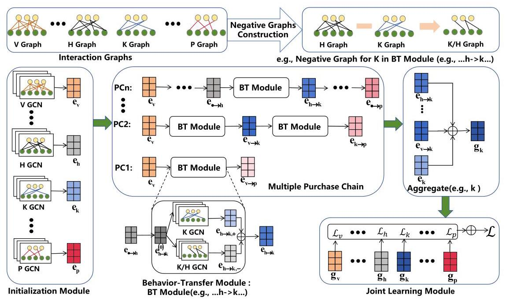
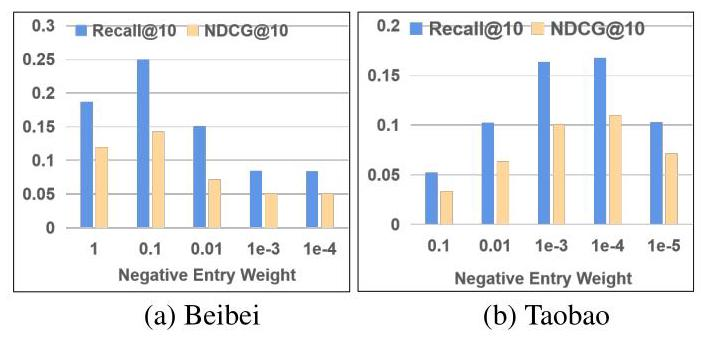

# Multiple Purchase Chains with Negative Transfer Elimination for Multi-Behavior Recommendation

Shuwei Gong \( {}^{1} \) , Yuting Liu \( {}^{1} \) , Yizhou Dang \( {}^{1} \) , Guibing Guo \( {}^{1 * } \) , Jianzhe Zhao \( {}^{1 * } \) , Xingwei Wang \( {}^{2} \)

\( {}^{1} \) Software College, Northeastern University, China

\( {}^{2} \) School of Computer Science and Engineering, Northeastern University, China

\{shuweigong, yutingliu, yzdang\}@stumail.neu.edu.cn, \{guogb, zhaojz\}@swc.neu.edu.cn, wangxw@mail.neu.edu.cn

## Abstract

Multi-behavior recommendation exploits auxiliary behaviors (e.g., view, cart) to help predict users' potential target behavior (e.g., purchase) on a given item. However, existing works suffer from two issues: (1) They generally consider only a single chain from auxiliary behaviors to the target behavior, referred to as a purchase chain (e.g., view \( \rightarrow \) cart \( \rightarrow \) purchase), ignoring other valuable purchase chains (e.g, view→purchase) that are beneficial for recommendation performance. (2) Most studies presume that interacted items in auxiliary behaviors are good for recommendations, and pay little attention to the negative transfer problem. That is, some auxiliary behaviors may negatively transfer the influence to the modeling of target ones (e.g., items viewed but not purchased). To alleviate these issues, we propose a novel Multiple Purchase Chains (MPC) model with negative transfer elimination for multi-behavior recommendation. Specifically, we construct multiple purchase chains from auxiliary to target behaviors according to users' historical interactions, while the representations of a previous behavior will be fed to initialize the next behavior on the chain. Then, we construct a negative graph for the latter behavior and learn the negative representations of users and items which will be filtered out to eliminate negative transfer. Experimental results on two real datasets outperform the best baseline by 40.97% and 47.26% on average in terms of Recall@10 and NDCG@10 respectively, demonstrating the effectiveness of our method.

Code — https://github.com/VanillaCreamer/MPC

## Introduction

Recommender systems are widely used to solve the problem of information overload (Guo, Zhang, and Yorke-Smith 2015; Zhang et al. 2019; Koren, Bell, and Volinsky 2009; Rendle et al. 2009). It learns the representation of users and items from user-item historical interactions. Many models learn user and item representations merely based on users' target behaviors (e.g., purchase), leading to serious cold-start or data sparsity issues. In real scenarios, users may have multiple kinds of behaviors on the same item, that is, a number of auxiliary behaviors (e.g., view, \( {\operatorname{cart}}^{1} \) ) exist other than the target behavior. Different behaviors reflect the semantic preferences of users at different levels (Gao et al. 2019; Xia et al. 2021). Moreover, as the cost of auxiliary behaviors is much lower than that of target behaviors, there are usually a lot more auxiliary behaviors than target ones. Therefore, auxiliary behaviors can be used to extract user preferences and thus largely alleviate the problems of data sparsity and cold start (Zhao et al. 2015; Loni et al. 2016; Jin et al. 2020; Qiu et al. 2018). In fact, users usually impose multiple low-cost auxiliary behaviors in a certain sequence on the same item before real purchase, e.g., view \( \rightarrow \) cart \( \rightarrow \) purchase, referred to as a purchase chain in this paper. In such a chain, a latter behavior exhibits a stronger signal of user preference than the former one does (Wan and McAuley 2018). Therefore, the representations learned from the previous behavior can be used to facilitate the embedding learning of the latter one.

Although a number of methods have considered the chain dependencies among multiple behaviors (Gao et al. 2019; Yan et al. 2024; Cheng et al. 2023), they still suffer from two main issues. Firstly, most existing works only consider the dependencies from a single purchase chain, ignoring other valuable purchase chains (e.g., view \( \rightarrow \) purchase), resulting in sub-optimal performance. The different conversion rates by distinct purchase chains indicate the necessity of adopting multiple chains simultaneously (Chu et al. 2022). Secondly, most existing works assume that all auxiliary behaviors are useful to model target behaviors and pay little attention to the negative transfer problem. That is, some auxiliary behaviors may negatively transfer the influence to the modeling of target ones (e.g., items viewed but not purchased). As a matter of fact, since the volume of auxiliary behaviors is much larger than that of target behavior, such a problem cannot be simply ignored and left unresolved.

To alleviate the above issues, we propose a novel Multiple Purchase \( {}^{2} \) Chains (MPC) model with negative transfer elimination for multi-behavior recommendation. Specifically, for the first issue, we construct multiple purchase chains to better model dependencies among all kinds of user behaviors. In this way, multiple purchase chains are adopted simultaneously for better recommendations. For the second issue, we propose that items interacted by the previous behavior but not by the latter one in a purchase chain are treated as negative items for the latter behavior. These negative items are then taken as input to build a negative interaction graph for the latter behavior, whereby the negative semantics can be better considered. It's important to note that our study of sequence relationships differs from those in sequence recommendation. The latter refers to the sequence of different items, whereas we focus on the dependencies between different behaviors when interacting with the same item. In summary, the main contributions of this work are highlighted as follows:

---

*Corresponding Authors.

Copyright © 2025, Association for the Advancement of Artificial Intelligence (www.aaai.org). All rights reserved.

\( {}^{1} \) Behavior ’cart’ is exchangeable with 'add-to-cart' in this paper.

\( {}^{2} \) Purchase indicates target behavior in e-commerce systems. It can be replaced with other domain-specific target behaviors.

---

- We make use of multiple purchase chains to better model the dependencies between auxiliary and target behaviors across different chains. The representation of a previous behavior is taken as the initialization of next behavior in a purchase chain. In this way, better representations of users and items can be learnt.

- We propose to select items interacted with a previous behavior but not with the next one as negative items, based on which a negative graph is constructed for the latter behavior on the given purchase chains. The representations of users and items learned from the negative graph will be filtered out to resolve the issue of negative transfer.

- We comprehensively evaluate the effectiveness of the proposed method on two real-word datasets. Experimental results show that our model can improve the recommendation performance relative to the best baseline with a large margin up to 40.97% and 47.26% on average in Recall@10 and NDCG@10, respectively.

## Related Work

## Multi-behavior Recommendation

Multi-behavior recommendation exploits auxiliary behaviors to help predict users'potential interactions on the target behavior. Owing to the effectiveness in alleviating the data sparsity issue and enhancing recommendation performance, it has drawn an increasing attention in recent years. Early methods usually handle multi-behavior data by introducing multiple matrix factorization or designing new sampling strategies. For example, Zhao et al. (2015) extend the traditional matrix factorization technique by conducting it on multiple matrices. Loni et al. (2016) use multi-behavior as auxiliary data and designs new sampling strategies to enrich the training samples. However, these methods cannot capture sequential dependencies between multi-behavior. Lee et al. (2015) revealed that item browsing patterns and cart usage patterns are the important predictors of the actual purchases.

Many researchers turn to explore multi-behavior recommendation by designing deep neural networks or graph convolutional networks. For example, (Guo et al. 2019) devise a bidirectional recurrent network with attention mechanism to model the behavior patterns of browsing and buying items. Wang et al. (2019) models high-order relation in an explicit and end-to-end manner. Xia et al. (2020) incorporate multiple types of user behavior relationships into a cross-behavior collaborative filtering framework. Jin et al. (2020) take into account behavior semantics captured from an item-item propagation layer, and combine them with behavior contributions learned from a user-item propagation layer for score prediction. Xia et al. (2021) devise a hierarchical graph transformer network to perform the joint information aggregation in multiple knowledge-aware behavior modalities. Wei et al. (2022) design a contrastive learning paradigm to capture the user-item relationships from multi-behavior, which incorporates auxiliary supervision signals into the sparse target behavior modeling. Gu et al. (2022) construct a contrastive view pair for target and each auxiliary behavior sub-graph respectively. Xu et al. (2023) embody a behavior-aware graph neural network to uncover latent cross-behavior dependencies and a comprehensive contrastive learning paradigm at inter-behavior and intra-behavior levels.

However, these works treat auxiliary behaviors equally, and ignore the sequential relationship between multiple behaviors. Most recent works have recognized these issues. Gao et al. (2019) extend the neural collaborative filtering framework (NCF(He et al. 2017)) to multi-behavior settings, which performs a joint optimization on cascading prediction tasks. Yan et al. (2024) and Cheng et al. (2023) exploit the behavior dependencies in a chain to directly facilitate the embedding. However, they only learn the dependencies from a single purchase chain (e.g., view \( \rightarrow \) cart \( \rightarrow \) purchase) consisting of all behaviors, ignoring other valuable purchase chains (e.g, view→purchase) beneficial for recommendations. Instead, our work will simultaneously take multiple purchase chains into account for better modelling sequential dependencies among different user behaviors.

## Negative Transfer

Recently researchers have attempted to use auxiliary behaviors combined with multi-task framework to improve multi-behavior recommendation performance. For example, Chen et al. (2020) efficiently correlate the prediction of each user behavior in a transfer way without negative sampling. Chen et al. (2021) explicitly model the high-order relationship between users and items through GCN, and perform multi-task learning to predict each behavior.

However, when the auxiliary behavior is weakly correlated with the target behavior or even not correlated, the use of auxiliary behavior may reduce the learning performance of the target behavior. This problem is regraded as negative transfer (Zhang et al. 2023b), which becomes an significant challenge in multi-behavior recommendation. Only few methods consider the effects of negative transfer. Zhang et al. (2023a) perform information reconstruction to get noiseless auxiliary behaviors and remove irrelevant information. Meng et al. (2023b) and Meng et al. (2023a) use the projection mechanism to explicitly model the correlations of upstream and downstream behaviors to enhance the learning of downstream tasks. Guo et al. (2023) use experts to replace the shared bottom layer (Ma et al. 2018) to learn behavior-aware information. While there have been many studies on negative transfer in multi-task learning, this issue still remains unresolved in the context of multi-behavior recommendation.

## Our Proposed Method

## Problem Formulation

For easy discussion, we first introduce a number of notations. Let \( \mathcal{U} \) and \( \mathcal{I} \) represent the set of \( M \) users and \( N \) items. We use \( \mathbf{Y} = \left\{  {{\mathbf{Y}}^{1},{\mathbf{Y}}^{2},\cdots ,{\mathbf{Y}}^{B}}\right\} \) to denote the multi-behavior interaction matrices and \( \mathcal{G} = \left\{  {{\mathcal{G}}^{1},{\mathcal{G}}^{2},\cdots ,{\mathcal{G}}^{B}}\right\} \) to denote corresponding multi-behavior interaction graphs, where \( {\mathbf{Y}}^{b} \) and \( {\mathcal{G}}^{b} = \left( {\mathcal{V},{\mathcal{E}}^{b}}\right) \) are the interaction matrix and graph of the behavior \( b,{\mathbf{Y}}^{B} \) and \( {\mathcal{G}}^{B} \) are those of the last behavior (i.e., the target behavior). All the interaction matrices are boolean matrix, where each entry indicates a binary value:

\[
{y}_{u, i, b} = \left\{  \begin{array}{ll} 1, & \text{ if }u\text{ interacted with }i\text{ by behavior }b; \\  0, & \text{ otherwise. } \end{array}\right. \tag{1}
\]

Hence, the task of multi-behavior recommendation can be formulated as follows. Given user-item interaction matrices \( \left\{  {{\mathbf{Y}}^{1},{\mathbf{Y}}^{2},\cdots ,{\mathbf{Y}}^{B}}\right\} \) and graphs \( \left\{  {{\mathcal{G}}^{1},{\mathcal{G}}^{2},\cdots ,{\mathcal{G}}^{B}}\right\} \) , our task is to compute the probability \( {y}_{u, i, B} \) that user \( u \) will interact with item \( i \) under the target behavior \( B \) .

## Model Overview

Figure 1 shows the overall framework of our MPC model. In real scenarios, users usually use low-cost auxiliary behaviors in purchase chains to investigate interesting items, and then select some items to purchase among them. Therefore, the latter behavior in the purchase chain usually shows more accurate user preferences than the former behavior.

We construct multiple purchase chains to explicitly model the dependencies between multiple behaviors. Each behavior chain consists of three key components. (1) Initialization. We use a context-aware behavioral encoder to learn the initial embedding of users and items under each behavior. (2) Behavior Transfer. To transfer information through purchase chains, we take the embedding learned from the former behavior as an initialization to learn the next behavior's embedding. (3) Negative Transfer Elimination. We construct negative graphs for latter behavior on purchase chains to get the negative representations transferred through the purchase chains and trim them to eliminate negative transfer. Finally, we aggregate the representations under each behavior on different purchase chains to predict each behavior individually. Without sacrificing generality, we preserve symbols \( h \) and \( k \) to represent two behaviors in a given purchase chain \( c \) (i.e., \( \rightarrow  h \rightarrow  k \rightarrow \) ). We use \( c \) to a purchase chain and \( \mathcal{C} \) is the set of purchase chains.

## Multiple Purchase Chains Construction

Existing studies (Gao et al. 2019, 2021; Yan et al. 2024; Cheng et al. 2023) have confirmed the existence of sequential relationships between multiple behaviors. However, it's important to note that not every behavior needs to occur in real-world scenarios. In our approach, we leverage all available behaviors and their sequential relationships to construct all possible purchase chains. (i, e,. each purchase chain commences with view and concludes with purchase following by (Gao et al. 2019, 2021).)

We generate all possible purchase chains by incorporating auxiliary behaviors between the view and purchase while preserving the correct order relationship between behaviors. This comprehensive approach allows us to capture the diverse sequences of user interactions.

## Initialization

Following (Chen et al. 2021), we utilize a graph convolution network to develop a context-aware behavior encoder to learn the initial embeddings of user \( u \) and item \( i \) under behavior \( h \) , given by:

\[
{\mathbf{e}}_{u, h}^{\left( l\right) } = \sigma \left( {\mathop{\sum }\limits_{{i \in  {\mathcal{N}}_{u}^{h}}}\frac{1}{\sqrt{\left| {\mathcal{N}}_{u}^{h}\right| \left| {\mathcal{N}}_{i}^{h}\right| }}{\mathbf{W}}^{\left( l\right) }\left( {{\mathbf{e}}_{i, h}^{\left( l - 1\right) } \odot  {\mathbf{e}}_{r, h}^{\left( l - 1\right) }}\right) }\right) ,
\]

\[
{\mathbf{e}}_{i, h}^{\left( l\right) } = \sigma \left( {\mathop{\sum }\limits_{{u \in  {\mathcal{N}}_{i}^{h}}}\frac{1}{\sqrt{\left| {\mathcal{N}}_{i}^{h}\right| \left| {\mathcal{N}}_{u}^{h}\right| }}{\mathbf{W}}^{\left( l\right) }\left( {{\mathbf{e}}_{u, h}^{\left( l - 1\right) } \odot  {\mathbf{e}}_{r, h}^{\left( l - 1\right) }}\right) }\right) , \tag{2}
\]

where \( {\mathbf{e}}_{u, h}^{\left( l\right) },{\mathbf{e}}_{i, h}^{\left( l\right) } \) are the learned initialized embeddings of user \( u \) and item \( i \) under behavior \( h \) at the \( l \) -th layer that is not transferred from other behaviors. \( {\mathbf{e}}_{r, h}^{\left( l\right) } \) is the behavior embeddings at the \( l \) -th layer. \( {\mathcal{N}}_{u}^{h} \) and \( {\mathcal{N}}_{i}^{h} \) denote the set of neighbors of \( u \) and \( i \) in the graph \( {\mathcal{G}}^{h} \) , respectively. \( {\mathbf{W}}^{\left( l\right) } \) is the layer-specific trainable weights matrix and \( \odot \) is the element-wise product operator of vectors. \( \frac{1}{\sqrt{\left| {\mathcal{N}}_{it}^{h}\right| \left| {\mathcal{N}}_{i}^{h}\right| }} \) is a normalization term to adjust the scale of embeddings. In the 0 -th layer, we initialize the \( {\mathbf{e}}_{u}^{\left( 0\right) },{\mathbf{e}}_{i}^{\left( 0\right) } \) and \( {\mathbf{e}}_{h}^{\left( 0\right) } \) by ID embedding layers.

After updating the node representations by Eq. (2), the behavior embedding can be transformed as follows:

\[
{\mathbf{e}}_{r, h}^{\left( l\right) } = {\mathbf{W}}_{h}^{\left( l\right) }{\mathbf{e}}_{r, h}^{\left( l - 1\right) }, \tag{3}
\]

where \( {\mathbf{W}}_{h}^{\left( l\right) } \) is a layer-specific trainable weight matrix that projects the behavior embeddings to the same embedding space as nodes and updates the behavior embedding. We apply the message propagation and aggregation on each behavior, thus we can get the initial embeddings of user \( u \) and item \( i \) under behavior \( h \) and the corresponding behavior’s embedding. Specifically, for behavior \( h \) , the initial representations of user \( u \) can be calculated by:

\[
{\mathbf{e}}_{u, h} = \frac{1}{L + 1}\mathop{\sum }\limits_{{l = 0}}^{L}{\mathbf{e}}_{u, h}^{\left( l\right) } \tag{4}
\]

where \( L \) is the number of propagation layers. Similarly, we obtain the initialization of item \( i \) and behavior \( r \) under behavior \( h \) as \( {\mathbf{e}}_{i, h},{\mathbf{e}}_{r, h} \) .

Note that there are multiple embeddings of users and items under each behavior, including the initial embeddings and the embeddings transferred from different chains. For example, for user \( u \) under behavior \( k \) on the chain \( c( \rightarrow  h \rightarrow \; k \rightarrow \) ), there are two kinds of embeddings \( {\mathbf{e}}_{u, k} \) and \( {\mathbf{e}}_{u, k, c} \) , where \( {\mathbf{e}}_{u, k, c} \) is the transferred embedding under \( k \) from behavior \( h \) on the chain \( c \) , which is calculated in the following subsection.

Figure 1: An illustration of our proposed MPC model. MPC consists of three key components: initialization, behavior transfer and negative transfer elimination.

## Behavior Transfer

To transfer information through purchase chains, we take the embedding learned from the former behavior as an initialization to learn the next behavior's embedding (assuming that behavior \( f \) comes before behavior \( h \) on the chain \( c \) ):

\[
{\mathbf{e}}_{u, h \rightarrow  k, + }^{\left( 0\right) } = {\mathbf{e}}_{u, f \rightarrow  h},{\mathbf{e}}_{i, h \rightarrow  k, + }^{\left( 0\right) } = {\mathbf{e}}_{i, f \rightarrow  h}, \tag{5}
\]

where \( {\mathbf{e}}_{u, h \rightarrow  k}^{\left( 0\right) },{\mathbf{e}}_{i, h \rightarrow  k}^{\left( 0\right) } \) denote the positive transferred em-beddings at 0-th layer in the graph. \( {\mathbf{e}}_{u, f \rightarrow  h} \) and \( {\mathbf{e}}_{i, f \rightarrow  h} \) are optimized transferred embeddings under behavior \( f \rightarrow  h \) calculated as the following.

Then, we adopt LightGCN as an encoder on purchase graph \( {\mathcal{G}}^{k} \) to obtain transferred information from behavior \( h \) to behavior \( k \) , we

(6)

\[
{\mathbf{e}}_{u, h \rightarrow  k, + }^{\left( l\right) } = \mathop{\sum }\limits_{{i \in  {\mathcal{N}}_{u}^{k}}}\frac{1}{\sqrt{\left| {\mathcal{N}}_{u}^{k}\right| \left| {\mathcal{N}}_{i}^{k}\right| }}{\mathbf{e}}_{i, h \rightarrow  k, + }^{\left( l - 1\right) },
\]

\[
{\mathbf{e}}_{i, h \rightarrow  k, + }^{\left( l\right) } = \mathop{\sum }\limits_{{u \in  {\mathcal{N}}_{i}^{k}}}\frac{1}{\sqrt{\left| {\mathcal{N}}_{i}^{k}\right| \left| {\mathcal{N}}_{u}^{k}\right| }}{\mathbf{e}}_{u, h \rightarrow  k, + }^{\left( l - 1\right) },
\]

where \( {\mathbf{e}}_{u, h \rightarrow  k, + }^{\left( l\right) },{\mathbf{e}}_{i, h \rightarrow  k, + }^{\left( l\right) } \) indicate the learned positive transferred embedding at \( l \) -th layer of user \( u \) and item \( i \) of behavior \( k \) , respectively.

After calculating embeddings at each layer, the positive transferred embedding of user \( u \) and item \( i \) under behavior \( {k}_{h} \) can be obtained by layer combination:

\[
{\mathbf{e}}_{u, h \rightarrow  k, + } = \frac{1}{L + 1}\mathop{\sum }\limits_{{l = 0}}^{L}{\mathbf{e}}_{u, h \rightarrow  k, + }^{\left( l\right) }, \tag{7}
\]

\[
{\mathbf{e}}_{i, h \rightarrow  k, + } = \frac{1}{L + 1}\mathop{\sum }\limits_{{l = 0}}^{L}{\mathbf{e}}_{i, h \rightarrow  k, + }^{\left( l\right) }.
\]

## Negative Transfer Elimination

It may introduce negative information if taking all the items selected in the former behavior as the positive samples of the latter behavior (i.e., negative transfer).

We argue that, on purchase chains, items that interacted by the former behavior but not by the latter behavior (e.g., view without purchasing) as negative samples of the latter behavior (e.g., purchase). We use these negative items to construct negative graphs for the latter behavior on purchase chains to obtain negative information transferred from the former behavior and filter it out.

First, we construct a negative interaction matrix for the latter behavior:

\[
{\mathbf{Y}}^{k/h} = {\mathbf{Y}}^{h} \odot  \left( {\mathbf{I} - {\mathbf{Y}}^{k}}\right) . \tag{8}
\]

\( {\mathbf{Y}}^{h},{\mathbf{Y}}^{k} \) are the interaction matrix of behavior \( h \) and \( k,{\mathbf{Y}}^{k/h} \) is the negative interaction matrix for behavior \( k.\mathbf{I} \) is a matrix completely filled with ones, \( \odot \) is the element-wise product operator.

In this way, we can obtain negative graph \( {\mathcal{G}}^{k/h} \) . The em-beddings learned from the former behavior \( h \) are taken as the input of the negative interaction graph \( {\mathcal{G}}^{k/h} \) (assuming that behavior \( f \) comes before behavior \( h \) on the behavior chain):

\[
{\mathbf{e}}_{u, h \rightarrow  k, - }^{\left( 0\right) } = {\mathbf{e}}_{u, f \rightarrow  h},{\mathbf{e}}_{i, h \rightarrow  k, - }^{\left( 0\right) } = {\mathbf{e}}_{i, f \rightarrow  h}. \tag{9}
\]

Then, we adopt LightGCN on the graph \( {\mathcal{G}}^{k/h} \) as an encoder similarly to Eq. (6) and Eq. (7) to obtain the negative transferred embedding \( {\mathbf{e}}_{u, h \rightarrow  k, - } \) and \( {\mathbf{e}}_{i, h \rightarrow  k, - } \) under behavior \( h \rightarrow  k \) on the purchase chain.

At this point, we have obtained the positive and negative transferred embeddings. Then we remove the negative transferred embedding to get the optimized embedding under behavior \( h \rightarrow  k \) .

\[
{\mathbf{e}}_{u, h \rightarrow  k,{opt}} = {\mathbf{e}}_{u, h \rightarrow  k, + } - {\mathbf{e}}_{u, h \rightarrow  k, - }, \tag{10}
\]

\[
{\mathbf{e}}_{i, h \rightarrow  k,{opt}} = {\mathbf{e}}_{i, h \rightarrow  k, + } - {\mathbf{e}}_{i, h \rightarrow  k, - },
\]

where \( {\mathbf{e}}_{u, h \rightarrow  k,{opt}} \) and \( {\mathbf{e}}_{i, h \rightarrow  k,{opt}} \) are the optimized transferred embedding of user \( u \) and item \( i \) on the chain, respectively.

## Embedding Aggregation on Chains

We aggregate two types of transfer embedding to obtain the final transfer embedding on the purchase chain \( c \) .

\[
{\mathbf{e}}_{u, k, c} = {\mathbf{e}}_{u, h \rightarrow  k, + } + \alpha  \cdot  {\mathbf{e}}_{u, h \rightarrow  k,{opt}}, \tag{11}
\]

\[
{\mathbf{e}}_{i, k, c} = {\mathbf{e}}_{i, h \rightarrow  k, + } + \alpha  \cdot  {\mathbf{e}}_{i, h \rightarrow  k,{opt}},
\]

where \( {\mathbf{e}}_{u, k, c} \) and \( {\mathbf{e}}_{i, k, c} \) are the final transferred embedding of user \( u \) and item \( i \) on the chain \( c \) , respectively. \( \alpha  \in  \left\lbrack  {0,1}\right\rbrack \) is weight of optimized transferred embedding, enabling control over the ratio of negative transfer elimination. We use the same value of \( \alpha \) for optimized transferred embeddings. However, the conversion rates between different behaviors vary Chu et al. (2022). Therefore, the optimal ratio are varies, which we intend to explore in the future.

## Joint Learning Module

We aggregate the initial embedding and transferred embed-dings learned from multiple purchase chains to calculate the final embedding under each behavior for prediction.

(12)

\[
{\mathbf{g}}_{u, k} = {\mathbf{e}}_{u, k} + \mathop{\sum }\limits_{{c \in  {\mathcal{C}}^{\mathcal{K}}}}{\beta }_{c} \cdot  {\mathbf{e}}_{u, k, c}
\]

\[
{\mathbf{g}}_{i, k} = {\mathbf{e}}_{i, k} + \mathop{\sum }\limits_{{c \in  {\mathcal{C}}^{\parallel }}}{\beta }_{c} \cdot  {\mathbf{e}}_{i, k, c},
\]

where \( {\mathcal{C}}^{\mathcal{K}} \) is the set of purchase chains that contains behavior \( k,{\mathbf{g}}_{u, k, c} \) and \( {\mathbf{g}}_{i, k, c} \) is the transferred embedding of user \( u \) and item \( i \) on chain \( c.{\beta }_{c} \in  \left\lbrack  {0,1}\right\rbrack \) is the weight for the em-bdding transferred from chain \( c,{\mathbf{g}}_{u, k} \) and \( {\mathbf{g}}_{i, k} \) are the final embeddings for user \( u \) and item \( i \) under behavior \( k \) . Recall that \( {\mathbf{e}}_{r, k} \) denotes the obtained embedding of behavior \( k \) , the likelihood that user \( u \) will perform behavior \( k \) on item \( i \) is estimated by:

\[
{\widehat{y}}_{u, i, k} = {\mathbf{g}}_{u, k}^{\top }\operatorname{diag}\left( {\mathbf{e}}_{r, k}\right) {\mathbf{g}}_{i, k}. \tag{13}
\]

To learn all trainable parameters more effectively, we follow (Chen et al. 2021) and apply the efficient non-sampling learning loss as our training objective to optimize our proposed MPC model.

The equation of the loss for each behavior \( k \) is as follows:

\[
{\mathcal{L}}_{k}\left( \theta \right)  = \mathop{\sum }\limits_{u}\mathop{\sum }\limits_{{i \in  {\mathcal{N}}_{i}^{k}}}\left( {\left( {{c}_{i, k}^{ + } - {c}_{i, k}^{ - }}\right) {\left( {\widehat{y}}_{u, i, k}\right) }^{2} - 2{c}_{i, k}^{ + }{\widehat{y}}_{u, i, k}}\right)
\]

\[
+ \mathop{\sum }\limits_{{p = 1}}^{d}\mathop{\sum }\limits_{{q = 1}}^{d}\left( {{\mathbf{e}}_{r, k}^{p}{\mathbf{e}}_{r, k}^{q}\mathop{\sum }\limits_{{u \in  \mathcal{U}}}\left( {{\mathbf{g}}_{u, k}^{p}{\mathbf{g}}_{u, k}^{q}}\right) \mathop{\sum }\limits_{{i \in  \mathcal{I}}}\left( {{\mathbf{g}}_{i, k}^{p}{\mathbf{g}}_{i, k}^{q}}\right) }\right) ,
\]

(14)

where \( {c}_{i, k}^{ + },{c}_{i, k}^{ - } \) denote the positive and negative weights of entry \( {\widehat{y}}_{u, i, k}.i \in  {\mathcal{N}}^{k} \) denotes the interacted items of user \( u \) under the behavior \( k \) . Last but not least, in order to get a better model for each behavioral task, following most multi-behavior tasks, we apply an MTL form to better learn parameters from the data of different behaviors:

\[
\mathcal{L}\left( \theta \right)  = \mathop{\sum }\limits_{{b \in  \mathcal{B}}}{\lambda }_{b} \cdot  {\mathcal{L}}_{b}\left( \theta \right)  + \mu \parallel \Theta {\parallel }_{2}^{2}, \tag{15}
\]

<table><tr><td>Dataset</td><td>#user</td><td>#item</td><td>#view</td><td>#cart</td><td>#purchase</td></tr><tr><td>Beibei</td><td>21,716</td><td>7,977</td><td>2,412,586</td><td>642,622</td><td>304,576</td></tr><tr><td>Taobao</td><td>48,749</td><td>39,493</td><td>1,548,126</td><td>193,747</td><td>259,747</td></tr></table>

Table 1: Statistics of our datasets.

where \( {\lambda }_{b} \) is the weight to control the influence of behavior \( b \) in the joint training. \( {L}_{2} \) regularization parameterized by \( \mu \) on \( \Theta \) is conducted to prevent over-fitting.

## Experiment

In this section, we conduct extensive experiments on two real-world datasets to answer the following research questions. RQ1: How does MPC perform compared with the various state-of-the-art recommendation models? RQ2: How do different designed modules contribute to the model performance? RQ3: How does MPC perform with different parameter settings?

## Datasets

To validate the effectiveness of our proposed MPC model, we conduct experiments on two publicly available datasets. We directly use the processed dataset in (Chen et al. 2021). The details of datasets are listed in Table 1. Beibei is the dataset collected from China's largest infant product e-commerce platform Beibei. It involves three types of interaction behavior, i.e., view, add-to-cart, and purchase, among which purchase is the target behavior. Taobao is an open dataset obtained from the largest e-commerce site Taobao, which contains the same interaction type as Beibei.

## Baselines

We compare our approach with a number of competing methods, which can be classified into two categories: single-behavior models and multi-behavior models.

Single-behavior Models: NCF (He et al. 2017): It is a deep learning method which combines matrix factorization with a multilayer perceptron model for item ranking. Light-GCN (He et al. 2020): It exploits the high-order connectives in the user-item.

Multi-behavior Models: MC-BPR (Loni et al. 2016): It extends the origin BPR approach to fit heterogeneous scenarios. EHCF (Chen et al. 2020): It conducts knowledge transfer among behaviors and proposes a novel non-sampling objective for multi-behavior recommendation. GHCF (Chen et al. 2020): It is an improvement over EHCF which relies on the GNNs to model the complex high-hop user-item correlations. NMTR (Gao et al. 2019): This model develops a cascading neural network to model the multi-behavior data, which considers the effects of orders between behaviors. HPMR (Meng et al. 2023b): It uses the projection mechanism to prevents the mixing of upstream-specific information into the shared information transferred downstream. It considers the effects of orders between behaviors and negative transfer.

## Evaluation Methodology

For a fair comparison with various models on recommendation, we adopt the widely-used leave-one-out evaluation and two ranking metrics, Recall@ \( K \) and NDCG@ \( K \) . Generally, greater values of both metrics indicate better ranking performance. Note that we utilize the same evaluator in (Chen et al. 2021), i.e., we rank all the items except positive ones for each user, which is more persuasive than randomly sampling a subset of non-interactive items for each user.

## Parameters Settings

During the experimentation process, we conduct a search for optimal parameters on the validation data and subsequently evaluate the model on the test data. For the baseline methods, we initialize their parameters based on the corresponding papers and carefully tune them to achieve optimal performance.

Our MPC model is implemented using TensorFlow, and we utilize the Adam optimizer with a learning rate of 1e- 3 during the training phase. The batch size is set to 2048. We use a latent dimension of 64 for the model. In terms of the number of GCN layers, we explore values in the range of 1 to 4. For non-sampling methods, we set the positive weight \( {c}_{i, b}^{ + } \) as 1, and the negative weight \( {c}_{i, b}^{ - } \) is chosen from the candidate set [1e-5, 1e-4, 1e-3, 1e-2, 0.1, 1]. To mitigate overfitting, we incorporate an embedding dropout ratio from the candidate set \( \left\lbrack  {{0.1},{0.2},{0.3},{0.4}}\right\rbrack \) .

## Overall Performance (RQ1)

Table 2 shows the performance of different methods on Beibei and Taobao. To evaluate on different recommendation lengths, we set the length \( K = {10} \) and \( K = {50} \) in our experiments. We have the following findings:

Our MPC model demonstrates superior performance across all datasets, outperforming the best baselines on the Beibei and Taobao by 5.04% and 76.90% in terms of Reacll@10, and 5.41% and 89.08% in terms of NDCG@10, respectively. These notable advancements highlight the effectiveness of our model.

In comparison to single-behavior recommendation methods, multi-behavior recommendation models consistently exhibit significant performance improvements, confirming the limitations of learning from a single type of behavior alone. Non-sampling learning optimization strategies employed models generally outperform other sampling-based models. For instance, the BPR strategy employed by MC-BPR and NMTR leads to notably worse performance. Additionally, GHCF outperforms EHCF, showing the advantages of GCN models in leveraging high-order neighbor information for recommendation.

Furthermore, MPC and HPMR achieve better performance than GHCF and NMTR outperforms MC-BPR. MPC, HPMR and NMTR exploiting the sequential relations among multiple behaviors, while GHCF and MC-BPR treat auxiliary behaviors equally. These findings prove the inherent inadequacy of learning sequential relations among multiple behaviors.

In Taobao, the enhancement in recall@10 significantly surpasses that of recall@50.In Taobao, the frequency of users utilizing shopping carts is lower, with many users rarely utilizing them. Although numerous items aren't added to shopping carts, they could be positive samples. We set the same ratio of negative transfer elimination, which is high for cart, contributing to the less pronounced performance improvement in recall@50 on the Taobao.

Lastly, our method outperforms HPMR by explicitly modeling multiple purchase chain relationships across multiple behaviors. This highlights the necessity of incorporating multiple purchase chains for improved performance.

## Ablation Study (RQ2)

To verify the contribution of each part of MPC framework, we conduct an ablation study with various variants over the two datasets, including: (1) Base Model: we remove both multiple purchase chains and negative transfer elimination module; (2) w/o chain2: we use a single purchase chain (view \( \rightarrow \) cart \( \rightarrow \) purchase); (3) w/o chain1: we use a single chain(view→purchase); (4) w/o NTE: we use multiple purchase chains (view \( \rightarrow \) cart \( \rightarrow \) purchase and view \( \rightarrow \) purchase) without negative transfer elimination module. The performance of MPC and its variants are summarized in Table 2, and we can find:

Our MPC model outperforms all its variants, and removing any part of the MPC significantly undermines its performance. This fully demonstrates the effectiveness and rationality of our designed module. In comparison, the Base Model exhibits the poorest performance across all datasets when compared to other variants employing multi-behavior learning. This finding further supports the validity and effectiveness of each component of the MPC.

We also evaluate variants that utilize a single purchase chain, namely 'w/o chain1' and 'w/o chain2'. While both variants outperform the Base Model, they still under-perform in comparison to the overall MPC model, providing evidence that modeling multiple purchase chains yields better performance than modeling a single purchase chain alone. Furthermore, the results indicate that all purchase chains are valuable for multi-behavior recommendation.

Additionally, the performance of the 'w/o NIL' variant is inferior to that of the MPC model. This observation confirms the reasonability and effectiveness of the negative transfer elimination module.

## Influence with Parameters (RQ3)

Impact of the negative information filter out ratio \( \alpha \) . We set \( \alpha  \in  \left\lbrack  {0,1}\right\rbrack \) . The results for the two datasets are presented in Table 4. We tested values ranging from 0 to 1 at intervals of 0.1 . The performance of both datasets initially increases and then decreases. For the Beibei dataset, the peak performance is achieved at 0.9 , while for the Taobao dataset, the highest performance occurs at 0.1 .

<table><tr><td>Dataset</td><td colspan="4">Beibei</td><td colspan="4">Taobao</td></tr><tr><td>Model</td><td>Recall@10</td><td>NDCG@10</td><td>Recall@50</td><td>NDCG@50</td><td>Recall@10</td><td>NDCG@10</td><td>Recall@50</td><td>NDCG@50</td></tr><tr><td>NCF</td><td>0.0441</td><td>0.0225</td><td>0.1562</td><td>0.0445</td><td>0.0391</td><td>0.0233</td><td>0.0728</td><td>0.0281</td></tr><tr><td>LightGCN</td><td>0.0451</td><td>0.0232</td><td>0.1613</td><td>0.0466</td><td>0.0415</td><td>0.0237</td><td>0.0814</td><td>0.0325</td></tr><tr><td>MC-BPR</td><td>0.0504</td><td>0.0254</td><td>0.1743</td><td>0.0503</td><td>0.0547</td><td>0.0263</td><td>0.0791</td><td>0.0297</td></tr><tr><td>NMTR</td><td>0.0524</td><td>0.0285</td><td>0.2047</td><td>0.0609</td><td>0.0585</td><td>0.0278</td><td>0.0942</td><td>0.0334</td></tr><tr><td>EHCF</td><td>0.1523</td><td>0.0817</td><td>0.3316</td><td>0.1213</td><td>0.0717</td><td>0.0403</td><td>0.1618</td><td>0.0594</td></tr><tr><td>GHCF</td><td>0.1922</td><td>0.1012</td><td>0.3794</td><td>0.1426</td><td>0.0807</td><td>0.0442</td><td>0.1892</td><td>0.0678</td></tr><tr><td>HPMR</td><td>0.2375</td><td>0.1352</td><td>0.3850</td><td>0.1677</td><td>0.0948</td><td>0.0586</td><td>0.1631</td><td>0.0731</td></tr><tr><td>MPC</td><td>0.2501</td><td>0.1425</td><td>0.3991</td><td>0.1753</td><td>0.1677</td><td>0.1108</td><td>0.1929</td><td>0.1165</td></tr><tr><td>Rel Impr.</td><td>5.04%</td><td>5.41%</td><td>3.66%</td><td>4.53%</td><td>76.90%</td><td>89.08%</td><td>1.96%</td><td>59.37%</td></tr></table>

Table 2: Performance of different models and the improvement rate compared with the best baseline on Beibei and Taobao. Each column's second-best score is underlined and the top score is highlighted in bold.

<table><tr><td>Dataset</td><td colspan="2">Beibei</td><td colspan="2">Taobao</td></tr><tr><td>metrics</td><td>Recall@10</td><td>NDCG@10</td><td>Recall@10</td><td>NDCG@10</td></tr><tr><td>Base Model</td><td>0.1922</td><td>0.1012</td><td>0.0807</td><td>0.0442</td></tr><tr><td>w/o chain1</td><td>0.1671</td><td>0.0836</td><td>0.1598</td><td>0.0957</td></tr><tr><td>w/o chain2</td><td>0.1324</td><td>0.0637</td><td>0.1672</td><td>0.1103</td></tr><tr><td>w/o NTE</td><td>0.2299</td><td>0.1244</td><td>0.1606</td><td>0.1060</td></tr><tr><td>MPC</td><td>0.2501</td><td>0.1425</td><td>0.1677</td><td>0.1108</td></tr><tr><td>Rel Impr.</td><td>8.79%</td><td>14.55%</td><td>0.30%</td><td>0.45%</td></tr></table>

Table 3: Performance of MPC variants on Beibei and Taobao.

<table><tr><td>\( \alpha \)</td><td>0</td><td>0.5</td><td>0.8</td><td>0.9</td><td>1.0</td></tr><tr><td>NDCG@10</td><td>0.2299</td><td>0.2437</td><td>0.2485</td><td>0.2500</td><td>0.2493</td></tr><tr><td>Recall@10</td><td>0.12443</td><td>0.1362</td><td>0.1414</td><td>0.14253</td><td>0.1438</td></tr><tr><td>\( \alpha \)</td><td>0</td><td>0.1</td><td>0.2</td><td>0.5</td><td>1.0</td></tr><tr><td>NDCG@10</td><td>0.1672</td><td>0.1674</td><td>0.1668</td><td>0.1672</td><td>0.1644</td></tr><tr><td>Recall@10</td><td>0.1103</td><td>0.1106</td><td>0.1096</td><td>0.1095</td><td>0.1083</td></tr></table>

Table 4: Performance of Different negative information filter out ratio. The first table is the performance of beibei, and the second table is the performance of Taobao.

We hypothesize that this phenomenon stems from the disparate conversion rates between behaviors in the two datasets. Consequently, items that are associated with one behavior but not interacted by the latter behavior will introduce noise to the latter behavior. In Beibei, the conversion rate between behaviors is high, leading to a high proportion of negative migration filter out ratio. In Taobao, the frequency of users utilizing shopping carts is lower leading to a low conversion rate between behaviors Hence, the ratio needs to be a smaller proportion.

Impact of the weight of negative items \( {c}_{i, b}^{ - } \) . For non-sampling methods, we set the positive weight \( {c}_{i, b}^{ + } \) as 1, while the negative weight \( {c}_{i, b}^{ - } \) is varied within the candidate set [1e-5, 1e-4, 1e-3, 1e-2, 0.1, 1]. The experimental results are illustrated in Figure 2. The best performance is achieved with 0.1 on Beibei and 1e-4 on Taobao, as measured by Recall@10 and NDCG@10 respectively. The result indicates that the assignment of different negative weight has a substantial impact on recommendation performance, underscoring its significance in improving experimental results.

Figure 2: Performance comparison with different negative entry weight \( {c}_{i, b}^{ - } \) on Beibei and Taobao.

The reason behind this observation could be attributed to the sparsity of the Taobao dataset compared to the Beibei dataset. With a sparser dataset like Taobao, a smaller value of the negative weight may lead to improved performance.

## Conclusions and Future Work

In this work, we propose a novel multiple purchase chain with negative transfer elimination for multi-behavior recommendation (MPC). Our proposed model aims to capture the relationships between multiple behaviors by constructing multiple purchase chains. We leverage the embedding learned from the previous behavior as an initialization for the subsequent behavior's transferred embedding learning. To address the issue of negative transfer, we explicitly construct negative graphs for the subsequent behaviors on the purchase chains. We then trim the embeddings learned from the negative graph to eliminate negative transfer. Experimental evaluations on two real-world datasets demonstrate that our model achieves significant performance gains when compared to state-of-the-art multi-behavior models. For future research endeavors, we will focus on investigating methods to learn optimal negative information filtering rates when transferring information across multiple purchase chains.

## Acknowledgements

This work is partially supported by the National Natural Science Foundation of China under Grant (No. 62032013, 62102074), the Science and Technology projects in Liaoning Province (No. 2023JH3/10200005).

## References

Chen, C.; Ma, W.; Zhang, M.; Wang, Z.; He, X.; Wang, C.; Liu, Y.; and Ma, S. 2021. Graph Heterogeneous Multi-Relational Recommendation. In Thirty-Third Conference on Innovative Applications of Artificial Intelligence, 3958- 3966. Vancouver, Canada: AAAIPress.

Chen, C.; Zhang, M.; Zhang, Y.; Ma, W.; Liu, Y.; and Ma, S. 2020. Efficient Heterogeneous Collaborative Filtering without Negative Sampling for Recommendation. In The Thirty-Fourth AAAI Conference on Artificial Intelligence, 19-26. New York, NY, USA: AAAIPress.

Cheng, Z.; Han, S.; Liu, F.; Zhu, L.; Gao, Z.; and Peng, Y. 2023. Multi-Behavior Recommendation with Cascading Graph Convolution Networks. In Ding, Y.; Tang, J.; Se-queda, J. F.; Aroyo, L.; Castillo, C.; and Houben, G., eds., Proceedings of the ACM Web Conference 2023, 1181-1189. Austin, TX, USA: ACM.

Chu, Y.; Yang, E.; Liu, Q.; Liu, Y.; Jiang, L.; and Guo, G. 2022. Bi-directional Contrastive Distillation for Multi-behavior Recommendation. In Amini, M.; Canu, S.; Fischer, A.; Guns, T.; Novak, P. K.; and Tsoumakas, G., eds., Machine Learning and Knowledge Discovery in Databases - European Conference, volume 13713 of Lecture Notes in Computer Science, 491-507. Grenoble, France: Springer.

Gao, C.; He, X.; Gan, D.; Chen, X.; Feng, F.; Li, Y.; Chua, T.; and Jin, D. 2019. Neural Multi-task Recommendation from Multi-behavior Data. In 35th IEEE International Conference on Data Engineering, 1554-1557. Macao, China: IEEE.

Gao, C.; He, X.; Gan, D.; Chen, X.; Feng, F.; Li, Y.; Chua, T.; Yao, L.; Song, Y.; and Jin, D. 2021. Learning to Recommend With Multiple Cascading Behaviors. IEEE Trans. Knowl. Data Eng., 33(6): 2588-2601.

Gu, S.; Wang, X.; Shi, C.; and Xiao, D. 2022. Self-supervised Graph Neural Networks for Multi-behavior Recommendation. In Raedt, L. D., ed., Proceedings of the Thirty-First International Joint Conference on Artificial Intelligence, IJCAI 2022, Vienna, Austria, 23-29 July 2022, 2052-2058. Vienna, Austria: ijcai.org.

Guo, G.; Zhang, J.; and Yorke-Smith, N. 2015. TrustSVD: Collaborative Filtering with Both the Explicit and Implicit Influence of User Trust and of Item Ratings. In Bonet, B.; and Koenig, S., eds., Proceedings of the Twenty-Ninth AAAI Conference on Artificial Intelligence, 123-129. Austin, Texas: AAAI Press.

Guo, L.; Hua, L.; Jia, R.; Zhao, B.; Wang, X.; and Cui, B. 2019. Buying or Browsing?: Predicting Real-time Purchasing Intent using Attention-based Deep Network with Multiple Behavior. In Teredesai, A.; Kumar, V.; Li, Y.; Rosales, R.; Terzi, E.; and Karypis, G., eds., Proceedings of the

25th ACM SIGKDD International Conference on Knowledge Discovery & Data Mining, 1984-1992. Anchorage, AK, USA: ACM.

Guo, W.; Meng, C.; Yuan, E.; He, Z.; Guo, H.; Zhang, Y.; Chen, B.; Hu, Y.; Tang, R.; Li, X.; and Zhang, R. 2023. Compressed Interaction Graph based Framework for Multi-behavior Recommendation. In Ding, Y.; Tang, J.; Sequeda, J. F.; Aroyo, L.; Castillo, C.; and Houben, G., eds., Proceedings of the ACM Web Conference 2023, 960-970. Austin, TX, USA: ACM.

He, X.; Deng, K.; Wang, X.; Li, Y.; Zhang, Y.; and Wang, M. 2020. LightGCN: Simplifying and Powering Graph Convolution Network for Recommendation. In Huang, J. X.; Chang, Y.; Cheng, X.; Kamps, J.; Murdock, V.; Wen, J.; and Liu, Y., eds., Proceedings of the 43rd International ACM SI-GIR conference on research and development in Information Retrieval, SIGIR 2020, Virtual Event, China, July 25- 30, 2020, 639-648. Virtual Event, China: ACM.

He, X.; Liao, L.; Zhang, H.; Nie, L.; Hu, X.; and Chua, T. 2017. Neural Collaborative Filtering. In Barrett, R.; Cummings, R.; Agichtein, E.; and Gabrilovich, E., eds., Proceedings of the 26th International Conference on World Wide Web, 173-182. Perth, Australia: ACM.

Jin, B.; Gao, C.; He, X.; Jin, D.; and Li, Y. 2020. Multi-behavior Recommendation with Graph Convolutional Networks. In Huang, J. X.; Chang, Y.; Cheng, X.; Kamps, J.; Murdock, V.; Wen, J.; and Liu, Y., eds., Proceedings of the 43rd International ACM SIGIR conference on research and development in Information Retrieval, 659-668. Virtual Event, China: ACM.

Koren, Y.; Bell, R. M.; and Volinsky, C. 2009. Matrix Factorization Techniques for Recommender Systems. Computer, 42(8): 30-37.

Lee, M.; Ha, T.; Han, J.; Rha, J.; and Kwon, T. T. 2015. Online Footsteps to Purchase: Exploring Consumer Behaviors on Online Shopping Sites. In Roure, D. D.; Burnap, P.; and Halford, S., eds., Proceedings of the ACM Web Science Conference, 15:1-15:10. Oxford, United Kingdom: ACM.

Loni, B.; Pagano, R.; Larson, M. A.; and Hanjalic, A. 2016. Bayesian Personalized Ranking with Multi-Channel User Feedback. In Sen, S.; Geyer, W.; Freyne, J.; and Castells, P., eds., Proceedings of the 10th ACM Conference on Recommender Systems, 361-364. Boston, MA, USA: ACM.

Ma, J.; Zhao, Z.; Yi, X.; Chen, J.; Hong, L.; and Chi, E. H. 2018. Modeling Task Relationships in Multi-task Learning with Multi-gate Mixture-of-Experts. In Guo, Y.; and Fa-rooq, F., eds., Proceedings of the 24th ACM SIGKDD International Conference on Knowledge Discovery & Data Mining, 1930-1939. London, UK: ACM.

Meng, C.; Zhai, C.; Yang, Y.; Zhang, H.; and Li, X. 2023a. Parallel Knowledge Enhancement based Framework for Multi-behavior Recommendation. In Frommholz, I.; Hopf-gartner, F.; Lee, M.; Oakes, M.; Lalmas, M.; Zhang, M.; and Santos, R. L. T., eds., Proceedings of the 32nd ACM International Conference on Information and Knowledge Management, 1797-1806. Birmingham, United Kingdom: ACM.

Meng, C.; Zhang, H.; Guo, W.; Guo, H.; Liu, H.; Zhang, Y.; Zheng, H.; Tang, R.; Li, X.; and Zhang, R. 2023b. Hierarchical Projection Enhanced Multi-behavior Recommendation. In Singh, A. K.; Sun, Y.; Akoglu, L.; Gunopulos, D.; Yan, X.; Kumar, R.; Ozcan, F.; and Ye, J., eds., Proceedings of the 29th ACM SIGKDD Conference on Knowledge Discovery and Data Mining, 4649-4660. Taipei, Taiwan: ACM.

Qiu, H.; Liu, Y.; Guo, G.; Sun, Z.; Zhang, J.; and Nguyen, H. T. 2018. BPRH: Bayesian personalized ranking for heterogeneous implicit feedback. Inf. Sci., 453: 80-98.

Rendle, S.; Freudenthaler, C.; Gantner, Z.; and Schmidt-Thieme, L. 2009. BPR: Bayesian Personalized Ranking from Implicit Feedback. In Bilmes, J. A.; and Ng, A. Y., eds., UAI 2009, Proceedings of the Twenty-Fifth Conference on Uncertainty in Artificial Intelligence, 452-461. Montreal, QC, Canada: AUAI Press.

Wan, M.; and McAuley, J. J. 2018. Item recommendation on monotonic behavior chains. In Pera, S.; Ekstrand, M. D.; Amatriain, X.; and O'Donovan, J., eds., Proceedings of the 12th ACM Conference on Recommender Systems, 86-94. Vancouver, BC, Canada: ACM.

Wang, X.; He, X.; Cao, Y.; Liu, M.; and Chua, T. 2019. KGAT: Knowledge Graph Attention Network for Recommendation. In Teredesai, A.; Kumar, V.; Li, Y.; Rosales, R.; Terzi, E.; and Karypis, G., eds., Proceedings of the 25th ACM SIGKDD International Conference on Knowledge Discovery & Data Mining, 950-958. Anchorage, AK, USA: ACM.

Wei, W.; Huang, C.; Xia, L.; Xu, Y.; Zhao, J.; and Yin, D. 2022. Contrastive Meta Learning with Behavior Multiplicity for Recommendation. In Candan, K. S.; Liu, H.; Akoglu, L.; Dong, X. L.; and Tang, J., eds., WSDM '22: The Fifteenth ACM International Conference on Web Search and Data Mining, 1120-1128. Virtual Event / Tempe, AZ, USA: ACM.

Xia, L.; Huang, C.; Xu, Y.; Dai, P.; Zhang, B.; and Bo, L. 2020. Multiplex Behavioral Relation Learning for Recommendation via Memory Augmented Transformer Network. In Huang, J. X.; Chang, Y.; Cheng, X.; Kamps, J.; Murdock, V.; Wen, J.; and Liu, Y., eds., Proceedings of the 43rd International ACM SIGIR conference on research and development in Information Retrieval, 2397-2406. Virtual Event, China: ACM.

Xia, L.; Huang, C.; Xu, Y.; Dai, P.; Zhang, X.; Yang, H.; Pei, J.; and Bo, L. 2021. Knowledge-Enhanced Hierarchical Graph Transformer Network for Multi-Behavior Recommendation. In Thirty-Fifth AAAI Conference on Artificial Intelligence, 4486-4493. Virtual Event: AAAIPress.

Xu, J.; Wang, C.; Wu, C.; Song, Y.; Zheng, K.; Wang, X.; Wang, C.; Zhou, G.; and Gai, K. 2023. Multi-behavior Self-supervised Learning for Recommendation. In Chen, H.; Duh, W. E.; Huang, H.; Kato, M. P.; Mothe, J.; and Poblete, B., eds., Proceedings of the 46th International ACM SIGIR Conference on Research and Development in Information Retrieval, 496-505. Taipei, Taiwan: ACM.

Yan, M.; Cheng, Z.; Gao, C.; Sun, J.; Liu, F.; Sun, F.; and Li, H. 2024. Cascading Residual Graph Convolutional Network for Multi-Behavior Recommendation. ACM Trans. Inf. Syst., 42(1): 10:1-10:26.

Zhang, C.; Chen, R.; Zhao, X.; Han, Q.; and Li, L. 2023a. Denoising and Prompt-Tuning for Multi-Behavior Recommendation. In Ding, Y.; Tang, J.; Sequeda, J. F.; Aroyo, L.; Castillo, C.; and Houben, G., eds., Proceedings of the ACM Web Conference 2023, 1355-1363. Austin, TX, USA: ACM.

Zhang, S.; Yao, L.; Sun, A.; and Tay, Y. 2019. Deep Learning Based Recommender System: A Survey and New Perspectives. ACM Comput. Surv., 52(1): 5:1-5:38.

Zhang, W.; Deng, L.; Zhang, L.; and Wu, D. 2023b. A Survey on Negative Transfer. IEEE CAA J. Autom. Sinica, 10(2): 305-329.

Zhao, Z.; Cheng, Z.; Hong, L.; and Chi, E. H. 2015. Improving User Topic Interest Profiles by Behavior Factorization. In Gangemi, A.; Leonardi, S.; and Panconesi, A., eds., Proceedings of the 24th International Conference on World Wide Web, 1406-1416. Florence, Italy: ACM.