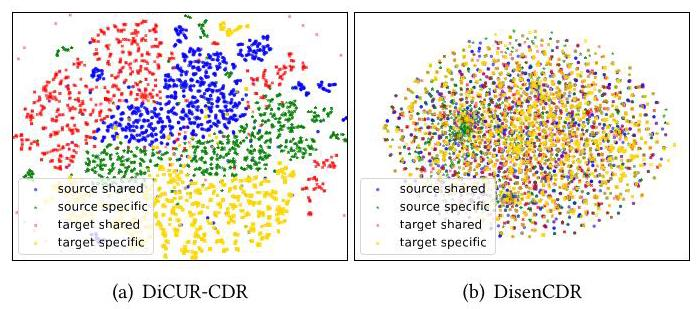
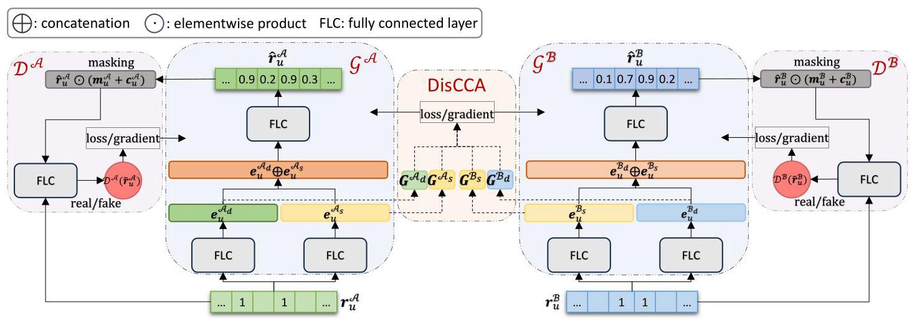
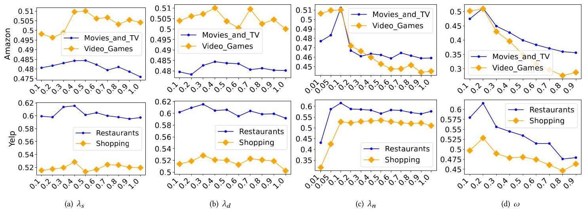
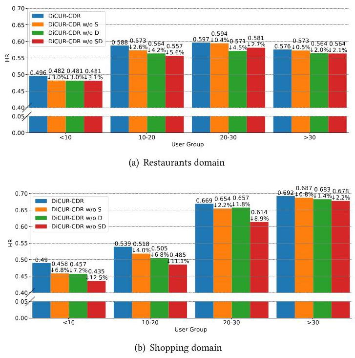

# Discerning Canonical User Representation for Cross-Domain Recommendation

Siqian Zhao

Department of Computer Science

University at Albany - SUNY

Albany, New York, USA

szhao2@albany.edu

Sherry Sahebi

Department of Computer Science

University at Albany - SUNY

Albany, New York, USA

ssahebi@albany.edu

## ABSTRACT

Cross-domain recommender systems (CDRs) aim to enhance recommendation outcomes by information transfer across different domains. Existing CDRs have investigated the learning of both domain-specific and domain-shared user preferences to enhance recommendation performance. However, these models typically allow the disparities between shared and distinct user preferences to emerge freely in any space, lacking sufficient constraints to identify differences between two domains and to ensure that both domains are considered simultaneously. Canonical Correlation Analysis (CCA) has shown promise for transferring information between domains. However, CCA only models domain similarities and fails to capture the potential differences between user preferences in different domains. We propose Discerning Canonical User Representation for Cross-Domain Recommendation (DiCUR-CDR) that learns domain-shared and domain-specific user representations simultaneously considering both domains' latent spaces. DiCUR-CDR introduces Discerning Canonical Correlation (DisCCA) user representation learning, a novel design of non-linear CCA for mapping user representations. Unlike prior CCA models that only model the domain-shared multivariate representations by finding their linear transformations, DisCCA uses the same transformations to discover the domain-specific representations too. We compare DiCUR-CDR against several state-of-the-art approaches using two real-world datasets and demonstrate the significance of separately learning shared and specific user representations via DisCCA.

## CCS CONCEPTS

- Information systems \( \rightarrow \) Recommender systems; Collaborative filtering.

## KEYWORDS

Cross-domain recommendation, Discerning user representation learning, Canonical correlation analysis, Collaborative filtering

## ACM Reference Format:

Siqian Zhao and Sherry Sahebi. 2024. Discerning Canonical User Representation for Cross-Domain Recommendation. In 18th ACM Conference on

Recommender Systems (RecSys '24), October 14-18, 2024, Bari, Italy. ACM, New York, NY, USA, 11 pages. https://doi.org/10.1145/3640457.3688114

## 1 INTRODUCTION

Cross-domain recommender systems (CDRs) were introduced to address challenges like data sparsity and the cold-start problem and to improve the quality of recommendations [12]. These systems facilitate the transfer of information across domains, by assuming that the transferred information exhibits commonality across these domains. Particularly, the majority of CDRs either presume that user interests in different domains are exactly the same \( \left\lbrack  {{22},{23},{28}}\right\rbrack \) or can be mapped more flexibly to each other via some transformation \( \left\lbrack  {{40},{44}}\right\rbrack \) . While such assumptions have led to the success of numerous cross-domain recommender systems, empirical research has shown that the overlap in user interests can vary between domains. Particularly, user interests in some domains (for example, movies and video games) could be more interrelated to each other compared to other domains (such as perfumes and video games) [44, 45]. So, enforcing completely shared, or similar user representations can potentially induce too strong restrictions, as it does not take into account the existence of domain-specific user interests, subsequently resulting in the transfer of noisy and irrelevant information across domains.

To solve this limitation, recent cross-domain recommender models use two separate user representations: a domain-shared representation for information sharing between domains, and a domain-specific representation for representing unique user interests within each domain, such as DisenCDR [3], ETL [5], CAT-ART [30], and DIDA-CDR [64]. However, these approaches mostly concentrate on maintaining similar domain-shared representations, disregarding the potential structure in domain differences. Namely, they either ignore that domain-specific representations should be different or let the differences between the domain-specific representations have any shape or form. This can result in an over-restriction of domain-shared representations and overly free representations of the domain disparities, causing an imbalance between them. This imbalance could result in domain-specific representations being similar to domain-shared ones, or pushing most of the information into domain-specific representations. As a result, the domain-shared part of the model would underfit and the domain-specific part would overfit the training data. Furthermore, considering both domains simultaneously when determining their disparities would provide a more expressive solution.

To illustrate, we visualize the representations learned by Dis-enCDR [3] using t-SNE [18] in Figure 1(b). DisenCDR is a successful recent cross-domain recommender system, that aims to disentangle the domain-shared and domain-specific information by minimizing the mutual information between them. While DisenCDR has an impressive predictive performance, we can see in Figure 1(b) that its shared and disentangled representations of the two domains are not well-separated and are not distinguishable.

---

ACM ISBN 979-8-4007-0505-2/24/10

https://doi.org/10.1145/3640457.3688114

---

Figure 1: Visualization of learned user representations via using T-SNE for DisenCDR. Each color represents one type of representation.

Therefore, in this paper, our goal is to push the domain-shared representations close to each other while separating and differentiating between the domain-specific ones, similar to the visualization in Figure 1(a). We propose Discerning Canonical User Representation Learning for Cross-Domain Recommendation (DiCUR-CDR) that imposes a shared structure over the similarities between the two domains and uses the same structure to learn the disparities between them. Hence, it learns the similarities between domain-shared representations and the dissimilarity of domain-specific representations within the same space.

To achieve this goal, we also propose Discerning Canonical Correlation (DisCCA) User Representation Learning, which simultaneously maximizes the correlation between domain-shared user representations and adds extra constraints to learn the disparities between domain-distinct representations by expanding the idea of generalized Canonical Correlation Analysis (CCA) [51]. CCA is a multivariate statistical method used to explore the correlation between multiple sets of dependent and independent variables \( \left\lbrack  {{14},{21}}\right\rbrack \) . However, while CCA models domain similarities, it fails to capture the potential differences in user preferences across different domains. DiCUR-CDR learns domain-distinct and domain-specific user representations using DisCCA and through generative adversarial learning to increase the model generalizability, reduce the noise, and improve the learning of user feedback distributions. Our main contributions in this paper are summarized as follows:

- We emphasize the importance of bringing domain-shared representations closer together while distinguishing between the domain-specific ones in a structured way.

- We propose a novel method named DiCUR-CDR. DiCUR-CDR introduces DisCCA for user representation learning, which enables the exchange of preferences between domains, acknowledges the variations between two domains, and ensures that both domains are simultaneously considered when evaluating these differences. DisCCA is the first CCA model that considers domain distinctions.

- We conduct extensive experiments on two public datasets, demonstrating that DiCUR-CDR outperforms state-of-the-art baselines. Our ablation studies analysis highlights the importance of each component within DiCUR-CDR, our sensitivity analysis showcases its resilience to hyperparameters, and our cold-start analysis demonstrates its effectiveness in alleviating the cold-start problem.

## 2 RELATED WORK

Single-Domain RS. Matrix factorization (MF) is a commonly used technique in various CF methods. Many studies have demonstrated the effectiveness of MF-based CF methods and their variants for recommendation systems \( \left\lbrack  {7,{24} - {27},{37},{39},{43},{48}}\right\rbrack \) . These approaches learn latent user and item feature factor vectors to characterize users and items [27]. Subsequently, as deep neural networks (DNNs) began to demonstrate success in many research fields, they have been incorporated into RS \( \left\lbrack  {6,9,{17},{38},{47},{54},{57}}\right\rbrack \) . The capabilities of DNNs enable the non-linear learning of feature vectors of users and items, as well as the interactions between them [19].

Recently, Generative Adversarial Networks (GANs) [13] have been instrumental in approximating the distribution of genuine data samples and subsequently generating new instances from this distribution, which is achieved through a competitive process involving a generator and a discriminator \( \left\lbrack  {8,{56}}\right\rbrack \) . Our proposed method is mostly related to GANs-based CF methods, such as IR-GAN [55], GraphGAN [53], CFGAN [4], among others [10, 16, 34, 60]. These methods, however, only address single-domain CF, while our method is a cross-domain CF method employing GANs.

Cross-Domain RS. Nonetheless, CF methods grapple with issues such as data sparsity and the cold-start problem [50]. To mitigate these challenges, the cross-domain recommendation (CDR) has been introduced. The goal of CDR is to harness and transfer information or knowledge from auxiliary domains to enhance recommendations in the target domain [2, 12]. Numerous cross-domain approaches have successfully enhanced recommendation performance, including both shallow models [23, 29, 42, 49] and deep models [22, 33, 35, 62]. Recently, learning both domain-specific and domain-shared representations has piqued interest in CF research to further improve cross-domain recommendation. For example, DisenCDR [3], ETL [5], CAT-ART [30], and MSDCR [63] show the necessity of modeling domain-specific and domain-shared representations separately. Different from these methods, we propose discerning Canonical Correlation user representation learning and utilize GANs for cross-domain recommendation generation.

Furthermore, several GAN-based cross-domain CF methods have been proposed, including Recsys-dan [52], RecGURU [31], and ACDR [32], DA-CDR [61]. These models tend to transfer latent representations between domains or alternatively generate domain labels using GANs. Instead, our method generates user feedback.

Canonical Correlation Analysis in RS. CCA has demonstrated potential in facilitating information transfer across various domains \( \left\lbrack  {{44},{45},{58},{65}}\right\rbrack \) . However, its application in recommendation systems is significantly hindered by the inherent sparsity of the data, as it requires complete observed matrices. Nevertheless, it has been applied to CDRs in various capacities. For example, CCA is used to predict and estimate hotel ratings based on textual comments and sentiment analysis related to hotels [11]. In addition, Kernel CCA is employed to determine correlations between music pieces and human motion for providing music recommendations [40]. Furthermore, CD-LCCA [46] leverages CCA to transfer information between lower-dimensional matrices that represent the user feedback matrix across domains. Generalized CCA [51], which uses L2-loss instead of a direct correlation measure to find domain similarities, was proposed to expand CCA's applications. But, unlike our proposed DisCCA, neither CCA nor Generalized CCA can represent domain disparities. Furthermore, none of the above methods, like our DiCUR-CDR, leverages CCA to capture both domain-specific and domain-shared representations to improve RS.

## 3 PRELIMINARIES

Problem Formulation. Without loss of generality, we assume two domains of items: domain \( \mathcal{A} \) and domain \( \mathcal{B} \) . We focus on the dual-target CDR scenario, aiming to improve recommendation accuracy in both domains by transferring diverse information between both domains. Assuming that the set of \( m \) users is shared between the two domains, with \( {n}^{\mathcal{A}} \) and \( {n}^{\mathcal{B}} \) items in domains \( \mathcal{A} \) and \( \mathcal{B} \) , respectively. We denote the set of users as \( \mathcal{U} = \left\{  {{u}_{1},{u}_{2},\ldots ,{u}_{m}}\right\} \) , and the set of items for domains \( \mathcal{A} \) and \( \mathcal{B} \) as \( {I}^{\mathcal{A}} = \left\{  {{i}_{1}^{\mathcal{A}},{i}_{2}^{\mathcal{A}},\ldots ,{i}_{{n}^{\mathcal{A}}}^{\mathcal{A}}}\right\} \) and \( {I}^{\mathcal{B}} = \; \left\{  {{i}_{1}^{\mathcal{B}},{i}_{2}^{\mathcal{B}},\ldots ,{i}_{{n}^{\mathcal{B}}}^{\mathcal{B}}}\right\} \) , respectively.

In this paper, we focus on CF from users' implicit feedback, such as purchases or clicks. We represent users' feedback in the domain \( \mathcal{A}\left( \mathcal{B}\right) \) using a matrix \( {\mathcal{R}}^{\mathcal{A}} \in  {\mathbb{R}}^{m \times  {n}^{\mathcal{A}}}\left( {{\mathcal{R}}^{\mathcal{B}} \in  {\mathbb{R}}^{m \times  {n}^{\mathcal{B}}}}\right) \) , where an element \( {r}_{ui}^{\mathcal{A}} = 1\left( {{r}_{ui}^{\mathcal{B}} = 1}\right) \) , if user \( u \) has provided implicit feedback for item \( i \) (i.e., observed), and empty if no feedback is available (i.e., unobserved). Moreover, we define \( {I}_{u}^{\mathcal{A}}\left( {I}_{u}^{\mathcal{B}}\right) \) as the set of observations in domain \( \mathcal{A}\left( \mathcal{B}\right) \) for which user \( u \) has provided feedback, while \( \overline{{I}_{u}^{\mathcal{A}}}\left( \overline{{I}_{u}^{\mathcal{B}}}\right) \) denotes all items that user \( u \) has not provided feedback on. Our goal is to estimate user \( u \) ’s preferences and predict items that users are interested in for both domains \( \mathcal{A} \) and \( \mathcal{B} \) , based on their history of observed feedback.

Canonical Correlation Analysis. CCA focuses on finding linear projections that maximize the correlation between variables from different views. Generalized CCA (GCCA) [20, 51], on the other hand, goes beyond traditional CCA by maximizing a specific measure of the matrix that encompasses all pairwise correlations between linear projections of the covariates [41]. Assuming \( \mathbf{X} \in  {\mathbb{R}}^{M \times  {N}_{x}} \) and \( Y \in  {\mathbb{R}}^{M \times  {N}_{y}} \) are the matrices for data from two views, while each row of these matrices represents one data sample. The objective of GCCA is:

\[
\mathop{\min }\limits_{{P,{W}_{x},{M}_{y}}}{\begin{Vmatrix}X{M}_{x} - P\end{Vmatrix}}^{2} + {\begin{Vmatrix}Y{W}_{y} - P\end{Vmatrix}}^{2}\;\text{ s.t. }\;{P}^{\top }P = I \tag{1}
\]

where the constraint is to ensure orthonormality and uniqueness of the shared learned representation. By solving this optimization problem, GCCA learns \( \mathbf{P},{\mathbf{M}}_{x} \) , and \( {\mathbf{M}}_{y} \) such that correlation between \( \mathbf{X} \) and \( Y \) is maximized in the projection space. Furthermore, non-linear GCCA [1] improves upon traditional GCCA by using non-linear mappings (e.g. Sigmoid activation function) to project data matrix (e.g. \( \sigma \left( {X{M}_{x}}\right) \) ). This allows for the maximization of non-linear correlation between variables.

## 4 DICUR-CDR MODEL

DiCUR-CDR is designed as a cross-domain collaborative filtering method to capture both distinct within-domain and shared cross-domain user preferences to enhance recommendation performance. We introduce Discerning Canonical Correlation user representation learning (DisCCA) that uses shared transformation matrices to maximize the similarities between the domain-shared representations and minimize the similarities between the domain-specific ones in the same space. To improve generalizability, we use generative adversarial learning to model user preferences and generate recommendations. For each domain, the generator learns domain-shared and domain-specific user representations. Then, DisCCA imposes additional constraints on these representations to more effectively tease out user interests. An overview of DiCUR-CDR is presented in Figure 2.

### 4.1 Discerning Canonical Correlation (DisCCA) User Representation Learning

We first introduce our proposed Discerning Canonical Correlation (DisCCA) User Representation Learning, which encourages the domain-shared user representations from different domains to be close to each other in the projection spaces, while simultaneously ensuring that the domain-specific and domain-shared user representations within each domain are distinct. DisCCA is a variant of non-linear GCCA that, in addition to identifying similarities between features of two variables mapped into a latent space, uses the same mapping structure to distinguish differences among other features of the same variables. Assume that we are given \( {\mathbf{e}}_{u}^{{\mathcal{A}}_{d}} \in  {\mathbb{R}}^{h} \) and \( {\mathbf{e}}_{u}^{{\mathcal{B}}_{d}} \in  {\mathbb{R}}^{h} \) as domain-specific user representations, capturing user distinct preferences within domains \( \mathcal{A} \) and \( \mathcal{B} \) respectively; and \( {\mathbf{e}}_{u}^{{\mathcal{A}}_{s}} \in  {\mathbb{R}}^{h} \) and \( {\mathbf{e}}_{u}^{{\mathcal{B}}_{s}} \in  {\mathbb{R}}^{h} \) as domain-shared user representations, which capture user preferences that are shared across domains. We store these representations in matrices \( {\mathbf{e}}^{{\mathcal{A}}_{s}},{\mathbf{e}}^{{\mathcal{B}}_{s}},{\mathbf{e}}^{{\mathcal{A}}_{d}} \) , and \( {\mathbf{e}}^{{\mathcal{B}}_{d}} \) (one row per user). DisCCA introduces additional constraints on these matrices. Similar to GCCA, our first goal is to find projections of domain-shared representations to make them equivalent in a shared latent space. We project these representations and add non-linearity to the projections as follows:

\[
{G}^{{\mathcal{A}}_{s}} = \operatorname{LRelu}\left( {{M}^{\mathcal{A}}{e}^{{\mathcal{A}}_{s}}}\right) \;{G}^{{\mathcal{B}}_{s}} = \operatorname{LRelu}\left( {{M}^{\mathcal{B}}{e}^{{\mathcal{B}}_{s}}}\right) \tag{2}
\]

where \( {G}^{{\mathcal{A}}_{s}} \) and \( {G}^{{\mathcal{B}}_{s}} \in  {\mathbb{R}}^{m \times  {h}_{dc}} \) denote projections of domain-shared representations, LRelu is the Leaky ReLU activation function, and \( {M}^{\mathcal{A}} \in  {\mathbb{R}}^{h \times  {h}_{dc}} \) and \( {M}^{\mathcal{B}} \in  {\mathbb{R}}^{h \times  {h}_{dc}} \) are learnable mapping matrices. To learn the projections and mapping matrices, we use the following objective function:

\[
{\mathcal{L}}_{s} = \left| \right| {G}^{{\mathcal{A}}_{s}} - {G}^{{\mathcal{B}}_{s}}{\left| \right| }^{2} + \left| \right| {G}^{{\mathcal{A}}_{s}}{}^{\top }{G}^{{\mathcal{A}}_{s}} - I{\left| \right| }^{2} + \left| \right| {G}^{{\mathcal{B}}_{s}}{}^{\top }{G}^{{\mathcal{B}}_{s}} - I{\left| \right| }^{2} \tag{3}
\]

where \( \parallel  \cdot  {\parallel }^{2} \) is L-2 norm. Note that while \( {\mathcal{L}}_{s} \) resembles GCCA’s objective function in Eq. 1, it has three distinctions: (1) to add generalizability, instead of minimizing the distance between projections and the latent representation \( \mathbf{P} \) for the two domains, we use a direct approach by minimizing the distance between two projections \( {G}^{{\mathcal{A}}_{s}} \) and \( {G}^{{\mathcal{B}}_{s}},\left( 2\right) {G}^{{\mathcal{A}}_{s}} \) and \( {G}^{{\mathcal{B}}_{s}} \) are made sure to be close to each other using the first term, and (3) the second and third term in \( {\mathcal{L}}_{s} \) are added to satisfy the orthonormality constraint.

Unlike GCCA, our method also aims to model the disparities between domains and discern both domain-shared and domain-specific information within each domain. To ensure that the domain differences are captured in a structured way, we constrain the projections of domain-specific representations by using the same mapping matrices \( {\mathbf{M}}^{\mathcal{A}} \) and \( {\mathbf{M}}^{\mathcal{B}} \) as in Eq. 2:

\[
{G}^{{\mathcal{A}}_{d}} = \operatorname{LRelu}\left( {{M}^{\mathcal{A}}{e}^{{\mathcal{A}}_{d}}}\right) \;{G}^{{\mathcal{B}}_{d}} = \operatorname{LRelu}\left( {{M}^{\mathcal{B}}{e}^{{\mathcal{B}}_{d}}}\right) \tag{4}
\]

Figure 2: The DiCUR-CDR model architecture. Each domain has a generator \( {\mathcal{G}}^{\mathcal{A}}\left( {\mathcal{G}}^{\mathcal{B}}\right) \) and a discriminator \( {\mathcal{D}}^{\mathcal{A}}\left( {\mathcal{D}}^{\mathcal{B}}\right) \) . DisCCA user representation learning in the middle creates a shared transformation mapping and adds extra constraints.

where \( {G}^{{\mathcal{A}}_{d}},{G}^{{\mathcal{B}}_{d}} \in  {\mathbb{R}}^{m \times  {h}_{dc}} \) are projections of domain-specific representations. We introduce the following objective function for domain-specific projections:

\[
{\mathcal{L}}_{d} =  - \left( {\left| \right| {G}^{{\mathcal{A}}_{s}} - {G}^{{\mathcal{A}}_{d}}{\left| \right| }^{2} + \left| \right| {G}^{{\mathcal{B}}_{s}} - {G}^{{\mathcal{B}}_{d}}{\left| \right| }^{2} + \left| \right| {G}^{{\mathcal{A}}_{d}} - {G}^{{\mathcal{B}}_{d}}{\left| \right| }^{2}}\right) \tag{5}
\]

The first two terms of \( {\mathcal{L}}_{d} \) (Eq. 5) enforce the domain-shared and domain-specific projections to be far in each domain, and the last term discerns the two domain-specific projections from each other.

These objectives, \( {\mathcal{L}}_{s} \) and \( {\mathcal{L}}_{d} \) , differ from traditional CCA methods, which only focus on maximizing the correlation between two latent variables. They also deviate from previous recommendation models that did not impose constraints on domain-distinct variables. It is worth noting that DisCCA is the first CCA model with distinctions between variables.

### 4.2 Recommendation Generation

Taking advantage of the effectiveness of generative adversarial learning for generalizability, noise reduction, and enhanced learning of user feedback distributions, we generate recommendation predictions and learn user preference representations \( \left( {{\mathbf{e}}_{u}^{{\mathcal{A}}_{d}},{\mathbf{e}}_{u}^{{\mathcal{B}}_{d}}}\right. \) , \( {\mathbf{e}}_{u}^{{\mathcal{A}}_{s}} \) , and \( {\mathbf{e}}_{d}^{{\mathcal{B}}_{s}} \) ) via GAN. For each domain, DiCUR-CDR constructs a GAN with two key components: a generator \( \mathcal{G} \) and a discriminator \( \mathcal{D}.\mathcal{G} \) and \( \mathcal{D} \) play a two-player minimax game, competing against each other for mutual promotion. The generator \( \mathcal{G} \) is responsible for generating implicit feedback vectors (e.g., purchase vectors) to deceive the discriminator \( \mathcal{D} \) , while the discriminator \( \mathcal{D} \) aims to differentiate between the actual implicit feedback vectors and the ones generated by \( \mathcal{G} \) .

4.2.1 Generator. Two generators, \( {\mathcal{G}}^{\mathcal{A}} \) and \( {\mathcal{G}}^{\mathcal{B}} \) , are designed to generate samples of users' implicit feedback vectors for each domain. Specifically, given the user \( u \) ’s implicit feedback vector \( {\mathbf{r}}_{u}^{\mathcal{A}} \; \left( {\mathbf{r}}_{u}^{\mathcal{B}}\right) \) in the domain \( \mathcal{A}\left( \mathcal{B}\right) ,{\mathcal{G}}^{\mathcal{A}}\left( {\mathcal{G}}^{\mathcal{B}}\right) \) generates a \( {n}^{\mathcal{A}} \) -dimensional \( \left( {n}^{\mathcal{B}}\right. \) -dimensional) feedback vector \( {\widehat{\mathbf{r}}}_{u}^{\mathcal{A}}\left( {\widehat{\mathbf{r}}}_{u}^{\mathcal{B}}\right) \) that represents the user’s preference of items in domain \( \mathcal{A}\left( \mathcal{B}\right) \) . DiCUR-CDR first proposes to learn both domain-specific and domain-shared user representations by leveraging the DisCCA. Then, the domain-specific and domain-shared user representations are utilized to generate the recommendations \( {\widehat{\mathbf{r}}}_{u}^{\mathcal{A}} \) and \( {\widehat{\mathbf{r}}}_{u}^{\mathcal{B}} \) for each domain.

Domain-Shared and Domain-Specific Representation. We aim to model the transfer of preferences between domains, recognize the differences between the two domains, and ensure that both domains are considered concurrently when these differences are assessed. DiCUR-CDR uses different fully connected layers to learn separate domain-shared and domain-specific user representations for each domain. Taking the user feedback vector as input, the fully-connected layers are formulated as:

\[
{\mathbf{e}}_{u}^{{\mathcal{A}}_{d}} = \sigma \left( {{\mathbf{W}}_{d}^{\mathcal{A}}{\mathbf{r}}_{u}^{\mathcal{A}} + {\mathbf{b}}_{d}^{\mathcal{A}}}\right) \;{\mathbf{e}}_{u}^{{\mathcal{B}}_{d}} = \sigma \left( {{\mathbf{W}}_{d}^{\mathcal{B}}{\mathbf{r}}_{u}^{\mathcal{B}} + {\mathbf{b}}_{d}^{\mathcal{B}}}\right) \tag{6}
\]

\[
{\mathbf{e}}_{u}^{{\mathcal{A}}_{s}} = \sigma \left( {{\mathbf{W}}_{s}^{\mathcal{A}}{\mathbf{r}}_{u}^{\mathcal{A}} + {\mathbf{b}}_{s}^{\mathcal{A}}}\right) \;{\mathbf{e}}_{u}^{{\mathcal{B}}_{s}} = \sigma \left( {{\mathbf{W}}_{s}^{\mathcal{B}}{\mathbf{r}}_{u}^{\mathcal{B}} + {\mathbf{b}}_{s}^{\mathcal{B}}}\right) \tag{7}
\]

where \( \sigma \) is the Sigmoid activation function. \( {\mathbf{W}}_{d}^{\mathcal{A}} \in  {\mathbb{R}}^{h \times  {n}^{\mathcal{A}}},{\mathbf{W}}_{d}^{\mathcal{B}} \in \; {\mathbb{R}}^{h \times  {n}^{\mathcal{B}}},{\mathbf{W}}_{s}^{\mathcal{A}} \in  {\mathbb{R}}^{h \times  {n}^{\mathcal{A}}} \) , and \( {\mathbf{W}}_{s}^{\mathcal{B}} \in  {\mathbb{R}}^{h \times  {n}^{\mathcal{B}}} \) are learnable weight matrices that map user's feedback vector to latent user representation space. \( {\mathbf{b}}_{d}^{\mathcal{A}} \in  {\mathbb{R}}^{h},{\mathbf{b}}_{d}^{\mathcal{B}} \in  {\mathbb{R}}^{h},{\mathbf{b}}_{s}^{\mathcal{A}} \in  {\mathbb{R}}^{h} \) and \( {\mathbf{b}}_{s}^{\mathcal{B}} \in  {\mathbb{R}}^{h} \) are bias terms. DisCCA is then applied to these representations and adds additional constraints for capturing both distinct within-domain and shared cross-domain user preferences.

Recommendation Prediction. DiCUR-CDR incorporates both within-domain and cross-domain user preferences to generate recommendations for each domain. We utilize a fully-connected layer after concatenating these user representations, as:

\[
{\widehat{\mathbf{r}}}_{u}^{\mathcal{A}} = {\mathcal{G}}^{\mathcal{A}}\left( {\mathbf{r}}_{u}^{\mathcal{A}}\right)  = {\mathbf{W}}_{o}^{\mathcal{A}}\left\lbrack  {{\mathbf{e}}_{u}^{{\mathcal{A}}_{d}} \oplus  {\mathbf{e}}_{u}^{{\mathcal{A}}_{s}}}\right\rbrack   + {\mathbf{b}}_{o}^{\mathcal{A}} \tag{8}
\]

\[
{\widehat{\mathbf{r}}}_{u}^{\mathcal{B}} = {\mathcal{G}}^{\mathcal{B}}\left( {\mathbf{r}}_{u}^{\mathcal{B}}\right)  = {\mathbf{W}}_{o}^{\mathcal{B}}\left\lbrack  {{\mathbf{e}}_{u}^{{\mathcal{B}}_{d}} \oplus  {\mathbf{e}}_{u}^{{\mathcal{B}}_{s}}}\right\rbrack   + {\mathbf{b}}_{o}^{\mathcal{B}} \tag{9}
\]

where \( {\widehat{\mathbf{r}}}_{u}^{\mathcal{A}} \in  {\mathbb{R}}^{{n}^{\mathcal{A}}} \) and \( {\widehat{\mathbf{r}}}_{u}^{\mathcal{B}} \in  {\mathbb{R}}^{{n}^{\mathcal{B}}} \) represent the generated feedback vectors for domains \( \mathcal{A} \) and \( \mathcal{B} \) . Each element \( {\widehat{\mathbf{r}}}_{ui}^{\mathcal{A}}\left( {\widehat{\mathbf{r}}}_{uj}^{\mathcal{B}}\right) \) corresponds to user \( u \) ’s preference of item \( i\left( j\right) \) , indicating the chance of that item being positively perceived (e.g., purchased) by user \( u. \oplus \) is the concatenation operation, \( {\mathbf{W}}_{o}^{\mathcal{A}} \in  {\mathbb{R}}^{{n}^{\mathcal{A}} \times  {2h}} \) and \( {\mathbf{W}}_{o}^{\mathcal{B}} \in  {\mathbb{R}}^{{n}^{\mathcal{B}} \times  {2h}} \) are learnable weight matrices. \( {\mathbf{b}}_{o}^{\mathcal{A}} \in  {\mathbb{R}}^{{n}^{\mathcal{A}}} \) and \( {\mathbf{b}}_{o}^{\mathcal{B}} \in  {\mathbb{R}}^{{n}^{\mathcal{B}}} \) are biases.

4.2.2 Discriminator. DiCUR-CDR employs a discriminator \( {\mathcal{D}}^{\mathcal{A}} \; \left( {\mathcal{D}}^{\mathcal{B}}\right) \) to distinguish between real user feedback vectors \( {r}_{u}^{\mathcal{A}}\left( {r}_{u}^{\mathcal{B}}\right) \) and generated feedback samples \( {\widehat{r}}_{u}^{\mathcal{A}}\left( {\widehat{r}}_{u}^{\mathcal{B}}\right) \) . We use \( {\widetilde{r}}^{\mathcal{A}}u\left( {{\widetilde{r}}^{\mathcal{B}}u}\right) \) to denote the input feedback vector for the discriminator, as it could be either real: \( {r}^{\mathcal{A}}u\left( {{r}^{\mathcal{B}}u}\right) \) or generated: \( {\widehat{r}}^{\mathcal{A}}u\left( {{\widehat{r}}^{\mathcal{B}}u}\right) \) . Discriminators are formulated as:

\[
{\mathcal{D}}^{\mathcal{A}}\left( {\widetilde{\mathbf{r}}}_{u}^{\mathcal{A}}\right)  = \sigma \left( {{\mathbf{W}}_{n}^{\mathcal{A}}\left\lbrack  {{\mathbf{r}}_{u}^{\mathcal{A}} \oplus  \left( {{\widetilde{\mathbf{r}}}_{u}^{\mathcal{A}} \odot  {\mathbf{m}}_{u}^{\mathcal{A}}}\right) }\right\rbrack   + {\mathbf{b}}_{n}^{\mathcal{A}}}\right) \tag{10}
\]

\[
{\mathcal{D}}^{\mathcal{B}}\left( {\widetilde{\mathbf{r}}}_{u}^{\mathcal{B}}\right)  = \sigma \left( {{\mathbf{W}}_{n}^{\mathcal{B}}\left\lbrack  {{\mathbf{r}}_{u}^{\mathcal{B}} \oplus  \left( {{\widetilde{\mathbf{r}}}_{u}^{\mathcal{B}} \odot  {\mathbf{m}}_{u}^{\mathcal{B}}}\right) }\right\rbrack   + {\mathbf{b}}_{n}^{\mathcal{B}}}\right) \tag{11}
\]

where \( {\mathcal{D}}^{\mathcal{A}}\left( {\widetilde{\mathbf{r}}}_{u}^{\mathcal{A}}\right) \) and \( {\mathcal{D}}^{\mathcal{B}}\left( {\widetilde{\mathbf{r}}}_{u}^{\mathcal{B}}\right) \) denote the output of the discriminator, which is a scalar value representing the estimated probability of \( {\widetilde{r}}_{u}^{\mathcal{A}} \) and \( {\widetilde{r}}_{u}^{\mathcal{B}} \) being real, respectively. \( \odot \) denotes element-wise product. \( {\mathbf{m}}_{u}^{\mathcal{A}} \in  {\mathbb{R}}^{{n}^{\mathcal{A}}} \) and \( {\mathbf{m}}_{u}^{\mathcal{B}} \in  {\mathbb{R}}^{{n}^{\mathcal{B}}} \) are binary mask vectors indicating whether user \( u \) has implicit feedback for an item (1) or not (0). Masking is needed to handle sparsity in the ground-truth data that the generators aim to imitate and ensures that only observed ground-truth items contribute to the learning of the model. The real feedback vector is concatenated with the given feedback vector in the discriminators to ensure that they take into account each user’s personalization. \( {\mathbf{W}}_{n}^{\mathcal{A}} \in  {\mathbb{R}}^{1 \times  {2h}} \) and \( {\mathbf{W}}_{n}^{\mathcal{B}} \in  {\mathbb{R}}^{1 \times  {2h}} \) are weight matrices, and \( {\mathbf{b}}_{n}^{\mathcal{A}} \in  \mathbb{R} \) and \( {\mathbf{b}}_{n}^{\mathcal{B}} \in  \mathbb{R} \) are biases. Without losing generalizability, DiCUR-CDR can be extended to multiple domains by adding more GANs per domain and incorporating additional constraints into \( {\mathcal{L}}_{d} \) and \( {\mathcal{L}}_{s} \) in equations 3 and 5 .

### 4.3 Model Learning

Formally, the GAN of each domain plays a minimax game while considering DisCCA objectives. We learn the discriminators by minimizing objective functions \( {\mathcal{L}}_{{\mathcal{D}}^{\mathcal{A}}} \) and \( {\mathcal{L}}_{{\mathcal{D}}^{\mathcal{B}}} \) , defined as follows:

\[
{\mathcal{L}}_{{\mathcal{D}}^{\mathcal{A}}} =  - \mathop{\sum }\limits_{u}\left( {\log \left( {\mathcal{D}\left( {\mathbf{r}}_{u}^{\mathcal{A}}\right) }\right)  + \log \left( {1 - D\left( {\widehat{\mathbf{r}}}_{u}^{\mathcal{A}}\right) }\right) }\right)  + {\lambda }_{\theta }{\begin{Vmatrix}{\theta }_{{\mathcal{D}}^{\mathcal{A}}}\end{Vmatrix}}^{2} \tag{12}
\]

\[
{\mathcal{L}}_{{\mathcal{D}}^{\mathcal{B}}} =  - \mathop{\sum }\limits_{u}\left( {\log \left( {\mathcal{D}\left( {\mathbf{r}}_{u}^{\mathcal{B}}\right) }\right)  + \log \left( {1 - \mathcal{D}\left( {\widehat{\mathbf{r}}}_{u}^{\mathcal{B}}\right) }\right) }\right)  + {\lambda }_{\theta }{\begin{Vmatrix}{\theta }_{{\mathcal{D}}^{\mathcal{B}}}\end{Vmatrix}}^{2} \tag{13}
\]

where \( {\theta }_{{\mathcal{D}}^{\mathcal{A}}} = \left\{  {{\mathbf{W}}_{n}^{\mathcal{A}},{\mathbf{b}}_{n}^{\mathcal{A}}}\right\}  \left( {{\theta }_{{\mathcal{D}}^{\mathcal{B}}} = \left\{  {{\mathbf{W}}_{n}^{\mathcal{B}},{\mathbf{b}}_{n}^{\mathcal{B}}}\right\}  }\right) \) denotes the learnable parameters in \( {\mathcal{D}}^{\mathcal{A}}\left( {\mathcal{D}}^{\mathcal{B}}\right) .{\begin{Vmatrix}{\theta }_{{\mathcal{D}}^{\mathcal{A}}}\end{Vmatrix}}^{2}\left( {\begin{Vmatrix}{\theta }_{{\mathcal{D}}^{\mathcal{B}}}\end{Vmatrix}}^{2}\right) \) corresponds to regularization of the learnable parameters, while \( {\lambda }_{\theta } \) is a hyperparameter for regularization weight.

On the other hand, to counteract the discriminator objectives and incorporate the DisCCA objective to differentiate and interrelate the user representations, the generators are learned by minimizing the following objective functions:

\[
{\mathcal{L}}_{{\mathcal{G}}^{\mathcal{A}}} = \mathop{\sum }\limits_{u}\log \left( {1 - \mathcal{D}\left( {\widehat{\mathbf{r}}}_{u}^{\mathcal{A}}\right) }\right)  + {\lambda }_{s}{\mathcal{L}}_{s} + {\lambda }_{d}{\mathcal{L}}_{d} + {\lambda }_{\theta }{\begin{Vmatrix}{\theta }_{{\mathcal{G}}^{\mathcal{A}}}\end{Vmatrix}}^{2} \tag{14}
\]

\[
{\mathcal{L}}_{{\mathcal{G}}^{\mathcal{B}}} = \mathop{\sum }\limits_{u}\log \left( {1 - \mathcal{D}\left( {\widehat{\mathbf{r}}}_{u}^{\mathcal{B}}\right) }\right)  + {\lambda }_{s}{\mathcal{L}}_{s} + {\lambda }_{d}{\mathcal{L}}_{d} + {\lambda }_{\theta }{\begin{Vmatrix}{\theta }_{{\mathcal{G}}^{\mathcal{B}}}\end{Vmatrix}}^{2} \tag{15}
\]

in these equations, \( {\theta }_{{\mathcal{G}}^{\mathcal{A}}} = \left\{  {{\mathbf{W}}_{d}^{\mathcal{A}},{\mathbf{W}}_{s}^{\mathcal{A}},{\mathbf{W}}_{o}^{\mathcal{A}},{\mathbf{b}}_{d}^{\mathcal{A}},{\mathbf{b}}_{s}^{\mathcal{A}},{\mathbf{b}}_{o}^{\mathcal{A}}}\right\}  \left\{  {{\theta }_{{\mathcal{G}}^{\mathcal{B}}} = }\right. \; \left. \left\{  {{\mathbf{W}}_{d}^{\mathcal{B}},{\mathbf{W}}_{s}^{\mathcal{B}},{\mathbf{W}}_{o}^{\mathcal{B}},{\mathbf{b}}_{d}^{\mathcal{B}},{\mathbf{b}}_{s}^{\mathcal{B}},{\mathbf{b}}_{o}^{\mathcal{B}}}\right\}  \right) \) represents all the learnable parameters in generator \( {\mathcal{G}}^{\mathcal{A}}\left( {\mathcal{G}}^{\mathcal{B}}\right) \) , with \( {\begin{Vmatrix}{\theta }_{{\mathcal{G}}^{\mathcal{A}}}\end{Vmatrix}}^{2}\left( {\begin{Vmatrix}{\theta }_{{\mathcal{G}}^{\mathcal{B}}}\end{Vmatrix}}^{2}\right) \) as the regularization term. \( {\lambda }_{s} \) and \( {\lambda }_{d} \) are hyperparameters to balance between defeating the discriminator and DisCCA.

4.3.1 Negative Sampling. The sparsity of the implicit feedback vector poses a challenge, as it can lead to a trivial solution where all outputs of the generated feedback sample are simply 1 . To address this issue, we employ a negative item sample strategy. In each training epoch, for each domain, we randomly select \( \omega \) (hyperparameter) portion of the unobserved items (i.e., \( \overline{{I}_{u}^{\mathcal{A}}} \) and \( \overline{{I}_{u}^{\mathcal{B}}} \) ) as the negative items, denoted as \( {N}_{u}^{\mathcal{A}} \) and \( {N}_{u}^{\mathcal{B}} \) . Then, we propose a reconstructing objective that leads the generators to generate values close to 1 for the observed items while producing low values for the negative ones. So, instead of using \( {\mathcal{L}}_{\mathcal{G}}\mathcal{A} \) and \( {\mathcal{L}}_{\mathcal{G}}\mathcal{B} \) , the generators are learned by minimizing following objectives:

\[
{\widetilde{\mathcal{L}}}_{\mathcal{G}}\mathcal{A} = {\mathcal{L}}_{\mathcal{G}}\mathcal{A} + {\lambda }_{n}{\begin{Vmatrix}\left( {\mathbf{r}}_{u}^{\mathcal{A}} - {\widehat{\mathbf{r}}}_{u}^{\mathcal{A}}\right)  \odot  \left( {\mathbf{m}}_{u}^{\mathcal{A}} + {\mathbf{c}}_{u}^{\mathcal{A}}\right) \end{Vmatrix}}^{2} \tag{16}
\]

\[
{\widetilde{\mathcal{L}}}_{{\mathcal{G}}^{\mathcal{B}}} = {\mathcal{L}}_{{\mathcal{G}}^{\mathcal{B}}} + {\lambda }_{n}{\begin{Vmatrix}\left( {\mathbf{r}}_{u}^{\mathcal{B}} - {\widehat{\mathbf{r}}}_{u}^{\mathcal{B}}\right)  \odot  \left( {\mathbf{m}}_{u}^{\mathcal{B}} + {\mathbf{c}}_{u}^{\mathcal{B}}\right) \end{Vmatrix}}^{2} \tag{17}
\]

where \( {c}_{u}^{\mathcal{A}} \) and \( {c}_{u}^{\mathcal{B}} \) are masking vectors for negative items, with 1 values indicating the corresponding negative items from \( {N}_{u}^{\mathcal{A}} \; \left( {N}_{u}^{\mathcal{B}}\right) \) . The second term in these equations is the reconstruction objective that enforces the generated values to be close to 1 for the observed items, and low, otherwise. \( {\lambda }_{n} \) controls the importance of this objective.

Similarly, discriminator training incorporates these negative items. The discriminator objectives remain unchanged. However, for determining the authenticity of the feedback vectors, equations 10 and 11 are revised as follows:

\[
{\widetilde{\mathcal{D}}}^{\mathcal{A}}\left( {\widetilde{\mathbf{r}}}_{u}^{\mathcal{A}}\right)  = \sigma \left( {{\mathbf{W}}_{n}^{\mathcal{A}}\left\lbrack  {{\mathbf{r}}_{u}^{\mathcal{A}} \oplus  \left( {{\widetilde{\mathbf{r}}}_{u}^{\mathcal{A}} \odot  \left( {{\mathbf{m}}_{u}^{\mathcal{A}} + {\mathbf{c}}_{u}^{\mathcal{A}}}\right) }\right) }\right\rbrack   + {\mathbf{b}}_{n}^{\mathcal{A}}}\right) \tag{18}
\]

\[
{\widetilde{\mathcal{D}}}^{\mathcal{B}}\left( {\widetilde{\mathbf{r}}}_{u}^{\mathcal{B}}\right)  = \sigma \left( {{\mathbf{W}}_{n}^{\mathcal{B}}\left\lbrack  {{\mathbf{r}}_{u}^{\mathcal{B}} \oplus  \left( {{\widetilde{\mathbf{r}}}_{u}^{\mathcal{B}} \odot  \left( {{\mathbf{m}}_{u}^{\mathcal{B}} + {\mathbf{c}}_{u}^{\mathcal{B}}}\right) }\right) }\right\rbrack   + {\mathbf{b}}_{n}^{\mathcal{B}}}\right) \tag{19}
\]

These equations enable the discriminators to guide the generators to generate values that are close to 1 for the observed items and assign low values to negative items.

4.3.2 Training Algorithm of DiCUR-CDR. We train a GAN for one domain at a time and subsequently train the DisCCA parameters. We assume that other components are held fixed when one component is being trained. At each epoch, negative items \( {N}_{u}^{\mathcal{A}} \) and \( {N}_{u}^{\mathcal{B}} \) are sampled firstly. Then, the parameters \( {\theta }_{\mathcal{D}\mathcal{A}} \) of discriminator \( {\mathcal{D}}^{\mathcal{A}} \) are updated using \( {\mathcal{L}}_{{\mathcal{D}}^{\mathcal{A}}} \) . The generator \( {\mathcal{G}}^{\mathcal{A}} \) then undergoes an update of its parameters \( {\theta }_{\mathcal{G}}\mathcal{A} \) by minimizing \( {\widetilde{\mathcal{L}}}_{\mathcal{G}}\mathcal{A} \) . Next, the discriminator \( {\mathcal{D}}^{\mathcal{B}} \) updates its parameters \( {\theta }_{{\mathcal{D}}^{\mathcal{B}}} \) based on \( {\mathcal{L}}_{{\mathcal{D}}^{\mathcal{B}}} \) . Then, the generator \( {\mathcal{G}}^{\mathcal{B}} \) updates its parameters \( {\theta }_{{\mathcal{G}}^{\mathcal{B}}} \) by minimizing \( {\widetilde{\mathcal{L}}}_{{\mathcal{G}}^{\mathcal{B}}} \) . Finally, the DisCCA projection parameters \( {\theta }_{dc}\left( \left\{  {{\mathbf{W}}^{\mathcal{A}},{\mathbf{W}}^{\mathcal{B}}}\right\}  \right) \) undergo an update by minimizing \( {\mathcal{L}}_{dc} = {\mathcal{L}}_{d} + {\mathcal{L}}_{s} \) (Note that although the variables for generating user representations are not updated in this step, they are updated during the optimization of generators that also take into account DisCCA constraints). A detailed algorithm of the DiCUR-CDR training process can be found in the supplementary material.

4.3.3 Model Complexity. DiCUR-CDR's computational complexity is \( O\left( {m\left( {h{h}_{dc} + h{n}^{\mathcal{A}} + h{n}^{\mathcal{B}} + h}\right) }\right) \) , where \( m \) is the number of users, \( h{n}^{\mathcal{A}} \) and \( h{n}^{\mathcal{B}} \) are item counts in two domains, \( h \) is user representation dimension, and \( {h}_{dc} \) is DisCCA’s projection size.

## 5 EXPERIMENTS

To evaluate DiCUR-CDR, we conduct five sets of experiments. First, we compare DiCUR-CDR's recommendation performance against eleven state-of-the-art methods. Second, we perform ablation studies to assess the effectiveness of the components within DiCUR-CDR. Third, we conduct sensitivity analysis to investigate the influence of DiCUR-CDR's hyperparameters on the model's performance. Then, we design a cold-start analysis to evaluate DiCUR-CDR's performance in cold-start scenarios. Last, we illustrate the learned user representations of DiCUR-CDR using T-SNE. Our code, data, and supplementary material are available on GitHub \( {}^{1} \) .

Table 1: Descriptive statistics of two datasets.

<table><tr><td>Datasets</td><td>Domain</td><td>#Users</td><td>#Items</td><td>#Interaction</td><td>Sparsity</td></tr><tr><td rowspan="2">Amazon</td><td>Movies and TV</td><td rowspan="2">10953</td><td>10308</td><td>192830</td><td>99.83%</td></tr><tr><td>Video_Games</td><td>7746</td><td>141955</td><td>99.83%</td></tr><tr><td rowspan="2">Yelp</td><td rowspan="2">Restaurants Shopping</td><td rowspan="2">1465</td><td>3232</td><td>36705</td><td>99.22%</td></tr><tr><td>832</td><td>8798</td><td>99.28%</td></tr></table>

### 5.1 Dataset

We used two real-world datasets to evaluate the proposed model. The general statistics for each dataset are provided in Table 1. Amazon \( {}^{2} \) [36] is a publicly available dataset, which has been widely employed for evaluating collaborative filtering methods [15, 22]. In our study, we select data from two categories as two domains: "Movies_and_TV" and "Video_Games". Yelp \( {}^{3} \) [59] dataset is another publicly available dataset commonly used for evaluating recommendation methods. We select data from two business categories: "Restaurants" and "Shopping" for our experiments.

We employed a 5-core approach for both users and items, filtering out those with fewer than 5 interactions. Given that both Amazon and Yelp provide users' explicit feedback, we convert them into 1 , indicating implicit feedback (e.g., purchase or click). The conversion of explicit ratings to implicit feedback is a common practice that has been popularly done in other CF research [24, 43, 57].

### 5.2 Baseline Methods

We compare DiCUR-CDR with three single-domain and five cross-domain CF methods, including three methods that take into account both domain-specific and domain-shared information. We also apply a cross-domain setting to the single-domain baselines, enabling them to generate recommendations for both domains, denoted by a " \( \mathrm{w}/\mathrm{M} \) " suffix in their original model names. Overall, we have a total of 11 baselines for comparison alongside DiCUR-CDR.

The following baselines incorporate both domain-specific and domain-shared information: ETL [5]: is a model that captures the joint distribution of user behaviors across multiple domains by employing an equivalent transformation learner. It ensures that the learned preferences in different domains preserve both the domain-specific and domain-shared features. DisenCDR [3] is a recent method that disentangles domain-shared and domain-specific information through two mutual information-based regularizers. One enforces the domain-shared and domain-specific representations to learn different user information, while the other promotes domain-shared representations to encode information for both domains. CAT-ART [30]: introduces two modules: the CAT module uses self-supervised contrastive learning and an autoencoder to extract global user representations, and the ART module utilizes the attention mechanism to adopt domain-specific user embeddings to conduct recommendations.

In addition to the above, we also compare DiCUR-CDR with the following other cross-domain CF methods: CoNet [22] is a deep transfer learning method that introduces cross-connections from one base network to another, enabling knowledge transfer between domains by employing dual connections and a joint loss function in a multi-layer feed-forward network. DDTCDR [33] introduces a latent orthogonal mapping for extracting user preferences across domains. It utilizes an autoencoder to extract latent information while preserving user relationships in distinct latent spaces.

The following are our single-domain baselines: CDAE [57] is a top-N CF method that employs a denoising auto-encoder structure to learn distributed representations of users and items. IRGAN [55] is a method based on GANs, however, unlike our method which generates implicit feedback vectors, IRGAN generates discrete item indices. DASO [10] is a GAN-based method that employs a bidirectional mapping method to transfer users' information between social and item domains.

Apart from the single-domain baselines mentioned above, we further explore a cross-domain setting for these single-domain baselines. Specifically, we combine items from two domains as a whole, to train the model, but we evaluate the recommendation performance separately for each domain. We denote the methods in this setting as CDAE w/ M, IRGAN w/ M, and DASO w/ M.

### 5.3 Experiment Setup

5.3.1 Evaluation Protocol. To evaluate the recommendation performance, we adopt the leave-one-out (LOO) evaluation protocol, which is commonly employed for CF methods with implicit feedback \( \left\lbrack  {3,5,{17}}\right\rbrack \) . As described in \( \left\lbrack  {{17},{22}}\right\rbrack \) , for each user, we randomly select one observed item from \( {\mathcal{I}}_{u}^{\mathcal{A}}\left( {\mathcal{I}}_{u}^{\mathcal{B}}\right) \) as the test item, while considering the remaining observed items as training items. Then, we randomly sample 99 unobserved items from \( \overline{{I}_{u}^{\mathcal{A}}}\left( \overline{{I}_{u}^{\mathcal{B}}}\right) \) as negative items and evaluate the model's ability to rank the test item against the negative items. We also randomly select another observed item from training items as a validation item for hyperparameter tuning.

We employ three widely recognized evaluation metrics for top-N recommendation: hit ratio (HR), normalized discounted cumulative gain (NDCG), and mean reciprocal rank (MRR). The top-N cutoff is set to be \( \operatorname{top}N = 5 \) for the generated rank list. A higher value for these metrics represents better recommendation performance.

5.3.2 Implementation Details. For DASO, we use the private implementation provided by the authors. For other baselines, we utilize their publicly available implementations on GitHub \( {}^{4} \) . Fine-tuning is performed on all baselines. Our proposed methods are implemented using PyTorch \( {}^{5} \) and optimized using the Adam optimizer. All model parameters are randomly initialized from a Gaussian distribution with a mean of 0 and a standard deviation of 0.2 . We apply a norm clipping threshold during training to avoid gradient explosions. The batch size and maximum training epochs number are set to 512 and 500. The learning rates for generators and discriminators are fixed at 0.001 and 0.0001 . A coarse-grained grid search is employed to tune all other hyperparameters of DiCUR-CDR. The dimension sizes of user representations and DisCCA projections, \( h \) and \( {h}_{dc} \) , are tuned within a range of \( \left\lbrack  {8,{16},{64},{128},{256}}\right\rbrack \) . For the parameters \( {\lambda }_{s},{\lambda }_{d},{\lambda }_{n} \) , and \( \omega \) , a range of \( \left\lbrack  {0,1}\right\rbrack \) is used with varying step sizes, details are provided in the sensitivity analysis section (refer to Figure 2). The best hyperparameters are reported in Table 2.

---

\( {}^{4} \) https://github.com/gtshs2/Collaborative-Denoising-Auto-Encoder

https://github.com/geek-ai/irgan, https://github.com/njuhung/CoNet, https://github.com/lpworld/DDTCDR, https://github.com/xuChenSJTU/ETL-master, https://github.com/cjx96/DisenCDR, https://github.com/Chain123/CAT-ART

\( {}^{1} \) https://github.com/persai-lab/2024-RecSys-DiCUR-CDR

\( {}^{2} \) http://snap.stanford.edu/data/web-Amazon.html

\( {}^{3} \) https://www.yelp.com/dataset

---

Table 2: Learned Best Hyperparameters of DiCUR-CDR.

<table><tr><td>Datasets</td><td>\( h \)</td><td>\( {h}_{dc} \)</td><td>\( {\lambda }_{s} \)</td><td>\( {\lambda }_{d} \)</td><td>\( {\lambda }_{n} \)</td><td>\( {\lambda }_{\theta } \)</td><td>\( \omega \)</td></tr><tr><td>Amazon</td><td>128</td><td>16</td><td>0.5</td><td>0.4</td><td>0.1</td><td>0.05</td><td>0.2</td></tr><tr><td>Yelp</td><td>128</td><td>64</td><td>0.4</td><td>0.3</td><td>0.1</td><td>0.1</td><td>0.2</td></tr></table>

### 5.4 Recommendation Performance Comparison

Each model is run five times, and the average performance and t-test p-values compared with DiCUR-CDR are reported in Table 3. We first observe that DiCUR-CDR outperforms all other baselines across both datasets and domains. This indicates that DiCUR-CDR is effective in predicting recommendations for both domains. It also demonstrates the feasibility of incorporating DisCCA to enhance cross-domain recommendation performance.

We can see that DiCUR-CDR, ETL, DisenCDR, and CAR-ART, which leverage both domain-specific and domain-shared information, consistently outperform other cross-domain methods CoNet and DDTCDR. This implies that simply leveraging a single common user preference across domains and directly aggregating domain-specific and domain-shared information may not contribute to better performance for all domains. Furthermore, DiCUR-CDR outperforms ETL, DisenCDR, and CAR-ART, again highlighting the effectiveness of DisCCA.

Comparing cross-domain methods with single-domain ones, we see that DiCUR-CDR and other cross-domain methods outperform all single-domain methods across both datasets and domains, except for CoNet for Yelp's "Shopping" domain. These findings demonstrate the effectiveness of transfer learning in leveraging information transfer between domains to improve performance. Furthermore, a notable observation is that methods in cross-domain settings of single-domain models generally don't outperform DiCUR-CDR and other cross-domain models. This highlights the inadequacy of a mere combination of items from two domains to enhance the performance. Additionally, these methods do not consistently show a performance improvement when compared to their respective single-domain settings. For instance, IRGAN w/ M performs worse than IRGAN on both domains of both datasets. These suggest that simply combining items from two domains may have a detrimental effect on performance. However, when information transfer between domains is appropriately modeled, as in DiCUR-CDR, it can improve the recommendation performance.

### 5.5 Ablation Studies

We conduct four sets of ablation studies to validate the impact of learning domain-specific and domain-shared user representations, as well as the utilization of GANs, on recommendation performance. First, we remove \( {\mathcal{L}}_{s} \) (bring domain-shared representations closer) from generators' loss (Eqs. 14 and 15), denoted as DiCUR-CDR w/o S. Second, we eliminate \( {\mathcal{L}}_{d} \) (separate domain-shared and domain-specific representations, and separate domain-specific representations) from generators' losses, denoted as DiCUR-CDR w/o D. Then, we remove both \( {\mathcal{L}}_{d} \) and \( {\mathcal{L}}_{s} \) from generators’ losses, denoted as DiCUR-CDR w/o S&D. This setting could be considered a single-domain approach that closely resembles CFGAN [4]. Finally, rather than employing GAN for generating recommendations, we utilize a simple multi-layer perceptron (MLP) in conjunction with DisCCA. We eliminate the discriminator and replace the generator's loss function with one that minimizes the distance between the generated and original feedback vectors. This variation is referred to as DiCUR-CDR w/o GAN (or MLP w/ DisCCA).

As shown in table 4, removing either \( {\mathcal{L}}_{s},{\mathcal{L}}_{d} \) , or both, leads to a performance decline in both datasets. These findings indicate that modeling domain-shared representation, distinguishing between domain-shared and domain-specific representation within each domain, as well as ensuring distinct domain-specific representations across domains, are all crucial for achieving substantial improvements in recommendation performance. Employing these components together is necessary for providing recommendations. Moreover, DiCUR-CDR w/o S&D tends to perform relatively worse than both DiCUR-CDR w/o S and DiCUR-CDR w/o D (except for the "Shopping domain" of the Yelp dataset). This suggests that capturing domain-shared user representations or distinguishing among user representations can lead to some degree of improvement. Furthermore, we observe that DiCUR-CDR w/o GAN generally exhibits the lowest performance across most metrics for both datasets. This highlights the effectiveness of using GAN to generate recommendations. Overall, our findings indicate that the complete use of DisCCA and applying GAN are essential for maximizing performance.

### 5.6 Sensitivity Analysis

To obtain deeper insights into how DisCCA and negative sampling impact the performance of DiCUR-CDR. We conduct sensitivity analysis on four hyperparameters: \( {\lambda }_{s},{\lambda }_{d},{\lambda }_{n} \) , and \( \omega \) , which correspond to weights of learning domain-shared representations, discerning representations, reconstructing negative samples, and negative ratio. Due to space limitations and the varying scales of different metrics, only the HR metric is presented in Figure 3.

Impact of \( {\lambda }_{s} \) : As Figure 3(a) shows, the performance of recommendations initially improves but subsequently declines upon reaching a specific \( {\lambda }_{s} \) value across all datasets and domains. This observation demonstrates the importance of acquiring shared representations for effective performance, while also emphasizing the need for a balance of \( {\lambda }_{s} \) . The best performance is \( {\lambda }_{s} \) reaching 0.5 and 0.4 on Amazon and Yelp datasets, respectively. We hypothesize that setting a higher value for \( {\lambda }_{s} \) causes the model to overly prioritize minimizing differences between representations, leading to overfitting.

Impact of \( {\lambda }_{d} \) : From Figure 3(b), we first observe a performance improvement, but after a certain \( {\lambda }_{d} \) threshold, fluctuations become more prominent across all domains and datasets. The highest recommendation performance is achieved when \( {\lambda }_{d} \) is set to 0.4 for the Amazon dataset and 0.3 for the Yelp dataset in both domains. These results demonstrate that employing a small \( {\lambda }_{d} \) value is beneficial to enhance recommendation performance. However, we hypothesize that the reason for these fluctuations is that learning distinct representations is more complex as it constrains both within and across domains, leading to a more careful balance.

---

\( {}^{5} \) https://pytorch.org/

---

Table 3: Recommendation performance results of different methods on two datasets. The best and the second-best results are in boldface and underlined, \( {}^{* * } \) and \( * \) indicate paired t-test \( p \) -value \( < {0.05} \) and \( p \) -value \( < {0.1} \) , compared to DiCUR-CDR.

<table><tr><td>Dataset</td><td colspan="6">Amazon</td><td colspan="6">Yelp</td></tr><tr><td>Domain</td><td colspan="3">Movies_and_TV</td><td colspan="3">Video_Games</td><td colspan="3">Restaurants</td><td colspan="3">Shopping</td></tr><tr><td>Metrics</td><td>HR</td><td>NDCG</td><td>MRR</td><td>HR</td><td>NDCG</td><td>MRR</td><td>HR</td><td>NDCG</td><td>MRR</td><td>HR</td><td>NDCG</td><td>MRR</td></tr><tr><td>CDAE</td><td>0.33568**</td><td>0.24340**</td><td>0.20778**</td><td>0.27396**</td><td>0.17902**</td><td>0.14791**</td><td>0.42771**</td><td>0.27756**</td><td>0.22832**</td><td>0.25556**</td><td>0.17131**</td><td>0.14367**</td></tr><tr><td>IRGAN</td><td>0.33157**</td><td>0.23693**</td><td>0.23222**</td><td>0.31791**</td><td>0.22461**</td><td>0.20295**</td><td>0.50491**</td><td>0.34964**</td><td>0.18901**</td><td>0.26976**</td><td>0.17966**</td><td>0.08962**</td></tr><tr><td>DASO</td><td>0.33214**</td><td>0.23944**</td><td>0.20377**</td><td>0.27104**</td><td>0.17747**</td><td>0.14681**</td><td>0.42239**</td><td>0.28516**</td><td>0.24051**</td><td>0.26000**</td><td>0.17447**</td><td>0.14645**</td></tr><tr><td>CDAE w/ M</td><td>0.33682**</td><td>0.24455**</td><td>0.20892**</td><td>0.27380**</td><td>0.17975**</td><td>0.14895**</td><td>0.41352**</td><td>0.26338**</td><td>0.21457**</td><td>0.27420**</td><td>0.17848**</td><td>0.14711**</td></tr><tr><td>IRGAN w/ M</td><td>0.31626**</td><td>0.22674**</td><td>0.22717**</td><td>0.30294**</td><td>0.22136**</td><td>0.07760**</td><td>0.50211**</td><td>0.28131**</td><td>0.14198**</td><td>0.26799**</td><td>0.17900**</td><td>0.08785**</td></tr><tr><td>DASO w/ M</td><td>0.32930**</td><td>0.23862**</td><td>0.20363**</td><td>0.26440**</td><td>0.17027**</td><td>0.13954**</td><td>0.42061**</td><td>0.28853**</td><td>0.24503**</td><td>0.18191**</td><td>0.11756**</td><td>0.09665**</td></tr><tr><td>CoNet</td><td>0.37387**</td><td>0.32448**</td><td>0.27704**</td><td>0.37507**</td><td>0.24989**</td><td>0.20206**</td><td>0.49308**</td><td>0.26150**</td><td>0.17489**</td><td>0.24183**</td><td>0.09057**</td><td>0.07780**</td></tr><tr><td>DDTCDR</td><td>0.41748**</td><td>0.34188**</td><td>0.29904**</td><td>0.38964**</td><td>0.27384**</td><td>0.23580**</td><td>0.54020**</td><td>0.41304**</td><td>0.36528**</td><td>0.32191**</td><td>0.20618**</td><td>0.16825**</td></tr><tr><td>ETL</td><td>0.43038**</td><td>0.30931**</td><td>0.37091**</td><td>0.40373**</td><td>0.27032**</td><td>0.35928**</td><td>0.56406**</td><td>0.43037*</td><td>0.35102**</td><td>0.37265**</td><td>0.26387**</td><td>0.23093**</td></tr><tr><td>DisenCDR</td><td>0.44062**</td><td>0.33783**</td><td>0.18056**</td><td>0.47047**</td><td>0.32741**</td><td>0.21987**</td><td>0.55993**</td><td>0.38873**</td><td>0.33760**</td><td>0.44191**</td><td>0.30617**</td><td>0.29475**</td></tr><tr><td>CAT-ART</td><td>0.50733*</td><td>0.40527**</td><td>0.37043**</td><td>0.49988*</td><td>0.38892**</td><td>0.35217**</td><td>0.59800*</td><td>0.42238**</td><td>0.36446**</td><td>0.51718*</td><td>0.37004*</td><td>0.32146*</td></tr><tr><td>DiCUR-CDR</td><td>0.51235</td><td>0.42119</td><td>0.39360</td><td>0.51006</td><td>0.40646</td><td>0.37303</td><td>0.61548</td><td>0.43752</td><td>0.37968</td><td>0.52833</td><td>0.37740</td><td>0.32785</td></tr></table>

Table 4: Ablation studies results. Effects of different components of DisCCA.

<table><tr><td>Dataset</td><td colspan="6">Amazon</td><td colspan="6">Yelp</td></tr><tr><td>Domain</td><td colspan="3">Movies_and_TV</td><td colspan="3">Video_Games</td><td colspan="3">Restaurants</td><td colspan="3">Shopping</td></tr><tr><td>Metrics</td><td>HR</td><td>NDCG</td><td>MRR</td><td>HR</td><td>NDCG</td><td>MRR</td><td>HR</td><td>NDCG</td><td>MRR</td><td>HR</td><td>NDCG</td><td>MRR</td></tr><tr><td>DiCUR-CDR w/o S</td><td>0.47833</td><td>0.40129</td><td>0.37589</td><td>0.50196</td><td>0.40057</td><td>0.36784</td><td>0.60478</td><td>0.43682</td><td>0.38292</td><td>0.51604</td><td>0.37253</td><td>0.32563</td></tr><tr><td>DiCUR-CDR w/o D</td><td>0.47914</td><td>0.40216</td><td>0.37679</td><td>0.50344</td><td>0.40116</td><td>0.36771</td><td>0.60205</td><td>0.42718</td><td>0.37165</td><td>0.51877</td><td>0.37640</td><td>0.32631</td></tr><tr><td>DiCUR-CDR w/o S&D</td><td>0.47578</td><td>0.39918</td><td>0.37381</td><td>0.49627</td><td>0.39939</td><td>0.36730</td><td>0.60000</td><td>0.42964</td><td>0.37513</td><td>0.51809</td><td>0.37242</td><td>0.32579</td></tr><tr><td>DiCUR-CDR w/o GAN (MLP w/ DisCCA)</td><td>0.47253</td><td>0.39982</td><td>0.37671</td><td>0.44026</td><td>0.36168</td><td>0.33622</td><td>0.5372</td><td>0.39011</td><td>0.34272</td><td>0.4942</td><td>0.36145</td><td>0.31926</td></tr><tr><td>DiCUR-CDR</td><td>0.51235</td><td>0.42119</td><td>0.39360</td><td>0.51006</td><td>0.40646</td><td>0.37303</td><td>0.61548</td><td>0.43752</td><td>0.37968</td><td>0.52833</td><td>0.37740</td><td>0.32785</td></tr></table>

Figure 3: Sensitivity analysis result. Recommendation performance (HR) with different values of key hyperparameters.

Impact of \( {\lambda }_{n} \) : Figure 3(c) illustrates a consistent trend in performance across all datasets and domains. Initially, there is an improvement in recommendation performance; however, it gradually declines after reaching \( {\lambda }_{n} = {0.1} \) for all datasets. This observation indicates that DiCUR-CDR requires an appropriate small value of \( {\lambda }_{n} \) that contributes to the reconstruction of negative samples. Setting a very small \( {\lambda }_{n} \) value (e.g.,0.05) proves insufficient, while a high \( {\lambda }_{n} \) excessively prioritizes the reconstruction of negative samples, neglecting other objectives like DisCCA.

Impact of \( \omega \) : As shown in Figure 3(d), it is evident that the optimal \( \omega \) value for achieving the highest recommendation performance is 0.2 . These findings show the importance of appropriately setting a negative sampling portion. A small portion of negative sampling is insufficient, which introduces inadequate variability, thereby preventing the model from generating feedback vectors with all values of 1 consistently. Conversely, an excessively high negative sampling portion causes the model to learn that nearly all unobserved items are not of interest to users. As negative items are randomly sampled during each training epoch, every unobserved item can serve as a negative item at some point during training.

Figure 4: Recommendation results (HR) for users with different numbers of interactions on the Yelp dataset. \( { \downarrow  }^{ * } \) indicates the percentage improvements of DiCUR-CDR compared to ablations.

### 5.7 Cold-start analysis

To analyze the effectiveness of DiCUR-CDR in the cold-start scenarios, we study the prediction results for users with varying numbers of observed interactions in the Yelp dataset (with similar trends observed in the Amazon dataset). We divide users into different groups based on the number of observed interactions and compare DiCUR-CDR's performance with its ablations per group. The experiment results are reported in Figure 4. It is observed that, in both domains, DiCUR-CDR shows recommendation prediction performance improvements over all the ablation baselines across all user groups. This indicates that DiCUR-CDR effectively captures user preferences and improves recommendation predictions for users with varying numbers of observed interactions, including those with few observed interaction records \( \left( { < {10}}\right) \) . We also observe that compared to each ablation, the largest recommendation prediction improvements are typically seen in the groups with fewer interactions (groups \( < {10} \) and \( {10} - {20} \) ) for both domains. Specifically, for the "Restaurants domain", DiCUR-CDR improves recommendation performance by \( {6.8}\% \) to \( {12.5}\% \) for users in the \( < {10} \) interactions group, and by 4.0% to 11.1% for the 10-20 interactions group. In contrast, the improvements for the two groups with more interactions are \( {1.8}\% \) to \( {8.9}\% \) and \( {0.8}\% \) to \( {2.2}\% \) , respectively. This demonstrates the efficiency of DiCUR-CDR in handling cold-start user scenarios, significantly improving recommendation predictions for users with few observed interactions. Moreover, considering there are 8, 798 users in the "Shopping domain" and 36, 705 users in the "Restaurants domain", we observe that DiCUR-CDR's performance generally improves more in the sparser domain ("Shopping") across all user groups. For example, compared to DiCUR-CDR w/o S, DiCUR-CDR shows a 0.8% to 6.8% improvement in the Shopping domain, but only a 0.4% to 3.0% improvement in the Restaurants domain. These results further demonstrate DiCUR-CDR's effectiveness in alleviating the cold-start problem and improving overall recommendations.

### 5.8 Learned User Representations Visualization

Furthermore, to investigate whether DiCUR-CDR can meaningfully separate domain-specific representations and learn similar domain-shared ones, we visualize the learned representations of the Yelp dataset in Figure 1(a), to compare with DisenCDR. To achieve this, we apply t-SNE to reduce the dimensionality of all types of learned representations for each model. Initially, we observe that the source and target domain-shared representations (depicted in blue and red) of DiCUR-CDR are close to each other. Also, the domain-specific representations (yellow for the target and green for the source) are distinct from their domain-shared representations. This is in contrast with the results of DisenCDR in Figure 1(b). This suggests that with DisCCA, our method learns to capture shared user preferences closely while maintaining distinct domain-specific user information and reducing redundancy in both shared and specific representations.

## 6 CONCLUSIONS

In this paper, we focused on capturing both cross-domain and within-domain user preferences with shared spaces to enhance cross-domain recommendations. We introduced DiCUR-CDR, which generates cross-domain recommendations through the innovative design of DisCCA. DisCCA is a novel view of CCA that effectively establishes a shared mapping space between various domains, and adds extra constraints, enabling it to capture both similar and distinct user representations within them. DiCUR-CDR facilitates the application of adaptive DisCCA by taking advantage of GANs to generate missing user feedback. We performed extensive experiments demonstrating DiCUR-CDR's superior performance, validating the necessity of DisCCA's structured domain-shared and domain-specific representations, and providing sensitivity and cold-start analyses for DiCUR-CDR.

## ACKNOWLEDGMENTS

This paper is based upon work supported by the National Science Foundation under Grant Number 2047500.

## REFERENCES

[1] Adrian Benton, Huda Khayrallah, Biman Gujral, Dee Ann Reisinger, Sheng Zhang, and Raman Arora. 2017. Deep generalized canonical correlation analysis. arXiv preprint arXiv:1702.02519 (2017).

[2] Iván Cantador, Ignacio Fernández-Tobías, Shlomo Berkovsky, and Paolo Cre-monesi. 2015. Cross-domain recommender systems. Recommender systems handbook (2015), 919-959.

[3] Jiangxia Cao, Xixun Lin, Xin Cong, Jing Ya, Tingwen Liu, and Bin Wang. 2022. Disencdr: Learning disentangled representations for cross-domain recommendation. In Proceedings of the 45th International ACM SIGIR Conference on Research and Development in Information Retrieval. 267-277.

[4] Dong-Kyu Chae, Jin-Soo Kang, Sang-Wook Kim, and Jung-Tae Lee. 2018. Cfgan: A generic collaborative filtering framework based on generative adversarial networks. In Proceedings of the 27th ACM international conference on information and knowledge management. 137-146.

[5] Xu Chen, Ya Zhang, Ivor W Tsang, Yuangang Pan, and Jingchao Su. 2023. Toward Equivalent Transformation of User Preferences in Cross Domain Recommendation. ACM Transactions on Information Systems 41, 1 (2023), 1-31.

[6] Paul Covington, Jay Adams, and Emre Sargin. 2016. Deep neural networks for youtube recommendations. In Proceedings of the 10th ACM conference on recommender systems. 191-198.

[7] Paolo Cremonesi, Yehuda Koren, and Roberto Turrin. 2010. Performance of recommender algorithms on top-n recommendation tasks. In Proceedings of the fourth ACM conference on Recommender systems. 39-46.

[8] Antonia Creswell, Tom White, Vincent Dumoulin, Kai Arulkumaran, Biswa Sen-gupta, and Anil A Bharath. 2018. Generative adversarial networks: An overview. IEEE signal processing magazine 35, 1 (2018), 53-65.

[9] Gintare Karolina Dziugaite and Daniel M Roy. 2015. Neural network matrix factorization. arXiv preprint arXiv:1511.06443 (2015).

[10] Wenqi Fan, Tyler Derr, Yao Ma, Jianping Wang, Jiliang Tang, and Qing Li. 2019. Deep adversarial social recommendation. arXiv preprint arXiv:1905.13160 (2019).

[11] Siamak Faridani. 2011. Using canonical correlation analysis for generalized sentiment analysis, product recommendation and search. In Proceedings of the fifth ACM conference on Recommender systems. 355-358.

[12] Ignacio Fernández-Tobías, Iván Cantador, Marius Kaminskas, and Francesco Ricci. 2012. Cross-domain recommender systems: A survey of the state of the art. In Spanish conference on information retrieval, Vol. 24. sn.

[13] Ian Goodfellow, Jean Pouget-Abadie, Mehdi Mirza, Bing Xu, David Warde-Farley, Sherjil Ozair, Aaron Courville, and Yoshua Bengio. 2014. Generative Adversarial Nets. In Advances in Neural Information Processing Systems, Z. Ghahramani, M. Welling, C. Cortes, N. Lawrence, and K.Q. Weinberger (Eds.), Vol. 27. Curran Associates, Inc. https://proceedings.neurips.cc/paper_files/paper/2014/file/ 5ca3e9b122f61f8f06494c97b1afccf3-Paper.pdf

[14] David R Hardoon, Sandor Szedmak, and John Shawe-Taylor. 2004. Canonical correlation analysis: An overview with application to learning methods. Neural computation 16, 12 (2004), 2639-2664.

[15] Ruining He and Julian McAuley. 2016. VBPR: visual bayesian personalized ranking from implicit feedback. In Proceedings of the AAAI conference on artificial intelligence, Vol. 30.

[16] Xiangnan He, Zhankui He, Xiaoyu Du, and Tat-Seng Chua. 2018. Adversarial personalized ranking for recommendation. In The 41st International ACM SIGIR conference on research & development in information retrieval. 355-364.

[17] Xiangnan He, Lizi Liao, Hanwang Zhang, Liqiang Nie, Xia Hu, and Tat-Seng Chua. 2017. Neural collaborative filtering. In Proceedings of the 26th international conference on world wide web. 173-182.

[18] Geoffrey E Hinton and Sam Roweis. 2002. Stochastic neighbor embedding. Advances in neural information processing systems 15 (2002).

[19] Geoffrey E Hinton and Ruslan R Salakhutdinov. 2006. Reducing the dimensionality of data with neural networks. science 313, 5786 (2006), 504-507.

[20] Paul Horst. 1961. Generalized canonical correlations and their application to experimental data. Number 14. Journal of clinical psychology.

[21] Harold Hotelling. 1992. Relations between two sets of variates. Breakthroughs in statistics: methodology and distribution (1992), 162-190.

[22] Guangneng Hu, Yu Zhang, and Qiang Yang. 2018. Conet: Collaborative cross networks for cross-domain recommendation. In Proceedings of the 27th ACM international conference on information and knowledge management. 667-676.

[23] Liang Hu, Jian Cao, Guandong Xu, Longbing Cao, Zhiping Gu, and Can Zhu. 2013. Personalized recommendation via cross-domain triadic factorization. In Proceedings of the 22nd international conference on World Wide Web. 595-606.

[24] Yifan Hu, Yehuda Koren, and Chris Volinsky. 2008. Collaborative filtering for implicit feedback datasets. In 2008 Eighth IEEE international conference on data mining. Ieee, 263-272.

[25] Santosh Kabbur, Xia Ning, and George Karypis. 2013. Fism: factored item similarity models for top-n recommender systems. In Proceedings of the 19th ACM SIGKDD international conference on Knowledge discovery and data mining. 659- 667.

[26] Yehuda Koren. 2008. Factorization meets the neighborhood: a multifaceted collaborative filtering model. In Proceedings of the 14th ACM SIGKDD international conference on Knowledge discovery and data mining. 426-434.

[27] Yehuda Koren, Robert Bell, and Chris Volinsky. 2009. Matrix factorization techniques for recommender systems. Computer 42, 8 (2009), 30-37.

[28] Bin Li. 2011. Cross-domain collaborative filtering: A brief survey. In 2011 IEEE 23rd International Conference on Tools with Artificial Intelligence. IEEE, 1085-1086.

[29] Bin Li, Qiang Yang, and Xiangyang Xue. 2009. Can movies and books collaborate? cross-domain collaborative filtering for sparsity reduction. In Twenty-First international joint conference on artificial intelligence.

[30] Chenglin Li, Yuanzhen Xie, Chenyun Yu, Bo Hu, Zang Li, Guoqiang Shu, Xiaohu Qie, and Di Niu. 2023. One for All, All for One: Learning and Transferring User Embeddings for Cross-Domain Recommendation. In Proceedings of the Sixteenth ACM International Conference on Web Search and Data Mining. 366-374.

[31] Chenglin Li, Mingjun Zhao, Huanming Zhang, Chenyun Yu, Lei Cheng, Guoqiang Shu, Beibei Kong, and Di Niu. 2022. RecGURU: Adversarial learning of generalized user representations for cross-domain recommendation. In Proceedings of the fifteenth ACM international conference on web search and data mining. 571-581.

[32] Pan Li, Brian Brost, and Alexander Tuzhilin. 2022. Adversarial Learning for Cross Domain Recommendations. ACM Transactions on Intelligent Systems and Technology 14, 1 (2022), 1-25.

[33] Pan Li and Alexander Tuzhilin. 2020. Ddtcdr: Deep dual transfer cross domain recommendation. In Proceedings of the 13th International Conference on Web Search and Data Mining. 331-339.

[34] Jixiong Liu, Weike Pan, and Zhong Ming. 2020. CoFiGAN: Collaborative filtering by generative and discriminative training for one-class recommendation. Knowledge-Based Systems 191 (2020), 105255.

[35] Meng Liu, Jianjun Li, Guohui Li, and Peng Pan. 2020. Cross domain recommendation via bi-directional transfer graph collaborative filtering networks. In Proceedings of the 29th ACM international conference on information & knowledge management. 885-894.

[36] Julian McAuley and Jure Leskovec. 2013. Hidden factors and hidden topics: understanding rating dimensions with review text. In Proceedings of the 7th ACM conference on Recommender systems. 165-172.

[37] Andriy Mnih and Russ R Salakhutdinov. 2007. Probabilistic matrix factorization. Advances in neural information processing systems 20 (2007).

[38] Ruihui Mu. 2018. A survey of recommender systems based on deep learning. Ieee Access 6 (2018), 69009-69022.

[39] Xia Ning and George Karypis. 2011. Slim: Sparse linear methods for top-n recommender systems. In 2011 IEEE 11th international conference on data mining. IEEE, 497-506.

[40] Hiroyuki Ohkushi, Takahiro Ogawa, and Miki Haseyama. 2010. Kernel cca-based music recommendation according to human motion robust to temporal expansion. In 2010 10th International Symposium on Communications and Information Technologies. IEEE, 1030-1034.

[41] Pushpendre Rastogi, Benjamin Van Durme, and Raman Arora. 2015. Multiview LSA: Representation learning via generalized CCA. In Proceedings of the 2015 conference of the North American chapter of the Association for Computational Linguistics: human language technologies. 556-566.

[42] Steffen Rendle. 2010. Factorization machines. In 2010 IEEE International conference on data mining. IEEE, 995-1000.

[43] Steffen Rendle, Christoph Freudenthaler, Zeno Gantner, and Lars Schmidt-Thieme. 2012. BPR: Bayesian personalized ranking from implicit feedback. arXiv preprint arXiv:1205.2618 (2012).

[44] Shaghayegh Sahebi. 2016. Canonical correlation analysis in cross-domain recommendation. Ph. D. Dissertation. University of Pittsburgh.

[45] Shaghayegh Sahebi and Peter Brusilovsky. 2015. It takes two to tango: An exploration of domain pairs for cross-domain collaborative filtering. In Proceedings of the 9th ACM Conference on Recommender Systems. 131-138.

[46] Shaghayegh Sahebi, Peter Brusilovsky, and Vladimir Bobrokov. 2017. Cross-domain recommendation for large-scale data. In CEUR Workshop Proceedings, Vol. 1887. 9-15.

[47] Suvash Sedhain, Aditya Krishna Menon, Scott Sanner, and Lexing Xie. 2015. Autorec: Autoencoders meet collaborative filtering. In Proceedings of the 24th international conference on World Wide Web. 111-112.

[48] Yue Shi, Alexandros Karatzoglou, Linas Baltrunas, Martha Larson, Nuria Oliver, and Alan Hanjalic. 2012. Climf: learning to maximize reciprocal rank with collaborative less-is-more filtering. In Proceedings of the sixth ACM conference on Recommender systems. 139-146.

[49] Ajit P Singh and Geoffrey J Gordon. 2008. Relational learning via collective matrix factorization. In Proceedings of the 14th ACM SIGKDD international conference on Knowledge discovery and data mining. 650-658.

[50] Xiaoyuan Su and Taghi M Khoshgoftaar. 2009. A survey of collaborative filtering techniques. Advances in artificial intelligence 2009 (2009).

[51] Michel van de Velden. 2011. On generalized canonical correlation analysis. In Proceedings of the 58th World Statistical Congress. 758-765.

[52] Cheng Wang, Mathias Niepert, and Hui Li. 2019. Recsys-dan: discriminative adversarial networks for cross-domain recommender systems. IEEE transactions on neural networks and learning systems 31, 8 (2019), 2731-2740.

[53] Hongwei Wang, Jia Wang, Jialin Wang, Miao Zhao, Weinan Zhang, Fuzheng Zhang, Xing Xie, and Minyi Guo. 2018. Graphgan: Graph representation learning with generative adversarial nets. In Proceedings of the AAAI conference on artificial intelligence, Vol. 32.

[54] Hao Wang, Naiyan Wang, and Dit-Yan Yeung. 2015. Collaborative deep learning for recommender systems. In Proceedings of the 21th ACM SIGKDD international conference on knowledge discovery and data mining. 1235-1244.

[55] Jun Wang, Lantao Yu, Weinan Zhang, Yu Gong, Yinghui Xu, Benyou Wang, Peng Zhang, and Dell Zhang. 2017. Irgan: A minimax game for unifying generative and discriminative information retrieval models. In Proceedings of the 40th International ACM SIGIR conference on Research and Development in Information Retrieval. 515-524.

[56] Kunfeng Wang, Chao Gou, Yanjie Duan, Yilun Lin, Xinhu Zheng, and Fei-Yue Wang. 2017. Generative adversarial networks: introduction and outlook. IEEE/CAA Journal of Automatica Sinica 4, 4 (2017), 588-598.

[57] Yao Wu, Christopher DuBois, Alice X Zheng, and Martin Ester. 2016. Collaborative denoising auto-encoders for top-n recommender systems. In Proceedings of the ninth ACM international conference on web search and data mining. 153-162.

[58] Xianglei Xing, Kejun Wang, Tao Yan, and Zhuowen Lv. 2016. Complete canonical correlation analysis with application to multi-view gait recognition. Pattern Recognition 50 (2016), 107-117.

[59] Yelp. 2015. Yelp dataset challenge. http://www.yelp.com/dataset_challenge

[60] Feng Yuan, Lina Yao, and Boualem Benatallah. 2019. Adversarial collaborative auto-encoder for top-n recommendation. In 2019 International Joint Conference on Neural Networks (IJCNN). IEEE, 1-8.

[61] Qian Zhang, Wenhui Liao, Guangquan Zhang, Bo Yuan, and Jie Lu. 2023. A Deep Dual Adversarial Network for Cross-Domain Recommendation. IEEE Transactions on Knowledge & Data Engineering 35, 04 (2023), 3266-3278.

[62] Cheng Zhao, Chenliang Li, and Cong Fu. 2019. Cross-domain recommendation via preference propagation graphnet. In Proceedings of the 28th ACM international conference on information and knowledge management. 2165-2168.

[63] Xiaoyun Zhao, Ning Yang, and Philip S Yu. 2022. Multi-sparse-domain collaborative recommendation via enhanced comprehensive aspect preference learning. In Proceedings of the Fifteenth ACM International Conference on Web Search and Data Mining. 1452-1460.

[64] Jiajie Zhu, Yan Wang, Feng Zhu, and Zhu Sun. 2023. Domain disentanglement with interpolative data augmentation for dual-target cross-domain recommendation. In Proceedings of the 17th ACM Conference on Recommender Systems. 515-527.

[65] Xiaowei Zhuang, Zhengshi Yang, and Dietmar Cordes. 2020. A technical review of canonical correlation analysis for neuroscience applications. Human Brain Mapping 41, 13 (2020), 3807-3833.