# Disentangled Multi-Graph Convolution for Cross-Domain Recommendation

YIBO GAO, ZHEN LIU*, XINXIN YANG, SIBO LU, and YAFAN YUAN, Beijing Jiaotong University, China

Data sparsity poses a significant challenge for recommendation systems, prompting the research of cross-domain recommendation (CDR). CDR aims to leverage more user-item interaction information from source domains to improve the recommendation performance in the target domain. However, a major challenge in CDR is the identification of transferable features. Traditional CDR methods struggle to distinguish between the various features of users, including domain-invariant features that are effective for feature transfer and domain-specific features that are detrimental to cross-domain information transfer. In this paper, we aim to disentangle domain-invariant features and domain-specific features and effectively utilize these different features. This enables effective domain-to-domain information transfer by only transferring domain-invariant features while still considering the role of domain-specific features within their respective domains. Based on the superiority of graph structural feature learning and disentangled represent learning, we propose DMGCDR-a model that learns Disentangled user feature representations and constructs a Multi-Graph network for bidirectional knowledge transfer of shared features for CDR. Specifically, we designed two regularization terms to disentangle domain-invariant features and domain-specific features. Subsequently, we established a multi-graph convolutional network to enhance domain-specific features within single-domain graphs and transfer domain-invariant features across cross-domain graphs. Our approach also includes designing feature constraints to enhance the combination of features derived from different graphs and to uncover potential correlations among them. Extensive experiments on real-world datasets have demonstrated that our model significantly outperforms state-of-the-art cross-domain recommendation approaches.

## CCS Concepts: - Information systems \( \rightarrow \) Recommender systems.

Additional Key Words and Phrases: Cross-domain recommendation, disentangled representation learning, graph convolutional network, variational inference

## 1 INTRODUCTION

Recommendation systems have become integral to enhancing online experiences by personalizing content and product suggestions. The significance of these systems is underscored by a growing body of research [23]. Among traditional methods, Collaborative filtering (CF) [22, 26] stands out for its widespread application. Nevertheless, CF-based recommendation systems face challenges such as data sparsity and the cold start problem [1]. The cold start problem arises when users have little or no historical interaction data, complicating the model's ability to learn accurate preferences and provide personalized recommendations. Cross-domain recommendation (CDR) emerges as a solution by transferring user preferences from data-rich source domains to data-sparse target domains, capitalizing on the interconnection of user preferences across different domains [60].

Permission to make digital or hard copies of all or part of this work for personal or classroom use is granted without fee provided that copies are not made or distributed for profit or commercial advantage and that copies bear this notice and the full citiation on the first page. Copyrights for components of this work owned by others than the author(s) must be honored. Abstracting with credit is permitted. To copy otherwise, or republish, to post on servers or to redistribute to lists, requires prior specific permission and/or a fee. Request permissions from permissions@acm.org.

---

This work was supported in part by the National Key R&D Program of China under grant No. 2019YFB2102500, in part by the National Natural Science Foundation of China under Grant U2268203, 62262018.

(Corresponding author: Zhen Liu.)

Authors' address: Yibo Gao; Zhen Liu; Xinxin Yang; Sibo Lu; Yafan Yuan, E-mail:\{gaoyibo, zhliu, yangxinxin, lusibo, yuanyafna\}@bjtu.edu.cn, Beijing Jiaotong University, No. 3 Shangyuancun, Haidian District, Beijing, China, 100044.

---

In recent years, efforts have been made to address the CDR scenario with User-No Item overlap(U-NI). Singh et al [41] first proposed matrix factorization (MF) based CDR method. Subsequently, many studies [21, 27, 35] have introduced various variants of MF. However, most MF-based methods struggle to capture complex patterns in user-item interactions. With the success of neural network technologies in the field of recommendation systems, researchers have introduced many CDR methods based on deep neural networks [20, 30, 54, 56]. These methods typically involve designing powerful interaction encoders to model both domains simultaneously. Such as Conet [20], it refines user features through cross-connection units and fits the similarity between domains. DDTCDR [28] achieves cross-domain user similarity transfer by learning a latent orthogonal mapping function. BiTGCF [30] conducts cross-domain knowledge transfer and propagation between two single-domain graphs. Wang et al. [44] proposed an encoder-decoder framework where the encoder is implemented using a graph convolutional bidirectional network. While the methods mentioned above have achieved promising results to some extent, they have not fully captured user preferences across domains nor mastered selective knowledge transfer. This has led to the issue of negative transfer [36], resulting in suboptimal models. Users' preferences can be divided into domain-invariant and domain-specific preferences. We can illustrate these two different preferences through examples. In a cross-domain scenario involving books and movies as shown in Fig. 1, a user has a preference for science fiction theme in both the book and movie domains. However, the user is only interested in romantic themes in the movie domain and historical themes in the book domain. Below we introduce domain-invariant, domain-specific feature and further differentiate them.

- Domain-invariant feature: The domain-invariant feature refers to the similar preferences of users across different domains. As shown in Fig. 1, users who like science fiction movies also tend to enjoy reading science fiction books. Therefore, when recommending books to these users, we can consider recommending science fiction books, and vice versa. In this case, the preference for science fiction is a domain-invariant feature across both domains. In cross-domain recommendation, we can leverage the domain-invariant features learned from the source domain to enhance the recommendation accuracy for the user in the target domain.

- Domain-specific feature: Conversely, domain-specific feature refers to some user features that are specific to a single domain. In the scenario shown in Fig. 1, a user's preference for romantic themes in the movie domain does not apply to the book domain. Therefore, when recommending in the book domain, we should not refer to the user's preference for romantic themes in the movie domain. The user's preference for romantic themes in the movie domain is a domain-specific feature. In cross-domain recommendation, we should avoid transferring domain-specific features to prevent negative transfer.

Recent studies in CDR have explored modeling different user preferences [12, 31]. With the development of causal learning [40, 49] and disentanglement representation learning [53, 55], new ideas have also been provided for addressing the negative transfer problem in cross-domain recommendation. Leveraging GCNs to achieve bidirectional knowledge transfer between domains, this paper introduces a novel model, DMGCDR. It learns Disentangled user feature and establishes a Multi-Graph convolutional neural network for bidirectional knowledge transfer of shared features for CDR. We use a variational autoencoder (VAE) [25] framework to generate several intermediate variable representations with specific data distributions and introduce the mixed-domain to assist in information encoding. And we construct a multi-graph convolutional neural network to capture the latent features and relationships between users and items. The differences in user feature information across different graphs can be used to design disentanglement objectives. Specifically, in disentanglement module, we constrain the distributions of the three variables to guide the separation of domain-specific information from domain A, domain-specific information from domain B, and domain-invariant information, achieving exclusive encoding for the three types of variables. In the specific information regularizer, we encode the correct domain-specific information based on the mutual exclusivity of domain-specific information from different domains. In the invariant information regularizer, we first use adversarial learning to separate part of the domain-invariant information, then use this partially separated domain-invariant information to guide the encoding of the correct domain-invariant information. By disentangling features according to their intrinsic meanings, we can propagate them through different graphs, thus optimizing knowledge transfer and feature enhancement for more effective cross-domain recommendation. Additionally, we use feature constraints to ensure that multiple features of the same user or item do not weaken existing information when combined, leading to enhanced outcomes. Through joint training, we aim to benefit both domains simultaneously. The contributions of this paper are as follows:

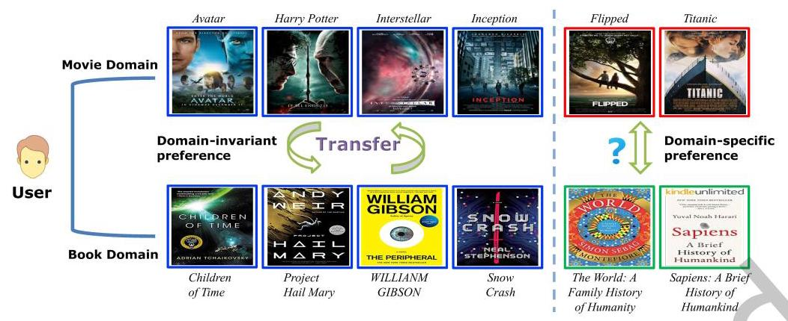

Fig. 1. A cross-domain scenario. In the movie domain, the user prefers science fiction and romance films. In the book domain, the user prefers science fiction and history books. Comparatively, the domain-invariant preference will help CDR to utilize and transfer the information between two domains, while domain-specific preference transfer may cause negative transfer.

- Compared to existing cross-domain recommendation methodologies, our approach models user preferences with finer granularity. We propose a disentanglement framework leveraging VAE capable of generating variables that conform to a Gaussian distribution through encoding processes. To disentangle domain-invariant and domain-specific information effectively, we introduce a mixed-domain. Within the disentanglement framework, we utilize the information differences between single domains and the mixed-domain to guide the design of two information regularizers, facilitating the encoding of variables.

- We have developed a multi-graph structure with two specific graphs and a cross-domain graph, enhancing the propagation of disentangled features across different graphs. By leveraging the encoding in different graphs, the model provides guidance for the information regularizers and ensures more effective bidirectional cross-domain transfer of domain-invariant features.

- In order to achieve domain adaptability and enhance the effectiveness of feature combinations, we propose item feature constraints and common user feature constraints. These constraints are designed to identify implicit correlations among users or items within various graphs. Furthermore, we utilize contrastive learning to train mask matrices, aiming to mitigate shared parameter conflicts during experimentation.

- We conducted extensive experiments on real-world datasets. The experimental results show that our proposed method outperforms several state-of-the-art baselines while improving the recommendation performance in both domains. In addition, we conducted comprehensive ablation studies and detailed analyses to validate the effectiveness of our model components.

## 2 RELATED WORK

### 2.1 Cross-Domain Recommendation

To mitigate the problem of data sparsity in recommendation systems, the cross-domain recommendation has emerged [58], utilizing more affluent information. CDR not only explores how to capture the complex patterns in user-item interactions, but also pursues a more effective way to transfer knowledge across domains [37]. With the powerful representation capability of deep learning, many researchers utilize Multilayer Perceptron (MLP) as mapping function between domains to provide flexibility for user feature learning in each domain [34, 57, 60]. To guarantee the model's robustness to noise caused by data sparsity in single domain. Zhu et al. [57] address varying degrees of rating sparsity across users and items by tailoring the Deep Neural Network (DNN) training to optimize rating data utilization. To learn diverse user preferences bridges, PTUPCDR [60] designed a two-layer MLP and attention mechanism meta-network, using user features to guide the generation of personalized bridge functions. Inspiring by dual transfer learning [15], DDTCDR [28] utilizes a latent orthogonal mapping to extract user preferences from two related domains while preserving relationships between users in different latent spaces, achieving bidirectional transfer of knowledge across domains. Chen et al. [6] also employ orthogonal mapping, treating it as an equivalent transformation. An equivalent transformation learner is proposed to model the joint distribution of user behaviors across domains. CoNet [20] uses cross-connections between networks. DTCDR [56] uses extra multi-source content information to generate rating and document embeddings of users and items. Hsu et al. [19] designed a novel graph-based cross-domain recommendation framework with adaptive adversarial contrastive learning, introducing reinforcement learning to generate adaptive augmented samples for contrastive learning tasks.

### 2.2 Graph Neural Network for Recommendation

With the advantages of Graph Convolutional Networks (GCN) to handle the structural data and explore structural information, GCN-based models have become the new state-of-the-art approaches in recommender systems [10]. GCMC [2] proposes to pass neighborhood messages by summing and assigning weight-sharing transformation channels for different relational edges. Pinsage [50] combines random walk and GraphSAGE [14] for embedding learning. NGCF [46] explores higher-order collaborative filtering information on graph structures. LightGCN [16] only uses a simple weighted sum aggregator based on NGCF and forgoes feature transformation and nonlinear activation. SGL [47] leverages the stability of graph structure to incorporate a contrastive learning framework to assist representation learning. Moreover, many GNN-based CDR methods have also emerged. PPGN [54] builds a cross-domain preference matrix to model different interaction domains as a whole. BiTGCF [30] exploits higher-order connectivity in single-domain graphs for feature propagation. ReCDR [48] constructs heterogeneous graphs through similarity and utilizes an attention mechanism for different nodes. MGCDR [52] constructs the residual network with the overlapping users to achieve multi-graph convolutional feature transfer. HeroGraph [7] uses a shared graph to achieve multi-target CDR. CDAR-FCL [11] devises a multi-graph network to capture domain-specific and domain-invariant feature. Wang et al.[45] pre-trained a graph encoder using contrastive self-supervised learning. They then applied this encoder to initialize node embeddings in the target domain, aiming to avoid biased information from the source domain that could impair recommendation performance.

### 2.3 Disentangled Representation Learning

The purpose of disentangled representation learning is to separate different factors in the data in the process of learning representation, thereby enhancing the model's generalization, interpretability, and transferability. Based on the variational inference of VAE [25], \( \beta \) -VAE [18] balances the reconstruction loss and the regularization of the latent space by introducing a hyper-parameter \( \beta \) to the objective function of the variational self-encoder, promoting a more disentangled representation. FactorVAE [24] and \( \beta \) -TCVAE [4] are improved on \( \beta \) -VAE. Approaches such as InfoGAN [5] and DR-GAN [42] leverage Generative Adversarial Networks (GANs) to augment mutual information between latent codes and observed data, thus facilitating disentanglement. More recently, the principles of disentangled representation learning have been applied to recommendation systems, as evidenced by studies [32, 33, 53, 55]. Specifically, Ma et al. [33] introduce a macro-micro disentangled VAE for deriving disentangled representations from user behavior, while Zheng et al. [55] discern user interest and conformity through causal inference's colliding effect. Disentangled representation learning has become a good solution to the problem of negative transfer in cross-domain recommendations. Specifically, it involves modeling domain features as domain-common features and domain-specific features, and transferring the required features according to domain characteristics. DisenCDR [3] proposes two mutual-information-based disentanglement regularizers to disentangle different information. Guo et al. [13] aims at transferring the trustworthy domain-shared information across domains, avoiding negative transfer problem in multi-target CDR. Building upon the differentiation between domain-common and domain-specific features, Zhu et al. [59] further elaborate on the consideration of domain-agnostic features. MADD [51] exploit domain-specific feature by domain-adversarial learning while the domain-specific feature is learned by imposing an orthogonal loss. Li et al. [29] leverage adversarial learning to generate domain-common representations. Liu et al. [31] utilize dual variational autoencoders with both local and global embedding alignment for exploiting domain-invariant user embedding. Du et al. [8] proposed a hierarchical causal subspace disentanglement method to explore the joint identifiability of cross-domain joint distributions, aiming to preserve domain-specific behaviors within domain-shared factors.

## 3 PRELIMINARIES

### 3.1 Problem Formulation

We consider a source domain A and a target domain B, each with a user set \( \mathcal{U} \) and an item set \( \mathcal{I} \) . In this study, we focus on the fully-overlapping (common) users between A and B. The goal of the recommendation task is to learn a function that can estimate the ratings of user-item pairs that have had no previous interactions, both in two domains. To facilitate nuanced modeling and generate various supervisory signals for the subsequent disentanglement process, we propose a mixed-domain C. To aggregate domain-specific features, we define specific graphs in domain A and domain B, denoted as \( {\mathcal{G}}^{\mathrm{A}} \) and \( {\mathcal{G}}^{\mathrm{B}} \) , respectively. Take the specific graph \( {\mathcal{G}}^{\mathrm{A}} \) for example, \( {\mathcal{G}}^{\mathrm{A}} = \left\{  {{\mathcal{V}}^{\mathrm{A}},{\mathcal{E}}^{\mathrm{A}}}\right\}  .{\mathcal{V}}^{\mathrm{A}} \) is the node set, which has common users \( \mathcal{U} \) and specific items \( {I}^{\mathrm{A}} \) in domain A, and \( {\mathcal{E}}^{\mathrm{A}} \) is the edge set, which includes the interactions between overlapping users \( \mathcal{U} \) and specific items \( {I}^{\mathrm{A}} \) in domain A. \( {\mathcal{G}}^{\mathrm{B}} \) has a similar definition as \( {\mathcal{G}}^{\mathrm{A}} \) . Additionally, to transfer domain-invariant features, \( {\mathcal{G}}^{C} = \left\{  {{\mathcal{V}}^{C},{\mathcal{E}}^{C}}\right\} \) is defined as the cross-domain graph based on mixed-domain \( \mathbf{C} \) , where \( {\mathcal{V}}^{C} = \left\{  {\mathcal{U},{\mathcal{I}}^{\mathrm{A}},{\mathcal{I}}^{\mathrm{B}}}\right\}  ,{\mathcal{E}}^{C} \) represents the user-item interactions in domain A and domain B.

The problem can be defined as learning enhanced feature representations of users \( \mathcal{U} \) and items \( \mathcal{I} \) , aiming to improve recommendation in both domains simultaneously. For clarity, important notations are listed in Table 1.

### 3.2 The marginal log-likelihood in VAE

The Variational Autoencoder (VAE) represents a significant advancement in generative models. It combines traditional autoencoders with probabilistic modeling, enabling them to learn rich representations of complex data distributions. VAE assumes that the data are generated by some random process, involving an unobserved continuous random variable \( \mathbf{z} \in  \mathcal{Z} \) [25], where \( \mathcal{Z} \) denotes the latent feature space. VAE is trained in an unsupervised manner, where a neural network architecture consisting of an encoder and a decoder is employed. The encoder maps the input data into a lower-dimensional latent space \( \mathcal{Z} \) , while the decoder reconstructs the original input data from the latent representation. The core idea behind VAE is to optimize the model parameters to maximize the marginal likelihood:

\[
\log {p}_{\theta }\left( \mathbf{x}\right)  = {D}_{KL}\left( {{q}_{\phi }\left( {\mathbf{z} \mid  \mathbf{x}}\right) \parallel {p}_{\theta }\left( {\mathbf{z} \mid  \mathbf{x}}\right) }\right)  + \mathcal{L}\left( {\theta ,\phi ;\mathbf{x}}\right) \tag{1}
\]

Table 1. Symbols in this paper

<table><tr><td>Symbol</td><td>Description</td></tr><tr><td>A and B</td><td>two different domains with common users</td></tr><tr><td>C</td><td>the mixed-domain</td></tr><tr><td>\( {\mathcal{G}}^{\mathrm{A}} \) and \( {\mathcal{G}}^{\mathrm{B}} \)</td><td>the specific graph construct based on \( \mathbf{A} \) and \( \mathbf{B} \)</td></tr><tr><td>\( {\mathcal{G}}^{\mathrm{C}} \)</td><td>the cross-domain graph based on \( \mathbf{C} \)</td></tr><tr><td>\( \mathcal{U} \)</td><td>the common users in \( \mathbf{A},\mathbf{B} \)</td></tr><tr><td>\( {I}^{\mathrm{A}},{I}^{\mathrm{B}} \)</td><td>the item set in \( A, B \)</td></tr><tr><td>\( {\mathcal{V}}^{\mathrm{A}},{\mathcal{V}}^{\mathrm{B}} \) and \( {\mathcal{V}}^{\mathrm{C}} \)</td><td>the node set of \( {\mathcal{G}}^{\mathrm{A}},{\mathcal{G}}^{\mathrm{B}} \) and \( {\mathcal{G}}^{\mathrm{C}} \)</td></tr><tr><td>\( {\mathcal{E}}^{\mathbf{A}},{\mathcal{E}}^{\mathbf{B}} \) and \( {\mathcal{E}}^{\mathbf{C}} \)</td><td>the edge set of \( {\mathcal{G}}^{\mathrm{A}},{\mathcal{G}}^{\mathrm{B}} \) and \( {\mathcal{G}}^{\mathrm{C}} \)</td></tr><tr><td>\( \theta \)</td><td>parameters of the encoders</td></tr><tr><td>\( \phi \)</td><td>parameters of the decoders</td></tr><tr><td>\( \varphi \)</td><td>parameters of the domain discriminator</td></tr><tr><td>D</td><td>the domain discriminator</td></tr><tr><td>\( H\left( \cdot \right) \)</td><td>information entropy</td></tr><tr><td>\( I\left( ;\right) \)</td><td>mutual information</td></tr><tr><td>\( {Z}_{\text{ Specific }}^{A} \) and \( {Z}_{\text{ Specific }}^{B} \)</td><td>domain specific feature of \( \mathbf{A} \) and \( \mathbf{B} \)</td></tr><tr><td>\( {Z}_{Invariant} \)</td><td>domain-invariant feature</td></tr><tr><td>\( {L}_{\text{ specific }},{L}_{\text{ invariant }} \)</td><td>the objective function of specific and ivariant informative regularizer</td></tr><tr><td>\( {L}_{ds} \)</td><td>the objective function of discriminator</td></tr><tr><td>\( {\mathbb{V}}_{\mathrm{A}},{\mathbb{V}}_{\mathrm{B}} \) and \( {\mathbb{V}}_{\mathrm{C}} \)</td><td>the linear spaces of \( {\mathcal{G}}^{\mathrm{A}},{\mathcal{G}}^{\mathrm{B}} \) , and \( {\mathcal{G}}^{\mathrm{C}} \)</td></tr><tr><td>\( {f}_{\mathrm{A}} \) and \( {f}_{\mathrm{B}} \)</td><td>the linear mapping of \( {\mathbb{V}}_{\mathrm{A}} \) to \( {\mathbb{V}}_{\mathrm{C}} \) , and \( {f}_{\mathrm{B}} \) to \( {\mathbb{V}}_{\mathrm{C}} \)</td></tr><tr><td>\( {\mathbb{V}}_{\mathrm{A} \rightarrow  \mathrm{C}} \) and \( {\mathbb{V}}_{\mathrm{B} \rightarrow  \mathrm{C}} \)</td><td>the linear spaces by appling \( {f}_{\mathrm{A}} \) and \( {f}_{\mathrm{B}} \)</td></tr><tr><td>\( {L}_{item}^{\mathrm{A}} \) and \( {L}_{item}^{\mathrm{B}} \)</td><td>item feature constraint</td></tr><tr><td>\( {L}^{user} \)</td><td>common user feature constraint</td></tr><tr><td>\( M \)</td><td>contrastive mask matrix</td></tr></table>

where \( \mathbf{x} \) is the input data, \( \phi \) is the parameter of encoder, \( \theta \) is the parameter of decoder. The first term is the KL divergence of the approximate from the true posterior. Since the KL divergence is non-negative, we only need to consider maximizing the second term \( \mathcal{L}\left( {\theta ,\phi ;\mathbf{x}}\right) \) , which is also known as the Evidence Lower Bound (ELBO). From this, we can derive:

\[
\log {p}_{\theta }\left( \mathbf{x}\right)  \geq  \mathcal{L}\left( {\theta ,\phi ;\mathbf{x}}\right)  = {\mathbb{E}}_{{q}_{\phi }\left( {\mathbf{z} \mid  \mathbf{x}}\right) }\left\lbrack  {-\log {q}_{\phi }\left( {\mathbf{z} \mid  \mathbf{x}}\right)  + \log {p}_{\theta }\left( {\mathbf{x},\mathbf{z}}\right) }\right\rbrack \tag{2}
\]

We can also express \( \mathcal{L}\left( {\theta ,\phi ;\mathbf{x}}\right) \) in a more intuitive form as follows, facilitating better understanding:

\[
\mathcal{L}\left( {\theta ,\phi ;\mathbf{x}}\right)  =  - {D}_{KL}\left( {{q}_{\phi }\left( {\mathrm{z} \mid  \mathrm{x}}\right) \parallel {p}_{\theta }\left( \mathrm{z}\right) }\right)  + {\mathbb{E}}_{{q}_{\phi }\left( {\mathrm{z} \mid  \mathrm{x}}\right) }\left\lbrack  {\log {p}_{\theta }\left( {\mathrm{x} \mid  \mathrm{z}}\right) }\right\rbrack \tag{3}
\]

The first term indicates the reconstruction loss which quantifies how well the decoder network can reconstruct the input data from the latent space representation. The second term indicates the prior regularization loss where \( {q}_{\phi }\left( {\mathbf{z} \mid  \mathbf{x}}\right) \) is expected to match the prior distribution \( {p}_{\theta }\left( \mathbf{z}\right) \) . Concisely, the ELBO comprises a reconstruction loss, assessing the decoder's ability to replicate input data from latent representations, and a prior regularization loss, ensuring the encoder's output aligns with the prior latent distribution. This dual objective facilitates VAE in learning substantive representations and managing latent space complexity.

## 4 PROPOSED FRAMEWORK

### 4.1 Overview

We present our novel model, called DMGCDR, as depicted in Figure 2. Within the disentanglement module, we disentangle the initial user embeddings into domain-specific and domain-invariant features. The heterogeneous information aggregation layer employs graph convolutional networks (GCN) to facilitate the propagation of node information across graphs \( {\mathcal{G}}^{\mathrm{A}},{\mathcal{G}}^{\mathrm{B}} \) , and \( {\mathcal{G}}^{\mathrm{C}} \) , thereby deriving varied user and item feature representations. In feature constraint module, three constraints are designed to align the features in different graphs to enhance the feature representation. Additionally, a contrastive mask is applied to prune shared parameters. Finally, in the feature combination layer, the embeddings are combined to generate predictions for user-item interactions.

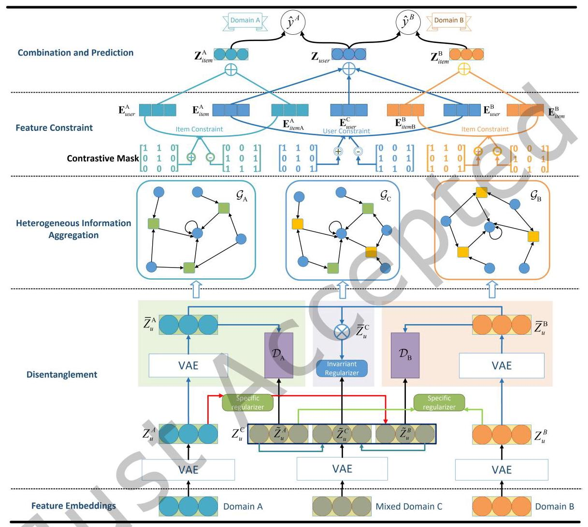

Fig. 2. The pipeline of the proposed method DMGCDR, which consists of five components, i.e., feature embeddings, disentanglement, heterogeneous information aggregation, feature constraint, and combination and prediction. Specifically, within the disentanglement module, we designed specific information regularization and invariant information regularization to disentangle domain-specific and domain-invariant features effectively. The heterogeneous information aggregation layer features a multi-graph network leveraging Graph convolutional networks to amplify domain-specific features and facilitate the transfer of domain-invariant features. The feature constraint layer focuses on maintaining consistency in the representations of identical items and users. At last, we combine the features and make a TOP-K item recommendation list.

### 4.2 Disentanglement Module

To achieve disentanglement of domain-specific and domain-invariant features, we use VAEs to model latent variables \( Z \) that fit a specific distribution and estimate the true posterior distribution. Multiple VAEs are used to generate approximate decomposed posterior distributions for domain A, B and mixed-domain C separately. We believe that the information contained in the single domains includes domain-specific information and part of the domain-invariant information, the user information in the cross-domain graph contains domain-invariant features and part of the domain-specific features. Therefore, we constructed a graphical model, shown in Figure 3. Specifically, interactions in domain A encode user and item features in domain A, interactions in domain B encode user and item features in domain B, and interactions in domain C encode part of the domain-specific features in both domains, and domain-invariant features.

4.2.1 Inference Process. Based on the graphical model assumptions in the Figure 3, the true posterior distribution of domain A and B can be decomposed as:

(4)

\[
{q}_{\phi }\left( {{Z}_{u}^{A},{Z}_{v}^{A},{Z}_{u}^{B},{Z}_{v}^{B},{\widetilde{Z}}_{u}^{A},{\widetilde{Z}}_{u}^{B},{\widetilde{Z}}_{u}^{C} \mid  A, B, C}\right)
\]

\[
= {q}_{\phi }\left( {{Z}_{u}^{A} \mid  A}\right) {q}_{\phi }\left( {{Z}_{v}^{A} \mid  A}\right) {q}_{\phi }\left( {{Z}_{u}^{B} \mid  B}\right) {q}_{\phi }\left( {{Z}_{v}^{B} \mid  B}\right) {q}_{\phi }\left( {{\widetilde{Z}}_{u}^{A} \mid  C}\right) {q}_{\phi }\left( {{\widetilde{Z}}_{u}^{B} \mid  C}\right) {q}_{\phi }\left( {{\widetilde{Z}}_{u}^{C} \mid  C}\right)
\]

where \( {Z}_{u}^{\mathrm{A}} \) and \( {Z}_{v}^{\mathrm{A}} \) represent the domain-specific features extracted from domain A, \( {Z}_{u}^{\mathrm{B}} \) and \( {Z}_{v}^{\mathrm{B}} \) represent domain-specific features extracted from domain B, \( {\widetilde{Z}}_{u}^{\mathrm{A}} \) and \( {\widetilde{Z}}_{u}^{\mathrm{B}} \) are domain-specific features of \( \mathrm{A} \) and \( \mathrm{B} \) , respectively, extracted from mixed-domain C. \( {Z}_{u}^{\mathrm{C}} \) represents domain-invariant feature extracted from C. Nevertheless, the features described so far have not met the established criteria. Consequently, we leverage the VAE framework in subsequent steps to refine these features, ensuring they align with our specified criteria for feature extraction.

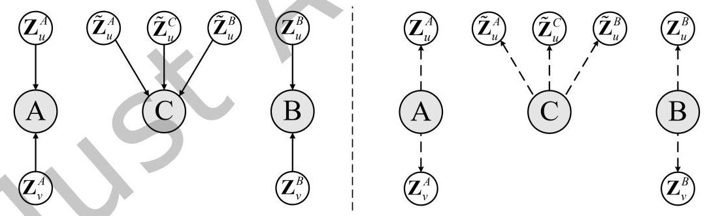

Fig. 3. The graphical model of disentanglement module. The left image represents the generation process, while the right image represents the inference process.

4.2.2 Generation Process. In the Figure 3, we present our graphical model assumption, where A and B represent the interaction between domain A and domain B. Our approach employs a VAE framework to generate domain-specific and domain-invariant features. Additionally, we introduce a mixed-domain C, utilizing multiple VAEs to generate domain-specific preferences to A, domain-specific features to B, and domain-invariant features.

Based on the assumptions depicted in the figure 3, we maximize the likelihood:

\[
{p}_{\theta }\left( {u,{v}^{\mathrm{A}},{v}^{\mathrm{B}}}\right)  = \int {p}_{{\theta }^{\mathrm{A}}}\left( {\widehat{\mathrm{A}} \mid  {Z}_{u}^{\mathrm{A}},{Z}_{v}^{\mathrm{A}}}\right) {p}_{{\theta }^{\mathrm{B}}}\left( {\widehat{\mathrm{B}} \mid  {Z}_{u}^{\mathrm{B}},{Z}_{v}^{\mathrm{B}}}\right) {p}_{{\theta }^{\mathrm{C}}}\left( {\widehat{\mathrm{C}} \mid  {\widetilde{Z}}_{u}^{\mathrm{A}},{\widetilde{Z}}_{u}^{\mathrm{B}},{\widetilde{Z}}_{u}^{\mathrm{C}}}\right) \tag{5}
\]

\[
p\left( {Z}_{u}^{\mathrm{A}}\right) p\left( {Z}_{v}^{\mathrm{A}}\right) p\left( {Z}_{u}^{\mathrm{B}}\right) p\left( {Z}_{v}^{\mathrm{B}}\right) p\left( {\widetilde{Z}}_{u}^{\mathrm{A}}\right) p\left( {\widetilde{Z}}_{v}^{\mathrm{B}}\right) p\left( {\widetilde{Z}}_{u}^{\mathrm{C}}\right) \mathrm{d}{Z}_{u}^{\mathrm{A}}\mathrm{d}{Z}_{v}^{\mathrm{A}}\mathrm{d}{Z}_{u}^{\mathrm{B}}\mathrm{d}{Z}_{v}^{\mathrm{B}}\mathrm{d}{\widetilde{Z}}_{u}^{\mathrm{A}}\mathrm{d}{\widetilde{Z}}_{u}^{\mathrm{B}}\mathrm{d}{\widetilde{Z}}_{u}^{\mathrm{C}}
\]

Specifically, for \( {p}_{{\theta }^{\mathrm{A}}}\left( {\widehat{\mathbf{A}} \mid  {Z}_{u}^{\mathrm{A}},{Z}_{v}^{\mathrm{A}}}\right) ,{p}_{{\theta }^{\mathrm{B}}}\left( {\widehat{\mathbf{B}} \mid  {Z}_{u}^{\mathrm{B}},{Z}_{v}^{\mathrm{B}}}\right) \) and \( {p}_{{\theta }^{\mathrm{C}}}\left( {\widehat{\mathbf{C}} \mid  {\widetilde{Z}}_{u}^{\mathrm{A}},{\widetilde{Z}}_{u}^{\mathrm{B}},{\widetilde{Z}}_{u}^{\mathrm{C}}}\right) \) , feature reconstruction is performed using a decoder. As described in most VAE frameworks, we can express this as follows:

\[
\int {p}_{{\theta }^{\mathrm{A}}}\left( {\widehat{\mathrm{A}} \mid  {Z}_{u}^{\mathrm{A}},{Z}_{v}^{\mathrm{A}}}\right) \mathrm{d}{Z}_{u}^{\mathrm{A}}\mathrm{d}{Z}_{v}^{\mathrm{A}} = \mathbb{E}{q}_{\phi }\left( {{Z}_{u}^{\mathrm{A}},{Z}_{v}^{\mathrm{A}} \mid  \mathrm{A}}\right) \left\lbrack  {{p}_{\theta }\left( {\widehat{\mathrm{A}} \mid  {Z}_{u}^{\mathrm{A}},{Z}_{v}^{\mathrm{A}}}\right) }\right\rbrack
\]

\[
\int {p}_{{\theta }^{\mathrm{B}}}\left( {\widehat{\mathbf{B}} \mid  {Z}_{u}^{\mathrm{B}},{Z}_{v}^{\mathrm{B}}}\right) \mathrm{d}{Z}_{u}^{\mathrm{B}}\mathrm{d}{Z}_{v}^{\mathrm{B}} = \mathbb{E}{q}_{\phi }\left( {{Z}_{u}^{\mathrm{B}},{Z}_{v}^{\mathrm{B}} \mid  \mathbf{B}}\right) \left\lbrack  {{p}_{\theta }\left( {\widehat{\mathbf{B}} \mid  {Z}_{u}^{\mathrm{B}},{Z}_{v}^{\mathrm{B}}}\right) }\right\rbrack \tag{6}
\]

\[
\int {p}_{{\theta }^{\mathrm{C}}}\left( {\widehat{\mathrm{C}} \mid  {\widetilde{Z}}_{u}^{\mathrm{A}},{\widetilde{Z}}_{u}^{\mathrm{B}},{\widetilde{Z}}_{u}^{\mathrm{C}}}\right) \mathrm{d}{\widetilde{Z}}_{u}^{\mathrm{A}}\mathrm{d}{\widetilde{Z}}_{u}^{\mathrm{B}}\mathrm{d}{\widetilde{Z}}_{u}^{\mathrm{C}} = \mathbb{E}{q}_{\phi }\left( {{\widetilde{Z}}_{u}^{\mathrm{A}},{\widetilde{Z}}_{u}^{\mathrm{B}},{\widetilde{Z}}_{u}^{\mathrm{C}}, \mid  \mathrm{C}}\right) \left\lbrack  {{p}_{\theta }\left( {\widehat{\mathrm{C}} \mid  {\widetilde{Z}}_{u}^{\mathrm{A}},{\widetilde{Z}}_{u}^{\mathrm{B}},{\widetilde{Z}}_{u}^{\mathrm{C}}}\right) }\right\rbrack
\]

\( p\left( {Z}_{u}^{\mathrm{A}}\right) , p\left( {\widetilde{Z}}_{u}^{\mathrm{A}}\right) , p\left( {Z}_{v}^{\mathrm{A}}\right) , p\left( {Z}_{u}^{\mathrm{B}}\right) , p\left( {\widetilde{Z}}_{u}^{\mathrm{B}}\right) , p\left( {Z}_{v}^{\mathrm{B}}\right) , p\left( {\widetilde{Z}}_{u}^{\mathrm{C}}\right) \) in equation 6 represent the prior distribution. Following the convention set by the majority of variational models, we assume they conform to normal Gaussian distribution. Consequently, we can utilize the Kullback-Leibler(KL) divergence to measure the discrepancy between the distribution of the learned latent variables from the model \( {q}_{\phi }\left( {Z \mid  \mathrm{A},\mathrm{B},\mathrm{C}}\right) \) and the prior distribution \( p\left( Z\right) \) . Specifically, we formalize this as follows:

\[
{D}_{KL}\left\lbrack  {{q}_{\phi }\left( {Z \mid  \mathrm{A},\mathrm{B},\mathrm{C}}\right) \parallel {p}_{\theta }\left( Z\right) }\right\rbrack   = \mathop{\sum }\limits_{z}\mathop{\sum }\limits_{x}{D}_{KL}\left\lbrack  {{q}_{{\phi }^{x}}\left( {z \mid  x}\right) \parallel {p}_{{\theta }^{x}}\left( z\right) }\right\rbrack \tag{7}
\]

By the aforementioned derivations, we can obtain the Evidence Lower Bound (ELBO) of our model as follows:

\[
\mathcal{L}\left( {\theta ,\phi ;\mathbf{A},\mathbf{B},\mathbf{C}}\right)  =  - {D}_{KL}\left\lbrack  {{q}_{\phi }\left( {Z \mid  \mathbf{A},\mathbf{B},\mathbf{C}}\right) \parallel {p}_{\theta }\left( Z\right) }\right\rbrack   + {\mathbb{E}}_{{q}_{\phi }\left( {Z \mid  \mathbf{A},\mathbf{B},\mathbf{C}}\right) }\left\lbrack  {{p}_{\theta }\left( {\widehat{\mathbf{A}},\widehat{\mathbf{B}},\widehat{\mathbf{C}} \mid  Z}\right) }\right\rbrack \tag{8}
\]

Similar to Equation 3, the first term denotes the prior regularization loss, the second term represents the reconstruction loss, and \( {\mathbb{E}}_{{q}_{\phi }\left( {Z \mid  \mathrm{A},\mathrm{B},\mathrm{C}}\right) }\left\lbrack  {{p}_{\theta }\left( {\widehat{\mathrm{A}},\widehat{\mathrm{B}},\widehat{\mathrm{C}} \mid  Z}\right) }\right. \) denotes the sum of Equation 6.

4.2.3 Specific Informative regularizer. Latent variables \( {\widetilde{Z}}^{\mathrm{A}},{\widetilde{Z}}^{\mathrm{B}} \) and \( {\widetilde{Z}}^{\mathrm{C}} \) are encoded from \( \mathrm{C} \) , we define variable \( {Z}^{\mathrm{C}} \) encoded from \( \mathrm{C} \) , which are concatenated from \( {\widetilde{Z}}^{\mathrm{A}},{\widetilde{Z}}^{\mathrm{B}} \) and \( {\widetilde{Z}}^{\mathrm{C}} \) , can be wrote as:

\[
{Z}_{u}^{\mathrm{C}} = \operatorname{Concat}\left( {{\widetilde{Z}}_{u}^{\mathrm{A}}\parallel {\widetilde{Z}}_{u}^{\mathrm{B}}\parallel {\widetilde{Z}}_{u}^{\mathrm{C}}}\right) \tag{9}
\]

To disentangle domain-specific features from domain-invariant features, we exploit the distributions of existing features as supervisory signals. Therefore, we make the following informative assumption:

Assumption 1. The latent variable \( {Z}_{u}^{\mathrm{C}} \) contains domain-specific features from domain A, domain-specific features from domain B, and domain-invariant features. These three types of features are mutually independent, and there are no additional features. This can be formalized as:

\[
H\left( {Z}_{u}^{\mathrm{C}}\right)  = H\left( {Z}_{\text{ Specific }}^{\mathrm{A}}\right)  + H\left( {Z}_{\text{ Specific }}^{\mathrm{B}}\right)  + H\left( {Z}_{\text{ Invariant }}\right) \tag{10}
\]

where \( {Z}_{\text{ Specific }}^{\mathrm{A}} \) represents domain-specific feature of \( \mathrm{A},{Z}_{\text{ Specific }}^{\mathrm{B}} \) represents domain-specific feature of \( \mathrm{B},{Z}_{\text{ Invariant }} \) represents domain-invariant feature.

Based on Assumption 1, our goal is to align the components in Equation 9 with the informational decomposition in Equation 10. Specifically, \( {\widetilde{Z}}^{\mathbf{A}} \) represents domain-specific features in domain \( \mathbf{A},{\widetilde{Z}}^{\mathbf{B}} \) represents domain-specific features in domain B, and \( {\widetilde{Z}}^{\mathrm{C}} \) represents domain-invariant features between two domains. o ensure distinct encoding of domain-invariant and domain-specific latent variables, we establish:

\[
{L}_{\text{ specific }} = I\left( {{\widetilde{Z}}_{u}^{\mathrm{A}},{\widetilde{Z}}_{u}^{\mathrm{C}}}\right)  + I\left( {{\widetilde{Z}}_{u}^{\mathrm{B}},{\widetilde{Z}}_{u}^{\mathrm{C}}}\right)  + I\left( {{Z}_{u}^{\mathrm{A}},{\widetilde{Z}}_{u}^{\mathrm{B}}}\right)  + I\left( {{Z}_{u}^{\mathrm{B}},{\widetilde{Z}}_{u}^{\mathrm{A}}}\right) \tag{11}
\]

For the first two terms, we minimize the mutual information between the user's domain-invariant and domain-specific latent variables, achieving exclusive information encoding for each latent variable. However, using only the first two terms is not sufficient to learn the ideal disentangled representation. The main reason is that any mutually exclusive information decomposition can satisfy regularization, even if \( {\widetilde{Z}}_{u}^{\mathrm{C}} \) encodes all the information while \( {\widetilde{Z}}_{u}^{\mathrm{A}} \) and \( {\widetilde{Z}}_{u}^{\mathrm{B}} \) are non-informative for both domains. Therefore, we introduce the latter two terms to make domain-specific representations \( {\widetilde{Z}}_{u}^{\mathrm{A}} \) and \( {\widetilde{Z}}_{u}^{\mathrm{B}} \) informative for their respective domains.

Assumption 2. The latent variable \( {Z}_{u}^{\mathrm{A}} \) is encoding by domain \( \mathrm{A} \) , it contains domain-specific feature from domain A and partial domain-invariant feature. Similarly, \( {Z}_{u}^{\mathrm{B}} \) contains domain-specific feature from \( \mathrm{B} \) and partial domain-invariant feature. This can be formalized as:

(12)

\[
H\left( {Z}_{u}^{\mathrm{A}}\right)  = H\left( {Z}_{\text{ Specific }}^{\mathrm{A}}\right)  + H\left( {Z}_{\text{ Invariant }}^{\text{ Part-A }}\right)
\]

\[
H\left( {Z}_{u}^{\mathrm{B}}\right)  = H\left( {Z}_{\text{ Specific }}^{\mathrm{B}}\right)  + H\left( {Z}_{\text{ Invariant }}^{\text{ Part-B }}\right)
\]

According to Assumption 1 and 2, to ensure \( {\widetilde{Z}}^{\mathrm{A}} \) and \( {\widetilde{Z}}^{\mathrm{B}} \) encode domain-specific information, we can consider that the following equation needs to be satisfied:

(13)

\[
I\left( {{Z}_{u}^{\mathrm{A}},{\widetilde{Z}}_{u}^{\mathrm{B}}}\right)  < I\left( {{Z}_{u}^{\mathrm{A}},{\widetilde{Z}}_{u}^{\mathrm{C}}}\right)  < I\left( {{Z}_{u}^{\mathrm{A}},{\widetilde{Z}}_{u}^{\mathrm{A}}}\right)
\]

\[
I\left( {{Z}_{u}^{\mathrm{B}},{\widetilde{Z}}_{u}^{\mathrm{A}}}\right)  < I\left( {{Z}_{u}^{\mathrm{B}},{\widetilde{Z}}_{u}^{\mathrm{C}}}\right)  < I\left( {{Z}_{u}^{\mathrm{B}},{\widetilde{Z}}_{u}^{\mathrm{B}}}\right)
\]

Therefore, in equation 11, minimizing \( I\left( {{Z}_{u}^{\mathrm{A}},{\widetilde{Z}}_{u}^{\mathrm{B}}}\right) \) and \( I\left( {{Z}_{u}^{\mathrm{B}},{\widetilde{Z}}_{u}^{\mathrm{A}}}\right) \) to ensure that inequality 13 holds as much as possible. This way, we can guarantee that \( {\widetilde{Z}}_{u}^{\mathrm{A}} \) encodes and exclusively captures domain-specific preferences in domain A, and \( {\widetilde{Z}}_{u}^{\mathrm{B}} \) encodes and exclusively captures domain-specific preferences in domain B.

4.2.4 Invariant Informative regularizer. Now, we aim to encourage \( {\widetilde{Z}}_{u}^{\mathrm{C}} \) to encode domain-invariant information. In assumption 2, we consider that \( {Z}_{u}^{\mathrm{A}} \) and \( {Z}_{u}^{\mathrm{B}} \) contain partial domain-invariant information. To extract this partial domain-invariant information, we utilize VAE to encode \( {Z}_{u}^{\mathrm{A}} \) and \( {Z}_{u}^{\mathrm{B}} \) , resulting in latent variables \( {\bar{Z}}_{u}^{\mathrm{A}} \) and \( {\bar{Z}}_{u}^{\mathrm{B}} \) . By minimizing \( I\left( {{\bar{Z}}_{u}^{\mathrm{A}},{\bar{Z}}_{u}^{\mathrm{A}}}\right) \) and \( I\left( {{\bar{Z}}_{u}^{\mathrm{B}},{\bar{Z}}_{u}^{\mathrm{B}}}\right) \) , we constrain \( {\bar{Z}}_{u}^{\mathrm{A}} \) and \( {\bar{Z}}_{u}^{\mathrm{B}} \) to encode the desired information, effectively extracting part of the domain-invariant features. Due to the complex encoding of \( {\bar{Z}}_{u}^{\mathrm{A}} \) and \( {\bar{Z}}_{u}^{\mathrm{B}} \) , we employ adversarial distribution matching, which allows us to meet the requirements of information encoding without deriving exact probability distributions. We introduce domain-separation discriminators \( {\mathcal{D}}_{\mathrm{A}} \) and \( {\mathcal{D}}_{\mathrm{B}} \) . The domain-separation discriminator \( {\mathcal{D}}_{\mathrm{A}} \) take \( {\widetilde{Z}}_{u}^{\mathrm{A}} \) and \( {\widetilde{Z}}_{u}^{\mathrm{A}} \) as input and output a 1-dimensional vector \( {\widehat{y}}^{\mathrm{A}} \) . The closer \( {\widehat{y}}^{\mathrm{A}} \) is to either 0 or 1, it signifies that the prediction of \( \mathrm{Z} \) contains information that is either domain-specific (closer to 0 ) or domain-invariant (closer to 1). The ground-truth \( {y}^{\mathrm{A}} = 0 \) if input is \( {\widetilde{Z}}_{u}^{\mathrm{A}},{y}^{\mathrm{A}} = 1 \) if input is \( {\widetilde{Z}}_{u}^{\mathrm{A}}.{\mathcal{D}}_{\mathrm{B}} \) is the same. Then we define the following minimax optimization objective:

\[
\mathop{\min }\limits_{\phi }\mathop{\max }\limits_{\varphi }{L}_{ds} =  - \log {\mathcal{D}}_{\mathrm{A}}\left( {\bar{Z}}_{u}^{\mathrm{A}}\right)  - \log \left( {1 - {\mathcal{D}}_{\mathrm{A}}\left( {\widetilde{Z}}_{u}^{\mathrm{A}}\right) }\right)  - \log {\mathcal{D}}_{\mathrm{B}}\left( {\bar{Z}}_{u}^{\mathrm{B}}\right)  - \log \left( {1 - {\mathcal{D}}_{\mathrm{B}}\left( {\widetilde{Z}}_{u}^{\mathrm{B}}\right) }\right) \tag{14}
\]

where \( \varphi \) is the parameter of discriminator. Note that the optimization objective of the discriminator \( \varphi \) is to weaken its discriminating ability by maximizing the prediction loss. This adversarial training allows us to adjust the encoder parameters \( \phi \) , ensuring that the encoded domain-invariant variables are distinguishable from domain-specific preferences, even in the presence of less effective discriminators \( \varphi \) . Subsequently, we use the encoded partial domain-invariant features \( {\widetilde{Z}}_{u}^{\mathrm{A}},{\widetilde{Z}}_{u}^{\mathrm{B}} \) to guide \( {\widetilde{Z}}_{u}^{\mathrm{C}} \) in encoding domain-invariant information by minimizing the KL divergence. In summary, to disentangle domain-shared information, we have:

\[
{L}_{\text{ Invariant }} = I\left( {{\bar{Z}}_{u}^{\mathrm{A}},{\widetilde{Z}}_{u}^{\mathrm{A}}}\right)  + I\left( {{\bar{Z}}_{u}^{\mathrm{B}},{\widetilde{Z}}_{u}^{\mathrm{B}}}\right)  - I\left( {{\bar{Z}}_{u}^{\mathrm{C}},{\widetilde{Z}}_{u}^{\mathrm{C}}}\right)
\]

\[
= \mathop{\min }\limits_{\phi }\mathop{\max }\limits_{\varphi }{L}_{ds} - {D}_{KL}({q}_{\overline{\phi }}\left( {{\bar{Z}}_{u}^{\mathrm{C}}\left| {{\bar{Z}}_{u}^{\mathrm{A}},{\bar{Z}}_{u}^{\mathrm{B}})}\right| |{q}_{\phi }\left( {{\widetilde{Z}}_{u}^{\mathrm{C}}|\mathrm{C}}\right) }\right) \tag{15}
\]

where \( {\bar{Z}}_{u}^{\mathrm{C}} \) is combined by \( {\bar{Z}}_{u}^{\mathrm{A}},{\bar{Z}}_{u}^{\mathrm{B}} \) . Then we have successfully encoded the domain-specific feature of domain \( \mathbf{A} \; {Z}_{\text{ Specific }}^{\mathrm{A}} \) as the sum of \( {Z}_{u}^{\mathrm{A}} \) and \( {\widetilde{Z}}_{u}^{\mathrm{A}} \) , the domain-specific feature of domain \( \mathrm{B}{Z}_{\text{ Specific }}^{\mathrm{B}} \) as the sum of \( {Z}_{u}^{\mathrm{B}} \) and \( {\widetilde{Z}}_{u}^{\mathrm{B}} \) and domain-invariant feature \( {Z}_{\text{ invariant }} \) as the sum of \( {\bar{Z}}_{u}^{\mathrm{C}} \) and \( {\widetilde{Z}}_{u}^{\mathrm{C}} \) .

### 4.3 Heterogeneous Information Aggregation

Upon deriving disentangled user representations, we utilize LightGCN [16] as the feature propagation method to further capture high-order neighbor information of users and items. Specifically, we enhance the domain-specific feature of domain A on the single-domain graph \( {\mathcal{G}}^{\mathrm{A}} \) , the embedding matrix for the 0 -th layer is created by concatenating the decoded \( {Z}_{\text{ Specific }}^{\mathrm{A}} \) and \( {Z}_{\vartheta }^{\mathrm{A}} \) . Similarly, we domain-specific feature of domain B on the single-domain graph \( {\mathcal{G}}^{\mathrm{B}} \) , the embedding matrix for the 0-th layer is created by concatenating the decoded \( {Z}_{\text{ Specific }}^{\mathrm{B}} \) and \( {Z}_{v}^{\mathrm{B}} \) . We also enhance the domain-invariant feature on the cross-domain graph \( {\mathcal{G}}^{\mathrm{C}} \) , along with inter-domain knowledge transfer, the embedding matrix for the 0-th layer is created by concatenating the decoded \( {Z}_{\text{ Invariant }} \) , \( {Z}_{v}^{\mathrm{A}} \) and \( {Z}_{v}^{\mathrm{B}} \) . With this approach, we effectively utilize both domain-invariant and domain-specific features while preventing the transfer of domain-specific knowledge to mitigate negative transfer effects. For a network with \( l \) layers, the embedding representation at layer \( k\left( {1 \leq  k \leq  l}\right) \) can be summarized as follows:

\[
{\mathbf{E}}^{\left( k\right) } = \left( {{D}^{-\frac{1}{2}}A{D}^{-\frac{1}{2}}}\right) {\mathbf{E}}^{\left( k - 1\right) } \tag{16}
\]

where \( A \) denotes the adjacency matrix of the user-item graph, and \( D \) is a diagonal matrix, sized \( \left( {\left| \mathcal{U}\right|  + \left| I\right| }\right)  \times \; \left( {\left| \mathcal{U}\right|  + \left| \mathcal{I}\right| }\right) \) , in which each entry \( {D}_{ii} \) denotes the number of nonzero entries in the \( i \) -th row vector of the adjacency matrix \( A \) . The final embedding matrix is obtained by summing the weighted embeddings from all layers:

\[
\mathbf{E} = {\alpha }_{0}{\mathbf{E}}^{\left( 0\right) } + {\alpha }_{1}{\mathbf{E}}^{\left( 1\right) } + {\alpha }_{2}{\mathbf{E}}^{\left( 2\right) } + \cdots  + {\alpha }_{l}{\mathbf{E}}^{\left( l\right) } \tag{17}
\]

where \( {\alpha }_{k} \) signifies the weight coefficient of the \( k \) -th convolutional layer. In this way, we can obtain the embeddings of common users \( {\mathrm{E}}_{user}^{\mathrm{A}} \) and items \( {\mathrm{E}}_{item}^{\mathrm{A}} \) from \( {\mathcal{G}}^{\mathrm{A}} \) , embeddings of common users \( {\mathrm{E}}_{user}^{\mathrm{B}} \) and items \( {\mathrm{E}}_{item}^{\mathrm{B}} \) from \( {\mathcal{G}}^{\mathrm{B}} \) , and embeddings of common users \( {\mathrm{E}}_{user}^{\mathrm{C}} \) , embeddings of items \( {\mathrm{E}}_{{ite}{m}_{\mathrm{A}}}^{\mathrm{C}} \) in domain \( \mathbf{A} \) and embeddings of items \( {\mathrm{E}}_{{ite}{m}_{\mathrm{B}}}^{\mathrm{C}} \) in target domain B from \( {\mathcal{G}}^{\mathrm{C}} \) can be formulated as:

\[
{\mathrm{E}}_{user}^{\mathrm{A}},{\mathrm{E}}_{item}^{\mathrm{A}} = {\operatorname{LightGCN}}_{{\mathcal{G}}^{\mathrm{A}}}\left( {{Z}_{Specific}^{\mathrm{A}},{Z}_{v}^{\mathrm{A}}}\right)
\]

\[
{\mathrm{E}}_{\text{ user }}^{\mathrm{B}},{\mathrm{E}}_{\text{ item }}^{\mathrm{B}} = {\operatorname{LightGCN}}_{{\mathcal{G}}^{\mathrm{B}}}\left( {{Z}_{\text{ Specific }}^{\mathrm{B}},{Z}_{v}^{\mathrm{B}}}\right) \tag{18}
\]

\[
{\mathrm{E}}_{\text{ user }}^{\mathrm{C}},{\mathrm{E}}_{\text{ user }}^{\mathrm{A}}\left| \right| {\mathrm{E}}_{\text{ item }}^{\mathrm{B}} = {\operatorname{LightGCN}}_{{\mathcal{G}}^{\mathrm{C}}}\left( {{Z}_{\text{ Invariant }},{Z}_{v}^{\mathrm{A}}\left| \right| {Z}_{v}^{\mathrm{B}}}\right)
\]

Since a single-domain graph only contains user interaction information within a single domain, information propagation on the single-domain graph primarily helps user nodes learn domain-specific preferences. In contrast, a cross-domain graph includes user interaction preferences across two domains, which helps user nodes learn more domain-invariant features. By relying on the dominant features represented by users in different graphs, we determine domain-invariant preferences and domain-specific preferences. This further elucidates that the embedding representations obtained in disentanglement module meet the expectations of disentangled information.

### 4.4 Feature Constraint

The purpose of designing \( {\mathcal{G}}^{\mathrm{A}},{\mathcal{G}}^{\mathrm{B}} \) , and \( {\mathcal{G}}^{\mathrm{C}} \) is to better capture domain-invariant and domain-specific features effectively. Ideally, the embeddings of identical users or items across these distinct graphs should exhibit maximum divergence. However, there are implicit correlations between these embeddings. To tackle this, we propose that the embedding representations obtained from the three graphs inhabit unique linear spaces, denoted as \( {\mathbb{V}}_{\mathrm{A}} \) , \( {\mathbb{V}}_{\mathrm{B}} \) and \( {\mathbb{V}}_{\mathrm{C}} \) , respectively. As shown in Figure 4, the linear mapping \( {f}_{\mathrm{A}} : {\mathbb{V}}_{\mathrm{A}} \rightarrow  {\mathbb{V}}_{\mathrm{C}} \) and \( {f}_{\mathrm{B}} : {\mathbb{V}}_{\mathrm{B}} \rightarrow  {\mathbb{V}}_{\mathrm{C}} \) are employed to transform the embedding between these disparate spaces. We can obtain the features of the item or user in different linear spaces through linear mapping. The primary aim of feature constraint is to maintain the inherent correlations of identical item or user features within these diverse linear spaces. To this end, item feature constraints and a unified user feature constraint have been established. Item feature constraints and a common user feature constraint are designed in this section.

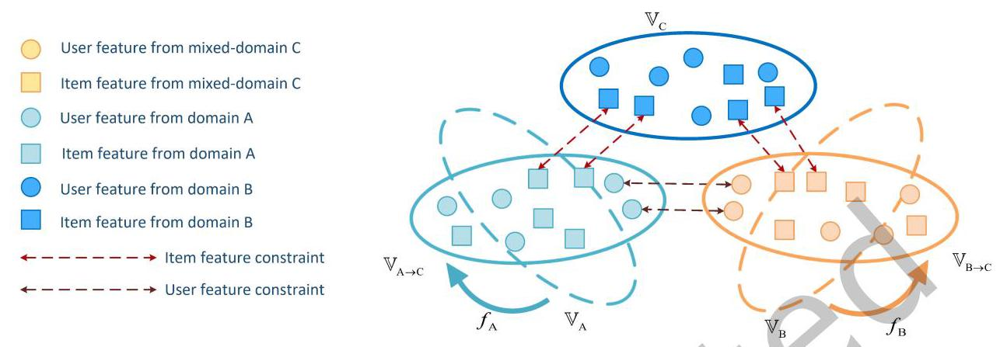

Fig. 4. By applying linear mappings \( {f}_{\mathrm{A}} \) and \( {f}_{\mathrm{B}} \) to \( {\mathbb{V}}_{\mathrm{A}} \) and \( {\mathbb{V}}_{\mathrm{B}} \) , respectively, we can obtain two linear spaces, \( {\mathbb{V}}_{\mathrm{A} \rightarrow  \mathrm{C}} \) and \( {\mathbb{V}}_{\mathrm{B} \rightarrow  \mathrm{C}} \) , that represent the same linear space as \( {\mathbb{V}}_{\mathrm{C}} \) . Subsequently, we impose constraints on the features of the same item or user in \( {\mathbb{V}}_{\mathbf{C}},{\mathbb{V}}_{\mathbf{A} \rightarrow  \mathbf{C}} \) , and \( {\mathbb{V}}_{\mathbf{B} \rightarrow  \mathbf{C}} \) to preserve their potential consistency.

4.4.1 Item Feature Constraint. As both \( {\mathbf{E}}_{\text{ item }}^{\mathrm{A}} \) and \( {\mathbf{E}}_{\text{ item }}^{\mathrm{C}} \) represent item features in domain A, we introduce a consistency constraint formulated as follows:

\[
{L}_{\text{ item }}^{\mathrm{A}} = {\begin{Vmatrix}{\mathrm{E}}_{\text{ item }}^{\mathrm{A}}{W}^{\mathrm{A}} - {\mathrm{E}}_{\text{ item }}^{C}\end{Vmatrix}}_{F}^{2} \tag{19}
\]

where \( {W}^{\mathrm{A}} \in  {\mathbb{R}}^{\dim  \times  \dim } \) is a learnable parameter. Applying \( {W}^{\mathrm{A}} \) to \( {\mathrm{E}}_{\text{ item }}^{A} \) to map it to the same linear space as \( {\mathrm{E}}_{{ite}{m}_{\mathrm{A}}}^{C} \) , and then we minimize the Frobenius norm of the discrepancy between the two embedding matrices to enhance the implicit correlation. Similarly, for the embeddings \( {\mathbf{E}}_{item}^{\mathbf{B}} \) and \( {\mathbf{E}}_{{ite}{m}_{\mathbf{B}}}^{C} \) , the constraint can be defined as:

\[
{L}_{\text{ item }}^{\mathrm{B}} = {\begin{Vmatrix}{\mathrm{E}}_{\text{ item }}^{\mathrm{B}}{W}^{\mathrm{B}} - {\mathrm{E}}_{\text{ itemB }}^{C}\end{Vmatrix}}_{F}^{2} \tag{20}
\]

where \( {W}^{\mathrm{B}} \in  {\mathbb{R}}^{\dim  \times  \dim } \) is a learnable parameter used to map the embedding matrix \( {\mathbf{E}}_{\text{ item }}^{\mathrm{B}} \) to the same linear space as \( {\mathrm{E}}_{{item}\mathrm{\;B}}^{C} \) . This approach maintains the distinctiveness between domain-specific and domain-invariant features while emphasizing their consistency.

4.4.2 Common user Feature Constraint. We also incorporate a consistency constraint for user embeddings. The constraint is defined as:

\[
{L}^{\text{ user }} = {\begin{Vmatrix}{\mathbf{E}}_{\text{ user }}^{\mathbf{A}}{W}^{\mathbf{A}} - {\mathbf{E}}_{\text{ user }}^{\mathbf{B}}{W}^{\mathbf{B}}\end{Vmatrix}}_{F}^{2} \tag{21}
\]

To ensure consistency between the different user embeddings, we use the matrix \( {W}^{\mathrm{A}} \) to map \( {\mathbf{E}}_{\text{ user }}^{\mathrm{A}} \) into the same linear space as \( {\mathbf{E}}_{user}^{C} \) , and \( {W}^{\mathrm{B}} \) to map \( {\mathrm{E}}_{user}^{\mathrm{B}} \) into the same linear space as \( {\mathbf{E}}_{user}^{C} \) . By doing this, we consider \( {\mathbf{E}}_{user}^{\mathrm{A}}{W}^{\mathrm{A}} \) and \( {\mathrm{E}}_{\text{ user }}^{\mathrm{B}}{W}^{\mathrm{B}} \) as different representations of the embedding \( {\mathrm{E}}_{\text{ user }}^{C} \) in the same linear space, and the constraint is designed to improve the alignment and consistency between these representations.

Algorithm 1 Contrastive Mask Matrix learning

---

Input: A network with shared parameters \( s \) , mask matrix before pruning \( M \) , pruning rate \( \alpha \) , Minimum sparsity \( \varepsilon \) ,

iteration epochs \( T \) .

Output: the pruned mask \( M \)

		for \( W \) in \( \left\{  {{W}^{\mathrm{A}},{W}^{\mathrm{B}}}\right\} \) for every constraint do

			Initialize parameter mask \( {M}^{t} \in  \{ 0,1{\} }^{\left| W\right| } \) , where \( W \) is the shared parameter, \( t = 1 \) .

			Select a random mini-batch data \( \mathrm{x} \)

			Generate contrastive parameter mask \( {M}^{\prime } \) by the contrastive strategies based on \( M \) .

			for \( t = 1,\ldots , T \) do

				Update the shared parameter \( W \) by taking a gradient step to optimize contrastive loss in (24).

			end for

			Prune the remaining parameters from \( W \) with the smallest numerical change of \( \alpha \) percent. Let \( W\left\lbrack  j\right\rbrack   = 0 \) if

			\( M\left\lbrack  j\right\rbrack \) is pruned.

			if \( \frac{\parallel M{\parallel }_{0}}{\parallel W\parallel } \leq  \varepsilon \) then

				Reset \( W \) and go to step 3 .

			else

				The pruned parameter mask is \( M \) .

			end if

		end for

		return The pruned mask \( M \)

---

4.4.3 Contrastive Mask. In (19),(20), and (21), \( {W}^{\mathrm{A}} \) and \( {W}^{\mathrm{B}} \) are shared parameters, leading to potential conflicts during the training phase. To overcome this issue, we propose a method that uses contrastive learning to train a binary mask matrix. Algorithm 1 provides a detailed explanation. The main concept behind this approach is to identify and remove the shared parameters that have little impact on the current constraint, while keeping the parameters that have a significant impact. Take (19) as an example, the constraint is expressed as:

\[
{L}_{\text{ item }}^{\mathrm{A}} = {\begin{Vmatrix}{\mathrm{E}}_{\text{ item }}^{\mathrm{A}}{W}^{\mathrm{A}} \odot  {M}_{1}^{\mathrm{A}} - {\mathrm{E}}_{\text{ item }}^{C}\end{Vmatrix}}_{F}^{2} \tag{22}
\]

where \( \odot \) represents the element-wise product used to filter the useful parameters. To learn every parameter mask \( M \) , the noise data is denoted as \( {M}^{\prime } \) , which can be generated using any contrastive strategy. In this method, the parameter mask is randomly reversed with different sampling ratios. Take \( {M}_{1}^{\mathrm{A}} \) as an example, for noise data, the constraint is defined as:

\[
{{L}_{item}^{\mathrm{A}}}^{\prime } = {\begin{Vmatrix}{\mathrm{E}}_{item}^{\mathrm{A}}{W}^{\mathrm{A}} \odot  {M}_{1}^{{\mathrm{A}}^{\prime }} - {\mathrm{E}}_{{item}\mathrm{\;A}}^{C}\end{Vmatrix}}_{F}^{2} \tag{23}
\]

\[
{\text{ Loss }}_{\text{ Contrastive }} = \operatorname{softplus}\left( {{{L}_{\text{ item }}^{\mathrm{A}}}^{\prime } - {L}_{\text{ item }}^{\mathrm{A}}}\right) \tag{24}
\]

The shared parameter \( {W}^{\mathrm{A}} \) will be optimized using Algorithm 1.

### 4.5 Feature Combination and Training

The Combination of final features is conducted additively. The user feature vector \( {\mathbf{Z}}_{\text{ user }} \) , results from the summation of \( {\mathrm{E}}_{\text{ user }}^{\mathrm{A}},{\mathrm{E}}_{\text{ user }}^{\mathrm{B}} \) , and \( {\mathrm{E}}_{\text{ user }}^{C} \) . In a similar manner, the item feature vector for domain A \( {\mathrm{Z}}_{\text{ item }}^{\mathrm{A}} \) , is derived from adding \( {\mathrm{E}}_{\text{ item }}^{\mathrm{A}} \) to \( {\mathrm{E}}_{\text{ itemA }}^{\mathrm{A}} \) , while \( {\mathrm{Z}}_{\text{ item }}^{\mathrm{B}} \) combines \( {\mathrm{E}}_{\text{ item }}^{\mathrm{B}} \) with \( {\mathrm{E}}_{\text{ itemB }}^{\mathrm{B}} \) . To predict user-item ratings, cosine similarity is employed.

Table 2. Datasets

<table><tr><td>Task</td><td>Dataset</td><td>#Users</td><td>#Items</td><td>#Interactions</td><td>Density</td></tr><tr><td rowspan="2">Task1</td><td>Cell</td><td>10421</td><td>9679</td><td>81934</td><td>0.081%</td></tr><tr><td>Elec</td><td>10421</td><td>40121</td><td>190522</td><td>0.046%</td></tr><tr><td rowspan="2">Task2</td><td>Cloth</td><td>3290</td><td>11860</td><td>29147</td><td>0.075%</td></tr><tr><td>Sport</td><td>3290</td><td>12213</td><td>37458</td><td>0.093%</td></tr></table>

We adopt the Bayesian Personalized Ranking (BPR)[38] loss for both domains. The loss function is defined as:

\[
{L}_{BPR} =  - \mathop{\sum }\limits_{{u = 1}}^{\left| U\right| }\mathop{\sum }\limits_{{i \in  I}}\mathop{\sum }\limits_{{j \notin  I}}\ln \sigma \left( {{\widehat{y}}_{ui} - {\widehat{y}}_{uj}}\right)  + \lambda {\begin{Vmatrix}{\mathrm{E}}^{\left( 0\right) }\end{Vmatrix}}^{2} \tag{25}
\]

where \( \sigma \) is the softplus activation function, and \( \widehat{y} \) is the predicted rating of the user for the item. \( {\mathbf{E}}^{\left( 0\right) } \) represents the embeddings of the 0 -th layer in the graph embedding layer. We apply \( {L}_{2} \) regularization on the embedding layer, which is sufficient to prevent overfitting, with \( \lambda \) controlling the strength of regularization. Finally, to jointly optimize the recommendation prediction and feature constraints, we define a joint loss function \( {L}_{\text{ joint }} \) as follows:

\[
{L}_{\text{ joint }} = {L}_{BPR}^{\mathrm{A}} + {L}_{BPR}^{\mathrm{B}} + {\lambda }_{1}{L}_{\text{ specific }} + {\lambda }_{2}{L}_{\text{ invariant }} + {\lambda }_{3}\left( {{L}_{\text{ item }}^{\mathrm{A}} + {L}_{\text{ item }}^{\mathrm{B}} + {L}^{\text{ user }}}\right) \tag{26}
\]

where \( {\lambda }_{1},{\lambda }_{2} \) , and \( {\lambda }_{3} \) adjust the weight of the specific informative regularizer, shared informative regularizer, and feature constraint, respectively. The model is trained using the Adam optimizer in a mini-batch approach.

## 5 EXPERIMENTS

### 5.1 Experimental Setup

5.1.1 Datasets. We conducted experiments on real world cross-domain datasets from Amazon-5cores \( {}^{1} \) , where each user or item has at least five ratings. We selected four popular categories: Clothing, Shoes and Jewelry (Cloths for short), Sports and Outdoors (Sports for short), Cell Phones and Accessories (Cell for short), and Electronics (Elec for short). We used two pairs of datasets: Cloths&Sports, and Cell&Elec. For each pair of datasets, we initially filtered the datasets to retain users with ratings greater than three, and labeled their interactions with a rating of 1 to indicate positive interactions. Next, we extracted the overlapping users which had more than 5 positive interactions in both domains. Table 2 summarizes the detailed statistics of the three pairs of datasets.

5.1.2 Baselines. To illustrate the effectiveness, we compare DMGCDR with single-domain methods (BPRMF, NeuMF, NGCF and LightGCN) and recent cross-domain recommendation methods (CoNet, sCoNet, DDTCDR, PPGN, BiTGCF, DisenCDR, ETL) as follows:

- BPRMF [39] is a classical single-domain model, which learns the user and item factors via matrix factorization and pair- wise rank loss.

- NeuMF [17] represents a prototypical single-domain recommendation algorithm based on deep learning. It integrates conventional matrix factorization with multilayer perceptron, enabling the concurrent extraction of both low-dimensional and high-dimensional features.

- NGCF [46] is a collaborative filtering model for recommendation systems that leverages graph neural networks to aggregate the high-order neighboring information to learn representations.

- LightGCN [16] builds on NGCF and simplifies the aggregator by using only a weighted sum and no feature transformation or nonlinear activation.

---

\( {}^{1} \) http://jmcauley.ucsd.edu/data/amazon

---

- CoNet [20] enables dual knowledge transfer across domains by introducing cross connections from one-base network to another. It jointly learns on two domains and optimizes both domains simultaneously.

- sCoNet [20] is a sparse version of CoNet with L1-regularization on the user and item representations

- DDTCDR [28] develops a latent orthogonal mapping to extract user preferences between the recommendation model of every single domain while preserving relations between users across different latent spaces.

- PPGN [54] constructs a cross-domain preference matrix to model different interaction domains as a whole and shares the features of users learned from the joint interaction. graph by stacking multiple graph convolution layers.

- BiTGCF [30] utilizes the high-order connectivity in the single-domain graphs for feature propagation and achieves bidirectional knowledge transfer through common users.

- DisenCDR [3] employs two mutual-information-based disentanglement regularizers to disentangle domain-invariant domain-specific information.

- ETL [6] models the joint distribution of user behaviors across domains. It allows the learned preferences in different domains to preserve the domain-specific features as well as the overlapped features.

5.1.3 Evaluation. We adopt leave-one-out method for evaluation. For each test user, we randomly split one interaction with a test item as the test interaction. We randomly sample 99 unobserved interactions for the test user and then rank the test item among the 100 items. For the Top-K recommendation task, we adopt Hit Ratio (HR) and Normalized Discounted Cumulative Gain (NDCG) to evaluate the performance of all models, and K is set to 5 and 10 in our experiments.

5.1.4 Implementation Details. User and item side information was excluded from our experiments. We implement DDTCDR by ourselves and maintain the optimal configuration in their papers. For PPGN, the embedding size is fixed to 8. As for other methods, we set the shared hyper-parameters as follows: the embedding size is fixed to 128 and the embedding parameters are initialized using the Xavier method. The mini-batch size is fixed to 1024, the negative sampling number is fixed to 1, the Adam optimizer is used to update all parameters, the dropout ratio is set as 0.1 and the learning rate is set to \( 1{e}^{-3} \) . For hyper-parameter \( {\lambda }_{1} \) and \( {\lambda }_{2} \) , we tune them among [0.01, 0.05,0.1,0.2,0.5], for hyper-parameter \( {\lambda }_{3} \) , we tune it among \( \left\lbrack  {{0.1},{0.2},{0.3},{0.5},{1.0},{2.0}\rbrack }\right. \) . The number of graph convolutional network layers is set to 5 . The \( {L}_{2} \) regularization coefficient \( \lambda \) is set to \( 1{e}^{-4} \) . We combine the values of each layer using an average weighting, with the layer combination coefficient set to \( \alpha  = 1/5 \) . The minimum sparsity \( \varepsilon \) is set to 0.3, the pruning rate \( \alpha \) to 0.1, and the iteration epochs \( \mathrm{t} \) in Algorithm 1 set to 5 . We implement DMGCDR using the PyTorch framework.

### 5.2 Overall Comparison

We compared our method with several state-of-the-art baselines, including single-domain recommendation algorithms and cross-domain recommendation algorithms. The results are shown in Tables 3 and 4. According to our research, DMGCDR achieved reliable recommendation results and significantly outperformed all baselines. Furthermore, we can make the following insightful observations:

- Graph neural network-based methods, such as NGCF and LightGCN, outperformed traditional models like BPRMF on most datasets, confirming that aggregating high-order adjacent information is advantageous for learning user and item representations for recommendation. Cross-domain methods generally outperformed single-domain methods, indicating that modeling relationships between domains is crucial. However, a few cross-domain methods performed worse than single-domain methods, suggesting that mitigating negative transfer issues is still a worthwhile research direction.

- Based on the performance comparison on the two datasets, we can observe that CDR methods outperform single-domain recommendation methods, especially on the Cell & Elec dataset. This advantage is likely due to the larger amount of interaction data available in these datasets. In datasets with limited interaction data like Cell & Elec, it is challenging to comprehensively model user preferences with a small amount of data. Therefore, transferring information from other domains becomes more effective. On the other hand, datasets with a large amount of interaction data already capture user preferences effectively using domain-specific recommendation methods. In such cases, transferring information from other domains may not be as beneficial and could even reduce the original recommendation performance.

- Compared to BPRMF and NeuMF, CoNet, sCoNet, and DDTCDR all show better performance, indicating that knowledge transfer between the two base networks is an effective cross-domain approach. Additionally, PPGN and BiTGCF outperformed other methods significantly, suggesting that leveraging GNN for modeling user-item interactions in cross-domain recommendation and subsequently performing knowledge transfer is a powerful CDR transfer strategy. Both ETL and DisenCDR, employing the VAE framework to model user preference distributions, underscore the potential of VAE-based domain feature modeling. DisenCDR's distinguished performance further validates the efficacy of disentangling domain-specific and domain-invariant features for cross-domain recommendation improvement.

- Compared to the state-of-the-art baselines, our DMGCDR consistently outperforms them across all evaluation metrics on these datasets. This suggests that our approach, which disentangling domain-invariant features from domain-specific features and transferring knowledge only for domain-invariant features, is effective. It also confirms the performance of our proposed disentanglement framework. In comparison to DisenCDR, DMGCDR achieves better performance. This is attributed to the introduction of the mixed-domain and the design of disentanglement informative regularization terms. Our disentanglement approach is more effective, and the utilization of GNN to enhance domain-specific features within single-domain graphs and transfer domain-invariant features across cross-domain graph further improves the model's performance. Simultaneously, by incorporating feature constraints and ensuring the consistency of embeddings derived from various graphs, we enhanced the effectiveness of feature combinations, resulting in improved model performance.

### 5.3 Ablation Study

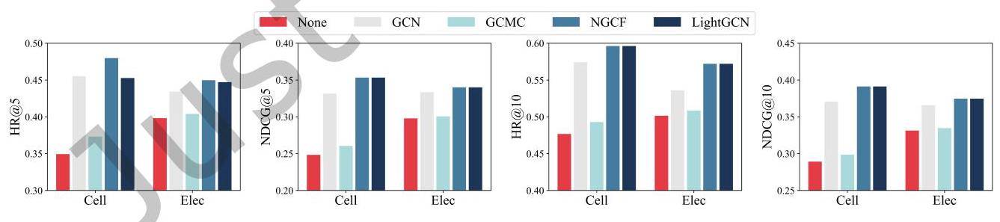

Fig. 5. The effects of different GCN on Cell & Elec.

5.3.1 Different GCN. In the heterogeneous information aggregation module, LightGCN was employed as our convolutional kernel. This section extends our discussion to the integration of GCN-based models, such as GCN [9], GCMC [2], and NGCF [46], into our aggregation module. Additionally, we evaluated the performance of our model without the heterogeneous information aggregation module for comparison. Performance metrics for the Cell & Elec dataset are depicted in Figure 5, while those for the Cloth & Sport dataset are illustrated in Figure 6. It is evident that the absence of graph convolution layers significantly diminishes model effectiveness. This decline is attributed to the pivotal role of Graph Collaborative Filtering in capturing high-order connectivity within user-item graphs, thereby enhancing the system's capability to learn user and item features and predict potential interactions. Moreover, DMGCDR relies on cross-domain graph to enable cross-domain information transfer.

Table 3. The overall comparison on Cell & Elec. The best results are bolded. The underlined results are the best performance of baselines.

<table><tr><td colspan="9">Cell & Elec</td></tr><tr><td>topK</td><td colspan="4">topK=5</td><td colspan="4">topK=10</td></tr><tr><td>Domain</td><td colspan="2">Cell</td><td colspan="2">Elec</td><td colspan="2">Cell</td><td colspan="2">Elec</td></tr><tr><td>Metrics</td><td>HR</td><td>NDCG</td><td>HR</td><td>NDCG</td><td>HR</td><td>NDCG</td><td>HR</td><td>NDCG</td></tr><tr><td>BPRMF</td><td>0.3365</td><td>0.2478</td><td>0.3326</td><td>0.2463</td><td>0.4346</td><td>0.2791</td><td>0.4303</td><td>0.2779</td></tr><tr><td>NeuMF</td><td>0.3475</td><td>0.2473</td><td>0.3973</td><td>0.2978</td><td>0.4768</td><td>0.2881</td><td>0.5001</td><td>0.3309</td></tr><tr><td>NGCF</td><td>0.4504</td><td>0.3350</td><td>0.4221</td><td>0.3199</td><td>0.5631</td><td>0.3727</td><td>0.5093</td><td>0.3352</td></tr><tr><td>LightGCN</td><td>0.4642</td><td>0.3487</td><td>0.4237</td><td>0.3181</td><td>0.5874</td><td>0.3820</td><td>0.5369</td><td>0.3457</td></tr><tr><td>CoNet</td><td>0.3740</td><td>0.2663</td><td>0.3962</td><td>0.2936</td><td>0.5065</td><td>0.3106</td><td>0.5209</td><td>0.3409</td></tr><tr><td>sCoNet</td><td>0.3681</td><td>0.2638</td><td>0.4084</td><td>0.3026</td><td>0.4933</td><td>0.3019</td><td>0.5375</td><td>0.3437</td></tr><tr><td>DDTCDR</td><td>0.3484</td><td>0.2473</td><td>0.3999</td><td>0.2993</td><td>0.4766</td><td>0.2877</td><td>0.5023</td><td>0.3321</td></tr><tr><td>PPGN</td><td>0.4104</td><td>0.2887</td><td>0.3785</td><td>0.2632</td><td>0.5608</td><td>0.3173</td><td>0.4964</td><td>0.2958</td></tr><tr><td>BiTGCF</td><td>0.4541</td><td>0.3359</td><td>0.3786</td><td>0.2782</td><td>0.5428</td><td>0.3461</td><td>0.4962</td><td>0.3165</td></tr><tr><td>DisenCDR</td><td>0.4284</td><td>0.3049</td><td>0.4464</td><td>0.3292</td><td>0.5679</td><td>0.3668</td><td>0.5566</td><td>0.3512</td></tr><tr><td>ETL</td><td>0.4485</td><td>0.3185</td><td>0.4452</td><td>0.3322</td><td>0.5473</td><td>0.3593</td><td>0.5573</td><td>0.3638</td></tr><tr><td>DMGCDR</td><td>0.4798</td><td>0.3533</td><td>0.4498</td><td>0.3440</td><td>0.5963</td><td>0.3912</td><td>0.5721</td><td>0.3785</td></tr></table>

Table 4. The overall comparison on Cloth & Sport. The best results are bolded. The underlined results are the best performance of baselines.

<table><tr><td colspan="9">Cloths & Sports</td></tr><tr><td>topK</td><td colspan="4">topK=5</td><td colspan="4">topK=10</td></tr><tr><td>Domain</td><td colspan="2">Cloths</td><td colspan="2">Sports</td><td colspan="2">Cloths</td><td colspan="2">Sports</td></tr><tr><td>Metrics</td><td>HR</td><td>NDCG</td><td>HR</td><td>NDCG</td><td>HR</td><td>NDCG</td><td>HR</td><td>NDCG</td></tr><tr><td>BPRMF</td><td>0.1547</td><td>0.1114</td><td>0.2119</td><td>0.1528</td><td>0.2140</td><td>0.1302</td><td>0.2851</td><td>0.1778</td></tr><tr><td>NeuMF</td><td>0.2240</td><td>0.1545</td><td>0.2371</td><td>0.1609</td><td>0.3131</td><td>0.1830</td><td>0.3419</td><td>0.1941</td></tr><tr><td>NGCF</td><td>0.2003</td><td>0.1380</td><td>0.2581</td><td>0.1811</td><td>0.2836</td><td>0.1627</td><td>0.3559</td><td>0.2100</td></tr><tr><td>LightGCN</td><td>0.2043</td><td>0.1472</td><td>0.2805</td><td>0.1998</td><td>0.2906</td><td>0.1769</td><td>0.3605</td><td>0.2189</td></tr><tr><td>CoNet</td><td>0.2140</td><td>0.1467</td><td>0.2191</td><td>0.1467</td><td>0.3024</td><td>0.1703</td><td>0.3325</td><td>0.1857</td></tr><tr><td>sCoNet</td><td>0.2234</td><td>0.1507</td><td>0.2219</td><td>0.1504</td><td>0.3100</td><td>0.1779</td><td>0.3468</td><td>0.1891</td></tr><tr><td>DDTCDR</td><td>0.2188</td><td>0.1396</td><td>0.2298</td><td>0.1588</td><td>0.3100</td><td>0.1830</td><td>0.3350</td><td>0.1868</td></tr><tr><td>PPGN</td><td>0.2627</td><td>0.1362</td><td>0.2752</td><td>0.1714</td><td>0.3256</td><td>0.1853</td><td>0.3992</td><td>0.2150</td></tr><tr><td>BiTGCF</td><td>0.2526</td><td>0.1815</td><td>0.3191</td><td>0.2194</td><td>0.3419</td><td>0.2078</td><td>0.4190</td><td>0.2532</td></tr><tr><td>DisenCDR</td><td>0.2856</td><td>0.1930</td><td>0.3177</td><td>0.2168</td><td>0.3568</td><td>0.2000</td><td>0.4021</td><td>0.2365</td></tr><tr><td>ETL</td><td>0.2529</td><td>0.1808</td><td>0.2906</td><td>0.2147</td><td>0.3398</td><td>0.2085</td><td>0.3915</td><td>0.2438</td></tr><tr><td>DMGCDR</td><td>0.3021</td><td>0.2170</td><td>0.3206</td><td>0.2272</td><td>0.3581</td><td>0.2206</td><td>0.4224</td><td>0.2603</td></tr></table>

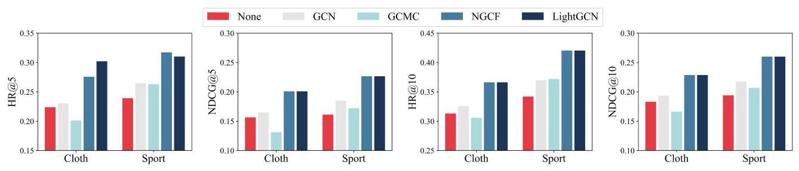

Fig. 6. The effects of different GCN on Cloth & Sport.

Comparing different information aggregation methods, we find that using LightGCN yields the best performance, with GCN and NGCF slightly behind LightGCN. This is attributed to LightGCN's simplified design, which excludes weights and activation functions, thereby minimizing the potential adverse impact on the disentanglement of information across different variables observed in earlier steps. Conversely, GCMC's underperformance is linked to its incorporation of dense layers into user and item representations, both before and after aggregation. The dense layers' extensive parameterization may negatively affect the model's ability to maintain clear disentanglement of information.

5.3.2 Different Feature Constraint. In this section, we analyze the effectiveness of feature constraints in DMGCDR through ablation experiments. We design three variants of DMGCDR, DMGCDR-NU removes the user feature constraint and only constrains the item embedding. DMGCDR-NI removes the item feature constraint and only constrains the user embedding. DMGCDR-NA removes all the feature constraints. The results are shown in Figure 7 and 8. DMGCDR consistently outperforms all variants in every dataset, indicating the effectiveness of feature constraints. It also shows that there is a potential correlation between different feature representations of the same user or item, and mining this potential correlation can improve the effectiveness of the recommendation system. For both DMGCDR-NU and DMGCDR-NI, we find that they outperform DMGCDR-NA in Cell&Elec, demonstrating the effectiveness of the single use of the user feature constraint and the item feature constraint. However, in the Cloth & Sport dataset, optimal results were achieved only when both constraints were applied, validating the strategic application of shared parameters in our model.

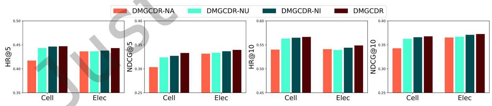

Fig. 7. The impact of different feature constraint variants on Cell & Elec.

5.3.3 The Effects of Different Priors. In Section 4.2.2, we used a normal Gaussian distribution as a prior, and different priors provide different prior knowledge for the learned user preferences. Additionally, different priors also affect the designed disentanglement regularization terms, consequently influencing the disentanglement performance. Therefore, investigating the impact of different priors is of great interest. In this section, we will explore the effects of various priors on the model performance. In particular, we apply four common priors in generative modeling.

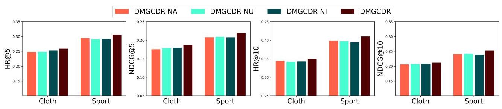

Fig. 8. The impact of different feature constraint variants on Cloth & Sport.

Table 5. The effects of different priors on Cell & Elec. The best results are bolded.

<table><tr><td colspan="9">Cell & Elec</td></tr><tr><td>topK</td><td colspan="4">topK=5</td><td colspan="4">topK=10</td></tr><tr><td>Domain</td><td colspan="2">Cell</td><td colspan="2">Elec</td><td colspan="2">Cell</td><td colspan="2">Elec</td></tr><tr><td>Metrics</td><td>HR</td><td>NDCG</td><td>HR</td><td>NDCG</td><td>HR</td><td>NDCG</td><td>HR</td><td>NDCG</td></tr><tr><td>Uniform</td><td>0.4492</td><td>0.3280</td><td>0.4420</td><td>0.3378</td><td>0.5666</td><td>0.3672</td><td>0.5483</td><td>0.3716</td></tr><tr><td>Laplace</td><td>0.4526</td><td>0.3330</td><td>0.4478</td><td>0.3433</td><td>0.5789</td><td>0.3774</td><td>0.5532</td><td>0.3790</td></tr><tr><td>MGuassian</td><td>0.4465</td><td>0.3285</td><td>0.4448</td><td>0.3403</td><td>0.5669</td><td>0.3671</td><td>0.5507</td><td>0.3737</td></tr><tr><td>VarGuassian</td><td>0.4370</td><td>0.3193</td><td>0.4433</td><td>0.3385</td><td>0.5577</td><td>0.3588</td><td>0.5479</td><td>0.3719</td></tr><tr><td>Guassian</td><td>0.4528</td><td>0.3322</td><td>0.4471</td><td>0.3440</td><td>0.5754</td><td>0.3713</td><td>0.5547</td><td>0.3785</td></tr></table>

Table 6. The effects of different priors on Cloth & Sport. The best results are bolded.

<table><tr><td colspan="9">Cloth & Sport</td></tr><tr><td>topK</td><td colspan="4">topK=5</td><td colspan="4">topK=10</td></tr><tr><td>Domain</td><td colspan="2">Cloth</td><td colspan="2">Sport</td><td colspan="2">Cloth</td><td colspan="2">Sport</td></tr><tr><td>Metrics</td><td>HR</td><td>NDCG</td><td>HR</td><td>NDCG</td><td>HR</td><td>NDCG</td><td>HR</td><td>NDCG</td></tr><tr><td>Uniform</td><td>0.2593</td><td>0.1868</td><td>0.3036</td><td>0.2155</td><td>0.3538</td><td>0.2172</td><td>0.4124</td><td>0.2489</td></tr><tr><td>Laplace</td><td>0.2614</td><td>0.1880</td><td>0.3112</td><td>0.2211</td><td>0.3553</td><td>0.2170</td><td>0.4134</td><td>0.2521</td></tr><tr><td>MGuassian</td><td>0.2641</td><td>0.1881</td><td>0.3116</td><td>0.2216</td><td>0.3511</td><td>0.2171</td><td>0.4119</td><td>0.2547</td></tr><tr><td>VarGuassian</td><td>0.2578</td><td>0.1846</td><td>0.3061</td><td>0.2178</td><td>0.3495</td><td>0.2131</td><td>0.4100</td><td>0.2503</td></tr><tr><td>Guassian</td><td>0.3021</td><td>0.2170</td><td>0.3103</td><td>0.2220</td><td>0.3581</td><td>0.2206</td><td>0.4148</td><td>0.2550</td></tr></table>

- Uniform: Prior distributions are uniform, \( \mathcal{U}\left( {0,1}\right) \) .

- Laplace: Prior distributions follow a Laplace distribution, \( \mathcal{L}\left( {0,1}\right) \) .

- Gaussian: Utilizes a standard Gaussian distribution, \( \mathcal{N}\left( {0,1}\right) \) .

- VarGaussian: Employs a Gaussian distribution with higher variance, \( \mathcal{N}\left( {0,3}\right) \) .

- MVGaussian: Represents a combination of multi-variate Gaussian distributions, \( \mathcal{N}\left( {0,1}\right)  + \mathcal{N}\left( {3,1}\right) \) , aggregating two independent Gaussians as per [6]. The mean of the second Gaussian is set to 3 to introduce multiple peaks, adhering to the \( 3 - \sigma \) principle.

The results for the Cell & Elec dataset are displayed in Table 5, while the architecture for the Cloth & Sport dataset is shown in Table 6. Compared to other priors, both the uniform distribution and VarGuassian lead to subpar recommendation performance. This is because user interests in different items are typically non-uniform, and the uniform distribution does not align with the implicit distribution of user preferences. While the VarGaussian, due to its larger variance compared to the standard Gaussian distribution, tends to be more uniform and does not match the implicit distribution of user preferences. Gaussian and Laplace priors perform reasonably well. For instance, Laplace prior exhibits better performance on the Cell & Elec dataset.This may be because both Gaussian and Laplace distributions have bell-shaped probability density functions that can better match the distribution of user preferences. However, the MVGaussian, characterized by its non-uniform distribution, falls short in performance, suggesting its unsuitability for accurately reflecting user preferences.

### 5.4 Disentangle Effect

5.4.1 The Effect of informative regularization. To assess the effectiveness of the proposed information regularization terms, we designed three variants for comparison. Variant 1, which lacks any information regularization and thus does not separate variables; Variant 2, implementing solely the specific information regularization term; and Variant 3, applying exclusively the invariant information regularization term. We compared these three variants with DMGCDR, and the results for the Cell & Elec dataset are depicted in Figure 9, and the architecture for the Cloth & Sport dataset is depicted in Figure 10. It can be observed that DMGCDR performs significantly better than Variant 1 in terms of recommendation performance. This validates that our designed information regularization terms effectively disentangle user-specific information from user-invariant information, achieving ideal cross-domain user feature propagation. DMGCDR outperforms Variant 2 and Variant 3 in all datasets, confirming the efficacy of disentangling domain-specific and domain-invariant features. This result underscores the importance of feature differentiation in cross-domain information transfer, demonstrating the efficacy of our approach, which focuses on transferring only domain-invariant features within the cross-domain graph. Despite Variants 2 and 3 each employing a single type of information regularization term, neither reached the anticipated recommendation efficacy. This shortfall highlights the necessity for the synergistic interaction between both the specific and invariant information regularization terms to fully realize enhanced recommendation outcomes.

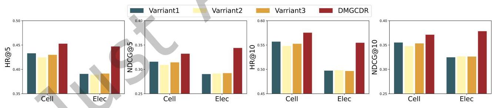

Fig. 9. The impact of different disentanglement variants on Cell & Elec.

5.4.2 Feature visualization. Based on our motivation, we introduce the concept of disentanglement to simultaneously learn domain-invariant features and domain-specific features. To verify if our model has completely disentangled them, we use the nonlinear dimensionality reduction method t-SNE [43] to transform the disentangled high-dimensional features into two-dimensional features, facilitating the examination of their distribution on a two-dimensional plane. Dimensionality reduction visualizations for variables \( {\widetilde{Z}}_{u}^{A},{\widetilde{Z}}_{u}^{B},{\widetilde{Z}}_{u}^{C},{Z}_{u}^{A} \) , and \( {Z}_{u}^{B} \) are presented in Figure 11. Through the specific information regularization encoding in Section 4.2.3, \( {\widetilde{Z}}_{u}^{A} \) represents domain-specific preferences in Domain A, \( {\widetilde{Z}}_{u}^{B} \) represents domain-specific preferences in Domain B, \( {\widetilde{Z}}_{u}^{C} \) represents domain-invariant preferences. \( {Z}_{u}^{A} \) represents domain-specific preferences and partial domain-invariant preferences in Domain A, while \( {Z}_{u}^{B} \) represents domain-specific preferences and partial domain-invariant preferences in Domain B. Figure 11 demonstrates that \( {\widetilde{Z}}_{u}^{A},{\widetilde{Z}}_{u}^{B} \) , and \( {\widetilde{Z}}_{u}^{C} \) exhibit distinct separation, underscoring their effective exclusive information encoding. The clear distinction between \( {\widetilde{Z}}_{u}^{A} \) and \( {Z}_{u}^{B} \) , as well as \( {\widetilde{Z}}_{u}^{B} \) and \( {Z}_{u}^{A} \) , affirms the precise encoding of \( {\widetilde{Z}}_{u}^{A} \) and \( {\widetilde{Z}}_{u}^{B} \) with exclusive information. Figure 12 demonstrates the disentanglement effect of the invariant information regularization term. \( {\widetilde{Z}}_{u}^{A} \) represents domain-specific preferences in Domain A, \( {\widetilde{Z}}_{u}^{B} \) represents domain-specific preferences in Domain B, \( {\widetilde{Z}}_{u}^{C} \) represents domain-invariant preferences, \( {\widetilde{Z}}_{u}^{A} \) represents partial invariant preferences in Domain A, \( {\widetilde{Z}}_{u}^{B} \) represents partial invariant preferences in Domain B, and \( {\widetilde{Z}}_{u}^{C} \) represents domain-invariant preferences encoded through \( {\bar{Z}}_{u}^{A} \) and \( {\bar{Z}}_{u}^{B} \) . In Figure 12(a) and Figure 12(b), it can be observed that \( {\widetilde{Z}}_{u}^{A} \) and \( {\bar{Z}}_{u}^{A} \) , as well as \( {\widetilde{Z}}_{u}^{B} \) and \( {\bar{Z}}_{u}^{B} \) , are well separated, confirming the effectiveness of the adversarial training discriminators. This successful separation indicates that domain-invariant preferences have been encoded from \( {Z}_{u}^{A} \) and \( {Z}_{u}^{B} \) . In Figure 12(c), it can be observed that the distributions of \( {\widetilde{Z}}_{u}^{C} \) and \( {\bar{Z}}_{u}^{C} \) converge to a considerable extent. This provides some evidence of the effectiveness of our proposed framework and the correctness of the experiments.

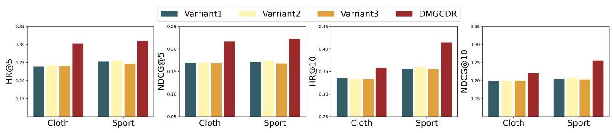

Fig. 10. The impact of different disentanglement variants on Cloth & Sport.

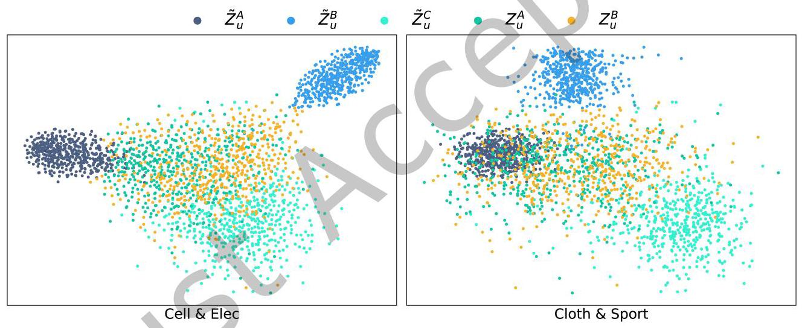

Fig. 11. Visualization of \( {\widetilde{Z}}_{u}^{A},{\widetilde{Z}}_{u}^{B},{\widetilde{Z}}_{u}^{C},{Z}_{u}^{A} \) , and \( {Z}_{u}^{B} \) on two pairs of datasets.

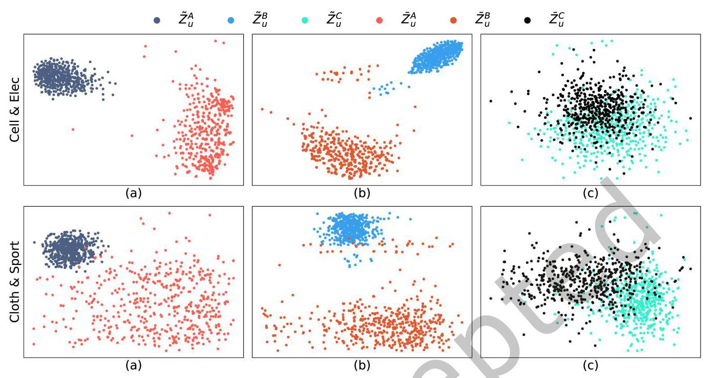

Fig. 12. Visualization of \( {\widetilde{Z}}_{u}^{A},{\widetilde{Z}}_{u}^{B},{\widetilde{Z}}_{u}^{C},{\widetilde{Z}}_{u}^{A},{\widetilde{Z}}_{u}^{B} \) and \( {\widetilde{Z}}_{u}^{C} \) on two pairs of datasets.

### 5.5 Hyper-parameter Sensitivity

5.5.1 Different coefficient of Disentangle Objective Function. In DMGCDR, \( {\lambda }_{1} \) controls the weight of the specific information regularization term, while \( {\lambda }_{2} \) controls the weight of the invariant information regularization term. To investigate the sensitivity of these hyper-parameters and their impact on model performance, a series of experiments were conducted, varying different values of \( {\lambda }_{1} \) and \( {\lambda }_{2} \) , setting them to \( \left\lbrack  {{0.01},{0.05},{0.1},{0.2},{0.5}}\right\rbrack \) . The results are shown in Figures 13 and 14. From the figures, analysis of these results indicates that the optimal hyperparameter settings vary for different datasets. In Figure 13, DMGCDR attains peak performance on the Cell & Elec dataset when \( {\lambda }_{1} = {0.5} \) and \( {\lambda }_{2} = {0.5} \) . Conversely, in Figure 14, DMGCDR performs best on the Cloth & Sport dataset when \( {\lambda }_{1} = {0.01} \) and \( {\lambda }_{2} = {0.2} \) . This variation arises because the model learns different domain-specific and domain-invariant features for users across different datasets, highlighting some datasets may facilitate feature disentanglement more readily than others. Additionally, we found that the model is not sensitive to variations in these parameters. It outperforms the existing baseline models under almost all parameter combinations, indicating that extensive parameter tuning during training may not be necessary.

5.5.2 Different number of GNN layer. This section investigates the influence of varying convolutional layer counts on model performance. As depicted in Figure 15, the number of layers in LightGCN was adjusted between 1 and 10. Analysis reveals that optimal outcomes across all four datasets occur with five convolutional layers, beyond which performance diminishes with either an increase or decrease in layer count. Because of NGCF's commendable performance as discussed in Section 5.3.1, an examination into how layer count affects NGCF was also conducted, with findings presented in Figure 16. Specifically, for the Cell & Elec dataset, the ideal layer count stands at three for Cell and four for Elec. Differently, for the Cloth & Sport dataset, six layers are optimal for Cloth and four for Sport. It emerges that for both LightGCN and NGCF, the optimal layer count surpasses the commonly recommended range in many studies. This deviation is attributed to our model's disentanglement strategy, which facilitates effective information encoding and high-order neighbor information aggregation without predisposing the model to overfitting.

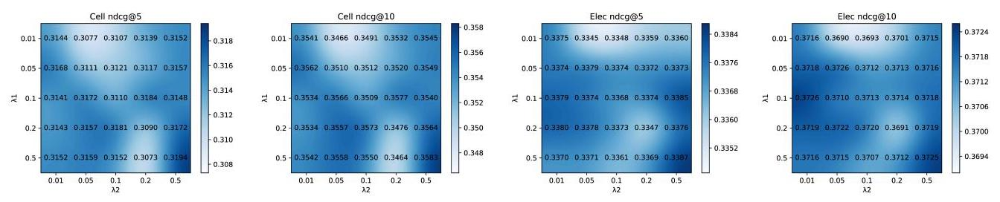

Fig. 13. The effects of hyper-parameters \( {\lambda }_{1} \) and \( {\lambda }_{2} \) on Cell &Elec.

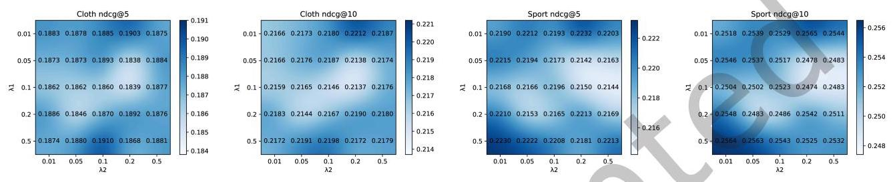

Fig. 14. The effects of hyper-parameters \( {\lambda }_{1} \) and \( {\lambda }_{2} \) on Cloth &Sport.

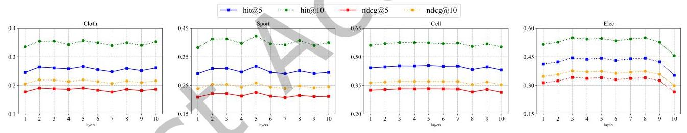

Fig. 15. Impact of LightGCN layer num.

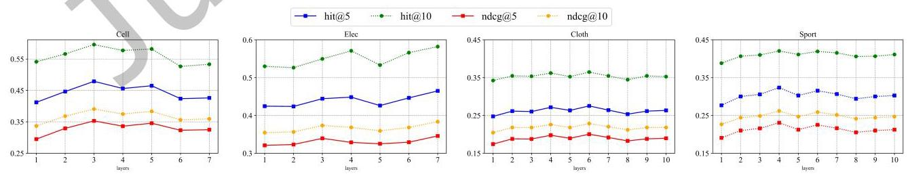

Fig. 16. Impact of NGCF layer num.

5.5.3 Different coefficient of feature constraint. \( {\lambda }_{3} \) is the hyper-parameter controlling the strength of the feature constraint. An overly stringent feature constraint might obscure the delineation between domain-invariant and domain-specific features. To assess the impact of \( {\lambda }_{3} \) on model effectiveness, we explored its values within the set 0,0.1,0.2,0.3,0.5,1,2, conducting evaluations on two distinct dataset pairs. Findings, presented in Figure 17, indicate that DMGCDR reaches optimal performance on the Cell &Elec dataset at \( {\lambda }_{3} = {0.3} \) , and achieves its best results on the Cloth &Sport dataset when \( {\lambda }_{3} = {0.5} \) . Moreover, the analysis reveals that either excessively high or low \( {\lambda }_{3} \) values detrimentally affect DMGCDR’s performance, underscoring the importance of carefully calibrating the strength of the feature constraint for optimal model functionality.

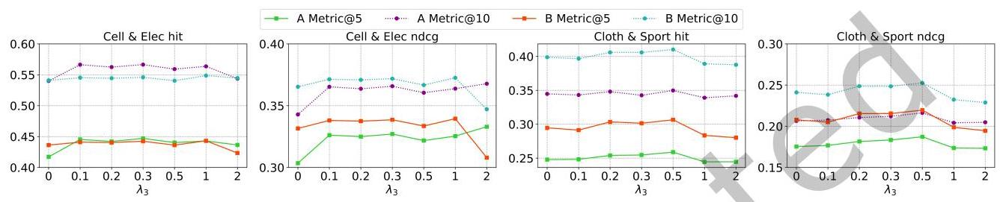

Fig. 17. The effects of hyper-parameters \( {\lambda }_{3} \) .

### 5.6 Model Complexity Analysis

In our implementation, the encoder and decoder of the VAE are designed as 2-layer MLPs, and we use LightGCN for the graph convolution. This design greatly simplifies the model, resulting in relatively few parameters. Additionally, the VAE framework and the multi-graph convolutional network operate independently; the convolution operations are performed solely on the graphs, similar to any graph convolutional model, without adding complexity. Therefore, our model remains straightforward and does not lead to excessive computation despite the introduction of mixed domains. In this section, we compared the computational overhead of the model with mixed-domain during inference to the model without mixed-domain. Although the mixed-domain include the VAE's encoding and decoding, and the graph convolution calculations, it will not bring too much increase in computation latency by parallelly implemented the mixed-domain and single-domain. The additional memory required for the mixed-domain includes the embeddings of all users and items and the parameters of the VAE. During the inference, memory usage increased by 7.17%. The additional power consumption increased by 41.24%.

## 6 CONCLUSION

In this study, we introduce DMGCDR, an innovative Cross-Domain Recommendation (CDR) strategy that transcends previous methodologies, which primarily focused on feature transfer networks. DMGCDR distinguishes itself by disentangling domain-invariant and domain-specific features with meticulously crafted regularization terms, mitigating the challenge of negative transfer while facilitating the effective transference of valuable information across domains. Utilizing a multi-graph convolutional network, the model adeptly enhances and transfers features between domains. As a dual-target framework, DMGCDR excels in bidirectionally transferring essential knowledge across two domains. Comprehensive experiments underscore the method's superior performance across a variety of evaluation metrics, while detailed ablation studies elucidate the pivotal contributions of individual modules to the observed performance enhancements. In the future, we plan to extend this method to scenarios involving partially overlapping cross-domain recommendations and multi-domain recommendations.

Modeling domain-invariant and domain-common features for non-overlapping users will be an interesting research direction. Additionally, identifying domain-invariant features across multiple domains will also be a challenge.

## REFERENCES

[1] G. Adomavicius and A. Tuzhilin. 2005. Toward the next generation of recommender systems: a survey of the state-of-the-art and possible extensions. IEEE Transactions on Knowledge and Data Engineering 17, 6 (2005), 734-749. https://doi.org/10.1109/TKDE.2005.99

[2] Rianne van den Berg, Thomas N Kipf, and Max Welling. 2017. Graph convolutional matrix completion. arXiv:1706.02263

[3] Jiangxia Cao, Xixun Lin, Xin Cong, Jing Ya, Tingwen Liu, and Bin Wang. 2022. Disencdr: Learning disentangled representations for cross-domain recommendation. In Proceedings of the 45th International ACM SIGIR Conference on Research and Development in Information Retrieval. 267-277.

[4] Tian Qi Chen, Xuechen Li, Roger B. Grosse, and David Duvenaud. 2018. Isolating Sources of Disentanglement in Variational Autoencoders. In Advances in Neural Information Processing Systems 31: Annual Conference on Neural Information Processing Systems 2018, NeurIPS 2018, December J-8, 2018, Montréal, Canada, Samy Bengio, Hanna M. Wallach, Hugo Larochelle, Kristen Grauman, Nicolò Cesa-Bianchi, and Roman Garnett (Eds.). 2615-2625. https://proceedings.neurips.cc/paper/2018/hash/1ee3dfcd8a0645a2b539577997223d22-Abstract.html

[5] Xi Chen, Yan Duan, Rein Houthooft, John Schulman, Ilya Sutskever, and Pieter Abbeel. 2016. InfoGAN: Interpretable Representation Learning by Information Maximizing Generative Adversarial Nets. In Advances in Neural Information Processing Systems 29: Annual Conference on Neural Information Processing Systems 2016, December 5-10, 2016, Barcelona, Spain, Daniel D. Lee, Masashi Sugiyama, Ulrike von Luxburg, Isabelle Guyon, and Roman Garnett (Eds.). 2172-2180. https://proceedings.neurips.cc/paper/2016/hash/ 7c9d0b1f96aebd7b5eca8c3edaa19ebb-Abstract.html

[6] Xu Chen, Ya Zhang, Ivor W Tsang, Yuangang Pan, and Jingchao Su. 2023. Toward Equivalent Transformation of User Preferences in Cross Domain Recommendation. ACM Transactions on Information Systems 41, 1 (2023), 1-31.

[7] Qiang Cui, Tao Wei, Yafeng Zhang, and Qing Zhang. 2020. HeroGRAPH: A Heterogeneous Graph Framework for Multi-Target Cross-Domain Recommendation. In Proceedings of the 3rd Workshop on Online Recommender Systems and User Modeling co-located with the 14th ACM Conference on Recommender Systems (RecSys 2020), Virtual Event, September 25, 2020 (CEUR Workshop Proceedings, Vol. 2715), João Vinagre, Alipio Mário Jorge, Marie Al-Ghossein, and Albert Bifet (Eds.). CEUR-WS.org. https://ceur-ws.org/Vol-2715pape76.pdf

[8] Jing Du, Zesheng Ye, Bin Guo, Zhiwen Yu, and Lina Yao. 2024. Identifiability of Cross-Domain Recommendation via Causal Subspace Disentanglement. In Proceedings of the 47th International ACM SIGIR Conference on Research and Development in Information Retrieval. 2091-2101.

[9] Sichao Fu, Weifeng Liu, Kai Zhang, Yicong Zhou, and Dapeng Tao. 2021. Semi-supervised classification by graph p-Laplacian convolutional networks. Information Sciences 560 (2021), 92-106. https://doi.org/10.1016/j.ins.2021.01.075

[10] Chen Gao, Yu Zheng, Nian Li, Yinfeng Li, Yingrong Qin, Jinghua Piao, Yuhan Quan, Jianxin Chang, Depeng Jin, Xiangnan He, and Yong Li. 2023. A Survey of Graph Neural Networks for Recommender Systems: Challenges, Methods, and Directions. 1, 1, Article 3 (mar 2023), 51 pages. https://doi.org/10.1145/3568022

[11] Yibo Gao, Zhen Liu, Xinxin Yang, Yilin Ding, Sibo Lu, and Ying Ma. 2024. Graph Convolutional Network Based Feature Constraints Learning for Cross-Domain Adaptive Recommendation. In Neural Information Processing, Biao Luo, Long Cheng, Zheng-Guang Wu, Hongyi Li, and Chaojie Li (Eds.). Springer Nature Singapore, Singapore, 152-164.

[12] Lei Guo, Li Tang, Tong Chen, Lei Zhu, Quoc Viet Hung Nguyen, and Hongzhi Yin. 2021. DA-GCN: A Domain-aware Attentive Graph Convolution Network for Shared-account Cross-domain Sequential Recommendation. In Proceedings of the Thirtieth International Joint Conference on Artificial Intelligence, IJCAI 2021, Virtual Event / Montreal, Canada, 19-27 August 2021, Zhi-Hua Zhou (Ed.). ijcai.org, 2483-2489. https://doi.org/10.24963/IJCAI.2021/342

[13] Xiaobo Guo, Shaoshuai Li, Naicheng Guo, Jiangxia Cao, Xiaolei Liu, Qiongxu Ma, Runsheng Gan, and Yunan Zhao. 2023. Disentangled Representations Learning for Multi-Target Cross-Domain Recommendation. ACM Trans. Inf. Syst. 41, 4, Article 85 (mar 2023), 27 pages. https://doi.org/10.1145/3572835

[14] Will Hamilton, Zhitao Ying, and Jure Leskovec. 2017. Inductive representation learning on large graphs. Advances in neural information processing systems 30 (2017).

[15] Di He, Yingce Xia, Tao Qin, Liwei Wang, Nenghai Yu, Tie-Yan Liu, and Wei-Ying Ma. 2016. Dual Learning for Machine Translation. In Advances in Neural Information Processing Systems, D. Lee, M. Sugiyama, U. Luxburg, I. Guyon, and R. Garnett (Eds.), Vol. 29. Curran Associates, Inc. https://proceedings.neurips.cc/paper_files/paper/2016/file/56b69bcb83065d403869739ae7f0995e-Paper.pdf

[16] Xiangnan He, Kuan Deng, Xiang Wang, Yan Li, Yongdong Zhang, and Meng Wang. 2020. Lightgcn: Simplifying and powering graph convolution network for recommendation. In Proceedings of the 43rd International ACM SIGIR conference on research and development in Information Retrieval. 639-648.

[17] Xiangnan He, Lizi Liao, Hanwang Zhang, Liqiang Nie, Xia Hu, and Tat-Seng Chua. 2017. Neural collaborative filtering. In Proceedings of the 26th international conference on world wide web. 173-182.

[18] Irina Higgins, Loic Matthey, Arka Pal, Christopher P. Burgess, Xavier Glorot, Matthew M. Botvinick, Shakir Mohamed, and Alexander Lerchner. 2017. beta-VAE: Learning Basic Visual Concepts with a Constrained Variational Framework. In 5th International Conference on Learning Representations, ICLR 2017, Toulon, France, April 24-26, 2017, Conference Track Proceedings. OpenReview.net. https: //openreview.net/forum?id=Sy2fzU9gl

[19] Chi-Wei Hsu, Chiao-Ting Chen, and Szu-Hao Huang. 2023. Adaptive Adversarial Contrastive Learning for Cross-Domain Recommendation. ACM Trans. Knowl. Discov. Data 18, 3, Article 57 (dec 2023), 34 pages. https://doi.org/10.1145/3630259

[20] Guangneng Hu, Yu Zhang, and Qiang Yang. 2018. Conet: Collaborative cross networks for cross-domain recommendation. In Proceedings of the 27th ACM international conference on information and knowledge management. 667-676.

[21] Liang Hu, Jian Cao, Guandong Xu, Longbing Cao, Zhiping Gu, and Can Zhu. 2013. Personalized recommendation via cross-domain triadic factorization. In Proceedings of the 22nd International Conference on World Wide Web (Rio de Janeiro, Brazil) (WWW '13). Association for Computing Machinery, New York, NY, USA, 595-606. https://doi.org/10.1145/2488388.2488441

[22] Yifan Hu, Yehuda Koren, and Chris Volinsky. 2008. Collaborative Filtering for Implicit Feedback Datasets. In 2008 Eighth IEEE International Conference on Data Mining. 263-272. https://doi.org/10.1109/ICDM.2008.22

[23] Folasade Olubusola Isinkaye, Yetunde O Folajimi, and Bolande Adefowoke Ojokoh. 2015. Recommendation systems: Principles, methods and evaluation. Egyptian informatics journal 16, 3 (2015), 261-273.

[24] Hyunjik Kim and Andriy Mnih. 2018. Disentangling by Factorising. In Proceedings of the 35th International Conference on Machine Learning, ICML 2018, Stockholmsmässan, Stockholm, Sweden, July 10-15, 2018 (Proceedings of Machine Learning Research, Vol. 80), Jennifer G. Dy and Andreas Krause (Eds.). PMLR, 2654-2663. http://proceedings.mlr.press/v80/kim18b.html

[25] Diederik P. Kingma and Max Welling. 2014. Auto-Encoding Variational Bayes. In 2nd International Conference on Learning Representations, ICLR 2014, Banff, AB, Canada, April 14-16, 2014, Conference Track Proceedings, Yoshua Bengio and Yann LeCun (Eds.). http://arxiv.org/ abs/1312.6114

[26] Yehuda Koren, Robert Bell, and Chris Volinsky. 2009. Matrix Factorization Techniques for Recommender Systems. Computer 42, 8 (2009), 30-37. https://doi.org/10.1109/MC.2009.263

[27] Bin Li, Qiang Yang, and Xiangyang Xue. 2009. Can movies and books collaborate? cross-domain collaborative filtering for sparsity reduction. In Twenty-First international joint conference on artificial intelligence.

[28] Pan Li and Alexander Tuzhilin. 2020. Ddtcdr: Deep dual transfer cross domain recommendation. In Proceedings of the 13th International Conference on Web Search and Data Mining. 331-339.

[29] Ying Li, Jia-Jie Xu, Peng-Peng Zhao, Jun-Hua Fang, Wei Chen, and Lei Zhao. 2020. Attrec: An attentional adversarial transfer learning network for cross-domain recommendation. Journal of Computer Science and Technology 35 (2020), 794-808.

[30] Meng Liu, Jianjun Li, Guohui Li, and Peng Pan. 2020. Cross domain recommendation via bi-directional transfer graph collaborative filtering networks. In Proceedings of the 29th ACM international conference on information & knowledge management. 885-894.

[31] Weiming Liu, Xiaolin Zheng, Jiajie Su, Mengling Hu, Yanchao Tan, and Chaochao Chen. 2022. Exploiting Variational Domain-Invariant User Embedding for Partially Overlapped Cross Domain Recommendation (SIGIR '22). Association for Computing Machinery, New York, NY, USA, 312-321. https://doi.org/10.1145/3477495.3531975

[32] Francesco Locatello, Stefan Bauer, Mario Lucic, Gunnar Rätsch, Sylvain Gelly, Bernhard Schölkopf, and Olivier Bachem. 2017. Challenging Common Assumptions in the Unsupervised Learning of Disentangled Representations. In Reproducibility in Machine Learning, ICLR 2019 Workshop, New Orleans, Louisiana, United States, May 6, 2019. OpenReview.net. https://openreview.net/forum?id=Byg6VlhUp8V

[33] Jianxin Ma, Chang Zhou, Peng Cui, Hongxia Yang, and Wenwu Zhu. 2019. Learning Disentangled Representations for Recommendation. In Advances in Neural Information Processing Systems 32: Annual Conference on Neural Information Processing Systems 2019, NeurIPS 2019, December 8-14, 2019, Vancouver, BC, Canada, Hanna M. Wallach, Hugo Larochelle, Alina Beygelzimer, Florence d'Alché-Buc, Emily B. Fox, and Roman Garnett (Eds.). 5712-5723. https://proceedings.neurips.cc/paper/2019/hash/a2186aa7c086b46ad4e8bf81e2a3a19b-Abstract.html

[34] Tong Man, Huawei Shen, Xiaolong Jin, and Xueqi Cheng. 2017. Cross-Domain Recommendation: An Embedding and Mapping Approach. In Proceedings of the 26th International Joint Conference on Artificial Intelligence (Melbourne, Australia) (IJCAI'17). AAAI Press, 2464-2470.

[35] Andriy Mnih and Russ R Salakhutdinov. 2007. Probabilistic Matrix Factorization. In Advances in Neural Information Processing Systems, J. Platt, D. Koller, Y. Singer, and S. Roweis (Eds.), Vol. 20. Curran Associates, Inc. https://proceedings.neurips.cc/paper_files/paper/2007/ file/d7322ed717dedf1eb4e6e52a37ea7bcd-Paper.pdf

[36] Sinno Jialin Pan and Qiang Yang. 2010. A survey on transfer learning. IEEE TKDE 22, 10 (2010), 1345-1359.

[37] Sinno Jialin Pan and Qiang Yang. 2010. A Survey on Transfer Learning. IEEE Transactions on Knowledge and Data Engineering 22, 10 (2010), 1345-1359. https://doi.org/10.1109/TKDE.2009.191

[38] Steffen Rendle, Christoph Freudenthaler, Zeno Gantner, and Lars Schmidt-Thieme. 2009. BPR: Bayesian Personalized Ranking from Implicit Feedback. In UAI 2009, Proceedings of the Twenty-Fifth Conference on Uncertainty in Artificial Intelligence, Montreal, QC, Canada, June 18-21, 2009, Jeff A. Bilmes and Andrew Y. Ng (Eds.). AUAI Press, 452-461. https://www.auai.org/uai2009/papers/UAI2009_0139_ 48141db02b9f0b02bc7158819ebfa2c7.pdf

[39] Steffen Rendle, Christoph Freudenthaler, Zeno Gantner, and Lars Schmidt-Thieme. 2012. BPR: Bayesian personalized ranking from implicit feedback.

[40] Bernhard Schölkopf. 2019. Causality for Machine Learning. CoRR abs/1911.10500 (2019). arXiv:1911.10500 http://arxiv.org/abs/1911.10500

[41] Ajit P. Singh and Geoffrey J. Gordon. 2008. Relational learning via collective matrix factorization. In Proceedings of the 14th ACM SIGKDD International Conference on Knowledge Discovery and Data Mining (Las Vegas, Nevada, USA) (KDD '08). Association for Computing Machinery, New York, NY, USA, 650-658. https://doi.org/10.1145/1401890.1401969

[42] Luan Tran, Xi Yin, and Xiaoming Liu. 2017. Disentangled Representation Learning GAN for Pose-Invariant Face Recognition. In 2017 IEEE Conference on Computer Vision and Pattern Recognition, CVPR 2017, Honolulu, HI, USA, July 21-26, 2017. IEEE Computer Society, 1283-1292. https://doi.org/10.1109/CVPR.2017.141

[43] Laurens Van der Maaten and Geoffery Hinton. 2008. Visualizing data using t-SNE. Journal of machine learning research 9, 11 (2008).

[44] Bei Wang, Chenrui Zhang, Hao Zhang, Xiaoqing Lyu, and Zhi Tang. 2020. Dual Autoencoder Network with Swap Reconstruction for Cold-Start Recommendation. In Proceedings of the 29th ACM International Conference on Information & Knowledge Management (Virtual Event, Ireland) (CIKM '20). Association for Computing Machinery, New York, NY, USA, 2249-2252. https://doi.org/10.1145/3340531.3412069

[45] Chen Wang, Yueqing Liang, Zhiwei Liu, Tao Zhang, and S Yu Philip. 2021. Pre-training graph neural network for cross domain recommendation. In 2021 IEEE Third International Conference on Cognitive Machine Intelligence (CogMI). IEEE, 140-145.

[46] Xiang Wang, Xiangnan He, Meng Wang, Fuli Feng, and Tat-Seng Chua. 2019. Neural graph collaborative filtering. In Proceedings of the 42nd international ACM SIGIR conference on Research and development in Information Retrieval. 165-174,

[47] Jiancan Wu, Xiang Wang, Fuli Feng, Xiangnan He, Liang Chen, Jianxun Lian, and Xing Xie. 2021. Self-Supervised Graph Learning for Recommendation. In Proceedings of the 44th International ACM SIGIR Conference on Research and Development in Information Retrieval (, Virtual Event, Canada,) (SIGIR '21). Association for Computing Machinery, New York, NY, USA, 726-735. https://doi.org/10.1145/ 3404835.3462862

[48] Kun Xu, Yuanzhen Xie, Liang Chen, and Zibin Zheng. 2021. Expanding Relationship for Cross Domain Recommendation. In Proceedings of the 30th ACM International Conference on Information & Knowledge Management (Virtual Event, Queensland, Australia) (CIKM '21). Association for Computing Machinery, New York, NY, USA, 2251-2260. https://doi.org/10.1145/3459637.3482429

[49] Liuyi Yao, Zhixuan Chu, Sheng Li, Yaliang Li, Jing Gao, and Aidong Zhang. 2021. A Survey on Causal Inference. 15, 5, Article 74 (may 2021), 46 pages. https://doi.org/10.1145/3444944

[50] Rex Ying, Ruining He, Kaifeng Chen, Pong Eksombatchai, William L. Hamilton, and Jure Leskovec. 2018. Graph Convolutional Neural Networks for Web-Scale Recommender Systems. In Proceedings of the 24th ACM SIGKDD International Conference on Knowledge Discovery & Data Mining (London, United Kingdom) (KDD '18). Association for Computing Machinery, New York, NY, USA, 974-983. https://doi.org/10.1145/3219819.3219890

[51] Xinyue Zhang, Jingjing Li, Hongzu Su, Lei Zhu, and Heng Tao Shen. 2023. Multi-Level Attention-Based Domain Disentanglement for BCDR. ACM Trans. Inf. Syst. 41, 4, Article 97 (mar 2023), 24 pages. https://doi.org/10.1145/3576925

[52] Yanling Zhang, Zhen Liu, Ying Ma, and Yibo Gao. 2022. Multi-graph Convolutional Feature Transfer for Cross-domain Recommendation In 2022 International Joint Conference on Neural Networks (IJCNN). 1-8. https://doi.org/10.1109/IJCNN55064.2022.9892745

[53] Yin Zhang, Ziwei Zhu, Yun He, and James Cavelrele. 2020. Content-Collaborative Disentanglement Representation Learning for Enhanced Recommendation. In RecSys 2020: Fourteenth ACM Conference on Recommender Systems, Virtual Event, Brazil, September 22-26, 2020, Rodrygo L. T. Santos, Leandro Balby Marinho, Elizabeth M. Daly, Li Chen, Kim Falk, Noam Koenigstein, and Edleno Silva de Moura (Eds.). ACM, 43-52. https://doi.org/10.1145/3383313.3412239

[54] Cheng Zhao, Chenliang Li, and Cong Fu. 2019. Cross-domain recommendation via preference propagation graphnet. In Proceedings of the 28th ACM international conference on information and knowledge management. 2165-2168.

[55] Yu Zheng, Chen Gao, Xiang Li, Xiangnan He, Yong Li, and Depeng Jin. 2021. Disentangling User Interest and Conformity for Recommendation with Causal Embedding. In Proceedings of the Web Conference 2021 (Ljubljana, Slovenia) (WWW '21). Association for Computing Machinery, New York, NY, USA, 2980-2991. https://doi.org/10.1145/3442381.3449788

[56] Feng Zhu, Chaochao Chen, Yan Wang, Guanfeng Liu, and Xiaolin Zheng. 2019. DTCDR: A Framework for Dual-Target Cross-Domain Recommendation. In Proceedings of the 28th ACM International Conference on Information and Knowledge Management (Beijing, China) (CIKM '19). Association for Computing Machinery, New York, NY, USA, 1533-1542. https://doi.org/10.1145/3357384.3357992

[57] Feng Zhu, Yan Wang, Chaochao Chen, Guanfeng Liu, Mehmet Orgun, and Jia Wu. 2018. A Deep Framework for Cross-Domain and Cross-System Recommendations. In Proceedings of the 27th International Joint Conference on Artificial Intelligence (Stockholm, Sweden) (IJCAI'18). AAAI Press, 3711-3717.

[58] Feng Zhu, Yan Wang, Chaochao Chen, Jun Zhou, Longfei Li, and Guanfeng Liu. 2021. Cross-Domain Recommendation: Challenges, Progress, and Prospects. In Proceedings of the Thirieth International Joint Conference on Artificial Intelligence, IfCAI 2021, Virtual Event / Montreal, Canada, 19-27 August 2021, Zhi-Hua Zhou (Ed.). ijcai.org, 4721-4728. https://doi.org/10.24963/IJCAL2021/639

[59] Jiajie Zhu, Yan Wang, Feng Zhu, and Zhu Sun. 2023. Domain Disentanglement with Interpolative Data Augmentation for Dual-Target Cross-Domain Recommendation (RecSys '23). Association for Computing Machinery, New York, NY, USA, 515-527. https: //doi.org/10.1145/3604915.3608802

[60] Yongchun Zhu, Zhenwei Tang, Yudan Liu, Fuzhen Zhuang, Ruobing Xie, Xu Zhang, Leyu Lin, and Qing He. 2022. Personalized Transfer of User Preferences for Cross-Domain Recommendation. In Proceedings of the Fifteenth ACM International Conference on Web Search and Data Mining (Virtual Event, AZ, USA) (WSDM '22). Association for Computing Machinery, New York, NY, USA, 1507-1515. https://doi.org/10.1145/3488560.3498392