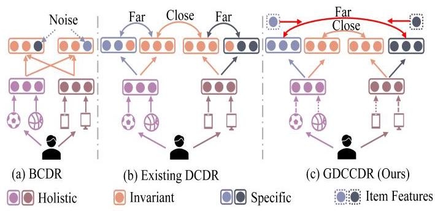
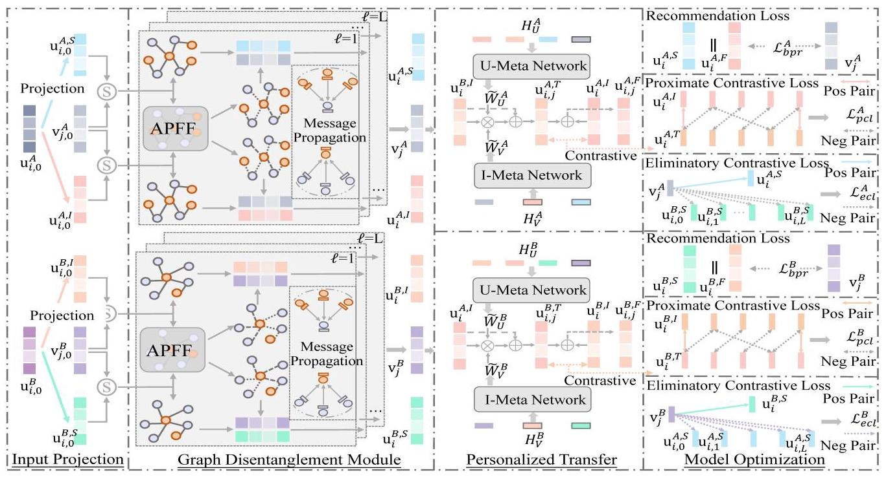
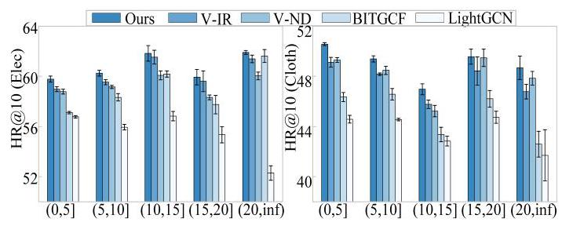
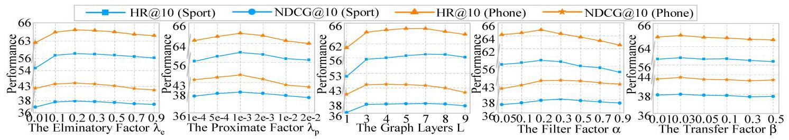
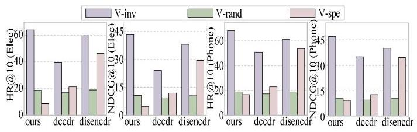
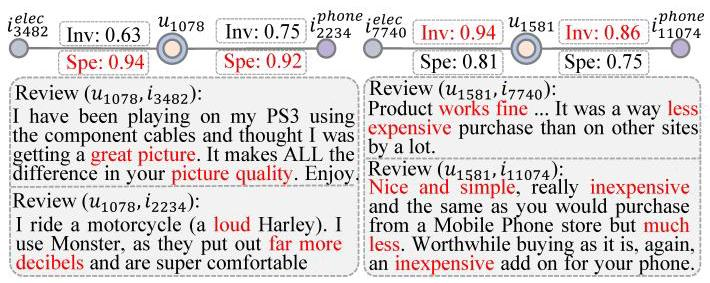

# Graph Disentangled Contrastive Learning with Personalized Transfer for Cross-Domain Recommendation

Jing Liu, Lele Sun, Weizhi Nie, Peiguang Jing, Yuting Su*

School of Electrical and Information Engineering, Tianjin University, China

\{jliu_tju, sunlele, weizhinie, pgjing, ytsu\}@tju.edu.cn

## Abstract

Cross-Domain Recommendation (CDR) has been proven to effectively alleviate the data sparsity problem in Recommender System (RS). Recent CDR methods often disentangle user features into domain-invariant and domain-specific features for efficient cross-domain knowledge transfer. Despite showcasing robust performance, three crucial aspects remain unexplored for existing disentangled CDR approaches: i) The significance nuances of the interaction behaviors are ignored in generating disentangled features; ii) The user features are disentangled irrelevant to the individual items to be recommended; iii) The general knowledge transfer overlooks the user's personality when interacting with diverse items. To this end, we propose a Graph Disentangled Contrastive framework for CDR (GDCCDR) with personalized transfer by meta-networks. An adaptive parameter-free filter is proposed to gauge the significance of diverse interactions, thereby facilitating more refined disentangled representations. In sight of the success of Contrastive Learning (CL) in RS, we propose two CL-based constraints for item-aware disentanglement. Proximate CL ensures the coherence of domain-invariant features between domains, while eliminatory CL strives to disentangle features within each domains using mutual information between users and items. Finally, for domain-invariant features, we adopt meta-networks to achieve personalized transfer. Experimental results on four real-world datasets demonstrate the superiority of GDCCDR over state-of-the-art methods.

## Introduction

Recommender systems (RS) find wide-ranging applications on consumer platforms such as Kuaishou and Amazon, primarily due to their effectiveness in capturing personalized user preferences. However, the presence of limited user-item interactions in certain scenarios (i.e., data sparsity issue) places difficulties in creating precise interest models. To tackle this, Cross-Domain Recommendation (CDR) seeks to transfer valuable knowledge from the source domain to improve performance on the target domain.

The existing CDR methods can be roughly divided into two branches, which we call blended methods and disentangled methods. Blended approaches employ diverse transfer layers to combine the representations learned within their respective domains (see Fig. 1 (a)). For instance, CoNet (Hu, Zhang, and Yang 2018) utilizes cross-connections networks to transfer information. To avoid the negative impact caused by transferring domain-specific features, Disentangled Cross-Domain Recommendation (DCDR) has gained traction. The typical paradigm of DCDR is illustrated in Fig. 1 (b). MADD (Zhang et al. 2023b) introduces an orthogonal loss to differentiate between domain-invariant and domain-specific user features within intra-domains. Dis-enCDR (Cao et al. 2022) employs variational inference for disentanglement, relying on the Kullback-Leibler (KL) divergence distance of user features.

However, we argue that the existing DCDR methods lead to sub-optimal feature disentanglement due to three reasons. Firstly, it is overlooked that each interaction carries an individual underlying intent, implying that diverse interactions play varying roles in generating disentangled features. For example, when transferring knowledge from clothes to books, purchasing a cotton skirt may enhance domain-specific features more than domain-invariant features, as cotton material is of little relevance to book recommendation. Neglecting the distinctiveness of interactions hinders the model from capturing finer-grained disentangled representations. Secondly, existing orthogonal loss or KL divergence used for feature disentanglement only manipulate user features regardless of items. The domain-specific and domain-invariant user features are constrained to stay away from each other (Fig. 1 (b)) whereas there is no guarantee on their corresponding correlation to individual item. Yet, modern RSs collectively consider both user and item features for practical recommendation, which implies the inefficiency of existing feature disentanglement methods. Thirdly, even with disentangled user representations in hand, effective transfer of domain-invariant features remains a formidable challenge. The diversity of user personalities highlights the need for personalized cross-domain transfer, which is currently untouched in existing DCDR methods that simply adopt weighted fusion or concatenation (Zhang et al. 2023a).

In this paper, we propose to address the above-mentioned limitations through Graph Disentanglement and Contrastive learning with meta-networks for CDR. Specifically, to capture interaction nuances and refine disentangled features, we design an adaptive parameter-free filter in graph convolution. This filter gauges interaction significance based on user-item similarity when generating disentangled features (see the dashed arrow in the middle of Fig. 1 (c)). Leveraging the effectiveness of contrastive learning (CL) in aligning positive pairs and distinguishing negative pairs, we design two distinct forms of CL for user feature disentanglement. Proximate CL enhances the consistency of domain-invariant features between domains while eliminatory CL disentangles features using mutual information (MI) between users and items within each domains (see the red arrows in the top of Fig. 1 (c)). Finally, meta-networks are adopted to facilitate personalized transfer of domain-invariant features.

---

*Corresponding Author.

Copyright © 2024, Association for the Advancement of Artificial Intelligence (www.aaai.org). All rights reserved.

---

Figure 1: Comparison of existing CDR methods.

Our main contributions are summarized as follows:

- We propose a novel disentangled CDR model named GDCCDR. To the best of our knowledge, we are the first to introduce disentangled graph update to CDR.

- We formulate two contrastive learning-based constraints to enhance disentanglement: one focuses on domain-invariant features, while the other targets domain-specific features by leveraging mutual information.

- We adopt meta-networks to facilitate personalized transfer of domain-invariant features.

- We conduct extensive experiments on four real-world CDR datasets to evaluate our proposed GDCCDR.

## Related Work

Existing CDR can be roughly divided into two branches depending on the way to transfer knowledge across domains, which we call blended CDR and disentangled CDR.

## Blended Cross-Domain Recommendation

Blended CDR methods mainly transfer and blend all information across different domains. CoNet (Hu, Zhang, and Yang 2018) establishes a cross-connections network between two domains to achieve knowledge transfer. DDTCDR (Li and Tuzhilin 2020) proposes the latent orthogonal mapping functions of shared users. PPGN (Zhao, Li, and Fu 2019) enhances transfer using multiple stacked GNN layers for robust representations, while BITGCF (Liu et al. 2020) designs a feature fusion module during GNNs for better knowledge transfer. The indiscriminate feature mixture brings the risk of negative transfer (i.e., transferring domain-specific user features). Consequently, several disentanglement-based CDR approaches have arisen.

## Disentangled Cross-Domain Recommendation

Disentangled representations of user latent intents from implicit feedback have received attention in recommender systems. In CDR, ATLRec (Li et al. 2020) uses MLPs to extract domain-invariant and domain-specific features, employing a GRL-based domain discriminator to align domain-invariant user features across domains. MADD (Zhang et al. 2023b) disentangle features within domains by orthogonal constraints based on ATLRec. DisenCDR (Cao et al. 2022) introduces variational inference to widen the gap in user features within domains using KL divergence. DCCDR (Zhang et al. 2023a), the latest method, employs two parallel GNNs for disentanglement. While existing methods mainly focus on user features, our approach uniquely includes mutual information of user and item features for disentanglement.

## Contrastive Learning (CL) in CDR

Contrastive learning, a potent self-supervised technique, has been used to tackle data sparsity in RS. CCDR (Xie et al. 2022) is the first to introduce CL into CDR, aiming to achieve the consistency across domain representations for the same user. DR-MTCDR (Guo et al. 2023) utilizes CL to ensure the consistency of augmented views. UniCDR (Cao et al. 2023) applies CL to user features before and after masking. These CL-based CDR methods close all user features across domains, including domain-specific information that should remain distinct, leading to apparent flaws. DC-CDR (Zhang et al. 2023a) tackles this issue by considering only domain-invariant features. Unlike these methods, our model employs two forms of CL for invariant and specific features, respectively, to achieve desired disentanglement.

## Methodology

## Problem Definition and Notations

In this work, we focus on the CDR scenario with shared users between two domains. Fig. 2 overviews the proposed GDCCDR model. The user features are disentangled into domain-invariant and domain-specific representations with adaptive graph disentanglement and contrastive learning. This facilitates personalized transfer of domain-invariant features, thereby enhancing performance in both domains.

Two domains are denoted as \( {\mathcal{D}}^{A} \) and \( {\mathcal{D}}^{B}.\mathcal{U} \) represents the common set of users, \( {\mathcal{V}}^{A} \) and \( {\mathcal{V}}^{B} \) represent the set of items. Additionally, we represent two interaction matrices as \( {\mathcal{R}}^{A} \in  {\mathbb{R}}^{\left| \mathcal{U}\right|  \times  \left| {\mathcal{V}}^{A}\right| } \) and \( {\mathcal{R}}^{B} \in  {\mathbb{R}}^{\left| \mathcal{U}\right|  \times  \left| {\mathcal{V}}^{B}\right| } \) , where the entry \( {\mathcal{R}}_{ij} = 1 \) indicates user \( i \) has interacted with item \( j \) , otherwise \( {\mathcal{R}}_{ij} = 0 \) .

Disentangled Embedding Initialization. To model the intricate user-item relationships, we embed them into a \( d \) - dimensional vector space. We initially parameterize user and item ID embeddings into independent embedding matrices: uppercase \( {\mathbf{U}}_{0}^{A},{\mathbf{U}}_{0}^{B} \in  {\mathbb{R}}^{\left| \mathcal{U}\right|  \times  d} \) for users, and \( {\mathbf{V}}_{0}^{A} \in  {\mathbb{R}}^{\left| {\mathcal{V}}^{A}\right|  \times  d} \) , \( {\mathbf{V}}_{0}^{B} \in  {\mathbb{R}}^{\left| {\mathcal{V}}^{B}\right|  \times  d} \) for items. Lowercase \( {\mathbf{u}}_{i} \) and \( {\mathbf{v}}_{j} \) denote individual user \( i \) and item \( j \) embeddings. To guarantee the independence of user domain-invariant \( \left( \mathbf{I}\right) \) and domain-specific \( \left( \mathbf{S}\right) \) representations, distinct projections are used to map \( {\mathbf{U}}_{0}^{ * } \) into separate vector spaces, which can be written as:

\[
{\mathbf{U}}_{0}^{*, I} = {\mathbf{U}}_{0}^{ * } \odot  \sigma \left( {{\mathbf{U}}_{0}^{ * }{W}_{I}^{ * } + {b}_{I}^{ * }}\right) ,{\mathbf{U}}_{0}^{*, S} = {\mathbf{U}}_{0}^{ * } \odot  \sigma \left( {{\mathbf{U}}_{0}^{ * }{W}_{S}^{ * } + {b}_{S}^{ * }}\right) \tag{1}
\]

where \( * \) denotes the chosen \( {\mathcal{D}}^{A} \) or \( {\mathcal{D}}^{B},{\mathbf{U}}_{0}^{*, I} \) and \( {\mathbf{U}}_{0}^{*, S} \) are user domain-invariant and domain-specific initial embedding matrices. \( \sigma \left( \cdot \right) \) and \( \odot \) denote sigmoid activation function and element-wise multiplication. \( {W}_{I}^{ * },{W}_{S}^{ * } \in  {\mathbb{R}}^{d \times  d} \) and \( {b}_{I}^{ * },{b}_{S}^{ * } \in  {\mathbb{R}}^{d \times  1} \) are the learnable projection and bias parameters. Our main focus is transferring user-invariant features, without the need for slicing or projecting item embeddings.

Figure 2: Overview of our GDCCDR model. Best viewed in color.

## Adaptive Graph Disentanglement

Message Propagation. Graph neural networks (GNNs) are widely recognized for their broad application, such as in DisenKGAT (Wu et al. 2021a) and KCRL (Nie et al. 2023), and have become the dominate solution for recommender systems, e.g., SGL (Wu et al. 2021b) and SimGCL (Yu et al. 2022). Drawing from these, we've devised our model using graph-based message passing for representations. Without loss of generality, we describe domain-invariant modeling, with message propagation as follows:

\[
{\widetilde{\mathbf{U}}}_{l + 1}^{*, I} = {\bar{\mathcal{R}}}^{ * } \cdot  {\mathbf{V}}_{l}^{*, I},\;{\widetilde{\mathbf{V}}}_{l + 1}^{*, I} = {\overline{{\mathcal{R}}^{ * }}}^{T} \cdot  {\mathbf{U}}_{l}^{*, I}, \tag{2}
\]

where \( {\mathbf{U}}_{l}^{*, I} \) and \( {\mathbf{V}}_{l}^{*, I} \) are the domain-invariant embeddings for users and items in the \( l \) -th GNN layer. \( {\mathbf{U}}_{0}^{*, I},{\mathbf{V}}_{0}^{*, I} \) are initial projection embeddings. Please note that \( {\mathbf{V}}_{0}^{ * } = {\mathbf{V}}_{0}^{*, I} = {\mathbf{V}}_{0}^{*, I} \) . \( {\overline{\mathcal{R}}}^{ * } \in  {\mathbb{R}}^{\left| \mathcal{U}\right|  \times  \left| {\mathcal{V}}^{ * }\right| } \) denotes the normalized adjacent matrix derived from \( {\mathcal{R}}^{ * } \) calculated as: \( {\overline{\mathcal{R}}}^{ * } = {\left( {\mathbf{D}}^{ * }\right) }_{\left( i\right) }^{-1/2} \cdot  {\mathcal{R}}^{ * } \cdot  {\left( {\mathbf{D}}^{ * }\right) }_{\left( j\right) }^{-1/2} \) , where \( {\left( {\mathbf{D}}^{ * }\right) }_{\left( i\right) } \) and \( {\left( {\mathbf{D}}^{ * }\right) }_{\left( j\right) } \) are diagonal degree matrices.

Adaptive Parameter-Free Filter. Different from GNN-based DCDR methods such as DCCDR, we argue that interactions contribute differently to generating disentangled features. When considering the clothing and book domains, if user \( i \) purchases clothing item \( j \) due to a domain-specific factor, such as cotton material (which is less relevant to the book domain), we can deduce that, in the clothing domain, this purchase behavior is likely to contribute more to the domain-specific features compared to domain-invariant features. With this insight, we design an Adaptive Parameter-Free Filter (APFF) that evaluates each interaction's contributions. It gauges the similarity between embeddings of \( {\mathbf{u}}_{i} \) and \( {\mathbf{v}}_{j} \) based on domain-invariant and domain-specific representations, without involving additional parameters. The adaptive filter for each interaction during graph disentanglement is computed as follows:

\[
{\mathcal{F}}_{l}^{*, c}\left( {i, j}\right)  = \sigma \left( {s\left( {{\mathbf{u}}_{i, l}^{*, c},{\mathbf{v}}_{j, l}^{*, c}}\right) }\right) ,\;c \in  \{ \mathbf{I},\mathbf{S}\} , \tag{3}
\]

where \( s\left( {\cdot , \cdot  }\right) \) measures the similarity, and in this case, we simplify it to a dot product. A higher weight of \( \mathcal{F}\left( {i, j}\right) \) signifies that the model assigns greater importance to the interaction's role in generating domain-specific or domain-invariant feature. Once the adaptive filter weights for all interactions are obtained, we can adaptively update the graph for certain feature by element-wise multiplication of the original normalized adjacent matrix \( {\overline{\mathcal{R}}}^{ * } \) with \( {\mathcal{F}}_{l}^{*, c} \in  {\mathbb{R}}^{\left| \mathcal{U}\right|  \times  \left| {\mathcal{V}}^{ * }\right| } \) as follows:

\[
{\mathcal{G}}_{l}^{*, I} = {\overline{\mathcal{R}}}^{ * } \odot  {\mathcal{F}}_{l}^{*, I},\;{\mathcal{G}}_{l}^{*, S} = {\overline{\mathcal{R}}}^{ * } \odot  {\mathcal{F}}_{l}^{*, S}. \tag{4}
\]

After enhancing the adaptive graph, we combine it with the message propagation scheme (Eq. 2) to obtain augmented representations, formally described as follows:

\[
{\ddot{\mathbf{U}}}_{l + 1}^{*, c} = {\bar{\mathcal{G}}}_{l}^{*, c} \cdot  {\mathbf{V}}_{l}^{*, c},\;{\ddot{\mathbf{V}}}_{l + 1}^{*, c} = {\overline{{\mathcal{G}}_{l}^{*, c}}}^{T} \cdot  {\mathbf{U}}_{l}^{*, c}. \tag{5}
\]

Afterwards, residual connections are employed during aggregation phase. The ultimate embeddings of each layer are:

\[
{\mathbf{U}}_{l + 1}^{*, c} = {\widetilde{\mathbf{U}}}_{l + 1}^{*, c} + \alpha  \cdot  {\ddot{\mathbf{U}}}_{l + 1}^{*, c},{\mathbf{V}}_{l + 1}^{*, c} = {\widetilde{\mathbf{V}}}_{l + 1}^{*, c} + \alpha  \cdot  {\ddot{\mathbf{V}}}_{l + 1}^{*, c} \tag{6}
\]

where \( \alpha \) is a hyper-parameter regulating the weight assigned to the adaptive graph disentanglement.

Information Aggregation. To capture valuable information from higher-order neighbors, we further stack all em-beddings from \( L \) graph layers to obtain the final embeddings:

\[
{\mathbf{U}}^{*, c} = \frac{1}{L + 1}\mathop{\sum }\limits_{{l = 0}}^{L}{\mathbf{U}}_{l}^{*, c},\;{\mathbf{V}}^{*, c} = \frac{1}{L + 1}\mathop{\sum }\limits_{{l = 0}}^{L}{\mathbf{V}}_{l}^{*, c} \tag{7}
\]

Hence, the final item embeddings are represented as:

\[
{\mathbf{V}}^{ * } = f\left( {{\mathbf{V}}^{*, I},{\mathbf{V}}^{*, S}}\right) \tag{8}
\]

where \( f\left( \cdot \right) \) is a feature fusion function. Here we utilize mean operation and other functions can also be adopted.

## Personalized Transfer across Domains

Given the effective domain-invariant features, existing methods apply weighted fusion (Zhu et al. 2020) or concatenation (Zhang et al. 2023a) to transfer the domain-invariant user features. However, real-world scenarios demonstrate that the impact of these features varies from user to user. For instance, some users may prioritize domain-invariant attributes like price and quality, while others prioritize domain-specific factors like brands. This diversity highlights the need to personalize the cross-domain transfer based on individual user preferences, which has never been explored so far. To this end, we adopt meta-networks to generate personalized transfer matrices for users and items.

Meta Knowledge. Initially, we extract meta-knowledge for personalized transfer from representations after GNN. The user side involves both intra- and inter-domain details, while the item side connects items and users. For example, the transfer from \( {\mathcal{D}}^{B} \) to \( {\mathcal{D}}^{A} \) is:

\[
{\mathbf{H}}_{U}^{A} = {\mathbf{U}}^{A, I}\begin{Vmatrix}{\mathbf{U}}^{B, I}\end{Vmatrix}{\mathbf{U}}^{A, S}\left.\parallel  {\mathop{\sum }\limits_{{j \in  {\mathcal{N}}_{i}}}{\mathbf{v}}_{j}^{A},{\mathbf{H}}_{V}^{A} = {\mathbf{V}}^{A}\begin{Vmatrix}{\mathop{\sum }\limits_{{i \in  {\mathcal{N}}_{j}}}\left( {{\mathbf{u}}_{i}^{A, I} + {\mathbf{u}}_{i}^{A, S}}\right) }\end{Vmatrix}}\right.
\]

(9)

where \( \parallel \) denotes concatenation, while \( {\mathcal{N}}_{i} \) and \( {\mathcal{N}}_{j} \) are the neighboring sets of nodes \( i \) and \( j.{\mathbf{H}}_{U}^{A} \in  {\mathbb{R}}^{\left| \mathcal{U}\right|  \times  {4d}} \) and \( {\mathbf{H}}_{V}^{A} \in \; {\mathbb{R}}^{\left| {I}^{A}\right|  \times  {2d}} \) denote user and item meta-knowledge, encoding contextual information for personalized knowledge transfer, encompassing vital data essential for tailored transfers.

Meta Network. Inspired by (Chen et al. 2023a; Xia et al. 2021), we also employ a low-rank transformation to extract parameterized transfer matrices. As an example, let's reconsider the transfer from \( {\mathcal{D}}^{B} \) to \( {\mathcal{D}}^{A} \) :

\[
{\widetilde{W}}_{U}^{A} = {\mathcal{F}}_{mlp}^{A, U}\left( {\mathbf{H}}_{U}^{A}\right) ,\;{\widetilde{W}}_{V}^{A} = {\mathcal{F}}_{mlp}^{A, V}\left( {\mathbf{H}}_{V}^{A}\right) \tag{10}
\]

where \( {\mathcal{F}}_{mlp}^{A, U} \) and \( {\mathcal{F}}_{mlp}^{A, V} \) are personalized transfer matrices extractors with two tanh-activated fully-connected layers. By restricting the transformation rank to \( k < d \) , the personalized transfer matrices \( {\widetilde{W}}_{U}^{A} \in  {\mathbb{R}}^{\left| \mathcal{U}\right|  \times  d \times  k} \) and \( {\widetilde{W}}_{V}^{A} \in  {\mathbb{R}}^{\left| {I}^{A}\right|  \times  k \times  d} \) reduce trainable parameters. The final cross-domain transfer features of the interaction between user \( i \) and item \( j \) are:

\[
{\mathbf{u}}_{i, j}^{A, T} = {\widetilde{w}}_{{u}_{i}}^{A}{\widetilde{w}}_{{v}_{j}}^{A}{\mathbf{u}}_{i}^{B, I} + {\mathbf{u}}_{i}^{B, I} \tag{11}
\]

Subsequently, we integrate it with the original domain-invariant features in \( {\mathcal{D}}^{A} \) through weighted fusion, creating the ultimate domain-invariant user features in \( {\mathcal{D}}^{A} \) :

\[
{\mathbf{u}}_{i, j}^{A, F} = {\mathbf{u}}_{i}^{A, I} + \beta  \cdot  {\mathbf{u}}_{i, j}^{A, T} \tag{12}
\]

where \( \beta \) denotes the hyper-parameter which controls the weight of personalized transfer features for each interaction.

## Contrastive Learning for Disentanglement

Another limitation of current DCDR method lies in how to achieve thorough disentanglement of domain-invariant and domain-specific features. In view of the great success of Contrastive Learning (CL) in SSL addressing paired data, we introduce two novel forms of CL for feature disentanglement in CDR task.

Proximate CL. InfoNCE-based (Gutmann and Hyvärinen 2010) contrastive learning enhances the consistency in representing different views of the same node (or entity), aligning with the perspective that the domain-invariant features across domains should exhibit proximity. We treat domain-invariant features transferred across domains for the same user as positive pairs, and those from different users as negative pairs (the item subscripts are omitted for simplicity):

\[
{\mathcal{L}}_{\text{ pol }}^{ * } = \mathop{\sum }\limits_{{i \in  \mathcal{U}}} - \log \frac{\exp \left( {\phi \left( {{\mathbf{u}}_{i}^{*, I},{\mathbf{u}}_{i}^{*, T}}\right) /{\tau }_{p}}\right) }{\mathop{\sum }\limits_{{{i}^{\prime } \in  \mathcal{U}}}\exp \left( {\phi \left( {{\mathbf{u}}_{i}^{*, I},{\mathbf{u}}_{{i}^{\prime }}^{*, T}}\right) /{\tau }_{p}}\right) } \tag{13}
\]

where \( \phi \left( {\cdot , \cdot  }\right) \) measures representations similarity using cosine similarity function here; \( {\tau }_{p} \) is temperature coefficient.

Eliminatory CL. Ideally, user feature disentanglement implies thorough separation of domain-invariant information in domain-specific features for recommendation. In other words, it is unfeasible to recommend item based on cross-domain-specific features. However, as mentioned above, conventional approaches such as orthogonal or irrelevant loss put all the effort on the investigation of user features while overlooking the crucial items, thus only achieving partial disentanglement.

In contrast, we propose eliminatory CL based on the mutual information between users and the items for efficient disentanglement. Specifically, in \( {\mathcal{D}}^{A} \) , the mutual information of its domain-specific features for items in \( {\mathcal{D}}^{A} \) surpasses that of \( {\mathcal{D}}^{B} \) for the same item:

\[
{\mathcal{L}}_{ecl}^{A} = \mathop{\sum }\limits_{{\left( {i, j}\right)  \in  {\mathcal{R}}^{A + }}} - \log \frac{\exp \left( {s\left( {{\mathbf{u}}_{i}^{A, S},{\mathbf{v}}_{j}^{A}}\right) }\right) }{\exp \left( {s\left( {{\mathbf{u}}_{i}^{A, S},{\mathbf{v}}_{j}^{A}}\right) }\right)  + \mathop{\sum }\limits_{{l = 0}}^{L}\exp \left( {s\left( {{\mathbf{u}}_{i, l}^{B, S},{\mathbf{v}}_{j}^{A}}\right) }\right) }
\]

(14)

where \( {\mathcal{R}}^{A + } \) are observed interactions in \( {\mathcal{D}}^{A}, s\left( {\cdot , \cdot  }\right) \) is dot product to measure MI and \( L \) denotes GNN layers. This formula indicates that domain-specific scores of \( {\mathcal{D}}^{A} \) is higher than domain-specific score of \( {\mathcal{D}}^{B} \) for the items in \( {\mathcal{D}}^{A} \) .

## Optimization Objectives

Following recent works (Zhao et al. 2022; Liu et al. 2022), we adopt Bayesian Personalized Ranking (BPR), a pairwise loss. Each training sample includes a positive observed item \( {j}^{ + } \) and a negative unobserved item \( {j}^{ - } \) for user \( i \) . BPR promotes higher scores \( \left( {{\widehat{y}}_{i, j}^{ * } = {\mathbf{u}}_{i}^{*, F}{\mathbf{v}}_{j}^{ * } + {\mathbf{u}}_{i}^{*, S}{\mathbf{v}}_{j}^{ * }}\right) \) for \( {j}^{ + } \) than \( {j}^{ - } \) :

\[
{\mathcal{L}}_{bpr}^{ * } =  - \mathop{\sum }\limits_{{\left( {i,{j}^{ + },{j}^{ - }}\right)  \in  {O}^{ * }}}\ln \sigma \left( {{\widehat{y}}_{i,{j}^{ + }}^{ * } - {\widehat{y}}_{i,{j}^{ - }}^{ * }}\right) \tag{15}
\]

Finally, we combine the recommendation loss and the self-supervised loss to derive the ultimate joint loss:

\[
{\mathcal{L}}^{ * } = {\mathcal{L}}_{bpr}^{ * } + {\lambda }_{p} \cdot  {\mathcal{L}}_{pcl}^{ * } + {\lambda }_{e} \cdot  {\mathcal{L}}_{ecl}^{ * } + {\lambda }_{l} \cdot  {\begin{Vmatrix}{\Theta }^{ * }\end{Vmatrix}}_{\mathrm{F}}^{2} \tag{16}
\]

where \( {\lambda }_{p},{\lambda }_{e} \) and \( {\lambda }_{l} \) control the weights of \( {\mathcal{L}}_{pcl},{\mathcal{L}}_{ecl} \) and \( {L}_{2} \) regularization term, respectively.

## Experiments

We evaluate our GDCCDR on four real-world datasets and analyze the following key research questions (RQs):

- RQ1: How does GDCCDR perform in comparison with other representative and state-of-the-art methods?

- RQ2: Do the designed key components of our model contribute to achieving performance improvement?

- RQ3: How does the performance of our model at various levels of sparsity in user interaction data?

- RQ4: How does the performance of our method vary with different hyper-parameter settings?

- RQ5: Does our model achieve desired disentanglement?

## Experimental Settings

Datasets We evaluate GDCCDR on the Amazon dataset \( {}^{1} \) , specifically Sport&Phone, Sport&Cloth, Elec&Phone, and Elec&Cloth. To ensure equitable comparisons, we preprocess the original dataset following the BITGCF. Additionally, we employ the DisenCDR to filter out cold-start items from the test set, i.e., items without records in the training set. Comprehensive dataset statistics are shown in Table 1.

Evaluation Protocols and Metrics We followed leave-one-out strategy to evaluate our model wherein we sampled one positive item (interacted) and 99 negative items (non-interacted) for each user and predict 100 candidate scores for ranking (Xue et al. 2017). And we use two widely adopted metrics to evaluate all methods: Hit Ratio (HR) and Normalized Discounted Cumulative Gain (NDCG). To ensure reliability, each experiment is repeated five times, and the average top-10 ranking results are reported.

Baselines To verify the effectiveness and the superiority of our model, we compare GDCCDR with the following state-of-the-art single-domain and cross-domain baselines.

(i) SDR methods: BPR (Rendle et al. 2012) is a classical method based on MF and optimized by pairwise ranking loss. NCF (He et al. 2017) combines the linearity of MF and the nonlinearity of MLPs to learn representations. LightGCN (He et al. 2020) is a significant method which simplifies the message passing rule of GNN to generate representations. DCCF (Ren et al. 2023) stands as the forefront intent disentanglement method in SDR.

(ii) CDR methods: CoNet (Hu, Zhang, and Yang 2018) transfers knowledge through a cross-connections network connecting two domains. DDTCDR (Li and Tuzhilin 2020) seeks to learn a latent orthogonal mapping function to transfer user preferences across domains. DML (Li and Tuzhilin 2023) builds upon dual metric learning to enhance DDTCDR. BITGCF (Liu et al. 2020) incorporates a feature transfer layer that facilitates feature fusion across domains during graph convolution module. DisenCDR (Cao et al. 2022) is a recent CDR model utilizing a variational inference framework to disentangle user representations and incorporates a feature fusion module to generate domain-shared features. MADD (Zhang et al. 2023b) utilizes MLPs to extract both domain-invariant and domain-specific features from pre-trained features. ETL (Chen et al. 2023b) employs equivalent transformations to capture overlapping and domain-specific attributes, improving performance across domains. DCCDR (Zhang et al. 2023a) incorporates two parallel graph convolution modules for disentanglement, while also being constrained with contrastive learning.

<table><tr><td>Datasets</td><td>Users</td><td>Items</td><td>Ratings</td><td>Density</td></tr><tr><td>Sport</td><td rowspan="2">4,998</td><td>20,837</td><td>54,256</td><td>0.052%</td></tr><tr><td>Phone</td><td>13,666</td><td>46,448</td><td>0.068%</td></tr><tr><td>Sport</td><td rowspan="2">9,928</td><td>30,761</td><td>100,903</td><td>0.033%</td></tr><tr><td>Cloth</td><td>38,943</td><td>95,300</td><td>0.025%</td></tr><tr><td>Elec</td><td rowspan="2">3,325</td><td>38,717</td><td>118,127</td><td>0.092%</td></tr><tr><td>Phone</td><td>17,725</td><td>52,983</td><td>0.090%</td></tr><tr><td>Elec</td><td rowspan="2">15,761</td><td>51,399</td><td>224,641</td><td>0.028%</td></tr><tr><td>Cloth</td><td>48,777</td><td>133,590</td><td>0.017%</td></tr></table>

Table 1: Statistics of four Amazon CDR datasets.

Implementation Details In our PyTorch implementation of GDCCDR, we utilize the Adam optimizer (Kingma and Ba 2015) and Xavier initializer. The embedding dimension (d) is set to 128 for all methods, with a fixed learning rate of 0.001, a batch size of 1024, and a dropout rate of 0.5. The low-rank (k) is 10, the proximate temperature \( \left( {\tau }_{p}\right) \) is 0.05, the \( {L}_{2} \) regularization coefficient \( \left( {\lambda }_{l}\right) \) is selected from \( \{ {0.05},{0.005},{0.0005}\} \) . The final embeddings of GNN-based methods are obtained through mean pooling. For point-wise loss, we have four negative samples per positive sample.

## Experimental Results and Analysis

Performance Comparisons (RQ1). Table 2 shows the results of HR@10 and NDCG@10 for compared methods across the four datasets. These experiments have yielded some intriguing findings: (1) GNN-based methods, Light-GCN and DCCF, exhibit significant performance improvements compared to BPR and NCF, indicating that incorporating higher-order neighborhood information enables more effective learning of user and item representations. (2) CDR methods generally outperform SDR methods, suggesting that transferring useful information from other domains effectively alleviates the data sparsity problem. (3) DisenCDR and ETL demonstrate satisfactory performance, implying that incorporating variational inference into CDR can lead to more robust user and item representations. (4) DCCDR and DisenCDR outperform many CDR methods, highlighting the importance of disentangling user features and transferring only domain-invariant features for enhanced performance. (5) BITGCF emerges as the best-performing method across all baselines, showcasing the effectiveness of cross-domain knowledge transfer during graph convolution as a powerful transfer strategy. (6) Compared to all state-of-the-art methods, our method consistently achieves the highest performance across four datasets. This indicates that our method excels in efficiently disentanglement and personalized transfer of domain-invariant features, resulting in superior recommendation performance.

---

\( {}^{1} \) http://jmcauley.ucsd.edu/data/amazon/index_2014.html

---

<table><tr><td>DataSets</td><td colspan="2">Sport</td><td colspan="2">Phone</td><td colspan="2">Sport</td><td colspan="2">Cloth</td><td colspan="2">Elec</td><td colspan="2">Phone</td><td colspan="2">Elec</td><td colspan="2">Cloth</td></tr><tr><td>Metrics</td><td>HR</td><td>NDCG</td><td>HR</td><td>NDCG</td><td>HR</td><td>NDCG</td><td>HR</td><td>NDCG</td><td>HR</td><td>NDCG</td><td>HR</td><td>NDCG</td><td>HR</td><td>NDCG</td><td>HR</td><td>NDCG</td></tr><tr><td>BPR</td><td>35.20</td><td>23.93</td><td>42.42</td><td>28.31</td><td>29.64</td><td>18.73</td><td>24.39</td><td>14.46</td><td>52.42</td><td>34.02</td><td>52.59</td><td>36.29</td><td>45.42</td><td>29.11</td><td>22.18</td><td>13.11</td></tr><tr><td>NCF</td><td>43.01</td><td>26.22</td><td>52.28</td><td>31.42</td><td>40.47</td><td>23.85</td><td>39.84</td><td>24.40</td><td>51.33</td><td>32.65</td><td>54.09</td><td>33.05</td><td>51.97</td><td>33.62</td><td>37.78</td><td>22.80</td></tr><tr><td>LightGCN</td><td>47.71</td><td>33.02</td><td>57.10</td><td>38.88</td><td>48.78</td><td>31.98</td><td>42.96</td><td>27.35</td><td>59.62</td><td>39.52</td><td>62.55</td><td>43.67</td><td>55.26</td><td>36.56</td><td>40.61</td><td>25.64</td></tr><tr><td>DCCF</td><td>48.98</td><td>30.99</td><td>57.76</td><td>36.07</td><td>47.50</td><td>28.99</td><td>44.47</td><td>27.57</td><td>56.36</td><td>36.80</td><td>60.26</td><td>38.05</td><td>54.51</td><td>36.07</td><td>42.73</td><td>26.07</td></tr><tr><td>CoNet</td><td>46.63</td><td>29.19</td><td>54.63</td><td>33.75</td><td>43.07</td><td>25.40</td><td>41.60</td><td>26.05</td><td>56.41</td><td>36.04</td><td>59.45</td><td>37.47</td><td>53.88</td><td>35.34</td><td>42.25</td><td>24.97</td></tr><tr><td>DDTCDR</td><td>45.52</td><td>27.32</td><td>56.59</td><td>34.67</td><td>43.07</td><td>24.99</td><td>43.47</td><td>25.56</td><td>56.91</td><td>36.28</td><td>59.21</td><td>36.91</td><td>54.54</td><td>35.16</td><td>42.48</td><td>24.84</td></tr><tr><td>DML</td><td>45.85</td><td>28.44</td><td>56.97</td><td>35.00</td><td>42.92</td><td>25.00</td><td>42.84</td><td>25.31</td><td>57.43</td><td>36.83</td><td>59.85</td><td>37.01</td><td>55.39</td><td>35.66</td><td>42.46</td><td>24.82</td></tr><tr><td>MADD</td><td>45.64</td><td>26.95</td><td>53.59</td><td>31.92</td><td>43.28</td><td>25.28</td><td>43.53</td><td>25.86</td><td>54.20</td><td>34.01</td><td>56.79</td><td>33.87</td><td>54.44</td><td>35.25</td><td>42.45</td><td>24.87</td></tr><tr><td>ETL</td><td>49.14</td><td>31.28</td><td>58.70</td><td>36.84</td><td>47.82</td><td>29.90</td><td>46.20</td><td>28.62</td><td>61.23</td><td>40.37</td><td>62.76</td><td>41.72</td><td>57.67</td><td>38.00</td><td>44.33</td><td>26.79</td></tr><tr><td>DisenCDR</td><td>48.81</td><td>31.34</td><td>58.76</td><td>37.55</td><td>46.10</td><td>27.68</td><td>45.06</td><td>27.23</td><td>60.00</td><td>38.52</td><td>61.66</td><td>40.96</td><td>56.76</td><td>36.92</td><td>44.62</td><td>26.95</td></tr><tr><td>DCCDR</td><td>49.15</td><td>33.80</td><td>58.15</td><td>40.01</td><td>51.40</td><td>34.03</td><td>46.03</td><td>30.08</td><td>61.51</td><td>41.28</td><td>63.82</td><td>44.62</td><td>57.18</td><td>38.21</td><td>41.81</td><td>26.39</td></tr><tr><td>BITGCF</td><td>52.57</td><td>35.87</td><td>58.40</td><td>39.39</td><td>54.58</td><td>36.46</td><td>51.80</td><td>34.01</td><td>62.98</td><td>42.65</td><td>65.03</td><td>44.93</td><td>58.78</td><td>39.17</td><td>46.03</td><td>28.56</td></tr><tr><td>GDCCDR</td><td>56.73</td><td>37.96</td><td>64.71</td><td>43.59</td><td>59.67</td><td>40.76</td><td>54.73</td><td>37.58</td><td>64.58</td><td>43.85</td><td>68.73</td><td>47.74</td><td>60.40</td><td>40.16</td><td>49.83</td><td>31.01</td></tr><tr><td>p-value</td><td>\( {6.3}{e}^{-4} \)</td><td>\( {1.4}{e}^{-3} \)</td><td>\( {1.9}{e}^{-5} \)</td><td>\( {2.8}{e}^{-5} \)</td><td>\( {6.4}{e}^{-5} \)</td><td>\( {4.4}{e}^{-6} \)</td><td>\( {4.8}{e}^{-4} \)</td><td>2.7 \( {e}^{-4} \)</td><td>\( {2.3}{e}^{-3} \)</td><td>\( {4.3}{e}^{-3} \)</td><td>\( {3.0}{e}^{-3} \)</td><td>\( {2.3}{e}^{-4} \)</td><td>\( {4.3}{e}^{-4} \)</td><td>\( {2.2}{e}^{-4} \)</td><td>\( {8.1}{e}^{-5} \)</td><td>\( {2.0}{e}^{-3} \)</td></tr></table>

Table 2: Performance comparison (%) of different methods for four datasets based on HR@10 and NDCG@10.The best results are bold, and the second-best results are underlined. The p-value is calculated from our proposed model and runner-up results.

<table><tr><td rowspan="2">Variants</td><td colspan="2">Sport</td><td colspan="2">Phone</td><td colspan="2">Sport</td><td colspan="2">Cloth</td></tr><tr><td>HR</td><td>NG</td><td>HR</td><td>NG</td><td>HR</td><td>NG</td><td>HR</td><td>NG</td></tr><tr><td>GDCCDR</td><td>56.73</td><td>37.96</td><td>64.71</td><td>43.59</td><td>59.67</td><td>40.76</td><td>54.73</td><td>37.58</td></tr><tr><td>w/o-ecl</td><td>54.59</td><td>36.90</td><td>62.69</td><td>42.73</td><td>58.56</td><td>40.25</td><td>52.72</td><td>36.42</td></tr><tr><td>w/o-pcl</td><td>55.89</td><td>37.51</td><td>64.07</td><td>43.04</td><td>54.88</td><td>35.69</td><td>51.40</td><td>32.52</td></tr><tr><td>w/o-apff</td><td>55.91</td><td>36.98</td><td>63.72</td><td>41.80</td><td>58.51</td><td>39.85</td><td>53.48</td><td>36.70</td></tr><tr><td>w/o-meta</td><td>55.47</td><td>37.21</td><td>63.79</td><td>42.69</td><td>56.13</td><td>36.82</td><td>52.63</td><td>33.94</td></tr></table>

Table 3: Ablation study on key components of GDCCDR.

Ablation Studies (RQ2). In this section, we conduct ablation studies to verify the essential components of GDCCDR. Specifically, w/o-ecl removes eliminatory contrastive learning on domain-specific features. w/o-pcl disables proximate contrastive learning approximating the similarity of domain-invariant features within inter-domains. w/o-meta replaces meta network with average pooling, resulting in the failure to attain personalized transfer knowledge. w/o-apff drops the adaptive parameter-free filter, which consequently prevents the possibility of adaptive graph update. Due to space limitations, we report results on two datasets in Table 3.

GDCCDR outperforms w/o-ecl significantly, indicating that excluding domain-invariant information from domain-specific features through user and item mutual information can achieve better disentanglement. w/o-pcl exhibits inferior performance compared to GDCCDR, demonstrating the importance of utilizing contrastive learning to align domain-invariant features across domains. w/o-apff shows suboptimal performance, emphasizing the necessity of recognizing each interaction's contributions and employing a graph update strategy during graph disentanglement. w/o-meta's performance degradation validates the idea that personalized cross-domain knowledge transfer is needed. In summary, each of the key modules in the GDCCDR has a role to play.

Figure 3: Performance comparison (%) w.r.t data sparsity over different user groups on the Elec&Cloth dataset.

Data Sparsity (RQ3). To assess the robustness of GDC-CDR in addressing data sparsity issues compared to other methods, we partition users into distinct groups based on the number of interactions they exhibit within the training set. Additionally, to further substantiate the preeminence of disentanglement via mutual information, we impose irrelevant constraints (Wang et al. 2020) on user domain-invariant and domain-specific features instead of eliminatory contrastive loss, named V-IR. Moreover, we introduce V-ND as a baseline, aligned with conventional CDR methods that use a single user representation without disentanglement. From the results in Fig. 3, we derive two fundamental observations: (i) Our model surpasses BITGCF and LightGCN for both inactive and active users by leveraging contrastive learning for thorough disentanglement and incorporating meta-networks to facilitate efficient personalized knowledge transfer. (ii) The performance gain of our model over V-IR, particularly for inactive users, indicates that leveraging mutual information between users and items for disentanglement is more effective than relying solely on user features.

Hyper-parameter (RQ4). We investigate the effect of the following hyper-parameters on two datasets: the eliminatory CL factor \( {\lambda }_{e} \) , the proximate CL factor \( {\lambda }_{p} \) , the graph layers \( L \) , the adaptive filter factor \( \alpha \) and the personalized transfer factor \( \beta \) . The experimental results on Fig. 4 show that (1) Despite varying hyper-parameter impacts on different datasets, all performances initially show an upward trend, further proving the effectiveness of individual modules. (2) The performance changes on \( {\lambda }_{e} \) and \( {\lambda }_{p} \) support the feasibility of using contrastive learning for disentanglement. Proximate CL enforces consistency among domain-invariant features, while eliminatory CL eliminates domain-invariant information from domain-specific features. (3) Optimal GNN layers aggregate higher-order neighbor information, but excessive layers cause over-smoothing issue, degrading recommendations. (4) An appropriate \( \alpha \) -value enhances the model’s ability to explore interaction effects on various features, yielding better disentangled representations. However, an excessively large \( \alpha \) can cause the model to overly emphasize interaction variability, resulting in performance decline. (5) Once performance reaches the optimum, further increasing \( \beta \) doesn’t significantly reduce model performance, demonstrating the robustness of our model for personalized transfer.

Figure 4: Results (%) of different key hyper-parameters on the Sport&Phone dataset.

Figure 5: Comparison (%) of the predictive ability of the disentangled representations on the Elec&Phone dataset.

Disentanglement Comparisons (RQ5). Feature disentanglement lies at the core of our paper. For robust disentanglement, domain-specific features must be devoid of domain-invariant information aiding dual-domain prediction, while maximizing the domain-invariant features for transfer. To evaluate our model's disentanglement ability, we compared it with state-of-the-art DCDR methods in Fig. 5. V-rand employs randomly initialized user features for prediction. V-spe utilizes cross-domain domain-specific features (lower values indicating decreased domain-invariant information within these features). V-inv relies solely on domain-invariant features. Our findings show that (1) Among the compared DCDR methods, only our V-spe variant is lower than V-rand, suggesting that our domain-specific features contain minimal information for predicting other domains. (2) Our V-inv variant ranks the highest among all methods, showcasing the maximization of our domain-invariant features. These findings affirm the comprehensive disentanglement achieved by our model.

Figure 6: Case study of significance nuances of interactions. The user's primary concerns about the item are in red.

Case Study. We now explore the interpretability of significance nuances of interaction behaviors on the Elec&Phone dataset. We randomly select two users \( {u}_{1078} \) and \( {u}_{1581} \) . From Fig. 6, it is observed that our model gives higher significance (i.e., the adaptive filter in Eq. 3 ) in terms of domain-specific feature generation for interactions between \( {u}_{1078} \) and \( {i}_{3482},{i}_{2234} \) . It also gives higher significance in terms of domain-invariant feature generation for interactions between domains \( {u}_{1581} \) and \( {i}_{7740},{i}_{11074} \) . Comments show \( {u}_{1078} \) ’s bias towards intra-domain features like image quality, sound size, and \( {u}_{1581} \) ’s bias towards inter-domain features like product quality and price, which demonstrates that our model effectively uncovers user intents from their historical behaviors.

## Conclusion

In this paper, we propose a novel disentangled method for cross-domain recommendation named GDCCDR to achieve thorough feature disentanglement and personalized transfer. Adaptive parameter-free filters are introduced to control each interaction's significance on disentangled feature generation. Distinct from conventional disentanglement approaches that only manipulate user features regardless of items, two novel contrastive learning-based (CL) constraints are designed for item-aware disentanglement. Proximate CL ensures the consistency of domain-invariant feature across domains, while eliminatory CL disentangles features within each domains through mutual information between users and items. Additionally, meta-networks are employed for personalized transfer of domain-invariant features. Ultimately, comprehensive experiments on four real-world datasets demonstrate the superior performance of GD-CCDR compared to state-of-the-art methods.

## Acknowledgments

This work was supported in part by the National Key Research and Development Program of China (2021YFF0901603) and in part by the National Natural Science Foundation of China (62371330, 62371333, 62272337).

## References

Cao, J.; Li, S.; Yu, B.; Guo, X.; Liu, T.; and Wang, B. 2023. Towards Universal Cross-Domain Recommendation. In Proceedings of the Sixteenth ACM International Conference on Web Search and Data Mining, 78-86.

Cao, J.; Lin, X.; Cong, X.; Ya, J.; Liu, T.; and Wang, B. 2022. Disencdr: Learning disentangled representations for cross-domain recommendation. In Proceedings of the 45th International ACM SIGIR Conference on Research and Development in Information Retrieval, 267-277.

Chen, M.; Huang, C.; Xia, L.; Wei, W.; Xu, Y.; and Luo, R. 2023a. Heterogeneous graph contrastive learning for recommendation. In Proceedings of the Sixteenth ACM International Conference on Web Search and Data Mining, 544- 552.

Chen, X.; Zhang, Y.; Tsang, I. W.; Pan, Y.; and Su, J. 2023b. Toward Equivalent Transformation of User Preferences in Cross Domain Recommendation. ACM Transactions on Information Systems, 41(1): 1-31.

Guo, X.; Li, S.; Guo, N.; Cao, J.; Liu, X.; Ma, Q.; Gan, R.; and Zhao, Y. 2023. Disentangled Representations Learning for Multi-Target Cross-Domain Recommendation. ACM Transactions on Information Systems, 41(4).

Gutmann, M. U.; and Hyvärinen, A. 2010. Noise-contrastive estimation: A new estimation principle for unnormalized statistical models. In International Conference on Artificial Intelligence and Statistics.

He, X.; Deng, K.; Wang, X.; Li, Y.; Zhang, Y.; and Wang, M. 2020. Lightgen: Simplifying and powering graph convolution network for recommendation. In Proceedings of the 43rd International ACM SIGIR Conference on Research and Development in Information Retrieval, 639-648.

He, X.; Liao, L.; Zhang, H.; Nie, L.; Hu, X.; and Chua, T.- S. 2017. Neural collaborative filtering. In Proceedings of the 26th International Conference on World Wide Web, 173- 182.

Hu, G.; Zhang, Y.; and Yang, Q. 2018. Conet: Collaborative cross networks for cross-domain recommendation. In Proceedings of the 27th ACM International Conference on Information and Knowledge Management, 667-676.

Kingma, D. P.; and Ba, J. 2015. Adam: A Method for Stochastic Optimization. In 3rd International Conference on Learning Representations, 1-15.

Li, P.; and Tuzhilin, A. 2020. DDTCDR: Deep dual transfer cross domain recommendation. In Proceedings of the 13th International Conference on Web Search and Data Mining, 331-339.

Li, P.; and Tuzhilin, A. 2023. Dual Metric Learning for Effective and Efficient Cross-Domain Recommendations.

IEEE Transactions on Knowledge and Data Engineering, 35(1): 321-334.

Li, Y.; Xu, J.; Zhao, P.; Fang, J.; Chen, W.; and Zhao, L. 2020. Atlrec: An attentional adversarial transfer learning network for cross-domain recommendation. Journal of Computer Science and Technology, 35(4): 794-808.

Liu, F.; Chen, H.; Cheng, Z.; Liu, A.; Nie, L.; and Kankan-halli, M. 2022. Disentangled Multimodal Representation Learning for Recommendation. IEEE Transactions on Multimedia, 1-11.

Liu, M.; Li, J.; Li, G.; and Pan, P. 2020. Cross domain recommendation via bi-directional transfer graph collaborative filtering networks. In Proceedings of the 29th ACM International Conference on Information and Knowledge Management, 885-894.

Nie, W.; Wen, X.; Liu, J.; Chen, J.; Wu, J.; Jin, G.; Lu, J.; and Liu, A.-A. 2023. Knowledge-Enhanced Causal Reinforcement Learning Model for Interactive Recommendation. IEEE Transactions on Multimedia, 1-14.

Ren, X.; Xia, L.; Zhao, J.; Yin, D.; and Huang, C. 2023. Disentangled Contrastive Collaborative Filtering. In Proceedings of the 46th International ACM SIGIR Conference on Research and Development in Information Retrieval.

Rendle, S.; Freudenthaler, C.; Gantner, Z.; and Schmidt-Thieme, L. 2012. BPR: Bayesian personalized ranking from implicit feedback. In Proceedings of the Twenty-Fifth Conference on Uncertainty in Artificial Intelligence.

Wang, X.; Jin, H.; Zhang, A.; He, X.; Xu, T.; and Chua, T.- S. 2020. Disentangled Graph Collaborative Filtering. In Proceedings of the 43rd International ACM SIGIR Conference on Research and Development in Information Retrieval, 1001-1010.

Wu, J.; Shi, W.; Cao, X.; Chen, J.; Lei, W.; Zhang, F.; Wu, W.; and He, X. 2021a. DisenKGAT: knowledge graph embedding with disentangled graph attention network. In Proceedings of the 30th ACM International Conference on Information and Knowledge Management, 2140-2149.

Wu, J.; Wang, X.; Feng, F.; He, X.; Chen, L.; Lian, J.; and Xie, X. 2021b. Self-supervised graph learning for recommendation. In Proceedings of the 44th International ACM SIGIR Conference on Research and Development in Information Retrieval, 726-735.

Xia, L.; Xu, Y.; Huang, C.; Dai, P.; and Bo, L. 2021. Graph Meta Network for Multi-Behavior Recommendation. In Proceedings of the 44th International ACM SIGIR Conference on Research and Development in Information Retrieval, 757-766.

Xie, R.; Liu, Q.; Wang, L.; Liu, S.; Zhang, B.; and Lin, L. 2022. Contrastive cross-domain recommendation in matching. In Proceedings of the 28th ACM SIGKDD Conference on Knowledge Discovery and Data Mining, 4226-4236.

Xue, H.-J.; Dai, X.-Y.; Zhang, J.; Huang, S.; and Chen, J. 2017. Deep Matrix Factorization Models for Recommender Systems. In Proceedings of the 26th International Joint Conference on Artificial Intelligence, 3203-3209.

Yu, J.; Yin, H.; Xia, X.; Chen, T.; Cui, L.; and Nguyen, Q. V. H. 2022. Are graph augmentations necessary? simple graph contrastive learning for recommendation. In Proceedings of the 45th International ACM SIGIR Conference on Research and Development in Information Retrieval, 1294- 1303.

Zhang, R.; Zang, T.; Zhu, Y.; Wang, C.; Wang, K.; and Yu, J. 2023a. Disentangled Contrastive Learning for Cross-Domain Recommendation. In The 28th International Conference on Database Systems for Advanced Applications, 163-178.

Zhang, X.; Li, J.; Su, H.; Zhu, L.; and Shen, H. T. 2023b. Multi-level Attention-based Domain Disentanglement for BCDR. ACM Transactions on Information Systems, 41(4): 1-24.

Zhao, C.; Li, C.; and Fu, C. 2019. Cross-domain recommendation via preference propagation graphnet. In Proceedings of the 28th ACM International Conference on Information and Knowledge Management, 2165-2168.

Zhao, S.; Wei, W.; Zou, D.; and Mao, X. 2022. Multi-view intent disentangle graph networks for bundle recommendation. In Proceedings of the AAAI Conference on Artificial Intelligence, 4379-4387.

Zhu, F.; Wang, Y.; Chen, C.; Liu, G.; and Zheng, X. 2020. A Graphical and Attentional Framework for Dual-Target Cross-Domain Recommendation. In Proceedings of the Twenty-Ninth International Joint Conference on Artificial Intelligence, 3001-3008.