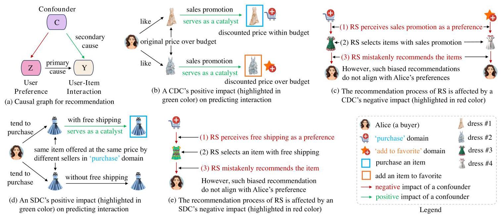
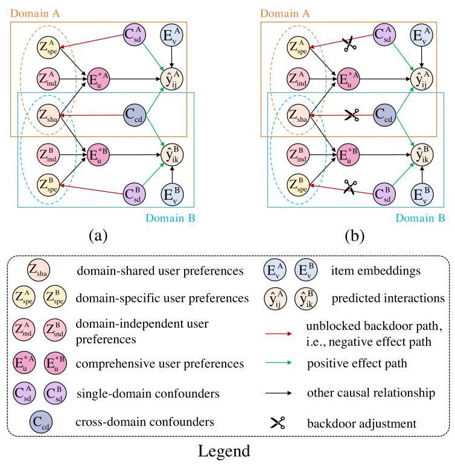
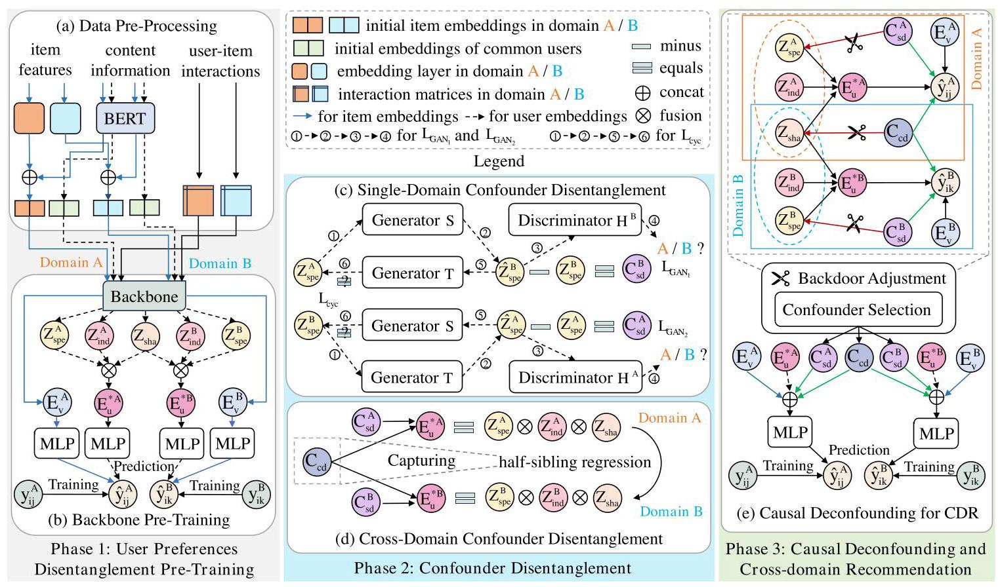
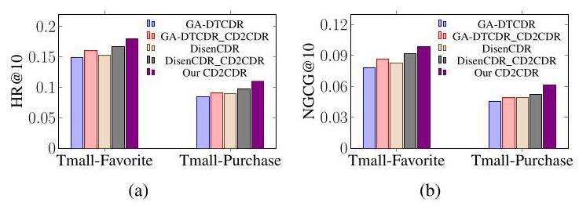
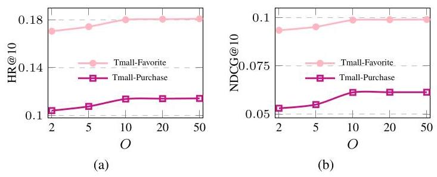

# Causal Deconfounding via Confounder Disentanglement for Dual-Target Cross-Domain Recommendation

Jiajie Zhu, Yan Wang*, Senior Member, IEEE, Feng Zhu and Zhu Sun

Abstract-In recent years, dual-target Cross-Domain Recommendation (CDR) has been proposed to capture comprehensive user preferences in order to ultimately enhance the recommendation accuracy in both data-richer and data-sparser domains simultaneously. However, in addition to users' true preferences, the user-item interactions might also be affected by confounders (e.g., free shipping, sales promotion). As a result, dual-target CDR has to meet two challenges: (1) how to effectively decouple observed confounders, including single-domain confounders and cross-domain confounders, and (2) how to preserve the positive effects of observed confounders on predicted interactions, while eliminating their negative effects on capturing comprehensive user preferences. To address the above two challenges, we propose a Causal Deconfounding framework via Confounder Disentanglement for dual-target Cross-Domain Recommendation, called CD2CDR. In CD2CDR, we first propose a confounder disentanglement module to effectively decouple observed single-domain and cross-domain confounders. We then propose a causal deconfounding module to preserve the positive effects of such observed confounders and eliminate their negative effects via backdoor adjustment, thereby enhancing the recommendation accuracy in each domain. Extensive experiments conducted on five real-world datasets demonstrate that CD2CDR significantly outperforms the state-of-the-art methods.

Index Terms-Cross-Domain Recommendation, Confounder Disentanglement, Causal Deconfounding.

## I. INTRODUCTION

DUAL-TARGET Cross-Domain Recommendation (CDR) [1] aims to capture comprehensive user preferences, and thus enhance the recommendation accuracy in both data-richer and data-sparser domains simultaneously, which are source domains and target domains as well. However, in addition to users' true preferences, the user-item interactions might also be affected by confounding factors. A confounding factor, termed as confounder in causal inference [2], [3], affects both the treatment and the outcome [4], [5], which can be broadly interpreted as user preference and user-item interaction respectively (see Fig. 1(a)) in the context of recommender systems (RSs) [6], [7].

In the dual-target CDR scenario, the observed confounders can be categorized into two types, i.e., single-domain confounder (SDC) and cross-domain confounder (CDC). SDC only affects user preference and user-item interaction in one specific domain and has been widely studied in the existing literature [8], [9]. By contrast, CDC affects both domains; however, it has been overlooked in existing dual-target CDR methods. Because SDC is essentially a simplified version of CDC, below we particularly introduce our in-depth analysis of CDCs with examples on an e-commerce platform, where 'purchase' and 'add to favorite' activities of users are considered as two domains in accordance with the existing literature [10], [11].

Cross-domain confounders have both positive and negative impacts on predicting user-item interactions in both domains. For example, as illustrated in Fig. 1(b), 'sales promotion' is a CDC, because it simultaneously affects both 'purchase' and 'add to favorite' domains. On the one hand, this 'sales promotion' CDC has a positive impact. In fact, while Alice's true preference is the primary cause of her behaviors in both domains, 'sales promotion' is a secondary cause that serves as a catalyst. With a new sales promotion on dresses #1 and #2, both of which Alice likes but previously found over her budget, she immediately purchases dress #1 that has become affordable within her budget. By contrast, since the discounted price of dress #2 is still over her budget, she adds it to favorite for future consideration, looking forward to a further price reduction. On the other hand, this 'sales promotion' CDC has a negative impact too. As depicted in Fig. 1(c), a data-driven RS improperly perceives 'sales promotion' (i.e., a CDC) as Alice's preference in both domains. As a result, the data-driven RS mistakenly recommends dresses #3 and #4 with sales promotion to Alice, but Alice actually does not like them. This misalignment, referred to as confounding bias [12], results in biased recommendations. Similarly, SDCs (e.g., 'free shipping' shown in Figs. 1(d)-1(e)) also have both positive and negative impacts on predicting user-item interactions in their respective domains.

Based on the above discussion, an effective dual-target CDR should deconfound both observed single-domain and cross-domain confounders, which includes three tasks, namely, (1) identify and decouple such observed confounders, (2) preserve their positive impacts on predicted interactions, and (3) eliminate their negative impacts on user preferences [13]. However, existing dual-target CDR approaches overlook the above observations. Thus, a novel dual-target CDR model should be proposed to incorporate such insights for comprehensively understanding user-item interactions.

---

*Yan Wang is the corresponding author.

This work is intended for submission to the IEEE for possible publication. Copyright may be transferred without notice, after which this version may no longer be accessible.

J. Zhu and Y. Wang are with the School of Computing, Macquarie University, Sydney NSW 2109, Australia. E-mail: jiajie.zhu1@students.mq.edu.au，yan.wang@mq.edu.au.

F. Zhu is with the Ant Group, Hangzhou, China. E-mail: zhufeng.zhu@antgroup.com.

Z. Sun is with the Institute of High Performance Computing and Centre for Frontier AI Research, A*STAR, Singapore. E-mail: sunzhuntu@gmail.com.

---

Fig. 1. Examples to depict single-domain confounder (SDC) and cross-domain confounder (CDC) in a dual-target CDR [14-

To effectively advance dual-target CDR, the following two key challenges need to be addressed.

CH1. How to effectively decouple observed cross-domain confounders in addition to single-domain confounders to comprehensively understand user-item interactions in dual-target CDR? The existing dual-target CDR methods either employ graph clustering strategy [15] and variational information bottleneck [16], or identify unobserved domain-specific confounders first, and then utilize causal techniques, e.g., inverse propensity score (IPS) estimators [10] and invariant learning [11], to obtain debiased representations (it is worth mentioning that domain-specific confounders in existing works are different from SDCs in our work, see Section 2.2 for elaboration). However, none of them explicitly decouples observed cross-domain confounders, and thus it is hard to get a comprehensive understanding of user-item interactions in both domains.

CH2. How to preserve the positive impacts of observed confounders on predicted interactions, while eliminating their negative impacts on capturing comprehensive user preferences, thereby enhancing the recommendation accuracy in both domains? Most existing causal methods [17], [18] tend to eliminate the confounders' negative impacts, in order to obtain the debiased comprehensive user preferences for recommendation. However, most of them overlook the confounders' positive impacts, and thus limit their efficacy in enhancing the recommendation accuracy [19].

Our Approach and Contributions. To address the above two challenges, we propose a novel causal deconfounding framework via confounder disentanglement for dual-target CDR. To the best of our knowledge, this is the first work in the literature that explicitly decouples observed cross-domain confounders, and incorporates observed confounders' positive impacts into debiased comprehensive user preferences for dual-target CDR. The characteristics and contributions of our framework can be summarized as follows:

- We first propose a Causal Deconfounding framework via Confounder Disentanglement for dual-target Cross-Domain Recommendation, called CD2CDR, which can disentangle two types of observed confounders, eliminate their negative impacts to obtain debiased preferences, and preserve such observed confounders' positive impacts, thereby enhancing the recommendation accuracy in both domains;

- To address CH1, we propose a confounder disentanglement module to effectively disentangle observed SDCs and CDCs. This module devises a dual adversarial structure to disentangle SDCs in each domain and applies half-sibling regression to decouple CDCs, thus obtaining a comprehensive understanding of user-item interactions in both domains;

- To address CH2, we propose a causal deconfounding module to deconfound disentangled observed SDCs and CDCs via backdoor adjustment. Specifically, we design a confounder selection function to mitigate such observed confounders' negative effects, thereby recovering debi-ased comprehensive user preferences. We then incorporate the observed confounders' positive effects into such debiased preferences to enhance the recommendation accuracy in both domains;

- Extensive experiments conducted on five real-world datasets show that our CD2CDR outperforms the best-performing state-of-the-art baseline with an average increase of 6.64% and 8.92% w.r.t. HR@10 and NDCG@10, respectively.

## II. RELATED WORK

In this section, we first review the existing work on two primary types of CDR in subsection A. Then, we also overview the relevant literature on Deconfounded Recommendation and Disentangled Recommendation in subsection B and subsection C, respectively, which are closely related to our work.

## A. Single-Target and Dual-Target CDR

Single-Target CDR. The existing single-target CDR approaches can be divided into two categories: (1) content-based transfer, and (2) feature-based transfer [20]. Content-based transfer [21] leverages user/item attributes and textual information to establish links across domains. By contrast, feature-based transfer [22], [23] employs machine learning techniques to extract user/item embeddings or rating patterns [24] for cross-domain transfer.

Dual-Target CDR. Unlike single-target CDR, dual-target CDR [1] aims to enhance the recommendation accuracy in both data-richer and data-sparser domains by bidirectionally sharing knowledge, providing a basis for its expansion into Multi-Target CDR [25], [26]. The existing dual-target CDR methods can be roughly classified into two classes: (1) conventional methods, and (2) disentanglement-based methods. Conventional methods utilize two base encoders to transform each domain's interaction data into embeddings, which are then symmetrically incorporated through various transfer layers [27], [28]. By contrast, disentanglement-based methods employ variational autoencoder (VAE) [29] or other decoupling approaches [30] to disentangle domain-shared user preferences for common knowledge transfer, and then incorporate such information with decoupled domain-specific or domain-independent user preferences to capture comprehensive user preferences. However, these methods overlook that, in addition to users' true preferences, users' final decisions are also influenced by confounders.

## B. Deconfounded Recommendation

In recent years, causal learning [31], [32] has been introduced into RSs due to its ability to effectively tackle confounding problems arising from confounders, which can be classified into two types: observed confounders and unobserved confounders. For observed confounders, the existing decon-founded RSs adopt inverse propensity weighting (IPW) [33] or backdoor adjustment [9] to address the observed specific confounders, such as item popularity [8] and video duration [19]. For unobserved confounders, the existing deconfounded RSs either add additional assumptions [34], [35] or infer substitutes for confounders [36], [37] to alleviate the confounding bias. Moreover, recent research efforts have extended confounder debiasing into cross-domain recommendation scenarios, focusing mainly on unobserved confounders. The unobserved confounders can be further categorized into two classes: domain-specific confounders (e.g., purchase-guided domain setting) and general confounders (e.g., the display position of items) [10]. Both classes cannot be captured from the datasets, and thus they are different from the observed SDCs and CDCs. Most of existing approaches tend to remove the negative influences of domain-specific confounders [10], [11] or general confounders [38], [39], but overlook the positive influences of such confounders, leading to an incomplete understanding of user-item interactions. In contrast to unobserved confounders, which are hidden and often difficult to estimate, observed confounders can be explicitly decoupled. As long as observed confounders are accurately disentangled, they can facilitate the design of effective deconfounding module for more precise de-confounding. However, none of existing approaches explicitly decouples observed cross-domain confounders, and preserves the positive influences of observed confounders on user-item interactions.

## C. Disentangled Recommendation

Disentangled representation learning has recently gained increasing interest in RSs, aiming to decouple users' true preferences from confounding factors for more robust recommendation. For example, MacridVAE [40] models disentangled embeddings of user intentions from user-item interactions at both macro- and micro-level to reduce the impact of confounding factors. Moreover, DICE [41] tends to decouple users' interests and conformity to extract the desired causes of user-item interactions for robust recommendation. For causal recommendation, existing disentangled methods [42] first decouple the semantic-aware intent embeddings, and then employ causal intervention [13] to alleviate the confounding bias. Unlike prior works, our work specifically concentrates on disentangling both observed single-domain and cross-domain confounders.

### III.THE PROPOSED MODEL

## A. Problem Definition

The paper explores a fully overlapping dual-target CDR scenario in the domains \( {D}^{A} \) and \( {D}^{B} \) , with a common user set \( \mathcal{U} \) , the size of which is denoted as \( m = \left| \mathcal{U}\right| \) . Let \( {\mathcal{V}}^{A} \) (of size \( {n}^{A} = \left| {\mathcal{V}}^{A}\right| \) ) and \( {\mathcal{V}}^{B} \) (of size \( {n}^{B} = \left| {\mathcal{V}}^{B}\right| \) ) denote the item sets in the domains \( {D}^{A} \) and \( {D}^{B} \) , respectively. The raw feature vector of each item in \( {D}^{A} \) (or \( {D}^{B} \) ) is defined as \( {\mathbf{E}}_{vr}^{A} \in  {\mathbb{R}}^{{d}_{A}} \) (or \( {\mathbf{E}}_{vr}^{B} \in  {\mathbb{R}}^{{d}_{B}} \) ), where \( {d}_{A} \) (or \( {d}_{B} \) ) is the dimensionality of features. The interaction matrices are denoted as \( {\mathbf{R}}^{A} \in  \{ 0,1{\} }^{m \times  {n}^{A}} \) and \( {\mathbf{R}}^{B} \in  \{ 0,1{\} }^{m \times  {n}^{B}} \) in \( {D}^{A} \) and \( {D}^{B} \) , respectively.

Moreover, a recent state-of-the-art dual-target CDR model, DIDA-CDR [43], has effectively decoupled three components of user preferences for modeling comprehensive user preferences \( {\mathbf{E}}_{u}^{ * } \) , thereby achieving the promising recommendation results in both domains. These three components of user preferences include: (1) domain-independent user preferences \( {\mathbf{Z}}_{\text{ ind }} \) , which are seemingly common in both domains but have different meanings in each domain, (2) domain-specific user preferences \( {\mathbf{Z}}_{\text{ spe }} \) , which are unique to one domain, and (3) domain-shared user preferences \( {\mathbf{Z}}_{sha} \) , which have the same meaning in each of both domains [43].

Furthermore, there exist two types of observed confounders, i.e., single-domain confounders \( {\mathbf{C}}_{sd} \) and cross-domain confounders \( {\mathbf{C}}_{cd} \) , which influence both user preferences and user-item interactions simultaneously. Based on the above notations, the Causal Deconfounding for Dual-Target CDR problem is defined as follows.

Causal Deconfounding for Dual-Target CDR. Given the domain-specific and comprehensive user preferences (i.e., \( {\mathbf{Z}}_{\text{ spe }} \) and \( {\mathbf{E}}_{u}^{ * } \) ) in each domain, the goal of causal deconfounding for dual-target CDR is to decouple observed single-domain confounders \( {\mathbf{C}}_{sd} \) and cross-domain confounders \( {\mathbf{C}}_{cd} \) , eliminate such observed confounders' negative effects to obtain debiased comprehensive user preferences, and incorporate the observed confounders' positive effects into such debiased preferences to get a comprehensive understanding of user-item interactions, thus enhancing the recommendation accuracy in both domains.

Fig. 2. Causal graphs of dual-target CDR for deconfounding observed SDCs and CDCs. (a) Original causal graph. (b) Deconfounded causal graph after eliminating such observed confounders' negative effects by blocking backdoor paths via backdoor adjustment, as indicated by scissors [42].

## B. Causal Graph

A causal graph, i.e., a directed acyclic graph (DAG), where edges represent causal relationships between variables. Taking cross-domain confounders \( {\mathbf{C}}_{cd} \) as an example, as illustrated in Fig. 2, they affect predicted interactions \( \widehat{y} \) via two types of paths: \( {\mathbf{C}}_{cd} \rightarrow  \widehat{y} \) and \( {\mathbf{C}}_{cd} \rightarrow  {\mathbf{Z}}_{sha} \rightarrow  {\mathbf{E}}_{u}^{ * } \rightarrow  \widehat{y} \) . The first type of path reveals that \( {\mathbf{C}}_{cd} \) , even if not the primary cause, i.e., users' true preferences, still have a direct positive impact on predicted interactions. The second type of path indicates that the negative impact of \( {\mathbf{C}}_{cd} \) on domain-shared user preferences \( {\mathbf{Z}}_{sha} \) induces confounding bias in both domains. Such confounding bias, in turn, skews comprehensive user preferences \( {\mathbf{E}}_{u}^{ * } \) , because \( {\mathbf{Z}}_{sha} \) is an essential component for capturing \( {\mathbf{E}}_{u}^{ * } \) [43]. If the backdoor path \( {\mathbf{C}}_{cd} \rightarrow  {\mathbf{Z}}_{sha} \) is not blocked, \( {\mathbf{C}}_{cd} \) will result in capturing biased comprehensive user preferences, thus yielding inaccurate recommendation results [19]. Similarly, single-domain confounders \( {\mathbf{C}}_{sd} \) also have both positive and negative effects on predicted interactions and user preferences respectively, thus the backdoor path \( {\mathbf{C}}_{sd} \rightarrow  {\mathbf{Z}}_{\text{ spe }} \) in each domain should be blocked too.

## C. Overview of CD2CDR

To improve the recommendation performance in both domains, we propose a novel Causal Deconfounding framework via Confounder Disentanglement for dual-target Cross-Domain Recommendation, called CD2CDR. The framework can be divided into three phases, i.e., Phase 1: User Preference Disentanglement Pre-Training, Phase 2: Confounder Disentanglement, and Phase 3: Causal Deconfounding and Cross-Domain Recommendation. The framework structure is depicted in Fig. 3. In Phase 1, we obtain disentangled domain-independent and domain-specific user preferences in each domain and domain-shared user preferences by pre-training the backbone introduced in [43]. In Phase 2, we first extract the SDCs in each domain by bidirectionally transforming domain-specific user preferences decoupled in Phase 1. Then, we distill confounding factors that jointly influence comprehensive user preferences in each of both domains as CDCs by adopting half-sibling regression [44]. In Phase 3, we utilize the backdoor adjustment to deconfound the observed confounders disentangled in Phase 2. Specifically, we design a confounder selection function to mitigate negative effects of such confounders on user preferences, thus recovering debi-ased comprehensive user preferences. We then incorporate the confounders' positive effects into such debiased preferences to predict user-item interactions via a multi-layer perception (MLP) in each domain. The three phases are described with details in the following subsections.

## D. Phase 1: User Preference Disentanglement Pre-Training

Accurate disentanglement of user preferences is vital to ensure the robustness of subsequent confounder disentanglement process. Since the method introduced in [43] excels at decoupling three components of user preferences for modeling comprehensive user preferences, our CD2CDR adopts it as the backbone for user preference disentanglement. To extract more accurate disentangled user preferences, we consider multi-source content information of users and items, e.g., user reviews and item details. Taking domain \( A \) as an example, we first transform raw feature vectors of items \( {\mathbf{E}}_{vr}^{A} \in  {\mathbb{R}}^{{d}_{A}} \) into dense embeddings \( {\mathbf{E}}_{vd}^{A} \in  {\mathbb{R}}^{d} \) as follows:

\[
{\mathbf{E}}_{vr}^{A} = {\mathbf{W}}_{rd}^{A}{\mathbf{E}}_{vd}^{A}, \tag{1}
\]

where \( {\mathbf{W}}_{rd}^{A} \in  {\mathbb{R}}^{{d}^{A} \times  d} \) is a trainable mapping matrix. \( d \) denotes the dimensionality of dense embeddings. Then, for a user \( {u}_{i} \) , we collect all the user's reviews into a user text document. For an item \( {v}_{j} \) , we collect its title and all reviews on the item into an item text document. Next, we adopt a pre-trained BERT [45] to map the documents of all users and items in the training set into user text embeddings \( {\mathbf{E}}_{ut}^{A} \) and item text embeddings \( {\mathbf{E}}_{vt}^{A} \) , respectively. Finally, we concatenate \( {\mathbf{E}}_{vd}^{A} \) and \( {\mathbf{E}}_{vt}^{A} \) to form combined item embeddings \( {\mathbf{E}}_{vc}^{A} \) . We then transform \( {\mathbf{E}}_{ut}^{A},{\mathbf{E}}_{vc}^{A} \) into fixed-size initial user embeddings \( {\mathbf{E}}_{ui}^{A} \) and initial item embedding \( {\mathbf{E}}_{vi}^{A} \) in domain \( A \) as follows:

\[
{\mathbf{E}}_{ui}^{A} = {\delta }_{u}^{A}{\mathbf{E}}_{ut}^{A},\;{\mathbf{E}}_{vi}^{A} = {\delta }_{v}^{A}{\mathbf{E}}_{vc}^{A}, \tag{2}
\]

where \( {\delta }_{u}^{A} \) and \( {\delta }_{v}^{A} \) are the mapping functions of MLP layers. Similarly, we can obtain initial user embeddings \( {\mathbf{E}}_{ui}^{B} \) and initial item embeddings \( {\mathbf{E}}_{vi}^{B} \) in domain \( B \) . We then use such initial embeddings and the interaction matrices as inputs to pre-train the backbone, thus we obtain domain-independent, domain-specific, and domain-shared user preferences, namely, \( {\mathbf{Z}}_{\text{ ind }},{\mathbf{Z}}_{\text{ spe }} \) , and \( {\mathbf{Z}}_{\text{ sha }} \) , and pre-trained item embeddings \( {\mathbf{E}}_{v} \) . By incorporating the above three components of user preferences using attention mechanism in accordance with the backbone, we can get comprehensive user preferences \( {\mathbf{E}}_{u}^{ * } \) .

Fig. 3. The structure of our CD2CDR Framework. The symbols and arrows not in the legend follow the definitions in Fig. 2.

## E. Phase 2: Confounder Disentanglement

Since user-item interactions are also influenced by observed confounders apart from comprehensive user preferences, we propose to decouple SDCs and CDCs, as detailed in the following subsections.

1) Single-Domain Confounder Disentanglement: To explore the domain-specific confounding factors that influence user-item interactions, we utilize bi-directional domain transformation to decouple SDCs from previously obtained domain-specific user preferences. If such SDCs are not identified and explicitly decoupled, their negative effects on domain-specific user preferences can hardly be eliminated. By contrast, if they are well disentangled, the causal deconfounding module can utilize backdoor adjustment to remove the confounding bias, thus obtaining debiased domain-specific user preferences. Inspired by Cycle-GAN [46], we devise a dual adversarial structure, which consists of two domain transformation generators and two discriminators, to disentangle SDCs in each domain. Specifically, we aim to learn two generators, i.e., \( S\left( \cdot \right)  : {D}^{A} \rightarrow  {D}^{B} \) and \( T\left( \cdot \right)  : {D}^{B} \rightarrow  {D}^{A} \) , to transform domain-specific user preferences in each of both domains.

Taking domain \( B \) as an example, the generator \( S\left( \cdot \right) \) takes the domain-specific user preferences \( {\mathbf{Z}}_{\text{ spe }}^{A} \) of common users in \( {D}^{A} \) as inputs to generate \( {\widehat{\mathbf{Z}}}_{\text{ spe }}^{B} = S\left( {\mathbf{Z}}_{\text{ spe }}^{A}\right) \) that look similar to domain-specific user preferences in domain \( B \) , i.e., \( {\mathbf{Z}}_{\text{ spe }}^{B} \) . However, if there are still differences between the simulated preferences \( {\widehat{\mathbf{Z}}}_{\text{ spe }}^{B} \) and the original ones \( {\mathbf{Z}}_{\text{ spe }}^{B} \) , such differences are not characteristics of domain-specific user preferences in domain \( B \) , but should be considered as SDCs [47]. To ensure that the generator \( S\left( \cdot \right) \) is proficient at domain-specific preference simulation, we introduce a discriminator \( {H}^{B}\left( \cdot \right) \) to recognize which domain the domain-specific user preferences come from. In the adversarial learning paradigm, the discriminator is expected to improve the ability to differentiate domain-specific user preferences in each domain to achieve better discriminative performance, while the generator is supposed to generate indistinguishable simulations of these domain-specific preferences to confuse such discriminator [48]. For training the generator \( S\left( \cdot \right) \) and corresponding discriminator \( {H}^{B}\left( \cdot \right) \) , we adopt adversarial loss [49], which is expressed as follows:

(3)

\[
{\mathcal{L}}_{{GA}{N}_{1}}\left( {S,{H}^{B},{D}^{A},{D}^{B}}\right)  = {\mathbb{E}}_{{\mathbf{Z}}_{spe}^{B} \sim  {\mathbb{P}}^{B}}\left\lbrack  {\log {H}^{B}\left( {\mathbf{Z}}_{spe}^{B}\right) }\right\rbrack
\]

\[
+ {\mathbb{E}}_{{\mathbf{Z}}_{spe}^{A} \sim  {\mathbb{P}}^{A}}\left\lbrack  {\log \left( {1 - {H}^{B}\left( {S\left( {\mathbf{Z}}_{spe}^{A}\right) }\right) }\right) }\right\rbrack  ,
\]

where \( \mathbb{E} \) is the expectation, and \( {\mathbb{P}}^{A},{\mathbb{P}}^{B} \) denote the feature distribution of domain \( A \) and domain \( B \) , respectively. Similarly, for training the generator \( T\left( \cdot \right) \) and the corresponding discriminator \( {H}^{A}\left( \cdot \right) \) , we adopt the adversarial loss \( {\mathcal{L}}_{{GA}{N}_{2}}\left( {T,{H}^{A},{D}^{B},{D}^{A}}\right) \) . However, relying solely on adversarial loss is insufficient to ensure that a user's domain-specific preferences remain aligned with the user's preferences after transformation. If transformed domain-specific user preferences no longer reflect the user's preferences, then such transformation becomes meaningless, serving merely to deceive the discriminator. Hence, the generators should maintain cycle consistency, i.e., \( {\mathbf{Z}}_{\text{ spe }}^{A} \rightarrow  S\left( {\mathbf{Z}}_{\text{ spe }}^{A}\right)  \rightarrow  T\left( {S\left( {\mathbf{Z}}_{\text{ spe }}^{A}\right) }\right)  \approx  {\mathbf{Z}}_{\text{ spe }}^{A} \) , \( {\mathbf{Z}}_{\text{ spe }}^{B} \rightarrow  T\left( {\mathbf{Z}}_{\text{ spe }}^{B}\right)  \rightarrow  S\left( {T\left( {\mathbf{Z}}_{\text{ spe }}^{B}\right) }\right)  \approx  {\mathbf{Z}}_{\text{ spe }}^{B} \) during the training process (see \( {\mathcal{L}}_{cyc} \) in Fig. 3(c)). To this end, we apply a cycle consistency loss, which is represented as follows:

(4)

\[
{\mathcal{L}}_{cyc}\left( {S, T}\right)  = {\mathbb{E}}_{{\mathbf{Z}}_{spe}^{A} \sim  {\mathbb{P}}^{A}}\left\lbrack  {\left| \right| T\left( {S\left( {\mathbf{Z}}_{spe}^{A}\right) }\right)  - {Z}_{spe}^{A}{\left| \right| }_{1}}\right\rbrack
\]

\[
+ {\mathbb{E}}_{{\mathbf{Z}}_{spe}^{B} \sim  {\mathbb{P}}^{B}}\left\lbrack  {\left| \right| S\left( {T\left( {\mathbf{Z}}_{spe}^{B}\right) }\right)  - {\mathbf{Z}}_{spe}^{B}{\left| \right| }_{1}}\right\rbrack  .
\]

Moreover, the total objective function for training the generators and discriminators can be formulated as follows:

(5)

\[
{\mathcal{L}}_{sd}\left( {S, T,{H}^{A},{H}^{B}}\right)  = {\mathcal{L}}_{{GA}{N}_{1}}\left( {S,{H}^{B},{D}^{A},{D}^{B}}\right)
\]

\[
+ {\mathcal{L}}_{{GA}{N}_{2}}\left( {T,{H}^{A},{D}^{B},{D}^{A}}\right)  + \lambda {\mathcal{L}}_{cyc}\left( {S, T}\right) ,
\]

where \( \lambda \) controls the importance of cycle consistency loss relative to adversarial losses. Following the method introduced in [47], upon training completion, we calculate the differences between domain-specific user preferences after transformation and original ones as candidate single-domain confounders, which are defined as follows:

\[
{\widehat{\mathbf{C}}}_{sd}^{A} = T\left( {\mathbf{Z}}_{spe}^{B}\right)  - {\mathbf{Z}}_{spe}^{A},\;{\widehat{\mathbf{C}}}_{sd}^{B} = S\left( {\mathbf{Z}}_{spe}^{A}\right)  - {\mathbf{Z}}_{spe}^{B}. \tag{6}
\]

Recall the causal graph in Fig. 2(a), the influence of single-domain confounders \( {\mathbf{C}}_{sd} \) on domain-specific user preferences \( {\mathbf{Z}}_{\text{ spe }} \) results in confounding bias, leading to inaccurate estimation of \( {\mathbf{Z}}_{\text{ spe }} \) . For example, as depicted in Fig. 1(e), in the 'purchase' domain, a data-driven RS improperly perceives the 'free shipping' (i.e., an SDC), as Alice's 'purchase' domain preference, resulting in biased recommendation. Since our well-trained generator excels at simulating Alice's 'purchase' domain preferences based on her 'add to favorite' domain preferences, if there are still differences as per Eq. (6), this indicates such differences are not Alice's 'purchase' domain preferences but rather SDCs independent of her preferences. Such SDCs (e.g., 'free shipping'), previously entangled with Alice's 'purchase' domain preferences, are decoupled through our SDC disentanglement process. Note that this process specifically targets biased domain-specific user preferences, because unbiased ones are not entangled with such SDCs. Thus, although this process decouples SDCs from biased domain-specific user preferences, this does not imply a causal relationship \( {\mathbf{Z}}_{spe} \rightarrow  {\mathbf{C}}_{sd} \) in the causal graph, because SDCs are not generated by such biased preferences. To distill representative SDCs and reduce redundancy, we apply K-means clustering on candidate SDCs \( {\widehat{\mathbf{C}}}_{sd}^{A} \) (or \( {\widehat{\mathbf{C}}}_{sd}^{B} \) ) and choose \( {O}_{sd}^{A} \) (or \( {O}_{sd}^{B} \) ) cluster centroids to form the potential SDC subspace \( {\mathcal{C}}_{sd}^{A} \) (or \( {\mathcal{C}}_{sd}^{B} \) ).

2) Cross-Domain Confounder Disentanglement: In addition to SDCs, it is more important to identify confounding factors that simultaneously affect user-item interactions in both domains. Inspired by the method introduced in [47], we employ half-sibling regression to disentangle CDCs from the previously obtained comprehensive user preferences in both domains. Half-sibling regression excels at capturing the influence of confounding factors that simultaneously affect multiple observed variables [44], and thus it is well suited for decoupling CDCs in dual-target CDR. As illustrated in Fig. 2(a), \( {\mathbf{C}}_{cd} \rightarrow  {\mathbf{E}}_{u}^{*A} \) and \( {\mathbf{C}}_{cd} \rightarrow  {\mathbf{E}}_{u}^{*B} \) indicate that CDCs indirectly influence the comprehensive user preferences in each of both domains via \( {\mathbf{C}}_{cd} \rightarrow  {\mathbf{Z}}_{sha} \rightarrow  {\mathbf{E}}_{u}^{*A} \) and \( {\mathbf{C}}_{cd} \rightarrow  {\mathbf{Z}}_{sha} \rightarrow  {\mathbf{E}}_{u}^{*B} \) . Therefore, we can apply half-sibling regression to decouple \( {\mathbf{C}}_{cd} \) from \( {\mathbf{E}}_{u}^{*A} \) and \( {\mathbf{E}}_{u}^{*B} \) (see Fig. 3(d)). Specifically, our goal is to estimate a transformation matrix \( {\mathbf{W}}^{A \rightarrow  B} \) such that:

\[
{\mathbf{E}}_{u}^{*B} \approx  {\mathbf{E}}_{u}^{*A}{\mathbf{W}}^{A \rightarrow  B}, \tag{7}
\]

using ridge regression, and the regression results are expressed as:

\[
{\mathbf{W}}^{A \rightarrow  B} = {\left\lbrack  {\left( {\mathbf{E}}_{u}^{*A}\right) }^{\top }{\mathbf{E}}_{u}^{*A} + \alpha \mathbf{I}\right\rbrack  }^{-1}{\left( {\mathbf{E}}_{u}^{*A}\right) }^{\top }{\mathbf{E}}_{u}^{*B}, \tag{8}
\]

where \( \alpha \) denotes the regularization parameter. We assume that \( {\mathbf{E}}_{u}^{*A} \) and \( {\mathbf{C}}_{sd}^{B} \) are independent, because \( {\mathbf{E}}_{u}^{*A} \) are comprehensive user preferences in domain \( A \) , while \( {\mathbf{C}}_{sd}^{B} \) are SDCs specific to domain \( B \) . When we estimate a transformation matrix \( {W}^{A \rightarrow  B} \) to predict \( {\mathbf{E}}_{u}^{*B} \) using \( {\mathbf{E}}_{u}^{*A} \) , the influence of \( {\mathbf{C}}_{sd}^{B} \) on \( {\mathbf{E}}_{u}^{*B} \) will not be captured. This is because \( {\mathbf{E}}_{u}^{*A} \) are independent from \( {\mathbf{C}}_{sd}^{B} \) , and as a result, utilizing \( {\mathbf{E}}_{u}^{*A} \) cannot predict \( {\mathbf{C}}_{sd}^{B} \) and the influence of \( {\mathbf{C}}_{sd}^{B} \) on \( {\mathbf{E}}_{u}^{*B} \) . By contrast, the influence of \( {\mathbf{C}}_{cd} \) on \( {\mathbf{E}}_{u}^{*B} \) will be captured, because \( {\mathbf{C}}_{cd} \) simultaneously affect \( {\mathbf{E}}_{u}^{*A} \) and \( {\mathbf{E}}_{u}^{*B} \) , which means the regression results will only capture \( {\mathbf{C}}_{cd} \) . Hence, the regression results can be identified as candidate cross-domain confounders:

\[
{\widehat{\mathbf{C}}}_{cd} = {\mathbf{E}}_{u}^{*A}{\mathbf{W}}^{A \rightarrow  B}. \tag{9}
\]

Similarly, for cross-domain confounders, K-means clustering is also employed on the candidate cross-domain confounders \( {\widehat{\mathbf{C}}}_{cd} \) , with the \( {O}_{cd} \) cluster centroids forming the potential CDC subspace \( {\mathcal{C}}_{cd} \) .

## F. Phase 3: Causal Deconfounding and Cross-Domain Rec- ommendation

After the confounder disentanglement, we obtain the potential SDC subspaces \( {\mathcal{C}}_{sd}^{A} \) and \( {\mathcal{C}}_{sd}^{B} \) , and potential CDC subspace \( {\mathcal{C}}_{cd} \) . From a causal perspective, if the backdoor paths (i.e., \( {\mathbf{C}}_{sd} \rightarrow  {\mathbf{Z}}_{spe} \) and \( {\mathbf{C}}_{cd} \rightarrow  {\mathbf{Z}}_{sha} \) ) are not blocked, the observed confounders \( C \) will simultaneously influence user preferences \( Z \) and user-item interactions \( Y \) (see Fig. 1(a)), and thus cause biased estimation of comprehensive user preferences. To this end, we perform the do-calculus intervention based on backdoor adjustment [50] to block the backdoor paths \( C \rightarrow  Z \) and enable our model to more accurately estimate the direct effect \( Z \rightarrow  Y \) (also see Fig. 1(a)). Formally, the conventional likelihood \( P\left( {Y \mid  Z}\right) \) is defined as:

\[
P\left( {Y \mid  Z}\right)  = \mathop{\sum }\limits_{c}P\left( {Y \mid  Z, c}\right) P\left( {c \mid  Z}\right) , \tag{10}
\]

where \( c \) denotes a specific confounder selected from the confounder space \( \mathcal{C} \) . By applying the do-calculus, we exclude all influences directed towards the intervened variable (i.e., \( Z \) ), and we have:

\[
P\left( {Y \mid  \operatorname{do}\left( Z\right) }\right)  = \mathop{\sum }\limits_{c}P\left( {Y \mid  \operatorname{do}\left( Z\right) , c}\right) P\left( {c \mid  \operatorname{do}\left( Z\right) }\right) \tag{11}
\]

\[
= \mathop{\sum }\limits_{c}P\left( {Y \mid  Z, c}\right) P\left( c\right) .
\]

For brevity, the proof of transformations \( P\left( {Y \mid  \operatorname{do}\left( Z\right) , c}\right)  = P\left( {Y \mid  Z, c}\right) \; \) and \( \;P\left( {c \mid  \operatorname{do}\left( Z\right) }\right)  = P\left( c\right) \; \) is omitted, which can be found in [51]. In fact, transforming \( P\left( {c \mid  {do}\left( Z\right) }\right) \) into the prior probability of confounders \( P\left( c\right) \) blocks backdoor paths \( C \rightarrow  Z \) . As a result, \( P\left( {Y \mid  {do}\left( Z\right) }\right) \) mainly focus on modeling the direct effect \( Z \rightarrow  Y \) . Specifically, we implement the backdoor adjustment by modeling \( P\left( {Y \mid  Z, c}\right) \) with an interaction prediction network, which is expressed as follows:

\[
P\left( {Y \mid  \operatorname{do}\left( Z\right) }\right)  = {\mathbb{E}}_{\mathrm{c}}\left\lbrack  {P\left( {Y \mid  Z, c}\right) }\right\rbrack   = {\mathbb{E}}_{\mathrm{c}}\left\lbrack  {f\left( {{\mathbf{E}}_{u}^{ * },{\mathbf{E}}_{v},\mathbf{c}}\right) }\right\rbrack  , \tag{12}
\]

where \( f\left( \cdot \right) \) denotes a neural network, namely, MLP, to predict the probabilities of user-item interactions [52]. \( {\mathbf{E}}_{u}^{ * } \) and \( {\mathbf{E}}_{v} \) are comprehensive user preferences and pre-trained item em-beddings obtained by the backbone in Phase 1, respectively. In other words, based on two subspaces of disentangled observed confounders in domain \( A \) and domain \( B \) , i.e., \( {\mathcal{C}}^{A} = {\mathcal{C}}_{sd}^{A} \cup  {\mathcal{C}}_{cd} \) and \( {\mathcal{C}}^{B} = {\mathcal{C}}_{sd}^{B} \cup  {\mathcal{C}}_{cd} \) , we apply backdoor adjustment to rectify the biased recommendations in each domain using Eq. (12). Moreover, since the decoupled observed confounders are incorporated as part of the input to the MLP, the direct influence of such confounders on user-item interactions \( C \rightarrow  Y \) is also considered. In addition, inspired by the approach in [47], we devise a confounder selection function to effectively control the decoupled observed confounders for more accurate deconfounding.

Taking domain \( A \) as an example, the confounder selection function is defined as follows:

(13)

\[
\phi \left( {{\mathbf{E}}_{u}^{*A},{\mathbf{E}}_{v}^{A},\mathbf{c}}\right)  = \frac{\exp \left( {{\mathbf{W}}_{u}^{A}{\mathbf{E}}_{u}^{*A} \cdot  {\mathbf{W}}_{uc}^{A}\mathbf{c}}\right) }{2\mathop{\sum }\limits_{{\mathbf{c}}^{\prime }}\exp \left( {{\mathbf{W}}_{u}^{A}{\mathbf{E}}_{u}^{*A} \cdot  {\mathbf{W}}_{uc}^{A}{\mathbf{c}}^{\prime }}\right) }
\]

\[
+ \frac{\exp \left( {{\mathbf{W}}_{v}^{A}{\mathbf{E}}_{v}^{A} \cdot  {\mathbf{W}}_{vc}^{A}\mathbf{c}}\right) }{2\mathop{\sum }\limits_{{\mathbf{c}}^{\prime }}\exp \left( {{\mathbf{W}}_{v}^{A}{\mathbf{E}}_{v}^{A} \cdot  {\mathbf{W}}_{vc}^{A}{\mathbf{c}}^{\prime }}\right) },
\]

where \( {\mathbf{c}}^{\prime } \) denotes any confounder selected from confounder subspace \( {\mathcal{C}}^{A} \) and \( \cdot \) is the dot product. \( {\mathbf{W}}_{u}^{A},{\mathbf{W}}_{uc}^{A},{\mathbf{W}}_{v}^{A},{\mathbf{W}}_{vc}^{A} \) are trainable matrices for embedding transformation. We then formulate the expectation \( {\mathbb{E}}_{c}\left\lbrack  {f\left( {{\mathbf{E}}_{u}^{ * },{\mathbf{E}}_{v},\mathbf{c}}\right) }\right\rbrack \) in domain \( A \) as follows:

\[
{\mathbb{E}}_{c}\left\lbrack  {f\left( {{\mathbf{E}}_{u}^{ * },{\mathbf{E}}_{v},\mathbf{c}}\right) }\right\rbrack   = f\left( {\mathbf{Q}}_{in}^{A}\right)
\]

\[
= f\left\lbrack  {{\mathbf{W}}_{fc}\left( {{\mathbf{E}}_{u}^{*A}\begin{Vmatrix}{\mathbf{E}}_{v}^{A}\end{Vmatrix}\mathop{\sum }\limits_{c}p\left( c\right) \mathbf{c}\phi \left( {{\mathbf{E}}_{u}^{*A},{\mathbf{E}}_{v}^{A},\mathbf{c}}\right) }\right) }\right\rbrack  , \tag{14}
\]

where \( {\mathbf{W}}_{fc} \) is the weight matrix of the fully connected (FC) layer and || is the concatenation operator. In practice, we assume a uniform distribution for the prior probability \( p\left( c\right) \) . In addition, \( {\mathbf{Q}}_{in}^{A} = {\mathbf{W}}_{fc}\left( {{\mathbf{E}}_{u}^{*A}\begin{Vmatrix}{\mathbf{E}}_{v}^{A}\end{Vmatrix}\mathop{\sum }\limits_{c}p\left( c\right) \mathbf{c}\phi \left( {{\mathbf{E}}_{u}^{*A},{\mathbf{E}}_{v}^{A},\mathbf{c}}\right) }\right. \) denotes the input for MLP in domain \( A \) . Moreover, the predicted interaction \( {\widehat{y}}_{ij}^{A} \) between an user \( {u}_{i} \) and an item \( {v}_{j} \) in domain \( A \) is represented as follows:

\[
{\widehat{y}}_{ij}^{A} = {\delta }_{\text{ out }}^{A}\left( {{\delta }_{l}^{A}\left( {\ldots {\delta }_{2}^{A}\left( {{\delta }_{1}^{A}\left( {\mathbf{Q}}_{in}^{A}\right) }\right) \ldots }\right) }\right) , \tag{15}
\]

where \( {\delta }_{l}^{A} \) is the mapping function for \( l \) -th MLP layer, and there are \( l \) MLP layers including \( {\delta }_{\text{ out }}^{A} \) in domain \( A \) .

The essence of our causal deconfounding module lies in blocking the backdoor paths \( C \rightarrow  Z \) , allowing the model to concentrate on the direct effects of users' true preferences on the predicted interactions \( Z \rightarrow  Y \) , and disregard the interference of confounders on these preferences. Specifically, the confounder selection function assigns different weights to the potential observed confounders, mitigates the effects of those irrelevant or harmful confounders to the prediction task, and enhances the direct effects of beneficial confounders on predicted interactions. Therefore, this module enables the model to eliminate the negative effects of such observed confounders to learn debiased comprehensive user preferences, and preserve the positive effects of confounders on predicted interactions, thereby achieving a more comprehensive understanding of user-item interactions in both domains. Finally, we employ cross-entropy loss to fine-tune the user preference disentanglement backbone \( g\left( \cdot \right) \) and the interaction prediction network \( f\left( \cdot \right) \) in domain \( A \) . To be specific, the final objective function can be defined as follows:

\[
{g}^{ * },{f}^{ * } = \underset{g, f}{\arg \min }\mathop{\sum }\limits_{{y \in  {\mathcal{Y}}^{A + } \cup  {\mathcal{Y}}^{A - }}}\ell \left( {\widehat{y}, y}\right) , \tag{16}
\]

where \( \widehat{y} \) and \( y \) are the predicted interaction and corresponding observed interaction, respectively. \( \ell \left( {\widehat{y}, y}\right) \) denotes the cross-entropy loss function. \( {\mathcal{Y}}^{A + } \) denotes the observed interaction set, and \( {\mathcal{Y}}^{A - } \) corresponds to a specific quantity of negative samples, which are randomly selected from unseen user-item interaction set in domain \( A \) to mitigate the over-fitting. During the fine-tuning process, \( g\left( \cdot \right) \) serves as the backbone, with the original prediction module being replaced by the interaction prediction network \( f\left( \cdot \right) \) . For domain \( B \) , we apply this fine-tuning approach in the same manner.

## IV. EXPERIMENTS AND ANALYSIS

Extensive experiments are conducted on five real-world datasets to answer the following four research questions:

- RQ1. How does our model perform in comparison with state-of-the-art baseline models (see Section 4.2)?

- RQ2. How do different modules, namely, confounder disentanglement and causal deconfounding, influence the recommendation accuracy of our model (see Section 4.3)?

- RQ3. How do different backbone models impact the recommendation performance of our model (see Section 4.4)?

- RQ4. How is the recommendation accuracy of our model affected by different hyper-parameter settings (see Section 4.5)?

## A. Experimental Settings

1) Experimental Datasets and Tasks: To validate the recommendation accuracy of our CD2CDR, we select five real-world datasets, namely, Rec-Tmall subsets (Add to Favorite, Purchase and Add to Cart), and Amazon subsets (Amazon-Electronics and Amazon-Cloth 2 released in DisenCDR [29]. For the above five subsets which have abundant ratings, reviews and item details, we first transform ratings into the implicit feedback, and then construct three dual-target CDR tasks that have fully overlapping user sets: (1) Tmall-Favorite and Tmall-Purchase, (2) Tmall-Favorite and Tmall-Cart, and (3) Amazon-Elec and Amazon-Cloth. For Task #1, users and items with fewer than 20 interactions are removed from Tmall-Favorite, and those with fewer than 5 interactions are filtered out from Tmall-Purchase. For the Task #2 and Task #3, users and items with fewer than 20 interactions in Task #2 and those with fewer than 5 interactions in Task #3 are filtered out. In line with the preprocessing operation taken for the two Amazon subsets in DisenCDR [29], we also conduct the same operation on three Rec-Tmall subsets to remove the cold-start item entry for testing. The statistical data for the above three tasks are expressed in Table 1.

---

\( {}^{1} \) https://tianchi.aliyun.com/dataset/140281

\( {}^{2} \) For brevity, we refer to these subsets as Tmall-Favorite, Tmall-Purchase, Tmall-Cart, Amazon-Elec and Amazon-Cloth respectively in subsequent discussions.

---

TABLE I

THE STATISTICAL DATA FOR THREE DUAL-TARGET CDR TASKS.

<table><tr><td>Tasks</td><td>Datasets</td><td>#Users</td><td>#Items</td><td>#Interactions</td><td>Density</td></tr><tr><td rowspan="2">Task #1</td><td>Tmall-Favorite</td><td>25,434</td><td>99,237</td><td>500,876</td><td>0.020%</td></tr><tr><td>Tmall-Purchase</td><td>25,434</td><td>28,817</td><td>55,057</td><td>0.008%</td></tr><tr><td rowspan="2">Task #2</td><td>Tmall-Favorite</td><td>39,657</td><td>104,496</td><td>807,493</td><td>0.019%</td></tr><tr><td>Tmall-Cart</td><td>39,657</td><td>44,172</td><td>354,499</td><td>0.020%</td></tr><tr><td rowspan="2">Task #3</td><td>Amazon-Elec</td><td>15,761</td><td>51,447</td><td>224,689</td><td>0.027%</td></tr><tr><td>Amazon-Cloth</td><td>15,761</td><td>48,781</td><td>133,609</td><td>0.017%</td></tr></table>

2) Parameter Settings.: The settings of our backbone DIDA-CDR are consistent with those listed in its original paper [43], including the number of GCN layers, embedding dimension and information fusion approach, etc. In the interaction prediction network, the structure is \( e \rightarrow  {32} \rightarrow  {16} \rightarrow  q \) , where \( e \) is the combined size after the mapping of FC layer in Eq. (14), and \( q \) is the output size, i.e., the dimension of latent factors. We vary \( e \) in the range of \( \{ {64},{128}\} \) and \( q \) in the range of \( \{ 8,{16}\} \) , and finally set \( e = {128} \) and \( q = 8 \) . The initial parameters for all the above layers are set following a Gaussian distribution \( X \sim  \mathcal{N}\left( {0,{0.01}}\right) \) . In line with the approach used in GA-DTCDR [53], for each observed interaction, we randomly select 7 non-interacted items to serve as negative examples. For a fair comparison, we employ grid search to fine-tune the parameters of all models. Specifically, we select the learning rate in \( \{ {0.01},{0.005},{0.001},{0.0005},{0.0001}\} \) . Moreover, we adopt the Adam optimizer [54] for all models with a batch size of 1024. Furthermore, we investigate the weight of cycle consistency loss \( \lambda \) in \( \{ {0.1},1,2,5,{10}\} \) , and the regularization parameter \( \alpha \) in \( \{ {0.1},1,{10},{20},{50}\} \) . We keep the number of cluster centroids \( {O}_{sd}^{A} = {O}_{sd}^{B} = {O}_{cd} \) and vary them in \( \{ 2,5,{10},{20},{50}\} \) . The influence of the above parameters on the recommendation accuracy of our CD2CDR is particularly discussed in Section 4.5 .

3) Model Training.: Since our CD2CDR can be divided into three phases, we first pre-train the backbone of our model with 50 epochs 4 to obtain disentangled user preferences and comprehensive user preferences. Next, we train the generators and discriminators in the dual adversarial structure with 30 epochs to decouple SDCs, apply half-sibling regression, a computational method inherently without a training process [44], to decouple CDCs, and then save cluster centroids of both SDCs and CDCs. Finally, we replace the prediction module in the backbone with the interaction prediction network to fine-tune the overall CD2CDR with 20 epochs. Note that Eq. (5) and Eq. (16) are not optimized jointly. This is because observed confounders are no longer entangled with debiased user preferences after deconfounding, the joint optimization of Eq. (5) and Eq. (16) for decoupling observed confounders from debiased user preferences becomes redundant. For a fair comparison, other baselines are trained for 100 epochs to confirm their convergence.

4) Evaluation Metrics.: Given the widespread use of leave-one-out approach in baselines, e.g., GA-DTCDR [53] and DisenCDR [29], we adopt it as well to validate the recommendation accuracy of our CD2CDR and baselines. Moreover, the test set is created by the final interaction for each user, while the training set is formed by the remaining interaction records. In line with the methods introduced in [16], [29], for every interaction in the test set, we randomly select 999 non-interacted items as negative samples for the test user, and then predict scores for a total of 1000 items to perform ranking. The leave-one-out approach primarily employs Hit Ratio (HR) and Normalized Discounted Cumulative Gain (NDCG), which are commonly adopted in ranking evaluations [25]. In our experiments, these metrics are applied to validate the recommendation accuracy within the top-10 rankings, and all experiments are conducted five times with average results reported in this paper.

5) Comparison Methods.: We choose ten state-of-the-art baselines to conduct a comparison against our CD2CDR. We then categorize the ten baseline models into four groups: (1) Single-Domain Recommendation (SDR), (2) Single-Target Cross-Domain Recommendation (CDR), (3) Disentanglement-Based Dual-Target CDR, and (4) Debiasing Dual-Target CDR. To the best of our knowledge, our CD2CDR is the first Deconfounding Dual-Target CDR model in the literature. Thus, we select three representative Debiasing Dual-Target CDR approaches as alternatives for Deconfounding Dual-Target CDR baselines. In addition, IPSCDR [10] is noteworthy, because it is the first work in CDR to apply causal techniques to mitigate the influence of unobserved domain-specific confounders, and it is model-agnostic. Hence, for a fair comparison between IPSCDR and our model, we implement IPSCDR using the same state-of-the-art backbone (i.e., DIDA-CDR) as employed in our model. Moreover, although there are some methods that identify unobserved domain-specific confounders and even unobserved general confounders, or utilize backdoor adjustment in the single-domain manner, they are not selected as baseline models. This is because they focus on different settings, i.e., domain generalization [11], [59], CDSR [38], [39], and different item groups [8], [9] respectively, from our model. Furthermore, in Table 2, we present an in-depth analysis of embedding strategies and main ideas of ten baselines and our CD2CDR.

---

\( {}^{3} \) Due to space limitation, we only list the more critical discussions regarding the number of cluster centroids and omit the performance comparison details for \( \lambda \) and \( \alpha \) , which are set as \( \lambda  = 1 \) and \( \alpha  = 1 \) in the experiments.

\( {}^{4} \) The number of training epochs for each phase is chosen in \( \{ {10},{20},{30},{40},{50}\} \) .

---

TABLE II

THE COMPARISON OF THE BASELINES AND OUR PROPOSED MODEL.

<table><tr><td colspan="3">Model</td><td>Embedding Strategy</td><td>Main Idea</td></tr><tr><td rowspan="10">Baselines</td><td>Single-Domain</td><td>NGCF [55]</td><td>Graph Embedding</td><td>Devising an embedding propagation layer to encode the collaborative signal</td></tr><tr><td>Recommendation (SDR)</td><td>LightGCN 56</td><td>Graph Embedding</td><td>Designing a simplified Graph Convolutional Network (GCN) tailored for RSs</td></tr><tr><td rowspan="2">Single-Target Cross-Domain Recommendation (CDR)</td><td>BPR_EMCDK_57</td><td>Linear Matrix Factorization (MF)</td><td>Maping the latent factors of common users/items for knowledge transfer</td></tr><tr><td>BPR_DCDCSR_58</td><td>Linear MF</td><td>Considering the rating sparsity degrees of individual users and items</td></tr><tr><td rowspan="3">Disentanglement-Based Dual-Target CDR</td><td>GA-DTCDR [53]</td><td>Graph Embedding</td><td>Generating and effectively combining more representative embeddings</td></tr><tr><td>DisenCDR 29</td><td>Graph Embedding & VAE</td><td>Developing two mutual-information-based disentanglement regularizers</td></tr><tr><td>DIDA-CDR 43</td><td>Graph Embedding & Disentanglement</td><td>Decoupling three components to capture comprehensive user preferences</td></tr><tr><td rowspan="3">Debiasing Dual-Target CDR</td><td>SCDGN 15</td><td>Graph Embedding & Semantic Clustering</td><td>Distilling unbiased graph knowledge and learning debiasing vectors</td></tr><tr><td>CDRIB 10</td><td>Graph Embedding & Information Bottleneck</td><td>Designing two information bottleneck regularizers for debiasing</td></tr><tr><td>IPSCDR 10</td><td>In accordance with the backbone (DIDA-CDR)</td><td>Eliminating selection bias and transferring debiased user preferences</td></tr><tr><td>Our model</td><td>Deconfounding Dual-Target CDR</td><td>CD2CDR</td><td>In accordance with the backbone (DIDA-CDR)</td><td>Performing causal deconfounding via disentangling observed confounders</td></tr></table>

TABLE III

COMPARATIVE PERFORMANCE ANALYSIS (%) OF DIFFERENT METHODS IN ALL THREE TASKS USING HR@10 AND NDCG@10 AS EVALUATION METRICS [53]. For experimental results, the best results are highlighted in bold and the results of best-performing baseline MODEL ARE UNDERLINED (* DENOTES \( p < {0.05} \) IN THE PAIRED T-TEST BETWEEN THE BEST-PERFORMING BASELINE MODEL AND CD2CDR) [43] .

<table><tr><td rowspan="3">Datasets</td><td colspan="4">SDR Baselines</td><td colspan="4">Single-Target CDR Baselines</td><td colspan="6">Disentanglement-Based Dual-Target CDR Baselines</td></tr><tr><td colspan="2">NGCF</td><td colspan="2">LightGCN</td><td colspan="2">BPR_EMCDR</td><td colspan="2">BPR_DCDCSR</td><td colspan="2">GA-DTCDR</td><td colspan="2">DisenCDR</td><td colspan="2">DIDA-CDR</td></tr><tr><td>HR</td><td>NDCG</td><td>HR</td><td>NDCG</td><td>HR</td><td>NDCG</td><td>HR</td><td>NDCG</td><td>HR</td><td>NDCG</td><td>HR</td><td>NDCG</td><td>HR</td><td>NDCG</td></tr><tr><td>Tmall-Favorite</td><td>12.39</td><td>6.27</td><td>12.62</td><td>6.35</td><td>-</td><td>-</td><td>-</td><td>-</td><td>14.87</td><td>7.82</td><td>15.34</td><td>8.25</td><td>16.60</td><td>9.14</td></tr><tr><td>Tmall-Purchase</td><td>6.46</td><td>4.01</td><td>6.74</td><td>4.06</td><td>5.31</td><td>3.56</td><td>5.88</td><td>3.73</td><td>8.44</td><td>4.53</td><td>9.01</td><td>4.94</td><td>10.03</td><td>5.28</td></tr><tr><td>Tmall-Favorite</td><td>12.48</td><td>6.29</td><td>12.81</td><td>6.43</td><td>-</td><td>-</td><td>-</td><td>-</td><td>14.91</td><td>8.05</td><td>15.39</td><td>8.53</td><td>17.02</td><td>9.26</td></tr><tr><td>Tmall-Cart</td><td>10.04</td><td>5.23</td><td>10.85</td><td>5.58</td><td>8.79</td><td>4.87</td><td>9.46</td><td>5.11</td><td>12.66</td><td>6.38</td><td>13.13</td><td>6.81</td><td>14.56</td><td>7.71</td></tr><tr><td>Amazon-Elec</td><td>21.85</td><td>12.36</td><td>21.73</td><td>11.61</td><td>-</td><td>-</td><td>-</td><td>-</td><td>24.79</td><td>13.87</td><td>24.53</td><td>14.02</td><td>26.12</td><td>14.83</td></tr><tr><td>Amazon-Cloth</td><td>11.62</td><td>6.18</td><td>12.04</td><td>6.22</td><td>10.69</td><td>5.47</td><td>11.44</td><td>6.15</td><td>14.58</td><td>7.64</td><td>15.81</td><td>8.56</td><td>17.75</td><td>9.70</td></tr></table>

<table><tr><td rowspan="3">Datasets</td><td colspan="6">Debiasing Dual-Target CDR Baselines</td><td colspan="8">Deconfounding Dual-Target CDR (ours)</td><td colspan="2">Improvement</td></tr><tr><td colspan="2">SCDGN</td><td colspan="2">CDRIB</td><td colspan="2">IPSCDR</td><td colspan="2">CD2CDR_Cross</td><td colspan="2">CD2CDR_Single</td><td colspan="2">CD2CDR_Coarse</td><td colspan="2">CD2CDR</td><td colspan="2">(CD2CDR vs. best baselines)</td></tr><tr><td>HR</td><td>NDCG</td><td>HR</td><td>NDCG</td><td>HR</td><td>NDCG</td><td>HR</td><td>NDCG</td><td>HR</td><td>NDCG</td><td>HR</td><td>NDCG</td><td>HR</td><td>NDCG</td><td>HR</td><td>NDCG</td></tr><tr><td>Tmall-Favorite</td><td>15.07</td><td>8.16</td><td>15.90</td><td>8.62</td><td>17.14</td><td>9.38</td><td>17.25</td><td>9.41</td><td>17.48</td><td>9.56</td><td>15.03</td><td>8.14</td><td>18.01*</td><td>9.87*</td><td>5.08%</td><td>5.22%</td></tr><tr><td>Tmall-Purchase</td><td>8.73</td><td>4.75</td><td>9.56</td><td>5.17</td><td>10.51</td><td>5.39</td><td>10.67</td><td>5.40</td><td>10.82</td><td>5.53</td><td>8.68</td><td>4.69</td><td>11.38*</td><td>6.12*</td><td>8.28%</td><td>13.54%</td></tr><tr><td>Tmall-Favorite</td><td>15.14</td><td>8.21</td><td>16.22</td><td>9.04</td><td>17.43</td><td>9.47</td><td>17.64</td><td>9.59</td><td>17.85</td><td>9.69</td><td>15.11</td><td>8.16</td><td>18.35*</td><td>9.98*</td><td>5.28%</td><td>5.39%</td></tr><tr><td>Tmall-Cart</td><td>12.82</td><td>6.48</td><td>13.98</td><td>7.51</td><td>15.05</td><td>8.02</td><td>15.21</td><td>8.25</td><td>15.56</td><td>8.61</td><td>12.75</td><td>6.43</td><td>16.37*</td><td>9.06*</td><td>8.77%</td><td>12.97%</td></tr><tr><td>Amazon-Elec</td><td>24.69</td><td>13.85</td><td>25.06</td><td>14.34</td><td>26.78</td><td>15.19</td><td>26.83</td><td>15.23</td><td>26.97</td><td>15.32</td><td>24.48</td><td>13.79</td><td>28.11*</td><td>16.24*</td><td>4.97%</td><td>6.91%</td></tr><tr><td>Amazon-Cloth</td><td>15.19</td><td>8.24</td><td>16.67</td><td>9.18</td><td>18.26</td><td>9.93</td><td>18.32</td><td>9.96</td><td>18.44</td><td>10.01</td><td>14.76</td><td>7.68</td><td>19.62*</td><td>10.87*</td><td>7.45%</td><td>9.47%</td></tr></table>

## B. Performance Comparison (for RQ1)

Table 3 displays a comparative analysis of the performance \( {}^{5} \) of different methods across all three tasks using HR@10 and NDCG@10 as evaluation metrics. It is worth mentioning that the Single-Target CDR baseline models are trained in both domains, but only their results in the data-sparser domain are reported, because they are designed to enhance the recommendation accuracy in the data-sparser domain. We can observe from Table 3: (1) Our CD2CDR improves Disentanglement-Based Dual-Target CDR baselines by an average of 17.50% and 20.02% w.r.t. HR@10 and NDCG@10, respectively. This is because, in addition to the user preference disentanglement, we adopt the confounder disentanglement, which effectively decouples observed SDCs and CDCs, thus gaining a more comprehensive understanding of user-item interactions; (2) Our proposed CD2CDR improves Debiasing Dual-Target CDR baselines by an average of 14.04% and 15.84% w.r.t. HR@10 and NDCG@10, respectively. This demonstrates that decon-founding the observed confounders in each of both domains effectively benefits the prediction of user-item interactions in dual-target CDR; (3) Our CD2CDR improves the best-performing baseline, i.e., IPSCDR [10], which is implemented with the same backbone as our model. Specifically, our CD2CDR outperforms IPSCDR with an average increase of 6.64% and 8.92% w.r.t. HR@10 and NDCG@10, respectively. This is because our CD2CDR particularly takes observed CDCs into consideration and our causal deconfounding module can not only eliminate observed confounders' negative effects on user preferences, but also preserve their positive effects on predicted interactions.

## C. Ablation Study (for RQ2)

To highlight the significance of each component in enhancing the recommendation accuracy of model, we reconstruct our CD2CDR into three variants and perform an ablation study for all three tasks.

1) Impact of Confounder Disentanglement: We modify our proposed CD2CDR to form two variants, namely CD2CDR_Cross and CD2CDR_Single, by removing the SDC disentanglement and CDC disentanglement, respectively. From Table 3, we can observe that with SDC disentanglement module, our proposed CD2CDR outperforms CD2CDR_Cross with an average improvement of 6.24%. This shows that the dual adversarial structure can effectively disentangle observed SDCs, and SDCs play an important role in predicting user-item interactions in each domain. In addition, our proposed CD2CDR improves CD2CDR_Single by an average increase of 4.91%. This indicates that half-sibling regression is well suited for decoupling observed CDCs, which are essential factors for getting a comprehensive understanding of user-item interactions in both domains. Overall, our confounder disentanglement module can explicitly decouple more accurate observed confounders, especially the CDCs, and thus enable our model to achieve better recommendation performance via accurate causal deconfounding.

---

\( {}^{5} \) We only display experimental results when the embedding dimension \( k = \) 64 in Table 3 due to space limitation. For other values of \( k \) that are not shown, similarly, our CD2CDR also significantly outperforms other baseline models.

---

Fig. 4. (a)-(b): Comparative performance analysis between CD2CDR, its two variants and these variants' backbones.

2) Impact of Causal Deconfounding: Moreover, another variant, namely CD2CDR_Coarse, directly incorporates decoupled observed confounders with biased comprehensive user preferences in each domain and does not include the causal deconfounding module. From Table 3, we can observe that without causal deconfounding module, the recommendation accuracy of CD2CDR_Coarse drops to a level similar to that of Disentanglement-Based CDR baselines, and becomes less effective compared to the debiasing ones. This shows that the causal deconfounding module indeed helps the model control the negative effects of SDCs and CDCs on user preferences. By recovering debiased comprehensive user preferences and then incorporating the positive effects of SDCs and CDCs into such preferences, the module enables the model to obtain the better recommendation accuracy in both domains.

## D. Impact of Different Backbones (for RQ3)

Since our CD2CDR can be easily combined with Disentanglement-Based Dual-Target CDR approaches, in addition to DIDA-CDR [43], we select two other representative and state-of-the-art approaches, namely GA-DTCDR [53] and DisenCDR [29], from this group as backbones to form two variants (i.e., GA-DTCDR_CD2CDR and Dis-enCDR_CD2CDR). Our aim is to compare the recommendation performance of proposed CD2CDR when using various backbone models. The performance comparison of our CD2CDR, its two variants and these variants' backbones is shown in Fig. 4 We find that when our model employs DIDA-CDR as the backbone, it improves the variants GA-DTCDR_CD2CDR and DisenCDR_CD2CDR by an average of 16.87% and 11.42%, respectively. This improvement can be attributed to the ability of DIDA-CDR to effectively decouple three components of user preferences for modeling more accurate comprehensive user preferences. Notably, the ability of DIDA-CDR aligns well with the requirements of our CD2CDR, which relies on this precise disentanglement to accurately decouple observed confounders. In addition, our model, when combined with various backbones, consistently outperforms these backbones in their original form. This not only demonstrates the superior efficacy of our model in improving the recommendation performance in both domains, but also shows its adaptability to various backbones.

Fig. 5. (a)-(b): Impact of the number of cluster centroids \( O \) .

## E. Parameter Sensitivity (for RQ4)

To explore the impact of number of cluster centroids \( O \) on the efficacy of our proposed CD2CDR, we keep \( {O}_{sd}^{A} = {O}_{sd}^{B} = \; {O}_{cd} \) and vary them in \( \{ 2,5,{10},{20},{50}\} \) . The corresponding experimental results are depicted in Fig. 5. We can observe that as \( O \) increases, the recommendation performance initially improves but gradually plateaus beyond 10 . This suggests that there is a threshold for \( O \) , which may vary in different datasets. Beyond this threshold, additional cluster centroids do not significantly improve the recommendation performance. In other words, once \( O \) reaches this threshold, the potential confounders represented by these cluster centroids are comprehensive enough for effective deconfounding. With the aim of achieving a balance between model complexity and recommendation accuracy, we finally set \( {O}_{sd}^{A} = {O}_{sd}^{B} = {O}_{cd} = {10} \) in all three tasks. In particular, the comprehensive confounder disentanglement significantly contributes to more accurate estimation of Eq. (12). More importantly, experimental results show that our confounder disentanglement module can form effective confounder spaces, where even basic clustering techniques can easily identify key confounders, thus yielding improved deconfounding results.

## V. Conclusion and Future Work

In this paper, we have proposed a novel Causal Decon-founding framework via Confounder Disentanglement for dual-target CDR, called CD2CDR. CD2CDR not only effectively decouples observed single-domain and cross-domain confounders, but also preserves the positive direct effects of such observed confounders on predicted interactions and eliminates their negative effects on capturing comprehensive user preferences, thereby enhancing the recommendation accuracy in both domains simultaneously. Moreover, we have conducted extensive experiments on five real-world datasets, which demonstrates that our CD2CDR significantly outperforms the state-of-the-art methods. In future work, we intend to extend our framework to a multi-target CDR scenario. In the meantime, we plan to explore unobserved confounders, and further mitigate other types of biases apart from confounding bias.

---

\( {}^{6} \) Owing to constraints in space, Fig. 4 and Fig. 5 solely present the experimental results for Task #1, with similar trends observed in the other unshown tasks.

---

## REFERENCES

[1] F. Zhu, C. Chen, Y. Wang, G. Liu, and X. Zheng, "Dtcdr: A framework for dual-target cross-domain recommendation," in CIKM, 2019, pp. 1533-1542.

[2] C. Gao, Y. Zheng, W. Wang, F. Feng, X. He, and Y. Li, "Causal inference in recommender systems: A survey and future directions," ACM TOIS, 2022.

[3] Y. Zhu, J. Ma, and J. Li, "Causal inference in recommender systems: A survey of strategies for bias mitigation, explanation, and generalization," arXiv preprint arXiv:2301.00910, 2023.

[4] A. Wu, K. Kuang, R. Xiong, and F. Wu, "Instrumental variables in causal inference and machine learning: A survey," arXiv preprint arXiv:2212.05778, 2022.

[5] H. Luo, F. Zhuang, R. Xie, H. Zhu, D. Wang, Z. An, and Y. Xu, "A survey on causal inference for recommendation," The Innovation, 2024.

[6] S. C. Gowda, S. Joshi, H. Zhang, and M. Ghassemi, "Pulling up by the causal bootstraps: Causal data augmentation for pre-training debiasing," in CIKM, 2021, pp. 606-616.

[7] X. Zhu, Y. Zhang, X. Yang, D. Wang, and F. Feng, "Mitigating hidden confounding effects for causal recommendation," IEEE TKDE, 2024.

[8] Y. Zhang, F. Feng, X. He, T. Wei, C. Song, G. Ling, and Y. Zhang, "Causal intervention for leveraging popularity bias in recommendation," in SIGIR, 2021, pp. 11-20.

[9] W. Wang, F. Feng, X. He, X. Wang, and T.-S. Chua, "Deconfounded recommendation for alleviating bias amplification," in KDD, 2021, pp. 1717-1725.

[10] S. Li, L. Yao, S. Mu, W. X. Zhao, Y. Li, T. Guo, B. Ding, and J.- R. Wen, "Debiasing learning based cross-domain recommendation," in KDD, 2021, pp. 3190-3199.

[11] Y. Zhang, Y. Shen, D. Wang, J. Gu, and G. Zhang, "Connecting unseen domains: Cross-domain invariant learning in recommendation," in SIGIR, 2023, pp. 1894-1898.

[12] Q. Li, X. Wang, Z. Wang, and G. Xu, "Be causal: De-biasing social network confounding in recommendation," ACM TKDD, pp. 1-23, 2023.

[13] D. Yu, Q. Li, X. Wang, and G. Xu, "Deconfounded recommendation via causal intervention," Neurocomputing, pp. 128-139, 2023.

[14] X. Du, Z. Wu, F. Feng, X. He, and J. Tang, "Invariant representation learning for multimedia recommendation," in MM, 2022, pp. 619-628.

[15] Z. Li, D. Amagata, Y. Zhang, T. Hara, S. Haruta, K. Yonekawa, and M. Kurokawa, "Debiasing graph transfer learning via item semantic clustering for cross-domain recommendations," in Big Data, 2022, pp. 762-769.

[16] J. Cao, J. Sheng, X. Cong, T. Liu, and B. Wang, "Cross-domain recommendation to cold-start users via variational information bottleneck," in ICDE, 2022, pp. 2209-2223.

[17] Z. Wang, S. Shen, Z. Wang, B. Chen, X. Chen, and J.-R. Wen, "Unbiased sequential recommendation with latent confounders," in WWW, 2022, pp. 2195-2204.

[18] S. Xu, J. Tan, S. Heinecke, V. J. Li, and Y. Zhang, "Deconfounded causal collaborative filtering," ACM TORS, pp. 1-25, 2023.

[19] R. Zhan, C. Pei, Q. Su, J. Wen, X. Wang, G. Mu, D. Zheng, P. Jiang, and K. Gai, "Deconfounding duration bias in watch-time prediction for video recommendation," in KDD, 2022, pp. 4472-4481.

[20] F. Zhu, Y. Wang, C. Chen, J. Zhou, L. Li, and G. Liu, "Cross-domain recommendation: Challenges, progress, and prospects," in IJCAI, 2021, pp. 4721-4728.

[21] H. Kanagawa, H. Kobayashi, N. Shimizu, Y. Tagami, and T. Suzuki, "Cross-domain recommendation via deep domain adaptation," in ECIR, 2019, pp. 20-29.

[22] G. Hu, Y. Zhang, and Q. Yang, "Transfer meets hybrid: A synthetic approach for cross-domain collaborative filtering with text," in WWW, 2019, pp. 2822-2829.

[23] W. Fu, Z. Peng, S. Wang, Y. Xu, and J. Li, "Deeply fusing reviews and contents for cold start users in cross-domain recommendation systems," in AAAI, 2019, pp. 94-101.

[24] F. Yuan, L. Yao, and B. Benatallah, "Darec: Deep domain adaptation for cross-domain recommendation via transferring rating patterns," in IJCAI, 2019, pp. 4227-4233.

[25] F. Zhu, Y. Wang, J. Zhou, C. Chen, L. Li, and G. Liu, "A unified framework for cross-domain and cross-system recommendations," IEEE TKDE, 2021.

[26] X. Guo, S. Li, N. Guo, J. Cao, X. Liu, Q. Ma, R. Gan, and Y. Zhao, "Disentangled representations learning for multi-target cross-domain recommendation," ACM TOIS, pp. 1-27, 2023.

[27] P. Li and A. Tuzhilin, "Ddtcdr: Deep dual transfer cross domain recommendation," in WSDM, 2020, pp. 331-339.

[28] M. Liu, J. Li, G. Li, and P. Pan, "Cross domain recommendation via bi-directional transfer graph collaborative filtering networks," in CIKM, 2020, pp. 885-894.

[29] J. Cao, X. Lin, X. Cong, J. Ya, T. Liu, and B. Wang, "Disencdr: Learning disentangled representations for cross-domain recommendation," in SIGIR, 2022, pp. 267-277.

[30] R. Zhang, T. Zang, Y. Zhu, C. Wang, K. Wang, and J. Yu, "Disentangled contrastive learning for cross-domain recommendation," in DASFAA, 2023, pp. 163-178.

[31] P. Wu, H. Li, Y. Deng, W. Hu, Q. Dai, Z. Dong, J. Sun, R. Zhang, and X.-H. Zhou, "On the opportunity of causal learning in recommendation systems: Foundation, estimation, prediction and challenges," in IJCAI, 2022, pp. 5646-5653.

[32] S. Xu, J. Ji, Y. Li, Y. Ge, J. Tan, and Y. Zhang, "Causal inference for recommendation: Foundations, methods and applications," arXiv preprint arXiv:2301.04016, 2023.

[33] M. Sato, S. Takemori, J. Singh, and T. Ohkuma, "Unbiased learning for the causal effect of recommendation," in RecSys, 2020, pp. 378-387.

[34] D. Liu, P. Cheng, H. Zhu, Z. Dong, X. He, W. Pan, and Z. Ming, "Mitigating confounding bias in recommendation via information bottleneck," in RecSys, 2021, pp. 351-360.

[35] - , "Debiased representation learning in recommendation via information bottleneck," ACM TORS, pp. 1-27, 2023.

[36] Y. Wang, D. Liang, L. Charlin, and D. M. Blei, "Causal inference for recommender systems," in RecSys, 2020, pp. 426-431.

[37] Q. Zhang, X. Zhang, Y. Liu, H. Wang, M. Gao, J. Zhang, and R. Guo, "Debiasing recommendation by learning identifiable latent confounders," in KDD, 2023, p. 3353-3363.

[38] W. Xu, Q. Wu, R. Wang, M. Ha, Q. Ma, L. Chen, B. Han, and J. Yan, "Rethinking cross-domain sequential recommendation under open-world assumptions," arXiv preprint arXiv:2311.04590, 2023.

[39] C. Zhao, X. Li, M. He, H. Zhao, and J. Fan, "Sequential recommendation via an adaptive cross-domain knowledge decomposition," in CIKM, 2023, pp. 3453-3463.

[40] J. Ma, C. Zhou, P. Cui, H. Yang, and W. Zhu, "Learning disentangled representations for recommendation," in NeurIPS, 2019, pp. 5711-5722.

[41] Y. Zheng, C. Gao, X. Li, X. He, Y. Li, and D. Jin, "Disentangling user interest and conformity for recommendation with causal embedding," in WWW, 2021, pp. 2980-2991.

[42] X. Wang, Q. Li, D. Yu, P. Cui, Z. Wang, and G. Xu, "Causal disentanglement for semantics-aware intent learning in recommendation," IEEE TKDE, 2022.

[43] J. Zhu, Y. Wang, F. Zhu, and Z. Sun, "Domain disentanglement with interpolative data augmentation for dual-target cross-domain recommendation," in RecSys, 2023, pp. 515-527.

[44] B. Schölkopf, D. W. Hogg, D. Wang, D. Foreman-Mackey, D. Janzing, C.-J. Simon-Gabriel, and J. Peters, "Modeling confounding by half-sibling regression," PNAS, pp. 7391-7398, 2016.

[45] J. D. M.-W. C. Kenton and L. K. Toutanova, "Bert: Pre-training of deep bidirectional transformers for language understanding," in NAACL-HLT, 2019, pp. 4171-4186.

[46] J.-Y. Zhu, T. Park, P. Isola, and A. A. Efros, "Unpaired image-to-image translation using cycle-consistent adversarial networks," in ICCV, 2017, pp. 2223-2232.

[47] S. Zhang, X. Feng, W. Fan, W. Fang, F. Feng, W. Ji, S. Li, L. Wang, S. Zhao, Z. Zhao et al., "Video-audio domain generalization via confounder disentanglement," in AAAI, 2023, pp. 15322-15330.

[48] H. Su, J. Li, Z. Du, L. Zhu, K. Lu, and H. T. Shen, "Cross-domain recommendation via dual adversarial adaptation," ACM TOIS, 2023.

[49] I. Goodfellow, J. Pouget-Abadie, M. Mirza, B. Xu, D. Warde-Farley, S. Ozair, A. Courville, and Y. Bengio, "Generative adversarial nets," NeurIPS, 2014.

[50] Y. Zhu, X. Ren, J. Yi, and Z. Chen, "Deep deconfounded content-based tag recommendation for ugc with causal intervention," arXiv preprint arXiv:2205.14380, 2022.

[51] J. Pearl and D. Mackenzie, The Book of Why: The New Science of Cause and Effect. Basic books, 2018.

[52] X. He, L. Liao, H. Zhang, L. Nie, X. Hu, and T.-S. Chua, "Neural collaborative filtering," in WWW, 2017, pp. 173-182.

[53] F. Zhu, Y. Wang, C. Chen, G. Liu, and X. Zheng, "A graphical and attentional framework for dual-target cross-domain recommendation," in IJCAI, 2020, pp. 3001-3008.

[54] D. P. Kingma and J. Ba, "Adam: A method for stochastic optimization," in ICLR, 2015.

[55] X. Wang, X. He, M. Wang, F. Feng, and T.-S. Chua, "Neural graph collaborative filtering," in SIGIR, 2019, pp. 165-174.

[56] X. He, K. Deng, X. Wang, Y. Li, Y. Zhang, and M. Wang, "Lightgen: Simplifying and powering graph convolution network for recommendation," in SIGIR, 2020, pp. 639-648.

[57] T. Man, H. Shen, X. Jin, and X. Cheng, "Cross-domain recommendation: An embedding and mapping approach," in IJCAI, 2017, pp. 2464-2470.

[58] F. Zhu, Y. Wang, C. Chen, G. Liu, M. Orgun, and J. Wu, "A deep framework for cross-domain and cross-system recommendations," in IJCAI, 2018, pp. 3711-3717.

[59] Z. Lin, H. Ding, N. T. Hoang, B. Kveton, A. Deoras, and H. Wang, "Pre-trained recommender systems: A causal debiasing perspective," in WSDM, 2024, pp. 424-433.