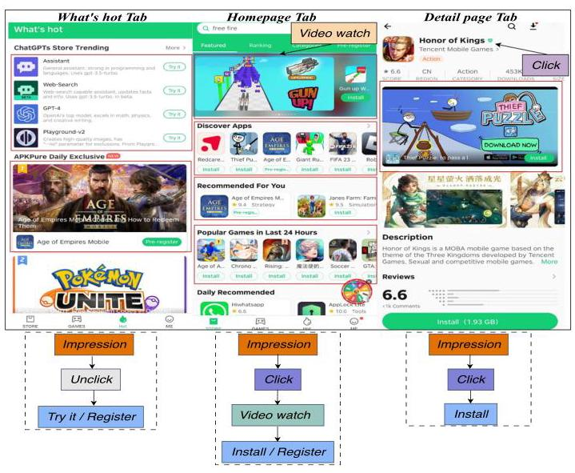
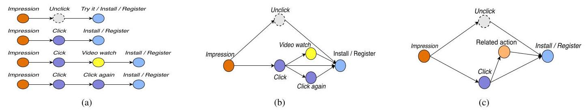
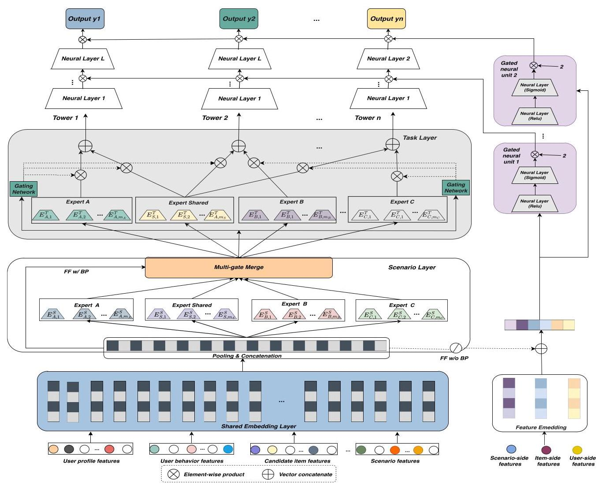
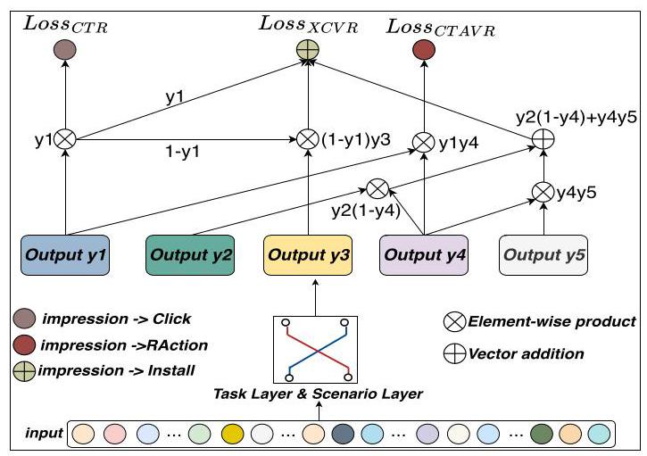
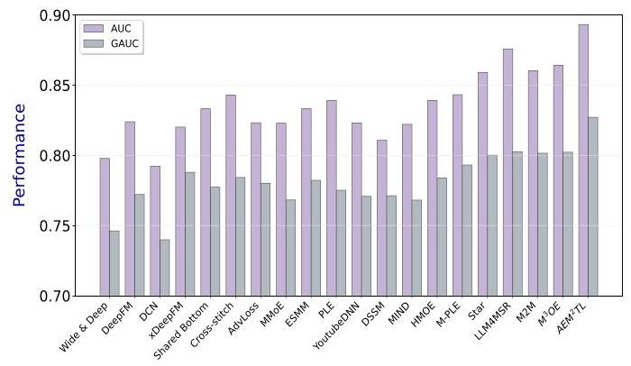
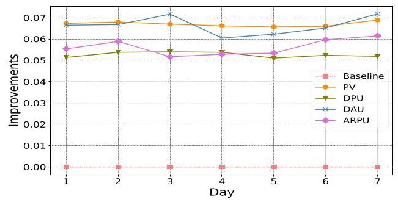

# An Adaptive Entire-Space Multi-Scenario Multi-Task Transfer Learning Model for Recommendations

Qingqing Yi \( \square \) , Jingjing Tang \( \square \) , Xiangyu Zhao \( \square \) , Yujian Zeng, Zengchun Song, and Jia Wu \( \square \) , Senior Member, IEEE

Abstract-Multi-scenario and multi-task recommendation systems efficiently facilitate knowledge transfer across different scenarios and tasks. However, many existing approaches inadequately incorporate personalized information across users and scenarios. Moreover, the conversion rate (CVR) task in multi-task learning often encounters challenges like sample selection bias, resulting from systematic differences between the training and inference sample spaces, and data sparsity due to infrequent clicks. To address these issues, we propose Adaptive Entire-space Multi-scenario Multi-task Transfer Learning model (AEM2TL) with four key modules: 1) Scenario-CGC (Scenario-Customized Gate Control), 2) Task-CGC (Task-Customized Gate Control), 3) Personalized Gating Network, and 4) Entire-space Supervised Multi-Task Module. AEM \( {}^{2} \) TL employs a multi-gate mechanism to effectively integrate shared and specific information across scenarios and tasks, enhancing prediction adaptability. To further improve task-specific personalization, it incorporates personalized prior features and applies a gating mechanism that dynamically scales the top-layer neural units. A novel post-impression behavior decomposition technique is designed to leverage all impression samples across the entire space, mitigating sample selection bias and data sparsity. Furthermore, an adaptive weighting mechanism dynamically allocates attention to tasks based on their relative importance, ensuring optimal task prioritization. Extensive experiments on one industrial and two real-world public datasets indicate the superiority of AEM \( {}^{2} \) TL over state-of-the-art methods.

Index Terms-Recommendation systems, multi-scenario learning, multi-task learning, post-impression behavior decomposition, personalization.

## I. INTRODUCTION

RECOMMENDATION systems play a pivotal role in providing users with diverse services, including e-commerce [1], social media [2], video streams [3], etc. In the system recommendation phase, the recalled items are ranked using the probability of user interaction across multiple tasks, including click-through rate (CTR) and conversion rate (CVR). Within the user feedback phase, users engage with items in various ways. For example, Fig. 1 illustrates diverse tasks of the App Store, where users may click, register, or install across different pages, considered as distinct scenarios. Recommendation systems are typically required to estimate user interaction probabilities across multiple tasks and scenarios to enhance accuracy.

In traditional recommendation systems, it is common practice to develop distinct models tailored to specific scenarios. However, as the number of scenarios increases, this approach often becomes inefficient in fully utilizing both shared and scenario-specific information [4]. Moreover, independently developing models for each scenario significantly increases the computational costs and maintenance burden during both the training and deployment phases. In contrast, a more scalable solution lies in the joint modeling of multiple scenarios and tasks. This approach not only effectively exploits shared features across different scenarios but also facilitates information sharing and collaboration across multiple tasks, thereby significantly enhancing the overall system performance. Consequently, the development of a unified multi-scenario and multi-task learning framework has emerged as a critical research direction. In real industry, multi-scenario and multi-task learning often occur simultaneously and are more complex than individual multi-task or multi-scenario learning.

In recent years, several studies have achieved noteworthy advancements in this field. For instance, M2M [5] integrated a meta-attention module and a meta-tower module to enhance scenario-specific feature representation and capture the interrelations between scenarios and tasks. Similarly, \( {\mathrm{M}}^{3}\mathrm{{oE}} \) [6] employed multiple expert modules to learn scenario-specific, task-specific, and shared user preferences, thus disentangling the complex dependencies across different scenarios and tasks. HiNet [7] employed a hierarchical knowledge transfer mechanism to extract scenario- and task-level information from coarse to fine, while \( {\mathrm{{AESM}}}^{2} \) [8] constructed a hierarchical architecture by stacking multi-task layers on top of multi-scenario layers.

Despite the notable progress made in multi-scenario and multi-task learning, significant gaps persist in the development of a comprehensive and robust solution. From the perspective of multi-scenario learning, the primary challenge remains the inadequate integration of personalized user features with scenario-specific variations during the modeling process. Current methods often struggle to effectively incorporate critical user-specific preferences—such as historical behaviors and contextual factors—into scenario-specific models, thereby limiting the practical efficacy of these systems in real-world applications. On the other hand, the CVR prediction in multi-task learning consistently encounters two critical challenges: the first is sample selection bias arising from the systematic differences between the training and inference sample spaces [9], and the second is data sparsity resulting from the low frequency of click events [10]. However, these issues have yet to be effectively addressed by existing frameworks, which constrains their overall performance and broader applicability. Therefore, it is crucial to advance the integration of personalized knowledge while developing more effective strategies for mitigating sample selection bias and data sparsity. Such efforts are essential for enhancing the accuracy, scalability, and real-world impact of multi-scenario and multi-task learning systems.

---

Received 28 March 2024; revised 17 November 2024; accepted 26 January 2025. Date of publication 30 January 2025; date of current version 7 March 2025. This work was supported in part by the National Natural Science Foundation of China under Grant 71901179, Grant 72495125, Grant 71991472, and Grant 71910107002, in part by Chengdu Philosophy and Social Sciences Planning Project under Grant 2024BS075, in part by the Academic Degree and Postgraduate Education Reform Project of Southwestern University of Finance and Economics under Grant 2024YJG019, in part by the Guanghua Talent Project of Southwestern University of Finance and Economics Economics and China Scholarship Council under Grant 202406980060. Recommended for acceptance by S. Whang. (Corresponding authors: Jingjing Tang; Xiangyu Zhao.)

Qingqing Yi and Jingjing Tang are with the School of Business Administration, Faculty of Business Administration Southwestern University of Finance and Economics, Chengdu 610074, China, and also with the Big Data Laboratory on Financial Security and Behavior, Laboratory of Philosophy and Social Sciences, Southwestern University of Finance and Economics, Ministry of Education, Chengdu 610074, China (e-mail: yiqingqing@smail.swufe.edu.cn; tjj@swufe.edu.cn).

Xiangyu Zhao is with the City University of Hong Kong, Hong Kong, SAR, China (e-mail: xianzhao@cityu.edu.hk).

Yujian Zeng and Zengchun Song are with the Tencent Group, Shenzhen 518054, China (e-mail: yujianzeng@tencent.com; springsong@tencent.com).

Jia Wu is with the School of Computing, Macquarie University, Sydney, NSW 2113, Australia (e-mail: jia.wu@mq.edu.au).

Digital Object Identifier 10.1109/TKDE.2025.3536334

---

Fig. 1. Representative business scenarios in the App Store. The red rectangles indicate different scenarios. The sequence diagram below illustrates users' behavioral patterns derived from the decomposition of post-impression behaviors.

Given the limitations of existing frameworks in alleviating sample selection bias and data sparsity, a more detailed examination of user behavior is warranted. Based on a comprehensive log analysis, we observed that users frequently engage in post-click behaviors, such as installing or registering after a click. These behaviors exhibit considerable complexity. For example, users may choose to watch videos rather than immediately install or register, depending on varying levels of attraction across different scenarios. Another common behavior is that users may directly register or try the content without clicking after impressions. As shown in Fig. 1, this decomposition of user behavior patterns after impressions reveals significantly more nuance than models based solely on clicks. Recognizing the complexity of these behaviors, we propose an innovative framework for post-impression behavior decomposition by applying conditional probability rules. This framework introduces parallel action pathways for click and conversion tasks, capturing novel sequential user behaviors such as "impression \( \rightarrow \) unclick \( \rightarrow \) conversion" and "impression \( \rightarrow \) click \( \rightarrow \) related action \( \rightarrow \) conversion". By modeling user behavior through graph-based structures, our approach enables a comprehensive utilization of all impression samples, closely aligning the model with real-world user behavior. Furthermore, by incorporating supplementary supervisory signals derived from post-impression behaviors, the framework effectively mitigates challenges posed by data sparsity and sample selection bias. These signals enhance the model's ability to account for the full range of user interactions, improving its performance and applicability in diverse real-world scenarios.

In this paper, we propose an innovative unified ranking model for multi-scenario and multi-task predictions, named Adaptive Entire-space Multi-scenario Multi-task Transfer Learning \( \left( {{\mathrm{{AEM}}}^{2}\mathrm{{TL}}}\right) .{\mathrm{{AEM}}}^{2}\mathrm{{TL}} \) employs a hierarchical structure that strategically integrates four critical modules: 1) Scenario-CGC (Scenario-Customized Gate Control), 2) Task-CGC (Task-Customized Gate Control), 3) Personalized Gating Network, and 4) Entire-space Supervised Multi-Task Module. Specifically, the Scenario-CGC layer first extracts shared and specific scenario information by utilizing distinct expert modules. In the Task-CGC layer, a multi-gate control network is used to learn diverse expert combination patterns across tasks. The outputs from the multi-scenario and multi-task layers are subsequently fed into the entire-space supervised multi-task networks at the top layer. To further enhance personalization within each task tower across diverse scenarios, \( {\mathrm{{AEM}}}^{2}\mathrm{{TL}} \) employs a personalized gating network composed of gated neural units that concatenate prior embeddings, where each hidden unit in the task-specific DNN towers generates customized scaling weights via the gating mechanism. Finally, the CVR and auxiliary probabilities are sequentially assembled in the output layer, following conditional probability rules derived from the entire-space graph structure. To effectively train \( {\mathrm{{AEM}}}^{2}\mathrm{{TL}} \) , adaptive multiple losses are applied to various sub-paths within the graph, guiding the optimization across different tasks and scenarios. The efficiency and robustness of this strategy have been validated through comprehensive experiments, demonstrating significant improvements in accuracy and scalability across diverse recommendation tasks. This paper's primary contributions are outlined as follows:

- We are the first to introduce the concept of post-impression behavior decomposition for comprehensive CVR modeling across the entire space. This innovative approach decomposes post-impression actions into a sequential behavior graph, providing a more nuanced representation of user behavior dynamics.

- We leverage conditional probability rules derived from the post-impression behavior graph to jointly model auxiliary tasks and CVR prediction within a unified multi-scenario and multi-task learning framework.

- \( {\mathrm{{AEM}}}^{2}\mathrm{{TL}} \) effectively mitigates the challenges of sample selection bias and data sparsity by utilizing rich post-impression action data with labels.

- \( {\mathrm{{AEM}}}^{2}\mathrm{{TL}} \) incorporates personalized prior information to adjust multi-task scores, enabling task-specific personalization and improving predictive accuracy across tasks.

- Extensive experiments conducted on two public datasets and one industrial dataset validate the performance of \( {\mathrm{{AEM}}}^{2}\mathrm{{TL}} \) .

## II. Related Work

In this section, we briefly review the related works in two areas: multi-task learning and multi-scenario learning.

## A. Multi-Task Learning

Multi-task learning aims to perform multiple tasks within a single scenario. Multi-task learning architectures are generally classified into parameter-sharing structures and probability transfer structures. The first type employs a parameter-sharing mechanism, wherein shared layers extract useful information for prediction tasks, which is then disseminated to each task-specific tower module. Caruana [11] pioneered the shared-bottom architecture for hard parameter-sharing, yet optimization remains challenging when tasks exhibit weak correlations or conflicts [12]. To address this, researchers have developed soft parameter-sharing approaches to better model the relationships among tasks. Ma et al. [13] introduced MMoE (Multi-gate Mixture-of-Experts), which combined a lightweight gating network with expanded MoE models at the shared-bottom layer. PLE (Progressive Layered Extraction) [12] further reduced harmful parameter interference by integrating both task-shared and task-specific modules into a customized gate control network. Similarly, DMMP (Distillation-based Multi-task Multi-tower learning model for Personalized recommendation) [14] utilized the PLE structure for personalized recommendations during the candidate generation phase.

In contrast, the second category leverages probability transfer structures within the output layers across multiple tasks. ESMM (Entire Space Multi-Task Model) [15] defined the CVR task based on the user's sequential behavior path ("impressions \( \rightarrow \) click \( \rightarrow \) conversion") and introduced two auxiliary networks for CTR and click-through conversion rate (CTCVR). This approach facilitated the application of CVR across the entire space, effectively mitigating sample selection bias [16]. The CTR network, with its abundance of labeled samples, shared features with the CVR network to alleviate data sparsity [17], [18]. However, it still struggles with the scarcity of conversion events in training samples. \( {\mathrm{{ESM}}}^{2} \) (Elaborated Entire Space Supervised Multi-task Model) [18] mitigated this by decomposing post-click behaviors, enabling simultaneous modeling of CVR and auxiliary tasks within an e-commerce framework. Additionally, \( {\mathrm{{HM}}}^{3} \) (Hierarchically Modeling both Micro and Macro behaviors) [19] employed a Bayesian graph to capture both micro and macro task relationships. Zhang et al. [10] combined inverse propensity weighting with a doubly robust estimator for unbiased CVR estimation, while Xi et al. [20] optimized information transfer along extended multi-step conversion paths. Although these methods tackle challenges through causal relationships or sequence dependencies, they often neglect the broader post-impression behavior decomposition beyond click-based analysis. Given that only a small fraction of impressions lead to conversions, this oversight limits the effectiveness of existing methods in reducing sample selection bias and data sparsity.

## B. Multi-Scenario Learning

Multi-scenario learning aims to address single-task learning problems across various scenarios. Multi-scenario recommendation methods are generally divided into two main categories: multi-task learning-based approaches and fine-tuning-based approaches.

The first category leverages multi-task learning-based methods to model both the commonalities and differences across multiple scenarios. For instance, HMoE (Hybrid of implicit and explicit Mixture-of-Experts) [21] mapped data into a shared feature space using the MMoE structure within a multi-scenario framework. SAML (Scenario-aware Mutual Learning) [22] combined scenario-aware feature representation with an auxiliary network for shared knowledge while employing a multi-branch network to capture scenario-specific differences. STAR (Star Topology Adaptive Recommender) [23] introduced a star topology framework to integrate shared and scenario-specific architectures, utilizing central and scenario-specific parameters to identify both commonalities and unique aspects across scenarios. Similarly, SAR-Net (Scenario-Aware Ranking Network) [24] built a unified multi-scenario framework using scenario-aware attention modules to capture scenario-specific features and transfer implicit knowledge through gate fusion. HiNet (Hierarchical Information Extraction Network) [7] exploited a hierarchical structure with multi-gate fusion to separate scenario and task information extraction.

In contrast, the second category employs fine-tuning-based approaches, which first use pre-training to train a shared model on data from all scenarios, then fine-tune this shared model to generate scenario-specific models for each scenario. M2M (Multi-scenario Multi-task Meta learning) [5] utilized dynamic weight meta-learning to tailor parameters for each scenario. PEPNet (Parameter and Embedding Personalized Network) [4] introduced embedding and parameter-customized networks, dynamically adjusting parameters based on a specified gate mechanism in a task-specific and domain-specific manner to address the task and domain seesaw problem. However, existing solutions often require generating numerous parameters, which hinders generalization and complicates model convergence [25], leading to significant storage and computational costs. Additionally, the shared network structure may suffer from insufficient data to fully train the parameters, making model performance highly dependent on the quality and availability of the training data.

## III. PRELIMINARIES

This section defines the notations and formulates the problem setting. In the \( i \) th scenario, the prediction \( {\widehat{y}}_{i}^{j} \) for user \( u \) ’s preference toward item \( m \) in task \( j \) is formulated as:

\[
{\widehat{y}}_{i}^{j} = {\mathrm{f}}_{\mathrm{i}}^{\mathrm{j}}\left( {x,{s}_{i}}\right) , \tag{1}
\]

Fig. 2. Illustration of the user post-impression sequential behavior graph. (a) Various paths from impression to conversion are distinguished, categorizing post-impression behaviors including click/unclick, video watching, subsequent clicks, install, and register. (b) A digraph represents the streamlined conversion process. (c) Post-click activities are merged into a single node, RAction, receiving corresponding supervisory signals.

where \( {s}_{i} \) denotes the scenario indicator for the \( i \) -th scenario, and \( x \) represents the input features, including candidate item features, contextual characteristics, scenario-specific elements, user profiles, and behavior features. Numerical features are first transformed into categorical features, which are then projected into a lower-dimensional vector space to form \( x \) . The prediction \( {\widehat{y}}_{i}^{j} \) is further calculated as:

(2)

\[
{\widehat{y}}_{i}^{j} = {\mathrm{f}}_{\mathrm{i}}^{\mathrm{j}}\left( \left\{  {E\left( {u}_{1}\right) ,\ldots , E\left( {u}_{r}\right)  \oplus  E\left( {m}_{1}\right) ,\ldots }\right. \right.
\]

\[
E\left( {m}_{p}\right)  \oplus  E\left( {c}_{1}\right) ,\ldots , E\left( {c}_{k}\right) {\} }_{{s}_{i}}),
\]

where \( {u}_{1},\ldots ,{u}_{r} \) represent user-specific features, including user ID, profile, and historical behavior, etc. \( {m}_{1},\ldots ,{m}_{p} \) refer to the target item features, such as item ID and item topic, and so forth. \( {c}_{i},\ldots ,{c}_{k} \) denote other context features and combined features. The notation \( \{ {\} }_{{s}_{i}} \) indicates that these features are specific to the \( i \) -th scenario. \( E\left( *\right) \) denotes the shared embedding layer that maps both dense and sparse features into learnable embeddings. This shared embedding layer approach, as detailed in [23], significantly reduces the computational and memory overhead across multiple scenarios. The symbol \( \oplus \) denotes the concatenation of embeddings across different feature types.

## IV. METHODOLOGY

## A. Motivation

A unified multi-scenario and multi-task ranking architecture optimizes metrics across recommendation scenarios by extracting specific and shared knowledge. Understanding user behavior, including various sequential actions following an impression (e.g., direct install, click then install, or video watching before installation), is crucial for refining this architecture. These behavioral paths are illustrated in Fig. 2(a).

To model these actions, we integrate conversion-related behaviors into a multi-task learning framework that captures their sequential dependencies. As shown in Fig. 2(b), actions like video watching or repeated clicks often precede installs. We consolidate these behaviors into a Related Action (RAction) node as demonstrated in Fig. 2(c), which correlates strongly with conversions and uses supervisory signals from user feedback (1 for action performed, 0 for no action). As a result, the conventional behavioral path "impression \( \rightarrow \) click \( \rightarrow \) install" is extended into three paths: "impression \( \rightarrow \) unclick \( \rightarrow \) install", "impression \( \rightarrow \) click \( \rightarrow \) install", and "impression \( \rightarrow \) click \( \rightarrow \) RAction \( \rightarrow \) install". This graph-based structure leverages rich supervisory signals from RAction and all impression samples to mitigate data sparsity and sample selection bias.

## B. Model Architecture

The architecture of our proposed \( {\mathrm{{AEM}}}^{2}\mathrm{{TL}} \) model is illustrated in Fig. 3. It comprises four key modules: 1) Scenario-CGC (Scenario-Customized Gate Control), 2) Task-CGC (Task-Customized Gate Control), 3) Personalized Gating Network, and 4) Entire-space Supervised Multi-Task Module. Each module plays a crucial role in enhancing the model's predictive performance, as described below.

1) Scenario-CGC: Joint modeling of multiple scenarios offers several advantages, such as reducing the need for separate models, lowering deployment costs, and leveraging shared data to mitigate data sparsity while capturing scenario-specific differences. The Scenario-CGC (Scenario-Customized Gate Control) layer plays a pivotal role in this process by transferring and sharing information across scenarios while extracting scenario-specific features using both shared and scenario-specific expert networks. These dual functions collectively establish a strong foundation for enhancing performance in the subsequent layers of the model. Inspired by [12], a customized multi-gate control network is implemented within this layer to capture diverse patterns of expert combinations. The output gating network \( G \) for scenario-shared experts is formulated as follows:

\[
G = \mathop{\sum }\limits_{{k = 1}}^{{K}_{sh}}{w}_{sh}^{k}\left( x\right) {Q}_{sh}^{k}\left( x\right) , \tag{3}
\]

where \( {Q}_{sh}^{k} \) represents the \( k \) th sub-expert network, comprising a multi-layer perceptron (MLP) with an activation function. \( {K}_{sh} \) corresponds to the count of sub-experts in \( {Q}_{sh}\left( \cdot \right) \) , and \( {w}_{sh}^{k}\left( x\right) \) represents the weighting function utilized to calculate the weight vector for the \( k \) th sub-expert network. This function transforms \( x \) linearly with a softmax layer in a straightforward manner:

\[
{w}_{sh}^{k}\left( x\right)  = \operatorname{softmax}\left( {{W}_{sh}^{k}x + {b}_{sh}^{k}}\right) , \tag{4}
\]

where \( {W}_{sh}^{k} \in  {R}^{{K}_{sh} \times  d} \) represents a parameter matrix, and \( d \) denotes the dimensionality of the input representation. Additionally, \( {b}_{sh}^{k} \) corresponds to the bias vector, with a shape of \( {K}_{sh} \times  1 \) .

Fig. 3. The architecture of \( {\mathrm{{AEM}}}^{2}\mathrm{{TL}} \) includes a backbone network with a shared embedding layer, a scenario-customized gate control layer, and a task-customized gate control layer. The personalized gating mechanism integrates personalized priors as input and embeds gated neural units within each task-specific DNN tower to enhance task personalization for diverse users. Finally, the top output layer models CVR prediction and auxiliary tasks using impression samples across the entire space within a multi-task learning framework.

In addition to extracting shared knowledge, each scenario integrates a specific expert network to capture scenario-specific knowledge. This specialized network ensures that the unique characteristics of each scenario are effectively modeled. For the \( i \) th scenario, the output \( {S}_{i} \) from this expert network can be represented as follows:

\[
{S}_{i} = \mathop{\sum }\limits_{{k = 1}}^{{K}_{sp}}{w}_{sp}^{k}\left( x\right) {Q}_{sp}^{k}\left( x\right) \tag{5}
\]

where \( {Q}_{sp}^{k} \) represents the \( k \) -th scenario-specific sub-expert network for the \( i \) th scenario, with \( {K}_{sp} \) denoting the count of \( {Q}_{sp}\left( \cdot \right) \) . \( {w}_{sp}\left( x\right) \) indicates the weighting function computed via a linear transformation and SoftMax:

\[
{w}_{sp}^{k}\left( x\right)  = \operatorname{softmax}\left( {{W}_{sp}^{k}x + {b}_{sp}^{k}}\right) , \tag{6}
\]

where \( {W}_{sp}^{k} \in  {R}^{{K}_{sp} \times  d} \) is a parameter matrix and \( {b}_{sp}^{k} \) is the bias vector with dimensions \( {K}_{sp} \times  1 \) . In summary, the combined output \( {M}_{i} \) of the scenario layer is given by \( {M}_{i} = \operatorname{Concat}\left\lbrack  {G,{S}_{i}}\right\rbrack \) .

2) Task-CGC: Alleviating parameter interference between shared and task-specific information in multi-task learning is a significant challenge. The Task-CGC (Task-Customized Gate Control) module, inspired by Tang et al. [12], addresses this issue by employing both task-shared and task-specific expert networks. Task-shared networks are designed to capture common knowledge across tasks within the current scenario, while task-specific networks focus on extracting unique information pertinent to each task. The final output is generated through a gating network that aggregates weighted sums from all experts. To further ensure that cross-scenario task interference is minimized, the output \( {M}_{i} \) from the previous layer for the \( i \) th scenario is utilized as the input for the scenario-specific CGC network. The input \( {T}_{i}^{j} \) for the \( j \) th task in the \( i \) th scenario is defined as follows:

\[
{T}_{i}^{j} = {\delta }_{i}^{j}\left( {M}_{i}\right) \left\lbrack  {{E}_{ts}^{i}\left( {C}_{i}\right) \parallel {E}_{tp}^{ij}\left( {C}_{i}\right) }\right\rbrack  , \tag{7}
\]

where \( {E}_{ts}^{i}\left( {M}_{i}\right) \) and \( {E}_{tp}^{ij}\left( {M}_{i}\right) \) represent the collection of task-shared experts and task-specific experts (for task \( j \) ) within the \( i \) th scenario, respectively. The gating network \( {\delta }_{i}^{j}\left( {M}_{i}\right) \) computes the weight vector for task \( j \) through linear transformation and a SoftMax layer:

\[
{\delta }_{i}^{j}\left( {M}_{i}\right)  = \operatorname{softmax}\left( {{W}_{i}^{j}{M}_{i}}\right) , \tag{8}
\]

where \( {W}_{i}^{j} \in  {R}^{\left( {{m}_{i} + {n}_{i}^{j}}\right)  \times  {d}^{\prime }} \) denotes the parameter matrix. \( {m}_{i} \) and \( {n}_{i}^{j} \) represent the numbers of \( {E}_{ts}^{i}\left( {M}_{i}\right) \) and \( {E}_{tp}^{ij}\left( {M}_{i}\right) \) , respectively. Additionally, \( {d}^{\prime } \) represents the dimension of \( {M}_{i} \) .

The prediction of the \( j \) th task within the \( i \) th scenario is:

\[
{\widehat{y}}_{i}^{j}\left( x\right)  = {\tau }_{i}^{j}\left( {T}_{i}^{j}\right) , \tag{9}
\]

Where \( {\tau }_{i}^{j}\left( \cdot \right) \) denotes the MLP-based tower network for the \( j \) -th task in the \( i \) -th scenario. The CGC method improves knowledge acquisition by enabling task-specific experts to focus on diverse information without cross-task interference. Furthermore, CGC dynamically merges representations using gating networks, offering adaptable task balance and improved handling of task conflicts and sample-dependent correlations.

3) Personalized Gating Network: More accurate personalization enhances user preference information across task-specific towers in various scenarios. However, using personalized priors as bottom inputs often weakens their impact at higher network layers [4]. To address this, \( {\mathrm{{AEM}}}^{2}\mathrm{{TL}} \) introduces a personalized gating mechanism at the top task tower that combines personalized prior embeddings with gated neural units, drawing inspiration from LHUC (Learning Hidden Unit Contributions) [26] and PEPNet [4]. This mechanism customizes network parameters for each task tower by scaling features according to personalized indicators. It amplifies influential features while diminishing less important ones. The scaling ratios for each personalized feature are dynamically computed through a gating network, ensuring that the most relevant information is emphasized throughout the network.

The gated neural unit consists of two neural network layers. Let \( {h}^{\left( 0\right) } \) denote the input, with \( {\mathbf{W}}^{\left( 0\right) } \) and \( {\mathbf{b}}^{\left( 0\right) } \) denoting the weight and bias for the initial layer, respectively. The first layer applies the ReLU activation function defined as follows:

\[
{h}_{1} = \operatorname{Relu}\left( {{\mathbf{h}}^{\left( 0\right) }{\mathbf{W}}^{\left( 0\right) } + {\mathbf{b}}^{\left( 0\right) }}\right) , \tag{10}
\]

Subsequently, the gated neural unit utilizes the Sigmoid function to produce a gate, with output constrained within the interval [0, 1] for bounded results. The formulation of the second layer is:

\[
{h}_{2} = \gamma  * \operatorname{Sigmoid}\left( {{h}^{\left( 1\right) }{\mathbf{W}}^{\left( 1\right) } + {\mathbf{b}}^{\left( 1\right) }}\right) ,{h}_{2} \in  \left\lbrack  {0,\gamma }\right\rbrack  , \tag{11}
\]

where the hyperparameter \( \gamma \) is set to 2, and \( {\mathbf{W}}^{\left( 1\right) } \) and \( {\mathbf{b}}^{\left( 1\right) } \) denote the weight and bias for the second layer, respectively. The gate dynamically constrains the output to \( \left\lbrack  {0,1}\right\rbrack \) by mapping personalized priors to scaling weights between 0 and 2 , with a default value of 1. A default output implies no additional need for personalized information extraction. From (10) and (11), the gating vector is generated by the gated neural unit based on previous information \( {x}^{\left( 0\right) } \) , further amplifying the effective signal through the hyperparameter \( \gamma \) .

Subsequently, we will elaborate on how the gating mechanism integrates with various top-layer DNN towers, utilizing features that incorporate personalized priors as inputs. Specifically, user-side and item-side information \( \left( {{uf}/{if}}\right) \) , along with scenario-specific personalized priors \( \left( {sf}\right) \) , are concatenated in the embedding layer. This includes features such as user ID, age, gender, login/click/install statistics, item ID, tag, category, popularity, scenario ID, style, and statistical features, among others. These concatenated features form a comprehensive input that enables the model to tailor its outputs to specific user and scenario contexts. The personalized gating structure that processes these features is as follows:

\[
{\mathbf{E}}_{\text{ prior }} = E\left( {uf}\right)  \oplus  E\left( {if}\right)  \oplus  E\left( {sf}\right) ,
\]

\[
{\delta }_{\text{ task }} = {\mathcal{U}}_{pp}\left( {{\mathbf{E}}_{\text{ prior }} \oplus  \left( {\oslash \left( {\mathbf{E}}_{ep}\right) }\right) }\right) . \tag{12}
\]

where \( E\left( {uf}\right)  \in  {\mathbb{R}}^{u}, E\left( {if}\right)  \in  {\mathbb{R}}^{i}, E\left( {sf}\right)  \in  {\mathbb{R}}^{s} \) . The personalized gating mechanism concatenates the original output of the left-side model with features \( {\mathbf{E}}_{\text{ prior }} \) containing robust personalized priors. The back-propagation of \( {\mathbf{E}}_{ep} \) is excluded to prevent interference with the original embeddings. The gating unit \( {\mho }_{pp} \) is specifically designed to personalize parameters within the DNN layers. In contrast to conventional models, which treat all hidden units identically by feeding them into the subsequent layer, our approach employs element-wise multiplication to selectively enhance the valid signals. This method allows for more precise and effective signal processing, as depicted below:

\[
{\mathbf{E}}_{pp} = {\delta }_{\text{ task }} \otimes  \mathbf{H}, \tag{13}
\]

where \( \mathbf{H} \) represents the hidden unit within each DNN layer for the task towers.

Subsequently, the top-layer DNN hidden units in each task tower are dynamically adjusted through the gating mechanism. These adjustments are then applied to the next layer. For each task, the previously described \( {\mathbf{E}}_{pp}^{l} \) is incorporated into the \( l \) th layer of every DNN task tower, which further enhances task-specific personalization. This process can be mathematically described as follows:

\[
{\mathbf{E}}_{pp}^{\left( l\right) } = {\delta }_{\text{ task }}^{\left( l\right) } \otimes  {\mathbf{H}}^{\left( l\right) },
\]

\[
{\mathbf{E}}_{pp}^{\left( l + 1\right) } = \xi \left( {{\mathbf{E}}_{pp}^{\left( l\right) }{\mathbf{W}}^{\left( l\right) } + {\mathbf{b}}^{\left( l\right) }}\right) , l \in  \{ 1,\ldots , m\} \tag{14}
\]

where \( \xi \) represents the activation function and \( m \) is the total number of DNN layers in each task tower.

4) Entire-Space Supervised Multi-Task Module: This module leverages the outputs from scenario and task layers to derive the final probability decomposition. The decomposition of user behavior after impressions captures user preferences throughout the entire engagement process. Specifically, the module introduces the conditional probability decomposition of CVR and associated auxiliary tasks, based on the decomposed sub-targets within the user behavior graph, as illustrated in Fig. 2(c). By utilizing this graph, the model can incorporate supervisory signals from post-impression behaviors and make full use of all impression samples across the entire space. The conditional probability of post-impression CTR, denoted as \( {p}_{i}^{ctr} \) , corresponds to the path "impression \( \rightarrow \) click" in the digraph, and is formulated as follows:

\[
{p}_{i}^{ctr} = p\left( {{c}_{i} = 1 \mid  {v}_{i} = 1}\right)  \triangleq  {y}_{1i} \tag{15}
\]

where \( {c}_{i} \in  C \) indicates whether the \( i \) th item \( {x}_{i} \) is clicked \( \left( {{c}_{i} \in  }\right. \; \{ 0,1\} \) ), and \( C \) represents the label space indicating whether each item is clicked or not. \( i \) ranges from 1 to \( N \) , with \( N \) representing the entire count of items. Likewise, \( {v}_{i} \in  V \) signifies whether the \( i \) th item \( {x}_{i} \) is under impressions, where \( V \) representing the label space for all items being viewed or not. The symbol \( {y}_{1i} \) serves as a streamlined surrogate. In the digraph, the path "impression \( \rightarrow \) unclick" can be mathematically expressed as:

\[
{p}_{i}^{\text{ unctr }} = p\left( {{c}_{i} = 0 \mid  {v}_{i} = 1}\right)  \triangleq  1 - {y}_{1i}. \tag{16}
\]

Accordingly, the conditional probability of being installed without clicking is denoted as \( {p}_{i}^{\text{ uncvr }} \) , which represents the path "impression \( \rightarrow \) unclick \( \rightarrow \) install" within the digraph. This can be mathematically expressed as:

\[
{p}_{i}^{\text{ uncvr }} = p\left( {{d}_{i} = 1 \mid  {v}_{i} = 1,{c}_{i} = 0}\right)
\]

\[
= p\left( {{d}_{i} = 1 \mid  {v}_{i} = 1,{c}_{i} = 0}\right) p\left( {{c}_{i} = 0 \mid  {v}_{i} = 1}\right)
\]

\[
\triangleq  {y}_{3i}\left( {1 - {y}_{1i}}\right) , \tag{17}
\]

where \( {y}_{3i} = p\left( {{d}_{i} = 1 \mid  {v}_{i} = 1,{c}_{i} = 0}\right) \) represents the path "unclick \( \rightarrow \) install".

Subsequently, for an item \( {x}_{i} \) , the conditional probability of click-through Related Action (ctavr) is denoted as \( {p}_{i}^{\text{ ctavr }} \) . This corresponds to the path "impression \( \rightarrow \) click \( \rightarrow \) RAction and is mathematically expressed as follows:

\[
{p}_{i}^{\text{ ctavr }} = p\left( {{a}_{i} = 1 \mid  {v}_{i} = 1}\right)
\]

\[
= \mathop{\sum }\limits_{{{c}_{i} \in  \{ 0,1\} }}p\left( {{a}_{i} = 1 \mid  {v}_{i} = 1,{c}_{i}}\right) p\left( {{c}_{i} \mid  {v}_{i} = 1}\right)
\]

\[
= p\left( {{a}_{i} = 1 \mid  {v}_{i} = 1,{c}_{i} = 0}\right) p\left( {{c}_{i} = 0 \mid  {v}_{i} = 1}\right)
\]

\[
+ p\left( {{a}_{i} = 1 \mid  {v}_{i} = 1,{c}_{i} = 1}\right) p\left( {{c}_{i} = 1 \mid  {v}_{i} = 1}\right)
\]

\[
\triangleq  {y}_{4i}{y}_{1i} \tag{18}
\]

where \( {a}_{i} \in  A \) represents whether the \( i \) th item \( {x}_{i} \) undergoes related actions, with \( {a}_{i} \in  0,1 \) and \( A \) indicating the label space of related actions. Notably, no action occurs without a click, i.e., \( p\left( {{a}_{i} = 1 \mid  {v}_{i} = 1,{c}_{i} = 0}\right)  = 0 \) . The path "click \( \rightarrow \) RAction" is represented by the formula \( {y}_{4i} = p\left( {{a}_{i} = 1 \mid  {v}_{i} = 1,{c}_{i} = 1}\right) \) , denoting the conditional probability of specific related actions occurring given that an item has been clicked.

Similarly, the conditional probability of an item \( {x}_{i} \) being installed given that it has been clicked is defined as \( {p}_{i}^{cvr} \) :

\[
{p}_{i}^{cvr} = p\left( {{d}_{i} = 1 \mid  {c}_{i} = 1}\right)
\]

\[
= \mathop{\sum }\limits_{{{a}_{i} \in  \{ 0,1\} }}p\left( {{d}_{i} = 1 \mid  {c}_{i} = 1,{a}_{i}}\right) p\left( {{a}_{i} \mid  {c}_{i} = 1}\right)
\]

\[
= p\left( {{d}_{i} = 1 \mid  {c}_{i} = 1,{a}_{i} = 0}\right) p\left( {{a}_{i} = 0 \mid  {c}_{i} = 1}\right)
\]

\[
+ p\left( {{d}_{i} = 1 \mid  {c}_{i} = 1,{a}_{i} = 1}\right) p\left( {{a}_{i} = 1 \mid  {c}_{i} = 1}\right)
\]

\[
\triangleq  {y}_{2i}\left( {1 - {y}_{4i}}\right)  + {y}_{4i}{y}_{5i}, \tag{19}
\]

where \( {b}_{i} \in  \{ 0,1\} , D \) represents the label space containing all items that are installed, and \( {b}_{i} \in  D \) indicates whether the \( i \) th item \( {x}_{i} \) is installed or not. The path "click \( \rightarrow \) install" within the digraph is represented by the symbol \( {y}_{2i} = p\left( {{d}_{i} = 1 \mid  {c}_{i} = }\right. \; \left. {1,{a}_{i} = 0}\right) \) , which corresponds to the conditional probability of installing when an item has been clicked with no particular associated actions. Additionally, \( {y}_{5i} = p\left( {{d}_{i} = 1 \mid  {c}_{i} = 1,{a}_{i} = 1}\right) \) depicts the conditional probability of installing while an item has been clicked and specific related actions have been performed. This represents the path "click \( \rightarrow \) RAction \( \rightarrow \) install" in the digraph.

The probability of CTCVR represents the conditional probability of an item \( {x}_{i} \) being installed, assuming that it has been viewed. This can be illustrated by the digraph's paths "impression \( \rightarrow \) click \( \rightarrow \) RAction \( \rightarrow \) install" and "impression \( \rightarrow \) click \( \rightarrow \) install". Mathematically, this can be expressed as follows:

\[
{p}_{i}^{\text{ ctcvr }} = p\left( {{d}_{i} = 1 \mid  {v}_{i} = 1,{c}_{i} = 1}\right)
\]

\[
= \mathop{\sum }\limits_{{{a}_{i} \in  \{ 0,1\} }}p\left( {{d}_{i} = 1 \mid  {v}_{i},{c}_{i},{a}_{i}}\right) p\left( {{a}_{i} \mid  {v}_{i},{c}_{i}}\right) p\left( {{c}_{i} \mid  {v}_{i}}\right)
\]

\[
\triangleq  {y}_{2i}\left( {1 - {y}_{4i}}\right) {y}_{1i} + {y}_{4i}{y}_{5i}{y}_{1i}. \tag{20}
\]

Certainly,(20) can be simplified by using \( {v}_{i} \) to represent \( {v}_{i} = 1 \) in the second equality, which does not introduce any ambiguity. This equation can be derived by decomposing the graph "impression \( \rightarrow \) click \( \rightarrow \) RAction or no action \( \rightarrow \) install" into "impression \( \rightarrow \) click" and "click \( \rightarrow \) RAction or no action \( \rightarrow \) install". By applying the chain rule to integrate (15) and (19), we obtain \( {p}_{i}^{ctcvr} = {p}_{i}^{ctr} \cdot  {p}_{i}^{cvr} \) .

The complete graph of the model combines the two components \( {p}_{i}^{\text{ ctcvr }} \) and \( {p}_{i}^{\text{ uncvr }} \) into a unified learning framework, represented as follows:

\[
{p}_{i}^{xcvr} = p\left( {{d}_{i} = 1 \mid  {v}_{i} = 1}\right)
\]

\[
= \mathop{\sum }\limits_{{{c}_{i} \in  \{ 0,1\} }}p\left( {{d}_{i} = 1 \mid  {v}_{i} = 1,{c}_{i}}\right) p\left( {{c}_{i} \mid  {v}_{i} = 1}\right)
\]

\[
= \mathop{\sum }\limits_{{c}_{i}}\mathop{\sum }\limits_{{a}_{i}}p\left( {{d}_{i} = 1 \mid  {v}_{i},{c}_{i},{a}_{i}}\right) p\left( {{a}_{i} \mid  {v}_{i},{c}_{i}}\right) p\left( {{c}_{i} \mid  {v}_{i}}\right)
\]

\[
\triangleq  {y}_{1i}\left( {{y}_{2i}\left( {1 - {y}_{4i}}\right)  + {y}_{4i}{y}_{5i}}\right)  + \left( {1 - {y}_{1i}}\right) {y}_{3i}. \tag{21}
\]

The five hidden probability variables \( {y}_{1i} \) (impression \( \rightarrow \) click), \( {y}_{2i} \) (click \( \rightarrow \) install), \( {y}_{3i} \) (unclick \( \rightarrow \) install), \( {y}_{4i} \) (click \( \rightarrow \) RAction), and \( {y}_{5i} \) (RAction \( \rightarrow \) install) are used to derive the formula for (21). To predict these decomposed sub-targets across the entire sample space simultaneously, a multi-task learning approach is employed, as illustrated in Fig. 4. Subsequently, these sub-targets are sequentially combined to generate the final CVR. Simultaneously, the model can leverage supervisory signals from users' rich post-impression behaviors. This dual approach effectively mitigates both sample selection bias and data sparsity challenges.

## C. Loss Function

The training set is denoted as \( S = {\left. \left\{  \left( {c}_{i},{a}_{i},{b}_{i};{f}_{i}\right) \right\}  \right| }_{i = 1}^{N} \) , where \( {c}_{i},{a}_{i} \) , and \( {b}_{i} \) denote the ground truth labels indicating whether the \( {i}^{\text{ th }} \) impression sample is clicked, whether associated behaviors are taken, and whether it is installed, respectively. The combined post-impression CTR across the entire training samples is thus formulated as:

\[
{p}^{ctr} = \mathop{\prod }\limits_{{i \in  {C}_{ + }}}{p}_{i}^{ctr}\mathop{\prod }\limits_{{j \in  {C}_{ - }}}\left( {1 - {p}_{j}^{ctr}}\right) . \tag{22}
\]

Fig. 4. The diagram of the model across the entire space. The probability variables \( {y}_{1},{y}_{2},{y}_{3},{y}_{4} \) , and \( {y}_{5} \) represent the conditional probabilities on the subpaths in the diagram: impression \( \rightarrow \) click, click \( \rightarrow \) install, unclick \( \rightarrow \) install, click \( \rightarrow \) RAction, and RAction \( \rightarrow \) install, respectively.

Here, \( {C}_{ + } \) and \( {C}_{ - } \) denote the positive and negative samples in the label space \( C \) , respectively. By applying the negative logarithm to (22), the log loss of \( {p}^{ctr} \) is derived as:

\[
{L}_{ctr} =  - \mathop{\sum }\limits_{{i \in  {C}_{ + }}}\log {p}_{i}^{ctr} - \mathop{\sum }\limits_{{j \in  {C}_{ - }}}\log \left( {1 - {p}_{j}^{ctr}}\right) . \tag{23}
\]

Similarly, the loss functions for \( {p}^{\text{ ctavr }} \) and \( {p}^{\text{ xcvr }} \) are expressed as:

\[
{L}_{\text{ ctavr }} =  - \mathop{\sum }\limits_{{i \in  {A}_{ + }}}\log {p}_{i}^{\text{ ctavr }} - \mathop{\sum }\limits_{{j \in  {A}_{ - }}}\log \left( {1 - {p}_{j}^{\text{ ctavr }}}\right) , \tag{24}
\]

and

\[
{L}_{xcvr} =  - \mathop{\sum }\limits_{{i \in  {B}_{ + }}}\log {p}_{i}^{xcvr} - \mathop{\sum }\limits_{{j \in  {B}_{ - }}}\log \left( {1 - {p}_{j}^{xcvr}}\right) . \tag{25}
\]

The ultimate training objective to be minimized is defined as:

\[
L\left( \Theta \right)  = {w}_{ctr} \times  {L}_{ctr} + {w}_{ctavr} \times  {L}_{ctavr} + {w}_{xcvr} \times  {L}_{xcvr},
\]

(26)

where \( \Theta  = \left\{  {{\theta }_{j},\forall j \in  {\Lambda }_{f}}\right\}   \cup  \left\{  {{\vartheta }_{i}, i = 1,2,3,4,5}\right\} \) represents all network parameters in \( {\mathrm{{AEM}}}^{2}\mathrm{{TL}} \) . The loss weights \( {w}_{ctr} \) , \( {w}_{\text{ ctavr }} \) , and \( {w}_{\text{ xcvr }} \) are all initially set to 1 . Inspired by the robust performance of gradient tuning in GradNorm (Gradient Normalization) [27] for training multiple tasks, we combine multiple loss functions with adaptive weights for simultaneous task learning as follows:

\[
L\left( \Theta \right)  = \sum {w}_{i}\left( t\right) {L}_{i}\left( t\right) \tag{27}
\]

The desired gradient norm for each task is calculated as:

\[
{G}_{W}^{\left( i\right) }\left( t\right)  \mapsto  {\bar{G}}_{W}\left( t\right)  \times  {\left\lbrack  {r}_{i}\left( t\right) \right\rbrack  }^{\alpha }, \tag{28}
\]

TABLE I

STATISTICS INFORMATION ABOUT THE INDUSTRIAL DATASET FOR ALL SCENARIOS

<table><tr><td></td><td>All</td><td>S-C1</td><td>S-C2</td><td>S-C3</td><td>S-C4</td><td>S-C5</td><td>S-C6</td></tr><tr><td>impression</td><td>400M</td><td>51M</td><td>15M</td><td>35M</td><td>36M</td><td>55M</td><td>52M</td></tr><tr><td>click</td><td>90M</td><td>4M</td><td>541K</td><td>976K</td><td>482K</td><td>511K</td><td>952K</td></tr><tr><td>install</td><td>42M</td><td>1M</td><td>982K</td><td>783K</td><td>117K</td><td>137K</td><td>165K</td></tr><tr><td>CTR</td><td>22.46%</td><td>7.90%</td><td>3.55%</td><td>2.76%</td><td>1.36%</td><td>0.94%</td><td>1.82%</td></tr><tr><td>CVR</td><td>10.02%</td><td>1.95%</td><td>6.45%</td><td>2.22%</td><td>0.33%</td><td>0.25%</td><td>0.32%</td></tr></table>

where \( W \subset  \mathcal{W} \) represents the subset of the full network weights, and \( \alpha \) is a hyperparameter. The \( {L}_{2} \) norm of the gradient concerning the chosen weights \( W \) for the weighted single-task loss \( \left( {{w}_{i}\left( t\right) {L}_{i}\left( t\right) }\right) \) is given by \( {G}_{W}^{\left( i\right) }\left( t\right)  = {\begin{Vmatrix}{\nabla }_{W}{w}_{i}\left( t\right) {L}_{i}\left( t\right) \end{Vmatrix}}_{2} \) . The mean gradient norm across all tasks at training time \( t \) is denoted by \( {\bar{G}}_{W}\left( t\right)  = {E}_{\text{ task }}\left\lbrack  {{G}_{W}^{\left( i\right) }\left( t\right) }\right\rbrack \) . GradNorm is then implemented as an \( {L}_{1} \) -based loss function \( {L}_{\text{ grad }} \) across the target and actual gradient norms at each timestep for individual task, which is summed over all tasks:

\[
{L}_{\text{ grad }}\left( {t;{w}_{i}\left( t\right) }\right)  = \mathop{\sum }\limits_{i}{\left| {G}_{W}^{\left( i\right) }\left( t\right)  - {\bar{G}}_{W}\left( t\right)  \times  {\left\lbrack  {r}_{i}\left( t\right) \right\rbrack  }^{\alpha }\right| }_{1}. \tag{29}
\]

This summation extends over all \( n \) tasks.

## D. Discussion on Optimization and Resource Efficiency

This section discusses the optimization and resource efficiency associated with the \( {\mathrm{{AEM}}}^{2}\mathrm{{TL}} \) model. By integrating multiple scenarios and tasks into a unified framework, \( {\mathrm{{AEM}}}^{2}\mathrm{{TL}} \) significantly reduces the necessity for deploying separate models for individual scenarios or tasks. This consolidation alleviates the computational burden of training and maintaining individual models, addressing inefficiencies and computational overhead, particularly in sparse long-tail scenarios where data is limited and model performance tends to degrade. Additionally, the model employs GradNorm [27] during adaptive loss training, which automatically adjusts task-specific loss weights, minimizing the need for manual tuning. By normalizing gradients, \( {\mathrm{{AEM}}}^{2}\mathrm{{TL}} \) facilitates smoother convergence across tasks without imposing additional computational costs [23]. This dynamic adjustment mechanism ensures that the model strikes an optimal balance between performance and efficiency, making it highly effective across diverse tasks and scenarios.

## V. EXPERIMENTS

## A. Datasets

We performed extensive experiments utilizing both two public datasets derived from practical scenarios and one industrial dataset to evaluate the performance of the proposed model.

Public dataset: The public datasets are Ali-mama and Ali-CCP (Alibaba Click and Conversion Prediction).

- Ali-mama: The dataset \( {}^{1} \) is publicly available from Al-imama, where scenarios are categorized based on city levels, labeled as #A1 to #A5 for simplicity.

- Ali-CCP: The Ali-CCP dataset \( {}^{2} \) is gathered from Taobao traffic logs. A contextual feature categorizes the logs into three scenarios based on scenario ID, labeled as #B1 to #B3 for simplicity.

Industrial dataset: The industrial dataset is obtained from the traffic logs of the Tencent APP Store, spanning 15 consecutive days. The training dataset consists of logs recorded between 2022-06-24 and 2022-07-08, with the testing dataset drawn from logs on 2022-07-09. Each log entry also includes users' 30 most recent behaviors, with the entire dataset totaling approximately 1 billion records, and negative sampling is used for data preprocessing. The dataset includes various features such as app features (e.g., ID, category, etc.), user features (e.g., user's behavior sequence features, etc.), scenario features (e.g., statistical features, etc.), and cross features. Scenarios are categorized by Scenario ID, with six representative ones selected for analysis. A filtering mechanism removes low-frequency users and items. Detailed statistics for each scenario are illustrated in Table I.

## B. Model Comparison

1) Single-Task Learning (STL) Models: Wide & Deep [28] combines co-trained wide linear models and DNNs to fuse memorization and generalization within recommender systems.

DeepFM [29] amalgamates the functionalities of factorization machines (FM) with deep learning techniques for feature learning within a neural network framework.

DCN [30] substitutes the FM component of DeepFM with a cross-network mechanism to capture linear cross-feature interactions.

xDeepFM [31] incorporates vector-wise concepts into the cross part of DCN to acquire insights into feature crosses.

2) Multi-Task Learning (MTL) Models: Shared Bottom [11] utilizes hard parameter sharing in bottom layers and employs task-specific towers to generate scores for each task.

Cross-stitch [32] employs linear cross-stitch units to acquire an optimal combination of shared and task-specific hidden-layer embeddings for each task.

AdvLoss [33] mitigates interference between shared and specific latent feature spaces for different tasks through an adversarial loss.

MMoE [13] deals with task differences by combining bottom-layer experts based on input through gating networks.

ESMM [15] specializes in the prediction of CTR/CVR and emphasizes distinct sample spaces for each task.

PLE [12] employs prior knowledge to construct a shared network that can differentiate between shared and task-specific experts.

3) Single-Scenario Learning (SSL) Models: YoutubeDNN [3] utilizes average pooling for user interest extraction and employs a sampled softmax loss function to optimize similarities across users and items.

DSSM [34] constructs a relevance score structure for user and item representation extraction using a two-tower architecture.

MIND [35] employs a capsule network to model and extract diverse user interests.

4) Multi-Scenario Learning (MSL) Models: HMoE [21] modifies MMoE to model predictions for multiple scenarios and optimize task prediction specifically tailored to the current scenario.

M-PLE modifies the multi-task recommender PLE [12] for multi-scenario settings by sharing the input embedding layer across scenarios.

STAR [23] comprises two factorized networks: a scenario-specific network personalized for each scenario and a centered network shared by all scenarios.

LLM4MSR [36] utilizes LLMs and hierarchical meta-networks to improve multi-scenario backbone model performance across all scenarios. In our experiments, we use STAR as the backbone model.

5) Multi-Scenario & Multi-Task Learning (MSL & MTL) Models: M2M [5] utilizes a meta attention module and a meta tower module to improve scenario-specific feature representation and gather scenario-task correlations, respectively.

\( {\mathbf{M}}^{3}\mathbf{{oE}} \) [6] employs three modules with a mixture of experts to capture knowledge related to common, scenario-specific, and task-specific user preferences.

## C. Implementation Details

For a fair comparison, all approaches are optimized using the Adam optimizer with a learning rate of \( {2e} - 5 \) and a batch size of 1024. To optimize resource utilization and accelerate the training process, we employed a distributed training approach across 60 worker nodes. Each node is equipped with 8 CPU cores and 32GB of memory, enabling substantial parallel processing for both data handling and model training. This distributed configuration not only enhances the speed of training iterations but also reduces the total training time to 8 hours, demonstrating the efficiency and scalability of the \( {\mathrm{{AEM}}}^{2}\mathrm{{TL}} \) model in real-world applications.

## D. Results and Discussion

This section demonstrates the performance results of multiple methods on public and industrial datasets. We utilize AUC [37], GAUC [38], and RelaImpr [39] as the evaluation metrics for multiple prediction tasks across scenarios. Table II presents the performance of all methods on the Ali-mama dataset. Table III summarizes the performance of all models on the Ali-CCP dataset. Table IV provides an overview of the overall performance of all models across various scenarios in the public datasets. Table V presents the outcomes on datasets from six different scenarios and Fig. 5 provides an overview of the overall performance on all scenarios in the industrial dataset. As related actions (RAction) serve as auxiliary tasks for conversion, we ultimately compare metrics only for CTR and XCVR. AEM \( {}^{2} \) TL exhibits superior performance compared to other baseline methods in both CTR and CVR tasks across all scenarios and evaluation metrics. This underscores the \( {\mathrm{{AEM}}}^{2}\mathrm{{TL}} \) model’s superiority within multi-scenario and multi-task learning.

---

\( {}^{1} \) [Online]. Available: https://tianchi.aliyun.com/dataset/dataDetail?dataId=56 \( {}^{2} \) [Online]. Available: https://tianchi.aliyun.com/dataset/408

---

TABLE II

COMPARISON OF METHOD PERFORMANCE ON ALI-MAMA DATASET

(a) Evaluation results on the CTR task.

<table><tr><td rowspan="2">Model Type</td><td rowspan="2">Model</td><td colspan="2">Scenario A1</td><td colspan="2">Scenario A2</td><td colspan="2">Scenario A3</td><td colspan="2">Scenario A4</td><td colspan="2">Scenario A5</td></tr><tr><td>AUC</td><td>RelaImpr</td><td>AUC</td><td>RelaImpr</td><td>AUC</td><td>RelaImpr</td><td>AUC</td><td>RelaImpr</td><td>AUC</td><td>RelaImpr</td></tr><tr><td rowspan="4">STL</td><td>Wide & Deep</td><td>0.7102</td><td>-6.20%</td><td>0.7093</td><td>-6.19%</td><td>0.7057</td><td>-8.01%</td><td>0.7027</td><td>-6.20%</td><td>0.7098</td><td>-5.54%</td></tr><tr><td>DeepFM</td><td>0.7125</td><td>-5.18%</td><td>0.7055</td><td>-7.89%</td><td>0.7012</td><td>-10.02%</td><td>0.7071</td><td>-4.16%</td><td>0.7106</td><td>-5.18%</td></tr><tr><td>DCN</td><td>0.7127</td><td>-5.09%</td><td>0.7075</td><td>-6.99%</td><td>0.7091</td><td>-6.48%</td><td>0.7039</td><td>-5.65%</td><td>0.7138</td><td>-3.74%</td></tr><tr><td>xDeepFM</td><td>0.7118</td><td>-5.49%</td><td>0.7057</td><td>-7.80%</td><td>0.7119</td><td>-5.23%</td><td>0.7041</td><td>-5.55%</td><td>0.7201</td><td>-0.90%</td></tr><tr><td rowspan="6">MTL</td><td>Shared Bottom</td><td>0.7029</td><td>-9.46%</td><td>0.7081</td><td>-6.72%</td><td>0.7045</td><td>-8.54%</td><td>0.7092</td><td>-3.19%</td><td>0.7135</td><td>-3.87%</td></tr><tr><td>Cross-stitch</td><td>0.7116</td><td>-5.58%</td><td>0.7169</td><td>-2.78%</td><td>0.7167</td><td>-3.09%</td><td>0.7018</td><td>-6.62%</td><td>0.7101</td><td>-5.40%</td></tr><tr><td>AdvLoss</td><td>0.7119</td><td>-5.44%</td><td>0.7027</td><td>-9.14%</td><td>0.7162</td><td>-3.31%</td><td>0.7094</td><td>-3.10%</td><td>0.7205</td><td>-0.72%</td></tr><tr><td>MMoE</td><td>0.7146</td><td>-4.24%</td><td>0.7155</td><td>-3.41%</td><td>0.7178</td><td>-2.59%</td><td>0.7127</td><td>-1.57%</td><td>0.7123</td><td>-4.41%</td></tr><tr><td>ESMM</td><td>0.7131</td><td>-4.91%</td><td>0.7119</td><td>-5.02%</td><td>0.7106</td><td>-5.81%</td><td>0.7109</td><td>-2.41%</td><td>0.7097</td><td>-5.58%</td></tr><tr><td>PLE</td><td>0.7159</td><td>-3.66%</td><td>0.7152</td><td>-3.54%</td><td>0.7161</td><td>-3.35%</td><td>0.7144</td><td>-0.79%</td><td>0.7215</td><td>-0.27%</td></tr><tr><td rowspan="3">SSL</td><td>YoutubeDNN</td><td>0.7085</td><td>-6.96%</td><td>0.7061</td><td>-7.62%</td><td>0.7172</td><td>-2.86%</td><td>0.7065</td><td>-4.44%</td><td>0.7197</td><td>-1.08%</td></tr><tr><td>DSSM</td><td>0.7062</td><td>-7.99%</td><td>0.7053</td><td>-7.98%</td><td>0.7015</td><td>-9.88%</td><td>0.7131</td><td>-1.39%</td><td>0.7108</td><td>-5.09%</td></tr><tr><td>MIND</td><td>0.7056</td><td>-8.26%</td><td>0.7116</td><td>-5.15%</td><td>0.7037</td><td>-8.90%</td><td>0.7071</td><td>-4.16%</td><td>0.7131</td><td>-4.05%</td></tr><tr><td rowspan="4">MSL</td><td>HMoE</td><td>0.7168</td><td>-3.26%</td><td>0.7156</td><td>-3.36%</td><td>0.7183</td><td>-2.37%</td><td>0.7145</td><td>-0.74%</td><td>0.7218</td><td>-0.14%</td></tr><tr><td>M-PLE</td><td>0.7187</td><td>-2.41%</td><td>0.7147</td><td>-3.77%</td><td>0.7141</td><td>-4.25%</td><td>0.7158</td><td>-0.14%</td><td>0.7198</td><td>-1.04%</td></tr><tr><td>STAR</td><td>0.7218</td><td>-1.03%</td><td>0.7209</td><td>-0.99%</td><td>0.7206</td><td>-1.34%</td><td>0.7153</td><td>-0.37%</td><td>0.7219</td><td>-0.09%</td></tr><tr><td>LLM4MSR</td><td>0.7239</td><td>-0.09%</td><td>0.7231</td><td>0.00%</td><td>0.7236</td><td>0.00%</td><td>0.7159</td><td>-0.09%</td><td>0.7220</td><td>-0.05%</td></tr><tr><td rowspan="2">MSL & MTL</td><td>M2M</td><td>0.7233</td><td>-0.36%</td><td>0.7189</td><td>-1.88%</td><td>0.7192</td><td>-1.97%</td><td>0.7161</td><td>0.00%</td><td>0.7221</td><td>0.00%</td></tr><tr><td>M3oE</td><td>0.7241</td><td>0.00%</td><td>0.7213</td><td>-0.81%</td><td>0.7171</td><td>-2.91%</td><td>0.7144</td><td>-0.79%</td><td>0.7215</td><td>-0.27%</td></tr><tr><td>Ours</td><td>AEM2TL</td><td>0.7299*</td><td>2.59%</td><td>0.7287*</td><td>2.51%</td><td>0.7254*</td><td>0.81%</td><td>0.7198*</td><td>1.71%</td><td>0.7275*</td><td>2.43%</td></tr></table>

<table><tr><td colspan="12">(b) Evaluation results on the CTCVR task.</td></tr><tr><td rowspan="2">Model Type</td><td rowspan="2">Model</td><td colspan="2">Scenario A1</td><td colspan="2">Scenario A2</td><td colspan="2">Scenario A3</td><td colspan="2">Scenario A4</td><td colspan="2">Scenario A5</td></tr><tr><td>AUC</td><td>RelaImpr</td><td>AUC</td><td>RelaImpr</td><td>AUC</td><td>RelaImpr</td><td>AUC</td><td>RelaImpr</td><td>AUC</td><td>RelaImpr</td></tr><tr><td rowspan="4">STL</td><td>Wide & Deep</td><td>0.8311</td><td>-5.45%</td><td>0.8323</td><td>-7.05%</td><td>0.8572</td><td>-4.36%</td><td>0.8289</td><td>-6.48%</td><td>0.8491</td><td>-7.69%</td></tr><tr><td>DeepFM</td><td>0.8255</td><td>-7.05%</td><td>0.8317</td><td>-7.22%</td><td>0.8454</td><td>-7.52%</td><td>0.8245</td><td>-7.73%</td><td>0.8482</td><td>-7.93%</td></tr><tr><td>DCN</td><td>0.8227</td><td>-7.85%</td><td>0.8305</td><td>-7.55%</td><td>0.8524</td><td>-5.65%</td><td>0.8268</td><td>-7.08%</td><td>0.8483</td><td>-7.91%</td></tr><tr><td>xDeepFM</td><td>0.8267</td><td>-6.71%</td><td>0.8309</td><td>-7.44%</td><td>0.8465</td><td>-7.23%</td><td>0.8412</td><td>-2.99%</td><td>0.8552</td><td>-6.08%</td></tr><tr><td rowspan="6">MTL</td><td>Shared Bottom</td><td>0.8358</td><td>-4.11%</td><td>0.8326</td><td>-6.97%</td><td>0.8458</td><td>-7.42%</td><td>0.8229</td><td>-8.19%</td><td>0.8584</td><td>-5.24%</td></tr><tr><td>Cross-stitch</td><td>0.8369</td><td>-3.80%</td><td>0.8304</td><td>-7.58%</td><td>0.8516</td><td>-5.86%</td><td>0.8252</td><td>-7.53%</td><td>0.8535</td><td>-6.53%</td></tr><tr><td>AdvLoss</td><td>0.8327</td><td>-5.00%</td><td>0.8339</td><td>-6.60%</td><td>0.8562</td><td>-4.63%</td><td>0.8271</td><td>-6.99%</td><td>0.8628</td><td>-4.07%</td></tr><tr><td>MMoE</td><td>0.8455</td><td>-1.34%</td><td>0.8485</td><td>-2.52%</td><td>0.8618</td><td>-3.13%</td><td>0.8357</td><td>-4.55%</td><td>0.8698</td><td>-2.22%</td></tr><tr><td>ESMM</td><td>0.8319</td><td>-5.23%</td><td>0.8498</td><td>-2.15%</td><td>0.8552</td><td>-4.90%</td><td>0.8432</td><td>-2.42%</td><td>0.8493</td><td>-7.64%</td></tr><tr><td>PLE</td><td>0.8405</td><td>-2.77%</td><td>0.8536</td><td>-1.09%</td><td>0.8693</td><td>-1.12%</td><td>0.8414</td><td>-2.93%</td><td>0.8669</td><td>-2.99%</td></tr><tr><td rowspan="3">SSL</td><td>YoutubeDNN</td><td>0.8261</td><td>-6.88%</td><td>0.8378</td><td>-5.51%</td><td>0.8461</td><td>-7.34%</td><td>0.8298</td><td>-6.23%</td><td>0.8573</td><td>-5.53%</td></tr><tr><td>DSSM</td><td>0.8313</td><td>-5.40%</td><td>0.8353</td><td>-6.21%</td><td>0.8427</td><td>-8.25%</td><td>0.8413</td><td>-2.96%</td><td>0.8594</td><td>-4.97%</td></tr><tr><td>MIND</td><td>0.8346</td><td>-4.45%</td><td>0.8329</td><td>-6.88%</td><td>0.8518</td><td>-5.81%</td><td>0.8361</td><td>-4.44%</td><td>0.8537</td><td>-6.48%</td></tr><tr><td rowspan="4">MSL</td><td>HMoE</td><td>0.8456</td><td>-1.31%</td><td>0.8537</td><td>-1.06%</td><td>0.8695</td><td>-1.07%</td><td>0.8445</td><td>-2.05%</td><td>0.8729</td><td>-1.40%</td></tr><tr><td>M-PLE</td><td>0.8357</td><td>-4.14%</td><td>0.8492</td><td>-2.32%</td><td>0.8702</td><td>-0.88%</td><td>0.8462</td><td>-1.56%</td><td>0.8711</td><td>-1.88%</td></tr><tr><td>STAR</td><td>0.8479</td><td>-0.66%</td><td>0.8544</td><td>-0.87%</td><td>0.8719</td><td>-0.43%</td><td>0.8509</td><td>-0.23%</td><td>0.8734</td><td>-1.27%</td></tr><tr><td>LLM4MSR</td><td>0.8498</td><td>-0.11%</td><td>0.8568</td><td>-0.20%</td><td>0.8735</td><td>0.00%</td><td>0.8515</td><td>-0.06%</td><td>0.8752</td><td>-0.79%</td></tr><tr><td rowspan="2">MSL & MTL</td><td>M2M</td><td>0.8475</td><td>-0.77%</td><td>0.8551</td><td>-0.67%</td><td>0.8723</td><td>-0.32%</td><td>0.8517</td><td>0.00%</td><td>0.8755</td><td>-0.71%</td></tr><tr><td>M3oE</td><td>0.8502</td><td>0.00%</td><td>0.8575</td><td>0.00%</td><td>0.8687</td><td>-1.29%</td><td>0.8513</td><td>-0.11%</td><td>0.8782</td><td>0.00%</td></tr><tr><td>Ours</td><td>AEM \( {}^{2} \) TL</td><td>0.8608*</td><td>3.03%</td><td>\( {\mathbf{{0.8626}}}^{ \star  } \)</td><td>1.43%</td><td>0.8795 *</td><td>1.61%</td><td>0.8621*</td><td>2.96%</td><td>0.8893*</td><td>2.93%</td></tr></table>

\( {}^{1} \) Bold: the best performance among all models.

2 * denotes statistically significant improvements of the proposed method compared to the best baselines, with a p-value \( < {0.05} \) using paired samples t-test.

## E. A/B Tests

All ranking strategies used in the current production system are integrated into the control setup (Baseline). We use four key online assessment measures: Page View (PV), Downloads Per User (DPU), Daily Active User (DAU), and Average Revenue Per User (ARPU). Fig. 6 summarizes the experimental results in one week. Notably, \( {\mathrm{{AEM}}}^{2}\mathrm{{TL}} \) surpasses baselines across all core metrics.

## F. Ablation Study

To further confirm the effectiveness of critical technological designs in \( {\mathrm{{AEM}}}^{2}\mathrm{{TL}} \) , we conduct ablation studies to compare \( {\mathrm{{AEM}}}^{2}\mathrm{{TL}} \) against the following variant models: w/o Scenario-CGC, w/o Task-CGC, w/o Personalized Gating Network, w/o Entire-space Multi-task Module, and w/o Adaptive Loss. The ablation studies on industrial and public datasets in Table VI demonstrate that all \( {\mathrm{{AEM}}}^{2}\mathrm{{TL}} \) variants contribute to performance improvements over the baselines. The results are summarized as follows: (1) The multi-scenario and multi-task learning architecture plays an important role in \( {\mathrm{{AEM}}}^{2}\mathrm{{TL}} \) . As demonstrated within the performance on different datasets, \( {\mathrm{{AEM}}}^{2}\mathrm{{TL}} \) without Scenario-CGC module and \( {\mathrm{{AEM}}}^{2}\mathrm{{TL}} \) without Task-CGC module are inferior to \( {\mathrm{{AEM}}}^{2}\mathrm{{TL}} \) . This indicates that the Scenario-CGC and Task-CGC modules effectively leverage shared and specific information for scenarios and tasks. (2) \( {\mathrm{{AEM}}}^{2}\mathrm{{TL}} \) without a personalized gating mechanism performs significantly worse compared to \( {\mathrm{{AEM}}}^{2}\mathrm{{TL}} \) . More precise personalization estimates can augment user preference information regarding task-specific towers across various scenarios. (3) The post-impression behavior decomposition outperforms existing methods due to the Entire-space multi-task module, which leverages rich supervisory signals from post-impression behaviors and impression samples. (4) \( {\mathrm{{AEM}}}^{2}\mathrm{{TL}} \) without adaptive loss is inferior to \( {\mathrm{{AEM}}}^{2}\mathrm{{TL}} \) . The robust and effective performance of gradient tuning for multiple tasks ensures that each task is given appropriate focus and balanced weight learning during training.

TABLE III

COMPARISON OF METHOD PERFORMANCE ON ALI-CCP DATASET

<table><tr><td rowspan="2">Model Type</td><td rowspan="2">Model</td><td colspan="2">Scenario B1 (CTR)</td><td colspan="2">Scenario B1 (CTCVR)</td><td colspan="2">Scenario B2 (CTR)</td><td colspan="2">Scenario B2 (CTCVR)</td><td colspan="2">Scenario B3 (CTR)</td><td colspan="2">Scenario B3 (CTCVR)</td></tr><tr><td>AUC</td><td>RelaImpr</td><td>AUC</td><td>RelaImpr</td><td>AUC</td><td>RelaImpr</td><td>AUC</td><td>RelaImpr</td><td>AUC</td><td>RelaImpr</td><td>AUC</td><td>RelaImpr</td></tr><tr><td rowspan="4">STL</td><td>Wide & Deep</td><td>0.5961</td><td>-4.95%</td><td>0.6175</td><td>-4.08%</td><td>0.5822</td><td>-6.48%</td><td>0.6103</td><td>-4.67%</td><td>0.5939</td><td>-5.34%</td><td>0.6047</td><td>-5.42%</td></tr><tr><td>DeepFM</td><td>0.5973</td><td>-3.76%</td><td>0.6177</td><td>-3.92%</td><td>0.5843</td><td>-4.10%</td><td>0.6121</td><td>-3.11%</td><td>0.5925</td><td>-6.75%</td><td>0.6042</td><td>-5.87%</td></tr><tr><td>DCN</td><td>0.5971</td><td>-3.96%</td><td>0.6185</td><td>-3.27%</td><td>0.5851</td><td>-3.19%</td><td>0.6119</td><td>-3.28%</td><td>0.5945</td><td>-4.74%</td><td>0.6017</td><td>-8.13%</td></tr><tr><td>xDeepFM</td><td>0.598</td><td>-3.07%</td><td>0.6184</td><td>-3.35%</td><td>0.5815</td><td>-7.28%</td><td>0.6123</td><td>-2.94%</td><td>0.5942</td><td>-5.04%</td><td>0.6023</td><td>-7.59%</td></tr><tr><td rowspan="6">MTL</td><td>Shared Bottom</td><td>0.5972</td><td>-3.86%</td><td>0.6203</td><td>-1.80%</td><td>0.5821</td><td>-6.60%</td><td>0.6134</td><td>-1.99%</td><td>0.5946</td><td>-4.64%</td><td>0.6059</td><td>-4.34%</td></tr><tr><td>Cross-stitch</td><td>0.5983</td><td>-2.77%</td><td>0.6171</td><td>-4.41%</td><td>0.5823</td><td>-6.37%</td><td>0.6135</td><td>-1.90%</td><td>0.5975</td><td>-1.71%</td><td>0.6092</td><td>-1.36%</td></tr><tr><td>AdvLoss</td><td>0.5982</td><td>-2.87%</td><td>0.6188</td><td>-3.02%</td><td>0.5839</td><td>-4.55%</td><td>0.6099</td><td>-5.01%</td><td>0.5963</td><td>-2.92%</td><td>0.6048</td><td>-5.33%</td></tr><tr><td>MMoE</td><td>0.5975</td><td>-3.56%</td><td>0.6169</td><td>-4.57%</td><td>0.5853</td><td>-2.96%</td><td>0.6133</td><td>-2.07%</td><td>0.5947</td><td>-4.54%</td><td>0.6039</td><td>-6.14%</td></tr><tr><td>ESMM</td><td>0.5966</td><td>-4.45%</td><td>0.6186</td><td>-3.18%</td><td>0.5812</td><td>-7.62%</td><td>0.6132</td><td>-2.16%</td><td>0.5948</td><td>-4.44%</td><td>0.6051</td><td>-5.06%</td></tr><tr><td>PLE</td><td>0.5989</td><td>-2.18%</td><td>0.6199</td><td>-2.12%</td><td>0.5828</td><td>-5.80%</td><td>0.6137</td><td>-1.73%</td><td>0.5952</td><td>-4.03%</td><td>0.6102</td><td>-0.45%</td></tr><tr><td rowspan="3">SSL</td><td>YoutubeDNN</td><td>0.5963</td><td>-4.75%</td><td>0.6183</td><td>-3.43%</td><td>0.5842</td><td>-4.21%</td><td>0.6093</td><td>-5.53%</td><td>0.5931</td><td>-6.15%</td><td>0.6058</td><td>-4.43%</td></tr><tr><td>DSSM</td><td>0.5966</td><td>-4.45%</td><td>0.6176</td><td>-4.00%</td><td>0.5851</td><td>-3.19%</td><td>0.6112</td><td>-3.89%</td><td>0.5973</td><td>-1.92%</td><td>0.6068</td><td>-3.52%</td></tr><tr><td>MIND</td><td>0.5982</td><td>-2.87%</td><td>0.6187</td><td>-3.10%</td><td>0.5814</td><td>-7.39%</td><td>0.6147</td><td>-0.86%</td><td>0.5959</td><td>-3.33%</td><td>0.6067</td><td>-3.61%</td></tr><tr><td rowspan="4">MSL</td><td>HMoE</td><td>0.5977</td><td>-3.36%</td><td>0.6164</td><td>-4.98%</td><td>0.5853</td><td>-2.96%</td><td>0.6145</td><td>-1.04%</td><td>0.5945</td><td>-4.74%</td><td>0.6075</td><td>-2.89%</td></tr><tr><td>M-PLE</td><td>0.5974</td><td>-3.66%</td><td>0.6196</td><td>-2.37%</td><td>0.5841</td><td>-4.32%</td><td>0.6138</td><td>-1.64%</td><td>0.5978</td><td>-1.41%</td><td>0.6083</td><td>-2.17%</td></tr><tr><td>STAR</td><td>0.6004</td><td>-0.69%</td><td>0.6207</td><td>-1.47%</td><td>0.5876</td><td>-0.34%</td><td>0.6151</td><td>-0.52%</td><td>0.5991</td><td>-0.10%</td><td>0.6092</td><td>-1.36%</td></tr><tr><td>LLM4MSR</td><td>0.6011</td><td>0.00%</td><td>0.6225</td><td>0.00%</td><td>0.5878</td><td>-0.11%</td><td>0.6155</td><td>-0.17%</td><td>0.5992</td><td>0.00%</td><td>0.6095</td><td>-1.08%</td></tr><tr><td rowspan="2">MSL & MTL</td><td>M2M</td><td>0.6001</td><td>-0.99%</td><td>0.6183</td><td>-3.43%</td><td>0.5879</td><td>0.00%</td><td>0.6132</td><td>-2.16%</td><td>0.5977</td><td>-1.51%</td><td>0.6107</td><td>0.00%</td></tr><tr><td>\( {\mathrm{M}}^{3}\mathrm{{oE}} \)</td><td>0.5997</td><td>-1.38%</td><td>0.6211</td><td>-1.14%</td><td>0.5865</td><td>-1.59%</td><td>0.6157</td><td>0.00%</td><td>0.5969</td><td>-2.32%</td><td>0.6085</td><td>-1.99%</td></tr><tr><td>Ours</td><td>\( {\mathrm{{AEM}}}^{2}\mathrm{{TL}} \)</td><td>0.6016*</td><td>0.49%</td><td>0.6245*</td><td>1.63%</td><td>0.5901*</td><td>2.50%</td><td>0.6176*</td><td>1.64%</td><td>0.5995</td><td>0.30%</td><td>0.6129*</td><td>1.99%</td></tr></table>

Bold: the best performance among all models.

* denotes statistically significant improvements of the proposed method compared to the best baseline, with a p-value \( < {0.05} \) using paired samples t-test.

TABLE IV

THE OVERALL PERFORMANCE ON ALL SCENARIOS OF PUBLIC DATASETS

<table><tr><td rowspan="2">Model</td><td colspan="2">Ali-mama dataset</td><td colspan="2">Ali-CCP dataset</td></tr><tr><td>AUC_CTR</td><td>AUC_CTCVR</td><td>AUC_CTR</td><td>AUC_CTCVR</td></tr><tr><td>Wide & Deep</td><td>0.6835</td><td>0.8034</td><td>0.6033</td><td>0.6272</td></tr><tr><td>DeepFM</td><td>0.6847</td><td>0.8002</td><td>0.6032</td><td>0.6278</td></tr><tr><td>DCN</td><td>0.6845</td><td>0.8013</td><td>0.6059</td><td>0.6304</td></tr><tr><td>xDeepFM</td><td>0.6865</td><td>0.8005</td><td>0.6044</td><td>0.6394</td></tr><tr><td>Shared Bottom</td><td>0.7053</td><td>0.8157</td><td>0.6043</td><td>0.6339</td></tr><tr><td>Cross-stitch</td><td>0.7121</td><td>0.8421</td><td>0.6061</td><td>0.6393</td></tr><tr><td>AdvLoss</td><td>0.7198</td><td>0.8402</td><td>0.6059</td><td>0.6398</td></tr><tr><td>MMoE</td><td>0.7139</td><td>0.8596</td><td>0.6064</td><td>0.6310</td></tr><tr><td>ESMM</td><td>0.7085</td><td>0.8434</td><td>0.6042</td><td>0.6352</td></tr><tr><td>PLE</td><td>0.7159</td><td>0.8692</td><td>0.6053</td><td>0.6430</td></tr><tr><td>YoutubeDNN</td><td>0.6854</td><td>0.8147</td><td>0.6059</td><td>0.6398</td></tr><tr><td>DSSM</td><td>0.6855</td><td>0.8246</td><td>0.6046</td><td>0.6412</td></tr><tr><td>MIND</td><td>0.6818</td><td>0.8357</td><td>0.6108</td><td>0.6431</td></tr><tr><td>HMoE</td><td>0.7174</td><td>0.8618</td><td>0.6096</td><td>0.6409</td></tr><tr><td>M-PLE</td><td>0.7166</td><td>0.8641</td><td>0.6041</td><td>0.6283</td></tr><tr><td>STAR</td><td>0.7107</td><td>0.8685</td><td>0.6105</td><td>0.6441</td></tr><tr><td>LLM4MSR</td><td>0.7158</td><td>0.8701</td><td>0.6109</td><td>0.6456</td></tr><tr><td>M2M</td><td>0.7201</td><td>0.8689</td><td>0.6113</td><td>0.6397</td></tr><tr><td>M \( {}^{3} \) oE</td><td>0.7218</td><td>0.8702</td><td>0.6109</td><td>0.6422</td></tr><tr><td>AEM \( {}^{2} \) TL</td><td>0.7235*</td><td>0.8713*</td><td>0.6126*</td><td>\( {\mathbf{{0.6478}}}^{ \star  } \)</td></tr></table>

Bold*: the best performance among all models.

Fig. 5. The overall performance on all scenarios in the industrial datasets.

Fig. 6. The online improvements of \( {\mathrm{{AEM}}}^{2}\mathrm{{TL}} \) in one week.

TABLE V

MODEL COMPARISON ON INDUSTRIAL DATASETS

<table><tr><td rowspan="2">Method</td><td colspan="2">Scenario C1 (AUC)</td><td colspan="2">Scenario (GAUC)</td><td colspan="2">Scenario 2 (AUC)</td><td colspan="2">Scenario (GAUC)</td><td colspan="2">Scenario C3 (AUC)</td><td colspan="2">Scenario (GAUC)</td></tr><tr><td>CTR</td><td>XCVR</td><td>CTR</td><td>XCVR</td><td>CTR</td><td>XCVR</td><td>CTR</td><td>XCVR</td><td>CTR</td><td>XCVR</td><td>CTR</td><td>XCVR</td></tr><tr><td>Wide & Deep</td><td>0.6832</td><td>0.8082</td><td>0.6211</td><td>0.7376</td><td>0.6883</td><td>0.8563</td><td>0.6241</td><td>0.7957</td><td>0.6902</td><td>0.8169</td><td>0.6467</td><td>0.7764</td></tr><tr><td>DeepFM</td><td>0.6916</td><td>0.8012</td><td>0.6289</td><td>0.7462</td><td>0.6918</td><td>0.8509</td><td>0.6394</td><td>0.7901</td><td>0.7087</td><td>0.8206</td><td>0.6595</td><td>0.7785</td></tr><tr><td>DCN</td><td>0.6827</td><td>0.8057</td><td>0.6299</td><td>0.7518</td><td>0.6895</td><td>0.8434</td><td>0.6278</td><td>0.7823</td><td>0.7182</td><td>0.8278</td><td>0.6561</td><td>0.7731</td></tr><tr><td>xDeepFM</td><td>0.7006</td><td>0.8074</td><td>0.6328</td><td>0.7579</td><td>0.6947</td><td>0.8605</td><td>0.6329</td><td>0.8026</td><td>0.7139</td><td>0.8277</td><td>0.6503</td><td>0.7683</td></tr><tr><td>Shared Bottom</td><td>0.7185</td><td>0.8354</td><td>0.6387</td><td>0.7632</td><td>0.7023</td><td>0.8630</td><td>0.6498</td><td>0.7982</td><td>0.7082</td><td>0.8701</td><td>0.6533</td><td>0.8124</td></tr><tr><td>Cross-stitch</td><td>0.7108</td><td>0.8449</td><td>0.6445</td><td>0.7889</td><td>0.7018</td><td>0.8707</td><td>0.6494</td><td>0.8098</td><td>0.7107</td><td>0.8712</td><td>0.6532</td><td>0.8017</td></tr><tr><td>AdvLoss</td><td>0.7167</td><td>0.8243</td><td>0.6441</td><td>0.7782</td><td>0.7034</td><td>0.8775</td><td>0.6508</td><td>0.8065</td><td>0.7037</td><td>0.8801</td><td>0.6531</td><td>0.8132</td></tr><tr><td>MMoE</td><td>0.7164</td><td>0.8237</td><td>0.6415</td><td>0.7806</td><td>0.7008</td><td>0.8701</td><td>0.6495</td><td>0.8055</td><td>0.7104</td><td>0.8798</td><td>0.6593</td><td>0.8106</td></tr><tr><td>ESMM</td><td>0.7065</td><td>0.8135</td><td>0.6535</td><td>0.7701</td><td>0.6929</td><td>0.8610</td><td>0.6395</td><td>0.7955</td><td>0.7002</td><td>0.8628</td><td>0.6493</td><td>0.8009</td></tr><tr><td>PLE</td><td>0.7196</td><td>0.8391</td><td>0.6573</td><td>0.7874</td><td>0.7098</td><td>0.8816</td><td>0.6507</td><td>0.8020</td><td>0.7151</td><td>0.8835</td><td>0.6519</td><td>0.8212</td></tr><tr><td>YoutubeDNN</td><td>0.7018</td><td>0.8071</td><td>0.6512</td><td>0.7615</td><td>0.6902</td><td>0.8642</td><td>0.6385</td><td>0.8052</td><td>0.7168</td><td>0.8755</td><td>0.6493</td><td>0.8191</td></tr><tr><td>DSSM</td><td>0.7109</td><td>0.8024</td><td>0.6527</td><td>0.7401</td><td>0.6923</td><td>0.8695</td><td>0.6354</td><td>0.8006</td><td>0.7019</td><td>0.8624</td><td>0.6406</td><td>0.8191</td></tr><tr><td>MIND</td><td>0.7089</td><td>0.8175</td><td>0.6512</td><td>0.7509</td><td>0.6891</td><td>0.8633</td><td>0.6229</td><td>0.8096</td><td>0.7113</td><td>0.8702</td><td>0.6506</td><td>0.8108</td></tr><tr><td>HMOE</td><td>0.7206</td><td>0.8409</td><td>0.6604</td><td>0.7716</td><td>0.7108</td><td>0.8801</td><td>0.6515</td><td>0.8078</td><td>0.7132</td><td>0.8781</td><td>0.6592</td><td>0.8176</td></tr><tr><td>M-PLE</td><td>0.7197</td><td>0.8516</td><td>0.6603</td><td>0.7612</td><td>0.7029</td><td>0.8776</td><td>0.6501</td><td>0.8091</td><td>0.7139</td><td>0.8721</td><td>0.6509</td><td>0.8210</td></tr><tr><td>STAR</td><td>0.7273</td><td>0.8675</td><td>0.6608</td><td>0.7928</td><td>0.7103</td><td>0.8710</td><td>0.6424</td><td>0.8102</td><td>0.7176</td><td>0.8818</td><td>0.6529</td><td>0.8199</td></tr><tr><td>LLM4MSR</td><td>0.7276</td><td>0.8699</td><td>0.6611</td><td>0.7978</td><td>0.7122</td><td>0.8789</td><td>0.6569</td><td>0.8106</td><td>0.7196</td><td>0.8849</td><td>0.6579</td><td>0.8233</td></tr><tr><td>M2M</td><td>0.7256</td><td>0.8682</td><td>0.6613</td><td>0.7955</td><td>0.7112</td><td>0.8765</td><td>0.6498</td><td>0.8104</td><td>0.7198</td><td>0.8794</td><td>0.6531</td><td>0.8258</td></tr><tr><td>M \( {}^{3} \) oE</td><td>0.7279</td><td>0.8704</td><td>0.6605</td><td>0.8002</td><td>0.7109</td><td>0.8794</td><td>0.6487</td><td>0.8095</td><td>0.7188</td><td>0.8856</td><td>0.6602</td><td>0.8277</td></tr><tr><td>AEM \( {}^{2} \) TL</td><td>0.7324*</td><td>0.8792*</td><td>0.6621*</td><td>0.8089*</td><td>0.7126*</td><td>0.8849*</td><td>0.6565</td><td>0.8110*</td><td>0.7279*</td><td>0.8933*</td><td>0.6652*</td><td>0.8325*</td></tr></table>

<table><tr><td rowspan="2">Method</td><td colspan="2">Scenario C4 (AUC)</td><td colspan="2">Scenario (GAUC)</td><td colspan="2">Scenario 5 (AUC)</td><td colspan="2">Scenario C5 (GAUC)</td><td colspan="2">Scenario C6 (AUC)</td><td colspan="2">Scenario (GAUC)</td></tr><tr><td>CTR</td><td>XCVR</td><td>CTR</td><td>XCVR</td><td>CTR</td><td>XCVR</td><td>CTR</td><td>XCVR</td><td>CTR</td><td>XCVR</td><td>CTR</td><td>XCVR</td></tr><tr><td>Wide & Deep</td><td>0.6925</td><td>0.8102</td><td>0.6213</td><td>0.7571</td><td>0.7073</td><td>0.8349</td><td>0.6341</td><td>0.7645</td><td>0.6861</td><td>0.8260</td><td>0.6463</td><td>0.7808</td></tr><tr><td>DeepFM</td><td>0.6886</td><td>0.8127</td><td>0.6239</td><td>0.7621</td><td>0.7098</td><td>0.8219</td><td>0.6332</td><td>0.7901</td><td>0.6787</td><td>0.8291</td><td>0.6415</td><td>0.7819</td></tr><tr><td>DCN</td><td>0.6887</td><td>0.8217</td><td>0.6401</td><td>0.7623</td><td>0.6985</td><td>0.8283</td><td>0.6379</td><td>0.7631</td><td>0.6782</td><td>0.8351</td><td>0.6261</td><td>0.7893</td></tr><tr><td>xDeepFM</td><td>0.6913</td><td>0.8242</td><td>0.6328</td><td>0.7679</td><td>0.7069</td><td>0.8343</td><td>0.6419</td><td>0.7925</td><td>0.6826</td><td>0.8419</td><td>0.6332</td><td>0.7817</td></tr><tr><td>Shared Bottom</td><td>0.7285</td><td>0.8481</td><td>0.6517</td><td>0.7851</td><td>0.7122</td><td>0.8601</td><td>0.6571</td><td>0.7913</td><td>0.7093</td><td>0.8521</td><td>0.6503</td><td>0.7924</td></tr><tr><td>Cross-stitch</td><td>0.7301</td><td>0.8512</td><td>0.6541</td><td>0.7889</td><td>0.7031</td><td>0.8612</td><td>0.6609</td><td>0.7964</td><td>0.6939</td><td>0.8487</td><td>0.6442</td><td>0.7981</td></tr><tr><td>AdvLoss</td><td>0.7208</td><td>0.8339</td><td>0.6541</td><td>0.7881</td><td>0.6998</td><td>0.8597</td><td>0.6508</td><td>0.7894</td><td>0.6815</td><td>0.8332</td><td>0.6335</td><td>0.7902</td></tr><tr><td>MMoE</td><td>0.7313</td><td>0.8451</td><td>0.6515</td><td>0.7896</td><td>0.7028</td><td>0.8610</td><td>0.6491</td><td>0.7951</td><td>0.7064</td><td>0.8491</td><td>0.6503</td><td>0.7897</td></tr><tr><td>ESMM</td><td>0.7264</td><td>0.8392</td><td>0.6452</td><td>0.7839</td><td>0.7012</td><td>0.8511</td><td>0.6353</td><td>0.7963</td><td>0.6964</td><td>0.8512</td><td>0.6523</td><td>0.8013</td></tr><tr><td>PLE</td><td>0.7316</td><td>0.8494</td><td>0.6613</td><td>0.7974</td><td>0.7131</td><td>0.8606</td><td>0.6391</td><td>0.7993</td><td>0.7059</td><td>0.8428</td><td>0.6502</td><td>0.7953</td></tr><tr><td>YoutubeDNN</td><td>0.7108</td><td>0.8301</td><td>0.6424</td><td>0.7911</td><td>0.7112</td><td>0.8441</td><td>0.6556</td><td>0.7853</td><td>0.6954</td><td>0.8251</td><td>0.6403</td><td>0.7891</td></tr><tr><td>DSSM</td><td>0.7109</td><td>0.8172</td><td>0.6582</td><td>0.7932</td><td>0.7125</td><td>0.8471</td><td>0.6541</td><td>0.7909</td><td>0.7014</td><td>0.8302</td><td>0.6439</td><td>0.7977</td></tr><tr><td>MIND</td><td>0.7213</td><td>0.8131</td><td>0.6635</td><td>0.7901</td><td>0.7195</td><td>0.8534</td><td>0.6654</td><td>0.7952</td><td>0.6915</td><td>0.8321</td><td>0.6336</td><td>0.7852</td></tr><tr><td>HMOE</td><td>0.7314</td><td>0.8514</td><td>0.6646</td><td>0.8012</td><td>0.7189</td><td>0.8642</td><td>0.6695</td><td>0.8002</td><td>0.7119</td><td>0.8581</td><td>0.6539</td><td>0.8160</td></tr><tr><td>M-PLE</td><td>0.7293</td><td>0.8529</td><td>0.6575</td><td>0.8009</td><td>0.7128</td><td>0.8531</td><td>0.6621</td><td>0.7965</td><td>0.7085</td><td>0.8689</td><td>0.6437</td><td>0.8070</td></tr><tr><td>STAR</td><td>0.7324</td><td>0.8635</td><td>0.6618</td><td>0.8015</td><td>0.7201</td><td>0.8609</td><td>0.6734</td><td>0.7981</td><td>0.7106</td><td>0.8797</td><td>0.6521</td><td>0.8119</td></tr><tr><td>LLM4MSR</td><td>0.7341</td><td>0.8675</td><td>0.6635</td><td>0.8077</td><td>0.7203</td><td>0.8698</td><td>0.6741</td><td>0.7994</td><td>0.7116</td><td>0.8802</td><td>0.6575</td><td>0.8163</td></tr><tr><td>M2M</td><td>0.7256</td><td>0.8702</td><td>0.6603</td><td>0.8086</td><td>0.7205</td><td>0.8745</td><td>0.6687</td><td>0.7992</td><td>0.7115</td><td>0.8712</td><td>0.6586</td><td>0.8134</td></tr><tr><td>M \( {}^{3} \) oE</td><td>0.7311</td><td>0.8698</td><td>0.6615</td><td>0.7953</td><td>0.7197</td><td>0.8804</td><td>0.6706</td><td>0.8008</td><td>0.7112</td><td>0.8805</td><td>0.6597</td><td>0.8176</td></tr><tr><td>AEM \( {}^{2} \) TL</td><td>0.7363*</td><td>\( \mathbf{{0.8879}^{ \star  }} \)</td><td>0.6712*</td><td>0.8160*</td><td>0.7217*</td><td>0.8928*</td><td>\( \mathbf{{0.6746}} \star \)</td><td>0.8019*</td><td>0.7138*</td><td>0.8883*</td><td>0.6632*</td><td>0.8293*</td></tr></table>

\( {}^{1} \) Bold: the best performance among all models.

\( {}^{2} \) The XCVR task is the conversion task that follows click or unclick behaviors.

\( 3 * \) denotes statistically significant improvements of the proposed method compared to the best baseline, with a p-value \( < {0.05} \) using paired samples t-test.

TABLE VI (5) Integrating these components significantly enhances more efficient and robust overall performance.

PERFORMANCE OF DIFFERENT AEM \( {}^{2} \) TL VARIANTS ON AUC METRICS

(a) Evaluation results on the Industrial dataset.

<table><tr><td rowspan="2">Model</td><td colspan="7">CTR task</td><td colspan="7">XCVR task</td></tr><tr><td>Scenario C1</td><td>Scenario C2</td><td>Scenario C3</td><td>Scenario C4</td><td>Scenario C5</td><td>Scenario C6</td><td>Scenario overall</td><td>Scenario C1</td><td>Scenario C2</td><td>Scenario C3</td><td>Scenario C4</td><td>Scenario C5</td><td>Scenario C6</td><td>Scenario overall</td></tr><tr><td>w/o Scenario-CGC</td><td>0.7263</td><td>0.7085</td><td>0.7225</td><td>0.7321</td><td>0.7163</td><td>0.7082</td><td>0.7293</td><td>0.8763</td><td>0.8792</td><td>0.8905</td><td>0.8798</td><td>0.8863</td><td>0.8862</td><td>0.8893</td></tr><tr><td>w/o Task-CGC</td><td>0.7292</td><td>0.7079</td><td>0.7212</td><td>0.7299</td><td>0.7149</td><td>0.7097</td><td>0.7271</td><td>0.8747</td><td>0.8798</td><td>0.8879</td><td>0.8821</td><td>0.8852</td><td>0.8797</td><td>0.8884</td></tr><tr><td>w/o Personalized Gating Network</td><td>0.7254</td><td>0.7079</td><td>0.7247</td><td>0.7313</td><td>0.7156</td><td>0.7071</td><td>0.7276</td><td>0.8731</td><td>0.8795</td><td>0.8887</td><td>0.8829</td><td>0.8879</td><td>0.8871</td><td>0.8909</td></tr><tr><td>w/o Entire-space Multi-task Module</td><td>0.7175</td><td>0.7004</td><td>0.7114</td><td>0.7301</td><td>0.7136</td><td>0.7005</td><td>0.7208</td><td>0.8695</td><td>0.8687</td><td>0.8756</td><td>0.8751</td><td>0.8801</td><td>0.8721</td><td>0.8785</td></tr><tr><td>w/o Adaptive Loss</td><td>0.7276</td><td>0.7108</td><td>0.7224</td><td>0.7335</td><td>0.7172</td><td>0.7083</td><td>0.7262</td><td>0.8762</td><td>0.8801</td><td>0.8881</td><td>0.8861</td><td>0.8843</td><td>0.8845</td><td>0.8905</td></tr><tr><td>w/ \( {\mathrm{{AEM}}}^{2}\mathrm{{TL}} \)</td><td>0.7324</td><td>0.7126</td><td>0.7279</td><td>0.7363</td><td>0.7217</td><td>0.7138</td><td>0.7318</td><td>0.8792</td><td>0.8849</td><td>0.8933</td><td>0.8879</td><td>0.8928</td><td>0.8883</td><td>0.8932</td></tr></table>

<table><tr><td colspan="13"></td></tr><tr><td rowspan="2">Model</td><td colspan="6">CTR task</td><td colspan="6">CTCVR task</td></tr><tr><td>Scenario A1</td><td>Scenario A2</td><td>Scenario A3</td><td>Scenario A4</td><td>Scenario A5</td><td>Scenario overall</td><td>Scenario A1</td><td>Scenario A2</td><td>Scenario A3</td><td>Scenario A4</td><td>Scenario A5</td><td>Scenario overall</td></tr><tr><td>w/o Scenario-CGC</td><td>0.7198</td><td>0.7199</td><td>0.7178</td><td>0.7133</td><td>0.7196</td><td>0.7199</td><td>0.8566</td><td>0.8584</td><td>0.8711</td><td>0.8583</td><td>0.8799</td><td>0.8681</td></tr><tr><td>w/o Task-CGC</td><td>0.7205</td><td>0.7201</td><td>0.7165</td><td>0.7121</td><td>0.7201</td><td>0.7201</td><td>0.8571</td><td>0.8533</td><td>0.8723</td><td>0.8577</td><td>0.8775</td><td>0.8664</td></tr><tr><td>w/o Personalized Gating Network</td><td>0.7232</td><td>0.7204</td><td>0.7211</td><td>0.7156</td><td>0.7196</td><td>0.7208</td><td>0.8572</td><td>0.8596</td><td>0.8712</td><td>0.8598</td><td>0.8801</td><td>0.8685</td></tr><tr><td>w/o Adaptive Loss</td><td>0.7264</td><td>0.7245</td><td>0.7189</td><td>0.7125</td><td>0.7204</td><td>0.7195</td><td>0.8577</td><td>0.8586</td><td>0.8703</td><td>0.8602</td><td>0.8804</td><td>0.8697</td></tr><tr><td>w/ \( {\mathrm{{AEM}}}^{2}\mathrm{{TL}} \)</td><td>0.7299</td><td>0.7287</td><td>0.7254</td><td>0.7198</td><td>0.7275</td><td>0.7235</td><td>0.8608</td><td>0.8626</td><td>0.8795</td><td>0.8621</td><td>0.8893</td><td>0.8713</td></tr></table>

Bold: the best performance among all models. The XCVR task refers to the conversion task that follows either click or unclick behaviors.

## VI. CONCLUSION AND FUTURE WORK

This paper presents an advanced multi-task ranking model for recommendation systems across various service scenarios. A key innovation of this model is its multi-gate mechanism, which integrates shared and scenario/task-specific information while being coupled with a personalized gating mechanism that dynamically adjusts the scaling of top-layer DNN hidden units to improve predictions. The model also features a novel post-impression behavior decomposition technique that fully leverages all impression samples and supervisory signals from post-impression behaviors, effectively mitigating data sparsity and sample selection bias. Extensive experiments on public and industrial datasets validate the model outperforms benchmarks. Future work will explore cross-modal learning [40] and large language models (LLMs) [41], [42], [43] to further enhance adaptability and precision.

## REFERENCES

[1] C. Gao, T.-H. Lin, N. Li, D. Jin, and Y. Li, "Cross-platform item recommendation for online social e-commerce," IEEE Trans. Knowl. Data Eng., vol. 35, no. 2, pp. 1351-1364, Feb. 2023.

[2] J. Dwivedi-Yu, Y.-C. Wang, L. Qin, C. Canton-Ferrer, and A. Y. Halevy, "Affective signals in a social media recommender system," in Proc. 28th ACM SIGKDD Conf. Knowl. Discov. Data Mining, 2022, pp. 2831-2841.

[3] P. Covington, J. Adams, and E. Sargin, "Deep neural networks for YouTube recommendations," in Proc. 10th ACM Conf. Recommender Syst., 2016, pp. 191-198.

[4] J. Chang et al., "PEPNet: Parameter and embedding personalized network for infusing with personalized prior information," in Proc. 29th ACM SIGKDD Conf. Knowl. Discov. Data Mining, 2023, pp. 3795-3804.

[5] Q. Zhang, X. Liao, Q. Liu, J. Xu, and B. Zheng, "Leaving no one behind: A multi-scenario multi-task meta learning approach for advertiser modeling," in Proc. 15th ACM Int. Conf. Web Search Data Mining, 2022, pp. 1368-1376.

[6] Z. Zhang et al., "M3oE: Multi-domain multi-task mixture-of experts recommendation framework," in Proc. 47th Int. ACM SIGIR Conf. Res. Develop. Inf. Retrieval, 2024, pp. 893-902.

[7] J. Zhou et al., "HiNet: Novel multi-scenario & multi-task learning with hierarchical information extraction," in Proc. IEEE 39th Int. Conf. Data Eng., 2023, pp. 2969-2975.

[8] X. Zou et al., "Automatic expert selection for multi-scenario and multi-task search," in Proc. 45th Int. ACM SIGIR Conf. Res. Develop. Inf. Retrieval, 2022, pp. 1535-1544.

[9] H. Wang et al., "ESCM2: Entire space counterfactual multi-task model for post-click conversion rate estimation," in Proc. 45th Int. ACM SIGIR Conf. Res. Develop. Inf. Retrieval, 2022, pp. 363-372.

[10] W. Zhang et al., "Large-scale causal approaches to debiasing post-click conversion rate estimation with multi-task learning," in Proc. Web Conf., 2020, pp. 2775-2781.

[11] R. Caruana, "Multitask learning," Mach. Learn., vol. 28, pp. 41-75, 1997.

[12] H. Tang, J. Liu, M. Zhao, and X. Gong, "Progressive layered extraction (PLE): A novel multi-task learning (MTL) model for personalized recommendations," in Proc. 14th ACM Conf. Recommender Syst., 2020, pp. 269-278.

[13] J. Ma, Z. Zhao, X. Yi, J. Chen, L. Hong, and E. H. Chi, "Modeling task relationships in multi-task learning with multi-gate mixture-of-experts," in Proc. 24th ACM SIGKDD Int. Conf. Knowl. Discov. Data Mining, 2018, pp. 1930-1939.

[14] Q. Yi, J. Tang, Y. Zeng, X. Zhang, and W. Xu, "DMMP: A distillation-based multi-task multi-tower learning model for personalized recommendation," Knowl.-Based Syst., vol. 284, 2024, Art. no. 111236.

[15] X. Ma et al., "Entire space multi-task model: An effective approach for estimating post-click conversion rate," in Proc. 41st Int. ACM SIGIR Conf. Res. Develop. Inf. Retrieval, 2018, pp. 1137-1140.

[16] B. Zadrozny, "Learning and evaluating classifiers under sample selection bias," in Proc. 21st Int. Conf. Mach. Learn., 2004, pp. 114-121.

[17] K.-C. Lee, B. Orten, A. Dasdan, and W. Li, "Estimating conversion rate in display advertising from past erformance data," in Proc. 18th ACM SIGKDD Int. Conf. Knowl. Discov. Data Mining, 2012, pp. 768-776.

[18] H. Wen et al., "Entire space multi-task modeling via post-click behavior decomposition for conversion rate prediction," in Proc. 43rd Int. ACM SIGIR Conf. Res. Develop. Inf. Retrieval, 2020, pp. 2377-2386.

[19] H. Wen, J. Zhang, F. Lv, W. Bao, T. Wang, and Z. Chen, "Hierarchically modeling micro and macro behaviors via multi-task learning for conversion rate prediction," in Proc. 44th Int. ACM SIGIR Conf. Res. Develop. Inf. Retrieval, 2021, pp. 2187-2191.

[20] D. Xi et al., "Modeling the sequential dependence among audience multistep conversions with multi-task learning in targeted display advertising," in Proc. 27th ACM SIGKDD Conf. Knowl. Discov. Data Mining, 2021, pp. 3745-3755.

[21] P. Li, R. Li, Q. Da, A.-X. Zeng, and L. Zhang, "Improving multi-scenario learning to rank in e-commerce by exploiting task relationships in the label space," in Proc. 29th ACM Int. Conf. Inf. Knowl. Manage., 2020, pp. 2605-2612.

[22] Y. Chen, Y. Wang, Y. Ni, A.-X. Zeng, and L. Lin, "Scenario-aware and mutual-based approach for multi-scenario recommendation in e-commerce," in Proc. Int. Conf. Data Mining Workshops, 2020, pp. 127-135.

[23] X.-R. Sheng et al., "One model to serve all: Star topology adaptive recommender for multi-domain CTR prediction," in Proc. 30th ACM Int. Conf. Inf. Knowl. Manage., 2021, pp. 4104-4113.

[24] Q. Shen, W. Tao, J. Zhang, H. Wen, Z. Chen, and Q. Lu, "SAR-net: A scenario-aware ranking network for personalized fair recommendation in hundreds of travel scenarios," in Proc. 30th ACM Int. Conf. Inf. Knowl. Manage., 2021, pp. 4094-4103.

[25] X. Yang, X. Peng, P. Wei, S. Liu, L. Wang, and B. Zheng, "AdaSparse: Learning adaptively sparse structures for multi-domain click-through rate prediction," in Proc. 31st ACM Int. Conf. Inf. Knowl. Manage., 2022, pp. 4635-4639.

[26] P. Swietojanski, J. Li, and S. Renals, "Learning hidden unit contributions for unsupervised acoustic model adaptation," IEEE/ACM Trans. Audio, Speech, Lang. Process., vol. 24, no. 8, pp. 1450-1463, Aug. 2016.

[27] Z. Chen, V. Badrinarayanan, C.-Y. Lee, and A. Rabinovich, "GradNorm: Gradient normalization for adaptive loss balancing in deep multitask networks," in Proc. Int. Conf. Mach. Learn., PMLR, 2018, pp. 794-803.

[28] H.-T. Cheng et al., "Wide & deep learning for recommender systems," in Proc. Ist Workshop Deep Learn. Recommender Syst., 2016, pp. 7-10.

[29] H. Guo, R. Tang, Y. Ye, Z. Li, and X. He, "DeepFM: A factorization-machine based neural network for CTR prediction," in Proc. Int. Joint Conf. Artif. Intell., 2017, pp. 1725-1731.

[30] R. Wang, B. Fu, G. Fu, and M. Wang, "Deep & cross network for ad click predictions," in Proc. ACM SIGKDD Int. Conf. Knowl. Discov. Data Mining, 2017, pp. 1-7.

[31] J. Lian, X. Zhou, F. Zhang, Z. Chen, X. Xie, and G. Sun, "xDeepFM: Combining explicit and implicit feature interactions for recommender systems," in Proc. 24th ACM SIGKDD Int. Conf. Knowl. Discov. Data Mining, 2018, pp. 1754-1763.

[32] I. Misra, A. Shrivastava, A. Gupta, and M. Hebert, "Cross-stitch networks for multi-task learning," in Proc. IEEE Conf. Comput. Vis. Pattern Recog-nit., 2016, pp. 3994-4003.

[33] P. Liu, X. Qiu, and X. Huang, "Adversarial multi-task learning for text classification," 2017, arXiv: 1704.05742.

[34] P.-S. Huang, X. He, J. Gao, L. Deng, A. Acero, and L. Heck, "Learning deep structured semantic models for web search using clickthrough data," in Proc. 22nd ACM Int. Conf. Inf. Knowl. Manage., 2013, pp. 2333-2338.

[35] C. Li et al., "Multi-interest network with dynamic routing for recommendation at tmall," in Proc. 28th ACM Int. Conf. Inf. Knowl. Manage., 2019, pp. 2615-2623.

[36] Y. Wang et al., "LLM4MSR: An LLM-enhanced paradigm for multi-scenario recommendation," in Proc. 33rd ACM Int. Conf. Inf. Knowl. Manage., 2024, pp. 2472-2481.

[37] J. Huang and C. X. Ling, "Using AUC and accuracy in evaluating learning algorithms," IEEE Trans. Knowl. Data Eng., vol. 17, no. 3, pp. 299-310, Mar. 2005.

[38] G. Zhou et al., "Deep interest network for click-through rate prediction," in Proc. 24th ACM SIGKDD Int. Conf. Knowl. Discov. Data Mining, 2018, pp. 1059-1068.

[39] L. Yan, W.-J. Li, G.-R. Xue, and D. Han, "Coupled group lasso for web-scale CTR prediction in display advertising," in Proc. Int. Conf. Mach. Learn., PMLR, 2014, pp. 802-810.

[40] S. He et al., "Category alignment adversarial learning for cross-modal retrieval," IEEE Trans. Knowl. Data Eng., vol. 35, no. 5, pp. 4527-4538, May 2022.

[41] S. Geng, S. Liu, Z. Fu, Y. Ge, and Y. Zhang, "Recommendation as language processing (RLP): A unified pretrain, personalized prompt & predict paradigm (P5)," in Proc. 16th ACM Conf. Recommender Syst., 2022, pp. 299-315.

[42] K. Bao, J. Zhang, Y. Zhang, W. Wenjie, F. Feng, and X. He, "Large language models for recommendation: Progresses and future directions," in Proc. Annu. Int. ACM SIGIR Conf. Res. Develop. Inf. Retrieval Asia Pacific Region, 2023, pp. 306-309.

[43] Q. Liu et al., "When MOE meets LLMs: Parameter efficient fine-tuning for multi-task medical applications," in Proc. 47th Int. ACM SIGIR Conf. Res. Develop. Inf. Retrieval, 2024, pp. 1104-1114.

Qingqing Yi received the bachelor's degree in management science from the Southwestern University of Finance and Economics in 2018 and the master's degree in quantitative analysis for business from the City University of Hong Kong, in 2020. She is currently working toward the PhD degree with the School of Business Administration, Southwestern University of Finance and Economics, China. Her research interests focus on machine learning, recommendation systems, and natural language processing.

Jingjing Tang received the bachelor's degree in applied mathematics from Chongqing University, China in 2013 and the master's and PhD degrees in operational research and cybernetics from the School of Mathematical Sciences, University of Chinese Academy of Sciences, China, in 2018. She is a professor with the School of Business Administration, Southwestern University of Finance and Economics. Her research interests focus on machine learning and optimization theory.

Xiangyu Zhao received the BEng degree from the BigData Center of University of Electronic Science and Technology of China, the MS degree from the BDAA Lab of University of Science and Technology of China, and the PhD degree from DSE Lab of Michigan State University. He is a tenure-track assistant professor of data science with the City University of Hong Kong. His research areas include data mining, machine learning, recommendations, Large Language Models (LLMs), TrustworthyAI, and search engines.

Yujian Zeng is a senior researcher with Tencent Group, China. His main research areas include machine learning, natural language processing, recommendation systems, graph learning, online advertising, and information retrieval.

Zengchun Song is a senior researcher with Ten-cent Group, China. His main research areas include graph learning, natural language processing, knowledge graphs, recommendation systems, search engines, and online advertising.

Jia Wu (Senior Member, IEEE) received the PhD degree in computer science from the University of Technology Sydney, Australia. He is currently an associate professor, the research director for the Centre for Applied Artificial Intelligence with Macquarie University, Sydney, Australia. His current research interests include data mining and machine learning. He is the associate editor of IEEE Transactions on Neural Networks and Learning Systems (TNNLS), ACM Transactions on Knowledge Discovery from Data (TKDD) and Neural Networks.