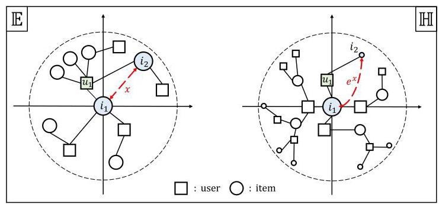
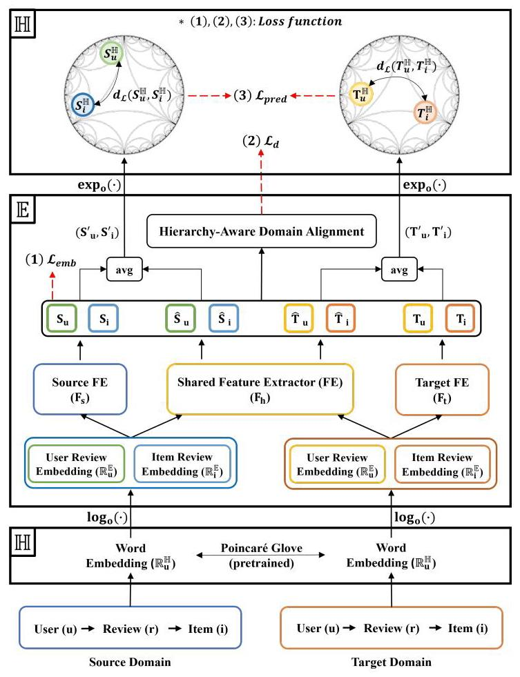
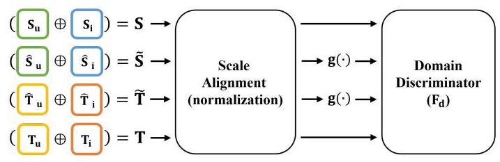
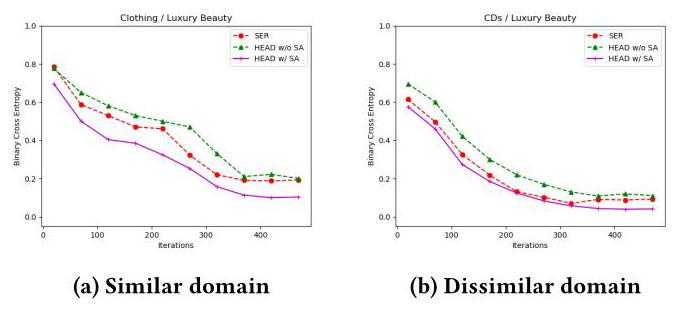
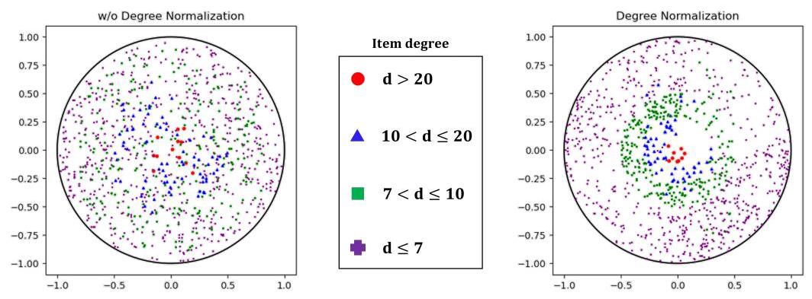
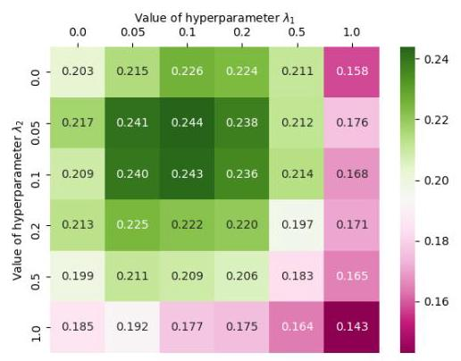

# Review-Based Cross-Domain Recommendation via Hyperbolic Embedding and Hierarchy-Aware Domain Disentanglement

Yoonhyuk Choi

Arizona State University

Tempe, United States of America

chldbsgur123@gmail.com

## ABSTRACT

The issue of data sparsity poses a significant challenge to recommender systems. In response to this, algorithms that leverage side information such as review texts have been proposed. Furthermore, Cross-Domain Recommendation (CDR), which captures domain-shareable knowledge and transfers it from a richer domain (source) to a sparser one (target), has received notable attention. Nevertheless, the majority of existing methodologies assume a Euclidean embedding space, encountering difficulties in accurately representing richer text information and managing complex interactions between users and items. This paper advocates a hyperbolic CDR approach based on review texts for modeling user-item relationships. We first emphasize that conventional distance-based domain alignment techniques may cause problems because small modifications in hyperbolic geometry result in magnified perturbations, ultimately leading to the collapse of hierarchical structures. To address this challenge, we propose hierarchy-aware embedding and domain alignment schemes that adjust the scale to extract domain-shareable information without disrupting structural forms. The process involves the initial embedding of review texts in hyperbolic space, followed by feature extraction incorporating degree-based normalization and structure alignment. We conducted extensive experiments to substantiate the efficiency, robustness, and scalability of our proposed model in comparison to state-of-the-art baselines.

## CCS CONCEPTS

- Information systems \( \rightarrow \) Recommender systems.

## KEYWORDS

Recommender system, review-based cross-domain recommendation, hyperbolic embedding, hierarchy-aware domain alignment

## ACM Reference Format:

Yoonhyuk Choi. 2024. Review-Based Cross-Domain Recommendation via Hyperbolic Embedding and Hierarchy-Aware Domain Disentanglement. In Proceedings of the 33rd ACM International Conference '24, October 21- 25, 2024, Boise, Idaho, USA. ACM, New York, NY, USA, 11 pages. https: //doi.org/10.1145/3511808.3557324

Figure 1: The geometric properties of Euclidean (E, left) and Hyperbolic spaces ( \( \mathbb{H} \) , right). A hyperbolic space leverages the advantages of a wide space by placing nodes with high degrees close to the origin. However, common methods in recommender systems bring the relevant nodes closer, leading to a structural collapse in the hyperbolic geometry

## 1 INTRODUCTION

A recommender system has evolved into a fundamental tool across real-world applications [42, 73], exemplified by its integration into platforms such as Amazon, and Tripadvisor. Despite remarkable popularity and commercial successes, the performance can be inflicted heavily in data-scarce scenarios. Weathering of the data sparsity impediments, encompassing issues like cold-start problems, has emerged as a central focus of scholarly inquiry. Numerous research endeavors have employed various forms of side information ranging from social relationships [30], and hierarchical interactions [40] to item images [2] aiming to augment recommendation accuracy. In particular, textual data in the form of reviews stands out as one of the most extensively utilized side information. The realm of text-based recommender systems has witnessed significant advancements as evidenced by investigations such as [76], [3], [54], and [14]. These endeavors have demonstrated a measure of effectiveness in ameliorating sparsity concerns. However, inherent limitations persist in addressing fundamental issues, especially when the extent of interaction within a dataset is insufficient.

To handle this problem, recent method strides in Cross-Domain Recommendation (CDR) [19, 28, 71] and transfer algorithms [26, 69, 70]. These methodologies commonly exploit the information from a source domain, characterized by abundant interactions relative to a target domain, to extract domain-shareable information. Some approaches concentrate on duplicate users across both domains \( \left\lbrack  {{24},{36},{39},{71}}\right\rbrack \) . However, it is essential to note that these user binding strategies may face constraints arising from the absence of overlapping (duplicate) users and domain selection restrictions [29]. Alternatively, more flexible methods that operate independent of specific users or contexts have been introduced [7, 33, 74]. This trend has prompted the development of disentangled representation learning techniques \( \left\lbrack  {6,{22},{37},{49}}\right\rbrack \) , which can concurrently extract both domain-specific and domain-shareable knowledge. These algorithms empower the distillation of meaningful insights from seemingly counterproductive domains. More recently, novel approaches contrived on review-based disentangled representation learning [8, 14], free of duplicate users or contexts, have demonstrated state-of-the-art performance.

---

for profit or commercial advantage and that copies bear this notice and the full citation fee. Request permissions from permissions@acm.org.

Conference '24, October 21-25, 2024, Boise, Idaho, USA

© 2024 Association for Computing Machinery.

ACM ISBN 978-1-4503-9236-5/22/10...\$15.00

https://doi.org/10.1145/3511808.3557324

---

We have discussed how recent studies mitigate the data sparsity problem by leveraging side information and employing domain disentanglement for knowledge transfer. While these methods are effective, a drawback exists as they rely on Euclidean geometry for the embedding [21, 31], which has shown to be inadequate for modeling the user-item bipartite graphs whose node degrees follow a power-law distribution [15]. This inadequacy leads to a distortion in embedding due to the exponential growth in the graph's volume with its radius. To solve this limitation, recent studies propose the adoption of hyperbolic geometry [18, 23, 32]. In Figure 1, we present illustrative examples of Euclidean space (E, left) and hyperbolic spaces (H, right). As previously mentioned, the volume of hyperbolic space (distance from the origin) exhibits exponential growth \( \left( {e}^{x}\right) \) compared to the polynomial growth \( \left( x\right) \) in Euclidean space as they expand towards the boundary [47].

Considering these factors, we focus on hyperbolic CDR, a relatively underexplored area [65]. Despite the existence of various CDR methods, the majority of them bring features extracted from two closely related domains [8, 75], potentially provoking the loss of hierarchical information. As shown in the right side of Figure \( 1\left( \mathbb{H}\right) \) , directly reducing the distance between two items \( {i}_{1} \) and \( {i}_{2} \) , purchased by the same user without considering their positions can detrimentally impact the entire representation. In detail, given that the degree of node \( {i}_{1} \) is greater than node \( {i}_{2} \) , placing a node \( {i}_{2} \) with fewer interactions closer to the origin than \( {i}_{1} \) results in the loss of the advantages of an exponentially increasing space. In this context, there arises a need to devise clever mechanisms that facilitate knowledge transfer while preserving a tree-like structure. For this, we propose a solution equipped with two strategies; degree-based normalization and structure alignment. The proposed scheme not only preserves the position but also enhances the performance of domain disentanglement. Our approach is substantiated through theoretical understanding and empirical evidence from various experiments. In summary, our contributions are outlined below.

- We propose a novel CDR algorithm, called Hyperbolic Embedding and Hierarchy-Aware Domain Disentanglement (HEAD), which enhances the previous review-based domain disentanglement by incorporating hyperbolic geometry.

- We propose degree-based hierarchy alignment and scale adjustment to enhance the knowledge transfer between two domains. To our knowledge, this is the first attempt that achieves domain disentanglement in a hyperbolic space.

- We present theoretical understandings that emphasize the importance of hierarchy preservation and domain disentanglement for recommender systems.

- We conducted various experiments to verify the effectiveness of our method and the correctness of the theoretical analysis.

## 2 RELATED WORK

In this section, we introduce the advent of recommender algorithms categorizing them as follows; (1) Review-based recommendations that utilize review texts as side information, (2) Cross-domain recommendations that exploit additional information from source domains for knowledge transfer, and (3) Hyperbolic recommendation which project the user-item representations onto hyperbolic space instead of Euclidean space to preserve hierarchical information.

### 2.1 Review-Based Recommendation

The explosive progress in text convolution techniques has ignited great attention in review-based recommender systems [11, 13, 16, 76]. For example, DeepCoNN [76] employs two parallel convolutional neural networks (CNNs), and others further utilize an attention mechanism to exploit important words [9, 16, 53, 57]. Although these methods highlight the importance of review texts, their major limitation lies in the confined scale of target domains and the transfer of noisy data [52, 72]. To address these issues, cross-domain recommendation and disentanglement techniques have emerged to acquire useful information from domains with richer interactions.

### 2.2 Cross-Domain Recommendation

Cross-domain recommendation (CDR) involves the utilization of additional information in other domains called source domains to address the sparseness in a target domain. Generally, these methods capture latent information from rating matrices or review texts [19, 33] to capture and transfer knowledge authored by overlapping users in both source and target domains [17, 43, 77]. Though certain methods [63, 74] underscore the significance of employing nonoverlapping users for generalization, they lack examination of what information would be efficiently transferred. Thus, recent studies have shifted focus towards identifying the most relevant aspects between two domains, commonly referred to as domain-shareable features. The foundational mechanism often commences with domain adaptation \( \left\lbrack  {5,{10},{51},{71}}\right\rbrack \) , which captures domain-shareable features through adversarial training. Advanced techniques that extract domain-specific and domain-shareable features simultaneously have been introduced more recently, collectively known as disentangled representation learning. These include MMT [33], DADA [49], DisenCDR [8], and SER [14]. The pivotal aspect of this approach lies in domain disentanglement which strives to identify useful information for knowledge transfer.

### 2.3 Hyperbolic Recommendation

Most prior research on recommendation systems has primarily been conducted in a Euclidean space. These methods have demonstrated decent performance, but a challenge has been raised regarding their adequacy in modeling hierarchical structures such as user-item interactions or word vectors [58]. Recent studies [18, 55, 61] utilize a hyperbolic space for representation learning, including informative collaborative filtering [35, 62, 67] with geometric regularization [68]. However, most of them utilize a single-domain dataset, which is susceptible to data sparsity. To address this problem, several researchers have integrated CDR with hyperbolic space embedding [25, 65], but they disregard domain disentanglement and hierarchy structure preservation, which are particularly crucial for accurate knowledge transfer in an exponentially expanded space. Thus, we aim to suggest a new hyperbolic CDR that preserves the structural property to better embed the user-item interactions.

## 3 PRELIMINARIES

We first introduce the basic concepts of manifolds and hyperbolic geometry. Differential geometry defines three space types, hyperbolic, Euclidean, and spherical, based on curvatures. Especially, a hyperbolic space is one type of non-Euclidean space, which has a constant negative curvature at all points. In the literature, various mathematical formulations can be utilized to describe hyperbolic spaces, such as the Riemannian manifold [38], Poincaré ball [47], and Lorentz model [48]. Here, we employ the Poincaré ball for the ease of visualization [23] and the Lorentz model for numerical operation [34], respectively.

Poincaré ball. The representation of this model can be defined as \( {\mathcal{P}}^{d} = \left( {{\mathcal{B}}^{d},{g}_{x}^{\mathcal{B}}}\right) \) , which stands for the open \( n \) -dimensional unit ball \( {\mathcal{B}}^{d} = \left\{  {x \in  {\mathcal{R}}^{d} : k\left| \right| x\left| \right|  < 1}\right\} \) and hyperbolic feature \( {g}_{x}^{\mathcal{B}} \) :

\[
{g}_{x}^{\mathcal{B}} = {\left( \frac{2}{1 - \mathrm{k}\parallel \mathrm{x}\parallel {\parallel }^{2}}\right) }^{2}{g}_{x}^{E}, \tag{1}
\]

where \( k \) is the radius of the ball. The above equation converts a Euclidean metric tensor \( {g}^{E} \) to hyperbolic one. If \( k = 0 \) , we can easily infer that the ball is identical to the Euclidean space. Also, a distance function on \( \mathcal{P} \) is defined as below:

\[
{\mathrm{d}}_{\mathcal{P}}\left( {\mathrm{x},\mathrm{y}}\right)  = \sqrt{\mathrm{k}}\operatorname{arcosh}\left( {1 + 2\mathrm{\;k}\frac{\parallel \mathrm{x} - \mathrm{y}{\parallel }^{2}}{\left( {\mathrm{\;k} - \parallel \mathrm{x}{\parallel }^{2}}\right) \left( {\mathrm{\;k} - \parallel \mathrm{y}{\parallel }^{2}}\right) }}\right) \tag{2}
\]

Lorentz model. Similarly, the Lorentz model is defined as \( {\mathcal{L}}^{d} = \; \left( {{\mathcal{H}}^{d},{g}_{x}^{\mathcal{H}}}\right) \) , where \( {\mathcal{H}}^{d} = \left\{  {x \in  {\mathcal{R}}^{d + 1} : \langle x, x{\rangle }_{\mathcal{L}} =  - k,{x}_{0} > 0}\right\} \) . Here, \( \langle ,{ > }_{\mathcal{L}} \) is the Lorentizan inner product:

\[
< \mathrm{x},\mathrm{y}{ > }_{\mathcal{L}} =  - {\mathrm{x}}_{0}{\mathrm{y}}_{0} + \mathop{\sum }\limits_{{\mathrm{i} = 1}}^{\mathrm{n}}{\mathrm{x}}_{\mathrm{i}}{\mathrm{y}}_{\mathrm{i}}, \tag{3}
\]

and \( {g}_{x}^{\mathcal{H}} = \operatorname{diag}\left( {-1,1,\ldots ,1}\right) \) is a positive-definite metric tensor to calculate a distance of two points \( x, y \in  {\mathcal{H}}^{d} \) as follows:

\[
{\mathrm{d}}_{\mathcal{L}}\left( {\mathrm{x},\mathrm{y}}\right)  = \sqrt{\mathrm{k}}\operatorname{arcosh}\left( {-\frac{ < \mathrm{x},\mathrm{y} > \mathcal{L}}{\mathrm{k}}}\right) \tag{4}
\]

For a certain point \( x \in  {\mathcal{H}}^{d} \) in hyperbolic space, we can define the tangent space centered at \( x \) as below:

\[
{\mathcal{T}}_{\mathrm{x}}{\mathcal{H}}^{\mathrm{d}} = \left\{  {\mathrm{v} \in  {\mathcal{R}}^{\mathrm{d} + 1} :  < \mathrm{v},\mathrm{x}{ > }_{\mathcal{L}} = 0}\right\}  , \tag{5}
\]

where the orthogonality holds for all \( v \) concerning the Lorentz scalar product. Using these characteristics, conversions between the tangent and hyperbolic space can be achieved through exponential and logarithmic maps as follows.

- (Exponential map) \( {\mathcal{T}}_{x}{\mathcal{H}}^{d} \rightarrow  {\mathcal{H}}^{d} \) projects \( v \) onto hyperbolic space as,

\[
{\exp }_{\mathrm{x}}\left( \mathrm{v}\right)  = \cosh \left( \frac{\parallel \mathrm{v}\parallel /}{\sqrt{\mathrm{k}}}\right) \mathrm{x} + \sqrt{\mathrm{k}}\sinh \left( \frac{\parallel \mathrm{v}\parallel //}{\sqrt{\mathrm{k}}}\right) \frac{\mathrm{v}}{\parallel \mathrm{v}\parallel //} \tag{6}
\]

Table 1: Notations

<table><tr><td>Symbol</td><td>Explanation</td></tr><tr><td>\( \mathbb{E},\mathbb{H} \)</td><td>Euclidean and Hyperbolic spaces</td></tr><tr><td>u, i, \( {\mathrm{y}}_{\mathrm{u},\mathrm{i}},{\mathrm{r}}_{\mathrm{u},\mathrm{i}} \)</td><td>User, item, rating, and individual review</td></tr><tr><td>R</td><td>Aggregated reviews (documents)</td></tr><tr><td>S, T</td><td>Domain-specific features extracted from R</td></tr><tr><td>\( \widehat{\mathrm{S}},\widehat{\mathrm{T}} \)</td><td>Domain-shareable features extracted from R</td></tr><tr><td>\( {\mathrm{N}}_{\mathrm{s}},{\mathrm{N}}_{\mathrm{t}} \)</td><td>Batch of source and target domain datasets</td></tr><tr><td>\( {\exp }_{\mathrm{x}}\left( \mathrm{v}\right) \)</td><td>Mapping from Euclidean to hyperbolic space</td></tr><tr><td>\( {\log }_{\mathrm{x}}\left( \mathrm{v}\right) \)</td><td>Mapping from hyperbolic to Euclidean space</td></tr><tr><td>\( \mathrm{d}\varphi \left( {\mathrm{x},\mathrm{y}}\right) \)</td><td>Distance measure in Poincaré ball</td></tr><tr><td>\( {\mathrm{d}}_{\mathcal{L}}\left( {\mathrm{x},\mathrm{y}}\right) \)</td><td>Distance measure in Lorentz model</td></tr><tr><td>\( \mathcal{L} \)</td><td>Loss function</td></tr><tr><td>\( \lambda \)</td><td>Hyperparameters in \( \mathcal{L} \)</td></tr></table>

- (Logarithmic map) \( {\mathcal{H}}^{d} \rightarrow  {\mathcal{T}}_{x}{\mathcal{H}}^{d} \) projects \( v \) back to Euclidean space as,

\[
{\log }_{x}\left( v\right)  = {d}_{\mathcal{L}}\left( {x, v}\right) \frac{v + \frac{1}{k} < x, v > \mathcal{L}x}{\parallel v + \frac{1}{k} < x, v > \mathcal{L}x\parallel \mathcal{L}} \tag{7}
\]

Based on these equations, we will explain methods for knowledge transfer in hyperbolic space. In Table 1, we describe the notations that will be used throughout this paper.

## 4 METHODOLOGY

In Figure 2, we illustrate the overall architecture of our model, called HEAD (Hyperbolic Embedding and Hierarchy-Aware Domain Disentanglement, which is comprised of the following key components:

- Word embedding. This part vectorizes reviews using pre-trained word embedding. In contrast to the previous methods that adopt Euclidean embedding such as word2vec1 [45] or \( {\mathrm{{GloVe}}}^{2} \) [50], we employ the Poincaré Glove \( {}^{3} \) [58] which better preserves the hierarchical property of words.

- Feature extraction. This module elicits pertinent information from embedded documents using three types of feature extractors (FEs); the shared FE focuses on domain-shareable knowledge for transfer while the source and target FEs capture the domain-specific features.

- Hierarchy-aware embedding and domain disentanglement. Extracted features are aligned hierarchically and then knowledge is transferred while retaining this structure. This also reinforces the separability of domain discriminator.

- Prediction and optimization. Outputs are integrated and projected back to the hyperbolic space for prediction. A marginal ranking loss is computed for optimization.

### 4.1 Word Embedding

Each data record follows a format \( \left( {u, i,{y}_{u, i},{r}_{u, i}}\right) \) , which means that a user \( u \) purchased an item \( i \) and left a rating \( {y}_{u, i} \) and a review \( {r}_{u, i} \) . Assume that we are concerned with a possibly unseen rating \( {y}_{u, i} \) . We first aggregate all reviews of \( u \) and \( i \) . Specifically, for a user \( u \) , we gather all reviews written by her except for the specific pair \( {r}_{u, i} \) (not available during inference) and consider them as a single document \( {R}_{u} \) . Likewise, one can construct the collection of item reviews, \( {R}_{i} \) . Here, we ignore the temporal sequence of ratings or reviews. Finally, we apply the word embedding function to \( {R}_{u} \) and \( {R}_{i} \) . Although many strategies are applicable (e.g, word2vec \( {}^{4} \) [45]), we focus on the Euclidean [50] and Poincaré Glove [58] here.

---

\( {}^{1} \) https://code.google.com/archive/p/word2vec

\( {}^{2} \) https://nlp.stanford.edu/projects/glove

\( {}^{3} \) https://github.com/alex-tifrea/poincare_glove

---

- (Euclidean Glove) increases the co-occurrence probability \( \left( {X}_{ij}\right) \) of the central word \( \left( {w}_{i}\right) \) and its neighbor words \( \left( {\widetilde{w}}_{j}\right) \) as,

\[
\mathop{\min }\limits_{\mathrm{w}}\mathop{\sum }\limits_{{\mathrm{i},\mathrm{j}}}^{\mathrm{V}}\mathrm{f}\left( {\mathrm{X}}_{\mathrm{{ij}}}\right) {\left( {\mathrm{w}}_{\mathrm{i}}^{\mathrm{T}}{\widetilde{\mathrm{w}}}_{\mathrm{j}} + {\mathrm{b}}_{\mathrm{i}} + {\widetilde{\mathrm{b}}}_{\mathrm{j}} - \log {\mathrm{X}}_{\mathrm{{ij}}}\right) }^{2}, \tag{8}
\]

where \( b \) is the bias.

- (Poincaré Glove) replaces \( {w}_{i}^{T}{\widetilde{w}}_{j} \) with \( - h\left( {{d}_{\mathcal{P}}\left( {{w}_{i}^{T},{\widetilde{w}}_{j}}\right) }\right) \) as,

\[
\mathop{\min }\limits_{\mathrm{w}}\mathop{\sum }\limits_{{\mathrm{i},\mathrm{j}}}^{\mathrm{V}}\mathrm{f}\left( {\mathrm{X}}_{\mathrm{{ij}}}\right) \left( {-\mathrm{h}\left( {{\mathrm{d}}_{\mathcal{P}}\left( {{\mathrm{w}}_{\mathrm{i}}^{\mathrm{T}},{\widetilde{\mathrm{w}}}_{\mathrm{j}}}\right) }\right)  + {\mathrm{b}}_{\mathrm{i}} + {\widetilde{\mathrm{b}}}_{\mathrm{j}} - \log {\mathrm{X}}_{\mathrm{{ij}}}}\right) {}^{2}, \tag{9}
\]

where \( {d}_{\mathcal{P}} \) is a distance function in Eq. 2 and \( h\left( x\right)  = {\cosh }^{2} \) .

The Euclidean and Poincaré renditions \( {}^{5} \) have been trained using 1.4 billion tokens from English Wikipedia, and we employ them as pre-trained word embedding \( f\left( \cdot \right) \) (please see Table 3). Using this, the textual documents \( {R}_{u} \) and \( {R}_{i} \) are mapped into the matrix \( {\mathrm{R}}_{\mathrm{u}}^{\mathbb{E}} = \mathrm{f}\left( {\mathrm{R}}_{\mathrm{u}}\right) ,{\mathrm{R}}_{\mathrm{i}}^{\mathbb{E}} = \mathrm{f}\left( {\mathrm{R}}_{\mathrm{i}}\right) \) of \( {\mathcal{R}}^{n \times  d} \) , where \( n \) is the vocabulary size and \( d \) is the embedding dimension. We project these matrices onto the hyperbolic space using the exponential map in Eq. 6 as below:

\[
{\mathrm{R}}_{\mathrm{u}}^{\mathbb{H}} = {\exp }_{\mathrm{o}}\left( {\mathrm{R}}_{\mathrm{u}}^{\mathbb{E}}\right)  = \left\lbrack  {\cosh \left( \begin{Vmatrix}{\mathrm{R}}_{\mathrm{u}}^{\mathbb{E}}\end{Vmatrix}\right) ,\sinh \left( \begin{Vmatrix}{\mathrm{R}}_{\mathrm{u}}^{\mathbb{E}}\end{Vmatrix}\right) \frac{{\mathrm{R}}_{\mathrm{u}}^{\mathbb{E}}}{\begin{Vmatrix}{\mathrm{R}}_{\mathrm{u}}^{\mathbb{E}}\end{Vmatrix}}}\right\rbrack
\]

\[
{\mathrm{R}}_{\mathrm{i}}^{\mathbb{H}} = {\exp }_{\mathrm{o}}\left( {\mathrm{R}}_{\mathrm{i}}^{\mathbb{B}}\right)  = \left\lbrack  {\cosh \left( \begin{Vmatrix}{\mathrm{R}}_{\mathrm{i}}^{\mathbb{E}}\end{Vmatrix}\right) ,\sinh \left( \begin{Vmatrix}{\mathrm{R}}_{\mathrm{i}}^{\mathbb{E}}\end{Vmatrix}\right) \frac{{\mathrm{R}}_{\mathrm{i}}^{\mathbb{E}}}{\begin{Vmatrix}{\mathrm{R}}_{\mathrm{i}}^{\mathbb{E}}\end{Vmatrix}}}\right\rbrack \tag{10}
\]

We set the curvature \( k = 1 \) for simplicity.

### 4.2 Feature Extraction

The above word embedding procedure is applied to the source and target domains, respectively. Given word embedding \( {R}_{u}^{\mathbb{H}} \) and \( {R}_{i}^{\mathbb{H}} \) from each domain, we aim to extract useful information. Several feature extraction strategies have been proposed, including domain adaptation [71], variational reconstruction [41], personalized transfer [78], contrastive learning [64], and domain disentanglement [49]. Among them, we adopt the domain disentanglement algorithm, which does not obligate user overlapping in both domains [8]. For this, as illustrated in Figure 2, we employ three types of feature extractors (FEs), all of which consist of simple multi-channel Convolutional Neural Networks (CNNs). Specifically, the shared FE processes datasets from both domains, while the source and target FEs deal with the documents from their domains only (please refer to [14] for more details). For the sake of simplicity, we focus on the mechanisms in the source domain since the target domain procedure is the same. The feature extraction process is given by:

(11)

\[
{\mathrm{S}}_{\mathrm{u}} = {\mathrm{F}}_{\mathrm{s}}\left( {{\log }_{\mathrm{o}}\left( {\mathrm{R}}_{\mathrm{u}}^{\mathbb{H}}\right) }\right) ,{\mathrm{S}}_{\mathrm{i}} = {\mathrm{F}}_{\mathrm{s}}\left( {{\log }_{\mathrm{o}}\left( {\mathrm{R}}_{\mathrm{i}}^{\mathbb{H}}\right) }\right)
\]

\[
{\widehat{\mathrm{S}}}_{\mathrm{u}} = {\mathrm{F}}_{\mathrm{h}}\left( {{\log }_{\mathrm{o}}\left( {\mathrm{R}}_{\mathrm{u}}^{\mathbb{H}}\right) }\right) ,{\widehat{\mathrm{S}}}_{\mathrm{i}} = {\mathrm{F}}_{\mathrm{h}}\left( {{\log }_{\mathrm{o}}\left( {\mathrm{R}}_{\mathrm{i}}^{\mathbb{H}}\right) }\right)
\]

As illustrated, the hyperbolic embedding of the user and item is projected back to Euclidean space using a logarithmic map in Equation 7, followed by the application of CNNs \( \left( {F}_{s}\right. \) and \( \left. {F}_{h}\right) \) . Consequently, the source domain yields four outputs from two feature extractors, denoted as \( {S}_{u},{S}_{i},{\widehat{S}}_{u},{\widehat{S}}_{i} \) (depicted in the middle of Figure 2). Additional insights into CNNs can be found in [76].

Figure 2: The overall framework of the Hierarchy-Aware Hyperbolic Embedding and Domain Disentanglement (HEAD) scheme. The (1)-(3) represents three types of loss functions

Remark. The large language models (e.g., LLaMA [59], ChatGPT- 4 [1]) may replace CNNs if their parameters can be fine-tuned.

### 4.3 Hierarchy-Aware Hyperbolic Embedding and Domain Disentanglement

We propose two constraints to achieve domain disentanglement between the extracted features while preserving their hierarchical structure: (1) hierarchy-aware embedding and (2) hierarchy-aware knowledge transfer. The feature extractors (FEs) are configured to preserve such hierarchies during the training as below.

4.3.1 Hierarchy-aware hyperbolic embedding. As depicted in Figure 1, one of the remarkable advantages of hyperbolic space is its exponentially expandable capacity. Also, [32] reveals that the uncertainty decreases as the embedding gets closer to the boundary of the Poincaré ball. Based on this, HRCF [68] suggests a hyperbolic regularization optimized for the characteristics of a power-law distribution. Specifically, users or items with many interactions (dense) are pulled to the center, while sparse ones are positioned near the boundary. In detail, HRCF identifies the root as the average of the entire embedding and considers it as an origin as follows:

\[
{S}_{\mathrm{u}}^{\text{ root }} = \frac{1}{{\mathrm{\;N}}_{\mathrm{u}}}\mathop{\sum }\limits_{{{\mathrm{u}}^{\prime } = 1}}^{{\mathrm{N}}_{\mathrm{u}}}\frac{1}{2}\left( {{S}_{\mathrm{u}}^{{\mathrm{u}}^{\prime }} + {\widehat{S}}_{\mathrm{u}}^{{\mathrm{u}}^{\prime }}}\right) ,{S}_{\mathrm{i}}^{\text{ root }} = \frac{1}{{\mathrm{N}}_{\mathrm{i}}}\mathop{\sum }\limits_{{{\mathrm{i}}^{\prime } = 1}}^{{\mathrm{N}}_{\mathrm{i}}}\frac{1}{2}\left( {{S}_{\mathrm{i}}^{{\mathrm{i}}^{\prime }} + {\widehat{S}}_{\mathrm{i}}^{{\mathrm{i}}^{\prime }}}\right) \tag{12}
\]

---

\( {}^{4} \) https://code.google.com/archive/p/word2vec

\( {}^{5} \) https://polybox.ethz.ch/index.php/s/TzX6cXGqCX5KvAn

---

The \( {N}_{u} \) and \( {N}_{i} \) are the total number of users and items, respectively. Then, they apply so-called root alignment that locates the nodes to be separated from the origin as below:

\[
{\mathrm{S}}_{\mathrm{u}}^{\text{ norm }} = \frac{1}{{\mathrm{\;N}}_{\mathrm{u}}}\mathop{\sum }\limits_{{{\mathrm{u}}^{\prime } = 1}}^{{\mathrm{N}}_{\mathrm{u}}}{\begin{Vmatrix}{\mathrm{S}}_{\mathrm{u}}^{{\mathrm{u}}^{\prime }} - {\mathrm{S}}_{\mathrm{u}}^{\text{ root }}\end{Vmatrix}}_{2}^{2},{\mathrm{\;S}}_{\mathrm{i}}^{\text{ norm }} = \frac{1}{{\mathrm{\;N}}_{\mathrm{i}}}\mathop{\sum }\limits_{{{\mathrm{i}}^{\prime } = 1}}^{{\mathrm{N}}_{\mathrm{i}}}{\begin{Vmatrix}{\mathrm{S}}_{\mathrm{i}}^{{\mathrm{i}}^{\prime }} - {\mathrm{S}}_{\mathrm{i}}^{\text{ root }}\end{Vmatrix}}_{2}^{2}
\]

(13)

The loss function is the inverse of the above equation, which aims to decrease the central density. However, this strategy might not sufficiently reflect the popularity of nodes since it simply pushes all nodes away from the center. To alleviate this problem, we suggest to modify Eq. 13 as follows.

Proposition 4.1 (Hierarchy-Aware hyperbolic embedding). The loss function is normalized based on the maximum node degree, \( \max \left( d\right) \) , as follows:

\[
{\mathrm{S}}_{\mathrm{u},\text{ deg }}^{\text{ norm }} = \frac{1}{{\mathrm{\;N}}_{\mathrm{u}}}\mathop{\sum }\limits_{{{\mathrm{u}}^{\prime } = 1}}^{{\mathrm{N}}_{\mathrm{u}}}\frac{\max \left( {\mathrm{d}}_{\mathrm{u}}\right)  - {\mathrm{d}}_{{\mathrm{u}}^{\prime }}}{\max \left( {\mathrm{d}}_{\mathrm{u}}\right) }{\begin{Vmatrix}{\mathrm{S}}_{\mathrm{u}}^{{\mathrm{u}}^{\prime }} - {\mathrm{S}}_{\mathrm{u}}^{\text{ root }}\end{Vmatrix}}_{2}^{2} \tag{14}
\]

\[
{\mathrm{S}}_{\mathrm{i},\mathrm{{deg}}}^{\mathrm{{norm}}} = \frac{1}{{\mathrm{N}}_{\mathrm{i}}}\mathop{\sum }\limits_{{{\mathrm{i}}^{\prime } = 1}}^{{\mathrm{N}}_{\mathrm{i}}}\frac{\max \left( {\mathrm{d}}_{\mathrm{i}}\right)  - {\mathrm{d}}_{{\mathrm{i}}^{\prime }}}{\max \left( {\mathrm{d}}_{\mathrm{i}}\right) }{\begin{Vmatrix}{\mathrm{S}}_{\mathrm{i}}^{{\mathrm{i}}^{\prime }} - {\mathrm{S}}_{\mathrm{i}}^{\mathrm{{root}}}\end{Vmatrix}}_{2}^{2} \tag{15}
\]

Notation \( {d}_{{u}^{\prime }} \) and \( {d}_{{i}^{\prime }} \) stands for the degrees of user \( {u}^{\prime } \) and item \( {i}^{\prime } \) , respectively. Through this, we can place popular users and items near the origin, while pushing low-degree nodes towards the boundary.

Proof. refer to proof of proposition 4.1 in Section 4.5.

The loss in the target domain can be retrieved similarly. Then, we can define the hierarchical embedding loss as below:

\[
{\mathcal{L}}_{\text{ emb }} = 1/\sqrt{{\mathrm{S}}_{\mathrm{u},\text{ deg }}^{\text{ norm }} + {\mathrm{S}}_{\mathrm{i},\text{ deg }}^{\text{ norm }} + {\mathrm{T}}_{\mathrm{u},\text{ deg }}^{\text{ norm }} + {\mathrm{T}}_{\mathrm{i},\text{ deg }}^{\text{ norm }}} \tag{16}
\]

4.3.2 Hierarchy-aware domain disentanglement. Knowledge transfer has gained substantial attention in the field of cross-domain recommendation. In this regard, we align with the recently proposed domain disentanglement algorithm [8, 14], which operates without the requirement of overlapping users. The fundamental mechanism of domain disentanglement can be delineated as follows: (1) domain-specific features \( S, T \) should be readily inferable to their originating domains to mitigate domain discrepancies, and (2) domain-shareable features \( \widehat{S},\widehat{T} \) ought to encapsulate domain-indiscriminative information, ensuring pairwise independence between domains [22, 37, 46]. To achieve this, as depicted in Figure 3, we first concatenate the user and item vectors from each feature extractor in the following manner:

\[
\mathrm{S} = \left\lbrack  {{\mathrm{S}}_{\mathrm{u}} \oplus  {\mathrm{S}}_{\mathrm{i}}}\right\rbrack  ,\mathrm{T} = \left\lbrack  {{\mathrm{T}}_{\mathrm{u}} \oplus  {\mathrm{T}}_{\mathrm{i}}}\right\rbrack
\]

\[
\widetilde{\mathrm{S}} = \left\lbrack  {{\widehat{\mathrm{S}}}_{\mathrm{u}} \oplus  {\widehat{\mathrm{S}}}_{\mathrm{i}}}\right\rbrack  ,\widetilde{\mathrm{T}} = \left\lbrack  {{\widehat{\mathrm{T}}}_{\mathrm{u}} \oplus  {\widehat{\mathrm{T}}}_{\mathrm{i}}}\right\rbrack \tag{17}
\]

Before delving into the scale alignment module which is one of our primary contributions, we introduce the following discussion on previous disentanglement algorithms.

Figure 3: Mechanism of hierarchy-aware domain alignment

Lemma 4.1. Prior methods of domain disentanglement, such as those proposed by [8, 14, 33, 49] merely focus on adjusting the scale of the extracted features. In detail, they simply forward these features to the domain discriminator \( \left( {F}_{d}\right) \) in the following manner:

\[
{d}_{S} = {F}_{d}\left( S\right) ,\;{d}_{T} = {F}_{d}\left( T\right)
\]

\[
{\widetilde{d}}_{S} = {F}_{d}\left( {g\left( \widetilde{S}\right) }\right) ,\;{\widetilde{d}}_{T} = {F}_{d}\left( {g\left( \widetilde{T}\right) }\right) \tag{18}
\]

The \( {F}_{d} \) consists of the two layers of a fully connected neural network and the notation \( {d}_{S},{d}_{T} \in  \{ 0,1\} \) denotes the predicted domain ( \( 0/1 \) are the source/target). Additionally, \( g\left( \cdot \right) \) signifies the Gradient Reversal Layer (GRL), which remains inactive during the forward propagation but reverses the sign of the gradient during the back-propagation (for detailed information, refer to [44, 49]). A major limitation of these methods lies in the disruptive changes in positional information. As elucidated earlier, domain-shareable features tend to converge, while domain-specific features separate apart. Consequently, minor positional changes can cause exponentially magnified effects. A similar issue is observed in other domain alignment methods. To solve the problem, some directly reduce the distance of the same set of users between domains [75], and others leverage variational inference to align the mean and variance of feature distributions [41]. In this paper, we propose a novel disentanglement strategy that conserves the scale of the extracted information by revising Eq. 18 as follows.

Proposition 4.2 (Scale Alignment). We adjust the scale of inputs before applying the domain discriminator, which can preserve the hierarchical structure of features as follows:

- (Scale alignment between domain-specific knowledge)

\[
{d}_{S} = {F}_{d}\left( \frac{S}{\left| S\right| }\right) ,{d}_{T} = {F}_{d}\left( \frac{T}{\left| T\right| }\right) \tag{19}
\]

- (Scale alignment between domain-shareable knowledge)

\[
{\widetilde{d}}_{S} = {F}_{d}\left( {g\left( \frac{\widetilde{S}}{\left| \widetilde{S}\right| }\right) }\right) ,{\widetilde{d}}_{T} = {F}_{d}\left( {g\left( \frac{\widetilde{T}}{\left| \widetilde{T}\right| }\right) }\right) \tag{20}
\]

Proof. refer to proof of proposition 4.2 in Section 4.5.

Based on this, we can define the loss function of domain discriminator \( {\mathcal{L}}_{d} \) as,

\[
{\mathcal{L}}_{d} =  - \frac{1}{{N}_{s}}\mathop{\sum }\limits_{{n = 1}}^{{N}_{s}}\log \left( {1 - {d}_{S}}\right)  - \frac{1}{{N}_{s}}\mathop{\sum }\limits_{{n = 1}}^{{N}_{s}}\log \left( {1 - {\widetilde{d}}_{S}}\right) \tag{21}
\]

\[
- \frac{1}{{N}_{t}}\mathop{\sum }\limits_{{n = 1}}^{{N}_{t}}\log \left( {d}_{T}\right)  - \frac{1}{{N}_{t}}\mathop{\sum }\limits_{{n = 1}}^{{N}_{t}}\log \left( {\widetilde{d}}_{T}\right)
\]

Finally, we claim that scale alignment can also enhance the separability of a discriminator below.

Proposition 4.3 (Advantages of Scale adjustment). Removing the scale of input features enhances the domain discriminator's separability and guarantees stable convergence.

Proof. refer to proof of proposition 4.3 in Section 4.5.

### 4.4 Inference and Optimization

Inference. We aim to measure the relativity between a user and an item using their aggregated features. To elaborate, in the center of Figure 2 (source domain), we compute the average (avg) of the outputs from the source and shared FEs as,

\[
{S}_{u}^{\prime } = \frac{1}{2}\left( {{S}_{u} + {\widehat{S}}_{u}}\right) ,{S}_{i}^{\prime } = \frac{1}{2}\left( {{S}_{i} + {\widehat{S}}_{i}}\right) . \tag{22}
\]

Then, we project the aggregated representation onto the hyperbolic space using the exponential map in Eq. 6 as follows:

\[
{\mathrm{S}}_{\mathrm{u}}^{\mathbb{H}} = {\exp }_{\mathrm{o}}\left( {\mathrm{S}}_{\mathrm{u}}^{\prime }\right)  = \left( {\cosh \left( {\left| \right| {\mathrm{S}}_{\mathrm{u}}^{\prime }\left| \right| }\right) ,\sinh \left( {\left| \right| {\mathrm{S}}_{\mathrm{u}}^{\prime }\left| \right| }\right) \frac{{\mathrm{S}}_{\mathrm{u}}^{\prime }}{\left| \right| {\mathrm{S}}_{\mathrm{u}}^{\prime }\left| \right| }}\right) \tag{23}
\]

\[
{\mathrm{S}}_{\mathrm{i}}^{\mathbb{H}} = {\exp }_{\mathrm{o}}\left( {\mathrm{S}}_{\mathrm{i}}^{\prime }\right)  = \left( {\cosh \left( \left| \left| {\mathrm{S}}_{\mathrm{i}}^{\prime }\right| \right| \right) ,\sinh \left( \left| \left| {\mathrm{S}}_{\mathrm{i}}^{\prime }\right| \right| \right) \frac{{\mathrm{S}}_{\mathrm{i}}^{\prime }}{\left| \left| {\mathrm{S}}_{\mathrm{i}}^{\prime }\right| \right| }}\right) \tag{24}
\]

Finally, we can measure their similarity as below:

\[
p\left( {{S}_{u}^{\mathbb{H}},{S}_{i}^{\mathbb{H}}}\right)  = \mathcal{M}\left( {{S}_{u}^{\mathbb{H}} \oplus  {S}_{i}^{\mathbb{H}}}\right) {d}_{\mathcal{L}}\left( {{S}_{u}^{\mathbb{H}},{S}_{i}^{\mathbb{H}}}\right) , \tag{25}
\]

where \( \mathcal{M}\left( \cdot \right)  \in  \left\lbrack  {0,1}\right\rbrack \) is a MLP with Sigmoid activation function. This adjusts the distance between users and items, \( {d}_{\mathcal{L}}\left( \cdot \right) \) (Eq. 4) to reflect the user's preference for popular items. For optimization, we adopt the hyperbolic margin \( \left( {\epsilon  = {0.1}}\right) \) ranking loss [56] given the positive \( \left( i\right) \) and negative sample \( \left( j\right) \) as below:

\[
{\mathcal{L}}_{\text{ pred }} = \max \left( {p{\left( {S}_{u}^{\mathbb{H}},{S}_{i}^{\mathbb{H}}\right) }^{2} - p{\left( {S}_{u}^{\mathbb{H}},{S}_{j}^{\mathbb{H}}\right) }^{2} + \epsilon ,0}\right) \tag{26}
\]

Optimization. We define the overall objective function as to minimize the weighted sum of Eq. 16, 21, 26 as,

\[
\mathop{\min }\limits_{\theta }{\mathcal{L}}_{\text{ total }} = {\lambda }_{1}{\mathcal{L}}_{\text{ emb }} + {\lambda }_{2}{\mathcal{L}}_{d} + {\mathcal{L}}_{\text{ pred }} + \delta \parallel \theta \parallel \tag{27}
\]

The hyperparameters \( {\lambda }_{1} \) and \( {\lambda }_{2} \) balance the losses. For each dataset, we find \( {\lambda }_{1} \) and \( {\lambda }_{2} \) through grid search that yielded the best validation score (Fig. 6). The parameter \( \theta \) is optimized using the Adam optimizer, with \( \delta \) representing the regularization term. Additionally, we practiced early stopping within 300 iterations and applied negative sampling for ratings that meet the condition \( {y}_{u, j} < 4 \) .

Table 2: Details of the benchmark datasets

<table><tr><td>Domain</td><td>Dataset</td><td>#users</td><td>#items</td><td>#reviews</td></tr><tr><td rowspan="3">Source</td><td>Clothing (Cloth)</td><td>1,219,520</td><td>376,858</td><td>11,285,464</td></tr><tr><td>CDs and Vinyl (CDs)</td><td>112,391</td><td>73,713</td><td>1,443,755</td></tr><tr><td>Toys and Games (Toys)</td><td>208,143</td><td>78,772</td><td>1,828,971</td></tr><tr><td rowspan="4">Target</td><td>Luxury Beauty</td><td>3,818</td><td>1,581</td><td>34,278</td></tr><tr><td>All Beauty</td><td>990</td><td>85</td><td>5,269</td></tr><tr><td>Digital Music</td><td>16,561</td><td>11,797</td><td>169,781</td></tr><tr><td>Video Games</td><td>55,217</td><td>17,408</td><td>497,577</td></tr></table>

### 4.5 Theoretical Analysis

Proof of proposition 4.1 (Nodes with SMALLER DEGREES ARE LIKELY TO BE PUSHED AWAY FROM THE ORIGIN). Let us take \( {S}_{u,{deq}}^{\text{ norm }} \) (Eq. 14) as an example. Since we minimize the \( {\mathcal{L}}_{emb} \) in Eq. 16, the parameter \( {F}_{s} \) in Eq. 11 is trained to maximize \( {S}_{u}^{\text{ norm }} \) as follows:

\[
\underset{{F}_{s}}{\arg \max }{S}_{u,\text{ deg }}^{\text{ norm }} = \frac{\max \left( d\right)  - {d}_{u}}{\max \left( d\right) }\frac{\partial {\mathcal{L}}_{\text{ emb }}}{\partial {F}_{s}} \tag{28}
\]

Both our proposed method (Eq. 14) and the plain method (Eq. 13) share the second term in Eq. 28. Thus, we focus on the first term (degree normalization) that determines the scale of gradient as below:

\[
\begin{Vmatrix}{{\nabla }_{{F}_{s}}{S}_{u,\text{ deg }}^{\text{ norm }}}\end{Vmatrix}/\begin{Vmatrix}{{\nabla }_{{F}_{s}}{S}_{u}^{\text{ norm }}}\end{Vmatrix} \approx  \frac{\max \left( d\right)  - {d}_{u}}{\max \left( d\right) }, \tag{29}
\]

where \( \nabla \) denotes the partial derivative. Since \( \left( {\max \left( d\right)  - {d}_{u}}\right) /\max \left( d\right)  \in \; \left\lbrack  {0,1}\right\rbrack \) , the scale of gradient increases as the degree of nodes \( \left( {d}_{u}\right) \) decreases, pushing it away from the origin and vice versa.

Proof of proposition 4.2 (Scale Preservation). Let us take two domain-specific features \( {d}_{S} \) and \( {d}_{T} \) . According to the law of cosines, the following equality holds:

\[
{\begin{Vmatrix}{d}_{S} - {d}_{T}\end{Vmatrix}}^{2} = {\begin{Vmatrix}{d}_{S}\end{Vmatrix}}^{2} + {\begin{Vmatrix}{d}_{T}\end{Vmatrix}}^{2} - 2\begin{Vmatrix}{d}_{S}\end{Vmatrix} \cdot  \begin{Vmatrix}{d}_{T}\end{Vmatrix}\cos C, \tag{30}
\]

where \( C \) is the angle between the vectors. Since they are from the domain-specific FEs, the updated features \( \left( {{d}_{S}^{\prime },{d}_{T}^{\prime }}\right) \) satisfy \( {\begin{Vmatrix}{d}_{S}^{\prime } - {d}_{T}^{\prime }\end{Vmatrix}}^{2} > \; {\begin{Vmatrix}{d}_{S} - {d}_{T}\end{Vmatrix}}^{2} \) . Thus, we can redefine the Eq. 30 as below:

\( {\begin{Vmatrix}{d}_{S}^{\prime }\end{Vmatrix}}^{2} + {\begin{Vmatrix}{d}_{T}^{\prime }\end{Vmatrix}}^{2} - 2\begin{Vmatrix}{d}_{S}^{\prime }\end{Vmatrix} \cdot  \begin{Vmatrix}{d}_{T}^{\prime }\end{Vmatrix}\cos {C}^{\prime } > {\begin{Vmatrix}{d}_{S}\end{Vmatrix}}^{2} + {\begin{Vmatrix}{d}_{T}\end{Vmatrix}}^{2} - 2\begin{Vmatrix}{d}_{S}\end{Vmatrix} \cdot  \begin{Vmatrix}{d}_{T}\end{Vmatrix}\cos C \)(31)

Since \( \cos {C}^{\prime } < \cos C \) , assuming the update function as \( {d}_{S}^{\prime } = {d}_{S} - \; {\nabla }_{{d}_{S}}{\mathcal{L}}_{d} \) , we can infer that the scale increases in proportion to \( \begin{Vmatrix}{d}_{S}\end{Vmatrix} \) . However, our method in Eq. 20 can preserve the scale because \( {d}_{S}^{\prime } = \; {d}_{S}/\begin{Vmatrix}{d}_{S}\end{Vmatrix} - {\nabla }_{{d}_{S}/\begin{Vmatrix}{d}_{S}\end{Vmatrix}}{\mathcal{L}}_{d} \) , which is proportional to \( {d}_{S}/\begin{Vmatrix}{d}_{S}\end{Vmatrix} \approx  1 \) .

Proof of proposition 4.3 (Scale adjustment enhances STABILITY AND DOMAIN SEPARABILITY). The classification error is associated with the distance from the decision boundary [66] or the distance between two feature vectors [20]. Let the weight matrix of the domain discriminator be \( W \) , the activation function be \( \phi \) . Given two inputs \( x \) and \( y \) , the separability \( \mathcal{S} \) can be defined by an inner product, reflecting both the scale and the angle, as follows:

\[
\mathcal{S} = \phi {\left( Wx\right) }^{T}\phi \left( {Wy}\right)  = \parallel x\parallel  \cdot  \parallel y\parallel  \cdot  f\left( {x, y}\right) \tag{32}
\]

The \( f\left( {x, y}\right) \) is the angle (e.g., cosine similarity) between two vectors. Thus, the partial derivative of the separability is given by:

\[
{\nabla }_{W}\mathcal{S} = \parallel x\parallel  \cdot  \parallel y\parallel  \cdot  \frac{\partial \mathcal{S}}{\partial W}f\left( {x, y}\right) \tag{33}
\]

Here, we focus on the scale of the gradient. Since the angle lies in \( - 1 \leq \; f\left( {x, y}\right)  \leq  1 \) , the gradient \( {\nabla }_{W}\mathcal{S} \) depends on the scale of two inputs, and removing this information is considered as one type of feature scaling method [12, 60]. Thus, we can guarantee stable convergence without being affected by input’s covariations, \( \operatorname{cov}\left( {x, y}\right)  \approx  \parallel x\parallel  \cdot  \parallel y\parallel \) as the following inequality holds, \( 0 \leq  {\nabla }_{W}\mathcal{S}/\left( {\parallel x\parallel  \cdot  \parallel y\parallel }\right)  \leq  1 \) .

Table 3: (RQ1) The performance on four target domain datasets. The \( \mathcal{U} \) and \( \dagger \) indicate top-3 NDCG@10 (ND) and HR@10 (HR) scores, respectively. A symbol (*) indicates that the method uses the hyperbolic space. We use the two types of word embedding methods, where the HEAD \( {}_{\mathrm{E}}^{ * } \) and HEAD \( {}_{\mathrm{P}}^{ * } \) employ the Euclidean and Poincaré Glove, respectively

<table><tr><td rowspan="2">Type</td><td rowspan="2">Method</td><td rowspan="2">@10</td><td colspan="3">Luxury Beauty</td><td rowspan="2">Cloth</td><td>All Beauty</td><td rowspan="2">Toys</td><td colspan="3">Digital Music</td><td colspan="3">Video Games</td></tr><tr><td>Cloth</td><td>CDs</td><td>Toys</td><td>CDs</td><td>Cloth</td><td>CDs</td><td>Toys</td><td>Cloth</td><td>CDs</td><td>Toys</td></tr><tr><td rowspan="10">Single-Domain</td><td rowspan="2">NeuMF</td><td>ND</td><td></td><td>0.056</td><td></td><td></td><td>0.045</td><td></td><td></td><td>0.062</td><td></td><td></td><td>0.070</td><td></td></tr><tr><td>HR</td><td></td><td>0.113</td><td></td><td></td><td>0.089</td><td></td><td></td><td>0.115</td><td></td><td></td><td>0.134</td><td></td></tr><tr><td rowspan="2">DeepCoNN</td><td>ND</td><td></td><td>0.093</td><td></td><td></td><td>0.089</td><td></td><td></td><td>0.101</td><td></td><td></td><td>0.124</td><td></td></tr><tr><td>HR</td><td></td><td>0.177</td><td></td><td></td><td>0.165</td><td></td><td></td><td>0.184</td><td></td><td></td><td>0.220</td><td></td></tr><tr><td rowspan="2">AHN</td><td>ND</td><td></td><td>0.129</td><td></td><td></td><td>0.142</td><td></td><td></td><td>0.106</td><td></td><td></td><td>0.171</td><td></td></tr><tr><td>HR</td><td></td><td>0.231</td><td></td><td></td><td>0.254</td><td></td><td></td><td>0.199</td><td></td><td></td><td>0.306</td><td></td></tr><tr><td rowspan="2">HGCF*</td><td>ND</td><td></td><td>0.123</td><td></td><td></td><td>0.135</td><td></td><td></td><td>0.121</td><td></td><td></td><td>0.168</td><td></td></tr><tr><td>HR</td><td></td><td>0.242</td><td></td><td></td><td>0.250</td><td></td><td></td><td>0.217</td><td></td><td></td><td>0.289</td><td></td></tr><tr><td rowspan="2">HDNR*</td><td>ND</td><td></td><td>0.144</td><td></td><td></td><td>0.148</td><td></td><td colspan="3">0.133</td><td colspan="3">0.189</td></tr><tr><td>HR</td><td></td><td>0.262</td><td></td><td></td><td>0.270</td><td></td><td colspan="3">0.251</td><td colspan="3">0.344</td></tr><tr><td rowspan="14">Cross-Domain</td><td rowspan="2">DAREC</td><td>ND</td><td>0.063</td><td>0.048</td><td>0.055</td><td>0.047</td><td>0.043</td><td>0.044</td><td>0.068</td><td>0.073</td><td>0.061</td><td>0.059</td><td>0.066</td><td>0.084</td></tr><tr><td>HR</td><td>0.116</td><td>0.101</td><td>0.104</td><td>0.090</td><td>0.082</td><td>0.081</td><td>0.130</td><td>0.140</td><td>0.113</td><td>0.111</td><td>0.127</td><td>0.149</td></tr><tr><td rowspan="2">DDTCDR</td><td>ND</td><td>0.072</td><td>0.054</td><td>0.059</td><td>0.054</td><td>0.045</td><td>0.041</td><td>0.065</td><td>0.079</td><td>0.069</td><td>0.062</td><td>0.071</td><td>0.083</td></tr><tr><td>HR</td><td>0.138</td><td>0.100</td><td>0.112</td><td>0.103</td><td>0.086</td><td>0.075</td><td>0.121</td><td>0.141</td><td>0.130</td><td>0.118</td><td>0.134</td><td>0.151</td></tr><tr><td rowspan="2">RC-DFM</td><td>ND</td><td>0.137</td><td>0.114</td><td>0.122</td><td>0.135</td><td>0.132</td><td>0.128</td><td>0.103</td><td>0.118</td><td>0.115</td><td>0.131</td><td>0.135</td><td>0.146</td></tr><tr><td>HR</td><td>0.256</td><td>0.211</td><td>0.233</td><td>0.260</td><td>0.254</td><td>0.249</td><td>0.201</td><td>0.231</td><td>0.222</td><td>0.248</td><td>0.261</td><td>0.266</td></tr><tr><td rowspan="2">CATN</td><td>ND</td><td>0.141</td><td>0.117</td><td>0.125</td><td>0.140</td><td>0.133</td><td>0.131</td><td>0.102</td><td>0.118</td><td>0.123</td><td>0.144</td><td>0.137</td><td>0.172</td></tr><tr><td>HR</td><td>0.271</td><td>0.218</td><td>0.237</td><td>0.258</td><td>0.259</td><td>0.251</td><td>0.198</td><td>0.224</td><td>0.221</td><td>0.240</td><td>0.263</td><td>0.302</td></tr><tr><td rowspan="2">MMT</td><td>ND</td><td>0.146</td><td>0.125</td><td>0.139</td><td>0.142</td><td>0.136</td><td>0.136</td><td>0.117</td><td>0.130</td><td>0.122</td><td>0.161</td><td>0.156</td><td>0.188</td></tr><tr><td>HR</td><td>0.270</td><td>0.241</td><td>0.264</td><td>0.268</td><td>0.255</td><td>0.253</td><td>0.216</td><td>0.244</td><td>0.229</td><td>0.298</td><td>0.300</td><td>0.351</td></tr><tr><td rowspan="2">SER</td><td>ND</td><td>0.149</td><td>0.136</td><td>0.147</td><td>0.150</td><td>0.143</td><td>0.146</td><td>0.149</td><td>0.152</td><td>0.148</td><td>0.199</td><td>0.205</td><td>0.221</td></tr><tr><td>HR</td><td>0.283</td><td>0.270</td><td>0.286</td><td>0.288</td><td>0.272</td><td>0.279</td><td>0.261</td><td>0.300</td><td>0.297</td><td>0.353</td><td>0.352</td><td>0.394</td></tr><tr><td rowspan="2">DH-GAT*</td><td>ND</td><td>0.152</td><td>0.142</td><td>0.145</td><td>0.153</td><td>0.150</td><td>0.152</td><td>0.146</td><td>0.144</td><td>0.127</td><td>0.200</td><td>0.202</td><td>0.214</td></tr><tr><td>HR</td><td>0.285</td><td>0.266</td><td>0.271</td><td>0.290</td><td>0.289</td><td>0.294</td><td>0.278</td><td>0.278</td><td>0.246</td><td>0.366</td><td>0.371</td><td>0.389</td></tr><tr><td rowspan="4">Ours</td><td rowspan="2">HEADF</td><td>ND</td><td>0.162</td><td>0.160</td><td>0.163</td><td>0.154</td><td>0.150</td><td>0.153</td><td>0.159</td><td>\( {0.167}^{ \uparrow  } \)</td><td>0.164</td><td>0.232</td><td>0.226</td><td>\( {0.235}^{\prime \prime } \)</td></tr><tr><td>HR</td><td>0.303</td><td>0.299</td><td>0.308</td><td>0.300</td><td>0.296</td><td>0.297</td><td>0.289</td><td>\( {\mathbf{{0.310}}}^{ \dagger  } \)</td><td>0.311</td><td>0.397</td><td>0.380</td><td>\( {\mathbf{{0.414}}}^{ \dagger  } \)</td></tr><tr><td rowspan="2">HEADp</td><td>ND</td><td>\( {0.173}^{ \uparrow  } \)</td><td>\( {0.166}^{ \Uparrow  } \)</td><td>0.169</td><td>0.161</td><td>0.158</td><td>0.157</td><td>0.161</td><td>\( {\mathbf{{0.130}}}^{ \dagger  } \)</td><td>0.175 %</td><td>0.238T</td><td>0.232</td><td>\( {0.244}^{\prime \prime } \)</td></tr><tr><td>HR</td><td>\( {0.321}^{ \dagger  } \)</td><td>\( {0.314}^{ \dagger  } \)</td><td>0.320</td><td>0.309†</td><td>0.302</td><td>0.305</td><td>0.301</td><td>\( {\mathbf{{0.333}}}^{ \dagger  } \)</td><td>0.327†</td><td>0.408†</td><td>0.396</td><td>\( {0.417}^{ \dagger  } \)</td></tr></table>

### 4.6 Computational Complexity

In addition to the plain text convolution module \( \left( A\right) \) , we employ a hyperbolic Glove that requires a mapping from the hyperbolic space to the Euclidean ones (B). Secondly, the discriminator is a simple two-layer neural network and the degree normalization only averages the outputs \( \left( C\right) \) . Lastly, the scale alignment has linear complexity as it only matches the magnitudes of the two vectors (D). Thus, the complexity is \( O\left( {\left( {A + B + C + D}\right)  \cdot  {N}_{t}}\right) \) which is a linear model proportional to the size of a target domain \( \left( {N}_{t}\right) \) . The implementation of our method is available here \( {}^{6} \) .

## 5 EXPERIMENTS

We set fundamental questions to provide a comprehensive analysis of the proposed method. Subsequently, we offer details about datasets in Section 5.1, baselines in Section 5.2, and the experimental setup in Section 5.3. The details of the following research questions (RQs) are explained from Section 5.4 to Section 5.7:

- RQ1: Does our model achieve a significant performance improvement compared to state-of-the-art baselines?

---

\( {}^{6} \) https://anonymous.4open.science/r/HEAD-1F46/README.md

---

- RQ2: In addition to the experimental results, does scale alignment enhance domain disentanglement?

- RQ3: Does HEAD preserve the hierarchical structure better than previous methods?

- RQ4: How sensitive is the performance of proposed method on hyperparameters \( {\lambda }_{1} \) and \( {\lambda }_{2} \) in Eq. 27?

### 5.1 Datasets

Following the prior studies [14, 75], we evaluate our model and baselines using the benchmark Amazon \( {}^{7} \) 5-core review datasets, which are subsets obtained after excluding the users and items having less than five interactions. We take 12 domain pairs, three as the source domains Clothing (Cloth), CDs and Vinyl (CDs), Toys and Games (Toys), and the other four as the target domains Luxury Beauty, All Beauty, Digital Music, Video Games. We assigned domains to the sources and targets such that the sources have richer interactions than the targets [4]. Also, note that the pairs, (Cloth, Beauty), (CDs, Digital Music), (Toys, Video Games), are relevant to each other. The statistics of the datasets are in Table 2.

### 5.2 Baselines

For evaluation, we include several state-of-the-art single, cross-domain, and hyperbolic recommendation algorithms. We optimize the single-domain methods only with the target datasets. Moreover, for algorithms [33, 56, 62, 65] that solely rely on rating information, we replaced their embedding mechanism with our review processing module to best ensure fair comparisons.

Single-Domain Approaches: (1) NeuMF [27] is a rating-based probabilistic neural network. (2) DeepCoNN [76] further utilizes reviews as side information in addition to ratings. (3) AHN [16] is a review-based hierarchical attention network. (4) HGCF [56] suggests margin ranking loss for collaborative filtering in hyperbolic space. (5) HDNR [62] alleviates the representation distortion problem through hyperbolic geometry for news recommendation.

Cross-Domain Approaches: (6) DAREC [71] applies domain adaptation to capture domain-shareable rating information. (7) DDTCDR [36] applies an orthogonal mapping between the same set of users given their rating histories. (8) RC-DFM [19] fuses the reviews with rating and transfers knowledge between duplicate users. (9) CATN [74] further employs the features of non-duplicate users with similar interests. (10) MMT [33] proposes domain-specific and domain-shareable modules without disentanglement. (11) SER [14] integrates domain discriminator to disentangle domain-specific and domain-shareable features. (12) DH-GAT [65] applies graph attention in hyperbolic space for cross-domain entity recognition.

### 5.3 Experimental Setup

Following previous studies [14, 62, 65], we split the target domain dataset into \( {80}\% /{10}\% /{10}\% \) for training, validation, and testing without considering temporal sequence. Then, we generated user and item documents excluding interactions present in the validation and test sets. During training, we randomly and iteratively sample from a source domain and from a target domain such that the sizes of two samples are the same. Additionally, we employ an early stopping technique to terminate the training process if the best validation score is not updated for 300 iterations. We show the test accuracy with the best validation score. Finally, the dimension of word embedding is set as 100 for all methods.

Figure 4: (RQ2) Domain discrimination performance of three types of models; SER [14], HEAD (w/o SA), and HEAD (w/ SA). Both figures use the same target domain (Luxury Beauty) with different source domains; (a) Clothing and (b) CDs

### 5.4 Model Comparison (RQ1)

Table 3 shows the experimental results of the proposed HEAD and those of the baselines. For quantitative evaluation, we employ Normalized Discounted Cumulative Gain (NDCG@10) and Hit Ratio (HR@10) as metrics. We analyze the results from two perspectives; (1) the usefulness of reviews and disentangled representation learning, and (2) the comparison between the Euclidean and hyperbolic geometry.

(1) Reviews contribute to mitigating the data sparsity problem, and domain disentanglement also enhances the quality of knowledge transfer by reducing domain discrepancies. Firstly, we observe that methods utilizing only rating information [27, 36, 71] show significantly lower performance compared to the models that utilize reviews additionally. This can be due to the small size of the target domain, but we can also presume that user preferences are well reflected in the review information. We also observe that the algorithms perform differently depending on how well the reviews are utilized; attention-based AHN [16] significantly outperforms the plain text convolution model, DeepCoNN [76]. Additionally, addressing domain discrepancies is also critical to the performance of CDR. For example, MMT [33], SER [14], and our HEAD show stable performance among the CDR techniques regardless of the source domain pairs. This can be inferred that they can separate the domain-shareable and domain-specific knowledge efficiently, making them relatively robust to noise. Additionally, our models exhibit the most stable results, suggesting that scale preservation is helpful in discriminator training, and eventually enables the effective transfer of more useful information to the target domain.

(2) Hyperbolic embedding achieves better performance compared to Euclidean ones, and HEAD with degree-based normalization and scale adjustment has shown its effectiveness. A notable point is that hyperbolic-based methods HGCF [56], and HDNR [62] exhibit good performance even without using additional domains. For example, their accuracy is comparable to AHN [16] with hierarchical attention mechanism, and DH-GAT* [65] attains the best recommendation quality for some datasets. This is based on the advantages of the vast space in the hyperbolic space, and it is believed to have a positive impact on learning the pairwise distance between the latent representations. In addition to this, our HEAD, which employs degree-based hierarchy correction and scale alignment, achieves a performance improvement of 10.4% compared to SER [14]. This highlights the benefits of hierarchy alignment in hyperbolic space and the removal of scale information enhances the quality of domain discriminator.

---

\( {}^{7} \) https://cseweb.ucsd.edu/~jmcauley/datasets/amazon_v2/

---

Figure 5: (RQ3) We randomly sampled 1,000 items in Digital Music and visualized them based on their degrees. The left figure shows the results without degree normalization in Eq. 14, while the right one represents after applying this method

### 5.5 Scale Alignment and Disentanglement (RQ2)

In Figure 4, we describe the domain classification accuracy of the domain discriminator based on the application of scale alignment. Here, we employ three models: SER [14] which is a state-of-the-art disentanglement algorithm, HEAD (without Scale Alignment), and HEAD (with Scale Alignment). Since the domain label is binary ( 0 for source and 1 for target), we take the binary cross-entropy and set them as the y-axis. The x-axis is the training epochs. Both figures use the Luxury Beauty as the target domain, but each of them employs Clothing (left) and CDs (right) as the source domains, respectively. We discover that the discrimination accuracy is quite low in the left figure, where the two domains might be similar to each other. In addition to this, both figures represent that the discrimination accuracy of SER is better than HEAD (w/o SA), where HEAD has a larger scale than SER. This is because the hierarchical alignment in Eq. 14 has a separation characteristic. However, HEAD (w/ SA) achieves the best discrimination accuracy, which confirms the proposition 4.3.

### 5.6 Hierarchy Visualization (RQ3)

In Figure 5, we visualize item vectors in Digital Music dataset to assess the effect of hierarchy-aware embedding (Proposition 4.1). Here, we randomly sample 1,000 items and classify them based on their degrees. Specifically, we average the two item vectors \( {S}_{i} \) and \( {\widehat{S}}_{i} \) in Eq. 11 and project them onto the Poincaré ball (Eq. 1). The left figure employs simple root alignment (Eq. 13), while the right one further benefits from our degree-based normalization (Eq. 14). As observed in the left figure, nodes are quite randomly distributed regardless of their degrees. Although some nodes with higher degrees (red, \( d > {20} \) ) are placed near the origin, nodes with lower degrees (purple, green, and blue) are positioned quite randomly. In contrast, the right figure shows that nodes are aligned based on degrees. From this, we conclude that the degree-based normalization successfully preserves the structural information, which leads to a better utilization of hyperbolic space eventually. For case studies, we highly recommend reading this article [8].

Figure 6: (RQ4) We describe the NDCG@10 of Video Games by varying the parameters \( {\lambda }_{1} \) ( \( \mathbf{x} \) -axis, degree normalization) and \( {\lambda }_{2} \) (y-axis, scale alignment) in Eq. 27, respectively

### 5.7 Ablation Study (RQ4)

Given the model with Poincaré Glove \( {HEA}{D}_{\mathbb{P}}^{ * } \) , we vary the weights of the loss function in Eq. 27. Typically, the weight of the prediction loss (Eq. 26) is set to 1 since it is the main object of recommender systems. Now, we adjust the two hyper-parameters \( {\lambda }_{1} \) and \( {\lambda }_{2} \) that control the weight of hierarchy embedding and scale alignment. The experimental results are shown in Figure 6, where we conduct a grid search and plot the NDCG@10 score of the (Toys and Games, Video Games) pair using a heatmap. Here, the rows and columns represent \( {\lambda }_{1} \) and \( {\lambda }_{2} \) , respectively. Firstly, we observe that the performances are dismal when the hyper-parameters take large values. This is because the ranking loss is overwhelmed by other functions, making the convergence of the parameters challenging. Instead, assigning small values for both \( {\lambda }_{1} \) and \( {\lambda }_{2} \) enhances the overall quality of recommendation by improving structural alignment and domain disentanglement. One might argue that the search for optimal parameters may require significant computational costs, but we find that suppressing these values below a specific threshold grants marginal improvements only. Please refer to [14] for the experimental results of using either domain-specific or shareable features.

## 6 CONCLUSION

Recent studies have addressed the challenge of data sparsity in recommender systems by integrating Cross-Domain Recommendation (CDR) with review texts. However, existing methods relying on an Euclidean space encounter difficulties due to the exponentially growing interactions between users and items. In response to this, we introduce a hyperbolic CDR as a potential solution and overcome several associated issues. Firstly, we identify some drawbacks related to root alignment and distance-based alignment, which are problematic in preserving the tree-like structure within a hyperbolic space, leading to a hierarchical collapse. To address these issues, we propose a novel solution: hierarchy-preserving embedding and domain disentanglement. Lastly, we provide a mathematical foundation to emphasize the theoretical relevance of our proposed strategies. Experimental results demonstrate the superiority of our model over state-of-the-art single and cross-domain algorithms.

## REFERENCES

[1] Josh Achiam, Steven Adler, Sandhini Agarwal, Lama Ahmad, Ilge Akkaya, Florencia Leoni Aleman, Diogo Almeida, Janko Altenschmidt, Sam Altman, Shyamal Anadkat, et al. 2023. Gpt-4 technical report. arXiv preprint arXiv:2303.08774 (2023).

[2] Ssvr Kumar Addagarla and Anthoniraj Amalanathan. 2020. Probabilistic unsupervised machine learning approach for a similar image recommender system for E-commerce. Symmetry 12, 11 (2020), 1783.

[3] Sumaia Mohammed Al-Ghuribi and Shahrul Azman Mohd Noah. 2019. Multi-criteria review-based recommender system-the state of the art. IEEE Access 7 (2019), 169446-169468.

[4] Shai Ben-David, John Blitzer, Koby Crammer, Alex Kulesza, Fernando Pereira, and Jennifer Wortman Vaughan. 2010. A theory of learning from different domains. Machine learning 79, 1 (2010), 151-175.

[5] Hamed Bonab, Mohammad Aliannejadi, Ali Vardasbi, Evangelos Kanoulas, and James Allan. 2021. Cross-Market Product Recommendation. In Proceedings of the 30th ACM International Conference on Information & Knowledge Management. 110-119.

[6] Konstantinos Bousmalis, George Trigeorgis, Nathan Silberman, Dilip Krishnan, and Dumitru Erhan. 2016. Domain separation networks. Advances in neural information processing systems 29 (2016), 343-351.

[7] Ruichu Cai, Zijian Li, Pengfei Wei, Jie Qiao, Kun Zhang, and Zhifeng Hao. 2019. Learning disentangled semantic representation for domain adaptation. In IJCAI: proceedings of the conference, Vol. 2019. NIH Public Access, 2060.

[8] Jiangxia Cao, Xixun Lin, Xin Cong, Jing Ya, Tingwen Liu, and Bin Wang. 2022. Disencdr: Learning disentangled representations for cross-domain recommendation. In Proceedings of the 45th International ACM SIGIR Conference on Research

[9] Chong Chen, Min Zhang, Yiqun Liu, and Shaoping Ma. 2018. Neural attentional rating regression with review-level explanations. In Proceedings of the 2018 World Wide Web Conference. 1583-1592.

[10] Liyue Chen, Linian Wang, Jinyu Xu, Shuai Chen, Weiqiang Wang, Wenbiao Zhao, Qiyu Li, and Leye Wang. 2023. Knowledge-inspired Subdomain Adaptation for Cross-Domain Knowledge Transfer. In Proceedings of the 32nd ACM International Conference on Information and Knowledge Management. 234-244.

[11] Xu Chen, Yongfeng Zhang, and Zheng Qin. 2019. Dynamic Explainable Recommendation based on Neural Attentive Models. In Proceedings of the AAAI Conference on Artificial Intelligence, Vol. 33. 53-60.

[12] Zhengdao Chen, Eric Vanden-Eijnden, and Joan Bruna. 2022. On feature learning in neural networks with global convergence guarantees. arXiv preprint arXiv:2204.10782 (2022).

[13] Zhongxia Chen, Xiting Wang, Xing Xie, Tong Wu, Guoqing Bu, Yining Wang, and Enhong Chen. 2019. Co-attentive multi-task learning for explainable recommendation. In Proceedings of the 28th International Joint Conference on Artificial Intelligence. AAAI Press, 2137-2143.

[14] Yoonhyuk Choi, Jiho Choi, Taewook Ko, Hyungho Byun, and Chong-Kwon Kim. 2022. Based Domain Disentanglement without Duplicate Users or Contexts for Cross-Domain Recommendation. In Proceedings of the 31st ACM International Conference on Information & Knowledge Management. 293-303.

[15] Aaron Clauset, Cosma Rohilla Shalizi, and Mark EJ Newman. 2009. Power-law distributions in empirical data. SIAM review 51, 4 (2009), 661-703.

[16] Xin Dong, Jingchao Ni, Wei Cheng, Zhengzhang Chen, Bo Zong, Dongjin Song, Yanchi Liu, Haifeng Chen, and Gerard De Melo. 2020. Asymmetrical hierarchical networks with attentive interactions for interpretable review-based recommendation. In Proceedings of the AAAI Conference on Artificial Intelligence, Vol. 34. 7667-7674.

[17] Ali Mamdouh Elkahky, Yang Song, and Xiaodong He. 2015. A multi-view deep learning approach for cross domain user modeling in recommendation systems. In Proceedings of the 24th International Conference on World Wide Web. 278-288.

[18] Shanshan Feng, Lucas Vinh Tran, Gao Cong, Lisi Chen, Jing Li, and Fan Li. 2020. Hme: A hyperbolic metric embedding approach for next-poi recommendation. In Proceedings of the 43rd International ACM SIGIR Conference on research and development in information retrieval. 1429-1438.

[19] Wenjing Fu, Zhaohui Peng, Senzhang Wang, Yang Xu, and Jin Li. 2019. Deeply fusing reviews and contents for cold start users in cross-domain recommendation systems. In Proceedings of the AAAI Conference on Artificial Intelligence, Vol. 33. 94-101.

[20] Yasutaka Furusho and Kazushi Ikeda. 2019. Resnet and batch-normalization improve data separability. In Asian Conference on Machine Learning. PMLR, 94- 108.

[21] Amir Globerson, Gal Chechik, Fernando Pereira, and Naftali Tishby. 2004. Euclidean embedding of co-occurrence data. Advances in neural information processing systems 17 (2004).

[22] Arthur Gretton, Olivier Bousquet, Alex Smola, and Bernhard Schölkopf. 2005. Measuring statistical dependence with Hilbert-Schmidt norms. In International conference on algorithmic learning theory. Springer, 63-77.

[23] Caglar Gulcehre, Misha Denil, Mateusz Malinowski, Ali Razavi, Razvan Pascanu, Karl Moritz Hermann, Peter Battaglia, Victor Bapst, David Raposo, Adam Santoro, et al. 2018. Hyperbolic attention networks. arXiv preprint arXiv:1805.09786 (2018).

[24] Lei Guo, Li Tang, Tong Chen, Lei Zhu, Quoc Viet Hung Nguyen, and Hongzhi Yin. 2021. DA-GCN: A Domain-aware Attentive Graph Convolution Network for Shared-account Cross-domain Sequential Recommendation. arXiv preprint arXiv:2105.03300 (2021).

[25] Naicheng Guo, Xiaolei Liu, Shaoshuai Li, Mingming Ha, Qiongxu Ma, Binfeng Wang, Yunan Zhao, Linxun Chen, and Xiaobo Guo. 2023. Hyperbolic Contrastive Graph Representation Learning for Session-based Recommendation. IEEE Transactions on Knowledge and Data Engineering (2023).

[26] Adeep Hande, Karthik Puranik, Ruba Priyadharshini, and Bharathi Raja Chakravarthi. 2021. Domain identification of scientific articles using transfer learning and ensembles. In Pacific-Asia Conference on Knowledge Discovery and Data Mining. Springer, 88-97.

[27] Xiangnan He, Lizi Liao, Hanwang Zhang, Liqiang Nie, Xia Hu, and Tat-Seng Chua. 2017. Neural collaborative filtering. In Proceedings of the 26th international conference on world wide web. 173-182.

[28] Guangneng Hu, Yu Zhang, and Qiang Yang. 2018. Conet: Collaborative cross networks for cross-domain recommendation. In Proceedings of the 27th ACM international conference on information and knowledge management. 667-676.

[29] SeongKu Kang, Junyoung Hwang, Dongha Lee, and Hwanjo Yu. 2019. Semi-supervised learning for cross-domain recommendation to cold-start users. In Proceedings of the 28th ACM International Conference on Information and Knowledge Management. 1563-1572.

[30] Przemysław Kazienko, Katarzyna Musial, and Tomasz Kajdanowicz. 2011. Multidimensional social network in the social recommender system. IEEE Transactions on Systems, Man, and Cybernetics-Part A: Systems and Humans 41, 4 (2011), 746-759.

[31] Mohammad Khoshneshin and W Nick Street. 2010. Collaborative filtering via euclidean embedding. In Proceedings of the fourth ACM conference on Recommender systems. 87-94.

[32] Valentin Khrulkov, Leyla Mirvakhabova, Evgeniya Ustinova, Ivan Oseledets, and Victor Lempitsky. 2020. Hyperbolic image embeddings. In Proceedings of the IEEE/CVF Conference on Computer Vision and Pattern Recognition. 6418-6428.

[33] Adit Krishnan, Mahashweta Das, Mangesh Bendre, Hao Yang, and Hari Sundaram. 2020. Transfer Learning via Contextual Invariants for One-to-Many Cross-Domain Recommendation. In Proceedings of the 43rd International ACM SIGIR Conference on Research and Development in Information Retrieval. 1081-1090.

[34] Marc Law, Renjie Liao, Jake Snell, and Richard Zemel. 2019. Lorentzian distance learning for hyperbolic representations. In International Conference on Machine Learning. PMLR, 3672-3681.

[35] Anchen Li, Bo Yang, Huan Huo, Hongxu Chen, Guandong Xu, and Zhen Wang. 2022. Hyperbolic neural collaborative recommender. IEEE Transactions on Knowledge and Data Engineering (2022).

[36] Pan Li and Alexander Tuzhilin. 2020. Ddtcdr: Deep dual transfer cross domain recommendation. In Proceedings of the 13th International Conference on Web Search and Data Mining. 331-339.

[37] Zejian Li, Yongchuan Tang, Wei Li, and Yongxing He. 2019. Learning disentangled representation with pairwise independence. In Proceedings of the AAAI Conference on Artificial Intelligence, Vol. 33. 4245-4252.

[38] Tong Lin and Hongbin Zha. 2008. Riemannian manifold learning. IEEE transactions on pattern analysis and machine intelligence 30, 5 (2008), 796-809.

[39] Huiting Liu, Lingling Guo, Peipei Li, Peng Zhao, and Xindong Wu. 2021. Collaborative filtering with a deep adversarial and attention network for cross-domain recommendation. Information Sciences 565 (2021), 370-389.

[40] Tianqiao Liu, Zhiwei Wang, Jiliang Tang, Songfan Yang, Gale Yan Huang, and Zitao Liu. 2019. Recommender systems with heterogeneous side information. In The world wide web conference. 3027-3033.

[41] Weiming Liu, Xiaolin Zheng, Jiajie Su, Mengling Hu, Yanchao Tan, and Chaochao Chen. 2022. Exploiting variational domain-invariant user embedding for partially overlapped cross domain recommendation. In Proceedings of the 45th International ACM SIGIR Conference on Research and Development in Information Retrieval. 312- 321.

[42] Jie Lu, Dianshuang Wu, Mingsong Mao, Wei Wang, and Guangquan Zhang. 2015. Recommender system application developments: a survey. Decision support systems 74 (2015), 12-32.

[43] Tong Man, Huawei Shen, Xiaolong Jin, and Xueqi Cheng. 2017. Cross-Domain Recommendation: An Embedding and Mapping Approach.. In IJCAI, Vol. 17. 2464-2470.

[44] Yishay Mansour, Mehryar Mohri, and Afshin Rostamizadeh. 2009. Domain adaptation: Learning bounds and algorithms. arXiv preprint arXiv:0902.3430 (2009).

[45] Tomas Mikolov, Ilya Sutskever, Kai Chen, Greg S Corrado, and Jeff Dean. 2013. Distributed representations of words and phrases and their compositionality. Advances in neural information processing systems 26 (2013).

[46] Preksha Nema, Alexandros Karatzoglou, and Filip Radlinski. 2021. Disentangling Preference Representations for Recommendation Critiquing with B-VAE. In Proceedings of the 30th ACM International Conference on Information & Knowledge Management. 1356-1365.

[47] Maximillian Nickel and Douwe Kiela. 2017. Poincaré embeddings for learning hierarchical representations. Advances in neural information processing systems 30 (2017).

[48] Maximillian Nickel and Douwe Kiela. 2018. Learning continuous hierarchies in the lorentz model of hyperbolic geometry. In International conference on machine learning. PMLR, 3779-3788.

[49] Xingchao Peng, Zijun Huang, Ximeng Sun, and Kate Saenko. 2019. Domain agnostic learning with disentangled representations. In International Conference on Machine Learning. PMLR, 5102-5112.

[50] Jeffrey Pennington, Richard Socher, and Christopher D Manning. 2014. Glove: Global vectors for word representation. In Proceedings of the 2014 conference on empirical methods in natural language processing (EMNLP). 1532-1543.

[51] Sainandan Ramakrishnan, Aishwarya Agrawal, and Stefan Lee. 2018. Overcoming language priors in visual question answering with adversarial regularization. arXiv preprint arXiv:1810.03649 (2018).

[52] Noveen Sachdeva and Julian McAuley. 2020. How Useful are Reviews for Recommendation? A Critical Review and Potential Improvements. In Proceedings of the 43rd International ACM SIGIR Conference on Research and Development in Information Retrieval. 1845-1848.

[53] Sungyong Seo, Jing Huang, Hao Yang, and Yan Liu. 2017. Interpretable convolutional neural networks with dual local and global attention for review rating prediction. In Proceedings of the eleventh ACM conference on recommender systems. 297-305.

[54] Mehdi Srifi, Ahmed Oussous, Ayoub Ait Lahcen, and Salma Mouline. 2020. Recommender systems based on collaborative filtering using review texts-a survey. Information 11, 6 (2020), 317.

[55] Jiajie Su, Chaochao Chen, Weiming Liu, Fei Wu, Xiaolin Zheng, and Haoming Lyu. 2023. Enhancing Hierarchy-Aware Graph Networks with Deep Dual Clustering for Session-based Recommendation. In Proceedings of the ACM Web Conference 2023. 165-176.

[56] Jianing Sun, Zhaoyue Cheng, Saba Zuberi, Felipe Pérez, and Maksims Volkovs. 2021. Hgcf: Hyperbolic graph convolution networks for collaborative filtering. In Proceedings of the Web Conference 2021. 593-601.

[57] Yi Tay, Anh Tuan Luu, and Siu Cheung Hui. 2018. Multi-pointer co-attention networks for recommendation. In Proceedings of the 24th ACM SIGKDD International Conference on Knowledge Discovery & Data Mining. 2309-2318.

[58] Alexandru Tifrea, Gary Bécigneul, and Octavian-Eugen Ganea. 2018. Poincar'e glove: Hyperbolic word embeddings. arXiv preprint arXiv:1810.06546 (2018).

[59] Hugo Touvron, Thibaut Lavril, Gautier Izacard, Xavier Martinet, Marie-Anne Lachaux, Timothée Lacroix, Baptiste Rozière, Naman Goyal, Eric Hambro, Faisal Azhar, et al. 2023. Llama: Open and efficient foundation language models. arXiv preprint arXiv:2302.13971 (2023).

[60] Xing Wan. 2019. Influence of feature scaling on convergence of gradient iterative algorithm. In Journal of physics: Conference series, Vol. 1213. IOP Publishing, 032021.

[61] Hao Wang, Defu Lian, Hanghang Tong, Qi Liu, Zhenya Huang, and Enhong Chen. 2021. Hypersorec: Exploiting hyperbolic user and item representations with multiple aspects for social-aware recommendation. ACM Transactions on Information Systems (TOIS) 40, 2 (2021), 1-28.

[62] Shicheng Wang, Shu Guo, Lihong Wang, Tingwen Liu, and Hongbo Xu. 2023. HDNR: A Hyperbolic-Based Debiased Approach for Personalized News Recommendation. In Proceedings of the 46th International ACM SIGIR Conference on Research and Development in Information Retrieval. 259-268.

[63] Xinghua Wang, Zhaohui Peng, Senzhang Wang, S Yu Philip, Wenjing Fu, and Xiaoguang Hong. 2018. Cross-domain recommendation for cold-start users via neighborhood based feature mapping. In International conference on database systems for advanced applications. Springer, 158-165.

[64] Ruobing Xie, Qi Liu, Liangdong Wang, Shukai Liu, Bo Zhang, and Leyu Lin. 2022. Contrastive cross-domain recommendation in matching. In Proceedings of the 28th ACM SIGKDD Conference on Knowledge Discovery and Data Mining. 4226-4236.

[65] Jingyun Xu and Yi Cai. 2023. Decoupled Hyperbolic Graph Attention Network for Cross-domain Named Entity Recognition. In Proceedings of the 46th International ACM SIGIR Conference on Research and Development in Information Retrieval.

[66] Yujun Yan, Milad Hashemi, Kevin Swersky, Yaoqing Yang, and Danai Koutra. 2022. Two sides of the same coin: Heterophily and oversmoothing in graph convolutional neural networks. In 2022 IEEE International Conference on Data Mining (ICDM). IEEE, 1287-1292.

[67] Menglin Yang, Zhihao Li, Min Zhou, Jiahong Liu, and Irwin King. 2022. Hicf: Hyperbolic informative collaborative filtering. In Proceedings of the 28th ACM SIGKDD Conference on Knowledge Discovery and Data Mining. 2212-2221.

[68] Menglin Yang, Min Zhou, Jiahong Liu, Defu Lian, and Irwin King. 2022. HRCF: Enhancing collaborative filtering via hyperbolic geometric regularization. In Proceedings of the ACM Web Conference 2022. 2462-2471.

[69] Xiangli Yang, Qing Liu, Rong Su, Ruiming Tang, Zhirong Liu, and Xiuqiang He. 2021. AutoFT: Automatic Fine-Tune for Parameters Transfer Learning in Click-Through Rate Prediction. arXiv preprint arXiv:2106.04873 (2021).

[70] Fajie Yuan, Xiangnan He, Alexandros Karatzoglou, and Liguang Zhang. 2020. Parameter-efficient transfer from sequential behaviors for user modeling and recommendation. In Proceedings of the 43rd International ACM SIGIR Conference on Research and Development in Information Retrieval. 1469-1478.

[71] Feng Yuan, Lina Yao, and Boualem Benatallah. 2019. DARec: deep domain adaptation for cross-domain recommendation via transferring rating patterns. arXiv preprint arXiv:1905.10760 (2019).

[72] Hansi Zeng, Zhichao Xu, and Qingyao Ai. 2021. A Zero Attentive Relevance Matching Networkfor Review Modeling in Recommendation System. arXiv preprint arXiv:2101.06387 (2021).

[73] Shuai Zhang, Lina Yao, Aixin Sun, and Yi Tay. 2019. Deep learning based recommender system: A survey and new perspectives. ACM computing surveys (CSUR) 52, 1 (2019), 1-38.

[74] Cheng Zhao, Chenliang Li, Rong Xiao, Hongbo Deng, and Aixin Sun. 2020. CATN: Cross-Domain Recommendation for Cold-Start Users via Aspect Transfer Network. arXiv preprint arXiv:2005.10549 (2020).

[75] Chuang Zhao, Hongke Zhao, Ming He, Jian Zhang, and Jianping Fan. 2023. Cross-domain recommendation via user interest alignment. In Proceedings of the ACM Web Conference 2023. 887-896.

[76] Lei Zheng, Vahid Noroozi, and Philip S Yu. 2017. Joint deep modeling of users and items using reviews for recommendation. In Proceedings of the Tenth ACM International Conference on Web Search and Data Mining. 425-434.

[77] Feng Zhu, Yan Wang, Chaochao Chen, Jun Zhou, Longfei Li, and Guanfeng Liu. 2021. Cross-domain recommendation: challenges, progress, and prospects. arXiv preprint arXiv:2103.01696 (2021).

[78] Yongchun Zhu, Zhenwei Tang, Yudan Liu, Fuzhen Zhuang, Ruobing Xie, Xu Zhang, Leyu Lin, and Qing He. 2022. Personalized transfer of user preferences for cross-domain recommendation. In Proceedings of the Fifteenth ACM International Conference on Web Search and Data Mining. 1507-1515.