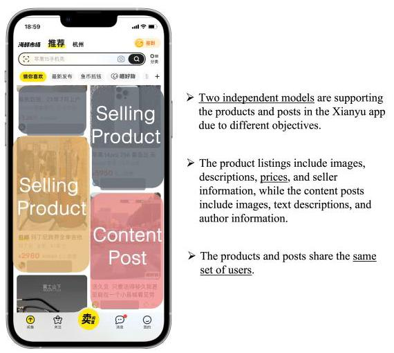
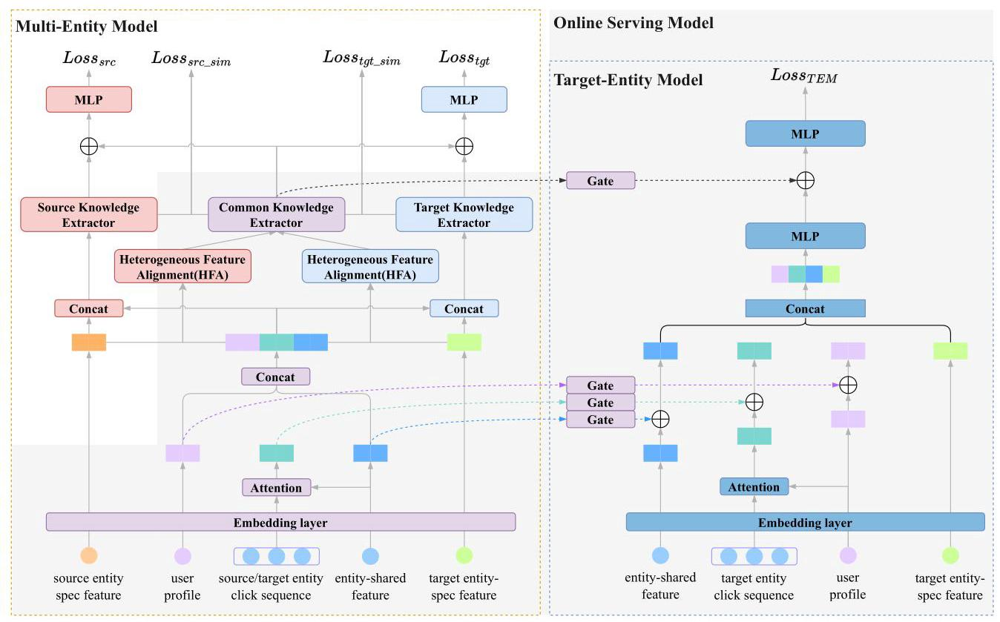
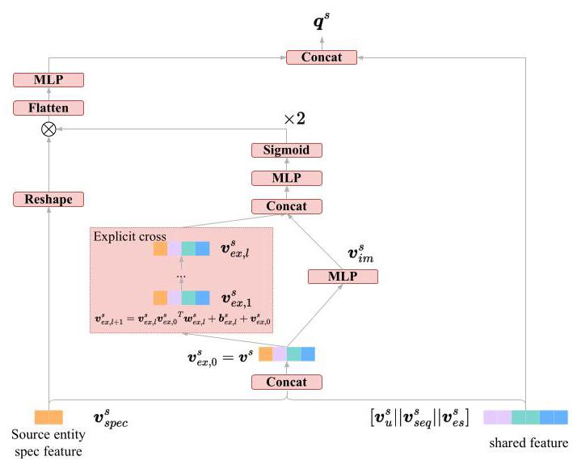

# Effective Two-Stage Knowledge Transfer for Multi-Entity Cross-Domain Recommendation

Jianyu Guan†, Zongming Yin†, Tianyi Zhang, Leihui Chen, Yin Zhang, Fei Huang, Jufeng Chen, Shuguang Han*

Alibaba Group

Hangzhou, China

guanjianyu.gjy, mocun.yzm, zty325975@alibaba-inc.com

leihui.clh, jianyang.zy, huangfei.hf, jufeng.cjf, shuguang.sh@alibaba-inc.com

## ABSTRACT

In recent years, the recommendation content on e-commerce platforms has become increasingly rich - a single user feed may contain multiple entities, such as selling products, short videos, and content posts. To deal with the multi-entity recommendation problem, an intuitive solution is to adopt the shared-network-based architecture for joint training. The underlying idea is to transfer the extracted knowledge from one type of entity (source entity) to another (target entity). However, different from the conventional same-entity cross-domain recommendation, multi-entity knowledge transfer encounters several important challenges: (1) data distributions of the source entity and target entity are naturally different, making the shared-network-based joint training susceptible to the negative transfer issue, (2) more importantly, the corresponding feature schema of each entity is not exactly aligned (e.g., price is an essential feature for selling product while missing for content posts), making the existing approaches no longer appropriate. Recent researchers have also experimented with the pre-training and fine-tuning paradigm. Again, they only take into account the scenarios with the same entity type and feature systems, which is inappropriate in our case. To this end, we design a pre-training & fine-tuning based Multi-entity Knowledge Transfer framework called MKT. MKT utilizes a multi-entity pre-training module to extract transferable knowledge across different entities. In particular, a feature alignment module is first applied to scale and align different feature schemas. Afterward, a couple of knowledge extractors are employed to extract the common and entity-specific knowledge. In the end, the extracted common knowledge is adopted for target entity model training. Through extensive offline and online experiments, we demonstrated the superiority of MKT over multiple State-Of-The-Art methods. MKT has also been deployed for content post recommendations on our production system.

## KEYWORDS

Multi-entity Cross-Domain Recommendation, Click-Through Rate prediction, Recommender System

## ACM Reference Format:

Jianyu Guan†, Zongming Yin†, Tianyi Zhang,, Leihui Chen, Yin Zhang, Fei Huang, Jufeng Chen, Shuguang Han. 2018. Effective Two-Stage Knowledge Transfer for Multi-Entity Cross-Domain Recommendation. In . ACM, New York, NY, USA, 9 pages. https://doi.org/XXXXXXXX.XXXXXXX

## 1 INTRODUCTION

In recent years, the recommendation content on the majority of e-commerce platforms has become increasingly rich - a single user feed may contain multiple entities, such as selling products, short videos, and content posts. Take Xianyu App \( {}^{1} \) for example, its home-page feed consists of both the selling products and content posts (consumers may sometimes post product reviews, unboxing videos, shopping experiences, and et al., and such information is useful for other users with the same purchase needs). As illustrated by Figure 1, our production system offers a small proportion of traffic for content posts. To improve the recommendation experience, we focus on building an effective recommendation algorithm for Xi-anyu content posts in this paper. Despite being focused on Xianyu in this paper, we believe that the proposed approach can be easily applied to other e-commerce platforms as long as they face the same multi-entity recommendation problem.

Due to the limited exposure, building an independent model \( \lbrack 3,8 \) , \( {19},{33},{34}\rbrack \) solely on the impression data of content posts can be inferior in model performance [28]. An intuitive solution is to utilize abundant user interaction information from the other entity (source domain) [13, 36], i.e. the selling products for Xianyu, and assist in the training of the content post (target domain) recommendation algorithm. Despite being promising, an effective transfer of knowledge across different entities faces several important challenges: (1) data distributions of the source entity and target entity are naturally different, making the shared-network-based joint training susceptible to the negative transfer issue, and (2) more importantly, the feature schema of different entities are not exactly aligned. For instance, price is an important feature for products while it is unavailable for content posts. This makes the conventional same-entity cross-domain recommendation approaches \( \left\lbrack  {{17},{30}}\right\rbrack \) inappropriate.

Indeed, most of the existing algorithms on cross-domain recommendation only handle the same entity type, in which the features of each recommendation item remain the same across different domains. Meanwhile, we do find a few studies that tackle the recommendation with multiple entities \( \left\lbrack  {{10},{15},{16},{20}}\right\rbrack \) ; however, they either lack an explicit feature alignment module or fail to provide a model architecture differentiating shared and specific knowledge, both can result in the negative transfer issue. To the best of our knowledge, current research on cross-domain recommendation can be broadly divided into two groups: the joint training \( \left\lbrack  {1,6,{10},{15},{18},{22},{29},{32}}\right\rbrack \) approach in which data from source and target domains is trained together within a single stage, and the pre-training &fine-tuning \( \left\lbrack  {2,{11},{17},{26},{30}}\right\rbrack \) approach with the first stage on pre-training the source domain and the second stage on fine-tuning the target domain.

---

*Jianyu Guan and Zongming Yin contributed equally to this research. Shuguang Han is the corresponding author.

Permission to make digital or hard copies of all or part of this work for personal or classroom use is granted without fee provided that copies are not made or distributed for profit or commercial advantage and that copies bear this notice and the full citation on the first page. Copyrights for components of this work owned by others than the author(s) must be honored. Abstracting with credit is permitted. To copy otherwise, or republish, to post on servers or to redistribute to lists, requires prior specific permission and/or a fee. Request permissions from permissions@acm.org.

Conference'17, July 2017, Washington, DC, USA

(C) 2018 Copyright held by the owner/author(s). Publication rights licensed to ACM. ACM ISBN 978-x-xxxx-xxxx-x/YY/MM

https://doi.org/XXXXXXX.XXXXXXX

\( {}^{1} \) Xianyu is the largest online flea marketplace in China. It allows every consumer to post and sell their second-hand products on the platform.

---

Figure 1: Homepage recommendation of Xianyu APP, which consists of a mixture of selling products and content postings.

A joint training algorithm typically involves designing shared and independent parameters across domains to capture shared and unique knowledge, along with various gating architectures to dynamically regulate outputs from different domains. The goal is to transfer knowledge from the source domain to the target domain through shared parameters. Take STAR [21] for example, Sheng et al. developed the Star Topology Adaptive Recommender (STAR) algorithm, which comprises both the shared centered parameters and domain-specific parameters. The shared parameters are designed to learn the common characteristics across domains, while the domain-specific parameters capture domain differences. However, the shared-parameter architecture often encounters the gradient conflict problem during back-propagation. This is more prominent once the training data is highly skewed towards one domain. In our production system, the amount of data for the product entity is 9 times over the content post entity, this may cause the model parameters to be governed by the product entity \( \left\lbrack  {4,{25},{31}}\right\rbrack \) .

To resolve the negative transfer issue, researchers have experimented with the way of pre-training & fine-tuning. During pretraining, a base model is trained with an extensive amount of source data. Afterward, the obtained model or a new target model is tuned with the data from the target domain to better accommodate the target distribution. For instance, KEEP [30] adopts a two-stage framework that comprises a supervised pre-training knowledge extraction module on a super-domain, and a plug-in network that incorporates the extracted knowledge into the target domain. However, its pre-training stage requires a vast amount of data and produces a relatively static representation of user-item interest. CTNet [17] further proposes a continuous knowledge transfer algorithm from the temporal perspective. However, it is incapable of handling entities with different feature schemas, which will be resolved in this paper.

To address the problem of multi-entity knowledge transfer with heterogeneous feature schema, we propose an effective Multi-entity Knowledge Transfer algorithm (MKT for short). \( {}^{2} \) MKT follows the pre-training & fine-tuning paradigm.

During pre-training, MKT extracts useful knowledge from the source entity through training a multi-entity compatible base model. Due to the feature alignment issue, pre-training purely based on the source entity data, as done in the previous cross-domain research \( \left\lbrack  {{17},{30}}\right\rbrack \) , is insufficient. To better accommodate for the second-stage fine-tuning, MKT adopts the mixed data from both source and target entities for pre-training and further develops a Heterogeneous Feature Alignment (HFA) module to align the heterogeneous feature schema of the two entities. In addition, MKT employs a Common Knowledge Extractor (CKE) and an Independent Knowledge Extractor (IKE) to extract the common and independent knowledge between two entities. To better capture the semantic meaning of different knowledge representations, MKT further designs an auxiliary task to enforce the common knowledge and entity-specific knowledge to be dissimilar. The resulting multi-entity base model is then plugged into the target domain model for fine-tuning. This ultimately enhances the prediction performance for the target model (i.e., the content post recommendation model).

To summarize, the main contributions of our work are as follows:

- We propose an MKT framework to deal with the problem of multi-entity knowledge transfer with heterogeneous feature schema. MKT first trains a multi-entity base model with the mixed-domain data, and the resulting model is then applied to the target domain for knowledge transfer.

- By diving into the multi-entity recommendation problem, we discover several important issues and develop the corresponding solutions. Specifically, we develop a Heterogeneous Feature Alignment (HFA) module to handle different feature schemas from multiple entities and propose an auxiliary task with a polarization distribution to better extract common knowledge across entities.

- We verify the effectiveness of MKT in industrial datasets and examine the model performance through online A/B testing on the Xianyu platform. Experimental results demonstrate that MKT outperforms the State-Of-The-Art algorithms by a fair margin, resulting in a 4.1% increase in click-through rate and a 7.1% increase in user engagement metric in online experiments.

## 2 RELATED WORK

The multi-entity recommendation problem described in this paper falls under the research direction of Cross-Domain Recommendation (CDR for short); thereby, we mainly summarize the related research studies in this area. The CDR research aims to utilize the abundant data from the source domain to enhance the recommendation performance of the target domain \( \left\lbrack  {7,{27},{35}}\right\rbrack \) . This is widely recognized as an effective method to address the data sparsity and cold start issues for the target domain. Existing cross-domain algorithms can be divided into two groups: the joint training approach and the pre-training & fine-tuning approach.

---

\( {}^{2} \) Note that, for simplicity, we referred to the product as the source entity and the content post as the target entity in this paper.

---

CDR with Joint Training. Joint training approaches attempt to transfer knowledge from the source domain to the target domain by designing proper network architectures with shared parameters.

Considering that users are normally consistent across domains, many studies have investigated the ways of propagating user interest to different domains. For instance, MVDNN [6] designed a shared user tower and multiple independent item towers, that helped broadcast user knowledge across domains. MiNet [20] divided cross-domain user interests into long-term interest and short-term interest, and jointly models three types of user interests with an attention mechanism. However, a pure transfer of user profile knowledge is insufficient, researchers have also examined the ways of knowledge extraction from user-item feature interaction.

MMOE [18] utilized multiple shared expert networks and domain-specific gating networks to capture the commonality and difference in user-entity interaction information. PLE [22] added independent expert networks and exploited a progressive routing mechanism to extract shared and task-specific knowledge. CoNet [10] adopted cross-connection units for knowledge transfer across different domains. STAR [21] proposed a star-shaped topology compromising globally shared parameters and domain-specific parameters, and the final domain parameters were computed with the dot product of the two parameters. PEPnet [1] designed a dynamic parameter generator that is shared across multiple domains.

However, joint training algorithms inevitably face gradient conflict problems, and since the number of data samples in the source domain is usually much larger than that in the target domain, the final model is dominated by the source domain; therefore, the final model does not fully adapt to the target domain. Furthermore, joint training algorithms cannot effectively handle multi-entity problems due to the misalignment of feature patterns.

CDR with Pre-training & Fine-tuning. The pre-training & fine-tuning approach is another main solution to the cross-domain recommendation problem. Conventional methods [2, 26] usually adopted the same model for both pre-training and fine-tuning. That is, we first pre-train on the source domain to obtain a base model and then fine-tune the resulting base model with the data from the target domain. However, as mentioned in previous studies \( \left\lbrack  {9,{14}}\right\rbrack \) , those methods can easily get stuck in the local optima once the target data distribution is far away from the source data distribution.

Therefore, later studies such as KEEP [30] adopted the knowledge plugging framework, in which the pre-trained knowledge is inserted into the target domain. However, due to the large amount of training data and the corresponding model architecture, the extracted knowledge from KEEP is rather static. CTNet [17] further proposed a continuous knowledge transfer algorithm for dynamic knowledge transfer. The above knowledge plugging paradigm is indeed capable of adapting the final model to the target domain through fine-tuning; however, they can not deal with entities with different feature schemas.

Regardless of the extensive research on CDR, few of them can be directly applied to effectively handle the multi-entity recommendation problem as the underlying feature schemas can be significantly different. Fortunately, our proposed MKT algorithms can deal with the heterogeneous feature schemas with a well-designed HFA module. It also prevents the model from being dominated by the source domain through transferring knowledge from a pre-trained multi-entity model to the target-entity model.

## 3 METHODOLOGY

This section introduces the proposed MKT algorithm. We start with defining the problem and then describe the algorithmic framework in Section 3.1. In the next few sections, we will provide more details on each module of the proposed MKT algorithm. Note that the notations in this paper follow the below rules: the bold uppercase letters define matrices, the bold lowercase letters define vectors, and regular lowercase letters define scalars. All of the vectors are in the form of column vectors.

We define our research topic as the multi-entity cross-domain recommendation, in which we attempt to utilize rich user interaction data from the source entity to enhance the recommendation experience for the target entity. To clarify, in this paper, the source entity refers to the products, and the target entity refers to the content posts. Both of them are displayed to the end-users on the homepage feeds of Xianyu, while the number of impressions for products is 9 times more than the posts. In addition, if not specially mentioned, the recommendation algorithm mainly implies the Click-Through Rate (CTR) prediction model as it is the main ranking criterion for homepage recommendation.

Formally, let us denote the source entity data as \( \left( {{X}^{s},{Y}^{s}}\right) \) and the target entity data as \( \left( {{X}^{t},{Y}^{t}}\right) \) , where \( X \) represents the input features and \( Y \) represents the corresponding label information, e.g. click. Both of them will be exploited for knowledge pre-training, and the extracted knowledge will be further applied to improve the CTR prediction performance for the content post recommendation.

### 3.1 Model Overview

As illustrated by Figure 2, MKT consists of two stages. In the first stage, we utilize both \( \left( {{X}^{s},{Y}^{s}}\right) \) and \( \left( {{X}^{t},{Y}^{t}}\right) \) to pre-train a Multi-Entity Model (MEM). In the second stage, we build a Target Entity Model (TEM) and connect it with MEM through joint training. Ultimately, the resulting blended model (see the gray color in Figure 2) will be adopted to serve the target entity recommendation.

Considering the feature difference, MEM develops a Heterogeneous Feature Alignment (HFA) module to screen and align different feature schemas, facilitating the knowledge extraction process in the subsequent Common Knowledge Extractor (CKE) module. To ensure CKE functions as intended, we introduce two independent knowledge extractors to focus on extracting entity-specific knowledge, and an auxiliary loss to enforce the entity-specific knowledge to be away from the common knowledge.

In the second stage, the low-level feature embeddings, the extracted high-level common knowledge, and the Target Entity Model are all trained together to predict user clicks on the target entity. Instead of directly concatenating the learned representations, we introduce several gating layers to better accommodate the target entity model. The resulting model will then be used for online serving. The whole process is also visualized in Figure 2.

### 3.2 Multi-Entity Model Pre-training

In the below sections, we provide more details on pre-training the multi-entity model with mixed source and target entity data.

3.2.1 Feature Embedding. To effectively leverage multi-entity data, we categorize the input features into four groups, as outlined below.

- User profile feature. Each user has her profile features such as user ID, age group, gender, and city, which represent the static information of a user.

- Multi-entity user behavior sequence. Since we have two types of entities in Xianyu, there are correspondingly two types of user behavior sequences: one for the source entity (products the user has clicked) and the other for the target entity (content posts the user has clicked).

- Entity-shared feature. Features that are the same across the source entity and the target entity, such as the entity catalog, the creator ID, and et al. We refer to those overlapped features as the entity-shared feature.

- Entity-specific feature. This denotes the unique features that only exist in one type of entity. For instance, the product entity has a price feature not present in the content post entity. Similarly, the content entity owns a content style feature, which is not included in the product entity.

All of the above features are first transformed into one-hot encodings, and then converted into low-dimensional dense embedding vectors suitable for the deep neural networks. For each data sample in the source domain \( {\mathbf{x}}^{s} \) , we map it into the below embedding vector format \( {\mathbf{v}}^{s} \) , where \( {\mathbf{v}}^{s} \in  {\mathbb{R}}^{{d}_{s} \times  1} \) .

\[
{\mathrm{v}}^{s} = \left\lbrack  {{\mathrm{v}}_{u}^{s}\begin{Vmatrix}{\mathrm{v}}_{\text{ seq }}^{s}\end{Vmatrix}{\mathrm{v}}_{\text{ shared }}^{s}\parallel {\mathrm{v}}_{\text{ spec }}^{s}}\right\rbrack \tag{1}
\]

\[
{\mathrm{v}}_{u}^{s} = \left\lbrack  {{\mathrm{e}}_{1}\begin{Vmatrix}{\mathrm{e}}_{2}\end{Vmatrix}\ldots \begin{Vmatrix}{\mathrm{e}}_{{n}_{u}}\end{Vmatrix}}\right\rbrack \tag{2}
\]

Here, \( {\mathbf{v}}_{\text{ shared }}^{s} \) and \( {\mathbf{v}}_{\text{ spec }}^{s} \) correspond to the embedding vectors of entity-shared features and entity-specific features respectively. \( {\mathrm{v}}_{\text{ seq }}^{s} \) is obtained through the attention mechanism. Since attention is not the key design of this paper, we omit the detail in this section. It can be Multi-Head Attention [23] or other sequence encoders. Features employed in the attention mechanism are part of entity-shared features, so multiple entities can share parameters in the sequence encoder. The symbol || denotes the vector concatenation operation. Similarly, for target domain sample \( {\mathbf{x}}^{t} \) , we can obtain \( {\mathbf{v}}^{t} \in  {\mathbb{R}}^{{d}_{t} \times  1} \) in the same manner.

3.2.2 Heterogeneous Feature Alignment(HFA). In practice, we have observed that the entity-specific features significantly affect the model performance. However, simply mapping those features onto the same dimension and then sharing them across different entities is sub-optimal. With heterogeneous feature schemas, we have to design a module that can properly handle the alignment of entity-specific features. To this end, we develop a Heterogeneous Feature Alignment (HFA) structure that is capable of selecting and aligning those entity-specific features.

HFA first utilizes explicit and implicit interactions between entity-specific features and entity-shared features to jointly assess the importance of each entity-specific feature. With the importance score, HFA further augments those features with high scores. Finally, HFA maps the entity-specific features (from both source and target entities) into the same dimension for alignment, and then concatenates the resulting vector with the shared features. The whole process can be illustrated as Figure 3.

For \( {\mathbf{v}}_{\text{ spec }}^{s} \) , we adopt the below Formula 4 to obtain the explicit feature cross [24]. Here, \( {\mathbf{w}}_{{ex}, l}^{s} \in  {\mathbb{R}}^{{d}_{s} \times  1} \) and \( {\mathbf{b}}_{{ex}, l}^{s} \in  {\mathbb{R}}^{{d}_{s} \times  1} \) represent the weight and bias for the explicit feature interaction at the \( l \) -th layer (note that we use \( {ex} \) to denote explicit). In this paper, we employ two layers of explicit feature interaction for obtaining \( {\mathbf{v}}_{{ex},2}^{s} \) . The same process can be easily applied to the target entity.

\[
{\mathbf{v}}_{{ex},0}^{s} = {\mathbf{v}}_{spec}^{s} \tag{3}
\]

\[
{\mathbf{v}}_{{ex}, l + 1}^{s} = {\mathbf{v}}_{{ex}, l}^{s}{\mathbf{v}}_{{ex},0}^{s}{}^{T}{\mathbf{w}}_{{ex}, l}^{s} + {\mathbf{b}}_{{ex}, l}^{s} + {\mathbf{v}}_{{ex},0}^{s}, l = 0,1,2\ldots \tag{4}
\]

As for the implicit feature interaction (i.e., \( {\mathbf{v}}_{im}^{s} \) and \( {\mathbf{v}}_{im}^{t} \) ), we exploit a fully connected (FC) layer and the ReLU activation function, as shown in Formula 5, for such a purpose. Here, we use im to denote the word implicit.

\[
{\mathbf{v}}_{im}^{s} = \operatorname{ReLU}\left( {{\mathbf{W}}^{s}{\mathbf{v}}_{spec}^{s} + {\mathbf{b}}^{s}}\right) \tag{5}
\]

We then concatenate the resulting vectors from the explicit feature cross and implicit feature cross, and exploit an FC layer with a Sigmoid activation function to map them to vectors whose length corresponds to the total number of entity-specific features. This creates the importance score for each feature in the source entity \( {\mathbf{p}}^{s} \in  {\mathbb{R}}^{{n}_{\text{ spec }}^{s} \times  1} \) , and the target entity \( {\mathbf{p}}^{t} \in  {\mathbb{R}}^{{n}_{\text{ spec }}^{t} \times  1} \) .

\[
{\mathbf{p}}^{s} = 2 * \operatorname{Sigmoid}\left( {\operatorname{FC}\left( {\operatorname{Concat}\left( {{\mathbf{v}}_{{ex},2}^{s},{\mathbf{v}}_{im}^{s}}\right) }\right) }\right) \tag{6}
\]

Based on the feature importance score, HFA then amplifies important features and down-weights the unimportant ones. In the end, the processed entity-specific features and entity-shared features are concatenated for the use of the next module. The alignment of the source and target entity features is achieved through a multilayer perceptron (MLP), which is shown below:

\[
{\mathbf{V}}^{s} = \operatorname{Reshape}\left( {\mathbf{v}}_{spec}^{s}\right) ,{\mathbf{V}}^{s} \in  {\mathbb{R}}^{{n}_{spec}^{s} \times  {d}_{e}} \tag{7}
\]

\[
{\mathbf{q}}^{s} = \operatorname{Concat}\left( {{\mathbf{v}}_{\text{ shared }}^{s},\operatorname{ReLU}\left( {{FC}\left( {\operatorname{Flatten}\left( {\operatorname{Multiply}\left( {{\mathbf{V}}^{s},{\mathbf{p}}^{s}}\right) }\right) }\right) }\right) }\right)
\]

(8)

where Multiply represents element-wise multiplication, and Flatten is the operation of flattening a matrix into a column vector. Finally, we obtain output vectors of the source entity and target entity with the same dimension, denoted as \( {\mathbf{q}}^{s} \in  {\mathbb{R}}^{{d}_{HFA} \times  1} \) and \( {\mathbf{q}}^{t} \in  {\mathbb{R}}^{{d}_{HFA} \times  1} \) ( \( {d}_{HFA} \) is the hyper-parameter for HFA).

3.2.3 Common Knowledge Extractor (CKE). After acquiring the aligned entity vectors from HFA, we need to extract the shared knowledge from products and content posts. In theory, any network architecture with shared-private parameters can serve as the common knowledge extractor for MKT, such as STAR [21], MMoE [18], or PLE [22]. Here, we opt for the PLE model structure as our common knowledge extractor, referred to as CKE.

More specifically, we use \( {f}_{CKE} \) to represent the network operations of CKE. As a result, the output vectors \( {\mathbf{q}}^{s} \) and \( {\mathbf{q}}^{t} \) from HFA will then transform into high-order knowledge extracted from user-entity interactions, as shown in the following formula:

\[
{\mathrm{g}}_{\text{ com }}^{s} = {f}_{CKE}\left( {\mathrm{q}}^{s}\right) ,{\mathrm{\;g}}_{\text{ com }}^{t} = {f}_{CKE}\left( {\mathrm{q}}^{t}\right) ,{\mathrm{g}}_{\text{ com }}^{s},{\mathrm{\;g}}_{\text{ com }}^{t} \in  {\mathbb{R}}^{{d}_{CKE}} \tag{9}
\]

where \( {d}_{CKE} \) is the output dimension of the CKE.

Figure 2: An overview of the model architecture for MKT, which consists of a multi-entity base model (left) that is trained on the mixed-domain data, and a target entity model (right) for the target entity recommendation. Modules in the gray color denote the online serving part.

Figure 3: An illustration of the HFA component.

3.2.4 Polarized Distribution Loss. During joint training, it is hard to measure whether these shared parameters indeed learn the common knowledge, and to what extent they are doing so. To address this issue, we propose an auxiliary task that enforces the Common Knowledge Extractor (CKE) to surely learn the common knowledge. We name the corresponding loss function as Polarized Distribution Loss (PDL), which will be discussed lately in the below paragraphs.

Note that along with the CKE, we have also designed independent knowledge extractors for different entities: the Source Knowledge Extractor (SKE) and the Target Knowledge Extractor (TKE). These entity-independent knowledge extractors can be as simple as an MLP model. For simplicity, we use \( {f}_{SKE} \) and \( {f}_{TKE} \) to denote the knowledge extractors for the source and target entity, respectively. Then, we can obtain the independent high-order knowledge \( {\mathrm{g}}_{\text{ ind }}^{s} \) for the source entity, and the independent high-order knowledge \( {\mathrm{g}}_{\text{ ind }}^{t} \) for the target entity through the following formula:

\[
{\mathrm{g}}_{\text{ ind }}^{s} = {f}_{SKE}\left( {\mathrm{v}}^{s}\right) ,{\mathrm{\;g}}_{\text{ ind }}^{t} = {f}_{TKE}\left( {\mathrm{v}}^{t}\right) ,{\mathrm{\;g}}_{\text{ ind }}^{s},{\mathrm{\;g}}_{\text{ ind }}^{t} \in  {\mathbb{R}}^{{d}_{CKE}} \tag{10}
\]

We set the output vector dimension of SKE and TKE to be the same as that of CKE. The reason is that once we obtain independent and common knowledge, we want them to be as different as possible. If the corresponding knowledge extractors capture similar knowledge, the information gain for the target domain would be minimal. To this end, we adopt the polarized distribution loss to minimize the similarity between the independent knowledge and the common knowledge. The cosine function is a commonly adopted similarity function for this purpose. This process can be illustrated by the below formula:

\[
\operatorname{cosine}\left( {{\mathbf{g}}_{\text{ com }}^{s},{\mathbf{g}}_{\text{ ind }}^{s}}\right)  = \frac{{\mathbf{g}}_{\text{ com }}^{s} \cdot  {\mathbf{g}}_{\text{ ind }}^{s}}{{\begin{Vmatrix}{\mathbf{g}}_{\text{ com }}^{s}\end{Vmatrix}}_{2} \cdot  {\begin{Vmatrix}{\mathbf{g}}_{\text{ ind }}^{s}\end{Vmatrix}}_{2}} \tag{11}
\]

\( \parallel  \cdot  {\parallel }_{2} \) means the length of a vector in the Euclidean space. With the above notations, the polarized distribution loss is as follows:

\[
{\text{ Loss }}_{\text{ pdl }} = {\text{ Loss }}_{\text{ src\_sim }} + {\text{ Loss }}_{\text{ tgt\_sim }}
\]

\[
= \operatorname{cosine}\left( {{\mathrm{g}}_{\text{ com }}^{s},{\mathrm{\;g}}_{\text{ ind }}^{s}}\right) \tag{12}
\]

\[
+ \operatorname{cosine}\left( {{\mathrm{g}}_{\text{ com }}^{t},{\mathrm{\;g}}_{\text{ ind }}^{t}}\right)
\]

Finally, the MEM loss can be computed as follows:

\[
{\text{ Loss }}_{MEM} = {\text{ Loss }}_{src} + {\text{ Loss }}_{tgt} + \gamma {\text{ Loss }}_{pdl}
\]

\[
= \mathop{\sum }\limits_{{{x}_{i} \in  {X}^{s}}}^{{N}_{s}}L\left( {{y}_{i}^{s},{f}_{MEM}\left( {{x}_{i},{\Theta }_{MEM}}\right) }\right)
\]

\[
+ \mathop{\sum }\limits_{{{x}_{i} \in  {X}^{t}}}^{{N}_{t}}L\left( {{y}_{i}^{t},{f}_{MEM}\left( {{x}_{i},{\Theta }_{MEM}}\right) }\right) \tag{13}
\]

\[
+ \gamma {\text{ Loss }}_{pdl}
\]

where \( {x}_{i} \) stands for a data sample either from the source or the target domain, \( \gamma \) is the hyper-parameter (we set the \( \gamma \) parameter to 0.1 throughout the whole paper) for \( {\operatorname{Loss}}_{pdl},{f}_{MEM} \) represents the MEM, \( L \) denotes the loss function, and \( {\Theta }_{MEM} \) indicate the trainable parameters in MEM.

### 3.3 Target-Entity Model Fine-tuning

In the first stage, we train the MEM model with mixed data samples from both the source entity and the target entity. However, we notice that the number of data samples for the source entity is three times more than that of the target entity. This may result in the MEM being dominated by the source entity and may be sub-optimal if it is used for online serving. To overcome this issue, we introduce a second stage fine-tuning process: with the obtained MEM model from the first stage, we integrate the corresponding knowledge into a Target-Entity Model(TEM) for fine-tuning. By doing so, we may achieve better model performance.

To be more specific, we freeze the parameters of MEM during the transfer of knowledge from MEM to TEM. Only target entity samples are required for TEM fine-tuning. To ensure that TEM keeps the entity-specific ability, we only transfer knowledge vectors with the same semantics. These include the user profile feature embedding vector, user behavior sequence vector, entity-shared feature embedding vector, and the user-entity interaction knowledge vector extracted by the CKE module.

During the second-stage fine-tuning, we only feed the target entity data into both MEM and TEM. Here, we utilize the vectors \( {\mathbf{v}}_{u}^{t},{\mathbf{v}}_{\text{ seq }}^{t},{\mathbf{v}}_{\text{ shared }}^{t},{\mathbf{g}}_{\text{ com }}^{t} \) from MEM, and the user feature vector \( {\mathbf{v}}_{u}^{TEM} \) , user behavior sequence vector \( {\mathbf{v}}_{\text{ seq }}^{TEM} \) , entity-shared feature vector \( {\mathbf{v}}_{\text{ shared }}^{TEM} \) , and user-entity cross vector \( {\mathbf{g}}_{\text{ cross }}^{TEM} \) from TEM.

Considering that the common knowledge in the MEM is not entirely applicable to TEM, it is necessary to filter out irrelevant knowledge. This helps to ensure that the resulting common knowledge is truly useful for the target domain. To achieve this, we use an adaptive gating structure (such as GLU [5]) when plugging the knowledge vector from MEM. This gating structure helps to filter out irrelevant knowledge and allows us to combine the filtered common knowledge with the vectors from TEM. For example, the user-entity interaction vector has a gate denoted as \( {f}_{\text{ cross\_gate }} \) , and the formula for this gate is as follows.

\[
{\mathrm{g}}_{\text{ com\_gate }}^{t} = {f}_{\text{ cross\_gate }}\left( {\mathrm{g}}_{\text{ com }}^{t}\right) \tag{14}
\]

\[
{\mathbf{g}}_{\text{ cross\_final }}^{\text{ TEM }} = {\mathbf{g}}_{\text{ cross }}^{\text{ TEM }} + {\mathbf{g}}_{\text{ com\_gate }}^{t} \tag{15}
\]

After receiving knowledge from the multi-entity model, we get the final user-entity interaction vector for TEM. All of the knowledge vectors such as \( {\mathbf{v}}_{\text{ u\_final }}^{TEM},{\mathbf{v}}_{\text{ seq\_final }}^{TEM} \) and \( {\mathbf{v}}_{\text{ shared\_final }}^{TEM} \) can be obtained in the same manner.

The overall loss of TEM can be formulated as follows:

\[
{\operatorname{Loss}}_{TEM} = \mathop{\sum }\limits_{{{x}_{i} \in  {X}^{t}}}^{{N}_{t}}L\left( {{y}_{i}^{t},{f}_{TEM}\left( {{x}_{i},{\Theta }_{TEM}}\right) }\right) \tag{16}
\]

where \( {x}_{i} \in  {X}^{t} \) denotes a data sample from the target domain, \( {f}_{TEM} \) represents TEM, \( L \) denotes the cross-entropy loss adopted in this paper, and \( {\Theta }_{TEM} \) is the trainable parameter for TEM.

### 3.4 Online Deployment

MKT has been successfully deployed on Xianyu App to serve millions of users daily. The overall system architecture can be shown in Figure 2. It is important to note that despite the full MKT architecture being exploited for offline training, we only need the gray part of the MKT for online serving. This is because our model is designed for content post recommendation, in which the modules related to product recommendation are no longer usable. It also allows us to extract the required knowledge with minimal computation cost, which is crucial for online serving.

## 4 EXPERIMENT

In this section, we conduct extensive experiments to understand the effectiveness of the MKT algorithm.

### 4.1 Experiment Setup

4.1.1 Datasets. Due to the lack of a publicly available large-scale multi-entity dataset from the industrial recommender systems, we construct experimental data with the impression log from our production system. We collect 31 days of user interaction data from the Xianyu homepage recommendation system. As mentioned before, 90% of them are related to selling products and the remaining 10% is regarding the content posts. Since the magnitude of user interaction data is beyond processing, we keep all positive samples (i.e., user clicks) while conducting sampling for negative ones (the sampling ratios are different for product and post). In total, we obtain 9.3 billion data samples for the source entity and 3.1 billion data samples for the target entity. The overall statistics are summarized in Table 1. In the below experiments, we use 30 days of data for training and the remaining one day of data for testing.

4.1.2 Baselines. We include both single-domain and cross-domain recommendation algorithms for comparison. The cross-domain approaches are further divided into two categories: the joint training method (i.e., the below MMOE, PLE, STAR, CoNet, and MiNet algorithms), and the pre-training & fine-tuning method (i.e., the below Finetune and CTNet models).

Table 1: Overall statistics of the collected production dataset.

<table><tr><td></td><td>Source entity (products)</td><td>Target entity (posts)</td></tr><tr><td>Users</td><td>130M</td><td>130M</td></tr><tr><td>Items</td><td>290M</td><td>4M</td></tr><tr><td>Data samples</td><td>9.3B</td><td>3.1B</td></tr></table>

## \( \vartriangleright \) Single-Domain Recommendation Baselines:

- MLP (Multilayer Perceptron) is the basic deep neural network-based prediction model that includes an embedding layer, a fully connected layer, and an output layer.

- DIN [34] (Deep Interest Network) is the widely adopted recommendation algorithm that adaptively learns user interest from historical behavior sequences.

- FiBiNet [12] utilizes a Squeeze-and-Excitation network (SENet) to dynamically learn feature importance and employs bilinear interaction to model fine-grained user-item interaction.

## \( \vartriangleright \) Cross-Domain Recommendation Baselines:

- MMOE [18] (Multi-gate Mixture-of-Experts) leverages a shared mixture-of-experts module and task-specific gating networks for multi-task learning.

- PLE [22] (Progressive Layered Extraction) is a multi-task prediction model that compromises both shared and independent expert networks to model shared and task-specific knowledge across tasks.

- STAR [21] designs a star-shaped topology to model the shared and independent knowledge of different domains.

- CoNet [10] (Collaborative Cross Network) employs cross-connection units for knowledge transfer across domains.

- MiNet [20] (Mixed Interest Network) jointly models three types of user interest: 1) long-term user interest across domains, 2) short-term user interest from the source domain, and 3) short-term interest in the target domain.

- The vallina Finetune method pre-trains a base model ONLY on the source domain data and fine-tunes the resulting model on the target domain data.

- CTNet [17] follows the pre-training & and fine-tuning framework, which performs click-through rate prediction under the continual transfer learning setting. It is capable of transferring knowledge from a time-evolving source domain to a time-evolving target domain.

4.1.3 Implementation Details. Embedding dimensions are set to 8 for all of the sparse features. For the above-mentioned single-domain models and the Target Entity Model (see Section 3.3), the number of layers for the Deep Neural Network is set to 4 , with the number of hidden units in each layer set to \( \lbrack {1024},{512},{64} \) , 1]. As for the joint training approaches and Multi-Entity Model (see Section 3.2), we employ a two-layer shared network, with a configuration of hidden units as \( \left\lbrack  {{1024},{512}}\right\rbrack \) . The shared layers are then followed by domain-specific towers for each domain, with each tower consisting of two layers with hidden units \( \left\lbrack  {{64},1}\right\rbrack \) . For MMOE, we set the number of expert networks to 3 . Since CTNet can not deal with multiple entities, we have to discard the entity-specific features during pre-training.

4.1.4 Evaluation Metrics. We employ the standard AUC metric (Area Under Receiver Operating Characteristic Curve). A larger AUC implies a better ranking ability. Note that in the production dataset, we further compute the Group AUC (GAUC) to measure the goodness of intra-user ranking ability, which has shown to be more consistent with the online performance [21, 34]. GAUC is also the top-line metric in the production system. It can be calculated with Equation 17, in which \( U \) represents the number of users, #impression \( \left( u\right) \) denotes the number of impressions for the \( u \) -th user, and \( {\mathrm{{AUC}}}_{u} \) is the AUC computed only using the samples from the \( u \) -th user. In practice, a lift of \( {0.1}\% \) GAUC metric (in absolute value difference) often corresponds to an increase of \( 1\% \) CTR.

\[
\mathrm{{GAUC}} = \frac{\mathop{\sum }\limits_{{u = 1}}^{U}\# \text{ impressions }\left( u\right)  \times  {\mathrm{{AUC}}}_{u}}{\mathop{\sum }\limits_{{u = 1}}^{U}\# \text{ impressions }\left( u\right) } \tag{17}
\]

### 4.2 Model Performance

4.2.1 Overall Evaluation. Table 2 provides the model performance for all of the baseline approaches and our proposed Multi-entity Knowledge Transfer (MKT) algorithm. We discover that single-domain recommendation algorithms are generally inferior to the cross-domain methods, indicating that the data from different domains indeed helps better model user interest. The joint-training methods outperform the single-domain models, but not by a large margin. Most of them only surpass FiBiNet by \( {0.2}\% \) in both GAUC and AUC metrics, and the GAUC of CoNet is even on par with FiB-iNet. This, we hypothesize, is mainly ascribed to their inability to address the heterogeneous feature schemas across multiple entities, resulting in limited improvements.

Pre-training & fine-tuning approaches are in general better than the joint-training algorithms. This might come from two aspects: (1) because of the data distribution difference and feature misalignment, joint-training algorithms are difficult to resolve the negative knowledge transfer issue, and (2) with the second-stage fine-tuning on the target entity data, the pre-training & fine-tuning models can better adapt to the target entity.

As for the pre-training & fine-tuning methods, MKT achieves the best performance on both AUC and GAUC metrics. The most prominent difference is that MKT pre-trains a multi-entity base model with mixed source entity and target entity data, whereas the Finetune and CTNet models only utilize the data from the source entity. With the target entity data for pre-training, the model can capture the target entity distribution in ahead. Besides, through the well-designed Heterogeneous Feature Alignment (HFA) architecture and polarized distribution loss, MKT can effectively extract desired knowledge, and avoid local optima that might exist in Fine-tune and CTNet. Note that, here, MKT transfers user feature embedding, shared entity feature embedding, and the extracted common knowledge to the target entity model (see more details in Figure 2).

4.2.2 Model Performance on Different User Groups. To further understand the behavior of the proposed MKT model, we split users into three groups based on their activity levels (which are measured by the number of clicks over the past month). Particularly, users with fewer than 10 clicks are assigned to Group 1, users with \( \lbrack {10},{30}) \) clicks are put into Group 2, and the rest are in Group 3. Here, we select FiBiNet and Finetune for comparison. FiBiNet is the best-performing single-domain recommendation model. Finetune falls under the same pre-training & fine-tuning recommendation paradigm as MKT, and it is also our production baseline.

Table 2: A comparison of model performance across different baseline models and the proposed MKT algorithm.

<table><tr><td colspan="2">Model</td><td>AUC</td><td>GAUC</td></tr><tr><td rowspan="3">Single-domain</td><td>MLP</td><td>0.7315</td><td>0.5683</td></tr><tr><td>DIN</td><td>0.7335</td><td>0.5761</td></tr><tr><td>FiBiNet</td><td>0.7345</td><td>0.5824</td></tr><tr><td rowspan="5">Joint-training</td><td>MMoE</td><td>0.7367</td><td>0.5856</td></tr><tr><td>PLE</td><td>0.7363</td><td>0.5837</td></tr><tr><td>STAR</td><td>0.7362</td><td>0.5845</td></tr><tr><td>CoNet</td><td>0.7357</td><td>0.5820</td></tr><tr><td>MiNet</td><td>0.7370</td><td>0.5863</td></tr><tr><td rowspan="3">Pre-training   &   Fine-tuning</td><td>Finetune</td><td>0.7372</td><td>0.5897</td></tr><tr><td>CTNet</td><td>0.7380</td><td>0.5872</td></tr><tr><td>MKT</td><td>0.7398</td><td>0.5958</td></tr></table>

As shown in Table 3, the Finetune model outperforms FiBiNet across all three user groups, indicating that the cross-domain approach is superior to the single-domain method. Meanwhile, we see more improvement for users with few behaviors, whereas there is less improvement for users with more behaviors, suggesting that the extracted knowledge from the source entity is more beneficial to long-tail users. When comparing MKT to Finetune, we can reach very similar conclusions. This again demonstrates the effectiveness and robustness of the MKT algorithm.

Table 3: Model performance on different user groups.

<table><tr><td rowspan="2">User Behaviors</td><td rowspan="2">Model</td><td colspan="2">AUC</td><td colspan="2">GAUC</td></tr><tr><td>value</td><td>Improv.</td><td>value</td><td>Improv.</td></tr><tr><td rowspan="3">0-10</td><td>FiBiNet</td><td>0.7316</td><td>-</td><td>0.5659</td><td>-</td></tr><tr><td>Finetune</td><td>0.7352</td><td>0.50%</td><td>0.5773</td><td>2.0%</td></tr><tr><td>MKT</td><td>0.7379</td><td>0.87%</td><td>0.5815</td><td>2.8%</td></tr><tr><td rowspan="3">10-30</td><td>FiBiNet</td><td>0.7322</td><td>-</td><td>0.5883</td><td>-</td></tr><tr><td>Finetune</td><td>0.7328</td><td>0.08%</td><td>0.5976</td><td>1.6%</td></tr><tr><td>MKT</td><td>0.7354</td><td>0.45%</td><td>0.6019</td><td>2.3%</td></tr><tr><td rowspan="3">>30</td><td>FiBiNet</td><td>0.7283</td><td>-</td><td>0.5973</td><td>-</td></tr><tr><td>Finetune</td><td>0.7278</td><td>0.03%</td><td>0.6035</td><td>1.0%</td></tr><tr><td>MKT</td><td>0.7310</td><td>0.37%</td><td>0.6074</td><td>1.7%</td></tr></table>

4.2.3 Online \( A/B \) Testing. We successfully deployed MKT in our production environment to serve the main traffic of Xianyu APP Homepage recommendation since October of 2023. In this section, we provide online results by comparing MKT with our production baseline. Our production baseline follows the pre-training & fine-tuning paradigm, in which a base model with only the source entity data is pre-trained, and then the resulting model is fine-tuned on the target entity data, i.e., the Finetune method in Section 4.1.2. We conduct an online \( \mathrm{A}/\mathrm{B} \) testing between MKT and our production baseline from October 1 to October 7, each with 5% randomly assigned traffic. Two key business metrics used for evaluation include the Click-Through Rate (CTR) and User Engagement Rate (UER) \( {}^{3} \) . During the time of A/B testing, we have observed an increase of CTR metric by +4.13%, and UER Metric by +7.07%, which demonstrates the considerable business value of MKT.

### 4.3 Ablation Study

In this section, we conduct a set of ablation studies to further understand the importance of each component in MKT. Particularly, we examine three modules: the Target Entity Model fine-tuning (see Section 3.3), the Heterogeneous Feature Alignment (see Section 3.2.2), and the Polarized Distribution loss (see Section 3.2.4).

According to Table 4, removing any of the three modules can lead to degenerated model performances by a fair margin. By dropping the TEM fine-tune module, both AUC and GAUC metrics decrease dramatically, indicating the great importance of the second-stage model fine-tuning. MKT without the Polarize Distribution Loss module leads to a drop of 0.11% and 0.35% in the AUC and GAUC metrics, respectively. Similarly, after removing HFA, model performance drops by 0.16% in AUC and 0.88% in GAUC. The main reason is that HFA helps prescreen feature importance, which eventually ensures more effective knowledge extraction in later modules.

Table 4: Model performance on different ablation studies.

<table><tr><td rowspan="2">Ablations</td><td colspan="2">AUC</td><td colspan="2">GAUC</td></tr><tr><td>value</td><td>Imporv.</td><td>value</td><td>Improv.</td></tr><tr><td>w/o TEM Finetune</td><td>0.7374</td><td>-0.33%</td><td>0.5884</td><td>-1.26%</td></tr><tr><td>w/o PDL</td><td>0.7390</td><td>-0.11%</td><td>0.5937</td><td>-0.35%</td></tr><tr><td>w/o HFA</td><td>0.7386</td><td>-0.16%</td><td>0.5906</td><td>-0.88%</td></tr><tr><td>Full MKT</td><td>0.7398</td><td>-</td><td>0.5958</td><td>-</td></tr></table>

## 5 CONCLUSION

In this paper, we propose a pre-training & fine-tuning based multi-entity knowledge transfer framework called MKT. MKT can deal with different feature schemas across multiple entities while effectively transferring knowledge from the source entity to the target entity. MKT utilizes a multi-entity pre-training module to extract transferable knowledge across different entities. The heterogeneous feature alignment (HFA) module is designed to scale and align different feature schemas. The polarized distribution loss is used to facilitate an effective extraction of common knowledge. In the end, the extracted common knowledge is adopted for training a target entity model. Experiments conducted on industry datasets demonstrate MKT outperforms state-of-the-art cross-domain recommendation algorithms. MKT has been deployed in Xianyu App, bringing a lift of +4.13% on CTR and +7.07% on UER.

---

\( {}^{3} \) UER is one of our top-line business metrics that measures whether a user has liked/commented/collected on a target item.

---

## REFERENCES

[1] Jianxin Chang, Chenbin Zhang, Yiqun Hui, Dewei Leng, Yanan Niu, Yang Song, and Kun Gai. 2023. Pepnet: Parameter and embedding personalized network for infusing with personalized prior information. In Proceedings of the 29th ACM SIGKDD Conference on Knowledge Discovery and Data Mining. 3795-3804.

[2] Lei Chen, Fajie Yuan, Jiaxi Yang, Xiangnan He, Chengming Li, and Min Yang. 2021. User-specific adaptive fine-tuning for cross-domain recommendations. IEEE Transactions on Knowledge and Data Engineering (2021).

[3] Heng-Tze Cheng, Levent Koc, Jeremiah Harmsen, Tal Shaked, Tushar Chandra, Hrishi Aradhye, Glen Anderson, Greg Corrado, Wei Chai, Mustafa Ispir, et al. 2016. Wide & deep learning for recommender systems. In Proceedings of the 1st workshop on deep learning for recommender systems. 7-10.

[4] Michael Crawshaw. 2020. Multi-task learning with deep neural networks: A survey. arXiv preprint arXiv:2009.09796 (2020).

[5] Yann N Dauphin, Angela Fan, Michael Auli, and David Grangier. 2017. Language modeling with gated convolutional networks. In International conference on machine learning. PMLR, 933-941.

[6] Ali Mamdouh Elkahky, Yang Song, and Xiaodong He. 2015. A multi-view deep learning approach for cross domain user modeling in recommendation systems. In Proceedings of the 24th international conference on world wide web. 278-288.

[7] Ignacio Fernández-Tobías, Iván Cantador, Marius Kaminskas, and Francesco Ricci. 2012. Cross-domain recommender systems: A survey of the state of the art. In Spanish conference on information retrieval, Vol. 24. sn.

[8] Huifeng Guo, Ruiming Tang, Yunming Ye, Zhenguo Li, and Xiuqiang He. 2017. DeepFM: a factorization-machine based neural network for CTR prediction. arXiv preprint arXiv:1703.04247 (2017).

[9] Tianxing He, Jun Liu, Kyunghyun Cho, Myle Ott, Bing Liu, James Glass, and Fuchun Peng. 2021. Analyzing the forgetting problem in pretrain-finetuning of open-domain dialogue response models. In Proceedings of the 16th Conference of the European Chapter of the Association for Computational Linguistics: Main Volume. 1121-1133.

[10] Guangneng Hu, Yu Zhang, and Qiang Yang. 2018. Conet: Collaborative cross networks for cross-domain recommendation. In Proceedings of the 27th ACM international conference on information and knowledge management. 667-676.

[11] Zhaoxin Huan, Ang Li, Xiaolu Zhang, Xu Min, Jieyu Yang, Yong He, and Jun Zhou. 2023. SAMD: An Industrial Framework for Heterogeneous Multi-Scenario Recommendation. In Proceedings of the 29th ACM SIGKDD Conference on Knowledge Discovery and Data Mining. 4175-4184.

[12] Tongwen Huang, Zhiqi Zhang, and Junlin Zhang. 2019. FiBiNET: combining feature importance and bilinear feature interaction for click-through rate prediction. Proceedings of the 13th ACM Conference on Recommender Systems (2019). https://api.semanticscholar.org/CorpusID:162184358

[13] Muhammad Murad Khan, Roliana Ibrahim, and Imran Ghani. 2017. Cross domain recommender systems: a systematic literature review. ACM Computing Surveys (CSUR) 50, 3 (2017), 1-34.

[14] Ananya Kumar, Aditi Raghunathan, Robbie Jones, Tengyu Ma, and Percy Liang. 2022. Fine-tuning can distort pretrained features and underperform out-of-distribution. arXiv preprint arXiv:2202.10054 (2022).

[15] Pan Li and Alexander Tuzhilin. 2020. Ddtcdr: Deep dual transfer cross domain recommendation. In Proceedings of the 13th International Conference on Web Search and Data Mining. 331-339.

[16] Pan Li and Alexander Tuzhilin. 2021. Dual metric learning for effective and efficient cross-domain recommendations. IEEE Transactions on Knowledge and Data Engineering 35, 1 (2021), 321-334.

[17] Lixin Liu, Yanling Wang, Tianming Wang, Dong Guan, Jiawei Wu, Jingxu Chen, Rong Xiao, Wenxiang Zhu, and Fei Fang. 2023. Continual Transfer Learning for Cross-Domain Click-Through Rate Prediction at Taobao. In Companion Proceedings of the ACM Web Conference 2023. 346-350.

[18] Jiaqi Ma, Zhe Zhao, Xinyang Yi, Jilin Chen, Lichan Hong, and Ed H. Chi. 2018. Modeling Task Relationships in Multi-task Learning with Multi-gate Mixture-of-Experts. Proceedings of the 24th ACM SIGKDD International Conference on Knowledge Discovery & Data Mining (2018). https://api.semanticscholar.org/ CorpusID:50770252

[19] Wentao Ouyang, Xiuwu Zhang, Li Li, Heng Zou, Xin Xing, Zhaojie Liu, and Yanlong Du. 2019. Deep spatio-temporal neural networks for click-through rate prediction. In Proceedings of the 25th ACM SIGKDD International Conference on Knowledge Discovery & Data Mining. 2078-2086.

[20] Wentao Ouyang, Xiuwu Zhang, Lei Zhao, Jinmei Luo, Yu Zhang, Heng Zou, Zhaojie Liu, and Yanlong Du. 2020. Minet: Mixed interest network for cross-domain click-through rate prediction. In Proceedings of the 29th ACM international conference on information & knowledge management. 2669-2676.

[21] Xiang-Rong Sheng, Liqin Zhao, Guorui Zhou, Xinyao Ding, Binding Dai, Qiang Luo, Siran Yang, Jingshan Lv, Chi Zhang, Hongbo Deng, et al. 2021. One model to serve all: Star topology adaptive recommender for multi-domain ctr prediction. In Proceedings of the 30th ACM International Conference on Information & Knowledge Management. 4104-4113.

[22] Hongyan Tang, Junning Liu, Ming Zhao, and Xudong Gong. 2020. Progressive Layered Extraction (PLE): A Novel Multi-Task Learning (MTL) Model for Personalized Recommendations. Proceedings of the 14th ACM Conference on Recommender Systems (2020). https://api.semanticscholar.org/CorpusID:221784966

[23] Ashish Vaswani, Noam Shazeer, Niki Parmar, Jakob Uszkoreit, Llion Jones, Aidan N Gomez, Łukasz Kaiser, and Illia Polosukhin. 2017. Attention is all you need. Advances in neural information processing systems 30 (2017).

[24] Ruoxi Wang, Bin Fu, Gang Fu, and Mingliang Wang. 2017. Deep & cross network for ad click predictions. In Proceedings of the ADKDD'17. 1-7.

[25] Yufeng Xie, Mingchu Li, Kun Lu, Syed Bilal Hussain Shah, and Xiao Zheng. 2022. Multi-task Learning Model based on Multiple Characteristics and Multiple Interests for CTR prediction. In 2022 IEEE Conference on Dependable and Secure Computing (DSC). IEEE, 1-7.

[26] Xiangli Yang, Qing Liu, Rong Su, Ruiming Tang, Zhirong Liu, Xiuqiang He, and Jianxi Yang. 2022. Click-through rate prediction using transfer learning with fine-tuned parameters. Information Sciences 612 (2022), 188-200.

[27] Tianzi Zang, Yanmin Zhu, Haobing Liu, Ruohan Zhang, and Jiadi Yu. 2022. A survey on cross-domain recommendation: taxonomies, methods, and future directions. ACM Transactions on Information Systems 41, 2 (2022), 1-39.

[28] Shuai Zhang, Lina Yao, Aixin Sun, and Yi Tay. 2019. Deep learning based recommender system: A survey and new perspectives. ACM computing surveys (CSUR) 52, 1 (2019), 1-38.

[29] Wei Zhang, Pengye Zhang, Bo Zhang, Xingxing Wang, and Dong Wang. 2023. A Collaborative Transfer Learning Framework for Cross-domain Recommendation. In Proceedings of the 29th ACM SIGKDD Conference on Knowledge Discovery and Data Mining. 5576-5585.

[30] Yujing Zhang, Zhangming Chan, Shuhao Xu, Weijie Bian, Shuguang Han, Hongbo Deng, and Bo Zheng. 2022. KEEP: An industrial pre-training framework for online recommendation via knowledge extraction and plugging. In Proceedings of the 31st ACM International Conference on Information & Knowledge Management. 3684-3693.

[31] Yu Zhang and Qiang Yang. 2021. A survey on multi-task learning. IEEE Transactions on Knowledge and Data Engineering 34, 12 (2021), 5586-5609.

[32] Cheng Zhao, Chenliang Li, Rong Xiao, Hongbo Deng, and Aixin Sun. 2020. CATN: Cross-domain recommendation for cold-start users via aspect transfer network. In Proceedings of the 43rd International ACM SIGIR Conference on Research and Development in Information Retrieval. 229-238.

[33] Guorui Zhou, Na Mou, Ying Fan, Qi Pi, Weijie Bian, Chang Zhou, Xiaoqiang Zhu, and Kun Gai. 2019. Deep interest evolution network for click-through rate prediction. In Proceedings of the AAAI conference on artificial intelligence, Vol. 33. 5941-5948.

[34] Guorui Zhou, Xiaoqiang Zhu, Chenru Song, Ying Fan, Han Zhu, Xiao Ma, Yanghui Yan, Junqi Jin, Han Li, and Kun Gai. 2018. Deep interest network for click-through rate prediction. In Proceedings of the 24th ACM SIGKDD international conference on knowledge discovery & data mining. 1059-1068.

[35] Feng Zhu, Yan Wang, Chaochao Chen, Jun Zhou, Longfei Li, and Guanfeng Liu. 2021. Cross-domain recommendation: challenges, progress, and prospects. arXiv preprint arXiv:2103.01696 (2021).

[36] Yongchun Zhu, Zhenwei Tang, Yudan Liu, Fuzhen Zhuang, Ruobing Xie, Xu Zhang, Leyu Lin, and Qing He. 2022. Personalized transfer of user preferences for cross-domain recommendation. In Proceedings of the Fifteenth ACM International Conference on Web Search and Data Mining. 1507-1515.