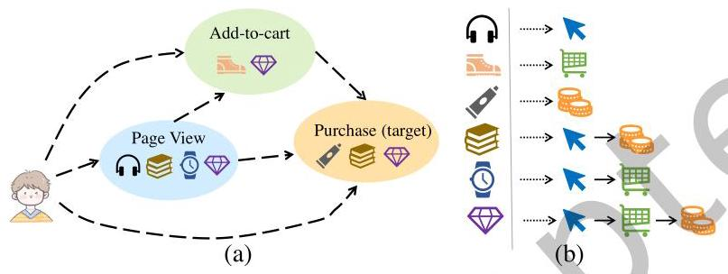
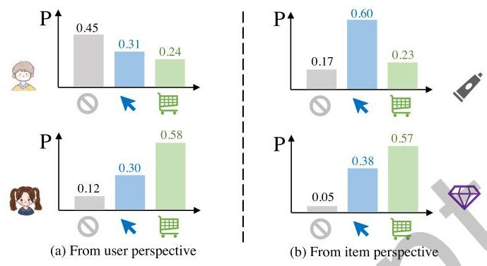
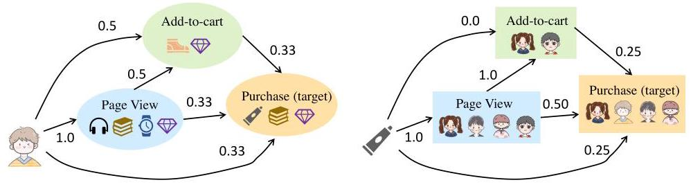
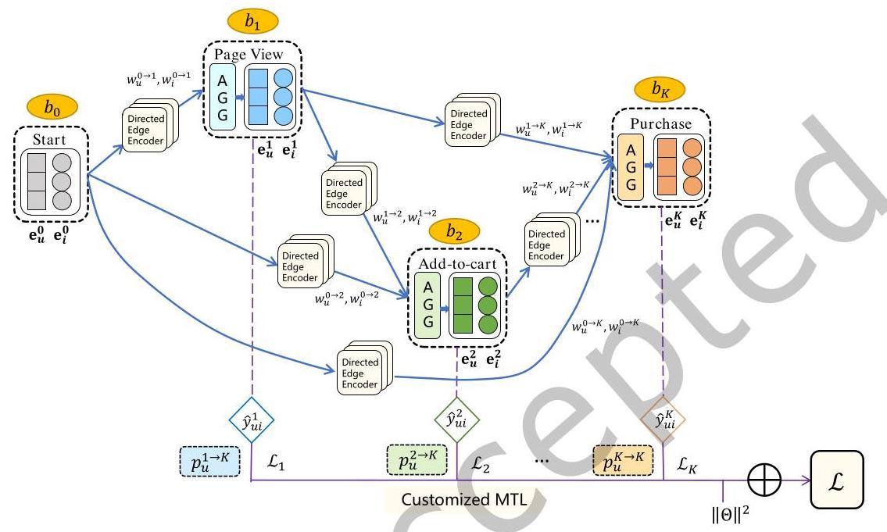
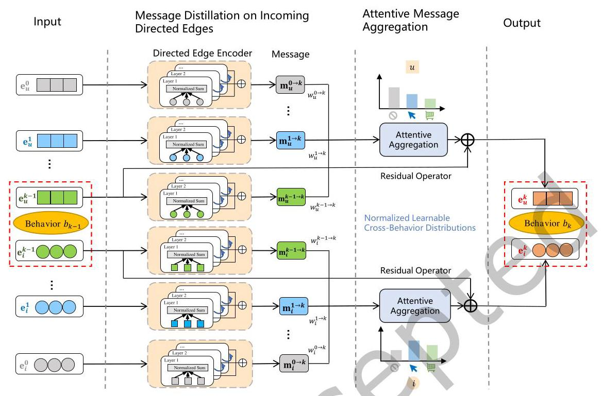
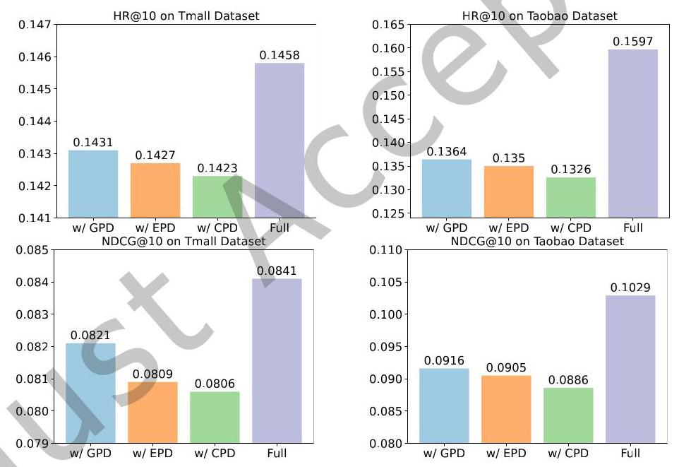
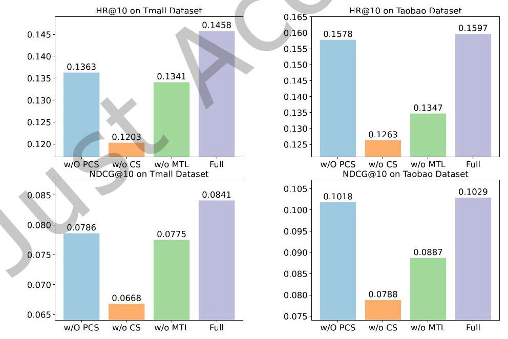
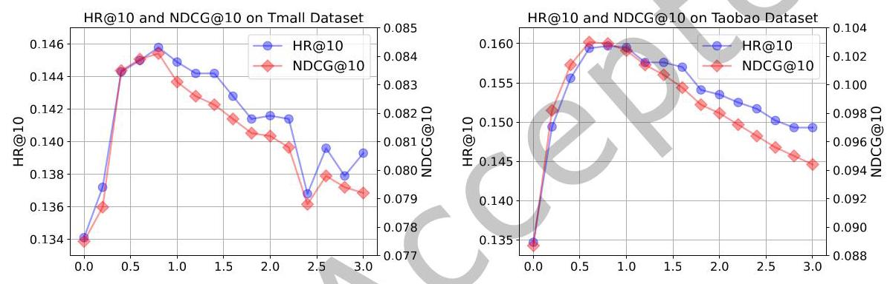

# Multi-Behavior Recommendation with Personalized Directed Acyclic Behavior Graphs

XI ZHU*, University of Science and Technology of China, China

FAKE LIN, University of Science and Technology of China, China

ZIWEI ZHAO, University of Science and Technology of China, China

TONG XU \( {}^{ \dagger  } \) , University of Science and Technology of China, China

XIANGYU ZHAO, City University of Hong Kong, China

ZIKAI YIN, University of Science and Technology of China, China

XUEYING LI, Alibaba Group, China

ENHONG CHEN \( {}^{ \dagger  } \) , University of Science and Technology of China, China

A well-developed recommendation system can not only leverage multi-typed interactions (such as page view, add-to-cart, and purchase) to better identify user preferences, but also demonstrate high performance, low complexity, and strong interpretability. However, many existing solutions for multi-behavior recommendation fall short of intuitive modeling of real-world scenarios, leading to overly complex models with massive parameters and cumbersome components. In particular, they share two critical limitations: (1) Some pioneering models are built upon the strict assumption of cascade effects across behaviors, which contradicts multifarious behavior paths in practical applications. (2) Existing approaches fail to explicitly capture the unique idiosyncrasies of users and even neglect the inherent nature of items involved in the multi-behavior interactions. To this end, we propose a novel Directed Acyclic Graph Convolutional Network (DA-GCN) for the multi-behavior recommendation task. Specifically, we pinpoint the partial order relations within the monotonic behavior chain and extend it to personalized directed acyclic behavior graphs to exploit behavior dependencies. Then, a GCN-based directed edge encoder is employed to distill rich collaborative signals embodied by each directed edge. In light of the information flows over the directed acyclic structure, we propose an attentive aggregation module to gather messages from all potential antecedent behaviors, representing distinct perspectives to understand the terminated behavior. Thus, we obtain comprehensive representations for the follow-up behavior through learnable distributions over its preceding behaviors, explicitly reflecting personalized interactive patterns of users and underlying properties of items simultaneously. Finally, we design a customized multi-task learning objective for flexible joint optimization. Extensive experiments on public benchmarking datasets fully demonstrate the superiority of DA-GCN with significant performance improvement and computational efficiency over a wide range of state-of-the-art methods. Our code is available at https://github.com/xizhu1022/DA-GCN.

*This work was partially done while the author was a research intern at Alibaba.

\( {}^{ \dagger  } \) Corresponding Authors.

Authors' addresses: Xi Zhu, xizhu@mail.ustc.edu.cn, University of Science and Technology of China, Hefei, China; Fake Lin, fklin@mail.ustc.edu.cn, University of Science and Technology of China, Hefei, China; Ziwei Zhao, zzw22222@mail.ustc.edu.cn, University of Science and Technology of China, Hefei, China; Tong Xu, tongxu@ustc.edu.cn, University of Science and Technology of China, Hefei, China; Xiangyu Zhao, xianzhao@cityu.edu.hk, City University of Hong Kong, Hong Kong, China; Zikai Yin, yinzikai@mail.ustc.edu.cn, University of Science and Technology of China, Hefei, China; Xueying Li, xiaoming.lxy@alibaba-inc.com, Alibaba Group, Hangzhou, China; Enhong Chen, cheneh@ustc.edu.cn, University of Science and Technology of China, Hefei, China.

---

Permission to make digital or hard copies of all or part of this work for personal or classroom use is granted without fee provided that copies are not made or distributed for profit or commercial advantage and that copies bear this notice and the full citation on the first page. Copyrights for components of this work owned by others than the author(s) must be honored. Abstracting with credit is permitted. To copy otherwise, or republish, to post on servers or to redistribute to lists, requires prior specific permission and/or a fee. Request permissions from permissions@acm.org.

© 2024 Copyright held by the owner/author(s).

ACM 1558-2868/2024/9-ART

https://doi.org/10.1145/3696417

---

## CCS Concepts: - Information systems \( \rightarrow \) Personalization; Collaborative filtering.

Additional Key Words and Phrases: Multi-Behavior Recommendation, Directed Acyclic Graph, Graph Neural Network

## 1 INTRODUCTION

Recent years have witnessed recommendation systems (RS) of great importance to alleviate information overloading for a wide spectrum of personalized services, such as e-commerce [38, 43, 47, 48], social media [21, 49], and videos \( \left\lbrack  {6,{10}}\right\rbrack \) . The key objective of RS is to estimate user preference and forecast interactions over tremendous candidate items. As the most widely-adopted paradigm, collaborative filtering (CF) methods have been successfully integrated with various cutting-edge techniques and achieved remarkable success [12, 13, 17, 28].

Fig. 1. An example of heterogeneous interactions of a specific user in e-commerce (a), and the corresponding behavior paths for each interacted item (b).

Nevertheless, the vast majority of them generally focus on learning user preference with a single type of interaction, while in most practical scenarios, the observed historical data between users and items exhibit multiplex in nature \( \left\lbrack  {3,{11},{16},{41}}\right\rbrack \) . As depicted in Figure 1, a particular user can interact with items through various behaviors, including page view, add-to-cart, and purchase, in which their orders are abstracted as a predetermined behavior chain in the e-commerce platform. In such cases, low-level behaviors (i.e., page view, add-to-cart) can provide much more abundant collaborative signals, which can help alleviate data sparsity and mitigate the cold start problem. Additionally, these low-level auxiliary behaviors can offer valuable hints for predicting the high-level target behaviors (i.e., purchase). Furthermore, personalized interactive patterns may be hidden among diverse behavior paths of items in practical scenarios, thereby contributing to characterizing more comprehensive preferences and making more accurate recommendations.

Existing researchers approach the multi-behavior recommendation task from two perspectives, that is, to capture behavior diversity and behavior dependencies in a parallel manner or a cascade manner. The first line of literature \( \left\lbrack  {2,4,{15},{20},{32},{33}}\right\rbrack \) naturally transforms the multi-behavior interactions into various exquisite graph structures, from which the semantics and contexts of different behaviors can be extracted and aggregated over a unified graph in parallel. In light of the superior capacity of graph neural networks (GNNs), MBGCN [15], GHCF [2], and KHGT [33] are equipped with elaborate neural networks to capture high-order connectivities and handle behavior multiplicity. Meanwhile, meta-networks [33, 35], self-attention [20, 32, 33], and contrastive learning \( \left\lbrack  {{11},{29},{37},{39}}\right\rbrack \) are adopted to capture complex behavior inter-dependencies. We argue that these models have cumbersome structures but low efficiency, high complexity, and limited performance due to their lack of intuitive modeling of real-world multi-behavior scenarios. On the contrary, some studies [3, 5, 8, 18, 19, 25, 41] highlight the cascade effects within the behavior chain. Thus, behaviors located at different positions within the chain unveil distinct aspects and strengths of user preferences toward the candidate items. For instance, EHCF [3] and NMTR [8] link a sequence of behavior-aware modules in a transfer way to imitate the monotonic information flow along the behavior chain. HPMR [19] even employs a projection mechanism to refine the upstream representations and enhance downstream tasks explicitly. Recently, GCN-based block sequences have been employed to delicately express the partial order relations, in which the representations learned over the previous behavior-wise block will serve as the input of the next one after a residual block or a feature transformation, as indicated by CRGCN [41] or MB-CGCN [5], respectively. Fortunately, these methods have been confirmed simple, effective, and intuitive with satisfactory results, providing compelling evidence that cascade effects warrant further investigation.

Fig. 2. Examples of learnable distributions of the latest antecedent interactions before purchase in an e-commerce platform, which reflects the personalized behavior pattern of users (a) and the inherent nature of items (b). Note that the gray icon means there is no preceding behavior before reaching purchase.

Despite years of research, existing models still share the following limitations that need to be realized in the multi-behavior recommendation task:

- Insufficient modeling of behavior dependencies. In view of the concise structure and performance improvement of the cascade models, we pinpoint the essence and effectiveness of modeling partial order dependencies to address the bottleneck in the multi-behavior recommendation task. However, previous studies \( \left\lbrack  {3,5,8,{25},{41}}\right\rbrack \) roughly assume a predetermined monotonic behavior chain, which falls far short of encompassing the diverse behavior paths that may occur in practical applications. Looking back to the example in Figure 1, not all behavior paths necessarily lead to a purchase (e.g., page view \( \rightarrow \) add-to-cart for the watch), and some intermediate behaviors within the chain can be skipped (e.g., page view \( \rightarrow \) purchase for the book), resulting in various subsequences of the behavior chain. In this context, multiple behavior paths can naturally overlap to form a directed acyclic behavior graph (shown in Figure 1(a)), with each item corresponding to a specific behavior path (shown in Figure 1(b)). In contrast to conventional cascade models that maintain an inflexible behavior chain, each incoming edge in the directed acyclic behavior graph corresponds to a distinct behavior transformation with unique semantics, offering a specific perspective to observe its terminated behavior. Although some efforts have been devoted to building meta-graphs to depict the relatedness, they heavily rely on domain knowledge to create a limited set of hand-crafted meta-paths [14, 46]. Even worse, these meta-paths mediated by given behaviors only describe independent and constrained semantic associations within predefined schemas [7, 26]. As a result, they are incapable of delivering a natural, flexible, and comprehensive depiction of the cross-behavior dependencies behind different user motivations. Under such circumstances, we have the challenge of empowering the personalized directed acyclic behavior graphs and further enhancing the exploitation of various behavior dependencies in a more reasonable manner.

- Lack of explainable and symmetrical personalized learning. As auxiliary behaviors are incorporated to provide compensatory information, combining their contextual signals and obtaining global representations becomes progressively crucial. For example, Figure 2(a) presents the last-interaction distribution and demonstrates that personal interactive patterns can be observed by how people behave. Before reaching a purchase behavior, the thoughtful girl is inclined to place candidate items in the shopping cart for full consideration, while the decisive boy prefers to purchase directly without additional preparatory behaviors (e.g., 58% v.s. 24% for the add-to-cart behavior). Early works address this problem by assigning global weight parameters to balance different behaviors [2] or building sophisticated modules to aggregate their semantics [33, 35], which results in inaccurate and inexplicable user modeling. Similarly, we also discover behavior diversity on the item domain, as depicted in Figure 2(b). Unlike daily essentials (e.g., toothpaste), people tend to hesitate before purchasing luxuries (e.g., diamonds), exhibiting abundant low-level interactions (e.g., 57% v.s. 23% for the add-to-cart behavior). This phenomenon marks the inherent properties of items, such as price, necessity, and urgency. Nevertheless, most multi-behavior methods \( \left\lbrack  {{29},{32}}\right\rbrack \) consider behavior heterogeneity from the user perspective unilaterally, leading to sub-optimal learning on items. In conclusion, it has become an urgent-to-study topic to delve into more accurate and flexible modeling that caters to both users and items simultaneously.

To tackle the above limitations, we leverage the special underlying directed acyclic structure of behavior dependencies and propose a novel Directed Acyclic Graph Convolutional Network (DA-GCN) for the multi-behavior recommendation. Specifically, we first construct directed acyclic behavior graphs in terms of the partial order relations within the behavior chain, in which each node represents a specific behavior, and each directed edge indicates a potential transformation from one behavior to another. To respond to each behavior transformation, we adopt a GCN-based directed edge encoder to distill its unique contextual information. Afterward, we propose an attentive message aggregation module that gathers the multi-faceted collaborative signals based on the learnable distribution over all its potential antecedent behaviors, creating more comprehensive behavior-wise representations. Thus, we achieve personalized modeling of cross-behavior dependencies, uncovering interactive patterns of users and inherent properties of items. Accordingly, DA-GCN vividly demonstrates complicated behavior dependencies through message propagation over the directed acyclic structure. Finally, we apply personalized multi-task learning in model optimization, which determines the contribution of each auxiliary behavior to the prediction of the target behavior by measuring the pairwise overlapping of behavior-specific interactions. To sum up, the contributions of this paper can be summarized as follows:

- To the best of our knowledge, we are the first to extend the monotonic behavior chain to personalized directed acyclic behavior graphs to exploit behavior dependencies, which can reveal the personalized interactive patterns of users and the inherent nature of items simultaneously.

- To exploit the underlying directed acyclic structure, we propose a novel framework named DA-GCN for the multi-behavior recommendation task, in which multi-facet messages are attentively aggregated according to personalized distributions of the latest antecedent interactions, indicating the integration of multiple perspectives to enrich the representations of subsequent behaviors. Our framework showcases the proposed directed acyclic structure in the information flow, thereby enhancing model expressiveness with an intuitive approach.

- To validate the superiority of DA-GCN, we conduct extensive experiments on public benchmarking datasets to show that our model has outperformed existing state-of-the-art models regarding both recommendation performance and computational efficiency.

## 2 RELATED WORKS

In this section, we provide a summary of the existing literature that is relevant to our research, which includes graph-based recommendation and multi-behavior recommendation.

### 2.1 Graph-Based Recommendation

Graph neural networks have emerged as a promising approach in RS due to their powerful capability and flexibility \( \left\lbrack  {{12},{27},{28},{30},{31},{34},{44}}\right\rbrack \) . GNN-based recommendation models can effectively update node representations by integrating local information from connected nodes in the graph structure. This process enables the harvest of valuable high-order collaborative signals and the generation of comprehensive embeddings, leading to more accurate and personalized recommendations. For example, Ying et al. propose a highly scalable solution named PinSage [44], which employs random-walk GCN on pins-boards graphs. Wang et al. devise NGCF [27] that recursively propagates messages non-linearly on the bipartite user-item graphs. Subsequently, He et al. essentially simplify the burdensome designs of NGCF (i.e., feature transformation and nonlinear activation) and propose LightGCN [12], which achieves state-of-the-art performance in both effectiveness and efficiency. With the emergence of advanced techniques, researchers have endowed GNN-based methods with disentangled learning [28], hypergraph learning [34], and self-supervised learning [31, 34, 43], leading to remarkable progress in the field of RS. Inspired by the above works, our framework involves a GCN-based directed edge encoder to extract semantic information between any pair of behaviors, serving as a unique perspective to understand the terminated behavior from the given antecedent behavior.

### 2.2 Multi-Behavior Recommendation

Multi-behavior recommendation aims to exploit valuable fine-grained auxiliary behaviors to enhance the prediction of the sparse target behavior. Over the past decade, it has garnered consistent attention from industry and academia due to its ability to alleviate data sparsity and facilitate effective user preference modeling. In this part, we will examine the existing literature from two different viewpoints regarding how to deal with behavior multiplicity and behavior dependencies, i.e., in a parallel way or in a cascade way.

The semantics and contexts of diverse behaviors can be extracted and aggregated in parallel. In particular, this area of research attempts to organize multi-behavior data into different heterogeneous graph structures, enabling advanced neural networks (such as GNNs [2, 15, 40], meta-networks [33, 35], and attention-based models \( \left\lbrack  {{20},{32},{33}}\right\rbrack  ) \) to exert their powerful ability in dealing with behavior heterogeneity. For example, Chen et al. [2] construct a heterogeneous graph and jointly learn representations of nodes and relations in a shared embedding space. Xue et al. [40] transform the multiplex bipartite network into two sets of dual homogeneous hypergraphs, thus enabling spectral hypergraph convolutional operators to learn rich representations. Additionally, Jin et al. [15] obtain the strength and semantics of different behaviors through a user-item propagation layer and an item-item propagation layer, respectively. To model cross-behavior dependencies, Xia et al. [32] develop a self-attention-based dependency encoder to preserve cross-behavior collaborative signals during the embedding process, along with a memory attention network to augment the behavior-specific contextual information. Within a multi-interest learning framework, Meng et al. [20] propose a GNN-based fine-grained behavioral correlation module, which allocates edge weights via dynamic routing and exchanges information through a self-attention mechanism. Recently, many efforts [11, 29, 37, 39] have been devoted to endowing graph-based methods with self-supervised learning (SSL). They conduct various well-designed contrastive learning (CL) tasks to alleviate the sparsity of supervision signals and generate distinguishable representations. Typically, to retain the commonalities of behavior-wise interactions, Gu et al. [11] design star-style CL tasks to preserve the agreement between the target behavior and each auxiliary behavior. Wei et al. [29] not only propose a CL framework to distill transferable knowledge across behaviors but also employ a contrastive meta-network to capture personalized multi-behavior patterns. Xuan et al. [39] implement two CL tasks within a joint training framework, effectively considering the commonalities and distinctions among various behaviors and views. Not only that, many studies [36, 37, 42, 45] have emerged further to increase the robustness against data sparsity and noisy signals. For example, Xu et al. [37] introduce a novel SSL paradigm incorporating self-discrimination tasks from the inter-behavior and intra-behavior levels, respectively. Xin et al. [36] infer universal user preference from multi-behavior data and perform data denoising to enable effective knowledge transfer. In order to address the negative transfer phenomenon, Zhang et al. [45] derive a prompt-tuning paradigm to alleviate the semantic gap among multi-typed behaviors and attenuate negative influences of auxiliary behaviors. Furthermore, Yan et al. [42] devise a behavior-contextualized item preference network that only considers the preferences relevant to the target behavior for final recommendations. Up to now, we can conclude that most of the above works employ behavior-aware neural modules or tasks to characterize discriminative representations. Afterward, various advanced techniques can be adopted to capture the complex behavior dependencies in parallel, thereby achieving comprehensive modeling of user preferences. Nevertheless, despite the introduction of increasingly sophisticated structures, we argue that they fail to effectively model the intrinsic dependencies among diverse behaviors, leading to inferior performance for the multi-behavior recommendation task.

The underlying partial order relations motivate us to correlate each behavior in a cascade way. In practical online applications, users can engage with items through a predefined sequence of ordered behaviors, such as page view, add-to-cart, and purchase. Therefore, this line of research is based upon a common assumption that the cascade effects exist across these behaviors, as opposed to being independent. In this context, behaviors at different positions of the monotonic behavior chain largely unveil distinct aspects and strengths of user preferences toward the candidate items. Initially, Gao et al. [8] contribute an effective solution that correlates the prediction of each behavior in a cascade way and then performs joint optimization based on the multi-task learning framework. Motivated by TransE [1], Chen et al. [3] assume that the relationships between two behaviors can be portrayed as translation operations in the embedding space. Moreover, Meng et al. [19] employ a projection-based transfer network to explicitly model the correlations between upstream and downstream behaviors by decomposing the upstream behavior into shared and unique components. In recent years, the unique value of the cascade effects has been re-recognized for the multi-behavior recommendation task. Yan et al. [41] explicitly exploit the connections between any pair of adjacent behaviors by designing cascading residual structures that continuously refine the embeddings from one behavior to the next. Cheng et al. [5] adopt a sequence of LightGCN blocks [12] to express the underlying cascade effects, where the features learned over the previous behavior are delivered to the subsequent one after a feature transformation module. To alleviate information bias caused by imbalanced data distribution, Meng et al. [18] combine cascade and parallel paradigms to enhance behavioral representations. These models are not only simple in structure and easy to implement but also considerably enhance the effectiveness and efficiency of multi-behavior recommendations. More importantly, we believe that their significant improvements originate from the message propagation through the entire network directly driven by the predetermined behavior chain, which is in line with an intuitive understanding of real-world interactive settings. Fortunately, the cascade effects, which play a crucial role in recent literature, have gained increasing recognition in various practical applications, including e-commerce websites [3, 5, 25, 41] and short video platforms [24]. To achieve more flexible modeling, in this paper, we extend the monotonic behavior chain to personalized directed acyclic behavior graphs to support further exploitation of the behavior dependencies.

## 3 METHODOLOGY

This section defines the multi-behavior recommendation task and describes our proposed Directed Acyclic Graph Convolutional Network (DA-GCN) framework. First, we provide an overview architecture of DA-GCN, which encapsulates the key features of the proposed framework. Next, we illustrate the technical details in general and matrix forms. Finally, we discuss the complexity of DA-GCN and present a comparison with existing models.

### 3.1 Definition of the Problem

We utilize \( \mathcal{U} = \left\{  {{u}_{1},{u}_{2},\ldots ,{u}_{M}}\right\} \) and \( \mathcal{I} = \left\{  {{i}_{1},{i}_{2},\ldots ,{i}_{N}}\right\} \) to represent the user set and item set, in which \( M \) and \( N \) denote the number of users and items, respectively. Suppose there is a sorted behavior chain \( \mathcal{B} = \left\{  {{b}_{1},{b}_{2},\ldots ,{b}_{K}}\right\} \) (e.g., page view \( \rightarrow \) add-to-cart \( \rightarrow \) purchase), their user-item interaction matrices can be denoted as \( \mathcal{Y} = \left\{  {{\mathrm{Y}}^{1},{\mathrm{Y}}^{2},\ldots ,{\mathrm{Y}}^{K}}\right\} \) , where \( K \) is the total number of behavior types. Specifically, \( {\mathrm{Y}}_{k} \) indicates the binary user-item interactions under the behavior \( {b}_{k} \) , where each entry can be described as follows:

\[
{y}_{ui}^{k} = \left\{  \begin{array}{ll} 1, & \text{ if user }u\text{ has interacted with item }i\text{ under behavior }{b}_{k} \\  0, & \text{ otherwise } \end{array}\right. \tag{1}
\]

In a general multi-behavior recommendation task, one type of behaviors will be regarded as the target behavior. For instance, the purchase is the strongest signal that directly affects the gross merchandise value (GMV), so we usually consider it as the only target behavior in the e-commerce platform, denoted as \( {b}_{K} \) . Hence, the other behaviors \( \left\{  {{b}_{1},{b}_{2},\ldots ,{b}_{K - 1}}\right\} \) (e.g., page view and add-to-cart) are treated as auxiliary behaviors, which provide additional observed interactions in assisting the prediction of the target behavior. It is worth mentioning that, in most real-world scenarios, users tend to skip one or two low-level behaviors and directly engage in high-level ones, so various behavior paths are created dynamically rather than adhering strictly to the predetermined monotonic behavior chain. Based on the above definitions, the studied problem is stated as follows:

Multi-Behavior Recommendation. Given the multiplex user-item interactions \( \left\{  {{\mathrm{Y}}^{1},{\mathrm{Y}}^{2},\ldots ,{\mathrm{Y}}^{K}}\right\} \) between a user set \( \mathcal{U} \) and an item set \( I \) . The goal of the multi-behavior recommendation task is to get a personalized scoring function that estimates the likelihood that a user \( u \in  \mathcal{U} \) will interact with an item \( i \in  \mathcal{I} \) under the target behavior \( {b}_{K} \) , i.e., \( {f}_{u} : \mathcal{Y} \rightarrow  \mathbb{R} \) . The candidate items are supposed to be ranked in descending order to generate the Top-K item recommendation list.

### 3.2 Overview of DA-GCN

Figure 4 shows the architecture of the proposed DA-GCN framework. The whole pipeline can be divided into the following three steps:

Step 1. Construction and Initialization of Personalized Directed Acyclic Behavior Graphs. To better represent the behavior dependencies, we construct a personalized directed acyclic behavior graph for each user or item that incorporates all its observed behavior paths. Afterward, inspired by the Markov process, we initialize the personalized weights within the graphs to uncover the unique characteristics of users and items.

Step 2. Message Propagation over Directed Acyclic Behavior Graphs. There are two components for message propagation, including directed edge encoders and attentive message aggregation modules. In particular, we first employ a GCN-based directed edge encoder to extract the rich collaborative signals between any pair of behaviors. Following the directed acyclic structure, we argue that the behavior transformations corresponding to different incoming edges actually offer distinct perspectives for understanding the terminated behavior. Therefore, we propose a learnable attentive aggregation module by gathering informative messages from all potential antecedent behaviors with personalized cross-behavior distributions to refine behavior-wise embeddings.

Step 3. Customized Multi-Task Training. We propose a customized approach to overcome the inflexibility of previous multi-task learning models. Specifically, we heuristically evaluate the personalized contribution of each auxiliary behavior to the target behavior and incorporate it into the loss function to account for training samples from different behaviors.s

### 3.3 Construction and Initialization of Personalized Directed Acyclic Behavior Graphs

In this part, we illustrate how to construct and initialize corresponding personalized directed acyclic behavior graphs for each user and item in detail.

3.3.1 Construction. As mentioned above, the cascade effects have been recognized as beneficial for modeling the dependencies across various behaviors [5, 25, 41]. In practical applications, users may exhibit much more complex behavior paths due to their personalized multi-behavior interactive patterns, going beyond the monotonic behavior chain.

A directed acyclic graph (DAG) is a powerful tool that provides a conceptual and visual representation of a series of activities. The order of the activities can be depicted by a graph, which consists of a set of nodes representing involved activities, as well as lines connecting nodes to show the flow from one activity to another.

Definition (Directed Acyclic Behavior Graph) Based on the underlying behavior chain \( \mathcal{B} = \left\{  {{b}_{1},{b}_{2},\ldots ,{b}_{K}}\right\} \) , we can naturally propose the directed acyclic behavior graph \( \mathcal{G} = \left( {\mathcal{B},\mathcal{E}}\right) \) to incorporate all potential behavior transformations, where \( \mathcal{E} = \left\{  {\left( {{b}_{{k}^{\prime }},{b}_{k}}\right)  \mid  0 \leq  {k}^{\prime } < k \leq  K}\right\} \) denotes all directed behavior edges. Therefore, each behavior path can be explicitly identified as a directed meta-path within the graph structure. Note we set \( {b}_{0} \) as a padding behavior that stands for the beginning of each behavior path.

Based on existing multi-behavior interaction records, we can easily generate all observed behavior paths of each user by retrieving behavior transformations from his interacted records. Analogically, we can also observe the conversion of the interactive populations between arbitrary pairs of behaviors corresponding to each item. To elaborate further, as depicted in Figure 3, it is feasible to assign the interacted items or users under different behaviors to the corresponding behavior nodes. Then, we trace the behavior flow of each item and concatenate these transformations to form a complete behavior path along the behavior chain. For instance, for the boy in the left part, his real behavior path of the book is start \( \rightarrow \) page view \( \rightarrow \) purchase while his path of the shoes is start \( \rightarrow \) add-to-cart. Similarly, for the toothpaste in the right part, we have start \( \rightarrow \) purchase for the boy in yellow and start \( \rightarrow \) page view \( \rightarrow \) purchase for the girl in pink.

Since the behavior paths exhibit diversity and naturally overlap in real applications, we delve deeper into the behavior dependencies and establish personalized directed acyclic behavior graphs. For each user \( u \) or item \( i \) , we attempt to build \( {\mathcal{G}}_{u} = \left( {\mathcal{B},{\mathcal{E}}_{u}}\right) \) or \( {\mathcal{G}}_{i} = \left( {\mathcal{B},{\mathcal{E}}_{i}}\right) \) , where they share the same graph structure but have different weights. Then, we use \( {\mathcal{N}}_{u}^{k} \) or \( {\mathcal{N}}_{l}^{k} \) to represent the interacted items of user \( u \) or the interacted users of item \( i \) under each behavior \( {b}_{k} \in  \mathcal{B} \) , respectively. Furthermore, each directed edge \( \left( {{b}_{{k}^{\prime }},{b}_{k}}\right) \) can be associated with a real-value weight, \( {w}_{u}^{{k}^{\prime } \rightarrow  k} \) or \( {w}_{i}^{{k}^{\prime } \rightarrow  k} \) , representing the strength of the cross-behavior dependency from the starting behavior \( {b}_{{k}^{\prime }} \) to the terminated behavior \( {b}_{k} \) with respect to the specific user \( u \) or item \( i \) , respectively.

On the whole, we enable personalized directed acyclic behavior to embody all observed behavior paths and express arbitrary pair-wise behavior transformation. In the following, we will elaborate on how we initialize and learn the personalized transformation weights.

3.3.2 Initialization. The factors influencing behavior dependencies can be summarized into two aspects. From a global perspective, the formation of the latter behaviors can be directly and separately affected by all their potential former behaviors. From an individual perspective, diverse personalized behavior-wise interaction distributions arise from user-specific interactive habits and selection criteria.

Definition (Cross-Behavior Preference Matrices) For each behavior from the behavior chain, i.e., \( {b}_{k} \in  \mathcal{B} \) , we define a preference matrix \( {\mathbf{W}}_{\mathcal{U}}^{k} \in  {\mathbb{R}}^{M \times  k} \) to express user-adaptive distributions on all previous behaviors \( \left\{  {{b}_{0},{b}_{1},\ldots ,{b}_{k - 1}}\right\} \) . Specifically, the \( {k}^{\prime } \) -th column \( {\mathbf{W}}_{\mathcal{M}}^{{k}^{\prime } \rightarrow  k} \in  {\mathbb{R}}^{M} \) indicates the preference strengths from \( {b}_{{k}^{\prime }} \) to \( {b}_{k} \) for all users, where \( 0 \leq  {k}^{\prime } \leq  k - 1 \) . In this way, each directed edge can be assigned a user-specific weight in its personalized directed acyclic behavior graph. Similarly, we define \( {\mathbf{W}}_{I}^{k} \in  {\mathbb{R}}^{N \times  k} \) on the item side. As a result, we formulate \( {\mathbf{W}}^{k} = \left\lbrack  {{\mathbf{W}}_{\mathcal{U}}^{k},{\mathbf{W}}_{\mathcal{I}}^{k}}\right\rbrack \) to represent the overall preference distribution terminated at the \( k \) -th behavior, which are core components in this work.

Fig. 3. The instances of user-specific and item-specific directed acyclic behavior graphs.

We propose a straightforward and feasible technique to initialize the cross-behavior preference matrices. Motivated by the Markov process, we solely consider the closest previous behavior within each behavior path, as it is considered the most critical and direct prompt in achieving the desired terminated behavior. Following this principle, we investigate the initial correlation from the given starting behavior \( {b}_{{k}^{\prime }} \) to the given terminated behavior \( {b}_{k} \) .

Taking the user side as an example, according to Equation 2, we first identify the interacted items under behavior \( {b}_{{k}^{\prime }} \) and behavior \( {b}_{k} \) for user \( u \) , which are termed as \( {\mathcal{N}}_{u}^{k} \) and \( {\mathcal{N}}_{u}^{{k}^{\prime }} \) . Next, we utilize subtraction to remove the interacted items between \( {b}_{{k}^{\prime }} \) and \( {b}_{k} \) to filter out the items with the interactions for these intermediate behaviors. Then, the result after the intersection indicates the items directly converted from \( {b}_{{k}^{\prime }} \) to \( {b}_{k} \) within the user's behavior paths, which aligns with our motivation that former behaviors influence the formation of subsequent behaviors in a directed manner. Finally, we utilize the posterior probabilities for the current terminated behavior \( {b}_{k} \) to normalize its correlations to all possible starting behaviors, including behavior \( {b}_{{k}^{\prime }} \) . Overall, this approach comprehensively considers all paths involved in the given terminated behavior and fully considers the impacts of former behaviors on its formation. To be more specific, the preference strength of user \( u \) or item \( i \) from \( {b}_{{k}^{\prime }} \) to \( {b}_{k} \) is customized as:

\[
{w}_{u}^{{k}^{\prime } \rightarrow  k} = \frac{\left| \left( {\mathcal{N}}_{u}^{k} - \mathop{\bigcup }\limits_{{j = {k}^{\prime } + 1}}^{{k - 1}}{\mathcal{N}}_{u}^{j}\right)  \cap  {\mathcal{N}}_{u}^{{k}^{\prime }}\right| }{\left| {\mathcal{N}}_{u}^{k}\right| } \tag{2}
\]

\[
{w}_{i}^{{k}^{\prime } \rightarrow  k} = \frac{\left| \left( {\mathcal{N}}_{i}^{k} - \mathop{\bigcup }\limits_{{j = {k}^{\prime } + 1}}^{{k - 1}}{\mathcal{N}}_{i}^{j}\right) \bigcap {\mathcal{N}}_{i}^{{k}^{\prime }}\right| }{\left| {\mathcal{N}}_{i}^{k}\right| } \tag{3}
\]

where \( \left| \cdot \right| \) indicates the set size. As \( {b}_{0} \) is the generic starting behavior, we have \( {\mathcal{N}}_{i}^{0} = {\mathcal{N}}_{i}^{1} \cup  {\mathcal{N}}_{i}^{2} \cup  \ldots  \cup  {\mathcal{N}}_{i}^{K} \) and \( {\mathcal{N}}_{u}^{0} = {\mathcal{N}}_{u}^{1} \cup  {\mathcal{N}}_{u}^{2} \cup  \ldots  \cup  {\mathcal{N}}_{u}^{K} \) . Figure 3 also illustrates user-specific and item-specific examples of initialization of their personalized directed acyclic behavior graphs.

Due to the sparsity and noise in multi-behavior interaction data, using fixed posterior probabilities can result in inaccurate and inflexible preference modeling, which may further weaken the recommendation performance. Therefore, we only use this customized approach to initialize the weights of each graph and will make them learnable in the follow-up module.

### 3.4 Message Propagation over Directed Acyclic Behavior Graphs

This part outlines the technical details of the directed edge encoder and the attentive message aggregation module, two essential components for message propagation over the personalized directed acyclic behavior graph. Additionally, we present the general and matrix forms for their implementation.

Fig. 4. The overall framework of the proposed DA-GCN framework. Due to the space limitation, we follow the behavior chain start \( \rightarrow \) page view \( \rightarrow \) add-to-cart \( \rightarrow \) purchase for simplicity, where \( {b}_{0} \) is the default starting behavior. Most notably, we employ directed edge encoders (by stacked yellow squares) to extract multi-facet messages from all potential antecedent behaviors. Then, we attentively aggregate these messages to refine and update the behavior-wise embeddings (in squares with black dotted line borders) along the chain. Afterward, we adopt a customized and personalized multi-task objective to optimize our DA-GCN model, which accounts for the overlapping interactions between each auxiliary behavior and the target behavior across different users (by purple lines). Best viewed in color.

3.4.1 Embedding Initialization. Similar to previous graph-based approaches \( \left\lbrack  {5,{12},{15}}\right\rbrack \) , each user \( u \in  \mathcal{U} \) or item \( i \in  \mathcal{I} \) is expected to be associated with an embedding vector \( {\mathbf{e}}_{u}^{0} \in  {\mathbb{R}}^{d} \) or \( {\mathbf{e}}_{i}^{0} \in  {\mathbb{R}}^{d} \) , where \( d \) is the embedding size. Hence, we use learnable embedding matrices \( \mathbf{P} \in  {\mathbb{R}}^{M \times  d} \) and \( \mathbf{Q} \in  {\mathbb{R}}^{N \times  d} \) to initialize their embeddings, namely,

\[
\mathbf{P} = \left\{  {{\mathbf{p}}_{{u}_{1}}^{0},{\mathbf{p}}_{{u}_{2}}^{0},\ldots ,{\mathbf{p}}_{{u}_{M}}^{0}}\right\}  ,\;\mathbf{Q} = \left\{  {{\mathbf{q}}_{{i}_{1}}^{0},{\mathbf{q}}_{{i}_{2}}^{0},\ldots ,{\mathbf{q}}_{{i}_{N}}^{0}}\right\} \tag{4}
\]

As each user \( u \) or item \( i \) corresponds to a unique one-hot ID, we transform it into a low-dimensional embedding through a shared embedding layer with \( \mathbf{P} \) and \( \mathbf{Q} \) , respectively. Formally, the look-up operation can be described as:

\[
{\mathrm{e}}_{u}^{0} = {\mathrm{P}}^{\top } \cdot  {\mathrm{{ID}}}_{u}^{\mathcal{U}},\;{\mathrm{e}}_{i}^{0} = {\mathrm{Q}}^{\top } \cdot  {\mathrm{{ID}}}_{i}^{\mathcal{I}} \tag{5}
\]

where \( {\mathbf{e}}_{u}^{0} \) and \( {\mathbf{e}}_{i}^{0} \) are initialized embeddings for the specific user \( u \) and item \( i \) , respectively. \( {\mathbf{{ID}}}_{u}^{\mathcal{U}} \) and \( {\mathbf{{ID}}}_{i}^{I} \) separately denote one-hot matrices for user domain and item domain.

3.4.2 Directed Edge Encoder. In this part, we will strive to express the semantic information of each behavior transformation, which corresponds to each directed edge in the personalized directed acyclic behavior graph. In the general cascade models [5, 41], the representations of the terminated behavior are indiscriminately converted from the latest former behavior within the behavior chain, even though this behavior transformation may not occur in real-world behavior paths. In this work, we comprehensively consider all possible behavior transformations through the directed acyclic behavior graph so that all observed behavior paths can be incorporated naturally and appropriately, demonstrating the complexity and diversity of real-world scenarios and improving the expressiveness of the model. To respond to each behavior transformation, we have an urgent need to devise a directed edge encoder to distill its collaborative signals with contextual information [11], which can be generically described as:

\[
{\mathbf{m}}_{u}^{{k}^{\prime } \rightarrow  k} = \operatorname{DEE}\left( {{\mathbf{e}}_{u}^{{k}^{\prime }},\left\{  {{\mathbf{e}}_{i}^{{k}^{\prime }} : i \in  {\mathcal{N}}_{u}^{k}}\right\}  }\right) \tag{6}
\]

\[
{\mathbf{m}}_{i}^{{k}^{\prime } \rightarrow  k} = \operatorname{DEE}\left( {{\mathbf{e}}_{i}^{{k}^{\prime }},\left\{  {{\mathbf{e}}_{u}^{{k}^{\prime }} : u \in  {\mathcal{N}}_{i}^{k}}\right\}  }\right) \tag{7}
\]

where \( \operatorname{DEE}\left( \cdot \right) \) is the generic form of the directed edge encoder. Specifically, we use the embeddings of behavior \( {b}_{{k}^{\prime }} \) , denoted as \( {\mathbf{e}}_{u}^{{k}^{\prime }} \) and \( {\mathbf{e}}_{u}^{{k}^{\prime }} \) , as the inputs, so \( {\mathbf{m}}_{u}^{{k}^{\prime } \rightarrow  k} \) and \( {\mathbf{m}}_{i}^{{k}^{\prime } \rightarrow  k} \) separately represent the final message for user \( u \) and item \( i \) , signifying the transformation from behavior \( {b}_{{k}^{\prime }} \) to behavior \( {b}_{k} \) .

With the iterative aggregation-update paradigm, the GNN-based approaches are capable of capturing abundant multi-order connections in various interaction graphs. Inspired by previous works [12, 29, 41], we adopt the following simple yet effective network to express the behavior transformation from behavior \( {b}_{{k}^{\prime }} \) to behavior \( {b}_{k} \) , which can be formulated as:

\[
{\mathbf{m}}_{u}^{{k}^{\prime } \rightarrow  k,\left( {l + 1}\right) } = \mathop{\sum }\limits_{{i \in  {\mathcal{N}}_{u}^{k}}}\frac{1}{\sqrt{\left| {\mathcal{N}}_{u}^{k}\right| }\sqrt{\left| {\mathcal{N}}_{i}^{k}\right| }}{\mathbf{m}}_{i}^{{k}^{\prime } \rightarrow  k,\left( l\right) } \tag{8}
\]

\[
{\mathbf{m}}_{i}^{{k}^{\prime } \rightarrow  k,\left( {l + 1}\right) } = \mathop{\sum }\limits_{{u \in  {\mathcal{N}}_{i}^{k}}}\frac{1}{\sqrt{\left| {\mathcal{N}}_{i}^{k}\right| }\sqrt{\left| {\mathcal{N}}_{u}^{k}\right| }}{\mathbf{m}}_{u}^{{k}^{\prime } \rightarrow  k,\left( l\right) } \tag{9}
\]

where \( {\mathbf{m}}_{u}^{{k}^{\prime } \rightarrow  k,\left( {l + 1}\right) } \) represents the updated messages after \( l + 1 \) layers for user \( u \) . The message \( {\mathbf{m}}_{i}^{{k}^{\prime } \rightarrow  k,\left( {l + 1}\right) } \) for item \( i \) can be updated in the same way. Note we employ the asymmetric normalization coefficient here. Specifically, the embeddings of the starting behavior \( {b}_{{k}^{\prime }} \) , i.e., \( {\mathbf{e}}_{u}^{{k}^{\prime }} \) and \( {\mathbf{e}}_{i}^{{k}^{\prime }} \) , will serve as the initial messages of the directed edge encoder for user \( u \) and item \( i \) , namely,

\[
{\mathbf{m}}_{u}^{{k}^{\prime } \rightarrow  k,\left( 0\right) } = {\mathbf{e}}_{u}^{{k}^{\prime }},\;{\mathbf{m}}_{i}^{{k}^{\prime } \rightarrow  k,\left( 0\right) } = {\mathbf{e}}_{i}^{{k}^{\prime }} \tag{10}
\]

After network propagating through \( {L}^{{k}^{\prime } \rightarrow  k} \) layers, the message of the last layer will be taken as the output of the directed edge encoder, which can be formally expressed as:

\[
{\mathbf{m}}_{u}^{{k}^{\prime } \rightarrow  k} = {\mathbf{m}}_{u}^{{k}^{\prime } \rightarrow  k,\left( {L}^{{k}^{\prime } \rightarrow  k}\right) },\;{\mathbf{m}}_{i}^{{k}^{\prime } \rightarrow  k} = {\mathbf{m}}_{i}^{{k}^{\prime } \rightarrow  k,\left( {L}^{{k}^{\prime } \rightarrow  k}\right) } \tag{11}
\]

At this point, it has become feasible to extract the collaborative signals between arbitrary pairs of behaviors within the behavior chain. Since a given behavior may be associated with multiple pair-wise behavior transformations, we emphasize that the proposed directed edge encoder needs to be a reliable and effective extractor that can reasonably encode their dependencies and handle their semantic gap. In this way, we can regard the messages as different instances to observe the terminated behavior from various views, informing subsequent refinement and update of behavior-wise representations.

Fig. 5. The illustration of behavior-wise embedding update between two adjacent behaviors within the behavior chain, which is composed of a message distillation module and a message aggregation module. Along with a special residual operator for the latest former behavior, multi-facet messages of different behavior transformations are delivered to the follow-up behavior embeddings (in red dotted line) with different emphases, according to the normalized behavior distributions over all potential preceding behaviors (from the histograms for user domain and item domain). Best viewed in color.

3.4.3 Attentive Message Aggregation from Antecedent Behaviors. In this part, we will focus on properly aggregating multiple informative messages from all potential antecedent behaviors and obtaining comprehensive representations of each terminated behavior along the behavior chain. Specifically, we have two key considerations:

- Prior research \( \left\lbrack  {5,8,9,{41}}\right\rbrack \) is limited to a monotonic behavior chain, where the representations of the terminated behavior are entirely derived from those of the closest preceding behavior. That is to say, we merely model the follow-up behavior from a single perspective, which overlooks the diversity of real-world behavior paths. In this study, we incorporate all incoming edges leading to the terminated behavior. Hence, we aim to flexibly fuse the messages distilled from corresponding behavior transformations so as to gain a more comprehensive modeling of the subsequent behavior.

- With regards to the behavior-wise preference aggregation, previous studies \( \left\lbrack  {2,3,{32}}\right\rbrack \) ignore personalized modeling or lack interpretability, potentially leading to inflexible and inexplicable modeling of the user interactive patterns or item characteristics within the rich multi-behavior data. In this work, we aim to examine varying behavior distribution across various users and items by developing an adaptive approach to quantify the impact of different antecedent behaviors on their respective terminated behavior embeddings.

Based on the findings above, the semantic information from various potential preceding behavior transformations are viewed as distinct instances to understand the terminated behavior. Hence, we combine the messages via an attentive aggregation technique with trainable personalized distributions over antecedent behaviors, and we symmetrically update the user and item embeddings in the following manner:

\[
{\mathbf{e}}_{u}^{k} = {\mathbf{e}}_{u}^{k - 1} + \mathop{\sum }\limits_{{{k}^{\prime } = 0}}^{{k - 1}}{\widetilde{w}}_{u}^{{k}^{\prime } \rightarrow  k}\operatorname{Norm}\left( {\mathbf{m}}_{u}^{{k}^{\prime } \rightarrow  k}\right) \tag{12}
\]

\[
{\mathrm{e}}_{i}^{k} = {\mathrm{e}}_{i}^{k - 1} + \mathop{\sum }\limits_{{{k}^{\prime } = 0}}^{{k - 1}}{\widetilde{w}}_{i}^{{k}^{\prime } \rightarrow  k}\operatorname{Norm}\left( {\mathrm{\;m}}_{i}^{{k}^{\prime } \rightarrow  k}\right) \tag{13}
\]

where \( {\mathbf{e}}_{u}^{k} \) or \( {\mathbf{e}}_{i}^{k} \) is separately the embedding for user \( u \) or item \( i \) under behavior \( {b}_{k} \) , and the candidate antecedent behaviors include \( \left\{  {{b}_{0},{b}_{1},\ldots ,{b}_{k - 1}}\right\} \) . In order to mitigate the discrepancies in scaling, we implement weight normalization to account for different behavior-wise messages. Specifically, we normalize across the behavior distributions by adopting the softmax function:

\[
{\widetilde{w}}_{u}^{{k}^{\prime } \rightarrow  k} = \frac{{w}_{u}^{{k}^{\prime } \rightarrow  k}}{\mathop{\sum }\limits_{{{k}^{\prime } = 0}}^{{k - 1}}{w}_{u}^{{k}^{\prime } \rightarrow  k}},\;{\widetilde{w}}_{i}^{{k}^{\prime } \rightarrow  k} = \frac{{w}_{i}^{{k}^{\prime } \rightarrow  k}}{\mathop{\sum }\limits_{{{k}^{\prime } = 0}}^{{k - 1}}{w}_{i}^{{k}^{\prime } \rightarrow  k}} \tag{14}
\]

where \( {w}_{u}^{{k}^{\prime } \rightarrow  k} \) and \( {\widetilde{w}}_{u}^{{k}^{\prime } \rightarrow  k} \) are the original weights and normalized weights from behavior \( {b}_{{k}^{\prime }} \) to behavior \( {b}_{k} \) for user \( u \) , respectively. Through this process, we obtain the final personalized distribution over antecedent behaviors and integrate them into the network propagation process. Obviously, a greater weight value indicates that more semantic information will be included in the subsequent behavior representations, and vice versa. In this regard, we explicitly reveal how the current behavior correlates to its preceding behavior hidden in multifarious behavior paths, which can be conditioned by the interactive patterns of users and the inherent properties of items. For a better demonstration, we show the technical details of the representation update of two consecutive behaviors within the behavior chain in Figure 5.

Additionally, we emphasize that our model retains the residual operator, which enables the directed inheritance of the representations of the closest preceding behavior within the behavior chain. We argue its effectiveness stems from two aspects. (1) As the behavior level increases, the associated data typically becomes sparser, resulting in hierarchical structures at scales. Directly introducing the cascade effects can alleviate the potential loss of low-level collaborative signals along the behavior chain. (2) The other insight is that preserving the cascade effects can promote stable model training, resist noisy interactions, and improve the robustness of the results, which has been confirmed in existing literature [5, 41].

Ultimately, as the behavior chain moves forward, we can still view the entire network propagation as a process of continuously refining node representation from low-level auxiliary behaviors to relatively high-level target behaviors \( \left\lbrack  {3,5,9,{41}}\right\rbrack \) , augmented by the informative messages from various behavior transformations with different emphases.

3.4.4 Matrix Form. In this part, we provide the matrix form for the network propagation of our DA-GCN model, which consists of two main components: the layer-wise message update in the directed edge encoder and the behavior-wise message update along the behavior chain.

Let \( {\mathrm{Y}}^{k} \in  {\mathbb{R}}^{M \times  N} \) be the user-item interaction matrix under behavior \( {b}_{k} \) , we can obtain the adjacent matrix for behavior \( {b}_{k} \) as follows:

\[
{\mathbf{A}}^{k} = \left( \begin{matrix} \mathbf{0} & {\mathbf{Y}}^{k} \\  {\mathbf{Y}}^{{k}^{\top }} & \mathbf{0} \end{matrix}\right) ,{\mathbf{A}}^{k} \in  {\mathbb{R}}^{\left( {M + N}\right)  \times  \left( {M + N}\right) } \tag{15}
\]

where0is all-zero matrix. Let \( {\mathbf{E}}^{{k}^{\prime }} \in  {\mathbb{R}}^{\left( {M + N}\right)  \times  d} \) be the concatenation of user and item embeddings under the starting behavior \( {b}_{{k}^{\prime }} \) , where \( d \) is the dimensionality of the embeddings. To distill insightful and informative messages from starting behavior \( {b}_{{k}^{\prime }} \) to terminated behavior \( {b}_{k} \) , the directed edge encoder can be formally defined as \( {\mathbf{M}}^{{k}^{\prime } \rightarrow  k} = \operatorname{DEE}\left( {{\mathbf{E}}^{{k}^{\prime }},{\mathbf{A}}^{k}}\right) \) , where \( 0 \leq  {k}^{\prime } \leq  k - 1 \) .

Layer-Wise Message Update. We treat the representations of the starting behavior as the initial message, i.e., \( {\mathbf{M}}^{{k}^{\prime } \rightarrow  k,\left( 0\right) } = {\mathbf{E}}^{{k}^{\prime }} \) . Next, the message update in the directed edge encoder that is equivalent to Equation 8 and 9 can be formulated as follows:

\[
{\mathbf{M}}^{{k}^{\prime } \rightarrow  k,\left( {l + 1}\right) } = \left( {{\mathbf{D}}^{{k}^{-\frac{1}{2}}}{\mathbf{A}}^{k}{\mathbf{D}}^{{k}^{-\frac{1}{2}}}}\right) {\mathbf{M}}^{{k}^{\prime } \rightarrow  k,\left( l\right) } \tag{16}
\]

where \( {\mathbf{M}}^{{k}^{\prime } \rightarrow  k,\left( {l + 1}\right) } \) denotes the message after \( l + 1 \) layers of propagation. \( {\mathbf{D}}^{k} \) is the diagonal degree matrix of behavior \( {b}_{k} \) , where the \( t \) -th diagonal element is calculated as \( {D}_{tt}^{k} = \left| {\mathcal{N}}_{t}^{k}\right| \) . After \( {L}^{{k}^{\prime } \rightarrow  k} \) layers of propagation, we use the message in the final layer as the output of the directed edge encoder, formally as \( {\mathbf{M}}^{{k}^{\prime } \rightarrow  k} = {\mathbf{M}}^{{k}^{\prime } \rightarrow  k,\left( {{L}^{\prime } \rightarrow  k}\right) } \) .

Behavior-Wise Embedding Update. Afterward, we refine the representations of all nodes (users and items) of each terminated behavior along the behavior chain. For the embedding matrix \( {\mathbf{E}}^{k} \in  {\mathbb{R}}^{\left( {M + N}\right)  \times  d} \) of the terminated behavior \( {b}_{k} \) , the attention-based aggregation with personalized behavior distributions, which is equivalent to Equation 12 and 13, can be formally expressed as:

\[
{\mathrm{E}}^{k} = {\mathrm{E}}^{k - 1} + \mathop{\sum }\limits_{{{k}^{\prime } = 0}}^{{k - 1}}\operatorname{Broadcast}\left( {\widetilde{\mathbf{W}}}^{{k}^{\prime } \rightarrow  k}\right)  \otimes  \operatorname{Norm}\left( {\mathbf{M}}^{{k}^{\prime } \rightarrow  k}\right) \tag{17}
\]

where \( {\mathbf{M}}^{{k}^{\prime } \rightarrow  k} \in  {\mathbb{R}}^{\left( {M + N}\right)  \times  d} \) indicates the cross-behavior transformation message from starting behavior \( {b}_{{k}^{\prime }} \) to terminated behavior \( {b}_{k} \) , and \( {\widetilde{\mathbf{W}}}^{{k}^{\prime } \rightarrow  k} = \left\lbrack  {{\widetilde{\mathbf{W}}}_{\mathcal{U}}^{{k}^{\prime } \rightarrow  k},{\widetilde{\mathbf{W}}}_{\mathcal{I}}^{{k}^{\prime } \rightarrow  k}}\right\rbrack   \in  {\mathbb{R}}^{M + N} \) denotes the corresponding weight vector after normalization. Norm \( \left( \cdot \right) \) is the normalization operator for the message and Broadcast \( \left( \cdot \right) \) operator is used to expand dimensions. And \( \otimes \) is Hadamard product. To keep dimensions consistent, we first broadcast the vector of \( {\widetilde{\mathbf{W}}}^{{k}^{\prime } \rightarrow  k} \) and then perform element-wise matrix product with the normalized message of \( {\mathbf{M}}^{{k}^{\prime } \rightarrow  k} \) , as described in Equation 17.

By stacking \( {\widetilde{\mathbf{W}}}^{k} = \left\lbrack  {{\widetilde{\mathbf{W}}}^{0 \rightarrow  k},{\widetilde{\mathbf{W}}}^{1 \rightarrow  k},\ldots ,{\widetilde{\mathbf{W}}}^{k - 1 \rightarrow  k}}\right\rbrack \) , we acquire the overall personalized distribution of the terminated behavior \( {b}_{k} \) over possible preceding behavior, i.e., \( \left\{  {{b}_{0},{b}_{1},\ldots ,{b}_{k - 1}}\right\} \) . By implementing matrix-form propagation rules, we can simultaneously update the embeddings along the behavior chain for all users and items.

### 3.5 Customized Multi-Task Training

Through the above modules, we have gradually obtained conclusive representations of users and items for each behavior. For each behavior, we conduct the inner product to estimate the user's preference toward the candidate item, which can be calculated as:

\[
{\widehat{y}}_{ui}^{k} = {\mathbf{e}}_{u}^{{k}^{\top }}{\mathbf{e}}_{i}^{k} \tag{18}
\]

where \( {\widehat{y}}_{ui}^{k} \) denotes the interaction likelihood between user \( u \) and \( i \) under behavior \( {b}_{k} \) .

Multi-task learning (MTL) is a paradigm that involves jointly learning related yet distinct tasks, intending to improve the performance of the primary task by optimizing the shared parameters. In multi-behavior recommendation, it is common practice to regard the prediction of each behavior as an individual task, a technique that has been extensively employed in prior research studies [2, 9, 35, 41]. Nevertheless, the ultimate goal of multi-behavior recommendation is to achieve accurate predictions of the target behavior. Owing to the difference in personalized interactive patterns, the conversion from low-level behaviors (i.e., the auxiliary behaviors) to high-level behavior (i.e., the target behavior) may exhibit considerable variation across users, which is not covered by most previous works. Hence, in order to ensure that the target task can benefit from the prediction of the auxiliary interactions, it is still a thorny problem to accurately determine the correlations between the target behavior and each auxiliary behavior in the MTL paradigm.

Along this line, we propose a customized and heuristic approach to obtain user-specific correlation scores. In particular, according to the collections of items that users have interacted with across behaviors, we leverage Jaccard similarity by computing the proportion of overlapping items as a metric. For user \( u \) , we denote the correlation score from auxiliary behavior \( {b}_{k}\left( {k = 1,\ldots , K - 1}\right) \) to the target behavior \( {b}_{K} \) as \( {p}_{u}^{k \rightarrow  K} \) , which can be defined as:

\[
{p}_{u}^{k \rightarrow  K} = \frac{\left| {\mathcal{N}}_{u}^{k}\bigcap {\mathcal{N}}_{u}^{K}\right| }{\left| {\mathcal{N}}_{u}^{k}\bigcup {\mathcal{N}}_{u}^{K}\right| }, k = 1,\ldots , K \tag{19}
\]

where \( {\mathcal{N}}_{u}^{k} \) denotes the item set that user \( u \) has interacted with under behavior \( {b}_{k} \) . Note we have \( {p}_{u}^{K \rightarrow  K} = 1 \) for the target behavior itself. It is evident that, for a specific user, a higher correlation score indicates a stronger co-occurrence of the interactions between the given auxiliary and the target behavior. Therefore, we should give greater importance to predicting this auxiliary behavior as it can significantly affect the prediction of the target behavior.

Following classical models [11, 12, 15, 27], we adopt Bayesian personalized ranking (BPR) loss for each behavior. aware task, which assumes that observed interactions will be assigned higher scores than unobserved ones [23]. With a slight modification, we incorporate the user-specific correlation scores into the BPR loss, aiming to minimize the following behavior-wise loss function:

\[
{\mathcal{L}}_{k} = \mathop{\sum }\limits_{{\left( {u,{i}^{ + },{i}^{ - }}\right)  \in  {O}^{k}}} - {p}_{u}^{k \rightarrow  K}\left( {\ln \sigma \left( {{\widehat{y}}_{u{i}^{ + }}^{k} - {\widehat{y}}_{u{i}^{ - }}^{k}}\right) }\right) \tag{20}
\]

where \( {O}_{k} = \left\{  {\left( {u,{i}^{ + },{i}^{ - }}\right)  \mid  \left( {u,{i}^{ + }}\right)  \in  {\mathrm{Y}}^{k, + },\left( {u,{i}^{ - }}\right)  \in  {\mathrm{Y}}^{k, - }}\right\} \) is the training data for behavior \( {b}_{k} \) . We take \( {\mathrm{Y}}^{k, + } \) as the observed data, while \( {\mathrm{Y}}^{k, - } \) is the sampled unobserved data. \( \sigma \left( \cdot \right) \) is the sigmoid function.

Finally, the objective function of the proposed DA-GCN model can be formulated as:

\[
\mathcal{L} = {\mathcal{L}}_{K} + \alpha \mathop{\sum }\limits_{{k = 0}}^{{K - 1}}{\mathcal{L}}_{k} + \beta \parallel \Theta {\parallel }_{2}^{2} \tag{21}
\]

where \( \alpha \) is a trade-off parameter between the auxiliary and target tasks, and \( \beta \) controls the \( {L}_{2} \) regularization to prevent overfitting. \( \Theta  = \left\{  {\mathrm{P},\mathrm{Q},{\mathrm{W}}_{\mathcal{U}},{\mathrm{W}}_{\mathcal{I}}}\right\} \) includes all trainable parameters, where \( {\mathrm{W}}_{\mathcal{U}} \) and \( {\mathrm{W}}_{\mathcal{I}} \) denote overall transformation weights for all users and items, respectively. More specifically, we employ the mini-batch strategy to optimize the proposed model, where the detailed algorithm is summarized in Algorithm 1.

In conclusion, our approach aims to capture the varying commonalities between auxiliary and target interactions across different users. To distinguish the potential contribution of each auxiliary behavior to the prediction of the target behavior, we compute the user-specific correlation scores and inject them into the behavior-wise objectives to account for different training samples.

### 3.6 Model Complexity Analysis

In this part, we analyze the complexity of the proposed DA-GCN model. To be specific, the computational cost comes from the following three parts: (1) In the directed edge encoder, the lightweight graph convolutional network takes \( O\left( {L \times  \left| {\mathrm{Y}}^{K, + }\right|  \times  {K}^{2} \times  d}\right) \) time overhead for modeling all pair-wise behavior transformations. \( \left| {\mathrm{Y}}^{K, + }\right| \) represents the number of observed positive interactions under the target behavior. \( L \) and \( K \) denote the number of GCN layers and behaviors, respectively. \( d \) is the dimension of embeddings. (2) To update behavior-wise representations along the behavior chain, the time cost is \( O\left( {\left( {M + N}\right)  \times  K \times  \left( {K + d}\right) }\right) \) , which takes account of both attentive message aggregation and residual operator. (3) For multi-task learning, the computation cost is \( O\left( {S \times  K \times  d}\right) \) for each mini-batch of users, where \( S \) is the batch size.

Algorithm 1: Training Algorithm of DA-GCN

---

Data: Multi-behavior user-item interactions \( \mathcal{Y} = \left\{  {{\mathrm{Y}}^{1},{\mathrm{Y}}^{2},\ldots ,{\mathrm{Y}}^{K}}\right\} \) between \( \mathcal{U} \) and \( \mathcal{I} \) ;

Input: Batch size \( B \) , Number of layers \( L \) , Behavior chain \( \mathcal{B} = \left\{  {{b}_{1},{b}_{2},\ldots ,{b}_{K}}\right\} \) ;

Construct \( {\mathcal{G}}_{u} = \left( {\mathcal{B},{\mathcal{E}}_{u}}\right) \) or \( {\mathcal{G}}_{i} = \left( {\mathcal{B},{\mathcal{E}}_{i}}\right) \) for each \( u \in  \mathcal{U} \) or \( i \in  \mathcal{I} \) ;

Initialize \( {\mathbf{W}}_{\mathcal{U}},{\mathbf{W}}_{\mathcal{I}} \) in terms of posterior probabilities;

Initialize \( {\mathrm{E}}_{u}^{0},{\mathrm{E}}_{i}^{0} \) with learnable parameters \( \mathbf{P} \) and \( \mathrm{Q} \) ;

Calculate user-specific correlation scores \( {p}_{u}^{k \rightarrow  K} \) for each behavior \( {b}_{k} \in  \mathcal{B} \) and each \( u \in  \mathcal{U} \) ;

while not done do

	Sample \( B \) users from \( \mathcal{U} \) ;

	Construct negative samples \( {\mathrm{Y}}^{k, - } \) and build training data \( {O}_{k} \) for each behavior \( {b}_{k} \in  \mathcal{B} \) ;

	for \( {b}_{k} \in  \left( {{b}_{1},{b}_{2},\ldots ,{b}_{K}}\right) \) do

		for \( {b}_{{k}^{\prime }} \in  \left( {{b}_{0},{b}_{1},\ldots ,{b}_{k - 1}}\right) \) do

			Calculate message \( {\mathbf{M}}^{{k}^{\prime } \rightarrow  k} = \operatorname{DEE}\left( {{\mathbf{E}}^{{k}^{\prime }},{\mathbf{A}}^{k}}\right) \) with \( {L}^{{k}^{\prime } \rightarrow  k} \) layers of propagation;

		end

		Calculate normalized \( {\widetilde{\mathbf{W}}}^{{k}^{\prime } \rightarrow  k} \) according to \( {\mathbf{W}}_{\mathcal{U}}^{{k}^{\prime } \rightarrow  k},{\mathbf{W}}_{\mathcal{I}}^{{k}^{\prime } \rightarrow  k} \) ;

		Aggregate messages attentively with \( {\widetilde{\mathbf{W}}}^{{k}^{\prime } \rightarrow  k} \) and \( {\mathbf{M}}^{{k}^{\prime } \rightarrow  k} \) ;

		Calculate embedding \( {\mathrm{E}}_{k} \) ;

		Calculate behavior-wise loss \( {\mathcal{L}}_{k} \) with \( {O}_{k} \) ;

	end

	Calculate loss \( \mathcal{L} \) ;

	Update \( \Theta  = \left\{  {\mathbf{P},\mathbf{Q},{\mathbf{W}}_{\mathcal{U}},{\mathbf{W}}_{\mathcal{I}}}\right\} \) according to gradient descent;

end

---

The first term holds a dominant position in terms of the computational complexity of the DA-GCN model, while the latter two terms only incur negligible costs. Although computation cost of the core components for CRGCN [41] and MB-CGCN [5] is only \( O\left( {L \times  \left| {\mathbf{Y}}^{K, + }\right|  \times  K \times  d}\right) \) , we discover that the complexity of our DA-GCN model has hardly increased because the length of the predetermined behavior chain is usually a small number (e.g., \( K = 2,3,4) \) in real-world multi-behavior applications. Otherwise, our method has a rather simple and intuitive structure, and it is highly competitive in terms of time complexity when compared to the majority of previous state-of-the-art models (e.g., MBGMN [35], CML [29]).

Aside from the user and item embeddings, our DA-GCN model only introduced additional learnable parameters of the cross-behavior preference matrices, namely \( O\left( {\left( {M + N}\right)  \times  {K}^{2}}\right) \) , which demonstrates our superiority in saving parameter space.

## 4 EXPERIMENTS

In this section, we conduct comprehensive experiments on two widely-adopted public benchmarking datasets to demonstrate the effectiveness of the proposed DA-GCN framework. Specifically, we aim to answer the following research questions:

- RQ1 How does DA-GCN perform compared with the state-of-the-art methods, including single-behavior and multi-behavior models? Additionally, how do we compare the performance of cascade models with parallel models?

- RQ2 How does the directed acyclic structure further improve the recommendation performance of DA-GCN?

- RQ3 How does each component of DA-GCN (e.g., learnable personalized behavior distribution and customized multi-task learning) contribute to the overall performance?

- RQ4 How do different auxiliary behaviors impact the prediction of the target behavior?

- RQ5 What is the effect of the hyper-parameters?

- RQ6 How about the computational efficiency of the proposed DA-GCN model?

### 4.1 Experimental Settings

4.1.1 Data Description. The following public real-world datasets are adopted for evaluation:

- Tmall: This dataset is collected from Tmall \( {}^{1} \) , one of the largest e-commerce platforms in China. In Tmall, certain antecedent behaviors within the behavior chain can be skipped to reach the ultimate behavior. To be more specific, a user may view a popular item and directly purchase it without adding it to the shopping cart.

- Taobao: It is another benchmarking dataset derived in e-commerce \( {}^{2} \) including three types of behaviors. Specifically, the user interactions in this dataset follow the same shopping process as Tmall, which is also reflective of user interactive patterns and item properties.

Table 1. Statistics of the datasets for multi-behavior recommendation.

<table><tr><td>Dataset</td><td>#Users</td><td>#Items</td><td>#Interactions</td><td>#Page View</td><td>#Add-to-Cart</td><td>#Purchase</td></tr><tr><td>Tmall</td><td>15,449</td><td>11,953</td><td>1,173,759</td><td>873,954</td><td>195,476</td><td>104,329</td></tr><tr><td>Taobao</td><td>48,749</td><td>39,493</td><td>1,952,931</td><td>1,548,162</td><td>193,747</td><td>211,022</td></tr></table>

Following previous multi-behavior recommendation works [2, 3, 5, 11, 15], the purchase behavior is regarded as the target behavior, and the other behaviors are utilized as auxiliary information. For all datasets, the duplicate items are removed by only keeping the earliest one. For a fair comparison, it is worth emphasizing that our Tmall dataset aligns with the one used in MB-CGCN [5], and our Taobao dataset is the same as those employed in EHCF [3] and GHCF [2], avoiding comparison biases in validation. The statistics of these datasets for multi-behavior recommendation are summarized in Table 1.

4.1.2 Evaluation Metrics. We adopt the widely-used leave-one-out strategy for evaluation. For each user, the last interacted item under the target behavior will be collected to generate the test set. To measure the performance, we utilize two representative evaluation metrics for the Top-K recommendation task, i.e., NDCG (Normalized Discounted Cumulative Gain) and HR (Hit Ratio). We report HR@K and NDCG@K of our proposed DA-GCN as well as the following comparable baselines, where \( K = {10},{20},{50},{80} \) .

4.1.3 Baselines. We compare the DA-GCN framework with a variety of competitive baselines, which can be divided into two categories: single-behavior and multi-behavior recommendation methods. Among multi-behavior models, we can further distinguish them between cascade models and parallel models.

Single-behavior Recommendation Methods:

---

\( {}^{1} \) https://www.tmall.com

\( {}^{2} \) https://tianchi.aliyun.com/dataset/649

---

- MF-BPR [23]: It is a widely-used matrix factorization model with Bayesian personalized ranking as the objective function.

- MLP [13]: It adopts a standard multi-layer perceptron to learn the interactions between user and item features.

- GMF [13, 22]: It is a variant that adapts matrix factorization to the neural collaborative filtering framework with a projection layer.

- NeuMF [13]: It is a classical neural collaborative filtering model that supercharges matrix factorization with non-linearity via a multi-layer perceptron module and a generalized matrix factorization module.

- LightGCN [12]: It is a state-of-the-art GNN-based recommendation model that exploits the high-order collaborative signals on the user-item bipartite graph. In particular, it essentially simplifies the model designs (i.e., feature transformation and nonlinear activation) by incorporating only essential components for recommendation.

- SGL [31]: This model adopts the self-supervised learning on the graph by introducing a self-discrimination task to reinforce the representation quality for recommendation.

- HCCF [34]: This approach integrates hypergraph structure encoding with self-supervised learning to simultaneously characterize both local and global collaborative signals in a joint embedding space.

## Multi-behavior Recommendation Methods:

- NMTR [9]: This early work addresses the multi-behavior recommendation by correlating expressive neural collaborative filtering units to account for the cascade relationship.

- EHCF [3]: This is a neural model that correlates the prediction of each behavior in a transfer way to capture the complicated relations among different behaviors without negative sampling.

- MATN [32]: This work presents a novel memory-augmented transformer neural architecture that contains a transformer-based multi-behavior relation encoder to exploit type-wise behavior inter-dependencies. Additionally, a memory attention network is incorporated to enhance the contextual signals of different behaviors.

- MBGMN [35]: This work develops a graph meta-network to learn interaction heterogeneity and diversity. Specifically, the meta-knowledge network endows the multi-behavior interactive pattern in a customized manner.

- GHCF [2]: This model leverages a composition operator to encode high-order heterogeneous collaborative signals. Besides, an effective non-sampling learning strategy is introduced for stable model optimization.

- S-MBRec [11]: This method designs a supervised task and a self-supervised task to capture the discrepancies and commonalities among multiple behaviors.

- CRGCN [41]: This model exploits the cascading residual blocks to continuously refine the user preferences and optimizes the model under the multi-task learning framework.

- MB-CGCN [5]: This method handles the cascade dependencies by a chain of LightGCN blocks, where the previous behavior is delivered to the next one directly after feature transformation, with substantial performance gain. It is worth noting that a pre-training process is empirically necessary to attain optimal results.

Among the aforementioned multi-behavior recommendation baselines, NMTR, EHCF, CRCCN, and MB-CGCN are classified into cascade models, primarily relying on the determined behavior chain. In contrast, MATN, MBGMN, GHCF, and S-MBRec belong to parallel models, which typically handle the semantic and contextual information of each behavior with advanced techniques separately, resulting in intricate and diverse model architectures. It is worth noting that the DA-GCN model can be viewed as an extension of conventional cascade models.

4.1.4 Reproductive Settings. We use PyTorch \( {}^{3} \) to implement the proposed DA-GCN framework and run it with a single NVIDIA Tesla V100 GPU. To ensure a fair comparison, we set the dimension of embeddings to 64 for DA-GCN and the comparable baseline methods. The grid search strategy is adopted to tune hyper-parameters to guarantee optimal performance. We optimize the model parameters with Adam optimizer, with a fixed learning rate of 1e-3. The batch size is selected from [1024, 2048, 4096]. As for the directed edge encoder, we set the depth of the graph convolutional network as the behavior distance in the behavior chain. As for the multi-task learning objective, the trade-off hyper-parameter between the target and auxiliary tasks \( \alpha \) is searched within the range of 0.2 to 3.0 with an interval of 0.2, and the regularization coefficient \( \beta \) is set to 0.001 . To be more precise, the minimal number of training epochs is 100 , and we adopt the standard early-stopping strategy during the training stage by performing premature stopping if the HR@10 metric on the validation set does not increase for 30 successive epochs. Regarding the hyper-parameters in the baselines, the number of layers of graph neural networks is selected from \( \left\lbrack  {1,2,3}\right\rbrack \) , and the number of attention heads is tuned in \( \left\lbrack  {1,2,4}\right\rbrack \) . As for other hyper-parameters of compared methods, we usually refer to the original papers and carefully tune them in terms of the datasets.

Table 2. The overall performance in terms of HR@K and NDCG@K on the Tmall dataset (abbreviated as H@K and N@K). Bond numbers indicate the best performance and the underlying numbers represent the best baseline performance. "*" indicates the statistical significance over the best baseline using a t-test with \( p < {0.05} \) . Additionally, \( \% \) Imp shows improvements achieved by DA-GCN relative to the runner-up.

<table><tr><td>Model</td><td>H@10</td><td>H@20</td><td>H@50</td><td>H@80</td><td>N@10</td><td>N@20</td><td>N@50</td><td>N@80</td></tr><tr><td>MF-BPR</td><td>0.0126</td><td>0.0179</td><td>0.0281</td><td>0.0356</td><td>0.0067</td><td>0.0080</td><td>0.0100</td><td>0.0112</td></tr><tr><td>GMF</td><td>0.0121</td><td>0.0156</td><td>0.0255</td><td>0.0333</td><td>0.0073</td><td>0.0082</td><td>0.0101</td><td>0.0114</td></tr><tr><td>MLP</td><td>0.0126</td><td>0.0208</td><td>0.0381</td><td>0.0502</td><td>0.0059</td><td>0.0079</td><td>0.0113</td><td>0.0133</td></tr><tr><td>NeuMF</td><td>0.0120</td><td>0.0190</td><td>0.0382</td><td>0.0510</td><td>0.0056</td><td>0.0074</td><td>0.0111</td><td>0.0133</td></tr><tr><td>LightGCN</td><td>0.0379</td><td>0.0504</td><td>0.0759</td><td>0.0908</td><td>0.0221</td><td>0.0252</td><td>0.0302</td><td>0.0327</td></tr><tr><td>SGL</td><td>0.0390</td><td>0.0526</td><td>0.0768</td><td>0.0930</td><td>0.0219</td><td>0.0253</td><td>0.0301</td><td>0.0328</td></tr><tr><td>HCCF</td><td>0.0387</td><td>0.0528</td><td>0.0759</td><td>0.0931</td><td>0.0229</td><td>0.0264</td><td>0.0309</td><td>0.0338</td></tr><tr><td>NMTR</td><td>0.0195</td><td>0.0361</td><td>0.0773</td><td>0.1133</td><td>0.0086</td><td>0.0127</td><td>0.0209</td><td>0.0268</td></tr><tr><td>EHCF</td><td>0.0399</td><td>0.0567</td><td>0.0897</td><td>0.1122</td><td>0.0269</td><td>0.0322</td><td>0.0403</td><td>0.0449</td></tr><tr><td>MATN</td><td>0.0325</td><td>0.0471</td><td>0.0792</td><td>0.1065</td><td>0.0245</td><td>0.0286</td><td>0.0341</td><td>0.0367</td></tr><tr><td>MBGMN</td><td>0.0481</td><td>0.0677</td><td>0.1003</td><td>0.1249</td><td>0.0317</td><td>0.0364</td><td>0.0418</td><td>0.0466</td></tr><tr><td>GHCF</td><td>0.0688</td><td>0.0926</td><td>0.1321</td><td>0.1590</td><td>0.0397</td><td>0.0458</td><td>0.0536</td><td>0.0580</td></tr><tr><td>S-MBRec</td><td>0.0494</td><td>0.0777</td><td>0.1294</td><td>0.1652</td><td>0.0237</td><td>0.0308</td><td>0.0410</td><td>0.0469</td></tr><tr><td>CRGCN</td><td>0.0945</td><td>0.1386</td><td>0.2197</td><td>0.2739</td><td>0.0514</td><td>0.0625</td><td>0.0784</td><td>0.0875</td></tr><tr><td>MB-CGCN</td><td>0.1279</td><td>0.1654</td><td>0.2583</td><td>0.3046</td><td>0.0703</td><td>0.0846</td><td>0.0977</td><td>0.1102</td></tr><tr><td>DA-GCN</td><td>0.1458*</td><td>0.1971*</td><td>0.2803*</td><td>0.3317*</td><td>0.0841*</td><td>0.0969*</td><td>0.1135*</td><td>0.1220*</td></tr><tr><td>%Imp</td><td>14.00%</td><td>19.17%</td><td>8.52%</td><td>8.90%</td><td>19.63%</td><td>14.54%</td><td>16.17%</td><td>10.71%</td></tr></table>

### 4.2 Overall Performance (RQ1)

In this part, we begin by comparing our proposed DA-GCN model with a wide range of baseline models on Top-K recommendation performance, with \( K \) set to10,20,50, and 80 . We also conduct a pairwise t-test with \( p \) -value \( < {0.05} \) to demonstrate the statistically significant improvements of DA-GCN over the best baseline model. Table 2 and 3 shows the experimental results on both datasets. From the tables, we make the following observations:

---

\( {}^{3} \) https://www.pytorch.org/

---

Table 3. The overall performance in terms of HR@K and NDCG@K on the Taobao dataset (abbreviated as H@K and N@K). Bond numbers indicate the best performance and the underlying numbers represent the best baseline performance. "*" indicates the statistical significance over the best baseline using a t-test with \( p < {0.05} \) . Additionally, \( \% \) Imp shows improvements achieved by DA-GCN relative to the runner-up.

<table><tr><td>Model</td><td>H@10</td><td>H@20</td><td>H@50</td><td>H@80</td><td>N@10</td><td>N@20</td><td>N@50</td><td>N@80</td></tr><tr><td>MF-BPR</td><td>0.0157</td><td>0.0217</td><td>0.0309</td><td>0.0373</td><td>0.0089</td><td>0.0105</td><td>0.0123</td><td>0.0134</td></tr><tr><td>GMF</td><td>0.0176</td><td>0.0246</td><td>0.0369</td><td>0.0439</td><td>0.0099</td><td>0.0117</td><td>0.0141</td><td>0.0153</td></tr><tr><td>MLP</td><td>0.0104</td><td>0.0165</td><td>0.0274</td><td>0.0363</td><td>0.0054</td><td>0.0069</td><td>0.0091</td><td>0.0105</td></tr><tr><td>NeuMF</td><td>0.0152</td><td>0.0216</td><td>0.0332</td><td>0.0411</td><td>0.0088</td><td>0.0104</td><td>0.0127</td><td>0.0140</td></tr><tr><td>LightGCN</td><td>0.0379</td><td>0.0498</td><td>0.0710</td><td>0.0818</td><td>0.0219</td><td>0.0249</td><td>0.0291</td><td>0.0309</td></tr><tr><td>SGL</td><td>0.0396</td><td>0.0530</td><td>0.0755</td><td>0.0885</td><td>0.0232</td><td>0.0266</td><td>0.0310</td><td>0.0332</td></tr><tr><td>HCCF</td><td>0.0365</td><td>0.0502</td><td>0.0714</td><td>0.0822</td><td>0.0209</td><td>0.0243</td><td>0.0285</td><td>0.0303</td></tr><tr><td>NMTR</td><td>0.0128</td><td>0.0275</td><td>0.0656</td><td>0.0943</td><td>0.0053</td><td>0.0089</td><td>0.0164</td><td>0.0211</td></tr><tr><td>EHCF</td><td>0.0370</td><td>0.0502</td><td>0.0748</td><td>0.0912</td><td>0.0258</td><td>0.0300</td><td>0.0361</td><td>0.0395</td></tr><tr><td>MATN</td><td>0.0346</td><td>0.0482</td><td>0.0719</td><td>0.0810</td><td>0.0235</td><td>0.0270</td><td>0.0302</td><td>0.0325</td></tr><tr><td>MBGMN</td><td>0.0438</td><td>0.0621</td><td>0.0956</td><td>0.1559</td><td>0.0326</td><td>0.0365</td><td>0.0421</td><td>0.0476</td></tr><tr><td>GHCF</td><td>0.0424</td><td>0.0546</td><td>0.0760</td><td>0.0910</td><td>0.0272</td><td>0.0302</td><td>0.0345</td><td>0.0370</td></tr><tr><td>S-MBRec</td><td>0.0629</td><td>0.0903</td><td>0.1269</td><td>0.1463</td><td>0.0307</td><td>0.0376</td><td>0.0450</td><td>0.0482</td></tr><tr><td>CRGCN</td><td>0.0985</td><td>0.1361</td><td>0.1987</td><td>0.2380</td><td>0.0570</td><td>0.0665</td><td>0.0788</td><td>0.0854</td></tr><tr><td>MB-CGCN</td><td>0.1342</td><td>0.1624</td><td>0.2347</td><td>0.2603</td><td>0.0752</td><td>0.0829</td><td>0.0964</td><td>0.1068</td></tr><tr><td>DA-GCN</td><td>0.1597*</td><td>0.1985*</td><td>0.2587*</td><td>0.2947*</td><td>0.1029*</td><td>0.1126*</td><td>0.1245*</td><td>0.1305*</td></tr><tr><td>%Imp</td><td>19.00%</td><td>22.23%</td><td>10.23%</td><td>13.22%</td><td>36.84%</td><td>35.83%</td><td>29.15%</td><td>22.19%</td></tr></table>

- Our DA-GCN model shows consistent superiority over existing state-of-the-art methods, achieving improvements of 14.00% and 19.00% in HR@10, 19.63% and 36.84% in NDCG@10 on Tmall and Taobao, respectively. These significant improvements can be broadly attributed to two aspects: (1) Through the direct acyclic structure, we explicitly aggregate multi-facet messages of incoming behavior transformations over the directed acyclic behavior graph, which symbolize distinct perspectives to understand the terminated behavior and contribute to a comprehensive representation, significantly enhancing the expressiveness of the DA-GCN model. (2) The learnable personalized distributions for terminated behaviors make it possible to express user idiosyncrasy and item properties, thus improving the flexibility of the DA-GCN model.

- In most cases, multi-behavior recommendation models exhibit better performance compared to single-behavior ones. This highlights the essential role of auxiliary behaviors for accurate recommendations on the target behavior. Besides, there are some noteworthy exceptions. For example, our experiments show that NMTR performs worse than several graph-based single-behavior models (such as LightGCN, SGL, and HCCF), which suggests that conventional deep neural networks or translation-based modules may have certain limitations or deficiencies.

- In terms of behavior heterogeneity modeling, recent cascade models (i.e., CRGCN and MB-CGCN) typically yield better results than parallel ones, even though many advanced techniques have been applied to parallel models for enhancing behavior semantics. Therefore, we declare that the partial order relations emerge as the most insightful feature for the multi-behavior recommendation tasks, which is the key to the success of recent models based on the underlying behavior chain.

- Nevertheless, our DA-GCN framework surpasses a wide range of existing cascade models, irrespective of whether they incorporate translation operators (e.g., EHCF), residual blocks (e.g., CRGCN), or feature transformation (e.g., MB-CGCN). This finding demonstrates the necessity and irreplaceability of our exploration of directed acyclic structures beyond the monotonic behavior chain, which reflect diverse interactive patterns and endow models with multi-facet contextual information.

- Additionally, our experimental results suggest that the multi-behavior models incorporating graph neural networks as semantic extractors (i.e., CRGCN, MB-CGCN, and our proposed DA-GCN) result in superior performance compared to models that solely rely on dot products (i.e., EHCF) or multi-layer perceptrons (i.e., NMTR). This can be attributed to the capability of graph convolutional networks to effectively capture higher-order neighbor information, ultimately leading to significant improvements in the recommendation tasks.

### 4.3 Ablation Studies (RQ2&RQ3)

To further identify the specific contribution of each component, we conduct the following ablation experiments to examine the impacts of the directed acyclic structure, the personalized cross-behavior distributions learning, and the customized multi-task learning on the performance of the DA-GCN model.

Table 4. Effect of the directed acyclic structure for multi-behavior scenarios on Tmall and Taobao datasets. Note w/o DAG represents the ablation model. The relative growth of DA-GCN is indicated in parentheses.

<table><tr><td colspan="2">Dataset</td><td colspan="2">Tmall</td><td colspan="2">Taobao</td></tr><tr><td>K</td><td>Variant</td><td>HR@K</td><td>NDCG@K</td><td>HR@K</td><td>NDCG@K</td></tr><tr><td>10</td><td>w/o DAG   Full</td><td>0.1423   0.1458 (+2.46%)</td><td>0.0819   0.0841 (+2.69%)</td><td>0.1326   0.1597 (+20.44%)</td><td>0.0886   0.1029 (+16.14%)</td></tr><tr><td>20</td><td>w/o DAG   Full</td><td>0.1910   0.1971 (+3.19%)</td><td>0.0942   0.0969 (+2.87%)</td><td>0.1578   0.1985 (+25.79%)</td><td>0.0950   0.1126 (+18.53%)</td></tr><tr><td>50</td><td>w/o DAG   Full</td><td>0.2715   0.2803 (+3.24%)</td><td>0.1102   0.1135 (+2.99%)</td><td>0.1942   0.2587 (+33.21%)</td><td>0.1023   0.1245 (+21.70%)</td></tr><tr><td>80</td><td>w/o DAG   Full</td><td>0.3175   0.3317 (+4.47%)</td><td>0.1178   0.1220 (+3.57%)</td><td>0.2130   0.2946 (+38.31%)</td><td>0.1054   0.1305 (+23.81%)</td></tr></table>

4.3.1 Effect of Directed Acyclic Structure. The personalized directed acyclic behavior graph is the cornerstone of our DA-GCN model for the multi-behavior recommendation task. To demonstrate the significance of the novel directed acyclic structure, we create an ablated model that overlooks varying potential behavior paths and disregards the directed acyclic structure in network propagation, denoted as w/o DAG. To be more specific, this variant resembles existing cascade models [5, 41], where the representations of the closest antecedent behavior will be directly delivered to the follow-up ones.

We conduct ablation experiments on Tmall and Taobao datasets to verify our motivation, where Table 4 reports the performance comparison between the original and ablation models. We obtain substantial gains in all evaluation results after equipping DAGs. As both variants are conditional on the predetermined behavior chain, the improvement quantitatively illustrates the effectiveness and necessity of extending the cascade model to directed acyclic networks. To delve into the network propagation, the messages behind multiple directed incoming behavior edges also enrich the semantics of the terminated behavior and generate more comprehensive behavior-wise representations. Since conventional cascade models contradict practical applications due to the immutable behavior chain, this approach allows for the diverse behavior paths to be appropriately incorporated and analogously expressed in the information flow of our DA-GCN framework. Thus, it can be seen that DA-GCN provides an intuitive reflection of real-world multi-behavior recommendation scenarios.

Furthermore, we obtain more remarkable improvements in Taobao than in Tmall. One possible explanation for this trend could be that users on Taobao tend to exhibit more diverse behavior paths with more discriminative behavior distributions. This results in more informative interactive patterns and valuable contextual information, leading to better user modeling and more accurate recommendations.

4.3.2 Effect of Learnable Personalized Cross-Behavior Distributions. To further investigate the effectiveness of the directed acyclic behavior graphs, particularly the potential of the personalized learning of cross-behavior transformations for each behavior, we design the following ablation variants with different configurations of the model structures:

Fig. 6. The evaluation results of different settings of weights over the directed acyclic behavior graphs on both Tmall and Taobao datasets.

- \( \mathrm{w}/ \) GPD. This variant retains the directed acyclic structure but disregards personalized modeling. In this case, we determine the cross-behavior preference dependencies through the posterior probabilities in a global manner.

- w/ EPD. This variant assumes that each potential preceding behavior has an equal contribution to the terminated behavior, and thus, it equally aggregates the messages and integrates them into the follow-up behavior embeddings.

- w/ CPD. This variant hypothesizes that each behavior is completely determined by its closest previous behavior in the behavior chain.

As depicted in Figure 6, our DA-GCN model consistently outperforms the other variants, while w/ CPD yields the poorest results. To further investigate the performance gains across different variants, we conduct a systematic analysis in a step-by-step manner, proceeding incrementally from simple to sophisticated variants. Specifically, we have the following findings:

- First, compared to \( w/{CPD} \) , the better performance of the \( w/{EPD} \) variant initially validates the potential benefits of establishing extensive connections between the terminated behavior and all its possible antecedent behaviors.

- Next, the performance of \( w/{EPD} \) is inferior to that of \( w/{GPD} \) , highlighting the advantages of DA-GCN in capturing intricate heterogeneous behavior dependencies within the directed acyclic behavior graphs. More importantly, this observation also sheds light on the mechanism of message aggregation over multiple behavior transformations.

- Finally, we discover a significant performance improvement after implementing the personalized modeling of cross-behavior preference strengths. In particular, it shows performance enhancements up to 2.44% and 12.34% in terms of NDCG@10 compared to the w/ GPD variant on Tmall and Taobao datasets, respectively. The results show that we can proficiently capture unique multi-behavior interactive patterns that are specific to each user or item according to its learnable distributions for each terminated behavior.

Consequently, we can generate user-specific and item-specific directed acyclic behavior graphs with personalized weights assigned to different behavior transformations, which offers valuable insights into the user idiosyncrasy or item properties.

Fig. 7. The performance comparison among different objective functions to demonstrate the effectiveness of customized and personalized multi-task learning across two datasets.

4.3.3 Effect of Personalized Multi-task Learning. We now shift our focus to assessing the effectiveness of our customized multi-task objective by comparing the DA-GCN model with the following variants:

- w/o MTL. This variant does not adopt multi-task learning in optimization, which makes the learning process directly oriented to the target behavior prediction.

- w/o CS. This variant removes the correlation scores and treats each task-specific loss equally.

- w/o PCS. This variant does not consider user-specific correlation in the loss function. Instead, it calculates the global correlation scores through the Jaccard coefficient.

From the experimental results shown in Figure 7, it is evident that our multi-task model outperforms the single-task variant w/o MTL, which indicates that incorporating a series of behavior-aware auxiliary tasks can indeed enhance the accurate recommendation on the target behavior. On the one hand, the multi-task learning paradigm enables us to leverage the abundant interaction data associated with various behaviors, which helps to mitigate the well-known data sparsity issue. On the other hand, it further enhances the coherence by explicit joint optimization with multi-typed interaction data, which facilitates the continuous refinement of behavior-aware representations along the behavior chain.

However, it is intriguing to note that the \( w/{oCS} \) variant exhibits remarkably subpar results, even far inferior to the single-task variant \( w/{oMTL} \) . This discovery motivates us to distinguish the correlation scores among diverse auxiliary tasks, thereby preventing the overwhelming influence on the primary target task. To validate this viewpoint, we first devise the w/o PCS variant, which measures the proportion of overlapping between the target and each auxiliary behavior without differentiating individual users. In general, we can see better performance compared to the w/o CS variant in terms of both HR@10 and NDCG@10 with a large margin, which is empirical evidence to support our heuristic modeling approach with the Jaccard coefficient to measure the correlations.

Furthermore, when integrating the user-specific correlation scores into the BPR loss function, we observe further improvements compared to the w/o PCS variant on both datasets. This finding further validates the existence of distinct multi-behavior interactive patterns among users and provides a solid basis for assigning discriminative weights to different training samples. In conclusion, we have effectively leveraged the potential contribution of each auxiliary behavior to the prediction of the target behavior in a customized and heuristic manner, which guarantees that the primary target task can benefit from the auxiliary tasks.

Table 5. Effect of auxiliary behaviors on both real-world public datasets dedicated to the multi-behavior recommendation task.

<table><tr><td>Dataset</td><td colspan="2">Tmall</td><td colspan="2">Taobao</td></tr><tr><td>Variant</td><td>HR@10</td><td>NDCG@10</td><td>HR@10</td><td>NDCG@10</td></tr><tr><td>P</td><td>0.0379</td><td>0.0223</td><td>0.0408</td><td>0.0245</td></tr><tr><td>A+P</td><td>0.1070</td><td>0.0621</td><td>0.0925</td><td>0.0536</td></tr><tr><td>P+P</td><td>0.0972</td><td>0.0577</td><td>0.0958</td><td>0.0668</td></tr><tr><td>Full</td><td>0.1458</td><td>0.0841</td><td>0.1597</td><td>0.1029</td></tr></table>

### 4.4 Effect of Auxiliary Behavior Data (RQ4)

To understand the impact of different auxiliary behaviors on the performance of multi-behavior recommendations, we analyze the performance changes by removing some auxiliary behaviors from multi-behavior datasets. Here are the variants:

- P. This variant removes all auxiliary data and only uses the purchase data to perform prediction of the target behavior.

- A+P. This is a variant of our DA-GCN model that specifically utilizes add-to-cart and purchase data.

- P+P. This is a variant of our DA-GCN model that only remains page view and purchase data.

Table 5 summarizes the overall results obtained by introducing different combinations of behaviors. Undoubtedly, DA-GCN achieves the best performance as all auxiliary behaviors have been taken into consideration. Otherwise, we observe dramatic declines in performance on single-behavior setting, as measured by both HR@10 and NDCG@10, with degradation rates as high as 74.01% / 73.48%, and 74.45% / 76.19% on Tmall and Taobao datasets, respectively. The notable performance disparities emphasize the substantial benefits of incorporating auxiliary behaviors for accurate recommendations on the target behavior. In this way, we not only mitigate the challenges of data sparsity and cold start problems but also gain a profound understanding of the personalized preferences of users and the intrinsic characteristics of items. Based on the evaluation results of the \( P + P \) and \( A + P \) variants, it is obvious that under-utilization of any type of behavior-specific interaction data will inevitably lead to inferior performance. However, solely based on our results, it is challenging to draw a universal conclusion regarding the relative impact of each auxiliary behavior, which warrants further investigation in the future.

Fig. 8. The performance of DA-GCN with respect to different trade-off hyper-parameter \( \lambda \) on both datasets.

Table 6. Comparisons of runtime (second/minute [s/m]) with selected cascade models (MBGMN, GHCF, and S-MBRec) and parallel models (NMTR, CRGCN, and MB-CGCN), including the average training time for each epoch (Avg. Time), the number of epochs to converge (# Epochs), and the total training time (Total Time). As MB-CGCN incorporates a necessary pre-training process for the first behavior, we annotate its time cost in the total time. It is worth noting that we exclude data preprocessing time, validation time, and testing time from the total time for fairness.

<table><tr><td>Dataset</td><td colspan="3">Tmall</td><td colspan="3">Taobao</td></tr><tr><td>Model</td><td>Avg. Time</td><td>#Epochs</td><td>Total Time</td><td>Avg. Time</td><td>#Epochs</td><td>Total Time</td></tr><tr><td>MBGMN</td><td>79.2s</td><td>93</td><td>138m</td><td>83.2s</td><td>231</td><td>320m</td></tr><tr><td>GHCF</td><td>14.4s</td><td>79</td><td>19m</td><td>38.9s</td><td>69</td><td>45m</td></tr><tr><td>S-MBRec</td><td>92.5s</td><td>36</td><td>56m</td><td>118.9s</td><td>47</td><td>93m</td></tr><tr><td>NMTR</td><td>89.2s</td><td>65</td><td>97m</td><td>158.2s</td><td>94</td><td>248m</td></tr><tr><td>CRGCN</td><td>4.97s</td><td>98</td><td>8m</td><td>18.1s</td><td>66</td><td>20m</td></tr><tr><td>MB-CGCN</td><td>12.1s</td><td>83</td><td>17m+10m</td><td>22.3s</td><td>107</td><td>40m+28m</td></tr><tr><td>DA-GCN</td><td>6.8s</td><td>102</td><td>12m</td><td>17.3s</td><td>125</td><td>36m</td></tr></table>

### 4.5 Hyper-parameter Sensitivity (RQ5)

Additionally, we conduct experiments to explore how the model performance is affected by varying the trade-off parameter \( \lambda \) in the loss function, which is used to balance the joint optimization between the target task and overall auxiliary tasks. Specifically, we tune the hyper-parameter \( \lambda \) from 0.0 to 3.0 in intervals of 0.2 while keeping other hyper-parameters with their optimal settings. As depicted in Figure 8, the performance of DA-GCN shows an initial improvement followed by a gradual decline as \( \lambda \) increases. Notably, we consistently obtain the optimal performance around \( \lambda  = {0.8} \) for all datasets. This observation suggests that assigning appropriate weights to auxiliary behaviors can effectively enhance the performance of the target task.

### 4.6 Efficiency Analysis (RQ6)

Our DA-GCN model boasts a significant advantage in its simple structure and intuitive modeling, which results in high training efficiency. To showcase its computational efficiency, we conduct additional experiments to evaluate the runtime of our model and compare it with several baselines, including representative cascade and parallel models. We emphasize that all these experiments are performed in the same environment, with necessary hyper-parameters (such as batch size) fixed to guarantee fairness. At last, we only report their training time cost for comparability. Table 6 presents the runtime results of DA-GCN and two categories of baselines. From this table, we have the following observations:

- First, as an extension of cascade models, DA-GCN exhibits a comparable training time to other recent cascade models, such as CRGCN and MB-CGCN. This observation suggests that incorporating the directed acyclic structure introduces minimal additional overhead compared to using the monotonic behavior chain due to the typically short behavior chain in practical e-commerce applications. This conclusion aligns with the complexity analysis presented in Section 3.6.

- Second, the training consumption of the aforementioned cascade models is significantly less than that of NMTR, indicating the superior efficiency of the lightweight graph convolutional network over the traditional neural collaborative filtering module. These findings provide indispensable support for their anticipated deployment in large-scale real-world applications.

- Third, while some models (e.g., MBGMN, S-MBRec) can handle behavior heterogeneity in parallel, their training processes are generally slower than the majority of cascade models, particularly CRGCN and our DA-GCN. This indicates that the complex structures employed in these models not only hardly bring benefits to improving their performance but also tend to slow down their training process. Hence, we further highlight the essence and necessity of the partial order relations in terms of both the model effectiveness and the training efficiency.

- Lastly, we also found that the cascade models always approach and reach convergence faster. We attribute this to the fact that they capture the partial order relations across the behavior chain, allowing them to better fit the multi-behavior data and conform to intuitive modeling.

In a nutshell, we have illustrated the advantages of the directed acyclic structure and lightweight graph neural network of DA-GCN in terms of computational efficiency. Therefore, we believe its easy implementation and excellent performance will make it a compelling option for various research domains and industrial applications.

## 5 CONCLUSION REMARKS

In this article, we studied the multi-behavior recommendation task. To better leverage the partial order relations across diverse behaviors, we proposed a novel model named DA-GCN, which extends the monotonic behavior chain to a directed acyclic structure for more intuitive and flexible modeling. Specifically, we first developed the directed acyclic behavior graph and initialized the pairwise dependencies based on the posterior probabilities for each user or item. Then, a simple but effective directed edge encoder was employed to extract the high-order collaborative messages between arbitrary pairs of behaviors. Afterward, we aggregated messages from all potential antecedent behaviors weighted by learnable cross-behavior distributions, which can be explained as multiple instances to observe the terminated behavior with different emphases. To this end, we not only demystified the user idiosyncrasy and item properties but also demonstrated the directed acyclic structure in the embedding process by refining the representations from low-level auxiliary behaviors to high-level target behavior. Furthermore, we adopted a customized multi-task loss function, allowing user-specific correlation scores for every auxiliary behavior. Finally, extensive experiments on two real-world datasets have demonstrated superiority compared to competitive baseline methods and validated the computational efficiency of our proposed DA-GCN framework.

## 6 ACKNOWLEDGEMENT

This work was supported in part by grants from the National Natural Science Foundation of China (No. 62222213, 62072423) and the Alibaba Group through the Alibaba Innovative Research (AIR) Program.

## REFERENCES

[1] Antoine Bordes, Nicolas Usunier, Alberto García-Durán, Jason Weston, and Oksana Yakhnenko. 2013. Translating Embeddings for Modeling Multi-relational Data. In Advances in Neural Information Processing Systems 26: 27th Annual Conference on Neural Information Processing Systems 2013. Proceedings of a meeting held December 5-8, 2013, Lake Tahoe, Nevada, United States, Christopher J. C. Burges, Léon Bottou, Zoubin Ghahramani, and Kilian Q. Weinberger (Eds.). 2787-2795. https://proceedings.neurips.cc/paper/2013/hash/ 1cecc7a77928ca8133fa24680a88d2f9-Abstract.html

[2] Chong Chen, Weizhi Ma, Min Zhang, Zhaowei Wang, Xiuqiang He, Chenyang Wang, Yiqun Liu, and Shaoping Ma. 2021. Graph Heterogeneous Multi-Relational Recommendation. In Thirty-Fifth AAAI Conference on Artificial Intelligence, AAAI 2021, Thirty-Third Conference on Innovative Applications of Artificial Intelligence, IAAI 2021, The Eleventh Symposium on Educational Advances in Artificial Intelligence, EAAI 2021, Virtual Event, February 2-9, 2021. AAAI Press, 3958-3966. https://ojs.aaai.org/index.php/AAAI/article/view/16515

[3] Chong Chen, Min Zhang, Yongfeng Zhang, Weizhi Ma, Yiqun Liu, and Shaoping Ma. 2020. Efficient Heterogeneous Collaborative Filtering without Negative Sampling for Recommendation. In The Thirty-Fourth AAAI Conference on Artificial Intelligence, AAAI 2020, The Thirty-Second Innovative Applications of Ariifical Intelligence Conference, IAAI 2020, The Tenth AAAI Symposium on Educational Advances in Artificial Intelligence, EAAI 2020, New York, NY, USA, February 7-12, 2020. AAAI Press, 19-26. https://aaai.org/ojs/index.php/ AAAI/article/view/5329

[4] Xiaoqing Chen, Zhitao Li, Weike Pan, and Zhong Ming. 2023. A Survey on Multi-Behavior Sequential Recommendation. CoRR abs/2308.15701 (2023). https://doi.org/10.48550/ARXIV.2308.15701 arXiv:2308.15701

[5] Zhiyong Cheng, Sai Han, Fan Liu, Lei Zhu, Zan Gao, and Yuxin Peng. 2023. Multi-Behavior Recommendation with Cascading Graph Convolution Networks. In Proceedings of the ACM Web Conference 2023, WWW 2023, Austin, TX, USA, 30 April 2023 - 4 May 2023, Ying Ding, Jie Tang, Juan F. Sequeda, Lora Aroyo, Carlos Castillo, and Geert-Jan Houben (Eds.). ACM, 1181-1189. https: //doi.org/10.1145/3543507.3583439

[6] Paul Covington, Jay Adams, and Emre Sargin. 2016. Deep Neural Networks for YouTube Recommendations. In Proceedings of the 10th ACM Conference on Recommender Systems, Boston, MA, USA, September 15-19, 2016, Shilad Sen, Werner Geyer, Jill Freyne, and Pablo Castells (Eds.). ACM, 191-198. https://doi.org/10.1145/2959100.2959190

[7] Yuxiao Dong, Nitesh V. Chawla, and Ananthram Swami. 2017. metapath2vec: Scalable Representation Learning for Heterogeneous Networks. In Proceedings of the 23rd ACM SIGKDD International Conference on Knowledge Discovery and Data Mining, Halifax, NS, Canada, August 13 - 17, 2017. ACM, 135-144. https://doi.org/10.1145/3097983.3098036

[8] Chen Gao, Xiangnan He, Dahua Gan, Xiangning Chen, Fuli Feng, Yong Li, Tat-Seng Chua, and Depeng Jin. 2019. Neural Multi-task Recommendation from Multi-behavior Data. In 35th IEEE International Conference on Data Engineering, ICDE 2019, Macao, China, April 8-11, 2019. IEEE, 1554-1557. https://doi.org/10.1109/ICDE.2019.00140

[9] Chen Gao, Xiangnan He, Dahua Gan, Xiangning Chen, Fuli Feng, Yong Li, Tat-Seng Chua, Lina Yao, Yang Song, and Depeng Jin. 2021. Learning to Recommend With Multiple Cascading Behaviors. IEEE Trans. Knowl. Data Eng. 33, 6 (2021), 2588-2601. https: //doi.org/10.1109/TKDE.2019.2958808

[10] Xudong Gong, Qinlin Feng, Yuan Zhang, Jiangling Qin, Weijie Ding, Biao Li, Peng Jiang, and Kun Gai. 2022. Real-time Short Video Recommendation on Mobile Devices. In Proceedings of the 31st ACM International Conference on Information & Knowledge Management, Atlanta, GA, USA, October 17-21, 2022, Mohammad Al Hasan and Li Kiong (Eds). ACM, 3103-3112. https://doi.org/10.1145/3511808.3557065

[11] Shuyun Gu, Xiao Wang, Chuan Shi, and Ding Xiao. 2022. Self-supervised Graph Neural Networks for Multi-behavior Recommendation. In Proceedings of the Thirty-First International Joint Conference on Artificial Intelligence, IJCAI 2022, Vienna, Austria, 23-29 July 2022, Luc De Raedt (Ed.). ijcai.org, 2052-2058. https://doi.org/10.24963/ijcai.2022/285

[12] Xiangnan He, Kuan Deng, Xiang Wang, Yan Li, Yong-Dong Zhang, and Meng Wang. 2020. LightGCN: Simplifying and Powering Graph Convolution Network for Recommendation. In Proceedings of the 43rd International ACM SIGR conference on research and development in Information Retrieval, SIGIR 2020, Virtual Event, China, July 25-30, 2020, Jimmy X. Huang, Yi Chang, Xueqi Cheng, Jap Kamps, Vanessa Murdock, Ji-Rong Wen, and Yiqun Liu (Eds.). ACM, 639-648. https://doi.org/10.1145/3397271.3401063

[13] Xiangnan He, Lizi Liao, Hanwang Zhang, Liqiang Nie, Xia Hu, and Tat-Seng Chua. 2017. Neural Collaborative Filtering. In Proceedings of the 26th International Conference on World Wide Web, WWW 2017, Perth, Australia, April 3-7, 2017, Rick Barrett, Rick Cummings, Eugene Agichtein, and Evgeniy Gabrilovich (Eds.). ACM, 173-182. https://doi.org/10.1145/3038912.3052569

[14] Zhipeng Huang, Yudian Zheng, Reynold Cheng, Yizhou Sun, Nikos Mamoulis, and Xiang Li. 2016. Meta Structure: Computing Relevance in Large Heterogeneous Information Networks. In Proceedings of the 22nd ACM SIGKDD International Conference on Knowledge Discovery and Data Mining, San Francisco, CA, USA, August 13-17, 2016, Balaji Krishnapuram, Mohak Shah, Alexander J. Smola, Charu C. Aggarwal, Dou Shen, and Rajeev Rastogi (Eds.). ACM, 1595-1604. https://doi.org/10.1145/2939672.2939815

[15] Bowen Jin, Chen Gao, Xiangnan He, Depeng Jin, and Yong Li. 2020. Multi-behavior Recommendation with Graph Convolutional Networks. In Proceedings of the 43rd International ACM SIGIR conference on research and development in Information Retrieval, SIGIR 2020, Virtual Event, China, July 25-30, 2020, Jimmy Huang, Yi Chang, Xueqi Cheng, Jaap Kamps, Vanessa Murdock, Ji-Rong Wen, and Yiqun Liu (Eds.). ACM, 659-668. https://doi.org/10.1145/3397271.3401072

[16] Yongquan Liang, Qiuyu Song, Zhongying Zhao, Hui Zhou, and Maoguo Gong. 2023. BA-GNN: Behavior-aware graph neural network for session-based recommendation. Frontiers Comput. Sci. 17, 6 (2023), 176613. https://doi.org/10.1007/S11704-022-2324-X

[17] Fake Lin, Ziwei Zhao, Xi Zhu, Da Zhang, Shitian Shen, Xueying Li, Tong Xu, Suojuan Zhang, and Enhong Chen. 2024. When Box Meets Graph Neural Network in Tag-aware Recommendation. In Proceedings of the 30th ACM SIGKDD Conference on Knowledge Discovery and Data Mining, KDD 2024, Barcelona, Spain, August 25-29, 2024, Ricardo Baeza-Yates and Francesco Bonchi (Eds.). ACM, 1770-1780. https://doi.org/10.1145/3637528.3671973

[18] Chang Meng, Chenhao Zhai, Yu Yang, Hengyu Zhang, and Xiu Li. 2023. Parallel Knowledge Enhancement based Framework for Multi-behavior Recommendation. In Proceedings of the 32nd ACM International Conference on Information and Knowledge Management, CIKM 2023, Birmingham, United Kingdom, October 21-25, 2023, Ingo Frommholz, Frank Hopfgartner, Mark Lee, Michael Oakes, Mounia Lalmas, Min Zhang, and Rodrygo L. T. Santos (Eds.). ACM, 1797-1806. https://doi.org/10.1145/3583780.3615004

[19] Chang Meng, Hengyu Zhang, Wei Guo, Huifeng Guo, Hation Liu, Yingxue Zhang, Hongkun Zheng, Ruiming Tang, Xiu Li, and Rui Zhang. 2023. Hierarchical Projection Enhanced Multi-behavior Recommendation. In Proceedings of the 29th ACM SIGKDD Conference on Knowledge Discovery and Data Mining, KDD 2023, Long Beach, CA, USA, August 6-10, 2023, Ambuj K. Singh, Yizhou Sun, Leman Akoglu, Dimitrios Gunopulos, Xifeng Yan, Ravi Kumar, Fatma Ozcan, and Jieping Ye (Eds.). ACM, 4649-4660. https: //doi.org/10.1145/3580305.3599838

[20] Chang Meng, Ziqi Zhao, Wei Guo, Yingxue Zhang, Haolun Wu, Chen Gao, Dong Li, Xiu Li, and Ruiming Tang. 2024. Coarse-to-Fine Knowledge-Enhanced Multi-Interest Learning Framework for Multi-Behavior Recommendation. ACM Trans. Inf. Syst. 42, 1 (2024), 30:1-30:27. https://doi.org/10.1145/3606369

[21] Maxim Naumov, Dheevatsa Mudigere, Hao-Jun Michael Shi, Jianyu Huang, Narayanan Sundaraman, Jongsoo Park, Xiaodong Wang, Udit Gupta, Carole-Jean Wu, Alisson G. Azzolini, Dmytro Dzhulgakov, Andrey Mallevich, Ilia Cherniavskii, Yinghai Lu, Raghuraman Krishnamoorthi, Ansha Yu, Volodymyr Kondratenko, Stephanie Pereira, Xianjie Chen, Wenlin Chen, Vijay Rao, Bill Jia, Liang Xiong, and Misha Smelyanskiy. 2019. Deep Learning Recommendation Model for Personalization and Recommendation Systems. CoRR abs/1906.00091 (2019). arXiv:1906.00091 http://arxiv.org/abs/1906.00091

[22] Steffen Rendle. 2010. Factorization Machines. In ICDM 2010, The 10th IEEE International Conference on Data Mining, Sydney, Australia, 14-17 December 2010, Geoffrey I. Webb, Bing Liu, Chengqi Zhang, Dimitrios Gunopulos, and Xindong Wu (Eds.). IEEE Computer Society, 995-1000. https://doi.org/10.1109/ICDM.2010.127

[23] Steffen Rendle, Christoph Freudenthaler, Zeno Gantner, and Lars Schmidt-Thieme. 2009. BPR: Bayesian Personalized Ranking from Implicit Feedback. In UAI 2009, Proceedings of the Twenty-Fifth Conference on Uncertainty in Artificial Intelligence, Montreal, QC, Canada, June 18-21, 2009, Jeff A. Bilmes and Andrew Y. Ng (Eds.). AUAI Press, 452-461. https://www.auai.org/uai2009/papers/UAI2009_0139_ 48141db02b9f0b02bc7158819ebfa2c7.pdf

[24] Ziqi Tan, Shengyu Zhang, Nuanxin Hong, Kun Kuang, Yifan Yu, Jin Yu, Zhou Zhao, Hongxia Yang, Shiyuan Pan, Jingren Zhou, and Fei Wu. 2022. Uncovering Causal Effects of Online Short Videos on Consumer Behaviors. In WSDM '22: The Fifteenth ACM International Conference on Web Search and Data Mining, Virtual Event / Tempe, AZ, USA, February 21 - 25, 2022, K. Selcuk Candan, Huan Liu, Leman Akoglu, Xin Luna Dong, and Jiliang Tang (Eds.). ACM, 997-1006. https://doi.org/10.1145/3488560.3498513

[25] Mengting Wan and Julian J. McAuley. 2018. Item recommendation on monotonic behavior chains. In Proceedings of the 12th ACM Conference on Recommender Systems, RecSys 2018, Vancouver, BC, Canada, October 2-7, 2018, Sole Pera, Michael D. Ekstrand, Xavier Amatriain, and John O'Donovan (Eds.). ACM, 86-94. https://doi.org/10.1145/3240323.3240369

[26] Xiao Wang, Deyu Bo, Chuan Shi, Shaohua Fan, Yanfang Ye, and Philip S. Yu. 2023. A Survey on Heterogeneous Graph Embedding: Methods, Techniques, Applications and Sources. IEEE Trans. Big Data 9, 2 (2023), 415-436. https://doi.org/10.1109/TBDATA.2022.3177455

[27] Xiang Wang, Xiangnan He, Meng Wang, Fuli Feng, and Tat-Seng Chua. 2019. Neural Graph Collaborative Filtering. In Proceedings of the 42nd International ACM SIGIR Conference on Research and Development in Information Retrieval, SIGIR 2019, Paris, France, July 21-25, 2019, Benjamin Priwowarski, Max Chevalier, Éric Gaussier, Yoelle Maarek, Jian-Yun Nie, and Falk Scholer (Eds.). ACM, 165-174. https://doi.org/10.1145/3331184.3331267

[28] Xiang Wang, Hongye Jin, An Zhang, Xiangnan He, Tong Xu, and Tat-Seng Chua. 2020. Disentangled Graph Collaborative Filtering. In Proceedings of the 43rd International ACM SIGIR conference on research and development in Information Retrieval, SIGIR 2020, Virtual Event, China, July 25-30, 2020, Jimmy X. Huang, Yi Chang, Xueqi Cheng, Jaap Kamps, Vanessa Murdock, Ji-Rong Wen, and Yiqun Liu (Eds.). ACM, 1001-1010. https://doi.org/10.1145/3397271.3401137

[29] Wei Wei, Chao Huang, Liangha Via, Yong Xu, Jiashu Zhao, and Dawei Yin. 2022. Contrastive Meta Learning with Behavior Multiplicity for Recommendation. In WSDM '22: The Fifteenth ACM International Conference on Web Search and Data Mining, Virtual Event / Tempe, AZ, USA, February 21 - 25, 2022, K. Selcuk Candan, Huan Liu, Leman Akoglu, Xin Luna Dong, and Jiliang Tang (Eds.). ACM, 1120-1128. https://doi.org/10.1145/3488560.3498527

[30] Jiancan Wu, Xiangnan He, Xiang Wang, Qifan Wang, Weijian Chen, Jianxun Lian, and Xing Xie. 2022. Graph convolution machine for context-aware recommender system. Frontiers Comput. Sci. 16, 6 (2022), 166614. https://doi.org/10.1007/S11704-021-0261-8

[31] Jiancan Wu, Xiang Wang, Fuli Feng, Xiangnan He, Liang Chen, Jianxun Lian, and Xing Xie. 2021. Self-supervised Graph Learning for Recommendation. In SIGIR '21: The 44th International ACM SIGIR Conference on Research and Development in Information Retrieval, Virtual Event, Canada, July 11-15, 2021, Fernando Diaz, Chirag Shah, Torsten Suel, Pablo Castells, Rosie Jones, and Tetsuya Sakai (Eds.). ACM, 726-735. https://doi.org/10.1145/3404835.3462862

[32] Lianghao Xia, Chao Huang, Yong Xu, Peng Dai, Bo Zhang, and Liefeng Bo. 2020. Multiplex Behavioral Relation Learning for Recommendation via Memory Augmented Transformer Network. In Proceedings of the 43rd International ACM SIGIR conference on research and development in Information Retrieval, SIGIR 2020, Virtual Event, China, July 25-30, 2020, Jimmy Huang, Yi Chang, Xueqi Cheng, Jaap Kamps, Vanessa Murdock, Ji-Rong Wen, and Yiqun Liu (Eds.). ACM, 2397-2406. https://doi.org/10.1145/3397271.3401445

[33] Lianghao Xia, Chao Huang, Yong Xu, Peng Dai, Xiyue Zhang, Hongsheng Yang, Jian Pei, and Liefeng Bo. 2021. Knowledge-Enhance Hierarchicla Graph Transformer Network for Multi-Behavior Recommendation. In Thirty-Fifth AAAI Conference on Artificial Intelligence, AAAI 2021, Thirty-Third Conference on Innovative Applications of Artificial Intelligence, IAAI 2021, The Eleventh Symposium on Educational Advances in Artificial Intelligence, EAAI 2021, Virtual Event, February 2-9, 2021. AAAI Press, 4486-4493. https://ojs.aaai.org/index.php/ AAAI/article/view/16576

[34] Lianghao Xia, Chao Huang, Yong Xu, Jiashu Zhao, Dawei Yin, and Jimmy X. Huang. 2022. Hypergraph Contrastive Collaborative Filtering. In SIGIR '22: The 45th International ACM SIGIR Conference on Research and Development in Information Retrieval, Madrid, Spain, July 11 - 15, 2022, Enrique Amigó, Pablo Castells, Julio Gonzalo, Ben Carterette, J. Shane Culpepper, and Gabriella Kazai (Eds.). ACM, 70-79. https://doi.org/10.1145/3477495.3532058

[35] Lianghao Xia, Yong Xu, Chao Huang, Peng Dai, and Liefeng Bo. 2021. Graph Meta Network for Multi-Behavior Recommendation. In SIGIR '21: The 44th International ACM SIGIR Conference on Research and Development in Information Retrieval, Virtual Event, Canada, July 11-15, 2021, Fernando Diaz, Chirag Shah, Torsten Suel, Pablo Castells, Rosie Jones, and Tetsuya Sakai (Eds.). ACM, 757-766. https://doi.org/10.1145/3404835.3462972

[36] Xin Xin, Xiangyuan Liu, Hanbing Wang, Pengjie Ren, Zhumin Chen, Jiahuan Lei, Xinlei Shi, Hengliang Luo, Joemon M. Jose, Maarten de Rijke, and Zhaochun Ren. 2023. Improving Implicit Feedback-Based Recommendation through Multi-Behavior Alignment. In Proceedings of the 46th International ACM SIGIR Conference on Research and Development in Information Retrieval, SIGIR 2023, Taipei, Taiwan, July 23-27, 2023, Hsin-Hsi Chen, Wei-Jou (Edward) Duh, Hen-Hsen Huang, Makoto P. Kato, Josiane Mothe, and Barbara Poblete (Eds.). ACM, 932-941. https://doi.org/10.1145/3539618.3591697

[37] Jingcao Xu, Chaokun Wang, Cheng Wu, Yang Song, Kai Zheng, Xiaowei Wang, Changping Wang, Guorui Zhou, and Kun Gai. 2023. Multi-behavior Self-supervised Learning for Recommendation. In Proceedings of the 46th International ACM SIGIR Conference on Research and Development in Information Retrieval, SIGIR 2023, Taipei, Taiwan, July 23-27, 2023, Hsin-Hsi Chen, Wei-Jou (Edward) Duh, Hen-Hsen Huang, Makoto P. Kato, Josiane Mothe, and Barbara Poblete (Eds). ACM, 496-505. https://doi.org/10.1145/3539618.3591734

[38] Wujiang Xu, Qitian Wu, Runzhong Wang, Mingming Ha, Qiongxu Ma, Linxun Chen, Bing Han, and Junchi Yan. 2024. Rethinking Cross-Domain Sequential Recommendation under Open-World Assumptions. In Proceedings of the ACM on Web Conference 2024, WWW 2024, Singapore, May 13-17, 2024, Tat-Seng Chua, Chong-Wah Ngo, Ravi Kumar, Hady W. Lauw, and Roy Ka-Wei Lee (Eds.). ACM, 3173-3184. https://doi.org/10.1145/3589334.3645351

[39] Hongrui Xuan, Yi Liu, Bohan Li, and Hongzhi Yin. 2023. Knowledge Enhancement for Contrastive Multi-Behavior Recommendation. In Proceedings of the Sixteenth ACM International Conference on Web Search and Data Mining, WSDM 2023, Singapore, 27 February 2023 - 3 March 2023, Tat-Seng Chua, Hady W. Lauw, Luo Si, Evimaria Terzi, and Panayiotis Tsaparas (Eds.). ACM, 195-203. https: //doi.org/10.1145/3539597.3570386

[40] Hansheng Xue, Luwei Yang, Vaibhav Rajan, Wen Jiang, Yi Wei, and Yu Lin. 2021. Multiplex Bipartite Network Embedding using Dual Hypergraph Convolutional Networks. In WWW'21: The Web Conference 2021, Virtual Event / Ljubljana, Slovenia, April 19-23, 2021, Jure Leskovec, Marko Grobelnik, Marc Najork, Jie Tang, and Leila Zia (Eds.). ACM / IW3C2, 1649-1660. https://doi.org/10.1145/3442381.3449954

[41] Mingshi Yan, Zhiyong Cheng, Chen Gao, Jing Sun, Fan Liu, Fuming Sun, and Haojie Li. 2024. Cascading Residual Graph Convolutional Network for Multi-Behavior Recommendation. ACM Trans. Inf. Syst. 42, 1 (2024), 10:1-10:26. https://doi.org/10.1145/3587693

[42] Mingshi Yan, Fan Liu, Jing Sun, Fuming Sun, Zhiyong Cheng, and Yahong Flan. 2024. Behavior-Contextualized Item Preference Modeling for Multi-Behavior Recommendation. In Proceedings of the 47th International ACM SIGIR Conference on Research and Development in Information Retrieval, SIGIR 2024, Washington DC, USA, July 14-18, 2024, Grace Hui Yang, Hongning Wang, Sam Han, Claudia Hauff, Guido Zuccon, and Yi Zhang (Eds.). ACM, 946-955. https://doi.org/10.1145/3626772.3657696

[43] Tiansheng Yao, Xinyang Yi, Derek Zhiyuan Cheng, Felix X. Yu, Ting Chen, Aditya Krishna Menon, Lichan Hong, Ed H. Chi, Steve Tjoa, Jieqi (Jay) Kang, and Evan Ettinger. 2021. Self-supervised Learning for Large-scale Item Recommendations. In CIKM '21: The 30th ACM International Conference on Information and Knowledge Management, Virtual Event, Queensland, Australia, November 1 - 5, 2021, Gianluca Demartini, Guido Zuccon, J. Shane Culpepper, Zi Huang, and Hanghang Tong (Eds.). ACM, 4321-4330. https: //doi.org/10.1145/3459637.3481952

[44] Rex Ying, Ruining He, Kaifeng Chen, Pong Eksombatchai, William L. Hamilton, and Jure Leskovec. 2018. Graph Convolutional Neural Networks for Web-Scale Recommender Systems. In Proceedings of the 24th ACM SIGKDD International Conference on Knowledge Discovery & Data Mining, KDD 2018, London, UK, August 19-23, 2018, Yike Guo and Faisal Farooq (Eds.). ACM, 974-983. https: //doi.org/10.1145/3219819.3219890

[45] Chi Zhang, Rui Chen, Xiangyu Zhao, Qilong Han, and Li Li. 2023. Denoising and Prompt-Tuning for Multi-Behavior Recommendation. In Proceedings of the ACM Web Conference 2023, WWW 2023, Austin, TX, USA, 30 April 2023 - 4 May 2023, Ying Ding, Jie Tang, Juan F. Sequeda, Lora Aroyo, Carlos Castillo, and Geert-Jan Houben (Eds.). ACM, 1355-1363. https://doi.org/10.1145/3543507.3583513

[46] Huan Zhao, Quanning Yao, Jianda Li, Yangqiu Song, and Dik Lun Lee. 2017. Meta-Graph Based Recommendation Fusion over Heterogeneous Information Networks. In Proceedings of the 23rd ACM SIGKDD International Conference on Knowledge Discovery and Data Mining, Halifax, NS, Canada, August 13 - 17, 2017. ACM, 635-644. https://doi.org/10.1145/3097983.3098063

[47] Ziwei Zhao, Xi Zhu, Tong Xu, Aakas Lizhiyu, Yu Yu, Xueying Li, Zikai Yin, and Enhong Chen. 2023. Time-interval Aware Share Recommendation via Bi-directional Continuous Time Dynamic Graphs. In Proceedings of the 46th International ACM SIGIR Conference on Research and Development in Information Retrieval, SIGIR 2023, Taipei, Taiwan, July 23-27, 2023, Hsin-Hsi Chen, Wei-Jou (Edward) Duh, Hen-Hsen Huang, Makoto P. Kato, Josiane Mothe, and Barbara Poblete (Eds.), ACM, 822-831. https://doi.org/10.1145/53539618.3591775

[48] Guorai Zhou, Xiaoqiang Zhu, Chengru Song, Ying Fan, Han Zhu, Xiao Ma, Yanghui Yan, Junqi Jin, Han Li, and Kun Gaic . 2018. Deep Interest Network for Click-Through Rate Prediction. In Proceedings of the 24th ACM SIGKDD International Conference on Knowledge Discovery & Data Mining, KDD 2018, London, UK, August 19-23, 2018, Yike Guo and Faisal Farooq (Eds.). ACM, 1059-1068. https: //doi.org/10.1145/3219819.3219823

[49] Xiangmin Zhou, Dong Qin, Xiaolu Lu, Lei Chen, and Yanchun Zhang. 2019. Online Social Media Recommendation Over Streams. In 35th IEEE International Conference on Data Engineering, ICDE 2019, Macao, China, April 8-11, 2019. IEEE, 938-949. https://doi.org/10.1109/ICDE.2019.00088

Received 28 August 2023; revised 14 June 2024; accepted 7 September 2024