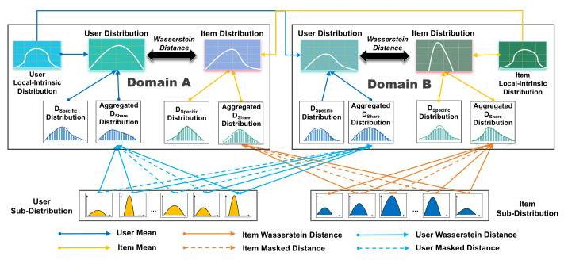
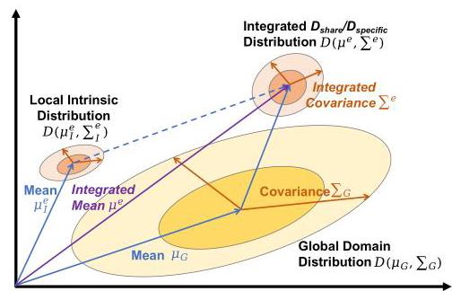
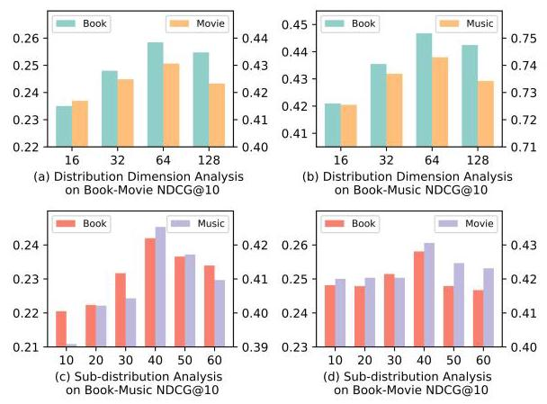

# Modeling Domains as Distributions with Uncertainty for Cross-Domain Recommendation

Xianghui Zhu*

zhuxh22@mails.tsinghua.edu.cn

Shenzhen International Graduate

School, Tsinghua University

Shenzhen, China

Mengqun Jin*

jinmq22@mails.tsinghua.edu.cn

Shenzhen International Graduate

School, Tsinghua University

Shenzhen, China

Hengyu Zhang

zhang-hy21@mails.tsinghua.edu.cn

Shenzhen International Graduate

School, Tsinghua University

Shenzhen, China

Chang Meng

mengc21@mails.tsinghua.edu.cn

Shenzhen International Graduate

School, Tsinghua University

Shenzhen, China

Daoxin Zhang

tangxiaohui@xiaohongshu.com

Xiaohongshu Inc.

Shanghai, China

Xiu Li

li.xiu@sz.tsinghua.edu.cn

Shenzhen International Graduate

School, Tsinghua University

Shenzhen, China

## ABSTRACT

In the field of dual-target Cross-Domain Recommendation (DTCDR), improving the performance in both the information sparse domain and rich domain has been a mainstream research trend. However, prior embedding-based methods are insufficient to adequately describe the dynamics of user actions and items across domains. Moreover, previous efforts frequently lacked a comprehensive investigation of the entire domain distributions. This paper proposes a novel framework entitled Wasserstein Cross-Domain Recommendation (WCDR) that captures uncertainty in Wasserstein space to address above challenges. In this framework, we abstract user/item actions as Elliptical Gaussian distributions and divide them into local-intrinsic and global-domain parts. To further model the domain diversity, we adopt shared-specific pattern for global-domain distributions and present Masked Domain-aware Sub-distribution Aggregation (MDSA) module to produce informative and diversified global-domain distributions, which incorporates attention-based aggregation method and masking strategy that alleviates negative transfer issues. Extensive experiments on two public datasets and one business dataset are conducted. Experimental results demonstrate the superiority of WCDR over state-of-the-art methods.

## CCS CONCEPTS

- Information systems \( \rightarrow \) Recommender systems.

## KEYWORDS

Cross-Domain Recommendation; Representation Learning; Uncertainty; Wasserstein space

## ACM Reference Format:

Xianghui Zhu, Mengqun Jin, Hengyu Zhang, Chang Meng, Daoxin Zhang, and Xiu Li. 2024. Modeling Domains as Distributions with Uncertainty for Cross-Domain Recommendation. In Proceedings of the 47th International

ACM SIGIR Conference on Research and Development in Information Retrieval (SIGIR '24), July 14-18, 2024, Washington, DC, USA. ACM, New York, NY, USA, 5 pages. https://doi.org/10.1145/3626772.3657930

## 1 INTRODUCTION

Recommender systems (RS) are widely used in e-commerce scenarios \( \left\lbrack  {3,6,{20},{24},{26},{30}}\right\rbrack \) . Data sparsity has been a long-standing obstacle in the recommendation field. Cross-domain Recommendation (CDR) \( \left\lbrack  {5,{22},{23}}\right\rbrack \) has shown to be an effective approach to alleviating the data sparsity issue, seeking to employ information gathered from source domain to enhance recommendation in the target domain. Existing CDR approaches fall into two types, single-target CDR [7, 12, 13, 18, 28] and dual-target CDR [29], depending on which target domain to promote. Dual-target CDR-which improves both the performance of the target domain and the source domain-have emerged as a popular research topic in academia.

Recent dual-target CDR techniques \( \left\lbrack  {{10},{11},{14},{27}}\right\rbrack \) are developed to boost both domains' performance by generating user and item embeddings and bridging the semantic domain gap, which especially focuse on overlapping users. These embedding-based techniques, however, suffer two apparent shortcomings: 1) Intuitively, they assume similar users in the source domain behave similarly in the target domain. In reality, user interests are uncertain and may vary a lot across domains, leading to significant unpredictability. 2) User or item behaviors reveal domain collectivity with latent generic preferences, but conventional researches ignore the characteristics of the domain itself.

This paper considers the underlying uncertainty of user behaviors and item characterizations across domains, and models the common tendencies of users and items in both domains.

Therefore, we first propose Domain Uncertainty Representation Framework (DURF) to explore the problems, in which we discard the conventional embedding representations and parameterize the uncertainty of users and items with Gaussian distributions containing intrinsic and domain-aware parts. The latter indicate domain-level knowledge that can assist cross-domain prediction. To model rich domain information, we derive the domain-aware distributions into the domain specific-shared paradigm and propose Masked Domain-aware Sub-distribution Aggregation (MDSA) module to originate the domain-shared distribution, which involves two key components: Adaptive Wasserstein Aggregation and Merit-based Masking Strategy. The former enables each domain to absorb the domain-shared knowledge adaptively and the latter boosts aggregation flexibility and decrease negative transfer. We name the final end-to-end framework as Wasserstein Cross-Domain Recommendation (WCDR).

---

*Co-first authors with equal contributions. Xiu Li is the corresponding author.

---

Extensive experiments are conducted on two public real-world datasets (Douban and Amazon) and a specific industrial dataset composed of domains with vastly distributional variability. WCDR outperforms current state-of-the-art methods on all domains.

Figure 1: Framework of our proposed WCDR.

## 2 METHODS

### 2.1 Problem Definition

Dual-Target CDR includes source data \( S = {\left\{  \left( {\mathbf{u}}_{i}^{s},{\mathbf{i}}_{i}^{s},{\mathbf{r}}_{i}^{s}\right) \right\}  }_{i = 1}^{{N}_{s}} \) and target data \( T = {\left\{  \left( {\mathbf{u}}_{i}^{t},{\mathbf{i}}_{i}^{t},{\mathbf{r}}_{i}^{t}\right) \right\}  }_{i = 1}^{{N}_{t}} \) . As source domain is information-rich and target domain is information-sparse, \( {N}_{s} \gg  {N}_{t} \) is usually satisfied.

### 2.2 Domain Uncertainty Representation Framework

Current works usually focus on how to model the impact of deterministic representations in other domains on the current domain, rather than modeling the underlying distribution of uncertainty. Therefore, we propose the Domain Uncertainty Representation Framework (DURF) that addresses uncertainty directly to better handle the issue.

In this framework, we first represent each user or item (collectively called as entity) as an Elliptic Gaussian distribution \( D\left( {{\mathbf{\mu }}^{e},{\sum }^{e}}\right) \) , which is composed of the mean embedding \( {\mathbf{\mu }}^{e} \) and the covariance matrix \( {\sum }^{e} \) , where the covariance embedding depicts the uncertainty of the entity. For simplicity, we assume that the embedding dimensions are uncorrelated, so the covariance matrix degenerates into a diagonal matrix \( {\sum }^{e} \) , which is represented by one embedding vector.

Considering that each domain has its own distribution, we decouple the distribution of each entity into the local-intrinsic distribution \( D\left( {{\mathbf{\mu }}_{I}^{e},{\sum }_{I}^{e}}\right) \) and the global-domain distribution \( D\left( {{\mathbf{\mu }}_{G},{\sum }_{G}}\right) \) , which are both organized as Gaussian distributions and the decoupling is formulated in Eq. (1). The local one denotes the eigen distribution of each entity which does not vary with domains and the global one indicates the distribution of the current domain.

\[
{D}_{G}\left( {{\mathbf{\mu }}^{e},{\sum }^{e}}\right)  = D\left( {{\mathbf{\mu }}_{I}^{e},{\sum }_{I}^{e}}\right)  \vee  D\left( {{\mathbf{\mu }}_{G},{\sum }_{G}}\right) , \tag{1}
\]

where \( {D}_{G}\left( {{\mathbf{\mu }}^{e},{\sum }^{e}}\right) \) is the entity distribution in \( D\left( {{\mathbf{\mu }}_{G},{\sum }_{G}}\right) \) and \( \vee \) represents the synthesis of two distributions. The combination is shown in Figure. (2).

Figure 2: The integration of Local intrinsic and Global Domain Distribution leveraged in Wasserstein Space.

We presume these two distributions are independent and satisfy the linearity [19] of the multivariate Gaussian distribution:

\[
{\mu }^{e} = {\mu }_{G} + {\mu }_{I}^{e} \tag{2}
\]

\[
{\sum }^{e} = {\sum }_{G} + {\sum }_{I}^{e}, \tag{3}
\]

where \( {\mathbf{\mu }}_{G} \) and \( {\mathbf{\mu }}_{I}^{e} \) denote the mean embeddings, and \( {\sum }_{G} \) and \( {\sum }_{I}^{e} \) are the covariance embeddings.

2.2.1 Wasserstein Distance and Loss. Wasserstein distance \( \left\lbrack  {1,{16}}\right\rbrack \) measures the dissimilarity between distributions that obeys triangular inequality [4]. Instead of applying dot-product to calculate the distance between embeddings as previous works [7, 12], we adopt Wasserstein distance as the distance metric.

The 2-Wasserstein [17] distance \( {W}_{2}\left( {\cdot , \cdot  }\right) \) between the user \( i \) ’s distribution \( D\left( {{\mathbf{\mu }}^{{u}_{i}},{\sum }^{{u}_{i}}}\right) \) and the item \( j \) ’s \( D\left( {{\mathbf{\mu }}^{{v}_{j}},{\sum }^{{v}_{j}}}\right) \) is defined as:

\[
{W}_{2}\left( {D\left( {{\mathbf{\mu }}^{{u}_{i}},{\sum }^{{u}_{i}}}\right) , D\left( {{\mathbf{\mu }}^{{v}_{j}},{\sum }^{{v}_{j}}}\right) }\right)
\]

\[
= \left| \right| {\mathbf{\mu }}^{{u}_{i}} - {\mathbf{\mu }}^{{v}_{j}}{\left| \right| }_{2}^{2} + \operatorname{trace}\left( {{\sum }^{{u}_{i}} + {\sum }^{{v}_{j}} - 2{\left( {\left( {\sum }^{{u}_{i}}\right) }^{\frac{1}{2}}{\sum }^{{v}_{j}}{\left( {\sum }^{{u}_{i}}\right) }^{\frac{1}{2}}\right) }^{\frac{1}{2}}}\right) .
\]

(4)

Note that the range of Wasserstein distance is \( \lbrack 0, + \infty ) \) . To calculate the loss using binary labels, we define a new activation function \( {\sigma }^{\prime } \) that maps the output to the range \( \left( {0,1}\right) \) :

\[
{\sigma }^{\prime }\left( x\right)  = \frac{2}{1 + {e}^{x}} - \epsilon \tag{5}
\]

where \( \epsilon \) is a small positive value (e.g., \( {1e} - {10} \) ) to avoid the activated output being zero.

As we control the activated value of positive samples to be close to 1 and negative samples to be close to 0 , the Wasserstein distance between two distributions is dragged to the entire non-negative interval, which makes the model exhaustively trained. Therefore, the prediction loss is formulated in the form of cross-entropy:

\[
\widehat{y} = {\sigma }^{\prime }\left( {{W}_{2}\left( {u, v}\right) }\right) \tag{6}
\]

\[
{L}_{\mathrm{{predict}}} =  - \widehat{y}\log \left( \widehat{y}\right)  - \left( {1 - \widehat{y}}\right) {log}\left( {1 - \widehat{y}}\right) . \tag{7}
\]

### 2.3 Domain-aware Sub-distribution Aggregation

To further investigate the relationships between different domains, we present the Masked Domain-aware Sub-distribution Aggregation (MDSA) to appropriately capture inter-domain knowledge. The overview of our proposed model is shown in Figure. (1).

We first divide each global domain distribution \( D\left( {{\mathbf{\mu }}_{G},{\sum }_{G}}\right) \) into the domain-specific distribution \( D\left( {{\mathbf{\mu }}_{spe},{\sum }_{spe}}\right) \) and the domain-shared distribution \( D\left( {{\mathbf{\mu }}_{sha},{\sum }_{sha}}\right) \) . Domain-specific distributions accumulate information of each single domain while domain-shared ones are identical across domains to transmit common knowledge. The representations of the global-domain distributions will take the following form, which also satisfies the linearity of Gaussian distribution:

\[
{\mu }_{G}^{\prime } = \frac{1}{2} \cdot  \left( {{\mu }_{spe} + {\mu }_{sha}}\right) \tag{8}
\]

\[
{\sum }_{G}^{\prime } = \frac{1}{2} \cdot  \left( {{\sum }_{spe} + {\sum }_{sha}}\right) . \tag{9}
\]

Modeling a domain-shared distribution during the training stage makes it to be trained with the information from both domains. Nonetheless, the distributions of different domains may vary greatly. Consequently, the single distribution across all domains could be challenging to portray the gap between them. Then, we construct a collection of sub-distributions to represent the transferable knowledge of all domains instead of a single one.

Adaptive Wasserstein Aggregation. Each sub-distribution \( D\left( {{\mathbf{\mu }}_{sub}^{k},{\mathbf{\sum }}_{sub}^{k}}\right) \) contains part of the domain knowledge and they act as anchors to conduct knowledge transfer between domains, from which each domain adaptively determines how much information to utilize. To achieve this, we employ Wasserstein distance to compute attention weights for the aggregation of sub-distributions.

The distributions of the entity \( {e}^{i} \) in the domain-specific distribution and the k-th sub-distribution are abbreviated as \( {D}_{spc}\left( {{\mathbf{\mu }}^{e},{\sum }^{e}}\right) \) and \( {D}_{{sub} : k}\left( {{\mu }^{e},{\sum }^{e}}\right) \) . We obtain the attention weight \( {\alpha }_{{e}^{i}, k}^{A/B} \) as:

\[
{\alpha }_{{e}^{i}, k}^{A/B} = \frac{{A}^{{e}^{i}, k}}{\mathop{\sum }\limits_{{j = 1}}^{N}{A}^{{e}^{i}, j}} \tag{10}
\]

where the superscript \( A/B \) indicates the symbol of domains and the weight \( {A}^{{e}^{i}, k} \) is formulated as:

\[
{A}^{{e}^{i}, k} =  - {W}_{2}\left( {{D}_{spc}\left( {{\mu }^{e},{\sum }^{e}}\right) ,{D}_{{sub} : k}\left( {{\mu }^{e},{\sum }^{e}}\right) }\right) \tag{11}
\]

The aggregated domain-shared distribution \( D\left( {{\mathbf{\mu }}_{a},{\sum }_{a}}\right) \) is formulated as follows:

\[
{\mu }_{a} = \mathop{\sum }\limits_{{j = 1}}^{N}{\alpha }_{{e}^{i}, k}^{A/B}{\mu }_{sub}^{k} \tag{12}
\]

\[
{\sum }_{a} = \mathop{\sum }\limits_{{j = 1}}^{N}{\left( {\alpha }_{e, i, k}^{A/B}\right) }^{2}{\sum }_{sub}^{k} \tag{13}
\]

The aggregation mechanism in the Wasserstein space allows each entity to select appropriate proportion of sub-distributions in its own domain. As the training progresses, each sub-distribution becomes a memory storing information of partial perspectives of all domains in total.

Merit-based Masking Strategy. We employ a novel Merit-based Masking Strategy (MMS) in which each domain utilizes a value to control the ratio of domain-specific data. In detail, the masking strategy regulates the number of sub-distributions used by each domain to avoid sub-distributions being overly influenced by oversized domains.

Given two domains A and B, we introduce two masking ratios \( {r}^{A} \) and \( {r}^{B} \) , representing the percentage of filtering of the two domains. To implement the masking strategy, we first obtain the attention weights of each sub-distribution \( {\alpha }_{{e}^{i}, k}^{A/B} \) . Then we select top-M sub-distributions \( {S}_{M}^{{e}^{i}} = \left\{  {{D}_{sub}^{{k}_{1}},{D}_{sub}^{{k}_{2}},\ldots ,{D}_{sub}^{{k}_{M}}}\right\} \) , which can be seen as \( \mathrm{M} \)

principal components. The following equation gives the number \( \mathrm{M} \) of maintained sub-distributions:

\[
{\mathrm{M}}^{A/B} = \left\lceil  {\left( {1 - {r}^{A/B}}\right)  \cdot  \mathrm{N}}\right\rceil \tag{14}
\]

where \( \lceil  \cdot  \rceil \) indicates the upward rounding symbol and \( N \) is the number of sub-distributions.

By tuning the ratio, domains will be trained with different number of anchor sub-distributions, thus reducing the effect of excess size imbalance between domains. This masking strategy is elaborated in Eq. (15). Note that even in the same domain, entities select different sub-distributions due to different attention scores.

\[
{\alpha }_{{e}^{i}, k}^{A/B,{MASK}} = \left\{  \begin{array}{ll} 0, & {D}_{sub}^{k} \notin  {S}_{{M}^{A/B}}^{{e}^{i}}. \\  {\alpha }_{{e}^{i}, k}^{A/B}, & \text{ otherwise. } \end{array}\right. \tag{15}
\]

The aggregation of the domain-shared distribution is revised as:

\[
{\mu }_{a}^{\prime } = \mathop{\sum }\limits_{{j = 1}}^{N}{\alpha }_{{e}^{t}, k}^{A/B,{MASK}}{\mu }_{sub}^{k} \tag{16}
\]

\[
{\sum }_{a}^{\prime } = \mathop{\sum }\limits_{{j = 1}}^{N}{\left( {\alpha }_{{e}^{i}, k}^{A/B,{MASK}}\right) }^{2}{\sum }_{sub}^{k}. \tag{17}
\]

To summarize, we can depict the attributes of the entity distribution \( {D}_{G}\left( {{\mathbf{\mu }}_{\mathrm{{FINAL}}}^{e},{\sum }_{\mathrm{{FINAL}}}^{e}}\right) \) in Eq. (18)-(19). Model training is performed by minimizing the loss \( {L}_{\text{ predict }} \) after obtaining the final distributions of users and items.

\[
{\mu }_{\mathrm{{FINAL}}}^{e} = \frac{1}{2} \cdot  \left( {{\mu }_{spe} + {\mu }_{a}^{\prime }}\right)  + {\mu }_{I}^{e}, \tag{18}
\]

\[
{\sum }_{\mathrm{{FINAL}}}^{e} = \frac{1}{2} \cdot  \left( {{\sum }_{spe} + {\sum }_{a}^{\prime }}\right)  + {\sum }_{I}^{e}. \tag{19}
\]

## 3 EXPERIMENTS AND ANALYSIS

### 3.1 Experimental Settings

We conduct extensive experiments on the real-world datasets and the Industry dataset to answer the following questions.

- Q1: Is our proposed WCDR superior to state-of-the-art models?

- Q2: What is the function of each component in the WCDR model?

- Q3: How sensitive is the WCDR to hyper-parameters?

Datasets and Tasks. We conduct experiments on Douban [27], Amazon [15, 25] and Industry dataset. Douban is a rating and review recommendation for movies, books and music. Amazon is a E-commerce recommendation platform. Industry dataset is a platform contains both user generated-content and E-commerce. We filter dataset and keep at least 5 (Douban and Amazon) and 10 (Industry) interactions for users and items. Each rating is randomly selected with 5 negative items. We retain the user index, item index, and ratings as input. \( \mathrm{N} \) domains constitue \( {C}_{N}^{2} \) pairs. Preprocessed datasets' details are summarized in Table 1.

Metrics, Baselines, and Implementation Details. We compare our framework with 5 baseline models, including CoNet [9], AA [21], DDTCDR [11] CDRIB [2] and GWCDR [12]. These baseline models are the most relevant and state-of-the-art methods with different embedding and transfer strategies. We set the same hyper-parameters for each baseline as our proposed model for a fair comparison. We apply leave-one-out as our evaluation method. Each positive rating will match randomly sampled 99 unrated items in the test set. HR and NDCG [8], are used to assess the effectiveness. To be fair, the embedding size in each above model is the summation of the mean and covariance vector sizes from our model.

Table 1: Descriptive Statistics for experimental datasets.

<table><tr><td>Datasets</td><td colspan="3">Douban</td><td colspan="5">Amazon</td><td colspan="2">Industry</td></tr><tr><td>Domains</td><td>Movie</td><td>Music</td><td>Book</td><td>Apps</td><td>Games</td><td>Musical</td><td>Video</td><td>Baby</td><td>\( {\operatorname{Domain}}_{A}\left( {\mathrm{D}}_{A}\right) \)</td><td>\( {\operatorname{Domain}}_{B}\left( {\mathrm{D}}_{B}\right) \)</td></tr><tr><td>num</td><td>2630</td><td>1344</td><td>1878</td><td>94918</td><td>31013</td><td>9944</td><td>8049</td><td>27626</td><td>357209</td><td>14259</td></tr><tr><td>num</td><td>20964</td><td>7146</td><td>8660</td><td>23107</td><td>23715</td><td>13687</td><td>7076</td><td>18750</td><td>135142</td><td>36020</td></tr><tr><td>num</td><td>1246394</td><td>75718</td><td>103170</td><td>712086</td><td>256124</td><td>51685</td><td>50192</td><td>188789</td><td>3572090</td><td>142590</td></tr><tr><td>Sparsity</td><td>97.74%</td><td>99.21%</td><td>99.37%</td><td>99.97%</td><td>99.97%</td><td>99.96%</td><td>99.91%</td><td>99.96%</td><td>99.99%</td><td>99.97%</td></tr></table>

Table 2: Experiment results on Douban and Amazon Dataset. Impr. \( \uparrow \) means the improvement of our WCDR method compared to the best results of all the baselines on NDCG@10.

<table><tr><td></td><td>CoNet</td><td>DDTCDR</td><td>AA</td><td>CDRIB</td><td>GWCDR</td><td>WCDR</td><td>Impr.↑</td></tr><tr><td>Book</td><td>0.2010</td><td>0.1932</td><td>0.2025</td><td>0.2011</td><td>0.1928</td><td>0.2420</td><td>19.51%</td></tr><tr><td>Music</td><td>0.1884</td><td>0.1789</td><td>0.1799</td><td>0.1833</td><td>0.1824</td><td>0.2326</td><td>23.45%</td></tr><tr><td>Movie</td><td>0.4252</td><td>0.4200</td><td>0.4281</td><td>0.4242</td><td>0.4251</td><td>0.4339</td><td>1.35%</td></tr><tr><td>Music</td><td>0.2067</td><td>0.2050</td><td>0.2107</td><td>0.1921</td><td>0.1862</td><td>0.2437</td><td>15.67%</td></tr><tr><td>Apps</td><td>0.4641</td><td>0.4127</td><td>0.4109</td><td>0.5389</td><td>0.5344</td><td>0.5986</td><td>11.08%</td></tr><tr><td>Games</td><td>0.3553</td><td>0.2805</td><td>0.3091</td><td>0.2143</td><td>0.4530</td><td>0.5574</td><td>23.05%</td></tr><tr><td>Musical</td><td>0.2357</td><td>0.2805</td><td>0.2033</td><td>0.2849</td><td>0.3037</td><td>0.3193</td><td>5.15%</td></tr><tr><td>Video</td><td>0.3542</td><td>0.3126</td><td>0.2285</td><td>0.2742</td><td>0.3729</td><td>0.4860</td><td>30.34%</td></tr><tr><td>Baby</td><td>0.1715</td><td>0.2725</td><td>0.2571</td><td>0.2610</td><td>0.3291</td><td>0.3530</td><td>7.26%</td></tr><tr><td>Video</td><td>0.2973</td><td>0.3467</td><td>0.3387</td><td>0.3799</td><td>0.2946</td><td>0.4833</td><td>64.06%</td></tr></table>

Table 3: Experiment result on Industry Dataset on HR@20.

<table><tr><td></td><td>CoNet</td><td>DDTCDR</td><td>AA</td><td>CDRIB</td><td>GWCDR</td><td>WCDR</td><td>Impr.↑</td></tr><tr><td>\( {D}_{A} \)</td><td>0.1244</td><td>0.2288</td><td>0.2740</td><td>0.2751</td><td>0.2308</td><td>0.4715</td><td>72.09%</td></tr><tr><td>\( {D}_{B} \)</td><td>0.3694</td><td>0.3425</td><td>0.3733</td><td>0.3749</td><td>0.3699</td><td>0.4216</td><td>12.43%</td></tr></table>

Table 4: Ablation Study on Douban Dataset on HR@10.

<table><tr><td></td><td>DURF</td><td>DURF+ \( {D}_{sha} \)</td><td>DURF+ \( {D}_{{sha} + {sub}} \)</td><td>WCDR</td></tr><tr><td>Movie</td><td>0.7104</td><td>0.7202</td><td>0.7316</td><td>0.7426</td></tr><tr><td>Book</td><td>0.3958</td><td>0.4023</td><td>0.4344</td><td>0.4436</td></tr></table>

### 3.2 Performance Comparison and Analysis

Q1. We train and validate all the domain pairs with 5 baseline models. As shown in Table 2 and 3, our model performs particularly well under the circumstances that both domains (Book-Music) have similar rating numbers \( {nu}{m}_{r} \) , where equivalent NDCG is gained. However, when large gap in terms of rating numbers occurs (Movie-Music and \( {D}_{A} - {D}_{B} \) ), the sparse domain (Music and \( {D}_{B} \) ) can also be greatly promoted, as shown in Table 3. It demonstrates the effectiveness of our domain-shared and domain-specific modules. Q2. In Table 4, DURF+ \( {D}_{sha} \) denotes DURF with domain-sharing and DURF+ \( {D}_{{sha} + {sub}} \) means DURF with the shared distribution and sub-distributions. DURF+ \( {D}_{sha} \) introduces inter-domain transferable knowledge through a Gaussian distribution shared between two domains. The performance of the model is improved by using one common Gaussian distribution to transfer the information of two domains, which highlights the importance of the domain-sharing part of the information. WCDR adds the Merit-based Masking Strategy to DURF+ \( {D}_{{sha} + {sub}} \) , and the effect of this strategy has a significant improvement for the prior model in each domain. Q3. Figure 3 (a) and (b) evaluates the sensitivity analysis of distribution dimension in \( \left\lbrack  {{16},{32},{64},{128}}\right\rbrack \) . As distribution dimension increases, NDCG@10 and HR@10 first ascend, and achieve the best performance at 64 , then declines. We can conclude that distribution dimension is a sensitive parameter in our WCDR model. It shouldn't be too little to capture the distribution's broadness, nor should it be too large, leading the model to overfit.

Figure 3: Sensitivity Analysis.

Figure 3 (c) and (d) compares the evaluation metric when the number of sub-distributions \( N \) are set as \( \left\lbrack  {{10},{20},{30},{40},{50},{60}}\right\rbrack \) . The model parameters and evaluation metric grows as \( N \) increases, and overfitting occurs typically when \( N > {40} \) . The incorporation of sub-distributions makes it feasible to raise the model's uncertainty level, which improves its ability to capture users' dynamic preferences.

## 4 CONCLUSION

In this paper, we propose a framework called WCDR for dual-target CDR, which models user interests and item attributes with uncertainty. Our method effectively conveys the variation of user preferences by utilizing an aggregated domain-sharing distribution from multiple sub-distributions. The domain-specific distribution applies the masking strategy to yield an extensive variety of user preferences. Finally, extensive experiments conducted on public and industrial datasets demonstrate the superiority of WCDR.

## ACKNOWLEDGEMENTS

This work is partly supported by Guangdong Provincial Key R&D Program (Grant No.2021B0101250002), Dongguan Science and Technology of Social Development Program (Grant No.20221800905072) and the Special Projects in Key Fields from the Department of Education of Guangdong Province (Grant No.2022ZDZX2059).

## REFERENCES

[1] Martin Arjovsky, Soumith Chintala, and Léon Bottou. 2017. Wasserstein generative adversarial networks. In International conference on machine learning. PMLR, 214-223.

[2] Jiangxia Cao, Jiawei Sheng, Xin Cong, Tingwen Liu, and Bin Wang. 2022. Cross-Domain Recommendation to Cold-Start Users via Variational Information Bottleneck. In IEEE International Conference on Data Engineering (ICDE).

[3] Heng-Tze Cheng, Levent Koc, Jeremiah Harmsen, Tal Shaked, Tushar Chandra, Hrishi Aradhye, Glen Anderson, Greg Corrado, Wei Chai, Mustafa Ispir, et al. 2016. Wide & deep learning for recommender systems. In Proceedings of the 1st workshop on deep learning for recommender systems. 7-10.

[4] Philippe Clement and Wolfgang Desch. 2008. An elementary proof of the triangle inequality for the Wasserstein metric. Proc. Amer. Math. Soc. 136, 1 (2008), 333- 339.

[5] Ignacio Fernández-Tobías, Iván Cantador, Marius Kaminskas, and Francesco Ricci. 2012. Cross-domain recommender systems: A survey of the state of the art. In Spanish conference on information retrieval, Vol. 24. sn.

[6] Huifeng Guo, Ruiming Tang, Yunming Ye, Zhenguo Li, and Xiuqiang He. 2017. DeepFM: a factorization-machine based neural network for CTR prediction. arXiv preprint arXiv:1703.04247 (2017).

[7] Ming He, Jiuling Zhang, Peng Yang, and Kaisheng Yao. 2018. Robust transfer learning for cross-domain collaborative filtering using multiple rating patterns approximation. In ICDM. 225-233.

[8] Xiangnan He, Lizi Liao, Hanwang Zhang, Liqiang Nie, Xia Hu, and Tat-Seng Chua. 2017. Neural collaborative filtering. In Proceedings of the 26th international conference on world wide web. 173-182.

[9] Guangneng Hu, Yu Zhang, and Qiang Yang. 2018. Conet: Collaborative cross networks for cross-domain recommendation. In CIKM. 667-676.

[10] Guangneng Hu, Yu Zhang, and Qiang Yang. 2018. MTNet: a neural approach for cross-domain recommendation with unstructured text. KDD Deep Learning Day (2018), 1-10.

[11] Pan Li and Alexander Tuzhilin. 2020. Ddtcdr: Deep dual transfer cross domain recommendation. In ICDM. 331-339.

[12] Xinhang Li, Zhaopeng Qiu, Xiangyu Zhao, Zihao Wang, Yong Zhang, Chunxiao Xing, and Xian Wu. 2022. Gromov-Wasserstein Guided Representation Learning

[13] Tong Man, Huawei Shen, Xiaolong Jin, and Xueqi Cheng. 2017. Cross-domain recommendation: An embedding and mapping approach.. In IJCAI, Vol. 17. 2464- 2470.

[14] Linh Nguyen and Tsukasa Ishigaki. 2018. Domain-to-domain translation model for recommender system. arXiv preprint arXiv:1812.06229 (2018).

[15] Jianmo Ni, Jiacheng Li, and Julian McAuley. 2019. Justifying recommendations using distantly-labeled reviews and fine-grained aspects. In Proceedings of the 2019 conference on empirical methods in natural language processing and the 9th international joint conference on natural language processing (EMNLP-IJCNLP). 188-197.

[16] Victor M Panaretos and Yoav Zemel. 2019. Statistical aspects of Wasserstein distances. Annual review of statistics and its application 6 (2019), 405-431.

[17] Victor M Panaretos and Yoav Zemel. 2019. Statistical aspects of Wasserstein distances. Annual review of statistics and its application 6 (2019), 405-431.

[18] Dilruk Perera and Roger Zimmermann. 2019. CnGAN: Generative Adversarial Networks for Cross-network user preference generation for non-overlapped users. In The World Wide Web Conference. 3144-3150.

[19] Joram Soch, The Book of Statistical Proofs, Thomas J. Faulkenberry, Kenneth Petrykowski, and Carsten Allefeld. 2020. StatProofBook/StatProofBook.github.io: StatProofBook 2020. https://doi.org/10.5281/zenodo.4305950

[20] Qingquan Song, Dehua Cheng, Hanning Zhou, Jiyan Yang, Yuandong Tian, and Xia Hu. 2020. Towards automated neural interaction discovery for click-through rate prediction. In Proceedings of the 26th ACM SIGKDD International Conference on Knowledge Discovery & Data Mining. 945-955.

[21] Hongzu Su, Yifei Zhang, Xuejiao Yang, Hua Hua, Shuangyang Wang, and Jingjing Li. 2022. Cross-domain Recommendation via Adversarial Adaptation. In CIKM. 1808-1817.

[22] Jie Tang, Sen Wu, Jimeng Sun, and Hang Su. 2012. Cross-domain collaboration recommendation. In Proceedings of the 18th ACM SIGKDD international conference on Knowledge discovery and data mining. 1285-1293.

[23] Yichao Wang, Huifeng Guo, Bo Chen, Weiwen Liu, Zhirong Liu, Qi Zhang, Zhicheng He, Hongkun Zheng, Weiwei Yao, Muyu Zhang, et al. 2022. CausalInt: Causal Inspired Intervention for Multi-Scenario Recommendation. In SIGKDD. 4090-4099.

[24] Kexin Zhang, Yichao Wang, Xiu Li, Ruiming Tang, and Rui Zhang. 2024. IncMSR: An Incremental Learning Approach for Multi-Scenario Recommendation. In Proceedings of the 17th ACM International Conference on Web Search and Data Mining. 939-948.

[25] Cheng Zhao, Chenliang Li, Rong Xiao, Hongbo Deng, and Aixin Sun. 2020. CATN: Cross-domain recommendation for cold-start users via aspect transfer network. In Proceedings of the 43rd International ACM SIGIR Conference on Research and Development in Information Retrieval. 229-238.

[26] Chenxu Zhu, Peng Du, Xianghui Zhu, Weinan Zhang, Yong Yu, and Yang Cao. 2022. User-tag profile modeling in recommendation system via contrast weighted tag masking. In Proceedings of the 28th ACM SIGKDD Conference on Knowledge Discovery and Data Mining. 4630-4638.

[27] Feng Zhu, Chaochao Chen, Yan Wang, Guanfeng Liu, and Xiaolin Zheng. 2019. Dtcdr: A framework for dual-target cross-domain recommendation. In CIKM. 1533-1542.

[28] Feng Zhu, Yan Wang, Chaochao Chen, Guanfeng Liu, Mehmet Orgun, and Jia Wu. 2020. A deep framework for cross-domain and cross-system recommendations. arXiv preprint arXiv:2009.06215 (2020).

[29] Feng Zhu, Yan Wang, Chaochao Chen, Jun Zhou, Longfei Li, and Guanfeng Liu. 2021. Cross-domain recommendation: challenges, progress, and prospects. arXiv preprint arXiv:2103.01696 (2021).

[30] Xianghui Zhu, Peng Du, Shuo Shao, Chenxu Zhu, Weinan Zhang, Yang Wang, and Yang Cao. 2023. A Feature-Based Coalition Game Framework with Privileged Knowledge Transfer for User-tag Profile Modeling. In Proceedings of the 29th ACM SIGKDD Conference on Knowledge Discovery and Data Mining. 5739-5749.