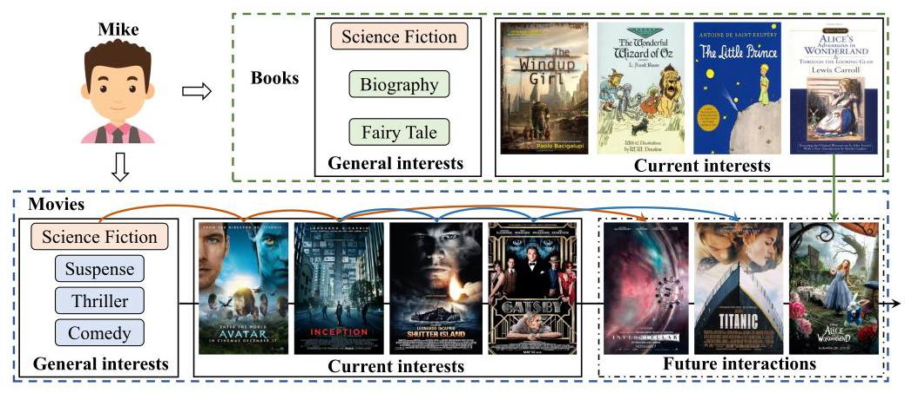
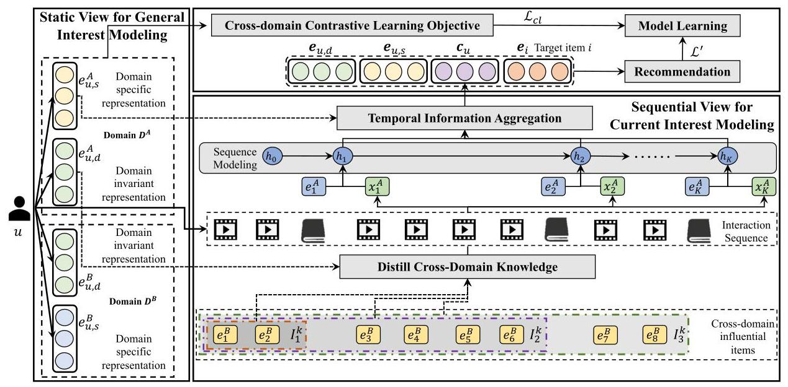
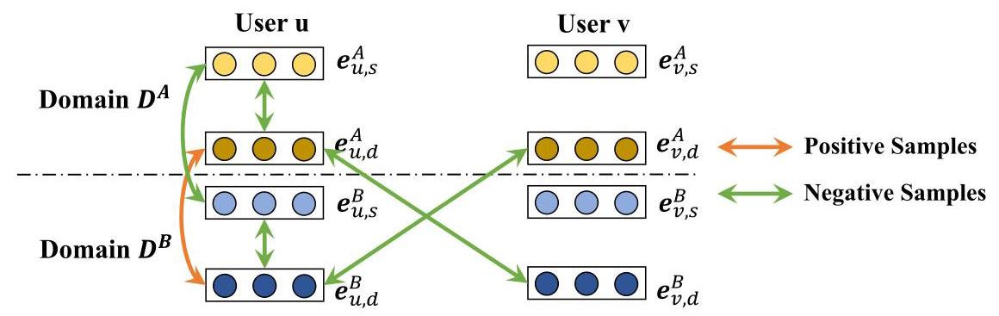
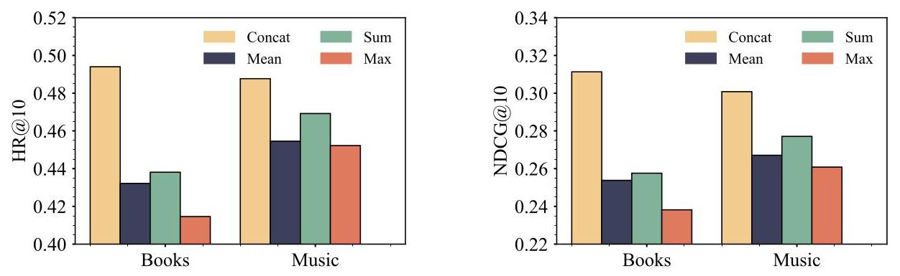
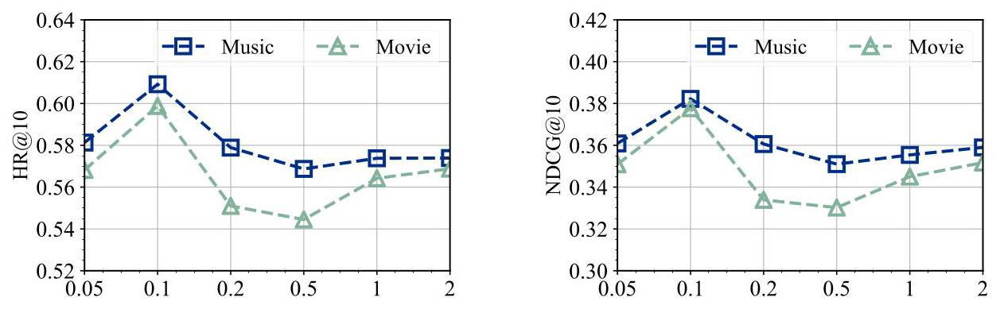
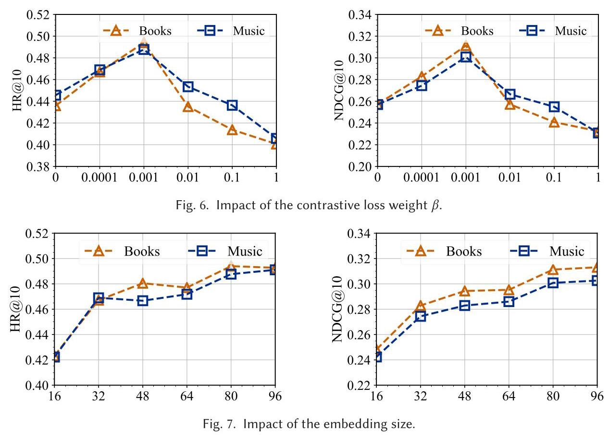
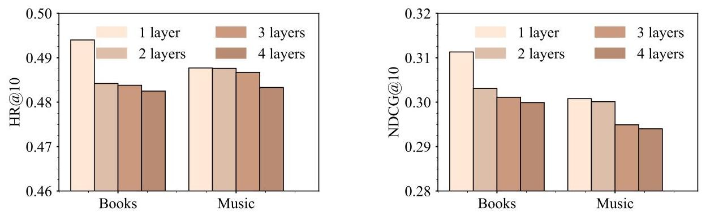
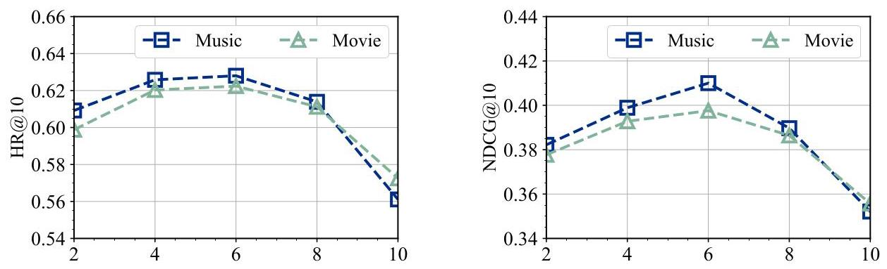
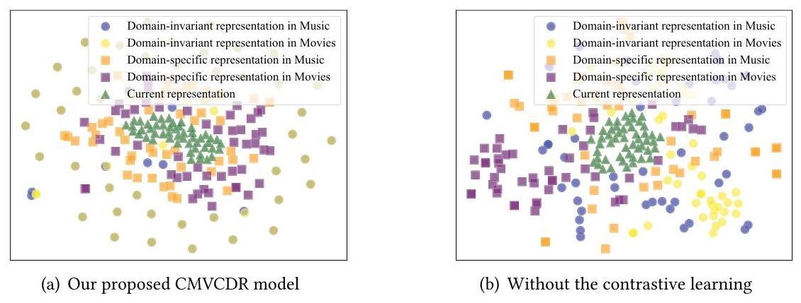

# Contrastive Multi-view Interest Learning for Cross-domain Sequential Recommendation

TIANZI ZANG, Nanjing University of Aeronautics and Astronautics, China, and Shanghai Jiao Tong University, China

YANMIN ZHU, RUOHAN ZHANG, CHUNYANG WANG, KE WANG, and JIADI YU, Shanghai Jiao Tong University, China

Cross-domain recommendation (CDR), which leverages information collected from other domains, has been empirically demonstrated to effectively alleviate data sparsity and cold-start problems encountered in traditional recommendation systems. However, current CDR methods, including those considering time information, do not jointly model the general and current interests within and across domains, which is pivotal for accurately predicting users' future interactions. In this article, we propose a Contrastive learning-enhanced Multi-View interest learning model (CMVCDR) for cross-domain sequential recommendation. Specifically, we design a static view and a sequential view to model uses' general interests and current interests, respectively. We divide a user's general interest representation into a domain-invariant part and a domain-specific part. A cross-domain contrastive learning objective is introduced to impose constraints for optimizing these representations. In the sequential view, we first devise an attention mechanism guided by users' domain-invariant interest representations to distill cross-domain knowledge pertaining to domain-invariant factors while reducing noise from irrelevant factors. We further design a domain-specific interest-guided temporal information aggregation mechanism to generate users' current interest representations. Extensive experiments demonstrate the effectiveness of our proposed model compared with state-of-the-art methods.

## CCS Concepts: - Information systems \( \rightarrow \) Recommender systems;

Additional Key Words and Phrases: Cross-domain recommendation, sequential recommendation, multi-view learning, contrastive learning

## ACM Reference format:

Tianzi Zang, Yanmin Zhu, Ruohan Zhang, Chunyang Wang, Ke Wang, and Jiadi Yu. 2023. Contrastive Multiview Interest Learning for Cross-domain Sequential Recommendation. ACM Trans. Inf. Syst. 42, 3, Article 76 (December 2023), 30 pages.

https://doi.org/10.1145/3632402

---

This research is supported in part by the National Science Foundation of China (No. 62072304, No. 62172277), the Shanghai Municipal Science and Technology Commission (No. 21511104700), the Shanghai East Talents Program, the Oceanic Interdisciplinary Program of Shanghai Jiao Tong University (No. SL2020MS032), and Zhejiang Aoxin Co. Ltd.

Authors' addresses: T. Zang, Nanjing University of Aeronautics and Astronautics, 29 Jiangjun Avenue, Jiangning District, Nanjing City, Jiangsu Province, NanJing, China, 211106, and Shanghai Jiao Tong University, No. 800 Dongchuan Road, Min-hang District, Shanghai, Shanghai, China, 200240; e-mail: zangtianzi@nuaa.edu.cn, zangtianzi@sjtu.edu.cn; Y. Zhu (corresponding author), R. Zhang, C. Wang, K. Wang, and J. Yu, Shanghai Jiao Tong University, No. 800 Dongchuan Road, Minhang District, Shanghai, Shanghai, China, 200240; e-mails: \{yzhu, Zhangruohan, wangchy, onecall, jiadiyu\}@jstu.edu.cn.

Permission to make digital or hard copies of all or part of this work for personal or classroom use is granted without fee provided that copies are not made or distributed for profit or commercial advantage and that copies bear this notice and the full citation on the first page. Copyrights for components of this work owned by others than the author(s) must be honored. Abstracting with credit is permitted. To copy otherwise, or republish, to post on servers or to redistribute to lists, requires prior specific permission and/or a fee. Request permissions from permissions@acm.org.

© 2023 Copyright held by the owner/author(s). Publication rights licensed to ACM.

1046-8188/2023/12-ART76 \$15.00

https://doi.org/10.1145/3632402

---

## 1 INTRODUCTION

Recommender systems aim to provide personalized recommendations of potentially interesting items based on users' observed interactions, which serve as a powerful tool for addressing the challenge of information overload. However, traditional recommender systems suffer from data sparsity and cold-start problems, which have been two long-standing bottlenecks restricting model performance. As more and more users begin to interact with more than one domain (e.g., Movies and Books), it leads to the emergence of cross-domain recommendation (CDR), the core of which is to incorporate information gathered from other domains to alleviate the aforementioned two challenges within a single domain [90].

In recent years, some studies have emerged exploring utilizing time information and modeling users' sequential behaviors in cross-domain recommendation to capture the dynamic changes of user interests across multiple domains. Specifically, CGN [94] partitions users' interacted-with items into itemsets based on timestamps and employs two generators to learn mappings between itemsets in different domains during the same temporal period. \( \pi \) -Net [46] leverages gated recurrent units (GRUs) to encode each behavior sequence into a representation and transfer this representation across domains. DASL [35] also employs GRUs to model interaction sequences and transfer knowledge through a dual embedding mechanism of user embeddings and dual attention techniques. GA-GCN [14] converts interaction sequences into a cross-domain sequence graph and realizes knowledge transfer through a domain-aware graph convolution network.

Although proven to be effective, the aforementioned methods still fail to jointly consider the multiple kinds of user interests that may impact future interactions. In other words, the composition of user interests is diverse and complex. As depicted in Figure 1, taking predicting Mike's future interactions in the Movies domain as an example, he watches Interstellar due to his general interest in science fiction, which can also be inferred from his interaction with Avatar and Inception. Conversely, he watches Titanic because he recently viewed movies (i.e., Inception, Shutter Island, and The Great Gatsby) with Leonardo DiCaprio and attends other movies starring him out of fondness for the actor, which is referred to as current interests within the Movies domain. Furthermore, Mike watched the movie Alice in Wonderland, influenced by his recent reading of the book with the same title, which is driven by his current interests from other domains (i.e., across domains).

Based on these observations, this article proposes to jointly model the general and current user interests within and across domains (represented by orange arrows, blue arrows, and green arrows in Figure 1) for cross-domain sequential recommendation. However, realizing this idea poses three main challenges. First, users' interests encompass both domain-invariant and domain-specific factors. The first challenge lies in effectively disentangling these factors, reducing redundancy, and enhancing the semantic richness of the generated representations. Second, users' current interests are influenced by their recent preferences in other domains, and it is important to properly transfer these cross-domain influences. The second challenge lies in extracting domain-invariant factors from cross-domain preferences for effective transfer while mitigating the negative effects of noise. Third, there may exist mutual influences between users' general interests and their current interests. The third challenge is how to explicitly capture and model such relationships.

In response to these challenges, we propose a Contrastive learning-enhanced Multi-View interest learning model for Cross-Domain sequential Recommendation (CMVCDR). The model generally comprises a static view and a sequential view to model users' general interests and current interests, respectively. To tackle the first challenge, we divide users' general interest representations into domain-specific and domain-invariant parts. A cross-domain contrastive learning objective is proposed that imposes additional constraints on the interest representations during model training. The sequential view primarily consists of a GRU-based neural network for sequence modeling. Interactions in the other domain occurring prior to the timestamp of each interaction in the target domain are treated as influential items (also known as users' recent cross-domain interests) that encompass cross-domain information. For the second challenge, we design a domain-invariant interest-guided attention mechanism to distill useful cross-domain knowledge from influential items. This cross-domain knowledge is then integrated into each step of sequence modeling. Additionally, we introduce a domain-specific interest-guided attention mechanism to aggregate temporal information over the GRU network and generate the representation of the user's current interests, thereby addressing the third challenge. The final recommendation is performed by fusing users' general and current interest representations with the target item's representation. We conduct extensive experiments on three cross-domain sequential recommendation tasks defined on real-world datasets. The results show that our proposed CMVCDR model achieves performance improvements ranging from 2.52% to 19.92%, with an average improvement of 7.04%. Ablation studies confirm the contributions of each design to performance enhancements. By investigating hyper-parameter settings, we establish the stability and robustness of our proposed CMVCDR model. Through exploration of different interest aggregation methods and finer-grained interests, we validate the compatibility of the CMVCDR model. The visualization analysis verifies the disentanglement of the generated multiple user interest representations. These experiments substantiate that modeling both general and current user interests within and across domains is advantageous for cross-domain sequential recommendation.

Fig. 1. Illustration of user interactions influenced by general and current interests within and across domains.

The contributions of our work are summarized as follows:

- Targeted at predicting users' future interactions, we propose a contrastive multi-view interest learning model for cross-domain sequential recommendation (CMVCDR), which jointly models multiple kinds of user interests including both general and current interests within and across domains.

- We are the first to apply contrastive learning to disentangle users' domain-specific and domain-invariant interests. Our proposed cross-domain contrastive learning objective can reduce redundancy and noise in users' interest representations and enhance the semantic information.

- We design a step-wise knowledge transfer mechanism to facilitate the fine-grained transfer of domain-invariant knowledge across domains. Additionally, we introduce two attention mechanisms that effectively distill valuable cross-domain knowledge and aggregate temporal information, thereby explicitly capturing the relationships between users' general interests and their current interests.

- We conduct comprehensive experiments on three cross-domain recommendation tasks and demonstrate the superior performance of our model compared to state-of-the-art methods.

The remainder of this article is organized as follows. After surveying related work in Section 2, we introduce notations and formulate the cross-domain sequential recommendation problem in Section 3. Section 4 will introduce our proposed CMVCDR model in detail. Section 5 provides theoretical discussions and complexity analysis while also exploring potential extensions of the proposed model to multiple domains. Subsequently, experimental settings and results are presented in Section 6. Finally, we conclude this article in Section 7.

## 2 RELATED WORK

In this section, we introduce related works about non-sequential cross-domain recommendations, single-domain sequential recommendations, and cross-domain sequential recommendations.

### 2.1 Cross-domain Recommendation

CDR utilizes the information collected from other domains to alleviate the data sparsity and cold-start problems in one domain. We broadly classify existing approaches on CDR into two categories: collective recommendation and cold-start recommendation.

2.1.1 Collective Cross-domain Recommendation. For collective recommendation, there is no distinction between source and target domains. The aim is to simultaneously enrich both domains and improve their recommendation performance. Singh and Gordon [57] first proposed to apply collective matrix factorization (CMF) to cross-domain recommendation, which jointly factorizes matrices in both domains and shares the representations of common entities (i.e., users or items). Ma et al. [43] later incorporated a probabilistic matrix factorization approach. Zhao et al. [99] further proposed a low-rank and sparse cross-domain (LSCD) recommendation approach in which the user latent feature matrices are divided into a domain-shared part and a domain-specific part. In recent years, the dual learning mechanism that improves the transfer ability has been applied. Hu et al. [23] first proposed a collaborative cross-network (CoNet) that enables dual knowledge transfer across domains by introducing cross-connections from one base network to another. Li and Tuzhilin [36] then proposed the DDTCDR method, which develops a latent orthogonal mapping to extract user preference over multiple domains. ACDN [37] proposed to take personal aesthetic preferences from product photos into consideration. CATN [97] captures users' multi-faceted preferences via an aspect transfer network. BiTGCF [38] replaced the multilayer feedforward neural network with a graph collaborative filtering network.

2.1.2 Cold-start Cross-domain Recommendation. Cold-start recommendation generally treats one domain as the source domain and the other domain as the target domain. The aim is to recommend items in the target domain to the users who only have interactions in the source domain and vice versa. Man et al. [48] first proposed the embedding and mapping framework, which learns a mapping function across domains utilizing the representations of overlapping users. When recommending to a cold-start user, it obtains her representation by mapping her representation from the source domain to the target domain. Wang et al. [67] first proposed a CDLFM model, which defines three similarities among users' rating behaviors and embeds them into the matrix factorization process. Fu et al. [13] then extended this framework by proposing a Review and Content-based Deep Fusion Model (RC-DFM). It fuses review text and item contents with the ratings to generate representations with more semantic information. Kang et al. [29] proposed a Semi-Supervised framework named SSCDR, which utilizes both overlapping users and source-domain items to train the mapping function. Wang et al. [65] replaced the mapping function with an encoder-decoder structure and aligned the representations of overlapping users in a low-dimensional space. Zhu et al. [106] recently proposed to learn a meta-network to personalize a mapping function for each user.

In this article, we focus on collective cross-domain recommendation and will not compare our proposed method with these methods for cold-start cross-domain recommendation.

### 2.2 Sequential Recommendation

Sequential recommendation (SR) models users' historical interaction sequence, captures users' dynamic interests, and predicts the next item they will interact with.

Early attempts for SR mainly apply Markov Chains (MCs) [8, 32] to capture transition relationships between adjacent interacted-with items. Specifically, FPMC [56] combines the advantages of MCs and Matrix Factorization (MF), introducing personalized MCs and capturing both sequential effects and long-term user tastes. He and McAuley [16] extended FPMC to high-order MCs, and the proposed model, Fossil, is a similarity-based method.

With the successful application of deep learning techniques in computer vision and natural language processing, methods based on deep neural networks emerge. The Convolutional Neural Networks (CNNs) were first introduced to SR by Tang and Wang [59]. Their proposed Caser method regards the embedding matrix of historically interacted-with items as an image. Various convolutional filters are utilized to capture local features (i.e., sequential patterns). Yuan et al. [89] then improved this model by stacking 1D dilated convolutional layers to increase the receptive fields and adapt for long-range sequences. Yan et al. [82] then proposed a 2D CNN-based framework (CosRec) that enables interactions among nonadjacent items by a pairwise encoding module. Another line of research [1, 19] regards SR as a sequential modeling problem and applies Recurrent Neural Networks (RNNs) to capture sequential patterns contained in users' behavior sequences. Hidasi et al. [20] first applied GRUs to SR. Quadrana et al. [54] then proposed a hierarchical model that is composed of two layers of GRUs. Li et al. [33] employed an attention mechanism over the hidden states of an RNN to learn more effective representations. Xu et al. [81] proposed an RCNN model that combines the strengths of both RNNs and CNNs. Recently, the success of Transformer [62] has inspired researchers to apply self-attention-based network structures for SR. SASRec [30] first applied unidirectional Transformers for SR, which is improved by bidirectional Transformers in BERT4Rec [58]. Li et al. [34] proposed to take into account the relative time intervals between any two interactions and proposed a time-aware self-attention mechanism. Ying et al. [85] proposed a Sequential Hierarchical Attention Network (SHAN), which combines users' long- and short-term interests. Wu et al. [71] introduced user embeddings into model structures and proposed personalized Transformers.

Apart from the above-mentioned methods, more recently, researchers have sought to apply many advanced deep learning techniques such as graph neural networks \( \left\lbrack  {4,{11},{73},{80}}\right\rbrack \) , memory-enhanced networks [24, 39, 42], adversarial learning [55], and reinforcement learning [64, 79] to improve model performance.

### 2.3 Cross-domain Sequential Recommendation

Cross-domain Sequential Recommendation should jointly capture users' dynamic interests contained in behavior sequences and perform knowledge transfer between domains.

A typical approach is to use timestamp information to divide interacted-with items into itemsets to align interactions in different domains. Perera and Zimmerman [50] first proposed to utilize the timestamps of user interactions in the target domain to divide interactions in source domains into several sets. A modified LSTM cell with time-aware input and forget gates was designed to model the input information of each time period. In their later research [51], they further divided the items that the user interacts with into itemsets based on a time granularity (e.g., biweekly or monthly) and obtained the representation of each itemset using a topic model approach. The most recent itemset is referred to as the user's short-term interest. The representations of all itemsets are summed as the long-term interest and are weighted summed as the long-short-term interest. Users' final representations are generated by incorporating these three kinds of interests. Zhang et al. [94] also divided users' interacted-with items into itemsets according to timestamps, and the proposed CGN model utilizes two generators to learn mappings between itemsets in different domains at the same temporal period.

Another line of research directly applies separate sequential modeling methods to model users' behavior sequences in each domain and design specialized knowledge transfer structures. \( \pi \) - Net [46] leverages GRUs to encode each user's behavior sequence into a representation and design a cross-domain transfer unit (CTU) to recurrently extract and share useful information between two domains. DASL [35] also utilizes GRUs to model users' interaction sequences and transfer knowledge through a dual embedding mechanism of user embeddings and dual attention techniques. Guo et al. [14] proposed the DA-GCN model, which first converts interaction sequences into a cross-domain sequence graph to link different domains. The knowledge transfer is realized through a domain-aware graph convolution network. Ma et al. [45] incorporated external knowledge and considered both the flow of behavioral information and the flow of knowledge across domains. Liu et al. [40] considered the problem scenario that users/items of two domains are non-overlapped and designed an external domain alignment module to reduce domain bias and discrepancy. Zheng et al. [100] designed a dual dynamic graph modeling module and a hybrid metric training module to promote recommendation performance.

Although different attempts have been made on the task of cross-domain sequential recommendation, none of them explicitly model the general and current interests of users or the relationships between them, which is more complex in the scenario of cross-domain recommendation but is crucial for predicting users' future interactions.

### 2.4 Contrastive Learning

Contrastive learning aims to generate extra supervised signals from the data itself. It can reduce the dependence of models on labeled data, enabling deep-learning-based models to learn from unlabeled data. In recent years, contrastive learning has been widely used to solve the longstanding data sparsity problem in various fields, such as machine learning [12, 21, 60], computer vision \( \left\lbrack  {6,9,{25},{68},{93}}\right\rbrack \) , and natural language processing \( \left\lbrack  {{22},{31},{52},{72},{74},{75}}\right\rbrack \) .

Contrastive learning has attracted wide attention due to its good performance in downstream recommendation tasks and has been applied to different recommendation problems [26], including general recommendation [27, 88], sequential recommendation [53, 63, 77, 78], bundle recommendation [47], social recommendation [41, 86, 87], and cold-start recommendation [69, 104]. In general, contrastive-learning-based recommender systems first construct different views through data augmentation. Then, they utilize various encoders to generate user and item representations in different views. Finally, they optimize models by minimizing the contrastive, loss which maximizes the consistency between positive samples and minimizes the consistency between negative samples. Positive samples are generally defined as the same instance in different views, and negative samples are different instances in different views.

As for cross-domain recommendation, there is relatively little research on contrastive learning. Xie et al. [76] proposed the CCDR model, which generates node representations by sampling subgraphs of each node on the whole graph and then maximizes the mutual information between overlapping user representations through contrastive learning. Cao et al. [2] proposed the \( {C}^{2}{DSR} \) model, which applies contrastive learning to cross-domain sequential recommendation and is the closest work to our research. They respectively generate representations of single-domain interaction sequences, cross-domain interaction sequences, and augmented cross-domain interaction sequences. \( {C}^{2}{DSR} \) maximizes the mutual information between single-domain sequences and original cross-domain sequences and minimizes the mutual information between single-domain sequences and augmented cross-domain sequences.

Different from the aforementioned work, we design a special contrastive learning mechanism to enhance the separation of domain-invariant interests and domain-specific interests for the specific problem scenario of cross-domain sequential recommendation.

## 3 NOTATIONS AND PROBLEM DEFINITION

Let \( {D}^{A} \) and \( {D}^{B} \) represent two domains that share the user set \( \mathcal{U}.{\mathcal{I}}^{A} \) and \( {\mathcal{I}}^{B} \) are disjoint itemsets of \( {D}^{A} \) and \( {D}^{B} \) , respectively, indicating the absence of common items between the two domains. For a user \( u \) , each interaction corresponds to a tuple \( \{ i, t\} \) , where \( i \) represents the interacted-with item’s ID and \( t \) denotes the timestamp of this interaction. Based on the timestamp information, the user’s interactions in \( {D}^{A} \) and \( {D}^{B} \) form behavior sequences \( {S}_{u}^{A} = \left\{  {{i}_{u,1}^{A},{i}_{u,2}^{A},\ldots ,{i}_{u, M}^{A}}\right\} \) and \( {S}_{u}^{B} = \left\{  {{i}_{u,1}^{B},{i}_{u,2}^{B},\ldots ,{i}_{u, N}^{B}}\right\}  .{i}_{u, m}^{A} \in  {\mathcal{I}}^{A}\left( {1 \leq  m \leq  M}\right) \) refers to the \( m \) th interacted-with item in domain \( {D}^{A} \) , while \( {i}_{u, n}^{B} \in  {\mathcal{I}}^{B}\left( {1 \leq  n \leq  N}\right) \) indicates the \( n \) th interacted-with item in \( {D}^{B} \) . \( M \) and \( N \) are the number of interactions for user \( u \) in \( {D}^{A} \) and \( {D}^{B} \) , respectively. Based on the timestamps of interactions, we can generate a cross-domain behavior sequence represented as \( {S}_{u} = \left\{  {{i}_{u,1}^{A},{i}_{u,1}^{B},{i}_{u,2}^{B},{i}_{u,2}^{A},\ldots ,{i}_{u, M}^{A},{i}_{u, N}^{B}}\right\} \) . Table 1 summarizes notations used in this article.

Problem definition. Given \( {S}_{u} \) , cross-domain sequential recommendation aims to predict the next item \( u \) may interact with in both domains by estimating the interaction probabilities for all candidate items in \( {D}^{A} \) and \( {D}^{B} \) as follows:

\[
P\left( {{i}_{u, M + 1}^{A} \mid  {S}_{u}}\right)  \sim  {f}_{A}\left( {S}_{u}\right) , \tag{1}
\]

\[
P\left( {{i}_{u, N + 1}^{B} \mid  {S}_{u}}\right)  \sim  {f}_{B}\left( {S}_{u}\right) , \tag{2}
\]

where \( P\left( {{i}_{u, M + 1}^{A} \mid  {S}_{u}}\right) \) is the predicted probability of recommending \( {i}_{u, M + 1}^{A} \) as the next item in \( {D}^{A} \) , and \( {f}_{A}\left( {S}_{u}\right) \) generates this probability. Similar definitions apply to \( P\left( {{i}_{u, N + 1}^{B} \mid  {S}_{u}}\right) \) and \( {f}_{B}\left( {S}_{u}\right) \) .

## 4 PROPOSED MODEL

The architecture of our proposed CMVCDR model, as depicted in Figure 2, comprises three main components: a static view for general interest modeling, a sequential view for current interest modeling, and a prediction layer. In the following subsections, we will explain these components in detail.

### 4.1 General Interest Modeling

Users' general interests refer to the interests that remain consistent over time and are typically regarded as intrinsic characteristics of users. In the context of cross-domain recommendation, the composition of users' general interests can be more intricate. Specifically, certain interests may be present across all domains and shared universally, referred to as domain-invariant interests (e.g., preferences for price, theme, and type). Other interests may be specific to each domain, varying from one domain to another, known as domain-specific interests (e.g., admiration for a particular actor in the Movies domain or preferences for certain melodies in the Music domain).

To model the aforementioned general interests of users, in each domain, we train two separate embedding matrices to represent users’ domain-invariant interests (i.e., \( {\mathbf{E}}_{d}^{A} \) and \( {\mathbf{E}}_{d}^{B} \) ) as well as their domain-specific interests (i.e., \( {\mathbf{E}}_{s}^{A} \) and \( {\mathbf{E}}_{s}^{B} \) ). The user representations can be obtained through a lookup operation based on their respective indices:

(3)

\[
{\mathbf{e}}_{u, d}^{A} = {\mathbf{E}}_{d}^{A}u,\;{\mathbf{e}}_{u, s}^{A} = {\mathbf{E}}_{s}^{A}u,
\]

\[
{\mathbf{e}}_{u, d}^{B} = {\mathbf{E}}_{d}^{B}u,\;{\mathbf{e}}_{u, s}^{B} = {\mathbf{E}}_{s}^{B}u
\]

where \( {\mathbf{e}}_{u, d}^{A},{\mathbf{e}}_{u, s}^{A},{\mathbf{e}}_{u, d}^{B} \) , and \( {\mathbf{e}}_{u, s}^{B} \) denote \( u \) ’s domain-invariant interest representations and domain-specific interest representations in \( {D}_{A} \) and \( {D}_{B} \) , respectively.

Table 1. Summary of Notations Used in This Article

<table><tr><td>Notations</td><td>Descriptions</td></tr><tr><td>\( {D}^{A},{D}^{B} \)</td><td>Two domains</td></tr><tr><td>\( \mathcal{U} \)</td><td>The user set shared by \( {D}^{A} \) and \( {D}^{B} \)</td></tr><tr><td>\( {I}^{A},{I}^{B} \)</td><td>The itemsets of \( {D}^{A} \) and \( {D}^{B} \) , respectively</td></tr><tr><td>\( u, v \)</td><td>Two different users</td></tr><tr><td>\( \{ i, t\} \)</td><td>An interaction with item id \( i \) and timestamp \( t \)</td></tr><tr><td>\( {S}_{u}^{A},{S}_{u}^{B} \)</td><td>\( u \) ’s interaction sequences in \( {D}^{A} \) and \( {D}^{B} \)</td></tr><tr><td>\( {i}_{u, m}^{A} \)</td><td>\( u \) ’s \( m \) th interacted-with item in \( {D}^{A} \)</td></tr><tr><td>\( {i}_{u, n}^{B} \)</td><td>\( u \) ’s \( n \) th interacted-with item in \( {D}^{B} \)</td></tr><tr><td>\( M, N \)</td><td>The number of \( u \) ’s interactions in \( {D}^{A} \) and \( {D}^{B} \) , respectively</td></tr><tr><td>\( {S}_{u} \)</td><td>\( u \) ’s cross-domain behavior sequence</td></tr><tr><td>\( {f}_{A}\left( \cdot \right) ,{f}_{B}\left( \cdot \right) \)</td><td>The functions to generate the recommendation probabilities</td></tr><tr><td>\( {\mathbf{E}}_{d}^{A},{\mathbf{E}}_{d}^{B} \)</td><td>The embedding matrices of users’ domain-invariant interests in \( {D}^{A} \) and \( {D}^{B} \)</td></tr><tr><td>\( {\mathbf{E}}_{s}^{A},{\mathbf{E}}_{s}^{B} \)</td><td>The embedding matrices of users’ domain-specific interests in \( {D}^{A} \) and \( {D}^{B} \)</td></tr><tr><td>\( {\mathbf{e}}_{u, d}^{A},{\mathbf{e}}_{u, d}^{B} \)</td><td>The domain-invariant interest representation of \( u \) in \( {D}^{A} \) and \( {D}^{B} \)</td></tr><tr><td>\( {\mathbf{e}}_{u, s}^{A},{\mathbf{E}}_{u, s}^{B} \)</td><td>The domain-specific interest representation of \( u \) in \( {D}^{A} \) and \( {D}^{B} \)</td></tr><tr><td>\( {\mathcal{L}}_{cl} \)</td><td>The defined cross-domain contrastive learning objective</td></tr><tr><td>\( \tau \)</td><td>The softmax temperature in \( {\mathcal{L}}_{cl} \)</td></tr><tr><td>\( {\mathbf{e}}_{k}^{A} \)</td><td>The embedding of an item \( {i}_{k}^{A} \)</td></tr><tr><td>\( {\mathcal{I}}_{k}^{A} \)</td><td>The influential itemset of an interaction \( \left\{  {{i}_{k}^{A},{t}_{k}^{A}}\right\} \) in \( {D}^{A} \)</td></tr><tr><td>\( {\mathbf{x}}_{k}^{A} \)</td><td>The cross-domain knowledge representation for an interaction \( \left\{  {{i}_{k}^{A},{t}_{k}^{A}}\right\} \) in \( {D}^{A} \)</td></tr><tr><td>\( {\mathbf{c}}_{u} \)</td><td>The current interest representation of \( u \)</td></tr><tr><td>\( {\widehat{y}}_{u, i} \)</td><td>The predicted probability that user \( u \) will interact with item \( i \)</td></tr><tr><td>\( {\mathbf{R}}^{ + },{\mathbf{R}}^{ - } \)</td><td>The positive and negative sample sets for model learning</td></tr><tr><td>\( \beta \)</td><td>The cross-domain contrastive learning loss weight</td></tr><tr><td>\( \lambda \)</td><td>The weight of L2 regularization to prevent overfitting</td></tr></table>

To explicitly model the interrelationships between these interests across different domains and optimize the representations, we propose a cross-domain contrastive learning objective that aims to bring positive samples closer while pushing negative samples apart [10]. The introduced contrastive-learning-based loss imposes additional self-supervised signals for model training and is jointly minimized with the recommendation loss.

4.1.1 Cross-domain Contrastive Learning Objective. To generate effective self-supervised signals from representations of both domains and optimize these representations, it is crucial to appropriately and reasonably define positive and negative samples. Previous studies [84, 103] commonly perform data augmentation (e.g., dropout, masking, and subsampling) to create duplicates of the original data for defining positive and negative samples. However, in the context of cross-domain recommendation, each user possesses representations in both domains and can be regarded as transcripts of one another, thereby naturally lending itself to the application of contrastive learning between the two domains. Consequently, we propose a cross-domain contrastive learning objective based on the uniqueness of cross-domain recommendation. Both the positive and negative samples are defined to enhance the disentanglement of users' domain-specific and domain-invariant representations.

Fig. 2. The architecture of our proposed CMVCDR model. For the sake of brevity, we only illustrate the process of transferring information from the domain \( {D}^{B} \) to promote performance in the domain \( {D}^{A} \) .

Fig. 3. Illustration of positive and negative samples in the cross-domain contrastive learning objective.

Considering that contrastive learning aims to maximize agreement between positive pairs and minimize agreement between negative pairs, we propose the cross-domain contrastive learning objective from the following three aspects: (1) Domain-invariant interests should be consistent across domains as they are unrelated to specific domains. It is crucial to promote the alignment of domain-invariant interest representations for the same user. (2) Both domain-invariant and domain-specific interests aim to capture user interests from different perspectives. It is necessary to encourage the divergence of these two kinds of interest representations to incorporate diverse semantic information. (3) To emphasize shared interests within the domain-invariant part while maintaining the distinctness of domain-specific interests, it would be beneficial to separate representations of domain-specific interests from each other.

Based on the first aspect, we consider the domain-invariant interests of the same user in both domains (i.e., \( \left( {{\mathbf{e}}_{u, d}^{A},{\mathbf{e}}_{u, d}^{B}}\right) \) ) as positive sample pairs, while treating the interests of different users within the same batch (i.e., \( \left( {{\mathbf{e}}_{u, d}^{A},{\mathbf{e}}_{v, d}^{B}}\right) \) and \( \left( {{\mathbf{e}}_{u, d}^{B},{\mathbf{e}}_{v, d}^{A}}\right) \) , where \( u \neq  v \) ) as negative sample pairs. In accordance with the second aspect, we further regard a user's domain-specific and domain-invariant representations within each domain (i.e., \( \left( {{\mathbf{e}}_{u, d}^{A},{\mathbf{e}}_{u, s}^{A}}\right) \) and \( \left( {{\mathbf{e}}_{u, d}^{B},{\mathbf{e}}_{u, s}^{B}}\right) \) ) as negative pairs. By incorporating these defined negative samples during model training, we aim to minimize mutual information (i.e., agreement) between these two kinds of interest representations. This reduction in overlap (i.e., redundancy) between the representations will enrich their semantic information. The third aspect also motivated us to incorporate negative pairs of a user's domain-specific interest representations from different domains (i.e., \( \left( {{\mathbf{e}}_{u, s}^{A},{\mathbf{e}}_{u, s}^{B}}\right) \) ). Through this, the mutual information between a user's two domain-specific representations will be minimized. This allows the same parts of the user's interests to be contained in the domain-invariant interest representation as much as possible. Consequently, it aids in reducing noise within the domain-invariant presentations and mitigating the negative transfer problem. Figure 3 shows illustration of our defined positive and negative samples. With the defined positive and negative samples, we introduce the cross-domain contrastive optimization based on InfoNCE [15] as follows:

\[
{\mathcal{L}}_{cl} = \mathop{\sum }\limits_{{u \in  \mathcal{U}}} - \log \frac{\exp \left( {s\left( {{\mathbf{e}}_{u, d}^{A},{\mathbf{e}}_{u, d}^{B}}\right) /\tau }\right) }{\exp \left( {s\left( {{\mathbf{e}}_{u, d}^{A},{\mathbf{e}}_{u, d}^{B}}\right) /\tau }\right)  + \mathop{\sum }\limits_{{v \neq  u}}\exp \left( {s\left( {{\mathbf{e}}_{u, d}^{A},{\mathbf{e}}_{v, d}^{B}}\right) /\tau }\right)  + \exp \left( {s\left( {{\mathbf{e}}_{u, d}^{A},{\mathbf{e}}_{u, s}^{A}}\right) /\tau }\right)  + },
\]

\[
\exp \left( {s\left( {{\mathbf{e}}_{u, d}^{B},{\mathbf{e}}_{u, s}^{B}}\right) /\tau }\right)  + \exp \left( {s\left( {{\mathbf{e}}_{u, s}^{A},{\mathbf{e}}_{u, s}^{B}}\right) /\tau }\right)
\]

(4)

where \( s\left( \cdot \right) \) is a function to measure the similarity between two representations and can take various forms, such as dot product similarity and cosine similarity. In our experimental setup, we adopt the cosine similarity measure; that is, \( s\left( {{\mathbf{e}}_{1},{\mathbf{e}}_{2}}\right)  = {\mathbf{e}}_{1}^{T} \cdot  {\mathbf{e}}_{2}/\begin{Vmatrix}{\mathbf{e}}_{1}\end{Vmatrix} \cdot  \begin{Vmatrix}{\mathbf{e}}_{2}\end{Vmatrix} \cdot  \tau \) is a hyper-parameter for softmax temperature to amplify the effect of discrimination.

The cross-domain contrastive learning objective mentioned above achieves the disentanglement of user representations, which is distinct from previous interest disentanglement works. Previous works generally project user representations into multiple latent spaces and enforce distance dependencies or orthogonal constraints on the generated vectors [5, 66] or construct multiple views that capture diverse information and impose constraints on the representations generated by these views [91, 101, 102]. Some works also optimize objective functions of variational autoencoders to generate disentangled representations [3, 44]. To the best of our knowledge, we are the first to apply contrastive learning to disentangle users' domain-specific and domain-invariant interest representations in cross-domain recommendation.

### 4.2 Current Interest Modeling

Users' current interests are dynamic and contain temporal patterns, representing their short-term preferences. To model these interests effectively, we design a sequential view that models users' historical interaction sequences using a GRU-based neural network. To facilitate cross-domain knowledge transfer, we propose to inject cross-domain influences into each step of sequence modeling. Considering the negative transfer caused by irrelevant factors, we introduce a domain-invariant interest-guided attention mechanism for distilling useful cross-domain knowledge and reducing noise. Additionally, we design a domain-specific interest-guided temporal information aggregation mechanism on top of the GRU network to adaptively aggregate hidden states and generate representations of users' current interests.

In the following, we illustrate the transfer of knowledge from \( {D}^{B} \) to \( {D}^{A} \) as an example, noting that modeling in \( {D}^{B} \) can be similarly performed. Without causing ambiguity, we will omit the subscript \( u \) , as our current interest modeling focuses on the interaction sequence generated by each user.

4.2.1 The Basic GRU Network. To capture the temporal patterns and dynamic changes in a user's historical interaction sequence, we opt to employ a GRU network, which is a type of RNN known for its strong sequence modeling capabilities. Compared with LSTM (another type of RNN), GRU has a simpler structure and requires fewer parameters. Taking a user's interaction sequence \( S = \left\{  {{i}_{1},{i}_{2},\ldots ,{i}_{K}}\right\} \) as input, the basic GRU network is defined as follows:

\[
{z}_{k} = \sigma \left( {{\mathbf{W}}_{z} \cdot  \left\lbrack  {{\mathbf{e}}_{k},{h}_{k - 1}}\right\rbrack  }\right) ,
\]

\[
{r}_{k} = \sigma \left( {{\mathbf{W}}_{r} \cdot  \left\lbrack  {{\mathbf{e}}_{k},{h}_{k - 1}}\right\rbrack  }\right)
\]

\[
{\widetilde{h}}_{k} = \tanh \left( {{\mathbf{W}}_{h} \cdot  \left\lbrack  {{\mathbf{e}}_{k},{r}_{k} \odot  {h}_{k - 1}}\right\rbrack  }\right) , \tag{5}
\]

\[
{h}_{k} = \left( {1 - {z}_{k}}\right)  \odot  {h}_{k - 1} + {z}_{k} \odot  {\widetilde{h}}_{k},
\]

where \( {\mathbf{W}}_{z},{\mathbf{W}}_{r} \) , and \( {\mathbf{W}}_{h} \) are learnable parameters; \( \sigma \) is the sigmoid activation function; \( {\mathbf{e}}_{k} \) is the embedding of the \( k \) th interacted-with item \( {i}_{k} \) in \( S \) ; and \( \left\lbrack  {\cdot , \cdot  }\right\rbrack \) represents the concatenation operation. We apply two separate networks, \( {\mathrm{{GRU}}}_{A} \) and \( {\mathrm{{GRU}}}_{B} \) , to model users’ interaction sequences \( {S}^{A} \) and \( {S}^{B} \) , respectively. The initial states \( {h}_{0} \) of both \( {\mathrm{{GRU}}}_{A} \) and \( {\mathrm{{GRU}}}_{B} \) are set to zero vectors.

However, the aforementioned basic GRU network neglects the consideration of cross-domain influences during sequence modeling. Specifically, at each time step \( k \) , the update of hidden state \( {h}_{k} \) is contingent upon the previous hidden state \( {h}_{k - 1} \) and the current input \( {\mathbf{e}}_{k} \) through the update gate \( {z}_{k} \) and the reset gate \( {r}_{k} \) . In the context of cross-domain recommendation, the interactions of users in other domains could potentially impact the sequence modeling process in one domain. For instance, if there are numerous items in \( {D}^{B} \) that are highly correlated with an interacted item \( {i}_{m}^{A} \) , the information encoded in \( {i}_{m}^{A} \) should be preserved more toward the final hidden state. Consequently, we suggest that the cross-domain influences should be taken into account during sequence modeling and integrated into each step of the process (i.e., step-wise knowledge transfer).

4.2.2 Domain-invariant Interest-guided Step-wise Knowledge Transfer. To perform step-wise knowledge transfer between domains, it is essential to first identify influential items from the other domain and then distill useful cross-domain knowledge while reducing noises caused by irrelevant factors. Finally, it is crucial to properly incorporate the cross-domain knowledge into the sequence modeling. Subsequently, we shall expound on these procedures in depth.

Identifying cross-domain influential items. To perform knowledge transfer between domains in a step-wise manner, we should first identify influential items of each interaction in the sequence. Previous work [94] treats items that interacted in the same period as influential items. To be more specific, considering two consecutive interactions \( \left\{  {{i}_{k - 1}^{A},{t}_{k - 1}^{A}}\right\} \) and \( \left\{  {{i}_{k}^{A},{t}_{k}^{A}}\right\} \) in \( {D}^{A} \) ,[94] treats items interacted with between \( {t}_{k - 1}^{A} \) and \( {t}_{k}^{A} \) in \( {D}^{B} \) as cross-domain influential items of \( \left\{  {{i}_{k}^{A},{t}_{k}^{A}}\right\} \) .

However, we propose that cross-domain influences could exhibit a time delay. For instance, a user may start reading a book and take a long time to finish it before watching the film based on this book. In other words, users' interactions may be influenced not only by cross-domain interactions in the same time period but also by interactions that occurred in the distant past. To capture these influences, we construct the cross-domain influential itemset \( {\mathcal{I}}_{k}^{A} \) for an interaction \( \left\{  {{i}_{k}^{A},{t}_{k}^{A}}\right\} \) consisting of all items interacted with before \( {t}_{k}^{A} \) in \( {D}^{B} \) . This set is denoted as \( {\mathcal{I}}_{k}^{A} = \left\{  {{i}_{1}^{B},{i}_{2}^{B},\ldots ,{i}_{n}^{B}}\right\} \) , where \( {t}_{n}^{B} < {t}_{k}^{A} \) .

Distilling useful cross-domain knowledge. Once the cross-domain influential items of each interaction are identified, it is important to distill useful cross-domain knowledge from these items. Our considerations are twofold. On the one hand, given the diversity of useful cross-domain knowledge for different interacted-with items, we need to consider the characteristics of the current item when distilling cross-domain knowledge. On the other hand, the extracted knowledge should be related to domain-invariant factors. Introducing domain-specific factors may lead to noise and degrade model performance. Consequently, we design the following knowledge extraction mechanism.

The knowledge extraction is based on an attention mechanism that adaptively generates cross-domain knowledge representations from corresponding influential itemsets. To consider the item characteristics of the current interaction, we treat the item embedding (i.e., \( {e}_{k}^{A} \) ) as a query to calculate the importance weight of each item within the influential itemset \( {I}_{k}^{A} \) . Furthermore, to distill knowledge related to domain-invariant factors, we also integrate the user's domain-invariant interest representation \( {\mathbf{e}}_{u, d}^{A} \) into the query. The cross-domain knowledge representation \( {\mathbf{x}}_{k}^{A} \) for the current interaction \( \left\{  {{i}_{k}^{A},{t}_{k}^{A}}\right\} \) is generated as follows:

\[
{\mathbf{x}}_{k}^{A} = \mathop{\sum }\limits_{n}{\beta }_{n}{\mathbf{e}}_{n}^{B} \tag{6}
\]

\[
{\beta }_{n} = \frac{\exp \left( {\widetilde{\beta }}_{n}\right) }{\mathop{\sum }\limits_{{n}^{\prime }}\exp \left( {\widetilde{\beta }}_{{n}^{\prime }}\right) }, \tag{7}
\]

\[
{\widetilde{\beta }}_{n} = {\mathbf{h}}_{x}^{T}\operatorname{ReLU}\left( {{\mathbf{W}}_{x} \cdot  \left\lbrack  {{\mathbf{e}}_{n}^{B},{\mathbf{e}}_{k}^{A},{\mathbf{e}}_{u, d}^{A},{\mathbf{e}}_{n}^{B} \odot  {\mathbf{e}}_{u, d}^{A},{\mathbf{e}}_{n}^{B} \odot  {\mathbf{e}}_{k}^{A}}\right\rbrack  }\right) , \tag{8}
\]

where \( {\mathbf{W}}_{x} \) and \( {\mathbf{h}}_{x} \) are learnable parameters, \( {\mathbf{e}}_{k}^{A} \) is the embedding of the current item \( {i}_{k}^{A},{\mathbf{e}}_{n}^{B} \) is the embedding of an item \( {i}_{n}^{B} \) in the influential itemset \( {\mathcal{I}}_{k}^{A},{ReLU} \) is the activation function, and \( {\mathbf{x}}_{k}^{A} \) is the cross-domain knowledge representation from \( {D}^{B} \) to \( {D}^{A} \) for \( \left\{  {{i}_{k}^{A},{t}_{k}^{A}}\right\} \) . Through this knowledge extraction mechanism, we can obtain a sequence of cross-domain knowledge representation \( {\mathbf{X}}^{A} = \; \left\{  {{\mathbf{x}}_{1}^{A},{\mathbf{x}}_{2}^{A},\ldots ,{\mathbf{x}}_{M}^{A}}\right\} \) considering \( M \) interactions in \( {S}^{A} \) .

Incorporating cross-domain knowledge into sequence modeling. The integration of cross-domain knowledge representations into the basic GRU network enables the injection of cross-domain influences into sequence modeling, allowing the cross-domain knowledge to impact each step of the process. To facilitate this, we modify the basic GRU network by accepting two inputs at each step: the embedding of the current item, \( {\mathbf{e}}_{k}^{A} \) , along with the cross-domain knowledge representation, \( {\mathbf{x}}_{k}^{A} \) . Consequently, the equations of the GRU network are revised from Equation (5) as follows:

\[
{z}_{k} = \sigma \left( {{\mathbf{W}}_{z} \cdot  \left\lbrack  {{\mathbf{e}}_{k}^{A},{\mathbf{x}}_{k}^{A},{h}_{k - 1}}\right\rbrack  }\right) ,
\]

(9)

\[
{r}_{k} = \sigma \left( {{\mathbf{W}}_{r} \cdot  \left\lbrack  {{\mathbf{e}}_{k}^{A},{\mathbf{x}}_{k}^{A},{h}_{k - 1}}\right\rbrack  }\right) ,
\]

\[
{\widetilde{h}}_{k} = \tanh \left( {{\mathbf{W}}_{h} \cdot  \left\lbrack  {{\mathbf{e}}_{k}^{A},{\mathbf{x}}_{k}^{A},{r}_{k} \odot  {h}_{k - 1}}\right\rbrack  }\right) ,
\]

\[
{h}_{k} = \left( {1 - {z}_{k}}\right)  \odot  {h}_{k - 1} + {z}_{k} \odot  {\widetilde{h}}_{k}.
\]

4.2.3 Domain-specific Interest-guided Temporal Information Aggregation. After the sequence modeling described above, we obtain a sequence of hidden states \( H = \left\{  {{h}_{1},{h}_{2},\ldots ,{h}_{K}}\right\} \) . Instead of directly treating the last hidden state \( {h}_{K} \) as the user’s current interest representation, we suggest that each interaction in the sequence contributes differently weighted roles in characterizing the user's current interests. Therefore, we further design a temporal information aggregation mechanism guided by the user’s domain-specific interest representation \( {\mathbf{e}}_{u, s}^{A} \) :

\[
{\mathbf{c}}_{u} = \mathop{\sum }\limits_{k}{\gamma }_{k}{h}_{k} \tag{10}
\]

\[
{\gamma }_{k} = \frac{\exp \left( {\widetilde{\gamma }}_{k}\right) }{\mathop{\sum }\limits_{{k}^{\prime }}\exp \left( {\widetilde{\gamma }}_{{k}^{\prime }}\right) }, \tag{11}
\]

\[
{\widetilde{\gamma }}_{k} = {\mathbf{h}}_{c}^{T}\operatorname{ReLU}\left( {{\mathbf{W}}_{c} \cdot  \left\lbrack  {{h}_{k},{\mathbf{e}}_{u, s}^{A},{h}_{k} \odot  {\mathbf{e}}_{u, s}^{A}}\right\rbrack  }\right) , \tag{12}
\]

where \( {\mathbf{h}}_{c} \) and \( {\mathbf{W}}_{c} \) are learnable parameters and \( {\mathbf{c}}_{u} \) is the generated current interest representation of \( u \) .

### 4.3 Prediction Layer

After the aforementioned process, we obtain general interest representations for each user \( u \) , which encompass a domain-invariant part \( {\mathbf{e}}_{u, d}^{A}\left( {\mathbf{e}}_{u, d}^{B}\right) \) and a domain-specific part \( {\mathbf{e}}_{u, s}^{A}\left( {\mathbf{e}}_{u, s}^{B}\right) \) from the static view. Additionally, we derive the current interest representation \( {\mathbf{c}}_{u}^{A}\left( {\mathbf{c}}_{u}^{B}\right) \) from the sequential view. To estimate user interaction probabilities, we design a prediction layer to fuse these interest representations and generate the final prediction scores. We omit superscripts \( A \) and \( B \) as the prediction process is identical across both domains:

\[
{\widehat{y}}_{ui} = \sigma \left( {{\mathbf{W}}_{2}\left( {\operatorname{ReLU}\left( {{\mathbf{W}}_{1}\left\lbrack  {{\mathbf{e}}_{u, d},{\mathbf{e}}_{u, s},{\mathbf{c}}_{u},{\mathbf{e}}_{i}}\right\rbrack   + {\mathbf{b}}_{1}}\right) }\right)  + {\mathbf{b}}_{2}}\right) , \tag{13}
\]

where \( \mathbf{W} \) and \( \mathbf{b} \) are learnable parameters; \( {\mathbf{e}}_{i} \) is the embedding of the target item \( i \) ; and \( {\widehat{y}}_{ui} \) is the generated prediction score, which indicates the probability that user \( u \) will interact with item \( i \) .

### 4.4 Model Learning

We adopt cross-entropy as the loss function for model learning, the formula of which is shown as follows:

\[
{\mathcal{L}}^{\prime } =  - \mathop{\sum }\limits_{{\left( {u, i}\right)  \in  {\mathbf{R}}^{ + } \cup  {\mathbf{R}}^{ - }}}{y}_{ui}\log {\widehat{y}}_{ui} + \left( {1 - {y}_{ui}}\right) \log \left( {1 - {\widehat{y}}_{ui}}\right) , \tag{14}
\]

where ’ can be replaced with either \( A \) or \( B \) to obtain the loss functions in \( {D}^{A} \) or \( {D}^{B} \) , namely, \( {\mathcal{L}}^{A} \) and \( {\mathcal{L}}^{B};{\mathbf{R}}^{ + } \) denotes the set of observed interactions between users and items; \( {\mathbf{R}}^{ - } \) represents the sampled negative set; and log refers to the log function.

As we have defined a cross-domain contrastive learning objective in Equation (4), the total loss function is a joint loss, which is shown as follows:

\[
\mathcal{L} = {\mathcal{L}}^{A} + {\mathcal{L}}^{B} + \beta {\mathcal{L}}_{cl} + \lambda \parallel \Theta {\parallel }_{2}^{2}, \tag{15}
\]

where \( \beta \) is a weight that determines the contributions of the cross-domain contrastive learning objective for model training and \( \Theta \) is the parameter set, and we conduct \( {L2} \) regularization on \( \Theta \) parameterized by \( \lambda \) to prevent overfitting.

## 5 DISCUSSION

### 5.1 Theoretical Discussion of CMVCDR

In this section, we conduct in-depth analyses of CMVCDR and aim to answer the question of how CMVCDR benefits from the cross-domain contrastive learning objective. Contrastive learning maximizes the mutual information between positive samples and minimizes the mutual information between negative samples. Given representations \( \left( {{\mathbf{e}}_{i},{\mathbf{e}}_{j}}\right) \) of instances \( \left( {i, j}\right) \) , their mutual information is represented as the Kullback-Leibler (KL) divergence between the joint distribution \( P\left( {{\mathbf{e}}_{i},{\mathbf{e}}_{j}}\right) \) and the marginal distributions \( P\left( {\mathbf{e}}_{i}\right) P\left( {\mathbf{e}}_{j}\right) \) . As it is difficult to directly calculate KL, researchers [15] proposed to derive the lower bounds to estimate it. InfoNCE is the most popular lower-bound objective to estimate Mutual Information (MI), which is formulated as

\[
{\mathcal{L}}_{NCE} =  - \mathcal{M}{\mathcal{I}}_{NCE}\left( {{\mathbf{e}}_{i},{\mathbf{e}}_{j}}\right)  =  - {\mathbb{E}}_{P}\left\lbrack  {{p}_{\omega }\left( {{\mathbf{e}}_{i},{\mathbf{e}}_{j}}\right)  - {\mathbb{E}}_{K \sim  {\widetilde{P}}^{N}}\left\lbrack  {\log \frac{1}{N}\mathop{\sum }\limits_{{{h}_{j}^{\prime } \in  K}}{e}^{{p}_{\omega }\left( {{\mathbf{e}}_{i},{\mathbf{e}}_{j}^{\prime }}\right) }}\right\rbrack  }\right\rbrack  , \tag{16}
\]

where \( {p}_{\omega }\left( \cdot \right) \) is the cosine similarity with a temperature parameter \( \tau \) , i.e., \( {p}_{\omega }\left( {{\mathbf{z}}_{i},{\mathbf{z}}_{j}}\right)  = {\mathbf{z}}_{i}{\mathbf{z}}_{j}/\tau \) and \( {\mathbf{z}}_{i} = {\mathbf{e}}_{i}/\begin{Vmatrix}{\mathbf{e}}_{i}\end{Vmatrix} \) . Then the contribution of each negative sample to the gradient of the cross-domain contrastive learning objective is proportional to the following term: \( g\left( x\right)  \propto  \sqrt{1 - {x}^{2}}\exp \left( \frac{x}{\tau }\right) \) , where \( x \) is the similarity between a negative sample and the positive node. The smaller the \( x \) , the harder the negative sample is to be distinguished, and the larger the contribution it makes to the gradient. By keeping \( \tau \) constant, the curves of \( g\left( x\right) \) over the change of \( x \) can be plotted \( \left\lbrack  {{70},{83}}\right\rbrack \) . By changing \( \tau \) , it is possible to make the magnitude of the contributions of hard negative samples hundreds or even thousands of times that of simple negative samples, which therefore makes node representations more discriminative and guides the node representation learning.

In our study, hard negative samples refer to users whose domain-specific and domain-invariant interests are highly entangled. Our proposed cross-domain contrastive learning objective can guide the representation learning of these users, realize the disentanglement of user interests, and further accelerate the model training process.

### 5.2 Complexity Analysis

In this section, we discuss the scalability and efficiency of our proposed CMVCDR model through complexity analysis.

Space complexity. The parameters of CMVCDR are composed of four parts: embeddings of users and items, parameters of two attention mechanisms, and parameters of the GRU network. The space complexities of these parts are \( O\left( {\left( {\left| \mathcal{U}\right|  + \left| {\mathcal{I}}^{A}\right|  + \left| {\mathcal{I}}^{B}\right| }\right) d}\right) , O\left( {d}^{2}\right) \) , and \( O\left( {{dh} + {h}^{2}}\right) \) , respectively. Therefore, the total space complexity of CMVCDR is \( O\left( {\left( {\left| \mathcal{U}\right|  + \left| {\mathcal{I}}^{A}\right|  + \left| {\mathcal{I}}^{B}\right| }\right) d + {d}^{2} + {dh} + {h}^{2}}\right) \) , where \( d \) is the embedding size and \( h \) is the hidden state size. Note that the essential parameters of most cross-domain recommendation methods are the embeddings of users and items, where the space complexity is \( O\left( {\left( {\left| \mathcal{U}\right|  + \left| {\mathcal{I}}^{A}\right|  + \left| {\mathcal{I}}^{B}\right| }\right) d}\right) \) . Since \( d \) and \( h \) are much smaller than \( \left( {\left| \mathcal{U}\right|  + \left| {\mathcal{I}}^{A}\right|  + \left| {\mathcal{I}}^{B}\right| }\right) \) , the space complexity of CMVCDR remains in the same order of existing methods.

Time complexity. The time complexity of CMVCDR comes from the following aspects: (1) the cross-domain contrastive learning objective takes \( O\left( {{b}^{2} \times  d}\right) \) timecomplexity; (2) the domain-invariant interest-guided attention mechanism takes \( O\left( {b \times  L \times  {d}^{2}}\right) \) time complexity to distill useful cross-domain knowledge, where \( L \) denotes the maximum length of the sequence and \( b \) denotes the batch size; (3) the GRU network also takes \( O\left( {b \times  L \times  {d}^{2}}\right) \) time complexity to perform sequence modeling; and (4) the domain-specific interest-guided attention mechanism takes \( O\left( {b \times  {d}^{2}}\right) \) time complexity to aggregate temporal information. Therefore, the overall time complexity of CMVCDR is \( O\left( {b \times  L \times  {d}^{2} + b \times  L \times  {d}^{2} + b \times  {d}^{2} + {b}^{2} \times  d}\right)  = O\left( {b \times  L \times  {d}^{2}}\right) \) . Based on the above analysis, CMVCDR achieves comparable time complexity when computing with general RNN-based sequential recommendation models.

### 5.3 Extension to Multiple Domains

Our proposed CMVCDR model can be easily expanded to recommendations on multiple domains. Consider \( K \) different domains \( {D}^{1},{D}^{2},\ldots ,{D}^{K} \) . For the general interest modeling (i.e., the static view), in domain \( {D}^{k} \) , we still generate a user’s domain-invariant interest representation and a domain-specific interest representation. Positive and negative samples of the cross-domain contrastive learning objective are defined in a similar way to the case with two domains, where representations of each of the two domains are treated as a pair of samples. For the current interest modeling (i.e., the sequential view), taking domain \( {D}^{k} \) as an example, we can generate the cross-domain knowledge representation \( {X}^{p} \) from all the other domains where \( p \neq  k \) through the designed knowledge transfer mechanism. Then the GRU network will be modified to receive multiple inputs at each step, that is, the embedding of the current item as well as multiple cross-domain knowledge representations \( {X}^{p} \) . For the prediction layer, it is the same as when there are two domains.

For model training, the loss function is a joint loss on all domains, which is shown as follows:

\[
\mathcal{L} = \mathop{\sum }\limits_{{k = 1}}^{K}{\mathcal{L}}^{k} + \beta {\mathcal{L}}_{cl} + \lambda \parallel \Theta {\parallel }_{2}^{2} \tag{17}
\]

where \( {\mathcal{L}}^{k} \) denotes the cross-entropy loss of domain \( {\mathcal{D}}^{k} \) , which is defined in Equation (14).

## 6 EXPERIMENTS

In this section, we conduct comprehensive experiments on real-world datasets to answer the following five research questions:

- Q1: Can our proposed CMVCDR model outperform state-of-the-art methods? (See Section 6.2.)

- Q2: Do our designs (e.g., the static view for general interest modeling, the sequential view for current interest modeling, the cross-domain contrastive learning objective, and the attention mechanisms for distilling cross-domain knowledge and aggregating temporal information) really contribute to the performance improvement of our model? (See Section 6.3.)

- Q3: How do different interest representation aggregation methods (e.g., concatenation, max, mean, and sum) impact our model performance? (See Section 6.4.)

- Q4: How do hyper-parameters (e.g., the softmax temperature \( \tau \) , the contrastive loss weight \( \beta \) , the embedding size, and the number of GRU layers) influence the performance of our model? (See Section 6.5.)

- Q5: Does the proposed model effectively capture multiple kinds of user interests? (See Section 6.7.)

### 6.1 Experimental Settings

6.1.1 Datasets. To evaluate the performance of CMVCDR, we adopt two widely used datasets in cross-domain recommendation research, namely, the Amazon \( {}^{1} \) dataset and the HVIDEO \( {}^{2} \) dataset.

For the Amazon dataset, we choose three domains that are most popular in previous works [65, 94, 106] for evaluation, i.e, "CDs and Vinyl" (Music), "Movies and TV" (Movies), and "Books." We define three cross-domain sequential recommendation tasks: "Music \( \leftrightarrow \) Movies," Sooks \( \leftrightarrow \) Movies," and "Books \( \leftrightarrow \) Music." Ratings of 4-5 are considered positive samples. For each task, we select users who have interactions in both domains (i.e., overlapping users). Users and items in the Movies and Music domains with fewer than 5 interactions are filtered out, while for the Books domain, the threshold is set at 10 .

The HVIDEO dataset consists of users' smart TV watching logs spanning from October 1, 2016, to June 30, 2017. The logs are collected from two domains: the Entertainment domain and the Education domain. The Entertainment domain contains video-watching behavior including TV series, movies, cartoons, talent shows, and other programs. The Education domain covers online educational videos based on textbooks from elementary to high school, as well as instructional videos on sports [46]. Users with fewer than 10 watching records are filtered out.

Detailed statistics are summarized in Table 2.

6.1.2 Evaluation Metrics. When evaluating model performance, we follow a widely adopted ranking-based evaluation strategy [94, 105], namely, the leave-one-out evaluation protocol. For each interaction sequence, we reserve the last interaction as the test item and determine hyper-parameters by treating the second-to-last interaction as the validation set. The remaining interactions are used for training. The performance is measured using two evaluation metrics, i.e., Hit Ratio (HR) and Normalized Discounted Cumulative Gain (NDCG). HR@N measures whether the test item is included in the top- \( N \) item ranking list:

\[
{HR}@N = \frac{1}{\left| {U}_{t}\right| }\mathop{\sum }\limits_{{i \in  {U}_{t}}}\delta \left( {{p}_{i} \leq  \operatorname{top}N}\right) , \tag{18}
\]

where \( {U}_{t} \) is the set of test samples, \( {p}_{i} \) denotes the hit position of the test item for user \( i \) , and \( \delta \left( \cdot \right) \) denotes the indicator function. NDCG@N measures the specific ranking quality that assigns higher scores to hits in top positions:

\[
{NDCG}@N = \frac{1}{\left| {U}_{t}\right| }\mathop{\sum }\limits_{{i \in  {U}_{t}}}\frac{\log 2}{\log \left( {{p}_{i} + 1}\right) }. \tag{19}
\]

---

\( {}^{1} \) http://jmcauley.ucsd.edu/data/amazon/

\( {}^{2} \) https://bitbucket.org/Catherine_Ma/pinet_sigir2019/src/master/HVIDEO/

---

Table 2. Statistics of Experimental Datasets

<table><tr><td>Dataset</td><td>Domain</td><td>#User</td><td>#Item</td><td>#Interaction</td><td>Sparsity</td></tr><tr><td rowspan="6">Amazon</td><td>Music</td><td>13,607</td><td>57,871</td><td>339,386</td><td>99.96%</td></tr><tr><td>Movies</td><td>13,607</td><td>38,048</td><td>375,336</td><td>99.93%</td></tr><tr><td>Books</td><td>11,263</td><td>97,562</td><td>539,584</td><td>99.95%</td></tr><tr><td>Movies</td><td>11,263</td><td>36,297</td><td>316,376</td><td>99.92%</td></tr><tr><td>Books</td><td>5,601</td><td>73,293</td><td>286,520</td><td>99.93%</td></tr><tr><td>Music</td><td>5,601</td><td>47,511</td><td>161,729</td><td>99.94%</td></tr><tr><td rowspan="2">HVIDEO</td><td>Entertainment</td><td>13,714</td><td>11,404</td><td>236,181</td><td>99.85%</td></tr><tr><td>Education</td><td>13,714</td><td>8,367</td><td>301,950</td><td>99.74%</td></tr></table>

For both metrics, a higher value indicates better performance. We empirically set \( N \) to 5 and 10 .

6.1.3 Comparison Methods. We compare CMVCDR with four categories of methods: traditional recommendations, cross-domain recommendations, sequential recommendations, and cross-domain sequential recommendations.

(1) Traditional recommendations.

- FISM [28]: It extends the factored item-based methods to the top-N recommendation problem and can capture relations between items even on very sparse datasets. The item-item similarity matrix is learned as a product of two low-dimensional latent factor matrices.

- NAIS [17]: It enhances FISM by replacing the mean aggregation with the attention-based summation, which is capable of identifying and prioritizing historical items in a user profile that are more relevant to prediction.

## (2) Cross-domain recommendations.

- CMF [57]: It jointly factorizes interaction matrices of both domains and shares latent factors of overlapped entities (users or items) across domains.

- NeuMF+ [96]: NeuMF [18] utilizes a neural network architecture to model latent features of users and items, incorporating a multi-layer perceptron to capture high-level non-linearities. NeuMF+, a derivative of NeuMF, conducts multi-task training and shares user embeddings across domains.

## (3) Sequential recommendations.

- FPMC [56]: It combines the advantages of MC and MF in which personalized MCs are introduced. It thus captures both sequential effects and long-term user tastes.

- Caser [59]: It represents the previously interacted-with items as a matrix and regards the matrix as an image. Sequential patterns designated as local features within the image are captured by an array of horizontal and vertical convolutional filters in a CNN.

- SASRec [30]: The self-attention mechanism is adopted to adaptively assign weights to previous items at each time step, allowing the model to effectively consider long-range dependencies in dense datasets while focusing on more recent activities in sparse datasets.

- ICLRec [7]: It follows an expectation maximization (EM) framework. In the E-step, it learns users' intent distributions from all user behavior sequences via clustering, In the M-step, it maximizes the agreement between the sequence view and its corresponding intent to leverage the learned intents in the sequential recommendation model.

- GCL4SR [95]: It builds a weighted item transition graph from all users' behavior sequences to provide a global view of item transition patterns. For each user's interaction sequence, it randomly samples two subgraphs and generates the global context information. It also utilizes contrastive learning to ensure that the representations of identical sequences are similar.

(4) Cross-domain sequential recommendations.

- \( \pi \) -Net (no SFU): The Parallel Information-sharing Network [46] aims at the shared-account cross-domain sequential recommendation. To keep the problem definition consistent, we compare CMVCDR with its variant that removes the shared account filter unit (i.e., no SFU).

- DASL [35]: It utilizes a GRU network to process user interaction sequences and extract user preferences. It bidirectionally transfers user preferences and user-item interactions across domain pairs by deploying dual embedding and dual attention mechanisms.

- MiNet [49]: It first contains item-level attention to distill useful information from recent interactions. Then interest-level attention adaptively adjusts the importance of different types of interests (i.e., long-term interests across domains, short-term interests from the source domain, and short-term interests in the target domain).

- LEA-GCN [92]: It is a lightweight graph-based method that optimizes the structure of the graph convolutional network by adopting a single-layer aggregating protocol. It also simplifies the sequence encoder by taking advantage of an external attention mechanism.

- \( {C}^{2} \) DSR [2]: It jointly generates representations of single-domain interaction sequences, cross-domain interaction sequences, and augmented cross-domain interaction sequences. Contrastive learning is utilized to maximize the mutual information between single-domain sequences and original cross-domain sequences while minimizing the mutual information between single-domain sequences and augmented cross-domain sequences.

6.1.4 Experiment Setup. We implement CMVCDR \( {}^{3} \) using Tensorflow, and all experiments are conducted on an NVIDIA TITAN Xp GPU. In the static view, the length of users' interest representations is fixed at 64 , along with the dimension of item embeddings and hidden states in the sequential view. We stack a single-layer GRU for sequence modeling, with the maximum length of each interaction sequence limited to 20. For sequences shorter than 20, padding with 0 is employed; for longer sequences, a sliding window of size 20 is utilized to generate more training samples and facilitate finer-grained level sequence division. For the cross-domain contrastive learning optimization, we set \( \tau \) to 0.1 . In the loss function, we set \( \beta \) to 0.001 and \( \lambda \) to 0.01 . We adopt the mini-batch gradient descent optimization method and set the batch size to 500. We set the learning rate to 0.001 utilizing an Adam optimizer. For baselines, we turn the parameters to get the optimal performance.

### 6.2 Performance Comparison

Table 3 shows the model performance comparisons between CMVCDR and baselines. According to the results, we have the following main observations:

- Introducing cross-domain information and capturing temporal patterns can generally improve model performance. Cross-domain recommendation methods (i.e., CMF and NeuMF+) tend to exhibit superior performance compared to traditional recommendation methods (i.e., FISM and NAIS). Sequential recommendation methods (e.g., Caser and SAS-Rec) outperform traditional recommendation methods in most cases. Benefiting from both cross-domain information and temporal patterns, cross-domain sequential recommendation methods typically yield the best performance. However, the introduction of cross-domain information and temporal pattern modeling should be performed appropriately; otherwise, it may deteriorate recommendation performance. For example, \( \pi \) -Net and DASL first perform sequence modeling within each domain and then transfer the generated representation to the other domain. In certain cases, their performance is notably poor, even inferior to single-domain recommendation methods and non-sequential recommendation methods (e.g., \( \pi \) - Net on the Books domain in the "Books \( \leftrightarrow \) Movies" task and DASL on the Books domain in the "Books \( \leftrightarrow \) Music" task). This demonstrates that coarse-grained knowledge transfer easily introduces noise. The superior performance of CMVCDR verifies the effectiveness of our designed step-wise knowledge transfer mechanism.

---

\( {}^{3} \) https://github.com/ZSHKJWBY/CMVCDR

---

Table 3. Performance Comparisons

<table><tr><td>Task</td><td colspan="6">Music-Movies</td><td colspan="6">Books-Movies</td></tr><tr><td>Metric</td><td>H@5</td><td>H@10</td><td>N@10</td><td>H@5</td><td>H@10</td><td>N@10</td><td>H@5</td><td>H@10</td><td>N@10</td><td>H@5</td><td>H@10</td><td>N@10</td></tr><tr><td>FISM</td><td>0.3423</td><td>0.4735</td><td>0.2819</td><td>0.3288</td><td>0.4663</td><td>0.2664</td><td>0.2461</td><td>0.3416</td><td>0.1904</td><td>0.3953</td><td>0.5279</td><td>0.3256</td></tr><tr><td>NAIS</td><td>0.3225</td><td>0.4429</td><td>0.2660</td><td>0.3276</td><td>0.4612</td><td>0.2675</td><td>0.2502</td><td>0.3391</td><td>0.1917</td><td>0.3952</td><td>0.5151</td><td>0.3238</td></tr><tr><td>CMF</td><td>0.3418</td><td>0.4656</td><td>0.2801</td><td>0.3647</td><td>0.5056</td><td>0.2958</td><td>0.3172</td><td>0.4184</td><td>0.2636</td><td>0.4586</td><td>0.5968</td><td>0.3751</td></tr><tr><td>NeuMF+</td><td>0.3477</td><td>0.4575</td><td>0.2851</td><td>0.3588</td><td>0.4886</td><td>0.2915</td><td>0.3283</td><td>0.4240</td><td>0.2715</td><td>0.4477</td><td>0.5833</td><td>0.3682</td></tr><tr><td>FPMC</td><td>0.3038</td><td>0.4074</td><td>0.2522</td><td>0.3243</td><td>0.4376</td><td>0.2667</td><td>0.2476</td><td>0.3269</td><td>0.2078</td><td>0.3782</td><td>0.4945</td><td>0.3137</td></tr><tr><td>Caser</td><td>0.2157</td><td>0.3169</td><td>0.2402</td><td>0.2572</td><td>0.3614</td><td>0.2818</td><td>0.2499</td><td>0.3317</td><td>0.2106</td><td>0.3948</td><td>0.5172</td><td>0.3218</td></tr><tr><td>SASRec</td><td>0.2643</td><td>0.3762</td><td>0.2157</td><td>0.3653</td><td>0.4931</td><td>0.3003</td><td>0.2671</td><td>0.3592</td><td>0.2227</td><td>0.4203</td><td>0.5433</td><td>0.3424</td></tr><tr><td>ICLRec</td><td>0.4000</td><td>0.5254</td><td>0.3287</td><td>0.3622</td><td>0.4746</td><td>0.3033</td><td>0.2890</td><td>0.3663</td><td>0.2218</td><td>0.3292</td><td>0.4338</td><td>0.2751</td></tr><tr><td>GCL4SR</td><td>0.4395</td><td>0.5467</td><td>0.3643</td><td>0.4370</td><td>0.5505</td><td>0.3638</td><td>0.3000</td><td>0.3871</td><td>0.2432</td><td>0.4565</td><td>0.5581</td><td>0.3833</td></tr><tr><td>\( \pi \) -Net</td><td>0.3339</td><td>0.4490</td><td>0.2774</td><td>0.4145</td><td>0.5309</td><td>0.3411</td><td>0.2365</td><td>0.3262</td><td>0.1983</td><td>0.4689</td><td>0.5877</td><td>0.3949</td></tr><tr><td>DASL</td><td>0.3891</td><td>0.5192</td><td>0.3179</td><td>0.3877</td><td>0.5209</td><td>0.3150</td><td>0.2949</td><td>0.3936</td><td>0.2431</td><td>0.4475</td><td>0.5785</td><td>0.3654</td></tr><tr><td>MiNet</td><td>0.4128</td><td>0.5369</td><td>0.3351</td><td>0.4141</td><td>0.5466</td><td>0.3339</td><td>0.3120</td><td>0.4016</td><td>0.2558</td><td>0.4428</td><td>0.5729</td><td>0.3593</td></tr><tr><td>LEA-GCN</td><td>0.3857</td><td>0.4148</td><td>0.3042</td><td>0.4340</td><td>0.5056</td><td>0.3506</td><td>0.3029</td><td>0.3763</td><td>0.2237</td><td>0.4568</td><td>0.5831</td><td>0.3629</td></tr><tr><td>\( {C}^{2} \) DSR</td><td>0.4036</td><td>0.5640</td><td>0.3378</td><td>0.4135</td><td>0.5566</td><td>0.3490</td><td>0.2928</td><td>0.4285</td><td>0.2481</td><td>0.4482</td><td>0.6087</td><td>0.3463</td></tr><tr><td>CMVCDR</td><td>0.4707</td><td>0.6092</td><td>0.3822</td><td>0.4624</td><td>0.5988</td><td>0.3777</td><td>0.3464</td><td>0.4485</td><td>0.2859</td><td>0.5024</td><td>0.6323</td><td>0.4137</td></tr><tr><td>Improv.</td><td>7.10%</td><td>8.01%</td><td>4.91%</td><td>5.81%</td><td>7.58%</td><td>3.82%</td><td>5.51%</td><td>\( \mathbf{{4.67}\% } \)</td><td>5.30%</td><td>7.14%</td><td>3.88%</td><td>4.76%</td></tr><tr><td>Task</td><td colspan="6">Books-Music</td><td colspan="6">Entertainment-Education</td></tr><tr><td>Metric</td><td>H@5</td><td>H@10</td><td>N@10</td><td>H@5</td><td>H@10</td><td>N@10</td><td>H@5</td><td>H@10</td><td>N@10</td><td>H@5</td><td>H@10</td><td>N@10</td></tr><tr><td>FISM</td><td>0.2009</td><td>0.3113</td><td>0.1747</td><td>0.2188</td><td>0.2924</td><td>0.1875</td><td>0.4759</td><td>0.5088</td><td>0.4148</td><td>0.4733</td><td>0.5099</td><td>0.4061</td></tr><tr><td>NAIS</td><td>0.1972</td><td>0.2977</td><td>0.1785</td><td>0.1835</td><td>0.2676</td><td>0.1506</td><td>0.4496</td><td>0.4891</td><td>0.3886</td><td>0.4629</td><td>0.5016</td><td>0.3994</td></tr><tr><td>CMF</td><td>0.2695</td><td>0.3711</td><td>0.2211</td><td>0.2915</td><td>0.4002</td><td>0.2402</td><td>0.5449</td><td>0.6805</td><td>0.4517</td><td>0.4900</td><td>0.6359</td><td>0.3999</td></tr><tr><td>NeuMF+</td><td>0.2883</td><td>0.4053</td><td>0.2383</td><td>0.2953</td><td>0.4021</td><td>0.2428</td><td>0.5382</td><td>0.6446</td><td>0.4266</td><td>0.5360</td><td>0.6541</td><td>0.4203</td></tr><tr><td>FPMC</td><td>0.2521</td><td>0.3508</td><td>0.2070</td><td>0.2199</td><td>0.3129</td><td>0.1843</td><td>0.5021</td><td>0.6118</td><td>0.4186</td><td>0.4653</td><td>0.5868</td><td>0.3786</td></tr><tr><td>Caser</td><td>0.2182</td><td>0.2621</td><td>0.2300</td><td>0.2704</td><td>0.2924</td><td>0.2010</td><td>0.4837</td><td>0.5575</td><td>0.4081</td><td>0.4879</td><td>0.5200</td><td>0.3643</td></tr><tr><td>SASRec</td><td>0.2599</td><td>0.3662</td><td>0.2155</td><td>0.2505</td><td>0.3504</td><td>0.2041</td><td>0.5975</td><td>0.6923</td><td>0.5049</td><td>0.5443</td><td>0.6125</td><td>0.4691</td></tr><tr><td>ICLRec</td><td>0.2421</td><td>0.3405</td><td>0.2060</td><td>0.2600</td><td>0.3498</td><td>0.2143</td><td>0.5482</td><td>0.6871</td><td>0.4638</td><td>0.4705</td><td>0.6021</td><td>0.4390</td></tr><tr><td>GCL4SR</td><td>0.2633</td><td>0.3644</td><td>0.2208</td><td>0.3376</td><td>0.4376</td><td>0.2818</td><td>0.5058</td><td>0.7034</td><td>0.5348</td><td>0.4381</td><td>0.6584</td><td>0.4722</td></tr><tr><td>\( \pi \) -Net</td><td>0.2321</td><td>0.3324</td><td>0.1921</td><td>0.2942</td><td>0.3973</td><td>0.2453</td><td>0.6437</td><td>0.7385</td><td>0.5559</td><td>0.5464</td><td>0.6510</td><td>0.4620</td></tr><tr><td>DASL</td><td>0.3171</td><td>0.4245</td><td>0.2547</td><td>0.2401</td><td>0.3463</td><td>0.1942</td><td>0.5198</td><td>0.6434</td><td>0.4229</td><td>0.4469</td><td>0.5772</td><td>0.3667</td></tr><tr><td>MiNet</td><td>0.3206</td><td>0.4306</td><td>0.2596</td><td>0.3065</td><td>0.4105</td><td>0.2501</td><td>0.5953</td><td>0.7078</td><td>0.4830</td><td>0.5240</td><td>0.6469</td><td>0.4286</td></tr><tr><td>LEA-GCN</td><td>0.3175</td><td>0.4388</td><td>0.2496</td><td>0.3169</td><td>0.4283</td><td>0.2651</td><td>0.5891</td><td>0.7063</td><td>0.5494</td><td>0.5420</td><td>0.6675</td><td>0.5396</td></tr><tr><td>\( {C}^{2} \) DSR</td><td>0.2660</td><td>0.4012</td><td>0.2202</td><td>0.2984</td><td>0.4534</td><td>0.2486</td><td>0.6251</td><td>0.7117</td><td>0.5341</td><td>0.6394</td><td>0.7129</td><td>0.5540</td></tr><tr><td>CMVCDR</td><td>0.3810</td><td>0.4940</td><td>0.3113</td><td>0.3672</td><td>0.4877</td><td>0.3008</td><td>0.6751</td><td>0.7702</td><td>0.5699</td><td>0.6705</td><td>0.7387</td><td>0.5859</td></tr><tr><td>Improv.</td><td>18.84%</td><td>12.58%</td><td>19.92%</td><td>8.77%</td><td>7.57%</td><td>6.74%</td><td>4.88%</td><td>4.29%</td><td>2.52%</td><td>4.86%</td><td>3.62%</td><td>5.76%</td></tr></table>

Best baselines are underlined. Double underline indicates the statistical significance for \( p \leq  {0.01} \) compared with the best baseline method based on the paired t-test.

- The rational application of graph neural networks and contrastive learning mechanisms effectively improves model performance. ICLRec and GCL4SR both leverage contrastive learning to generate extra supervised signals for enhancing model training. The key difference is that GCL4SR constructs a graph to provide a global view of item transition patterns. By comparing the performance of GCL4SR to ICLRec, the superior performance of GCL4SR proves the advantages of applying graph neural networks. In most cases, \( {C}^{2} \) DSR outperforms LEA-GCN, particularly on the "Movies \( \leftrightarrow \) Music" and "Movies \( \leftrightarrow \) Books" tasks, where the performance improvement is significant. Both methods utilize graph structures to model user interactions, and \( {C}^{2} \) DSR also defines an optimization goal based on contrastive learning. This confirms the effectiveness of applying contrastive learning. However, the optimal performance of our proposed CMVCDR model demonstrates that it is more beneficial to define appropriate positive and negative samples based on the uniqueness of cross-domain recommendation when employing contrastive learning.

Table 4. Results of Ablation Study

<table><tr><td></td><td></td><td>w/o.general</td><td>w/o.current</td><td>w/o.cl</td><td>w/o.trans_att</td><td>w/o.agg_att</td><td>CMVCDR</td></tr><tr><td rowspan="6"></td><td>H@5</td><td>0.4588</td><td>0.4460</td><td>0.4679</td><td>0.4461</td><td>0.4398</td><td>0.4802</td></tr><tr><td>H@10</td><td>0.5987</td><td>0.5900</td><td>0.5941</td><td>0.5840</td><td>0.5760</td><td>0.6110</td></tr><tr><td>N@10</td><td>0.3796</td><td>0.3670</td><td>0.3802</td><td>0.3628</td><td>0.3592</td><td>0.3908</td></tr><tr><td>H@5</td><td>0.4368</td><td>0.4350</td><td>0.4591</td><td>0.4257</td><td>0.4282</td><td>0.4644</td></tr><tr><td>H@10</td><td>0.5700</td><td>0.5720</td><td>0.5897</td><td>0.5656</td><td>0.5661</td><td>0.6008</td></tr><tr><td>N@10</td><td>0.3550</td><td>0.3530</td><td>0.3758</td><td>0.3475</td><td>0.3507</td><td>0.3801</td></tr><tr><td rowspan="6">Books↔Music</td><td>H@5</td><td>0.3299</td><td>0.2872</td><td>0.3638</td><td>0.33310</td><td>0.3579</td><td>0.3862</td></tr><tr><td>H@10</td><td>0.4315</td><td>0.4020</td><td>0.4729</td><td>0.4411</td><td>0.4667</td><td>0.4989</td></tr><tr><td>N@10</td><td>0.2585</td><td>0.2335</td><td>0.2756</td><td>0.2779</td><td>0.2769</td><td>0.3195</td></tr><tr><td>H@5</td><td>0.3090</td><td>0.2994</td><td>0.3361</td><td>0.3363</td><td>0.3386</td><td>0.3726</td></tr><tr><td>H@10</td><td>0.4234</td><td>0.4149</td><td>0.4645</td><td>0.4415</td><td>0.4579</td><td>0.4902</td></tr><tr><td>N@10</td><td>0.2508</td><td>0.2342</td><td>0.2763</td><td>0.2710</td><td>0.2760</td><td>0.3055</td></tr></table>

- Our proposed CMVCDR model achieves optimal performance across all metrics and tasks. Compared to the best baseline method, the average performance improvement on the four tasks is \( {6.21}\% ,{5.21}\% ,{12.40}\% \) , and \( {4.32}\% \) , respectively. The most significant enhancement in model performance is observed on the "Books \( \leftrightarrow \) Music" task. Although the performance improvement rate is lowest on the "Entertainment \( \leftrightarrow \) Education" task, this is because the overall absolute values of all methods on this task are high. As demonstrated by the results, our proposed method still achieves an obvious performance improvement on this task. Moreover, we conduct a "paired t-test" to verify if there is a significant difference between the proposed model and the best-performing baseline. The averaged p-value of each pair is less than 0.01 , indicating that our proposed model not only achieves the best performance on all tasks but also exhibits a significant performance improvement. The significant improvement in performance proves the rationality and effectiveness of our proposed model.

### 6.3 Ablation Study

To verify the effectiveness of each component in our model, we conduct ablation studies on the "Music \( \leftrightarrow \) Movies" and "Books \( \leftrightarrow \) Music" tasks. The results are shown in Table 4. Specifically, we generate five variants of our proposed model: (1) w/o.general, which removes the static view to model general interests and performs recommendations based solely on current interests; (2) w/o.current, which omits the sequential view that models current interests and instead recommends based on general interests; (3) w/o.cl, which disregards the cross-domain contrastive learning objective defined in Equation (4); (4) w/o.trans_att, which eliminates the attention mechanism to extract cross-domain knowledge for transfer and directly transfers the mean value of cross-domain influential items' embeddings; and (5) w/o.agg_att, which neglects the domain-specific interest-guided attention mechanism for temporal information aggregation and instead treats the last hidden state of the GRU network as the users' current interest representations.

Fig. 4. Impact of different interest aggregation methods.

The performance degradation of each variant on the "Music \( \leftrightarrow \) Movies" task is significantly less than that of the "Books \( \leftrightarrow \) Music" task, indicating that the contributions of certain components vary across tasks. We calculate the average ratio of performance degradation on all metrics for each task to assess the impact of each component. After removing the static view, the performance decreases by 4.50% and 15.96% on the two tasks, suggesting the presence of general and static factors in user interests that significantly contribute to accurate recommendations. Comparing the performance of w/o.current and CMVCDR, the drops in performance are 5.82% and 21.7%, which are larger than w/o.general, demonstrating the necessity of capturing temporal patterns and dynamic changes in users' interaction sequences for sequential recommendations. The performance degradation of w/o.trans_att and w/o.agg_att is relatively similar, with the former decreasing by 6.91% and 15.1%, and the latter by 7.26% and 11.7%. This verifies the effectiveness of our designed two attention mechanisms in distilling useful cross-domain knowledge and aggregating temporal information to generate current interest representations. The performance of \( w/o.{cl} \) is also reduced compared to our model. Although the drop is relatively slight compared to the other variants, we can still observe decreases in all three metrics with an average drop ratio of \( {2.03}\% \) and \( {10.8}\% \) . It should be pointed out that this improvement is significant for the cross-domain recommendation research, proving the effectiveness of our proposed cross-domain contrastive learning objective in learning better representations. None of the variants outperform our proposed model, demonstrating that each component of our design truly contributes to performance improvement.

### 6.4 Impact of Interest Aggregation Methods

As our model generates multiple kinds of user interest representations, including domain-specific interest representations and domain-invariant interest representations in the general interest modeling module, and current interest representations, it is important to aggregate these representations reasonably and effectively to generate the final representation and derive recommendation results. In this section, we investigate the impact of different aggregation methods (i.e., concatenation (abbreviated to concat), sum, mean, and max) and present the experimental results on the "Books \( \leftrightarrow \) Music" task in Figure 4.

It is evident that the concatenation method achieves the best performance due to its ability to preserve all the information contained in each dimension of each interest representation. Compared with the other two methods, the sum method performs better. However, the mean method does not yield satisfactory results, potentially because diverse interest representations exhibit significant discrepancies, and the mean method obliterates the differences between various expressions. The max method shows the worst performance, probably because of the loss of considerable information contained in multiple interest representations. In addition, we also observe that except for the concatenation method, the other three methods perform inconsistently across the two domains, indicating instability. Based on the above statements, in the specific design of our model, we adopt the concatenation method to aggregate user interest representations.

Fig. 5. Impact of the softmax temperature \( \tau \) .

### 6.5 Impact of Hyper-parameter Settings

Focusing on the stability and robustness of our proposed CMVCDR model, in this section, we investigate the impact of four hyper-parameters, including the softmax temperature \( \tau \) , the contrastive loss weight \( \beta \) , the embedding size, and the number of GRU layers. We only change one hyper-parameter at a time while keeping the others at their optimal values. The first group of experiments is conducted on the "Music \( \leftrightarrow \) Movie" task, while the remaining three groups are on the "Books \( \leftrightarrow \) Music" task. Due to space limitations, we show results only for HR@10 and NDCG@10.

6.5.1 Impact of the Softmax Temperature \( \tau \) . The softmax temperature \( \tau \) plays a crucial role in the cross-domain contrastive learning objective, as it controls the smoothness of embedding similarity. To investigate its impact, we experiment with \( \tau \) values ranging in \( \{ {0.05},{0.1},{0.2},{0.5},1,2\} \) and show the results in Figure 5. According to the results, we can see that a \( \tau \) value of 0.1 yields the optimal performance in both domains, while larger values \( \left( { \geq  {0.2}}\right) \) lead to subpar performance. This may be because a large \( \tau \) makes the contrastive learning loss fall short in the ability to distinguish hard negatives from easy negatives, which is consistent with the conclusions of previous studies [70]. Moreover, with a small value of \( \tau \) (i.e.,0.5), the model also results in suboptimal performance. This is because a small \( \tau \) can cause the target distribution to become spiky and destroy the underlying semantic similarity. Nonetheless, the overall performance remains generally steady and fluctuates within a reasonable range.

6.5.2 Impact of the Contrastive Loss Weight \( \beta \) . The contrastive loss weight \( \beta \) defined in Equation (15) is a tradeoff parameter that determines the influence of the cross-domain contrastive learning objective during the training process. To investigate the impact of \( \beta \) , we experiment with it across \( \{ 0,{0.0001},{0.001},{0.01},{0.1},1\} \) and plot the results of each task in terms of HR@10 and NDCG@10 in Figure 6. According to the results, we can see that, across all three tasks, the model performance shows a significant rise as \( \beta \) increases from 0 to 0.0001, thereby verifying the effectiveness of our proposed cross-domain contrastive learning mechanism. However, with such a small weight, the important role of contrastive learning is relatively minor and can be overlooked by the model, leading to suboptimal results. The performance improves as the value of \( \beta \) increases and obtains its peak at 0.001 . When \( \beta  > {0.001} \) , the model performance begins to drop. At \( \beta  = 1 \) , the performance is even worse than the setting without contrastive learning loss (i.e., \( \beta  = 0 \) ). This may be because a larger \( \beta \) necessitates the model to allocate more attention to contrastive learning (acting as a secondary task) rather than the primary recommendation task, leading to dissatisfactory performance. In conclusion, to achieve optimal performance, it is important to balance the contributions of the recommendation loss and the contrastive learning loss, with the former playing a more important role.

6.5.3 Impact of the Embedding Size. We also investigate the impact of embedding size, which includes the dimensions of user/item representations and the hidden state size in the GRU network. We experiment with embedding sizes ranging from 16 to 96 and plot the results in Figure 7. As illustrated, a smaller embedding size of 16 severely limits the model's representational capabilities, resulting in suboptimal recommendation performance. A moderate increase in the embedding size to 32, however, leads to a significant improvement of approximately 12% in performance. Beyond this point, the performance gain gradually levels off. Notably, when the embedding size surpasses 80 , the model's performance either stagnates (i.e., no more than a 1% improvement) or deteriorates (i.e., HR@10 on the Books domain). This may be because an excessively large embedding size can result in overfitting, as well as the increased consumption of storage and computational resources. Therefore, it is important to make a balance between model performance and resource utilization. In our experiment, we set the embedding size to 64 or 80 based on the size of the datasets.

6.5.4 Impact of the Number of GRU Layers. We then investigate the impact of the number of GRU layers within the current interest modeling module. We set the layers of GRU to 1 through 4, and we present the experimental results in Figure 8. The results reveal that our model achieves optimal performance when the number of GRU layers is set to 1. However, as we increment the number of layers to 2, the model's performance begins to decline. In the Books domain, the degradation is particularly pronounced. The addition of more GRU layers further exacerbates the performance decline. These findings suggest that a single layer of the GRU network is sufficient to capture the sequential patterns present in users' historical interaction sequences. The stacking of two or more GRU layers may lead to overfitting, consequently causing performance degradation.

Fig. 8. Impact of the number of GRU layers.

Fig. 9. Impact of the number of embedding chunks.

### 6.6 Investigation on Finer-grained Interests

In our prior experiments, we employed fine-grained interest modeling by transferring cross-domain knowledge in a step-wise manner and disentangling users' domain-invariant and domain-specific interest representations through the proposed cross-domain contrastive learning objective. In this section, we further advance fine-grained interest modeling utilizing the way adopted by Zhao et al. [98], which involves slicing user embeddings into \( C \) chunks. Specifically, we maintain the total length of the user representation constant at \( d \) , resulting in each chunk having a length of \( d/C \) . We set \( C \) as \( \{ 2,4,6,8,{10}\} \) , corresponding to dividing the domain-invariant and domain-specific interest representations into one to five chunks. The experimental results are depicted in Figure 9.

The results indicate that initially, an increase in the number of chunks leads to improved model performance, verifying that exploring finer-grained user interests enhances recommendation performance. However, when the number of chunks becomes excessively large, the model's performance significantly deteriorates. This could be due to the fixed total length of user representations, causing the length of each chunk to become too small to represent a particular fine-grained user interest. Therefore, it is important to choose a suitable \( C \) value that can simultaneously capture fine-grained user interests while ensuring each chunk retains sufficient representational capabilities. In our experiment, our model achieves optimal performance when \( C \) is set to 6 .

### 6.7 Case Studies

To assess the ability of the generated representations to capture users' diverse interests and the effectiveness of the proposed cross-domain contrastive learning objective in disentangling domain-invariant and domain-specific interest representations, we visualize the learned user representations by randomly selecting 50 users from the "Music \( \leftrightarrow \) Movies" task and projecting their representations to a 2D space using t-SNE [61]. The visualization results are presented in Figure 10.

Fig. 10. Visualization of the learned representations.

We can see that in CMVCDR, distinct user interest representations are clearly separated. Current interests are mainly located in the center, domain-specific interests are distributed in the middle layer, and domain-invariant interests are dispersed in the outer layer. However, without the cross-domain contrastive learning objective, different kinds of user interest representations are intermingled and difficult to differentiate. Furthermore, in CMVCDR, most users' domain-invariant interest representations in both domains are overlapped, while domain-specific interest representations are separated from one another. At the same time, domain-specific and domain-invariant interest representations do not overlap. However, in Figure 10(b), there is a significant overlap between domain-invariant and domain-specific representations. Consequently, we can conclude that our proposed model can effectively capture multiple kinds of user interests. The designed cross-domain contrast learning objective enhances the disentanglement of domain-specific and domain-invariant interests and minimizes redundancy and noise in the generated representations.

## 7 CONCLUSION AND FUTURE WORK

In this study, we concentrate on cross-domain sequential recommendation and propose a contrastive-learning-enhanced multi-view interest learning model, designated as CMVCDR. Compared to existing methods, CMVCDR exhibits three prominent advantages. First, CMVCDR models more comprehensively the multiple complex interests of users in cross-domain sequential recommendation, including general interests consisting of a domain-invariant part and a domain-specific part, as well as current interests within and across domains. Second, unlike existing methods that directly apply contrastive learning following single-domain recommender systems, we design a cross-domain contrastive learning objective tailored to the uniqueness of cross-domain recommendation. This objective facilitates the separation of domain-invariant and domain-specific representations, thereby reducing redundancy. Third, two designed attention mechanisms (i.e., the domain-invariant interest-guided step-wise knowledge transfer mechanism and the domain-specific interest-guided temporal information aggregation mechanism) explicitly capture the relationships between users' general and current interests, which is overlooked by existing methods.

Our research fills in the gap of simultaneously performing knowledge transfer between domains and sequence modeling on users' historical interactions in the literature. The proposed model is designed for overlapping users between two domains and may not be applicable to non-overlapping users. In the future, we will explore methods to establish relationships between non-overlapping users and the other domains, enabling them to obtain useful cross-domain information. Moreover, we will investigate more efficient sequence modeling methods (e.g., BERT and Transformer) and knowledge transfer techniques to further improve model performance.

In the era of large language models (LLMs), our future research can advance in three primary directions. First, benefiting from LLMs' powerful text processing capabilities, we can generate user/item representations with rich semantic information to improve the interpretability of the recommendation model. Second, capitalizing on LLMs' emergent abilities of in-context learning and logical reasoning, the proposed model pipeline can be transformed into a more interactive system. Third, benefiting from LLMs' capacity to preserve open-world knowledge and instruction following, it may be possible to require the system to directly recognize items containing cross-domain knowledge, thereby further alleviating the issue of negative transfer.

## REFERENCES

[1] Alex Beutel, Paul Covington, Sagar Jain, Can Xu, Jia Li, Vince Gatto, and Ed H. Chi. 2018. Latent cross: Making use of context in recurrent recommender systems. In Proceedings of the Eleventh ACM International Conference on Web Search and Data Mining (WSDM'18). ACM, 46-54.

[2] Jiangxia Cao, Xin Cong, Jiawei Sheng, Tingwen Liu, and Bin Wang. 2022. Contrastive cross-domain sequential recommendation. In Proceedings of the 31st ACM International Conference on Information & Knowledge Management (CIKM'22). ACM, 138-147.

[3] Jiangxia Cao, Xixun Lin, Xin Cong, Jing Ya, Tingwen Liu, and Bin Wang. 2022. DisenCDR: Learning disentangled representations for cross-domain recommendation. In Proceedings of the 45th International Conference on Research and Development in Information Retrieval (SIGIR'22). ACM, 267-277.

[4] Jianxin Chang, Chen Gao, Yu Zheng, Yiqun Hui, Yanan Niu, Yang Song, Depeng Jin, and Yong Li. 2021. Sequential recommendation with graph neural networks. In Proceedings of the 44th International Conference on Research and Development in Information Retrieval (SIGIR'21). ACM, 378-387.

[5] Hao Chen, Xin Xin, Dong Wang, and Yue Ding. 2021. Decomposed collaborative filtering: Modeling explicit and implicit factors for recommender systems. In The 4th ACM International Conference on Web Search and Data Mining (WSDM'21). ACM, 958-966.

[6] Ting Chen, Simon Kornblith, Mohammad Norouzi, and Geoffrey E. Hinton. 2020. A simple framework for contrastive learning of visual representations. In Proceedings of the 37th International Conference on Machine Learning (ICML'20), Vol. 119. PMLR, 1597-1607.

[7] Yongjun Chen, Zhiwei Liu, Jia Li, Julian J. McAuley, and Caiming Xiong. 2022. Intent contrastive learning for sequential recommendation. In The ACM Web Conference 2022 (WWW'22). ACM, 2172-2182.

[8] Chen Cheng, Haiqin Yang, Michael R. Lyu, and Irwin King. 2013. Where you like to go next: Successive point-of-interest recommendation. In Proceedings of the 23rd International Joint Conference on Artificial Intelligence (IJCAI'13). IJCAI/AAAI, 2605-2611.

[9] Ali Diba, Vivek Sharma, Reza Safdari, Dariush Lotfi, M. Saquib Sarfraz, Rainer Stiefelhagen, and Luc Van Gool. 2021. \( {\mathrm{{Vi}}}^{2}\mathrm{{CLR}} \) : Video and image for visual contrastive learning of representation. In IEEE/CVF International Conference on Computer Vision (ICCV'21). IEEE, 1482-1492.

[10] Hanwen Du, Hui Shi, Pengpeng Zhao, Deqing Wang, Victor S. Sheng, Yanchi Liu, Guanfeng Liu, and Lei Zhao. 2022. Contrastive learning with bidirectional transformers for sequential recommendation. In Proceedings of the 31st ACM International Conference on Information & Knowledge Management (CIKM'22). ACM, 396-405.

[11] Ziwei Fan, Zhiwei Liu, Jiawei Zhang, Yun Xiong, Lei Zheng, and Philip S. Yu. 2021. Continuous-time sequential recommendation with temporal graph collaborative transformer. In The 30th ACM International Conference on Information and Knowledge Management (CIKM'21). ACM, 433-442.

[12] Hao Fei, Shengqiong Wu, Yafeng Ren, and Meishan Zhang. 2022. Matching structure for dual learning. In International Conference on Machine Learning (ICML'22) (Proceedings of Machine Learning Research, Vol. 162). PMLR, 6373- 6391.

[13] Wenjing Fu, Zhaohui Peng, Senzhang Wang, Yang Xu, and Jin Li. 2019. Deeply fusing reviews and contents for cold start users in cross-domain recommendation systems. In The 33rd AAAI Conference on Artificial Intelligence (AAAI'19). AAAI Press, 94-101.

[14] Lei Guo, Li Tang, Tong Chen, Lei Zhu, Quoc Viet Hung Nguyen, and Hongzhi Yin. 2021. DA-GCN: A domain-aware attentive graph convolution network for shared-account cross-domain sequential recommendation. In Proceedings of the Thirtieth International Joint Conference on Artificial Intelligence (IJCAI'21). ijcai.org, 2483-2489.

[15] Michael Gutmann and Aapo Hyvärinen. 2010. Noise-contrastive estimation: A new estimation principle for unnormalized statistical models. In AISTATS (JMLR Proceedings, Vol. 9). JMLR.org, 297-304.

[16] Ruining He and Julian J. McAuley. 2016. Fusing similarity models with Markov chains for sparse sequential recommendation. In IEEE 16th International Conference on Data Mining (ICDM'16). IEEE Computer Society, 191-200.

[17] Xiangnan He, Zhankui He, Jingkuan Song, Zhenguang Liu, Yu-Gang Jiang, and Tat-Seng Chua. 2018. NAIS: Neural attentive item similarity model for recommendation. IEEE Trans. Knowl. Data Eng. 30, 12 (2018), 2354-2366.

[18] Xiangnan He, Lizi Liao, Hanwang Zhang, Liqiang Nie, Xia Hu, and Tat-Seng Chua. 2017. Neural collaborative filtering. In Proceedings of the 26th International Conference on World Wide Web (WWW'17). ACM, 173-182.

[19] Balázs Hidasi and Alexandros Karatzoglou. 2018. Recurrent neural networks with Top-k gains for session-based recommendations. In Proceedings of the 27th ACM International Conference on Information and Knowledge Management (CIKM'18). ACM, 843-852.

[20] Balázs Hidasi, Alexandros Karatzoglou, Linas Baltrunas, and Domonkos Tikk. 2016. Session-based recommendation: with recurrent neural networks. In 4th International Conference on Learning Representations (ICLR'16).

[21] Chih-Hui Ho and Nuno Vasconcelos. 2020. Contrastive learning with adversarial examples. In Advances in Neural Information Processing Systems (NeurIPS'20).

[22] Wu Hong, Zhuosheng Zhang, Jinyuan Wang, and Hai Zhao. 2022. Sentence-aware contrastive learning for open-domain passage retrieval. In Proceedings of the 60th Annual Meeting of the Association for Computational Linguistics (ACL'22). Association for Computational Linguistics, 1062-1074.

[23] Guangneng Hu, Yu Zhang, and Qiang Yang. 2018. CoNet: Collaborative cross networks for cross-domain recommendation. In Proceedings of the 27th ACM International Conference on Information and Knowledge Management (CIKM'18). ACM, 667-676.

[24] Jin Huang, Wayne Xin Zhao, Hongjian Dou, Ji-Rong Wen, and Edward Y. Chang. 2018. Improving sequential recommendation with knowledge-enhanced memory networks. In Proceedings of the 41st International Conference on Research and Development in Information Retrieval (SIGIR'18). ACM, 505-514.

[25] Xun Jiang, Xing Xu, Jingran Zhang, Fumin Shen, Zuo Cao, and Heng Tao Shen. 2022. Semi-supervised video paragraph grounding with contrastive encoder. In IEEE/CVF Conference on Computer Vision and Pattern Recognition (CVPR'22). IEEE, 2456-2465.

[26] Mengyuan Jing, Yanmin Zhu, Tianzi Zang, and Ke Wang. 2023. Contrastive self-supervised learning in recommender systems: A survey. ACM Trans. Inf. Syst. (2023).

[27] Mengyuan Jing, Yanmin Zhu, Tianzi Zang, Jiadi Yu, and Feilong Tang. 2022. Graph contrastive learning with adaptive augmentation for recommendation. In ECML PKDD, Vol. 13713. Springer, 590-605.

[28] Santosh Kabbur, Xia Ning, and George Karypis. 2013. FISM: Factored item similarity models for top-N recommender systems. In The 19th ACM SIGKDD International Conference on Knowledge Discovery and Data Mining (KDD'13). ACM, 659-667.

[29] SeongKu Kang, Junyoung Hwang, Dongha Lee, and Hwanjo Yu. 2019. Semi-supervised learning for cross-domain recommendation to cold-start users. In Proceedings of the 28th ACM International Conference on Information and Knowledge Management (CIKM'19). ACM, 1563-1572.

[30] Wang-Cheng Kang and Julian J. McAuley. 2018. Self-attentive sequential recommendation. In IEEE International Conference on Data Mining (ICDM'18). IEEE Computer Society, 197-206.

[31] Taeuk Kim, Kang Min Yoo, and Sang-goo Lee. 2021. Self-guided contrastive learning for BERT sentence representations. In Proceedings of the 59th Annual Meeting of the Association for Computational Linguistics and the 11th International Joint Conference on Natural Language Processing (ACL/IJCNLP'21). Association for Computational Linguistics, 2528-2540.

[32] Yehuda Koren. 2009. Collaborative filtering with temporal dynamics. In Proceedings of the 15th ACMSIGKDD International Conference on Knowledge Discovery and Data Mining (KDD'09). ACM, 447-456.

[33] Jing Li, Pengjie Ren, Zhumin Chen, Zhaochun Ren, Tao Lian, and Jun Ma. 2017. Neural attentive session-based recommendation. In Proceedings of the 2017 ACM on Conference on Information and Knowledge Management (CIKM'17). ACM, 1419-1428.

[34] Jiacheng Li, Yujie Wang, and Julian J. McAuley. 2020. Time interval aware self-attention for sequential recommendation. In The 13th ACM International Conference on Web Search and Data Mining (WSDM'20). ACM, 322-330.

[35] Pan Li, Zhichao Jiang, Maofei Que, Yao Hu, and Alexander Tuzhilin. 2021. In The 27th ACM SIGKDD Conference on Knowledge Discovery and Data Mining (KDD'21). ACM, 3172-3180.

[36] Pan Li and Alexander Tuzhilin. 2020. DDTCDR: Deep dual transfer cross domain recommendation. In The 13th ACM International Conference on Web Search and Data Mining (WSDM'20). ACM, 331-339.

[37] Jian Liu, Pengpeng Zhao, Fuzhen Zhuang, Yanchi Liu, Victor S. Sheng, Jiajie Xu, Xiaofang Zhou, and Hui Xiong. 2020. Exploiting aesthetic preference in deep cross networks for cross-domain recommendation. In The Web Conference 2020 (WWW'20). ACM/IW3C2, 2768-2774.

[38] Meng Liu, Jianjun Li, Guohui Li, and Peng Pan. 2020. Cross domain recommendation via bi-directional transfer graph collaborative filtering networks. In The 29th ACM International Conference on Information and Knowledge Management (CIKM'20). ACM, 885-894.

[39] Qiao Liu, Yifu Zeng, Refuoe Mokhosi, and Haibin Zhang. 2018. STAMP: Short-term attention/memory priority model for session-based recommendation. In Proceedings of the 24th ACM SIGKDD International Conference on Knowledge Discovery & Data Mining (KDD'18). ACM, 1831-1839.

[40] Weiming Liu, Xiaolin Zheng, Chaochao Chen, Jiajie Su, Xinting Liao, Mengling Hu, and Yanchao Tan. 2023. Joint internal multi-interest exploration and external domain alignment for cross domain sequential recommendation. In Proceedings of the ACM Web Conference 2023 (WWW'23). ACM, 383-394.

[41] Xiaoling Long, Chao Huang, Yong Xu, Huance Xu, Peng Dai, Lianghao Xia, and Liefeng Bo. 2021. Social recommendation with self-supervised metagraph informax network. In The 30th ACM International Conference on Information and Knowledge Management (CIKM'21). ACM, 1160-1169.

[42] Chen Ma, Liheng Ma, Yingxue Zhang, Jianing Sun, Xue Liu, and Mark Coates. 2020. Memory augmented graph neural networks for sequential recommendation. In The 34th AAAI Conference on Artificial Intelligence (AAAI'20). AAAI Press, 5045-5052.

[43] Hao Ma, Haixuan Yang, Michael R. Lyu, and Irwin King. 2008. SoRec: Social recommendation using probabilistic matrix factorization. In Proceedings of the 17th ACM Conference on Information and Knowledge Management (CIKM'08). ACM, 931-940.

[44] Jianxin Ma, Chang Zhou, Peng Cui, Hongxia Yang, and Wenwu Zhu. 2019. Learning disentangled representations for recommendation. In Advances in Neural Information Processing Systems (NeurIPS'19). 5712-5723.

[45] Muyang Ma, Pengjie Ren, Zhumin Chen, Zhaochun Ren, Lifan Zhao, Peiyu Liu, Jun Ma, and Maarten de Rijke. 2022. Mixed information flow for cross-domain sequential recommendations. ACM Trans. Knowl. Discov. Data 16, 4 (2022), 64:1-64:32.

[46] Muyang Ma, Pengjie Ren, Yujie Lin, Zhumin Chen, Jun Ma, and Maarten de Rijke. 2019. \( \pi \) -Net: A parallel information-sharing network for shared-account cross-domain sequential recommendations. In Proceedings of the 42nd International Conference on Research and Development in Information Retrieval (SIGIR'19). ACM, 685-694.

[47] Yunshan Ma, Yingzhi He, An Zhang, Xiang Wang, and Tat-Seng Chua. 2022. CrossCBR: Cross-view contrastive learning for bundle recommendation. In The 28th ACM SIGKDD Conference on Knowledge Discovery and Data Mining (KDD'22). ACM, 1233-1241.

[48] Tong Man, Huawei Shen, Xiaolong Jin, and Xueqi Cheng. 2017. Cross-domain recommendation: An embedding and mapping approach. In Proceedings of the Twenty-Sixth International Joint Conference on Artificial Intelligence (IJCAI'17). ijcai.org, 2464-2470.

[49] Wentao Ouyang, Xiuwu Zhang, Lei Zhao, Jinmei Luo, Yu Zhang, Heng Zou, Zhaojie Liu, and Yanlong Du. 2020. MiNet: Mixed interest network for cross-domain click-through rate prediction. In The 29th ACM International Conference on Information and Knowledge Management (CIKM'20). ACM, 2669-2676.

[50] Dilruk Perera and Roger Zimmermann. 2018. LSTM networks for online cross-network recommendations. In Proceedings of the 27th International Joint Conference on Artificial Intelligence (IJCAI'18). ijcai.org, 3825-3833.

[51] Dilruk Perera and Roger Zimmermann. 2020. Towards comprehensive recommender systems: Time-aware unified recommendations based on listwise ranking of implicit cross-network data. In The 34th AAAI Conference on Artificial Intelligence (AAAI'20). AAAI Press, 189-197.

[52] Libo Qin, Qiguang Chen, Tianbao Xie, Qixin Li, Jian-Guang Lou, Wanxiang Che, and Min-Yen Kan. 2022. GL-CLeF: A global-local contrastive learning framework for cross-lingual spoken language understanding. In Proceedings of the 60th Annual Meeting of the Association for Computational Linguistics (ACL'22). Association for Computational Linguistics, 2677-2686.

[53] Ruihong Qiu, Zi Huang, Hongzhi Yin, and Zijian Wang. 2022. Contrastive learning for representation degeneration problem in sequential recommendation. In The 15th ACM International Conference on Web Search and Data Mining (WSDM'22). ACM, 813-823.

[54] Massimo Quadrana, Alexandros Karatzoglou, Balázs Hidasi, and Paolo Cremonesi. 2017. Personalizing session-based recommendations with hierarchical recurrent neural networks. In Proceedings of the Eleventh ACM Conference on Recommender Systems (RecSys'17). ACM, 130-137.

[55] Ruiyang Ren, Zhaoyang Liu, Yaliang Li, Wayne Xin Zhao, Hui Wang, Bolin Ding, and Ji-Rong Wen. 2020. Sequential recommendation with self-attentive multi-adversarial network. In Proceedings of the 43rd International Conference on Research and Development in Information Retrieval (SIGIR'20). ACM, 89-98.

[56] Steffen Rendle, Christoph Freudenthaler, and Lars Schmidt-Thieme. 2010. Factorizing personalized Markov chains for next-basket recommendation. In Proceedings of the 19th International Conference on World Wide Web (WWW'10). ACM, 811-820.

[57] Ajit Paul Singh and Geoffrey J. Gordon. 2008. Relational learning via collective matrix factorization. In Proceedings of the 14th ACM SIGKDD International Conference on Knowledge Discovery and Data Mining (KDD'08). ACM, 650-658.

[58] Fei Sun, Jun Liu, Jian Wu, Changhua Pei, Xiao Lin, Wenwu Ou, and Peng Jiang. 2019. BERT4Rec: Sequential recommendation with bidirectional encoder representations from transformer. In Proceedings of the 28th ACM International Conference on Information and Knowledge Management (CIKM'19). ACM, 1441-1450.

[59] Jiaxi Tang and Ke Wang. 2018. Personalized Top-N sequential recommendation via convolutional sequence embedding. In Proceedings of the 11th ACM International Conference on Web Search and Data Mining (WSDM'18). ACM, 565-573.

[60] Yao-Hung Hubert Tsai, Tianqin Li, Martin Q. Ma, Han Zhao, Kun Zhang, Louis-Philippe Morency, and Ruslan Salakhutdinov. 2022. Conditional contrastive learning with kernel. In The 10th International Conference on Learning Representations (ICLR'22). OpenReview.net.

[61] Laurens van der Maaten. 2014. Accelerating t-SNE using tree-based algorithms. J. Mach. Learn. Res. 15, 1 (2014), 3221-3245.

[62] Ashish Vaswani, Noam Shazeer, Niki Parmar, Jakob Uszkoreit, Llion Jones, Aidan N. Gomez, Lukasz Kaiser, and Illia Polosukhin. 2017. Attention is all you need. In Advances in Neural Information Processing Systems. 5998-6008.

[63] Lei Wang, Ee-Peng Lim, Zhiwei Liu, and Tianxiang Zhao. 2022. Explanation guided contrastive learning for sequential recommendation. In Proceedings of the 31st ACM International Conference on Information & Knowledge Management (CIKM'22). ACM, 2017-2027.

[64] Pengfei Wang, Yu Fan, Long Xia, Wayne Xin Zhao, Shaozhang Niu, and Jimmy Huang. 2020. KERL: A knowledge-guided reinforcement learning model for sequential recommendation. In Proceedings of the 43rd International Conference on Research and Development in Information Retrieval (SIGIR'20). ACM, 209-218.

[65] Tianxin Wang, Fuzhen Zhuang, Zhiqiang Zhang, Daixin Wang, Jun Zhou, and Qing He. 2021. Low-dimensional alignment for cross-domain recommendation. In The 30th ACM International Conference on Information and Knowledge Management (CIKM'21). ACM, 3508-3512.

[66] Xiang Wang, Hongye Jin, An Zhang, Xiangnan He, Tong Xu, and Tat-Seng Chua. 2020. Disentangled graph collaborative filtering. In Proceedings of the 43rd International Conference on Research and Development in Information Retrieval (SIGIR'20). ACM, 1001-1010.

[67] Xinghua Wang, Zhaohui Peng, Senzhang Wang, Philip S. Yu, Wenjing Fu, and Xiaoguang Hong. 2018. Cross-domain recommendation for cold-start users via neighborhood based feature mapping. In Database Systems for Advanced Applications - 23rd International Conference (DASFAA'18) (Lecture Notes in Computer Science, Vol. 10827). Springer, 158-165.

[68] Xinlong Wang, Rufeng Zhang, Chunhua Shen, Tao Kong, and Lei Li. 2021. Dense contrastive learning for self-supervised visual pre-training. In IEEE Conference on Computer Vision and Pattern Recognition (CVPR'21). IEEE, 3024- 3033.

[69] Yinwei Wei, Xiang Wang, Qi Li, Liqiang Nie, Yan Li, Xuanping Li, and Tat-Seng Chua. 2021. Contrastive learning for cold-start recommendation. In MM. ACM, 5382-5390.

[70] Jiancan Wu, Xiang Wang, Fuli Feng, Xiangnan He, Liang Chen, Jianxun Lian, and Xing Xie. 2021. Self-supervised graph learning for recommendation. In Proceedings of the 44th International Conference on Research and Development in Information Retrieval (SIGIR'21). ACM, 726-735.

[71] Liwei Wu, Shuqing Li, Cho-Jui Hsieh, and James Sharpnack. 2020. SSE-PT: Sequential recommendation via personalized transformer. In 14th ACM Conference on Recommender Systems (RecSys'20). ACM, 328-337.

[72] Shengqiong Wu, Hao Fei, Wei Ji, and Tat-Seng Chua. 2023. Cross2StrA: Unpaired cross-lingual image captioning with cross-lingual cross-modal structure-pivoted alignment. In Proceedings of the 61st Annual Meeting of the Association for Computational Linguistics (ACL'23), Anna Rogers, Jordan L. Boyd-Graber, and Naoaki Okazaki (Eds.). Association for Computational Linguistics, 2593-2608.

[73] Shu Wu, Yuyuan Tang, Yanqiao Zhu, Liang Wang, Xing Xie, and Tieniu Tan. 2019. Session-based recommendation with graph neural networks. In The 33d AAAI Conference on Artificial Intelligence (AAAI'19). AAAI Press, 346-353.

[74] Shan Wu, Chunlei Xin, Bo Chen, Xianpei Han, and Le Sun. 2022. Semantic-aware contrastive learning for more accurate semantic parsing. In Proceedings of the 2022 Conference on Empirical Methods in Natural Language Processing (EMNLP'22). Association for Computational Linguistics, 4040-4052.

[75] Xiaobao Wu, Anh Tuan Luu, and Xinshuai Dong. 2022. Mitigating data sparsity for short text topic modeling by topic-semantic contrastive learning. In Proceedings of the 2022 Conference on Empirical Methods in Natural Language Processing (EMNLP'22). Association for Computational Linguistics, 2748-2760.

[76] Ruobing Xie, Qi Liu, Liangdong Wang, Shukai Liu, Bo Zhang, and Leyu Lin. 2022. Contrastive cross-domain recommendation in matching. In The 28th ACM SIGKDD Conference on Knowledge Discovery and Data Mining (KDD'22). 4226-4236.

[77] Xu Xie, Fei Sun, Zhaoyang Liu, Jinyang Gao, Bolin Ding, and Bin Cui. 2020. Contrastive pre-training for sequential recommendation. CoRR abs/2010.14395 (2020).

[78] Xu Xie, Fei Sun, Zhaoyang Liu, Shiwen Wu, Jinyang Gao, Jiandong Zhang, Bolin Ding, and Bin Cui. 2022. Contrastive learning for sequential recommendation. In 38th IEEE International Conference on Data Engineering (ICDE'22). IEEE, 1259-1273.

[79] Xin Xin, Alexandros Karatzoglou, Ioannis Arapakis, and Joemon M. Jose. 2020. Self-supervised reinforcement learning for recommender systems. In Proceedings of the 43rd International Conference on Research and Development in Information Retrieval (SIGIR'20). ACM, 931-940.

[80] Chengfeng Xu, Pengpeng Zhao, Yanchi Liu, Victor S. Sheng, Jiajie Xu, Fuzhen Zhuang, Junhua Fang, and Xiaofang Zhou. 2019. Graph contextualized self-attention network for session-based recommendation. In Proceedings of the Twenty-Eighth International Joint Conference on Artificial Intelligence (IJCAI'19). ijcai.org, 3940-3946.

[81] Chengfeng Xu, Pengpeng Zhao, Yanchi Liu, Jiajie Xu, Victor S. Sheng, Zhiming Cui, Xiaofang Zhou, and Hui Xiong. 2019. Recurrent convolutional neural network for sequential recommendation. In The World Wide Web Conference (WWW'19). ACM, 3398-3404.

[82] An Yan, Shuo Cheng, Wang-Cheng Kang, Mengting Wan, and Julian J. McAuley. 2019. CosRec: 2D convolutional neural networks for sequential recommendation. In Proceedings of the 28th ACM International Conference on Information and Knowledge Management (CIKM'19). ACM, 2173-2176.

[83] Yuhao Yang, Chao Huang, Lianghao Xia, and Chenliang Li. 2022. Knowledge graph contrastive learning for recommendation. In Proceedings of the 45th International Conference on Research and Development in Information Retrieval (SIGIR'22). ACM, 1434-1443.

[84] Tiansheng Yao, Xinyang Yi, Derek Zhiyuan Cheng, Felix X. Yu, Ting Chen, Aditya Krishna Menon, Lichan Hong, Ed H. Chi, Steve Tjoa, Jieqi (Jay) Kang, and Evan Ettinger. 2021. Self-supervised learning for large-scale item recommendations. In The 30th ACM International Conference on Information and Knowledge Management (CIKM'21). ACM, 4321-4330.

[85] Haochao Ying, Fuzhen Zhuang, Fuzheng Zhang, Yanchi Liu, Guandong Xu, Xing Xie, Hui Xiong, and Jian Wu. 2018. Sequential recommender system based on hierarchical attention networks. In Proceedings of the Twenty-Seventh International Joint Conference on Artificial Intelligence (IFCAI'18). ijcai.org, 3926-3932.

[86] Junliang Yu, Hongzhi Yin, Min Gao, Xin Xia, Xiangliang Zhang, and Nguyen Quoc Viet Hung. 2021. Socially-aware self-supervised tri-training for recommendation. In The 27th ACM SIGKDD Conference on Knowledge Discovery and Data Mining (KDD'21). ACM, 2084-2092.

[87] Junliang Yu, Hongzhi Yin, Jundong Li, Qinyong Wang, Nguyen Quoc Viet Hung, and Xiangliang Zhang. 2021. Self-supervised multi-channel hypergraph convolutional network for social recommendation. In The Web Conference 2021 (WWW'21). ACM/IW3C2, 413-424.

[88] Junliang Yu, Hongzhi Yin, Xin Xia, Tong Chen, Lizhen Cui, and Quoc Viet Hung Nguyen. 2022. Are graph augmentations necessary?: Simple graph contrastive learning for recommendation. In Proceedings of the 45th International Conference on Research and Development in Information Retrieval (SIGIR'22). ACM, 1294-1303.

[89] Fajie Yuan, Alexandros Karatzoglou, Ioannis Arapakis, Joemon M. Jose, and Xiangnan He. 2019. A simple convolutional generative network for next item recommendation. In Proceedings of the Twelfth ACM International Conference on Web Search and Data Mining (WSDM'19). ACM, 582-590.

[90] Tianzi Zang, Yanmin Zhu, Haobing Liu, Ruohan Zhang, and Jiadi Yu. 2023. A survey on cross-domain recommendation: Taxonomies, methods, and future directions. ACM Trans. Inf. Syst. 41, 2 (2023), 42:1-42:39.

[91] Hengyu Zhang, Enming Yuan, Wei Guo, Zhicheng He, Jiarui Qin, Huiffeng Guo, Bo Chen, Xiu Li, and Ruiming Tang. 2022. Disentangling past-future modeling in sequential recommendation via dual networks. In Proceedings of the 31st ACM International Conference on Information & Knowledge Management (CIKM'22). ACM, 2549-2558.

[92] Jinyu Zhang, Huichuan Duan, Lei Guo, Liancheng Xu, and Xinhua Wang. 2023. Towards lightweight cross-domain sequential recommendation via external attention-enhanced graph convolution network. In Database Systems for Advanced Applications - 28th International Conference (DASFAA'23) (Lecture Notes in Computer Science, Vol. 13944). Springer, 205-220.

[93] Yanan Zhang, Jiaxin Chen, and Di Huang. 2022. CAT-Det: Contrastively augmented transformer for multimodal 3D object detection. In IEEE Conference on Computer Vision and Pattern Recognition (CVPR'22). IEEE, 898-907.

[94] Yinan Zhang, Yong Liu, Peng Han, Chunyan Miao, Lizhen Cui, Baoli Li, and Haihong Tang. 2020. Learning personalized itemset mapping for cross-domain recommendation. In Proceedings of the Twenty-Ninth International Joint Conference on Artificial Intelligence (IJCAI'20). ijcai.org, 2561-2567.

[95] Yixin Zhang, Yong Liu, Yonghui Xu, Hao Xiong, Chenyi Lei, Wei He, Lizhen Cui, and Chunyan Miao. 2022. Enhancing sequential recommendation with graph contrastive learning. In Proceedings of the Thirty-First International Joint Conference on Artificial Intelligence (IJCAI'22). ijcai.org, 2398-2405.

[96] Cheng Zhao, Chenliang Li, and Cong Fu. 2019. Cross-domain recommendation via preference propagation GraphNet. In Proceedings of the 28th ACM International Conference on Information and Knowledge Management (CIKM'19). ACM, 2165-2168.

[97] Cheng Zhao, Chenliang Li, Rong Xiao, Hongbo Deng, and Aixin Sun. 2020. CATN: Cross-domain recommendation for cold-start users via aspect transfer network. In Proceedings of the 43rd International Conference on Research and Development in Information Retrieval (SIGIR'20). ACM, 229-238.

[98] Sen Zhao, Wei Wei, Ding Zou, and Xianling Mao. 2022. Multi-view intent disentangle graph networks for bundle recommendation. In 36th AAAI Conference on Artificial Intelligence (AAAI'22). AAAI Press, 4379-4387.

[99] Zhi-Lin Zhao, Ling Huang, Chang-Dong Wang, and Dong Huang. 2018. Low-rank and sparse cross-domain recommendation algorithm. In Database Systems for Advanced Applications - 23rd International Conference (DASFAA'18) (Lecture Notes in Computer Science, Vol. 10827). Springer, 150-157.

[100] Xiaolin Zheng, Jiajie Su, Weiming Liu, and Chaochao Chen. 2022. DDGHM: Dual dynamic graph with hybrid metric training for cross-domain sequential recommendation. In The 30th ACM International Conference on Multimedia (MM'22). ACM, 471-481.

[101] Yu Zheng, Chen Gao, Jianxin Chang, Yanan Niu, Yang Song, Depeng Jin, and Yong Li. 2022. Disentangling long and short-term interests for recommendation. In The ACM Web Conference 2022 (WWW22). ACM, 2256-2267.

[102] Yu Zheng, Chen Gao, Xiang Li, Xiangnan He, Yong Li, and Depeng Jin. 2021. Disentangling user interest and conformity for recommendation with causal embedding. In The Web Conference 2021 (WWW'21). ACM/IW3C2, 2980-2991.

[103] Kun Zhou, Hui Wang, Wayne Xin Zhao, Yutao Zhu, Sirui Wang, Fuzheng Zhang, Zhongyuan Wang, and Ji-Rong Wen. 2020. S3-Rec: Self-supervised learning for sequential recommendation with mutual information maximization. In The 29th ACM International Conference on Information and Knowledge Management (CIKM'20). ACM, 1893-1902.

[104] Zhihui Zhou, Lilin Zhang, and Ning Yang. 2023. Contrastive collaborative filtering for cold-start item recommendation. In Proceedings of the ACM Web Conference 2023 (WWW'23). ACM, 928-937.

[105] Feng Zhu, Chaochao Chen, Yan Wang, Guanfeng Liu, and Xiaolin Zheng. 2019. DTCDR: A framework for dual-target cross-domain recommendation. In Proceedings of the 28th ACM International Conference on Information and Knowledge Management (CIKM'19). ACM, 1533-1542.

[106] Yongchun Zhu, Zhenwei Tang, Yudan Liu, Fuzhen Zhuang, Ruobing Xie, Xu Zhang, Leyu Lin, and Qing He. 2022. Personalized transfer of user preferences for cross-domain recommendation. In The 15th ACM International Conference on Web Search and Data Mining (WSDM'22). ACM, 1507-1515.