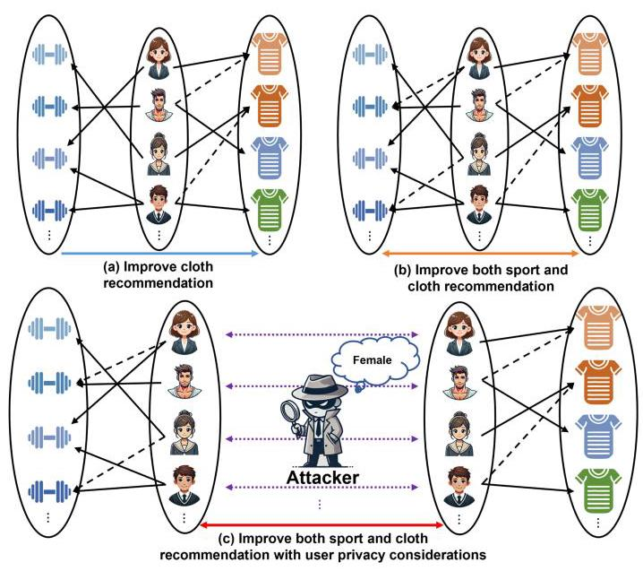
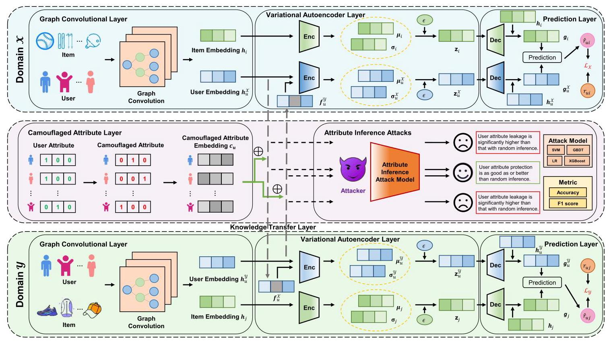
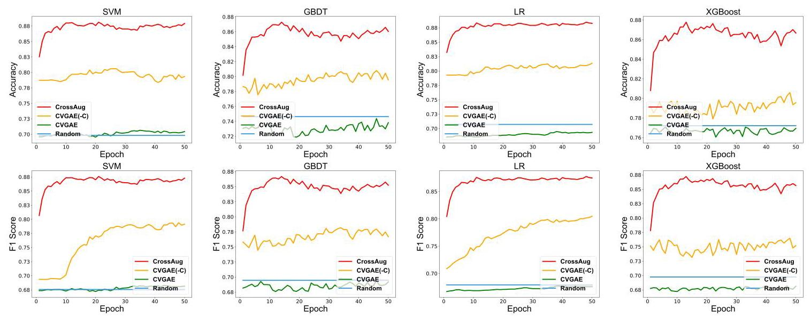
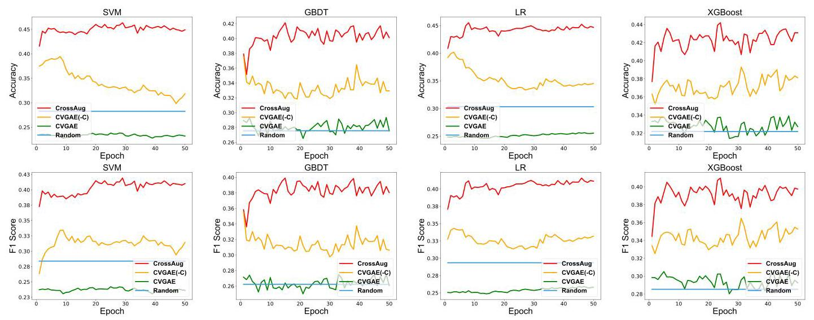
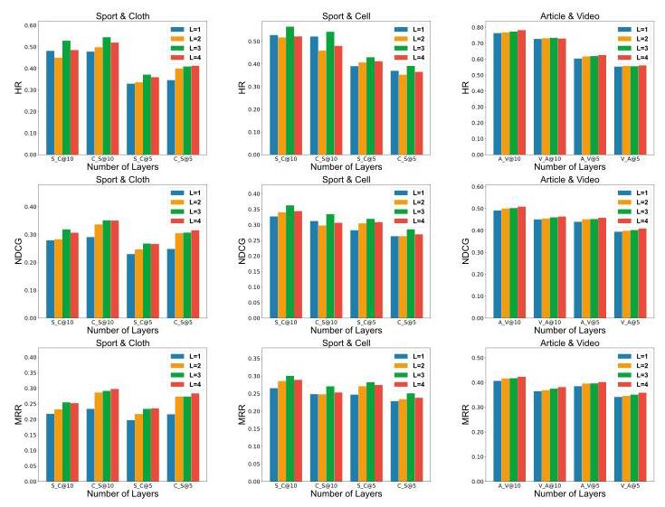
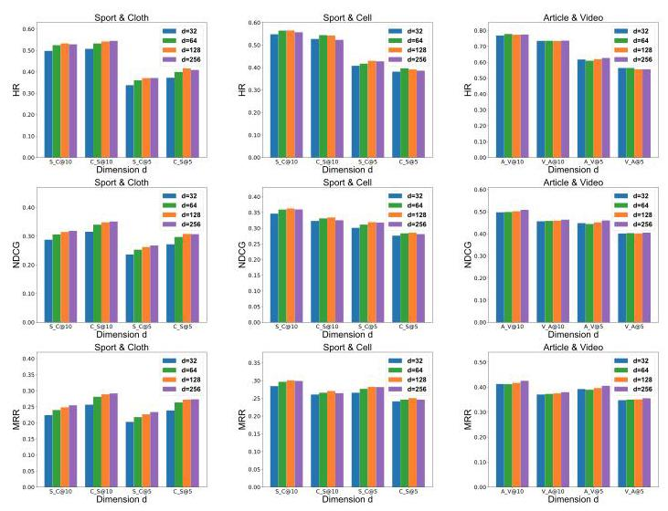
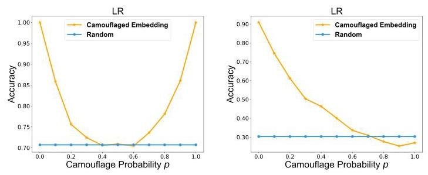
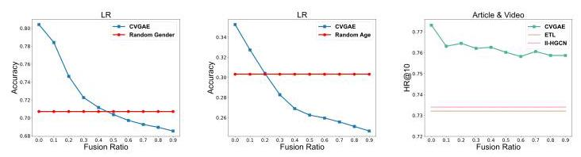
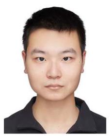

# Camouflaged Variational Graph AutoEncoder Against Attribute Inference Attacks for Cross-Domain Recommendation

Yudi Xiong , Yongxin Guo, Weike Pan (R), Senior Member, IEEE, Qiang Yang P, Fellow, IEEE, Zhong Ming P, Xiaojin Zhang (C), Han Yu, Member, IEEE, Tao Lin, and Xiaoying Tang

Abstract-Cross-domain recommendation (CDR) aims to alleviate the data sparsity problem by leveraging the benefits of modeling two domains. However, existing research often focuses on the recommendation performance while ignores the privacy leakage issue. We find that an attacker can infer user attribute information from the knowledge (e.g., user preferences) transferred between the source and target domains. For example, in our experiments, the average inference accuracies of attack models on gender and age attributes are 0.8323 and 0.3897 . The best-performing attack model achieves accuracies of 0.8847 and 0.4634 , exceeding a random inference by 25.10% and 64.04%. We can see that the leakage of user attribute information may significantly exceed what would be expected from random inference. In this paper, we propose a novel recommendation framework named CVGAE (short for camouflaged variational graph autoencoder), which effectively models user behaviors and mitigates the risk of user attribute information leakage at the same time. Specifically, our CVGAE combines the strengths of VAEs in capturing latent features and variability with the ability of GCNs in exploiting high-order relational information. Moreover, to ensure against attribute inference attacks without sacrificing the recommendation performance, we design a user attribute protection module that fuses user attribute-camouflaged information with knowledge transfer during cross-domain processes. We then conduct extensive experiments on three real-world

datasets, and find our CVGAE is able to achieve strong privacy protection while making little sacrifices in recommendation accuracy.

Index Terms-Variational autoencoders, graph convolutional networks, attribute inference attacks, recommendation system, cross-domain recommendation (CDR).

## I. INTRODUCTION

AS ARTIFICIAL intelligence evolves, recommendation systems (RS) have become increasingly important in modern society. RS are widely used to deliver products, music, and short videos. The primary goal of RS is to offer users a selection of options from an extensive array of items or services they encounter. However, in practical scenarios, the extensive quantity of items within RS often results in sparse data. In today's digital age, users frequently engage with multiple domains (platforms) for different activities, such as purchasing sports equipment on Amazon's Sports and Outdoors platform and shopping for apparel on Amazon's Clothing, Shoes, and Jewelry platform. Based on this concept, transferring useful knowledge between these domains can help mitigate the data sparsity issue. To tackle this challenge, cross-domain recommendation (CDR) [1] has been proposed and has attracted many researchers.

Existing studies on CDR have explored various methods for transferring knowledge between distinct domains. Early research uses nearest-neighbor-based methods [1] for CDR, but these are often outperformed by Matrix Factorization (MF) models due to insufficient collaborative signals. MF-based CDR methods [2], [3], [4] have shown improvements over single-domain recommendation methods. However, their inherent linearity limits their ability to exploit intricate patterns in user behaviors. As deep learning technologies continue to advance, researchers have created various deep learning-based CDR methods [5], [6], [7], [8], [9], [10] to enhance nonlinear fitting capabilities and capture intricate patterns in user behaviors. Although existing CDR methods have proven success in addressing issues related to data sparsity, none of them considers the issue of user attribute information leakage.

Due to increasing concerns about user privacy and data security, many regulations and laws now prohibit data aggregation. For example, the European Union's General Data Protection Regulation (GDPR), \( {}^{1} \) enacted in 2018, imposes strict guidelines on how companies collect, process, manage, and store personal information. Some studies show that users' unpublished private attributes can be inferred with high confidence from their interaction history [11], [12]. The users' sensitive attributes cover aspects such as age, gender, financial situation, health conditions, and political beliefs, among others. This type of attack, known as an attribute inference attack [13], seeks to uncover users' private information by strategically crafting an attack model that leverages collected data, including structural details of the target model and the transferred intermediary knowledge. As shown in Fig. 1, three CDR scenarios are presented: (a) single-target CDR leverages rich knowledge from a source domain to improve the recommendation performance of a sparse target domain, with knowledge transfer occurring in a unidirectional manner; (b) dual-target CDR enables bidirectional collaboration between two domains, allowing them to learn mutually and improve the recommendation performance in both domains; and (c) based on dual-target CDR, we further consider user attribute information leakage when knowledge is transferred between two domains.

---

Received 8 October 2024; revised 12 March 2025; accepted 27 April 2025. Date of publication 30 April 2025; date of current version 28 May 2025. This work was supported in part by Basic Research Fund in Shenzhen Natural Science Foundation under Grant JCYJ20240813141441054, in part by National Natural Science Foundation of China under Grant 62461160311 and Grant 62272315, and in part by National Key Research and Development Program of China under Grant 2023YFF0725100. Recommended for acceptance by R. Akbarinia. (Corresponding author: Weike Pan.)

Yudi Xiong, Weike Pan, and Zhong Ming are with the College of Computer Science and Software Engineering, Shenzhen University, Shenzhen 518060, China (e-mail: xiongyudi2023@email.szu.edu.cn; panweike@szu.edu.cn; mingz@szu.edu.cn).

Yongxin Guo and Xiaoying Tang are with the School of Science and Engineering, Chinese University of Hong Kong (Shenzhen), Shenzhen 518172, China (e-mail: 220019093@link.cuhk.edu.cn; tangxiaoying@cuhk.edu.cn).

Qiang Yang is with the Department of Computer Science and Engineering, Hong Kong University of Science and Technology, Clear Water Bay, Kowloon, Hong Kong, China, and also with the WeBank, Shenzhen 518000, China (e-mail: qyang@cse.ust.hk).

Xiaojin Zhang is with the School of Computer Science and Technology, Huazhong University of Science and Technology, Wuhan 430074, China (e-mail: xiaojinzhang@hust.edu.cn).

Han Yu is with the School of Computer Science and Engineering, Nanyang Technological University,, Singapore 639798 (e-mail: han.yu@ntu.edu.sg).

Tao Lin is with the School of Engineering, Westlake University, Hangzhou 310024, China (e-mail: lintao@westlake.edu.cn).

Digital Object Identifier 10.1109/TKDE.2025.3565793

\( {}^{1} \) [Online]. Available: https://gdpr-info.eu

---

Fig. 1. Illustration of cross-domain recommendation (CDR), including (a) single-target CDR, (b) dual-target CDR, and (c) dual-target CDR with consideration of potential leakage of user attribute information. Solid arrows indicate observed interactions, and dashed arrows represent interactions that need to be predicted.

In this paper, we propose a novel framework called variational graph autoencoder (CVGAE(-C)) for CDR, which combines the strengths of variational autoencoders (VAEs) in capturing latent features and variability with the ability of graph convolutional networks (GCNs) to exploit high-order relational information. Particularly, we verify the extent of attribute leakage through attribute inference attack experiments. Our study shows that user attribute leakage during cross-domain knowledge transfer is significantly higher than that of random inference. As a response, we design a camouflaged attribute layer to ensure against attribute inference attacks by integrating camouflaged user attribute information with knowledge transfer during cross-domain processes. Therefore, we obtain a more secure model, i.e., camouflaged variational graph autoencoder (CVGAE) for CDR, which effectively models user behaviors and mitigates the risk of leaking user attribute information.

Our primary contributions are outlined as follows:

- We propose a novel model called CVGAE, which combines the strengths of VAEs in capturing latent features and variability with GCNs' ability to exploit high-order relational information, effectively modeling user behaviors while mitigating the risk of user attribute information leakage.

- To the best of our knowledge, we are the first to show the leakage of user attribute information in cross-domain recommendation and verify the extent of this leakage through attribute inference attack experiments. Our research reveals that user attribute leakage during cross-domain knowledge transfer is significantly higher than that of random reasoning.

- We design a user attribute protection module to ensure against attribute inference attacks without sacrificing the recommendation performance. The module learns from camouflaged attributes and functions as a non-intrusive component, which neither alters the model structure nor increases the computational complexity.

- We conduct extensive experiments on three real-world datasets. The results show that our CVGAE outperforms the state-of-the-art models. Furthermore, compared to all baseline models, the findings demonstrate that our CVGAE uniquely offers robust privacy protection while making little sacrifices in recommendation accuracy.

## II. RELATED WORK

## A. Cross-Domain Recommendation

Recommendation systems (RS) are designed to handle the overwhelming influx of information, and assisting users in decision-making across various areas [14]. RS are engineered to offer users a selection of options from an extensive array of items or services they encounter, and they have experienced significant advancements owing to their widespread applications in various industries [15]. Collaborative filtering-based methods have been demonstrated to be particularly effective, renowned for their practicality, and capacity to provide tailored solutions. Researchers hope to develop RS that are not only more precise but also more secure and robust [16]. Furthermore, some research focuses on integrating diverse information [17]. Personalized recommendations have been very successful in many areas, such as news recommendation [18], short video recommendation [19] and personalized healthcare recommendation [20].

Despite the success of the existing methods, the issue of data sparsity becomes a key challenge that impedes the progress of RS [21]. In response, CDR aims to alleviate this issue by leveraging appropriately transferred knowledge between two domains. The critical aspect of CDR involves identifying which specific knowledge should be transferred between domains and determining how this knowledge should be transferred. Current research on CDR mainly focuses on analyzing behavior data to find users similar to the target user across different domains and recommend the corresponding items, by leveraging techniques such as matrix factorization [2], [3], [22], neural network-based [5], [6], disentangled representation learning [23], [24], variational autoencoders [9], [25], [26], and graph convolutional networks [10], [27], [28]. Some studies [6], [29], [30] integrate content information into CDR to improve performance. However, content information such as social tags [31] and viewing histories [32] is sometimes unavailable. Although current CDR methods have demonstrated strong performance, none of these methods protect the user attribute information. Compared with previous methods, we have developed a novel CVGAE framework that combines the strengths of graph convolutional networks and distribution generation. This framework not only resists attribute inference attacks but also ensures good recommendation performance.

## B. Variational Autoencoders

Variational autoencoders (VAEs) have gained significant attention in the field of RS for their capability to model and understand data distributions. Autoencoders serve as a foundational neural network model in deep learning-based RS [33]. These networks encode input data into a compressed representation and subsequently reconstruct it to capture essential details. This process enables autoencoders to develop low-dimensional em-beddings of user and item characteristics, characterizing their preferences. Utilizing these embeddings, the system can align items with user interests, improving recommendation accuracy. Multi-VAE [34] conceptualizes the dataset as containing latent variables controlled by a specific prior distribution. By sampling from a distribution that the model itself has learned, it generates new data points, thus capturing and reconstructing the dataset's statistical details. SVAE [35] employs a two-stage VAE-based approach that utilizes features from user browsing behaviors to enhance the modeling of purchasing behaviors. VAE++ [36] employs a dual-encoder structure within its VAE-based framework to enrich node representations by integrating three distinct behaviors. [37], [38], [39] combines VAE and graph to improve recommendation performance by learning richer representations. Although these methods have effectively utilized VAEs in recommendation systems, they are limited to a single domain. SA-VAE [40] introduces a VAE-based model tailored to CDR, but it focuses only on single-target CDR. CDRVAE [25] improves CDR by integrating dual preference modeling to mitigate data sparsity. However, the above methods do not protect user attribute information.

## C. Graph Convolutional Networks

In recent years, graph convolutional networks (GCNs) have shown great effectiveness in capturing complex relationships and structural information within graph-structured data through convolution operations [41]. These GCN-based models include both node-specific and higher-order connectivity features, enabling them to capture user-item interactions through message-passing operations. NGCF [42] employs GCNs' ability to exploit high-order information. LightGCN [43] represents a streamlined variant of NGCF. By clearing away residual connections and the nonlinear activation function, LightGCN achieves higher computational performance and is easier to deploy. Despite these simplifications, it still attains comparable performance to NGCF in some instances. Furthermore, some studies use GCNs for multi-behavior. GHCF [44] employs graph convolution within a multi-task learning structure to model various user behaviors and exploit high-order information. Moreover, research has focused on enhancing GCNs with advanced algorithms, including transformers [45] and contrastive learning [46], among others, leading to further improvements. However, none of the existing works tackles the risk of attribute inference attacks when knowledge is transferred between domains that do not share data directly in CDR. To the best of our knowledge, we are the first to discover the leakage of user attribute information in CDR and verify the extent of this leakage through attribute inference attack experiments. To address these issues, we propose a privacy-preserving cross-domain recommendation method. This approach effectively counters attribute inference attacks while maintaining high recommendation accuracy.

## D. Attribute Inference Attacks and Defenses

Attribute inference attacks seek to uncover users' private attributes by strategically crafting attack models that leverage available data, including intermediary knowledge transfer and structural details of the target model [47]. Some studies such as [48], [49], and [50] infer attribute information by integrating data about the friends of target users. Behavior-based methods design attack models using users' activity data, such as movie ratings [11] and Facebook likes [12]. Other approaches, including [13], [51], and [52], accomplish their adversarial goals by utilizing both friend and behavior data of users. Recent research has increasingly focused on developing privacy-preserving cross-user recommendation systems to address these privacy concerns, by utilizing techniques such as differential privacy (DP) [47], [53] and adversarial training [54], [55]. DP provides theoretical privacy guarantees, but its fixed protection level can negatively impact the recommendation performance and cannot handle privacy heterogeneity or specific privacy requirements [47], [56]. For instance, users in some sensitive professions (e.g., military personnel or researchers) often seek to conceal their occupations. In contrast, our CVGAE enables user-defined attribute camouflaging (e.g., age, occupation) by generating camouflaged attribute information in the attribute layer, satisfying specific privacy requirements. RAP [54] enhances the attack resistance of traditional recommendation systems by using adversarial training, where a recommendation model and a predefined attack model are trained to oppose each other. However, its defense is limited to some specific attack patterns and incurs significant computational overhead from simultaneously training two models. In contrast, our CVGAE defends against diverse and unforeseen attacks with minimal additional training overhead (only about 3% additional time per epoch), as validated by our theoretical and experimental results.

## III. PROPOSED METHOD

In this section, we first define the CDR task and introduce the requirement for privacy attribute protection. Next, we present the overall framework of our CVGAE, followed by a detailed explanation of each sub-module within CVGAE. Table I lists the notations used in the paper, along with their explanations.

TABLE I

SOME NOTATIONS AND THEIR EXPLANATIONS

<table><tr><td>Notation</td><td>Explanation</td></tr><tr><td>\( n \)</td><td>number of users</td></tr><tr><td>\( {m}_{X} \)</td><td>number of items in domain \( \mathcal{X} \)</td></tr><tr><td>\( {m}_{y} \)</td><td>number of items in domain \( \mathcal{Y} \)</td></tr><tr><td>\( u \in  \{ 1,2,\ldots , n\} \)</td><td>user ID</td></tr><tr><td>\( i \in  \left\{  {1,2,\ldots ,{m}_{x}}\right\} \)</td><td>item ID in domain \( \mathcal{X} \)</td></tr><tr><td>\( j \in  \left\{  {1,2,\ldots ,{m}_{y}}\right\} \)</td><td>item ID in domain \( \mathcal{Y} \)</td></tr><tr><td>\( \mathcal{U} \)</td><td>the set of users \( \{ u \mid  u = 1,2,\ldots , n\} \)</td></tr><tr><td>IX</td><td>the set of items in domain \( \mathcal{X}\left\{  {i \mid  i = 1,2,\ldots ,{m}_{\mathcal{X}}}\right\} \)</td></tr><tr><td>IV</td><td>the set of items in domain \( \mathcal{Y}\left\{  {j \mid  j = 1,2,\ldots ,{m}_{y}}\right\} \)</td></tr><tr><td>\( {\mathcal{I}}_{u}^{\mathcal{X}} \)</td><td>the set of items interacted with by user \( u \) in domain \( \mathcal{X} \)</td></tr><tr><td>\( {\mathcal{I}}_{u}^{\mathcal{Y}} \)</td><td>the set of items interacted with by user \( u \) in domain \( \mathcal{Y} \)</td></tr><tr><td>X</td><td>the source domain</td></tr><tr><td>Y</td><td>the target domain</td></tr><tr><td>\( {\mathcal{R}}^{\mathcal{X}} \in  {\mathbb{R}}^{n \times  {m}_{\mathcal{X}}} \)</td><td>the user-item interaction matrix of domain \( \mathcal{X} \)</td></tr><tr><td>\( {\mathcal{R}}^{\mathcal{Y}} \in  {\mathbb{R}}^{n \times  {m}_{\mathcal{Y}}} \)</td><td>the user-item interaction matrix of domain \( \mathcal{Y} \)</td></tr><tr><td>\( {r}_{ui} \in  \{ 0,1\} \)</td><td>an entry of \( {\mathcal{R}}^{\mathcal{X}} \)</td></tr><tr><td>\( {r}_{uj} \in  \{ 0,1\} \)</td><td>an entry of \( {\mathcal{R}}^{\mathcal{Y}} \)</td></tr><tr><td>\( {m}_{s} \)</td><td>number of possible values for the \( s \) -th attribute</td></tr><tr><td>\( p \)</td><td>probability of user attribute camouflage</td></tr><tr><td>\( {a}_{u}^{s} \)</td><td>the \( s \) -th attribute value for user \( u \)</td></tr><tr><td>\( {\widetilde{a}}_{u}^{s} \)</td><td>the \( s \) -th attribute-camouflaged value for user \( u \)</td></tr><tr><td>\( {\widehat{a}}_{u}^{s} \)</td><td>the \( s \) -th attribute-predicted value for user \( u \)</td></tr><tr><td>\( {\mathcal{A}}^{s} \in  {\mathbb{R}}^{n \times  {m}_{s}} \)</td><td>the \( s \) -th attribute matrix of users</td></tr><tr><td>\( {\widetilde{\mathcal{A}}}^{s} \in  {\mathbb{R}}^{n \times  {m}_{s}} \)</td><td>the \( s \) -th attribute-camouflaged matrix of users</td></tr><tr><td>\( {\widehat{\mathcal{A}}}^{s} \in  {\mathbb{R}}^{n \times  {m}_{s}} \)</td><td>the \( s \) -th attribute-predicted matrix of users</td></tr><tr><td>\( \mathcal{A} = {\left\{  {\mathcal{A}}^{s}\right\}  }_{s = 1}^{{m}_{a}} \)</td><td>all \( {m}_{a} \) attributes’ information (e.g., gender, age)</td></tr><tr><td>\( {\mathcal{U}}^{pub} \)</td><td>the set of users displaying their attribute info in profiles</td></tr><tr><td>\( \alpha \)</td><td>weight of VAE</td></tr><tr><td>\( \beta \)</td><td>weight of KL divergence</td></tr><tr><td>\( {\lambda }_{l} \)</td><td>weight of \( {L}_{2} \) regularization</td></tr><tr><td>\( {\gamma }_{x} \)</td><td>hyperparameter of domain \( \mathcal{X} \) fusion ratio</td></tr><tr><td>\( {\gamma }_{y} \)</td><td>hyperparameter of domain \( \mathcal{Y} \) fusion ratio</td></tr><tr><td>44</td><td>hyperparameter of domain \( \mathcal{X} \) retention ratio</td></tr><tr><td>42</td><td>hyperparameter of domain \( \mathcal{Y} \) retention ratio</td></tr><tr><td>\( {\zeta }_{u}^{\mathcal{X}} \)</td><td>weight factor of domain \( \mathcal{X} \) w.r.t. user \( u \)</td></tr><tr><td>\( {\zeta }_{u}^{\mathcal{Y}} \)</td><td>weight factor of domain \( \mathcal{Y} \) w.r.t. user \( u \)</td></tr><tr><td>\( L \)</td><td>number of graph convolution layers</td></tr><tr><td>\( l \in  \{ 0,1,\ldots , L\} \)</td><td>graph convolution layer ID</td></tr><tr><td>\( d \in  \mathbb{Z} \)</td><td>number of latent dimensions</td></tr><tr><td>\( T \)</td><td>number of total iteration epochs</td></tr></table>

## A. Problem Formulation

For cross-domain recommendation, we assume there are two domains, i.e., \( \mathcal{X} \) and \( \mathcal{Y} \) , which have the same set of \( n \) users \( \mathcal{U} = \{ u \mid  u = 1,2,\ldots , n\} \) . The item sets of domain \( \mathcal{X} \) and domain \( \mathcal{Y} \) are \( {\mathcal{I}}^{\mathcal{X}} = \left\{  {i \mid  i = 1,2,\ldots ,{m}_{\mathcal{X}}}\right\} \) and \( {\mathcal{I}}^{\mathcal{Y}} = \; \left\{  {j \mid  j = 1,2,\ldots ,{m}_{\mathcal{Y}}}\right\} \) , where \( {m}_{\mathcal{X}} \) and \( {m}_{\mathcal{Y}} \) denote the number of items in domain \( \mathcal{X} \) and domain \( \mathcal{Y} \) , respectively. The user-item interactions from users’ implicit feedback of domain \( \mathcal{X} \) and domain \( \mathcal{Y} \) are represented by matrices \( {\mathcal{R}}^{\mathcal{X}} \in  {\mathbb{R}}^{n \times  {m}_{\mathcal{X}}} \) and \( {\mathcal{R}}^{\mathcal{Y}} \in  {\mathbb{R}}^{n \times  {m}_{\mathcal{Y}}}.{r}_{ui}/{r}_{uj} \in  \{ 0,1\} \) is an entry of \( {\mathcal{R}}^{\mathcal{X}}/{\mathcal{R}}^{\mathcal{Y}} \) , which is 1 if the user \( u \) interacts with item \( i/j \) and 0 otherwise, where \( i \in  \left\{  {1,2,\ldots ,{m}_{\mathcal{X}}}\right\} \) and \( j \in  \left\{  {1,2,\ldots ,{m}_{\mathcal{Y}}}\right\} \) . Generally, \( {\mathcal{R}}^{\mathcal{X}} \) and \( {\mathcal{R}}^{\mathcal{Y}} \) are highly sparse because users interact with only a few items within a single domain [57]. CDR has explored various methods for transferring knowledge between distinct domains. In our CVGAE, we do not differentiate between the source and target domains because the recommendation process across \( \mathcal{X} \) and \( \mathcal{Y} \) is executed uniformly.

Consider \( {\mathcal{A}}^{s} \in  {\mathbb{R}}^{n \times  {m}_{s}} \) as the matrix representing \( {m}_{s} \) values of the \( s \) -th private attribute of the users (e.g., \( s = \) "gender"), where each element \( {a}_{u}^{s} \) denotes the value of the \( s \) -th attribute for user \( u \) (e.g., \( {a}_{u}^{s} = \) "female"). Let \( \mathcal{A} = {\left\{  {\mathcal{A}}^{s}\right\}  }_{s = 1}^{{m}_{a}} \) represent the information of all \( {m}_{a} \) attributes (e.g., gender, age). Therefore, the problem can be outlined in the following way.

- Input: \( {\mathcal{R}}^{\mathcal{X}},{\mathcal{R}}^{\mathcal{Y}},\mathcal{A} \) .

- Output: A ranked list of items for each user in both the domains \( \mathcal{X} \) and \( \mathcal{Y} \) .

- Assumption: Some users \( {\mathcal{U}}^{\text{ pub }} \subset  \mathcal{U} \) publicly display their attribute information in their profiles.

- Requirement: Attackers find it difficult to infer users' private attributes based on the knowledge transferred from one domain to the other.

In this paper, we analyze two primary threat scenarios, using \( \mathcal{X} \) as an example and \( \mathcal{Y} \) as the other domain.

Semi-honest Participant from Domain \( \mathcal{X} \) : In this scenario, domain \( \mathcal{Y} \) is a semi-honest participant. While domain \( \mathcal{Y} \) adheres to the protocol during model training, it seeks to infer sensitive information from the data exchanged between domains. By leveraging publicly available user attribute information, combined with attribute data available to domain \( \mathcal{Y} \) , the participant may launch attribute inference attacks using machine learning models, such as support vector machines (SVM) and logistic regression (LR) to predict the users' private attributes.

Malicious External Attacker: Here, an external adversary attempts to intercept the data exchanged between domains \( \mathcal{X} \) and domain \( \mathcal{Y} \) during the model training process. With access to some users' publicly available attribute information, the attacker conducts attribute inference attacks, employing models such as SVM and LR to deduce the users' private attributes from both domains.

## B. Overview of Our CVGAE Framework

In this paper, we propose a novel CVGAE framework to protect user attribute information while ensuring good recommendation performance. Fig. 2 illustrates that the CVGAE framework is composed of five modules, i.e., graph convolutional layer, camouflaged attribute layer, knowledge transfer layer, variational autoencoder layer and prediction layer. Specifically, we first construct user-item graphs in domains \( \mathcal{X} \) and \( \mathcal{Y} \) , followed by applying GCN to extract high-order user-item structured information. Next, we camouflage user attributes and use a multi-layer perceptron (MLP) to learn the information from these camouflaged attributes. Notably, this step is completed before training the recommendation model, which effectively reduces the time cost. We then transfer the user preference information, derived from the camouflaged attributes, through knowledge transfer layer. This method not only defends against external attackers but also protects against semi-honest participants in the other domain. Additionally, we innovatively utilize VAEs to learn latent space representations, capturing the complex distribution and latent features of the post-convolutional embeddings. Finally, we jointly optimize the two domains in a bidirectional manner.

Fig. 2. The overview of our CVGAE. Note that we omit the superscript \( \left( l\right) \) for brevity.

Our primary objective is to develop a balanced framework that optimizes efficiency and performance while ensuring robust privacy protection. We aim to achieve a trade-off between these three key factors by designing a model that maximizes system efficiency and recommendation accuracy, without compromising the privacy of users. To quantify this, we introduce an abstract objective function that incorporates weighted terms for efficiency, performance, and privacy, enabling a flexible balance depending on the application scenario. This enables us to tune the model based on the particular needs of the task, whether prioritizing speed, accuracy, or privacy,

\[
F\left( {{\lambda }_{1},{\lambda }_{2},{\lambda }_{3}}\right)  = {\lambda }_{1} \cdot  {Eff}\left( x\right)  + {\lambda }_{2} \cdot  \operatorname{Perf}\left( x\right)  - {\lambda }_{3} \cdot  \operatorname{Pri}\left( x\right) ,
\]

(1)

where \( {Eff}\left( x\right) \) stands for Efficiency, representing the model’s efficiency (e.g., time complexity); Perf(x) refers to Performance, representing the model's performance (e.g., NDCG@10); and Pri(x) represents Privacy, measuring the model's privacy risks or leakage (e.g., Accuracy, F1 Score). The weights \( {\lambda }_{1},{\lambda }_{2} \) , and \( {\lambda }_{3} \) allow for adjusting the importance of each objective.

In our framework, CVGAE (the complete version with privacy protection) does not increase computational complexity or decrease efficiency compared with CVGAE(-C) (a reduced version without privacy protection). The trade-off between model performance and privacy is controlled by parameters \( {\gamma }_{\mathcal{X}} \) and \( {\gamma }_{\mathcal{Y}} \) . We have experimentally validated the effectiveness of this trade-off, demonstrating its impact on both performance and privacy.

## C. Graph Convolutional Layer

In this subsection, we aim to capturing the representation of users and items beneath the interaction behaviors. This component maps the ID of a user \( u \) (or an item \( i \) ) into an embedding vector \( {\mathbf{e}}_{u}^{\left( 0\right) } \in  {\mathbb{R}}^{1 \times  d} \) (or \( {\mathbf{e}}_{i}^{\left( 0\right) } \in  {\mathbb{R}}^{1 \times  d} \) ), where \( d \) denotes the embedding size. Specifically, for domain \( \mathcal{X} \) , we have

\[
{\mathbf{e}}_{u}^{\left( 0\right) ,\mathcal{X}} = {\mathbf{o}}_{u}^{\mathcal{X}}{\mathbf{N}}^{\top } \tag{2}
\]

\[
{\mathbf{e}}_{i}^{\left( 0\right) } = {\mathbf{o}}_{i}{\mathbf{M}}^{\top }, \tag{3}
\]

where \( \mathbf{N} \in  {\mathbb{R}}^{d \times  n} \) and \( \mathbf{M} \in  {\mathbb{R}}^{d \times  {m}_{\mathcal{X}}} \) respectively denote the users’ and items’ learnable parameter matrices. \( {\mathbf{o}}_{u}^{\mathcal{X}} \in  {\mathbb{R}}^{1 \times  n} \) and \( {\mathbf{o}}_{i} \in  {\mathbb{R}}^{1 \times  {m}_{\mathcal{X}}} \) respectively denote the one-hot encodings of the user IDs \( u \in  \mathcal{U} \) and item IDs \( i \in  {\mathcal{I}}^{\mathcal{X}} \) . By doing the same operation for the domain \( \mathcal{Y} \) , we can get \( {\mathbf{e}}_{u}^{\left( 0\right) ,\mathcal{Y}} \) and \( {\mathbf{e}}_{j}^{\left( 0\right) } \) , where \( j \in  {\mathcal{I}}^{\mathcal{Y}} \) . Note that we represent the embedding vectors for the same user \( u \) in domain \( \mathcal{X} \) and domain \( \mathcal{Y} \) as \( {\mathbf{e}}_{u}^{\left( 0\right) ,\mathcal{X}} \) and \( {\mathbf{e}}_{u}^{\left( 0\right) ,\mathcal{Y}} \) , respectively.

In recent years, graph convolutional networks (GCNs) [41], [42], [43], [44], [45], [46] have been shown to be effective in capturing high-order user-item structured information. Thus, to capture higher-order connections in user-item interactions, we apply GCNs techniques like message passing and neighbor aggregation to refine the node embeddings. Following BiT-GCF [27], we use an effective architecture that retains the inner product operation, which has proven effective in NGCF [42] and LightGCN [43]. Given the input embedding of a user \( {\mathbf{e}}_{u}^{\left( l\right) ,\mathcal{X}} \) and an item \( {\mathbf{e}}_{i}^{\left( l\right) } \) in domain \( \mathcal{X} \) , the embedding propagation process is,

\[
{\mathbf{h}}_{u}^{\left( l\right) ,\mathcal{X}} = {\mathbf{e}}_{u}^{\left( l\right) ,\mathcal{X}} + \mathop{\sum }\limits_{{i \in  {\mathcal{N}}_{u}^{\mathcal{X}}}}\frac{1}{\sqrt{\left| {\mathcal{N}}_{u}^{\mathcal{X}}\right| \left| {\mathcal{N}}_{i}\right| }}\left( {{\mathbf{e}}_{i}^{\left( l\right) } + {\mathbf{e}}_{i}^{\left( l\right) } \odot  {\mathbf{e}}_{u}^{\left( l\right) ,\mathcal{X}}}\right) ,
\]

(4)

\[
{\mathbf{h}}_{i}^{\left( l\right) } = {\mathbf{e}}_{i}^{\left( l\right) } + \mathop{\sum }\limits_{{u \in  {\mathcal{N}}_{i}}}\frac{1}{\sqrt{\left| {\mathcal{N}}_{u}^{\mathcal{X}}\right| \left| {\mathcal{N}}_{i}\right| }}\left( {{\mathbf{e}}_{u}^{\left( l\right) ,\mathcal{X}} + {\mathbf{e}}_{u}^{\left( l\right) ,\mathcal{X}} \odot  {\mathbf{e}}_{i}^{\left( l\right) }}\right) ,
\]

(5)

where \( {\mathcal{N}}_{u}^{\mathcal{X}} \) represents the set of items interacted with by user \( u \) in domain \( \mathcal{X},{\mathcal{N}}_{i} \) represents the set of users interacting with item \( i \) in domain \( \mathcal{X},{\mathbf{e}}_{u}^{\left( l\right) ,\mathcal{X}} \in  {\mathbb{R}}^{1 \times  d} \) and \( {\mathbf{e}}_{i}^{\left( l\right) } \in  {\mathbb{R}}^{1 \times  d} \) are the layer \( l \) representations of user \( u \) and item \( i \) in domain \( \mathcal{X}, \odot \) indicates element-wise product, and the \( \frac{1}{\sqrt{\left| {\mathcal{N}}_{u}^{\mathcal{X}}\right| \left| {\mathcal{N}}_{i}\right| }} \) from standard GCN prevents the embeddings from scaling up during propagation. The \( \frac{1}{\sqrt{\left| {\mathcal{N}}_{u}^{\mathcal{X}}\right| \left| {\mathcal{N}}_{i}\right| }} \) has also been employed in NGCF and LightGCN. By doing the same operation for domain \( \mathcal{Y} \) , we can get \( {\mathbf{h}}_{u}^{\left( l\right) ,\mathcal{Y}} \in \; {\mathbb{R}}^{1 \times  d} \) and \( {\mathbf{h}}_{j}^{\left( l\right) } \in  {\mathbb{R}}^{1 \times  d} \) .

## D. Camouflaged Attribute Layer

The camouflaged attribute layer is a key component of our CVGAE, capable of camouflaging user attributes to reduce the accuracy of inference attacks and protect users' sensitive attributes. The term "camouflage" refers to disguising true attributes as other attributes. For example, if a user's true gender is "male", we camouflage it as "female". For each user \( u \) , the \( s \) -th attribute is camouflaged to obtain a new attribute-camouflaged information \( {\widetilde{a}}_{u}^{s} \) as follows,

\[
{\widetilde{a}}_{u}^{s} = \left\{  \begin{array}{ll} \mathcal{S}\left( {\left\{  {1,2,\ldots ,{m}_{s}}\right\}   \smallsetminus  \left\{  {a}_{u}^{s}\right\}  }\right) & \text{ with probability }p \\  {a}_{u}^{s} & \text{ with probability }1 - p, \end{array}\right.
\]

(6)

where \( \mathcal{S}\left( \cdot \right) \) denotes selecting an element uniformly at random from a set, and \( p \) is the camouflage probability. To ensure fairness, we randomly camouflage user attributes. Intuitively, we do not need all user attribute information. Notably, if a user has some specific protection requirements, we can camouflage their corresponding attributes.

Then, we learn the user attribute information through an MLP, optimizing the parameters \( W \) and \( b \) by reducing the overall loss across the entire data as follows,

\[
{W}^{ * },{b}^{ * } = \underset{W, b}{\arg \min }\left( {-\frac{1}{n}\mathop{\sum }\limits_{{u = 1}}^{n}{\widetilde{a}}_{u}^{s}\log \left( {\operatorname{softmax}\left( {\widehat{a}}_{u}^{s}\right) }\right) }\right) , \tag{7}
\]

where \( {\widehat{a}}_{u}^{s} = \left( {{W}^{\left( {L}_{m}\right) }{\psi }^{\left( {L}_{m} - 1\right) } + {b}^{\left( {L}_{m}\right) }}\right) \) indicates the \( s \) -th attribute predicted result w.r.t. user \( u \) . Note that \( {W}^{\left( {L}_{m}\right) } \) and \( {b}^{\left( {L}_{m}\right) } \) represent the weight and bias of the last MLP layer \( {L}_{m} \) , \( {\psi }^{\left( {L}_{m} - 1\right) } \) is the activation from the \( \left( {{L}_{m} - 1}\right) \) -th MLP layer, and \( {\widetilde{a}}_{u}^{s} \) indicates the true label for the \( s \) -th attribute of user \( u \) .

The initial input feature \( {\mathbf{x}}_{u} \in  {\mathbb{R}}^{1 \times  d} \) and the optimal parameters \( {\left\{  {W}^{\left( {l}_{m}\right) },{b}^{\left( {l}_{m}\right) }\right\}  }_{{l}_{m} = 1}^{{L}_{m} - 1} \) are substituted into the activation of the \( \left( {{L}_{m} - 1}\right) \) -th layer \( {\psi }^{\left( {L}_{m} - 1\right) } \) , resulting in the final camouflaged embedding vector \( {\mathbf{c}}_{u} \in  {\mathbb{R}}^{1 \times  d} \) for user \( u \) as follows,

\[
{\mathbf{c}}_{u} = {\psi }^{\left( {L}_{m} - 1\right) }\left( {{\mathbf{x}}_{u};\underset{{\left\{  {W}^{\left( {l}_{m}\right) },{b}^{\left( {l}_{m}\right) }\right\}  }_{{l}_{m} = 1}^{{L}_{m} - 1}}{\arg \min }\ell \left( {{\widetilde{\mathcal{A}}}^{s},{\widehat{\mathcal{A}}}^{s}}\right) }\right) , \tag{8}
\]

where \( \ell \) represents cross-entropy loss, \( {\widetilde{\mathcal{A}}}^{s} \) denotes the camouflaged user attribute matrix, and \( {\widehat{\mathcal{A}}}^{s} \) denotes the predicted user attribute matrix. \( {W}^{\left( {l}_{m}\right) } \) and \( {b}^{\left( {l}_{m}\right) } \) denote the weight and bias of the \( {l}_{m} \) -th layer, where \( {l}_{m} \in  1,2,\ldots ,{L}_{m} - 1 \) . The semicolon ";" here indicates that \( {\mathbf{x}}_{u} \) serves as input to the function \( {\psi }^{\left( {L}_{m} - 1\right) } \) . Note that \( {\mathbf{c}}_{u} \) contains the camouflaged user attribute information, which makes it difficult to infer the user's true attributes. Notably, completing \( {\mathbf{c}}_{u} \) before training the recommendation model significantly reduces the time cost.

By integrating with transferred knowledge, we obtain a fusion that retains the user preference information while simultaneously including the camouflaged user attribute information. This approach achieves cross-domain recommendation while protecting user attribute privacy. The fused transferred knowledge \( {\mathbf{f}}_{u}^{\left( l\right) ,\mathcal{X}} \) and \( {\mathbf{f}}_{u}^{\left( l\right) ,\mathcal{Y}} \) are defined as follows,

\[
{\mathbf{f}}_{u}^{\left( l\right) ,\mathcal{X}} = \left( {1 - {\gamma }_{\mathcal{X}}}\right) {\mathbf{h}}_{u}^{\left( l\right) ,\mathcal{X}} + {\gamma }_{\mathcal{X}}{\mathbf{c}}_{u}, \tag{9}
\]

\[
{\mathbf{f}}_{u}^{\left( l\right) ,\mathcal{Y}} = \left( {1 - {\gamma }_{\mathcal{Y}}}\right) {\mathbf{h}}_{u}^{\left( l\right) ,\mathcal{Y}} + {\gamma }_{\mathcal{Y}}{\mathbf{c}}_{u}, \tag{10}
\]

where \( {\gamma }_{\mathcal{X}} \) and \( {\gamma }_{\mathcal{Y}} \) are hyperparameters in the range of \( \left\lbrack  {0,1}\right\rbrack \) that control the fusion ratios of domains \( \mathcal{X} \) and \( \mathcal{Y} \) , respectively. We demonstrate the intrinsic trade-off between performance and privacy. Specifically, our approach calibrates these hyperparam-eters to achieve an optimal balance, thus highlighting the tradeoff between maintaining privacy and enhancing performance. Moreover, our proposed camouflaged attribute layer is fully non-intrusive, as it operates without making any modifications to the original model structure or loss function. The hyperpa-rameters \( {\gamma }_{\mathcal{X}} \) and \( {\gamma }_{\mathcal{Y}} \) allow for flexible adjustments, enabling a fine-tuned balance between privacy and performance based on task requirements.

## E. Knowledge Transfer Layer

In this subsection, we focus on transferring the overlapping user knowledge across domains \( \mathcal{X} \) and \( \mathcal{Y} \) . Particularly, this knowledge transfer is bidirectional, and the propagation of items occurs within a single domain. This means that our CVGAE follows the bidirectional knowledge transfer paradigm in a mainstream bidirectional task [8], [27]. In this component, the initial embeddings \( \left\lbrack  {{\mathbf{e}}_{u}^{\left( 0\right) ,\mathcal{X}},{\mathbf{e}}_{i}^{\left( 0\right) },{\mathbf{e}}_{u}^{\left( 0\right) ,\mathcal{Y}},{\mathbf{e}}_{j}^{\left( 0\right) }}\right\rbrack \) and the camouflaged attribute embeddings \( \left\lbrack  {{\mathbf{f}}_{u}^{\left( l\right) ,\mathcal{X}},{\mathbf{f}}_{u}^{\left( l\right) ,\mathcal{Y}}}\right\rbrack \) are processed through \( L \) layers of graph convolution. This refines the representations of both users and items in domain \( \mathcal{X} \) and domain \( \mathcal{Y} \) , which contains the user preference information and the camouflaged user attribute information. Specifically, we refine the user/item embedding \( {\mathbf{h}}_{u}^{\left( {l + 1}\right) ,\mathcal{X}}/{\mathbf{h}}_{i}^{\left( l + 1\right) } \in  {\mathbb{R}}^{1 \times  d} \) and \( {\mathbf{h}}_{u}^{\left( {l + 1}\right) ,\mathcal{Y}}/{\mathbf{h}}_{j}^{\left( l + 1\right) } \in  {\mathbb{R}}^{1 \times  d} \) by aggregating information in layer \( l \) of domains \( \mathcal{X} \) and \( \mathcal{Y} \) as follows,

\[
{\mathbf{h}}_{u}^{\left( {l + 1}\right) ,\mathcal{X}} = \frac{1}{2}\left( {\left( {{\lambda }^{\mathcal{X}} + {\zeta }_{u}^{\mathcal{X}}}\right) {\mathbf{h}}_{u}^{\left( l\right) ,\mathcal{X}} + \left( {1 - {\lambda }^{\mathcal{X}} + {\zeta }_{u}^{\mathcal{Y}}}\right) {\mathbf{f}}_{u}^{\left( l\right) ,\mathcal{Y}}}\right) ,
\]

(11)

\[
{\mathbf{h}}_{u}^{\left( {l + 1}\right) ,\mathcal{Y}} = \frac{1}{2}\left( {\left( {{\lambda }^{\mathcal{Y}} + {\zeta }_{u}^{\mathcal{Y}}}\right) {\mathbf{h}}_{u}^{\left( l\right) ,\mathcal{Y}} + \left( {1 - {\lambda }^{\mathcal{Y}} + {\zeta }_{u}^{\mathcal{X}}}\right) {\mathbf{f}}_{u}^{\left( l\right) ,\mathcal{X}}}\right) ,
\]

(12)

\[
{\mathbf{h}}_{i}^{\left( l + 1\right) } = {\mathbf{h}}_{i}^{\left( l\right) }, \tag{13}
\]

\[
{\mathbf{h}}_{j}^{\left( l + 1\right) } = {\mathbf{h}}_{j}^{\left( l\right) } \tag{14}
\]

where \( {\zeta }_{u}^{\mathcal{X}} \) and \( {\zeta }_{u}^{\mathcal{Y}} \) respectively denote the user-related weight coefficients for domains \( \mathcal{X} \) and \( \mathcal{Y},{\lambda }^{\mathcal{X}} \) and \( {\lambda }^{\mathcal{Y}} \) respectively represent the hyperparameters within the range of \( \left\lbrack  {0,1}\right\rbrack \) for domains \( \mathcal{X} \) and \( \mathcal{Y} \) , and these hyperparameters regulate how much of the user features are retained. Following [27], \( {\zeta }_{u}^{\mathcal{X}}/{\zeta }_{u}^{\mathcal{Y}} \) is computed as follows,

\[
{\zeta }_{u}^{\mathcal{X}} = \frac{\left| {\mathcal{N}}_{u}^{\mathcal{X}}\right| }{\left| {\mathcal{N}}_{u}^{\mathcal{X}}\right|  + \left| {\mathcal{N}}_{u}^{\mathcal{Y}}\right| },\;{\zeta }_{u}^{\mathcal{Y}} = \frac{\left| {\mathcal{N}}_{u}^{\mathcal{Y}}\right| }{\left| {\mathcal{N}}_{u}^{\mathcal{X}}\right|  + \left| {\mathcal{N}}_{u}^{\mathcal{Y}}\right| } \tag{15}
\]

The knowledge transfer layer balances common and domain-specific features by adjusting the transfer weights \( {\lambda }^{\mathcal{X}} \) and \( {\lambda }^{\mathcal{Y}} \) , preventing the over-transfer of domain-specific information. For example, if \( {\lambda }^{\mathcal{X}} = {\lambda }^{\mathcal{Y}} = 1 \) , it ensures that a user’s features are fully preserved in each domain, maximizing domain specificity. When \( {\lambda }^{\mathcal{X}} = {\lambda }^{\mathcal{Y}} = {0.5} \) , feature transfer becomes more balanced, reducing domain-specific bias by making the features in both domains more similar. This design regulates the balance between common knowledge and domain-specific knowledge during transfer, reducing potential biases and helping capture shared interests across domains, rather than combining all interests or preferences indiscriminately.

## F. Variational Autoencoder Layer

In this subsection, we innovatively utilize VAEs to learn latent space representations, capturing the complex distribution and latent features of the post-convolutional embeddings. Moreover, it can extract useful feature representations from the camouflaged attribute embedding, enhancing the accuracy and robustness of the recommendation model. By combining the feature vectors obtained from neighbors with varying orders, we can create a more comprehensive and robust joint representation. To facilitate subsequent calculations, we also concatenate the camouflaged attribute embedding to obtain \( {\mathbf{f}}_{u}^{\mathcal{X}} \in  {\mathbb{R}}^{1 \times  \left( {L + 1}\right) d} \) . The process is formulated as follows,

\[
{\mathbf{h}}_{u}^{\mathcal{X}} = {\mathbf{h}}_{u}^{\left( 0\right) ,\mathcal{X}}\begin{Vmatrix}{\mathbf{h}}_{u}^{\left( 1\right) ,\mathcal{X}}\end{Vmatrix}\cdots \parallel {\mathbf{h}}_{u}^{\left( L\right) ,\mathcal{X}}, \tag{16}
\]

\[
{\mathbf{h}}_{i} = {\mathbf{h}}_{i}^{\left( 0\right) }\begin{Vmatrix}{\mathbf{h}}_{i}^{\left( 1\right) }\end{Vmatrix}\cdots \parallel {\mathbf{h}}_{i}^{\left( L\right) }, \tag{17}
\]

\[
{\mathbf{f}}_{u}^{\mathcal{X}} = {\mathbf{f}}_{u}^{\left( 0\right) ,\mathcal{X}}\begin{Vmatrix}{\mathbf{f}}_{u}^{\left( 1\right) ,\mathcal{X}}\end{Vmatrix}\cdots \parallel {\mathbf{f}}_{u}^{\left( L\right) ,\mathcal{X}}, \tag{18}
\]

where \( \parallel \) denotes the concatenation operation. \( {\mathbf{h}}_{u}^{\mathcal{X}} \in  {\mathbb{R}}^{1 \times  \left( {L + 1}\right) d} \) and \( {\mathbf{h}}_{i} \in  {\mathbb{R}}^{1 \times  \left( {L + 1}\right) d} \) represent the concatenated vectors of the graph embedding for user \( u \) and item \( i \) in domain \( \mathcal{X} \) . Similarly, we can obtain the concatenated vectors \( {\mathbf{h}}_{u}^{\mathcal{Y}} \in  {\mathbb{R}}^{1 \times  \left( {L + 1}\right) d} \) , \( {\mathbf{h}}_{j} \in  {\mathbb{R}}^{1 \times  \left( {L + 1}\right) d} \) and \( {\mathbf{f}}_{u}^{\mathcal{Y}} \in  {\mathbb{R}}^{1 \times  \left( {L + 1}\right) d} \) for domain \( \mathcal{Y} \) . Then we integrate \( {\mathbf{h}}_{u}^{\mathcal{X}} \) and \( {\mathbf{f}}_{u}^{\mathcal{Y}} \) to aggregate user preference information from domains \( \mathcal{X} \) and \( \mathcal{Y} \) without revealing user attributes. Specifically, we define \( {\mathbf{\mu }}_{u}^{\mathcal{X}} \in  {\mathbb{R}}^{1 \times  d} \) and \( {\mathbf{\mu }}_{i} \in  {\mathbb{R}}^{1 \times  d} \) as the user \( u \) ’s and item \( i \) ’s mean vector of the Gaussian posterior distribution in domain \( \mathcal{X} \) .

\[
{\mathbf{\mu }}_{u}^{\mathcal{X}} = \operatorname{LeakyReLU}\left( {\left( {{\mathbf{h}}_{u}^{\mathcal{X}} + \lambda {\mathbf{f}}_{u}^{\mathcal{Y}}}\right) {\mathbf{W}}_{{\mu }_{u}^{\mathcal{X}}} + {\mathbf{b}}_{{\mu }_{u}^{\mathcal{X}}}}\right) , \tag{19}
\]

\[
{\mathbf{\mu }}_{i} = \operatorname{LeakyReLU}\left( {{\mathbf{h}}_{i}{\mathbf{W}}_{{\mu }_{i}} + {\mathbf{b}}_{{\mu }_{i}}}\right) , \tag{20}
\]

where \( \lambda \) is a hyperparameter within the range of \( \left\lbrack  {0,1}\right\rbrack \) , which controls the retention ratio of the user features. \( {\mathbf{W}}_{{\mu }_{u}^{\mathcal{X}}},{\mathbf{W}}_{{\mu }_{i}} \in \; {\mathbb{R}}^{\left( {L + 1}\right) d \times  d} \) are weight matrices. \( {\mathbf{b}}_{{\mu }_{u}^{\mathcal{X}}},{\mathbf{b}}_{{\mu }_{i}} \in  {\mathbb{R}}^{1 \times  d} \) are bias vectors. LeakyReLU \( \left( \cdot \right) \) denotes the Leaky ReLU activation function. Likewise, domain \( \mathcal{Y} \) can be treated similarly to derive \( {\mathbf{\mu }}_{u}^{\mathcal{Y}} \in  {\mathbb{R}}^{1 \times  d} \) and \( {\mathbf{\mu }}_{j} \in  {\mathbb{R}}^{1 \times  d} \) .

In a Gaussian distribution, the variance reflects how much the random variable deviates from the mean. The mean typically represents users' preferences in recommendation, while the variance indicates how these preferences fluctuate, as captured by the auxiliary-domain features. Therefore, using information from these auxiliary domains to determine the variance can offer meaningful insights into the spectrum of users' interests. Explicitly, \( {\mathbf{\sigma }}_{u}^{{\mathcal{X}}^{2}} \in  {\mathbb{R}}^{1 \times  d} \) and \( {\mathbf{\sigma }}_{i}^{2} \in  {\mathbb{R}}^{1 \times  d} \) are calculated as follows,

\[
{{\mathbf{\sigma }}_{u}^{\mathcal{X}}}^{2} = \operatorname{LeakyReLU}\left( {{\mathbf{f}}_{u}^{\mathcal{Y}}{\mathbf{W}}_{{\sigma }_{u}^{\mathcal{X}}} + {\mathbf{b}}_{{\sigma }_{u}^{\mathcal{X}}}}\right) , \tag{21}
\]

\[
{\mathbf{\sigma }}_{i}^{2} = \operatorname{LeakyReLU}\left( {{\mathbf{h}}_{i}{\mathbf{W}}_{{\sigma }_{i}} + {\mathbf{b}}_{{\sigma }_{i}}}\right) , \tag{22}
\]

where \( {\mathbf{W}}_{{\sigma }_{u}^{\mathcal{X}}},{\mathbf{W}}_{{\sigma }_{i}} \in  {\mathbb{R}}^{\left( {L + 1}\right) d \times  d} \) denote weight matrices. and \( {\mathbf{b}}_{{\sigma }_{u}^{\mathcal{X}}},{\mathbf{b}}_{{\sigma }_{i}} \in  {\mathbb{R}}^{1 \times  d} \) denote bias vectors. Likewise, domain \( \mathcal{Y} \) can be treated similarly to derive \( {\mathbf{\sigma }}_{u}^{{\mathcal{Y}}^{2}} \in  {\mathbb{R}}^{1 \times  d} \) and \( {\mathbf{\sigma }}_{j}^{2} \in  {\mathbb{R}}^{1 \times  d} \) .

Using the mean \( {\mathbf{\mu }}_{v} \) and the variance \( {\mathbf{\sigma }}_{v}^{2} \) for each node, the latent variable \( {\mathbf{z}}_{v} \in  {\mathbb{R}}^{1 \times  d} \) can be derived by sampling from a variational distribution \( q \) ,

\[
q\left( {\mathbf{Z} \mid  \mathbf{A}}\right)  = \mathop{\prod }\limits_{{v = 1}}^{V}q\left( {{\mathbf{z}}_{v} \mid  \mathbf{A}}\right) ,
\]

\[
\text{ with }q\left( {{\mathbf{z}}_{v} \mid  \mathbf{A}}\right)  = \mathcal{N}\left( {{\mathbf{z}}_{v} \mid  {\mathbf{\mu }}_{v},\operatorname{diag}\left( {\mathbf{\sigma }}_{v}^{2}\right) }\right) \text{ , }
\]

(23)

where \( V = \left( {n + {m}_{\mathcal{X}}}\right) \) for domain \( \mathcal{X} \) and \( V = \left( {n + {m}_{\mathcal{Y}}}\right) \) for domain \( \mathcal{Y} \) , denoting the number of nodes in each domain, respectively. \( \mathbf{Z} \) represents the latent variable matrix, and \( \mathbf{A} \) represents the adjacency matrix of the user-item graph.

During training, the gradient computation of the objective function becomes challenging due to the stochastic nature of latent variables. To address this issue, the reparameterization trick has been introduced and is widely used [58], [59]. Specifically, we first sample \( \epsilon \) from a standard normal distribution. Then, we can get the latent variable \( {\mathbf{z}}_{v} \in  {\mathbb{R}}^{1 \times  d} \) as follows,

\[
{\mathbf{z}}_{v} = {\mathbf{\mu }}_{v} + \epsilon  \otimes  {\mathbf{\sigma }}_{v},\;\epsilon  \sim  \mathcal{N}\left( {\mathbf{0},\operatorname{diag}\left( \mathbf{1}\right) }\right) , \tag{24}
\]

where \( \otimes \) denotes Hadamard product. In this way, we enable efficient and accurate gradient computation during the training process.

## G. Prediction Layer and Optimization Strategy

To better integrate knowledge, we combine the embeddings from the graph convolution with the extracted information, resulting in enriched, complex data and more robust outcomes. To ensure consistency with the dimensionality of \( {\mathbf{h}}_{u}^{\mathcal{X}} \) , we repeat and concatenate \( {\mathbf{z}}_{u}^{\mathcal{X}} \) across \( L + 1 \) layers to obtain \( {\mathbf{z}}_{u}^{\mathcal{X}} \in  {\mathbb{R}}^{1 \times  \left( {L + 1}\right) d} \) in domain \( \mathcal{X} \) . Applying the same procedure, \( {\mathbf{z}}_{i} \) can also be derived in domain \( \mathcal{X} \) . This process yields the enriched and complex information denoted as \( {\mathbf{g}}_{u}^{\mathcal{X}} \in  {\mathbb{R}}^{1 \times  \left( {L + 1}\right) d} \) and \( {\mathbf{g}}_{i} \in  {\mathbb{R}}^{1 \times  \left( {L + 1}\right) d} \) in domain \( \mathcal{X} \) ,

\[
{\mathbf{g}}_{u}^{\mathcal{X}} = {\mathbf{h}}_{u}^{\mathcal{X}} + \alpha {\mathbf{z}}_{u}^{\mathcal{X}}, \tag{25}
\]

\[
{\mathbf{g}}_{i} = {\mathbf{h}}_{i} + \alpha {\mathbf{z}}_{i}, \tag{26}
\]

where \( \alpha \) is the coefficient that controls the weight of \( {\mathbf{z}}_{u}^{\mathcal{X}} \) . Likewise, domain \( \mathcal{Y} \) can be treated similarly to derive \( {\mathbf{g}}_{u}^{\mathcal{Y}} \in \; {\mathbb{R}}^{1 \times  \left( {L + 1}\right) d} \) and \( {\mathbf{g}}_{j} \in  {\mathbb{R}}^{1 \times  \left( {L + 1}\right) d} \) .

After obtaining the enriched and complex information \( {\mathbf{g}}_{u}^{\mathcal{X}} \) and \( {\mathbf{g}}_{i} \) in domain \( \mathcal{X} \) , we employ the dot product calculation to \( {\mathbf{g}}_{u}^{\mathcal{X}} \) and \( {\mathbf{g}}_{i} \) :

\[
p\left( {\widehat{\mathbf{A}} \mid  \mathbf{Z}}\right)  = \mathop{\prod }\limits_{{u = 1}}^{n}\mathop{\prod }\limits_{{i = 1}}^{{m}_{\mathcal{X}}}p\left( {{\widehat{A}}_{ui} \mid  {\mathbf{g}}_{u}^{\mathcal{X}},{\mathbf{g}}_{i}}\right) ,
\]

\[
\text{ with }p\left( {{\widehat{A}}_{ui} \mid  {\mathbf{g}}_{u}^{\mathcal{X}},{\mathbf{g}}_{i}}\right)  = {\widehat{r}}_{ui} = {\mathbf{g}}_{u}^{\mathcal{X}}{\mathbf{g}}_{i}^{\top }\text{ , } \tag{27}
\]

where \( \widehat{A} \) represents the reconstructed adjacency matrix, with \( {\widehat{A}}_{ui} \) as the likelihood of an association connecting user \( u \) with item \( i \) . Note that domain \( \mathcal{Y} \) can be processed similarly.

Following [37], which is a link prediction task, the formulation of the loss function appears as:

\[
\mathcal{L} = {\mathcal{L}}_{\mathrm{{REC}}} + {\mathcal{L}}_{\mathrm{{KL}}}
\]

\[
= {\mathbb{E}}_{q\left( {\mathbf{Z} \mid  \mathbf{A}}\right) }\left\lbrack  {\log p\left( {\mathbf{A} \mid  \mathbf{Z}}\right) }\right\rbrack   - {KL}\left\lbrack  {q\left( {\mathbf{Z} \mid  \mathbf{A}}\right) \parallel p\left( \mathbf{Z}\right) }\right\rbrack  , \tag{28}
\]

where the initial term represents the reconstruction component, and the subsequent term corresponds to the KL divergence component. Particularly, the binary cross-entropy (BCE) loss function serves as the initial component within our CVGAE framework. Specifically, for domain \( \mathcal{X} \) , we have

\[
{\mathcal{L}}_{\mathrm{{BCE}}}^{\mathcal{X}}
\]

\[
=  - \mathop{\sum }\limits_{{\left( {u, i}\right)  \in  {\mathcal{R}}_{ + }^{\mathcal{X}} \cup  {\mathcal{R}}_{ - }^{\mathcal{X}}}}{r}_{ui}\log {\widehat{r}}_{ui} + \left( {1 - {r}_{ui}}\right) \log \left( {1 - {\widehat{r}}_{ui}}\right)  + {\lambda }_{l}\operatorname{Reg},
\]

(29)

where \( \operatorname{Reg} = {\begin{Vmatrix}{E}_{u}^{\left( 0\right) ,\mathcal{X}}\end{Vmatrix}}_{2}^{2} + {\begin{Vmatrix}{E}_{i}^{\left( 0\right) }\end{Vmatrix}}_{2}^{2} \) and the coefficient \( {\lambda }_{l} \) regulates the influence of \( {L}_{2} \) regularization to prevent overfitting. The matrices \( {E}_{u}^{\left( 0\right) ,\mathcal{X}},{E}_{i}^{\left( 0\right) } \) represent the embeddings initialized for all users and items within domain \( \mathcal{X}.{\mathcal{R}}_{ + }^{\mathcal{X}} \) is the set of observed interactions in domain \( \mathcal{X} \) , and \( {\mathcal{R}}_{ - }^{\mathcal{X}} \) is the set of randomly sampled from unobserved interactions in domain \( \mathcal{X} \) . Specifically, the loss function of our CVGAE in domain \( \mathcal{X} \) is as follows,

\[
{\mathcal{L}}_{\mathcal{X}} = {\mathcal{L}}_{\mathrm{{BCE}}}^{\mathcal{X}} + \beta {\mathcal{L}}_{\mathrm{{KL}}}^{\mathcal{X}}, \tag{30}
\]

where \( \beta \) is the coefficient that controls the weight of the KL divergence. Likewise, the loss function \( {\mathcal{L}}_{\mathcal{Y}} \) for domain \( \mathcal{Y} \) can be derived. We then combine them to form the overall loss function for optimization: \( \mathcal{L} = {\mathcal{L}}_{\mathcal{X}} + {\mathcal{L}}_{\mathcal{Y}} \) . The collaborative training of our CVGAE is shown in the pseudo-code of Algorithm 1.

Algorithm 1: Collaborative Training of CVGAE.

---

Input: Interaction matrices \( {\mathcal{R}}^{\mathcal{X}},{\mathcal{R}}^{\mathcal{Y}} \) ; User attributes \( \mathcal{A} \)

Output: Optimized parameters \( \Theta \)

	Preprocessing:

	for each user \( u \in  \mathcal{U} \) do

				Generate attribute-camouflaged mask \( {\widetilde{a}}_{u}^{s} \) via (6)

				Compute camouflaged vector \( {\mathbf{c}}_{u} \) via (8)

	end for

	Randomly initialize \( \Theta \) via Xavier initialization

	: Precompute embeddings: \( {\mathbf{e}}_{u}^{\left( 0\right) ,\mathcal{X}},{\mathbf{e}}_{i}^{\left( 0\right) },{\mathbf{e}}_{u}^{\left( 0\right) ,\mathcal{Y}},{\mathbf{e}}_{j}^{\left( 0\right) } \)

	Construct graphs:

	\( : {\mathcal{G}}^{\mathcal{X}} \leftarrow  \left( {\mathcal{U},{\mathcal{I}}^{\mathcal{X}},{\mathcal{E}}^{\mathcal{X}}}\right) \{ \) Domain \( \mathcal{X} \) graph \( \} \)

	\( {\mathcal{G}}^{\mathcal{Y}} \leftarrow  \left( {\mathcal{U},{\mathcal{I}}^{\mathcal{Y}},{\mathcal{E}}^{\mathcal{Y}}}\right) \{ \) Domain \( \mathcal{Y} \) graph \( \} \)

	: Initialize \( t \leftarrow  0 \) \{Iteration counter\}

	while not converged and \( t \leq  T \) do

				Forward Propagation:

				Apply GCN to obtain \( {\mathbf{h}}_{u}^{\left( l\right) ,\mathcal{X}},{\mathbf{h}}_{i}^{\left( l\right) },{\mathbf{h}}_{u}^{\left( l\right) ,\mathcal{Y}},{\mathbf{h}}_{j}^{\left( l\right) } \)

				Leverage knowledge transfer to get \( {\mathbf{h}}_{u}^{\mathcal{X}},{\mathbf{h}}_{i},{\mathbf{h}}_{u}^{\mathcal{Y}},{\mathbf{h}}_{j} \)

				Utilize variational autoencoder to obtain \( {\mathbf{z}}_{u}^{\mathcal{X}},{\mathbf{z}}_{i},{\mathbf{z}}_{u}^{\mathcal{Y}} \) ,

			\( {z}_{j} \)

				Integrate knowledge to get \( {\mathbf{g}}_{u}^{\mathcal{X}},{\mathbf{g}}_{i},{\mathbf{g}}_{u}^{\mathcal{Y}},{\mathbf{g}}_{j} \)

				Predict scores \( {\widehat{A}}_{ui},{\widehat{A}}_{uj} \) via (27)

				Backward Propagation:

				Compute domain \( \mathcal{X} \) loss: \( {\mathcal{L}}_{\mathcal{X}} = {\mathcal{L}}_{\mathrm{{BCE}}}^{\mathcal{X}} + \beta {\mathcal{L}}_{\mathrm{{KL}}}^{\mathcal{X}} \)

				Compute domain \( \mathcal{Y} \) loss: \( {\mathcal{L}}_{\mathcal{Y}} = {\mathcal{L}}_{\mathrm{{BCE}}}^{\mathcal{Y}} + \beta {\mathcal{L}}_{\mathrm{{KL}}}^{\mathcal{Y}} \)

				Update parameters: \( \Theta  \leftarrow  \Theta  - \eta {\nabla }_{\Theta }\left( {{\mathcal{L}}_{\mathcal{X}} + {\mathcal{L}}_{\mathcal{Y}}}\right) \)

				\( t \leftarrow  t + 1\{ \) Update iteration counter \( \} \)

	end while

	return \( \Theta \)

---

Time complexity analysis: In our CVGAE, forward propagation is primarily dominated by four modules, i.e., graph convolutional layer, camouflaged attribute layer, knowledge transfer layer and variational autoencoder layer. 1) For the graph convolutional layer, we have two graphs, i.e., the first graph (corresponds to domain \( \mathcal{X} \) ) with \( {V}_{\mathcal{X}} = n + {m}_{\mathcal{X}} \) nodes and an average node degree of \( {\bar{E}}_{\mathcal{X}} \) , and the second graph (corresponds to domain \( \mathcal{Y} \) ) with \( {V}_{\mathcal{Y}} = n + {m}_{\mathcal{Y}} \) nodes and an average node degree of \( {\bar{E}}_{\mathcal{Y}} \) . Let \( d \) represent the number of latent dimensions. The time complexity for each node's information propagation in the first graph is \( \mathcal{O}\left( {{\bar{E}}_{\mathcal{X}}d}\right) \) , and in the second graph, it is \( \mathcal{O}\left( {{\bar{E}}_{\mathcal{Y}}d}\right) \) . For a graph with \( L \) layers, the total computational complexity is \( \mathcal{O}\left( {L{V}_{\mathcal{X}}{\bar{E}}_{\mathcal{X}}d}\right)  + \mathcal{O}\left( {L{V}_{\mathcal{Y}}{\bar{E}}_{\mathcal{Y}}d}\right) \) . Since \( {\bar{E}}_{\mathcal{X}},{\bar{E}}_{\mathcal{Y}} \ll  {V}_{\mathcal{X}},{V}_{\mathcal{Y}} \) , this can be approximated as \( \mathcal{O}\left( {L\left( {{V}_{\mathcal{X}} + }\right. }\right. \; \left. {\left. {V}_{\mathcal{Y}}\right) d}\right) \) . 2) The camouflaged attribute layer incurs an additional computational cost of \( \mathcal{O}\left( {2\left( {L + 1}\right) {nd}}\right) \) through element-wise addition of the camouflaged user attribute information embed-dings to the user embeddings across \( L + 1 \) GCN layers in domains \( \mathcal{X} \) and \( \mathcal{Y} \) , where \( {V}_{\mathcal{X}} + {V}_{\mathcal{Y}} = {2n} + {m}_{\mathcal{X}} + {m}_{\mathcal{Y}} \) . Since \( {m}_{\mathcal{X}},{m}_{\mathcal{Y}} \gg  n \) in CDR, the asymptotic complexity remains dominated by the graph convolution operations with complexity \( \mathcal{O}\left( {L\left( {{V}_{\mathcal{X}} + {V}_{\mathcal{Y}}}\right) d}\right) \) , which ensures no increase in overall computational complexity. 3) The knowledge transfer layer incurs an additional computational cost of \( \mathcal{O}\left( {2\left( {L + 1}\right) {nd}}\right) \) through element-wise addition, similar to the camouflaged attribute layer, thus not increasing the overall computational complexity. 4) For the variational autoencoder layer, generating latent variables requires two independent linear transformations (i.e., mean \( {\mathbf{\mu }}_{v} \) and variance \( {\mathbf{\sigma }}_{v} \) ), which map an intermediate representation of dimension \( \left( {L + 1}\right) d \) to a latent space of dimension \( d \) . The matrix multiplication complexity of the transformation is \( \mathcal{O}((L + \) 1) \( \left. {\left( {{V}_{\mathcal{X}} + {V}_{\mathcal{Y}}}\right) {d}^{2}}\right) \) , reflecting the additional computation introduced by variational parameterization. The overall time complexity of CVGAE is \( \mathcal{O}\left( {\left( {{V}_{\mathcal{X}} + {V}_{\mathcal{Y}}}\right) \left( {{Ld} + \left( {L + 1}\right) {d}^{2}}\right) }\right) \) , which simplifies to \( \mathcal{O}\left( {\left( {L + 1}\right) \left( {{V}_{\mathcal{X}} + {V}_{\mathcal{Y}}}\right) {d}^{2}}\right) \) . Compared with CV-GAE, CVGAE(-C) does not contain the camouflaged attribute layer. Our theoretical analysis confirms that this modification does not increase the overall computational complexity. Therefore, the time complexity of CVGAE(-C) is also \( \mathcal{O}(\left( {L + 1}\right) \; \left. {\left( {{V}_{\mathcal{X}} + {V}_{\mathcal{Y}}}\right) {d}^{2}}\right) \) .

We evaluate the computational efficiency of our CVGAE and CVGAE(-C) across five independent training runs of 50 epochs each. For a representative run, the average epoch training time ( \( \pm \) standard deviation) is \( {65.690} \pm  {5.523}\mathrm{\;s} \) and \( {63.576} \pm \) 5.669 s for CVGAE and CVGAE(-C), respectively. A two-sample t-test conducted across all five runs shows a statistically significant difference in training time between the two models \( \left( {p = {1.394} \times  {10}^{-5}}\right) \) . However, the difference of approximately 2 seconds per epoch represents only about \( 3\% \) of the average training time per epoch. The slightly higher computational cost of our CVGAE stems from the loading and element-wise addition of camouflaged user attribute information embeddings, which are the operations absent in CVGAE(-C). These empirical findings are consistent with our theoretical analysis, i.e., which confirms that the two models are comparable in terms of efficiency.

## IV. EXPERIMENTS

In this section, we conduct extensive experiments to comprehensively evaluate the effectiveness of our framework on two aspects, i.e., recommendation performance and privacy protection strength. Specifically, we aim to answer the following six research questions (RQs):

- RQ1: Can our proposed model outperform the existing single-domain recommendation models?

- RQ2: How does our proposed model perform compared with the state-of-the-art cross-domain recommendation models?

- RQ3: Can our proposed model effectively resist attribute inference attacks that use diverse attack models?

- RQ4: What is the accuracy of attacks for various attacker types possessing differing levels of prior knowledge, e.g., different amount of training data?

- RQ5: How do variations in the GCN layer number \( L \) , dimensions \( d \) , and camouflage probability \( p \) influence the model?

- RQ6: How do the key hyperparameters affect our model's performance and strength of privacy protection?

TABLE II

STATISTICS OF THE DATASETS USED IN THE EXPERIMENTS

<table><tr><td>Datasets</td><td>#Users</td><td>Domain</td><td>#Items</td><td>#Interactions</td><td>Density</td></tr><tr><td rowspan="2">Sport & Cloth</td><td rowspan="2">9,928</td><td>Sport</td><td>32,310</td><td>102,540</td><td>0.032%</td></tr><tr><td>Cloth</td><td>41,303</td><td>97,757</td><td>0.024%</td></tr><tr><td rowspan="2">Sport & Cell</td><td rowspan="2">4,998</td><td>Sport</td><td>22,101</td><td>55,556</td><td>0.050%</td></tr><tr><td>Cell</td><td>14,618</td><td>47,444</td><td>0.065%</td></tr><tr><td rowspan="2">Article & Video</td><td rowspan="2">2,068</td><td>Article</td><td>1,730</td><td>35,712</td><td>0.998%</td></tr><tr><td>Video</td><td>9,400</td><td>198,582</td><td>1.022%</td></tr></table>

TABLE III STATISTICS OF USER ATTRIBUTES IN ARTICLE & VIDEO

<table><tr><td></td><td colspan="8">User Attributes</td></tr><tr><td>Gender</td><td>1</td><td>2</td><td></td><td></td><td></td><td></td><td></td><td></td></tr><tr><td>Counts</td><td>1616</td><td>452</td><td></td><td></td><td></td><td></td><td></td><td></td></tr><tr><td>Age</td><td>0</td><td>1</td><td>2</td><td>3</td><td>4</td><td>5</td><td>6</td><td>7</td></tr><tr><td>Counts</td><td>2</td><td>150</td><td>28</td><td>14</td><td>83</td><td>741</td><td>432</td><td>618</td></tr></table>

## A. Datasets

For fair comparison with the previous methods, we conduct experiments using real-world datasets from Amazon, \( {}^{2} \) including two paired ones: Sports and Outdoors (Sport) & Cell Phones and Accessories (Cell), and Sports and Outdoors (Sport) & Clothing, Shoes and Jewelry (Cloth). To validate the attribute leakage and defense in cross-domain recommendation, we also use a pair of real-world datasets from Tenrec \( {}^{3} \) [60], which includes anonymized user attribute information for QB-article (Article) & QB-video (Video). According to the settings in [27], we preprocess the three paired datasets as follows. First, we transform them into implicit data, where each entry is marked as 1 (interacted) or 0 (not interacted), indicating whether the user has rated or clicked the item. Second, we filter out users with fewer than 5 total interactions and items with fewer than 10 total interactions in two domains. Specifically, for Article & Video, we remove users with a gender of 0 (indicating undisclosed gender) before filtering the user-item interactions. Finally, we identify the common users present across both domains. Table II presents the statistical details of the processed datasets. Table III provides the statistical information of user attributes of Article & Video.

## B. Evaluation Metrics

Recommendation Performance: The leave-one-out (LOO) evaluation is widely used in recommender systems [6], [9]. In this work, we also use this method in our experiments. Specifically, we assign one random interaction as the test item for each user and take the remaining interactions as the training set. Following the common strategy in [9], [27], we randomly sample 99 negative items without observed interactions and one positive item for each user to evaluate the model's performance. To fully evaluate the performance of all models, we employ three common ranking-oriented metrics [6], [9], i.e., Hit Ratio (HR), Normalized Discounted Cumulative Gain (NDCG), and Mean Reciprocal Rank (MRR). We set the cut-off for the predicted rankings at top- \( k = 5,{10} \) [9],[10]. For all three metrics, higher values indicate better recommendation performance.

---

\( {}^{2} \) [Online]. Available: http://jmcauley.ucsd.edu/data/amazon/

\( {}^{3} \) [Online]. Available: https://static.qblv.qq.com/qblv/h5/algo-frontend/ tenrec_dataset.html

---

Attribute Inference Attack Resistance: To measure a model's resilience to attacks, we use the common classification metrics, i.e., accuracy and F1 score, to measure the attacker's success in inferring attributes. For both metrics, higher values indicate a greater degree of user attribute leakage. Conversely, lower values signify stronger protection of user attributes by the model.

## C. Baselines

To verify the effectiveness of our model, we compare it with twelve competitive baselines, including single-domain methods (BPR, NCF, Multi-VAE, NGCF, LightGCN and SGFCF) and cross-domain methods (CMF, CoNet, SCoNet, ETL, II-HGCN and CrossAug).

BPR [61]: BPR is a classic matrix factorization method that learns latent representations using a pairwise ranking loss.

NCF [62]: Neural network-based collaborative filtering is a famous approach which learns representations through multiple MLP layers.

Multi-VAE [34]: Multi-VAE extends the variational autoen-coder (VAE) framework to reconstruct the input data for single-domain collaborative filtering.

NGCF [42]: Neural graph collaborative filtering employs three stacked GNN layers to aggregate high-order neighborhood information for representation learning.

LightGCN [43]: LightGCN is a streamlined variant of NGCF.

SGFCF [63]: SGFCF is a simplified collaborative filtering model based on graph convolutional networks (GCNs) that uses spectral graph filtering and top- \( k \) singular values for efficient recommendation.

CMF [2]: Collective matrix factorization uses a multi-relation learning technique to factorize matrices from two domains simultaneously.

CoNet [6]: CoNet introduces a modified cross-stitch neural network to facilitate knowledge transfer between two domains.

SCoNet [6]: SCoNet is a CoNet variant incorporating Lasso regularization, which addresses the data sparsity issues.

ETL [9]: ETL is a recent state-of-the-art CDR model that captures both common and domain-specific properties to perform equivalent transformations between two domains.

II-HGCN [10]: II-HGCN is a cross-domain deep model, modeling high-order correlations within and between domains using intra- and inter-domain hypergraph layers, respectively.

CrossAug [28]: CrossAug is a dual-target CDR model that leverages GCNs to efficiently propagate and augment user-item interactions across two domains.

## D. Implementation Details

We implement our CVGAE in PyTorch and have released the source code. \( {}^{4} \) For fair comparison, we optimize all models using the Adam optimizer [64] with a fixed batch size of 1024. The model parameters are initialized using the default Xavier initializer [65]. To ensure convergence for all models, we set the number of training epochs \( T \) to 300 [9],[10]. We use grid search to find the optimal values of the hyperparameters for all baseline models. For all models, the learning rate is selected from \( \{ {0.001},{0.01},{0.1}\} \) , and the embedding size \( d \) from \( \{ {64},{128},{256}\} \) . For BPR, we implement the model according to the original paper. For NCF, we follow the settings in [62] and use a multilayer perceptron (MLP) with two hidden layers, i.e., \( {2d} \rightarrow  d \) , where \( d \) is the embedding size. For NCF and Multi-VAE, we search the dropout ratio from \( \{ 0,{0.4},{0.6}\} \) . For NGCF and LightGCN, to eliminate the effect of the loss function on outcomes, we replace the BPR loss function with cross-entropy. For NGCF, LightGCN, SGFCF, CrossAug and our CVGAE, the regularization coefficient \( {\lambda }_{l} \) is searched from \( \left\{  {1{e}^{-2},1{e}^{-3},\ldots ,1{e}^{-6}}\right\} \) [43]. We explore the number of graph neural network layers \( L \) from \( \{ 1,2,3,4\} \) [43]. Additionally, we set the negative sampling ratio to 4 , with a message dropout ratio of 0.1 for NGCF and 0 for LightGCN. We also optimize the unique parameters of SGFCF and CrossAug to achieve better performance. For CMF, we employ a Python implementation referencing the initial MATLAB script. For CoNet and SCoNet, we retain the best configurations as specified in the original papers, setting the negative sampling ratio to 4 . To better mine the algorithm, we search for the setup of hidden layers from \( \{ \left\lbrack  {{64},{32},{16},8}\right\rbrack  ,\left\lbrack  {{128},{32},{16},8}\right\rbrack  \} \) . For ETL, we search the hyperparameter \( \lambda \) of equivalent transformation constraint from \( \{ {0.1},{0.5},{1.0},{2.0},{5.0},{10.0}\} \) . For II-HGCN, we determine \( {k}_{\text{ intra }} \) to be 2 and \( {k}_{\text{ inter }} \) to be 5 based on the preliminary study of the hyperparameters. Additionally, the intra-domain layer of the hypergraph convolutional network is configured with 2 layers. For our model, the coefficient \( \alpha \) and the KL divergence coefficient \( \beta \) are searched from \( \left\{  {1{e}^{-2},1{e}^{-3},\ldots ,1{e}^{-6}}\right\} \) , and the retention ratio of user feature \( \lambda \) is searched from \( \{ 0,{0.2},\ldots ,{1.0}\} \) [38]. We employ an early stopping strategy to avoid overfitting, and terminate the training process if there is no performance improvement for 50 consecutive epochs.

## E. Overall Comparison (RQ1, RQ2)

To answer RQ1 and RQ2, we conduct experiments on three datasets to compare the performance of CVGAE(-C) with both single-domain and cross-domain methods. Our CVGAE(-C) denotes the model without the protection module, i.e., the camouflaged attribute layer is removed from CVGAE. Tables IV, V and VI show the results of our CVGAE(-C) and various baselines on the three datasets. The best results in each column are highlighted in bold, while the second-best results are underlined. For each experiment, we run five times. We then conduct significance test between the best baseline and our solution in each case.

To answer RQ1, when comparing our CVGAE(-C) with the single-domain methods, our framework consistently shows superior performance, significantly outperforming all the single-domain models. The GCN-based methods, such as NGCF, Light-GCN and SGFCF, consistently outperform NCF, highlighting the value of high-order connections in improving recommendation accuracy. LightGCN shows better performance than NGCF due to its enhanced generalization ability, which reduces the risk of overfitting. Additionally, our CVGAE(-C) outperforms NGCF and LightGCN by retaining the dot product and self-link processes, effectively increasing feature propagation among nodes. In comparison with NGCF, LightGCN and SGFCF, which also account for high-order user-item structured information, our CVGAE(-C) achieves superior performance. Moreover, SGFCF achieves a high HR@5 score on the Video dataset, likely due to its ability to leverage spectral graph filtering and top- \( k \) singular values, which are effective on dense datasets. The Video dataset, with the highest density among the six datasets, along with users' preference for popular items, makes it easier for the model to recommend these items in the top 5 results.

---

\( {}^{4} \) [Online]. Available: https://github.com/YudiXiong/CVGAE

---

TABLE IV

PERFORMANCE COMPARISON ON SPORT & CLOTH

<table><tr><td colspan="13">Sport & Cloth</td></tr><tr><td></td><td colspan="6">top- \( k = 5 \)</td><td colspan="6">top- \( k = {10} \)</td></tr><tr><td>Domain</td><td colspan="3">Sport</td><td colspan="3">Cloth</td><td colspan="3">Sport</td><td colspan="3">Cloth</td></tr><tr><td>Metrics</td><td>HR</td><td>NDCG</td><td>MRR</td><td>HR</td><td>NDCG</td><td>MRR</td><td>HR</td><td>NDCG</td><td>MRR</td><td>HR</td><td>NDCG</td><td>MRR</td></tr><tr><td>BPR</td><td>0.2640</td><td>0.1980</td><td>0.1762</td><td>0.1717</td><td>0.1278</td><td>0.1133</td><td>0.3289</td><td>0.2148</td><td>0.1796</td><td>0.2267</td><td>0.1470</td><td>0.1225</td></tr><tr><td>NCF</td><td>0.2557</td><td>0.1813</td><td>0.1569</td><td>0.2035</td><td>0.1341</td><td>0.1115</td><td>0.3572</td><td>0.2074</td><td>0.1616</td><td>0.2973</td><td>0.1633</td><td>0.1227</td></tr><tr><td>Multi-VAE</td><td>0.3122</td><td>0.2240</td><td>0.1950</td><td>0.2465</td><td>0.1728</td><td>0.1486</td><td>0.4041</td><td>0.2574</td><td>0.2121</td><td>0.3211</td><td>0.1921</td><td>0.1527</td></tr><tr><td>NGCF</td><td>0.3005</td><td>0.2134</td><td>0.1847</td><td>0.2499</td><td>0.1715</td><td>0.1459</td><td>0.4076</td><td>0.2479</td><td>0.1988</td><td>0.3652</td><td>0.2087</td><td>0.1611</td></tr><tr><td>LightGCN</td><td>0.3388</td><td>0.2541</td><td>0.2262</td><td>0.2738</td><td>0.1971</td><td>0.1718</td><td>0.4304</td><td>0.2838</td><td>0.2384</td><td>0.3574</td><td>0.2239</td><td>0.1827</td></tr><tr><td>SGFCF</td><td>0.3519</td><td>0.2406</td><td>0.2045</td><td>0.2967</td><td>0.2001</td><td>0.1688</td><td>0.4483</td><td>0.2701</td><td>0.2157</td><td>0.3808</td><td>0.2258</td><td>0.1786</td></tr><tr><td>CMF</td><td>0.3101</td><td>0.2264</td><td>0.1986</td><td>0.2546</td><td>0.1884</td><td>0.1664</td><td>0.3891</td><td>0.2518</td><td>0.2091</td><td>0.3167</td><td>0.2084</td><td>0.1746</td></tr><tr><td>CoNet</td><td>0.3216</td><td>0.1876</td><td>0.1444</td><td>0.2520</td><td>0.1685</td><td>0.1413</td><td>0.3554</td><td>0.2065</td><td>0.1608</td><td>0.3011</td><td>0.1702</td><td>0.1303</td></tr><tr><td>SCoNet</td><td>0.3111</td><td>0.2152</td><td>0.1835</td><td>0.2635</td><td>0.1841</td><td>0.1581</td><td>0.3681</td><td>0.2107</td><td>0.1631</td><td>0.3509</td><td>0.2115</td><td>0.1681</td></tr><tr><td>ETL</td><td>0.3162</td><td>0.2338</td><td>0.2058</td><td>0.2749</td><td>0.2002</td><td>0.1757</td><td>0.4176</td><td>0.2654</td><td>0.2187</td><td>0.3662</td><td>0.2288</td><td>0.1875</td></tr><tr><td>II-HGCN</td><td>0.2854</td><td>0.1987</td><td>0.1703</td><td>0.2475</td><td>0.1727</td><td>0.1483</td><td>0.4001</td><td>0.2349</td><td>0.1851</td><td>0.3460</td><td>0.2045</td><td>0.1614</td></tr><tr><td>CrossAug</td><td>0.3753</td><td>0.2876</td><td>0.2586</td><td>0.3036</td><td>0.2287</td><td>0.2039</td><td>0.4657</td><td>0.3167</td><td>0.2705</td><td>0.3866</td><td>0.2555</td><td>0.2150</td></tr><tr><td>CVGAE(-C)</td><td>0.4089*</td><td>0.3070*</td><td>0.2734*</td><td>0.3713*</td><td>0.2677*</td><td>0.2337*</td><td>0.5447*</td><td>0.3511*</td><td>0.2917*</td><td>0.5286*</td><td>0.3185*</td><td>0.2547*</td></tr></table>

The best results are in bold, and the second best are marked underlined. Note that * indicates a significance level of \( p \leq  {0.05} \) based on a two-sample t-test between our method and the best baseline.

TABLE V

PERFORMANCE COMPARISON ON SPORT & CELL

<table><tr><td colspan="13">Sport & Cell</td></tr><tr><td></td><td colspan="6">top- \( k = 5 \)</td><td colspan="6">top- \( k = {10} \)</td></tr><tr><td>Domain</td><td colspan="3">Sport</td><td colspan="3">Cell</td><td colspan="3">Sport</td><td colspan="3">Cell</td></tr><tr><td>Metrics</td><td>HR</td><td>NDCG</td><td>MRR</td><td>HR</td><td>NDCG</td><td>MRR</td><td>HR</td><td>NDCG</td><td>MRR</td><td>HR</td><td>NDCG</td><td>MRR</td></tr><tr><td>BPR</td><td>0.2649</td><td>0.2048</td><td>0.1849</td><td>0.3191</td><td>0.2375</td><td>0.2105</td><td>0.3235</td><td>0.2220</td><td>0.1903</td><td>0.4010</td><td>0.2658</td><td>0.2237</td></tr><tr><td>NCF</td><td>0.2661</td><td>0.1982</td><td>0.1757</td><td>0.3289</td><td>0.2447</td><td>0.2169</td><td>0.3483</td><td>0.2258</td><td>0.1881</td><td>0.4230</td><td>0.2737</td><td>0.2275</td></tr><tr><td>Multi-VAE</td><td>0.2973</td><td>0.2237</td><td>0.1993</td><td>0.3784</td><td>0.2840</td><td>0.2528</td><td>0.3705</td><td>0.2458</td><td>0.2072</td><td>0.4746</td><td>0.3146</td><td>0.2647</td></tr><tr><td>NGCF</td><td>0.3155</td><td>0.2137</td><td>0.1804</td><td>0.3429</td><td>0.2422</td><td>0.2093</td><td>0.4556</td><td>0.2590</td><td>0.1991</td><td>0.4926</td><td>0.2905</td><td>0.2291</td></tr><tr><td>LightGCN</td><td>0.3019</td><td>0.2246</td><td>0.1990</td><td>0.3858</td><td>0.2856</td><td>0.2525</td><td>0.3886</td><td>0.2526</td><td>0.2106</td><td>0.4870</td><td>0.3185</td><td>0.2662</td></tr><tr><td>SGFCF</td><td>0.3275</td><td>0.2278</td><td>0.1954</td><td>0.3950</td><td>0.2720</td><td>0.2321</td><td>0.4044</td><td>0.2512</td><td>0.2043</td><td>0.4872</td><td>0.3002</td><td>0.2428</td></tr><tr><td>CMF</td><td>0.2733</td><td>0.2099</td><td>0.1888</td><td>0.3503</td><td>0.2667</td><td>0.2389</td><td>0.3377</td><td>0.2307</td><td>0.1974</td><td>0.4238</td><td>0.2903</td><td>0.2487</td></tr><tr><td>CoNet</td><td>0.2667</td><td>0.1891</td><td>0.1635</td><td>0.3203</td><td>0.2273</td><td>0.1967</td><td>0.3507</td><td>0.2140</td><td>0.1717</td><td>0.4336</td><td>0.2695</td><td>0.2187</td></tr><tr><td>SCoNet</td><td>0.2639</td><td>0.1845</td><td>0.1583</td><td>0.3473</td><td>0.2526</td><td>0.2214</td><td>0.3595</td><td>0.2131</td><td>0.1681</td><td>0.4632</td><td>0.2883</td><td>0.2341</td></tr><tr><td>ETL</td><td>0.2883</td><td>0.2220</td><td>0.1999</td><td>0.3888</td><td>0.2845</td><td>0.2516</td><td>0.3752</td><td>0.2482</td><td>0.2099</td><td>0.4916</td><td>0.3169</td><td>0.2641</td></tr><tr><td>II-HGCN</td><td>0.2713</td><td>0.1969</td><td>0.1723</td><td>0.3413</td><td>0.2399</td><td>0.2069</td><td>0.3589</td><td>0.2231</td><td>0.1831</td><td>0.4502</td><td>0.2748</td><td>0.2215</td></tr><tr><td>CrossAug</td><td>0.3353</td><td>0.2570</td><td>0.2309</td><td>0.3856</td><td>0.2927</td><td>0.2619</td><td>0.3976</td><td>0.2770</td><td>0.2391</td><td>0.4676</td><td>0.3192</td><td>0.2728</td></tr><tr><td>CVGAE(-C)</td><td>0.3918*</td><td>0.2856*</td><td>0.2508*</td><td>0.4300*</td><td>0.3192*</td><td>\( {\mathbf{{0.2826}}}^{ * } \)</td><td>0.5424*</td><td>0.3342*</td><td>0.2707*</td><td>0.5650*</td><td>0.3628*</td><td>0.3006*</td></tr></table>

The best results are in bold, and the second best are marked underlined. Note that * indicates a significance level of \( p \leq  {0.05} \) based on a two-sample t-test between our method and the best baseline.

TABLE VI

PERFORMANCE COMPARISON ON ARTICLE & VIDEO

<table><tr><td colspan="13">Article & Video</td></tr><tr><td></td><td colspan="6">top- \( k = 5 \)</td><td colspan="6">top- \( k = {10} \)</td></tr><tr><td>Domain</td><td colspan="3">Article</td><td colspan="3">Video</td><td colspan="3">Article</td><td colspan="3">Video</td></tr><tr><td>Metrics</td><td>HR</td><td>NDCG</td><td>MRR</td><td>HR</td><td>NDCG</td><td>MRR</td><td>HR</td><td>NDCG</td><td>MRR</td><td>HR</td><td>NDCG</td><td>MRR</td></tr><tr><td>BPR</td><td>0.5073</td><td>0.3713</td><td>0.3266</td><td>0.5938</td><td>0.4271</td><td>0.3721</td><td>0.6862</td><td>0.4328</td><td>0.3555</td><td>0.7379</td><td>0.4684</td><td>0.3845</td></tr><tr><td>NCF</td><td>0.3926</td><td>0.2607</td><td>0.2173</td><td>0.5735</td><td>0.4070</td><td>0.3520</td><td>0.5609</td><td>0.3138</td><td>0.2380</td><td>0.7316</td><td>0.4566</td><td>0.3711</td></tr><tr><td>Multi-VAE</td><td>0.4212</td><td>0.2767</td><td>0.2293</td><td>0.5967</td><td>0.4322</td><td>0.3779</td><td>0.5909</td><td>0.3319</td><td>0.2526</td><td>0.7587</td><td>0.4787</td><td>0.3915</td></tr><tr><td>NGCF</td><td>0.5135</td><td>0.3704</td><td>0.3234</td><td>0.5996</td><td>0.4329</td><td>0.3778</td><td>0.6944</td><td>0.4285</td><td>0.3471</td><td>0.7563</td><td>0.4839</td><td>0.3991</td></tr><tr><td>LightGCN</td><td>0.5135</td><td>0.3775</td><td>0.3328</td><td>0.6044</td><td>0.4390</td><td>0.3843</td><td>0.6818</td><td>0.4317</td><td>0.3551</td><td>0.7592</td><td>0.4889</td><td>0.4048</td></tr><tr><td>SGFCF</td><td>0.4816</td><td>0.3164</td><td>0.2627</td><td>0.6320</td><td>0.4445</td><td>0.3834</td><td>0.6204</td><td>0.3590</td><td>0.2790</td><td>0.7558</td><td>0.4826</td><td>0.3980</td></tr><tr><td>CMF</td><td>0.4043</td><td>0.2764</td><td>0.2343</td><td>0.4318</td><td>0.3168</td><td>0.2789</td><td>0.5629</td><td>0.3275</td><td>0.2554</td><td>0.5817</td><td>0.3652</td><td>0.2989</td></tr><tr><td>CoNet</td><td>0.4564</td><td>0.3250</td><td>0.2817</td><td>0.5430</td><td>0.3768</td><td>0.3221</td><td>0.6291</td><td>0.3784</td><td>0.3019</td><td>0.6949</td><td>0.4243</td><td>0.3405</td></tr><tr><td>SCoNet</td><td>0.4483</td><td>0.3135</td><td>0.2694</td><td>0.5450</td><td>0.3813</td><td>0.3273</td><td>0.5962</td><td>0.3508</td><td>0.2758</td><td>0.7123</td><td>0.4335</td><td>0.3471</td></tr><tr><td>ETL</td><td>0.4865</td><td>0.3546</td><td>0.3120</td><td>0.5803</td><td>0.4121</td><td>0.3580</td><td>0.6678</td><td>0.4138</td><td>0.3364</td><td>0.7321</td><td>0.4611</td><td>0.3776</td></tr><tr><td>II-HGCN</td><td>0.5309</td><td>0.3630</td><td>0.3115</td><td>0.5783</td><td>0.4013</td><td>0.3433</td><td>0.7108</td><td>0.4220</td><td>0.3362</td><td>0.7340</td><td>0.4508</td><td>0.3641</td></tr><tr><td>CrossAug</td><td>0.5251</td><td>0.3788</td><td>0.3306</td><td>0.6069</td><td>0.4436</td><td>0.3894</td><td>0.6983</td><td>0.4347</td><td>0.3536</td><td>0.7635</td><td>0.4942</td><td>0.4103</td></tr><tr><td>CVGAE(-C)</td><td>0.5556*</td><td>0.4019*</td><td>0.3511*</td><td>0.6194</td><td>0.4519</td><td>0.3965*</td><td>0.7340*</td><td>0.4598*</td><td>0.3752*</td><td>0.7737*</td><td>0.5021*</td><td>0.4174*</td></tr></table>

The best results are in bold, and the second best are marked underlined. Note that * indicates a significance level of \( p \leq  {0.05} \) based on a two-sample t-test between our method and the best baseline.

Fig. 3. Attribute (i.e., user gender) inference attack results on Article & Video during the first 50 epochs of model training.

To answer RQ2, our CVGAE(-C) consistently outperforms all other CDR methods across all datasets. The improvement is primarily due to three modules, e.g., the flexible and explicit representation of high-order connections in individual domains, the capacity to share knowledge between domains, and the integration of VAE and GNNs. These modules offer a thorough insight into the intricate connections linking users and items. The "Cloth" dataset of the Sport & Cloth datasets shows the greatest improvement among the three paired datasets. The reason is that it has a stronger connection with the "Sport" domain. Specifically, users' interaction patterns in the "Sport" domain are likely to impact their subsequent interactions in the "Cloth" domain. Moreover, the "Cloth" dataset is of high sparsity (as indicated in Table II), making knowledge transfer from other domains particularly beneficial.

The superior performance of CMF over BPR and CrossAug over NGCF, LightGCN and SGFCF in most cases demonstrates that the CDR methods perform better than the single-domain methods. Moreover, BPR performs well on the Article & Video datasets, likely because these datasets are not very sparse, and users tend to purchase popular items. Furthermore, LightGCN consistently outperforms CoNet across nearly all datasets. This demonstrates that without a well-designed transfer learning mechanism, extracting high-order connections for superior em-beddings proves to be more effective.

## F. Attribute Leakage and Defense Against Diverse Attack Models (RQ3)

In practical scenarios, adversaries can use various models to perform attribute inference attacks, making it hard to predict or identify the specific models they might employ. Consequently, the attack methods can be highly variable and unpredictable. To better understand attribute leakage and defend against diverse attack models, we design various attack models. Specifically, we utilize support vector machine (SVM), gradient boosting decision tree (GBDT), logistic regression (LR), and extreme gradient boosting (XGBoost), which are commonly employed techniques in classification tasks. In this work, we set \( \phi  = {0.3} \) and initiate attacks during the first 50 epochs of model training. Figs. 3 and 4 show the attribute inference accuracy of the attacker, where Random denotes an attack on a randomly generated \( n \times  d \) matrix, implying the attack results when the attacker possesses prior knowledge. Due to space limitation, we only present the results for knowledge transfer from domain \( \mathcal{X} \) to domain \( \mathcal{Y} \) . Similar results are also achieved for knowledge transfer from domain \( \mathcal{Y} \) to domain \( \mathcal{X} \) . The results indicate that directly transmitting knowledge containing user preferences can lead to privacy leaks of user attributes. The leakage of user attributes is significantly higher than random inference, posing substantial security risks. Our proposed method generally performs as well as or better than random inference, demonstrating its effectiveness in camouflaging user attributes. This further indicates that our CVGAE is capable of successfully defending against attacks while offering enhanced privacy protection against unforeseen attack models.

## G. Attack Accuracy versus Attacker Knowledge (RQ4)

Table VII illustrates the accuracy of attacks across various attacker categories, each possessing varying degrees of prior knowledge (measured by the volume of the available data they possess). Due to space limitation, we focus on presenting the results for knowledge transfer from domain \( \mathcal{X} \) to domain \( \mathcal{Y} \) . Similar findings are obtained for knowledge transfer from domain \( \mathcal{Y} \) to domain \( \mathcal{X} \) . As expected, a larger training data results in higher accuracy of attribute inference attacks. Notably, even when attackers gather significantly more prior knowledge (i.e., \( \phi  = {50}\% \) ), our CVGAE continues to show strong effectiveness in defending against attacks.

Fig. 4. Attribute (i.e., user age) inference attack results on Article & Video during the first 50 epochs of model training.

TABLE VII ATTRIBUTE INFERENCE ATTACK RESULTS ON ARTICLE & VIDEO WITH RESPECT TO TRAINING-TEST SPLIT RATIO \( \phi \) DURING THE FIRST 50 EPOCHS OF MODEL TRAINING

<table><tr><td rowspan="2">Attribute</td><td rowspan="2">\( \phi \)</td><td rowspan="2">Attack Goal</td><td colspan="4">Attack Model (Accuracy)</td><td colspan="4">Attack Model (F1 Score)</td></tr><tr><td>SVM</td><td>GBDT</td><td>LR</td><td>XGBoost</td><td>SVM</td><td>GBDT</td><td>LR</td><td>XGBoost</td></tr><tr><td rowspan="15">Age</td><td rowspan="3">10%</td><td>CVGAE(-C)</td><td>0.3287</td><td>0.3148</td><td>0.3387</td><td>0.3374</td><td>0.2737</td><td>0.2941</td><td>0.2847</td><td>0.2986</td></tr><tr><td>CVGAE</td><td>0.2576</td><td>0.2716</td><td>0.2788</td><td>0.3011</td><td>0.2535</td><td>0.2462</td><td>0.2700</td><td>0.2559</td></tr><tr><td>Random</td><td>0.2922</td><td>0.2873</td><td>0.3045</td><td>0.3222</td><td>0.2845</td><td>0.2636</td><td>0.2831</td><td>0.2693</td></tr><tr><td rowspan="3">20%</td><td>CVGAE(-C)</td><td>0.3403</td><td>0.3284</td><td>0.3549</td><td>0.3455</td><td>0.3010</td><td>0.3108</td><td>0.3228</td><td>0.3154</td></tr><tr><td>CVGAE</td><td>0.2484</td><td>0.2864</td><td>0.2621</td><td>0.3090</td><td>0.2537</td><td>0.2711</td><td>0.2637</td><td>0.2680</td></tr><tr><td>Random</td><td>0.2701</td><td>0.2918</td><td>0.3033</td><td>0.3269</td><td>0.2683</td><td>0.2777</td><td>0.2898</td><td>0.2902</td></tr><tr><td rowspan="3">30%</td><td>CVGAE(-C)</td><td>0.3414</td><td>0.3338</td><td>0.3526</td><td>0.3717</td><td>0.3127</td><td>0.3147</td><td>0.3260</td><td>0.3436</td></tr><tr><td>CVGAE</td><td>0.2336</td><td>0.2806</td><td>0.2512</td><td>0.3279</td><td>0.2370</td><td>0.2635</td><td>0.2538</td><td>0.2940</td></tr><tr><td>Random</td><td>0.2825</td><td>0.2756</td><td>0.3032</td><td>0.3177</td><td>0.2839</td><td>0.2623</td><td>0.2935</td><td>0.2817</td></tr><tr><td rowspan="3">40%</td><td>CVGAE(-C)</td><td>0.3598</td><td>0.3486</td><td>0.3613</td><td>0.3659</td><td>0.3229</td><td>0.3280</td><td>0.3303</td><td>0.3326</td></tr><tr><td>CVGAE</td><td>0.2363</td><td>0.2926</td><td>0.2776</td><td>0.3163</td><td>0.2426</td><td>0.2730</td><td>0.2764</td><td>0.2765</td></tr><tr><td>Random</td><td>0.2603</td><td>0.2909</td><td>0.2981</td><td>0.3449</td><td>0.2621</td><td>0.2720</td><td>0.2911</td><td>0.3080</td></tr><tr><td rowspan="3">50%</td><td>CVGAE(-C)</td><td>0.3731</td><td>0.3596</td><td>0.3675</td><td>0.3690</td><td>0.3356</td><td>0.3361</td><td>0.3388</td><td>0.3338</td></tr><tr><td>CVGAE</td><td>0.2603</td><td>0.2900</td><td>0.2941</td><td>0.3294</td><td>0.2660</td><td>0.2720</td><td>0.2887</td><td>0.2890</td></tr><tr><td>Random</td><td>0.2679</td><td>0.3153</td><td>0.2969</td><td>0.3066</td><td>0.2650</td><td>0.3000</td><td>0.2829</td><td>0.2734</td></tr><tr><td rowspan="15">Gender</td><td rowspan="3">10%</td><td>CVGAE(-C)</td><td>0.7727</td><td>0.7611</td><td>0.7940</td><td>0.7848</td><td>0.7311</td><td>0.7192</td><td>0.7389</td><td>0.7319</td></tr><tr><td>CVGAE</td><td>0.6212</td><td>0.7349</td><td>0.6626</td><td>0.7651</td><td>0.6278</td><td>0.6842</td><td>0.6470</td><td>0.6771</td></tr><tr><td>Random</td><td>0.6380</td><td>0.7261</td><td>0.7385</td><td>0.7744</td><td>0.6396</td><td>0.6809</td><td>0.6916</td><td>0.6803</td></tr><tr><td rowspan="3">20%</td><td>CVGAE(-C)</td><td>0.7803</td><td>0.7865</td><td>0.7932</td><td>0.7961</td><td>0.7360</td><td>0.7449</td><td>0.7474</td><td>0.7525</td></tr><tr><td>CVGAE</td><td>0.6359</td><td>0.7392</td><td>0.6290</td><td>0.7669</td><td>0.6384</td><td>0.6825</td><td>0.6293</td><td>0.6832</td></tr><tr><td>Random</td><td>0.6725</td><td>0.7414</td><td>0.7130</td><td>0.7577</td><td>0.6590</td><td>0.6859</td><td>0.6796</td><td>0.6813</td></tr><tr><td rowspan="3">30%</td><td>CVGAE(-C)</td><td>0.7950</td><td>0.7953</td><td>0.8042</td><td>0.7913</td><td>0.7607</td><td>0.7670</td><td>0.7735</td><td>0.7497</td></tr><tr><td>CVGAE</td><td>0.7010</td><td>0.7300</td><td>0.6896</td><td>0.7666</td><td>0.6776</td><td>0.6848</td><td>0.6721</td><td>0.6771</td></tr><tr><td>Random</td><td>0.6982</td><td>0.7465</td><td>0.7072</td><td>0.7645</td><td>0.6756</td><td>0.6946</td><td>0.6791</td><td>0.6763</td></tr><tr><td rowspan="3">40%</td><td>CVGAE(-C)</td><td>0.7968</td><td>0.7986</td><td>0.8014</td><td>0.8009</td><td>0.7508</td><td>0.7635</td><td>0.7617</td><td>0.7596</td></tr><tr><td>CVGAE</td><td>0.7808</td><td>0.7418</td><td>0.7274</td><td>0.7705</td><td>0.6847</td><td>0.6821</td><td>0.6855</td><td>0.6839</td></tr><tr><td>Random</td><td>0.7808</td><td>0.7486</td><td>0.7276</td><td>0.7687</td><td>0.6847</td><td>0.6807</td><td>0.6804</td><td>0.6802</td></tr><tr><td rowspan="3">50%</td><td>CVGAE(-C)</td><td>0.7979</td><td>0.8079</td><td>0.8019</td><td>0.8129</td><td>0.7562</td><td>0.7791</td><td>0.7665</td><td>0.7783</td></tr><tr><td>CVGAE</td><td>0.7872</td><td>0.7575</td><td>0.7459</td><td>0.7783</td><td>0.6935</td><td>0.6988</td><td>0.7003</td><td>0.6950</td></tr><tr><td>Random</td><td>0.7872</td><td>0.7534</td><td>0.7495</td><td>0.7814</td><td>0.6935</td><td>0.6970</td><td>0.6971</td><td>0.7007</td></tr></table>

The attributes with the highest leakage are in bold, and the second highest leakage are underlined.

## H. Effects of GCN Layer Number L, Dimensions d, and Camouflage Probability p (RQ5)

We present the recommendation performance of our CVGAE(-C) at different layers and dimensions on three paired datasets in Figs. 5 and 6. Based on these figures, we can derive the following insights.

GCN layer number L: We analyze the layer \( L \) within the set \( \{ 1,2,3,4\} \) . The GCN layer number \( L \) predominantly influences the model's expressiveness, affecting its capacity to capture complex collaborative signals and high-order connectivity. We observe that more layers \( L \) generally lead to better recommendation performance. Therefore, to ensure fairness, we search the layer number \( L \) for GCN-based models from \( \{ 1,2,3,4\} \) . When \( L \) reaches 3, the performance gains appear to become less significant on some datasets. And \( L = 3 \) seems to achieve optimal recommendation performance.

Fig. 5. Recommendation performance of our CVGAE(-C) with different numbers of graph convolution layers on three paired datasets. In the top-left subfigure, "S_C@10" represents the top-10 performance for the "Cloth" domain in cross-domain recommendation, where "S" stands for "Sport" and "C" stands for "Cloth".

Fig. 6. Recommendation performance of our CVGAE(-C) with different dimensions on three paired datasets.

Dimension d: We analyze recommendation performance with different values of \( d \) in \( \{ {32},{64},{128},{256}\} \) . The embedding dimension \( d \) also significantly impacts the model’s expressiveness, affecting how well it can represent intricate patterns. We observe that larger dimensions generally lead to better recommendation performance. Therefore, to ensure fairness, we search the embedding size \( d \) for all baseline models from \( \{ {64},{128},{256}\} \) . When \( d \) reaches 128, the performance gains appear to become less significant on some datasets. And when \( d = {128} \) , it often achieves optimal recommendation performance.

Fig. 7. Attribute inference attack results on Article & Video with different values of the camouflage probability \( p \) , showing user gender on the left and user age on the right.

Fig. 8. Inference attack and recommendation performance on Article & Video with different values of the fusion ratio \( {\gamma }_{\mathcal{X}} \) .

Additionally, we perform attribute inference attacks on the camouflage embeddings and select the camouflage probability \( p \) according to the inference attack results.

Camouflage probability p: As shown in Fig. 7, we analyze the inference accuracy of attack models on the gender and age attributes with different values of the camouflage probability \( p \) in \( \{ 0,{0.1},{0.2},\ldots ,1\} \) . For the gender attribute, the results exhibit a downward trend followed by an upward trend, which makes logical sense. For gender, with only two attributes (i.e., male and female), a camouflage probability \( p \) of 1 means all users’ gender is camouflaged. For the attacker, similar users will still be classified into the same category, which is equivalent to a camouflage probability \( p \) of 0 . When the camouflage probability \( p \) is between 0.3 and 0.7, the attribute inference attack results are close to random inference. For the age attribute, when the camouflage probability \( p \) is between 0.6 and 1, the attribute inference attack results are close to that of random inference.

## I. Trade-Offs Between Recommendation Accuracy and Attribute Leakage (RQ6)

To answer RQ6, we investigate how the hyperparameters affect the recommendation accuracy and user attribute leakage. To ensure the validity of our experimental results, we averaged the inference attack outcomes over the first 50 epochs, rather than relying on the value from a single epoch. Since attribute protection is bidirectional, when the fusion ratio is 0 , the recommendation performance is lower than when there is no attribute protection because the attributes of the other domain are still protected. Fig. 8 shows inference attack and recommendation performance on Article & Video with different values of the fusion ratio \( {\gamma }_{\mathcal{X}} \) .

We observe that as \( {\gamma }_{\mathcal{X}} \) increases, the recommendation performance decreases while user privacy leakage also decreases in most cases. When \( {\gamma }_{\mathcal{X}} \) is 0.4, user gender privacy leakage is close to random inference results. When \( {\gamma }_{\mathcal{X}} \) is 0.2, user age privacy leakage is close to random inference results. The third subplot in Fig. 8 illustrates how the recommendation performance (HR@10) of our CVGAE changes with a varying fusion ratio \( {\gamma }_{\mathcal{X}} \) on the Article & Video dataset. It also compares the performance with that of the cross-domain recommendation baseline models based on VAE and GCN. Our model achieves a good balance between recommendation accuracy and attribute leakage, and can be adjusted according to specific needs. We find that our model effectively protects user attributes without significantly sacrificing the recommendation performance.

## V. CONCLUSION AND FUTURE WORK

In this paper, we address a new and significant problem in ensuring user attribute security in cross-domain recommendation. We propose a novel and privacy-aware solution called camouflaged variational graph autoencoder (CVGAE). Our CV-GAE not only benefits from the VAEs' capacity to model latent features and variability but also leverages GCNs' ability to capture high-order user-item structured information. Moreover, to ensure against attribute inference attacks without sacrificing the recommendation performance, we design a camouflaged attribute layer, which learns from camouflaged attributes and acts as a non-intrusive module that does not alter the model structure or increase the computational complexity. We conduct extensive experiments on three real-world datasets with twelve competitive baselines to study the effectiveness of our CVGAE in terms of recommendation performance and user attribute protection. For future works, we are interested in extending our CVGAE by incorporating some side information as well as users' different types of sequential behaviors. Additionally, the current evaluation of knowledge transfer relies solely on the final recommendation performance (e.g., HR@10, NDCG@10, MRR@10). We are also interested in addressing the limitations by incorporating additional quantitative metrics to better evaluate the domain differences and the quality of knowledge transfer.

## REFERENCES

[1] S. Berkovsky, T. Kuflik, and F. Ricci, "Cross-domain mediation in collaborative filtering," in Proc. 11th Int. Conf. User Model., 2007, pp. 355-359.

[2] A. P. Singh and G. J. Gordon, "Relational learning via collective matrix factorization," in Proc. 14th ACM SIGKDD Int. Conf. Knowl. Discov. Data Mining, 2008, pp. 650-658.

[3] N. Mirbakhsh and C. X. Ling, "Improving top-N recommendation for cold-start users via cross-domain information," ACM Trans. Knowl. Discov. Data, vol. 9, no. 4, pp. 1-19, 2015.

[4] J. Lian, F. Zhang, X. Xie, and G. Sun, "CCCFNet: A content-boosted collaborative filtering neural network for cross domain recommender systems," in Proc. 26th Int. Conf. World Wide Web Companion, 2017, pp. 817-818.

[5] F. Yuan, L. Yao, and B. Benatallah, "DARec: Deep domain adaptation for cross-domain recommendation via transferring rating patterns," in Proc. 28th Int. Joint Conf. Artif. Intell., 2019, pp. 4227-4233.

[6] G. Hu, Y. Zhang, and Q. Yang, "CoNet: Collaborative cross networks for cross-domain recommendation," in Proc. 27th ACM Int. Conf. Inf. Knowl. Manage., 2018, pp. 667-676.

[7] F. Zhu, C. Chen, Y. Wang, G. Liu, and X. Zheng, "DTCDR: A framework for dual-target cross-domain recommendation," in Proc. 28th ACM Int. Conf. Inf. Knowl. Manage., 2019, pp. 1533-1542.

[8] P. Li and A. Tuzhilin, "DDTCDR: Deep dual transfer cross domain recommendation," in Proc. 13th Int. Conf. Web Search Data Mining, 2020, pp. 331-339.

[9] X. Chen, Y. Zhang, I. W. Tsang, Y. Pan, and J. Su, "Toward equivalent transformation of user preferences in cross domain recommendation," ACM Trans. Inf. Syst., vol. 41, no. 1, pp. 1-31, 2023.

[10] Z. Han, X. Zheng, C. Chen, W. Cheng, and Y. Yao, "Intra and inter domain hypergraph convolutional network for cross-domain recommendation," in Proc. ACM Web Conf., 2023, pp. 449-459.

[11] U. Weinsberg, S. Bhagat, S. Ioannidis, and N. Taft, "BlurMe: Inferring and obfuscating user gender based on ratings," in Proc. 6th ACM Conf. Recommender Syst., 2012, pp. 195-202.

[12] M. Kosinski, D. Stillwell, and T. Graepel, "Private traits and attributes are predictable from digital records of human behavior," in Proc. Nat. Acad. Sci. USA, vol. 110, no. 15, pp. 5802-5805, 2013.

[13] N. Z. Gong and B. Liu, "You are who you know and how you behave: Attribute inference attacks via users' social friends and behaviors," in Proc. 25th USENIX Secur. Symp., 2016, pp. 979-995.

[14] G. Adomavicius and A. Tuzhilin, "Toward the next generation of recommender systems: A survey of the state-of-the-art and possible extensions," IEEE Trans. Knowl. Data Eng., vol. 17, no. 6, pp. 734-749, Jun. 2005.

[15] J. Lu, D. Wu, M. Mao, W. Wang, and G. Zhang, "Recommender system application developments: A survey," Decis. Support Syst., vol. 74, pp. 12-32, 2015.

[16] H. Cai and F. Zhang, "BS-SC: An unsupervised approach for detecting shilling profiles in collaborative recommender systems," IEEE Trans. Knowl. Data Eng., vol. 33, no. 4, pp. 1375-1388, Apr. 2021.

[17] C. Shi et al., "Deep collaborative filtering with multi-aspect information in heterogeneous networks," IEEE Trans. Knowl. Data Eng., vol. 33, no. 4, pp. 1413-1425, Apr. 2021.

[18] Z. Zhang and B. Wang, "Prompt learning for news recommendation," in Proc. 46th Int. ACM SIGIR Conf. Res. Develop. Inf. Retrieval, 2023, pp. 227-237.

[19] Y. Bai et al., "LabelCraft: Empowering short video recommendations with automated label crafting," in Proc. 17th ACM Int. Conf. Web Search Data Mining, 2024, pp. 28-37.

[20] W. Chang, Q. Zhang, C. Fu, W. Liu, G. Zhang, and J. Lu, "A cross-domain recommender system through information transfer for medical diagnosis," Decis. Support Syst., vol. 143, 2021, Art. no. 113489.

[21] J. Li, K. Lu, Z. Huang, and H. T. Shen, "On both cold-start and long-tail recommendation with social data," IEEE Trans. Knowl. Data Eng., vol. 33, no. 1, pp. 194-208, Jan. 2021.

[22] T. Man, H. Shen, X. Jin, and X. Cheng, "Cross-domain recommendation: An embedding and mapping approach," in Proc. 26th Int. Joint Conf. Artif. Intell., 2017, pp. 2464-2470.

[23] X. Liu, B. Li, Y. Chen, X. Li, S. Xu, and H. Yin, "Disentangled representations for cross-domain recommendation via heterogeneous graph contrastive learning," in Proc. 29th Int. Conf. Database Syst. Adv. Appl., 2024, pp. 35-50.

[24] Z. Xiang, Y. Zhang, L. Duan, H. Yin, and I. W. Tsang, "Coherence-guided preference disentanglement for cross-domain recommendations," 2024, arXiv:2410.20580.

[25] T. Zhang, C. Chen, D. Wang, J. Guo, and B. Song, "A VAE-based user preference learning and transfer framework for cross-domain recommendation," IEEE Trans. Knowl. Data Eng., vol. 35, no. 10, pp. 10383-10396, Oct. 2023.

[26] S. Ahangama and D. C.-C. Poo, "Latent user linking for collaborative cross domain recommendation," 2019, arXiv: 1908.06583.

[27] M. Liu, J. Li, G. Li, and P. Pan, "Cross domain recommendation via bidirectional transfer graph collaborative filtering networks," in Proc. 29th ACM Int. Conf. Inf. Knowl. Manage., 2020, pp. 885-894.

[28] Q. Mao, Q. Liu, Z. Li, L. Wu, B. Lv, and Z. Zhang, "Cross-reconstructed augmentation for dual-target cross-domain recommendation," in Proc. 47th Int. ACM SIGIR Conf. Res. Develop. Inf. Retrieval, 2024, pp. 2352-2356.

[29] W. Liu, X. Zheng, M. Hu, and C. Chen, "Collaborative filtering with attribution alignment for review-based non-overlapped cross domain recommendation," in Proc. ACM Web Conf., 2022, pp. 1181-1190.

[30] F. Zhu, Y. Wang, J. Zhou, C. Chen, L. Li, and G. Liu, "A unified framework for cross-domain and cross-system recommendations," IEEE Trans. Knowl. Data Eng., vol. 35, no. 2, pp. 1171-1184, Feb. 2023.

[31] I. Fernández-Tobías and I. Cantador, "Exploiting social tags in matrix factorization models for cross-domain collaborative filtering," in Proc. 1st Workshop New Trends Content-Based Recommender Syst. Co-Located 8th ACM Conf. Recommender Syst., 2014, pp. 34-41.

[32] H. Kanagawa, H. Kobayashi, N. Shimizu, Y. Tagami, and T. Suzuki, "Cross-domain recommendation via deep domain adaptation," in Proc. 41st Eur. Conf. IR Res. Adv. Inf. Retrieval, 2019, pp. 20-29.

[33] S. Liang, Z. Pan, W. Liu, J. Yin, and M. de Rijke, "A survey on variational autoencoders in recommender systems," ACM Comput. Surveys, vol. 56, no. 10, 2024, Art. no. 268.

[34] D. Liang, R. G. Krishnan, M. D. Hoffman, and T. Jebara, "Variational autoencoders for collaborative filtering," in Proc. 2018 World Wide Web Conf., 2018, pp. 689-698.

[35] X. Chen, W. Pan, and Z. Ming, "Staged variational autoencoder for heterogeneous one-class collaborative filtering," J. Comput. Appl., vol. 41, no. 12, 2021, Art. no. 3499.

[36] W. Ma, X. Chen, W. Pan, and Z. Ming, "VAE : Variational autoencoder for heterogeneous one-class collaborative filtering," in Proc. 15th ACM Int. Conf. Web Search Data Mining, 2022, pp. 666-674.

[37] T. N. Kipf and M. Welling, "Variational graph auto-encoders," 2016, arXiv:1611.07308.

[38] Y. Liu, Q. Rao, W. Pan, and Z. Ming, "Variational collective graph autoencoder for multi-behavior recommendation," in Proc. IEEE 23th Int. Conf. Data Mining, 2023, pp. 438-447.

[39] H. Yang et al., "V-GMR: A variational autoencoder-based heterogeneous graph multi-behavior recommendation model," Appl. Intell., vol. 54, no. 4, pp. 3337-3350, 2024.

[40] A. Salah, T. B. Tran, and H. Lauw, "Towards source-aligned variational models for cross-domain recommendation," in Proc. 15th ACM Conf. Recommender Syst., 2021, pp. 176-186.

[41] S. Peng, K. Sugiyama, and T. Mine, "Less is more: Removing redundancy of graph convolutional networks for recommendation," ACM Trans. Inf. Syst., vol. 42, no. 3, pp. 1-26, 2024.

[42] X. Wang, X. He, M. Wang, F. Feng, and T.-S. Chua, "Neural graph collaborative filtering," in Proc. 42nd Int. ACM SIGIR Conf. Res. Develop. Inf. Retrieval, 2019, pp. 165-174.

[43] X. He, K. Deng, X. Wang, Y. Li, Y. Zhang, and M. Wang, "LightGCN: Simplifying and powering graph convolution network for recommendation," in Proc. 43rd Int. ACM SIGIR Conf. Res. Develop. Inf. Retrieval, 2020, pp. 639-648.

[44] C. Chen et al., "Graph heterogeneous multi-relational recommendation," in Proc. 35th AAAI Conf. Artif. Intell., 2021, pp. 3958-3966.

[45] C. Li, L. Xia, X. Ren, Y. Ye, Y. Xu, and C. Huang, "Graph transformer for recommendation," in Proc. 46th Int. ACM SIGIR Conf. Res. Develop. Inf. Retrieval, 2023, pp. 1680-1689.

[46] Y. Jiang, C. Huang, and L. Huang, "Adaptive graph contrastive learning for recommendation," in Proc. 29th ACM SIGKDD Int. Conf. Knowl. Discov. Data Mining, 2023, pp. 4252-4261.

[47] S. Zhang, W. Yuan, and H. Yin, "Comprehensive privacy analysis on federated recommender system against attribute inference attacks," IEEE Trans. Knowl. Data Eng., vol. 36, no. 3, pp. 987-999, Mar. 2024.

[48] J. Lindamood, R. Heatherly, M. Kantarcioglu, and B. Thuraisingham, "Inferring private information using social network data," in Proc. 18th Int. Conf. World Wide Web, 2009, pp. 1145-1146.

[49] J. He, W. W. Chu, and Z. Liu, "Inferring privacy information from social networks," in Proc. IEEE Int. Conf. Intell. Secur. Informat., 2006, pp. 154-165.

[50] N. Z. Gong et al., "Joint link prediction and attribute inference using a social-attribute network," ACM Trans. Intell. Syst. Technol., vol. 5, no. 2, pp. 1-20, 2014.

[51] J. Jia, B. Wang, L. Zhang, and N. Z. Gong, "AttriInfer: Inferring user attributes in online social networks using Markov random fields," in Proc. 26th Int. Conf. World Wide Web, 2017, pp. 1561-1569.

[52] N. Z. Gong and B. Liu, "Attribute inference attacks in online social networks," ACM Trans. Privacy Secur., vol. 21, no. 1, pp. 1-30, 2018.

[53] S. Zhang, H. Yin, T. Chen, Z. Huang, L. Cui, and X. Zhang, "Graph embedding for recommendation against attribute inference attacks," in Proc. Web Conf., 2021, pp. 3002-3014.

[54] G. Beigi, A. Mosallanezhad, R. Guo, H. Alvari, A. Nou, and H. Liu, "Privacy-aware recommendation with private-attribute protection using adversarial learning," in Proc. 13th Int. Conf. Web Search Data Mining, 2020, pp. 34-42.

[55] Q. Hu and Y. Song, "User consented federated recommender system against personalized attribute inference attack," in Proc. 17th ACM Int. Conf. Web Search Data Mining, 2024, pp. 276-285.

[56] A. Berlioz, A. Friedman, M. A. Kaafar, R. Boreli, and S. Berkovsky, "Applying differential privacy to matrix factorization," in Proc. 9th ACM Conf. Recommender Syst., 2015, pp. 107-114.

[57] N. Idrissi and A. Zellou, "A systematic literature review of sparsity issues in recommender systems," Social Netw. Anal. Mining, vol. 10, no. 1, 2020, Art. no. 15.

[58] D. P. Kingma and M. Welling, "Auto-encoding variational Bayes," 2013, arXiv:1312.6114.

[59] D. J. Rezende, S. Mohamed, and D. Wierstra, "Stochastic backpropagation and approximate inference in deep generative models," in Proc. 31th Int. Conf. Mach. Learn., 2014, pp. 1278-1286.

[60] G. Yuan et al., "Tenrec: A large-scale multipurpose benchmark dataset for recommender systems," in Proc. Int. Conf. Neural Inf. Process. Syst., 2022, pp. 11480-11493.

[61] S. Rendle, C. Freudenthaler, Z. Gantner, and L. Schmidt-Thieme, "BPR: Bayesian personalized ranking from implicit feedback," in Proc. 25th Conf. Uncertainty Artif. Intell., 2009, pp. 452-461.

[62] X. He, L. Liao, H. Zhang, L. Nie, X. Hu, and T.-S. Chua, "Neural collaborative filtering," in Proc. 26th Int. Conf. World Wide Web, 2017, pp. 173-182.

[63] S. Peng, X. Liu, K. Sugiyama, and T. Mine, "How powerful is graph filtering for recommendation," in Proc. 30th ACM SIGKDD Conf. Knowl. Discov. Data Mining, 2024, pp. 2388-2399.

[64] D. P. Kingma and J. Ba, "Adam: A method for stochastic optimization," 2014, arXiv:1412.6980.

[65] X. Glorot and Y. Bengio, "Understanding the difficulty of training deep feedforward neural networks," in Proc. 13th Int. Conf. Artif. Intell. Statist., 2010, pp. 249-256.

Yudi Xiong received the BS degree from the College of Information Science and Engineering, Guilin University of Technology, Guilin, China, in 2023. He is currently working toward the PhD degree with the College of Computer Science and Software Engineering, Shenzhen University, Shenzhen, China. His research interests include transfer learning, federated learning, recommender systems, and machine learning.

Yongxin Guo received the BS degree from the College of Software, Nankai University, Tianjin, China, in 2020. He is currently working toward the PhD degree with the Chinese University of Hong Kong, Shenzhen. His research interests include federated learning, mixture of experts, and video understanding. He has published research papers in NeurIPS, ICML, ICLR, AAAI, etc.

Weike Pan (Senior Member, IEEE) received the PhD degree in computer science and engineering from the Hong Kong University of Science and Technology, Kowloon, Hong Kong, China, in 2012. He is currently a professor with the College of Computer Science and Software Engineering, Shenzhen University, Shen-zhen, China. His research interests include transfer learning, federated learning, recommender systems, and machine learning. He has published research papers in the Artificial Intelligence, IEEE Transactions on Knowledge and Data Engineering, ACM Transactions on Information Systems, AAAI, IJCAI, KDD, RecSys, SIGIR, WSDM, WWW, etc.

Qiang Yang (Fellow, IEEE) received the BSc degree in astrophysics from Peking University, Beijing, China, in 1982, and the MSc degree in astrophysics and the PhD degree in computer science from the University of Maryland at College Park, College Park, MD, USA, in 1985 and 1989, respectively. He was a faculty member with the University of Waterloo, Waterloo, ON, Canada, from 1989 to 1995, and Simon Fraser University, Burnaby, BC, Canada, from 1995 to 2001. He was the founding director of the Noah's Ark Laboratory, Huawei, Hong Kong, from 2012 to 2014, and a co-founder of 4Paradigm Corporation, Beijing, an AI platform company. He is currently the head (chief AI officer) with the AI Department, WeBank, Shenzhen, China, and the chair professor with the Department of Computer Science and Engineering (CSE), Hong Kong University of Science and Technology, Hong Kong, where he was the former head of the Department of CSE and the founding director of the Big Data Institute, Hong Kong, from 2015 to 2018. He has authored several books, including Intelligent Planning (Springer), Crafting Your Research Future (Morgan and Claypool), and Constraint-Based Design Recovery for Software Engineering (Springer). His research interests include artificial intelligence, machine learning, and data mining, with an emphasis on transfer learning, automated planning, federated learning, and case-based reasoning. He is a fellow of several international societies, including the ACM, AAAI, IAPR, and AAAS. He served as an Executive Council member for the Association for the Advancement of AI from 2016 to 2020 and the president for the International Joint Conference on AI from 2017 to 2019. He was a recipient of several awards, including the 2004/2005 ACM KDDCUP Championship, the AAAI Innovative AI Applications Award in 2016, and the ACM SIGKDD Distinguished Service Award in 2017. He was the founding editor-in-chief of the ACM Transactions on Intelligent Systems and Technology and IEEE Transactions on Big Data.

Zhong Ming received the PhD degree in computer science and technology from Sun YatSen University, Guangzhou, China, in 2003. He is currently a professor with the College of Computer Science and Software Engineering, Shenzhen University, Shenzhen, China. His research interests include software engineering and artificial intelligence. He has published more than 200 refereed international conference and journal papers (including 40+ ACM/IEEE Transactions papers). He was the recipient of the ACM TIIS 2016 Best Paper Award and some other best paper awards.

Xiaojin Zhang received the PhD degree in computer science and engineering from the Chinese University of Hong Kong, Hong Kong, China, in 2021. She was a postdoctoral fellow with the Department of Computer Science and Engineering (CSE), Hong Kong University of Science and Technology, Hong Kong, China, from 2021 to 2023. She is currently an assistant professor with the School of Computer Science and Technology, Huazhong University of Science and Technology, Wuhan, China. Her research interests include classical theoretical computer science, modern machine learning, and trustworthy machine learning. She has published research papers in the Artificial Intelligence, ICML, AAAI, Theoretical Computer Science, ICDE, UAI, ACM Transactions on Intelligent Systems and Technology, Nature Communications, etc.

Han Yu (Member, IEEE) received the PhD degree from the School of Computer Science and Engineering, Nanyang Technological University (NTU), Singapore. He is a Nanyang assistant professor with the School of Computer Science and Engineering, Nanyang Technological University, Singapore. He held the prestigious Lee Kuan Yew post-doctoral fellowship from 2015 to 2018. His research focuses on federated learning and algorithmic fairness. He has published more than 300 research papers and book chapters in leading international conferences and journals. He is a co-author of the book Federated Learning - the first monograph on the topic of federated learning. His research works have won multiple awards from conferences and journals.

Tao Lin received the bachelor of engineering degree from Zhejiang University, in 2014, and the master of science and PhD degrees from EPFL, in 2017 and 2022, respectively. He is currently a tenure-track assistant professor with Westlake University in China. His research focuses on deep learning and optimization, as well as its application in the distributed deep learning and inference system. He regularly published research papers at top-tier international machine learning conferences like ICML, NeurIPS, and ICLR, and some outcomes have integrated into PyTorch Distributed Training framework. He was a recipient of EPFL IC Outstanding Doctoral Thesis Award, and ECCV 2024 best paper finalist.

Xiaoying Tang is currently a tenure-track assistant professor with the Chinese University of Hong Kong (Shenzhen). Before that, she worked as a research scientist with EPFL and CUHK during 2016-2019, respectively. Her current research interests include federated learning, LLM, optimization algorithm design for EV charging and other information networks. She received the Best Paper Award of IEEE Smart-GridComm 2013 and IEEE SmartGridComm 2024, Excellent Poster Presentation Award of IEEE ICCT 2024 and Distinguished Paper Award of IEEE/ACM ASE 2023. She has a used name: Wanrong Tang.