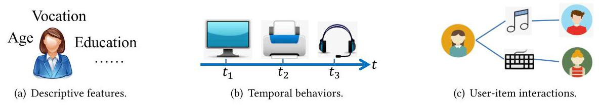
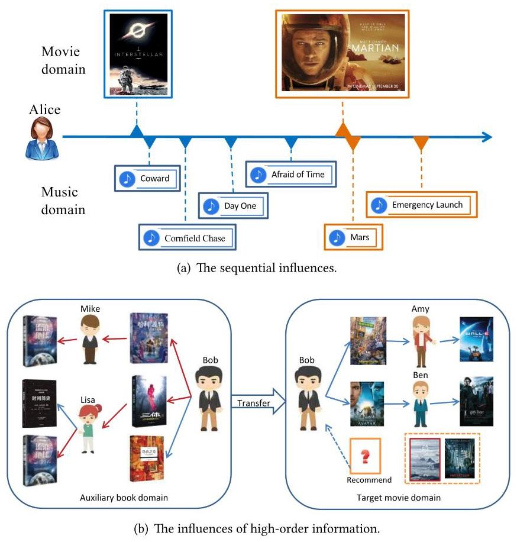
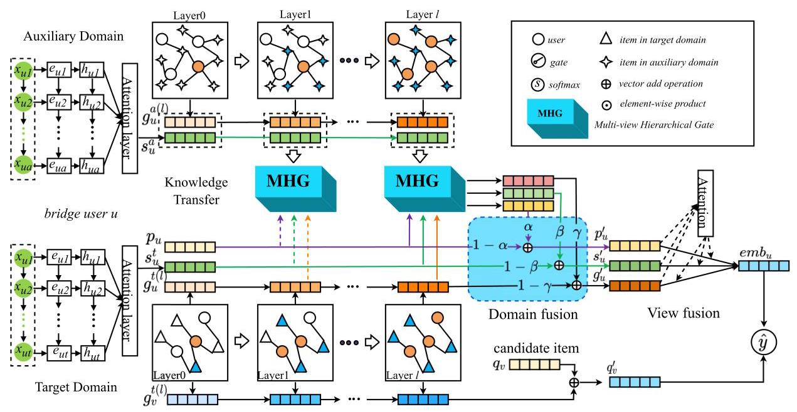
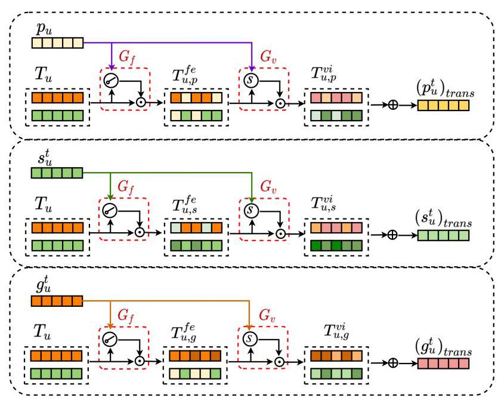
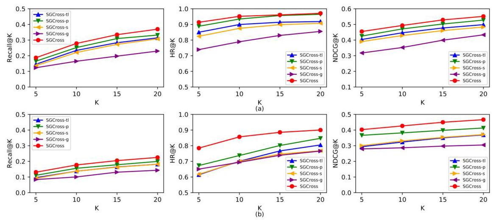
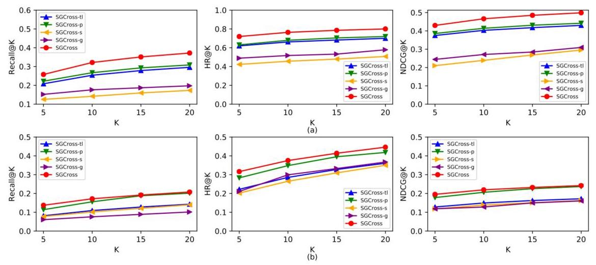
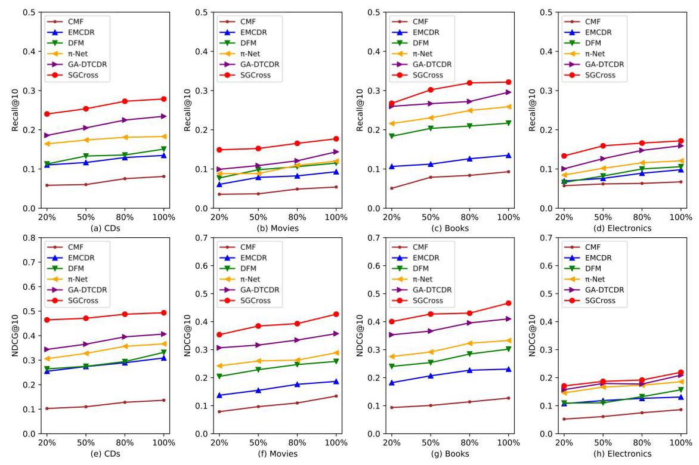
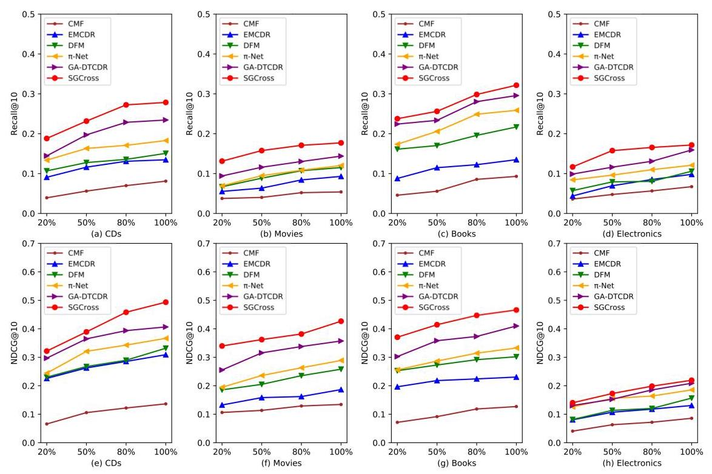
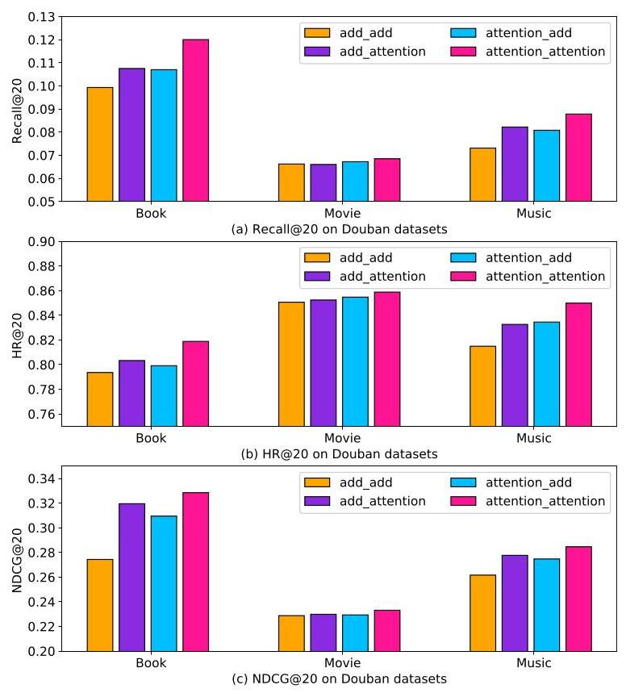

# Sequential and Graphical Cross-Domain Recommendations with a Multi-View Hierarchical Transfer Gate

HUIYUAN LI and LI YU, Renmin University of China, China

XI NIU, University of North Carolina at Charlotte, USA

YOUFANG LENG and QIHAN DU, Renmin University of China, China

Cross-domain recommender systems could potentially improve the recommendation performance by means of transferring abundant knowledge from the auxiliary domain to the target domain. They could help address some key challenges in recommender systems, such as data sparsity and cold start. However, most existing cross-domain recommendation approaches represent the user preferences based on a single kind of user's feature or behavior and fail to explore the hidden interaction effects of different kinds of features or behaviors. In this article, we propose the Sequential and Graphical Cross-Domain Recommendations with a Multi-View Hierarchical Transfer Gate (SGCross) to transfer user representations from multiple perspectives. The SGCross model constructs a user profile by learning the personal preference from a personal view, the dynamic preference from a temporal view, as well as the collaborative preference from a collaborative view. Specifically, a Multi-view Hierarchical Gate (MHG) is designed to transfer the informative representations of user knowledge on different views from the auxiliary domain separately, aiming to enhance the user representations. Furthermore, a two-stage attentive fusion module is designed to integrate transferred information at two levels: the domain level and the view level. Extensive experiments on the Amazon dataset and the Douban dataset have demonstrated that SGCross effectively improves the accuracy of cross-domain recommendations and outperforms the state-of-the-art baseline models.

## CCS Concepts: \( \cdot \) Information systems \( \rightarrow \) Recommender systems;

Additional Key Words and Phrases: Cross-domain recommendation, transfer learning, graph neural networks, recommender systems, deep learning

## ACM Reference format:

Huiyuan Li, Li Yu, Xi Niu, Youfang Leng, and Qihan Du. 2023. Sequential and Graphical Cross-Domain Recommendations with a Multi-View Hierarchical Transfer Gate. ACM Trans. Knowl. Discov. Data. 18, 1, Article 8 (August 2023), 28 pages.

https://doi.org/10.1145/3604615

## 1 INTRODUCTION

Personalized recommender systems \( \left\lbrack  {6,{53}}\right\rbrack \) are prevalent in various e-commercial platforms to overcome the information overload issue. They could supply consumers with a range of products in which they have potential interests based on their historical interactions (e.g., click or buying). However, traditional recommendation methods often face many challenges, such as data sparsity [46], cold start [1, 35, 54], and recommendation diversity [23]. In recent years, cross-domain recommendations \( \left\lbrack  {2,{21},{35},{36},{57}}\right\rbrack \) have become a promising way to alleviate these problems, especially for the data sparsity issue. They have the capability to supplement users' knowledge for the sparse target domain that has few ratings by taking advantage of abundant information from the auxiliary domain. Therefore, cross-domain recommendations have increasingly attracted wide attention.

---

Authors' addresses: H. Li, L. Yu (corresponding author), Y. Leng, and Q. Du, School of Information, Renmin University of China, No. 59 Zhongguancun Street, Beijing, 100872, China; emails: hyli18@ruc.edu.cn, buauayuli@ruc.edu.cn, lengyoufang@ruc.edu.cn, duqihan@ruc.edu.cn; X. Niu, Department of Software and Information Systems, University of North Carolina at Charlotte, 9201 University City Blvd., Charlotte, NC, USA; email: xniu2@uncc.edu.

Permission to make digital or hard copies of all or part of this work for personal or classroom use is granted without fee provided that copies are not made or distributed for profit or commercial advantage and that copies bear this notice and the full citation on the first page. Copyrights for components of this work owned by others than the author(s) must be honored. Abstracting with credit is permitted. To copy otherwise, or republish, to post on servers or to redistribute to lists, requires prior specific permission and/or a fee. Request permissions from permissions@acm.org.

© 2023 Copyright held by the owner/author(s). Publication rights licensed to ACM.

1556-4681/2023/08-ART8 \$15.00

https://doi.org/10.1145/3604615

---

Fig. 1. Description of a user from three views.

Generally, cross-domain recommendations work on the assumption that users tend to show similar interests and preferences in the related domains. For example, a user who has read the book Harry Potter is most likely to go to the movie Harry Potter. Therefore, it is reasonable to assimilate the information from the book domain to enhance the recommendations in the movie domain. However, there is a key issue for the cross-domain recommendations: how to represent users for an effective knowledge transfer between two domains. Some studies transfer information across domains in an explicit manner. They encode the user preferences into a vector in one domain and then map it to another domain as a whole. For example, Man et al. [34] and Zhu et al. [56] extracted the user representations by factorizing the rating matrix of each domain and then mapped the user representations from auxiliary domain to target domain with the multi-layer perceptron (MLP) method. Other studies inject the knowledge transfer into the representation learning process. For example, Elkahky et al. [9] and He et al. [16] shared the user representations across domains and measured the similarities between a user and its candidate items in each domain in a common feature space. These methods show good performance on lots of cross-domain recommendation tasks. However, they have a major limitation: encoding users' preferences from a single perspective, such as just some descriptive features or just sequential interaction behaviors. They fail to explore different kinds of preferences hidden in the multiple patterns of users' interaction behaviors when observed from different perspectives. In other words, since they transfer users' knowledge with embeddings from only a single view, they do not consider the influence of the interactions among different views, missing the potential opportunities for obtaining the diverse features of the user's preferences.

We believe a user's preferences can be described from three views. First, since a user's traits affect the cultivation of interests, we could learn a user's personal preferences by observing the descriptive features of the user, as shown in Figure 1(a). Second, from a temporal point of view, a user's preferences may shift over time. Leveraging historical sequences of the interacted items could capture knowledge not only from the items but also from the transitions over time. We view this kind of preference as a user's dynamic preferences, as shown in Figure 1(b). Third, from a point of view of collaborative filtering, users who purchased overlapping items may have similar interests. Based on the idea proposed by Wang et al. [44], the interactions among users and items are constructed into a bipartite graph where similar users (or items) are connected by the same items (or users), as shown in Figure 1(c). The collaborative information which propagates through the high-order connections in the user-item graph is crucial for the recommendations for the target user. Therefore, we could capture the important collaborative information as a user's collaborative preferences.

Fig. 2. Examples of cross-domain transfer via sequential and graphical knowledge.

In addition to personal preferences, we believe users' dynamic preferences and collaborative preferences also make a difference in the performance of cross-domain recommendations. On the one hand, as shown in Figure 2(a), users watched some movies (e.g., Interstellar and The Martian) and after a period of time, they would probably listen to the related music, such as the soundtrack of the movies. Moreover, the change in user preferences in the movie domain affects the shift of user interests in the music domain. On the other hand, as the example shown in Figure 2(b), there are two domains that Bob has interaction behaviors, i.e., the book domain and the movie domain. In the movie domain, it is easy to know that Bob had watched Zootopia and Avatar, while Ben and Amy watched Harry Potter and RoboCup, respectively. Although it is reasonable to infer that Bob may like science fiction movies, it is hard for us to know which sci-fi movie Bob prefers. However, in the book domain, we can find that there are two paths from Bob to the book Wandering Earth, which implies that Bob has a potential preference for the book Wandering Earth to some degree. If the knowledge of Bob's preferences in the book domain can be transferred to the movie domain, we could recommend Bob the movie Wandering Earth.

As mentioned above, the dynamic preferences and the collaborative preferences of the auxiliary domain are helpful for the representation of users in the target domain. However, with information heterogeneity, an existing method like MLP is not ideal for transferring these different kinds of preferences directly. To tackle this problem, in this article, we propose a novel method, Sequential and Graphical Cross-Domain Recommendations with a Multi-view Hierarchical Transfer Gate (SGCross), to transfer users' knowledge from multiple perspectives. First of all, SGCross extracts user preferences by learning the relationship between the user and items from three views in each domain, including the personal preferences from the personal view, the dynamic preferences from the temporal view, and the collaborative preferences from the collaborative view. Concretely, the graph neural network is employed to extract the high-order information from the user-item bipartite graph, and the bi-directional Gated Recurrent Unit (Bi-GRU) with attention mechanism is utilized to learn the dynamic preferences from the user behavior sequence. Second, the dynamic preferences and the collaborative preferences, along with the personal preferences are treated as inputs of the knowledge transfer module MHG to learn the informative knowledge separately from the auxiliary domain to the target domain. The MHG is designed as a multi-view hierarchical gate unit, aiming at preserving the enhanced features relevant to the user's preferences while eliminating the irrelevant features. Finally, a two-stage attentive fusion module is employed to obtain the final user representation. Our contributions are summarized as follows:

- We propose a novel cross-domain recommendation method SGCross to learn different kinds of user preferences from different perspectives, including the personal preferences from the personal view, the dynamic preferences from the temporal view, as well as the collaborative preferences from the collaborative view.

- We design a multi-view hierarchical transfer gate to implement the multi-view knowledge transfer from the auxiliary domain to the target domain, which can effectively inherit the essential features while discarding the useless features.

- We employ a two-stage attentive fusion module to generate the final user representation, which first merges the transferred embeddings and the corresponding target domain embed-dings at the domain level and then fuses the multi-view embeddings at the view level.

- Extensive experiments are carried out on the Amazon dataset and the Douban dataset. The results show that the SGCross has an advantage over the state-of-the-art baseline models.

The rest of this article is organized as follows. In Section 2, we review some related work. In Section 3, we introduce some preliminaries about our method. In Section 4, we describe the overall architecture of the proposed SGCross model, followed by the core components of SGCross in detail. In Section 5, we conduct experiments with two datasets to demonstrate the superiority of the SGCross compared with some state-of-the-art methods. Finally, we conclude this article and present prospects for future work.

## 2 RELATED WORK

In this section, we surveyed related work in three areas: cross-domain recommendations, graph convolutional networks, and transfer learning in recommender systems.

### 2.1 Cross-Domain Recommendations

Cross-domain recommendations leverage the abundant information in the auxiliary domain to improve the recommendation accuracy in the target domain, effectively alleviating the cold start and data sparsity problems. According to the scope of recommended items and the scope of target users, cross-domain recommendations can be classified into three types [21]. For the first type, items of the target domain are recommended to users in the target domain based on the knowledge acquired from the auxiliary domain. In this scenario, some studies explored the auxiliary knowledge to enhance the representations of the users and the items in the target domain to make a more accurate recommendation. For example, Perera and Zimmermann [38] supplemented the auxiliary information of non-overlapping users with generative adversarial networks to strengthen the user representations in the target domain. Wang et al. [46] utilized the co-clustering to enhance the item representations in the target domain. For the second type, items from both domains are recommended to the users in either one or both domains, which expands the scope of target users and improves the diversity of recommended items. For this scenario, several studies \( \left\lbrack  {{11},{12},{37}}\right\rbrack \) researched the dual target domain recommender systems and accomplished the recommendation tasks through the two-way knowledge transfer in both domains at the same time. For the last type, items in the auxiliary domain are recommended to the users in the target domain based on knowledge learned from users and items of both domains. Studies of this scenario typically focused on the cold start users who have ratings in the auxiliary domain but not in the target domain. For example, Fu et al. [13] proposed to learn latent factors of users and items with stacked denoising autoencoders (SDAE) from the reviews and contents to address the cold start issues. Wang et al. [45] exploited the neighborhoods of the target users and modified the MF process with user similarities to increase the knowledge of the cold start users. Zhao et al. [52] enhanced the representations of users and items based on the reviews and neighborhood features.

### 2.2 Graph Convolutional Networks in Recommendations

As a kind of deep learning network, Graph Convolutional Network (GCN) has been proven to have strong learning ability on graph structured data. In the recommendation tasks, the users and items can be structured into a bipartite graph based on their interactions. GCN maps each node in the graph into a low dimensional representation and encodes the graph structure information into it, which has a great impact on learning effective representations of users and items. For example, Wang et al. [44] proposed to explicitly encode the collaborative signal latent in the user-item interaction graph into the embedding process with GCN, to learn better user and item representations and further improve the accuracy of the recommendations. Zhang et al. [51] built a GCN-based encoder-decoder model to produce embeddings for new users and improve the final prediction performance. Tao et al. [42] modeled user interests on multimodal interaction graphs to capture more complex interaction patterns hidden in user behaviors. Yu et al. [49] analyzed the relations among users, products, and streamers, and model the tripartite interaction as a graph to improve the product recommendation for live stream e-commerce. Additionally, researchers had made use of GCN in various fields of recommendations. For example, Chang et al. [5] re-constructed loose item sequences into tight item-item interest graphs to represent users' core preferences for the sequential recommendations. Fan et al. [10] captured the interactions associated with the opinions in user-item graph, and modeled user social graph and user-item interaction graph respectively for the social recommendations. Hu et al. [29] built a heterogeneous graph network to explicitly model the interaction among users, news, and potential topics to alleviate the sparsity of user-item interaction in the news recommendation scenario, and obtained the state-of-the-art recommendation results. Li et al. [27] proposed a hierarchical graph network to model the relationships among users, items, and outfits with GCN simultaneously, for the compatibility matching and outfit recommendations. Wang et al. [47] enhanced item embeddings with the global graph and session graph, then aggregated them with attention mechanism for the session-based recommendations.

### 2.3 Knowledge Transfer in Cross-Domain Recommendations

Knowledge transfer is one of the most vital challenges in cross-domain recommendations. According to the different cross-domain recommendation tasks, the knowledge transfer methods generally fall into two categories: one-way transfer learning and two-way transfer learning. The former completes the knowledge transfer from the auxiliary domain to the target domain, while the latter is usually used in the dual cross-domain recommendations, for the knowledge is transferred back and forth across domains.

For the one-way transfer learning, Li et al. [24] studied knowledge transferability between two distinct data domains and transferred knowledge of cluster-level rating behavior from the auxiliary movie data to the target book data. Man et al. [34] learned the optimal mapping relationship from the auxiliary domain to the target domain by minimizing the distance between user preferences of the two domains. Zhu et al. [56] calculated a benchmark factor for knowledge transfer to eliminate the influence of sparsity, and mapped with the deep neural networks, since they found that the sparsity of different domains would affect the preference representations of individuals. Wang et al. [45] learned the mapping function across domains with the neighborhood-based gradient boosting trees. Mohsen et al. [19] proposed Social Matrix Factorization (MF) which studied the effect of trust propagation and generalized the basic MF model by introducing a different additional regularization term from trusted friends. Liu et.al [31] proposed a variational domain-invariant embedding alignment method to transfer the features from the source domain to the target domain with both overlapping user and non-overlapping users. On the other hand, for the two-way transfer learning, Singh et. al. [41] proposed Collective MF to collectively factorize one user-item rating matrix and one item-content matrix by sharing the same item-specific latent features. Elkahky et al. [9] and Lian et al. [28] utilized the shared weights of multi-layer neural network to extract the features of users and items in different domains simultaneously. The model by Yuan et al. [50] was trained with multiple objectives and transferred the scoring patterns of different domains with a domain adaptive method. Zhu et al. [12] adaptively transferred the knowledge across domains with the attention mechanism for the dual-target cross-domain recommendation. Ma et al. [33] proposed a cross-domain transfer unit for the shared account sequential cross-domain recommendation. It transformed information at each timestamp, and combined the information from the two domains recurrently. Li et.al [25] proposed to transfer the knowledge by generating a single global user representation with the generative adversarial mechanism from the user embeddings of different domains, then conducted the sequential recommendation task. Zheng et.al. [55] come up with a novel framework to encode the sequential transitions intra-domain and inter-domain by the local graph and the global graph respectively, then aggregated them with an attentive gate. In addition, some studies focus on the domain-shared and domain-specific knowledge across domains. For example, Liu et.al. [30] proposed a deep adversarial and attention network to learn domain-specific representations from source and target user-item interaction matrices and capture the domain-shared features with common user embed-dings. Cao et.al. [4] proposed two mutual-information-based disentanglement regularizers. One was used to enforce the user domain-shared representations and domain-specific representations encoding exclusive information, the other was employed to encourage the user domain-shared representations encoding predictive information for both domains.

Although the abovementioned models have made great successes in addressing the cross-domain recommendation task, most of them encode the user preferences as a single representation to transfer knowledge from one domain to the other domain. As a result, the existing studies neglect the fine-grained features from multiple perspectives. In this study, we model users' preferences from three views to construct the transferred representations for the target domain, which may retain the valuable features from the source domain to the great extent.

## 3 PRELIMINARIES

To facilitate the introduction of our proposed model, in this section, we briefly review three key methods utilized in our model, including the Bi-GRU, attention mechanism, and the GCNs.

### 3.1 Bi-directional Gated Recurrent Unit (Bi-GRU)

The Gated Recurrent Unit is similar to the Long Short-term Memory (LSTM) recurrent neural networks [14, 26]. LSTM has the ability to learn the long-term dependencies effectively, which has been proven to have better performance on sequence modeling [20]. It is also good at solving the gradient vanishing problem during RNNs training. LSTM is composed of one memory cell and three gates, including input gate, output gate, and forget gate. The memory cell stores information about each time stamp, while the gates control the inflow and outflow. Compared with LSTM, GRU [15] has similar architecture but fewer parameters. In GRU structure, the memory cell and the hidden state are merged. The update gate and the reset gate take the place of the forget gate of LSTM.

Given an input sequence \( \mathbf{e} = \left\{  {{\mathbf{e}}_{1},{\mathbf{e}}_{2},\ldots ,{\mathbf{e}}_{T}}\right\} \) , GRU computes the hidden state \( \mathbf{h} = \left\{  {{\mathbf{h}}_{1},{\mathbf{h}}_{2},\ldots }\right. \) , \( \left. {\mathbf{h}}_{T}\right\} \) and output vector \( \mathbf{y} = \left\{  {{\mathbf{y}}_{1},{\mathbf{y}}_{2},\ldots ,{\mathbf{y}}_{T}}\right\} \) by iterating the following equations from \( t = 1 \) to \( T \) :

\[
{\mathbf{h}}_{t} = {GRU}\left( {{W}_{e}{\mathbf{e}}_{t} + {W}_{h}{\mathbf{h}}_{t - 1} + {b}_{h}}\right) , \tag{1}
\]

\[
{\mathbf{y}}_{t} = {W}_{y}{\mathbf{h}}_{t} + {b}_{y} \tag{2}
\]

where \( {W}_{e},{W}_{h},{W}_{y} \) and \( {b}_{h},{b}_{y} \) are the weight matrices and bias matrices, respectively. And GRU is implemented by the following composite function:

\[
{\mathbf{h}}_{t} = \left( {1 - {z}_{t}}\right)  \odot  {\mathbf{h}}_{t - 1} + {z}_{t} \odot  {\widetilde{\mathbf{h}}}_{t}, \tag{3}
\]

\[
{z}_{t} = \sigma \left( {{\mathbf{W}}_{z} \cdot  {\mathbf{e}}_{t} + {\mathbf{U}}_{z} \cdot  {\mathbf{h}}_{t - 1}}\right) \tag{4}
\]

\[
{\widetilde{\mathbf{h}}}_{t} = \tanh \left( {{\mathbf{W}}_{h} \cdot  {\mathbf{e}}_{t} + \mathbf{U}\left( {{r}_{t} \odot  {\mathbf{h}}_{t - 1}}\right) }\right) , \tag{5}
\]

\[
{r}_{t} = \sigma \left( {{\mathbf{W}}_{r} \cdot  {\mathbf{e}}_{t} + {\mathbf{U}}_{r} \cdot  {\mathbf{h}}_{t - 1}}\right) \tag{6}
\]

where the symbol \( \odot \) is an element-wise multiplication, \( \sigma \) is the non-linear activation function which is stated as sigmoid in this article. \( {z}_{t} \) is the update gate which controls how much the unit updates its activation, \( {\widetilde{h}}_{t} \) is the candidate activation, \( {r}_{t} \) is the reset gate.

In order to make full use of both previous context and future context of the sequence, bidirectional RNNs (BRNNs) [40] were proposed to process the series in both directions with two separate hidden layers, which are then fed forwards to the same output layer. Following the structure of BRNNs, Bi-GRU computes the forward hidden sequence \( \overrightarrow{\mathbf{h}} \) from \( t = 1 \) to \( T \) and the backward hidden sequence \( \mathbf{h} \) from \( t = T \) to 1 as follows:

\[
{\overrightarrow{\mathbf{h}}}_{t} = {GRU}\left( {{\mathbf{W}}_{e\overrightarrow{h}}{\mathbf{e}}_{t} + {\mathbf{W}}_{\overrightarrow{h}}{\mathbf{h}}_{t - 1} + {b}_{\overrightarrow{h}}}\right) , \tag{7}
\]

\[
{\overleftarrow{\mathbf{h}}}_{t} = {GRU}\left( {{\mathbf{W}}_{e\overleftarrow{h}}{\mathbf{e}}_{t} + {\mathbf{W}}_{\overleftarrow{h}}{\mathbf{h}}_{t - 1} + {b}_{\overleftarrow{h}}}\right) , \tag{8}
\]

\[
{\mathbf{y}}_{t} = {\mathbf{W}}_{y\overrightarrow{h}}{\overrightarrow{\mathbf{h}}}_{t} + {\mathbf{W}}_{y\overleftarrow{h}}{\overleftarrow{\mathbf{h}}}_{t} + {b}_{y} \tag{9}
\]

### 3.2 Attention Mechanism

The attention mechanism [43] is proposed based on the end-to-end machine translation with encoder-decoder RNN, whose core idea is to automatically select the relevant part of the original sentence as the input of decoder when predicting the next word. Nowadays, the attention mechanism is widely used in recommendation tasks to weight the features of users according to correlations. For example, AGREE [3] leverages an attention mechanism to aggregate the preferences of group users dynamically. In this work, the attention mechanism is used for two purposes, (1) to obtain the dynamic preferences of users by combining with Bi-GRU, and (2) to obtain the final representations of users according to the different effects of users' preferences.

Generally, the attention mechanism calculates the similarity between user vector \( {\mathbf{u}}_{i} \) and item vector \( {\mathbf{v}}_{j} \) by equation:

\[
{\operatorname{score}}_{ij} = f\left( {{\mathbf{u}}_{i},{\mathbf{v}}_{j}}\right)  = {\mathbf{a}}^{T}\eta \left( {{\mathbf{W}}_{1}{\mathbf{u}}_{i} + {\mathbf{W}}_{2}{\mathbf{v}}_{j} + b}\right) , \tag{10}
\]

where \( \eta \) is the activation function such as ReLU, the weight matrices \( {\mathbf{W}}_{1} \) and \( {\mathbf{W}}_{2} \) convert \( {\mathbf{u}}_{i} \) and \( {\mathbf{v}}_{j} \) into a coessential space, \( b \) is the bias, the weight vector a is used to calculate the final score. Then it is normalized with a softmax function:

\[
{\alpha }_{ij} = \frac{\exp {\text{ score }}_{ij}}{\mathop{\sum }\limits_{{k = 1}}^{T}\exp {\text{ score }}_{ik}}. \tag{11}
\]

In Equation (11), \( {\alpha }_{ij} \) is the weighted factor that measures the importance of item \( {\mathbf{v}}_{j} \) on user \( {\mathbf{u}}_{i} \) , that is, the higher the \( {\alpha }_{ij} \) is, the more significant the \( {\mathbf{v}}_{j} \) becomes. Finally, the weighted score \( {\mathbf{c}}_{i} \) is the sum of \( {\mathbf{v}}_{j} \) with different weights:

\[
{\mathbf{c}}_{i} = \mathop{\sum }\limits_{{j = 1}}^{T}{\alpha }_{ij}{\mathbf{v}}_{j} \tag{12}
\]

### 3.3 Graph Convolution Networks (GCN)

Every node in the graph is changing its state all the time because of the influence of neighbors and farther nodes until the final convergence. The closer the relationship, the greater the influence of neighbors. GCN [48] aggregates the features of neighbors to enhance the feature expression of nodes on the graph, which in general can be described as

\[
{\mathbf{g}}_{u}^{\left( l + 1\right) } = \sigma \left( {{\mathbf{W}}_{g} \cdot  \operatorname{Aggr}\left( \left\{  {{\mathbf{g}}_{i}^{\left( l\right) },\forall i \in  N}\right\}  \right)  + b}\right) , \tag{13}
\]

where \( l \) is the layer of the GCN. The \( \sigma \) denotes non-linear activation function, such as leakyReLU, which can encode all positive and small negative values. \( {\mathbf{W}}_{g} \) is the parameter matrix, \( \operatorname{Aggr}\left( \cdot \right) \) is an aggregation function such as weighted sum aggregator and mean aggregator, \( N \) is the set of neighbors that the target node has connection with.

To make better use of GCN in recommendation tasks, NGCF [44] integrates the user-item interaction into embedding in the bipartite graph. It takes embeddings \( {\mathbf{g}}_{v} \) and \( {\mathbf{g}}_{u} \) as inputs, and the embedding propagation is described as

\[
{\mathbf{g}}_{u}^{\left( l + 1\right) } = \sigma \left( {{\mathbf{W}}_{1}^{\left( l\right) }{\mathbf{g}}_{u}^{\left( l\right) } + \mathop{\sum }\limits_{{v \in  {N}_{u}}}\frac{1}{\sqrt{\left| {N}_{u}\right| \left| {N}_{v}\right| }}\left( {{\mathbf{W}}_{1}^{\left( l\right) }{\mathbf{g}}_{v}^{\left( l\right) } + {\mathbf{W}}_{2}^{\left( l\right) }\left( {{\mathbf{g}}_{v}^{\left( l\right) } \odot  {\mathbf{g}}_{u}^{\left( l\right) }}\right) }\right) }\right) , \tag{14}
\]

where \( {N}_{u} \) is the set of items that user \( u \) interacted with, and \( {N}_{v} \) is the set of users that interact with item \( v.{\mathbf{W}}_{1} \) and \( {\mathbf{W}}_{2} \) are trainable parameter matrices. The normalize factor \( \frac{1}{\sqrt{\left| {N}_{u}\right| \left| {N}_{v}\right| }} \) is used to avoid the scale of the embedding increasing during the update process of GCN. Distinct from conventional GCN that considers the contribution of item embedding only, NGCF additionally encodes the interaction between item embedding and user embedding into the message being passed via \( {\mathbf{g}}_{v} \odot  {\mathbf{g}}_{u} \) . The final user embedding is obtained by concatenating the output of \( L \) layers \( \left\{  {{\mathbf{g}}_{u}^{\left( 1\right) },{\mathbf{g}}_{u}^{\left( 2\right) },\ldots ,{\mathbf{g}}_{u}^{\left( L\right) }}\right\} \) with the initial embedding \( {\mathbf{g}}_{u}^{\left( 0\right) } \) . The final item embedding is learned by the same operation. Finally, the predictive score is obtained by conducting the inner product between the final user embedding and item embedding.

LightGCN [17] greatly simplifies NGCF by removing the nonlinear activation function and the feature transformation matrix. In addition, it uses simple weighted sum aggregator to replace the self-connection and concatenation in the fusion layer. Compared to NGCF, LightGCN reduces the risk of model overfitting to achieve better performance. The embedding propagation layer is described as

\[
{\mathbf{g}}_{u}^{\left( l + 1\right) } = \mathop{\sum }\limits_{{v \in  {N}_{u}}}\frac{1}{\sqrt{\left| {N}_{u}\right| \left| {N}_{v}\right| }}{\mathbf{g}}_{v}^{\left( l\right) }. \tag{15}
\]

In our work, we extract the graph structured features by combining the advantages of NGCF and LightGCN.

Table 1. Notations Used in This Article

<table><tr><td>Symbol</td><td>Description</td></tr><tr><td>\( { * }^{t},{ * }^{a} \)</td><td>The element in the target domain and the auxiliary domain</td></tr><tr><td>\( U \)</td><td>The set of shared users in both domains</td></tr><tr><td>\( {V}^{t},{V}^{a} \)</td><td>The set of items in the target domain and the auxiliary domain</td></tr><tr><td>\( u, v \)</td><td>User \( u \) and item \( v \) in each domain</td></tr><tr><td>\( \left| U\right| \)</td><td>The number of shared users</td></tr><tr><td>\( {N}^{t},{N}^{a} \)</td><td>The number of items in the target domain and the auxiliary domain</td></tr><tr><td>\( {\mathbf{p}}_{u},{\mathbf{q}}_{\mathbf{v}} \)</td><td>The personal view embedding of user \( u \) and item \( v \)</td></tr><tr><td>\( {\mathbf{s}}_{u} \)</td><td>The temporal view embedding of user \( u \)</td></tr><tr><td>\( G \)</td><td>The user-item interaction graph</td></tr><tr><td>\( {\mathrm{g}}_{u},{\mathrm{\;g}}_{v} \)</td><td>The collaborative view embedding of user \( u \) and item \( v \)</td></tr><tr><td>\( {N}_{u} \)</td><td>The set of items that are interacted by user \( u \)</td></tr><tr><td>\( {N}_{v} \)</td><td>The set of users that interact with item \( v \)</td></tr><tr><td>W, b</td><td>The weight and bias in the neural networks</td></tr></table>

## 4 PROPOSED MODEL

In this section, we first give the formulation of our cross-domain recommendation task. Then, we describe the overall architecture of SGCross, followed by introducing the core components of SGCross in details, including the representation learning module, the knowledge transfer module, and the attentive fusion module. Finally, we introduce the training optimization for SGCross.

### 4.1 Notations and Problem Description

Given the target domain \( {D}^{t} \) and the auxiliary domain \( {D}^{a} \) , their item sets are separately denoted by \( {V}^{t} = \left\{  {{v}_{1}^{t},{v}_{2}^{t},\ldots ,{v}_{{N}^{t}}^{t}}\right\} \) and \( {V}^{a} = \left\{  {{v}_{1}^{a},{v}_{2}^{a},\ldots ,{v}_{{N}^{a}}^{a}}\right\} \) , where \( {N}^{t} \) and \( {N}^{a} \) are the number of items in \( {D}^{t} \) and \( {D}^{a} \) respectively. Two domains share the user set \( U = \left\{  {{u}_{1},{u}_{2},\ldots ,{u}_{\left| U\right| }}\right\} \) , where user \( u \in  U \) has abundant ratings in \( {D}^{a} \) but relatively fewer ratings in \( {D}^{t} \) . Let \( {R}^{t} \in  {\mathbb{R}}^{\left| U\right|  \times  {N}^{t}} \) and \( {R}^{a} \in  {\mathbb{R}}^{\left| U\right|  \times  {N}^{a}} \) denote the user-item rating matrix of \( {D}^{t} \) and \( {D}^{a} \) , respectively. Each entry \( {r}^{t} \in  \{ 0,1\} \) (or \( {r}^{a} \in  \{ 0,1\} \) ) in \( {R}^{t} \) (or \( {R}^{a} \) ) indicates whether the interaction between user \( u \) and item \( i \) is observed. The purpose of SGCross is to enhance the representations of the user’s preferences in \( {D}^{t} \) by learning informative features from \( {D}^{a} \) , and further improve the effectiveness of recommendations. Table 1 lists the notations used in this article.

It is the key step for SGCross to generate the appropriate representations of the users and the items for the cross-domain recommendations. Distinct from most studies that usually present user preferences from a single view, we observe each user from three views, and learn the different embeddings under each view. For ease of description, we define three kinds of embeddings, each from three views as follows:

Definition 1 (Personal View). The personal view reflects the essential characteristics of a user, such as age, education background, and occupation. We capture users' personal preferences from personal view, based on the assumption that a user's behaviors are usually determined by the personal traits. For each user \( u \in  U \) , the personal preference is denoted as \( {\mathbf{p}}_{u} \in  {\mathbb{R}}^{d} \) , where \( d \) denotes the dimension of the vector.

Definition 2 (Temporal View). The temporal view reflects the user's dynamic preferences that changes over time, which serves as one of the important parts of a user's preferences. For each user \( u \in  U \) , the historical sequence is denoted as \( {\mathbf{x}}_{u} = \left\{  {{x}_{u1},{x}_{u2},\ldots ,{x}_{u{m}_{u}}}\right\} \) in each domain, where \( {x}_{u{m}_{u}} \in  {V}^{t} \) or \( {V}^{a},{m}_{u} \) is the number of items interacted by user \( u \) . The dynamic preference is extracted from the historical sequence, donated as \( {\mathbf{s}}_{u}^{t} \in  {\mathbb{R}}^{d} \) in the target domain \( {D}^{t} \) , and \( {s}_{u}^{a} \in  {\mathbb{R}}^{d} \) in the auxiliary domain \( {D}^{a} \) .

Definition 3 (Collaborative View). The collaborative view reflects the interactions between users and items. We capture collaborative preference through high-order information hidden in the user-item interaction graph in which the messages propagate along the edges between connected users and items. In each domain, the user-item interaction graph \( G\left( {{G}^{t}\text{ in }{D}^{t},{G}^{a}\text{ in }{D}^{a}}\right) \) is constructed in the light of the interactive behaviors among users and items. For each user \( u \) , the collaborative preference is denoted as \( {\mathbf{g}}_{u}^{t} \in  {\mathbb{R}}^{d} \) in \( {D}^{t} \) , and \( {\mathbf{g}}_{u}^{a} \in  {\mathbb{R}}^{d} \) in \( {D}^{a} \) .

The representation learning of SGCross is designed through the observation from the user aspect, including users' traits, users' temporal behaviors, and users' collaborative interactions. The model could be extended to the item aspect, representing items' characteristics, sequences of users who bought the items, and items' collaborative interactions.

### 4.2 Overall Architecture

As depicted in Figure 3, the proposed SGCross model mainly involves three major modules: the representation learning module, the knowledge transfer module, and the attentive fusion module. The representation learning module is used to represent a user's preferences from three views. The knowledge transfer module is designed to acquire the mutual relationship across domains and to enrich the user's knowledge in the target domain with the transferred features. And the attentive fusion module is employed to integrate the different types of the user's preferences at two levels, including the domain-level and the view-level.

### 4.3 The Representation Learning Module

(1) Personal view embedding. To describe the inherent characteristics of the user \( u \in  U \) and the item \( v \in  {V}^{t} \) , we encode them into embedding vectors separately. In the target domain, the user embedding and the item embedding can be seen as looking up in the parameter matrices of user set \( U \) and item set \( {V}^{t} \) ,

\[
{\mathbf{p}}_{u} = \operatorname{Lookup}\left( {{\mathbf{P}}^{\top },{o}_{u}}\right) \tag{16}
\]

\[
{\mathbf{q}}_{v} = \operatorname{Lookup}\left( {{\mathbb{Q}}^{\top },{o}_{v}}\right) \tag{17}
\]

where \( \mathbf{P} \in  {\mathbb{R}}^{d \times  \left| U\right| } \) and \( \mathbf{Q} \in  {\mathbb{R}}^{d \times  {N}^{t}} \) are the transformation matrices, \( {o}_{u} \in  {\mathbb{R}}^{\left| U\right| } \) and \( {o}_{v} \in  {\mathbb{R}}^{{N}^{t}} \) are the one-hot vectors of the user ID and item ID. The vector \( {\mathbf{p}}_{u} \) and \( {\mathbf{q}}_{v} \) are regarded as the personal view embedding of user \( u \) and item \( v \) .

(2) Temporal view embedding. In general, the shift of user's interests is reflected in the user behaviors over time. Therefore, the sequence trends are highly correlated in different domains to some extent. In both domains, we leverage Bi-GRU [15] and attention mechanism [43] to extract the temporal view interest preferences of the user \( u \) .

For user \( u \) , given the historical sequence \( {x}_{u} = \left\{  {{x}_{u1},{x}_{u2},\ldots ,{x}_{ut}}\right\} \) in the target domain, we transform each item of \( {x}_{u} \) into an embedding vector, so that the embedding of the sequence can be denoted as \( {\mathbf{e}}_{u} = \left\{  {{\mathbf{e}}_{u1},{\mathbf{e}}_{u2},\ldots ,{\mathbf{e}}_{ut}}\right\} \) , where \( {\mathbf{e}}_{ut} \in  {\mathbb{R}}^{d} \) . The sequence embedding is taken as the inputs of Bi-GRU to obtain the hidden states \( \mathbf{h} = \left\{  {{\mathbf{h}}_{1},{\mathbf{h}}_{2},\ldots ,{\mathbf{h}}_{t}}\right\} \) . To capture the dynamic features of the user adaptively, the attention mechanism is introduced to collect the weighted hidden states at each time stamp. In this way, we obtain the temporal view embedding \( {\mathbf{s}}_{u}^{t} \) in the target domain. The temporal view embedding \( {\mathbf{s}}_{u}^{a} \) in the auxiliary domain is learned in the same way.

(3) Collaborative view embedding. As we mentioned previously, the high-order collaborative information behind the high-order connected users and items in the interaction graph, could contribute to the recommendation accuracy in the target domain. To learn these collaborative preferences in each domain, we construct the user-item graph \( G \) in the light of NGCF and Light-GCN where the users and items are served as nodes and the interaction behaviors are regarded as edges. Then a GCN-based information transmission structure is employed to optimize the embedded representation. However, different from NGCF and LightGCN, SGCross describes a user node by aggregating the embeddings of the connected item nodes and the sum of the inner products for user-item pairs. This way retains essential information in interactions compared to LightGCN, and is more concise than NGCF. Therefore the propagation function of the user \( u \) and item \( v \) in the target domain can be described as follows:

\[
{\mathbf{g}}_{u}^{\left( l + 1\right) } = \mathop{\sum }\limits_{{v \in  {N}_{u}}}\frac{1}{\sqrt{\left| {N}_{u}\right| \left| {N}_{v}\right| }}\left( {{\mathbf{W}}_{u1}^{\left( l\right) } \cdot  {\mathbf{g}}_{v}^{\left( l\right) } + {\mathbf{W}}_{u2}^{\left( l\right) }\left( {{\mathbf{g}}_{v}^{\left( l\right) } \odot  {\mathbf{g}}_{u}^{\left( l\right) }}\right) }\right) , \tag{18}
\]

\[
{\mathbf{g}}_{v}^{\left( l + 1\right) } = \mathop{\sum }\limits_{{u \in  {N}_{v}}}\frac{1}{\sqrt{\left| {N}_{v}\right| \left| {N}_{u}\right| }}\left( {{\mathbf{W}}_{v1}^{\left( l\right) } \cdot  {\mathbf{g}}_{u}^{\left( l\right) } + {\mathbf{W}}_{v2}^{\left( l\right) }\left( {{\mathbf{g}}_{u}^{\left( l\right) } \odot  {\mathbf{g}}_{v}^{\left( l\right) }}\right) }\right) , \tag{19}
\]

Fig. 3. The architecture of SGCross. It contains three components: (a) the representation learning module in each domain, (b) the knowledge transfer module, and (c) the attentive fusion module and rating prediction. Specifically, (a) learns user preference from three views, (b) constructs an MHG method to learn the informative knowledge from the auxiliary domain based on three views separately, and (c) attentively integrates the features at two levels: the domain-level and the view-level, and then identifies the top-K recommendations with the final user embedding and item embedding.

where \( l \) is the layer of the graph embedding. \( {\mathbf{W}}_{u1} \) and \( {\mathbf{W}}_{v1} \) are the parameter matrices. To keep the process simple and manageable, we treat the contribution of each node equally on the user-item graph. By combining the embeddings of the nodes learned in each layer, we obtain the collaborative view embedding of user node \( {\mathrm{g}}_{u} \) and item node \( {\mathrm{g}}_{v} \) ,

\[
{\mathrm{g}}_{u} = \sigma \left( {{\mathrm{W}}_{ul} \cdot  \mathop{\sum }\limits_{{l = 0}}^{l}{\mathrm{\;g}}_{u}^{\left( l\right) }}\right) , \tag{20}
\]

\[
{\mathrm{g}}_{v} = \sigma \left( {{\mathrm{W}}_{vl} \cdot  \mathop{\sum }\limits_{{l = 0}}^{l}{\mathrm{\;g}}_{v}^{\left( l\right) }}\right) , \tag{21}
\]

where the \( {\mathbf{W}}_{ul} \) and \( {\mathbf{W}}_{vl} \) are the parameter matrices.

ACM Transactions on Knowledge Discovery from Data, Vol. 18, No. 1, Article 8. Publication date: August 2023.

Fig. 4. The structure of MHG. The feature gate \( {G}_{f} \) learns the relevant information from auxiliary matrix \( {T}_{u} \) at the feature level, and the view gate \( {G}_{\mathcal{U}} \) calculates the relevance of the auxiliary information towards the target embedding at the view level.

After the representation learning in both domains, we obtain five kinds of representations of user preferences, including the personal view embedding \( {\mathbf{p}}_{u} \) , the temporal view embedding \( {\mathbf{s}}_{u}^{t} \) and the collaborative view embedding \( {\mathbf{g}}_{u}^{t} \) in the target domain, along with the corresponding embed-dings \( {\mathbf{s}}_{u}^{a} \) and \( {\mathbf{g}}_{u}^{a} \) in the auxiliary domain. It is worth noting that the personal view preferences of the user is independent of other representations. In this article, we addressed the cross-domain recommendation task based on the implicit feedback. The model could be extended to the explicit feedback or the content-based scenarios, through extracting these three kinds of preferences from not only IDs but users' traits and item attributes.

### 4.4 Knowledge Transfer Learning

Different from most cross-domain recommendation methods that transfer features across domains with a single vector, the multi-view hierarchical transfer gate (MHG) is designed to incorporate the auxiliary information based on the representations of user preferences from different perspectives. However, not all the features of the auxiliary domain are valuable to the user representations in the target domain. For example, if a user has read Harry Potter books and watched Harry Potter movies, it can be inferred that the user may be attracted by the content of the story, rather than other attributes, such as the publisher of the book or the directors of the movie. For the purpose of focusing on the relevant features that have positive influences on user preferences, while eliminating the irrelevant features, MHG captures the mutual features of user preferences of different domains at the feature level. The structure of MHG is illustrated in Figure 4.

MHG transfers the features of user preferences on multiple views with stacked gate unit, the modified structure based on the Gate Linear Unit (GLU) [7]. Since GLU cannot be directly employed to transfer user preferences across domains, we modify the GLU model to fit our transfer task. Inspired by [32], we design MHG with a feature gate and a view gate to learn special features at the feature level and the view level when transferring user preferences. Specially, for the personal preferences transfer learning, the feature gate is designed to learn the important components of the features from the auxiliary domain associated with users' personal preferences. The formula of feature gate \( {G}_{f} \) is designed as follows:

\[
{\mathbf{T}}_{u}^{fe} = {\mathbf{T}}_{u} \odot  \sigma \left( {{\mathbf{W}}_{t1}{\mathbf{T}}_{u} + {\mathbf{W}}_{t2}{\mathbf{p}}_{u}}\right) \tag{22}
\]

where \( {\mathrm{T}}_{u} = \left\lbrack  {{\mathrm{s}}_{u}^{a},{\mathrm{\;g}}_{u}^{a}}\right\rbrack  ,{\mathrm{s}}_{u}^{a} \in  {\mathbb{R}}^{d} \) and \( {\mathrm{g}}_{u}^{a} \in  {\mathbb{R}}^{d} \) are the temporal view embedding and the collaborative view embedding of user \( u \) in the auxiliary domain, respectively. \( \sigma \) is the sigmoid activate function. \( {\mathbf{p}}_{u} \in  {\mathbb{R}}^{d} \) is the personal view embedding of the user, \( {\mathbf{W}}_{t1},{\mathbf{W}}_{t2} \in  {\mathbb{R}}^{d \times  d} \) are parameters that map the different objects into the same space. In this way, we derive the relevant features in \( {\mathrm{T}}_{u} \) toward the personal view embedding. Consider that the relevances of the temporal preferences and collaborative preferences of the auxiliary domain vary in learning the transferred features, we then measure the influence of the preferences on difference views of \( {\mathbf{T}}_{u}^{fe} \) . The view gate \( {G}_{v} \) is designed as:

\[
{\mathrm{T}}_{u}^{vi} = {\mathrm{T}}_{u}^{fe} \odot  \operatorname{softmax}\left( {{\mathbf{w}}_{t3}^{\top }{\mathrm{T}}_{u}^{fe} + {\mathbf{p}}_{u}^{\top }{\mathbf{W}}_{t4}}\right) \tag{23}
\]

where \( {\mathbf{T}}_{u}^{vi} = \left\lbrack  {{\mathbf{s}}_{u}^{vi},{\mathbf{g}}_{u}^{vi}}\right\rbrack \) is the personal view special matrix learned from \( {\mathbf{T}}_{u}^{fe},{\mathbf{w}}_{t3} \in  {\mathbb{R}}^{d} \) and \( {\mathbf{W}}_{t4} \in  {\mathbb{R}}^{d \times  2} \) are learnable parameters. The view gate assigns different weights to the temporal view embedding and collaborative view embedding through softmax function. By this means, we distill the most influential features of the auxiliary domain that contribute more to the personal preferences of the target user. And the personal view transferred embedding \( {\mathbf{p}}_{u}^{\text{ trans }} \) is calculated:

\[
{\mathrm{p}}_{u}^{\text{ trans }} = {\mathrm{s}}_{u}^{vi} + {\mathrm{g}}_{u}^{vi}. \tag{24}
\]

The knowledge learned from the feature gate and the view gate strengthen the valuable features through the interaction of the personal view embedding and the auxiliary embeddings, while removing unfavorable features to the greatest extent. It could further enhance the user representation from the personal view. Analogously, we can obtain the temporal view transferred embedding \( {\mathbf{s}}_{u}^{\text{ trans }} \) , and the collaborative view transferred embedding \( {\mathbf{g}}_{u}^{\text{ trans }} \) , to enhance the user representation from temporal view and collaborative view.

### 4.5 Attentive Fusion Module

After obtaining the transferred knowledge through MHG, it is crucial to integrate it into the final user representation for the cross-domain recommendation task. It is noted that there are several strategies available for the knowledge aggregation, such as vector add operation, concatenation, and attention mechanism. In this study, we make use of the attention mechanism to adaptively fuse the different kinds of embeddings in the target domain based on their influences. In the target domain, one user is represented from three views, and the representation of each view is composed of the transferred embedding and the target domain embedding. To this end, we consider the fusion process at two levels: the domain level and the view level.

For the domain-level fusion, it is important to measure the contribution of transferred embed-dings \( {\mathbf{p}}_{u}^{\text{ trans }},{\mathbf{s}}_{u}^{\text{ trans }},{\mathbf{g}}_{u}^{\text{ trans }} \) , and target domain embeddings \( {\mathbf{p}}_{u},{\mathbf{s}}_{u}^{t},{\mathbf{g}}_{u}^{t} \) . As the influences of different features vary for a user, we allocate two kinds of embeddings with different weights based on their importance other than treating them equally. Specially, for the embeddings \( {\mathbf{p}}_{u} \) and \( {\mathbf{p}}_{u}^{\text{ trans }} \) , the scores of importance are calculated as follows:

\[
{\operatorname{score}}_{p}^{t} = {\mathbf{a}}_{p1}^{T}\eta \left( {{\mathbf{W}}_{p1}{\mathbf{p}}_{u} + {b}_{p1}}\right) , \tag{25}
\]

\[
{\text{ score }}_{p}^{\text{ trans }} = {\mathrm{a}}_{p2}^{T}\eta \left( {{\mathbf{W}}_{p2}{\mathbf{p}}_{u}^{\text{ trans }} + {b}_{p2}}\right) ), \tag{26}
\]

where \( \eta \) is the activation function ReLU, the weight matrices \( {\mathbf{W}}_{p1} \) and \( {\mathbf{W}}_{p2} \) convert \( {\mathbf{p}}_{u} \) and \( {\mathbf{p}}_{u}^{\text{ trans }} \) into a coessential space, the weight \( {\mathbf{a}}_{p1} \) and \( {\mathbf{a}}_{p2} \) are used to calculate the scores. Then they are normalized with the softmax function,

\[
{\alpha }_{p}^{t} = \frac{\exp {\operatorname{score}}_{p}^{t}}{\exp {\operatorname{score}}_{p}^{t} + \exp {\operatorname{score}}_{p}^{\text{ trans }}}, \tag{27}
\]

\[
{\alpha }_{p}^{\text{ trans }} = 1 - {\alpha }_{p}^{t} \tag{28}
\]

Then the target domain vector is associated with \( {\alpha }_{p}^{t} \) while the transferred embedding is assigned to \( {\alpha }_{p}^{\text{ trans }} \) . The fusion embedding on personal view \( {\mathbf{p}}_{u}^{\prime } \) is the weighted sum.

\[
{\mathbf{p}}_{u}^{\prime } = {\alpha }_{p}^{t}{\mathbf{p}}_{u} + {\alpha }_{p}^{\text{ trans }}{\mathbf{p}}_{u}^{\text{ trans }}. \tag{29}
\]

In the same way, we obtain the temporal view fusion embedding \( {\mathrm{s}}_{u}^{\prime } \) and the collaborative view fusion embedding \( {\mathrm{g}}_{u}^{\prime } \) .

For the view-level fusion, the task is to aggregate the fusion embeddings of three views \( {\mathbf{p}}_{u}^{\prime },{\mathbf{s}}_{u}^{\prime } \) and \( {\mathrm{g}}_{u}^{\prime } \) appropriately, as different views of interest make different contributions to the user. In order to acquire high-quality representation of user preferences, three embeddings are merged attentively with different weights.

\[
{\widehat{\mathbf{p}}}_{u} = {\alpha }_{p}^{vi}{\mathbf{p}}_{u}^{\prime } + {\alpha }_{s}^{vi}{\mathbf{s}}_{u}^{\prime } + {\alpha }_{g}^{vi}{\mathbf{g}}_{u}^{\prime }. \tag{30}
\]

\[
{\alpha }_{p}^{vi} = \frac{\exp {\operatorname{score}}_{p}^{vi}}{\exp {\operatorname{score}}_{p}^{vi} + \exp {\operatorname{score}}_{s}^{vi} + \exp {\operatorname{score}}_{g}^{vi}}, \tag{31}
\]

\[
{\alpha }_{s}^{vi} = \frac{\exp {\operatorname{score}}_{s}^{vi}}{\exp {\operatorname{score}}_{p}^{vi} + \exp {\operatorname{score}}_{s}^{vi} + \exp {\operatorname{score}}_{g}^{vi}}, \tag{32}
\]

\[
{\alpha }_{g}^{vi} = \frac{\exp {{scor}{e}_{g}^{vi}}}{\exp {{scor}{e}_{p}^{vi}} + \exp {{scor}{e}_{s}^{vi}} + \exp {{scor}{e}_{g}^{vi}}}, \tag{33}
\]

where \( {\widehat{\mathbf{p}}}_{u} \) is the final user representation. \( {\alpha }_{p}^{vi},{\alpha }_{s}^{vi} \) , and \( {\alpha }_{q}^{vi} \) are degrees of importance associated to \( {\mathbf{p}}_{u}^{\prime },{\mathbf{s}}_{u}^{\prime } \) , and \( {\mathbf{g}}_{u}^{\prime } \) . The score of three view of embeddings are calculated with Equation (25) where the inputs are \( {\mathbf{p}}_{u},{\mathbf{s}}_{u} \) , and \( {\mathbf{g}}_{u}^{\prime } \) .

The prediction result \( {\widehat{y}}_{u, v} \) is the sum of element-wise products between the user embedding \( {\widehat{\mathbf{p}}}_{u} \) and the item embedding \( {\mathbf{q}}_{v}^{\prime } \) which is the sum of the personal view embedding \( {\mathbf{q}}_{v} \) and the collaborative view embedding \( {\mathbf{g}}_{v} \) ,

\[
{\widehat{y}}_{u, v} = {\widehat{\mathbf{p}}}_{u}{\mathbf{q}}_{v}^{\prime } \tag{34}
\]

\[
{\mathbf{q}}_{v}^{\prime } = \operatorname{Aggr}\left( {{\mathbf{q}}_{v},{\mathbf{g}}_{v}}\right) \tag{35}
\]

where Aggr denotes the vector add operation.

### 4.6 Model Training

After the user preferences transfer learning, the SGCross is optimized with BPR loss, which trains the pairwise ranking between the observed and unobserved items,

\[
\text{ Loss } = \mathop{\sum }\limits_{{\left( {u, j, k}\right)  \in  O}} - \ln \sigma \left( {{\widehat{y}}_{u, j} - {\widehat{y}}_{u, k}}\right)  + \lambda \parallel \Theta \parallel , \tag{36}
\]

where \( \left( {u, j, k}\right)  \in  O \) is a pairwise training data, \( j \) and \( k \) denote the items that user \( u \) likes and dislikes, respectively. \( {\widehat{y}}_{u, j} \) and \( {\widehat{y}}_{u, k} \) are the prediction results of user \( u \) on item \( j \) and item \( k \) respectively. During training, the former should be bigger than the latter. \( \Theta \) is the learnable parameter of the model and \( \lambda \) is the regularization coefficient. By minimizing the loss function, the partial derivatives of all parameters can be calculated by the gradient descent method. We use Adam [22] to automatically adjust the learning rate during the training. For clarity, the main procedures of the proposed SGCross algorithms is presented in Algorithm 1.

ALGORITHM 1: Main Procedures of the Proposed SGCross Method.

---

Input: The original rating matrices \( \left\{  {{R}^{a},{R}^{t}}\right\} \) of the auxiliary domain and the target domain.

Output: The recommended item lists to users of the target domain.

	Initialize \( \mathbf{P} \in  {\mathbb{R}}^{d \times  \left| U\right| } \) and \( \mathbf{Q} \in  {\mathbb{R}}^{d \times  {N}^{t}} \) of user \( u \) in the target domain.

	Get the personal view embedding \( {p}_{u} \) and \( {q}_{v} \) .

	for \( d = 1,2 \) do

		for \( u = 1,2,\ldots ,\left| U\right| \) do

			Get the historical sequence \( {x}_{u} \) ,

			Get the temporal view embedding \( {\mathbf{s}}_{u} \) ,

			Get the collaborative view embedding \( {\mathbf{g}}_{u} \) and \( {\mathbf{g}}_{v} \) according to (18)-(21).

			end for

		end for

	for \( u = 1,2,\ldots ,\left| U\right| \) do

		Learn \( {p}_{u}^{\text{ trans }} \) according to (22)-(24) with the input \( {p}_{u} \) and \( {T}_{u} \) .

		Learn \( {s}_{u}^{\text{ trans }} \) according to (22)-(24) with the input \( {s}_{u}^{t} \) and \( {T}_{u} \) .

		Learn \( {g}_{u}^{\text{ trans }} \) according to (22)-(24) with the input \( {g}_{u}^{t} \) and \( {T}_{u} \) .

		Fuse \( {p}_{u}^{\text{ trans }} \) and \( {p}_{u} \) attentively and get \( {p}_{u}^{\prime } \) ;

		Fuse \( {s}_{u}^{\text{ trans }} \) and \( {s}_{u}^{t} \) attentively and get \( {s}_{u}^{\prime } \) ;

		Fuse \( {g}_{u}^{\text{ trans }} \) and \( {g}_{u}^{t} \) attentively and get \( {g}_{u}^{\prime } \) .

		Fuse \( {p}_{u}^{\prime },{s}_{u}^{\prime } \) , and \( {g}_{u}^{\prime } \) attentively and get final user representation \( {\widehat{p}}_{u} \) .

		Predict rating scores of \( u \) , and recommend top-K items.

	end for

---

## 5 EXPERIMENTS

In this section, we conduct experiments to evaluate the effectiveness of SGCross on the cross-domain recommendation tasks. We first prepare experimental settings, including datasets, baselines, evaluation metrics, and parameter settings. Then we compare and analyze the proposed model with several state-of-the-art methods involving single domain recommendation methods and cross-domain recommendation methods, followed by conducting ablation studies, sparsity studies, as well as the tests on different numbers of layers of graph and various fusion strategies.

### 5.1 Experimental Settings

5.1.1 Datasets. We conduct experiments on two real-world datasets which were collected from Amazon, one of the biggest e-commerce websites, and Douban, a Chinese social networking service website that allows registered users to create content related to movies, books, music, recent events, and activities in Chinese cities. These two websites allow users to give ratings (from 1 to 5) and reviews to the items based on their degree of satisfaction, and these abundant data will be widely utilized to estimate the recommendation models.

(1) Amazon: This dataset contains users' rating information on more than twenty product categories from May 1996 to July 2014. Four categories are utilized in our experiments: CDs, Movies, Books, and Electronics. We treat each category as a domain. Before experiments, these four categories are divided into two domain pairs, one is the CDs-Movies (C-M) domain pair and the other is the Books-Electronics (B-E) domain pair. During experiments, the recommendation tasks were conducted twice for each domain pair with each being an auxiliary domain and a target domain alternatively.

Table 2. Statistics of the Datasets

<table><tr><td></td><td>Domain pair</td><td>Domain</td><td>#User</td><td>#Item</td><td>#Rating</td><td>Density</td></tr><tr><td rowspan="4">Amazon</td><td rowspan="2">C-M</td><td>CDs</td><td>892</td><td>103,371</td><td>174,986</td><td>0.0019</td></tr><tr><td>Movies</td><td>892</td><td>55,002</td><td>175,754</td><td>0.0358</td></tr><tr><td rowspan="2">B-E</td><td>Books</td><td>2,586</td><td>165,687</td><td>298,056</td><td>0.0007</td></tr><tr><td>Electronics</td><td>2,586</td><td>41,523</td><td>113,346</td><td>0.0010</td></tr><tr><td rowspan="6">Douban</td><td rowspan="2">Bo-Mo</td><td>Book(TD)</td><td>1,722</td><td>106,257</td><td>402,756</td><td>0.0022</td></tr><tr><td>Movie(AD)</td><td>1,722</td><td>33,440</td><td>730,334</td><td>0.0127</td></tr><tr><td rowspan="2">Mo-Mu</td><td>Movie(TD)</td><td>1,669</td><td>31,662</td><td>694,689</td><td>0.0132</td></tr><tr><td>Music(AD)</td><td>1,669</td><td>83,183</td><td>478,382</td><td>0.0035</td></tr><tr><td rowspan="2">Mu-Bo</td><td>Music(TD)</td><td>1,059</td><td>70,044</td><td>351,152</td><td>0.0047</td></tr><tr><td>Book(AD)</td><td>1,059</td><td>80,608</td><td>267,594</td><td>0.0031</td></tr></table>

Table 3. The Recommendation Tasks on the Datasets

<table><tr><td></td><td>Domain pair</td><td>Target Domain</td><td>Auxiliary Domain</td><td>Task</td></tr><tr><td rowspan="4">Amazon</td><td rowspan="2">C-M</td><td>CDs (sparser)</td><td>Movies (richer)</td><td>Task1</td></tr><tr><td>Movies (richer)</td><td>CDs (sparser)</td><td>Task2</td></tr><tr><td rowspan="2">B-E</td><td>Books (light sparser)</td><td>Electronics (light richer)</td><td>Task3</td></tr><tr><td>Electronics (light richer)</td><td>Books (light sparser)</td><td>Task4</td></tr><tr><td rowspan="3">Douban</td><td>Bo-Mo</td><td>Book (sparser)</td><td>Movie (richer)</td><td>Task5</td></tr><tr><td>Mo-Mu</td><td>Movie (richer)</td><td>Music (sparser)</td><td>Task6</td></tr><tr><td>Mu-Bo</td><td>Music (light richer)</td><td>Book (light sparser)</td><td>Task7</td></tr></table>

(2) Douban: This dataset contains user historical ratings on three domains, i.e., books, movies, and music. It was crawled through the APIs of the website. We made up three domain pairs with these domains, i.e., the Book-Movie (Bo-Mo) domain pair, the Movie-Music (Mo-Mu) domain pair, and the Music-Book (Mu-Bo) domain pair. For each domain pair, the former served as the target domain, and the latter was the auxiliary domain.

The data preprocessing was performed before the experiments. Table 2 presents the statistics of the datasets after preprocessing, and Table 3 shows the recommendation tasks with different domain pairs. We presented the results of the most representative domain pairs. Therefore, some of the possible domain pairs were not presented. Specifically, for Amazon and Douban datasets, we intentionally selected sparser-richer domain pairs (Task1, Task5), richer-sparser domain pairs (Task2, Task6), and the domain pairs with slight differences in sparsity, i.e., Task3, Task4, and Task7.

5.1.2 Baselines. We compare SGCross with several single domain recommendation methods and cross-domain recommendation methods.

(1) NCF: Neural Collaborative Filtering [18]. It is an MLP-based CF model, which replaces the conventional inner product with a neural architecture when modeling the relationship between users and items.

(2) BPR: Bayesian Personalized Ranking [39]. It is a representative pairwise learning-based MF model, focusing on minimizing the ranking loss between predicted ratings and observed ratings. It is a shallow model and learns on the target domain only.

(3) NGCF: Neural Graph Collaborative Filtering [44]. It is a graph-based recommendation method which exploits the user-item graph structure by propagating embeddings on it. It constructs the high-order connectivity in user-item interaction pattern with the graph neural network, and injects the collaborative signals into the embedding representation in an explicit manner effectively.

(4) MvDGAE: Multi-view Denoising Graph Auto-Encoders [54]. It is a HIN-based recommendation method which extract semantics for users and items by learning meta-path on HINs. It is modified to fit our task.

(5) CMF: Collective MF [41]. It is a classical cross-domain recommendation approach which extends MF by jointly learning user embeddings and item embeddings from the user-item interaction matrix of multiple domains.

(6) EMCDR: Embedding and Mapping framework [34]. It is a cross-domain recommendation framework which utilizes BPR and MLP to represent the relations between the latent factors of two domains. We implement the most promising model BPR_EMCDR_MLP in this framework as a baseline model.

(7) DFM [13]: It is a simple version of the cross-domain recommendation model RC-DFM, which leverages aSDAE [8] to generate user representations from rating matrix, and conduct mapping with MLP as well.

(8) \( \pi \) -Net: Parallel Information-sharing Network [33]. It is a state-of-the-art method for shared-account cross-domain sequential recommendation. In this article, the shared account filter unit (SFU) is removed.

(9) GA-DTCDR: Graphical and Attentional framework for Dual-Target Cross-Domain Recommendation [12]. It is a state-of-the-art cross domain recommendation method which learns embeddings of users and items from both rating information and content information with graph network, and conducts bidirectional transfer across domains.

(10) SGCross: It is our proposed model which integrates user preference representations by observing user behaviors on three different views, with a designed transfer gate to migrate information from the auxiliary domain to the target domain.

In addition, the variants of the SGCross model are designed to investigate the effectiveness of the different components of the model.

(1) SGCross-tl: It is a variant of the proposed model without the transfer learning process. Therefore, it conducts prediction with multi-view user representations in a single domain.

(2) SGCross-p: It is a variant of the proposed model without the personal preferences. It learns the user representations by capturing the dynamic preferences from temporal view and collaborative preferences from collaborative view.

(3) SGCross-s: It is a variant of the proposed model without the dynamic preferences. It only considers the personal preferences of users and the collaborative information between users and items.

(4) SGCross-g: It is a variant of the proposed model without the collaborative preferences. It only considers the personal preferences of users and their dynamic preferences.

5.1.3 Evaluation Metrics. We employed the leave-one-out validation to estimate the performance of the top-K recommendation. Three widely used evaluation metrics were used for assessing the recommendation list \( \operatorname{Rec}\left( u\right) \) generated by SGCross: Recall, Hit Ratio (HR), and Normalized Discounted Cumulative Gain (NDCG). Recall measures the ratio of the predicted item in \( \operatorname{Rec}\left( u\right) \) to be the test item. HR measures whether the test item appears in the top-K recommendation list. NDCG is a precision-based measure that accounts for the rank of the hit position. In our experiments, the ranked list is cut off at K. For all metrics, we report the average scores of all test users. Higher values indicate better performance. The metrics can be formulated as follows:

\[
\operatorname{Recall@}K = \frac{1}{\left| U\right| }\mathop{\sum }\limits_{{u \in  U}}\frac{\left| \operatorname{Rec}\left( u\right)  \cap  \operatorname{Test}\left( u\right) \right| }{\left| \operatorname{Test}\left( u\right) \right| }, \tag{37}
\]

\[
{HR}@K = \frac{1}{\left| U\right| }\mathop{\sum }\limits_{{u \in  U}}\delta \left( {{\operatorname{rank}}_{u} \leq  \operatorname{topN}\left( u\right) }\right) \tag{38}
\]

\[
{NDCG}@K = \frac{1}{\left| U\right| }\mathop{\sum }\limits_{{u \in  U}}\frac{{DC}{G}_{u}}{{IDC}{G}_{u}} \tag{39}
\]

\[
{DC}{G}_{u} = \mathop{\sum }\limits_{{u \in  \operatorname{Test}\left( u\right) }}\frac{1}{{\log }_{2}\left( {{\operatorname{rank}}_{u} + 1}\right) }, \tag{40}
\]

where \( {\operatorname{rank}}_{u} \) is the hit position of the predicted result of user \( u \) in the test set \( \operatorname{Test}\left( u\right) \) , and \( \delta \left( \cdot \right) \) is the indicator function.

5.1.4 Parameter Setting. We implemented the SGCross in Tensorflow. The proportion of the training set, the validation set, and the testing set was 80%, 10%, and 10%. The hyperparameters were optimized via a grid search. The dimension \( d \) and the learning rate were searched in \{16, \( {32},{64}\} \) and \( \{ {0.001},{0.01},{0.1}\} \) separately. The batch size was 256, fixed in all the models. For the graph embedding, the coefficients of L2 normalization, the dropout ratio, and the node dropout were 0.0001, 0.0, and 0.1, respectively. We set the number of train iterations as 500 and report the best performance of the experimental results. Additionally, we used the implicit feedback in the experiments, i.e., the observed ratings were set to 1 while others were 0 .

### 5.2 Performance Comparison and Analysis

5.2.1 Overall Performance Comparison. Tables 4-8 report the top-K (K∈ \{5,10\}) recommendation performance of SGCross and the baseline models on all the domain pairs of the Amazon and the Douban datasets. We can find that with the increase of the K value, the results of Recall@K, HR@K, and NDCG@K grow higher. In addition, we have the following observations:

(1) As a cross-domain recommendation method, SGCross outperforms all the single domain recommendation baselines. Specifically, NCF obtains the lowest performance on both Amazon and Douban datasets compared with the proposed model and other baselines, which suggests that the shallow neural network is insufficient to capture the complex relationships between users and items. BPR outperforms NCF in all cases, demonstrating the effectiveness of Bayesian posterior probability and partial order relation in the personal recommendation tasks. However, neither NCF nor BPR considers the high-order information among the users and items behind the user-item interaction graph. The NGCF extracts the latent factors of the users and items through the connected nodes in the bipartite graph to make a more accurate recommendation. Compared to the NCF and BPR, the performance of NGCF is better in most cases, confirming that the high-order collaborative signals make a contribution to the improvement of the recommendation results. The MvDGAE captures information with graph neural network for different types of meta-path, and utilizes the encoder-decoder structure to reconstruct the embeddings of the users and items. It obtains better recommendation results compared with other single domain recommendation methods. However, the performance of MvDGAE could not compete with most of the cross-domain recommendation methods, since it does not integrate the abundant information from the auxiliary domain.

Table 4. Overall Performance Comparison for the CDs-Movies Domain Pair for the Amazon Dataset

<table><tr><td>Task</td><td>Methods</td><td>Recall@5</td><td>HR@5</td><td>NDCG@5</td><td>Recall@10</td><td>HR@10</td><td>NDCG@10</td></tr><tr><td rowspan="11">Task1</td><td>NCF</td><td>0.0241</td><td>0.0738</td><td>0.0410</td><td>0.0266</td><td>0.1074</td><td>0.0487</td></tr><tr><td>BPR</td><td>0.0305</td><td>0.1310</td><td>0.0669</td><td>0.0355</td><td>0.1814</td><td>0.0797</td></tr><tr><td>NGCF</td><td>0.0412</td><td>0.1533</td><td>0.0785</td><td>0.0486</td><td>0.2139</td><td>0.0955</td></tr><tr><td>MvDGAE</td><td>0.0636</td><td>0.3877</td><td>0.1081</td><td>0.0764</td><td>0.4051</td><td>0.1164</td></tr><tr><td>CMF</td><td>0.0761</td><td>0.4325</td><td>0.1265</td><td>0.0810</td><td>0.4914</td><td>0.1364</td></tr><tr><td>EMCDR</td><td>0.1206</td><td>0.6201</td><td>0.2954</td><td>0.1346</td><td>0.6843</td><td>0.3090</td></tr><tr><td>DFM</td><td>0.1467</td><td>0.6731</td><td>0.3115</td><td>0.1507</td><td>0.7002</td><td>0.3318</td></tr><tr><td>\( \pi \) -Net</td><td>0.1445</td><td>0.6855</td><td>0.3323</td><td>0.1828</td><td>0.7981</td><td>0.3665</td></tr><tr><td>GA-DTCDR</td><td>0.1613</td><td>0.7877</td><td>0.3702</td><td>0.2344</td><td>0.8395</td><td>0.4065</td></tr><tr><td>SGCross</td><td>0.1874</td><td>0.9137</td><td>0.4548</td><td>0.2785</td><td>0.9518</td><td>0.4934</td></tr><tr><td>%Improv.</td><td>16.20%</td><td>15.99%</td><td>22.85%</td><td>18.79%</td><td>13.38%</td><td>21.38%</td></tr><tr><td rowspan="11">Task2</td><td>NCF</td><td>0.0246</td><td>0.0895</td><td>0.0478</td><td>0.0272</td><td>0.1254</td><td>0.0554</td></tr><tr><td>BPR</td><td>0.0290</td><td>0.1332</td><td>0.0625</td><td>0.0341</td><td>0.1994</td><td>0.0762</td></tr><tr><td>NGCF</td><td>0.0387</td><td>0.1376</td><td>0.0723</td><td>0.0447</td><td>0.2049</td><td>0.0872</td></tr><tr><td>MvDGAE</td><td>0.0452</td><td>0.1937</td><td>0.1032</td><td>0.0521</td><td>0.3043</td><td>0.1149</td></tr><tr><td>CMF</td><td>0.0489</td><td>0.2771</td><td>0.1185</td><td>0.0540</td><td>0.3372</td><td>0.1343</td></tr><tr><td>EMCDR</td><td>0.0881</td><td>0.3932</td><td>0.1735</td><td>0.0930</td><td>0.4594</td><td>0.1866</td></tr><tr><td>DFM</td><td>0.0903</td><td>0.4467</td><td>0.2317</td><td>0.1151</td><td>0.4752</td><td>0.2581</td></tr><tr><td>\( \pi \) -Net</td><td>0.0977</td><td>0.5087</td><td>0.2549</td><td>0.1201</td><td>0.5697</td><td>0.2889</td></tr><tr><td>GA-DTCDR</td><td>0.1138</td><td>0.7042</td><td>0.3528</td><td>0.1438</td><td>0.7923</td><td>0.3572</td></tr><tr><td>SGCross</td><td>0.1309</td><td>0.7848</td><td>0.4027</td><td>0.1770</td><td>0.8565</td><td>0.4266</td></tr><tr><td>%Improv.</td><td>15.04%</td><td>11.44%</td><td>14.13%</td><td>23.05%</td><td>8.10%</td><td>19.42%</td></tr></table>

The bold values mean the corresponding method achieves the best performance on an evaluation metrics among the all baseline methods.

(2) The performance of the cross-domain recommendation models is better than the single domain recommendation methods in general, since more useful auxiliary information may enhance the representations of user preferences. CMF underperforms compared to EMCDR and DFM, suggesting that directly merging two rating matrices into a whole one is not sufficient to explore the relation of the user preferences between two domains. And the inner produce process is insufficient in capturing the dynamic and collaborative features of the users. EMCDR combines the advantages of BPR and MLP in learning user and item embed-dings, achieving better performance on two datasets than CMF. The DFM is an effective cross-domain recommendation method, which learns the latent factors of users and items with SDAE and MLP mapping, obtaining better performance than EMCDR in all cases for the Amazon dataset and in most cases for the Douban dataset. These three cross-domain recommendation methods learn the representations of the users and the items and transfer the knowledge across domains based on the first-order connectivity of users and items, they do not consider the high-order connectivity of users and items. The \( \pi \) -Net is a sequential cross-domain recommendation method which transfers the knowledge across domains with the designed transfer unit. It shows that the sequential information across domains is helpful to improve the recommendation result. The GA-DTCDR is the state-of-the-art cross-domain recommendation method which learns embeddings of users and items with graph neural network and transfers knowledge for dual domains with the attention mechanism. It obtains reasonable performance for both the Amazon and Douban datasets which indicated the effectiveness of the graph neural network and the attention mechanism. Distinct from the baseline models, SGCross transfers both sequential information and high-order collaborative information from the auxiliary domain based on the relationships among user's representations in the auxiliary domain and the user representation of each view in the target domain. SGCross consistently yields the best performance on all the datasets.

Table 5. Overall Performance Comparison for the Books-Electronics Domain Pair for the Amazon Dataset

<table><tr><td>Task</td><td>Methods</td><td>Recall@5</td><td>HR@5</td><td>NDCG@5</td><td>Recall@10</td><td>HR@10</td><td>NDCG@10</td></tr><tr><td rowspan="11">Task3</td><td>NCF</td><td>0.0222</td><td>0.0347</td><td>0.0280</td><td>0.0234</td><td>0.0440</td><td>0.0307</td></tr><tr><td>BPR</td><td>0.0241</td><td>0.0536</td><td>0.0354</td><td>0.0262</td><td>0.0730</td><td>0.0407</td></tr><tr><td>NGCF</td><td>0.0373</td><td>0.0749</td><td>0.0516</td><td>0.0397</td><td>0.0988</td><td>0.0576</td></tr><tr><td>MvDGAE</td><td>0.0580</td><td>0.1568</td><td>0.0734</td><td>0.0626</td><td>0.1943</td><td>0.0987</td></tr><tr><td>CMF</td><td>0.0874</td><td>0.2015</td><td>0.1179</td><td>0.0930</td><td>0.2649</td><td>0.1270</td></tr><tr><td>EMCDR</td><td>0.1235</td><td>0.3779</td><td>0.2186</td><td>0.1349</td><td>0.4250</td><td>0.2305</td></tr><tr><td>DFM</td><td>0.1940</td><td>0.5340</td><td>0.2762</td><td>0.2169</td><td>0.5741</td><td>0.3018</td></tr><tr><td>\( \pi \) -Net</td><td>0.1968</td><td>0.5557</td><td>0.2925</td><td>0.2587</td><td>0.6145</td><td>0.3327</td></tr><tr><td>GA-DTCDR</td><td>0.2201</td><td>0.6354</td><td>0.3744</td><td>0.2957</td><td>0.6936</td><td>0.4099</td></tr><tr><td>SGCross</td><td>0.2579</td><td>0.7196</td><td>0.4298</td><td>0.3216</td><td>0.7637</td><td>0.4661</td></tr><tr><td>%Improv.</td><td>17.17%</td><td>13.26%</td><td>14.80%</td><td>8.75%</td><td>10.11%</td><td>13.72%</td></tr><tr><td rowspan="11">Task4</td><td>NCF</td><td>0.0265</td><td>0.0478</td><td>0.0328</td><td>0.0326</td><td>0.0714</td><td>0.0396</td></tr><tr><td>BPR</td><td>0.0268</td><td>0.0475</td><td>0.0335</td><td>0.0313</td><td>0.0637</td><td>0.0383</td></tr><tr><td>NGCF</td><td>0.0431</td><td>0.0780</td><td>0.0553</td><td>0.0532</td><td>0.1147</td><td>0.0668</td></tr><tr><td>MvDGAE</td><td>0.0565</td><td>0.1002</td><td>0.0712</td><td>0.0775</td><td>0.1454</td><td>0.0805</td></tr><tr><td>CMF</td><td>0.0554</td><td>0.1078</td><td>0.0730</td><td>0.0672</td><td>0.1422</td><td>0.0858</td></tr><tr><td>EMCDR</td><td>0.0867</td><td>0.1639</td><td>0.1085</td><td>0.0981</td><td>0.1849</td><td>0.1308</td></tr><tr><td>DFM</td><td>0.0991</td><td>0.2067</td><td>0.1390</td><td>0.1059</td><td>0.2430</td><td>0.1567</td></tr><tr><td>\( \pi \) -Net</td><td>0.1044</td><td>0.2279</td><td>0.1551</td><td>0.1209</td><td>0.2972</td><td>0.1855</td></tr><tr><td>GA-DTCDR</td><td>0.1248</td><td>0.2794</td><td>0.1698</td><td>0.1592</td><td>0.3226</td><td>0.2088</td></tr><tr><td>SGCross</td><td>0.1372</td><td>0.3163</td><td>0.1953</td><td>0.1717</td><td>0.3751</td><td>0.2193</td></tr><tr><td>%Improv.</td><td>9.97%</td><td>13.21%</td><td>14.99%</td><td>7.85%</td><td>16.27%</td><td>5.05%</td></tr></table>

The bold values mean the corresponding method achieves the best performance on an evaluation metrics among the all baseline methods.

Table 6. Overall Performance Comparison for the Book-Movie Domain Pair for the Douban Dataset

<table><tr><td>Task</td><td>Methods</td><td>Recall@5</td><td>HR@5</td><td>NDCG@5</td><td>Recall@10</td><td>HR@10</td><td>NDCG@10</td></tr><tr><td rowspan="11">Task5</td><td>NCF</td><td>0.0071</td><td>0.1208</td><td>0.0459</td><td>0.0124</td><td>0.2021</td><td>0.0650</td></tr><tr><td>BPR</td><td>0.0124</td><td>0.1916</td><td>0.0680</td><td>0.0203</td><td>0.2863</td><td>0.0876</td></tr><tr><td>NGCF</td><td>0.0127</td><td>0.2027</td><td>0.0704</td><td>0.0220</td><td>0.3107</td><td>0.0950</td></tr><tr><td>MvDGAE</td><td>0.0181</td><td>0.3489</td><td>0.0839</td><td>0.0283</td><td>0.3713</td><td>0.1108</td></tr><tr><td>CMF</td><td>0.0276</td><td>0.3850</td><td>0.1008</td><td>0.0342</td><td>0.4165</td><td>0.1278</td></tr><tr><td>EMCDR</td><td>0.0378</td><td>0.4653</td><td>0.1508</td><td>0.0513</td><td>0.6324</td><td>0.1634</td></tr><tr><td>DFM</td><td>0.0406</td><td>0.5309</td><td>0.1686</td><td>0.0659</td><td>0.6792</td><td>0.1779</td></tr><tr><td>\( \pi \) -Net</td><td>0.0404</td><td>0.5203</td><td>0.1691</td><td>0.0699</td><td>0.6894</td><td>0.1904</td></tr><tr><td>GA-DTCDR</td><td>0.0436</td><td>0.5664</td><td>0.2171</td><td>0.0759</td><td>0.6943</td><td>0.2515</td></tr><tr><td>SGCross</td><td>0.0527</td><td>0.6016</td><td>0.2548</td><td>0.0827</td><td>0.7131</td><td>0.2801</td></tr><tr><td>%Improv.</td><td>20.94%</td><td>6.22%</td><td>17.37%</td><td>9.01%</td><td>2.71%</td><td>11.35%</td></tr></table>

The bold values mean the corresponding method achieves the best performance on an evaluation metrics among the all baseline methods.

Table 7. Overall Performance Comparison for the Movie-Music Domain Pair for the Douban Dataset

<table><tr><td>Task</td><td>Methods</td><td>Recall@5</td><td>HR@5</td><td>NDCG@5</td><td>Recall@10</td><td>HR@10</td><td>NDCG@10</td></tr><tr><td rowspan="11">Task6</td><td>NCF</td><td>0.0166</td><td>0.4548</td><td>0.1427</td><td>0.0284</td><td>0.6165</td><td>0.1577</td></tr><tr><td>BPR</td><td>0.0187</td><td>0.4919</td><td>0.1534</td><td>0.0330</td><td>0.6663</td><td>0.1658</td></tr><tr><td>NGCF</td><td>0.0201</td><td>0.5159</td><td>0.1613</td><td>0.0350</td><td>0.6902</td><td>0.1728</td></tr><tr><td>MvDGAE</td><td>0.0226</td><td>0.5187</td><td>0.1588</td><td>0.0342</td><td>0.6878</td><td>0.1705</td></tr><tr><td>CMF</td><td>0.0196</td><td>0.5107</td><td>0.1517</td><td>0.0364</td><td>0.6982</td><td>0.1729</td></tr><tr><td>EMCDR</td><td>0.0237</td><td>0.5279</td><td>0.1621</td><td>0.0393</td><td>0.7013</td><td>0.1731</td></tr><tr><td>DFM</td><td>0.0257</td><td>0.5343</td><td>0.1624</td><td>0.0411</td><td>0.7073</td><td>0.1754</td></tr><tr><td>\( \pi \) -Net</td><td>0.0253</td><td>0.5291</td><td>0.1621</td><td>0.0415</td><td>0.6968</td><td>0.1641</td></tr><tr><td>GA-DTCDR</td><td>0.0262</td><td>0.5376</td><td>0.1635</td><td>0.0422</td><td>0.7098</td><td>0.1754</td></tr><tr><td>SGCross</td><td>0.0284</td><td>0.5593</td><td>0.1700</td><td>0.0466</td><td>0.7177</td><td>0.1795</td></tr><tr><td>%Improv.</td><td>8.51%</td><td>4.03%</td><td>3.97%</td><td>10.40%</td><td>1.11%</td><td>2.35%</td></tr></table>

The bold values mean the corresponding method achieves the best performance on an evaluation metrics among the all baseline methods.

Table 8. Overall Performance Comparison for the Music-Book Domain Pair for the Douban Dataset

<table><tr><td>Task</td><td>Methods</td><td>Recall@5</td><td>HR@5</td><td>NDCG@5</td><td>Recall@10</td><td>HR@10</td><td>NDCG@10</td></tr><tr><td rowspan="11">Task7</td><td>NCF</td><td>0.0085</td><td>0.2077</td><td>0.0665</td><td>0.0143</td><td>0.3230</td><td>0.0847</td></tr><tr><td>BPR</td><td>0.0137</td><td>0.2880</td><td>0.0913</td><td>0.0231</td><td>0.4089</td><td>0.1127</td></tr><tr><td>NGCF</td><td>0.0147</td><td>0.3060</td><td>0.0969</td><td>0.0257</td><td>0.4589</td><td>0.1236</td></tr><tr><td>MvDGAE</td><td>0.0178</td><td>0.3318</td><td>0.0111</td><td>0.0281</td><td>0.4794</td><td>0.1307</td></tr><tr><td>CMF</td><td>0.0192</td><td>0.3454</td><td>0.1200</td><td>0.0287</td><td>0.4965</td><td>0.1323</td></tr><tr><td>EMCDR</td><td>0.0248</td><td>0.4167</td><td>0.1559</td><td>0.0306</td><td>0.5353</td><td>0.1668</td></tr><tr><td>DFM</td><td>0.0285</td><td>0.4871</td><td>0.1791</td><td>0.0361</td><td>0.5734</td><td>0.1836</td></tr><tr><td>\( \pi \) -Net</td><td>0.0293</td><td>0.5063</td><td>0.1725</td><td>0.0309</td><td>0.6374</td><td>0.2006</td></tr><tr><td>GA-DTCDR</td><td>0.0324</td><td>0.5479</td><td>0.1966</td><td>0.0476</td><td>0.6664</td><td>0.2236</td></tr><tr><td>SGCross</td><td>0.0363</td><td>0.6006</td><td>0.2212</td><td>0.0564</td><td>0.7252</td><td>0.2345</td></tr><tr><td>%Improv.</td><td>12.16%</td><td>9.61%</td><td>12.52%</td><td>18.38%</td><td>8.83%</td><td>4.87%</td></tr></table>

The bold values mean the corresponding method achieves the best performance on an evaluation metrics among the all baseline methods.

(3) SGCross always obtains the best results, since both the single domain recommendation methods and the cross-domain recommendation methods do not consider the factors in all views when extracting various features of users and items. Furthermore, the insufficient representations of user preferences may have adverse effects on the knowledge transfer. SGCross expresses and transfers the user's latent interests on multiple views, which could distill the critical features to the greatest extent. In sum, these experimental results validate the superior performance of SGCross.

5.2.2 Ablation Study. In order to explore the impact of the user latent factors observed on different views and the transfer learning on the performance of the proposed method, we perform the ablation experiments on the Amazon dataset. Figures 5 and 6 demonstrate the performance of four variants (SGCross-tl, SGCross-p, SGCross-s, SGCross-g) in comparison with SGCross on Recall@K, HR@K, and NDCG@K (K \( \in  \{ 5,{10},{15},{20}\} \) ). We have the following observations: (1) SGCross always shows the better results than SGCross-p, SGCross-s, SGCross-g, and SGCross-tl on the two domain pairs, which demonstrates that it is worthwhile to derive the user preferences from multiple perspectives and transfer multi-view features from the auxiliary information to the target users; (2) The results of SGCross-p on Recall@K, HR@K, and NDCG@K are higher than SGCross-tl, SGCross-s, and SGCross-g, but lower than SGCross, indicate that the personal characteristics have positive effect on the user preference representation, as well as the performance of the cross-domain recommendation model. In addition, removing the personal preferences from SGCross leads to a slight decrease of the performance, which means that the personal preferences have a lower impact than the dynamic preferences and the collaborative preferences. (3) SGCross-tl performs worse than SGCross and SGCross-p but better than SGCross-s and SGCross-g in most cases, which indicates that the representation learning of the multi-view user latent interests makes sense and it has a positive effect on the knowledge transfer. Moreover, the results also suggest that the knowledge transfer component makes more contribution to model performance than the personal preferences. and (4) SGCross-s is better than SGCross-g in about half cases, which implies the dynamic preferences and the collaborative preferences are both important to the representation of the user. In addition, the experimental results of variants on these dataset are not always consistent, i.e., the results of SGCross-t1 and SGCross-s are similar on Electronics. Our conclusion is that combining multi-view features of users and items in representation learning and knowledge transfer process can effectively improve the recommendation performance.

Fig. 5. Performance of the SGCross variants for C-M domain pair. (a) CDs. (b) Movies.

5.2.3 Sparsity Study. In this section, we test SGCross on \( {20}\% ,{50}\% ,{80}\% \) , and \( {100}\% \) of the auxiliary data (or the target data) to investigate how sparsity affects model performance. We conduct the experiments on the Amazon datasets and compare SGCross with other cross-domain recommendation methods. Figures 7 and 8 show how performance in terms of Recall@10 and NDCG@10 change with varying percentages of the retained data. We have the following observations: (1) For both auxiliary data and target data, model performance increases when the percentage of data grows. This is because the sparser the data, the more difficult for model to capture the useful knowledge. In other words, the dense data could provide more information for the model; (2) The curves show a larger slope on the target data than the auxiliary data, which indicates that the proposed model is more sensitive to the sparsity in the target domain; and (3) The results also display that SGCross obtains best results on different percentages of the retained data, meaning it is more robust on the sparse data.

5.2.4 Effect of the Numbers of the Layers. In this section, we conduct experiments to investigate the effect of different numbers of the layers for the graph embedding on the recommendation performance. During the experiments, the numbers of the layers are searched in a range of \( \{ 1,2,3,4\} \) while other parameters remain the same. The experiments were conducted on the Douban dataset and the values of Recall@20, HR@20, and NDCG@20 were recorded for comparison, as shown in Table 9. We have the following observations: (1) The performance of SGCross is improved with the increase of the number of the layers from 1 to 4 for Recall, HR, and NDCG. Specially, the SGCross_3 and SGCross_2 always have better results than SGCross_1. It can be inferred that the collaborative information learned from the second-order and the third-order connectivity contributes to the performance improvement of SGCross; (2) SGCross_4 obtains best results in most cases. However, for the Movie-Music domain pair, the results cannot consistently raise when stack another the graph layer on the top of SGCross_3, since the noise was introduced when we conduct representation learning and knowledge transfer with a deeper graph network more than three layers; and (3) SGCross achieves better performance than other baselines for all numbers of layers on all the datasets. This confirms the superiority of SGCross in representing and transferring the user's latent interests from multiple views.

Fig. 6. Performance of the SGCross variants for B-E domain pair. (a) Books. (b) Electronics.

Fig. 7. Performance comparisons on different percentages of auxiliary data.

Fig. 8. Performance comparisons on different percentages of target data.

Table 9. Effect of the Number of the Layers for the Graph Embedding

<table><tr><td rowspan="2"></td><td colspan="3">Book-Movie</td><td colspan="3">Movie-Music</td><td colspan="3">Music-Book</td></tr><tr><td>Recall</td><td>HR</td><td>NDCG</td><td>Recall</td><td>HR</td><td>NDCG</td><td>Recall</td><td>HR</td><td>NDCG</td></tr><tr><td>SGCross_1</td><td>0.0918</td><td>0.7948</td><td>0.2885</td><td>0.0634</td><td>0.8445</td><td>0.2223</td><td>0.0736</td><td>0.8157</td><td>0.2606</td></tr><tr><td>SGCross_2</td><td>0.1125</td><td>0.7967</td><td>0.2971</td><td>0.0659</td><td>0.8528</td><td>0.2277</td><td>0.0748</td><td>0.8343</td><td>0.2739</td></tr><tr><td>SGCross_3</td><td>0.1156</td><td>0.8059</td><td>0.3191</td><td>0.0688</td><td>0.8598</td><td>0.2285</td><td>0.0791</td><td>0.8324</td><td>0.2786</td></tr><tr><td>SGCross_4</td><td>0.1194</td><td>0.8186</td><td>0.3261</td><td>0.0683</td><td>0.8592</td><td>0.2256</td><td>0.0858</td><td>0.8411</td><td>0.2846</td></tr></table>

The bold values mean the corresponding method achieves the best performance on an evaluation metrics among the all baseline methods.

5.2.5 Effect of Fusion Layer. In this section, we compare the results of SGCross with different fusion layers to explore the effect of the attentive fusion module. The vector add operation and attention mechanism are introduced at both the domain-level fusion and the view-level fusion, to merge (1) the user transferred features and the target domain features, and (2) user features from different views. We experimented four methods, "add_add" means that both the domain level and the view level used the add product vector operation to fuse user features; "add_attention" means that the vector add operation is utilized at the domain level while the attentive fusion is at the view level; "attention_add" is the other way around; "attention_attention" means both the domain level and the view level used the attentive fusion method. The experiments were completed on the Douban dataset. Figure 9 illustrates the results of SGCross with different fusion methods for the metrics Recall@20, HR@20, and NDCG@20.It is shown that "attention_attention" obtains the best performance for three cross-domain recommendation tasks. The "add_attention" is on par with but slightly better than "attention_add". "add_add" has the lowest performance. The results of the four methods on Movie differ slightly. In sum, the attention mechanism plays a positive role in increasing the performance of the cross-domain recommendations. Therefore, we can draw a conclusion that the attentive fusion module is effective for SGCross.

Fig. 9. Performance of SGCross with different fusion methods.

## 6 CONCLUSIONS AND FUTURE WORK

In this article, we present a new cross-domain recommendation model called SGCross, which learns the representations of the users and items from multiple perspectives, then transfers the multi-view features between domains with a designed MHG, and finally fuses the features of different domains and different views attentively on two stages, to improve the recommendation accuracy. Specifically, SGCross models the representations of a user through the personal preference from a personal view, the dynamic preference from a temporal view, as well as the collaborative preference from a collaborative view. Then the MHG is designed to enhance the representations of the target user by incorporating the critical features from the auxiliary domain while filtering out the irrelevant factors, improving the effectiveness of knowledge transfer. Following that, the transferred embeddings and the target domain embeddings are integrated with attention at the domain level, and three view embeddings are fused attentively at the view level to acquire the final user representation. The experimental results on Amazon and Douban datasets show the superiority of SGCross compared to the state-of-the-art baseline models.

Although SGCross realizes the performance improvement of the cross-domain recommendation by capturing user preferences from multiple perspectives, it has a limitation that the model mainly focuses on the fully overlapped cross-domain recommendation scenario. However, it could be extended to the non-overlapping users. In the future, we will extend our model through the following two ways. The first one is to derive the preferences of non-overlapping users through their similar users. According to the idea of collaborative filtering method, the neighbor users often share similar preferences. Therefore, we may first cluster users and get the \( \mathrm{k} \) nearest neighbors, and then attentively incorporate their preference embeddings to strengthen the representations of the user in the auxiliary domain. They are then fed into the MHG module through which the useful features will be enhanced by the interactive calculation with user embeddings in the target domain. After that, the transferred features of different views are attentively aggregated to construct the final user representation for the recommendation task. The second way is to exploit the auxiliary information from other platforms to build the connection between the non-overlapping users and other users. The typical auxiliary information includes the transaction record on the E-commerce platform, the social interaction on social network, and viewing behavior on live streaming platforms.

## REFERENCES

[1] Ye Bi, Liqiang Song, Mengqiu Yao, Zhenyu Wu, Jianming Wang, and Jing Xiao. 2020. A heterogeneous information network based cross domain insurance recommendation system for cold start users. In Proceedings of the 43rd International ACM SIGIR Conference on Research and Development in Information Retrieval (SIGIR'20). 2211-2220.

[2] Iván Cantador and Paolo Cremonesi. 2014. Tutorial on cross-domain recommender systems. In Proceedings of the 8th ACM Conference on Recommender Systems (RecSys'14). 401-402.

[3] Da Cao, Xiangnan He, Lianhai Miao, Yahui An, Chao Yang, and Richang Hong. 2018. Attentive group recommendation. In Proceedings of the 41st International ACM SIGIR Conference on Research and Development in Information Retrieval (SIGIR'18). 645-654.

[4] Jiangxia Cao, Xixun Lin, Xin Cong, Jing Ya, Tingwen Liu, and Bin Wang. 2022. DisenCDR: Learning disentangled representations for cross-domain recommendation. In Proceedings of the 45th International ACM SIGIR Conference on Research and Development in Information Retrieval (SIGIR'22). 267-277.

[5] Jianxin Chang, Chen Gao, Yu Zheng, Yiqun Hui, Yanan Niu, Yang Song, Depeng Jin, and Yong Li. 2021. Sequential recommendation with graph neural networks. In Proceedings of the 44th International ACM SIGIR Conference on Research and Development in Information Retrieval (SIGIR'21). 378-387.

[6] Weiyu Cheng, Yanyan Shen, Linpeng Huang, and Yanmin Zhu. 2021. Dual-embedding based deep latent factor models for recommendation. ACM Transactions on Knowledge Discovery from Data 15, 5, (2021), 24 pages.

[7] Yann N. Dauphin, Angela Fan, Michael Auli, and David Grangier. 2017. Language modeling with gated convolutional networks. In Proceedings of the 34th International Conference on Machine Learning (ICML'17). 933-941.

[8] Xin Dong, Lei Yu, Zhonghuo Wu, Yuxia Sun, Lingfeng Yuan, and Fangxi Zhang. 2017. A hybrid collaborative filtering model with deep structure for recommender system. In Procedings of the 31st AAAI Conference on Artificial Intelligence (AAAI'17). 1309-1315.

[9] Ali Mamdouh Elkahky, Yang Song, and Xiaodong He. 2015. A multi-view deep learning approach for cross domain user modeling in recommendation systems. In Proceedings of the 24th International Conference on World Wide Web (WWW'15). 278-288.

[10] Wenqi Fan, Yao Ma, Qing Li, Yuan He, Eric Zhao, Jiliang Tang, and Dawei Yin. 2019. Graph neural networks for social recommendation. In Proceedings of the 28th International Conference on World Wide Web (WWW'19). 417-426.

[11] Zhu Feng, Chen Chaochao, Wang Yan, Liu Guanfeng, and Zheng Xiaolin. 2019. DTCDR: A framework for dual-target cross-domain recommendation. In Proceedings of the 28th ACM International Conference on Information and Knowledge Management (CIKM'19). 1533-1542.

[12] Zhu Feng, Wang Yan, Chen Chaochao, Liu Guanfeng, Orgun Mehmet, and Wu Jia. 2020. A graphical and attentional framework for dual-target cross-domain recommendation. In Proceedings of the 29th International Joint Conference on Artificial Intelligence (IJCAI'20). 3001-3008.

[13] Wenjing Fu, Zhaohui Peng, Senzhang Wang, Yang Xu, and Jin Li. 2019. Deeply fusing reviews and contents for cold start users in cross-domain recommendation systems. Association for the Advancement of Artificial Intelligence 33, 01 (2019), 94-101.

[14] Alex Graves, Abdel-rahman Mohamed, and Geoffrey Hinton. 2013. Speech recognition with deep recurrent neural networks. In Proceedings of the 2013 IEEE International Conference on Acoustics, Speech, and Signal Processing. 6645-6649.

[15] Caglar Gulcehre, Kyunghyun Cho, Razvan Pascanu, and Yoshua Bengio. 2014. Learned-norm pooling for deep feed-forward and recurrent neural networks. In Proceedings of the Machine Learning and Knowledge Discovery in Databases. Springer, 530-546.

ACM Transactions on Knowledge Discovery from Data, Vol. 18, No. 1, Article 8. Publication date: August 2023.

[16] Jia He, Rui Liu, Fuzhen Zhuang, Fen Lin, Cheng Niu, and Qing He. 2018. A general cross-domain recommendation framework via Bayesian neural network. In Proceedings of the 2018 IEEE International Conference on Data Mining (ICDM'18). 1001-1006.

[17] Xiangnan He, Kuan Deng, Xiang Wang, Yan Li, YongDong Zhang, and Meng Wang. 2020. LightGCN: Simplifying and powering graph convolution network for recommendation. In Proceedings of the 43rd International ACM SIGIR Conference on Research and Development in Information Retrieval (SIGIR'20). 639-648.

[18] Xiangnan He, Lizi Liao, Hanwang Zhang, Liqiang Nie, Xia Hu, and Tat-Seng Chua. 2017. Neural collaborative filtering. In Proceedings of the 26th International Conference on World Wide Web. 173-182.

[19] Mohsen Jamali and Martin Ester. 2010. A matrix factorization technique with trust propagation for recommendation in social networks. In Proceedings of the 4th ACM Conference on Recommender Systems. 135-142.

[20] Rafal Jozefowicz, Wojciech Zaremba, and Ilya Sutskever. 2015. An empirical exploration of recurrent network architectures. In Proceedings of the 32nd International Conference on International Conference on Machine Learning (ICML'15). 2342-2350.

[21] Muhammad Murad Khan, Roliana Ibrahim, and Imran Ghani. 2017. Cross domain recommender systems: A systematic literature review. ACM Computing Surveys 50, 3 (2017), 34 pages.

[22] Diederik P. Kingma and Jimmy Lei Ba. 2015. Adam: A method for stochastic optimization. In Proceedings of the 3rd International Conference on Learning Representations, ICLR 2015-Conference Track Proceedings. 1-15.

[23] Youfang Leng, Li Yu, Jie Xiong, and Guanyu Xu. 2020. Recurrent convolution basket map for diversity next-basket recommendation. In Proceedings of the Database Systems for Advanced Applications. Yunmook Nah, Bin Cui, Sang-Won Lee, Jeffrey Xu Yu, Yang-Sae Moon, and Steven Euijong Whang (Eds.), 638-653.

[24] Bin Li, Qiang Yang, and Xiangyang Xue. 2009. Can movies and books collaborate? Cross-domain collaborative filtering for sparsity reduction. In Proceedings of the International Joint Conferences on Artificial Intelligence Organization. 2052-2057.

[25] Chenglin Li, Mingjun Zhao, Huanming Zhang, Chenyun Yu, Lei Cheng, Guoqiang Shu, BeiBei Kong, and Di Niu. 2022. RecGURU: Adversarial learning of generalized user representations for cross-domain recommendation. In Proceedings of the 15th ACM International Conference on Web Search and Data Mining (WSDM'22). 571-581.

[26] Jing Li, Pengjie Ren, Zhumin Chen, Zhaochun Ren, Tao Lian, and Jun Ma. 2017. Neural attentive session-based recommendation. In Proceedings of the 2017 ACM on Conference on Information and Knowledge Management. 1419-1428.

[27] Xingchen Li, Xiang Wang, Xiangnan He, Long Chen, Jun Xiao, and Tat-Seng Chua. 2020. Hierarchical fashion graph network for personalized outfit recommendation. In Proceedings of the 43rd International ACM SIGIR Conference on Research and Development in Information Retrieval. 159-168.

[28] Jianxun Lian, Fuzheng Zhang, Xing Xie, and Guangzhong Sun. 2017. CCCFNet: A content-boosted collaborative filtering neural network for cross domain recommender systems. In Proceedings of the 26th International Conference on World Wide Web Companion. 817-818.

[29] Hu Linmei, Li Chen, Shi Chuan, Yang Cheng, and Shao Chao. 2020. Graph neural news recommendation with long-term and short-term interest modeling. Information Processing and Management 57, 2 (2020), 1-10.

[30] Huiting Liu, Lingling Guo, Peipei Li, Peng Zhao, and Xindong Wu. 2021. Collaborative filtering with a deep adversarial and attention network for cross-domain recommendation. Information Sciences 565 (2021), 370-389. https://doi.org/ 10.1016/j.ins.2021.02.009

[31] Weiming Liu, Xiaolin Zheng, Jiajie Su, Mengling Hu, Yanchao Tan, and Chaochao Chen. 2022. Exploiting variational domain-invariant user embedding for partially overlapped cross domain recommendation. In Proceedings of the 45th International ACM SIGIR Conference on Research and Development in Information Retrieval (SIGIR'22). 312-321.

[32] Chen Ma, Peng Kang, and Xue Liu. 2019. Hierarchical gating networks for sequential recommendation. In Proceedings of the 25th ACM SIGKDD International Conference on Knowledge Discovery and Data Mining (KDD'19). 825-833.

[33] Muyang Ma, Pengjie Ren, Yujie Lin, Zhumin Chen, Jun Ma, and Maarten de Rijke. 2019. π-Net: A parallel information-sharing network for shared-account cross-domain sequential recommendations. In Proceedings of the 42nd International ACM SIGIR Conference on Research and Development in Information Retrieval (SIGIR'19). 685-694.

[34] Tong Man, Huawei Shen, Xiaolong Jin, and Xueqi Cheng. 2017. Cross-domain recommendation: An embedding and mapping approach. In Proceedings of the International Joint Conferences on Artificial Intelligence Organization. 2464-2470.

[35] Nima Mirbakhsh and Charles X. Ling. 2015. Improving Top-N recommendation for cold-start users via cross-domain information. ACM Transactions on Knowledge Discovery from Data 9, 4 (2015), 19 pages.

[36] Yi Ouyang, Bin Guo, Xing Tang, Xiuqiang He, Jian Xiong, and Zhiwen Yu. 2021. Mobile app cross-domain recommendation with multi-graph neural network. ACM Transactions on Knowledge Discovery from Data 15, 4 (2021), 21 pages.

[37] Li Pan and Tuzhilin Alexander. 2020. DDTCDR: Deep dual transfer cross domain recommendation. In Proceedings of the 13th International Conference on Web Search and Data Mining (WSDM'20). 331-339.

[38] Dilruk Perera and Roger Zimmermann. 2019. CnGAN: Generative adversarial networks for cross-network user preference generation for non- overlapped users. In Proceedings of the 28th International Conference on World Wide Web (WWW'19). 3144-3150.

[39] Steffen Rendle, Christoph Freudenthaler, Zeno Gantner, and Lars Schmidt-Thieme. 2009. BPR: Bayesian personalized ranking from implicit feedback. In Proceedings of the 25th Conference on Uncertainty in Artificial Intelligence. 452-461.

[40] M. Schuster and K. K. Paliwal. 1997. Bidirectional recurrent neural networks. IEEE Transactions on Signal Processing 45, 11 (1997), 2673-2681.

[41] Ajit P. Singh and Geoffrey J. Gordon. 2008. Relational learning via collective matrix factorization. In Proceedings of the 14th ACM SIGKDD International Conference on Knowledge Discovery and Data Mining. 650-658.

[42] Zhulin Tao, Yinwei Wei, Xiang Wang, Xiangnan He, Xianglin Huang, and Tat-Seng Chua. 2020. MGAT: Multimodal graph attention network for recommendation. Information Processing and Management 57, 5 (2020), 102277.

[43] Ashish Vaswani, Noam Shazeer, Niki Parmar, Jakob Uszkoreit, Llion Jones, Aidan N. Gomez, Łukasz Kaiser, and Illia Polosukhin. 2017. Attention is all you need. In Proceedings of the NIPS. 5998-6008.

[44] Xiang Wang, Xiangnan He, Meng Wang, Fuli Feng, and Tat-Seng Chua. 2019. Neural graph collaborative filtering. In Proceedings of the 42nd International ACM SIGIR Conference on Research and Development in Information Retrieval (SIGIR'19). 165-174.

[45] Xinghua Wang, Zhahoui Peng, Senzhang Wang, S Yu Philip, Wenjing Fu, and Xiaoguang Hong. 2018. Cross-domain recommendation for cold-start users via neighborhood based feature mapping. In Proceedings of the Database Systems for Advanced Applications. Jian Pei, Yannis Manolopoulos, Shazia Sadiq, and Jianxin Li (Eds.), Springer, 158-165.

[46] Yaqing Wang, Chunyan Feng, Calil Guo, Yunfei Chu, and Jenq-Neng Hwang. 2019. Solving the sparsity problem in recommendations via cross-domain item embedding based on co-clustering. In Proceedings of the 12th ACM International Conference on Web Search and Data Mining (WSDM'19). 717-725.

[47] Ziyang Wang, Wei Wei, Gao Cong, Xiao-Li Li, Xian-Ling Mao, and Minghui Qiu. 2020. Global context enhanced graph neural networks for session-based recommendation. In Proceedings of the 43rd International ACM SIGIR Conference on Research and Development in Information Retrieval. 169-178.

[48] Rex Ying, Ruining He, Kaifeng Chen, Pong Eksombatchai, William L. Hamilton, and Jure Leskovec. 2018. Graph convolutional neural networks for web-scale recommender systems. In Proceedings of the 24th ACM SIGKDD International Conference on Knowledge Discovery and Data Mining (KDD'18). 974-983.

[49] Sanshi Yu, Zhuoxuan Jiang, Dong-Dong Chen, Shanshan Feng, Dongsheng Li, Qi Liu, and Jinfeng Yi. 2021. Leveraging tripartite interaction information from live stream e-commerce for improving product recommendation. In Froceed-ings of the 27th ACM SIGKDD Conference on Knowledge Discovery and Data Mining (KDD'21). 3886-3894.

[50] Feng Yuan, Lina Yao, and Boualem Benatallah. 2019. DARec: Deep domain adaptation for cross-domain recommendation via transferring rating patterns. In Proceedings of the 28th International Joint Conference on Artificial Intelligence (IJCAI'19). 4227-4233.

[51] Jiani Zhang, Xingjian Shi, Shenglin Zhao, and Irwin King. 2019. STAR-GCN: Stacked and reconstructed graph convolutional networks for recommender systems. In Proceedings of the 28th International Joint Conference on Artificial Intelligence (IJCAI'19). 4264-4270.

[52] Cheng Zhao, Chenliang Li, Rong Xiao, Hongbo Deng, and Aixin Sun. 2020. CATN: Cross-domain recommendation for cold-start users via aspect transfer network. In Proceedings of the 43rd International ACM SIGIR Conference on Research and Development in Information Retrieval (SIGIR'20). 229-238.

[53] Huan Zhao, Quanming Yao, Yangqiu Song, James T. Kwok, and Dik Lun Lee. 2021. Side information fusion for recommender systems over heterogeneous information network. ACM Transactions on Knowledge Discovery from Data 15, 4 (2021), 32 pages.

[54] Jiawei Zheng, Qianli Ma, Hao Gu, and Zhenjing Zheng. 2021. Multi-view denoising graph auto-encoders on heterogeneous information networks for cold-start recommendation. In Proceedings of the 27th ACM SIGKDD Conference on Knowledge Discovery and Data Mining (KDD'21). 2338-2348.

[55] Xiaolin Zheng, Jiajie Su, Weiming Liu, and Chaochao Chen. 2022. DDGHM: Dual dynamic graph with hybrid metric training for cross-domain sequential recommendation. In Proceedings of the 30th ACM International Conference on Multimedia (MM'22). 471-481.

[56] Feng Zhu, Yan Wang, Chaochao Chen, Guanfeng Liu, Mehmet Orgun, and Jia Wu. 2018. A deep framework for cross-domain and cross-system recommendations. In Proceedings of the 27th International Joint Conference on Artificial Intelligence (IJCAI'18). 3711-3717.

[57] Feng Zhu, Yan Wang, Chaochao Chen, Jun Zhou, Longfei Li, and Guanfeng Liu. 2021. Cross-domain recommendation: Challenges, progress, and prospects. In Proceedings of the 30th International Joint Conference on Artificial Intelligence (IJCAI'21). 4721-4728.

Received 19 December 2021; revised 18 January 2023; accepted 8 June 2023