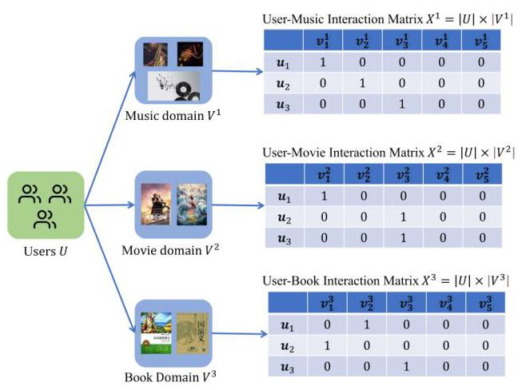
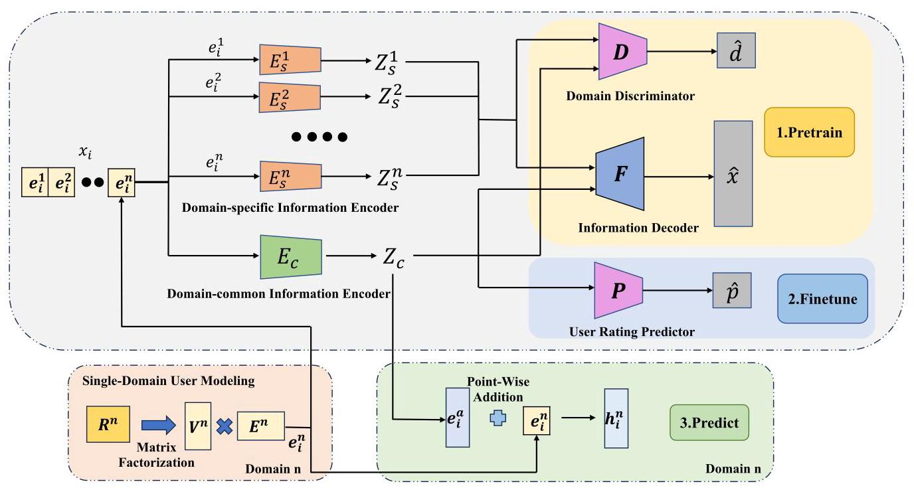

# IFCDR: A Cross-Domain Information Fusion-Based Architecture for Cross Domain Recommendation

Cheng Wang \( {}^{\circledR } \) , Jiaming Li \( {}^{\circledR } \) , Haozhao Wang \( {}^{\circledR } \) , Member, IEEE, Rui Zhang \( {}^{\circledR } \) , Senior Member, IEEE, and Ruixuan Li \( {}^{\circledR } \) , Member, IEEE

Abstract-In the era of diverse service scenarios, user behavior data is scattered and heterogeneous across multiple domains, posing challenges to single-domain recommendation algorithms to cope with data sparsity issues. Cross-domain recommendation (CDR) emerges as a solution to leverage complementary information from multiple domains. Nevertheless, many current CDR approaches struggle with the issue of negative transfer and exhibit suboptimal performance in multi-target recommendation scenarios. This paper introduces a novel method, Information Fusion-based Cross-Domain Recommendation (IFCDR), which employs information theory concepts like mutual information and entropy to model the multi-target cross-domain recommendation problem. IFCDR decouples domain-specific and domain-common information through a theoretically derived architecture, utilizing adversarial learning and autoencoders for efficient information separation and fusion. The method involves three stages: pre-training with reconstruction and adversarial losses to disentangle information, fine-tuning with rating prediction to align shared information with user preferences, and prediction with fused information for enhanced recommendation accuracy and robustness. Comprehensive evaluations conducted on the Amazon Review and Douban dataset reveal that IFCDR consistently outperforms leading SOTA methods, confirming its capability to enhance recommendation performance across multiple domains while mitigating negative transfer.

Index Terms-Cross-domain recommendation, user modeling, mutual information, autoencoder.

## I. INTRODUCTION

DATA sparsity has consistently posed a significant challenge in conventional recommendation systems that operate within a single domain. Owing to insufficient data, single-domain recommendation systems often face difficulties in effectively modeling user preferences, which constrains their performance enhancement. To address this limitation, cross-domain recommendation (CDR) has emerged as an effective strategy that exploits supplementary information from related domains to enhance recommendation quality in the target domain. Nevertheless, the majority of current CDR studies concentrate on scenarios involving either a single target domain or two target domains, involving only two domains, making it difficult to generalize to multi-target CDR (MTCDR) scenarios that involve multiple domains. Single-target CDR (STCDR) focuses on boosting recommendation accuracy within one specific domain, whereas dual-target CDR (DTCDR) aims to simultaneously enhance recommendation outcomes across both participating domains [1]. Furthermore, negative transfer where information from the source domain may be ineffective or even detrimental to recommendation accuracy in the target domain-poses an additional challenge for CDR, especially under source domain data sparsity. Consequently, MTCDR strives to enhance recommendation effectiveness across several domains at once, represents a broader and more complex challenge. Traditional methods that model pairwise relationships between domains become infeasible when extended to multi-target scenarios with \( n \) domains, as they require handling \( \left( \begin{array}{l} n \\  2 \end{array}\right) \) pairwise relationships, which becomes computationally prohibitive as the number of domains increases.

Current SOTA approaches typically construct a shared user embedding representation across domains and integrate it with features specific to each domain to boost recommendation effectiveness in multiple domains [2], [3], [4], [5]. For instance, HeroGRAPH [2] constructs a heterogeneous graph using multi-domain user interaction data and employs graph embedding techniques to learn cross-domain embeddings for users and items. These embeddings are then transferred to the target domain to enhance recommendation quality. Nonetheless, many recommendation systems rely on privacy-sensitive user information such as browsing history and check-in records, which are dispersed across various domains thus preventing the formation of large-scale heterogeneous graphs. Another approach, MPF [3] introduces a global user representation learning architecture by building a cross-domain shared embedding space to standardize user features. However, the cross-domain user representation derived from all available domain data may be significantly biased toward domains with abundant data, hindering the accurate capture of user preferences in data-sparse domains. When such biased global representations are transferred to the target domain, they may negatively impact recommendation performance. Similar data imbalance issues exist in HeroGRAPH. CAT-ART [4] generates a unified user representation by employing contrastive autoencoders on user embeddings that are individually pre-trained in each domain. Subsequently, an attention-driven representation transfer module (ART) is used to adapt em-beddings from auxiliary domains into the target domain, thereby improving recommendation performance in the target domain. UCLR [5] leverages pre-trained global user embeddings and a dual-stream collaborative autoencoder to generate more balanced user embeddings by combining personalized temperature-adjusted contrastive losses, while addressing embedding bias caused by data imbalance through low-rank adaptation (LoRA). However, existing methods that generate global user representations directly from domain data fail to decouple the information, resulting in representations that are merely a simple aggregation of domain-specific information. These representations fail to adequately capture both cross-domain shared knowledge and domain-specific details, resulting in an insufficient reduction of negative transfer and subpar recommendation performance.

---

Received 2 May 2025; revised 3 December 2025; accepted 15 January 2026. Date of publication 1 July 2026; date of current version 15 September 2026. This work was supported in part by the National Key Research and Development Program of China under Grant 2024YFC3307900, in part by the National Natural Science Foundation of China under Grant 62376103, Grant 62302184, Grant 62436003, and Grant 62206102, in part by the Major Science and Technology Project of Hubei Province under Grant 2025BAB011, Grant 2024BAA008, in part by Hubei Science and Technology Talent Service Project under Grant 2024DJC078, and in part by Ant Group through CCF-Ant Research Fund. Recommended for acceptance by X. He. (Cheng Wang and Jiaming Li contributed equally to this work.) (Corresponding author: Haozhao Wang.)

The authors are with the School of Computer Science and Technology, Huazhong University of Science and Technology, Wuhan 430074, China (e-mail: chengwang0618@qq.com; jiamingli2000@qq.com; hz_wang@hust.edu.cn; rayteam@yeah.net; rxli@hust.edu.cn).

Digital Object Identifier 10.1109/TKDE.2026.3708751

---

To overcome these challenges, this paper proposes a novel method called Information Fusion-based Cross-Domain Recommendation (IFCDR). In CDR scenarios, variations in data characteristics and user behavior patterns across domains can cause information confusion and negative transfer when directly fused. To address this issue, IFCDR incorporates information-theoretic concepts, including mutual information and entropy, to model the MTCDR problem. Through theoretical analysis, IFCDR derives a domain information disentanglement architecture that separates domain-common and domain-specific information. By deeply exploring these two types of information and employing a multi-stage optimization strategy, IFCDR extracts the most beneficial domain information to enhance recommendation performance across multiple domains collaboratively.

The bullet-point list of our main contributions are as follows:

- We introduce a novel information-theoretic framework for Multi-Target Cross-Domain Recommendation (MTCDR), utilizing mutual information and entropy to theoretically derive a lower bound for the learning objective.

- We propose IFCDR, a model that employs adversarial learning and variational autoencoders to effectively disentangle domain-common and domain-specific information, thereby mitigating negative transfer.

- Extensive experiments on the Amazon Review and Douban dataset demonstrate that IFCDR consistently outperforms state-of-the-art baselines across multiple metrics and domain combinations.

## II. RELATED WORK

STCDR: Feature Alignment and Transfer: STCDR methods generally include two categories: content-based approaches [6], [7], [8] and embedding-based techniques [9], [10], [11], [12]. In content-based methods, Kanagawa et al. [7] proposes a content-based cross-domain recommendation method for cold-start users without needing user- or item-overlap by treating recommendation as extreme multi-class classification to predict items for users, turning the problem into a domain adaptation setting where a source-domain trained classifier is adapted to the target domain using a neural network combining Domain Separation Network and a denoising autoencoder.

Within the category of embedding-based methods, EM-CDR [9] uses a multi-layer perceptron to capture nonlinear domain mappings and focuses on entities with sufficient data to ensure robustness. CDIE-C [11] improves item embedding learning through cross-domain collaborative clustering. It initially extracts and filters cross-domain clustering relationships, then integrates item and clustering embeddings into a unified space. By capturing sequential and correlation information, CDIE-C enhances cross-domain information transfer and effectively addresses data sparsity challenges.

DTCDR. Bidirectional Information Complementarity: DTCDR aims to simultaneously improve recommendation performance across two related domains by leveraging their complementary information. Early works primarily focused on mapping functions and attention mechanisms. For instance, CATN [13] utilizes attention to capture cross-domain correlations for cold-start users, while DDTCDR [14] employs latent orthogonal mapping to explore bidirectional user-item associations. Other approaches, such as GA-DTCDR [15], utilize graph embedding techniques to synthesize high-quality user and item representations.

Recent advancements have shifted towards more granular feature learning to address noise and robustness. ACDN [16] introduces aesthetic preferences as domain-independent auxiliary information. Furthermore, disentangled representation learning has emerged as a powerful solution. DGCDR [17] proposes a GNN-enhanced encoder-decoder framework with anchor-based supervision to preserve collaborative signals during feature separation. From a causal inference perspective, \( {\mathrm{C}}^{2}\mathrm{{CDR}} \) [18] utilizes causal graphs to identify and disentangle domain-shared and domain-specific preferences, ensuring that only relevant invariant information is transferred. While these methods demonstrate the efficacy of disentanglement in dual-domain settings, extending such mechanisms to multi-target scenarios requires handling significantly higher complexity in domain interactions.

MTCDR. Global Information Coordination: MTCDR extends cross-domain concepts to optimize performance across three or more domains. Early attempts [19], [20] utilized Recurrent Neural Networks (RNNs) or parameter sharing to capture sequential user patterns. Contemporary SOTA approaches predominantly focus on constructing shared global representations. HeroGRAPH [2] and GA-MTCDR [21] build heterogeneous graphs to derive generalizable user features, transferring them across domains via attention mechanisms. MPF [3] aggregates features from all domains to model shared preferences in video recommendations.

To address the limitations of simple aggregation, recent works have incorporated advanced learning paradigms. CAT-ART [4] employs contrastive autoencoders to generate global embed-dings, while UCLR [5] optimizes balanced user representations through personalized temperature-adjusted contrastive losses. Similarly, EDDA [22] tackles multi-domain recommendations by disentangling embeddings at both the model and embedding levels, utilizing random walks for domain alignment. However, despite these advances, most existing methods still struggle with data isolation constraints and negative transfer. They often lack a theoretical framework to rigorously uncouple shared knowledge from domain-specific noise, resulting in representations that are merely aggregations rather than truly disentangled features. To bridge this gap, our proposed IFCDR leverages information theory to explicitly decouple information, ensuring robust performance across diverse domains.

Fig. 1. MTCDR problem setup.

## III. PRELIMINARIES

## A. Problem Setup

As shown in Fig. 1, consider a recommendation system with multiple domains, such as a music domain (with item set \( {V}^{1} \) ), a movie domain (with item set \( {V}^{2} \) ), and a book domain (with item set \( {V}^{3} \) ). Each domain has its corresponding user set \( U \) . For each domain, there is a user-item interaction matrix whose dimensions are the total number of users by the size of the item set in that domain. Specifically, the user-music interaction matrix is \( {X}^{1} \in  {\mathbb{R}}^{\left| U\right|  \times  \left| {V}^{1}\right| } \) , the user-movie interaction matrix is \( {X}^{2} \in  {\mathbb{R}}^{\left| U\right|  \times  \left| {V}^{2}\right| } \) , and the user-book interaction matrix is \( {X}^{3} \in \; {\mathbb{R}}^{\left| U\right|  \times  \left| {V}^{3}\right| } \) . In this paper, we consider a general CDR scenario that multi-domain have a partially shared user set, but there is no item intersection [23]. The set of overlapping users among multi-domain is \( {U}^{\prime } \) .

However, a critical challenge in this multi-domain setting is the uneven distribution of data. While some mature domains may possess abundant interaction data, other domains—particularly new or specialized ones—often suffer from severe data sparsity. This imbalance leads to degraded recommendation quality and serious cold-start problems in the data-sparse domains. The primary objective of MTCDR is to alleviate this issue. It aims to enhance recommendation performance across all domains, especially the sparse ones, by leveraging the complete set of interaction matrices. The core idea is to uncover latent cross-domain relationships and enable knowledge transfer from data-rich domains to data-sparse ones.

## B. Information-Theoretic Background

Let \( \mathbf{a} = \left( {{a}_{1},{a}_{2},\ldots ,{a}_{p}}\right) \) and \( \mathbf{b} = \left( {{b}_{1},{b}_{2},\ldots ,{b}_{q}}\right) \) be random vectors of dimensions \( p \) and \( q \) , respectively. The Shannon differential entropy of \( \mathbf{a} \) is:

\[
H\left( \mathbf{a}\right)  =  - {\mathbb{E}}_{\mathbf{a}}\left\lbrack  {\ln {p}_{\mathbf{a}}\left( \mathbf{a}\right) }\right\rbrack  , \tag{1}
\]

which measures the uncertainty of \( \mathbf{a} \) .

By Bayes’ rule, the joint density of \( \mathbf{a} \) and \( \mathbf{b} \) factorizes as:

\[
{p}_{\mathbf{a},\mathbf{b}}\left( {\mathbf{a},\mathbf{b}}\right)  = {p}_{\mathbf{a}}\left( \mathbf{a}\right) {p}_{\mathbf{b} \mid  \mathbf{a}}\left( {\mathbf{b} \mid  \mathbf{a}}\right)  = {p}_{\mathbf{b}}\left( \mathbf{b}\right) {p}_{\mathbf{a} \mid  \mathbf{b}}\left( {\mathbf{a} \mid  \mathbf{b}}\right) , \tag{2}
\]

where the symbols carry their usual meanings.

The mutual information between \( \mathbf{a} \) and \( \mathbf{b} \) is defined by:

\[
I\left( {\mathbf{a};\mathbf{b}}\right)  = H\left( \mathbf{a}\right)  + H\left( \mathbf{b}\right)  - H\left( {\mathbf{a},\mathbf{b}}\right) , \tag{3}
\]

which equals the reduction in uncertainty about one vector given knowledge of the other. Equivalently,

\[
I\left( {\mathbf{a};\mathbf{b}}\right)  = H\left( \mathbf{a}\right)  - H\left( {\mathbf{a} \mid  \mathbf{b}}\right)  = H\left( \mathbf{b}\right)  - H\left( {\mathbf{b} \mid  \mathbf{a}}\right) . \tag{4}
\]

## IV. METHODOLOGY

## A. Overall Architecture

Fig. 2 illustrates the architecture of the proposed Information Fusion-based MTCDR (IFCDR) method. This method aims to enhance cross-domain recommendation performance by integrating information from different domains. The core components of the architecture include:

- Domain-common Information Encoder: This module extracts the underlying, shared characteristics that are independent of any specific domain, such as a user's fundamental interests. It is trained to produce representations that actively hide their domain origin from the discriminator, ensuring the information is truly universal.

- Domain-specific Information Encoder: This component focuses on capturing the unique patterns and preferences that are only relevant within a single domain. Its goal is to produce representations that are easily identifiable by the discriminator, thereby preserving the distinct signature of each domain.

- Information Decoder: This module ensures the disentanglement process is faithful to the original data. It takes both the shared and the specific information and attempts to rebuild the original user input, guaranteeing that no critical information is lost during the separation.

- Domain Discriminator: Functioning as the adversary in the system, this component is trained to determine which domain the latent information came from. It learns to recognize the specific information while being simultaneously challenged by the common encoder, driving the entire model to achieve a clean separation.

- User Rating Predictor: This component serves as a final check on the utility of the domain common knowledge. It uses only the domain-common information to forecast user ratings, ensuring that the extracted universal features are not just generic, but are also genuinely useful for the core recommendation task.

These components work collaboratively to achieve effective disentanglement and fusion of cross-domain information.

## B. Single-Domain Recommendation Modeling

We use a matrix factorization technique [24] along with Bayesian Personalized Ranking (BPR) optimization [25] to generate user and item embeddings within each separate domain.

Fig. 2. The architecture of IFCDR is as follows: First, in the pre-training stage, the Domain-common Information Encoder \( {E}_{c} \) and Domain-Specific Information Encoder \( {E}_{s} \) disentangle domain-common information \( {z}_{c} \) and domain-specific information \( {z}_{s} \) via reconstruction loss and adversarial loss. Next, in the fine-tuning stage, the User Rating Predictor \( P \) jointly optimizes \( {E}_{c} \) with rating data using cross-entropy loss. Finally, in the prediction stage, the fused embedding \( {h}_{i}^{n} = {e}_{i}^{n} + \alpha {e}_{i}^{a} \) is used to compute preference scores \( {r}_{ij}^{n} = {h}_{i}^{n} \cdot  {v}_{j}^{n} \) for accurate cross-domain recommendation.

Specifically, the user-item interaction matrix \( {X}^{n} \) for domain \( n \) is factorized into two learnable embedding matrices: an item embedding matrix \( {\mathbf{V}}^{n} \in  {\mathbb{R}}^{\left| {V}^{n}\right|  \times  k} \) and a user embedding matrix \( {\mathbf{E}}^{n} \in  {\mathbb{R}}^{\left| U\right|  \times  k} \) . Here, \( k \) denotes the dimensionality of the latent factors, which is shared across all domains for consistency.

Within domain \( n \) , given a user embedding \( {e}_{i}^{n} \in  {\mathbb{R}}^{k} \) (the \( i \) -th row of \( {\mathbf{E}}^{n} \) ) for user \( i \) and an item embedding \( {v}_{j}^{n} \in  {\mathbb{R}}^{k} \) (the \( j \) -th row of \( {\mathbf{V}}^{n} \) ) for item \( j \) , the predicted preference score is calculated using the dot product: \( {r}_{ij}^{n} = {e}_{i}^{n} \cdot  {v}_{j}^{n} \) .

The BPR loss for domain \( n \) is formulated as:

\[
{L}_{\mathrm{{BPR}}}^{n} =  - \mathop{\sum }\limits_{{i \in  U}}\mathop{\sum }\limits_{{j \in  {P}_{i}^{n}}}\mathop{\sum }\limits_{{l \notin  {P}_{i}^{n}}}\log \sigma \left( {{r}_{ij}^{n} - {r}_{il}^{n}}\right) , \tag{5}
\]

where \( {P}_{i}^{n} \) denotes the set of items that user \( i \) has interacted with in domain \( n \) , and \( \sigma \) is the sigmoid activation function.

Minimizing this loss function yields user representations that are specific to each domain. These embeddings serve as the foundation for our IFCDR framework. Instead of sharing raw user interaction data, which is often restricted by privacy concerns or data isolation policies, only the pre-trained user embeddings are utilized across domains. This approach facilitates knowledge transfer while respecting data boundaries and privacy.

## C. MTCDR Problem Modeling

From the single-domain modeling (Section IV-B), we have obtained pre-trained user embeddings \( {\mathbf{E}}^{n} \) and item embeddings \( {\mathbf{V}}^{n} \) . The core objective of our model is to enhance the user representation \( {e}_{i}^{n} \) in a target domain \( n \) (particularly data-sparse domains) by transferring knowledge from the same user's representations in other domains.

To achieve this transfer while mitigating negative transfer, our strategy is to learn a disentangled representation from these pre-trained user embeddings. This strategy involves converting the user embedding from multiple domains into the hidden space \( z \) , and then decomposing it into the following two distinct components:

- \( {z}_{c} \) : Domain-common information, capturing transferable, domain-invariant characteristics.

- \( {z}_{s} \) : Domain-specific information, capturing untransferable characteristics unique to a domain.

To train this disentanglement architecture, we construct a training set \( \mathcal{D} \) from the \( M \) total interactions of the overlapping user set \( {U}^{\prime } \) . The set is defined as \( \mathcal{D} = {\left\{  \left( {x}_{m},{y}_{m},{d}_{m}\right) \right\}  }_{m = 1}^{M} \) , where each sample \( m \) corresponds to an interaction \( \left( {i, j, n,{r}_{ij}^{n}}\right) \) :

- \( {x}_{m} \) : The input feature for the \( m \) -th sample. This represents the full cross-domain profile of the user \( i \) involved in the interaction. It is defined as the collection of all pre-trained embeddings for overlapped user \( i : {x}_{m} = \left\{  {{e}_{i}^{1},{e}_{i}^{2},\ldots ,{e}_{i}^{N}}\right\} \) .

- \( {y}_{m} \) : The target label for an auxiliary prediction task, defined as the scalar rating \( {r}_{ij}^{n} \) .

- \( {d}_{m} \) : The domain label for the \( m \) -th sample, defined as the one-hot form of domain index.

We assume the domain-specific information \( {z}_{s} \) and common information \( {z}_{c} \) are semantically orthogonal attributes. Given the input \( {x}_{m} \) , they are conditionally independent, as shown in (6):

\[
p\left( {{z}_{s},{z}_{c} \mid  {x}_{m}}\right)  = p\left( {{z}_{s} \mid  {x}_{m}}\right)  \cdot  p\left( {{z}_{c} \mid  {x}_{m}}\right) . \tag{6}
\]

We note that the target rating \( {y}_{m} \) (i.e., \( {r}_{ij}^{n} \) ) is fundamentally a function of both the user embedding \( {x}_{m} \) and the item embedding \( {v}_{j}^{n} \) . However, the objective \( I\left( {y;{z}_{c}}\right) \left( 8\right) \) and the User Rating Predictor \( P\left( {17}\right) \) are formulated as an auxiliary task \( P\left( {z}_{c}\right)  \rightarrow  {y}_{m} \) . This simplification’s role is not to perform the final recommendation, but to ensure that the common information \( {z}_{c} \) retains utility for the downstream rating task. In this formulation, the item-specific component \( {v}_{j}^{n} \) is treated as an implicit variable, and the predictor \( P \) maps \( {z}_{c} \) to the observed rating \( {y}_{m} \) . The item embedding \( {v}_{j}^{n} \) is explicitly reintroduced in the final prediction stage (Section IV-F3).

Domain-common information should not contain domain-specific characteristics and should generalize across domains. Domain-specific information, on the other hand, should allow identification of the domain to which it belongs.

Theorem 1: The joint distribution \( p\left( {x, y, d,{z}_{s},{z}_{c}}\right) \) can be decomposed as defined in (7):

\[
p\left( {x, y, d,{z}_{s},{z}_{c}}\right)  = p\left( x\right) p\left( d\right) p\left( {{z}_{s} \mid  x}\right) p\left( {{z}_{c} \mid  x}\right) p\left( {y \mid  {z}_{c}}\right) , \tag{7}
\]

where \( p\left( x\right) \) represents the data distribution, \( p\left( d\right) \) represents the domain label distribution, \( p\left( {y \mid  {z}_{c}}\right) \) represents the conditional distribution for predicting the target label \( y \) (e.g., user ratings) based on shared information \( {z}_{c}, p\left( {{z}_{s} \mid  x}\right) \) represents the conditional distribution for extracting domain-specific information \( {z}_{s} \) from data \( x \) , and \( p\left( {{z}_{c} \mid  x}\right) \) represents the conditional distribution for extracting domain-common information \( {z}_{c} \) from data \( x \) .

Based on the decomposition in Theorem 1, we formulate the objective function for IFCDR. Our goal is to extract beneficial domain knowledge by optimizing three information-theoretic properties: preserving input information, ensuring predictive accuracy of shared features, and disentangling domain-specific traits. The objective is defined as:

\[
\mathcal{L}\left( {{\theta }_{c},{\theta }_{s},{\theta }_{p},\phi ,\psi ;x, y, d}\right)  = {\lambda }_{r}I\left( {x;z}\right)  + {\lambda }_{p}I\left( {y;{z}_{c}}\right)
\]

\[
+ {\lambda }_{d}\left\lbrack  {I\left( {d;{z}_{s}}\right)  - I\left( {d;{z}_{c}}\right) }\right\rbrack  , \tag{8}
\]

where \( {\lambda }_{r},{\lambda }_{p},{\lambda }_{d} \) are hyperparameters weighting information preservation, rating prediction, and domain disentanglement, respectively.

While direct optimization of mutual information is often intractable due to the complexity of the true posterior distributions, we can derive a tractable surrogate objective by maximizing the variational lower bound. This connects theoretical information maximization to practical neural network loss functions.

## D. Methodological Analysis and Variational Bounds

To render (8) computable, we derive its lower bound. This derivation clarifies how maximizing mutual information translates to minimizing specific reconstruction and classification losses in our architecture.

Theorem 2: The variational lower bound of the objective function \( \mathcal{L}\left( \cdot \right) \) is given by:

\[
\mathcal{L}\left( \cdot \right)  \geq  {\lambda }_{r}\left( {{\mathbb{E}}_{p\left( {x, z}\right) }\left\lbrack  {\ln q\left( {x \mid  z;\phi }\right) }\right\rbrack   + H\left( x\right) }\right)
\]

\[
+ {\lambda }_{p}\left( {{\mathbb{E}}_{p\left( {y,{z}_{c}}\right) }\left\lbrack  {\ln q\left( {y \mid  {z}_{c};{\theta }_{p}}\right) }\right\rbrack   + H\left( y\right) }\right)
\]

\[
+ {\lambda }_{d}\left( {{\mathbb{E}}_{p\left( {d,{z}_{s}}\right) }\left\lbrack  {\ln q\left( {d \mid  {z}_{s};\psi }\right) }\right\rbrack   - {\mathbb{E}}_{p\left( {d,{z}_{c}}\right) }\left\lbrack  {\ln q\left( {d \mid  {z}_{c};\psi }\right) }\right\rbrack  }\right) ,
\]

(9)

where \( q\left( {\cdot  \mid   \cdot  }\right) \) denotes the variational approximation distributions parameterized by the neural network components.

Proof: Consider the mutual information \( I\left( {\mathbf{a};\mathbf{b}}\right) \) between any two random vectors \( \mathbf{a} \) and \( \mathbf{b} \) , as defined in (4). By definition,

\( I\left( {\mathbf{a};\mathbf{b}}\right)  = {\mathbb{E}}_{p\left( {\mathbf{a},\mathbf{b}}\right) }\left\lbrack  {\ln \frac{p\left( {\mathbf{a} \mid  \mathbf{b}}\right) }{p\left( \mathbf{a}\right) }}\right\rbrack \) . To address the intractability of the true posterior \( p\left( {\mathbf{a} \mid  \mathbf{b}}\right) \) , we introduce a variational distribution \( q\left( {\mathbf{a} \mid  \mathbf{b}}\right) \) to approximate it. The mutual information can be rewritten as:

\[
I\left( {\mathbf{a};\mathbf{b}}\right)  = {\mathbb{E}}_{p\left( {\mathbf{a},\mathbf{b}}\right) }\left\lbrack  {\ln q\left( {\mathbf{a} \mid  \mathbf{b}}\right) }\right\rbrack   - {\mathbb{E}}_{p\left( \mathbf{a}\right) }\left\lbrack  {\ln p\left( \mathbf{a}\right) }\right\rbrack
\]

\[
+ {\mathbb{E}}_{p\left( \mathbf{b}\right) }\left\lbrack  {{D}_{\mathrm{{KL}}}\left( {p\left( {\mathbf{a} \mid  \mathbf{b}}\right) \parallel q\left( {\mathbf{a} \mid  \mathbf{b}}\right) }\right) }\right\rbrack  . \tag{10}
\]

Since the Kullback-Leibler divergence is non-negative \( \left( {{D}_{\mathrm{{KL}}} \geq  }\right. \) 0) and the entropy \( H\left( \mathbf{a}\right)  =  - {\mathbb{E}}_{p\left( \mathbf{a}\right) }\left\lbrack  {\ln p\left( \mathbf{a}\right) }\right\rbrack \) , we obtain the standard variational lower bound:

\[
I\left( {\mathbf{a};\mathbf{b}}\right)  \geq  {\mathbb{E}}_{p\left( {\mathbf{a},\mathbf{b}}\right) }\left\lbrack  {\ln q\left( {\mathbf{a} \mid  \mathbf{b}}\right) }\right\rbrack   + H\left( \mathbf{a}\right) . \tag{11}
\]

We apply this bound to each term in (8):

First, for the Information Preservation term \( I\left( {x;z}\right) \) , we define \( q\left( {x \mid  z;\phi }\right) \) as the decoder distribution. Applying (11) yields:

\[
I\left( {x;z}\right)  \geq  {\mathbb{E}}_{p\left( {x, z}\right) }\left\lbrack  {\ln q\left( {x \mid  z;\phi }\right) }\right\rbrack   + H\left( x\right) . \tag{12}
\]

In our implementation, maximizing \( \ln q\left( {x \mid  z;\phi }\right) \) is equivalent to minimizing the L1 reconstruction loss, assuming a Laplacian distribution for the decoder output.

Second, for the Accurate Prediction term \( I\left( {y;{z}_{c}}\right) \) , we employ the rating predictor \( q\left( {y \mid  {z}_{c};{\theta }_{p}}\right) \) :

\[
I\left( {y;{z}_{c}}\right)  \geq  {\mathbb{E}}_{p\left( {y,{z}_{c}}\right) }\left\lbrack  {\ln q\left( {y \mid  {z}_{c};{\theta }_{p}}\right) }\right\rbrack   + H\left( y\right) . \tag{13}
\]

Maximizing this term corresponds to minimizing the cross-entropy loss (or regression error) between the predicted and ground-truth ratings.

Finally, for the Domain Disentanglement terms \( I\left( {d;{z}_{s}}\right) \) and \( I\left( {d;{z}_{c}}\right) \) , we use the discriminator \( q\left( {d \mid  z;\psi }\right) \) :

\[
I\left( {d;{z}_{s}}\right)  \geq  {\mathbb{E}}_{p\left( {d,{z}_{s}}\right) }\left\lbrack  {\ln q\left( {d \mid  {z}_{s};\psi }\right) }\right\rbrack   + H\left( d\right) . \tag{14}
\]

Maximizing this expectation is operationally equivalent to minimizing the categorical cross-entropy loss of the domain discriminator, thereby forcing \( {z}_{s} \) to carry domain-identifiable information. Conversely, minimizing \( I\left( {d;{z}_{c}}\right) \) involves adversarial training to maximize the entropy of the discriminator's output given \( {z}_{c} \) .

Summing these components and grouping the constant entropy terms (which do not affect gradient optimization) yields the final lower bound in (9).

This derivation establishes a direct theoretical link between our information-theoretic objectives and the implemented loss functions. The constant entropy terms \( H\left( x\right) , H\left( y\right) , H\left( d\right) \) depend solely on the dataset distribution and are omitted during the parameter update phase.

Since the input \( x \) , domain label \( d \) , and target \( y \) are sampled from a fixed training set, their entropies \( H\left( x\right) , H\left( d\right) \) , and \( H\left( y\right) \) are constants with respect to the model parameters. To optimize the objective in (8), we instead maximize its lower bound (from (9)). As the constant entropy terms can be omitted during gradient-based optimization, we define our practical objective function by taking only the parameter-dependent terms from the lower bound, as shown in (15):

\[
\mathcal{L}\left( \cdot \right)  = {\lambda }_{r}\mathbb{E}\left\lbrack  {\ln q\left( {x \mid  z;\phi }\right) }\right\rbrack   + {\lambda }_{p}\mathbb{E}\left\lbrack  {\ln q\left( {y \mid  {z}_{c};{\theta }_{p}}\right) }\right\rbrack
\]

\[
+ {\lambda }_{d}\left( {\mathbb{E}\left\lbrack  {\ln q\left( {d \mid  {z}_{s};\psi }\right) }\right\rbrack   - \mathbb{E}\left\lbrack  {\ln q\left( {d \mid  {z}_{c};\psi }\right) }\right\rbrack  }\right) . \tag{15}
\]

To implement the objective function \( \mathcal{L}\left( \cdot \right) \) in (15), we instantiate the required terms using a set of parameterized neural network components. Specifically, we define: a domain-common information encoder \( {E}_{c}\left( {x;{\theta }_{c}}\right) \) and a domain-specific information encoder \( {E}_{s}\left( {x;{\theta }_{s}}\right) \) to map user data \( x \) to latent information \( {z}_{c} \) and \( {z}_{s} \) , respectively; an information decoder \( F\left( {{z}_{c},{z}_{s};\phi }\right) \) to reconstruct \( x \) ; a domain discriminator \( D\left( {z;\psi }\right) \) to predict domain labels \( d \) ; and a user rating predictor \( P\left( {{z}_{c};{\theta }_{p}}\right) \) to predict ratings \( y \) . Drawing inspiration from variational au-toencoders (VAEs) [26], [27], we model the data distributions \( p\left( d\right) , p\left( x\right) \) , and \( p\left( y\right) \) as empirical distributions from the finite training set (e.g., \( p\left( d\right)  = \frac{1}{N}\mathop{\sum }\limits_{{i = 1}}^{N}\delta \left( {d - {d}_{i}}\right) \) ). We further define the encoding distributions as deterministic functions: \( p\left( {{z}_{c} \mid  x}\right)  = \delta \left( {{z}_{c} - {E}_{c}\left( {x;{\theta }_{c}}\right) }\right) \) and \( p\left( {{z}_{s} \mid  x}\right)  = \delta \left( {{z}_{s} - }\right. \; \left. {{E}_{s}\left( {x;{\theta }_{s}}\right) }\right) \) . Consequently, the variational distributions \( q\left( {y \mid  {z}_{c}}\right) \) , \( q\left( {d \mid  z}\right) \) , and \( q\left( {x \mid  z;\phi }\right) \) required by our objective are implemented by these components, as formally defined in (16), (17), and (18):

\[
q\left( {y \mid  {z}_{c}}\right)  = \operatorname{SoftMax}\left( {P\left( {{z}_{c};{\theta }_{p}}\right) }\right) \tag{16}
\]

\[
q\left( {d \mid  z}\right)  = \operatorname{SoftMax}\left( {D\left( {z;\psi }\right) }\right) \tag{17}
\]

\[
q\left( {x \mid  z;\phi }\right)  \propto  \exp \left( {\parallel x - F\left( {z;\phi }\right) {\parallel }_{1}}\right) , \tag{18}
\]

where \( \operatorname{SoftMax}\left( \cdot \right) \) denotes the softmax normalization function, and \( \parallel  \cdot  {\parallel }_{1} \) represents the L1 norm. The parameters for these components are defined as follows:

- \( {\theta }_{c} \) : Parameters of the domain-common information encoder \( {E}_{c}\left( {x;{\theta }_{c}}\right) \) , which maps user data \( x \) to the domain-common information \( {z}_{c} \) .

- \( {\theta }_{s} \) : Parameters of the domain-specific information encoder \( {E}_{s}\left( {x;{\theta }_{s}}\right) \) , which maps user data \( x \) to the domain-specific information \( {z}_{s} \) .

- \( {\theta }_{p} \) : Parameters of the user rating predictor \( P\left( {{z}_{c};{\theta }_{p}}\right) \) , which maps the domain-common information \( {z}_{c} \) to rating predictions \( y \) .

- \( \phi \) : Parameters of the information decoder \( F\left( {{z}_{c},{z}_{s};\phi }\right) \) , which reconstructs the original data \( x \) from \( {z}_{c} \) and \( {z}_{s} \) .

- \( \psi \) : Parameters of the domain discriminator \( D\left( {z;\psi }\right) \) , which maps latent features \( \left( {z}_{c}\right. \) or \( \left. {z}_{s}\right) \) to domain label predictions \( d \) .

In summary, the MTCDR optimization task is formulated as a minimax optimization problem, which is implemented through adversarial training. As defined in Section IV-E, this process involves optimizing all model parameters \( \left( {{\theta }_{c},{\theta }_{s},{\theta }_{p}}\right) \) and \( \left( {\phi ,\psi }\right) \) by minimizing their respective loss functions \( \left( {{\mathcal{L}}_{c},{\mathcal{L}}_{s},{\mathcal{L}}_{P},{\mathcal{L}}_{F},{\mathcal{L}}_{D}}\right) \) . This optimization is performed in an alternating manner using an optimizer.

## E. Model Optimization

1) Domain-Common Information Encoder: The domain-common information encoder \( {E}_{c} \) extracts domain-common information \( {z}_{c} \) , minimizing domain-specific information to ensure insensitivity to domain-specific features and enhance generalization across domains. The optimization function for \( {E}_{c} \) is shown in (19):

\[
{\theta }_{c}^{ * } = \arg \mathop{\min }\limits_{{\theta }_{c}}{\mathcal{L}}_{c}
\]

\[
= {\lambda }_{r}\frac{1}{M}\mathop{\sum }\limits_{{m = 1}}^{M}\mathop{\sum }\limits_{{n = 1}}^{N}{\begin{Vmatrix}{e}_{{i}_{m}}^{n} - F\left( {E}_{s}^{n}\left( {e}_{{i}_{m}}^{n}\right) ,{E}_{c}\left( {x}_{m}\right) \right) \end{Vmatrix}}_{1}
\]

\[
- {\lambda }_{p}\frac{1}{M}\mathop{\sum }\limits_{{m = 1}}^{M}{y}_{m}\ln P\left( {{E}_{c}\left( {x}_{m}\right) }\right)
\]

\[
+ {\lambda }_{d}\frac{1}{M}\mathop{\sum }\limits_{{m = 1}}^{M}{d}_{m}\ln D\left( {{E}_{c}\left( {x}_{m}\right) }\right) , \tag{19}
\]

where \( {\theta }_{c}^{ * } \) represents the parameters of \( {E}_{c},{e}_{{i}_{m}}^{n} \) is the embedding feature of the user \( {i}_{m} \) in domain \( n \) for sample \( m,{x}_{m} \) is the input collection of embeddings, \( {y}_{m} \) is the true rating label (e.g., in one-hot form), \( {d}_{m} \) is the domain label (e.g., in one-hot form), \( F \) is the information decoder, \( {E}_{s}^{n} \) is the domain-specific information encoder for domain \( n, P \) is the rating predictor, \( D \) is the domain discriminator, \( {\lambda }_{r},{\lambda }_{p},{\lambda }_{d} \) are the weight coefficients, \( M \) is the number of samples, and \( N \) is the number of domains. The objective \( {\mathcal{L}}_{c} \) combines reconstruction error (L1 norm), rating prediction cross-entropy loss, and adversarial domain discrimination loss(note the positive sign, as \( {E}_{c} \) maximizes \( D \) ’s error).

2) Domain-Specific Information Encoder: The domain-specific information encoder \( {E}_{s}^{n} \) extracts domain-specific information \( {z}_{s}^{n} \) for domain \( n \) , ensuring sufficient domain discrimination capability. The optimization function for \( {E}_{s}^{n} \) is shown in (20):

\[
{\theta }_{s}^{n, * } = \arg \mathop{\min }\limits_{{\theta }_{s}}{\mathcal{L}}_{s}
\]

\[
= {\lambda }_{r}\frac{1}{M}\mathop{\sum }\limits_{{m = 1}}^{M}{\begin{Vmatrix}{e}_{{i}_{m}}^{n} - F\left( {E}_{s}^{n}\left( {e}_{{i}_{m}}^{n}\right) ,{E}_{c}\left( {x}_{m}\right) \right) \end{Vmatrix}}_{1}
\]

\[
- {\lambda }_{d}\frac{1}{M}\mathop{\sum }\limits_{{m = 1}}^{M}{d}_{m}\ln D\left( {{E}_{s}^{n}\left( {e}_{{i}_{m}}^{n}\right) }\right) , \tag{20}
\]

where \( {\theta }_{s}^{n, * } \) represents the parameters of \( {E}_{s}^{n},{\mathcal{L}}_{s} \) combines reconstruction loss (controlled by \( {\lambda }_{r} \) ) and domain discrimination loss (controlled by \( {\lambda }_{d} \) ), \( {e}_{{i}_{m}}^{n} \) is the embedding representation, \( F \) is the information decoder, \( {E}_{c} \) is the domain-common information encoder, \( D \) is the domain discriminator, and \( M \) is the number of samples.

3) Information Decoder: The information decoder \( F \) reconstructs the original input \( x \) from \( {z}_{c} \) and \( {z}_{s} \) , guiding encoder optimization through reconstruction error. The optimization function for \( F \) is shown in (21):

\[
{\phi }^{ * } = \arg \mathop{\min }\limits_{\phi }{\mathcal{L}}_{F}
\]

\[
= {\lambda }_{r}\frac{1}{M}\mathop{\sum }\limits_{{m = 1}}^{M}\mathop{\sum }\limits_{{n = 1}}^{N}{\begin{Vmatrix}{e}_{{i}_{m}}^{n} - F\left( {E}_{s}^{n}\left( {e}_{{i}_{m}}^{n}\right) ,{E}_{c}\left( {x}_{m}\right) \right) \end{Vmatrix}}_{1}, \tag{21}
\]

where \( {\phi }^{ * } \) represents the parameters of \( F \) , optimized by minimizing the weighted cross-domain reconstruction loss \( {\mathcal{L}}_{F} \) , calculated using the L1 norm between \( {e}_{{i}_{m}}^{n} \) and the output of \( F \) .

4) Domain Discriminator: The domain discriminator \( D \) identifies domain-specific information, ensuring \( {E}_{s} \) can be correctly classified while \( {E}_{c} \) confuses \( D \) . The optimization function for \( D \) is shown in (22):

\[
{\psi }^{ * } = \arg \mathop{\min }\limits_{\psi }{\mathcal{L}}_{D}
\]

\[
=  - {\lambda }_{d}\frac{1}{M}\mathop{\sum }\limits_{{m = 1}}^{M}\mathop{\sum }\limits_{{n = 1}}^{N}{d}_{m}\left( {\ln D\left( {{E}_{s}^{n}\left( {e}_{{i}_{m}}^{n}\right) }\right)  - \ln D\left( {{E}_{c}\left( {x}_{m}\right) }\right) }\right) ,
\]

(22)

where \( {\psi }^{ * } \) represents the parameters of \( D \) .

5) User Rating Predictor: The user rating predictor \( P \) ensures \( {z}_{c} \) captures domain-common information with cross-domain discrimination capability. The optimization function for \( P \) is shown in (23):

\[
{\theta }_{p}^{ * } = \arg \mathop{\min }\limits_{{\theta }_{p}}{\mathcal{L}}_{P} =  - {\lambda }_{p}\frac{1}{M}\mathop{\sum }\limits_{{m = 1}}^{M}{y}_{m}\ln P\left( {{E}_{c}\left( {x}_{m}\right) }\right) , \tag{23}
\]

where \( {\theta }_{p}^{ * } \) represents the parameters of \( P, M \) is the number of samples, \( {y}_{m} \) is the rating of the \( m \) -th sample, \( {E}_{c}\left( {x}_{m}\right) \) is the domain-common information, and \( P \) is the rating predictor.

## F. Method Workflow

1) Pre-Training Stage:. Cross-Domain Information Disentanglement and Adversarial Learning: The pre-training stage aims to disentangle domain-common information \( {z}_{c} \) and domain-specific information \( {z}_{s} \) , using adversarial training to ensure effective separation. \( {E}_{c} \) extracts domain-common information (e.g., common purchase habits), while \( {E}_{s} \) captures domain-specific information (e.g., domain specific purchase habits). The information decoder \( F \) reconstructs the original input \( x \) , ensuring information integrity through reconstruction loss (L1 norm), as shown in (24):

\[
{\mathcal{L}}_{\text{ recon }} = {\lambda }_{r}\frac{1}{M}\mathop{\sum }\limits_{{m = 1}}^{M}\mathop{\sum }\limits_{{n = 1}}^{N}{\begin{Vmatrix}{e}_{{i}_{m}}^{n} - F\left( {E}_{s}^{n}\left( {e}_{{i}_{m}}^{n}\right) ,{E}_{c}\left( {x}_{m}\right) \right) \end{Vmatrix}}_{1},
\]

(24)

where \( {\lambda }_{r} \) is the weight coefficient, \( {e}_{{i}_{m}}^{n} \) is the original input embedding, and \( F\left( \cdot \right) \) is the reconstructed data.

The domain discriminator \( D \) adversarially disentangles \( {z}_{c} \) and \( {z}_{s}.{E}_{s} \) maximizes \( D \) ’s classification capability (maximizing \( I\left( {d;{z}_{s}}\right) \) ), while \( {E}_{c} \) confuses \( D \) (minimizing \( I\left( {d;{z}_{c}}\right) \) ). The adversarial loss for the discriminator \( D \) is shown in (25):

\[
{\mathcal{L}}_{\text{ adv }} =  - {\lambda }_{d}\frac{1}{M}\mathop{\sum }\limits_{{m = 1}}^{M}\mathop{\sum }\limits_{{n = 1}}^{N}{d}_{m}\left( {\ln D\left( {{E}_{s}^{n}\left( {e}_{{i}_{m}}^{n}\right) }\right)  - \ln D\left( {{E}_{c}\left( {x}_{m}\right) }\right) }\right) ,
\]

(25)

2) Fine-Tuning Stage. Joint Optimization of Domain-Common Information and Rating Prediction: In the fine-tuning stage, the user rating predictor \( P \) refines \( {z}_{c} \) extraction using rating data. \( P \) predicts user ratings based on \( {z}_{c} \) , constrained by cross-entropy loss, as shown in (26):

\[
{\mathcal{L}}_{\text{ pred }} =  - {\lambda }_{p}\frac{1}{M}\mathop{\sum }\limits_{{m = 1}}^{M}{y}_{m}\ln P\left( {{E}_{c}\left( {x}_{m}\right) }\right) , \tag{26}
\]

TABLE I STATISTICS OF DATASETS

<table><tr><td>Task</td><td>Domain</td><td>#Users</td><td>#Items</td></tr><tr><td colspan="4">Amazon Dataset</td></tr><tr><td rowspan="3">Task 1</td><td>Movies</td><td>123,960</td><td>50,052</td></tr><tr><td>Music</td><td>75,258</td><td>64,443</td></tr><tr><td>Books</td><td>603,668</td><td>367,982</td></tr><tr><td rowspan="3">Task 2</td><td>Home & Kitchen</td><td>66,519</td><td>28,237</td></tr><tr><td>Health & Personal</td><td>38,609</td><td>18,534</td></tr><tr><td>Electronics</td><td>192,403</td><td>63,001</td></tr><tr><td colspan="4">Douban Dataset</td></tr><tr><td rowspan="3">Task 3</td><td>Books</td><td>2,110</td><td>6,777</td></tr><tr><td>Music</td><td>1,672</td><td>5,567</td></tr><tr><td>Movies</td><td>2,712</td><td>34,893</td></tr></table>

where \( M \) is the number of samples, \( {y}_{m} \) is the user rating, and \( {E}_{c}\left( {x}_{m}\right) \) is the domain-common information.

3) Prediction Stage. Cross-Domain Information Fusion and Precise Recommendation: In the prediction stage, \( {z}_{c} \) is fused to generate the final user embedding for precise recommendations. For user \( i \) in domain \( n \) , the embedding is shown in (27):

\[
{h}_{i}^{n} = {e}_{i}^{n} + \alpha  \cdot  {e}_{i}^{a}, \tag{27}
\]

where \( {e}_{i}^{n} \) is the user embedding from single-domain modeling, \( {e}_{i}^{a} \) is the domain-common information adaptation vector, and \( \alpha \) is the weight coefficient. The user’s preference score is calculated as \( {r}_{ij}^{n} = {h}_{i}^{n} \cdot  {v}_{j}^{n} \) , where \( {v}_{j}^{n} \) is the item embedding from the target domain. This fusion leverages complementary cross-domain knowledge, especially in cold-start scenarios with sparse data, enhancing recommendation accuracy and robustness.

## V. EXPERIMENTS

## A. Datasets

To comprehensively evaluate the effectiveness and generalizability of the proposed IFCDR model, we conducted experiments on two distinct benchmark datasets: the Amazon Review dataset and the Douban dataset.

Amazon Review Dataset: As a standard benchmark for cross-domain recommendation, we utilized the Amazon 5-cores subset. In this subset, all users and items retain at least five interaction records. This filtering criterion effectively mitigates data sparsity issues, allowing the model to learn reliable user preference patterns while reducing the impact of long-tail effects.

Douban Dataset: To verify the model's adaptability in a social media context, we incorporated the Douban dataset. It comprises user ratings from a popular Chinese social platform, capturing user interests across cultural and entertainment domains.

Based on these datasets, we constructed three MTCDR tasks to assess performance across different scenarios. The statistical details of these tasks are summarized in Table I.

- Task 1 (Amazon): This task involves data from three domains: Movies & TV, CDs & Vinyl, and Books. These domains are centered on entertainment consumption, exhibiting strong correlations in user preferences.

TABLE II

PERFORMANCE COMPARISON ON AMAZON DATASET (BOOKS, MOVIES, MUSIC)

<table><tr><td>Domain</td><td>Metric</td><td>SMF</td><td>NeuMF</td><td>CMF</td><td>MPF</td><td>GA-MTCDR</td><td>CAT-ART</td><td>UCLR</td><td>LLM4CDR</td><td>IFCDR (Ours)</td></tr><tr><td rowspan="5">Movies</td><td>HR@5</td><td>0.6102</td><td>0.5424</td><td>0.4215</td><td>0.6055</td><td>0.5638</td><td>0.6158</td><td>0.5982</td><td>0.6083</td><td>0.6245</td></tr><tr><td>HR@10</td><td>0.7523</td><td>0.6892</td><td>0.5610</td><td>0.7444</td><td>0.6983</td><td>0.7565</td><td>0.7397</td><td>0.7481</td><td>0.7640</td></tr><tr><td>NDCG@10</td><td>0.4959</td><td>0.4393</td><td>0.3289</td><td>0.4921</td><td>0.4350</td><td>0.5055</td><td>0.4831</td><td>0.4950</td><td>0.5107</td></tr><tr><td>MRR@10</td><td>0.4159</td><td>0.3617</td><td>0.2576</td><td>0.4133</td><td>0.3533</td><td>0.4271</td><td>0.4031</td><td>0.4186</td><td>0.4316</td></tr><tr><td>AUC</td><td>0.8354</td><td>0.8012</td><td>0.7426</td><td>0.8316</td><td>0.8155</td><td>0.8420</td><td>0.8385</td><td>0.8403</td><td>0.8512</td></tr><tr><td rowspan="5">Music</td><td>HR@5</td><td>0.6211</td><td>0.5307</td><td>0.3348</td><td>0.6104</td><td>0.5429</td><td>0.6235</td><td>0.5954</td><td>0.6152</td><td>0.6305</td></tr><tr><td>HR@10</td><td>0.7594</td><td>0.6713</td><td>0.4428</td><td>0.7487</td><td>0.6762</td><td>0.7574</td><td>0.7354</td><td>0.7495</td><td>0.7630</td></tr><tr><td>NDCG@10</td><td>0.5196</td><td>0.4437</td><td>0.2573</td><td>0.5104</td><td>0.4311</td><td>0.5206</td><td>0.4866</td><td>0.5126</td><td>0.5218</td></tr><tr><td>MRR@10</td><td>0.4446</td><td>0.3729</td><td>0.2007</td><td>0.4361</td><td>0.3547</td><td>0.4466</td><td>0.4092</td><td>0.4387</td><td>0.4466</td></tr><tr><td>AUC</td><td>0.8412</td><td>0.7955</td><td>0.7102</td><td>0.8386</td><td>0.8029</td><td>0.8450</td><td>0.8327</td><td>0.8399</td><td>0.8561</td></tr><tr><td rowspan="5">Books</td><td>HR@5</td><td>0.6155</td><td>0.5483</td><td>0.5518</td><td>0.6123</td><td>0.5399</td><td>0.6191</td><td>0.6084</td><td>0.6144</td><td>0.6326</td></tr><tr><td>HR@10</td><td>0.7593</td><td>0.6900</td><td>0.6961</td><td>0.7591</td><td>0.6750</td><td>0.7611</td><td>0.7537</td><td>0.7583</td><td>0.7731</td></tr><tr><td>NDCG@10</td><td>0.5451</td><td>0.4853</td><td>0.4775</td><td>0.5436</td><td>0.4550</td><td>0.5471</td><td>0.5291</td><td>0.5396</td><td>0.5580</td></tr><tr><td>MRR@10</td><td>0.4778</td><td>0.4212</td><td>0.4092</td><td>0.4759</td><td>0.3861</td><td>0.4797</td><td>0.4587</td><td>0.4718</td><td>0.4902</td></tr><tr><td>AUC</td><td>0.8528</td><td>0.8154</td><td>0.8183</td><td>0.8508</td><td>0.8086</td><td>0.8588</td><td>0.8496</td><td>0.8547</td><td>0.8657</td></tr></table>

- Task 2 (Amazon): This task includes data from Home & Kitchen, Health & Personal Care, and Electronics. These domains pertain to household goods and daily necessities, reflecting functional purchasing behaviors.

- Task 3 (Douban): This task comprises data from Book, Music, and Movie domains. Unlike the e-commerce focus of Amazon, this task highlights users' cultural interests and social interactions within a community platform.

## B. Baseline Methods

In order to assess the performance of our proposed method IFCDR, we performed a series of comparative experiments with various baseline techniques, encompassing single-domain models (SMF, NeuMF) and cross-domain models (CMF, MPF, GA-MTCDR, CAT-ART, UCLR). An overview of these methods is outlined below:

- SMF [25]: This method applies separate matrix factorization to the user-item interaction matrix in each domain, optimized using the BPR loss function.

- NeuMF [28]: This method combines the strengths of neural networks and matrix factorization to effectively model complex, high-order nonlinear relationships between users and items.

- CMF [29]: This method aggregates interaction data from all domains into a single matrix and then factorizes it for accurate recommendations.

- MPF [3]: This method captures cross-domain preferences using user behavior across all domains and combines them with target-domain user embeddings to enhance recommendation performance.

- GA-MTCDR [21]: This method employs graph embedding algorithms to pre-train user and item embeddings within each domain and employ element-level attention mechanisms to facilitate the transfer of embeddings across domains.

- CAT-ART [4]: This method generates global user em-beddings via self-supervised contrastive autoencoders and employs attention-based representation transfer to transfer domain-specific embeddings from other domains.

- UCLR [5]: This method consists of two sub-modules: pre-trained global embeddings and a contrastive dual-stream collaborative autoencoder that optimizes contrastive losses with personalized temperatures to generate more balanced user embeddings.

- LLM4CDR [30]: This method proposes a novel CDR pipeline that leverages Large Language Models (LLMs) to construct context-aware prompts using source domain purchase history and shared features for knowledge transfer.

## C. Implementation Details

Performance is evaluated on the target domain using four widely adopted metrics [31]: Hit Ratio (HR), Mean Reciprocal Rank (MRR), Normalized Discounted Cumulative Gain (NDCG), and Area Under the Curve (AUC). HR measures the retrieval accuracy, while MRR and NDCG assess both the relevance and ranking quality of retrieved items. AUC provides a comprehensive measure of the model's ability to distinguish between positive and negative interactions across all predicted rankings.

All baseline methods and the proposed method utilized the same set of pre-trained domain model parameters, with the embedding vector dimensions fixed at \( m = {64} \) to maintain a consistent comparison across various methods. In the pre-training phase, we applied the Adam optimizer with a fixed learning rate set to \( \eta  = {10}^{-3} \) and used mini-batch training (batch size \( N = {256} \) ) to balance training efficiency and model stability. In the fine-tuning phase, the batch size was increased to 2048 to enhance training stability, and the learning rate was reduced to \( 5 \times  {10}^{-4} \) to ensure smooth model adaptation to new tasks without excessive gradient updates. Additionally, when calculating recommendation performance metrics, the default top- \( k \) value was set to 10, meaning that the first 10 items in the recommendation list were considered for metrics such as HR@5, HR@10, MRR@10, NDCG@10 and AUC.

TABLE III

PERFORMANCE COMPARISON ON AMAZON DATASET (HOME AND KITCHEN, HEALTH & PERSONAL CARE, ELECTRONICS)

<table><tr><td>Domain</td><td>Metric</td><td>SMF</td><td>NeuMF</td><td>CMF</td><td>MPF</td><td>GA-MTCDR</td><td>CAT-ART</td><td>UCLR</td><td>LLM4CDR</td><td>IFCDR (Ours)</td></tr><tr><td rowspan="5">Home and Kitchen</td><td>HR@5</td><td>0.4121</td><td>0.3553</td><td>0.2155</td><td>0.4083</td><td>0.4014</td><td>0.4257</td><td>0.4189</td><td>0.4214</td><td>0.4312</td></tr><tr><td>HR@10</td><td>0.5498</td><td>0.4761</td><td>0.3101</td><td>0.5465</td><td>0.5448</td><td>0.5666</td><td>0.5561</td><td>0.5613</td><td>0.5718</td></tr><tr><td>NDCG@10</td><td>0.3442</td><td>0.2905</td><td>0.1610</td><td>0.3410</td><td>0.3321</td><td>0.3557</td><td>0.3455</td><td>0.3506</td><td>0.3582</td></tr><tr><td>MRR@10</td><td>0.2809</td><td>0.2334</td><td>0.1164</td><td>0.2776</td><td>0.2664</td><td>0.2905</td><td>0.2804</td><td>0.2862</td><td>0.2921</td></tr><tr><td>AUC</td><td>0.7457</td><td>0.7122</td><td>0.6544</td><td>0.7425</td><td>0.7383</td><td>0.7586</td><td>0.7518</td><td>0.7559</td><td>0.7658</td></tr><tr><td rowspan="5">Health & Personal Care</td><td>HR@5</td><td>0.5053</td><td>0.4821</td><td>0.3751</td><td>0.5024</td><td>0.5086</td><td>0.5185</td><td>0.5117</td><td>0.5151</td><td>0.5349</td></tr><tr><td>HR@10</td><td>0.6396</td><td>0.6139</td><td>0.4977</td><td>0.6373</td><td>0.6410</td><td>0.6525</td><td>0.6450</td><td>0.6491</td><td>0.6695</td></tr><tr><td>NDCG@10</td><td>0.4183</td><td>0.3889</td><td>0.2813</td><td>0.4199</td><td>0.3981</td><td>0.4284</td><td>0.4220</td><td>0.4269</td><td>0.4384</td></tr><tr><td>MRR@10</td><td>0.3487</td><td>0.3187</td><td>0.2149</td><td>0.3516</td><td>0.3222</td><td>0.3580</td><td>0.3521</td><td>0.3564</td><td>0.3658</td></tr><tr><td>AUC</td><td>0.7857</td><td>0.7689</td><td>0.7150</td><td>0.7824</td><td>0.7863</td><td>0.7952</td><td>0.7916</td><td>0.7930</td><td>0.8083</td></tr><tr><td rowspan="5">Electronics</td><td>HR@5</td><td>0.5286</td><td>0.4513</td><td>0.4957</td><td>0.5328</td><td>0.5153</td><td>0.5354</td><td>0.5314</td><td>0.5334</td><td>0.5486</td></tr><tr><td>HR@10</td><td>0.6620</td><td>0.5776</td><td>0.6223</td><td>0.6679</td><td>0.6482</td><td>0.6691</td><td>0.6662</td><td>0.6687</td><td>0.6803</td></tr><tr><td>NDCG@10</td><td>0.4261</td><td>0.3666</td><td>0.3907</td><td>0.4297</td><td>0.4165</td><td>0.4319</td><td>0.4267</td><td>0.4293</td><td>0.4415</td></tr><tr><td>MRR@10</td><td>0.3530</td><td>0.3015</td><td>0.3193</td><td>0.3557</td><td>0.3446</td><td>0.3583</td><td>0.3525</td><td>0.3564</td><td>0.3674</td></tr><tr><td>AUC</td><td>0.7928</td><td>0.7557</td><td>0.7783</td><td>0.7965</td><td>0.7882</td><td>0.8011</td><td>0.7994</td><td>0.8008</td><td>0.8127</td></tr></table>

TABLE IV

PERFORMANCE COMPARISON ON DOUBAN DATASET (BOOKS, MOVIES, MUSIC)

<table><tr><td>Domain</td><td>Metric</td><td>SMF</td><td>NeuMF</td><td>CMF</td><td>MPF</td><td>GA-MTCDR</td><td>CAT-ART</td><td>UCLR</td><td>LLM4CDR</td><td>IFCDR (Ours)</td></tr><tr><td rowspan="5">Books</td><td>HR@5</td><td>0.3542</td><td>0.3691</td><td>0.3387</td><td>0.3864</td><td>0.3927</td><td>0.4125</td><td>0.4095</td><td>0.4036</td><td>0.4174</td></tr><tr><td>HR@10</td><td>0.4018</td><td>0.4153</td><td>0.3812</td><td>0.4219</td><td>0.4381</td><td>0.4686</td><td>0.4885</td><td>0.4754</td><td>0.4972</td></tr><tr><td>NDCG@10</td><td>0.2543</td><td>0.2687</td><td>0.2456</td><td>0.2758</td><td>0.2876</td><td>0.3240</td><td>0.3429</td><td>0.3362</td><td>0.3508</td></tr><tr><td>MRR@10</td><td>0.2214</td><td>0.2359</td><td>0.2108</td><td>0.2453</td><td>0.2517</td><td>0.2882</td><td>0.2950</td><td>0.2917</td><td>0.3082</td></tr><tr><td>AUC</td><td>0.7654</td><td>0.7726</td><td>0.7583</td><td>0.7842</td><td>0.7915</td><td>0.8054</td><td>0.8120</td><td>0.8093</td><td>0.8217</td></tr><tr><td rowspan="5">Movies</td><td>HR@5</td><td>0.6087</td><td>0.6233</td><td>0.5892</td><td>0.6476</td><td>0.6528</td><td>0.6743</td><td>0.6689</td><td>0.6724</td><td>0.6806</td></tr><tr><td>HR@10</td><td>0.6814</td><td>0.6962</td><td>0.6517</td><td>0.7024</td><td>0.7180</td><td>0.7392</td><td>0.7328</td><td>0.7365</td><td>0.7481</td></tr><tr><td>NDCG@10</td><td>0.4156</td><td>0.4328</td><td>0.4019</td><td>0.4531</td><td>0.4750</td><td>0.4755</td><td>0.4817</td><td>0.4793</td><td>0.4893</td></tr><tr><td>MRR@10</td><td>0.3852</td><td>0.3957</td><td>0.3654</td><td>0.4158</td><td>0.4326</td><td>0.4382</td><td>0.4450</td><td>0.4416</td><td>0.4519</td></tr><tr><td>AUC</td><td>0.8157</td><td>0.8243</td><td>0.8025</td><td>0.8356</td><td>0.8427</td><td>0.8560</td><td>0.8540</td><td>0.8528</td><td>0.8604</td></tr><tr><td rowspan="5">Music</td><td>HR@5</td><td>0.3514</td><td>0.3658</td><td>0.3326</td><td>0.3769</td><td>0.3924</td><td>0.3683</td><td>0.4261</td><td>0.4192</td><td>0.4347</td></tr><tr><td>HR@10</td><td>0.4057</td><td>0.4124</td><td>0.3859</td><td>0.4258</td><td>0.4409</td><td>0.4191</td><td>0.4808</td><td>0.4735</td><td>0.4916</td></tr><tr><td>NDCG@10</td><td>0.2452</td><td>0.2527</td><td>0.2354</td><td>0.2653</td><td>0.2806</td><td>0.2759</td><td>0.3195</td><td>0.3126</td><td>0.3271</td></tr><tr><td>MRR@10</td><td>0.2158</td><td>0.2246</td><td>0.2053</td><td>0.2357</td><td>0.2484</td><td>0.2429</td><td>0.2780</td><td>0.2725</td><td>0.2859</td></tr><tr><td>AUC</td><td>0.7623</td><td>0.7684</td><td>0.7547</td><td>0.7812</td><td>0.7885</td><td>0.7753</td><td>0.8080</td><td>0.8016</td><td>0.8143</td></tr></table>

For negative sampling strategies, different approaches were adopted during training and testing to optimize model learning and evaluation. During training, three negative samples were randomly selected for each positive sample from items that users had not interacted with. This approach enhances the model's ability to distinguish negative samples, enabling it to more accurately differentiate between items that users are interested in and those they are not. In the testing phase, 99 negative samples were randomly selected for each test sample to comprehensively evaluate the model's recommendation performance. This strategy simulates a real recommendation scenario, ensuring that the model can make accurate recommendations even when faced with a large number of uninter-acted items. Testing on a larger scale of negative samples helps objectively evaluate the model's generalization ability and compute relevant metrics to assess the quality of recommendation results.

## D. Comparison Experiments

To comprehensively evaluate the effectiveness of IFCDR, we conducted comparative experiments on three tasks: Task 1 (Amazon Movie-Music-Book) in Table II, Task 2 (Amazon Home-Health-Electronics) in Table III, and the newly introduced Task 3 (Douban dataset) in Table IV.

Single-domain methods (SMF, NeuMF) exhibit limited performance due to their inability to leverage cross-domain interactions. Traditional CDR approaches (CMF, MPF, GA-MTCDR, UCLR) improve upon this but often struggle with domain heterogeneity. For instance, CMF fails to address domain differences, causing negative transfer, while global embedding methods like UCLR and CAT-ART often lack precise feature disentanglement, resulting in suboptimal generalization.

Regarding the LLM-based baseline, LLM4CDR achieves competitive performance but consistently falls short of IFCDR. This gap is primarily due to two factors: (1) Negative Transfer: Without architectural constraints, LLMs struggle to disentangle domain-common information from specific noise, confusing target domain recommendations. (2) Popularity Bias: LLMs tend to favor "hot items" from pre-training, whereas IFCDR utilizes information-theoretic constraints to capture user-specific patterns, yielding more accurate personalized rankings.

Consequently, IFCDR consistently outperforms all baselines across all tasks. In Task 1 and Task 2, IFCDR surpasses SOTA methods like CAT-ART with improvements ranging from 1% to 2.6% in HR. Crucially, on the Douban dataset (Task 3), IFCDR demonstrates robust generalization, achieving an HR@10 of 0.4972 in the Book domain compared to UCLR's 0.4885 . These results confirm that IFCDR's superior performance stems from its ability to strictly decouple domain-invariant shared information from domain-specific features, effectively mitigating negative transfer where other methods fail.

TABLE V

TASK 1 EMBEDDING VECTOR DIMENSION EXPERIMENT

<table><tr><td>Domain Type</td><td>Metric</td><td>16</td><td>32</td><td>64</td><td>128</td><td>256</td></tr><tr><td rowspan="3">Movies</td><td>HR</td><td>0.7304</td><td>0.7482</td><td>0.7638</td><td>0.7667</td><td>0.7720</td></tr><tr><td>NDCG</td><td>0.4726</td><td>0.4937</td><td>0.5094</td><td>0.5131</td><td>0.5205</td></tr><tr><td>MRR</td><td>0.3922</td><td>0.4142</td><td>0.4298</td><td>0.4338</td><td>0.4418</td></tr><tr><td rowspan="3">Music</td><td>HR</td><td>0.7316</td><td>0.7491</td><td>0.7594</td><td>0.7679</td><td>0.7703</td></tr><tr><td>NDCG</td><td>0.4817</td><td>0.5025</td><td>0.5170</td><td>0.5264</td><td>0.5304</td></tr><tr><td>MRR</td><td>0.4038</td><td>0.4255</td><td>0.4412</td><td>0.4508</td><td>0.4553</td></tr><tr><td rowspan="3">Books</td><td>HR</td><td>0.7503</td><td>0.7636</td><td>0.7748</td><td>0.7816</td><td>0.7836</td></tr><tr><td>NDCG</td><td>0.5255</td><td>0.5421</td><td>0.5582</td><td>0.5676</td><td>0.5741</td></tr><tr><td>MRR</td><td>0.4550</td><td>0.4726</td><td>0.4900</td><td>0.5002</td><td>0.5081</td></tr></table>

TABLE VI

TASK 2 EMBEDDING VECTOR DIMENSION EXPERIMENT

<table><tr><td>Domain Type</td><td>Metric</td><td>16</td><td>32</td><td>64</td><td>128</td><td>256</td></tr><tr><td rowspan="3">Home & Kitchen</td><td>HR</td><td>0.5638</td><td>0.5724</td><td>0.5732</td><td>0.5757</td><td>0.5779</td></tr><tr><td>NDCG</td><td>0.3476</td><td>0.3564</td><td>0.3590</td><td>0.3614</td><td>0.3676</td></tr><tr><td>MRR</td><td>0.2808</td><td>0.2896</td><td>0.2936</td><td>0.2952</td><td>0.3025</td></tr><tr><td rowspan="3">Health & Personal Care</td><td>HR</td><td>0.6476</td><td>0.6658</td><td>0.6696</td><td>0.6768</td><td>0.6789</td></tr><tr><td>NDCG</td><td>0.4126</td><td>0.4315</td><td>0.4371</td><td>0.4435</td><td>0.4466</td></tr><tr><td>MRR</td><td>0.3391</td><td>0.3581</td><td>0.3641</td><td>0.3703</td><td>0.3737</td></tr><tr><td rowspan="3">Electronics</td><td>HR</td><td>0.6715</td><td>0.6786</td><td>0.6800</td><td>0.6853</td><td>0.6800</td></tr><tr><td>NDCG</td><td>0.4334</td><td>0.4382</td><td>0.4420</td><td>0.4474</td><td>0.4394</td></tr><tr><td>MRR</td><td>0.3595</td><td>0.3636</td><td>0.3681</td><td>0.3734</td><td>0.3647</td></tr></table>

## E. Embedding Vector Dimension Experiment

To investigate the impact of embedding vector dimensions on the performance of IFCDR, we conducted experiments by varying the embedding dimension from 16 to 256 and observed changes in HR, NDCG, and MRR metrics across different tasks and domains. The results for Task 1 are shown in Table V and for Task 2 in Table VI.

In Task 1, which involves the Movie, Music, and Book domains, the experimental results indicate that all metrics show a consistent upward trend as the embedding dimension increases. For instance, in the Movie domain, HR increases from 0.7304 at 16 dimensions to 0.7720 at 256 dimensions. Similarly, NDCG rises from 0.4726 to 0.5205, and MRR from 0.3922 to 0.4418. The Music and Book domains exhibit analogous trends, with the Book domain showing particularly notable improvements, underscoring its greater reliance on rich semantic information for recommendation tasks. However, the rate of improvement across all metrics tends to plateau at higher dimensions (e.g., from 128 to 256), indicating a saturation effect.

In Task 2, which covers the Home & Kitchen, Health & Personal Care, and Electronics domains, the results reveal varying sensitivities to embedding dimensions. In the Home & Kitchen domain, all metrics (HR, NDCG, and MRR) consistently improve with increasing dimensionality, achieving optimal results at 256 dimensions. The Health & Personal Care domain also exhibits a monotonic increase in all metrics with larger dimensions, reaching peak performance at 256 dimensions, suggesting that higher-dimensional representations are beneficial for capturing complex user behavior patterns in this domain. Conversely, in the Electronics domain, HR, NDCG, and MRR peak at 128 dimensions and decline at 256 dimensions. This decline may stem from the introduction of noise or overfitting when the embedding dimension exceeds the actual needs of feature representation in this domain.

In summary, the impact of embedding vector dimension on recommendation performance varies across tasks and domains. While higher dimensions generally enhance recommendation accuracy and ranking effectiveness, they are not universally optimal. In Task 1, increasing the embedding dimension across Movie, Music, and Book domains consistently improves performance, indicating that higher dimensions better capture user preferences in these domains. In Task 2, the performance gains from increasing dimensions vary across domains, with some showing limited improvement or even declines at higher dimensions. This variability is likely related to data complexity, sample size, and the diversity of user preferences. By judiciously selecting the embedding dimension, it is possible to optimize recommendation performance while conserving computational resources, ensuring that models achieve optimal results across different tasks and domains.

## F. Hyperparameter Experiment and Ablation Study

1) Coefficient \( \alpha \) : We investigated the impact of the shared information weight coefficient \( \alpha \) on IFCDR’s performance. The coefficient \( \alpha \) determines the contribution of the domain-common information \( {e}_{i}^{a} \) to the final user embedding \( {h}_{i}^{n} = {e}_{i}^{n} + \alpha  \cdot  {e}_{i}^{a} \) . We varied \( \alpha \) from 0 to 1 with a step size of 0.1 to evaluate performance changes across tasks, as shown in Tables VII and VIII.

The experimental results reveal that appropriately integrating shared information consistently improves performance over using domain-specific embeddings alone \( \left( {\alpha  = 0}\right) \) . However, we observed a notable distinction in the optimal \( \alpha \) values between the two tasks, which reflects the different nature of the domains involved.

In Task 1 (Movies, Music, Books), the performance metrics generally peak around \( \alpha  = {0.6} \) and then plateau or slightly decline. This behavior suggests that while these entertainment domains share underlying user preferences, they also possess strong, unique characteristics (e.g., specific genres or artistic styles) that are critical for recommendation. An excessively high \( \alpha \) risks overshadowing these vital domain-specific features with general information, leading to diminishing returns.

Conversely, in Task 2 (Home, Health, Electronics), the performance often continues to improve or remains stable up to higher values, such as \( \alpha  = {0.9} \) . These domains are functionally related to daily life and consumption levels. User behaviors here are likely driven by broad, cross-domain factors-such as purchasing power or household status-rather than distinct aesthetic tastes. Consequently, the domain-common information is highly reliable and sufficient for prediction, allowing the model to benefit from a larger proportion of shared knowledge without the penalty observed in the entertainment domains.

TABLE VII

TASK 1 DOMAIN SHARED INFORMATION WEIGHT EXPERIMENT

<table><tr><td>Domain Type</td><td>Metric</td><td>0</td><td>0.1</td><td>0.2</td><td>0.3</td><td>0.4</td><td>0.5</td><td>0.6</td><td>0.7</td><td>0.8</td><td>0.9</td><td>1.0</td></tr><tr><td rowspan="3">Movies</td><td>HR</td><td>0.7567</td><td>0.7591</td><td>0.7617</td><td>0.7629</td><td>0.7633</td><td>0.7640</td><td>0.7649</td><td>0.7636</td><td>0.7647</td><td>0.7639</td><td>0.7638</td></tr><tr><td>NDCG</td><td>0.5042</td><td>0.5061</td><td>0.5085</td><td>0.5101</td><td>0.5097</td><td>0.5107</td><td>0.5107</td><td>0.5103</td><td>0.5110</td><td>0.5100</td><td>0.5094</td></tr><tr><td>MRR</td><td>0.4254</td><td>0.4271</td><td>0.4294</td><td>0.4311</td><td>0.4305</td><td>0.4316</td><td>0.4312</td><td>0.4311</td><td>0.4317</td><td>0.4306</td><td>0.4298</td></tr><tr><td rowspan="3">Music</td><td>HR</td><td>0.7574</td><td>0.7592</td><td>0.7619</td><td>0.7629</td><td>0.7628</td><td>0.7630</td><td>0.7635</td><td>0.7635</td><td>0.7623</td><td>0.7616</td><td>0.7594</td></tr><tr><td>NDCG</td><td>0.5210</td><td>0.5214</td><td>0.5232</td><td>0.5225</td><td>0.5219</td><td>0.5218</td><td>0.5211</td><td>0.5207</td><td>0.5181</td><td>0.5192</td><td>0.5170</td></tr><tr><td>MRR</td><td>0.4471</td><td>0.4470</td><td>0.4486</td><td>0.4474</td><td>0.4466</td><td>0.4466</td><td>0.4454</td><td>0.4449</td><td>0.4418</td><td>0.4435</td><td>0.4412</td></tr><tr><td rowspan="3">Books</td><td>HR</td><td>0.7644</td><td>0.7673</td><td>0.7696</td><td>0.7719</td><td>0.7730</td><td>0.7731</td><td>0.7731</td><td>0.7742</td><td>0.7738</td><td>0.7742</td><td>0.7748</td></tr><tr><td>NDCG</td><td>0.5506</td><td>0.5536</td><td>0.5551</td><td>0.5569</td><td>0.5584</td><td>0.5580</td><td>0.5567</td><td>0.5586</td><td>0.5575</td><td>0.5586</td><td>0.5582</td></tr><tr><td>MRR</td><td>0.4833</td><td>0.4863</td><td>0.4876</td><td>0.4893</td><td>0.4908</td><td>0.4902</td><td>0.4886</td><td>0.4907</td><td>0.4894</td><td>0.4907</td><td>0.4900</td></tr></table>

TABLE VIII

TASK 2 DOMAIN SHARED INFORMATION WEIGHT EXPERIMENT

<table><tr><td>Domain Type</td><td>Metric</td><td>0</td><td>0.1</td><td>0.2</td><td>0.3</td><td>0.4</td><td>0.5</td><td>0.6</td><td>0.7</td><td>0.8</td><td>0.9</td><td>1.0</td></tr><tr><td rowspan="3">Home & Kitchen</td><td>HR</td><td>0.5518</td><td>0.5627</td><td>0.5685</td><td>0.5701</td><td>0.5717</td><td>0.5701</td><td>0.5709</td><td>0.5701</td><td>0.5701</td><td>0.5718</td><td>0.5702</td></tr><tr><td>NDCG</td><td>0.3453</td><td>0.3527</td><td>0.3569</td><td>0.3582</td><td>0.3601</td><td>0.3592</td><td>0.3576</td><td>0.3574</td><td>0.3585</td><td>0.3582</td><td>0.3590</td></tr><tr><td>MRR</td><td>0.2816</td><td>0.2878</td><td>0.2914</td><td>0.2928</td><td>0.2947</td><td>0.2940</td><td>0.2918</td><td>0.2917</td><td>0.2930</td><td>0.2921</td><td>0.2936</td></tr><tr><td rowspan="3">Health & Personal Care</td><td>HR</td><td>0.6418</td><td>0.6521</td><td>0.6587</td><td>0.6584</td><td>0.6632</td><td>0.6660</td><td>0.6661</td><td>0.6695</td><td>0.6674</td><td>0.6695</td><td>0.6696</td></tr><tr><td>NDCG</td><td>0.4212</td><td>0.4283</td><td>0.4331</td><td>0.4341</td><td>0.4369</td><td>0.4366</td><td>0.4362</td><td>0.4381</td><td>0.4363</td><td>0.4384</td><td>0.4371</td></tr><tr><td>MRR</td><td>0.3519</td><td>0.3580</td><td>0.3622</td><td>0.3636</td><td>0.3658</td><td>0.3646</td><td>0.3640</td><td>0.3655</td><td>0.3637</td><td>0.3658</td><td>0.3641</td></tr><tr><td rowspan="3">Electronics</td><td>HR</td><td>0.6680</td><td>0.6744</td><td>0.6762</td><td>0.6792</td><td>0.6802</td><td>0.6818</td><td>0.6808</td><td>0.6803</td><td>0.6798</td><td>0.6803</td><td>0.6800</td></tr><tr><td>NDCG</td><td>0.4287</td><td>0.4338</td><td>0.4364</td><td>0.4389</td><td>0.4404</td><td>0.4414</td><td>0.4420</td><td>0.4416</td><td>0.4419</td><td>0.4415</td><td>0.4420</td></tr><tr><td>MRR</td><td>0.3546</td><td>0.3592</td><td>0.3619</td><td>0.3643</td><td>0.3659</td><td>0.3668</td><td>0.3678</td><td>0.3674</td><td>0.3680</td><td>0.3674</td><td>0.3681</td></tr></table>

TABLE IX

IMPACT OF \( {\lambda }_{r} \) AND \( {\lambda }_{d} \) ON MOVIE DOMAIN (HR@10)

<table><tr><td></td><td>0.01</td><td>0.1</td><td>1.0</td><td>10.0</td></tr><tr><td>0.01</td><td>0.7254</td><td>0.7412</td><td>0.7533</td><td>0.7489</td></tr><tr><td>0.1</td><td>0.7380</td><td>0.7556</td><td>0.7640</td><td>0.7592</td></tr><tr><td>1.0</td><td>0.7315</td><td>0.7501</td><td>0.7585</td><td>0.7510</td></tr><tr><td>10.0</td><td>0.7120</td><td>0.7345</td><td>0.7420</td><td>0.7366</td></tr></table>

2) \( {\lambda }_{r},{\lambda }_{p},{\lambda }_{d} \) : It is important to note that our training process consists of two stages, and these parameters function in different phases: 1) Pre-training Stage \( \left( {{\lambda }_{r},{\lambda }_{d}}\right)  : {\lambda }_{r} \) controls the reconstruction loss (preserving original information), while \( {\lambda }_{d} \) controls the adversarial domain discrimination loss (disentangling common vs. specific information). 2)Fine-tuning Stage \( \left( {\lambda }_{p}\right)  : {\lambda }_{p} \) controls the rating prediction loss, aligning the extracted common information with user preferences.

Impact of Pre-training Hyperparameters \( \left( {{\lambda }_{r},{\lambda }_{d}}\right) \) : We performed a grid search for \( {\lambda }_{r} \) and \( {\lambda }_{d} \) within the range of \( \{ {0.01},{0.1},{1.0},{10.0}\} \) , while fixing the fine-tuning parameter \( {\lambda }_{p} = {1.0} \) . The results (HR@10) are reported in Table IX.

- \( {\lambda }_{r} \) (Reconstruction): A higher \( {\lambda }_{r} \) (e.g.,1.0) is generally beneficial, as it ensures that the encoders retain sufficient semantic information from the original embeddings. However, an excessively large \( {\lambda }_{r} \) (e.g.,10.0) may force the model to overfit the reconstruction task at the expense of disentanglement.

- \( {\lambda }_{d} \) (Adversarial): A moderate \( {\lambda }_{d} \) (e.g.,0.1) is crucial for effective disentanglement. If \( {\lambda }_{d} \) is too small (0.01), the domain-common encoder fails to confuse the discriminator, leading to information leakage. Conversely, if \( {\lambda }_{d} \) is too large (10.0), the adversarial training becomes unstable, degrading the representation quality.

TABLE X

IMPACT OF \( {\lambda }_{p} \) ON MOVIE DOMAIN PERFORMANCE

<table><tr><td>Metric</td><td>\( {\lambda }_{p} = {0.1} \)</td><td>\( {\lambda }_{p} = {0.5} \)</td><td>\( {\lambda }_{p} = {1.0} \)</td><td>\( {\lambda }_{p} = {2.0} \)</td><td>\( {\lambda }_{p} = {5.0} \)</td></tr><tr><td>HR@10</td><td>0.7455</td><td>0.7589</td><td>0.7640</td><td>0.7612</td><td>0.7520</td></tr><tr><td>NDCG@10</td><td>0.4920</td><td>0.5055</td><td>0.5107</td><td>0.5088</td><td>0.4985</td></tr></table>

Impact of Fine-tuning Hyperparameter \( \left( {\lambda }_{p}\right) \) : Based on the optimal pre-training weights \( \left( {{\lambda }_{r} = {1.0},{\lambda }_{d} = {0.1}}\right) \) , we varied the fine-tuning parameter \( {\lambda }_{p} \) across \( \{ {0.1},{0.5},{1.0},{2.0},{5.0}\} \) . The results are shown in Table X.

The performance peaks at \( {\lambda }_{p} = {1.0} \) . When \( {\lambda }_{p} \) is too low, the domain-common information is not sufficiently optimized for the target recommendation task. When \( {\lambda }_{p} \) is too high, the model may overfit the rating data, potentially distorting the generalized features learned during pre-training. Consequently, we set \( {\lambda }_{r} = {1.0},{\lambda }_{d} = {0.1},{\lambda }_{p} = {1.0} \) as the default configuration for our experiments.

3) Ablation Study: To evaluate the impact of different components on the final performance of the model, we evaluated the following variants on the Amazon Movie domain (Task 1):

- w/o Domain Discriminator: We removed the discriminator module \( D \) and the associated adversarial loss. This effectively turns the model into a standard Autoencoder without explicit disentanglement constraints.

- w/o Common Encoder: We removed the domain-common information encoder \( {E}_{c} \) , forcing the model to rely solely on the specific encoder \( {E}_{s} \) (equivalent to a single-domain baseline).

The performance comparison is detailed in the Table XI:

The results highlight the critical role of each component. The removal of the Domain Discriminator results in a performance decline (NDCG@10 drops from 0.5107 to 0.5032), indicating that without the adversarial component, the model fails to strictly separate shared knowledge from domain-specific noise, leading to less effective transfer. Similarly, removing the Common Encoder results in the lowest performance, confirming that the VAE-based shared information extraction is essential for alleviating data sparsity in the target domain.

TABLE XI

ABLATION STUDY OF MODEL COMPONENTS (MOVIE DOMAIN)

<table><tr><td>Model Variant</td><td>HR@10</td><td>NDCG@10</td></tr><tr><td>w/o Common Encoder</td><td>0.7523</td><td>0.4959</td></tr><tr><td>w/o Domain Discriminator</td><td>0.7588</td><td>0.5032</td></tr><tr><td>IFCDR (Full)</td><td>0.7640</td><td>0.5107</td></tr></table>

TABLE XII

EVALUATION OF NEGATIVE TRANSFER: PERFORMANCE DEGRADATION ON MOVIE DOMAIN WHEN ADDING A SYNTHETIC NOISE DOMAIN

<table><tr><td rowspan="2">Method</td><td colspan="2">HR@10</td><td rowspan="2">Degradation (%)</td></tr><tr><td>Clean Setting</td><td>+Noise Domain</td></tr><tr><td>CMF</td><td>0.5610</td><td>0.4850</td><td>-13.54%</td></tr><tr><td>CAT-ART</td><td>0.7565</td><td>0.7250</td><td>-4.16%</td></tr><tr><td>IFCDR (Ours)</td><td>0.7640</td><td>0.7625</td><td>-0.20%</td></tr></table>

## G. Robustness and Efficiency Analysis

To further verify the robustness of IFCDR regarding the reviewer's concerns on negative transfer and extreme sparsity, we conducted two additional controlled experiments based on Task 1.

1) Analysis of Negative Transfer Mitigation: Negative transfer occurs when information from source domains is irrelevant or noisy, harming the target domain's performance. To quantify IFCDR's ability to mitigate this, we introduced a synthetic "Noise Domain" into the training process. The Noise Domain was constructed with a random interaction matrix matching the density of the real datasets but containing no meaningful semantic patterns. We compared the performance of the Movie domain under "Clean" (original 3 domains) and "Noisy" (3 domains + 1 Noise domain) settings.

The results are presented in Table XII. Traditional fusion methods like CMF suffered a significant performance drop (-13.54%), indicating that they blindly aggregated the noise. The SOTA method CAT-ART also experienced a 4.16% decline. In contrast, IFCDR showed negligible degradation (-0.20%). This confirms that our mutual information-based adversarial learning mechanism successfully disentangles and filters out the non-transferable noise in the specific encoders, preventing it from contaminating the shared user representation used for recommendation.

2) Performance Under Extreme Sparsity: To evaluate the model's applicability in real-world long-tail scenarios where cross-domain overlapping users are scarce, we constructed a "Low-Overlap" subset of Task 1. We randomly downsampled the overlapping users from 8,564 to 800 (approximately 9% of the original set), creating an extreme cold-start scenario for cross-domain mapping.

As shown in Table XIII, we compared the performance retention of IFCDR against baselines in this data-scarce environment. While the single-domain method (SMF) collapsed due to the lack of auxiliary information, and CAT-ART saw a significant drop, IFCDR maintained the highest performance (HR@10 = 0.6955). This result demonstrates that IFCDR achieves a retention rate of 91.0% relative to its full-data performance, significantly higher than the baselines. This suggests that our method can effectively align feature spaces and transfer knowledge even when the "bridge" between domains is extremely sparse.

TABLE XIII

PERFORMANCE COMPARISON ON MOVIE DOMAIN UNDER EXTREME SPARSITY (800 OVERLAPPING USERS)

<table><tr><td rowspan="2">Method</td><td colspan="2">HR@10</td><td rowspan="2">Retention Rate</td></tr><tr><td>Full Overlap (8.5k)</td><td>Low Overlap (800)</td></tr><tr><td>SMF</td><td>0.7523</td><td>0.5840</td><td>77.6%</td></tr><tr><td>CAT-ART</td><td>0.7565</td><td>0.6482</td><td>85.6%</td></tr><tr><td>IFCDR (Ours)</td><td>0.7640</td><td>0.6955</td><td>91.0%</td></tr></table>

TABLE XIV

COMPARISON OF MODEL EFFICIENCY (TOTAL TRAINING TIME AND PARAMETER SCALE)

<table><tr><td rowspan="2">Method</td><td colspan="2">2 Domains (Movie-Book)</td><td colspan="2">3 Domains (Movie-Music-Book)</td></tr><tr><td>#Params (M)</td><td>Total Time (min)</td><td>#Params (M)</td><td>Total Time (min)</td></tr><tr><td>GA-MTCDR</td><td>1.8</td><td>45.2</td><td>2.9</td><td>78.5</td></tr><tr><td>UCLR</td><td>2.1</td><td>38.6</td><td>3.4</td><td>62.4</td></tr><tr><td>IFCDR (Ours)</td><td>1.2</td><td>24.5</td><td>1.9</td><td>36.8</td></tr></table>

3) Efficiency Analysis: To evaluate the efficiency, we compare IFCDR against GA-MTCDR and UCLR on Amazon 2- domain and 3-domain tasks. We report the number of parameters and the total training time required for convergence in Table XIV.

As shown, IFCDR achieves the lowest computational cost. Specifically, in the 3-domain scenario, our method reduces the total training time by approximately 53% and 41% compared to GA-MTCDR and UCLR, respectively. This efficiency advantage stems from the architectural design: unlike GA-MTCDR which involves costly graph message-passing, or UCLR which requires extensive negative sampling, IFCDR utilizes MLP-based autoencoders that are highly optimized for GPU acceleration, enabling faster convergence.

## VI. CONCLUSION

In this paper, we propose IFCDR, an information fusion-based approach for MTCDR, leveraging mutual information and entropy to extract beneficial domain knowledge. Our architecture disentangles domain-common and domain-specific information using adversarial learning and variational autoencoders, enhancing cross-domain information separation and fusion. To mitigate negative transfer, we employ a multi-stage optimization strategy, including pre-training for disentanglement, fine-tuning for alignment with user preferences, and prediction for recommendation. Experimental results on real-world datasets indicate that IFCDR achieves superior performance compared to mainstream baselines, validating its effectiveness and offering valuable insights for future research directions.

## REFERENCES

[1] F. Zhu, Y. Wang, C. Chen, J. Zhou, L. Li, and G. Liu, "Cross-domain recommendation: Challenges, progress, and prospects," 2021, arXiv:2103.01696.

[2] Q. Cui, T. Wei, Y. Zhang, and Q. Zhang, "Herograph: A heterogeneous graph framework for multi-target cross-domain recommendation," in OR-SUM, RecSys, 2020.

[3] H. Yan, C. Yang, D. Yu, Y. Li, D. Jin, and D. M. Chiu, "Multi-site user behavior modeling and its application in video recommendation," IEEE Trans. Knowl. Data Eng., vol. 33, no. 01, pp. 180-193, 2021.

[4] C. Li et al., "One for all, all for one: Learning and transferring user embeddings for cross-domain recommendation," in Proc. 16th ACM Int. Conf. web search data mining, 2023, pp. 366-374.

[5] W. Yang et al., "Not all embeddings are created equal: Towards robust cross-domain recommendation via contrastive learning," in Proc. ACM Web Conf. 2024, 2024, pp. 3195-3206.

[6] A. M. Elkahky, Y. Song, and X. He, "A multi-view deep learning approach for cross domain user modeling in recommendation systems," in Proc. 24th Int. Conf. World Wide Web, 2015, pp. 278-288.

[7] H. Kanagawa, H. Kobayashi, N. Shimizu, Y. Tagami, and T. Suzuki, "Cross-domain recommendation via deep domain adaptation," in Eur. Conf. Inf. Retrieval. Springer, 2019, pp. 20-29.

[8] F. Yuan, L. Yao, and B. Benatallah, "DARec: Deep domain adaptation for cross-domain recommendation via transferring rating patterns," 2019, arXiv:1905.10760.

[9] T. Man, H. Shen, X. Jin, and X. Cheng, "Cross-domain recommendation: An embedding and mapping approach," in IJCAI, vol. 17, 2017, pp. 2464-2470.

[10] S. Kang, J. Hwang, D. Lee, and H. Yu, "Semi-supervised learning for cross-domain recommendation to cold-start users," in Proc. 28th ACM Int. Conf. Inf. Knowl. Manage., 2019, pp. 1563-1572.

[11] Y. Wang, C. Feng, C. Guo, Y. Chu, and J.-N. Hwang, "Solving the sparsity problem in recommendations via cross-domain item embedding based on co-clustering," in Proc. 12th ACM Int. Conf. Web Search Data Mining, 2019, pp. 717-725.

[12] C. Zhao, C. Li, R. Xiao, H. Deng, and A. Sun, "Catn: Cross-domain recommendation for cold-start users via aspect transfer network," in Proc. 43rd Int. ACM SIGIR Conf. Res. Develop. Inf. Retrieval, 2020, pp. 229-238.

[13] F. Zhu, C. Chen, Y. Wang, G. Liu, and X. Zheng, "DTC-DR: A framework for dual-target cross-domain recommendation," in Proc. 28th ACM Int. Conf. Inf. Knowl. Manage., 2019, pp. 1533-1542.

[14] P. Li and A. Tuzhilin, "DDTCDR: Deep dual transfer cross domain recommendation," in Proc. 13th Int. Conf. Web Search Data Mining, 2020, pp. 331-339.

[15] F. Zhu, Y. Wang, C. Chen, G. Liu, and X. Zheng, "A graphical and attentional framework for dual-target cross-domain recommendation," in IJCAI, 2020, pp. 3001-3008.

[16] J. Liu et al., "Exploiting aesthetic preference in deep cross networks for cross-domain recommendation," in Proc. Web Conf. 2020, 2020, pp. 2768-2774.

[17] Y. Wang, Q. Xie, Z. Bao, M. Tang, L. Li, and Y. Liu, "Enhancing transferability and consistency in cross-domain recommendations via supervised disentanglement," in Proc. 19th ACM Conf. Recommender Syst., 2025, pp. 104-113.

[18] K. Menglin, J. Wang, Y. Pan, H. Zhang, and M. Hou, "C2DR: Robust cross-domain recommendation based on causal disentanglement," in Proc. 17th ACM Int. Conf. Web Search Data Mining, 2024, pp. 341-349.

[19] D. Kim, S. Kim, H. Zhao, S. Li, R. A. Rossi, and E. Koh, "Domain switch-aware holistic recurrent neural network for modeling multi-domain user behavior," in Proc. 12th ACM Int. Conf. Web Search Data Mining, 2019, pp. 663-671.

[20] F. Yuan, X. He, A. Karatzoglou, and L. Zhang, "Parameter-efficient transfer from sequential behaviors for user modeling and recommendation," in Proc. 43rd Int. ACM SIGIR Conf. Res. Develop. Inf. Retrieval, 2020, pp. 1469-1478.

[21] F. Zhu, Y. Wang, J. Zhou, C. Chen, L. Li, and G. Liu, "A unified framework for cross-domain and cross-system recommendations," IEEE Trans. Knowl. Data Eng., 2021.

[22] W. Ning, X. Yan, W. Liu, R. Cheng, R. Zhang, and B. Tang, "Multi-domain recommendation with embedding disentangling and domain alignment," in Proc. 32nd ACM Int. Conf. Inf. Knowl. Manage., 2023, pp. 1917-1927.

[23] C. Wang, W. Xu, H. Wang, W. Liu, and R. Li, "Privacy-friendly cross-domain recommendation via distilling user-irrelevant information," in Proc. ACM Web Conf. 2025, 2025, pp. 450-461.

[24] H. Ma, H. Yang, M. R. Lyu, and I. King, "Sorec: Social recommendation using probabilistic matrix factorization," in Proc. 17th ACM Conf. Inf. Knowl. Manage., 2008, pp. 931-940.

[25] S. Rendle, C. Freudenthaler, Z. Gantner, and L. Schmidt-Thieme, "Bpr: Bayesian personalized ranking from implicit feedback," 2012, arXiv:1205.2618.

[26] H. Vafaii, D. Galor, and J. Yates, "Poisson variational autoencoder," Adv. Neural Inform. Process. Syst., vol. 37, pp. 44871-44906, 2024.

[27] S. Liang, Z. Pan, W. Liu, J. Yin, and M. De Rijke, "A survey on variational autoencoders in recommender systems," ACM Comput. Surv., vol. 56, no. 10, pp. 1-40, 2024.

[28] X. He, L. Liao, H. Zhang, L. Nie, X. Hu, and T.-S. Chua, "Neural collaborative filtering," in Proc. 26th Int. Conf. world wide web, 2017, pp. 173-182.

[29] A. P. Singh and G. J. Gordon, "Relational learning via collective matrix factorization," in Proc. 14th ACM SIGKDD Int. Conf. Knowl. Discov. Data Mining, 2008, pp. 650-658.

[30] X. Liu, R. Wang, D. Sun, D. HakkaniTur, and T. Abdelzaher, "Uncovering cross-domain recommendation ability of large language models," in Companion Proc. ACM Web Conf. 2025, 2025, pp. 2736-2743.

[31] C. Wang, J. Sun, Z. Dong, R. Li, and R. Zhang, "Gradient matching for categorical data distillation in ctr prediction," in Proc. 17th ACM Conf. Recommender Syst., 2023, pp. 161-170.

Cheng Wang received the master's degree from Lanzhou University, Lanzhou, China, in 2020, and the PhD degree from the School of Cyber Science and Engineering, Huazhong University of Science and Technology, Wuhan, China, in 2024. He is currently a Principal Engineer with Huawei. His research interests include next-generation recommender systems and edge computing.

Jiaming Li receiverd the bachelor's degree from Jinan University, Zhuhai, China, in 2022. He is cureently working toward the master's degress with the School of Computer Science and Technology, Huazhong University of Science and Technology, Wuhan, China. His research interests include Edge-Cloud Recommendation and Recommender System.

Haozhao Wang received the BS degree in computer science from the University of Electronic Science and Technology, in 2016, and the PhD degree from the same department and school. He is currently an assistant professor in the School of Computer Science and Technology, Huazhong University of Science and Technology. Before that, he worked as a postdoc. He also worked as as a research fellow in SLab with Nanyang Technical University. His research interests include Distributed Machine Learning and Multimodal Learning.

Rui Zhang (Senior Member, IEEE) is currently a distinguished professor with the Huazhong University of Science and Technology. He has been a (visiting) research scientist with the research labs of top IT companies such as Microsoft and AT&T. He was a professor with the University of Melbourne. He has made significant contributions in the fields of Big Data management and AI driven applications. He has more than 200 publications in internationally leading venues such as SIGMOD, KDD, SIGIR, WWW, ICML, NeurIPS, and TPAMI with more than 10,000 citations. His inventions have been adopted by major IT companies in their products such as Microsoft, Amazon, and AT&T. Dr. Zhang has won a number of awards including Google Faculty Research Award, Chris Wallace Award for Outstanding Research, and Australian Future Fellowship. He held the postion of chairing roles for leading international conferences such as the Web Conference, ICDE, and SIGMOD. He has also won best paper awards in leading conferences such as a Best Paper in SIGKDD 2016 and Best Paper Honorable Mention in WSDM 2024. He is an ACM distinguished member.

Ruixuan Li (Member, IEEE) received the BS, MS, and PhD degrees in computer science from the Huazhong University of Science and Technology, China, in 1997, 2000 and 2004 respectively. He is a professor in the School of Computer Science and Technology, Huazhong University of Science and Technology. He was a visiting Researcher in Department of Electrical and Computer Engineering, University of Toronto from 2009 to 2010. His research interests include cloud and edge computing, Big Data management, and distributed system security. He is a member of ACM.