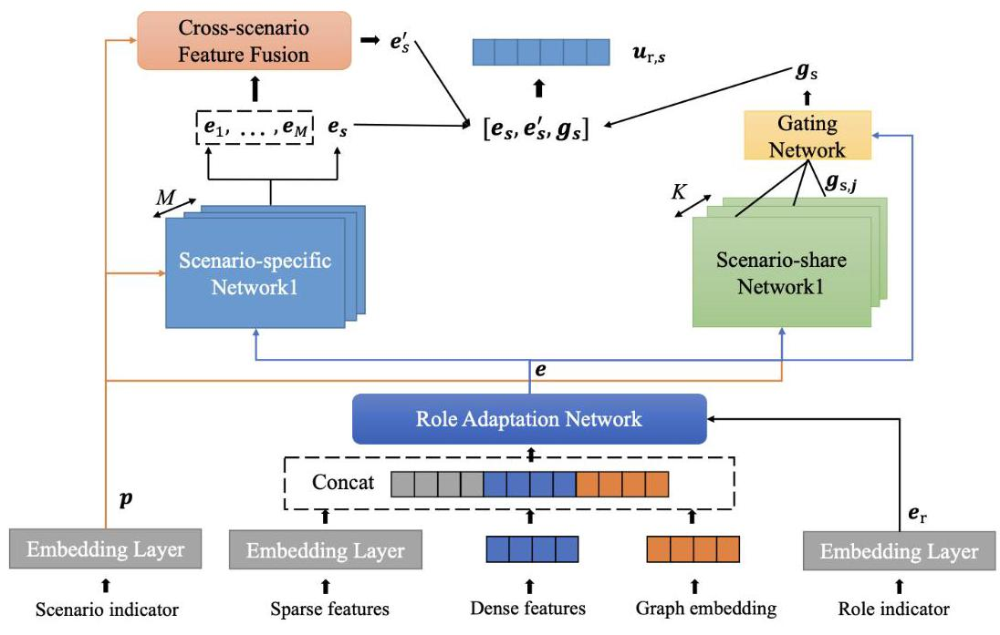
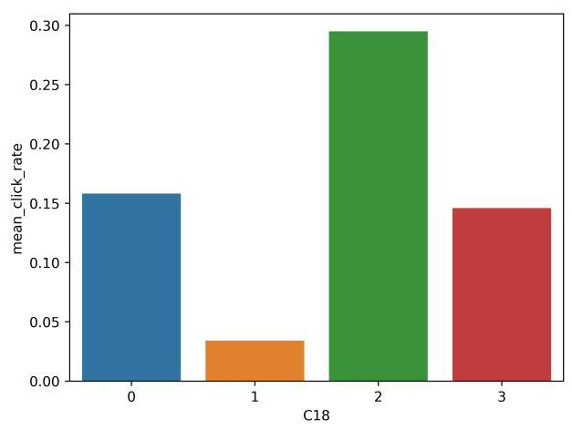
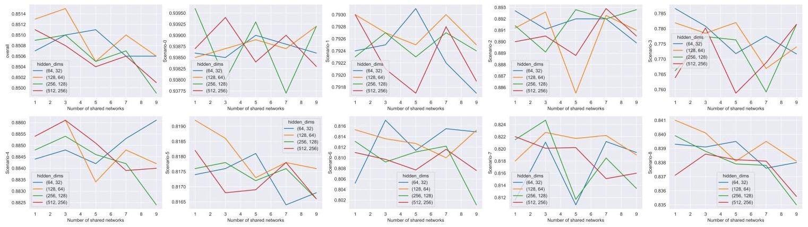
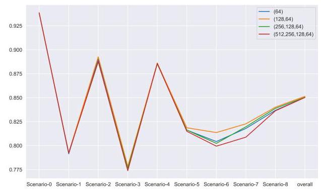
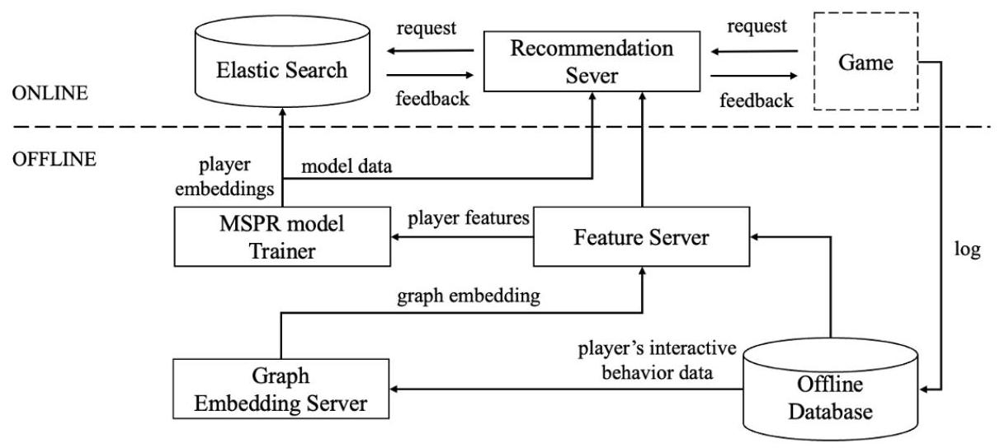

# MSPR: A Multi-Scenario Player Recommendation Framework for Online Gaming

Minghao Chen

Tencent

ShenZhen, China

monychen@tencent.com

Haodong Chen

Kuaishou Technology

Beijing, China

haodchen@foxmail.com

Yi Zeng

Tencent

ShenZhen, China

kennyzeng@tencent.com

Zhenfeng Liang

Tencent

ShenZhen, China

jerryliang@tencent.com

Abstract-The social dimension of online gaming spans a wide range of interaction scenarios, each defined by unique dynamics and requirements. Players may seek connections for purposes such as cooperative gameplay, casual interaction, mentorship, or other context-specific needs. However, existing recommendation systems are typically designed for single gaming scenarios, making them unable to accommodate diverse needs, which limits their accuracy and relevance. To overcome these challenges, this paper presents a multi-scenario player recommendation (MSPR) framework that delivers context-aware recommendations by capturing the nuanced distinctions and commonalities across multiple scenarios.

The MSPR framework incorporates three key components: (1) a role adaptation module that enables the final player embeddings to incorporate role-specific information tailored to players' dual roles (i.e., initiating or receiving friend requests); (2) scenario-specific and scenario-shared feature extraction modules that balance domain-specific nuances with cross-scenario commonalities; and (3) a scenario-personalized contrastive loss to enhance contextual adaptability. Experiments on both anonymized industrial datasets and public benchmarks demonstrate significant performance improvements. Furthermore, real-world deployment validates the framework's effectiveness, achieving notable increases in friend recommendation acceptance rates. This work advances recommendation technologies in gaming, fostering deeper engagement and enriching social ecosystems.

Index Terms-player recommendation, online gaming, multi-scenario recommendation

## I. INTRODUCTION

In recent years, the rapid expansion of online gaming has significantly transformed how individuals connect and establish relationships in virtual environments, positioning social interaction as a fundamental component of the gaming experience [1-3]. Games such as League of Legends, Honor of Kings, and Pokémon UNITE have evolved from mere entertainment platforms into complex digital ecosystems where players build friendships, form teams, and navigate intricate social structures. Success in these games frequently hinges on cooperation and communication, fostering connections that can be as impactful as those developed in offline settings. Within this context, player recommendation systems [4-6] play a crucial role by facilitating connections among users with compatible interests, skill levels, and playstyles. Such systems not only enhance player engagement but also reinforce their sense of belonging, thereby deepening immersion and overall satisfaction within the game environment.

Social needs in online games are diverse and highly context-dependent, encompassing a wide spectrum of relationship types and interaction dynamics [7]. For instance, players may seek teammates for coordinated gameplay, requiring compatibility in skills and reliability; casual conversation partners for social enjoyment; mentors to guide newcomers; or even romantic connections that add a personal dimension to the experience. Each scenario entails unique patterns of interaction, preferences, and criteria for compatibility. However, current recommendation systems are often single-context in design, focusing on generic friend suggestions rather than tailoring recommendations to these varied social needs.

This lack of contextualized modeling leads to significant limitations in recommendation accuracy and relevance. By not differentiating between various social roles or contexts, existing systems frequently fail to meet players' specific needs, delivering recommendations that are too broad or poorly aligned with players' actual social preferences. This misalignment can frustrate players, as they may have to manually navigate and build connections that could have been effectively facilitated by a more nuanced recommendation system. Additionally, the complexities of social behavior across different in-game scenarios are often neglected. Players may exhibit both common and distinct social behaviors depending on the context. For example, a player may display highly strategic and task-oriented behavior when seeking teammates but may prefer relaxed, conversational exchanges in a casual setting. Ignoring these nuanced behavioral patterns across contexts leads to recommendations that lack depth and fail to account for the multifaceted nature of social interactions in gaming environments.

The primary challenge lies in developing a unified, multi-scenario recommendation model [8-10] that captures both commonalities and distinctions across diverse social contexts. Treating each context independently risks overlooking valuable cross-context insights, particularly for less frequent scenarios. Conversely, an overly generalized approach can obscure critical distinctions, compromising prediction accuracy and recommendation relevance. Addressing these challenges has profound implications for the gaming experience. By aligning with players' varied social intentions across contexts, an advanced recommendation system can create a more personalized, engaging, and socially enriching environment. This not only enhances player satisfaction but also strengthens in-game communities, contributing to improved player retention and deeper social bonds.

In this paper, we introduce a novel framework for multi-scenario player recommendation (MSPR) in online gaming environments. Our contributions are as follows:

- To the best of our knowledge, this is the first work that thoroughly investigates the modeling of multi-scenario play recommendation within online gaming contexts. Additionally, we provide a detailed explanation of the procedure for implementing the framework we have devised in real-world industrial environments.

- We propose a role adaptation module to address players' dual roles, enabling the final player embeddings to effectively represent players in different roles (i.e., initiating or accepting friend requests) using distinct role indicators. Additionally, we introduce a scenario-specific feature extraction module and a scenario-shared feature processing module to simultaneously capture domain-specific distinctions and cross-domain commonalities. To further enhance the scenario-specific feature extraction, we employ a scenario-personalized contrastive loss, optimizing the model's adaptability to diverse contexts.

- We carried out comprehensive experiments utilizing an anonymized benchmark dataset derived from an online mobile game, in conjunction with two real-world public datasets, to substantiate the efficacy and efficiency of our proposed framework. Furthermore, the deployment of our methodology in a live player recommendation system for online testing provided additional validation of its effectiveness in enhancing the acceptance rate of friend requests.

The remainder of this paper is organized as follows: Section 2 reviews related work on single-scenario and multi-scenario recommendations. Section 3 presents the problem formulation and details of the MSPR framework. Section 4 discusses experimental results, followed by conclusions in Section 5.

## II. RELATED WORK

## A. single-scenario recommendation

Traditional single-scenario recommendation systems were based on shallow models like Logistic Regression (LR), Factorization Machines (FM), and Gradient Boosting Decision Trees (GBDT) [11, 12]. These models offered interpretability but had limited capacity for feature interaction. Modern systems, however, harness deep learning to enhance feature interactions. Models like Wide & Deep Learning (WDL) [13] and DeepFM [14] strike a balance between memorization and generalization by combining linear components or FM with deep learning architectures. Cross Network models, such as the Deep Cross Network (DCN) and its variants [15], capture high-order interactions via cross layers. Advanced models like xDeepFM [16] and NFM [17] integrate modules like Compressed Interaction Networks (CIN) and Bi-Interaction layers to capture complex feature relationships. Additionally, self-attention mechanisms, used in models like AutoInt and CAN [18, 19], generate context-sensitive representations by dynamically weighting feature interactions.

User behavior modeling has become increasingly important. The DIN model [20] captures user interests dynamically through attention mechanisms, while DIEN [21] builds on this by modeling sequential interest evolution using GRUs. DSIN [22] further enhances this by focusing on session-based interactions. BST [23] applies Transformers to capture the relevance between items in a sequence, and MIMN [24] employs memory networks to handle long sequences efficiently. SIM [25] optimizes long-sequence modeling through a two-stage search approach, with ETA [26] refining it into an end-to-end solution. SDIM [27] uses hashing to directly estimate interests, and TWIN [28] improves consistency in two-stage frameworks. However, all these methods invest heavily in network structure design while often overlooking the issue of data sparsity.

## B. multi-scenario recommendation

Traditional multi-scenario modeling methods generally fall into two categories: single-scenario modeling and mixed-scenario modeling. In single-scenario modeling, a separate recommendation model is trained for each individual scenario. While this method can be tailored to specific contexts, it often encounters challenges such as data sparsity in smaller or emerging scenarios, high resource demands, and limited agility when iterating across numerous scenarios. Conversely, mixed-scenario modeling treats all scenarios uniformly, disregarding unique scenario characteristics. This uniform approach can result in overlooked differences in data distributions, negative transfer effects where dominant scenarios disproportionately influence the model, and inconsistent recommendation quality-a phenomenon often referred to as the "seesaw effect" [29, 30, 34, 36].

In response, recent research advocates for multi-scenario joint modeling to improve cross-scenario learning by balancing shared and scenario-specific information [30-36]. This approach employs a unified parameter set that dynamically adjusts to different scenarios, capturing both shared attributes and distinct features of each context. Through this balanced adaptation, joint modeling facilitates effective knowledge transfer, enhancing learning in each scenario and strengthening the model's overall capacity.

This approach parallels multi-task learning, as many multitask methods have been adapted for multi-scenario recommendation. Techniques like Shared Bottom, MMoE [37], and PLE [29] use shared and task-specific networks to model task relationships effectively. M2M [30] extends this by employing meta-units to dynamically generate parameters across related scenarios, while AESM [31] unifies multi-scenario and multi-task learning through an expert selection algorithm that automatically identifies scenario- or task-specific experts. CTNet [32] introduces trainable adapters for layer-to-layer knowledge transfer between super-models and sub-models, though manual mapping is needed when architectures differ. APG [33] enhances efficiency by generating parameters dynamically for deep CTR models based on each instance. PEPNet [34] incorporates personalized prior information, using gating mechanisms to adjust embeddings and DNN hidden units dynamically. The HMoE (Hierarchical Mixture-of-Experts) framework [35] models shared and task-specific features through a multi-task, hierarchical approach, but struggles with capturing scenario-specific distinctions in complex multi-scenario data. STAR [36] addresses this by combining a central shared network with scenario-specific networks in a star topology, effectively capturing both shared and unique scenario characteristics.

## III. METHOD

In this section, the research problem is formally defined, followed by a detailed introduction to MSPR, including its network architecture design and model training methodology. The overall framework is illustrated in Fig.1.

## A. Problem Formulation

The multi-scenario recommendation problem is typically formulated as: \( {\widehat{y}}_{s} = f\left( {\mathbf{x}, s}\right) \) , where \( s \in  \{ 1,\ldots , M\} \) denotes the scenario indicator (as predefined by developers in most online games), \( {\widehat{y}}_{s} \) represents the prediction under this scenario, and x denotes the dense input features.

In our setup, we extend this formulation to address specific requirements of player recommendation in online games. Instead of directly predicting \( {\widehat{y}}_{s} \) , the model outputs embeddings for both the initiator and the receiver. The prediction \( {\widehat{y}}_{s} \) is then obtained as the dot product of the embeddings of the initiator and the receiver: \( {\widehat{y}}_{s} = \left\langle  {{\mathbf{u}}_{\text{ initiator }, s},{\mathbf{u}}_{\text{ receiver }, s}}\right\rangle \) . These embeddings are derived as follows:

\[
{\mathbf{u}}_{\text{ initiator, s }} = f\left( {{\mathbf{x}}_{\text{ dense }},{\mathbf{x}}_{\text{ sparse }},{\mathbf{x}}_{\text{ graph }}, s,{r}_{\text{ initiator }}}\right) ,
\]

\[
{\mathbf{u}}_{\text{ receiver, s }} = f\left( {{\mathbf{x}}_{\text{ dense }},{\mathbf{x}}_{\text{ sparse }},{\mathbf{x}}_{\text{ graph }}, s,{r}_{\text{ receiver }}}\right) ,
\]

where \( f\left( \cdot \right) \) combines dense features \( {\mathbf{x}}_{\text{ dense }} \) , sparse features \( {\mathbf{x}}_{\text{ sparse }} \) , graph embeddings \( {\mathbf{x}}_{\text{ graph }} \) , a scenario indicator \( s \) , and a role indicator \( r \) (initiator or receiver) to generate the embeddings. The dot product of these embeddings yields the prediction score.

Unlike most other recommendation systems, which often model Click-Through Rate (CTR) and Conversion Rate (CVR) tasks, our approach focuses specifically on modeling the acceptance rate of friend requests initiated by players across different scenarios. This focus is driven by observations in the gaming context, where players presented with a recommended list typically attempt to send friend requests to nearly all suggested players. As a result, CTR is close to one, as players exhibit a high level of engagement by trying to connect with all recommended players.

## B. Role Adaptation Network

To model the probability of friendship formation between two players, we account for the distinct influences of the initiator and receiver. Generally, the receiver's characteristics exert a stronger impact. Additionally, specific features within each player's original attributes contribute to this process. Therefore, we employ a Role Adaptation Network to capture and emphasize the most relevant feature components for both the initiator and receiver.

First, we define the input tensor \( \mathbf{x} \) as the concatenation of multiple feature types:

\[
\mathbf{x} = \left\lbrack  {{\mathbf{x}}_{\text{ dense }};{\mathbf{x}}_{\text{ sparse }};{\mathbf{x}}_{\text{ graph }}}\right\rbrack \tag{1}
\]

where \( \left\lbrack  {\cdot ;\cdot ; \cdot  }\right\rbrack \) denotes the concatenation operation.

The Role Adaptation Network adapts role-specific embed-dings and adjusts the concatenated input tensor \( \mathbf{x} \) using learnable parameters. This network enhances the model's ability to address role-specific variations by applying a linear projection followed by a non-linear scaling mechanism. The modulation vector \( \mathbf{m} \) is calculated as follows:

\[
\mathbf{m} = \sigma \left( {{\mathbf{W}}^{\mathrm{{ada}}}{\mathbf{e}}_{r}}\right) \tag{2}
\]

where \( \sigma \left( x\right)  = \frac{1}{1 + {e}^{-x}} \) is the sigmoid activation function, \( {\mathbf{e}}_{r} \) is the role embedding, and \( {\mathbf{W}}^{\text{ ada }} \) is the weight matrix. Then, the input tensor \( \mathbf{x} \) is modulated by element-wise multiplication with \( \mathbf{m} \) :

\[
\mathbf{e} = \mathbf{x} \odot  \mathbf{m} \tag{3}
\]

where \( \odot \) denotes the Hadamard (element-wise) product, enabling \( \mathbf{x} \) to be adaptively transformed based on the role adaptation embedding \( \mathbf{m} \) . This adaptation process allows the network to better capture the role-specific feature effects on the likelihood of friendship formation.

## C. Scenario-specific Feature Extraction Module

The Scenario-specific Feature Extraction Module independently processes each scenario by leveraging a distinct network for each one. For each scenario \( s \) , the corresponding network operates on the pre-processed input \( \mathbf{e} \) , generating an intermediate feature representation \( {\mathbf{e}}_{1},\ldots ,{\mathbf{e}}_{M} \) . This approach allows each scenario to capture its unique, context-specific characteristics effectively.

\[
{\mathbf{e}}_{s} = {f}_{\text{ scenario-specific }, s}\left( {\mathbf{e}, s}\right) \tag{4}
\]

where \( {f}_{\text{ scenario-specific }, s} \) denotes the function of the scenario-specific network associated with scenario \( s \) . This function can be a simple multi-layer perceptron (MLP). The resulting output \( {\mathbf{e}}_{s} \) is a feature vector that captures the distinctive attributes of scenario \( s \) .

## D. Cross-scenario Feature Fusion Module

The Cross-scenario Feature Fusion Module improves representation learning by integrating insights from related scenarios to enhance predictions in the target scenario. By aggregating complementary information, it enriches the target scenario's representation and emphasizes cross-scenario contributions. Notably, the target scenario is explicitly excluded, ensuring its representation is influenced only by other scenarios. The core attention mechanism computes an attention-weighted sum of feature representations from all scenarios except the target scenario, \( {\mathbf{e}}_{1},\ldots ,{\mathbf{e}}_{s - 1},{\mathbf{e}}_{s + 1},\ldots ,{\mathbf{e}}_{M} \) , to highlight the most relevant scenarios. This process is defined as follows:

Fig. 1. Overview of MSPR Framework.

First, the scenario indicator \( s \) is mapped into the indicator embedding \( \mathbf{p} \) via the embedding function \( {f}_{\mathrm{{emb}}} \) , that is, \( \mathbf{p} = {f}_{\mathrm{{emb}}}\left( s\right) \) . Subsequently, the query vector \( \mathbf{q} \) is generated by applying the learned projection matrix \( {\mathbf{W}}^{q} \) to the scenario indicator embedding \( \mathbf{p} \) :

\[
\mathbf{q} = {\mathbf{W}}^{q}\mathbf{p} \tag{5}
\]

The key and value matrices, \( \mathbf{K} \) and \( \mathbf{V} \) , are constructed by projecting the feature representations of all scenarios except the target scenario \( s \) , as follows:

\[
\mathbf{K} = {\mathbf{W}}^{K}\left\lbrack  {{\mathbf{e}}_{1},\ldots ,{\mathbf{e}}_{s - 1},{\mathbf{e}}_{s + 1},\ldots ,{\mathbf{e}}_{M}}\right\rbrack \tag{6}
\]

\[
\mathbf{V} = {\mathbf{W}}^{V}\left\lbrack  {{\mathbf{e}}_{1},\ldots ,{\mathbf{e}}_{s - 1},{\mathbf{e}}_{s + 1},\ldots ,{\mathbf{e}}_{M}}\right\rbrack \tag{7}
\]

Here, \( {\mathbf{W}}^{K} \) and \( {\mathbf{W}}^{V} \) are learnable projection matrices that map the scenario-specific features into the key and value spaces, respectively. This selective design explicitly excludes the target scenario \( s \) , ensuring that the representation of each scenario is influenced only by other scenarios. This mechanism facilitates cross-scenario fusion while avoiding self-referencing.

The attention scores \( \beta \) are computed using a scaled dot-product attention mechanism. These scores are normalized to form attention weights across scenarios:

\[
\beta  = \operatorname{softmax}\left( \frac{\mathbf{q}{\mathbf{K}}^{T}}{\sqrt{{d}_{k}}}\right) \tag{8}
\]

where \( {d}_{k} \) denotes the dimensionality of the key vectors. The scaling factor \( \frac{1}{\sqrt{{d}_{k}}} \) stabilizes the gradients during training, particularly when \( {d}_{k} \) is large. The softmax function ensures that the attention scores sum to one, enabling their interpretation as probabilities.

The final output for the target scenario \( s \) , denoted as \( {\mathbf{e}}_{s}^{\prime } \) , is obtained as a weighted sum of the value vectors based on the attention scores:

\[
{\mathbf{e}}_{s}^{\prime } = \beta \mathbf{V} \tag{9}
\]

By aggregating information from other scenarios, this attention mechanism enriches the target scenario's representation with diverse and contextually relevant insights. The exclusion of self-referencing ensures that the fused output, \( {\mathbf{e}}_{s}^{\prime } \) , reflects only complementary contributions from other scenarios.

## E. Scenario-shared Feature Processing Module

The Scenario-shared Feature Processing Module enhances representation learning across scenarios by combining a shared network and a gating mechanism. The shared network, referred to as the Scenario-share Network, consists of \( K \) deep neural networks (DNNs) that extract common patterns and features across scenarios, ensuring consistency and efficiency in feature representation. A Gating Network dynamically integrates the outputs of these \( K \) DNNs through weighted aggregation, enabling an adaptive combination of their contributions to form the final representation, thereby achieving robust and flexible feature integration.

1) Scenario-share Network: Due to the varying data distributions across scenarios, covariate shifts and training instabilities arise in shared networks. Additionally, uneven data volumes cause high-frequency scenarios to dominate, leading to the neglect of shared features across scenarios. To address these challenges, Dynamic Weights and Domain-Specific Batch Normalization are integrated into the design of the DNNs within the Scenario-Share Network.

Dynamic Weights modulate the outputs of each layer within the scenario-shared network, tailored to the unique attributes of each scenario. This approach fine-tunes the shared network's learned patterns through scenario-specific modifications, enabling the model to selectively enhance or suppress particular features identified in preceding layers. Consequently, the shared patterns encapsulate the commonalities spanning all scenarios, rather than being disproportionately influenced by high-frequency occurrences. Similar ideas have also been adopted in \( \left\lbrack  {{30},{33},{38},{39}}\right\rbrack \) .

Mathematically, let \( {\mathbf{F}}^{l} \) represent the output of layer \( l \) within the scenario-shared network, and \( \mathbf{p} \) denote the scenario indicator embedding as previously outlined. The modulated output \( {\mathbf{F}}_{s}^{l} \) for scenario \( s \) at layer \( l \) is formally expressed as:

\[
{\mathbf{F}}_{s}^{l} = {f}_{dw}\left( \mathbf{p}\right)  \odot  {\mathbf{F}}^{l} \tag{10}
\]

Here, \( \odot \) signifies element-wise multiplication, and \( {f}_{dw} \) denotes a modulation function, i.e., a neural network, that generates weights tailored to each feature within \( {\mathbf{F}}^{l} \) . These dynamic weights refine the activations in \( {\mathbf{F}}^{l} \) in accordance with the specific characteristics of scenario \( s \) , thereby enabling the model to adaptively amplify or diminish particular features in alignment with scenario-specific demands.

Domain-Specific Batch Normalization addresses the challenge of distributional discrepancies in multi-scenario learning. Standard Batch Normalization (BN) [40] assumes that input data follows an independent and identically distributed (i.i.d.) pattern and normalizes inputs using global batch statistics (mean \( \mu \) and variance \( {\sigma }^{2} \) ) with learnable scaling and shifting parameters \( \left( {\alpha \text{ and }\beta }\right) \) . The formulation for traditional BN is as follows:

\[
\widehat{Z} = \alpha \frac{Z - \mu }{\sqrt{{\sigma }^{2} + \epsilon }} + \beta , \tag{11}
\]

where \( \epsilon \) is a small constant to ensure numerical stability. While effective in single-scenario, this approach may underperform in multi-scenario settings, where input distributions exhibit scenario-specific variations that violate the i.i.d. assumption.

To address this limitation, DSBN [45] introduces a scenario-specific approach by maintaining independent normalization parameters for each scenario. For a given scenario \( s \) , DSBN computes separate batch statistics \( \left( {{\mu }_{s},{\left( {\sigma }_{s}\right) }^{2}}\right) \) and uses scenario-specific learnable parameters \( \left( {{\alpha }_{s},{\beta }_{s}}\right) \) . The formulation is as follows:

\[
{\widehat{Z}}_{s} = {\alpha }_{s}\frac{{Z}_{s} - {\mu }_{s}}{\sqrt{{\left( {\sigma }_{s}\right) }^{2} + \epsilon }} + {\beta }_{s}, \tag{12}
\]

where \( {Z}_{s} \) represents the input samples specific to scenario s. By leveraging scenario-specific statistics and parameters, DSBN effectively captures distributional characteristics unique to each scenario, ensuring robust normalization across diverse scenario. This method enhances the performance of models in multi-scenario learning tasks by explicitly accounting for scenario-specific distributional shifts.

2) Gating Network: The Gating Network is designed to dynamically adjust the importance of each feature component from scenario-share network. By generating a set of attention weights, the Gating Network enables the model to dynamically adjust feature emphasis based on the characteristics of the input representation.

Given the role adapted feature representation e, the Gating Network first computes a set of attention weights \( \left\lbrack  {{\alpha }_{1},\ldots ,{\alpha }_{K}}\right\rbrack \) through a softmax function applied to a linear transformation of e:

\[
\left\lbrack  {{\alpha }_{1},\ldots ,{\alpha }_{K}}\right\rbrack   = \operatorname{softmax}\left( {{\mathbf{W}}^{\text{ gate }}\mathbf{e}}\right) \tag{13}
\]

where \( {\mathbf{W}}^{\text{ gate }} \) is a learnable weight matrix that maps \( \mathbf{e} \) to a set of unnormalized scores. The softmax function then normalizes these scores into attention weights, \( {\alpha }_{j} \) , which sum to one across all \( K \) components.

Next, the gated output \( {\mathbf{g}}_{s} \) is computed as a weighted sum of the feature components \( {\mathbf{g}}_{s,1},\ldots ,{\mathbf{g}}_{s, K} \) , with each component weighted by its corresponding attention weight \( {\alpha }_{j} \) :

\[
{\mathbf{g}}_{s} = \mathop{\sum }\limits_{{j = 1}}^{K}{\alpha }_{j}{\mathbf{g}}_{s, j} \tag{14}
\]

This approach allows the Gating Network to dynamically adjust feature emphasis based on the characteristics of the input representation, enabling a more adaptive and effective fusion of feature components.

## F. Player representation

The player representation \( {\mathbf{u}}_{r, s} \) in scenario \( s \) is formed by concatenating the outputs of three modules: the Scenario-Specific Feature Extraction Module, the Cross-Scenario Feature Fusion Module, and the Scenario-Shared Feature Processing Module. Each module captures distinct features, and their concatenation ensures a comprehensive representation:

\[
{\mathbf{u}}_{r, s} = \left\lbrack  {{\mathbf{e}}_{s};{\mathbf{e}}_{s}^{\prime };{\mathbf{g}}_{s}}\right\rbrack \tag{15}
\]

where \( \left\lbrack  {\cdot ;\cdot ; \cdot  }\right\rbrack \) denotes the concatenation operation, providing an efficient integration of all module outputs.

## G. Model Training

To effectively train the model, we design a composite loss function that integrates two complementary objectives: the Scenario Personalized Contrastive Loss and the Cross-Entropy loss. The Scenario Personalized Contrastive loss enhances the learning of scenario-specific representations by distinguishing positive and negative samples, while the CE loss focuses on accurately classifying friend request outcomes. Together, these objectives ensure the model learns robust scenario representations and achieves high predictive accuracy.

1) Scenario Personalized Contrastive Loss: Optimizing a scenario-specific network solely using samples from a given scenario may result in incomplete learning due to data sparsity. To address this limitation and enhance the learning process, a Scenario Personalized Contrastive Loss is proposed, formulated based on the InfoNCE objective:

\[
{\mathcal{L}}_{\mathrm{{SPC}}} =  - \log \frac{\exp \left( {\operatorname{sim}\left( {{\mathbf{e}}_{s},{\mathbf{e}}_{s}^{ + }}\right) /\tau }\right) }{\mathop{\sum }\limits_{{j = 1}}^{M}\exp \left( {\operatorname{sim}\left( {{\mathbf{e}}_{s},{\mathbf{e}}_{s}^{ - }}\right) /\tau }\right) } \tag{16}
\]

where \( \operatorname{sim}\left( {a, b}\right) \) represents the similarity measure (i.e., cosine similarity) between representations \( a \) and \( b \) , and \( \tau \) is a temperature parameter that controls the concentration of the distribution. The anchor sample \( {\mathbf{e}}_{s} \) corresponds to the output of the scenario-specific network for scenario \( s \) . The positive sample \( {\mathbf{e}}_{s}^{ + } \) is derived from the anchor by applying dropout, thereby preserving the core features of the scenario while introducing slight variations. Conversely, negative samples \( {\mathbf{e}}_{s}^{ - } \) are obtained from the outputs of scenario-specific networks corresponding to scenarios other than \( s \) .

This contrastive learning loss enables the scenario-specific network to capture distinctive features of each scenario, thereby improving its robustness and generalization capability.

2) Cross-Entropy Loss: Predicting the acceptance rate of friend requests is a binary classification problem, for which the Cross-Entropy (CE) loss is well-suited. This loss helps the model differentiate between accepted and rejected requests effectively.

Given player representations \( {\mathbf{u}}_{a} \) and \( {\mathbf{u}}_{b} \) , their dot product \( \widehat{y} = \left\langle  {{\mathbf{u}}_{a},{\mathbf{u}}_{b}}\right\rangle \) predicts the acceptance rate. The binary ground truth label \( y \in  \{ 0,1\} \) represents acceptance \( \left( {y = 1}\right) \) or rejection \( \left( {y = 0}\right) \) . The CE loss is defined as:

\[
{\mathcal{L}}_{\mathrm{{CE}}} =  - \left( {y \cdot  \log \left( {\sigma \left( \widehat{y}\right) }\right)  + \left( {1 - y}\right)  \cdot  \log \left( {1 - \sigma \left( \widehat{y}\right) }\right) }\right) \tag{17}
\]

where \( \sigma \left( x\right)  = \frac{1}{1 + {e}^{-x}} \) is the sigmoid function, mapping \( \widehat{y} \) to a probability.

Minimizing the CE loss encourages the model to assign higher scores to accepted pairs \( \left( {y = 1}\right) \) and lower scores to rejected pairs \( \left( {y = 0}\right) \) , ensuring accurate prediction of friend request outcomes based on learned player embeddings.

Hence, the final loss can be formulated as follows:

\[
{\mathcal{L}}_{\text{ total }} = {\mathcal{L}}_{\mathrm{{CE}}} + \lambda  \cdot  {\mathcal{L}}_{\mathrm{{SPC}}} \tag{18}
\]

where \( \lambda \) is a balancing hyperparameter that controls the relative importance of the two losses.

## IV. EXPERIMENTS

In this section, we perform extensive experiments on three datasets to evaluate the effectiveness of our proposed MSPR framework. We begin by describing the main experimental setup. Next, we compare MSPR with representative methods from single-scenario modeling, mixed-scenario modeling, and multi-scenario joint modeling to validate its effectiveness. We then conduct an ablation study to assess the contribution of each submodule. Finally, we analyze the model's sensitivity to hyperparameters and demonstrate how MSPR can be deployed in live environments to achieve practical benefits.

## A. Experimental Setup

1) Datasets: We conducted experiments on both industrial and public datasets, all sourced from real-world data. Below is an introduction to these datasets, followed by Table I, which summarizes the statistical details of the three datasets \( {}^{1} \) .

- Online game dataset: This dataset captures player behavior logs from a mobile game \( {}^{2} \) , specifically focusing on actions related to initiating and managing friend requests. Players can send friend requests through nine distinct scenarios: nickname search, previous co-play sessions, nearby players, guild membership, chat interactions, viewing personal profiles, finding an apprentice, finding a master, and finding a partner. The probability of two players forming a friendship varies by scenario and is influenced by various contextual factors. The dataset spans a continuous 12-day period, which is divided sequentially into three subsets: an 8-day training set covering the initial period, a 1-day validation set immediately following the training period, and a 3-day test set at the end of the time span.

- Ali-CCP [42]: This dataset is derived from the recommendation system logs of the Taobao mobile app, and it is intended for Click-Through Rate (CTR) and Conversion Rate (CVR) prediction tasks. The data covers three distinct business scenarios, each corresponding to a unique value within the business scenario feature domain. Our experiments focus specifically on modeling CTR prediction. The original dataset is arranged chronologically into separate training and testing sets. For our experiments, we further split the testing set equally into validation and test sets.

- Avazu [43]: This dataset originates from a public CTR prediction competition on Kaggle, centered around online advertising. Analysis reveals notable differences in CTR distribution across various values of the C18 feature, as shown in Fig.2. We use the C18 attribute as a scenario identifier, resulting in four distinct scenarios. Because the labels for the test set are not publicly available, we partition the training set chronologically into training, validation, and test sets using an 8:1:1 split to facilitate model evaluation across different scenarios.

Fig. 2. CTR distribution across various values of the C18 feature.

---

\( {}^{1} \) Although the Ali-CPP and Avazu datasets are not gaming-specific, their inclusion demonstrates the generalizability of the MSPR model across diverse recommendation tasks

\( {}^{2} \) The game name remains undisclosed due to a non-disclosure agreement

---

TABLE I

STATISTICAL DETAILS OF THE THREE DATASETS

<table><tr><td>Dataset</td><td>Scenario-0</td><td>Scenario-1</td><td>Scenario-2</td><td>Scenario-3</td><td>Scenario-4</td><td>Scenario-5</td><td>Scenario-6</td><td>Scenario-7</td><td>Scenario-8</td></tr><tr><td colspan="10">Online game</td></tr><tr><td>Percentage (%)</td><td>13.7%</td><td>44.5%</td><td>1.9%</td><td>1.7%</td><td>18.8%</td><td>14.3%</td><td>0.8%</td><td>0.6%</td><td>3.7%</td></tr><tr><td>Quantity (K)</td><td>178.2K</td><td>577.5K</td><td>24.8K</td><td>22.2K</td><td>244.3K</td><td>186.3K</td><td>10.5K</td><td>7.1K</td><td>48.1K</td></tr><tr><td colspan="10">Ali-CPP</td></tr><tr><td>Percentage (%)</td><td>37.5%</td><td>0.8%</td><td>61.7%</td><td>-</td><td>-</td><td>-</td><td>-</td><td>-</td><td>-</td></tr><tr><td>Quantity (M)</td><td>32.2M</td><td>0.6M</td><td>52.4M</td><td>-</td><td>-</td><td>-</td><td>-</td><td>-</td><td>-</td></tr><tr><td colspan="10">Avazu</td></tr><tr><td>Percentage (%)</td><td>41.9%</td><td>6.7%</td><td>17.6%</td><td>33.8%</td><td>-</td><td>-</td><td>-</td><td>-</td><td>-</td></tr><tr><td>Quantity (M)</td><td>16.9M</td><td>2.7M</td><td>7.1M</td><td>13.7M</td><td>-</td><td>-</td><td>-</td><td>-</td><td>-</td></tr></table>

2) Comparison Methods: To better evaluate the effectiveness of MSPR, we focus on three main categories of methods:

1) Single-Scenario Modeling Methods: For a fair comparison, under this type of method, we extract data from each scenario and train a corresponding model individually for each scenario.

- DNN_single: It starts with an Embedding layer, followed by an MLP with three fully connected layers and activation functions.

2) Mixed-Scenario Modeling Methods: Here, we combine data from multiple scenarios without differentiation and train a single, unified model.

- DNN: This model is structured identically to DNN_single but is trained using mixed data from all scenarios.

- DeepFM [14]: Instead of the LR component in the wide&deep model, this method uses FM, which, together with DNN, captures both low-order and high-order feature interactions. The final prediction is the sum of these two outputs.

- DCN [15]: This model introduces a cross network to explicitly learn high-order feature interactions. In our experiments, we adhere to the original structure and use only three cross layers.

- xDeepFM [16]: Building upon DCN, this method incorporates a vector-wise approach to enhance the Cross Network, thereby improving the modeling of feature interactions.

- DCNv2-Mix [44]: By employing a low-rank approximation, this method captures feature interactions within subspaces. Inspired by the MOE framework, it then integrates these subspaces using a gating mechanism.

3) Multi-Scenario Joint Modeling Methods: This category aims to capture both the unique characteristics and shared features of different scenarios by training a unified model.

- MMOE [37]: Widely used in multi-task learning, this method leverages a Multi-gate Mixture-of-Experts framework to model the relationships between tasks. We adapt it for multi-scenario learning, implementing each expert network with a two-layer MLP.

- PLE [29]: An advanced version of MMOE, PLE features separate expert networks for each task alongside a shared expert network, mitigating the seesaw effect and preventing negative transfer. As with MMOE, we use a two-layer MLP for each expert network in our multi-scenario learning setup.

- STAR [42]: This method uses a star-shaped topology to facilitate shared and differential learning across various scenarios.

3) Evaluation Metrics: We used the Area Under the ROC Curve (AUC) as the evaluation metric. To better assess the model's performance, we compared the AUC values across different scenarios as well as the overall AUC. The formula for calculating AUC is as follows:

\[
{AUC} = \frac{\mathop{\sum }\limits_{{i \in  \text{ positive Class }}}{\operatorname{rank}}_{i} - \frac{M\left( {1 + M}\right) }{2}}{M \times  N} \tag{19}
\]

where \( M \) and \( N \) represent the number of positive and negative samples, respectively. positiveClass denotes the set of positive samples, and \( {\operatorname{rank}}_{i} \) is the ranking of the predicted probability for the \( i \) -th positive sample.

4) Implementation Details: To ensure a fair comparison, we employed the Adam optimizer across all methods. The batch size was set to 2048 for the online game dataset and 50000 for the two public datasets. All methods used the same feature embedding layer, with an embedding size of 8 for the online game dataset and 16 for the Ali-CPP and Avazu datasets. We initialized the learning rate at \( {1e} - 3 \) and adopted a learning rate decay strategy, reducing the learning rate to 0.1 times its previous value every 10 epochs to achieve better convergence. All models were trained for a total of 50 epochs.

Due to differences between the public datasets and the online game dataset, we made slight modifications to MSPR for the public datasets. Specifically, in the Ali-CPP and Avazu experiments, the input to the MSPR model's Role Adaptation Network included the output vector from the shared embedding layer and the embedding vector of the scenario indicator. Additionally, the output layer was replaced with a fully connected layer instead of the original dot product operation. For the baseline methods, we carefully fine-tuned their hyperparameters using the validation set.

## B. Performance Comparison

Online Game Dataset: Table II presents the performance results of all models. Our proposed MSPR model demonstrates superior performance in terms of AUC and overall AUC across eight scenarios, underscoring its effectiveness in multi-scenario learning. The table shows that MSPR achieves greater improvements in low-frequency scenarios compared to other models, highlighting the efficacy of knowledge transfer in this context.

Single-scenario modeling methods exhibit strong performance primarily in high-frequency scenarios, where ample data is available. However, these methods struggle in low-frequency scenarios, as the limited data hampers adequate model training. In contrast, mixed-scenario modeling approaches often underperform compared to multi-scenario joint modeling methods. This underperformance is due to the disregard of differences in data distribution across scenarios and the issue of negative knowledge transfer.

Multi-scenario joint modeling stands out by capturing both the shared characteristics and distinct differences among scenarios, leading to robust performance across all cases. Our MSPR model outperforms other multi-scenario joint modeling approaches, thanks to the specialized design of its submodules.

Ali-CPP & Avazu Dataset: The performance of all models on the two public datasets is reported in Tables III and IV, respectively. It is evident that the MSPR model consistently achieves higher CTR AUC compared to other models across all individual scenarios and overall data. Notably, an interesting phenomenon is observed: MMOE, PLE, and STAR exhibit significantly lower CTR AUC in Scenario 1 on both the Ali-CPP and Avazu datasets compared to other mixed-scenario modeling methods. This suggests a pronounced see-saw effect in the performance of MMOE, PLE, and STAR. In contrast, the MSPR model demonstrates consistently strong performance across all scenarios, indicating its ability to effectively alleviate the see-saw problem. This finding further confirms the effectiveness of MSPR.

## C. Ablation Study

To further evaluate the effectiveness of each key submodule, we performed an ablation study by designing five MSPR variants, each created by removing a single submodule. Specifically: 1) MSPR (w/o adaptation) removes the role adaptation network, so the output of the shared embedding layer flows directly to both the scenario-shared and scenario-specific networks without adaptation; 2) MSPR (w/o contrastive) excludes the contrastive learning loss, meaning that MSPR no longer actively increases the distance between the representations output by different scenario-specific networks; 3) MSPR (w/o cross) eliminates the cross-scenario attention network, so the final output vector of MSPR is derived solely from the scenario-shared and scenario-specific network outputs; 4) MSPR (w/o dw) removes the dynamic weighting from the scenario-shared network, meaning the output of each layer is no longer adjusted by scenario-specific features; and 5) MSPR (w/o gating) replaces the gating mechanism in the scenario-shared network with simple average pooling.

As shown in Table V, removing any of these five key sub-modules results in a performance drop, indicating that each sub-module contributes positively to the MSPR model. The most significant performance loss occurs when the role adaptation network is removed. This is because the likelihood of two players becoming friends is more strongly influenced by the characteristics of the consenting player, and the role adaptation network amplifies the impact of these features. Removing the cross-scenario attention network, contrastive loss, or dynamic weighting also leads to noticeable performance declines. The cross-scenario attention network is critical for leveraging information from other scenarios to enhance the current scenario's representation. The contrastive loss improves the model's ability to distinguish between scenarios, while dynamic weighting prevents high-frequency scenarios from dominating the patterns learned by the scenario-shared network. Lastly, the gating mechanism is essential for flexibly aggregating the representations of the scenario-shared network.

## D. Hyper-parameter Analysis

The performance of MSPR can be influenced by several hyperparameters, such as the number of scenario-shared networks, the dimensionality of hidden vectors, and the number of hidden layers in the DNN. To analyze the sensitivity of MSPR to these hyperparameters, we designed a series of experiments, including: 1) varying the number of scenario-shared networks, 2) varying the dimensionality of hidden vectors, and 3) varying the number of hidden layers. In the final version of our MSPR model, we set the number of scenario-shared networks to 3, used two-layer MLPs for both the scenario-shared and scenario-specific networks, and configured the hidden vector dimensions to (128,64).

Fig. 3 shows the performance of MSPR across different scenarios with varying numbers of scenario-shared networks and hidden vector dimensions. The results indicate that increasing the number of scenario-shared networks from 1 to 3 enhances MSPR performance. However, further increases (from 3 to 9) lead to a performance decline, likely due to overfitting caused by the larger number of parameters, especially given a fixed amount of training data. Addressing this issue would require additional training data. Similarly, increasing the hidden vector dimensions improves performance up to a point, but as the model's parameter count continues to grow, overfitting becomes a concern.

Fig. 4 presents the performance of MSPR with varying numbers of hidden layers across different scenarios. The results suggest that MSPR is relatively insensitive to the number of hidden layers, with overall performance remaining stable. However, the model achieves optimal performance with two hidden layers.

TABLE II

AUC COMPARISON OF DIFFERENT METHODS ON THE ONLINE GAME DATASET (BEST RESULTS IN BOLD)

<table><tr><td>Model</td><td>Scenario-0</td><td>Scenario-1</td><td>Scenario-2</td><td>Scenario-3</td><td>Scenario-4</td><td>Scenario-5</td><td>Scenario-6</td><td>Scenario-7</td><td>Scenario-8</td><td>Overall</td></tr><tr><td>DNN_single</td><td>0.9372</td><td>0.7870</td><td>0.8826</td><td>0.7831</td><td>0.8804</td><td>0.8078</td><td>0.7793</td><td>0.8067</td><td>0.8270</td><td>None</td></tr><tr><td>DNN</td><td>0.9149</td><td>0.7877</td><td>0.8616</td><td>0.7794</td><td>0.8822</td><td>0.8123</td><td>0.7936</td><td>0.8024</td><td>0.8328</td><td>0.8342</td></tr><tr><td>DeepFM</td><td>0.9155</td><td>0.7824</td><td>0.8491</td><td>0.7765</td><td>0.8788</td><td>0.8067</td><td>0.7964</td><td>0.8068</td><td>0.8281</td><td>0.8301</td></tr><tr><td>DCN</td><td>0.9166</td><td>0.7870</td><td>0.8595</td><td>0.7784</td><td>0.8815</td><td>0.8119</td><td>0.7885</td><td>0.8056</td><td>0.8305</td><td>0.8339</td></tr><tr><td>xDeepFM</td><td>0.9163</td><td>0.7836</td><td>0.8561</td><td>0.7768</td><td>0.8799</td><td>0.8091</td><td>0.7913</td><td>0.8104</td><td>0.8278</td><td>0.8316</td></tr><tr><td>DCNv2-Mix</td><td>0.9183</td><td>0.7893</td><td>0.8650</td><td>0.7885</td><td>0.8823</td><td>0.8135</td><td>0.7933</td><td>0.8010</td><td>0.8295</td><td>0.8357</td></tr><tr><td>MMOE</td><td>0.9358</td><td>0.7807</td><td>0.8721</td><td>0.7724</td><td>0.8781</td><td>0.8044</td><td>0.7723</td><td>0.8052</td><td>0.8293</td><td>0.8403</td></tr><tr><td>PLE</td><td>0.9357</td><td>0.7807</td><td>0.8805</td><td>0.7876</td><td>0.8804</td><td>0.8051</td><td>0.7950</td><td>0.8150</td><td>0.8340</td><td>0.8421</td></tr><tr><td>STAR</td><td>0.9355</td><td>0.7828</td><td>0.8848</td><td>0.7871</td><td>0.8817</td><td>0.8087</td><td>0.7921</td><td>0.8086</td><td>0.8335</td><td>0.8436</td></tr><tr><td>MSPR</td><td>0.9387</td><td>0.7927</td><td>0.8926</td><td>0.7785</td><td>0.8861</td><td>0.8186</td><td>0.8136</td><td>0.8227</td><td>0.8401</td><td>0.8515</td></tr></table>

TABLE III

AUC COMPARISON OF DIFFERENT METHODS ON THE ALI-CPP DATASET (BEST RESULTS IN BOLD)

<table><tr><td>Model</td><td>Scenario-0</td><td>Scenario-1</td><td>Scenario-2</td><td>Overall</td></tr><tr><td>DNN_single</td><td>0.5948</td><td>0.5147</td><td>0.6223</td><td>-</td></tr><tr><td>DNN</td><td>0.6273</td><td>0.6013</td><td>0.6235</td><td>0.6250</td></tr><tr><td>DeepFM</td><td>0.6305</td><td>0.6032</td><td>0.6264</td><td>0.6280</td></tr><tr><td>DCN</td><td>0.6288</td><td>0.6018</td><td>0.6251</td><td>0.6266</td></tr><tr><td>xDeepFM</td><td>0.6315</td><td>0.6047</td><td>0.6273</td><td>0.6290</td></tr><tr><td>DCNv2-Mix</td><td>0.6313</td><td>0.6049</td><td>0.6275</td><td>0.6289</td></tr><tr><td>MMOE</td><td>0.6309</td><td>0.5886</td><td>0.6274</td><td>0.6284</td></tr><tr><td>PLE</td><td>0.6319</td><td>0.5862</td><td>0.6281</td><td>0.6291</td></tr><tr><td>STAR</td><td>0.6300</td><td>0.5940</td><td>0.6254</td><td>0.6270</td></tr><tr><td>MSPR</td><td>0.6333</td><td>0.6080</td><td>0.6296</td><td>0.6310</td></tr></table>

TABLE IV

AUC COMPARISON OF DIFFERENT METHODS ON THE AVAZU DATASET (BEST RESULTS IN BOLD)

<table><tr><td>Model</td><td>Scenario-0</td><td>Scenario-1</td><td>Scenario-2</td><td>Scenario-3</td><td>Overall</td></tr><tr><td>DNN_single</td><td>0.7072</td><td>0.6858</td><td>0.6630</td><td>0.7513</td><td>-</td></tr><tr><td>DNN</td><td>0.7103</td><td>0.7534</td><td>0.6838</td><td>0.7571</td><td>0.7450</td></tr><tr><td>DeepFM</td><td>0.6924</td><td>0.7189</td><td>0.6735</td><td>0.7415</td><td>0.7310</td></tr><tr><td>DCN</td><td>0.7094</td><td>0.7542</td><td>0.6840</td><td>0.7551</td><td>0.7443</td></tr><tr><td>xDeepFM</td><td>0.7043</td><td>0.7310</td><td>0.6832</td><td>0.7548</td><td>0.7423</td></tr><tr><td>DCNv2-Mix</td><td>0.7108</td><td>0.7448</td><td>0.6843</td><td>0.7541</td><td>0.7441</td></tr><tr><td>MMOE</td><td>0.7086</td><td>0.7191</td><td>0.6857</td><td>0.7583</td><td>0.7451</td></tr><tr><td>PLE</td><td>0.7093</td><td>0.7185</td><td>0.6848</td><td>0.7579</td><td>0.7450</td></tr><tr><td>STAR</td><td>0.7003</td><td>0.7135</td><td>0.6774</td><td>0.7582</td><td>0.7406</td></tr><tr><td>MSPR</td><td>0.7118</td><td>0.7624</td><td>0.6866</td><td>0.7590</td><td>0.7465</td></tr></table>

To further analyze the impact of model parameter size on performance, Table VI provides a comparison of the parameter sizes of different models and the overall AUC performance of MSPR under various parameter configurations. Specifically, MSPR_v1 employs a two-layer MLP for both the scenario-shared and scenario-specific networks, with dimensions of (512,256). MSPR_v2, MSPR_v3, and MSPR_v4 correspond to dimensions of \( \left( {{256},{128}}\right) ,\left( {{128},{64}}\right) \) , and \( \left( {{64},{32}}\right) \) , respectively. The table clearly shows that MSPR consistently outperforms other models, regardless of the parameter size. This demonstrates that MSPR's superior performance is not merely a result of increased parameters but is instead due to the thoughtful and effective design of each sub-module, which is well-aligned with the practical problem at hand.

## E. Online Test and Deployment Details

In addition to offline experiments, MSPR is designed for and has been successfully implemented in real-world industrial settings. For instance, typical scenarios include tabs in the social lobby like "Find a Partner," "Find a Mentor," and "Find an Apprentice." As show in Fig.5, the system is composed of two main components: an online real-time service and an offline training and inference pipeline, working together to efficiently provide multi-scenario player recommendations. Through the game interface, players receive personalized recommendation lists tailored to diverse social contexts.

TABLE V

ABLATION STUDY RESULTS (BEST RESULTS IN BOLD)

<table><tr><td>Method</td><td>Scenario-0</td><td>Scenario-1</td><td>Scenario-2</td><td>Scenario-3</td><td>Scenario-4</td><td>Scenario-5</td><td>Scenario-6</td><td>Scenario-7</td><td>Scenario-8</td><td>Overall</td></tr><tr><td>MSPR (w/o adaptation)</td><td>0.9374</td><td>0.7875</td><td>0.8853</td><td>0.7565</td><td>0.8822</td><td>0.8132</td><td>0.8050</td><td>0.8164</td><td>0.8341</td><td>0.8474</td></tr><tr><td>MSPR (w/o contrastive)</td><td>0.9371</td><td>0.7902</td><td>0.8855</td><td>0.7811</td><td>0.8867</td><td>0.8155</td><td>0.8093</td><td>0.8165</td><td>0.8362</td><td>0.8496</td></tr><tr><td>MSPR (w/o cross)</td><td>0.9376</td><td>0.7905</td><td>0.8853</td><td>0.7828</td><td>0.8868</td><td>0.8134</td><td>0.8069</td><td>0.8217</td><td>0.8356</td><td>0.8494</td></tr><tr><td>MSPR (w/o dw)</td><td>0.9379</td><td>0.7895</td><td>0.8857</td><td>0.7836</td><td>0.8847</td><td>0.8152</td><td>0.8072</td><td>0.8195</td><td>0.8369</td><td>0.8488</td></tr><tr><td>MSPR (w/o gating)</td><td>0.9382</td><td>0.7913</td><td>0.8904</td><td>0.7759</td><td>0.8854</td><td>0.8164</td><td>0.8081</td><td>0.8198</td><td>0.8374</td><td>0.8501</td></tr><tr><td>MSPR</td><td>0.9387</td><td>0.7927</td><td>0.8926</td><td>0.7785</td><td>0.8861</td><td>0.8186</td><td>0.8136</td><td>0.8227</td><td>0.8401</td><td>0.8515</td></tr></table>

Fig. 3. Experimental Results with Different Hidden Vector Dimensions under Varying Numbers of Shared Networks for Different Scenarios.

Fig. 4. Experimental Results with Different Numbers of Hidden Layers.

The online service centers on the Recommendation Server and ElasticSearch \( {}^{3} \) [45]. When a player requests a recommendation list, the request is sent to the Recommendation Server. If the player's embedding is already stored in ElasticSearch, the server retrieves it based on the current scenario to generate the recommendation list. For players without embeddings in ElasticSearch, the Recommendation Server fetches the player's features from the Feature Server, infers the scenario-specific embedding, and retrieves recommendations. If no features are found in the Feature Server, a default embedding is used.

TABLE VI

PARAMETER SIZE AND OVERALL AUC PERFORMANCE OF DIFFERENT MODELS (BEST RESULTS IN BOLD)

<table><tr><td>Model</td><td>Parameters \( \left( {\times {10}^{5}}\right) \)</td><td>Overall AUC</td></tr><tr><td>DNN</td><td>4.4870</td><td>0.8342</td></tr><tr><td>DeepFM</td><td>4.3589</td><td>0.8301</td></tr><tr><td>DCN</td><td>4.5295</td><td>0.8339</td></tr><tr><td>xDeepFM</td><td>12.5195</td><td>0.8316</td></tr><tr><td>DCNv2-Mix</td><td>7.7244</td><td>0.8357</td></tr><tr><td>MMOE</td><td>22.4048</td><td>0.8403</td></tr><tr><td>PLE</td><td>62.3418</td><td>0.8421</td></tr><tr><td>STAR</td><td>44.4923</td><td>0.8436</td></tr><tr><td>MSPR_v1</td><td>46.7006</td><td>0.8508</td></tr><tr><td>MSPR_v2</td><td>16.5144</td><td>0.8510</td></tr><tr><td>MSPR_v3</td><td>6.5822</td><td>0.8515</td></tr><tr><td>MSPR_v4</td><td>2.9064</td><td>0.8510</td></tr></table>

The offline pipeline handles feature extraction, embedding generation, and model training, updating on a \( T + 1 \) schedule. Game logs are stored in an offline database, and the Graph Embedding Server generates embeddings based on player interaction data. The Feature Server processes and aggregates player features, including positive and negative samples, which are used by the MSPR Model Trainer to update the model. Updated models and embeddings are then uploaded to the Recommendation Server and ElasticSearch for online retrieval.

---

\( {}^{3} \) A medium-sized cluster (10 nodes,16 cores,64GB memory,2TB SSD) supports tens of thousands of QPS, making it suitable for large-scale systems.

---

Fig. 5. The Key Components of Our MSPR Framework in a Live Environment.

MSPR's performance is assessed through online testing for the player recommendation task, demonstrating a notable improvement of \( 1\%  - 3\% \) across various scenarios based on key evaluation metrics. Higher friend acceptance rates lead to increased social interactions, which in turn boost daily game-play time and player engagement. This heightened engagement creates more monetization opportunities, driving higher in-game purchase conversion rates. For instance, players who form connections are more likely to participate in co-op missions or guild events, often encouraging spending on virtual items. To further evaluate the impact of recommendations, we also track additional indicators such as the number of coop game sessions and ARPU (Average Revenue Per User) after players become friends. Notably, these metrics also show a certain degree of improvement, further validating the positive impact of the recommendation system. However, since these metrics can be influenced by other systems or in-game events, they are not used as direct evaluation criteria for the recommendation system.

## V. DISCUSSION

Based on valuable reviewer feedback, we provide a detailed discussion of the current limitations of the MSPR framework and potential directions for future research.

While our MSPR framework demonstrates promising performance in multi-scenario player recommendations, several limitations and future directions deserve attention. Lower computational complexity is better suited for deployment in environments with limited computational resources, and optimization techniques such as parallel processing and model pruning can further enhance efficiency. The framework's adaptability to dynamic scenarios remains a challenge, as real-world gaming environments may involve fluid and evolving scenarios. Although our experiments show robust performance across different data sizes, the issue of data imbalance could be addressed through weighted loss functions or scenario-specific data augmentation. The framework's reliance on extensive datasets also raises concerns about its effectiveness in data-scarce environments, indicating the potential benefit of exploring few-shot learning techniques. Additionally, while the model's deep learning approach enables powerful recommendations, it may suffer from limited interpretability. Future work should focus on developing tools for model interpretation and analysis of scenario impacts. Furthermore, potential negative impacts such as over-recommendation and privacy concerns warrant careful consideration. These limitations point to several promising research directions, including the development of lightweight architectures, dynamic scenario adaptation mechanisms, and enhanced interpretability methods, which could further improve the practical applicability of our next-generation framework.

## VI. CONCLUSIONS

This paper presents a novel framework for Multi-Scenario Player Recommendation (MSPR) in online gaming environments. We introduced several key innovations, including a role adaptation module to handle players' dual roles, and a combination of scenario-specific and shared feature extraction modules. Extensive experiments on anonymized and real-world datasets demonstrated the framework's effectiveness in enhancing recommendation performance. Furthermore, deployment in a live online game system confirmed its ability to increase the acceptance rate of friend requests. The provided deployment details have the potential to inspire widespread application in similar recommendation systems across various domains. Future work will focus on how to better integrate multi-modal information to enhance the framework's performance and adaptability.

## REFERENCES

[1] S. L. Thorne and I. Fischer, "Online gaming as sociable media," Alsic. Appl. Lang. Syst. Inf. Commun., vol. 15, no. 1, 2012.

[2] I. Granic, A. Lobel, and R. C. Engels, "The benefits of playing video games," Am. Psychol., vol. 69, no. 1, pp. 66-78, 2014.

[3] K. Arbeau, C. Thorpe, M. Stinson, B. Budlong, and J. Wolff, "The meaning of the experience of being an online video game player," Comput. Human Behav. Rep., vol. 2, p. 100013, 2020.

[4] Z. Wang, J. Liao, Q. Cao, H. Qi, and Z. Wang, "Friend-book: A semantic-based friend recommendation system for social networks," IEEE Trans. Mobile Comput., vol. 14, no. 3, pp. 538-551, 2014.

[5] Y. Chang et al., "GraphRR: A multiplex graph-based reciprocal friend recommender system with applications on online gaming service," Knowl.-Based Syst., vol. 251, p. 109187, 2022.

[6] Ö. İ. Yılmaz and Ş. G. Öğüdücü, "Learning football player features using graph embeddings for player recommendation system," in Proc. 37th ACM/SIGAPP Symp. Appl. Comput., Apr. 2022, pp. 577-584.

[7] T. L. Taylor, Play Between Worlds: Exploring Online Game Culture. MIT Press, 2009.

[8] Y. Jiang et al., "Adaptive domain interest network for multi-domain recommendation," in Proc. 31st ACM Int. Conf. Inf. Knowl. Manag. (CIKM), Oct. 2022, pp. 3212- 3221.

[9] J. Zhou et al., "HINET: Novel multi-scenario and multitask learning with hierarchical information extraction," in Proc. 2023 IEEE 39th Int. Conf. Data Eng. (ICDE), Apr. 2023, pp. 2969-2975.

[10] S. Mu et al., "Hybrid contrastive constraints for multi-scenario ad ranking," in Proc. 32nd ACM Int. Conf. Inf. Knowl. Manag. (CIKM), Oct. 2023, pp. 1857-1866.

[11] J. H. Friedman, "Greedy function approximation: A gradient boosting machine," Ann. Statist., vol. 29, no. 5, pp. 1189-1232, 2001.

[12] S. Rendle, "Factorization machines," in Proc. 2010 IEEE Int. Conf. Data Mining, Dec. 2010, pp. 995-1000.

[13] H. T. Cheng et al., "Wide & deep learning for recommender systems," in Proc. 1st Workshop Deep Learn. Recommender Syst., Sep. 2016, pp. 7-10.

[14] H. Guo, R. Tang, Y. Ye, Z. Li, and X. He, "DeepFM: A factorization-machine based neural network for CTR prediction," arXiv preprint arXiv:1703.04247, 2017.

[15] R. Wang, B. Fu, G. Fu, and M. Wang, "Deep & cross network for ad click predictions," in Proc. ADKDD'17, 2017, pp. 1-7.

[16] J. Lian et al., "xDeepFM: Combining explicit and implicit feature interactions for recommender systems," in Proc. 24th ACM SIGKDD Int. Conf. Knowl. Discov. Data Min., Jul. 2018, pp. 1754-1763.

[17] X. He and T. S. Chua, "Neural factorization machines for sparse predictive analytics," in Proc. 40th Int. ACM SIGIR Conf. Res. Dev. Inf. Retr., Aug. 2017, pp. 355-364.

[18] W. Song et al., "AutoInt: Automatic feature interaction learning via self-attentive neural networks," in Proc. 28th ACM Int. Conf. Inf. Knowl. Manag., Nov. 2019, pp. 1161-1170.

[19] W. Bian et al., "CAN: Feature co-action network for click-through rate prediction," in Proc. 15th ACM Int. Conf. Web Search Data Min., Feb. 2022, pp. 57-65.

[20] G. Zhou et al., "Deep interest network for click-through rate prediction," in Proc. 24th ACM SIGKDD Int. Conf. Knowl. Discov. Data Min., Jul. 2018, pp. 1059-1068.

[21] G. Zhou et al., "Deep interest evolution network for click-through rate prediction," in Proc. AAAI Conf. Artif. Intell., vol. 33, no. 1, Jul. 2019, pp. 5941-5948.

[22] Y. Feng et al., "Deep session interest network for click-through rate prediction," arXiv preprint arXiv:1905.06482, 2019.

[23] Q. Chen et al., "Behavior sequence transformer for e-commerce recommendation in Alibaba," in Proc. 1st Int. Workshop Deep Learn. Pract. High-Dimens. Sparse Data, Aug. 2019, pp. 1-4.

[24] Q. Pi et al., "Practice on long sequential user behavior modeling for click-through rate prediction," in Proc. 25th ACM SIGKDD Int. Conf. Knowl. Discov. Data Min., Jul. 2019, pp. 2671-2679.

[25] Q. Pi et al., "Search-based user interest modeling with lifelong sequential behavior data for click-through rate prediction," in Proc. 29th ACM Int. Conf. Inf. Knowl. Manag., Oct. 2020, pp. 2685-2692.

[26] Q. Chen et al., "End-to-end user behavior retrieval in click-through rate prediction model," arXiv preprint arXiv:2108.04468, 2021.

[27] Y. Cao et al., "Sampling is all you need on modeling long-term user behaviors for CTR prediction," in Proc. 31st ACM Int. Conf. Inf. Knowl. Manag., Oct. 2022, pp. 2974-2983.

[28] J. Chang et al., "TWIN: TWo-stage interest network for lifelong user behavior modeling in CTR prediction at Kuaishou," in Proc. 29th ACM SIGKDD Conf. Knowl. Discov. Data Min., Aug. 2023, pp. 3785-3794.

[29] H. Tang et al., "Progressive layered extraction (PLE): A novel multi-task learning (MTL) model for personalized recommendations," in Proc. 14th ACM Conf. Recommender Syst., Sep. 2020, pp. 269-278.

[30] Q. Zhang et al., "Leaving no one behind: A multi-scenario multi-task meta learning approach for advertiser modeling," in Proc. 15th ACM Int. Conf. Web Search Data Min., Feb. 2022, pp. 1368-1376.

[31] X. Zou et al., "Automatic expert selection for multi-scenario and multi-task search," in Proc. 45th Int. ACM SIGIR Conf. Res. Dev. Inf. Retr., Jul. 2022, pp. 1535- 1544.

[32] L. Liu et al., "Continual transfer learning for cross-domain click-through rate prediction at Taobao," in Companion Proc. ACM Web Conf. 2023, Apr. 2023, pp. 346- 350.

[33] B. Yan et al., "APG: Adaptive parameter generation network for click-through rate prediction," Adv. Neural Inf. Process. Syst., vol. 35, pp. 24740-24752, 2022.

[34] J. Chang et al., "PepNet: Parameter and embedding personalized network for infusing with personalized prior information," in Proc. 29th ACM SIGKDD Conf. Knowl. Discov. Data Min., Aug. 2023, pp. 3795-3804.

[35] P. Li et al., "Improving multi-scenario learning to rank in e-commerce by exploiting task relationships in the label space," in Proc. 29th ACM Int. Conf. Inf. Knowl. Manag., Oct. 2020, pp. 2605-2612.

[36] X. R. Sheng et al., "One model to serve all: Star topology adaptive recommender for multi-domain CTR prediction," in Proc. 30th ACM Int. Conf. Inf. Knowl. Manag., Oct. 2021, pp. 4104-4113.

[37] J. Ma et al., "Modeling task relationships in multi-task learning with multi-gate mixture-of-experts," in Proc. 24th ACM SIGKDD Int. Conf. Knowl. Discov. Data Min., Jul. 2018, pp. 1930-1939.

[38] P. Swietojanski, J. Li, and S. Renals, "Learning hidden unit contributions for unsupervised acoustic model adaptation," IEEE/ACM Trans. Audio Speech Lang. Process., vol. 24, no. 8, pp. 1450-1463, 2016.

[39] Y. Zhu et al., "Personalized transfer of user preferences for cross-domain recommendation," in Proc. 15th ACM Int. Conf. Web Search Data Min., Feb. 2022, pp. 1507- 1515.

[40] S. Ioffe, "Batch normalization: Accelerating deep network training by reducing internal covariate shift," arXiv preprint arXiv:1502.03167, 2015.

[41] W. G. Chang et al., "Domain-specific batch normalization for unsupervised domain adaptation," in Proc. IEEE/CVF Conf. Comput. Vis. Pattern Recognit., 2019, pp. 7354-7362.

[42] X. Ma et al., "Entire space multi-task model: An effective approach for estimating post-click conversion rate," in Proc. 41st Int. ACM SIGIR Conf. Res. Dev. Inf. Retr., Jun. 2018, pp. 1137-1140.

[43] S. Wang and W. Cukierski, "Click-Through Rate Prediction," Kaggle, 2014. [Online]. Available: https://kaggle.com/competitions/avazu-ctr-prediction.

[44] R. Wang et al., "DCN v2: Improved deep & cross network and practical lessons for web-scale learning to rank systems," in Proc. Web Conf. 2021, Apr. 2021, pp. 1785-1797.

[45] Elastic N.V., "ElasticSearch," version 8.10.2, Elastic, Mountain View, CA, USA, 2024. [Online]. Available: https://www.elastic.co/elasticsearch.