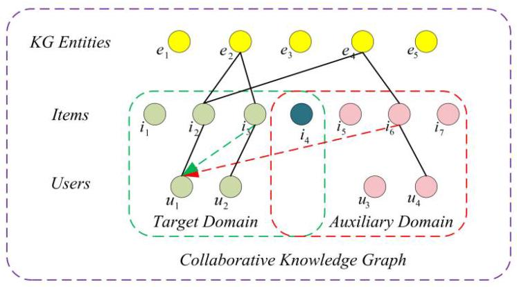
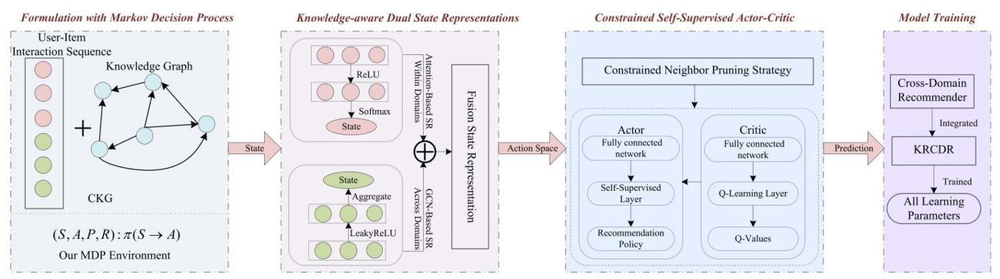
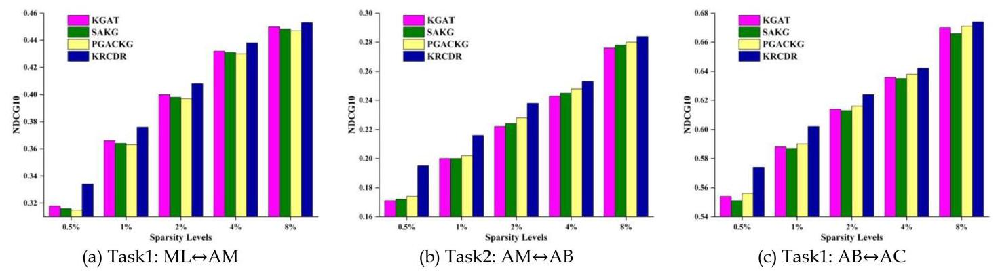
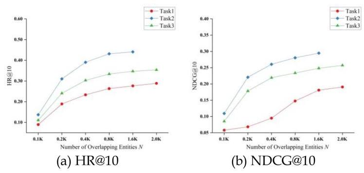
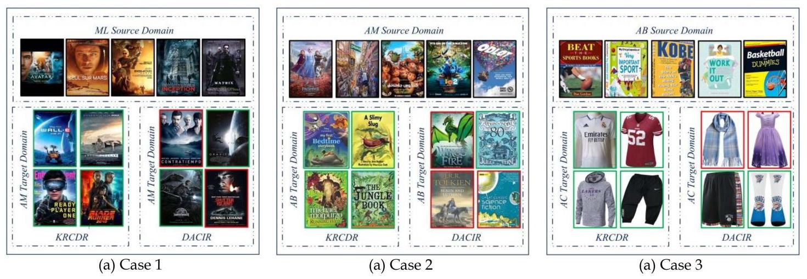

# Towards Knowledge-Aware and Deep Reinforced Cross-Domain Recommendation Over Collaborative Knowledge Graph

Yakun Li \( {}^{\circledR } \) , Lei Hou \( {}^{\circledR } \) , and Juanzi Li \( {}^{\circledR } \)

Abstract-Cross-domain recommendations (CDRs), which can leverage the relatively abundant information from a richer domain to improve the recommendation performance in a sparser domain, have attracted great attention due to their flexible recommendation strategies. Nevertheless, existing CDR approaches still suffer from severe data sparsity and low semantic sampling efficiency issues, and hardly employ existing reinforcement learning models to improve cross-domain recommendation accuracy. To this end, we propose a new Knowledge-aware and Deep Reinforced Cross-Domain Recommendation framework over Collaborative Knowledge Graph (KRCDR). Specifically, we formalize the cross-domain recommendation task as a Markov Decision Process, and propose a knowledge-aware dual state representation approach to enhance state representations within and across domains for target users by leveraging knowledge graph information. Then, to improve the training performance, we propose a Constrained Self-supervised Actor-Critic network (CSAC) model, in which a constrained neighbor pruning strategy is devised to narrow the exploration space and improve the sampling efficiency, and the CSAC is developed to improve the recommendation policy. Additionally, in our proposed CSAC model, a self-supervised output layer within domains is used as an actor network to generate the recommendation policy, and a Q-learning output layer across domains is used as a critic network to feedback reward signals. Finally, based on the KRCDR approach, we design a new algorithm to assist in generating cross-domain recommendation results. Extensive experiments have been conducted on several real-world datasets, which demonstrate the superiority of our proposed approach compared with state-of-the-art baseline methods.

Index Terms-Cross-domain recommendations, collaborative knowledge graph, reinforcement learning, self-supervised actor-critic.

## I. INTRODUCTION

RECOMMENDER systems have been widely used in many real-world application scenarios to provide users with satisfactory services, such as friend recommendations on Tweeter, product recommendations on Taobao and video recommendations on TikTok. However, some bottleneck issues (Data sparsity, Sampling efficiency, etc.) still severely limit the development of existing recommendation techniques [1], [2]. Recently, cross-domain recommendations have attracted increasing attention and become a promising recommendation solution [3]. In general, most existing CDR models aim to exploit rich knowledge from auxiliary domains to improve the recommendation accuracy in sparse target domains. In our CDR scenario, the rich or sparse knowledge primarily describe user-item interactions (e.g., ratings, clicks, purchases). Nevertheless, inefficient knowledge transfer issues caused by domain drift and noise data are likely to result in unsatisfactory recommendation performance in many CDR scenarios.

Fig. 1. Example of KG-based recommendations for single-domain and our cross-domain methods.

Knowledge graph (KG) is a structured semantic information network, where nodes represent entities, and edges represent relations between nodes. Since KG can provide rich prior knowledge from external sources, many open source works (Wiki-data, ConceptNet, and Microsoft Satori) have been applied to recommendation scenarios. The collaborative knowledge graph (CKG) can integrate user and item entities in the recommender system into the constructed KG to improve the recommendation accuracy. However, the current KG-based recommendation approaches can basically only be applied in single-domain recommender systems. For example, previous single-domain models need to recommend items in the target domain for a target user \( {u}_{1} \) in Fig. 1. In the target domain and KG, there are two interaction sequences \( \left\{  {{u}_{1} \rightarrow  {i}_{2} \rightarrow  {e}_{2}}\right\} \) and \( \left\{  {{u}_{2} \rightarrow  {i}_{3} \rightarrow  {e}_{2}}\right\} \) . Based on the same KG entity \( {e}_{2},{u}_{2} \) is considered a similar neighbor within domains of \( {u}_{1} \) , then the item \( {i}_{3} \) interacted by \( {u}_{2} \) will be recommended to \( {u}_{1} \) . Therefore, most existing works often ignore that the rich knowledge contained by KG (e.g., entity \( {e}_{4} \) in Fig. 1) can serve as a bridge between different domains to further provide additional semantic signals for CDR tasks, causing them to only focus on solving single-domain tasks such as sequential recommendation, conversation recommendation, Click-Through-Rate prediction, etc. As a result, current KG-based recommendations approaches are mainly applied to single-domain scenarios.

---

Manuscript received 8 July 2022; revised 18 March 2024; accepted 13 April 2024. Date of publication 19 April 2024; date of current version 27 September 2024. This work was supported in part by the Institute for Guo Qiang, Tsinghua University under Grant 2019GQB0003, and in part by Zhipu AI. Recommended for acceptance by Albert Mo Kim Cheng. (Corresponding author: Juanzi Li.)

Yakun Li is with the School of Information Science and Technology, Beijing Forestry University, Beijing 100107, China, and also with the Department of Computer Science and Technology, Tsinghua University, Beijing 100190, China (e-mail: lykun@bjfu.edu.cn).

Lei Hou and Juanzi Li are with the Department of Computer Science and Technology, Tsinghua University, Beijing 100190, China (e-mail: houlei@mail.tsinghua.edu.cn; lijuanzi@mail.tsinghua.edu.cn).

Digital Object Identifier 10.1109/TKDE.2024.3391268

---

Reinforcement Learning (RL), which can learn the recommendation policy by leveraging an intelligent agent that continuously interacts with the environment, has achieved impressive progress in recommendation scenarios [4]. In particular, Deep Reinforcement Learning (DRL) has powerful representation learning and function approximation properties to be equipped with recommendation systems over knowledge graphs to improve the recommendation accuracy. Specifically, DRL can train a recommendation agent that can learn user interaction and feedback to optimize the recommendation policy [5]. DRL-based recommendation has become an emerging research topic in recent years, and can be roughly divided into two categories: model-based and model-free approaches. The former aims to estimate reward and transition functions, while the latter aims to evaluate the value function or recommendation policy from interaction experiences. The main difference between them is whether the recommendation agent can learn a model of the environment [6].

Nevertheless, integrating DRL technique into real-world recommendation systems still presents some challenges. For example, the limited amount of user interaction data often degrades the recommendation performance and user experience in online scenarios. Due to the extremely large scale of item and state spaces from recommender systems, DRL techniques usually suffer from sampling efficiency issue in each next-step recommendation exploration, and have difficulty in coping with numerous types of relations and entities in real-world KGs. Furthermore, although most existing models can be applied to single-domain recommendation (SDR) scenarios, researchers have not yet explored their performance in cross-domain recommendations. Fortunately, knowledge graphs can help us explore relations between unconnected entities and even entities from different domains for recommendations. Especially in cross-domain scenarios, the structured knowledge contained in KG can be introduced and leveraged to provide rich semantic signals for CDR tasks to alleviate the problems of data sparsity and sampling inefficiency. Therefore, beyond the SDR scenario, KG-based solutions also have great potential to further explore and improve the recommendation accuracy of cross-domain tasks. For example, for the target user \( {u}_{1} \) in Fig. 1, the above SDR can be extended to cross-domain scenarios over the KG. In addition to the previous recommendation solution, we can also find two other interaction sequences \( \left\{  {{u}_{1} \rightarrow  {i}_{2} \rightarrow  {e}_{4}}\right\} \) and \( \left\{  {{u}_{4} \rightarrow  {i}_{6} \rightarrow  {e}_{4}}\right\} \) in two domains. Similarly, based on the same KG entity \( {e}_{4},{u}_{4} \) is considered a cross-domain similar neighbor of \( {u}_{1} \) , then the item \( {i}_{6} \) interacted by \( {u}_{4} \) will also be recommended to \( {u}_{1} \) .

Towards this end, in this paper, we propose a novel knowledge-aware and deep reinforced learning model by incorporating knowledge graph information into a DRL framework for cross-domain recommendations. We make the first attempt to leverage both CKG and DRL techniques to improve the CDR performance. Specifically, we formalize the cross-domain recommendation task as a Markov Decision Process (MDP) over the CKG, and explain each key component of the MDP under the CDR scenario in detail. Then, we propose a knowledge-aware dual state representation approach with KG information. To this end, based on the graph attention mechanism and graph convolutional network model, we fuse state representations from intra-domain and cross-domain neighbors to obtain preference reward signals for target users. Moreover, to further improve the exploration performance, we design a constrained neighbor pruning strategy to reduce the action space size from all candidate items in both domains. Finally, we develop a self-supervised Actor-Critic (AC) network model with two output layers to enhance the recommendation accuracy. One output layer is the self-supervised head within domains as an actor network in the recommendation agent to generate the recommendation policy, and the other is Q-learning head across domains as a critic network to estimate and optimize the recommendation policy. With the cumulative reward signals from the auxiliary and target domains, the two heads complement each other throughout the model learning stage. To validate our KRCDR approach, we perform extensive experiments on four datasets by comparing with some competitive baseline models. Experimental results on recommendation accuracy and ablation studies demonstrate that our approach can perform better than all state-of-the-art baselines.

To the best of our knowledge, this is the first work to introduce knowledge graph information into DRL-based cross-domain recommendation framework. The main contributions of our work can be summarized as follows.

- We formalize the cross-domain recommendation task as a Markov Decision Process, and leverage knowledge graph information to enhance the DRL-based CDR performance. The entity knowledge derived from CKGs can facilitate the recommendation agent to explore more knowledge-aware preference rewards for our recommendation policy.

- We propose a knowledge-aware dual state representation scheme, in which an attention mechanism is exploited to obtain the state representation within domains for target users, and a graph convolutional network is adopted to assist in calculating the state representation across domains. The final state representation is obtained by fusing the two state representations.

- We design a constrained self-supervised Actor-Critic network model, which can first leverage a constrained neighbor pruning strategy to prune the exploration spaces from numerous candidate items in both domains, and then employ the self-supervised Actor-Critic model to generate and optimize the recommendation policy.

- We conduct extensive experiments on four real-world datasets, demonstrating that our KRCDR approach can consistently outperform state-of-the-art baseline models and exhibit high sampling efficiency in CDR scenarios.

The remainder of our paper is organized as follows. Section II presents some recent works on our research topic. Then, Section III defines some related concepts and problem descriptions in this paper. Next, our proposed KRCDR approach is introduced in detail in Section IV, and extensive experiments performed on multiple tasks demonstrate the consistent superiority of our proposed approach over the baselines in Section V. Finally, our conclusions and potential future research are summarized in Section VI.

## II. RELATED WORK

## A. Cross-Domain Recommendations

Cross-domain recommendations can leverage rich knowledge from auxiliary or source domains to alleviate the data sparsity in the target domain and improve the prediction performance. Generally, based on different knowledge application strategies, most existing CDRs can be classified into two categories, i.e., knowledge transfer-based approaches and knowledge aggregation-based approaches.

Knowledge transfer-based approaches aim to leverage some deep learning techniques to transfer feature knowledge from other domains to the target domain for recommendations. The recommendation solutions have achieved promising progress and attracted more and more attention. For example, based on overlapping entities, [7] proposes a kernel-induced knowledge transfer solution, in which a domain adaptation technique is applied to adjust feature spaces of entities, and diffuse kernel completion is devised to associate non-overlapping entities, thereby boosting the performance of cross-domain recommendations. To further ensure the effectiveness of knowledge transfer, the literature [8] designs a complete tag-induced CDR model by exploiting a small set of shared tags in different domains, and then combines with joint matrix factorization to transfer knowledge encoded in both shared and domain-specific tags. Recently, to enhance the recommendation accuracy, a dual-target CDR framework [9], equipped with a dual-attention mechanism, is proposed to achieve bidirectional transfer of knowledge within and across domains. Furthermore, the literature [10] only transfers the rating knowledge across domains to avoid leaking user privacy. The literature [11] constructs a user preference matrix to achieve the transfer of cross-domain preference knowledge. However, although some other approaches [12], [13], [14] have also been proposed to alleviate the data sparsity issue, how to generate accurate recommendations for sparse target domains is still a crucial challenge.

Knowledge aggregation-based approaches can directly extract and aggregate all available knowledge from source and target domains to improve the recommendation quality in the target domain. This type of recommendations can make full use of the contents or entity side information to profile the preferences for target users. For instance, [15] fuses review texts and item contents to capture more semantic information through stacked denoising autoencoders, and then leverages a multi-layer percep-tron to train entity latent features for the final recommendation. Similar to multi-task learning models, the literature [16] adopts multi-view neural network architecture to integrate the collaborative factorization mechanism into a content-based filtering model, thereby improving the recommendation quality in the target domain. Based on the publicly available Wikipedia corpus, a cross-domain topic modeling approach is proposed to generate the recommendation results [17]. Furthermore, the literature [18] employs user social relations across domains to construct a trust-aware latent space mapping model for cross-domain recommenders. A multi-domain recommendation approach [81] is proposed to explore the association between items in the same domain and the interaction of items in different domains based on KG embedding techniques. Although the above solutions alleviate the data sparsity to some extent, they still struggle to solve the problem of inefficient data sampling. In addition, other studies [19], [20] have also explored various knowledge aggregation schemes. However, these approaches rely heavily on domain knowledge and can only yield poor recommendation results.

## B. Knowledge-Based Recommendations Over Knowledge Graphs

Knowledge-based recommendations over knowledge graphs can employ the semantic information provided by KGs to assist target users to generate accurate recommendation. Generally, they are mainly divided into three categories, i.e., path-based methods, embedding-based methods and hybrid methods.

The path-based methods can explore the rich high-order node information implicit in the KG to provide some guidance for recommendations. Such recommendations rely on various efficient connection patterns between entities. For example, the literature [21] defines a multi-dimensional KG framework containing numerous entity semantic relations, and explores diverse learning paths to recommend some customized items. To increase the interpretability of recommendations, the literature [22] leverages the reinforcement learning over the KG to find the reasoning path from target users to recommended items. Similarly, an efficient temporal-aware path reasoning framework [23] is designed over the KG to provide explicit explanations for recommendations. The literatures [24], [25], [26] also attempt to employ path-based solutions to yield promising recommendations. However, the above methods require a large amount of manually annotated domain knowledge, which limits the improvement of recommendation performance.

The embedding-based methods leverage some knowledge graph embedding algorithms to capture entity latent features, and then incorporate the learned embeddings into model learning to make recommendations. For instance, the literature [27] presents a KG embedding model to learn semantic representations between entities, and a pooling operation is exploited to characterize users' preferences towards items. Based on a sparse factorization mechanism, the literature [28] represents each item feature as a preference embedding to facilitate the training process by updating only relevant features for recommendations. Moreover, other approaches [29], [30], [31] extend the range of entity representations to train recommenders, and achieve comparable prediction performance. However, despite their outstanding performance, the above methods lack explicit modeling capabilities, resulting in user features not being accurately obtained.

The hybrid methods can combine the respective advantages of the first two methods, and model the preference features of target users by jointly learning entity embedding and high-order semantic information over KGs to generate the final recommendation. For instance, the literature [32] combines a metapath-based entropy encoder and a recurrent neural network encoder to optimize the path extraction algorithm for recommendations. The literature [33] proposes a joint learning framework to integrate explainable rules from KGs into neural recommendation models. Further, the literature [34] devises a node relevance-based modeling mechanism and a hash-based KG embedding model for deep probabilistic recommendations. In addition, some prior efforts have focused on combining multiple techniques to achieve better recommendation performance [35], [36], [37].

## C. Deep Reinforcement Learning

Deep reinforcement learning aims to train an agent that is capable of learning from interaction information provided by the environment. Therefore, DRL can leverage deep learning techniques to approximate the value function of reinforcement learning and solve high-dimensional MDPs. Most existing DRL approaches fall into three categories, i.e., Policy Gradient-based, Value Function-based and Hybrid approaches.

Policy Gradient-based approaches can directly learn the policy by updating learned parameters, which can maximize expected feedback along with gradient-based optimization algorithms. This type of approach is competent to address various complex issues to guarantee the performance improvement. For example, [38] presents the REINFORCE algorithm to adjust weights by employing the Monte Carlo policy gradient mechanism. The literature [39] exploits generative adversarial networks to train the recommendation agent to improve the robustness of policy learning. A Deep Deterministic Policy Gradient (DDPG) algorithm is designed to solve large-scale input space issue [40]. To make better decisions, the literature [41] incorporates an attention-based neural network into the REINFORCE framework for various application scenarios. In addition, some approaches further formalize the policy gradient as a deterministic policy gradient (DPG) problem to establish efficient decision networks [42], [43]. Moreover, other vanilla policy gradient approaches also explore the application of neural networks to policy optimization [44], [45]. However, large state and action spaces in the above approaches can easily lead to sampling inefficiency issues.

Value Function-based approaches aim to achieve global optimal feedback by obtaining the maximal value of the action, which is updated by the value function to learn a policy indirectly. Generally, such solutions are evaluated by dynamic learning models with fewer parameters. For instance, the literature [46] proposes a deep Q-learning network (DQN), which can employ convolutional neural network architecture to train the Q-learning model, and the output value function is used to evaluate future rewards. Further, many variants of DQN have been proposed to learn from previous experiences. The literature [47] devises a double Q-learning algorithm in large-scale function approximation scenarios. Based on the social influence among users, the literature [48] introduces an attention mechanism into the DQN to obtain more positive feedback. Furthermore, the literature [49] develops a value-based temporal difference framework, in which slate Q-values are decomposed to evaluate long-term user engagement. Nevertheless, the above schemes are not suitable for complex application scenarios due to relatively slow convergence. Although some value function-based studies have also explored other techniques to solve the MDP task [50], [51], [52], their training effects do not meet industrial needs.

Hybrid approaches combine value function-based and policy gradient-based models, also known as Actor-Critic (AC) approaches, where an actor network trains the policy based on the critic's feedback, and the critic network evaluates the policy by employing the value function. Numerous recent algorithms combine the advantages of both approaches. For example, the literature [53] introduces the Phasic Policy Gradient (PPG) framework, in which the Actor-Critic model is extended by separating the policy and value function into distinct training phases. The literature [54] proposes an on-policy deep AC model, which can handle many different continuous tasks in a large-scale empirical environment. Inspired by the representation power of knowledge graphs, the literature [55] embed KG information to the critic network to better evaluate the generated policy, and long-term semantics between entities are captured through local knowledge networks and attention mechanisms. Additionally, the literatures [56], [57] extend the AC model to multi-agent scenarios with multiple pairs of actors and critics, and achieve the comparable performance. A soft AC framework is proposed to incorporate a maximum entropy term into the Actor-Critic model to improve the exploration efficiency [58]. Furthermore, while other approaches can leverage hierarchical settings to optimize the agent's decisions [59], [60], the reward policies with fuzzy boundaries often result in inaccurate function approximations.

## III. PRELIMINARY

Cross-Domain Recommendations (CDRs): In a classic CDR scenario, there is usually a source domain with richer data and a target domain with sparser data. The data might be interaction ratings, reviews, item descriptions, and entity profiles, etc. In general, each source or target domain contains at least a user set \( U = \left\{  {{u}_{1},{u}_{2},\ldots ,{u}_{p}}\right\} \) , an item set \( I = \left\{  {{i}_{1},{i}_{2},\ldots ,{i}_{q}}\right\} \) , and an interaction rating set \( O = \left\{  {\left( {{u}_{p},{i}_{q}}\right)  \mid  {u}_{p} \in  U,{i}_{q} \in  I}\right\} \) . Each pair \( \left( {{u}_{p},{i}_{q}}\right) \) denotes a preference interaction between user entity \( {u}_{p} \) and item entity \( {i}_{q} \) . Furthermore, based on overlapping entities between two domains, most existing CDR approaches can transfer the available knowledge from the source domain to the target domain for recommendations. Without loss of generality, we assume that the two domains have some overlapping entities (Users or Items) in our paper.

Fig. 2. Overall architecture of our proposed KRCDR approach.

Collaborative Knowledge Graphs (CKGs): Inspired by recent efforts [61], [62], some external databases describing the real world (Wikidata, DBPedia, etc.) can provide some prior knowledge (Entity relations, Item attributes, etc.) to target users for recommendations. Therefore, KG entities together with user and item entities in the recommender system constitute a CKG, as shown in Fig. 1. The CKG can not only reveal the interaction information between entities, but also expose the preference features of target users. Therefore, the CKG is formalized as \( G = \left\{  {\left( {e, r,{e}^{\prime }}\right)  \mid  e,{e}^{\prime } \in  \mathcal{E}, r \in  R}\right\} \) , where \( \mathcal{E} \) represents the entity set and \( R \) represents the relation set. Each triple \( \left( {e, r,{e}^{\prime }}\right) \) denotes a fact of the relation \( r \) from the head entity \( e \) to the tail entity \( {e}^{\prime } \) . For example, the triplet (LeBron James, ActorOf, Space Jam: A New Legacy) presents the fact that LeBron James is an actor of the movie "Space Jam: A New Legacy". In addition, user entities \( U \) and item entities \( I \) in the cross-domain recommender system are connected through the interaction relations \( O \) in the CKG, where \( U, I \subseteq  \mathcal{E} \) and \( O \subseteq  R \) .

Problem Description: Given a collaborative knowledge graph \( G \) , a source domain interaction matrix \( X \) and a target domain interaction matrix \( Y \) , our goal is to construct a novel knowledge-aware and reinforced cross-domain recommendation model over collaborative knowledge graphs, and to predict the potential items that user entities in the target domain tend to prefer. The problem formulation and the final objective function are detailed in the next section.

### IV.THE PROPOSED METHOD

In this section, we introduce the knowledge-aware and deep reinforced cross-domain recommendation over the collaborative knowledge graph, and the overall framework is presented in Fig. 2. In particular, our approach can innovatively integrate KG information into the reinforcement learning architecture for cross-domain recommendations. Therefore, we begin with a Markov Decision Process formulation for our task, and then present the knowledge-aware dual state representation approach, constrained self-supervised Actor-Critic model, and our training process.

## A. Formulation With Markov Decision Process

Inspired by the literature [63], we can formulate our CDR task as the Markov Decision Process over the CKG, in which the recommendation agent across domains interacts with the knowledge-aware environment to recommend appropriate items by maximizing user cumulative rewards. Normally, the MDP can be defined by a tuple \( \left( {S,\mathcal{A},\mathcal{P},\mathcal{R},\gamma }\right) \) , where \( S \) is the set of states, \( \mathcal{A} \) is the action space, \( \mathcal{P} \) denotes the state transition function, \( \mathcal{R} \) is the reward function of the environment and \( \gamma \) is the discount factor.

State: A state \( {s}_{t} \in  S \) denotes the current search state of the agent over the CKG at step \( t \) . To balance model accuracy and sampling efficiency, we define the \( N \) -step history as an ordered sequence of all entities and relations under the past \( N \) steps in the node traversal of the collaborative knowledge graph, i.e., \( {S}_{t} = \left\{  {u,{e}_{t - N},\ldots ,{r}_{t - 1},{e}_{t - 1},{r}_{t},{e}_{t}}\right\} \) . Additionally, in our cross-domain task, the initial state \( {S}_{0} \) is assigned the target user \( {u}_{0} \) .

Action: The action space \( {\mathcal{A}}_{t} \) of state \( {S}_{t} \) refers to all possible outgoing edges of the current entity \( {e}_{t} \) in the CKG except for its historical entities and relations. Based on a given policy, the recommendation agent can output an action \( {a}_{t} = \left( {{r}_{t + 1},{e}_{t + 1}}\right)  \in \; {\mathcal{A}}_{t} \) , where \( {r}_{t + 1} \) is the connection relation between entities \( {e}_{t} \) and \( {e}_{t + 1} \) , and \( {e}_{t + 1} \) denotes the next entity during exploration. Since enumerating all possible outgoing edges of an entity is very labor-intensive and inefficient in the CKG, especially in CDR scenarios, we propose a constrained neighbor pruning strategy to keep the promising actions and maintain efficiency during exploration. The details of the process will be discussed in Section IV-C.

Transition: Generally, a state can expose the position of the current entity and the possible position of the next entity over the CKG. Given a state \( {S}_{t} \) and an action \( {a}_{t} \) , the transition to the next state \( {S}_{t + 1} \) is determined as:

\[
\mathcal{P} = \left\lbrack  {{S}_{t + 1} = \left( {u,{e}_{t + 1}}\right)  \mid  {S}_{t} = \left( {u,{e}_{t}}\right) ,{a}_{t} = \left( {{r}_{t + 1},{e}_{t + 1}}\right) }\right\rbrack   = 1
\]

(1)

In the CDR scenario, if the target user clicks some candidate items, the state transition probability is updated to \( {S}_{t + 1} \) . If it ignores all candidate items, the recommendation agent gives negative feedback and the exploration terminates.

Reward: The reward \( {\mathcal{R}}_{{e}_{t}} \) measure the quality of candidate items during the recommendation agent’s exploration at step \( t \) . However, it is not easy for the recommender to judge whether the agent has reached the desired items. Therefore, we can introduce a soft reward function based on the feedback from the recommender. To this end, a terminal reward for the terminal state \( {S}_{T} \) is defined as follows.

\[
{\mathcal{R}}_{T} = \exp \left( {f\left( {u,{e}_{T}}\right) }\right) /\mathop{\sum }\limits_{{{e}_{j} \in  I}}\exp \left( {f\left( {u,{e}_{j}}\right) }\right) \tag{2}
\]

where \( f\left( \right) \) is the scoring function, which can be flexibly adopted by different evaluation strategies, \( {e}_{j} \) denotes the embedding of item \( j \) .

Discount Factor: The discount factor \( \gamma \) is a balance parameter used to adjust future and intermediate rewards. In particular, \( \gamma  = 1 \) means the agent only focuses on future rewards, and \( \gamma  = 0 \) means the agent only focuses on intermediate rewards.

Objective Function: Based on our MDP formulation and problem definition, our goal is to learn a stochastic recommendation policy \( \pi \) that maximizes the expected cumulative reward for the target user \( u \) as follows:

\[
J\left( \zeta \right)  = \max \mathop{\sum }\limits_{{u \in  Y}}{E}_{\pi }\left( {\mathop{\sum }\limits_{{t = 0}}^{{T - 1}}{\gamma }^{t}R\left( {e}_{t}\right) }\right) \tag{3}
\]

where \( Y \) denotes the target domain system, \( \gamma \) is the discount factor, which is used to adjust the influence of the agent on the policy \( \pi \) . Next, we will detail the learning policy and model optimization in our CDR task.

Therefore, based on the above definition, our motivation is that the recommendation agent in reinforcement learning techniques can be leveraged to aggregate the state representations of similar neighbors over the structured paths in the CKG for obtaining the preference features of target users. Further, inspired by the MDP settings in ReMR [63], we can formalize the cross-domain recommendation as an MDP task over the CKG to improve the recommendation accuracy.

## B. Knowledge-Aware Dual State Representations

The state representation plays an indispensable role in obtaining preference features between entities in DRL-based recommendations. However, most existing approaches only focus on model learning, while ignoring the semantic representation and preference knowledge between entities. Recently, KG has shown promising capabilities in enriching relations between users and items through structured knowledge. Therefore, to effectively learn optimal recommendation policy, a knowledge-aware dual state representation scheme containing intra-domain and inter-domain entity knowledge is designed to facilitate the recommendation policy training over the KG. The rationale behind the scheme is that the current state representation is not only associated with the neighbors' knowledge within domains, but also with the neighbors' knowledge across domains over the CKG.

The Attention-Based State Representation Within Domains: In general, neighbor nodes within domains can provide key preference knowledge for target users in cross-domain recommender systems. Therefore, the acquisition of state representation within domains is a fundamental component of the dual state representation mechanism during exploration. In addition, since each item in the recommendation system is associated with an entity over the CKG, the widely used attention mechanism is adopted to aggregate the preference knowledge of target users' neighbors. Thus, the embedding of entities or items in individual domains \( {h}_{wi}^{j} \) can be first calculated as follows.

\[
{h}_{wi}^{j} = {W}_{k} \cdot  {v}_{{e}_{j}} \tag{4}
\]

where \( {W}_{k} \) is the input weight matrix, \( {v}_{{e}_{j}} \) is the low-dimensional vector of entities or items. Furthermore, based on the actual needs of different recommendation scenarios, we can dynamically select different neighbor aggregation strategies, such as the random walk or multi-hop reasoning approaches. Therefore, we no longer describe the neighbor aggregation process in this paper.

After the embeddings of all neighbors within domains are obtained, the attentive state representation \( {e}_{wi}^{t} \) in individual domains is calculated as follows.

\[
{e}_{wi}^{t} = \mathop{\sum }\limits_{{j \in  N\left( u\right) }}\sigma \left( {{W}_{k}^{\prime } \cdot  {h}_{wi}^{j}}\right) \tag{5}
\]

where \( N\left( u\right) \) is the neighbor set of the target user \( u \) in individual domains, \( {W}_{k}^{\prime } \) is the trainable parameter, and \( \sigma \) the activation function. Hence, leveraging the attention mechanism within domains for state representations can allow our model to focus more on key entities over the CKG and reduce inference from irrelevant entities.

The GCN-Based State Representation Across Domains: Recent advances in graph neural networks have attracted increasing attention in CDR scenarios [64]. Motivated by their ability to generate powerful representations for graph data, graph convolution networks (GCNs) are exploited to embed users, items, and other entities in the CKG. Intuitively, a cross-domain entity node can receive information propagated from its neighbors in other domains to update the representations. In other words, we can aggregate preference information for target users from associated neighbors across domains. Therefore, the state representation of the embedding propagation across domains at the current step \( {e}_{ac}^{t} \) is defined as follows.

\[
{e}_{ac}^{t} = \rho \left( {{W}_{ac} \cdot  \left( {{h}_{ac}^{k - 1}\begin{Vmatrix}{h}_{{N}^{\prime }\left( u\right) }^{k - 1}\end{Vmatrix}}\right) }\right) \tag{6}
\]

where \( {W}_{ac} \) is the weight matrix that propagates information between layers, || is the concatenation operation for different embeddings, \( \rho \) is a nonlinear activation function, such as LeakyReLU, and \( {h}_{{N}^{\prime }\left( u\right) }^{k - 1} \) is the representation information propagated by target users' neighbors across domains, which is defined as follows.

\[
{h}_{{N}^{\prime }\left( u\right) }^{k - 1} = {AGGREGATE}\left( {h}_{v}^{k - 1}\right) , v \in  {N}^{\prime }\left( u\right) \tag{7}
\]

where \( {N}^{\prime }\left( u\right) \) is the cross-domain neighbors of target users, \( {h}_{v}^{k - 1} \) is the embedding of neighbor nodes, and \( {AGGREGATE}\left( \right) \) is the aggregation function. Additionally, three commonly used aggregators (Mean aggregator, LSTM aggregator and Pooling aggregator) can be applied to our aggregation function. In practice, any aggregator can be used depending on the specific situation.

The Fusion State Representation: The representations of neighbor nodes from different domains have different contributions to the environment construction in the CDR scenario.

Thus, for a state \( {s}_{t} \) , the final state representation \( {e}_{{s}_{t}} \) is obtained by fusing the representational vectors from within and across domains.

\[
{e}_{{s}_{t}} = {e}_{wi}^{t}\parallel {e}_{ac}^{t} \tag{8}
\]

where || is the vector concatenation operation. Compared with single-domain state representations, our approach can inject knowledge graph information into state representations for target users in the MDP framework. Therefore, the component of knowledge-aware state representations can effectively improve the model training efficiency.

According to the fusion state representation \( {e}_{{S}_{t}} \) and the above MDP definition, the target user’s action \( {a}_{t} \) at the current time \( t \) is obtained as follows.

\[
{\mathbf{a}}_{t} = \left( {{r}_{t + 1},{e}_{{S}_{t}}}\right) \tag{9}
\]

where \( {r}_{t + 1} \) is the relation that connects \( {e}_{{S}_{t}} \) with \( {e}_{{S}_{t + 1}} \) .

Based on the target users' dual state representations in two domains, our approach can not only aggregate the preference knowledge in the target domain, but also obtain the preference knowledge in the auxiliary domain for target users. In particular, the GCN-based state representation derived from auxiliary domains can more accurately capture the cross-domain preference features of users, thereby providing an efficient exploration space for the model.

## C. Constrained Self-Supervised Actor-Critic Networks

It is known that directly applying DRL algorithms to CDR frameworks is unfeasible, and very large item and action spaces bring great challenges to the efficiency of the recommendation policy. Therefore, we propose a constrained self-supervised Actor-Critic network, in which a constrained neighbor pruning strategy is devised to narrow the exploration space, and a self-supervised AC model is developed to assign higher weights to actions with high cumulative rewards.

Constrained Neighbor Pruning Strategy: Naturally, although the recommendation exploration over the CKG has reduced the action space from all entities, large-scale items in both recommender systems and the neighbor range of some nodes still degrades the performance of exploration. Furthermore, since users can't be interested in all candidate items, we focus on selecting promising items based on the semantic information of nodes in the CKG. Thus, inspired by the literature [65], a neighbor pruning strategy (NPS) is proposed to find potential nodes.

The neighbors of target nodes over the path constitute an extremely large action and state spaces. To this end, the NPS is employed to focus on sampling the most relevant entity samples by comparing the similarity between target nodes and their neighbor nodes. Subsequently, a commonly used Euclidean distance approach [66] is used to measure the embedding similarity \( {\Gamma }_{u, v} \) between nodes.

\[
{\Gamma }_{u, v} = \frac{1}{1 + \sqrt{\mathop{\sum }\limits_{{i = 1}}^{d}\left( {{e}_{{u}_{i}}^{t} - {e}_{{v}_{i}}^{t}}\right) }} \tag{10}
\]

where \( v \) is the neighbor of the target node \( u, d \) is the dimension of the node feature, and \( {e}_{{u}_{i}}^{t} \) is the feature embedding of the node \( u \) in the current step \( t \) . Suppose \( {N}_{u} \) is the neighbor set of the target node \( u \) . To improve the exploration efficiency, our model defines a similarity threshold \( \theta \) , and retains neighbor nodes whose embedding similarity is greater than the threshold, thereby constructing a new neighbor set \( {\widehat{N}}_{u} \) .

To summarize, our pruning strategy can first sample a neighbor set \( {N}_{u} \) in each training epoch. Then, we design a similarity function to measure the embedding similarity between neighbor nodes and target nodes. Subsequently, the neighbor nodes whose similarity value is less than the threshold are eliminated, and only promising neighbor nodes are retained to reconstruct the neighbor set \( {\widehat{N}}_{u} \) . Finally, the new neighbor set is fed to the self-supervised Actor-Critic network for training. Such neighbor pruning strategy constrains unbounded sampling and achieves a trade-off between exploration and exploitation.

In addition, the complexity of the pruning and sampling strategy mainly consists of two aspects. Traversing and filtering the state representations of nodes' neighbors has computational complexity \( O\left( {\mathop{\sum }\limits_{{l = 1}}^{L}{h}_{l} \cdot  \left| G\right|  \cdot  \left| {\widehat{N}}_{u}\right| }\right) \) . For each iteration training, the time complexity of the representation aggregation module is \( O\left( {l \cdot  T \cdot  \left( {\left| {I}_{X}\right|  + \left| {I}_{Y}\right| }\right) }\right) \) . Ultimately, the overall complexity of the pruning and sampling process is \( O\left( {\mathop{\sum }\limits_{{l = 1}}^{L}{h}_{l} \cdot  \left| G\right|  \cdot  \left| {\widehat{N}}_{u}\right|  + {2l} \cdot  T \cdot  \left( {\left| {I}_{X}\right|  + \left| {I}_{Y}\right| }\right) }\right) \) . Empirically, our KRCDR has comparable complexity compared with the previous literature [65], [74], [81].

Self-Supervised Actor-Critic: After obtaining the pruned neighbor set and modeling the user state representation, Q-network [67] is employed to improve the recommendation policy for our CDR scenario. Since our proposed dual state representation scheme has encoded the knowledge-aware information into the entity representation, we can directly use fused state \( {s}_{t}^{\prime } \) as the input state for the RL network. Hence, we design another output layer to calculate the Q-values.

\[
Q\left( {{s}_{t}^{\prime },{a}_{t}}\right)  = \sigma \left( {{h}_{t} \cdot  {s}_{t}^{\prime } + b}\right) \tag{11}
\]

where \( \sigma \) is the activation function, \( {h}_{t} \) and \( b \) are trainable parameters of the Q-learning output layer. During our DRL training process, the Q-learning head across domains can be used as a regularizer to fine-tune the recommendation agent according to our reward policy within domains. To ensure unbiased Q-learning, our sampling process includes not only the positive feedback signals (Clicks, Retweets, etc.), but also the negative rewards (Unobserved labels, Low scores, etc.). Therefore, we define the Q-loss for DRL based on one-step TD error [68].

\[
{L}_{q} = {\left( r\left( {s}_{t}^{\prime },{a}_{t}\right)  + \gamma \max \left( Q\left( {s}_{t + 1}^{\prime },{a}^{\prime }\right)  - Q\left( {s}_{t}^{\prime },{a}_{t}\right) \right) \right) }^{2}
\]

(12)

Furthermore, to further avoid the lack of negative rewards during the Q-learning process, we co-train a RL output layer followed by the self-supervised head. Therefore, given some user-item interaction sequences and an existing cross-domain recommender, the self-supervised training loss is defined as the cross-entropy over the classification distribution.

\[
{L}_{s} = \mathop{\sum }\limits_{{i = 1}}^{n}{Y}_{i} \cdot  \log \left( {p}_{i}\right) ,\text{ where }{p}_{i} = \frac{{e}^{{y}_{i}}}{\mathop{\sum }\limits_{{{i}^{\prime } = 1}}^{n}{e}^{{y}_{{i}^{\prime }}}} \tag{13}
\]

where \( {Y}_{i} \) denotes an indicator function. If the target user interacts with the \( i - {th} \) item in the next step, the value of \( {Y}_{i} \) is 1 . This cross-entropy loss also provides negative signals by reducing the output values of items that the user has not interacted with, which contributes to the training of our CDR model in a RL setting.

In training with numerous user-item interaction pairs, the learned Q-values are unbiased, and the actions with high Q-values can receive higher weights on the self-supervised loss. Therefore, we can consider the self-supervised head within domains as an actor for generating initial recommendation policy, and the \( Q \) -learning head across domains as a critic for the final recommendation policy. Based on the above solutions, our approach can then use Q-values as weights to optimize the self-supervised loss.

\[
{L}_{A} = {L}_{s} \cdot  Q\left( {{s}_{t}^{\prime },{a}_{t}}\right) \tag{14}
\]

Such processing is similar to the existing AC model. To maintain stability, we stop the gradient updating and fix the Q-values, when they are used to provide feedback signals. Then, we jointly train the actor and critic networks, and the training loss is formulated as follows.

\[
{L}_{KRCDR} = {L}_{A} + {L}_{q} \tag{15}
\]

In our CDR scenarios, the learning of the Q-values is not always stable, especially when the sampling process is unbalanced. To alleviate the issue, we can pre-train our proposed model by dividing some branches. When the Q-values are generally stable, we can use them to reweight the network and perform updates.

## D. Model Training

Following the recommendation models of BPR [69] and its variant CBPR [72], we adopt the probabilistic ranking optimization approach as our recommendation agent, and integrate it with our proposed KRCDR to train the model parameters through an iterative process. More specifically, we first freeze model parameters and then sample negative items from the target domain to pair positive interactions from the two domains. Then, they are fed to the cross-domain recommender, and the parameters are updated via the stochastic gradient descent strategy. As mentioned above, our approach can employ the cross-entropy loss as self-supervised loss to train the network. The training process of KRCDR is shown in Algorithm 1.

Based on the given the interaction sequences and the CKG, we can compute the probability that an action may take some desired items. Then, we rank the candidate items according to their probabilities, and select the top-ranked values as the final cross-domain recommendation result. Therefore, our model can easily be extended to other CDR scenarios to alleviate data sparsity and sampling efficiency issues.

Complexity Analyses: The time complexity of the model under two domains mainly consists of two modules. (1) Establishing and learning the state representation for entities has time complexity \( O\left( {d\left( {\left| G\right|  + {2k}\left| U\right|  \cdot  \left| I\right| }\right) }\right) , d \) is the embedding dimension, \( k \) is the number of layers, \( \left| U\right| \) and \( \left| I\right| \) denote the total number of users and items for the two domains, respectively. (2) The time cost of the neighbor pruning module is \( O\left( {n\left( {{\left| U\right| }^{2} + {\left| I\right| }^{2}}\right) }\right) , n \) is a linear constant. As a result, the time complexity of the entire model training is \( O\left( {d\left( {\left| G\right|  + {2k}\left| U\right|  \cdot  \left| I\right| }\right)  + n\left( {{\left| U\right| }^{2} + {\left| I\right| }^{2}}\right) }\right) \) . On the other hand, since it does not introduce too many training parameters, the space complexity of our proposed KRCDR is largely determined by the interaction sequence encoder, \( O\left( {{2k}\left( {\left| U\right|  + \left| I\right| }\right) }\right) \) . Moreover, the additional mandatory space allocation for model training is \( O\left( {n{k}^{2}}\right) \) . Therefore, the overall space complexity of the proposed approach is \( O\left( {k\left( {2\left| U\right|  + 2\left| I\right| }\right)  + {nk}}\right) \) . Empirically, KRCDR has comparable time and space complexity compared to various advanced CDR models, which is no longer shown in detail due to space constraints.

Algorithm 1: Training KRCDR.

Input: User-item interaction sequence set in the source domain

---

\( X \) , User-item interaction sequence set in the target domain \( Y \) ,

collaborative knowledge graph \( G \) , reinforcement head \( Q \) ,

self-supervised head \( D \) and training threshold \( \theta \)

Output: all parameters in the learning model \( \Theta \)

		Initialize all learning parameters

		Repeat

			For a target user \( u \in  U\_ t \) // \( U\_ t \) is users in the target

			domain

				Take an equally mini-batch from \( X \) and \( Y \) to form a

				training sample // Sample from the datasets

				Obtain state representations \( {e}_{w}{i}^{t} \) and \( {e}_{a}{c}^{t} \) over the \( G \)

				according to (5) and (6) // by Dual State Representation

				Scheme

				\( {e}_{{s}_{t}} = {e}_{wi}^{t}\parallel {e}_{ac}^{t}\parallel \) Fused state representations

				Obtain a pruned neighbor set \( {\widehat{N}}_{u} \) by NPS

				Generating random variable \( \Phi // \) Trained intermediate

				parameter

				if \( {\widehat{N}}_{u}! = \varnothing \) then //Neighbor nodes are not empty

				\( \operatorname{argmax}Q\left( {{s}_{t}^{\prime },{a}_{t}}\right) \) // Q-loss is learned by TD error

				\( {L}_{q} = {\left( r\left( {s}_{t}^{\prime },{a}_{t}\right)  + \gamma \max \left\lbrack  \left( Q\left( {s}_{t + 1}^{\prime },{a}^{\prime }\right)  - Q\left( {s}_{t}^{\prime },{a}_{t}\right) \right) \right) \right) }^{2} \)

				if \( \Phi  \leq  \theta \) then // Intermediate parameter is less than the

				threshold

					Perform gradient updates by \( {\nabla }_{\Theta }{L}_{q} \)

					else // Q-loss is not convergent

					\( {L}_{s} = \mathop{\sum }\limits_{{i = 1}}^{n}{Y}_{i} \cdot  \log \left( {p}_{i}\right) \) , where \( {p}_{i} = \frac{{e}^{{y}_{i}}}{\mathop{\sum }\limits_{{{i}^{\prime } = 1}}^{n}{e}^{{y}_{{i}^{\prime }}}} \)

					\( {L}_{A} = {L}_{s} \cdot  Q\left( {{s}_{t}^{\prime },{a}_{t}}\right) ,{L}_{KRCDR} = {L}_{A} + {L}_{q} \)

					Perform gradient updates by \( {\nabla }_{\Theta }{L}_{KRCDR} \)

				End if

			else //No untraversed neighbor nodes

				\( \operatorname{argmax}Q\left( {{s}_{t + 1}^{\prime },{a}_{t}}\right) \)

		\( {v}_{q} = {\left( r\left( {s}_{t + 1}^{\prime },{a}_{t}\right)  + \gamma \max \left\lbrack  Q\left( {s}_{t + 2}^{\prime },{a}^{\prime }\right)  - Q\left( {s}_{t + 1}^{\prime },{a}_{t}\right) \right) \right) }^{2} \)

				if \( \Phi  \leq  \theta \) then // Intermediate parameter is less than the

				threshold

				Perform gradient updates by \( {\nabla }_{\Theta }{L}_{q} \)

				else \( //Q \) -loss is not convergent

				\( {L}_{s} = \mathop{\sum }\limits_{{i = 1}}^{n}{Y}_{i} \cdot  \log \left( {p}_{i}\right) \) , where \( {p}_{i} = \frac{{e}^{{y}_{i}}}{\mathop{\sum }\limits_{{{i}^{\prime } = 1}}^{n}{e}^{{y}_{{i}^{\prime }}}} \)

				\( {L}_{A} = {L}_{s} \cdot  {Q}^{\prime }\left( {{s}_{t + 1}^{\prime },{a}_{t}}\right) ,{L}_{KRCDR} = {L}_{A} + {L}_{q} \)

				Perform gradient updates by \( {\nabla }_{\Theta }{L}_{KRCDR} \)

				End if

			End if

			step \( \mathbf{t} + \mathbf{1} \) //Next iteration procedure

	Until loss function \( {L}_{KRCDR} \) converges

	: Return all learning parameters

---

To conclude, the innovation of our work is the first attempt to leverage CKG information and RL technique to improve the prediction performance of CDR scenarios. Different from the PCRec [64], which can only use GNN encoder to encode sub-graphs, the attention mechanism and GCNs are adopted respectively to obtain the state representation of entities within and across domains in our proposed approach. In the pruning strategy of KGPolicy [65], the scoring function is devised to heuristically obtain potential candidate neighbors for yielding high-quality negative samples, which is not suitable for CDR scenarios. In contrast, our constrained neighbor pruning module innovatively leverages the Euclidean distance mechanism to measure the similarity of entity representations to alleviate the inefficient and unbounded sampling issue. In addition, ReMR [63] mainly focuses on defining single-level MDPs to extract reasoning paths over multi-level KGs for the interpretability of recommendations, but its recommendation policy fails to perform well in sparse scenarios. To alleviate the above issues, we have pioneered the formalization of the CDR as an MDP task on the CKG to learn the optimal recommendation policy. Therefore, this is the first time to combine the CKG and RL techniques to improve the CDR performance and solve the problems of data sparsity and sampling inefficiency.

## V. EXPERIMENTS

In this section, we conduct extensive experiments on four real-world datasets to evaluate the performance of our proposed KRCDR approach, aiming to answer the following research questions (RQs):

RQ1: How Does KRCDR Perform Compared to State-of-the-art Single-Domain and Cross-Domain Baselines in Terms of Recommendation Accuracy?

RQ2: Can KRCDR Effectively Improve Exploration and Sample efficiency?

RQ3: How Does KRCDR Perform At Different Sparsity levels?

RQ4: How do different components (e.g., knowledge-aware dual state representation, self-supervised Q-learning, MDP settings in RL and the number of overlapping entities) affect KRCDR performance?

## A. Dataset Descriptions and Evaluation Metrics

To effectively evaluate the recommendation performance of the proposed KRCDR approach and the baselines, we leverage four publicly datasets as our experimental data, including three Amazon datasets \( {}^{1} \) (AmazonMovie, AmazonBook, AmazonCloth-ing), and a MovieLens-20M dataset \( {}^{2} \) . For all datasets, we remove user and item entities with less than 5 interaction records to minimize the interference of noisy data on training. Since we need to obtain the knowledge graph information for entities in recommender systems, we leverage a commonly used graph structuring tool, Microsoft Satori \( {}^{3} \) , to construct the CKG for each dataset.

TABLE I

STATISTICS OF DATASETS FOR EXPERIMENTS

<table><tr><td></td><td>MovieLens- 20M</td><td colspan="3">Amazon</td></tr><tr><td>Domains</td><td>Movie</td><td>Movie</td><td>Book</td><td>Clothing</td></tr><tr><td>#Users</td><td>21,417</td><td>18,563</td><td>56,381</td><td>41,338</td></tr><tr><td>#Items</td><td>19,008</td><td>11,005</td><td>16,673</td><td>30,201</td></tr><tr><td>#Interactions</td><td>618,325</td><td>474,909</td><td>836,505</td><td>341,507</td></tr><tr><td>#Entities</td><td>87,093</td><td>39,872</td><td>63,917</td><td>49,552</td></tr><tr><td>#Relations</td><td>32</td><td>15</td><td>28</td><td>19</td></tr><tr><td>#CKG triples</td><td>524,630</td><td>316,899</td><td>1,704,532</td><td>103,119</td></tr></table>

Amazon is a product rating dataset containing extensive reviews and metadata collected from real-world e-commerce web-sites. We employ three domains of diverse sizes and properties, Movie, Book, and Clothing. The ratings are ranging from 1 to 5 .

MovieLens-20M is a stable benchmark dataset released from MovieLens online system. The datasets are collected over various periods of time, and their ratings vary from 1 to 5 . These datasets are all structured and linked with Microsoft Satori.

In real-world scenarios, data volumes between two domains often suffer from large differences and inconsistent distributions. To address the above challenges, we can adopt some data preprocessing and alignment strategies (such as rating pattern alignment, neural entity alignment, etc.) to achieve model training efficiently with different domain data, as mentioned in literatures [2], [6]. Further, our proposed KRCDR approach can leverage fewer categories of basic metadata (user ID, item ID, interactions, entity, relations, etc.) to more flexibly adapt to various real-world scenarios. The processed dataset consists of two components, user-item interaction sequences and collaborative knowledge graph information. Each knowledge-aware fact is represented as a conceptual edge over the CKG. In the training set, we can take the observed interactions as positive samples and employ a sampler to sample negative items to form pairs for model training. In summary, the statistics of the datasets are shown in Table I. In addition, five commonly used metrics are adopted to evaluate the performance of the model: \( {HR},{NDCG} \) , Precision, Recall, and F1 [24], [63].

## B. Experimental Settings

To better verify the experimental results, we compare our proposed KRCDR approach with five types of state-of-the-art baselines, which are described in detail below.

KG-Aware (Cross-Domain) Recommendation

KGAT [70]: This is a recently proposed KG-based approach, which can model high-order connectivity between entities over the KG and propagates the embeddings from a node's neighbors by leveraging graph attention networks.

SemStim [71]: The model leverages semantic links in a KG (e.g., Wikipedia) to aggregate the preference knowledge across domains, and then improves the CDR accuracy based on an unsupervised graph training algorithm.

---

\( {}^{1} \) http://jmcauley.ucsd.edu/data/amazon/

\( {}^{2} \) https://grouplens.org/datasets/movielens/20m/

---

PGACKG [72]: It devises a preference-aware graph attention network mechanism over the CKG to obtain the preference features of similar entities within and across domains to generate the final recommendation result.

## RL-based Recommendation

PGPR [73]: This is a representative RL-based framework, in which a policy-guided graph search mechanism is devised to optimize the soft reward policy and user-conditional action pruning based on the structured information provided by KGs.

ADAC [26]: This is a state-of-the-art recommendation model based on self-supervised RL framework, in which both self-supervised Q-learning and Actor-Critic schemes are designed to train the agent to improve the recommendation accuracy.

KG-aware RL-based Recommendation

Mcore [74]: This model proposes a multi-agent framework to perform KG reasoning, and collaboratively trains the recommendation model by constructing an asynchronous RL pipeline.

SAKG [75]: Based on the analysis of reviews and ratings, it proposes a sentiment-aware policy learning approach by employing RL technique to improve the accuracy and explainability of recommendations.

Transfer Learning-Based Cross-Domain Recommendation

TCF [76]: It is an advanced CDR framework that integrates the collective matrix factorization into a collaborative filtering architecture to transfer the preference knowledge across domains.

EMCDR [77]: This baseline adopts a multi-layer percep-tron to model entity feedbacks from multiple domains into latent factor spaces, and constructs a mapping function to learn domain-specific features of entities to alleviate the data sparsity in the target domain.

CDTM [78]: To solve the negative transfer of knowledge across domains, the solution proposes a centralized-distributed transfer model to learn the representation features of entities in different domains.

RL-based Cross-Domain Recommendation

UAF [79]: This is a RL-based cross-domain solution that designs a personalized policy network to transfer the available knowledge, and then employs user-specific adaptive fine-tuning technique to automatically select the pre-trained layers for recommendations.

DACIR [80]: It proposes a doubly-adaptive deep RL-based CDR framework, which can learn a transferable policy via reward correlation and dynamic interaction patterns.

We preprocess entities (users and items) and side information in all datasets, and define three CDR tasks to validate the recommendation performance based on partially overlapping entities. The tasks are described as Task 1: MovieLens-20M (ML) \( \leftrightarrow \) AmazonMovie (AM), Task 2: AmazonMovie (AM) \( \leftrightarrow \) Ama-zonBook (AB), Task 3: AmazonBook (AB) \( \leftrightarrow \) AmazonClothing (AC). All ratings and entity data from the source domain are used for model training. 70% of the data in the target domain are randomly selected as the test set to further split the datasets. The remaining 15% of the data in the target domain is randomly selected as the validation set to tune the hyperparameters, while the other 15% is sampled for training. The goal of each task is to employ two domain data alternately as the target domain and source domain to verify the cross-domain recommendation performance. Therefore, although different tasks use part of the same dataset (half of the datasets are the same), due to the different settings of the test set, validation set and training set in the target domain, the same dataset has some differences in recommendation performance under different tasks. However, the experimental results of each task still demonstrate the effectiveness of our proposed KRCDR approach, which has been verified in the next section. We employ the Adam Optimize to optimize all models by setting the batch size to 1024 , and apply grid search to tune the hyper-parameters based on their setting strategies in the original papers. For our proposed KRCDR model, the learning rates for the recommender is searched in \( \{ {0.0001},{0.001},{0.01},{0.1}\} \) , and the coefficients of \( {L}_{2} \) regularization is adjusted in \( \{ {0.0005},{0.001},{0.05},{0.1}\} \) .

In addition, we attempt to search the number of exploration operations in \( \{ 1,2,3,4\} \) , and report its impact in Section V-D. The size of pruned neighbors is searched in \( \{ 2,4,8,{16},{32},{64} \) , 128 \}, and the action dropout rate can be set to 0.5 . To avoid over-fitting training, we can set the dimension of action embedding to 512 and the weight matrix of graph neural network to 1024. For all datasets, our model can be trained for 100 epochs by exploiting the Adam Optimization, and the weight of the entropy loss is 0.001 . Furthermore, the CKG embedding size is set to 50 , the size of the hidden state is set to 64 .

## C. Performance Comparison (for RQ1)

In this section, we compare our KRCDR model with some competitive baseline approaches in terms of overall recommendation performance. For single-domain baselines, we train them and report their results on each dataset. The top ranking number of candidate items is set to5,10,15, and the final results are obtained based on the average of multiple quantitative experiments. Tables II-IV show the performance of Top-k recommendation on three tasks, and some observations are summarized as follows.

- For KG-based models (i.e., KGAT, SemStim and PGACKG), our KRCDR obtains consistently better performance than the baselines on all evaluation metrics. For example, KRCDR improves over the KG-based baseline (SemStim) w.r.t NDCG@510,15 by 18.58%, 14.71%, 16.70%, when the MovieLens-20M is used as the target domain in task 1. The reason may be that the knowledge-aware dual state representation can assist our model to obtain more semantic information and preference knowledge for target users than other baselines.

- For RL-based models (i.e., PGPR, ADAC, Mcore, SAKG, UAF and DACIR), our KRCDR achieves a better performance on all three tasks. The major reason is that the proposed method can not only capture more knowledge dependencies from entities across domains, but also learn additional collaborative signals and cumulative rewards to enhance the recommendation performance. Furthermore, based on the CDR architecture, our proposed KRCDR adopts more powerful self-supervised mechanism than other baselines that only employ RL or self-supervised techniques.

TABLE II

OVERALL PERFORMANCE COMPARISON IN TASK 1

<table><tr><td rowspan="2">Methods</td><td colspan="6">ML</td><td colspan="6">\( {AM} \)</td></tr><tr><td>HR5</td><td>NG5</td><td>HR10</td><td>NG10</td><td>HR15</td><td>NG15</td><td>HR5</td><td>NG5</td><td>HR10</td><td>NG10</td><td>HR15</td><td>NG15</td></tr><tr><td>KGAT</td><td>0.2453</td><td>0.1893</td><td>0.2484</td><td>0.1940</td><td>0.2531</td><td>0.1965</td><td>0.2008</td><td>0.1506</td><td>0.2069</td><td>0.1553</td><td>0.2114</td><td>0.1595</td></tr><tr><td>PGPR</td><td>0.2507</td><td>0.2020</td><td>0.2573</td><td>0.2076</td><td>0.2644</td><td>0.2118</td><td>0.2216</td><td>0.1744</td><td>0.2258</td><td>0.1791</td><td>0.2310</td><td>0.1835</td></tr><tr><td>ADAC</td><td>0.2552</td><td>0.2116</td><td>0.2590</td><td>0.2179</td><td>0.2667</td><td>0.2235</td><td>0.2308</td><td>0.1828</td><td>0.2362</td><td>0.1873</td><td>0.2399</td><td>0.1930</td></tr><tr><td>Mcore</td><td>0.2609</td><td>0.2213</td><td>0.2600</td><td>0.2247</td><td>0.2705</td><td>0.2288</td><td>0.2374</td><td>0.1872</td><td>0.2406</td><td>0.1922</td><td>0.2438</td><td>0.2007</td></tr><tr><td>SAKG</td><td>0.2663</td><td>0.2281</td><td>0.2708</td><td>0.2336</td><td>0.2749</td><td>0.2355</td><td>0.2408</td><td>0.1934</td><td>0.2437</td><td>0.1980</td><td>0.2502</td><td>0.2015</td></tr><tr><td>TCF</td><td>0.2714</td><td>0.2361</td><td>0.2748</td><td>0.2395</td><td>0.2800</td><td>0.2437</td><td>0.2458</td><td>0.2006</td><td>0.2482</td><td>0.2074</td><td>0.2540</td><td>0.2153</td></tr><tr><td>SemStim</td><td>0.2929</td><td>0.2616</td><td>0.2973</td><td>0.2733</td><td>0.3016</td><td>0.2748</td><td>0.2705</td><td>0.2340</td><td>0.2748</td><td>0.2376</td><td>0.2789</td><td>0.2441</td></tr><tr><td>EMCDR</td><td>0.3040</td><td>0.2734</td><td>0.3075</td><td>0.2781</td><td>0.3124</td><td>0.2830</td><td>0.2817</td><td>0.2483</td><td>0.2867</td><td>0.2499</td><td>0.2903</td><td>0.2536</td></tr><tr><td>CDTM</td><td>0.3053</td><td>0.2754</td><td>0.3102</td><td>0.2790</td><td>0.3159</td><td>0.2845</td><td>0.2836</td><td>0.251I</td><td>0.2873</td><td>0.2558</td><td>0.2926</td><td>0.2600</td></tr><tr><td>PGACKG</td><td>0.3144</td><td>0.2806</td><td>0.3173</td><td>0.2820</td><td>0.3198</td><td>0.2901</td><td>0.2887</td><td>0.2605</td><td>0.2939</td><td>0.2622</td><td>0.2993</td><td>0.2783</td></tr><tr><td>UAF</td><td>0.3208</td><td>0.2932</td><td>0.3246</td><td>0.2971</td><td>0.3270</td><td>0.3004</td><td>0.2977</td><td>0.2733</td><td>0.3028</td><td>0.2772</td><td>0.3074</td><td>0.2829</td></tr><tr><td>DACIR</td><td>0.3214*</td><td>0.2953*</td><td>0.3261*</td><td>0.2999*</td><td>03286*</td><td>0.3019*</td><td>0.2995*</td><td>0.2748*</td><td>0.3052*</td><td>0.2800*</td><td>0.3091*</td><td>0.2847*</td></tr><tr><td>KRCDR</td><td>0.3389</td><td>0.3102</td><td>0.3423</td><td>0.3135</td><td>0.3480</td><td>0.3207</td><td>0.3168</td><td>0.2906</td><td>0.3225</td><td>0.2972</td><td>0.3299</td><td>0.3060</td></tr></table>

\( \mathrm{{Ng}} \) is short for NDCG. * denotes the best baseline score.

TABLE III

OVERALL PERFORMANCE COMPARISON IN TASK 2

<table><tr><td rowspan="2">Methods</td><td colspan="6">AM</td><td colspan="6">\( {AB} \)</td></tr><tr><td>HR5</td><td>NG5</td><td>HR10</td><td>NG10</td><td>HR15</td><td>NG15</td><td>HR5</td><td>NG5</td><td>HR10</td><td>NG10</td><td>HR15</td><td>NG15</td></tr><tr><td>KGAT</td><td>0.5006</td><td>0.4832</td><td>0.5048</td><td>0.4867</td><td>0.5089</td><td>0.4920</td><td>0.5431</td><td>0.5146</td><td>0.5473</td><td>0.5194</td><td>0.5539</td><td>0.5240</td></tr><tr><td>PGPR</td><td>0.5127</td><td>0.4908</td><td>0.5170</td><td>0.4972</td><td>0.5224</td><td>0.5033</td><td>0.5519</td><td>0.5216</td><td>0.5571</td><td>0.5288</td><td>0.5647</td><td>0.5345</td></tr><tr><td>ADAC</td><td>0.5205</td><td>0.5038</td><td>0.5264</td><td>0.5070</td><td>0.5289</td><td>0.5120</td><td>0.5633</td><td>0.5341</td><td>0.5675</td><td>0.5372</td><td>0.5700</td><td>0.5429</td></tr><tr><td>Mcore</td><td>0.5248</td><td>0.5100</td><td>0.5316</td><td>0.5114</td><td>0.5327</td><td>0.5245</td><td>0.5721</td><td>0.5409</td><td>0.5713</td><td>0.5422</td><td>0.5755</td><td>0.5507</td></tr><tr><td>SAKG</td><td>0.5321</td><td>0.5135</td><td>0.5382</td><td>0.5175</td><td>0.5409</td><td>0.5294</td><td>0.5773</td><td>0.5466</td><td>0.5789</td><td>0.5480</td><td>0.5807</td><td>0.5572</td></tr><tr><td>TCF</td><td>0.5439</td><td>0.5214</td><td>0.5471</td><td>0.5273</td><td>0.5538</td><td>0.5320</td><td>0.5807</td><td>0.5515</td><td>0.5842</td><td>0.5561</td><td>0.5896</td><td>0.5635</td></tr><tr><td>SemStim</td><td>0.5607</td><td>0.5445</td><td>0.5656</td><td>0.5480</td><td>0.5712</td><td>0.5532</td><td>0.6009</td><td>0.5704</td><td>0.6058</td><td>0.5761</td><td>0.6093</td><td>0.5807</td></tr><tr><td>EMCDR</td><td>0.5673</td><td>0.5501</td><td>0.5728</td><td>0.5547</td><td>0.5760</td><td>0.5580</td><td>0.6044</td><td>0.5802</td><td>0.6105</td><td>0.5848</td><td>0.6172</td><td>0.5896</td></tr><tr><td>CDTM</td><td>0.5741</td><td>0.5630</td><td>0.5778</td><td>0.5694</td><td>0.5831</td><td>0.5759</td><td>0.6134</td><td>0.5927</td><td>0.6199</td><td>0.5955</td><td>0.6258</td><td>0.6013</td></tr><tr><td>PGACKG</td><td>0.5900</td><td>0.5827</td><td>0.5938</td><td>0.5842</td><td>0.6001</td><td>0.5943</td><td>0.6265</td><td>0.6009</td><td>0.6274</td><td>0.6168</td><td>0.6356</td><td>0.6117</td></tr><tr><td>UAF</td><td>0.5908</td><td>0.5843</td><td>0.5964</td><td>0.5880</td><td>0.6021</td><td>0.5962</td><td>0.6377</td><td>0.6190</td><td>0.6395</td><td>0.6208</td><td>0.6436</td><td>0.6263</td></tr><tr><td>DACIR</td><td>0.5962*</td><td>0.5899*</td><td>0.6004*</td><td>0.5910*</td><td>0.6053*</td><td>0.6001*</td><td>0.6398*</td><td>0.6215*</td><td>0.6417*</td><td>06226*</td><td>0.6472*</td><td>0.6280*</td></tr><tr><td>KRCDR</td><td>0.6130</td><td>0.6017</td><td>0.6172</td><td>0.6025</td><td>0.6224</td><td>0.6100</td><td>0.6524</td><td>0.6301</td><td>0.6593</td><td>0.6345</td><td>0.6618</td><td>0.6427</td></tr></table>

\( \mathrm{{Ng}} \) is short for NDCG. * denotes the best baseline score.

- For other state-of-the-art embedding- or transfer-based CDR models (i.e., TCF, EMCDR and CDTM), our approach also consistently outperforms baseline models on all datasets. The result indicates that formalizing the CDR task over the CKG into the MDP settings can effectively improve the prediction accuracy of cross-domain recommendations. In particular, transfer learning-based methods (i.e., TCF and CDTM) usually transfer all relevant knowledge from the auxiliary domain to the target domain directly and roughly to generate recommendations, which often results in negative transfer and poor recommendations due to domain heterogeneity issues. Different from the above transfer schemes, deep reinforcement learning-based solutions (i.e., UAF, DACIR and KRCDR) prefer to adopt some knowledge aggregation strategies through recommendation agents or policy networks in DRL to yield recommendation results, which alleviates the problem of inefficient knowledge transfer across domains to some extent.

- To conclude, our proposed KRCDR approach consistently performs better than all baselines across the three tasks in terms of HR and NDCG evaluation metrics. In particular, our KRCDR yields remarkable improvements over the baseline model (UAF) w.r.t HR@510,15 by 9.12%, 9.87%, 11.15%, when the AmazonBook is used as the target domain in task 3. Such improvements have been attributed to the following aspects: a) By leveraging the rich knowledge in the source domain and constructed CKG, KRCDR can leverage more available information to alleviate the data sparsity in the target domain and improve the recommendation performance; b) Based on the CKG and constrained neighbor pruning strategy in DRL settings, KRCDR has the ability to narrow the large-scale exploration space and improve the sampling efficiency.

TABLE IV

OVERALL PERFORMANCE COMPARISON IN TASK 3

<table><tr><td rowspan="2">Methods</td><td colspan="6">\( {AB} \)</td><td colspan="6">\( {AC} \)</td></tr><tr><td>HR5</td><td>NG5</td><td>HR10</td><td>NG10</td><td>HR15</td><td>NG15</td><td>HR5</td><td>NG5</td><td>HR10</td><td>NG10</td><td>HR15</td><td>NG15</td></tr><tr><td>KGAT</td><td>0.3408</td><td>0.3157</td><td>0.3446</td><td>0.3209</td><td>0.3482</td><td>0.3255</td><td>0.4012</td><td>0.3734</td><td>0.4058</td><td>0.3780</td><td>0.4103</td><td>0.3826</td></tr><tr><td>PGPR</td><td>0.3514</td><td>0.3241</td><td>0.3565</td><td>0.3270</td><td>0.3609</td><td>0.3347</td><td>0.4126</td><td>0.3808</td><td>0.4173</td><td>0.3854</td><td>0.4280</td><td>0.3920</td></tr><tr><td>ADAC</td><td>0.3703</td><td>0.3417</td><td>0.3754</td><td>0.3475</td><td>0.3799</td><td>0.3508</td><td>0.4326</td><td>0.4000</td><td>0.4351</td><td>0.4012</td><td>0.4372</td><td>0.4138</td></tr><tr><td>Mcore</td><td>0.3738</td><td>0.3462</td><td>0.3790</td><td>0.3500</td><td>0.3821</td><td>0.3544</td><td>0.4385</td><td>0.4063</td><td>0.4428</td><td>0.4074</td><td>0.4399</td><td>0.4182</td></tr><tr><td>SAKG</td><td>0.3772</td><td>0.3504</td><td>0.3820</td><td>0.3547</td><td>0.3849</td><td>0.3583</td><td>0.4445</td><td>0.4091</td><td>0.4487</td><td>0.4099</td><td>0.4438</td><td>0.4205</td></tr><tr><td>TCF</td><td>0.3809</td><td>0.3528</td><td>0.3853</td><td>0.3565</td><td>0.3886</td><td>0.3627</td><td>0.4490</td><td>0.4104</td><td>0.4521</td><td>0.4150</td><td>0.4569</td><td>0.4238</td></tr><tr><td>SemStim</td><td>0.4033</td><td>0.3708</td><td>0.4079</td><td>0.3741</td><td>0.4136</td><td>0.3790</td><td>0.4705</td><td>0.4328</td><td>0.4737</td><td>0.4352</td><td>0.4792</td><td>0.4399</td></tr><tr><td>EMCDR</td><td>0.4171</td><td>0.3815</td><td>0.4227</td><td>0.3880</td><td>0.4278</td><td>0.3912</td><td>0.4844</td><td>0.4409</td><td>0.4893</td><td>0.4446</td><td>0.4925</td><td>0.4473</td></tr><tr><td>CDTM</td><td>0.4232</td><td>0.3938</td><td>0.4289</td><td>0.4011</td><td>0.4333</td><td>0.4037</td><td>0.4955</td><td>0.4520</td><td>0.4992</td><td>0.4568</td><td>0.5025</td><td>0.4604</td></tr><tr><td>PGACKG</td><td>0.4439</td><td>0.4136</td><td>0.4478</td><td>0.4135</td><td>0.4437</td><td>0.4234</td><td>0.5162</td><td>0.4770</td><td>0.5139</td><td>0.4730</td><td>0.5121</td><td>0.4843</td></tr><tr><td>UAF</td><td>0.4506</td><td>0.4200</td><td>0.4517</td><td>0.4235</td><td>0.4592</td><td>0.4329</td><td>0.5204</td><td>0.4829</td><td>0.5228</td><td>0.4883</td><td>0.5286</td><td>0.4941</td></tr><tr><td>DACIR</td><td>0.4611*</td><td>0.4273*</td><td>0.4590*</td><td>0.4303*</td><td>0.4636*</td><td>0.4448*</td><td>0.5312*</td><td>0.4905*</td><td>0.5354*</td><td>0.4909*</td><td>0.5337*</td><td>0.5060*</td></tr><tr><td>KRCDR</td><td>0.4917</td><td>0.4595</td><td>0.4963</td><td>0.4633</td><td>0.5104</td><td>0.4681</td><td>0.5630</td><td>0.5186</td><td>0.5672</td><td>0.5259</td><td>0.5728</td><td>0.5344</td></tr></table>

\( \mathrm{{Ng}} \) is short for NDCG. * denotes the best baseline score.

TABLE V

IMPACT OF EXPLORATION OPERATION NUMBERS

<table><tr><td rowspan="2"></td><td colspan="2">Task 1</td><td colspan="2">Task 2</td><td colspan="2">Task 3</td></tr><tr><td>HR10</td><td>NDCG10</td><td>HR10</td><td>NDCG10</td><td>HR10</td><td>NDCG10</td></tr><tr><td>KRCDR 1</td><td>0.3453</td><td>0.2705</td><td>0.6002</td><td>0.5209</td><td>0.4597</td><td>0.3971</td></tr><tr><td>KRCDR 2</td><td>0.3518</td><td>0.2747</td><td>0.6045</td><td>0.5331</td><td>0.4636</td><td>0.4029</td></tr><tr><td>KRCDR 3</td><td>0.3540</td><td>0.2812</td><td>0.6123</td><td>0.5584</td><td>0.4680</td><td>0.4118</td></tr><tr><td>KRCDR 4</td><td>0.3209</td><td>0.2664</td><td>0.5807</td><td>0.4998</td><td>0.4233</td><td>0.3765</td></tr></table>

## D. Exploration and Sample Efficiency (RQ2)

We first investigate how the number of exploration operations affects the recommendation performance for the recommendation policy over the CKG. As we introduced in the experimental setting, the number of our search operations \( \mathrm{K} \) is explored in the range \( \{ 1,2,3,4\} \) . Table \( \mathrm{V} \) exhibits the experimental results on all three tasks, and some observations are summarized as follows.

As the number of exploration operations increases, our KR-CDR approach can continuously enhance the predictable performance. KRCDR_3 consistently outperforms KRCDR_2 and KRCDR_1 on all three tasks. Such consistent improvements can be attributed to the fact that three-order entities and items from KRCDR_3 can cover more candidate items from both within and across domains.

Additionally, we can also find that KRCDR_4 obtains the worst performance across the board by further broadening one more exploration beyond KRCDR_3. The reason for the phenomenon may be that too many exploration operations will introduce more irrelevant items or noise and lead to overfitting of the model.

TABLE VI

SAMPLE EFFICIENCY COMPARISON: NUMBER OF INTERACTIONS TO ACHIEVE REWARD 0.5, 1.0, AND 2.0 FOR EACH TASK

<table><tr><td rowspan="2"></td><td colspan="3">Task 1</td><td colspan="3">Task 2</td><td colspan="3">Task 3</td></tr><tr><td>0.5</td><td>1.0</td><td>2.0</td><td>0.5</td><td>1.0</td><td>2.0</td><td>0.5</td><td>1.0</td><td>2.0</td></tr><tr><td>PGPR</td><td>3.14</td><td>3.68</td><td>4.10</td><td>0.88</td><td>1.06</td><td>1.33</td><td>1.06</td><td>1.27</td><td>1.55</td></tr><tr><td>ADAC</td><td>1.55</td><td>2.72</td><td>4.07</td><td>0.35</td><td>0.62</td><td>0.74</td><td>0.63</td><td>0.82</td><td>0.90</td></tr><tr><td>UAF</td><td>1.49</td><td>1.76</td><td>3.53</td><td>0.32</td><td>0.40</td><td>0.51</td><td>0.54</td><td>0.68</td><td>0.71</td></tr><tr><td>KRCDR</td><td>1.08</td><td>1.31</td><td>2.66</td><td>0.19</td><td>0.27</td><td>0.30</td><td>0.27</td><td>0.35</td><td>0.53</td></tr></table>

The best performance is highlighted in bold. All numbers in the table are in megabytes.

To further study how CKG improve sample efficiency in our recommendation scenario, we observe the number of user-item interactions needed for each RL-based model (PGPR, ADAC, \( {UAF} \) ) to achieve the same performance. Table VI shows the specific experimental results in three tasks.

As observed, our KRCDR approach consistently uses the minimum number of user-item interactions while achieving the same reward performance. For example, while achieving a test reward of 1.0 , our KRCDR requires 25.57%, 32.50%, and 36.36% fewer interactions in three tasks than the best baseline model (UAF). The results demonstrate that the sample efficiency in our recommendation scenario can be effectively improved by exploiting the semantic and preference information of entities over the CKG.

## E. Performance W.R.T Sparsity Levels (RQ3)

To investigate whether entity knowledge derived from CKG can effectively assist in alleviating the data sparsity issue, we track KRCDR's contributions on such issue. The interaction data used on the three tasks are set to different sparsity levels, namely \( {0.05}\% ,1\% ,2\% ,4\% \) and \( 8\% \) . In this experiment, the sparsity level is defined as the proportion of the number of user interactions in the overall user-item matrix to observe data density more intuitively. To erase the interaction data, we randomly sampled and removed some user-item interactions from the datasets to control different sparsity levels. Furthermore, we choose three state-of-the-art KG-based baselines to compare our proposed approach. Fig. 3 shows their average performance.

Fig. 3. Performance comparison w.r.t sparsity levels.

Fig. 4. Effect of the number of overlapping entities in three tasks on model performance.

As can be seen from Fig. 3, our KRCDR consistently demonstrates significant improvements over all baselines on three tasks. For example, in Task 2, the proposed approach improves by 14.34%, 8.00%, 7.21%, 4.12% and 2.90% over the baseline (KGAT) respectively at different sparsity levels. Therefore, such experimental results show that our KRCDR not only achieves competitive performance, but also performs better than other baselines at smaller sparsity levels. Additionally, the results also indicate that different sparsity settings may influence the information aggregation process to some extent.

To further verify the Top-k performance of the proposed approach, other evaluation metrics (Precision@10, Recall@10 and F1@10) are adopted to measure the prediction accuracy of the comparison models. Due to space limitations, we only show the results of Task 1 when the sparsity is \( 1\% \) . As shown in Table VII, our KRCDR exhibits better recommendation performance in sparse interaction scenarios. Thus, we come to conclude that the knowledge-aware and reinforced CDR approach over the collaborative knowledge graph can significantly alleviate the data sparsity issue.

TABLE VII

PERFORMANCE RESULTS OF TASK 1 WITH 1% SPARSITY

<table><tr><td></td><td colspan="3">ML</td><td colspan="3">AM</td></tr><tr><td>Metrics</td><td>P@10</td><td>R@10</td><td>F1@10</td><td>P@10</td><td>R@10</td><td>F1@10</td></tr><tr><td>KGAT</td><td>0.1577</td><td>0.1221</td><td>0.1376</td><td>0.2173</td><td>0.0736</td><td>0.1100</td></tr><tr><td>SAKG</td><td>0.1607</td><td>0.1319</td><td>0.1449</td><td>0.2209</td><td>0.0815</td><td>0.1191</td></tr><tr><td>PGACKG</td><td>0.1658</td><td>0.1370</td><td>0.1501</td><td>0.2271</td><td>0.0884</td><td>0.1273</td></tr><tr><td>KRCDR</td><td>0.1766</td><td>0.1442</td><td>0.1588</td><td>0.2357</td><td>0.0993</td><td>0.1398</td></tr></table>

## F. Influence of Different Components (RQ4)

Analysis on Knowledge-aware Dual State Representation: In this section, we analyze the impact of knowledge-aware state representations within and across domains on recommendation performance. Therefore, two variants are considered by verifying the effect of each part for cross-domain recommendations. Details of each variant are given below, and Table VIII presents their performance results.

\( {\mathrm{{KRCDR}}}_{\mathrm{w}} \) removes the state representation from entities across domains and only leverages the state representation from entities within domains as the final state representation to make recommendations.

\( {\mathrm{{KRCDR}}}_{\mathrm{a}} \) deletes the state representation from entities within domains and only exploits the state representation from entities across domains as the final state representation to assist in generating recommendations.

As can be seen from Table VIII, \( {\mathrm{{KRCDR}}}_{\mathrm{a}} \) performs the worst over all three tasks, and \( {\mathrm{{KRCDR}}}_{\mathrm{w}} \) can significantly improve the recommendation performance over \( {\mathrm{{KRCDR}}}_{\mathrm{a}} \) on all evaluation metrics. It proves that knowledge-aware state representation within domains can better provide preference signals for target users than entity state representations across domains.

Overall, our KRCDR consistently outperforms other variants on both HR@10 and NDCG10 metrics. By fusing state representations within and across domains, the KRCDR model exhibits strong representation ability, thus greatly facilitating the improvement of the recommendation accuracy.

Analysis on the Critic (Q-learning): To investigate the impact of Q-learning on the recommendation performance, we remove the critic component in our KRCDR and only leverage the policy gradient for learning model, which is called \( {\mathrm{{KRCDR}}}_{\mathrm{c}} \) . As shown in Table VIII, KRCDR consistently performs better than \( {\mathrm{{KRCDR}}}_{\mathrm{c}} \) because the critic can effectively learn reward feedback from deep reinforcement learning model. It demonstrates the effectiveness of self-supervised Actor-Critic mechanism in our model.

Fig. 5. Case studies on three tasks for our KRCDR and the best baseline DACIR. Green frames indicate that users like the recommended items and red frames indicate that users dislike the recommended items.

TABLE VIII

COMPARISON OF DIFFERENT KRCDR COMPONENTS

<table><tr><td></td><td>Metrics</td><td>\( {KRCD}{R}_{w} \)</td><td>\( {KRCD}{R}_{a} \)</td><td>\( {KRCD}{R}_{c} \)</td><td>\( {KRCD}{R}_{KG} \)</td><td>KRCDR</td></tr><tr><td rowspan="2">Task 1</td><td>HR10</td><td>0.2084</td><td>0.1290</td><td>0.1826</td><td>0.1924</td><td>0.3125</td></tr><tr><td>NDCG10</td><td>0.1477</td><td>0.0638</td><td>0.1140</td><td>0.1248</td><td>0.2619</td></tr><tr><td rowspan="2">Task 2</td><td>HR10</td><td>0.4122</td><td>0.3316</td><td>0.3819</td><td>0.3902</td><td>0.5703</td></tr><tr><td>NDCG10</td><td>0.3700</td><td>0.2904</td><td>0.3257</td><td>0.3435</td><td>0.4841</td></tr><tr><td rowspan="2">Task 3</td><td>HR10</td><td>0.3405</td><td>0.2027</td><td>0.3001</td><td>0.3209</td><td>0.4597</td></tr><tr><td>NDCG10</td><td>0.2658</td><td>0.1059</td><td>0.2106</td><td>0.2330</td><td>0.3820</td></tr></table>

Analysis on MDP Settings in RL: To further investigate how the MDP setting in RL affects the performance of the model, we only utilize the CKG information and remove all RL components for training, which is called KRCDRKG. From Table VIII, we can see that \( {\mathrm{{KRCDR}}}_{\mathrm{{KG}}} \) performs much worse than KRCDR on all evaluation metrics, which indicates the necessity of integrating RL and MDP settings in our CDR framework. The reason may be that the RL component can effectively improve the data sampling efficiency and maintain the stability of network training.

Analysis on the Influence of the Number of Overlapping Entities on Model Performance: To explore the impact of the number of overlapping entities (users or items) on model performance, we counted the overlapping numbers for the different datasets in the three tasks, and conducted comparative experiments under different overlapping numbers. The number of overlapping entities is \( {2.1}\mathrm{\;K},{1.7}\mathrm{\;K} \) and \( {2.9}\mathrm{\;K} \) respectively in the three tasks, and the experimental results are shown in Fig. 4. It can be found from Fig. 4 that as the number of overlapping entities \( N \) increases, the model performance improves significantly. When \( N \) reaches a certain threshold (usually not exceeding the maximum number of overlapping entities), the model performance gradually becomes stable. For example, the model performance in Task 1 has achieved stable and excellent prediction accuracy even with a low number of overlapping entities. Therefore, the performance of the model is not limited by the number of overlapping entities. The main reason may be that in addition to overlapping entities, the proposed KRCDR approach also leverages other additional sampling signals (associated knowledge provided by KG, etc.) to assist in model training and prediction.

## G. Performance Improvement of the Proposed Approach in Different Source Domain Scenarios

To further analyze the recommendation performance of the same target domain in different source domain scenarios, we select the best cross-domain baseline to compare our proposed KRCDR approach. Due to space limitations, MovieLens-20M is used as the target domain data, and AmazonMovie, AmazonBook, and AmazonClothing are sequentially adopted as the source domain data for cross-domain recommendation. The experimental results are shown in Table IX. From the quantitative results in Table IX, we can observe that our proposed KRCDR still outperforms the DACIR when using different source domains to assist the same target domain.

TABLE IX

PERFORMANCE IMPROVEMENT OF THE PROPOSED APPROACH IN DIFFERENT SOURCE DOMAIN SCENARIOS

<table><tr><td rowspan="2">MovieLens- 20M</td><td colspan="2">AmazonMovie</td><td colspan="2">AmazonBook</td><td colspan="2">AmazonClothing</td></tr><tr><td>HR10</td><td>NDCG10</td><td>HR10</td><td>NDCG10</td><td>HR10</td><td>NDCG10</td></tr><tr><td>DACIR</td><td>0.3261</td><td>0.2999</td><td>0.4212</td><td>0.3724</td><td>0.2756</td><td>0.2241</td></tr><tr><td>KRCDR</td><td>0.3423</td><td>0.3135</td><td>0.4528</td><td>0.4105</td><td>0.2863</td><td>0.2530</td></tr></table>

## H. Case Study

To intuitively understand the explainability of KRCDR recommendations, we conducted a case study on the above three tasks by sampling representative examples from different datasets. Additionally, the best baseline model (DACIR) is selected to compare the performance of our proposed approach, and their results are shown in Fig. 5. For example, in case 1, the target user watched five science fiction movies (Avatar, Seul Sur Mars, etc.) in the source domain. Based on the interaction records in the source domain and constructed CKG, our KRCDR accurately predicted four movies from the target domain, such as Wall-E and Ready Player One. For comparison, the best baseline (DACIR) can only successfully predict 2 movies for the target user. Therefore, by integrating knowledge-aware and RL techniques, our KRCDR can effectively improve the performance of cross-domain recommendations.

## VI. CONCLUSION AND FUTURE WORK

In this paper, we propose a novel knowledge-aware and deep reinforced cross-domain recommendation model, called KRCDR. To achieve our goal, we first formalize the CDR task as a Markov decision process, and analyze the issues to be solved under the DRL framework. Then, a knowledge-aware dual state representation scheme is devised to obtain the final fused state representation, which is injected with collaborative preference signals through knowledge graph embedding techniques. Furthermore, to further optimize cross-domain recommendation policy, we propose a constrained self-supervised Actor-Critic network model to improve the sampling efficiency and recommendation accuracy. Extensive experimental results demonstrate that our proposed KRCDR approach can significantly outperform the baselines on four real-world datasets.

To the best of our knowledge, this is the first time that the CKG information and DRL techniques are applied to CDR scenarios, which can alleviate the data sparsity and sampling efficiency issues. For future work, we plan to further explore cross-domain reasoning paths to enhance the explainability of recommendations.

## REFERENCES

[1] J. Lu, D. Wu, M. Mao, W. Wang, and G. Zhang, "Recommender system application developments: A survey," Decis. Support Syst., vol. 74, pp. 12-32, 2015.

[2] S. Zhang, L. Yao, A. Sun, and Y. Tay, "Deep learning based recommender system: A survey and new perspectives," ACM Comput. Surv., vol. 52, no. 1, pp. 1-38, 2019.

[3] F. Zhu, Y. Wang, C. Chen, J. Zhou, L. Li, and G. Liu, "Cross-domain recommendation: Challenges, progress, and prospects," 2021, arXiv:2103.01696.

[4] G. Zheng et al., "DRN: A deep reinforcement learning framework for news recommendation," in Proc. 18th Int. Conf. World Wide Web, 2018, pp. 167-176.

[5] X. Zhao, L. Zhang, Z. Ding, L. Xia, J. Tang, and D. Yin, "Recommendations with negative feedback via pairwise deep reinforcement learning," in Proc. ACM SIGKDD Int. Conf. Knowl. Discov. Data Mining, 2018, pp. 1040-1048.

[6] X. Chen, L. Yao, J. McAuley, G. Zhou, and X. Wang, "A survey of deep reinforcement learning in recommender systems: A systematic review and future directions," 2021, arXiv:2109.03540.

[7] Q. Zhang, J. Lu, D. Wu, and G. Zhang, "A cross-domain recommender system with kernel-induced knowledge transfer for overlapping entities," IEEE Trans. Neural Netw. Learn. Syst., vol. 30, no. 7, pp. 1998-2012, Jul. 2019.

[8] P. Hao, G. Zhang, L. Martinez, and J. Lu, "Regularizing knowledge transfer in recommendation with tag-inferred correlation," IEEE Trans. Cybern., vol. 49, no. 1, pp. 83-96, Jan. 2019.

[9] Y. Li, Q. Wu, L. Hou, and J. Li, "Entity knowledge transfer-oriented dual-target cross-domain recommendations," Expert Syst. Appl., vol. 195, 2022, Art. no. 116591.

[10] C. Chen, H. Wu, J. Su, L. Lyu, X. Zheng, and L. Wang, "Differential private knowledge transfer for privacy-preserving cross-domain recommendation," in Proc. ACM Web Conf., 2022, pp. 1455-1465.

[11] C. Zhao, C. Li, and C. Fu, "Cross-domain recommendation via preference propagation graphNet," in Proc. 28th ACM Int. Conf. Inf. Knowl. Manage., 2019, pp. 2165-2168.

[12] B. Li, X. Zhu, R. Li, and C. Zhang, "Rating knowledge sharing in cross-domain collaborative filtering," IEEE Trans. Cybern., vol. 45, no. 5, pp. 1068-1082, May 2015.

[13] Q. Zhang, J. Lu, D. Wu, and G. Zhang, "Cross-domain recommendation with consistent knowledge transfer by subspace alignment," in Proc. Int. Conf. Web Inf. Syst. Eng., 2018, pp. 67-82.

[14] Y. Ouyang, B. Guo, Q. Wang, and Z. Yu, "Cross-domain recommendation with cross-graph knowledge transfer network," in Proc. IEEE Int. Conf. Commun., 2021, pp. 1-6.

[15] W. Fu, Z. Peng, S. Wang, Y. Xu, and J. Li, "Deeply fusing reviews and contents for cold start users in cross-domain recommendation systems," in Proc. AAAI Conf. Artif. Intell., 2019, pp. 94-101.

[16] J. Lian, F. Zhang, X. Xie, and G. Sun, "CCCFNet: A content-boosted collaborative filtering neural network for cross domain recommender systems," in Proc. 26th Int. Conf. World Wide Web Companion, 2017, pp. 817-818.

[17] M. Saraswat and S. Chakraverty, "Enriching topic coherence on reviews for cross-domain recommendation," Comput. J., vol. 65, no. 1, pp. 80-90, 2022.

[18] G. Ma, Y. Wang, X. Zheng, X. Miao, and Q. Liang, "A trust-aware latent space mapping approach for cross-domain recommendation," Neurocom-puting, vol. 431, pp. 100-110, 2021.

[19] W. Liu, X. Zheng, M. Hu, and C. Chen, "Collaborative filtering with attribution alignment for review-based non-overlapped cross domain recommendation," in Proc. ACM Web Conf., 2022, pp. 1181-1190.

[20] X. Xin, Z. Liu, C. Y. Lin, H. Huang, X. Wei, and P. Guo, "Cross-domain collaborative filtering with review text," in Proc. 24th Int. Joint Conf. Artif. Intell., 2015, pp. 1827-1834.

[21] D. Shi, T. Wang, H. Xing, and H. Xu, "A learning path recommendation model based on a multidimensional knowledge graph framework for e-learning," Knowl.-Based Syst, vol. 195, 2020, Art. no. 105618.

[22] W. Xu, X. Gao, Y. Sheng, and G. Chen, "Recommendation system with reasoning path based on DQN and knowledge graph," in Proc. IEEE 15th Int. Conf. Ubiquit. Inf. Manag. Commun., 2021, pp. 1-8.

[23] Y. Zhao et al., "Time-aware path reasoning on knowledge graph for recommendation," ACM Trans. Inf. Syst., vol. 41, no. 2, pp. 1-26, 2022.

[24] H. Wang et al., "Exploring high-order user preference on the knowledge graph for recommender systems," ACM Trans. Inf. Syst., vol. 37, no. 3, pp. 1-26, 2019.

[25] H. Chen, Y. Li, X. Sun, G. Xu, and H. Yin, "Temporal meta-path guided explainable recommendation," in Proc. ACM Int. Conf. Web Search Data Mining, 2021, pp. 1056-1064.

[26] K. Zhao et al., "Leveraging demonstrations for reinforcement recommendation reasoning over knowledge graphs," in Proc. Int. ACM SIGIR Conf. Res. Develop. Inf. Retrieval, 2020, pp. 239-248.

[27] Z. Sun, J. Yang, J. Zhang, A. Bozzon, L. K. Huang, and C. Xu, "Recurrent knowledge graph embedding for effective recommendation," in Proc. ACM Conf. Recommender Syst., 2018, pp. 297-305.

[28] V. W. Anelli, T. Di Noia, E. Di Sciascio, A. Ferrara, and A. C. M. Mancino, "Sparse feature factorization for recommender systems with knowledge graphs," in Proc. 15th ACM Conf. Recommender Syst., 2021, pp. 154-165.

[29] Y. Cao, X. Wang, X. He, Z. Hu, and T. S. Chua, "Unifying knowledge graph learning and recommendation: Towards a better understanding of user preferences," in Proc. 19th Int. Conf. World Wide Web, 2019, pp. 151-161.

[30] M. Nayyeri, S. Vahdati, X. Zhou, H. Shariat Yazdi, and J. Lehmann, "Embedding-based recommendations on scholarly knowledge graphs," in Proc. Eur. Semantic Web Conf., 2020, pp. 255-270.

[31] L. Grad-Gyenge, A. Kiss, and P. Filzmoser, "Graph embedding based recommendation techniques on the knowledge graph," in Proc. 25th Conf. User Model., Adaptat. Personalization, 2017, pp. 354-359.

[32] Y. Huang, F. Zhao, X. Gui, and H. Jin, "Path-enhanced explainable recommendation with knowledge graphs," World Wide Web, vol. 24, no. 5, pp. 1769-1789, 2021.

[33] W. Ma et al., "Jointly learning explainable rules for recommendation with knowledge graph," in Proc. 19th Int. Conf. World Wide Web, 2019, pp. 1210-1221.

[34] N. Khan, Z. Ma, L. Yan, and A. Ullah, "Hashing-based semantic relevance attributed knowledge graph embedding enhancement for deep probabilistic recommendation," Appl. Intell., vol. 53, no. 5, pp. 1-26, 2022.

[35] X. Huang, Q. Fang, S. Qian, J. Sang, Y. Li, and C. Xu, "Explainable interaction-driven user modeling over knowledge graph for sequential recommendation," in Proc. 27th ACM Int. Conf. Multimedia, 2019, pp. 548-556.

[36] T. Suzuki, S. Oyama, and M. Kurihara, "A framework for recommendation algorithms using knowledge graph and random walk methods," in Proc. IEEE Int. Conf. Big Data, 2020, pp. 3085-3087.

[37] J. Li, Z. Xu, Y. Tang, B. Zhao, and H. Tian, "Deep hybrid knowledge graph embedding for top-N recommendation," in Proc. Int. Conf. Web Inf. Syst. Appl., 2020, pp. 59-70.

[38] R. J. Williams, "Simple statistical gradient-following algorithms for connectionist reinforcement learning," Mach. Learn., vol. 8, no. 3, pp. 229-256, 1992.

[39] W. Zhao et al., "Leveraging long and short-term information in content-aware movie recommendation via adversarial training," IEEE Trans. Cy-bern., vol. 50, no. 11, pp. 4680-4693, Nov. 2020.

[40] N. Casas, "Deep deterministic policy gradient for urban traffic light control," 2017, arXiv:1703.09035.

[41] X. Wang, Y. Chen, J. Yang, L. Wu, Z. Wu, and X. Xie, "A reinforcement learning framework for explainable recommendation," in Proc. IEEE Int. Conf. Data Mining, 2018, pp. 587-596.

[42] D. Silver, G. Lever, N. Heess, T. Degris, D. Wierstra, and M. Riedmiller, "Deterministic policy gradient algorithms," in Proc. Int. Conf. Mach. Learn., 2014, pp. 387-395.

[43] Y. Hu, Q. Da, A. Zeng, Y. Yu, and Y. Xu, "Reinforcement learning to rank in e-commercesearch engine: Formalization, analysis, and application," in Proc. ACM SIGKDD Int. Conf. Knowl. Discov. Data Mining, 2018, pp. 368-377.

[44] A. Montazeralghaem, H. Zamani, and J. Allan, "A reinforcement learning framework for relevance feedback," in Proc. Int. ACM SIGIR Conf. Res. Develop. Inf. Retrieval, 2020, pp. 59-68.

[45] S. Ji, Z. Wang, T. Li, and Y. Zheng, "Spatio-temporal feature fusion for dynamic taxi route recommendation via deep reinforcement learning," Knowl.-Based Syst, vol. 205, 2020, Art. no. 106302.

[46] V. Mnih et al., "Playing atari with deep reinforcement learning," 2013, arXiv:1312.5602.

[47] H. Van Hasselt, A. Guez, and D. Silver, "Deep reinforcement learning with double Q-learning," in Proc. AAAI Conf. Artif. Intell., 2016, pp. 2094-2100.

[48] Y. Lei, Z. Wang, W. Li, and H. Pei, "Social attentive deep Q-network for recommendation," in Proc. Int. ACM SIGIR Conf. Res. Develop. Inf. Retrieval, 2019, pp. 1189-1192.

[49] E. Ie et al., "SlateQ: A tractable decomposition for reinforcement learning with recommendation sets," in Proc. 28th Int. Joint Conf. Artif. Intell., 2019, pp. 2592-2599.

[50] C. Pei et al., "Value-aware recommendation based on reinforcement profit maximization," in Proc. 19th Int. Conf. World Wide Web, 2019, pp. 3123-3129.

[51] X. Zhao et al., "Dear: Deep reinforcement learning for online advertising impression in recommender systems," in Proc. AAAI Conf. Artif. Intell., 2021, pp. 750-758.

[52] C. Voelcker, V. Liao, A. Garg, and A. M. Farahmand, "Value gradient weighted model-based reinforcement learning," 2022, arXiv:2204.01464.

[53] K. W. Cobbe, J. Hilton, O. Klimov, and J. Schulman, "Phasic policy gradient," in Proc. Int. Conf. Mach. Learn., 2021, pp. 2020-2027.

[54] M. Andrychowicz et al., "What matters for on-policy deep actor-critic methods? A large-scale study," in Proc. Int. Conf. Learn. Representations, 2020, pp. 1-10.

[55] X. Chen, C. Huang, L. Yao, X. Wang, and W. Zhang, "Knowledge-guided deep reinforcement learning for interactive recommendation," in Proc. IEEE Int. Joint Conf. Neural Netw., 2020, pp. 1-8.

[56] J. Feng et al., "Learning to collaborate: Multi-scenario ranking via multi-agent reinforcement learning," in Proc. 18th Int. Conf. World Wide Web, 2018, pp. 1939-1948.

[57] X. He et al., "Learning to collaborate in multi-module recommendation via multi-agent reinforcement learning without communication," in Proc. ACM Conf. Recommender Syst., 2020, pp. 210-219.

[58] T. Haarnoja, A. Zhou, P. Abbeel, and S. Levine, "Soft actor-critic: Off-policy maximum entropy deep reinforcement learning with a stochastic actor," in Proc. Int. Conf. Mach. Learn., 2018, pp. 1861-1870.

[59] D. Zhao, L. Zhang, B. Zhang, L. Zheng, Y. Bao, and W. Yan, "MaHRL: Multi-goals abstraction based deep hierarchical reinforcement learning for recommendations," in Proc. Int. ACM SIGIR Conf. Res. Develop. Inf. Retrieval, 2020, pp. 871-880.

[60] R. Xie, S. Zhang, R. Wang, F. Xia, and L. Lin, "Hierarchical reinforcement learning for integrated recommendation," in Proc. AAAI Conf. Artif. Intell., 2021, pp. 4521-4528.

[61] E. Palumbo, G. Rizzo, and R. Troncy, "Entity2rec: Learning user-item relatedness from knowledge graphs for top-N item recommendation," in Proc. ACM Conf. Recommender Syst., 2017, pp. 32-36.

[62] Y. Liu, S. Yang, Y. Xu, C. Miao, M. Wu, and J. Zhang, "Contextual-ized graph attention network for recommendation with item knowledge graph," IEEE Trans. Knowl. Data Eng., vol. 35, no. 1, pp. 181-195, Jan. 2023.

[63] X. Wang, K. Liu, D. Wang, L. Wu, Y. Fu, and X. Xie, "Multi-level recommendation reasoning over knowledge graphs with reinforcement learning," in Proc. ACM Web Conf., 2022, pp. 2098-2108.

[64] C. Wang, Y. Liang, Z. Liu, T. Zhang, and P. S. Yu, "Pre-training graph neural network for cross domain recommendation," in Proc. IEEE 3rd Int. Conf. Cogn. Mach. Intell., 2021, pp. 140-145.

[65] X. Wang, Y. Xu, X. He, Y. Cao, M. Wang, and T. S. Chua, "Reinforced negative sampling over knowledge graph for recommendation," in Proc. Web Conf., 2020, pp. 99-109.

[66] G. Arora, A. Kumar, G. S. Devre, and A. Ghumare, "Movie recommendation system based on users' similarity," Int. J. Comput. Sci. Mob. Comput., vol. 3, no. 4, pp. 765-770, 2014.

[67] Y. Lei, H. Pei, H. Yan, and W. Li, "Reinforcement learning based recommendation with graph convolutional q-network," in Proc. Int. ACM SIGIR Conf. Res. Develop. Inf. Retrieval, 2020, pp. 1757-1760.

[68] S. Blakeman and D. Mareschal, "A complementary learning systems approach to temporal difference learning," Neural Netw., vol. 122, pp. 218-230, 2020.

[69] C. Gao et al., "Cross-domain recommendation without sharing user-relevant data," in Proc. 19th Int. Conf. World Wide Web, 2019, pp. 491-502.

[70] X. Wang, X. He, Y. Cao, M. Liu, and T. S. Chua, "KGAT: Knowledge graph attention network for recommendation," in Proc. ACM SIGKDD Int. Conf. Knowl. Discov. Data Mining, 2019, pp. 950-958.

[71] B. Heitmann and C. Hayes, "SemStim: Exploiting knowledge graphs for cross-domain recommendation," in Proc. 16th Int. Conf. Data Mining Workshop, 2016, pp. 999-1006.

[72] Y. Li, L. Hou, and J. Li, "Preference-aware graph attention networks for cross-domain recommendations with collaborative knowledge graph," ACM Trans. Inf. Syst., vol. 41, no. 3, pp. 1-26, 2023.

[73] Y. Xian, Z. Fu, S. Muthukrishnan, G. De Melo, and Y. Zhang, "Reinforcement knowledge graph reasoning for explainable recommendation," in Proc. Int. ACM SIGIR Conf. Res. Develop. Inf. Retrieval, 2019, pp. 285-294.

[74] X. Li, Y. Shen, and L. Chen, "Mcore: Multi-Agent collaborative learning for knowledge-graph-enhanced recommendation," in Proc. IEEE Int. Conf. Data Mining, 2021, pp. 330-339.

[75] S. J. Park, D. K. Chae, H. K. Bae, S. Park, and S. W. Kim, "Reinforcement learning over sentiment-augmented knowledge graphs towards accurate and explainable recommendation," in Proc. ACM Int. Conf. Web Search Data Mining, 2022, pp. 784-793.

[76] W. Pan and Q. Yang, "Transfer learning in heterogeneous collaborative filtering domains," Artif. Intell., vol. 197, pp. 39-55, 2013.

[77] T. Man, H. Shen, X. Jin, and X. Cheng, "Cross-domain recommendation: An embedding and mapping approach," in Proc. 26th Int. Joint Conf. Artif. Intell., 2017, vol. 17, pp. 2464-2470.

[78] K. Xu et al., "A Centralized-distributed transfer model for cross-domain recommendation based on multisource heterogeneous transfer learning," in Proc. IEEE Int. Conf. Data Mining, 2022, pp. 1269-1274.

[79] L. Chen, F. Yuan, J. Yang, X. He, C. Li, and M. Yang, "User-specific adaptive fine-tuning for cross-domain recommendations," IEEE Trans. Knowl. Data Eng., vol. 35, no. 3, pp. 3239-3252, Mar. 2023.

[80] J. Wu, Z. Xie, T. Yu, H. Zhao, R. Zhang, and S. Li, "Dynamics-aware adaptation for reinforcement learning based cross-domain interactive recommendation," in Proc. Int. ACM SIGIR Conf. Res. Develop. Inf. Retrieval, 2022, pp. 290-300.

[81] J. Liu, W. Huang, T. Li, S. Ji, and J. Zhang, "Cross-domain knowledge graph chiasmal embedding for multi-domain item-item recommendation," IEEE Trans. Knowl. Data Eng., vol. 35, no. 5, pp. 4621-4633, May 2023.

Yakun Li was an assistant researcher with the Department of Computer Science and Technology, Tsinghua University. He is currently an assistant professor with the School of Information Science and Technology, Beijing Forestry University. He has authored or coauthored many papers in international journals, such as TOIS, KBS, and ESWA. His research interests include recommendation systems, knowledge graphs, natural language processing, and graph neural networks.

Lei Hou received the PhD degree from Tsinghua University, in 2016. He is currently an assistant researcher with the Department of Computer Science and Technology, Tsinghua University. He has authored or coauthored more than 70 over papers in international journals and conferences, such as EMNLP, TOIS, ACL, and KDD. His research interests include knowledge computing and large language model.

Juanzi Li received the PhD degree from Tsinghua University in 2000. She is currently a full professor with the Department of Computer Science and Technology, Tsinghua University. She has authored or coauthored more than 100 papers in many international journals and conferences, such as WWW, TKDE, SIGIR, SIGMOD, SIGKDD, ISWC, and JoWS. Her research interests include knowledge engineering and semantic web, text, and social network mining.